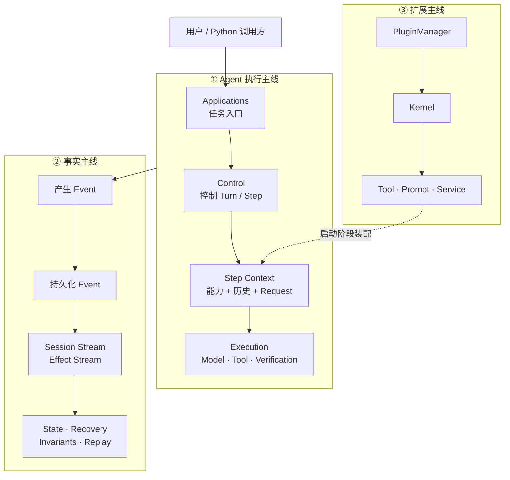
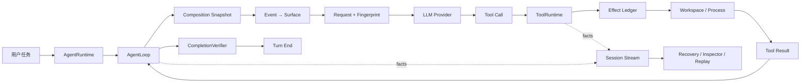

# TraceHarness Py v0.4 完整项目学习笔记

> 目标：这份笔记不是 `/docs` 的摘要，也不是源码文件说明书。它试图直接表达整个项目本身：**项目是什么 → 为什么存在 → 系统怎么组成 → 一个请求怎样完整运行 → 目录如何映射 → 核心设计为什么这样做 → 当前边界是什么 → 面试应该怎么讲。**
>
> 适用版本：仓库当前版本 `0.4.0`。
>
> 信息来源优先级：**当前源码 / 测试 / 配置 > `docs/note/project-context.md` 当前项目上下文 > ADR 与专题文档 > `ROADMAP.md` 和历史实施计划。** Roadmap 中规划的能力不会在本文中被写成当前已实现能力。

---

<a id="toc"></a>
# 目录（Table of Contents）

`Table of Contents` 中文就是“目录”。下面使用显式 Markdown/HTML 锚点，便于在不同 Markdown 阅读器里稳定跳转。

- [0. 如何使用这份笔记](#sec-0)
- [1. 项目概览：TraceHarness 到底是什么](#sec-1)
- [2. 项目整体架构与心智模型](#sec-2)
- [3. 一次真实 Coding 请求如何跑完整个系统](#sec-3)
- [4. 项目目录与整体架构的对应关系](#sec-4)
- [5. Session / Turn / Step / Model Attempt 生命周期](#sec-5)
- [6. Event Sourcing、Session Stream 与 EventStore](#sec-6)
- [7. State、Surface、Composition 与 Request Reconstruction](#sec-7)
- [8. LLM 模型调用层](#sec-8)
- [9. ToolRuntime 与内置 Coding Tools](#sec-9)
- [10. Effect Ledger：为什么 Tool Call 之外还要一本副作用账](#sec-10)
- [11. Evidence-Driven Completion：为什么模型说完成还不算完成](#sec-11)
- [12. 崩溃恢复、取消与生命周期收敛](#sec-12)
- [13. Plugin 系统与 Kernel](#sec-13)
- [14. CLI、实时观察、Inspector、Replay 与 Evaluation](#sec-14)
- [15. 不变量、测试与可靠性证据](#sec-15)
- [16. 最重要的设计决策与 Trade-off](#sec-16)
- [17. 当前已实现、已有协议与未来计划](#sec-17)
- [18. 面试时应该怎样讲这个项目](#sec-18)
- [19. 最后：重新理解整个项目与源码阅读顺序](#sec-19)
- [附录 A：术语表](#appendix-a)
- [附录 B：重要类与文件速查表](#appendix-b)
- [附录 C：ADR 架构决策索引](#appendix-c)

---

<a id="sec-0"></a>
# 0. 如何使用这份笔记

## 0.1 先建立两个贯穿全篇的脑图

整个项目可以沿两条主线理解。

**第一条：执行链。**

```text
用户任务
  ↓
AgentRuntime
  ↓
AgentLoop
  ↓
Step 冻结 Composition
  ↓
构造 Model Request
  ↓
调用 LLM Provider
  ↓
模型产生 Tool Call
  ↓
ToolRuntime
  ↓
现实世界发生操作
  ↓
Verifier
  ↓
继续 / 完成
```

**第二条：事实链。**

```text
现实中发生事情
  ↓
Event
  ↓
Session Stream / Effect Stream
  ↓
Projection
  ↓
State / Surface
  ↓
Request Reconstruction
  ↓
Inspector / Replay / Recovery
```

只要每个局部概念都能重新放回这两条链里，项目就不会学散。

## 0.2 本文的可信度标记

- **【文档明确说明】**：ADR、当前项目上下文或专题文档直接说明了原因。
- **【源码验证】**：当前源码的类、调用关系或行为能够直接验证。
- **【根据项目结构推测】**：文档没有写死，但从结构可以合理解释；这种内容不会被写成确定事实。
- **【未来计划】**：存在于 Roadmap、演进文档或未来协议中，当前 v0.4 没有真正落地。

## 0.3 三种状态标签

- 🟢 **当前已实现**：当前 v0.4 主流程真实使用。
- 🟡 **协议/骨架存在**：代码中已有 Protocol、DTO 或基础类，但没有成为完整产品能力。
- 🔵 **未来计划**：Roadmap 或历史计划中的演进方向。

## 本章你应该记住什么？

1. 学这个项目不要从文件开始，要从“执行链 + 事实链”开始。
2. 当前源码是事实优先级最高的来源。
3. Roadmap 里的多 Agent、Workflow、热更新不能当成当前能力。

[返回目录](#toc)

---

<a id="sec-1"></a>
# 1. 项目概览：TraceHarness 到底是什么

## 1.1 这个项目是干什么的？

先讲人话：

> **TraceHarness Py 是一个让代码智能体能够“可靠地做事”的 Python 运行框架。**

它不是主要研究“怎样让大模型更聪明”，而是研究：当模型真的开始读文件、改代码、跑命令之后，系统怎样保证这些动作**可追踪、可重建、可验证、可恢复**。

几个词第一次出现先解释：

- `Agent`：中文可理解为“智能体”。它不只是回答问题，而是会根据目标决定下一步、调用工具、观察结果并继续行动。
- `Coding Agent`：代码智能体。它的工作对象是代码仓库，可以读文件、搜代码、修改文件、执行测试等。
- `Runtime`：运行时。在本项目中就是负责真正把 Agent 任务跑起来的执行系统。
- `Harness`：本义是“挽具 / 约束框架”，在软件里可以理解成“执行外壳”。TraceHarness 用它来强调：模型只是其中一个组件，外面还有事件、工具、恢复、验证和生命周期规则。
- `Trace`：执行轨迹。本项目里最重要的 Trace 不是一串日志文本，而是可持久化、可重建语义的 Event 历史。

### 项目背景

一个最简单的 Agent Demo 可以是：

```text
用户任务 → 调模型 → 模型要求调工具 → 执行工具 → 把结果给模型 → 最终回答
```

真正变成可运行系统以后，会出现 Demo 没解决的问题：

1. 模型到底看到了哪些历史和 Tool？
2. 程序崩溃之前已经执行到哪一步？
3. 文件是不是已经改了，但 `tool/result` 还没来得及保存？
4. 如果恢复后重试，会不会把一个写操作执行两遍？
5. 模型自己说“测试通过”是否可信？
6. 新增 Plugin 后，怎样不把 `AgentLoop` 写成充满功能分支的大函数？

TraceHarness 就是围绕这些工程问题建立的。

### 谁会使用它？

当前形态主要面向三类人：

- 想运行 Coding Agent 的 CLI 用户；
- 想把 Agent Runtime 嵌入 Python 程序的开发者；
- 想研究 Agent 可靠性、恢复语义、插件架构的框架开发者。

它目前是 **educational alpha（教育/学习性质的早期 Alpha）**，可运行、可测试，但公共 API 还没有承诺生产级稳定。

## 1.2 一个最简单的例子

假设仓库中有：

```python
# calculator.py
def add(a, b):
    return a - b
```

用户输入：

> “修复 `calculator.py` 的加法 Bug，并确保测试通过。”

TraceHarness 中的 Agent 可以依次：

```text
列出文件
  ↓
读取 calculator.py
  ↓
读取测试
  ↓
修改 calculator.py
  ↓
运行 pytest
  ↓
根据真实测试结果判断是否还需要继续
  ↓
返回最终回答
```

项目最终不仅得到一句“已经修复”，还会留下：

- 工作区真实文件变化；
- 模型每一步的请求与回答；
- Tool 调用与 Tool 结果；
- 对现实世界副作用的记录；
- 外部验证结果；
- 可供恢复、检查、重放的 Session 历史。

这就是理解项目最直接的直觉。

## 1.3 项目的核心能力

### 能力 1：Coding Agent 主循环

🟢 当前支持一个 Agent 在一个 Session 中连续进行多个 Step，通过模型和 Tool 循环完成代码任务。

内置 Tool：

- `list_files`：列出工作区文件；
- `read_file`：读取文件；
- `search_text`：搜索文本；
- `apply_patch`：对文件做精确文本替换；
- `shell`：启动普通子进程运行命令。

### 能力 2：事件化事实记录

🟢 采用 `Event Sourcing`。

`Event Sourcing` 中文叫“事件溯源”，核心思想是：

> **先保存“发生了什么”，当前状态再从历史事件计算出来。**

这比只保存一个当前 `state` 更适合解释崩溃前的执行历史。

### 能力 3：请求可重建

🟢 每个 Step 会记录能力组合和模型请求快照，可以事后回答：

> “模型当时到底收到了什么？”

### 能力 4：副作用账本与崩溃恢复

🟢 Tool Call 与真实副作用分开记录，从而处理“现实已经改变、结果还没写入就崩溃”的危险窗口。

### 能力 5：证据驱动完成

🟢 可配置 `CompletionVerifier`（完成验证器），独立运行测试或检查命令；模型声称成功不等于系统验证成功。

### 能力 6：插件扩展

🟢 v0.4 已实现真实 Plugin 系统：

- Python Entry Point 元数据发现；
- 显式启用；
- Manifest 和依赖检查；
- staged setup；
- 冲突检查；
- health check；
- 原子发布；
- 失败/取消回滚；
- 逆序卸载；
- Plugin Tool、Prompt Section、Service 进入已有主线。

### 能力 7：观察与检查

🟢 包括：

- CLI Timeline；
- Activity Heartbeat；
- Inspector；
- Replay；
- Benchmark；
- Core Invariant 检查。

## 1.4 当前能力边界

当前 v0.4 **没有**：

- RAG（Retrieval-Augmented Generation，检索增强生成）；
- 向量数据库；
- Redis 缓存；
- Kafka / RabbitMQ 之类持久化消息队列；
- 完整多 Agent Runtime；
- Workflow Engine；
- Plugin 热更新；
- isolated 跨进程插件；
- Docker/远程沙箱；
- 真正操作系统级 Shell Sandbox；
- 分布式 EventStore；
- Token 级完整流式模型输出；
- Provider Retry / Fallback 主线。

这里非常重要：**项目设计文档里出现过，不代表当前代码已经实现。**

## 本章你应该记住什么？

1. TraceHarness 不是 Chatbot，而是 Coding Agent Runtime。
2. 它真正解决的是 Agent 执行可靠性，而不是模型训练。
3. 项目的主角是“事实、恢复、验证和扩展边界”，不是某一个模型 Provider。
4. 一个任务最终产出的不只是文字回答，还有工作区变化和完整事件历史。
5. v0.4 已有 Plugin，但还没有多 Agent、Workflow、热更新和真正沙箱。

[返回目录](#toc)

---

<a id="sec-2"></a>
# 2. 项目整体架构与心智模型（已整理）

## 2.1 整体架构图



如果只记一张图，就记这张。

## 2.2 Applications：使用与观察层

`Applications` 中文是“应用层”。在 TraceHarness 中，它不是核心执行逻辑，而是**人或外部程序接触 Runtime 的地方**。

### 它是什么？

用户真正接触到的入口和观察工具。

### 它负责什么？

它负责两类事情：

**第一类：把任务送进系统。**

例如：

- `CLI`：`Command Line Interface`，命令行界面；
- Python API / SDK：让 Python 程序直接调用 Runtime。

**第二类：查看系统已经发生了什么。**

例如：

- `Inspector`：检查 Session 的事件和状态；
- `Replay`：根据历史事件重新查看模型可见内容；
- `Evaluation`：运行 Benchmark；
- Timeline：实时展示当前 Agent 正在做什么。

其中 `Benchmark` 中文可以理解成“基准测试”，即用固定任务和验证标准评估 Agent 是否真正完成任务。

### 为什么单独存在？

因为“怎么展示给用户”和“Agent 如何正确执行”不是同一问题。

如果 CLI 文案直接进入 `AgentLoop`，以后换 UI、写 Web 前端、做测试都会污染核心控制流程。

**【源码验证】** `runtime/` 不依赖 `cli/`；Timeline 通过 EventFeed 向上观察。

## 2.3 Control：Agent 控制层

`Control` 中文是“控制层”。

这一层解决的是整个 Agent Runtime 最基本的问题：

> **现在应该执行什么阶段？什么时候进入下一步？什么时候结束？**

- 核心类包括：

  - `AgentRuntime`：Agent Runtime 的对外门面；
  - `AgentLoop`：一次 Turn 内部的主执行循环；
  - `ContinuationRuntime`：根据当前结果决定继续执行还是结束。

  ### `AgentRuntime` 是什么？

  `AgentRuntime` 可以理解成：

  > **整个 Agent 执行系统对外提供的总入口，将内部agentloop这些都封装成为一个api一样的东西。**

  Applications 不需要自己知道如何创建 Turn、恢复 Session 或管理并发，只需要调用它。

  它主要处理 Runtime 级别的问题，例如：

  ```
  创建 / 加载 Session
          ↓
  检查运行条件
          ↓
  启动一个 Turn
          ↓
  交给 AgentLoop
          ↓
  返回最终运行结果
  ```

### `AgentLoop` 是什么？

`Loop` 中文是“循环”。

`AgentLoop` 可以理解成：

> **一次 Agent 任务内部的流程导演。**

它负责组织：

```
Turn 开始
   ↓
Step 开始
   ↓
准备模型请求
   ↓
调用模型
   ↓
处理 Tool Call
   ↓
决定是否继续
   ↓
Step 结束
   ↓
Turn 结束
```

但这里最重要的是：

> **AgentLoop 只负责控制流程，不负责实现所有能力。**

例如它不会自己实现：

- OpenAI 请求协议；
- 文件读取；
- Shell 命令；
- Prompt 拼接规则；
- JSONL 存储；
- Plugin 发现；
- 崩溃恢复算法。

这些能力分别交给其他模块。

### 为什么 AgentLoop 要薄？

【文档明确说明】只有改变 Session / Turn / Step 语义的能力才应该进入 Loop。

否则应该通过：

- Service；
- Registry；
- Tool；
- Prompt Section；
- Policy；
- Verifier；
- Projection；
- Loop 上层编排。

这样 Plugin、未来多 Agent 等能力不会演变成：

```python
if plugin_x:
    ...
if multi_agent:
    ...
if provider_retry:
    ...
```

[自己的理解]agent loop不应该知道具体的业务细节，它只负责控制流程，什么流程？就是用户请求，大模型调用，是否调用工具，结果返回给大模型，大模型继续决定是否继续下一步。如果agentloop承接太多业务细节会出现，海量的if else，最后agentloop变成了所有功能的汇合点。这样就会导致，任何新增的能力，都可能会破坏原有稳定执行的agent语义，所以必须要将agentloop作薄，来让系统保持稳定运行


## 2.4 Composition：能力组合与模型请求层

`Composition` 中文可以理解成“组合”。

在 TraceHarness 中，它表示：

> **某一个 Step 真正拥有的一整套能力。**

- `Composition` 中文可以理解成“组合”。

  在 TraceHarness 中，它表示：

  > **某一个 Step 真正拥有的一整套能力。**

  例如当前 Step 使用：

  ```
  哪个 LLM Provider
  哪个 Model
  最终 System Prompt
  哪些 Tools
  哪些 Tool Policies
  哪些 Plugins
  模型生成参数
  ```

  这些东西合起来就是这一 Step 的 `Composition`。

### 为什么单独存在？

Agent 的“控制流程”应该稳定，而能力会经常变化。

比如换模型或增加插件 Tool，本质上是在改能力，不应该改 Turn/Step 的控制语义。

因此流程不是直接：

```
AgentLoop
↓
调用模型
```

而是：

```
AgentLoop
↓
CompositionRuntime
↓
冻结当前 Step 的能力
↓
SurfaceProjector
↓
RequestBuilder
↓
Model Request
↓
LlmRuntime
```

### 核心组件

#### `CompositionRuntime`

`Composition` 是“组合”，`Runtime` 是“运行时”。

它负责获得当前 Step 实际应该使用的能力组合。

------

#### `PromptAssembler`

`Prompt` 中文是“提示词”。

`Assembler` 来自 `assemble`，意思是“组装”。

因此 `PromptAssembler` 可以理解成：

> **提示词组装器。**

不同模块或 Plugin 可以贡献 Prompt Section（提示词区段），最终由它们组合成模型真正看到的 System Prompt。

------

#### `LlmRegistry`

`Registry` 中文可以理解成“注册表”。

`LlmRegistry` 用来管理当前 Runtime 可使用的模型 Provider。

这里的 `Provider` 可以理解成“模型提供器 / 模型适配器”，负责把 TraceHarness 的统一模型请求转换成实际模型服务调用。

------

#### Tool 能力

当前 Runtime 可使用哪些 Tool，也是 Composition 的组成部分。

这里需要特别区分：

> **Composition 决定“有哪些 Tool”。**

而：

> **ToolRuntime 决定“一个 Tool Call 应该怎样安全执行”。**

这两个不是一回事。

------

##### **为什么每个 Step 都要冻结 Composition？**

**[我的理解]**模型看到的工具是read_file v1 、apply_patch v1，但是但模型真正返回 Tool Call 后，系统执行时突然变成：apply_patch v2，在它眼里都是一个schema（工具名词+工具描述+工具参数）。模型是按 v1 的规则做决定，但真正执行的是 v2。（点菜时候30元，结账时候变成40元了）。

**[疑问]**可能会发生我执行好好的程序突然变成v2版本吗？我不是程序都写在一起的吗？真实生产环境中都是分布式结构

往往不是一个程序从头做到尾，而是很多独立程序/服务配合完成。比如你这个场景，可以想象成：

```
用户
  ↓
Agent 主程序
  ↓
模型服务
  ↓
模型决定：调用 apply_patch
  ↓
工具执行服务
  ↓
真正修改文件
```

这几个东西**可能根本不运行在同一台机器、同一个进程里**。

例如：

```
机器 A：Agent 主程序
机器 B：大模型服务
机器 C：工具服务 apply_patch
机器 D：文件存储
```

它们通过网络互相发消息。这就是很通俗意义上的“分布式”。

常识：

**部署**就是把某个服务的新版本上线，比如：

```
apply_patch v1 → apply_patch v2
```

而且通常可以只升级这个工具服务，不需要把整个 Agent 系统停掉。所以即使一个请求还在运行，后台也可能正在发布某个服务的新版本。

至于 **RPC**，对，你可以把它理解成：

> **不同服务之间互相“调用函数”的一种通信方式。**

例如 Agent 想让工具服务执行：

```
apply_patch(file, patch)
```

看起来像本地函数调用，但实际上可能是：

```
Agent 服务
   │
   │ RPC 请求
   ↓
Tool 服务
   │
   │ 执行 apply_patch
   ↓
返回结果
```

RPC = **Remote Procedure Call，远程过程调用**。

“远程”就是这个函数实际上不在自己这个程序里，而在另一个服务里。

不过服务之间通信不只有 RPC，还可以用：

```
HTTP API
gRPC
RPC
消息队列
事件系统
WebSocket
```

其中 **gRPC 本身就是一种常见的 RPC 技术**。

**[我的理解]**composition理解为能力组合层，因为agentloop已经确定是为了系统运行稳定，所以尽量不去识别具体业务，但是实际上，系统的能力是经常变化的，因而我们在真正调用模型前需要固定我们究竟有什么能力。所以不是进入loop后直接调用模型，而是会进入能力组合runtime去冻结当前step的能力。

## 2.5 State：事实、状态与恢复层

`State` 中文是“状态”。但项目特别强调：**State 不是事实源。**真正的事实是已经持久化的 `Event`。`Event` 中文是“事件”，表示：**一个已经发生的事实。**例如：每次会被系统中的各种状态记录下来，通过turn/start、step/start、user/message、assistant/message、tool/call、tool/result、verification/result、step/end、turn/end这些事件才是系统真正保存的历史。

------

### 为什么不能直接保存一个 State？

最简单的系统可能维护：

```
state.status = "running"
state.messages = [...]
state.step = 5
```

运行时当然可以这么做。

问题是：

```
程序崩溃
↓
进程内存消失
↓
这些对象全部不存在
```

系统就无法知道：

> 崩溃之前到底发生到了哪一步？

TraceHarness 的思路是反过来的：

```
发生事情
↓
记录 Event
↓
根据 Event 推导 State
```

因此：

> **Event 是事实，State 是对事实的解释。**

**[疑惑]**崩溃恢复明明可以使用RunContext + 数据库 + checkpoint解决的，为啥一定要选择通过event来恢复崩溃？

**Checkpoint 主要解决“现在运行到哪了”，Event 主要解决“系统是怎么一步步走到这里的”。**
 只用 `RunContext + 数据库 + checkpoint` 完全可以实现崩溃恢复，而且更简单。
 TraceHarness 选择记录 Event，是因为它还希望保留模型调用、Tool 执行、副作用等完整过程，方便审计、排错、重放和判断崩溃时哪些事情已经发生。
 Event 也不是万能的，它不能消除外部系统调用中的不确定性，只是能把“已知什么、未知什么”记录清楚。
 实际上两者不冲突：**Event 负责保存事实，Checkpoint 可以负责加速恢复。**

如果 Event 很多，系统恢复时不用每次都从第 1 条 Event 重新算一遍，而是先从最近一次 Checkpoint 恢复状态，再只重放后面的 Event。

**[我的理解]**什么是checkpoint？Checkpoint 就是一种思想：把某个时刻的当前状态做成快照，并持久化保存。

Checkpoint 不是“SQL 操作”本身，而是“把当前状态做一个持久化快照”。SQL 只是最常见的一种保存方式。比如你当前有：

```
RunContext(
    status="running",
    step=5,
    messages=[...]
)
```

做 checkpoint，本质上就是把这份状态保存下来：

```
当前 State
   ↓
序列化
   ↓
保存到持久化存储
```

这个持久化存储可以是：

```
SQLite / PostgreSQL
JSON 文件
Redis
对象存储
其他数据库
```

------

### 这一层有哪些重要组件？

#### `SessionService`

`Session` 中文是“会话”。

`Service` 中文是“服务”。

`SessionService` 可以理解成：

> **向 Session 历史写入具有明确业务语义事件的统一入口。**

上层不需要到处自己拼 Event。

------

#### `EventStore`

`Store` 是“存储”。

`EventStore` 是：

> **事件持久化的统一抽象。**

当前默认实现最终使用 JSONL 文件保存事件。

`JSONL` 是 `JSON Lines`，表示：

> 每一行保存一个 JSON 对象。

------

#### `Session Stream`

`Stream` 中文是“流”。

`Session Stream` 保存：

> **Agent 的执行和模型语义事实。**

例如：

- Turn；

- Step；

- 用户消息；

- Assistant 消息；

- Tool Call；

- Tool Result；

- Verification。

  ------

#### `Effect Stream`

`Effect` 中文可以理解成“副作用”。

这里指：

> **真正影响外部世界的操作。**

例如：

- 修改文件；
- 启动进程；
- 未来调用外部写接口。

`Effect Stream` 专门记录这些操作的现实执行状态。

------

#### `StateProjector`

`Projector` 中文可以理解成“投影器”。

它负责：

```
Event History
↓
StateProjector
↓
当前 Session State
```

也就是说，State 是从历史计算出来的。

------

#### `SurfaceProjector`

`Surface` 可以理解成“模型可见表面”。

它负责：

```
完整 Session Event
↓
挑选模型应该看到的内容
↓
Model Messages
```

因为：

> Runtime 知道的全部事实，不等于模型应该看到的全部事实。

------

#### `RecoveryService`

`Recovery` 中文是“恢复”。

它负责：

> **进程崩溃以后，根据 Session Stream 和 Effect Stream 判断之前真正发生过什么，然后补充新的恢复事件。**

注意：

恢复不是修改历史。

而是：

```
旧事件保留
+
追加 recovery 事件
```

### 为什么这一层必须独立？

因为执行控制loop回答的是：

> **接下来做什么？**

而事实层回答的是：

> **之前实际上发生了什么？**

这两个问题不能混成一个。

尤其在正常运行的时候，它们看起来差别不大；

但一旦发生崩溃、恢复、Replay 或 Inspector 查询，这个边界就变得非常重要。


## 2.6 Tool 与现实世界执行层

### 整体流程图

```
Tool Call
   ↓
“模型要求调用什么”

Admission
   ↓
“系统允许它执行”

Effect Intent
   ↓
“我准备执行这个副作用了”

Effect Dispatched
   ↓
“这个操作已经真正发出去了”

──────── 外部世界边界 ────────

GitHub / 文件系统 / Shell / 数据库
可能已经发生变化

──────── 外部世界边界 ────────

   ↓
Effect Outcome
   ↓
“我已经明确观察到了执行结果”

   ↓
Tool Result
   ↓
“把什么结果交回给模型”
```

这里最值得你理解的是 **Dispatched**。

它相当于一条分界线：

```
dispatched 之前
──────────────
我们通常还能认为：
副作用没有真正发出去


dispatched 之后
──────────────
外部世界可能已经改变
不能再随便判断“没结果 = 没执行”
```


Tool 层是整个系统连接“模型世界”和“现实世界”的边界。

模型实际上只能产生一个结构化请求：

```
我希望调用 apply_patch
参数是……
```

这只是：

```
Tool Call
```

即“工具调用请求”。

它并不代表文件真的已经修改。

Tool 层负责把：

```text
模型：我想做 X
```

变成：

```text
系统：检查 X 是否允许 → 记录副作用 → 真正执行 X → 保存结果
```

所以 `ToolRuntime` 不是一个函数分发器，而是一个执行边界。

### ToolRuntime 做什么？

`ToolRuntime` 可以理解成：

> **工具执行总管。**

完整流程大致是：

```
Tool Call
   ↓
找到对应 Tool
   ↓
Schema Validation
   ↓
Policy 判断
   ↓
记录 Tool Admission
   ↓
记录 Effect Intent
   ↓
记录 Effect Dispatched
   ↓
真正执行 Tool
   ↓
记录 Effect Outcome
   ↓
生成 Tool Result
```

### 为什么它不能只是一个函数分发器？

最简单的toolRuntime实现当然可以是：

```
tool = tools[name]
result = tool(**args)
```

但 Coding Agent 的 Tool 会影响真实环境。

例如：

```
apply_patch
```

真的会改文件。

```
shell
```

真的会启动进程。

一旦程序恰好在这里崩溃：

```
文件已经修改
↓
程序崩溃
↓
Tool Result 尚未保存
```

系统重新启动后不能简单判断：

> “没有 Tool Result，所以工具没有运行。”

因此 ToolRuntime 不只是负责“调用”，还必须建立一条：

> **从模型意图到现实副作用的可追踪执行边界。即ToolRuntime 要留下足够的信息，让程序崩溃以后，我们至少知道这个 Tool 当时走到哪一步了。**
>
> ToolRuntime 不只是负责“调用 Tool”，它还负责记录 Tool 从“模型想调用”到“真正影响现实世界”再到“拿到结果”的关键阶段。这样即使中途崩溃，也不会把“结果没记录下来”错误地理解成“工具一定没执行”。

**[我的理解]Coding Agent 里很多 Tool 会修改文件、启动进程或者调用外部 API。程序可能恰好在副作用已经发生、但 ToolResult 还没持久化的时候崩溃。所以我需要记录执行边界，区分‘还没发出去’、‘已经发出但结果未知’和‘已经确认结果’，而不能简单用有没有 ToolResult 判断工具有没有执行成功。”**

### Tool Call 与 Effect 的区别

这是本项目一定要真正理解的地方。

```
Tool Call
=
模型想做什么
```

而：

```
Effect
=
现实世界实际上发生了什么
```

两者不是一回事。

例如：

```
tool/call
    ↓
effect/intent
    ↓
effect/dispatched
    ↓
文件真的被修改
    ↓
effect/outcome
    ↓
tool/result
```

也正是因为分开记录，Recovery 才能在崩溃以后判断：

> 是可以安全恢复已有结果，还是只能标记为 `unknown_after_crash`。

### 你这个 Effect Ledger 是不是过度设计

如果 Tool 是只读操作，我认为完整 Effect Ledger 确实可能太重，普通 Tool Result 就够了。它主要针对有外部副作用的操作，比如发邮件、写数据库、创建 GitHub Issue。因为这类操作可能出现外部系统已经成功，但本地还没来得及记录结果就崩溃的情况。这时候不能简单标记 failed，否则自动重试可能产生重复副作用（直接多给钱了）。所以 Ledger 的价值不是保证 exactly-once，而是记录操作已经走到哪个边界，并在无法确认结果时保留 unknown 状态。”

### 那你为什么不保证 exactly-once

因为 TraceHarness 的本地 Event Store 和 GitHub、邮件服务之类的外部系统不是同一个事务，程序可能死在外部成功和本地落盘之间。除非外部系统支持幂等键、事务协议或者提供状态查询，否则仅靠本地 Runtime 做不到真正的 exactly-once。”

**[我的理解]**幂等 = 同一个操作执行多次，最终效果跟执行一次一样。exactly-once=同一个操作，不管系统怎么重试、崩溃、恢复，对外部世界最终只生效一次。

## 2.7 Plugin 与 Kernel 组装层

这一部分不是 Agent 正常执行链中的“下一层”。

更准确地说，它位于：

> **Runtime 启动和能力组装阶段。**

------

### `Plugin` 是什么？

`Plugin` 中文是“插件”。

它指：

> **不修改 TraceHarness 核心源码，就能够向系统增加能力的可安装扩展。**

当前 Plugin 可以贡献例如：

- Tool；
- Prompt Section；
- Service；
- Middleware 等扩展能力。

最终这些能力不是走一套“插件专用 Runtime”。

而是进入已有 Registry，之后继续沿着正常主线执行。

例如：

```
Plugin
↓
注册 Tool
↓
正常 Tool Registry
↓
Composition
↓
模型看到这个 Tool
↓
ToolRuntime 正常执行
```

### `Kernel` 是什么？

`Kernel` 中文是“内核”。

这里不是操作系统 Kernel。

它指：

> **负责保护 Runtime 正确性的最基础生命周期和注册机制。**


例如：

- `Activation`：一次插件激活及其资源所有权；
- `Lifespan`：资源从创建到释放的生命周期；
- Service 注册与撤销；
- `Scope`：服务或资源的作用域；
- `OwnedTaskSet`：由某个组件拥有并负责收敛的后台任务集合。


`Kernel` 中文是“内核”，这里指不可被插件随意替换的正确性基础，例如：

- Activation 所有权；这次插件启动“名下有什么东西”
- Lifespan 清理；具体负责“按正确顺序收拾东西
- Service 注册与撤销；
- Scope 解析；就是在规定：这个东西到底能活多大范围、能被谁使用。
- Owned Task 生命周期。

**[我的理解]**假设现在启动一个 MCP 插件

```
MCP Plugin 启动

├── 创建 MCP Client
├── 建立连接
├── 注册 MCP Service
├── 注册 10 个 Tool
├── 增加一段 Prompt
├── 启动一个后台监听 Task
└── 启动一个心跳 Task
```

看起来都没问题。但是现在来了一个很现实的问题：**MCP Plugin 被关闭的时候，这些东西怎么办？**

不能只plugin = None，因为：

```
Plugin 没了

但是：

MCP Client          可能还连着
10 个 Tool          可能还注册着
Prompt              可能还存在
后台监听 Task       可能还在跑
心跳 Task           可能还在跑
Service             可能还可以被别人拿到
```

这就叫**资源泄漏。**也就是组件死了，但它留下来的东西还活着。于是 Kernel 这套东西就出现了。

### 把五个东西放在同一个 MCP 例子里

现在整个故事就完整了。

MCP 插件启动：

```
PluginManager
     ↓
创建 Activation
     │
     ▼
MCP Plugin setup()
     │
     ├── 创建 MCPClient
     │
     ├── 注册 mcp.client Service
     │
     ├── 注册 Tool A
     │
     ├── 注册 Tool B
     │
     └── 启动 heartbeat
```

Kernel 在背后做的是：

```
                    Activation
                    “这些都归你”
                         │
          ┌──────────────┼──────────────┐
          ▼              ▼              ▼
      Lifespan         Scope       OwnedTaskSet
     怎么清理         活多久        后台任务谁管
          │                              │
          ▼                              ▼
 Service Registration              heartbeat
 Tool Registration                 reconnect
 Prompt Registration
```

最后 Plugin 关闭：

```
MCP Plugin dispose
        ↓


OwnedTaskSet
取消 heartbeat / reconnect
等待它们真正停止
        ↓


Lifespan
撤销 Tool 注册
撤销 Service 注册
关闭 Client
        ↓


Activation 结束
```

这就是 Kernel 所谓的：

> **保护 Runtime 生命周期正确性。**

### 为什么把这些叫 Kernel？

因为这些东西其实都不关心 MCP 到底干嘛。

把 MCP 换成 GitHub：

```
GitHubPlugin
```

它还是需要：

```
谁拥有 Client？
后台 Task 谁负责关？
Service 什么时候撤销？
Tool 什么时候撤销？
```

换 Skill：

```
SkillPlugin
```

一样需要：

```
注册的 Prompt 谁负责删？
注册的 Tool 谁负责撤销？
```

换 Browser：

```
BrowserPlugin
```

又一样：

```
Browser process 谁负责关闭？
后台 Task 谁负责停止？
```

所以 Kernel 管的不是：

```
“怎么访问 GitHub”
```

而是：

```
“任何组件创建资源以后，都必须遵守什么生命规则。”
```

这就是为什么它属于很底层的核心。

### 如果面试官问你“Kernel 是干什么的

“我项目里的 Kernel 不是操作系统内核，它主要是在管 Runtime 里面资源的生命周期。比如一个插件启动以后可能**注册 Tool、注册 Service、建立连接、启动后台 Task，这些资源不能创建完就没人管。**所以我用 **Activation 记录这些资源归哪个组件拥有，用 Lifespan 管退出时的清理，用 OwnedTaskSet 管后台任务**，**用 Scope 约束资源能活多久**。最终目标就是组件退出或者启动失败以后，不留下半注册的 Tool、后台任务或者连接。”


### 为什么 Kernel 不是 Plugin？

【文档明确说明 / ADR-003】

Tool、Prompt、Provider 这些属于：

> **系统底层“有什么能力”。**

它们可以扩展甚至替换。

但是：

```
注册是否能够回滚
资源最终是否释放
后台任务是否正确结束
插件失败时是否留下半套能力
生命周期顺序是否正确
```

这些属于：

> **系统“怎样保证自己始终处于合法状态”。**

如果连这些规则也交给 Plugin 自己决定，就会出现一个逻辑问题：

> 一个可能失败的 Plugin，反而负责定义“Plugin 失败以后系统应该怎样恢复”。

因此 Kernel 属于可信基础，而不是普通扩展能力。

### PluginManager 为什么不进入 AgentLoop？

这是插件系统最重要的边界。

`PluginManager` 的工作发生在 Runtime Assembly 阶段。

`Runtime Assembly` 中文可以理解成“运行时装配”，即：

> **真正开始执行 Agent 之前，把这一套 Runtime 需要的能力组装完成。**

流程大致是：

```
发现 Plugin
↓
检查 Manifest 和依赖
↓
在暂存区域 setup
↓
检查冲突
↓
健康检查
↓
原子发布到正式 Registry
↓
Runtime 开始运行
```

之后 AgentLoop 看到的只是：

```
正常 Tool
正常 Prompt
正常 Service
```

它甚至不需要知道：

> “这个 Tool 是核心内置的，还是某个 Plugin 提供的？”

因此项目没有必要存在：

```
PluginAgentLoop
PluginToolRuntime
```

这种平行执行体系。

这样做带来的好处是：

> **扩展能力增加了，但核心执行协议没有增加新的分支。**

## 2.8 最重要的依赖方向

TraceHarness 实际更接近：

```
                    ┌─────────────────────┐
                    │    Applications     │
                    │ CLI / SDK / Inspect │
                    └──────────┬──────────┘
                               │
                               ▼
                    ┌─────────────────────┐
                    │      Control        │
                    │ Runtime / AgentLoop │
                    └──────────┬──────────┘
                               │
              ┌────────────────┼────────────────┐
              │                │                │
              ▼                ▼                ▼
       Composition           LLM / Tool       Verifier
       能力与请求准备          实际执行          完成证据
              │                │                │
              └────────────────┼────────────────┘
                               │
                               ▼
                    ┌─────────────────────┐
                    │ Session / Event     │
                    │   事实记录系统       │
                    └──────────┬──────────┘
                               │
                               ▼
                  Projection / Recovery /
                  Inspector / Replay
```

Plugin 和 Kernel 则位于侧面：

```
PluginManager + Kernel
          │
          │ Runtime 启动阶段
          ▼
   注册 Tool / Prompt /
   Service / Middleware
          │
          ▼
   已有正常执行主线
```

所以更准确的理解是：

### 主执行链

```
Applications
↓
AgentRuntime
↓
AgentLoop
↓
Composition / Request
↓
LLM
↓
Tool / Verification
↓
继续下一 Step 或结束
```

### 事实链

```
运行过程中发生事情
↓
SessionService
↓
EventStore
↓
Session Stream / Effect Stream
↓
Projection / Recovery / Inspector
```

### 扩展链

```
PluginManager
↓
Kernel 管理生命周期和所有权
↓
把能力注册进正常 Runtime
↓
AgentLoop 无感执行
```

这三条链放在一起，才是 TraceHarness 真正的整体结构。

## 本章你应该记住什么？

1. **Applications 是系统的入口和观察窗口，不参与 Agent 核心执行语义。**
2. **AgentRuntime / AgentLoop 只负责流程控制。**
   它们决定什么时候开始 Turn、进入 Step、调用能力以及什么时候结束，但不会自己实现全部能力。
3. **Composition 回答的是“这一 Step 拥有什么能力”。**
   每个 Step 冻结一次 Composition，保证模型看到的能力和真正执行的能力一致。
4. **Event 才是事实，State 和 Surface 都是 Event 的派生结果。**
   这也是系统能够 Replay、Inspect 和 Recover 的基础。
5. **ToolRuntime 是模型世界与现实世界之间的执行边界。**
   Tool Call 表示模型想做什么，Effect 表示现实世界实际发生了什么。
6. **Plugin 不创造另一条执行主线。**
   PluginManager 在 Runtime 启动阶段把扩展能力注册进已有系统，AgentLoop 继续按照普通 Tool / Prompt / Service 语义运行。
7. **Kernel 负责的不是“业务能力”，而是“正确性基础”。**
   生命周期、资源所有权、回滚和清理这些规则不能交给普通 Plugin 自己定义。

### TraceHarness 的核心思路，是让 AgentLoop 只负责稳定的执行流程，把会变化的模型和工具能力放进 Composition，把已经发生的事实交给 Event 系统，把现实世界副作用交给 ToolRuntime，并让 Plugin 只在启动阶段扩展这些既有能力。

[返回目录](#toc)

---

<a id="sec-3"></a>
# 3. 一次真实 Coding 请求如何跑完整个系统（已整理）

固定案例：

> **“修复 `calculator.py` 中的加法 Bug，并确保测试通过。”**

这一章按时间顺序讲，不按文件讲。

## 3.1 步骤 0：Runtime 启动并组装

### 发生了什么？

系统创建：

```text
这些模块并不是同一层级的“并列业务模块”，
而是 Runtime 启动时逐步组装出来的一套执行系统：
- EventStore / SessionService：先把“事实记录系统”搭好；
- LlmRegistry / ToolRegistry / PromptAssembler：把“模型和工具能力”准备好；
- ToolRuntime / RequestBuilder / CompositionRuntime：把“执行能力”拼起来；
- AgentLoop：负责具体的 Turn / Step 执行流程；
- AgentRuntime：作为最外层入口，对外暴露整个 Runtime。
```

如果启用 Plugin，会在 Registry 已建立、Composition 尚未被冻结之前执行 Plugin 激活事务。

### 谁负责？

`runtime/agent_runtime.py` 中的：

- `_prepare_default_runtime()`；这个函数先把后面运行需要的基础组件创建好，例如 `EventStore`、`SessionService`、`LlmRegistry`、`ToolRegistry`、默认 Tool、Prompt、Policy、Verifier 等。
- `_finish_default_runtime()`；拿前一步准备好的组件，再创建 `ToolRuntime`、`RequestBuilder`、`CompositionRuntime`、`AgentLoop`，最后封装成真正对外使用的 `AgentRuntime`
- `build_default_runtime()`；`build` 是“构建”的意思。它本身没有复杂的新逻辑，核心就是：

```
_prepare_default_runtime()
        ↓
_finish_default_runtime()
        ↓
    AgentRuntime
```

所以可以理解成：**不启用外部 Plugin 时，直接把默认 Runtime 一次性构建出来。**

- `build_default_runtime_async()`。支持 Plugin 的异步启动入口。
   `async` 是 `asynchronous`，中文是“异步”。它同样先执行 `_prepare_default_runtime()`；如果没有启用 Plugin，就直接 `_finish_default_runtime()`。如果启用了 Plugin，则会在中间创建 `PluginManager`，先完成 Plugin 的发现/激活，把 Plugin 提供的能力加入 Registry，然后再执行 `_finish_default_runtime()`。
   所以它的本质是：**先准备基础 Runtime → 有 Plugin 就先完成插件激活 → 再组装最终 Runtime。**

                _prepare_default_runtime()
                         │
                         │ 准备基础零件
                         ▼
          Event / Model / Tool / Prompt 等
                         │
             ┌───────────┴───────────┐
             │                       │
        不启用 Plugin             启用 Plugin
             │                       │
             │                 PluginManager
             │                       │
             │                 激活扩展能力
             │                       │
             └───────────┬───────────┘
                         ▼
                _finish_default_runtime()
                         │
                         │ 连接全部组件
                         ▼
                    AgentLoop
                         │
                         ▼
                    AgentRuntime

### 为什么需要这一步？

必须先明确运行时有哪些能力，然后某个 Step 才能冻结一份一致的 Composition。

---

## 3.2 步骤 1：创建或加载 Session

Runtime 已经组装完成以后，真正收到用户任务时，第一件事并不是马上进入 `AgentLoop` 调模型

`AgentRuntime` 要先确定：

> **“这次任务属于哪个 Session？这个 Session 现在还能不能安全继续运行？”**

```python
先看本质伪代码：

async def handle_task(task, session_id=None, resume=False):

    # 1. Runtime 自己必须还能工作
    ensure_runtime_not_disposed()

    # 2. 没有 session_id → 创建新 Session
    if session_id is None:
        session = create_session(
            workspace=current_workspace,
            plugins=current_plugins,
        )

    # 3. 有 session_id → 继续已有 Session
    else:
        session = load_session(session_id)

        check_plugin_identity(session, current_plugins)

        # 上次异常中断，先恢复历史
        if resume:
            recover_session(session)

    # 4. 一个 Session 不能同时跑两个 Turn
    ensure_no_active_turn(session)

    # 5. Session 级问题处理完以后，
    #    才真正交给 AgentLoop 执行这次任务
    return await agent_loop.run_turn(
        session=session,
        user_message=task,
    )
```

**[我的理解]**可以把 `AgentRuntime` 想成：**AgentLoop 前面的“运行管理员”**用户说：“帮我修 calculator.py。”系统不能直接用户任务->agentloop->模型。而是必须先处理一些 **Session 级问题**：

```
这是不是一个新任务历史？
↓ 
还是继续之前那个 Session？ 
↓ 
上一次是不是崩溃过？ 
↓
当前 Plugin 和以前一样吗？ 
↓ 
这个 Session 有没有另一个 Turn 正在跑？
↓
这些都没问题 
↓ 
才交给 AgentLoop
```


### 第一步：确定是创建新 Session，还是继续旧 Session

如果用户第一次运行任务：

```
没有 session_id
↓
创建新的 Session
```

Session 会绑定当前 Workspace，并记录这次运行的重要元数据，例如当前启用的 Plugin 身份。

`session_id`：

- `session`：会话；
- `id`：`identifier`，标识符；
- `session_id`：这份长期 Session 历史的唯一标识。

你可以理解成：

> **以后所有 Turn、Step、模型消息和 Tool 事件，都要知道自己属于哪一本“任务历史账本”。**

如果用户执行的是：

```
traceh resume <session_id>
```

或者继续某个已有 Session：

```
有 session_id
↓
读取旧 Session
```

这时 Runtime 不能直接往下跑，还要先检查旧历史和当前运行环境是否兼容。

### 第二步：检查当前 Runtime 还能不能运行这个 Session

例如会检查：

```
Runtime 是否已经 dispose？
当前 Session 是否已有活跃 Turn？
当前 Plugin 集合是否和 Session 创建时一致？
```

这里 `dispose` 可以理解成：

> **Runtime 已经进入关闭 / 资源释放状态。**

如果 Runtime 已经关闭，就不能又启动新的 Agent 工作。

### 第三步：如果是 Resume，先 Recovery

`resume` 中文就是“恢复后继续”。

它不是简单：

```
读取旧 session
↓
继续 AgentLoop
```

而是：

```
读取旧 Session
↓
RecoveryService 检查上次有没有未闭合的
Turn / Step / Model Attempt / Tool Call
↓
根据已有 Event 和 Effect 进行恢复
↓
把旧历史收敛到一个可解释状态
↓
再开始新的执行
```

为什么？

假设上一次运行停在：

```
apply_patch 已经修改文件
↓
进程崩溃
↓
tool/result 没来得及写
```

如果不先 Recovery，就直接重新进入 AgentLoop，Runtime 根本不知道这次 Tool 到底应该算成功、未知，还是需要处理。

所以：

> **Resume 的本质不是“从某行代码继续执行”，而是先把旧的 Event 历史恢复到一个合法边界，再启动新的执行。**

### 第四步：保证同一个 Session 同时只有一个活跃 Turn

当前项目规定：

> **同一个 Session 同一时间最多只能有一个 Turn 在运行。**

也就是不能：

```
            ┌→ Turn A → 修改 calculator.py
Session S ──┤
            └→ Turn B → 同时修改 calculator.py
```

否则会马上产生问题：

```
Turn A 读取旧文件
↓
Turn B 修改文件
↓
Turn A 继续根据旧内容写入
```

不仅 Workspace 会冲突，Event 顺序和模型上下文也会变得很难定义。

所以 `AgentRuntime` 会负责这类 **Session 级并发治理**。

### 为什么这些东西不放进 AgentLoop？

因为 `AgentLoop` 负责的是：

> **“这个 Turn 内部下一步怎么跑？”**

例如：

```
Step 开始
↓
调用模型
↓
有没有 Tool Call？
↓
执行 Tool
↓
要不要下一 Step？
```

而 `AgentRuntime` 负责的是：

> **“这个 Turn 能不能开始？”**

两者其实是两个层级的问题：

```
AgentRuntime
│
├── Session 存不存在？
├── Runtime 是否已关闭？
├── Session 能否继续？
├── Plugin 是否兼容？
├── 是否已经有活跃 Turn？
├── Resume 是否需要 Recovery？
│
└── 都没问题
        ↓
    AgentLoop
        │
        └── 这个 Turn 内部具体怎么执行？
```

这就是为什么需要 `AgentRuntime` 这个门面。

### 谁真正负责什么？

#### `runtime/agent_runtime.py`

主要负责：

> **Session 级运行治理和 AgentLoop 调度。**

可以记成：

```
检查 Runtime
↓
创建 / 加载 Session
↓
必要时 Recovery
↓
检查并发和 Plugin
↓
调用 AgentLoop
```

#### `session/service.py`

`SessionService` 更偏向：

> **真正把 Session 相关事实写成 Event。**

例如：

```
创建 Session
↓
写 session/created

接受用户消息
↓
写 inbox/accepted

开启 Turn
↓
写 turn/start
```

所以两者不要混：

```
AgentRuntime
=
决定“该不该开始、怎么组织运行”

SessionService
=
把已经发生的 Session 事实规范地记录下来


```

### 这一阶段最终产出了什么？

这一阶段结束以后，我们已经有：

```
一个合法的 Session
+
确定的 Workspace
+
与 Session 匹配的 Plugin 环境
+
没有并发冲突的运行条件
+
如果之前崩溃，历史已经先被恢复
```

这时候系统才真正进入：

```
AgentLoop.run_turn(...)
```

开始下一步：

> **把用户消息正式放进一个 Turn。**

### 这一小节你真正应该记住什么？

不用背函数。

只记一句：

> **AgentRuntime 不是负责“Agent 怎么思考”，而是负责在 AgentLoop 开始之前，把 Session 级的问题处理干净。**

也就是：

```
先回答：
“这次 Turn 能不能安全开始？”

再交给 AgentLoop 回答：
“这个 Turn 接下来具体怎么跑？”
```

这就是 `AgentRuntime` 和 `AgentLoop` 最核心的职责边界。

------


## 3.3 步骤 2：用户消息进入 Turn

上一阶段 `AgentRuntime` 已经确认：

```
Session 合法
+
Runtime 可以继续运行
+
没有并发 Turn 冲突
+
必要的 Recovery 已经完成
```

接下来才真正开始处理这一次用户输入。

这里先不要急着想模型。

这一阶段的本质其实是：

> **先把“系统收到了一条任务”，变成“这条任务正式属于某一个 Turn”。**

### 先看本质伪代码

```python
async def start_turn(session, user_input):

    # 1. 先确认：这条用户输入已经被系统接收
    inbox_item = accept_input(
        session=session,
        message=user_input,
    )
    # → inbox/accepted

    # 2. 创建本次 Turn，并把这条输入交给它处理
    turn = claim_input(
        inbox_item=inbox_item,
    )
    # → inbox/claimed

    # 3. 正式声明：这次 Turn 开始运行
    start_turn(turn)
    # → turn/start

    # 4. 接下来才进入 Step
    return run_first_step(turn, user_input)

这不是源码逐行翻译，而是这三个事件最核心的语义关系。

把它压缩一下就是：

用户消息到达
    ↓
accepted
“我已经收到”
    ↓
claimed
“这条消息由这个 Turn 负责”
    ↓
turn/start
“这个 Turn 正式开始执行”
    ↓
进入 Step
```

### 为什么不能收到消息就直接 `turn/start`？

因为：

> **“消息到了”和“消息已经开始被某次执行处理”不是一个事实。**

举一个最容易理解的情况。

用户提交：

> “帮我修复 calculator.py。”

系统刚刚把消息保存下来：

```
inbox/accepted
```

结果程序突然崩溃了。

这时候真实情况其实是：

```
消息已经收到
但是
还没有任何 Turn 真正开始处理它
```

如果系统只有：

```
turn/start
```

这一种事件，就很难准确表达这个中间状态。

#### 第一步：`inbox/accepted`

`Inbox` 中文可以理解成“收件箱”。

`accepted` 是“已经接受”。

所以：

```
inbox/accepted
```

表达的是：

> **“Runtime 已经正式接收了这条外部输入。”**

注意，它只证明：

```
消息已经进入系统
```

并不证明：

```
Agent 已经开始处理
```

你可以把它类比成外卖：

```
你下单
↓
平台显示：
“订单已接收”
```

这时候还没有骑手负责这个订单。

#### 第二步：`inbox/claimed`

`claim` 有“认领、领取”的意思。

所以：

```
inbox/claimed
```

可以理解成：

> **“这条已经收到的输入，现在正式交给某一个 Turn 处理。”**

此时建立了一个非常重要的关系：

```
这条用户输入
        ↓
属于
        ↓
这个 Turn
```

还是用刚才的外卖例子：

```
accepted
=
平台收到订单

claimed
=
订单已经分配给某个骑手
```

这两个状态显然不是一回事。

#### 第三步：`turn/start`

前两步解决的是：

> **这条输入是谁的？**

到了：

```
turn/start
```

才真正表示：

> **这个 Turn 开始执行。**

也就是说：

```
inbox/accepted
=
“消息进入系统”

inbox/claimed
=
“消息归这个 Turn 负责”

turn/start
=
“这个 Turn 正式开始干活”
```

### 为什么要拆成三个 Event？

关键不是为了“事件写得详细”。

而是为了让系统即使在任何阶段崩溃，也能够知道：

> **当时到底走到了哪里。**

例如：

#### 情况 1

```
inbox/accepted
↓
Crash
```

说明：

> 消息收到了，但还没有被某个 Turn 正式领取。

#### 情况 2

```
inbox/accepted
↓
inbox/claimed
↓
Crash
```

说明：

> 消息已经属于某个 Turn，但这个 Turn 没有正常进入完整执行流程。

#### 情况 3

```
inbox/accepted
↓
inbox/claimed
↓
turn/start
↓
Crash
```

说明：

> Turn 确实已经开始了，Recovery 后面应该把它当作一个未正常闭合的 Turn 来处理。

所以这三个 Event 实际上是在给 Recovery 留下证据。


### 这里和上一节 `AgentRuntime` 是怎么承接的？

上一节讲的是：

```
AgentRuntime
↓
判断：
“这个 Turn 能不能安全开始？”
```

这一节开始以后，问题变成：

```
AgentLoop
↓
真正把这条输入变成一次 Turn
```

所以你可以这样连接两节：

```
3.2 AgentRuntime
解决 Session 级问题
“能不能开始？”
        ↓
        ↓ 条件满足
        ↓
3.3 AgentLoop
开始建立本次 Turn 的事实
“这次执行正式开始”
```

这个边界非常重要。

### 谁负责？

这里主要涉及两个角色。

#### `runtime/agent_loop.py`

`AgentLoop` 负责：

> **组织这一系列动作的先后顺序。**

你可以理解成它在说：

```
先接受输入
↓
再认领输入
↓
再开启 Turn
↓
然后才能进入 Step
```

它负责的是**流程编排**。

#### `session/service.py`

`SessionService` 负责：

> **把这些已经发生的动作真正写成规范 Event。**

例如概念上：

```
AgentLoop：
“这条消息收到啦”

        ↓

SessionService：
写 inbox/accepted


AgentLoop：
“现在交给 Turn T1”

        ↓

SessionService：
写 inbox/claimed


AgentLoop：
“Turn T1 开始”

        ↓

SessionService：
写 turn/start
```

所以还是第二章里的那个核心边界：

```
AgentLoop
=
决定流程按照什么顺序发生

SessionService
=
把发生过的事情记录成事实
```

------


### 这一阶段最终产出了什么？

执行完这一阶段以后，系统已经确定：

```
用户任务已经被可靠接收
+
这条任务已经属于一个确定的 Turn
+
这个 Turn 已经正式开始
```

接下来才能进入：

```
step/start
↓
user/message
```

也就是下一节：

> **真正开启第一个 Step，让模型开始第一次决策。**

### 这一小节真正应该记住什么？

不要死记：

```
accepted
claimed
start
```

而是记住这个过程：

```
一条外部输入
↓
先成为“系统已经收到的任务”
↓
再成为“某个 Turn 已经认领的任务”
↓
最后这个 Turn 才正式开始执行
```

一句话总结：

> `**accepted**` **解决“消息有没有进入系统”，**`**claimed**` **解决“谁负责处理它”，**`**turn/start**` **解决“这次执行有没有真正开始”。**

之所以拆开，是因为：

> **在一个可恢复 Runtime 里，“收到任务”和“开始执行任务”之间也可能发生崩溃，所以它们必须成为不同的事实。**

## 3.4 步骤 3：开启第一个 Step

上一阶段已经完成：

```
用户输入被系统接收
        ↓
被当前 Turn 认领
        ↓
Turn 正式开始
```

接下来 `AgentLoop` 才真正进入自己的核心循环：

> **让模型做一次决策。**

而每一次这样的“模型决策周期”，就是一个 `Step`。

### 先看本质伪代码

```python
async def begin_step(turn, pending_message):

    # 1. 创建一个新的 Step
    step = start_step(turn)
    # → step/start

    # 2. 如果这次 Step 有新的输入，
    #    把它写成模型语义里的 user message
    if pending_message is not None:
        append_user_message(
            step=step,
            message=pending_message,
        )
        # → user/message

    # 3. 接下来开始准备这一次模型决策
    composition = freeze_composition(step)

    request = build_model_request(
        composition=composition,
        history=session_events,
    )

    response = call_model(request)

    # 后面再处理 Tool Call / Verification / 是否继续
它表达的是一个 Step 最核心的结构：

开启 Step
    ↓
把这一步需要的新输入写入模型历史
    ↓
确定这一 Step 的能力
    ↓
构造模型请求
    ↓
让模型做一次决策
```

### Step 到底是什么？

`Step` 中文虽然是“步骤”，但在这个项目里不要把它理解成：

> “执行一个 Tool 就算一步。”

更准确的是：

> **一个 Step = Agent 的一次完整逻辑决策周期。**

也就是：

```
Step 开始
    ↓
准备模型上下文
    ↓
调用一次模型
    ↓
模型做出决定
    ↓
如果有 Tool Calls，就执行这一批 Tool Calls
    ↓
根据结果决定：
继续下一个 Step？
还是结束？
    ↓
Step 结束
```

所以：

```
Step
≠
一个 Tool Call
```

而是：

```
Step
=
一次模型决策
+
这次决策产生的 Tool Calls 的处理
```

### 举个最简单的例子

用户要求：

> “修复 calculator.py 的加法 Bug。”

第一个 Step 可能是：

```
Step 1
│
├── 模型看到用户任务
│
├── 模型判断：
│   “我还不知道项目里有什么文件”
│
└── 返回 Tool Call：
    list_files
```

Tool 执行完成以后：

```
list_files
↓
得到文件列表
↓
写入 tool/result
```

这一次 Step 的决策和动作就结束了。

然后进入：

```
Step 2
```

这时候模型已经能看到 Step 1 的 Tool Result，于是可能决定：

```
read_file("calculator.py")
```

一个 Step 不一定只有一个 Tool **Call**

### 为什么先写 `step/start`？

因为系统需要明确知道：

> **一次新的模型决策从哪里开始。**

如果只有：

```
user/message
assistant/message
tool/call
tool/result
```

却没有 Step 边界，那么以后看到一长串 Event，很难准确回答：

```
哪些消息属于同一次模型决策？
这一次模型调用产生了哪些 Tool Calls？
哪个 Step 已经完整结束？
哪个 Step 是进程崩溃时没有闭合的？
```

有了：

```
step/start
...
step/end
```

以后 Event History 就可以明确形成：

```
Turn
│
├── Step 1
│   ├── Model Attempt
│   └── Tool Calls
│
├── Step 2
│   ├── Model Attempt
│   └── Tool Calls
│
└── Step 3
    └── ...
```

所以 `step/start` 不只是“记一条日志”。

它实际上是在建立：

> **本次模型决策的生命周期边界。**

### 为什么上一节已经有 `inbox/accepted`，这里还需要 `user/message`？

这是这一节最值得理解的地方。

它们记录的是**两个完全不同维度的事实**。

#### `inbox/accepted`

回答的是：

> **“Runtime 有没有收到这条外部输入？”**

它属于：

```
输入处理 / Runtime 生命周期
```

例如：

```
用户发来：
“修复 calculator.py”

↓
inbox/accepted
```

它证明的是：

> 系统收到这个任务了。

#### `user/message`

回答的是：

> **“这段内容是否已经正式进入 Agent 的模型语义历史？”**

它属于：

```
模型上下文 / Conversation History
```

以后 `SurfaceProjector` 在构造模型可见历史时，会从类似：

```
user/message
assistant/message
tool/result
```

这些 Event 中生成：

```
role=user
role=assistant
role=tool
```

这样的模型 Messages。

所以可以这样区分：

```
inbox/accepted
=
Runtime 层面的事实
“我收到了一条输入”


user/message
=
模型语义层面的事实
“这段内容现在正式成为模型历史的一部分”
```

这两个不能混。

### 为什么这个区别很重要？

假设：

```
inbox/accepted
↓
Crash
```

这时只能说明：

> 消息已经进入 Runtime。

但并不能说：

> 模型已经看到过这条消息。

因为：

```
user/message
```

还没有发生。

如果历史是：

```
inbox/accepted
↓
inbox/claimed
↓
turn/start
↓
step/start
↓
user/message
```

那就可以明确知道：

> **这条用户输入已经正式进入 Agent 的模型语义历史。**

后面的 `SurfaceProjector` 就应该把它投影给模型。

### 谁负责？

这一阶段主要还是：

```
AgentLoop
+
SessionService
```

#### `runtime/agent_loop.py`

`AgentLoop` 负责：

> **决定什么时候开启新的 Step，以及这个 Step 接下来按什么顺序运行。**

本质上就是：

```
start step
↓
写入 pending message
↓
准备 Composition
↓
构造 Request
↓
调用 Model
↓
处理 Tool
↓
决定 Continue / Finish
↓
end step
```

所以这里已经正式进入：

> **AgentLoop 最核心的循环。**

#### `session/service.py`

`SessionService` 负责：

> **把 Step 生命周期和模型语义写成真正的 Event。**

例如概念上：

```
AgentLoop：
“现在进入 Step 1”

        ↓

SessionService：
写 step/start


AgentLoop：
“这次模型需要看到用户任务”

        ↓

SessionService：
写 user/message
```

还是第二章那条职责边界：

```
AgentLoop
=
决定执行顺序

SessionService
=
把已经发生的行为记录成事实
```

### 这一阶段最终产出了什么？

这一阶段结束以后，系统已经有：

```
一个正式开启的 Step
+
属于这个 Step 的模型输入
```

也就是说：

```
Turn 已经开始
        ↓
Step 也已经开始
        ↓
模型需要处理的新输入已经进入 Event History
```

但是：

> **模型现在还不能马上调用。**

因为系统还有一个非常重要的问题没有解决：

> **“这一次 Step，到底允许模型使用哪些能力？”**

比如：

```
用哪个 Model？
最终 Prompt 是什么？
有哪些 Tools？
有哪些 Policies？
启用了哪些 Plugins？
```

所以接下来才进入下一步：

> **冻结当前 Step 的 Composition。**

### 这一小节真正应该记住什么？

只记住三件事。

#### 第一件

> **Step 不是一个 Tool，而是一次模型决策周期。**

#### 第二件

```
inbox/accepted
```

表示：

> Runtime 收到了输入。

而：

```
user/message
```

表示：

> 这段输入已经进入模型语义历史。

#### 第三件

每次新 Step 的本质就是：

```
新的输入 / 新的 Tool Result / 新的验证证据
        ↓
重新构造模型看到的世界
        ↓
让模型再做一次决策
```

所以整个 AgentLoop 本质上就是：

```
Step 1：模型决策
   ↓
现实产生新结果
   ↓
Step 2：模型基于新结果重新决策
   ↓
现实再产生新结果
   ↓
Step 3
   ↓
...
```

这就是为什么它叫 `AgentLoop`。


---

## 3.5 步骤 4：冻结 Composition

上一阶段已经完成：

```
Turn 已经开始
        ↓
Step 已经开始
        ↓
新的 user/message 已经进入 Event History
```

现在马上要调用模型了。

但在调用之前，系统还有一个非常关键的问题必须先回答：

> **“这个 Step 到底按照哪一套能力和规则运行？”**

比如：

```
用哪个 Provider？
用哪个 Model？
System Prompt 最终是什么？
模型可以看到哪些 Tool？
Tool 执行时有哪些 Policy？
有哪些 Middleware？
当前启用了哪些 Plugin？
temperature 是多少？
最大输出 Token 是多少？
```

这些东西合在一起，就是当前 Step 的：

> **Composition（能力组合 / 运行组合）。**

`Composition` 中文可以理解成“本 Step 的能力组合”。

### 先看本质伪代码

```python
async def prepare_step_composition(step, workspace):

    # 1. 找到这一 Step 真正要使用的模型 Provider
    provider = llm_registry.require(provider_name)

    # 2. 组装最终 System Prompt
    system_prompt = prompt_assembler.assemble(
        workspace=workspace
    )

    # 3. 取得当前真正存在的 Tool 能力
    tool_schemas = tool_registry.schemas()

    # 4. 取得影响 Tool 执行的规则
    policies = current_tool_policies()
    middlewares = current_tool_middlewares()

    # 5. 把这一 Step 的完整能力组合做成快照
    snapshot = make_composition_snapshot(
        provider=provider_name,
        model=model_name,
        system_prompt=system_prompt,
        tools=tool_schemas,
        policies=policies,
        middlewares=middlewares,
        plugins=current_plugins,
        temperature=temperature,
        max_output_tokens=max_output_tokens,
    )

    # 6. 给这套 Composition 算一个稳定版本号
    snapshot.revision = fingerprint(snapshot)

    # 7. 把“这一步用了什么能力”记录成事实
    append_event(
        "composition/snapshot",
        snapshot,
    )

    # 8. 当前 Step 后面的模型和 Tool 执行，
    #    都使用这次 lease 得到的同一套 ActiveComposition
    
    return ActiveComposition(
        snapshot=snapshot,
        provider=provider,
        tools=tool_runtime,
    )
```

这不是源码逐行翻译。

它表达的是这一阶段最核心的逻辑：

```
把当前 Runtime 中零散的能力
        ↓
模型 + Prompt + Tool + Policy + Plugin ...
        ↓
组合成“这个 Step 的运行规则”
        ↓
冻结成 Composition Snapshot
        ↓
记录 revision
        ↓
后面整个 Step 都按这一套执行
```

**[我的理解]****Lock（锁）主要解决并发互斥：我在用的时候，别人先别进来。**
 **Lease（租约）主要解决生命周期：我还在用这个资源，所以暂时不能把它销毁。**
 Lock 强调“同一时间谁能用”，Lease 强调“资源还能不能安全释放”。
 在 TraceHarness 里，`lease` 不是 Python 自带锁，而是你自己定义的 Composition 生命周期抽象。

### Composition 到底是什么？

你可以先不要想类。

把它理解成：

> **这个 Step 开始工作之前签下的一份“运行合同”。**

这份合同规定：

```
这次找谁当大脑？
→ Provider + Model

给大脑什么系统指令？
→ System Prompt

允许大脑使用什么工具？
→ Tool Schemas

工具真正执行时受什么规则限制？
→ Policies

Tool 外围还会经过什么处理？
→ Tool Middlewares

当前有哪些 Plugin 参与了能力组成？
→ Plugin Identities

模型生成参数是什么？
→ temperature / max_output_tokens
```

所以：

```
Composition
≠
单纯的 Tool 列表
```

更准确的是：

```
Composition
=
这个 Step 的完整运行能力配置
```

### 先把里面几个东西区分清楚

#### `Provider` 和 `Model` 为什么要分开？

这两个特别容易混。

比如：

```
Provider = openai-compatible
Model    = gpt-xxx
```

`Provider` 回答的是：

> **“通过哪一种模型服务适配方式调用？”**

`Model` 回答的是：

> **“真正请求哪个具体模型？”**

你可以类比：

```
Provider
=
你通过哪家运营商打电话

Model
=
你具体打给谁
```

所以这两个虽然相关，但不是同一个概念。

#### `System Prompt`

这一项不是简单从某个字符串文件里拿出来。

当前项目会通过：

```
PromptAssembler
```

把多个 `PromptSection` 组合起来。

本质类似：

```
system_prompt = (
    identity_prompt
    + execution_prompt
    + tool_prompt
    + plugin_prompt_sections
    + current_workspace_information
)
```

最终才得到：

```
模型这一 Step 真正看到的 System Prompt
```

所以 Composition 保存的不是：

> “Prompt 配置来自哪些地方。”

而是：

> **“最终组装完成以后，模型真正使用的是哪份 Prompt。”**

这一点对后面的 Request Reconstruction 很重要。

#### `Tool Schemas` 又是什么？

这里也不要理解成：

> 把整个 Python Tool 对象塞给模型。

模型实际上看不到 Python 函数本身。

它看到的是类似：

```
Tool 名字
+
Tool 描述
+
参数结构
```

也就是 `Tool Schema`。

例如：

```
read_file

description:
读取 Workspace 中的文本文件

arguments:
{
    "path": "string"
}
```

模型就是根据这份 Schema 决定：

> “我要调用 `read_file(path="calculator.py")`。”

因此：

> **Composition 中的 Tool Schema 描述的是“模型认为自己拥有什么工具能力”。**

而真正执行时，则由：

```
ToolRuntime
```

找到对应真实 Tool 去执行。

#### Policy 和 Middleware 模型也能看到吗？

这里要特别区分。

它们虽然属于 Composition 的运行信息，但：

> **并不代表所有这些内容都会直接作为文字发给模型。**

比如：

```
Tool Schema
System Prompt
```

会直接影响模型看到的 Request。

而：

```
Policy
Middleware
```

更多是在 Runtime 执行 Tool 时起作用。

例如模型说：

```
shell("rm ...")
```

模型可能知道自己有 `shell` Tool。

但是这个 Tool 能不能真的执行，还要经过：

```
Policy
↓
允许 / 拒绝
```

所以 Composition 记录 Policy / Middleware 的意义是：

> **不仅记录模型“看到了什么能力”，还记录这个 Step 实际运行在什么执行规则之下。**

#### 为什么 Plugin Identity 也必须记录？

假设今天启用了：

```
Plugin A v1.0
```

它可能改变：

```
Prompt
Tool
Service
```

模型最后做出的决定就可能因此不同。

所以如果以后只看到：

```
model = xxx
tools = [...]
```

却不知道：

```
当时到底启用了哪些 Plugin
```

这段历史依然不完整。

因此 Composition 还会记录：

```
PluginIdentity
=
plugin_id + version
```

意思就是：

> **“这个 Step 是在这一组插件环境下运行的。”**

#### `CompositionRuntime.lease()` 到底是在干什么？

这里的 `lease` 非常值得理解。

`Lease` 中文本义是：

> “租约 / 租用一段时间。”

当前代码的意思可以先理解成：

> **这个 Step 开始时向 CompositionRuntime 拿一套能力，整个 Step 使用期间这套能力归它使用，Step 结束以后 Lease 才退出。**

**[我的理解]****

`@asynccontextmanager`：用来定义一个异步资源“进入时做什么、退出时做什么”。
 `async with`：用来使用这个资源，并保证使用结束或中途报错时，退出逻辑都会执行。
`yield`：是分界线，`yield` 前是进入逻辑，`yield` 出去的是资源，`yield` 后是退出/清理逻辑。

最简结构：

```python
@asynccontextmanager
async def resource():
    # 进入
    try:
        yield xxx
    finally:
        # 退出、清理
```

使用：

```python
async with resource() as xxx:
    # 使用资源
```

一句话速记：

> **`asynccontextmanager` 负责制定“怎么借、怎么还”；`async with` 负责真正“借来用”，并保证最后一定归还。**


本质结构就是：

```python
async with composition_runtime.lease(...) as composition:

    # 这个 Step 内
    # 都使用这一份 composition

    build_request(composition)
    call_model(composition.provider)
    execute_tools(composition.tools)
```

所以：

```
Step Start
    ↓
进入 Composition Lease
    ↓
整个 Step 使用同一份 ActiveComposition
    ↓
Step 执行结束
    ↓
退出 Lease
```

这就是所谓：

> **Step-scoped Composition**

也就是：

> **Composition 的使用边界和 Step 生命周期绑定。**

### `ActiveComposition` 和 `CompositionSnapshot` 有什么区别？

这个地方非常值得你真正理解。

系统其实同时需要两种东西。

#### 第一种：`CompositionSnapshot`

它是：

> **可以持久化记录的“能力说明书”。**

里面是：

```
provider 名字
model 名字
最终 prompt
tool schemas
plugin identities
policy names
middleware names
temperature
max_output_tokens
revision
```

它主要用来回答：

> **“这个 Step 当时到底使用了什么能力？”**

#### 第二种：`ActiveComposition`

它是：

> **这个 Step 真正可以拿来执行的能力对象。**

除了 Snapshot，它还持有真正的：

```
LlmProvider object
ToolRuntime object
```

所以：

```
CompositionSnapshot
=
记录用的能力事实


ActiveComposition
=
真正执行时使用的能力
```

可以简单理解成：

```
Snapshot
=
合同上写了什么

ActiveComposition
=
真正派来干活的人和设备
```

这两个需要对应起来。

**[我的理解]**CompositionSnapshot=只能放稳定、可持久化、可比较的数据ActiveComposition=可以放进程内的活对象

ToolRuntime object这个就不用存，因为很多信息都是一次性的如：内存地址、API client、Tool object、HTTP Client这些不能够塞入历史 Event。以及它们的生命周期不一样。可总结为如下图：

```
                  同一套 Composition
                         │
             ┌───────────┴───────────┐
             ▼                       ▼
   CompositionSnapshot        ActiveComposition

   “当时有什么”                “现在怎么执行”
          │                       │
   provider="openai"         OpenAIProvider对象
   model="gpt-x"             ToolRuntime对象
   tool schemas
   plugin identities
          │                       │
          ▼                       ▼
      写 Event                   真正干活
      做 fingerprint             调模型
      Replay / Debug             执行 Tool
      审计历史
          │                       │
     可以长期保存             lease结束可释放
```

------

### “冻结 Composition”到底冻结了什么？

这里很容易误解成：

> “把整个 Python Runtime 深拷贝一份。”

不是。

更准确的是：

> **在 Step 边界确定这一套能力，并生成不可变的 Snapshot；这一 Step 后面的 Request、Model 和 Tool 执行都基于这次 Lease 得到的 ActiveComposition。**

所以冻结的核心是：

```
这一 Step 的能力语义
```

而不是：

```
复制整个程序
```

### 为什么要写 `composition/snapshot`？

当 Composition 确定以后，系统马上记录：

```
composition/snapshot
```

也就是说：

> **在真正调用模型之前，先把“模型做决定时所处的能力环境”变成持久化事实。**

这非常重要。

后面模型可能返回：

```
apply_patch(...)
```

几个月以后你再看历史，可以先找到：

```
composition/snapshot
```

然后回答：

```
它当时用的哪个模型？
它当时看到哪些 Tool Schema？
System Prompt 是什么？
哪些 Plugin 生效？
哪些 Policy 在约束 Tool？
```

于是模型行为才真正具有可解释性。

### `revision` 又是什么？

`revision` 中文可以理解成：

> **这一套 Composition 的版本指纹。**

项目不是简单做：

```
revision = 1
revision = 2
revision = 3
```

而是根据 Composition 的实际内容计算一个稳定 Fingerprint。

本质类似：

```
revision = SHA256(
    provider
    + model
    + system_prompt
    + tools
    + plugins
    + policies
    + middlewares
    + model_parameters
)
```

所以如果 Composition 内容完全一样：

```
revision
```

也应该稳定一致。

如果任何关键内容改变：

```
Prompt 变了
Tool Schema 变了
Plugin 版本变了
Policy 变了
Model 变了
```

那么 revision 也会改变。

因此可以把它理解成：

> **“这套能力配置的身份证号码。”**

### 为什么需要冻结？

【文档明确说明 / ADR-005】

最直观的问题就是：

```
模型做决定时
看到的是 Tool v1

        ↓

模型返回 Tool Call

        ↓

真正执行时
却使用 Tool v2
```

那么你就无法再回答：

> **模型到底是基于哪套规则作出的决定？**

这就类似：

```
点菜时菜单写 30 元
        ↓
你根据这个价格下单
        ↓
结账时规则突然变成 40 元
```

问题不只是“价格变了”。

真正的问题是：

> **做决策时依据的规则，和真正执行时使用的规则不一致。**

### 但当前 v0.4 真的会突然从 v1 变 v2 吗？

这里要讲准确。

当前实现使用的是：

```
StaticCompositionRuntime
```

`Static` 中文是“静态的”。

也就是说：

> **当前 v0.4 的 Runtime 构建完成以后，正常运行期间并没有真正实现 Plugin Hot Reload 或 Composition Generation 动态切换。**

所以现在做 Composition Freeze，最直接的价值其实是：

#### 第一：可解释

以后可以知道：

> 模型当时处于什么能力环境。

#### 第二：可重建

后面构造 Request、Replay 时有稳定依据。

#### 第三：建立正确生命周期边界

系统提前规定：

> **能力变化只能跨 Step，不能穿透一个正在运行的 Step。**

未来如果真的增加 Hot Reload：

```
Step 1
使用 Composition Generation A
        ↓
后台发布 Generation B
        ↓
Step 1 仍然必须继续使用 A
        ↓
Step 1 结束
        ↓
Step 2 才可以使用 B
```

当前 Lease 抽象就是在给这种未来能力留边界。

所以你可以这样记：

> **当前 Composition Freeze 主要解决“可解释、可重建”；未来如果支持热更新，它还负责保证 Step 级一致性。**

### 谁负责？

这一阶段主要涉及三个文件。

#### `runtime/composition_runtime.py`

这是最核心的入口。

它负责：

> **在 Step 开始时真正拿出这一 Step 要使用的 ActiveComposition。**

当前的：

```
StaticCompositionRuntime
```

本质流程就是：

```
从 LlmRegistry 找 Provider
        ↓
让 PromptAssembler 组装最终 Prompt
        ↓
从 ToolRuntime / ToolRegistry 获取 Tool Schema
        ↓
收集 Policy / Middleware
        ↓
加入 Plugin Identity 和模型参数
        ↓
生成 CompositionSnapshot
        ↓
把真实 Provider + ToolRuntime 一起放进 ActiveComposition
```

所以它解决的是：

> **“这一 Step 到底用哪套东西？”**

#### `kernel/composition.py`

这个文件主要负责定义：

```
RuntimeComposition
CompositionSnapshot
```

以及：

```
snapshot()
↓
计算 revision
```

你可以理解成：

> **Composition 的数据结构和“怎样把当前能力做成稳定快照”的地方。**

#### `runtime/prompt.py`

主要负责：

```
PromptAssembler
```

也就是：

> **把不同 Prompt Section 按确定顺序组装成最终 System Prompt。**

CompositionRuntime 不自己维护一大段 Prompt 字符串，而是向它要：

```
“当前最终 Prompt 是什么？”
```

### 这一阶段最终产出了什么？

执行完这一阶段以后，我们已经有：

```
ActiveComposition
│
├── CompositionSnapshot
│   ├── Provider
│   ├── Model
│   ├── System Prompt
│   ├── Tool Schemas
│   ├── Policies
│   ├── Middlewares
│   ├── Plugins
│   └── Model Parameters
│
├── 真正的 LlmProvider
│
└── 真正的 ToolRuntime
```

同时 Event History 中已经留下：

```
composition/snapshot
```

所以现在系统已经可以明确回答：

> **“这个 Step 到底拥有哪套能力？”**

但是还差最后一个问题：

> **“有了这些能力以后，模型这一刻到底应该看到哪些历史？”**

因此下一步就要：

```
Event History
        ↓
SurfaceProjector
        ↓
模型可见历史
```

再把：

```
Surface
+
Composition
```

组合成真正的：

```
ModelRequest
```

也就是下一节：

> **从 Event Log 生成 Surface。**

### 这一小节真正应该记住什么？

不要背 Composition 的十个字段。

真正记住四件事：

#### 第一件

> **Composition 就是“这个 Step 按哪套能力和规则运行”。**

#### 第二件

```
CompositionSnapshot
=
给历史看的能力说明书

ActiveComposition
=
当前 Step 真正拿来执行的 Provider + ToolRuntime
```

#### 第三件

> **先冻结 Composition，再调用模型。**

这样才能保证：

```
模型做决定的能力环境
=
这个 Step 真正执行的能力环境
```

#### 第四件

整个过程可以压缩成：

```
Runtime 当前拥有很多零散能力
        ↓
CompositionRuntime
        ↓
把本 Step 的能力组合起来
        ↓
生成 Snapshot + revision
        ↓
写 composition/snapshot
        ↓
整个 Step 持有同一个 Lease
        ↓
接下来构造 Model Request
```

一句话总结：

> **Composition Freeze 的本质，就是在模型做决定之前，先把“这一轮按什么规则玩”确定并记录下来。**


---

## 3.6 步骤 5：从 Event Log 生成 Surface

上一阶段已经把当前 Step 的：

```
Model
Prompt
Tools
Policies
Plugins
...
```

冻结成了一份 `Composition`。

也就是说，现在已经知道：

> **“这个 Step 能用什么？”**

但是还不能马上调用模型。

因为还有另外一个同样重要的问题：

> **“模型这一刻到底应该看到哪些历史？”**

整个 Session 里已经积累了大量 Event。

但：

> **Runtime 知道的所有事实，不等于模型应该看到的所有内容。**

所以这一阶段要做的事情就是：

```
完整 Event History
        ↓
挑选真正属于模型对话语义的内容
        ↓
转换成 ModelMessage
        ↓
得到 Surface
```

这里的核心组件就是：

```
SurfaceProjector
```

### 先看本质伪代码

```python
def build_surface(events, through_seq):

    # 1. 只看“当前请求构造时已经发生”的历史
    visible_events = [
        event
        for event in events
        if event.seq <= through_seq
    ]

    # 2. 处理历史压缩：
    #    某些旧消息虽然还保存在 Event Log，
    #    但模型视图中已经被 summary 替换
    hidden, replacements = resolve_surface_replacements(
        visible_events
    )

    messages = []

    # 3. 只挑模型真正需要看到的事件
    for event in visible_events:

        if event.seq in hidden:
            continue

        if event.type == "user/message":
            messages.append(
                ModelMessage(
                    role="user",
                    content=event.content,
                )
            )

        elif event.type == "assistant/message":
            messages.append(
                ModelMessage(
                    role="assistant",
                    content=event.content,
                    tool_calls=event.tool_calls,
                )
            )

        elif event.type == "tool/result":
            messages.append(
                ModelMessage(
                    role="tool",
                    content=event.content,
                    tool_call_id=event.tool_call_id,
                )
            )

    # 4. 加入 surface/replace 产生的替代消息
    messages += replacements

    # 5. 按原始 Event 顺序恢复模型历史
    return sort_by_event_seq(messages)
```

这不是源码逐行翻译。

它表达的是 `SurfaceProjector` 最核心的一件事：

> **从完整事实历史里，重新计算模型应该看到的对话历史。**

`Surface` 中文可理解成“模型真正能看到的会话表面”。

完整 Event Log 中有很多模型不应该看到的内部事件，例如：

- turn/start；
- runtime/error；
- composition/snapshot；
- recovery 内部事实。

`SurfaceProjector` 只投影模型语义相关内容：

```text
user/message
assistant/message
对应的 tool/result
surface/replace
```

于是：

```text
完整 Event Log
    ↓
SurfaceProjector
    ↓
ModelMessage 列表
```

### Surface 到底是什么？

`Surface` 本义是“表面”。

在这个项目里，你可以把它理解成：

> **完整 Event History 暴露给模型的那一层“可见表面”。**

假设整个 Session Event Log 是：

```
session/created

inbox/accepted
inbox/claimed

turn/start
step/start

user/message
composition/snapshot
request/snapshot
model/attempt-start

assistant/message
tool/call
tool/admitted

effect/intent
effect/dispatched
effect/outcome

tool/result
model/attempt-end
step/end

step/start
composition/snapshot
...
```

Runtime 当然需要知道所有这些事情。

但如果直接把这些东西全部交给模型：

```
turn/start
composition/snapshot
effect/dispatched
model/attempt-end
runtime/recovered
...
```

模型不仅不需要，大量内容还会：

- 增加 Token；
- 暴露 Runtime 内部实现细节；
- 干扰真正的任务语义；
- 让“系统控制事实”和“模型对话历史”混在一起。

所以 `SurfaceProjector` 会把完整 Event Log 投影成类似：

```
user:
修复 calculator.py

assistant:
我先读取相关文件
tool_calls:
read_file("calculator.py")

tool:
def add(a, b):
    return a - b
```

这才是模型真正需要的历史。

### 一个最直观的例子

假设第一个 Step 执行以后，Event History 中已经有：

```
seq 10  step/start

seq 11  user/message
        "修复 calculator.py"

seq 12  composition/snapshot

seq 13  request/snapshot

seq 14  model/attempt-start

seq 15  assistant/message
        "我先读取代码"
        ToolCall: read_file("calculator.py")

seq 16  tool/call

seq 17  tool/admitted

seq 18  effect/intent

seq 19  effect/dispatched

seq 20  effect/outcome

seq 21  tool/result
        "def add(a, b): return a - b"

seq 22  model/attempt-end

seq 23  step/end
```

到了第二个 Step，要重新调用模型。

此时 `SurfaceProjector` 不会生成：

```
step/start
composition/snapshot
model/attempt-start
effect/intent
...
```

而是生成：

```python
ModelMessage(
    role="user",
    content="修复 calculator.py"
)

ModelMessage(
    role="assistant",
    content="我先读取代码",
    tool_calls=[read_file(...)]
)

ModelMessage(
    role="tool",
    content="def add(a, b): return a - b",
    tool_call_id=...
)
```

所以模型下一次看到的实际上是：

```
用户：
修复 calculator.py

Assistant：
我先读取代码
→ 调用了 read_file

Tool：
calculator.py 内容是……
```

然后它才能继续判断：

> “这里的 `add()` 写成减法了，我需要修改代码。”

### 为什么 `assistant/message` 还要保留 Tool Calls？

这一点也很重要。

不能只把：

```
assistant:
“我来读取文件”
```

放进历史。

还必须保留它当时产生的：

```
tool_calls
```

否则模型下一轮只能看到：

```
Assistant：
我要读取文件

Tool：
def add(...)
```

却不知道：

> 这个 Tool Result 到底是在回答哪一次 Tool Call？

因此 Assistant Message 中会保留 Tool Call 信息，而 `tool/result` 中又会保留：

```
tool_call_id
tool_name
```

于是历史能够形成对应关系：

```
Assistant
   │
   └── ToolCall id=call_123
          ↓
      read_file(...)

Tool Result
   │
   └── tool_call_id=call_123
```

这才是一段完整的模型对话语义

### 为什么 `turn/start`、`effect/outcome` 这些 Event 不给模型？

因为它们虽然是真实事实，但属于：

> **Runtime 自己的控制语义。**

例如：

```
turn/start
```

Runtime 需要它来判断：

> Turn 有没有正常闭合？

但是模型并不需要知道：

> “内部 Event Protocol 现在产生了一条 turn/start。”

再比如：

```
effect/dispatched
```

Runtime 需要它判断：

> 副作用是不是已经进入现实执行边界？

但是下一次模型真正关心的通常只是：

```
Tool Result：
文件修改成功
```

而不是 Effect Ledger 的内部状态机。

所以这里其实有一个非常重要的边界：

```
Event Log
=
Runtime 为了正确执行和恢复而需要知道的完整事实


Surface
=
从这些事实中挑出来，
真正应该影响模型下一次决策的内容
```

### Surface 不是另一份独立存储

这个特别重要。

不要理解成：

```
EventStore 存一份历史

Surface 又存一份 messages
```

不是。

更准确的是：

```
Event Log
   │
   │ 每次需要时重新计算
   ▼
SurfaceProjector
   ↓
Surface
```

所以：

> **Surface 是派生结果，不是新的 Source of Truth。**

`Source of Truth` 中文就是：

> **权威事实源。**

项目的权威事实仍然是：

```
Event Log
```

Surface 随时可以根据 Event 重新计算。


### 为什么不直接维护一个 `messages` 数组？

最简单的 Agent 往往就是：

```
messages = []

messages.append(user_message)

response = model(messages)

messages.append(response)

tool_result = execute_tool(...)

messages.append(tool_result)
```

对于普通 Demo 完全够用。

但 TraceHarness 不这么做，是因为这样会出现：

```
Event Log
+
mutable messages
```

也就是：

> **同一段历史出现两个事实来源。**

### 举个崩溃例子

假设：

```
Tool 已经执行成功
↓
tool/result Event 已经持久化
↓
但是 messages.append(tool_result)
还没执行
↓
Crash
```

重启以后：

```
Event Log：
有 Tool Result

内存 messages：
已经不存在
```

你只能重新根据 Event 恢复。

那既然最终还是要依赖 Event：

> **就没有必要让 mutable messages 成为第二套权威状态。**

反过来也可能：

```
messages.append(tool_result)
↓
Event 还没成功落盘
↓
Crash
```

这时内存里的 messages 已经消失。

所以：

```
messages
```

本来就不适合承担 durable truth（持久化事实）。

因此 TraceHarness 的原则是：

> **先把事实持久化成 Event，需要模型历史时再从 Event 投影 Surface。**

### 这个设计真正解决的不是“少维护一个变量”

真正解决的是：

> **模型上下文也能够被重建。**

如果 Surface 完全来自 Event History，那么程序重启以后：

```
读取旧 Event
↓
SurfaceProjector
↓
重新得到 Model Messages
```

于是模型下一次看到的上下文，不依赖：

```
上一次 Python 进程里的 messages 对象
```

这就是后面：

```
Request Reconstruction
Replay
Recovery
```

能够成立的重要基础。

### `through_seq` 又是什么？

这里还有一个很容易忽略，但非常漂亮的设计。

`SurfaceProjector.project()` 不只是接收 Event。

它还可以接收：

```
through_seq
```

`through` 可以理解成：

> “截止到”。

所以：

```
through_seq = 100
```

意思就是：

> **只允许使用 seq ≤ 100 的 Event 来构造这一次 Surface。**

本质上：

```
events_for_this_request = [
    event
    for event in all_events
    if event.seq <= through_seq
]
```


### 为什么要有这个边界？

假设：

```
seq 100
开始构造 Request A

然后系统继续运行

seq 101
出现新的 Tool Result

seq 102
又出现新消息
```

以后我们要重建：

> “当时 Request A 到底看到了什么？”

不能直接读取今天 Session 中的全部 Event。

否则：

```
seq 101 / 102
```

这些**当时还没发生的未来事实**也会被放进去。

于是就发生了：

> “用未来的信息重建过去的模型请求。”

这是明显错误的。

因此 Request Snapshot 会记录：

```
source_seq
```

而 Surface 重建时只读取：

```
Event.seq <= source_seq
```

也就是：

```
过去某一时刻的 Event History
        ↓
固定历史边界
        ↓
Surface
```

这让：

> **“模型当时看到什么”**

成为一个真正可以复现的问题。

### `surface/replace` 又是什么？

Session 越来越长以后，模型上下文也会越来越长。

假设已经有：

```
100 条 user / assistant / tool 消息
```

如果每一次都全部给模型：

```
Token 越来越大
↓
成本增加
↓
最终超过 Context Window
```

所以项目提供：

```
surface/replace
```

你可以理解成：

> **不删除历史 Event，但在“模型可见视图”里，用一条新的摘要消息替换一段旧消息。**

例如原来的 Event：

```
seq 10  user/message
seq 11  assistant/message
seq 12  tool/result
seq 13  assistant/message
seq 14  tool/result
```

后来追加：

```
seq 50  surface/replace
```

它表示：

```
source_seqs = [10,11,12,13,14]

replacement =
“前面 Agent 已经读取 calculator.py，
确认 add() 实现错误，并定位到了测试失败原因。”
```

注意：

> **原来的 Event 10～14 并没有被删除。**

Event Log 仍然保留完整事实。

只是以后 SurfaceProjector 会：

```
隐藏 10～14 的模型可见内容
        ↓
改为使用 seq 50 的 replacement
```

所以：

```
Event History
仍然完整

Surface
可以被压缩
```

这很好地保持了：

> **事实完整性**

和：

> **模型 Context 大小**

之间的平衡。

### `SurfaceProjector` 到底做了什么？

压缩成一句伪代码就是：

```
Surface =
    EventHistory
    → 截止到 through_seq
    → 应用 surface/replace
    → 只保留 user / assistant / tool
    → 转成 ModelMessage
```

所以它本质上不是：

> “消息读取器。”

而是：

> **Event History → Model View 的转换器。**

### 谁负责？

这一阶段最核心的是：

```
session/surface.py
```

#### `SurfaceProjector`

它负责的事情非常纯粹：

```
输入：
EventEnvelope 列表

        ↓

过滤历史边界
处理 surface replacement
挑模型可见 Event
转换成 ModelMessage

        ↓

输出：
ModelMessage 列表
```

它本身：

- 不调用模型；
- 不保存 Event；
- 不执行 Tool；
- 不决定 Prompt；
- 不修改 Session。

它只回答：

> **“根据现有事实，模型现在应该看到什么？”**

这是一个非常干净的职责。

### 谁会调用它？

真正的调用方是下一节要讲的：

```
RequestBuilder
```

也就是：

```
RequestBuilder
    │
    ├── 从 Composition 拿：
    │   Model / Prompt / Tools / 参数
    │
    └── 从 SurfaceProjector 拿：
        Messages

            ↓

        ModelRequest
```

所以当前三节其实已经串起来了：

```
3.4 Step
“开始一次新的模型决策”
        ↓
3.5 Composition
“这一轮能用什么？”
        ↓
3.6 Surface
“这一轮能看到什么历史？”
        ↓
3.7 RequestBuilder
“把能力 + 历史真正组装成模型请求”
```

### 这一阶段最终产出了什么？

最终得到的是：

```
tuple[ModelMessage, ...]
```

你不用记 Python 类型。

直接理解成：

> **一份按正确时间顺序排列的、模型真正应该看到的对话历史。**

比如：

```
User：
修复 calculator.py

Assistant：
我先读取文件
Tool Call：
read_file("calculator.py")

Tool：
def add(a, b):
    return a - b
```

到这里：

```
Composition
```

已经告诉我们：

> 模型有什么能力。

而：

```
Surface
```

已经告诉我们：

> 模型有什么历史。

下一步只需要：

```
Composition
+
Surface
        ↓
RequestBuilder
        ↓
ModelRequest
```

于是才真正可以调用 LLM。

### 这一小节真正应该记住什么？

不用背 `SurfaceProjector.project()`。

真正记住四件事。

#### 第一件

> **Event Log 是“系统知道的一切”，Surface 是“模型应该看到的那部分”。**

#### 第二件

> **Surface 不是另一份持久化 messages，而是 Event 的派生视图。**

所以：

```
Event
=
事实源

Surface
=
模型视图
```

#### 第三件

```
through_seq
```

固定的是：

> **“构造这次请求时，历史最多发生到哪里。”**

这样未来 Replay 时不会把未来 Event 泄漏进过去的 Request。

#### 第四件

整个过程可以压缩成：

```
完整 Event History
        ↓
SurfaceProjector
        │
        ├── 限定 through_seq
        ├── 处理 surface/replace
        ├── 保留 user/message
        ├── 保留 assistant/message
        └── 保留 tool/result
        ↓
ModelMessage History
```

一句话总结：

> **Surface 的本质，就是把 Runtime 的完整事实历史，转换成“模型这一刻应该记得什么”。**

## 3.7 步骤 6：构造并持久化真实模型请求

走到这里，我们已经准备好了两个非常重要的东西。

第一份：

```
Composition
```

回答：

> **“这个 Step 能用什么？”**

里面有：

```
Provider
Model
System Prompt
Tools
Temperature
Max Output Tokens
...
```

第二份：

```
Surface
```

回答：

> **“这个 Step 的模型应该记得什么？”**

里面是：

```
User Message
Assistant Message
Tool Calls
Tool Results
...
```

现在终于可以把：

```
当前能力
+
历史上下文
```

真正组装成一次：

```
ModelRequest
```

也就是：

> **即将发送给模型的完整请求。**

### 先看本质伪代码

```python
async def build_and_record_request(
    session_id,
    turn_id,
    step_id,
    composition,
    composition_event,
):

    # 1. 读取 Session 历史，
    #    只看到 Composition Snapshot 写入时为止
    events = read_session(session_id)

    messages = surface_projector.project(
        events,
        through_seq=composition_event.seq,
    )

    # 2. 把“能力 + 历史”真正组合成模型请求
    request = ModelRequest(
        provider=composition.provider,
        model=composition.model,
        system_prompt=composition.system_prompt,
        messages=messages,
        tools=composition.tools,
        temperature=composition.temperature,
        max_output_tokens=composition.max_output_tokens,

        metadata={
            "session_id": session_id,
            "turn_id": turn_id,
            "step_id": step_id,
            "composition_revision": composition.revision,
        },
    )

    # 3. 给完整 Request 算一个稳定指纹
    request_fingerprint = fingerprint(request)

    # 4. 在真正调用模型之前，
    #    先把“这一次准备发送什么”持久化下来
    append_event(
        "request/snapshot",
        {
            "source_seq": composition_event.seq,
            "composition_revision": composition.revision,
            "fingerprint": request_fingerprint,
            "request": request,
        },
    )

    # 5. 接下来才允许真正调用模型
    return request
```

这不是源码逐行翻译。

它表达的是这一阶段最核心的逻辑：

```
Composition
“这一步有什么能力”
        │
        │
        ├─────────────┐
        │             │
        ▼             ▼
   System Prompt    Tool Schemas
   Model 参数
        │
        │
        └─────────────┐
                      │
Surface               │
“模型应该看到什么”    │
        │             │
        └──────┬──────┘
               ▼
         RequestBuilder
               ↓
          ModelRequest
               ↓
           Fingerprint
               ↓
       request/snapshot
               ↓
        真正调用模型
```

所以：

> **这一阶段就是把前面准备好的所有信息收口成“模型这一刻真正收到的世界”。**

### `RequestBuilder` 到底是干什么的？

`Request` 中文是“请求”。

`Builder` 中文是“构造器”。

所以：

```
RequestBuilder
```

可以理解成：

> **模型请求构造器。**

但不要把它理解成：

```
“把 messages 塞进一个 dict”
```

它真正做的是：

```
过去发生了什么？
        ↓
Surface


这一 Step 有什么能力？
        ↓
Composition


Surface + Composition
        ↓
RequestBuilder
        ↓
完整 ModelRequest
```

也就是说：

> **它是“历史事实”和“模型调用”之间最后一道组装边界。**

### `ModelRequest` 里面到底有什么？

当前项目里的 `ModelRequest` 主要包含：

```
provider
model
system_prompt
messages
tools
temperature
max_output_tokens
metadata
```

把它们翻成人话就是：

```
provider
→ 通过哪种 Provider 调模型？

model
→ 具体调用哪个模型？

system_prompt
→ 模型最上层的系统指令是什么？

messages
→ 模型到目前为止应该看到哪些历史？

tools
→ 模型这一次可以调用哪些 Tool？

temperature
→ 模型生成随机性参数

max_output_tokens
→ 最多允许模型输出多少 Token？

metadata
→ 这次请求属于哪个 Session / Turn / Step /
   哪个 Composition Revision？
```

所以：

```
ModelRequest
```

不是单纯：

```
messages
```

而是：

> **一次模型决策所需要的完整输入。**

### 举一个实际例子

假设当前已经到了：

```
Step 2
```

前一个 Step 已经读取了 `calculator.py`。

那么当前 Composition 可能是：

```
Provider:
openai-compatible

Model:
xxx

System Prompt:
你是一个 Coding Agent……

Tools:
list_files
read_file
search_text
apply_patch
shell

Temperature:
0
```

Surface 则可能是：

```
User：
修复 calculator.py 的加法 Bug

Assistant：
我先读取代码

Tool Call：
read_file("calculator.py")

Tool Result：
def add(a, b):
    return a - b
```

RequestBuilder 最终构造出来的东西，本质上类似：

```python
ModelRequest(
    provider="openai-compatible",

    model="xxx",

    system_prompt="""
    你是一个 Coding Agent……
    """,

    messages=[
        User("修复 calculator.py 的加法 Bug"),

        Assistant(
            "我先读取代码",
            tool_calls=[
                read_file("calculator.py")
            ],
        ),

        Tool(
            "def add(a, b): return a - b"
        ),
    ],

    tools=[
        list_files_schema,
        read_file_schema,
        search_text_schema,
        apply_patch_schema,
        shell_schema,
    ],

    temperature=0,

    metadata={
        "session_id": "...",
        "turn_id": "...",
        "step_id": "...",
        "composition_revision": "...",
    },
)
```

到这里以后，才真正可以说：

> **“模型这一次要收到的请求已经完整确定了。”**

### 为什么还需要 `metadata`？

`metadata` 中文可以理解成：

> **描述这次 Request 自身来源的信息。**

当前主要会记录：

```
session_id
turn_id
step_id
composition_revision
```

也就是说：

```
这个请求属于哪个 Session？
        ↓
属于哪个 Turn？
        ↓
属于哪个 Step？
        ↓
是在什么 Composition 下构造的？
```

这些信息不一定是模型推理内容本身。

它们主要是为了让 Runtime 能准确知道：

> **这一份请求在整个 Event History 中的位置。**

所以你可以区分：

```
messages / system_prompt / tools
=
模型真正决策所使用的内容


metadata
=
Runtime 用来描述这次请求身份和来源的信息
```

### `Source_seq` 是什么？

这一点特别值得理解。

上一节我们讲过：

```
through_seq
```

意思是：

> **构造 Surface 时，历史最多看到哪一个 Event。**

当前 AgentLoop 的顺序是：

```
写 composition/snapshot
        ↓
得到这个 Event 的 seq
        ↓
RequestBuilder.build(
    through_seq=composition_event.seq
)
```

所以：

```
source_seq
```

实际上就是：

> **这次 Request 是基于 Event History 截止到哪个位置构造出来的。**

例如：

```
seq 31 user/message
seq 32 composition/snapshot
```

然后：

```
source_seq = 32
```

意味着：

> **这次 ModelRequest 只能使用 seq ≤ 32 的事实。**

之后才会产生：

```
seq 33 request/snapshot
seq 34 model/attempt-start
seq 35 assistant/message
...
```

所以这次 Request 当然不能看到：

```
seq 35
```

因为那是：

> **模型被调用以后才出现的未来事实。**

### 为什么 `request/snapshot` 自己不能进入这次 Request？

因为顺序是：

```
先确定历史边界 source_seq
        ↓
构造 ModelRequest
        ↓
计算 Fingerprint
        ↓
才写 request/snapshot
```

也就是说：

```
request/snapshot
```

记录的是：

> **“刚才构造出的 Request 是什么。”**

它自己当然不能反过来成为：

> “构造自己的输入。”

否则就会出现一个循环：

```
为了构造 Request
需要 request/snapshot

但 request/snapshot
又要等 Request 构造完才能产生
```

所以：

```
source_seq
```

就明确划出了这个因果边界。

### `ingerprint` 到底是什么？

`fingerprint` 中文就是：

> **指纹。**

项目会先把完整 `ModelRequest` 转成稳定的 JSON 表达，然后计算：

```
SHA-256
```

`SHA-256` 是一种哈希算法。

你不用记算法内部实现。

只需要理解：

> **同样的 Request 内容，应该得到同样的 Fingerprint；Request 任何关键内容发生变化，Fingerprint 大概率都会变化。**

概念上：

```
fingerprint = SHA256(
    canonical_json(request)
)
```

这里还有一个关键词：

```
canonical
```

中文可以理解成：

> **规范化。**

为什么不能直接：

```
str(request)
```

然后算 Hash？

因为 JSON Object 的字段顺序等表示细节可能不同：

```
{"a": 1, "b": 2}
```

和：

```
{"b": 2, "a": 1}
```

语义一样。

所以项目先做：

```
Request
↓
转换成确定性的 JSON
↓
字段排序
↓
稳定编码
↓
SHA-256
```

这样 Fingerprint 才能稳定。

### Fingerprint 可以理解成什么？

你可以把它理解成：

> **这份 ModelRequest 的“内容身份证”。**

例如：

```
Request A
↓
fingerprint = abc123...
```

以后重新根据 Event History 构造：

```
Request A'
↓
fingerprint = abc123...
```

说明：

> **至少从规范化请求内容来看，两份 Request 一致。**

如果得到：

```
Request A'
↓
fingerprint = xyz789...
```

那就说明：

> **今天重建出来的 Request 和当时真正记录的 Request 已经不一样。**

这时候就需要检查：

```
Surface 投影规则是不是变了？
Composition 恢复是不是不一样？
历史 Event 是否损坏？
代码升级后重建规则是不是改变了？
```

### 什么既要保存完整 Request，又要保存 Fingerprint？

这个问题非常好。

既然：

```
request/snapshot
```

里面已经保存了完整：

```
request
```

为什么还需要：

```
fingerprint
```

？

因为它们解决的不是同一个问题。

#### 完整 `request`

回答：

> **“当时真正准备发送了什么？”**

也就是直接证据。

#### `fingerprint`

配合重新构建以后回答：

> **“今天只根据历史事实，能不能重新得到同一份 Request？”**

也就是说：

```
过去保存的 Request
        │
        └── expected fingerprint


Event History
+
Composition Snapshot
        ↓
重新 Reconstruction
        ↓
得到新的 Request
        ↓
actual fingerprint
```

然后比较：

```
expected == actual ?
```

这才能真正验证：

> **Request Reconstruction 是不是成立。**

所以：

```
Request Snapshot
=
保存答案


Reconstruction + Fingerprint
=
检查我们还能不能根据事实重新推导出同一个答案
```

这个区别非常重要。

### `request/snapshot` 到底记录什么？

当前它不仅仅记录：

```
fingerprint
```

还会保存类似：

```
turn_id
step_id

source_seq

composition_revision

provider
model

temperature
max_output_tokens

metadata

request
fingerprint
```

所以它可以理解成：

> **这一次模型调用之前，对“即将发送的完整请求”的持久化证据。**

### 为什么必须在真正调用模型之前持久化？

这里又涉及 TraceHarness 的核心思想：

> **先记录事实边界，再进入不可控的外部调用。**

顺序是：

```
构造 ModelRequest
        ↓
写 request/snapshot
        ↓
写 model/attempt-start
        ↓
真正调用 LLM Provider
```

为什么不能反过来：

```
先调模型
↓
成功了以后再补 Request Snapshot
```

？

因为模型调用过程中也可能：

```
Timeout
Network Error
Crash
Cancellation
```

假设：

```
已经把 Request 发给模型
↓
进程 Crash
↓
Request Snapshot 还没记录
```

那么恢复以后你连：

> **“当时究竟给模型发了什么？”**

都没有可靠事实。

因此这一层的思路是：

> **在真正进入 Model Attempt 之前，先把请求边界记录清楚。**

### Composition Snapshot 和 Request Snapshot 到底有什么区别？

这是这一节最重要的区别之一。

不要把两者理解成：

> “两个差不多的 Snapshot。”

它们回答的是完全不同的问题。

#### `Composition Snapshot`

回答：

> **“这个 Step 拥有什么能力？”**

例如：

```
Model = A

System Prompt = xxx

Tools =
read_file
apply_patch

Plugin =
plugin-x v1

Policies =
dangerous-shell
```

这是：

> **能力环境。**

#### `Request Snapshot`

回答：

> **“在这套能力环境 + 当时历史下，这一次真正构造出了什么模型请求？”**

它除了能力信息，还包含：

```
具体 Messages
具体 Tool Schemas
具体 System Prompt
具体 metadata
具体生成参数
```

所以可以理解成：

```
Composition Snapshot
=
“考场规则是什么？”


Surface
=
“考生之前掌握了哪些上下文？”


Request Snapshot
=
“这一次真正发到考生桌上的完整试卷是什么？”
```

这个类比其实非常好记。

### 三者真正的关系

到这里最好直接形成这个脑图：

```
                    Event History
                         │
                         ▼
                 SurfaceProjector
                         │
                         ▼
                     Surface
                “模型知道什么历史”
                         │
                         │
                         ├───────────────┐
                         │               │
                         │         Composition
                         │        “模型有什么能力”
                         │               │
                         └───────┬───────┘
                                 ▼
                           RequestBuilder
                                 │
                                 ▼
                           ModelRequest
                                 │
                      ┌──────────┴──────────┐
                      ▼                     ▼
               Request Snapshot        Fingerprint
               “当时发了什么”         “内容身份证”
```

其实 3.5、3.6、3.7 三节到这里已经完全串起来了：

```
3.5 Composition
决定“能做什么”
        ↓

3.6 Surface
决定“知道什么”
        ↓

3.7 RequestBuilder
把“能力 + 历史”
变成真正的 ModelRequest
```

### Replay 请求重建是怎么利用这些东西的？

以后执行：

```
traceh replay
```

时，系统不是：

> “直接把旧的 request/snapshot 打印一遍。”

真正有价值的是：

```
读取旧 request/snapshot
        ↓
得到：
source_seq
composition_revision
expected fingerprint
        ↓
在历史 Event 中找到
对应 Composition Snapshot
        ↓
只读取 source_seq 之前的 Event
        ↓
重新生成 Surface
        ↓
重新构造 ModelRequest
        ↓
重新算 Fingerprint
        ↓
和旧 Fingerprint 比较
```

也就是：

```
当时：
Event + Composition
        ↓
Request A
        ↓
fingerprint = abc


以后 Replay：
同一批 Event + Composition
        ↓
Request B
        ↓
fingerprint = abc
```

如果：

```
A fingerprint == B fingerprint
```

那么可以说：

> **这次 Request 可以从持久化事实中稳定重建。**

这就是：

```
Request Reconstruction
```

中文可以理解成：

> **请求重建。**

### 谁负责？

这一阶段实际上涉及三个角色。

#### `runtime/request_builder.py`

这是最核心的文件。

`RequestBuilder` 主要负责：

```
读取 Session Event
        ↓
SurfaceProjector
        ↓
得到 Messages
        ↓
加入 Composition 中的：
Provider / Model /
Prompt / Tools /
生成参数
        ↓
构造 ModelRequest
        ↓
计算 Fingerprint
        ↓
返回 BuiltRequest
```

这里有一个很重要的：

```
BuiltRequest
```

`Built` 中文是“已经构造好的”。

它里面主要包含：

```
request
source_seq
fingerprint
```

也就是：

> **请求本身 + 它基于哪段历史 + 它的内容指纹。**

#### `runtime/agent_loop.py`

要注意：

> **RequestBuilder 本身并不负责写** `**request/snapshot**` **Event。**

`AgentLoop` 拿到：

```
BuiltRequest
```

以后，再通过 `SessionService` 写：

```
request/snapshot
```

所以职责是：

```
RequestBuilder
=
“把 Request 算出来”


AgentLoop
=
“决定现在应该把 Request Snapshot 记录下来，
然后进入 Model Attempt”


SessionService
=
“真正把 request/snapshot 写成 Event”
```

这个职责划分非常符合前面第二章的整体设计。

#### `api/llm.py`

这里主要定义：

```
ModelMessage
ToolSchema
ModelRequest
ModelResponse
ToolCall
LlmProvider
```

也就是说：

> **模型调用这一整套协议的数据结构。**

其中这一阶段最重要的是：

```
ModelRequest
```

#### `api/json_types.py`

这个文件主要提供：

```
to_json_value()
canonical_json()
fingerprint()
```

你可以把它理解成：

> **把框架对象稳定转换成 JSON，并生成确定性指纹的底层工具。**

其中：

```
canonical_json
```

保证：

> 同样语义的数据，有稳定的 JSON 表达。

然后：

```
fingerprint
```

在这份稳定内容上计算 SHA-256。

### 这一阶段最终产出了什么？

到这里，我们最终拿到：

```
BuiltRequest
│
├── ModelRequest
│   ├── Provider
│   ├── Model
│   ├── System Prompt
│   ├── Messages  //surface 提供的历史信息
│   ├── Tool Schemas
│   ├── Temperature
│   ├── Max Output Tokens
│   └── Metadata
│
├── source_seq
│
└── fingerprint //组装完成后进行的sha256计算
```

并且 Event History 中已经追加：

```
request/snapshot
```

所以现在 Runtime 已经可以完整回答：

> **“这一次模型调用之前，我们到底准备给模型发送什么？”**

到这里，模型请求才算真正准备完毕。

下一步才会进入：

```
model/attempt-start
        ↓
LlmRuntime
        ↓
LlmProvider
        ↓
真正的模型调用
```

也就是下一节：

> **执行一次 Model Attempt。**

### 这一小节真正应该记住什么？

不要背 `ModelRequest` 的字段。

真正记住下面四件事。

#### 第一件

```
Composition
=
这一 Step 能做什么

Surface
=
这一 Step 知道什么

ModelRequest
=
把两者组合以后，
模型这一刻真正收到什么
```

#### 第二件

> `**RequestBuilder**` **负责构造，**`**AgentLoop + SessionService**` **负责持久化** `**request/snapshot**`**。**

不要把职责混在一起。

#### 第三件

```
source_seq
```

回答：

> **“这次 Request 是基于 Event History 的哪个时间边界构造的？”**

因此未来重建时不会把“未来 Event”错误塞进过去的请求。

#### 第四件

```
fingerprint
```

不是为了好看。

它把：

> **“请求可重建”**

从一句架构口号，变成一个可以真正检查的性质。

整个过程最终可以压缩成：

```
Event History
      ↓
   Surface
      │
      ├────────────┐
      │            │
      │       Composition
      │            │
      └──────┬─────┘
             ↓
       RequestBuilder
             ↓
        ModelRequest
             ↓
      Fingerprint
             ↓
    request/snapshot
             ↓
      Model Attempt
```

一句话总结：

> **这一阶段的本质，就是在真正调用模型之前，把“模型这一刻到底会收到什么”完整确定、持久化，并留下一个以后可以重新验证的指纹。**

## 3.8 步骤 7：执行一次 Model Attempt


上一阶段已经完成：

```
Composition
+
Surface
        ↓
RequestBuilder
        ↓
ModelRequest
        ↓
request/snapshot
```

也就是说，在真正调用模型之前，系统已经明确知道：

> **“这一次到底准备给模型发送什么？”**

而且这份 Request 已经被持久化成事实。

接下来才真正跨出 Runtime，进入：

> **一次真实的模型调用。**

这一次真实调用，在 TraceHarness 中叫：

```
Model Attempt
```

`Attempt` 中文是：

> **尝试。**

所以：

> **Model Attempt = 一次真正向某个 LLM Provider 发出的模型调用尝试。**

### 先看本质伪代码

```python
async def execute_model_attempt(step, built_request):

    # 1. 先记录：
    #    “这次模型调用正式开始了”
    attempt = start_model_attempt(
        step_id=step.id,
        request_fingerprint=built_request.fingerprint,
    )
    # → model/attempt-start

    try:
        # 2. 通过统一 LLM Runtime 调模型
        response = await llm_runtime.invoke(
            built_request.request,
        )

        # 3. 如果有文本输出，记录模型输出增量
        if response.text:
            append_event(
                "assistant/chunk",
                response.text,
            )

        # 4. 记录完整 Assistant Message
        append_event(
            "assistant/message",
            text=response.text,
            tool_calls=response.tool_calls,
        )

        # 5. 明确记录：
        #    “这次 Attempt 正常完成”
        end_model_attempt(
            status="succeeded",
            usage=response.usage,
        )
        # → model/attempt-end

        return response

    except CancelledError:

        # 用户主动取消
        end_model_attempt(
            status="cancelled",
        )
        raise

    except Exception as exc:

        # Provider 调用失败
        end_model_attempt(
            status="failed",
            error=exc,
        )
        raise
```

这不是源码逐行翻译。

它表达的是这一阶段最核心的逻辑：

```
Request 已经准备好
        ↓
model/attempt-start
        ↓
LlmRuntime
        ↓
LlmProvider
        ↓
真正调用模型
        ↓
ModelResponse
        ↓
assistant/message
        ↓
model/attempt-end
```

所以这一阶段的本质就是：

> **把一份已经确定的 ModelRequest，真正交给模型执行，并把这次调用发生了什么完整记录下来。**

### 先搞清楚：Step 和 Model Attempt 到底有什么区别？

这是这一节最重要的概念。

前面我们已经说过：

```
Step
=
一次逻辑模型决策周期
```

而：

```
Model Attempt
=
为了完成这次逻辑决策，
真正向 Provider 发出的一次请求
```

它们不是一个层级。

可以这样理解：

```
Step
“我要让模型做一次决策”
        │
        │
        ├── Attempt 1
        │   “第一次真的去问模型”
        │
        └── Attempt 2
            “如果第一次失败，再尝试一次”
```

所以：

```
Step
=
逻辑任务

Attempt
=
这个逻辑任务的一次物理执行
```

### 用一个非常直观的例子理解

假设现在：

```
Step 3
```

的目标是：

> **让模型根据 calculator.py 和测试结果决定下一步怎么修改。**

这是一个逻辑决策。

第一次调用模型：

```
Attempt 1
↓
请求已经发出
↓
网络超时
```

模型根本没有给出完整决策。如果系统支持 Retry，那么可以：

```
Step 3
│
├── Attempt 1
│   └── timeout
│
└── Attempt 2
    └── succeeded
        → apply_patch(...)
```

从业务意义上看：

> 模型还是只做了一次“Step 3 的决策”。

只是底层为了拿到这个决策，真正请求了 Provider 两次。

### 什么不能把 Attempt 1 和 Attempt 2 算成两个 Step？

如果这么做：

```
Step 3
→ 网络失败

Step 4
→ 重试同一个模型请求
```

就会产生一个语义问题。

`Step` 原本代表：

> **Agent 得到了新的信息，所以重新做一次逻辑决策。**

但是这里：

```
Attempt 1 失败
```

并没有产生任何新的：

- Tool Result；
- 用户输入；
- Verification Evidence；
- 外部世界变化。

模型只是：

> **同一个问题第一次没问成功。**

所以这不应该消耗一个新的业务 Step。

更准确的是：

```
Step 3
“我要完成这次决策”

Attempt 1
“第一次请求失败”

Attempt 2
“第二次请求成功”
```

这就是为什么 ADR-002 要把：

```
Step
```

和：

```
Model Attempt
```

分开。

### 当前 v0.4 真的已经会一个 Step 重试多次吗？

这里要讲准确。

当前主流程基本仍然是：

```
一个 Step
↓
一个 Model Attempt
```

也就是说，现在还没有完整的：

```
Provider Retry
Fallback
Attempt 1 → Attempt 2 → Attempt 3
```

主线。

所以当前把两者拆开的主要价值是：

> **先把正确的领域语义定义清楚。**

未来如果增加：

```
Retry
Fallback Provider
Rate-limit retry
Temporary network retry
```

就可以全部发生在：

```
Model Attempt
```

这一层。

而不用改变：

```
Step
```

的业务含义。

所以可以这样记：

> **当前是“一 Step 基本一个 Attempt”，但架构上已经提前把“逻辑决策”和“物理模型调用”拆开了。**


### 模型调用之前为什么先写 `model/attempt-start`？

因为：

> **外部模型调用本身也是一个可能失败、超时、取消甚至 Crash 的边界。**

不能这样做：

```
先调用模型
↓
模型成功了
↓
再补一句：
“刚才调用过模型”
```

假设：

```
Request 已经发给 Provider
↓
进程 Crash
↓
model/attempt-start 还没有落盘
```

重启以后系统甚至不知道：

> **“上次到底有没有真正开始过一次模型调用？”**

所以 TraceHarness 的顺序是：

```
request/snapshot
        ↓
model/attempt-start
        ↓
真正调用 Provider
```

也就是说：

> **在跨出 Runtime 进入外部模型调用之前，先记录这次 Attempt 已经开始。**

### `LlmRuntime`、`LlmRegistry`、`LlmProvider` 到底什么关系？

这三个名字特别容易混。

可以先记这张图：

```
AgentLoop
   ↓
LlmRuntime
   ↓
LlmRegistry
   ↓
找到具体 LlmProvider
   ↓
OpenAICompatibleProvider
或
ScriptedLlmProvider
   ↓
真正获得 ModelResponse
```

#### `LlmRegistry`

`Registry` 中文是：

> **注册表。**

它解决的是：

> **“当前 Runtime 里有哪些模型 Provider？”**

本质上类似：

```
providers = {
    "scripted": ScriptedLlmProvider(...),
    "openai-compatible": OpenAICompatibleProvider(...),
}
```

所以：

```
LlmRegistry
=
Provider 名字
→
真正 Provider 对象
```

#### `LlmProvider`

`Provider` 中文可以理解成：

> **模型提供器 / 模型适配器。**

它真正知道：

> **“怎么和某一种模型服务说话。”**

例如：

```
OpenAICompatibleProvider
```

知道怎么把 TraceHarness 的：

```
ModelRequest
```

转换成兼容 OpenAI `/chat/completions` 的 HTTP 请求。

而：

```
ScriptedLlmProvider
```

根本不访问真实模型。

它会按照提前写好的：

```
ModelResponse 1
ModelResponse 2
ModelResponse 3
```

依次返回。

### 为什么要有 `LlmRuntime`？直接调 Provider 不行吗？

最简单当然可以：

```
provider = registry.require(name)
response = await provider.complete(request)
```

但项目单独放了一层：

```
LlmRuntime
```

它的本质是：

> **模型调用的统一执行边界。**

也就是说，不管底层是什么 Provider：

```
OpenAI
本地模型
Scripted Provider
未来其他 Provider
```

AgentLoop 都只面对：

```
LlmRuntime.invoke(...)
```

这样模型调用外围的一些通用规则，可以统一放在这里。

例如当前比较重要的：

```
Provider 调用
Cancellation Convergence
文本增量回调
```

而不是每个 AgentLoop 自己处理一遍。

所以：

```
LlmProvider
=
“具体怎么调用某个模型”


LlmRuntime
=
“所有模型调用统一经过什么执行边界”
```

这个关系和前面的：

```
Tool
vs
ToolRuntime
```

其实很像。

### `ScriptedLlmProvider` 是干什么的？

这个组件非常值得理解，因为它直接体现了项目如何测试 Agent Runtime。

`Scripted` 中文可以理解成：

> **脚本化、预先写好答案。**

例如测试提前规定：

```
responses = [
    ModelResponse(
        tool_calls=[
            list_files(...)
        ]
    ),

    ModelResponse(
        tool_calls=[
            read_file("calculator.py")
        ]
    ),

    ModelResponse(
        tool_calls=[
            apply_patch(...)
        ]
    ),

    ModelResponse(
        text="修复完成"
    ),
]
```

于是：

```
第一次调用模型
→ 一定返回 list_files

第二次调用模型
→ 一定返回 read_file

第三次调用模型
→ 一定返回 apply_patch
```

这样测试的就不是：

> “今天这个 LLM 聪不聪明？”

而是：

> **“如果模型严格按照这套决策执行，TraceHarness 的 Turn / Step / Tool / Effect / Recovery 协议能不能正确运行？”**

这让 Runtime 测试具有确定性。

### `OpenAICompatibleProvider` 是干什么的？

`Compatible` 中文是：

> **兼容。**

它负责：

```
TraceHarness ModelRequest
        ↓
转换成兼容 OpenAI Chat Completions 的请求
        ↓
HTTP
        ↓
模型服务
        ↓
解析返回值
        ↓
TraceHarness ModelResponse
```

所以它其实是一个：

> **协议翻译层。**

AgentLoop 不需要知道：

```
HTTP URL
Authorization Header
厂商 JSON 字段
Tool Call JSON 长什么样
```

这些都由 Provider 消化。

### `ModelResponse` 里面有什么？

模型返回的不一定只是一段文字。

概念上：

```python
ModelResponse(
    text="我需要先读取 calculator.py",

    tool_calls=[
        ToolCall(
            name="read_file",
            arguments={
                "path": "calculator.py"
            }
        )
    ],

    usage=...
)
```

所以它可能包含：

```
文本回答
+
Tool Calls
+
Token Usage
+
其他模型结果信息
```

这也是为什么后面 AgentLoop 会判断：

```
response.tool_calls 有没有内容？
```

如果有：

> 进入 ToolRuntime。

如果没有：

> 可能准备进入 Verification / Finish。

### `assistant/chunk` 和 `assistant/message` 有什么区别？

这两个很容易让人误以为：

> “项目已经实现完整 Token Streaming。”

要讲准确。

#### `assistant/chunk`

`chunk` 中文是：

> **一小块 / 一个增量片段。**

它代表：

> **模型输出过程中可以被观察到的文本增量边界。**

#### `assistant/message`

则代表：

> **这一次 Model Attempt 最终形成的完整 Assistant 语义消息。**

它可能同时包含：

```
最终文本
+
Tool Calls
```

所以：

```
assistant/chunk
=
增量观察事实


assistant/message
=
完整模型语义事实
```

后面的：

```
SurfaceProjector
```

真正构造模型历史时，核心依赖的是：

```
assistant/message
```

而不是把各种 chunk 拼起来当作权威完整回答。

### 当前 v0.4 是真正 Token Streaming 吗？

不是完整的。

这一点要和当前实现边界对齐。

当前主要：

```
OpenAICompatibleProvider
```

仍然是非流式主线。

也就是说，Provider 通常先返回完整：

```
ModelResponse
```

然后 `LlmRuntime` 可以通过文本增量回调暴露当前文本。

所以当前：

```
assistant/chunk
```

更多代表：

> **协议已经定义了增量输出的记录边界。**

而不能说：

> “当前已经支持完整 Token-by-Token Streaming Runtime。”

更准确的表达是：

> **事件协议支持 chunk 级输出事实，但当前主要 Provider 还是非流式模型调用。**

### 为什么有了 `assistant/message` 还需要 `model/attempt-end`？

因为：

```
assistant/message
```

回答：

> **“模型返回了什么？”**

而：

```
model/attempt-end
```

回答：

> **“这一次实际模型调用最终是什么状态？”**

这是两个不同问题。

例如正常情况：

```
model/attempt-start
↓
assistant/message
↓
model/attempt-end
status=succeeded
```

但失败也可能是：

```
model/attempt-start
↓
Provider Network Error
↓
model/attempt-end
status=failed
```

这时候根本没有：

```
assistant/message
```

取消可能是：

```
model/attempt-start
↓
用户 Ctrl+C
↓
model/attempt-end
status=cancelled
```

因此 `model/attempt-end` 是：

> **Attempt 生命周期的闭合事件。**

它不是模型消息的一部分。

### 如果恰好 Crash 在 Attempt 中间呢？

这也是为什么 Model Attempt 必须成为独立生命周期。

假设留下：

```
model/attempt-start
↓
Crash
```

恢复以后：

```
RecoveryService
```

可以明确知道：

> **有一次 Model Attempt 开始了，但没有正常结束。**

然后再根据历史证据判断。

#### 情况 1：已经有完整 `assistant/message`

```
model/attempt-start
↓
assistant/message
↓
Crash
```

说明：

> 模型完整结果至少已经被持久化。

Recovery 可以据此补 Attempt 的结束事实。

#### 情况 2：只有 `assistant/chunk`

```
model/attempt-start
↓
assistant/chunk
↓
assistant/chunk
↓
Crash
```

这时候不能说：

> “把两个 chunk 拼起来就是完整回答。”

因为：

```
模型可能本来还会继续输出
Tool Calls 可能还没完整返回
finish 状态不知道
```

所以系统宁愿：

```
unknown_after_crash
```

也不制造一条假的完整 Assistant Message。

这就是：

> **不知道就是不知道。**

### 为什么 Model Attempt 和 Step 分开以后 Recovery 也更清楚？

因为 Recovery 可以分别问：

```
Step 有没有结束？
```

和：

```
这个 Step 里面的 Model Attempt 有没有结束？
```

例如：

```
Step 5
│
├── model/attempt-start
├── assistant/message
└── Crash
```

那么 Recovery 可以：

```
先收敛 Model Attempt
        ↓
再收敛 Step
        ↓
再收敛 Turn
```

生命周期层次非常清楚：

```
Turn
└── Step
    └── Model Attempt
```

这也是前面为什么一定要把四层生命周期拆开的原因。

### 谁负责？

这一阶段主要涉及下面几个文件。

#### `llm/runtime.py`

这里的：

```
LlmRuntime
```

负责：

> **统一执行一次模型调用。**

可以记成：

```
ModelRequest
↓
找到 Provider
↓
调用 Provider
↓
处理统一调用边界
↓
得到 ModelResponse
```

它是：

> **AgentLoop 和具体模型 Provider 之间的执行层。**

#### `llm/registry.py`

这里的：

```
LlmRegistry
```

负责：

> **保存 Provider 名字到 Provider 对象的映射。**

可以简单理解为：

```
"scripted"
→ ScriptedLlmProvider


"openai-compatible"
→ OpenAICompatibleProvider
```

#### `llm/scripted.py`

负责：

> **提供确定性的预设模型响应。**

主要用于：

```
测试
Demo
Benchmark
```

它让 Harness 的行为可以独立于真实模型随机性进行测试。

#### `llm/openai_compatible.py`

负责：

> **真正和兼容 OpenAI Chat Completions 协议的模型服务通信。**

本质：

```
ModelRequest
↓
转换 HTTP Request
↓
调用模型服务
↓
解析 HTTP Response
↓
ModelResponse
```

#### `runtime/agent_loop.py`

这里也别忘了还有一个重要角色。

`LlmRuntime` 负责：

> **怎么调用模型。**

但 `AgentLoop` 负责：

```
什么时候写 model/attempt-start
什么时候调用 LlmRuntime
什么时候写 assistant/message
什么时候闭合 model/attempt-end
后面 Tool Call 怎么处理
```

所以还是第二章里的职责边界：

```
AgentLoop
=
模型调用在整个 Step 中什么时候发生


LlmRuntime
=
这一次模型调用具体怎么执行


LlmProvider
=
怎么和具体模型服务通信
```

### 这一阶段最终产出了什么？

正常成功以后，我们会得到：

```
ModelResponse
│
├── text
├── tool_calls
└── usage
```

同时 Event History 会留下：

```
model/attempt-start

assistant/chunk        # 如果有文本增量

assistant/message      # 完整 Assistant 语义

model/attempt-end
status=succeeded
```

所以现在 Runtime 已经知道：

> **“模型这一次到底做出了什么决定？”**

如果模型返回：

```
tool_calls != []
```

下一步就进入：

> **ToolRuntime。**

如果模型没有 Tool Calls：

```
tool_calls == []
```

则可能进入：

> **CompletionVerifier / Continuation。**

### 这一小节真正应该记住什么？

不用背 `LlmRuntime.invoke()`。

真正记住四件事。

#### 第一件

```
Step
=
一次逻辑决策周期

Model Attempt
=
完成这次逻辑决策的一次真实 Provider 调用
```

#### 第二件

三层职责要分清：

```
AgentLoop
=
什么时候调用模型


LlmRuntime
=
统一怎样调用模型


LlmProvider
=
具体怎么和某个模型服务通信
```

#### 第三件

> `**assistant/message**` **是模型返回的完整语义，**`**model/attempt-end**` **是一次外部模型调用生命周期的闭合。**

它们不是一回事。

#### 第四件

当前可以把整个阶段压缩成：

```
ModelRequest
↓
request/snapshot 已落盘
↓
model/attempt-start
↓
LlmRuntime
↓
LlmProvider
↓
ModelResponse
↓
assistant/message
↓
model/attempt-end
↓
AgentLoop 检查 Tool Calls
```

一句话总结：

> **Model Attempt 的本质，就是把已经确定的 Request 真正交给模型执行，并把这一次外部调用从“开始、返回结果到结束”完整记录下来；它和 Step 分开，是为了让未来的 Retry / Fallback 不改变 Agent 的逻辑决策语义。**

---

## 3.9 步骤 8：模型返回 Tool Call

上一阶段已经完成：

```
ModelRequest
        ↓
model/attempt-start
        ↓
LlmRuntime
        ↓
LlmProvider
        ↓
ModelResponse
        ↓
assistant/message
        ↓
model/attempt-end
```

现在 `AgentLoop` 已经拿到了模型这一轮真正的决策结果。

接下来最重要的问题就是：

> **“模型只是回答了一段文字，还是它要求 Runtime 真正去做一些事情？”**

这取决于：

```
ModelResponse.tool_calls
```

有没有内容。

### 看本质伪代码

```python
async def handle_model_response(response, composition):

    # 1. 模型没有要求调用 Tool
    if not response.tool_calls:

        # 说明模型这一轮没有新的外部动作
        # 后面可能进入 Verifier / Finish 判断
        return handle_no_tool_calls(response)

    # 2. 模型返回了一批 Tool Call
    tool_calls = response.tool_calls

    # 3. AgentLoop 自己不执行具体 Tool
    #    只把这一批“行动请求”交给当前 Step 的 ToolRuntime
    tool_results = await composition.tool_runtime.execute_batch(
        tool_calls
    )

    # 4. Tool 执行结果回来以后，
    #    AgentLoop 再决定下一步
    return tool_results
```

这不是源码逐行翻译。

它表达的是这里最核心的职责关系：

```
模型做决定
    ↓
产生 Tool Call
    ↓
AgentLoop 看见：
“这一轮需要执行工具”
    ↓
把整批 Tool Call
交给 ToolRuntime
    ↓
AgentLoop 不关心具体 Tool 怎么执行
```

所以这一阶段的本质是：

> **把模型的“行动意图”，从 AgentLoop 转交给专门负责现实执行的 ToolRuntime。**

### `Tool Call` 到底是什么？

`Tool` 中文是“工具”。

`Call` 中文是“调用”。

所以：

```
Tool Call
```

可以理解成：

> **模型提出的一次工具调用请求。**

例如模型在看到：

```
def add(a, b):
    return a - b
```

以后，可能决定：

```
read_file(path="tests/test_calculator.py")
```

这句话表达的是：

> “我认为下一步应该读取这个测试文件。”

注意：

> **它只是模型提出了一个请求。**

此时并不能推出：

```
文件已经读取成功
```

甚至不能推出：

```
这个 Tool 一定允许执行
```

### 可以把 Tool Call 理解成“申请单”

这个比喻非常好记。

模型相当于填写：

```
我要调用：
read_file

参数：
path = calculator.py
```

这是一张：

> **工具执行申请单。**

但申请单提交以后，还要经过：

```
Tool 存不存在？
        ↓
参数是否合法？
        ↓
Policy 允不允许？
        ↓
执行时有没有超时？
        ↓
真正执行结果是什么？
```

所以：

```
Tool Call
≠
Tool 已执行
```

更不是：

```
Tool Call
≠
现实世界已经发生变化
```

### 一个 Tool Call 最少表达什么？

从概念上，你可以先把它理解成三样东西：

```
Tool Call
│
├── 调哪个 Tool？
│
├── 传什么参数？
│
└── 这次调用的身份是什么？
```

例如：

```
Tool:
read_file

Arguments:
{
    "path": "calculator.py"
}

Call Identity:
这一次具体调用的唯一标识
```

为什么调用还需要身份？

因为后面会产生：

```
Tool Result
```

系统必须知道：

> **这份 Tool Result 到底是在回答哪一次 Tool Call。**

### 为什么不能只靠 Tool 名字匹配 Result？

假设模型一次返回：

```
read_file("calculator.py")

read_file("tests/test_calculator.py")
```

两个 Tool 名字都是：

```
read_file
```

如果结果只写：

```
tool = read_file
result = ...
```

你就不知道：

> 这个结果到底对应 calculator.py，还是 tests/test_calculator.py。

所以 Tool Call 和 Tool Result 之间必须有稳定关联。

概念上：

```
ToolCall A
id = call_1
read_file("calculator.py")
        ↓
ToolResult
tool_call_id = call_1


ToolCall B
id = call_2
read_file("tests/test_calculator.py")
        ↓
ToolResult
tool_call_id = call_2
```

这样下一次模型看到历史时，才能把调用和结果正确对应起来

### 一个 Step 可以返回多个 Tool Calls

这里非常容易误解。

不要把：

```
一个 Step
=
一个 Tool Call
```

记死。

模型一次决策完全可能说：

> “我现在需要同时看看业务代码和测试代码。”

然后返回：

```
Step 2

ModelResponse
│
├── ToolCall 1
│   read_file("calculator.py")
│
└── ToolCall 2
    read_file("tests/test_calculator.py")
```

所以更准确的关系是：

```
一个 Step
        ↓
一次模型决策
        ↓
0 个 / 1 个 / 多个 Tool Calls
```

也就是：

```
Step
≠ Tool Call

Step
=
一次模型决策周期

Tool Call
=
这次模型决策产生的一项行动请求
```

### 为什么 AgentLoop 要把“整批” Tool Call 交出去？

因为一次 `ModelResponse` 里的这些 Tool Calls：

> **本质上属于同一次模型决策。**

例如：

```
模型：
“我需要同时看看代码和测试。”

        ↓

ToolCall A:
read_file("calculator.py")

ToolCall B:
read_file("tests/test_calculator.py")
```

它们都属于当前这个 Step。

所以 AgentLoop 不会把它们理解成：

```
ToolCall A
→ 新建一个 Step

ToolCall B
→ 再新建一个 Step
```

而是：

```
当前 Step
    ↓
ModelResponse
    ↓
一批 Tool Calls
    ↓
ToolRuntime.execute_batch(...)
```

等这一批 Tool 处理完成以后：

> **当前 Step 才拥有完整的现实执行结果。**

### 为什么叫 `execute_batch()`？

`Batch` 中文可以理解成：

> **一批、一组。**

所以：

```
execute_batch
```

就是：

> **执行这一轮模型产生的一批 Tool Calls。**

注意：

> “Batch” 并不等于“全部并发执行”。

它只是表示：

```
这些 Tool Calls
属于同一次模型决策
```

至于真正执行时：

```
哪些可以并发？
哪些必须串行？
```

是后面的 `ToolRuntime` 根据：

```
EffectKind
```

等规则决定的。

例如：

```
read_file A
read_file B
search_text
```

这些只读操作可以有机会并发。

而：

```
apply_patch
shell
```

这种会修改 Workspace 或启动进程的操作，会采用更保守的顺序。

这个具体机制放到下一节再展开。

### AgentLoop 为什么不自己判断具体是什么 Tool？

这里又回到整个项目非常重要的：

> **Thin AgentLoop（薄主循环）。**

最简单的代码当然可以写成：

```
if call.name == "read_file":
    ...

elif call.name == "apply_patch":
    ...

elif call.name == "shell":
    ...
```

这样一开始看起来非常直接。

但以后 Tool 越来越多：

```
if read_file:
    ...

elif search_text:
    ...

elif apply_patch:
    ...

elif shell:
    ...

elif github:
    ...

elif database:
    ...

elif plugin_tool:
    ...
```

最后：

> **AgentLoop 就会变成整个系统所有工具业务的汇合点。**

这正是项目不想要的。

### AgentLoop 真正关心什么？

它只关心：

```
模型有没有 Tool Calls？
```

如果有：

```
交给 ToolRuntime
```

如果没有：

```
进入 Verification / Continuation
```

也就是：

```
if response.tool_calls:
    results = tool_runtime.execute_batch(...)
else:
    consider_completion(...)
```

它不应该关心：

```
Tool 是读文件还是 GitHub？
Tool 是内置还是 Plugin 提供？
Tool 参数怎么验证？
Tool 有没有副作用？
Tool 应不应该并发？
```

这些全部属于：

```
ToolRuntime
```

### 这就是 Control 和 Execution 的边界

你第二章已经形成了非常清楚的理解：

```
Control
=
流程什么时候进入下一阶段


Execution
=
这一阶段具体怎么执行
```

这里就是一个非常典型的例子。

```
AgentLoop
=
Control

“模型返回 Tool Call 了，
那流程现在进入 Tool 执行阶段。”
```

而：

```
ToolRuntime
=
Execution

“具体 Tool 是否存在、
参数是否合法、
能不能执行、
怎么执行、
怎么记录副作用。”
```

所以：

```
AgentLoop
不执行 Tool

ToolRuntime
不决定整个 Turn 应不应该结束
```

两边职责非常清楚。

### Tool Call 和 `tool/call` Event 是不是一回事？

这里特别值得区分。

名字非常像，但概念上最好分成两层理解。

#### `ToolCall`

这是：

> **模型返回的结构化数据。**

它属于：

```
ModelResponse
```

意思是：

> 模型提出“我要调用这个 Tool”。

#### `tool/call`

这是后面：

```
ToolRuntime
```

在真正进入 Tool 执行流程以后记录的：

> **持久化 Event。**

它表示：

> **“这次模型提出的 Tool Call 已经正式进入 Runtime 的 Tool 执行协议。”**

所以可以先理解成：

```
ModelResponse.ToolCall
=
模型输出的数据


tool/call Event
=
Runtime 把这次调用正式记录进 Event History
```

这两个语义相关，但不要因为名字一样就完全混成一个东西。

### 现在现实世界发生变化了吗？

还没有。

这一节走到最后，我们只知道：

```
模型决定：
我要 read_file

或者

模型决定：
我要 apply_patch
```

但是：

```
Policy 还没判断
Effect 还没开始记账
Tool.execute 还没发生
Tool Result 还没产生
```

所以当前状态更准确的是：

```
模型世界
──────────────

ModelResponse
    ↓
Tool Call
    ↓

──────────────
即将进入 Runtime 执行边界

ToolRuntime

──────────────

现实世界
还没确定发生什么
```

这就是为什么：

> **Tool Call 只能代表模型意图。**

### 一个完整的小例子

假设模型收到：

```
User：
修复 calculator.py 的 Bug

Tool Result：
calculator.py:
def add(a, b):
    return a - b
```

模型于是返回：

```
Assistant：
这里的 add() 把加法写成减法了，
我需要修改这个函数。

ToolCall:
apply_patch(
    path="calculator.py",
    ...
)
```

此时发生了什么？

只发生了：

```
模型完成一次决策
        ↓
它提出：
“应该修改 calculator.py”
```

还没有发生：

```
calculator.py 已修改
```

因为后面还要经过：

```
ToolRegistry
↓
Schema Validation
↓
Policy
↓
Admission
↓
Effect Intent
↓
Effect Dispatched
↓
Tool.execute()
↓
Effect Outcome
↓
Tool Result
```

所以真正修改文件是下一阶段的事情。

### 如果模型没有 Tool Call 呢？

比如模型最后返回：

```
“Bug 已经修复完成。”
```

并且：

```
tool_calls = []
```

那么 AgentLoop 就知道：

> **当前模型没有提出新的现实动作。**

此时流程不再进入：

```
ToolRuntime
```

而是准备进入：

```
CompletionVerifier
↓
ContinuationRuntime
↓
继续 / 完成
```

所以：

```
有没有 Tool Calls
```

实际上是 AgentLoop 当前非常重要的一个流程分叉点。

### 可以把这一阶段看成一个“路口”

```
                 ModelResponse
                      │
          ┌───────────┴───────────┐
          │                       │
          ▼                       ▼
有 Tool Calls                没有 Tool Calls
          │                       │
          ▼                       ▼
   ToolRuntime              Verifier /
   执行现实动作              Completion
          │
          ▼
     Tool Results
          │
          ▼
      下一个 Step
```

所以这一步不是：

> “已经执行 Tool。”

而是：

> **“模型决策完成，现在 Runtime 根据这个决策决定流程往哪里走。”**

### 当前 Composition 为什么又出现了？

上一节我们冻结了：

```
ActiveComposition
```

其中有真正执行当前 Step 时应该使用的：

```
LlmProvider
ToolRuntime
```

因此模型返回 Tool Call 后，AgentLoop 不会：

```
重新去全局找一个 ToolRuntime
```

而是使用：

> **当前 Step 这份 Composition 所持有的 ToolRuntime。**

这保证：

```
模型看到的 Tool 能力
        ↓
来自当前 Composition

真正执行 Tool Call 的 ToolRuntime
        ↓
也来自当前 Composition
```

于是：

> **模型做决策和实际执行仍然处于同一个 Step 的能力边界里。**

这正好呼应前面的：

```
Composition Freeze
```

### 谁负责？

这一阶段主要涉及三个角色。

#### `runtime/agent_loop.py`

这里是最核心的流程判断者。

它负责：

```
拿到 ModelResponse
        ↓
检查 tool_calls
        ↓
有？
├─ 是 → 交给 ToolRuntime
└─ 否 → 准备 Completion / Verification
```

所以它负责的是：

> **“流程现在应该进入哪个阶段？”**

#### `api/llm.py`

这里定义：

```
ModelResponse
ToolCall
```

也就是：

> **模型到底用什么结构表达“我要调用 Tool”。**

它属于模型协议层。

#### 当前 `ActiveComposition`

它负责提供：

> **这个 Step 真正应该使用的 ToolRuntime。**

所以整个关系是：

```
ModelResponse
        ↓
ToolCall
        ↓
AgentLoop
“进入 Tool 阶段”
        ↓
当前 ActiveComposition
        ↓
ToolRuntime
```

### 这一阶段最终产出了什么？

这一阶段本身并没有产生 Tool Result。

它最终只是确定：

```
当前 Step
已经得到一批模型要求执行的 Tool Calls
```

并把它们交到了：

```
ToolRuntime
```

的入口。

所以当前状态是：

```
模型已经决定“想做什么”
        ↓
但 Runtime 还没有证明
“实际做了什么”
```

接下来才是真正跨到现实执行：

```
tool/call
↓
Schema Validation
↓
Policy
↓
tool/admitted
↓
Effect Intent
↓
Effect Dispatched
↓
Tool.execute()
↓
Effect Outcome
↓
tool/result
```

也就是下一节：

> **ToolRuntime 如何把模型意图变成受控的现实操作。**

### 这一小节真正应该记住什么？

不用背 `ToolCall` 类。

真正记住四件事。

#### 第一件

> **Tool Call 只是模型的行动意图，不代表 Tool 已经执行。**

#### 第二件

```
一个 Step
=
一次模型决策

一次模型决策
=
可能产生 0 / 1 / 多个 Tool Calls
```

所以：

> **Step 不等于 Tool Call。**

#### 第三件

```
AgentLoop
=
判断“现在该不该进入 Tool 阶段”

ToolRuntime
=
决定“Tool 到底怎么执行”
```

AgentLoop 不应该识别具体 Tool 业务。

#### 第四件

这一阶段可以压缩成：

```
ModelResponse
        ↓
检查 tool_calls
        ↓
    有 Tool Call？
      /       \
    是         否
    ↓           ↓
ToolRuntime   Verifier /
             Completion
```

一句话总结：

> **这一步的本质，是把模型已经做出的“行动决定”交给 Runtime 的执行边界；从这一刻开始，系统才准备把模型世界里的意图真正落到现实世界。**

---

## 3.10 步骤 9：ToolRuntime 做准入和执行

上一阶段已经走到：

```
ModelResponse
      ↓
产生一批 Tool Calls
      ↓
AgentLoop
      ↓
交给当前 Composition 持有的 ToolRuntime
```

现在系统终于准备从：

> **“模型认为应该做什么”**

跨到：

> **“现实世界真正做什么”。**

这就是 `ToolRuntime` 最核心的职责。

### 先看本质伪代码

先不要看十几个 Event，先把一个 Tool Call 的本质流程压缩成：

```python
async def execute_tool_call(call):

    # 1. 先把模型提出的调用记录下来
    record_tool_call(call)
    # → tool/call

    # 2. 这个 Tool 到底存不存在？
    tool = tool_registry.find(call.name)

    if tool is None:
        return structured_tool_result(
            status="unknown_tool"
        )

    # 3. 模型传的参数合不合法？
    validation_error = validate(
        call.arguments,
        tool.input_schema,
    )

    if validation_error:
        return structured_tool_result(
            status="invalid_arguments"
        )

    # 4. Runtime 是否允许这次调用？
    decision = tool_policy.decide(
        tool=tool,
        arguments=call.arguments,
    )

    if decision.denied:
        return structured_tool_result(
            status="denied"
        )

    # 5. 到这里才代表：
    #    这次 Tool Call 被正式准入执行
    record_tool_admitted(call)
    # → tool/admitted

    # 6. 在真的碰现实世界之前先记账
    effect = record_effect_intent(
        tool=tool,
        arguments=call.arguments,
    )
    # → effect/intent

    record_effect_dispatched(effect)
    # → effect/dispatched

    try:
        # 7. 经过 Middleware 后真正执行 Tool
        output = await middleware_chain(
            lambda: tool.execute(call.arguments)
        )

        # 8. 记录现实执行结果
        record_effect_outcome(
            effect,
            output,
        )
        # → effect/outcome

        # 9. 生成模型下一轮能够看到的结果
        return structured_tool_result(
            status="succeeded",
            output=output,
        )

    except Exception as exc:

        record_effect_outcome(
            effect,
            error=exc,
        )

        return structured_tool_result(
            status="failed",
            error=exc,
        )
```

最后 `ToolRuntime` 会把得到的结构化结果写成：

```
tool/result
```

所以整个过程本质上是：

```
模型提出 Tool Call
        ↓
先判断能不能执行
        ↓
允许以后先记录副作用边界
        ↓
真正执行
        ↓
记录现实结果
        ↓
转换成 Tool Result
        ↓
下一 Step 再交给模型
```

### 先把整个流程拆成三个阶段

你其实不用一次背：

```
tool/call
→ registry
→ schema
→ policy
→ admitted
→ effect...
```

更容易理解的方法是，把 `ToolRuntime` 拆成三个阶段。

### 第一阶段：Admission —— 这次调用有没有资格执行？

`Admission` 中文可以理解成：

> **准入。**

这一阶段只回答：

> **“模型提出的这个 Tool Call，Runtime 到底接不接受？”**

主要检查三件事：

```
Tool 存不存在？
        ↓
参数是否合法？
        ↓
Policy 是否允许？
```

三个条件都通过以后，才会出现：

```
tool/admitted
```

所以：

> `**tool/admitted**` **不是“Tool 执行成功”。**

它只表示：

> **“这张执行申请单通过审核，可以进入真正执行阶段。”**

#### 第一步：先记录 `tool/call`

模型刚才返回：

```
read_file(
    path="calculator.py"
)
```

`ToolRuntime` 首先把它记录为：

```
tool/call
```

它回答的是：

> **“模型确实提出过这次调用。”**

所以以后即使调用失败，你仍然知道：

```
模型想调用什么？
参数是什么？
是哪一次 call？
```

这是一条模型决策事实。

#### 第二步：查 `ToolRegistry`

`Registry` 中文是“注册表”。

`ToolRegistry` 可以先简单理解成：

> **当前 Runtime 所有真正可用 Tool 的花名册。**

本质类似：

```py
tools = {
    "list_files": ListFilesTool(...),
    "read_file": ReadFileTool(...),
    "apply_patch": ApplyPatchTool(...),
    "shell": ShellTool(...),
}
```

所以模型说：

```
read_file(...)
```

以后，Runtime 要先问：

```
ToolRegistry
↓
有没有一个叫 read_file 的真实 Tool？
```

##### 如果模型编了一个不存在的 Tool 呢？

比如模型返回：

```
delete_the_entire_internet()
```

但是 Registry 里根本没有。

Runtime 不应该：

```
KeyError
↓
整个 AgentLoop 崩掉
```

而是产生一个**结构化失败结果**。

概念上：

```
ToolRunResult

status = unknown_tool
message = "Tool does not exist"
```

然后最终还是让模型知道：

> “你刚才要求的 Tool 不存在。”

这样下一 Step 模型可以重新决策。

#### 第三步：Schema Validation

找到 Tool 以后还不能直接执行。

还必须检查：

> **模型给的参数到底符不符合这个 Tool 的要求？**

`Schema` 中文可以理解成：

> **参数结构说明书。**

例如：

```
read_file
```

可能要求：

```
{
  "path": "string"
}
```

那么模型正常调用：

```
read_file(
    path="calculator.py"
)
```

没问题。

但如果模型返回：

```
read_file(
    path=123,
    random_argument=true
)
```

就不应该让 `read_file` 自己随便猜。

而应该在 Runtime 统一拦下来。

#### 为什么参数校验要放在 ToolRuntime？

当然可以让每个 Tool 自己写：

```
if not isinstance(path, str):
    ...
```

但这样所有 Tool 都会自己发明一套错误规则。

最后可能出现：

```
Tool A
参数错 → 抛 ValueError

Tool B
参数错 → 返回字符串

Tool C
参数错 → Python TypeError

Plugin Tool D
忘记校验
```

模型看到的失败格式完全不统一。

所以 TraceHarness 选择：

```
Tool Call
↓
统一 Schema Validation
↓
合法才进入真实 Tool
```

这样：

> **“模型参数写错”本身就是 Runtime 能理解和规范化的一种结果。**

#### 第四步：Policy 决策

参数合法，也不意味着：

> **Runtime 一定允许执行。**

例如模型可能合法地调用：

```
shell(
    command="rm ..."
)
```

从 Schema 看：

```
command 是 string
```

完全合法。

但：

> **语法合法 ≠ 安全允许。**

所以还要经过：

```
ToolPolicy
```

`Policy` 中文就是：

> **策略 / 准入规则。**

它回答：

> **“这次 Tool Call 虽然格式正确，但系统是否允许它真的执行？”**

##### Schema 和 Policy 的区别一定要分清

```
Schema
=
“你这张申请表填得对不对？”


Policy
=
“即使申请表填对了，我允不允许你做？”
```

比如：

```
shell(command=123)
```

是：

> Schema 问题。

而：

```
shell(command="某个危险操作")
```

参数格式没问题，但可能是：

> Policy 问题。

这两个是不同的失败阶段。

#### 通过以后才写 `tool/admitted`

前三关全部通过：

```
Tool 存在
        ↓
参数合法
        ↓
Policy 允许
```

这时候系统才写：

```
tool/admitted
```

你可以把它理解成：

> **“这次 Tool Call 正式获准进入执行区。”**

整个边界就是：

```
                 Admission
──────────────────────────────────

Tool Call
   ↓
Registry
   ↓
Schema
   ↓
Policy
   ↓
tool/admitted

──────────────────────────────────
                 Execution
```

到这里还没有证明 Tool 成功。

只是：

> **Runtime 已经决定真的去执行。**

### 第二阶段：Effect —— 真正碰现实世界之前先记账

从：

```
tool/admitted
```

继续往下，就开始进入项目非常重要的：

```
Effect Ledger
```

`Effect` 中文可以理解成：

> **对现实世界产生影响的操作。**

哪怕是读文件，当前项目也沿统一 Effect 协议记录；不同 Tool 再通过 `EffectKind` 描述自己属于只读、写入、进程等哪一类。

当前主要可以理解成：

```
PURE_READ
WORKSPACE_READ
WORKSPACE_WRITE
PROCESS
NETWORK_WRITE
EXTERNAL_TRANSACTION
```

这里先不用全部背。

只记住：

> **Runtime 不只想知道模型调用了什么，还想知道这个调用什么时候真正越过了现实执行边界。**

#### `effect/intent`：我准备做了

Tool 已经通过 Admission。

在真正执行之前，先记录：

```
effect/intent
```

`Intent` 中文是：

> **意图。**

它表示：

> **“Runtime 已经确定，准备把这次操作作用到现实世界。”**

例如：

```
ToolCall:
apply_patch(...)

↓

tool/admitted

↓

effect/intent:
准备修改 calculator.py
```

但注意：

> 此时还不能证明文件已经被修改。

#### `effect/dispatched`：真正的危险分界线

然后系统写：

```
effect/dispatched
```

`dispatch` 中文可以理解成：

> **派发 / 发出去。**

这是整个 ToolRuntime 里面非常重要的一条线。

你可以直接记成：

```
dispatched 之前
────────────────

系统通常还可以认为：
真实副作用尚未被正式派发


dispatched 之后
────────────────

外部世界可能已经发生变化
不能再通过“没有 Result”
推断“肯定没有执行”
```

#### 举一个最重要的 Crash Window

假设：

```
tool/admitted
↓
effect/intent
↓
effect/dispatched
↓
apply_patch 真正修改 calculator.py
↓
进程 Crash
↓
effect/outcome 没写
↓
tool/result 也没写
```

重启以后只看：

```
没有 tool/result
```

你不能说：

> “那肯定没执行，再来一次。”

因为：

```
calculator.py
```

可能已经被修改。

所以：

> `**dispatched**` **的价值就是告诉 Recovery：从这里开始，外部世界可能已经发生变化。**

这一点后面的 Effect Ledger 和 Recovery 章节还会详细讲。

### 第三阶段：Execution —— 真正执行 Tool

写完：

```
effect/dispatched
```

以后，才真正进入：

```
Tool.execute()
```

不过实际执行前后还会经过：

```
Middleware Chain
```

#### Middleware 是什么？

`Middleware` 中文是：

> **中间件。**

它可以理解成：

> **包裹在 Tool 真正执行外围的一层通用逻辑。**

典型结构：

```
Middleware A
    ↓ before

Middleware B
    ↓ before

Tool.execute()

Middleware B
    ↑ after

Middleware A
    ↑ after
```

概念上类似：

```python
async def middleware_a(next_call):

    do_something_before()

    result = await next_call()

    do_something_after()

    return result
```

### Policy 和 Middleware 又有什么区别？

这个特别容易混。

#### Policy

回答：

> **“允不允许执行？”**

发生在 Admission 阶段。

例如：

```
危险 Shell
↓
拒绝
↓
根本不进入真实执行
```

#### Middleware

回答：

> **“既然已经允许执行，执行前后还要统一做什么？”**

例如未来可以做：

```
Tracing
Metrics
统一 Timeout
审批记录
Instrumentation
```

所以：

```
Policy
=
门卫


Middleware
=
已经进门以后，围绕执行过程工作的通用包装层
```

### 最终才是真正的 `Tool.execute()`

到了这里，Runtime 才把参数真正交给 Tool。

例如：

```
ReadFileTool.execute()
```

会读取文件。

```
ApplyPatchTool.execute()
```

会修改文件。

```
ShellTool.execute()
```

会启动真实子进程。

所以：

```
Tool.execute()
```

才是：

> **领域 Tool 真正干活的位置。**

### 为什么 Tool 自己不负责前面那些东西？

因为 Tool 最好只关心：

> **“我这个能力本身怎么实现？”**

例如 `read_file` 只需要关心：

```
路径是否合法位于 Workspace？
↓
怎么读取 UTF-8 文件？
↓
返回内容
```

而不应该每个 Tool 都重新实现：

```
事件记录
Policy
Effect Ledger
Tool Result 格式
Middleware
并发调度
恢复协议
```

否则每个 Tool 都会成为一套自己的小 Runtime。

所以：

```
Tool
=
具体业务能力


ToolRuntime
=
所有 Tool 共享的执行规则
```

这个边界非常重要。

### `effect/outcome`：现实世界最后怎么样了？

Tool 执行完成以后，系统记录：

```
effect/outcome
```

`Outcome` 中文是：

> **结果。**

它回答：

> **“我们现在知道这个真实操作最后发生了什么？”**

例如：

```
apply_patch
↓
文件成功修改
```

或者：

```
shell
↓
进程 exit code = 1
```

又或者执行本身出现错误。

它记录的是：

> **现实执行侧的结果事实。**

### 最后为什么还要 `tool/result`？

这里又有一个特别重要的区别。

既然已经有：

```
effect/outcome
```

为什么还需要：

```
tool/result
```

？

因为它们服务的对象不同。

#### `effect/outcome`

回答：

> **“现实世界到底发生了什么？”**

它主要服务：

```
Recovery
Effect Reconciliation
运行时审计
```

#### `tool/result`

回答：

> **“下一次模型应该看到什么？”**

它属于模型 Tool 语义。

例如现实 Outcome 很复杂，最终给模型的 Result 可能被规范化成：

```
Tool:
apply_patch

Status:
success

Message:
calculator.py updated successfully
```

所以：

```
Effect Outcome
=
现实执行账


Tool Result
=
模型上下文账
```

这两个不能混。

### `ToolRunResult` 和 `tool/result` 也不是完全一回事

这一点顺手讲清。

`ToolRunResult` 可以理解成：

> **ToolRuntime 在 Python 代码内部返回给 AgentLoop 的结构化执行结果对象。**

例如概念上：

```
ToolRunResult(
    call_id="call_123",
    status="succeeded",
    output="...",
)
```

而：

```
tool/result
```

是：

> **这次结果被持久化到 Session Event History 中形成的事件。**

所以可以这样理解：

```
ToolRunResult
=
程序运行中的结果对象


tool/result
=
这份结果在 Event Log 里的持久化事实
```

### 如果 Tool 根本没进入执行阶段呢？

这是 ToolRuntime 做得比较好的一个地方。

假设：

#### Tool 不存在

```
ToolCall
↓
Registry 查不到
```

或者：

#### 参数错了

```
ToolCall
↓
Schema Validation Failed
```

或者：

#### Policy 拒绝

```
ToolCall
↓
Policy Denied
```

都不会让整个 AgentLoop 直接变成：

```
Python Exception
↓
Turn 整体崩溃
```

而是尽量形成：

> **结构化 Tool 结果。**

于是模型下一 Step 能看到：

```
你要求调用的 Tool 不存在
```

或者：

```
参数 path 应该是 string
```

或者：

```
这次工具调用被 Policy 拒绝
```

然后模型可以自己修正下一步。

### 为什么这个设计很重要？

因为模型本身就是一个：

> **可能产生错误调用的非确定性组件。**

你不能假设模型永远：

```
Tool 名字写对
参数永远合法
不会请求危险操作
```

所以模型犯这些错误应该被当成：

> **正常的 Agent 执行分支**

而不是：

> **Runtime 自己崩掉。**

这一点非常重要。

### 一个完整例子：`read_file`

假设模型返回：

```
read_file(
    path="calculator.py"
)
```

整个过程就是：

```
tool/call
“模型要求读取 calculator.py”

        ↓

ToolRegistry
“read_file 存在”

        ↓

Schema Validation
“path 是合法 string”

        ↓

Policy
“允许读取”

        ↓

tool/admitted
“正式准入”

        ↓

effect/intent
“准备读取 calculator.py”

        ↓

effect/dispatched
“真实读取已经派发”

        ↓

Tool.execute()
“打开并读取文件”

        ↓

effect/outcome
“成功获得文件内容”

        ↓

tool/result
“把文件内容作为 Tool Result 给模型”
```

### 再看一个 `apply_patch`

模型返回：

```
apply_patch(
    path="calculator.py",
    ...
)
```

前半部分一样：

```
Registry
↓
Schema
↓
Policy
↓
Admitted
```

真正关键在：

```
effect/dispatched
↓
真实修改文件
```

因为这里一旦 Crash：

> **不能再简单重试。**

这就是为什么同一个 ToolRuntime Pipeline，同时能够服务：

```
read_file
```

和：

```
apply_patch
```

但后面的恢复语义会根据：

```
EffectKind
```

产生不同判断。

### 一批 Tool Call 怎么执行？

上一节我们说过：

```
一个 ModelResponse
```

可能返回：

```
多个 Tool Calls
```

所以实际入口更接近：

```
ToolRuntime.execute_batch(...)
```

`Batch` 中文是：

> **一批调用。**

但不要理解成：

> “全部无脑并发。”

ToolRuntime 会根据 Tool 的：

```
EffectKind
```

判断执行方式。

#### 只读 Tool

比如连续：

```
read_file("a.py")
read_file("b.py")
search_text("foo")
```

这些属于安全的读取类型时，可以组成并发组，提高速度。

#### 写操作 / Process

比如：

```
apply_patch(...)
shell("pytest")
```

会采用更保守的执行顺序。

因为假设：

```
apply_patch
和
pytest
```

同时跑：

> pytest 可能在文件改到一半的时候开始。

那测试到底验证的是：

```
旧代码？
新代码？
中间状态？
```

就很难解释。

所以当前项目更偏向：

> **读操作尽量并行，副作用操作保守形成 Barrier。**

`Barrier` 中文可以理解成：

> **执行屏障。**

碰到写入、进程等操作以后，不让其他调用随意跨过去并发。

### 为什么 ToolRuntime 这一层看起来这么“重”？

因为它处理的根本不是普通函数调用。

普通业务函数：

```
result = add(1, 2)
```

失败了大不了重新调用。

但是 Agent Tool 可能是：

```
修改文件
启动进程
未来写数据库
创建 GitHub Issue
发送邮件
发起外部事务
```

这些操作都有一个共同特点：

> **它们可能改变 Runtime 外面的真实世界。**

一旦改变现实以后 Crash：

```
“我有没有收到 Python 返回值”
```

和：

```
“现实操作有没有真正发生”
```

就不是一回事了。

因此 ToolRuntime 才需要同时处理：

```
模型语义
+
准入
+
安全策略
+
副作用边界
+
真实执行
+
结果规范化
+
事件记录
```

所以它不是设计得复杂。

而是：

> **现实副作用本身就比普通函数调用多了一层失败语义。**

### 谁负责？

这一阶段主要涉及下面这些文件。

#### `tools/runtime.py`

这是整个 Tool 执行流程的核心。

负责：

```
Tool Call
↓
Registry
↓
Schema
↓
Policy
↓
Admission
↓
Effect
↓
Middleware
↓
Execution
↓
Result
```

以及：

```
一批 Tool Call 怎么调度
哪些可以并行
失败如何转换为 ToolRunResult
```

你可以把它记成：

> **Tool 执行总管。**

#### `tools/registry.py`

负责：

```
Tool Name
↓
找到真实 Tool 对象
```

也就是 Tool 花名册。

#### `tools/schema.py`

负责：

> **统一验证模型提供的 Tool 参数。**

解决：

```
参数少了
类型错了
多了未知字段
```

等问题。

#### `tools/policy.py`

负责：

> **Tool 是否允许进入执行阶段。**

典型：

```
DangerousShellPolicy
```

提供应用层安全护栏。

注意：

> **Policy 不是操作系统 Sandbox。**

它只是 Runtime 准入规则。

#### `tools/middleware.py`

负责：

> **在 Tool.execute 前后包裹通用行为。**

它处理的是：

```
“已经允许执行以后，
执行过程外围还需要做什么？”
```

#### `tools/builtins/`

这里才是真正具体 Tool 能力的实现。

例如：

```
list_files
read_file
search_text
apply_patch
shell
```

所以：

```
tools/runtime.py
=
定义所有 Tool 怎么被执行


tools/builtins/
=
定义每个 Tool 具体做什么
```

### 这一阶段最终产出了什么？

这一批 Tool 执行完成以后，系统拥有：

```
ToolRunResults
```

同时 Event History 中留下：

```
tool/call

tool/admitted         # 如果准入

tool/result
```

Effect Stream 中则可能留下：

```
effect/intent
effect/dispatched
effect/outcome
```

所以系统现在同时知道两件事。

#### 第一件：模型语义

```
模型要求做什么？
↓
最后给模型什么结果？
```

对应：

```
tool/call
tool/result
```

#### 第二件：现实副作用语义

```
Runtime 准备做什么？
↓
有没有真正派发？
↓
现实结果是什么？
```

对应：

```
effect/intent
effect/dispatched
effect/outcome
```

这两条线同时存在，是整个项目最重要的设计之一。

### 下一步去哪里？

Tool Result 已经持久化以后：

```
当前 Step
↓
得到 Tool Results
↓
step/end
↓
进入下一个 Step
```

到了新的 Step：

```
Event History
↓
SurfaceProjector
```

会把刚才的：

```
tool/result
```

投影成模型可见历史。

于是下一次模型就能看到：

> **“我刚才要求执行的 Tool，现实到底返回了什么。”**

然后模型基于这个新事实重新决策。

所以完整闭环终于形成：

```
Model
↓
Tool Call
↓
ToolRuntime
↓
现实世界
↓
Tool Result
↓
Event
↓
Surface
↓
下一个 Model Request
↓
Model
```

这就是 Agent 能不断行动的核心循环。

### 这一小节真正应该记住什么？

不要死背十一条流水线。

真正记住五件事。

#### 第一件

> **ToolRuntime 不是函数分发器，而是模型世界和现实世界之间的受控执行边界。**

#### 第二件

整个 ToolRuntime 可以压缩成三段：

```
Admission
“能不能执行？”

        ↓

Effect
“真实副作用走到哪里了？”

        ↓

Execution + Result
“实际做了什么，模型最后看到什么？”
```

#### 第三件

```
Schema
=
参数是否合法


Policy
=
即使参数合法，允不允许执行


Middleware
=
已经允许以后，怎么包裹执行过程
```

这三个不要混。

#### 第四件

```
Tool Call / Tool Result
=
模型语义


Effect Intent / Dispatch / Outcome
=
现实世界语义
```

尤其：

> `**effect/dispatched**` **之后，不能再根据“没有 Tool Result”推断“Tool 一定没执行”。**

#### 第五件

整个阶段可以最终压缩成：

```
Tool Call
    ↓
┌────────────────────────┐
│      Admission         │
│ Registry               │
│ Schema                 │
│ Policy                 │
└──────────┬─────────────┘
           ↓
     tool/admitted
           ↓
┌────────────────────────┐
│       Effect           │
│ intent                 │
│ dispatched             │
└──────────┬─────────────┘
           ↓
┌────────────────────────┐
│      Execution         │
│ Middleware             │
│ Tool.execute           │
│ outcome                │
└──────────┬─────────────┘
           ↓
      tool/result
           ↓
      下一个 Step
```

一句话总结：

> **ToolRuntime 的本质，就是把模型提出的一张 Tool Call“申请单”，先审核能不能执行，再记录它什么时候真正越过现实副作用边界，最后执行并把现实结果转换成模型能够继续理解的 Tool Result。**

---

## 3.11 步骤 10：Tool Result 进入下一 Step

上一阶段已经完成：

```
模型产生 Tool Call
        ↓
ToolRuntime
        ↓
真实执行 Tool
        ↓
tool/result
```

现在模型要求做的事情已经执行完了。

但 Agent 还没有结束。

因为：

> **Tool 的结果本身，会成为模型下一次决策的新信息。**

### 先看本质伪代码

```python
async def continue_after_tools(tool_results):

    # ToolRuntime 已经把结果写成 tool/result Event

    # 当前 Step 完成
    end_current_step()

    # AgentLoop 判断还需要继续
    if should_continue():

        # 开启新的模型决策周期
        start_next_step()

        # 重新从最新 Event History 构造上下文
        surface = project_surface()

        # 此时刚才的 tool/result
        # 自然会出现在新的 Surface 中
        request = build_request(
            surface=surface,
            composition=current_composition,
        )

        return call_model(request)
```

它的本质非常简单：

```
Tool 执行产生新事实
        ↓
tool/result 写进 Event History
        ↓
当前 Step 结束
        ↓
开启下一个 Step
        ↓
重新投影 Surface
        ↓
模型看到刚才的 Tool Result
        ↓
基于新结果再次决策
```

### 举一个实际例子

假设模型先决定：

```
read_file("calculator.py")
```

ToolRuntime 执行后得到：

```
def add(a, b):
    return a - b
```

于是 Event History 中出现：

```
tool/result
→ calculator.py 的实际内容
```

到了下一个 Step：

```
Event History
        ↓
SurfaceProjector
        ↓
模型看到：

User：
修复 calculator.py

Assistant：
我先读取文件

Tool：
def add(a, b):
    return a - b
```

模型这时获得了新的事实，于是可以继续判断：

> “问题找到了，`add()` 错误地使用了减法，下一步应该修改代码。”

于是可能产生新的：

```
Tool Call
→ apply_patch(...)
```

### 所以 Agent 为什么能够不断循环？

因为每一次 Tool 执行都会给系统增加新的事实：

```
Step 1
模型不知道项目结构
→ list_files
→ 得到文件列表

        ↓

Step 2
模型已经知道有哪些文件
→ read_file
→ 得到代码内容

        ↓

Step 3
模型已经看到 Bug
→ apply_patch
→ 得到修改结果

        ↓

Step 4
模型已经知道代码改了
→ shell / 测试
→ 得到测试结果

        ↓

Step 5
模型根据最新结果
→ 决定继续修改或者结束
```

这里要注意：

> **这只是帮助理解的例子，不代表一个 Step 永远只能有一个 Tool Call。**

一个 Step 可以产生多个 Tool Calls；关键划分标准始终是：

> **模型重新做了几次决策。**

------


### 为什么不是直接 `messages.append(tool_result)`？

因为 TraceHarness 的权威事实不是内存中的 `messages`。

真正的流程是：

```
Tool Result
        ↓
先持久化为 tool/result Event
        ↓
下一个 Step
        ↓
SurfaceProjector 根据 Event 重建模型历史
        ↓
RequestBuilder 构造新的 ModelRequest
```

所以：

> **模型之所以能看到 Tool Result，不是因为 AgentLoop 手里一直保存着一份可变 messages，而是因为 Tool Result 已经成为 Session 历史中的事实。**

这正好把前面几个设计串起来：

```
ToolRuntime
产生现实结果
        ↓
Event
保存事实
        ↓
SurfaceProjector
转换成模型可见历史
        ↓
RequestBuilder
生成下一次请求
        ↓
Model
基于新事实再次决策
```

------


### 这一阶段最终发生了什么？

一句话：

> **现实世界刚刚产生的新结果，被重新送回了模型的认知世界。**

于是整个 Agent Loop 真正闭环：

```
Model
  ↓
Tool Call
  ↓
ToolRuntime
  ↓
现实世界
  ↓
Tool Result
  ↓
Event History
  ↓
Surface
  ↓
新的 ModelRequest
  ↓
Model
```

------

### 这一阶段最终发生了什么？

一句话：

> **现实世界刚刚产生的新结果，被重新送回了模型的认知世界。**

于是整个 Agent Loop 真正闭环：

```
Model
  ↓
Tool Call
  ↓
ToolRuntime
  ↓
现实世界
  ↓
Tool Result
  ↓
Event History
  ↓
Surface
  ↓
新的 ModelRequest
  ↓
Model
```

### 这一小节真正应该记住什么？

只记两件事。

第一：

> **Tool Result 是下一次模型决策的新证据。**

第二：

> **Tool Result 不是直接塞回内存 messages，而是先成为 Event，再在下一个 Step 中通过 Surface 重新进入 Model Request。**

一句话总结：

> **这一阶段的本质，就是把 ToolRuntime 从现实世界拿到的新结果写回事实历史，让模型在下一个 Step 基于新的事实重新做决策；这就是 AgentLoop 能持续循环的原因。**

---

## 3.12 步骤 11：模型不再调工具，获取完成验证证据

上一阶段 Agent 一直在进行：

```
Model
  ↓
Tool Call
  ↓
ToolRuntime
  ↓
Tool Result
  ↓
下一个 Step
  ↓
Model 再次决策
```

这个循环会一直持续，直到某一次模型返回：

```
tool_calls = []
```

也就是说：

> **模型这一轮已经没有新的现实动作想执行了。**

例如模型可能回答：

> “Bug 已经修复完成。”

但是这里一定要注意：

> **“模型不再调用 Tool”只代表模型认为自己已经没有事情需要继续做，并不等于 Runtime 已经确认任务成功。**

所以如果当前 Runtime 配置了 `CompletionVerifier`，系统还会再向现实世界要一次独立证据。

### 先看本质伪代码

```
async def collect_completion_evidence(response):

    # 1. 模型还有 Tool Call
    #    说明现在根本还没进入“准备完成”的阶段
    if response.tool_calls:
        return None

    # 2. 模型已经不再调用 Tool
    #    如果配置了 Verifier，就独立验证现实结果
    if completion_verifier is not None:

        verification = await completion_verifier.verify(
            workspace
        )

        record_event(
            "verification/result",
            verification,
        )

        return verification

    # 3. 没有配置 Verifier
    return None
```

这一阶段本质非常简单：

```
模型不再调用 Tool
        ↓
是否配置 CompletionVerifier？
       /      \
      有       没有
      ↓         ↓
   真实验证    不额外验证
      ↓         ↓
verification/result
       \        /
        \      /
         ↓
交给 ContinuationRuntime
```

所以：

> **这一节只负责收集“现实验证结果”，还没有负责决定 Turn 到底结束还是继续。**

### 为什么模型没有 Tool Call，还不能直接等于 Completed？

因为：

```
tool_calls = []
```

只能说明：

> **模型这一轮没有新的行动计划。**

它不能证明：

```
代码真的改对了
测试真的通过了
文件真的处于正确状态
用户目标真的满足了
```

例如模型完全可能回答：

> “问题已经修复，所有测试通过。”

但现实可能是：

```
模型根本没跑测试

或者

之前的测试失败了

或者

修改代码以后没有重新验证

或者

模型误读了 Tool Result
```

所以项目把：

```
模型自己的判断
```

和：

```
现实世界提供的完成证据
```

分开。

### `CompletionVerifier` 到底是什么？

`Completion` 中文是：

> **完成。**

`Verifier` 中文是：

> **验证器。**

因此：

```
CompletionVerifier
```

可以理解成：

> **在 Runtime 准备结束任务之前，独立检查现实结果是否真的满足完成条件的组件。**

例如这个 Coding 任务的验证条件可能是：

```
python -m pytest
```

那么流程就是：

```
模型：
“我觉得修好了”
        ↓
CompletionVerifier
        ↓
真实执行 pytest
        ↓
获取退出码和输出
        ↓
VerificationResult
```

### 为什么 Verifier 要和模型自己调用 `shell pytest` 分开？

这个区别特别重要。

模型自己可能在某个 Step 中决定：

```
Tool Call:
shell("python -m pytest")
```

这个行为表达的是：

> **Agent 自己决定把“运行测试”作为完成任务过程中的一个动作。**

它属于：

```
模型决策
↓
Tool Call
↓
ToolRuntime
```

但是 `CompletionVerifier` 不一样。

它表达的是：

> **Runtime 在考虑结束任务之前，自己执行一次独立完成检查。**

所以：

```
模型主动 shell pytest
=
Agent 的行动


CompletionVerifier
=
Runtime 的完成门槛
```

这两个不能混。

### 举一个实际例子

假设模型已经完成：

```
read_file
↓
apply_patch
↓
shell
```

最后返回：

> “calculator.py 的加法问题已经修复完成。”

并且：

```
tool_calls = []
```

如果配置：

```
CompletionVerifier
=
python -m pytest
```

Runtime 会再真正执行：

```
python -m pytest
```

#### 情况 1：验证成功

得到：

```
exit code = 0

verification/result
passed = true
```

这时候我们获得的新事实是：

> **现实验证通过。**

注意措辞：

不是：

> “Verifier 决定 Turn 完成。”

而是：

> **“Verifier 提供了一条 passed=true 的完成证据。”**

接下来怎么办，仍然交给：

```
ContinuationRuntime
```

#### 情况 2：验证失败

比如：

```
exit code = 1

test_add failed

expected: 3
actual: -1
```

系统记录：

```
verification/result
passed = false
```

现在得到的事实是：

> **模型认为做完了，但现实世界不同意。**

但是：

> **Verifier 仍然只负责报告失败，不负责决定“再给模型一次机会还是直接结束”。**

这个决策属于下一阶段的：

```
ContinuationRuntime
```

### 如果没有配置 CompletionVerifier 呢？

那就不会强制跑：

```
pytest
```

流程是：

```
模型没有 Tool Calls
        ↓
completion_verifier = None
        ↓
verification = None
        ↓
交给 ContinuationRuntime
```

所以面试时不能说：

> “TraceHarness 中模型停止调用工具以后一定会运行测试。”

更准确的是：

> **TraceHarness 支持独立的 Evidence-Driven Completion；当配置了 CompletionVerifier 时，模型自己的完成声明不能代替外部验证证据。**

`Evidence` 中文就是：

> **证据。**

所以 `Evidence-Driven Completion` 可以理解成：

> **证据驱动的完成判定。**

### `verification/result` 为什么也必须成为 Event？

因为以后系统需要知道：

> **“当时为什么认为这个任务可以完成，或者为什么又继续了一轮？”**

如果验证结果只存在内存：

```
verification = False
```

程序一崩：

```
这个信息也没了
```

而持久化成：

```
verification/result
```

以后就可以回答：

```
这一次真实验证执行过没有？
↓
结果是什么？
↓
为什么下一 Step 又开始了？
↓
模型后来看到的失败证据来自哪里？
```

所以 Verifier 的结果同样属于 Runtime 的事实历史。

### 谁负责？

这一阶段主要有三个角色。

#### `runtime/verification.py`

这里负责：

> **真正执行 Completion Verification。**

例如：

```
CommandVerifier
```

本质上就是：

```
运行验证命令
↓
等待真实进程结束
↓
读取 exit code
↓
收集 stdout / stderr
↓
生成 VerificationResult
```

它只负责：

> **“现实验证结果是什么？”**

#### `runtime/agent_loop.py`

`AgentLoop` 负责：

> **什么时候应该调用 Verifier。**

也就是：

```
ModelResponse
↓
没有 Tool Calls
↓
如果配置 Verifier
↓
执行 Verification
```

它负责流程时机。

#### `session/service.py`

负责：

> **把验证结果正式写成 Event。**

也就是：

```
verification/result
```

所以职责仍然符合前面的规律：

```
AgentLoop
=
决定什么时候验证


CompletionVerifier
=
真正怎么验证


SessionService
=
把验证结果记录成事实
```

------

### 这一阶段最终产出了什么？

这一阶段结束以后，系统已经拥有：

```
ModelResponse

+
可能存在的 VerificationResult
```

例如：

```
模型：
“我已经做完”

+

Verifier：
passed = false
测试仍然失败
```

但是现在还有最后一个问题：

> **“既然现在所有事实都已经有了，到底是继续下一个 Step，还是结束整个 Turn？”**

这就是下一步：

> **ContinuationRuntime。**

------

### 这一小节真正应该记住什么？

不用记 Verifier 具体怎么跑 subprocess。

只记三件事。

### 第一件

> **没有 Tool Call，只表示模型停止行动，不自动等于任务成功。**

### 第二件

```
CompletionVerifier
=
提供外部完成证据
```

它负责回答：

> **“现实验证通过了吗？”**

而不是：

> “接下来继续还是结束？”

### 第三件

整个过程压缩成：

```
Model
↓
没有 Tool Calls
↓
CompletionVerifier（可选）
↓
VerificationResult
↓
verification/result
↓
交给 ContinuationRuntime
```

一句话总结：

> **这一阶段的本质，就是在模型准备停止行动时，再向现实世界询问一次“任务真的完成了吗”，把这个结果记录成事实，然后交给下一阶段做最终控制决策。**


---

## 3.13 步骤 12：Continuation 决定继续还是结束

现在走到这里，当前 Step 所需要的结果基本都已经有了。

AgentLoop 已经知道：

```
当前执行到了第几个 Step？

模型有没有 Tool Calls？

如果进行了 Verification：
验证有没有通过？

验证已经失败过多少次？
```

但这些都只是：

> **事实。**

现在需要一个组件真正回答：

> **“根据这些事实，Agent 下一步到底还要不要继续？”**

这个组件就是：

```
ContinuationRuntime
```

### 先看本质伪代码

```python
def decide_next_action(
    step_count,
    response,
    verification,
    verification_failures,
):

    # 1. 最硬的边界：
    #    Step 已经用完了
    if step_count >= max_steps:
        return Finish(
            reason="max_steps_exceeded"
        )

    # 2. 模型还要求执行 Tool
    #    说明这轮任务显然还没有结束
    if response.tool_calls:
        return Continue()

    # 3. 模型想结束，
    #    但外部验证失败
    if verification is not None and not verification.passed:

        # 还有重新修复的机会
        if verification_failures < max_verification_retries:

            return Continue(
                pending_message=
                    build_verification_feedback(
                        verification
                    )
            )

        # 验证已经失败太多次
        return Finish(
            reason="verification_failed"
        )

    # 4. 没有其他继续理由
    return Finish(
        reason="completed"
    )
```

### `Continuation` 到底是什么意思？

`Continuation` 中文可以理解成：

> **后续执行 / 是否继续。**

所以：

```
ContinuationRuntime
```

本质上可以理解成：

> **AgentLoop 的“下一步决策器”。**

它不负责：

```
调用模型
执行 Tool
运行 pytest
写 Event
```

它只负责：

> **根据已经产生的事实判断：下一步继续，还是到这里结束。**

### 为什么还要专门做一个 ContinuationRuntime？

最简单的做法当然可以直接在 `AgentLoop` 里面写：

```python
if step_count >= max_steps:
    ...

elif response.tool_calls:
    ...

elif verification_failed:
    ...

else:
    ...
```

开始的时候完全没问题。

但是以后“什么时候继续”很可能越来越复杂。

例如未来可能增加：

```
预算是否耗尽？

用户是否要求审批？

Provider 是否需要 Retry？

某种 Evidence 是否缺失？

Workflow 是否要求继续？

Supervisor 是否要求暂停？
```

如果这些规则全部塞进：

```
AgentLoop
```

Loop 很快又会变成：

> **所有业务判断的集中地。**

这就违背了第二章一直强调的：

> **AgentLoop 应该保持薄。**

所以：

```
AgentLoop
=
负责按照 Continue / Finish 的结果推进流程


ContinuationRuntime
=
负责计算到底应该 Continue 还是 Finish
```

------


### 当前默认规则到底是什么？

可以压缩成四条。

#### 第一条：达到 `max_steps`

```
达到 max_steps
↓
Finish(max_steps_exceeded)
```

`max_steps` 可以理解成：

> **一次 Turn 最多允许模型做多少轮逻辑决策。**

为什么需要？

因为模型可能陷入循环：

```
read_file
↓
再 read_file
↓
又 search
↓
又 read
↓
永远认为自己还要继续
```

如果没有上限：

> Runtime 可能无限执行。

所以：

```
max_steps
```

是一个最基本的运行预算边界。

#### 第二条：模型还有 Tool Calls

```
response.tool_calls != []
↓
Continue
```

这很好理解。

模型已经明确说：

> “我下一步还需要现实操作。”

那么这次 Turn 显然还不能结束。

#### 第三条：模型不调用 Tool，但 Verification 失败

这是最值得理解的一种。

比如：

```
模型：
“我做完了。”

↓
Verifier：
pytest failed
```

现在：

```
模型认为完成
```

和：

```
现实证据
```

发生冲突。

默认策略是：

> **优先相信外部证据。**

如果仍然有验证重试机会：

```
Verification failed
↓
Continue
```

并且：

```
ContinuationRuntime
```

会把验证失败整理成新的：

```
pending_message
```

#### `pending_message` 是什么？

`pending` 中文可以理解成：

> **等待下一步处理的。**

所以：

```
pending_message
```

就是：

> **准备在下一个 Step 中加入模型上下文的新输入。**

例如验证失败：

```
test_add failed

expected = 3
actual = -1
```

ContinuationRuntime 可以生成：

```
外部完成验证失败。

test_add:
expected 3
actual -1

请根据这个真实验证结果继续修复。
```

然后：

```
Continue(
    pending_message=...
)
```

进入下一个 Step。

#### 这个 pending message 后面会发生什么？

这正好又回到了前面的：

```
3.4 开启 Step
```

流程：

```
ContinuationRuntime
        ↓
Continue + pending_message
        ↓
下一个 step/start
        ↓
pending_message
写成新的 user/message
        ↓
SurfaceProjector
        ↓
模型下一次看到失败证据
        ↓
继续决策
```

你看，到这里整个系统已经真正闭环了。

#### 为什么验证失败要转成 `user/message`？

因为下一次模型需要看到：

> **现实世界刚刚证明了什么。**

模型之前可能说：

> “修好了。”

但是新的事实是：

```
pytest failed
```

所以必须把这个现实证据重新加入模型语义。

于是：

```
现实验证结果
↓
VerificationFeedback
↓
pending_message
↓
user/message
↓
Surface
↓
新的 ModelRequest
```

模型下一轮才能纠正自己的判断。

#### 为什么验证失败要转成 `user/message`？

因为下一次模型需要看到：

> **现实世界刚刚证明了什么。**

模型之前可能说：

> “修好了。”

但是新的事实是：

```
pytest failed
```

所以必须把这个现实证据重新加入模型语义。

于是：

```
现实验证结果
↓
VerificationFeedback
↓
pending_message
↓
user/message
↓
Surface
↓
新的 ModelRequest
```

模型下一轮才能纠正自己的判断。

#### 第四条：验证失败次数耗尽

如果：

```
Verifier failed
↓
继续修

Verifier failed
↓
继续修

Verifier failed
↓
已经超过允许次数
```

Runtime 不能无限重复：

```
模型说好了
↓
测试失败
↓
再修
↓
又失败
↓
无限循环
```

所以当：

```
verification_failures
>=
max_verification_retries
```

会：

```
Finish(
    reason="verification_failed"
)
```

意思就是：

> **任务最终没有满足完成证据要求，而且已经用完允许的修复机会。**

#### 最后一种：没有任何继续理由

如果：

```
没达到 max_steps

模型没有 Tool Calls

Verifier 没失败
```

那么：

```
Finish(
    reason="completed"
)
```

也就是：

> **当前没有任何理由继续 AgentLoop。**

------

### 把整个 Continuation 决策画成一条线

你可以直接记：

```
当前 Step 结束前
       ↓
ContinuationRuntime
       ↓
Step 达到上限？
 ├─ 是 → Finish(max_steps_exceeded)
 └─ 否
       ↓
还有 Tool Calls？
 ├─ 是 → Continue
 └─ 否
       ↓
Verification 失败？
 ├─ 否 → Finish(completed)
 └─ 是
       ↓
还有验证重试机会？
 ├─ 是 → Continue + verification evidence
 └─ 否 → Finish(verification_failed)
```

这基本就是当前默认策略。

------

### Verifier 和 ContinuationRuntime 到底怎么分工？

这两个一定不要再混。

可以直接记成：

```
CompletionVerifier
=
“现实情况怎么样？”


ContinuationRuntime
=
“知道现实情况以后，
下一步怎么办？”
```

例如：

```
CompletionVerifier：
pytest failed

        ↓

ContinuationRuntime：
“失败了一次，还有机会，
所以继续下一 Step。”
```

所以：

> **Verifier 提供 Evidence，Continuation 消费 Evidence 做 Control Decision。**

这和第二章的架构分层完全一致：

```
Verifier
=
Execution / Capability


ContinuationRuntime
=
Control
```

------

### 谁负责？

这一阶段最核心的是：

#### `runtime/continuation.py`

负责定义：

```
Continue
Finish
ContinuationRuntime
DefaultContinuationRuntime
```

也就是：

> **“继续 / 结束”这一套决策协议。**

#### `runtime/agent_loop.py`

AgentLoop 会把当前事实交给：

```
ContinuationRuntime
```

然后只根据结果推进：

```
Continue
↓
开启下一个 Step


Finish
↓
结束当前 Turn
```

所以它不需要自己掌握全部决策细节。

### 这一阶段最终产出了什么？

最终只有两类结果。

#### `Continue`

表示：

> **当前 Turn 还要继续。**

可能还带：

```
pending_message
```

作为下一 Step 的新输入。

于是：

```
Continue
↓
step/end
↓
next step/start
↓
pending_message → user/message
↓
重新进入 Composition / Surface / Request
```

#### `Finish`

表示：

> **当前 Turn 已经应该结束。**

并且有明确原因：

```
completed

max_steps_exceeded

verification_failed
```

后面 AgentLoop 就可以闭合：

```
step/end
↓
turn/end
```

### 3.12 和 3.13 到底怎么连？

你可以最终只记这张图：

```
Model 没有 Tool Call
        ↓
     3.12
CompletionVerifier
        ↓
“现实验证结果是什么？”
        ↓
VerificationResult
        ↓
     3.13
ContinuationRuntime
        ↓
“知道这些事实以后怎么办？”
      /     \
 Continue   Finish
    ↓         ↓
下一 Step   Turn 结束
```

------

### 这一小节真正应该记住什么？

真正记住四件事。

#### 第一件

> **ContinuationRuntime 不执行任何业务能力，只做控制决策。**

#### 第二件

```
Verifier
=
提供事实


Continuation
=
根据事实决定下一步
```

#### 第三件

如果继续：

```
现实中新产生的信息
↓
pending_message
↓
下一个 Step 的 user/message
↓
模型重新决策
```

所以 Continuation 正是前后两个 Step 之间的桥。

#### 第四件

整个过程可以压缩成：

```
Tool / Verification / Step 状态
            ↓
   ContinuationRuntime
            ↓
      Continue / Finish
        /          \
       ↓            ↓
 下一 Step       Turn End
```

一句话总结：

> **ContinuationRuntime 的本质，就是把“当前这一 Step 已经发生的所有事实”转换成一个纯控制决策：继续下一轮模型决策，还是结束整个 Turn。**


---

## 3.14 步骤 13：闭合 Step 和 Turn

上一阶段 `ContinuationRuntime` 已经做出了最终控制决策：

```
当前 Step 的所有事实
        ↓
ContinuationRuntime
        ↓
      Finish
```

例如：

```
Finish(completed)

或者

Finish(max_steps_exceeded)

或者

Finish(verification_failed)
```

这表示：

> **当前 Turn 已经没有必要再进入新的 Step。**

但是到这里还不能直接把结果返回给用户。

因为 Event History 中还有两个生命周期需要正式闭合：

```
当前 Step
+
当前 Turn
```

所以最后还要写：

```
step/end
turn/end
```

------

### 先看本质伪代码

```
async def finish_turn(decision, current_step):

    # 1. 先把当前 Step 正式闭合
    end_step(
        step_id=current_step.id,
        reason=decision.reason,
    )
    # → step/end

    # 2. 再把整个 Turn 正式闭合
    end_turn(
        turn_id=current_turn.id,
        reason=decision.reason,
    )
    # → turn/end

    # 3. 汇总这一轮执行结果
    result = TurnResult(
        session_id=session.id,
        turn_id=current_turn.id,
        reason=decision.reason,
        final_text=last_assistant_text,
        steps=step_count,
        usage=total_model_usage,
        verification_passed=last_verification_result,
    )

    # 4. 返回给 AgentRuntime / CLI / Python 调用方
    return result
```

这不是源码逐行翻译。

它表达的是这一阶段最核心的逻辑：

```
Continuation 已决定 Finish
        ↓
先闭合当前 Step
        ↓
再闭合整个 Turn
        ↓
汇总 TurnResult
        ↓
返回给调用方
```

------

### 为什么既要 `step/end`，又要 `turn/end`？

因为：

```
Step
```

和：

```
Turn
```

本来就是两个不同生命周期。

前面已经建立过：

```
Session
└── Turn
    └── Step
        └── Model Attempt
```

所以结束时也要按照这个层级收口。

#### `step/end`

回答的是：

> **“当前这一次模型决策周期已经结束了吗？”**

例如：

```
Step 5
├── Model Attempt
├── Verification
└── step/end
```

它只闭合当前 Step。

#### `turn/end`

回答的是：

> **“这次用户任务触发的整个执行过程已经结束了吗？”**

例如：

```
Turn 1
├── Step 1
├── Step 2
├── Step 3
├── Step 4
├── Step 5
└── turn/end
```

所以：

```
step/end
=
关闭这一轮模型决策


turn/end
=
关闭这次完整 Agent 执行
```

------

### 为什么顺序一定是先 Step，再 Turn？

因为层级关系是：

```
Turn
└── Step
```

不能出现：

```
turn/end
↓
step/end
```

否则语义就变成：

> **整个 Turn 已经结束了，但里面还有一个 Step 后来才结束。**

这显然不合理。

所以生命周期闭合应该是：

```
最内层先结束
        ↓
最外层再结束
```

也就是：

```
Model Attempt
↓
Step
↓
Turn
```

这和前面的结构保持一致。

------

### `Finish` 和 `turn/end` 也不是同一件事

这里也值得区分一下。

```
Finish
```

是：

> **ContinuationRuntime 做出的控制决策。**

它表达：

> “我认为现在不应该再进入下一个 Step。”

而：

```
turn/end
```

是：

> **这个控制决策真正落实到 Event History 后留下的生命周期事实。**

所以可以理解成：

```
Finish
=
“决定结束”


turn/end
=
“结束这件事已经正式发生并被记录”
```

这还是 TraceHarness 一贯的思想：

> **内存里的判断不等于持久化事实。**

------

### 为什么不能直接 return？

最简单的 Agent 可以这样：

```
if done:
    return final_answer
```

但这样只代表：

> Python 函数返回了。

它没有给持久化历史留下明确证据：

```
这个 Step 是否正常结束？
这个 Turn 是否正常结束？
为什么结束？
```

假设函数刚准备返回时进程 Crash，而：

```
turn/end
```

还没有写进去。

恢复以后系统看到的仍然是：

```
turn/start
...
但没有 turn/end
```

那么它应该把这次 Turn 看成：

> **没有正常闭合的执行。**

所以 TraceHarness 更强调：

```
先把生命周期结束事实持久化
        ↓
再把结果返回给调用方
```

而不是：

```
函数返回成功
=
历史一定已经完整闭合
```

------

### `TurnResult` 是什么？

`TurnResult` 可以理解成：

> **这一次 Turn 执行结束以后，Runtime 汇总给上层调用方的一份结果摘要。**

注意它和 Event Log 也不是一回事。

```
Event Log
=
完整过程事实


TurnResult
=
把这次执行最重要的结果整理成一个方便调用方使用的对象
```

所以 CLI 或 Python 调用方没必要重新扫描所有 Event 才知道：

> “这次到底完成没有？”

直接读取 `TurnResult` 就可以。

------

### `TurnResult` 里面几个字段分别代表什么？

#### `session_id`

```
session
=
长期会话

id
=
唯一标识
```

所以：

```
session_id
```

回答：

> **“这次 Turn 属于哪一个长期 Session？”**

#### `turn_id`

表示：

> **“这是这个 Session 中的哪一次具体 Turn？”**

所以：

```
Session S1
│
├── Turn T1
├── Turn T2
└── Turn T3
```

`session_id` 和 `turn_id` 是两个层级的身份。


#### `reason`

表示：

> **“这次 Turn 为什么结束？”**

例如：

```
completed
```

表示正常完成。

```
max_steps_exceeded
```

表示达到最大 Step 数。

```
verification_failed
```

表示最终没有满足验证要求。

所以 `reason` 比一个简单的：

```
success = true / false
```

提供了更多信息。

#### `final_text`

表示：

> **模型最后形成的 Assistant 文本结果。**

例如：

> “calculator.py 中的加法实现已经修复。”

这是最终展示给用户最直接的内容。

但一定要注意：

```
final_text
≠
任务一定成功
```

比如：

```
final_text:
“我已经修复完成。”

reason:
verification_failed
```

完全可能同时存在。

所以不能只看模型最后说了什么。

#### `steps`

表示：

> **这个 Turn 一共经历了多少个 Step。**

例如：

```
steps = 5
```

意味着：

> 模型进行了 5 次逻辑决策周期。

它不是：

> 执行了 5 个 Tool。

因为前面已经讲过：

```
一个 Step
可以有 0 / 1 / 多个 Tool Calls
```

#### `usage`

`usage` 中文可以理解成：

> **模型调用资源使用情况。**

当前主要是汇总：

```
Token Usage
```

例如：

```
输入 Token
输出 Token
总 Token
```

用于：

- 观察模型成本；
- Benchmark；
- Runtime 结果统计。


#### `verification_passed`

表示：

> **如果这一轮进行了 Completion Verification，最后验证是否通过。**

概念上可能是：

```
True
→ 验证通过

False
→ 验证失败

None
→ 当前没有进行 Completion Verification
```

所以它和：

```
reason
```

也不要混。

### Turn 结束以后，Session 也结束了吗？

**没有。**

这是这一节最容易混淆的地方。

```
turn/end
```

只表示：

> **当前这一次用户任务执行完了。**

但：

```
Session
```

仍然存在。

例如用户在 `traceh chat` 中：

```
Session S1

Turn 1：
“修复 calculator.py”
        ↓
turn/end

用户继续输入：

“再帮我补几个测试”
        ↓

Turn 2
        ↓
turn/end
```

所以：

```
Turn End
≠
Session End
```

更准确的是：

```
Session
是长期历史容器

Turn
是这个长期历史中的一次工作过程
```

当前 Turn 结束以后，Session 可以重新回到：

> **等待下一次输入的状态。**

------

### 谁负责？

这一阶段主要还是：

#### `runtime/agent_loop.py`

负责：

> **根据 Continuation 的 Finish 决策，按正确顺序闭合 Step 和 Turn，并组装 TurnResult。**

本质：

```
Finish
↓
step/end
↓
turn/end
↓
TurnResult
```

#### `session/service.py`

负责：

> **真正把生命周期结束写成持久化 Event。**

例如：

```
step/end
turn/end
```

因此仍然符合前面的职责划分：

```
AgentLoop
=
决定什么时候结束、按照什么顺序结束


SessionService
=
把“结束已经发生”记录成事实
```

#### `AgentRuntime`

最后拿到：

```
TurnResult
```

再把它返回给：

```
CLI
Python 调用方
Evaluation
```

所以整个调用链最终收回来：

```
用户
↓
AgentRuntime
↓
AgentLoop
↓
...
↓
TurnResult
↓
AgentRuntime
↓
用户 / 调用方
```

------


### 到这里，一次完整 Turn 真正跑完了

我们现在终于可以把第 3 章从头串到尾：

```
Runtime 启动并组装
        ↓
创建 / 加载 Session
        ↓
接受用户输入
        ↓
turn/start
        ↓
step/start
        ↓
冻结 Composition
        ↓
Event → Surface
        ↓
构造 ModelRequest
        ↓
Model Attempt
        ↓
Tool Call
        ↓
ToolRuntime
        ↓
Tool Result
        ↓
下一 Step
        ↓
模型不再调用 Tool
        ↓
CompletionVerifier
        ↓
ContinuationRuntime
        ↓
Finish
        ↓
step/end
        ↓
turn/end
        ↓
TurnResult
```

这就是：

> **一次用户任务从进入 TraceHarness，到最终返回结果的完整生命周期。**

### 这一小节真正应该记住什么？

只记三件事。

#### 第一件

```
Finish
=
控制层决定“不再继续”


step/end / turn/end
=
生命周期真正闭合并成为持久化事实
```

#### 第二件

> **先闭合 Step，再闭合 Turn。**

因为：

```
Turn
└── Step
```

内层生命周期必须先结束。

#### 第三件

> **Turn 结束不代表 Session 结束。**

最终关系是：

```
Session
├── Turn 1 → end
├── Turn 2 → end
└── Turn 3 → ...
```

一句话总结：

> **这一阶段的本质，就是把 Continuation 的“结束决定”真正落实成完整的生命周期事实，然后把这次 Turn 的关键结果汇总成 TurnResult 返回给上层；Turn 到此结束，但 Session 仍然可以继续承载下一次用户任务。**

---

## 3.15 如果恰好在修改文件后崩溃呢？

前面 3.1 ～ 3.14 讲的都是：

> **一次 Turn 正常情况下怎么跑完。**

但 TraceHarness 真正有辨识度的地方，是它还要回答另外一个问题：

> **如果程序没有正常跑到** `**tool/result**`**、**`**step/end**`**、**`**turn/end**`**，而是在中间突然崩溃了怎么办？**

这里最典型的情况就是：

```
effect/intent
“准备修改 calculator.py”
        ↓
effect/dispatched
“这个修改已经真正派发”
        ↓
apply_patch
真实文件已经被修改
        ↓
💥 进程突然崩溃
        ↓
effect/outcome 没来得及完整记录
tool/result 也没有
```

此时最危险的错误判断就是：

> **“没有** `**tool/result**`**，说明 Tool 没执行，那我重新执行一次。”**

因为现实可能是：

```
Event Log：
没有最终 Tool Result

但是现实世界：
calculator.py 已经改了
```

这就是整个项目一直在防的：

> **Crash Window（崩溃窗口）。**

### 先看本质伪代码

恢复逻辑可以先简单理解成：

```python
async def recover_session(session_id):

    # 1. 重新读取持久化事实
    session_events = read_session_stream(session_id)
    effect_events = read_effect_stream(session_id)

    # 2. 找到上次崩溃留下的未闭合 Tool Call
    unfinished_calls = find_unfinished_tool_calls(
        session_events
    )

    for call in unfinished_calls:

        # 3. 查这次调用有没有可靠的真实执行结果
        outcome = find_effect_outcome(
            call,
            effect_events,
        )

        if outcome is not None:
            # 已经知道现实执行结果
            # 不重新执行 Tool
            repair_tool_result_from(outcome)

        else:
            # 外部世界到底发生了什么无法确认
            mark_tool_result(
                status="unknown_after_crash"
            )

    # 4. 把没有正常闭合的生命周期收口
    close_unfinished_step(
        reason="interrupted"
    )

    close_unfinished_turn(
        reason="interrupted"
    )

    # 5. 记录：
    #    “这段历史经过了 Recovery”
    append_event("runtime/recovered")
```

这不是源码逐行翻译。

它表达的是 Recovery 最核心的原则：

```
Crash 后
不要重新猜一遍业务
        ↓
先读已经持久化的事实
        ↓
能确认什么，就按事实恢复什么
        ↓
不能确认什么，就明确留下 unknown
        ↓
最后把未闭合生命周期收口
```

### 为什么 `effect/dispatched` 以后特别危险？

前面 ToolRuntime 已经讲过：

```
effect/intent
=
“我准备执行”


effect/dispatched
=
“这次真实操作已经被派发”
```

所以：

```
effect/dispatched
```

可以看成一道非常重要的边界。

#### Dispatched 之前

例如只有：

```
tool/admitted
↓
effect/intent
↓
Crash
```

系统至少还没有留下：

```
effect/dispatched
```

这意味着真实副作用尚未越过项目定义的派发边界。

#### Dispatched 之后

如果已经：

```
effect/dispatched
↓
Crash
```

情况就完全不同了。

因为此时：

> **外部世界可能已经改变。**

例如：

```
effect/dispatched
↓
OS 已经执行文件写入
↓
calculator.py 已修改
↓
Python 进程来不及记录 outcome
↓
Crash
```

所以：

```
没有 effect/outcome
```

只能说明：

> **Runtime 没有记录到最终 Outcome。**

不能推出：

> **现实操作一定没有发生。**

### Recovery 最重要的一条原则：不盲目重试副作用

假设恢复以后发现：

```
tool/call
有

effect/dispatched
有

effect/outcome
没有

tool/result
没有
```

这时候系统面对的是：

> **“我不知道这个操作在现实世界最后到底怎么样了。”**

而不是：

> “这个操作失败了。”

这两个概念一定要分开。

#### `unknown_after_crash` 是什么意思？

可以直接翻译成：

> **“崩溃以后结果未知。”**

它表达的是一种：

> **知识状态。**

不是业务结果。

也就是：

```
failed
=
我知道它失败了


succeeded
=
我知道它成功了


unknown_after_crash
=
我没有足够证据知道它成功还是失败
```

这个区别非常重要。

------

### 为什么“不知道”反而是正确答案？

假设 Tool 不是 `apply_patch`，而是未来某个：

```
send_payment()
```

流程：

```
effect/dispatched
↓
银行成功转账 100 元
↓
进程 Crash
↓
本地没有 outcome
```

如果恢复逻辑直接认为：

```
没有 Result
=
失败
```

然后自动 Retry：

```
send_payment()
```

就可能变成：

```
第一次：100 元
第二次：100 元

最终转了 200 元
```

所以可靠系统里有一个很重要的思想：

> **错误的确定性，比明确承认“不知道”更加危险。**

这就是：

```
unknown_after_crash
```

存在的意义。

------

### 如果已经有可靠 `effect/outcome` 呢？

另一种情况：

```
effect/intent
↓
effect/dispatched
↓
Tool.execute()
↓
effect/outcome
已成功持久化
↓
💥 Crash
↓
tool/result 没来得及写
```

这时虽然：

```
tool/result
```

缺失，

但我们已经拥有：

```
effect/outcome
```

也就是说：

> **现实执行结果其实已经有可靠事实了，只是模型语义里的 Tool Result 没来得及补齐。**

Recovery 就没有必要重新：

```
apply_patch(...)
```

而是可以：

```
现有 effect/outcome
        ↓
恢复 / 补齐
        ↓
tool/result
```

这就是：

> **用已经存在的事实修复历史，而不是重新制造一次副作用。**

------

### Recovery 不是“从断点继续执行那一行代码”

这个也非常容易误解。

`RecoveryService` 并不是：

```
找到程序上次停在第 325 行
↓
从第 326 行继续
```

它做的事情更像：

> **重新读取历史，然后判断上一次执行留下了哪些未闭合事实。**

例如它可能看到：

```
turn/start
        ↓
step/start
        ↓
model/attempt-start
        ↓
assistant/message
        ↓
model/attempt-end
        ↓
tool/call
        ↓
effect/dispatched
        ↓
Crash
```

然后逐层问：

```
Model Attempt 闭合了吗？

Tool Call 有结果吗？

Effect 有可靠 Outcome 吗？

Step 闭合了吗？

Turn 闭合了吗？

```

最后再追加必要的恢复事实。

```
effect/outcome = unknown_after_crash
tool/result = interrupted / unknown
step/end = interrupted
turn/end = interrupted
```

所以：

> **Recovery 不是继续旧 Python 调用栈，而是根据持久化历史重新建立一个合法、可解释的 Runtime 边界。**

先把上一次崩溃留下的半截 Run / Turn / Step / ToolCall 处理清楚，不让系统带着一个含糊的“半成功状态”直接往下跑。

它先把这些“半截事实”整理成明确的成功、失败或未知状态，再让新的 Runtime 从一个干净边界继续。

------


### 什么 Recovery 还要补 `step/end` 和 `turn/end`？

假设 Crash 时 Event History 是：

```
turn/start
↓
step/start
↓
...
↓
Crash
```

那么：

```
Step
```

和：

```
Turn
```

都处于：

> **开始了但没有正常闭合**

的状态。

Recovery 不能假装：

> “它们其实正常完成了。”

所以会追加类似：

```
step/end
reason = interrupted

turn/end
reason = interrupted
```

`interrupted` 中文就是：

> **被中断。**

这样历史就明确表达：

```
这次 Turn 确实启动过
        ↓
但它不是正常 completed
        ↓
而是在执行过程中被异常打断
        ↓
之后由 Recovery 收敛
```

------

### `unknown_after_crash` 和 `interrupted` 不要混

这两个很容易一起出现，但回答的是不同问题。

#### `unknown_after_crash`

回答：

> **“某一次具体操作的结果，我们到底知不知道？”**

例如：

```
Tool Result
=
unknown_after_crash
```

#### `interrupted`

回答：

> **“这个 Step / Turn 为什么结束？”**

例如：

```
step/end
reason = interrupted

turn/end
reason = interrupted
```

所以：

```
unknown_after_crash
=
结果知识状态


interrupted
=
生命周期结束原因
```

### 为什么 Recovery 不能修改以前的 Event？

TraceHarness 的一个重要原则是：

> **Append-only Repair。**

`append-only`：

> 只追加。

`repair`：

> 修复 / 收敛。

所以系统不会：

```
把旧的 tool/call 删除

把旧 turn/start 修改成不存在

直接修改某条 Event：
“其实当时成功了”
```

而是：

```
原来的 Crash 历史
完整保留
        +
追加新的 Recovery Event
```

例如：

```
原历史：

turn/start
step/start
tool/call
effect/dispatched
💥 Crash


Recovery 后：

turn/start
step/start
tool/call
effect/dispatched
💥 Crash
tool/result = unknown_after_crash
step/end = interrupted
turn/end = interrupted
runtime/recovered
```

这样以后 Inspector 再查看时，看到的是：

> **真实发生过一次 Crash，然后系统进行了恢复。**

而不是一段：

> “被修改得好像从来没有出过事故的历史。”

### `runtime/recovered` 是干什么的？

Recovery 最后还会追加：

```
runtime/recovered
```

它可以理解成：

> **“这段 Session 历史已经执行过一次恢复处理。”**

所以以后：

```
Inspector
Replay
开发者排查
```

都可以知道：

> 这不是一段从头到尾完全正常执行的 Trace。

它曾经发生过异常中断。

------

### 这和 3.2 的 `resume` 是怎么连起来的？

前面 3.2 已经讲过：

```
用户要求继续旧 Session
        ↓
AgentRuntime
        ↓
发现需要 Resume
        ↓
先 Recovery
        ↓
再开始新的执行
```

现在终于可以理解：

> **为什么 Resume 不能直接再次进入 AgentLoop。**

因为旧 Session 可能还停留在：

```
未闭合 Attempt
未闭合 Tool Call
未闭合 Step
未闭合 Turn
```

所以必须：

```
旧 Session
↓
RecoveryService
↓
把旧历史先收敛到合法边界
↓
然后才允许新的 Turn 开始
```

------


### 这一阶段谁负责？

#### `session/recovery.py`

这里的：

```
RecoveryService
```

是核心。

它主要负责：

```
读取 Session Stream
+
读取 Effect Stream
        ↓
寻找未闭合的生命周期 / Tool
        ↓
根据已有 Effect 证据判断结果
        ↓
追加修复 Event
```

#### `Session Stream`

负责提供：

> **Agent 执行语义的历史。**

例如：

```
Turn
Step
Model Attempt
Tool Call
Tool Result
```

#### `Effect Stream`

负责提供：

> **现实副作用到底走到了哪一个执行阶段。**

例如：

```
effect/intent
effect/dispatched
effect/outcome
```

所以 Recovery 必须同时看两本账：

```
Session Stream
=
Agent 认为做了什么


Effect Stream
=
现实操作实际上留下了什么证据
```

### 这一部分真正应该记住什么？

不用背 RecoveryService 的具体实现。

真正记住四件事。

#### 第一件

> **Crash 后不能根据“有没有 Tool Result”直接判断 Tool 有没有执行。**

因为副作用可能已经发生，只是结果没来得及持久化。

#### 第二件

```
有可靠 Outcome
→ 根据已有事实恢复


没有可靠 Outcome
→ unknown_after_crash
```

系统不会为了方便自动猜一个成功或失败。

#### 第三件

> **Recovery 不会删除或修改旧 Event，而是 Append-only Repair。**

旧事故保留，新事实追加。

#### 第四件

整个 Crash Recovery 可以压缩成：

```
Crash
 ↓
读取 Session Stream + Effect Stream
 ↓
找未闭合 Attempt / Tool / Step / Turn
 ↓
能确认结果？
  /        \
 是         否
 ↓           ↓
恢复结果    unknown_after_crash
  \          /
   \        /
      ↓
补齐 interrupted 生命周期
      ↓
runtime/recovered
```

一句话总结：

> **Recovery 的本质，不是“崩溃后把任务自动重跑一遍”，而是根据已经持久化的事实判断哪些事情确定发生过、哪些事情已经无法确定，再通过追加新的恢复事件把历史收敛到一个合法、可解释的边界。**


------


## 本章你应该记住什么？

这一章不要死记 13 个步骤。

真正应该形成的是：

> **一个用户任务是怎样从外部输入，逐渐变成模型决策、现实动作、新事实，再不断反馈给模型，最后结束或恢复的。**

可以把整个第 3 章重新压缩成下面这条主线。

```
用户任务
    ↓
AgentRuntime
处理 Session 级问题
    ↓
Turn Start
    ↓
Step Start
    ↓
Composition
“这一 Step 能做什么？”
    ↓
Surface
“这一 Step 知道什么？”
    ↓
RequestBuilder
“模型真正收到什么？”
    ↓
Model Attempt
“模型这次做什么决定？”
    ↓
有 Tool Call？
   /       \
 是         否
 ↓           ↓
ToolRuntime  CompletionVerifier（可选）
 ↓           ↓
现实世界     Verification Result
 ↓           │
Tool Result  │
   \         /
    \       /
      ↓
ContinuationRuntime
“继续还是结束？”
    /          \
Continue      Finish
   ↓             ↓
下一个 Step   step/end
                 ↓
              turn/end
                 ↓
              TurnResult
```

如果中途发生 Crash：

```
Session Stream
+
Effect Stream
    ↓
RecoveryService
    ↓
根据事实收敛历史
```

### 1. `AgentRuntime` 和 `AgentLoop` 是两个层级

`AgentRuntime` 主要回答：

> **“这个 Turn 能不能安全开始？”**

例如：

```
Session 是否存在？
Runtime 是否已经关闭？
Plugin 是否匹配？
有没有并发 Turn？
要不要先 Recovery？
```

而 `AgentLoop` 主要回答：

> **“这个 Turn 开始以后，每个 Step 应该怎么推进？”**

所以：

```
AgentRuntime
=
Session 级治理


AgentLoop
=
Turn / Step 执行流程
```

### 2. `Step` 的本质是“一次模型决策周期”

不要把：

```
Step
```

理解成：

> 一个 Tool。

而应该理解成：

```
Step Start
↓
冻结 Composition
↓
生成 Surface
↓
构造 Request
↓
一次模型决策
↓
处理这一轮 Tool Calls / Verification
↓
Continuation
```

一个 Step 可以：

```
没有 Tool Call
一个 Tool Call
多个 Tool Calls
```

关键标准始终是：

> **模型重新做了几次逻辑决策。**

### 3. 每个 Step 都先回答两个问题

在真正调用模型之前：

#### Composition 回答

> **“这一轮模型能做什么？”**

包括：

```
Model
Prompt
Tools
Policies
Plugins
Model Parameters
```

#### Surface 回答

> **“这一轮模型应该记得什么？”**

也就是：

```
Event History
↓
模型真正应该看到的历史
```

最后：

```
Composition
+
Surface
↓
ModelRequest
```

所以可以记成：

```
能力
+
历史
=
模型这一刻看到的世界
```

### 4. Event 才是长期事实，Surface / State 都可以重新算

项目不是长期维护一份：

```
mutable messages
```

作为事实。

而是：

```
现实发生事情
↓
写 Event
↓
需要模型历史时
SurfaceProjector 重新计算
```

所以：

```
Event
=
事实


Surface
=
模型视图


State
=
Runtime 当前状态视图
```

这也是：

```
Replay
Request Reconstruction
Recovery
```

能够成立的基础。

### 5. Tool Call 只代表“模型想做什么”

这一点必须真正记住：

```
Tool Call
≠
Tool 已执行

Tool Call
≠
现实世界已改变

Tool Call
≠
Tool 执行成功
```

它只表示：

> **模型提出了一张行动申请单。**

真正执行还要经过：

```
Registry
↓
Schema
↓
Policy
↓
Admission
↓
Effect
↓
Tool.execute()
↓
Tool Result
```

### 6. ToolRuntime 是模型世界和现实世界之间的执行边界

ToolRuntime 可以压缩成三部分：

```
Admission
“能不能执行？”
      ↓
Effect
“现实副作用走到哪里？”
      ↓
Execution / Result
“真正发生了什么？”
```

所以：

```
Schema
=
参数是否合法


Policy
=
允不允许执行


Middleware
=
执行前后怎么统一包装
```

不要把这三个概念混在一起。

### 7. Tool Call / Result 与 Effect 记录的是两种不同事实

```
Tool Call
Tool Result
```

回答的是：

> **模型提出了什么，又应该让模型看到什么结果？**

而：

```
Effect Intent
Effect Dispatched
Effect Outcome
```

回答的是：

> **现实世界的动作到底走到了什么阶段？**

所以可以直接记：

```
Tool
=
模型语义账


Effect
=
现实世界账
```

这也是 Crash Recovery 能成立的关键。

### 8. Tool Result 会重新成为下一 Step 的认知

Agent 能持续工作的核心闭环其实就是：

```
Model
↓
Tool Call
↓
现实世界
↓
Tool Result
↓
Event
↓
Surface
↓
新的 ModelRequest
↓
Model
```

所以 Agent 并不是：

> “模型一次想完整个任务。”

而是：

> **模型每做一次决定，现实世界产生新结果，然后模型再根据这些新结果重新决定。**

### 9. Verifier 和 ContinuationRuntime 一定不要混

```
CompletionVerifier
=
“现实验证结果是什么？”


ContinuationRuntime
=
“知道这些事实以后，接下来怎么办？”
```

例如：

```
Verifier：
pytest failed

        ↓

ContinuationRuntime：
还有重试机会
→ Continue
```

所以：

> **Verifier 提供 Evidence，Continuation 做 Control Decision。**

### 10. `Finish` 不等于生命周期已经结束

```
Finish
```

只是：

> **ContinuationRuntime 决定“不再继续”。**

之后还必须：

```
step/end
↓
turn/end
```

把这个结束真正持久化成事实。

最后才：

```
TurnResult
↓
返回给 AgentRuntime
↓
返回给调用方
```

### 11. Turn End 不等于 Session End

一个 Session 可以：

```
Session
├── Turn 1
│   └── end
│
├── Turn 2
│   └── end
│
└── Turn 3
```

所以：

```
Turn
=
一次用户任务执行


Session
=
长期历史容器
```

`traceh chat` 能连续多轮，就是因为一个 Turn 结束以后 Session 仍然存在。

### 12. Crash Recovery 的原则不是“重跑”，而是“根据事实收敛”

如果程序死在：

```
effect/dispatched
↓
真实副作用可能已经发生
↓
Crash
```

系统不能：

```
没有 Tool Result
→ 默认重新执行
```

而是：

```
读取 Session Stream
+
Effect Stream
↓
判断有什么可靠事实
```

如果：

```
有可靠 outcome
→ 根据 outcome 恢复


没有可靠证据
→ unknown_after_crash
```

然后：

```
step/end = interrupted
turn/end = interrupted
runtime/recovered
```

所以 Recovery 的基本原则是：

> **知道就是知道，不知道就是不知道，不通过猜测制造确定性。**

### 最后，把整个第 3 章压成一句话

> **TraceHarness 接到用户任务以后，先由 AgentRuntime 处理 Session 级治理，再由 AgentLoop 进入 Turn / Step 循环；每个 Step 冻结 Composition，从 Event History 投影 Surface，构造并持久化真实 ModelRequest，再执行 Model Attempt。模型产生 Tool Call 后，ToolRuntime 负责准入、副作用记账和真实执行，Tool Result 成为 Event 并进入下一 Step；模型停止调用 Tool 后，可以由 Verifier 提供外部完成证据，再由 ContinuationRuntime 决定继续还是结束。正常结束时闭合 Step / Turn 并返回 TurnResult，异常崩溃时则依靠 Session Stream 和 Effect Stream 做追加式 Recovery。**

如果这段你已经可以完全脱离笔记，用自己的话讲出来：

> **第 3 章就算真正学会了。**

[返回目录](#toc)

---

<a id="sec-4"></a>
# 4. 项目目录与整体架构的对应关系

## 4.1 核心目录树

```text
traceharness/
├── src/traceh/
│   ├── api/              公共协议、DTO、扩展包可依赖的数据结构
│   ├── cli/              命令行、chat、Timeline、配置与终端安全
│   ├── evaluation/       Benchmark Runner
│   ├── inspector/        Session 检查与 Replay
│   ├── kernel/           生命周期、注册、Scope、Hook、Owned Task
│   ├── llm/              模型 Provider、注册表、调用边界
│   ├── plugins/          插件发现、选择、验证、事务激活
│   ├── runtime/          AgentRuntime、AgentLoop、Request、Verifier、Continuation
│   ├── session/          EventStore、JSONL、Feed、投影、恢复、不变量、压缩
│   ├── tools/            Tool Runtime、Policy、Middleware、内置 Tool
│   ├── concurrency.py    不可直接遗弃 Worker 的收敛辅助
│   └── version.py        版本与核心 Plugin 身份单一事实源
├── docs/                 当前上下文、ADR、协议、恢复、插件、测试与演进文档
├── examples/             可运行 Demo 与示例 Plugin
├── benchmarks/           Benchmark 工作区案例
├── tests/                单元、契约、恢复、取消、插件、跨进程、E2E 测试
├── README.md              使用入口
├── ROADMAP.md             未来计划，不代表当前实现
└── pyproject.toml         包元数据、依赖、测试和 lint 配置
```

## 4.2 `api/`：公共协议层

`API` = Application Programming Interface，中文是“应用程序编程接口”。

这里不是 HTTP API，而是 Python 公开结构和 Protocol。

| 文件 | 属于哪个模块 | 核心用途 | 在流程中的位置 |
|---|---|---|---|
| `api/events.py` | 事实协议 | `PendingEvent`、`EventEnvelope`、事件复制规则 | 所有持久化事件的结构基础 |
| `api/llm.py` | 模型协议 | `ModelRequest`、`ModelResponse`、`ToolCall`、`LlmProvider` | RequestBuilder 与 LLM 层之间 |
| `api/tools.py` | Tool 协议 | `Tool`、`ToolOutput`、`EffectKind` | ToolRuntime 与具体 Tool 之间 |
| `api/plugins.py` | Plugin 协议 | Manifest、PluginContext、PluginIdentity | PluginManager 与外部插件之间 |
| `api/prompts.py` | Prompt 扩展 | `PromptSection` | Plugin / Runtime 的 Prompt 组装 |
| `api/services.py` | Service 协议 | `ServiceKey`、`Registration` | Kernel ServiceRegistry |
| `api/agents.py` | 未来 Agent 边界 | AgentSupervisor 等协议结构 | 🟡 为多 Agent 预留 |
| `api/workspaces.py` | 未来 Workspace 边界 | WorkspaceProvider 等协议 | 🟡 为 Workspace 演进预留 |

### 为什么 API 单独放？

外部插件应该依赖稳定协议，而不是 import Runtime 内部实现。

这能避免 Plugin 直接拿到 `AgentLoop`、`EventStore` 等对象绕过系统规则。

---

## 4.3 `runtime/`：Agent 控制主线

| 文件 | 作用 |
|---|---|
| `agent_runtime.py` | 对外 Runtime 门面、Session 并发治理、resume、dispose、默认装配 |
| `agent_loop.py` | 故意保持精简的 Turn/Step 主循环 |
| `composition_runtime.py` | Step 级 Composition Lease；当前是静态实现 |
| `request_builder.py` | 从 Composition + Surface 构造 Request，并支持重建校验 |
| `continuation.py` | Continue / Finish 决策 |
| `verification.py` | 外部命令验证完成证据 |
| `prompt.py` | PromptSection 确定性组装与默认 Coding Prompt |

可以把 `runtime/` 记成：

> **决定“任务怎么推进”的地方。**

---

## 4.4 `session/`：事实、状态与恢复

| 文件 | 作用 |
|---|---|
| `event_store.py` | `EventStore` Protocol、内存实现、`expected_seq` 冲突 |
| `jsonl.py` | 默认 JSONL 持久化、尾部修复、跨线程/进程收敛 |
| `file_lock.py` | POSIX / Windows 跨进程文件锁 |
| `service.py` | Session / Effect Stream 语义写入入口 |
| `surface.py` | Event → 模型可见 Surface |
| `projections.py` | Event → Session 当前状态 |
| `recovery.py` | 崩溃后收敛未完成 Attempt / Tool / Turn |
| `invariants.py` | 核心事件不变量检查 |
| `compaction.py` | append-only 的手动 Surface Replacement |
| `event_feed.py` | 进程内实时事件订阅 + EventStore Decorator |

这里是项目的“事实系统”。

---

## 4.5 `tools/`：工具执行主线

| 文件 | 作用 |
|---|---|
| `runtime.py` | 统一 Tool 执行管线、读并发分组、副作用记账、结果收敛 |
| `registry.py` | Tool 名称 → Tool 对象 |
| `schema.py` | 简化 JSON Schema 参数验证 |
| `policy.py` | Tool Admission Policy |
| `middleware.py` | Tool 执行前后包装链 |
| `process_control.py` | 子进程输出所有权与终止收敛 |
| `results.py` | `ToolRunResult` |
| `builtins/list_files.py` | 列文件 |
| `builtins/read_file.py` | 读 UTF-8 文件 |
| `builtins/search_text.py` | 搜索字符串 / regex |
| `builtins/apply_patch.py` | 精确文本替换 |
| `builtins/shell.py` | 非 shell 子进程命令 |
| `builtins/paths.py` | Workspace 路径边界检查 |

---

## 4.6 `llm/`：模型适配层

| 文件 | 作用 |
|---|---|
| `runtime.py` | 统一调用 Provider，并处理文本增量记录边界 |
| `registry.py` | Provider 名称注册/查找 |
| `scripted.py` | 确定性模型，测试和 Demo 使用 |
| `openai_compatible.py` | OpenAI-Compatible `/chat/completions` 非流式适配器 |

---

## 4.7 `plugins/` 与 `kernel/`

### `plugins/`

- `discovery.py`：只读安装包 Entry Point 元数据，不 import；
- `selection.py`：解析 `--plugin` / `TRACEH_PLUGINS`；
- `errors.py`：结构化失败；
- `manager.py`：Manifest、依赖、staging、冲突、health、publish、rollback、dispose。

### `kernel/`

- `activation.py`：一个 Plugin Setup 的可逆副作用所有者；
- `lifespan.py`：逆序清理 Registration；
- `tasks.py`：Owned 后台任务的取消和结果取回；
- `registry.py`：ServiceRegistry；
- `scope.py`：层次化 Service Scope，目前主要是未来边界；
- `hooks.py`：Notify / Transform Hook Dispatcher；
- `composition.py`：CompositionSnapshot / Revision。

---

## 4.8 `cli/`、`inspector/`、`evaluation/`

这些属于“使用和观察侧”。

- `cli/main.py`：命令入口；
- `cli/chat.py`：多 Turn 交互；
- `cli/timeline.py`：把 Event 投影成人类可读 Timeline；
- `cli/activity.py`：等待期间 Heartbeat；
- `cli/command_line.py`：跨 Shell 安全展示恢复命令；
- `cli/text_safety.py`：清洗第三方/不可信文本；
- `inspector/session_inspector.py`：Inspect / Replay；
- `evaluation/runner.py`：Benchmark 执行与报告。

---

## 4.9 `docs/`、`tests/`、`examples/` 和 `benchmarks/`

### `docs/`

重要程度建议：

1. `docs/note/project-context.md`：**当前事实总览，最重要**；
2. `docs/code-walkthrough-zh.md`：v0.3 中文代码导读；
3. `docs/architecture.md`：架构原则；
4. `docs/event-protocol.md`：事件协议；
5. `docs/recovery-semantics.md`：恢复；
6. `docs/plugins.md` + ADR-0007：插件；
7. `docs/adr/*.md`：关键设计原因；
8. `plugin-evolution.md` / `ROADMAP.md`：未来路线；
9. 长篇实施计划：架构演进材料，不是当前事实源。

### `tests/`

本项目测试不仅是防回归，也是**架构语义证据**。例如：

- EventStore ownership contract；
- cross-process lock；
- cancellation convergence；
- recovery crash windows；
- Plugin transaction rollback；
- Session Plugin identity。

### `examples/`

`examples/demo_bug` 是理解主流程的最好起点。

`examples/plugins/` 中有真正可独立构建安装的示例 Plugin Distribution。

### `benchmarks/`

用于把 Workspace 复制到独立位置运行确定性案例，并生成结果报告。

## 4.10 重新看代码时哪些文件必须精读？

**第一梯队：必须理解。**

```text
runtime/agent_runtime.py
runtime/agent_loop.py
runtime/request_builder.py
runtime/composition_runtime.py
session/service.py
session/event_store.py
session/jsonl.py
session/surface.py
session/recovery.py
tools/runtime.py
plugins/manager.py
```

**第二梯队：理解主逻辑。**

```text
runtime/continuation.py
runtime/verification.py
kernel/composition.py
kernel/activation.py
kernel/lifespan.py
kernel/tasks.py
llm/runtime.py
llm/openai_compatible.py
tools/policy.py
tools/process_control.py
```

**第三梯队：需要时再看。**

CLI 文案、编码处理、具体 helper、测试 fixture 等。

## 本章你应该记住什么？

1. 目录是按照运行语义拆的，不是传统 Controller/Service/DAO。
2. `runtime` 管流程，`session` 管事实，`tools` 管执行，`llm` 管模型，`plugins/kernel` 管扩展与生命周期。
3. `api/` 是外部扩展可以依赖的结构协议，不是 HTTP 层。
4. 先看主流程文件，再看 CLI 和 helper，会更容易建立系统认知。

[返回目录](#toc)

---
<a id="sec-5"></a>
# 5. Session / Turn / Step / Model Attempt 生命周期

## 5.1 四层生命周期分别是什么？

这是项目最重要的领域模型之一。

```text
Session
└── Turn
    └── Step
        └── Model Attempt
```

### `Session`

`Session` 中文是“会话”。

在本项目中，它不是一次 HTTP 请求，也不是一轮模型对话，而是：

> **与一个 Workspace 绑定、能够跨多个用户任务和程序重启长期存在的事件历史。**

一个 Session 可以包含多个 Turn。

### `Turn`

`Turn` 中文常译为“轮次”。

这里表示：

> **一次外部唤醒之后，Agent 从接收任务到本轮完成/失败/中断的完整工作过程。**

例如用户第一次说“修 Bug”是 Turn 1，完成后又说“再补测试”是同一个 Session 中的 Turn 2。

### `Step`

`Step` 中文是“步骤”。

这里不是 Tool 的一步，而是：

> **一次逻辑模型决策周期：冻结 Composition → 构造请求 → 调一次模型 → 执行这一轮返回的 Tool Calls。**

### `Model Attempt`

`Attempt` 中文是“尝试”。

它表示：

> **一次真正发送给某个 Provider 的模型调用。**

当前通常是一 Step 一 Attempt，但语义上提前分开。

## 5.2 为什么必须分成四层？

**【文档明确说明 / ADR-002】**

如果只用一个 `run_id` 把所有东西混在一起，会丢掉很多重要语义。

### 如果不区分 Session 和 Turn

无法自然表达：

- 同一个长期上下文里的多轮用户任务；
- 一轮结束后 Session 仍继续存在；
- resume 的对象究竟是整个会话还是某个单次调用。

### 如果不区分 Step 和 Attempt

未来 Provider Retry 会改变业务语义。

正确的模型应该是：

```text
Step 3：逻辑上仍然是在“决定下一步”
  ├─ Attempt 1：请求超时
  └─ Attempt 2：请求成功
```

而不是把重试误记成两个业务 Step。

## 5.3 正常生命周期事件

典型顺序：

```text
session/created
inbox/accepted
inbox/claimed
turn/start
  step/start
    user/message
    composition/snapshot
    request/snapshot
    model/attempt-start
    assistant/message
    model/attempt-end
    tool/call ... tool/result
  step/end
  ... next step ...
turn/end
```

这种层级让恢复服务可以检查：

- Turn 开了没关？
- Step 开了没关？
- Attempt 开了没结束？
- Tool Call 有没有配对结果？

## 5.4 一个 Session 中的多个 Turn

假设：

```text
Session S
  Turn 1：修复 calculator.py
  Turn 2：再增加边界测试
  Turn 3：解释刚才为什么这么改
```

Session Stream 会继续追加事件，而不会为每条输入新建一个完全孤立的历史。

这就是 `traceh chat` 可以维持连续多轮的基础。

## 5.5 并发限制

🟢 当前模型：

> **同一个 Session 同时最多一个活跃 Turn。**

原因不是 Python 做不到并发，而是同一个 Session 的事件顺序、Workspace 修改和模型上下文都有顺序语义。

如果同一个 Session 同时有两个 Turn 修改同一 Workspace：

```text
Turn A 读到旧文件
Turn B 先修改
Turn A 根据旧视图继续写
```

就会产生很难定义的语义。

多 Agent 并发未来应该通过更高层 Supervisor / Workspace 隔离解决，而不是放开同 Session Turn 并发。

## 5.6 `correlation_id` 与 `causation_id`

这些字段属于 Event Envelope。

- `correlation` = “关联”；`correlation_id` 用来把一组属于同一业务链的事件关联起来。
- `causation` = “因果”；`causation_id` 表示“这条事件由哪条更直接的事件导致”。

当前主流程大量使用 `correlation_id` 把一个 Turn 中的事件串起来；因果字段为更精细的追踪协议保留。

## 5.7 为什么生命周期事件不能只写日志？

普通日志：

```text
2026-xx-xx step started
```

主要用于人看。

Durable Event：

- 有稳定类型；
- 有序号；
- 有结构化 payload；
- 是恢复、投影和验证的输入。

因此它不是“日志写得更详细”，而是 Runtime 协议的一部分。

## 5.8 Trade-off：设计上的权衡

`Trade-off` 中文就是“设计上的权衡”：选择一种方案获得某些好处，同时接受相应代价。

### 好处

- 生命周期清晰；
- 重试不会污染 Step 语义；
- 恢复能精确找到未闭合对象；
- 多 Turn 自然存在。

### 代价

- 事件数量明显增加；
- 需要维护更多 id；
- 开发者必须理解四层模型，不能只看一个请求函数。

## 本章你应该记住什么？

1. Session 是长期历史，Turn 是一次外部唤醒，Step 是一次逻辑决策，Attempt 是一次 Provider 请求。
2. Step 和 Attempt 分开主要为了未来重试/Fallback 不改变业务语义。
3. 同一个 Session 当前只能同时跑一个 Turn。
4. 生命周期事件本身是恢复协议，不是普通 debug log。

[返回目录](#toc)

---

<a id="sec-6"></a>
# 6. Event Sourcing、Session Stream 与 EventStore

## 6.1 为什么 Event Log 是事实源？

**【文档明确说明 / ADR-001】**

如果系统只维护：

```python
state = "running"
messages = [...]
```

崩溃后这两个内存对象都会消失。

即使把最终状态存盘，它也只能告诉你：

> “现在是什么。”

但无法解释：

> “为什么变成这样？”

因此 TraceHarness 采用：

> **先记录事实，再根据事实推导状态。**

这就是 `Event Sourcing`。

## 6.2 `EventEnvelope` 是什么？

`Envelope` 中文是“信封”。

可以理解成：业务 payload 外面包了一层所有事件共有的元数据。

主要字段：

| 字段 | 中文理解 | 作用 |
|---|---|---|
| `event_id` | 事件唯一标识 | 全局区分 Event |
| `stream_id` | 事件流标识 | 属于哪个 Session/Effect Stream |
| `seq` | sequence，序号 | Stream 内严格递增 |
| `type` | 事件类型 | 如 `turn/start` |
| `schema_version` | 结构版本 | 为未来事件演进准备 |
| `data` | 业务数据 | Event 的实际 payload |
| `occurred_at` | 发生时间 | 事件时间戳 |
| `causation_id` | 因果事件 id | 表示直接原因 |
| `correlation_id` | 关联链 id | 把一组事件串起来 |
| `actor_id` | 行为主体 | 为更丰富的 actor 语义预留 |
| `composition_revision` | 能力组合版本 | 证明事件发生在哪一代能力下 |

## 6.3 为什么 EventEnvelope 是 frozen 还要复制 payload？

源码里 `EventEnvelope` 使用 `@dataclass(frozen=True)`。

`frozen` 只能保证：

```python
event.data = other_data  # 不允许
```

但不阻止：

```python
event.data["nested"]["x"] = 123
```

因为 `data` 内部 dict/list 仍然可变。

所以项目建立了一个很细、但很重要的 **ownership contract（所有权契约）**：

> **任何把 Event 交给可能修改它的消费者的边界，都必须给它一个 detached copy。**

`detached` 中文可理解成“脱离原对象引用关系的副本”。

### 为什么这么较真？

如果 `InMemoryEventStore.read()` 直接返回内部 list 中的 Event：

```python
events = await store.read(...)
events[0].data["status"] = "fake"
```

调用方就等于偷偷改写了历史。

这会直接破坏 Event Log 是事实源的前提。

## 6.4 Session Stream 与 Effect Stream

当前持久化有两类 Durable Stream。

### Session Stream

记录 Agent 语义：

```text
session/created
inbox/accepted
turn/start
step/start
user/message
composition/snapshot
request/snapshot
model/attempt-start
assistant/message
model/attempt-end
tool/call
tool/admitted
tool/result
verification/result
step/end
turn/end
runtime/error
runtime/recovered
surface/replace
...
```

它回答：

> **“Agent Runtime 认为发生了什么？”**

### Effect Stream

记录真实副作用：

```text
effect/intent
effect/dispatched
effect/outcome
effect/reconciled
```

它回答：

> **“现实世界的操作到了哪一步？”**

两本账必须分开，因为语义不同。

## 6.5 `EventStore` 是什么？

`Store` 中文是“存储”。

`EventStore` 是一个 Protocol，规定所有后端都必须提供：

```text
append
read
head
list_streams
```

### 为什么用 Protocol 而不让 Runtime 直接写 JSONL？

如果 AgentLoop 直接：

```python
open("session.jsonl", "a")
```

会导致：

- 测试必须碰真实文件；
- 将来换 SQLite 要改主循环；
- Event ownership / concurrency 规则散落；
- Recovery、Inspector 不能复用同一抽象。

因此 `EventStore` 是替换点，JSONL 只是当前默认实现。

## 6.6 `expected_seq`：乐观并发控制

`expected_seq` 可以理解成：

> “我认为当前 Stream 最后一条 Event 是 seq=N；只有事实确实如此，我的下一批事件才允许追加。”

例如：

```text
Writer A 读取 head = 10
Writer B 读取 head = 10

A append expected_seq=10 → 成功，写 seq 11
B append expected_seq=10 → 发现现在 head=11 → ConcurrencyConflict
```

这叫 `optimistic concurrency control`，中文是“乐观并发控制”。

### 为什么还需要它？

即使有锁，`expected_seq` 仍然是业务层面的前提检查：

> **“我基于哪个历史版本做了这次写入？”**

锁保证同时不乱写；`expected_seq` 保证“我的理解没有过期”。

## 6.7 JSONL 是什么？

`JSONL` = JSON Lines。

中文可以理解成：

> **一行一个 JSON 对象的文本文件格式。**

当前默认：

```text
一个 Stream → 一个 .jsonl 文件
```

优点：

- 简单；
- 容易 inspect；
- 无需数据库服务；
- Append-only 很自然；
- 教育项目可以直接看到真实事件。

## 6.8 JSONL 的崩溃尾部修复

写文件时进程可能恰好死亡，导致最后一行只写了一半。

`JsonlEventStore` 会检查最后是否以换行结束：

- 完整 → 正常读取；
- 尾部不完整且允许修复 → truncate 到上一条完整换行；
- 配置不允许修复 → 抛 `CorruptEventStream`。

这解决的是：

> **Append-only 文件最后一条物理写入不完整。**

它不是业务层 Recovery，两个问题不要混。

## 6.9 为什么既有 `asyncio.Lock` 又有文件锁？

`asyncio.Lock` 只能协调同一个 Python 进程里的 Task。

如果两个独立进程同时写同一 JSONL：

```text
Process A ─┐
           ├→ same stream file
Process B ─┘
```

进程内锁互相根本看不到。

所以项目还有 OS 级 `.lock` 文件互斥：

- POSIX；
- Windows；
- 每个 Stream 独立锁。

### 两层锁分别解决什么？

- `asyncio.Lock`：同进程快速路径；
- OS file lock：跨进程真正序列化临界区。

## 6.10 `Durability.SYNC` 与 `Durability.BATCHED`

`Durability` 中文是“持久性等级”。

项目区分：

- `SYNC`：更强的同步持久化要求；
- `BATCHED`：可以只完成较轻量的写/flush，不强制每条都做到最重同步。

例如 `assistant/chunk` 使用 `BATCHED`，因为它属于增量观察事实，不应该让每个小文本块都支付最重的 fsync 成本。

注意：EventFeed 收到一个 Event，只说明底层 Store **按请求的 durability 接受了它**，不代表额外获得了更强 crash durability。

## 6.11 为什么现在不用数据库？

**【根据当前项目目标 + 文档明确边界】**

当前 JSONL 适合：

- 单机；
- educational alpha；
- 事件量可控；
- 需要直接 inspect；
- 优先验证语义而非数据库基础设施。

更复杂数据库会增加：

- schema migration；
- transaction 管理；
- deployment；
- DB-specific failure modes。

当前项目的研究重点是 Agent Runtime 语义，不是数据库平台。

### 什么时候 JSONL 会不够？

数据规模或并发扩大以后：

- `read(from_seq)` 当前仍可能全文件扫描；
- 大 Session 重建成本增加；
- stream 查询能力弱；
- 分布式写入不成立。

那时 SQLite 或真正服务化 Event Store 更合理。

## 本章你应该记住什么？

1. Event Log 是权威事实，State 只是派生视图。
2. Session Stream 记 Agent 语义，Effect Stream 记现实副作用。
3. `expected_seq` 是乐观并发前提检查，文件锁解决跨进程物理互斥。
4. Event payload 必须遵守 detached ownership，不能让消费者改写历史。
5. JSONL 是当前阶段的工程选择，不是永远最优。

[返回目录](#toc)

---

<a id="sec-7"></a>
# 7. State、Surface、Composition 与 Request Reconstruction

这一章解决一个核心问题：

> **事件很多，但模型真正看什么？系统现在是什么状态？事后怎么证明模型当时收到了什么？**

## 7.1 `State`：当前状态是投影，不是事实

`StateProjector`：

- `State` = 状态；
- `Projector` = 投影器；
- 可以理解成“根据事件历史计算当前状态的组件”。

例如看到：

```text
session/created
turn/start
step/start
step/end
turn/end
```

它可以推导 Session 当前是否 idle、running、closed 等语义。

### 为什么不直接持久化 state？

因为一个 `state="running"` 无法解释：

- 哪个 Turn 正在跑；
- 哪个 Step 未闭合；
- 是不是崩溃造成的 running；
- 之前发生过什么。

事件保留原因，投影只保留结论。

## 7.2 `Surface`：模型可见历史

你可以把完整 Event Log 想成监控录像。

Surface 是把其中真正应该给模型看的画面剪出来。

典型映射：

```text
user/message      → role=user
assistant/message → role=assistant
tool/result       → role=tool
surface/replace   → 一条摘要替换过去多个可见消息
```

内部控制事件不会进入 Surface。

### 为什么这层非常重要？

因为：

> **“系统知道的事实”不等于“模型应该看到的事实”。**

例如 runtime/error 的内部 traceback 可能：

- 无关；
- 太长；
- 包含实现细节；
- 不应该影响模型语义。

## 7.3 `Composition`：本 Step 的能力清单

`CompositionSnapshot` 包含：

- provider；
- model；
- final system prompt；
- tool schemas；
- plugin identities；
- policy names；
- tool middleware names；
- temperature；
- max output tokens；
- revision。

`revision` 是对 Composition 内容做 canonical fingerprint 得到的稳定 SHA-256。

### 为什么 Plugin 身份也要进 Composition？

因为 Plugin 会改变：

- Prompt；
- Tool 列表；
- Service 能力。

因此“启用了哪些插件”本身就是模型行为可解释性的一部分。

## 7.4 `CompositionRuntime.lease()`：为什么叫 Lease？

`Lease` 中文是“租约”。

当前 `StaticCompositionRuntime` 很简单：进入 Step 时返回一份 `ActiveComposition`，退出时结束。

这个抽象的意义主要面向未来：

> **如果以后支持 Plugin / Composition Generation 热更新，一个活跃 Step 可以持有旧 Generation 的 Lease，直到 Step 结束才允许旧能力被 Drain。**

当前 v0.4 插件集合固定，因此它还不是完整 generation management。

## 7.5 `RequestBuilder`

输入：

```text
session_id
turn_id
step_id
CompositionSnapshot
through_seq
```

处理：

```text
读取 Event
  ↓
SurfaceProjector.project(... through_seq)
  ↓
把 Composition 的 system prompt / tools / model 参数合入
  ↓
生成 ModelRequest
  ↓
生成 fingerprint
```

输出：

`BuiltRequest`：

- `request`；
- `source_seq`；
- `fingerprint`。

## 7.6 Request Fingerprint

`fingerprint` 不只是 debug 字段。

它回答：

> **“如果今天根据历史重新构造这个请求，是否和当时持久化的请求完全一致？”**

如果不一致，说明：

- Surface 投影逻辑改变了；
- Composition 恢复不一致；
- 事件损坏；
- 代码版本的重建语义发生改变。

这就是 `reconstruct_request()` / `verify_request_snapshots()` 的价值。

## 7.7 为什么同时记录完整 `request` 和 fingerprint？

完整 `request/snapshot` 是直接证据。

重建 + Fingerprint 则验证：

> **事件历史自身是否足以重新得到相同请求。**

两者结合比“只保存一份 JSON”更有解释力。

## 7.8 `surface/replace`：手动上下文压缩

Agent 会话变长后，如果永远把全部消息给模型：

- Token 越来越多；
- 成本上升；
- 超过 Context Window。

当前项目没有自动 LLM Summarization Plugin，但提供了基础 durable operation：

```text
旧的若干 model-visible events
  ↓
surface/replace
  ↓
一个 compacted summary
```

`Compaction` 中文是“压缩”。

重要的是：

> **它仍然是 append-only。**

旧 Event 没被删除，只是 SurfaceProjector 以后用 Replacement 表达那段历史。

## 7.9 一个容易混淆的三角关系

```text
Event Log：系统真实保存了什么事实
   ↓
Surface：模型应该看到哪些历史
   +
Composition：模型现在拥有怎样的能力
   ↓
ModelRequest：这一 Attempt 真正收到什么
```

面试里把这四者讲清楚，会非常加分。

## 本章你应该记住什么？

1. State 是“现在怎样”，Event 是“发生过什么”。
2. Surface 是 Event Log 的模型可见投影，不等于全部历史。
3. Composition 冻结本 Step 的模型、Prompt、Tools、Policies、Plugins。
4. RequestBuilder 用 Surface + Composition 生成真实 ModelRequest。
5. Fingerprint 让“请求可重建”变成可以检查的性质，而不是口号。

[返回目录](#toc)

---

<a id="sec-8"></a>
# 8. LLM 模型调用层

## 8.1 `LLM` 和 `LlmProvider`

`LLM` = Large Language Model，中文是“大语言模型”。

`Provider` 中文可理解成“模型提供器 / 适配器”。

`LlmProvider` Protocol 只要求核心语义：

```python
async def complete(request: ModelRequest) -> ModelResponse
```

### 为什么不让 AgentLoop 直接写 OpenAI HTTP？

因为控制循环不应该知道：

- URL；
- API Key；
- 厂商 JSON 格式；
- HTTP 错误细节。

这样可以：

- 测试换成 Scripted Provider；
- 接其他 OpenAI-Compatible 服务；
- 将来加入更多 Provider。

## 8.2 `LlmRegistry`

`Registry` 中文是“注册表”。

作用：

```text
provider name → LlmProvider object
```

Composition 记录的是稳定名字，Runtime Lease 再解析到真正 Provider 对象。

## 8.3 `LlmRuntime`

`LlmRuntime` 是 AgentLoop 与具体 Provider 之间的统一调用边界。

它的意义不是增加复杂度，而是把：

- Provider 调用；
- cancellation convergence；
- 文本增量回调；

放在统一位置。

## 8.4 `ScriptedLlmProvider`

`Scripted` 中文是“脚本化、预设响应的”。

它按照提前配置的 `ModelResponse` 序列返回结果。

### 为什么它很重要？

Agent 测试如果依赖真实模型：

- 不确定；
- 花钱；
- 网络波动；
- Prompt/模型版本变化会让测试随机失败。

Scripted Provider 让项目可以精确测试：

```text
Step 1 一定返回 list_files
Step 2 一定返回 read_file
Step 3 一定返回 apply_patch
...
```

所以 Runtime 的执行语义可以独立于模型“聪明程度”验证。

## 8.5 `OpenAICompatibleProvider`

`Compatible` 中文是“兼容的”。

当前实现面向兼容 OpenAI `/chat/completions` 形式的接口。

它把内部统一 `ModelRequest` 转成厂商兼容的请求，再把响应解析回 `ModelResponse`。

### 当前边界

🟢 有真实 HTTP Provider。

但当前没有：

- 完整 Token Streaming；
- Retry Middleware；
- Fallback；
- Rate Limit 管理；
- 分布式熔断等生产能力。

## 8.6 为什么 `assistant/chunk` 不等于完整流式 UI？

AgentLoop 提供 `on_text_delta` 回调并记录 `assistant/chunk`。

但当前 Provider 主线仍是非流式 OpenAI-Compatible 调用。

因此不能把当前系统介绍成：

> “已经实现完整 Token Streaming Runtime。”

更准确的说法：

> **事件协议有 chunk 级记录边界，当前主要 Provider 仍是非流式实现。**

## 8.7 模型调用取消为什么要“收敛”？

`convergence` 中文可以理解成“收敛到不再有后台残留工作”。

一个异步调用表面上被 cancel，并不总意味着底层 Worker / Thread / 子操作已经停止。

项目的原则是：

> **如果某个后台工作不能安全遗弃，调用方收到取消之前，要等它真正收敛。**

否则用户看到“Turn 已取消”，后台模型请求可能仍在继续、持有资源或稍后产生结果。

这个原则也被 EventStore Worker、Verifier、Shell、Plugin Owned Task 复用。

## 8.8 为什么 Provider 的原始响应不直接成为状态？

`ModelResponse` 只是一次外部调用结果。

Runtime 会把重要部分转成持久化 Event：

```text
assistant/message
model/attempt-end
```

后续 Surface / Recovery 以事件为准，而不是把 Provider 对象留在内存里当事实。

## 本章你应该记住什么？

1. Provider 是模型适配器，AgentLoop 不关心厂商 HTTP。
2. Scripted Provider 让 Runtime 语义可确定性测试。
3. OpenAI-Compatible Provider 已实现，但当前不是完整生产级模型中间件平台。
4. 模型结果最终必须变成 Event，不能把外部返回对象当持久化事实。
5. 取消的关键不是抛 `CancelledError`，而是后台工作是否真正收敛。

[返回目录](#toc)

---

<a id="sec-9"></a>
# 9. ToolRuntime 与内置 Coding Tools

## 9.1 为什么模型不能直接调用 Python Tool 函数？

最简单做法：

```python
tool = tools[call.name]
result = await tool.execute(call.arguments)
```

TraceHarness 没这么做，是因为真正 Tool 执行需要处理：

- Tool 是否存在；
- 参数是否合法；
- 权限/安全 Policy；
- Tool Call 的持久化；
- Effect 记账；
- Timeout；
- Cancellation；
- Middleware；
- 结果大小限制；
- 并发调度；
- 最终一定要形成 `tool/result`。

所以 `ToolRuntime` 是一个真正的执行框架。

## 9.2 `Tool` Protocol

一个 Tool 主要声明：

```text
name
说明 description
input_schema
EffectKind
execute(...)
```

`input_schema` 使用一个受控的 JSON Schema 子集描述参数。

### 为什么 Tool 自己要声明 `EffectKind`？

因为 Runtime 需要在不知道具体 Tool 实现的情况下判断：

- 能否并发；
- 能否安全重试；
- 这是只读还是副作用操作。

## 9.3 `EffectKind`

当前枚举：

| EffectKind | 中文理解 | 并发读取安全 | 自动重试安全语义 |
|---|---|---:|---:|
| `PURE_READ` | 纯读取 | 是 | 是 |
| `WORKSPACE_READ` | 工作区读取 | 是 | 是 |
| `WORKSPACE_WRITE` | 工作区写入 | 否 | 否 |
| `PROCESS` | 启动进程 | 否 | 否 |
| `NETWORK_WRITE` | 网络写入 | 否 | 否 |
| `EXTERNAL_TRANSACTION` | 外部事务 | 否 | 否 |

注意这里的“retry safe”是保守语义，不代表所有读取都永远无失败风险，只表示重复执行不会按设计改变外部状态。

## 9.4 Tool 参数校验

`Schema` 中文是“结构约束”。

例如 `read_file`：

```text
path 必须存在
path 必须是 string
不允许额外参数
```

### 为什么要在 ToolRuntime 统一校验？

如果每个 Tool 自己随意解析参数：

- 错误格式不统一；
- Plugin Tool 容易漏校验；
- 模型得到的失败反馈不可预测。

统一校验让“模型传错参数”成为结构化 Tool Result，而不是任意 Python exception。

## 9.5 Tool Policy

`Policy` 中文是“策略”。

当前主要：

- `DangerousShellPolicy`：对明显危险 Shell 命令做拒绝；
- `AllowByDefaultPolicy`：没有更前面拒绝时允许。

### 必须讲清的边界

`DangerousShellPolicy` **不是 Sandbox**。

它只是一个应用层护栏：

- 基于命令识别；
- 不能提供 OS 权限隔离；
- 不能防住任意恶意 Python 插件；
- 不能等价于 Docker/VM/受限用户。

面试时不能说“项目做了安全沙箱”。

## 9.6 Tool Middleware

`Middleware` 中文是“中间件”。

它在 Tool 真正执行的外围形成链：

```text
middleware A before
  ↓
middleware B before
  ↓
Tool.execute
  ↓
middleware B after
  ↓
middleware A after
```

它适合未来放：

- tracing；
- metrics；
- 统一限时；
- 审批；
- instrumentation。

但当前 PluginContext 不允许 Plugin 注册 ToolMiddleware，这是 v0.4 的贡献面限制。

## 9.7 为什么只读 Tool 可以并发？

ToolRuntime 会扫描一批连续 Tool Calls。

如果当前 Tool 的 `effect_kind.is_parallel_safe` 为真，会把连续读取组成 group，用 `asyncio.gather()` 并发执行。

例如：

```text
read_file(a.py)
read_file(b.py)
search_text("foo")
```

可以并行。

但遇到：

```text
apply_patch
shell
```

就形成 Barrier，不和后续写/进程操作乱穿插。

### 为什么这样设计？

假设模型同时要求：

```text
apply_patch calculator.py
shell pytest
```

如果并发：

- pytest 可能在 patch 完成前启动；
- 测试结果到底对应旧代码还是新代码不确定。

当前选择是保守串行副作用。

### Trade-off

优点：语义简单、可解释。

缺点：没有资源级细粒度调度，例如“写不同文件”理论上也许可以并发，但当前不会尝试。

## 9.8 `list_files`

作用：递归列出 Workspace 中的文件。

会忽略典型噪音目录，例如：

```text
.git
.traceh
__pycache__
.venv
node_modules
```

它属于 `WORKSPACE_READ`。

## 9.9 `read_file`

读取 Workspace 内 UTF-8 文本文件。

关键点：路径必须经过 `resolve_workspace_path()`。

## 9.10 Workspace Path Boundary

`Boundary` 中文是“边界”。

如果模型请求：

```text
../../etc/passwd
```

路径 resolve 后不再位于 Workspace root 内，就抛 `WorkspaceBoundaryError`。

这个机制避免普通内置文件 Tool 通过相对路径直接逃出 Workspace。

仍然要强调：这是**路径边界保护**，不是完整安全沙箱。

## 9.11 `search_text`

支持：

- 普通 substring；
- regex（regular expression，正则表达式）；
- 指定搜索 path；
- 最大结果数量。

无法 UTF-8 解码的文件会跳过。

## 9.12 `apply_patch`

当前名字叫 Patch Tool，但实现重点是**精确文本替换**，不是完整解析 unified diff 的 Git Patch Engine。

面试时最好准确说：

> “当前 apply_patch 提供可审查的精确修改能力，但不是完整 diff parser。”

## 9.13 `shell`

`shell` Tool 名字容易误解。

当前实现实际上：

```text
command string
  ↓
shlex.split
  ↓
asyncio.create_subprocess_exec(*argv)
```

即：**不通过系统 shell 执行。**

因此：

```text
"echo hello | grep h"
```

不会自动获得管道语义，除非显式执行某个 shell 程序。

### 为什么不用 `create_subprocess_shell`？

- 减少 shell expansion；
- 降低命令注入面；
- argv 更可预测。

### 环境变量清洗

`shell` 子进程只继承受控环境变量，并过滤带：

```text
KEY
TOKEN
SECRET
PASSWORD
CREDENTIAL
AUTH
```

等敏感标记的变量名。

这是避免 API Key 等秘密默认泄漏到模型发起的子进程。

## 9.14 Shell 的 Timeout 和 Cancellation

Tool 自己有一个命令 timeout；ToolRuntime 还有更外层的执行预算。

项目专门区分“Tool 自己报告超时”和“Runtime 外层预算到期”，避免靠解析错误文本猜原因。

取消时会执行 `converge_process()`：

> 先确保子进程真正结束，再把取消交还给上层。

否则 Turn 虽然取消，pytest 或其他命令还可能继续修改文件。

## 本章你应该记住什么？

1. ToolRuntime 是统一执行边界，不是简单 `dict[name]()`。
2. Tool 执行前有 Schema + Policy，执行过程中有 Effect + Middleware，最后要有 Tool Result。
3. `EffectKind` 同时影响并发和恢复/重试语义。
4. 只读可并发，写/进程操作保守形成 Barrier。
5. Workspace path guard 和 DangerousShellPolicy 是护栏，不是完整 Sandbox。

[返回目录](#toc)

---

<a id="sec-10"></a>
# 10. Effect Ledger：为什么 Tool Call 之外还要一本副作用账

`Ledger` 中文是“账本”。

`Effect Ledger` 可以理解成：

> **专门记录现实世界副作用执行状态的事件账本。**

这是项目最值得面试重点准备的设计之一。

## 10.1 Tool Call 和 Effect 到底有什么区别？

`tool/call` 回答：

> **模型要求做什么？**

`effect/intent` 回答：

> **系统准备把什么操作作用到现实世界？**

`effect/dispatched` 回答：

> **这个操作已经真正被派发执行了吗？**

`effect/outcome` 回答：

> **已知的执行结果是什么？**

`tool/result` 回答：

> **下一次模型应该看到什么结果？**

这是五个不同问题。

## 10.2 为什么 `tool/call → tool/result` 不够？

考虑这个崩溃窗口：

```text
tool/call(apply_patch)
  ↓
文件真实修改成功
  ↓
进程突然死亡
  ↓
tool/result 还没写
```

重启后只看到：

```text
tool/call 有
tool/result 没有
```

你无法判断：

- Tool 根本没执行；
- Tool 执行了一半；
- Tool 完全成功，但只缺结果记录。

如果默认重试写操作，可能二次修改。

**【文档明确说明 / ADR-004】** 这就是 Effect Ledger 存在的核心原因。

## 10.3 Effect 事件顺序

典型：

```text
effect/intent
  ↓
effect/dispatched
  ↓
真实调用
  ↓
effect/outcome
```

恢复后可能追加：

```text
effect/reconciled
```

`reconcile` 中文可以理解成“对账、协调”。

它表示：崩溃恢复期间根据可用证据对某个 Effect 作出新的收敛判断。

## 10.4 `operation_fingerprint`

ToolRuntime 会为 Effect Intent 生成 `operation_fingerprint`。

它基于：

- Tool name；
- arguments；
- EffectKind；

等规范化操作描述计算。

它用于给一个真实操作建立稳定身份线索，便于未来更强 Reconciler 判断外部动作。

## 10.5 哪些 Tool 能自动重试？

当前 `EffectKind.is_retry_safe`：

- `PURE_READ`；
- `WORKSPACE_READ`。

写文件、启动进程、网络写、外部事务都默认不安全。

为什么？

```text
read_file 重复读两次
```

通常不会改变现实。

但：

```text
send_payment()
create_issue()
apply_patch()
```

重复执行可能产生不同或重复副作用。

## 10.6 `unknown_after_crash`

这是理解 Recovery 的关键词。

它的意思不是：

> “Tool 失败了。”

而是：

> **“程序崩溃以后，系统没有足够证据确认现实结果。”**

这是一种“知识状态”，不是业务结果。

### 为什么不猜？

可靠系统里：

> **不知道，比错误地宣称成功/失败更安全。**

尤其当副作用不可重复时，错误确定性会直接造成二次操作。

## 10.7 两本账为什么不合并成一条 Stream？

理论上可以把 Effect Event 也放进 Session Stream。

当前项目选择独立 Effect Stream，因为：

- Tool / Model 语义与外部副作用语义不同；
- Recovery 需要单独查看现实动作状态；
- 未来 Reconciler 可能具有不同权限/保留策略；
- 避免模型语义事件与外部事务状态混在一起。

### Trade-off

好处：职责清晰、Crash Window 可观测。

代价：

- 同一个 Tool Invocation 要跨两条 Stream 理解；
- Recovery 复杂度增加；
- 需要保证两个 Stream 的关联字段可靠。

## 10.8 面试表达

你可以这样讲：

> “我没有把 Tool Call 当成副作用事实。因为模型提出调用、系统真正 dispatch、现实世界完成操作、以及最后给模型返回结果，是四个不同阶段。尤其写操作完成之后、Tool Result 落盘之前存在一个 crash window。只用 call/result，重启后无法判断要不要重试，所以我单独做了 Effect Ledger，至少把 intent、dispatch、outcome 记录出来。无法确认的情况会标成 unknown_after_crash，而不是为了恢复方便就盲目重复执行。”

## 本章你应该记住什么？

1. Tool Call 是模型语义，Effect 是现实世界语义。
2. Effect Ledger 主要解决“副作用已发生但结果未落盘”的崩溃窗口。
3. 只读操作可以更安全地重试，写/进程/事务默认不能盲目重放。
4. `unknown_after_crash` 表示“不知道”，不是“失败”。
5. 这是项目最有辨识度的工程设计之一。

[返回目录](#toc)

---
<a id="sec-11"></a>
# 11. Evidence-Driven Completion：为什么模型说完成还不算完成

`Evidence` 中文是“证据”。

`Evidence-Driven Completion` 可以翻成：

> **证据驱动的完成判定。**

它表达的是：任务结束不只依赖模型主观声明，而应该尽量由现实世界证据支持。

## 11.1 模型为什么不能自己证明自己完成？

一个 LLM 很容易生成：

> “Bug 已经修复，所有测试通过。”

但这句话本身不能证明：

- 测试真的运行过；
- 运行的是最新文件；
- 测试 exit code 真的是 0；
- 工具输出没有被误读。

如果系统直接把自然语言当完成事实，就把“推理者”和“验证者”合成了一个主体。

## 11.2 `CompletionVerifier`

`Verifier` 中文是“验证器”。

Protocol：

```text
verify(workspace) → VerificationResult
```

当前默认实现 `CommandVerifier`：运行一个外部命令，根据退出码判断 passed。

例如：

```text
python -m pytest
```

得到：

```text
exit code = 0 → passed=true
exit code ≠ 0 → passed=false
```

## 11.3 `VerificationResult`

包含：

- `passed`：是否通过；
- `summary`：供 Continuation / 模型消费的有界摘要；
- `exit_code`；
- `stdout`；
- `stderr`。

这里有一个很好的设计细节：

> **完整 stdout/stderr 保存在结果里，但反馈给模型的 summary 会截取有界尾部。**

原因：测试输出可能很长，模型通常只需要最后的错误证据；不能让一次失败无限吞 Context。

## 11.4 为什么 Timeout 也要带输出证据？

测试可能：

```text
先打印很多错误
  ↓
最后卡死
```

如果 timeout 只返回一句：

> “timed out”

模型看不到真正导致卡住前的线索。

因此 `CommandVerifier` 在超时后先收敛子进程，再读取已 capture 的输出，并把有界尾部放进 summary。

## 11.5 Verifier 失败怎样进入下一 Step？

`AgentLoop` 把验证结果转成 `VerificationFeedback`：

```text
passed=false
summary=...
```

`DefaultContinuationRuntime` 判断：

- 失败次数未超过 `max_verification_retries` → `Continue`；
- 并把一条结构化用户可见 pending message 注入下一 Step；
- 超过次数 → `Finish("verification_failed")`。

因此形成：

```text
模型说完成
  ↓
Verifier 失败
  ↓
真实失败证据进入下一次模型请求
  ↓
模型继续修
```

## 11.6 为什么 Verifier 不直接塞进 ToolRuntime？

因为“模型主动调用 shell 测试”和“系统独立完成验证”语义不同。

### Tool 里的测试

表示：

> 模型自己决定运行这个命令。

### CompletionVerifier

表示：

> 系统在考虑结束前独立执行完成契约。

把两者分开，可以明确区分：

- Agent 的行动；
- Runtime 的完成门槛。

## 11.7 Verifier 是可选的

这一点必须讲准。

当前如果没有配置 Verifier：

```text
verification_passed = None
```

模型没有 Tool Calls、Continuation 也没有其他理由继续时，Turn 可以 `completed`。

所以不能说：

> “TraceHarness 所有任务都必须测试通过才结束。”

应该说：

> **TraceHarness 提供独立证据驱动完成机制；在配置了 CompletionVerifier 时，模型自己的完成声明不能替代外部验证。**

## 11.8 Trade-off

### 好处

- 降低模型“自我宣布成功”的不可靠性；
- 测试失败可以直接驱动下一 Step；
- 完成原因更加可审计。

### 代价

- 每次结束前多一次真实命令执行；
- 需要为不同任务配置合适 Verifier；
- Verifier 本身也会超时、失败、需要取消收敛。

## 11.9 面试表达

> “我把模型判断和完成证据分开了。模型可以认为自己做完，但如果配置了 CompletionVerifier，Runtime 会独立运行真实检查，比如 pytest。失败结果会作为结构化 evidence 再送到下一 Step，而不是直接把 Turn 判成功。这样模型负责提出解决方案，现实世界负责证明结果。”

## 本章你应该记住什么？

1. 模型自然语言声明不是外部完成证据。
2. `CompletionVerifier` 是 Runtime 的独立验证边界。
3. 验证失败会通过 Continuation 反馈给下一 Step。
4. Verifier 当前是可选能力，不是全局强制。
5. 验证子进程也必须处理 timeout、output ownership 和 cancellation convergence。

[返回目录](#toc)

---

<a id="sec-12"></a>
# 12. 崩溃恢复、取消与生命周期收敛

这一章可以用一句话概括：

> **Crash Recovery（崩溃恢复）解决“上次异常死掉后怎么办”；Cancellation（取消）解决“这次正在运行时用户主动叫停怎么办”。两者都要求系统最终达到可解释、无后台残留的状态。**

## 12.1 `RecoveryService` 解决什么？

它不是重新跑任务，而是：

> **读取已经持久化的历史，找到未闭合的生命周期和副作用，然后基于证据追加收敛事件。**

核心输入：

```text
Session Stream
+
Effect Stream
```

## 12.2 恢复的基本原则：append-only repair

`append-only` 中文是“只追加”。

`repair` 中文是“修复”。

项目不做：

```text
删除坏掉的旧事件
改写过去状态
把历史伪造成一次正常完成
```

而是：

```text
保留原事件
  ↓
追加 recovered / reconciled / interrupted 等新事实
```

### 为什么？

如果 Recovery 能修改过去：

- 审计不可信；
- 调试时看不到真正 crash window；
- 同一个 Event Log 在恢复前后含义改变；
- “Event Log 是事实源”失效。

## 12.3 Unfinished Model Attempt 怎样处理？

典型情况 1：

```text
model/attempt-start
assistant/message 已完整保存
但 model/attempt-end 没保存
```

恢复可以根据完整 Assistant Message 补一个收敛后的 Attempt End。

典型情况 2：

```text
model/attempt-start
只有 assistant/chunk
没有完整 assistant/message
```

此时不能把若干 chunk 擅自拼成“模型完整回答”，因为：

- Provider 可能本来还会继续输出；
- Tool Calls 可能尚未完整返回；
- finish_reason 不知道。

系统宁愿记录 unknown/interrupted，也不制造完整性。

## 12.4 Orphan Tool Call 怎样处理？

`orphan` 中文是“孤儿”。

这里表示：有 `tool/call`，但没有对应 `tool/result`。

Recovery 会查 Effect Stream：

### 有可靠 Outcome

可以根据已有副作用结果补 Tool Result。

### 没有可靠 Outcome

尤其是不可安全重试的 Effect：

```text
status = unknown_after_crash
```

而不是自动再执行。

## 12.5 为什么 Recovery 不直接调用 LLM 再问一遍？

因为 Recovery 的职责是：

> **把旧历史收敛到一个可解释边界。**

而不是启动新的业务决策。

重新继续任务属于新的 Turn/Step 运行语义。

否则恢复逻辑本身会变成另一个隐式 AgentLoop。

## 12.6 `runtime/recovered`

恢复结束后会追加 `runtime/recovered`，记录恢复动作和结果。

它告诉以后 Inspector：

> **这段历史曾经经历 crash recovery。**

这比把 Turn 悄悄改成正常完成更诚实。

## 12.7 Cancellation：按 Ctrl+C 时发生什么？

当前 `traceh chat` 的语义重点是：

> **第一次 Ctrl+C 取消当前 Turn，但尽量保留 Session 可继续使用。**

取消不是：

```text
立刻抛异常然后不管后台
```

而是多个组件都需要收敛。

## 12.8 Model Attempt 取消

`AgentLoop` 捕获 `asyncio.CancelledError` 后，会 shield 地追加：

```text
model/attempt-end
status=cancelled
```

再继续向上传播取消。

`shield` 可以理解成：

> 外层任务虽然已经被 cancel，但这一小段关键清理写入不应该再次被同一个取消直接打断。

## 12.9 Tool Batch 取消

ToolRuntime 被取消后，会：

1. 找已经得到 ToolResult 的 call；
2. 读取 Effect Outcome / Reconciled；
3. 对剩余 Tool Call 生成收敛结果；
4. 确保每个 Call 尽可能有最终 `tool/result`；
5. 再把 CancelledError 交给上层。

这是“每个 Tool Call 最终应有配对 Tool Result”不变量的重要保障。

## 12.10 Shell / Verifier 子进程取消

这两个组件都可能在 Workspace 中运行真实进程。

不能发生：

```text
用户看到 Turn 已取消
  ↓
后台 pytest 继续跑 2 分钟
  ↓
甚至继续生成/修改文件
```

因此使用 `converge_process()`：

- 请求终止；
- 等待进程真正退出；
- 重复 cancellation 不允许绕过收敛；
- 收敛后才把取消向上传播。

## 12.11 `await_worker_convergence()`：项目级统一原则

这个 helper 处理一类共同问题：

> **某个后台 Worker 已经启动，而调用方又被取消；我们不能直接遗弃 Worker。**

它被多个场景复用：

- EventStore 的 blocking worker thread；
- Plugin dispose；
- OwnedTaskSet；
- Runtime dispose。

这说明项目不是零散地“哪里报错就 try/finally”，而是在建立统一生命周期哲学：

> **取消是一种意图；不能以留下失控后台工作的方式满足取消。**

## 12.12 `AgentRuntime.dispose()`

`dispose` 中文可理解成“销毁 / 释放运行时资源”。

关键语义：

1. 一旦 dispose 开始，不允许再启动新 Turn；
2. 所有活跃 Turn 先取消并等待收敛；
3. 然后才卸载 Plugin；
4. 整个 shutdown 只创建一个内部 Task；
5. 多次调用复用同一个真实结果；
6. 如果关闭失败，后续调用仍然看到同一个失败，不能假装成功。

### 为什么先停 Turn，再卸 Plugin？

如果反过来：

```text
Plugin Tool 被卸载
  ↓
某个活跃 Step 还正在使用它
```

会破坏 Step Composition 的一致性。

## 12.13 Crash 与 Cancel 的区别

| 场景 | 进程还活着？ | 可以主动清理？ | 主要机制 |
|---|---:|---:|---|
| Cancel | 是 | 是 | cancellation convergence |
| Crash | 否/上次已死 | 否 | durable events + RecoveryService |

两者最终目标相同：

> 让系统重新回到一个可解释、可继续的边界。

## 12.14 面试表达

> “我比较重视取消语义，因为异步系统里抛出 CancelledError 并不代表后台真的停了。比如 shell、verifier 或插件 task 都可能继续运行。所以项目统一做 convergence：先把不能遗弃的 worker 或 child process 收敛，再把取消返回。Crash 则走另一条路，因为进程已经死了，只能根据持久化 Event 和 Effect 做 append-only recovery。”

## 本章你应该记住什么？

1. Recovery 是基于历史的追加式收敛，不是重跑任务。
2. 未确认副作用宁愿 unknown，也不盲目重试。
3. CancelledError 只是信号，不等于资源已经停掉。
4. Shell、Verifier、Worker、Plugin Task 都遵循 convergence 思路。
5. Runtime dispose 必须先收敛 Turn，再卸载 Plugin。

[返回目录](#toc)

---

<a id="sec-13"></a>


# 13. Plugin 系统与 Kernel

前面的章节主要解决：

> **一个已经组装好的 Agent Runtime 怎么运行？**

这一章开始解决另外一个问题：

> **如果以后想给 TraceHarness 增加新的 Tool、Prompt 或 Service，难道每次都要修改核心源码吗？**

例如以后有人希望增加：

```text
Git Tool
GitHub Tool
Browser Tool
数据库 Tool
新的 Prompt Section
新的 Service
```

最简单的方法当然是：

```python
# AgentLoop / build_runtime.py

register_tool(git_tool)
register_tool(browser_tool)
register_service(...)
...
```

但是这样每增加一种外部能力，都要修改 TraceHarness 核心代码。

最后核心 Runtime 就会越来越像：

```python
if github_enabled:
    ...

if browser_enabled:
    ...

if git_enabled:
    ...

if some_other_plugin:
    ...
```

这和前面一直强调的：

> **AgentLoop 要薄、核心执行协议要稳定**

是冲突的。

所以 v0.4 引入了真正的：

```text
Plugin System
```

即：

> **让第三方 Python 包能够在不修改 TraceHarness 核心源码的情况下，把能力安全地加入正常 Runtime。**

------

## 13.1 先用一个例子理解整个 Plugin 系统

先不要急着看 `Entry Point`、`Manifest`、`Activation`。

假设我们有一个：

```text
git-helper Plugin
```

它希望在启动以后给 TraceHarness 增加：

```text
Tool:
git_status

Prompt:
“修改代码以后注意检查 Git diff”

Service:
GitClient

Background Task:
定期检查某个状态
```

理想情况下，我们希望：

```text
用户安装 git-helper
        ↓
TraceHarness 可以发现它

用户显式启用 git-helper
        ↓
PluginManager 检查它是否合法

检查通过
        ↓
Plugin setup

Plugin 注册：
Tool / Prompt / Service
        ↓
一次性加入正常 Runtime

之后 Agent 运行
        ↓
模型正常看到 git_status
        ↓
ToolRuntime 正常执行 git_status
```

最重要的是最后这一点：

> **Plugin 并不是创造另一套 Agent 执行系统。**

运行起来以后：

```text
Plugin Tool
↓
普通 ToolRegistry
↓
Composition
↓
模型看到 Tool Schema
↓
普通 ToolRuntime
↓
Schema / Policy / Effect / Result
```

所以：

```text
Core Tool
和
Plugin Tool
```

进入 Runtime 以后走的是：

> **同一条执行主线。**

------

## 13.2 Plugin 到底是什么？

`Plugin` 中文就是：

> **插件。**

在 TraceHarness 中，它本质上仍然是：

> **一个普通 Python 安装包。**

也就是 Python Packaging 中的：

```text
Distribution / Wheel
```

`Distribution` 可以理解成：

> Python 的一个可安装发行包。

`Wheel` 是 Python 常用的标准安装包格式，一般后缀：

```text
.whl
```

Plugin 安装以后，通过 Python Packaging 的：

```text
Entry Point
```

把自己声明到：

```text
traceh.plugins
```

这个扩展组下面。

------

### 当前 Plugin 可以贡献什么？

当前 v0.4 主要允许 Plugin 做这些事情：

```text
注册 Tool

注册 Prompt Section

提供 Service

注册 Cleanup

启动 Owned Background Task

读取自己的 Config
```

可以理解成：

> **Plugin 可以增加业务能力，但不能随意修改 Runtime 的正确性规则。**

后面你会看到：

```text
Tool / Prompt / Service
```

属于：

> “系统有什么能力？”

而：

```text
生命周期怎么收敛
注册怎么回滚
后台任务谁负责
失败以后怎么清理
```

属于：

> “系统怎样保证自己正确？”

后者由 Kernel 控制。

------

## 13.3 Plugin 从安装到真正运行，完整流程是什么？

先看最重要的一张图：

```text
pip install plugin
        ↓
Plugin 已经存在于 Python 环境
        ↓
Discovery
“机器上有哪些 Plugin？”
        ↓
用户显式 Enable
“这次我要用哪些 Plugin？”
        ↓
加载被启用的 Plugin
        ↓
Manifest Validation
“这个 Plugin 合不合法？”
        ↓
Dependency Resolution
“它依赖谁？顺序怎么排？”
        ↓
setup()
        ↓
写入 staged registries
        ↓
Conflict Check
        ↓
Health Check
        ↓
Atomic Publish
        ↓
正式进入 Runtime
        ↓
普通 Composition / Tool / Prompt / Service 主线
```

如果任何阶段失败：

```text
失败 / Cancel
        ↓
Activation
        ↓
Reverse Rollback
        ↓
恢复到 Plugin 激活前的状态
```

所以 Plugin 激活本质上不是：

```python
plugin.setup()
```

这么简单。

而是一笔：

> **需要成功提交、失败回滚的 Runtime 配置事务。**

------

## 13.4 为什么使用 Python Entry Point？

**【文档明确说明 / ADR-0007】**

`Entry Point` 可以理解成：

> **Python 安装包在自己的 metadata 中声明：“我提供某种扩展能力”。**

例如概念上：

```text
这个 Distribution：

name = git-helper

entry point group:
traceh.plugins

plugin:
git-helper = git_helper.plugin:create_plugin
```

这样 TraceHarness 不需要：

```text
扫描某个 plugins/ 文件夹
寻找 *.py
然后 import
```

而是可以通过：

```text
importlib.metadata
```

直接读取：

> **当前 Python 环境中，有哪些安装包声明自己是 TraceHarness Plugin。**

------

### 为什么这个设计比自己扫描目录更合适？

如果自己设计：

```text
~/.traceh/plugins/
```

然后扫描：

```text
plugin_a.py
plugin_b.py
plugin_c.py
```

那 TraceHarness 还需要自己解决：

```text
Plugin 搜索目录在哪里？

多个目录优先级是什么？

这个目录谁可以写？

版本信息从哪里来？

依赖怎么管理？

安装 / 卸载怎么管理？
```

而 Python Packaging 已经有：

```text
pip
Wheel
Distribution Metadata
Entry Point
Version Requirement
```

这些成熟机制。

所以这里的思路是：

> **插件安装问题交给 Python Packaging，TraceHarness 只负责插件运行语义。**

------

13.5 Discovery 到底在做什么？

`Discovery` 中文可以理解成：

> **发现。**

它回答的问题非常简单：

> **“当前 Python 环境里安装了哪些 TraceHarness Plugin？”**

本质伪代码：

```python
def discover_plugins():

    entry_points = metadata.entry_points(
        group="traceh.plugins"
    )

    plugins = []

    for ep in entry_points:

        plugins.append(
            PluginMetadata(
                name=ep.name,
                distribution=ep.distribution,
                entry_point=ep,
            )
        )

    return plugins
```

这里最关键的是：

> **只读取 metadata。**

不会：

```python
ep.load()
```

所以：

```text
Discovery
=
知道它存在

不是

执行它的代码
```

------

## 13.6 为什么 Discovery 绝不能 import Plugin？

这是 Plugin 系统非常重要的一条安全边界。

假设用户只是执行：

```text
traceh plugins list
```

他的意图只是：

> “告诉我机器上装了哪些 Plugin。”

如果 Discovery 顺手：

```python
import plugin
```

第三方代码可能在 import 阶段：

```text
访问网络
读文件
启动线程
修改环境
执行恶意代码
```

那么：

```text
“列一下插件”
```

居然变成：

```text
“执行所有已安装第三方插件”
```

显然不合理。

所以：

```text
Discovery
↓
只读取 Distribution Metadata
↓
不执行 Plugin Code
```

这是：

> **信任边界。**

不是：

> “为了快一点所以少 import。”

------

## 13.7 安装 Plugin 为什么不等于启用 Plugin？

这也是这一章必须真正理解的点。

假设用户：

```bash
pip install some-plugin
```

这句话只代表：

> **Python 环境中现在存在这个包。**

不能自动推出：

> **我允许这个第三方代码影响 Agent。**

所以 TraceHarness 分开：

```text
Installed
和
Enabled
```

------

### Installed

回答：

> **“这个 Plugin 在机器上存在吗？”**

由 Python Packaging 决定。

------

### Enabled

回答：

> **“这一次 Runtime 是否真的使用它？”**

当前可以来自：

```text
CLI --plugin

或

TRACEH_PLUGINS
```

------

### 为什么这个边界这么重要？

因为 Plugin 一旦启用，可能改变：

```text
System Prompt

Tool Schemas

Service

Composition Revision

最终 Model Request

Request Fingerprint
```

例如：

```text
昨天：

Tools:
read_file
apply_patch


今天只是 pip install git-helper
```

如果安装就自动启用：

```text
今天：

Tools:
read_file
apply_patch
git_status
git_commit
```

那么：

> **一个 Python 环境依赖变化，居然偷偷改变了 Agent 的行为。**

而用户可能根本不知道。

------

更严重的是：

```text
安装
```

并不等于：

```text
信任它执行代码
```

所以：

> **Plugin 是否安装，是环境事实；Plugin 是否启用，是操作者的运行决策。**

------

### 可以这样记

```text
Discovery
=
“谁在门外？”

Enablement
=
“今天允许谁进来？”
```

非常好记。

------

## 13.8 Plugin 被启用以后，什么时候才真正 import？

流程是：

```text
Discovery
↓
找到全部安装 Plugin
↓
用户选择 Plugin A
↓
PluginManager
↓
只加载 Plugin A
```

所以：

> **只有已经明确启用的 Plugin，才进入真正代码加载边界。**

这时才会类似：

```python
entry_point.load()
```

把 Plugin 对象加载进来。

这里从：

```text
metadata world
```

正式进入：

```text
third-party code execution world
```

所以后面的：

```text
Manifest
依赖
setup
health
rollback
```

全部开始变得很重要。

------

## 13.9 `PluginManifest` 到底是什么？

`Manifest` 中文可以理解成：

> **插件声明清单。**

它相当于 Plugin 在真正参与 Runtime 前递交的一份：

> **“自我说明书”。**

例如：

```text
我是谁？

我是什么版本？

我需要什么 TraceHarness 版本？

我依赖哪些其他 Plugin？

我允许在哪个 Scope 下运行？

我是什么 Trust Mode？

我声称提供哪些能力？
```

当前重要字段包括：

```text
plugin_id

version

requires_traceh

requires_plugins

optional_plugins

allowed_scopes

trust_mode

provides
```

------

#### 举个概念例子

假设：

```text
git-helper
```

的 Manifest 表示：

```text
plugin_id:
git-helper

version:
1.2.0

requires_traceh:
>=0.4,<0.5

requires_plugins:
[]

allowed_scopes:
application

trust_mode:
trusted

provides:
tool / prompt / service
```

PluginManager 可以先验证这些：

> **静态声明。**

而不是等 setup 执行一半以后才发现：

> “原来这个插件要求 TraceHarness 5.0。”

------

# 13.10 为什么需要正确处理版本？

这就涉及：

```text
PEP 440
```

它是 Python Packaging 的：

> **版本规范。**

例如：

```text
1.0
1.0.0
1.0rc1
1.0.post1
```

这些不是随便字符串比较就能正确处理的。

TraceHarness v0.4 使用：

```text
packaging
```

来解析：

```text
TraceHarness 版本要求

Plugin 版本要求

Plugin 之间依赖要求
```

------

## 为什么不能自己写？

例如有人偷懒：

```python
if plugin_version >= required_version:
```

而版本是字符串：

```text
"10.0"
"2.0"
```

字符串比较很容易产生错误语义。

更复杂的：

```text
1.0rc1
1.0
1.0.post1
```

更不应该自己发明规则。

而 Plugin 版本验证又决定：

> **第三方代码是否允许真正加载和执行。**

所以这是：

> **信任边界的一部分。**

不能使用一个不完整的手写比较器。

------

# 13.11 Plugin 之间有依赖怎么办？

假设：

```text
Plugin A
依赖
Plugin B
```

那么：

```text
B
```

显然必须先准备好。

所以 PluginManager 不能按照：

> “用户 CLI 参数里写的顺序”

随便执行 setup。

而需要：

```text
读取依赖关系
↓
构造依赖图
↓
Topological Sort
↓
得到确定性加载顺序
```

`Topological Sort` 中文是：

> **拓扑排序。**

你可以简单理解成：

> **保证被依赖的 Plugin 先启动。**

例如：

```text
Plugin C
依赖 B

Plugin B
依赖 A
```

正确顺序：

```text
A
↓
B
↓
C
```

关闭时则反过来：

```text
C
↓
B
↓
A
```

这和后面 Lifespan 的逆序清理思想是一致的。

------

# 13.12 Plugin 激活的真正核心：它是一笔事务

现在终于走到最重要的地方。

Plugin 已经：

```text
发现
↓
显式启用
↓
加载
↓
Manifest 验证
↓
依赖排序
```

接下来要执行：

```text
plugin.setup()
```

最简单的系统可能直接：

```python
await plugin.setup(real_runtime)
```

但 TraceHarness 不这么做。

因为 setup 可能执行到一半失败。

------

## 先看本质伪代码

```python
async def activate_plugin(plugin):

    activation = Activation()

    staged = create_staged_registries(
        activation=activation
    )

    try:
        # 1. Plugin 先写到私有暂存区
        await plugin.setup(
            context=staged.context
        )

        # 2. 不执行第三方代码就能判断的问题先检查
        check_conflicts(staged)

        # 3. 再检查 Plugin 自己是否健康
        await plugin.health_check()

        # 4. 所有条件都成功以后
        #    一次性发布到真正 Runtime
        publish_atomically(staged)

        return activation

    except CancelledError:
        await activation.dispose()
        raise

    except Exception:
        await activation.dispose()
        raise
```

整个本质就是：

```text
Plugin Setup
↓
先在私有区域工作
↓
检查所有条件
↓
全部成功？
  /       \
是         否
↓           ↓
Commit     Rollback
↓
Live Runtime
```

这是不是很像数据库事务？

没错。

------

# 13.13 为什么 `setup()` 不能直接写 Live Registry？

假设 Plugin setup 代码：

```text
第一步：
注册 Tool A

第二步：
注册 Prompt B

第三步：
启动 Service C

第四步：
💥 抛异常
```

如果全部直接写：

```text
Live ToolRegistry
Live Prompt Registry
Live ServiceRegistry
```

那么最后就变成：

```text
Plugin 激活失败

但是：

Tool A 还在
Prompt B 还在
Service C 可能也还在
```

系统进入一种非常奇怪的状态：

> **Plugin 本身是失败的，但它的一部分能力已经成功污染 Runtime。**

这叫：

> **Partial Activation（部分激活）。**

------

## 更危险的是 Composition

假设失败过程中某个 Step 正好启动：

```text
Plugin Tool 已发布
Prompt 还没发布
Service 还没发布

        ↓

Step Freeze Composition
```

这个 Step 会得到：

> **一套历史上从来没有完整存在过的能力组合。**

于是：

```text
Composition Snapshot
```

记录的甚至不是合法 Runtime 状态。

所以：

> **Plugin 激活不能让 Runtime 看到中间过程。**

------

# 13.14 `staged registry` 到底是什么？

`staged` 中文可以理解成：

> **暂存的。**

你可以把 Plugin setup 想成：

```text
正式 Runtime Registry
        │
        │ 暂时不碰
        │
        ▼

Plugin 私有 Staging Area
│
├── Tool A
├── Prompt B
└── Service C
```

Plugin setup 过程中：

> **所有贡献先放这里。**

只有：

```text
setup 成功
+
conflict check 成功
+
health check 成功
```

以后：

```text
Staged
↓
Atomic Publish
↓
Live Runtime
```

------

## 可以类比 Git

```text
staged registry
```

有点像：

```text
git staging area
```

你可以先准备：

```text
A
B
C
```

但外部 Runtime 还看不到最终提交。

等所有条件确认以后：

```text
commit
```

才正式成为当前状态。

这不是源码上的 Git 实现，只是一个很好记的类比。

------

# 13.15 为什么 Conflict Check 要在 Health Check 前？

这看起来像一个小顺序问题，其实非常体现架构判断。

假设 Plugin 注册：

```text
Tool:
read_file
```

但 Runtime 已经有一个：

```text
read_file
```

那么：

> **这个 Plugin 已经确定不可能合法发布。**

这个问题完全可以通过：

```text
staged metadata
+
live registry metadata
```

判断。

不需要再执行 Plugin 第三方代码。

------

如果顺序反过来：

```text
setup
↓
health_check
↓
conflict
```

Plugin 已经注定会失败，但系统还是给它：

> **额外执行一次第三方代码的机会。**

而 Health Check 可能：

```text
访问网络
建立连接
调用 API
耗费时间
产生临时资源
```

但这些都不能改变：

> “Tool 名字已经冲突”

这个事实。

所以正确顺序：

```text
setup
↓
Conflict Check
↓
Health Check
```

可以理解成：

> **能用纯数据提前判死刑的问题，就不要再给第三方代码执行机会。**

------

# 13.16 Health Check 到底检查什么？

`Health Check` 中文就是：

> **健康检查。**

前面的 Manifest / Conflict 更多是在问：

```text
结构是否合法？
版本对不对？
名字冲不冲突？
依赖有没有问题？
```

Health Check 则更像：

> **“这个 Plugin 虽然结构合法，但它现在实际上能不能工作？”**

例如一个 Plugin 未来可能依赖：

```text
某个网络 Service

本地资源

外部 Client
```

结构完全没问题，但当前环境：

```text
网络不可用
凭据错误
依赖服务不可访问
```

那么 Plugin 也不应该正式发布。

所以：

```text
Conflict
=
结构能不能合法共存？


Health
=
合法以后，实际能不能工作？
```

这两个不是同一问题。

------

# 13.17 为什么发布必须是 Atomic？

`Atomic` 中文是：

> **原子的。**

这里的意思是：

> **外部观察者只能看到“Plugin 完整存在”或者“Plugin 完全不存在”。**

不能看到：

```text
半个 Plugin。
```

假设 Plugin 提供：

```text
Tool A

Prompt B

Service C
```

错误的发布方式：

```text
publish Tool A

      ↓

此时 Step 可能开始

      ↓

publish Prompt B

      ↓

publish Service C
```

中间某个瞬间：

```text
Tool A = 有

Prompt B = 无

Service C = 无
```

这不对应 Plugin 定义的任何完整状态。

------

正确应该是：

```text
Staged Plugin
│
├── Tool A
├── Prompt B
└── Service C
        ↓
所有验证通过
        ↓
Atomic Publish
        ↓
Live Runtime
│
├── Tool A
├── Prompt B
└── Service C
```

所以：

> **Runtime 不应该观察到 Plugin 激活事务的中间状态。**

------

# 13.18 Plugin 发布以后，到底去了哪里？

这是理解 Plugin 系统最关键的一步。

发布成功以后并不是：

```text
PluginManager
↓
PluginAgentLoop
```

而是：

```text
Plugin Tool
↓
普通 Tool Registry


Plugin Prompt
↓
普通 PromptAssembler


Plugin Service
↓
普通 ServiceRegistry
```

也就是说：

> **PluginManager 的任务已经基本完成了。**

------

## 然后下一次 Step Freeze Composition

比如 Plugin 注册：

```text
git_status Tool
```

下一次：

```text
CompositionRuntime
```

看到的 Tool 集合里自然就有：

```text
read_file
apply_patch
shell
git_status
```

于是：

```text
Composition Snapshot
```

正常记录它。

然后：

```text
RequestBuilder
```

正常把：

```text
git_status Tool Schema
```

放进模型请求。

如果模型调用：

```text
git_status()
```

流程继续：

```text
普通 ToolRuntime
↓
Schema
↓
Policy
↓
Effect
↓
Result
```

所以：

> **Plugin 只改变系统“拥有什么能力”，并不改变系统“怎样运行这些能力”。**

这句话非常重要。

------

# 13.19 为什么 PluginManager 绝对不能进入 AgentLoop？

现在这个设计就很好理解了。

错误架构可能是：

```python
if tool_is_core:
    core_tool_runtime.execute(...)

elif tool_is_plugin:
    plugin_manager.execute_plugin_tool(...)
```

以后：

```python
if plugin_prompt:
    ...

if plugin_service:
    ...

if special_plugin:
    ...
```

那么 AgentLoop 又开始知道：

```text
这个能力从哪里来的？
```

这不是它应该关心的问题。

------

正确设计：

```text
Runtime Assembly
        ↓
PluginManager
        ↓
把能力注册进正常 Registry
        ↓
Runtime 开始运行
```

运行以后：

```text
AgentLoop：
“我只看到当前 Composition。”

Composition：
“这里有这些 Tool / Prompt / Service。”

AgentLoop：
“它来自 core 还是 Plugin？
我不关心。”
```

所以：

> **Plugin 是能力来源问题，不是 Agent 控制流问题。**

这正好再次解释：

> 为什么 AgentLoop 必须保持薄。

------

# 13.20 Kernel 为什么会出现？

现在开始讲：

```text
Kernel
```

如果只讲：

```text
Activation
Lifespan
OwnedTaskSet
Scope
```

确实很难记。

先看它到底解决什么问题。

假设一个 Plugin 启动时创建：

```text
Plugin setup

├── 注册 Tool A
├── 注册 Tool B
├── 注册 Prompt
├── 注册 Service
├── 创建 Client
├── 启动 heartbeat Task
└── 注册 Cleanup
```

现在 Plugin 关闭。

最差的实现就是：

```python
plugin = None
```

但：

```text
Tool A      可能还注册着

Tool B      可能还注册着

Prompt      可能还存在

Service     可能还拿得到

Client      可能还连着

heartbeat   可能还在运行
```

Plugin 对象虽然“没了”，它留下的资源却还活着。

这就是：

> **资源泄漏 / 生命周期失控。**

------

所以 Kernel 真正解决的问题是：

> **“Runtime 中一个组件创建了东西以后，谁拥有它？什么时候释放？失败以后怎么撤销？”**

Kernel 不是在管：

> Git 怎么工作。

它管的是：

> **任何能力进入 Runtime 后都必须遵守怎样的生命周期规则。**

------

# 13.21 为什么 Kernel 不是 Plugin？

**【文档明确说明 / ADR-003】**

这个问题现在就很好理解。

Plugin 管的是：

```text
“系统有什么能力？”
```

例如：

```text
Git Tool
Browser Tool
Prompt
Service
```

这些完全可以由第三方扩展。

但是 Kernel 管的是：

```text
注册怎么撤销？

资源谁拥有？

后台 Task 谁关闭？

失败怎么回滚？

关闭顺序是什么？
```

这些是在回答：

> **“系统怎样保证自己始终处于一个合法状态？”**

如果 Kernel 也让 Plugin 自己决定：

```text
Plugin：
“我来定义失败以后怎么回滚我自己。”
```

就会出现非常奇怪的问题：

> **一个可能已经坏掉的组件，负责定义自己坏掉以后系统怎样恢复。**

因此：

```text
Capability
可以 Plugin 化

Correctness Rules
不能随意 Plugin 化
```

这就是：

> **Kernel is not a Plugin。**

------

# 13.22 `Activation` 到底是什么？

`Activation` 中文是：

> **激活对象。**

但更好记的理解是：

> **这一次 Plugin 激活过程中产生的所有资源的“总负责人”。**

假设 Plugin setup 创建：

```text
Tool A Registration

Prompt B Registration

Service C Registration

Cleanup D

Task E
```

Activation 相当于记录：

```text
这些东西
↓
全部属于
↓
这次 Plugin Activation
```

概念上：

```text
Activation(plugin-x)
│
├── Registration A
├── Registration B
├── Registration C
├── Cleanup D
└── Owned Task E
```

以后只需要：

```text
Activation.dispose()
```

就能表达：

> **撤销这次 Plugin Activation 带来的所有可逆副作用。**

------

# 13.23 为什么一定要有“资源所有权”？

如果没有 Activation：

```text
ToolRegistry
里记着 Tool

ServiceRegistry
里记着 Service

Task Scheduler
里跑着 Task
```

但是 Plugin 关闭时：

> **谁知道哪些资源属于这个 Plugin？**

大家都只是：

```text
“这里有个资源。”
```

没人知道：

```text
“谁负责收拾它。”
```

这就是典型的生命周期问题。

所以项目强调：

> **资源必须有 Owner。**

`Owner` 中文是：

> **所有者 / 负责人。**

谁创建的，谁的 Activation 就负责最终撤销。

------

# 13.24 `Lifespan` 到底是什么？

`Lifespan` 中文就是：

> **生命周期。**

它可以理解成：

> **Activation 里面负责保存“退出时应该执行哪些清理动作”的资源栈。**

例如 setup：

```text
1. 建立 Client A

2. 注册 Service B
   依赖 Client A

3. 注册 Tool C
   依赖 Service B
```

那么关闭时：

```text
3. Tool C
↓
2. Service B
↓
1. Client A
```

也就是：

> **逆序清理。**

为什么？

因为后创建的东西往往依赖前面的资源。

如果先关闭 A：

```text
Client A 关闭
↓
Service B 还活着
↓
Tool C 还活着
```

B / C 就可能访问已经被销毁的 A。

所以：

```text
Setup:
A → B → C

Dispose:
C → B → A
```

这是标准的：

> **资源栈语义。**

------

# 13.25 `Registration` 又是什么？

`Registration` 中文可以理解成：

> **注册凭证。**

例如 Plugin：

```text
register_tool(tool)
```

不能只返回：

```text
None
```

最好返回一个：

```text
Registration
```

它代表：

> **“这次注册动作以后可以被撤销。”**

于是：

```text
register Tool A
↓
Registration R1
```

以后：

```text
R1.dispose()
```

就可以撤销：

```text
Tool A
```

这就是为什么 Plugin 激活事务能够：

```text
Rollback
```

因为每一个可见变化都应该：

> **可逆。**

------

# 13.26 `OwnedTaskSet` 是干什么的？

这是异步 Plugin 特别容易出问题的地方。

Plugin 完全可能：

```python
asyncio.create_task(heartbeat())
```

启动后台任务。

然后 setup 返回。

如果没人保存这个 Task：

```text
Plugin 已经运行

heartbeat 在后台跑
```

等 Plugin 关闭：

```text
谁取消 heartbeat？
```

不知道。

------

所以：

```text
OwnedTaskSet
```

中文可以理解成：

> **有明确所有者的后台任务集合。**

Plugin 不是随便：

```python
asyncio.create_task(...)
```

然后不管。

而是：

```text
Activation
↓
OwnedTaskSet
↓
spawn task
```

于是 Kernel 知道：

```text
这个 Task
↓
属于这个 Plugin
```

------

## Plugin 关闭的时候

```text
Activation.dispose()
↓
OwnedTaskSet
↓
cancel
↓
await
↓
确认 Task 真正收敛
```

所以：

> **Plugin 已经关闭**

意味着更强的语义：

> **它拥有的后台工作也已经被处理，而不是还偷偷在后台运行。**

------

# 13.27 为什么不能只 `task.cancel()` 就结束？

因为：

```python
task.cancel()
```

只是：

> **发出取消请求。**

不代表：

> Task 已经停止。

Task 里面可能还有：

```text
finally
资源释放
子任务
异常处理
IO 收敛
```

所以项目一直强调：

```text
Cancellation
↓
Convergence
```

也就是：

> **取消只是意图，真正结束还要等待资源收敛。**

这个原则和前面：

```text
Shell
Verifier
LlmRuntime
AgentRuntime.dispose()
```

其实是一套哲学。

------

# 13.28 为什么 OwnedTaskSet 不长期保存异常列表？

这属于一个比较细，但很适合面试讲的真实工程问题。

早期如果：

```text
Task 失败
↓
保存 Exception
↓
异常列表不断累积
```

看起来好像方便以后排查。

问题是：

```text
Exception
↓
Traceback
↓
Frame
↓
Frame Locals
↓
各种对象
```

异常对象可能间接持有：

> **大量运行时对象引用。**

甚至可能包含 Plugin 数据。

所以无界保存 Exception：

```text
内存越来越大
+
潜在保留敏感数据
```

而当前如果没有真正消费这些异常的 Telemetry 系统：

> **保存它们没有价值。**

所以当前设计更偏向：

```text
Task 完成
↓
retrieve exception
↓
避免 asyncio:
Task exception was never retrieved
↓
不永久保存
```

这体现的是：

> **不要为了“以后也许有用”建立一个没有边界的隐式日志仓库。**

------

# 13.29 Plugin 激活失败以后怎么 Rollback？

现在 Activation、Lifespan、OwnedTaskSet 就可以串起来了。

假设：

```text
Plugin setup
│
├── 注册 Tool
├── 注册 Service
├── 启动 Task
└── Health Check 💥
```

那么：

```text
PluginManager
↓
Activation.dispose()
↓
OwnedTaskSet
取消后台 Task
↓
Lifespan
逆序撤销 Registration
↓
Cleanup
↓
回到激活前状态
```

所以：

> **Activation 就是 Plugin Transaction 的回滚执行者。**

------

# 13.30 为什么取消不能包装成 `PluginFailure`？

假设用户在 Plugin 启动期间按：

```text
Ctrl+C
```

Python 上层得到：

```text
CancelledError
```

这表达的是：

> **用户主动要求停止。**

它不是：

> Plugin 有 Bug。

所以错误的做法是：

```text
CancelledError
↓
catch
↓
raise PluginFailure
```

这样上层会看到：

> “Plugin 启动失败。”

但真正语义其实是：

> “用户取消了启动。”

------

## 当前 v0.4 的原则

如果：

```text
setup
health
publish
```

期间发生 Cancel：

```text
CancelledError
↓
不能马上抛出去
↓
先 Rollback
↓
等待资源收敛
↓
最后重新抛原始 CancelledError
```

所以：

```text
Cancellation
=
调用方意图

PluginFailure
=
Plugin 自己失败
```

两种语义必须保留。

------

# 13.31 如果 Rollback 时用户又按一次 Ctrl+C 呢？

这是异步系统里很真实的问题。

假设：

```text
第一次 Ctrl+C
↓
开始 Rollback
↓
正在撤销 Tool / Task / Service
↓
用户又 Ctrl+C
```

如果第二次 Cancel 直接打断 Rollback：

```text
Plugin setup 失败
+
Rollback 也只执行一半
```

Runtime 就真的可能留下：

> 半套 Plugin。

所以清理阶段必须更强调：

> **Convergence 优先。**

也就是：

```text
记录取消意图
↓
继续完成关键收敛
↓
真正清理完成
↓
再把 CancelledError 返回给上层
```

这和整个项目的 Cancellation Philosophy 是一致的。

------

# 13.32 Session 为什么要记录 Plugin Identity？

Plugin 激活成功以后，会影响：

```text
Prompt
Tool Schema
Service
Composition
```

所以：

> **一个 Session 当时运行在哪一套 Plugin 环境中，本身也是历史事实。**

因此创建 Session 时会记录类似：

```text
PluginIdentity
```

其中：

```text
plugin_id

version
```

比如：

```text
git-helper
1.2.0
```

------

# 13.33 为什么继续旧 Session 时必须检查 Plugin Identity？

假设旧 Session 当时：

```text
Plugin:
git-helper 1.0
```

模型看到：

```text
Tool:
git_status v1
```

后来用户升级：

```text
git-helper 2.0
```

这个版本可能改变：

```text
Prompt

Tool Schema

Tool 行为
```

然后直接：

```text
resume old-session
```

就会发生：

```text
过去历史
基于 Plugin v1

        ↓

当前继续执行
却使用 Plugin v2
```

那么：

> **同一个 Session 前后已经不再处于同一个能力世界。**

这会破坏：

```text
Composition 可解释性

Request Reconstruction

模型上下文一致性
```

所以当前策略很保守：

```text
Session Plugin Set
        ↓
必须等于
        ↓
Current Runtime Plugin Set
```

不一致：

> **拒绝继续。**

------

# 13.34 为什么不自动 Migration？

`Migration` 中文可以理解成：

> **迁移。**

理论上完全可以设计：

```text
Session 使用 Plugin v1

↓ 自动迁移

Session 使用 Plugin v2
```

但这需要定义：

```text
旧 Prompt 怎么解释？

旧 Tool Schema 怎么兼容？

v1 Tool Result 对 v2 意味着什么？

旧 Composition Revision 如何追踪？

Plugin 自己怎样声明 Migration？
```

当前 v0.4 没有定义这套协议。

所以更可靠的选择是：

> **不 Silent Migration。**

`Silent` 是：

> 静默的。

也就是：

> 不偷偷替用户改历史能力环境。

如果能力集合变化：

> **新建 Session。**

------

# 13.35 为什么 Plugin Version 要用 `Version` 对象比较？

PEP 440 中：

```text
1.0
```

和：

```text
1.0.0
```

语义上可以是等价版本。

如果只是简单字符串：

```python
"1.0" == "1.0.0"
```

结果当然是：

```text
False
```

但是：

```python
Version("1.0") == Version("1.0.0")
```

会按照 Python Packaging 的版本语义判断。

所以比较：

```text
Plugin Identity
```

不能粗暴比较原始字符串。

------

## 为什么这是一个好面试点？

因为这体现：

> **工程里的“版本”不是普通字符串，而是一个有领域规则的数据类型。**

如果把它降级成 string：

> 就会产生看起来很小，但会真正影响 Session Compatibility 的 Bug。

------

# 13.36 为什么 `traceh.core` 版本必须只有一个 Source of Truth？

`traceh.core` 本身也会进入：

```text
Composition Identity / Provenance
```

`Provenance` 可以理解成：

> **来源信息。**

如果版本分别写在：

```text
pyproject.toml

__init__.py

version.py

Plugin 常量

CLI
```

很容易出现：

```text
CLI：
0.4.0

Composition：
0.4.1

Package Metadata：
0.4.0
```

那到底哪个是真实版本？

所以当前选择：

```text
src/traceh/version.py
```

作为单一事实来源。

其他地方从它派生。

这里其实和 Event Sourcing 的思想很像：

> **不要建立多个相互独立的事实源。**

------

# 13.37 当前 Plugin 不能做什么？

这一点必须讲准确。

v0.4 Plugin 当前不能贡献：

```text
LlmProvider

ToolPolicy

ToolMiddleware

EventStore

CompletionVerifier

AgentLoop
```

也不能真正完成：

```text
application scope 外的完整装配
```

所以当前 Plugin System 并不是：

> **“Runtime 中任何东西都可以替换。”**

它有非常明确的 Contribution Surface。

------

# 13.38 为什么要限制 Plugin 能力？

这并不是因为：

> “Plugin 系统还不够高级。”

更重要的是：

> **扩展面越大，正确性边界越难保证。**

如果 Plugin 能替换：

```text
EventStore
AgentLoop
Recovery
Policy
```

那么第三方代码可能直接改变：

```text
事件事实语义

副作用恢复规则

生命周期协议

安全准入规则
```

这已经不再是：

> “增加一个能力。”

而是在：

> **重写 Runtime 的正确性基础。**

所以当前 v0.4 选择一个更有限的扩展面，是有意保持边界。

------

# 13.39 `trusted in-process` 是什么意思？

当前 Plugin 是：

```text
trusted in-process
```

拆开理解。

`trusted`：

> **受信任。**

`in-process`：

> **和 TraceHarness 运行在同一个 Python 进程。**

所以：

```text
TraceHarness Process
│
├── Agent Runtime
├── Plugin A
├── Plugin B
└── Plugin C
```

这些 Plugin 不是：

```text
独立容器
独立 VM
独立进程沙箱
```

因此：

> **启用 Plugin 本质上是在允许第三方 Python 代码在当前进程中执行。**

这也是为什么：

```text
安装 != 启用
```

非常重要。

------

# 13.40 `trust_mode="isolated"` 为什么当前要直接拒绝？

`isolated` 中文是：

> **隔离的。**

真正实现隔离 Plugin 至少需要：

```text
独立进程

RPC / IPC 协议

参数序列化

结果序列化

Crash Failure Model

资源限制

权限模型

进程生命周期
```

v0.4 没有实现这些。

因此如果 Manifest 声明：

```text
trust_mode = isolated
```

项目不能偷偷：

```text
“虽然我没隔离，
但我还是按 trusted in-process 跑吧。”
```

因为这会欺骗用户的安全预期。

所以正确行为是：

> **明确拒绝。**

这里体现的是一个很好的原则：

> **不能提供某种安全保证时，宁愿失败，也不要静默降级成更弱的安全模式。**

------

# 13.41 Hot Reload 当前也没有

`Hot Reload` 中文可以理解成：

> **运行过程中动态替换 Plugin 能力。**

当前 v0.4 Plugin 集合在 Runtime 构建完成以后基本固定。

也就是说当前没有：

```text
Step 运行中

Plugin v1
↓
热更新
Plugin v2
```

真正的 Hot Reload 还需要：

```text
Composition Generation

Lease

Reference Counting

Drain
```

等生命周期机制。

前面 Composition 章节已经预留了一些边界，但：

> **当前不能把它介绍成已实现热更新。**

------

# 13.42 把 Plugin 激活过程完整跑一遍

现在终于可以把整个 Plugin System 重新串起来。

假设用户：

```text
pip install git-helper
```

------

### 第一步：安装

```text
git-helper
```

进入 Python Environment。

此时：

> **只是安装，没有启用。**

------

### 第二步：Discovery

```text
PluginDiscovery
↓
importlib.metadata
↓
找到 traceh.plugins Entry Point
```

此时：

> **只知道 Plugin 存在，还没有执行代码。**

------

### 第三步：Enablement

用户：

```text
--plugin git-helper
```

明确表示：

> **这一次 Runtime 我信任并使用它。**

------

### 第四步：Load

这时才真正：

```text
EntryPoint.load()
```

进入第三方代码执行边界。

------

### 第五步：Manifest Validation

检查：

```text
plugin_id

version

TraceHarness version requirement

dependencies

scope

trust mode
```

------

### 第六步：Dependency Resolution

如果：

```text
git-helper
```

依赖其他 Plugin：

```text
先启动依赖
↓
再启动 git-helper
```

------

### 第七步：创建 Activation

```text
PluginManager
↓
Activation
```

意思是：

> **接下来这个 Plugin 创建的资源全部需要有人负责。**

------

### 第八步：Staged Setup

Plugin：

```text
注册 Tool
注册 Prompt
提供 Service
启动 Owned Task
注册 Cleanup
```

但是：

> **全部还在私有 staged 区域。**

Runtime 还看不到。

------

### 第九步：Conflict Check

检查：

```text
Tool 名称冲突？

Service 冲突？

Prompt 等贡献是否合法？
```

已知冲突：

> 直接失败。

------

### 第十步：Health Check

确认：

> **结构合法以后，这个 Plugin 当前真的能工作。**

------

### 第十一步：Atomic Publish

所有检查成功：

```text
staged Tool
staged Prompt
staged Service
        ↓
一次性发布
        ↓
live registries
```

Plugin 正式激活。

------

### 第十二步：进入普通 Runtime

以后：

```text
CompositionRuntime
↓
看到 Plugin Tool / Prompt

RequestBuilder
↓
把 Tool Schema / Prompt 给模型

Model
↓
产生 Plugin Tool Call

ToolRuntime
↓
正常执行
```

AgentLoop：

> **完全不用知道它来自 Plugin。**

------

### 第十三步：关闭

Runtime Dispose：

```text
先收敛活跃 Turn
↓
再逆序卸载 Plugin
```

Plugin：

```text
OwnedTaskSet
↓
取消后台任务

Lifespan
↓
逆序撤销 Registration / Cleanup

Activation
↓
结束
```

最终 Runtime 回到：

> **没有该 Plugin 资源残留的状态。**

------

# 13.43 整个 Plugin System 的本质伪代码

如果整章最后只想记代码，就记这个：

```python
async def build_runtime(enabled_plugins):

    # 1. 发现不执行代码
    discovered = discover_from_metadata()

    # 2. 只选择明确启用的 Plugin
    selected = select(enabled_plugins, discovered)

    # 3. 验证和排序
    plugins = load_selected(selected)
    validate_manifests(plugins)
    ordered = resolve_dependencies(plugins)

    activations = []

    try:
        for plugin in ordered:

            activation = Activation()

            # 4. setup 先写私有区
            staged = create_staging_area(activation)

            await plugin.setup(staged.context)

            # 5. 先做确定性冲突检查
            check_conflicts(staged)

            # 6. 再执行健康检查
            await plugin.health_check()

            # 7. 一次性发布
            publish_atomically(staged)

            activations.append(activation)

        # 8. Plugin 能力已经进入正常 Runtime
        return finish_runtime()

    except:
        # 9. 失败 / 取消全部逆序清理
        for activation in reversed(activations):
            await activation.dispose()

        raise
```

这不是源码逐行翻译。

它表达的是 Plugin 系统最核心的架构：

```text
Discovery
↓
Explicit Enablement
↓
Validation
↓
Transactional Activation
↓
Normal Runtime
↓
Owned Lifecycle
```

------

# 13.44 面试时怎么讲？

如果面试官问：

> “你的 Plugin 系统是怎么设计的？”

不要一上来背：

```text
EntryPoint
Manifest
Activation
Lifespan
```

先讲问题：

> “我不希望每增加一个 Tool 或 Prompt 就修改 AgentLoop，所以把扩展放到了 Runtime Assembly 阶段。但第三方插件启动时可能注册了一半就失败，因此插件不能直接修改 live registry。”

然后讲主方案：

> “启动时我先通过 Python Entry Point 做 metadata-only discovery，安装不等于启用；用户显式启用以后才真正 load。Plugin setup 先写 staged registry，完成 Manifest、依赖、冲突和 health check 后才 atomic publish。这样 Runtime 不会观察到半套 Plugin。”

然后讲运行时：

> “Plugin 发布以后贡献的 Tool、Prompt、Service 全部进入已有 Registry，所以 AgentLoop 根本不知道一个 Tool 来自 Core 还是 Plugin。Plugin Tool 自动继承原来的 Schema、Policy、Effect Ledger 和 Tool Result 语义。”

最后讲生命周期：

> “为了保证失败和关闭能收敛，我用 Activation 记录一次 Plugin setup 产生的可逆资源，用 Lifespan 逆序清理 Registration 和 Cleanup，用 OwnedTaskSet 管后台 Task。失败或 Cancel 都先完成 rollback，再把原来的错误语义返回。”

这基本已经是一个非常完整的 Plugin 架构回答。

------

# 本章你应该记住什么？

这一章知识点很多，但真正需要记住的只有下面几条因果关系。

## 第一件：安装不等于启用

```text
pip install
=
Plugin 存在于环境


--plugin
=
这一次 Runtime 明确允许它参与
```

因为：

> **安装环境变化不能偷偷改变 Agent 能力和信任边界。**

------

## 第二件：Discovery 不执行 Plugin

```text
Discovery
↓
metadata only
↓
不 import
```

因为：

> **“看看装了什么”不能等价成“执行所有第三方代码”。**

------

## 第三件：Plugin 激活是一笔事务

核心顺序：

```text
Load
↓
Manifest
↓
Dependencies
↓
Staged Setup
↓
Conflict
↓
Health
↓
Atomic Publish
```

失败：

```text
Rollback
```

所以：

> **Plugin 要么完整进入 Runtime，要么完全不进入。**

------

## 第四件：Activation 解决“这些资源到底归谁管”

```text
Plugin setup
↓
Tool / Service / Cleanup / Task
↓
Activation
↓
统一所有权
```

关闭：

```text
OwnedTaskSet
+
Lifespan
↓
Reverse Dispose
```

所以：

> **创建资源的组件必须有能力把它们全部收回来。**

------

## 第五件：Plugin 不进入 AgentLoop

真正关系：

```text
PluginManager
↓
启动时注册能力
↓
普通 Registry
↓
普通 Composition
↓
普通 AgentLoop / ToolRuntime
```

所以：

> **Plugin 改变的是“系统有什么能力”，而不是“AgentLoop 怎么运行”。**

------

## 第六件：Kernel 管的是正确性，不是业务能力

```text
Plugin
=
Tool / Prompt / Service 等能力


Kernel
=
Ownership / Lifecycle / Rollback / Scope / Task
```

所以：

> **能力可以扩展，正确性基础不能交给 Plugin 随意重新定义。**

------

## 第七件：Session 必须记录 Plugin Identity

因为：

```text
Plugin
↓
改变 Prompt / Tool / Service
↓
改变 Composition
↓
可能改变模型行为
```

所以继续旧 Session 时：

```text
过去 Plugin Set
必须匹配
当前 Plugin Set
```

否则：

> **拒绝 Silent Migration。**

------

## 第八件：当前 v0.4 的 Plugin 边界一定要讲准

当前是：

```text
trusted
in-process
explicit enablement
transactional activation
```

但没有：

```text
Hot Reload

isolated process

Sandbox

任意替换 AgentLoop / EventStore / Policy / Provider
```

------

# 最后，把整个 Plugin 系统压成一句话

> **TraceHarness 的 Plugin 系统本质上是在 Runtime 启动阶段，把显式启用的第三方能力通过一笔可回滚事务安全地加入已有 Tool、Prompt、Service 主线；Discovery 阶段只读 metadata，不执行代码，激活时先 staged setup，再做冲突和健康检查，成功后 atomic publish，失败或取消则由 Activation、Lifespan 和 OwnedTaskSet 逆序收敛；运行起来以后 AgentLoop 不再区分 Core 能力和 Plugin 能力。**

[返回目录](#toc)

---

<a id="sec-14"></a>
# 14. CLI、实时观察、Inspector、Replay 与 Evaluation

这一章是“人怎么使用和理解 Runtime”。

## 14.1 主要 CLI 命令

当前 README 中的主要命令包括：

```text
traceh run
traceh chat
traceh resume
traceh inspect
traceh replay
traceh compact
traceh benchmark
traceh plugins list
traceh plugins inspect
traceh plugins doctor
```

### `run`

对 Workspace 执行一个 Turn。

### `chat`

在同一个 Session 内连续输入多个 Turn。

### `resume`

恢复旧 Session 并继续运行。

### `inspect`

查看持久化事件、状态、不变量等。

### `replay`

从历史 Event 重建模型请求/Surface，检查 Request Fingerprint。

### `compact`

手动写入 `surface/replace`，压缩模型可见历史。

### Plugin CLI

- `list` / `inspect`：只读 metadata，不 import Plugin；
- `doctor`：真实加载、setup、health check，然后立即 dispose，但使用一次性 Registry，不进入实际 Runtime。

## 14.2 `SessionEventFeed`

`Feed` 中文可理解成“实时事件推送流”。

它允许当前进程内的订阅者看到：

```text
EventStore 刚刚接受了哪些事件
```

### 为什么它不是事实源？

它：

- 不持久化；
- 不回放历史；
- 订阅晚了不会补旧 Event；
- 只在当前进程；
- 允许漏掉 cancellation may-have-committed 场景；
- Recovery / Inspector 永远读 EventStore，不读 Feed。

所以：

```text
EventStore = durable truth
EventFeed  = live observation
```

## 14.3 为什么 Feed 包在 EventStore 外面？

项目使用 `PublishingEventStore(inner, feed)` Decorator。

`Decorator` 中文是“装饰器模式 / 包装器”，这里是一个对象把另一个 EventStore 包起来。

流程：

```text
append
  ↓
inner store 真正接受
  ↓
成功返回
  ↓
feed publish
```

好处：

> 所有 writer——Loop、ToolRuntime、Recovery、Compaction——只要通过 EventStore 写，就自然可观察，不需要每个组件都记得“顺手通知 UI”。

## 14.4 为什么 Publish 还要按 Stream 加锁？

底层 Store 已经保证写顺序，但两个 append caller 恢复执行的调度顺序可能不同。

没有额外锁时可能：

```text
seq 10 已写
seq 11 已写
但 seq 11 的 caller 先 publish
```

Timeline 就看到乱序。

`PublishingEventStore` 用 per-stream lock 把：

```text
append + publish
```

包在同一顺序临界区，确保可见顺序等于 seq 顺序。

## 14.5 为什么每个 Subscriber 还要单独 detach Event？

Event payload 内部可变。

如果同一个 Event 对象发给两个 Subscriber：

```text
Subscriber A 修改 data
Subscriber B 看到被修改后的内容
```

所以 Feed 每个 Subscriber 一份 detached copy。

这是第 6 章 Event Ownership 原则在 Fan-out 场景的延伸。

## 14.6 无界 Queue 的 Trade-off

当前每个 Subscription 使用无界 queue。

### 好处

- UI 订阅者永远不会给 Runtime 施加 backpressure；
- EventStore append 不会因为 Timeline 慢而被拖住；
- 不会静默丢事件。

### 代价

一个长期不消费又不关闭的 Subscriber 会持续占内存。

项目明确把它写成当前取舍，并确保 shipped chat consumer 在所有退出路径关闭 subscription。

## 14.7 Timeline

Timeline 把 Event 转成类似：

```text
[event 4] turn started
[event 5] step 1 started
[event ...] tool read_file ...
...
```

为什么第一条通常是 `[event 4]` 而不是 1？

因为前 3 条可能是：

```text
session/created
inbox/accepted
inbox/claimed
```

它们真实存在，只是 Timeline 不展示。

项目刻意不重新编号，因为显示真实 seq 可以直接回到 `traceh inspect` 和 JSONL 定位。

## 14.8 Timeline 为什么不能写回 Event Log？

Timeline 是 UI projection。

如果为了显示“正在等待”又写新的 durable event：

- UI 需求开始污染 Runtime protocol；
- Request Reconstruction 的历史会因 UI 改变；
- 不同前端产生不同事实。

所以观察层只能消费事实，不能为了展示制造业务事实。

## 14.9 Activity Heartbeat

`Heartbeat` 中文是“心跳”。

当一个操作长时间没有新的可见 Event 时，CLI 可以周期提示：

> 还在等待，不一定卡死。

它同样是纯 UI 行为，不进入模型 Surface，也不成为 durable fact。

## 14.10 Inspector

`Inspector` 中文是“检查器”。

`SessionInspector` 用于：

- 查看事件；
- 查看投影状态；
- 检查不变量；
- 输出文本/HTML 等检查结果。

它只读 EventStore，不修改历史。

## 14.11 Replay

`Replay` 中文是“重放”。

这里不是重新执行 Tool 副作用，而是：

> **根据旧 Event 重建模型可见历史和 Model Request，并检查 Snapshot / Fingerprint 是否一致。**

面试时千万不要说 Replay 会重新跑所有 Tool。

## 14.12 Evaluation 与 Benchmark

`Evaluation` 中文是“评测”。

`Benchmark` 中文是“基准测试”。

`BenchmarkRunner` 会把案例工作区复制到独立位置，用 Scripted Provider 跑确定性 Agent 流程，再通过 verifier / 文件结果检查任务是否成功，并生成 JSON / Markdown 报告。

### 为什么 Benchmark 很有意义？

单元测试证明组件逻辑；Benchmark 更接近：

> **“这个 Harness 组合起来能不能真的完成一个代码任务？”**

当前内置案例数量不多，所以它是基础能力，不是成熟 Agent 评测平台。

## 本章你应该记住什么？

1. CLI/Inspector/Evaluation 在观察侧，不参与核心执行语义。
2. EventFeed 是实时通知，不是历史事实源。
3. Timeline 展示真实 seq，方便和 inspect/JSONL 对齐。
4. Replay 重建请求，不重新执行真实副作用。
5. Benchmark 用确定性 Scripted Provider 验证端到端 Harness 行为。

[返回目录](#toc)

---

<a id="sec-15"></a>
# 15. 不变量、测试与可靠性证据

## 15.1 `Invariant` 是什么？

`Invariant` 中文是“不变量”。

它表示：

> **无论正常、失败、取消还是恢复，系统都应该始终满足的结构规则。**

例如：

- Stream seq 必须单调递增；
- 生命周期不能非法闭合；
- Tool Call 应最终有 Result；
- Request / Composition 关联必须合理；
- Effect 关联不能完全失去来源。

`CoreInvariantChecker` 会读取 Session / Effect Events 检查结构问题。

## 15.2 为什么“不变量”比普通异常判断更重要？

普通代码通常在本地判断：

```python
if x is None:
    raise ...
```

但复杂 Runtime 的问题可能跨越多条事件和多个组件。

例如：

```text
turn/start
step/start
model/attempt-start
进程 crash
```

单个函数早就不存在了。

不变量检查可以对完整历史问：

> **“这条 Trace 是否仍满足协议？”**

## 15.3 当前测试分层

根据仓库当前测试和 `docs/testing.md`，主要包括：

### Unit Test

`Unit` 中文是“单元”。

验证小组件：

- EventStore；
- Scope；
- Hook；
- path safety；
- patch 行为；
- schema/policy 等。

### Protocol / Contract Test

`Contract` 中文是“契约”。

验证：

- EventStore ownership；
- Surface；
- invariants；
- version contract；
- Plugin Manifest / Session identity 等跨实现必须成立的语义。

### End-to-End Test

`E2E` = End to End，中文是“端到端”。

用真实文件、子进程 verifier、Scripted Model 跑完整 Coding 流程。

### Cancellation Test

验证：

- Turn 最终闭合；
- Runtime dispose 到 quiescent（静止无残留）；
- 子进程/Plugin task 不遗留。

### Crash Recovery Test

制造已知/未知 Effect Outcome 的历史，验证 Recovery 不盲目重试。

### Cross-Process Test

多个独立进程竞争 JSONL Stream，验证 OS 文件锁和 expected_seq。

### Plugin Test

覆盖：

- Discovery；
- Explicit Enablement；
- Manifest；
- Dependency Topological Sort；
- Transaction Rollback；
- Conflict Ordering；
- Cancellation；
- Wheel / Entry Point E2E；
- CLI output safety。

## 15.4 为什么 `ScriptedLlmProvider` 对测试架构如此重要？

如果测试结果依赖模型随机输出：

> Runtime 测试失败到底是 Harness bug，还是模型这次没按预期调用 Tool？

无法区分。

Scripted Provider 把模型不确定性拿掉以后，测试真正验证的是 Harness 自己的协议。

## 15.5 为什么跨进程测试是必要的？

只在一个 pytest 进程里测 `asyncio.Lock`，无法证明两个独立 Python Process 不会同时写坏 JSONL。

所以仓库有：

```text
tests/cross_process_worker.py
tests/test_event_store_cross_process.py
```

这是“测试必须匹配真实 failure mode”的很好例子。

## 15.6 为什么 Plugin Wheel E2E 很重要？

Plugin 架构依赖：

```text
Python Distribution metadata
Entry Point
安装环境
版本要求
```

如果只在源码里 fake 一个对象，无法证明真正构建成 Wheel 后：

- Entry Point 写对了；
- metadata 能被 discover；
- dependency 声明正确；
- 安装后能 activate。

所以真实 Wheel 测试是 Packaging 协议的一部分。

## 15.7 测试本身也是架构证据

这点对面试很重要。

不要只说：

> “我写了很多测试。”

应该说：

> “我针对架构最容易退化的语义做了 Contract Test，比如 conflict 必须在 health check 前、取消不能被包装成 plugin failure、EventStore 返回对象不能反向修改历史、跨进程同 Stream 必须互斥。这些测试是在锁架构边界，而不只是测某个函数返回值。”

## 15.8 关于仓库记录的测试数量

当前 `docs/note/project-context.md` 记录了一个测试基线数字。这个数字属于**仓库文档记录的当时快照**，不是本文生成时重新跑完全套测试得到的新结论。

复习时如果源码发生变化，应以最新 CI / 本地完整测试结果更新，不要把历史数量当成永久事实。

## 本章你应该记住什么？

1. 不变量是跨组件、跨崩溃仍应成立的结构规则。
2. Scripted Provider 让 Harness 语义可以确定性测试。
3. Cross-process、Cancellation、Recovery、Plugin Wheel 测试对应真实 failure mode。
4. 高价值测试应该锁“架构边界”，不只是函数 happy path。

[返回目录](#toc)

---

<a id="sec-16"></a>
# 16. 最重要的设计决策与 Trade-off

这一章把整个项目最值得面试讲的设计集中起来。

## 16.1 决策一：Event Log 是 Source of Truth

`Source of Truth` 中文就是“权威事实源”。

### 解决的问题

内存 State / Messages 无法解释 crash 前历史。

### 当前方案

```text
Persist facts first
→ Project State / Surface later
```

### 好处

- 可恢复；
- 可审计；
- 可 Replay；
- 可检查 Request Reconstruction。

### 代价

- Event 数量大；
- Projection 逻辑复杂；
- 读取长 Session 可能有成本。

### 替代方案

只保存当前 state + messages。

适合简单 Chatbot，但不适合本项目的副作用恢复目标。

---

## 16.2 决策二：AgentLoop 必须薄

### 解决的问题

Feature 增多以后主循环会变成 switchboard（功能开关总机）。

### 当前方案

Loop 只拥有不可替代的 Turn / Step 控制语义。

### 好处

- Plugin 不侵入主循环；
- Provider / Tool / Verifier 可替换；
- 未来多 Agent 可以放上层。

### 代价

- 对初学者来说调用链更长；
- 必须理解 Composition、Continuation、ToolRuntime 等多个对象。

---

## 16.3 决策三：每个 Step 冻结 Composition

### 解决的问题

模型看到的能力和真正执行的能力必须一致。

### 当前方案

每个 Step 生成 immutable Composition Snapshot + revision，并通过 Lease 持有实际 Provider / ToolRuntime。

### 好处

- Request 可解释；
- Plugin 身份可追踪；
- 为未来 hot generation drain 留边界。

### 代价

- 每 Step 都要生成 Snapshot；
- 热更新真正落地前仍要额外 Generation 管理。

---

## 16.4 决策四：Tool Call 之外需要 Effect Ledger

### 解决的问题

外部副作用和 `tool/result` 落盘之间存在 Crash Window。

### 当前方案

独立记录 intent / dispatched / outcome。

### 好处

- 恢复不盲目重试写操作；
- 可以表达 unknown；
- 未来可以增加领域 Reconciler。

### 代价

- 两条 Stream；
- 事件更多；
- 关联逻辑更复杂。

---

## 16.5 决策五：完成依赖 Evidence，而非模型自证

### 解决的问题

LLM 会产生不可靠成功声明。

### 当前方案

可选 CompletionVerifier 运行真实检查。

### 好处

- 完成更可信；
- 失败结果自然进入下一 Step。

### 代价

- 多一次外部执行成本；
- Verifier 也需要 timeout / cancellation / output 管理。

---

## 16.6 决策六：Plugin 安装不等于启用

### 解决的问题

Python 环境变化不应静默改变 Agent 行为和信任边界。

### 当前方案

Discovery 与 Enablement 分开。

### 好处

- 操作者明确决定能力集合；
- `plugins list` 不执行第三方代码；
- Session Composition 更可复现。

### 代价

- 用户多一步显式配置；
- Plugin 依赖也必须显式启用。

---

## 16.7 决策七：Plugin 激活必须事务化

### 解决的问题

Plugin setup 失败不能留下半套能力。

### 当前方案

```text
staged setup
→ conflict
→ health
→ atomic publish
```

失败/取消 → reverse rollback。

### 好处

系统只观察到完整配置。

### 代价

Manager 更复杂；每种可扩展贡献都必须具有可撤销 Registration。

---

## 16.8 决策八：Kernel 不是 Plugin

### 解决的问题

如果正确性规则自己也能被第三方替换，Plugin 可以绕过整个安全边界。

### 当前方案

稳定 Kernel 拥有：

- lifecycle；
- registration ownership；
- scope；
- task ownership；
- sequencing rules 的基础结构。

### 好处

扩展不会改写系统正确性的定义。

### 代价

Plugin 自由度受限。

这不是缺陷，而是有意边界。

---

## 16.9 决策九：取消必须等待资源收敛

### 解决的问题

“API 已返回取消”但后台仍在修改现实世界。

### 当前方案

使用 shield + worker/process/task convergence。

### 好处

调用方得到强一些的生命周期保证。

### 代价

取消不一定瞬时返回；某些情况下必须等待子进程真正退出。

这正是 Trade-off：**响应速度换资源一致性。**

---

## 16.10 决策十：JSONL 而不是数据库

### 解决的问题

当前需要一个简单、透明、可观察的 durable EventStore。

### 好处

- 依赖少；
- 易 inspect；
- Append-only 直接；
- 教学友好。

### 代价

- 全扫描；
- 查询能力弱；
- 不适合分布式和超大 Session。

项目规模扩大后，这个决策应该重新评估。

---

## 16.11 决策十一：读 Tool 并发，副作用保守串行

### 解决的问题

提高读取性能，同时避免写/进程操作顺序不确定。

### 好处

实现简单，语义清晰。

### 代价

并发粒度粗，不能利用“两个互不相关文件写入”之类潜在并行。

未来可以增加资源声明 / 锁图，但复杂度会显著上升。

---

## 16.12 这个项目整体获得了什么，又牺牲了什么？

### 获得

- 可解释性；
- 崩溃恢复基础；
- 副作用安全性；
- 请求可重建；
- 插件扩展边界；
- 生命周期一致性；
- 确定性测试能力。

### 牺牲

- 代码量和抽象数量增加；
- 每个任务产生很多 Event；
- 比简单 Agent Demo 更难上手；
- 当前为了语义清晰，很多性能优化较保守；
- JSONL / 单 Session 单 Turn 等限制仍明显；
- 安全护栏还不是生产级隔离。

## 本章你应该记住什么？

1. 项目的复杂度主要是在换“可靠性和可解释性”。
2. 每个重要抽象都有具体 failure mode，不是为了设计模式而设计。
3. 面试回答“为什么”时最好从“如果没有这一层会怎样”开始。
4. Trade-off 不是承认设计差，而是说明你知道方案的适用边界。

[返回目录](#toc)

---
<a id="sec-17"></a>
# 17. 当前已实现、已有协议与未来计划

这一章专门防止“把设计愿景讲成当前功能”。

## 17.1 🟢 v0.4 当前真实能力

### Runtime 主线

- 单进程 Coding Agent Runtime；
- 一个 Session 同时最多一个活跃 Turn；
- 多 Turn Session；
- Session / Turn / Step / Model Attempt 事件语义；
- Composition Snapshot；
- Request Snapshot / Fingerprint / Reconstruction；
- Continuation；
- 可选 CompletionVerifier。

### Persistence

`Persistence` 中文是“持久化”。

- Session Stream；
- Effect Stream；
- InMemoryEventStore；
- JsonlEventStore；
- expected_seq；
- 跨进程文件锁；
- partial-tail repair；
- Event ownership contract。

### Tool

- ToolRegistry；
- ToolRuntime；
- Schema；
- Policy；
- Middleware；
- EffectKind；
- 只读并发分组；
- list/read/search/patch/shell；
- Workspace path guard；
- 子进程收敛。

### Model

- Scripted Provider；
- OpenAI-Compatible Provider；
- LlmRegistry；
- LlmRuntime。

### Recovery / Observability

`Observability` 中文是“可观测性”。

- RecoveryService；
- StateProjector；
- SurfaceProjector；
- CoreInvariantChecker；
- Manual Compaction；
- EventFeed；
- Timeline；
- Activity Heartbeat；
- Inspector；
- Replay；
- Benchmark。

### Plugin

- Python Entry Point Discovery；
- Explicit Enablement；
- Manifest / dependency validation；
- deterministic topological ordering；
- staged setup；
- conflict check；
- health check；
- atomic publish；
- reverse rollback；
- cancellation semantics；
- Tool / Prompt / Service contribution；
- Plugin Identity in Session + Composition；
- reverse dispose；
- OwnedTaskSet。

## 17.2 🟡 已有 Protocol / 骨架，但不是完整主流程能力

### `AgentSupervisor`

`Supervisor` 中文是“监督器 / 管理器”。

`api/agents.py` 中已经有 AgentSupervisor 等结构协议，但当前没有真正多 Agent runtime orchestration。

### `WorkspaceProvider`

`api/workspaces.py` 已定义 WorkspaceSnapshot、WorkspaceHandle、PatchArtifact、MergeResult、WorkspaceProvider 等结构。

但当前普通 Runtime 仍主要直接绑定一个真实 Path Workspace，没有 Git Worktree / Overlay Branch 系统。

### `Scope`

Kernel 已有层次化 `Scope` 数据结构。

但 v0.4 Plugin 激活当前只允许真正 application scope 组装；workspace/preset/agent scope 还不是完整功能。

### `CompositionLease`

当前 Lease Protocol 已存在，StaticCompositionRuntime 每 Step 产生 Snapshot。

但真正“多 Generation + reference count + drain”还没实现。

### Hook

`HookDispatcher` 已支持 NOTIFY / TRANSFORM 基础语义；当前 PluginContext 并没有开放“任意插件注册 Hook”的入口，未来 telemetry plugin 不能据此说已经可写。

## 17.3 🔵 v0.5 方向：Composition Generation

Roadmap/演进文档计划的核心是：

- 多代 Composition；
- Step Lease 引用某个 Generation；
- 新 Generation 发布；
- 旧 Generation 等活跃 Step drain 后释放；
- 这才是安全 Hot Reload 的前提。

为什么不是“重新 load Plugin dict”就行？

因为 Step 语义要求：

> 一个 Step 开始时看到的能力，整个 Step 都不能中途换代。

## 17.4 🔵 多 Agent / AgentSupervisor

未来控制面应在 AgentLoop 上层：

```text
Workflow / Supervisor
  ↓
多个独立 AgentRuntime / Session
```

而不是：

```text
AgentLoop 内部 if subagent...
```

ADR-006 已经明确这个方向。

未来多 Agent 还需要单独定义：

- lifecycle ownership；
- history lineage；
- communication；
- workspace relationship；
- budget tree。

这些目前都不能当作已实现。

## 17.5 🔵 Workspace Branch / Workflow Engine

未来设计材料里讨论过：

- Git worktree；
- Overlay Workspace；
- Child Agent 独立 Branch；
- Merge；
- Workflow Node；
- Evidence Gate；
- 多 Agent 模式作为 Workflow 模板。

这些当前只是演进方向。

## 17.6 🔵 isolated Plugin

当前 Plugin 是 trusted in-process。

真正 isolated Plugin 至少需要：

```text
进程边界
每个 Context API 的序列化协议
RPC / IPC
子进程 crash failure model
资源限制
安全权限模型
```

v0.4 没有这些，所以遇到 Manifest `trust_mode="isolated"` 会拒绝，而不是假装隔离。

## 17.7 面试时绝对不能说已经实现的能力

不要说：

- “我们支持多 Agent 调度。”
- “我们有 Workflow Engine。”
- “Plugin 可以热更新。”
- “Plugin 是沙箱隔离运行。”
- “Shell 在安全沙箱中执行。”
- “Provider 有完整 Retry/Fallback。”
- “我们有完整 Token Streaming。”
- “EventStore 是分布式的。”
- “使用 SQLite 作为当前主存储。”
- “有 RAG / 向量数据库。”

更好的说法：

> “这些能力在设计上预留了边界，其中一部分已有 Protocol，但 v0.4 主线没有实现。我会把它们当成演进方向，而不是当前功能。”

## 本章你应该记住什么？

1. Plugin 是 v0.4 已实现能力，不再是“未来接口”。
2. 多 Agent、Workflow、Hot Reload、isolated Plugin 仍是未来能力。
3. Protocol 存在不等于主流程已实现。
4. 面试时准确说明边界，比把项目夸大更有可信度。

[返回目录](#toc)

---

<a id="sec-18"></a>
# 18. 面试时应该怎样讲这个项目

## 18.1 一句话版本

> **TraceHarness Py 是一个面向 Coding Agent 的 Python Runtime，它用事件溯源记录模型决策和执行历史，用独立 Effect Ledger 追踪现实副作用，再通过 Step 级 Composition 冻结、外部 Verifier 和崩溃恢复机制，让 Agent 执行过程可追踪、可重建、可验证和可恢复。**

如果面试官没做过 Agent，可以再翻译成人话：

> “简单说，就是模型不只是聊天，而是真的会改文件、跑命令；我主要解决的是这些动作执行一半失败以后怎么解释和恢复，而不是只解决怎么调模型。”

## 18.2 一分钟项目介绍

> “我做的项目叫 TraceHarness Py，是一个 Coding Agent Runtime。它不是重点研究模型本身，而是解决 Agent 真正执行文件修改和命令以后，怎么做到可追踪、可恢复和可验证。
>
> 比如 Agent 改完一个文件，但 Tool Result 还没写入时进程崩了，普通 call/result 结构无法判断文件到底改没改，恢复时很容易重复副作用。所以我把整个 Session 做成 append-only Event Log，同时把现实副作用单独做成 Effect Ledger，记录 intent、dispatch 和 outcome。
>
> Runtime 的 AgentLoop 保持得比较薄，每个 Step 先冻结一份 Composition，里面记录模型、最终 Prompt、Tool、Policy 和 Plugin 身份，再从 Event Log 投影出模型 Surface，构造并持久化真实 Request。模型执行 Tool 后，如果配置了 CompletionVerifier，还会真实运行测试，不能只相信模型说完成。
>
> v0.4 还实现了插件系统，但插件在启动阶段事务化地加入普通 Tool、Prompt 和 Service 主线，AgentLoop 本身完全不需要插件分支。”

## 18.3 三到五分钟架构讲解

建议顺序：

### 第一段：问题

> “普通 Agent Demo 是 model → tool → model，但真正执行写操作以后，最难的是 crash window、恢复、真实完成证据和能力演进。”

### 第二段：六块架构

```text
入口/观察
Agent 控制
Composition/Request
Model
Tool/Effect
Session/Event/Recovery
Plugin/Kernel
```

不要先列文件名。

### 第三段：跑一次请求

> “用户让我修 calculator Bug。Runtime 开 Turn 和 Step，冻结 Composition，从 Event 生成 Surface，存 Request Snapshot，调模型；模型要求 read/apply_patch/shell 时全部经过 ToolRuntime，写 Effect Intent/Dispatch/Outcome；最后 Verifier 跑 pytest，Continuation 决定结束还是把失败证据送回下一 Step。”

### 第四段：挑两个设计深入

优先建议：

1. Effect Ledger；
2. Composition Freeze；
3. Plugin Transaction；
4. Cancellation Convergence。

面试官更容易从这里追问。

## 18.4 十到十五分钟完整讲解路线

```text
1. 项目解决什么问题（1 min）
   ↓
2. 总架构图（2 min）
   ↓
3. Session / Turn / Step / Attempt（1 min）
   ↓
4. 走 calculator 完整链路（3 min）
   ↓
5. Event Sourcing + Surface + Request Reconstruction（2 min）
   ↓
6. ToolRuntime + Effect Ledger（2 min）
   ↓
7. Verification + Recovery / Cancellation（2 min）
   ↓
8. Plugin Transaction（2 min）
   ↓
9. 当前边界与未来演进（1 min）
```

根据面试官兴趣可以缩放。

## 18.5 最值得主动讲的设计点

### 第一优先：Effect Ledger

因为它直接对应真实 failure mode，而且区别于普通 Agent Demo。

### 第二优先：Event Log → Surface → Request Reconstruction

能体现你不是只做日志，而是在做可重建执行语义。

### 第三优先：Step Composition Freeze

能把 Plugin、Prompt、Tool 和可解释性串起来。

### 第四优先：Plugin Transaction

能体现 staged state、atomic publish、rollback、dependency、lifecycle ownership。

### 第五优先：Cancellation Convergence

属于容易被普通业务项目忽略的异步工程细节。

## 18.6 高频追问 1：为什么不用数据库保存当前状态就行？

回答思路：

1. 当前状态只能回答“现在是什么”；
2. Crash Recovery 需要知道“过去发生过什么”；
3. 模型当时看到什么也要能重建；
4. Event Log 更符合这类执行系统；
5. 当前 JSONL 只是 EventStore 后端，未来可换数据库。

不要说：

> “Event Sourcing 比数据库高级。”

数据库完全可以实现 EventStore；两者不是对立概念。

## 18.7 高频追问 2：为什么 Tool Call 不能说明 Tool 已经执行？

回答思路：

```text
模型产生 call
≠ Runtime 已准入
≠ 已 dispatch
≠ 现实操作成功
≠ model-visible result 已落盘
```

然后举 apply_patch crash window。

## 18.8 高频追问 3：为什么不自动重试写 Tool？

回答思路：

- retry 只安全于幂等/只读场景；
- 文件写、进程、外部 transaction 可能已经发生；
- crash 后缺 Result 不代表没执行；
- 所以先看 Effect evidence；
- 不确定就 unknown，而不是冒险重放。

可以解释 `idempotent`：中文“幂等”，同一操作重复执行一次或多次，对最终状态没有额外影响。

## 18.9 高频追问 4：为什么每个 Step 都要 Snapshot？

回答思路：

- 模型做决定依赖当时 Prompt + Tool Schema；
- 执行时必须使用同一代能力；
- Plugin 会改变这套能力；
- Snapshot + revision 保证事后可以解释和重建；
- 未来 hot reload 也必须通过 Generation Lease 保留这个不变量。

## 18.10 高频追问 5：为什么 AgentLoop 不直接处理 Plugin？

回答思路：

- Plugin 只是能力来源，不改变 Session/Turn/Step 基本语义；
- 在 assembly 阶段加入 existing Registry；
- 运行后和 core Tool 完全同路；
- 减少分支和双协议；
- 以后 Plugin 能力增加也不必持续改 Loop。

## 18.11 高频追问 6：插件 setup 失败一半怎么办？

回答：staged registry + Activation rollback。

再追问“为什么 health check 在 conflict 后？”：

> 冲突已能纯数据判断，已知注定失败的第三方代码没必要再获得一次执行机会。

## 18.12 高频追问 7：并发高了怎么办？

必须先承认当前边界：

- 单机 JSONL；
- 同 Session 单活跃 Turn；
- 副作用调度偏保守。

如果规模扩大：

1. EventStore 换 SQLite / DB / 服务化存储；
2. Stream 级乐观并发仍保留；
3. Session 级 ownership 放到更高层调度；
4. Tool 调度可以增加 resource declaration 和细粒度锁；
5. 多 Agent 用独立 Session / Workspace Branch，而不是强行并发一个 Session。

## 18.13 高频追问 8：这个项目最大的性能瓶颈可能在哪？

可从以下说：

- JSONL 长 Stream 全扫描；
- 每 Step 重建 Surface；
- Event 数量多；
- Tool 副作用保守串行；
- 外部模型/Verifier 往往本身就是主要耗时；
- EventFeed 无界 queue 在错误消费者下会有内存风险。

优化方向：

- Snapshot / projection cache，但 cache 不能成为权威事实；
- indexed EventStore；
- automated compaction；
- resource-aware tool scheduler；
- bounded feed with explicit overflow semantics。

## 18.14 高频追问 9：如果重新设计一次，会改哪里？

不要回答“全部推翻”。

比较好的方向：

> “核心语义我会保留：Event truth、Effect Ledger、Step freeze、evidence completion。工程上我会优先把 EventStore 做索引/SQLite 后端，因为长 Session 全扫描会先成为瓶颈；然后把 Composition Generation 做完整，为 Plugin hot reload 奠定基础；再补 Provider retry/fallback，但 retry 仍然放 Attempt 层，不改变 Step 语义。安全方面会把 Shell 和第三方 Plugin 逐步放到真正进程隔离边界，而不是扩大应用层 deny list。”

## 18.15 你必须真正理解、不能只背答案的问题

1. 为什么 Event Log 能帮助 Recovery，而普通日志不够？
2. 为什么 Surface 不能等于全部 Event？
3. Composition Snapshot 和 Request Snapshot 有什么本质区别？
4. 为什么 Model Attempt 要从 Step 拆开？
5. Tool Call 和 Effect Outcome 为什么是不同事实？
6. `unknown_after_crash` 为什么比自动失败/自动成功更可靠？
7. 为什么 Verifier 不应该是模型自己的一句话？
8. 为什么 Plugin setup 要 staging？
9. 为什么 PluginManager 不能进入 AgentLoop？
10. 为什么取消之后还要等后台收敛？

如果这十个问题能用自己的话讲明白，你对项目已经不是“背源码”的程度。

## 本章你应该记住什么？

1. 面试先讲问题，再讲架构，再走完整案例，最后挑设计深入。
2. 最有辨识度的点：Effect Ledger、Request Reconstruction、Composition Freeze、Plugin Transaction、Cancellation Convergence。
3. 回答设计原因时，从“没有这一层会出现什么 failure mode”入手。
4. 对当前边界保持准确，反而更能体现工程判断。

[返回目录](#toc)

---

<a id="sec-19"></a>
# 19. 最后：重新理解整个项目与源码阅读顺序

这一章不增加新知识，只把全部内容重新串一次。

## 19.1 一句话版本

这个项目就是：

> **一个把 Coding Agent 的模型决策、工具执行和真实副作用变成可持久化事实，并据此实现请求重建、外部验证、崩溃恢复和安全扩展的 Python Runtime。**

## 19.2 一分钟重新串起来

用户给 Agent 一个 Coding 任务以后，`AgentRuntime` 管 Session 级生命周期，`AgentLoop` 开启 Turn 和 Step。每个 Step 先通过 `CompositionRuntime` 冻结模型、Prompt、Tool、Policy 和 Plugin 身份，再由 `SurfaceProjector` 从 Event Log 生成模型可见历史，`RequestBuilder` 构造并保存真实 Model Request 和 Fingerprint。

模型通过 `LlmRuntime` / `LlmProvider` 返回 Tool Call 后，全部交给 `ToolRuntime`：先校验参数和 Policy，再写 Effect Intent/Dispatch，真正执行 Tool，记录 Outcome，最后写模型可见 Tool Result。模型停止调用 Tool 后，如果配置了 `CompletionVerifier`，Runtime 会运行真实检查，失败证据会通过 `ContinuationRuntime` 进入下一 Step。

整个过程的事实进入 Session Stream 和 Effect Stream。状态、Surface、Replay 都从 Event 派生；崩溃后 `RecoveryService` 根据已有事实追加收敛事件，不盲目重试不确定副作用。Plugin 则只在 Runtime 启动装配阶段通过事务加入普通 Tool、Prompt、Service 主线，所以核心 AgentLoop 保持稳定。

## 19.3 一张图重新串起来



## 19.4 核心模块一句话版本

| 模块 | 一句话职责 |
|---|---|
| `AgentRuntime` | 管 Session 级运行、并发、恢复和销毁 |
| `AgentLoop` | 管 Turn / Step 控制流 |
| `CompositionRuntime` | 冻结当前 Step 的能力集合 |
| `SurfaceProjector` | 把完整事件历史变成模型可见历史 |
| `RequestBuilder` | 生成并验证可重建 Model Request |
| `LlmRuntime/Provider` | 真正调用模型 |
| `ToolRuntime` | 把 Tool Call 变成受控现实操作 |
| `SessionService/EventStore` | 持久化 Session / Effect 事实 |
| `RecoveryService` | 崩溃后根据事实收敛历史 |
| `CompletionVerifier` | 用外部证据判断完成 |
| `PluginManager` | 启动阶段事务式组装扩展能力 |
| `Kernel` | 保证扩展注册、任务和生命周期正确闭合 |
| `CLI/Inspector/Evaluation` | 使用、观察、检查和评估 Runtime |

## 19.5 隔几个月回来，应该怎样重新看代码？

推荐顺序：

### 第 1 步：先恢复项目目标

看：

```text
README.md
现有这份笔记第 1、2、3 章
```

目标：重新想起“这是一个什么系统”。

### 第 2 步：看主控制流

```text
runtime/agent_loop.py
runtime/agent_runtime.py
```

目标：重新找回完整请求在哪里推进。

### 第 3 步：看模型请求怎么来的

```text
runtime/composition_runtime.py
kernel/composition.py
session/surface.py
runtime/request_builder.py
```

目标：重新理解 Event → Surface + Composition → Request。

### 第 4 步：看 Tool 和 Effect

```text
tools/runtime.py
api/tools.py
tools/policy.py
tools/process_control.py
```

目标：重新理解模型意图怎么落到现实。

### 第 5 步：看事实和恢复

```text
session/service.py
session/event_store.py
session/jsonl.py
session/recovery.py
session/invariants.py
```

目标：重新理解为什么 crash 后还能解释。

### 第 6 步：看 Plugin

```text
plugins/discovery.py
plugins/manager.py
api/plugins.py
kernel/activation.py
kernel/lifespan.py
kernel/tasks.py
```

目标：重新理解扩展为什么不侵入 AgentLoop。

### 第 7 步：最后看 CLI / Tests

根据需要看：

```text
cli/
inspector/
evaluation/
tests/
```

不要一上来就陷进 CLI option 或测试 fixture。

## 19.6 最终脑图

```text
TraceHarness
│
├── 为什么存在？
│   └── Agent 真正执行副作用以后，需要可追踪、可恢复、可验证
│
├── Agent 怎么推进？
│   └── Session → Turn → Step → Model Attempt
│
├── 模型看什么？
│   └── Event → Surface + Composition → Request
│
├── 模型怎么做事？
│   └── Tool Call → ToolRuntime → Effect → World → Tool Result
│
├── 怎么判断做完？
│   └── CompletionVerifier → Continuation
│
├── 崩了怎么办？
│   └── Session Stream + Effect Stream → Recovery
│
├── 怎么扩展？
│   └── PluginManager → existing Registries → normal runtime path
│
└── 为什么可信？
    └── Event truth + invariants + deterministic tests + explicit boundaries
```

## 本章你应该记住什么？

1. 项目的真正主线是“执行语义 + 持久化事实”。
2. 代码阅读顺序应该跟运行流程一致，而不是字母顺序扫目录。
3. 只要能把任何类重新放回“执行链”和“事实链”，就没有学散。
4. 最终面试不是背文件名，而是讲清 failure mode、边界和 Trade-off。

[返回目录](#toc)

---

<a id="appendix-a"></a>
# 附录 A：术语表

| 原文 | 中文含义 | 在本项目中的作用 |
|---|---|---|
| Agent | 智能体 | 根据目标调用模型和 Tool 持续行动 |
| Coding Agent | 代码智能体 | 面向代码 Workspace 的 Agent |
| Runtime | 运行时 | 协调 Session、Loop、模型、Tool、恢复 |
| Harness | 执行外壳/框架 | 给 Agent 提供可靠执行约束 |
| Session | 会话 | 长期事件历史容器，可含多个 Turn |
| Turn | 轮次 | 一次外部唤醒的完整执行 |
| Step | 决策步骤 | 一次冻结能力、模型决策和 Tool Batch |
| Model Attempt | 模型调用尝试 | 一次 Provider 调用 |
| Event | 事件 | 一个已经发生的结构化事实 |
| Event Sourcing | 事件溯源 | 事实先落盘，状态从事件推导 |
| EventStore | 事件存储 | Append/read/head/list_streams 抽象 |
| Stream | 事件流 | 同一语义对象下有序事件序列 |
| Session Stream | 会话事件流 | Agent 生命周期、模型、Tool 语义事实 |
| Effect Stream | 副作用事件流 | 外部现实动作事实 |
| Ledger | 账本 | 有序记录现实副作用状态 |
| Projection | 投影 | 从完整事件计算某个视图 |
| State | 状态 | 当前 Session 状态的派生视图 |
| Surface | 模型可见历史 | Event Log 中真正给模型看的消息 |
| Composition | 能力组合 | 本 Step 的模型、Prompt、Tools、Policies、Plugins |
| Snapshot | 快照 | 某个时间点冻结的结构化内容 |
| Revision | 版本指纹 | Composition 的稳定 SHA-256 标识 |
| Fingerprint | 指纹 | Request / operation 的稳定哈希 |
| Request Reconstruction | 请求重建 | 根据旧 Event 重建当时 ModelRequest |
| Provider | 提供器/适配器 | 统一模型协议到具体服务的实现 |
| Registry | 注册表 | name/key 到具体实现对象的映射 |
| Tool | 工具 | 模型可以请求的外部能力 |
| Tool Call | 工具调用请求 | 模型提出的调用意图 |
| Schema | 结构约束 | 描述/验证 Tool 参数 |
| Policy | 策略 | Tool 是否允许执行的准入判断 |
| Middleware | 中间件 | Tool 真正执行前后的包装逻辑 |
| Effect | 副作用 | 对 Workspace、进程、网络等外部世界的动作 |
| EffectKind | 副作用类型 | 并发和 retry safety 的语义分类 |
| Intent | 意图 | 系统准备执行某副作用 |
| Dispatched | 已派发 | 副作用已进入真实执行 |
| Outcome | 结果 | 已知的真实副作用结果 |
| Reconcile | 对账/协调 | crash 后根据证据收敛副作用状态 |
| Evidence | 证据 | 外部检查得到的完成依据 |
| Verifier | 验证器 | 独立判断任务是否完成 |
| Continuation | 后续执行决策 | 决定 Continue 还是 Finish |
| Recovery | 恢复 | crash 后根据历史追加收敛事实 |
| append-only | 只追加 | 不修改旧历史，只写新事实 |
| Invariant | 不变量 | 无论正常/失败都应成立的结构规则 |
| Plugin | 插件 | 可安装并显式启用的第三方扩展 |
| Entry Point | 包扩展入口 | Python Distribution 声明 Plugin 的标准机制 |
| Manifest | 声明清单 | Plugin id、version、依赖、scope、trust 等 |
| Activation | 激活对象 | 拥有 Plugin setup 的全部可逆副作用 |
| Lifespan | 生命周期容器 | 逆序释放 Registration/Cleanup |
| OwnedTaskSet | 有主后台任务集合 | 确保 Plugin Task 有人负责 cancel/await |
| Kernel | 内核 | 不可由 Plugin 随意替换的正确性基础 |
| Scope | 作用域 | 层次化 Service 能力解析边界 |
| Hook | 钩子 | 受控通知/转换扩展点 |
| Discovery | 发现 | 读取已安装 Plugin 元数据 |
| Enablement | 启用 | 操作者明确选择本次运行使用 Plugin |
| staged | 暂存 | setup 贡献先放私有区域，不立即 live |
| atomic publish | 原子发布 | 要么整套能力可见，要么都不可见 |
| rollback | 回滚 | 失败后逆序撤销已做动作 |
| dispose | 销毁/释放 | 收敛任务并释放运行时资源 |
| cancellation | 取消 | 调用方主动要求停止 |
| convergence | 收敛 | 后台资源真正停止、达到静止状态 |
| idempotent | 幂等 | 重复执行不会额外改变最终状态 |
| Trade-off | 设计上的权衡 | 获得某些好处同时接受代价 |
| JSONL | JSON Lines | 一行一个 JSON Event 的当前持久化格式 |
| optimistic concurrency | 乐观并发控制 | 用 expected_seq 检查写入前提是否过期 |
| lock | 锁 | 保证并发临界区互斥 |
| Benchmark | 基准测试 | 确定性端到端任务评估 |
| Replay | 重放 | 重建历史 Request/Surface，不重做副作用 |
| Inspector | 检查器 | 查看 Event、State、Invariant、Replay |

[返回目录](#toc)

---

<a id="appendix-b"></a>
# 附录 B：重要类与文件速查表

| 类 / 文件 | 中文理解 | 记忆关键词 |
|---|---|---|
| `AgentRuntime` | Agent 运行时门面 | Session、并发、resume、dispose、assembly |
| `AgentLoop` | Agent 主循环 | thin loop、Turn/Step |
| `TurnResult` | Turn 最终结果 | reason、final_text、usage |
| `CompositionRuntime` | 能力组合运行时 | Step lease |
| `StaticCompositionRuntime` | 静态能力组合实现 | v0.4 每 Step snapshot |
| `CompositionSnapshot` | 能力快照 | prompt/tools/plugins/policies/revision |
| `RequestBuilder` | 请求构造器 | Surface + Composition |
| `BuiltRequest` | 已构造请求 | request/source_seq/fingerprint |
| `ContinuationRuntime` | 后续决策协议 | Continue / Finish |
| `DefaultContinuationRuntime` | 默认继续规则 | tool_calls、max_steps、verification |
| `CompletionVerifier` | 完成验证器 | 独立 evidence |
| `CommandVerifier` | 命令验证器 | exit code + stdout/stderr |
| `SessionService` | Session 事件服务 | Session/Effect 写入口 |
| `EventStore` | 事件存储协议 | append/read/head |
| `JsonlEventStore` | JSONL 事件存储 | file lock、tail repair |
| `InMemoryEventStore` | 内存事件存储 | tests + ownership |
| `PublishingEventStore` | 可发布事件的 Store Decorator | append then feed |
| `SessionEventFeed` | 实时事件 Feed | in-process only |
| `SurfaceProjector` | Surface 投影器 | Event → ModelMessage |
| `StateProjector` | 状态投影器 | Event → SessionProjection |
| `RecoveryService` | 恢复服务 | unfinished attempt/tool/turn |
| `CoreInvariantChecker` | 不变量检查器 | trace correctness |
| `CompactionService` | Surface 压缩服务 | append surface/replace |
| `LlmProvider` | 模型提供器协议 | complete(request) |
| `LlmRuntime` | 模型调用边界 | provider invoke / convergence |
| `ScriptedLlmProvider` | 预设模型 | deterministic tests |
| `OpenAICompatibleProvider` | OpenAI 兼容模型适配器 | HTTP chat/completions |
| `ToolRuntime` | 工具执行运行时 | admission/effect/result |
| `ToolRegistry` | Tool 注册表 | name → tool |
| `EffectKind` | 副作用分类 | parallel/retry safety |
| `DangerousShellPolicy` | 危险命令策略 | guard, not sandbox |
| `ToolMiddleware` | 工具中间件 | around execution |
| `ShellTool` | 进程执行 Tool | subprocess_exec、sanitized env |
| `PluginDiscovery` | 插件发现器 | metadata only |
| `PluginManager` | 插件管理器 | transaction activation |
| `PluginManifest` | 插件声明 | id/version/dependencies/trust |
| `PluginContext` | 插件受控上下文 | tool/prompt/service/cleanup/task |
| `PluginIdentity` | 插件身份 | composition provenance |
| `Activation` | 激活所有者 | reversible side effects |
| `Lifespan` | 生命周期容器 | reverse cleanup |
| `OwnedTaskSet` | 后台任务所有者 | cancel/await/retrieve |
| `ServiceRegistry` | 服务注册表 | reversible provide |
| `Scope` | 层次作用域 | future composition scopes |
| `HookDispatcher` | Hook 调度器 | NOTIFY / TRANSFORM |
| `SessionInspector` | Session 检查器 | inspect/replay |
| `BenchmarkRunner` | 基准运行器 | deterministic E2E |

### 最值得设置断点 / 打日志阅读的顺序

```text
AgentRuntime.run_existing / create_session
        ↓
AgentLoop.run_turn
        ↓
CompositionRuntime.lease
        ↓
RequestBuilder.build
        ↓
LlmRuntime.invoke
        ↓
ToolRuntime.execute_batch
        ↓
SessionService.append_*
        ↓
EventStore.append
```

想看 crash recovery 再从：

```text
AgentRuntime.resume
  ↓
RecoveryService.recover
```

想看 Plugin 再从：

```text
build_default_runtime_async
  ↓
PluginManager.activate
  ↓
Activation / staged registries
  ↓
_finish_default_runtime
```

[返回目录](#toc)

---

<a id="appendix-c"></a>
# 附录 C：ADR 架构决策索引

`ADR` = Architecture Decision Record，中文是“架构决策记录”。它不是描述“代码现在在哪”，而是记录“为什么接受这个设计”。

| ADR | 核心决策 | 面试价值 |
|---|---|---|
| `001-event-log-source-of-truth.md` | Event Log 是事实源 | 解释为什么不用 mutable state/messages 做权威事实 |
| `002-session-turn-step-attempt.md` | 分开 Session、Turn、Step、Attempt | 解释生命周期和未来 Retry |
| `003-kernel-is-not-a-plugin.md` | Kernel 正确性规则不可 Plugin 化 | 解释扩展边界 |
| `004-effect-ledger.md` | Tool Call 之外需要 Effect Ledger | 解释 crash window 和副作用安全 |
| `005-step-composition-freeze.md` | 每 Step 冻结 Composition | 解释请求可重建和未来 Hot Reload |
| `006-multi-agent-outside-loop.md` | Multi-agent orchestration 在 Loop 上层 | 解释为什么保持 thin loop |
| `0007-transactional-plugin-activation.md` | Entry Point + explicit enablement + transaction activation | 解释 v0.4 Plugin 核心设计 |

### 推荐 ADR 阅读顺序

如果准备面试，只读五份：

```text
ADR-001
  ↓
ADR-004
  ↓
ADR-005
  ↓
ADR-0007
  ↓
ADR-006
```

它们分别回答：

```text
事实怎么定义？
现实副作用怎么定义？
一次决策的能力怎么稳定？
扩展能力怎么安全加入？
未来复杂编排应该放哪？
```

---

# 结束语：真正应该形成的项目认知

不要把 TraceHarness 记成一组类：

```text
AgentRuntime
AgentLoop
SessionService
ToolRuntime
...
```

应该把它记成一套因果关系：

> **Agent 会真实改变世界，因此只维护当前状态不够；要记录发生过的事实。模型看到的内容必须从事实重建，因此需要 Surface 和 Request Snapshot。模型要求调用 Tool 不等于副作用已经发生，因此需要 Effect Ledger。模型自己说完成不可靠，因此可以由 Verifier 提供外部证据。Crash 以后不能篡改过去或盲目重试，因此 Recovery 只能基于证据追加收敛。能力会持续演进，因此 AgentLoop 必须薄，每个 Step 冻结 Composition，Plugin 通过装配事务进入已有主线。**

如果你能用自己的话把上面这一段讲清楚，就已经抓住了整个项目。

[返回目录](#toc)
