# TraceHarness Py v0.3 中文代码导读

> 文档定位：本文固定讲解一个真实历史 Session，用于理解执行轨迹。项目当前状态、模块清单和维护规则以 [`note/project-context.md`](note/project-context.md) 及 [`note/project-context-plain-zh.md`](note/project-context-plain-zh.md) 为准。
>
> 这不是逐行源码注释，而是一张“先理解流程，再定位代码”的地图。
>
> 本文使用一次真实成功运行留下的 Session，沿着“收到任务 → 调用模型 → 查看文件 → 修改文件 → 运行测试 → 外部验证通过”的路径，解释 v0.3 的核心设计。

如果是第一次读，先只看第 1、2、4、6、10 节；先建立整体认识，再回来查其他章节。无需一口气读完，更不需要记住事件字段。

## 1. 先记住一句话

TraceHarness Py v0.3 是一个**以事件日志为事实源的单 Agent 执行内核**：

> 用户给出任务，系统把每一步决策和副作用记录为事件；模型负责提出下一步，工具负责改变工作区，Verifier 负责用外部证据判断任务是否真的完成。

它现在已经是一个能执行 Coding 任务的 Harness，但还不是 Codex、Claude Code 那种完整交互式终端产品。v0.3 的重点是把下面这条执行链做稳：

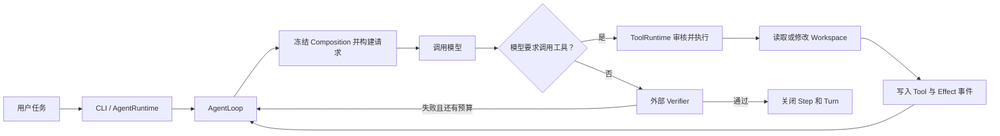

真正重要的不是某个类有多少行，而是这几个边界没有混在一起：

- `AgentLoop` 只负责编排流程；
- `LLM` 只负责生成下一步建议；
- `ToolRuntime` 控制工具能不能执行、怎样执行；
- `EventStore` 保存事实；
- `Projector` 从事实推导状态和模型历史；
- `Verifier` 判断现实结果，而不是相信模型的自述。

## 2. Session、Turn、Step 到底是什么

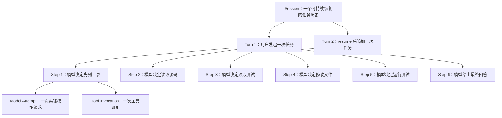

- **Session**：长期容器。一次 `resume` 不会新建一套历史，而是在原 Session 后面追加事件。
- **Turn**：一次用户消息触发的一轮工作。一个 Session 可以有多个 Turn。
- **Step**：一次“构建模型请求 → 获得模型响应 → 可选执行工具”的决策周期。
- **Model Attempt**：一次实际模型调用。v0.3 已经把它独立记录，便于以后增加重试和 Fallback。
- **Tool Invocation**：模型提出的一次工具调用。它必须产生与之配对的结果。

因此，Step 不是“写一行代码”。一个 Step 的本质是：**让模型看见截至此刻的世界，然后做一个下一步决定。**

## 3. 主要模块各自负责什么

| 模块 | 负责什么 | 不应该负责什么 |
|---|---|---|
| CLI | 解析命令和配置，启动或恢复 Session | Coding 决策与事件语义 |
| `AgentRuntime` | 把事件存储、模型、工具、Verifier 等组装起来 | 每一步具体怎样循环 |
| `AgentLoop` | 打开/关闭 Turn、Step，调用模型、工具和 Verifier | 绑定某个模型厂商或某个具体工具 |
| `CompositionRuntime` | 为当前 Step 冻结模型、Prompt、工具、Policy 等配置 | 修改历史 Step 的配置 |
| `RequestBuilder` | 从事件投影模型历史，并生成可校验的请求快照 | 把可变 `messages` 当永久事实 |
| `LlmRuntime / Provider` | 把统一请求交给具体模型接口 | 直接修改文件或决定工具权限 |
| `ToolRuntime` | 校验、Policy、调度、Middleware、执行和结果配对 | 决定整个 Turn 何时完成 |
| `JsonlEventStore` | 追加事件、维护序号和并发边界 | 解释业务状态 |
| `StateProjector / SurfaceProjector` | 从事件分别推导运行状态和模型可见历史 | 反向修改原始事件 |
| `CommandVerifier` | 运行独立命令，用退出码和输出验证结果 | 因模型声称完成就直接通过 |
| `RecoveryService` | 用追加新事件的方式收敛崩溃后的未闭合状态 | 删除或篡改旧事件、盲目重放副作用 |

这张图展示了代码中的依赖方向：

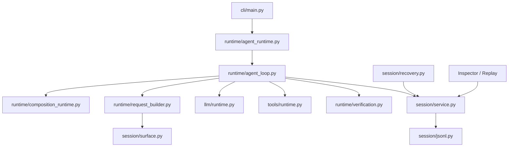

## 4. 真实 Session：模型怎样完成一次修复

本文固定分析 Session：

```text
212167b8-c5f1-4f63-a600-6c1853780067
```

它的第一个 Turn 是一次真实的 Coding 执行。结果是：

| 指标 | 结果 |
|---|---:|
| Session 事件 | 70 |
| Turn | 1 |
| Step | 6 |
| 工具调用 | 5 |
| Effect 事件 | 15 |
| 外部验证 | 通过，exit code 0 |
| Turn 结束原因 | `completed` |

后来这个 Session 又被 `resume` 了两次。在本次导读取样时，它已经有 3 个 Turn、239 个 Session 事件。旧的 70 个事件没有被覆盖，后续内容只是继续追加。这正是 Session 与 Append-only 的实际含义。

### 六个 Step 的业务故事

| Step | Session 序号 | 模型做出的决定 | 现实结果 |
|---:|---:|---|---|
| 1 | 5–16 | 调用 `list_files` | 看见工作区有哪些文件 |
| 2 | 17–27 | 调用 `read_file` | 读取 calculator 源码 |
| 3 | 28–38 | 再次调用 `read_file` | 读取测试，确认正确行为 |
| 4 | 39–49 | 调用 `apply_patch` | 把错误的减法改成加法 |
| 5 | 50–60 | 调用 `shell` | 运行测试并得到成功结果 |
| 6 | 61–69 | 不再调用工具，给出最终回答 | 外部 Verifier 再运行一次测试并通过 |

最后，序号 70 的 `turn/end` 把这一轮标记为 `completed`。

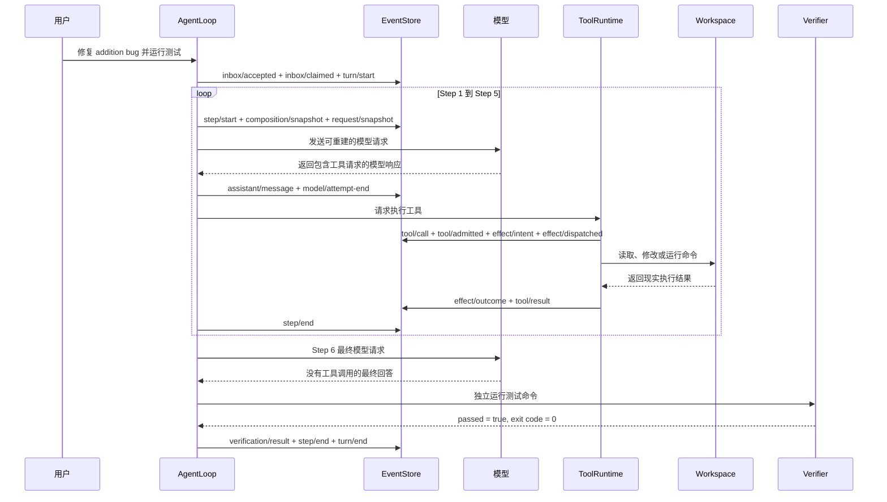

这里有一个很容易忽略的重点：模型在 Step 5 里调用 `shell` 看到测试通过，还不等于 Harness 已经认可任务完成。Step 6 没有工具调用以后，`CommandVerifier` 又独立执行了配置好的验证命令。只有它返回 0，Turn 才以 `completed` 结束。

## 5. 为什么一次小修复会有 70 个事件

70 并不是 70 个“业务动作”，而是把以前只存在于内存里的关键事实拆开记录了。

| 类别 | 数量 | 包含内容 |
|---|---:|---|
| 生命周期 | 17 | Session、Inbox、Turn、6 个 Step 的开始和结束 |
| 请求与模型 | 36 | 6 份 Composition、6 份 Request、6 次 Attempt 的开始/结束、Chunk 与完整消息 |
| 工具 | 15 | 5 组 `tool/call`、`tool/admitted`、`tool/result` |
| 用户消息 | 1 | 本轮输入 |
| 外部验证 | 1 | Verifier 的结果 |
| **合计** | **70** | |

### 一个普通 Step 的事件骨架

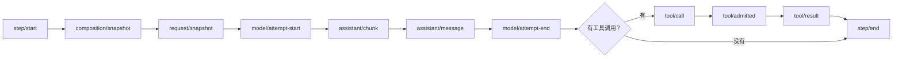

第一个 Step 还包含 `user/message`，最终 Step 还包含 `verification/result`，所以不同 Step 的事件数并不完全一样。

把这些边界写清楚，系统才可能回答下面的问题：

- 模型当时到底看见了什么？
- 当时启用的是哪个模型、Prompt 和工具集合？
- 模型只是提出了工具调用，还是工具真的执行了？
- 写操作已经产生效果，但进程来不及写 `tool/result` 怎么办？
- 最终测试是真的通过，还是模型只说“已经通过”？

## 6. Event Log 是事实，State 和 Surface 是视图

传统 Agent 常把一个不断变化的 `messages` 列表和 `runtime.state` 留在内存里。进程一旦退出，很难准确知道中间发生了什么。

TraceHarness 反过来做：先保存不可变事件，再从事件推导视图。

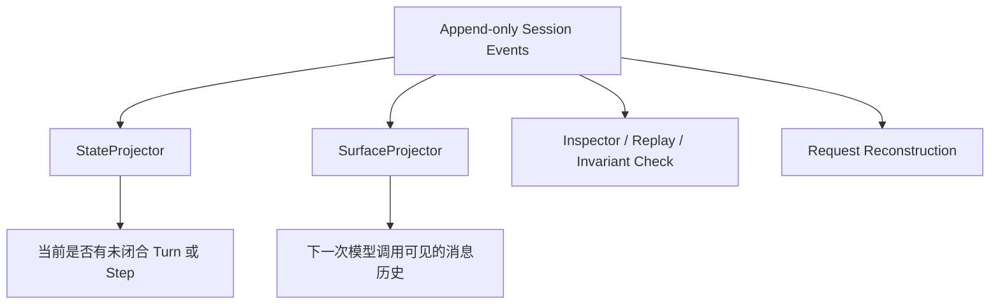

- `StateProjector` 关心“现在处于什么状态”，例如当前是否有未闭合 Step。
- `SurfaceProjector` 关心“模型下一次应该看到什么”，包括用户消息、助手消息和工具结果。
- Inspector 和 Replay 直接消费事件，所以不需要相信某个残留的内存对象。

这就是“Event Log 是唯一事实源”的本质：不是所有调用都去读 JSONL，而是**任何重要状态都能从持久化事实重新推导出来**。

## 7. Composition Lease 与 Request Snapshot 解决什么问题

### Composition：冻结这一步使用的能力

每个 Step 开始时会拿到一份 Composition，主要包括：

- Provider 和 Model；
- System Prompt；
- Tool Schema；
- Tool Policy 与 Middleware；
- Temperature 和最大输出；
- Composition Revision。

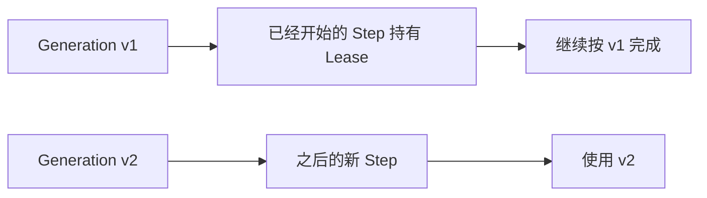

v0.3 还没有完整插件热更新，但 Lease 边界已经让“旧 Step 不被新配置半路污染”成为可能。

### Request Snapshot：证明模型当时收到了什么

`RequestBuilder` 使用“截至某个事件序号的 Surface + 当时的 Composition”生成模型请求，并保存：

- `source_seq`：历史读取到哪里；
- `composition_revision`：使用哪一版能力；
- `fingerprint`：整个请求内容的稳定指纹；
- 请求快照本身。

Inspector 可以重新构造同一请求，再比较 fingerprint。真实 Session 的第一个 Turn 有 6 份请求快照，重建检查没有违规。

## 8. Tool 事件与 Effect 事件为什么要分开

一次工具调用有两个不同视角：

1. **对 Agent 而言**：模型要求调用了什么工具，最后收到了什么结果；
2. **对现实世界而言**：某个可能产生副作用的动作是否已经派发、是否真的产生了结果。

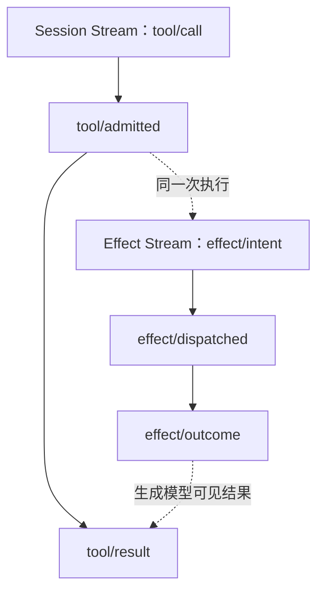

真实 Turn 中有 5 个工具调用，每个工具都对应 3 个 Effect 事件，所以一共有 15 个 Effect 事件。

这种分离主要服务于崩溃恢复。假设文件已经被修改，但进程恰好在写入 `tool/result` 前退出：

- 如果已有持久化 `effect/outcome`，恢复器可以据此补写 `tool/result`；
- 如果只有 Intent、结果无法判断，恢复器记录 `unknown_after_crash`；
- 恢复器不会擅自再执行一次写文件或 Shell 命令。

“不确定就明确记录不确定”，比悄悄重复副作用安全得多。

## 9. ToolRuntime 不是简单的函数调用器

模型不能直接调用 Python 函数或子进程。工具请求会经过一条受控管线：

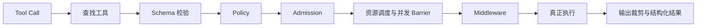

五个内置 Coding Tools 分工很直接：

- `list_files`：查看工作区结构；
- `read_file`：读取文件；
- `search_text`：搜索文本；
- `apply_patch`：按精确旧文本替换；
- `shell`：用参数数组启动子进程。

路径工具会先解析真实路径，再检查它是否仍在 Workspace 内。Shell 不使用 `shell=True`，并清洗子进程环境。这些不是为了让 Agent “更聪明”，而是为了限制模型建议对本机产生影响的范围。

## 10. Evidence-Driven Completion：完成必须有证据

模型说：

```text
The fix is complete and verified.
```

这只是模型输出，不是完成证据。

真正的判断链是：

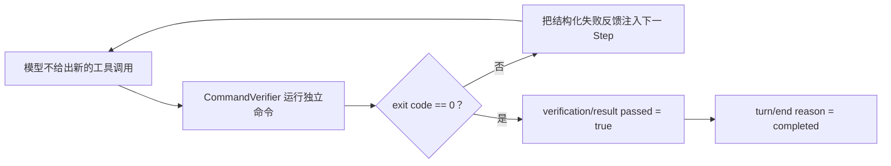

本次真实运行中：

- Agent 自己先通过 `shell` 运行测试；
- 最终回答出现后，Verifier 又运行配置的测试命令；
- Verifier 返回 `passed = true`、`exit_code = 0`；
- 最后才追加 `turn/end`。

所以终端里看到的“成功”不是只靠那段英文，而是能追溯到持久化验证事件。

## 11. 崩溃后怎样恢复

恢复仍然遵守 Append-only：旧事件不修改，只追加“后来确认的事实”。

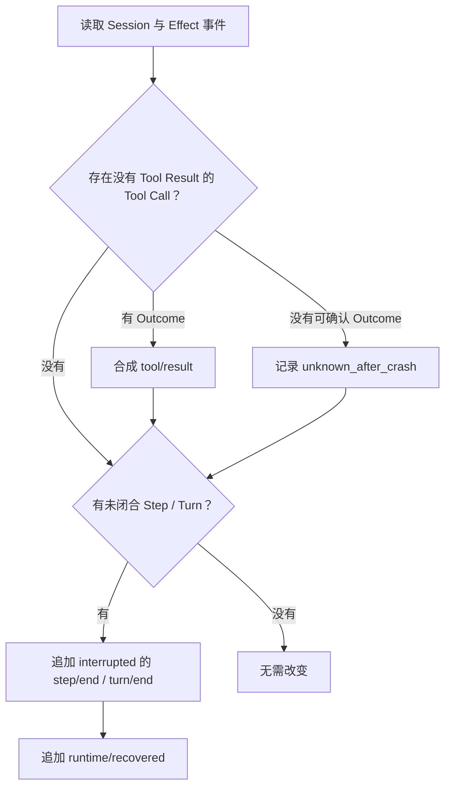

这套机制已经覆盖“工具副作用与 Session 结果脱节”和“生命周期未闭合”的主要场景。当前 v0.3 对未闭合 Model Attempt 的专门收敛仍可继续加强，这是完善 v0.3 时值得补的边界之一。

## 12. 读源码的推荐顺序

不要从 100 多个文件随便点开。按下面顺序，只需要先回答“它在流程中扮演什么角色”：

1. [`runtime/agent_loop.py`](../src/traceh/runtime/agent_loop.py)：看主循环怎样串起一次 Turn。
2. [`session/service.py`](../src/traceh/session/service.py)：看业务代码怎样追加 Session 与 Effect 事件。
3. [`session/jsonl.py`](../src/traceh/session/jsonl.py)：看事件怎样真正落到 JSONL。
4. [`session/surface.py`](../src/traceh/session/surface.py)：看事件怎样变回模型消息。
5. [`runtime/request_builder.py`](../src/traceh/runtime/request_builder.py)：看请求怎样生成和重建。
6. [`llm/runtime.py`](../src/traceh/llm/runtime.py) 与 [`llm/openai_compatible.py`](../src/traceh/llm/openai_compatible.py)：看统一模型边界和 OpenAI-Compatible 适配。
7. [`tools/runtime.py`](../src/traceh/tools/runtime.py)：看工具调用怎样受到控制。
8. [`runtime/verification.py`](../src/traceh/runtime/verification.py)：看外部证据怎样进入生命周期。
9. [`session/recovery.py`](../src/traceh/session/recovery.py)：看崩溃后怎样只追加、不篡改。
10. [`runtime/agent_runtime.py`](../src/traceh/runtime/agent_runtime.py)：最后再看所有组件怎样组装。

看每个文件时先只找一个入口类或函数，不需要马上理解所有数据类：

| 文件 | 先找这个入口 |
|---|---|
| `agent_loop.py` | `AgentLoop.run_turn()` |
| `request_builder.py` | `RequestBuilder.build()` |
| `tools/runtime.py` | `ToolRuntime.execute_batch()` |
| `verification.py` | `CommandVerifier.verify()` |
| `recovery.py` | `RecoveryService.recover()` |
| `agent_runtime.py` | `build_default_runtime()` |

## 13. 用接近伪代码的方式理解主循环

下面不是源码复制，而是主循环的本质：

```text
记录用户消息并开启 Turn

while 还有步骤预算:
    开启 Step
    冻结这一 Step 的 Composition
    从事件重建模型可见历史
    保存请求快照并调用模型

    if 模型要求调用工具:
        经过 ToolRuntime 执行并记录结果
        关闭 Step，然后进入下一 Step
    else:
        运行外部 Verifier
        if 验证失败且还能重试:
            把失败证据注入下一 Step
            继续循环
        关闭 Step 和 Turn
        返回结果
```

理解这段以后，再看 `AgentLoop.run_turn()`，大部分代码只是把每一个箭头可靠地落成事件，并处理失败和取消。

## 14. 目前 v0.3 做到了什么、还不是什么

### 已经成立的核心能力

- 真实模型可以通过 OpenAI-Compatible 接口参与执行；
- Agent 能读取、搜索、修改文件并运行进程；
- 每一步都有可重建事件轨迹；
- 工具副作用有独立 Effect Ledger；
- 最终完成可以由外部命令验证；
- Session 可以恢复、检查、回放和继续追加 Turn；
- 主循环没有绑定某个具体模型、插件或 Coding Tool。

### 完善 v0.3 时应保持清醒的边界

- CLI 仍是“一次输入、执行到底、打印结果”，不是交互式聊天 TUI；
- 事件写入已有 POSIX/Windows 跨进程文件锁，但“同一 Session 只跑一个 Turn”仍只在单进程内强制；
- 未闭合 Model Attempt 的恢复语义还可以补强；
- CLI 的用户取消、危险操作审批体验仍较薄；
- Benchmark 数量少，尚不能代表复杂真实 Coding 任务质量；
- OpenAI-Compatible Provider 目前不是完整流式、重试和 Fallback 实现。

这些不否定内核已经可运行。它们说明下一阶段如果目标是“把 v0.3 做扎实”，应该优先增加可靠性、可观察性、真实任务测试和交互体验，而不是急着铺开多 Agent。

## 15. 学完这份导读，应该能回答的六个问题

1. **为什么不直接保存 `messages`？**

   因为 `messages` 是模型视图，不是完整事实；它可以从事件重新投影。

2. **为什么每个 Step 都保存 Composition？**

   为了证明当时使用了什么模型、Prompt、工具和 Policy，并防止运行中配置变化污染旧 Step。

3. **为什么既有 Tool Result 又有 Effect Outcome？**

   前者是 Agent 历史，后者是现实副作用账本；崩溃时两者可能暂时不同步。

4. **为什么模型说测试通过还不够？**

   模型输出可能出错，Verifier 的退出码和输出才是外部证据。

5. **`resume` 为什么仍使用同一个 Session？**

   因为 Session 是连续历史，新的用户输入应该形成新的 Turn 并追加到旧事件之后。

6. **AgentLoop 为什么要“薄”？**

   因为模型、工具、Policy、插件和存储实现都可能变化；主循环只保留稳定的生命周期语义，后续扩展才不必推倒重来。

## 16. 继续深入时看哪些设计文档

- [architecture.md](architecture.md)：总体分层和组件关系。
- [event-protocol.md](event-protocol.md)：核心事件协议。
- [recovery-semantics.md](recovery-semantics.md)：恢复规则。
- [testing.md](testing.md)：测试策略。
- [ADR 001：Event Log 是事实源](adr/001-event-log-source-of-truth.md)。
- [ADR 002：Session / Turn / Step / Attempt](adr/002-session-turn-step-attempt.md)。
- [ADR 004：Effect Ledger](adr/004-effect-ledger.md)。
- [ADR 005：Step Composition Freeze](adr/005-step-composition-freeze.md)。

建议把本文当作入口，遇到“为什么这样设计”时再去看对应 ADR；不要一开始就试图记住所有协议和字段。

---

本文记录的 70 事件案例保持为历史样本；如果当前主循环、事件协议或项目状态发生变化，应更新 `docs/note/` 下的正式版和通俗版。只有历史样本本身描述错误时才改写本文案例。
