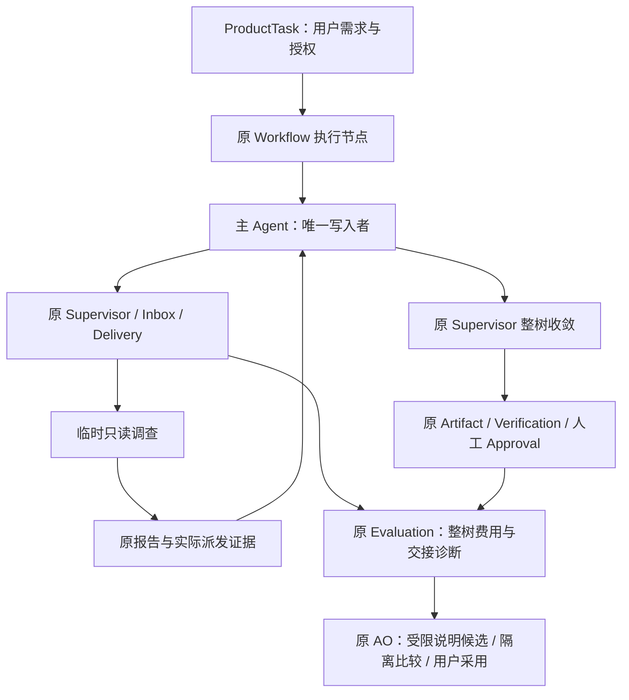

# DA：按需只读协作、整树评估与受限优化

日期：2026-09-11。状态：DA-1～DA-5 工程与约定有限实测完成，工作区未发行。基础 adaptive 未达晋级资格，一次真实优化返回 no-candidate，未运行留出；没有证明多 Agent 优于单 Agent。

## 1. 交付范围与原有边界

AO-3 已作为 v0.11.0 提交发行。随后 DA 在原 ProductTask 的执行节点内增加临时只读调查：主 Agent 自己决定是否派人、查什么、何时收集或取消，自己负责写入和整合。外层仍然是原任务、验证与人工审批，不增加第二张协作任务表。

| 阶段 | 接入的既有 owner | 当前实现 |
|---|---|---|
| DA-1 | Supervisor、Directory、Inbox/Delivery、Budget | 委派、追问、精确消息收集、停止；只读原版本，父方收尾 Token 原子保留 |
| DA-2 | Product、Workflow、Workspace、TUI | single/adaptive 同一主线；主方整树停稳后才捕获产物；任务对话能发现实际助手 |
| DA-3 | EvaluationRunner、ProductTaskEvaluator、原 review/assess | 同源码策略对照、按题验证、Product 语义审阅、整树成本和交接诊断 |
| DA-4 | 原 AO-3 BackgroundExperiment | 已接任务结构信号与四项委派说明；原 AO 的真实一次提案返回 no-candidate，没有自动采用 |
| DA-5 | 原 Product 配置/事件/投影 | 删除旧 auto/multi Router 和 parent/reviewer；默认 single，adaptive 显式选择 |

当前 Product 配置/事件为 3、Product Context 为 8、Budget 为 2。Session 13 / Context 输入格式 12 不变。旧格式明确拒绝，既不迁移也不删除旧数据。没有孙 Agent、兄弟广播、父历史继承、子方写入、共享脏工作区、自动合并或自动采用。

## 2. 实验怎么解释

实例及额度在真实请求前冻结，见 [合同](../plan/TRACEHARNESS_DYNAMIC_COLLABORATION_DA_REAL_CONTRACT.md)。12 道开发题与 6 道留出题由仓库合同缩减重建；36 次实际 Docker 检查确认每个故障版本达到断言失败、参考修复通过。这不是生产缺陷的原始快照，也不是独立抽样的大型任务集。

A/A、机制小样和开发对照使用安装的冻结 DA 开发 Wheel；当时 Product 为过渡协议 2。最终工作区清理旧角色后为 Product 3，另做安装与定向回归。原模型实验必须由它自己的冻结源码重开，不能换上当前代码后仍说是原实验。没有为提高成绩改写材料、评分或旧记录。

基线是同一 DA 开发源码的 single，实验臂是允许委派的 adaptive；不是拿发行 v0.11.0 对比新源码。配置使用用户授权的现有连接，明确模型、直连、单次尝试与禁网工具沙箱。模型判断保留其来源，不当作人工标准答案。资格不成立就不启动留出，不通过反复补跑寻找好看的分数。

当前已完成的实际记录：

| 批次 | Task trials | 模型请求（含控制调用） | 结果解释 |
|---|---:|---:|---|
| A/A | 8 | 84 | 同一 single 两次重复分别 0/2→2/2、1/2→1/2，显示明显自然波动 |
| 机制小样 | 12 | 146 | 45 个 Session；一次 Provider 工具参数协议失败使总 Token 未知；adaptive 没有调用委派 |
| 开发第 1 次重复 | 24 | 两次开发合计 546 | 硬验证 9/12→10/12；语义评估 single 7 通过、5 失败，adaptive 3 通过、3 失败、6 待审；不能判胜 |
| 开发第 2 次重复 | 24 | 两次开发合计 546 | 硬验证 9/12→10/12；语义 single 7/12、adaptive 8/12，净增 1 题、无退步 |
| 受限优化 | 0 个候选 trial | 1 | 22,014 Token，no-candidate；没有为得到候选继续调用 |

A/A 原 2096 个文件不变，276,185 Token；机制原 1662 个文件不变。未知使用量不能用保守预算结算补成实际 Token。第一轮开发的任务 Token 为 348,712→450,769，工具调用 89→96；两边都没有真实委派，所以不能据此声称多 Agent 协作有效。

第二轮任务 Token 为 356,326→432,739，工具调用 89→95；同样没有委派。开发合计 177 Sessions / 546 requests、1,817,962 Token，没有失败模型请求。最终一次分析认为现有开发证据不足以支持修改委派说明，宿主据 no-candidate 停止；这不是证明工具说明已经最优。第一次开发有确认退步和待审，第二次的净增不能抵消它来宣布通过冻结资格。基础未晋级且无候选，因此没有启动 24 个留出 trial，也没有泄露留出用于优化。

有一条语义裁判返回待审，提到验证没有 stdout；无输出本来可以是合法成功的检查，该判断仍需核对，不能把待审擅自改成通过。由于原规则遇到不确定评审即停止，之后的题目保留待审。同期同宿主运行过部分 Docker 回归，wall elapsed 也只保留观测值，不据此宣称协作带来可信的速度提升。

## 3. 工程验证与发现

只执行本次 owner 定向和直接相邻回归，没有全量 pytest 或 L2–L4。已完成的主要组合：合同/投影等 277 项、新增边界 20 项、真实 Git/Docker Product 48 项、TUI 与状态快照 174 项（3 跳过）、安装包定向 88 项、真实 Workflow/原优化 47 项、后台 13 项、评估合同 35 项。最终干净源码包另通过 85 项安装后检查，包含原 AO→两臂 Product→真实 Git/Docker→语义审阅→重新读取的完整路径，以及 CLI 帮助启动。包内 319 个文件与当前源码字节一致，未发布。集合有重复，不能相加当独立测试数；逐组 JUnit 摘要见 [汇总](../validation-data/dynamic-collaboration/da-final/summary.json)。

关键保护做过反向验证：移除主方 Token 保留、单 Turn 时间预留、捕获前整树收敛、取消外层类型保护后，对应公开路径检查按预期根因失败；恢复后通过。脚本 Provider 驱动的真实 Git/Docker 测试确实创建两个调查并同时进入执行，验证完成与取消、父方实际读取报告和主方仍是唯一写入者；它不冒充真实模型主动选择委派的证明。

收口发现并处理两类测试/构建问题：

- 后台测试把时钟起点写死，原 AO 的真实 UTC 截止校验在当天过期后拒绝实验。独立、明确绑定 HEAD 源码的副本复现同样失败；夹具改成当前 UTC 起点后固定其测试时钟，13 项后台检查通过。生产截止规则未放宽。
- 构建缓存把旧 Router 与早已删除的 evaluation/metrics 带入开发 Wheel。备份缓存并干净构建后，包内文件与当前源码逐字节一致；这份开发包未发布。已发行 AO-3 使用自己的干净源码构建及完整包字节核对，不受此次缓存污染。

右键复制组合测试曾在菜单挂载前断言失败，改为等待真实挂载事件后，整组 TUI 检查通过；没有更换用户的鼠标选中、右键复制交互。

Product/AO 补查还暴露 Windows Git 在过深目录下创建 worktree 管理文件失败，`core.longpaths=true` 也出现 `$GIT_DIR too big`。按原 Product 比较夹具使用明确短根目录后，完整路径通过；没有修改全局 Git 设置或放宽验证。任意深度路径支持不在当前完成声明内。

首次提案输入超过冻结的请求预算，在派发前停止，实际 API 请求为零；缩短重复评语预览并保留原引用。随后一次实例准备发现待审评估没有 reason，修正为明确缺失，不编造评语，相关反例通过。最终只有一次真实提案；预算和次数上限未增加。

## 4. 证据和复核位置

原始不可变输入、冻结源码、SQLite/CAS、请求、控制调用及失败保留在工作区的 `.traceh/da-live/aa-02`、`mechanism-01`、`development-01` 和 `.traceh/d4`、`d4b`、`d4c`。每批合同、原报告与重放共同绑定；本页和派生统计不能替代这些记录。代码入口为 `tests/live_dynamic_collaboration/run.py` 与 `optimize.py`，都复用原 Evaluation/AO，而非第二个评测框架。

最终由使用原冻结安装包的独立进程复核，254 Sessions / 777 requests 重放和不变量检查通过。各批原文件数为 2097 / 1663 / 5163 / 12 / 13（包括首轮 replay.json）；最终复核期间字节不变。中间同时运行 Reader 与文件哈希曾因 Windows SQLite sidecar 锁失败，读取也建立或清理了 WAL/SHM；数据库正文、CAS、报告与请求文件没有被更改。Session 轨迹采样改读副本，最终复核串行进行，不把中间失败冒充通过。独立结果在 `.traceh/da-independent`，可分享的派生摘要在 [验证数据](../validation-data/dynamic-collaboration/da-final/summary.json)。整体实际 Token 因机制那次未知用量保留 unknown。

两份上下文的 1、12.12、14、Product 合同/装配、任务对话和状态解释已按真实代码同步；用户入口见 [逐行体验](../plan/TRACEHARNESS_DA_USER_TRYOUT.md)。用户授权的 AO-3 提交与 v0.11.0 发行已完成；DA 留在未提交工作区，默认 single，adaptive 显式可选，没有自动采用候选。
