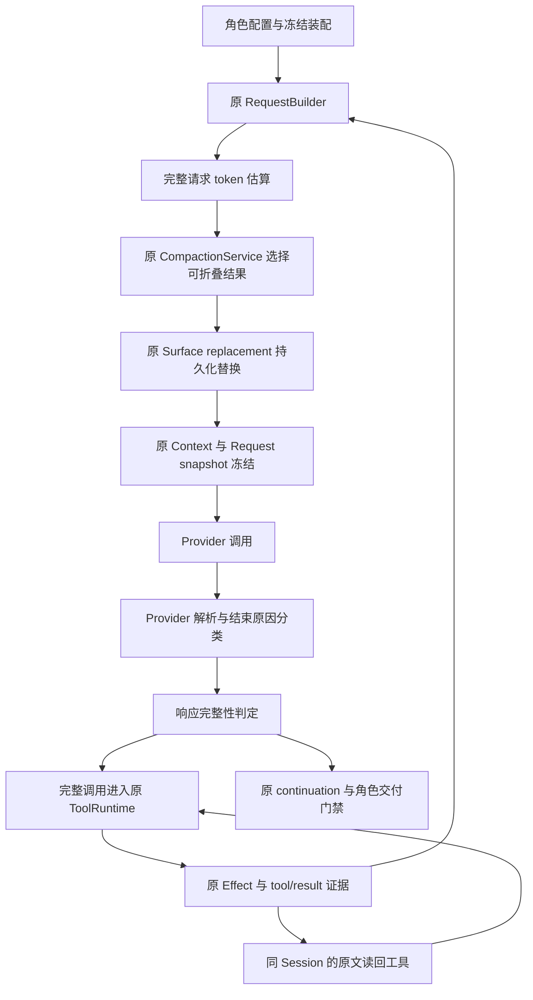

# 080：长任务上下文治理与有效交付设计方案

日期：2026-09-21。状态：**待实施的设计方案，不是已实现合同或新实验结果**。
同日复核修订：补齐 Provider 前置条件、评测/TUI 下游、单条提交语义和实验停止条件，审查处置见 §12。

本方案承接[记录 079 的逐请求诊断](079-collaboration-budget-correction.md)与
[真实仓库执行计划](../plan/TRACEHARNESS_REAL_REPOSITORY_EVALUATION_PLAN.md)。本轮只设计和记录，
不修改生产代码，不调用真实模型，不扩大实验批次，也不操作 Git 历史。

## 1. 我们现在最值得改什么

建议先完成一条主线：**先查清 Provider 的结束原因与返回通道，再让主方和助手正确交付，
随后让一个长任务内的旧工具正文能够收起、需要时读回，
最后沿原 Runner/Evaluator 验证一次真实 multi。** 继续增加累计 token 额度只能延后耗尽；
直接扩大任务数则会把当前缺陷重复运行很多遍。

这里有两条独立因果链：空交付涉及响应内容、结束原因、单次实际输出上限与完成判定；
累计输入过高涉及历史重复携带。即使确认最后一次输出预算用于推理，也不能据此解释此前几十次重复输入，
更不能把保留下来的推理过程当作已经完成的调查报告。C0 负责消除前一条链上的事实空白，C2/C3 仍有独立依据。

现有 EventStore、Effect、Session Surface、请求冻结和重放机制可以承接这些改动，不需要重写系统。
关键是补齐它们之间的接口与适用粒度，尤其不能把“进程结束”“模型响应结束”“拿到有效交付”混成一件事。

第一阶段不并行解决分布式 Supervisor、细粒度写冲突、插件沙箱、事件归档或完整软质量评分。
这些仍有价值，但与本次 313 万 token、助手空交付的直接根因不同。事件存储无限增长和恢复速度也仍是
独立问题；折叠模型可见历史不会减少原始事件数量。

## 2. 设计依据：已验证的现状

本次基线是 SWE-bench Lite dev 的 `pylint-dev__astroid-1196`，即修复字典展开后查找元素的行为。
它走原 Product/Workflow/Verifier/Review/Promotion，固定测试通过，但后续审计发现助手没有交回可用报告。
来源见[持久化诊断摘要](../validation-data/real-repository-pilot-v1/feasibility-v10-context-audit.json)。

| 已验证事实 | 对设计的影响 |
|---|---|
| 主方 46 次、助手 33 次调用，合计 exact 3,132,713 token，其中输入占 95.78% | 优先治理每次重复携带的历史，不能只限制输出或多给累计额度 |
| 主方单次输入从 5,087 增至 65,166；助手从 4,638 增至 67,984；中间没有下降 | 两个角色都需要接入，同一 Turn 内也必须可以处理旧结果 |
| 两方各只有一个 Turn，没有 surface/replace、summary/input、request/token-measurement | 当前真实路径没有压缩证据；预算估算不是请求窗口管理 |
| 187 条工具结果均无 output_ref；最大正文 10,139 字符，最大规范化 data 13,115 字符 | 大量“小输出”累加，绕过了单结果 24,000 字符的大输出保留条件 |
| 工具结果按本地分词估算占累计输入约 77.5%；一份文件清单被带入 32 次请求 | 旧工具正文是有证据支持的首个优化对象；77.5% 不是可直接承诺的节省率 |
| 助手最后 finish_reason=length、正文为空、无工具调用，仍记为 completed | 首先修正完成语义，否则再便宜的运行也可能没有交付 |
| 助手当时仍有 823,294 token 生命周期余额，最后单次输出为 8,192 token | 单次响应上限与累计预算不同；给累计预算加钱不直接解决输出截断 |

原 v10 的固定测试和推广成功不改写。主方最终说明没有得到助手可用发现，因此该试次不能证明有效协作，
更不能证明 multi 优于 single。Provider 报告的 token 也不等于已核对账单，现有数据不支持推断缓存折扣，
或把最后 8,192 输出 token 全部解释为已保存的推理正文。

### 2.1 现成机制为什么没有解决它

| 当前机制与源码归属 | 当前边界 | 本方案补齐什么 |
|---|---|---|
| [Product runtime 装配](../../src/traceh/product/runtime.py) | 未向主/子 RuntimeConfig 传入 compaction、token_budget、semantic_summary；工具集合也没有保留输出读回工具 | 显式的角色配置、窗口计量、确定性折叠及最小读回能力一起装配 |
| [大输出保留](../../src/traceh/session/tool_output.py) | 超阈值才产生 output_ref；普通小结果继续完整进入历史 | 普通结果也能从原 Effect 解析出稳定引用，首轮仍可完整展示 |
| [CompactionService](../../src/traceh/session/compaction.py) | 候选切口依赖已结束的旧 Turn | 在同一 owner 增加“当前 Turn 内已闭合工具组”的候选选择 |
| [Surface replacement](../../src/traceh/session/surface_replacement.py) | tool fold 要求既有 output_ref 和已闭合旧 Turn | 增加严格的已闭合 Step 折叠范围，保持单一解析、验证和投影主线 |
| [普通 continuation](../../src/traceh/runtime/continuation.py) | 未把 length/空交付纳入普通完成判定 | 在执行工具和 Verifier 之前识别不完整响应，并由角色交付合同判断能否交卷 |
| [Provider 解析](../../src/traceh/llm/openai_compatible.py)与 [ModelResponse](../../src/traceh/api/llm.py) | finish_reason 为字符串，缺失/空值会补成 stop；只读取 message.content，没有 reasoning_content 处理 | 先冻结原值与规范化分类，再核对内容通道和用量元数据 |
| [调查报告收集](../../src/traceh/product/collaboration.py) | 当前主要检查 status/reason 与 assignment 身份 | 增加真实最终交付检查，不能让空 statement 通过协作完成门禁 |

过去的折叠测试通过并不矛盾：它们覆盖的是既有闭合 Turn、已有引用等合同；
[轮内压缩测试](../../tests/test_in_turn_compaction.py)也是在本轮请求前处理更早的完整 Turn，
没有证明一个全新、只有一个 Turn 的长任务能够折叠自己的旧工具结果。
准确说，AgentLoop 的 `_compact_before_turn` 每 Turn 调用一次，但
[RequestBuilder.prepare](../../src/traceh/runtime/request_builder.py)已有每次请求前、受 token_meter 等条件控制的
维护入口。缺的是当前 Turn 内已闭合 Step 的可折叠范围及 Product 装配，不能描述成完全没有轮内调用入口。

## 3. 架构选择：保留证据，缩小可见正文

原始工具结果继续进入现有 Effect/Session 证据链；改变的是之后的模型请求如何呈现这些证据。
不能直接删 messages，不能只在请求发送前临时裁字符串，也不能另建一份摘要数据库作为工作事实源。

图中判定和轮内候选能力属于本方案拟增加的行为。原模型返回、usage、工具副作用和历史请求仍按原事实记录。
不完整响应进入非成功收尾，不沿图中“完整调用”分支执行工具。

| 不变量 | 负责的既有层 |
|---|---|
| 响应是否完整、是否允许执行本次工具调用 | Runtime 的响应判定；AgentLoop 只编排 |
| 交付是否满足 investigator/coder/patch_author 角色要求 | Product 角色与协作合同；不能由通用 Session 猜测业务成功 |
| 输出引用的身份、内容及可读性 | Session/Effect 与 ToolOutput resolver |
| 哪段历史可折叠、何时持久化 | CompactionService 与 Surface replacement，共用验证器 |
| 模型实际看到什么、如何原样重放 | RequestBuilder、Context composition、request snapshot |
| 人工上下文视图与原文检查 | TUI Context/Inspector 复用原 Surface 和 ToolOutput resolver；人工展开不自动送给模型 |
| 实际花费、预留和取消结算 | 原 Budget/Provider/Supervisor，不因折叠退回已消费额度 |
| 修复正确性、检索来源和评估结论 | 原 Runner/Evaluator、retrieval_episode/episode_assessment/episode_diagnostics 与冻结材料 |

## 4. 第一优先级：截断不能再算完成

### 4.0 C0：先建立真实的 Provider 前置合同

原方案“Provider 已规范化的允许结束类型”不符合当前源码，现予更正。
`OpenAICompatibleProvider` 使用 `finish_reason or "stop"`，Scripted 也推断默认结束原因，
ModelResponse 的默认值同样是 stop；semantic_summary 中的局部白名单不构成通用归一化层。

C0 分两个有先后关系的交付：

1. **响应形状与保真度诊断。** 先用现有离线响应夹具验证 parser 读取范围，再安排至多一次显式冻结的最小真实探测。
   只记录 choice/message 的字段名、允许字段的类型与长度、原始 finish_reason、工具调用数量、
   usage 中存在的推理 token 分项，以及原请求和实际 dispatch 的输出上限。字段缺失与 null 分开，
   未提供推理分项就记未知；不落原推理正文、认证信息或完整 HTTP body，不执行返回的工具。
   保留相同模型/连接/非流式模式及相关显式参数；若最小请求为降低成本改了输出额度，必须披露差异。
   一次最小探测只证明当前这次返回的形状，**不能确认或排除 v10 那一次的历史根因**，尤其不能只靠键名判断。
   不自动追加探测；未复现就保留未知。若以后要用旧 snapshot 做新请求，也只能算新响应，不能复原旧返回。
2. **统一结束原因分类。** 在公共 ModelResponse 边界定义规范化类别（正常结束、工具交接、长度截断、
   过滤/拒绝、未知），同时保留可为空的供应商原值；缺失、空值和未知字符串不再默认正常结束。
   映射由对应 Provider adapter 按已支持协议承担，Runtime 只消费类别，不按模型名称猜测；
   跨协议拼写由各自 adapter 显式映射，不为了未来 Provider 堆别名。
   Scripted、直接构造 ModelResponse 的公共入口、事件序列化、semantic_summary 消费端和相关拒绝测试一起接入。
   不保留“省略等于成功”的隐式默认，格式变化按 §7.3 明确切换。

百炼官方示例将 `reasoning_content` 与回答 `content` 分开，并示范了 reasoning_tokens 用量分项；
这支持把通道诊断列为前置工作，但不证明本次 v10 收到了哪些字段或使用了相同参数。
来源：[百炼 DeepSeek API](https://www.alibabacloud.com/help/en/model-studio/deepseek-api)。

分支判断必须准确：若原始 content 非空而适配结果为空，是内容保真度问题；若原始 content 为空、
reasoning_content 非空且原始结束为 length，是尚未交付最终答案的截断，保存推理不能把它变成成功；
若结束字段本身缺失，就按未知处理。不要把“未保留推理通道”自动等同“丢失了最终答案”。
若确认输出/推理配置阻碍交付，应在 C4 前修正并单独冻结条件，不能指望工具结果折叠必然修好空交付。
本轮仍只有设计，C0 的真实探测尚未执行。

### 4.1 必须在副作用前判断

当前 AgentLoop 会先处理工具调用、运行验证，再进入 continuation。因此只在
DefaultContinuationRuntime 最后补一个 if 不够：返回 length 的响应即使包含可解析的工具调用，
也可能只是被截断的部分意图。

拟在 Runtime 引入一处共享的响应完整性判定，由 Loop 在工具执行及 Verifier 前调用，
continuation 消费同一判定，不在 Product、Supervisor 各写一套规则。原响应和 Provider usage 原样落账，
网络请求成功可以成立，但这不意味着 Agent 成功交付。

| 响应情况 | 建议行为 |
|---|---|
| length，无工具调用，正文为空或非空 | 明确非成功收尾，保留部分正文及截断原因，不产出 completed |
| length，带可解析工具调用 | 本响应的工具调用不执行；不把部分调用当完整授权意图 |
| 正常工具调用结束，正文为空但调用完整 | 允许原工具流程；工具阶段不要求必须同时有文字回答 |
| 正常结束，无工具调用，有合格的角色交付 | 继续原验证与完成流程；文字存在不替代固定测试 |
| 正常结束，无工具调用，但角色要求的最终文字为空白 | 交付不成立，明确非成功收尾 |
| 拒绝、过滤或未知结束原因 | 按 Provider 规范化合同明确处理，不默认为正常完成 |

表中的判定依赖 C0 新建立并验证的规范化类别；不要把表中的自然语言直接做字符串猜测。
也不要为修这一个模型而硬编码百炼或某个模型名称。

第一版**不自动无限续写，不自动提高输出上限，不把预算补足当作成功恢复**。
发生截断要能明确结束并被评估器识别。若新一次实测仍因输出上限无法交付，再单独考虑一次有界收尾请求：
它必须使用原 Runtime 请求、计量、预算、取消与冻结路径，最多一次，且不能执行上一次被截断的工具调用。
这项恢复能力不是首轮实施依赖，也不应偷塞进 Provider retry。

### 4.2 生命周期结束与交付合格分别核验

investigator 至少要有来自真实最终响应的非空报告，并绑定正确 assignment/agent/session/message。
collect 返回非合格交付时，应明确暴露原因，不能生成一个假的 completed statement。
只读报告应包含发现或明确的“没有找到结论”、对应文件/符号证据、尚未解决的问题；
非空仅是机械底线，不能据此宣称“有效贡献”或强迫助手编造发现。

C1 明确采用有限失败策略：一旦同一 assignment 的已终结报告被证实截断、失败或空交付，
Product 通过现有 continuation/收敛路径将本次 multi 判为失败，不自动重派、不降级成 single 成功。
拒绝必须在该次 collect 所属 Step 收尾时对主方生效，不能只在最终交卷检查，也不能只返回可重试的工具错误
让模型反复 collect；本次拒绝之后额外的主方模型请求与自动重派次数均为 0。同一响应中其余已启动工作按原 owner 收敛。
仍在运行的助手属于 pending，不等同不合格终态，按既有异步收集和墙钟限制处理。
之后人工发起新试次要保留本次失败及其成本，不补写旧结果。

coder 的最终说明、patch_author 的原 Capture 产物按各自现行合同检查；
不能把“文字非空”当作补丁存在，也不能用一个新 JSON 报告替代原 Artifact/Review/Promotion 链。
具体字段若需新增，必须由原 owner 持久化并从原日志导出，不能另设可变 report cache。

[AgentRunReportReader](../../src/traceh/supervision/reports.py)继续忠实读事实，
不能读取历史 v10 时偷偷把 completed 改为 failed。修复影响新的运行，旧记录只追加诊断说明。

## 5. 第二优先级：普通输出也能折叠和读回

### 5.1 引用资格与首次展示分开

建议让所有**具有可验证完整 Effect outcome 的可折叠工具结果**都能取得稳定 output_ref。
小输出首次仍直接展示；超过原阈值的大输出仍按原保留规则呈现。
引用资格不再以“这一次输出是否超过 24,000 字符”决定，否则分页再小也只会推迟累积。
24,000 的默认值来自 [RuntimeConfig](../../src/traceh/runtime/agent_runtime.py) 的 max_tool_output_chars
和 [ToolRuntime](../../src/traceh/tools/runtime.py) 的 max_output_chars；Session helper 接受传入阈值。
实施须同时核对工具运行时的输出准备/落账及 Session resolver，不能在 Session 层另设默认阈值。

统一 resolver 从同一 Effect 证据链解析完整 content/data/evidence，校验 Session、Effect、tool call、
Step、参数、状态、因果关联与 digest。已有 retained_output 与普通结果的原始 outcome 都属于
原 Effect，不能为了折叠再复制到独立文件夹或新增一套长期缓存；也不能从“当前工作区同路径文件”
代替当时返回的字节。需要更新输出协议时采用一种当前格式，旧数据按明确版本边界处理。

没有完整 outcome、被权限拒绝而未执行、结果尚未落账的调用，不得伪造可展开引用。
Result.data 中领域控制回执继续由原 owner 定义；折叠仅替换模型可见正文及允许的呈现投影，
不得把协作身份、预算请求、产物回执等宿主判定所需字段顺手裁掉。

### 5.2 Product 显式装配最小读回工具

主方和具备相应读取权限的助手，通过原 Runtime 装配同一 Session 绑定的
`read_tool_output`、`list_tool_outputs`、`search_tool_output`。
实现应复用这些工具当前使用的 Session 服务绑定方式，必要时抽取共享工厂，不能另建一个 Session 服务。
不通过把 `include_default_tools` 改成 true 一次性授予整套默认能力，尤其不能让只读调查助手因此得到 shell 或写权限。

引用只授予同 Session 已有工具结果的读取，不授予父 Session、兄弟助手、任意 Effect ID 或任意路径的权限。
主方通过 collect 收到的报告属于主方自己的那条工具结果；这不让它直接读取助手全部私有轨迹。

目录、搜索和分页继续使用既有有界输出与固定 through_seq；引用错误、身份不符或原文不可读时明确失败，
不回退成运行原工具。读回工具自己的结果也会进入正常证据链，之后可折叠，但必须先获得正常的模型消费机会，
避免刚展开下一次请求又被收起。

模型看到的折叠占位至少保留：工具名、原调用关联、执行状态、原输出尺寸、引用和读回方式。
shell 非零退出等具有任务意义的状态应按既有结构化结果保留，不假定所有 tool/status=success 都代表命令成功。
不使用一个模型生成的“成功摘要”替代真实失败信号。

### 5.3 检索评测的来源口径必须同步

[retrieval_episode.py](../../src/traceh/evaluation/evaluators/retrieval_episode.py)当前用 shell 结果是否带 output_ref
收集 output_sources，并要求输出实验恰好有一个来源；
[episode_assessment.py](../../src/traceh/evaluation/evaluators/episode_assessment.py)和
[episode_diagnostics.py](../../src/traceh/evaluation/evaluators/episode_diagnostics.py)再匹配准备阶段的引用。
扩大引用资格后，这个筛选条件不再等价于“原实验保留的大输出”，可能改变来源和评分口径。
这是真实下游影响，但不能未经重算就断言原 72 题成绩必然变化。

本方案选择**保持原评测任务语义**：在准备阶段由原 setup owner 绑定该题指定的 shell Effect、结果序号、
digest 与 target_start，来源资格按冻结的原输出保留条件验证；来源集合由这条准备证据导出，
不再从“所有带引用的 shell”猜测，也不能把“后来曾折叠”直接等价成原大输出实验条件。
阈值与 content/data 尺寸按原生产保留规则核验，不复制一个近似字符判断进 evaluator。
引用能力、首次保留方式、后续折叠状态分别表达，metadata 本身仍不能证明模型获得答案正文。

C2 的相邻验收需要：相同来源和相同派发内容仅增加可读引用时，来源匹配及 assessment 不变；
无关的小 shell 结果不能变成额外实验来源。实现这条绑定若改变公共 packet/schema，同步版本和冻结摘要。
若无法证明旧任务语义保持，就声明新条件不可直接比较并重建基线；不静默重算旧报告为新成绩。

## 6. 第三优先级：同一 Turn 内折叠已完成工具组

### 6.1 新切口只用于 tool fold

建议在现有 replacement 协议中显式区分闭合 Turn 与闭合 Step 的 tool-fold 范围。
当前 cut_seq 必须等于合法 closed_turn_ends 切口，kept_recent_turns 计数单位也是 Turn；
不能把 Step 序号和工具组数量塞进原字段冒充兼容改动。新 tool-fold 边界采用带单位的类型化描述，
明确闭合 Turn/Step、cut_seq 与对应保护数量；手动/语义摘要仍只允许 Turn 边界。
validate_tool_fold、持久 parser、invariants、请求重建和 TUI 计数读取必须在同次协议变更中更新。
具体字段与版本在实施 ADR 中一次冻结；共同使用原 parser/projector/invariant checker/replay，
不新增第二个投影器，也不全局放宽现有手动压缩、前缀摘要的闭合 Turn 规则。

**完整调用组是资格检查边界，不是提交原子单元。** 本方案选择保留“一条 replacement 替换一个 tool/result”
的主线，不扩成多源、多消息的原子 replacement。一次 N 结果的折叠可以有 N 次 append/CAS；
允许其中部分已折叠、部分仍是原文，因为调用/结果消息都仍存在，配对和顺序不变。
每次提交前 fresh 核对整组资格与当前可见来源；中途取消/head 变化后保留已提交事实，
不回滚、不补造整组成功标记，重入时只选择仍可见且合格的原结果。

候选所在的完整调用组需要同时满足：

1. 生成该组的模型响应完整；所有关联工具调用均已有终态和持久化 result，Step 已结束。
2. 本组结果已经进入至少一次实际开始的后续模型请求；仅准备了但未发送的 snapshot 不算消费机会。
3. 不属于受保护的最近工具组，也不是尚待首次披露的读回结果。
4. 每个拟折叠结果都能从同 Session 的原证据精确读回，替换确有正向字节/token 收益。
5. 没有该组尚未收敛或 unknown 的副作用。稳定失败结果可以保留关键状态后折叠；不把未决故障压成普通成功引用。

选择以完整调用组为边界，替换仍只作用于符合条件的工具结果正文。
assistant 的 tool_calls、工具名、call ID、参数、顺序、角色与对应 result 都保留，
不能留下孤立调用或改变模型看到的协议配对。用户目标、系统规则、当前 Product 受保护证据不在折叠候选中。

### 6.2 从原 RequestBuilder 接入

复用现有 CompositionLease 与 RequestBuilder.prepare 路径：
准备当前输入 → 估算完整请求 → 选择并提交 Surface 替换 → 重新选择受影响的 Context 引用 →
重新估算 → 冻结最终 composition/snapshot → 原预算准入和 Provider 调用。

实现必须保留当前 Context 首次披露资格及来源序号约束，不能拿折叠前的引用选择拼折叠后的 snapshot。
每次替换使用原 expected-seq/CAS；head 改变就 fresh 重读并重新判断，不能沿用旧候选提交。
Provider retry 使用原已冻结请求，不因 retry 重新折叠、重选证据或重新执行工具。

单次 prepare 的折叠过程必须有进展条件及有限重试；没有可减少的合法结果就结束，
不能在高水位下反复生成相同 replacement。并发 head 变化持续阻止准备时沿原冲突/失败路径返回，不能忙等。

失败语义按调用目的显式区分：原 Turn 前维护仍可记录失败后继续；新 prepare 内因达到高水位而要求的折叠，
若发生解析、引用校验、存储或重试耗尽错误，必须记录稳定原因并停止该次模型准入，
不得复用现有捕获 CompactionError、追加 SURFACE_COMPACTION_FAILED 后继续发送的行为。
“成功检查但没有合法候选”是有原因的无操作，不是异常；它仍按 §6.3 的软/硬限制处理。
这一区分属于 RequestBuilder 的准入策略，CompactionService 不自行决定 Turn 成败。

### 6.3 软工作水位与硬窗口分开

大模型窗口能容纳很多内容，不代表每次都携带几十万 token 划算。
在原 TokenBudgetPolicy/Compaction 配置边界内明确两类限制：

| 参数语义 | 来源与行为 |
|---|---|
| 模型上下文硬窗口、输出预留和安全余量 | 宿主显式配置；输出预留需覆盖角色单次输出配置，不能从模型名字猜窗口 |
| 折叠触发高水位、期望回落低水位 | 同一完整请求估算口径；低于高水位，高水位严格小于硬输入上限 |
| 保护最近几个已完成工具组 | 显式正整数；和首次消费保护同时成立 |

示例仅用于后续试次讨论：高水位 40,000、低水位 28,000 个本地估算输入 token，保护最近 2 组。
**它们不是通用默认值，也不是当前配置**；实际需检查基础 prompt、工具 schema、输出预留与已配置模型窗口能否容纳。
没有合法配置应在 preflight 明确拒绝，不能悄悄关闭压缩或偷偷降低输出预算。

计数包括系统消息、用户输入、所有可见历史、Context 引用和工具 schema，复用原 CanonicalTokenCounter。
达到高水位后，从最旧的合法结果开始折叠至低水位或无合法候选；没有达到低水位但仍低于硬限制可以继续，
须报告原因。达到硬限制而无合法空间时明确停止，不静默截断输入。

窗口估算与 Provider exact usage 分开记录；折叠节约的是未来请求，不退还过去预算。
不再另造“折叠余额”与 Budget Ledger 竞争。

另须保留 [Budget enforcement](../../src/traceh/budgets/enforcement.py) 的实际准入事实：
启用输入计数时，实际 output_limit 是 min(remaining - padded_input, requested)，
不是角色配置值必然原样下发。窗口侧按请求的输出预留保守检查，预算侧仍可向下钳制，不能为了对照绕过 Ledger。
折叠降低输入可能增加实际可输出额度；每次从原 request/snapshot 记录 composed_request 与 dispatch_request
两份 max_output_tokens、是否钳制及可解释的准入余额/输入预留，未知就明确未知。
实际输出上限不同的两次运行不能被描述为严格“只改折叠”的对照。

### 6.4 明确能力上限

第一版会减少旧工具正文的重复输入，但保留的调用参数、assistant 文字以及不可折叠状态仍会增长。
所以它是**控制主要增长源的机制，不是任意长任务的严格常量空间保证**。

如果实际观察到这些残余成为新瓶颈，再设计同一 Compaction owner 的 Step 前缀语义摘要。
届时要单独定义来源区间、调用组完整性、当前任务及未决义务保留、摘要失败回退和原文展开；
继续使用已有 summary 事实与请求冻结主线，不能加一个随时覆盖的“工作记忆字符串”。
现有闭合 Turn 摘要保持现有合同，第一版不同时改它，以便区分确定性折叠收益和摘要遗漏风险。

## 7. 主方、助手与失败恢复怎样保持一致

### 7.1 配置贯穿同一装配路径

在 [ProductRoleProfile](../../src/traceh/api/product.py)、
[配置解析](../../src/traceh/product/config.py)、
[装配解析](../../src/traceh/product/registry.py)和 RuntimeConfig 之间传递同一份类型化策略。
主方、investigator、patch_author 可以显式选不同水位，但必须使用相同实现和校验，不能只修主方。
role/profile/assembly 的冻结摘要及评估输入必须涵盖新策略，避免相同名称实际运行不同条件。

助手仍有自己的 Session、预算和 Workspace，不因此继承主方的个人 Memory、Context 私有证据或写权限。
关闭策略也应有明确配置与测量状态，便于真实对照，不得把“零次 replacement”自动解释为功能失效。

### 7.2 关键中断边界

| 中断位置 | 必须成立的结果 |
|---|---|
| Effect 已完成但 tool/result 尚未完整落账 | 不作为折叠候选；按原恢复流程收敛，不重执行已知完成副作用 |
| 候选已选但 replacement 提交前取消或 head 改变 | 没有半条替换；后续 fresh 重算，不写入过期范围 |
| N 结果组已提交部分 replacement 后取消/head 改变 | 部分折叠是合法状态；已提交结果保留，未提交结果保持原文；恢复重算资格，不回滚整组或重复替换 |
| replacement 已提交但 Provider 尚未开始 | 替换是持久事实；恢复从原事件投影，不依赖内存标记 |
| Provider 超时、取消或 usage 不全 | 沿原 Attempt/Budget 结算，明确未知；不以节省估算冲销未知消耗 |
| 原文引用身份错误或内容摘要不符 | 读回明确失败，不能取别的 Session、当前文件或重新运行工具补洞 |
| response 截断且含工具调用 | 原响应和用量保留；工具没有执行，最终不能是正常交付 |
| 助手失败/空交付，主方仍在运行 | 原 Supervisor 收敛及收集语义继续生效，不能靠伪造助手报告绕过当前必经协作门禁 |

本设计不升级 Supervisor 为跨进程服务，也不承诺模型调用能从中间 token 续跑。
恢复只依据已持久化事实和现有未决副作用处理规则，不静默重发不确定的外部动作。

### 7.3 持久协议切换

引用可解析范围、replacement 切口或事件字段变化，都必须同步当前 Session 协议、写入端、读取端、
不变量检查、重放与拒绝测试，按实际变化确定版本。不能只让新生产者写出旧 validator 不认识的记录。
遵循项目 pre-1.0 约定：明确拒绝不支持的旧格式，新验证用独立数据目录；保留旧实验目录和冻结源码，
不自动改写、转换或删除 v10 原始证据，也不为本轮做一套长期兼容适配器。
这次破坏性变化的清单至少包括：ModelResponse 结束原因表示、工具输出引用解析范围、
tool-fold 的 cut_seq 合法集合和 kept_recent_turns 的计数单位替代、跨流 output_ref 不变量读取，
以及受影响的评测 packet/TUI 字段。新旧格式拒绝与原请求重建都要覆盖，不能只检查写入端。

### 7.4 人工可见性与排障

[ContextInspectionReader](../../src/traceh/tui/context_inspection.py)使用 surface_conversation 派生可见消息数和大小，
并读取 replacement.cut_seq/kept_recent_turns；协议变化必须适配这些字段及文案。
该事实不代表整个 TUI 的全部对话面板都只展示折叠后正文，不能把 Context 统计器和任务对话混为一谈。

设计决定：Context 面板继续如实展示当前模型可见投影，明确区分 Turn/工具组保护数量和折叠结果数量，
最近实际请求继续取冻结 snapshot。人工检查原文走同一 Session resolver 的只读、有界分页入口，
提供原工具调用、Effect 和结果序号定位；没有接入该入口之前不能宣称 C3 排障交付完成。
人工展开不运行模型或原工具，不写模型披露记录，也不自动改变下一次请求；读失败要显示稳定原因。
原 Inspector/历史事件仍保留，界面不另造一份可变全文缓存或第二投影器。

## 8. 验证只围绕这些真实问题

本方案不安排大批 benchmark、不逐小步重复全量，也不为文档阶段启动测试或真实 API。
实现时采用能证明关键合同的最小定向集合；跨 Session/Effect/Runtime 的改动完成后，
按仓库既定集成检查点统一验证，不把工具未执行或夹具未进主线误当正确性证据。

### 8.1 离线验收

| 目标 | 必须可观察的证据 |
|---|---|
| Provider 前置合同成立 | 缺失/空/未知 finish reason 不默认为成功；受支持协议值与原值一致可追踪；content 与 reasoning 的元数据分开，夹具不偷偷补 stop |
| 截断不再完成 | 经公开 Runtime/协作路径复现 length+空答，最终非成功；length+工具调用时外部工具确未执行；正常调用和正常交付仍成立 |
| 不合格交付不会烧循环 | 终态空/截断报告第一次被收集后本次 multi 明确失败，后续模型请求/自动重派均为 0；pending 不误判终态 |
| 单 Turn 小结果真的能折叠 | 从空 Session 开始，多次返回低于旧大输出阈值的普通结果，触发水位后产生 replacement，后续请求实际不再重复包含旧全文 |
| 原证据可读 | 折叠前后原文 digest 一致；同 Session 分页/搜索成功；跨 Session 引用被拒绝；不是读当前已变化文件 |
| 新结果有机会被消费 | 同 Step 多个调用配对完整，刚读回的正文出现在后续实际请求中；活跃/未决组不被折叠 |
| 重放与取消成立 | 折叠前后每个历史 snapshot 独立重建一致；在提交前后设置确定性取消/冲突信号，恢复后不重复副作用 |
| 部分组折叠合法 | N 调用组在第 k 条替换后取消或制造 CAS 冲突；旧/新正文混合仍可重建，重入只处理剩余来源 |
| 失败策略不被吞掉 | Turn 前维护错误可以继续；prepare 要求的折叠报错不调用 Provider；正常无候选与硬限拒绝分别覆盖 |
| 评测语义未漂移 | 仅增加引用不改变原来源集合/派发证据判定；无关小 shell 不能改变来源数；真实改变条件时明确不可比较 |
| 人工仍可排障 | Context 计数单位正确，原文可从同 Session 精确展开；人工展开不增加模型请求或工具副作用，不改变请求输入 |
| Product 真正接通 | 主方和助手通过生产装配取得计量、折叠、受限读回；只读角色仍无新增写能力；策略进入冻结摘要 |
| 不无限压缩 | 没有合法候选或基础输入已超硬限时，明确报告并结束准备，不能循环或静默删输入 |

可复用现有 [folding](../../tests/test_tool_result_folding.py)、
[retained output](../../tests/test_retained_tool_output.py)、
[token meter](../../tests/test_request_token_meter.py)、
[investigation](../../tests/test_investigation_tools.py)、
[Product config](../../tests/test_product_config.py) 和
[architecture](../../tests/test_product_architecture.py) 测试入口。
相邻 owner 同步覆盖 [Provider](../../tests/test_openai_provider.py)、
[retrieval episode](../../tests/test_retrieval_episode_evaluator.py)、
[episode diagnostics](../../tests/test_episode_diagnostics.py)、
[Budget enforcement](../../tests/test_budget_enforcement.py) 与
[TUI Context](../../tests/test_tui_context_inspection.py)；不为此另起一套评估流程。
核心反例需要暂时移除对应保护，确认沿真实路径按预期失败后恢复；不通过私有字段断言代替公开行为。
源码修改后的 compileall、收集、定向及相邻测试、修改范围 Ruff 和 diff check 按 AGENTS 执行一次相应阶段门禁。

v10 原轨迹可用于估算“若旧正文收起，输入会少多少”，但这只是离线反事实：模型后续行为可能改变，
不能称为真实节省，也不能据此声称同等质量。旧轨迹保持只读，诊断产物与真实 Runner 结果分开保存。

### 8.2 一次真实主线验收

完成离线门禁后，先沿原 Runner/Evaluator 复跑同一 astroid 开发题，仍使用用户指定的百炼
`deepseek-v4.1-flash`。这一步只有一个目的：验证改动接入真实任务且没有牺牲交付。
使用原已准入材料、新数据目录，调用前冻结代码、角色策略、输出上限及资源配置。
不降低总预算来人为制造“省 token”，不改变固定测试来迁就新行为。

验收同时检查：主方真实交付、助手非空且身份正确的报告、固定验证与原 Product 成功链、
预算/工作区收敛、每份请求可重放，以及主子轮内折叠和必要读回证据。
若助手报告为空或任务失败，如实记录；不能因为 token 少就宣布优化成功。

只保留少量有解释力的读数：

- 主方/助手各自的实际模型次数、exact 输入/输出总量、墙钟、失败及未知 usage。
- 每次完整输入的本地估算与可获得的 Provider 读数、最大输入、折叠前后估算变化。
- 每次 composed/dispatch 的实际输出上限与钳制事实，C0 已确认的响应通道/用量分项；不能只抄角色配置。
- replacement 次数、读回次数；没有折叠时属于关闭、未到阈值、无安全候选还是准备失败。
- 本地计数次数/累计耗时、候选选择及替换提交耗时、Provider 调用耗时；分开嵌套阶段，不能重复加总。
- 助手实际提交了什么，主方哪些结论可追溯到该交付；这是证据核对，不自动变成一个贡献分数。

读回成本和未来若增加的摘要成本都计入同一总量。对比 v10 只能报告同题两次运行的观察，
不能消除模型随机性；不预填“降低 70%”等指标，不从一次成功推断普遍收益。

### 8.3 预登记的停止条件与计量开销

安全合同失败、原文不可读、重放不一致、静默改动评分口径或取消不收敛，均停止进入 C4；
C4 出现这些问题或不合格交付就按原失败/取消路径结束，不自动换参数重跑。

折叠抖动按“相同 Effect/digest、相同 part、相同规范化页范围或查询参数”的重复展开识别，
不能把同一引用正常读取不同页累计成坏行为。建议在 C3 固定验证轨迹与 C4 预登记中显式设置
同一精确页连续发生“折叠→读回并消费→再次折叠”3 次即停止本次诊断/试次，经原 owner 收敛，记录为抖动待查。
3 是这次拟议验证的停止阈值，实施时冻结到验证配置，**不是通用默认值，也不是净负收益判据**；
不能让模型自行调整。真实验证驱动若不能在请求边界可靠执行该停止条件，就不得声称已具备抖动保护。
是否净亏要结合实际总输入、额外读回调用、任务质量和耗时判断；旧轨迹静态估算仅作诊断。

计量不能假设免费。RequestBuilder 压力检查、Context 再选择及 Budget admit 都可能触发计数，
不能只按每 Step 两次估算成本。先测调用数、输入规模、累计及高分位耗时，与 Provider 时间分别报告。
C3 在固定轨迹/同一环境比较新增 prepare 开销，预登记可接受的本地耗时上限后才进入 C4；
超过冻结上限先分析，不把总墙钟变慢全归给模型。初版不引入跨 head 的计数缓存；
只有确有瓶颈再考虑同一不可变请求指纹的复用，并证明 tools/context/config 任一变化会失效。

## 9. 实施顺序与停止点

| 阶段 | 最小交付 | 停止点 |
|---|---|---|
| C0 Provider 事实与结束分类 | 离线保真度诊断、至多一次最小真实形状探测、规范化类别与原值、受影响消费端 | 结束类型有明确合同；未复现历史原因仍为未知，不自动追加探测 |
| C1 完成语义 | 基于 C0 的截断前置拦截、角色交付与 collect 门禁、公开路径反例 | 空/截断不再冒充成功；不合格子交付终止本次 multi，不重派或循环收集 |
| C2 引用与读回 | 原 Effect 的统一引用、原 resolver、Product 最小装配、权限恢复及检索来源绑定 | 小结果可精确读回；评测口径不静默漂移；尚不宣称长任务已压缩 |
| C3 轮内折叠接入 | 闭合 Step 资格/单条提交、软硬水位、主子冻结链、TUI 读回及阶段失败策略 | 单 Turn 实际折叠，部分组重放/取消成立，无抖动反例，本地耗时不超冻结门槛 |
| C4 一题真实验证 | 原 Runner/Evaluator 新冻结试次，含实际输出上限、响应通道、计量与模型耗时 | 按预登记失败/抖动/资源上界停止；根据质量成本决定后续，不自动扩集 |

C2/C3 是同一个上下文能力的连续接入阶段，不能只写一个工具或私有 API 就当交付。
涉及同一持久协议的必要更新应作为一致变更完成，避免中间生产配置写出无法读取的数据。
每阶段实时记录已做、证据、失败与剩余边界，并同步正式/通俗上下文；本方案中的设想不能提前写成当前事实。

如果 C1 后发现现行输出配置仍频繁截断，先解决有证据的交付瓶颈；如果 C3 的主要残余是 assistant 文字，
再评估 §6.4 的语义摘要扩展。两者都不通过继续加助手或多跑几十题来掩盖。

## 10. 之后怎么接回多智能体、有界优化和简历量化

当前先验证“助手有交付、主方拿到、整个任务成功、成本可解释”。这四项成立后，
再讨论 multi 相对 single 的收益，否则比较的是故障率与配置差异。

下一步可在已有三道真实开发题上做有限配对试跑，先冻结相同材料、模型、评分和可比资源条件，
完整保留失败。三题只适合判断工程方向，不能包装成统计显著结论；是否扩大留出集由实际成本再决定。
这里是后续方向，**本方案不安排立即运行这批试次**。

有界自进化继续走当前候选、评估、比较和人工采用主线，先只研究已有允许范围内的
`ALLOCATION_GUIDANCE` 等策略候选。不能让优化器改预算上限、评分规则、权限、固定答案或隐藏测试来提高分数，
也不能把本次上下文基础设施修复伪装成策略进化收益。候选选择用开发题，最终结论要有未参与选择的任务。

软质量问题另由原 semantic review owner 解决：先把当前“整个仓库全文交给裁判”的输入改成来源明确、
有大小上限的证据包，再校准需求覆盖、修复范围、维护性、测试适当性和结论诚实度。
证据不足必须待审，软分不能盖过硬失败；不在本次折叠中顺便新建平行 Evaluator。

简历首先可以写经真实验证的机制与真实任务，例如“在上游开源 Issue 上经固定测试验证修复，
支持可追溯的主子协作和请求重放”。只有 C4 实测后才能补本次上下文变化的具体观察，
有足够配对任务后才能写模式收益。不能把候选方案、单次测试通过或生命周期 completed 写成稳定提升。

## 11. 参考与决策归档

内部事实优先采用当前源码及[正式上下文](../note/project-context.md)的 5、7、9.5、10、11、12.2、12.5、
14.3 和 20.17 等相关合同。较早的[大型代码库上下文设计](../plan/TRACEHARNESS_LARGE_CODEBASE_CONTEXT_DESIGN.md)
提供历史观察，本方案按当前真实路径补充粒度、引用资格、交付判定与实施顺序，不能直接套用旧文的未接线清单。

外部方向参考 Anthropic 的[上下文工程说明](https://www.anthropic.com/engineering/effective-context-engineering-for-ai-agents)：
它把旧工具结果清理列为较轻量的上下文压缩方式，同时提醒过度压缩会丢失必要信息。
本方案采用的是工程思路，具体实现仍以 TraceHarness 自己的证据、权限、重放合同为准，不依赖其供应商 API。

实施时再为新响应完成合同、输出引用/Step 折叠协议记录 ADR；不改写旧 ADR 为当时就已作出的决定。
本次方案的取舍是：先补 Provider 事实与结束合同，再正确交付，再确定性折叠，最后用一题真实运行检查；
语义摘要、扩集和优化搜索各有明确后续入口。

## 12. 本轮审查意见的处置

| 意见 | 处置与证据边界 |
|---|---|
| A1 结束原因没有规范化 | 采纳，新增 C0；同时处理 ModelResponse 默认值、Scripted 与 semantic_summary，不能只改网络 adapter |
| A2 推理内容可能解释空答 | 采纳诊断，拒绝提前定根因；一次最小请求不能追认旧返回，推理内容不是最终答案，输入膨胀仍是独立问题 |
| A3 引用扩展影响 evaluator | 采纳，C2 同步原来源 owner，保持准备 Effect 绑定与原实验资格；无法证明等价则不直接比较 |
| A4 组与单条原子性矛盾 | 明确选择单条 append/CAS，组只控制资格；部分组折叠合法，补取消/重入验证 |
| A5 Turn 字段无法直接复用 | 采纳，点名 cut_seq/kept_recent_turns 及 parser/invariants/TUI，同次破坏性变更处理 |
| A6 维护与准入失败语义不同 | 采纳区分；prepare 必需折叠异常停止发送，正常无候选仍遵循软/硬水位，不混为吞错 |
| B1 主方收集失败边界 | C1 选择终止本次 multi，额外主方请求/自动重派上界为 0，pending 单独处理 |
| B2 人工可见性 | Context 沿用模型可见投影，并接同 Session 原文检查；不把统计面板等同整个 TUI 对话 |
| B3 实际输出钳制 | 记录原 composed/dispatch 上限与钳制，不绕开预算；不同上限明确为混淆条件 |
| B4 抖动停止条件 | 同一精确页的重复折叠/展开设验证停止阈值，正常分页不误判；读回次数不能单独证明净亏 |
| B5 计量成本 | 统计所有计数入口及 prepare 分段耗时，先测再决定是否缓存，不预设免费 |
| C 阈值实施定位 | 点名 RuntimeConfig 与 ToolRuntime 默认值及 Session 参数传递链 |

以上是设计修订，不是生产修复验收。本轮只核查源码、既有测试和公开接口说明，没有运行真实探测或模型试次。
