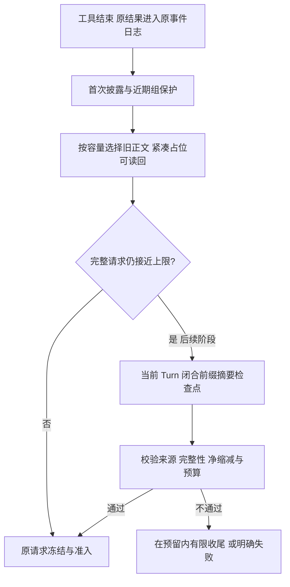

# 083：开源 Coding Agent 的上下文治理与子任务收尾对照

日期：2026-09-21。范围：公开源码的函数与直接调用路径核查，承接[最新日志诊断 082](082-c4c-context-and-late-stop-diagnosis.md)。没有安装或执行这些项目，没有调用真实模型，也未修改 TraceHarness 生产代码。

## 1. 对照对象与版本

OpenClaude 按用户提到的名称核对为 `Gitlawb/openclaude`；本文只描述这个独立社区项目，不把它等同于 Anthropic 官方 Claude Code。另选 OpenCode、Gemini CLI 与 Pi，覆盖工具输出清理、摘要和子任务生命周期。

| 项目 | 本次固定提交 |
|---|---|
| [OpenClaude](https://github.com/Gitlawb/openclaude) | `a07b06cee6af87723c6fba131bf1d9b0680e7e0d` |
| [OpenCode](https://github.com/anomalyco/opencode) | `0e3dfd17694471b55f1cc0db578bff8920341e2d` |
| [Gemini CLI](https://github.com/google-gemini/gemini-cli) | `cfbcaa8df13ea4610bb379b377b56d62980c0032` |
| [Pi](https://github.com/earendil-works/pi)（原 `badlogic/pi-mono` 地址重定向到此） | `890f920884f6d21fc7617d236ef9e1cc5d7a0ef8` |

这些是检索时分支快照，不代表同一时期的稳定发行版。源码 URL 与 SHA-256 见[来源清单](../validation-data/real-repository-pilot-v1/open-source-context-research-sources.json)。下文各项目的数字是其实现参数，**不是给 TraceHarness 建议的默认值**。

## 2. 工具结果怎样逐渐退出上下文

### 2.1 OpenClaude：按结果年龄分层，而不是一直完整保留

`compressToolHistory` 保留最近结果，较旧结果截到有限字符，更旧结果变成短标记；各层条数随有效窗口变化。它保留调用/返回配对和错误标志，并允许已截短的结果继续随年龄进入更小的一层。读取类工具没有因为被再次读取就永久免压缩。中间层目前是 2,000 字符。见[实现](https://github.com/Gitlawb/openclaude/blob/a07b06cee6af87723c6fba131bf1d9b0680e7e0d/src/services/api/compressToolHistory.ts#L388)。

已核对接线：默认配置开启此功能，OpenAI-compatible 请求准备路径调用它；但快速路径和隐式前缀缓存策略可以跳过，因此不能说所有模型请求必然采用同一压缩。它明确考虑了改写早期消息可能损失缓存收益。见[配置](https://github.com/Gitlawb/openclaude/blob/a07b06cee6af87723c6fba131bf1d9b0680e7e0d/src/utils/config.ts#L723)与[请求准备](https://github.com/Gitlawb/openclaude/blob/a07b06cee6af87723c6fba131bf1d9b0680e7e0d/src/services/api/openaiShim/requestPreparation.ts#L157)。

可借鉴：有限的近期保留、占位符紧凑、结果持续老化。不能照搬：该层旧标记带原工具参数并允许重调工具恢复内容；我们的 Effect 是历史副作用证据，重新执行不等于读回同一份证据。它在 Provider 适配处改请求的接入位置也不适合直接移植，我们应在冻结请求前沿 Session 投影处理。

### 2.2 OpenCode：清理和摘要是两层，占位符很短

`prune` 从后向前扫描，保护一定工具 token，累计达到最低收益后标记旧结果；请求投影把已清理正文变成一句短提示。默认常量为保护 40k、至少清理超过 20k，另保护 skill 输出。见[prune](https://github.com/anomalyco/opencode/blob/0e3dfd17694471b55f1cc0db578bff8920341e2d/packages/opencode/src/session/compaction.ts#L271)和[请求投影](https://github.com/anomalyco/opencode/blob/0e3dfd17694471b55f1cc0db578bff8920341e2d/packages/opencode/src/session/message-v2.ts#L290)。

**关键限制：轻量 prune 跳过最近用户回合，单个超长用户任务不能只靠这条路径治理。** 同一项目的 compaction 会选取有 token 预算的近期尾部，必要时拆开大回合，再对较早部分生成检查点；这是另一条处理路径。见[尾部选择](https://github.com/anomalyco/opencode/blob/0e3dfd17694471b55f1cc0db578bff8920341e2d/packages/opencode/src/session/compaction.ts#L222)。

大输出还有独立的落盘/截断层，提示使用 grep 或带 offset/limit 的读取；并非建议把整个外置文件再次塞回窗口。见[输出截断](https://github.com/anomalyco/opencode/blob/0e3dfd17694471b55f1cc0db578bff8920341e2d/packages/opencode/src/tool/truncate.ts#L131)。对我们最有价值的是分层与按需读页，不是照搬其阈值或只复制 prune。

### 2.3 Gemini CLI：按工具输出总量保护近期结果

主循环调用 `ToolOutputMaskingService`，向后扫描工具结果，保护最近部分，积累足够可清理量后把旧正文外置，保留预览与文件位置；只在实际减少估算 token 时替换。一般读取工具不在永久豁免名单中。该实现默认保护 50k、积累约 30k 可清理输出再处理，**这种量级不能照搬到我们 61,184 的输入上限**。见[mask 实现](https://github.com/google-gemini/gemini-cli/blob/cfbcaa8df13ea4610bb379b377b56d62980c0032/packages/core/src/context/toolOutputMaskingService.ts#L67)与[主循环接线](https://github.com/google-gemini/gemini-cli/blob/cfbcaa8df13ea4610bb379b377b56d62980c0032/packages/core/src/core/client.ts#L699)。

子 Agent 的 `LocalAgentExecutor` 每步走的是 `ChatCompressionService`，不能把主循环 masking 的行为直接当成子 Agent 同样具备。该压缩服务也会先按工具结果总量截短，再选择摘要边界；空摘要和变大摘要会拒绝采用。子执行器遇到摘要变大的失败后，会避免重复昂贵摘要，仍允许仅截断的回退。没有适合的摘要切口时也可能 NOOP，这些限制都不能从宣传词“自动压缩”看出来。见[压缩服务](https://github.com/google-gemini/gemini-cli/blob/cfbcaa8df13ea4610bb379b377b56d62980c0032/packages/core/src/context/chatCompressionService.ts#L289)与[子 Agent 接线](https://github.com/google-gemini/gemini-cli/blob/cfbcaa8df13ea4610bb379b377b56d62980c0032/packages/core/src/agents/local-executor.ts#L905)。

可借鉴：保护按容量计、压缩前后比较净收益、摘要失败不无限重试。我们的保留对象应继续是原 Effect；不必新增临时文件作为第二份权威存档。

## 3. Pi 直接处理了“一个 Turn 长到放不下”

Pi 的官方文档与代码都明确支持 `split turn`：当一个用户任务内的多次模型/工具往返过长，保留近期完整调用组，把这一 Turn 较早部分做成摘要，而不必等下一条用户消息。切口不能落在孤立工具结果上。见[文档](https://github.com/earendil-works/pi/blob/890f920884f6d21fc7617d236ef9e1cc5d7a0ef8/packages/coding-agent/docs/compaction.md#L91)与[切口算法](https://github.com/earendil-works/pi/blob/890f920884f6d21fc7617d236ef9e1cc5d7a0ef8/packages/coding-agent/src/core/compaction/compaction.ts#L403)。

它记录摘要及 `firstKeptEntryId`，由会话历史重新构造“摘要＋保留尾部”。结构化摘要保存目标、约束、进度、决策、下一步和关键上下文。摘要调用也记录用量，并检查异常结束和工具调用，见[摘要生成](https://github.com/earendil-works/pi/blob/890f920884f6d21fc7617d236ef9e1cc5d7a0ef8/packages/coding-agent/src/core/compaction/compaction.ts#L667)；调用主线见[AgentSession](https://github.com/earendil-works/pi/blob/890f920884f6d21fc7617d236ef9e1cc5d7a0ef8/packages/coding-agent/src/core/agent-session.ts#L2418)。

**对 TraceHarness 的新增判断：只缩短工具正文，仍不能长期限制增长。** assistant 消息、调用参数和一条条短占位也会增加。我们已有 Step 工具折叠，但当前语义摘要仍要求闭合 Turn；因此 Pi 式轮内前缀摘要是明确可参考的下一阶段能力。

这需要正式设计持久切口、来源范围、活动组保护、摘要费用与失败/取消语义；不能把现有 M3 的 Turn 校验删掉就算实现。原日志保留，摘要是可追溯的派生材料，不是新的事实源，也不能冒充测试结果或已批准状态。

## 4. 子 Agent 如何避免一直调查、最后交空卷

### 4.1 Gemini CLI：显式交付与一次有限收尾

子 Agent 通过 `complete_task` 交付；未配置专门输出 schema 时，也拒绝缺失、null 或纯空白结果。模型停止调用工具却没有调用完成工具，会被识别为未履行完成协议。见[交付校验](https://github.com/google-gemini/gemini-cli/blob/cfbcaa8df13ea4610bb379b377b56d62980c0032/packages/core/src/tools/complete-task.ts#L90)。

超时、步数耗尽或漏交付等可恢复原因可获一次最终收尾尝试，当前宽限计时为 60 秒；外部取消不因此被复活，最终返回终止原因与结果。该收尾提示要求立即交付，但仍调用普通 `executeTurn`，不能描述成“宿主保证所有普通工具已被撤销”。见[收尾执行](https://github.com/google-gemini/gemini-cli/blob/cfbcaa8df13ea4610bb379b377b56d62980c0032/packages/core/src/agents/local-executor.ts#L442)。

### 4.2 OpenClaude：步骤上限触发后实际撤掉工具

`runAgent` 只在显式配置 `maxSteps` 时向 query 传入 `agentStepLimit`，不是全部子任务的无条件默认行为。见[装配](https://github.com/Gitlawb/openclaude/blob/a07b06cee6af87723c6fba131bf1d9b0680e7e0d/src/tools/AgentTool/runAgent.ts#L868)。

达到上限后请求最后总结，传给模型的工具列表变空；即使模型仍返回工具调用，也阻止执行，最终记录 `agent_step_limit`。这比单独提示“不要再调查”更强。见[请求工具集](https://github.com/Gitlawb/openclaude/blob/a07b06cee6af87723c6fba131bf1d9b0680e7e0d/src/query.ts#L1491)与[执行阻止](https://github.com/Gitlawb/openclaude/blob/a07b06cee6af87723c6fba131bf1d9b0680e7e0d/src/query.ts#L2681)。

对我们而言，应该在原授权内提前留出收尾的 token、步骤、墙钟和输入空间。不能等硬上限耗尽后临时追加未经预留的预算；用户取消、不可恢复错误不走“再来一次”。正文非空仍不等于质量合格，应区分“可交接的部分发现”和“任务验收成功”。

### 4.3 主方是否必须一起停，是产品合同决定

OpenCode 的 task 工具会把子会话错误及时变成工具失败，后台执行也通知 completed/error；其代码并不因此要求所有父任务统一失败。见[task 结果处理](https://github.com/anomalyco/opencode/blob/0e3dfd17694471b55f1cc0db578bff8920341e2d/packages/opencode/src/tool/task.ts#L202)。

所以不能说“主流实现都是子失败立即终止主方”。**我们当前合同要求每个已派发 assignment 都合格交付，也没有已授权替代路径**，因此已确认的终态失败应及时终止这一试次，避免记录 082 中再花 562,727 token 才拒绝。以后若要允许可选助手失败或重新分工，应显式改变产品合同及评测口径，不能静默降级 single。

## 5. 推荐落到现有架构的方案

### 近期：完成当前故障修复

1. **Product**：工具批次收敛后核验子报告身份和终态；不可交付就按现行合同及时停止。
2. **Session/Surface**：缩短占位符，只保留必要状态和一份读取地址；公共说明集中一次，完整元数据继续在事件里。
3. **Compaction/RequestBuilder**：近期结果按实际 token 容量保护；首次披露、活动组和近期完整组仍受保护。旧读回进入同一选择策略，地址直接指回原 Effect/digest/part/区间，不永久豁免，不嵌套读回链。
4. **Reader/角色请求**：鼓励 search 或有限页读取，交接用短引用；本轮 28 次读回并非精确重复页，因此只加去重不够。
5. **Runtime/预算/监督**：预留一次有限收尾机会，收尾模式限制工具与调用数；交回已确认发现、来源、未决项和完成状态，不靠非空字符串冒充成功。

### 后续单独阶段：当前 Turn 的摘要检查点

把既有语义摘要扩展到当前 Turn 的闭合 Step 前缀，处理剩余的消息与占位符累积。共用同一 EventStore、Surface replacement、History/Reader、请求快照、token 准入和取消收敛；不新建自动记忆库、可变对话事实源或另一套 Agent 循环。

候选摘要保存目标、已确认事实、证据位置、当前方案和未决问题；工具字节原文仍可读回。引用身份、授权、调用结果、验证结果和审批不得由摘要自创。摘要太长、截断、来源不合法、未减少所需空间时不发布成有效替换；次数和费用有上限。

这张图是建议路线，不是现有能力图。**不照搬外部常量，不在 Provider 内隐式改写已经冻结的请求，不把读回改成重跑。** 不同角色共享机制，由显式配置决定预算；压缩策略还要考虑缓存命中，输入估算下降不自动等于实际费用下降。

## 6. 验证边界

本次验证公开源码存在、固定提交、直接接线与局部控制流；没有运行外部项目测试，因此没有跨项目效果或稳定性排名。所引用文件均已取得。

实施时先做当前 owner 的确定性验证，再沿原 Runner → Evaluator 验证同一真实任务一次。核心检查为：首次披露不丢、调用组完整、精确原页读回、读回保护有界、无嵌套、失败后零额外请求、有界收尾、快照重放一致与固定 Verifier 结果。轮内摘要作为后续协议阶段独立设计，不趁这次调研直接改进去。

本轮新增调研与来源清单，同步正式版 §12.2 / §14.3.19 的候选方案入口及通俗版对应主题；生产行为和原始实验材料未改变，未提交或推送。
