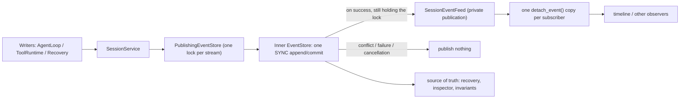

# Session event feed

An in-process channel for watching events an `EventStore` has *accepted*. It exists
so a user interface can react during a turn instead of after it, and it is
deliberately weaker than the event log in every dimension that matters.

Implementation: [`session/event_feed.py`](../src/traceh/session/event_feed.py).
Ownership rules for the envelopes themselves are in
[`event-protocol.md`](event-protocol.md).

## What it is not

| Dimension | The feed |
|---|---|
| A persisted fact | No. Nothing is written here; no new event type is introduced |
| Extra crash durability | No. An event is published once the inner, single `SYNC` append returns normally. The feed adds nothing to SQLite's commit contract |
| A source of truth | No. Runtime, `RecoveryService`, Inspector and invariants read the `EventStore`, never the feed |
| History | No. Subscribing replays nothing; use `EventStore.read()` for the past |
| State | No projection and no cache is kept here |
| Cross-process | No. Another process writing the same SQLite database publishes nothing here |
| Lossless | No. A crash between the append returning and the publish loses the notification; persisted history remains authoritative |

Because a notification can be lost, the feed is never evidence. "I saw it on the
timeline" proves nothing; the event log does.

## Why the boundary is an EventStore decorator

`PublishingEventStore` wraps any `EventStore` rather than hooking into
`SessionService`, for two checkable reasons:

1. **Backend-agnostic.** The observable semantics over `InMemoryEventStore` and
   `SqliteEventStore` are identical, so swapping the backend cannot change what
   subscribers see.
2. **It is exactly where acceptance becomes true.** `store.append()` in
   `session/service.py` is the only append call site in `src/`; every writer -
   the agent loop, the tool runtime, recovery, compaction, cancellation - goes
   through it. Announcing something the store never accepted is therefore not
   expressible at this boundary, and no writer has to remember to announce
   itself.

## Ordering and visibility contract

* **Accepted before visible.** `publish()` runs only after the inner `append()`
  returns normally, so a `ConcurrencyConflict`, a serialization failure or any
  other append error publishes exactly nothing. Cancellation publishes nothing
  either, *including* on the may-have-committed path where the event did land:
  the feed is allowed to miss events and the log is not.
* **Acceptance, not extra durability.** The only current value,
  `Durability.SYNC`, is passed through unchanged. Publication says only that the
  inner append returned normally; it does not strengthen ADR-0036's WAL,
  filesystem or power-loss boundary.
* **No additional persisted fact.** The feed writes nothing and defines no event
  type, so nothing downstream can treat a notification as evidence.
* **Sequence order, not completion order.** One `asyncio.Lock` per stream spans
  both the append and the publish. Publishing only after the append would leave
  two concurrent writers free to invert: the store serializes the writes, but the
  callers resume independently, so the writer of seq 10 can be descheduled and
  publish after the writer of seq 11. Holding the lock across both halves makes
  seq order structural instead of a lucky consequence of scheduling. Different
  streams take different wrapper locks, but the inner SQLite store still
  serializes database writers with its bounded busy timeout.
* **Batches** publish in seq order.
* **Streams are isolated.** A session-stream subscriber receives nothing from
  another session and nothing from the effect stream.
* **Publishing never awaits.** It only puts objects on unbounded queues, so the
  lock is released promptly and no subscriber can extend it.

## Consumers get a read-only interface

Observers receive `EventFeed`, which exposes only `subscribe()` and
`subscriber_count()`. Publication lives on `SessionEventFeed` as a private
`_publish()`, and `PublishingEventStore` - in the same module - is its only
caller.

The distinction is load-bearing. A public `publish` would let any holder of the
feed inject an envelope the store never accepted, and a subscriber could not
tell it apart from a real event: the timeline would faithfully display a
fabricated step. Keeping publication off the consumer interface makes "only what
the store accepted is published" a property of the API shape rather than a rule
observers are trusted to respect. An underscore is not a sandbox; it is a stated
boundary of authority.

For the same reason `AgentRuntime.events` is a **required** constructor
argument, and must be the very feed the runtime's `PublishingEventStore`
publishes to. Defaulting it would hand callers a subscribable object that stays
silent forever - an interface that exists while the capability does not. A custom
assembly must pair the two explicitly, exactly as `build_default_runtime()` does.

## Ownership: one copy per subscriber

The store's ownership contract covers what `append()` and `read()` hand back.
Fan-out is the gap that leaves: handing one `EventEnvelope` to two consumers
would give them a shared mutable payload. So `publish()` calls `detach_event()`
once **per subscriber**, not once per publish.

Observable consequence: subscriber A mutating a nested payload changes neither
stored history, nor the event subscriber B already received, nor what any later
subscriber receives.

## Unbounded queues, stated as a trade

Each subscription owns an unbounded `asyncio.Queue`:

* no backpressure reaches the runtime - a subscriber can never slow down or fail
  an append the store accepted;
* an abandoned or permanently slow subscriber grows in memory, bounded only by
  how many events the session produces;
* the chat lifecycle closes its subscription on every exit path (normal return,
  error, cancellation, EOF, `/exit`), so the shipped consumer does not leak;
* a future bounded queue must define explicit overflow semantics first. Dropping
  events silently would make a timeline lie about what happened, which is worse
  than showing nothing.

`EventSubscription.close()` is idempotent and enqueues an end marker *behind* the
events already published, so "close, then drain" delivers all of them and then
stops. That is what lets the chat promise the timeline appears before the final
answer without polling or sleeping. Iterating an already exhausted subscription
yields nothing rather than waiting for a marker a previous pass consumed.

## Deliberately not built

Cross-process SQLite change observation, persisted subscription offsets, bounded queues with
an overflow policy, WebSocket or OpenTelemetry export, and replay-on-subscribe.
Each would need its own semantics; none is required by the one consumer that
exists today.
