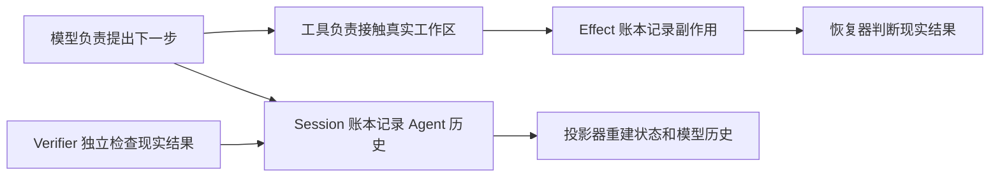
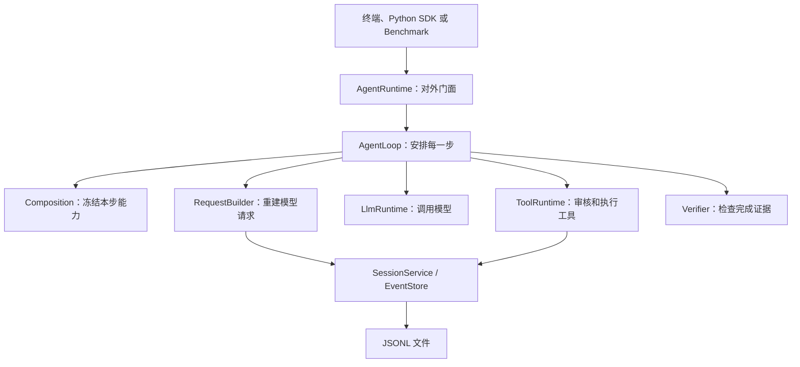
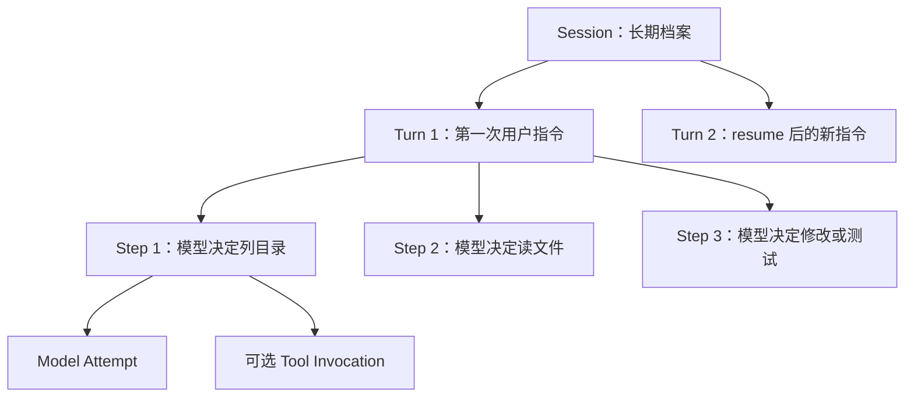
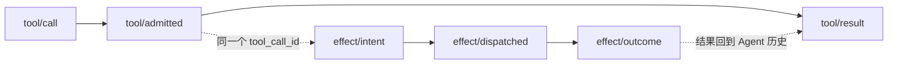
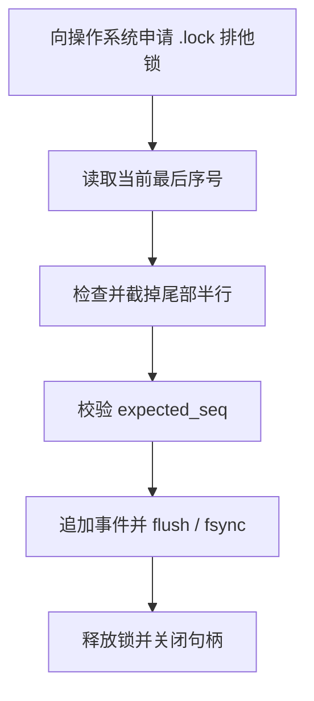
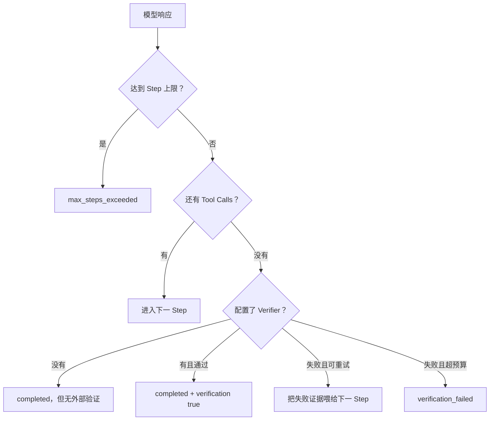
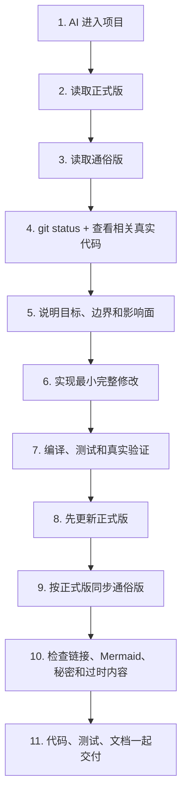

# TraceHarness Py 项目上下文（通俗版）

> 这是正式版 [`project-context.md`](project-context.md) 的通俗翻译。
>
> 两份文档使用相同的 0–18 节编号。正式版负责工程事实，本文件负责把这些事实讲明白；如果两者冲突，应先检查真实代码，再修正式版，最后同步本文件。

这不是逐行解释 Python 语法。这里所说的“解释每个细节”，指把每个有意义的模块、流程、状态、配置、限制和相互影响讲清楚，让不熟悉代码的人也能回答“它为什么存在、谁调用它、出错会怎样”。

## 0. 这两份文档是怎样工作的

可以把整个仓库想成一家公司：

- 真实源码和测试是公司每天真正采用的制度；
- 正式版是经过核对的公司制度手册；
- 通俗版是把制度手册翻译成新人能看懂的入职指南；
- README 是快速上手页；
- CHANGELOG 是版本变化清单；
- ADR 是“当初为什么这样决定”的会议决议；
- Roadmap 是未来打算，不代表今天已经拥有。

所以，不能因为 Roadmap 写了“多 Agent”，就说当前代码已经能创建子 Agent；也不能因为旧验证文档写了 24 项测试，就忽略今天实际已经有 43 项。

每次开发结束，不是在文档末尾写一句“今天又加了某功能”，而是找到原来的相关章节，把它改成项目现在的真实样子。旧状态应该由 Git 和 CHANGELOG 保存，不该残留在“当前项目地图”里误导下一次 AI。

文档中绝不能出现真实 API Key。即使某次真实运行成功，也只能写“通过 OpenAI-Compatible 接口验证成功”，不能复制 `.env` 的秘密内容。

## 1. 项目现在处于什么阶段

TraceHarness 的 Python 包名是 `traceh`，发布包名是 `traceharness-py`。版本仍是 `0.3.0` 维护线，但当前主分支比最初的 v0.3 发布包多了 `.env` 配置支持，所以 CHANGELOG 把这部分放在 Unreleased。

“Educational alpha”可以理解为：

- 它不是 PPT 项目，代码真的能安装、运行、调用模型、修改文件和执行测试；
- 关键协议有测试，CI 会在 Python 3.12 和 3.13 上运行；
- 但还不能向第三方承诺 API 永远不变，也不能当作安全隔离完善的生产 Coding Agent 平台。

当前最重要的事实：

| 你关心的问题 | 当前答案 |
|---|---|
| 能用真实大模型吗 | 能，只要平台兼容 OpenAI `/chat/completions` |
| 能不用 Key 演示吗 | 能，Scripted Provider 会按预设脚本返回 |
| 能修改代码吗 | 能，通过五个受控 Coding Tools |
| 能验证修改吗 | 能，可配置外部命令 Verifier |
| 能继续同一个会话吗 | 能，`resume` 会在同一个 Session 追加新 Turn |
| 是交互式聊天 CLI 吗 | 不是，目前一次命令只执行一个 Turn |
| 有插件系统吗 | 只有协议和内核原语，没有完整 PluginManager |
| 有多 Agent 吗 | 只有 DTO/Protocol，没有可以工作的 Supervisor |
| 有安全沙箱吗 | 没有，Workspace 边界和 Policy 只是防护层 |
| 两个 traceh 进程能同时写同一个 Session 文件吗 | 能，事件文件不会被写坏；Windows 和 Linux 都有真正的操作系统级文件锁 |
| 当前测试数 | 43 项 |

运行时只依赖 Python 标准库，说明最终用户不需要为了核心 Runtime 安装 HTTP 客户端、数据库框架等第三方包。pytest、ruff 只是开发工具。

## 2. 这个系统到底要解决什么问题

普通的简易 Agent 经常是这样：内存里放一个 `messages` 列表，模型说“调用工具”，程序执行，然后继续追加消息。只要进程崩了，你就很难回答：

- 模型当时看到了哪一版历史？
- 文件到底改了没有？
- 命令执行完了，但结果是否成功保存？
- 模型说“测试通过”是真话吗？
- 恢复时能不能再执行一次写操作？

TraceHarness 的做法是把问题拆开：



项目必须一直守住七条底线：

1. 重要事实必须能从 Session Events 找回来；
2. 外部副作用单独记账；
3. 状态和模型历史是计算结果，不是另一个偷偷变化的真相；
4. 一个 Step 开始后，模型、Prompt、工具和 Policy 不能半路换掉；
5. Tool Call 不能只有请求没有结果；
6. 崩溃后不确定的写操作不能因为“可能没执行”就自动再执行；
7. 模型的自我评价不能代替真实测试。

当前不做的事情也同样重要。v0.3 不会假装自己已经是完整插件平台、多 Agent 编排器、远程沙箱或 Codex 风格 TUI。未来接口存在，是为了以后扩展时少拆主循环，不代表现在可用。

## 3. 从目录看懂整个项目

根目录文件先分成四类：

1. **AI 开发规则**：`AGENTS.md` 是共享规则；`CLAUDE.md` 让 Claude 导入同一规则。
2. **真正代码**：`src/traceh/`。
3. **验证材料**：`tests/`、`examples/`、`benchmarks/`、CI。
4. **给人看的知识**：README、CHANGELOG、Roadmap、VALIDATION、docs。

`src/traceh/` 下每个目录的直白解释：

| 目录 | 通俗解释 | 典型入口 |
|---|---|---|
| `api/` | 各模块共同认可的合同和数据表格 | Event、ModelRequest、Tool、Plugin/Agent/Workspace Protocol |
| `cli/` | 把终端命令和 `.env` 翻译成 Runtime 配置 | `main.py`、`env_file.py` |
| `runtime/` | 真正安排“一轮任务怎样跑”的业务中枢 | `AgentRuntime`、`AgentLoop` |
| `session/` | 账本、账本的跨进程文件锁、从账本算状态、恢复和检查 | `JsonlEventStore`、`file_lock.py`、Projector、Recovery |
| `llm/` | 把统一 ModelRequest 交给具体模型 | Scripted、OpenAI-Compatible Provider |
| `tools/` | 模型想碰文件或进程时必须经过的安检与执行通道 | `ToolRuntime` 和五个内置工具 |
| `kernel/` | 为未来插件生命周期准备的基础零件 | Scope、Activation、Hook、Lifespan |
| `inspector/` | 把机器事件翻译成人能检查的文本或 HTML | `SessionInspector` |
| `evaluation/` | 复制独立工作区、跑任务、出报告 | `BenchmarkRunner` |

`api/` 里出现了 Plugin、AgentSupervisor、WorkspaceProvider，并不等于它们已经工作。这些更像建筑图纸里预留的接口尺寸；施工队和完整房间要到后续版本才有。

`docs/adr/` 不应随意重写，因为它解释当时为什么选择 Event Log、Effect Ledger、Composition Freeze 等设计。现在的状态变化写进两份上下文文档，版本变化写进 CHANGELOG。

## 4. 程序启动后各模块怎样连接

`build_default_runtime()` 像装配车间。它把零件装成一个可运行的 `AgentRuntime`：

- 选择把事件存到 JSONL 还是其他 EventStore；
- 注册模型 Provider；
- 注册五个默认工具；
- 安装 Tool Policy 和 Middleware；
- 组装 Prompt；
- 配置 Verifier 和 Continuation；
- 最后把这些交给 AgentLoop。



为什么 `AgentLoop` 必须薄？因为以后模型从百炼换成别的平台、存储从 JSONL 换成 SQLite、工具增加 Git 操作，都不应该重写“Turn/Step 什么时候开始结束”这套稳定语义。

`AgentRuntime` 与 `AgentLoop` 的区别：

- `AgentRuntime` 面向外部调用者，负责创建 Session、阻止同一 Session 重复运行、resume、cancel、dispose；
- `AgentLoop` 面向一次 Turn，负责不断创建 Step，直到完成、失败或用完预算。

## 5. Session、Turn、Step 是怎样一层层工作的

最容易理解的类比是：

- **Session** 是一个案件档案盒；
- **Turn** 是用户新下达的一次工作指令；
- **Step** 是 Agent 看完现有证据后作出的一次下一步决定；
- **Model Attempt** 是真正向模型服务发出的一次请求；
- **Tool Invocation** 是模型要求系统去读文件、改文件或运行命令。



一次正常 Turn 的过程：

1. 用户消息先被 `inbox/accepted` 接受；
2. `inbox/claimed` 把它绑定到新 Turn；
3. 写 `turn/start`；
4. 每轮先写 `step/start`；
5. 冻结 Composition，生成 Request，调用模型；
6. 如果模型要用工具，执行工具，然后进入下一 Step；
7. 如果模型不再要工具，运行可选 Verifier；
8. 写 `step/end`；
9. Continuation 判断继续还是写 `turn/end`。

项目里曾有一个真实历史案例：一个 Turn 用 6 个 Step，依次 `list_files → read_file → read_file → apply_patch → shell → 最终回答`，Session 前 70 个事件完整记录了修复与验证。它只是帮助理解的案例，不是 Agent 固定脚本；详细轨迹在 [`../code-walkthrough-zh.md`](../code-walkthrough-zh.md)。

并发方面，当前只保证同一个 Python 进程中的同一 Session 不会同时跑两个 Turn。它不是分布式 Agent 锁。要区分两层：写事件文件已经跨进程安全（第 6 节），但“一个 Session 同时只跑一个 Turn”这条规则仍然只在单个进程内生效。两个进程同时对同一个 Session 执行 `run`，文件不会写坏，但你会看到事件交错，或者某一方收到并发冲突错误，而不是被提前拦住。

取消不是直接让程序消失：Runtime 先记一条取消请求，再取消异步 Task；模型、工具和 AgentLoop 分别尽量把自己打开的生命周期闭合。Shell 子进程会先 terminate，短时间不退出才 kill。

## 6. 为什么有两本事件账

### Session Stream：Agent 认为发生了什么

它记录：用户消息、Turn/Step、发给模型的请求、模型响应、工具请求和结果、Verifier 结果、恢复与错误。

### Effect Stream：现实世界可能发生了什么

它记录：准备执行副作用、已经派发、最终结果，以及崩溃后无法确定时的对账结论。



为什么不能只留一本？因为有一个危险时间窗：文件已经改完，Effect Outcome 也可能写了，但进程还没来得及把 Tool Result 写回 Session。如果只有 Tool Result，恢复器会误以为“可能没执行”，然后重复修改。分开记账以后可以用 Effect Outcome 补回 Result。

每条 Stream 都从 seq 1 开始连续编号。写入前必须告诉 EventStore“我认为现在的最后序号是多少”；如果别人已经抢先写入，`expected_seq` 不匹配，程序明确报并发冲突，不能悄悄覆盖。

JSONL 就是一行一个 JSON 事件。它的优点是简单、可查看、Append-only；缺点是读完整历史要扫描文件，不适合直接当分布式数据库。

文件尾部写到一半崩溃时，Store 可以截掉半行；但文件中间坏了、序号断了或事件属于错误 Stream，就会报损坏，不会假装没问题。

### 为什么需要一把“操作系统的锁”

先看两个很容易被误解的地方。

**为什么 `asyncio.Lock` 挡不住另一个 Python 进程？** `asyncio.Lock` 只是当前进程内存里的一个布尔标记加一个等待队列。另一个 `traceh` 进程有自己的内存、自己的事件循环、自己的一份 Lock 对象，它根本看不到你这边的标记。它就像你在自己家门上贴了张“正在使用”的便签，隔壁邻居家的门上没有这张便签。

**为什么创建 `.lock` 文件不等于真正上锁？** “文件存在”只是一个可以被任何人无视的约定。而且“检查文件在不在”和“创建文件”是两个动作，两个进程可能同时发现文件不存在，然后同时创建、同时认为自己拿到了锁。要真正互斥，必须让操作系统内核记住“这个文件的这段字节，现在归这个文件句柄独占”，由内核而不是应用程序来仲裁。

### 现在两个进程怎样排队

每个 Stream 有一个 `.lock` 文件，进入临界区前必须向操作系统申请它的排他锁：

| 平台 | 用什么 | 效果 |
|---|---|---|
| Linux / macOS | `fcntl.flock` | 拿不到就在内核里等 |
| Windows | `msvcrt.locking`（底层是 Win32 `LockFile`） | 锁住文件第 0 号字节这一小段区间，拿不到就短暂重试 |

两者都是标准库，不引入第三方依赖。

被锁保护的“临界区”是完整的一整段动作，而不只是最后写文件那一下：



于是两个独立进程同时追加时，第二个进程会在第一步就停下来等待，等到第一个进程走完整段流程才进场。它再读最后序号时，看到的已经是更新后的值，因此不会出现两条事件抢同一个序号。

几个容易踩坑的细节也处理了：Windows 的锁是从“当前文件指针”开始算的，所以每次锁之前都显式把指针移回 0；新建的 `.lock` 文件是 0 字节，而 Windows 允许锁定文件末尾之后的区间，所以空文件也能锁，不需要先写点内容进去。

### 为什么还需要 expected_seq

锁只保证“同一时刻只有一个进程在临界区里”，不保证“你上次看到的世界还没变”。典型调用是先 `head()` 问最后序号，再 `append()` 写入——这是两次独立进入临界区，中间另一个进程完全可能已经写了新事件。这时第二个写入者的 `expected_seq` 对不上，程序会明确抛出并发冲突，让调用方知道要重新读取再试，而不是覆盖别人的事件。锁负责不写坏文件，`expected_seq` 负责不基于过期认知写入。

### 崩溃或异常后会不会永远锁死

不会，原因有两层：

1. 代码里所有正常返回、抛异常（包括并发冲突）、以及任务被取消的路径，都在 `finally` 中释放锁并关闭文件句柄；
2. 更根本的是，这两种锁都绑在“打开的文件句柄”上。进程崩溃、被 kill、断电重启后，操作系统关闭它的所有句柄，锁自动消失。残留的 `.lock` 文件只是一个空文件，不会拦住任何人。

如果构造 Store 时传了 `lock_timeout`，等不到锁会在超时后明确报错；默认不传就是一直等。

### 取消一个正在等锁的写入，会发生什么

这里有一个很容易被忽略的坑。等锁和写文件是阻塞操作，跑在后台线程上，而**线程是杀不死的**。如果只是简单地 `await asyncio.to_thread(...)`，取消协程只会让调用方立刻收到 `CancelledError`，后台线程根本不知情——它继续排队，等别的进程一放锁，它就把那条“已经被取消”的事件写进文件。调用方以为什么都没发生，文件却在它返回之后偷偷变了。

现在的做法是把取消拆成两步协作：

1. 协程被取消时，先给后台线程发一个“别等了”的信号（一个 `threading.Event`）。线程正好是睡在这个信号上的，所以会立刻醒来、放弃等待、什么也不碰。
2. 协程**不会马上**把 `CancelledError` 抛给调用方，而是先等后台线程真正结束，确认没有遗留动作，再抛出。

于是有了一条清晰的规则：

| 取消发生在什么时候 | 结果 |
|---|---|
| 还在等锁 | 什么都没写，调用方收到取消 |
| 刚拿到锁、还没开始干活 | 进门前再检查一次信号，直接放弃，什么都没写 |
| 已经在写文件的中途 | 这一段不能半途而废，会完整写完并落盘；调用方仍然收到取消 |

第三种情况是有意为之的“原子完成”：文件写到一半停下来才是真正的灾难。关键在于，即使这种情况，调用方也是等到写完之后才拿到 `CancelledError`——**它返回之后文件不会再变**。

这里还有一个更隐蔽的坑，值得单独说。第 2 步“等后台线程结束”本身也是一次 `await`，所以它同样能被取消。如果实现时图省事，用一句“把等待期间的任何异常都吞掉”来收尾，那么用户第二次按下取消，就正好把这次收敛等待打断了——调用方立刻脱身，后台线程却还在临界区里，事件随后照样写入。这等于绕了一圈又回到最初的问题。

正确做法是把收敛写成一个循环：只要后台线程还没结束，就一直等它；期间来第二次、第三次乃至第十次取消，统统吸收掉、继续等同一个线程。取消不是逃生出口，它只是一个意愿声明；只有后台线程真正结束、锁真正释放之后，调用方才会收到 `CancelledError`。另外，后台线程自己抛出的异常（比如放弃等锁、并发冲突）也会在这里被取走，不会变成没人认领的 Future 异常告警。

代价要说清楚：这一种情况下，你收到了取消，事件却已经提交了。所以“收到取消”不能被理解成“肯定没写入”。注意这里并没有任何自动重试，所以严格来说不该叫 at-least-once，更准确的说法是“可能已经提交”——它是一个提交点边界。正确做法是重新读一遍 Stream，用 `event_id`、correlation 或业务身份去认领那条事件，而不是只看 Head 的数字（Head 也可能是别人推进的）。这和崩溃恢复的原则是同一条：以账本为准。

顺带一提，因为要能被取消，Linux 上的无限等待从“睡在内核里”改成了“可中断的轮询”。等待仍然是无限的，只是现在叫得醒。

## 7. 模型到底看到了什么，能不能事后证明

模型看到的内容不是直接读取某个一直变化的 `messages` 变量，而是两部分相加：

```text
ModelRequest = 截至某个序号的 Surface + 本 Step 冻结的 Composition
```

### Composition 是能力清单

它回答：

- 用哪个 Provider 和 Model；
- System Prompt 是什么；
- 模型能看到哪些 Tool Schema；
- 有哪些 Policy 和 Middleware；
- temperature、最大输出是多少；
- 这些内容合起来是哪一个 revision。

Lease 的意思是“这个 Step 借用这一整套能力直到结束”。当前能力虽然是静态的，但未来即使插件更新，已经开始的 Step 也可以继续用旧版本，不会一半用旧工具、一半用新工具。

### Surface 是给模型看的历史

它只挑：

- 用户消息；
- 助手完整消息和它提出的 Tool Calls；
- Tool Results；
- 人工压缩生成的替换摘要。

像 `step/start`、`effect/intent` 这类运行内部事件不会直接塞给模型，否则模型上下文会被技术账本淹没。

### Request Snapshot 是事后证据

每次模型调用前保存：完整请求、历史读到的 `source_seq`、Composition revision 和 fingerprint。Replay 时重新按当时边界计算一遍，如果 fingerprint 不一样，就说明现在的重建规则无法还原当时请求，Inspector 会报告违规。

Fingerprint 不是加密秘密保护，它主要是稳定内容校验：相同结构生成相同摘要，任意请求内容变化都会导致摘要变化。

## 8. 两种模型 Provider 分别做什么

### Scripted Provider

它不调用网络，而是按 JSON 脚本依次返回预设 ModelResponse。用途是：

- 测试主循环是否真的执行工具；
- 无 Key Demo；
- 生成可重复的事件轨迹；
- Benchmark 每次都得到相同决策。

这不是“假装真实模型很聪明”，而是把 Runtime 正确性和模型随机性分开测试。脚本内容属于测试夹具，绝不能偷偷变成生产默认业务逻辑。

### OpenAI-Compatible Provider

它把统一 Request 翻译成 `/chat/completions` 请求，包含 system/user/assistant/tool 消息和 Function Tool Schemas。API Key 只在发 HTTP 时从指定环境变量读取，作为 Bearer Header 发送。

当前只取响应中的第一个 choice，解析文本、Tool Calls、finish reason 和 usage。异常会变成明确的 `ProviderHttpError`。

“OpenAI-Compatible”表示协议格式兼容，不表示只支持 OpenAI，也不表示所有第三方平台细节完全相同。Base URL、Model 和 Key 环境变量名必须由配置明确提供。

虽然 Session 里有 `assistant/chunk`，当前实现并不是真流式。Provider 先拿到完整响应，LlmRuntime 再把完整文本作为一个 Chunk 记录。以后做流式时可以替换这层，而不用改变 Step 的意义。

## 9. 模型为什么不能直接执行文件操作

模型只能提出 Tool Call，真正执行必须过 ToolRuntime：

1. Tool Registry 查名字是否存在；
2. Schema 检查参数类型、必填字段和多余字段；
3. 多个 Policy 共同判断；任何 DENY 都最终拒绝；
4. 允许后写 Tool Admission 和 Effect Intent；
5. 根据 Effect Kind 决定并发还是排队；
6. 经过 Middleware；
7. 调用工具；
8. 写 Effect Outcome；
9. 裁剪过长输出并写 Tool Result。

Middleware 像一层层包装器，可以做日志、计时或附加限制。每层 `call_next()` 最多一次，防止一个 Middleware 不小心把写文件动作执行两遍。

### 为什么读工具能并发、写工具要排队

连续多个读操作互相不改变 Workspace，可以一起等待；写文件和进程可能改变现实状态，必须形成 Barrier，保证调用顺序可解释。

### 五个工具的细节

#### `list_files`

递归查看 Workspace 文件，输出相对路径；跳过 `.git`、`.traceh`、缓存、虚拟环境和依赖目录；默认最多 500，可配置但最高 5000。它只读，不接收任意根路径。

#### `read_file`

读取一个 UTF-8 文本文件。先把用户给的相对路径解析成真实路径，再确认它仍位于 Workspace 内。目录或工作区外路径会失败。

#### `search_text`

可以搜索普通子串或正则，可指定 Workspace 内子路径，返回文件、行号和文本。非 UTF-8 文件被跳过；结果默认最多 100、最高 1000。

#### `apply_patch`

名字叫 Patch，但当前不是解析 Git unified diff，而是“精确找到旧文本并替换”。默认要求旧文本出现一次，也可明确指定次数；次数不符时完全不改文件。创建新文件必须显式 `create=true` 且旧文本为空。

写入先落到同目录临时文件，flush、fsync 后用 `os.replace` 替换目标，并返回修改前后 SHA-256 证据。这样比直接覆盖更能减少半写文件。

#### `shell`

收到的是一条普通命令字符串，但先由 `shlex.split` 拆成 argv，再用 `create_subprocess_exec` 执行，不经过 `shell=True`，因此不会自动解释管道、重定向和 shell 语法。

子进程环境只保留少量必要变量，并删除名字包含 KEY、TOKEN、SECRET、PASSWORD、CREDENTIAL、AUTH 的变量，避免模型运行的测试进程顺手继承 API Key。它支持超时和取消，并返回退出码、stdout、stderr。

默认危险命令 Policy 会挡住一组明显危险的程序名，但黑名单永远不等于真正沙箱。运行不可信模型时仍需容器或远程隔离。

## 10. 为什么模型说“完成了”还不算完成

Continuation 决定下一步：



CommandVerifier 会在真实 Workspace 里重新运行配置命令。退出码 0 才是通过，stdout/stderr 会进入验证事件。它与 Agent 自己调用 Shell 测试不是一回事：Agent 可能误读一次 Shell 输出，Verifier 是 Harness 规定的独立完成门槛。

但 Verifier 是可选的。没有配置时，模型不再请求工具就可以结束。这时结果里的 `verification_passed=None` 只表示“没有验证”，绝对不能翻译成“验证成功”。

默认允许验证失败后再修一次，因为 `max_verification_retries=1`。失败摘要作为新的用户消息进入下一 Step，模型能根据真实测试证据继续处理。

## 11. 程序崩溃以后为什么不能直接重跑

假设模型要求执行一个写文件工具：

```text
写下 Intent → 派发工具 → 文件已经改变 → 写下 Outcome → 写 Tool Result
```

进程可能在任意两个箭头之间崩溃。恢复器的原则是：能证明的才补写，不能证明的明确标为未知。

- 有 Outcome、没有 Tool Result：说明现实结果已经持久化，可以合成 Result；
- 有 Call/Intent，但没有可确认 Outcome：写 `unknown_after_crash`，不自动重放；
- Step 或 Turn 没有 End：追加 `interrupted` 的 End；
- 做过恢复动作：再写 `runtime/recovered`，留下恢复说明。

为什么读操作也统一进 Effect Ledger？统一协议让 Inspector 和恢复器不用猜不同工具的记录方式；同时 `EffectKind.is_retry_safe` 明确告诉未来恢复策略哪些是读、哪些是危险副作用。

当前一个缺口是：如果有 `model/attempt-start` 没有对应 `model/attempt-end`，恢复器会关闭外层 Step/Turn，但不会为 Attempt 单独追加恢复结束事件。因此 Model Attempt 的严格配对还需加固。

`resume` 先恢复再开新 Turn，而且默认提醒模型重新查看 Workspace 和恢复结果。这样可以减少模型看到旧对话后直接重复写操作的风险。

## 12. 怎样从事件得到状态、压缩历史和评估质量

### StateProjector

它像会计报表程序：不修改账本，只从事件计算 Session 现在是 active、completed、interrupted 还是 failed，当前有没有开放 Turn/Step，一共完成多少次。

### CoreInvariantChecker

它检查协议是否自洽，例如序号是否连续、Turn/Step 是否正确嵌套、Tool Call 是否有结果、Effect 是否能对应、Composition 是否存在。它不是业务测试，而是检查“轨迹本身有没有违反规则”。

### Surface Compaction

长 Session 会让模型历史越来越长。当前 `compact` 需要人提供摘要，程序把某个序号之前的可见消息列出来，再追加一条 `surface/replace`。旧事件不删除，只是下一次投影时隐藏被替换的消息，改用摘要。

这不是自动模型压缩，也没有自动判断最佳边界；目前调用者对摘要准确性负责。

### Inspector

`inspect` 会显示 Workspace、状态、事件数、Turn/Step 数、不变量违规和 Request 重建违规。普通文本适合终端快速看，HTML 会把 Session 和 Effect 两条流放进静态表格，便于人工审计。

### Replay

Replay 不是重新执行工具，而是重新投影模型当时能看到的 Surface，并重建 Request 检查 fingerprint。它不会重复副作用。

### Benchmark

Benchmark 每个案例先复制一份独立 Workspace，避免破坏夹具；然后让 Scripted Provider 驱动真实 ToolRuntime 修改副本，并由真实 Verifier 验证，最后检查不变量并输出报告。

现在只有一个简单加法修复案例。它能证明整条管线连通，但不能证明 Agent 能解决大型仓库、模糊需求或复杂回归。

## 13. 日常怎么启动、配置和查看

安装开发版本：

```powershell
python -m pip install -e ".[dev]"
traceh doctor
```

九个命令可以按用途记成四组：

- **运行**：`run` 新建 Session；`resume` 恢复并继续；
- **修复/查看**：`recover`、`inspect`、`replay`、`sessions`；
- **历史管理**：`compact`；
- **质量与环境**：`eval`、`doctor`。

目前 `traceh run` 的体验是：给一次任务，Agent 运行到本 Turn 结束，然后打印结果。终端中途不会像 Claude Code 那样持续等待下一句，也没有实时显示每个 Tool Call 的交互面板。

### `.env` 为什么能免去每次输入 Key

程序默认在当前目录找 `.env`。里面可以写 Provider、Base URL、Model，以及“Key 存在哪个环境变量名里”。真正 Key 仍然只在本地 `.env`，Git 只提交 `.env.example` 占位模板。

配置优先级从高到低：

1. 这次命令明确传的参数；
2. 启动 TraceHarness 前已经存在的系统/进程环境变量；
3. `.env` 文件；
4. 程序默认值。

因此 `.env` 不会反过来覆盖系统已经设置的值。显式命令参数又能临时覆盖两者。

OpenAI-Compatible 模式不偷偷选择平台和模型：Base URL、Model 必须明确配置。示例模板可以展示某个平台写法，但生产代码不能因为示例是百炼就默认永远调用百炼。

默认一次最多 20 个 Step；工具和验证命令各有 60 秒 Runtime 级默认超时；工具结果最多保留 24,000 字符；验证默认允许失败后再尝试修复一次。

## 14. 代码里那些“未来接口”应该怎样理解

这一部分最容易被 AI 夸大。

### Plugin

现在有 PluginManifest、Plugin Protocol 和 PluginContext，说明未来插件应该如何描述身份、依赖和注册服务。但没有扫描 Python Entry Points、加载第三方 Wheel、解决依赖、健康检查和卸载的 PluginManager。

### Activation / Lifespan / OwnedTaskSet

这些是插件生命周期零件：Activation 可以先收集资源，失败时回滚；Lifespan 按相反顺序清理注册；OwnedTaskSet 负责取消并等待后台任务。现在它们有独立测试，但还没连接成完整插件产品。

### Scope

Scope 是可以向父层查找服务的层级容器。当前主要证明服务覆盖边界可行，还没有完整 Application → Workspace → Preset → Agent 多层运行装配。

### Composition Lease

现在每个 Step 确实通过 Lease 获取快照；未来可以让旧 Step 持有 generation v1，新 Step 用 v2，等 v1 Lease 归零再卸载。但引用计数、Drain 和热替换还没有实现。

### AgentSupervisor / Budget

存在 AgentSpec、消息、Budget、Handle 和 Supervisor Protocol，只说明未来控制面需要哪些数据和方法。现在不能调用它创建子 Agent，也没有持久化 Inbox 或冷恢复 Supervisor。

### WorkspaceProvider

存在 Snapshot、Branch、PatchArtifact、MergeResult 的协议，但没有 Git Worktree 实现，也没有并行 Agent 合并代码。

正确说法是：“v0.3 已经把未来接入边界放进代码”；错误说法是：“v0.3 已经实现完整插件和多 Agent”。

## 15. 我们怎样知道当前代码没有悄悄坏掉

标准检查：

```powershell
python -m compileall -q src tests
python -m pytest -q
```

Compileall 主要发现语法和导入前的字节码编译问题；pytest 检查具体行为。当前 43 项测试大致分成：

- JSONL 是否按序写、尾部半行能否恢复；
- 两个真正独立的 Python 进程同时写同一个 Stream 时是否安全；
- 等锁途中取消写入时，后台线程会不会偷偷把事件补写进去；
- 连续按很多次取消，能不能骗过收敛等待、让调用方提前脱身；
- Event 投影和协议不变量；
- 主循环能否真正调用工具并验证；
- 工具参数、Policy、Middleware、超时、并发和错误；
- 路径能否逃出 Workspace；
- Patch 是否严格检查替换次数；
- 取消和崩溃恢复是否闭合；
- 两类 Provider 是否正确转换数据；
- `.env` 是否按优先级加载且不打印秘密；
- Kernel 原语是否正确回滚和清理；
- Inspector、Replay、Request 重建和 Benchmark。

跨进程那几项测试是怎么做的？它们不是开两个 asyncio 任务或两个线程假装并发——那证明不了任何事，因为同一个进程里 `asyncio.Lock` 本来就够用了。测试真的用 `subprocess` 启动独立的 Python 解释器去跑 `tests/cross_process_worker.py`，进程之间靠“握手文件”对齐节奏（我准备好了 → 你们一起开始），而不是靠猜时间的长 sleep。为了让竞争必然发生而不是碰运气，Worker 会在临界区里故意多停留一小会儿，把窗口撑开；有真锁时另一个进程只是排队等待，结果依然正确，把锁去掉则测试稳定失败。

其中还专门验证了：另一个进程持锁时本进程确实被挡住、持锁进程被强制杀死后锁能被重新拿到、抛异常之后锁也不会留在手里。

取消相关的三项测试尤其严格。它们不靠 `asyncio.sleep(0)` 猜后台线程有没有启动，而是让线程自己在开始等锁时点亮一个信号灯，测试等到这盏灯亮了才按下取消；随后立刻断言“线程已经收敛”这盏灯也是亮的——这直接证明了 `CancelledError` 是在后台工作结束之后才交给调用方的。最关键的一条断言是：外部进程放锁之后，那条被取消的事件**始终没有出现在文件里**。还有一项专门连按六次取消，确认调用方在后台线程真正干完之前一次也逃不掉。

GitHub CI 现在有两个 Job：Linux 上用 Python 3.12 和 3.13 安装开发包、编译、跑测试、再执行 doctor；Windows 上用 Python 3.12 跑同样的步骤。加 Windows Job 的原因很具体：Windows 走的是 `msvcrt` 而不是 `fcntl`，这条代码路径只有在真的 Windows 机器上跑才算验证过。

`VALIDATION.md` 里的 24 项、80% Coverage、Wheel 安装等是最初发布时点证据，不能随意改成今天的数字。今天的 43 项 = 发布时 24 项 + `.env` 等后续测试到 31 项 + 跨进程文件锁与取消语义的 12 项。一个是历史发布快照，一个是当前代码状态，两者用途不同。

## 16. 当前最需要保持清醒的地方

1. **锁的边界**：Windows 和 Linux 现在都有真正的跨进程文件锁，但它是同机的“协作锁”——只对经过 `JsonlEventStore` 的写入有效，绕开它直接改 JSONL 文件不受保护；放在网络盘（NFS/SMB）上的行为也没有验证过。另外，事件写入安全不等于 Session 级排队，两个进程同时 `run` 同一个 Session 仍然不会被 Runtime 提前拒绝。还有一条要记住：取消如果正好落在写文件的中途，你会收到取消，但那条事件已经提交了——“收到取消”不等于“没写入”。因为没有自动重试，这不是 at-least-once，而是“可能已提交”的提交点边界；要重新读 Stream、按 `event_id` 或业务身份认领，才知道到底写没写。
2. **Model Attempt 恢复**：外层生命周期能收敛，但 Attempt 还没有专门恢复闭合。
3. **CLI 体验**：Runtime 能运行 Coding Agent，不代表已经有好用的交互式 Coding Agent 产品界面。
4. **Shell Policy**：挡住几个危险命令不等于模型已被沙箱隔离。
5. **Provider 能力**：能调 OpenAI-Compatible 接口不等于支持流式、重试和自动换模型。
6. **JSONL 性能**：查询最后序号很快，但完整投影仍要读取历史。
7. **Patch 能力**：当前适合小而精确的文本替换，不是完整 Git Patch 引擎。
8. **Benchmark 代表性**：一个固定加法 Bug 只能证明管线，不代表复杂 Coding 水平。
9. **手动压缩**：系统不会自动替你写可靠摘要。
10. **Alpha API**：现在的公开类名和协议在 v1.0 前仍可能调整。

如果接下来目标是“完善 v0.3”，优先级应放在这些真实边界、更多真实任务、交互体验和观测能力，而不是为了 Roadmap 好看提前铺开多 Agent。

## 17. 改一个地方时，还要想到哪些地方

这是防止“AI 改得很快，但没人知道影响范围”的检查表：

| 你修改了什么 | 通常还要检查什么 | 为什么 |
|---|---|---|
| AgentLoop | Continuation、事件顺序、E2E、取消和恢复 | 一处顺序变化可能让整个生命周期不配对 |
| Event 类型或字段 | Projector、Invariant、Recovery、Inspector、Replay | 所有消费者都依赖事件协议 |
| Request/Composition | Fingerprint 重建、Provider 测试、Replay | 必须还能证明模型当时看到了什么 |
| ToolRuntime | Effect、Result 配对、Policy、Middleware、取消 | 工具是现实副作用入口 |
| 某个内置工具 | Schema、路径边界、证据、超时、对应测试 | 模型输入不可信，工具必须自己校验 |
| `.env` 或 CLI | README、模板、doctor、配置优先级测试 | 配置最容易被本机环境污染 |
| Verifier | Continuation 与失败重试 | 完成判定改变会影响 Turn 结束原因 |
| Plugin/Multi-Agent DTO | 未来协议测试和“未实现”边界描述 | 不能把接口误写成产品能力 |
| 目录或开发流程 | AGENTS、两份上下文、README/CI | 下一次 AI 必须找到新的入口 |

每次只需更新真正受影响的章节，但不能跳过检查。例如只给 README 改错别字，不必重写 ToolRuntime；修改 Tool Result 字段，则一定要检查第 6、9、11、12、15、16 节。

## 18. 以后每次 Vibe Coding 固定怎样进行



`AGENTS.md` 的作用是强制“必须做”；这两份文档的作用是保存“项目现在是什么”；未来如果再做 Context Maintenance Skill，它的作用才是提供“如何更自动地完成这些步骤”。

Codex 会直接读根目录 `AGENTS.md`。Claude Code 默认读 `CLAUDE.md`，而本项目的 `CLAUDE.md` 只有 `@AGENTS.md`，所以两者最终使用同一套规则，不维护两份重复制度。

一次开发真正完成时，交付说明必须让你看得懂：

- 改了什么现实行为；
- 为什么要改；
- 哪些测试或真实命令通过；
- 正式版和通俗版更新了哪些章节；
- 哪些风险仍然存在；
- 如果已获授权，代码、测试和文档是否在同一个 Git 提交并已推送。

这样 AI 即使开发很快，仓库里也始终留下“代码事实、正式地图、通俗解释、测试证据和 Git 历史”五条互相校验的线索。
