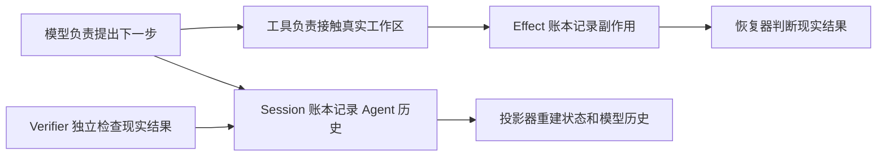
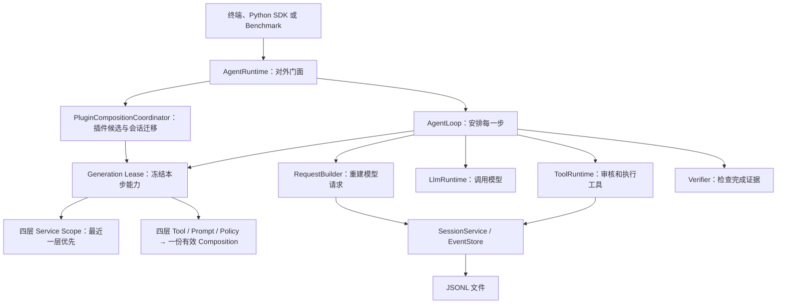
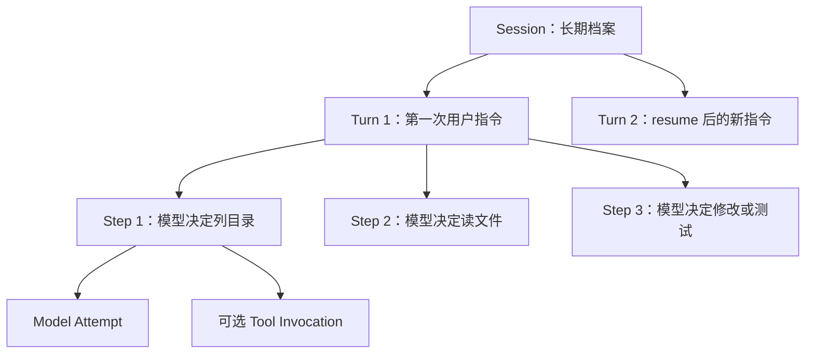
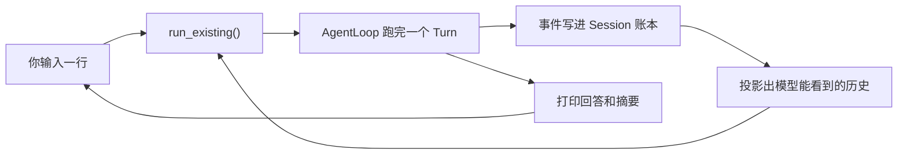
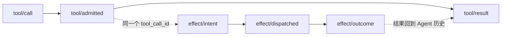
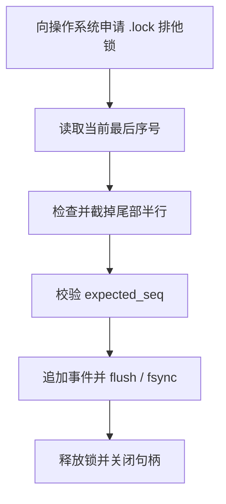
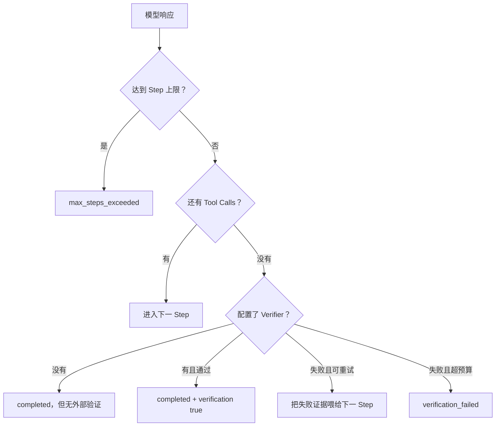
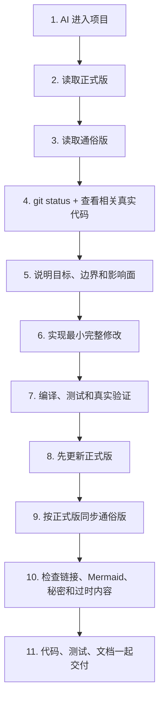

# TraceHarness Py 项目上下文（通俗版）

> 这是正式版 [`project-context.md`](project-context.md) 的通俗翻译。
>
> 两份文档使用相同的 0–20 节编号。正式版负责工程事实，本文件负责把这些事实讲明白；如果两者冲突，应先检查真实代码，再修正式版，最后同步本文件。

这不是逐行解释 Python 语法。这里所说的“解释每个细节”，指把每个有意义的模块、流程、状态、配置、限制和相互影响讲清楚，让不熟悉代码的人也能回答“它为什么存在、谁调用它、出错会怎样”。

## 0. 这两份文档是怎样工作的

可以把整个仓库想成一家公司：

- 真实源码和测试是公司每天真正采用的制度；
- 正式版是经过核对的公司制度手册；
- 通俗版是把制度手册翻译成新人能看懂的入职指南；
- README 是快速上手页；
- CHANGELOG 是版本变化清单；
- ADR 是“当初为什么这样决定”的会议决议；
- Roadmap 是未来打算，不代表今天已经拥有。

所以，不能因为 Roadmap 写了“多 Agent”，就说当前代码已经能创建子 Agent；测试数量也必须以本轮真实 collect/run 输出为准，不能继续照抄旧快照。

反过来也一样：v0.3 时期的文档到处写着“没有完整 PluginManager”，那句话到 v0.4 已经**不再成立**，本轮已经全部改写。旧状态该留在 Git 和 CHANGELOG 里，不该留在“项目现在是什么”的地图上。

每次开发结束，不是在文档末尾写一句“今天又加了某功能”，而是找到原来的相关章节，把它改成项目现在的真实样子。旧状态应该由 Git 和 CHANGELOG 保存，不该残留在“当前项目地图”里误导下一次 AI。

文档中绝不能出现真实 API Key。即使某次真实运行成功，也只能写“通过 OpenAI-Compatible 接口验证成功”，不能复制 `.env` 的秘密内容。

## 1. 项目现在处于什么阶段

TraceHarness 的 Python 包名是 `traceh`，发布包名是 `traceharness-py`。当前版本是 **`0.6.0`**。v0.5 的 Generation、Lease、插件组合切换、四层宿主装配和 application 插件执行能力全部保留；v0.6 又正式发布两条主线：一条是 Runtime 外的 L1–L4（写源码候选、独立验证、固定任务对比、人工批准后精确推广/回滚），另一条是 Stage A–E 的多 Agent 控制面（身份、FIFO 收件、真实投递、child-first 生命周期和五个模型 Tool）。v0.7 D0 把接缝收干净；v0.7-A 把原先“写进 Agent 身份但没人执行”的 Budget 删掉，换成一条真正 append-only 的层级账本；v0.7-B 又用宿主显式装配的薄适配器，把同一本账接到 managed child create、模型/Token、Step、Tool dispatch、Turn wall time 和 process-local slot。它没有把余额塞进 `AgentRuntime`，也没有给 `AgentLoop` 增加预算分支。Plugin Creator Skill 与 Python Quality 仍是独立 Wheel，并在本次发布升级到 `0.2.0`；插件仍不能自己选择子层或替换 EventStore。当前仍没有默认 CLI Budget grant、L5 自动归纳弱点/提出候选、操作系统沙箱、隔离插件、跨进程 Agent 接管、独立工作区/Patch 或 Workflow。

### 版本为什么只准写在一个地方

这一版把版本号收拢成了唯一来源：`src/traceh/version.py` 里的 `__version__`。`pyproject.toml` 不再写死版本，而是去读这个属性，所以打出来的 Wheel 和被 import 的代码不可能对不上。

为什么这么较真？因为 `traceh.core` 的版本会被写进**每一条 Composition 快照**（就是“这一步用的是哪套能力”的存档）。之前的候选实现把版本分散写在四个地方，其中两处对不上：不带插件启动的 Runtime 和走 PluginManager 启动的 Runtime，会给同一种步骤写下**不同的**核心版本。而快照存在的意义，恰恰就是排除这种“同一次构建说两套话”的情况。

现在这些全部派生自那一个属性：Wheel 元数据、`traceh.__version__`、核心插件身份、插件 API 版本、Manifest 的默认兼容范围、Composition 快照、CLI 标题，连源码 ZIP 的默认文件名也不再单独写死版本。而且有测试直接断言“装出来的包的版本 == import 进来的版本”。

“Educational alpha”可以理解为：

- 它不是 PPT 项目，代码真的能安装、运行、调用模型、修改文件和执行测试；
- 关键协议有测试，CI 会在 Python 3.12 和 3.13 上运行；
- 但还不能向第三方承诺 API 永远不变，也不能当作安全隔离完善的生产 Coding Agent 平台。

当前最重要的事实：

| 你关心的问题 | 当前答案 |
|---|---|
| 能用真实大模型吗 | 能，只要平台兼容 OpenAI `/chat/completions` |
| 能不用 Key 演示吗 | 能，Scripted Provider 会按预设脚本返回 |
| 能修改代码吗 | 能，通过五个受控 Coding Tools |
| 能验证修改吗 | 能，可配置外部命令 Verifier |
| 能继续同一个会话吗 | 能，`resume` 会在同一个 Session 追加新 Turn |
| 是交互式聊天 CLI 吗 | `traceh chat` 可以在一个会话里连续对话，能实时打印每一步和每次工具调用，卡在慢操作上时还会每隔几秒报一次「还在跑」；按一次 Ctrl+C 只取消当前这一轮、会话还在。但它仍是行式提示符，不是流式 TUI |
| 有插件系统吗 | **有**。装一个 Wheel 就能被发现，显式启用后它的 Tool、Prompt、Service、Provider、Policy、Middleware、命名 Verifier 都能走正常主线（第 19 节）；其中 Provider/Verifier 还要再明确选择 |
| 能让 Agent 帮我写新插件吗 | L1 可以：显式启用 `traceh.plugin.creator` 后，它会读取打包在 Wheel 里的工作流、合同、模板和清单，把**源码候选**写进单独 Candidate Workspace。但结果必须标成“未验证”，不会自动 build/test/install/enable |
| 能独立验证这份候选吗 | L2 可以：显式指定候选目录、可信核心 Git 仓库、新输出目录和依赖源后，`traceh plugins validate` 会跑 13 道宿主管控门禁。普通门禁失败只有完整报告；报告自己都写不完时连输出目录都不会留下；通过才发布精确哈希产物 |
| 能证明插件比不开时更好吗 | L3 可以在**宿主固定的小任务集**上比较：两边装同样的核心与候选 Wheel，只有 candidate 一边启用插件，最后给出 improved/regressed/mixed/no-change。它不是通用 Benchmark，也不能替人批准或安装 |
| 能把比较通过的插件安全装进目标环境吗 | L4 可以，但故意分两次：第一次只给中文证据/风险卡和审批摘要，不改环境；人确认后把同一摘要交回第二次调用，才会安装精确 Wheel。失败/取消先退回上一版，首版则卸载；硬崩溃留下的半完成状态要用精确推广 ID 显式 rollback |
| 装了插件就会自动生效吗 | **不会**。装了只是“能被发现”，还要用 `--plugin` 或 `TRACEH_PLUGINS` 明确点名才会加载 |
| 能在运行中换插件吗 | 可以在空闲的 `traceh chat` 中用 `/plugins`、`/plugins reload`、`/plugins use ID...` 或 `--none` 切换当前进程已经能发现的已安装插件；这会重做 setup/conflict/health 并走 Generation/Lease/Drain，但不是 pip 安装、Wheel 替换或 Python module reload |
| 有四层 Scope 吗 | 有程序化装配：Service、Tool、Prompt、Policy 都能由宿主 Python 代码明确放进 Application、Workspace、Preset 或 Agent 层，越靠近 Agent 越优先，而且 Step 开始后不会被新 Generation 原地换掉。插件本身仍只在 application 层 setup，不能自行选择子层；它提供的 Policy 属 application 候选 |
| 插件是被沙箱隔开的吗 | 不是。v0.4 的插件和 Harness 同进程同权限；`isolated` 可以写在 Manifest 里，但会被**明确拒绝** |
| 有多 Agent 吗 | **有了模型可调用的进程内子 Agent 主线。** v0.6 Stage A 记身份，Stage B 记 FIFO 收件，Stage C 认领并跑真实 Turn，Stage D 按 `owner_agent_id` child-first 收敛，Stage E 再提供 spawn/send/wait/stop/collect 五个普通 Tool（第 20 节）。v0.7-A/B 已用单一层级 Budget 账本和宿主薄适配器强制 managed create、模型、Step、Tool、wall 与进程 slot；仍没有默认 CLI grant、冷恢复、跨进程唯一性、自动重试、独立工作区/Patch 或 Workflow |
| 有安全沙箱吗 | 没有，Workspace 边界和 Policy 只是防护层 |
| 两个 traceh 进程能同时写同一个 Session 文件吗 | 能，事件文件不会被写坏；Windows 和 Linux 都有真正的操作系统级文件锁 |
| Agent 的身份存在哪里 | 存在账本里，不在内存对象里。一个 `AgentRuntime` 只是「活的实例」，可以停掉再建；停掉它不会让这个 Agent 消失，也不会让它变成另一个 Agent（第 20 节） |
| 当前测试数 | 核心收集 1770 项；完整门禁 1769 通过、1 项跳过（唯一 skip 是 Windows NUL 路径边界），包含真实 L2 递归验证和 Wheel E2E；v0.7-B Budget 账本/执行/Supervisor 专项 79 项、连同 Composition/插件主线的扩大定向 168 项全部通过。D0 架构守卫仍为 5 项，v0.6.0 发布快照仍是 1707/1706/1。仓库外干净 HEAD 克隆和 v0.6 RC 的真实 L2/L3/L4、真实 parent→child、恢复与取消证据仍保留；独立 Python Quality/Plugin Creator Skill 另有 17/10 项通过 |

### 运行时依赖变了，这条必须改口

v0.3 的文档到处写着“运行时只依赖 Python 标准库”。**从 v0.4 起这句话不再成立**：项目有了第一个第三方运行时依赖 `packaging`。

它是干什么的？解析版本号规则（PEP 440）。三个地方要用：插件声明自己支持哪些 TraceHarness 版本、插件之间声明依赖版本区间、插件的安装包声明它依赖 `traceharness-py` 的哪个范围。

为什么不自己写一个？因为这三处都在**信任边界**上——解析结果直接决定一段第三方代码要不要被 import 并执行。自己写一个不完整的版本比较器去看大门，比多一个依赖危险得多。

除此之外仍然只用标准库；pytest、ruff 依旧只是开发工具。另外一个连带后果：离线安装时，wheelhouse 里必须也放上 `packaging` 的 Wheel，否则装不上。

## 2. 这个系统到底要解决什么问题

普通的简易 Agent 经常是这样：内存里放一个 `messages` 列表，模型说“调用工具”，程序执行，然后继续追加消息。只要进程崩了，你就很难回答：

- 模型当时看到了哪一版历史？
- 文件到底改了没有？
- 命令执行完了，但结果是否成功保存？
- 模型说“测试通过”是真话吗？
- 恢复时能不能再执行一次写操作？

TraceHarness 的做法是把问题拆开：



项目必须一直守住七条底线：

1. 重要事实必须能从 Session Events 找回来；
2. 外部副作用单独记账；
3. 状态和模型历史是计算结果，不是另一个偷偷变化的真相；
4. 一个 Step 开始后，Provider、Prompt、工具、Policy/Middleware 和 Verifier 不能半路换掉；
5. Tool Call 不能只有请求没有结果；
6. 崩溃后不确定的写操作不能因为“可能没执行”就自动再执行；
7. 模型的自我评价不能代替真实测试。

当前不做的事情也同样重要。v0.4 有了插件系统，Stage A–D3 补上 Generation 生命周期、ActivationSet、用户可操作的 Session 级组合切换、四层宿主装配和 application 插件的 Provider/Policy/Middleware/Verifier，但它**不是**完整插件平台：没有运行中 pip install/uninstall、强制 module reload、文件 watcher、跨进程隔离，插件仍只能在 application 层 setup，不能自己在 Workspace/Preset/Agent 层注册能力，也不能替换 EventStore。它也不是完整 Workflow、远程沙箱或 Codex 风格 TUI（`traceh chat` 只是行式多轮提示符）。v0.6 到 Stage E 已把多 Agent 的**地基、发动机、生命周期保险和模型操作杆**接起来；v0.7-A/B 再增加单一预算账本和显式宿主执行门。系统仍只在一个进程里：崩溃后不会自己恢复，没有自动重试、默认 CLI Budget 装配、跨进程 lease、独立工作区/Patch 或 Workflow。其余未来接口存在，是为了以后扩展时少拆主循环，不代表现在可用。

## 3. 从目录看懂整个项目

根目录文件先分成四类：

1. **AI 开发规则**：`AGENTS.md` 是共享规则；`CLAUDE.md` 让 Claude 导入同一规则。
2. **真正代码**：`src/traceh/`。
3. **验证材料**：`tests/`、`examples/`、`benchmarks/`、CI。
4. **给人看的知识**：README、CHANGELOG、Roadmap、VALIDATION、docs。

`src/traceh/` 下每个目录的直白解释：

| 目录 | 通俗解释 | 典型入口 |
|---|---|---|
| `api/` | 各模块共同认可的合同和数据表格 | Event、ModelRequest、Tool、Plugin/Agent/Workspace Protocol，以及 v0.7-A 的只读 Budget Limits/Amounts/Account/Reservation 值 |
| `cli/` | 把终端命令和 `.env` 翻译成 Runtime 配置，提供交互式聊天，把事件翻成屏幕上的时间线，在长时间等待时报告进度，并把恢复命令按目标 Shell 安全地渲染出来 | `main.py`、`chat.py`、`console.py`、`timeline.py`、`activity.py`、`command_line.py`、`env_file.py` |
| `runtime/` | 运行时中枢：对外门面、插件组合控制面和真正的一轮执行各有自己的负责人 | `AgentRuntime`、`PluginCompositionCoordinator`、`AgentLoop` |
| `session/` | 账本、账本的跨进程文件锁、事件广播喇叭、从账本算状态、恢复和检查 | `JsonlEventStore`、`file_lock.py`、`event_feed.py`、Projector、Recovery |
| `concurrency.py` | 杀不掉的后台活儿（线程）取消后怎么等它收尾 | `await_worker_convergence()` |
| `tools/process_control.py` | 子进程取消/超时后怎么确保它真的死了、输出怎么不丢 | `capture_output()`、`converge_process()` |
| `llm/` | 把统一 ModelRequest 交给具体模型 | Scripted、OpenAI-Compatible Provider |
| `tools/` | 模型想碰文件或进程时必须经过的安检与执行通道 | `ToolRuntime` 和五个内置工具 |
| `kernel/` | 插件生命周期和四层 Service/Composition 解析的基础零件 | ScopeChain、ServiceRegistry/ServiceView、CompositionOverlayPlan、Activation、Hook、Lifespan、OwnedTaskSet |
| `plugins/` | 找到装了哪些插件、判断该不该加载、把加载做成一笔可回滚的事务 | `discovery.py`、`selection.py`、`manager.py` |
| `version.py` | 版本号和核心身份的唯一出处，别的地方一律来这里取 | `__version__` |
| `inspector/` | 把机器事件翻译成人能检查的文本或 HTML | `SessionInspector` |
| `evaluation/` | 复制独立工作区、跑任务、出报告 | `BenchmarkRunner` |
| `evolution/` | 在 Runtime 外跑 L2 验证、L3 对比和 L4 人工批准/推广/回滚 | `CandidateValidator`、`CandidateComparator`、`CandidatePromoter`、宿主 Probe、`artifacts.py` |
| `agents/` | 记录「存在哪些 Agent、各自拥有哪个 Session」和「每个 Agent 已接受哪些消息、什么顺序」，并且只从账本回答 | `AgentRegistrar`/`AgentInboxService`（写）、`AgentDirectory`/`AgentInbox`（读）、`identity.py`/`inbox_identity.py`（读写共用的规则）、`commit_reconciliation.py`（三个事务共用的提交点判断） |
| `budgets/` | 从一条全局 append-only Ledger 回放根 grant、child hold/commit/release、usage lifecycle、用量和关闭；再由显式宿主适配器把它接到已有 owned boundary，余额永远是计算结果 | `events.py`（唯一词汇）、`projection.py`（唯一投影）、`service.py`（宿主 CAS 写入）、`enforcement.py`（模型/Step/Tool/wall）、`supervision.py`（child/process） |
| `supervision/` | 把已接受的消息真的跑起来，并按 durable owner 关系管生命周期，再把它安全地交给模型调用；D0 把 Tool 权限和宿主开 child 决策从并发内核旁边拆成窄接缝 | `ProcessAgentSupervisor`、Delivery 账、`lifecycle.py`、`execution.py`、`authority.py`、`provisioning.py`，以及 `reports.py`（持久化运行报告）和 `tools.py`（五个绑定 owner 的 Tool） |

`api/` 里的 Plugin 部分现在**是真的在工作**（见第 19 节），`TurnInput` 也是真的在用；`AgentSupervisor` Protocol 已由 `ProcessAgentSupervisor` 满足，D0 后 Stage E Tool 只面向这份公共合同。`WorkspaceProvider` 仍只是图纸上预留的接口尺寸。看到 `api/` 里有个类型不等于背后有实现——判断标准仍是有没有测试真的把它跑起来。

`examples/plugins/` 下面放的是三个**能独立打包安装**的插件，不是仓库内的测试夹具：一个最小 Skill 示例、一个真正有用途的 Python Quality 插件，以及一个只负责写源码候选的 Plugin Creator Skill。它们存在的意义是：插件这条路必须按外部作者真正会遇到的方式走一遍（打 Wheel → 装进干净环境 → 被发现 → 显式启用 → 进入真实 Prompt/Tool/Policy/Verifier 主线），而不是靠内部假接口自说自话。

`docs/adr/` 不应随意重写，因为它解释当时为什么选择 Event Log、Effect Ledger、Composition Freeze 等设计。现在的状态变化写进两份上下文文档，版本变化写进 CHANGELOG。

## 4. 程序启动后各模块怎样连接

`build_default_runtime()` 像装配车间。它把零件装成一个可运行的 `AgentRuntime`：

- 选择把事件存到 JSONL 还是其他 EventStore；
- 注册模型 Provider；
- 注册五个默认工具；
- 安装 Tool Policy 和 Middleware；
- 组装 Prompt；
- 配置 Verifier 和 Continuation；
- 按显式 `ScopedServiceBinding` 组装 Application、Workspace、Preset、Agent 四层 Service；
- 按显式 `ScopedToolBinding`、`ScopedPromptBinding`、`ScopedPolicyBinding` 把四层能力压成一份有效 Composition；
- 最后把这些交给 AgentLoop。



为什么 `AgentLoop` 必须薄？因为以后模型从百炼换成别的平台、存储从 JSONL 换成 SQLite、工具增加 Git 操作，都不应该重写“Turn/Step 什么时候开始结束”这套稳定语义。

### 插件是在哪一步进来的

装配现在有两个门：

- `build_default_runtime()`：同步，**不带插件**，行为和 v0.3 一模一样，连发现都不做；
- `build_default_runtime_async()`：异步。如果没点名任何插件，它**就是**上面那个；点了名才先跑一遍插件加载事务，再继续装配。启动插件最后由初始 Generation 持有，而不是由另一个 application-level PluginManager 持有。

插件进来的时机很关键：**核心注册表已经建好、但初始 Generation 还没围着候选冻结的那一刻**。`PluginGenerationBuilder` 每次从核心注册表 fork 出私有 Tool、Prompt、Service 视图，PluginManager 在私有视图里完成 setup、冲突和 health check；全部成功后才把 Activation 所有权交给一个 `PluginActivationSet`，再构造并 publish Generation。这里的“交给”不是 Manager 激活完就算，而是 ActivationSet 连同交接收据真正构造成功才算：如果收据发现 Registry 键和活对象已经对不上，调用方手里还没有可清理的候选，临时 Manager 就必须自己取消后台任务、逆序 cleanup 后再报错。如果交接本身和 cleanup 同时失败，两份错误必须一起留下：都是普通异常时仍是熟悉的 `ExceptionGroup`，只要交接错误属于 `KeyboardInterrupt`、`SystemExit` 这类直接 `BaseException`，就用 `BaseExceptionGroup`，不能让错误容器自己再抛一个 `TypeError` 把前两份证据盖住。候选失败会立即逆序回滚，current 完全不变；无插件路径也一样创建空 ActivationSet 和初始 Generation。

还有一条边界要记牢：**主循环压根不知道 PluginManager、Builder 或 Generation replacement service 存在**。它只调用 `CompositionRuntime.lease()`。插件的 Tool、Prompt、Service、Provider、Policy、Middleware、Verifier 仍走原来的主线，但每个候选拥有自己的注册表视图；插件 Activation、插件贡献、Owned Task 和 cleanup 由对应 Generation 的 ActivationSet 持有。SessionService、EventStore、内置能力和没有被插件注册的核心 Provider 是可以跨 Generation 借用的 core，不属于插件 cleanup。所以没有“插件版工具运行器”，也没有“插件版主循环”——在事件日志里，插件工具和内置工具长得一模一样，这正是目的。

`AgentRuntime`、插件组合协调器与 `AgentLoop` 的区别：

- `AgentRuntime` 面向外部调用者，负责创建 Session、保存活跃 Turn 表、阻止同一 Session 重复运行、resume、cancel，并掌握整个 dispose 的先后顺序；
- `PluginCompositionCoordinator` 负责插件候选的 setup/publish/rollback、会话插件身份校验与迁移、共享 Gate，以及关闭时等待这些在途工作收干净；它不执行 Turn，也不另存一份会话事实；
- `AgentLoop` 面向一次 Turn，负责不断创建 Step，直到完成、失败或用完预算。

## 5. Session、Turn、Step 是怎样一层层工作的

最容易理解的类比是：

- **Session** 是一个案件档案盒；
- **Turn** 是用户新下达的一次工作指令；
- **Step** 是 Agent 看完现有证据后作出的一次下一步决定；
- **Model Attempt** 是真正向模型服务发出的一次请求；
- **Tool Invocation** 是模型要求系统去读文件、改文件或运行命令。



一次正常 Turn 的过程：

1. 用户消息先被 `inbox/accepted` 接受；
2. `inbox/claimed` 把它绑定到新 Turn；
3. 写 `turn/start`；
4. 每轮先写 `step/start`；
5. 冻结 Composition，生成 Request，调用模型；
6. 如果模型要用工具，执行工具，然后进入下一 Step；
7. 如果模型不再要工具，运行可选 Verifier；
8. 写 `step/end`；
9. Continuation 判断继续还是写 `turn/end`。

项目里曾有一个真实历史案例：一个 Turn 用 6 个 Step，依次 `list_files → read_file → read_file → apply_patch → shell → 最终回答`，Session 前 70 个事件完整记录了修复与验证。它只是帮助理解的案例，不是 Agent 固定脚本；详细轨迹在 [`../code-walkthrough-zh.md`](../code-walkthrough-zh.md)。

并发方面，当前只保证同一个 Python 进程中的同一 Session 不会同时跑两个 Turn。它不是分布式 Agent 锁。要区分两层：写事件文件已经跨进程安全（第 6 节），但“一个 Session 同时只跑一个 Turn”这条规则仍然只在单个进程内生效。两个进程同时对同一个 Session 执行 `run`，文件不会写坏，但你会看到事件交错，或者某一方收到并发冲突错误，而不是被提前拦住。

取消不是直接让程序消失：Runtime 先记一条取消请求，再取消异步 Task；模型、工具和 AgentLoop 分别尽量把自己打开的生命周期闭合。Shell 子进程会先 terminate，短时间不退出才 kill。

一个 Session 里可以有很多个 Turn：`run` 和 `resume` 各带来一个，`traceh chat` 则是你每说一句就多一个。谁来驱动都不影响 Turn 的含义——都是走同一个 `run_existing()` 进入 AgentLoop，历史都从事件日志投影出来，调用方不会偷偷攒一份自己的对话记录。



## 6. 为什么有两本事件账

（严格说现在不止两条流：除了下面这两本按会话分的账，还有一条**全局的** Agent 名册流 `agents:directory`（记「存在哪些 Agent」）、一条**全局的** Budget 账本 `budgets:ledger`（记 grant、child reservation、usage lifecycle 和 close），以及**每个 Agent 各两条**——收件流 `agent-inbox:<agent_id>`（记「已接受哪些消息、什么顺序」）和投递流 `agent-delivery:<agent_id>`（记「认领了哪条、跑出什么结果」），都见第 20 节。这些控制流不进模型历史、不参与 Session 恢复、不影响请求指纹，`traceh sessions` 也看不到它们——那条命令只认 `session:` 开头的流。Budget 账本当前共有十类事实：`root-granted`、`child-reserved`、`reservation-committed/released`、`usage-charged`、`usage-reserved/started/settled/released` 和 `account-closed`。）

### Session Stream：Agent 认为发生了什么

它记录：用户消息、Turn/Step、发给模型的请求、模型响应、工具请求和结果、Verifier 结果、恢复与错误。

### Effect Stream：现实世界可能发生了什么

它记录：准备执行副作用、已经派发、最终结果，以及崩溃后无法确定时的对账结论。



为什么不能只留一本？因为有一个危险时间窗：文件已经改完，Effect Outcome 也可能写了，但进程还没来得及把 Tool Result 写回 Session。如果只有 Tool Result，恢复器会误以为“可能没执行”，然后重复修改。分开记账以后可以用 Effect Outcome 补回 Result。

每条 Stream 都从 seq 1 开始连续编号。写入前必须告诉 EventStore“我认为现在的最后序号是多少”；如果别人已经抢先写入，`expected_seq` 不匹配，程序明确报并发冲突，不能悄悄覆盖。

JSONL 就是一行一个 JSON 事件。它的优点是简单、可查看、Append-only；缺点是读完整历史要扫描文件，不适合直接当分布式数据库。

文件尾部写到一半崩溃时，Store 可以截掉半行；但文件中间坏了、序号断了或事件属于错误 Stream，就会报损坏，不会假装没问题。

### 拿到一条事件，等于拿到账本原件吗

不等于——但以前差点等于，这是本轮修掉的问题。

可以把一条事件想成**一个封面写死的档案袋**。袋子外面印着编号、时间、类型这些身份信息，印上去就撕不掉：代码里 `EventEnvelope` 是 frozen 的，谁也不能把 `event.data` 整个换成另一份。

但袋子**里面装的还是普通的纸**。事件内容 `data` 是标准的 Python 字典和列表，里面还能再套字典、再套列表。frozen 只锁住了袋子的封面，锁不住袋子里的纸——`event.data["nested"]["value"] = ...` 这种写法，Python 完全允许。

问题就出在这里。以前内存版 Store 的做法，相当于**档案室直接把原件递给来查阅的人**：

- 你调用 `append()` 写入一条事件，Store 把它存进历史，同时把**同一个袋子**返回给你；
- 你调用 `read()` 查历史，Store 还是把**档案室里那几个袋子本身**递出来；
- 于是只要你改了手里这份的内容，档案室里的记录就跟着变了——而且是**改的过去**，没有任何痕迹。

还有两处同样的漏洞：`to_dict()`（把事件转成字典准备写文件或展示）返回的字典，里面装的还是原袋子里那几张纸；`from_dict()`（从字典还原事件）造出来的事件，也和你传进去的那份字典共用纸张。

有一件事本来就已经是对的，不要误以为它也坏了：**你自己构造的那份输入（`PendingEvent`）从来就是安全的**。事件被制造出来的那一刻，内容就已经抄了一份新的；你后来再怎么改自己手里的原始输入，都影响不到已经入账的事件。

现在的规则统一成一句话：**档案室只发复印件**。

- `append()` 返回的是复印件；
- `read()` 返回的是复印件，而且**每次读都是新的一份**，两次读之间互不影响；
- `to_dict()` 给出的字典是复印件；
- `from_dict()` 收到字典后先复印再存档。
- 复印是**连里面所有夹层一起复印**：套着的字典、套着的列表、列表里装的字典，全都是新的；

这条规则写在**协议**上（`EventStore` 这个"任何账本实现都得遵守"的接口说明里），不是只写在内存版那一个类里。原因很简单：账本后端是可以换的，换了后端不能改变"你拿到的事件能不能安全地改"这件事。

要特别说清楚四件事，免得记成别的意思：

1. **这不是把所有 JSON 都变成了不能修改的对象。** 复印件仍然是普通的字典和列表，你想怎么涂改自己那份都可以。变的是——**涂改复印件不再等于涂改账本**。项目现在没有引入“不可变字典”这类新类型，也不打算为了这件事重造一套 JSON 类型系统。
2. **"发复印件"是发生在特定窗口的动作，不是空气里自动生效的魔法。** 现在只有账本的 `append()` 和 `read()` 这两个窗口负责复印。事件本身只是个普通对象，所以如果**同一个事件被交给两个消费者**，这两个消费者拿的是同一份纸，框架不会替你隔开。如果有谁要把一条事件同时交给很多接收方，那就得给**每个接收方各复印一份**。现在确实有这样一个地方了——见下面"能不能一边干活一边看它在干什么"，那里就是给每个观察者各复印一份。
3. **文件版 Store（JSONL）不需要它自己额外调一次"复印"，但这不等于"完全没有复印"。** 它的历史存在**磁盘文件**里，读和写本来就都要过一道"事件↔JSON 文本"的公共关口，而这道关口本身就会把内容重建一遍：读的时候先把一行文本解析出来，再由 `from_dict()` 规范化成全新的一份；写的时候由 `to_dict()` 在真正落字之前先重建一份。所以准确说法是——**复印是顺着序列化这道关口完成的，不是被省掉了**。这次没有改它的行为，也是因为这道关口已经在做这件事。
4. **复印规则比"标准 JSON"宽，而且是"换算"而不是"拒收"。** 这一点最容易被写错。事件内容除了 JSON 原生的那几种值，还允许放 `Path`（路径）、`UUID`、时间、`Enum`、dataclass、各种字典和 `tuple`；复印时它们会被**换算成 JSON 形式**——路径变字符串、`tuple` 变列表、时间变 ISO 字符串。只有真正没法处理的东西（比如 `set`、随便一个普通对象）才会直接报错。所以不能说成"不是标准 JSON 的值就会报错"：`Path` 和 `tuple` 都不是标准 JSON 值，但它们被换算，不被拒收。

换句话说，两种 Store 现在对使用者的表现完全一样，只是达成方式不同：文件版顺着序列化关口做到，内存版必须自己显式复印。这种一致性有 23 个测试盯着，而且测试都是**真的去改嵌套内容再重新读一遍**，不是只对比两个对象是不是同一个。

代价也讲明白，而且要讲准：复印发生在事件进出的边界上，**复印一次的规模是一条事件的内容大小**；但一次 `read()` 通常要返回很多条事件，那么这次读的总开销就跟"它解析并返回的所有事件内容加起来"有关，不能说成"一次读只等于一条事件的成本"。还有一条 JSONL 的老边界要如实写下来：`read(from_seq=...)` 里的 `from_seq` 是**先全部解析、再筛掉前面的**，不是直接跳到那个位置，所以即使你只要最后几条，它也会把整条流读一遍。这不是复印带来的新问题，是 JSONL 本来就有的全量扫描特性；本轮只把事实写清楚，不做性能优化。最后，这里**故意不做缓存**——缓存意味着把同一份复印件重复发给不同的人，那就又回到了共享原件的老问题上。

### 能不能一边干活一边看它在干什么

以前不能。你敲一句话，屏幕就一直静着，直到整轮结束才一次性吐出答案——中间它读了什么文件、跑了什么命令，你完全看不到。现在能了。

先说清楚**它不是什么**，因为这里最容易吹过头：

- **它不是第二本账。** 账还是那本 JSONL 事件日志。这个新东西只是个"广播喇叭"，喊完就没了，不存盘。
- **它不是历史。** 你订阅之后才发生的事才会喊给你听。想看以前的，还是老办法读账本。
- **它不保存状态。** 它不攒任何东西，不是缓存，也不是投影。
- **它只在自己家里听得到。** 另一个 `traceh` 进程往同一个文件写事件，你这边的喇叭是不会响的——**没有跨进程实时观察能力**，这一条不要读错。
- **它允许漏。** 万一"账房已经收下这条、喇叭还没喊出口"的瞬间进程崩了，你会少听到一声，但**账本不会因此少一条**。所以崩溃恢复、审计、不变量检查一律只认账本，从不听喇叭。
- **它不会让事件变得"更结实"。** 这一条容易写错，要说准：喊出来只代表"账房已经按你要求的方式收下了这条"，**不代表已经强制刷到磁盘**。账本有两档写法：`SYNC` 会真的 fsync，`BATCHED` 只 flush。喇叭对 `BATCHED` 的事件照样会喊，而且**绝不会偷偷帮你升级成 `SYNC`**——那条事件在操作系统崩溃时能不能活下来，仍然只由它自己请求的那一档决定。喇叭不增加任何持久性保证。
- **拿到喇叭的人不能对着它喊。** 观察者拿到的接口只能"订阅"，不能"发布"。这不是洁癖：如果谁都能往喇叭里塞一条账本从没收到过的假事件，订阅者根本分辨不出真假，时间线就会一本正经地显示一个从未发生过的步骤。把"发布"这个动作从消费者接口上拿掉之后，"只有账房收下的事件才会被喊出来"就成了**接口形状本身的性质**，而不是靠观察者自觉。（Python 的下划线不是安全沙箱，但它明确了谁有权限做什么。）
- **不许发一个"永远沉默"的喇叭。** Runtime 上那个可订阅对象是**必填**的，而且必须就是账房实际在喊的那一个。给它一个默认值，就会交给调用方一个看起来能订阅、实际永远收不到任何东西的假接口——接口存在而能力不存在，这比没有更糟。

**喇叭装在哪里？** 装在"账本柜台"上，而不是装在某个具体业务流程里。技术上它是一个包住任意 `EventStore` 的装饰器。选这个位置有两个很实在的理由：

1. 换后端不影响它。内存版账本和文件版账本包起来行为完全一样。
2. **"这条事件已经真的记下来了"恰好在这个位置才成立。** 整个 `src` 里只有一处调用 `store.append()`，所有写入者（主循环、工具运行器、恢复器、压缩器、取消）都要走这一处。所以"喊一条其实没记下来的事件"在这个位置根本没法写出来，也不需要每个写入者自己记得喊一声。

**三件事的顺序是固定的**：先真的写进账本 → 成功了才喊 → 界面听到才打印。写失败、序号冲突、被取消，一律**一声不喊**。特别是取消：即使那条事件其实已经落盘（第 6 节讲过的"可能已提交"边界），喇叭也不喊——**宁可让观察面漏，也不让账本乱**。

**还有一个很容易被忽略的坑：顺序。** 两个人同时写账本，账本自己会排队，所以序号一定是 10、11。但"写完之后各自回去喊"这件事，操作系统不保证谁先喊——写了 10 的那个人可能刚写完就被调度器挂起，等它醒来时 11 已经喊完了。于是你会看到 11 在 10 前面，时间线就是错的。解决办法很简单：**把"写"和"喊"包在同一把锁里**，一个流一把锁。这样顺序就是结构上保证的，而不是"碰巧今天的调度是对的"。喊的动作只是往队列里丢个东西、不等任何人，所以锁很快就放开，再慢的观察者也拖不住写入。

**每个观察者拿到的是自己的复印件。** 这正好接上前面那段：档案室对"一个人来取"是发复印件的，但如果同一份东西要同时给两个观察者，那就得复印两份——否则甲改了自己那份，乙手里的也跟着变。所以广播时是**每个观察者各复印一份**，不是"这一次广播只复印一次"。

**队列是无上限的，这是个明确的取舍**，不是没想过：

- 好处：慢的观察者永远不会拖慢、更不会弄失败一次真实写入；
- 代价：一个订阅了却再也不读的观察者会一直占内存，上限就是这个会话产生的事件量；
- 兜底：Chat 在所有退出路径（正常结束、报错、取消、Ctrl+C、`/exit`）都会关掉订阅，所以随包发的这个消费者不会漏；
- 将来如果要改成有上限的队列，**必须先想清楚满了怎么办**——悄悄丢事件会让时间线对已经发生的事情撒谎，那比不显示更糟。

### 为什么需要一把“操作系统的锁”

先看两个很容易被误解的地方。

**为什么 `asyncio.Lock` 挡不住另一个 Python 进程？** `asyncio.Lock` 只是当前进程内存里的一个布尔标记加一个等待队列。另一个 `traceh` 进程有自己的内存、自己的事件循环、自己的一份 Lock 对象，它根本看不到你这边的标记。它就像你在自己家门上贴了张“正在使用”的便签，隔壁邻居家的门上没有这张便签。

**为什么创建 `.lock` 文件不等于真正上锁？** “文件存在”只是一个可以被任何人无视的约定。而且“检查文件在不在”和“创建文件”是两个动作，两个进程可能同时发现文件不存在，然后同时创建、同时认为自己拿到了锁。要真正互斥，必须让操作系统内核记住“这个文件的这段字节，现在归这个文件句柄独占”，由内核而不是应用程序来仲裁。

### 现在两个进程怎样排队

每个 Stream 有一个 `.lock` 文件，进入临界区前必须向操作系统申请它的排他锁：

| 平台 | 用什么 | 效果 |
|---|---|---|
| Linux / macOS | `fcntl.flock` | 拿不到就在内核里等 |
| Windows | `msvcrt.locking`（底层是 Win32 `LockFile`） | 锁住文件第 0 号字节这一小段区间，拿不到就短暂重试 |

两者都是标准库，不引入第三方依赖。

被锁保护的“临界区”是完整的一整段动作，而不只是最后写文件那一下：



于是两个独立进程同时追加时，第二个进程会在第一步就停下来等待，等到第一个进程走完整段流程才进场。它再读最后序号时，看到的已经是更新后的值，因此不会出现两条事件抢同一个序号。

几个容易踩坑的细节也处理了：Windows 的锁是从“当前文件指针”开始算的，所以每次锁之前都显式把指针移回 0；新建的 `.lock` 文件是 0 字节，而 Windows 允许锁定文件末尾之后的区间，所以空文件也能锁，不需要先写点内容进去。

### 为什么还需要 expected_seq

锁只保证“同一时刻只有一个进程在临界区里”，不保证“你上次看到的世界还没变”。典型调用是先 `head()` 问最后序号，再 `append()` 写入——这是两次独立进入临界区，中间另一个进程完全可能已经写了新事件。这时第二个写入者的 `expected_seq` 对不上，程序会明确抛出并发冲突，让调用方知道要重新读取再试，而不是覆盖别人的事件。锁负责不写坏文件，`expected_seq` 负责不基于过期认知写入。

### 崩溃或异常后会不会永远锁死

不会，原因有两层：

1. 代码里所有正常返回、抛异常（包括并发冲突）、以及任务被取消的路径，都在 `finally` 中释放锁并关闭文件句柄；
2. 更根本的是，这两种锁都绑在“打开的文件句柄”上。进程崩溃、被 kill、断电重启后，操作系统关闭它的所有句柄，锁自动消失。残留的 `.lock` 文件只是一个空文件，不会拦住任何人。

如果构造 Store 时传了 `lock_timeout`，等不到锁会在超时后明确报错；默认不传就是一直等。

### 取消一个正在等锁的写入，会发生什么

这里有一个很容易被忽略的坑。等锁和写文件是阻塞操作，跑在后台线程上，而**线程是杀不死的**。如果只是简单地 `await asyncio.to_thread(...)`，取消协程只会让调用方立刻收到 `CancelledError`，后台线程根本不知情——它继续排队，等别的进程一放锁，它就把那条“已经被取消”的事件写进文件。调用方以为什么都没发生，文件却在它返回之后偷偷变了。

现在的做法是把取消拆成两步协作：

1. 协程被取消时，先给后台线程发一个“别等了”的信号（一个 `threading.Event`）。线程正好是睡在这个信号上的，所以会立刻醒来、放弃等待、什么也不碰。
2. 协程**不会马上**把 `CancelledError` 抛给调用方，而是先等后台线程真正结束，确认没有遗留动作，再抛出。

于是有了一条清晰的规则：

| 取消发生在什么时候 | 结果 |
|---|---|
| 还在等锁 | 什么都没写，调用方收到取消 |
| 刚拿到锁、还没开始干活 | 进门前再检查一次信号，直接放弃，什么都没写 |
| 已经在写文件的中途 | 这一段不能半途而废，会完整写完并落盘；调用方仍然收到取消 |

第三种情况是有意为之的“原子完成”：文件写到一半停下来才是真正的灾难。关键在于，即使这种情况，调用方也是等到写完之后才拿到 `CancelledError`——**它返回之后文件不会再变**。

这里还有一个更隐蔽的坑，值得单独说。第 2 步“等后台线程结束”本身也是一次 `await`，所以它同样能被取消。如果实现时图省事，用一句“把等待期间的任何异常都吞掉”来收尾，那么用户第二次按下取消，就正好把这次收敛等待打断了——调用方立刻脱身，后台线程却还在临界区里，事件随后照样写入。这等于绕了一圈又回到最初的问题。

正确做法是把收敛写成一个循环：只要后台线程还没结束，就一直等它；期间来第二次、第三次乃至第十次取消，统统吸收掉、继续等同一个线程。取消不是逃生出口，它只是一个意愿声明；只有后台线程真正结束、锁真正释放之后，调用方才会收到 `CancelledError`。另外，后台线程自己抛出的异常（比如放弃等锁、并发冲突）也会在这里被取走，不会变成没人认领的 Future 异常告警。

代价要说清楚：这一种情况下，你收到了取消，事件却已经提交了。所以“收到取消”不能被理解成“肯定没写入”。注意这里并没有任何自动重试，所以严格来说不该叫 at-least-once，更准确的说法是“可能已经提交”——它是一个提交点边界。正确做法是重新读一遍 Stream，用 `event_id`、correlation 或业务身份去认领那条事件，而不是只看 Head 的数字（Head 也可能是别人推进的）。这和崩溃恢复的原则是同一条：以账本为准。

顺带一提，因为要能被取消，Linux 上的无限等待从“睡在内核里”改成了“可中断的轮询”。等待仍然是无限的，只是现在叫得醒。

## 7. 模型到底看到了什么，能不能事后证明

模型看到的内容不是直接读取某个一直变化的 `messages` 变量，而是两部分相加：

```text
ModelRequest = 截至某个序号的 Surface + 本 Step 冻结的 Composition
```

### Composition 是能力清单

它回答：

- 用哪个 Provider 和 Model；
- System Prompt 是什么；
- 模型能看到哪些 Tool Schema；
- 有哪些 Policy 和 Middleware；
- temperature、最大输出是多少；
- 这些内容合起来是哪一个 revision。

Lease 的意思是“这个 Step 借用这一整套能力直到结束”。现在每个 Runtime 始终有一个 current Generation；Step 进入 Lease 时原子地绑定这一代，Provider、Prompt、工具 Schema、ToolRuntime、插件身份、Policy/Middleware 和 Snapshot 都从同一代来。发布 v2 后，新 Step 才能拿 v2，已经开始的 Step 继续完整使用 v1，不会一半用旧工具、一半用新工具。

内部 Generation identity 只是生命周期编号：用来计数、退休和清理，不写进模型请求或事件。Snapshot revision 仍然是模型可见内容的 fingerprint；所以两代内容完全相同，revision 也相同。Tool 的 name、description、input_schema、effect_kind 会被真正只读、扁平、幂等的不可变适配器冻结，嵌套 Schema 也不能改，执行仍委托给已捕获的 Tool；Provider、Policy、Middleware 名称也在构造时记住。Generation 对象的一次性发布认领，和资源 cleanup ownership 是两套状态：后者由装配层显式创建的一次性 `CompositionResourceOwner` handle 负责。`LlmRegistry`、`ToolRuntime`、`PromptAssembler` 以及 Provider、Tool、Policy、Middleware 只传播这个 handle 的 binding；冻结和重新包装不扫描对象图，也没有全局 `id()` 目录。binding 不是礼貌地调用对象自己的 setter，而是直接落到真实实例字典或声明过的 slot，并在写完后再读回来核对，所以对象偷偷忽略赋值也骗不过 Runtime。若绑定到一半失败，已经动过的对象会精确恢复原样：原来没有字段的继续没有，原来字段值是 `None` 的仍是 `None`，Owner 也可以安全重试。无法保存这种可验证 binding 的裸 slotted Provider、Tool、Policy、Middleware 不能进入带 cleanup 的 Generation；必须先经过可绑定的受控装配，不能靠调用方口头保证“这是新资源”。Generation 构造会先完成 Provider 查找和冻结投影，最后才提交 owner/binding；Provider 名字写错时不会污染原资源，同一 Owner 和修正后的资源可以重试。Runtime 还会先从冻结好的初始 Generation 建完兼容性视图，再让 Owner 正式被认领；认领后不会突然二次读取 raw Prompt/Registry 而把资源卡在无人接管的中间状态。带 cleanup 的公共 Generation 不接受裸 callback，必须携带显式 owner；同一个 handle 第二次认领会被拒绝，已使用的 capability binding 也不能通过多层 `replace()` 或重新放进注册表来洗掉。Runtime 初始化和 `publish()` 走同一个校验/认领入口；cleanup owner 不得和旧 Lease 或旧代共享会被 cleanup 关闭的资源。兼容性投影与当前 Generation 分开，不能用 `clear()` 改掉正在运行的一代。旧代 retired 后，有 Lease 就绝不清理，最后一个 Lease 释放才启动一次 cleanup；Drain 会等所有旧代 Lease 归零、cleanup 真正完成。等待 Drain 时反复取消也不能提前逃走，收敛后才重新抛最初的取消；某一代 cleanup 失败会在其他代继续清理后以有界结构化结果报告，并把 Runtime 标为 poisoned、拒绝后续 publish。

Stage B 把插件资源从这套“能力-wide owner”边界里单独分出来：`PluginActivationSet` 明确持有插件 Activation、插件贡献、Owned Task 和 cleanup；SessionService、EventStore、内置能力和没有被插件注册的核心 Provider 是可以借用的 core。每次候选都用私有注册表 setup，publish 成功后由对应 Generation 接管；旧 Lease 结束前，旧 set 的 Service、Tool、Provider 或 Verifier 都不会被卸载。

### Surface 是给模型看的历史

它只挑：

- 用户消息；
- 助手完整消息和它提出的 Tool Calls；
- Tool Results；
- 人工压缩生成的替换摘要。

像 `step/start`、`effect/intent` 这类运行内部事件不会直接塞给模型，否则模型上下文会被技术账本淹没。

### Request Snapshot 是事后证据

每次模型调用前保存：完整请求、历史读到的 `source_seq`、同一 Lease 的 Composition revision 和 fingerprint。Generation identity 不进入 fingerprint。Replay 时重新按当时边界计算一遍，如果 fingerprint 不一样，就说明现在的重建规则无法还原当时请求，Inspector 会报告违规。

Fingerprint 不是加密秘密保护，它主要是稳定内容校验：相同结构生成相同摘要，任意请求内容变化都会导致摘要变化。

## 8. 两种模型 Provider 分别做什么

### Scripted Provider

它不调用网络，而是按 JSON 脚本依次返回预设 ModelResponse。用途是：

- 测试主循环是否真的执行工具；
- 无 Key Demo；
- 生成可重复的事件轨迹；
- Benchmark 每次都得到相同决策。

这不是“假装真实模型很聪明”，而是把 Runtime 正确性和模型随机性分开测试。脚本内容属于测试夹具，绝不能偷偷变成生产默认业务逻辑。

### OpenAI-Compatible Provider

它把统一 Request 翻译成 `/chat/completions` 请求，包含 system/user/assistant/tool 消息和 Function Tool Schemas。API Key 只在发 HTTP 时从指定环境变量读取，作为 Bearer Header 发送。

当前只取响应中的第一个 choice，解析文本、Tool Calls、finish reason 和 usage。异常会变成明确的 `ProviderHttpError`。

“OpenAI-Compatible”表示协议格式兼容，不表示只支持 OpenAI，也不表示所有第三方平台细节完全相同。Base URL、Model 和 Key 环境变量名必须由配置明确提供。

虽然 Session 里有 `assistant/chunk`，当前实现并不是真流式。Provider 先拿到完整响应，LlmRuntime 再把完整文本作为一个 Chunk 记录。以后做流式时可以替换这层，而不用改变 Step 的意义。

### 取消一次模型调用，后台会不会还在发请求

`urllib` 的请求一旦发出去就没法中途叫停。所以取消时的做法是"等它收敛"——等这次 HTTP 调用真正结束，再把取消抛给调用方。好处是不会出现"界面已经说中断了、后台还在跟模型服务通信"；代价必须讲清楚：**这是等待，不是立刻掐断**，最坏要等到 Provider 超时（默认 120 秒）。等待过程中你再按几次 Ctrl+C 也不会提前放行，否则又会退回到"调用方走了、Worker 还在"的老问题。

## 9. 模型为什么不能直接执行文件操作

模型只能提出 Tool Call，真正执行必须过 ToolRuntime：

1. Tool Registry 查名字是否存在；
2. Schema 检查参数类型、必填字段和多余字段；
3. 多个 Policy 共同判断；任何 DENY 都最终拒绝；
4. 允许后写 Tool Admission 和 Effect Intent；
5. 根据 Effect Kind 决定并发还是排队；
6. 经过 Middleware；
7. 调用工具；
8. 写 Effect Outcome；
9. 裁剪过长输出并写 Tool Result。

Middleware 像一层层包装器，可以做日志、计时或附加限制。每层 `call_next()` 最多一次，防止一个 Middleware 不小心把写文件动作执行两遍。

### 为什么读工具能并发、写工具要排队

连续多个读操作互相不改变 Workspace，可以一起等待；写文件和进程可能改变现实状态，必须形成 Barrier，保证调用顺序可解释。

### 五个工具的细节

#### `list_files`

递归查看 Workspace 文件，输出相对路径；跳过 `.git`、`.traceh`、缓存、虚拟环境和依赖目录；默认最多 500，可配置但最高 5000。它只读，不接收任意根路径。

#### `read_file`

读取一个 UTF-8 文本文件。先把用户给的相对路径解析成真实路径，再确认它仍位于 Workspace 内。目录或工作区外路径会失败。

#### `search_text`

可以搜索普通子串或正则，可指定 Workspace 内子路径，返回文件、行号和文本。非 UTF-8 文件被跳过；结果默认最多 100、最高 1000。

#### `apply_patch`

名字叫 Patch，但当前不是解析 Git unified diff，而是“精确找到旧文本并替换”。默认要求旧文本出现一次，也可明确指定次数；次数不符时完全不改文件。创建新文件必须显式 `create=true` 且旧文本为空。

写入先落到同目录临时文件，flush、fsync 后用 `os.replace` 替换目标，并返回修改前后 SHA-256 证据。这样比直接覆盖更能减少半写文件。

#### `shell`

收到的是一条普通命令字符串，但先由 `shlex.split` 拆成 argv，再用 `create_subprocess_exec` 执行，不经过 `shell=True`，因此不会自动解释管道、重定向和 shell 语法。

子进程环境只保留少量必要变量，并删除名字包含 KEY、TOKEN、SECRET、PASSWORD、CREDENTIAL、AUTH 的变量，避免模型运行的测试进程顺手继承 API Key。它支持超时和取消，并返回退出码、stdout、stderr。

默认危险命令 Policy 会挡住一组明显危险的程序名，但黑名单永远不等于真正沙箱。运行不可信模型时仍需容器或远程隔离。

## 10. 为什么模型说“完成了”还不算完成

Continuation 决定下一步：



CommandVerifier 会在真实 Workspace 里重新运行配置命令。退出码 0 才是通过，stdout/stderr 会进入验证事件。它与 Agent 自己调用 Shell 测试不是一回事：Agent 可能误读一次 Shell 输出，Verifier 是 Harness 规定的独立完成门槛。

但 Verifier 是可选的。没有配置时，模型不再请求工具就可以结束。这时结果里的 `verification_passed=None` 只表示“没有验证”，绝对不能翻译成“验证成功”。

默认允许验证失败后再修一次，因为 `max_verification_retries=1`。失败摘要作为新的用户消息进入下一 Step，模型能根据真实测试证据继续处理。

### 取消或超时之后，验证命令会不会还在跑

这是最容易被忽略的一类 Bug：Python 里 `await` 被取消，只是把协程叫停了，它启动的**子进程不会跟着消失**。`--verify-command` 跑的是真实测试命令，放着不管它会在你以为这一轮已经结束之后继续改工作区。

还有一个更隐蔽的问题：**超时**时子进程在被停掉之前打印出来的内容也是证据。老做法是用管道接输出，超时时把正在读管道的那次调用取消掉，再重新读一次——已经读进缓冲区的那部分就此丢失，最后拿到的往往是空串。

现在换了个思路：**让输出只有一个主人**。子进程的 stdout/stderr 直接写进我们自己开的临时文件，不走管道。于是：

- 三条路径用的是**同一套捕获方式**，不会出现“这条路读到的是另一份输出”；它 flush 出来的内容在超时被发现之前就已经被我们捕获、读得到了（注意这只是“抓到了”，不等于“持久化”——只有写进 Event Log 的 `verification/result` 才是账本上的事实）；
- 读取就是普通读文件，不会卡在孙进程还占着的管道上，也可以重复读；
- 不需要"取消一次再读一次"，自然也不会丢。

收尾第一步永远相同：先把子进程收干净（terminate → 等一小会儿 → 还不走就 kill → **一直等到它真的退出**）。中途你再按几次 Ctrl+C 都打不断这个收尾——取消会被记下来，等收尾做完才抛给你。**收干净之后要不要去读那两个文件，取决于走的是哪条路**，见下表。Shell 工具用的是同一套收敛机制。

但三条路各自做什么，必须说清楚，不能笼统讲“输出总会留下来”：

| 什么情况 | 子进程 | 输出 |
|---|---|---|
| 正常跑完 | 自己退出 | 读出来放进验证结果，再由 AgentLoop 写成 `verification/result` |
| 超时 | 先收敛，再读 | 读出来放进验证结果；摘要里带上尾部，喂给下一步的模型 |
| 被取消 | 只收敛，保证它不逃逸 | **不读、不返回结果、不写账本**；紧接着临时文件就关掉了，捕获的内容也就没了 |

也就是说，取消路径唯一的承诺是“子进程一定不会跑掉”，它不承诺给你留下任何输出证据。只有调用方写进账本的事件才算数：Verifier 路径是 `verification/result`，工具路径是 `effect/outcome` 和 `tool/result`——哪一条出现，取决于走了哪条路。临时文件里的字节还不是事实。

### Shell 工具的"两个超时"

`shell` 工具用的是同一套机制，但它比 Verifier 多一层：它归 `ToolRuntime` 调度，于是有**两个**超时同时存在。

- **工具自己的超时**（你在 `shell` 调用里写的 `timeout`）：`ShellTool` 会先把子进程收干净，然后带着"实际命令、退出码、`timed_out=true`、已经抓到的 stdout/stderr"主动报错。这份内容会原样进入 `effect/outcome` 和 `tool/result`（超长时按上限截断），模型下一步能看到命令到底打印了什么。
- **Runtime 预算**（`ToolRuntime.timeout_seconds`）：这是整个工具调用的总闸门。它先到期时，报的是通用的"Tool timed out after <预算>s"，子进程同样会被收敛掉。

两者怎么区分？靠**嵌套的异常边界**，不是去比对错误文字：工具自己抛出的超时在内层立刻被重新贴上一个专门的标签，外层那个负责 Runtime 预算的处理器就再也捞不到它了。

这一点以前是错的：两种超时共用一个处理分支，结果 Shell 的输出在 `effect/outcome` 和 `tool/result` 里全部消失，而且工具自己的 0.3 秒超时会被写成 Runtime 的 5 秒预算。

不走管道还顺带解决了另一个问题：以前管道没读完就被取消，事件循环关掉之后会冒出 `unclosed transport`、`Event loop is closed` 这类噪声。现在根本没有管道子传输，`await process.wait()` 返回时相关资源已经自己收干净了，我们既不用碰 asyncio 的私有属性，也不用手动关什么东西。

有一件事明确不管：子进程如果又派生了孙进程，孙进程会继承那两个文件句柄，可能在父进程死后继续运行、继续往文件里写。我们保证的是**直接启动的那个子进程**已经退出。至于“输出不丢”，只在**正常跑完**和**组件自己处理完成的超时**（Verifier 自己的超时、Shell 工具自己的超时）这两种情况成立；直接被取消不算，`ToolRuntime` 预算先到期也不算——那种情况下工具走的是取消路径，捕获的内容不会被读出来，你拿到的是 Runtime 的通用超时结果。对孙进程不作任何承诺。好在输出走的是文件不是管道，孙进程赖着不走也拖不住我们的收尾。

顺带修了两个 Windows 专属的坑：

- 子进程环境被清洗得太干净，少了 `SystemRoot`，子进程连 `import asyncio` 都会失败（WinError 10106）——也就是说 `--verify-command "python -m pytest"` 在 Windows 上以前根本跑不起来；
- Windows 上的 Python 子进程默认按系统代码页（中文环境是 CP936）输出，而父进程按 UTF-8 解码，中文会整段变成"�"。现在会给子进程设 `PYTHONUTF8=1` 和 `PYTHONIOENCODING=utf-8`。注意这只管得住 **Python 子进程**；非 Python 的原生工具仍然按系统代码页走，输出可能还是乱码。

带 KEY/TOKEN/SECRET 字样的变量仍然一律删掉，这两条修正没有放松过滤。
## 11. 程序崩溃以后为什么不能直接重跑

假设模型要求执行一个写文件工具：

```text
写下 Intent → 派发工具 → 文件已经改变 → 写下 Outcome → 写 Tool Result
```

进程可能在任意两个箭头之间崩溃。恢复器的原则是：能证明的才补写，不能证明的明确标为未知。

- 有 Outcome、没有 Tool Result：说明现实结果已经持久化，可以合成 Result；
- 有 Call/Intent，但没有可确认 Outcome：写 `unknown_after_crash`，不自动重放；
- Step 或 Turn 没有 End：追加 `interrupted` 的 End；
- **确实修过东西**（补了 Attempt End、补了 Tool Result，或关掉了没闭合的 Step/Turn）：最后再写一条 `runtime/recovered`，留下恢复说明；
- **什么都没需要修**：一条事件都不追加，报告里的 `changed` 是 `false`。所以对一个健康 Session 反复执行 recover，账本不会越长越胖。

为什么读操作也统一进 Effect Ledger？统一协议让 Inspector 和恢复器不用猜不同工具的记录方式；同时 `EffectKind.is_retry_safe` 明确告诉未来恢复策略哪些是读、哪些是危险副作用。

如果有 `model/attempt-start` 没有对应 `model/attempt-end`，恢复器现在会先把这次模型调用收敛掉，再去处理 Tool Result 和 Step/Turn。它怎么判断？看有没有“完整的那句话”：

- **有完整 `assistant/message`**（attempt、turn、step 三个身份全对得上，而且写在这次调用开始之后）：说明模型确实答完了，只是没来得及写结束事件，补的结束事件记 `succeeded`；
- **只有 Start，或者只有零散 `assistant/chunk`**：Chunk 只是“说到一半”的碎片，证明不了模型答完，补的结束事件记 `unknown_after_crash`。

两种情况都绝不会偷偷再问一次模型，也不会把碎片拼成一句完整回答，更不会编造当时的 token 用量和结束原因——没观测到就是没观测到。带同一个 attempt_id 但属于别的 Step、别的 Turn，或者写在这次调用开始之前的消息，统统不算数——它们证明不了这次调用完成了。如果先出现一条作用域不对的消息、后面才出现正确的那条，认的是正确的那条。`attempt_id` 本身也必须是真正的字符串，`None` 或数字都当作没有身份，直接跳过并在报告里说明，绝不会造出一个叫 `"None"` 的调用。

补出来的结束事件会用 `causation_id` 指回原来的 Start，便于事后审计：这条是恢复补的，不是当时真实发生的。旧版本留下的、Step 和 Turn 都已经关掉但 Attempt 还开着的老 Session 也能修：因为账本只能追加不能插队，补的结束事件排在旧的 `step/end` 之后，不变量也按整条流判断配对，所以这种老 Session 修完之后同样是干净的。

`resume` 先恢复再开新 Turn，而且默认提醒模型重新查看 Workspace 和恢复结果。这样可以减少模型看到旧对话后直接重复写操作的风险。

## 12. 怎样从事件得到状态、压缩历史和评估质量

### StateProjector

它像会计报表程序：不修改账本，只从事件计算 Session 现在是 active、completed、interrupted 还是 failed，当前有没有开放 Turn/Step，一共完成多少次。

### CoreInvariantChecker

它检查协议是否自洽，例如序号是否连续、Turn/Step 是否正确嵌套、Tool Call 是否有结果、Effect 是否能对应、Composition 是否存在。它不是业务测试，而是检查“轨迹本身有没有违反规则”。

模型调用也在检查范围内：一次 Attempt 的开始和结束必须成对、`attempt_id` 必须是真正的非空字符串（`None`、数字、布尔值一律算“没有身份”）、不能重复开始或重复结束、开始和结束必须属于同一个 Turn 和 Step、同一个 Step 里不能同时开着两次调用、已经关闭的 Step 里不能留下没有结束的调用。

还有一点很关键：检查器**不采信事件自己写的 turn_id / step_id**，而是看当时真正开着的是哪个 Turn 和 Step。一次 Attempt 如果开在没有任何开放 Step 的地方，或者声称自己属于另一个 Step，都算违规；一次普通的结束事件如果拖到 Step 都关了才出现，同样算违规。

每条规则都有一个固定的名字（例如 `attempt-has-end`、`attempt-end-same-scope`、`attempt-start-inside-step`），排查时按名字找即可，不用去猜错误文案。

有两种情况**不算**违规，这很重要：Step 还开着、调用正在进行中，不算；老 Session 因为 Append-only 只能把补的结束事件排在旧 `step/end` 之后，也不算——配对是按整条流判断的，不是按物理先后。

但第二种豁免有门槛，不是谁迟到都能用：那条结束事件必须带 `recovered=true`，而且 `causation_id` 要正好指向它所修复的那次 Start。随手补一条普通的迟到结束事件，或者指错了对象，照样违规。

### Surface Compaction

长 Session 会让模型历史越来越长。当前 `compact` 需要人提供摘要，程序把某个序号之前的可见消息列出来，再追加一条 `surface/replace`。旧事件不删除，只是下一次投影时隐藏被替换的消息，改用摘要。

这不是自动模型压缩，也没有自动判断最佳边界；目前调用者对摘要准确性负责。

### Inspector

`inspect` 会显示 Workspace、状态、事件数、Turn/Step 数、不变量违规和 Request 重建违规。普通文本适合终端快速看，HTML 会把 Session 和 Effect 两条流放进静态表格，便于人工审计。

### Replay

Replay 不是重新执行工具，而是重新投影模型当时能看到的 Surface，并重建 Request 检查 fingerprint。它不会重复副作用。

### Benchmark

Benchmark 每个案例先复制一份独立 Workspace，避免破坏夹具；然后让 Scripted Provider 驱动真实 ToolRuntime 修改副本，并由真实 Verifier 验证，最后检查不变量并输出报告。

现在只有一个简单加法修复案例。它能证明整条管线连通，但不能证明 Agent 能解决大型仓库、模糊需求或复杂回归。

## 13. 日常怎么启动、配置和查看

安装开发版本：

```powershell
python -m pip install -e ".[dev]"
traceh doctor
```

命令可以按用途记成五组：

- **运行**：`run` 新建 Session 跑一轮；`chat` 在一个 Session 里连续多轮对话；`resume` 恢复并继续。只有这三个接受 `--plugin`；
- **修复/查看**：`recover`、`inspect`、`replay`、`sessions`；
- **历史管理**：`compact`；
- **插件**：`plugins list`、`plugins inspect`、`plugins doctor`、`plugins validate`、`plugins compare`、`plugins promote`、`plugins rollback`；
- **质量与环境**：`eval`、`doctor`。

“修复/查看”和“历史管理”这几个命令**不启用插件**（查看一段历史不该顺手执行第三方代码），所以它们也不提供 `--plugin` 参数——提供了才是误导。

`plugins validate` 也不启用候选进入 Runtime，更不会开 Session 或问模型。它需要你把信任边界写明白：候选目录、可信 TraceHarness Git 仓库、新输出目录，以及“允许去包索引解析依赖”或“只用这个 wheelhouse”二选一。例如：

```powershell
traceh plugins validate <candidate-workspace> `
  --core-project <trusted-traceh-git-repository> `
  --output <new-evidence-directory> `
  --allow-index
```

三个目录不能套在彼此里面，输出目录必须还不存在。候选声明多个插件 id 时要再用 `--plugin-id` 明确点名，程序不会猜。成功会得到中文 Markdown/JSON 报告和 `artifacts/` 下带 SHA-256 的 Wheel；普通门禁失败得到一套完整但没有 Wheel 的报告。Wheel、两份报告和诊断先在同盘临时目录写齐，再一次性换成目标目录；如果报告写入或最后换目录失败，目标目录根本不会出现，绝不会留下半套证据。

L2 全过以后，L3 使用**同一份**审计 Wheel，不会再 build 一次：

```powershell
traceh plugins compare <l2-evidence-directory> `
  --core-project <trusted-traceh-git-repository> `
  --suite benchmarks/evolution/python_quality_v1 `
  --output <new-comparison-evidence-directory> `
  --allow-index
```

离线时用 `--wheelhouse`。固定任务必须来自 L2 报告写下的那个核心提交。L3 只解析一次依赖，把核心、候选和传递依赖都冻成带摘要的 Wheel；baseline 和 candidate 再从这同一堆 Wheel 断网安装，装完的包名/版本清单必须一样，只有 candidate 启用插件。结果只告诉你这套固定任务上是 improved、regressed、mixed 还是 no-change，不会偷偷批准、安装或晋升。

L4 也不会看到 `improved` 就自动装。第一次只是把证据翻成人能看的卡片，并给你一串只对“这两份报告 + 这个 Wheel + 这个 Registry + 这个 Python 环境当前状态”有效的摘要：

```powershell
traceh plugins promote <l2-evidence-directory> <l3-evidence-directory> `
  --target-python <target-venv-python> `
  --registry <promotion-registry> `
  --output <new-review-directory>
```

你读完 `report.md`，确认插件、目标、改进和风险都对，再换一个新输出目录，把整串摘要交回去：

```powershell
traceh plugins promote <l2-evidence-directory> <l3-evidence-directory> `
  --target-python <target-venv-python> `
  --registry <promotion-registry> `
  --output <new-promotion-directory> `
  --approve <full-approval-sha256>
```

哪怕只换了目标环境里一个包的版本，旧摘要也会作废。已知有 regression 时根本不给批准机会；目标里已有一份不归这个 Registry 管的同名插件，也不会强行接管。L4 不临时联网补依赖，只装 L2/L3 真正检查过的那个 Wheel，所以目标环境要先和 L3 的非候选依赖清单一致。成功后报告会给 `promotion_id`；退回时必须明确说“我退的是当前这个版本”：

```powershell
traceh plugins rollback `
  --target-python <target-venv-python> `
  --registry <promotion-registry> `
  --output <new-rollback-directory> `
  --plugin-id <plugin-id> `
  --distribution <canonical-distribution-name> `
  --current-promotion-id <promotion-id>
```

Registry 记着上一份精确 Wheel，第一版则记着“以前没有”。普通失败和 Ctrl+C 会先恢复再返回；如果进程被硬杀，`installing` / `rollbacking` 不会假装成成功，下次仍要用显式 rollback 收尾。装进环境不等于自动启用，之后启动 Runtime 仍要自己写 `--plugin`。

`traceh run` 的体验是：给一次任务，Agent 运行到本 Turn 结束，然后打印结果。

`traceh chat` 则会一直停在 `you>` 提示符上：你说一句，它跑一个 Turn，打印回答和一行摘要，然后继续等你下一句——全程在同一个 Session 里。关键点是它**不自己记聊天记录**：每一轮的历史都是从事件日志投影出来的，所以聊完之后 `inspect` 和 `replay` 能完整还原整段对话。

`traceh chat --session-id <id>` 可以接着以前的会话聊，工作区从事件日志里读，不用再输一遍。它会先跑一次崩溃恢复，只有真的修过东西才会打印一行 `recovered:`；而且**不会替你说话**——不自动开 Turn，也不注入“继续上次任务”之类的隐藏消息，第一句还是你自己打。

内部命令现在包括：`/help`、`/session`、`/plugins`、`/exit`、`/quit`，只有整行或符合明确参数格式时才算数，所以“帮我看看 /help 输出什么”这种自然语言不会被误当成命令。空行直接忽略，不会白白开一个 Turn。

插件控制命令只在提示符空闲时执行，而且不会创建 Turn、user/message 事件或模型请求：

| 命令 | 做什么 |
|---|---|
| `/plugins` | 显示当前 Generation 真正使用的外部插件 id/version；没有就是 `none` |
| `/plugins reload` | 用当前插件集合重新 discovery、setup、冲突检查和 health check，再发布新 Generation |
| `/plugins use ID [ID ...]` | 明确切换到指定的、已经能被当前进程发现的插件 |
| `/plugins use --none` | 切换到只保留 `traceh.core` 的组合 |

如果目标身份和 Session 当前身份不同，Runtime 会先准备完整候选，再用 Session head 的 CAS 追加 `composition/migration-authorized`；同身份 reload 不追加迁移事件。命令期间 Turn admission 和迁移共用一把 Gate，失败或重复取消都必须先回滚并收敛。

`Ctrl+D`（Windows 上是 `Ctrl+Z` 再回车）等于 `/exit`。

`Ctrl+C` 的完整说明见后面"按 Ctrl+C 会发生什么"。一句话版本：**有任务在跑时按一次，只取消这一轮，会话还在，你回到提示符继续聊**；空着的时候按才是真的离开（内部返回 130，但 Shell 最终显示什么由宿主决定，这不是能打包票的数字）；收敛过程中再按也不能提前放行；硬中断（Ctrl+Break、直接关窗口）则完全没有 Python 代码会跑，实测退出码 `3221225786`，只能靠启动时就已经打在屏幕上的恢复信息加崩溃恢复。

要清楚它**不是**什么：没有逐字蹦出来的流式输出，没有转圈动画和颜色，没有“这个命令允不允许执行”的审批，Turn 跑的时候也不能提前输入下一句。

### 干活过程中屏幕上会实时显示什么

默认开着。你敲一句话之后，屏幕会一行一行地告诉你它在干什么，而不是干等：

```text
[event 4] Turn started
[event 5] Step 1 started
[event 9] Model scripted/m called
[event 11] Model responded
[event 12] Tool read_file requested hello.txt
[event 13] Tool read_file started
[event 14] Tool read_file succeeded
[event 15] Step 1 completed
[event 16] Step 2 started
[event 23] Step 2 completed
[event 24] Turn ended (completed)
assistant> Done reading.
[reason=completed steps=2 tokens=0 verification=None]
```

**方括号里的数字是账本里真实的事件编号**，不是屏幕上的第几行。这一点有个很好的自证：上面的数字是跳着的（没有 6、7、8、10）——因为那几号是 Prompt 快照、请求快照、模型原文这类**故意不显示**的事件，它们照样占着编号。如果那是 CLI 自己数的行号，就不可能跳号。将来你想追查"第 14 号事件到底发生了什么"，可以拿这个号去账本里查。

（顺便说清楚一个当前**没有**的能力：这只是把编号显示出来，并不能"问模型第 23 号事件你为什么那样做"。那种能力本轮没做。）

**哪些显示、哪些不显示**，是刻意划的线：

- 显示：Turn 和 Step 的开始/结束、模型被调用/答复了、工具被请求/准入/成功或失败、验证结果、运行时错误、请求取消、恢复；
- 不显示：完整 Prompt、请求快照、Composition 快照、模型原文、用户消息原文、文件内容、完整 Patch、完整命令输出，以及**任何不认识的新事件类型**。

最后那条特别重要：遇到没见过的事件类型，就**什么都不打印**，而不是把原始 payload 倒到屏幕上。"不认识就全打出来"正是秘密泄漏到终端的典型方式。

**屏幕上的每个字都要当成不可信内容来处理。** 这一条不是过度谨慎：工具名是模型说出来的，错误类型来自任意异常，路径来自工具参数。如果原样拼进去，一个换行就能**凭空伪造出一整行时间线**（比如伪造一行"验证通过"），一个 ESC 字节就变成真正的终端控制指令（清屏、改颜色，甚至用退格覆盖前面的字）。所以所有来自事件内容的字符串都必须先过同一道清洗：控制字符、格式字符和双向文本覆写符统统换成空格，然后折叠空白保证**严格只有一行**，最后统一限长。代码里只有一个入口能读这些字段，所以不存在"某个字段忘了清洗"这种情况。

**`shell` 执行的命令默认完全不显示**，只显示工具名和调用编号。理由很实在：命令行是最容易出现密钥的地方，而没有任何关键词表能认全所有秘密的样子——"扫几个词、其余照打"只是在等一个没见过的 Token 格式出现。所以这里选择无条件不显示，而不是"扫描之后再显示"，连看起来完全无害的 `ls -la` 也一样不显示。

因此会显示的参数只剩下读取类工具的路径；这些路径仍然要再过一道凭据形态检查（除了关键词，还认 `sk-`、`ghp_`、`xox?-` 和 `://用户:密码@` 这些形状），一命中就**整段不显示**——遮一半的秘密还是泄漏。碰到不认识的工具，只显示工具名和调用编号。

**运行时错误只显示错误类型**，连消息都不显示（更不用说 traceback）。异常消息是任意文本：Provider 的报错可能把请求内容带出来，认证失败可能把它刚试过的密钥带出来。聊天本身那行 `error: 类型: 消息` 是原来就有的、来自它自己捕获的异常；时间线不再把同一段可能含密的文字复制第二遍。

还有一条**残余边界**要如实说：换行被中和之后，注入文字里那种"看起来像标记"的内容会作为**这一行内部的普通文字**留下来——比如工具名里塞了 `[event 999]`，它还是会出现在同一行里。这里保证的是"**不可能变成第二行**""**行首永远是真实事件号**"，而不是"屏幕上不会出现形似标记的字符"。要做到后者就得给每个字段加转义或引号，可读性损失大于收益。

其他行为：

- 想要安静，启动时加 `--no-timeline`。注意它是**启动参数**，不是聊天里能敲的命令，`/help` 里也这么写；
- 时间线**一定出现在最终答案之前**，不会插在 `assistant>` 后面；
- `/help`、`/session`、空行、敲错的斜杠命令都不会产生事件，所以也不会冒出时间线；
- 续聊旧会话时，只显示**订阅之后**的新事件，不会把几百条历史重刷一遍；
- 这一轮失败了也照样保留已经打出来的时间线（那通常正是最有用的部分），然后才打印原来那行 `error: ...`，聊天继续；
- 退出、EOF、Ctrl+C、报错、取消，都会把订阅关掉，不留后台任务。

它是纯界面：**不会进入模型看到的历史，不会改变请求指纹，也不写任何事件**。主循环压根不知道它存在——时间线的文案在 CLI 层，主循环里没有一句 `print`。

完成的那一行还会带上耗时，比如 `[event 11] Model responded (23.4s)`。这个秒数是屏幕上量出来的（用不受系统时间调整影响的单调时钟），**不是**从事件内容里读出来的，也不是拿两个时间戳相减——所以它只是给人看的注解，不是对账本数据的断言。

### 卡了很久，怎么知道它没死

以前不知道，这是这一轮修掉的第二个问题。

问题的根源很朴素：**时间线是"有事件才出声"的**。而模型调用开始（`model/attempt-start`）到结束（`model/attempt-end`）之间根本没有事件——中间那几十秒里，"Provider 很慢"和"程序卡死了"在屏幕上长得一模一样。

现在会这样：

```text
[event 9] Model openai-compatible/qwen-plus called
[waiting 10s] Model openai-compatible/qwen-plus is still working
[waiting 20s] Model openai-compatible/qwen-plus is still working
[event 11] Model responded (23.4s)
```

工具也一样，只是措辞更保守（`[waiting 10s] Tool shell (call c1) has not reported completion`，原因见下面第 8 条）。

几件要说清楚的事：

1. **这不是新事件。** 它不写账本、不参与恢复和重放、不进入模型历史。前缀故意用 `[waiting ...]` 而不是 `[event N]`——后者专属于真实的账本序号。日志里永远查不到"当时等了多久"，屏幕上看到就是看到了，关掉窗口就没了。
2. **它只看已有的事件。** 模型调用开始/结束、工具准入/出结果，就这四种。**没有**去改主循环让它多发一种"心跳事件"——那会把界面需求写进事实源。
3. **并发的工具各算各的。** 只读工具是可以并发跑的，所以按"这次调用的编号"分别计时。如果只留一个"当前在干什么"的格子，就会只报其中一个、把其余的丢掉。
4. **认不出身份的就不跟踪。** 万一某个事件没带调用编号，那它以后也永远配不上"结束"，跟踪它等于永久留下一条永不消失的等待提示。所以直接忽略。
5. **能显示的东西很少**：清洗过的模型名/工具名、调用编号、已等秒数。**不显示** shell 命令、工具参数、Prompt、文件内容、Patch、命令输出、Key 和异常消息。文字走的是和时间线完全相同的那道清洗，所以注入伪造不出额外的行。
6. **报的是"跨过的刻度"**而不是真实秒数，所以事件循环再忙也是 `20s` 而不是 `20.3s`，同一个刻度只报一次。
7. **计时是从每个活动自己开始算的**，不是程序自己每 10 秒滴答一次。这一条曾经是个真 bug：只要是固定滴答，"10 秒"这个节拍就锁在这一轮的启动时刻上，而不是锁在被观察的工作上——间隔 10 秒、工具在第 10.1 秒才启动时，第 20 秒那次滴答只看到 9.9 秒于是不出声，第一条提示要等到第 30 秒，也就是你已经干等了将近 20 秒。修好之后，无论活动在什么时候启动，第一条提示都出现在**它自己**开始后约 10 秒。
8. **对工具的说法必须更保守**：不能说"仍在运行"，只能说"尚未报告完成"。原因是并发的只读工具是成组跑的，整组跑完才会把各自的结果写进账本——所以从账本上看，一个**已经跑完**的工具和一个**还在跑**的工具长得一模一样，能证明的只有"还没有结果"。同理，屏幕上那个耗时对工具而言是"准入到结果落账"，对成组的工具会比它自己真正执行的时间更长。模型调用没有这个问题（返回后立刻记结束），所以模型那行仍然说"仍在工作"。

怎么配：默认 10 秒；`--heartbeat-seconds 0` 只关等待提示、时间线还留着；`--no-timeline` 把时间线、等待提示和下面那段序号说明一起关掉；负数、NaN、无穷大直接报配置错误，不会悄悄改成一个"差不多"的值。它是**启动参数**，不是聊天里能敲的命令。这一版只有普通文本，没有转圈动画、没有颜色、不做原地刷新。

**还有一块目前仍然安静的地方要说清楚：验证命令。** 等待提示只能盯住模型调用和已准入的工具，因为只有这两样有明确的"开始"事件。验证器（比如跑整套 `python -m pytest`）**没有开始事件**——账本里只有跑完之后的"验证结果"。所以一个跑很久的验证命令，屏幕上依旧一声不响。本轮**故意不去猜**（比如"模型这次没要工具，那大概要开始验证了"），因为那是把界面的猜测当成事实。要覆盖它就得往事件协议里加一条"验证开始"，那是协议改动，留给以后单独设计。

### 按 Ctrl+C 会发生什么

以前有两个毛病：取消过程看不见，恢复提示也不够用。

**看不见的原因很具体**：取消一轮任务时，Runtime 会依次记下"收到取消请求""模型调用被取消""这一步结束""这一轮结束"——但旧代码在这些事件被记下来**之前**就把时间线的订阅关掉了。于是这一整段收敛过程被广播给了"没有人"，用户只看到输出忽然停住。

现在顺序反过来了：订阅**保持开着** → 真正执行取消 → 等模型、工具、子进程全部收敛 → 时间线把这几条打出来 → 才收尾。屏幕上是这样：

```text
[event 31] Cancellation requested
[event 32] Model attempt cancelled
[event 33] Step 2 ended (cancelled)
[event 34] Turn ended (cancelled)
Turn interrupted. This session is still open.
you>
```

**关键体验变化：第一次 Ctrl+C 只取消当前这一轮，不退出聊天。** 会话还在，不会新建会话，也不会替你偷偷塞一句"继续之前的任务"。下一轮由你的下一句话决定。

其余几种情况：

- **空着的时候按**（停在 `you>` 上，没有任务在跑）：那就是真的要走了——离开聊天，返回 130，并再打印一遍恢复信息。
- **收敛过程中又按**：第二次、第三次都**不能提前放行**。模型请求、shell/验证子进程、打印任务都不许脱缰；等全部收敛完，才承认你第二次的意思——以 130 离开。
- **硬中断**（Ctrl+Break、直接关窗口、被系统杀掉）：**没有任何 Python 代码会跑**，上面这些收敛和提示统统不会发生。这一条不能吹。它唯一的兜底是"你屏幕上已经有恢复信息了"加崩溃恢复。

### 恢复命令一开始就打在屏幕上

这正是上面那条硬中断边界的直接结果：**指望退出时再打印，等于指望程序还能跑代码**——硬中断时它跑不了。所以恢复信息在**启动时**就打出来：

```text
resume later (PowerShell):
  traceh chat --session-id <会话编号> --data-dir <绝对路径> --provider <p> --model <m> [--script <绝对路径>] [--base-url <url>] [--api-key-env NAME] [--env-file <绝对路径>]
  traceh sessions --data-dir <绝对路径>
  note: this restores the session and its non-secret settings; it is not a complete configuration snapshot.
```

**这段文字要被粘进 Shell，所以它是"不可信文本变成命令"的地方。** 这一点以前处理得不够：旧版只在值里有空格时才加双引号，于是路径或模型名里的 `&`、`;`、`|`、`$(...)`、反引号、引号统统原样进了命令行——在 PowerShell 里这些都是语法，一个值就能把命令截断、再另起一条。

现在的做法是：程序先把命令拆成一个个**参数块**，再交给一个明确指定的 Shell 渲染器。Windows 上标注为 PowerShell（动态值用单引号，值里的单引号按 PowerShell 规则写成两个），别的平台用 POSIX 规则（标准库的 `shlex`）。**两套规则各写各的，绝不共用一套** ——那只会把值按错误的语法引用。程序名和参数名（`traceh`、`chat`、`--model` 这些是我们自己写死的）保持不加引号：这不是为了好看，而是 **PowerShell 会把开头带引号的字符串当成一个表达式**，`'traceh' 'chat'` 只会把单词打印出来、什么都不执行。万一有人把某个不安全的值误标成"我们自己写死的"，它仍然会被加引号，而不是被放行。含换行或控制字符的值**直接拒绝生成命令**——换行会凭空多出第二条命令行，这不该指望任何引号规则去挡。

但兜底信息本身也得自洽：这时打印的会话编号和 data 目录**全部经过转义**（换行写成 `\n`、ESC 写成 `\x1b`，并限长）。否则就会出现最荒唐的情况——那个"没法安全显示"的值，在解释"没法安全显示"的那几行里又打出了第二行终端输出。旧实现实测就是这样。你仍然能看到转义后的定位信息和"为什么没生成命令"。

**还有两个"看不见的换行"以前漏掉了。** 判断"什么字符不安全"时，原来各处都只看 Unicode 的 `C*` 类别（控制字符、格式字符那些），于是都漏了 `U+2028` 和 `U+2029`——它们的类别是 `Zl`/`Zp`，但对 Python 的 `splitlines()` 以及很多编辑器、日志工具来说**就是换行**。实测：一个含 `U+2028` 的值，转义之后 `splitlines()` 仍然被切成两行。现在这套判断集中在一个地方（`cli/text_safety.py`），命令渲染、兜底转义、URL 检查和时间线清洗全都读它，这两个字符一并算作不安全。测试的断言也跟着改了：不再只查 `\n`/`\r`，而是直接用 `splitlines()` 证明结果确实只有一行——旧写法正是让这个缺陷混过整套测试的原因。

**这条命令分成两部分，别混为一谈**：

- **找到会话**：会话编号 + 解析后的绝对 data 目录。账本存在 data 目录下面，换了工作目录或用过自定义 `--data-dir`，光有编号打不开；
- **恢复它当时的行为**：provider、model 这些。它们可能来自原目录的 `.env`，只带前两项的命令会在新目录重新解析配置，**把会话悄悄换到另一个模型**（已确定性复现：`custom-model` 变回默认的 `scripted-model`）。

**它不是完整的配置快照，命令自己也这么写。** 有两样东西不会原样打出来：

- **验证命令**（`--verify-command`）是任意 Shell 文本，没法既展示它、又证明里面没有密钥，所以一律省略。什么时候能说"重新加载那个 `.env` 就恢复了"？**只有当这次真正生效的验证命令确实来自那个 `.env` 时**。这里以前判断错了：只要文件里有这个键就宣称能恢复，可优先级是"命令行参数 > 已有的环境变量 > `.env` 文件"——你如果同时传了 `--verify-command`，真正在跑的是命令行那个，`.env` 恢复出来的会是另一条。现在只有在没有更高优先级的值时才这么说，否则明确提示你手动补上。顺带一提：验证命令的**文字根本不会进入**负责显示的那个数据结构，所以它也不可能出现在日志里。D3 的命名插件 Verifier 不含 Shell 命令文本，可以作为安全 token 原样写回 `--plugin-verifier`，恢复命令也会同时保留对应 `--plugin`；
- **Base URL** 用标准库解析后做**结构检查**：URL 里内嵌了用户名/密码，或者带了查询参数，就不显示并告诉你原因。还有一种情况以前会**直接把聊天弄崩**：像 `https://[bad` 这种畸形地址，标准库要等到检查用户名密码那一步才抛 `Invalid IPv6 URL`——而那正是我们做凭据检查的那一步。现在解析和检查都被包住了，解析不了也只是"不显示 + 说明原因"，绝不会把原始地址或一整段 traceback 摆到你面前。

这里的措辞要克制：这是**结构规则，不是万能的秘密识别器**——它没办法判断一个看起来很普通的路径片段本身是不是凭据。所以文档里不写"秘密永远不会被打印"这种绝对话，只写能验证的具体规则。

**环境变量名写错了会直接报错，不再"悄悄忽略"。** 以前 `--api-key-env "bad;name"` 能通过配置检查，Provider 拿它去查（当然查不到），恢复命令再默默把它省掉——于是你下次运行时悄无声息地退回了 `OPENAI_API_KEY`。现在这种名字在**创建会话之前**就报配置错误。这条规则**不看 Provider**：`scripted` 运行时用不到 Key，也不能让一个查不到的名字变成合法配置，否则同一份配置换成真实 Provider 就会失败。**报错信息完全不显示你写错的那个值。** 光转义是不够的：转义挡的是控制字符，挡不住一个可打印的密钥。而这个设置最常见的写错方式，恰恰就是**把 Key 本身粘到了变量名的位置**——所以那个非法值正是最不该打印的东西。也不显示长度、前几位、后几位或哈希，因为那些都能帮人猜。`.env` 文件里左边的名字写错时同理，只报第几行，不回显那段文字。

不过要说清楚这条规则的**能力边界**：它检查的是"这是不是一个能用的变量名"，分不出"一个恰好长得像变量名的密钥"。像 `ghp_xxx`、`AKIAxxx` 这种本身就是合法标识符，会被接受，并且作为你配置的变量名出现在恢复命令里。要是把所有形似凭据的标识符都拒绝，`GH_TOKEN` 这种正常名字也会被误伤。所以诚实的说法是：**这里查的是形状，不是意图**。

API Key 的**值**既不会被读、也不会被打印，命令里只出现它的**环境变量名**：由 `.env` 提供时说"可以从那个 env-file 或 Shell 里拿到"，否则提示你在新 Shell 里设好。用 `provider=scripted` 跑的时候**根本不打印**这一项，也不会叫你去设 `OPENAI_API_KEY`——那对一次 Scripted 运行是纯误导。

用过 `--script` 的话，命令里会带上它的绝对路径，并附一句说明：Scripted Provider 的**响应游标不会跨进程保存**，重新加载同一个文件会从第一条响应重新开始。不带它的话会被悄悄换成内置的占位 Provider，所以必须带。

新建会话、继续旧会话、`/session`、`/exit`、`/quit`、EOF 和被中断，都会显示这段。真忘了编号，`traceh sessions --data-dir <路径>` 能把候选列出来。

### 为什么第一行是 `[event 4]` 而不是 1

因为 1、2、3 号是"会话已创建""收到你的消息""这条消息归到某一轮"这三条内部事件——它们**确实存在于账本里**，只是时间线不显示，所以第一条看得见的是第 4 号（这一轮开始）。

这里刻意**不重新编号**、也不造一个假的"显示用序号"。真实序号才是能拿去查账本、做审计的东西；把 4 显示成 1，等于把这个号唯一的价值毁掉。

所以开启时间线时，启动阶段会打印一次说明（只打一次，`--no-timeline` 时不打）：

```text
Timeline shows selected persisted events.
Numbers shown as [event N] are Event Log seq values; they may start above 1 or skip where internal events are hidden.
```

注意这句话**故意不用方括号开头**：以方括号开头的行是时间线行，一句模仿时间线格式的说明会同时骗到人和日志过滤器。继续旧会话时这句更有用——那时第一条新事件可能是第 40 号或第 400 号，前面屏幕上什么都没有。


### `.env` 为什么能免去每次输入 Key

程序默认在当前目录找 `.env`。里面可以写 Provider、Base URL、Model，以及“Key 存在哪个环境变量名里”。真正 Key 仍然只在本地 `.env`，Git 只提交 `.env.example` 占位模板。

配置优先级从高到低：

1. 这次命令明确传的参数；
2. 启动 TraceHarness 前已经存在的系统/进程环境变量；
3. `.env` 文件；
4. 程序默认值。

因此 `.env` 不会反过来覆盖系统已经设置的值。显式命令参数又能临时覆盖两者。

OpenAI-Compatible 模式不偷偷选择平台和模型：Base URL、Model 必须明确配置。示例模板可以展示某个平台写法，但生产代码不能因为示例是百炼就默认永远调用百炼。

默认一次最多 20 个 Step；工具和验证命令各有 60 秒 Runtime 级默认超时；工具结果最多保留 24,000 字符；验证默认允许失败后再尝试修复一次。


### 中文和乱码是怎么处理的

Windows 上中文最容易出问题，所以 `chat` 有一套明确规则，而不是让你去敲 `chcp 65001`：

- 输入和输出都按 UTF-8 处理，遇到终端显示不了的字符用替代符号顶上，不会直接崩掉；
- 有些工具会在文件开头塞一个看不见的 BOM，它属于“文件格式”而不是你说的话，所以会被去掉。具体来说：Windows PowerShell 5.1 的 `Out-File -Encoding utf8` 会写 BOM，PowerShell 7 的 `utf8` 默认不写（要写得显式指定 `utf8BOM`）；
- 中文原样进入 `user/message`，只去掉首尾空格；
- 如果一行里出现了 `U+FFFD`（就是那个黑底问号 �），说明原字符在解码那一步就已经丢了。这时候程序**拒绝这一行**：不发给模型、不写进账本、也不猜你原本想说什么，只提示你改用 UTF-8 重发。

最后一条是刻意的：猜出来的内容一旦写进账本，就变成了假的历史事实。

## 14. 代码里那些“未来接口”应该怎样理解

这一部分最容易被 AI 夸大。

### Plugin —— 这一项已经不是“未来接口”了

PluginManifest、Plugin Protocol 和 PluginContext 现在背后有真实的 PluginManager：扫描 Python Entry Points、加载第三方 Wheel、解析依赖、健康检查、卸载，全都有了。详见第 19 节。

它的贡献面已经比 v0.4 宽，但边界仍要说准：D3 允许插件在 application setup 提供 Tool、Prompt、Service、Provider、Policy、Middleware 和命名 Verifier；其中 Provider/Verifier 必须由宿主再明确点名，不能“装上就接管”。插件仍不能提供 EventStore，也不能自行跑到 Workspace/Preset/Agent 层 setup。

### Activation / Lifespan / OwnedTaskSet —— 已经被真正用起来

这些是插件生命周期零件：Activation 先收集资源、失败时回滚；Lifespan 按相反顺序清理注册；OwnedTaskSet 负责取消并等待后台任务。它们不再只有独立测试——PluginManager 现在完全建立在它们之上，而且把“取消”这条路也纳入了同一套收敛规则。

### Scope

Scope 是可以向父层查找服务的层级容器。D1 已把 Application → Workspace → Preset → Agent 四层 Service 真正接进默认 Runtime：Agent 层先找，找不到才一路向上。要在更近的一层盖住祖先，必须明确写 `replace=True`；没写会报固定的 `service-override-requires-replace`，API 大版本不一样则报 `service-override-api-major-mismatch`，不会把“名字差不多”当兼容。D2 沿用同样四层顺序处理 Tool、Prompt、Policy，但它们不是向父层实时查找，而是在候选装配时先压成一份有效 Tool Registry、Prompt 和 Policy 列表，再交给 Generation 冻结。

这条链不是一个摆设。每次插件候选都会拿到自己独立的四层链，Generation 会把有效 Agent Scope 和只读 ServiceView 一起捕获，Step Lease 也会拿到它。新插件组合发布以后，旧 Step 仍读旧 Service，新 Step 才读新 Service。发布后的 Scope 不能再调用 `provide()` 原地修改；插件内部要注册 Service，仍走 application Registry 的受控 Registration，并等旧 Lease 归零后才撤销。

边界也要说清：`PluginManifest.allowed_scopes` 现在仍要求 application，插件 setup 看不到更近的 workspace/preset/agent 覆盖。D2 开放的是宿主 Python 装配层的 Tool/Prompt/Policy binding，不代表插件已经能自己挑一层注册，更不代表已经有多 Agent Supervisor。

### Composition Generation、Lease 与 Drain —— Stage A 已进入主线

Stage A 已实现真正的 Generation-backed Composition Runtime，并由同步/异步默认工厂使用。一个 Generation 把 Provider、Model、Prompt、ToolRuntime、工具 Schema、插件身份、Policy/Middleware 和模型参数绑在一起；它发布后不原地改变。`publish()` 在内部锁的线性化点把旧代标成 retired，再安装新 current。旧 Lease 继续拿旧记录，新 Lease 只能拿新记录。

旧代有 Lease 时不能 cleanup；最后一个 Lease 退出才恰好清理一次。Tool 的 name、description、input_schema、effect_kind 会由真正只读的扁平适配器一起冻结，嵌套 Schema 也不能改；Provider、Policy、Middleware 名称也在构造 Generation 时捕获。兼容性检查面与当前 Generation 分开，不能通过 `clear()` 改掉正在运行的一代。每个 Generation 只能被一个 Runtime 认领一次，已经发布、retired 或 cleaned 的对象不能再次绑定；Stage A 的 capability cleanup ownership 由显式一次性 `CompositionResourceOwner` handle 管理。

Stage B 把插件生命周期单独放进 `PluginActivationSet`：每次候选都有自己的私有注册表视图，PluginManager 只在私有视图里完成 setup、冲突和健康检查，成功后把 Activation 所有权交给候选 Generation。SessionService、EventStore、内置能力和没有被插件注册的核心 Provider 是 borrowed core，可以跨 Generation 借用；插件 Activation、所有插件贡献、Owned Task 和 cleanup callback 是 generation-owned，不能被两个 Generation 或两个 Runtime 共享。旧代的 ActivationSet 会先取消并等待 Owned Task，再按依赖逆序撤销全部注册；只要旧 Lease 还在，旧 Service、Tool、Provider 和 Verifier 就不会消失。

装配层把同一个 `CompositionResourceOwner` 或 ActivationSet 明确交给对应的所有者；不使用全局 identity catalog，也不靠扫描对象图推断所有权。无法动态保存 binding 的裸 slotted Provider、Tool、Policy、Middleware 会在 Stage A cleanup-bearing Generation 构造时拒绝，必须先经过可绑定的受控装配。Generation 会先完成 Provider 查找和冻结投影，最后才提交 owner/binding；Provider 名字写错不会污染资源，同一 Owner 和修正后的资源可以重试。`drain()` 会等待所有旧代的 Lease 和 ActivationSet cleanup，重复取消也不能打穿等待；失败会在其他插件和代继续清理后，以有界的结构化结果报告，并把 Runtime 标为 poisoned，后续 publish 被拒绝。内部 identity 和模型可见的 revision 是两件事：前者只管生命周期，后者是内容 fingerprint，同内容可以同 revision。

Stage C 已把用户控制面接到这条主线：`/plugins`、`/plugins reload`、`/plugins use ID...` 和 `/plugins use --none` 都调用同一个装配层 Builder、私有注册表、ActivationSet、Generation、publish 和 Drain。它仍不是“从磁盘重新加载 Python 源码”：没有运行中 pip install/uninstall、Wheel 替换、强制 module reload 或文件 watcher。AgentLoop 仍只依赖 `CompositionRuntime.lease()`；插件集合的当前身份来自 current Generation，不是门面类另存的一份可变事实。

D0 又把职责分清了一层：`AgentRuntime` 像总服务台，保留公开方法、活跃 Turn 名单和整机关闭顺序；`PluginCompositionCoordinator` 像插件变更柜台，独占候选替换、会话身份迁移、共享 Gate 和在途 replacement/admission 的收尾。总服务台原来允许人替换或审计公开迁移方法，这个入口不能因为拆分就失效，所以 reload 仍先读取总服务台公开的插件 id，再调用总服务台公开的迁移方法；协调器不保留一个能绕开它的 reload 快捷入口。一个 Turn 真正注册进活跃名单前，Gate 仍不能松；关闭时必须先收敛活跃 Turn，再让协调器收干净候选和准入，之后才 Drain Generation。这个拆分本身没有新事件、没有新命令；D1/D2 的 Service 与 Composition Scope 由 Builder/ActivationSet/Generation 接管，也没有重新把状态机塞回 `AgentRuntime`。

### AgentRecord —— 这一项从 v0.6 Stage A 起是真的

`AgentRecord`、`AgentDirectory`、`AgentRegistrar` 背后有真实实现：Agent 的身份写进账本，全新进程只靠账本就能把「有哪些 Agent、谁拥有哪个 Session」全部找回来。详见第 20 节。

### AgentInbox —— 从 v0.6 Stage B 起也是真的

`AcceptedMessage`、`AgentInbox`、`AgentInboxService` 背后有真实实现：消息被接受这件事写进账本，全新进程只靠账本就能重建同样的先后顺序。但它只证明「收到了」，不证明「处理了」，详见第 20 节。

### AgentSupervisor —— 从 v0.6 Stage C 起，进程内是真的

`traceh.supervision` 里的 `ProcessAgentSupervisor` 有真实实现：`create`、`resume`、`send`、`interrupt`、`wait_idle`、`dispose` 都有行为，一条已接受的 `NEW_TURN` 消息会被认领、在这个 Agent 自己的会话上跑成一个真实的 Turn，再记下完成/失败/取消。

Stage D 又让 `dispose(owner)` 真正按 durable `owner_agent_id` 管整棵子树：先挡住相交的新 create/resume/wakeup，等旧操作收敛，再从最深 child 往 owner 清理；一个 child 清理失败也不能把兄弟和 parent 留下。Stage E 随后把这套控制面包装成五个模型 Tool，所以模型现在可以在宿主明确装配后开 child、发消息、等结果、收集报告和停止子树。它仍是**进程内**的：活实例不会在崩溃后自动恢复，别的进程留下的认领不会被接管，没有自动重试，`NEXT_STEP` 仍直接拒绝。`api/agents.py` 里的 `AgentSupervisor` Protocol 已与当前 `ProcessAgentSupervisor` 的公开方法对齐，并新增 `wait_message()`、`report()` 和只读 Store 身份面；它是调用方的真实结构合同，不是另一份分叉草图。v0.7 D0 又让 Toolset 真正只依赖这份合同：权限交给每次重读名册的 `AgentToolAuthority`，开 child 先过宿主显式提供的 `ChildProvisioningPolicy`，没有默认“照模型说的放行”。

### Budget —— v0.7-A/B 已有单一账本和真实执行门

v0.6 那个跟着 `AgentSpec`/`AgentRecord` 走、只记录不执行的 Budget 已经**删除**，没有 Legacy/V2、字段别名或双读写。新的 Agent 创建事实是 schema version 2，本身不再携带预算权力；读到 schema version 1 的旧 Budget history 会明确报 `agent-budget-history-unsupported`，原数据保持不动，不自动推算 grant，也不自动删除 `.traceh`。

现在 `traceh.budgets` 只维护一条 `budgets:ledger`：宿主先给 root 一个 grant，开 child 前必须先 reserve；精确的 Directory child id + creation request id + owner id 是唯一成功证明，`budget/reservation-committed` 只是审计回执。失败创建在宿主确认操作与 cleanup 都收敛、且 fresh Directory 仍没有 child/request 后才能 release。Token、Step、Tool call、wall milliseconds 与直接 child 数都从事实重新计算；没有可偷偷改的 balance 对象。Child 数只走 reservation 一条路，process 数用宿主共享的进程内 ancestor lease 管。

Stage B 已经把执行门接上，但它故意不是“导入包就自动开启”：宿主用 `BudgetEnforcement` 把同一份 Ledger、Agent/Session identity、模型 Runtime、continuation 和 Tool gate 绑在一起，再用 `BudgetedAgentSupervisor`、`BudgetedActivationFactory` 和 `ProcessSlotAuthority` 管 child/process。模型调用用 reserve→一次性 START→settle，Step 从 durable `step/start` 对账，Tool 在普通 Policy 后按模型顺序统一放行，wall timeout 和所有取消都先收敛原有工作再记账。注入的模型 Runtime 即使 `bool(runtime)` 是假也不会被默认对象替换；是否接受 ESTIMATED 只能传真正的 `True`/`False`，字符串 `"false"` 不会被当成开启。默认 CLI 仍不会替用户猜 grant、child 配额或 tokenizer 策略。

要点是别把这两件事混起来：**身份**是账本里的事实，**Activation**（那个活的 `AgentRuntime` 对象）是可以随时停掉再建的临时物。有身份不等于有人在跑它。

### WorkspaceProvider

存在 Snapshot、Branch、PatchArtifact、MergeResult 的协议，但没有 Git Worktree 实现，也没有并行 Agent 合并代码。

正确说法是：“v0.4 实现了一个**范围明确**的插件系统；v0.5 Stage A–D3 补上 Generation/Lease/Drain、Generation-owned ActivationSet、空闲 Chat 组合切换、四层宿主装配，以及 application 插件的 Provider/Policy/Middleware/Verifier，并全部接入 Generation/Step Lease”，同时说明 EventStore、子层插件 setup、运行中 Wheel 安装和多 Agent 仍未实现。既不能说“还是只有协议、没有 PluginManager”（过时了），也不能说“已经是完整插件平台”（吹过头了）。

## 15. 我们怎样知道当前代码没有悄悄坏掉

标准检查：

```powershell
python -m compileall -q src tests
python -m pytest -o addopts='' -q
python -m ruff check src tests
```

Compileall 主要发现语法和导入前的字节码编译问题；pytest 检查具体行为；ruff 检查代码风格和一类静态错误（这一轮它确实抓到了一个真 bug——见本节末尾）。

其中有一项标了 `slow`：它会真的打包、真的建虚拟环境，比较慢。想跳过用 `-m "not slow"`。

当前工作区收集 1770 项，完整门禁为 1769 通过、1 项跳过；唯一 skip 是 Windows 的 NUL 路径边界，真实 L2 递归入口和 18 项 Wheel E2E 都已完成。v0.7-B Budget 账本/执行/Supervisor 专项 79 项，连同 Composition/插件主线的扩大定向集合 168 项。D0 架构守卫仍为 5 项；v0.6.0 发布基线仍是 1707/1706/1。旧发布时点数字继续保留作历史证据，当前代码要看本段的新门禁。

Stage C 的 134 项（投递协议 73 项、Supervisor 61 项）问的是「事实归属、执行和收尾是不是真的都对」：已接受消息走认领→真实 Turn→结果，控制面的 `message_id`、来源和多行内容与真实 `turn_id` 都能在 Session 与投递账本互相对应；FIFO 不只保证先来先到，最早消息已有 open claim 时还会挡住全部后续消息，直到它出现完成/失败/取消；重放会拒绝跳头和并行 open claim。写 claim 前会重新读取权威 Inbox/Delivery，伪造 Acceptance、跨 Agent/过期视图和 foreign terminal claim 都零写入失败。两个 Supervisor 竞争时每条消息恰好执行一次，claim 未落盘或结果 unknown 时 Provider 调用数为 0；`wakeup=False` 不写投递也不启动 Runtime，显式 resume 才排空；`NEXT_STEP` 在接受前拒绝，绕过后则记稳定失败而不打乱 FIFO。create 的 durable 与在途重试都按完整请求核对，同一 `request_id` 不同 preset/身份字段会冲突；Factory 不能改写已冻结请求。worker 的普通异常进入稳定 fault，不会被报告成 idle。dispose/`aclose()` 会收敛在途 create/resume、候选回滚、Turn、terminal append 与 Runtime cleanup，重复取消不能提前返回，cleanup 失败会重放并与主错误一起保留；公开 `AgentSupervisor` Protocol 与真实实现签名一致，Runtime adapter 也只执行一次 cleanup。另有结构检查证明 `AgentRuntime` 没长出 Supervisor 状态、主循环不导入控制面、生产代码没有示例名字或本机路径；并发测试用 Event、Gate 和真实 append latch，唯一的 `sleep(0)` 只负责投递已提出的取消。

L2 的新测试不是只看“命令返回 0”。它会故意放进有多个插件 id 的候选、大小写变体 `.env`、direct-reference 依赖、旧 build/pyc、源码 Junction、Wheel 符号链接、`.pth`、`sitecustomize.py`、宿主保留命名空间和入口包之外的模块，确认系统明确拒绝；候选测试失败时还要确认输出目录里没有 Wheel；候选执行后改写 Wheel、报告写到一半失败、运行中 CLI 与目标核心版本不同也各有反例。取消测试让直接子进程自己持有 OS 锁，等调用方收到取消后立即抢同一把锁，能抢到才证明进程真的已经退出。真实验收则先在仓库外做一个临时 Git 提交，再让公开 CLI 从那个 HEAD 建核心/候选 Wheel、装两套 venv、跑 metadata/doctor/候选测试/完整核心回归，最后核对 13 道门禁和 SHA-256。临时去掉执行后 Wheel 复核时，追加启动钩子的候选会被错误放行；临时改回就地写报告时，报告失败会留下半目录。恢复保护后重新通过。

L3 测试继续问“比较是不是说真话”：顶层 `ok=true` 但任一 L2 Gate 失败会在启动命令前拒绝；Wheel 摘要被改、正常返回却没有 durable `turn/end`、返回 reason 与账本不一致、candidate 实际没把目标插件身份写进 Snapshot、两臂安装 receipt 不同、冻结依赖被执行中的候选改写、candidate 反而更差、报告写到一半失败、收敛时连续取消，都有确定性反例。Probe 不是另造一个假 Agent，它会真的创建 Runtime/Session，读取 Verification、不变量和请求重建；“函数回来了”不能冒充“Turn 已在账本里完整闭合”。反向验证临时拿掉 lifecycle、插件身份与依赖重验守卫时，新测试都会针对根因失败；恢复后再跑门禁。仓库外公开 CLI 验收结果是 baseline 2/3、candidate 3/3、improved、没有回归，两边协议违规都是 0；依赖冻结为 3 个 Wheel，两臂 receipt 都是同一组 4 个 Distribution。

L4 的 29 项测试继续问“人批准的到底是不是刚才看的那一笔”：一份 L3 报告不能只写 improved 和几个 Case 名字，它必须能被重新算出两边结果、汇总、固定 Gate、冻结 Wheel 和最终分类；骨架 JSON 或少一道 Gate 都过不了，数组里塞 object/list 也只会得到稳定证据错误，不会漏出裸 `TypeError`。第一次 review 必须零 Registry、零 pip；换 Registry、改报告、改目标 receipt/文件内容、放进额外依赖、把 output/Registry 塞进目标环境，旧摘要都不能用；regressed 也不能靠人硬点同意。安装只认 Registry 里的精确 Wheel，doctor 前后既查包清单又摘要安装目录，所以同版本偷偷改文件、往候选目录塞 `RECORD` 没登记的新文件都会失败并退回，普通运行生成的 `__pycache__` 不算漂移。两个 Registry、同一 Python 的不同别名、一个 Distribution 暴露的多个插件 id 都必须争同一把锁和同一位 Owner；不同 Distribution 也不能在同一 venv 各记一份“完整环境事实”，只有当前链完整回滚为未安装并释放 Owner 后才能换下一条。取消、报告写失败和首版回滚都会在调用方返回前卸载；硬崩溃留下 installing 能恢复，第一次推广若死在 Owner/记录已写但 installing 还没写的极窄窗口，也只有“精确首版记录 + 目标仍没装包”同时成立才会重建前状态，证据矛盾就拒绝。真实子进程 Probe 还会创建没有 pip 的干净 venv，在 `-I -S` 下从旁边的 `pyvenv.cfg` 找回用户选中的环境，只读它的 metadata，不 import 候选也不误读宿主 Python。反向验证真的逐个拿掉摘要、rollback、完整 receipt、L3 重建、文件漂移、目标路径、Owner 前状态恢复和目标派生协调目录保护，并临时恢复按 Distribution 分锁与“先 set 再检查类型”的旧逻辑；新测试都会按对应根因失败，恢复后 29 项 L4 和全量门禁通过。仓库外公开命令也真实跑完 L2→L3→L4 review/apply/doctor/rollback，rollback 后目标里没有候选插件。

Wheelhouse 这条边界也真的调用了 pip：测试把 Wheel 放进带空格的目录，只靠上述环境变量运行 `pip download`，必须成功取到文件；临时换回旧的原始路径后，pip 会把路径拆成两处并确定性失败。另一些反例直接尝试原始路径、本地 URI 加远程 URL、query 和 fragment，全部必须在子进程启动前被清洗掉。

当前测试大致分成：

- JSONL 是否按序写、尾部半行能否恢复；
- 广播喇叭的规矩：只有真的写进账本之后才喊；写失败或序号冲突时**一声不喊**；一批多条按编号顺序喊；三个真实抢着写的写入者跑完之后，喊出来的顺序必须和账本里的顺序完全一致；两个观察者都能听到、但手里的纸互不相通；观察者改自己那份改不到账本；关掉订阅后就再也听不到；关之前已经排队的还能取完（这正是"时间线一定在答案之前"的机制）；一个订阅了却完全不读的观察者不会卡住连续 20 次写入、而且它的事件确实还在队列里没丢；一个会抛异常的观察者只炸自己那条任务、既不影响这次写入也不影响后面的写入；Session 和 Effect 两条流严格分开；喊这件事不产生任何新事件类型；订阅不会重放历史；
- 时间线是不是**真的实时**：这条最关键，见本节后面单独的说明；
- 等待提示：每个刻度只报一次、9.9 秒不报；**从活动自己开始算时间**（让模型调用先占住 10.1 秒，工具因此错相位启动，断言它在自身 9.9 秒时还没提示、10.1 秒时首报，而不是傻等到第二个 10 秒）；连**测试用的假时钟自己**也有测试，要求每个 sleeper 按自己的 deadline、按顺序醒——因为一个"随便一推就全放行"的假时钟会让 0.1 秒和 10 秒无法区分，正是这种夹具能让上面那个相位 bug 混过一整套测试；结束时报出实测耗时；两个并发工具各算各的、其中一个结束后只剩另一个继续；认不出调用编号就完全不跟踪；**绝不显示** shell 命令和工具参数（用带假 Key 的夹具验证）；恶意工具名伪造不出额外的行；`0` 只关等待提示、时间线还在；`--no-timeline` 把三样一起关掉；负数/NaN/无穷大明确报错；默认用的确实是单调时钟而不是墙钟；快的任务一条等待提示都不打；活动结束后再推进 100 秒也不再出声；打了 5 条等待提示而账本事件数一条没增加；
- 按 Ctrl+C 之后：取消发生的那一刻订阅**还开着**（这正是旧版本看不到取消过程的原因），屏幕上依次出现"收到取消请求""模型调用被取消""这一步结束""这一轮结束"，全部早于"Turn interrupted"那行；不变量为 0、没有悬空的轮次和步骤；同一个会话里第二句话确实产生了第二轮；中断工具时每个工具调用都补齐了结果；用一个"收敛卡住"的假 Runtime 证明连按 3 次取消都不能让它提前返回；空闲时按返回 130 并打印含会话编号和 data 目录的恢复命令；
- 恢复命令会不会被"注入"：16 个含 `&`、`;`、`|`、`$()`、反引号、单双引号、括号、中文路径、尾随空格的取值全部参数化，PowerShell 渲染后必须能按它自己的规则原样还原、内部单引号确实成双、整段就是一个带引号的字面量；POSIX 那套用真实的 `shlex` 往返验证；换行和控制字符一律拒绝生成命令；命令名不加引号（加了 PowerShell 就只会打印它而不执行）；验证命令含假 Token 时输出里一次都不出现；带用户名密码或查询参数的 Base URL 一律不显示；scripted 时不提 API Key、OpenAI-Compatible 才提且区分两种措辞；`--script` 带绝对路径并附游标说明；
- 两个"看不见的换行"（`U+2028`/`U+2029`）：两种 Shell 都拒绝、转义后只有一行、URL 含它们时不显示、时间线的 13 个字段都伪造不出第二行、兜底信息也拆不出假的 `note:` 或命令行；测试断言本身改用 `splitlines()` 证明只有一行；
- 写错的变量名一个字都不回显：4 种被粘错位置的假凭据在命令行和 `.env` 两条路径上都不出现在报错里，连长度和前后 4 位都不出现；含 ESC、换行、`U+2028` 的输入报错仍是单行安全文本；同时明确钉住边界——形似标识符的假 Key 会被接受；
- 恢复命令的安全检查会不会自己出事：5 种畸形 URL 必须"不显示 + 说明原因"而不是抛异常；4 种恶意值 × 3 个字段验证兜底信息里每个值都被转义、逐行没有控制字符、也伪造不出多余的命令行/note 行/事件行；7 种非法环境变量名在命令行和 `.env` 两条路径上都报错（scripted 也一样），报错本身单行无控制字符，合法名和内置默认值照常通过；
- 验证命令的来源判断：文件里有这个键但传了命令行参数时，不许声称"由文件恢复"、必须提示手动补上、且假 Token 一个字节都不回显；只有真正由文件提供时才这么说；
- 恢复信息与序号：新建会话在任何一轮开始**之前**就打印了恢复命令（目录名带空格也正确加引号），继续旧会话、`/session` 和离开时都会打印；**把打印出来的命令解析出来、换到另一个目录并清空 `TRACEH_*` 后重新解析配置，模型必须还是原来那个**（旧版在这里会丢成默认值）；只打印 Key 的变量名、输出里不含任何 Key 形态；`.env` 只在真的加载过时才写进命令；新会话第一条可见事件确实是第 4 号、被隐藏的确实是那三条内部事件、没有被改写成 1；说明行不以方括号开头，而且只打印一次；
- 喇叭是不是真的只读：消费者接口上确实没有任何"发布"方法，也确实无法从公开接口塞进一条假事件（塞的那条既到不了订阅者也进不了账本）；用一个"间谍账本"证明 `BATCHED` 被原样传下去、没被偷偷升级成 `SYNC`，而且 `BATCHED` 的事件照样会被喊出来；Runtime 上那个可订阅对象是必填的（直接检查函数签名），并且和账房实际在喊的是同一个对象；通过 Runtime 写一条事件，订阅者确实收到；
- 时间线会不会被"注入"：10 种恶意值（换行、回车、清屏 ESC、颜色 ESC、退格、响铃、NUL、双向覆写、零宽字符、500 字超长）× 13 个会被显示的字段，全部组合都断言"严格一行、没有任何控制字符残留、没有 ESC、长度有界"；一个刻意伪装成整行的工具名不会变成第二行、行首仍是真实事件号；6 种密钥形态的 shell 命令（都是明确标注的 FAKE/FIXTURE 假夹具）一律不显示，无害命令也不显示；运行时错误的消息和 traceback 都不显示；清洗函数幂等、有界，而且不会破坏正常中文；端到端跑一轮，模型选的恶意工具名也伪造不出行；
- 收尾会不会留下"脱缰"的后台任务：这条见后面单独说明；
- 时间线的显示规矩：每行的编号都能在账本里查到、而且刻意断言编号是跳号的（证明不是行号）；10 类噪声和未知事件一律不显示（连塞了假 Key 的请求 payload 也不显示）；11 组缺字段/类型不对的 payload 都不会让聊天崩掉；`shell` 摘要限长且单行；一旦像凭据就整段不显示；不认识的工具只显示名字和调用编号；渲染不修改事件；`--no-timeline` 能完全静音但答案照旧；续聊旧会话不重刷历史；失败一轮之后时间线还在、聊天能继续；内部命令不产生时间线；正常退出和被取消后都没有残留订阅和后台任务；整轮输出里不含 Prompt 标记、文件内容和请求结构；
- 事件交出去以后能不能被反向改写：改自己构造的输入、改 `append()` 的返回值、改 `read()` 的返回值，账本都必须纹丝不动；两次读互不干扰；`to_dict()`/`from_dict()` 两个方向都不漏引用；复印之后编号、时间这些身份信息一个不少，而且经过真实 Store 往返之后仍然是 `UUID` 和时间对象，不会退化成字符串；
- 复印规则的两面都被钉住：`set`、普通对象这类真正处理不了的值会报错；而 `Path`、`tuple`（包括套在字典里和装在列表里的）会被**换算**成字符串和列表，不是被拒收；
- 两个真正独立的 Python 进程同时写同一个 Stream 时是否安全；
- 等锁途中取消写入时，后台线程会不会偷偷把事件补写进去；
- 连续按很多次取消，能不能骗过收敛等待、让调用方提前脱身；
- Event 投影和协议不变量；
- 主循环能否真正调用工具并验证；
- 工具参数、Policy、Middleware、超时、并发和错误；
- 路径能否逃出 Workspace；
- Patch 是否严格检查替换次数；
- 取消和崩溃恢复是否闭合；
- 崩在模型调用中途时，Attempt 能否按证据收敛，会不会伪造模型答复；
- 两类 Provider 是否正确转换数据；
- `.env` 是否按优先级加载且不打印秘密；
- `traceh chat` 能否在一个会话里连续跑两轮、内部命令会不会误建 Turn、中文和乱码怎么处理；
- 取消之后（包括超时清理途中再次取消），Verifier 子进程、Shell 子进程和 HTTP Worker 是不是真的都停了；
- Python 子进程打印的中文，拿回来的原始字节能不能严格按 UTF-8 还原成原话；
- 超时结果里还在不在超时之前打印的内容、这段内容会不会真的被喂给下一步的模型、事件循环关掉时会不会冒出资源告警；
- 走真实 ToolRuntime 时，工具自己的超时和 Runtime 预算超时会不会互相串味；
- Kernel 原语是否正确回滚和清理；
- Inspector、Replay、Request 重建和 Benchmark；
- **版本只有一个出处**：装出来的包版本必须等于 import 进来的版本；`pyproject.toml` 不许再写死一个字面版本；核心身份、插件 API 版本、默认兼容范围三者必须一致；带插件和不带插件两条装配路径报出的核心版本必须相同；
- **发现插件不许 import 插件**：直接断言 `EntryPoint.load()` 一次都没被调用；各种坏元数据（名字不合法、缺版本、依赖写错、没声明依赖 traceharness-py、版本不兼容）各自报对应的问题码；同一个名字被两个包抢的时候，**两边都标失败**，绝不按安装顺序偷偷选一个；元数据系统本身炸了也不许把它的异常文本泄漏到屏幕上；
- **装了不等于启用**：默认一个都不启用；`--plugin` 会**整体替换**环境变量而不是叠加；空的、非法的、重复的插件名全部拒绝；被拒绝的值（用假 Key 夹具）在报错里一个字都不出现，连长度和前后几位都不出现；
- **Manifest 每个字段都校验**：版本不是 PEP 440、兼容范围不含当前版本、依赖写重复、必需和可选冲突、scope 未知或缺 application、`isolated` 被明确拒绝、能力 id 重复……并且断言**一次把所有问题都报出来**，而不是修一个才看见下一个；
- **加载是一笔事务**（58 项）：只 import 点名的插件；依赖先于使用者启动；必需依赖没被启用就失败（插件不能替你启用它的依赖）；可选依赖缺席只是提示、**装了但版本不对**才是失败；依赖成环在任何 setup 之前就被发现；两个插件抢同一个工具名会失败；setup 中途失败会**把之前那些插件的注册全部倒回去**、后台任务也一起收掉；插件的异常文字从头到尾不外泄；
- **冲突必须先于健康检查**：专门有一条断言“跟内置工具重名的插件，它的 health check 一次都没被调用过”。这条是本轮修的一个顺序错误——先跑健康检查，等于白白给一段注定被拒的第三方代码一次执行和联网的机会；
- **按 Ctrl+C 就是取消，不是“你插件坏了”**（11 项，全部用信号灯卡点，不靠 sleep 猜）：在 setup 卡住且回滚成功时，抛出来的必须是原始取消、**不是** `PluginActivationError`；取消之后工具、Prompt、服务、后台任务、清理全部收敛干净；在健康检查里取消同理；**回滚过程中连按 3～4 次取消都不能让调用方提前脱身**（每次都真的让事件循环跑一轮，然后断言它还没结束）；如果 cleanup 真失败，则不能拿“用户按了取消”把失败盖住，而是继续清理其他插件后给出脱敏的 `PluginDisposeError`；不留下没人认领的后台任务异常；而且状态表里**不会**把纯取消记成插件的错；同时还有一条反向保险：真正的 setup 失败仍然要被报成失败；
- **插件真的接到了主线上**：装了但没启用时，默认 Runtime 一个字节都不变、插件的 `setup` 从没被调用过；同步和异步默认工厂都经过 Generation/Lease；启用后模型确实看得到插件工具的 Schema 和那段 Prompt；模型真的调用了插件工具，`tool/call` 和 `tool/result` 数量相等、`effect/intent` 和 `effect/outcome` 数量相等、不变量 0 项、请求重建违规 0 项；Composition 快照里是真实的插件身份，而且能被重新解析回来；换了插件组合就拒绝继续旧会话（少了、多了、版本变了三种都测）；v0.4 之前那些没有这个字段的老会话仍然能正常继续；Runtime dispose 先 Drain Composition，再交给 PluginManager 逆序清理，而且两边不重复拥有同一资源；
- **插件 CLI 不会把屏幕搞坏**（36 项）：10 种恶意元数据（换行、清屏 ESC、颜色、退格、响铃、双向覆写、两个隐形换行、超长）断言输出严格一行、没有 ESC 残留、长度有界；`list` 和 `inspect` 绝不 import 插件、不建会话、不调模型；`doctor` 跑完 setup 和健康检查之后**立刻卸载**，而且用的是一次性注册表，所以它加载的东西碰不到真实 Runtime；
- **真实打包验收**：见本节后面单独说明；
- **后台任务的异常有没有主人**（13 项）：一个插件的后台任务在关机之前自己炸了，屏幕上不该再冒出 `Task exception was never retrieved`——测试直接装一个真实的事件循环错误处理器再强制垃圾回收，而不是去读 stderr 猜；成功、取消、自行失败、关机期间失败这四种结局**都不**产生 never-retrieved；同时钉住最小语义：取回即止，**异常对象不保留**（所有者身上没有 `failures` 属性，一百次失败后所有者状态不增长）；成功跑完的任务和被取消的任务都**不能**被误报；任务失败**不会**让关机报错、也不会挡住后面新建任务；
- **关机会不会把插件落下**（11 项，活跃回合和插件清理全部用信号灯卡点，不 sleep）：核心用例用**确定性取消门闩**——Provider 收到关机的取消后点亮一盏灯并继续停驻、连第二次第三次取消也照单吸收；测试**等这盏灯亮**才去取消 `dispose()`，放开之前断言 dispose 没结束、插件清理没开始、回合没结束，放开之后才允许收敛并重新抛出原始取消。每次 `cancel()` 之后的单个 `sleep(0)` 只是投递一个已经提出的取消信号，不是"到达了缺陷窗口"的证据——窗口证据全部来自信号灯。插件**仍然被卸载干净**；回滚途中连按 3 次取消都不能让调用方提前脱身；被取消之后再关一次，用的是同一次关机结果而不是重跑；活跃回合一定先于插件清理收敛；关机一开始就拒绝新回合；**关机失败时，后面每一次关机都会再报同一个错**，不会假装成功；
- **版本号等价不等价，以及"没写"和"写了 null"是两码事**（36 项，全部用真实会话和真实账本）：同一个插件的 `1.0` 和 `1.0.0` 建的会话可以接着跑完一个回合，`1.0` 和 `1.0.1` 仍然被拒；报错信息里保留会话当初记下的原始版本文本；写不成版本的垃圾值仍然报"畸形"；`traceh_plugins` **键真正缺席**的会话（绕过 Runtime 直接经 SessionService 写入）按 v0.3 无插件会话继续并跑完回合；同样的路径写入**显式 `None`** 的会话在检查和跑回合两条路上都报"畸形"——`get()` 对这两种情况都返回 `None`，读取端因此用哨兵区分；`[]` 是 Runtime 自己写的合法无插件记录，仍然通过；
- **保留字段说了不算就是不算**：只要调用方的 metadata 里出现 `traceh_plugins`，无论写的是 `[]`、`None`、还是和当前插件**一模一样**的列表，一律拒绝；被拒绝时会话根本没被创建；其他 metadata（包括嵌套结构）照常保存；
- **`traceh run` 会不会漏掉清理，以及测试真的不碰你的 `.env`**（14 项）：工作区不存在、账本出错、保留字段被拒这三种"建会话就失败"的路径，全都断言 `dispose()` **真的被调用过**（用包着真 Runtime 的 Spy，不是看副作用）；失败时不会打印一个根本不存在的 `session_id=`；正常跑完的输出、顺序和退出码一个都没变。**这些测试真正读不到开发者本机的 `.env`**：每个测试都先把工作目录移到临时目录——`--env-file` 的默认值是相对路径 `.env`，把仓库根目录移出可达范围比让每个测试记得传参更可靠，也不靠假 `_runtime` 挡网络；驱动函数强制使用测试专属的、不存在 env-file 路径，并断言"确实没有加载任何 env 文件"；另有 5 项专门验证隔离本身（默认参数、真实 `_runtime` 不经过任何 monkeypatch 就能构建出脚本化 Provider、测试目录内的显式 env-file 仍然生效）。反向验证：去掉 chdir 后 4 项当场变红，而且失败内容正是仓库 `.env` 提供的 `openai-compatible`。

跨进程那几项测试是怎么做的？它们不是开两个 asyncio 任务或两个线程假装并发——那证明不了任何事，因为同一个进程里 `asyncio.Lock` 本来就够用了。测试真的用 `subprocess` 启动独立的 Python 解释器去跑 `tests/cross_process_worker.py`，进程之间靠“握手文件”对齐节奏（我准备好了 → 你们一起开始），而不是靠猜时间的长 sleep。为了让竞争必然发生而不是碰运气，Worker 会在临界区里故意多停留一小会儿，把窗口撑开；有真锁时另一个进程只是排队等待，结果依然正确，把锁去掉则测试稳定失败。

其中还专门验证了：另一个进程持锁时本进程确实被挡住、持锁进程被强制杀死后锁能被重新拿到、抛异常之后锁也不会留在手里。

事件所有权那 23 项也用了类似的"不许自欺"的写法。它们不满足于断言"这两个对象不是同一个"——那种断言太容易被一次浅复制骗过去。测试真的伸手进去改最深处的内容（嵌套字典里的字典、列表里的字典、往列表里塞新元素），然后重新读一遍账本，要求读回来的东西和当初写进去的**逐字相同**。核心用例还同时挂在内存版和文件版两个 Store 上跑，另有一项把两个 Store 并排放在一起做同样的改动，直接比较各自观察到的历史：将来哪个 Store 偷偷发展出自己的一套规则，这里会以"两边对不上"的形式暴露，而不是变成一句含糊的报错。

修完之后还做过一轮**反向验证**：临时把四处旧行为一个一个放回去，确认对应的测试确实会红。这一步是必要的，否则无法排除"测试其实什么都没测住"。

"真的实时"这件事怎么证明？这是最容易自欺的地方——**如果程序等一轮跑完再把时间线一次性打出来，除了这一条以外的所有测试都会照样通过**。所以专门写了一个测试：准备一个"闸门工具"，它在真正开始执行的那一刻自己点亮一个信号，然后**卡住不返回**。测试等这个信号（不是靠 sleep 猜时间），等到了就说明工具正在执行中、这一轮**必然还没结束**；此时立刻检查屏幕，必须已经有"工具被请求""工具已开始"这两行，而且必须**还没有**"工具成功"和 `assistant>`。然后才放开闸门，等这一轮跑完，再检查"成功"和最终答案都出现了、而且顺序在答案之前。

**收尾（drain）为什么也要"等到底"？** 这和项目早先修过的"后台线程脱缰"是同一类问题。屏幕打印是一个独立后台任务；一轮结束时要先关订阅、再等它把已排队的行打完。原来的写法用了 `shield`，它能保护那个任务不被取消，**但不能强迫等待它的人继续等**——于是取消一到，收尾立刻返回，打印任务却还在往屏幕上写。测试是这样钉住的：让打印任务自己点亮"我进来了"然后卡住，接着**连续取消收尾 3 次**，每次都让事件循环真正跑一轮，断言收尾**始终没有结束**；放开之后收尾才重新抛出原来的取消。同时断言打印任务确实结束了、订阅计数归零、没有残留的后台任务。另外还有一条：**打印代码自己抛异常时**，两轮对话仍然正常完成、两条回答都打印、聊天继续，而且账本里不会因为"观察者出错"多出一条错误事件——观察者的毛病不能反过来改变运行结果。

时间线和广播这一轮同样做了反向验证，四处都确认会红：去掉"每个观察者各复印一份"，两个观察者就会互相串改；把时间线改成跑完再统一打印，上面那个闸门测试立刻失败；改成"先喊再写"，"写失败就不喊"那条测试立刻失败；把"写和喊"那把锁去掉，并发写入下真的会喊出 `[2, 4, 1, 3, ...]` 这种倒序。

取消相关的三项测试尤其严格。它们不靠 `asyncio.sleep(0)` 猜后台线程有没有启动，而是让线程自己在开始等锁时点亮一个信号灯，测试等到这盏灯亮了才按下取消；随后立刻断言“线程已经收敛”这盏灯也是亮的——这直接证明了 `CancelledError` 是在后台工作结束之后才交给调用方的。最关键的一条断言是：外部进程放锁之后，那条被取消的事件**始终没有出现在文件里**。还有一项专门连按六次取消，确认调用方在后台线程真正干完之前一次也逃不掉。

GitHub CI 现在有两个 Job：Linux 上用 Python 3.12 和 3.13 安装开发包、编译、跑核心测试，再分别跑 Python Quality 与 Plugin Creator 两个独立插件自己的测试，最后执行 doctor；Windows 上用 Python 3.12 跑同样的步骤。加 Windows Job 的原因很具体：Windows 走的是 `msvcrt` 而不是 `fcntl`，这条代码路径只有在真的 Windows 机器上跑才算验证过。把两个外部插件测试接进同一套 CI，也避免“本机报告过 17/10 项，但远程从来没人守”的能力岛。

还有一个很朴素但容易被本机环境掩盖的规则：`tests/` 本身不是一个 Python 包，所以共用夹具要按 `plugin_fixtures` 这种“测试目录里的顶层模块”来导入，不能写成 `tests.plugin_fixtures`。后一种写法有时会在开发机上碰巧成功，但干净机器若装过另一个同名 `tests` 包，pytest 会在收集阶段直接找错地方。因此最终门禁不只在当前工作目录跑，还要用只包含 Git 已跟踪文件的干净检出再跑一遍。

### 插件这条路，怎么证明它不是自说自话

这是本轮最容易糊弄过去的地方。插件测试里绝大多数都注入了一个**假的** entry point 提供者——这对确定性地驱动加载器很好用，但它**证明不了打包**：证明不了两个独立插件发布包真的能和 v0.5.0 装在一起，也证明不了 Python 自己的 `importlib.metadata` 找得到它们。

所以另有一条真验收（当前 18 项通过），它做的是这些事：

1. 先给 TraceHarness、示例 Skill、Python Quality、Plugin Creator Skill 各做一份只含 `pyproject.toml`、`README.md` 和过滤后 `src/` 的干净构建输入，再真的打四个 Wheel；成品会按 ZIP 成员审计，`.pyc`、`.pyo`、`__pycache__`、旧 `build`/`dist`、`.egg-info` 和测试缓存一律不能混进去；
2. 把 `packaging` 也下载进同一个 wheelhouse——它现在是真依赖，离线装必须找得到；
3. 真的建一个全新的虚拟环境；
4. 用 `--no-index` **离线**把核心、三个插件和 `packaging` 装进去；
5. 用那个新环境的 Python 去跑一个驱动脚本——它只能 import 这些 Wheel 装出来的东西。

驱动脚本要证明的事（全程不需要 API Key、不调真实模型，用的是脚本化 Provider）：三个真实 entry point 都能被发现和 doctor；**没启用插件时默认 Runtime 一点没变**；示例 Skill 的工具和 Prompt 继续走原主线；Python Quality 的安全 Policy 真实拒绝环境破坏命令，`python_project_info` 真实产生 Tool Result，明确选择的 `python-tests` 真实运行项目声明的 unittest；Plugin Creator 则让模型通过原 ToolRuntime 读取 workflow，工具/Effect 配对、Composition 身份、不变量和请求重建都干净，专用 Workspace 没有被指南工具写入。

（第 2 步下载可能需要网络或已经缓存过；拿不到时这条测试会明确跳过并说明原因。但**安装那一步**永远是离线的。）

源码 ZIP 也不再遍历“这个目录里碰巧有什么”，而是只收 `git ls-files` 列出的已提交文件。这样你自己没跟踪的笔记、测试缓存或临时文件即使摆在项目目录里，也不会被源码包顺手带走；脚本还会继续检查中文文件名和每个文件的字节内容，而且默认文件名直接读取唯一版本源，不会发 v0.6 时还悄悄写成 v0.5。

### 这一轮 ruff 抓到了一个测试没抓到的真 bug

值得单独记一笔，因为它说明"测试全绿"不等于"没问题"：重构 CLI 时漏掉了一个 import，结果 `recover`、`inspect`、`replay`、`compact`、`sessions` **五个命令全都跑不起来**——而整套测试照样全绿，因为当时根本没有任何测试通过 `main()` 走过这几条路。ruff 的 F821（未定义名字）直接把它指了出来。现在这个覆盖缺口也补上了。

`VALIDATION.md` 里的 24 项、80% Coverage、Wheel 安装等是最初发布时点证据，不能随意改成今天的数字。Stage B 历史基线是 980 项收集、979 通过、1 项按平台跳过；Stage C 是 999/998/1；D0 是 1003/1002/1；D1 是 1029/1028/1；D2 是 1053/1052/1；D3 结束时是 1088/1087/1；v0.5.0 发布基线是 1090/1089/1；L1 时点是 1092/1091/1；L2 初版是 1110/1108/2，加固后是 1116/1114/2；L3 初版是 1126/1124/2，L3 加固后是 1133/1131/2；L4 是 1162/1161/1；v0.6 Stage A 是 1329/1328/1，Stage B 是 1523/1522/1，Stage C 是 1657/1656/1；Stage D 是 1677/1676/1；**v0.6.0 发布基线是 1707/1706/1**。独立 Python Quality 与 Plugin Creator Skill 分别另有 17、10 项通过。发布快照记录当时证据，未来代码状态则要按新的真实门禁更新，两者用途不同。

## 16. 当前最需要保持清醒的地方

1. **锁的边界**：Windows 和 Linux 现在都有真正的跨进程文件锁，但它是同机的“协作锁”——只对经过 `JsonlEventStore` 的写入有效，绕开它直接改 JSONL 文件不受保护；放在网络盘（NFS/SMB）上的行为也没有验证过。另外，事件写入安全不等于 Session 级排队，两个进程同时 `run` 同一个 Session 仍然不会被 Runtime 提前拒绝。还有一条要记住：取消如果正好落在写文件的中途，你会收到取消，但那条事件已经提交了——“收到取消”不等于“没写入”。因为没有自动重试，这不是 at-least-once，而是“可能已提交”的提交点边界；要重新读 Stream、按 `event_id` 或业务身份认领，才知道到底写没写。
2. **事件内容仍然是可以改的纸**：Store 的历史现在有复印件保护，但这靠的是"哪个窗口交出去，哪个窗口负责复印"这条纪律，不是语言强制。事件里的 `data` 仍是普通字典和列表，拿到复印件的代码想怎么改自己那份都行——只是改不到账本。项目**没有**引入不可变字典这类新类型，所以不要把这条读成"事件已经完全不可变"。也别读成"框架会自动隔离所有人"：同一个事件对象被交给两个消费者时，它们共享同一份内容，将来真要做广播式分发，必须给每个接收方各复印一份（本版本没有这种能力）。相应的代价是：复印发生在事件进出的边界上，一次复印是一条事件的内容大小，但一次 `read()` 返回很多条时总开销跟这些内容的总量有关；JSONL 这边的复印是顺着"事件↔JSON 文本"的公共关口完成的（读走 `from_dict()`、写走 `to_dict()`），而且 `from_seq` 是先全解析再筛，所以仍会读整条流。这是正确性的必要开销加上 JSONL 本来就有的全量扫描边界，而且**故意没有加缓存**——缓存等于把同一份复印件发给多个人，那就又变回共享原件了。
3. **实时时间线只在本进程内看得到**：另一个进程往同一个会话文件里写事件，你这边不会实时显示——**没有跨进程实时观察**。而且这个喇叭是允许漏的：账记好了但还没喊出口就崩了，你会少听一声，账本不会少一条。所以恢复和审计只认账本。
4. **喇叭的队列没有上限**：慢的观察者不会拖慢真实写入（这是好事），但一个订阅了又不读的观察者会一直占内存。Chat 自己在所有退出路径都会关订阅，所以随包发的这个不漏；将来要改成有上限的队列，必须先定义"满了怎么办"，绝不能悄悄丢。
5. **时间线是一道输出面，所以它是被当作不可信内容处理的**：屏幕上的每个字都先经过清洗（去控制字符、强制一行、限长），`shell` 的命令和运行时错误的消息一律不显示。残余边界要记住：注入文字里"看起来像标记"的内容仍会作为该行内部的普通文字出现，保证的是"不会变成第二行"而不是"不会出现形似标记的字符"。
6. **Model Attempt 的证据上限**：崩在模型调用中途时，Attempt 现在会被补上结束事件，但“不知道”就是“不知道”——恢复只能说明有没有完整答复，找不回当时的 token 用量和 finish_reason。
7. **CLI 体验**：`chat` 已经能连续对话、实时显示每一步和每次工具调用、卡住时报进度、按一次 Ctrl+C 只取消这一轮，但离成熟的交互式 Coding Agent 界面还有距离——没有逐字流式输出、没有转圈动画和颜色、没有执行前审批，Turn 运行期间也不能继续输入；`run`/`resume` 这两个命令目前还没有接时间线。
8. **子进程输出会占磁盘**：捕获用的临时文件目前没有大小上限，一个失控命令可以把临时目录写满；上层对 Tool Result 的截断只是把读出来的文本剪短，减不掉读取之前已经占用的磁盘。另外，孙进程继承了这些句柄时，Windows 会把临时文件的删除推迟到最后一个句柄关闭——这和“不管理孙进程”是同一条边界。
9. **中断的退出码不由我们说了算，而且硬中断没有收敛**：空闲时按 Ctrl+C，程序内部以 130 返回；硬中断（Ctrl+Break、直接关窗口）由操作系统终止进程，实测是 `3221225786`，收敛代码和所有提示都不会跑。所以别把退出码当契约，真正的兜底是**启动时就已经打印在屏幕上的恢复命令**（含 data 目录）加崩溃恢复。
10. **等待提示只是屏幕上的东西**：它不是事件、不落盘、不可回查，日志里永远看不到“当时等了多久”，完成耗时也只出现在屏幕上。要可审计的耗时，得在 Provider/工具那一层把用量和时长落盘，而不是把界面状态写进账本。
11. **恢复命令不是完整配置快照**：验证命令一律不回显（任意 Shell 文本，证明不了里面没密钥）；命名插件 Verifier 会安全地写回命令，但账本只记验证结果，不把它的选择名当成 Session 兼容身份，所以别手动删掉 `--plugin-verifier`。Base URL 也只按结构规则挡（内嵌用户名密码、带查询参数），这不是万能的秘密识别器。别把它读成"秘密永远不会出现"，要读成"这几条具体规则可以验证"。另外 Scripted 的响应游标不跨进程保存，重新加载脚本会从头开始。
12. **验证命令目前没有等待提示**：等待提示只盯得住模型调用和已准入的工具，验证器（比如整套 pytest）没有"开始"事件，所以它跑多久屏幕上都不出声。本轮故意不去猜它启动了没有——那是把界面猜测当成事实。要覆盖得先往事件协议里加一条"验证开始"，属于协议改动。
13. **并发工具"谁先跑完"在账本上看不出来**：成组的只读工具要整组跑完才各自写结果，所以等待提示只能说"尚未报告完成"，屏幕上那个耗时对组内工具也会长于它自己真正执行的时间。要精确到单个工具就得改工具运行器的事件顺序，本轮不动。
14. **取消模型调用是“等”不是“掐”**：HTTP 请求发出去就停不下来，取消时会等这次调用收敛，最坏等到 Provider 超时（默认 120 秒）。它保证不会有脱缰的后台请求，但不保证立刻返回。
15. **插件不是沙箱，这条最要紧**：一个被启用的插件和 Harness 跑在**同一个进程、同样的权限**里，Python 能做的它都能做。`isolated` 可以写在 Manifest 里，但会被明确拒绝——不会被悄悄降级成"就当 trusted 吧"，因为把"我请求隔离"当成"允许你进程内跑"，等于给了它比申请的更高的权限。所以**"启用一个插件"就等于"信任写它的人"**，没有中间地带。
16. **用户可以在空闲 Chat 中切换插件组合，但这不是代码热重载**：`/plugins` 查看当前身份，`/plugins reload` 重做当前组合，`/plugins use ID...` 明确切换，`/plugins use --none` 去掉外部插件。身份变化会追加按 Session 记录的 `composition/migration-authorized`，候选失败就回滚；没有运行中 pip install/uninstall、Wheel 替换、强制 module reload 或文件 watcher。启动插件和替换后的插件都在对应 Generation 归零后才 cleanup。
17. **插件贡献仍有权限边界**：D3 可以加 Provider、Policy、Middleware 和命名 Verifier，但它们仍是 application setup、trusted、进程内；Provider/Verifier 必须明确选择，EventStore 仍不能换。
18. **四层 Composition 是宿主装配，不是插件子层激活**：Application、Workspace、Preset、Agent 的 Service 查找，以及 Tool/Prompt/Policy 的显式覆盖和 Generation 冻结已经接进主线；插件还是只在 application 层 setup，不能自己选择子层。两套 Runtime 可以各有自己的 Agent composition，但这不等于产品已经能创建两个 Agent。
19. **换了插件不能偷偷迁移所有旧会话**：会话身份由事件日志重建；只有用户在某个空闲 Session 中执行 `/plugins use ...`，Runtime 才追加该 Session 的迁移授权。没有授权的旧会话仍会被拒绝，其他 Session 不会一起迁移；授权已落盘但新 Generation publish 失败时，Session fail-closed，不能偷偷恢复旧组合。
20. **多了一个真依赖**：`packaging`。离线环境装 TraceHarness 时得自己把它的 Wheel 准备好。
21. **插件后台任务死了，不会有人告诉你**：它的异常现在**有主人**了——关机时被取回，因此不会再冒 `Task exception was never retrieved`。但取回之后**立刻丢弃，不留存**：早期版本把这些异常对象攒进一个没人读的列表，而每个异常都拖着整条 traceback、进而拖着每一帧的局部变量——为无人读的数据保留不受信任的插件状态，既是内存泄漏也是一道泄漏面。它也**不会**因此让这一轮任务失败或让运行时报错，一个插件的后台任务静默死掉时你这一轮照样正常跑完。要真正的可观测性或监督（有界、脱敏的记录，重启、退避、上报），得先有一个真实主线消费者，并另行设计、明确授权。
22. **Shell Policy**：挡住几个危险命令不等于模型已被沙箱隔离。
23. **Provider 能力**：能调 OpenAI-Compatible 接口不等于支持流式、重试和自动换模型。
24. **JSONL 性能**：查询最后序号很快，但完整投影仍要读取历史。
25. **Patch 能力**：当前适合小而精确的文本替换，不是完整 Git Patch 引擎。
26. **Benchmark 代表性**：一个固定加法 Bug 只能证明管线，不代表复杂 Coding 水平。
27. **手动压缩**：系统不会自动替你写可靠摘要。
28. **Alpha API**：现在的公开类名和协议在 v1.0 前仍可能调整。
29. **L1 的“单独目录”和“不执行”仍是流程纪律，不是沙箱**：Plugin Creator 只给模型 Prompt 和只读指南；模型写出的 `CANDIDATE.md` 也只是待审卡片，不是安全证明。L1 不能说“测试通过”或“能力变强”，L2 必须在候选之外独立 build/test，L3–L4 才能做比较和人工批准。
30. **L2 的两套虚拟环境仍然不是操作系统沙箱**：它不会修改宿主 Python 或工作区，会过滤 Key/Token/Secret 环境变量，也不把候选输出写进报告；但候选的 build、import、doctor 和测试还是拿着当前用户权限运行，孙进程也不归它管理。宿主会把审计字节记在内存、执行后再检查 Wheel、把输出作为一个目录事务提交，但同权限恶意进程仍能在命令返回后改普通文件，所以 L4 使用产物时还要重算 SHA-256。`--allow-index` 也意味着依赖解析能联网；陌生第三方源码要放进容器或远程 Sandbox。13 道门禁只证明既定合同和核心测试，不证明能力更好、更省 Token 或值得安装——那些分别是 L3 比较和 L4 人工批准的职责。
31. **L3 的 improved 不是“插件已经值得安装”**：它只说明宿主固定的这几项任务里，candidate 比 baseline 多通过，且没有发现这组任务覆盖到的回归。两套 venv 仍不是 OS 沙箱；Scripted Provider 也不能代表真实模型波动、Token 成本和复杂项目泛化。L4 还要重算摘要、把证据翻成人能看懂的卡片，再由人明确批准精确 Wheel。
32. **L4 能防“拿错东西”和“旧审批复用”，不能把同权限 Python 变成沙箱**：它会锁住自己的 Registry、核对精确 Wheel/目标/receipt、失败时退回上一版，但另一个同权限进程仍能绕过它直接跑 pip 或改文件。L4 v1 也不升级依赖，目标必须先和 L3 的非候选包清单一致；同一个目标环境一次只允许一条受管 Distribution 链，完整回滚并释放 Owner 后才能换另一条，多 Distribution 同时管理要等未来统一环境事务。推广成功只改变这个 Python 环境，不会把插件塞进已经运行的 Runtime，启动新任务时仍要显式 `--plugin`。

33. **Agent 身份只是身份，不是「已经在跑」**：名册能记住并找回「有哪些 Agent、各自拥有哪个 Session」，但一条 `AgentRecord` 只是身份，不是一个活着的进程；`AgentRegistrar` 甚至不会替你创建那个 Session，只是声明「这个 session 归这个 Agent」。真正会去跑它的是 `ProcessAgentSupervisor`（第 39–42 条）。到 Stage E，宿主可以把五个普通 Tool 显式装进某个 owner Agent，让模型创建和管理它的后代；这仍不代表名册自己会启动 Agent，也不代表默认 CLI 已经自动启用多 Agent。
34. **Budget 已从 Agent 身份里拆掉，执行也只在显式 managed host 生效**：v0.7-A/B 只有一条 append-only Ledger，能保守 hold child capacity、按 Directory 判 commit、管理 usage lifecycle 并重放余额；`AgentSpec`/`AgentRecord` 不再带 Budget。模型、Step、Tool、wall 和 process 的执行门来自宿主薄适配器，不是默认 CLI，也不是 `AgentRuntime` 里的隐藏 balance。同进程取消会在返回前把已提交的 reserve/START 推到终态；跨进程 lease、进程硬崩溃后的 STARTED recovery 和自动 grant 仍没有。
35. **Agent 名册一旦坏了就整本读不了**：重复的 agent id / session id / request id、字段畸形、这条流上冒出不认识的事件类型、自己当自己的 owner、owner 还不存在——任何一条都会让整份名册读写全部失败，而不是跳过那条坏记录。代价是一条坏记录会挡住这个 Store 上所有 Agent 的读取和新建；但这是事实源该有的态度：跳过坏记录，等于自信地描述一个从来没存在过的 Agent 集合。
36. **Agent 创建也有「可能已提交」这条边界**：CAS 只保证同一条名册流内部排队，跨机器没有协调；取消如果正好落在写入中途，你收到取消而事件已经落盘。所以判断「到底建没建」要拿 `request_id` 重读账本，跟第 1 条说的是同一个道理。消息接受走的是**同一套**判断逻辑（共用一份代码），换成拿 `message_id` 重读。
37. **收件箱本身只记「已接受」，不记「已处理」**：收件流能证明某条消息被持久接受、排第几、是不是重复提交；**不能**证明它被执行。「跑到哪一步」在另一条投递流上（第 39 条）。别看着一条已接受的消息就说「Agent 正在处理」——`wakeup=False` 接受的消息根本不会被排上队。
38. **一条坏的收件记录会挡住这个 Agent**：顺序就是这个投影给出的答案，所以坏记录不跳过——重复的 `message_id`、未知事件类型、错 schema、错流、多键少键，都会让这个 Agent 的收件箱读取**和新的接受**一起失败。跳过一条，报出来的就是一个从没发生过的顺序。
39. **Supervisor 是进程内的，活实例不会自己回来**：崩溃或退出以后，账本里的身份、收件和投递历史都还在，但那个活实例没了，**没有任何东西会自动把它拉起来**，也没有东西去接管别的进程留下的认领。要继续，得有人显式调用 `resume(session_id)`。
40. **认领之后崩溃，那条消息就卡在那儿**：账本里会留下一个只有认领、没有结果的记录。当前既不会重跑它（它已经不算「未认领」），也不会释放它——投递日志会如实显示这个状态，修它是以后的事。
41. **「不知道有没有写进账本」会让这个活实例停摆**：认领写不确定时，不跑、不重试、直接进入出故障状态，`wait_idle()` 会把这个故障报出来。代价是一次瞬时的存储问题会卡住这个 Agent 直到有人来看；但在一个还没有重试策略的阶段，这是唯一不会造成重复执行的姿势。
42. **创建这一笔跨两条流，不是原子的**：先建会话、再写身份。中间崩溃会留下一个没人引用的会话——可以查出来，也无害；反过来（先写身份）留下的是一个指向不存在会话的坏身份，那才是修不了的。这条边界是明写的，不靠删事件假装原子。
43. **D0 是插头，Stage A 是独立账本，都不是完整产品能力**：`AgentToolAuthority` 每次重读 durable 名册，`ChildProvisioningPolicy` 只批准 preset/workspace intent 和 metadata；真正 Provider/model/prompt/runtime 仍由 Factory 解析。Budget Ledger 已存在，但还没有强制，Git worktree、Patch、Promotion、Workflow 也没有，更不是 OS 沙箱。
44. **v0.7 Budget 不兼容旧的“记了但不管”语义**：这是有意的 pre-1.0 破坏式切换。现在只有一套新 ledger/projector，不保留 LegacyBudget、BudgetV2、旧字段别名、双读写或自动迁移；旧 schema 1 数据会明确拒绝并原样保留，绝不自动删除。

接下来实现 v0.7 时，D0→B 已完成，优先级是 C→D1→D2→E→F：接下来做 Workspace，再做 Patch/Promotion、Workflow 和产品验收。不能为了 Roadmap 好看把后续能力提前塞进 Supervisor、`AgentRuntime` 或 `AgentLoop`。

## 17. 改一个地方时，还要想到哪些地方

这是防止“AI 改得很快，但没人知道影响范围”的检查表：

| 你修改了什么 | 通常还要检查什么 | 为什么 |
|---|---|---|
| AgentLoop | Continuation、事件顺序、E2E、取消和恢复 | 一处顺序变化可能让整个生命周期不配对 |
| Event 类型或字段 | Projector、Invariant、Recovery、Inspector、Replay | 所有消费者都依赖事件协议 |
| 事件广播或发布顺序 | `session/event_feed.py`、Runtime 装配、Feed 契约测试 | 顺序或复印错了，界面就会对已发生的事撒谎 |
| 时间线显示内容 | `cli/timeline.py`、`cli/chat.py`、`cli/main.py`、时间线测试、README | 它是唯一会把事件内容打到屏幕上的地方，等于一道泄漏面 |
| 等待提示 | `cli/activity.py`、`cli/chat.py` 的显示装配、`cli/main.py`、活动测试 | 它也会把内容打到屏幕上，而且每隔几秒一次；同时容易被误当成事件 |
| Ctrl+C 与恢复信息 | `cli/chat.py`（中断收敛、恢复信息、空闲中断）、Runtime 的 `cancel()`、取消与活动测试 | 顺序错了用户就看不到取消过程；恢复信息缺了 data 目录就找不回会话 |
| 事件怎样被复制或交出去 | `detach_event()`、`to_dict()`/`from_dict()`、两个 Store 的返回路径、所有权契约测试 | 少复印一次，账本就可能被别人手里的副本改写 |
| Request/Composition | Fingerprint 重建、Provider 测试、Replay | 必须还能证明模型当时看到了什么 |
| ToolRuntime | Effect、Result 配对、Policy、Middleware、取消 | 工具是现实副作用入口 |
| 某个内置工具 | Schema、路径边界、证据、超时、对应测试 | 模型输入不可信，工具必须自己校验 |
| `.env` 或 CLI | README、模板、doctor、配置优先级测试 | 配置最容易被本机环境污染 |
| Verifier | Continuation 与失败重试 | 完成判定改变会影响 Turn 结束原因 |
| 插件发现/启用/加载 | `plugins/*`、`api/plugins.py`、`kernel/activation.py`、`kernel/tasks.py`、Runtime 装配、插件测试 | 它决定第三方代码在什么条件下被 import 并执行 |
| Runtime 怎么关机 | `runtime/agent_runtime.py` 的 `_shutdown`/`dispose`、插件卸载、关机测试 | 顺序或收敛写错，插件会被悄悄落下而且没人报错 |
| Generation / Lease / Drain | `composition_runtime.py`、默认 Runtime 工厂、AgentLoop 的 lease 调用、Generation 契约测试、插件 Runtime 顺序测试 | 每一步必须只看一代；旧代要等 Lease 和 cleanup 都收敛，不能和 PluginManager 重复清理 |
| Service Scope | `api/services.py`、`kernel/registry.py`、`kernel/scope.py`、PluginGenerationBuilder、默认 Runtime 工厂、`tests/test_scope_overlays.py` | 最近层优先不能变成悄悄覆盖；发布后必须只读，旧 Lease 不能被新 Scope 原地改写 |
| Tool/Prompt/Policy Overlay | `kernel/composition_overlays.py`、`plugins/manager.py`、默认 Runtime 工厂、`tests/test_composition_scope_overlays.py` | 必须按固定四层压成一份既有 Composition；插件晚贡献要在 health 前复检，Snapshot/ToolRuntime 必须用同一候选结果 |
| 插件 Provider/Policy/Middleware/Verifier | `api/plugins.py`、`plugins/manager.py`、`composition_runtime.py`、`plugin_composition.py`、`agent_loop.py`、CLI 选择和 D3 契约测试 | 必须显式选择 Provider/Verifier、setup 后冻结贡献入口和注册时能力名称、冲突在 health 前失败并保留责任插件、ActivationSet 身份必须一致，旧式 ActivationSet 仅在没有 D3 Registry 时走兼容回退，而且 Verifier 必须留在同一个 Step Lease 内 |
| 后台任务的所有权 | `kernel/tasks.py`、`kernel/activation.py`、后台任务测试 | 少取回一次异常，就会在无关的时刻冒出 GC 告警 |
| 会话插件身份怎么比 | `session/plugin_identity.py` 负责从账本重建和按 PEP 440 比较，`runtime/plugin_composition.py` 负责校验/迁移/CAS，`AgentRuntime.create_session()` 与公开门面负责接入，身份及 Stage C/D0 控制面测试负责验证 | 比错了要么误拒合法会话，要么放过真正的组合变化；职责索引也必须指向真实存在的实现 |
| CLI 某个命令的资源清理 | 对应 handler 的 `try/finally`、CLI 测试 | 建会话/建 Runtime 之后的任何失败都必须仍然 dispose |
| 插件 CLI | `cli/plugins.py`、`cli/main.py`、插件 CLI 测试、README、`docs/plugins.md` | 它把第三方元数据打到屏幕上，是一道泄漏面 |
| 候选验证 / 能力演进控制面 | `evolution/*`、`cli/main.py` 的 `plugins validate/compare/promote/rollback`、L2/L3/L4 测试、`benchmarks/evolution/*`、打包验收、ADR-0015/0016/0017/0018 | 候选不能控制可信核心、pytest 配置、固定任务、比较器、审批摘要、Registry 或产物发布时机；这条逻辑也不能塞回 AgentRuntime |
| 版本号 | `version.py`、`pyproject.toml`、版本契约测试、CHANGELOG | 核心版本会进快照，散着写就会自相矛盾 |
| Composition 里的插件身份 | `composition_runtime.py`、`request_builder.py`、`session/service.py` | 少存或少重建，请求就不再可证明 |
| Agent 身份、名册或创建事务 | `agents/identity.py`（读写共用的规则）、`agents/directory.py`（只读投影）、`agents/registrar.py`（创建事务）、`agents/errors.py`、`api/agents.py`、`tests/test_agent_identity.py`、ADR-0019 | 写入方和投影器一旦读法不一致，同一条事件就会「建的时候算数、重放时不算数」；线性化点、取消收敛和 fail-closed 规则也必须一起看 |
| Agent 收件箱（接受这一层） | `agents/inbox_identity.py`、`agents/inbox.py`、`agents/inbox_service.py`、`tests/test_agent_inbox.py`、ADR-0020 | 顺序就是这个投影给出的答案，而且 Supervisor 每一轮都拿它来决定跑哪条；读法一松，跑的就是另一条消息 |
| Agent 投递（认领与结果） | `supervision/delivery_identity.py`、`supervision/delivery.py`、`supervision/delivery_service.py`、`tests/test_agent_delivery.py`、ADR-0021 | 这个投影是「跑之前先查一眼」的那个东西：一条读不出来的事件如果被当成「没有认领」，同一条消息就会被跑第二遍，而工具已经写过的文件不会因为账本更正而回滚 |
| Supervisor、活实例或销毁语义 | `supervision/supervisor.py`、`supervision/execution.py`、`tests/test_agent_supervisor.py`、`concurrency.py`、ADR-0021 | 单活线性化、唤醒不丢、认领落盘前不许跑、重复取消不能让 dispose 提前返回——这四条改一条就要连着看，它们互相支撑 |
| 子 Agent Tool 权限或开 child 策略 | `supervision/tools.py`、`authority.py`、`provisioning.py`、公共 `AgentSupervisor`、`AgentActivationFactory`、D0 架构测试、ADR-0024 | Toolset 只能依赖公共协议；权限每次重读同一 Store；Policy 只能批 preset/workspace intent/metadata，不能偷偷变成第二个 Runtime 工厂或调度器 |
| 层级 Budget | ADR-0025/0026/0027、`api/budgets.py`、`budgets/events.py`/`projection.py`/`service.py`、`budgets/enforcement.py`/`supervision.py`，以及 Runtime/Tool 的窄注入点 | 当前只有一个 Ledger/Projector/Service；child 必须先 reserve 再按 Directory reconcile/commit/release，外部 work 必须 reserve/START/settle；不准留 v0.6 双轨、自动删旧数据、另造 Runtime balance 或把分支塞进 AgentLoop |
| Turn 的输入形状 | `api/turns.py`、`runtime/agent_loop.py`（只做入口归一化）、`runtime/agent_runtime.py`（只放宽签名） | 控制面和会话账本靠同一个 `message_id` 对上；主循环一旦自己重新编 id，这条关联就断了，而且断了不会报错 |
| Multi-Agent/Workspace DTO | 未来协议测试和“未实现”边界描述 | 不能把接口误写成产品能力 |
| 目录或开发流程 | AGENTS、两份上下文、README/CI | 下一次 AI 必须找到新的入口 |

每次只需更新真正受影响的章节，但不能跳过检查。例如只给 README 改错别字，不必重写 ToolRuntime；修改 Tool Result 字段，则一定要检查第 6、9、11、12、15、16 节。

## 18. 以后每次 Vibe Coding 固定怎样进行



`AGENTS.md` 的作用是强制“必须做”；这两份文档的作用是保存“项目现在是什么”；未来如果再做 Context Maintenance Skill，它的作用才是提供“如何更自动地完成这些步骤”。

Codex 会直接读根目录 `AGENTS.md`。Claude Code 默认读 `CLAUDE.md`，而本项目的 `CLAUDE.md` 只有 `@AGENTS.md`，所以两者最终使用同一套规则，不维护两份重复制度。

一次开发真正完成时，交付说明必须让你看得懂：

- 改了什么现实行为；
- 为什么要改；
- 哪些测试或真实命令通过；
- 正式版和通俗版更新了哪些章节；
- 哪些风险仍然存在；
- 如果已获授权，代码、测试和文档是否在同一个 Git 提交并已推送。

这样 AI 即使开发很快，仓库里也始终留下“代码事实、正式地图、通俗解释、测试证据和 Git 历史”五条互相校验的线索。

## 19. 插件系统到底是怎么工作的

正式版第 19 节是工程事实，这里讲清楚“为什么这么设计”。作者要写插件请看 [`docs/plugins.md`](../plugins.md)，设计原因的正式记录在 [ADR-0007](../adr/0007-transactional-plugin-activation.md)、[ADR-0009](../adr/0009-generation-owned-plugin-activation-set.md)、[ADR-0010](../adr/0010-session-plugin-composition-migration.md) 和 [ADR-0011](../adr/0011-plugin-composition-control-plane-coordinator.md)。

### 19.1 一句话版本

装一个 Wheel，Harness 就能**发现**它；你明确点它的名字，它才会被**加载**；加载要么整套成功，要么什么都没发生。

### 19.2 为什么"发现"绝不 import

`traceh plugins list` 只读安装信息（包名、版本、依赖声明），**一行插件代码都不会执行**。

这不是性能优化，是一条安全性质：如果"列出装了什么"本身就会执行第三方代码，那你为了搞清楚机器上有什么，就已经把它们全跑了一遍。现在你可以放心地在一台不了解的机器上先 `list` 一下再决定。

代价是：`list` 看不到 Manifest 的详细内容（那要 import 才读得到）。所以输出里专门写了一句 `manifest: {available: false, requires_import: true}`，免得有人误以为"列出来没报错 = 校验过了"。

### 19.3 为什么"装了"不等于"启用"

插件会往系统 Prompt 里加话、往工具清单里加工具。也就是说，它**改变了模型被告知自己能做什么**，因而改变了 Composition 版本和请求指纹。

如果 `pip install` 就能让插件生效，那么某天升级一个八竿子打不着的依赖，可能顺手改变了 Agent 的行为——而且日志里看不出是谁干的。而且"装了"和"信得过"根本是两件事。

所以启用永远是人的一个明确动作：命令行 `--plugin`，或者环境变量 `TRACEH_PLUGINS`。命令行上只要出现一次 `--plugin`，就**整体顶掉**环境变量，而不是两边合并——这样看一眼命令行就知道这次到底跑了什么，不用再去猜环境里还藏着什么。

连带的一条规则：插件的**必需依赖也必须被单独启用**。A 说"我需要 B"，B 装了但你没点名，那就是失败，而不是"那我替你把 B 也打开吧"。插件不能替你做启用决定。

### 19.4 加载为什么要做成一笔事务

分四步，顺序是特意排的：

```mermaid
flowchart TD
    S1["1. 各插件 setup()，但写进的是私有的暂存注册表"] --> S2["2. 和核心注册表做完整冲突检查"]
    S2 --> S3["3. 跑健康检查"]
    S3 --> S4["4. 一次性发布进真正的注册表"]
    S1 -. "任何一步失败或被取消" .-> RB["逆序把所有插件的注册全部倒回去"]
    S2 -. .-> RB
    S3 -. .-> RB
    S4 -. .-> RB
```

**第 1 步为什么要用"暂存"？** 一个插件在 `setup()` 中途炸了，它前面已经注册的东西怎么办？如果那些注册直接进了真注册表，失败的加载就会留下一个**任何配置都描述不了的中间状态**——既不是"没装插件"，也不是"装好了插件"。用私有暂存，"全部成功之前谁也看不见"就成了结构上的必然，而不是每种注册类型各自记得去清理。

**第 2 步为什么必须在第 3 步前面？** 这是本轮修的一个真错误。原来的顺序是先跑健康检查、再查冲突。可是一个工具名跟内置工具撞了的插件，无论它的健康检查说什么都会被拒。先跑健康检查，只是白白给一段**已经注定被拒**的第三方代码一次执行、占时间、甚至联网的机会。而冲突完全能用手上已有的数据判断出来，先问插件一句话也换不来新信息。

**第 4 步为什么要"一次性"？** 因为一个 Step 冻结一份能力清单。要是逐个发布，某个 Step 可能正好用上"发布了一半"的插件集合，那份快照就会描述一个**从来没有连贯存在过**的配置。

### 19.5 按 Ctrl+C，不该被告知"你插件坏了"

这是本轮修的另一个真错误，而且很有代表性。

原来的代码用一个"抓所有异常"的分支把取消也抓了，然后重新包装成 `PluginActivationError`、错误码 `plugin-setup-failed`。于是你在启动时按 Ctrl+C，屏幕告诉你**插件配置有问题**——它没问题，是你自己按的。

更隐蔽的是第二个毛病：回滚过程中如果你再按一次 Ctrl+C，回滚就直接放弃了，还没轮到的插件就那样悬在半空——注册没撤、后台任务还在跑。

现在的规矩：

- 收到取消，就**停止继续**加载；
- 但**必须把所有插件逆序倒干净**：注册撤销、后台任务取消并等它真的结束、清理函数跑完；
- 期间你再按几次都**不放行**——取消是一个意愿声明，不是逃生出口（这条规则和项目里"后台线程收敛""Ctrl+C 收敛"用的是同一个函数）；
- 如果全部 cleanup 成功，再把**你最初那个取消**原样抛出去，状态表也**不会**把这次纯取消记成插件的失败；
- 如果 cleanup 真失败，不能拿取消把失败盖住：继续清理剩余插件后，返回一份只有固定安全文案的 `PluginDisposeError`，绝不把插件自己的异常正文或 traceback 打出来。

同时还留了一条反向保险：真正的 setup 失败仍然要被报成失败，别为了修这个把真错误也吞了。

怎么确认这些测试不是摆设？把修复撤掉再跑一遍——原有 10 条取消测试里当场红了 6 条，而且报的错正是那句 `Plugin setup failed`；新增的第 11 条则会在“忽略 cleanup failure”的旧逻辑下错误收到 `CancelledError`。冲突顺序那条也一样：把顺序换回去，"健康检查一次都没被调用"当场失败。

### 19.6 插件走的是原来那条路

插件注册的工具进的是**同一个**工具注册表，所以它和内置工具完全一样地经过：查名字 → 校验参数 → Policy 审批 → 写准入事件 → 写 Effect 意图 → 按读/写决定并发还是排队 → 中间件 → 执行 → 写 Effect 结果 → 写工具结果。

在事件日志里，插件工具和 `read_file` 长得一模一样。这是刻意的：没有"插件专用工具运行器"，也没有"插件版主循环"，否则就等于凭空多出一套需要单独验证的语义。

### 19.7 Generation 主线与关机顺序

Stage A 已让同步和异步默认 Runtime 都经过同一个 Generation-backed Composition Runtime。Stage B 又让无插件、启动插件和内部候选替换都经过同一条 Generation-owned `PluginActivationSet` 主线。Stage C 的四条 `/plugins` 命令也只调用这条主线：每个候选都有私有 Tool、Prompt、Service 注册表视图；PluginManager 在私有视图里完成 discovery、依赖、Manifest、setup、冲突和 health check，成功后把 Activation 的唯一所有权交给对应 Generation。候选失败就逆序 rollback，current 完全不变。Runtime 会固定主 `ToolRuntime.sessions` 的对象身份；候选若绑定另一份 `SessionService` 就会被拒绝，避免工具事件悄悄写进另一份 EventStore，Session Event Log 仍是唯一事实源。AgentLoop 仍然只调用 `CompositionRuntime.lease()`，不知道 PluginManager、Builder、Generation Manager 或插件控制命令。

`publish()` 在锁保护的线性化点安装新 Generation。Generation 构造时就把 Prompt sections、Tool schemas、Provider lookup 等模型可见来源捕获下来，之后原注册表再怎么改也不会改变这一代；Tool 的四个模型/执行元数据字段由真正只读的扁平适配器保存，嵌套 Schema 也不能改，Provider、Policy、Middleware 名称不再从活对象重读。Generation identity 的一次性发布认领和资源 cleanup ownership 分开：Stage A 的 capability-wide cleanup 用显式 `CompositionResourceOwner`，Stage B 的插件 cleanup 用显式 `PluginActivationSet`。SessionService、EventStore、内置能力和没有被插件注册的核心 Provider 是 borrowed core；插件 Activation、全部插件贡献、Owned Task 和 cleanup callback 是 generation-owned。一个 ActivationSet 不能被两个 Generation 或两个 Runtime 接受，PluginManager 也不能保留第二个 cleanup owner。

Stage A 的 raw capability binding 仍不使用全局 `id()` catalog、对象图扫描或调用方口头保证；冻结/重包装只传播显式 binding，无法动态保存 binding 的裸 slotted Provider、Tool、Policy、Middleware 会被拒绝。Generation 会先做 Provider lookup 和冻结投影，最后才提交 binding；构造失败不会污染 Owner 或 raw capability，同一 Owner 和修正后的 Provider 可以重试。旧 Lease 保存旧代的完整 Provider、Prompt、ToolRuntime、Policy/Middleware、Service 和 Snapshot；新 Lease 只能拿新代。旧代 retired 后，只有最后一个 Lease 释放才触发一次 ActivationSet cleanup；cleanup 先取消并等待 Owned Task，再按依赖逆序撤销 Service、Tool、Prompt。Drain 会等所有旧代和 cleanup 收敛。反复取消 Drain 不能提前返回，失败会在其他插件和代继续清理后以有界结构化结果报告，并把 Runtime 标为 poisoned、拒绝后续 publish。内部 generation identity 只用于生命周期，Snapshot revision 仍是模型可见内容 fingerprint；同内容可以同 revision。Stage C 另用 Session 的 append-only 迁移授权记录身份变化，不把 generation identity 写进事件。

资源绑定现在有两层“不能糊弄”：第一，标记直接写进对象真正的存储位置并回读确认，自定义 setter 假装成功也没用；第二，一批对象绑定到一半失败时，每个对象都会退回精确的原状态，不会留下丢字段的半成品。Runtime 自己也先从已经冻结的初始 Generation 建好兼容视图，再让 Owner 正式归它所有；因此不会出现“Owner 已签字，第二次读取 Prompt 却失败，最后没人负责 cleanup”的窗口。

关机顺序不能反：`dispose()` 先在和 Turn admission 最终检查共用的 `_lock` 线性化点标记“停止接收新 Turn”，再把**还在跑的那一轮**取消并等它结束；接着让 `PluginCompositionCoordinator` 取消并等待在途候选/迁移及其回滚，也等待已经进了 Gate、但尚未注册成活跃 Turn 的准入任务；然后才 Drain Composition，让 current 和所有 retired Generation 的 ActivationSet 各自收敛，**最后**清理 application-level legacy 资源。关机会读取候选任务的真实终态：正常取消可以继续，但候选回滚的 `PluginDisposeError` 会让本次关机失败，后面再次关机还会看到同一个结果，不能在资源可能没清干净时假装成功。默认 Stage B/C 路径没有第二个 PluginManager cleanup owner；只有旧 v0.4 自定义装配才会在 Drain 后清理可选的 legacy PluginManager。这样 Service、Owned Task 和插件 Activation 不会在旧 Lease 仍活着时被抽走，也不会被两套系统清理。

D0 做的就是把这段控制面从“总服务台”拆成一个明确负责人。过去 `AgentRuntime` 同时管公开 API、活跃 Turn、插件候选、Session 迁移、Gate 和在途任务，任何后续 Scope 功能都很容易继续往同一类里堆锁和分支。现在 `AgentRuntime` 只保留门面、活跃 Turn 和总关闭任务；协调器负责插件候选与会话迁移，但不能自己执行 Turn，也不能另存一份插件身份或会话状态。它查询的会话身份仍来自 Event Log，current 插件身份仍来自 Generation。D0 本身没有增加用户命令，也不是 Scope Overlay；D1/D2 随后把 Service 与 Composition Scope 接到 Builder/ActivationSet/Generation，仍没有把新状态机塞回总服务台。

Stage C 已有面向用户的 `/plugins`、`/plugins reload`、`/plugins use` 和 `--none`，D1/D2 也有程序化四层 Service 与 Tool/Prompt/Policy 装配，D3 则开放 application 插件的 Provider、Policy、Middleware 和命名 Verifier；但仍没有运行中 pip install/uninstall、Wheel 替换、强制 module reload、文件 watcher、Workspace/Preset/Agent 层的插件 setup，也没有 EventStore 插件贡献面。

单个插件的清理函数报错，不会让其余插件的清理被跳过——错误会被收集起来一起报。

**这里曾经有一个很坏的漏洞。** 关机的代码原来就写在 `dispose()` 自己身上。于是：你在"正在等那一轮任务收尾"的时候按了取消，`dispose()` 立刻把取消抛出去了——而它还**没走到卸载插件那一步**。更糟的是"我已经关过了"这个标记已经打上，所以你再调一次 `dispose()`，它直接返回。**插件从此再也不会被卸载，而且没有任何地方告诉你这件事。**

现在的做法是：把整个关机过程搬进**一个独立的内部任务**里。这样"干活的人"和"等结果的人"就分开了：

- 你的取消只能打断"等"，永远碰不到"干"；
- 连按第二次、第三次取消也放行不了——用的是项目里那套统一的收敛规则；
- 等真正收敛完，才把**你最初那个取消**原样抛出去；
- 再调一次 `dispose()`，等的是**同一个**任务，所以拿到的是同一个真实结果，关机不会跑第二遍；
- 万一关机本身失败了（比如某个插件的清理函数炸了），**后面每一次 `dispose()` 都会再把这个错抛一遍**，绝不会因为"反正已经关过了"就假装成功。

### 19.7.1 后台任务的异常也得有主人——然后立刻放手

插件用 `spawn_owned()` 开的后台任务由 `OwnedTaskSet` 管。要说准它**管什么**：它保证关机时把这些任务取消并等干净，也保证把每个任务的结果或异常**取回来**；但它**不重启任务，也不把后台任务的失败升级成"运行时失败"**——而且取回之后**立刻丢弃，不留存**。

为什么"取回异常"要专门做？因为一个在关机之前就自己抛异常的任务会自行结束，然后被回调从集合里摘掉——于是关机时的那次"统一收尾"根本看不到它，也就没人去取它的异常。asyncio 之后会在垃圾回收的时候冒一句 `Task exception was never retrieved`：时间点和真正的原因毫无关系，也不指向任何一个组件。现在改成任务一结束就当场取回：被取消的跳过（那是预期结果，而且这时候去问它的异常反而会抛取消），正常跑完的和真失败的都只到"取回"为止。

为什么不留存？第一版把这些异常攒进一个"供查询"的列表，但**没有任何代码会去读它**——一份无界、永久增长、永远没人看的记录。而且每个异常对象都拖着整条 traceback，traceback 又拖着每一帧的局部变量：为没人读的数据保留不受信任的插件状态，是内存泄漏兼泄漏面。真正的可观测性得从"有消费者"开始；v0.4 还没有，所以所有权就停在取回这一步。测试把这个边界钉死：所有者身上没有 `failures` 属性，一百次失败后它的状态也不增长。

为什么不干脆让它把失败报上去？因为"插件的后台任务崩了 = 运行时失败了"是一个**还没做的策略决定**——它会改变"运行时失败"这句话的含义，还得定义重启、退避、怎么上报。本轮只做所有权，把边界写清楚，而不是顺手发明一个没人授权过的监督器。

### 19.7.2 D1 的四层 Service 到底怎样工作

把四层想成四个透明抽屉：Application 在最底下，Workspace 盖在它上面，Preset 再盖一层，Agent 离使用者最近。查一个 `ServiceKey` 时从 Agent 往下找，第一个找到的就是结果；`resolve()` 还会告诉你它究竟来自哪一层。每一层只保存自己真正拥有的东西，不把父层复制成自己的数据，所以撤销 workspace 覆盖以后，application 的原值会自然露出来。

“最近优先”不等于“谁都能悄悄盖”。同一层注册第二次时，没写 `replace=True` 会报 `service-already-bound`，明确写了才替换旧值；子层想盖父层也必须明确写 `replace=True`，否则报 `service-override-requires-replace`。这里认的是**真正的布尔值**，字符串 `"false"`、数字 `1` 之类看起来“有值”的东西都不能冒充授权。如果名字相同但 `api_major` 不同，还声称自己是在 replace，就报 `service-override-api-major-mismatch`。插件造成这个冲突时，报告会保留是哪一个插件，不会只剩一句没有责任人的“发布失败”。不声称 replace 时，不同 Major 可以并存，因为它们本来就是两份不同合同。

程序会按固定的四层顺序装配，即使调用者把 Agent binding 写在 Application binding 前面，也钻不了空子。它还会先拿一份隔离副本把整条链试装一遍，确认四层都能成功后，才把 Application 层写进调用方的 Registry；所以 Workspace 层冲突时，不会在 Application 层留下一个半成品“幽灵值”，修正参数后可以干净重试。

为什么发布后还要“锁住抽屉”？如果 `runtime.scope.provide()` 随时能改当前层，正在执行的 Step 就会前半段看旧 Service、后半段看新 Service。现在构造完成后 Scope 会封印，对外只给 `ServiceView`，它能查、能看快照，但没有注册入口。插件自己的 Service 仍通过受控 Registration 写进 application 层；每个插件候选会重建一条独立 ScopeChain，Generation 在构造时捕获 effective Agent Scope，Step Lease 再把这一代的只读 ServiceView 带出来。因此切换插件组合后，旧 Lease 还能读旧插件 Service，新 Runtime 视图已经读新插件 Service，等旧 Lease 退出才清理旧注册。即使调用的是公开 `PluginManager.prepare_activation_set()`，它也会把原链里的 Workspace/Preset/Agent 配置带进新候选，不会悄悄变回只有 Application 的空链。

这里还有一个容易忽略的时间差：workspace binding 先装好时，application 插件可能还没把 Service 发布出来。如果只在最开始检查一次，workspace 就可能没写 `replace=True` 却在插件发布后悄悄盖住祖先。现在 Manager 会在插件 Service 发布完、Activation 真正生效前再检查一遍；冲突保留固定 code，并让整个候选按原事务回滚。

方向也不能反过来：application 插件 setup 只能依赖 application Service，它看不到 workspace/preset/agent 的覆盖；最终 Runtime 和 Step 才从 agent 层向上读取。两个 Runtime 配不同 Agent binding 时各看各的，不会串线。这里传入的 `ScopedServiceBinding.value` 是“借来使用”的对象，它的创建者仍负责生命周期，Scope 不会擅自替你 close/dispose；只有插件通过 Registration 提供的 application Service 才跟着 ActivationSet 和 Generation 清理。

D1 也没有强迫所有第三方 ActivationSet 都立刻实现 Scope。只要它满足 D0 原本的认领和清理合同，即使没有 `scope`/`services` 两个属性，仍可以继续使用，只是对应 Generation 和 Lease 的 Service 视图是 `None`；如果它选择提供 Scope，这两个属性就必须成对出现并来自同一条链。默认的 `PluginActivationSet` 始终提供完整四层。这样是“新增可选能力”，不是偷偷破坏旧替换接口。Service 本身不直接进入模型请求，所以 Scope 不进入 Composition revision；D2 真正影响模型可见内容的 Tool/Prompt/Policy 继续由现有 Generation/Snapshot 记录，见下一节。

### 19.7.3 D2 的 Tool、Prompt、Policy 四层怎样工作

可以把 D2 理解成“先叠四张能力清单，再把最上面真正生效的那一份封进 Generation”。`ScopedToolBinding`、`ScopedPromptBinding`、`ScopedPolicyBinding` 都明确写目标层和能力对象。程序不相信传入顺序，而是固定按 Application、Workspace、Preset、Agent 处理；同名能力在同一层出现第二次，没有 `replace=True` 就报 `*-already-bound`，子层想盖祖先而没明确授权则报 `*-override-requires-replace`。字符串 `"false"`、数字 `1`、`None` 都不算授权。

为什么不是保留四个活 Registry、让 Step 每次现查？因为那会让一个 Step 在运行中看到层级变化。现在 `CompositionOverlayPlan` 只在候选装配时工作：它在私有 fork 上解析出一个 ToolRegistry、一份 Prompt 和一个 Policy tuple，随后交给已有 ActivationSet 和 Generation。Generation 继续冻结 Tool Schema、Prompt 正文、Policy 名称，Snapshot revision 与 Request reconstruction 继续描述模型实际看到的内容。没有“Scoped ToolRuntime”，也没有第二本状态账。

插件带来一个容易漏掉的时间差：子层 Overlay 第一次解析时，application 插件的 Tool/Prompt 还没 setup 完。如果不再检查，插件后加一个同名 Tool，就可能绕过 `replace=True`。现在 Manager 会把 staged 插件贡献投影到私有候选里，在 health check **之前**再解一次；冲突就带固定错误名和责任插件回滚，health 根本不会运行。真正发布插件注册以后再解最后一次，Tool、Prompt、Policy 一起交给 ActivationSet。以后 `/plugins` 切组合时也继续使用同一份 child blueprint，不会悄悄退回只有 Application。候选 ToolRuntime 的 Policy 还必须按数量、顺序和每个对象的真实身份与 ActivationSet 完全一致；不能靠自定义 `__eq__` 把行为不同的 Policy 冒充成同一份。

生命周期边界没有变：宿主传进来的 Tool/Policy 是借来的，创建者仍负责它们；插件的 application 注册则由 ActivationSet 清理。插件自己仍不能在四层 setup；D3 提供的 Policy 只属于 application 候选。现在可以造两个配置不同的 Runtime，让它们看到不同 Agent Tool、Prompt、Policy，而且真实 Tool admission 与请求快照会反映差异；但没有 AgentSupervisor，所以产品还不能替用户真正创建、管理两个 Agent。

### 19.7.4 D3 的 Provider、Policy、Middleware、Verifier 为什么不能“装上就接管”

D3 没有另造一套“插件模型层”或“插件验证器表”。插件在 setup 时调用 `register_provider()`、`register_policy()`、`register_middleware()`、`register_verifier()`，先把四类能力放进私有候选。**setup 一结束，所有会改变候选 Composition 的注册入口就关门**；Manager 随后才检查和宿主是否冲突、明确点名的 Provider/Verifier 是否真的存在，再跑第三方 health check。health 还能读配置和 Service，也能登记自己需要收尾的 Task/cleanup，但不能临时再塞一个 Policy、Middleware、Provider、Verifier、Tool、Prompt 或 Service。尝试这样做会让 health 以固定的 `plugin-health-check-failed` 失败并逆序回滚，因此不能从检查完的窗口后门插入重复能力。

只关注册方法还不够，因为插件手里仍然握着刚才登记的普通 Python 对象。现在 Tool、Provider、Policy、Middleware 的名字会在**注册那一刻另存一份**；冲突检查、选择和责任归因只认这份名字。setup 结束后、每个 health 返回后，以及中途那些可能让后台任务运行的 `await` 结束后，Manager 都会核对原对象没有偷偷改名。改了就报固定的 `plugin-contribution-identity-changed`，整个候选逆序倒回去。Tool/LLM 的撤销句柄也记住原来的注册键，所以对象后来改名不会把旧槽位清漏。插件 Policy 与子层 Overlay 冲突时，错误还会带上真正负责的插件 id。

还有一个更隐蔽的时间窗：`prepare_activation_set()` 是公开方法，它把候选交还给调用者后，调用者完全可能先 `await` 一下，再创建 Generation。这一下就足够 Owned Task 跑起来并改掉 Tool 名字，而 Manager 此时已经交出了原来的贡献记录。现在 ActivationSet 在交接那一刻会保存一张不可变的“能力收据”，记住 Registry、Prompt、插件身份、每个成员对象和固定名字；Generation 真正认领前再核对一次。只要中间发生替换、增删或改名，就拒绝认领并由调用者清理候选。Tool Schema 和执行查找都只认登记时的 Registry key，所以不可能再出现“模型看到 renamed-after-prepare，但执行器只找得到 registered-tool”这种同一代自相矛盾。如果收据在 ActivationSet 构造时就拒绝交接，钥匙仍在临时 Manager 手里，它要先完整 cleanup 再报错；交接错误和 cleanup 错误同时出现时，普通异常组合仍得到 `ExceptionGroup`，直接 `BaseException` 则由 `BaseExceptionGroup` 保真。

其中 Provider 和 Verifier 有额外的权限门槛：**注册不等于选择**。宿主必须用 Provider 名和 Model 明确选择模型；CLI 的自定义 Provider 还要求同时写 `--plugin`。Verifier 必须用 `verifier_name`、`--plugin-verifier` 或 `TRACEH_PLUGIN_VERIFIER` 点名，并且不能和 `--verify-command` 同时生效。系统不会因为“只有一个候选”就偷偷猜它是默认值。ActivationSet 如果明确带了自己的 LLM Registry，所选 Provider 必须真的在这本 Registry 里，而且必须是同一个对象；不能因为 Runtime 手里另一本 Registry 恰好有同名对象就放行。只有 D0 时代那种根本没有 `llms` 字段（或明确是 `None`）的旧式自定义 ActivationSet，替换时才借用协调器原有的核心 Registry。插件 Policy/Middleware 则按固定顺序进入同一个 ToolRuntime，名称继续写进原 Composition Snapshot。

为什么 Verifier 也要放进 Lease？因为它决定这一 Step 能不能结束。如果模型和工具来自旧代，验证时 Lease 已经释放、又临时去查 current，就可能拿到新插件的 Verifier，等于一个 Step 混了两代规则。现在 AgentLoop 在 Lease 内完成模型、工具和验证；发布新代时，被 Gate 卡住的旧 Verifier仍由旧 ActivationSet 持有，直到旧 Step 退出才清理。这里不要把“进入 Generation/Lease”误读成“写进 Composition Snapshot”：当前 `CompositionSnapshot` 没有 Verifier 字段，真正观测到的验证结果由 `verification/result` 持久化。

EventStore 刻意没开放。它不是某一步的能力，而是 SessionService、恢复器、Inspector 和所有事件共同使用的**整台 Runtime 的账本**。当前 ActivationSet 会跟着旧 Step Generation 退休；如果让它拥有 EventStore，切插件时可能关掉仍被旧 Session 使用的账本，甚至一台 Runtime 出现两本账。以后真要做，必须先单独设计进程级固定所有者、创建/关闭顺序、旧 Session 兼容和 Store 合同测试；现在只能在 Runtime 构造时直接注入。

### 19.8 会话记得自己是在哪套插件下开的

创建会话时，初始启用的插件身份会被写进会话的元数据里；每个真正使用过的 Step 又会在 `composition/snapshot` 里写下当时完整的插件身份。之后每次要往这个会话追加东西（继续跑、resume、chat 接着聊），共享身份解析器按事件 seq 计算最新有效身份：合法 Snapshot 优先证明实际使用过什么，合法 `composition/migration-authorized` 才能把某个 Session 明确授权到新组合，没有 Snapshot 才回退到创建时的元数据。迁移事件要求 `from_plugins` 和此前身份一致，并用 `source_seq` 指向那条身份事实；不匹配就拒绝，并且把"这个会话要求什么"和"你现在跑的是什么"两组都列出来。Stage B 的内部替换只切换当前 Generation，不会自动给任何 Session 发授权；Stage C 只有用户执行 `/plugins use ...` 才为当前 Session 追加迁移事实。

**为什么这么严？** 因为一个会话的历史里可能已经有插件工具的调用记录。丢了那个插件继续跑，模型会看见一段自己再也做不到的历史；多了一个插件继续跑，则等于中途换了能力清单。

**这个字段是"只有运行时能写"的，判定标准是"有没有出现"，不是"写的对不对"。** 早期实现只在你写的值和预期不一样时才拒绝，于是你写 `[]`、写 `None`、或者原样抄一份当前插件列表，都能混过去。但这个字段记的是**运行时自己观测到了什么**——调用方能写进去的任何值，都是一个运行时无法背书的断言。所以现在只要这个键出现就直接报错，被拒时会话根本不会被创建。你自己的其他 metadata 照常保存，一个字节都不动。

**还有一对容易混为一谈的事实：键"没写"和"写了 null"。** Python 的 `get()` 对这两种情况都返回 `None`，可它们的含义正好相反：键真正缺席的是 v0.4 之前的老会话（那时候还不记插件），可以当"没有插件"继续；显式写下的 `null` 不是任何版本会写下的值，属于**损坏数据**，必须报"畸形"而不是放行。读取端现在用一个专门的哨兵当 `get()` 的默认值来区分两者——老会话照常继续，显式 null 明确拒绝。测试直接从 SessionService 这一层写入这两种会话，把这条边界钉死。

**版本比较用的是版本对象，不是字符串。** 这一条特别容易写错，而且以前确实写错了。直觉写法是"先解析成 `Version`、再 `str()` 规范化、然后比字符串"——听起来很对，但 `str(Version("1.0"))` 就是 `"1.0"`，`str(Version("1.0.0"))` 就是 `"1.0.0"`，**它根本不会把这两个抹平**。结果就是：同一个插件，版本号写法从 `1.0` 变成 `1.0.0`，会话就被判定"组合变了"而拒绝继续。现在改成直接比 `Version` 对象：`Version("1.0") == Version("1.0.0")` 为真，而 `Version("1.0") == Version("1.0.1")` 仍然为假——真正的版本变化照旧拦住。写不成版本的垃圾值也仍然报"畸形"，等价并不等于放松。报错信息里显示的还是会话当初记下的原始写法，不会替它改写。

v0.4 之前建的老会话根本没有这个字段，等于"没有插件"，照常能继续。内部 publish 只是内存中的切换，不追加事件；如果切换后还没有任何 Step 使用新 Generation 就崩溃，恢复仍以最后一条 durable Snapshot 为准。`migration-authorized` 只表示用户允许该 Session 跨身份边界，后续真正运行过什么仍由 composition/snapshot 证明；它不是给当前进程或所有 Session 发一张通行证。

`traceh chat` 打印的那条“下次怎么接着聊”的命令，会按 Session 最新持久化身份带上需要的 `--plugin`，而不是照抄当前 Runtime。这样即使授权已经落盘、但新 Generation 发布失败，提示也会指向已授权目标，不会给出必然失败的旧组合。durable 身份读不安全时只打印转义后的 Session 定位信息，不打印可能误导的命令。迁移在候选构建前后都会检查账本投影里的未闭合 Turn/Step，发现硬中断遗留的开放生命周期就拒绝写授权。

### 19.9 屏幕上的东西全都当作不可信

`plugins list/inspect/doctor` 打印的插件元数据来自第三方安装包；`plugins validate` 的候选身份、路径和报告位置也跨过了不可信边界。前者递归清洗整个结构，后者只用宿主固定摘要并把终端路径走同一套单行转义；候选 stdout/stderr 不回显。换行、控制字符和超长值都不能借这些命令改写屏幕。

而且清洗是**递归处理整个结构**的，不是挑几个"预计会有问题的字段"处理。这样就不存在"某个字段忘了洗"这种可能。通用未知命令也只显示固定的“unknown command (try /help)”，不会把用户整条输入重新打到终端上。

插件自己抛的异常文字**从来不会**被打出来：所有错误消息都是这个仓库自己写的，只用固定的错误码区分是哪一类问题。原因和运行时错误只显示类型是一样的——异常消息是任意文本，可能带着配置、路径，甚至它刚试过的凭据。

### 19.10 v0.5 为什么要带一个真的 Python Quality 插件

只有“最小示例插件”还不够证明这套平台能解决真实问题，所以 v0.5.0 同时发布一个独立的 `traceh-python-quality-plugin`。它不是核心包里的隐藏默认，也不是测试专用分支：安装后只会变成“可发现”，你仍要明确写 `--plugin traceh.python.quality`；要让它负责完成验证，还得再明确写 `--plugin-verifier python-tests`。

它提供四件彼此配合的东西：`python_project_info` 只读项目根目录的固定 Python 元数据；Prompt 要求模型先取证、不要只靠嘴说测试通过；`python-environment-safety` 只做单调拒绝，挡住 `pip uninstall` 和把包安装到用户目录、自定义前缀/根目录/目标目录这几类操作；`python-tests` 运行项目明确声明的测试命令。Policy 仍不是沙箱，插件也仍与 Harness 同进程同权限。

测试命令绝不能靠“看见 tests 目录就猜 pytest”这种办法决定。顺序只有三步：项目在 `pyproject.toml` 的 `[tool.traceh-python-quality]` 明确给出参数数组；否则项目本身已经有 pytest 配置；两种证据都没有就明确失败，叫用户补配置。工具只报告“有没有配置、证据来自哪里”，不会把可能含敏感参数的完整命令再送进模型。固定根文件在读取前还要 resolve 回 Workspace 内，不会沿符号链接跑到工作区外。

真实验收会把核心和三个插件都打成 Wheel，装进一套全新的虚拟环境，再让脚本化模型真实触发 Prompt、Tool、Policy 和 Verifier。这样 Python Quality 和后面的 Plugin Creator 都不是“只有插件自己测试能跑”的能力岛，而是通过原有 AgentLoop、ToolRuntime、Effect/Event、Generation Lease 和 Verification 主线工作。

### 19.10.1 L1 的 Plugin Creator 为什么只教、不代替主线写文件

[`traceh-plugin-creator-skill-plugin`](../../examples/plugins/traceh-plugin-creator-skill-plugin/) 本身就是一个外部 Wheel。你必须明确启用 `traceh.plugin.creator`；它只注册一段短提示和一个叫 `traceh_plugin_creator_guide` 的纯读取工具。工具按需返回四份 Wheel 内文档：怎么做、v0.6 插件合同、标准目录模板、最后检查清单。它不读工作区、不读 `.env`、不联网，也没有自己的写文件工具。

真正写候选时，Agent 还是调用原来的 `apply_patch` 等 Coding Tool，所以写入的 Effect、工作区边界和事件证据都没有第二条路。更重要的是，使用者要把 TraceHarness 核心和 Candidate Workspace 分开；如果模型发现自己正站在 `traceharness-py` 核心仓库里，技能要求它停下来。开始写之前，能力目标、plugin id、Distribution、import package、entry class、版本、贡献类型和权限都要显式确认，不能拿 Python Quality 或 Memory 这些例子当默认。

L1 最终只交源码、测试文件、README 和一张写着 **UNVALIDATED (L1 SOURCE ONLY)** 的 `CANDIDATE.md`。它不 build、不 import、不跑 pytest、不 pip install、不启用，也不提交 Git。这样做不是保守过头，而是故意把“提出和实现”与“证明、批准、进入正式环境”分开。这个边界记录在 [ADR-0015](../adr/0015-source-only-plugin-candidate-authoring-skill.md)；L2–L4 以后仍应复用现有 Verifier、Evaluation、Plugin/Generation 主线，不能再把这些流程堆回 AgentRuntime。

测试也真的能抓住“只读”写错：临时把指南工具标成 `WORKSPACE_READ`，契约测试会准确失败；恢复 `PURE_READ` 后 10 项重新全绿。它本来就没有后台任务、cleanup 或外部副作用，所以这里没有为了数字好看硬造取消测试。

### 19.10.2 L2 怎样证明“这份候选至少过了门禁”

L1 交出来的只是一份待审源码，L2 才开始运行它；但负责判分的东西不能由候选自己提供。`traceh plugins validate` 所以要求你显式指出 Candidate Workspace、可信核心 Git 仓库、一个全新的证据目录，以及“允许包索引”或“只用这个 wheelhouse”二选一。它先复制候选，按大小写无关规则拒绝符号链接、Windows Junction/其他 reparse point、`.env`、缓存、旧 build/dist、egg-info、Wheel 和会话数据；候选依赖与额外测试依赖也不能用 `name @ URL/file` 绕开明确选择的依赖源；再从候选 `pyproject.toml` 读取 Distribution、版本和 Entry Point。出现多个插件 id 时必须由人点名，程序不会拿示例名乱猜。

核心测试也不读当前脏工作区，更不拿当前 CLI 的版本冒充目标核心版本；它克隆你指定仓库的 `HEAD`，静态读出那个提交的唯一 `__version__`，候选依赖必须接受它。核心和候选分别打 Wheel；候选 Wheel 还要检查有没有 `.pyc`、路径穿越、符号链接成员、`.pth`、`sitecustomize.py`、额外顶层包，以及标准库、`traceh`、`pytest` 等宿主管控命名空间。两套 venv 都在候选代码开始执行前从同一份审计字节安装完，宿主 `PYTHONPATH` 和第三方 pytest 自动加载都会关掉：第一套检查安装元数据、真实 discovery、doctor、候选测试收集和候选测试；第二套安装候选但**不启用它**，只跑可信核心自己的完整测试。候选的 pytest 配置不能换掉宿主配置，候选 stdout/stderr 也不能给自己写“通过报告”。

最后共有 13 道门。初次审计时，宿主把受大小限制的 Wheel 字节和 SHA-256 留在自己的内存里。候选代码跑完后，第 13 道门再审计磁盘文件并对照原摘要，只有没漂移才从那份内存字节生成产物；Wheel、Markdown、JSON 和可选诊断先写进同盘临时目录，全部写好以后才一次性换成输出目录。普通门禁失败有完整无 Wheel 报告，报告本身写失败则输出目录不存在。取消时也必须先把直接子进程收干净；测试用 OS 锁证明进程真的死了，不靠等几秒猜。

这仍不是沙箱。候选代码拥有当前用户权限，孙进程不受管理，`--allow-index` 还可以联网，所以只适合本地验证自己信任的候选；陌生代码要去容器或远程 Sandbox。L2 只回答“能不能构建、合同/测试/核心回归过没过”，不回答“能力是不是更好”。后一个问题由 L3 用固定任务比较，L4 再由人批准精确哈希产物并保留回滚。决策记录在 [ADR-0016](../adr/0016-independent-plugin-candidate-validation.md)。

### 19.10.3 L3 怎样比较“不开插件”和“开插件”

L3 不接受候选源码，也不会重新 build。它只认一套成功的 L2 证据：13 道固定门必须全过，核心提交、插件身份和 `artifacts/` 里的 Wheel 文件名、大小、SHA-256 都要齐。`traceh plugins compare` 会重新审计这份 Wheel，再从你明确指定的核心仓库克隆 L2 报告写下的那个提交。任务集必须是这个可信提交里的相对路径，候选不能从自己的目录带一套“对自己有利的考试题”。

随后只做一次依赖解析：核心 Wheel、候选 Wheel、显式测试依赖和所有传递依赖都必须变成 Wheel，源码包不收；每个文件名、大小和 SHA-256 都先记下来。两套临时 venv 只能从这同一个本地 Wheel 目录离线安装，宿主直接读取安装后的包元数据做 receipt，两边必须完全一样；候选跑完后，Wheel 摘要和两份 receipt 还要再核一次。Probe、Tool 或 Verifier 里如果又调用 pip，也会继承“只准这个本地 Wheel 目录”的环境，不会悄悄回到索引。这里传的不是容易被空格拆开的原始 Windows 路径，而是宿主生成的单个规范化本地 `file://` URI：目录名中的空格会写成 `%20`。清洗器拒绝原始路径、多个值、远端 host、query 和 fragment，所以不能在合法本地值后面偷偷再拼一个远程下载地址。

baseline 不启用插件，candidate 只启用 L2 指定的精确插件 id 和版本。宿主自己的 Probe 通过真实 Runtime、Session Event Log、Tool、Verifier、不变量和请求重建去跑任务，记录每个案例是否成功、Step/model/tool 数量、失败 Tool、验证和耗时。它不会因为 `run_existing()` 正常返回就直接写“证据齐了”：必须在账本里找到同一个 Turn 的 `turn/end`，确认没有开放 Turn/Step、reason 和 Step 数与返回值一致，还要逐条检查这个 Turn 的 `composition/snapshot` 真的是 baseline 空插件或 candidate 的目标插件身份。候选跑过以后，L2 报告、候选 Wheel 和两份任务副本的摘要也会再核一次。

最后只可能得到 improved、regressed、mixed、no-change 四种分类，没有 approved 或 promoted。第一套 `python_quality_v1` 只有三项确定性合同：插件能力差异、普通 Python 修复不能回归、测试失败必须如实失败。真实验收是 baseline 2/3、candidate 3/3、improved、无回归、无不变量/请求重建违规。它证明的是这三项合同，不是“所有 Coding 任务都更强”。L4 才负责把证据给人看、批准精确摘要、安装和准备回滚。详见 [ADR-0017](../adr/0017-host-owned-baseline-candidate-comparison.md)。

#### L4：人批准的是“一次具体交易”，不是一个插件名字

[`candidate_promotion.py`](../../src/traceh/evolution/candidate_promotion.py) 不会因为插件叫 Python Quality、Memory 或任何示例名就特殊照顾。它只认两套真实证据和一个显式目标 Python。第一次 `promote` 会重新读 L2/L3、检查 Wheel 里面自己的包名/版本/Entry Point，还会让目标解释器在不 import 候选的情况下列出 Python 身份、核心版本和全部已装包。它不会只信 L3 写了一个 `improved`：每个案例两边成功还是失败、失败码、两份总计、11 道固定检查、依赖 Wheel 和最终分类都要重新算得上，只有外壳的 JSON 会直接拒绝。只有“improved、至少一项进步、零回归”才生成卡片；卡片上的摘要把报告原字节、Wheel、Registry、Python 路径/版本/prefix、目标包清单、安装包文件摘要、包所有者和当前推广版本全部绑在一起。输出和 Registry 也不能放进目标 Python 目录，否则“只审阅”本身就会改环境。

第二次带 `--approve` 时，在操作系统文件锁里从头再查一遍。目标多了/少了一个包、报告被改、Registry 换地方、旧审批已用过，都会拒绝。首次发现同名插件已经装着但没人能证明归这个 Registry 管，也不接管。真正安装时不开索引、不解依赖、不重新 build，只装 Registry 里按 SHA-256 保存的那个 Wheel；装完必须和 L3 的完整包清单一样，再跑插件 doctor。doctor 前后还会逐字节摘要目标安装包目录，所以即使版本号没变，只改了别的包文件，或者往候选目录塞了一个 `RECORD` 没写的新文件，也会回滚；可随 Python 正常运行重新生成的 `__pycache__` 不计入摘要，避免“只是启动过一次”被误报成篡改。这个摘要只覆盖目标 Python 的安装包根，不冒充整台机器或目标目录外文件的证明。也就是说，批准之后没有“顺手从网上又拿了另一批代码”的窗口。

Registry 先写精确 Artifact 和不可变记录，再把状态从 stable 改成 installing，最后才运行 pip。成功才记内容 receipt 回 stable。出错或 Ctrl+C 时，内部 rollback Task 不受重复取消打断：上一版有 Wheel 就装回原字节，第一版就卸载，收干净才把原错误/取消抛回来。硬杀进程无法跑 finally，所以磁盘会诚实留下 installing 或 rollbacking；`plugins rollback --distribution ... --current-promotion-id ...` 能按这个未完成 source 继续收尾。如果首次推广恰好死在 Owner/记录写完但第一个 installing 还没写下来的那一瞬间，rollback 也不会瞎猜：只有精确记录说明它是首版、目标里也确实还没有这个包时，才重建“pip 尚未开始”的前状态，证据对不上就直接拒绝。锁和所有权不是按你写的 Registry 路径、Python 别名、`TEMP` 目录、plugin id 或 Distribution 分开算，而是放在目标环境旁的固定宿主目录，只按真正的目标环境算一条全局通道。因为每个 Distribution 状态都记录整份 venv receipt，L4 v1 不允许第二个 Distribution 同时成为 Owner；Registry 仍按“目标 + Distribution”保存当前链的精确历史，首版完整回滚为未安装并释放全局 Owner 后，环境才可以交给另一条链。

这套 Registry 是开发控制面的账，不是 Session Event Log，也不是正在运行 Runtime 的新事实源。推广只改变显式 Python 环境，新的 `traceh chat/run` 仍要自己点名 `--plugin`。另一个拥有同一用户权限的进程仍可绕开 Registry 改环境，所以它不是 OS 沙箱或数字签名系统；L4 v1 也不负责依赖升级。详见 [ADR-0018](../adr/0018-human-approved-exact-plugin-promotion.md)。

### 19.11 和 DeepSeek Harness 的关系

对照是照着官方仓库 [`deepseek-ai/deepseek-harness`](https://github.com/deepseek-ai/deepseek-harness) 固定 Commit `99f6f02fecdb7dff40c3fbc9470f5907c29f74ca` 的 `docs/architecture.md` 做的。

**借鉴了三个想法：**

- **共享上下文**：能力通过注册在一个共享注册表上的"服务"来取，而不是到处传对象引用；
- **可逆的副作用**：dsh 明确写了"插件卸载时注册会自动回滚"。TraceHarness 用 Activation / Lifespan 做到同一件事，并且把**取消**这条路也纳进来；
- **组合，以及"模型看得到的就必须记下来"**：dsh 要求任何进入模型请求的东西都能从会话日志重建。这条 TraceHarness 本来就有；v0.4 保住它的方式，是把真实插件身份写进每一份 Composition 快照。

**明确没有照搬的：**

- **Cordis**：本项目没有这个依赖，也没有等价框架；
- **TypeScript / Node**：dsh 是 Node 上的 TypeScript，本项目是 Python + asyncio，API 名字和形状都没抄；
- **"主循环本身也是插件"**：dsh 直说"没有特权内核，你通过挂一个插件来扩展 dsh"。TraceHarness **刻意走了相反的方向**（这条在 [ADR-003](../adr/003-kernel-is-not-a-plugin.md) 里早就写下了）：顺序、生命周期闭合、所有权、注册回收是**正确性规则**，不是扩展点。主循环不可替换，PluginManager 在它上面的装配层，主循环根本不知道它存在；
- **那一大张扩展点清单**：dsh 给 shell、终端、命令、后台任务、文件系统、沙箱、目标、会话 fork、UI 节点等都留了扩展点。TraceHarness 到 D3 只开放 Tool、Prompt、Service、Provider、Policy、Middleware、Verifier 这些明确主线，其他并没有跟着照搬；
- **让插件替换事件日志**：两本账仍然是 Harness 自己的事实边界，插件不能提供 EventStore。

## 20. 多 Agent 是怎么起步的（身份 + 收件箱 + 执行 + 生命周期 + 模型 Tool）

正式版第 20 节是工程事实，这里讲清楚“为什么这么设计”。Stage A（身份）的正式记录在 [ADR-0019](../adr/0019-durable-agent-identity-and-activation-boundary.md)，Stage B（收件箱接受）在 [ADR-0020](../adr/0020-durable-agent-inbox-acceptance.md)，Stage C（Supervisor 与投递）在 [ADR-0021](../adr/0021-process-local-agent-supervisor-and-delivery-lifecycle.md)，Stage D（父子生命周期收敛）在 [ADR-0022](../adr/0022-agent-lifecycle-ownership-and-quiescent-disposal.md)，Stage E（模型 Tool）在 [ADR-0023](../adr/0023-supervisor-backed-subagent-tools.md)。v0.7 D0 的控制面/威胁边界与 Budget 破坏式切换分别在 [ADR-0024](../adr/0024-v07-managed-agent-control-plane-and-threat-boundary.md)、[ADR-0025](../adr/0025-hierarchical-budget-breaking-cutover.md)，Budget 账本与执行接线分别在 [ADR-0026](../adr/0026-append-only-hierarchical-budget-ledger.md)、[ADR-0027](../adr/0027-budget-enforcement-at-owned-boundaries.md)。本节 20.1–20.8 讲 Stage A（对应正式版 20.1–20.7），20.9 讲 Stage B（对应正式版 20.8–20.10），20.10 讲 Stage C（对应正式版 20.11–20.14），20.11 讲 Stage D（对应正式版 20.15–20.16），20.12 讲 Stage E（对应正式版 20.17–20.18），20.13 讲 v0.7 D0（对应正式版 20.19），20.14/20.15 讲 v0.7-A/B（对应正式版 20.20/20.21）。

### 20.1 先说清楚 Stage A 当时**没有**做什么

这是最容易被吹过头的地方，所以先划线。下面这份清单是**Stage A 当时的边界**，其中前四条已经在 Stage B 和 Stage C 补上（见 20.9 和 20.10），保留在这里是为了说明当初为什么可以先不做：

- **没有** Supervisor：没有任何东西会去创建、启动或停止一个 Agent；（Stage C 已有）
- **没有** 收件箱、发消息、唤醒；（Stage B 有了收件箱，Stage C 有了唤醒）
- **没有** `spawn_agent` 这类给模型用的工具；（这是 Stage A 当时的事实，Stage E 已补上）
- **没有** “同一个 Agent 同时只能活一份”的强制；（Stage C 在单个进程内有了）
- **没有** 父子销毁、工作区分支、Workflow、层级预算。（父子销毁由 Stage D 补上，其余仍没有）

Stage A 做的**只有一件事**：回答“存在哪些 Agent、各自拥有哪个 Session”，并且把这个答案变成账本里的持久事实。

### 20.2 为什么必须先做这一件事

写 Supervisor 之前得先回答一个问题：**一个 Agent 到底是什么？**

最顺手的答案是“就是我手里这个对象”——一个 `AgentRuntime`、一个 Task、一个 Handle。这个答案在任何东西停下来的那一刻就崩了：

- 进程一重启，所有 Agent 全没了，因为身份就是那些对象；
- 把某个 Agent 停掉再启动，它就变成了**另一个** Agent，因为新建了一个对象；
- 创建到一半崩溃，没人能说清这个 Agent 到底算不算存在；
- 两个调用方“创建同一个 Agent”，结果创建出两个，因为唯一性只是某个进程内字典的一个键。

这个坑项目里已经踩过并解决过两次：会话事实用事件日志（ADR-001），插件组合身份从事件重建而不是读运行时的字段（ADR-0010）。这次是在**还没有任何活的控制面可以做错之前**，先把同一条规矩立好。

### 20.3 “身份”和“活的实例”是两回事

|  | 身份（durable identity） | 活的实例（Activation） |
|---|---|---|
| 是什么 | `AgentRecord`，从账本里的 `agent/created` 算出来 | `AgentRuntime`、Task、Handle 这些进程内对象 |
| 真相在哪 | 账本 | 哪也不在，它就是运行状态 |
| 能不能重来 | 写下去就存在了 | 可以建、可以停、可以再建 |
| 崩溃之后 | 全新进程只靠账本就能全找回来 | 全部消失 |

所以三条结论：把实例停掉再启动，**身份不变**；进程里所有 Handle 都丢了，**Agent 不会消失**；身份**不能**由内存里的对象充当。

方向也是单向的：以后 Supervisor 会拿着这些活实例，并且到这本名册来查身份；反过来，`AgentRuntime` 永远不知道 Supervisor 存在。主循环 `AgentLoop` 这一轮**一行都没改**。

### 20.4 为什么另开一条流，而不是塞进会话账本

Agent 的身份写进 `agents:directory` 这条流，用的还是原来那个 `EventStore`——没有新开 JSON 文件、没有 SQLite、没有全局字典。

| 这条流 | 回答什么 |
|---|---|
| `session:<id>` | 某一个 Agent 跑的时候发生了什么 |
| `agents:directory` | 一共存在哪些 Agent、各自拥有哪个 Session |

**为什么不合并进会话账本？** 两个理由：一是“列出所有 Agent”不该需要把每个会话都读一遍；二是一个 Agent 的执行历史不该有权断言**另一个** Agent 的事实。

**为什么不另开一个数据库？** 因为创建这件事需要的东西，`EventStore` 已经全有了：`expected_seq` 抢序号、跨进程文件锁、取消和“可能已提交”的语义、事件复印件规则。另起炉灶等于多一个什么保证都没有的第二真相。

这条流不进模型历史、不参与崩溃恢复、不影响请求指纹。

### 20.5 三条关系，故意分开写

创建事件里记了三个不同的东西，它们**绝不能互相解释**：

- `session_id`——**这个 Agent 拥有哪段历史**。一个 Session 只能有一个 Agent；
- `forked_from_session_id`——**血缘**：它的起始上下文是从哪个会话复制来的。仅此而已，不给任何权限；
- `owner_agent_id`——**生命周期归属**：谁负责销毁它。

把血缘当成归属，等于“从谁那儿 fork 的，谁就能管我”——这从来不是同一件事。把归属当成通信，等于“能停我的人”和“能跟我说话的人”被永久绑成一个关系。

**通信在这个事件里根本没有字段。** 消息的来源是“每条消息各自的事实”，塞进创建事件就再也拆不开了。这一轮只把边界留清楚：以后的收件箱和投递事件应该放在**每个 Agent 自己的流**上，不放在这本名册里。

Budget 已从创建身份里移走。谁有多少额度是 20.14 那条独立 Ledger 的 authority，不能让模型或创建 DTO 靠声明字段给自己发钱。

### 20.6 名册是账本，不是可以随手改的登记表

`AgentDirectory` 支持按 agent、按 session、按 request 查，也能列出某个 Agent 名下的“孩子”（只按归属关系，不按血缘）。

关键在于它**不接受“后写的覆盖先写的”**。同一个 `agent_id` 出现第二条创建事件，在一本只能追加的账里是**矛盾**，不是更新。下面这些情况一律当场报错：

| 情况 | 为什么不能放过 |
|---|---|
| 重复的 agent id | 放过就等于把账本变成可改的登记表 |
| 重复的 session id | 两个 Agent 拥有同一段历史 |
| 重复的 request id | 同一次请求造出了两个结果 |
| 字段畸形（身份、授权、元数据） | 读不懂的事实不能装作读懂了 |
| 这条流上出现不认识的事件类型 | 说明读的人和写的人对这条流的理解已经不一致 |
| 自己当自己的 owner | 生命周期成环 |
| owner 此刻还不存在 | 外部 payload 不能凭空自报一个 owner |

**读账本里的事件，本身也是不可信操作——而且整个事件都算。** 解析时既要对 payload 容器做 `set(...)`、`.get(...)`、`[...]`，也要比较 `event.type`、`event.stream_id`、`event.schema_version`。这里我一开始只把 payload 包进边界，还在注释里写了「Envelope 字段是 Store 自己的，读它不会失败」——**这句话是错的**：`EventEnvelope` 是公开 DTO，任何代码（连测试自己）都能直接构造它。一个 `__ne__` 会抛异常的 `str` 子类当 `event.type`，第一次比较就炸穿了四个公开入口。现在**整个事件的读取**都在同一个边界里，边界外只剩读一下 `event.seq`（纯属性访问，不会执行任何代码）；两个扫描函数也不再自己预先比一次事件类型，否则那次比较又落到边界外面去了。抓的还是普通异常，不是 `BaseException`。

**坏记录绝不跳过。** 跳过它，名册就会一本正经地描述一个**从来没存在过**的 Agent 集合——那比直接报错糟得多。写入侧也一样：历史读不出来时，直接拒绝新建，而不是在一份读不懂的账上再叠一层。

**写的时候和读的时候必须用同一把尺子。** v0.7-A 没有把旧 Budget validator 留在名册里，而是让新写入端和投影器都只认 schema 2 的九字段身份。Budget 数字、层级与容量只由 `traceh.budgets` 的 builder/Projector 检查；同一个字段不会在两本账里被两套规则解释。

**账本格式对不上就整条拒绝。** 新事件必须在 `agents:directory` 这条流上、`schema_version` 必须是 2、payload 的键必须**不多不少正好九个**。旧 schema 1 含未执行 Budget，会得到 `agent-budget-history-unsupported`，不自动 upcast、迁移或删除；Session Stream 里的同名事件也不算身份事实。

身份字符串的规矩很窄，而且只写在一处：必须是字符串（`True`、数字、`None` 都算“没有身份”，绝不 `str()` 强转出一个叫 `"True"` 的 Agent）、不能空、不能首尾带空格（否则 `"a"` 和 `"a "` 会被当成同一个）、必须能安全地放在一行里、有长度上限。报错信息**一个字都不回显你写错的那个值**——把 Token 粘到 agent id 位置正是最常见的写错方式。

**「发复印件」有两道门，只守出口是不够的。** 这是复审第二轮抓到的：名册在**解析事件**的时候，直接拿着调用方那批事件里的那个字典。于是调用方回头改一下手里的事件，名册之后所有查询就跟着变了——出口再怎么复印也来不及，因为存进去的那份从一开始就是共享的。现在解析时就先深拷贝一份，名册从输入事件那一刻起就拥有自己的图；出口的复印解决的是另一个方向（调用方拿到返回值以后回写）。两道门都得守。

**metadata 得能走得完，而且走不完的时候要报同一个错。** 这是复审第三轮抓到的：把 metadata 转成 JSON 的那个函数是递归的，所以一个“自己指向自己”的字典，或者嵌套几万层的字典，会直接抛出**裸 `RecursionError`**——写和读两边都会。更麻烦的是它抛在“这台机器这个线程刚好栈用完”的那个深度上，等于公开接口的报错行为取决于 Python 的递归上限。现在的做法是先自己**有界地走一遍**：容器如果出现在自己的祖先链里就是环，深度超过 64 层就拒绝；走得通才交给转换函数。

**而且这三步必须包在同一个 `try` 里。** 这是复审第四轮才抓到的最后一处：metadata 是调用方给的，所以**光是"看"它就可能出错**——一个只重写了 `values()` 的 `dict` 子类，转换函数照样能编码它（转换走的是 `items()`），但我们的有界遍历一碰 `values()` 就抛异常。预检要是放在边界外面，这个异常就直接漏出去了，统一的错误出口等于白设。现在 key 检查、有界遍历、编码三步都在边界内。

抓的是普通异常（`Exception`），**不是** `BaseException`：`Ctrl+C`、进程退出和任务取消不是"metadata 有问题"的结论，必须原样传给调用方——这和写入那一段的规矩是同一条。

**公开函数要拒绝，不能悄悄清空。** `agent_created_data()` 是对外导出的，原来写成“规范化失败就用 `{}`”——这把“非法”和“本来就是空字典”混成了一个结果，于是非法 metadata 会被**默默丢掉**而不是报错。现在它明确报错；真正是空字典的照常通过。

**名册每次返回的都是复印件。** `AgentRecord` 是 frozen 的，但里面的 `metadata` 还是普通的嵌套字典——冻结只锁住了“字段不能整个换掉”，锁不住字典里的内容（和第 6 节那个“档案袋”的道理完全一样）。原来名册把自己留着的那个对象直接交出去，于是调用方一句 `directory.get("a1").metadata["x"] = ...` 就能改变**同一个名册之后所有查询**的答案。账本没被改写，但共享的投影器已经多出了一份可变的第二真相。现在六个查询入口全部返回复印件，而且**故意不加缓存**——缓存等于把同一份复印件发给好几个人，那就又绕回去了。

### 20.7 创建这一笔怎么做到“不会变成两个”

顺序是：先校验（这时还没读写任何东西）→ 读名册 → 查冲突 → 用**读的时候看到的序号**去追加。

几个要点，每个都是有原因的：

- **真正拦住第二个写入者的是 `expected_seq`**，不是那把进程内的锁。锁只是让共享同一个对象的调用方排队，换个进程就不存在了；序号抢占换个进程照样管用。所以锁**从来不被用来判断“写成功了没有”**。
- **整笔请求在第一次挂起之前就冻好了。** 这也是复审抓到的：`AgentSpec` 虽然是 frozen 的，但里面的 `metadata` 还是普通嵌套字典，调用方完全可以趁 `create_agent()` 挂在「读名册」上的时候继续改它——原来到很后面才做一次浅拷贝，于是**落盘的是被改过的内容**。现在 payload 在任何 `await` 之前就一次性造好并深拷贝，之后的冲突检查、写入和幂等比对全都只看这份快照，不再回头读调用方的东西。顺带把整张 `metadata` 图也在这一步验了：塞了 `set` 这种账本编码不了的值，会在**写之前**明确报错，而不是等到事务跑一半才从 Store 里冒出来。
- **追加时用的是读名册时的那个序号**，不是临追加前重新问一次。重新问的话，你的冲突检查是拿旧历史查的，却拿新历史去写——等于查了一个错的 Agent 集合还放行了。
- **重试靠调用方自己给的 `request_id`**，这个参数**必须传，没有默认值**。同一个 request id 再调一次，返回的是那次请求已经创建的那个 Agent。如果让程序自动生成，每次重试都变成一次全新请求，那么“取消时可能已经写进去了”就会变成实实在在的两个 Agent。
- **失败或被取消的追加，绝不假装成功。** 账本本来就有那条“可能已提交”的边界（第 6 节）：取消正好落在写入中途时，你收到取消而事件已经落盘，而且没有自动重试。所以“我被取消了”**不等于**“什么都没写”。做法是**去看**而不是猜：重读那条流，按 `request_id` 找。找到了也照样把取消原样抛回去——取消是你要求的，不能被悄悄换成一次成功；想要那个身份，用同一个 request id 重读就是了。
- **“到底写没写”有三个答案，不是两个。** `True`（写了）、`False`（确实没写）、`None`（**不知道**）。第三个是外部审查抓出来的：原来重读本身失败时直接返回“没写”——那是在证据最少的时刻做出最强的断言，调用方照着重试，就会给一个已经落盘的请求再造一个 Agent。同理，“名册被别人抢先改了”这个错误承诺的是“肯定什么都没写”，所以只有真的证明了才用，不知道绝不冒充。三种情况下，用同一个 `request_id` 重试都是安全的。
- **只有取消需要特殊处理，`Ctrl+C` 和进程退出必须原样传出去。** 这也是审查抓到的：原来所有异常都被改写成“创建失败”，于是 `SystemExit`、`KeyboardInterrupt` 也被吞掉，一次关机会看起来像存储出了问题。现在它们不经过任何改写。
- 那次重读跑在自己的任务里，并且用的是项目里那套统一的收敛规则，所以**连按几次取消也不能让调用方提前脱身**，调用返回之后也不会留下后台任务。

最后还有一个小而重要的细节：追加成功后，程序会把**刚写进去的那条事件重新用投影器自己的解析器读一遍**，再把结果返回给你。这样就不可能出现“建的时候算数、重放时不算数”——内存里根本不存在第二份更宽松的读法。

### 20.8 怎么证明这些不是自说自话

v0.6 当时新增并扩展到 214 项；v0.7-A 删除旧 Budget identity 用例后，当前 identity 文件收集 193 项，旧 schema-v1 拒绝改由新 Ledger 测试固定。并发和取消仍全部用信号灯卡点，没有拿 `sleep()` 猜时间。

这里有一个自己抓到自己的例子，值得记下来：最初的并发测试用的是内存版账本，全绿。但内存版账本**从来不 `await`**，所以两个任务在它上面**根本不会交错**——第一个会一口气跑完，第二个才开始。也就是说，那组测试即使面对一个**完全没有做线性化**的实现也会照样通过。反向验证（把锁拿掉，看测试会不会红）当场把这件事暴露了出来：测试没红。所以后来专门加了一个“真的会挂起”的账本包装，让两个任务确实交错，测试才真正拴住了这个契约。

反向验证一共做了八项，每一项都是先临时把某个保护拿掉、确认对应测试**真的因为那个原因**红了，再恢复正确实现（仓库里不留任何故障代码）：

| 拿掉什么 | 结果 |
|---|---|
| 重复 agent id / session id 的检测 | 3 项变红：后写的悄悄覆盖了先写的 |
| “可能已提交”的重读（改成假定没写） | 2 项变红：明明写进去了却报成没写 |
| 重读时的收敛等待 | 报“重复取消让调用方提前脱身了” |
| 追加时用读到的序号（改成重新问 head） | 基于过期名册的创建被放行 |
| 进程内那把创建锁 | 3 项并发测试拿到的是“名册变了”而不是“这个身份被占了”；8 个并发创建有 7 个失败 |
| 身份必须是字符串（改成 `str()` 强转） | 23 项变红：`True`、数字、带空格的值都被当成合法身份 |
| owner 必须已存在 | payload 可以凭空自报一个不存在的 owner |
| request id 幂等 | 重试真的造出了第二个 Agent |
| 写入端复用读取端的预算规则 | 10 项：非法预算先写进账本再报错，之后整本名册永久用不了 |
| “不知道”这个状态（改回“没写”） | 2 项：明明写进去了却被断言没写 |
| 取消与其他 BaseException 分开处理 | 2 项：`SystemExit`/`KeyboardInterrupt` 被改写成普通创建失败 |
| 流名 / schema 版本 / 键集合三道闸门 | 5 项：错流、未知版本、多键少键的 payload 全被当成合法身份读了 |
| 查询返回复印件 | 1 项：通过返回值改 `metadata` 改变了同一名册之后的答案 |
| 解析时就深拷贝 | 1 项：改一下传进去的事件，名册的答案就变了 |
| payload 深拷贝（改回浅拷贝） | 1 项：第一次挂起期间的修改被真的写进了账本 |
| 写前验整张 metadata | 5 项：嵌套的 `set`/`bytes`/对象拖到 Store 才失败 |
| 预算数值上界 | 4 项：`10**10000` 在写和读两边都漏出裸 `OverflowError` |
| metadata 有界遍历 | 9 项：环状/超深图在写和读两边都漏出裸 `RecursionError` |
| 公开函数显式拒绝 | 6 项：非法 metadata 被悄悄清成 `{}`，调用方数据丢了 |
| 遍历放回边界外 | 7 项：遍历自己抛的普通异常漏了出去 |
| 抓成 `BaseException`（过度修） | 4 项：遍历期间的 `Ctrl+C`/进程退出被吞成 metadata 错误 |

### 20.9 Stage B：把「收到的消息」也变成账本事实

正式版 20.8–20.10 是工程事实，这里讲“为什么这么设计”。正式记录在 [ADR-0020](../adr/0020-durable-agent-inbox-acceptance.md)。

#### 先划线：Stage B 当时**没有**做什么

下面这份清单是**Stage B 当时的边界**。前四条已经由 Stage C 补上（见 20.10），保留是为了说明当初为什么可以先不做：

- **没有** Supervisor：还是没有任何东西会去运行 Agent；（Stage C 已有）
- **没有** 投递：消息写进账本，但不会被送到谁手上；（Stage C 已有）
- **没有** claim / 完成 / 失败：账本里根本没有能表达这些的字段；（Stage C 另开了一条投递流来表达）
- **没有** 真正的唤醒：`wakeup` 只是发送方**说他想唤醒**，Stage B 没有可唤醒的对象；（Stage C 有了活实例，唤醒才真的生效）
- **没有** 重试、冷恢复、子 Agent 工具、父子销毁、预算。（父子销毁由 Stage D、子 Agent Tool 由 Stage E 补上，其余仍没有）

Stage B 只回答四件事：哪些消息已经被**接受**、每条属于哪个 Agent、接受的先后顺序、同一条消息是不是已经写过了。

**「接受」不等于「处理」。** 这句话在代码、文档和报告里都必须守住。

#### 为什么不直接写 Supervisor

因为 Supervisor 会同时背上三种复杂度：身份、消息、活实例的生命周期。而三者里，**消息层的错误是不可逆的**——账本只能追加，一条用错格式写进去的消息，事后没法「取消接受」。

所以顺序是故意的：先让消息这层的事实和协议稳定下来（Stage B 当时没有任何消费者），Stage C 的 Supervisor 再来消费一套已经定型的东西，而不是一边学着跑 Turn 一边发明协议。

#### 一个 Agent 一条流

每个 Agent 有自己的收件流，名字由**唯一一个函数**生成，形如 `agent-inbox:<agent_id>`。

**为什么不用一条共享的大流？** 因为「先来后到」是**某一个 Agent 的**收件顺序。放进共享流以后，甲的消息会推进乙的序号，互不相干的两个发送方还要排队等对方——这是凭空造出来的约束。

**为什么不提供「从流名反推 agent_id」？** 因为 id 本身就可能包含分隔符，靠 `split()` 倒推等于让身份取决于猜测。校验的做法反过来：拿 payload 里的 `agent_id` **正着**拼出流名，再比对。这样无论 id 里有什么字符都是精确的。

#### payload 里正好八个字段

`agent_id`、`message_id`、`content`、`source`、`target`、`wakeup`、`correlation_id`、`causation_id`。不多不少，多一个少一个都当场拒绝。

几条规矩值得单独说：

- **`content` 不是「标识符」，不能套用那套单行规则。** agent id 之所以不许有换行，是因为它会被打到终端上；但消息内容本来就是给人看的文字，有换行、制表符、中文、emoji 都很正常。它的约束是另外三条：必须是字符串、不超过上限、**必须能用 UTF-8 编码**。

  最后一条不是洁癖：一个「孤立代理项」字符能顺利通过 JSON 序列化，然后在真正写文件那一步抛 `UnicodeEncodeError`。写入方要是放它过去，就等于承认了一段账本根本存不下的内容，事务跑到一半才炸——这正是前几轮反复被抓的那类「写得进、读不回」的毛病。
- **`wakeup` 必须是真正的布尔值**，不能「有值就算真」。`1`、`"false"`、`[]` 都不能被读成一个决定——这个字段以后要决定「要不要启动一个 Agent」，不是可以猜的地方。
- **`target` 只认枚举里真实存在的值**，绝不 `MessageTarget(str(值))`——那等于把一个不认识的路由指令强行改成一个认识的。
- **「没写这个键」和「写了 null」是两回事**，和第 19 节讲插件身份时是同一条道理。

#### 收件箱是账本，不是队列

它没有「取出」「确认」「删除」。同一个 `message_id` 出现第二次，在只能追加的账本里是**矛盾**，不是更新。未知事件类型、错的 schema、错的流、多键少键、任何字段畸形，全都当场拒绝。

**坏记录绝不跳过**——这里的理由比身份名册那边更强：**顺序就是这个投影给出的答案**。跳过一条坏记录，报出来的就是一个从来没发生过的先后顺序，那比直接报错糟得多。写入侧也一样：这个 Agent 的历史读不出来时，直接拒绝接受新消息。

还有一个细节：收件箱**直接把自己保存的对象交出去，没有复印**。这不是偷懒——消息的每个字段都是不可变的标量，调用方写不穿。但这是**当前消息形状的性质，不是永久许可**：将来要是加了可变的内容块或附件列表，共享可变状态就又回来了，这条边界必须开始复印。测试里专门有一项去检查字段类型，将来有人加了可变字段，它会失败并提醒这件事。

#### 接受一条消息这笔事务

顺序：先在任何 `await` 之前把整个请求冻好 → 查名册确认这个 Agent 真的存在 → 读并重建它的收件箱 → 处理重复 → 用**读的时候看到的序号**追加。

- **真正拦住第二个写入者的还是序号抢占**，不是锁。而且这次的锁是**每个 Agent 一把**，不是整个服务一把：每个 Agent 有自己的流、自己的序号，把互不相关的 Agent 串起来排队是没有理由的。
- **必须先确认 Agent 存在**：一段没有任何 Agent 拥有的收件历史，将来谁都不会来取。
- **重试靠调用方给的 `message_id`**。同一个 id + 同样的消息，返回原来那张回执；同一个 id + **不一样的**消息，直接报错。比较时**每个字段都算数**——和 Agent 的自由 metadata 不同，消息里没有「纯装饰」的字段，同一个 id 下内容不同就是另一条消息。
- **「到底写没写」问的是「**我们这条**落盘了吗」，不是「那个 id 在不在」。** 这是复审抓到的：两个发送方抢同一个 `message_id`，写的其实是**不同的消息**。原来只比 id，于是输的那一方被告知「你的消息已经记下了」，而账本里躺着的是对方那条。现在先把候选事件用投影器完整解析出来，再比对**规范化 JSON**。
- **「比不出来」不等于「确定没写」。** 又一轮抓到的：解析失败可以答「不是我们的」——那证明它根本不是一条合法事实；但**规范编码失败**只说明这次比较做不成。原来两者都被吞成「确定没写」，于是一条**已经落盘**的事件被报成没写，调用方一重试就写了第二条。现在只有协议错误答 `False`，编码失败往上抛、由共用逻辑转成「不知道」。
- **而且比较不能用 Python 的 `==`。** 这是下一轮又抓到的：`True == 1`、`1 == 1.0`、`[True] == [1]` 在 Python 里全是真，但在账本里是**不同的事实**。于是 `metadata={'flag': 1}` 会匹配上别人写的 `{'flag': True}`，谎报又回来了。现在比的是规范化 JSON 编码（和请求指纹用的是同一个编码器），类型差异一目了然。
- **写失败或被取消，绝不假装成功**，「到底写没写」照样是 `True`/`False`/**不知道** 三态。

#### 「到底写没写」这套逻辑只写一遍

取消正好落在写入中途时，事件其实已经落盘了——所以「我被取消了」不等于「什么都没写」。这个判断，Agent 创建和消息接受**都需要**，而且绝不能各写一套：那就是两套「什么时候可以放调用方走」和「什么情况下才敢说没写」的定义。

所以它被抽成一个共用模块，只回答**问题本身**（我们的事件落盘了吗、我们能不能判断），至于「失败该变成哪种错误」仍然各自保留——那是各个事务自己的性质，不是重读的性质。这个接缝故意开得很窄，不是造一个「通用事务框架」。

Stage A 的创建事务改成用这个共用模块之后**行为一个字没变**：它原有的 167 项测试原封不动全部通过。

#### 怎么证明这些不是自说自话

Inbox 仍有 147 项测试（v0.6 Stage A 当时为 214 项；v0.7-A cutover 后当前 identity 为 193 项）。并发和取消照样用信号灯卡点，没有拿 `sleep()` 猜时间；仍然需要那个「真的会挂起」的账本包装，因为内存版账本从不 `await`，两个任务在它上面根本不会交错。

反向验证做了七项，每一项都先把某个保护临时拿掉、确认对应测试**真的因为那个原因**红了，再恢复（仓库里不留任何临时补丁）：

| 拿掉什么 | 结果 |
|---|---|
| 精确键集合 / schema / 流校验 | 5 项：多键、少键、错 schema 的历史被当成合法记录读了 |
| 追加时用读到的序号（改成重新问一次） | 基于过期收件箱的接受被放行 |
| `message_id` 幂等 | 9 项：重试真的写出了第二条 |
| 「不知道」三态（改回「没写」） | 2 项：明明写进去了却被断言没写 |
| 取消时不等重读任务 | 报「重复取消让调用方提前脱身了」 |
| `wakeup` 改成「有值就算真」 | 10 项：`1`、`"false"`、`[]` 被读成唤醒决定 |
| 写入方比读取方宽松 | 3 项：超长内容和孤立代理项通过了写入方，落到账本才炸 |
| 对账改回只比 id | 5+5 项：别人写的消息/Agent 被报成「我们的已记录」 |
| 规范 JSON 比较改回 `==` | 9 项：`{'flag': 1}` 和别人的 `{'flag': True}` 被当成同一件事 |
| 把「比不出来」吞成「确定没写」 | 4 项：已落盘的事件被断言成没写 |
| Envelope 字段移出解析器边界 | 2 项：`__ne__` 抛异常的 `event.type` 让公开解析器漏出裸异常 |
| 扫描函数自己预检类型 | 1 项：预检落在边界外，裸异常又漏出去了 |
| payload 读取边界 | 6+6 项：敌意容器让重建和校验函数都漏出裸异常 |
| 抓成 `BaseException` | 4 项：读 payload 时的 `Ctrl+C`/进程退出被吞成协议错误 |

#### Stage B 之后还差什么

Stage B 之后仍然缺的是：进程内的 Supervisor、「同一个 Agent 只能活一份」、从收件箱取消息并真的跑一个 Turn、真正的唤醒、冷恢复，再往后是子 Agent 工具、父子销毁、预算、工作区隔离和 Workflow。**其中执行相关前四项由 Stage C 做完，父子销毁由 Stage D 做完，子 Agent Tool 由 Stage E 做完**（见 20.10–20.12），其余仍然没有。

版本仍然是 `0.5.0`。**Stage B 不等于 v0.6 发布。**

### 20.10 Stage C：终于有东西真的会去跑 Agent 了

正式版 20.11–20.14 是工程事实，这里讲“为什么这么设计”。正式记录在 [ADR-0021](../adr/0021-process-local-agent-supervisor-and-delivery-lifecycle.md)。

前两个 Stage 都只是**记账**：谁存在、收到了什么。这一轮第一次有东西真的把账本里的消息拿去执行：

```text
已接受 → 认领（claim）→ 在这个 Agent 自己的会话里跑一个真实的 Turn → 记下完成 / 失败 / 被取消
```

#### 四样东西必须分清

| 是什么 | 存在哪 | 重启后还在吗 |
|---|---|---|
| 身份（这个 Agent 存在） | 名册流 | 在 |
| 接受（收到过哪些消息） | 收件流 | 在 |
| 投递（认领了哪条、结果如何） | **投递流**（新的） | 在 |
| 活实例（正在跑的那个 worker 和 Runtime） | 内存 | **不在** |

活实例可以从前三样重建，反过来不行。认领记录里写了「当时是哪个活实例取走的」，但那只是历史，不代表那个活实例现在还活着。

#### 为什么投递要单独一条流

不能塞进收件流。第 20.6 节说过，收件流的投影器**只认一种事件类型**，别的一律拒绝——这条规矩是有价值的：一段既记「收到什么」又记「跑到哪一步」的历史，就不再是对「收到了什么」的干脆回答了。而且共用一条流，每次认领都会去推进发送方要抢的那个序号。

认领事件里除了消息 id 还写了**它在收件流里的位置**，所以重放时可以**证明**两条流说的是同一条消息，而不是只看 id 相同就信。

这条流**不记录 Turn 里面发生了什么**。模型说了什么、工具做了什么、异常正文是什么，全在会话账本里；投递流只放一个仓库自己定义的固定结果码，外加一个指向会话的 `turn_id`。异常正文是任意第三方文字，可能带着请求内容、路径甚至凭据，所以绝不落这条流。

#### 最要紧的一条规矩：认领没落盘，就不许开跑

这是整个 Stage 的承重墙。

认领这一步**只有在确认写进账本之后才算成功**，其余情况一律报错——**包括「不知道有没有写进去」**。因为在一个没被证明的认领上跑 Turn 的人，可能正是第二个跑它的人；而这件事**事后没法撤销**：一个已经改过工作区的工具，不会因为账本更正就把文件改回去。

- **谁抢到由序号说了算**：两个 worker 读到同一个位置，只可能有一个写进去，另一个得到「有人先到了」——这是完全正常的结果，它什么都不用做。
- **认领结果不确定时**：不跑、不重试、这个活实例进入「出故障」状态。不重试是因为重试正是可能造成重复执行的动作；不硬着头皮跑是因为那个认领可能对别人不可见。`wait_idle()` 会**报告**这个故障，而不是一直等下去或假装没事。
- **不搞内存队列**：每一轮都重新读账本，严格看 FIFO 最前面那条。它从未被认领时才能取走；它已经有 claim 但还没有完成/失败/取消时，后面的消息必须全部等着，不能把「仍在处理」误当成「可以跳过」。把消息复制进进程内列表，等于造一份别人看不见的「接下来该跑什么」，它第一个会搞错的就是别的 Supervisor 正在处理的那条。

#### 这个投影器比别的更凶

重建投递历史时**必须同时把收件箱交给它**：一个认领只有相对它引用的那条「已接受」才有意义。下面这些一律当场失败，而不是跳过：传进来的是别的 Agent 的收件箱、不认识的事件类型、错的 schema、键集合不精确、事件出现在别人的流上、payload 里的 agent 和查的对不上、任何字段畸形、认领引用了这个 Agent 从来没接受过的消息、认领写的位置和收件箱不一致、认领跳过 FIFO 头、前一个 claim 还没有结果就出现后一个 claim、同一条消息被认领两次、两个认领共用一个认领号、结果事件找不到对应的认领、结果和认领说的不是同一条消息、同一个认领出现第二个结果。

写入方也不能只相信调用方递进来的 DTO。`claim()` 会在自己的 per-Agent 锁里重新读权威收件箱和投递账本，再逐项证明 Agent、完整消息、当前 head、claim/outcome 视图都没有漂移；完成/失败/取消同样要求调用方给的 claim 就是账本里唯一还开着的那一个。伪造消息、跨 Agent 视图、旧快照和别人的 claim 都会在 append 之前失败，所以不会留下半条错误事实。

为什么比展示用的投影凶？因为**它就是 worker 调用模型之前查的那个东西**。一条读不出来的事件如果被读成「这条还没人认领」，结果就是同一条消息被跑第二遍。

而且**读事件本身也是不可信的**：事件类型、流名、schema 和整段 payload 放在同一个异常边界里，普通异常转成固定的协议错误码，`Ctrl+C` 和进程退出原样往上传——和第 20.6 节讲名册时是同一条规矩。

#### 唤醒不会丢

「置位唤醒」和「清除空闲标记」在同一把锁里做完；worker 是在**开始干活之前**清掉唤醒标记的，而且只有在同一把锁里确认没有新唤醒时才敢说自己空闲。这样就不存在「我刚干完」和「我现在空闲」之间那个能把请求吞掉的缝。**干完再清**（也就是直觉写法）才是有 bug 的那个。

#### 让 Turn 变得「可以被指名」

以前主循环自己给每个 Turn 编一个消息 id，还把来源硬写成 `user`。结果是：控制面明明知道「我要跑的是 m1 这条消息」，却没法在会话账本里找到对应的那个 Turn，只能靠比文字内容猜。

现在多了一个很小的通用输入对象（内容 + 消息 id + 来源）。它**不知道 Agent、收件箱、Supervisor 是什么**，所以主循环接受它也不会被拖下水；传普通字符串时行为和以前**一模一样**。于是同一个消息 id 会同时出现在会话的「收到」「认领」「开始」三条记录里，也出现在投递流的认领和完成里，完成里还带着真实的 `turn_id`。以后要做崩溃恢复，才能精确找到某个认领对应哪个 Turn。

#### Supervisor 为什么不放进 AgentRuntime

`AgentRuntime` 是**一个** Agent 的执行门面。把排队、认领、收件箱排空塞进去，它就变成了多 Agent 控制面——而这正是前面三份 ADR 一直在躲的事。所以 Supervisor 单独一层，通过窄的 `AgentExecution` 接口用 Runtime（跑一条消息、取消当前 Turn、释放、报出自己写在哪个会话和哪个账本），不去碰 Runtime 的私有字段；`AgentRuntime` 和主循环则完全不知道它存在。对调用方公开的 `AgentSupervisor` Protocol 也已经和 `ProcessAgentSupervisor` 的真实签名一致，不再维护一份「看起来像合同、实际上实现不满足」的草图。

账本身份按**对象**比对，只解开仓库自带的那一层透明包装（默认装配总会包一层）。两个配置看起来一样的账本仍然是两本不同的账，写错了会让认领指向一段根本不包含它的会话历史。

#### 创建这一笔跨两条流，不是原子的

会话和名册是两条只能追加的流，**没有跨流事务**。顺序是：先冻结参数和显式 id → 同一个 `request_id` 已经存在时仍让 Registrar 按完整请求重新核对，而不是只看 id 就直接激活 → 创建会话和候选 Runtime → 再追加身份 → 成功了才安装活实例 → 任何失败或取消（**包括身份写入结果不确定**）都把候选 Runtime 释放掉。

同一个 `request_id` 的在途调用也只有在**完整请求相同**时才能加入同一个 Task；preset、workspace、owner/lineage、grants、budget 或显式 Agent/Session id 有任何不同都会明确冲突。Supervisor 在第一次挂起前就复制并冻结 metadata，给 Factory 的又是另一份副本，所以 Factory 在 provision 期间改对象也改不了之后要持久化的身份请求。

为什么是「会话先、身份后」？因为它的失败后果是能承受的：一个没人引用的会话是可以查出来的、无害的；而一个指向不存在会话的身份记录，是谁都用不了的坏身份。这条边界**如实写下来**，不靠删事件或偷偷回滚去假装原子。

#### 其余几条语义

- **`wakeup=False`**：只持久接受，不创建、不恢复、不唤醒任何东西。**`wakeup=True`**：确保有活实例并让它去排空收件箱。
- 如果消息已经接受成功、但唤醒失败，抛出的错误里**带着回执**——报一个笼统的失败会诱使调用方重试，把同一条消息用新 id 再写一遍。
- **`NEXT_STEP` 直接拒绝，不改写**。它的意思是「插进正在跑的那个 Turn」，而一个 Step 有冻结的能力清单和在途的模型调用，没有安全的插入点。所以在**接受之前**就拒绝，一个事件都不写。要是有人绕过 Supervisor 直接写进收件箱，worker 会认领它然后记成「失败：不支持的目标」——既不跳过（会打乱先来后到），也不因此停摆。
- **`interrupt`** 只取消当前那个 Turn，走 Runtime 原有的取消主线并等模型、工具、子进程都收敛；活实例继续活着接着干。**`wait_idle`** 等的是**已经排上队的**事情；用 `wakeup=False` 接受的消息从来没排过队，所以不等它，也不假称它处理完了。
- **`dispose(agent_id)`** 从 Stage D 起不是只停一个点，而是管这个 Agent 负责的整棵生命周期子树：先挡住相交的新准入，取消并等完对应的在途 create/resume，再重读名册，从最深 child 往 owner 收敛 worker、terminal append 和 Runtime cleanup。**`aclose()`** 永久关闭整个 Supervisor 的新准入，再按所有 ownership tree 的相同顺序释放。二者都复用内部共享 Task，连续取消只能中断外层等待，不能把内部收尾打穿；一个 cleanup 失败也不能跳过其余节点。它们都**不删除任何账本事实**，这才使以后按 owner→child 顺序 resume 仍有证据。
- **worker 普通异常不是空闲。** 收件箱或 EventStore 重读失败会把 Activation 标成固定的 `worker-failed`；`wait_idle()` 与后续 wake 都明确失败，异常正文不会泄漏到日志或终端。`AgentRuntimeExecution.dispose()` 也共享同一次 cleanup 结果：第一次失败不会被第二次调用悄悄改成成功。

#### 反向验证

九组保护都做了反向验证：先把保护拿掉，确认对应测试**真的因为那个原因**红了，再恢复。关键结果如下：

| 拿掉什么 | 结果 |
|---|---|
| 活实例的单飞保护 | 并发 resume 真的建出了两个 Runtime |
| 「认领落盘前不许跑」 | 认领还没写进账本，模型就已经被调用了 |
| dispose 的收敛保护 | 连按取消时 dispose 提前返回了 |
| 主循环复用传入的消息 id | 会话里的 id 变回随机 UUID，控制面和会话对不上了 |
| open claim 阻塞 FIFO | 下一条消息越过仍在处理的 claim，被 Supervisor 尝试执行 |
| `request_id` 复核完整请求 | 不同 preset 被静默当成同一个创建请求 |
| claim 写入前事实归属校验 | 伪造消息与跨 Agent 视图都写进了投递流 |
| worker 异常转 fault | EventStore 读取失败后 `wait_idle()` 仍假装成功 |
| Runtime cleanup 共享结果 | 第一次 dispose 失败后，第二次调用静默成功 |

#### 还差什么

Stage D 已补上进程内父子生命周期收敛，Stage E 已补上给模型用的五个子 Agent Tool；还没有的是：自动冷恢复和接管别人留下的认领、自动重试、工作区隔离/Patch、层级预算、Workflow、`NEXT_STEP` 投递。

版本仍然是 `0.5.0`。**Stage C 不等于 v0.6 发布。**

### 20.11 Stage D：停 parent 时，child 不能留在后面偷偷跑

正式工程合同见正式版 20.15–20.16 和 [ADR-0022](../adr/0022-agent-lifecycle-ownership-and-quiescent-disposal.md)。这一轮解决的问题很具体：名册早就写了 `owner_agent_id`，但以前 `dispose(parent)` 根本不看它，所以 parent 停了，child 的 worker 和 Runtime 仍可能活着。

#### 先说清楚：谁是谁的 child，只认名册里的 owner

系统每次需要处理生命周期时，都从 durable `AgentDirectory` 重新画一棵 `AgentOwnershipGraph`。它只看 `owner_agent_id`：

- `forked_from_session_id` 只说明历史从哪份 Session 来，不给销毁权；
- 消息是谁发的只说明通信关系，也不给销毁权；
- Agent 名字、preset、workspace 更不能靠猜。

所以这张图不是第二本账，也不是一张可以随手改的内存 children 表。它只是对同一本名册的只读投影；停掉 Activation 不会删除身份、收件箱或投递记录。

#### 为什么不能“读一遍 children，然后挨个停”

因为读完以后，可能正好有一个 child creation 已经进场：它在你第一次看名册时还没写下身份，等你开始清理时却已经安装了 Runtime。只读一次，这个 child 就逃掉了。

Stage D 因此加了 lineage admission：create、resume 和要求 wakeup 的 send，会拿住“从 root 到自己”的生命周期通行证。`dispose(root)` 先登记“这棵子树要关门”，后来的相交通行证进不来；已经进来的 create/resume 会被取消并等到真正收敛。等现场安静后，Supervisor **再读一次名册**，把取消到达前已经写成功的 child 也找出来，然后才开始 cleanup。

这里还有一个不直观的细节：不指定 Agent id 的幂等重试每次都可能先生成一个新 UUID，但它真正对应的是名册里已有的 `request_id`。所以 dispose 匹配在途任务时会同时看 durable request identity，不能只看那次尝试临时生成的 UUID；否则单独停 child 时会找不到这条重试，只能永远等它自己返回。

这不是一把卡住全世界的总锁。两棵毫无关系的 ownership tree 可以各自 admission 和 dispose；只有 parent/child 这种相交范围需要排队。

#### child 不能在 owner 不活时自己复活

创建 child 要同时满足两件事：owner 的 durable 身份存在，而且 owner 在当前 Supervisor 里有一份非 stopping、非 faulted 的 live Activation。前者不存在继续报 Stage A 的 owner-not-found；后者不存在则在 provision 任何候选 Runtime **之前**报固定的 `agent-owner-not-active`，安装时还会在 Supervisor 锁里再查一次。

dispose 不删身份，所以之后不是永远不能恢复；正确顺序是先显式 resume root，再 resume child。反过来先恢复 child 会被拒绝，这正是避免“有身份但没人负责”的孤儿。

#### 清理规矩：叶子先走，而且一个失败不能拖累全家

遍历顺序是 post-order：孙节点 → child → owner；兄弟之间按 durable 创建顺序稳定排列。并发调用 `dispose(parent)` 和 `dispose(child)` 时，每个 Agent 都只归一个共享 cleanup Task，绝不会释放两次。某个 child 的第三方 cleanup 抛错时，系统会先把兄弟和 owner 都尝试收干净，最后再把错误一起报告，而不是在第一个错误处停住留下一片孤儿。

连续取消也打不穿收尾：调用方收到最初的 `CancelledError` 之前，内部 tree Task 必须已经收敛。`aclose()` 在 Supervisor 锁里创建共享 close Task 的那一刻，就把登记表里仍在途的 tree task 接管了。此后公开 `dispose()` 的等待者即使被取消，也只能等同一个内部 task 收敛，不能赶在 close 快照前把登记和失败证据删掉；close 亲自观察结果以后才清登记。然后 `aclose()` 再按完整 ownership forest 做同一套收敛。`interrupt()` 没有被偷换语义——它仍只取消当前 Turn，Activation 和 child 都继续存在；真正的生命周期关闭必须显式调用 dispose。

如果关闭时 durable Directory 已损坏，系统当然不能假装 ownership graph 正常；它会保留并报告这个协议错误。但“账本读坏了”和“可以把当前进程里的 Runtime 留着不关”不是一回事：`aclose()` 仍会释放所有已知 Activation 和已有 cleanup Task，只把反向安装顺序当作确定性的兜底回收顺序，不宣称它是可靠的父子关系。去重也认 Task 来源：同一个 cleanup Task 先被 tree 等、又被 close 等，算同一场；两个不同 Task 即使碰巧抛出同一个异常对象，也必须算两场，不能因为 Python 对象相同就吞掉真实失败。

#### 怎么证明不是针对 Demo 写死

新增 20 项通用测试，不含生产默认 Agent 名：检查 owner/lineage 分离、父子孙顺序、只停一个 child 不影响兄弟、在途 child create 不逃逸、unpinned 重试按 durable request 被主动取消、连续三次取消、清理失败后仍穷尽、父子并发 dispose 恰好一次、损坏 Directory 时仍释放 Live Activation、同一个 Task 的失败只报告一次、两个独立 Task 复用同一异常对象时仍报告两次、close 已开始但还没快照时取消公开 disposer 仍会由 close 报出 tree failure、owner 先恢复，以及多棵树的 `aclose()` 顺序。Stage A–D 定向集合 `515` 项通过，Stage C + D Supervisor 集合 `81` 项通过；全仓现在 `1677` 项收集、`1676` 通过、`1` 跳过。

还故意做了八次反向验证：把顺序倒成 owner-first，顺序测试立刻红；删掉 provision 前的 owner-live 检查，测试看到候选 Runtime 已经错误创建；首个 cleanup 报错就停止时，兄弟和 owner 没被清掉；删掉损坏 Directory 的兜底回收时，Live Activation 泄漏；不按 durable request 匹配时，unpinned 重试逃过主动取消；不按 Task 来源剔除 tree 重复观察时，同一失败出现两次；改回按异常对象身份全局去重时，两个独立 Task 的第二次失败消失；让取消的公开 disposer 在 close 开始后照旧删 tree 登记时，`aclose()` 错误地成功返回。八处都恢复后才重新跑绿。

#### Stage D 仍然不是什么

在 Stage D 检查点，模型还没有 `spawn_agent`/send/wait/stop/collect 工具；这五个工具已经由紧接着的 Stage E 补上。当前仍没有跨进程 Activation lease、崩溃后 cleanup、冷恢复、stale claim 接管、自动重试、独立工作区、层级预算或 Workflow。Stage D 是 Stage E Tool 可以放心复用的进程内生命周期地基，不是 v0.6 发布完成。版本仍是 `0.5.0`。

### 20.12 Stage E：模型终于能用同一套 Supervisor 开 child 了

正式工程合同见正式版 20.17–20.18 和 [ADR-0023](../adr/0023-supervisor-backed-subagent-tools.md)。这一阶段没有给 `AgentLoop` 增加什么“子 Agent 语法”，而是把五个普通 Tool 放进现有 ToolRegistry：

- `spawn_agent`：模型给出 preset/workspace intent，宿主提前绑定真正的 owner，并通过显式 `ChildProvisioningPolicy` 批准或映射；child 有自己的 Agent identity、Session 和由 Factory 解析的 Scope；
- `send_agent_message`：消息先写进 child 的 durable FIFO Inbox，返回的只是“收到了”，不是“做完了”；
- `wait_agent`：等某个明确的 `message_id` 收敛，不是等整个 Agent 空闲；只取消等待者不会顺手杀掉 child；
- `stop_agent`：复用 Stage D 的 child-first `dispose()`，账本与 Session 都保留；
- `collect_agent_artifact`：从账本重建运行报告和 final text。这个名字目前**不代表 Patch**，因为 v0.7 的独立工作区、diff 和 merge 还没做，`artifact_refs` 会诚实地保持空。

最重要的是，模型不能在参数里写“我是谁的 owner”。Toolset 由宿主固定 owner Agent、公共 Supervisor、Runtime 的 EventStore 和 provisioning policy；Store 对不上就不装，执行时 Session 对不上也不跑。`AgentToolAuthority` 每次 fresh replay 名册，并在同一张快照上核对 caller 和严格后代，自己、祖先、兄弟和另一棵树都不能碰；它不向具体 `ProcessAgentSupervisor` 借 Registrar，也不缓存 graph。preset 与 workspace 没有示例默认值：Policy 只能批准这两个 intent 和 metadata，真正 Provider、model、prompt、Runtime 与目录仍由宿主 Factory 明确决定。task 没有被塞进 spawn，仍另走 send。

send 为什么不直接等到最终答案？因为“消息落账”和“任务完成”是两件不同的事。等和收集都必须指向 send 返回的 `message_id`。`wait_agent` 第一次发现它还没结束时，只登记这一条消息的进程内通知，登记后马上再读一次堵住竞态；通知只是同一 Activation 写终态时的低延迟快路，等待期间还会按有界间隔重读 durable report，因此另一个受支持 Supervisor 写出终态也能唤醒语义上的等待。返回前仍重新读账本，通知本身不算事实。它不能偷懒调用整个 Agent 的 `wait_idle()`：A 已经做完以后，后来一直卡住或失败的 B 都不该改变 A 的 join。`reports.py` 会重新读 Directory、Inbox、Delivery 和 Session，检查 completed 指向的 Turn 是否真的存在、开始和结束是否唯一、message/reason 是否一致，再取最后一条持久化 assistant 文本；连 envelope 字段读取和 `seq` 大小比较也都包在同一条敌意证据边界里。它不相信内存里的 `TurnResult`，所以换一个 reader 仍能得到同一结果；不存在与仍在运行分别给出固定 code，账本矛盾也明确失败。

同一个 Tool Call 重放时，spawn/send 的 id 会由 owner + Session/Turn/Step/Tool Call 稳定派生，因此不会悄悄多开一个 child。共享 create 在 Supervisor 锁内给每个调用登记 waiter receipt。真正新装好的 Activation 一开始只是“还没人正式接手”，并不是永久带着一张可销毁许可证；`create()` 返回 handle、`resume()` 返回同一个 Agent，或者 send 的 wakeup 路径交付它，都会在同一把锁下把它改成 retained。取消方只有在自己是最后 waiter、没有 create 调用收到 handle、实际 shared task 确实新装了 Activation，而且没有别的公开入口先接手时，才能选中一次补偿清理。清理若先赢，其他公开入口会明确失败，绝不会拿到一把正在被销毁的 handle。任务在权威名册重读中复用已有身份时，从一开始就不能补偿；所以并发首次 spawn、跨 pending generation 的旧快照，以及 resume/wakeup 与取消 spawn 的竞争都不能误杀已交付 child。取得清理权的调用先离开 lifecycle admission，再等 Supervisor 收敛 create 和 subtree，避免 dispose 反过来等待自己。公开 `create()` 从入口到 admission 外补偿结束由一份**这次调用自己的状态和返回回执**登记；调用者所在的 Task 只负责在调用尚未结束时接收取消，不是 `aclose()` 要等待的对象。create 返回时只安排一个“返回后完成”小任务；它会在方法真正回到调用者以后，拿同一把 Supervisor 锁一次性删除登记并点亮 returned 回执，所以关闭不可能钻进“登记没了、handle 还没返回”的缝里。这样关闭既会等完真正的 create/cleanup 尾巴，也不会把调用者在 create 返回后做的其他事情算进来，更不会发生“close 等调用者、调用者又等 close”的死锁。close 与补偿仍通过资源阶段 hand-off 避免互等。cleanup 期间再取消两三次也只能继续等同一个 Task；失败仍作为裸 `CancelledError` 的 cause，并由 Supervisor 关闭再次报告，不能变成穿透现有取消边界的 `BaseExceptionGroup`。取消 parent 的一个 Turn 仍不等于销毁整棵树，真正生命周期收敛继续由 `dispose/aclose` 负责。

还有一个容易混淆的窄窗口：调用登记尚在，不代表还能取消调用者。`finally` 一开始会先做一次不让出事件循环的“正在退出”标记；从这时起，不论正常返回还是早期校验失败，close 都只能等返回回执，不能因为还没有 owned work 就把取消送进调用者后续的错误处理。

新增 30 项测试，包含真实 `AgentLoop → ToolRuntime → spawn_agent → Supervisor → child Session`，也包含绑错 Store/Session、越权、未完成就 collect、取消 wait、A 完成而 B 仍阻塞、终态由另一个 Supervisor 写入、首次 spawn 取消、已交付 spawn 的取消重试、两个首次 spawn 并发时取消一方、跨 pending generation 的旧名册快照、resume/wakeup 已交付后不得被取消 create 补偿销毁、补偿已选中时的晚到重试、关闭等待 admission 外补偿和完整 create 但不等待调用者后续无关工作、create 登记直到方法返回后才原子移除并发布回执、早期失败返回后不得取消调用者的无关工作、cleanup 失败时的单次/重复取消、敌意 `seq`、固定错误 code、矛盾 Turn 和 fresh reader 重放等反例。Stage A–E 定向集合 545 项通过；全仓收集 1707 项，完整门禁 1706 通过、1 项跳过，包含真实 L2 递归验证与 Wheel E2E。十四项反向验证分别临时移除 caller Session 绑定、首次 spawn cleanup、per-message 等待、重试所有权、“裸取消 + cleanup cause”、并发 waiter/delivery receipt、bounded durable poll、补偿期间 pending receipt、共享任务来源标记、close 对公开 create 尾部的 join、resume/wakeup 的 retained 迁移，调用级返回回执，post-return 登记移除顺序，以及同步退出标记；对应测试都按各自根因变红，恢复后才重新全绿。

#### Stage E 仍然不是什么

发版前还做了一次不靠 Scripted Provider 的真实验收。parent 模型必须一项一项调用 spawn、send、wait、collect、stop，并且只能拿上一项 Tool Result 里的真实 id 做下一项；child 在自己的 Session 完成回答。停掉 child 后，宿主用同一个 durable Agent/Session identity 显式恢复它，让它再完成一轮真实模型对话；最后又把另一轮卡在确定性模型 Gate 上发出取消，账本最终明确记录 cancelled。整个过程只有 2 个 Agent、1 条 owner 边、4 条收件和 8 条投递生命周期事件；parent 1 个 Turn、child 3 个 Turn 都闭合，两份 Session 的不变量和请求重建错误都是 0。这说明“模型真的能沿这五个 Tool 用同一套 Supervisor 管 child”，不是只靠单元测试猜出来的。完整的自动化、真实模型、打包和安全门禁见 [`validation-v0.6.0.md`](../validation-v0.6.0.md)。

v0.6.0 发布时仍然不是 OS 沙箱，也没有跨进程唯一 Activation、冷恢复、stale claim 接管、自动重试、层级 Budget 强制、独立 Git worktree/Patch merge、Workflow、`NEXT_STEP`、MCP、TUI 或流式输出。v0.7-A/B 后，层级 Budget 已可由宿主显式强制，但默认 CLI 和跨进程 lease 仍没有；其余边界也没有因此消失。宿主还要明确装配 Toolset，并提供 preset/workspace 的真实解析策略；默认 CLI 不会偷偷打开多 Agent。Stage E 已随 `0.6.0` 正式发布。

### 20.13 v0.7 D0：先把插头固定住，别把新东西全塞进 Supervisor

v0.7 后面要加预算、独立 Git 工作区、Patch、人工批准和 Workflow。最危险的做法，是看见这些都和 child 有关系，就继续往已经很难的 `ProcessAgentSupervisor` 里堆；另一种同样糟糕的做法，是另造一个“更高级 Supervisor”，从此有两张 Activation 表、两套关闭逻辑和两个真相。

D0 因此只做三件小事：

1. `SupervisorToolset` 改为只认识公共 `AgentSupervisor` 合同。当前还是同一个 `ProcessAgentSupervisor` 真正在跑，以后的上层控制服务也只能包住这一个，不能复制它；
2. `AgentToolAuthority` 每次用 `AgentDirectoryReader` 从账本重读 caller Session 和 owner→child 关系。它只记 reader 和 owner id，不留第二本名册，也不拿 live Activation 当权限；
3. `ChildProvisioningPolicy` 成为宿主必须显式提供的门。模型请求 preset/workspace，Policy 可以拒绝或映射，再给一点描述 metadata；它不能决定 owner、Budget、grants、task、Provider、model、prompt 或 Runtime。最后这些执行零件仍只由 `AgentActivationFactory` 从宿主 preset 配置解析。

为什么不附送一个“原样接受模型输入”的默认 Policy？因为那等于系统嘴上说“宿主决定”，实际上在没有配置时偷偷让模型决定。D0 选择明确失败；测试宿主也必须写出自己的 Policy。proposal 的 metadata 在进 Supervisor 前还会走原来的深复制和 JSON/大小边界，Policy 手里保留一个可变 dict 也改不了已经提交的请求。

未来正确形状是：上层 managed control service 依次调用 Budget 预留、临时 Workspace、现有 Supervisor create、durable 名册核对、Budget 提交/释放和 Workspace attach/release/quarantine。Budget、Workspace、Artifact、Promotion、Workflow 各管一本自己的账/状态，Workflow 只编排这些公开服务。`AgentLoop` 继续只管一个 Turn，`AgentRuntime` 继续只管一名 Agent。

Budget 这里还有一个刻意的“不兼容”：v0.6 写进 `agent/created` 的 Budget 从来没执行过，不能硬说它就是新余额。v0.7-A 已直接换成新的层级 reservation/charge ledger，不写 `LegacyBudget`、`BudgetV2`、别名、双 Projector 或自动迁移。旧 managed history 会明确拒绝并留着不动；程序绝不自动猜 grant，更不能自动删除旧 `.traceh`。这只针对 Budget，不是借口去破坏插件、Session 或单 Agent Runtime。

D0 的 5 项架构测试固定了这些边界：只有 Protocol 的假 Supervisor 也能真实走 spawn；Policy 映射会进入现有 `AgentSpec`；错误返回在 create 前失败；proposal 里没有 task/runtime/Budget 字段；后加进账本的 child 会被下一次 Authority 检查看到，而 self 永远不是自己的严格后代。另有 AST/import 守卫证明 `AgentLoop`、`AgentRuntime`、`PluginManager` 没有依赖这些 D0 类，Tool/Authority 也不导入 concrete Supervisor/Registrar。

所以 D0 完成后的体验没有变化，版本也仍是 `0.6.0`：五个 Tool schema 和事件一个字都没改，没有 Budget event、worktree、Patch、Promotion、Workflow 或新 CLI。D0 架构守卫 5 项，和既有 Tool/Supervisor 一起跑 96 项，全仓是 1712 收集、1711 通过、1 跳过。还真的临时做坏过三次：去掉公共协议注解、绕过 Policy、缓存第一次名册，测试分别按预期变红；恢复后文件哈希没变。D0 后面的 Budget Ledger 已由下一小节补上，worktree/Patch/Workflow 仍未开始。

### 20.14 v0.7-A：预算从“身份备注”变成一条真正的账

正式合同见正式版 20.20 与 [ADR-0026](../adr/0026-append-only-hierarchical-budget-ledger.md)。这一阶段先把“哪来多少额度、分给谁、花了多少”变成可靠事实，不急着在模型执行中拦截。

旧做法已经彻底删除：`AgentSpec`/`AgentRecord` 没有 `budget`，新的 Agent 事实升到 schema 2。旧 schema 1 历史不会被猜成新额度，也不会被自动删除；读取时明确告诉你 `agent-budget-history-unsupported`。这正是我们约定的 pre-1.0 原则——宁可清楚切断，也不维护两套含义。

现在每个 Store 只有一条 `budgets:ledger`。宿主先给 root grant；开 child 前 reserve，额度立即被 hold。Directory 中同时对得上的 child id、create request 和 owner 才证明 child 真创建成功；commit event 只是审计备注。创建失败时，宿主必须先证明 create 和 cleanup 都收敛，再确认 fresh Directory 没有这个 child/request，才能 release。Ledger 和 Directory 是两条流，Stage A 不假装能原子证明“未来也永远不会有人写 child”；Stage B 要让受管 create 全部走 D0 那条入口，绕开入口的外部 writer 造成矛盾时就 fail closed。

Token、Step、Tool call 和 wall time 都用整数累计；分给 child 的额度和 parent 自己花掉的额度共用一个上限。Direct child 每个 reservation 只算一次，通用 charge 里根本没有 children 字段；depth 只能一层层减；process limit 先记约束，真实 slot 到 Stage B 用进程内 lease。所有 limit 构造时都必须写出来，`None` 表示宿主明确不启用该维度。

并发也不是靠内存余额猜：每次写前 replay，用 Ledger seq 做 CAS；相同 operation id 只有整个 canonical JSON 一样才算幂等。跨流重建固定先读 Budget、再读 fresh Directory，因为 Budget 事实只能依赖更早写好的 Agent 事实；这避免把“旧名册 + 新 Budget”拼成一段从未存在过的坏历史。反过来多看见一个还没进入旧 Budget prefix 的 Agent 不会凭空给它额度。append 报错或取消后会收敛重读，区分“确实写了 / 确实没写 / 查不清楚”，不会把未知当没写再扣一次。Budget 数字只认真正的内置整数，bool 或自己改写比较行为的 int 子类都会在比较前稳定拒绝。

这个 Stage A 检查点当时用户体验还没有变化：`spawn_agent`、模型、Step、Tool 和进程都不会自动扣账。紧接着的 Stage B 已把同一 Ledger 包到这些既有所有权边界上（见 20.15）；没有再造第二个余额，也没有让 `AgentLoop` 或 `AgentRuntime` 变胖。

新 Ledger 有 41 项专门测试，扩大到 identity/lifecycle/D0 一起是 290 项；全仓 1732 项收集、1731 通过、1 跳过。还做了五次故障反转：不扣 child grant、不看 Directory commit、把旧 schema 1 当普通未知版本、先读 Directory 制造跨流旧快照、重新接受敌意 int 子类时，测试都按各自根因变红；恢复后定向门禁重新全绿。

### 20.15 v0.7-B：预算终于挡在真实工作前面

正式合同见正式版 20.21 与 [ADR-0027](../adr/0027-budget-enforcement-at-owned-boundaries.md)。这一步没有在主循环里写一个巨大的 `if budget`，而是把门放到**本来就拥有那项工作的地方**：child create 包住公共 Supervisor；process slot 包住 Activation Factory；模型和 Token 包住 `LlmRuntime`；Step 包住 continuation；Tool 放在原有 Schema/Policy 与 dispatch 之间；wall time 包住整次 Turn。它们都读写 Stage A 的同一条 Ledger，不留第二份余额。

开 child 时，宿主先从 parent 留出整份 grant，再让同一个 Supervisor 创建；Directory 里 child id、request id、owner 三项精确一致才算成功，收敛后仍明确不存在才退回。reserve 事实可以幂等读回来，但它不是永久许可证：`PENDING` 才能进入第一次创建，`COMMITTED` 只恢复已经存在的精确 child，`RELEASED` 会在碰内层 Supervisor 前稳定拒绝。否则同一个旧请求会先创建一名已经退款的 child，再把 Ledger 打成 `budget-release-after-agent`、以后都无法回放。process 数不是假的 durable 分布式锁：一个 descendant 会在当前进程里从每个启用限制的 ancestor 各拿一个 slot，自己不算自己，失败、取消、dispose 和 close 都归还同一 lease。

模型调用和 wall time 不能只记一条“扣费”就开始，因为取消可能落在写入与外部调用之间。现在先 reserve，再用一次性 START 抢执行权，最后 settle；还没 START 的 hold 可以 release，已经 START 的不能假装没做过。连 reserve/START 这次写入也由明确 Task 持有：如果取消落在“事实已经写入、方法还没返回”的窗口，child 在内层 Supervisor 尚未开始时会先 release；Token/wall 在 Provider/Turn 尚未开始时会把完整 hold 保守 settle，然后才重新抛出原取消。第二、第三次取消也不能把收尾打穿。可信 tokenizer 可以在请求前计算输入并封顶输出；可信 Usage 分 EXACT/显式允许的 ESTIMATED，缺失、敌意、超过 hold、Provider 失败或取消都按完整 hold 记 UNKNOWN。没有 tokenizer 时不会拿字符数冒充 Token，只能保守预留剩余额度并挡住下一次调用。

Step 会从 Session 的 durable `step/start` 补记，没余额就在 `turn/start` 前拒绝。Tool 则先做 lookup、Schema 和普通 Policy，再把剩下的调用按模型给出的顺序一次性送进 Budget gate，只放行额度容得下的最长前缀；全部 admitted 事实落盘后才允许 parallel-safe Tool 并发。已放行的 Tool 即使失败或取消也不退款。如果 Budget charge 已落盘而 `tool/admitted` 写失败，Tool 不执行、容量仍保守花掉——这比再造一套跨 Stream reserve/commit 或在不确定时退款更安全。已经 dispatch 的 Tool 写 cancelled effect 时也有明确 Task owner；第二、第三次取消只能等它落盘、外层补齐 `tool/result` 后再返回。

这些适配器必须由宿主显式装配并绑定同一个 Store、Agent 和 Session；对不上就不开始，Activation 候选对不上则先清干净再报错。宿主注入 Runtime 只用 `is None` 判断是不是缺省，ESTIMATED 开关也只接受精确 bool。默认 CLI 不会替用户发 root grant、决定 child 配额、选择 tokenizer 或创建 process authority。它仍只保证一个 managed host/process，跨进程 Activation lease、进程硬崩溃留下的 STARTED recovery、默认 CLI、独立 Workspace/Patch、Workflow、冷恢复和 stale claim 接管都没有。版本仍为 `0.6.0`，Stage B 完成不等于 v0.7 发布。

Budget 专项现在共 79 项，连同 Composition/插件切换主线的扩大定向集合 168 项；全仓收集 1770 项，完整门禁 1769 通过、1 项跳过。原来的五次故障反转仍记录 settle 校验、Store identity、slot rollback、Runtime truthiness 与 Tool finalizer ownership。本轮又分别删掉 START 取消终态、child reserve 取消补偿和精确 bool 校验，得到 2、1、3 项对应失败；再次恢复 Runtime truthiness 也得到 1 项失败；拿掉 `RELEASED` 创建许可守卫时，新反例会先真的写入 child，再因 `budget-release-after-agent` 失败。全部恢复后定向与完整门禁重新跑绿。wall timeout 用例还改成先等 Provider 真正进入，再观察真实超时取消，不再拿 20ms 猜调度。
