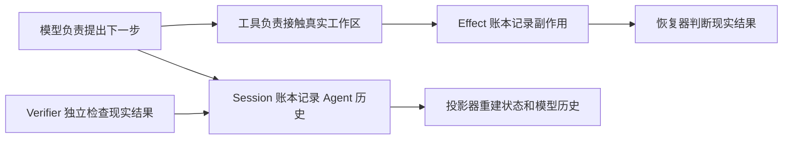
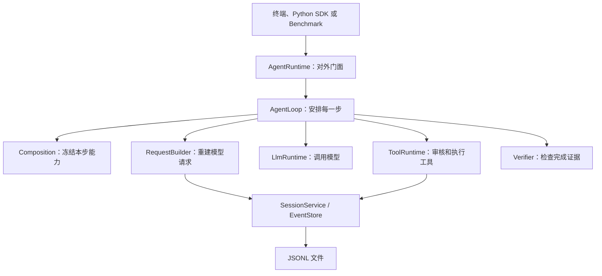
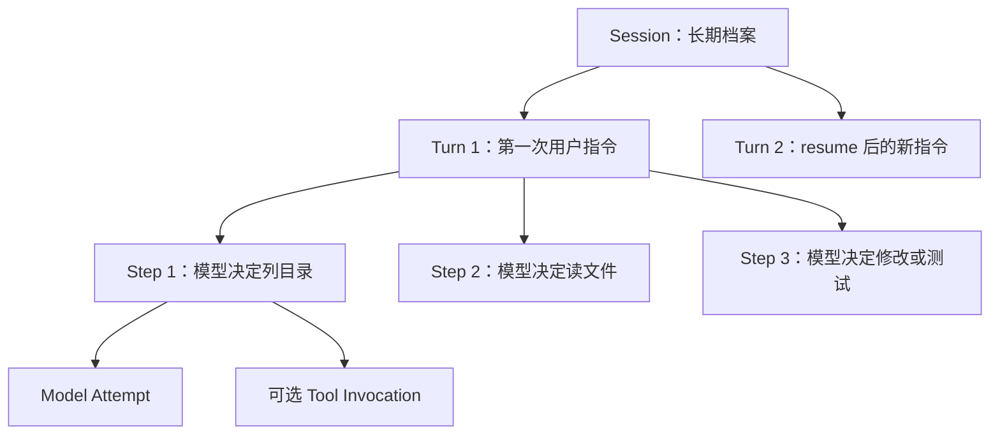
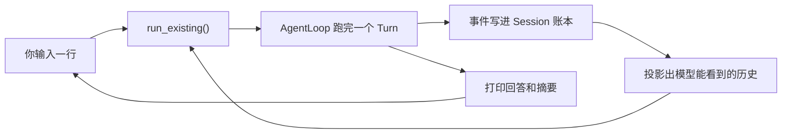
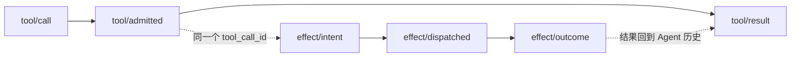
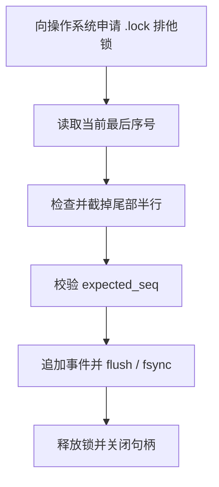
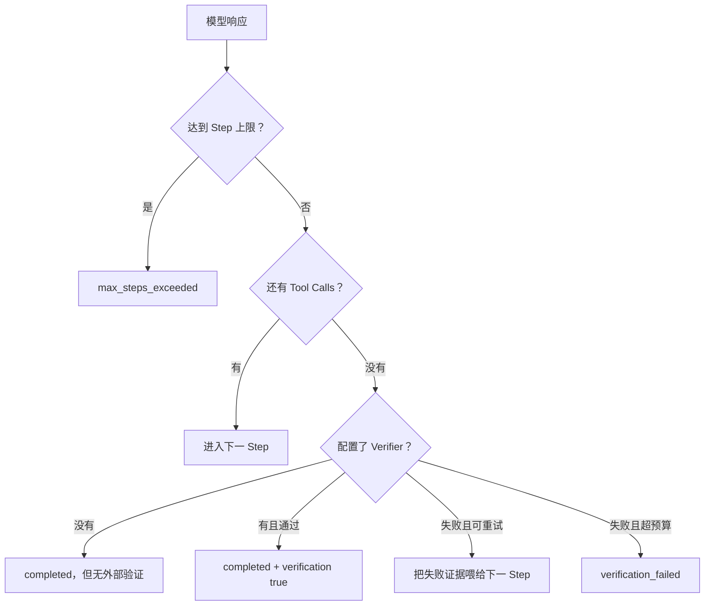
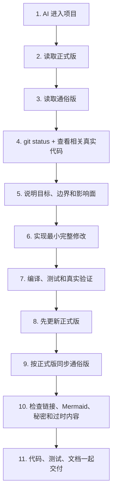

# TraceHarness Py 项目上下文（通俗版）

> 这是正式版 [`project-context.md`](project-context.md) 的通俗翻译。
>
> 两份文档使用相同的 0–18 节编号。正式版负责工程事实，本文件负责把这些事实讲明白；如果两者冲突，应先检查真实代码，再修正式版，最后同步本文件。

这不是逐行解释 Python 语法。这里所说的“解释每个细节”，指把每个有意义的模块、流程、状态、配置、限制和相互影响讲清楚，让不熟悉代码的人也能回答“它为什么存在、谁调用它、出错会怎样”。

## 0. 这两份文档是怎样工作的

可以把整个仓库想成一家公司：

- 真实源码和测试是公司每天真正采用的制度；
- 正式版是经过核对的公司制度手册；
- 通俗版是把制度手册翻译成新人能看懂的入职指南；
- README 是快速上手页；
- CHANGELOG 是版本变化清单；
- ADR 是“当初为什么这样决定”的会议决议；
- Roadmap 是未来打算，不代表今天已经拥有。

所以，不能因为 Roadmap 写了“多 Agent”，就说当前代码已经能创建子 Agent；也不能因为旧验证文档写了 24 项测试，就忽略今天实际已经有 583 项。

每次开发结束，不是在文档末尾写一句“今天又加了某功能”，而是找到原来的相关章节，把它改成项目现在的真实样子。旧状态应该由 Git 和 CHANGELOG 保存，不该残留在“当前项目地图”里误导下一次 AI。

文档中绝不能出现真实 API Key。即使某次真实运行成功，也只能写“通过 OpenAI-Compatible 接口验证成功”，不能复制 `.env` 的秘密内容。

## 1. 项目现在处于什么阶段

TraceHarness 的 Python 包名是 `traceh`，发布包名是 `traceharness-py`。版本仍是 `0.3.0` 维护线，但当前主分支比最初的 v0.3 发布包多了 `.env` 配置支持，所以 CHANGELOG 把这部分放在 Unreleased。

“Educational alpha”可以理解为：

- 它不是 PPT 项目，代码真的能安装、运行、调用模型、修改文件和执行测试；
- 关键协议有测试，CI 会在 Python 3.12 和 3.13 上运行；
- 但还不能向第三方承诺 API 永远不变，也不能当作安全隔离完善的生产 Coding Agent 平台。

当前最重要的事实：

| 你关心的问题 | 当前答案 |
|---|---|
| 能用真实大模型吗 | 能，只要平台兼容 OpenAI `/chat/completions` |
| 能不用 Key 演示吗 | 能，Scripted Provider 会按预设脚本返回 |
| 能修改代码吗 | 能，通过五个受控 Coding Tools |
| 能验证修改吗 | 能，可配置外部命令 Verifier |
| 能继续同一个会话吗 | 能，`resume` 会在同一个 Session 追加新 Turn |
| 是交互式聊天 CLI 吗 | `traceh chat` 可以在一个会话里连续对话，能实时打印每一步和每次工具调用，卡在慢操作上时还会每隔几秒报一次「还在跑」；按一次 Ctrl+C 只取消当前这一轮、会话还在。但它仍是行式提示符，不是流式 TUI |
| 有插件系统吗 | 只有协议和内核原语，没有完整 PluginManager |
| 有多 Agent 吗 | 只有 DTO/Protocol，没有可以工作的 Supervisor |
| 有安全沙箱吗 | 没有，Workspace 边界和 Policy 只是防护层 |
| 两个 traceh 进程能同时写同一个 Session 文件吗 | 能，事件文件不会被写坏；Windows 和 Linux 都有真正的操作系统级文件锁 |
| 当前测试数 | 583 项（582 通过，1 项按平台跳过）|

运行时只依赖 Python 标准库，说明最终用户不需要为了核心 Runtime 安装 HTTP 客户端、数据库框架等第三方包。pytest、ruff 只是开发工具。

## 2. 这个系统到底要解决什么问题

普通的简易 Agent 经常是这样：内存里放一个 `messages` 列表，模型说“调用工具”，程序执行，然后继续追加消息。只要进程崩了，你就很难回答：

- 模型当时看到了哪一版历史？
- 文件到底改了没有？
- 命令执行完了，但结果是否成功保存？
- 模型说“测试通过”是真话吗？
- 恢复时能不能再执行一次写操作？

TraceHarness 的做法是把问题拆开：



项目必须一直守住七条底线：

1. 重要事实必须能从 Session Events 找回来；
2. 外部副作用单独记账；
3. 状态和模型历史是计算结果，不是另一个偷偷变化的真相；
4. 一个 Step 开始后，模型、Prompt、工具和 Policy 不能半路换掉；
5. Tool Call 不能只有请求没有结果；
6. 崩溃后不确定的写操作不能因为“可能没执行”就自动再执行；
7. 模型的自我评价不能代替真实测试。

当前不做的事情也同样重要。v0.3 不会假装自己已经是完整插件平台、多 Agent 编排器、远程沙箱或 Codex 风格 TUI（`traceh chat` 只是行式多轮提示符）。未来接口存在，是为了以后扩展时少拆主循环，不代表现在可用。

## 3. 从目录看懂整个项目

根目录文件先分成四类：

1. **AI 开发规则**：`AGENTS.md` 是共享规则；`CLAUDE.md` 让 Claude 导入同一规则。
2. **真正代码**：`src/traceh/`。
3. **验证材料**：`tests/`、`examples/`、`benchmarks/`、CI。
4. **给人看的知识**：README、CHANGELOG、Roadmap、VALIDATION、docs。

`src/traceh/` 下每个目录的直白解释：

| 目录 | 通俗解释 | 典型入口 |
|---|---|---|
| `api/` | 各模块共同认可的合同和数据表格 | Event、ModelRequest、Tool、Plugin/Agent/Workspace Protocol |
| `cli/` | 把终端命令和 `.env` 翻译成 Runtime 配置，提供交互式聊天，把事件翻成屏幕上的时间线，在长时间等待时报告进度，并把恢复命令按目标 Shell 安全地渲染出来 | `main.py`、`chat.py`、`console.py`、`timeline.py`、`activity.py`、`command_line.py`、`env_file.py` |
| `runtime/` | 真正安排“一轮任务怎样跑”的业务中枢 | `AgentRuntime`、`AgentLoop` |
| `session/` | 账本、账本的跨进程文件锁、事件广播喇叭、从账本算状态、恢复和检查 | `JsonlEventStore`、`file_lock.py`、`event_feed.py`、Projector、Recovery |
| `concurrency.py` | 杀不掉的后台活儿（线程）取消后怎么等它收尾 | `await_worker_convergence()` |
| `tools/process_control.py` | 子进程取消/超时后怎么确保它真的死了、输出怎么不丢 | `capture_output()`、`converge_process()` |
| `llm/` | 把统一 ModelRequest 交给具体模型 | Scripted、OpenAI-Compatible Provider |
| `tools/` | 模型想碰文件或进程时必须经过的安检与执行通道 | `ToolRuntime` 和五个内置工具 |
| `kernel/` | 为未来插件生命周期准备的基础零件 | Scope、Activation、Hook、Lifespan |
| `inspector/` | 把机器事件翻译成人能检查的文本或 HTML | `SessionInspector` |
| `evaluation/` | 复制独立工作区、跑任务、出报告 | `BenchmarkRunner` |

`api/` 里出现了 Plugin、AgentSupervisor、WorkspaceProvider，并不等于它们已经工作。这些更像建筑图纸里预留的接口尺寸；施工队和完整房间要到后续版本才有。

`docs/adr/` 不应随意重写，因为它解释当时为什么选择 Event Log、Effect Ledger、Composition Freeze 等设计。现在的状态变化写进两份上下文文档，版本变化写进 CHANGELOG。

## 4. 程序启动后各模块怎样连接

`build_default_runtime()` 像装配车间。它把零件装成一个可运行的 `AgentRuntime`：

- 选择把事件存到 JSONL 还是其他 EventStore；
- 注册模型 Provider；
- 注册五个默认工具；
- 安装 Tool Policy 和 Middleware；
- 组装 Prompt；
- 配置 Verifier 和 Continuation；
- 最后把这些交给 AgentLoop。



为什么 `AgentLoop` 必须薄？因为以后模型从百炼换成别的平台、存储从 JSONL 换成 SQLite、工具增加 Git 操作，都不应该重写“Turn/Step 什么时候开始结束”这套稳定语义。

`AgentRuntime` 与 `AgentLoop` 的区别：

- `AgentRuntime` 面向外部调用者，负责创建 Session、阻止同一 Session 重复运行、resume、cancel、dispose；
- `AgentLoop` 面向一次 Turn，负责不断创建 Step，直到完成、失败或用完预算。

## 5. Session、Turn、Step 是怎样一层层工作的

最容易理解的类比是：

- **Session** 是一个案件档案盒；
- **Turn** 是用户新下达的一次工作指令；
- **Step** 是 Agent 看完现有证据后作出的一次下一步决定；
- **Model Attempt** 是真正向模型服务发出的一次请求；
- **Tool Invocation** 是模型要求系统去读文件、改文件或运行命令。



一次正常 Turn 的过程：

1. 用户消息先被 `inbox/accepted` 接受；
2. `inbox/claimed` 把它绑定到新 Turn；
3. 写 `turn/start`；
4. 每轮先写 `step/start`；
5. 冻结 Composition，生成 Request，调用模型；
6. 如果模型要用工具，执行工具，然后进入下一 Step；
7. 如果模型不再要工具，运行可选 Verifier；
8. 写 `step/end`；
9. Continuation 判断继续还是写 `turn/end`。

项目里曾有一个真实历史案例：一个 Turn 用 6 个 Step，依次 `list_files → read_file → read_file → apply_patch → shell → 最终回答`，Session 前 70 个事件完整记录了修复与验证。它只是帮助理解的案例，不是 Agent 固定脚本；详细轨迹在 [`../code-walkthrough-zh.md`](../code-walkthrough-zh.md)。

并发方面，当前只保证同一个 Python 进程中的同一 Session 不会同时跑两个 Turn。它不是分布式 Agent 锁。要区分两层：写事件文件已经跨进程安全（第 6 节），但“一个 Session 同时只跑一个 Turn”这条规则仍然只在单个进程内生效。两个进程同时对同一个 Session 执行 `run`，文件不会写坏，但你会看到事件交错，或者某一方收到并发冲突错误，而不是被提前拦住。

取消不是直接让程序消失：Runtime 先记一条取消请求，再取消异步 Task；模型、工具和 AgentLoop 分别尽量把自己打开的生命周期闭合。Shell 子进程会先 terminate，短时间不退出才 kill。

一个 Session 里可以有很多个 Turn：`run` 和 `resume` 各带来一个，`traceh chat` 则是你每说一句就多一个。谁来驱动都不影响 Turn 的含义——都是走同一个 `run_existing()` 进入 AgentLoop，历史都从事件日志投影出来，调用方不会偷偷攒一份自己的对话记录。



## 6. 为什么有两本事件账

### Session Stream：Agent 认为发生了什么

它记录：用户消息、Turn/Step、发给模型的请求、模型响应、工具请求和结果、Verifier 结果、恢复与错误。

### Effect Stream：现实世界可能发生了什么

它记录：准备执行副作用、已经派发、最终结果，以及崩溃后无法确定时的对账结论。



为什么不能只留一本？因为有一个危险时间窗：文件已经改完，Effect Outcome 也可能写了，但进程还没来得及把 Tool Result 写回 Session。如果只有 Tool Result，恢复器会误以为“可能没执行”，然后重复修改。分开记账以后可以用 Effect Outcome 补回 Result。

每条 Stream 都从 seq 1 开始连续编号。写入前必须告诉 EventStore“我认为现在的最后序号是多少”；如果别人已经抢先写入，`expected_seq` 不匹配，程序明确报并发冲突，不能悄悄覆盖。

JSONL 就是一行一个 JSON 事件。它的优点是简单、可查看、Append-only；缺点是读完整历史要扫描文件，不适合直接当分布式数据库。

文件尾部写到一半崩溃时，Store 可以截掉半行；但文件中间坏了、序号断了或事件属于错误 Stream，就会报损坏，不会假装没问题。

### 拿到一条事件，等于拿到账本原件吗

不等于——但以前差点等于，这是本轮修掉的问题。

可以把一条事件想成**一个封面写死的档案袋**。袋子外面印着编号、时间、类型这些身份信息，印上去就撕不掉：代码里 `EventEnvelope` 是 frozen 的，谁也不能把 `event.data` 整个换成另一份。

但袋子**里面装的还是普通的纸**。事件内容 `data` 是标准的 Python 字典和列表，里面还能再套字典、再套列表。frozen 只锁住了袋子的封面，锁不住袋子里的纸——`event.data["nested"]["value"] = ...` 这种写法，Python 完全允许。

问题就出在这里。以前内存版 Store 的做法，相当于**档案室直接把原件递给来查阅的人**：

- 你调用 `append()` 写入一条事件，Store 把它存进历史，同时把**同一个袋子**返回给你；
- 你调用 `read()` 查历史，Store 还是把**档案室里那几个袋子本身**递出来；
- 于是只要你改了手里这份的内容，档案室里的记录就跟着变了——而且是**改的过去**，没有任何痕迹。

还有两处同样的漏洞：`to_dict()`（把事件转成字典准备写文件或展示）返回的字典，里面装的还是原袋子里那几张纸；`from_dict()`（从字典还原事件）造出来的事件，也和你传进去的那份字典共用纸张。

有一件事本来就已经是对的，不要误以为它也坏了：**你自己构造的那份输入（`PendingEvent`）从来就是安全的**。事件被制造出来的那一刻，内容就已经抄了一份新的；你后来再怎么改自己手里的原始输入，都影响不到已经入账的事件。

现在的规则统一成一句话：**档案室只发复印件**。

- `append()` 返回的是复印件；
- `read()` 返回的是复印件，而且**每次读都是新的一份**，两次读之间互不影响；
- `to_dict()` 给出的字典是复印件；
- `from_dict()` 收到字典后先复印再存档。
- 复印是**连里面所有夹层一起复印**：套着的字典、套着的列表、列表里装的字典，全都是新的；

这条规则写在**协议**上（`EventStore` 这个"任何账本实现都得遵守"的接口说明里），不是只写在内存版那一个类里。原因很简单：账本后端是可以换的，换了后端不能改变"你拿到的事件能不能安全地改"这件事。

要特别说清楚四件事，免得记成别的意思：

1. **这不是把所有 JSON 都变成了不能修改的对象。** 复印件仍然是普通的字典和列表，你想怎么涂改自己那份都可以。变的是——**涂改复印件不再等于涂改账本**。项目现在没有引入“不可变字典”这类新类型，也不打算为了这件事重造一套 JSON 类型系统。
2. **"发复印件"是发生在特定窗口的动作，不是空气里自动生效的魔法。** 现在只有账本的 `append()` 和 `read()` 这两个窗口负责复印。事件本身只是个普通对象，所以如果**同一个事件被交给两个消费者**，这两个消费者拿的是同一份纸，框架不会替你隔开。如果有谁要把一条事件同时交给很多接收方，那就得给**每个接收方各复印一份**。现在确实有这样一个地方了——见下面"能不能一边干活一边看它在干什么"，那里就是给每个观察者各复印一份。
3. **文件版 Store（JSONL）不需要它自己额外调一次"复印"，但这不等于"完全没有复印"。** 它的历史存在**磁盘文件**里，读和写本来就都要过一道"事件↔JSON 文本"的公共关口，而这道关口本身就会把内容重建一遍：读的时候先把一行文本解析出来，再由 `from_dict()` 规范化成全新的一份；写的时候由 `to_dict()` 在真正落字之前先重建一份。所以准确说法是——**复印是顺着序列化这道关口完成的，不是被省掉了**。这次没有改它的行为，也是因为这道关口已经在做这件事。
4. **复印规则比"标准 JSON"宽，而且是"换算"而不是"拒收"。** 这一点最容易被写错。事件内容除了 JSON 原生的那几种值，还允许放 `Path`（路径）、`UUID`、时间、`Enum`、dataclass、各种字典和 `tuple`；复印时它们会被**换算成 JSON 形式**——路径变字符串、`tuple` 变列表、时间变 ISO 字符串。只有真正没法处理的东西（比如 `set`、随便一个普通对象）才会直接报错。所以不能说成"不是标准 JSON 的值就会报错"：`Path` 和 `tuple` 都不是标准 JSON 值，但它们被换算，不被拒收。

换句话说，两种 Store 现在对使用者的表现完全一样，只是达成方式不同：文件版顺着序列化关口做到，内存版必须自己显式复印。这种一致性有 23 个测试盯着，而且测试都是**真的去改嵌套内容再重新读一遍**，不是只对比两个对象是不是同一个。

代价也讲明白，而且要讲准：复印发生在事件进出的边界上，**复印一次的规模是一条事件的内容大小**；但一次 `read()` 通常要返回很多条事件，那么这次读的总开销就跟"它解析并返回的所有事件内容加起来"有关，不能说成"一次读只等于一条事件的成本"。还有一条 JSONL 的老边界要如实写下来：`read(from_seq=...)` 里的 `from_seq` 是**先全部解析、再筛掉前面的**，不是直接跳到那个位置，所以即使你只要最后几条，它也会把整条流读一遍。这不是复印带来的新问题，是 JSONL 本来就有的全量扫描特性；本轮只把事实写清楚，不做性能优化。最后，这里**故意不做缓存**——缓存意味着把同一份复印件重复发给不同的人，那就又回到了共享原件的老问题上。

### 能不能一边干活一边看它在干什么

以前不能。你敲一句话，屏幕就一直静着，直到整轮结束才一次性吐出答案——中间它读了什么文件、跑了什么命令，你完全看不到。现在能了。

先说清楚**它不是什么**，因为这里最容易吹过头：

- **它不是第二本账。** 账还是那本 JSONL 事件日志。这个新东西只是个"广播喇叭"，喊完就没了，不存盘。
- **它不是历史。** 你订阅之后才发生的事才会喊给你听。想看以前的，还是老办法读账本。
- **它不保存状态。** 它不攒任何东西，不是缓存，也不是投影。
- **它只在自己家里听得到。** 另一个 `traceh` 进程往同一个文件写事件，你这边的喇叭是不会响的——**没有跨进程实时观察能力**，这一条不要读错。
- **它允许漏。** 万一"账房已经收下这条、喇叭还没喊出口"的瞬间进程崩了，你会少听到一声，但**账本不会因此少一条**。所以崩溃恢复、审计、不变量检查一律只认账本，从不听喇叭。
- **它不会让事件变得"更结实"。** 这一条容易写错，要说准：喊出来只代表"账房已经按你要求的方式收下了这条"，**不代表已经强制刷到磁盘**。账本有两档写法：`SYNC` 会真的 fsync，`BATCHED` 只 flush。喇叭对 `BATCHED` 的事件照样会喊，而且**绝不会偷偷帮你升级成 `SYNC`**——那条事件在操作系统崩溃时能不能活下来，仍然只由它自己请求的那一档决定。喇叭不增加任何持久性保证。
- **拿到喇叭的人不能对着它喊。** 观察者拿到的接口只能"订阅"，不能"发布"。这不是洁癖：如果谁都能往喇叭里塞一条账本从没收到过的假事件，订阅者根本分辨不出真假，时间线就会一本正经地显示一个从未发生过的步骤。把"发布"这个动作从消费者接口上拿掉之后，"只有账房收下的事件才会被喊出来"就成了**接口形状本身的性质**，而不是靠观察者自觉。（Python 的下划线不是安全沙箱，但它明确了谁有权限做什么。）
- **不许发一个"永远沉默"的喇叭。** Runtime 上那个可订阅对象是**必填**的，而且必须就是账房实际在喊的那一个。给它一个默认值，就会交给调用方一个看起来能订阅、实际永远收不到任何东西的假接口——接口存在而能力不存在，这比没有更糟。

**喇叭装在哪里？** 装在"账本柜台"上，而不是装在某个具体业务流程里。技术上它是一个包住任意 `EventStore` 的装饰器。选这个位置有两个很实在的理由：

1. 换后端不影响它。内存版账本和文件版账本包起来行为完全一样。
2. **"这条事件已经真的记下来了"恰好在这个位置才成立。** 整个 `src` 里只有一处调用 `store.append()`，所有写入者（主循环、工具运行器、恢复器、压缩器、取消）都要走这一处。所以"喊一条其实没记下来的事件"在这个位置根本没法写出来，也不需要每个写入者自己记得喊一声。

**三件事的顺序是固定的**：先真的写进账本 → 成功了才喊 → 界面听到才打印。写失败、序号冲突、被取消，一律**一声不喊**。特别是取消：即使那条事件其实已经落盘（第 6 节讲过的"可能已提交"边界），喇叭也不喊——**宁可让观察面漏，也不让账本乱**。

**还有一个很容易被忽略的坑：顺序。** 两个人同时写账本，账本自己会排队，所以序号一定是 10、11。但"写完之后各自回去喊"这件事，操作系统不保证谁先喊——写了 10 的那个人可能刚写完就被调度器挂起，等它醒来时 11 已经喊完了。于是你会看到 11 在 10 前面，时间线就是错的。解决办法很简单：**把"写"和"喊"包在同一把锁里**，一个流一把锁。这样顺序就是结构上保证的，而不是"碰巧今天的调度是对的"。喊的动作只是往队列里丢个东西、不等任何人，所以锁很快就放开，再慢的观察者也拖不住写入。

**每个观察者拿到的是自己的复印件。** 这正好接上前面那段：档案室对"一个人来取"是发复印件的，但如果同一份东西要同时给两个观察者，那就得复印两份——否则甲改了自己那份，乙手里的也跟着变。所以广播时是**每个观察者各复印一份**，不是"这一次广播只复印一次"。

**队列是无上限的，这是个明确的取舍**，不是没想过：

- 好处：慢的观察者永远不会拖慢、更不会弄失败一次真实写入；
- 代价：一个订阅了却再也不读的观察者会一直占内存，上限就是这个会话产生的事件量；
- 兜底：Chat 在所有退出路径（正常结束、报错、取消、Ctrl+C、`/exit`）都会关掉订阅，所以随包发的这个消费者不会漏；
- 将来如果要改成有上限的队列，**必须先想清楚满了怎么办**——悄悄丢事件会让时间线对已经发生的事情撒谎，那比不显示更糟。

### 为什么需要一把“操作系统的锁”

先看两个很容易被误解的地方。

**为什么 `asyncio.Lock` 挡不住另一个 Python 进程？** `asyncio.Lock` 只是当前进程内存里的一个布尔标记加一个等待队列。另一个 `traceh` 进程有自己的内存、自己的事件循环、自己的一份 Lock 对象，它根本看不到你这边的标记。它就像你在自己家门上贴了张“正在使用”的便签，隔壁邻居家的门上没有这张便签。

**为什么创建 `.lock` 文件不等于真正上锁？** “文件存在”只是一个可以被任何人无视的约定。而且“检查文件在不在”和“创建文件”是两个动作，两个进程可能同时发现文件不存在，然后同时创建、同时认为自己拿到了锁。要真正互斥，必须让操作系统内核记住“这个文件的这段字节，现在归这个文件句柄独占”，由内核而不是应用程序来仲裁。

### 现在两个进程怎样排队

每个 Stream 有一个 `.lock` 文件，进入临界区前必须向操作系统申请它的排他锁：

| 平台 | 用什么 | 效果 |
|---|---|---|
| Linux / macOS | `fcntl.flock` | 拿不到就在内核里等 |
| Windows | `msvcrt.locking`（底层是 Win32 `LockFile`） | 锁住文件第 0 号字节这一小段区间，拿不到就短暂重试 |

两者都是标准库，不引入第三方依赖。

被锁保护的“临界区”是完整的一整段动作，而不只是最后写文件那一下：



于是两个独立进程同时追加时，第二个进程会在第一步就停下来等待，等到第一个进程走完整段流程才进场。它再读最后序号时，看到的已经是更新后的值，因此不会出现两条事件抢同一个序号。

几个容易踩坑的细节也处理了：Windows 的锁是从“当前文件指针”开始算的，所以每次锁之前都显式把指针移回 0；新建的 `.lock` 文件是 0 字节，而 Windows 允许锁定文件末尾之后的区间，所以空文件也能锁，不需要先写点内容进去。

### 为什么还需要 expected_seq

锁只保证“同一时刻只有一个进程在临界区里”，不保证“你上次看到的世界还没变”。典型调用是先 `head()` 问最后序号，再 `append()` 写入——这是两次独立进入临界区，中间另一个进程完全可能已经写了新事件。这时第二个写入者的 `expected_seq` 对不上，程序会明确抛出并发冲突，让调用方知道要重新读取再试，而不是覆盖别人的事件。锁负责不写坏文件，`expected_seq` 负责不基于过期认知写入。

### 崩溃或异常后会不会永远锁死

不会，原因有两层：

1. 代码里所有正常返回、抛异常（包括并发冲突）、以及任务被取消的路径，都在 `finally` 中释放锁并关闭文件句柄；
2. 更根本的是，这两种锁都绑在“打开的文件句柄”上。进程崩溃、被 kill、断电重启后，操作系统关闭它的所有句柄，锁自动消失。残留的 `.lock` 文件只是一个空文件，不会拦住任何人。

如果构造 Store 时传了 `lock_timeout`，等不到锁会在超时后明确报错；默认不传就是一直等。

### 取消一个正在等锁的写入，会发生什么

这里有一个很容易被忽略的坑。等锁和写文件是阻塞操作，跑在后台线程上，而**线程是杀不死的**。如果只是简单地 `await asyncio.to_thread(...)`，取消协程只会让调用方立刻收到 `CancelledError`，后台线程根本不知情——它继续排队，等别的进程一放锁，它就把那条“已经被取消”的事件写进文件。调用方以为什么都没发生，文件却在它返回之后偷偷变了。

现在的做法是把取消拆成两步协作：

1. 协程被取消时，先给后台线程发一个“别等了”的信号（一个 `threading.Event`）。线程正好是睡在这个信号上的，所以会立刻醒来、放弃等待、什么也不碰。
2. 协程**不会马上**把 `CancelledError` 抛给调用方，而是先等后台线程真正结束，确认没有遗留动作，再抛出。

于是有了一条清晰的规则：

| 取消发生在什么时候 | 结果 |
|---|---|
| 还在等锁 | 什么都没写，调用方收到取消 |
| 刚拿到锁、还没开始干活 | 进门前再检查一次信号，直接放弃，什么都没写 |
| 已经在写文件的中途 | 这一段不能半途而废，会完整写完并落盘；调用方仍然收到取消 |

第三种情况是有意为之的“原子完成”：文件写到一半停下来才是真正的灾难。关键在于，即使这种情况，调用方也是等到写完之后才拿到 `CancelledError`——**它返回之后文件不会再变**。

这里还有一个更隐蔽的坑，值得单独说。第 2 步“等后台线程结束”本身也是一次 `await`，所以它同样能被取消。如果实现时图省事，用一句“把等待期间的任何异常都吞掉”来收尾，那么用户第二次按下取消，就正好把这次收敛等待打断了——调用方立刻脱身，后台线程却还在临界区里，事件随后照样写入。这等于绕了一圈又回到最初的问题。

正确做法是把收敛写成一个循环：只要后台线程还没结束，就一直等它；期间来第二次、第三次乃至第十次取消，统统吸收掉、继续等同一个线程。取消不是逃生出口，它只是一个意愿声明；只有后台线程真正结束、锁真正释放之后，调用方才会收到 `CancelledError`。另外，后台线程自己抛出的异常（比如放弃等锁、并发冲突）也会在这里被取走，不会变成没人认领的 Future 异常告警。

代价要说清楚：这一种情况下，你收到了取消，事件却已经提交了。所以“收到取消”不能被理解成“肯定没写入”。注意这里并没有任何自动重试，所以严格来说不该叫 at-least-once，更准确的说法是“可能已经提交”——它是一个提交点边界。正确做法是重新读一遍 Stream，用 `event_id`、correlation 或业务身份去认领那条事件，而不是只看 Head 的数字（Head 也可能是别人推进的）。这和崩溃恢复的原则是同一条：以账本为准。

顺带一提，因为要能被取消，Linux 上的无限等待从“睡在内核里”改成了“可中断的轮询”。等待仍然是无限的，只是现在叫得醒。

## 7. 模型到底看到了什么，能不能事后证明

模型看到的内容不是直接读取某个一直变化的 `messages` 变量，而是两部分相加：

```text
ModelRequest = 截至某个序号的 Surface + 本 Step 冻结的 Composition
```

### Composition 是能力清单

它回答：

- 用哪个 Provider 和 Model；
- System Prompt 是什么；
- 模型能看到哪些 Tool Schema；
- 有哪些 Policy 和 Middleware；
- temperature、最大输出是多少；
- 这些内容合起来是哪一个 revision。

Lease 的意思是“这个 Step 借用这一整套能力直到结束”。当前能力虽然是静态的，但未来即使插件更新，已经开始的 Step 也可以继续用旧版本，不会一半用旧工具、一半用新工具。

### Surface 是给模型看的历史

它只挑：

- 用户消息；
- 助手完整消息和它提出的 Tool Calls；
- Tool Results；
- 人工压缩生成的替换摘要。

像 `step/start`、`effect/intent` 这类运行内部事件不会直接塞给模型，否则模型上下文会被技术账本淹没。

### Request Snapshot 是事后证据

每次模型调用前保存：完整请求、历史读到的 `source_seq`、Composition revision 和 fingerprint。Replay 时重新按当时边界计算一遍，如果 fingerprint 不一样，就说明现在的重建规则无法还原当时请求，Inspector 会报告违规。

Fingerprint 不是加密秘密保护，它主要是稳定内容校验：相同结构生成相同摘要，任意请求内容变化都会导致摘要变化。

## 8. 两种模型 Provider 分别做什么

### Scripted Provider

它不调用网络，而是按 JSON 脚本依次返回预设 ModelResponse。用途是：

- 测试主循环是否真的执行工具；
- 无 Key Demo；
- 生成可重复的事件轨迹；
- Benchmark 每次都得到相同决策。

这不是“假装真实模型很聪明”，而是把 Runtime 正确性和模型随机性分开测试。脚本内容属于测试夹具，绝不能偷偷变成生产默认业务逻辑。

### OpenAI-Compatible Provider

它把统一 Request 翻译成 `/chat/completions` 请求，包含 system/user/assistant/tool 消息和 Function Tool Schemas。API Key 只在发 HTTP 时从指定环境变量读取，作为 Bearer Header 发送。

当前只取响应中的第一个 choice，解析文本、Tool Calls、finish reason 和 usage。异常会变成明确的 `ProviderHttpError`。

“OpenAI-Compatible”表示协议格式兼容，不表示只支持 OpenAI，也不表示所有第三方平台细节完全相同。Base URL、Model 和 Key 环境变量名必须由配置明确提供。

虽然 Session 里有 `assistant/chunk`，当前实现并不是真流式。Provider 先拿到完整响应，LlmRuntime 再把完整文本作为一个 Chunk 记录。以后做流式时可以替换这层，而不用改变 Step 的意义。

### 取消一次模型调用，后台会不会还在发请求

`urllib` 的请求一旦发出去就没法中途叫停。所以取消时的做法是"等它收敛"——等这次 HTTP 调用真正结束，再把取消抛给调用方。好处是不会出现"界面已经说中断了、后台还在跟模型服务通信"；代价必须讲清楚：**这是等待，不是立刻掐断**，最坏要等到 Provider 超时（默认 120 秒）。等待过程中你再按几次 Ctrl+C 也不会提前放行，否则又会退回到"调用方走了、Worker 还在"的老问题。

## 9. 模型为什么不能直接执行文件操作

模型只能提出 Tool Call，真正执行必须过 ToolRuntime：

1. Tool Registry 查名字是否存在；
2. Schema 检查参数类型、必填字段和多余字段；
3. 多个 Policy 共同判断；任何 DENY 都最终拒绝；
4. 允许后写 Tool Admission 和 Effect Intent；
5. 根据 Effect Kind 决定并发还是排队；
6. 经过 Middleware；
7. 调用工具；
8. 写 Effect Outcome；
9. 裁剪过长输出并写 Tool Result。

Middleware 像一层层包装器，可以做日志、计时或附加限制。每层 `call_next()` 最多一次，防止一个 Middleware 不小心把写文件动作执行两遍。

### 为什么读工具能并发、写工具要排队

连续多个读操作互相不改变 Workspace，可以一起等待；写文件和进程可能改变现实状态，必须形成 Barrier，保证调用顺序可解释。

### 五个工具的细节

#### `list_files`

递归查看 Workspace 文件，输出相对路径；跳过 `.git`、`.traceh`、缓存、虚拟环境和依赖目录；默认最多 500，可配置但最高 5000。它只读，不接收任意根路径。

#### `read_file`

读取一个 UTF-8 文本文件。先把用户给的相对路径解析成真实路径，再确认它仍位于 Workspace 内。目录或工作区外路径会失败。

#### `search_text`

可以搜索普通子串或正则，可指定 Workspace 内子路径，返回文件、行号和文本。非 UTF-8 文件被跳过；结果默认最多 100、最高 1000。

#### `apply_patch`

名字叫 Patch，但当前不是解析 Git unified diff，而是“精确找到旧文本并替换”。默认要求旧文本出现一次，也可明确指定次数；次数不符时完全不改文件。创建新文件必须显式 `create=true` 且旧文本为空。

写入先落到同目录临时文件，flush、fsync 后用 `os.replace` 替换目标，并返回修改前后 SHA-256 证据。这样比直接覆盖更能减少半写文件。

#### `shell`

收到的是一条普通命令字符串，但先由 `shlex.split` 拆成 argv，再用 `create_subprocess_exec` 执行，不经过 `shell=True`，因此不会自动解释管道、重定向和 shell 语法。

子进程环境只保留少量必要变量，并删除名字包含 KEY、TOKEN、SECRET、PASSWORD、CREDENTIAL、AUTH 的变量，避免模型运行的测试进程顺手继承 API Key。它支持超时和取消，并返回退出码、stdout、stderr。

默认危险命令 Policy 会挡住一组明显危险的程序名，但黑名单永远不等于真正沙箱。运行不可信模型时仍需容器或远程隔离。

## 10. 为什么模型说“完成了”还不算完成

Continuation 决定下一步：



CommandVerifier 会在真实 Workspace 里重新运行配置命令。退出码 0 才是通过，stdout/stderr 会进入验证事件。它与 Agent 自己调用 Shell 测试不是一回事：Agent 可能误读一次 Shell 输出，Verifier 是 Harness 规定的独立完成门槛。

但 Verifier 是可选的。没有配置时，模型不再请求工具就可以结束。这时结果里的 `verification_passed=None` 只表示“没有验证”，绝对不能翻译成“验证成功”。

默认允许验证失败后再修一次，因为 `max_verification_retries=1`。失败摘要作为新的用户消息进入下一 Step，模型能根据真实测试证据继续处理。

### 取消或超时之后，验证命令会不会还在跑

这是最容易被忽略的一类 Bug：Python 里 `await` 被取消，只是把协程叫停了，它启动的**子进程不会跟着消失**。`--verify-command` 跑的是真实测试命令，放着不管它会在你以为这一轮已经结束之后继续改工作区。

还有一个更隐蔽的问题：**超时**时子进程在被停掉之前打印出来的内容也是证据。老做法是用管道接输出，超时时把正在读管道的那次调用取消掉，再重新读一次——已经读进缓冲区的那部分就此丢失，最后拿到的往往是空串。

现在换了个思路：**让输出只有一个主人**。子进程的 stdout/stderr 直接写进我们自己开的临时文件，不走管道。于是：

- 三条路径用的是**同一套捕获方式**，不会出现“这条路读到的是另一份输出”；它 flush 出来的内容在超时被发现之前就已经被我们捕获、读得到了（注意这只是“抓到了”，不等于“持久化”——只有写进 Event Log 的 `verification/result` 才是账本上的事实）；
- 读取就是普通读文件，不会卡在孙进程还占着的管道上，也可以重复读；
- 不需要"取消一次再读一次"，自然也不会丢。

收尾第一步永远相同：先把子进程收干净（terminate → 等一小会儿 → 还不走就 kill → **一直等到它真的退出**）。中途你再按几次 Ctrl+C 都打不断这个收尾——取消会被记下来，等收尾做完才抛给你。**收干净之后要不要去读那两个文件，取决于走的是哪条路**，见下表。Shell 工具用的是同一套收敛机制。

但三条路各自做什么，必须说清楚，不能笼统讲“输出总会留下来”：

| 什么情况 | 子进程 | 输出 |
|---|---|---|
| 正常跑完 | 自己退出 | 读出来放进验证结果，再由 AgentLoop 写成 `verification/result` |
| 超时 | 先收敛，再读 | 读出来放进验证结果；摘要里带上尾部，喂给下一步的模型 |
| 被取消 | 只收敛，保证它不逃逸 | **不读、不返回结果、不写账本**；紧接着临时文件就关掉了，捕获的内容也就没了 |

也就是说，取消路径唯一的承诺是“子进程一定不会跑掉”，它不承诺给你留下任何输出证据。只有调用方写进账本的事件才算数：Verifier 路径是 `verification/result`，工具路径是 `effect/outcome` 和 `tool/result`——哪一条出现，取决于走了哪条路。临时文件里的字节还不是事实。

### Shell 工具的"两个超时"

`shell` 工具用的是同一套机制，但它比 Verifier 多一层：它归 `ToolRuntime` 调度，于是有**两个**超时同时存在。

- **工具自己的超时**（你在 `shell` 调用里写的 `timeout`）：`ShellTool` 会先把子进程收干净，然后带着"实际命令、退出码、`timed_out=true`、已经抓到的 stdout/stderr"主动报错。这份内容会原样进入 `effect/outcome` 和 `tool/result`（超长时按上限截断），模型下一步能看到命令到底打印了什么。
- **Runtime 预算**（`ToolRuntime.timeout_seconds`）：这是整个工具调用的总闸门。它先到期时，报的是通用的"Tool timed out after <预算>s"，子进程同样会被收敛掉。

两者怎么区分？靠**嵌套的异常边界**，不是去比对错误文字：工具自己抛出的超时在内层立刻被重新贴上一个专门的标签，外层那个负责 Runtime 预算的处理器就再也捞不到它了。

这一点以前是错的：两种超时共用一个处理分支，结果 Shell 的输出在 `effect/outcome` 和 `tool/result` 里全部消失，而且工具自己的 0.3 秒超时会被写成 Runtime 的 5 秒预算。

不走管道还顺带解决了另一个问题：以前管道没读完就被取消，事件循环关掉之后会冒出 `unclosed transport`、`Event loop is closed` 这类噪声。现在根本没有管道子传输，`await process.wait()` 返回时相关资源已经自己收干净了，我们既不用碰 asyncio 的私有属性，也不用手动关什么东西。

有一件事明确不管：子进程如果又派生了孙进程，孙进程会继承那两个文件句柄，可能在父进程死后继续运行、继续往文件里写。我们保证的是**直接启动的那个子进程**已经退出。至于“输出不丢”，只在**正常跑完**和**组件自己处理完成的超时**（Verifier 自己的超时、Shell 工具自己的超时）这两种情况成立；直接被取消不算，`ToolRuntime` 预算先到期也不算——那种情况下工具走的是取消路径，捕获的内容不会被读出来，你拿到的是 Runtime 的通用超时结果。对孙进程不作任何承诺。好在输出走的是文件不是管道，孙进程赖着不走也拖不住我们的收尾。

顺带修了两个 Windows 专属的坑：

- 子进程环境被清洗得太干净，少了 `SystemRoot`，子进程连 `import asyncio` 都会失败（WinError 10106）——也就是说 `--verify-command "python -m pytest"` 在 Windows 上以前根本跑不起来；
- Windows 上的 Python 子进程默认按系统代码页（中文环境是 CP936）输出，而父进程按 UTF-8 解码，中文会整段变成"�"。现在会给子进程设 `PYTHONUTF8=1` 和 `PYTHONIOENCODING=utf-8`。注意这只管得住 **Python 子进程**；非 Python 的原生工具仍然按系统代码页走，输出可能还是乱码。

带 KEY/TOKEN/SECRET 字样的变量仍然一律删掉，这两条修正没有放松过滤。
## 11. 程序崩溃以后为什么不能直接重跑

假设模型要求执行一个写文件工具：

```text
写下 Intent → 派发工具 → 文件已经改变 → 写下 Outcome → 写 Tool Result
```

进程可能在任意两个箭头之间崩溃。恢复器的原则是：能证明的才补写，不能证明的明确标为未知。

- 有 Outcome、没有 Tool Result：说明现实结果已经持久化，可以合成 Result；
- 有 Call/Intent，但没有可确认 Outcome：写 `unknown_after_crash`，不自动重放；
- Step 或 Turn 没有 End：追加 `interrupted` 的 End；
- **确实修过东西**（补了 Attempt End、补了 Tool Result，或关掉了没闭合的 Step/Turn）：最后再写一条 `runtime/recovered`，留下恢复说明；
- **什么都没需要修**：一条事件都不追加，报告里的 `changed` 是 `false`。所以对一个健康 Session 反复执行 recover，账本不会越长越胖。

为什么读操作也统一进 Effect Ledger？统一协议让 Inspector 和恢复器不用猜不同工具的记录方式；同时 `EffectKind.is_retry_safe` 明确告诉未来恢复策略哪些是读、哪些是危险副作用。

如果有 `model/attempt-start` 没有对应 `model/attempt-end`，恢复器现在会先把这次模型调用收敛掉，再去处理 Tool Result 和 Step/Turn。它怎么判断？看有没有“完整的那句话”：

- **有完整 `assistant/message`**（attempt、turn、step 三个身份全对得上，而且写在这次调用开始之后）：说明模型确实答完了，只是没来得及写结束事件，补的结束事件记 `succeeded`；
- **只有 Start，或者只有零散 `assistant/chunk`**：Chunk 只是“说到一半”的碎片，证明不了模型答完，补的结束事件记 `unknown_after_crash`。

两种情况都绝不会偷偷再问一次模型，也不会把碎片拼成一句完整回答，更不会编造当时的 token 用量和结束原因——没观测到就是没观测到。带同一个 attempt_id 但属于别的 Step、别的 Turn，或者写在这次调用开始之前的消息，统统不算数——它们证明不了这次调用完成了。如果先出现一条作用域不对的消息、后面才出现正确的那条，认的是正确的那条。`attempt_id` 本身也必须是真正的字符串，`None` 或数字都当作没有身份，直接跳过并在报告里说明，绝不会造出一个叫 `"None"` 的调用。

补出来的结束事件会用 `causation_id` 指回原来的 Start，便于事后审计：这条是恢复补的，不是当时真实发生的。旧版本留下的、Step 和 Turn 都已经关掉但 Attempt 还开着的老 Session 也能修：因为账本只能追加不能插队，补的结束事件排在旧的 `step/end` 之后，不变量也按整条流判断配对，所以这种老 Session 修完之后同样是干净的。

`resume` 先恢复再开新 Turn，而且默认提醒模型重新查看 Workspace 和恢复结果。这样可以减少模型看到旧对话后直接重复写操作的风险。

## 12. 怎样从事件得到状态、压缩历史和评估质量

### StateProjector

它像会计报表程序：不修改账本，只从事件计算 Session 现在是 active、completed、interrupted 还是 failed，当前有没有开放 Turn/Step，一共完成多少次。

### CoreInvariantChecker

它检查协议是否自洽，例如序号是否连续、Turn/Step 是否正确嵌套、Tool Call 是否有结果、Effect 是否能对应、Composition 是否存在。它不是业务测试，而是检查“轨迹本身有没有违反规则”。

模型调用也在检查范围内：一次 Attempt 的开始和结束必须成对、`attempt_id` 必须是真正的非空字符串（`None`、数字、布尔值一律算“没有身份”）、不能重复开始或重复结束、开始和结束必须属于同一个 Turn 和 Step、同一个 Step 里不能同时开着两次调用、已经关闭的 Step 里不能留下没有结束的调用。

还有一点很关键：检查器**不采信事件自己写的 turn_id / step_id**，而是看当时真正开着的是哪个 Turn 和 Step。一次 Attempt 如果开在没有任何开放 Step 的地方，或者声称自己属于另一个 Step，都算违规；一次普通的结束事件如果拖到 Step 都关了才出现，同样算违规。

每条规则都有一个固定的名字（例如 `attempt-has-end`、`attempt-end-same-scope`、`attempt-start-inside-step`），排查时按名字找即可，不用去猜错误文案。

有两种情况**不算**违规，这很重要：Step 还开着、调用正在进行中，不算；老 Session 因为 Append-only 只能把补的结束事件排在旧 `step/end` 之后，也不算——配对是按整条流判断的，不是按物理先后。

但第二种豁免有门槛，不是谁迟到都能用：那条结束事件必须带 `recovered=true`，而且 `causation_id` 要正好指向它所修复的那次 Start。随手补一条普通的迟到结束事件，或者指错了对象，照样违规。

### Surface Compaction

长 Session 会让模型历史越来越长。当前 `compact` 需要人提供摘要，程序把某个序号之前的可见消息列出来，再追加一条 `surface/replace`。旧事件不删除，只是下一次投影时隐藏被替换的消息，改用摘要。

这不是自动模型压缩，也没有自动判断最佳边界；目前调用者对摘要准确性负责。

### Inspector

`inspect` 会显示 Workspace、状态、事件数、Turn/Step 数、不变量违规和 Request 重建违规。普通文本适合终端快速看，HTML 会把 Session 和 Effect 两条流放进静态表格，便于人工审计。

### Replay

Replay 不是重新执行工具，而是重新投影模型当时能看到的 Surface，并重建 Request 检查 fingerprint。它不会重复副作用。

### Benchmark

Benchmark 每个案例先复制一份独立 Workspace，避免破坏夹具；然后让 Scripted Provider 驱动真实 ToolRuntime 修改副本，并由真实 Verifier 验证，最后检查不变量并输出报告。

现在只有一个简单加法修复案例。它能证明整条管线连通，但不能证明 Agent 能解决大型仓库、模糊需求或复杂回归。

## 13. 日常怎么启动、配置和查看

安装开发版本：

```powershell
python -m pip install -e ".[dev]"
traceh doctor
```

十个命令可以按用途记成四组：

- **运行**：`run` 新建 Session 跑一轮；`chat` 在一个 Session 里连续多轮对话；`resume` 恢复并继续；
- **修复/查看**：`recover`、`inspect`、`replay`、`sessions`；
- **历史管理**：`compact`；
- **质量与环境**：`eval`、`doctor`。

`traceh run` 的体验是：给一次任务，Agent 运行到本 Turn 结束，然后打印结果。

`traceh chat` 则会一直停在 `you>` 提示符上：你说一句，它跑一个 Turn，打印回答和一行摘要，然后继续等你下一句——全程在同一个 Session 里。关键点是它**不自己记聊天记录**：每一轮的历史都是从事件日志投影出来的，所以聊完之后 `inspect` 和 `replay` 能完整还原整段对话。

`traceh chat --session-id <id>` 可以接着以前的会话聊，工作区从事件日志里读，不用再输一遍。它会先跑一次崩溃恢复，只有真的修过东西才会打印一行 `recovered:`；而且**不会替你说话**——不自动开 Turn，也不注入“继续上次任务”之类的隐藏消息，第一句还是你自己打。

四个内部命令：`/help`、`/session`、`/exit`、`/quit`，只有整行就是这个命令时才算数，所以“帮我看看 /help 输出什么”这种自然语言不会被误当成命令。空行直接忽略，不会白白开一个 Turn。

`Ctrl+D`（Windows 上是 `Ctrl+Z` 再回车）等于 `/exit`。

`Ctrl+C` 的完整说明见后面"按 Ctrl+C 会发生什么"。一句话版本：**有任务在跑时按一次，只取消这一轮，会话还在，你回到提示符继续聊**；空着的时候按才是真的离开（内部返回 130，但 Shell 最终显示什么由宿主决定，这不是能打包票的数字）；收敛过程中再按也不能提前放行；硬中断（Ctrl+Break、直接关窗口）则完全没有 Python 代码会跑，实测退出码 `3221225786`，只能靠启动时就已经打在屏幕上的恢复信息加崩溃恢复。

要清楚它**不是**什么：没有逐字蹦出来的流式输出，没有转圈动画和颜色，没有“这个命令允不允许执行”的审批，Turn 跑的时候也不能提前输入下一句。

### 干活过程中屏幕上会实时显示什么

默认开着。你敲一句话之后，屏幕会一行一行地告诉你它在干什么，而不是干等：

```text
[event 4] Turn started
[event 5] Step 1 started
[event 9] Model scripted/m called
[event 11] Model responded
[event 12] Tool read_file requested hello.txt
[event 13] Tool read_file started
[event 14] Tool read_file succeeded
[event 15] Step 1 completed
[event 16] Step 2 started
[event 23] Step 2 completed
[event 24] Turn ended (completed)
assistant> Done reading.
[reason=completed steps=2 tokens=0 verification=None]
```

**方括号里的数字是账本里真实的事件编号**，不是屏幕上的第几行。这一点有个很好的自证：上面的数字是跳着的（没有 6、7、8、10）——因为那几号是 Prompt 快照、请求快照、模型原文这类**故意不显示**的事件，它们照样占着编号。如果那是 CLI 自己数的行号，就不可能跳号。将来你想追查"第 14 号事件到底发生了什么"，可以拿这个号去账本里查。

（顺便说清楚一个当前**没有**的能力：这只是把编号显示出来，并不能"问模型第 23 号事件你为什么那样做"。那种能力本轮没做。）

**哪些显示、哪些不显示**，是刻意划的线：

- 显示：Turn 和 Step 的开始/结束、模型被调用/答复了、工具被请求/准入/成功或失败、验证结果、运行时错误、请求取消、恢复；
- 不显示：完整 Prompt、请求快照、Composition 快照、模型原文、用户消息原文、文件内容、完整 Patch、完整命令输出，以及**任何不认识的新事件类型**。

最后那条特别重要：遇到没见过的事件类型，就**什么都不打印**，而不是把原始 payload 倒到屏幕上。"不认识就全打出来"正是秘密泄漏到终端的典型方式。

**屏幕上的每个字都要当成不可信内容来处理。** 这一条不是过度谨慎：工具名是模型说出来的，错误类型来自任意异常，路径来自工具参数。如果原样拼进去，一个换行就能**凭空伪造出一整行时间线**（比如伪造一行"验证通过"），一个 ESC 字节就变成真正的终端控制指令（清屏、改颜色，甚至用退格覆盖前面的字）。所以所有来自事件内容的字符串都必须先过同一道清洗：控制字符、格式字符和双向文本覆写符统统换成空格，然后折叠空白保证**严格只有一行**，最后统一限长。代码里只有一个入口能读这些字段，所以不存在"某个字段忘了清洗"这种情况。

**`shell` 执行的命令默认完全不显示**，只显示工具名和调用编号。理由很实在：命令行是最容易出现密钥的地方，而没有任何关键词表能认全所有秘密的样子——"扫几个词、其余照打"只是在等一个没见过的 Token 格式出现。所以这里选择无条件不显示，而不是"扫描之后再显示"，连看起来完全无害的 `ls -la` 也一样不显示。

因此会显示的参数只剩下读取类工具的路径；这些路径仍然要再过一道凭据形态检查（除了关键词，还认 `sk-`、`ghp_`、`xox?-` 和 `://用户:密码@` 这些形状），一命中就**整段不显示**——遮一半的秘密还是泄漏。碰到不认识的工具，只显示工具名和调用编号。

**运行时错误只显示错误类型**，连消息都不显示（更不用说 traceback）。异常消息是任意文本：Provider 的报错可能把请求内容带出来，认证失败可能把它刚试过的密钥带出来。聊天本身那行 `error: 类型: 消息` 是原来就有的、来自它自己捕获的异常；时间线不再把同一段可能含密的文字复制第二遍。

还有一条**残余边界**要如实说：换行被中和之后，注入文字里那种"看起来像标记"的内容会作为**这一行内部的普通文字**留下来——比如工具名里塞了 `[event 999]`，它还是会出现在同一行里。这里保证的是"**不可能变成第二行**""**行首永远是真实事件号**"，而不是"屏幕上不会出现形似标记的字符"。要做到后者就得给每个字段加转义或引号，可读性损失大于收益。

其他行为：

- 想要安静，启动时加 `--no-timeline`。注意它是**启动参数**，不是聊天里能敲的命令，`/help` 里也这么写；
- 时间线**一定出现在最终答案之前**，不会插在 `assistant>` 后面；
- `/help`、`/session`、空行、敲错的斜杠命令都不会产生事件，所以也不会冒出时间线；
- 续聊旧会话时，只显示**订阅之后**的新事件，不会把几百条历史重刷一遍；
- 这一轮失败了也照样保留已经打出来的时间线（那通常正是最有用的部分），然后才打印原来那行 `error: ...`，聊天继续；
- 退出、EOF、Ctrl+C、报错、取消，都会把订阅关掉，不留后台任务。

它是纯界面：**不会进入模型看到的历史，不会改变请求指纹，也不写任何事件**。主循环压根不知道它存在——时间线的文案在 CLI 层，主循环里没有一句 `print`。

完成的那一行还会带上耗时，比如 `[event 11] Model responded (23.4s)`。这个秒数是屏幕上量出来的（用不受系统时间调整影响的单调时钟），**不是**从事件内容里读出来的，也不是拿两个时间戳相减——所以它只是给人看的注解，不是对账本数据的断言。

### 卡了很久，怎么知道它没死

以前不知道，这是这一轮修掉的第二个问题。

问题的根源很朴素：**时间线是"有事件才出声"的**。而模型调用开始（`model/attempt-start`）到结束（`model/attempt-end`）之间根本没有事件——中间那几十秒里，"Provider 很慢"和"程序卡死了"在屏幕上长得一模一样。

现在会这样：

```text
[event 9] Model openai-compatible/qwen-plus called
[waiting 10s] Model openai-compatible/qwen-plus is still working
[waiting 20s] Model openai-compatible/qwen-plus is still working
[event 11] Model responded (23.4s)
```

工具也一样，只是措辞更保守（`[waiting 10s] Tool shell (call c1) has not reported completion`，原因见下面第 8 条）。

几件要说清楚的事：

1. **这不是新事件。** 它不写账本、不参与恢复和重放、不进入模型历史。前缀故意用 `[waiting ...]` 而不是 `[event N]`——后者专属于真实的账本序号。日志里永远查不到"当时等了多久"，屏幕上看到就是看到了，关掉窗口就没了。
2. **它只看已有的事件。** 模型调用开始/结束、工具准入/出结果，就这四种。**没有**去改主循环让它多发一种"心跳事件"——那会把界面需求写进事实源。
3. **并发的工具各算各的。** 只读工具是可以并发跑的，所以按"这次调用的编号"分别计时。如果只留一个"当前在干什么"的格子，就会只报其中一个、把其余的丢掉。
4. **认不出身份的就不跟踪。** 万一某个事件没带调用编号，那它以后也永远配不上"结束"，跟踪它等于永久留下一条永不消失的等待提示。所以直接忽略。
5. **能显示的东西很少**：清洗过的模型名/工具名、调用编号、已等秒数。**不显示** shell 命令、工具参数、Prompt、文件内容、Patch、命令输出、Key 和异常消息。文字走的是和时间线完全相同的那道清洗，所以注入伪造不出额外的行。
6. **报的是"跨过的刻度"**而不是真实秒数，所以事件循环再忙也是 `20s` 而不是 `20.3s`，同一个刻度只报一次。
7. **计时是从每个活动自己开始算的**，不是程序自己每 10 秒滴答一次。这一条曾经是个真 bug：只要是固定滴答，"10 秒"这个节拍就锁在这一轮的启动时刻上，而不是锁在被观察的工作上——间隔 10 秒、工具在第 10.1 秒才启动时，第 20 秒那次滴答只看到 9.9 秒于是不出声，第一条提示要等到第 30 秒，也就是你已经干等了将近 20 秒。修好之后，无论活动在什么时候启动，第一条提示都出现在**它自己**开始后约 10 秒。
8. **对工具的说法必须更保守**：不能说"仍在运行"，只能说"尚未报告完成"。原因是并发的只读工具是成组跑的，整组跑完才会把各自的结果写进账本——所以从账本上看，一个**已经跑完**的工具和一个**还在跑**的工具长得一模一样，能证明的只有"还没有结果"。同理，屏幕上那个耗时对工具而言是"准入到结果落账"，对成组的工具会比它自己真正执行的时间更长。模型调用没有这个问题（返回后立刻记结束），所以模型那行仍然说"仍在工作"。

怎么配：默认 10 秒；`--heartbeat-seconds 0` 只关等待提示、时间线还留着；`--no-timeline` 把时间线、等待提示和下面那段序号说明一起关掉；负数、NaN、无穷大直接报配置错误，不会悄悄改成一个"差不多"的值。它是**启动参数**，不是聊天里能敲的命令。这一版只有普通文本，没有转圈动画、没有颜色、不做原地刷新。

**还有一块目前仍然安静的地方要说清楚：验证命令。** 等待提示只能盯住模型调用和已准入的工具，因为只有这两样有明确的"开始"事件。验证器（比如跑整套 `python -m pytest`）**没有开始事件**——账本里只有跑完之后的"验证结果"。所以一个跑很久的验证命令，屏幕上依旧一声不响。本轮**故意不去猜**（比如"模型这次没要工具，那大概要开始验证了"），因为那是把界面的猜测当成事实。要覆盖它就得往事件协议里加一条"验证开始"，那是协议改动，留给以后单独设计。

### 按 Ctrl+C 会发生什么

以前有两个毛病：取消过程看不见，恢复提示也不够用。

**看不见的原因很具体**：取消一轮任务时，Runtime 会依次记下"收到取消请求""模型调用被取消""这一步结束""这一轮结束"——但旧代码在这些事件被记下来**之前**就把时间线的订阅关掉了。于是这一整段收敛过程被广播给了"没有人"，用户只看到输出忽然停住。

现在顺序反过来了：订阅**保持开着** → 真正执行取消 → 等模型、工具、子进程全部收敛 → 时间线把这几条打出来 → 才收尾。屏幕上是这样：

```text
[event 31] Cancellation requested
[event 32] Model attempt cancelled
[event 33] Step 2 ended (cancelled)
[event 34] Turn ended (cancelled)
Turn interrupted. This session is still open.
you>
```

**关键体验变化：第一次 Ctrl+C 只取消当前这一轮，不退出聊天。** 会话还在，不会新建会话，也不会替你偷偷塞一句"继续之前的任务"。下一轮由你的下一句话决定。

其余几种情况：

- **空着的时候按**（停在 `you>` 上，没有任务在跑）：那就是真的要走了——离开聊天，返回 130，并再打印一遍恢复信息。
- **收敛过程中又按**：第二次、第三次都**不能提前放行**。模型请求、shell/验证子进程、打印任务都不许脱缰；等全部收敛完，才承认你第二次的意思——以 130 离开。
- **硬中断**（Ctrl+Break、直接关窗口、被系统杀掉）：**没有任何 Python 代码会跑**，上面这些收敛和提示统统不会发生。这一条不能吹。它唯一的兜底是"你屏幕上已经有恢复信息了"加崩溃恢复。

### 恢复命令一开始就打在屏幕上

这正是上面那条硬中断边界的直接结果：**指望退出时再打印，等于指望程序还能跑代码**——硬中断时它跑不了。所以恢复信息在**启动时**就打出来：

```text
resume later (PowerShell):
  traceh chat --session-id <会话编号> --data-dir <绝对路径> --provider <p> --model <m> [--script <绝对路径>] [--base-url <url>] [--api-key-env NAME] [--env-file <绝对路径>]
  traceh sessions --data-dir <绝对路径>
  note: this restores the session and its non-secret settings; it is not a complete configuration snapshot.
```

**这段文字要被粘进 Shell，所以它是"不可信文本变成命令"的地方。** 这一点以前处理得不够：旧版只在值里有空格时才加双引号，于是路径或模型名里的 `&`、`;`、`|`、`$(...)`、反引号、引号统统原样进了命令行——在 PowerShell 里这些都是语法，一个值就能把命令截断、再另起一条。

现在的做法是：程序先把命令拆成一个个**参数块**，再交给一个明确指定的 Shell 渲染器。Windows 上标注为 PowerShell（动态值用单引号，值里的单引号按 PowerShell 规则写成两个），别的平台用 POSIX 规则（标准库的 `shlex`）。**两套规则各写各的，绝不共用一套** ——那只会把值按错误的语法引用。程序名和参数名（`traceh`、`chat`、`--model` 这些是我们自己写死的）保持不加引号：这不是为了好看，而是 **PowerShell 会把开头带引号的字符串当成一个表达式**，`'traceh' 'chat'` 只会把单词打印出来、什么都不执行。万一有人把某个不安全的值误标成"我们自己写死的"，它仍然会被加引号，而不是被放行。含换行或控制字符的值**直接拒绝生成命令**——换行会凭空多出第二条命令行，这不该指望任何引号规则去挡。

但兜底信息本身也得自洽：这时打印的会话编号和 data 目录**全部经过转义**（换行写成 `\n`、ESC 写成 `\x1b`，并限长）。否则就会出现最荒唐的情况——那个"没法安全显示"的值，在解释"没法安全显示"的那几行里又打出了第二行终端输出。旧实现实测就是这样。你仍然能看到转义后的定位信息和"为什么没生成命令"。

**还有两个"看不见的换行"以前漏掉了。** 判断"什么字符不安全"时，原来各处都只看 Unicode 的 `C*` 类别（控制字符、格式字符那些），于是都漏了 `U+2028` 和 `U+2029`——它们的类别是 `Zl`/`Zp`，但对 Python 的 `splitlines()` 以及很多编辑器、日志工具来说**就是换行**。实测：一个含 `U+2028` 的值，转义之后 `splitlines()` 仍然被切成两行。现在这套判断集中在一个地方（`cli/text_safety.py`），命令渲染、兜底转义、URL 检查和时间线清洗全都读它，这两个字符一并算作不安全。测试的断言也跟着改了：不再只查 `\n`/`\r`，而是直接用 `splitlines()` 证明结果确实只有一行——旧写法正是让这个缺陷混过整套测试的原因。

**这条命令分成两部分，别混为一谈**：

- **找到会话**：会话编号 + 解析后的绝对 data 目录。账本存在 data 目录下面，换了工作目录或用过自定义 `--data-dir`，光有编号打不开；
- **恢复它当时的行为**：provider、model 这些。它们可能来自原目录的 `.env`，只带前两项的命令会在新目录重新解析配置，**把会话悄悄换到另一个模型**（已确定性复现：`custom-model` 变回默认的 `scripted-model`）。

**它不是完整的配置快照，命令自己也这么写。** 有两样东西不会原样打出来：

- **验证命令**（`--verify-command`）是任意 Shell 文本，没法既展示它、又证明里面没有密钥，所以一律省略。什么时候能说"重新加载那个 `.env` 就恢复了"？**只有当这次真正生效的验证命令确实来自那个 `.env` 时**。这里以前判断错了：只要文件里有这个键就宣称能恢复，可优先级是"命令行参数 > 已有的环境变量 > `.env` 文件"——你如果同时传了 `--verify-command`，真正在跑的是命令行那个，`.env` 恢复出来的会是另一条。现在只有在没有更高优先级的值时才这么说，否则明确提示你手动补上。顺带一提：验证命令的**文字根本不会进入**负责显示的那个数据结构，所以它也不可能出现在日志里；
- **Base URL** 用标准库解析后做**结构检查**：URL 里内嵌了用户名/密码，或者带了查询参数，就不显示并告诉你原因。还有一种情况以前会**直接把聊天弄崩**：像 `https://[bad` 这种畸形地址，标准库要等到检查用户名密码那一步才抛 `Invalid IPv6 URL`——而那正是我们做凭据检查的那一步。现在解析和检查都被包住了，解析不了也只是"不显示 + 说明原因"，绝不会把原始地址或一整段 traceback 摆到你面前。

这里的措辞要克制：这是**结构规则，不是万能的秘密识别器**——它没办法判断一个看起来很普通的路径片段本身是不是凭据。所以文档里不写"秘密永远不会被打印"这种绝对话，只写能验证的具体规则。

**环境变量名写错了会直接报错，不再"悄悄忽略"。** 以前 `--api-key-env "bad;name"` 能通过配置检查，Provider 拿它去查（当然查不到），恢复命令再默默把它省掉——于是你下次运行时悄无声息地退回了 `OPENAI_API_KEY`。现在这种名字在**创建会话之前**就报配置错误。这条规则**不看 Provider**：`scripted` 运行时用不到 Key，也不能让一个查不到的名字变成合法配置，否则同一份配置换成真实 Provider 就会失败。**报错信息完全不显示你写错的那个值。** 光转义是不够的：转义挡的是控制字符，挡不住一个可打印的密钥。而这个设置最常见的写错方式，恰恰就是**把 Key 本身粘到了变量名的位置**——所以那个非法值正是最不该打印的东西。也不显示长度、前几位、后几位或哈希，因为那些都能帮人猜。`.env` 文件里左边的名字写错时同理，只报第几行，不回显那段文字。

不过要说清楚这条规则的**能力边界**：它检查的是"这是不是一个能用的变量名"，分不出"一个恰好长得像变量名的密钥"。像 `ghp_xxx`、`AKIAxxx` 这种本身就是合法标识符，会被接受，并且作为你配置的变量名出现在恢复命令里。要是把所有形似凭据的标识符都拒绝，`GH_TOKEN` 这种正常名字也会被误伤。所以诚实的说法是：**这里查的是形状，不是意图**。

API Key 的**值**既不会被读、也不会被打印，命令里只出现它的**环境变量名**：由 `.env` 提供时说"可以从那个 env-file 或 Shell 里拿到"，否则提示你在新 Shell 里设好。用 `provider=scripted` 跑的时候**根本不打印**这一项，也不会叫你去设 `OPENAI_API_KEY`——那对一次 Scripted 运行是纯误导。

用过 `--script` 的话，命令里会带上它的绝对路径，并附一句说明：Scripted Provider 的**响应游标不会跨进程保存**，重新加载同一个文件会从第一条响应重新开始。不带它的话会被悄悄换成内置的占位 Provider，所以必须带。

新建会话、继续旧会话、`/session`、`/exit`、`/quit`、EOF 和被中断，都会显示这段。真忘了编号，`traceh sessions --data-dir <路径>` 能把候选列出来。

### 为什么第一行是 `[event 4]` 而不是 1

因为 1、2、3 号是"会话已创建""收到你的消息""这条消息归到某一轮"这三条内部事件——它们**确实存在于账本里**，只是时间线不显示，所以第一条看得见的是第 4 号（这一轮开始）。

这里刻意**不重新编号**、也不造一个假的"显示用序号"。真实序号才是能拿去查账本、做审计的东西；把 4 显示成 1，等于把这个号唯一的价值毁掉。

所以开启时间线时，启动阶段会打印一次说明（只打一次，`--no-timeline` 时不打）：

```text
Timeline shows selected persisted events.
Numbers shown as [event N] are Event Log seq values; they may start above 1 or skip where internal events are hidden.
```

注意这句话**故意不用方括号开头**：以方括号开头的行是时间线行，一句模仿时间线格式的说明会同时骗到人和日志过滤器。继续旧会话时这句更有用——那时第一条新事件可能是第 40 号或第 400 号，前面屏幕上什么都没有。


### `.env` 为什么能免去每次输入 Key

程序默认在当前目录找 `.env`。里面可以写 Provider、Base URL、Model，以及“Key 存在哪个环境变量名里”。真正 Key 仍然只在本地 `.env`，Git 只提交 `.env.example` 占位模板。

配置优先级从高到低：

1. 这次命令明确传的参数；
2. 启动 TraceHarness 前已经存在的系统/进程环境变量；
3. `.env` 文件；
4. 程序默认值。

因此 `.env` 不会反过来覆盖系统已经设置的值。显式命令参数又能临时覆盖两者。

OpenAI-Compatible 模式不偷偷选择平台和模型：Base URL、Model 必须明确配置。示例模板可以展示某个平台写法，但生产代码不能因为示例是百炼就默认永远调用百炼。

默认一次最多 20 个 Step；工具和验证命令各有 60 秒 Runtime 级默认超时；工具结果最多保留 24,000 字符；验证默认允许失败后再尝试修复一次。


### 中文和乱码是怎么处理的

Windows 上中文最容易出问题，所以 `chat` 有一套明确规则，而不是让你去敲 `chcp 65001`：

- 输入和输出都按 UTF-8 处理，遇到终端显示不了的字符用替代符号顶上，不会直接崩掉；
- 有些工具会在文件开头塞一个看不见的 BOM，它属于“文件格式”而不是你说的话，所以会被去掉。具体来说：Windows PowerShell 5.1 的 `Out-File -Encoding utf8` 会写 BOM，PowerShell 7 的 `utf8` 默认不写（要写得显式指定 `utf8BOM`）；
- 中文原样进入 `user/message`，只去掉首尾空格；
- 如果一行里出现了 `U+FFFD`（就是那个黑底问号 �），说明原字符在解码那一步就已经丢了。这时候程序**拒绝这一行**：不发给模型、不写进账本、也不猜你原本想说什么，只提示你改用 UTF-8 重发。

最后一条是刻意的：猜出来的内容一旦写进账本，就变成了假的历史事实。

## 14. 代码里那些“未来接口”应该怎样理解

这一部分最容易被 AI 夸大。

### Plugin

现在有 PluginManifest、Plugin Protocol 和 PluginContext，说明未来插件应该如何描述身份、依赖和注册服务。但没有扫描 Python Entry Points、加载第三方 Wheel、解决依赖、健康检查和卸载的 PluginManager。

### Activation / Lifespan / OwnedTaskSet

这些是插件生命周期零件：Activation 可以先收集资源，失败时回滚；Lifespan 按相反顺序清理注册；OwnedTaskSet 负责取消并等待后台任务。现在它们有独立测试，但还没连接成完整插件产品。

### Scope

Scope 是可以向父层查找服务的层级容器。当前主要证明服务覆盖边界可行，还没有完整 Application → Workspace → Preset → Agent 多层运行装配。

### Composition Lease

现在每个 Step 确实通过 Lease 获取快照；未来可以让旧 Step 持有 generation v1，新 Step 用 v2，等 v1 Lease 归零再卸载。但引用计数、Drain 和热替换还没有实现。

### AgentSupervisor / Budget

存在 AgentSpec、消息、Budget、Handle 和 Supervisor Protocol，只说明未来控制面需要哪些数据和方法。现在不能调用它创建子 Agent，也没有持久化 Inbox 或冷恢复 Supervisor。

### WorkspaceProvider

存在 Snapshot、Branch、PatchArtifact、MergeResult 的协议，但没有 Git Worktree 实现，也没有并行 Agent 合并代码。

正确说法是：“v0.3 已经把未来接入边界放进代码”；错误说法是：“v0.3 已经实现完整插件和多 Agent”。

## 15. 我们怎样知道当前代码没有悄悄坏掉

标准检查：

```powershell
python -m compileall -q src tests
python -m pytest -q
```

Compileall 主要发现语法和导入前的字节码编译问题；pytest 检查具体行为。当前 583 项测试大致分成：

- JSONL 是否按序写、尾部半行能否恢复；
- 广播喇叭的规矩：只有真的写进账本之后才喊；写失败或序号冲突时**一声不喊**；一批多条按编号顺序喊；三个真实抢着写的写入者跑完之后，喊出来的顺序必须和账本里的顺序完全一致；两个观察者都能听到、但手里的纸互不相通；观察者改自己那份改不到账本；关掉订阅后就再也听不到；关之前已经排队的还能取完（这正是"时间线一定在答案之前"的机制）；一个订阅了却完全不读的观察者不会卡住连续 20 次写入、而且它的事件确实还在队列里没丢；一个会抛异常的观察者只炸自己那条任务、既不影响这次写入也不影响后面的写入；Session 和 Effect 两条流严格分开；喊这件事不产生任何新事件类型；订阅不会重放历史；
- 时间线是不是**真的实时**：这条最关键，见本节后面单独的说明；
- 等待提示：每个刻度只报一次、9.9 秒不报；**从活动自己开始算时间**（让模型调用先占住 10.1 秒，工具因此错相位启动，断言它在自身 9.9 秒时还没提示、10.1 秒时首报，而不是傻等到第二个 10 秒）；连**测试用的假时钟自己**也有测试，要求每个 sleeper 按自己的 deadline、按顺序醒——因为一个"随便一推就全放行"的假时钟会让 0.1 秒和 10 秒无法区分，正是这种夹具能让上面那个相位 bug 混过一整套测试；结束时报出实测耗时；两个并发工具各算各的、其中一个结束后只剩另一个继续；认不出调用编号就完全不跟踪；**绝不显示** shell 命令和工具参数（用带假 Key 的夹具验证）；恶意工具名伪造不出额外的行；`0` 只关等待提示、时间线还在；`--no-timeline` 把三样一起关掉；负数/NaN/无穷大明确报错；默认用的确实是单调时钟而不是墙钟；快的任务一条等待提示都不打；活动结束后再推进 100 秒也不再出声；打了 5 条等待提示而账本事件数一条没增加；
- 按 Ctrl+C 之后：取消发生的那一刻订阅**还开着**（这正是旧版本看不到取消过程的原因），屏幕上依次出现"收到取消请求""模型调用被取消""这一步结束""这一轮结束"，全部早于"Turn interrupted"那行；不变量为 0、没有悬空的轮次和步骤；同一个会话里第二句话确实产生了第二轮；中断工具时每个工具调用都补齐了结果；用一个"收敛卡住"的假 Runtime 证明连按 3 次取消都不能让它提前返回；空闲时按返回 130 并打印含会话编号和 data 目录的恢复命令；
- 恢复命令会不会被"注入"：16 个含 `&`、`;`、`|`、`$()`、反引号、单双引号、括号、中文路径、尾随空格的取值全部参数化，PowerShell 渲染后必须能按它自己的规则原样还原、内部单引号确实成双、整段就是一个带引号的字面量；POSIX 那套用真实的 `shlex` 往返验证；换行和控制字符一律拒绝生成命令；命令名不加引号（加了 PowerShell 就只会打印它而不执行）；验证命令含假 Token 时输出里一次都不出现；带用户名密码或查询参数的 Base URL 一律不显示；scripted 时不提 API Key、OpenAI-Compatible 才提且区分两种措辞；`--script` 带绝对路径并附游标说明；
- 两个"看不见的换行"（`U+2028`/`U+2029`）：两种 Shell 都拒绝、转义后只有一行、URL 含它们时不显示、时间线的 13 个字段都伪造不出第二行、兜底信息也拆不出假的 `note:` 或命令行；测试断言本身改用 `splitlines()` 证明只有一行；
- 写错的变量名一个字都不回显：4 种被粘错位置的假凭据在命令行和 `.env` 两条路径上都不出现在报错里，连长度和前后 4 位都不出现；含 ESC、换行、`U+2028` 的输入报错仍是单行安全文本；同时明确钉住边界——形似标识符的假 Key 会被接受；
- 恢复命令的安全检查会不会自己出事：5 种畸形 URL 必须"不显示 + 说明原因"而不是抛异常；4 种恶意值 × 3 个字段验证兜底信息里每个值都被转义、逐行没有控制字符、也伪造不出多余的命令行/note 行/事件行；7 种非法环境变量名在命令行和 `.env` 两条路径上都报错（scripted 也一样），报错本身单行无控制字符，合法名和内置默认值照常通过；
- 验证命令的来源判断：文件里有这个键但传了命令行参数时，不许声称"由文件恢复"、必须提示手动补上、且假 Token 一个字节都不回显；只有真正由文件提供时才这么说；
- 恢复信息与序号：新建会话在任何一轮开始**之前**就打印了恢复命令（目录名带空格也正确加引号），继续旧会话、`/session` 和离开时都会打印；**把打印出来的命令解析出来、换到另一个目录并清空 `TRACEH_*` 后重新解析配置，模型必须还是原来那个**（旧版在这里会丢成默认值）；只打印 Key 的变量名、输出里不含任何 Key 形态；`.env` 只在真的加载过时才写进命令；新会话第一条可见事件确实是第 4 号、被隐藏的确实是那三条内部事件、没有被改写成 1；说明行不以方括号开头，而且只打印一次；
- 喇叭是不是真的只读：消费者接口上确实没有任何"发布"方法，也确实无法从公开接口塞进一条假事件（塞的那条既到不了订阅者也进不了账本）；用一个"间谍账本"证明 `BATCHED` 被原样传下去、没被偷偷升级成 `SYNC`，而且 `BATCHED` 的事件照样会被喊出来；Runtime 上那个可订阅对象是必填的（直接检查函数签名），并且和账房实际在喊的是同一个对象；通过 Runtime 写一条事件，订阅者确实收到；
- 时间线会不会被"注入"：10 种恶意值（换行、回车、清屏 ESC、颜色 ESC、退格、响铃、NUL、双向覆写、零宽字符、500 字超长）× 13 个会被显示的字段，全部组合都断言"严格一行、没有任何控制字符残留、没有 ESC、长度有界"；一个刻意伪装成整行的工具名不会变成第二行、行首仍是真实事件号；6 种密钥形态的 shell 命令（都是明确标注的 FAKE/FIXTURE 假夹具）一律不显示，无害命令也不显示；运行时错误的消息和 traceback 都不显示；清洗函数幂等、有界，而且不会破坏正常中文；端到端跑一轮，模型选的恶意工具名也伪造不出行；
- 收尾会不会留下"脱缰"的后台任务：这条见后面单独说明；
- 时间线的显示规矩：每行的编号都能在账本里查到、而且刻意断言编号是跳号的（证明不是行号）；10 类噪声和未知事件一律不显示（连塞了假 Key 的请求 payload 也不显示）；11 组缺字段/类型不对的 payload 都不会让聊天崩掉；`shell` 摘要限长且单行；一旦像凭据就整段不显示；不认识的工具只显示名字和调用编号；渲染不修改事件；`--no-timeline` 能完全静音但答案照旧；续聊旧会话不重刷历史；失败一轮之后时间线还在、聊天能继续；内部命令不产生时间线；正常退出和被取消后都没有残留订阅和后台任务；整轮输出里不含 Prompt 标记、文件内容和请求结构；
- 事件交出去以后能不能被反向改写：改自己构造的输入、改 `append()` 的返回值、改 `read()` 的返回值，账本都必须纹丝不动；两次读互不干扰；`to_dict()`/`from_dict()` 两个方向都不漏引用；复印之后编号、时间这些身份信息一个不少，而且经过真实 Store 往返之后仍然是 `UUID` 和时间对象，不会退化成字符串；
- 复印规则的两面都被钉住：`set`、普通对象这类真正处理不了的值会报错；而 `Path`、`tuple`（包括套在字典里和装在列表里的）会被**换算**成字符串和列表，不是被拒收；
- 两个真正独立的 Python 进程同时写同一个 Stream 时是否安全；
- 等锁途中取消写入时，后台线程会不会偷偷把事件补写进去；
- 连续按很多次取消，能不能骗过收敛等待、让调用方提前脱身；
- Event 投影和协议不变量；
- 主循环能否真正调用工具并验证；
- 工具参数、Policy、Middleware、超时、并发和错误；
- 路径能否逃出 Workspace；
- Patch 是否严格检查替换次数；
- 取消和崩溃恢复是否闭合；
- 崩在模型调用中途时，Attempt 能否按证据收敛，会不会伪造模型答复；
- 两类 Provider 是否正确转换数据；
- `.env` 是否按优先级加载且不打印秘密；
- `traceh chat` 能否在一个会话里连续跑两轮、内部命令会不会误建 Turn、中文和乱码怎么处理；
- 取消之后（包括超时清理途中再次取消），Verifier 子进程、Shell 子进程和 HTTP Worker 是不是真的都停了；
- Python 子进程打印的中文，拿回来的原始字节能不能严格按 UTF-8 还原成原话；
- 超时结果里还在不在超时之前打印的内容、这段内容会不会真的被喂给下一步的模型、事件循环关掉时会不会冒出资源告警；
- 走真实 ToolRuntime 时，工具自己的超时和 Runtime 预算超时会不会互相串味；
- Kernel 原语是否正确回滚和清理；
- Inspector、Replay、Request 重建和 Benchmark。

跨进程那几项测试是怎么做的？它们不是开两个 asyncio 任务或两个线程假装并发——那证明不了任何事，因为同一个进程里 `asyncio.Lock` 本来就够用了。测试真的用 `subprocess` 启动独立的 Python 解释器去跑 `tests/cross_process_worker.py`，进程之间靠“握手文件”对齐节奏（我准备好了 → 你们一起开始），而不是靠猜时间的长 sleep。为了让竞争必然发生而不是碰运气，Worker 会在临界区里故意多停留一小会儿，把窗口撑开；有真锁时另一个进程只是排队等待，结果依然正确，把锁去掉则测试稳定失败。

其中还专门验证了：另一个进程持锁时本进程确实被挡住、持锁进程被强制杀死后锁能被重新拿到、抛异常之后锁也不会留在手里。

事件所有权那 23 项也用了类似的"不许自欺"的写法。它们不满足于断言"这两个对象不是同一个"——那种断言太容易被一次浅复制骗过去。测试真的伸手进去改最深处的内容（嵌套字典里的字典、列表里的字典、往列表里塞新元素），然后重新读一遍账本，要求读回来的东西和当初写进去的**逐字相同**。核心用例还同时挂在内存版和文件版两个 Store 上跑，另有一项把两个 Store 并排放在一起做同样的改动，直接比较各自观察到的历史：将来哪个 Store 偷偷发展出自己的一套规则，这里会以"两边对不上"的形式暴露，而不是变成一句含糊的报错。

修完之后还做过一轮**反向验证**：临时把四处旧行为一个一个放回去，确认对应的测试确实会红。这一步是必要的，否则无法排除"测试其实什么都没测住"。

"真的实时"这件事怎么证明？这是最容易自欺的地方——**如果程序等一轮跑完再把时间线一次性打出来，除了这一条以外的所有测试都会照样通过**。所以专门写了一个测试：准备一个"闸门工具"，它在真正开始执行的那一刻自己点亮一个信号，然后**卡住不返回**。测试等这个信号（不是靠 sleep 猜时间），等到了就说明工具正在执行中、这一轮**必然还没结束**；此时立刻检查屏幕，必须已经有"工具被请求""工具已开始"这两行，而且必须**还没有**"工具成功"和 `assistant>`。然后才放开闸门，等这一轮跑完，再检查"成功"和最终答案都出现了、而且顺序在答案之前。

**收尾（drain）为什么也要"等到底"？** 这和项目早先修过的"后台线程脱缰"是同一类问题。屏幕打印是一个独立后台任务；一轮结束时要先关订阅、再等它把已排队的行打完。原来的写法用了 `shield`，它能保护那个任务不被取消，**但不能强迫等待它的人继续等**——于是取消一到，收尾立刻返回，打印任务却还在往屏幕上写。测试是这样钉住的：让打印任务自己点亮"我进来了"然后卡住，接着**连续取消收尾 3 次**，每次都让事件循环真正跑一轮，断言收尾**始终没有结束**；放开之后收尾才重新抛出原来的取消。同时断言打印任务确实结束了、订阅计数归零、没有残留的后台任务。另外还有一条：**打印代码自己抛异常时**，两轮对话仍然正常完成、两条回答都打印、聊天继续，而且账本里不会因为"观察者出错"多出一条错误事件——观察者的毛病不能反过来改变运行结果。

时间线和广播这一轮同样做了反向验证，四处都确认会红：去掉"每个观察者各复印一份"，两个观察者就会互相串改；把时间线改成跑完再统一打印，上面那个闸门测试立刻失败；改成"先喊再写"，"写失败就不喊"那条测试立刻失败；把"写和喊"那把锁去掉，并发写入下真的会喊出 `[2, 4, 1, 3, ...]` 这种倒序。

取消相关的三项测试尤其严格。它们不靠 `asyncio.sleep(0)` 猜后台线程有没有启动，而是让线程自己在开始等锁时点亮一个信号灯，测试等到这盏灯亮了才按下取消；随后立刻断言“线程已经收敛”这盏灯也是亮的——这直接证明了 `CancelledError` 是在后台工作结束之后才交给调用方的。最关键的一条断言是：外部进程放锁之后，那条被取消的事件**始终没有出现在文件里**。还有一项专门连按六次取消，确认调用方在后台线程真正干完之前一次也逃不掉。

GitHub CI 现在有两个 Job：Linux 上用 Python 3.12 和 3.13 安装开发包、编译、跑测试、再执行 doctor；Windows 上用 Python 3.12 跑同样的步骤。加 Windows Job 的原因很具体：Windows 走的是 `msvcrt` 而不是 `fcntl`，这条代码路径只有在真的 Windows 机器上跑才算验证过。

`VALIDATION.md` 里的 24 项、80% Coverage、Wheel 安装等是最初发布时点证据，不能随意改成今天的数字。今天的 583 项 = 发布时 24 项 + `.env` 等后续测试到 31 项 + 跨进程文件锁与取消语义的 12 项 + Model Attempt 恢复与不变量的 27 项 + `traceh chat` 的 24 项 + 取消收敛与子进程编码加固的 12 项 + 输出所有权与本地资源收敛的 3 项 + 超时证据入下一 Step 与测试清理的 3 项 + 两类超时边界的 2 项 + 事件所有权与 Store 脱离契约的 23 项 + 进程内事件广播与 Chat 实时时间线的 71 项 + 广播只读接口、时间线终端安全、收尾收敛与连线加固的 154 项 + 等待提示、Ctrl+C 生命周期与恢复信息的 37 项 + 等待提示相位、恢复命令配置保真与并发措辞校正的 7 项 + 恢复命令 Shell 渲染安全与凭据回显规则的 73 项 + Verifier 来源判定、URL 解析健壮性、兜底转义与变量名校验的 47 项 + Unicode 换行边界与拒绝值零回显的 57 项。一个是历史发布快照，一个是当前代码状态，两者用途不同。

## 16. 当前最需要保持清醒的地方

1. **锁的边界**：Windows 和 Linux 现在都有真正的跨进程文件锁，但它是同机的“协作锁”——只对经过 `JsonlEventStore` 的写入有效，绕开它直接改 JSONL 文件不受保护；放在网络盘（NFS/SMB）上的行为也没有验证过。另外，事件写入安全不等于 Session 级排队，两个进程同时 `run` 同一个 Session 仍然不会被 Runtime 提前拒绝。还有一条要记住：取消如果正好落在写文件的中途，你会收到取消，但那条事件已经提交了——“收到取消”不等于“没写入”。因为没有自动重试，这不是 at-least-once，而是“可能已提交”的提交点边界；要重新读 Stream、按 `event_id` 或业务身份认领，才知道到底写没写。
2. **事件内容仍然是可以改的纸**：Store 的历史现在有复印件保护，但这靠的是"哪个窗口交出去，哪个窗口负责复印"这条纪律，不是语言强制。事件里的 `data` 仍是普通字典和列表，拿到复印件的代码想怎么改自己那份都行——只是改不到账本。项目**没有**引入不可变字典这类新类型，所以不要把这条读成"事件已经完全不可变"。也别读成"框架会自动隔离所有人"：同一个事件对象被交给两个消费者时，它们共享同一份内容，将来真要做广播式分发，必须给每个接收方各复印一份（本版本没有这种能力）。相应的代价是：复印发生在事件进出的边界上，一次复印是一条事件的内容大小，但一次 `read()` 返回很多条时总开销跟这些内容的总量有关；JSONL 这边的复印是顺着"事件↔JSON 文本"的公共关口完成的（读走 `from_dict()`、写走 `to_dict()`），而且 `from_seq` 是先全解析再筛，所以仍会读整条流。这是正确性的必要开销加上 JSONL 本来就有的全量扫描边界，而且**故意没有加缓存**——缓存等于把同一份复印件发给多个人，那就又变回共享原件了。
3. **实时时间线只在本进程内看得到**：另一个进程往同一个会话文件里写事件，你这边不会实时显示——**没有跨进程实时观察**。而且这个喇叭是允许漏的：账记好了但还没喊出口就崩了，你会少听一声，账本不会少一条。所以恢复和审计只认账本。
4. **喇叭的队列没有上限**：慢的观察者不会拖慢真实写入（这是好事），但一个订阅了又不读的观察者会一直占内存。Chat 自己在所有退出路径都会关订阅，所以随包发的这个不漏；将来要改成有上限的队列，必须先定义"满了怎么办"，绝不能悄悄丢。
5. **时间线是一道输出面，所以它是被当作不可信内容处理的**：屏幕上的每个字都先经过清洗（去控制字符、强制一行、限长），`shell` 的命令和运行时错误的消息一律不显示。残余边界要记住：注入文字里"看起来像标记"的内容仍会作为该行内部的普通文字出现，保证的是"不会变成第二行"而不是"不会出现形似标记的字符"。
6. **Model Attempt 的证据上限**：崩在模型调用中途时，Attempt 现在会被补上结束事件，但“不知道”就是“不知道”——恢复只能说明有没有完整答复，找不回当时的 token 用量和 finish_reason。
7. **CLI 体验**：`chat` 已经能连续对话、实时显示每一步和每次工具调用、卡住时报进度、按一次 Ctrl+C 只取消这一轮，但离成熟的交互式 Coding Agent 界面还有距离——没有逐字流式输出、没有转圈动画和颜色、没有执行前审批，Turn 运行期间也不能继续输入；`run`/`resume` 这两个命令目前还没有接时间线。
8. **子进程输出会占磁盘**：捕获用的临时文件目前没有大小上限，一个失控命令可以把临时目录写满；上层对 Tool Result 的截断只是把读出来的文本剪短，减不掉读取之前已经占用的磁盘。另外，孙进程继承了这些句柄时，Windows 会把临时文件的删除推迟到最后一个句柄关闭——这和“不管理孙进程”是同一条边界。
9. **中断的退出码不由我们说了算，而且硬中断没有收敛**：空闲时按 Ctrl+C，程序内部以 130 返回；硬中断（Ctrl+Break、直接关窗口）由操作系统终止进程，实测是 `3221225786`，收敛代码和所有提示都不会跑。所以别把退出码当契约，真正的兜底是**启动时就已经打印在屏幕上的恢复命令**（含 data 目录）加崩溃恢复。
10. **等待提示只是屏幕上的东西**：它不是事件、不落盘、不可回查，日志里永远看不到“当时等了多久”，完成耗时也只出现在屏幕上。要可审计的耗时，得在 Provider/工具那一层把用量和时长落盘，而不是把界面状态写进账本。
11. **恢复命令不是完整配置快照**：验证命令一律不回显（任意 Shell 文本，证明不了里面没密钥），Base URL 只按结构规则挡（内嵌用户名密码、带查询参数），这不是万能的秘密识别器。所以别把它读成"秘密永远不会出现"，要读成"这几条具体规则可以验证"。另外 Scripted 的响应游标不跨进程保存，重新加载脚本会从头开始。
12. **验证命令目前没有等待提示**：等待提示只盯得住模型调用和已准入的工具，验证器（比如整套 pytest）没有"开始"事件，所以它跑多久屏幕上都不出声。本轮故意不去猜它启动了没有——那是把界面猜测当成事实。要覆盖得先往事件协议里加一条"验证开始"，属于协议改动。
13. **并发工具"谁先跑完"在账本上看不出来**：成组的只读工具要整组跑完才各自写结果，所以等待提示只能说"尚未报告完成"，屏幕上那个耗时对组内工具也会长于它自己真正执行的时间。要精确到单个工具就得改工具运行器的事件顺序，本轮不动。
14. **取消模型调用是“等”不是“掐”**：HTTP 请求发出去就停不下来，取消时会等这次调用收敛，最坏等到 Provider 超时（默认 120 秒）。它保证不会有脱缰的后台请求，但不保证立刻返回。
15. **Shell Policy**：挡住几个危险命令不等于模型已被沙箱隔离。
16. **Provider 能力**：能调 OpenAI-Compatible 接口不等于支持流式、重试和自动换模型。
17. **JSONL 性能**：查询最后序号很快，但完整投影仍要读取历史。
18. **Patch 能力**：当前适合小而精确的文本替换，不是完整 Git Patch 引擎。
19. **Benchmark 代表性**：一个固定加法 Bug 只能证明管线，不代表复杂 Coding 水平。
20. **手动压缩**：系统不会自动替你写可靠摘要。
21. **Alpha API**：现在的公开类名和协议在 v1.0 前仍可能调整。

如果接下来目标是“完善 v0.3”，优先级应放在这些真实边界、更多真实任务、交互体验和观测能力，而不是为了 Roadmap 好看提前铺开多 Agent。

## 17. 改一个地方时，还要想到哪些地方

这是防止“AI 改得很快，但没人知道影响范围”的检查表：

| 你修改了什么 | 通常还要检查什么 | 为什么 |
|---|---|---|
| AgentLoop | Continuation、事件顺序、E2E、取消和恢复 | 一处顺序变化可能让整个生命周期不配对 |
| Event 类型或字段 | Projector、Invariant、Recovery、Inspector、Replay | 所有消费者都依赖事件协议 |
| 事件广播或发布顺序 | `session/event_feed.py`、Runtime 装配、Feed 契约测试 | 顺序或复印错了，界面就会对已发生的事撒谎 |
| 时间线显示内容 | `cli/timeline.py`、`cli/chat.py`、`cli/main.py`、时间线测试、README | 它是唯一会把事件内容打到屏幕上的地方，等于一道泄漏面 |
| 等待提示 | `cli/activity.py`、`cli/chat.py` 的显示装配、`cli/main.py`、活动测试 | 它也会把内容打到屏幕上，而且每隔几秒一次；同时容易被误当成事件 |
| Ctrl+C 与恢复信息 | `cli/chat.py`（中断收敛、恢复信息、空闲中断）、Runtime 的 `cancel()`、取消与活动测试 | 顺序错了用户就看不到取消过程；恢复信息缺了 data 目录就找不回会话 |
| 事件怎样被复制或交出去 | `detach_event()`、`to_dict()`/`from_dict()`、两个 Store 的返回路径、所有权契约测试 | 少复印一次，账本就可能被别人手里的副本改写 |
| Request/Composition | Fingerprint 重建、Provider 测试、Replay | 必须还能证明模型当时看到了什么 |
| ToolRuntime | Effect、Result 配对、Policy、Middleware、取消 | 工具是现实副作用入口 |
| 某个内置工具 | Schema、路径边界、证据、超时、对应测试 | 模型输入不可信，工具必须自己校验 |
| `.env` 或 CLI | README、模板、doctor、配置优先级测试 | 配置最容易被本机环境污染 |
| Verifier | Continuation 与失败重试 | 完成判定改变会影响 Turn 结束原因 |
| Plugin/Multi-Agent DTO | 未来协议测试和“未实现”边界描述 | 不能把接口误写成产品能力 |
| 目录或开发流程 | AGENTS、两份上下文、README/CI | 下一次 AI 必须找到新的入口 |

每次只需更新真正受影响的章节，但不能跳过检查。例如只给 README 改错别字，不必重写 ToolRuntime；修改 Tool Result 字段，则一定要检查第 6、9、11、12、15、16 节。

## 18. 以后每次 Vibe Coding 固定怎样进行



`AGENTS.md` 的作用是强制“必须做”；这两份文档的作用是保存“项目现在是什么”；未来如果再做 Context Maintenance Skill，它的作用才是提供“如何更自动地完成这些步骤”。

Codex 会直接读根目录 `AGENTS.md`。Claude Code 默认读 `CLAUDE.md`，而本项目的 `CLAUDE.md` 只有 `@AGENTS.md`，所以两者最终使用同一套规则，不维护两份重复制度。

一次开发真正完成时，交付说明必须让你看得懂：

- 改了什么现实行为；
- 为什么要改；
- 哪些测试或真实命令通过；
- 正式版和通俗版更新了哪些章节；
- 哪些风险仍然存在；
- 如果已获授权，代码、测试和文档是否在同一个 Git 提交并已推送。

这样 AI 即使开发很快，仓库里也始终留下“代码事实、正式地图、通俗解释、测试证据和 Git 历史”五条互相校验的线索。
