# TraceHarness Py 项目上下文（通俗版）

> 这是正式版 [`project-context.md`](project-context.md) 的通俗翻译。
>
> 两份文档使用相同的 0–20 节编号。正式版负责工程事实，本文件负责把这些事实讲明白；如果两者冲突，应先检查真实代码，再修正式版，最后同步本文件。

这不是逐行解释 Python 语法。这里所说的“解释每个细节”，指把每个有意义的模块、流程、状态、配置、限制和相互影响讲清楚，让不熟悉代码的人也能回答“它为什么存在、谁调用它、出错会怎样”。

## 0. 这两份文档是怎样工作的

可以把整个仓库想成一家公司：

- 真实源码和测试是公司每天真正采用的制度；
- 正式版是经过核对的公司制度手册；
- 通俗版是把制度手册翻译成新人能看懂的入职指南；
- README 是快速上手页；
- CHANGELOG 是版本变化清单；
- ADR 是“当初为什么这样决定”的会议决议；
- Roadmap 是未来打算，不代表今天已经拥有。

所以，不能因为 Roadmap 写了“多 Agent”，就说当前代码已经能创建子 Agent；测试数量也必须以本轮真实 collect/run 输出为准，不能继续照抄旧快照。

反过来也一样：v0.3 时期的文档到处写着“没有完整 PluginManager”，那句话到 v0.4 已经**不再成立**，本轮已经全部改写。旧状态该留在 Git 和 CHANGELOG 里，不该留在“项目现在是什么”的地图上。

每次开发结束，不是在文档末尾写一句“今天又加了某功能”，而是找到原来的相关章节，把它改成项目现在的真实样子。旧状态应该由 Git 和 CHANGELOG 保存，不该残留在“当前项目地图”里误导下一次 AI。

文档中绝不能出现真实 API Key。即使某次真实运行成功，也只能写“通过 OpenAI-Compatible 接口验证成功”，不能复制 `.env` 的秘密内容。

### 0.5 以后不用每次读完两本书

AI 先读 AGENTS 和[精简入口](project-overview.md)，再根据[模块导航](context-reading-map.md)去正式版查这次要改的模块和相邻边界。你需要理解时可以读本通俗版；开发结束仍要按正式版更新相关解释。详细内容和旧链接都保留，不重新维护一套缩略合同。历史失败用来查原因，不能误当今天的状态；读取某节时要读全，不能只看截断后的开头。


## 1. 项目现在处于什么阶段

TUI 已跟上现在的多子能力：multi 文案明确主方能自主使用一个或多个获准助手，任务对话按真实身份把同一角色的多个助手分开。记录 075 的真实 PTY/TUI 中，题面没说开几个人，主方自己开了 4 个可写助手；四个身份、四份补丁和四次合入都看得到。不过最后固定功能检查 exit 1，所以没有 Review、人工批准或 Promotion。系统仍默认 single，新建配置默认最多一个助手，只有宿主明确把上限调大才允许多开。项目未提交发版。

**WC-1D/E 强制分工、WC-2 可写交接、WC-3 显式合入、WC-4 固定验收和后来的多子扩展都已接入。** 现在 single 自己做；multi 一次可以安排一批直接助手，默认只读，打开 patch_author 后才可在各自独立目录编辑。每个助手仍受原来的身份、额度、工作区、取消、补丁完整读取和人工 Promotion 边界约束。Product 6、产品事件 5、宿主配置 6、比较合同 3；Session 15、Context 13、SQLite 2 不变。历史成功和失败都保留，当前多子结果见 14.3.20–14.3.23。

**DA-14 已补清楚主方怎样使用助手。** 只有 Adaptive 主方多拿到职责说明，single 和助手不混入。四道真实题产品检查 4/4、42 次调用、390648 tokens，但仍未主动委派。提示已在全部真实主方请求中核实送达，不能说协作改善；见 12.23。

**DA-12 的字段说明也做完真实对照了，没有采用。** 只解释主方保留什么、助手负责什么、交付什么，其他输入和规则不改。六次真实调用用了 14905 tokens，两组都三题提交决定并选对类别，没有网络失败。但可拆候选仍把两个主要主题全留给主方，只让助手重复核对已经知道的目录，没证明这是有用的分工。生产和默认 single 不变，见 12.21、15 和[记录 038](../deal/038-complementary-work-contract.md)。

**DA-13 四道完整真实任务已经跑完。** 直接复用你启动的 Docker，37 次真实调用、308480 tokens；原产品检查过了 3/4，但没有一次主动派助手。37 份主方请求都带着委派工具，不能说协作已经验证成功，见 12.22。

**DA-11 的独立判断输入起作用了，但分工还没过关。** 原请求三道题都没提交决定；把原目标和逐字已读证据单独交给一次判断后，两种输入都三题全提交、分类也符合预期。共 9 次真实调用、30509 tokens，没有网络失败。不过可拆题的两个方案仍让主方和助手做重叠工作，或先等助手读完再分析，不能说并行分工已经清楚。这次没执行工具、创建助手或改生产，仍默认 single，见 12.20、15 和[记录 037](../deal/037-independent-decision-input.md)。

**DA-10 已查完并做了真实对照，没有新增生产功能。** 拿 DA-9 三份首次决定请求，分别原样重调、删旧侦察提醒、末尾再强调当前决定、两项一起做。12 次调用用了 44477 tokens，四种做法都没有提交有效决定，没有网络失败。指令确实送到了，但这两种调整还不能让模型停止原来的读写动作；根因没有完全查清。没有执行模型提出的工具，也没有恢复 DA-9，见 12.19、15 和[记录 036](../deal/036-phase-transition-diagnosis.md)。

**AO-3 已提交并发行 v0.11.0；DA-1～DA-5 工程和约定的小范围实测已完成，工作区未发行。** 发行提交为 `c9ff07d050c85ec198fb1137145f167d9976c24b`，GitHub Release 已上传源码、Wheel 与校验文件。当前未发行工作区已接入只读委派和 Product adaptive 装配，见 12.12；68 个真实任务 trial 和一次优化提案都已结束。没有证明协作更好，因此仍默认 single。

**真实主模型和真实助手确实一起跑起来了，但完整双模型任务还没过。** 明确要求委派时，主方能创建助手、收回报告，最小题也写出了正确文件；自然复杂题仍由主方自己一直查，两道明确题都在调用上限前没正式结束。57 次真实调用和 71 份请求重放见 12.14、15 和[记录 031](../deal/031-real-main-child-model-smoke.md)。所以现在能说“交接链路通了”，还不能说“自主协作成熟了”。

**DA-6 的提示词实验已经结束，五种候选都没有采用。** 工具说明、Adaptive 专属 system prompt、明确拆分规则和任务消息提示合计跑了 15 个真实 Product trial、121 次 qwen-plus 调用，模型一次也没有主动委派。候选当时均已撤回、生产提示恢复原样；本次新加的职责说明另见 12.23；45 个会话、153 份请求离线重放通过。见 12.15、15 和[记录 032](../deal/032-adaptive-decomposition-guidance.md)。

**DA-7 的固定格式拆分判断也试完了，没有装进生产。** 我们曾让显式 adaptive 在干活前必须选 `local` 或 `separable`。程序规则和失败收口能跑，但四轮 12 个真实小题、68 次 qwen-plus 调用里，模型一次也没有选 `separable`，助手仍是 0。12 次预算都收干净，工作区没有泄漏。候选已撤回，现在仍是原 adaptive、默认 single，没有隐藏的必经判断步骤。见 12.16、15 和[记录 033](../deal/033-typed-adaptive-decomposition.md)。

**DA-9 的“先看两步资料，再做决定”也已试完，候选撤回。** 三道真实题共 18 次 qwen-plus 调用、65117 tokens，只有简单题选 local 并做完；另两题切换后仍想继续读，没有提交决定。预算和工作区都收干净，没有网络失败。只读过文件不代表已经知道怎么拆，不能说这次证明了分类改善。现在仍是原 adaptive、默认 single，见 12.18、15 和[记录 035](../deal/035-scout-before-decomposition.md)。

**DA-8 的“先只显示判断按钮”也试完了，仍没有装进生产。** 程序能保证 adaptive 第一轮只看见一个拆分决定，选完以后才出现读写工具。两轮六道真实题用了 54 次 qwen-plus 调用：第一轮三题都做完也选对了，但可拆题派出助手后没收报告；程序补上“派了就必须收回或明确停止”后，第二轮又把可拆题判成 local，紧耦合题虽然判 local 也没通过文件检查，只有简单题完整通过。没有网络失败，六次预算和工作区都收干净。说明它解决了“跳过判断”，没有解决“判断得稳不稳”；实验代码已撤回，现在仍是原 adaptive、默认 single。见 12.17、15、[记录 034](../deal/034-exclusive-adaptive-decomposition.md)和[实验数据](../validation-data/dynamic-collaboration/exclusive-decomposition/README.md)。

**按行读代码的功能已经补好，工作区还没发行。** 模型能读指定范围、看到真实行号、按返回参数继续读；原账本和权限没变。另做的十二次真实对照里，格式通过从 4/6 到 5/6，但五份格式通过的复杂答案仍有关键理解错误，助手完成报告交接还是零，费用多了约 7.6%。135 项定向检查和 187 份请求重放通过，仍默认 single。具体见 9、12.13 和[记录 029](../deal/029-bounded-source-reading.md)；之前未采用说明候选的诊断见 12.12。

**AO-2+ 的裁判校准实验做完了，这一版没有采用。** 同一批开发样本，原裁判符合预期 16/24，新说明 15/24；真实 74 次调用、494,845 tokens，连停止的实验也计入。已恢复原生产裁判，保留所有记录；没有增加搜索成绩，也没有宣称裁判已可靠。见 12.10 和[记录 025](../deal/025-semantic-judge-calibration.md)。

**AO-1 已接入：人工写好的文字建议，现在能完整试一遍。** `evolution/optimization.py` 先检查建议是否合法，再用原评估器分两个进程跑原版和候选，按原证据判断无收益、待审或可以交后续审阅。没有自动采用，也没有新检索成绩；AO-2 已接入一次自动提案和独立模型审阅，见 12.9。见 12.7–12.8、[AO-1 合同](../plan/TRACEHARNESS_OPTIMIZATION_AO1_CONTRACT.md) 和[记录 023](../deal/023-manual-optimization-loop.md)。

**UE-4 已测完并核对原记录，正式评分仍等人工。** 新跑的 72 题都执行结束；60 道有答案题里，49 道同时匹配答案并实际拿到了正确证据。另 12 道“没有这条信息”的题要看模型有没有把话说过头，不能直接加成通过。四条普通问题都没调用工具，四条来源竞争有两条选错。没有改提示冲分，55/72 仍只是旧成绩。见 [UE-4 合同](../plan/TRACEHARNESS_UNIFIED_EVALUATION_UE4_CONTRACT.md)、[记录 021](../deal/021-unified-evaluation-ue4.md) 和 [真实结果](../validation-data/unified-evaluation/ue4/README.md)。

**统一评估 UE-0～UE-3+ 已接入。** 同一个 `traceh eval` 可测 Product 任务和独立检索旅程，也可让原版和受限文本候选在两个独立进程运行，再离线比较证据、人工评分和成本。检索报告还能区分“来源出现了”“足够证据送进请求了”“答案审阅到哪了”，并列出读了哪里、搜了什么；AO-2 已能自动提一份受限建议，后台托管由 AO-3 接入（12.11）。根协议 3 与旧 55/72 保留，新功能通过显式配置启用。见 [UE-3 合同](../plan/TRACEHARNESS_UNIFIED_EVALUATION_UE3_CONTRACT.md)、[UE-3+ 合同](../plan/TRACEHARNESS_UNIFIED_EVALUATION_UE3_PLUS_CONTRACT.md) 与 12.6、14、15。

**v0.10 沙箱已完成本轮限定验收：** 底层实验已过，shell、完成检查、Product 固定检查及预算身份都接到同一条沙箱主线。命令行可选配置文件，TUI 已有中文「执行沙箱」页，聊天里输入 /sandbox 可以只读查看实际回执。没有配置就拒绝启动进程。评估相邻检查已经核对修复；可信插件的有界输入输出连接、激活回滚、租约和退出也接通并做了首轮真实检查。配置入口和生产验收也已完成；463 项合并定向检查、观察补查 4 项、部分写入取消 1 项通过，没跑全量或 L2。见 [设计决定](../adr/0065-host-owned-sandbox-execution.md)与 [执行记录](../deal/012-sandbox-execution.md)。

**当前版本：0.11.0（Educational alpha，GitHub Release）。** 本次收口统一 Evaluation、受限 AO 和 AO-3 应用内后台优化；Session 13 / Context 12、Sandbox 配置 2 / Promotion 验证 2 保持，独立评估 worker 回执为 2。旧评估需按冻结源码核验；不迁移或改写用户数据，不自动采用候选，不上传 PyPI。本版不含 DA 或 MCP，不改写旧 55/72 统计。见[限定验证](../validation-v0.11.0.md)和[后台优化记录](../deal/026-runtime-background-optimization.md)。

**历史 grid-06 补测后成绩是 55/72（76.4%）。** 原来已通过的 51 条不动，把六条连接失败题直连再测，四条通过、两条仍有回答或依据问题，没有最终连接失败。这次没跑基线；见[记录 010](../deal/010-grid06-direct-supplement.md)。所以这份历史合成记录是 55/72，不是 UE-4 新运行的成绩。

**当前状态：** AR-A–AR-D、后来的定向修复和 RE-0–RE-5 实验已经收口。这轮真实跑了 112 条目标旅程，但没有方案表现出稳定收益，所以没有把新策略放进生产。RE-5 检查后没有合格组合，按条件不启动 96 条新材料验证，也不算验证通过。原 grid-06 的 51/72 和未通过状态作为历史记录保留；当前按上面的用户决定发行，见[实验记录 008](../deal/008-retrieval-reliability-experiments.md)。 后来又按授权试了一次片段预算调整：16 条真实问答，两边都是 4/8，没有采用；关键题没走到有命中的搜索，不能说已经证明片段改法无效。见[记录 009](../deal/009-search-snippet-budget-followup.md)。

用户已授权连续执行[主动检索计划](../plan/TRACEHARNESS_ACTIVE_RETRIEVAL_EXECUTION_PLAN.md)。AR-A 的规则和测试题
已经冻结，History 搜索已完成范围检查，记忆和 Skill 搜索也已接上并做过真实诊断，合并范围检查已完成。
之前的代码和证据已提交为 `a54d431`，没有推送。三个搜索工具使用同一套准入规则。最新 grid-06 收齐 144 条：旧版 20/72、新版 51/72，两边分别有 11/6 条连接失败；只看两边都没有执行错误的 57 对，为 19/57 → 44/57。以前 grid-05 的 21/72 → 45/72 保留，不能跨轮挑好成绩或说这是某一个补丁单独带来的提升。另测的四种日常问题，两边均答对且没有调用工具，见[最终对照记录](../deal/007-active-retrieval-final-comparison.md)。
对应正式版 1、7.11，语义检索仍关闭。
之后又按用户授权完成了失败归类和小范围真实试验。前两项修改没有放进生产；把拒绝状态说清楚的新实验减少了重复，但仍没解决选错来源，所以暂留为隔离候选。诊断入口也修好了相对目录让 Skill 准备失败的问题，见 7.11。

现已补齐资料的导航、正文和读取范围说明（7.11、9.5）。长提示重写和强制自评试验没有稳定改善，没有采用；模型仍可能错误判断整个来源不存在。

现已修正来源导航和结果放置位置的说明（7.11），当前 Session 15 / Context 13；旧数据保留，需要新数据空间。

现已增加“反复遇到同样拒绝”的保护：默认第二次提醒，第三次停止，详见第 10 节。把拒绝结果改成 JSON 的试验仍没有合入，原检索验收仍未通过。

分层压缩已经接上 A/B：工具返回大段内容时，完整结果保存在原来的执行账本里，聊天只带引用和查找入口；模型可以列出本会话保存过的工具结果，再按页读原文。B+ 还可以先查关键词，再展开命中附近。C 已经会先收起旧工具预览，仍太大才摘录旧对话；E0 已补上整个请求的 token 估算、超限拦截和实际用量显示；D 已支持可选模型摘要，E1 已能在轮内收起旧历史，E2 已按 token 选择资料，E3 已能解释超限并完成真实旅程验收，见 9.5、12 节。

这次修复的是“查完历史后，问你好却仍重复旧答案”。资料仍放在请求后面，最后再明确引用你这轮真正问的原话。当前使用 Session 15、Context 13 和 `context-json-v13`；旧 Session 1–14 会被明确拒绝，需要新的数据目录和新会话，旧记录不会被修改或删除。

Stop C 限定验收之后，又新增了 TUI 配置面板（13.11）。现在可以自己在中文界面填写模型、会话、插件、
自动压缩与功能开关；裸 traceh 在连接配置完整时直接聊天，缺配置才打开简短向导，知识/记忆和任务执行也能逐项修改，聊天里按 F2 可应用配置并恢复原会话。Session 13／Context 12 和原权限规则没变。
先前 Stop C 审查的是当时的代码，不能把那份通过报告自动算作新面板的审查结果。

TraceHarness 的 Python 包名是 `traceh`，发布包名是 `traceharness-py`。当前发行版本为 **`v0.11.0`**；下面的 v0.8.0 完整门禁是历史证据。
v0.10 在已有检索、压缩和聊天功能上增加受限执行沙箱与环境选择；本次检查见第 15 节。
以下回顾 v0.8 当时的主线和完整门禁：模型请求先冻结再获 Session CAS 派发许可证；SQLite 是唯一生产账本；
瞬时 Provider 重试不换模型、不改请求；Line 和 Textual 用同一个聊天 Driver；ProductTask、Workflow、
Review、Promotion 仍从同一本账投影。M2 让下一轮 requester 能看到同 Session 的有界任务目录和最小
执行摘要，并按需读取受限证据；M3 在不删除原始事件的前提下自动压缩太长的聊天 Surface；M4 让用户能
看到当前投影、压缩记录和上一份真正冻结的请求。它们都没有另造第二份状态、缓存或 RAG。

最终候选在装有 Textual 8.2.8 的解释器上收集 `2765 tests`，公开真实 L2 独立通过，最终全量为
`2758 passed, 7 skipped`、退出码 0、耗时 `45:12`。完整 18 次真实 Provider 网格全部得到可审计结果，
其中 11 次 ProductTask 严格成功；外部 TLS/协议失败没有被补跑或藏掉。干净打包和不带/带 `[tui]` 的
离线安装也进入发布门禁。收口时 L2 找到的两处真实遗漏——核心安装不该硬依赖 Rich、两份核心文件哈希
必须一起更新——都在原测试 owner 修好，并保留了会失败的反向证据。具体数字见 20.35 和
[`validation-v0.8.0.md`](../validation-v0.8.0.md) 第 8 节。

v0.8.0 发布时没有 Provider/model fallback、自动模型摘要、Workspace Memory、RAG、OS 沙箱、MCP 或受控动态
Workflow；这些是 v0.9 及之后的冻结路线，不属于 v0.8.0 已发布能力。

2026-09-07 已完成 v0.9-F0-A 设计合同，并把 F0-B 最小请求主线接进代码（20.27）：每一步借到能力后，
先把这一步参考什么记成 Context，再冻结 Composition 和模型请求。默认明确不选历史，仍发送一条空的
参考说明；宿主也可显式选择当前 Session 已压缩历史的目录或摘要。这条说明只属于当前请求，不回流聊天。
新 Context 24、Request protocol 24、Runtime 11 项，共 59 项已通过并包含在最终限定门禁中：36 个文件
收集 1079 项，`1076 passed, 3 skipped`，耗时 20.22 秒。F0-B 已完成。
F0-C 当前会话原文分页披露和最终限定门禁已完成：38 文件收集 1104 项，`1100 passed, 4 skipped in 31.98s`，
包含新 History 四文件 81 项。F0-A/B/C 本轮授权实现收口，F1 Skill 贡献与 F2 持久选择／检索／模型披露已实现（7.5），项目 Memory authority 已在 F3 接入（7.6），F4 已检索并注入 Context（7.7）。
Release Stop A 已完成独立审查：没有 P0/P1，2 项 P2 已修复并通过定向确认；按计划通过停止点，F3 项目归属与 Memory 已实现，B-P1-01 已修复并经独立复审关闭，Release Stop B 已通过（P0=0/P1=0/P2=0）；F4 已接入（7.7）；F5 治理/评估已接入（7.8），检索精度整改及同冻结复验已完成，Release Stop C 已通过限定审查和相关测试，发布检查仍待授权。
当前版本是 `0.11.0`；SQLite 仍为 2，当前 Context 外层格式为 13，新 Session 标记唯一为 `context_protocol=15`。
旧数据库 schema 1、Session 标记 1/2/3/4/5/6 和无标记旧 Session 都明确拒绝，不能补写或迁移。上面的 1076 项是 F0-B 阶段证据，不能算
F0-C 的结果；本轮没有运行全量、L2、构建、联网或真实模型，也没有发布。

第四轮之后已经修好“程序自己限制 reason，却没把限制告诉 Router 模型”的根因，严格 parser 没放宽，公开路径反例也做了反向验证。随后第五轮从新目录完整重跑 18 次：严格质量成功 15 次，auto 6/6 都按合同解析、reason 拒绝归零；另外 3 次全是 coder 碰到瞬时 DNS `getaddrinfo failed`，没有 TLS EOF 或检查失败。这个结果只证明当时的旧 Profile，仍是小样本描述，不是统计显著。

第五轮后的手工 single/multi Chat 又暴露两个发版前问题：执行中长时间没有 Product 进度、Approval 只给一堆哈希；以及角色累计 Token 总预算被误当成每次 provider 输出上限。现在确认后会立即显示 task id，并沿用用户显式 heartbeat 间隔报告 durable task/workflow/mode；Approval 和 `/task inspect` 能看到节点、实际 Agent Session/replay 命令、变更文件、有界 Patch、检查状态与退出码，证据读不出来会明确说 unavailable。屏幕卡不会自动喂给模型；20.32 的证据 Tool 只在模型显式调用时提供同源、受限元数据。新的 ADR-0034 把角色整个生命周期的 `budget.max_tokens` 与每次请求的 `max_output_tokens` 分开，旧配置形状明确拒绝；这改变了实验 Profile，所以第五轮只保留为历史证据。新 Profile 的第六轮定位出坏 DNS，第七轮在修正 DNS 后完成当前真实验收。Windows 的 `inspect/replay` 也统一使用 UTF-8 输出，不再被合法的 `✅` 卡死。

### 版本为什么只准写在一个地方

这一版把版本号收拢成了唯一来源：`src/traceh/version.py` 里的 `__version__`。`pyproject.toml` 不再写死版本，而是去读这个属性，所以打出来的 Wheel 和被 import 的代码不可能对不上。

为什么这么较真？因为 `traceh.core` 的版本会被写进**每一条 Composition 快照**（就是“这一步用的是哪套能力”的存档）。之前的候选实现把版本分散写在四个地方，其中两处对不上：不带插件启动的 Runtime 和走 PluginManager 启动的 Runtime，会给同一种步骤写下**不同的**核心版本。而快照存在的意义，恰恰就是排除这种“同一次构建说两套话”的情况。

现在这些全部派生自那一个属性：Wheel 元数据、`traceh.__version__`、核心插件身份、插件 API 版本、Manifest 的默认兼容范围、Composition 快照、CLI 标题，连源码 ZIP 的默认文件名也不再单独写死版本。而且有测试直接断言“装出来的包的版本 == import 进来的版本”。

“Educational alpha”可以理解为：

- 它不是 PPT 项目，代码真的能安装、运行、调用模型、修改文件和执行测试；
- 关键协议有测试，CI 会在 Python 3.12 和 3.13 上运行；
- 但还不能向第三方承诺 API 永远不变，也不能当作安全隔离完善的生产 Coding Agent 平台。

当前最重要的事实：

| 你关心的问题 | 当前答案 |
|---|---|
| 能用真实大模型吗 | 能，只要平台兼容 OpenAI `/chat/completions` |
| 能不用 Key 演示吗 | 能，Scripted Provider 会按预设脚本返回 |
| 能修改代码吗 | 能。普通 Coding Chat 有五个受控 Tool；Product 模式下 START 前的请求者 Chat 只有文件读取、提议/确认和同 Session 任务证据读取，真正改代码的是 START 后 managed Workspace 里的 coder |
| 能验证修改吗 | 能，可配置外部命令 Verifier |
| 能继续同一个会话吗 | 能，`resume` 会在同一个 Session 追加新 Turn |
| ProductTask 做完后模型知道吗 | Product-configured requester Chat 的下一份请求会携带 format-8 宿主收据：system 当前事实 + user 历史参考，列出当前与近期最多六项任务、准确总数/省略数，并为稳定检查点 focus 给出 Workflow、Tool 次数、changed-path 数、校验和 Promotion 是否记录的最小摘要。需要细节时模型可调用同 Session、精确 task id 的 `read_product_task_evidence` fresh 读取受限证据。Product/Workflow/Promotion 原账仍是唯一权威，reader 只是同一 EventStore 的无状态 join，没有新 Memory Stream、缓存或 RAG；模型不能借此授权 START、approve 或 promote（20.32） |
| 是交互式聊天 CLI 吗 | 是。默认 Line 界面不变；安装可选 `tui` extra 后，`traceh chat --tui` 会打开 Textual 界面。两者用同一个 Driver、SQLite Session、Product control 和只读 observation。TUI 把宿主临时操作、durable facts 和模型自述分开，只显示当前合法动作并要求输入固定确认词；还会显示事实年龄、等待时长、状态分歧和退出收敛。Feed 只作进程内 dirty 提示，周期 fresh read 兜住跨进程更新，刷新不会自动对账。当前仍没有 token streaming、完整历史 Dashboard 或执行中并发输入 |
| 有插件系统吗 | **有**。装一个 Wheel 就能被发现，显式启用后它的 Tool、Prompt、Service、Provider、Policy、Middleware、命名 Verifier 都能走正常主线（第 19 节）；其中 Provider/Verifier 还要再明确选择 |
| 能让 Agent 帮我写新插件吗 | L1 可以：显式启用 `traceh.plugin.creator` 后，它会读取打包在 Wheel 里的工作流、合同、模板和清单，把**源码候选**写进单独 Candidate Workspace。但结果必须标成“未验证”，不会自动 build/test/install/enable |
| 能独立验证这份候选吗 | L2 可以：显式指定候选目录、可信核心 Git 仓库、新输出目录和依赖源后，`traceh plugins validate` 会跑 13 道宿主管控门禁。普通门禁失败只有完整报告；报告自己都写不完时连输出目录都不会留下；通过才发布精确哈希产物 |
| 能证明插件比不开时更好吗 | L3 可以在**宿主固定的小任务集**上比较：两边装同样的核心与候选 Wheel，只有 candidate 一边启用插件，最后给出 improved/regressed/mixed/no-change。它不是通用 Benchmark，也不能替人批准或安装 |
| 能把比较通过的插件安全装进目标环境吗 | L4 可以，但故意分两次：第一次只给中文证据/风险卡和审批摘要，不改环境；人确认后把同一摘要交回第二次调用，才会安装精确 Wheel。失败/取消先退回上一版，首版则卸载；硬崩溃留下的半完成状态要用精确推广 ID 显式 rollback |
| 装了插件就会自动生效吗 | **不会**。装了只是“能被发现”，还要用 `--plugin` 或 `TRACEH_PLUGINS` 明确点名才会加载 |
| 能在运行中换插件吗 | 可以在空闲的 `traceh chat` 中用 `/plugins`、`/plugins reload`、`/plugins use ID...` 或 `--none` 切换当前进程已经能发现的已安装插件；这会重做 setup/conflict/health 并走 Generation/Lease/Drain，但不是 pip 安装、Wheel 替换或 Python module reload |
| 有四层 Scope 吗 | 有程序化装配：Service、Tool、Prompt、Policy 都能由宿主 Python 代码明确放进 Application、Workspace、Preset 或 Agent 层，越靠近 Agent 越优先，而且 Step 开始后不会被新 Generation 原地换掉。插件本身仍只在 application 层 setup，不能自行选择子层；它提供的 Policy 属 application 候选 |
| 插件是被沙箱隔开的吗 | 不是。v0.4 的插件和 Harness 同进程同权限；`isolated` 可以写在 Manifest 里，但会被**明确拒绝** |
| 有多 Agent 吗 | **有了模型可调用的进程内子 Agent 主线。** v0.6 Stage A–E 已有身份、FIFO、真实 Turn、child-first 生命周期和五个普通 Tool；v0.7-A/B 用单一层级 Budget 账本强制 managed create、模型、Step、Tool、wall 与进程 slot；v0.7-C/D1 可给 managed Agent 分配独立 Git worktree 并冻结 immutable Patch；v0.7-D2 又能对这份 Patch 做固定检查、人工批准和 Git 分支的比较后交换；v0.7-E 再把这些公共服务串成固定五类节点的流程图。F2 只有同一次模型请求的有限瞬时 Provider retry；仍没有默认 CLI 装配、冷恢复、跨进程唯一性、Workflow/Tool 自动重试、自动批准或通用 Workflow DSL |
| 有独立工作区吗 | **宿主程序化装配时有。** source id 由宿主映射，revision 固定为一个 commit，模型只看到 workspace id；脏或无法证明安全的工作区会 quarantine，不会 force 删除。D1 可以由宿主显式捕获不可变 Patch Artifact，D2 可以对它做固定检查、人工批准并推广到宿主管理的裸仓库；当前没有对应 CLI，也没有自动批准或自动合并 |
| 有安全沙箱吗 | 没有，Workspace 边界和 Policy 只是防护层 |
| 两个 traceh 进程能同时写同一个数据库吗 | 能。SQLite 事务和主键保护连续 seq；同库 writer（包括不同 Stream）会有界排队，默认 5 秒，超时明确失败。但“同一 Session 同时只跑一个 Turn”仍只是单进程规则 |
| Agent 的身份存在哪里 | 存在账本里，不在内存对象里。一个 `AgentRuntime` 只是「活的实例」，可以停掉再建；停掉它不会让这个 Agent 消失，也不会让它变成另一个 Agent（第 20 节） |
| 当前测试数 | v0.8.0 最终候选在装有 Textual 8.2.8 的解释器上收集 `2765 tests`。公开真实 L2 独立得到 `1 passed in 1398.14s`；最终无筛选全量得到 `2758 passed, 7 skipped`、退出码 0、耗时 `2712.46s (45:12)`。收口时公开 L2 先后真实抓到 core-only 环境硬导入 Rich、以及另一份受保护 Runtime 哈希没同步；两处都在原测试 owner 修好且没有改生产代码。compileall、Ruff、diff、文档 QA、Wheel E2E、干净资产预检、core/`[tui]` 离线安装和完整 18 次 Provider 网格也已执行；详见 [`validation-v0.8.0.md`](../validation-v0.8.0.md) 第 8 节 |

### 运行时依赖变了，这条必须改口

v0.3 的文档到处写着“运行时只依赖 Python 标准库”。**从 v0.4 起这句话不再成立**：项目有了第一个第三方运行时依赖 `packaging`。

它是干什么的？解析版本号规则（PEP 440）。三个地方要用：插件声明自己支持哪些 TraceHarness 版本、插件之间声明依赖版本区间、插件的安装包声明它依赖 `traceharness-py` 的哪个范围。

为什么不自己写一个？因为这三处都在**信任边界**上——解析结果直接决定一段第三方代码要不要被 import 并执行。自己写一个不完整的版本比较器去看大门，比多一个依赖危险得多。

核心安装除此之外仍然只用标准库；pytest、ruff 依旧只是开发工具。F4 的 Textual 界面是单独的
`tui` extra（`textual>=8.2.8,<9`），不用 TUI 就不会安装它。离线安装核心时 wheelhouse 必须有
`packaging`；安装 `[tui]` 时还必须有 Textual 及其依赖，真正的 clean-input 双形态门禁留给 F5。

## 2. 这个系统到底要解决什么问题

普通的简易 Agent 经常是这样：内存里放一个 `messages` 列表，模型说“调用工具”，程序执行，然后继续追加消息。只要进程崩了，你就很难回答：

- 模型当时看到了哪一版历史？
- 文件到底改了没有？
- 命令执行完了，但结果是否成功保存？
- 模型说“测试通过”是真话吗？
- 恢复时能不能再执行一次写操作？

TraceHarness 的做法是把问题拆开：

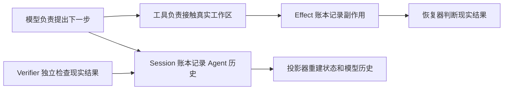

项目必须一直守住七条底线：

1. 重要事实必须能从 Session Events 找回来；
2. 外部副作用单独记账；
3. 状态和模型历史是计算结果，不是另一个偷偷变化的真相；
4. 一个 Step 开始后，Provider、Prompt、工具、Policy/Middleware 和 Verifier 不能半路换掉；
5. Tool Call 不能只有请求没有结果；
6. 崩溃后不确定的写操作不能因为“可能没执行”就自动再执行；
7. 模型的自我评价不能代替真实测试。

当前不做的事情也同样重要。v0.4 有了插件系统，Stage A–D3 补上 Generation 生命周期、ActivationSet、用户可操作的 Session 级组合切换、四层宿主装配和 application 插件的 Provider/Policy/Middleware/Verifier，但它**不是**完整插件平台：没有运行中 pip install/uninstall、强制 module reload、文件 watcher、跨进程隔离，插件仍只能在 application 层 setup，不能自己在 Workspace/Preset/Agent 层注册能力，也不能替换 EventStore。F4 已有最小 Textual TUI，但仍不是完整 Codex 风格工作台：没有 token streaming、完整历史 Dashboard、拖拽 DAG 或执行中并发输入；它也不是远程沙箱。v0.6 到 Stage E 已把多 Agent 的**地基、发动机、生命周期保险和模型操作杆**接起来；v0.7-A/B 增加单一预算账本和显式宿主执行门，v0.7-C 增加程序化 managed Git worktree，v0.7-D1/D2 再增加不可变 Patch 证据与固定检查/人工批准/分支比较后交换推广。系统仍只在一个进程里：崩溃后不会自己恢复，没有默认 CLI 多 Agent 装配、跨进程 lease 或 Workflow/Tool retry。其余未来接口存在，是为了以后扩展时少拆主循环，不代表现在可用。

### 2.3 当前量化目标与执行边界（规划）

对应正式版 2.3，后续集中回答三个问题：收起旧上下文以后，整道题是否更省钱且仍能正确交付；
相同预算下，多助手到底带来了什么质量或时间收益、又增加了多少协调成本；有限次修改分工提示，
能否挑出值得采用的策略。最后要留下冻结条件、逐题结果、证据位置和根因解释，再据实写进简历。
结果可以是没有收益或更慢；没有运行、没有证据的部分仍要明确说没完成。

2026-09-23 起，剩下的步骤维护在[收口计划](../plan/TRACEHARNESS_TASK_TYPE_CONTEXT_EVOLUTION_PLAN.md)：单/多对照改用自建的五类任务
（都建在同一个 astroid 固定版本上，用脚本机械判分），逐类看谁更合适；上下文治理改到真的有上下文压力的
Multi 运行里，和“关掉治理”的同条件运行对比——因为 Single 修 bug 这类任务每次请求才一两万 token，
根本碰不到折叠水位（记录 086 三道开发题原版一次折叠都没有）；有界自进化在 SWE 真实题上按 3 道开发、
3 道验证来做：后台持续检测问题并提出受限建议，由人决定是否用 `traceh eval` 验证。
花钱之前先做不花钱的 S0 准备；以前的[三项目标计划](../plan/TRACEHARNESS_AGENT_EFFECTIVENESS_PLAN.md)和记录 086 保留为历史。
不花钱的 S0 已做完（runner 上下文统计 12.5、臂间停止、后台“检测 + 建议” 12.11/ADR-0082、题库准入）。
实验 A、B 已按事先登记的条件跑完，见[记录 087](../deal/087-task-type-context-evolution.md)。
A：五类任务上 Multi 都没有更快，token 按类合计是 Single 的约 2.9–5 倍；只有并行读码一类通过次数更多（2/2 对 1/2）。
A4/A5 的 Multi 失败里混有宿主缺陷，这些缺陷已修（ADR-0083 与 14.3.26 的字段拒绝）。96k 窗口下 Multi
单次输入最高 34,529，一次折叠都没触发。
B：于是按预案改用 48k 窗口对照。开治理后单次请求输入平均少了 16–22%，但固定验收 0/2，关治理 2/2，
整题 token 也没省。原因是模型不用“读回”，而是把读过的文件重新读一遍，修错阶段就超过了单轮时限。
所以这组折叠配置不能说“质量不降”。
顺着这个原因修了一条颠簸路径：模型把原工具重跑一遍取回的内容，现在也算“又要了一次”，会被保护（ADR-0084，见 12.2）。
同条件复测 B2：开治理 2/2 通过。但只有 1 次真的走到了“交错 → 被退回 → 修正”这条路并用上了新机制，
另 1 次第一份就交对了。和同样经历过修正的关治理那次相比，单次请求输入少 13%、峰值少 14%、整题 token 少 12%，
用时多 5%。这只是一个例子对一个例子，能说明方向一致，不能算证明（记录 087 §3.1）。
C：3 道开发题的 Single 结果是 0/2、0/2、2/2。后台读入这 6 次运行，把至少出现在两次运行里的问题归成一类，
提出一条只改白名单说明文字的建议。建议的依据是模型给 shell 工具写了 `cd … &&` 这类语法，导致启动失败；
但检测只告诉分析模型“失败了几次”，所以建议写得比较泛。最主要的失败是“交了但修错了”，这是检测看不到的。
用户选择去验证这条建议。完成了 5 组对照（有 1 组因为内存不足、后台进程被系统回收，记为缺失）：
通过数 3/5 对 3/5，整题 token 基本持平（1.001 倍），它瞄准的 shell 启动失败也没减少，所以按事先定的门槛**不采用**。
整条链路“检测→归类→受限建议→人选→原评测→门槛判定”是完整跑通的；短板在于检测只报次数、不报错误类型。
要让检测带上错误类型，需要在 ADR-0082 之外另做决定。
之后做了这个决定（ADR-0085）：跑题库时，检测会带上宿主记下的失败原因；聊天和 Product 仍然只报次数。
同样 6 次运行重新分析，这回建议直接点名“别把 `cd`、`PYTHONPATH=src` 当可执行文件”。
验证时有 3 组因为超时作废，按事先写好的规则各补跑一次后，6 组全部有效：通过数从 2/6 升到 4/6，没有一题变差，
满足事先定的采用门槛。这是后台第一次提出一条通过验证的建议；不过好处集中在 pyvista 一道题、每边只跑了两次，
是否真正采用仍由人决定（记录 087 §4.5）。
A4/A5 修好宿主问题后重跑：A4 两组完整对照都是 Single 通过、Multi 失败，Multi 花的 token 是 2.2–2.4 倍；
A5 改用 300 秒请求超时重跑两组，都完整了：Multi 过了 1 次、Single 0 次，Multi 的 token 约是 4 倍（记录 087 §2.1）。
实验里那些“Provider 超时”，最后查明不是供应商卡住，而是我们 120 秒的请求等待短于模型写满 8192 个 token
需要的约 148 秒；ADR-0086 让运行计划必须写明并冻结这个等待时间（记录 087 §5、12.5）。
长等待、收窄分工、折叠参数、轮内摘要、增量交付和换模型都只是可供证据检验的办法，不是已经拥有的新能力。
后台现在只负责发现问题、提出建议（正式版 12.11），能改的说明文字仍限白名单，不能改规则让自己得高分。

2026-09-22 用户随后授权目标模式完成三项实验、必要修复和简历更新，新增模型费用总共最多 120 元，
诊断、任务、策略搜索和审阅都算在内。集成检查和材料准入已开始，付费任务分批冻结条件后再跑。
原 C4 停止条件和候选采用审批不变，也没有授权提交或推送主仓库。每轮按第 18 节先分析证据和原因，
程序原有的账本、完成、取消、预算、审阅和审批规则都不变。

## 3. 从目录看懂整个项目

后台由 `evolution/background.py`（原账本上的周期、聚类准入与收尾）、`evolution/detection.py`（从原事件找出失败机制）、`evolution/background_proposal.py`（只提建议）、`evolution/product_feedback.py`（Product 任务线索）、`chat/background.py`（配置和反馈绑定）、`tui/optimization.py`（F6 管理面板）、`tui/optimization_plan.py`（从真实题库选题并生成计划）。原 Runtime/Evaluation 继续拥有执行和评分；F2 表单复用 `tui/settings.py` / `config_forms.py`，见 12.11。

`docs/plan/TRACEHARNESS_DYNAMIC_COLLABORATION_EXECUTION_PLAN.md` 记录已经执行的 DA-0～DA-5 工作顺序与边界，当前实际能力和效果看 12.12/14.1。`tests/live_dynamic_collaboration/diagnosis*.py` 负责明确启动的研究：准备真实源码题、沿原评估器运行、查原账本、准备隔离候选、核对失败前是否读过资料；普通 pytest 不会调用真实 API，也没有另造评分框架。

`tests/live_unified_evaluation/` 是 UE-4 显式验收入口：baseline 跑原 72 题，controls 加八条普通/来源竞争材料，reopen 只读重开和审阅。它们不装成生产插件，不新增评估器，普通 pytest 不会调用真实 API。

D 新增 `session/semantic_summary.py`：负责把选好的历史变成摘要请求，并核对模型返回的格式和出处。它不拥有模型或账本；挑内容、调用模型、记账仍由原模块分别负责（12 节）。

`llm/token_meter.py` 是统一的请求估算器；`runtime/request_builder.py` 负责组装、记下估算及核对来源；压缩仍由 `session/compaction.py` 一处写账。界面负责显示，不另存一份聊天事实。

E3 增加 `chat/context_pressure.py` 核对失败请求的原计量证据，`cli/context_pressure.py` 给命令行和 TUI 共用中文提示；`tests/test_context_pressure.py` 测显示与失败路径，`tests/live_context_acceptance/run.py` 跑完整真实旅程。

C 没另建压缩系统：`session/compaction.py` 决定和记账，`surface_replacement.py` 定义怎样收起旧结果并核对来源，`history.py` 找回原事件，`context_input.py` 只把真正摘要放进历史目录。TUI 和命令行读同一记录；专项测试是 `test_tool_result_folding.py`，真实测试入口增加 `--fold-tools`。

`session/tool_output.py` 管“原文和引用怎样对应、怎样搜索和分页”的共同规则；`tools/output.py` 把列目录、关键词搜索和读原文接成普通只读工具。真实体验脚本是 `tests/live_tool_outputs/run.py`，普通 pytest 不会自动调用付费模型。

新增的 onboarding/session_picker 管首次设置和对话选择，CLI 的 credentials/startup 管加密密钥和旧数据入口，chat/workspace_project 把已确认的文件夹项目选择交给原负责人执行；详见 13.11。

根目录文件先分成四类：

1. **AI 开发规则**：`AGENTS.md` 是共享规则；`CLAUDE.md` 让 Claude 导入同一规则。
2. **真正代码**：`src/traceh/`。
3. **验证材料**：`tests/`、`examples/`、`benchmarks/`、CI。
4. **给人看的知识**：README、CHANGELOG、Roadmap、VALIDATION、docs。CHANGELOG 的 Unreleased 记录本轮 v0.9 F0 能力和协议 2 对旧数据的拒绝，v0.8.0 发布记录与版本号不变；工作树实现不等于发布。

`src/traceh/` 下每个目录的直白解释：

| 目录 | 通俗解释 | 典型入口 |
|---|---|---|
| `api/` | 各模块共同认可的合同和数据表格；F0-C history.py 新增显式页策略、cursor 和页请求，表格本身不证明有权限 | Event、ModelRequest、Tool、Plugin/Agent、各领域 Protocol；`HistoryReadPolicy`、`HistoryCursor`、`HistoryPageRequest` |
| `chat/` | 不依赖终端的聊天 Driver、Session 打开/恢复与临时活动投影；F0-C 透传 typed History 请求，不从用户文字猜权限，也不保存第二份对话 | `ChatDriver`、`open_chat_session()`、`ActivityTracker` |
| `tui/` | 可选 Textual 界面：把原观察变成双栏，控制按钮送回原 owner；现有 Context 详情页复用请求重建，分别统计本步参考、Product 状态和对话，自己不记第二份账 | `TracehTuiApp`、`context_inspection.py`、`runner.py`、`presentation.py` |
| `cli/` | 把终端命令和 `.env` 翻译成 Runtime 配置；Line adapter 把 typed Chat/Product update 变成安全的一行行文本，并把恢复命令按目标 Shell 渲染出来 | `main.py`、`chat.py`、`product.py`、`console.py`、`timeline.py`、`activity.py`、`command_line.py`、`env_file.py` |
| `projects/` | 只记和证明宿主的长期项目关联，不管理工作区生死 | ProjectScopeService、唯一 projector（7.6） |
| `memory/` | 检查短事实和来源，追加人工决定，从原账重建生效副本；F4 context.py 提供项目内检索来源与历史证明 | policy.py、sources.py、projection.py、service.py、context.py（7.6–7.7） |
| `runtime/` | 运行时中枢：对外门面、插件组合控制面和真正的一轮执行各有自己的负责人 | `AgentRuntime`、`PluginCompositionCoordinator`、`AgentLoop` |
| `session/` | 原账本、广播、投影、恢复与检查；Context 只读选择和统一渲染，F0-C history.py 只展开分页、history_requests.py 统一判权限和目标步骤，写账仍由原 SessionService 负责；F2 的 skill_selection/skill_retrieval/skill_requests/context_index 管选择、检索、披露与派生索引；F4 retrieval/reference_requests/stream_heads 共享规则，history_observation 派生时效 | `SqliteEventStore`、`protocol.py`、`context_input.py`、`history.py`、`history_requests.py`、Projector、Recovery |
| `concurrency.py` | 杀不掉的后台活儿（线程）取消后怎么等它收尾 | `await_worker_convergence()` |
| `process_control.py` | Tool、Verifier、Git 都能复用的直接子进程取消/超时收敛 | `converge_process()` |
| `tools/process_control.py` | Tool 专属的 stdout/stderr 临时文件捕获 | `capture_output()` |
| `llm/` | 把统一 ModelRequest 交给具体模型 | Scripted、OpenAI-Compatible Provider |
| `tools/` | 模型读写或运行进程的原执行通道；F0-C History Tool 只是显式启用的普通只读工具，只返回小收据，不返回原文 | `ToolRuntime`、原五个内置工具、`history.py` 的 `request_history_page` |
| `kernel/` | 插件生命周期和四层 Service/Composition 解析的基础零件；Composition 的真实 Skill 目录及其摘要参与内容版本，严格核对贡献插件身份与目录摘要 | ScopeChain、ServiceRegistry/ServiceView、CompositionSnapshot、CompositionOverlayPlan、Activation、Hook、Lifespan、OwnedTaskSet |
| `plugins/` | 找到装了哪些插件、判断该不该加载、把加载做成一笔可回滚的事务 | `discovery.py`、`selection.py`、`manager.py` |
| `version.py` | 版本号和核心身份的唯一出处，别的地方一律来这里取 | `__version__` |
| `inspector/` | 把机器事件翻译成人能检查的文本或 HTML | `SessionInspector` |
| `evaluation/` | 公共评估框架：读根协议 3，冻结条件和试次；Product 与检索旅程各自跑原主线；提供检索诊断，受限候选分进程运行，离线审阅与比较原证据；独立模型调用有原预算与账本，语义判断回到原审阅器 | `model_service.py`、`model_evidence.py`、`model_review.py`、`model_review_protocol.py`（12.9）、`inputs.py`、`manifest.py`、`plan.py`、`contracts.py`、`runner.py`、`report.py`、`evaluators/product*.py`、`evaluators/episode*.py`（含 `episode_diagnostics.py`）、`evaluators/retrieval_episode.py`、`review.py`、`evidence.py`、`variants.py`、`variant_execution.py`、`worker.py`、`comparison.py`、`attempt.py`、`repositories.py` |
| `evolution/` | 在 Runtime 外跑 L2 验证、L3 对比和 L4 人工批准/推广/回滚；AO-0 校验受限建议，AO-1 安排人工队列；AO-2 的 strategy 通过原插件提出一份建议交同一个评估器 | `CandidateValidator`、`CandidateComparator`、`CandidatePromoter`、宿主 Probe、`artifacts.py`、`optimization_contract.py`、`optimization.py`、`strategy.py`（12.7–12.9） |
| `agents/` | 记录「存在哪些 Agent、各自拥有哪个 Session」和「每个 Agent 已接受哪些消息、什么顺序」，并且只从账本回答 | `AgentRegistrar`/`AgentInboxService`（写）、`AgentDirectory`/`AgentInbox`（读）、`identity.py`/`inbox_identity.py`（读写共用的规则）、`commit_reconciliation.py`（三个事务共用的提交点判断） |
| `budgets/` | 从一条全局 append-only Ledger 回放根 grant、child hold/commit/release、usage lifecycle、用量和关闭；再由显式宿主适配器把它接到已有 owned boundary，余额永远是计算结果 | `events.py`（唯一词汇）、`projection.py`（唯一投影）、`service.py`（宿主 CAS 写入）、`enforcement.py`（模型/Step/Tool/wall）、`supervision.py`（child/process） |
| `workspaces/` | 从一条全局 Catalog 回放 worktree 生命周期，由宿主 Git Provider 管物理目录，再用公共 Supervisor 包装器把 exact Agent/Session 绑上去 | `events.py`/`catalog.py`、`local_git.py`、`service.py`、`supervision.py`、`policy.py` |
| `artifacts/` | 把一个已完成消息对应的完整 Git 改动冻成不可变证据：Patch bytes 进内容寻址仓库，来源绑定进一条全局 Manifest 账 | `events.py`/`catalog.py`（Manifest 词汇与投影）、`git_patch.py`（临时 index 快照）、`cas.py`、`capture.py`、`reader.py`、`reporting.py` |
| `promotion/` | 对那份不可变 Patch 做固定检查、记不可改的 Review、接收人工的精确批准，最后用 Git 分支的比较后交换推广出去 | `models.py`（身份与摘要）、`events.py`/`projection.py`（一条账与唯一投影）、`verification.py`（固定检查执行）、`local_git.py`（裸仓库解析、临时集成与 ref CAS）、`cleanup.py`（草稿地失败的统一组合）、`service.py`（review/approve/promote） |
| `workflow/` | 用一张**固定**的流程图把上面这些公共服务串起来：跑 Agent、扇出、汇合、检查、等人签字；每次运行单独记一条编排账 | `models.py`（定义冻结、DAG 校验、派生身份）、`events.py`/`projection.py`（七类事实与唯一投影）、`execution.py`（五类节点各自怎么做）、`service.py`（单飞协调器） |
| `product/` | 产品任务的薄控制层：原主线继续记唯一 ProductTask 账、做严格路由和固定装配；v0.8-F3 把 typed 协调与 Line 文案分开，并 fresh join Product/Workflow/Directory/Artifact/Promotion。observation 仍纯读；`context.py` 在 requester Turn 前冻结安全 Session 感知证据，`activity.py`/`memory.py` 从同一 EventStore fresh 重建 task-owned Agent 活动和受限执行证据，不接管控制权限 | `chat.py`（typed 协调/证据 Tool）、`context.py`（模型状态接缝）、`activity.py`/`memory.py`（无状态证据 join）、`observation.py`（纯读双状态）、`inspection.py`/`control.py`/`execution.py`/`resources.py`/`host.py` |
| `supervision/` | 把已接受的消息真的跑起来，并按 durable owner 关系管生命周期，再把它安全地交给模型调用；D0 把 Tool 权限和宿主开 child 决策从并发内核旁边拆成窄接缝 | `ProcessAgentSupervisor`、Delivery 账、`lifecycle.py`、`execution.py`、`authority.py`、`provisioning.py`，以及 `reports.py`（持久化运行报告）和 `tools.py`（五个绑定 owner 的 Tool） |

`api/` 里的 Plugin 部分现在**是真的在工作**（见第 19 节），`TurnInput` 也是真的在用；`AgentSupervisor` Protocol 已由 `ProcessAgentSupervisor` 满足，D0 后 Stage E Tool 与 Stage C Workspace wrapper 都只面向这份公共合同。`WorkspaceProvider` 也已有真实 Git 实现和契约测试；`api/artifacts.py` 与 `api/promotion.py` 里的 Patch、Review、Approval、Promotion 值同样都有真实实现和测试，不是占位。看到 `api/` 里有个类型不等于背后有实现——判断标准仍是有没有测试真的把它跑起来。

`examples/plugins/` 下面现有四个独立插件包的源码：最小 Skill 示例、Python Quality、只写源码候选的 Plugin Creator Skill，以及 F5 的 Reference Skills 评估示例。前三个有历史构建和干净环境安装证据；第四个当前只验证了从源码经原加载器进入主线，还没有安装验收。不能把前三个的历史 Wheel 结果当成第四个也已通过。

`docs/adr/` 不应随意重写，因为它解释当时为什么选择 Event Log、Effect Ledger、Composition Freeze 等设计。现在的状态变化写进两份上下文文档，版本变化写进 CHANGELOG。

F5 另外接入 chat/config.py（读明确配置）、chat/governance.py（两种界面的同一治理服务）、
tui/governance.py（证据和确认窗口）、evaluation/retrieval.py（冻结检验和评分）。准备语料仍由
原 attempt.py 负责，不多一套运行器，详见 7.8。独立检索旅程则由 episode_setup.py 准备自己的四类来源（12.6），也进入同一个公共运行器。

共享检索 `session/retrieval.py` 现在还负责保留完整查询段和证明覆盖词；最终是否装入及排除弱覆盖
由原 `session/context_input.py` 的预算负责人决定，E2 同时检查完整请求剩余 token 和物理字节边界，规则和协议见 7.9。

真实导航验证放在 `tests/live_skill_navigation/`：脚本与合成材料只用于显式真实调用，不随 pytest 自动执行；
原 Runtime 和产品评估仍各走原主线，详见 7.10。
`tests/live_reference_journeys/` 继续用原 Runtime 和 SQLite 检验真实 Memory、History 与混合旅程。
`tests/local_retrieval_screen/` 是 C3 的显式本地模型诊断：从原主线记录获准材料，再离线比较候选，
不为产品增加另一套检索或事实源，详见 7.9。
`tests/provider_argument_probe/` 是 C4 的显式取证脚本，核对原请求和实际 HTTP 字节，仍使用原
Provider，不执行返回的工具，也没有给产品开启原始响应日志，详见第 8 节。

沙箱各模块的分工：`api/sandbox.py` 是宿主签好的配置和执行单，列明负责人、目录、额度及回执；`sandbox/workspace.py` 把允许的普通文件和空目录打成有界快照，拒绝链接和越界路径；`sandbox/docker.py` 管容器启动、停止和取消；`sandbox/_guest.py` 是容器里的监督员，宿主退出后仍按时叫停任务；`sandbox/reader.py` 按原账本和 CAS 核对证据；`sandbox/ledger.py` 把执行、结果、文件写回记录放进原账本，核对身份。`sandbox/service.py` 发放临时命令能力：只能在这一段执行期间使用，可以缩短期限，不能扩大权限。`sandbox/publication.py` 写回前检查宿主文件有没有被别人改过、是否允许写；逐文件写入，半途失败会记录已完成操作，不是假装整个目录能一次性撤销。大块原文仍放原 CAS，没有另造一本账；`scripts/sandbox_s0/` 是手动实验夹具。

快照先确认文件放得进剩余总额度，再按已检查的文件大小多读 1 字节；这样能发现文件增长，
也不会为每个小文件都申请整个工作区额度的缓冲。打开的文件身份、读取前后变化、实际长度、
总字节/文件数量和写回前的完整核对仍保留；读失败照常报错，没有加缓存或第二本账。

`sandbox/stdio.py`、`_stdio_client.py`、`_guest_stdio.py` 负责和沙箱里的长期程序收发字节。容器监督员有一条业务程序打不开的 root 控制通道，宿主只运行固定的核心转发程序。输入总量、每次传多少、输出总量都有上限。它只是输入输出连接，没有偷偷实现 MCP。写入结果不确定就收尾，不自动重发；如果关闭输入使程序马上退出，就看原执行的最终结果确认关闭。

`sandbox/plugins.py` 把这条连接接到原插件生命周期上，Runtime 在插件 setup 前准备好同一个沙箱服务。宿主必须明确授权插件 ID、版本、绝对工作区、传输额度和这次激活最多尝试启动几次；可以在程序里或格式 2 的配置文件、中文表单中提供；空列表就是不授权，填写配置不会自动启用插件。插件只能在 setup 时调用 `open_process()`，系统先登记好退出责任才启动程序。原 Activation 有唯一激活编号，插件和版本一起写进原账本的应用级记录，没有另造数据库或假装属于某个聊天、Agent 或预算。工具被调用时仍记原 Effect。旧版本还有租约就继续使用，回滚、排空和关闭运行环境才收尾；不自动重启，不把服务器目录写回宿主，插件自己的 Python 代码仍是可信的宿主代码。

工具还是先检查原来的权限和预算、记下执行意图，再拿到沙箱能力。回执用原 Agent、工具准入和本轮时间额度的编号，没有第二本预算账。shell 通过这个能力运行；完成检查仍保留插件熟悉的 `verify(workspace)` 接口，宿主临时给它命令能力，回调结束就收回。保存这份临时能力的 ContextVar 不是历史或任务状态。检查在目录副本里做，检查产生的临时文件不会写回宿主。

Product 也传递同一份宿主沙箱配置。固定检查归当前 Review 管，把执行记录记到产物来源会话的原账本，并用原 CAS 保存证据。审阅结果带着具体执行回执；宿主会核对是不是这次审阅执行的、命令和策略是否一致、输出字节数和摘要是否准确。固定检查的原始输出不落盘，也不把检查目录导出，只保存字节数与 SHA-256。换了沙箱策略，旧审阅不能直接拿来批准或推广。为避免猜测旧数据，Promotion 协议改为 2，旧 1 拒绝使用、不自动迁移；Product 配置最外层仍是 1，里面的 verification.protocol_version 是 2。这些路径和评估装配的相邻检查已有真实验证。

`sandbox/config.py` 只认格式 2 的严格主机配置，最多读取 64 KiB。里面明确列出策略和插件授权；旧格式 1 拒绝使用，不自动补字段。命令行的 run/chat/resume/eval 用 `--sandbox-config` 选择它。普通运行把沙箱大块证据放在数据目录的 artifacts；Product 和每次评估使用自己原来的 CAS，仍是原来的账本。TUI「执行沙箱」页把目录和资源额度翻成中文。`tui/docker_choices.py` 只负责查询可选环境：连接和镜像可以刷新后下拉选，也可手填名称或 ID，不用自己抄 hash。镜像标签在点更新时换成固定身份，保存时核对这个身份，标签后来改指向也不会悄悄换环境。换连接要重新选镜像；刷新失败会清除旧列表，不替你选第一项。每次查询最多 10 秒、输出最多 1 MiB，用临时文件接结果避免等待被继承的管道；取消会等原查询收尾，不在关窗后偷偷保存。不下载、不构建、不运行镜像，也不读镜像里的环境变量。这里只检查 Linux 和是否声明自动挂载卷，Python、依赖和资源支持还要在实际运行时检查。目录权限仍需明确填写；关闭后不删除文件，只停止提供进程执行能力。应用配置仍先收尾旧运行环境，恢复命令会带上配置文件路径。评估命令要求应用级服务器授权列表为空，避免混入共享服务器目录；有授权会明确拒绝，不偷偷忽略。

`chat/sandbox_inspection.py` 是两种界面共用的查看逻辑。输入 `/sandbox`，上半部分显示当前配置，下半部分列最近 20 次执行，包括当前聊天执行和宿主账本中的应用级插件服务器；界面会明确后者不属于某个聊天，并显示插件、版本、激活编号和传输额度。Reader 先核对原事件和回执关联；读取完整证据时才进一步核对 CAS，界面不读取命令和输出正文。它显示实际后端、当时权限、停止原因、收尾状态、清理失败、文件回写结果和回执编号。只有执行单、没有结果单时，会明确说尚未确认，不能假装已执行或已结束。finished 也不等于验证通过。取消后如果清理出错，仍然保留取消以及具体清理原因。

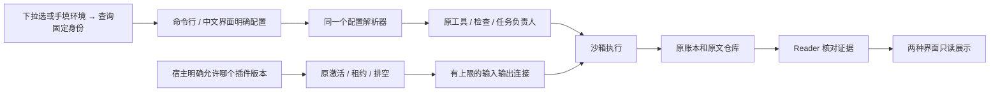

AO-2+ 的三个研究脚本在 `tests/live_optimization/`：`calibrate.py` 跑固定对照，`calibration_inputs.py` 组织明确的样本，`reopen_calibration.py` 核对原记录。被拒绝的实验源码、测试和结果保存在 `docs/validation-data/unified-evaluation/ao2plus/`，不会被产品导入，见 12.10。

## 4. 程序启动后各模块怎样连接

开启 D 后，总结用的还是当前模型连接、原来的调用许可和费用账；没有偷偷创建后台会话或另一套模型调度。

启动时明确给编码、窗口和预留，Runtime 才装上 token 计量。主循环借原来的组合使用权准备请求，没有多开一个调用模型或压缩历史的后台系统。换模型不能默默沿用不匹配的预算绑定。

C 仍由原来的对话启动流程调用同一个压缩服务，先收起旧工具正文，不够再摘录旧历史。没有第二个运行器；找原文仍用原会话账本及 B/B+ 的目录、搜索和阅读工具。

三个输出工具（目录、关键词搜索、原文读取）借用当前 Runtime 原有的 SessionService。没有第二个数据库、文件目录管理器、后台任务或缓存。普通聊天默认工具包含它们；明确关闭默认工具或按 Product 角色限制能力的宿主，要自己明确装配/授予，系统不自动扩大权限。

TUI 打开会话后，先通过原项目规则确认归属、重建原记忆索引，再接受聊天输入；切换会话仍先关好旧运行环境，详见 13.11。

当前问题仍取自原来的事件账：ContextInputService 找到这一轮第一条用户输入，Session 写入前核对它确实来自这里。发给模型、检查和重放都用同一个呈现函数。Provider 不偷偷追加内容，聊天历史也不另存一份问题作为事实源。

配置面板涉及的职责也分开了：`cli/tui_config.py` 负责非密钥启动文件、路径和本地预检；
`cli/tui_entry.py` 负责同一条启动/重启循环；`tui/settings.py` 负责启动字段、开关和标签页；`tui/config_forms.py` 把知识/记忆和任务配置变成中文树形表单，支持可编辑预设及逐项增删。
Context 使用 `chat/config.py`，Product 使用 `product/config.py` 的同一个解析函数，磁盘文件和还没保存的草稿都用各自原规则。真正组装模型和 Runtime 的仍是 `cli/main.py`，打开/恢复会话、
收尾 Product 与 Runtime 的仍是 `tui/runner.py`。这些配置不能替代 Session 账本、Memory 权限
或已经确认的 Skill 选择。

`tui/governance.py` 负责可选文字和记忆操作表单。表单帮你携带准确的 ID，生成命令草稿后仍
交给 `chat/governance.py` 重新读账和审阅；表单本身没有写入或批准记忆的权限。
`tui/text_selection.py` 让现有显示日志能够按字符选中、高亮，并提供右键复制菜单，仍使用 Textual 的
选区。`tui/clipboard.py` 只负责把文字交给 Windows Unicode 系统剪贴板：临时窗口、剪贴板和未转交
的内存都会在返回前收好，成功交付的内存归 Windows 管。它们不新增聊天账本或记忆权限。
`tui/app.py` 的任务面板快捷键只改变原控件是否显示，不另记任务状态，也不会重启任务负责人。

`build_default_runtime()` 像装配车间。它把零件装成一个可运行的 `AgentRuntime`：

- 接收调用方显式打开的 EventStore（Runtime 只借用，不暗中创建也不负责关闭）；
- 注册模型 Provider；
- 注册五个默认工具；
- F0-C 只有显式 History reader 配置且默认工具启用时，才另外注册普通 `request_history_page`；关闭默认工具不会自动获得它；
- 安装 Tool Policy 和 Middleware；
- 组装 Prompt；
- 配置 Verifier 和 Continuation；
- 按显式 `ScopedServiceBinding` 组装 Application、Workspace、Preset、Agent 四层 Service；
- 按显式 `ScopedToolBinding`、`ScopedPromptBinding`、`ScopedPolicyBinding` 把四层能力压成一份有效 Composition；
- 最后把这些交给 AgentLoop。

这里的“接收”是所有权合同：Runtime 只借 Store。CLI 的 run/resume/查看命令和 Chat、每个 Eval attempt、
每个插件 comparison case 各自先打开 `SqliteEventStore`，结束时先 dispose Runtime/Host，再 close Store。
Factory 如果没收到显式 Store 会稳定失败，不会看着 `data_dir` 自己发明一本账。

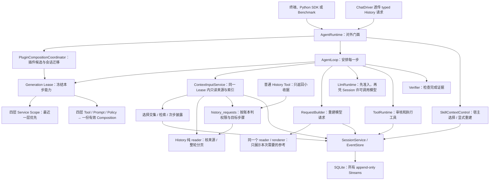

为什么 `AgentLoop` 必须薄？因为模型从百炼换成别的平台、事实存储更换实现、工具增加 Git 操作，都不应该重写“Turn/Step 什么时候开始结束”这套稳定语义。F1 把生产 Store 换成 SQLite 时，主循环就没有学会任何 SQL。

### 插件是在哪一步进来的

装配现在有两个门：

- `build_default_runtime()`：同步，**不带插件**，行为和 v0.3 一模一样，连发现都不做；
- `build_default_runtime_async()`：异步。如果没点名任何插件，它**就是**上面那个；点了名才先跑一遍插件加载事务，再继续装配。启动插件最后由初始 Generation 持有，而不是由另一个 application-level PluginManager 持有。

插件进来的时机很关键：**核心注册表已经建好、但初始 Generation 还没围着候选冻结的那一刻**。`PluginGenerationBuilder` 每次从核心注册表 fork 出私有 Tool、Prompt、Service 视图，PluginManager 在私有视图里完成 setup、冲突和 health check；全部成功后才把 Activation 所有权交给一个 `PluginActivationSet`，再构造并 publish Generation。这里的“交给”不是 Manager 激活完就算，而是 ActivationSet 连同交接收据真正构造成功才算：如果收据发现 Registry 键和活对象已经对不上，调用方手里还没有可清理的候选，临时 Manager 就必须自己取消后台任务、逆序 cleanup 后再报错。如果交接本身和 cleanup 同时失败，两份错误必须一起留下：都是普通异常时仍是熟悉的 `ExceptionGroup`，只要交接错误属于 `KeyboardInterrupt`、`SystemExit` 这类直接 `BaseException`，就用 `BaseExceptionGroup`，不能让错误容器自己再抛一个 `TypeError` 把前两份证据盖住。候选失败会立即逆序回滚，current 完全不变；无插件路径也一样创建空 ActivationSet 和初始 Generation。

还有一条边界要记牢：**主循环压根不知道 PluginManager、Builder 或 Generation replacement service 存在**。它只调用 `CompositionRuntime.lease()`。插件的 Tool、Prompt、Service、Provider、Policy、Middleware、Verifier 仍走原来的主线，但每个候选拥有自己的注册表视图；插件 Activation、插件贡献、Owned Task 和 cleanup 由对应 Generation 的 ActivationSet 持有。SessionService、EventStore、内置能力和没有被插件注册的核心 Provider 是可以跨 Generation 借用的 core，不属于插件 cleanup。所以没有“插件版工具运行器”，也没有“插件版主循环”——在事件日志里，插件工具和内置工具长得一模一样，这正是目的。

`AgentRuntime`、插件组合协调器与 `AgentLoop` 的区别：

- `AgentRuntime` 面向外部调用者，负责创建 Session、保存活跃 Turn 表、阻止同一 Session 重复运行、resume、cancel，并掌握整个 dispose 的先后顺序；
- `PluginCompositionCoordinator` 负责插件候选的 setup/publish/rollback、会话插件身份校验与迁移、共享 Gate，以及关闭时等待这些在途工作收干净；它不执行 Turn，也不另存一份会话事实；
- `AgentLoop` 面向一次 Turn，负责不断创建 Step，直到完成、失败或用完预算。

## 5. Session、Turn、Step 是怎样一层层工作的

D 加 E1 可以在本轮需要时先写摘要，再用下一步继续回答，两步都计入步数和用量，必须留出回答机会。显式选中的 History 阅读优先，这轮暂不摘要。

最容易理解的类比是：

- **Session** 是一个案件档案盒；
- **Turn** 是用户新下达的一次工作指令；
- **Step** 是 Agent 看完现有证据后作出的一次下一步决定；
- **Model Attempt** 是真正向模型服务发出的一次请求；
- **Tool Invocation** 是模型要求系统去读文件、改文件或运行命令。

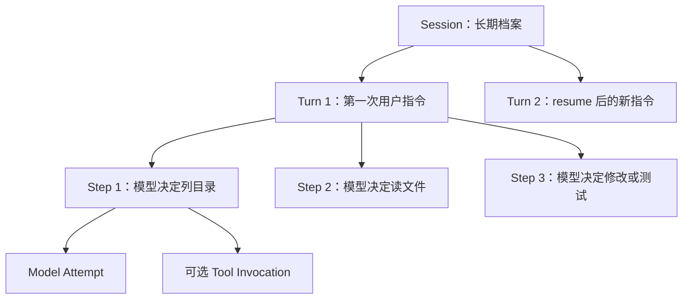

一次正常 Turn 的过程：

1. 用户消息先被 `inbox/accepted` 接受；
2. `inbox/claimed` 把它绑定到新 Turn；
3. 写 `turn/start`；
4. 每轮先写 `step/start`；
5. 首 Step 若有 typed History 请求，先在真实 user/message 后由原 SessionService 批量 CAS 写请求；
   然后在同一个 Lease 内只读选参考，用看到的账本位置做 CAS 写入一条 Context，再写 Composition，
   生成“参考说明 + 完整聊天”的组装请求；Budget admission 先算线上请求并做 PENDING 费用预留，尚不调用模型；
6. Session 用一次 CAS 同时记下两份请求证据和 Attempt start；只有成功者才 dispatch，失败者先释放预留；
7. 如果模型要用工具，执行工具，然后进入下一 Step；
8. 如果模型不再要工具，运行可选 Verifier；
9. 写 `step/end`；
10. Continuation 判断继续还是写 `turn/end`。

项目里曾有一个真实历史案例：一个 Turn 用 6 个 Step，依次 `list_files → read_file → read_file → apply_patch → shell → 最终回答`，Session 前 70 个事件完整记录了修复与验证。它只是帮助理解的案例，不是 Agent 固定脚本；详细轨迹在 [`../code-walkthrough-zh.md`](../code-walkthrough-zh.md)。

并发方面，当前只保证同一个 Python 进程中的同一 Session 不会同时跑两个 Turn。它不是分布式 Agent 锁。要区分两层：写事件文件已经跨进程安全（第 6 节），但“一个 Session 同时只跑一个 Turn”这条规则仍然只在单个进程内生效。两个进程同时对同一个 Session 执行 `run`，文件不会写坏，但你会看到事件交错，或者某一方收到并发冲突错误，而不是被提前拦住。

取消不是直接让程序消失：Runtime 先记一条取消请求，再取消异步 Task；模型、工具和 AgentLoop 分别尽量把自己打开的生命周期闭合。Shell 的执行范围会在取消返回前收尾容器和整个进程树；无法确认时明确报错和记录未知状态。

一个 Session 里可以有很多个 Turn：`run` 和 `resume` 各带来一个，`traceh chat` 则是你每说一句就多一个。谁来驱动都不影响 Turn 的含义——都是走同一个 `run_existing()` 进入 AgentLoop，历史都从事件日志投影出来，调用方不会偷偷攒一份自己的对话记录。

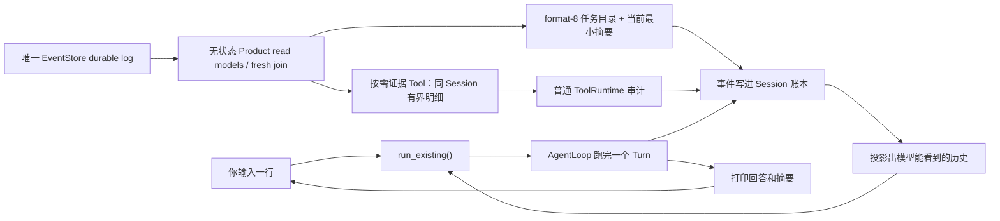

## 6. 为什么有两本事件账

当前 Budget schema 3 新增 `budget/child-token-decided`，原 child-reserved 增加初始 Token 分配；Product 当前 protocol/schema 为 4。额度、申请与原事实源关系见 12.14。

AO-3 增加同一 Store 内的 `optimization-background:<workspace fingerprint>` 流：只记录后台周期授权、反馈准入、额度预留、结算位置与待审状态。聊天原文、工具结果、评估成绩与实际费用仍在各自原 owner，不能用后台投影代替它们（12.11）。

D 仍用同一本会话账：记下“给模型哪些原文”和“模型回了什么”，通过来源身份再追加摘要。原文不改，摘要也不是另一份权威记忆。

E0 在同一本 Session 账里加“请求 token 估算”记录，标清它算的是哪一步、哪份冻结请求。真正用了多少仍看模型调用结束时的 usage；估算不是账单，也不是第二份聊天记录。

C 只在原来的替换记录里增加“工具折叠”这种明确类型，一次引用一个旧工具结果，记下来源、大小、
截止轮和策略。它记的是较短的展示，不改原工具执行账，也没有摘要器或摘要正文。已有会话和数据库
版本不变，完整规则与旧程序读不懂时的拒绝方式见第 12 节。

F3 又增加两类同库事件流：每 Store 一本 projects:catalog 管项目关联，每项目一本 memory:project_id
管提议、批准、替代和撤销。它们的外壳和内容格式都是 1，只追加，不增加 SQLite 表，不进入当前
Surface、Session 恢复或 Context。第 7.6 节说明实际 owner、配置与状态；后面的“两本”指原执行账。

F0-B 的 `context/input` 写在原 Session 账里，记录“这个 Step 选择了哪些精确参考以及预算”，没有新增
另一套参考账本。F0-C 的 `history/requested` 也写在同一本账，绑定宿主 typed 输入、真实用户消息
与本轮首 Step，不进入聊天；文字自称“我是用户”不能制造这条授权。Context 和原文都不靠临时缓存传给下一轮。

`session/created` 仍恰好有 session_id、workspace、metadata、context_protocol 四项，
最后一项已唯一切到整数 6；旧 1/2/3/4/5 和无标记旧会话在详情、运行、检查和恢复时都拒绝，列表只能列出身份。
事件外壳仍为版本 1，F2 SQLite 结构为 2，原压缩记录仍是 format 2。
F2 另有每会话一条 context-selection 流，记录宿主的 skill/selection-set；不进入 Surface。
模型只能请求本轮紧邻下一步首次披露，已读正文按本轮预算保留，不能修改选择，详细字段和 owner 见第 7 节。

（严格说现在不止两条流：除了下面这两本按会话分的账，还有六条**全局的**控制账（含 F3 的 projects:catalog）——Agent 名册 `agents:directory`、Budget 账本 `budgets:ledger`、Workspace 名册 `workspaces:catalog`、Patch Manifest 名册 `artifacts:catalog` 和推广账本 `patch-promotions:ledger`；另外每次 Workflow 运行有一条 `workflow:<run_id>`，每个 ProductTask 有一条 `product-task:<task_id>`，每个 Agent 各有收件/投递两条流。F0 当时只冻结了 ProductTask 协议，F1 已经补上真实 writer/projector，所以它现在属于当前 Stream 清单。这些 raw 控制流不会被直接塞进模型历史、不参与 Session 恢复、不影响请求指纹，`traceh sessions` 也看不到它们——那条命令只认 `session:` 开头的流。20.32 有一个故意很窄的桥：下一轮 requester 模型开始前，宿主 fresh 读取同一 Session 关联的 canonical ProductTask heads，把当前 focus、最多五项近期历史、准确总数/省略数、固定状态语义和 focus 最小执行摘要原子写成 requester Session 的 format-8 `product/context-snapshot`。需要细节时，模型可显式调用纯读 `read_product_task_evidence`，由同一 EventStore fresh join 后把受限结果作为普通 Session Tool 审计写入；这不是第二份 Product 状态或新 Memory Stream。Patch bytes 仍不塞进事件，而在宿主显式 SHA-256 CAS 中由 Manifest 引用。Budget 账本当前共有十一类事实：`root-granted`、`child-reserved`、`reservation-committed/released`、`usage-charged`、`usage-reserved/started/settled/released` 、`account-closed` 和 `child-token-decided`；推广账本只有三类：`patch/review-recorded`、`patch/approval-recorded` 和 `patch/promotion-committed`。）

### Session Stream：Agent 认为发生了什么

它记录：用户消息、Turn/Step、发给模型的请求、模型响应、工具请求和结果、Verifier 结果、恢复与错误；
Product-configured requester Session 还会记录 host-owned `product/context-snapshot`，精确证明下一次请求里的
当前 Product status 从哪一个 canonical head 来、当时还列出了哪些同 Session 近期任务及省略了多少，以及
宿主提供的事实/历史原文/推断边界；稳定检查点还带最小执行摘要。模型显式调用证据 Tool 时，正常
`tool/call`/`tool/result` 也按既有规则进入这本账。Product 控制逻辑不会读 context 收据或 Tool 结果来反推状态。

### Effect Stream：现实世界可能发生了什么

它记录：准备执行副作用、已经派发、最终结果，以及崩溃后无法确定时的对账结论。

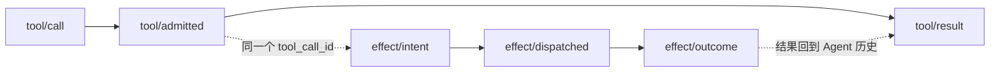

为什么不能只留一本？因为有一个危险时间窗：文件已经改完，Effect Outcome 也可能写了，但进程还没来得及把 Tool Result 写回 Session。如果只有 Tool Result，恢复器会误以为“可能没执行”，然后重复修改。分开记账以后可以用 Effect Outcome 补回 Result。

每条 Stream 都从 seq 1 开始连续编号。写入前必须告诉 EventStore“我认为现在的最后序号是多少”；如果别人已经抢先写入，`expected_seq` 不匹配，程序明确报并发冲突，不能悄悄覆盖。

现在所有生产 Stream 都在同一个 `events.sqlite3`。原 streams 表记“每条 Stream 当前到几号”，
events 表按 `(stream_id, seq)` 保存完整事件；事件内容仍是唯一、排序稳定的 canonical JSON。数据库版本、表列、
外键、完整性、连续序号和每条事件的身份都会在打开时检查，坏行、断号、旧/新未知版本都直接拒绝，
不会帮你猜、补或修。F2 另有 manifest/items/FTS 三个派生表及五个精确核对的辅助表，
由原 Store 负责事务、取消、关闭、备份和显式重建；损坏的派生行不变成事实，第 7 节解释恢复边界。

旧 `.jsonl`/`.lock` 目录不会自动导入。程序甚至不读旧事件正文，也不移动、删除或另建空数据库掩盖它；
只会告诉你换一个新 data dir。SQLite 和 JSONL 混在一起也拒绝，没有双读、fallback 或迁移器。

### 拿到一条事件，等于拿到账本原件吗

不等于——但以前差点等于，这是本轮修掉的问题。

可以把一条事件想成**一个封面写死的档案袋**。袋子外面印着编号、时间、类型这些身份信息，印上去就撕不掉：代码里 `EventEnvelope` 是 frozen 的，谁也不能把 `event.data` 整个换成另一份。

但袋子**里面装的还是普通的纸**。事件内容 `data` 是标准的 Python 字典和列表，里面还能再套字典、再套列表。frozen 只锁住了袋子的封面，锁不住袋子里的纸——`event.data["nested"]["value"] = ...` 这种写法，Python 完全允许。

问题就出在这里。以前内存版 Store 的做法，相当于**档案室直接把原件递给来查阅的人**：

- 你调用 `append()` 写入一条事件，Store 把它存进历史，同时把**同一个袋子**返回给你；
- 你调用 `read()` 查历史，Store 还是把**档案室里那几个袋子本身**递出来；
- 于是只要你改了手里这份的内容，档案室里的记录就跟着变了——而且是**改的过去**，没有任何痕迹。

还有两处同样的漏洞：`to_dict()`（把事件转成字典准备写文件或展示）返回的字典，里面装的还是原袋子里那几张纸；`from_dict()`（从字典还原事件）造出来的事件，也和你传进去的那份字典共用纸张。

有一件事本来就已经是对的，不要误以为它也坏了：**你自己构造的那份输入（`PendingEvent`）从来就是安全的**。事件被制造出来的那一刻，内容就已经抄了一份新的；你后来再怎么改自己手里的原始输入，都影响不到已经入账的事件。

现在的规则统一成一句话：**档案室只发复印件**。

- `append()` 返回的是复印件；
- `read()` 返回的是复印件，而且**每次读都是新的一份**，两次读之间互不影响；
- `to_dict()` 给出的字典是复印件；
- `from_dict()` 收到字典后先复印再存档。
- 复印是**连里面所有夹层一起复印**：套着的字典、套着的列表、列表里装的字典，全都是新的；

这条规则写在**协议**上（`EventStore` 这个"任何账本实现都得遵守"的接口说明里），不是只写在内存版那一个类里。原因很简单：账本后端是可以换的，换了后端不能改变"你拿到的事件能不能安全地改"这件事。

要特别说清楚四件事，免得记成别的意思：

1. **这不是把所有 JSON 都变成了不能修改的对象。** 复印件仍然是普通的字典和列表，你想怎么涂改自己那份都可以。变的是——**涂改复印件不再等于涂改账本**。项目现在没有引入“不可变字典”这类新类型，也不打算为了这件事重造一套 JSON 类型系统。
2. **"发复印件"是发生在特定窗口的动作，不是空气里自动生效的魔法。** 现在只有账本的 `append()` 和 `read()` 这两个窗口负责复印。事件本身只是个普通对象，所以如果**同一个事件被交给两个消费者**，这两个消费者拿的是同一份纸，框架不会替你隔开。如果有谁要把一条事件同时交给很多接收方，那就得给**每个接收方各复印一份**。现在确实有这样一个地方了——见下面"能不能一边干活一边看它在干什么"，那里就是给每个观察者各复印一份。
3. **SQLite Store 沿着 canonical JSON 边界“复印”。** 写入前先把完整 Envelope 规范编码；读取时从数据库
   文本重新构造一张全新的对象图，还会核对这张图再编码后必须逐字相同。它不把数据库内部对象直接
   交给调用者；内存 Store 才需要显式 `detach_event()`。
4. **复印规则比"标准 JSON"宽，而且是"换算"而不是"拒收"。** 这一点最容易被写错。事件内容除了 JSON 原生的那几种值，还允许放 `Path`（路径）、`UUID`、时间、`Enum`、dataclass、各种字典和 `tuple`；复印时它们会被**换算成 JSON 形式**——路径变字符串、`tuple` 变列表、时间变 ISO 字符串。只有真正没法处理的东西（比如 `set`、随便一个普通对象）才会直接报错。所以不能说成"不是标准 JSON 的值就会报错"：`Path` 和 `tuple` 都不是标准 JSON 值，但它们被换算，不被拒收。

换句话说，两种 Store 对使用者的表现完全一样，只是达成方式不同：SQLite 顺着 canonical JSON 关口
做到，内存版自己显式复印。测试会**真的修改嵌套内容再重新读一遍**，不是只比较对象地址。

代价也讲明白：一次 `read()` 的复制成本跟它实际返回的所有 payload 总量有关。SQLite 可以靠
`(stream_id, seq)` 从 `from_seq` 定位，不再先解析整条流；但打开 Store 会完整校验一次全部历史，所以
数据库很大时启动成本仍会线性增长。这里仍**故意不做共享 Event 缓存**——把同一份复印件重复发给
不同的人，就又回到共享原件的问题。

### 能不能一边干活一边看它在干什么

以前不能。你敲一句话，屏幕就一直静着，直到整轮结束才一次性吐出答案——中间它读了什么文件、跑了什么命令，你完全看不到。现在能了。

先说清楚**它不是什么**，因为这里最容易吹过头：

- **它不是第二本账。** 账是 SQLite EventStore。这个新东西只是个"广播喇叭"，喊完就没了，不存盘。
- **它不是历史。** 你订阅之后才发生的事才会喊给你听。想看以前的，还是老办法读账本。
- **它不保存状态。** 它不攒任何东西，不是缓存，也不是投影。
- **它只在自己家里听得到。** 另一个 `traceh` 进程往同一个 SQLite 数据库写事件，你这边的喇叭不会响——**没有跨进程实时观察能力**。
- **它允许漏。** 万一"账房已经收下这条、喇叭还没喊出口"的瞬间进程崩了，你会少听到一声，但**账本不会因此少一条**。所以崩溃恢复、审计、不变量检查一律只认账本，从不听喇叭。
- **它不会让事件变得"更结实"。** 当前账本只有唯一 `SYNC` append。喇叭只说明内层调用正常返回，
  不会扩大 SQLite WAL + `synchronous=FULL` 对具体文件系统、存储控制器或突然断电的保证。
- **拿到喇叭的人不能对着它喊。** 观察者拿到的接口只能"订阅"，不能"发布"。这不是洁癖：如果谁都能往喇叭里塞一条账本从没收到过的假事件，订阅者根本分辨不出真假，时间线就会一本正经地显示一个从未发生过的步骤。把"发布"这个动作从消费者接口上拿掉之后，"只有账房收下的事件才会被喊出来"就成了**接口形状本身的性质**，而不是靠观察者自觉。（Python 的下划线不是安全沙箱，但它明确了谁有权限做什么。）
- **不许发一个"永远沉默"的喇叭。** Runtime 上那个可订阅对象是**必填**的，而且必须就是账房实际在喊的那一个。给它一个默认值，就会交给调用方一个看起来能订阅、实际永远收不到任何东西的假接口——接口存在而能力不存在，这比没有更糟。

**喇叭装在哪里？** 装在"账本柜台"上，而不是装在某个具体业务流程里。技术上它是一个包住任意 `EventStore` 的装饰器。选这个位置有两个很实在的理由：

1. 换后端不影响它。内存测试账本和 SQLite 生产账本包起来行为完全一样。
2. **"这条事件已经真的记下来了"恰好在这个位置才成立。** 整个 `src` 里只有一处调用 `store.append()`，所有写入者（主循环、工具运行器、恢复器、压缩器、取消）都要走这一处。所以"喊一条其实没记下来的事件"在这个位置根本没法写出来，也不需要每个写入者自己记得喊一声。

**三件事的顺序是固定的**：先真的写进账本 → 成功了才喊 → 界面听到才打印。写失败、序号冲突、被取消，一律**一声不喊**。特别是取消：即使那条事件其实已经落盘（第 6 节讲过的"可能已提交"边界），喇叭也不喊——**宁可让观察面漏，也不让账本乱**。

**还有一个很容易被忽略的坑：顺序。** 两个人同时写账本，账本自己会排队，所以序号一定是 10、11。
但写完后谁先恢复执行并不确定。广播装饰器仍用“每条 Stream 一把锁”包住 append + publish，保证同流
按 seq 喊；不同 Stream 的 wrapper lock 互不干扰，不过内层 SQLite 只有一个 writer，仍会在整个数据库
范围按下面的 busy 规则短暂排队。

**每个观察者拿到的是自己的复印件。** 这正好接上前面那段：档案室对"一个人来取"是发复印件的，但如果同一份东西要同时给两个观察者，那就得复印两份——否则甲改了自己那份，乙手里的也跟着变。所以广播时是**每个观察者各复印一份**，不是"这一次广播只复印一次"。

**队列是无上限的，这是个明确的取舍**，不是没想过：

- 好处：慢的观察者永远不会拖慢、更不会弄失败一次真实写入；
- 代价：一个订阅了却再也不读的观察者会一直占内存，上限就是这个会话产生的事件量；
- 兜底：Chat 在所有退出路径（正常结束、报错、取消、Ctrl+C、`/exit`）都会关掉订阅，所以随包发的这个消费者不会漏；
- 将来如果要改成有上限的队列，**必须先想清楚满了怎么办**——悄悄丢事件会让时间线对已经发生的事情撒谎，那比不显示更糟。

### SQLite 为什么仍能让两个进程正确排队

现在不是“每条 Stream 一个文件锁”，而是一个 SQLite 数据库。每次写入先用 `BEGIN IMMEDIATE` 申请
这个数据库的 writer 位置；SQLite 同一时刻只让一个 writer 进去，所以**不同 Stream 也会排队**。默认
最多等 5 秒：普通短竞争等前一个提交后继续，超过上限就得到固定的 `event-store-busy`，Store 不会偷偷
再写第二次。

拿到 writer 后，下面三件事在同一个事务里完成：

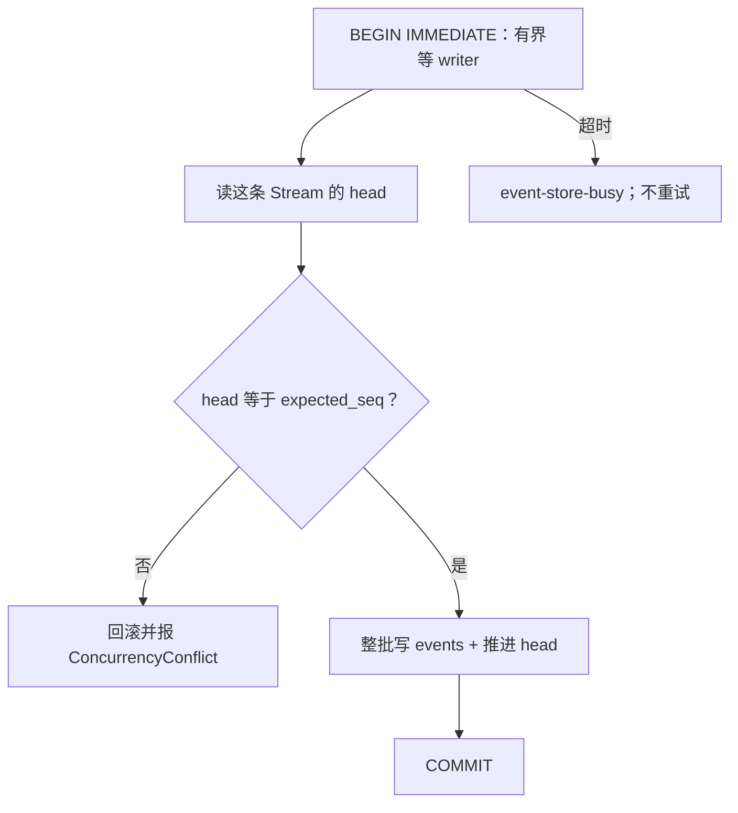

所以两个进程都拿旧 Head 写同一 Stream 时，最多一个提交；第二个进去后看到 Head 已变，明确冲突。
主键 `(stream_id, seq)` 还是第二道数据库硬约束。进程被 kill 后 SQLite/操作系统会释放 writer，测试已经
证明新进程能继续追加；但网络盘和所有突然断电设备并没有被测试，不能吹成“任何情况下绝不丢”。

`expected_seq` 仍不可少：锁只保证同一时刻一个 writer，不保证你之前读到的世界没有变化。它负责让
“基于旧历史的决定”明确失败，而不是覆盖别人的事实。

### 取消或关闭 Store 时会发生什么

SQLite 阻塞调用仍跑在后台线程上，而线程杀不死。调用方取消后，TraceHarness 不会先返回再让线程继续
写；它会保护并等待**同一个 Worker**彻底结束、取回结果，然后才把 `CancelledError` 交给你。第二次、
第三次取消也不能跳过这段等待。

这意味着取消可能落在不同提交窗口：

| 取消发生在什么时候 | 结果 |
|---|---|
| Store coroutine 还没开始 | 没有 Worker，也没有写入 |
| Worker 正在等 writer 或事务中 | 最终可能回滚，也可能提交；返回前 Worker 一定结束 |
| COMMIT 已经发生、结果还没交回 | 事件已提交，但调用方仍收到取消 |

因此“收到取消”仍不等于“没写入”，也不叫 at-least-once。要 fresh replay，用 `event_id`、correlation 或
业务身份判断，不能猜，也不能因为 busy/cancel 自动重试。

关闭也有 owner：一旦 `aclose()` 开始，新操作全部拒绝，已经接进去的 Worker 全部等完；重复 close 安全。
连 close 自己被取消，也会先等关闭任务收干净再传播取消。CLI、Eval attempt 和插件 comparison case 都
先关闭借用账本的 Runtime/Host，再关 Store；两边都出错时两份错误一起保留。

备份不能直接复制 `events.sqlite3`，因为 WAL 下“一致历史”不保证恰好只在一个物理文件里。宿主用
SQLite backup API 写到一个全新临时目录，按相同 schema/integrity/history 规则验证后才改成目标名；恢复
也先验证，而且绝不覆盖已经存在的数据目录。

## 7. 模型到底看到了什么，能不能事后证明

D 给冻结请求标明用途：聊天按当时的对话和参考资料还原，摘要按圈定的旧原文还原。两种都能核对真正发出的请求，不把摘要硬装成一条聊天。

先把本轮资料选出来，才能知道整个请求有多大。首个请求若需要压缩旧历史，会压缩后重新选资料，再正式冻结、计量和发送。统计任务状态只看到该请求当时的截止位置；别人此时抢先写了账，计量写入就拒绝，不能把新状态混进旧请求。

C 收起的是旧工具回复里的正文。模型仍看得见当时调用了什么、参数是什么，以及与该调用配对的较短回复。原账不改，所以旧请求仍能重建。工具折叠不冒充 History 摘要；以后整段对话被摘要时，仍能沿来源找回原工具事件。

模型看到的内容不是直接读取某个一直变化的 `messages` 变量。Context 当前组合为：

```text
ModelRequest = 本 Step 一条 Context 参考消息 + 截至 Composition 序号的完整 Surface + 冻结 Composition
```

### 7.1 Composition 是能力清单

它回答：

- 用哪个 Provider 和 Model；
- System Prompt 是什么；
- 模型能看到哪些 Tool Schema；
- 有哪些 Policy 和 Middleware；
- temperature、最大输出是多少；
- 已启用插件贡献的真实 Skill 目录及内容摘要；条目和正文不会因此自动进入提示词，资源随这一代保留（19.12）；
- 这些内容合起来是哪一个 revision。

Lease 的意思是“这个 Step 借用这一整套能力直到结束”。现在每个 Runtime 始终有一个 current Generation；Step 进入 Lease 时原子地绑定这一代，Provider、Prompt、工具 Schema、ToolRuntime、插件身份、Policy/Middleware 和 Snapshot 都从同一代来。发布 v2 后，新 Step 才能拿 v2，已经开始的 Step 继续完整使用 v1，不会一半用旧工具、一半用新工具。

内部 Generation identity 只是生命周期编号：用来计数、退休和清理，不写进模型请求或事件。Snapshot revision 是 Composition 全部内容（含 Skill 目录元数据）的 fingerprint；目录不自动成为 prompt/messages。两代 Composition 内容完全相同，revision 也相同。Tool 的 name、description、input_schema、effect_kind 会被真正只读、扁平、幂等的不可变适配器冻结，嵌套 Schema 也不能改，执行仍委托给已捕获的 Tool；Provider、Policy、Middleware 名称也在构造时记住。Generation 对象的一次性发布认领，和资源 cleanup ownership 是两套状态：后者由装配层显式创建的一次性 `CompositionResourceOwner` handle 负责。`LlmRegistry`、`ToolRuntime`、`PromptAssembler` 以及 Provider、Tool、Policy、Middleware 只传播这个 handle 的 binding；冻结和重新包装不扫描对象图，也没有全局 `id()` 目录。binding 不是礼貌地调用对象自己的 setter，而是直接落到真实实例字典或声明过的 slot，并在写完后再读回来核对，所以对象偷偷忽略赋值也骗不过 Runtime。若绑定到一半失败，已经动过的对象会精确恢复原样：原来没有字段的继续没有，原来字段值是 `None` 的仍是 `None`，Owner 也可以安全重试。无法保存这种可验证 binding 的裸 slotted Provider、Tool、Policy、Middleware 不能进入带 cleanup 的 Generation；必须先经过可绑定的受控装配，不能靠调用方口头保证“这是新资源”。Generation 构造会先完成 Provider 查找和冻结投影，最后才提交 owner/binding；Provider 名字写错时不会污染原资源，同一 Owner 和修正后的资源可以重试。Runtime 还会先从冻结好的初始 Generation 建完兼容性视图，再让 Owner 正式被认领；认领后不会突然二次读取 raw Prompt/Registry 而把资源卡在无人接管的中间状态。带 cleanup 的公共 Generation 不接受裸 callback，必须携带显式 owner；同一个 handle 第二次认领会被拒绝，已使用的 capability binding 也不能通过多层 `replace()` 或重新放进注册表来洗掉。Runtime 初始化和 `publish()` 走同一个校验/认领入口；cleanup owner 不得和旧 Lease 或旧代共享会被 cleanup 关闭的资源。兼容性投影与当前 Generation 分开，不能用 `clear()` 改掉正在运行的一代。旧代 retired 后，有 Lease 就绝不清理，最后一个 Lease 释放才启动一次 cleanup；Drain 会等所有旧代 Lease 归零、cleanup 真正完成。等待 Drain 时反复取消也不能提前逃走，收敛后才重新抛最初的取消；某一代 cleanup 失败会在其他代继续清理后以有界结构化结果报告，并把 Runtime 标为 poisoned、拒绝后续 publish。

Stage B 把插件资源从这套“能力-wide owner”边界里单独分出来：`PluginActivationSet` 明确持有插件 Activation、插件贡献、Owned Task 和 cleanup；SessionService、EventStore、内置能力和没有被插件注册的核心 Provider 是可以借用的 core。每次候选都用私有注册表 setup，publish 成功后由对应 Generation 接管；旧 Lease 结束前，旧 set 的 Service、Tool、Provider 或 Verifier 都不会被卸载。

### 7.2 Surface 是给模型看的历史

它只挑：

- 用户消息；
- 助手完整消息和它提出的 Tool Calls；
- Tool Results；
- requester Session 里通过严格校验、逻辑上最新的一条 Product status 宿主证据；
- 压缩生成的替换摘要（人工做的和宿主自动做的都算，见第 12 节）。

这里有一条容易踩的顺序问题：摘要必然是**后**写进账本的，但它描述的是**更早**的对话。所以 Surface 不按写入
顺序排，而是给每条消息一个“逻辑位置”——普通消息就是自己的序号，摘要取它替换掉的那些消息里最靠前的那个位置
（摘要的摘要一路往回取）。这样摘要永远停在它替换掉的那段历史原来的位置上，不会跑到更新的对话、甚至用户刚说
的那句话后面去。

这条 Product status 只含 task id、canonical Product head、公开状态和“不是控制授权”的固定说明。旧快照
仍留在 append-only Session，但 Surface 只按“确认消息入账顺序 + Product 自己的 head seq”选最新一条；
不管人工压缩还是自动压缩都不能把它遮掉。像 `step/start`、`effect/intent` 以及 raw Product/Workflow/Promotion 控制事件
不会直接塞给模型，否则模型上下文会被技术账本淹没。

### 7.3 Request Snapshot 是事后证据

F0-B 在原来的八个字段之外增加 `context_input_seq` 和 `context_input_digest`，总共十项，精确指出
这份请求采用哪张 Context。重建会回到当时的观察位置核对来源，不拿今天的摘要代替过去内容；合法的
空 system prompt 也保留为空字符串，不再被读成 `None`。Product 证据与叶失败读取共用同一 Session
协议检查，不再各存一份旧字段清单。

现在一次调用先有两份不能混叫的请求。RequestBuilder 根据 Composition，把完整 Surface 放在前面，
当前 Step 的一条 Context 参考消息放在最后，生成“组装请求”。工具调用和结果组保持完整，Surface
自身不保存这条临时参考；不能再用“最后一条 user 消息”直接代表真实用户输入。Budget
admission 只允许把输出上限压低，得到“最终线上请求”，但这时还没有调用 Provider。当前 Step 的 owner
随后用一次 Session CAS 同时保存一条 snapshot 和 Attempt start。snapshot 里分别放两份完整请求与摘要、
历史读到的 `source_seq` 和 Composition revision；Attempt start 再指回这条 snapshot、最终请求摘要和
费用 reservation。只有 CAS 成功才 dispatch，失败 owner 释放预留。

Replay 会按当时边界重建组装请求，再独立验证最终请求；除了输出上限只能向下收紧，其余字段必须完全
一样。Generation、Attempt 和 reservation identity 都不进入请求 fingerprint。它们通过旁边的 Attempt
证据互相绑定，避免“为了记账改变了模型真正看到的请求”。

Fingerprint 不是加密秘密保护，它主要是稳定内容校验：相同结构生成相同摘要，任意请求内容变化都会导致摘要变化。

### 7.4 F0-C：每一步参考和历史原文怎样受控读取（正式版 7.4）

通用说明现在只让模型使用当前工具列表，不再点名推荐未提供的检索或输出工具。阅读动作里的工具名也须在当前列表里。读 Patch 明确按 Unicode 字符计数，offset 从 0 开始；默认读 2000、最多 4000 个字符，首次只传 artifact_id 即可，next_offset 为 null 才算结束。仍须真实读完再明确整合，权限和取消回滚不变。说明文字影响请求重放和字节计量，所以当前统一使用 Session 15、Context 13、展示 v13；旧会话不能直接恢复，要用新数据空间/会话，旧日志保留不修改。见 [ADR-0075](../adr/0075-tool-guidance-and-context-renderer.md)。

现在参考包里有 `active_request`：记录“这轮第一条真实用户消息是哪条，以及原话是什么”。它不拿搜索关键词或摘要代替你的问题。调用工具后继续处理同一问题；你发起新一轮，就重新绑定新问题。即使没有参考资料，也会显示这个定位。写入前还会回到事件账核对，改掉原话或借别轮消息冒充，即使重新计算摘要校验值也会被拒绝。

资料继续后置，末尾再用 JSON 引用你的原话，并说明应该回答当前问题。参考内容和问题回显一起冻结，重放也是同一份。预算分开记：`reference_limit` 是原有资料配额，`reference_bytes` 是资料实际占用；`active_request_bytes` 是问题回显和说明的 UTF-8 字节数。`rendered_bytes` 是两者相加，`total_limit` 是资料配额加本次回显大小；`remaining_bytes` 只算还能放多少资料。问题回显不会额外放行资料，最终完整请求仍计入模型预算。

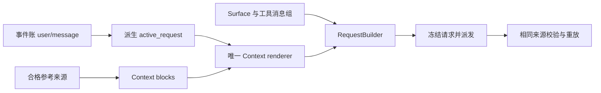

设计决定见 [ADR-0051](../adr/0051-current-turn-request-anchor.md)。

现在 `ContextInputService` 手里只有“读 Session／选择／派生索引”的回调和宿主策略，没有写账、调模型、装插件或
开后台任务的权限。AgentLoop 借到这一代能力后，先让它读来源、冻成收据，再由原 SessionService 写账。
这发生在网络重试之前，所以同一步重试不会再选一次参考，也不会改变请求字节。

默认策略明确选空：不造查询、不选历史。Skill 空目录写 source-unavailable，有目录但没有选择写 not-selected；空策略的 Memory 未启用（开启后的 F4 主线见 7.7）、History 没选择。即使空，
仍有一条带固定说明的 user reference message，排在全部 Surface 和完整工具结果之后。工具接着执行的下一 Step 也遵守
同一顺序；参考说明不成为 Surface 的聊天记录，不会因下一步而一遍遍积累。

F0-B 基础主线与 F0-C 原文披露均已通过本轮限定验证（第 15 节）。自动目录／摘要仍只看
当前会话可见的压缩块，顺序沿用 M3。query 只记录本轮第一条真正用户输入，History 不做排名；Skill 排名见下一小节。目录增加一个
cursor，表示宿主给出的下一页定位；没有显式配置 History reader 时它为 null，不能读原文。配置 reader
仍须启用目录／摘要，没有单独只读原文模式。摘要保留原 replacement message 的精确 JSON。

`api/history.py` 给三张不可改的表：读取上限、cursor、精确页请求；有表不等于有权限。
`session/history.py` 只检查来源和分页，沿已验证的 M3 来源图展开原用户消息、assistant 消息和工具结果，
保留原工具调用。分页不拆完整 Turn 或调用／结果组；section/chunk 第一版做同一件事。某个 Turn 太大，
那一页保留原编号并整页拒绝，不截断、不挪页号，也不给 accepted 收据。只先披露首 cursor，再从读到的页
给 next_cursor，不一次公布所有页。来源总量、深度、页大小和请求数都有显式上限。

`session/history_requests.py` 统一判定权限和目标步骤。当前会话以前确实披露过的 block/cursor，即使
后来被更大的压缩块盖住，仍可按原身份请求。模型调用普通只读 `request_history_page`，得到的只是小
收据，落在工具结果事件的 `data["data"]["history_receipt"]`；原文到同一 Turn 紧邻下一 Step 的 Context
才出现。关闭默认工具不会自动得到它。用户通过 `TurnInput.history_requests` 的明确 tuple 提交请求，
ChatDriver 原样传递；首 Step 的真实用户消息先记账，再由原 SessionService 以 owned/CAS 批量记请求。
正文、source="user" 或随意 metadata 都不能代替这个宿主入口。

每块都核对实际注入正文的字节、摘要值、原事件身份、闭合轮次和观察截止点。原文页还检查请求收据、
页码、叶事件和目标 Step。未开启真实观察时 Workspace 观察为 null、新旧程度为 unknown；F4 开启后的三态需由真实来源派生。
工作区现有 base_revision 只是建仓基线，没有真实观察的历史工具结果不具备执行时的可靠版本；现在也可能有未提交修改，
所以“基线一样”不能证明旧测试现在仍通过。F4 已接入真实 Git/Tool 观察（7.7），仍不能拿历史原文冒充当前验证。

快照内部只存不可改的 canonical 字符串，调用方拿到的是独立副本。正文放在 JSON 字符串里，
伪标题、引号或闭合标记仍只是内容。现在 context-json-v13 只把模型需要的身份、正文和阅读动作
显示出来，完整来源证明还在原账本里。固定头尾区分宿主导航与资料正文，两者都不能绕过工具政策。
Memory 目录给出读取完整短事实的动作；History 给出首／下一页的动作，没启用读取或没有下一页时
就是 null。预算仍先给新申请，再给有效的已读正文、自动历史和自动 Skill/Memory；实际显示的字节、
转义、导航和头尾都算进去。块放不下就整块排除，不剪正文；排除项太多则失败。字节数不是 token，
token 计量仍报告 unavailable。

失败时账本可以停在四个位置：什么都没写；只写 Context；写了 Context 和 Composition；首请求与
Attempt 已一起写入。前面三种都不能调用 Provider。取消也先等那次写入收尾，再查到底已写、未写还是
不知道；不知道就不重投、不继续。恢复只收敛原 Step/Turn，不补造 Context。历史请求只供唯一目标：
用户是本轮首 Step，工具是同轮紧邻下一 Step；目标没发生、失败、超预算、步数用尽、取消或恢复，都不会
顺延。接受／可用／已消费／失效从原账本顺序推算，不加另一套 writer、Lease 或 pending 状态机。
Session 已唯一切到 `context_protocol=15`，拒绝旧 1–12；当前 Context 外层为 13，数据库仍为 2，
EventEnvelope 仍为 1、M3 仍为 2。没有兼容 reader 或旧账迁移。F1 目录与 F2 选择／排名／披露已接入，
F4 Memory 已接入（7.7），F5 两种界面已接入共享治理（7.8）。

### 7.5 F2：谁能被选中、怎样检索、正文何时给模型看（正式版 7.5）

Stop A 的两处 P2 已修好。Context 和排名共用同一个 Skill 内容身份，层级也算身份的一部分，
所以目录和摘要能一起进入下一步；相同请求仍只消费一次，账本中的真正重复块仍拒绝。
精确匹配保留整条路径里的空格，把括号、加号等按字面处理；前后仍要符合标识边界，不能把更长路径
误当成目标。整条路径直接输入或放在引号内都可以。宿主选择、预算、FTS 只索引元数据和旧请求重放规则不变。
[Stop A 记录](../plan/TRACEHARNESS_V0.9_RELEASE_STOP_A_REVIEW.md) 保留了原始反例及修复证据。

现在 F2 已接通。宿主用 `runtime.skill_context.select()` 明确选择 Skill，用 `rebuild_index()`
明确重建检索索引；都借原 Runtime 的能力 Lease，并核对使用同一个 SessionService／Store。
即使两个数据库碰巧有相同 Session id，也不能串用。选择不会重新加载插件、迁移身份或授予工具。

`session/skill_selection.py` 把选择追加到同库的 `context-selection:<session_id>`。
每笔 `skill/selection-set` 记格式 1、会话、操作 id、预期旧 head、操作者、目录摘要和排序的
Skill id/version。相同操作只能重复完全相同的内容；另一次修改要比对旧 head，明确清空也记账。
取消后先等写入结束，再查已写、未写或无法确定，不能盲重试。插件目录变了，旧选择显示 stale-selection，
必须由宿主重新确认，不偷偷换成新版本。

`session/skill_retrieval.py` 先求“这一代已启用目录”和“宿主所选”的交集，再排名。
query 只来自本轮第一条真实用户消息，并保存来源；检索会统一全半角和大小写，绑定 Unicode 版本，
不会改写实际正文。中文按单字和相邻双字分词，其他字母数字按连续词分组，并保留完整代码字面量。
查询里的点分标识或路径保持整体，至少命中一个完整字面量才有资格，不能靠碎词退回相似标识；
送进 FTS 的是编码后的文字 token，用户输入的引号、OR 或星号不能变成搜索命令。
自动候选只看目录／摘要，索引不保存 section 或资源原文。exact 先按配置匹配 id、标签、路径、
代码符号或错误标识，FTS 召回后用 BM25 算相关度；文档总数、平均长度、词频都只取本次合格集合。
RRF 把两路名次按显式权重合并，用稳定内容身份排并列，别的会话不会改变这里的分数。

`session/context_index.py` 定义索引结构和不可变语料快照；真正开连接、写事务、管理后台 Worker、
关闭和备份的仍是原 SqliteEventStore。数据库升到 schema 2：除 streams/events 外，多了 manifest、
items 和 FTS 三张派生表及五张名字和结构都精确核对的 FTS 辅助表。
manifest 保存这份语料所属会话、目录、选择 head、算法／配置摘要、条数和大小。
读时重新核对来源、条目和 FTS；缺行或坏派生内容显示 index-unavailable，未知表或缺辅助表直接拒绝开库。
FTS5 不可用就明确失败，不偷偷装包。宿主重建在同一个写事务里复核选择 head，再整批换索引、清孤立行；
失败就回滚，不修改原事件。取消和关闭先等原 Worker 收尾。
失败后的 published=true/false/unknown 只说明这份完整索引是否存在；true 也可能是以前就有的相同索引，
不能当成本次提交证明。备份包含派生表，恢复不覆盖已有目标。

`session/skill_requests.py` 复用已有 History 的步骤和实际请求证明。
普通只读工具 `request_skill_reference` 只接受准确的 Skill id/version、catalog_digest、
requested_tier 和 section/resource/chunk id；不适用项必须写 null。
模型只能进一步请求这一步已经看见、宿主仍选中的 Skill。目录和摘要来自冻结目录，
section 是完整具名章节，chunk 是贡献方划好的完整资源片段。工具返回收据和可用章节／片段的 ID、标题、说明及字节数，
原文到同轮紧邻下一 Step 的 Context 才出现，读取仍经过那一步的有效 Lease 并核对字节摘要。
工具失败、取消、恢复、最后一步没后继、目标失败或放不进预算，都不会把请求顺延到别轮。
没有新的 pending 账本，也没有模型修改宿主选择的入口。

三类资料共用预算：先给新明确申请，再给已读正文，然后自动 History、自动 Skill/Memory；每块算完整渲染后的大小，超限整块排除。
冻结前再看一次选择 head；变了就记录 source-unavailable，不把最新选择偷换进去。
当前 Context 格式 9 的 retrieval 包含 skill、memory 与总 fusion；各来源收据记录语料 key/digest、
合格条数、两路状态和排名、融合分数的分子／分母，以及真正覆盖的查询词，统一规则见 7.7/7.9。
重建旧请求时只核对当时的收据、选择前缀、Composition 目录、原文字节和预算，
不再搜索今天的索引或读取今天的文件。每块必须来自冻结排名或准确披露请求；
同一步重试也复用原请求。参考不成为 Surface 的聊天记录，选择、检索和正文都不增加权限。

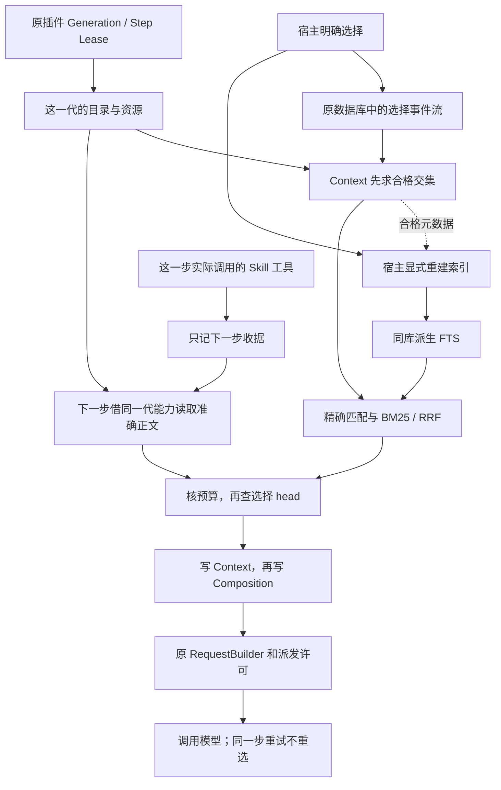

### 7.6 F3：哪些会话属于同一项目，哪些事实真的生效

F3 的项目归属与 Memory 已接入代码，B-P1-01 已修复并经独立复审关闭，Release Stop B 已通过（P0=0/P1=0/P2=0）。把 Memory 检索并送进
模型 Context 已由 F4 接入（7.7）；只有仍生效且通过检索和预算的事实才进入请求，不能把提议当成已披露。

`projects/service.py` 的 ProjectScopeService 负责宿主创建项目、绑定 source、绑定 Session，
`projects/projection.py` 只从唯一 `projects:catalog` 重建关联。三种事件分别是 project/created、
project/source-bound、project/session-bound，外壳和内容格式都是 1。每次写明操作 id、操作者和
看到的账本位置，CAS 保证竞争写入只有正确一方成功；相同操作和内容返回原收据，换内容就拒绝。
同一归属换个操作再次绑定只读原事实。一个项目只有一个固定 source，source_id 和仓库摘要组成的
身份不能归两个项目，一个会话也不能改绑。不会按目录名、metadata 或模型文字猜项目。

普通 Session 仍只记录目录。每次当前访问，resolve 都会重读关联，核对实际会话创建事件和宿主
现在登记的 source。LocalGitWorkspaceProvider 的 project_fingerprint 复用原 Git 子进程收尾：
只读检查 checkout、common-dir 和 Git 注册，不要求文件干净、不创建工作区目录。
B-P1-01 已修复：source 自身、其他消费方，以及只核对 source mapping 的历史读取，都走
`_require_project_registration()`。Git 列表第一项是主 checkout，它实际使用的 admin 必须等于
common-dir；其余 linked checkout 必须同时对上注册的反向指针和实际 admin。不能因为目录
叫 source，或 marker 指向 common，就免检。主 source 和 linked source 都能服务同仓库合法
主／linked 会话；坏指针在读取、审批、历史取证和新绑定前拒绝。Git 名册不能证明的目录，
包括所测 separate-git-dir 主目录，仍明确不可用，不猜路径。验证见
[Stop B 审查第 7 节](../plan/TRACEHARNESS_V0.9_RELEASE_STOP_B_REVIEW.md#7-b-p1-01-修复与定向确认)。路径摘要也不是永久仓库身份证，
不能保证识别在相同路径重新建了仓库；也没有自动搬迁或兼容旧绑定。

`product/project_scope.py` 的 ProductProjectBinding 是 Product 负责的连接：宿主装配要用同一
SessionService、同一个底层账本、同一个 Workspace Provider/resolver 实例。它沿真实 ProductTask
开立事实、请求者项目绑定、Agent 的 owner 祖先和已附着工作区证明 child 归属。原 Workspace
Supervisor 在 attach 后、返回 create 结果前绑定，在 resume/send 时再核对；失败或取消仍由原
dispose 收尾。未绑定请求者的任务仍只拥有会话范围。项目关联不会多给工具、预算或资源权限。

`memory/service.py` 写事实，`memory/projection.py` 是唯一重放器。每项目一本 memory:project_id
账：模型或宿主提出的 proposed 还不生效；人批准准确提议后，才能占一个空 fact_slot；替代时，一条
事件同时退出准确旧版本、启用新版本；撤销只退出准确当前版本。提议只用一次，memory_id 不重复，
同槽不会有两个 active，撤销的身份也不复活。决定摘要绑定完整写入内容；旧提议的摘要和事件整个
外壳的摘要各核对各的，不混成一种 id。全部追加，不加 active 字段、第二张表或缓存。

`memory/sources.py` 只认三种证据：本项目会话已结束的 Turn 中的用户消息、模型消息和工具结果；
原 ProductTask 的完成、失败、取消、拒绝、放弃终态事实；宿主 declare 真正捕获的人工声明。
闭合轮次的判断复用 history.closed_turn_membership，逐项查引用、摘要、观察位置和数量／字节上限。
模型只能引用自己会话的准确原始事件 ID，不能伪造人工声明。宿主可引用同项目历史，但这不会开放
跨会话原文查询。历史 resolve_evidence 仍核对原关联与当前 source mapping，让工作区释放后证据
继续存在；当前读取却必须经过 resolve，所以不能复活释放的工作区。每次 read 都重新读账、重建
副本，验证来源后再看 Memory 账本位置；变了就明确不可用，不把旧结果冒称最新。多个流不是同时刻
的原子快照，不同槽的文字有没有语义冲突仍要人审阅。

api/memory.py 明确要求两组配置：ProjectScopeLimits 的 max_catalog_events/max_label_bytes；
MemoryPolicy 的 max_body_bytes/max_sources/max_source_events/max_source_bytes/max_memory_events
以及非空 denied_patterns。数字须为正整数，正则必须合法，没有示例规模默认值。memory/policy.py
在宿主侧检查可识别秘密、私有输入、瞬时执行状态和超限内容，再加显式规则；它不是能识别所有
自然语言秘密的保证。长期目标、持续约束、术语、架构决定、重要里程碑、获批阶段和路线仍允许。

RuntimeConfig.memory 默认 null；启用时必须给完整 ProjectMemoryConfig 和真实 source resolver。
只有显式启用且 include_default_tools=True，默认装配才注册 propose_workspace_memory。它是原
ToolRuntime 管的追加副作用，只收 proposal_id/body/source_event_ids，返回等待人审阅的收据；
调用身份由真实 Session/Turn/Step/Tool call 派生。模型须先获得准确事件 ID；F3 没有自动来源目录、
任意事件查询或猜来源，也没有项目、槽、批准、替代或撤销参数。禁用默认工具时不会偷偷授予它。
宿主通过 runtime.memory 的 read/declare/propose/approve/supersede/revoke 操作；
runtime/memory_control.py 借原 Lease 并核对同一个 Session owner，关闭时由原 Drain 等它收尾。
runtime.project_scope 和独立 MemoryService 属于 Store 的宿主控制服务，不能把其生命周期误说成
Runtime Lease；writer 和 Store 不会变成插件服务或模型 context 的能力。
写入失败／取消时，先等工作结束，再查已写、未写或未知；取消仍抛原取消异常，cause 带 committed。
未知不会自动重写，并发重复同一个操作只拿同一张收据。

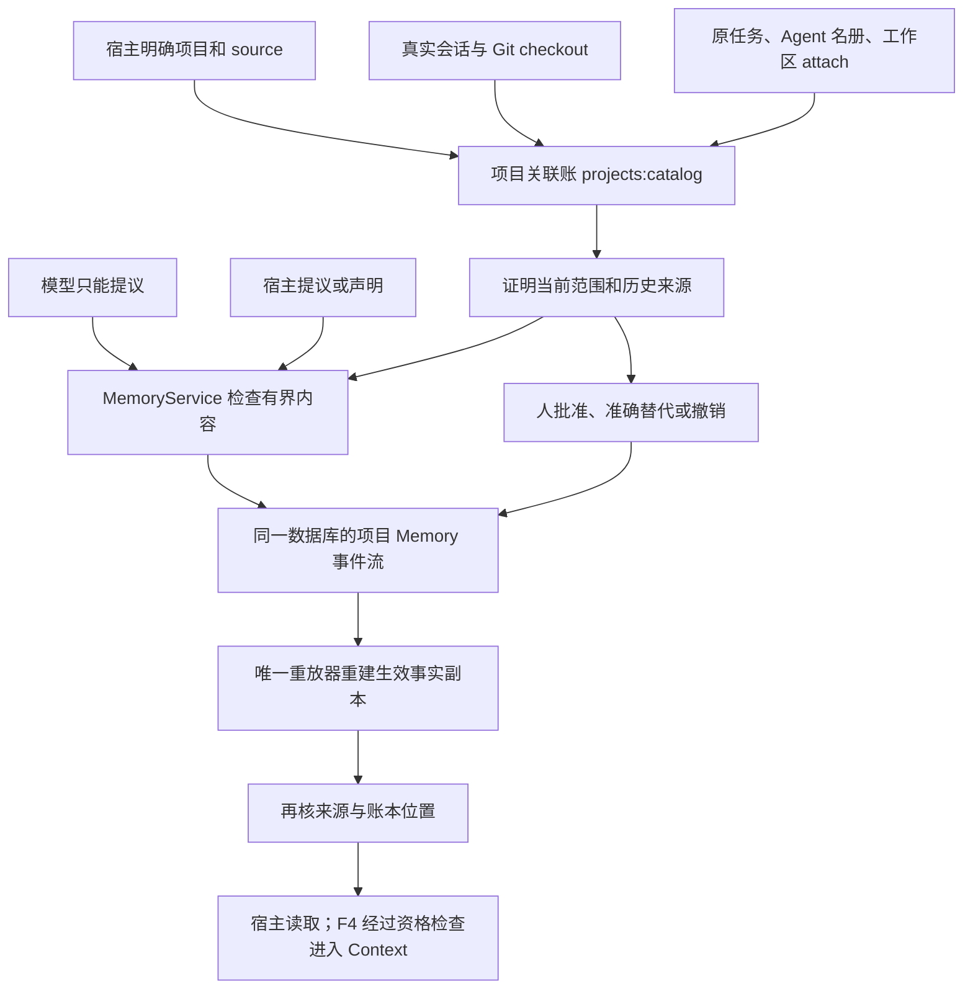

### 7.7 F4：三种参考怎样进入同一份请求

现在 Memory 已能进入模型 Context。它先证明当前会话属于哪个项目，再从原 Memory 账本拿出仍在
生效的事实；同一个目录里的未绑定会话没有资格。负责这件事的是 memory/context.py，它每次现读、
记录来源账本位置、再复核，没有偷偷存一份“当前记忆”。设计原因见
[ADR-0045](../adr/0045-qualified-reference-retrieval-and-history-observations.md)。

Skill 和 Memory 共用 session/retrieval.py 的规范化、分词、精确匹配、BM25 和排名合并规则。
Skill 仍只检索已选目录；Memory 检索生效事实的 id、fact_slot 和完整已批准正文。没有批准的、撤销的、
已被替代的事实都不参与。含空格的标识必须用引号或反引号界定，程序保留整段字面量，不猜散文路径。
两个来源各算自己的词频和语料统计，另一个项目增加再多相似文字，也不能改变本项目的分数。
索引仍归同一个 SQLite Worker；它只是可重建资料。缺失时明确记 index-unavailable，精确匹配仍可工作；
宿主通过 runtime.memory.rebuild_index(session_id) 重建，批准和撤销账本不会改变。

每步只有一份 query，来自本轮第一条真实用户输入。retrieval 同时保存 skill、memory 两份来源收据和
合并后的 fusion；各来源格式 2 收据记录语料身份、数量、两路命中、有理数分数和覆盖词，自动排除见 7.9。先给新明确申请
分配位置，再放仍有效的已读正文，然后自动 History，最后自动 Skill/Memory；前两组都按 History、Skill、Memory 和原请求／准入顺序。所有块经过同一个完整字节预算，
包括转义、来源、尾注和包裹文字；整块装不下就排除，不截断事实。仍不能把字节数说成 token 数。

Memory 目录只告诉模型 project_id、memory_id、fact_slot、已批准正文摘要和全文字节数。这里的摘要是
校验用的 digest。summary 和 section 给的都是完整已批准短事实，不再生成另一段摘要。
每块 version 取 proposal_digest，来源引用 proposal 和 activation，另记 activation_ref 和
approved_content_digest；同一个 memory_id 在请求里最多一次。普通只读工具 request_workspace_memory
只接受模型实际见过的 memory_id/version/tier，返回“下一步可请求”的收据，不把正文塞进工具结果。
它不能批准、撤销或翻出其他会话原文，也不支持 chunk。下一步会重新检查事实是否仍生效。
Skill、Memory、History 的首次申请和逐步保留共用 reference_requests.py（7.10）；取消、失败、达到步数上限、恢复或开始新一轮
都会使未消费收据过期。重试模型调用只复用已冻结的那一份请求。

历史版本检查必须显式打开 workspace_observations，并配齐 Memory authority、Memory 检索和有界
History reader；resolver 还要能做只读 project_observation。LocalGit 先证明工作区确实属于这个项目，
读一次 HEAD、检查所有可见修改，再读一次 HEAD。干净且两次相同才有已知版本；创建工作区时的
base_revision 不能代替这个观察。ToolRuntime 在读组、串行写和 process 执行前后都观察；只有两次
一致才把证明放进工具结果的宿主外层。工具正文自称“我验证了版本”没有这种效力。

历史目录还会记 original_bytes：配置了有界 reader 时，表示完整原始消息数组有多少 UTF-8 字节；
没配置时是 null。看见大小不等于获准读原文，也不保证一页就能装下。

history_observation.py 沿原 History 图的合法叶子看真实工具记录，再与当前请求冻结的观察比较。
已知版本冲突是 stale；所有相关工具都有已知且一致的版本才是 matched；脏文件、缺少证明、执行期间
变化等情况为 unknown。来源和当前的身份/版本四字段随块冻结。matched 只说明观察时 Git 版本一致，
不代表旧测试今天仍通过，也不会覆盖 Product、Workflow 或 Workspace 的现行状态。

Context 额外记录 memory_source（当时的两组权威限额）和 workspace_observation。SessionService
追加或读取时，沿冻结的项目/Memory 账本位置重放原有投影，核对会话创建、绑定、生效事实和摘要。
以后撤销记忆、移动 Git HEAD 或重建索引，都不会改写模型当时真正收到的 Request；重建不查当前文件。
这些观察没有跨账本原子事务或跨进程文件锁，程序也不承诺返回以后文件永远不变。

当前唯一协议是 Session 15、Context 13、active-reference-policy-v8、context-json-v13；SQLite 和 M3 格式仍为 2。
旧 Session 1–14 和旧 Context 明确拒绝，不迁移或猜测兼容。semantic/reranker 都明确关闭，没有
隐式加载、下载模型；F5 共享治理和冻结评测见 7.8，发布门禁另计。

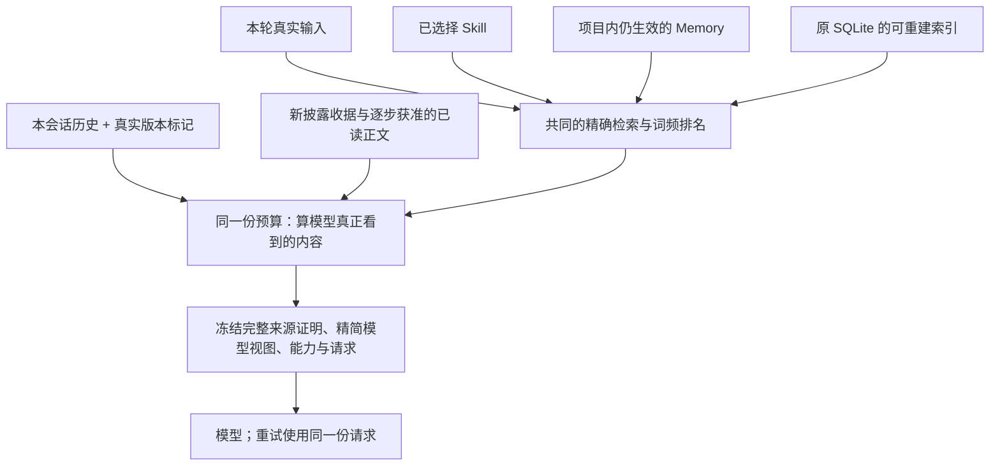

### 7.8 F5：人怎样管理参考，怎样证明检索真的有效

对应正式版 7.8、12.5、13.10；设计理由见
[ADR-0046](../adr/0046-shared-context-governance-and-frozen-retrieval-evaluation.md)。
Line 和 Textual 都调用 `chat/governance.py`，每次查看都向原负责人重新读账。
`chat/config.py` 只把明确配置交给原 Runtime；`tui/governance.py` 展示可选择、复制的证据与确认框，
也让你从列表选择记忆提议。表单只是命令草稿，提交后仍由同一个治理服务重新核对；窗口关闭会结束
原有等待任务，不留下另一份待批准状态。

- `/skills` 把“启用了什么、选了什么、现在有资格用什么、上次实际送了什么”分开。`/plugins`
  查看安装/启用状态，use/reload 在 setup 前显示完整 Manifest。查看候选需要先 import，可信插件
  的 import 本身可能执行代码；provides 只是声明。确认后检查的仍是同一个对象和同一份声明，
  然后走原加载、代际替换和释放流程。
- `/memory` 能看到提议、来源、项目、正文、摘要和生效事实。declare 只提议；approve、supersede、
  revoke 需要人工输入完整 `CONFIRM`。确认前保存账本位置和精确引用；等待时有人改了事实，
  原确认会拒绝。Skill 选择和 Project 关联也交给原来的写账规则，模型不能替人批准。
- `/history` 和 page 从原有界 reader 展示当前 Session 的摘要、原文页、来源摘要、原文大小、
  截止位置、披露收据和时效。给人看不等于已送给模型。`/context [STEP_ID]` 才展示那个 Step
  真正冻结的查询、来源、排序、排除、预算、内容，并说明请求是否发出。

配置文件 `--context-config` 的顶层为 format/context/skill_policy/project，格式版本是 1。
所有限额、Skill 资源根、Git 来源和 managed 目录都显式写出。可从
[`examples/context-governance.json`](../../examples/context-governance.json) 修改；里面路径与数值
仅是示例。与 Product 一起用时，双方必须指向同一来源和同一个 resolver，不能各自认领一套项目。
角色 Runtime 使用同一 Context/Memory 配置，工具权限仍由原 Profile 决定，不自动继承人的 Skill 选择。

后续 coder 的工作区先真正挂接并证明身份，再由原 Product 绑定步骤为其 Session 准备 Memory
索引。索引键含 Session 和来源账本位置，不能拿 requester 的索引冒用。出错和取消交给原资源
负责人收尾，不在查询中偷偷修复，也不增加后台维护者。

`traceh eval` 仍只有一个 Runner。现在根 manifest 只接受版本 2，retrieval 必须明确为 null 或
file/sha256；旧根版本 1 拒绝，内层 Verifier 当前为 2。corpus 格式 1 冻结事实、政策、插件选择、
题目、答案判断和阈值，文件必须在 benchmark 根目录内且不在模型初始工作区，装载和准备时重验摘要。
原 attempt 先创建真实 source/requester/项目关联，经生产接口写入事实与插件贡献，再创建 Product。
同一 requester 发出真实请求；完整语料和评分规则不会复制进 coder 工作区。

评分数的是实际冻结且已发出的 Context，每个 Session/Step 只算一次，重试不重复。候选排序与
实际注入分开，同一身份去重；实际披露任一合格层级才能得分。报告 Recall/MRR/precision@K、
全部注入内容的 precision、零命中、隔离违规与没能证明的题目；失败和未发出的步骤不会消失。
按 attempt/角色/查询给出描述性汇总，未设阈值只测量；Product 任务成功与检索质量分开判断。

成本分别记录 Context 字节、完整准备时间、索引逻辑条数/字节、准备重建时间、总 seed 时间和
解释器/数据库/Unicode/操作系统版本，不把它们冒充纯排序延迟或物理磁盘大小。
[`benchmarks/retrieval_v1`](../../benchmarks/retrieval_v1/README.md) 预先冻结 11 条多语言与代码查询，
包含真实插件退役和失效/跨项目反例。语义题的词法最低分明确为 0，只记录能力缺口；
semantic/reranker 继续关闭。缺插件或摘要不符会拒绝，不走评估专用旁路。

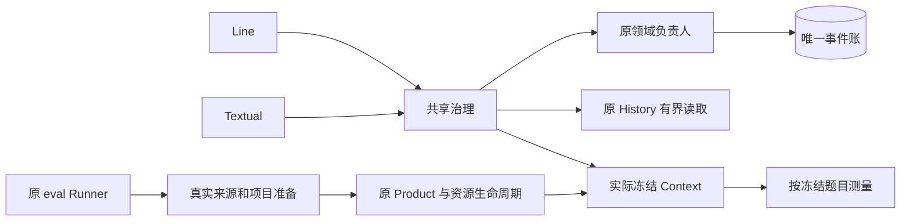

F5 开发与发布是不同检查点；原 5 条质量失败已修复，11 条都达到原冻结阈值；语义题仍为 0。Release Stop C 已通过限定验收，真实模型证据见 7.10；全量、L2–L4、Wheel 和发布检查仍待授权。

### 7.9 F5：检索怎样减少弱匹配

对应正式版 7.9，决定见 [ADR-0047](../adr/0047-literal-query-coverage-admission.md)。
问题在于“搜到了一个相同的词”以前就能进入模型参考。现在含点、下划线或路径分隔符的查询段保持
完整，不把不同标识因为共享前半段就当成命中；同时保留普通词搜索能力。尾连接符不会被悄悄删掉。
普通单词后的一个句号按散文标点处理；若它属于标识，使用成对引号或反引号明确表达。已有内部连接符的段保留末尾句号和其他连接符。

每条自动候选会记下确实覆盖了查询里的哪些词。来源收据格式为 2，新增 coverage；除了目录／
已批准 Memory 正文的词项，完整路径的真实 exact 匹配也能提供证明，不偷偷读取 Skill 章节正文。
来源内仍按原 BM25/RRF 排名；最后合并时先看覆盖词数，再按原分数与稳定身份排并列。

负责原字节预算的 Context 服务逐块装入。只有已经装入的自动参考，才能把后续“命中词完全是其
严格一部分”的候选排除，原因记 query-dominated。覆盖相等或各自补充不同词的内容仍保留。
大块装不下，小块仍有机会；明确请求的 Skill/Memory 披露继续优先，也不参与这项自动筛选。
没有按样本名字写例外，没有新调分阈值、停用词表或语义模型。这仍可能误判：偶然多命中几个词的
资料会压制有用的部分资料，覆盖相等或互补的噪声也不会被它清掉。

先前 C3 实测了当时本地模型的四种候选，结果是不接入。原来的 11 题在当前 Runtime 又跑了一遍，
都满足原门槛；44 个 Session、Context 和请求与原 SQLite 核对，重放和不变量没有错误。
另加中英文各四条改写，题目、模型文件和成功线都在评分前固定；模型只看原资格过滤后的 6 条材料。
`capture.py` 记录原运行过程，`screen.py` 离线试算固定向量阈值和可选重排，再用原 Context 预算。
这些试算不写成 Session 的正式证据，也没有给产品加模型依赖或默认模型。

最好的一组补回了两条英文结果，但新增英文题平均召回率/精度只有 25%/25%，中文为 25%/12.5%，
都低于各项 75% 的要求。九条语义题的平均召回增益为 2/9，也低于要求的 25%。其他三个候选同样
不达标，原精确匹配、零命中等要求和项目隔离没有退化。速度不是问题：暖查询 p95 约 11.40–25.26
毫秒，6 条向量共 9216 bytes，但跑得快不代表找得准。中文题有 55%–88% 的词元变成未知符号；
而且这次只补充“词法没找到”的结果，不能修正词法已经找错的情况。这不说明所有向量模型都无效，
只说明当前模型、表示和候选不合格。产品的语义和重排仍关闭，继续使用原词法规则。
当时未接入新检索，没有把重复聊天调用当成新的语义集成验收。
完整结果和未运行的检查见 [C3 验证记录](../validation-v0.9-stop-c-c3.md)。

E1/E2/E3 完成后，又用小型 BGE 中文和英文模型做了九组真实复测，仍没有接入。
只比较中文单模型、英文单模型及两者取较高分，阈值固定 .6/.7/.8；440 个代码/测试文件、题目和资产
都在评分前固定，没有看到分数后临时调参。
这次中文模型能认出四道中文题的所有字词，说明已经补上“很多字不认识”的问题，但仍没找准足够资料。
最好的一组英文四题答对两题，对应召回率/精度 50%/50%；中文仍是 25%/12.5%，达不到各项 75% 的要求。
比如英文“汽车靠什么液体运行”和“URL handler 为什么失败”能找到了，职责划分和交付阶段两题仍空。
两个单语言模型合在一起，也不自动等于跨语言检索；只补“没找到”的问题，还修不了已经找错的词法结果。

`local_retrieval_screen/retest.py` 和 `retest.json` 是测试工具，不是产品开关：先把题目、门槛、代码、模型和
合格材料固定，再真实运行模型。保存文档和问题的向量，另算一次核对 171 条观察，不只信脚本的结论。
模型文件约 220MiB，每条双向量 3584 bytes，没有截断；暖查询 p95 约 15.33–37.30ms，加载约 .69 秒、
重建约 .19 秒，速度和资源都合格，仍不能替代找得准。44 个 Session/上下文/请求的原账和重放也核对通过。
12 项控制检查、55 项相邻定向测试通过；拆掉语言质量门槛，新测试会抓到错误的“可以接入”。
所以保持产品的语义和重排关闭，不装新生产依赖、不建立第二事实源，也不继续改题降线凑通过。
完整证据见 [复测报告](../validation-semantic-retest.md)。这只是本次九组候选不合格，不等于所有向量模型都没用。


导航修订后的当前合同使用 Session 15、Context 13、active-reference-policy-v8，索引分词 v3、排名 v2。
旧 Session 1–14 明确拒绝，程序不迁移、删掉或改写旧账。显示包装 context-json-v13、SQLite 2、
M3 2 和十二项／十五项配置结构都不变，评估题目、语料、答案判断与分数线也不改。
读历史请求时，从当时的目录或项目记忆账本证明覆盖，只使用那次冻结内容；今天改文件、撤销记忆、
丢失索引都不会重新搜索旧请求。测试与冻结复验结果见第 15 节。

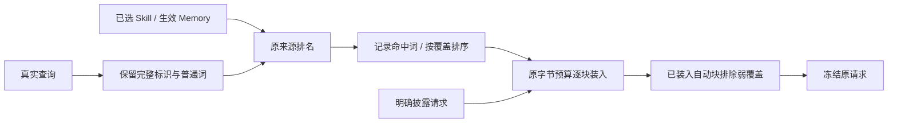

### 7.10 模型现在怎样看懂目录并逐步读正文

对应正式版 7.10：贡献者现在必须给每个章节、资源和分块写明标题与说明。缺了就拒绝，系统不会从
编号、文件名或正文猜出来。这些文字与正文摘要一起冻结在原目录中；改了就改变目录身份，旧选择要
重新确认。每条说明和整个目录继续遵守原大小上限，没有新增一套配置或事实源。

模型看到目录时，能读到“这一章讲什么”、精确 ID 和字节数；资源还列出它的分块。目录和工具回执
都从同一份冻结元数据生成。若最初只给了 Skill 摘要，模型先用原引用工具要目录，再按标题和说明
选章节或分块。召回仍只查已选择 Skill 的顶层元数据，系统没有因此变成全文或语义搜索。

宿主会明确告诉模型：这是 Skill 文档，使用引用工具读取；资源路径不是工作区路径。普通装配与真正
发给模型的冻结装配共用同一段提示规则，避免说明写了却没有进入生产请求。作者的正文始终只是参考，
不能改用户意图、系统指令或工具权限。

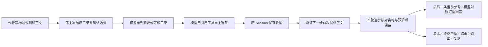

当前参考每一步都放在完整对话和工具结果之后，作为最后一条 user reference message。固定说明明确
它是眼前任务的资料，不是新任务。构建、真正发给模型、重试、重放、检查和 Inspector 都按这一顺序。
工具回执本身没有正文，普通聊天账也不积累参考正文。

[ADR-0049](../adr/0049-current-reference-context-and-bounded-turn-retention.md) 规定三类资料使用同一规则：
工具申请的正文首次只在同一轮紧邻下一步给出，宿主明确申请的历史页首次只在本轮第一步给出。
只有真的放进当步参考的 Skill 章节／分块、Memory 完整短事实、History 原文页，才有资格留到本轮后续步骤。
因此先读甲章、再读乙章时，模型可以同时看到仍合规的甲乙正文，不必靠自己先写笔记保存证据。

`reference_requests.collect_requests()` 每次从原事件检查连续的准入记录，只派生读取句柄，不存另一份
正文或待办状态。每步重新核对 Skill 选择、目录与资源借用权，Memory 是否仍获批准及项目归属，
History 原始来源与新旧程度。历史页保留原申请凭据；旧请求重放只看当时的冻结证据。
预算先给新申请正文，再给已读正文，然后自动历史目录，最后自动 Skill/Memory 检索结果；前两组内部
按 History、Skill、Memory 及原请求／准入顺序排列。每块、每类、总字节与块数仍用同一套限制，放不下就整块退出。
第一次没放进来、后来被挤出或资格中断的旧申请，都不能自己回来。失败、取消、恢复或这一轮结束后
不顺延，元数据也不因旧收据一直占位。同一步网络重试仍原样重发已冻结请求。

真实测试还发现两个程序问题：读回温度时把整数 0 改成小数 0.0，导致同一请求的字节指纹不一致；
中文冒号被当成代码符号，导致整句要求精确匹配。现在分别保留合法数字原样、按标点结构区分散文
和代码；没有按题目词语写例外。当前 Session 15、Context 13、显示包装 v13、分词 v3；策略为 v8，披露工具收据为 2，来源检索收据、
排名、SQLite 和压缩格式仍为 2，旧 Session 1–14 明确拒绝，需要新目录，不自动迁移或删数据。

`tests/live_skill_navigation/` 通过真实服务，让模型从自然语言自主选章；判定答案不给模型，编号
会变化。它是显式集成测试，不是另一个产品评估引擎，也不会跟着 pytest 自动花费真实调用。
报告分别写出各模型答对、读到证据、是否多读、误用工具和服务失败，保留去掉导航的对照及失败原账。
这次测到了成功路径，也测到了模型提前结束、找工作区文件或多读的问题；不能说所有模型都稳定。
大目录仍可能因超预算被整体排除，还没有分页。具体数字见 [验证记录](../validation-v0.9-skill-navigation.md)，
设计见 [ADR-0048](../adr/0048-skill-navigation-and-real-provider-disclosure.md)。Stop C 已通过限定验收，发布检查仍待授权。

现已按用户授权开始[Stop C 修补计划](../plan/TRACEHARNESS_V0.9_RELEASE_STOP_C_EXECUTION.md)。
先在隔离副本做了 40 次真实调用：原位置通过 4/8，把当前参考放到对话后通过 8/8，再加本轮已读
正文保留也通过 8/8。每组仍很小，不能当最终验收。现在 C1 已按新 ADR 和唯一协议接入生产，
Skill、Memory、History 共用上述保留与预算规则。主线 149 项、相邻检索／Inspector 171 项、
Provider／请求相邻 75 项通过；补上 Memory 正向后，专门的 10 项保留测试也通过。集合有重叠，不能相加。
四组隔离反向验证确实抓到了正文提前消失、旧申请复活、新申请被挤出和位置错误；正确版本随后通过。
按任务区分资料问答与工作区检查的提示修改通过了 95 项相邻确认；进一步说明 JSON null 类型后，
导航、检索和失败相关 99 项通过（67.33 秒）。新用例确认错字符串不能获得正文或收据，改正后才成功。
程序不会自动把字符串变成 null。compileall、修改范围 Ruff 和 3259 项仅收集检查也通过。

C1 现在已达到事前验收门槛：第三轮三个模型各 24/24 严格通过，任务、答案和正文证据也各 24/24，
隔离、重放和不变量违规都是 0。前两轮失败及两次八例探索全部保留；共 232 次旅程、614 份请求、
615 次模型尝试，614 次有准确用量，合计 2,002,286 tokens。一次断线沿原策略重试成功，
那次没有用量，未填零。题目、判定、权限、预算和门槛始终未改。详见 [C1 验证记录](../validation-v0.9-stop-c-c1.md)。

C2 已按 [ADR-0050](../adr/0050-compact-reference-navigation-and-model-view.md) 接入原展示器和共享提示。
完整来源引用、批准记录和历史证明还在原 Context 账本里。模型只看来源种类、ID、版本、层级、正文
摘要值和正文。Skill 再给 catalog_digest 与阅读说明；Memory 再给项目、事实槽、正文状态和阅读动作；
History 再给正文状态、当前工作区有效性、是否还有页和阅读动作。资料正文没有改写。
Memory 目录的动作带着准确 ID/版本，申请完整短事实；已经有正文时为 null。History 动作带原首／
下一页游标；没启用 reader 或已经到末页则为 null。unknown/stale 不等于页面读不了。模型仍要选择
需要的动作，交给原工具和权限检查，收据再驱动下一份 Context。没有自动读全资料、新工具或第二本账。
同一个预算规则计算模型实际看到的内容。共享提示尊重用户指定的输出格式，不裁剪、补造或转换答案。
当前是 Session 15 / Context 13 / 展示 v13 / 策略 v8；Session 8 / Context 7 只是保留的隔离实验。
旧 Session 1–14 都拒绝，工具收据、历史分页、SQLite、压缩和来源检索协议没有另改。

开发验证在 `tests/live_reference_journeys/`。journey_fixtures 准备隔离 Git、SQLite 和原 Runtime；
bootstrap 经原审批入口准备记忆，再用真实模型回合准备历史；assessment 核对严格 JSON 和最后实际
发给模型的正文；run 冻结输入、保存原账本，并分开统计准备和回答的用量。audit 重新打开 SQLite，
从原会话、请求、助手消息和结束事件核对结果，不信报告自述；篡改复制报告会被拒绝。
第一版没有写清单位和代号形式，第二版用独立 answer_fields 公开这些要求，不给预期答案。
描述缺失或字段对不上会在模型调用前拒绝。27 项评估器检查通过，恢复旧问题生成器后 3 项按预期失败。
旧题结果和探索都保留，不重新改分，也不与第二版混算。

第二版同题对照：原实现三个模型为 20/28、27/28、28/28；只加动作时为 22/28、28/28、28/28；
精简展示后为 27/28、28/28、28/28，达到各模型至少 26/28 的要求，最后正文都为 28/28 齐全。
隔离、重放、不变量和证据读取违规为 0。最后 96 条旅程有 250 次准确用量，共 840,126 tokens。
各模型另 4 条语义诊断全通过，但用的仍是词法检索，不能说已经有向量能力。
原 Skill 完整回归为 24/24、23/24、24/24，达到原严格至少 22、任务至少 23 的要求；最后正文都齐全。
72 条 Skill 旅程 183 次准确用量，共 575,886 tokens。仍保留一次 JSON 格式偏离，以及一次 Skill
错误请求和后来被拒的文件工具调用；这些有限测试不保证所有模型永远可靠。
隔离源码的相邻 owner 检查在同步展示断言后 160 项通过，阅读动作、权限拒绝、分页和预算 4 项通过。
244 个源码模块格式化前后 AST 一致；当前源码把 180 个实测会话中的 433 份参考请求逐字节重现。
接入后先通过 215 项，一条旧预算测试因“大块”现在装得下而失败。让夹具正文明确超过 Context 限额，
并单独配置足够的记忆批准容量后，精度／共享预算 31 项通过，另 153 项相邻检查通过，已知失败已清零。
编译、修改范围 Ruff、差异和文档检查通过；只收集 3292 项，没有执行全量。C2 已完成，详见
[C2 验证记录](../validation-v0.9-stop-c-c2.md)。C3 本地模型筛查见 7.9；没有候选达到接入门槛，保持关闭。
C4 已完成受控调查，历史具体字节原因仍未知（第 8 节）；C5 三路独立审查及范围内修复已完成，
Release Stop C 通过，原失败和没跑的检查见 [Stop C 记录](../validation-v0.9-stop-c.md)。
继续不跑全量、L2–L4、安装或打包，也不提交发布。


### 7.11 让模型自己找资料：55/72，接受已知限制后发行

**当前版本：0.11.0（Educational alpha，GitHub Release）。** 本次收口统一 Evaluation、受限 AO 和 AO-3 应用内后台优化；Session 13 / Context 12、Sandbox 配置 2 / Promotion 验证 2 保持，独立评估 worker 回执为 2。旧评估需按冻结源码核验；不迁移或改写用户数据，不自动采用候选，不上传 PyPI。本版不含 DA 或 MCP，不改写旧 55/72 统计。见[限定验证](../validation-v0.11.0.md)和[后台优化记录](../deal/026-runtime-background-optimization.md)。

**历史 grid-06 补测后成绩是 55/72（76.4%）。** 原来已通过的 51 条不动，把六条连接失败题直连再测，四条通过、两条仍有回答或依据问题，没有最终连接失败。这次没跑基线；见[记录 010](../deal/010-grid06-direct-supplement.md)。所以这份历史合成记录是 55/72，不是 UE-4 新运行的成绩。

**最后再试的一轮也已停止。** [记录 009](../deal/009-search-snippet-budget-followup.md)尝试在减少搜索结果条数后，把腾出的空间重新分给片段上下文。49 项针对性检查以及恢复旧逻辑后的反向检查，确认同样预算能显示更多周围原文，原 Reader 也能找到目标；但测试脚本知道定位词，不能算模型自己找到。真实模型跑了 16 条，两边都是 4/8，且没产生有命中的搜索页，实际没有用上关键改动，所以没有验证出自然问答收益，按用户要求不继续加方案。44 个请求重新核对一致，没有最终连接失败；服务端报告用量 248,063 tokens。一次更深的连续翻页诊断因耗时较长被中止，不算通过，也不保证其性能和取消处理。生产没有采用新改动，没跑全量或 L2–L4，也没提交。

**实验已测完，没有把不稳定的改动放进生产。** [RE 计划](../plan/TRACEHARNESS_RETRIEVAL_RELIABILITY_EXPERIMENT_PLAN.md)先保存当前完整代码作为 B0，让两边用同一个模型、同样预算，在独立直连进程里比较。两种工具输出呈现都是 7/10→7/10；Memory 入口提示为 7/10→6/10；多词搜索首轮 5/10→6/10，再测一次变成 3/6→2/6；把已有来源状态放到正文前面为 8/10→8/10。首轮含四道不用搜索的保护题，不能拿这些数与旧 72 题直接比。没有方案稳定胜出，因此 RE-5 没有合格组合，预留的 24 个新场景、96 条验证没有运行，不能说它们通过了。

现在增加了专门的真实实验脚本 `tests/live_active_retrieval/reliability.py` 和固定材料，实际仍走原 Runtime、Reader 和工具，普通测试不会偷偷联网。112 条目标旅程没有最终连接失败；40 条日常保护旅程都答对且没有调用工具。连准备过程一起，401 个模型请求都从另外复制的数据库重新核对过，内容一致，账本和调用结束状态正常；每个原检查命令只执行一次。服务端报告用了 1,956,458 tokens，其中正式问答占 1,421,171，不含两个连接探针，没有缺失或估算用量。43 项运行器/模型接口相关检查及各方案的针对性检查通过；3,645 项只是收集，没有跑全量、L2–L4 或发版检查。

这轮看清了更具体的问题：Memory 有时已经搜过，但只看了 13 个对象中的 2 个，明明还有下一页，模型仍停在背景资料；它还可能把“去查批准记录”误当成凭证名称，把“来源不可用”说成“没有匹配”。一次多词搜索有帮助，重复后没有稳定提升。题目歧义和评分边界在[记录 008](../deal/008-retrieval-reliability-experiments.md)单独说明，不能说是账本丢了资料，也不因此要求每题查到底。生产 Python 代码与本轮开始保存的 B0 相同；协议仍是 Session 13 / Context 12，原账本、投影、Reader、预算和停止规则继续负责，用户的连接配置也没改。没有加第二本账、向量检索或采用这些实验策略，旧 51/72 与未通过状态保留。

对应正式版 7.11，[主动检索计划](../plan/TRACEHARNESS_ACTIVE_RETRIEVAL_EXECUTION_PLAN.md)与
[ADR-0061](../adr/0061-active-reference-search.md)已经定下规则。AR-A 完成；AR-B 已接上 search_history，
范围检查已完成。Memory/Skill 的主动搜索也已接入，保留原来的自动挑选和读取入口；合并范围检查已完成，固定对照执行已收口但没有达到真实验收门槛，暂不进入下一阶段或发布。语义检索仍关闭。

现在模型可以用短关键词查当前会话里压缩过的旧消息，找到后面的原文页，不必从第一页一路翻过去。
底层仍用原 History 读取器和同一套完整回合分页；不会去查别的会话、全部账本或项目控制记录。
大工具输出仍用它自己的搜索和读取工具，不重新执行命令。某个回合整页太大时，可以显示带来源的短片段，
但不会给出假装可读的原文入口，也不会把一组工具调用与结果拆散。

记忆搜索先通过原读取器看本项目现在有哪些有效批准事实，再查它们的 ID、事实槽位和正文。
只提出但没批准的内容、撤销的内容、被新版本替换的内容，都不能作为当前批准事实重新送给模型。
命中带着项目绑定、批准来源和版本；真正读正文时仍走原来的批准校验。写入和读回 Context 都会对照
当时的批准来源重新核对搜索页，所以改文字后重新算一遍摘要也混不过去。

Skill 搜索查用户已经选中的手册目录，包括手册、章节和资源分块的 ID、标题和说明；不会偷看正文来建立搜索库。
资源卡片的说明会跟对应分块一起搜索；没有分块的资源只给目录入口。搜索记录和页都有大小限制，
整本目录放不下时可以先找到相关章节，再由原来的插件读取器读正文。更换插件目录、取消选择、取消任务
仍由原来的选择记录和 Lease 管理，不新建一套状态。重放会拿当时的选择记录和目录核对。

Memory/Skill 命中给出的读取动作必须原样使用，不能改身份、版本或层级。例如命中手册摘要，并不授权
把这条动作改成读目录；需要具体章节时可以继续查主题词。当前参考包装和工具说明已经提示：自动挑选
出来的目录可能为空，但合法来源里仍有资料；应使用对应搜索工具，不能拿工作区文件冒充批准记忆或 Skill。
共享的 SearchSource 只是一次读取生成的临时结果，既不是新账本，也不负责决定什么算有效事实。


搜索工具返回“申请收到了”的收据，下一步才把搜索结果放进模型请求。它必须经过原来的大小和 token 检查。
结果页告诉模型查了哪些字段、查过多少条、命中片段及原文入口，还有没有下一页。
这里的总数是可搜索记录数，不是命中总数；没有合法旧历史和“这个词没匹配上”是不同情况。
模型可以换词，但不能编造页码。游标绑住来源、查询和规则，必须是眼前结果给出的下一页入口才能接着翻。

只有真正进入当前请求的搜索结果才能授权读原文。拿到收据后同一步抢先读、下一步没读却隔几步复用、
拿另一个会话的入口，都不行。读到正文后仍遵守原来的回合内保留规则；搜索页本身只活在紧邻下一步。
取消、失败或恢复出的收据不会继续送资料。哪怕搜索后没有下一份请求，账本检查也会核对收据。

如果页太大，先缩短片段，再减少这一页命中数并给出合法续页；连一条身份和入口都放不下时明确说明限额，
不截断 JSON，也不把片段说成完整事实。资料次序是新请求的正文、刚搜索的页、已保留正文、自动历史目录，
再到自动挑出的 Skill/Memory。这个顺序只有一处规则，重放同样核对；没有另造账本、缓存、后台循环或配置参数。

当前已切到 Session 15 / Context 13，显示包装 context-json-v13、策略 active-reference-policy-v8。
普通读原文收据、历史分页、SQLite、压缩和大工具结果的格式没另改。旧 Session 1–14 需要新的数据目录和新会话：
Line Chat 会用中文说明，TUI 继续用原来的旧数据选择界面。不会自动搬迁、猜测修改或删除旧记录。
过去真实报告保留当时的协议，不能假装新版程序能直接读旧会话。

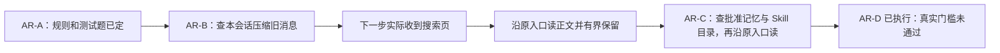

真实 qwen-plus 诊断的[第一轮](../validation-data/active-retrieval/ar-b-smoke-01/report.json)中，
中文只说准备继续搜索却没调用工具，失败了；英文靠逐页读找到了答案。
修改通用调用说明后的[第二轮](../validation-data/active-retrieval/ar-b-smoke-02/report.json)，
中英文都答对、有实际证据并通过重放检查；中文真正用了搜索，英文仍用旧分页。第一轮失败原样保留。
两轮回答测试实际总 token 分别为 28197 和 40458，不包含先准备材料的调用。
这只是诊断，不能说模型从此必定成功，也不能当成最终对照测试得分。

AR-C 的[五轮真实诊断](../validation-data/active-retrieval/ar-c-real-summary.json)共用了 38 次真实 Attempt、160991 total_tokens。
第一轮的 Skill 测试材料顺序不合法，还没启动就被拒绝；第二轮模型读了工作区里的测试证据文件，这不算 Skill 成功。
后来把证据放到工作区外，并限制该诊断只读取指定参考来源。第三轮开始也把记忆问题问得更明确，所以不能拿各轮比较成功率。
[第五轮](../validation-data/active-retrieval/ar-c-smoke-05/report.json)中，记忆用 2 步、Skill 用 5 步，均实际搜索并答对，
能对应原来源证据，且当时的重放与账本检查通过。Skill 手册目录整页放不下，实际通过搜索章节再读原文完成。
相关合同测试已经覆盖大目录、章节与分块、翻页、隐藏正文、错误身份、取消选择、插件切换和重复取消。
还临时去掉记忆来源核对，确认伪造片段会漏过；恢复保护后正确拒绝。[AR-C 合并检查](../validation-data/active-retrieval/ar-c.json)主轮 298 项中 297 通过，1 项旧测试窗口因新工具说明变大而不够。
按实际开销调整测试窗口后，两个预算模块 24 项通过，仍要求新正文优先、旧历史被排除，生产限制没放宽。
新增记忆搜索 8 项、Skill 搜索 11 项通过；编译、修改范围 Ruff、298 项收集和 diff 检查通过。

原[24 道题](../../tests/live_active_retrieval/manifest.json)和[冻结规则](../validation-data/active-retrieval/manifest-freeze.json)
没有修改。[AR-D 最终报告](../validation-active-retrieval.md)和[grid-06 完整统计](../validation-data/active-retrieval/ar-d-grid-06/summary.json)
结论仍是**未通过原验收标准**。同一个 qwen-plus、24 道题和三组种子，两边各 72 条收齐并逐题核对答案与模型真正看到的证据，旧版 20/72、新版 51/72，多答对 31 题，提升 43.1 个百分点。
旧版 58 条完成、3 条用完步骤、11 条 TLS 连接失败；新版 66 条完成、没有用完步骤、6 条连接失败。把任意一边连接失败的整对排除后，剩下 57 对是 19/57 → 44/57；只是帮助看清网络影响，完整成绩仍以 72 为分母。
新版历史、Skill、记忆、工具输出分别通过 12、14、14、11 条，每类共 18 条；有答案题通过 46/60，无答案题通过 5/12。仍没达到原先总数至少 66/72、每类 15/18 的标准。
新版仍有 4 条把进程退出码或输出摘要标识当成所问事实；没有观察到越权读资料、重复执行或拿旧批准当新批准。
以前 grid-05 的 21/72 → 45/72 原样保留。当前新版比当时多通过 6 题，但这些题已经用过，服务也有波动，不能说是全新题库上的表现，更不能归因于某一个改动。
只看几页或一个章节不能说整份资料确定没有；Skill 搜索查的是目录导航，也不能证明正文里没有。
另有回答答对了所问内容，却附带说错总行数，已单独记录；答对目标问题不代表每句话都正确。

grid-02 发现模型不知道搜索条数上限，grid-03 发现保存大目录时把下一步取正文的收据清空了；两处都已修复，失败记录保留。
现在上限直接来自配置，宿主成功收据会留下并核对原件，细节见 9.5。界面也会显示中文来源、查了多少、命中/没找到/限额/失效，
说明查看旧快照不会把内容重新塞给模型。AR-D 当时相关 owner 检查 145 项、协议/CLI/合同 143 项，共 288 个不同用例通过；
当时的编译、修改范围 Ruff、收集和 diff 检查通过。后来的代码修复检查见本节后文，本轮没有重新修改生产代码。
grid-06 用各自冻结的代码和新的数据库备份重开 144 个会话，837 个请求重建一致；账本和重放错误都是 0，没有未结束的 Attempt，重放不再调用模型。
主网格一共结束 973 次模型尝试，服务报告 3641108 tokens，另有 153 次用量未知，没有把它们估成零。准备和正式提问分开统计，不能声称已经精确测出成本下降。
另测[四种日常问题](../validation-data/active-retrieval/ar-final-controls-01/summary.json)：问候、改写、加法、复述刚给出的数字。两边各 4 题均答对，每题 1 步、没有工具调用，新版仍有搜索和读取工具可用；8 个请求重放通过，另用了已报告的 30772 tokens。这个小样本不能保证任何场景都不会误搜，也不加入 72 题的成绩。系统没有新增“每题必须搜”“必须读遍所有资料”或强制自评规则。
历史 grid-05 的 909 个请求和 4032845 tokens 原样保留，不与本轮混算。
上轮 grid-04 的 117 条连接失败和更早中止记录都还在，不能跨轮挑好成绩拼起来。实际运行的源码和材料也已冻结保存。

题目没有告诉模型工具名、编号、答案或操作步骤，短片段足够就允许回答；原批准、选择、版本、取消与预算规则继续生效。
有成对改善，也有个别题目变差；没有证据说明控制组新增了确定性的代码回归，改善也包含收据修复的贡献。
按计划，现在停止进入下一阶段或发版，不换模型、放宽预算或改评分来凑分数。
后来用户授权的职责分析、共同问题修复和最终 grid-06 复测已经执行完，详见[记录 007](../deal/007-active-retrieval-final-comparison.md)；仍不提前做语义检索。

[诊断记录](../deal/002-active-retrieval-responsibility-diagnosis.md)把 27 条失败分成五类：拿错字段 9 条、
只看一部分就说全部没有 9 条、找错来源工具 4 条、看到背景就停 4 条、翻页用完步骤 1 条。
这是观察到的行为，还不能直接说是哪一层造成。模型不再调用工具、也没有失败的外部检查时，默认循环会结束；
completed 只表示按规则结束，不表示系统已经判断答案有充分证据。目前没有新增自动判断答案对错的裁判。
隔离测试会拒绝读工作区，但模型仍看得见这些工具；这是原测试条件，不能偷偷删工具后拿新分数冒充旧标准。

新增 `tests/live_active_retrieval/output_diagnosis.py` 继续用原运行主线和真实模型连接，在独立账本测试：
同模型、六道工具输出题、两个种子，每轮原版和候选各 12 条。新种子换了正例答案，负例正文没换，题目也没换，
所以不能说是完全没见过的问题。[第一轮](../validation-data/active-retrieval/ar-e-output-01/summary.json)
把工具说明写得更明确，反而 4/12 → 3/12，两边都有 6 条拿错字段，已撤回。
[第二轮](../validation-data/active-retrieval/ar-e-output-02/summary.json)补齐最后参考包的工具输出导航，
3/12 → 5/12，拿错字段从 6 条变成 5 条，但收益集中在一个种子，另外两题反复调错文件工具直到步骤用完。
目前不足以证明稳定改善，没有把实验版参考包装放进生产；协议版本没变，生产 Python 文件与 grid-05 一致。
两种说明都确认真正送到了模型，失败结果和试验源码都保留。

48 条真实任务另外用数据库副本重新打开，245 个请求重建一致，没有账本错误或未结束调用，原命令每题只执行一次。
总共 246 次结束的模型尝试，服务报告 1333505 total_tokens，另有 1 次没返回用量，不能当作实际零，没有估计用量。
本轮留下的是可重跑的诊断程序、归类和证据，没有宣称行为问题都修好了，也不能跨试验挑高分拼成绩。
下一调查点是模型如何选来源工具、被拒绝后怎么理解反馈；仍应在原权限和工具层单独验证，
不按测试故事写规则、不强制每次多读，也不另造事实账本。具体检查结果见诊断记录。

[拒绝反馈诊断](../deal/003-tool-denial-feedback-diagnosis.md)又确认：模型确实收到拒绝说明，但账本里明确的
“被拒绝”、错误类型和策略字段没有一起显示；工具菜单仍列出注册工具，看到菜单不等于某次调用获准。
新候选只在隔离副本中把拒绝事件的原字段清楚显示出来，没有改变权限、菜单、停止条件或生产协议。
03 轮诊断入口用了相对目录，两边各 4 条 Skill 在调用模型前就准备失败，记录保留；现在和原网格入口一样先解析绝对路径。
新增检查实际调用 Skill 根目录校验，换回旧逻辑会因相对路径失败，恢复后通过。
04 轮用同一批材料完整重跑：两边各 8 条，答对且有证据从 4 条变成 5 条，同工具同参数的重复拒绝从 12 次变成 0 次，
用完步骤从 1 条变成 0 条。但三道查输出口令的问题两边仍全错，说明少重复不等于找对资料。
首次工具选择本身也有波动，不能把所有变化都算到反馈格式头上。
16 条任务的 87 个请求用独立数据库副本重建一致，没有账本错误或未结束调用；87 次结束尝试报告 426628 total_tokens，
没有未知或估计用量。加上 03 轮确实启动的 8 个会话，总共重放 137 个请求、报告 673454 total_tokens；
另 8 条准备失败没有进行真实模型测试。
候选的 8 次后续拒绝反馈确认真正送到了模型，被拒工具仍在菜单里。生产文件与 grid-05 一致，候选暂不合入；
下一步要固定同一份刚被拒绝的请求比较模型会采取什么行动，再决定是否修改正式的消息投影协议。
相关 42 项检查通过，其中 3 项是新的诊断入口检查，编译、Ruff、收集和文档检查通过；没跑全量或 L2–L4，验收仍未通过。

AR-A 的 57 项检查和反向证据仍见 [AR-A 验证数据](../validation-data/active-retrieval/ar-a.json)。
AR-B 新增的 24 项检查通过，358 个不同的相关用例已核对：主轮 357 通过，1 个旧窄窗口夹具因为
工具说明变大而失败；调整测试窗口后该模块 13 项通过，仍要求大正文不能进入，生产限额没有放宽。
临时去掉来源核对能让伪造文字漏过，恢复保护后会拒绝；编译、Ruff、收集和 diff 检查通过。
两轮真实诊断算上准备共 38 次 Attempt、150415 total_tokens，见 [AR-B 证据](../validation-data/active-retrieval/ar-b.json)。
不跑全量、L2–L4、安装或发布检查，也不自动提交 AR 改动。

现在每次装配会根据真正暴露给模型的工具生成一张来源表，告诉模型“查什么、用哪些工具、结果放哪里”。这张表不发权限，也不保证有数据；真正调用时仍检查原权限。手册、记忆和历史的正文放下一步参考包，旧工具输出直接放工具回复；所以参考包空了，不等于旧输出也没了。

搜索结果旁会说明：查询按连续字面短语匹配，只搜列出的字段；没匹配到、来源不可用、正文因预算没放进来，是三件事。没有增加自然语言搜索、同义词默认值或新的资料库。拒绝时也不会猜一个“你肯定可以调用”的替代工具。Composition 负责冻结说明，Context 负责呈现，各 Reader 仍负责真正的来源内容。

这次说明改变了模型请求字节，当前切到 Session 15 / Context 13 / active-reference-policy-v8 / context-json-v13；旧 Session 1–14 保留但不继续使用，需要新数据空间，不会自动迁移或删除。旧测试用当时冻结的源码重放。真实六对自然任务和相关检查见[修复记录](../deal/005-source-navigation-and-delivery-semantics.md)，不能把小样本当成新版完整得分。 六对有答案问题从 1/6 到 6/6，但两条无答案问题仍过早下结论，不能说“现在都查得准了”。290 项相关检查和 84 个真实请求重放通过。

现在补的是模型眼前的资料说明。Skill 摘要和目录明确标成“导航”，摘要还附带填好身份的目录读取动作；读到章节或资源块时才标成“正文”。模型不用自己拼目录请求，但原来的选择、权限、版本和预算检查一样要过。Skill 搜索仍然只搜目录文字，没有悄悄变成正文全文搜索。

大工具输出有搜索或读取入口时，先给原文引用，不再先塞一截很像“完整日志”的开头；没装这两种工具时才留下标明不完整的预览。每次读回都写明读到哪个位置，是所选部分的全文还是片段：读正文并不代表读过结构化数据，反过来也一样。即使读到最后一页，也不能把没读的前面说成“已经检查”。搜索结果明确是字面匹配。

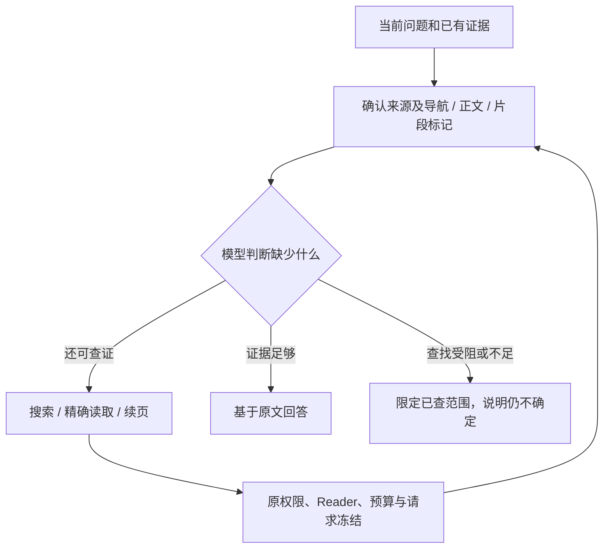

图里的判断仍由模型作出，不是宿主保证。长提示重写、把提醒放在最后、强制再自评一次，都没有稳定解决问题，所以没有留下这些改动。现在确实更容易查回部分隐藏答案，但模型仍会从手册主题推断“不存在”；循环显示 completed 也不等于答对。

当前 Session 15 / Context 13，策略 v8、显示包装 v13；旧 Session 1–14 原样保留但需要新数据空间。没有第二本证据账，没有迁移或删除。真实对照把同一个问题的隐藏原文换成“有／没有”，避免靠猜题过关；完整结果、失败和成本见[记录 006](../deal/006-evidence-bounded-retrieval-policy.md)。这些诊断题已反复使用，不能冒充全新题库，也不能替代原 72 题成绩。

本轮 305 项不同的相关检查通过。最终导航正例是 7/9→8/9；最后一轮候选 5/5，但基线少的一题是连接中断，不能说这就是修复提高的分数。实际跑了 122 个目标问题，含准备 625 次模型尝试，已知用量 3,430,669 tokens，另有 26 次用量未知。负面结论仍有问题，没有跑全量或 L2–L4。

## 8. 两种模型 Provider 分别做什么

### Scripted Provider

它不调用网络，而是按 JSON 脚本依次返回预设 ModelResponse。用途是：

- 测试主循环是否真的执行工具；
- 无 Key Demo；
- 生成可重复的事件轨迹；
- Benchmark 每次都得到相同决策。

这不是“假装真实模型很聪明”，而是把 Runtime 正确性和模型随机性分开测试。脚本内容属于测试夹具，绝不能偷偷变成生产默认业务逻辑。

### OpenAI-Compatible Provider

它把统一 Request 翻译成 `/chat/completions` 请求，包含 system/user/assistant/tool 消息和 Function Tool Schemas。API Key 只在发 HTTP 时从指定环境变量读取，作为 Bearer Header 发送。

当前只取响应中的第一个 choice，解析文本、Tool Calls、finish reason 和 usage。HTTP、网络与协议异常会
变成稳定、不会携带原始正文或秘密的 typed Provider failure。

结束原因现在有统一分类了（080-C0 已做完）。响应上有两个字段：`completion` 是宿主内部统一的类别，
只有五种——正常结束、交接工具、被长度截断、被拒绝/过滤、未知；`provider_finish_reason` 原样保留
厂商自己写的那个词，可以为空。运行时只看前者，不看厂商原词，也不看模型名。
关键改动是：**厂商没写、写了空串、或者写了我们没认过的词，一律算"未知"，不再补成"正常结束"**。
以前补成 stop，等于系统自己替模型宣布"它说完了"。脚本 Provider 是测试用的替身，
脚本里不写就按有没有工具调用推成"交接工具"或"正常结束"——那是写脚本的人自己声明的，
和厂商没告诉我们是两回事；写了不认识的类别名会直接报错。

用量上新增 `reasoning_tokens`：厂商说这次输出里有多少 token 花在了"推理"上。
它是输出总数里的一部分，不是额外加上去的，所以不影响任何账；厂商没给就是 `None`，
表示不知道，而不是零。推理正文本身仍然不读进来——推理不是交付，不会被当成回答。

**C0-2 真做了一次探测，结果很关键。** 用试次同一个模型（百炼 `deepseek-v4.1-flash`）、
非流式、把输出上限压到 64 发了一次，拿到的正是 v10 那个样子：结束原因 `length`、
正文 `content` 长度为 0、没有工具调用，而 `reasoning_content` 有 241 个字符，
64 个输出 token 全部记在 `reasoning_tokens` 上、正文 token 是 0。
**也就是说，这个模型确实把整份输出额度花在了我们当时根本不读的推理通道里，正文一个字都没来得及写。**
边界要说清楚：一次调用只说明这一次；探测为了省钱把上限从 8192 压到了 64，
所以它既不能反过来断定 v10 那一次的字节就是这样，也没有测量原配置下多久会截断一次。
证据见[响应形状探测](../validation-data/real-repository-pilot-v1/c0-response-shape-probe.json)。

Tool 参数仍以严格 JSON 为第一规则。真实 Endpoint 已经出现过一种很窄的兼容形态：模型把顶层多行
字符串写成双三引号。标准解析失败后，只有冻结 Tool schema 明确声明为顶层 string 的字段才允许做这一次
词法规范化，而且整份结果仍须重新通过标准 JSON object 解析；其他坏格式继续拒绝。它不执行 Python，
没有 JSON5、通用“修 JSON”、retry 或 fallback，也不会看模型名、任务名、文件名或 Tool 名决定放行。
详细决定见 [ADR-0038](../adr/0038-schema-gated-multiline-tool-arguments.md)。

现在参数错误会更具体地写进原有失败记录，例如“解析器期待逗号”“字符串没闭合”“顶层不是对象”。只保存固定错误类别，不把参数正文、密钥或原异常文本塞进日志，不另建账本。看到“期待逗号”仍不能武断说模型就是漏了一个逗号，更不能猜是网络截断；它只说明解析器卡在哪里一类问题。原有格式拒绝、三引号处理、取消和不重试规则都没放宽，数据版本不变。旧失败缺失的正文不能补回来；需要观察真实原文时沿用显式取证脚本，另外冻结调用合同，本轮没追加调用。见[记录 046](../deal/046-provider-argument-diagnostics.md)。

C4 用显式诊断脚本核对历史失败对应的 Stream、Step、Turn、请求引用和指纹，再把原请求交给原
Provider，只记录真正收到的响应字节和请求内容摘要。脚本不读认证头、不导出环境值、不执行工具，
也不恢复旧 Session；产品仍只记录原有的清洗后错误。C4 当时 Adapter 与历史运行的源码字节相同，但当时
没保存 HTTP body，所以无法倒推出具体是哪种坏格式。
这次固定 24 次重放有 21 次解析成功、3 次连接/TLS 中断；18 个工具参数都是合法 JSON object，
与 Adapter 解析出的值完全相同，也通过原 JSON Schema。一次最小文本控制成功；连同控制收到的
22 份响应都用原 Adapter 离线重放核对。没有复现参数协议错误，没有证据支持改 parser。
原 24 次已知用量为 67,024 tokens，3 次未知不能算零，控制另用了 101 tokens。参数类型通过也不
表示资料权限正确或工具已执行。历史失败、网络失败和未知部分都保留，见
[C4 验证记录](../validation-v0.9-stop-c-c4.md)。

“OpenAI-Compatible”表示协议格式兼容，不表示只支持 OpenAI，也不表示所有第三方平台细节完全相同。Base URL、Model 和 Key 环境变量名必须由配置明确提供。

虽然 Session 里有 `assistant/chunk`，当前实现并不是真流式。Provider 先拿到完整响应，LlmRuntime 再把完整文本作为一个 Chunk 记录。以后做流式时可以替换这层，而不用改变 Step 的意义。

后来只把那条分工请求单独发了一次，并保存真实响应：用了 2843 tokens、约 33 秒。这次格式正常，但模型说“规格还没读，所以不能分工”，没有发任何工具调用。读取两份已定位规格本来可以交给助手，它却把未读当成了不能委派的理由。旧参数错误没复现，仍不能猜旧响应是什么。拿保存字节离线再解析，结果一致，原记录没改，也没执行工具或重跑完整任务。见[记录 048](../deal/048-planning-response-capture.md)。

### 取消一次模型调用，后台会不会还在发请求

`urllib` 的请求一旦发出去就没法中途叫停。所以取消时的做法是"等它收敛"——等这次 HTTP 调用真正结束，再把取消抛给调用方。好处是不会出现"界面已经说中断了、后台还在跟模型服务通信"；代价必须讲清楚：**这是等待，不是立刻掐断**，最坏要等到 Provider 超时（默认 120 秒）。等待过程中你再按几次 Ctrl+C 也不会提前放行，否则又会退回到"调用方走了、Worker 还在"的老问题。

## 9. 模型为什么不能直接执行文件操作

只读调查增加两个预算查询/申请工具，adaptive 主方增加决定工具；权限分属子方与直接父方，接线与原 Session 证据见 12.14。

F3 的 propose_workspace_memory 也走原 ToolRuntime，但它是追加提议的 EXTERNAL_TRANSACTION，
不是只读工具。只有显式配置且授予默认工具时才注册；模型不能批准或改绑项目，完整边界见 7.6。

模型只能提出 Tool Call，真正执行必须过 ToolRuntime：

1. Tool Registry 查名字是否存在；
2. Schema 检查参数类型、必填字段和多余字段；
3. 多个 Policy 共同判断；任何 DENY 都最终拒绝；
4. 允许后写 Tool Admission 和 Effect Intent；
5. 根据 Effect Kind 决定并发还是排队；
6. 经过 Middleware；
7. 调用工具；
8. 在一次 Effect Outcome 写入里保存原结果和必要的引用/呈现；
9. 写 Tool Result：小结果原样展示，大结果展示查找入口和引用（没装查询工具时才保留前缀预览），原文按需读回。

Middleware 像一层层包装器，可以做日志、计时或附加限制。每层 `call_next()` 最多一次，防止一个 Middleware 不小心把写文件动作执行两遍。

### 为什么读工具能并发、写工具要排队

连续多个读操作互相不改变 Workspace，可以一起等待；写文件和进程可能改变现实状态，必须形成 Barrier，保证调用顺序可解释。

### 内置工具的细节

#### `list_files`

递归查看 Workspace 文件，输出相对路径；跳过 `.git`、`.traceh`、缓存、虚拟环境和依赖目录；默认最多 500，可配置但最高 5000。它只读，不接收任意根路径。

#### `read_file`

现在能按行读一段 UTF-8 文件，也能继续往后读。path 必填；start_line/end_line 是从 1 开始、包含两端的行号。只填路径时读第一页，默认范围到文件末尾，指定的终点超过文件长度也按真实末尾截止。输出是统一的 format=1 JSON，有文件路径、内容摘要、总行数、实际起止行列和带真实行号的 text；data 只重复元数据，不再重复整段正文。空文件就是零行，不多造一行。

比如下面只是调用示例，不是默认文件或默认范围：先搜索某个函数，发现它在 `module.py` 第 320 行，再调用 `read_file`，填写 path=`module.py`、start_line=310、end_line=345。这样模型能看到函数前后逻辑，引用的也是文件真实行号。

每页最多 120 行、序列化后 8000 个 JSON 字符。`truncated` 表示“这次要求的范围还没读完”，`eof` 表示“已读到文件末尾”。两者不同：要求读 310～345 行，文件有 500 行时，可能范围已读完但文件还没结束。需要更多内容就照返回的 `next_read` 参数继续：范围没读完就继续原范围，范围已读完就从它后面开始。

一行特别长时用 `start_column` 接着读；这里的列是从 1 开始的 Unicode 字符位置，不是 UTF-8 字节数。续读会带上 `source_sha256` 内容摘要，文件中途变了就报错，需要重新读取，防止把两个版本拼起来。这个摘要不授予权限，也没有另存一套历史文件库。每次仍先检查真实路径，工作区外、链接/重解析路径、目录、坏编码、非法行列或摘要都会明确失败。

工具在自己负责的线程里读文件和生成这一页；取消会等这份工作真正结束，重复取消也不能留下后台读操作。取消仍报告为取消，读失败的原因保留。目前内部仍要读取完整文件，再挑这一页，所以只保证“给模型看的这一页”有界，不保证任意大文件的磁盘或内存消耗有界。8000 字符也不是 token 费用上限，模型费用仍走原预算账本。

对应正式版 9.3：搜索定位 → 原工作区路径检查 → 当前原文与摘要检查 → 分段视图 → 原工具账本 → 原模型请求快照。调查助手的工具权限不变。详见[本阶段合同](../plan/TRACEHARNESS_BOUNDED_SOURCE_READING_CONTRACT.md)。

#### `search_text`

可以搜索普通子串或正则，可指定 Workspace 内子路径，返回文件、行号和文本。非 UTF-8 文件被跳过；结果默认最多 100、最高 1000。 搜索算法和结果格式没改；工具说明补充了下一步：拿命中文件和行号，调用 read_file 读附近代码，不能把单条匹配当成完整上下文。

#### `apply_patch`

名字叫 Patch，但当前不是解析 Git unified diff，而是“精确找到旧文本并替换”。默认要求旧文本出现一次，也可明确指定次数；次数不符时完全不改文件。创建新文件必须显式 `create=true` 且旧文本为空。

写入先落到同目录临时文件，flush、fsync 后用 `os.replace` 替换目标，并返回修改前后 SHA-256 证据。这样比直接覆盖更能减少半写文件。

#### `shell`

命令按钮现在说明：已经在隔离工作区里，直接写程序及参数即可，cd、&&、管道等不会像终端那样解释。启动失败会带上实际原因，例如程序不存在或没有执行权限，错误仍受原输出字节上限限制。错误沿原沙箱、账本和下一次请求交给模型；状态仍是失败，不会偷偷重试或扩大权限。见[记录 063](../deal/063-shell-launch-feedback.md)。

收到普通命令字符串后，先由 `shlex.split` 拆成 argv，再交给本次工具调用绑定的沙箱能力执行。不会通过宿主进程回退，也不使用 `shell=True`，因此不会自动解释管道、重定向和 shell 语法。环境由宿主明确提供 Linux guest 值，超时和取消都要收尾容器工作负载。

子进程环境只保留少量必要变量，并删除名字包含 KEY、TOKEN、SECRET、PASSWORD、CREDENTIAL、AUTH 的变量，避免模型运行的测试进程顺手继承 API Key。它支持超时和取消，并返回退出码、stdout、stderr。

默认危险命令 Policy 会挡住一组明显危险的程序名，但黑名单永远不等于真正沙箱。运行不可信模型时仍需容器或远程隔离。

### 9.5 大工具结果：保存、列目录、查关键词、读原文

这就是分层压缩 A/B。比如一个命令输出很长的日志，以前超出显示上限的正文会被剪掉；现在程序
会把完整正文、结构化数据和证据放进同一次执行结果里，同时记下摘要指纹和给模型的引用呈现。
都存在当前数据目录的同一 SQLite 账本，不往 TraceHarness 源码目录塞日志，也没有第二套文件事实源。

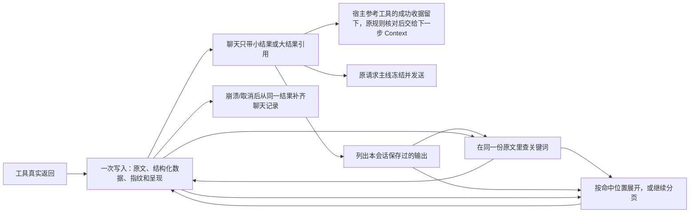

**080-C2 改了一件要紧的事：能不能事后找回来，和第一次给不给模型看，是两回事。**
以前的规则是"这条结果超过 24000 字符才给它一个引用"。听上去合理，问题在长任务里：
几百条结果每一条都不超线，于是**一条引用都拿不到，也就一条都折不掉**——
把每页切得再小，也只是把撑爆的时间往后推。
现在只要这次执行是完整的，每条结果都会存一份原文并拿到引用；尺寸只决定**第一次给模型看什么**。
引用里多了一个 `disclosure` 字段：`inline` 表示当时模型已经看到全文了，引用是为了以后能折能读回；
`retained` 表示正文一开始就收起来了。校验也按这两种模式分别检查——
`inline` 的必须和存档正文逐字节一致，`retained` 的必须已经缩减成控制收据，
哪一边对不上都会明确报错。旧的 format 1 引用不再接受，也不自动转换，旧数据要换新数据目录。
读回的小页也有自己的引用，但当次仍完整显示页面，不会刚读出来就再藏成另一个占位符。
真实 SQLite/Docker 测试会按引用还原每页、与当时内容逐字核对，并确认重启或分页不让原命令再执行。
顺便说明 24000 这个默认值实际写在 `RuntimeConfig` 和 `ToolRuntime` 两处默认参数里，
Session 那层只接收传进来的阈值，不自己设默认。

三个普通只读工具负责这一件事（它们的名字统一写在 `OUTPUT_TOOL_IDS` 一处）：

- `list_tool_outputs`：从本会话真实结果列出保存的输出，最新的在前。首目录返回 through_seq；翻页
  同时带这个边界和 next_offset，后来新增的结果就不会把页码挤乱。
- `search_tool_output`：带着目录中的原执行编号和指纹查字面关键词；把命中行和前后附近行分开给出，
  附上可以直接执行的原文读取动作。片段够用就回答，不够就展开。
- `read_tool_output`：拿目录里的 effect_id 和 digest 读取原文。part=content 看当时正文，part=data
  看当时结构化数据；offset 按 Unicode 字符计数，next_offset 表示下一段，end_offset 是这次读到的位置；body_status 说明整份原文还是一个片段，最后一页也可能只是片段。整页 JSON 也要装得下预算，
  不会把中文、emoji 或 JSON 从中间剪坏；页面会正常留档供后续折叠，但不会自动递归读它自己的引用。

B+ 搜索结果以 match_mode=literal-substring 标明字面匹配。默认区分大小写，可显式关闭；输入的是普通文字，不是正则表达式。默认搜正文 content，也能
搜原结构化数据 data 的标准 JSON 文字。默认从第 0 个 Unicode 字符开始，一次最多 10 个命中（可选 1–100），
默认只给命中行，前后文可显式选择各 0–20 行。按原文顺序返回不重叠命中；行号从 1 开始按换行 LF 计算，字符位置与读取工具一致。
next_offset 是最后一个已返回命中的末尾；继续时带同一关键词和选项，null 才表示后面没有更多命中。
没有凭空估计总数。很长的行会缩短附近片段并标记 context_truncated，命中文字必须完整；连一个命中都放
不进页预算就明确报错。read_action 从命中行展开，巨长行也不会强制从整行开头读起。

这三个工具通用 Runtime 默认就装。以前如果一个宿主（比如 Product）关掉了默认工具集，
想拿读回就只能把默认工具整个打开——那会顺手把 shell 和改文件的权限也发给只读调查助手。
现在可以按名字单独点这三个，它们绑定的还是同一个 Session 服务，不会另建一个；
点了不存在的名字直接报错。Product 侧按 profile 里写明的授权下发，
读回也只能读本会话自己的结果，读不到父会话或别的助手。

例如搜索某条记录编号时，附近可能带上上一条记录的字段。程序现在把命中行和前后附近行分开，模型
需要确认字段属于哪条记录；只看到标题却没看到该记录的答案，就用附带动作读后面的原文。
搜索工具可用时，引用中显示搜索入口，不再只给一个“从头读取”的动作；只装了读取工具时仍给
原来的读取入口。命中后的展开动作也填好了当前页预算允许的读取长度，模型不用再猜位置和长度。
查不到某个词，只说明所选内容范围没有这个字面词，
不能推断相关事情从未发生。搜索只扫描这份已保存原文，没有另建数据库、索引或向量库。

原通用提示也解释了区别：问旧工具结果先找输出目录，读到的正文就在工具结果里，不必等最后的参考包。
这不是 Skill/Memory/History 那种“工具只交收据、下一步再披露正文”的读法。

不用先绑定项目或打开 Memory、ProductTask、History。即使整轮历史已经压缩，或者这一轮太大装不进
History 原文页，工具输出目录仍能找到原来的结果。这没有改坏 History“完整对话一起读”的规则。

实际判断“大”的阈值沿用 max_tool_output_chars：正文或结构化数据超过它，就保存完整内容。有查找工具时只展示引用和入口；两种查询工具都没装时才展示不完整预览。
固定说明、引用和 JSON 转义也占空间，不能把这个阈值叫 token 上限或整请求上限。
大结果在 Session 的 data 不再重复塞一遍 stdout 等内容；原 data 仍在 Effect 账本中，可单独读回。
但宿主 History、Skill、Memory 搜索和读取工具的成功收据会留下，否则程序不知道下一步该披露哪些正文。
留下的是原结果中的收据副本，会核对与原件一致；普通工具随意写同名字段没有这项待遇。
原来的批准、选择、版本、取消与预算限制继续生效，大正文不会因此重新塞进模型，也没有新增事实账本。
truncated=false 表示 Runtime 没有丢掉原文，不表示当前显示已经包含全部内容。

程序会核对原 Tool Call、Result、执行 Intent 和 Outcome：会话、工具、调用编号、Step、参数、状态、
先后因果与指纹都要对上。同一工作区的另一个会话也不能拿这个引用读走内容。完整不变量检查复用这一套
规则；只检查 Session 时不能声称已经核查了 Effect 来源。读的是当时结果，不会为了找旧日志再运行命令。

原文和引用一次提交，失败时不会先公布一个不存在的指针。结果记下后、聊天记录补上前崩溃，由原恢复器
补齐；重复取消也先收敛。不确定是否执行完成时照实记录未知，不把写数据库失败说成工具本身失败。
冻结的请求里保存当时的呈现/页正文，所以重放不用重新读最新文件或再次执行工具。

A 还明确了后续顺序：先保存大结果，补好关键词查找，再折叠旧结果，最后才做模型摘要。预算要一起看系统提示、工具定义、
任务状态、聊天、参考资料、当前问题回显和输出预留。80% 触发、60%–65% 目标只是待真实验证的候选，
现在没有偷偷加成默认值。D 已通过普通模型步骤接入语义摘要，仍走原记账和取消链，不能在本地摘要器里私自调 API。

当前 Session 15、Context 13；SQLite 2 和原压缩 format 2 不变。以前已经截掉的正文不会被猜出来。
底层工具自己没交出的内容、Shell 解码前的原字节、工具还没返回就被取消的输出，也不承诺能补回。
工具主动报告的长错误/超时文本可以保留，非零退出码仍保持原值。数据仍占数据库磁盘，当前读取器会先读
本会话执行流，再少量交给模型；还没有流式保存、磁盘配额或自动清理。
详见 [设计决定](../adr/0053-layered-compaction-and-retained-tool-output.md) 和
[真实及定向验证记录](../validation-retained-tool-output.md)。

## 10. 为什么模型说“完成了”还不算完成

Continuation 决定下一步：

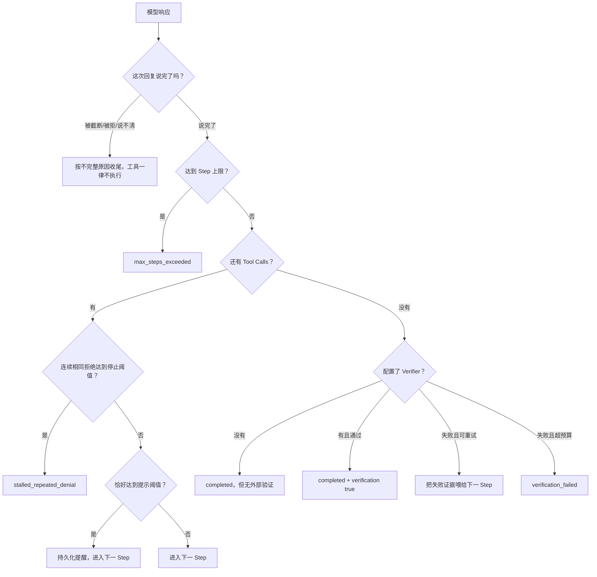

流程图最上面那一步是 080-C1 新加的，也是这次最要紧的修正。以前的漏洞是：模型的回复被输出上限
砍断、正文空的、连工具都没调，系统照样记成 `completed`——网络请求成功被当成了 Agent 交付成功。
现在 `runtime/response_completeness.py` 里有**唯一一处**判定，每个回复只判一次，
AgentLoop 在**执行工具和跑 Verifier 之前**就问它，continuation 用的是同一个答案，
Product 和 Supervisor 不再各写一套规则。四种情况算没说完：被长度截断、被拒绝/过滤、
结束原因未知、以及"说要交接工具却一个工具都没给"。

有一点特别值得解释：被截断的回复里**可能带着能解析的工具调用**，看起来完全正常。
但那是一句没写完的话里的半个意图——照着执行，等于拿半句话去改文件。所以截断响应的工具调用一律不执行，
判定也必须放在副作用之前，只在 continuation 末尾补个 if 是不够的。
原始响应、用量记录照旧如实保存，HTTP 确实成功了，只是这不等于任务有交付。
Verifier 同样不对没说完的回复运行——给一个不存在的回答贴"通过/不通过"没有意义。

这一版**不会自动续写、不会自动把输出上限调大、也不会把"补点预算"当成恢复成功**。
另外，"这个角色该交回什么"不归这里管：通用 Session 不猜业务成功，
调查助手该有报告、补丁作者该有补丁，那是 Product 的合同（见 14.3）。

CommandVerifier 会在沙箱中的授权工作区副本重新运行配置命令。只有正常结束且退出码 0 才通过，结果带着有界输出和原执行回执。没有沙箱配置就明确失败。它与 Agent 自己调用 Shell 测试不是一回事：Agent 可能误读一次 Shell 输出，Verifier 是 Harness 规定的独立完成门槛。

通用 Runtime 的 Verifier 是可选的；现在启用写助手的 Product multi 在交付复核时必须检查，见 14.3.6。其他没有配置验证器的入口中，模型不再请求工具就可以结束。这时结果里的 `verification_passed=None` 只表示“没有验证”，绝对不能翻译成“验证成功”。

默认允许验证失败后再修一次，因为 `max_verification_retries=1`。失败摘要作为新的用户消息进入下一 Step，模型能根据真实测试证据继续处理。


现在还会检查一种明确的原地打转：连续几步都调用相同工具、传相同参数，整个批次都收到相同拒绝。`runtime/repeated_denial.py` 负责从账本算出次数，Continuation 决定提醒还是停止，AgentLoop 只负责把两者接起来。并行一批调用只算一步，换一下排列顺序不算新尝试；改变参数、拒绝原因或装配版本，发生成功或其他失败，或者步骤没结束，都会打断连续计数。换一轮聊天重新计数，不另建一份状态。

默认第二次拒绝后提醒模型换个允许的方法或说明阻碍；第三次仍完全相同，就以 `stalled_repeated_denial` 结束。每次工具请求仍先重新检查权限，不能因为上次拒绝就省略本次检查，也不能靠这个机制知道外部权限是否偷偷改变了。它只处理连续相同拒绝，交替换工具、换参数、成功轮询，以及“读到了但理解错了”仍不属于它的判断范围。

可用 `--denial-warn-after` 和 `--denial-stop-after` 改次数，必须是整数且“2 ≤ 提醒次数 < 停止次数”；`--disable-repeated-denial-check` 关闭，不能同时传次数。代码配置为 `RuntimeConfig.repeated_denial_policy`，设为 `None` 关闭。配置记在本轮开始事件里，恢复命令保留它；旧记录没写配置就不补猜。本次没有新增 TUI 配置表单。

预算层继续按原规则结算，用户自定义的 Continuation 需要自己处理这个可选状态。提醒仍写进现有消息账本，但不会替换本轮真正的问题。取消、恢复、重放仍走原来的会话流程，Session 15 / Context 13 / `context-json-v13` 保持当前版本。

真实压力例里，不开保护重复拒绝了 6 次；开启后第二次提醒进入模型实际请求，模型就自行停下了。因此真实测试证明了提醒路径，第三次强制停止靠定向测试和“去掉保护就失败”的反向测试验证。4 个自然问题两组都答对 2 个，不能说搜索更准了。10 条真实旅程共 65 个请求独立重放通过；210 项相关检查通过，没跑全量和 L2–L4。详细见[修复记录](../deal/004-repeated-denial-continuation.md)。

参考问答的模型行为流程见 7.11。程序没有靠否定词去判定“已经查清不存在”，也不会把模型自称查完当成批准或验证通过；`completed` 仍只是这一轮结束。

### 10.1 取消、超时和输出由谁负责

完成验证继续使用原 verify(workspace) 接口，宿主临时给它同一个沙箱执行能力。完成检查的回执在原
Session 流，工具和固定审阅的回执在原 Effect 流；插件服务器在应用级激活流。/sandbox 会经同一个
Reader 查看这些原记录，不搬动账本，也不因为界面需要就另写一份状态。

容器里的监督员管理时限、输出上限和整个进程树。业务命令使用另一用户 UID 65532，只拿明确提供的
Linux 环境，不继承宿主目录、PATH 或密钥。宿主控制客户端用有界临时文件接 Docker 输出，避免句柄
被后台程序继承后拖住收尾；业务输出在容器内有界收集，持久证据放原 CAS。

父命令已经结束时，不能因为后台后代还占着输出管道就一直等。现在会先收掉后代，再读完管道里已经
写入的有限尾部。真实 fork 测试发现并修好了这个问题；不会把正常退出误报成等待超时。

| 情况 | 会发生什么 |
|---|---|
| 正常结束 | 收尾进程树，返回输出、退出码和回执，再由原主循环记验证结果 |
| 内部超时 | 容器自己叫停，返回 timed-out 和已保留的输出，失败摘要可以告诉下一步模型 |
| 用户取消／总预算先到 | 等执行和回执写入收敛后再返回取消，不伪造验证结果，也不保证取消前输出完整 |
| 收尾无法确认 | 明确记 unknown-convergence 并报错，不冒充取消成功，不自动重试 |
| 宿主被强行杀掉 | 容器内部期限仍能叫停任务；账本可能只有执行单，不能凭猜测补结果，也不会自动清理停止容器 |

Shell 自己的超时与 Runtime 总预算仍用原来的两层异常边界区分。固定 Review 只留下输出字节数、摘要
和回执，不持久保存原始固定检查输出。临时文件、连接和进程句柄只是执行资源，没有另造业务状态。

旧的 sanitized_environment 和 process_control 仍供可信宿主控制及 L2 等工具使用，不是 shell 或
默认验证的宿主执行后门。本目标没有运行 L2。

## 11. 程序崩溃以后为什么不能直接重跑

摘要过程中崩溃也按原规则收尾：已有完整模型输出就能证明返回过，否则保持未知；不编 token 用量、不重调模型、不自动补写没提交的摘要。已经写入的摘要保留。

恢复先检查当前唯一 Session 协议 15；History 请求仍按原来的轮次／步骤和收据判失效，恢复后不能
转交下一轮。只写了一张 Context、还没写 Composition，或还没取得首个
模型请求许可，都是允许出现的失败位置；恢复不会重新选参考，也不会补造 Context 或下一步模型调用。

假设模型要求执行一个写文件工具：

```text
写下 Intent → 派发工具 → 文件已经改变 → 写下 Outcome → 写 Tool Result
```

进程可能在任意两个箭头之间崩溃。恢复器的原则是：能证明的才补写，不能证明的明确标为未知。

- 有 Outcome、没有 Tool Result：说明现实结果已经持久化，可以合成 Result；
- 有 Call/Intent，但没有可确认 Outcome：写 `unknown_after_crash`，不自动重放；
- Step 或 Turn 没有 End：追加 `interrupted` 的 End；
- **确实修过东西**（补了 Attempt End、补了 Tool Result，或关掉了没闭合的 Step/Turn）：最后再写一条 `runtime/recovered`，留下恢复说明；
- **什么都没需要修**：一条事件都不追加，报告里的 `changed` 是 `false`。所以对一个健康 Session 反复执行 recover，账本不会越长越胖。

为什么读操作也统一进 Effect Ledger？统一协议让 Inspector 和恢复器不用猜不同工具的记录方式；同时 `EffectKind.is_retry_safe` 明确告诉未来恢复策略哪些是读、哪些是危险副作用。

如果有 `model/attempt-start` 没有对应 `model/attempt-end`，恢复器现在会先把这次模型调用收敛掉，再去处理 Tool Result 和 Step/Turn。它怎么判断？看有没有“完整的那句话”：

- **有完整 `assistant/message`**（attempt、turn、step 三个身份全对得上，而且写在这次调用开始之后）：说明模型确实答完了，只是没来得及写结束事件，补的结束事件记 `succeeded`；
- **只有 Start，或者只有零散 `assistant/chunk`**：Chunk 只是“说到一半”的碎片，证明不了模型答完，补的结束事件记 `unknown_after_crash`。

两种情况都绝不会偷偷再问一次模型，也不会把碎片拼成一句完整回答，更不会编造当时的 token 用量和结束原因——没观测到就是没观测到。带同一个 attempt_id 但属于别的 Step、别的 Turn，或者写在这次调用开始之前的消息，统统不算数——它们证明不了这次调用完成了。如果先出现一条作用域不对的消息、后面才出现正确的那条，认的是正确的那条。`attempt_id` 本身也必须是真正的字符串，`None` 或数字都当作没有身份，直接跳过并在报告里说明，绝不会造出一个叫 `"None"` 的调用。

补出来的结束事件会用 `causation_id` 指回原来的 Start，便于事后审计：这条是恢复补的，不是当时真实发生的。旧版本留下的、Step 和 Turn 都已经关掉但 Attempt 还开着的老 Session 也能修：因为账本只能追加不能插队，补的结束事件排在旧的 `step/end` 之后，不变量也按整条流判断配对，所以这种老 Session 修完之后同样是干净的。

`resume` 先恢复再开新 Turn，而且默认提醒模型重新查看 Workspace 和恢复结果。这样可以减少模型看到旧对话后直接重复写操作的风险。

## 12. 怎样从事件得到状态、压缩历史和评估质量

### E0：先估整个请求，再看服务端实际用了多少（正式版 12.2、12.3）

以前只知道“历史占多少字节”，现在可把系统说明、工具清单、任务状态、对话、参考资料和问题回显、
请求外壳一起估算。它们都占模型空间，不能只看聊天文字。编码由用户明确指定；本地分词与服务端
未必相同，所以始终写“估算”，不把字节除以固定数冒充 token。

输入可用量 = 配置窗口 − 回答预留 − 安全余量。提前压缩线默认是输入可用量的 80%，可以改为
1–100；达到这条线先收起旧结果，不够才摘录旧对话。这个 80% 是软件策略，不是某模型天生的限制。
回答预留也限制本次最大输出；填不齐、预留超过窗口或换模型不匹配都会明确报错。

token 模式在每轮首个请求准备时检查；没有启用 token 的字节模式仍在轮前检查。两者都保护当前
问题、活动工具组、最近几轮和任务状态，压缩关闭就不擅自打开。后续工具读回更多内容时仍重新估算；
E1 现在会在工具返回后的下一步再检查旧历史是否需要收起。仍超过硬上限就停止发请求，完整工具调用和结果留在账上；不会把当前这一轮切碎。

每次估算在正式请求来源之后记账，指纹、编码、库版本、配置和分项都能重算。抢写、写入失败或取消
不会越过检查去调用模型；取消会等正在写的动作收尾。原 Session/Context/SQLite 版本不变；没开计量
的会话无需这条可选记录。重新核对旧估算需要同一编码和库版本，缺失或变化会明确拒绝。

状态条写“最近请求输入估算”，不是随着屏幕文字增长实时预测；超限写“超限未发送”。Ctrl+X 详情
显示每部分多少、窗口、预留和实际输入/输出。服务没给可靠 usage 就显示未知，不能写成 0；一次请求
占窗口多少和整个任务累计花多少也不是一回事。计量没有被当作精确花费接到费用权限账上。

例如窗口、回答预留和安全余量由你填写，输入余量还剩 20000 token 时，默认提前线就是 16000；
这是计算示例，不是系统默认窗口。保留物理字节限额，选中的资料再一起算 token；逐类自动裁剪资料
仍在后续 E；模型写摘要已由 D 实现。可选依赖叫 `tokens`，首次取得编码可能下载公开词表。

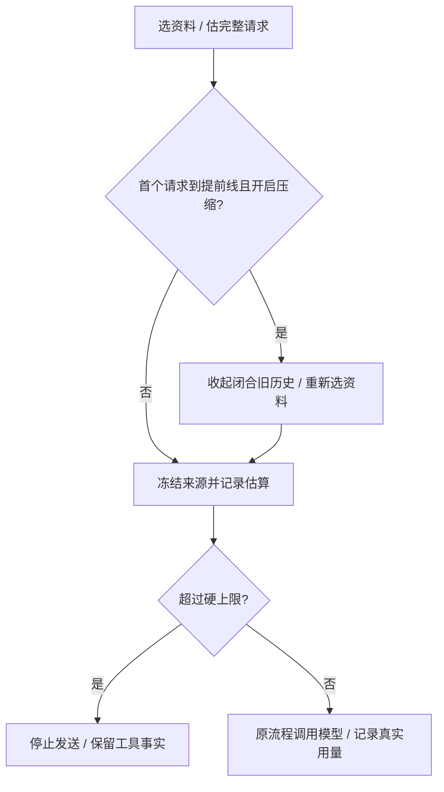

### D：让模型写“接着干活要知道什么”（正式版 12.2）

达到提前线后先收起旧工具结果，还太大才按你选择的方式摘要。默认仍是规则摘录；选模型模式时，
宿主先圈定已经结束的旧对话，把原文序号、范围、配置和指纹记下来，再用当前连接让模型总结。
它只能看到这些旧资料，不能调用工具或把里面的话当成新命令。最近保留的轮数、当前问题和任务状态不被压掉。

模型须分开写：目标、约束、实际验证进度、他人或助手陈述、用户采纳的决定、未决问题、原文位置。
例如“助手说做完了”放陈述栏，真实检查退出码是失败就保留失败；不能凭运行成功推断所有功能都完成。
没找到证据的文件、失败原因或授权继续保持未知。程序检查完整 JSON 和来源，超长、截断、空内容或夹带工具调用都拒绝。

这次总结本身占当前轮的一个普通步骤：E1 已允许在工具执行后的后续步骤触发，照常检查预算、记录请求、拿调用许可和记实际 token，还要留一步给回答。
成功后在同一本账上追加一条有来源的摘要，下一个步骤才重新选资料、回答你。因此至少要允许两步，
摘要也算步数和花费。没有另一套模型后台或聊天记录；原文不删除，漏掉的内容还可从本会话 History 读回。

模型输出放在 summary/response 记录中，不会直接作为聊天显示，也不会批准 Memory。它只是历史参考，
程序不能保证每句总结都完全正确。写入时抢跑会重新核对原来源；不会拿旧摘要套新历史，也不会重调模型来解决写入冲突。
重复取消会等原调用/写入收尾。恢复时只承认已记下的结果，不造用量、不再调模型、不擅自把未提交摘要补上。

格式失败会记明原因并保留原历史；正常回答仍能装下就继续，装不下就拒绝，先前已收起的旧工具结果仍保留。
如果你明确选择了一页 History，这轮先读它，暂不做模型摘要，避免摘要占掉本来属于阅读的首步。
摘要请求也要装得进硬上限。目前没有自动分批摘要；每轮最多一条摘要调用链，不能反复写摘要消耗所有回答步骤。

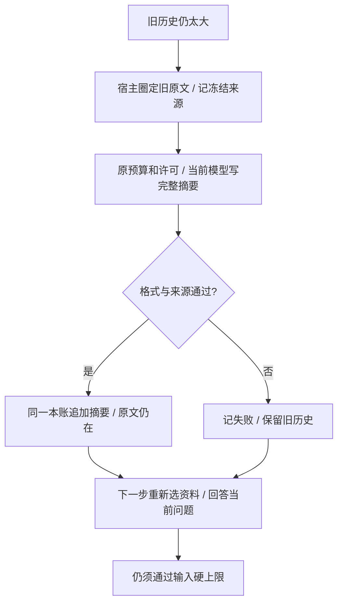

实测两组：一次本地检查返回 0，另一次返回 7。摘要后都记住了正确结果，重启后还能实际翻页找回随机旧细节，
再问新题也正常。最终 16 个回合通过，22 次调用实际用了 107759 token，其中写摘要用了 7983。
相同请求只把摘要换回原文比较，本地输入估算下降约 39%–41%；这不是账单保证。详见
[真实验证](../validation-semantic-summary.md)。所有例子是测试数据，不是系统默认项目、命令或模型。

### E1：工具回来后，也能收起旧历史（正式版 12.2）

比如第一步还不大，运行检查后日志很多，下一步就会检查能否收起更早结束的对话。刚执行的工具、参数和完整结果不能拆，近期对话和你当前的问题也保留。最后只剩一步时，不会让模型写摘要占掉回答机会；规则摘录不调用模型，所以仍能做。

如果模型刚申请读 Skill、Memory 或 History，先让它拿到那份资料，不插入摘要消耗阅读机会。同时修复了一个问题：摘要步骤之后才发起的正常历史页申请，现在能真正拿到原文，不会一直只看到目录。摘要本身不携带以前的阅读授权，失败、取消或预算逐出的资料不会被复活。

7 项专项测试通过，包含工具执行后取消摘要；最终 8 文件的相关门禁 176 项通过，包含架构和 Product 合同检查。真实测试两组各四回合，成功检查返回 0、失败返回 7，都只执行一次，工具后做摘要再回答，重启换题也正常。12 次调用实际用了 98665 token，摘要占 5921；对应单次后续请求的估算约减少 11.4%，不是总费用保证。失败尝试和反向验证都见 [E1 验证](../validation-in-turn-compaction.md)。E2/E3 已完成，语义检索已复测，未达门槛继续关闭。

### E2：资料能装多少，按 token 算（正式版 12.2）

例如同一份 Skill 的正文，在宽额度下完整送给模型；额度不足时整块不放，原本合格的小目录可能留下。
不会截一半 Memory 冒充完整事实。先收起可处理的旧历史，再用剩下的位置放资料：刚申请阅读优先，
其次是本轮实际读过且仍能保留的内容，最后才是自动参考。当前问题、任务状态和本轮工具记录不能删。

`session/context_tokens.py` 只负责从原账本算剩余位置，不另存真相；`context_input.py` 仍负责取舍。
每次把计量规则和来源指纹记下来，重放时按当时内容重新核对。没开启完整 Token 预算时仍按字节限制。
模型会收到明确说明：“工具说请求接受了，不代表正文真的装进上下文；装不下就说明空间不足，别原样反复申请。”
这两种提示自身也算占用，事先留足位置；目录都装不下时也会省略，最后仍超限就停止调用。

真实测试把 Skill、已批准 Memory、压缩 History 各测宽和窄两组，六组都用两步结束。连同 History 建档
共 14 次真实调用，实际用了 112182 token；失败尝试也保留，所有尝试合计 273913 token。
最初模型会没读就说装不下，后来 History 又反复翻同一页，最后根据真实排除结果给提示才通过。
13 项专项、相邻最终 313 项通过，去掉两条关键保护的新反例会失败；重启能精确重建原请求。
见 [E2 验证](../validation-reference-token-budget.md)。E3 的友好提示已完成，语义检索已复测，未达门槛继续关闭。

### E3：空间不够时，告诉你原因和下一步（正式版 12.2）

现在命令行和 TUI 都会解释：估算用了多少、允许多少，哪些位置被对话、参考、任务状态、系统说明、
工具定义和请求封装占用了；还会说这一轮真正做成多少次折叠/摘要、失败多少次。摘要请求被拦也会标清楚。
`chat/context_pressure.py` 从原账本核对这一条失败，`cli/context_pressure.py` 负责两种界面的中文说明；
不会拿后来另一条问题的数字顶替。明细读不出来就直说，不能显示假数字，也不把问题或密钥印出来。

你可以缩短当前输入，或在原 Token 配置页按模型实际容量改窗口和预留；大工具结果可另起一轮问具体片段，
也可新建会话。原记录保留，系统不会自动重跑已执行的工具。Ctrl+X 的最近已发送请求可能早于这次被拦的请求。
没有为了显示提示另建历史、费用账或自动重试。六项专项、198 项相邻主线、61 项界面检查通过（有重叠），
两项反向验证确认显示分支和原请求身份确实起作用。真实旅程、费用和失败详情见 [E3 验证](../validation-context-acceptance.md)。

真实测试也暴露模型有时漏执行新命令、生成了不合法的摘要证据编号；不合法摘要被拒绝，原文还在。
明确执行顺序后的完整旅程另行留证，不能把这些失败抹掉。语义检索已按冻结门槛复测，九组均未达标，继续关闭。

### C：先收起旧工具正文，不够再摘录旧对话（正式版 12.2）

比如之前跑工具得到一大段日志，B 已把完整日志记到账本里、聊天里留引用呈现。C 会在自动压缩阈值
达到时，先把旧结果呈现收成“这是历史结果、执行状态、原文引用”。当时的工具调用、参数、回复的
配对身份和位置都保留。执行状态不等于程序退出码；细节仍需搜索或阅读原输出，不能重跑。

系统从最旧的可折叠结果开始，每收起一条就重新看大小，低于阈值就停；还太大才用已有 M3 摘录
旧对话。最近配置要求保留的几轮、还没结束的工具组、Product 状态不动。它也不会替你打开原本
关闭的压缩，没有新增配置项或百分比目标。

#### 一个一直不结束的 Turn，现在能收起自己的工具组（080-C3）

以前这层折叠只能切在"一轮对话结束"的位置。问题是：一个任务如果一口气跑几百步、中间从不结束
一轮对话，那按这个尺子量，它**压根就没有"已结束的历史"**，于是每条工具结果都得一路带进后面
每一次请求。试次里主方单次输入从 5,087 涨到 65,166、助手从 4,638 涨到 67,984，就是这么来的。

现在折叠的边界改成"自带单位"的写法：`{单位, 保留几个}`，单位可以是"轮"也可以是"步"。
一个已经正常结束的 Step 和一个已经结束的 Turn 一样安全——它的模型回复已经完整、
相关工具调用全都落账、组里没有还在跑的东西。人工摘要和语义摘要仍然只准切在"轮"。
这是持久格式的破坏性改动，校验、解析、不变量、重放和 TUI 读取端是同一批一起改的。

有个刻意的取舍值得说：**一次替换只换一条工具结果**。要收起一个有 N 条结果的组，就写 N 次，
中间允许出现"这条收了、那条还是原文"的半折状态。这样做是因为 assistant 那条调用消息、工具名、
调用 id、参数和顺序全都原样留着，所以半折状态仍然是一段结构完整的对话，
两次写入之间断电也没有"半条替换"需要修。

##### 什么时候开始折：软水位和硬上限是两回事

模型窗口装得下，不代表每一步都值得带着几十万 token 去问。所以配置里多了两个数：
折叠开始的高水位（沿用原来的 `trigger_percent`）、希望回落到的低水位，
外加"最近几个已完成工具组不许动"。**这两项必须一起给，只给一个直接报错；
一个都不给就是关闭这个功能，系统不会自己挑水位。** 低水位必须严格小于高水位，
否则折了也回不到线下。

还有一处容易写错的地方：同一个压缩模块下有两种失败语义，不能混。
一轮开始前的例行维护失败了，等于什么都没改，历史照旧、这一轮继续跑就行；
但在准备请求的路上、因为到了高水位才要求的折叠，属于**发请求前的关键路径**——
不折就得把本来想避免的超大请求发出去。所以后者失败要记录原因并**中止这次请求**，
绝不能套用维护那套"记一笔然后继续"。至于"检查完了但没有能合法折的东西"，那是有原因的空操作，
不算失败；真到了硬上限还腾不出空间，就按原来的规则明确拒绝，而不是偷偷把输入裁掉。

##### 还有一层：Product 以前根本没开这套东西

上面讲的计量和折叠，在真实的 Product 运行里**以前一次都不会发生**。原因很简单：
试次的配置里 `token_estimate` 是 null，Product 也从来不往角色配置里传窗口策略和压缩策略，
于是计量器是空的，什么都不会触发。这和前面那条"只有大输出才有引用"是两个独立的原因，
但结果叠在一起：既没有资格折，也没有人来发起折。

所以角色配置里新增了一个可选的"上下文治理"块：编码、窗口、输出预留、安全余量、
开始折的比例、希望回落到的比例、保护几个工具组，外加压缩的三项。不写就是保持老样子
（不计量、不压缩），而且"写没写"会进入冻结摘要——同一个 preset 名字、水位不同，
摘要就不一样，评估不会把"开了治理"和"没开治理"的两次运行当成同一个条件来比。
JSON 里这个键**可以不写**：如果强制要求写，磁盘上所有已经冻结的实验配置就全都读不了了，
而那些是本项目不去改写的证据。要写就得十项写全，没有半套；
折叠水位在已经写了策略的前提下仍可省略（只计量、不做轮内折叠是合法选择）。

离线对照实测（同一个任务、同一个窗口、同样读六次，只改水位）：不开水位时最后一次请求里带着
6 份完整正文；开了之后只剩 1 份，中间写了 5 条 Step 折叠，整个过程 `turn/end` 仍然只有一个，
所有历史请求快照都能独立重放一致。把窗口调紧到这个任务装不下时，不开水位的那一侧会按硬上限
明确拒绝，而不是被悄悄剪掉。要说清楚：这是确定性折叠的机械效果，**不等于真实模型上省了多少钱，
也不等于质量一样**。

##### 真跑了一次之后：机制是成立的，但对不同角色效果相反

同一道 astroid 题、同一个模型真跑了一次（记录 081 §6）。跑完了，不变量和收敛都通过，
95 次调用的用量全部精确。**有两处已说明的条件变更（输出上限 8192→32768、新加了治理），
所以它不是跟 v10 的严格对照。**

成立的：全程**一次截断都没有**；156 次折叠、零失败；主方单次平均输入从 40,984 降到 25,689；
推理花费第一次看得见（主方输出里 60%、助手里 69% 是推理 token）。

**没成立、而且必须写下来的**：折叠在只读调查助手那边**逼着模型重跑原工具**。
按"同一个工具、完全一样的参数又调了一遍"来数（这个度量是事后补的，不是通过了的预登记门禁）：
助手 132 次折叠换来 **22 次"折叠之后重读"、0 次"东西还在也重读"**；主方是 **0 次 / 6 次**。
两个角色干干净净地分开了。助手自己把原因说出来了——"我得重读，因为早先的输出被折叠了"，
第 36 步它甚至为了躲开折叠，从批量读退化成一次读一两个文件。

原因在于**两个角色交出的东西不一样**：主方交的是补丁，折了无所谓；
**调查助手交的是带原文引用的报告，而折叠收走的恰恰是它必须逐字复述的那些原文。**
所以现在这套"不分角色的统一水位"对只读助手是配置错了，不是机制错了。
按角色分别设水位、或者把读回做得比重跑更划算，都是方向，但都还没做也没验证。

##### 顺着这个证据找到并修好的两个根因

"折叠逼着模型重跑"不是调参能解决的，根因有两条，都已修好并分别做了反向验证：

**第一条:重新打开比重跑还麻烦。** 折叠后的占位符原来只给一个引用，模型得自己拼出
一个 UUID 加 64 位的摘要；而产生这条结果的调用就明明白白留在占位符正上方，
重跑只要照抄现成的文件名和行号。更说明问题的是：**同一套代码给大输出的展示本来就带了
"现成可执行的读取动作"，偏偏折叠这条路没有。** 现在补上了（只带读取工具的两个必填参数，
另外两个本来就默认是"整份内容"，再写一遍等于白花字节）。
代价算清楚了：占位符从 588 涨到 814 字符，每折一次少省 10%；但避免一次重读能省约 2760 字符，
是新增开销的 12 倍，而实测比例是每 6 次折叠就有 1 次重跑。所以这笔账划算。

**第二条:好不容易取回来的东西，两次请求后又被折走了。** C4 里 9 次读回的结果**无一例外**
在 2 次请求之后又被折叠。这等于把模型刚花一次调用逃出来的处境原样重建了一遍。

这一条的**第一版修法（读回结果整体永不折叠）是过度纠正，已经撤销**：
记录 082 查出来它只是把失败换了个地方——28 条永久保留占了被拒那次请求的 42.5%。
当时给的理由（“折读回结果会让一层变两层”）其实也不成立：真正会套壳的，是让占位符指向
**读回工具自己的输出**；只要把占位符指回**原始那一页**——地址就写在那次读回调用自己的参数里——
那就是模型已经发过的同一个调用，取几次都一样，永远只有一层。

**现在的做法**：读回结果是普通候选，但有一条**有上限的容量保护**。
在给定的字节预算内，**先看模型已经要过这一页几次，次数一样再看新旧**。
装不下的那一页跳过而不是就此打住——否则一个特别大的页面会把排在它后面的整个工作集一起赶走。

**为什么必须看“要过几次”而不只看“谁最新”**，是被真实运行逼出来的：
一次运行里 60 次读回中有 31 次是完全相同的一页，五个页面各被取了 4 次，
读回占了助手全部动作的 52%——而这时重跑原工具已经降到只剩 1 次。
只看新近度就是典型的缓存颠簸：刚取回来的页面被更新的东西挤出去，紧接着又得再取一次。

**为什么这些参数要写进事件里**：我们承诺历史请求能逐字节重放（68 份快照重建是验收项之一），
所以“保护谁”必须只由历史事件决定，重放时不能去查今天的配置。
这正是我们和[调研 083](../deal/083-open-source-agent-context-research.md) 里四个开源项目的关键差别——
它们可以用运行期的计数器，因为不承诺重放。用字节不用 token，是因为这个协议模块不引入分词器，
而校验方必须一模一样地重算出同一批被保护的页。

**已知代价**：“要过几次”是历史累计，不会随时间衰减。一个曾经很热、后来不再需要的页面
会多占一会儿位置，直到更热的页面把它挤走。在有上限的预算里，这只影响先后顺序，不会无限保留。

**模型不读回、而是把原工具再跑一遍，也算“又要了一次”（对应正式版同段，ADR-0084）。**
收口实验 B 在 48k 窗口下，主方一次读回都没有用，而是在内容被折叠后把同一个 `read_file` 又跑了 11 次和 4 次。
这些重跑出来的结果以前算普通候选，过两步又被折掉，模型只好再跑一遍，修错阶段就这样超了时限。
现在同一份字节预算里，受保护的有两类：

- 读回的页面；
- 某个调用的最新结果，条件是它发起时，同一工具、参数一模一样的调用已经有旧结果被折叠过。

同一个调用只保最新那份。结果还看得见时的重复调用（比如改完代码再跑一次测试）是正常工作，不算需求。
判断只看会话里的调用、结果和折叠记录，重放时算出来的一样；不看工具种类，也不写死工具名。
事件格式没变，但旧会话里如果有按新规则本该受保护却被折掉的记录，会被明确拒绝，需要换新的数据目录。
三条测试都做过反向验证：重跑的副本会保留；预算为 0 时照常折叠；还看得见时的重复不算需求。

**同样条件下又真跑了一次来验证**（材料、模型、水位、输出上限一个都没改）：
助手的模型调用从 50 次降到 26 次，输入从 158.7 万降到 90.4 万（−43%），
读回从 14 次涨到 28 次，折叠后重跑从 22 次降到 9 次。
最能说明问题的是比例：每折叠一次伴随的读回从 0.106 涨到 0.418，翻了四倍。
**方向被扭过来了**——修好之前是"重跑多于读回"，修好之后读回是重跑的三倍。
两方输入合计比 v10 少了 35%。

**但这是一次对一次，不是速率。** 同样条件的另一次运行走了完全不同的路（只有 16 次调用、
一次折叠都没触发、最后因为网络超时中止），已经原样留着。模型不确定性就是这么大。

run3 助手的输入估算到了 65,759，越过 61,184 的硬上限，被拒绝了一次。
[记录 082](../deal/082-c4c-context-and-late-stop-diagnosis.md) 把这份请求原样还原后发现：
67 条“已经折叠，请这样读回”的占位说明就占 19,766 token；28 条取回后永不再折的结果占 27,970；
其余对话、系统说明和工具等占 18,023。**不能把这 66k 都说成任务非要不可的原文。**
机制自己就占了七成多，先修机制比扩窗口更有意义。

不要混淆两次失败：run1 是助手跑了 50 步仍未完成；**run3 是单次上下文超限**，助手还剩约 108 万 token
和 73 步额度。给更多累计预算不会解决单次请求装不下的问题。
更大的浪费发生在主方：它已经取到了助手失败的报告，仍调用模型 17 次、花了 562,727 token，
约 18.52 分钟后才在最终交付时被旧门禁拒绝。**这条“收到失败就立刻停”现在已经接好，见 §14.3.19。**

后面几轮真实运行（[记录 084](../deal/084-fold-maturity-fixes.md)）一轮一轮往下挖：

- 占位说明从 232 token 压到 102；取回来的结果不再永久保留，改成有预算上限，
  老化出去时**直接指回原始那一页**，而不是指向“取回动作自己的输出”——后者每折一轮就多套一层壳。
- **run4 起再没有出现过越限**，每次请求的峰值都稳稳低于 61,184。上下文这个问题本身算是解决了。
- run5 助手第一次真正交回了报告（12,732 字）。
- run7 发现浪费换了个地方：重跑原工具几乎没有了（60 多次里只剩 1 次），
  但**同一页被反复取回**——60 次取回里 31 次是完全相同的一页，有五页各被取了 4 次。
  原因是保护只看“谁最新”：模型刚花一次调用取回来的东西，来个更新的就被挤走，然后又得再取一次。
  改成**先看模型要过几次、再看新旧**之后，run8 里最多只取两次，来回循环消失了。
- run7、run8 最后都断在供应商网络上（`provider-tls-eof`）。run8 那一次主方连试 5 次、
  助手连试 3 次同时失败，是对方服务中断，不是我们的机制结果。

**固定测试从头到尾一次也没跑到，所以“补丁对不对”至今没有被判定过。**
以上都是关于上下文机制和交付纪律的结论，不是关于任务质量的结论。
run3 当时的只读核查还原了 68 份历史请求，检查了会话与工具副作用记录的一致性，原始日志未改动。

[调研 083](../deal/083-open-source-agent-context-research.md) 又对照了四个开源项目：最近工具结果暂时保留，
更旧的变短，整个任务仍太长时把早期过程整理成摘要。Pi 能在同一个用户任务尚未结束时做这件事，
正好对应我们的长 Turn。**我们目前只有轮内工具结果折叠，轮内早期过程的语义摘要尚未实现**；
后续应沿原账本和请求重放设计，不能另存一份可随意修改的“模型记忆”来代替原始事实。

```mermaid
flowchart TD
    A[一轮开始前维护历史] --> B[按配置折叠旧轮次或做摘要]
    B --> C[每一步准备模型请求]
    B -- 失败记下来后继续 --> C
    C --> D{开启轮内折叠且达到高水位?}
    D -- 否 --> G[测量最终请求大小]
    D -- 是 --> E[核对来源并逐条折叠已结束步骤的结果]
    E -- 降到低水位或没有可折结果 --> G
    E -- 折叠失败 --> H[记下原因并停止发送]
    G --> I{超过输入硬上限?}
    I -- 是 --> H
    I -- 否 --> J[继续发送模型请求]
```

这仍用原 surface/replace 记录，新 method 叫 tool-fold，表示“折叠工具”，没有摘要正文或摘要器
字段。每条只引用一个原工具结果，并记录策略、截止轮、原始大小和指纹；检查器会重算，不是
相信这些数字。原协议版本不变，旧程序读不懂新 method 会明确拒绝，不会偷偷忽略。策略指纹的
配置版本改为 3，用来表明自动压缩现在多了这一层；已有四项设置不变，不迁移用户旧账本。

每条折叠单独确认落盘，抢写会重新读再选择，取消会等已经发出的写入结束再返回。若先折叠成功、
后来摘要失败，界面会说“部分工具结果已折叠，后续压缩失败”，不能说“什么都没动”。只完成折叠
时返回报告指向最后那一条，全部经过仍查原账。屏幕会区分折叠和摘要，不显示一个假的空摘要。

工具折叠不另列成 History 摘要目录，模型用原文引用走 B/B+。以后整段对话又被摘要时，History
仍能沿折叠节点找到原工具事件。旧请求重放按当时的截止序号读取，所以压缩前后都能准确重建。
完整日志还占磁盘；字节模式只量对话，E0 token 模式已量完整请求。D 模型摘要和 E1 轮内旧历史维护已实现，E2 参考资料 token 取舍
也已实现，自定义宿主没装搜索/阅读工具时，只能由宿主查原账，不会因此获得新的工具权限。

大工具结果的保存、关键词查找和读回见 9.5。实际交给模型的搜索片段也会记入原结果和请求快照，重放时不用重新查一遍。自动压缩默认规则摘录，也可显式选择 D 模型摘要；History 整轮分页没有放宽。输出目录解决的是找回工具原文，不代表任何大小的普通历史页都能读取。

聊天文字会等实际聊天区域尺寸变化后再重新排版，窗口 Resize 只负责切换单双栏。这样不会在
双栏布局还没完成时按旧宽度换行。这里的 LayoutChanged 只是界面通知，不写账本，也不保存第二份对话。

### StateProjector

它像会计报表程序：不修改账本，只从事件计算 Session 现在是 active、completed、interrupted 还是 failed，当前有没有开放 Turn/Step，一共完成多少次。

### CoreInvariantChecker

F0-B 还复用同一 Context 解析器与来源检查：普通聊天请求构建时必须有本 Step 唯一 Context，并与
Composition、Request 精确对应；D 摘要步骤改用冻结原文记录，不混成普通 Context。失败前缀可以不齐，但旧 Session 缺协议标记不能靠合成空记录蒙混过去。

它检查协议是否自洽，例如序号是否连续、Turn/Step 是否正确嵌套、Tool Call 是否有结果、Effect 是否能对应、Composition 是否存在。`product/context-snapshot` 也必须是 exact canonical 形状，同一个逻辑 task/head 顺序不能出现两份冲突身份。它不是业务测试，而是检查“轨迹本身有没有违反规则”。

模型调用也在检查范围内：一次 Attempt 的开始和结束必须成对、`attempt_id` 必须是真正的非空字符串（`None`、数字、布尔值一律算“没有身份”）、不能重复开始或重复结束、开始和结束必须属于同一个 Turn 和 Step、同一个 Step 里不能同时开着两次调用、已经关闭的 Step 里不能留下没有结束的调用。

还有一点很关键：检查器**不采信事件自己写的 turn_id / step_id**，而是看当时真正开着的是哪个 Turn 和 Step。一次 Attempt 如果开在没有任何开放 Step 的地方，或者声称自己属于另一个 Step，都算违规；一次普通的结束事件如果拖到 Step 都关了才出现，同样算违规。

每条规则都有一个固定的名字（例如 `attempt-has-end`、`attempt-end-same-scope`、`attempt-start-inside-step`），排查时按名字找即可，不用去猜错误文案。

有两种情况**不算**违规，这很重要：Step 还开着、调用正在进行中，不算；老 Session 因为 Append-only 只能把补的结束事件排在旧 `step/end` 之后，也不算——配对是按整条流判断的，不是按物理先后。

但第二种豁免有门槛，不是谁迟到都能用：那条结束事件必须带 `recovered=true`，而且 `causation_id` 要正好指向它所修复的那次 Start。随手补一条普通的迟到结束事件，或者指错了对象，照样违规。

### Surface Compaction（对话变长时怎么办）

长 Session 会让模型历史越来越长。以前只有一条路：人自己注意到、自己想一段摘要、自己跑一次 `compact`。
M3 之后**宿主也可以自己做这件事**，而且手动和自动走的是同一套代码、写的是同一种账本记录。旧事件永远不删，
只是下次投影时把被替换的那几条藏起来，改用一条摘要。

**什么时候做。** 未开启 token 计量时，在本轮用户消息入账之前检查历史字节；开启后，在本轮首个
请求准备时检查完整 token 估算。始终只有同一 Turn 主人和同一个压缩服务，只处理已经结束的旧历史。
维护失败保留实际已完成的折叠；最终请求仍要通过硬上限，不能因压缩失败就无限发送。

**用什么当尺子。** 字节模式量模型可见对话的 canonical UTF-8 字节；E0 另用显式编码估整个请求的
token。两种单位不混用，摘要和文件等物理大小仍保留字节限额。

**哪些绝对不动。** 切口只能落在真正结束过的那一轮对话的收尾事件上，所以当前这句话、正在进行的一轮、一个
Step、以及「模型请求了一个工具」和「那个工具的结果」永远不会被拆成两半。自动压缩还会按配置额外留下最近
N 轮完整对话不碰。手动 `compact` 的 `--through-seq` 必须**正好等于**某一轮的收尾序号：把你给的号悄悄往前挪
到更早那一轮，等于压缩了一段你没要求的范围，所以宁可报错。宿主写给模型的 ProductTask 状态证据根本不在“可替换清单”的类型里，所以压缩可以让聊天
变短，但永远不能让模型忘掉宿主明确告诉过它的任务状态。压缩很多次也不会堆出很多段摘要：新的一次会把上一段
摘要连同它之后新变旧的历史一起收敛成一段；没有新历史时干脆什么都不做。

**账本上记了什么。** 一条记录会写清楚：用的是哪个格式版本、是人做的还是宿主自动做的、切口在哪、精确替换了
哪几条、这些内容的指纹、原来多少字节、当时整段历史多少字节、留了几轮、按哪条策略、哪个摘要器（名字+版本+
配置指纹）、摘要原文、有没有被截断，以及最终给模型看的那条消息。自动的必须写清策略和摘要器，人工的这两项
必须为空。读取时程序会把整份记录连同那条消息重新算一遍，对不上就拒绝——所以“摘要”和“描述摘要的数字”不可能
各说各话。

更重要的是：**这些数字是被重新算出来核对的，不是照单全收的**。不变量检查会拿这条记录之前的真实历史重新推导
一遍，要求“替换了哪几条”正好等于那个切口之前完整、连续、当前还看得见的那一段，并要求指纹和两个字节数逐项
相等。只看字段长得对不对是不够的：那样一条格式完全合规、内容却是编的记录，可以只藏掉助手的回答、留下对应的
用户提问，然后堂而皇之进入模型上下文。

还有一个顺序上的坑：选哪些消息用的是“逻辑顺序”，但**写进记录里的序号必须从小到大**。一条较晚才补做的旧摘要，
它的序号会比这次一并纳入的较新历史还大——按逻辑顺序写就成了倒序，会被协议直接拒绝。所以选择顺序（给摘要器看）
和写入顺序（给账本看）是分开的两件事。旧的 v0.3 格式被明确拒绝，没有第二个解析器、没有迁移、没有兼容层，
旧数据要换一个新的数据目录。

**摘要是不可信的。** 它是历史对话的转述，不是宿主事实。写进账本前会先把控制字符、格式字符、行分隔符统统换成
空格，按字节截断并明确记录“截断了”，然后作为一个 JSON 字符串塞进固定开头里。所以摘要里就算写了
`</compacted-summary>`、写了假的“Current facts”、塞了换行，也伪造不出第二条消息或一条宿主结论。

**摘要放在哪一格。** 这是一个真实修过的坑：摘要必然是**后**写进账本的，如果按写入顺序排，一段“旧对话的摘要”
会排到更新的对话后面，甚至排到用户刚说的那句话后面——那描述的是一段从来没发生过的对话顺序。现在每条消息都有
一个“逻辑位置”：普通消息就是它自己的序号，摘要则取它替换掉的那些消息里最小的那个位置（摘要的摘要也一路往回
取），排序按逻辑位置来。所以摘要永远停在它替换掉的那段历史原来的位置上。

**以前的请求还能一模一样地重建吗？** 能。重建时仍然只读到当初记录的那个截止序号，所以压缩之前冻结的那次请求
重建出来还是原始历史，压缩之后的请求重建出来才是摘要后的历史。重放不会再叫一次摘要器、不会调模型、也不会去
读“今天的最新状态”。

**默认规则摘录，也可选模型摘要。** D 已扩展冻结请求的来源规则，让摘要成为当前轮的一个普通模型步骤。
它沿用原许可、计费、重试和取消，下一步再回答你。原来的本地规则摘录器仍没有工具、账本或审批权限，
不能自己偷偷调 API。详细解释见本节 D，与正式版 12.2 对应。

**抢跑、失败和取消怎么办。** 挑历史时看到的“账本走到哪”会原样带进写入，由数据库的比较后交换来把关：摘要
期间会话动过，这次写入就会被拒，然后从头重新读、重新挑，绝不把已经过时的那份再投一次。取消时先等已经发出的
写入收敛，再重新读一遍账本确认它到底写没写进去，然后照原样把取消抛出去。普通失败同样重读对账，写进去了就说
写进去了，没写就说没写，不知道就说不知道——绝不把“不知道”说成“没写”。任何失败都不删历史、不留半条记录、不
伪装成功，并且会额外记一条只含稳定错误码的失败说明，用户还能自己手动压缩或重试。屏幕上也必须照实说：只有
账本证明“确实没写进去”时才允许显示“历史未改变”；“写进去了但读不回来”和“不知道写没写”各有各的说法。把
“不知道”说成“没发生”，正是这套对账协议要禁止的事。

**屏幕上看到什么。** Line 和 TUI 读的是**同一条账本记录**，没有第二套状态。Line 打
`[event 42] Context compacted (18 messages -> 1 summary, kept 2 recent turns)`，TUI 打
`上下文已压缩 · 18 段历史 → 1 段摘要 · 保留最近 2 个对话`。两边都只报数量和来源，不显示摘要正文、不显示被
替换的原话、不显示指纹、不显示提示词；失败也只显示那个稳定的错误码加上上面那三种如实说法。另外，开启压缩
时打印出来的“下次这样恢复会话”命令**会带上**这四个参数，所以复制粘贴恢复不会把压缩悄悄关掉。

### 界面上怎么知道"模型现在能看见多少"

080-C3 的折叠已经实现，这个面板是它的关联模块。有一点是刻意的：**这个面板和模型看的是同一份投影**。
它本来就是"上下文检查器"，如果它显示的和模型实际看到的不是同一份，排查就没意义了。
折叠条目现在单独记录"保留单位"和"保留几个"，按单位显示成"保留最近 N 个已完成工具组"或"N 轮对话"，
不会再把工具组的个数套进"轮"的标签里。条目同时提示：原文可以用 `search_tool_output` /
`read_tool_output` 按引用展开。人展开看看走的是同一个只读分页入口，不跑模型、不跑原工具、
不写披露记录，也不会改变下一次请求的输入。上下文统计面板仍然不代表整个 TUI 对话怎么显示。

当前 M4 详情页先用共享请求重建函数验证“当时到底发了什么”，把最后一条 Context
reference 的消息数和 UTF-8 字节单列出来，再从剩下的 Surface 找 Product 状态，最后才算对话。
这样新参考不会冒充 Product，也不会让对话数多一条。这里只显示统计，不展示参考正文；当前历史
大小与压缩阈值仍按原 Surface 计算。这是已有面板的协议适配，不是 F5 的检索治理页。

TUI 顶部多了一行状态条，按 Ctrl+X 可以打开完整的上下文详情页。这一层是**纯只读的显示**：它自己不记任何
账，每次都从同一本事件账重新算一份可丢弃的快照，用的还是主线那几个解析器。

显示的是 canonical UTF-8 **字节数**，不是 token。没有可信的通用分词器，也没有每个模型的输入上限，所以不会
出现"上下文 62%"这种没有分母的说法；唯一有分母的比例是"占压缩阈值多少"，而且只在自动压缩开着时才显示。

页面把四组容易混淆的事实分开写：现在的投影和上一次冻结的请求不是一回事；历史请求里的任务状态要按它自己的
截止点取；压缩过几次和现在能看见几段摘要是两个数；账本里只存策略指纹，不能拿现在的阈值冒充当时的。细节见
第 20.34 节。

读失败、账本不合法、记录畸形都会 fail closed，只显示一个稳定的错误码，不显示半真半假的数字，也不会连累
这一轮对话或退出收敛。

窄终端下不靠界面库去截：那一行会按**真正剩下多少格**，从最全到最简依次量一遍，挑第一个放得下的写法。出错
的时候那个错误码是最要紧的东西，所以它是最后才被牺牲的部分。详情页也改成按视口折行，而不是排得比屏幕宽、
逼用户去横向滚动（Footer 根本没有横向滚动这个键）。

### Inspector

`inspect` 会显示 Workspace、状态、事件数、Turn/Step 数、不变量违规和 Request 重建违规。普通文本适合终端快速看，HTML 会把 Session 和 Effect 两条流放进静态表格，便于人工审计。

### Replay

Replay 不是重新执行工具，而是重新投影模型当时能看到的 Surface，并重建 Request 检查 fingerprint。它不会重复副作用。

### 12.5 Benchmark

本轮新实验预算最多 120 元。原三道开发题加九道通过环境/参考修复准入的题已冻结，九道只表示
未参与本轮调参，仍来自公开 dev。第一轮 Single 因重复传错工具参数和反复读取超时，没有进入
固定验收；去掉最后重复题面的小对照也没有证明能解决问题。换模型后的第二轮已改出能通过
26 项原检查的补丁，却到期没交回，原成绩仍是失败。定位到 Single 没接上配置中的收尾预留，
以及计时没按更短的 Turn 截止计算；修复后第三轮 Single 完整通过固定检查、审阅和隔离目标交付。
这轮 22 次真实响应、273837 个 exact tokens，估算 0.614284 元；24 份请求重读一致，原库未变。
同题 Multi 已交回，但原检查只通过 25/26，花了 412604 tokens，比 Single 多 50.7%；
助手只调用两次就完成，问题不在它不肯停。第一组上下文实验提前折叠 21 次，总 token 少 9.6%，
调用却从 30 次增加到 36 次、耗时多 19.3%；两边补丁完全相同，都只通过 76/77，不能写成成功提效。
有界优化生成了一个分工提示候选，但双臂都遇到工具参数不是合法 JSON，用量不全，原优化器停止，
没有采用候选。该历史节点已知费用 5.519262 元，未知预留 55 元。后来用户再次授权，
优化主线转为 Single 编码指导：第一个候选两边都超时；第二个候选总 token 从 305510 降到
285381（少 6.6%），两边都进入验收但失败，不能说成功提效。第二题上下文对照总 token 从
201231 降到 192298（少 4.4%），折叠从 0 次变 11 次，调用都是 20 次；两边正常收敛却验收失败。
当前已知费用 12.344993 元，未知保守预留 101 元，预留不是账单。冻结候选在 pvlib-1154
两边都通过，但 token 从 147323 增到 166048（多 12.7%），原门槛判退步，不采用；其余八题
未运行。
之后只根据更宽的取证/验证成本再登记一轮开发：原验证题 pvlib 降为开发题，
新候选两边均验收失败、token 从 115621 增到 129326，原门槛再次判退步并停止；
没有拿已揭盲题冒充新验证，也没有运行下一道付费验证。比较曾被归档大小误拒，修复后仅离线重算，原结果保留。最后一题上下文 pydicom
两边通过，总 token 为 101592 和 124445，但都没触发折叠，不能说是压缩造成的差异。
原定三题六次对照已跑完，当前没有付费进程或新的运行预留。
新批次直连且不同时跑重型回归，每请求仍只尝试一次；失败分类和采样重试提案没有实施。
后来按原队列准备扩大 Single/Multi 到剩下八题。第一题的 Multi 臂先运行，
供应商返回的工具参数不是合法 JSON，发生 protocol 失败且有一次用量未知；这不是代理故障。
执行器在整对结束后才检查停止条件，已经开始 Single；发现后立即中止，Single 的七次已知响应
和一条已开始未结束的请求保留，不算完整对照或 Single 解题失败。原程序清除代理变量、
worker 明确使用空 ProxyHandler。完整配对为 0/8，余七题没有启动。已知加未知预留
113.344993 元，剩余 6.655007 元不足下一整对所需 28 元预留，因此停止付费运行。
这些都是一组对照的个案，运行时还共享本机测试负载，不能推广成平均收益；证据和费用见
[记录 086](../deal/086-agent-effectiveness-overnight.md)。

慢还有宿主侧原因：成功 Single 的 shell 区间共约 298 秒，容器真正运行只约 10.5 秒，
执行前准备约 110.7 秒，结束后回写约 117.7 秒。代码每次都完整拍工作区快照，回写前再核对。
只读诊断发现，每读一个小文件都把整个工作区剩余额度当作读取长度；375 文件约 3.2 MB，
这种读取耗时 17.31 秒，改用已知文件长度多读 1 字节的对照为 0.062 秒，内容完全相同。
修正后同工作区一次完整快照从 15.02 秒降到 0.256 秒；29 项快照和发布检查通过，临时恢复旧
读取长度的三个反例再次失败。这只是局部测量，还不能写成整任务已经提速；原一致性、文件增长
与越限检查都保留。

`traceh eval` 读一份 `benchmark.json`，按「任务 × 模式 × 重复次数」跑一遍网格。每次尝试都走**和用户完全一样**的那条路：自己造一个一次性的源仓库和一个一次性的本地裸仓库当推广目标，走真实确认、固定流程图、独立 worktree、不可变 Patch、冻结检查、Review、宿主立即签字，最后真的做一次 `git update-ref`。

它把证据全部留在 `--output` 目录里：每次尝试自己的仓库、事件流、worktree、CAS，再加一份 `report.json` 和一份 `report.md`。失败或被取消不会删掉任何东西——「干净」的意思是资源都收敛了，不是证据被抹掉了。

报告里每个参与干活的会话都标出角色（主方、调查助手、写代码助手或未归属），并附一份“上下文诊断”：每次请求实际送进模型的输入最多、平均、最后各有多大（只要有一次用量不明，这几个数就写“不可用”，不当成 0）；宿主发请求前自己数的大小、折叠触发线和超限次数（没开 token 策略就写“未计量”）；折叠了几次、做了几次摘要；读回了几次、同一页重复打开几次；以及折叠之后模型又用一模一样的参数去重跑原工具的次数——这正是折叠占位符叫它别做的事。这些数每次都从原事件现算、不另存，只用来解释两边为什么不同，不决定谁赢。

「成功」必须四件互相独立的事同时成立：任务账终结成 completed、流程图终结成 completed、Review 判定通过、有一条推广回执**并且**目标分支现在真的指向它记的那个 commit。少一条都不算。

现在有三个互不相同的小任务，共用同一份检查命令。它能证明整条管线连通并给出可比较的数字，但三个任务加几次重复只是体检，不是模型排名。旧的 `case.json` 布局被明确拒绝，见 20.24。

F5 增加的冻结检索规格、真实 requester 项目准备、按 Step 的评分分母与成本见 7.8。
当前根 benchmark protocol 只接受 3，Product 题库 dataset.json 使用 format 3，任务设置中的 retrieval 必须明确给出；Verifier 内层为 3。重复次数从运行配置来，不再塞到模式定义里。
评估器由宿主传入明确的 SandboxPolicy，继续走原 Product 执行链；每次 attempt 的沙箱记录
和大块证据使用该 attempt 原来的账本和 CAS，不再通过宿主进程执行固定检查。
requester 直接使用 attempt 的真实 source，不再有独立 rw。原 Product 三任务继续保留，
另有冻结 11 查询的 retrieval_v1；缺插件或摘要漂移拒绝，旧根版本不自动迁移。

对应正式版 12.5，每题现在还要明确写出初始代码树的三个额度：最多多少文件、单文件多大、总共多大。
准备、冻结和实际运行都用同一份额度，不能拿“允许改几个文件”当作“仓库一共能有几个文件”。
旧 Product format 2 会明确报错，系统不偷偷填值，也不会改写旧实验。链接、特殊文件和摘要漂移仍拒绝。
重新建仓会保留已经冻结的全部文件，包括碰巧命中上游忽略规则的文件。它是本地重建的源提交，
不是上游原提交；Windows 上也不承诺保留原可执行位。

[自建任务类型题库](../../benchmarks/task_type_v1/README.md)用来比较单/多在不同类型任务上的表现。
它五道题都建在同一个 astroid 版本上（就是上面那道真实题的完整代码），这样代码库本身不变，只有任务结构不同：
小修复、并行读 8 个模块写结构化结论、并行修 3 个互不相关的缺陷、只给现象去追根因、以及必须按顺序改同一个函数的
三步改动。缺陷和参考实现都写成“某文件里恰好一处文字替换”；读码题的标准答案由生成器从源码语法树算出来，
不是手写的。每题先经生产沙箱测出“原始树失败、参考通过”的测试和“两边都通过”的回归测试，冻结到
`calibration.json`，并和题目定义的摘要绑在一起，改了题就必须重新标定。2026-09-23 五题十项准入全部通过。
这只是证明题目本身成立，不是模型成绩；每类只有一题，结果只能按类描述。

[真实仓库开发材料](../../benchmarks/real_repository_v1/README.md)保留原项目完整普通文件树，
上游版本、题目、参考补丁和测试来源可以追查。参考答案和新测试留在宿主，模型初始工作区没有它们；
  检查时才把固定测试送进独立沙箱副本，依赖镜像也不藏答案。真实试跑先发现选中的测试文件
  改动会被误拒绝，后来又发现**没选中执行的普通回归测试**也会被整棵 tests 目录的哈希检查误拒绝。
  当前材料检查为 plan_version 3：每题明确列出可改的普通测试路径模式；它们不参与固定测试判分。
  真正执行的测试文件仍被宿主版本完整覆盖，conftest 等支撑文件改动继续拒绝。候选测试无法替代
  宿主断言，沙箱副本的覆盖也不回写候选；旧试次继续保持原失败记录。
  这个新版本重新通过三题的原版失败/参考通过沙箱准入，原 Product 流程 3 次参考修复通过、
  3 次保留缺陷被拒绝，相关请求均可重读。两份原模型源码补丁用新材料单独重验分别通过 26 和
  77 项固定测试；新增反例还确认 `test_data` 里的支撑文件不会被“普通测试可写”模式意外放行。
旧日志中被截短的
测试名要用公开记录的一对一映射对应完整名称，不能用模糊匹配抹掉失败。
先证明“原代码真的错、参考修复真的好”，再用原 Product 主线验收。这里的参考驱动是人为注入答案，
不算 Agent 解题成功，也不算官方 SWE-bench 得分；固定 Python 测试本身也不是防所有恶意代码的安全证明。
三题的离线准入、正确/错误修复对照、证据重读和定向回归已完成，见[记录 077](../deal/077-real-repository-evaluation.md)。
这说明评估管线能接住这些真实材料，仍不能证明模型的 single/multi 收益、软质量或有界优化效果。
  百炼 `deepseek-v4.1-flash` 的 12 次试跑已完成：三道题，各用 single 和 multi 做两次，
  第二次交换先后；multi 必须分工，最多两个只读助手。试跑批次 v3 使用材料 plan_version 2，
  按原报告计 single 3/6、multi 0/6，
  305 份请求快照重读通过。但其中两次 single 的源码修复其实能通过固定测试，只是被旧材料在
  断言前误拒绝；新材料重验是诊断，不能把原失败改记成功。所以这批数字用于定位材料、预算和
  协作失败，不能拿来写“多助手提升/下降多少”的简历结论，也不是官方榜单成绩。
  运行条件和费用检查见[记录 078](../deal/078-real-model-repository-pilot.md)；token 配额与实际账单
  并非同一个东西。
首组多助手耗尽预算后留下未知用量，已停止旧条件；新条件启用现有的输入计数与保守余量，
提前检查一次调用是否装得下。原始失败和未知费用仍保留，不假装新配置能补回旧账单。
扩集已经排好候选顺序，但新题还要逐一证明原代码失败、参考修复通过，不能提前增加 benchmark 题数。
材料怎样准入、原审阅规则是什么，仍见[真实仓库计划](../plan/TRACEHARNESS_REAL_REPOSITORY_EVALUATION_PLAN.md)；
目前没有真实仓库软裁判误判率或有界优化收益数据。原来的 240 次草案已撤回，12 道官方 test 候选配对未启动。
当前怎么继续，以第 2.3 节和[收口计划](../plan/TRACEHARNESS_TASK_TYPE_CONTEXT_EVOLUTION_PLAN.md)为准（原[三项目标计划](../plan/TRACEHARNESS_AGENT_EFFECTIVENESS_PLAN.md)是历史）：
先分清单题有没有交付、固定检查有没有运行、产品是否成功，再探索与冻结内部验证，不能沿用旧预算自动开跑。
下面是以前在 astroid 开发题上的 v5–v10 调试过程，不是可拼起来计算模式收益的样本。
第一次新条件给整树 180 万 token、两名助手各 30 万，直连之后仍在模型继续工作时耗尽额度；
更早的一次请求经过 Windows 系统代理还遇到 TLS EOF。把百炼域名设为本次进程的 `NO_PROXY`
后，不再因这个代理报错。第二个条件提高到整树 500 万、两名助手各 120 万和 10 分钟，
一名助手做完，另一名超时取消，主任务没有通过。第三个条件只许一名助手、给 200 万 token
和 25 分钟，但主方的单次 Turn 已预留大量墙钟，账本只剩 10 分钟可授予助手，分工计划根本
没有获准；第四个条件把助手时限调回 10 分钟，模型改用异步交接成功启动助手，但助手还是用满
10 分钟后取消，主任务未通过。第五个条件同时增加任务与主方累计墙钟，主方单次预留减少，
给一名助手 25 分钟并用异步收集。助手这次按时完成，主方收到了报告并交回了源码与测试，
但固定检查还没跑断言就拒绝：准备脚本误用了旧材料，把主方修改的测试文件既放进“不可改”
名单，又放进宿主会覆盖的固定测试名单。重新用当前 selection 和材料生产者生成时，这个重叠
不存在；把第五次原补丁放到正确材料的独立副本，冻结测试 26/26 通过。第五次原报告仍算失败，
不能改分。第六次从正确材料重新冻结同题、同资源的真实 multi，原代码失败、参考修复通过的
离线准入已完成。这次助手被记为完成、主方收到了收集回执并交出补丁；原 Runner 的固定测试通过、
Review 通过、Product 和 Workflow 都完成，推广回执与目标分支指向同一个新提交。79 次模型调用
无 Provider 错误，预算与工作区全部收敛，81 份请求快照重读一致。协作工具本身一次同步等待约
55 秒，与账本能授予多少墙钟是两件事。
每次失败都保留原报告和请求快照重读，不拿不同配置拼成绩。这只是公开开发题的一次真实链路
验收，不能据此在简历上写“multi 比 single 提升多少”。
但逐次检查原请求后发现，这次助手并没有交回可用的文字报告：它最后一次回复用满单次 8192 输出
token，标记为 length，正文为空，系统却仍记为 completed。主方两次收集到的正文都为空，最后也
明确说助手没提供可用发现。因此这里的“完成”只指执行状态，不能说助手已经有效帮助修复；代码
修复、固定测试和推广通过仍然是真的。这是 v10 当时完成判定的缺陷，后来的修复见下文，不能继续说当前没处理。

这次主方 46 次调用共 195.6 万 token、助手 33 次共 117.7 万；合计约 96% 是输入。每次继续工作
都会带上之前读过的代码和工具结果，主方从每次约五千涨到六万五、助手从约四千六涨到六万八，
中间没有下降。按本地分词估算，工具结果约占累计输入的 78%，这不是供应商精确的费用分项。
当时 Product 为主方和助手都没有配置压缩；当时压缩只处理结束的旧 Turn，而两者分别在一个 Turn 内
连续工作了几十步。普通工具结果又都没达到“保存为引用”的条件，因此只打开现成开关仍收不起
这些当前轮次的代码。累计费用预算和每次请求的上下文管理也是两个不同机制。
当时的配置、失败和离线诊断见[记录 079](../deal/079-collaboration-budget-correction.md)，历史事实保留。
[方案 080](../deal/080-long-task-context-and-completion-design.md)的 C0–C3 和后续修复已经实现：
第 8 节解释结束原因与推理用量，第 10 节拦截不完整响应，第 9.5 节与第 12 节的压缩主题解释
原文引用、读回和当前轮内工具组折叠；第 14.3.19 节解释拿到失败报告立即停止和预留收尾。
C0-2 的真实探测也已执行，但它不能补出 v10 没记录过的响应字节。
C4 记录中从 run4 起没有再发生请求越限；不过 14 轮都没走到固定 Verifier，仍不知道补丁对不对，
也不能说完整任务更省钱。条件和定向验证见[记录 084](../deal/084-fold-maturity-fixes.md)，欠下的完整
集成全量见[交接文件](../plan/TRACEHARNESS_CONTEXT_CONVERGENCE_HANDOFF.md)。下一步按第 2.3 节的
目标与授权推进，不能看到一个历史失败就继续加预算、反复跑同一条长链。
原软质量审阅会把整个仓库展开交给裁判，连二进制也转成文字；只读测量发现 pydicom 一题约需
658.7 万个本地估算 token。因此还要先解决审阅输入范围，不能把“有裁判入口”说成已经完成真实仓库质量评估。
计划里的五维 0–2 标注尚不是生产评分协议；证据不足仍应明确待审。
离线参考/错误修复验收脚本也已收紧：测量完整且每题符合预期结果才返回成功退出码，
不能因为程序跑到了结尾就说全部通过。

### 12.6 统一评估：两种评估器、检索诊断、原版与候选比较

离线核验区分 JSON 文档和二进制归档：JSON 仍最多 4 MiB，源码和材料 ZIP 用分块摘要核验，
不因材料超过 JSON 大小限制而误报失败。仍核对原路径、文件类型和 SHA-256；缺失、越界、链接
或摘要不符都拒绝。修复后可以用原证据生成新的离线报告，不必重跑模型，也不覆盖旧结果。

输出检索题的来源口径已经跟着 080-C2 一起改好了，这里值得讲清楚，因为它差一点造成"模型没变、
评分先变"。这类题考的是**模型能不能找回它没看过的输出**，所以来源应该是"宿主当时收起来、
没给模型看"的那些结果。旧代码的写法是"这条 shell 结果有没有引用"——在旧格式下这两件事恰好等价。
可一旦让小结果也有引用，这个筛选就悄悄变成"所有 shell 结果"，来源集合和评分口径都会变，
而模型的行为一个字都没改。所以评测器改成按引用里的 `disclosure == "retained"` 筛，
精确还原冻结实验的原条件；另外两个评测器本来就按具体 effect_id 和指纹精确比对，跟着保持一致。
现在只多一个引用不会改变评分，72 题的口径没有漂移（相关评测器测试都通过）。
将来如果证明不了新旧一样，就要明确声明不能直接比较并重建基线，不能偷偷把旧成绩重算一遍。

现在把“收到文件”和“最终交卷”分开统计：只要原日志证明请求成功返回且确实带着同一份交接，就能记录送达。没有成功返回的不算；收到也不等于理解或任务成功。检索答案仍要按最终回答边界核验，旧报告和日志不修改。

WC-4 的评估会分清只读助手和写代码的助手，核对原工单与工作区，把助手费用算进同一账本；继续使用原交接记录。真实失败情况见 14.3.4。

现在仍只有 `traceh eval` 和一个公共运行器。公共部分管“条件、试次、期限、关闭、证据、报告”；
Product 评估器判断代码任务完成没有，检索旅程评估器判断回答有没有拿到所需证据。
Product 仍走原确认、Workflow、Review 和 Git 推广，原成功规则不变；没有新造模型循环或第二账本。

公共代码是 inputs/manifest/plan/contracts/runner/report；Product 仍在 evaluators/product*.py 与原 attempt/repositories。
episode_manifest 校验材料，episode_setup 准备真实来源，episode_assessment 检查证据，retrieval_episode 接公共结果；
episode_diagnostics 从同一批原请求和证据整理“来源、派发、查找范围”，不负责判分或改变模型行为；
review 导出审阅包、诊断并接收人工评分。生产代码不从 tests 借测试夹具。

配置仍拆 benchmark、dataset、run plan 三份，根协议 3，旧 1/2 明确拒绝。检索材料记录题目、来源、材料种子、准备方法和宿主答案。
材料种子与“同一道题再问一次”分开统计。四种准备方法是：

- History：真的聊若干轮，再用原压缩服务收起旧对话；模型需从原历史找回。
- Skill：宿主提供明确的正文和资源，经原插件启用、选择和索引流程装配。
- Memory：真的创建项目、批准/替代/撤销记忆，按配置另开一个绑定会话读取。
- Tool Output：原 shell 经你指定的 Sandbox 跑一次测试程序；之后只能找旧结果，不能重新执行来找答案。

这里“只查一个来源”是题库明确设置的隔离条件，不代表正常聊天的全部工具能力。
具体 ID、数字、故事和程序都在题库里，不是系统默认；答案清单和评分规则不进入模型工作区。
字段和例子见 [UE-2 合同](../plan/TRACEHARNESS_UNIFIED_EVALUATION_UE2_CONTRACT.md)。

run plan 可用 selection 明确选题目和材料种子；未知、重复或空选择拒绝。先冻结完整选择，再核对最多试几次，超限不偷偷删尾部题。
可以跑 current 单版本，也可以按 baseline、candidate 顺序跑两版。提供 plan 后，命令行同类配置不能覆盖，明确的空值不受环境变量补写。
plan 里还必须写明“单次模型请求最多等多久”（`timeout_seconds`，ADR-0086），它和重试策略一起冻结进运行记录。
没写或写得不合法就直接拒绝，不会偷偷用环境变量或默认的 120 秒。起因是：模型每写 1000 个 token 要约 18 秒，
写满 8192 个 token 需要约 148 秒，而原来的 120 秒默认会把长回答中途截断，当时还被误判成供应商卡住了。
模型 Key 仍交原连接加载器。原代码/材料 ZIP、设置、模型身份、重试、沙箱和试次先冻结，逐条检查漂移。
源码 ZIP 不是完整依赖锁定，远端模型版本未知就留空，实际连接路径按观测记录；题库原字节不被 Git 换行转换改变。

候选现在只允许改几处说明文字：History/Skill/Memory 搜索工具的说明、输出列目录/搜索/读取工具的说明，
以及 _REFERENCE_GUIDANCE 这段参考导航提示。variants.py 规定可改清单，并校验整份源码、确切节点、旧文字摘要和新文字。
它解析代码结构，确认其余逻辑完全没动；改评分规则、预算、权限、工具参数结构、执行代码或未知/重复位置会拒绝。
原版总是当前代码；候选可以也是当前代码来测 A/A，或是用户明确提供且摘要正确的候选文件。

variant_execution.py 先把代码、材料、两版配置和全部题目冻结，再顺序启动两个 worker.py 子进程。
每个 worker 仍调用原 CLI 和同一个 EvaluationRunner；内部 Product、检索、Runtime 和 Sandbox 都走原来的路。
它会核对实际加载的代码、环境和 Provider 实现，不能把父进程里一个被临时改过的 Provider 对象冒充相同条件。
每版留下原账本和报告，额外回执记录进程、请求、代码、环境、原报告摘要与是否关闭；父记录再校验这份回执。
环境清单包括解释器、平台、SQLite 和已安装依赖，但这不是一份能重建所有依赖的锁文件。
Key 仍由原连接加载器使用，只供私有进程继承，不写入实验文件。

双臂配置要明确总时间、关闭等待时间、覆盖两版全部题目的 max_trials，以及 direct 直连模式；子进程关闭环境和系统代理发现。
现在不自动重试失败旅程、不并行跑题、不从硬退出续跑。取消先通知原运行任务并等资源关闭，重复取消也要等同一关闭任务。
第一版跑完、准备启动第二版之前，会先看第一版自己的报告：只要有题没测到、用量说不清，或者 Product 会话里出现 Provider 失败，就不再启动第二版，把原因码记进 execution.json，比较结果如实显示“缺一臂、不完整”。以前第一版已经因为 Provider 出错说不清花了多少钱，第二版还会照样开跑（记录 086 §4.20），现在这个口子堵上了。
超过关闭期限才终止直接子进程；这不能证明所有业务资源都收干净，所以保留“未证明”并停止后一版。
这里隔离的是可信本地候选文本的代码和进程，工具执行的安全限制仍由原 Sandbox 负责。

每条执行都拥有自己的 Runtime、Store 和工作区；准备失败也先关闭，重复取消不能提前返回。
先从原 Reader/Projection 核对材料，再关闭资源、分析证据，最后公共运行器计算关闭后的账本摘要。
不知道是否关好就停止后续题；没启动就超时仍记未开始，报错和关闭错误都保留。硬退出没有自动续跑保证。

“模型搜到了”“模型看到了”“模型答对了”分别检查：成功请求必须真的派发对应原文，只有目录或 Skill 摘要不算。
程序用正式 Context 渲染器比较请求，不靠截取提示前缀。旧输出还必须对应准备轮原 Effect、同一正文和搜索/读取结果。
退出码等元数据不能算作业务答案。搜索片段若已有完整有效证据，也允许直接回答，不为计数强迫再读一次。

UE-3+ 把这些区别做成可查的诊断。candidate 问的是“正确来源容器出现没有”：Skill/Memory 对照明确 ID，
History 用原读取器查这个历史块引用哪些原事件，旧工具输出对照准备时那次 Effect 和内容摘要。
目录出现只能证明找到来源，不能证明读到所问章节；如果直接读到足够原文，也不要求先调用搜索。
evidence 继续用原来的证据检查，还要对上成功请求和真正发出的 Context/工具消息。读取请求被接受，不代表正文已经送到。
状态有已出现 observed、本条完整轨迹未出现 not_observed、未知 unknown、负例不适用 not_applicable；未知不能当未找到。
gap 只描述“证据已派发、来源出现但正文没到、来源未出现、负例待核对范围、未能判断”，不能直接认定是模型或搜索器的错。
read_requests 列原参数、读取层级、成功失败和错误；source_views 列原版本、章节及分页位置。
search_coverage 列具体关键词、搜了哪个域和字段、扫描多少、命中多少、还有没有下一页或下一段字符。
这些数字都不能单独证明全库不存在。负例让人结合原回答核对结论范围，不靠识别否定词自动打分、不强制全库搜索；
现在没有完整的相关资料标注，所以不冒称完整 Recall/MRR，也不靠消费率逼模型多读。内容送到更不代表模型已经理解了。

自动匹配只是 provisional。完成的检索答案先显示 pending_review；人还要判断归属、额外编造和否定结论是否说过头。
执行失败为 unassessable，不能靠人工填写通过。没报 token 就是未知，准备/目标/总成本分开并留下已知小计。
测量完整不是全答对；invariants 只覆盖本类型实际核对过的原合同。失败、取消、未开始都留在公共试次分母里。

`eval --review` 导出题目、冻结评分规则和证据；`eval --assess` 把实际人工判断写到新的评分目录。
两者都不会加载 .env 或模型、不会执行工具、不会重跑，而且拒绝同时传运行配置。
每份判断绑死这次 run、证据、原报告、评分器和规则摘要，还要有 reviewer、题目身份、结论与原因。
正例没拿到派发证据不能导入通过，没填的题继续待审。更正要引用上一份确切 assessment，并明确列出本次采用的判断。
原记录和原报告都不改；新的判断是宿主评分工件，执行事实仍只有原账本、CAS 和 Git。

新运行会在原 episode 结果里放 retrieval_diagnostics，报告表格把观测、原人工评估状态和暂定答案匹配分开。
已有运行不用重新问模型：原 --review/--assess 会从关闭后的账本重新整理 diagnostics.json/md，写到新目录。
全部计划题目都保留，取消后没有结果的题仍显示未知。新文件同时记录原实验身份和当前分析代码的版本/源码摘要，
不会把现在的分析冒充当时的结果，也不覆盖旧报告、旧评分绑定。人工判断仍走原 judgment。
这是同一事实的另一种展示，不增加业务账本、迁移模式、命令、模型调用或提示。见 [UE-3+ 合同](../plan/TRACEHARNESS_UNIFIED_EVALUATION_UE3_PLUS_CONTRACT.md)。

evidence.py 统一检查原记录、源码、材料和摘要，审阅与比较都用它。comparison.py 读取原账本统计，并在读完后关闭数据库连接。
`eval --compare` 也完全离线，和 --review/--assess 互斥。--assessments 可明确指定每一版采用哪份人工评分及其摘要，
程序会从原 judgment 重新算一遍，不能直接把派生报告里的分数改高。没有指定评分就继续待审，不猜最新文件。
配对时题目、分组、材料摘要、种子、重复次数和请求模式都要一致；不能只挑两边成功的题，也不能混用不同模型、配置或材料。
准备阶段如果模型生成了不同文字，会单独标出来；没有证明两份准备内容等价，就不能把差异归因于目标检索策略。

比较可以明确设置最小通过数提升、最大 token 比例和最大工具调用增量，也可留空只看实测。
报告分别显示质量变好/变差/不变/未知，以及成本、失败和硬约束。未知或估计 token 不能冒充精确成本达标。
总标签有“不可比较、尚无结论、改善、退步、有好有坏、无变化”；质量退步但少用了工具也可能是“有好有坏”，要同时看 quality_status。
准备和目标成本、调用失败、重复调用都保留。JSON 与 Markdown 来自同一份结果；通过比较不会自动安装、采用、提交或发版。
Product 自动路由的 single/multi 分布和业务统计仍在每版原 task_report 中查看，由原评估器计算，不能拿路由结果重新挑配对题目。

```mermaid
flowchart LR
    A[题目 / 材料 / 配置] --> V{单版或双版}
    V -->|当前一版| B[同一个公共运行器]
    V -->|原版加候选| W[冻结允许的文字改动 / 两个顺序子进程]
    W --> B
    U[显式 UE-4 测试入口] --> B
    U -->|八道辅助题| R
    B --> C[Product 原主线]
    B --> R[检索旅程 / 原 Runtime 与来源服务]
    C --> D[原账本 / CAS / Git]
    R --> D
    D --> E[原读取器 / 重放 / 类型检查]
    E --> F[公共报告加类型结果]
    F --> G[离线人工判断 / 新评分报告]
    E --> J[来源 / 证据派发 / 查找范围诊断]
    J --> G
    F --> H[离线比较 / 全部题目保留]
    G --> H
    W --> H
```

UE-4 是给现有系统做一次真实体检。baseline.py 用原运行器把 72 道开发题各跑一次，连接走原密钥加载器并关闭代理；
单次模型超时 60 秒、不重试、整轮最多 7200 秒，预算和题目保持原合同，生产代码没有变化。
controls.py/controls.json 另外准备八道题，每道都新建原 Runtime、会话、记忆、手册和沙箱结果；
四类资料工具都可以用，但不允许乱读工作区或重新执行程序。这些材料和故事只用于测试，不是产品默认配置。
八题与 72 题分开，没有候选就不多跑另一版。模型重复调用的波动仍参考原 UE-3 A/A，不假装本轮又测了一次。
reopen.py 等原资源关闭后重新打开账本，重放请求并导出原人工审阅包，确认旧文件没被改；Codex 的逐题意见单独保存，不冒充人填的评分。
本轮有答案题暂定为历史 15/15、Skill 14/15、Memory 12/15、工具输出 8/15；
失败主要是读完首批记忆不继续找、拿输出摘要/退出码当业务答案，以及读取被拒后只说要搜却没调用。
举个额外对照的例子：同一个“交接核验码”，聊天临时安排、批准记忆、手册规程、巡检原输出各有不同值。
问临时安排和批准值时选对了；问手册或巡检时却读 Memory，并拿批准值作答。实际请求里正确目录和工具都在，不能解释成资料丢失。
这告诉下一阶段应研究“先确认用户问哪份资料，再判断它的权威性”；本轮没有因此改主循环或另造事实源。
结果和仍待人工审阅的内容见 [记录 021](../deal/021-unified-evaluation-ue4.md)。

原 retrieval_v1 仍测 Product 中的 F5。新 retrieval_episodes_v1 保存旧 24 模板配三组材料的 72 条开发题，已经用过，不能叫未见留出集。
UE-2 真实跑了明确八题，UE-3 对这八题跑双版 A/A；不换算成完整 72 题成绩，55/72 仍是原历史合成口径。
UE-3+ 离线重看原来 16 条真实 A/A 记录，8 个正例都找到了来源并送进足够证据，8 个负例仍要核对否定范围；16 条全保留待人工审阅，不是新成绩。
实际验证见 15、[记录 018](../deal/018-retrieval-episode-evaluator.md)、[记录 019](../deal/019-unified-evaluation-ue3.md) 与 [记录 020](../deal/020-retrieval-journey-diagnostics.md)。
UE-4 已执行并核对证据，正式语义评分仍待人工；AO-0 的规则见 12.7，AO-1 人工队列的安排见 12.8。L3/L4 继续只管确切 Wheel，不绕过 L2 或自动采用。

### 12.7 AO-0：优化模型只能提建议，宿主检查能不能试

这一步增加的是实验规则。`api/optimization.py` 定义大家使用的不可变表格和接口：
EditableText 是允许改的原文，TextEdit 是建议的新文；DevelopmentObservation 是开发题的失败说明，
CandidateHistory 是以前候选的摘要。OptimizationRequest 把这些和合同身份、轮次、分析 token 额度绑在一起。
CandidateProposal 表示有建议，NoCandidate 表示没有；OptimizationAnalysisResult 记录分析文字、出处和用量。
`traceh.api` 和插件 SDK `traceh.plugins` 导出同一批对象，不各造一套名字相同的类型。

`evolution/optimization_contract.py` 负责检查这些表格，不运行模型、不写业务事件，也不额外保存实验状态。
OptimizationContract 用格式 1，记录本实验 ID、整份源码摘要、题库/运行计划/开发材料摘要、允许的开发题 ID、
可以改的原文、额度和明确的 UTC 截止时间。原计划仍管用哪个模型、怎样重试、每题多少预算、怎么比较。
只填一个正确形状的摘要，并不能证明旧实验真实存在；AO-1 已让原读取器核对工件，见 12.8。

Single 的编码指导现在也能作为明确获准的候选位置（product/execution.py 的 CODER_GUIDANCE）。
这段指导文字是从原角色消息里提取出来的，仍走同一任务执行入口；候选只能改指导文字，
不能改题目、权限、预算、测试或审批。Multi 的分工提示实验不能算成 Single 自进化。
2026-09-24 按 ADR-0087，人工采用了后台提出、并通过验证的一条建议：跑检查时直接调用可执行文件，
不要把 `cd` 之类的 shell 内建命令或行内环境变量赋值当命令用。它在验证中让通过数从 2/6 升到 4/6、没有变差。
写进源码时用的是系统自己的候选应用函数，先核对原文校验值，确保写进去的正是被验证过的那段文字。

editable_text() 从真实源码取出允许的位置、旧文字和摘要。validate_request() 在交给策略前检查：
源码是不是那一版，题目是不是批准的开发题，原文有没有变，轮次和分析额度是否合规，请求是否太大。
宿主只交经过选择和脱敏的开发失败说明、原请求/搜索/读取定位、候选历史及可改文字。
这些文字不是新指令；位置说明也不会被当成文件路径打开。本接口不会自动找出或清洗秘密，宿主必须先做好选材，
不能把评分器、留出答案或你的私人会话塞进去。

例如本轮只允许改 Skill 搜索说明，策略可以建议：“目录只是线索，证据不足时继续读取或搜索。”
提案要说明为什么改、想解决哪类失败、可能多花什么代价，并带上确切请求、源码、旧文字的摘要。
admit_proposal() 检查位置和身份，再调用原 `evaluation/variants.py`：只改获准的字符串，其余代码结构不变。
即使 UE-3 总清单允许改 Memory 说明，本轮没批准这一处，也会拒绝。改权限、参数格式、评分器、执行逻辑同样不行。
不改任何字、旧文字不匹配、重复改同一个位置或文字超限也会拒绝。

改动按文件和位置排序后计算身份；换解释、换排列顺序还是同一个候选。以前见过的摘要和请求里的候选历史都用于去重。
通过只给 AdmittedCandidate：确切补丁文字、补丁身份、修改后源码身份；不表示答题会更好，不代表预留了资源或允许采用。
NoCandidate 也必须对上这次请求，并解释为什么没有新建议。

OptimizationLimits 有九项必填正整数：最多几轮、几个候选、多少条试次、连续几轮没收益、多少无效提案、
多少重复提案、多少次分析调用、分析总 token 和请求最大字节数。每题预算仍走原计划，没有新增另一套计费器。
OptimizationProgress 是从原记录整理的计数和检查状态，不是新的持久账本。
decide_next() 在新一轮开始前判断：取消、到期、证据没通过、没证明收尾完成、分析用量未知或没有新候选就停；
正式语义评分还没完成就返回 await_review，不能继续跑，也不能先算收益或“没收益”。评分明确标明人工或模型来源，完成后再判断；最终采用仍由人决定。
达到上限，或下一整批题/分析额度放不下，也停；其余才返回 continue。
不能为了放得下偷偷删题，失败也保留。这个函数本身不会并发抢额度，AO-1 的单一调度者会先预留再执行，见 12.8。
它不根据比较报告一个“改善”标签就判赢，仍要看正式逐题判断、质量没有退步、明确成本门槛和完整证据。

策略服务叫 `traceh.optimization.strategy@1`，插件仍通过原 provide 注册；分析服务叫 `traceh.optimization.analysis@1`，
由宿主装配，插件通过 require 借用。一次调用要在同一个 Generation Lease 里完成，不能刚换插件就关掉旧调用还在用的服务。
插件清理自己的东西，宿主清理借出的分析服务、模型 Runtime 和账本；双方不能替对方 dispose。
分析接口只收同一冻结请求，返回该请求摘要、独立分析会话/回合、原证据摘要、文字和原 Usage；填了表不等于证据已经核验。
AO-2 已把分析服务接到原 Runtime/Provider/Budget，记录实际花费、检查出处、保留错误，取消也等收尾完成，见 12.9。
本阶段用明确的脚本替身测试原插件装配、切换、回滚、失败和重复取消，没有假装调用了真实优化模型。

```mermaid
flowchart LR
    A[宿主冻结规则 / 选择开发失败记录] --> V[检查请求范围和身份]
    V --> S[借用当前插件的策略服务]
    S --> P[提出建议 / 没有新建议]
    P --> H[检查本轮允许位置 / 去重]
    H --> U[原 UE-3 校验器生成确切补丁]
    R[从原记录整理进度] --> D[检查下一轮条件]
    D --> C[继续 / 等人审 / 停止]
    U --> E[AO-1 / 原评估运行器 / 比较器]
```

目前没有新命令、默认开关、后台实验或自动采用，也没改 AgentLoop、检索、评分、权限和持久协议。
可信 Python 插件仍在宿主进程里，接口规则不是恶意插件沙箱，不提前做 S3-B。
实际实验仍需明确题目、成本、期限；AO-1 检查人工流程，AO-2 的真实提案和本轮未见验证场景见 12.9。
旧 72 题已经看过，只能作开发/回归题。代码里的测试数字都是显式例子，不会变成用户默认值。

### 12.8 AO-1：先让人工建议完整试一遍

现在 `evolution/optimization.py` 能接收明确写好的几条文字建议，安排原评估器逐一测试。
三个入口分别是 run_manual_optimization 运行人工队列、inspect_optimization 只读查看、
write_optimization_report 导出新报告。它用 EvaluationRunner.for_plan 创建同种评估器，再用原
comparison.inspect_experiment 核对结果；没有另造评分标准或模型循环。这个人工入口不负责自动写建议；AO-2 在外面通过原插件服务提出一份建议后交给它，见 12.9。

开始前必须明确原版源码、题库、题目、预算、模型、环境、沙箱，以及允许修改的说明文字。
模板的两边先都指向当前版本，程序只替换候选一边的说明。模型回复脚本、沙箱配置也冻结字节，
每批之前再检查一次。最少增加几道通过、最多增加多少 Token、最多增加几次工具调用，都要明确
填写，不能偷偷照搬旧例子。analysis_max_tokens 仍是额度上限；人工写建议没有调用分析模型，
所以分析调用/Token 为 0，评估费用则从原模型账本统计，二者不会混在一起。

每个实验用新目录，一个调度者顺序执行，不接管旧目录或同时开多轮。先存合同、原输入、源码，
再把每轮请求、提案、候选文字、计划和整批额度存到 rounds/NNNN。真正跑题仍走原来的两个隔离
进程，历史、工具、Product 等记录留在各自原账本中。outcome.json 记录跑到哪里、出了哪类错误；
输入变化会留下 stop.json。显示的分数和计数重新从原证据算，改一份报告不能改变下一步决定。
没开始的题就写没开始，用量不知道就写不知道，不能当成免费，也不能删掉失败让比例好看。

例如人工建议“把搜索说明讲清楚”。原版和候选在相同题目上都答对，Token 和工具次数也相同，
就是没有收益；额度允许时试下一条，连续无收益到限就停。同一建议只换理由再交，仍会识别为重复，
不浪费一轮模型调用。擅自改评分器或权限则直接拒绝。

如果候选正式答对更多，或者质量没下降而成本降低，还要满足明确的成本门槛、完整证据和约束，
才能标为 review_candidate，意思是“开发候选可以交后续审阅”。这不等于安装采用，也不等于在
没见过的题目上已经通过。如果正式评分还没有完成，就停在 await_review，不把暂定匹配伪装成人审。AO-2 也可显式选择独立模型审阅，并标明 model 来源（12.9）。人可以用原审阅工具补评分，再告诉只读检查器确切的评分文件；报告会记下文件路径和
SHA 身份，重新计算结果，不重新跑题。即便补审后显示可以继续，检查器也不会恢复剩余队列；
execution_resumable=false 表示没有自动恢复。真要再运行，需要新建明确实验。

总截止同时使用实际经过时间和 UTC 时间限制，不会把原单轮预算改大。取消或超时时，等同一个原
子进程及其资源收完才返回，连按取消也不能留下后台工作。执行和收尾错误都保留；文件没写成就报错。
优化层不会安装、提交、推广候选或发版，也不改变日常聊天配置；测试里的 Product 仍可按原规则
在隔离测试仓库中进行 Git/推广操作，这和采用优化候选是两件事。

```mermaid
flowchart TD
    A[人工建议 / 明确范围和额度] --> B[检查规则 / 预留整批额度]
    B --> C[冻结合法文字候选]
    C --> D[原评估器 / 两个隔离进程]
    D --> E[原账本与任务证据]
    E --> F[原比较器核对]
    F --> G{结果}
    G -->|等人判断| H[停止自动运行 / 人工补审 / 只读重算]
    G -->|没收益且还能试| B
    G -->|开发候选达标| I[交后续审阅 / 不自动采用]
    G -->|到限或失败| J[停下 / 留证据]
```

第 15 节和[记录 023](../deal/023-manual-optimization-loop.md)说明实际检查；
[AO-1 合同](../plan/TRACEHARNESS_OPTIMIZATION_AO1_CONTRACT.md)说明边界。
本阶段实际跑隔离进程、请求记录、Product/Git/沙箱，也测失败和取消；回复来自确定性脚本或本地
HTTP 替身，所以只能证明流程走通，不能说外部模型更聪明，也没有新 72 题成绩。真实优化模型和新场景验证见 12.9；没有新启动参数、默认开关或自动恢复旧实验的功能。

### 12.9 AO-2：让模型提建议、另一个会话判语义、最后由人决定

这一步接入的是一个有限的真实实验。`evolution/strategy.py` 的 run_strategy_optimization 让原插件系统
加载 TextStrategyPlugin，插件借用宿主 HostAnalysis。它只得到明确选好的开发观察和允许修改的说明文字，
看不到标准答案、评分规则、评分代码或新验证场景。插件本身仍是可信本地插件，没有增加插件进程沙箱。
模型只能交一份文字建议或说明没有合适建议；字段类型错误、改动越界就留记录并停止，不替模型偷偷修输出。
合法建议交给原 AO-0 检查，再当作一条候选交 AO-1 跑两个隔离版本，不另造一套评测流程。

| 模块 | 通俗解释 |
|---|---|
| model_service.py | 给分析模型或裁判各开一个独立 Agent/Session，用原 Runtime 和预算账本执行；一次只有一份响应，不开放工具、不重试 |
| model_evidence.py | 重开原 SQLite，检查这次请求、回答、身份、预算和花费；JSON 报告要能与原记录对上 |
| model_review.py | 明确预留裁判额度后，逐题调用独立模型，把判断交回原审阅和比较工具 |
| model_review_protocol.py | 从实际成功请求中取证据，重复正文只送一次，并保留搜索范围和读取记录；按固定规则解析、核对裁判意见 |

每次控制调用要填写 ModelCallConfig：provider/model 是服务和模型；temperature 是采样设置；encoding
是本地估算所用编码；token_limit 是总额度；output_tokens 是最多输出；safety_tokens 是估算余量；
timeout_seconds 是时限；connection_digest 记录连接配置身份。Key 不在这些配置记录里。
程序先估算完整请求能否放下，再由原预算账本预留；实际花多少以原模型调用记录和结算为准。
用量未知、仅估算或超出授权额度时，不能当作可靠的自动结果。分析、裁判、跑题费用分别列出来，
不能只说候选跑题省了 Token，却隐去提案和裁判花的钱。

连续按取消，只通知同一个执行任务一次，然后等模型调用结束、Runtime 收完、预算关账、数据库关闭。
执行出错和收尾出错同时保留；不知道花了多少就写不知道，不冒充免费。缺证据就停止，改显示报告
不能改变原记录。原始请求可以在关闭后重新拼出核对。

审阅文件现在用格式 **2**，origin=human 表示人工判断，origin=model 表示模型判断。每条模型意见都能
找到对应的真实调用；如果改了评分却与原模型回答不符，原 assess 会拒绝。格式 1 明确不再接受；
要审旧执行，重新导出当前格式的模板，不自动改旧判断。没有读取到所需证据却猜中答案，程序直接判失败，
不用问裁判；裁判失败、格式不对或实际用量不明，则留在 pending_review。模型意见不能变成人工批准。

```mermaid
flowchart TD
    A[明确的开发观察和可改文字] --> B[原插件系统借用分析服务]
    B --> C[独立模型会话 / 原预算和账本]
    C --> D[检查一份建议 / 冻结候选]
    D --> E[原评估器跑原版和候选]
    E --> F[程序检查证据和硬规则]
    F --> G[独立裁判按固定规则判断语义]
    G --> H[标明模型来源 / 原审阅器和比较器]
    H --> I[保留原版或交你审阅 / 不自动采用]
```

真实实验开始前就固定开发题和本轮提案没见过的新场景；后者只验证同一份候选，不拿它继续改建议。
失败不删题，不改门槛，不反复跑到碰巧高分。分析、答题和裁判即使用同一种远端模型，也必须是独立
会话；这并不保证它们没有共同偏差，小样本也不能证明整体能力稳定提高。
一次入口结束就停；没有自动采用、恢复旧队列、动态工作流或多智能体协作的新功能。
如果一个裁判拿不准、输出不合规或用量不确定，就停止另一侧后续审阅；没审完的仍显示待审，不把未知当作胜负。

详细规则见 [AO-2 合同](../plan/TRACEHARNESS_OPTIMIZATION_AO2_CONTRACT.md)和 [ADR 0067](../adr/0067-independent-model-assessment-and-human-adoption.md)，实际测试见 [记录 024](../deal/024-strategy-analysis-and-model-review.md)。

### 12.10 AO-2+：实测裁判有没有判准，这一版没有采用

这次检查的是“改卷老师”，没有再跑一批搜索题。先查看 AO-2 的 18 份原回答，再挑出 8 份原答案，
加上 4 份明确标记的改写答案，组成 12 个开发样本。预期结论在调用前固定，是 Agent 按现行合同做的
审核意见，不是假装用户已经人工确认，也没有把这些额外标签交给裁判。

两个裁判条件看同一道题、同一份答案、同一份原始证据和参考值。候选只加说明：搜索目录并不等于读完
正文；回答必须完整；当前任务是评判引用答案，不是回答引用问题。实际仍走原 Runtime、预算和账本，
再交回原 review/assess/comparison，不另造评分框架。

首次跑到第 9 次，原裁判直接答了题，没有给合法评分，于是停下并留下费用和记录。之后按明确的有界
修订，执行最终 48 次对照，每条件对每题判两次，交替先后顺序。固定校准中，调用结束且用量明确的
无效评分也算一次失败观察，继续其他预定样本，不偷偷重试；连接、收尾或用量出问题仍要停。
日常生产审阅的“待审就停止后续”规则没有改。

| 最终 48 次对照 | 原裁判 | 候选 |
|---|---:|---:|
| 符合事前开发预期 | 16/24 | 15/24 |
| 错放 / 错拒 / 待审 | 7 / 0 / 1 | 6 / 3 / 0 |
| 同一题两次结论不一致 | 1 题 | 1 题 |
| 实际 tokens | 146,462 | 171,217 |

通俗例子（均是测试材料，不是系统默认）：新说明挡住了“档案手册目录没搜到，所以全文没有”这种回答，
却没挡住邮票规范里的同类说法。问人数上限，明明原文支持“上限 27 人”，裁判却认为只能写 `27`。
问口令和按钮，只答口令又被它放过。它有时把内部参考值当成全部要求，有时又把类型误当成输出格式。
因此，问题不只是说明少了几句话；问题要求、参考值和证据能证明什么之间的关系还要进一步澄清，尚未改协议。

候选没有达到 24/24、且至少不比原条件差的冻结门槛，**已经恢复阶段开始前的生产裁判文件，字节完全一致**。
新增的范围解释函数和提示没有留在生产。试过的源码、测试、输入、回答和错误理由都保存了；既有的
4 份原审阅仍能打开，实验的 4 份审阅则要用当时冻结的源码核验，当前策略明确拒绝混用。不改旧账，不加兼容分支。

这轮直连 qwen-plus 一共 74 次，494,845 tokens：首次停止 9 次/56,502，最终对照 48 次/317,679，
再用原主线审 18 份旧答案花 17 次/120,664，另 1 份缺证据由程序直接挡住。没有连接失败、用量不明或
收尾不完整。实验复审给开发双臂打 2/4→3/4、原验证组打 3/5→4/5，但 18 个判断仅 13 个符合本次审核。
这些分数也不可靠，不能说搜索因此提高了。AO-2 原成绩和旧 72 题记录都保留。

`calibrate.py` 安排本次固定实验，`calibration_inputs.py` 保存显式样本与对照构造，
`reopen_calibration.py` 从原调用核对同证据、原请求和判断；它们都在 `tests/live_optimization/`。
当前生产策略不能冒充那份历史候选运行，复现必须明确加载归档源码和原始位置。这些只是研究脚本，
没有新增产品按钮、evaluator、插件、后台优化或事实源。

74 个会话和请求都可从原账本重放，428 个实验文件在检查前后不变；原 AO-2 的 1,523 个文件与旧归档相同。
恢复后 116 项定向检查通过，其中 6 项新检查确认失败/待审不藏起来、证据不偷换、原策略不冒充候选。
实验专用测试跟着被拒候选归档，不算当前产品能力。没有全量、L2–L4、Wheel、安装、提交或发布。

对应正式版 12.10。可看[合同](../plan/TRACEHARNESS_OPTIMIZATION_AO2_PLUS_CONTRACT.md)、
[通俗结果与例子](../deal/025-semantic-judge-calibration.md)和[原始证据](../validation-data/unified-evaluation/ao2plus/README.md)。
这次完成的是校准实验，结果说明这一版不能采用；没有宣称裁判已可靠到可以替你批准。

### 12.11 后台：发现反复出现的问题，提一条受限建议（ADR-0082）

以前后台一次“实验”要自己跑完整评测，你一发消息它就被取消，出一次错还会永久卡住、改了源码后甚至打不开。
现在后台只做两件事：**从已经结束的原始记录里找问题**，以及**同一类问题在至少两处出现时，提一条受限的修改建议**。
它不再自己跑评测、不花评测的钱；建议值不值得验证、在哪些题上验证，由你用 `traceh eval` 决定。

找问题完全靠数原事件：回复被输出上限截断、回复空白、折叠后又用一模一样的参数重跑原工具、同一页读回好几遍、
请求超限被拒、工具失败、工具被拒。每条线索都带次数和“第几条事件”的位置，不判断答案对不对。聊天和 Product 任务的线索只有次数，不带任何正文，
因为那是你自己的工作，工具结果里可能有你的文件或密钥。评测运行（跑题库）里的“工具失败 / 工具被拒”会多带一点宿主
自己记下的原因（ADR-0085）：失败结果的第一行和第一条报错行，长串编号换成 `<id>`，每条最多 200 字，
相同原因合并计数，最多列 4 种。原因是上一轮只告诉分析模型“失败了几次”，它只能提“诊断并重试”这种泛泛的建议；
带上原因后，它就能点名“别把 `cd`、`PYTHONPATH=src` 当可执行文件”（记录 087 §4.5）；
这些数和评测报告里的“上下文诊断”来自同一次扫描。线索来自三处：聊天里刚结束的一轮（也可以手填反馈）、
结束的 Product 任务（single 和 multi 都算），以及你导入的一次评测运行——评测必须属于这次周期绑定的题库，
导入前会把整份证据重新核对一遍。

只出现一次不算规律，不会花钱；同一类问题出现在两个不同来源（两轮对话、两个任务或两道评测题）才提一次建议。
提建议走原来的优化器：冻结请求、调用一次分析模型、严格检查格式和白名单，合格的修改写成 `candidate.json`，
正好能当评测计划里“候选”那一臂的来源。重新打开时会用模型原始回答重建这份修改，有人偷改文件会被拒绝。

周期额度按“最多几次建议、分析最多用多少 Token”预留，重启不会补满。源码或设置变了，后台不再报错打不开，
而是显示“需要批准新周期”，你批准后按新设置继续，旧线索不会重复计算。费用说不清、调用失败或被取消，会停下来等你；
你写一句核实结论就能解除，已预留的额度不退。

F2 向导默认生成 single 的原版／候选计划（题库不支持时用 multi），可改的文字默认是编码指导；F6 或 `/optimize`
可以看状态和“待聚类的问题”、开关、提交反馈、导入评测证据、拒绝建议、核实后解除阻塞、批准新周期。
你做前台任务时不会开始新的建议；已经在分析的那一次让它做完，因为中途打断反而会让花费说不清、需要你去核实。
空闲后自动继续，暂停或退出应用时才会打断并等它收尾。“关闭这条建议”只是表示这条处理完了——采纳也好、不采纳也好，
关掉之后才能批准新周期。没有系统常驻服务，建议不会自动生效。

```mermaid
flowchart LR
    C["结束的一轮 / Product 任务 / 评测运行"] --> D["按原事件数问题"]
    D --> S["原账本：线索、聚类、准入"]
    S --> A["原优化器：一次分析、一条建议"]
    A --> P["建议文本和 candidate.json"]
    P --> U["你查看；需要时用 traceh eval 验证"]
    S --> B["停下等核实 / 待查看 / 冷却 / 新周期"]
```

下面是 AO-3（后台自己跑评测的旧版本）当时的验收记录，用当时的源码核对，不代表现在的做法。
举例只是解释流程：如果回复只看目录没读正文，反馈可以触发一份读取说明的候选。后台要验证，最后由你决定采用；题库进步也不能自动代表这条真实反馈已经解决。真实小样已完成：10 个 Session、21 次模型请求、126,191 exact tokens、0 次失败；原请求重放通过。两题模型评分 1/2→2/2，但任务 Token 27,820→34,498 超过冻结的 1.15 倍门槛，候选未晋级或采用。真实运行后立即退出竞态已通过定向及反向验证；最终发行门禁另见 v0.11.0 验证记录。对应正式版 12.11；见 [合同](../plan/TRACEHARNESS_OPTIMIZATION_AO3_CONTRACT.md)、[决策](../adr/0068-runtime-background-bounded-optimization.md) 和 [通俗记录](../deal/026-runtime-background-optimization.md)。

发行核查补充：独立 worker 回执现为 format 2，记录实际 pid 与 parent_pid；宿主进程记录 owner_pid 与启动 pid。原比较器验证“宿主直接启动 worker”或“宿主启动器→worker”的同一进程所有权链，支持 Windows venv 启动器而不忽略身份。请求摘要、冻结源码、环境、报告及回执摘要仍全部核对。旧 format 1 实验需用其归档冻结源码检查，当前比较器明确拒绝，不改写旧记录。证据不可比较时后台保留未知成本并停止，TUI 显示证据不完整，不把缺失统计当作零。

最终 0.11.0 wheel 在独立 Windows venv 又运行同一规模的小样：10 个 Session、21 次请求、125,128 exact tokens、0 失败，759 个原文件不变且请求重放通过。任务模型评分仍为 1/2→2/2，任务 Token 34,376→28,090、工具 4→3，本轮达到原冻结门槛并进入 review_candidate，未自动采用。前台 24,729、分析 5,942、任务 62,466、裁判 31,991 tokens。这是另一轮独立小样；前一轮成本超标记录仍保留，不拼分、不声称普遍改善。

### 12.12 DA：主 Agent 按需找只读助手（工程和有限实测完成，未发行）

这里是 DA 当时的实验条件和结果；现在怎样运行以 14.3 为准，旧 adaptive 配置不再使用。

主 Agent 可以派调查、追问、收结果或停止助手。它填写“查什么、交什么、已有背景”；系统自己绑定谁派的、哪份源码、哪些权限和多少预算。消息仍通过原 Supervisor/Inbox 收发，原 Session 保存执行证据，没有第二张协作任务表。每次收结果都核对助手身份、具体哪条消息和原源码版本；助手说“做完了”，不代表程序认定结论正确，更不代表用户批准。

只有 adaptive 主方多出这些委派工具，single 继续自己做。助手使用显式配置的 investigator 只读模板，具体职责随每次目标改变。它读取任务开始时的原始 checkout，看不到主方后来尚未提交的修改，也不继承父方聊天历史、Context/Memory 配置；不能写代码或继续派孙 Agent。主方仍负责整合与写入。DA-5 已删除旧 multi/auto、Router 和固定 parent/reviewer 角色，现在只有 single/adaptive，默认 single。

预算改在原账本里：派助手时检查父方至少还剩多少收尾 Token，并把这个要求写进原事件，回放也能检查。不是工具自己记一个余额。每次对话新增明确的时间上限，只占用它需要的那部分额度；否则原来一次对话占住所有时间，助手会无时间可用。消耗和取消仍由原记账规则负责。其他没有单次上限的宿主继续受整个账户剩余时间约束。

开发版 Budget 是协议 3；Product 任务、事件和配置为 4，只保留主方和只读调查两个能力模板，明确每次对话时间上限及主方保留 Token。Product 状态快照升为 format 8，删除旧路由状态；原 Session 协议 13、Context 输入格式 12 保持。旧 Product 1/2/3、旧 Budget 1/2、Product 状态快照 7、多余 Router 和旧角色字段都会拒绝。旧版数据必须用对应旧源码检查或另用新目录，不自动改写、迁移或删除。已发行的仍是 v0.11.0。主方结束后，原 Workflow 会先把助手整树停稳，再捕获代码产物并走原验证、人工审批。

原评估框架现在可以做两种比较：同源码的 single 对 adaptive，或者同样 adaptive 下的旧说明对候选说明。比较合同升为 2，明确写各臂模式和谁先跑，结果按版本身份配对；不会把先结束的误当原版。前一种不允许同时改源码；A/A 可明确选同一种模式。Product 用冻结源码，材料种子可明确留空，不凭空造一个版本号。

每道 Product 题现在拥有自己的验证命令，题目格式升为 2；这些隐藏检查不会复制进助手工作区。整树费用包括失败和取消的助手，未知不记零。即使任务验证失败、任务概要没有写入报告 ID，也会从原验证账本找回这次实际失败的结果。交接诊断分开记录“助手读到了哪些来源工具输出”“报告完成了没有”“主方真正收到报告了没有”；读过某段文字不自动代表它相关或答案正确。另从原会话的开始/结束时间统计观察到的同时运行数量，同刻交接不算重叠，记录不完整就显示未知；这不是 CPU 并行度。还统计源版本和完整调查输入完全相同的工作，但重复调查不自动等于浪费。

需要语义判断的 Product 题可以明确声明独立评分条目，再沿原 review/assess/model-review 评审。裁判看到冻结原代码、已核对内容摘要的补丁、实际验证、主方答复和真正送进请求的工具结果；没审就留待审，不能把验证失败改成通过。只有确定性规则的题仍可只跑程序检查。离线补丁读取复用原 CAS 的校验，没有另建存储。

任务面板已能发现助手会话，显示它查什么、交什么、已获哪些未经验证的背景。F2 后台选题页也能选 Product 题及明确的隔离沙箱，保存计划不会立即调用模型。后台复用 AO-3，只能尝试修改四个委派工具的说明文字；两边都用 adaptive，评分与权限不变。真实任务里的工具失败或助手取消会成为待分析线索，可能本来就是正确行为，不能充当标准答案。系统核对原确认会话属于这个工作区、读取同一个账本，同一任务后来批准时不会再触发一次。前台优先、额度和冷却仍有效，候选由你决定是否采用。

当前收口检查包括：基础合同 277 项、新边界 20 项、真实 Git/Docker 任务 48 项、界面和状态 174 项（3 跳过）、独立安装包 88 项、真实 Workflow/原优化 47 项、后台 13 项、评估合同 35 项，以及“Product 任务完整走原 AO 比较和审阅”的 1 项。这些有重复覆盖，不能相加当独立总数。四种关键保护也反向测过：拿掉保留额度、单次时间限制、捕获前停稳助手或取消类型保护，就会出现对应失败。原后台测试使用写死日期，过期后失败；先在旧 HEAD 的独立副本重现，再修改测试时钟，生产规则没有放宽。Windows Git 对特别深的 worktree 路径仍有限制，所以评估使用明确的短目录。

真实 A/A 做了 8 个任务，30 个会话、84 份请求、276185 Token；同一代码也有明显自然波动。机制小样 12 个任务，45 个会话、146 份请求；single 程序验证 6/6，adaptive 3/6，一次工具参数协议失败的实际用量未知。开发对照的 48 个任务已经跑完：177 个会话、546 份请求、1817962 Token，没有失败模型请求。第一次对照多过 0 题、少过 1 题、相同 5 题、待审 6 题；第二次多过 1 题、相同 11 题。两次任务 Token 分别从 348712 增至 450769、从 356326 增至 432739。三批真实模型都没派助手，所以现在不能说已经证明自主协作更好。部分任务期间同一电脑也在跑 Docker 回归，耗时不能用来证明速度提升。模型记录属于冻结的 Product 2 开发版；当前删除旧模式后的 Product 3 另做了安装和工程检查，两者不能混称同一版成绩。

按合同完成了一次真实说明文本提案，花了 22014 Token，模型返回“没有足够理由提出修改”。这不等于说明已经完美；只是本轮不强行造候选。前面一次输入过长和一次待审评语缺失都在真实调用前停止，修正实例输入后没有提高预算。基础 adaptive 没通过原定资格、也没有候选，所以不再运行留出集。整个 DA 做了 68 个真实任务 trial、777 次模型请求，包含裁判和分析；有一次不知道实际用量，故总 Token 不冒充精确数。独立进程重开 254 个会话，777 份请求都能重放。中间读取会建立或清理 SQLite 临时文件，数据库正文、CAS、报告和请求本身没变；最终复核期间所有原文件也没变。现在会话轨迹采样读副本，复核与其他读取错开。最终干净安装包另跑 85 项检查和 CLI 启动帮助，包内 319 个文件与当前源码逐字节一致。见 [DA 验证记录](../deal/027-dynamic-collaboration.md) 和 [统计汇总](../validation-data/dynamic-collaboration/da-final/summary.json)。没有跑全量或 L2–L4，没有替你采用候选或发布 DA。

后来针对当前 Product 3 又补了 12 个诊断任务，和旧 68 个分开记。先查旧的 30 个 adaptive 任务：276 份主方请求都有委派工具，但题目实际只有 2～16 行代码，不能充分测试复杂任务是否需要助手。新题复制了 18 个真实模块、6,919 行代码，分成“明确要求委派”“不提委派的复杂任务”“简单任务”，每种两次；再用完全相同材料和预算测试一个只改委派/收集说明的隔离候选。两版明确要求时都 2/2 在读文件后派出助手，自然和简单题都 0/2。四个助手都读过代码，却全部用尽预算，没有完整报告交给主方。

程序只检查输出文件和引用格式时，原版过 4/6，候选过 6/6；但本助手逐份核读六份格式通过的复杂答复，发现它们仍会把“预算结算”“读取报告”当作“捕获产物”等。这不是用户人工金标，也没修改原评分。那次诊断时助手只能整文件读取、看搜索匹配行，不能按行读附近正文；读取结果还没有行号。候选建议“读取相关范围”，却没有相应工具支持，所以没有采用，生产代码没改。

失败助手的原报告诊断里“已读内容”可能为空，因为那里只统计成功完成的交接；新增离线诊断能另查失败前实际进入成功请求的原文，不把读过当作交接成功。这批两版各 75 次真实 API，共 1,748,884 tokens；独立进程重放了 40 个会话、174 份请求，其中 24 份是零用量的测试发起方请求。首次重开清理了空 SQLite 临时文件，文件集合检查据实失败；数据库和原文没变，串行核对后全部通过，最后期间两版 636/653 个文件保持原样。12 个任务预算和工作区都收干净，16 项定向检查与反向检查通过；没有加预算、全量/L2–L4、提交或发行。详见[合同](../plan/TRACEHARNESS_DA_AUTONOMOUS_DELEGATION_DIAGNOSIS.md)、[记录 028](../deal/028-autonomous-delegation-diagnosis.md)和[驱动说明](../../tests/live_dynamic_collaboration/README.md)。

对应正式版 12.12。示意流程为“原 Product/Workflow → 主方按需派调查 → 原消息和证据交接 → 全树停稳 → 原产物/验证/人工审批”；合同见 [DA-0](../plan/TRACEHARNESS_DYNAMIC_COLLABORATION_DA0_CONTRACT.md) 和 [ADR 0069](../adr/0069-task-adaptive-readonly-delegation.md)。

### 12.13 按行读代码：工具已经可用，助手仍没有稳定交好报告

对应正式版 12.13。我们只补了公共读文件工具、分页渲染和搜索后读附近代码的说明，具体怎样读、怎样续、怎样防文件变化和取消见 9。原版运行前保存了源码、驱动和题目，新版运行前保存了新的三文件差异，其他生产代码逐字节一样。用同一原评估器、同一份 18 模块/6919 行源码，各跑两次明确委派、自然复杂和简单题。模型仍是原 qwen-plus 直连，90 秒、每请求只试一次，任务/主方/助手额度仍为 600k/300k/60k，同一个禁网 Docker 配置。没改委派提示、预算和评分，也没新增裁判调用；真实任务结束后才跑 Docker 回归。

程序验收是 4/6→5/6：明确委派都过 1/2，自然复杂从 1/2 到 2/2，简单题都过 2/2。明确要求时，两版都在读过文件后派了两个助手；自然题还是没有派。四个助手读过代码后都花完原额度，没有完整报告给主方。新版明确题第一次，主方也花完额度，没有捕获产物；原版失败的两次有空补丁。没有把“没产物”“空产物”当成合格交付，所有预算账户和工作区都收尾完成。

新版确实有 51 份读文件结果进入成功模型请求，都是分页结果，最大 6871 个 JSON 字符；11 次使用了行范围，读取工具没有失败。但模型没有原样使用带摘要的 next_read 续读。长行连续读、文件变化拒绝旧参数，是用真实文件和确定性测试证明的，不能说真实模型已经熟练使用了它们。

我们又核对了五份格式通过的复杂答案，仍会把函数声明当成已经看懂正文，把开根账户或取消收尾当成保留额度，把读报告或返回 TurnResult 当成捕获产物。判断来自本助手的源码核读，不是你的人工金标，也没改原分数；四份简单题的实际版本由原程序验证通过。因此不能把多一份格式正确的输出，说成复杂任务已经答得更准。

原版 76 次真实调用、823363 tokens；新版 87 次、886141 tokens，总共 163 次、1709504 个精确 tokens，没有 Provider 连接失败。费用多了约 7.6%，没有证明省成本。另有 24 份不花 token 的脚本发起方请求，所以原账本总共是 40 个会话、187 份请求。两份冻结源码各自独立重放 88/99 份，检查通过，最终期间 637/644 个原文件保持不变。第一次重开清理空 SQLite 临时副文件时，文件列表检查照实失败；数据库和原文没变，后面串行严格复核通过。

保留这个通用阅读功能，但不宣称自主协作和预算内交付已经变好，也没有提前实现下一步预算收尾提示。135 项定向检查通过、1 项因 Windows 链接权限跳过，三种关键保护拿掉后都会被反例抓住。检查详情见 15、[记录 029](../deal/029-bounded-source-reading.md)及[证据索引](../validation-data/dynamic-collaboration/bounded-reading/README.md)。没跑全量、L2–L4 或新打包，没有提交发行，也没改默认 single。

### 12.14 助手可以汇报进展、申请额度，主方决定后再续派

现在把“先发多少”和“最多能发多少”分开了。配置里 `investigator_initial_tokens` 是助手初始额度，`budget.max_tokens` 是它整个生命周期的上限。初始必须大于零且不超过上限。F2 模板举例是先给 2 万、最多 3 万，可以修改；旧 benchmark 明确把两者设成相同，保持原实验条件。

例如助手读了文件，判断还需要继续查，可以查询余额，再提交“申请 5000、已经发现什么、还差什么”。申请保存在原会话工具记录里，这一轮直接结束，不再花一次模型调用总结。主方收结果能看到申请、原证据位置和额度；助手说的进展仍需要判断，不能因为这轮结束就认定事情做完了。

主方可以拒绝，也可以拨不超过申请量的额度。钱从主方现有余额里扣，不能动用正在使用的额度或必须留给自己收尾的部分，也不能让助手累计超过 3 万。旧请求、别人的请求、还在跑或已取消的请求不接受；重复确认不会重复发钱。这些都由原账本和回放规则约束，没有第二个余额表。

给钱不会自动开工。主方还要明确发送后续任务；之前花掉的 Token 不清零，工具次数和时间也不延长。停止助手会等它停稳再关闭账户，之后不能再续派。

如果助手没有提前申请就把额度花光，仍然会失败；系统只交回已有证据，不伪造“临终总结”。这次解决的是能申请、能拒绝、能有边界地继续，不保证模型总能判断对申请时机，也没有证明协作成绩提高。Product 仍管任务与审批，原执行循环没有塞进新的预算状态机。

见[合同](../plan/TRACEHARNESS_INVESTIGATION_BUDGET_CONTRACT.md)和[机制验证记录](../deal/030-investigation-budget-negotiation.md)。后来又让真实主模型和真实助手跑了小样，见[记录 031](../deal/031-real-main-child-model-smoke.md)：三道自然题没有委派；两道明确要求委派的题确实创建助手并收回报告，但都在我们冻结的调用上限前没来得及正式结束。最小题已经写出并回读正确文件，离线检查也通过，但原 Product 状态仍保留失败。所以现在只能说“双模型交接能跑”，不能说“模型已经会自主协作”。旧协议明确拒绝，需要旧源码检查旧实验或另用新数据目录，不自动迁移或删除。

### 12.15 DA-6：试了五种提示，仍不能让模型稳定主动拆任务

这次准备了三道真实小题。一道明确有两个互不依赖的调查主题，适合主方和助手分开查；一道要求沿同一个状态链连续理解，不该拆；一道只读版本号，更不该拆。题目没有写“请委派”，否则测不到模型是否主动判断。每道题在调用模型前都冻结源码、题目、调用次数和 Docker 检查；空答案必须失败，参考答案必须通过。

先后试了五种办法：把拆分条件写进委派工具说明；把它改成明确动作；把同一段规则放进 Adaptive 的 system prompt；明确写“列出多个主题就默认可拆，下一动作必须委派”；最后还在 Workflow 发出的任务消息里提醒“本次是 Adaptive”。15 次 Product 任务、121 次真实 qwen-plus 调用，模型一次也没有创建助手。五次简单题都没有乱派，但最后一种提醒还让可拆题失败、紧耦合题撞到本地调用上限。

我们也核对了是不是中文乱码。磁盘文件、Python 读到的字符串和事件日志都是真正的中文，替换字符数量为 0；模型还准确用英文复述了两个主题。屏幕上看到的乱码只是 PowerShell 显示问题，所以没有乱改生产编码。

这五种提示全部撤回。当前委派工具恢复实验前五句短说明，没有留下 Adaptive 专属 system prompt，也没有在任务消息里塞隐藏提示。默认仍是 single，原 AgentLoop、任务账本、权限、预算、工作区和人工批准都没变。

真实调用加本地 requester 一共记录 151 次成功模型尝试、940445 exact tokens；另有 2 次在连接 Provider 前被本地上限拦住。45 个 Session、153 份请求已在临时数据库副本中重开，重建请求和检查不变量都没有错误；所有预算和工作区也收干净了。

经验很明确：当前模型知道有委派工具，但通用提示不能可靠把“这题可拆”变成工具动作。下一步若继续，应让 Adaptive 在正式执行前先交一个固定格式的判断：`local` 或 `separable`。如果选 `separable`，还要写清子目标、来源、证据交付和主方自己做什么，程序检查依赖后才派助手。那会是新合同，本轮没有提前做。细节见[合同](../plan/TRACEHARNESS_DA6_ADAPTIVE_DECOMPOSITION_CONTRACT.md)、[记录 032](../deal/032-adaptive-decomposition-guidance.md)和[精简证据](../validation-data/dynamic-collaboration/adaptive-decomposition/README.md)。

### 12.16 DA-7：固定格式能管住程序，但没让模型学会拆任务

这次真的做出了上一节设想的候选。只有用户明确选 adaptive 时，主 Agent 才要先调用一个决定工具，填 `local` 或 `separable`；选可拆还要写主方做什么、助手查什么和交什么证据。决定仍记在原 Session 的工具记录里，派助手继续走原来的预算、工作区、Supervisor、收件箱和报告。决定前乱读、乱写或直接委派会被拒绝；提醒两次还不决定就失败。single 完全不走它。

脚本模型能把所有机械规则跑通，包括选 local、选 separable、重复决定、乱填依赖、报告还没回来、失败和取消。这说明协议本身可以接在现有架构上。但真实 qwen-plus 的结果不行：四轮各跑可拆题、紧耦合题和简单题，共 12 个 trial、68 次真实调用。第一轮修好了我们自己的 local 字段过严问题；后面也只改了通用说明、判断规则、工具顺序和最多两次提醒。预期可拆的四次仍全部没有选 `separable`，助手一个也没创建；只有五次决定选对，三次任务完成，两次分类和任务结果一起通过。

原因很直观：决定工具和普通读取工具一起摆在模型面前时，它有时直接先读文件；它真的去做判断时，又会因为“我自己也能做完”把可拆题选成 local。固定 JSON 只能保证它一旦选择时字段长得对，不能保证它一定先选择，更不能保证它愿意拆。

所以我们遵守实验前写好的停止条件，把这套候选 Tool、拦截规则、读取和评估字段都删掉了。现在的 single/adaptive、AgentLoop、任务账、权限和人工批准都没有变化。下一步若继续，要先设计“只让模型看到判断动作，选完才出现普通工具”的独立界面，并专门验证请求、取消和恢复；不能随手在 AgentLoop 塞一个特殊分支。细节见[DA-7 合同](../plan/TRACEHARNESS_DA7_TYPED_DECOMPOSITION_CONTRACT.md)、[记录 033](../deal/033-typed-adaptive-decomposition.md)和[实验数据](../validation-data/dynamic-collaboration/typed-decomposition/README.md)。

### 12.17 DA-8：只显示判断按钮能防跳过，但判断还是会漂

这次真的做了一个独占界面候选。用户明确选 adaptive 后，第一个 Step 只给模型 `decide_task_decomposition`；它必须先填 `local` 或 `separable`。选可拆时，决定工具直接复用原来的委派功能创建一个只读助手；选本地时，不再给它调查工具。每一步实际显示什么都会进入原 Composition 和请求快照，决定仍写原 Session 的工具调用、Effect 和结果。没有新任务表、新调度器或第二份消息记录，也没有改变任务、预算、工作区、验证和人工批准。

脚本模型先把机械边界跑通：不能偷调没显示的工具，不能重复决定，漏答最多提醒两次，预算耗尽仍先停止；派助手时的创建、发送失败和取消也要收口。真实 Git 与 Docker Product 主线另外验证了两种正常结尾：主方收回两个助手报告后交付，以及发现助手不用了、在冻结产物前把它们取消干净。

第一次真实跑三道固定题，三题都选对并通过文件检查。可拆题也真的创建并运行了助手，可是主 Agent 没有 `collect`，所以不能说完成了协作。我们还发现分析脚本把不同 Session 的 Composition 混在一起，错误显示首步工具为空；只读重查原 SQLite 后确认三题第一步其实都只有决定工具。于是只修两处已证实问题：分析时按主 Session 取快照；派出的初始助手必须由主方按精确身份收回非 pending 报告，或者明确 stop，才允许结束。预算、最大步数、验证失败和重复拒绝仍可以先让任务停止。

第二次重新冻结同三道题再跑，三次首步工具都正确，说明“只显示决定”确实生效。可是可拆题这次直接选了 local，并且任务失败；紧耦合题选 local 但文件检查也失败；只有简单题选 local 并完成。两轮共 54 次真实调用，没有 Provider 错误，六次预算都收口，活动 Workspace 都是 0。第一轮按修正后的分析只有 2/3 完整行为通过，第二轮只有 1/3。

实验前的规则要求可拆题稳定选 separable、真的创建并收回助手；一旦分类仍不可靠就撤回。第二轮已经给出直接反例，因此没有继续重跑抽好的一次，也没有改题或放宽门槛。独占 Step 接缝、决定工具、运行时接线、工具表面拦截和专用真实驱动都已删除。撤回后，原架构保护、Registry、ToolRuntime、委派预算、调查工具与真实 Product/Docker 回归都通过；生产里没有这个隐藏步骤。

这也解释了下一步该研究什么：如果模型一开始还没读过工作区，就让它一次决定以后还能不能找助手，可能本来就太早。由此提出的“先给少量只读侦察 → 再只显示固定判断 → 最后执行”已经在 DA-9 试过并撤回（12.18），模型没跟上阶段切换的问题还在。不能把这次失败分支留在 AgentLoop，也不能新建第二事实源或默认加额度。细节见[DA-8 合同](../plan/TRACEHARNESS_DA8_EXCLUSIVE_DECOMPOSITION_SURFACE.md)、[记录 034](../deal/034-exclusive-adaptive-decomposition.md)和[实验目录](../validation-data/dynamic-collaboration/exclusive-decomposition/README.md)。

### 12.18 DA-9：先看资料能做到，但模型没有顺利切到决定步骤

DA-9 按[冻结合同](../plan/TRACEHARNESS_DA9_SCOUT_THEN_DECIDE.md)真的做出了候选，又根据真实结果撤回了。用户明确选 adaptive 时，主方前两步只可以列目录、读文件、搜文本，每步最多执行两个调用；第三步才出现“本地做还是拆开做”的决定工具。程序必须在这次对话的账本中找到成功读文件的记录，并把准确读取身份和来源摘要附到决定回执里，不能听模型自称“我读过了”。Product 负责阶段含义，Runtime 只负责这一步显示什么、原预算结算后能不能继续；没有另开一份状态账。助手、报告、取消、预算和工作区仍沿原来的负责人处理。

真实跑三道原题共用了 18 次 qwen-plus 调用、65117 tokens。可拆题和紧耦合题都先读到了文件，内容也确实送进后面的决定请求；但模型切换后还是想继续读，连续三次没提交决定，最后失败。简单题也先被拦了两次，第三次才选择 local，然后完成。任务和完整行为都是 1/3，没有助手，没有网络失败，三次预算和工作区都收干净。

这里有个具体教训：可拆题把两步用在“列目录、读 INDEX.md”上，根本还没读主题源码；紧耦合题只读了第一页。限制两步能控制花费，却不代表模型已经理解了任务怎么拆。这一轮主要卡在“切换后还按旧动作继续”，不能据此断言“先看资料也没用”，也不能把没有决定算成选了 local。

首组没过门槛，就没有再跑第二组、改题或加预算。候选和测试留档后撤回，10 个旧文件逐字节恢复、5 个候选文件删除；原 adaptive、默认 single 和人工推广保持原样，没有留下新提示、隐藏阶段或第二份账本。9 个会话、24 份请求在临时数据库副本里重新核对通过，227 个原文件没动。原摘要里 completed 和 unknown 有容易误解的显示口径，已另外按真实事件解释，见[记录 035](../deal/035-scout-before-decomposition.md)和[实验数据](../validation-data/dynamic-collaboration/scout-decomposition/README.md)。

### 12.19 DA-10：旧提醒和当前指令查清了，但调整后仍没有决定

对应正式版 12.19。我们查看了模型实际收到的请求：决定步骤的 system 提示、唯一决定工具都在，Provider 也按原样发送了。可是上一步“继续侦察”的宿主提醒，被 AgentLoop 当作普通用户消息记进历史，SurfaceProjector 后面仍会带上；最后的参考包又强调“完成原任务”。这说明“总目标”“这一步做什么”“过去提醒过什么”还没有清楚分开，但不能仅凭这个就宣布失败原因全找到了。

新增的 `tests/live_dynamic_collaboration/phase_diagnosis.py` 只是明确启动的单步诊断脚本，不另造评测框架。它从已关闭的旧账本取出请求，核对来源与摘要，从候选归档精确读取旧提示，先冻结四个条件再运行。只删除指定旧提醒或在末尾再说一遍相同决定指令，读到的原文、模型调用与工具结果配对、用户目标、参考包、按钮参数和模型设置都保留。最多打 12 次电话，每次 60 秒；失败、取消或不知道花费就停，不自动重试，也不能拿同一目录再跑。

实际三道题各四种条件，共 12 次 qwen-plus 直连、44477 tokens，没有服务失败；四种条件都是 0/3 有效决定。两道复杂题继续要读文件，简单题继续要写文件。脚本只记录这些提案，没有执行按钮、创建助手或改文件，也没有把诊断副本冒充旧账本里的请求。三个原数据库校验都没变。旧 DA-9 第一次决定也是 0/3，不过那次完整任务后来通过 1/3；这次只看下一步，两个数字不能混算。

结论是删旧提醒、末尾强调都还不够。末尾强调同时改变了位置和重复次数；原来的执行历史、最后参考包都保留了，可拆题也依旧只读到索引，所以还不能把原因全推给模型。没有恢复候选，仍默认 single、保留原 adaptive。“只带原目标和有来源的已读证据，让一次独立调用做决定”现已在 12.20 试完，但还没接入生产，没有增加 Planner 或另一份流程状态。详见[合同](../plan/TRACEHARNESS_DA10_PHASE_DIAGNOSIS.md)、[解释](../deal/036-phase-transition-diagnosis.md)与[证据](../validation-data/dynamic-collaboration/phase-transition/README.md)。

### 12.20 DA-11：单独让它判断能做到，接下来还要分清各自干什么

对应正式版 12.20。新增的 `tests/live_dynamic_collaboration/independent_decision.py` 沿用 DA-10 的模型调用和提案检查，不另造评测系统。它拿旧请求回原账本核对：必须是原会话、原调用、在请求之前成功返回的结果，正文也必须逐字一致，至少真的读过一个文件。目标和已读正文装成独立数据包，带上原 step/call/effect、参数和内容摘要。别的会话、未来或失败结果、错配正文都不能混进来。旧工具调用和结果作为一组转换为引用资料，不留下半截调用，也没有新摘要、新文件内容或第二份事实。

实际比较三种输入：原样；独立证据包但保留原 system；同一个独立证据包，只保留原来的决定指令。包的说明明确“现在只判断，这里描述的是待做的工作”，原文不授予权限。模型、按钮参数、温度和输出上限相同，类别答案没有提前告诉模型。最多九次、每次 60 秒，直连且不重试；失败、取消或不知道花费就停，同一目录不再跑。新请求先另存身份和摘要，再发给模型，不冒充原账本中的请求。

真实 qwen-plus 共 9 次、30509 tokens，没有服务失败。原样是 0/3 提交决定；两种独立输入都是 3/3，均选“可拆、本地、本地”。三条件分别花 11092、12283、7134 tokens，三个旧数据库没变。这说明保留通用 system 也能完成判断，不能简单说都是长 system 的错。不过独立包同时改变了对话叙述、消息角色、参考尾注和包装，仍不能把变化全部归结为“忘掉历史”；每格一次也不代表普遍成功率。

本轮实现 Agent 继续读了提案：第一种可拆方案让主方和助手都去四个文件找两个主题的证据，职责重叠；精简 system 的方案让助手读四文件、主方随后分析，没有清楚留下主方可同时自己完成的独立结果。因此两份分工都记作“尚未证明”，不能因为按钮按对就宣布协作成功。可拆题仍只读到索引，没补进源码。这个核读不是独立裁判，也不是用户批准或正式任务评分。16 项新增测试及相邻检查结果见第 15 节。

这次没有执行模型提出的工具、创建助手或接入生产，DA-9 仍撤回，原 adaptive、默认 single 不变。DA-12 已单独给这些字段补说明并做了配对（12.21），仍没有分出互补的实质工作；以后先分清资料够不够与模型会不会分工，再考虑完整任务。不能按题目关键词硬选模式，也不先加 Planner 或新状态机。见[合同](../plan/TRACEHARNESS_DA11_INDEPENDENT_DECISION.md)、[解释](../deal/037-independent-decision-input.md)和[证据](../validation-data/dynamic-collaboration/independent-decision/README.md)。

### 12.21 DA-12：说明更明确了，但还没有分出有用的工作

对应正式版 12.21。`tests/live_dynamic_collaboration/complementary_work.py` 沿用 DA-11 的证据来源回查和 DA-10 的调用/提案检查，取同三类独立输入，分别用旧说明和新说明各跑一次，最多六次。只给三个已有字段补解释：main_goal 在自己做时指全部工作、可拆时指自己保留的独立结果；child_goal 是助手互补的只读结果；child_deliverable 是该子问题的答案和证据。按钮结构、其他限制、system、原目标、正文、模型设置都不动，没把案例名称、路径或正确类别写进说明。

qwen-plus 直连、每次 60 秒、不重试；失败、取消或不知道花费就停，目录不能再跑，模型提出的按钮不执行。真实六次用了 14905 tokens，旧组 7155、新组 7750；两组都是三题提交、类别为“可拆、本地、本地”，没有服务失败。三个旧数据库没变，请求和回答另存，没有创建助手、工作区或完整任务。

实现 Agent 按预先约定读了提案：旧版还是助手收齐资料、主方再分析；新版让主方分析两个主要主题，助手只对照已经看见的目录和文件列表。小检查虽然可以同时开始，却没承担用户目标中的实质结果，不能叫有用并行，两份可拆分工仍记为“尚未证明”。简单题和依赖链题没有被强拆。这个核读不等于独立裁判、用户批准或正式任务评分。

只留下诊断脚本、说明原文和证据，没有进入生产；原 adaptive、默认 single、事实账本和人工采用边界都不变，DA-9 仍撤回。后续已经转到 DA-13（12.22）：允许先调查后分析，分别看交付和报告有没有用上；不能仅凭“字段合法、两段文字不同”就认定团队有用，也不继续无界加提示。见[合同](../plan/TRACEHARNESS_DA12_COMPLEMENTARY_WORK.md)、[解释](../deal/038-complementary-work-contract.md)和[证据](../validation-data/dynamic-collaboration/complementary-work/README.md)。

### 12.22 DA-13：看助手有没有帮上忙，不要求两边同时干活

对应正式版 12.22。这次调整的是“怎么看测试结果”，没有修改实际派助手的代码。之前检查的是能否分成两块同时做；那不能说明“助手先查、主方等它查完再分析”就没用。两个人为复核读同一个文件，也不能直接算浪费。助手仍只能看冻结的版本，不能看主方刚改但没冻结的文件。

新脚本 `tests/live_dynamic_collaboration/valuable_delegation.py` 准备四道明确的实验题：两个主题的调查、一条有先后关系的调查、复核一份预置草稿、读取版本号。都交给原来的产品任务测试入口，模型可以自己做，也可以使用已有助手工具，没有按题型强制派人。四题各一次，整队调用最多 20/20/20/8 次，共 68 次；每题最多 600 秒，连接直连、每次 60 秒、不重试。开始前固定代码、材料、脚本、沙箱和设置，失败或取消后不能在原目录偷偷重跑。

结果分开看：第一，任务有没有交付；第二，报告有没有真正送进主方请求；第三，主方到底用了什么；第四，这份工作有没有贡献。没有助手可以完成任务，但不能说验证了协作。有报告只能先记“看到了，是否使用待核对”。分析题的程序检查只管格式、每个引用是否指向真实代码行、原文件有没有被改；参考文件不是标准语义答案，内容仍要核读。版本题则直接检查实际版本。实现 Agent 核读也不冒充独立裁判或你的批准。

比如助手查清预算申请成功会结束当前轮，主方等报告后解释为什么还需要决定和再次派工：即使没有同时做另一块，也可能有价值。是否真的这样发生，要看原请求、报告和最后交付，不能只看它写了“我参考了助手”。旧题提到的方法名已经过时，新题使用源码中实际的 decide 方法，旧测试记录保留不改。

最初 Docker 启动失败，所以保留了零调用的阻塞记录。你手动启动后，引擎马上可用，这次直接复用，没有再重启或修复。四题先在真实容器里各检查“没交付应失败、参考结构应通过”，共八次通过，再完整跑一次。

结果：两个主题调查通过（10 次调用、92087 tokens），依赖调查失败（10 次、71836），草稿复核通过（12 次、123864），版本读取通过（5 次、20693）。合计 37 次 qwen-plus 直连、308480 tokens，没有连接失败，也没有碰到调用上限。原产品检查是 3/4；四题全由主方自己做，报告使用这条链没被验证。

依赖题并不是没查到资料：新建文件时漏了 create=true，工具拒绝后它又写了 echo 内容 > answer.json。但这里按参数执行，> 没有重定向，只是被打印出来，文件没创建。最后空补丁被验证阶段拒绝。工具退出码 0 不能代替文件真的存在，也不能把模型想写的答案当成交付。这是下一步可以单独研究的工具反馈/纠错问题，本轮没有改完重刷成绩。

实现 Agent 核读了另外三份交付：两份分析的主要方向有依据，但部分引用只是常量或没有直接指到相关实现；版本号 0.11.0 与冻结文件一致。因此不把程序通过 3/4 包装成独立语义评分。37 份真实主方请求确实都带有委派工具，模型仍没有派助手。45 份请求在日志副本中重放通过，其中另有 8 份产品流程的本地控制请求，不多算成真实模型调用。四个原数据库没变，预算和工作区已收尾，没有留下活工作区。

这轮没有证明多 Agent 收益，也没跑 single 对照、独立语义裁判、全量/L2–L4/Wheel，没有修改生产、提交或发行。实验内部的自动批准只发生在隔离题目仓库里，不是替你批准项目代码。保留你启动的 Docker。见[合同](../plan/TRACEHARNESS_DA13_VALUABLE_DELEGATION.md)、[记录 039](../deal/039-valuable-delegation.md)和[证据](../validation-data/dynamic-collaboration/valuable-delegation/README.md)。

### 12.23 DA-14：告诉 Adaptive 主方怎样使用助手

这次只改装配和说明。原装配器已经知道谁是 single、谁是能委派的主方、谁是只读助手。现在给能委派的主方多放一段 `traceh.product.adaptive-collaboration` 提示；single 和助手不放。它沿用原装配摘要和请求快照，所以事后能核对“当时到底有没有告诉模型”，没有另存第二份运行状态。

提示的意思是：先了解任务，遇到有价值的只读工作就派助手，讲清目标、已知信息和需要的证据。自己可以继续干，也可以等助手报告；收回时要用真实的助手和消息 ID，再核对证据。还在处理不算回答，报告写着完成也不等于事实正确或已经批准。简单事情自己做，不为凑人数硬拆。

主方仍负责改文件、验证和最终交付。助手只能看原来冻结的版本，不能检查主方刚改但没冻结的代码。委派工具原先偏向“同时干活”的一句话也改成允许等待，让两处说明一致。

```mermaid
flowchart TD
    A[原装配器判断当前模式和能力] --> B{这是谁}
    B -->|single| C[原编码说明]
    B -->|adaptive 主方| D[原编码说明 + 怎样使用助手]
    B -->|只读助手| E[原调查说明]
    C --> F[原请求快照和执行循环]
    D --> F
    E --> F
    F --> G[原工具 / 调度 / 账本 / 收尾规则]
```

没有加 Planner、必须先填的拆分表、按题目关键词强制分工、助手改文件或助手再派助手。默认仍是 single，钱、权限、人工批准和执行循环都没改。定向检查真正经过主方、助手、single 和取消路径；故意删掉提示后，程序在真实执行请求里抓到了“有委派工具却没提示”，恢复后通过。

真实表现和最后检查见[DA-14 计划与提示全文](../plan/TRACEHARNESS_DA14_ADAPTIVE_POLICY.md)。测试沿用原四类题的驱动，重新冻结现在的源码和材料；和旧结果只能作历史参考。告诉模型该怎么做，不等于它一定会照做，要分别核对。

本轮做完四道真实题：可并行调查 13 次/157330 tokens，依赖调查 13 次/101170 tokens，草稿复核 11 次/110179 tokens，简单读取 5 次/21969 tokens。产品检查 4/4、委派 0，没有连接失败或调用封顶。42 份真实主方请求都含新提示全文；另 8 份本地控制请求合计 50 份，在日志副本重放和不变量检查全部通过，四份原数据库没变，预算与工作区已收尾。74 项不同的定向检查通过、零跳过，编译、4089 项只收集、Ruff 和文档检查通过。产品结构检查不是独立语义评分：双主题答案的收集逻辑引用仍不完整。没有助手，就不能说这次测通了真实主子协作；不继续加提示或追跑，说明作为当前明确职责保留。未跑全量/L2–L4/Wheel、基线和独立裁判，未提交发行。见[记录 040](../deal/040-adaptive-policy.md)和[证据](../validation-data/dynamic-collaboration/adaptive-policy/README.md)。


## 13. 日常怎么启动、配置和查看

AO-2+ 没有新增启动参数、TUI 开关或默认裁判设置。那份候选已经撤回，当前研究脚本不会把原裁判当候选偷偷再跑；复现要在独立目录加载归档源码及原证据。离线检查不读取凭据、不调用模型，见 12.10 与[研究脚本说明](../../tests/live_optimization/README.md)。

AO-0～AO-2 提供程序化规则、人工队列、一次自动提案和独立模型审阅，没有新增聊天命令或默认开关。调用方填写原评估器、开发观察、模型调用配置和全新输出目录；不自动读取私人会话。日常启动方式不变，见 12.7–12.9 和 [AO-2 驱动说明](../../tests/live_optimization/README.md)。

UE-4 的真实测试命令见 [驱动说明](../../tests/live_unified_evaluation/README.md)：配置文件、沙箱、题库和新输出目录都要明确填写。它不修改你的启动配置，72 题、八道辅助题和离线审阅各自保存。

检索选题、单版/双版配置及离线审阅、评分、比较命令见 12.6 与 [UE-3 合同](../plan/TRACEHARNESS_UNIFIED_EVALUATION_UE3_CONTRACT.md)，与正常 Chat/TUI 配置分开。
UE-3+ 不要求填新参数或重跑模型；用原 --review/--assess 后，在新输出目录看 diagnostics.md/diagnostics.json。它同时注明原实验和当前分析代码的身份，见 [诊断合同](../plan/TRACEHARNESS_UNIFIED_EVALUATION_UE3_PLUS_CONTRACT.md)。

D 在 F2“自动压缩”页可选“模型语义摘要（使用当前连接）”，也可继续规则摘录。需开启自动压缩、填齐 Token 预算并允许至少两步；不齐会用中文提示。命令参数是 `--auto-compact-method semantic`。保存配置共 26 项，新加可选摘要方式，不改你原文件。Ctrl+X 标明最近一次是在写摘要还是聊天。

按 F2 打开“Token 预算”，填本地编码、模型窗口、回答预留和安全余量，提前百分比可留空用 80；前四项全空表示关闭。CLI 对应五个 `--token-encoding` / `--context-*` 参数，完整拼写见 [配置说明](../tui-configuration.md)。配置文件增加五个可选值，继续会话的启动命令会保留；系统不根据模型名字猜这些值。

C 直接沿用已有自动压缩页的开关、触发大小、摘要大小和保留轮数。开启时先收旧工具正文，不够再摘录历史；关闭仍不动。手动 compact 仍按你指定的范围做摘要，不必为 C 再填 JSON。

F3 通过 Python 宿主 API 的 RuntimeConfig.memory 配置，必须交齐 ProjectMemoryConfig 的限额和
source resolver；字段见 7.6。F5 通过 --context-config 输入同一合同，并提供共享治理命令（13.10），不解析口头批准。


F1 的 Skill 资源配置同样由 Python 宿主明确提供：`RuntimeConfig.skill_policy` 默认 None，插件此时不能
注册 Skill。打开要同时给出五个正整数：整个候选最多几个 Skill、目录 JSON 最多多少字节、每段摘要
最多多少字节、所有正文合计最多多少字节、单个文件最多多少字节。只有带文件资源时才需要宿主给
`SkillResourceRoot`，按准确插件 id/version 绑定绝对目录；插件自己只能提供相对路径，不能自报可信 root。
它不等于选择 Skill，也不会给模型额外工具；细节见 19.12，对应正式版 13.3.1、19.16。

F4 的 Context 配置仍走 Python 装配：`RuntimeConfig.context_input` 接收 `ContextInputPolicy`
或 `None`，用户原文请求通过 typed TurnInput/ChatDriver，F5 治理见 7.8。`None` 明确选空，仍有空参考说明。
当前配置唯一切到 `active-reference-policy-v8`，恰好十二项（对应正式版 13.3.1）：

| 字段 | 通俗含义 |
|---|---|
| `history_tier` | `None` 不选；`directory` 看目录；`summary` 看摘要。只限当前会话可见 M3 压缩块 |
| `total_bytes` | 参考资料与包裹说明的 UTF-8 上限；本轮问题回显另按实际大小计入请求（7.4） |
| `history_bytes` | 全部历史块渲染之后合计最多多大 |
| `item_bytes` | 一个完整块最多多大，转义、来源和尾注都算 |
| `max_blocks` | 最多放进多少块 |
| `max_exclusions` | 最多记多少条排除原因，至少 3；超过就明确失败 |
| `max_query_bytes` | 本轮第一条用户输入作为 query 时最多多少 UTF-8 字节；超限不截断，直接拒绝 |
| `history` | null 不开放原文；否则必须明确给出下面七项读取上限 |
| `skills` | null 不启用 Skill 检索／披露；否则明确给出下面十五项 ReferenceRetrievalPolicy 配置 |
| `memory` | null 不检索 Memory；启用时给同样十五项，并配置 RuntimeConfig.memory 的项目权威 |
| `local_lanes` | 固定 `{semantic:null,reranker:null}`，Python 传空 tuple；启用未选定模型直接拒绝 |
| `workspace_observations` | 是否观察真实版本；开启要同时配 Memory、History 和支持观察的 resolver |

外层数字均为非负整数，max_exclusions 至少 3。history_tier=None 时 history 必须 null，不选择 History；
只有 skills 和 memory 都关闭时，item/query 字节及 max_blocks 才都必须为 0。History 没有单独原文模式，Skill 可独立启用。
空策略按实际 wrapper 算 total_bytes，恰留三条来源状态记录，不拿示例数字补默认。

HistoryReadPolicy 七项全部是显式正整数：

| 字段 | 通俗含义 |
|---|---|
| `max_blocks` | 读取器最多处理多少压缩块，与外层最多注入多少块分开 |
| `max_depth` | 最多展开多少层嵌套压缩 |
| `page_bytes` | 一页完整消息数组最多多少 UTF-8 字节，数组标点也算 |
| `page_messages` | 一页最多多少条消息 |
| `max_source_events` | 所观察的会话前缀最多多少事件，审计事件也算 |
| `max_source_bytes` | 所观察的会话前缀最多多少字节，审计事件也算 |
| `max_requests` | 请求负责人最多接受多少页请求 |

页策略的摘要同时包含 `history-turn-pages-v2` 和这七项，cursor 必须绑定同一摘要；换了策略不能偷偷
继续用旧页定位。关闭默认工具不会自动获得 History 或 Skill Tool，DTO 表格也不代表已有权限。

ReferenceRetrievalPolicy 十五项与正式版相同：unicode_version 必须匹配解释器，default_tier 只能目录或摘要，
match_fields 明确 id/symbol/path/error/tag 的优先顺序；k1 是正有限数、b 在 0–1 之间；
rrf_constant、exact_weight、fts_weight 是正整数，控制两路排名融合；context_bytes 是该来源的非负渲染配额；
max_catalog_bytes、max_terms、max_corpus_items、max_corpus_bytes、max_candidates、max_requests 都是正整数，
分别约束目录大小、查询词数、语料条数／大小、排名候选和披露请求数。没有隐含调参数字，也不能夹带
semantic、reranker 或 embedding_model。宿主通过 runtime.skill_context.select/rebuild_index 操作，
模型只用受限披露工具；F5 共享治理见 7.8。统一配置由 ADR-0045 和设计合同 §16 冻结；Memory 重建走 runtime.memory.rebuild_index，仍复用原负责人。

安装开发版本：

```powershell
python -m pip install -e ".[dev]"
traceh doctor
```

命令可以按用途记成五组：

- **运行**：`run` 新建 Session 跑一轮；`chat` 在一个 Session 里连续多轮对话；`resume` 恢复并继续。只有这三个接受 `--plugin`；
- **修复/查看**：`recover`、`inspect`、`replay`、`sessions`；
- **历史管理**：`compact`。它的 `--through-seq` 必须**正好是某一轮已结束对话的收尾序号**；写了别的序号（落在一轮里面、或者大过当前账本）都会拒绝并以退出码 3 报一个稳定的错误码，而不是悄悄换成另一段范围；
- **插件**：`plugins list`、`plugins inspect`、`plugins doctor`、`plugins validate`、`plugins compare`、`plugins promote`、`plugins rollback`；
- **质量与环境**：`eval`、`doctor`。

“修复/查看”和“历史管理”这几个命令**不启用插件**（查看一段历史不该顺手执行第三方代码），所以它们也不提供 `--plugin` 参数——提供了才是误导。

`plugins validate` 也不启用候选进入 Runtime，更不会开 Session 或问模型。它需要你把信任边界写明白：候选目录、可信 TraceHarness Git 仓库、新输出目录，以及“允许去包索引解析依赖”或“只用这个 wheelhouse”二选一。例如：

```powershell
traceh plugins validate <candidate-workspace> `
  --core-project <trusted-traceh-git-repository> `
  --output <new-evidence-directory> `
  --allow-index
```

三个目录不能套在彼此里面，输出目录必须还不存在。候选声明多个插件 id 时要再用 `--plugin-id` 明确点名，程序不会猜。成功会得到中文 Markdown/JSON 报告和 `artifacts/` 下带 SHA-256 的 Wheel；普通门禁失败得到一套完整但没有 Wheel 的报告。Wheel、两份报告和诊断先在同盘临时目录写齐，再一次性换成目标目录；如果报告写入或最后换目录失败，目标目录根本不会出现，绝不会留下半套证据。

L2 全过以后，L3 使用**同一份**审计 Wheel，不会再 build 一次：

```powershell
traceh plugins compare <l2-evidence-directory> `
  --core-project <trusted-traceh-git-repository> `
  --suite benchmarks/evolution/python_quality_v1 `
  --output <new-comparison-evidence-directory> `
  --allow-index
```

离线时用 `--wheelhouse`。固定任务必须来自 L2 报告写下的那个核心提交。L3 只解析一次依赖，把核心、候选和传递依赖都冻成带摘要的 Wheel；baseline 和 candidate 再从这同一堆 Wheel 断网安装，装完的包名/版本清单必须一样，只有 candidate 启用插件。结果只告诉你这套固定任务上是 improved、regressed、mixed 还是 no-change，不会偷偷批准、安装或晋升。

L4 也不会看到 `improved` 就自动装。第一次只是把证据翻成人能看的卡片，并给你一串只对“这两份报告 + 这个 Wheel + 这个 Registry + 这个 Python 环境当前状态”有效的摘要：

```powershell
traceh plugins promote <l2-evidence-directory> <l3-evidence-directory> `
  --target-python <target-venv-python> `
  --registry <promotion-registry> `
  --output <new-review-directory>
```

你读完 `report.md`，确认插件、目标、改进和风险都对，再换一个新输出目录，把整串摘要交回去：

```powershell
traceh plugins promote <l2-evidence-directory> <l3-evidence-directory> `
  --target-python <target-venv-python> `
  --registry <promotion-registry> `
  --output <new-promotion-directory> `
  --approve <full-approval-sha256>
```

哪怕只换了目标环境里一个包的版本，旧摘要也会作废。已知有 regression 时根本不给批准机会；目标里已有一份不归这个 Registry 管的同名插件，也不会强行接管。L4 不临时联网补依赖，只装 L2/L3 真正检查过的那个 Wheel，所以目标环境要先和 L3 的非候选依赖清单一致。成功后报告会给 `promotion_id`；退回时必须明确说“我退的是当前这个版本”：

```powershell
traceh plugins rollback `
  --target-python <target-venv-python> `
  --registry <promotion-registry> `
  --output <new-rollback-directory> `
  --plugin-id <plugin-id> `
  --distribution <canonical-distribution-name> `
  --current-promotion-id <promotion-id>
```

Registry 记着上一份精确 Wheel，第一版则记着“以前没有”。普通失败和 Ctrl+C 会先恢复再返回；如果进程被硬杀，`installing` / `rollbacking` 不会假装成成功，下次仍要用显式 rollback 收尾。装进环境不等于自动启用，之后启动 Runtime 仍要自己写 `--plugin`。

`traceh run` 的体验是：给一次任务，Agent 运行到本 Turn 结束，然后打印结果。

`traceh chat` 则会一直停在 `you>` 提示符上：你说一句，它跑一个 Turn，打印回答和一行摘要，然后继续等你下一句——全程在同一个 Session 里。关键点是它**不自己记聊天记录**：每一轮的历史都是从事件日志投影出来的，所以聊完之后 `inspect` 和 `replay` 能完整还原整段对话。

`traceh chat --session-id <id>` 可以接着以前的会话聊，工作区从事件日志里读，不用再输一遍。它会先跑一次崩溃恢复，只有真的修过东西才会打印一行 `recovered:`；而且**不会替你说话**——不自动开 Turn，也不注入“继续上次任务”之类的隐藏消息，第一句还是你自己打。

内部命令现在包括：`/help`、`/session`、`/plugins`、`/exit`、`/quit`，只有整行或符合明确参数格式时才算数，所以“帮我看看 /help 输出什么”这种自然语言不会被误当成命令。空行直接忽略，不会白白开一个 Turn。

插件控制命令只在提示符空闲时执行，而且不会创建 Turn、user/message 事件或模型请求：

| 命令 | 做什么 |
|---|---|
| `/plugins` | 显示当前 Generation 真正使用的外部插件 id/version；没有就是 `none` |
| `/plugins reload` | 用当前插件集合重新 discovery、setup、冲突检查和 health check，再发布新 Generation |
| `/plugins use ID [ID ...]` | 明确切换到指定的、已经能被当前进程发现的插件 |
| `/plugins use --none` | 切换到只保留 `traceh.core` 的组合 |

如果目标身份和 Session 当前身份不同，Runtime 会先准备完整候选，再用 Session head 的 CAS 追加 `composition/migration-authorized`；同身份 reload 不追加迁移事件。命令期间 Turn admission 和迁移共用一把 Gate，失败或重复取消都必须先回滚并收敛。

这里说的是 Line adapter：EOF（Unix 常用 `Ctrl+D`，Windows 是 `Ctrl+Z` 再回车）等于 `/exit`。Textual
adapter 会自己接管 `Ctrl+D` 打开完整改动页，不走这一条 stdin EOF 规则。

`Ctrl+C` 的完整说明见后面"按 Ctrl+C 会发生什么"。一句话版本：**有任务在跑时按一次，只取消这一轮，会话还在，你回到提示符继续聊**；空着的时候按才是真的离开（内部返回 130，但 Shell 最终显示什么由宿主决定，这不是能打包票的数字）；收敛过程中再按也不能提前放行；硬中断（Ctrl+Break、直接关窗口）则完全没有 Python 代码会跑，实测退出码 `3221225786`，只能靠启动时就已经打在屏幕上的恢复信息加崩溃恢复。

要清楚它**不是**什么：没有逐字蹦出来的流式输出，没有转圈动画和颜色，没有“这个命令允不允许执行”的审批，Turn 跑的时候也不能提前输入下一句。

### 干活过程中屏幕上会实时显示什么

默认开着。你敲一句话之后，屏幕会一行一行地告诉你它在干什么，而不是干等：

```text
[event 4] Turn started
[event 5] Step 1 started
[event 9] Model scripted/m called
[event 11] Model responded
[event 12] Tool read_file requested hello.txt
[event 13] Tool read_file started
[event 14] Tool read_file succeeded
[event 15] Step 1 completed
[event 16] Step 2 started
[event 23] Step 2 completed
[event 24] Turn ended (completed)
assistant> Done reading.
[reason=completed steps=2 tokens=0 verification=None]
```

**方括号里的数字是账本里真实的事件编号**，不是屏幕上的第几行。这一点有个很好的自证：上面的数字是跳着的（没有 6、7、8、10）——因为那几号是 Prompt 快照、请求快照、模型原文这类**故意不显示**的事件，它们照样占着编号。如果那是 CLI 自己数的行号，就不可能跳号。将来你想追查"第 14 号事件到底发生了什么"，可以拿这个号去账本里查。

（顺便说清楚一个当前**没有**的能力：这只是把编号显示出来，并不能"问模型第 23 号事件你为什么那样做"。那种能力本轮没做。）

**哪些显示、哪些不显示**，是刻意划的线：

- 显示：Turn 和 Step 的开始/结束、模型被调用/答复了、工具被请求/准入/成功或失败、验证结果、运行时错误、请求取消、恢复；
- 不显示：完整 Prompt、请求快照、Composition 快照、模型原文、用户消息原文、文件内容、完整 Patch、完整命令输出，以及**任何不认识的新事件类型**。

最后那条特别重要：遇到没见过的事件类型，就**什么都不打印**，而不是把原始 payload 倒到屏幕上。"不认识就全打出来"正是秘密泄漏到终端的典型方式。

**屏幕上的每个字都要当成不可信内容来处理。** 这一条不是过度谨慎：工具名是模型说出来的，错误类型来自任意异常，路径来自工具参数。如果原样拼进去，一个换行就能**凭空伪造出一整行时间线**（比如伪造一行"验证通过"），一个 ESC 字节就变成真正的终端控制指令（清屏、改颜色，甚至用退格覆盖前面的字）。所以所有来自事件内容的字符串都必须先过同一道清洗：控制字符、格式字符和双向文本覆写符统统换成空格，然后折叠空白保证**严格只有一行**，最后统一限长。代码里只有一个入口能读这些字段，所以不存在"某个字段忘了清洗"这种情况。

**`shell` 执行的命令默认完全不显示**，只显示工具名和调用编号。理由很实在：命令行是最容易出现密钥的地方，而没有任何关键词表能认全所有秘密的样子——"扫几个词、其余照打"只是在等一个没见过的 Token 格式出现。所以这里选择无条件不显示，而不是"扫描之后再显示"，连看起来完全无害的 `ls -la` 也一样不显示。

因此会显示的参数只剩下读取类工具的路径；这些路径仍然要再过一道凭据形态检查（除了关键词，还认 `sk-`、`ghp_`、`xox?-` 和 `://用户:密码@` 这些形状），一命中就**整段不显示**——遮一半的秘密还是泄漏。碰到不认识的工具，只显示工具名和调用编号。

**运行时错误只显示错误类型**，连消息都不显示（更不用说 traceback）。异常消息是任意文本：Provider 的报错可能把请求内容带出来，认证失败可能把它刚试过的密钥带出来。聊天本身那行 `error: 类型: 消息` 是原来就有的、来自它自己捕获的异常；时间线不再把同一段可能含密的文字复制第二遍。

还有一条**残余边界**要如实说：换行被中和之后，注入文字里那种"看起来像标记"的内容会作为**这一行内部的普通文字**留下来——比如工具名里塞了 `[event 999]`，它还是会出现在同一行里。这里保证的是"**不可能变成第二行**""**行首永远是真实事件号**"，而不是"屏幕上不会出现形似标记的字符"。要做到后者就得给每个字段加转义或引号，可读性损失大于收益。

其他行为：

- 想要安静，启动时加 `--no-timeline`。注意它是**启动参数**，不是聊天里能敲的命令，`/help` 里也这么写；
- 时间线**一定出现在最终答案之前**，不会插在 `assistant>` 后面；
- `/help`、`/session`、空行、敲错的斜杠命令都不会产生事件，所以也不会冒出时间线；
- 续聊旧会话时，只显示**订阅之后**的新事件，不会把几百条历史重刷一遍；
- 这一轮失败了也照样保留已经打出来的时间线（那通常正是最有用的部分），然后才打印原来那行 `error: ...`，聊天继续；
- 退出、EOF、Ctrl+C、报错、取消，都会把订阅关掉，不留后台任务。

它是纯界面：**不会进入模型看到的历史，不会改变请求指纹，也不写任何事件**。现在真正驱动 Turn 的
`ChatDriver` 只发 typed update，没有一句终端文案；Line adapter 和 F4 Textual adapter 各自只负责显示，
并共用同一个 Timeline/Activity 投影。`AgentLoop` 仍完全不知道时间线存在。

完成的那一行还会带上耗时，比如 `[event 11] Model responded (23.4s)`。这个秒数是屏幕上量出来的（用不受系统时间调整影响的单调时钟），**不是**从事件内容里读出来的，也不是拿两个时间戳相减——所以它只是给人看的注解，不是对账本数据的断言。

### 卡了很久，怎么知道它没死

以前不知道，这是这一轮修掉的第二个问题。

问题的根源很朴素：**时间线是"有事件才出声"的**。而模型调用开始（`model/attempt-start`）到结束（`model/attempt-end`）之间根本没有事件——中间那几十秒里，"Provider 很慢"和"程序卡死了"在屏幕上长得一模一样。

现在会这样，而且等待状态只有一份：共享 `ActivityTracker` 根据真实 start/end Event 产生 typed update，
Line adapter 负责最后的清洗和文字；F4 TUI 现在也只消费同一份，没有自己再猜一套。

现在会这样：

```text
[event 9] Model openai-compatible/qwen-plus called
[waiting 10s] Model openai-compatible/qwen-plus is still working
[waiting 20s] Model openai-compatible/qwen-plus is still working
[event 11] Model responded (23.4s)
```

工具也一样，只是措辞更保守（`[waiting 10s] Tool shell (call c1) has not reported completion`，原因见下面第 8 条）。

几件要说清楚的事：

1. **这不是新事件。** 它不写账本、不参与恢复和重放、不进入模型历史。前缀故意用 `[waiting ...]` 而不是 `[event N]`——后者专属于真实的账本序号。日志里永远查不到"当时等了多久"，屏幕上看到就是看到了，关掉窗口就没了。
2. **它只看已有的事件。** 模型调用开始/结束、工具准入/出结果，就这四种。**没有**去改主循环让它多发一种"心跳事件"——那会把界面需求写进事实源。
3. **并发的工具各算各的。** 只读工具是可以并发跑的，所以按"这次调用的编号"分别计时。如果只留一个"当前在干什么"的格子，就会只报其中一个、把其余的丢掉。
4. **认不出身份的就不跟踪。** 万一某个事件没带调用编号，那它以后也永远配不上"结束"，跟踪它等于永久留下一条永不消失的等待提示。所以直接忽略。
5. **能显示的东西很少**：清洗过的模型名/工具名、调用编号、已等秒数。**不显示** shell 命令、工具参数、Prompt、文件内容、Patch、命令输出、Key 和异常消息。文字走的是和时间线完全相同的那道清洗，所以注入伪造不出额外的行。
6. **报的是"跨过的刻度"**而不是真实秒数，所以事件循环再忙也是 `20s` 而不是 `20.3s`，同一个刻度只报一次。
7. **计时是从每个活动自己开始算的**，不是程序自己每 10 秒滴答一次。这一条曾经是个真 bug：只要是固定滴答，"10 秒"这个节拍就锁在这一轮的启动时刻上，而不是锁在被观察的工作上——间隔 10 秒、工具在第 10.1 秒才启动时，第 20 秒那次滴答只看到 9.9 秒于是不出声，第一条提示要等到第 30 秒，也就是你已经干等了将近 20 秒。修好之后，无论活动在什么时候启动，第一条提示都出现在**它自己**开始后约 10 秒。
8. **对工具的说法必须更保守**：不能说"仍在运行"，只能说"尚未报告完成"。原因是并发的只读工具是成组跑的，整组跑完才会把各自的结果写进账本——所以从账本上看，一个**已经跑完**的工具和一个**还在跑**的工具长得一模一样，能证明的只有"还没有结果"。同理，屏幕上那个耗时对工具而言是"准入到结果落账"，对成组的工具会比它自己真正执行的时间更长。模型调用没有这个问题（返回后立刻记结束），所以模型那行仍然说"仍在工作"。

怎么配：默认 10 秒；`--heartbeat-seconds 0` 只关等待提示、时间线还留着；`--no-timeline` 把时间线、等待提示和下面那段序号说明一起关掉；负数、NaN、无穷大直接报配置错误，不会悄悄改成一个"差不多"的值。它是**启动参数**，不是聊天里能敲的命令。这一版只有普通文本，没有转圈动画、没有颜色、不做原地刷新。

**还有一块目前仍然安静的地方要说清楚：验证命令。** 等待提示只能盯住模型调用和已准入的工具，因为只有这两样有明确的"开始"事件。验证器（比如跑整套 `python -m pytest`）**没有开始事件**——账本里只有跑完之后的"验证结果"。所以一个跑很久的验证命令，屏幕上依旧一声不响。本轮**故意不去猜**（比如"模型这次没要工具，那大概要开始验证了"），因为那是把界面的猜测当成事实。要覆盖它就得往事件协议里加一条"验证开始"，那是协议改动，留给以后单独设计。

### 按 Ctrl+C 会发生什么

以前有两个毛病：取消过程看不见，恢复提示也不够用。

**看不见的原因很具体**：取消一轮任务时，Runtime 会依次记下"收到取消请求""模型调用被取消""这一步结束""这一轮结束"——但旧代码在这些事件被记下来**之前**就把时间线的订阅关掉了。于是这一整段收敛过程被广播给了"没有人"，用户只看到输出忽然停住。

现在顺序反过来了：订阅**保持开着** → 真正执行取消 → 等模型、工具、子进程全部收敛 → 时间线把这几条打出来 → 才收尾。屏幕上是这样：

```text
[event 31] Cancellation requested
[event 32] Model attempt cancelled
[event 33] Step 2 ended (cancelled)
[event 34] Turn ended (cancelled)
Turn interrupted. This session is still open.
you>
```

**关键体验变化：第一次 Ctrl+C 只取消当前这一轮，不退出聊天。** 会话还在，不会新建会话，也不会替你偷偷塞一句"继续之前的任务"。下一轮由你的下一句话决定。

其余几种情况：

- **空着的时候按**（停在 `you>` 上，没有任务在跑）：那就是真的要走了——离开聊天，返回 130，并再打印一遍恢复信息。
- **收敛过程中又按**：第二次、第三次都**不能提前放行**。模型请求、shell/验证子进程、打印任务都不许脱缰；等全部收敛完，才承认你第二次的意思——以 130 离开。
- **硬中断**（Ctrl+Break、直接关窗口、被系统杀掉）：**没有任何 Python 代码会跑**，上面这些收敛和提示统统不会发生。这一条不能吹。它唯一的兜底是"你屏幕上已经有恢复信息了"加崩溃恢复。

### 恢复命令一开始就打在屏幕上

这正是上面那条硬中断边界的直接结果：**指望退出时再打印，等于指望程序还能跑代码**——硬中断时它跑不了。所以恢复信息在**启动时**就打出来：

```text
resume later (PowerShell):
  traceh chat --session-id <会话编号> --data-dir <绝对路径> --provider <p> --model <m> [--script <绝对路径>] [--base-url <url>] [--api-key-env NAME] [--env-file <绝对路径>]
  traceh sessions --data-dir <绝对路径>
  note: this restores the session and its non-secret settings; it is not a complete configuration snapshot.
```

**这段文字要被粘进 Shell，所以它是"不可信文本变成命令"的地方。** 这一点以前处理得不够：旧版只在值里有空格时才加双引号，于是路径或模型名里的 `&`、`;`、`|`、`$(...)`、反引号、引号统统原样进了命令行——在 PowerShell 里这些都是语法，一个值就能把命令截断、再另起一条。

现在的做法是：程序先把命令拆成一个个**参数块**，再交给一个明确指定的 Shell 渲染器。Windows 上标注为 PowerShell（动态值用单引号，值里的单引号按 PowerShell 规则写成两个），别的平台用 POSIX 规则（标准库的 `shlex`）。**两套规则各写各的，绝不共用一套** ——那只会把值按错误的语法引用。程序名和参数名（`traceh`、`chat`、`--model` 这些是我们自己写死的）保持不加引号：这不是为了好看，而是 **PowerShell 会把开头带引号的字符串当成一个表达式**，`'traceh' 'chat'` 只会把单词打印出来、什么都不执行。万一有人把某个不安全的值误标成"我们自己写死的"，它仍然会被加引号，而不是被放行。含换行或控制字符的值**直接拒绝生成命令**——换行会凭空多出第二条命令行，这不该指望任何引号规则去挡。

但兜底信息本身也得自洽：这时打印的会话编号和 data 目录**全部经过转义**（换行写成 `\n`、ESC 写成 `\x1b`，并限长）。否则就会出现最荒唐的情况——那个"没法安全显示"的值，在解释"没法安全显示"的那几行里又打出了第二行终端输出。旧实现实测就是这样。你仍然能看到转义后的定位信息和"为什么没生成命令"。

**还有两个"看不见的换行"以前漏掉了。** 判断"什么字符不安全"时，原来各处都只看 Unicode 的 `C*` 类别（控制字符、格式字符那些），于是都漏了 `U+2028` 和 `U+2029`——它们的类别是 `Zl`/`Zp`，但对 Python 的 `splitlines()` 以及很多编辑器、日志工具来说**就是换行**。实测：一个含 `U+2028` 的值，转义之后 `splitlines()` 仍然被切成两行。现在这套判断集中在一个地方（`cli/text_safety.py`），命令渲染、兜底转义、URL 检查和时间线清洗全都读它，这两个字符一并算作不安全。测试的断言也跟着改了：不再只查 `\n`/`\r`，而是直接用 `splitlines()` 证明结果确实只有一行——旧写法正是让这个缺陷混过整套测试的原因。

**这条命令分成两部分，别混为一谈**：

- **找到会话**：会话编号 + 解析后的绝对 data 目录。账本存在 data 目录下面，换了工作目录或用过自定义 `--data-dir`，光有编号打不开；
- **恢复它当时的行为**：provider、model 这些。它们可能来自原目录的 `.env`，只带前两项的命令会在新目录重新解析配置，**把会话悄悄换到另一个模型**（已确定性复现：`custom-model` 变回默认的 `scripted-model`）。

**它不是完整的配置快照，命令自己也这么写。** 有两样东西不会原样打出来：

- **验证命令**（`--verify-command`）是任意 Shell 文本，没法既展示它、又证明里面没有密钥，所以一律省略。什么时候能说"重新加载那个 `.env` 就恢复了"？**只有当这次真正生效的验证命令确实来自那个 `.env` 时**。这里以前判断错了：只要文件里有这个键就宣称能恢复，可优先级是"命令行参数 > 已有的环境变量 > `.env` 文件"——你如果同时传了 `--verify-command`，真正在跑的是命令行那个，`.env` 恢复出来的会是另一条。现在只有在没有更高优先级的值时才这么说，否则明确提示你手动补上。顺带一提：验证命令的**文字根本不会进入**负责显示的那个数据结构，所以它也不可能出现在日志里。D3 的命名插件 Verifier 不含 Shell 命令文本，可以作为安全 token 原样写回 `--plugin-verifier`，恢复命令也会同时保留对应 `--plugin`；
- **Base URL** 用标准库解析后做**结构检查**：URL 里内嵌了用户名/密码，或者带了查询参数，就不显示并告诉你原因。还有一种情况以前会**直接把聊天弄崩**：像 `https://[bad` 这种畸形地址，标准库要等到检查用户名密码那一步才抛 `Invalid IPv6 URL`——而那正是我们做凭据检查的那一步。现在解析和检查都被包住了，解析不了也只是"不显示 + 说明原因"，绝不会把原始地址或一整段 traceback 摆到你面前。

这里的措辞要克制：这是**结构规则，不是万能的秘密识别器**——它没办法判断一个看起来很普通的路径片段本身是不是凭据。所以文档里不写"秘密永远不会被打印"这种绝对话，只写能验证的具体规则。

**环境变量名写错了会直接报错，不再"悄悄忽略"。** 以前 `--api-key-env "bad;name"` 能通过配置检查，Provider 拿它去查（当然查不到），恢复命令再默默把它省掉——于是你下次运行时悄无声息地退回了 `OPENAI_API_KEY`。现在这种名字在**创建会话之前**就报配置错误。这条规则**不看 Provider**：`scripted` 运行时用不到 Key，也不能让一个查不到的名字变成合法配置，否则同一份配置换成真实 Provider 就会失败。**报错信息完全不显示你写错的那个值。** 光转义是不够的：转义挡的是控制字符，挡不住一个可打印的密钥。而这个设置最常见的写错方式，恰恰就是**把 Key 本身粘到了变量名的位置**——所以那个非法值正是最不该打印的东西。也不显示长度、前几位、后几位或哈希，因为那些都能帮人猜。`.env` 文件里左边的名字写错时同理，只报第几行，不回显那段文字。

不过要说清楚这条规则的**能力边界**：它检查的是"这是不是一个能用的变量名"，分不出"一个恰好长得像变量名的密钥"。像 `ghp_xxx`、`AKIAxxx` 这种本身就是合法标识符，会被接受，并且作为你配置的变量名出现在恢复命令里。要是把所有形似凭据的标识符都拒绝，`GH_TOKEN` 这种正常名字也会被误伤。所以诚实的说法是：**这里查的是形状，不是意图**。

API Key 的**值**既不会被读、也不会被打印，命令里只出现它的**环境变量名**：由 `.env` 提供时说"可以从那个 env-file 或 Shell 里拿到"，否则提示你在新 Shell 里设好。用 `provider=scripted` 跑的时候**根本不打印**这一项，也不会叫你去设 `OPENAI_API_KEY`——那对一次 Scripted 运行是纯误导。

用过 `--script` 的话，命令里会带上它的绝对路径，并附一句说明：Scripted Provider 的**响应游标不会跨进程保存**，重新加载同一个文件会从第一条响应重新开始。不带它的话会被悄悄换成内置的占位 Provider，所以必须带。

新建会话、继续旧会话、`/session`、`/exit`、`/quit`、EOF 和被中断，都会显示这段。真忘了编号，`traceh sessions --data-dir <路径>` 能把候选列出来。

### 为什么第一行是 `[event 4]` 而不是 1

因为 1、2、3 号是"会话已创建""收到你的消息""这条消息归到某一轮"这三条内部事件——它们**确实存在于账本里**，只是时间线不显示，所以第一条看得见的是第 4 号（这一轮开始）。

这里刻意**不重新编号**、也不造一个假的"显示用序号"。真实序号才是能拿去查账本、做审计的东西；把 4 显示成 1，等于把这个号唯一的价值毁掉。

所以开启时间线时，启动阶段会打印一次说明（只打一次，`--no-timeline` 时不打）：

```text
Timeline shows selected persisted events.
Numbers shown as [event N] are Event Log seq values; they may start above 1 or skip where internal events are hidden.
```

注意这句话**故意不用方括号开头**：以方括号开头的行是时间线行，一句模仿时间线格式的说明会同时骗到人和日志过滤器。继续旧会话时这句更有用——那时第一条新事件可能是第 40 号或第 400 号，前面屏幕上什么都没有。


### `.env` 为什么能免去每次输入 Key

程序默认在当前目录找 `.env`。里面可以写 Provider、Base URL、Model，以及“Key 存在哪个环境变量名里”。真正 Key 仍然只在本地 `.env`，Git 只提交 `.env.example` 占位模板。

配置优先级从高到低：

1. 这次命令明确传的参数；
2. 启动 TraceHarness 前已经存在的系统/进程环境变量；
3. `.env` 文件；
4. 程序默认值。

因此 `.env` 不会反过来覆盖系统已经设置的值。显式命令参数又能临时覆盖两者。

OpenAI-Compatible 模式不偷偷选择平台和模型：Base URL、Model 必须明确配置。示例模板可以展示某个平台写法，但生产代码不能因为示例是百炼就默认永远调用百炼。

默认一次最多 20 个 Step；工具和验证命令各有 60 秒 Runtime 级默认超时；工具结果的 inline/保存阈值为 24,000 字符，大结果的原文仍完整保存，搜索和读取页的完整内容也受该字符限额约束；验证默认允许失败后再尝试修复一次。

自动上下文压缩**默认关闭，而且没有任何内置数值**。要打开就得把四件事一次性说全：开关（`--auto-compact on`或 `TRACEH_AUTO_COMPACT`）、触发字节数（`--auto-compact-bytes` / `TRACEH_AUTO_COMPACT_BYTES`）、摘要字节上限（`--auto-compact-summary-bytes` / `TRACEH_AUTO_COMPACT_SUMMARY_BYTES`）、保留最近几轮对话（`--auto-compact-keep-turns` / `TRACEH_AUTO_COMPACT_KEEP_TURNS`）。只给阈值不给开关、写了 `off` 却又带阈值、或者少给任何一个阈值，都会在创建 Runtime 和 Session **之前**直接报配置错误——不猜、不补默认值。四个全不给，就是关闭。只有 `run`/`chat`/`resume` 接受这四个参数，查看类命令（包括 `compact`）不接受。

打印出来的“下次这样恢复会话”命令**会带上**这四个参数（都是非秘密的整数），所以复制粘贴到新 Shell 里恢复，压缩策略不会被悄悄关掉。


### 中文和乱码是怎么处理的

Windows 上中文最容易出问题，所以 `chat` 有一套明确规则，而不是让你去敲 `chcp 65001`：

- 输入和输出都按 UTF-8 处理，遇到终端显示不了的字符用替代符号顶上，不会直接崩掉；
- 有些工具会在文件开头塞一个看不见的 BOM，它属于“文件格式”而不是你说的话，所以会被去掉。具体来说：Windows PowerShell 5.1 的 `Out-File -Encoding utf8` 会写 BOM，PowerShell 7 的 `utf8` 默认不写（要写得显式指定 `utf8BOM`）；
- 中文原样进入 `user/message`，只去掉首尾空格；
- 如果一行里出现了 `U+FFFD`（就是那个黑底问号 �），说明原字符在解码那一步就已经丢了。这时候程序**拒绝这一行**：不发给模型、不写进账本、也不猜你原本想说什么，只提示你改用 UTF-8 重发。

最后一条是刻意的：猜出来的内容一旦写进账本，就变成了假的历史事实。

### 13.10 F5 的治理命令

两种界面都可用 `/context [STEP_ID]`、`/skills`、`/plugins`、`/memory`、`/history` 和 `/project`；
`/help` 列出完整语法。Textual 的 Esc 取消确认或关闭证据页；Line 输入 CONFIRM 之外的内容取消。
这些命令留在宿主，不发给模型。

Skill 选择用 `/skills select ACTOR ID...`，清除用 `/skills clear ACTOR`；插件用
`/plugins use ID...`、`/plugins use --none` 或 `/plugins reload`。Memory 先通过
`/memory declare ACTOR "BODY"` 提议，随后用 `/memory approve PROPOSAL SLOT NEW_ID ACTOR`、
`/memory supersede PROPOSAL SLOT NEW_ID ACTOR` 或 `/memory revoke ID ACTOR` 决定。
`/skills rebuild`、`/memory rebuild` 显式重建派生索引并显示来源、条数和逻辑大小。

项目用 `/project create ID ACTOR "LABEL"` 创建，`/project source PROJECT SOURCE ACTOR`
关联宿主配置的来源，`/project bind PROJECT ACTOR` 绑定当前 Session；查看会列出已登记项目、
来源和当前关联，不猜默认项目。History 原文用 `/history page BLOCK INDEX` 逐页查看。
每个 actor 和 ID 都由人明确输入。

启动为 `traceh chat <workspace> --context-config <file>`，加 `--tui` 选择 Textual。
配置格式和示例见 7.8；相对路径按配置文件目录解析。恢复命令会保留该路径，重启后重新检查，
不会缓存一份旧配置当作事实。

### 13.11 一条命令启动与 TUI 应用配置

直接在聊天正文里拖选文字，选区会高亮，右键弹出“复制”。Ctrl+C 也只复制当前选区，没有选字就什么
也不做，不会再退出 TUI；退出用 Ctrl+Q，仍会等工作收尾。顶部那排按钮和 F3 独立复制页已删除。
没启用 Product 时右侧默认收起，启用时默认展开。在聊天主界面按 Ctrl+B（底部“任务面板”），可以
随时展开、收起；没配置时展开会显示“未启用”。收起后聊天占满宽度，任务仍继续运行、刷新状态。
正在填写的审批确认内容会保留，重新展开会回到确认框；收起不会替你批准。打开全屏详情或弹窗时不切换
后面的主面板，退出收尾期间也不切换。显示偏好只在这次 TUI 运行里保留，不写设置文件或账本。
治理证据也能直接选字、右键复制。复制内容来自当前保留的最多 2,000 行显示日志，不是完整历史导出。
Windows 实际运行时直接写系统 Unicode 剪贴板，也保留 TUI 内粘贴；剪贴板被占用时明确提示，TUI 内仍
能粘贴。其他系统继续依赖终端 OSC 52。headless 测试不会动用户系统剪贴板。
右键测试会等首屏文字显示、布局完成后再点击，并检查是否点中正文。只等程序暂时空闲可能在正文
高度还是零时算坐标，随后点到别处；修正的是测试同步，没有给产品新增状态或把等待时间调大。

空闲时按 F4 或输入 `/memory`，可以从列表选择实际提议，无需手抄长 ID。填写事实槽位
和操作人，新记忆 ID 留空时自动生成。替换或撤销要选择现有生效事实，替换不能改掉它的槽位。缺少输入
会提示；点击审阅按钮后仍要核对真实正文并输入 CONFIRM。系统重新读账，取消不批准，并发变化仍由原规则
拒绝。没有默认的测试人名、槽位或案例，也不会因此自动批准记忆或自动更新检索索引。

```mermaid
flowchart LR
    Form[从 Memory 表单选择真实记录] --> Draft[生成命令草稿]
    Draft --> Shared[原治理服务重新读账并展示审阅]
    Shared --> Confirm[用户输入 CONFIRM]
    Confirm --> Owner[原记忆负责人核对并追加事件]
```

装好可选 TUI 依赖后，在任何工作目录输入 `traceh` 就会进入交互式 Chat，当前目录就是新会话的
工作区。`traceh chat --tui` 也可以不再填写工作区。原来那些 Line 子命令保持原用法；想先看表单时
可继续加 `--configure`，指定某个启动文件时加 `--tui-profile`；现在配置完整就直接聊天，不再每次打开配置页。

任务配置表单已经跟上当前后台：新增验证命令时能填写“向 Agent 公开的验证要求”，留空就是不公开；说明最多 1000 字符，不能换行，它不是失败原因，也不会公开原始输出。可写助手默认关闭，选中后点开关才启用；草稿复制调查助手的预算供你修改，两个角色预算互不联动。助手只在独立工作区交补丁，主方完整读完再明确整合，最终仍要人工批准；没有顺便开放 Shell 或递归团队。当前配置协议 6、验证协议 3，旧配置不会自动改写。

只有 `cli/tui_entry.py` 管这条启动循环：读配置、让原 CLI 组装 Runtime；收到应用请求后，等旧
运行环境彻底关好才再次组装。`cli/tui_config.py` 管非密钥文件和本地检查；`tui/settings.py` 管
界面；Context 的解析依然只在 `chat/config.py`，没有另起一份配置解析规则或聊天账本。

首次向导在 `tui/onboarding.py`：你选择服务商和地区，程序填写对应官方地址，模型可以从有限快捷项中选择或自己输入，不偷偷替你选。点“保存并开始聊天”记住个人连接。Windows 可以勾选记住密钥：`cli/credentials.py` 用系统当前用户的 DPAPI 加密，密文放在个人 `.traceh/credentials`，与服务地址、接入方式和密钥变量名绑定；换地址不会取到另一地址的密钥。优先使用这次明确输入的密钥，其次已有环境密钥，再找同连接的加密密钥；解密失败要求修正，不保存明文兜底。启动 JSON 和事件不保存明文。其他系统暂时用环境变量、环境文件或临时密钥，不需要安装新依赖。加密条目和配置文件分别保存，第二步失败可能留下第一步已经保存的加密条目。

`cli/startup.py` 只读辨认旧数据库/旧 Session，不能替代真正的协议检查。遇到旧数据时显示“创建新版数据空间并开始”：你点击后程序在旧目录旁创建新目录，清空旧会话和项目偏好并保存启动配置，旧数据原样保留。取消不会选新目录；保存配置失败时可能留一个空的新目录。它不是迁移工具，也不升级旧会话，仍使用 Session 13 / Context 12。

聊天中 Ctrl+O 或 `/sessions` 打开 `tui/session_picker.py` 的对话列表，只显示这个工作区、当前协议、普通用户会话，按时间和第一条输入辨认；`/new` 新建。选好后再核对一次，先收尾原运行环境再切换；运行中或确认中不能换，取消回到原对话。默认仍是新聊天，不自动继续最近一条，也没有第二份会话索引。

`chat/workspace_project.py` 在打开 Session 后、接受输入前连接原项目能力。只有已经配置项目能力且存在来源合格的项目，才显示项目名称与首次操作署名。多个候选必须自己选，确认后仍由原项目负责人核对来源并写正式关联；勾选记住才保存“项目、署名、这个文件夹”三项偏好。下次新会话会重新验明来源、正式关联并重建原记忆索引；复制配置到其他文件夹不会自动继承。旧会话保留原归属，索引失败后恢复会补建，不重复写关联。没开启项目功能或没有合格项目就保持未关联，不猜项目、创建项目或开启 Memory。偏好只是你的启动选择，真正权限仍来自原项目和记忆事件账。


个人默认保存在用户主目录的 `.traceh/settings.json`。面板里的“保存为个人默认”只记模型服务、
模型名、地址、密钥变量名、环境文件路径和最大步数。这里引用的环境文件也只提供连接信息和选定
密钥，不会顺便带走另一个项目的数据目录、插件、重试参数或校验命令。你明确选的项目/CLI 环境
文件仍按原规则读取。当前目录 `.traceh-tui.json` 可以覆盖个人默认；空白模型字段继承，插件栏
清空明确表示关闭外部插件。明确输入的 CLI 参数优先，面板里改的值作为这次显式输入。

自动找到的启动文件不会把你送回旧工作区或旧会话：默认用当前目录，也可明确写 CLI 目标。
只有自己通过 `--tui-profile` 点名的文件才可携带指定会话。数据默认存在当前或明确选择的工作区下面的 `.traceh`，
明确给出的项目/CLI/进程环境存储配置仍有效。保存时路径转为绝对路径，加载文件里的相对路径按
文件目录解释。格式 1 保存 13 个必填基础字段、5 个可选压缩输入（含摘要方式）、3 个可选项目偏好（项目、操作署名、所属工作区）及 5 个可选 token 输入，共 26 项。已有文件缺少可选项表示没有指定，未知字段和版本仍拒绝，不会偷偷改写原文件；它不是完整 CLI 备份。

配置完整就直接进入聊天；缺连接配置时才显示服务商、模型和密钥向导。想修改其他功能按 F2 或启动时加 --configure；可修正的装配错误回到完整配置页。F2 重启不会再弹首次向导。预检查只验证，不把环境中读到的重试参数固定成新输入，换环境文件仍会重新读取。
这时还不能发消息，也不会用固定假回答冒充模型。离线 scripted 必须由用户或明确环境配置选择。
本地校验在一份独立环境字典里完成，完全不碰当前进程变量，也不调用 API、执行插件 setup 或创建
账本。只有整套配置解析成功才正式加载这一轮的环境变量；旧运行环境都关闭后再恢复这些变量。
所以换环境文件会真正读到新密钥和参数，也不会让当前请求读到你还没应用的草稿。

聊天空闲且没有权限确认时按 F2 或输入 `/settings`，会预填当前会话 ID。点“应用配置”后先校验，
再让原聊天 Driver、观察者、Product、Runtime 和 Store 收尾；新运行环境从原账本恢复同一个会话
和对话。下一轮用新模型，之前每轮仍能按当时的记录还原。清空 Context 路径就是关闭它，不保留旧
解析结果。没有直接改正在运行的 Runtime，也没有另一份聊天记录。任何收尾失败都终止切换；
收尾时再次退出可取消接下来的重启，但仍会等原有工作全部收尾。

继续同一会话必须保留数据目录；已有会话的插件切换仍用 `/plugins use`。要换插件集合或 Product
配置，可清空会话 ID、填写工作区明确新建会话。保存项目配置、保存个人默认和应用是三个不同动作：
保存不立刻影响当前运行，应用也不会自动写配置文件。嵌入式 TUI 没有宿主启动参数时只提示 CLI 入口。

密码框始终不显示已有密钥。临时输入只给原内置 Provider，不写 JSON 或事件；同地址、同 Provider、
同密钥变量名时，留空可以保留当前进程的密钥。换连接身份或加载另一份 profile 后要重新填或依赖
环境。个人默认只引用密钥文件，不复制密钥。地址不能夹带账号密码或查询参数，变量名栏也会校验。
知识与记忆、任务执行都有总开关和中文配置按钮；原始 Context JSON 放进高级折叠区。左边选中文参数，右边看单位和说明再修改；
可选模式用下拉，数字直接填，来源、资源目录和验证命令参数可以逐项添加、删除，不用写 JSON。History、Skill、Memory 可以分别开关。
空策略第一次开启读取会显示可修改预算；来源、插件身份、审批署名、目标仓库/分支、命令还要自己填写。预设只在主动新建草稿时提供，
不是系统偷偷使用的默认配置；标识用新生成的 UUID，不拿测试案例充数。插件勾选框只读本机安装信息，不加载插件代码，点使用才选用。
自动压缩页能选择沿用、开启、关闭，并填写触发大小、摘要大小和保留轮数。明确关闭会忽略环境里的旧阈值；CLI 显式同时给关闭和数字仍报错。
压缩默认规则摘录；D 可选模型摘要，在 token 模式首个步骤执行，原事件仍保留。保存功能草稿仍用原解析规则；打开已有文件先验证，被外部修改则要求重新加载。
写齐临时文件后才替换原文件；关闭功能只取消这次装配，不删除文件或账本。表单不会安装插件、选 Skill、绑定项目、批准记忆、
运行验证命令或创建 Git 仓库。取消不会撤销之前已经点保存写下的文件。

```mermaid
flowchart LR
    Defaults[个人连接默认与当前项目配置] --> Entry[同一个交互启动循环]
    CLI[当前文件夹与显式参数] --> Entry
    Entry -->|缺少连接配置| Wizard[首次连接向导]
    Wizard -->|保存并开始| Entry
    Entry -->|明确配置或出错| Form[完整配置与功能表单]
    Form -->|检查通过| Entry
    Entry -->|发现旧数据| Old[保留旧账并选择新空间]
    Old -->|用户点击创建| Entry
    Entry -->|配置与协议可用| Assembly[原来的组装与会话恢复]
    Assembly --> Binding[原项目核验和正式关联]
    Binding --> Chat[聊天界面]
    Chat -->|F2 或列表切换对话| Drain[原有模块全部收尾]
    Drain -->|全部成功| Entry
    Drain -->|收尾失败| Stop[停止切换]
```

操作步骤见 [TUI 配置说明](../tui-configuration.md)。

本次你要求换模型，项目启动配置已明确选 `deepseek-v4-flash`。它不是系统默认，也不会让正在运行的会话立即换模型；旧任务的模型绑定和验收记录仍保留。没有把它称作尚未确认的百炼 V4.1，随后记录 059 已连通并返回三次响应，但没有遵守工具阶段约束；思考多轮兼容还没证明。配置来源见[记录 058](../deal/058-bailian-model-selection.md)。

## 14. 代码里那些“未来接口”应该怎样理解

AO-2+ 只是完成一次裁判校准实验，发现新方案有误判便恢复原版，没有新增生产层或权限。原裁判也仍有偏差，后续怎样澄清评分要求尚未实现，见 12.10。

UE-4 的执行和证据检查已完成，人工评分还待审；辅助测试脚本不是新产品功能，也不是优化插件。
统一评测已接 Product 和独立检索旅程，也有受限文本候选、独立进程和离线审阅/评分/比较入口；UE-3+ 的诊断归原评估层，只帮助看记录，不替你评分、不调整检索策略、不采用候选。AO-2 已接入一次受限策略提案，后台连续优化仍待后续，原插件类型服务、L3/L4 边界不变。
`api/optimization.py` 的类型服务合同和 `evolution/optimization_contract.py` 的校验/停止规则已存在，见 12.7；`evolution/optimization.py` 已能安排人工队列并离线重算（12.8）；`evolution/strategy.py` 自动提出一份建议，evaluation 的新模块负责独立模型审阅（12.9）。
不会让插件随意加载评分器，也不会在 Runtime 里再塞一个优化循环。对应 12.6 与[执行设计](../plan/TRACEHARNESS_UNIFIED_EVALUATION_AND_OPTIMIZATION_DESIGN.md)。

这一部分最容易被 AI 夸大。


当前模型又完成记录 060 的一次测试，能分工并收到助手改动，但主方读改动耗尽 Token；见 14.3.9。连接和思考参数未改。

### Plugin —— 这一项已经不是“未来接口”了

PluginManifest、Plugin Protocol 和 PluginContext 现在背后有真实的 PluginManager：扫描 Python Entry Points、加载第三方 Wheel、解析依赖、健康检查、卸载，全都有了。详见第 19 节。

它的贡献面已经比 v0.4 宽，但边界仍要说准：D3 允许插件在 application setup 提供 Tool、Prompt、Service、Provider、Policy、Middleware 和命名 Verifier；其中 Provider/Verifier 必须由宿主再明确点名，不能“装上就接管”。插件仍不能提供 EventStore，也不能自行跑到 Workspace/Preset/Agent 层 setup。

### Activation / Lifespan / OwnedTaskSet —— 已经被真正用起来

这些是插件生命周期零件：Activation 先收集资源、失败时回滚；Lifespan 按相反顺序清理注册；OwnedTaskSet 负责取消并等待后台任务。它们不再只有独立测试——PluginManager 现在完全建立在它们之上，而且把“取消”这条路也纳入了同一套收敛规则。

### Scope

Scope 是可以向父层查找服务的层级容器。D1 已把 Application → Workspace → Preset → Agent 四层 Service 真正接进默认 Runtime：Agent 层先找，找不到才一路向上。要在更近的一层盖住祖先，必须明确写 `replace=True`；没写会报固定的 `service-override-requires-replace`，API 大版本不一样则报 `service-override-api-major-mismatch`，不会把“名字差不多”当兼容。D2 沿用同样四层顺序处理 Tool、Prompt、Policy，但它们不是向父层实时查找，而是在候选装配时先压成一份有效 Tool Registry、Prompt 和 Policy 列表，再交给 Generation 冻结。

这条链不是一个摆设。每次插件候选都会拿到自己独立的四层链，Generation 会把有效 Agent Scope 和只读 ServiceView 一起捕获，Step Lease 也会拿到它。新插件组合发布以后，旧 Step 仍读旧 Service，新 Step 才读新 Service。发布后的 Scope 不能再调用 `provide()` 原地修改；插件内部要注册 Service，仍走 application Registry 的受控 Registration，并等旧 Lease 归零后才撤销。

边界也要说清：`PluginManifest.allowed_scopes` 现在仍要求 application，插件 setup 看不到更近的 workspace/preset/agent 覆盖。D2 开放的是宿主 Python 装配层的 Tool/Prompt/Policy binding，不代表插件已经能自己挑一层注册，更不代表已经有多 Agent Supervisor。

### Composition Generation、Lease 与 Drain —— Stage A 已进入主线

Stage A 已实现真正的 Generation-backed Composition Runtime，并由同步/异步默认工厂使用。一个 Generation 把 Provider、Model、Prompt、ToolRuntime、工具 Schema、插件身份、Policy/Middleware 和模型参数绑在一起；它发布后不原地改变。`publish()` 在内部锁的线性化点把旧代标成 retired，再安装新 current。旧 Lease 继续拿旧记录，新 Lease 只能拿新记录。

旧代有 Lease 时不能 cleanup；最后一个 Lease 退出才恰好清理一次。Tool 的 name、description、input_schema、effect_kind 会由真正只读的扁平适配器一起冻结，嵌套 Schema 也不能改；Provider、Policy、Middleware 名称也在构造 Generation 时捕获。兼容性检查面与当前 Generation 分开，不能通过 `clear()` 改掉正在运行的一代。每个 Generation 只能被一个 Runtime 认领一次，已经发布、retired 或 cleaned 的对象不能再次绑定；Stage A 的 capability cleanup ownership 由显式一次性 `CompositionResourceOwner` handle 管理。

Stage B 把插件生命周期单独放进 `PluginActivationSet`：每次候选都有自己的私有注册表视图，PluginManager 只在私有视图里完成 setup、冲突和健康检查，成功后把 Activation 所有权交给候选 Generation。SessionService、EventStore、内置能力和没有被插件注册的核心 Provider 是 borrowed core，可以跨 Generation 借用；插件 Activation、所有插件贡献、Owned Task 和 cleanup callback 是 generation-owned，不能被两个 Generation 或两个 Runtime 共享。旧代的 ActivationSet 会先取消并等待 Owned Task，再按依赖逆序撤销全部注册；只要旧 Lease 还在，旧 Service、Tool、Provider 和 Verifier 就不会消失。

装配层把同一个 `CompositionResourceOwner` 或 ActivationSet 明确交给对应的所有者；不使用全局 identity catalog，也不靠扫描对象图推断所有权。无法动态保存 binding 的裸 slotted Provider、Tool、Policy、Middleware 会在 Stage A cleanup-bearing Generation 构造时拒绝，必须先经过可绑定的受控装配。Generation 会先完成 Provider 查找和冻结投影，最后才提交 owner/binding；Provider 名字写错不会污染资源，同一 Owner 和修正后的资源可以重试。`drain()` 会等待所有旧代的 Lease 和 ActivationSet cleanup，重复取消也不能打穿等待；失败会在其他插件和代继续清理后，以有界的结构化结果报告，并把 Runtime 标为 poisoned，后续 publish 被拒绝。内部 identity 和模型可见的 revision 是两件事：前者只管生命周期，后者是内容 fingerprint，同内容可以同 revision。

Stage C 已把用户控制面接到这条主线：`/plugins`、`/plugins reload`、`/plugins use ID...` 和 `/plugins use --none` 都调用同一个装配层 Builder、私有注册表、ActivationSet、Generation、publish 和 Drain。它仍不是“从磁盘重新加载 Python 源码”：没有运行中 pip install/uninstall、Wheel 替换、强制 module reload 或文件 watcher。AgentLoop 仍只依赖 `CompositionRuntime.lease()`；插件集合的当前身份来自 current Generation，不是门面类另存的一份可变事实。

D0 又把职责分清了一层：`AgentRuntime` 像总服务台，保留公开方法、活跃 Turn 名单和整机关闭顺序；`PluginCompositionCoordinator` 像插件变更柜台，独占候选替换、会话身份迁移、共享 Gate 和在途 replacement/admission 的收尾。总服务台原来允许人替换或审计公开迁移方法，这个入口不能因为拆分就失效，所以 reload 仍先读取总服务台公开的插件 id，再调用总服务台公开的迁移方法；协调器不保留一个能绕开它的 reload 快捷入口。一个 Turn 真正注册进活跃名单前，Gate 仍不能松；关闭时必须先收敛活跃 Turn，再让协调器收干净候选和准入，之后才 Drain Generation。这个拆分本身没有新事件、没有新命令；D1/D2 的 Service 与 Composition Scope 由 Builder/ActivationSet/Generation 接管，也没有重新把状态机塞回 `AgentRuntime`。

### AgentRecord —— 这一项从 v0.6 Stage A 起是真的

`AgentRecord`、`AgentDirectory`、`AgentRegistrar` 背后有真实实现：Agent 的身份写进账本，全新进程只靠账本就能把「有哪些 Agent、谁拥有哪个 Session」全部找回来。详见第 20 节。

### AgentInbox —— 从 v0.6 Stage B 起也是真的

`AcceptedMessage`、`AgentInbox`、`AgentInboxService` 背后有真实实现：消息被接受这件事写进账本，全新进程只靠账本就能重建同样的先后顺序。但它只证明「收到了」，不证明「处理了」，详见第 20 节。

### AgentSupervisor —— 从 v0.6 Stage C 起，进程内是真的

`traceh.supervision` 里的 `ProcessAgentSupervisor` 有真实实现：`create`、`resume`、`send`、`interrupt`、`wait_idle`、`dispose` 都有行为，一条已接受的 `NEW_TURN` 消息会被认领、在这个 Agent 自己的会话上跑成一个真实的 Turn，再记下完成/失败/取消。

Stage D 又让 `dispose(owner)` 真正按 durable `owner_agent_id` 管整棵子树：先挡住相交的新 create/resume/wakeup，等旧操作收敛，再从最深 child 往 owner 清理；一个 child 清理失败也不能把兄弟和 parent 留下。Stage E 随后把这套控制面包装成五个模型 Tool，所以模型现在可以在宿主明确装配后开 child、发消息、等结果、收集报告和停止子树。它仍是**进程内**的：活实例不会在崩溃后自动恢复，别的进程留下的认领不会被接管，没有自动重试，`NEXT_STEP` 仍直接拒绝。`api/agents.py` 里的 `AgentSupervisor` Protocol 已与当前 `ProcessAgentSupervisor` 的公开方法对齐，并新增 `wait_message()`、`report()` 和只读 Store 身份面；它是调用方的真实结构合同，不是另一份分叉草图。v0.7 D0 又让 Toolset 真正只依赖这份合同：权限交给每次重读名册的 `AgentToolAuthority`，开 child 先过宿主显式提供的 `ChildProvisioningPolicy`，没有默认“照模型说的放行”。

### Budget —— v0.7-A/B 已有单一账本和真实执行门

v0.6 那个跟着 `AgentSpec`/`AgentRecord` 走、只记录不执行的 Budget 已经**删除**，没有 Legacy/V2、字段别名或双读写。新的 Agent 创建事实是 schema version 2，本身不再携带预算权力；读到 schema version 1 的旧 Budget history 会明确报 `agent-budget-history-unsupported`，原数据保持不动，不自动推算 grant，也不自动删除 `.traceh`。

现在 `traceh.budgets` 只维护一条 `budgets:ledger`：宿主先给 root 一个 grant，开 child 前必须先 reserve；精确的 Directory child id + creation request id + owner id 是唯一成功证明，`budget/reservation-committed` 只是审计回执。失败创建在宿主确认操作与 cleanup 都收敛、且 fresh Directory 仍没有 child/request 后才能 release。Token、Step、Tool call、wall milliseconds 与直接 child 数都从事实重新计算；没有可偷偷改的 balance 对象。Child 数只走 reservation 一条路，process 数用宿主共享的进程内 ancestor lease 管。

Stage B 已经把执行门接上，但它故意不是“导入包就自动开启”：宿主用 `BudgetEnforcement` 把同一份 Ledger、Agent/Session identity、模型 Runtime、continuation 和 Tool gate 绑在一起，再用 `BudgetedAgentSupervisor`、`BudgetedActivationFactory` 和 `ProcessSlotAuthority` 管 child/process。模型调用用 reserve→一次性 START→settle，Step 从 durable `step/start` 对账，Tool 在普通 Policy 后按模型顺序统一放行，wall timeout 和所有取消都先收敛原有工作再记账。注入的模型 Runtime 即使 `bool(runtime)` 是假也不会被默认对象替换；是否接受 ESTIMATED 只能传真正的 `True`/`False`，字符串 `"false"` 不会被当成开启。默认 CLI 仍不会替用户猜 grant、child 配额或 tokenizer 策略。

要点是别把这两件事混起来：**身份**是账本里的事实，**Activation**（那个活的 `AgentRuntime` 对象）是可以随时停掉再建的临时物。有身份不等于有人在跑它。

### Managed Workspace —— v0.7-C 已有真实 Git worktree

WC-4 后续修复增加宿主读取时的 inspect_session：持有原工作区锁并核对同一 Agent/Session 后提供目录句柄。Product 用原 Git 构建器读取稳定的候选文件清单，冻结到原请求；它不修改工作区账本，也不增加模型工具权限。观察不是合规通过判定，详见 14.3.5。

现在不再只有一张接口草图。`traceh.workspaces` 有一条 `workspaces:catalog`，把每个工作区记成 provisional、attached、quarantined 或 released；它保存 source id、精确 base commit、读写能力和 Agent/Session 关联，但**不保存也不让模型选择本机路径**。宿主先把 source id 映射到一个可信、干净的顶层 Git 仓库，Provider 再把 revision 固定到一个 commit，在明确的 managed root 下建立 detached worktree。

真正创建 child 时，上层 `WorkspaceManagedAgentSupervisor` 先建 provisional worktree，再调用原来的公共 Supervisor，最后重读 Agent Directory 和 Session，确认 creation request、owner、workspace id 与 Session 全部对得上才 attach。它没有复制 Activation 表、Inbox、Delivery 或 worker。停止 Agent 只停活实例，不删工作区；因为代码还可能需要审查或以后收集 Patch，只有宿主显式 release/reject/merged 才会尝试删除。

删除也不是“看到目录就 rm”：必须证明它就是 Catalog 登记的 Git worktree、HEAD 仍是 base、没有修改，并且路径没有 symlink、Junction/reparse、异常 `.git` marker 或 registry 身份冲突。脏、危险或看不清的状态一律 quarantine，绝不会用 `--force` 或 broad prune 清掉。Read-only 由显式 Tool Policy 限制为纯读/工作区读，shell、写文件、网络等都会拒绝；但这只是 Harness 的 Tool 入口约束，不是操作系统沙箱，同权限插件或外部进程仍能直接改目录。

v0.7-D1 已经补上 immutable Patch Artifact：宿主可把一个 terminal message 对应的完整 Git 状态冻结成 Manifest 和 SHA-256 CAS bytes；v0.7-D2 又补上固定检查、人工批准后的 Git ref 比较后交换推广。它们仍不是 Workspace/Artifact/Promotion CLI、跨进程 workspace lease 或容器隔离。旧的 Snapshot/PatchArtifact/MergeResult 空壳仍然不恢复；D1 是新的单一路径，不保留“看起来能用、实际没主线”的兼容层。

正确说法是：“v0.4 实现了一个**范围明确**的插件系统；v0.5 Stage A–D3 补上 Generation/Lease/Drain、Generation-owned ActivationSet、空闲 Chat 组合切换、四层宿主装配，以及 application 插件的 Provider/Policy/Middleware/Verifier，并全部接入 Generation/Step Lease”，同时说明 EventStore 不能由可热替换插件提供，子层插件 setup、运行中 Wheel 安装和 Product 内动态委派尚未实现；原 Supervisor 多 Agent 控制面已经实现。既不能说“还是只有协议、没有 PluginManager”（过时了），也不能说“已经是完整插件平台”（吹过头了）。

### 14.1 DA-0～DA-5：让主 Agent 按需找助手（已执行，收益仍有限）

这里是 DA 当时的实验条件和结果；现在怎样运行以 14.3 为准，旧 adaptive 配置不再使用。

[DA 执行计划](../plan/TRACEHARNESS_DYNAMIC_COLLABORATION_EXECUTION_PLAN.md) 已按授权完成工程、定向检查和约定的有限真实测试，对应正式版 14.1。发行版仍是 v0.11.0；DA 代码留在未提交、未发行的工作区。能做什么和真实效果见 12.12，“实现了”不等于“已经证明比一个 Agent 好”。

1. ProductTask 仍记目标、授权、总预算和交付；Workflow 仍守执行、验证和人工批准。只在执行时临时分工，不另建任意流程图或给每个助手再套一份 ProductTask。
2. 主 Agent 可以自己做，也能派只读助手，自己负责修改。助手不再招助手、不互相广播、不一起写文件、看不到主方脏修改。旧固定团队和自动 Router 已删除，只剩 single/adaptive，默认 single。旧数据不会偷偷转换或删除。
3. 身份、消息、花费、工作区和产物仍查原账本。助手读过、报告可用、主方看到了是三件事；它们不自动变成批准记忆。所有助手停稳后才冻结产物。
4. 原评估入口已能比较“自己干/允许找助手”，也能比较同样协作模式下两份说明。Product 已接按题验证和语义审阅。费用算整棵树，失败、取消也算；不知道用量时不能填零。
5. 准备了 12 道开发题和 6 道留出题，都由仓库合同缩减重建。实际做完 68 个对照任务和一次优化分析，分析返回“没有足够理由提出候选”。基础策略没过原定资格，所以没用留出继续试，也没有强行补候选。真实模型一直自己做，不能说已证明协作收益。
6. 四项委派说明已接原后台优化，仍有前台优先、额度、去重、暂停和由你采用的边界。本轮不自动采用或提交 DA。没有全量或 L2–L4；编译、98 个改动 Python 文件检查、3969 项仅收集、文档与 diff 检查通过。

先前说明文字的诊断结果仍保留在 12.12。之后已完成“带行号、读一段、继续往后读”（12.13），也完成了沿原预算账本申请、决定和再派一次（12.14）。这次真实小样说明，明确要求时主方和助手能真实交接；自然复杂题仍由主方一直自己查，而且最小明确题需要第 9 次模型调用才能说完结束语。DA-6 又试了工具说明、system prompt 和任务消息提示，五轮真实实验仍是 0 次自然委派，候选已全部撤回（12.15）。DA-7 再试了必经的固定格式判断，程序合同可用，四轮真实实验仍没有 `separable` 或助手，所以也撤回了（12.16）。DA-8 把判断变成独占第一步，解决了跳过按钮，却仍会把可拆题判成 local，也撤回了（12.17）。DA-9 已试了两步只读后再独占判断（12.18），但两道复杂题没有提交决定，也已撤回。DA-10 又核对了请求并真实比较四种提示安排（12.19）：删旧提醒、末尾再强调都没让它在第一步决定，所以没有改生产。DA-11 已按独立合同试了单独判断（12.20）：两个独立输入都三题提交并选对类别，但可拆题还没有分清主方、助手各自能独立做什么。DA-12 又补了三个字段说明做真实配对（12.21），类别没选错，却只让助手重复核对已知目录，没证明实质分工。后续已经完成 DA-13 四道真实任务（12.22），产品检查过了 3/4、没有委派，未证明协作收益；不自动加 Planner、另起状态机或加钱，默认仍是 single。

当前 DA-14 只在原装配中补主方职责提示（12.23），没有恢复已撤回的判断关卡。四题产品检查全过但没有委派；默认仍 single，后续工作需另定范围。

### 14.2 AO-3 后台优化：已接主线，限定验收完成

用户已授权先完成 AO-3 并提交发布，再执行 DA-1～DA-5。后台和 F2/F6 入口现在已按 ADR-0082 改成只找问题、提建议，见 12.11；AO-3 当时的限定门禁、两轮独立真实小样与安装包证据已完成；发行见 0.11.0 验证记录。

DA-4 已把获准协作说明接入同一后台 owner；不另造无限调用服务、不自动修改源码或采用候选。DA 的有限实验额度不等于后台长期额度。详见 [AO-3 合同](../plan/TRACEHARNESS_OPTIMIZATION_AO3_CONTRACT.md)。

### 14.3 WC：必须分工与受控可写交接

现在用 single/multi。multi 不再问模型“要不要叫助手”，而是让它填写“主方留下什么工作、助手负责什么”，程序沿原 Supervisor 调度。一个主方带一个或多个直接助手（见 14.3.20，默认授权 1 个）；配置明确启用写助手时，它在独立工作区交 Patch，否则仍只读。默认仍是“派出去就等报告”的串行形态；主方也可以在职责表里明确选择并发派发，先做自己保留的工作再去取报告（见 14.3.19）。Product 仍管任务与授权，Workflow 仍管执行、验证和人工审批，没有第二套调度器或动态改图。

| 模块 | 用通俗话解释 |
|---|---|
| product/collaboration.py | 从会话记录判断自主准备、实施或收尾，核对职责交接 |
| product/completion.py | 交卷前核对真实整合和已约定检查，失败后沿原流程有界返工，不替人批准 |
| product/verification_review.py | 列出主方本轮的有界真实调用收据，帮助核对但不判定功能通过 |
| product/runtime.py | 保留原预算绑定；预算等原因提前停了，不能算交付完成 |
| runtime/step_view.py、AgentLoop | 异步选取本步输入和工具，等待受管交付观察后冻结，继续用原执行循环和清理 |
| session/request_view.py、RequestBuilder | 记录输入来自哪里，保存当时实际给模型看的内容，支持重放 |
| ToolRuntime | 先检查整批工具是否合法，再执行，不能夹带写入 |
| supervision/structured_collaboration.py | 把整份助手清单校验、逐个派发、按身份收报告接成原工具事务；支持“先派发、立刻返回”的并发形态 |
| supervision/writable_collaboration.py | 写助手交接与 collect_child_patch：主方按需最多等 30 秒，取到完成后才抓真实补丁，等待中只回 pending |
| supervision/investigation_work.py | 统一检查助手工作包的字段、摘要和归属，预算与评估共用 |
| Supervisor / Budget / Workspace | 仍分别管谁属于谁、额度、工作区和资源回收 |

主方现在可以按需要连续查资料，一次读取多个文件，觉得足以分工时再填写职责表；没有“第二步必须做什么”。填错参数或被明确拒绝而没执行时，可以在原预算内修正。同一批填两份会全部拒绝；已派出的任务、结果未知或派发失败不能重派。收到完整交接后才开放实施工具，不能再偷偷派一个助手。普通聊天、single、助手和裁判不走这套准备流程。

WC-1G 加了一次收尾核对：主方第一次说“做完了”先留作待核对回答，程序把它这轮最近 8 次真实调用清单再给它看，每条有调用定位、最多 240 字符参数预览、执行状态、已知退出码和大结果引用。更早的调用会标明省略，没记录退出码就说未知，不偷偷读隐藏正文。这份清单来自原日志，不是新账本。主方可以补测，也可以如实说没测；再给最终答复就结束，不会反复强制自审或追加预算。比如编译成功只能证明语法没错，不能凭空写成“边界测试通过”。程序要求引用真实调用，但不能保证模型永远诚实，因此原固定验证和你的审批仍然保留。single、助手、原循环和权限没有改。见 [WC-1G 合同](../plan/TRACEHARNESS_WC1G_VERIFICATION_REVIEW.md)。

Session 15、Context 13、SQLite 2 和 request/view 1 不变。准备期间保留原会话中可见的用户目标、工具结果和主方之前的话，不突然切成另一份独立输入。模型说过的话只是待核对上下文，不会变成权威或新账本。大报告继续用预览和原读取工具，不能暗中塞入未读全文；旧请求仍按原样重放。

```mermaid
flowchart LR
    S[主方按需要查资料，可一次读多个文件] --> P[准备好后填写职责表]
    P -->|派发前填错可修正| S
    P --> H[原调度器派一批获准助手]
    H -->|默认：等报告| R[核对报告；可写先捕获真实改动]
    H -->|选择并发| W[主方先做自己的活，助手们同时跑]
    W -->|按需取报告，等待中不是答案| R
    R --> E[主方用报告实施和核验]
    E --> Q[一次收尾：看实际调用，必要时补测]
    Q --> V[原验证与人工审批]
    Q -->|预算或取消| F
    P -->|没分工就交卷或预算用尽| F[失败并清理]
    H -->|失败或取消| F
    R -->|尚未完成| F
```

助手失败、只交部分信息、申请更多额度或等待超时，都不能当成完成，主方不能偷偷退回 single。原会话与 Delivery 留下失败证据，TUI 据此解释；预算从外层提前停住，也会作为失败交回原调度器。没有新的状态账本或生命周期。

历史 WC-1C：qwen-plus 直连 7 次主方、0 次助手，23786 tokens，没有连接失败；产品任务完成、11 项功能与文件边界检查通过，但选了 local，所以协作不通过。9 份请求重放通过，其中 2 份是脚本控制请求。新模式没有改写这个历史结论，见[记录 042](../deal/042-structured-real-acceptance.md)。

WC-1F 新合同实测：11 次 qwen-plus 直连调用（主方 7、助手 4），56551 exact tokens，无连接失败或重试。助手实际读两份规格、带行号交报告，主方后续 4 份请求收到并用于实施；但实现遗漏带空格键校验，None/字符串冲突错误触发 TypeError，固定 Review 失败。主方只执行编译，却声称多项功能测试通过，语义核读亦不通过。Product/Workflow failed，无 Promotion；3 个预算账户关闭，Workspace live 0（2 released、1 quarantined 留证），13 份请求副本重放通过，含 2 份脚本控制。按停止规则不追跑、不进入 WC-2。详见[记录 044](../deal/044-required-multi-real-acceptance.md)。

WC-1G 新题真实跑了一次，但第三次调用还在填分工时，Provider 报 provider-tool-arguments-invalid，意思是工具参数没被接收为合法对象；不是网络断连。日志没留下原始错误参数，不能猜具体哪个字写错。助手还没启动，收尾自然也没测到。两次成功读取共 2337 tokens，失败那次不知道，总量不能编；账本保守扣留的 240000 也不是实际花费。约 40.9 秒后安全停下，2 个预算账户和 4 个预留都收口，工作区没有残留活动项，5 份请求副本能重放（其中 2 份是脚本控制）。没有补跑，所以只能说机制做好了，不能说真实模型已改善，也不开始写助手。见 [记录 045](../deal/045-main-verification-review.md)。

补完诊断后，又经你单独同意跑了一次原题，题目和检查没变。还是两次读取成功，第三次填分工失败，这次明确记录 json-extra-data：解析器读完一个 JSON 值，后面还有额外内容。到底是什么内容仍没原文，不能猜，也不能直接截掉后半段。主方 3 次、助手 0 次，约 31 秒；已知 2337 tokens，失败那次未知。预算、工作区收干净，5 份请求副本能重放，原记录没变。还没走到收尾或功能检查，所以完整验收仍没通过；没有继续花额度追跑。见[记录 047](../deal/047-verification-review-confirmation.md)。

后来只把那条分工请求单独发了一次，并保存真实响应：用了 2843 tokens、约 33 秒。这次格式正常，但模型说“规格还没读，所以不能分工”，没有发任何工具调用。读取两份已定位规格本来可以交给助手，它却把未读当成了不能委派的理由。旧参数错误没复现，仍不能猜旧响应是什么。拿保存字节离线再解析，结果一致，原记录没改，也没执行工具或重跑完整任务。见[记录 048](../deal/048-planning-response-capture.md)。

随后完整同题确认已跑通：主方 9 次、助手 4 次，75102 tokens、约 144 秒；助手真的读规格交报告，主方实施，宿主 25 项固定功能检查和文件边界通过。收尾检查点也运行了，但主方仍只编译，没补功能测试、没引用调用 ID；它明确说未跑单测，未再虚报多条命令。助手报告还存在一处空区间说明自相矛盾，但实现处理正确。因此链路与固定功能通过，不能说模型验证习惯已充分可靠。预算和工作区收口，15 份请求副本重放通过，原记录没改。见[记录 051](../deal/051-full-collaboration-confirmation.md)。

### 14.3.1 当前怎样分工，优化器能改什么

仅替换分工说明的一次真实请求已提交合法计划：助手读两份未读规格和当前实现，主方设计、修改、验证；3832 tokens、约 27.3 秒，没执行任何工具。原响应离线核验及字段检查通过。说明方向有一次正向观察，但报告只摘首尾、把报告称作唯一权威的表述仍需警惕；原文件才是来源，完整协作和收尾还没测。见[记录 050](../deal/050-unread-allocation-probe.md)。

现在补清楚一句话：已经知道资料在哪里、助手也有相应只读能力，就可以把“读懂这份资料并带证据回来”交给助手，不需要主方先读完才能派。主方说明要查的问题、来源和交付，自己保留用这些结果实施或分析的工作。未读不能直接当缺失；也不能假定肯定能访问，助手读不到就如实报告。本轮只改分工说明，必须交计划、权限、预算、只读和停止规则都没变。说明修改后完整同题的协作和固定功能已通过，但稳定性和主方验证习惯仍不能据此保证。见[记录 049](../deal/049-unread-source-allocation.md)。

主方填写目标、交付和“怎样使用助手报告”，长度上限分别 4000/2000/2000 字符。它们现在是计划里三个平铺的字段（`main_goal`、`main_deliverable`、`main_uses_child_report`），宿主收到后再拼回原来的主方工作对象交给助手。以前是一个嵌套对象，真实模型重放 8 次有 7 次把它写坏（值空着、整个漏掉，甚至漏出模型内部的模板文字），拆平后 8 次全对，见 [ADR-0083](../adr/0083-flat-collaboration-plan-main-work.md)。旧形状会被当作字段不对而退回让模型改。唯一可选的额外字段是 14.3.19 的 `handoff`（等报告或并发派发），其他多填的字段仍然直接拒绝。助手填写目标、范围、禁止事项、预期交付和背景，分别限 4000/2000/2000/2000/8000 字符。这些信息连同主方职责真正进入助手工作包；宿主另绑定是谁派的、哪个来源和版本。职责范围不是额外文件权限。

Product 6、产品事件 5、宿主配置 6、比较合同 3、助手工作包 2 都明确拒绝旧格式。旧 adaptive 和以前固定团队的 multi 不会被偷偷转换；原数据保留，历史实验用当时源码。后台建议只能改编码指导和分工说明（分工说明要求 multi 计划），不能删掉必须分工的要求、权限、预算或完成门禁（12.11）。

提示要求两边各有实际交付，不把同一整个任务派两次，不让助手复述已知答案。助手只能看绑定的原版本，不能要求它检查主方还没写出来的修改。主方必须说明如何使用结果；必要的证据复核允许。程序保证格式、权限、归属与一次派发；分工是否有用仍需要看实际内容，不能只比较两个目标字符串是否不同。

WC-1F 已运行一道新业务题，题目不额外喊“请委派”，由 multi 模式要求。整树最多 16 次调用、600 秒，连接 60 秒，不重试、不跑基线或额外裁判。先冻结源码和题目，检查空实现确实失败、正确参考实现通过；真实闭环全部通过才做 WC-2 写助手。叫到助手不代表更快更好，后续收益比较仍用原评估流水线。

### 14.3.2 WC-2：助手可以交改动，但还不会自动改主方文件

见 [ADR-0072](../adr/0072-owned-writable-collaboration.md)。配置必须明确写 patch_author：null 表示没开写助手，完整角色配置表示启用。single 仍自己做，multi 在开了写助手时派它，否则派原只读助手。Product 和配置版本升到 6，产品事件到 5，旧数据不猜着升级，也不删除。

registry/resolver 检查写助手只能拿明确配置的列文件、读文件、搜索、apply_patch，且必须能 apply_patch；它没有命令行、网络、安装、再派人或审批能力，子代、深度和进程额度为零。resources.py 仍从原预算和工作区系统分配额度与独立副本。TUI 根据原名册授权显示“可写助手”，不另记身份。

writable_work.py 把工作包固定为 format 1：谁派的、哪个任务/助手/会话/消息、哪份源码和版本、额度和装配摘要、两边职责、允许交付的精确相对路径都要对上。路径不能为空，写错身份或版本会拒绝。路径清单表示交付范围，不能当作操作系统沙箱；助手改到范围外也不能成功交差。

writable_collaboration.py 继续用原分工工具、调度器和收件记录。助手只能执行这一条绑定任务，不能续派。它说完成后，程序还要确认真实完成状态，通过原 CaptureGate 捕获 Git 改动、存入原 CAS，并读回校验，才把真实产物编号、摘要、来源版本和文件清单交给主方。重复收集不会再造一份产物；即使工作区后来释放，仍能查捕获时的身份和原始改动。

例如助手把自己副本的 tracked.txt 从 base 改成 child，主方会收到一份真实 Patch，但主方自己的文件仍是 base。这就是本阶段的结果和限制：已能安全交回改动，尚未接入整合。最终验证、你的批准和推广是后面的独立关卡。失败和取消按原所有者清理，未完成证据按原规则保留；重复取消也要等助手和清理真正停稳，不能先返回“已停”。

WC-2 定向验收通过，已检查隔离、失败、越界、错误身份/格式、重复收集、释放后读回和重复取消；相关重跑 150 项和相邻 67 项通过，有重叠不相加，collect-only 收集 4154 项，详细证据见[记录 052](../deal/052-writable-child-handoff.md)。还没有调用真实模型，也没有跑全量或 L2–L4。WC-3 已按冻结规则接入整合，当前合同见 14.3.3。最后真实验收仍只允许一题、主子共 32 次调用、600 秒、连接 60 秒、零重试。

### 14.3.3 WC-3：读完改动，再明确整合，出错能查清楚

见 [ADR-0072](../adr/0072-owned-writable-collaboration.md)。只有配置明确启用写助手的 multi 主方得到三个工具：read_child_patch 看原文，integrate_child_patch 明确整合，inspect_patch_integration 查原回执和当前文件。两类助手都没有整合、批准或推广权。协议版本沿用 WC-2，工具变化进入原装配摘要。

patch_integration.py 先按原归属规则查清“这份 Patch 真是你的这个助手交的”。读工具的说明和参数明确按 Unicode 字符计数、offset 从 0 开始；默认每页 2000 字符、最多 4000，把原文和源码/目标版本、文件修改前后摘要一起绑定。主方要用真实读回编号和摘要发起整合；程序回看实际发送给模型的请求，检查全部原文页确实可见。只拿到产物编号、预览或最后一页不算读完，大输出只使用当前已提供的输出读取工具，或在同一位置请求较小页；仍看不到正文就报告限制，不能假装读完。

materialize.py 从同一仓库的原版本和候选树读出文件，重新生成 Patch 与原 CAS 字节比对；找不到对象就失败，不联网补取。workspace_edits.py 保存不可变的请求和文件前后像，不另外记一份“文件现在是什么”。

真正改文件由原 WorkspaceService 的修改锁和 editing.py 负责。先核对身份、权限、目标版本和所有文件原内容，再一个个替换/新建/删除普通文件。例如助手交来 A 的修改，而主方已经改了 A，程序会保留主方的 A 并报冲突，不猜着合并；主方改的是另一份 B，就保留 B。实际字节必须相符，换行/过滤器差异也不猜；Windows 无法保证的执行位变化拒绝，替换不扩大原文件读写权限。

多文件不能保证“整目录一瞬间全成或全撤”。第一份已写、第二份失败时，程序检查第一份是否仍是自己刚写的内容：是才撤回；若已经被别人改过，就保留并报冲突；查不清就记未知。回执逐文件区分已应用、已回滚、原样、冲突、未知。取消也必须等写入和补偿停稳，不能先说取消成功再让后台继续写。

ToolRuntime 通过通用的带回执失败/取消结果，把证据存到原 Effect；大回执仍用原输出保存和读取机制，原恢复流程补齐结果。没有新的整合账本或重试器。重复调用不会盲目重写，换个调用编号也绕不过文件原内容检查。

对账工具只比较原操作和眼前文件。例如原来整合成功，但主方后来又改过文件，它会同时说“当时成功、现在已不同”，不会用旧成功记录覆盖新内容；原结果丢失就说未知，不偷偷补做。最终程序检查、你的批准和推广仍是独立步骤。

```mermaid
flowchart LR
    A[核对助手真实产物] --> R[读完原文和绑定摘要]
    R --> I[主方明确要求整合]
    I --> W[原工作区 owner 核对全部原内容]
    W --> P[逐文件发布]
    P --> O[原工具账本留回执]
    P -->|失败或取消| B[查实际内容；能撤才撤]
    B --> O
    O --> Q[只读查账，不偷偷重做]
    O --> F[原最终验证和人工推广]
```

WC-3 定向验收通过：相邻集合 101 项通过、1 项因本机符号链接能力跳过；文件与回执重跑 18 项、分页追加 1 项通过，有重叠不相加。只收集了全仓 4178 项，没有全量执行。正反向证据见[记录 053](../deal/053-explicit-patch-integration.md)。真实模型、全量、L2–L4 没有运行，WC-4 还没开始。

### 14.3.4 WC-4：助手确实交了代码，但这次整体验收没有通过

评估现在能从原记录认出“写代码的助手”，把它的身份、交接和费用算进同一任务。例子是助手清洗遥测数据，主方做汇总：只允许改两个模块。先证明空答案失败、参考答案通过，再按最多 32 次、600 秒、连接 60 秒、零重试跑一次。实际用了 18 次（主 13、子 5）、124609 个准确记录的 tokens，约 171 秒，没有连接失败或重试。

助手交回 1757 字节的真实 Patch，主方后续 9 次请求看到了全文，并明确整合成功。但主方另外写了禁止新增的测试文件，最后固定检查拒绝了交付，任务和流程都失败，没有推广。助手还漏了“输入必须是列表”的检查：None 抛错类型不对，空字典和元组反而被接受。主方测试脚本确实跑过并退出零，却最终错误声称“没加文件、全部通过”。这说明拿到、读到、用上代码，不代表代码和报告都正确。

费用和活动已收口：3 个账户关闭、20 个预留结清，没有活动工作区；1 个释放、2 个失败工作区隔离保留。复制原数据库后重放 20 份请求通过，原文件没有变化。因此写入交接机制有证据，完整功能没有过关，报告质量有问题，也没有做单人/多人收益比较。本轮按约定停止，不补跑；WC-4 还不能算验收完成。见[记录 054](../deal/054-writable-real-acceptance.md)。

### 14.3.5 WC-4 后续修复：看得见实际文件，仍不等于模型会遵守

用户授权后，分工说明现在要求把输入、输出、错误、文件限制和主方该测什么写进原工单；收尾要求检查失败必须真的报错，不能只打印勾号。禁止加文件时，应在已有 Shell 中用不落文件的命令检查，助手仍没有 Shell 等新增权限。

现在每次收尾前，宿主通过原 Workspace 核对“谁的会话、谁的目录”，持有原锁，再用原 Git Patch 构建器确认稳定的候选文件清单及摘要。读取期间只产生原构建器的临时索引和候选 Git 对象，不修改交付文件或分支，不产生正式 Artifact 或批准。通用请求视图会等待这个读取，把结果放进原冻结请求；以后重放看当时记录，不看后来目录。取消和失败仍由原流程收口。

这张清单只告诉模型“Git 当前看见这些改动”，不替它判断符合需求，也不能证明忽略文件没有变化。最近八次工具回执继续展示；无法提供受管观察的测试入口明确写 unavailable。实际产品 multi 必须接好原 Workspace 和 Capture 配置。

新一轮仍使用与第一次完全相同的题目、评分、权限和沙箱，上限不变；实际 19 次调用（主 14、子 5）、139444 个准确记录的 tokens，约 224 秒。主方看到了助手 Patch，却用普通编辑复制，没有调用约定的整合工具。收尾清单明明列了三个文件，它仍说只改两个；助手仍漏验顶层列表。测试脚本这次有 36 个断言，确实报错后修正预期再通过，但最终固定门禁仍拒绝交付。

3 个账户关闭、21 个预留结清，没有活动工作区；1 个释放、2 个隔离保留。21 份请求副本重放通过，原文件没变。说明观察和断言路径有效，但“给它看证据就会遵守”的办法还不够；WC-4 仍没完成，不补跑或宣称更划算。旧失败保留，最新见[记录 055](../deal/055-delivery-review-observation.md)。

### 14.3.6 WC-4 修复：交卷前检查，失败后有界返工

现在不再只提醒可写主方“请检查一下”。启用写助手的 multi 任务交卷时，宿主先查原账本：助手的原 Patch 是否真的通过 integrate_child_patch 整合到这个主方、这个工作区。手工复制、只说已整合、失败的整合或上一轮成功都不能替代本轮回执。没有回执就拒绝完成。

同次交卷还会执行功能和范围检查，避免缺少整合掩盖其他错误。宿主使用用户确认 Profile 中原本冻结的检查计划，在沙箱里的当前工作区副本执行。例如，计划明确要求不增加文件、错误输入必须报指定错误，这两项都会真正检查；模型说“都好了”不会跳过。代码没有把某题文件名或“输入必须列表”写成所有任务的默认规则，检查什么由显式计划决定。

这项检查只在主方 REVIEW 交付复核时接入，侦察和分工阶段不会提前测，也不会把没测写成通过。通用 StepViewSelection 同时携带原请求视图和宿主检查能力，能力冲突会拒绝；原 AgentLoop 不改，仍在原账本记录验证、把失败摘要发给下一步，并使用原有默认一次返工机会。也就是说最多两次交卷检查，返工仍吃原来的步数、调用、token 和总时间额度，不能无限循环。

宿主核对工作区身份、使用原锁、比较前后候选；检查生成的文件留在沙箱副本，不写回交付目录。反馈告诉主方哪个命令通过或失败、退出码和原回执引用，固定检查的原文输出继续不保存，也不公开验证器源码。取消必须等真实执行和清理收口，不留下假的验证成功。

比如主方多写了一个调试文件：第一次交卷被拒绝，下一步收到失败证据；在权限和预算内删除多余文件后，可重新交卷。若还是只口头说完成，第二次失败就结束任务。检查只保证已写明的条件，不能自动证明所有未声明需求；Git 清单也不覆盖忽略文件。最终仍需原流程捕获正式 Patch、另做固定 Review、等待人的批准。single、只读 multi 和助手权限不因本修复扩大。

```mermaid
flowchart LR
    A[主方 REVIEW 交卷] --> I[核对本轮原整合回执]
    I --> V[原沙箱执行冻结检查]
    V --> D{回执存在且检查通过}
    D -->|否| F[原 verification/result 汇总失败]
    F -->|原预算内一次返工| M[主方用原工具修复]
    M --> A
    F -->|耗尽或取消| S[原 owner 收敛并保留失败]
    D -->|是| C[原 Capture 和正式固定 Review]
    C --> H[等待人工 Approval 和 Promotion]
```

定向与反向证据见[记录 056](../deal/056-writable-completion-gate.md)。该实现阶段没有调用真实模型；随后第三轮真实结果见 14.3.7，旧失败保留。

### 14.3.7 WC-4 第三轮真实验收：挡住坏交卷，但没有改好

你另外授权后，我们用新门禁再跑了一次真实任务，先冻结一题一次、主子最多 32 次、600 秒、连接 60 秒、零重试。空作业预检失败、参考作业通过，题目和固定评分没改。

实际调用 25 次，主方 20、助手 5，约 284 秒；Provider 报告用了 248004 tokens，没有网络失败或重试。预算账记下 236301 tokens，其中一笔报告超过预留，按原规则耗尽预留并标为 unknown；所以不能把预算账数字当成实际调用量。这次助手交回 2152 字节 Patch，主方分两页读全，后续 15 份请求都带着原文，也确实调用了整合工具。

但主方仍多加了不允许的测试文件；助手仍没检查最外层是不是列表。自测跑了两次都失败，其中排序预期写错：要求转小写后排序，自测却期待大写。只读诊断确认代码这一排序正确，但给 None 得到 TypeError，给空字典或元组得到空列表，都不符合应报 ValueError 的要求。

交卷检查两次都不通过，分别在原记录 248、262。记录 255 的模型请求确实带了退回意见，但模型只重复原回答，没有调用工具修复，文件也没变；因此系统按一次返工上限停下，没有最终主方产物、正式评审、批准或推广。反馈含退出码和文件清单，不暴露私有检查源码，也没有细分每条业务错误；这次它没有帮助模型把作业改对。

就像门卫发现交来的包裹不合规，退回一次，对方只说“我会改”却不动手，门卫便停止放行。挡错交付成立，修好作业没有成立。3 个账户关闭、27 个预留结清，没有活动工作区，1 个释放、2 个隔离保留；27 份请求副本重放通过，原数据库未动。没有改生产代码、跑全量/L2、追加模型试验、比较单多收益或提交发版；完整结果见[记录 057](../deal/057-writable-completion-real-acceptance.md)。

### 14.3.8 WC-4 换 DeepSeek 后：还没写代码就停下

你授权换模型试一轮后，仍按一题一次、最多 32 次、600 秒、连接 60 秒、零重试执行。空作业预检失败、参考通过。题目和检查规则没改；生成器打印集合时两个文件顺序变了，所以文件摘要不同，规则含义相同，没有在冻结后改评分。

主方只调用 3 次，花了 5523 tokens、约 17 秒，没有网络失败或重试。它先列目录成功，随后在一次只准读一个文件时要求读三个，全部被拒绝；接着该填分工表时，它仍要求读文件，再次被拒绝后停止。总共提出 7 次工具调用，只有 1 次执行，6 次拒绝；规格没读到，助手没启动，代码、产物和验收都没走到。

2 个账户关闭、4 个预留结清、2 个工作区释放，没有活动工作区；5 份请求副本重放通过，原证据不变。就像取书阶段拿多了，到了填表阶段还想取书，被规则挡下；不能因此说新模型写代码更差。现在适配器只传当步工具名单，没有额外强制工具选择或禁止并行参数，本轮没改这些配置追跑。详见[记录 059](../deal/059-deepseek-writable-real-acceptance.md)。


### 14.3.9 WC-4：放开调查方法，守住职责交接

对应正式版 14.3.9 与 [ADR-0074](../adr/0074-autonomous-collaboration-preparation.md)。比如主方可以一次读需求、接口、约束三个文件，发现不清楚就继续查；等知道怎样拆任务，再告诉助手负责什么、自己保留什么。填错分工表可以改，已经派出的任务不能靠重试再派一次。

测试已实际连续读取四轮、每轮三个文件，覆盖参数填错、空白字段、重复表单和夹带越权写入后修正，最终只有一个助手，原请求能重放。故意恢复“一次一个工具”，九个读取被拒，原重复拒绝门禁停下；恢复新实现后通过。权限、原总预算、取消、真实 Patch 整合和人工推广都没变，也没另造调度器或为某个模型开后门。自由调查仍可能耗时或分工不好，不能保证会做对。随后只跑授权的一题一次真实验收，主子共 32 次调用、600 秒、连接 60 秒、零重试，结果见下，完整验收未通过。

这次真实 DeepSeek 共调用 32 次，主方 26、助手 6，约 225 秒，模型报告 245527 tokens，没有网络失败或重试。主方头两轮都成功一次查多个文件，第三轮分好工，助手交了 980 字节改动；完整交接说明确实给了主方后续 23 次请求。旧“报告送达数”显示 0，和原请求证据不一致，不能拿它说主方没收到。

卡点出现在读改动：主方每次选 count=20，实际是 20 个字符，读了 14 次还只有 280/980；又尝试九次当前没提供的输出工具。工具参数没解释单位和默认值，说明还提到当前没有的 read_tool_output，接口表达需要继续整理。程序本来默认一次 2000、最多 4000 字符，这份改动本可一次读完；但不能据此猜模型心里把 20 当成什么。最终 Token 预算耗尽，虽然调用数恰好也是 32，实际触发的是 Token 门禁。主方还没整合、写自己的模块或做功能验收。静态看助手代码还漏了最外层 list 检查，也不能信它自称全对。

3 个账户关闭，34 个预留收口，2 个工作区释放、1 个隔离保留证据，没有活动工作区。账本结算 240000 tokens，其中两笔使用量质量未知，不能代替模型报告数字。34 份请求副本重放和不变量检查通过，前四轮原记录保留。工程共有 80 项定向与相邻检查通过，反向验证、编译、4201 项仅收集、规范及文档检查通过。简化完成，完整 WC-4 仍没过；没有加跑、全量/L2、收益对照或提交发布。详见[记录 060](../deal/060-autonomous-preparation-real-acceptance.md)。

### 14.3.10 WC-4：让工具说明与菜单一致

通用说明现在只让模型使用当前工具列表，不再点名推荐未提供的检索或输出工具。阅读动作里的工具名也须在当前列表里。读 Patch 明确按 Unicode 字符计数，offset 从 0 开始；默认读 2000、最多 4000 个字符，首次只传 artifact_id 即可，next_offset 为 null 才算结束。仍须真实读完再明确整合，权限和取消回滚不变。说明文字影响请求重放和字节计量，所以当前统一使用 Session 15、Context 13、展示 v13；旧会话不能直接恢复，要用新数据空间/会话，旧日志保留不修改。见 [ADR-0075](../adr/0075-tool-guidance-and-context-renderer.md)。

比如一份短改动直接读默认页即可，不必猜 count 是行数还是字符数。模型依然可以选择页大小，程序仍核对实际正文。记录 061 当时只证明工程修复，没有继续调用模型；后来新授权的试验见 14.3.11。五轮旧日志原样保留，先前重放结果对应当时源码。验证见[记录 061](../deal/061-tool-guidance-repair.md)。

### 14.3.11 WC-4：读完并合入了改动，仍卡在自测

用户新授权的一次测试仍限制最多 32 次调用、600 秒、连接 60 秒、零重试，预检先证明空答案失败、参考答案通过。实际 DeepSeek V4 Flash 用了 25 次（主 21、子 4）、236855 个 Provider 报告 tokens、约 222 秒。主方一次读三份文件，分工格式错了一次后自行改正，只派出一个助手。助手的 1146 字节改动只用一次默认读取就完整看完，随后明确合入，并写好主方模块；没有再请求未提供的工具。

接着主方用 cd /workspace && 写自测命令，但名叫 shell 的按钮实际上直接启动程序，不解释这种终端语法，8 次启动失败。直接启动 python3 的 4 次成功，最后助手模块的断言也通过了；主方模块还没有测试，下一步 Token 预算已不足。没有进入完整检查、正式审查或推广，所以整体验收仍失败。好比作业收齐并合好了，却在使用测试设备时反复操作错误，最终没能完成考试。

交接正文实际进入主方后续 17 次请求，旧送达统计却仍是 0。3 个账户已关闭、27 笔预留结清，账本记 232483 tokens，其中 1 笔用量未知，不能当作 Provider 的实际总量。所有工作区停止，1 个释放、2 个隔离留证；12 份沙箱证据核对收敛，27 份请求在副本重放通过，原库及前五轮记录原样保留。本轮只测试和记证据，没有改程序、追加模型调用、跑全量/L2 或提交。见[记录 062](../deal/062-tool-guidance-real-acceptance.md)。

### 14.3.12 WC-4：命令说明与启动原因

命令按钮现在说明：已经在隔离工作区里，直接写程序及参数即可，cd、&&、管道等不会像终端那样解释。启动失败会带上实际原因，例如程序不存在或没有执行权限，错误仍受原输出字节上限限制。错误沿原沙箱、账本和下一次请求交给模型；状态仍是失败，不会偷偷重试或扩大权限。见[记录 063](../deal/063-shell-launch-feedback.md)。

记录 063：命令说明与启动错误反馈修复完成，70 项不同定向/相邻检查通过，覆盖错误后实际成功执行、长错误限长、取消/孙进程、stdio、固定验证、Product、发布、架构和请求重放。反向移除错误输出重现空失败，正常代码复测通过；compileall、4209 项 collect-only、三文件 Ruff、文档及 diff 检查通过。没有新增真实模型调用、全量或 L2。

### 14.3.13 WC-4：本题真实完整验收通过

这次助手交作业，主方完整看完并合入，写好自己负责的部分后，一次运行两个模块的自测，随后宿主按原标准验收通过。DeepSeek V4 Flash 共调用 15 次（主 11、子 4），114367 tokens，约 148 秒，没有连接失败或重试。助手改动 1397 字节，最终两文件改动 2610 字节；最终报告能对上实际测试调用。正式审查和推广也完成，但只发生在一次性测试目标里，不是项目提交或发版。

3 个预算账户关闭、17 笔预留结清，账本与 Provider 总量一致；3 个工作区全部释放，live 0。三份原 Sandbox/CAS 证据全部收敛，17 份请求副本重放及不变量通过，原库和前六轮失败证据不变。本轮没有生产代码修改或新增源码门禁；冻结材料、文档与 diff 核查通过，既有记录 063 的 70 项测试保持历史归属。见[记录 064](../deal/064-shell-feedback-real-acceptance.md)。

当前稳定性限制：普通新任务通过，真实错误后纠正行为已观察，但该练习未完成交付；收尾重复验证仍会消耗预算，冲突真实练习未运行。新发票题目曾未写明 normalize 输出键名，固定检查与第二项实现有差异；当前材料已补明 sku/qty 并在新目录预检，旧试次不改写、不追加模型。不能把题目歧义全算作模型缺陷，也不能推断一般成功率或协作收益。

### 14.3.14 稳定性基准、交接观测与首批试次

现在把“收到文件”和“最终交卷”分开统计：只要原日志证明请求成功返回且确实带着同一份交接，就能记录送达。没有成功返回的不算；收到也不等于理解或任务成功。检索答案仍要按最终回答边界核验，旧报告和日志不修改。

记录 064 的成功基准已归档。新批次冻结三项、每项 32 次/600 秒/连接 60 秒/零重试；实际执行两项共 40 次、359981 Provider exact tokens、399889 ms。新发票任务 16 次通过原完整验收；错误恢复项 24 次，确实从旧命令 FileNotFoundError 改用 Python，但测试预期与命令语法修正、收尾重复验证后 Token 预算不足，未进正式固定检查。第三项冲突练习按失败停止规则未运行。两项共 44 份请求副本重放通过，6 个账户关闭、44 个预留结清，工作区 live 0；第一项全释放，第二项两处隔离留证。

当前稳定性限制：普通新任务通过，真实错误后纠正行为已观察，但该练习未完成交付；收尾重复验证仍会消耗预算，冲突真实练习未运行。新发票题目曾未写明 normalize 输出键名，固定检查与第二项实现有差异；当前材料已补明 sku/qty 并在新目录预检，旧试次不改写、不追加模型。不能把题目歧义全算作模型缺陷，也不能推断一般成功率或协作收益。

记录 065–066：66 项不同定向/相邻检查最终通过，反向恢复旧观测入口确实漏计，正常复测通过；compileall、4211 项 collect-only、5 文件 Ruff、材料正反预检、文档及 diff 检查通过。真实两项按冻结停止，没有全量/L2–L4、收益对照、安装或项目提交。 详见[记录 065](../deal/065-stability-baseline-and-handoff-metric.md)与[记录 066](../deal/066-stability-real-probes.md)。

### 14.3.15 优先复用证据的收尾

例如已经测过两模块、后来也没改代码，就引用刚才的结果交卷，不必为了进入收尾阶段再读再测一遍。REVIEW 不再重复 EXECUTE 交接提示，最近八条原回执和候选观察保持；缺失检查、失败结果、固定完成检查和人工 Promotion 边界不放宽。没有新事实源或自动判定测试充分性的算法。

用户授权的一项新 command-recovery 使用明确输出接口的新材料，显式测试配置 task 480000 / coder 子树 360000 / child 30000，主方可用 330000；生产默认预算不改。32 次调用、600 秒试次、60 秒连接、零 Provider 重试，原 Turn 限额保持。新材料正反预检通过；实际 24 次调用，首次复核直接引用证据，固定检查拒绝顶层输入漏验，返工未完成。26 份请求重放及取消收敛已核实，详情见[记录 067](../deal/067-evidence-first-closure.md)。旧三项批次不续跑，冲突项仍未运行。

### 14.3.16 告诉主方检查了什么，别假装知道哪里错了

配置作者用 VerifierCommand.public_requirement 明确写出允许告诉模型的检查要求；None 保持不公开，非空文本最多 1000 字符、无控制字符。JSON 必须明确给出字段，配置入口通过原 freeze_verification_plan 完整验证。说明进入原命令/计划摘要，Promotion/VerificationPlan 协议为 3，旧 1/2 明确拒绝；不迁移或改写历史数据，新执行使用新配置和数据目录。

WritableCompletionVerifier 在原 Workspace/Session 边界执行原固定计划，反馈前核对 definition digest、每项命令 id/digest、数量、evidence digest 与 passed。原 verification/result summary 的 results 加入对应 public_requirement；diagnostic_scope 为 command-result-only，failure_cause 为 unknown，raw_output_availability 为 not-retained。例如一个命令检查十条要求，失败只能说明这个命令没通过，不能假装知道哪一条错了；启动失败/超时/超限不构成业务正确性判断。候选发生变化时，原结果不证明新候选正确。

原始 stdout/stderr 仍不保留在 CAS/Event；执行引用只标识原回执，不是可读 stderr 地址。没有新增检索工具或公开私有验证器。宿主可显式拆分多个独立命令以提高定位粒度，框架不解析需求、源码或业务异常来猜检查项。公开说明由配置作者负责与实际检查对应，框架不证明自然语言等价性。

权限、失败返工限额、取消收敛、原 Artifact Review 和人工 Promotion 不变。活动配置与测试材料同步到新协议，历史试次仅以冻结版本核验。本轮定向验证见[记录 068](../deal/068-declared-verification-feedback.md)，决策见[ADR-0076](../adr/0076-declared-verification-disclosure.md)；未新增真实模型验证，不宣称成功率改善。

### 14.3.17 新协议的真实完整验收

记录 069：唯一授权真实试次 20 次调用（主 15、子 5）、172050 exact tokens、193485 ms，Product/Workflow、完成检查、正式 Review 和隔离 Promotion 通过。22 份请求副本重放与不变量通过，3 账户关闭、22 预留结清、3 工作区释放，6 份沙箱证据收敛。公开说明已写入验证事实，但固定检查首次通过、后续模型请求为零，不能证明失败反馈改善。无追加试次或源码修改，详见[记录 069](../deal/069-declared-feedback-real-acceptance.md)。

主方遇到旧命令不可用及 pytest 缺失后采用两条 Python 自测，未安装或扩大权限；收尾重读两文件而未重测。最终报告仍未引用 tool_call_id。原任务和检查代码保持，仅把已有公开要求声明为整体检查说明；没有拆分检查或推断内部失败。旧真实失败不改写。

### 14.3.18 TUI 同步与真实终端验收

记录 070：界面现在能明确开启可写助手，也能填写或清空公开验证要求。真实终端已经走完“聊天提议 → 输入 START → 主方和助手工作 → 检查补丁 → 输入 APPROVE”，只落入隔离测试仓库。共 24 次模型调用、193929 tokens，约 262 秒；24 份请求可以还原，预算账户、预留、工作区和沙箱全部收尾。表单由程序操作保存；任务执行是真实终端，截图过早的对话页用账本副本重新打开补查，未再调用模型。一次成功不代表所有任务都稳，也没有测试拿到失败反馈后改错。详见[记录 070](../deal/070-tui-sync-real-acceptance.md)。

### 14.3.19 需要时才并行：主方可以边等助手边干自己的活

以前派助手这一步是“发出去就站着等”：宿主在同一次工具调用里等助手把报告交回（最多 300 秒），主方这段时间什么也做不了。现在主方在职责表里多填一个可选字段 `handoff`：

- 不填，或填 `await_report`：和以前一模一样，一次调用直接把助手报告带回来。已有串行用法完全保留。
- 填 `dispatch_and_continue`：宿主确认助手已经收到这条任务后立刻返回，只给助手编号和消息编号，不等、不抓产物。主方接着做自己保留的工作，助手在自己的工作区同时跑。

主方要报告时自己去取：只读助手用原来的 `collect_investigation`，写助手用新增的 `collect_child_patch`。两者都可以选择“等 0～30 秒”，0 就是只看一眼。还没跑完会明确返回 pending（等待中），这不是答案也不是失败，主方可以继续干活稍后再取。写助手跑完时，宿主才在这一步按原流程抓取真实 Git 改动，交回真实产物编号、摘要、基线版本和改了哪些文件；重复取同一条消息返回同一个身份，不会抓第二次，也不会凭模型自己说的编号算数。取消“等待”只取消主方这次等，不会取消助手。

程序守住的边界：填了并发之后，这一轮结束前必须真的取到一份“助手已完成”的报告，agent 和 message 都要对得上，否则交付被拒绝（提示 collaboration-child-report-not-collected）。

080-C1 在同一个门禁上又加了一条：**"跑完了"和"交回了东西"是两回事**。身份对应且确实正常完成的
助手报告，如果 `statement` 是空的或只有空白，会被判为 `collaboration-child-delivery-empty`。
**检查时机已经改好：现在每一步取完报告就查，不再等主方最终交卷。**
旧写法只在最后交卷时查，中间的工具步一律放行——所以它其实是“最终交付检查”，不是“及时停止”。
记录 082 中，主方取到失败报告后又调用了 17 次模型、花了 562,727 token、18.52 分钟才停。
现在这一步就判：身份对不上的杂散内容忽略（不能让别处的东西停掉运行）；
还在跑的 pending 不算终态，照原等待规则处理；终态不是 completed 就停；
completed 但正文是空白也停。

这里有个容易混的地方：取报告这个**工具**返回“成功”，只表示报告取到了；
报告**里面**写的状态才是助手的结局。旧代码就是把这两件事混成了一件。

测试也一起改了。旧用例只断言“最后抛了异常”，时机写在注释里——拿注释当证据是空验证。
新用例让主方拿到终态报告后**故意还想接着干活**，然后断言模型调用增量是 0。
真实运行已经核对过：`c4g-run` 里助手断网进入终态，主方在**同一步**停下，
最后一次取报告之后模型调用为 0，1.9 秒后记录终态失败。

**“耗尽前留一次收尾”也已经实现。** 形状取自[调研 083](../deal/083-open-source-agent-context-research.md)
里 OpenClaude 的做法：从已经批给它的额度里预留一段（步数、工具次数、墙钟各一个门槛），
到线之后这一次请求**干脆不给任何工具**，只留一段收尾说明。
为什么不是提示“请停止搜集”？因为那个助手已经证明它不听——嘴上说核心证据到手了，
手上还在继续搜。请求里没有工具可调时，它唯一能做的动作就是把结论写下来。
预留写成绝对数字而不是百分比：大额度的百分之几仍然可能不够写一份报告，
只有宿主知道自己的模型要多久。墙钟是从事件时间推出来的，不去读时钟，否则同一份历史重放会得到不同结果。
主方也接了同样的机制，但它的收尾**保留取报告的工具**——否则就会出现”既要求拿到全部报告、
又不给拿报告的手段”这种自相矛盾的合同。不自动加预算，也不改”每个助手都必须交付”的要求。
`c4e-run` 里助手因此第一次真正交了报告。
2026-09-22 的 Single 真跑发现：配置里虽有收尾预留，单人模式却没接上。现在显式配置的单人 coder 也走同一个收尾视图，但不要求分工或收子报告。计时按“角色总时限、当前这一轮时限”中更短的那个算；否则角色能活二十分钟、这一轮十分钟就取消，收尾信号永远来不及。仍须交回结果后经过原固定检查，撤工具不等于保证成功，正在执行的长调用也可能越过预留区。

**但后来有一轮证明：撤工具是必要的，不是充分的。** `c4m-run` 是第一次完全没有网络问题的运行,
收尾也确实触发了、工具也确实撤干净了 —— 助手**照样发出 6 个读回调用**,全部被拒、一个都没执行,
白花 30.4 秒;下一步还没回答完就撞墙钟被取消,报告始终没写出来。

把它拉回去的,是宿主自己做的折叠占位符:历史里每条折叠结果都写着”读这里就能重新打开”,
还附一个现成的调用。**那个承诺对其它每一步都成立,唯独对收尾这一步不成立**,
而在此之前没有任何地方告诉过模型这件事。

而且拒绝回执恰好什么都没说 —— 本步可调用工具是空的,渲染出来就是一个孤零零的句号。

所以补了两处:收尾指引**明确作废占位符的承诺**(读回工具已经跟其它工具一起撤走了,
调它只会被直接拒绝,白花你仅剩的预算);零工具的那一步改成直说
“这一步没有发布任何工具,任何调用都不会成功,请直接用文字回答”。
执行层本来就是对的,缺的是**把变化说清楚** —— 拦得住调用,拦不住模型把最后几步耗在上面。
为了让门禁读到的和模型看到的是同一份东西，调查助手的 `statement` 从"只出现在渲染文本里"
改成也进入规范化数据（交补丁的那个工具本来就是这样），没有第二份账。
界面上会显示"助手交回内容为空，multi 已停止"。
要强调：非空只是最低机械底线，不能拿它宣称"有效贡献"，更不能反过来逼助手编一个发现出来。执行和收尾阶段只多出那一个取报告的工具，派新助手、续派、停止、批额度和职责表仍然看不到；串行运行时工具名单和提示和以前完全一样。写助手还必须像以前一样先读完原始补丁、显式整合，固定检查和人工审批一点都没放松。并行只是“谁在等”变了：仍然只有一层、一个助手、一次派发，不给额外预算、不给额外权限，助手报告仍然只是带证据的说法。

例子：主方要新增一个文件，同时想让助手改另一个已有文件。它填 `dispatch_and_continue`，先把自己的新文件写好，再去取助手的补丁、读完、合入，最后一起过检查。如果它偷懒不去取报告就说“做完了”，程序会直接拒绝交付。

这一轮验证的是机制，8 项新用例全部通过：真实循环里确认了主方在助手还没结束时就在跑自己的步骤、pending 之后能取到完成报告、不取或只拿到 pending 会被拒、填错模式在派发前就被拒、并发期间取消会由原所属关系收干净、不填 handoff 时一切和以前一样；写助手一侧用真实 Git 和真实抓取验证了 pending→完成→重复取同一身份→别人的会话被拒→等待秒数越界被拒→取消等待不会取消助手，还跑通了一条完整链路：并发派发 → 主方先写自己的文件 → 取报告并抓补丁 → 读完原文 → 明确合入 → 交卷检查确实认这份“取来的”交接证据。另外还做了反向验证：把这些保护逐个去掉后，对应用例确实会失败。需要 Docker 镜像的整机端到端用例没有运行；仓库里两处旧的失败（产品任务流测试写着旧协议版本、评估比较测试在中文本地化下读文件编码报错）与这次改动无关。决策见 [ADR-0077](../adr/0077-on-demand-concurrent-child.md)。

随后你另行授权跑了一次真实模型（记录 071）。题目沿用原来的遥测夹具，只多说一句事实："报告模块可以只看 INDEX.md 写出来，不需要助手的代码"，题面里**没有提"并发"或任何模式名字**。结果：真实模型自己选了并发派发；助手开始工作 0.35 秒后主方就发出了下一次请求，并在助手还没写完时用 apply_patch 写完了自己的模块，然后才去取报告、读完补丁、明确合入、自测收尾。共 15 次调用（主 11、子 4）、115656 tokens、约 114.5 秒，没有失败或重试。两个互相独立的度量都显示确实重叠：主子模型调用在飞重叠 6.905 秒；账本里"两个 Agent 的工作时间加起来"比真实墙钟多 7.081 秒。最终固定检查一次通过，Review 与隔离目标推广完成，预算账户、预留、工作区、沙箱证据全部收干净，17 份请求副本能原样重放且原库没被改动。

要说清楚的是：这**不代表并行更快或更好**。这次没有跑"同一道题的串行版本"做对照，7 秒重叠只是观察到的现象；而且只跑了一题一次，也只推广到隔离的测试仓库，不是项目发版。详见[记录 071](../deal/071-concurrent-handoff-real-acceptance.md)。

这一阶段当时没有改界面：配置表单里的工具授权仍只含读文件、搜索、改文件和命令，宿主自己的派发与取报告工具不能由用户配置；通用工具展示已经能呈现新调用。后来多子能力完成后，TUI 文案和同角色多身份展示已经同步，并由记录 075 的真实终端补测，见 14.3.23。

### 14.3.20 一次分工可以带多个助手

以前一份分工表只能写一个助手。现在写成一个**助手清单**：每条有自己的编号（assignment_id）、角色（只读调查 / 可写改代码）、目标范围禁止事项交付背景，可写的那条还要写清它能改哪些文件。清单最多 8 条，真正能开几个由宿主授权决定——就是主方账户的"最多子任务"那个值，**默认生成的配置现在是 1**，想多开必须宿主自己改大。旧的单个 `child` 写法不再接受。

程序保证的事：
- 先把整份清单检查完（字段、角色有没有被授权、编号有没有重复、数量够不够额度、两个可写助手有没有抢同一个文件），有问题**一个都不派**，而且是可纠正的错误。
- 每个助手的身份（agent、会话、消息、创建请求）都由宿主从"谁派的 + 这次调用 + 这条编号"算出来，编号本身不给任何权限。
- 预算按助手逐份从主方额度里真扣，不是把同一份剩余额度复制几遍。能开几个由两条线共同决定：宿主批的「最多子任务」和「同时能有几个活动 Agent」（进程槽，按祖先计数）；两条都在**派发前**检查，超了会明确告诉模型少要几个，而不是等到创建时整轮失败。预算耗尽的错误现在也会说明是哪个维度。
- 派第二个失败时，已经派出去的会被停掉、第三个不会开始，已经产生的事实保留，失败原样报上来，不会假装"要么全成要么全不成"。
- 等报告时整批共用**一个**截止时间，不会因为助手多就多拿时间。
- 主方可以按任意顺序收：A 慢 B 快就先收 B；重复收 A 不会顶替没收的 B；交卷前每一条都必须有自己那份"已完成"的报告。
- 多份补丁各自抓取、各自读完、各自合入，交卷检查会要求**每条可写任务都有自己的合入回执**；两个助手改同一个文件是冲突而不是合并。

分工说明也换成了正向判据：先找「有独立验收条件、不依赖别人结果、文件不重叠」的交付单元，有几个就开几个助手，整合和最终验证留给主方；共享文件或依赖兄弟结果的工作不拆。数量在宿主批准的范围内由模型自己判断，不是配额。

这一轮 A–E 实施门禁跑了 17 项新用例（两个助手、三个助手、乱序收集、重复收集不顶替、各种非法清单在派发前被拒、超额度给可纠正错误、第二个派发失败后第一个被停、两个可写助手各交一份补丁、交叉身份被拒），另外把上一轮 8 项按新写法重跑通过，并对三处关键保护做了反向验证。这个实施门禁本身没有调用真实模型；后续真实结果见下面 14.3.20–14.3.23。合同见 [ADR-0078](../adr/0078-multi-child-concurrent-allocation.md)。

真实模型这边跑了三次（记录 072），题目和上限一个字没改：

- 第一次：模型一次就写出了合法的两助手清单，但**我给的宿主时钟算错了**——主方一个 Turn 自己就预留了 600 秒，而主方账户总共才 720 秒，第一个助手要 300 秒就超了，零助手。
- 第二次：两个助手的额度都批下来了，第二个在**创建**时被拒。原因是"进程槽"按祖先计数：任务根节点只允许同时存在 2 个后代，而这里是"主方＋两个助手"= 3。失败后的收尾是干净的：工作区释放、额度退回、已经在跑的第一个助手被停掉、账户全关。
- 第三次：**机制全线跑通**。一次分工两个可写助手（各管一个文件、不重叠），两个助手各自交出自己的补丁，主方把两份都读完、分别合入（两次都成功），交卷检查确认"每条可写任务都有自己的合入回执"。25 次调用、约 29.8 万 tokens、255 秒。但**固定功能检查两次没过**：助手 A 写的 `normalize` 忘了校验最外层输入类型，传 `None` 时抛的是 TypeError 而不是规格要求的 ValueError。所以没有推广，任务判失败。

顺带在这三次里发现并修好了三个我自己的问题：整批额度预检只查了"能开几个"没查时间/步数/工具/Token（现在超了会给可纠正的提示并说明是哪个维度）；预算耗尽的错误以前不说是哪个维度（现在说了）；还有一个变量重名的 bug 让运行结束后的证据收集崩溃（已修并补了回归用例）。

要说清楚：记录 072 的题目里**明确写了要两个助手**——这是为了先把机制单独测通的脚手架，**不是把系统定死成两个**：能开几个由宿主配置授权，计划里开几个由模型自己填（结构上限 8，离线用例跑过 1、2、3 个）。后续记录 073 已回答“会不会自己多开”，记录 074 已做同题成本对照，记录 075 已补真实终端/TUI；结果分别见下面三节。

真实仓库试跑发现另一个白跑原因：原来的整批预检只把助手的初始额度相加，没有再加主方必须保留的额度。于是第一名助手已经启动，第二名才被账本拒绝，第一个又被取消。现在计划提交时会先检查“全部助手初始额度 + 主方保留额度”能否同时装进当前余额；装不下就**一个助手也不开**，把差多少告诉主方。账本仍负责真正扣款，这个提前提示不保证后续模型一定做完。正反测试和旧试次证据见[记录 079](../deal/079-collaboration-budget-correction.md)。

### 14.3.21 不告诉它要几个助手，它自己拆了几个

这道题里有四个各自写清楚规格的模块，外加一个把它们串起来的模块。题面只说了「每一节都是自足的规格，模块之间的调用是接口约定」，**一个数字都没写**；宿主允许最多 4 个助手。

两次真实试次，模型都**自己拆成了 4 个**：解析、校验、格式化、统计各派一个助手、各管一个文件、互不重叠，把串起来的那个模块留给自己做。四份补丁都抓下来了，主方读完后四次合入全部成功。

第一次跑到一半主方自己的 token 用光了（新的报错会直接说是哪个维度，这回就是 `max_tokens`），没走到最终检查。第二次**只把主方的 token 上限调大**，别的都没动：这次走到了最终检查，但两次都没过——助手写的 `parse` 又忘了校验最外层输入，传 `None` 时抛 TypeError 而不是规格要求的 ValueError。这已经是同一类问题第三次出现了。所以没有推广，任务判失败。

要说清楚：multi 模式本来就要求分工，所以这只能说明「它会按工作本身拆成几份」，**不能**说明「它会主动想要协作」；两次也不是比率；而且仍然**没有测**多助手是不是更划算——四路拆分让主方的上下文明显变大，第一次就是这么被拖垮的。

### 14.3.22 同一道题，一个人干 vs 叫四个助手

这次终于回答了那个最该问的问题：**多助手到底值不值。**

同一道题、同一套检查、同一个镜像、同一个模型、同一批额度，只把执行策略换掉，用仓库自己的配对机制跑了两臂：

| | 一个人干 | 叫四个助手 |
|---|---|---|
| 最终检查 | 通过 | 通过 |
| token | 50902 | 315438（6.2 倍）|
| 工具调用 | 13 | 46 |
| 耗时 | 62.7 秒 | 199.8 秒（3.2 倍）|

程序给出的判定是 **regressed**：质量没变、成本大涨，不予采用。

为什么？不是机制不行——多助手这一臂照样自己拆了 4 个、4 份补丁全部合入、检查一次通过。贵在主方：四个助手每人才花两三万 token，而主方要把 4 份补丁读完、合 4 次、再自测，上下文一路涨。**整合的开销盖过了并行省下的时间**，因为每个模块只有几十行。

边界：一道题、每臂只跑一次、一个模型。这说明的是**这类小模块任务**上多助手不划算，不是说多助手没用；要证明它有用，得找每块活足够大、合并相对便宜的任务，并且多跑几次。

### 14.3.23 主方自己拆成四份后，TUI 能不能看见

见[记录 075](../deal/075-autonomous-multi-child-tui-acceptance.md)。这次还是记录 073 那道五模块题，题面没说助手人数，只给宿主最多 4 个名额。真实终端里依次走了配置、聊天、确认、START 和任务执行。主方自己把 parse、rules、format、stats 分给 4 个可写助手，把串联它们的 report 留给自己。四份补丁都抓到了，也各有一次成功合入。

任务结束后，我们从原账本的只读副本重新打开 Ctrl+T 对话页，没有再调用模型。界面里能分别看到一个主方和四个 patch_author：虽然角色名相同，但每个人的 agent_id、session_id、工具次数和 token 都分开，没有只留下最后一个。这说明 TUI 已能显示现在的多子结构；配置里的 multi 标签也改成“一个或多个获准助手”。默认上限仍是 1，宿主不调大就不会凭空多开。

最后整体验收没有过：固定检查 exit 1，流程停在叶子失败，没有 Review、批准或 Promotion，目标仓库没有移动。TUI 结果卡只写了 `product-role-coder · unavailable`，没有把已经保存的固定检查失败讲出来；这是界面信息不足，不能理解成模型服务挂了。总共启动 34 次调用，其中 33 次有准确用量，已知合计 331758 tokens；最后一次在失败退出时被取消，所以不能编一个完整总数。墙钟约 356 秒，额度和沙箱都收敛，失败工作区按原规则隔离留证。

通俗地说，主管没被告知要叫几个人，却自己把四块独立工作分给四个人；Ctrl+T 能看到四张不同工牌，四份成果也都交回并合入。最后总质检没过，所以门卫没有放行。这次证明了自主拆分和界面展示，没证明功能稳定、速度更快或质量更高。

验收脚本还修了一个表单问题：再次保存已有配置时必须带上先前文件版本，否则并发保护会拒绝保存。现在脚本会带上版本、把任务/主方/助手上限全部经 TUI 写入，并在保存失败时马上报错。零模型预检已经确认正确落盘；产品默认没有被改大。最初误用了“明确要求两个助手”的旧夹具，用户指出后已取消，那 18 次调用不算这次自主验收，也没有追加重跑刷绿灯。

收尾只跑相关检查：TUI 配置 11 项、任务对话和产品观测 32 项都通过；账本副本又用真实 PTY 打开一次，能认出四个助手，零模型调用。编译、4 个相关 Python 文件 Ruff、4255 项只收集，以及文档链接、章节、JSON、秘密、空白和范围 diff 检查都通过。没有跑全量、L2–L4、Wheel、安装或追加真实模型。

### 14.3.24 说好等五分钟，其实一分钟就把助手掐了

这次修的是我们自己埋的一个坑。

计划工具有一种「就地等」的交接方式：派完助手就在同一次调用里等它们的报告，代码里写的上限是 **300 秒**。问题是，Product 里**任何一次工具调用**外面还套着一层总闸，默认 **60 秒**，而我们从来没改过它。所以那个 300 秒从头到尾就没生效过。

后果不是「等短了」，是**白干**：宿主在配置里明明允许助手跑 240 秒，跑到第 60 秒总闸一关，系统把还在自己预算里的助手全停掉，工作作废，而且这个失败不算「可纠正」，整个任务直接终止。

反向验证把旧逻辑放回去复现了一遍：**60.10 秒**、计划结果是超时失败、目录里躺着一个刚建好就被停掉的助手、任务以派发失败告终。

改法是不再拍脑袋定数，而是**按宿主实际授权算**：

- 一批助手是同时跑的，所以等待时间取里面**最能跑的那个**的时限，而不是把它们加起来；
- 这些数字预检本来就读过了，不用新加查询；
- 把「一次调用最多能持有多久」明明白白告诉计划工具，这个数和总闸用的是**同一个**，不会各改各的；
- 留 5 秒给「等完之后还要把报告收回来」这件事。

如果宿主授权的时间根本装不进这次调用，那就**在还没创建任何助手的时候**把计划退回去，并且告诉模型：改用「派完就继续」那种方式，然后自己去收。这样一个助手都不会白建。

一句话的规矩：**不能等得比宿主允许的还短，也不能承诺一个自己根本兑现不了的等待。**

顺带说明：在当前 60 秒的总闸下，凡是助手要干比较久的活，实际都会走「派完就继续」——而那本来也是唯一一种**主方不用空等**的方式。

### 14.3.25 预算预留不等于供应商账单

配置必须明确选择输入分词器与安全余量，或写 null 表示不启用计数；旧配置缺少该键会被拒绝，系统
不会从模型名字偷偷猜。启用后，原预算模块先估算输入，再判断还买得起多少输出；输入已经装不下，
就不发出调用。输入余量不重复加在输出上，重试也不能临时缩小已冻结请求来挤进余额。

不启用计数时，系统按请求字节数和输出上限估算预留，但会用剩余余额封顶。这避免小请求失败就吃掉
整个大账户，却不能保证真实调用装得下：记录 078 已遇到模型返回后才发现超支的情况。

超支不再悄悄当精确消费通过；系统会保守扣预留、标未知并报错。这里还有一个真实限制：已经收到的
响应在结算时报错时，完整用量不一定留在可重读记录里。调用中途取消也可能已发生费用却拿不到精确值。
所以“任务已停止、账户已关闭”不等于“账单已经全部知道”；未知不能填 0。

已经结束的 v3 试跑显式启用了已有计数器和输入余量，在同一批次中没有扩大额度。下一条件拟单独
扩大额度并减少运行数，保留旧试次原样。分词器与百炼模型并非
完全一致，仍只能估算。旧未知费用单列，可以拿完整冻结请求做保守费用规划，不能把规划数字写回
原精确用量，也不能宣传为供应商账单硬限额。详见[记录 078](../deal/078-real-model-repository-pilot.md)。

### 14.3.26 我们一直在对模型隐瞒它需要知道的事

今天挖出三件同一类的事：**系统明明知道答案，却不在该说的地方说。**

**① 给它讲了一堆它根本没有的工具。** 这个 Agent 手里只有 5 个工具，但发给它的说明书里，**79% 的篇幅在教它怎么用另外 10 个它没有的工具**——每次请求白烧一千多 token（实测 1,091；早先写的「一千五百多」是拿字符数除以 4 估的，不是量出来的，已更正），真正有用的那点被淹在噪音里。有意思的是，「你有哪些检索源」那张表**早就是按实际工具生成的**，偏偏「怎么用」那段是无条件塞进去的。修好之后说明书从 7,583 字缩到 1,397 字；而真的有那些工具的宿主，一个字都没变。

**② 它调错工具时，我们只回一句听不懂的话。** 模型发明了一个不存在的 `write_file`，系统回的是「工具批次不在冻结的步骤视图内」——既不说没这个工具，也不说它实际有哪些。**它就这么重试了五次。** 代码里其实有一句「没有这个工具」的正确回复，但检查顺序写反了，那句话**永远轮不到出现**。现在会明确告诉它：这个名字不是工具／这个工具本步不能用／你现在能用的是这些。第七轮它就不再瞎发明了。

**③ 给读文件加了个只看目录的模式。** 返回一个文件里有哪些函数和类、在第几行，**不返回正文**。实测：221 个 Python 文件，看目录只花看正文的 **4.9%**。就像了解一本书先看目录，而不是从第一页读起。

**这件事也是有代价的，得一起说。** 给 `read_file` 加了新模式，它的说明书本身就从 44 token 涨到 308 token；`shell` 和 `search_text` 的说明也补了几句。加起来，**每次请求固定多花 389 token**。后果是能用的最小上下文窗口被挤窄了一点：同一个窄窗口的测试夹具，原先 5,000 token 还能塞进一条「目录级」引用，现在一条都塞不下，要 5,500 才和原来一样。所以我把那个夹具的窗口从 5,000 调到 5,500——**要守的规矩没放宽**（放不下正文时降级成目录，而不是整条扔掉），只是让夹具回到它本来要测的那个区间。

三件事都做了反向验证（把修复撤掉，确认测试会因为正确的原因失败）。有一次撤回只得到一个夹具报错——那不算数，按规矩重做成了真正打行为的版本。

2026-09-23 又补了一处同类问题：分工里某个助手的字段不对时，原来只回一句“字段不对”。可写助手必须写 `paths`（允许改哪些文件），这一点通用 schema 表达不了，结果实验里模型连续 5 次漏写 `paths`，一直被同一句话退回，把步数全花光了。现在退回时会直接说“patch_author 缺 paths”“这个角色不能填 paths”，模型一次就能改对。

### 14.3.27 十轮实验，最后两边都跑通了

题目：**读懂一个 6.8 万行的代码库，写一份带引用的说明文档。** 引用必须真实存在，编造一条就算失败。语料里**故意没放任何项目总结文档**——否则读一个文件就答完了，测不出东西。

**前六轮全废**，而且原因没有一次是模型不行：文档字数上限和单次回复上限自相矛盾、Provider 超时不可重试、工具给了但没人用、预算被耗尽、以及——第六轮它**完整跑完了**，却被我自己写的检查器误杀（它引用了「第 148 到 179 行」这样的行区间，而我的检查器只认单个行号）。

**第七轮第一次跑通了**：

| | 一个人干 | 叫助手 |
|---|---|---|
| 最终检查 | **通过** | 未通过 |
| 耗时 | 13 分钟 | 7 分钟 |
| token | 362 万 | 157 万 |

单干那一臂写出的文档：**引用了 69 个真实文件、覆盖 13 个子系统、61 条精确到行号或符号的引用全部核对通过、一条编造都没有。**

**但当时「多助手输了」这句话还不能说。** 它五次尝试提交分工计划，五次都卡在同一个参数格式上（该给对象，它给了字符串），而系统只回「类型不对」，**不告诉它正确格式长什么样**——这和第②条是同一个毛病。**它根本没走到能比较的地方。**

后来又跑了三轮。第八轮把「正确格式」补进拒绝消息，旧模型还是在门口放弃了；第九轮**只换了个更强的模型**，它第一次自己纠正过关，派出 6 个助手——但两个助手把各自的额度用光了；第十轮给助手加够钱。

**然后两边都跑通了：**

| | 一个人干 | 叫六个助手 |
|---|---|---|
| 最终检查 | **通过** | **通过** |
| 耗时 | 41 分钟 | **38 分钟** |
| token | 1041 万 | 1086 万（多 4.3%）|
| 引用文件数 | 116 | 92 |
| 锚点引用 | 188 | **207** |
| 编造的引用 | **0** | **0** |

**质量持平、成本几乎一样、多助手还快了一点。** 两份文档都推广成功了。

最有意思的是和前面那次对比（14.3.22，改小模块的任务）：那次多助手花了 **6.2 倍** token、慢 3.2 倍；这次只多花 **4.3%**、还快了 7%。**差别在于助手交回来的是什么。**

- 改代码那次：助手交回**补丁**，主方必须**一字一句读完**再合进去——读的量和助手干的活一样多，白忙
- 这次：助手交回**结论**，主方不用重读原文——省下来的就是净赚

**所以「多助手划不划算」不看任务大小，看助手交回来的东西主方要不要重读一遍。**

要说清边界：一道题、每边只跑一次、一个模型。这是观察，不是统计。而且多助手读了 253 个文件却只引用了 92 个——**大半的阅读对最终交付物没用**。

## 15. 我们怎样知道当前代码没有悄悄坏掉

记录 070 最终门禁：86 项定向/相邻回归全部通过，无跳过；含真实沙箱审批、取消、SQLite 与 single/multi 推广。compileall、4230 项仅收集、修改范围 Ruff、文档与 diff 检查通过。没有全量、L2–L4 或第二轮真实模型。

记录 070：界面现在能明确开启可写助手，也能填写或清空公开验证要求。真实终端已经走完“聊天提议 → 输入 START → 主方和助手工作 → 检查补丁 → 输入 APPROVE”，只落入隔离测试仓库。共 24 次模型调用、193929 tokens，约 262 秒；24 份请求可以还原，预算账户、预留、工作区和沙箱全部收尾。表单由程序操作保存；任务执行是真实终端，截图过早的对话页用账本副本重新打开补查，未再调用模型。一次成功不代表所有任务都稳，也没有测试拿到失败反馈后改错。详见[记录 070](../deal/070-tui-sync-real-acceptance.md)。

记录 069：唯一授权真实试次 20 次调用（主 15、子 5）、172050 exact tokens、193485 ms，Product/Workflow、完成检查、正式 Review 和隔离 Promotion 通过。22 份请求副本重放与不变量通过，3 账户关闭、22 预留结清、3 工作区释放，6 份沙箱证据收敛。公开说明已写入验证事实，但固定检查首次通过、后续模型请求为零，不能证明失败反馈改善。无追加试次或源码修改，详见[记录 069](../deal/069-declared-feedback-real-acceptance.md)。

记录 068：227 项不同定向/相邻检查最终通过，含真实沙箱、多业务公开/私有检查、协议拒绝、配置/摘要绑定、错误命令结果替换拒绝、完成返工、取消和原批准推广路径。反向绕过命令绑定确实越过完成边界，正常实现拒绝；compileall、4230 项仅收集、修改范围 Ruff、文档和 diff 检查通过。本轮无真实模型调用、全量或 L2–L4，真实失败仍见记录 067。详见[记录 068](../deal/068-declared-verification-feedback.md)。

记录 067：39 项定向/相邻检查、compileall、4215 项仅收集、5 文件 Ruff、材料正反预检和文档检查通过。单次真实调用 24 次、315593 ms，已知 exact 236088 tokens，最后一次取消使完整总量未知；账本 351143 不等于实际用量。首次收尾直接引用已有证据，但固定检查拒绝顶层类型漏验，返工未完成；26 份请求副本重放通过，账户/预留收口，工作区 live 0。没有全量、L2–L4 或追加试次。详见[记录 067](../deal/067-evidence-first-closure.md)。

记录 065–066：66 项不同定向/相邻检查最终通过，反向恢复旧观测入口确实漏计，正常复测通过；compileall、4211 项 collect-only、5 文件 Ruff、材料正反预检、文档及 diff 检查通过。真实两项按冻结停止，没有全量/L2–L4、收益对照、安装或项目提交。

历史记录 064：这次助手交作业，主方完整看完并合入，写好自己负责的部分后，一次运行两个模块的自测，随后宿主按原标准验收通过。DeepSeek V4 Flash 共调用 15 次（主 11、子 4），114367 tokens，约 148 秒，没有连接失败或重试。助手改动 1397 字节，最终两文件改动 2610 字节；最终报告能对上实际测试调用。正式审查和推广也完成，但只发生在一次性测试目标里，不是项目提交或发版。 3 个预算账户关闭、17 笔预留结清，账本与 Provider 总量一致；3 个工作区全部释放，live 0。三份原 Sandbox/CAS 证据全部收敛，17 份请求副本重放及不变量通过，原库和前六轮失败证据不变。本轮没有生产代码修改或新增源码门禁；冻结材料、文档与 diff 核查通过，既有记录 063 的 70 项测试保持历史归属。见[记录 064](../deal/064-shell-feedback-real-acceptance.md)。

记录 063：命令说明与启动错误反馈修复完成，70 项不同定向/相邻检查通过，覆盖错误后实际成功执行、长错误限长、取消/孙进程、stdio、固定验证、Product、发布、架构和请求重放。反向移除错误输出重现空失败，正常代码复测通过；compileall、4209 项 collect-only、三文件 Ruff、文档及 diff 检查通过。没有新增真实模型调用、全量或 L2。

历史记录 062：一次真实 DeepSeek V4 Flash 验收共 25 次调用（主 21、子 4）、236855 Provider exact tokens、221985 ms；一次完整读 Patch 并显式整合，没有未提供工具调用。自测 8 次 start-failed 后部分断言通过，原 Token admission 停止，完整验收未通过。27 份请求副本重放与不变量检查通过，12 份 Sandbox 原证据校验且全部收敛，3 账户关闭、27 预留结清、工作区 live 0。冻结源码/材料和文档检查通过；没有源码修改、追加模型调用或全量/L2。

既有记录 061：工具导航和分页说明的 210 项不同定向/相邻用例通过，最终零跳过；反向验证、compileall、4205 项仅收集、5 个 Python 文件 Ruff 通过。本轮未重复这些源码检查。

历史真实验收见记录 057：25 次调用，门禁退回两次，模型没有修复，交付失败；27 份请求副本重放通过，三轮原数据库没变。本次只增加预检、真实验收、只读诊断和文档检查，下面 056 的数字是之前实现时的检查。

WC-4 完成门禁修复：功能闭环 4 passed，主线/取消/Evaluation 19 passed，架构/请求/装配/owner 71 passed，冻结协议/相邻架构 87 passed，相邻沙箱/收尾 16 passed。反向移除整合门禁和完成反馈均重现公开错误；恢复后定向复验见记录 056。集合不相加；compileall、Ruff、collect-only 4196、diff 与文档检查通过。没有全量/L2 或新真实模型轮。

记录 055 的既有定向集合 13、7、74、27 passed（集合重叠，最后一组 1 skipped）；compileall、Ruff、collect-only 4186、diff 检查通过。唯一新授权真实轮完整验收失败，见记录 055；没有全量/L2 或继续追跑。

WC-4 定向与相邻集合见记录 054；compileall、修改范围 Ruff、collect-only 4183、diff 检查通过。唯一真实轮为失败结果，未跑全量/L2，不覆盖历史门禁。

WC-2/3 已通过当前定向门禁，见[记录 052](../deal/052-writable-child-handoff.md)、[记录 053](../deal/053-explicit-patch-integration.md)。没有跑全量/L2，WC-4 唯一真实轮完整验收失败，详见记录 054；下面历史发布数字仍表示当时证据。

随后完整同题确认已跑通：主方 9 次、助手 4 次，75102 tokens、约 144 秒；助手真的读规格交报告，主方实施，宿主 25 项固定功能检查和文件边界通过。收尾检查点也运行了，但主方仍只编译，没补功能测试、没引用调用 ID；它明确说未跑单测，未再虚报多条命令。助手报告还存在一处空区间说明自相矛盾，但实现处理正确。因此链路与固定功能通过，不能说模型验证习惯已充分可靠。预算和工作区收口，15 份请求副本重放通过，原记录没改。见[记录 051](../deal/051-full-collaboration-confirmation.md)。

仅替换分工说明的一次真实请求已提交合法计划：助手读两份未读规格和当前实现，主方设计、修改、验证；3832 tokens、约 27.3 秒，没执行任何工具。原响应离线核验及字段检查通过。说明方向有一次正向观察，但报告只摘首尾、把报告称作唯一权威的表述仍需警惕；原文件才是来源，完整协作和收尾还没测。见[记录 050](../deal/050-unread-allocation-probe.md)。

未读来源分工说明：29 项定向和相邻检查通过，没有跳过。对照之前冻结源码，只有分工提示值变化，规划和工具用同一份说明；编译、4138 项只收集、规范和文档检查通过。本轮没调用真实模型，效果还没测。见[记录 049](../deal/049-unread-source-allocation.md)。

受控分工取证：只调用一次原请求，得到拒绝分工的普通文字；保存的响应能离线解析出一致结果，没有执行工具，原记录没改。旧格式错误没有复现，本轮也没改生产代码，不能算新功能验收通过。见[记录 048](../deal/048-planning-response-capture.md)。

WC-1G 单独确认：原题的 Docker 正反预检通过，真实调用 3 次后因 json-extra-data 停止；5 份请求能独立重放，原库没改。不能把这算成收尾行为通过。本轮没改代码，也没再跑整套定向测试或全量，只做所需验收与文档检查。见[记录 047](../deal/047-verification-review-confirmation.md)。

Provider 参数诊断：81 项定向和相邻检查通过，用本地 HTTP 实际走原模型适配器与 Runtime，检查失败入账、正文不泄露、工具未执行、请求可重放，以及正常响应、取消和重试边界。隔离删除细分诊断后测试确实失败，正常实现复测通过。本轮没有调用外部模型，旧 WC-1G 的真实收尾效果仍没验证到。见[记录 046](../deal/046-provider-argument-diagnostics.md)。

WC-1G：56 项定向和相邻检查通过，没有跳过；在隔离副本删掉收尾继续逻辑，测试确实因少了收尾请求失败，正常代码复测通过。编译、4125 项只收集、8 个 Python 文件规范检查及文档检查通过。真实新题提前遇到工具参数协议失败，没测到收尾，不能算真实改善。没有全量、L2–L4、Wheel 或追加调用。见[记录 045](../deal/045-main-verification-review.md)。

WC-1D/E：559 项不同定向及相邻检查最终通过，无剩余失败或跳过；1 项隔离源码反向验证有效。compileall、4116 项仅收集、69 个改动 Python 文件 Ruff、文档与 diff 检查通过。没有跑全量、L2–L4 或 Wheel。真实模型验收单列，不与脚本结果混算。见[记录 043](../deal/043-required-multi-allocation.md)。

WC-1C 定向验证累计 65 项不同用例通过，另有 1 项报告可见性反向检查有效；compileall、4104 项仅收集、7 个本轮 Python 文件 Ruff 通过。旧测试夹具已适配当前侦察/决定阶段，真实实验未重跑；示例名称仅用于测试材料，未写入通用生产规则。 真实验收仍为任务完成、未触发助手，见 14.3 和[记录 042](../deal/042-structured-real-acceptance.md)。

WC-1B：244 项不同定向检查通过、零跳过；3 项反向检查有效。编译、4100 项只收集、23 个 Python 文件 Ruff、链接/围栏/主章节对应及 diff 检查通过。详细结果见[实施记录](../deal/041-structured-readonly-collaboration.md)。运行真实 Git/Docker/Supervisor 配合确定性模型；WC-1C 的后续真实结果另列，不能与确定性替身混算。未运行全量、L2–L4、Wheel 或提交发行。历史成绩仍按冻结源码解释。


DA-14：74 项不同的定向检查通过、零跳过，含实际 Docker 的主子请求与取消、single 隔离及 SQLite 主线。漏提示反向检查确实失败、恢复后通过；编译、4089 项只收集、五个修改 Python 文件 Ruff、文档和 diff 检查通过。真实四题 42 次/390648 tokens、产品检查 4/4、委派 0；50 份请求重放通过、原数据库没变、预算和工作区已收尾。没有全量/L2–L4/Wheel、基线、独立裁判或提交发行。见 12.23 与记录 040。

DA-13 四个真实任务已按原合同跑完：37 次调用、308480 tokens，产品检查 3/4、委派 0，没有连接失败。八次真实容器预检、45 份请求副本重放通过，四个数据库未变，预算和工作区已收尾。此前离线 30 项通过、1 项可选 Docker 检查跳过仍单独保留，不和真实预检混算。代码没变，沿用编译、4087 项收集、Ruff 与反向检查结果；本轮又检查了冻结输入、文档/JSON/链接/围栏和 diff。没有全量/L2–L4/Wheel、基线或语义裁判，也没提交发行。见 12.22 与记录 039。


2026-09-12 的 DA-12 做完六次字段说明对照，14905 tokens、没有服务失败；两组都三题提交并选对类别，但没证明互补实质分工，因此没采用。新增 10 项检查，加原探针/独立输入/Provider/Context/材料相邻回归共 101 项通过、零跳过。故意去掉 description 变更，差异检查按预期失败，恢复后通过。编译、4073 项只收集、两个新增文件 Ruff、文档/JSON/链接/围栏、实验常量范围和 diff 检查通过。三个旧数据库和生产代码没变，六份新请求与回答另存。没执行工具、完整任务、Docker、全量、L2–L4、Wheel、完整基线或语义裁判，也没提交发布，见 12.21 与[记录 038](../deal/038-complementary-work-contract.md)。

2026-09-12 的 DA-11 完成九次独立判断输入验证，30509 tokens、没有服务失败。原请求 0/3、两种独立输入各 3/3 提交决定且类别符合预期，但可拆方案还没证明能独立分工，也没执行工具或完整任务。新增 16 项测试覆盖身份、正文、失败/未来结果拒绝、取消、九次上限及不重跑，加原探针/Provider/Context/材料回归共 91 项通过、零跳过。故意去掉正文一致性检查，错配反例按预期失败，恢复后通过。编译、4063 项只收集、两个新增文件 Ruff、文档/JSON/链接/围栏、实验常量范围和差异检查通过。三个旧数据库没变，九份新请求另存来源。没跑全量、L2–L4、Wheel、Docker、完整基线或语义裁判，没改生产、提交或发布，见 12.20 与[记录 037](../deal/037-independent-decision-input.md)。

2026-09-12 的 DA-10 做完 12 次单步真实对照、44477 tokens，四种条件都是 0/3 有效决定，没有网络失败；这不是完整任务成绩。新增 22 项检查，加 Provider、Context 和原材料相邻回归，共 75 项通过、零跳过。故意去掉转换后三种改动条件按预期失败，恢复后通过。编译、4047 项只收集、两个新增 Python 文件 Ruff、文档/链接/JSON/围栏、实验常量范围和差异检查通过。三个旧数据库没变，12 份新请求另存来源身份和摘要。没执行模型提出的工具、完整任务、Docker、基线套件、语义裁判、全量、L2–L4 或 Wheel，也没改生产、提交或发布，见 12.19 与[记录 036](../deal/036-phase-transition-diagnosis.md)。

2026-09-12 的 DA-9 完成了首组“先少量只读再决定”实验：20 项候选测试通过；故意去掉隐藏工具拦截、放宽侦察调用数，两个反向测试都会因为真实行为越界而失败，恢复后通过。真实 Docker 的任务完成/取消和三类材料的正反例通过。18 次真实调用、65117 tokens，任务和完整行为 1/3，没有助手和网络失败，预算、工作区全部收口。9 个会话、24 份请求在临时库重新核对通过，227 个原文件不变。撤回候选后，最终 235 项相关与相邻检查全部通过、没有跳过，覆盖 Product、Runtime、Generation、重试、取消、释放和真实 Docker；编译、修改范围 Ruff、4025 项只收集、文档/JSON/链接/围栏/反示例扫描及差异格式检查通过。没跑第二组、基线、语义裁判、旧 72 题、全量、L2–L4、Wheel，也没提交发布。见 12.18 与[记录 035](../deal/035-scout-before-decomposition.md)。

2026-09-12 的 DA-8 独占拆分实验见[记录 034](../deal/034-exclusive-adaptive-decomposition.md)。三类冻结小题共跑 6 次 Product、54 次真实 qwen-plus 调用，精确用量 438103 tokens，没有外部服务失败。第一轮三次开场都只给模型一个“本地做还是可拆开”的按钮，三题都选对也做完了；但可拆题派出助手后没有把报告收回来，所以完整行为只过 2/3。程序随后只补了“既然派了，就必须收回或明确停止”的收口规则。第二轮却把可拆题判成 local 且没完成，紧耦合题虽然正确选 local 也没通过文件检查，只有简单题完整通过，完整行为为 1/3。六次预算都结清、活动工作区为零。结果触发事先写好的撤回条件，实验源码和测试已删干净，原 adaptive、默认 single、AgentLoop、事实账本和人工推广边界都没改变。撤回后相关及相邻的 142 项检查通过，里面有真实 Docker Product 的完成和取消两条路径；源码和测试编译、116 个修改范围 Python 文件 Ruff、4025 项只收集、反示例扫描、JSON/文档和差异格式检查通过。没跑 baseline、语义裁判、旧 72 题、全量、L2–L4、Wheel、提交或发布。

2026-09-12 的 DA-7 类型化拆分实验见[记录 033](../deal/033-typed-adaptive-decomposition.md)。三类冻结小题共 12 个 Product trial、68 次真实 qwen-plus 调用；四次本应可拆，实际 `separable`、助手和报告收回都是 0。五次固定格式选择符合预期，三次任务成功，两次分类和任务结果一起通过。12 次 Budget 全部收口、活动 Workspace 为零，没有 Provider 连接失败。确定性候选原本覆盖正常、反例、失败和取消；真实结果没过事先门槛后已经完整撤回，撤回后的 Adaptive、Registry、架构和 Product/Docker 定向回归 47 项通过。源码和测试编译、修改范围 Ruff、4025 项只收集、JSON/文档与差异格式检查通过。没跑 baseline、语义裁判、旧 72 题、全量、L2–L4、Wheel、提交或发布。

2026-09-11 的 DA-6 提示实验见[记录 032](../deal/032-adaptive-decomposition-guidance.md)。五轮三类题共 15 个 Product trial、121 次真实 qwen-plus Provider 调用；委派、助手调用和收回报告都是 0。30 次本地 requester 成功记录没有模型用量，全部成功模型记录合计 940445 个精确 tokens；另有 2 次调用上限拒绝发生在连接 Provider 前。45 个会话、153 份请求在临时 SQLite 副本中重放和检查不变量都没有错误，全部预算收口、活动工作区为零。三类材料都先用固定断网 Docker 做了空产物失败、参考产物通过的预检。因为目标能力没有出现，所有提示候选都撤回。恢复后又跑了 DA-6 合同、Registry、Adaptive Product、调查工具和 Assembly 共 31 项定向测试；编译、修改范围 Ruff、4025 项只收集、反示例硬编码、文档与差异格式检查也通过。没跑基线、语义裁判、全量、L2–L4、Wheel、提交或发布。

2026-09-11 又做了一次真实主模型/助手小样，见[记录 031](../deal/031-real-main-child-model-smoke.md)。三道自然题加两道明确委派题，共 57 次真实 qwen-plus 调用：主方 46、助手 11，已完成调用共 509179 个精确 tokens，外部服务没有失败。自然题一次都没派助手；两道明确题都成功派出并收回一次报告，但都在本地调用上限处停住，所以没有一题同时满足“双模型真实运行 + Product 正式完成”。最小题产物本身通过冻结 Docker 检查，但不能反过来把失败任务改成成功。17 个会话、71 份请求重放和不变量检查都干净，预算全部收口、活动工作区为零。没跑裁判、基线、自动采用、全量、L2–L4、Wheel、提交或发布。

本轮额度协商的定向、反向与真实验证见[记录 030](../deal/030-investigation-budget-negotiation.md)。最终按身份去重为 302 passed / 0 skipped / 0 failed；含 25 项显式 Git/Docker 相邻集成。compileall、修改范围 Ruff、文档及 diff 检查通过，全仓仅 collect-only 4019 项。真实子方 4 次调用、14483 Token，4 个 Session 的 15 份请求重开核验通过；脚本主方的明确协商练习不等于自然策略提分。

按行读取这一阶段：第一批 107 项通过、1 项跳过，相邻模块 23 项通过，显式真实 Git/Docker 5 项通过；没有重复用例，共 135 通过、1 跳过。跳过是 Windows 不允许创建符号链接。故意拿掉文件摘要检查、破坏长行续读位置或不等取消工作结束，反例都会失败，恢复后通过。编译、4000 项仅收集、修改范围 Ruff、反示例硬编码、文档章节/链接/围栏和 diff 检查完成。十二个真实任务的 187 份原请求独立重放通过，语义错误与首次 SQLite 临时文件断言仍保留。没跑全量、L2–L4 或新打包，也没提交发行，见 12.13 和[记录 029](../deal/029-bounded-source-reading.md)。先前 16 项诊断及其旧成绩见 12.12，不混加。

发行定向首批 318 passed / 12 skipped，在一个过期的 0.10 版本重复断言处停止；删除两处重复版本断言、由原 test_version_contract 唯一检查 0.11 版本后，架构/版本/TUI 及相邻合同批次为 110 passed / 18 skipped。未修改已经通过的执行源码，未把两批相加；跳过项是未显式配置的 Docker 测试。另显式使用现有测试镜像，Product 两臂经过真实 Git、Docker 验证与原推广链，1 passed。编译、修改范围 Ruff、collect-only 3,978 条、diff-check 和文档检查通过；五项关键保护的反向检查均因预期根因失败。新 wheel 离线安装后 316 个包文件与源码逐字节一致，CLI/doctor 正常。没有运行全量 pytest 或 L2–L4，也没有把模型语义判断当成人工评分。 见[记录 026](../deal/026-runtime-background-optimization.md)。

AO-2+ 恢复生产策略后 **116 项定向检查通过**，其中 6 项为本轮新离线检查。实验阶段的 116 项与最终候选的 47 项另外保存，不把重复检查相加。74 份真实请求全部重放通过，总共 494,845 tokens 包含首轮停止成本；428 个实验文件不变，原 AO-2 的 1,523 个文件也没改。候选门槛没过，已经恢复原策略。编译、仅收集、Ruff、反向检查及文档/凭据核对见[检查记录](../validation-data/unified-evaluation/ao2plus/checks.json)。没跑全量、L2–L4、Wheel 或发布。

AO-2 当前 **193 项不同的相关检查**都有通过结果，其中 22 项为本阶段新测试。首次回归发现两条测试断言与现行主线不一致，修正后复跑 39 项全通过；三项保护撤掉后都会按预期失败，随后恢复。编译检查、3959 项仅收集、修改范围 Ruff 和反硬编码扫描也通过。

AO-2 已真实跑过：直连 qwen-plus **63 次请求，327,963 tokens**，把被拒的第一份提案也算进去了，没有连接失败。39 个会话、63 份请求可从原账本重放；第二轮检查 1,542 个原文件没有变化。模型给开发题的分数是 **3/4 → 3/4**，给五个新场景的分数是 **5/5 → 5/5**。但核对原答案发现，裁判对两份同样说得过满的否定答案判得不一致，所以不能拿这个分数断言真实提升或退步；保留原分数供审阅，继续使用原版。跑题花 212,566 tokens，提建议花 11,876，裁判花 103,521，分开报告。相关测试、撤掉保护后的反向验证，以及 SQLite 临时文件检查见 [记录 024](../deal/024-strategy-analysis-and-model-review.md) 和 [数据索引](../validation-data/unified-evaluation/ao2/README.md)。没有全量测试、L2–L4、Wheel 或提交发布，也没有把这些题加进旧 72 题成绩。

AO-1 共 **142 项不同的定向检查通过**：新闭环 22 项，旧合同、评估比较/证据/进程/收尾/架构及
Product 相邻检查 120 项。确实启动了不同进程，检查新说明只进入候选请求，人审文件只读重算
不会重跑。Product 还真的走了 Git、已有固定 Docker 镜像和原验证/推广记录：四个正式试次完成，
两次无收益后停止，重复建议没执行。模型回复来自明确的脚本或本地 HTTP 替身，不代表外部模型
变好了。Windows 的 Git 测试沿用原测试的短目录；首次目录太深导致准备失败，被保留为失败，
没有降低检查要求，也不保证任何深度路径都能工作。
另外临时删掉“待审要停”“必须是同一次实验”“质量不能下降”三个保护，三个测试各自失败，
证明保护有用，再按原字节恢复。最后把坏证据/不完整检查明确标为未知、未证明，相关 21 项复核通过。
编译、五个 Python 文件 Ruff、硬编码扫描、只收集 3937 项测试、七份文档的章节/链接/代码块/
秘密形态以及 diff 检查通过，细节见[记录 023](../deal/023-manual-optimization-loop.md)。
没有执行全量、L2–L4、Wheel 或外部 API；没有新 72 题成绩，也没有自动采用。

AO-0 共 105 项不同的离线定向检查通过：新规则/服务 53 项，原插件 SDK、装配生命周期及评估比较/证据/架构回归 52 项。
临时放开本轮允许位置、关掉去重、跳过待审检查，四个相关测试都发现问题；恢复保护后 53 项新测试再次通过。
源码/测试编译、七个修改文件的 Ruff、全仓只收集测试 3915 项通过。收集不等于跑了全量。
没有跑全量、L2–L4、Wheel 或真实 API，也没有新的检索成绩；AO-2 的真实分析和模型审阅验证见 12.9 与记录 024，单独报告，不拼接旧成绩。
详见[记录 022](../deal/022-bounded-optimization-contract.md)。原 UE-4 记录及等待人工评分的状态保持原样。

UE-4 本轮 57 项不重复的相关检查通过：材料和实际派发 4 项、辅助对照正反/失败/重复取消 4 项、相邻合同/架构/审阅 49 项。
编译通过，50 个修改范围源码/测试文件 Ruff 通过，只收集了 3862 项，没跑完整测试或 L2–L4。
真实模型直连跑了 72 道题，共 443 次请求、2,085,765 个精确 token；没有模型连接失败。又重开 90 个会话，把 443 份请求重放了一遍，没有错误，原 297 个文件都没改。
八条辅助对照用了另外 52 次请求、307,502 个精确 token，四条普通题没调用工具，四条来源竞争两条选对；每道题的原程序只执行一次。
两组总共 495 次真实模型请求、2,393,267 个精确 token，包含准备成本；这些是调用次数，不是题目数。
60 道有答案题暂定联合通过 49 道，12 道无答案题继续核对范围；72 条正式评分仍全部待人工。原记录、代码、材料、逐题意见与待审包一并保存，旧 A/A 没算作本轮新测试。
门禁细节、冻结测试材料的检查范围和归档复核见 [记录 021](../deal/021-unified-evaluation-ue4.md) 与 [证据说明](../validation-data/unified-evaluation/ue4/README.md)。

UE-3+ 的诊断/派发/审阅/检索 41 项、相邻比较/证据/架构 46 项通过，一共 87 项不重复测试。测了真实 Docker 输出、搜索片段已经足够、只看到目录、读取失败、读错章节、模型请求失败、取消和人工评分更新。临时去掉实际消息检查后，“只准备了目录但没发出去”被错记为已出现，测试能抓住；恢复后通过。离线重看原 16 条真实记录，8 个正例都找到了来源并送进足够证据，8 个负例继续核对范围，16 条全保留待人工审阅。没有新 API 调用，原实验 719 个文件字节没变。还用归档分析代码从实际 CLI 重新导出两版，结果与保存的 JSON 一样。编译、46 个文件 Ruff、只收集 3858 项通过；当时没执行全量、L2–L4 或 UE-4/AO。见 [记录 020](../deal/020-retrieval-journey-diagnostics.md) 与 [离线诊断证据](../validation-data/unified-evaluation/ue3-plus/README.md)。

原 UE-3 真实 qwen-plus 直连跑了 8 对共 16 条，两版代码和准备文字相同，都执行关闭；8 个正例有原文证据，16 条仍待人工评分，所以比较“尚无结论”。两版分别用 241,784/243,031 个精确 token、21/21 次工具调用，102 次模型请求无失败；原阶段又重开 20 个会话，102 份请求重放无错误。原比较、取消、报告摘要和数据库连接关闭检查见 [记录 019](../deal/019-unified-evaluation-ue3.md) 与 [真实证据](../validation-data/unified-evaluation/ue3/README.md)，这些不是本轮新增调用或重放。
UE-3+ 还检查了两版章节对应、链接、代码块、可能的秘密、示例硬编码、归档字节和 Git 差异格式，均通过；当前分析代码和保存的归档身份一致。

UE-2 的公共/CLI/架构 122 项、检索/关闭/真实沙箱取消 20 项和后续补测通过（有重复覆盖，不能相加当独立数量）；相邻历史/Skill/Memory 47 项、明确使用 Docker 的工具输出 33 项也通过。真实 qwen-plus 八题全部跑完，四个正例都确实看到了原文；关掉再重开 10 个会话、重放 50 份请求也没错，共报告 242,709 token。预审发现三个负例把局部没找到说成全局没有；正式分数仍有八条待人工审阅，不冒充新的 72 题成绩。compileall、Ruff 35 个修改实现/测试文件、仅收集 3816 项和文档检查通过，没跑全量或 L2–L4。见 [记录 018](../deal/018-retrieval-episode-evaluator.md)。

UE-0/UE-1 合同、指标和架构检查目前 84 项通过；相邻 CLI/Product 配置及 Workflow、存储、推广等检查 86 项通过。
Product/F5 和公共取消流程的实际检查见 [记录 017](../deal/017-unified-evaluation-ue01.md)。
最后 13 项收口检查也通过，包含真实成功、失败、重复取消、报告保存失败，以及修正后的归档和重试检查。
有两条旧 Workflow 测试在干净 HEAD 上也失败，原因是夹具没接沙箱、还写宿主解释器路径；仅修正测试装配后已通过。
暂时拿掉 run-plan 空值保护，新测试能抓住环境变量偷偷覆盖配置的问题；恢复后通过。
实际执行了 Git 和 Docker，模型使用确定性替身；没跑全量、L2–L4、真实模型或构建，旧 55/72 保持不变。
原 F5 十一题实际跑出 Product 11/11、检索质量 11/11、隔离违规 0；这不是 72 条主动检索题的新成绩。

用户本机的检索体验入口也已核对：日常沙箱配置没有开知识功能，旧检索配置又指向旧会话。另备一份当前协议的配置和逐行手册，启动、列会话、压缩都明确选同一份配置，保留旧数据，不偷偷迁移或替用户调用模型。相关治理和主动搜索 68 项检查通过；临时数据库的脚本预检只证明接口通路，不证明真实模型会自主找到答案。详见 [本机体验记录](../deal/014-retrieval-lab-v13.md)。

环境选择这次改进共通过 133 项相关检查，耗时 100.024 秒，没有跳过。实际连了本机 Docker，验证下拉选择和手填标签最终保存固定身份，也检查失败和取消。临时去掉“换连接清空旧镜像”的保护，表单真的会错误保存；恢复后测试通过。见 [环境选择记录](../deal/013-sandbox-environment-picker.md)。没跑全量或 L2。

沙箱已完成本轮限定检查，下面的早期结果保留作阶段记录。S0 的 13 项实验、之前 S1 的 65 项检查保留为历史证据。当前沙箱相关 9 文件 59 项全部通过，其中实际启动了 Docker，覆盖文件回写、原预算身份、Product、检查、超时、取消、输出洪水、配置和观察。配置、Line、Product 合同与架构相邻 8 文件 176 项通过；更早的 109 项和 74 项相邻检查也通过，但各组有重叠，不能相加当作全量。临时去掉审阅 owner、策略匹配或取消清理原因保护，测试都能按预期失败。旧的宿主私有进程测试改成了走公开调用的实际容器检查，还覆盖解释器退出。评估那轮 74 项里两处测试夹具已修正，独立重跑 2 项通过；插件服务器、传输、原生命周期、Promotion、Runtime、观察和 Product 合同相邻 140 项通过，耗时 86.454 秒。还定向补查输入额度、期限和具体清理错误。临时移除版本匹配保护，错误版本实际启动后被回滚，测试按预期失败。编译、只收集不执行全部测试、Ruff 和 diff 会按当前修改更新；插件授权表单和最终验收已完成：25 个相关文件 463 项通过，耗时 226.741 秒；观察补查 4 项、部分写入取消 1 项也通过。没有运行全量或 L2。见 [执行记录](../deal/012-sandbox-execution.md)。

本次 v0.11.0 的版本、定向回归、打包和文档检查以[发布验证](../validation-v0.11.0.md)为准；下列数字是各阶段历史证据，不相加、不冒充新全量。

这次 E 收口：E1 最终 176 项、E2 最终 313 项；E3 相邻主线 198 项、界面 61 项、最后专项 6 项通过。
语义筛查控制 12 项、相邻检索测试 55 项通过。这些集合有重叠，不能直接相加当总数；关键保护拆掉后测试会失败。
全仓只收集了 3537 项，没有跑这次全量或 L2–L4；编译、代码检查、diff 和两份文档检查也通过。
真实聊天模型所有尝试的已知返回用量是 1345379 token，另一次网络失败计费未知；失败也保留了。
语义模型九组都没过语言质量线；另算向量核对 171 条结果、重放 44 个 Session 没有异常，所以继续关闭。
完整数字和边界见 [执行记录](../plan/TRACEHARNESS_E_AND_SEMANTIC_EXECUTION.md)；这些不等于发布全量已通过。


D 的 21 项摘要专项、真实案例和反向测试见 [语义摘要验证](../validation-semantic-summary.md)。最终真实 16 回合通过、22 次调用，检查失败没有变成成功；仍不代表所有模型、所有语义都可靠。本阶段没有跑全量或 L2–L4，也没提交。

E0 的真实模型走完两组共 14 个回合、37 次调用，实际总用量 456929 token；估算平均绝对百分比误差约 19.64%，有时低估 11.84%，有时高估 26.73%。所以它是容量参考，不能保证任何服务都不超窗。定向检查还覆盖抢写、两次取消、拒绝后不发请求、重启和故意恢复故障逻辑。探索失败与最终结果均保留在 [专题验证](../validation-request-token-meter.md)，没跑全量或 L2。

C 的相关与相邻测试共 586 项通过，临时恢复故障验证后，新加的 17 项也再次通过。真实
qwen-plus 两种退出码共 14 个回合全部答对，实际搜索 10 次、阅读附近 10 次，原程序各跑一次。
这组对话从约 25 KB 降至约 14 KB，减少约 44%，只是本次字节效果。首次真实测试发现目录把
工具折叠误当历史摘要，修好后还故意恢复错误确认测试能抓到；篡改配对身份和字节数也能拦下。
编译、格式检查、3464 项仅收集和 diff 检查通过，没有跑全量/L2、没有提交；详见 [C 验证](../validation-tool-result-folding.md)。

B+ 相关检查 252 项通过、1 项因符号链接权限跳过；真实多行日志两种退出码的 10 个回合全部通过，确实搜索 8 次、展开 9 次，原程序各只跑一次。恢复还有 4 次先读 History 的绕路。另一组单行记录的 6 个回合也通过，搜索 4 次就答对，没有额外分页；两组共 16 个真实回合、12 次搜索、9 次按需展开。完整记录见 [关键词查找验证](../validation-tool-output-search.md)。原真实脚本增加 `--keyword-search` 模式：用运行时随机日志验证先搜索再展开、压缩重启、重复和无命中，特意检查会不会把上一条记录的字段认成当前记录。失败也保留，不把“调用过工具”当成“答对了”。

A/B 阶段的相关检查是 238 项通过、1 项因 Windows 符号链接权限跳过。真实模型完成两个场景的 6 个回合，
确实读了 21 页原文，两个诊断各只执行一次。恢复时仍先尝试了过大的 History 页，再转到输出目录，
所以没有宣称“完全没有绕路”；前面失败的运行和不可用的用量都保留在报告里。

分层压缩 A/B 用真实 Shell 和 SQLite 验证保存、重启、读取、跨会话拒绝、失败/取消及恢复；还临时恢复截断故障，确认新测试确实报错。真实模型另走 `tests/live_tool_outputs/run.py`。测试数量、失败记录和实际模型结果见 [专题验证](../validation-retained-tool-output.md)，不把脚本模型或收集测试算作真实验收。

简化启动的验证见 [验证记录](../validation-tui-simple-start.md)：首次设置后第二次直接启动，使用本地真实 HTTP 和合成密钥；还检查了真实 Git 来源、取消、来源变化、索引失败恢复、对话列表和旧数据入口。没有跑全量或 L2。

这次修复的测试和真实模型回答在 [验证记录](../validation-current-turn-anchor.md)。新测试检查原话和来源不能被调包、字节数准确、调用工具后仍记得任务，以及失败后可以换题。临时去掉来源保护后，两个测试真的发现伪造被接受；恢复保护后通过。本次没有跑全量或 L2。

中文启动和功能表单这次检查覆盖 181 项：相邻模块 145 项通过，配置相关最终 36 项通过。最初有一项测试点到了滚动中的按钮，后来改用真正的焦点/回车操作，再检查全部配置用例通过。
还临时拿掉“保存前用原规则校验”的保护，非法预算果然被写入，测试按预期失败；恢复原代码后，取消、非法输入和外部修改三项重新通过。
编译、定向代码检查、收集与文档核对见 [当前记录](../validation-tui-feature-settings.md)。没有跑全量、L2 或外部模型。

**当前任务面板快捷键的检查：**TUI、治理界面、设置、可选安装和 Product 架构五个文件
`110 passed in 97.62s`。真的反复按 Ctrl+B 展开、收起，也检查没配置时的提示、宽窄屏和聊天换行、
弹窗里不改变后面的面板、审批输入和焦点恢复及取消。面板收起期间，SQLite 的状态变化仍能被原观察者
读到；切换没有新增模型请求或会话事件。临时删掉快捷键绑定后，测试确实因无法展开而失败，再恢复代码。
同范围收集了 110 项；编译、两个修改 Python 文件 Ruff、差异和文档检查通过，未跑全量/L2。
反示例扫描只匹配了原来的 `ChatDriver` 类型名。见 [定向记录](../validation-tui-copy.md)。

**正文直接复制与记忆表单的验证基线：**七个相关文件 `152 passed in 84.65s`，真的在滚动后的聊天正文里
拖选、检查高亮、右键复制和粘贴，也检查了没选文字时 Ctrl+C 不退出、输入框和治理证据的复制。从真实
提议和生效事实里选择并批准/替换/撤销，以及取消和退出仍通过。没有 Product 时聊天铺满宽度；原界面、
配置、共享治理、架构与协议拒绝也回归通过。临时去掉原文坐标后，鼠标复制测试确实选错内容并失败，
随后恢复正确代码。还用合成的中文、emoji 和换行实际写入 Windows 系统剪贴板并读回核对。同范围收集
了 152 项；编译、六个修改 Python 文件 Ruff 和差异检查通过，未跑全量/L2/真实模型。
见 [定向记录](../validation-tui-copy.md)。

**当前一条命令启动与应用配置的检查：**七个相关文件最终 `138 passed in 69.35s`，其中配置
面板文件有 27 项。真的用同一 Session 发出前后两种模型请求并从账本重建，也检查了更换环境文件
的新密钥/参数、关闭 Context、环境解析失败不污染进程、关闭失败不继续重启。原 Product、TUI
和治理回归通过；聊天换行改为等实际聊天区域尺寸变化，两项关键保护都做过反向失败验证。
使用你日常的 Anaconda Python 3.12.7 和已安装 Textual 8.2.8，没有借缓存或安装依赖。编译、十个
相关 Python 文件 Ruff 和差异检查通过；3377 项只是收集，未跑全量或 L2。
详见 [当前验证](../validation-tui-entry.md)。下面 C5 与首版面板的 129 项是历史记录，不能替代
这次启动/应用实现的验证，也不代表又完成了独立审查或发布门禁。

**Stop C 当前检查状态：**C1/C2 已达到事先定下的真实模型门槛，见 7.10；下面旧 F5 成绩记录的是
当时的失败，不能当作 C2 的最终成绩。C3 没改生产代码，原 11 题 Runtime 复验通过，44 个 Context/
请求也与原 SQLite 核对通过。四种本地模型候选都没达到质量和增益要求，所以继续关闭，见 7.9。
筛查与相邻四个测试文件共 43 项通过；修正查询规范化对齐后，筛查文件 4 项通过（两组有重叠），
失败记录保留。编译、修改范围 Ruff、差异、文档章节/链接/围栏和示例硬编码检查通过；3296 项只是
收集，没有全部运行。C4 的 Provider、重试、工具失败和诊断四个文件 53 项通过；真实调用及边界见
第 8 节，没有确认的生产缺陷。C4 最终编译、Ruff、差异、文档和反硬编码检查通过；3300 项只是收集，
244 个生产模块与 C2 的字节相同。C5 也已完成：三路独立审查没有生产 P0/P1/P2；Context 113 项、
检索 31 项、治理相邻 5 项通过。旧 Product 测试把参考当输入、TUI 测试等得不够，这两类验证缺口
已修复并独立复核；相关 32 项和原 TUI/Line 七项全部通过，旧失败记录保留。
97 个变更 Python 文件 Ruff、编译、差异和 3300 项仅收集通过；Textual 8.2.8 用现成缓存补跑，
没有跳过，也没安装或联网。这些测试有重叠，不能相加。当前已知失败清零，Release Stop C 通过；
见 [最终记录](../validation-v0.9-stop-c.md)。没有跑全量、L2–L4、Wheel/安装或发布级检查，也没有提交或发布。

**F5 导航修订，对应正式版 15.1：**548 项相关/相邻测试通过、1 项 Windows 权限跳过，并做四组
拿掉保护的反向验证。最终相邻补充 198 项通过/1 skip（有重叠）；冻结检索另 18 项通过，
11 次 Product 和原分数线全部通过，44 Step、隔离违规 0。Prompt 直接相邻 3 文件另 70 项通过，
合计 30 个不同文件 636 项通过、1 项跳过。用户本轮已明确授权真实模型调用；各模型的成功与失败都见
[本轮验证记录](../validation-v0.9-skill-navigation.md)。正式真实测试有 96 个场景、370 次调用；严格通过
分别为 qwen-plus 11/24、qwen3.8-max-0902 17/24、deepseek-v4-pro-0813 20/24；同 qwen max
隐藏导航后为 0/24。当前默认模型还不能按稳定可用验收，不能用别的模型代替它通过。
原冻结检索先因新增目录字段而拒绝，随后只更新目录绑定和文件校验值，题目、答案判断、分数线、
预算和初始工作区没动。下方“不改 JSON／没调真实模型”是前一精度阶段的历史结果。
没有跑全量、L2–L4 或 Wheel。


**F5 精度整改与正式版 15.1 对应：**最终只执行 16 个具名文件，303 项通过，973.99 秒；其中包含
19 项非样本用例和一次完整的 11 条冻结网格，共 44 个 Step。原来五条不达标题目都已修复：四项
注入精度从 0.5 到 1，召回和首项相关度仍为 1；退役题的零命中从 0 到 1。Product 11/11 完成，
11/11 达到原分数线，隔离违规为 0。语义题仍是 0，只达到事前允许的词法底线，不能说已懂语义。
语料、题目、答案判断、阈值和 evaluator 摘要没改，生产代码没有按样本名字写例外。
三个保护分别拿掉后，新测试都因真实错误结果失败，之后源码逐字节恢复；独立复核关闭尾连接符 P2。
编译、11 个修改 Python 文件 Ruff、反硬编码和 diff 检查通过；只收集 3193 项，没跑全量或 L2。
正式版及通俗版、ADR-0047、计划与验证记录已同步；Release Stop C 已通过限定审查和相关测试，发布检查仍待授权。


**F5 当前开发验证：**两种界面/CLI/Product 相邻测试 274 项通过，治理/项目/架构最终确认
145 项通过，新 CLI 配置 2 项通过。相邻大清单首轮 464 项通过、1 项失败，遗漏的项目目录查看已
修复并包含在 145 项确认里；这些清单有重叠。冻结评估及真实准备/索引失败和取消 18 项最终通过，
耗时 864.69 秒，其中重新跑了 11 次真实本地 attempt、44 个 Step。62 个修改 Python 文件 Ruff、
编译、示例硬编码扫描及 diff-check 通过，core 只收集 3173 项而没有全量执行。两项保护反向
验证确实拦住同名同版本换内容后的旧确认、以及语料文件漂移；恢复后 16 项在 3.39 秒内通过。
首次 11 条冻结查询中，Product 全部完成、隔离违规为 0，但曾有 5 条精度/零命中未到原线。
这些问题已由上方精度整改关闭；Release Stop C 已通过限定审查和相关测试，发布检查仍待授权。详见
[F5 验证记录](../validation-v0.9-f5.md)，未跑全量、L2–L4、Wheel 或真实模型。


**F4 当前验证与正式版 15.1 对应：**这次只运行明确列出的 27 个相关和相邻测试文件，
收集 457 项，**456 通过、1 跳过，216.73 秒**。跳过项是 Windows 没有创建目录符号链接的权限。
覆盖 Memory 生效资格、项目隔离、历史时效、SQLite 索引、统一预算、原文工具、请求重建和取消，
也覆盖旧协议、缺失字段及未实现 semantic 配置的拒绝。首轮唯一失败是旧测试仍期待旧错误码，
实际篡改已正确拒绝；同步断言后把上述清单全部重跑到绿色。

另外临时拿掉三处保护做反向检查：撤销后的 Memory 会进入请求；改过 fact_slot 的冻结证明会被
接受；Git 观察期间提交变化仍会被误记成已知版本。三个测试都因预期错误失败，恢复原代码后
**3 项通过，2.10 秒**。这证明测试确实走到了要保护的真实路径。带空格标识的三个完整边界反例也通过。
两份 Product 架构检查同步了 F4 必要的 Runtime 回调接线，Supervisor 和 PluginManager 没有改动。
额外 9 个文件的架构、协议和请求检查 **190 项通过，4.34 秒**。它抓到了 Runtime 直接导入
Workspace 观察模块的越层依赖；已移到 MemoryContextReader 来源适配层，原检查没有放宽。
最终接线再跑 6 个相关文件，**55 项通过，77.86 秒**。最后补齐历史目录的 original_bytes 时，
原文请求的检查也同步从同一 reader 核对大小；最终 7 个 History、Context 和统一编排文件
**118 项通过，72.47 秒**，目录到原文披露和旧请求重建都通过。与前面的清单有重叠，不能简单相加。
编译、37 个修改 Python 文件 Ruff、生产代码反硬编码扫描和 diff 检查都通过。9 份文档的
547 个相对链接存在，33 个 Mermaid 块闭合且有合法图类型；正式版与通俗版 0–20 节及 7.7 对应。
没有跑全量、L2–L4、Wheel、联网或真实模型，没有提交、推送或发布；以上是 F4 阶段证据，F5 验证另列；Release Stop C 没有运行。

下面的旧阶段结果只说明当时的范围：

**Release Stop B 修复后独立复审已通过：没有 P0、P1、P2，B-P1-01 已关闭。**
这次重新检查真实代码、公开调用、本机 Git 官方说明和新跑出的结果，没有把上一轮完成报告直接当证据。
source、消费目录和只查 source 的入口使用同一条名册与管理目录核对；主／linked 目录分类正确，
审批先核对当前归属，取消仍等原 Git 子进程收尾。没有增加第二本事实账、缓存或工作区生命周期。
明确运行 11 个仓库测试文件和 1 个仓库外探针文件：**收集 194 项，193 通过、1 跳过，170.52 秒**。
4 项独立探针让主／兄弟消费目录一直保持正常，只替换 linked source 的指针，读取、直接批准和历史
取证都被拒绝，项目与 Memory 账本逐条不变；恢复指针后，同一次准确审批成功，head 从 3 到 4、
生效事实从 1 到 2。唯一跳过仍因 Windows 不能创建目录符号链接。29 个 F3 Python 文件 Ruff 通过，
复审前后字节没有变化；核查了修复阶段旧代码会触发 8 项失败及正确代码恢复的日志，但没有冒称重跑。
完整记录见[复审第 8 节](../plan/TRACEHARNESS_V0.9_RELEASE_STOP_B_REVIEW.md#8-修复后独立复审)。Stop B 复审当时只改文档；当前 F4 见 7.7；没有跑全量、L2–L4、Wheel、联网或真实模型，也没有提交。
文档检查通过：10 份文档的 522 个相对链接有效，32 个图代码块闭合，两版 0–20 章对应；配置和
阶段测试清单一致，没有新增秘密形态、乱码或差异空白错误。

**B-P1-01 修复阶段验证（历史）：**只改 LocalGitWorkspaceProvider 和 test_project_scope.py，新增 13 项。
正常主／linked source 配置、无注册拒绝、两种坏 marker、直接读记忆／批准零写入、仅核 source
和历史证据／首次绑定，都有公开入口验证；两项取消用例先确认真实子进程已就绪，再取消 spawn
或 wait，必须等子进程退出后才返回，账本不能追加审批。
最终同一明确 11 文件收集 **190 项**（0.71 秒），执行 **189 通过、1 跳过，135.26 秒**。新增
13 项全过，唯一跳过是 Windows 没有目录符号链接创建权限。这不是全量。临时换回旧 provider，
9 项中 8 项因原来的身份错误失败、1 项仍过（28.17 秒），随后逐字节恢复修复代码。
源码/测试编译、两文件 Ruff、生产文件防硬编码扫描通过；完整清单和夹具修订说明见
[审查记录第 7 节](../plan/TRACEHARNESS_V0.9_RELEASE_STOP_B_REVIEW.md#7-b-p1-01-修复与定向确认)。
该阶段只是修复和定向确认；后续独立复审结果见本节开头。Stop B 时 F4 尚未开始；当前 F4 见 7.7。没有跑全量、L2–L4、
Wheel、联网或真实模型，也没有提交、推送、发布。

**v0.9 Stop B 首审历史（修复前）没过：没有 P0，有 1 项 P1，没有另外登记的 P2。** 临时真实 Git 反例
证明，作为 source 的 linked worktree 指针已经损坏后，系统还允许读取并批准新 Memory。
原来 11 个具名测试文件分两批全部通过：核心 100 项、相邻 134 项（2.91 秒）；同集合收集为
234 项（0.71 秒），不是全量。这些用例没有覆盖出错的 source 配置，不能拿绿色结果消掉 P1。
29 个 F3 Python 文件 Ruff、19 个生产文件防硬编码检查通过，源码和仓库测试一个字节也没改。
文档检查也通过：10 份文档的 514 个相对链接有效，32 个图代码块闭合，两版 0–20 章能对应；
Memory 配置和测试清单一致，没有新增秘密形态、乱码或空白错误。
本轮只登记审查文档，未重跑编译或修复反向验证；未跑全量、L2–L4、Wheel、联网、真实模型，
也未提交。完整反例、测试清单和探针首稿问题见
[Stop B 审查记录](../plan/TRACEHARNESS_V0.9_RELEASE_STOP_B_REVIEW.md)，修好并复审前不进入 F4。

**F3 初次实现与正式版 15.1 对应：**新增 6 个文件的 **100 项全部通过**：5 个核心／来源／Runtime／
并发／项目文件 94 项（4.86 秒），真实本地 Product/Git 与收尾 6 项（34.09 秒），没有真实模型调用。
相邻检查只选 27 个文件，首轮收集 491 项，486 通过、3 跳过、2 失败（459.83 秒）。其中一处
Product 测试在干净 HEAD 22799a3 也失败（23.32 秒）：它忘了 F0 的 Context wrapper 已排在最前。
现在从真实 Context 事件还原 wrapper 并比较，原 Product 权限检查继续保留。另一处架构检查把
project-inherit: 操作 id 误认为事件流；现在说明其用途，并检查 Product 只找 scope owner 写绑定，
不直接写 Store。修正后的 **18 项通过，20.72 秒**，这不等于源码严重缺陷或独立审查结论。

最后同样 27 个文件收集 **496 项**，增加了完整 JSON 秘密和三种 foreign owner 反例。按不同用例
合并，当前覆盖为 493 通过、3 个 Windows 符号链接权限跳过；这是首轮与相关修订复验的合并，
**不是一次跑完 496 项，更不是全量**。文件清单见[阶段计划 10.5](../plan/TRACEHARNESS_V0.9_STAGE_PLAN.md#105-f3-实现验证记录)。
临时放开“未绑定会话借别人的项目”，3 个反例失败；临时去掉固定内容规则，普通和 JSON 秘密的
2 个反例失败。随后按原字节恢复，5 项确认通过。源码和测试编译、29 个改动 Python 文件 Ruff、
19 个生产文件反硬编码扫描、限定收集和 diff 空白检查通过。9 份文档的 500 个相对链接、32 个
Mermaid 块、0–20 章节对应与 Memory 配置字段检查都通过。没有全量、L2–L4、Wheel、联网、
真实模型、提交或推送。F3 实现与限定验证完成，B-P1-01 已修复并经独立复审关闭，Release Stop B 已通过（P0=0/P1=0/P2=0），Stop B 时 F4 尚未开始；当前 F4 见 7.7。


**两项 P2 修复与正式版 15.1 对应：**只改了 Context 去重、精确匹配和两份对应测试。
明确限定的 12 个文件收集 **273 项，273 通过，54.98 秒**，没有跳过；清单见
[审查记录第 7 节](../plan/TRACEHARNESS_V0.9_RELEASE_STOP_A_REVIEW.md)。
其中新增 19 项验证两种混合层级顺序、相同请求合并、真正重复拒绝，以及三种路径的完整／引号查询和近似反例。
这些已经包含在 273 项里。临时换回旧逻辑后，8 项按原来的问题失败、10 项仍通过，再逐字节恢复修复代码。
源码和测试编译、四个改动 Python 文件 Ruff、两生产文件反硬编码和新夹具词检查通过。
没有运行全量、L2–L4、Wheel、联网或真实模型；那个 P2 修复阶段没有提交，也没有提前做 F3；随后授权实现的 F3 见 7.6。

**Release Stop A 首轮独立审查与正式版 15.1 对应：**当时没有 P0/P1，发现 2 项 P2，按计划通过停止点。
后来两处都已修复，证据见上段；这里保留首审原始结果。三个独立分区实际分别得到：插件／能力代 205 通过、1 跳过；
选择／数据库 40 通过、2 跳过；检索／请求 79 通过，同一集合收集 79 项。
主审另跑相邻回归 119 通过；临时目录里三个真实 Runtime／SQLite 生命周期与并发探针也通过。
集合有重叠，不能把这些数字相加当作不重复总数。主审还独立复现了两项 P2。
首审时 40 个改动 Python 文件 Ruff 通过；首审前后源码和仓库测试逐字节一致。
首审只登记文档，没有重跑此前实现阶段的编译／反向实验，也没有运行全量、L2–L4、Wheel、联网或真实模型。
范围、具体文件和反例都在 [审查记录](../plan/TRACEHARNESS_V0.9_RELEASE_STOP_A_REVIEW.md)。

**F2 本轮证据与正式版 15.1 对应：**明确限定的 40 文件共 896 项，执行 **893 通过、3 跳过，50.33 秒**。
三项跳过是 Windows 符号链接权限限制；测试覆盖选择、检索、逐级披露，以及原 Plugin/Generation、
SQLite/Session/Request/恢复、Product/TUI。六次反向实验分别拿掉孤立 FTS 清理、操作内容一致性、
Skill 配额、章节摘要、Store 归属和融合收据保护，公开路径都按预期失败，然后逐字节恢复。
实现阶段没有运行全量、L2、Wheel、联网或真实模型；没有提交、推送或发布。
上面单独列出随后 Stop A 的独立审查结果，不能用这批实现测试代替审查。
另补查共享协议的五个 CLI／Inspector／Product 文件，收集 184 项、183 通过、1 项 Windows NUL 路径跳过，
耗时 3.10 秒。两批不重叠，合计 45 文件、1080 收集、1076 通过、4 跳过；不是全量测试。
反向实验恢复后的八文件 161 通过、2 跳过属于重复确认，不再加总。
编译 src/tests、40 个修改 Python 文件 Ruff、23 个生产文件反硬编码和本轮示例词检查通过；
八份文档的 463 个相对链接、30 个 Mermaid 块、两版 0–20 编号、秘密／编码检查和 diff 空白检查均通过。
精确文件与命令边界见设计合同 §14.4、阶段计划 §9.4。

**v0.9-F0-B 最终定向／相邻门禁：**限定 36 个测试文件，先收集 **1079 项**，同一集合最终
**1076 passed, 3 skipped in 20.22s**。三项跳过都是 Windows 边界：两项文件符号链接权限不足
（`WinError 1314`），一项路径不能包含 NUL。新 Context 24、Request protocol 24、Runtime 11，
共 **59 项已经包含在 1076 里**，不能再加一次。这些检查涵盖空策略、目录／摘要、整块预算、伪来源拒绝、
工具续步、旧请求重建、失败／取消前缀，以及相邻负责模块的回归。

相邻回归修好了三个真问题：Product 不再拿旧字段副本拒绝新 Session；空 system prompt 不再被读成
None；TUI 先扣除新增 Context reference，再正确统计 Product 和对话。临时恢复旧 TUI offset 时，
两条反例确实因 Product 错配和对话计数错误变红，之后恢复；其它关键保护也有反向证据。两轮限定范围
独立审查和 TUI 复审都没有 P0/P1。
测试从隔离的空临时 cwd 用 absolute tests 路径运行，没有加载仓库真实 `.env`；`src tests` 编译成功，
30 个改动 Python 文件 Ruff 通过，13 个生产文件反硬编码扫描无命中。这些是 F0-B 已完成的历史阶段证据，
该轮没跑全量、L2、构建、联网或真实模型。

**v0.9-F1 最终定向／相邻门禁：**同一组 **31 个相关文件**收集 **767 项**，最终 **764 通过、3 跳过，
32.06 秒**。清单见设计合同 §13；两个新 Skill 文件自身的 51 通过、1 跳过已经算在总数里。三项跳过
都是 Windows 没有符号链接权限（Skill 一项、SQLite 两项）。覆盖注册、只读发现／CLI、回滚／重复
取消、重复 id、身份／兼容性／摘要错误、整批上限、重载保留旧字节、最后 Lease 后清理一次、不自动给
工具或注入正文，以及 Context/History、TUI 检查页、请求重建和旧协议拒绝。五组反向检查临时引入提示词
泄漏，或移除目录收据、资源摘要、Lease 有效性、SDK 拒绝工具授权字段的保护；测试确实因对应问题
失败，随后逐字节恢复了源码。编译 src/tests 和本轮 **23 个 Python 文件 Ruff** 均通过。测试从隔离空临时
目录运行，不读取真实 `.env`；没有全量、L2、Wheel、联网、真实 API、提交、推送或发布。F3 项目归属与 Memory 已实现，B-P1-01 已修复并经独立复审关闭，Release Stop B 已通过（P0=0/P1=0/P2=0）；F4 已接入（7.7）；F5 治理/评估已接入（7.8），检索精度整改及同冻结复验已完成，Release Stop C 已通过限定审查和相关测试，发布检查仍待授权。

**v0.9-F0-C 最终定向／相邻门禁：**同一组 **38 文件收集 1104 项，1100 passed, 4 skipped in 31.98s**。
新 History 四文件 **81 项**（reader 37、requests 12、Tool 16、Runtime 16）已包含在 1100，不再加一次。
四项跳过均为 Windows 限制：SQLite 两项文件符号链接权限不足（WinError 1314）、Tools 一项目录符号
链接权限不足、CLI 一项 NUL 路径不合法。精确文件名单和重跑方式在设计合同 §12。

检查覆盖原文与下一页定位、来源／请求引用篡改、用户和工具两种权限、被新压缩块盖住的旧块、紧邻步骤、
预算、重试、失败取消、步数上限、恢复、默认工具关闭和 SQLite 重建；两分区独立有限审查没有 P0/P1。
七组反向保护证据检查紧邻后继、读取顺序／M3 来源、页面／请求来源和重复取消，确实因预期根因失败后
恢复；这不是另外七个测试数。`src tests` 编译成功，40 个改动 Python 文件 Ruff 通过，19 个生产文件
反硬编码扫描无命中。测试在隔离空临时目录用绝对文件路径运行，没有加载真实 `.env`。
F0-A/B/C 本轮授权实现收口，F1 已完成限定验证；未运行全量、L2、构建、联网或真实 API，也没有提交或发布。
下面长门禁数字是历史发布证据，不代表本轮发布通过。

标准检查：

```powershell
python -m compileall -q src tests
python -m pytest -o addopts='' -q
python -m ruff check src tests
```

Compileall 主要发现语法和导入前的字节码编译问题；pytest 检查具体行为；ruff 检查代码风格和一类静态错误（这一轮它确实抓到了一个真 bug——见本节末尾）。

其中有一项标了 `slow`：它会真的打包、真的建虚拟环境，比较慢。想跳过用 `-m "not slow"`。

当前 F4 工作树已经完成独立复审和唯一一次最终全量。前两轮复审共提了 5 个 P1、2 个 P2，全部按根因改掉并各自补了确定性反例；最终复审清零 P0/P1/P2 后，全量得到 2395 收集 / 2390 通过 / 5 跳过、退出码 0、耗时 28:04。此前定向门禁是：两个 F4 专测文件 51 通过、产品域与架构 304 通过、Budget/Workspace/Artifact/Promotion/Workflow 325 通过 2 跳过、CLI 519 通过 1 跳过。compileall、改动范围 Ruff、文档 QA、`git diff --check` 都通过，四个受保护核心文件零 diff。五个既有 skip 是推广目标、Workspace、Tool、D1 capture 的四处目录 symlink 权限边界和一处路径不能包含 NUL。F3 的历史检查点是 2344/2339/5，F2 是 2326/2321/5（当时产品域定向 233 通过、相邻回归 375 通过）。F1 最终检查点是 2253/2248/5，上一 F1 检查点是 2235/2230/5，v0.7-F0 是 2165/2160/5，v0.7-E 是 2093/2088/5，v0.7-D1 是 1875/1871/4，v0.7-C 是 1835/1832/3，v0.7-B 是 1770/1769/1，v0.6.0 发布基线仍是 1707/1706/1。旧发布时点数字继续保留作历史证据，当前代码要看本段的新门禁。

此前递归 L2 有过一个已经关闭的不稳定问题：`test_real_candidate_validation_runs_every_l2_gate` 会在子进程里克隆并检出已提交的 core commit，再在里面跑一遍完整套件。之前挂掉的是嵌套套件里那条「验证器还在跑的时候就要卡住输出上限」的 D2 测试。根因不是网络或 venv，而是 D2 曾按整个读块记录输出，导致字节数和摘要依赖管道分块；在允许的最大上限下，越界读块还可能超过结果本身能承载的范围。现在只精确计入并摘要每个流的前 N 个字节，其余继续读空以收敛子进程。修复提交后，递归 L2 已从新 HEAD 单独通过，随后完整 2093 项套件得到 2088 通过、5 跳过，因此它不再是当前已知不稳定项。

Stage C 的 134 项（投递协议 73 项、Supervisor 61 项）问的是「事实归属、执行和收尾是不是真的都对」：已接受消息走认领→真实 Turn→结果，控制面的 `message_id`、来源和多行内容与真实 `turn_id` 都能在 Session 与投递账本互相对应；FIFO 不只保证先来先到，最早消息已有 open claim 时还会挡住全部后续消息，直到它出现完成/失败/取消；重放会拒绝跳头和并行 open claim。写 claim 前会重新读取权威 Inbox/Delivery，伪造 Acceptance、跨 Agent/过期视图和 foreign terminal claim 都零写入失败。两个 Supervisor 竞争时每条消息恰好执行一次，claim 未落盘或结果 unknown 时 Provider 调用数为 0；`wakeup=False` 不写投递也不启动 Runtime，显式 resume 才排空；`NEXT_STEP` 在接受前拒绝，绕过后则记稳定失败而不打乱 FIFO。create 的 durable 与在途重试都按完整请求核对，同一 `request_id` 不同 preset/身份字段会冲突；Factory 不能改写已冻结请求。worker 的普通异常进入稳定 fault，不会被报告成 idle。dispose/`aclose()` 会收敛在途 create/resume、候选回滚、Turn、terminal append 与 Runtime cleanup，重复取消不能提前返回，cleanup 失败会重放并与主错误一起保留；公开 `AgentSupervisor` Protocol 与真实实现签名一致，Runtime adapter 也只执行一次 cleanup。另有结构检查证明 `AgentRuntime` 没长出 Supervisor 状态、主循环不导入控制面、生产代码没有示例名字或本机路径；并发测试用 Event、Gate 和真实 append latch，唯一的 `sleep(0)` 只负责投递已提出的取消。

L2 的新测试不是只看“命令返回 0”。它会故意放进有多个插件 id 的候选、大小写变体 `.env`、direct-reference 依赖、旧 build/pyc、源码 Junction、Wheel 符号链接、`.pth`、`sitecustomize.py`、宿主保留命名空间和入口包之外的模块，确认系统明确拒绝；候选测试失败时还要确认输出目录里没有 Wheel；候选执行后改写 Wheel、报告写到一半失败、运行中 CLI 与目标核心版本不同也各有反例。取消测试让直接子进程自己持有 OS 锁，等调用方收到取消后立即抢同一把锁，能抢到才证明进程真的已经退出。真实验收则先在仓库外做一个临时 Git 提交，再让公开 CLI 从那个 HEAD 建核心/候选 Wheel、装两套 venv、跑 metadata/doctor/候选测试/完整核心回归，最后核对 13 道门禁和 SHA-256。临时去掉执行后 Wheel 复核时，追加启动钩子的候选会被错误放行；临时改回就地写报告时，报告失败会留下半目录。恢复保护后重新通过。

L3 测试继续问“比较是不是说真话”：顶层 `ok=true` 但任一 L2 Gate 失败会在启动命令前拒绝；Wheel 摘要被改、正常返回却没有 durable `turn/end`、返回 reason 与账本不一致、candidate 实际没把目标插件身份写进 Snapshot、两臂安装 receipt 不同、冻结依赖被执行中的候选改写、candidate 反而更差、报告写到一半失败、收敛时连续取消，都有确定性反例。Probe 不是另造一个假 Agent，它会真的创建 Runtime/Session，读取 Verification、不变量和请求重建；“函数回来了”不能冒充“Turn 已在账本里完整闭合”。反向验证临时拿掉 lifecycle、插件身份与依赖重验守卫时，新测试都会针对根因失败；恢复后再跑门禁。仓库外公开 CLI 验收结果是 baseline 2/3、candidate 3/3、improved、没有回归，两边协议违规都是 0；依赖冻结为 3 个 Wheel，两臂 receipt 都是同一组 4 个 Distribution。

L4 的 29 项测试继续问“人批准的到底是不是刚才看的那一笔”：一份 L3 报告不能只写 improved 和几个 Case 名字，它必须能被重新算出两边结果、汇总、固定 Gate、冻结 Wheel 和最终分类；骨架 JSON 或少一道 Gate 都过不了，数组里塞 object/list 也只会得到稳定证据错误，不会漏出裸 `TypeError`。第一次 review 必须零 Registry、零 pip；换 Registry、改报告、改目标 receipt/文件内容、放进额外依赖、把 output/Registry 塞进目标环境，旧摘要都不能用；regressed 也不能靠人硬点同意。安装只认 Registry 里的精确 Wheel，doctor 前后既查包清单又摘要安装目录，所以同版本偷偷改文件、往候选目录塞 `RECORD` 没登记的新文件都会失败并退回，普通运行生成的 `__pycache__` 不算漂移。两个 Registry、同一 Python 的不同别名、一个 Distribution 暴露的多个插件 id 都必须争同一把锁和同一位 Owner；不同 Distribution 也不能在同一 venv 各记一份“完整环境事实”，只有当前链完整回滚为未安装并释放 Owner 后才能换下一条。取消、报告写失败和首版回滚都会在调用方返回前卸载；硬崩溃留下 installing 能恢复，第一次推广若死在 Owner/记录已写但 installing 还没写的极窄窗口，也只有“精确首版记录 + 目标仍没装包”同时成立才会重建前状态，证据矛盾就拒绝。真实子进程 Probe 还会创建没有 pip 的干净 venv，在 `-I -S` 下从旁边的 `pyvenv.cfg` 找回用户选中的环境，只读它的 metadata，不 import 候选也不误读宿主 Python。反向验证真的逐个拿掉摘要、rollback、完整 receipt、L3 重建、文件漂移、目标路径、Owner 前状态恢复和目标派生协调目录保护，并临时恢复按 Distribution 分锁与“先 set 再检查类型”的旧逻辑；新测试都会按对应根因失败，恢复后 29 项 L4 和全量门禁通过。仓库外公开命令也真实跑完 L2→L3→L4 review/apply/doctor/rollback，rollback 后目标里没有候选插件。

Wheelhouse 这条边界也真的调用了 pip：测试把 Wheel 放进带空格的目录，只靠上述环境变量运行 `pip download`，必须成功取到文件；临时换回旧的原始路径后，pip 会把路径拆成两处并确定性失败。另一些反例直接尝试原始路径、本地 URI 加远程 URL、query 和 fragment，全部必须在子进程启动前被清洗掉。

当前测试大致分成：

- SQLite schema/integrity/canonical Envelope 是否严格拒绝坏数据，事务 CAS 是否保持连续顺序；
- 广播喇叭的规矩：只有真的写进账本之后才喊；写失败或序号冲突时**一声不喊**；一批多条按编号顺序喊；三个真实抢着写的写入者跑完之后，喊出来的顺序必须和账本里的顺序完全一致；两个观察者都能听到、但手里的纸互不相通；观察者改自己那份改不到账本；关掉订阅后就再也听不到；关之前已经排队的还能取完（这正是"时间线一定在答案之前"的机制）；一个订阅了却完全不读的观察者不会卡住连续 20 次写入、而且它的事件确实还在队列里没丢；一个会抛异常的观察者只炸自己那条任务、既不影响这次写入也不影响后面的写入；Session 和 Effect 两条流严格分开；喊这件事不产生任何新事件类型；订阅不会重放历史；
- 时间线是不是**真的实时**：这条最关键，见本节后面单独的说明；
- 等待提示：每个刻度只报一次、9.9 秒不报；**从活动自己开始算时间**（让模型调用先占住 10.1 秒，工具因此错相位启动，断言它在自身 9.9 秒时还没提示、10.1 秒时首报，而不是傻等到第二个 10 秒）；连**测试用的假时钟自己**也有测试，要求每个 sleeper 按自己的 deadline、按顺序醒——因为一个"随便一推就全放行"的假时钟会让 0.1 秒和 10 秒无法区分，正是这种夹具能让上面那个相位 bug 混过一整套测试；结束时报出实测耗时；两个并发工具各算各的、其中一个结束后只剩另一个继续；认不出调用编号就完全不跟踪；**绝不显示** shell 命令和工具参数（用带假 Key 的夹具验证）；恶意工具名伪造不出额外的行；`0` 只关等待提示、时间线还在；`--no-timeline` 把三样一起关掉；负数/NaN/无穷大明确报错；默认用的确实是单调时钟而不是墙钟；快的任务一条等待提示都不打；活动结束后再推进 100 秒也不再出声；打了 5 条等待提示而账本事件数一条没增加；
- 按 Ctrl+C 之后：取消发生的那一刻订阅**还开着**（这正是旧版本看不到取消过程的原因），屏幕上依次出现"收到取消请求""模型调用被取消""这一步结束""这一轮结束"，全部早于"Turn interrupted"那行；不变量为 0、没有悬空的轮次和步骤；同一个会话里第二句话确实产生了第二轮；中断工具时每个工具调用都补齐了结果；用一个"收敛卡住"的假 Runtime 证明连按 3 次取消都不能让它提前返回；空闲时按返回 130 并打印含会话编号和 data 目录的恢复命令；
- 恢复命令会不会被"注入"：16 个含 `&`、`;`、`|`、`$()`、反引号、单双引号、括号、中文路径、尾随空格的取值全部参数化，PowerShell 渲染后必须能按它自己的规则原样还原、内部单引号确实成双、整段就是一个带引号的字面量；POSIX 那套用真实的 `shlex` 往返验证；换行和控制字符一律拒绝生成命令；命令名不加引号（加了 PowerShell 就只会打印它而不执行）；验证命令含假 Token 时输出里一次都不出现；带用户名密码或查询参数的 Base URL 一律不显示；scripted 时不提 API Key、OpenAI-Compatible 才提且区分两种措辞；`--script` 带绝对路径并附游标说明；
- 两个"看不见的换行"（`U+2028`/`U+2029`）：两种 Shell 都拒绝、转义后只有一行、URL 含它们时不显示、时间线的 13 个字段都伪造不出第二行、兜底信息也拆不出假的 `note:` 或命令行；测试断言本身改用 `splitlines()` 证明只有一行；
- 写错的变量名一个字都不回显：4 种被粘错位置的假凭据在命令行和 `.env` 两条路径上都不出现在报错里，连长度和前后 4 位都不出现；含 ESC、换行、`U+2028` 的输入报错仍是单行安全文本；同时明确钉住边界——形似标识符的假 Key 会被接受；
- 恢复命令的安全检查会不会自己出事：5 种畸形 URL 必须"不显示 + 说明原因"而不是抛异常；4 种恶意值 × 3 个字段验证兜底信息里每个值都被转义、逐行没有控制字符、也伪造不出多余的命令行/note 行/事件行；7 种非法环境变量名在命令行和 `.env` 两条路径上都报错（scripted 也一样），报错本身单行无控制字符，合法名和内置默认值照常通过；
- 验证命令的来源判断：文件里有这个键但传了命令行参数时，不许声称"由文件恢复"、必须提示手动补上、且假 Token 一个字节都不回显；只有真正由文件提供时才这么说；
- 恢复信息与序号：新建会话在任何一轮开始**之前**就打印了恢复命令（目录名带空格也正确加引号），继续旧会话、`/session` 和离开时都会打印；**把打印出来的命令解析出来、换到另一个目录并清空 `TRACEH_*` 后重新解析配置，模型必须还是原来那个**（旧版在这里会丢成默认值）；只打印 Key 的变量名、输出里不含任何 Key 形态；`.env` 只在真的加载过时才写进命令；新会话第一条可见事件确实是第 4 号、被隐藏的确实是那三条内部事件、没有被改写成 1；说明行不以方括号开头，而且只打印一次；
- 喇叭是不是真的只读：消费者接口上确实没有任何"发布"方法，也无法从公开接口塞进假事件；用间谍
  账本证明唯一 `SYNC` 原样传下去；Runtime 上可订阅对象是必填的，并且与账房实际使用的是同一个；
- 时间线会不会被"注入"：10 种恶意值（换行、回车、清屏 ESC、颜色 ESC、退格、响铃、NUL、双向覆写、零宽字符、500 字超长）× 13 个会被显示的字段，全部组合都断言"严格一行、没有任何控制字符残留、没有 ESC、长度有界"；一个刻意伪装成整行的工具名不会变成第二行、行首仍是真实事件号；6 种密钥形态的 shell 命令（都是明确标注的 FAKE/FIXTURE 假夹具）一律不显示，无害命令也不显示；运行时错误的消息和 traceback 都不显示；清洗函数幂等、有界，而且不会破坏正常中文；端到端跑一轮，模型选的恶意工具名也伪造不出行；
- 收尾会不会留下"脱缰"的后台任务：这条见后面单独说明；
- 时间线的显示规矩：每行的编号都能在账本里查到、而且刻意断言编号是跳号的（证明不是行号）；10 类噪声和未知事件一律不显示（连塞了假 Key 的请求 payload 也不显示）；11 组缺字段/类型不对的 payload 都不会让聊天崩掉；`shell` 摘要限长且单行；一旦像凭据就整段不显示；不认识的工具只显示名字和调用编号；渲染不修改事件；`--no-timeline` 能完全静音但答案照旧；续聊旧会话不重刷历史；失败一轮之后时间线还在、聊天能继续；内部命令不产生时间线；正常退出和被取消后都没有残留订阅和后台任务；整轮输出里不含 Prompt 标记、文件内容和请求结构；
- 事件交出去以后能不能被反向改写：改自己构造的输入、改 `append()` 的返回值、改 `read()` 的返回值，账本都必须纹丝不动；两次读互不干扰；`to_dict()`/`from_dict()` 两个方向都不漏引用；复印之后编号、时间这些身份信息一个不少，而且经过真实 Store 往返之后仍然是 `UUID` 和时间对象，不会退化成字符串；
- 复印规则的两面都被钉住：`set`、普通对象这类真正处理不了的值会报错；而 `Path`、`tuple`（包括套在字典里和装在列表里的）会被**换算**成字符串和列表，不是被拒收；
- 两个真正独立的 Python 进程同时写同一个 Stream 时是否安全；
- 等锁途中取消写入时，后台线程会不会偷偷把事件补写进去；
- 连续按很多次取消，能不能骗过收敛等待、让调用方提前脱身；
- Event 投影和协议不变量；
- 主循环能否真正调用工具并验证；
- 工具参数、Policy、Middleware、超时、并发和错误；
- 路径能否逃出 Workspace；
- Patch 是否严格检查替换次数；
- 取消和崩溃恢复是否闭合；
- 崩在模型调用中途时，Attempt 能否按证据收敛，会不会伪造模型答复；
- 两类 Provider 是否正确转换数据；
- `.env` 是否按优先级加载且不打印秘密；
- `traceh chat` 能否在一个会话里连续跑两轮、内部命令会不会误建 Turn、中文和乱码怎么处理；
- 取消之后（包括超时清理途中再次取消），Verifier 子进程、Shell 子进程和 HTTP Worker 是不是真的都停了；
- Python 子进程打印的中文，拿回来的原始字节能不能严格按 UTF-8 还原成原话；
- 超时结果里还在不在超时之前打印的内容、这段内容会不会真的被喂给下一步的模型、事件循环关掉时会不会冒出资源告警；
- 走真实 ToolRuntime 时，工具自己的超时和 Runtime 预算超时会不会互相串味；
- Kernel 原语是否正确回滚和清理；
- Inspector、Replay、Request 重建和 Benchmark；
- **版本只有一个出处**：装出来的包版本必须等于 import 进来的版本；`pyproject.toml` 不许再写死一个字面版本；核心身份、插件 API 版本、默认兼容范围三者必须一致；带插件和不带插件两条装配路径报出的核心版本必须相同；
- **发现插件不许 import 插件**：直接断言 `EntryPoint.load()` 一次都没被调用；各种坏元数据（名字不合法、缺版本、依赖写错、没声明依赖 traceharness-py、版本不兼容）各自报对应的问题码；同一个名字被两个包抢的时候，**两边都标失败**，绝不按安装顺序偷偷选一个；元数据系统本身炸了也不许把它的异常文本泄漏到屏幕上；
- **装了不等于启用**：默认一个都不启用；`--plugin` 会**整体替换**环境变量而不是叠加；空的、非法的、重复的插件名全部拒绝；被拒绝的值（用假 Key 夹具）在报错里一个字都不出现，连长度和前后几位都不出现；
- **Manifest 每个字段都校验**：版本不是 PEP 440、兼容范围不含当前版本、依赖写重复、必需和可选冲突、scope 未知或缺 application、`isolated` 被明确拒绝、能力 id 重复……并且断言**一次把所有问题都报出来**，而不是修一个才看见下一个；
- **加载是一笔事务**（58 项）：只 import 点名的插件；依赖先于使用者启动；必需依赖没被启用就失败（插件不能替你启用它的依赖）；可选依赖缺席只是提示、**装了但版本不对**才是失败；依赖成环在任何 setup 之前就被发现；两个插件抢同一个工具名会失败；setup 中途失败会**把之前那些插件的注册全部倒回去**、后台任务也一起收掉；插件的异常文字从头到尾不外泄；
- **冲突必须先于健康检查**：专门有一条断言“跟内置工具重名的插件，它的 health check 一次都没被调用过”。这条是本轮修的一个顺序错误——先跑健康检查，等于白白给一段注定被拒的第三方代码一次执行和联网的机会；
- **按 Ctrl+C 就是取消，不是“你插件坏了”**（11 项，全部用信号灯卡点，不靠 sleep 猜）：在 setup 卡住且回滚成功时，抛出来的必须是原始取消、**不是** `PluginActivationError`；取消之后工具、Prompt、服务、后台任务、清理全部收敛干净；在健康检查里取消同理；**回滚过程中连按 3～4 次取消都不能让调用方提前脱身**（每次都真的让事件循环跑一轮，然后断言它还没结束）；如果 cleanup 真失败，则不能拿“用户按了取消”把失败盖住，而是继续清理其他插件后给出脱敏的 `PluginDisposeError`；不留下没人认领的后台任务异常；而且状态表里**不会**把纯取消记成插件的错；同时还有一条反向保险：真正的 setup 失败仍然要被报成失败；
- **插件真的接到了主线上**：装了但没启用时，默认 Runtime 一个字节都不变、插件的 `setup` 从没被调用过；同步和异步默认工厂都经过 Generation/Lease；启用后模型确实看得到插件工具的 Schema 和那段 Prompt；模型真的调用了插件工具，`tool/call` 和 `tool/result` 数量相等、`effect/intent` 和 `effect/outcome` 数量相等、不变量 0 项、请求重建违规 0 项；Composition 快照里是真实的插件身份，而且能被重新解析回来；换了插件组合就拒绝继续旧会话（少了、多了、版本变了三种都测）；v0.4 之前那些没有这个字段的老会话仍然能正常继续；Runtime dispose 先 Drain Composition，再交给 PluginManager 逆序清理，而且两边不重复拥有同一资源；
- **插件 CLI 不会把屏幕搞坏**（36 项）：10 种恶意元数据（换行、清屏 ESC、颜色、退格、响铃、双向覆写、两个隐形换行、超长）断言输出严格一行、没有 ESC 残留、长度有界；`list` 和 `inspect` 绝不 import 插件、不建会话、不调模型；`doctor` 跑完 setup 和健康检查之后**立刻卸载**，而且用的是一次性注册表，所以它加载的东西碰不到真实 Runtime；
- **真实打包验收**：见本节后面单独说明；
- **后台任务的异常有没有主人**（13 项）：一个插件的后台任务在关机之前自己炸了，屏幕上不该再冒出 `Task exception was never retrieved`——测试直接装一个真实的事件循环错误处理器再强制垃圾回收，而不是去读 stderr 猜；成功、取消、自行失败、关机期间失败这四种结局**都不**产生 never-retrieved；同时钉住最小语义：取回即止，**异常对象不保留**（所有者身上没有 `failures` 属性，一百次失败后所有者状态不增长）；成功跑完的任务和被取消的任务都**不能**被误报；任务失败**不会**让关机报错、也不会挡住后面新建任务；
- **关机会不会把插件落下**（11 项，活跃回合和插件清理全部用信号灯卡点，不 sleep）：核心用例用**确定性取消门闩**——Provider 收到关机的取消后点亮一盏灯并继续停驻、连第二次第三次取消也照单吸收；测试**等这盏灯亮**才去取消 `dispose()`，放开之前断言 dispose 没结束、插件清理没开始、回合没结束，放开之后才允许收敛并重新抛出原始取消。每次 `cancel()` 之后的单个 `sleep(0)` 只是投递一个已经提出的取消信号，不是"到达了缺陷窗口"的证据——窗口证据全部来自信号灯。插件**仍然被卸载干净**；回滚途中连按 3 次取消都不能让调用方提前脱身；被取消之后再关一次，用的是同一次关机结果而不是重跑；活跃回合一定先于插件清理收敛；关机一开始就拒绝新回合；**关机失败时，后面每一次关机都会再报同一个错**，不会假装成功；
- **版本号等价不等价，以及"没写"和"写了 null"是两码事**（36 项，全部用真实会话和真实账本）：同一个插件的 `1.0` 和 `1.0.0` 建的会话可以接着跑完一个回合，`1.0` 和 `1.0.1` 仍然被拒；报错信息里保留会话当初记下的原始版本文本；写不成版本的垃圾值仍然报"畸形"；`traceh_plugins` **键真正缺席**的会话（绕过 Runtime 直接经 SessionService 写入）按 v0.3 无插件会话继续并跑完回合；同样的路径写入**显式 `None`** 的会话在检查和跑回合两条路上都报"畸形"——`get()` 对这两种情况都返回 `None`，读取端因此用哨兵区分；`[]` 是 Runtime 自己写的合法无插件记录，仍然通过；
- **保留字段说了不算就是不算**：只要调用方的 metadata 里出现 `traceh_plugins`，无论写的是 `[]`、`None`、还是和当前插件**一模一样**的列表，一律拒绝；被拒绝时会话根本没被创建；其他 metadata（包括嵌套结构）照常保存；
- **`traceh run` 会不会漏掉清理，以及测试真的不碰你的 `.env`**（14 项）：工作区不存在、账本出错、保留字段被拒这三种"建会话就失败"的路径，全都断言 `dispose()` **真的被调用过**（用包着真 Runtime 的 Spy，不是看副作用）；失败时不会打印一个根本不存在的 `session_id=`；正常跑完的输出、顺序和退出码一个都没变。**这些测试真正读不到开发者本机的 `.env`**：每个测试都先把工作目录移到临时目录——`--env-file` 的默认值是相对路径 `.env`，把仓库根目录移出可达范围比让每个测试记得传参更可靠，也不靠假 `_runtime` 挡网络；驱动函数强制使用测试专属的、不存在 env-file 路径，并断言"确实没有加载任何 env 文件"；另有 5 项专门验证隔离本身（默认参数、真实 `_runtime` 不经过任何 monkeypatch 就能构建出脚本化 Provider、测试目录内的显式 env-file 仍然生效）。反向验证：去掉 chdir 后 4 项当场变红，而且失败内容正是仓库 `.env` 提供的 `openai-compatible`。

跨进程那几项测试是怎么做的？它们不是开两个 asyncio 任务或两个线程假装并发——那证明不了任何事，因为同一个进程里 `asyncio.Lock` 本来就够用了。测试真的用 `subprocess` 启动独立的 Python 解释器去跑 `tests/cross_process_worker.py`，进程之间靠“握手文件”对齐节奏（我准备好了 → 你们一起开始），而不是靠猜时间的长 sleep。为了让竞争必然发生而不是碰运气，Worker 会在临界区里故意多停留一小会儿，把窗口撑开；有真锁时另一个进程只是排队等待，结果依然正确，把锁去掉则测试稳定失败。

其中还专门验证了：另一个进程持锁时本进程确实被挡住、持锁进程被强制杀死后锁能被重新拿到、抛异常之后锁也不会留在手里。

事件所有权那 23 项也用了类似的"不许自欺"的写法。它们不满足于断言"这两个对象不是同一个"——那种断言太容易被一次浅复制骗过去。测试真的伸手进去改最深处的内容（嵌套字典里的字典、列表里的字典、往列表里塞新元素），然后重新读一遍账本，要求读回来的东西和当初写进去的**逐字相同**。核心用例还同时挂在内存版和文件版两个 Store 上跑，另有一项把两个 Store 并排放在一起做同样的改动，直接比较各自观察到的历史：将来哪个 Store 偷偷发展出自己的一套规则，这里会以"两边对不上"的形式暴露，而不是变成一句含糊的报错。

修完之后还做过一轮**反向验证**：临时把四处旧行为一个一个放回去，确认对应的测试确实会红。这一步是必要的，否则无法排除"测试其实什么都没测住"。

"真的实时"这件事怎么证明？这是最容易自欺的地方——**如果程序等一轮跑完再把时间线一次性打出来，除了这一条以外的所有测试都会照样通过**。所以专门写了一个测试：准备一个"闸门工具"，它在真正开始执行的那一刻自己点亮一个信号，然后**卡住不返回**。测试等这个信号（不是靠 sleep 猜时间），等到了就说明工具正在执行中、这一轮**必然还没结束**；此时立刻检查屏幕，必须已经有"工具被请求""工具已开始"这两行，而且必须**还没有**"工具成功"和 `assistant>`。然后才放开闸门，等这一轮跑完，再检查"成功"和最终答案都出现了、而且顺序在答案之前。

**收尾（drain）为什么也要"等到底"？** 这和项目早先修过的"后台线程脱缰"是同一类问题。屏幕打印是一个独立后台任务；一轮结束时要先关订阅、再等它把已排队的行打完。原来的写法用了 `shield`，它能保护那个任务不被取消，**但不能强迫等待它的人继续等**——于是取消一到，收尾立刻返回，打印任务却还在往屏幕上写。测试是这样钉住的：让打印任务自己点亮"我进来了"然后卡住，接着**连续取消收尾 3 次**，每次都让事件循环真正跑一轮，断言收尾**始终没有结束**；放开之后收尾才重新抛出原来的取消。同时断言打印任务确实结束了、订阅计数归零、没有残留的后台任务。另外还有一条：**打印代码自己抛异常时**，两轮对话仍然正常完成、两条回答都打印、聊天继续，而且账本里不会因为"观察者出错"多出一条错误事件——观察者的毛病不能反过来改变运行结果。

时间线和广播这一轮同样做了反向验证，四处都确认会红：去掉"每个观察者各复印一份"，两个观察者就会互相串改；把时间线改成跑完再统一打印，上面那个闸门测试立刻失败；改成"先喊再写"，"写失败就不喊"那条测试立刻失败；把"写和喊"那把锁去掉，并发写入下真的会喊出 `[2, 4, 1, 3, ...]` 这种倒序。

取消相关的三项测试尤其严格。它们不靠 `asyncio.sleep(0)` 猜后台线程有没有启动，而是让线程自己在开始等锁时点亮一个信号灯，测试等到这盏灯亮了才按下取消；随后立刻断言“线程已经收敛”这盏灯也是亮的——这直接证明了 `CancelledError` 是在后台工作结束之后才交给调用方的。最关键的一条断言是：外部进程放锁之后，那条被取消的事件**始终没有出现在文件里**。还有一项专门连按六次取消，确认调用方在后台线程真正干完之前一次也逃不掉。

GitHub CI 现在有两个 Job：Linux 上用 Python 3.12 和 3.13 安装 `.[dev,tui]`、编译、跑核心测试，再分别跑 Python Quality 与 Plugin Creator 两个独立插件自己的测试，最后执行 doctor；Windows 上用 Python 3.12 跑同样的步骤。Windows Job 已经不是为了守早已删除的 JSONL 文件锁，而是让当前 SQLite、Git 子进程、终端、路径长度和 Textual 生命周期等平台相关行为真的在受支持的 Windows 上执行。Linux 与 Windows 都装 TUI 依赖，避免可选界面只在开发机上通过。把两个外部插件测试接进同一套 CI，也避免“本机报告过 17/10 项，但远程从来没人守”的能力岛。

还有一个很朴素但容易被本机环境掩盖的规则：`tests/` 本身不是一个 Python 包，所以共用夹具要按 `plugin_fixtures` 这种“测试目录里的顶层模块”来导入，不能写成 `tests.plugin_fixtures`。后一种写法有时会在开发机上碰巧成功，但干净机器若装过另一个同名 `tests` 包，pytest 会在收集阶段直接找错地方。因此最终门禁不只在当前工作目录跑，还要用只包含 Git 已跟踪文件的干净检出再跑一遍。

### 插件这条路，怎么证明它不是自说自话

这是本轮最容易糊弄过去的地方。插件测试里绝大多数都注入了一个**假的** entry point 提供者——这对确定性地驱动加载器很好用，但它**证明不了打包**：证明不了两个独立插件发布包真的能和 v0.5.0 装在一起，也证明不了 Python 自己的 `importlib.metadata` 找得到它们。

所以另有一条真验收（当前 18 项通过），它做的是这些事：

1. 先给 TraceHarness、示例 Skill、Python Quality、Plugin Creator Skill 各做一份只含 `pyproject.toml`、`README.md` 和过滤后 `src/` 的干净构建输入，再真的打四个 Wheel；成品会按 ZIP 成员审计，`.pyc`、`.pyo`、`__pycache__`、旧 `build`/`dist`、`.egg-info` 和测试缓存一律不能混进去；
2. 把 `packaging` 也下载进同一个 wheelhouse——它现在是真依赖，离线装必须找得到；
3. 真的建一个全新的虚拟环境；
4. 用 `--no-index` **离线**把核心、三个插件和 `packaging` 装进去；
5. 用那个新环境的 Python 去跑一个驱动脚本——它只能 import 这些 Wheel 装出来的东西。

驱动脚本要证明的事（全程不需要 API Key、不调真实模型，用的是脚本化 Provider）：三个真实 entry point 都能被发现和 doctor；**没启用插件时默认 Runtime 一点没变**；示例 Skill 的工具和 Prompt 继续走原主线；Python Quality 的安全 Policy 真实拒绝环境破坏命令，`python_project_info` 真实产生 Tool Result，明确选择的 `python-tests` 真实运行项目声明的 unittest；Plugin Creator 则让模型通过原 ToolRuntime 读取 workflow，工具/Effect 配对、Composition 身份、不变量和请求重建都干净，专用 Workspace 没有被指南工具写入。

（第 2 步下载可能需要网络或已经缓存过；拿不到时这条测试会明确跳过并说明原因。但**安装那一步**永远是离线的。）

源码 ZIP 也不再遍历“这个目录里碰巧有什么”，而是只收 `git ls-files` 列出的已提交文件。这样你自己没跟踪的笔记、测试缓存或临时文件即使摆在项目目录里，也不会被源码包顺手带走；脚本还会继续检查中文文件名和每个文件的字节内容，而且默认文件名直接读取唯一版本源，不会发 v0.6 时还悄悄写成 v0.5。

### 这一轮 ruff 抓到了一个测试没抓到的真 bug

值得单独记一笔，因为它说明"测试全绿"不等于"没问题"：重构 CLI 时漏掉了一个 import，结果 `recover`、`inspect`、`replay`、`compact`、`sessions` **五个命令全都跑不起来**——而整套测试照样全绿，因为当时根本没有任何测试通过 `main()` 走过这几条路。ruff 的 F821（未定义名字）直接把它指了出来。现在这个覆盖缺口也补上了。

`VALIDATION.md` 里的 24 项、80% Coverage、Wheel 安装等是最初发布时点证据，不能随意改成今天的数字。Stage B 历史基线是 980 项收集、979 通过、1 项按平台跳过；Stage C 是 999/998/1；D0 是 1003/1002/1；D1 是 1029/1028/1；D2 是 1053/1052/1；D3 结束时是 1088/1087/1；v0.5.0 发布基线是 1090/1089/1；L1 时点是 1092/1091/1；L2 初版是 1110/1108/2，加固后是 1116/1114/2；L3 初版是 1126/1124/2，L3 加固后是 1133/1131/2；L4 是 1162/1161/1；v0.6 Stage A 是 1329/1328/1，Stage B 是 1523/1522/1，Stage C 是 1657/1656/1；Stage D 是 1677/1676/1；**v0.6.0 发布基线是 1707/1706/1**；v0.7 D0 是 1712/1711/1，A 是 1732/1731/1，B 是 1770/1769/1，C 是 1835/1832/3，D1 是 1875/1871/4，D2 是 2005/2000/5，E 是 2093/2088/5，F0 是 2165/2160/5，F1 上一全量检查点是 2235/2230/5。独立 Python Quality 与 Plugin Creator Skill 分别另有 17、10 项通过。发布快照记录当时证据，未来代码状态则要按新的真实门禁更新，两者用途不同。

## 16. 当前最需要保持清醒的地方

当前稳定性限制：记录 067 的顶层漏验与返工失败保留。记录 068 新反馈只提供宿主声明的检查说明和执行结果，不证明具体失败原因；私有原始输出仍不可读取，说明与测试语义是否一致由配置作者负责。记录 069 新试次完整通过，但没有固定失败后的模型请求，仍不能宣称反馈改善或提高成功率。主方报告调用引用仍不充分，冲突真实练习未运行。

记录 054–057 的漏验输入、违规新增文件或报告不实属于对应历史试验；最新记录 062 的停止点是自测阶段预算不足，不能混写为同一轮失败原因。

WC-2 的写助手交接已通过定向验收，WC-3 已接入明确整合和对账、定向门禁通过；WC-4 已执行五次分别授权的真实轮，完整验收均失败，按冻结停止。读过、改过、功能正确、人工批准和是否更划算必须分别证明。换行/字节不符、Git 对象缺失、冲突和未知都不猜着修，不能覆盖主方修改。没有动态 DAG 或普遍收益结论，见 14.3。


AO-2+ 实测发现裁判会混淆“目录没有”与“全文没有”，把单个参考值当成全部问题要求，甚至去回答引用问题。这次改法没有采用，原裁判也不是独立人工标准；开发样本的判断一致数不能当搜索正确率或通用评分准确率。详见 12.10。

v0.9.0 的检索成绩仍是 55/72。沙箱目前只实测了 Windows + Docker Desktop 上的 Linux 容器，且禁止联网。程序化 shell、检查命令和 Product 已接入，没有配置就拒绝启动进程；启动配置和只读观察已有定向检查，可信插件进程生命周期和限定验收也已完成；选择镜像不代表项目依赖已验证。只复制允许的普通文件，逐文件写回；不能承诺整个目录一起成功或一起撤销，也不能抵御宿主上同权限恶意进程同时修改文件。部分写回会留证据。联网白名单、其他平台、自动拉镜像、冷恢复都没有实现；不顺带做 S3-B、MCP 或自由 Workflow，isolated 插件仍拒绝。

B+ 目前一次搜索一份已保存的大输出，不搜小结果，也没有跨多份输出或语义检索。它仍要读当前会话的账本并扫描原文；给模型的片段小，不表示扫描、磁盘和整次模型请求也都有上限。分开显示命中行和附近行有助于防止串记录，但不能保证任何模型每次都判断正确。

大结果能读回，不等于模型总能选对和翻完；当前只控制单个工具结果的呈现，整批结果和完整请求仍可能太大。原文仍占磁盘，读取器也不是流式的。C 会折叠旧结果，字节模式在下一轮之前检查，token 模式在每一步请求准备时检查；E0 已能估算完整请求并拦截超限；D 已支持可选模型摘要；E1 已可在后续步骤收起旧历史，E2 已完成，E3 已有可读超限说明。

自动识别不等于猜测：仍需先配置项目能力并确认这个文件夹的项目选择。服务商快捷项不证明账号已开通模型，网络认证要实际请求才能确认。加密记住密钥目前只支持 Windows 当前用户；其他系统用已有环境凭据。旧记录保留但不迁移。

把原问题再显示一次会增加模型输入量，但不会让参考资料越过自己的配额。新版拒绝旧 Session 1–14，所以需要新数据目录和新会话，旧账保留。真实模型在每页仅两条消息时有过只读第一页就回答的情况，旧呈现方式也如此；换题重复回答已修复，自动把所需历史页都翻完仍不是保证。

复制只取当前保留的最多 2,000 行中选中的显示文字。Windows 系统剪贴板已验证中文、emoji 和换行能
写入再读回，被其他程序占用时会提示；其他平台仍看终端的 OSC 52 支持。记忆表单仍要求 CONFIRM，
不会自动更新检索索引，见 13.11。
Ctrl+B 只展开或收起显示区域，不会启用还没配置的 Product，也不会取消运行中的任务；重启后恢复默认显示方式。

配置面板的边界也要说准（13.11）：知识/记忆和任务配置已有中文字段与可修改预设，但复杂预算还需要自己理解确认；不会安装插件、直接改写活动 Runtime 或批准 Memory；本工作区明确记住的项目选择可以通过原校验自动关联新会话；应用会先收尾再重建。保存文件只记面板字段，
临时密钥不跨进程保存。本地检查通过也不等于认证、网络、插件激活、旧会话协议和发布检查通过。

F5 原来的五条精度/零命中问题已在同一题目上修好，没有按示例名字特判或降低分数线。
这仍是小型词法基线：语义题为 0，覆盖判断也可能删掉有用的部分资料或留下同等覆盖的噪声（7.9）。
Release Stop C 是限定阶段证据；当前按第 1 节的决定发行，不宣称通用语义检索或完整发布门禁通过。

**B-P1-01 修复后复审已关闭；Stop B 已通过，没有 P0/P1/P2。** source 与消费方用同一条 Git 名册／
admin 核对规则，坏指针不能读记忆或批准新事实，合法主 checkout 不再因 source 是 linked
而被误拒。Git 名册没有证明的布局仍不可用；路径指纹不是永久身份证，多条事件流也不是同一
瞬间的原子快照。没有加第二套工作区生命周期，Stop B 时 F4 尚未开始；当前 F4 见 7.7；证据见
[Stop B 审查](../plan/TRACEHARNESS_V0.9_RELEASE_STOP_B_REVIEW.md)。

F0-C 当前会话原文分页／请求已通过限定验证；F1 已有 Skill 目录和只能在有效 Lease 内读取的资源；F2 已接 Skill 选择／模型披露、排名与 FTS；F3 已能保存和人工管理项目 Memory（7.6），B-P1-01 已修复并经独立复审关闭，Release Stop B 已通过（P0=0/P1=0/P2=0）；F4 已有 Memory 检索、Context 注入和显式真实版本观察（7.7）；没有单独原文模式或跨会话原文；没有观察证明时仍为 unknown，原文只给获授权的那一步，
不会留在 Surface。默认空说明仍会发送，F5 治理见 7.8；字节预算不是模型 token 窗口。新 Session
只接受 context_protocol=13，旧标记 1–10、物理 schema 1 和无标记旧账都不迁移，只能用旧发行版读取或新建目录。

1. **SQLite writer 的边界**：同一个本地数据库只有一个 writer，不同 Stream 也会有界排队；默认 5 秒
   后报稳定 busy。绕过 Store 直接改数据库、网络盘和任意断电设备不在保证里。事件事务安全也不等于
   Session 级排队，两个进程同时 `run` 同一 Session 仍不会被 Runtime 提前拒绝。取消可能发生在 commit
   已完成以后，所以仍要重新读 Stream 按业务身份认领，不能把取消当未写入。
2. **事件内容仍然是可以改的纸**：Store 历史有复印件保护，但 `data` 仍是普通字典和列表。SQLite 通过
   canonical JSON 重建每次读出的对象，内存版显式 detach；一次 read 的成本跟返回内容总量相关。
   SQLite 能从 `from_seq` 用索引定位，不过打开 Store 会完整校验 history。仍故意没有共享 Event cache。
3. **实时时间线只在本进程内看得到**：另一个进程往同一个会话文件里写事件，你这边不会实时显示——**没有跨进程实时观察**。而且这个喇叭是允许漏的：账记好了但还没喊出口就崩了，你会少听一声，账本不会少一条。所以恢复和审计只认账本。
4. **喇叭的队列没有上限**：慢的观察者不会拖慢真实写入（这是好事），但一个订阅了又不读的观察者会一直占内存。Chat 自己在所有退出路径都会关订阅，所以随包发的这个不漏；将来要改成有上限的队列，必须先定义"满了怎么办"，绝不能悄悄丢。
5. **时间线是一道输出面，所以它是被当作不可信内容处理的**：屏幕上的每个字都先经过清洗（去控制字符、强制一行、限长），`shell` 的命令和运行时错误的消息一律不显示。残余边界要记住：注入文字里"看起来像标记"的内容仍会作为该行内部的普通文字出现，保证的是"不会变成第二行"而不是"不会出现形似标记的字符"。
6. **Model Attempt 的证据上限**：崩在模型调用中途时，Attempt 现在会被补上结束事件，但“不知道”就是“不知道”——恢复只能说明有没有完整答复，找不回当时的 token 用量和 finish_reason。
7. **CLI 体验**：`chat` 已经能连续对话、实时显示每一步和每次工具调用、卡住时报进度、按一次 Ctrl+C 只取消这一轮，但离成熟的交互式 Coding Agent 界面还有距离——没有逐字流式输出、没有转圈动画和颜色、没有执行前审批，Turn 运行期间也不能继续输入；`run`/`resume` 这两个命令目前还没有接时间线。
8. **子进程输出会占磁盘**：捕获用的临时文件目前没有大小上限，一个失控命令可以把临时目录写满；上层只收起给模型的长正文，完整结果还会保存到执行账本，减不掉捕获或数据库占用的磁盘。另外，孙进程继承了这些句柄时，Windows 会把临时文件的删除推迟到最后一个句柄关闭——这和“不管理孙进程”是同一条边界。
9. **中断的退出码不由我们说了算，而且硬中断没有收敛**：空闲时按 Ctrl+C，程序内部以 130 返回；硬中断（Ctrl+Break、直接关窗口）由操作系统终止进程，实测是 `3221225786`，收敛代码和所有提示都不会跑。所以别把退出码当契约，真正的兜底是**启动时就已经打印在屏幕上的恢复命令**（含 data 目录）加崩溃恢复。
10. **等待提示只是屏幕上的东西**：它不是事件、不落盘、不可回查，日志里永远看不到“当时等了多久”，完成耗时也只出现在屏幕上。要可审计的耗时，得在 Provider/工具那一层把用量和时长落盘，而不是把界面状态写进账本。
11. **恢复命令不是完整配置快照**：验证命令一律不回显（任意 Shell 文本，证明不了里面没密钥）；命名插件 Verifier 会安全地写回命令，但账本只记验证结果，不把它的选择名当成 Session 兼容身份，所以别手动删掉 `--plugin-verifier`。Base URL 也只按结构规则挡（内嵌用户名密码、带查询参数），这不是万能的秘密识别器。别把它读成"秘密永远不会出现"，要读成"这几条具体规则可以验证"。另外 Scripted 的响应游标不跨进程保存，重新加载脚本会从头开始。
12. **验证命令目前没有等待提示**：等待提示只盯得住模型调用和已准入的工具，验证器（比如整套 pytest）没有"开始"事件，所以它跑多久屏幕上都不出声。本轮故意不去猜它启动了没有——那是把界面猜测当成事实。要覆盖得先往事件协议里加一条"验证开始"，属于协议改动。
13. **并发工具"谁先跑完"在账本上看不出来**：成组的只读工具要整组跑完才各自写结果，所以等待提示只能说"尚未报告完成"，屏幕上那个耗时对组内工具也会长于它自己真正执行的时间。要精确到单个工具就得改工具运行器的事件顺序，本轮不动。
14. **取消模型调用是“等”不是“掐”**：HTTP 请求发出去就停不下来，取消时会等这次调用收敛，最坏等到 Provider 超时（默认 120 秒）。它保证不会有脱缰的后台请求，但不保证立刻返回。
15. **插件不是沙箱，这条最要紧**：一个被启用的插件和 Harness 跑在**同一个进程、同样的权限**里，Python 能做的它都能做。`isolated` 可以写在 Manifest 里，但会被明确拒绝——不会被悄悄降级成"就当 trusted 吧"，因为把"我请求隔离"当成"允许你进程内跑"，等于给了它比申请的更高的权限。所以**"启用一个插件"就等于"信任写它的人"**，没有中间地带。
16. **用户可以在空闲 Chat 中切换插件组合，但这不是代码热重载**：`/plugins` 查看当前身份，`/plugins reload` 重做当前组合，`/plugins use ID...` 明确切换，`/plugins use --none` 去掉外部插件。身份变化会追加按 Session 记录的 `composition/migration-authorized`，候选失败就回滚；没有运行中 pip install/uninstall、Wheel 替换、强制 module reload 或文件 watcher。启动插件和替换后的插件都在对应 Generation 归零后才 cleanup。
17. **插件贡献仍有权限边界**：D3 可以加 Provider、Policy、Middleware 和命名 Verifier，但它们仍是 application setup、trusted、进程内；Provider/Verifier 必须明确选择，EventStore 仍不能换。
18. **四层 Composition 是宿主装配，不是插件子层激活**：Application、Workspace、Preset、Agent 的 Service 查找，以及 Tool/Prompt/Policy 的显式覆盖和 Generation 冻结已经接进主线；插件还是只在 application 层 setup，不能自己选择子层。两套 Runtime 可以各有自己的 Agent composition，但这不等于产品已经能创建两个 Agent。
19. **换了插件不能偷偷迁移所有旧会话**：会话身份由事件日志重建；只有用户在某个空闲 Session 中执行 `/plugins use ...`，Runtime 才追加该 Session 的迁移授权。没有授权的旧会话仍会被拒绝，其他 Session 不会一起迁移；授权已落盘但新 Generation publish 失败时，Session fail-closed，不能偷偷恢复旧组合。
20. **多了一个真依赖**：`packaging`。离线环境装 TraceHarness 时得自己把它的 Wheel 准备好。
21. **插件后台任务死了，不会有人告诉你**：它的异常现在**有主人**了——关机时被取回，因此不会再冒 `Task exception was never retrieved`。但取回之后**立刻丢弃，不留存**：早期版本把这些异常对象攒进一个没人读的列表，而每个异常都拖着整条 traceback、进而拖着每一帧的局部变量——为无人读的数据保留不受信任的插件状态，既是内存泄漏也是一道泄漏面。它也**不会**因此让这一轮任务失败或让运行时报错，一个插件的后台任务静默死掉时你这一轮照样正常跑完。要真正的可观测性或监督（有界、脱敏的记录，重启、退避、上报），得先有一个真实主线消费者，并另行设计、明确授权。
22. **Shell Policy**：挡住几个危险命令不等于模型已被沙箱隔离。
23. **Provider 能力**：能调 OpenAI-Compatible 接口不等于支持流式、重试和自动换模型。
24. **SQLite 启动成本**：每次打开都会完整校验 schema、integrity 和全部 history；历史很大时线性变慢。
25. **写文件 Tool 与 Artifact capture 是两回事**：原来的 patch/write Tool 适合小而精确的文本修改；v0.7-D1 的 Git capture 能冻结完整 candidate tree 和 binary Patch，但它只产证据，判断与推广由 v0.7-D2 在另一层做。
26. **Benchmark 代表性**：一个固定加法 Bug 只能证明管线，不代表复杂 Coding 水平。
27. **模型摘要已可选，但不是事实保证**：D 把模型生成放进同一轮的普通步骤，原许可/计费/取消仍生效。摘要也花 token，可能漏掉细节；需按原文查证。E1 只能收起闭合旧历史；E2 已按 token 选择参考；分批摘要尚未实现，摘要请求超限也会拒绝。
28. **Alpha API**：现在的公开类名和协议在 v1.0 前仍可能调整。每次切换要说明怎样拒绝旧数据；只有另获
    迁移授权才设计搬数据的办法，不提前承诺一个能兼容所有旧版本的转换器。
29. **L1 的“单独目录”和“不执行”仍是流程纪律，不是沙箱**：Plugin Creator 只给模型 Prompt 和只读指南；模型写出的 `CANDIDATE.md` 也只是待审卡片，不是安全证明。L1 不能说“测试通过”或“能力变强”，L2 必须在候选之外独立 build/test，L3–L4 才能做比较和人工批准。
30. **L2 的两套虚拟环境仍然不是操作系统沙箱**：它不会修改宿主 Python 或工作区，会过滤 Key/Token/Secret 环境变量，也不把候选输出写进报告；但候选的 build、import、doctor 和测试还是拿着当前用户权限运行，孙进程也不归它管理。宿主会把审计字节记在内存、执行后再检查 Wheel、把输出作为一个目录事务提交，但同权限恶意进程仍能在命令返回后改普通文件，所以 L4 使用产物时还要重算 SHA-256。`--allow-index` 也意味着依赖解析能联网；陌生第三方源码要放进容器或远程 Sandbox。13 道门禁只证明既定合同和核心测试，不证明能力更好、更省 Token 或值得安装——那些分别是 L3 比较和 L4 人工批准的职责。
31. **L3 的 improved 不是“插件已经值得安装”**：它只说明宿主固定的这几项任务里，candidate 比 baseline 多通过，且没有发现这组任务覆盖到的回归。两套 venv 仍不是 OS 沙箱；Scripted Provider 也不能代表真实模型波动、Token 成本和复杂项目泛化。L4 还要重算摘要、把证据翻成人能看懂的卡片，再由人明确批准精确 Wheel。
32. **L4 能防“拿错东西”和“旧审批复用”，不能把同权限 Python 变成沙箱**：它会锁住自己的 Registry、核对精确 Wheel/目标/receipt、失败时退回上一版，但另一个同权限进程仍能绕过它直接跑 pip 或改文件。L4 v1 也不升级依赖，目标必须先和 L3 的非候选包清单一致；同一个目标环境一次只允许一条受管 Distribution 链，完整回滚并释放 Owner 后才能换另一条，多 Distribution 同时管理要等未来统一环境事务。推广成功只改变这个 Python 环境，不会把插件塞进已经运行的 Runtime，启动新任务时仍要显式 `--plugin`。

33. **Agent 身份只是身份，不是「已经在跑」**：名册能记住并找回「有哪些 Agent、各自拥有哪个 Session」，但一条 `AgentRecord` 只是身份，不是一个活着的进程；`AgentRegistrar` 甚至不会替你创建那个 Session，只是声明「这个 session 归这个 Agent」。真正会去跑它的是 `ProcessAgentSupervisor`（第 39–42 条）。到 Stage E，宿主可以把五个普通 Tool 显式装进某个 owner Agent，让模型创建和管理它的后代；这仍不代表名册自己会启动 Agent，也不代表默认 CLI 已经自动启用多 Agent。
34. **Budget 已从 Agent 身份里拆掉，执行也只在显式 managed host 生效**：v0.7-A/B 只有一条 append-only Ledger，能保守 hold child capacity、按 Directory 判 commit、管理 usage lifecycle 并重放余额；`AgentSpec`/`AgentRecord` 不再带 Budget。模型、Step、Tool、wall 和 process 的执行门来自宿主薄适配器，不是默认 CLI，也不是 `AgentRuntime` 里的隐藏 balance。同进程取消会在返回前把已提交的 reserve/START 推到终态；跨进程 lease、进程硬崩溃后的 STARTED recovery 和自动 grant 仍没有。
35. **Agent 名册一旦坏了就整本读不了**：重复的 agent id / session id / request id、字段畸形、这条流上冒出不认识的事件类型、自己当自己的 owner、owner 还不存在——任何一条都会让整份名册读写全部失败，而不是跳过那条坏记录。代价是一条坏记录会挡住这个 Store 上所有 Agent 的读取和新建；但这是事实源该有的态度：跳过坏记录，等于自信地描述一个从来没存在过的 Agent 集合。
36. **Agent 创建也有「可能已提交」这条边界**：CAS 只保证同一条名册流内部排队，跨机器没有协调；取消如果正好落在写入中途，你收到取消而事件已经落盘。所以判断「到底建没建」要拿 `request_id` 重读账本，跟第 1 条说的是同一个道理。消息接受走的是**同一套**判断逻辑（共用一份代码），换成拿 `message_id` 重读。
37. **收件箱本身只记「已接受」，不记「已处理」**：收件流能证明某条消息被持久接受、排第几、是不是重复提交；**不能**证明它被执行。「跑到哪一步」在另一条投递流上（第 39 条）。别看着一条已接受的消息就说「Agent 正在处理」——`wakeup=False` 接受的消息根本不会被排上队。
38. **一条坏的收件记录会挡住这个 Agent**：顺序就是这个投影给出的答案，所以坏记录不跳过——重复的 `message_id`、未知事件类型、错 schema、错流、多键少键，都会让这个 Agent 的收件箱读取**和新的接受**一起失败。跳过一条，报出来的就是一个从没发生过的顺序。
39. **Supervisor 是进程内的，活实例不会自己回来**：崩溃或退出以后，账本里的身份、收件和投递历史都还在，但那个活实例没了，**没有任何东西会自动把它拉起来**，也没有东西去接管别的进程留下的认领。要继续，得有人显式调用 `resume(session_id)`。
40. **认领之后崩溃，那条消息就卡在那儿**：账本里会留下一个只有认领、没有结果的记录。当前既不会重跑它（它已经不算「未认领」），也不会释放它——投递日志会如实显示这个状态，修它是以后的事。
41. **「不知道有没有写进账本」会让这个活实例停摆**：认领写不确定时，不跑、不重试、直接进入出故障状态，`wait_idle()` 会把这个故障报出来。代价是一次瞬时的存储问题会卡住这个 Agent 直到有人来看；但在一个还没有重试策略的阶段，这是唯一不会造成重复执行的姿势。
42. **创建这一笔跨两条流，不是原子的**：先建会话、再写身份。中间崩溃会留下一个没人引用的会话——可以查出来，也无害；反过来（先写身份）留下的是一个指向不存在会话的坏身份，那才是修不了的。这条边界是明写的，不靠删事件假装原子。
43. **D0 是插头，不是能力本身**：`AgentToolAuthority` 每次重读 durable 名册，`ChildProvisioningPolicy` 只批准 preset/workspace intent 和 metadata；真正 Provider/model/prompt/runtime 仍由 Factory 解析。后面的 A/B 已把 Budget 事实和强制接上，C 已在独立域接上 Git worktree，D1 接上 immutable Patch Artifact，D2 又接上固定检查、人工批准和 Git 分支推广，E 再把它们串成固定五类节点的流程图；通用 Workflow DSL 仍没有，Stage C 的 Tool Policy、D1 capture 和 D2 的 Verifier 也都不是 OS 沙箱。
44. **v0.7 Budget 不兼容旧的“记了但不管”语义**：这是有意的 pre-1.0 破坏式切换。现在只有一套新 ledger/projector，不保留 LegacyBudget、BudgetV2、旧字段别名、双读写或自动迁移；旧 schema 1 数据会明确拒绝并原样保留，绝不自动删除。
45. **工作区的“安全删除”宁可不删**：只有 exact registered、clean、HEAD 仍等于 base 的 worktree 才能移除。脏目录、被占用的路径、symlink/Junction/reparse、Git registry 对不上或 append/Git 结果不明都会 quarantine。Agent 停掉也不会自动删，因为审查和未来 Patch 可能还要用它。这个服务只有进程内协调锁，不是跨进程 lease；read-only 只卡 Tool，不是 OS 权限隔离。
46. **Patch Artifact 只冻结事实，不判断质量**：D1 会重验 terminal message、Workspace、Git candidate tree、Manifest 和 CAS bytes；它用临时 index，不碰用户 index。它本身没有 Verifier、人工批准或 Git ref promotion——那是 D2 的事。外部同权限 writer 仍可制造漂移，系统只会检测后 fail closed；CAS 先写、Manifest 后写，失败时可能留下不可达 blob，需要未来独立 GC，不能偷偷删。
47. **通过检查 + 有人签字，仍然不等于“这个改动是对的”**：D2 只能证明这份 Patch 干净地应用到了那个精确 commit 上、跑完了宿主**事先定死**的那几条命令、并且有人对这份具体内容交回了精确摘要。默认固定检查命令已经在 Host Sandbox 中执行，但这不等于 Git 仓库有分布式锁；另一个有目标仓库写权限的进程照样能挪分支，系统只保证发现并拒绝。另外 `write-tree`/`commit-tree` 会在分支移动前先把对象写进目标仓库，被拒绝的推广可能留下没人引用的对象——没有分支指向它们，但清理仍要人显式做。
48. **推广没有“自动”这一档**：没有自动批准、没有自动挑目标、没有 CLI，也没有模型可见的 approve/merge/promote 工具。目标只支持宿主管理的裸仓库，不动任何普通 checkout；分支只能靠 `update-ref` 的比较后交换移动，失败之后不做自动回滚去覆盖别人后来写进去的东西。

v0.8.0 已发布，v0.9 的 F0-A/B/C、F1/F2 已实现。第 7 节所述 Session 13、Context 12、
context-json-v13、SQLite 2 和 Skill exact/FTS 已有真实代码；F3 已接项目绑定和 Memory authority，
B-P1-01 已修复并经独立复审关闭，Release Stop B 已通过（P0=0/P1=0/P2=0）。F4 Memory 检索已接入；真 Sandbox、隔离插件和多 coder 集成仍未实现。Stop A 首审没有 P0/P1，两处 P2 已在原负责模块修好，定向确认见第 15 节。
A-P2-01 让不同披露层级正确共存，真正重复仍被拒绝；A-P2-02 保留完整路径并检查两侧标识边界。
精确匹配仍不做模糊查找、别名或自动纠正路径，也不绕过宿主选择；资源正文没有放进 FTS。
披露请求首次仍只对本轮紧邻下一步有效；真正注入的正文按 7.10 在本轮逐步保留，失败、取消或放不下都不会顺延或复活。
原始反例与修复证据见 [审查记录](../plan/TRACEHARNESS_V0.9_RELEASE_STOP_A_REVIEW.md)。P2 修复阶段未提前做 F3；随后授权的 F3 见 7.6、15，
没有运行全量／L2；后续仍只在明确授权的相应检查点运行。

## 17. 改一个地方时，还要想到哪些地方

DA 已开始修改代码，预算、Product 与原调度接线的进度见 12.12；对应更新 1、3、6、12、14、17。后台优化目标另见 14.2：以后要核对宿主如何持有任务、哪些真实证据能取用、跨轮总额度、原实验闭环、界面和重启对账，不能把单轮程序简单套进死循环。以后实现要一起检查 Product 怎样装配资源、Supervisor 怎样收发和收尾、预算/工作区怎样约束、证据怎样交接、Workflow 何时允许结束，以及评估如何算整树成本、比较策略和审阅 Product 语义，再接原 AO。各层的边界、失败测试和旧模式退出条件见[DA 计划](../plan/TRACEHARNESS_DYNAMIC_COLLABORATION_EXECUTION_PLAN.md)，不能把计划提前写成已完成功能。

AO-2+ 校准要一起核对原模型调用、裁判输入和策略身份、证据覆盖范围、两条件是否真的看同一份资料、待审是否保留在分母、失败费用是否计入；同步 1、3、12.10、13–17。脚本仍走原主线，不能改旧分数，候选不达标就归档并恢复原版。

AO-2 要一起检查 strategy、原 Plugin/Lease、model_service/model_evidence/model_review/model_review_protocol 和原 review/assess/comparison；同步 1、3、12.7–12.9、13–15、17、19。开发资料与裁判资料分开，调用有原预算和原证据，模型评分不能盖过程序门禁，也不能自动采用。

AO-1 要一起检查 evolution/optimization、optimization_contract、原 runner.for_plan、comparison.inspect_experiment 和两臂 worker，并同步 1、3、12.7–12.8、13–15、17。实验、输入、整批额度要对应同一次运行；分数和成本从原证据算；待审要停，重复不要跑，取消要等收尾，没有自动采用或恢复。

AO-0 改动要检查 api/optimization、API 与插件 SDK 导出、evolution/optimization_contract、原 variants 校验器和 Service/Scope/Lease，并同步 1、3、12.7、13、14、15、17、19；只能交开发资料、改批准的说明文字，重复和待审不能绕过，借用服务要等取消收尾，不增加调度、评分或采用权限。

UE-4 辅助验收改动还要检查 tests/live_unified_evaluation、test_ue4_controls 与原 run/账本/代码/审阅绑定，并同步 1、3、12.6、13、14、15、17；单臂与辅助题分开，机器意见不能装成人工评分，没有候选不跑另一臂。

独立检索旅程、诊断和候选比较改动要一起核对 episode_manifest/setup/assessment/diagnostics、retrieval_episode、review、evidence、variants、variant_execution、worker、comparison、公共 runner/plan、CLI 和冻结题库，并同步 1、3、12.6、13、14、15、17；原来源身份、取消关闭、人工评分和“比较不授予采用权限”的边界必须保持，诊断也不能替代评分或改变策略。

修改统一评估时，要一起检查 Product 评分、CLI、两个随项目提供的题库、F5 采集脚本和取消测试。
不能在公共报告里再写一套任务成功规则；改输入材料后要同步题库和运行配置中的摘要。

修改摘要时必须连着核对来源、费用、取消/恢复、历史阅读、旧工具折叠、配置和重放；只改几句提示而不核对旧请求身份，会破坏可追溯性。

改 token 计数还要查请求组装、原压缩服务、计量记录核对、启动配置、恢复命令和界面。重点验证“算的是同一份请求”“取消/抢写不能调用模型”“估算不冒充真实 usage”；改分词算法或库版本不能悄悄改旧记录含义。

改 C 要一起查：谁写折叠、怎么投影、原文身份是否核对、History 能否找回、Context 是否误列目录、界面是否如实说、旧请求能否重建。只把显示变短还不够；真实测试就发现过目录错把工具折叠当摘要，已补定向和反向回归。

改工具输出时，要一起看保存规则、目录/读回工具、ToolRuntime、Result、恢复器、不变量检查和默认装配。测试必须证明“真实执行只发生应有的次数、原文能找回、跨会话不能读、目录不会错页、旧请求能重放”。改关键词搜索还要核对文字与读取位置是否对应、重复命中有没有漏、长行是否装得下，以及真实模型有没有把旁边记录当作答案。

修改启动流程时，要一起检查配置解析、首次向导、密钥保存、旧数据入口、会话选择、项目核验和记忆索引；不把这些界面职责塞进 AgentLoop。

修改“当前问题”定位时，要一起看 Context 构建、Session 协议、系统提示，检查新输入绑定测试、History、请求重放和相邻 Product 请求。两个上下文版本也必须同时更新。

改 F3 时，要一起看项目关联、Memory 状态和来源、api/memory 配置、Runtime 门面、提议工具、
Product 继承连接、Workspace 的 Supervisor/Git 和历史闭合规则；同步 1、3、6、7.6、9、13、15–17 及计划合同。

改 Step Context/History 时，要一起核对 `context_input.py`、`protocol.py`、`api/history.py`、TurnInput、
纯 History reader、`history_requests.py`、History Tool、ChatDriver、原 Session writer、Composition、
RequestBuilder、AgentLoop 及对应测试，另外检查 Lease、Budget、Recovery 和 Product 读账。
这会影响两版第 1、3–7、11–13、15–17 节及正式版 20.33／本版 20.27，不能只改一张配置表。

改检索精度时，要同时检查共享排名、Context 最后装入预算、Skill/Memory 当时的来源证明、
Session/索引版本和真实模型请求的评分；两版同步 7.5/7.7/7.9、11、13、15–17。
非样本测试在 test_retrieval_precision.py，不能为了候选改评估题、答案或分数线。

这是防止“AI 改得很快，但没人知道影响范围”的检查表：

| 你修改了什么 | 通常还要检查什么 | 为什么 |
|---|---|---|
| 语义检索可行性复测 | `tests/local_retrieval_screen` 的捕获/试算、原题与门槛、模型摘要、原检索和 evaluator 回归 | 只试算合格材料，没过门槛就不能假装产品已经能用向量 |
| AgentLoop | Continuation、事件顺序、E2E、取消和恢复 | 一处顺序变化可能让整个生命周期不配对 |
| Event 类型或字段 | Projector、Invariant、Recovery、Inspector、Replay | 所有消费者都依赖事件协议 |
| 事件广播或发布顺序 | `session/event_feed.py`、Runtime 装配、Feed 契约测试 | 顺序或复印错了，界面就会对已发生的事撒谎 |
| Chat Driver / 时间线显示 | `chat/driver.py`、`cli/timeline.py`、`cli/chat.py`、`cli/main.py`、时间线/聊天测试、README | Driver 决定 typed 生命周期，Line renderer 是把不可信事件打到屏幕的泄漏边界 |
| 等待提示 | `chat/activity.py` 的唯一投影、`cli/activity.py` 的 Line 渲染、Driver 与活动测试 | 不能让两个 UI 对同一 Event 猜出两套“正在做什么” |
| Ctrl+C 与恢复信息 | `chat/driver.py` 的活跃 Turn 收敛、`cli/chat.py` 的恢复信息/空闲中断、Runtime `cancel()`、取消测试 | 顺序错了用户就看不到取消过程；恢复信息缺了 data 目录就找不回会话 |
| Product 观察与操作 | `product/observation.py`、`product/chat.py`、`product/host.py`、`cli/product.py`、F3 测试 | 观察只能读两条状态；真正操作必须回原 control owner，不能让刷新替用户推进任务 |
| 上下文压缩与 replacement 协议 | `session/surface_replacement.py`（协议只在这一处定义）、`session/compaction.py`、`session/surface.py`、`session/invariants.py`、`runtime/agent_loop.py`（Turn 前那一刻）、`runtime/agent_runtime.py`（策略与摘要器装配）、`cli/main.py`、`cli/timeline.py`、`tui/presentation.py`、`tui/app.py`、`tests/test_compaction.py`、ADR-0042 | 改动记录形状就必须同时改解析、投影、不变量和两套界面文案，不许再加第二个解析器或第二套投影。要一起检查：切口是不是闭合对话、Product 证据有没有被排除、工具调用和结果有没有一起动、摘要位置对不对、压缩前后的历史请求还能不能逐字节重建、摘要器有没有拿到不该有的东西 |
| Product 当前状态与同 Session 历史怎样进入 requester 模型 | `product/context.py`、`session/product_context.py`、`product/chat.py`、`product/host.py`、Surface/Invariant/Compaction、`tests/test_product_model_context.py`、F3 E2E、ADR-0039/0040 | Product 流仍是权威；Session 收据只证明模型看见了什么。要同时检查唯一 live/latest terminal focus、总计最多六项与 omitted count、严格白名单、request 重建、CAS/取消和敏感控制证据不泄漏 |
| 事件怎样被复制或交出去 | `detach_event()`、`to_dict()`/`from_dict()`、两个 Store 的返回路径、所有权契约测试 | 少复印一次，账本就可能被别人手里的副本改写 |
| Request/Composition | Fingerprint 重建、Provider 测试、Replay | 必须还能证明模型当时看到了什么 |
| ToolRuntime | Effect、Result 配对、Policy、Middleware、取消 | 工具是现实副作用入口 |
| 某个内置工具 | Schema、路径边界、证据、超时、对应测试 | 模型输入不可信，工具必须自己校验 |
| `.env` 或 CLI | README、模板、doctor、配置优先级测试 | 配置最容易被本机环境污染 |
| Verifier | Continuation 与失败重试 | 完成判定改变会影响 Turn 结束原因 |
| 插件发现/启用/加载 | `plugins/*`、`api/plugins.py`、`kernel/activation.py`、`kernel/tasks.py`、Runtime 装配、插件测试 | 它决定第三方代码在什么条件下被 import 并执行 |
| Runtime 怎么关机 | `runtime/agent_runtime.py` 的 `_shutdown`/`dispose`、插件卸载、关机测试 | 顺序或收敛写错，插件会被悄悄落下而且没人报错 |
| Generation / Lease / Drain | `composition_runtime.py`、默认 Runtime 工厂、AgentLoop 的 lease 调用、Generation 契约测试、插件 Runtime 顺序测试 | 每一步必须只看一代；旧代要等 Lease 和 cleanup 都收敛，不能和 PluginManager 重复清理 |
| Service Scope | `api/services.py`、`kernel/registry.py`、`kernel/scope.py`、PluginGenerationBuilder、默认 Runtime 工厂、`tests/test_scope_overlays.py` | 最近层优先不能变成悄悄覆盖；发布后必须只读，旧 Lease 不能被新 Scope 原地改写 |
| Tool/Prompt/Policy Overlay | `kernel/composition_overlays.py`、`plugins/manager.py`、默认 Runtime 工厂、`tests/test_composition_scope_overlays.py` | 必须按固定四层压成一份既有 Composition；插件晚贡献要在 health 前复检，Snapshot/ToolRuntime 必须用同一候选结果 |
| 插件 Provider/Policy/Middleware/Verifier | `api/plugins.py`、`plugins/manager.py`、`composition_runtime.py`、`plugin_composition.py`、`agent_loop.py`、CLI 选择和 D3 契约测试 | 必须显式选择 Provider/Verifier、setup 后冻结贡献入口和注册时能力名称、冲突在 health 前失败并保留责任插件、ActivationSet 身份必须一致，旧式 ActivationSet 仅在没有 D3 Registry 时走兼容回退，而且 Verifier 必须留在同一个 Step Lease 内 |
| 后台任务的所有权 | `kernel/tasks.py`、`kernel/activation.py`、后台任务测试 | 少取回一次异常，就会在无关的时刻冒出 GC 告警 |
| 会话插件身份怎么比 | `session/plugin_identity.py` 负责从账本重建和按 PEP 440 比较，`runtime/plugin_composition.py` 负责校验/迁移/CAS，`AgentRuntime.create_session()` 与公开门面负责接入，身份及 Stage C/D0 控制面测试负责验证 | 比错了要么误拒合法会话，要么放过真正的组合变化；职责索引也必须指向真实存在的实现 |
| CLI 某个命令的资源清理 | 对应 handler 的 `try/finally`、CLI 测试 | 建会话/建 Runtime 之后的任何失败都必须仍然 dispose |
| 插件 CLI | `cli/plugins.py`、`cli/main.py`、插件 CLI 测试、README、`docs/plugins.md` | 它把第三方元数据打到屏幕上，是一道泄漏面 |
| 候选验证 / 能力演进控制面 | `evolution/*`、`cli/main.py` 的 `plugins validate/compare/promote/rollback`、L2/L3/L4 测试、`benchmarks/evolution/*`、打包验收、ADR-0015/0016/0017/0018 | 候选不能控制可信核心、pytest 配置、固定任务、比较器、审批摘要、Registry 或产物发布时机；这条逻辑也不能塞回 AgentRuntime |
| 版本号 | `version.py`、`pyproject.toml`、版本契约测试、CHANGELOG | 核心版本会进快照，散着写就会自相矛盾 |
| Composition 里的插件身份 | `composition_runtime.py`、`request_builder.py`、`session/service.py` | 少存或少重建，请求就不再可证明 |
| Agent 身份、名册或创建事务 | `agents/identity.py`（读写共用的规则）、`agents/directory.py`（只读投影）、`agents/registrar.py`（创建事务）、`agents/errors.py`、`api/agents.py`、`tests/test_agent_identity.py`、ADR-0019 | 写入方和投影器一旦读法不一致，同一条事件就会「建的时候算数、重放时不算数」；线性化点、取消收敛和 fail-closed 规则也必须一起看 |
| Agent 收件箱（接受这一层） | `agents/inbox_identity.py`、`agents/inbox.py`、`agents/inbox_service.py`、`tests/test_agent_inbox.py`、ADR-0020 | 顺序就是这个投影给出的答案，而且 Supervisor 每一轮都拿它来决定跑哪条；读法一松，跑的就是另一条消息 |
| Agent 投递（认领与结果） | `supervision/delivery_identity.py`、`supervision/delivery.py`、`supervision/delivery_service.py`、`tests/test_agent_delivery.py`、ADR-0021 | 这个投影是「跑之前先查一眼」的那个东西：一条读不出来的事件如果被当成「没有认领」，同一条消息就会被跑第二遍，而工具已经写过的文件不会因为账本更正而回滚 |
| Supervisor、活实例或销毁语义 | `supervision/supervisor.py`、`supervision/execution.py`、`tests/test_agent_supervisor.py`、`concurrency.py`、ADR-0021 | 单活线性化、唤醒不丢、认领落盘前不许跑、重复取消不能让 dispose 提前返回——这四条改一条就要连着看，它们互相支撑 |
| 子 Agent Tool 权限或开 child 策略 | `supervision/tools.py`、`authority.py`、`provisioning.py`、公共 `AgentSupervisor`、`AgentActivationFactory`、D0 架构测试、ADR-0024 | Toolset 只能依赖公共协议；权限每次重读同一 Store；Policy 只能批 preset/workspace intent/metadata，不能偷偷变成第二个 Runtime 工厂或调度器 |
| 层级 Budget | ADR-0025/0026/0027、`api/budgets.py`、`budgets/events.py`/`projection.py`/`service.py`、`budgets/enforcement.py`/`supervision.py`，以及 Runtime/Tool 的窄注入点 | 当前只有一个 Ledger/Projector/Service；child 必须先 reserve 再按 Directory reconcile/commit/release，外部 work 必须 reserve/START/settle；不准留 v0.6 双轨、自动删旧数据、另造 Runtime balance 或把分支塞进 AgentLoop |
| Managed Workspace | ADR-0028、`api/workspaces.py`、`workspaces/events.py`/`catalog.py`/`service.py`/`local_git.py`/`supervision.py`/`policy.py`、路径与取消测试 | Catalog、Git worktree、Agent Directory 与 Session 是四个不同事实/效果边界；必须核对 exact identity、保守 quarantine、只删 clean registered worktree，并继续包住公共 Supervisor，不能另造 Activation/Directory 或把路径/Git 塞进 Runtime |
| Turn 的输入形状 | `api/turns.py`、`runtime/agent_loop.py`（只做入口归一化）、`runtime/agent_runtime.py`（只放宽签名） | 控制面和会话账本靠同一个 `message_id` 对上；主循环一旦自己重新编 id，这条关联就断了，而且断了不会报错 |
| 不可变 Patch Artifact | ADR-0029、`api/artifacts.py`、`artifacts/*`、`workspaces/supervision.py` 的 capture gate、`supervision/tools.py` 的只读 report、四个 D1 测试 | capture 跨 Agent/Session/Workspace/Git/CAS/账本六个边界，任何一处不重新核对就会产出“看着像证据”的假 Artifact；`collect_agent_artifact` 也必须保持纯读 |
| Patch 检查 / 人工批准 / 分支推广 | ADR-0030、`api/promotion.py`、`promotion/*`、`tests/test_promotion_ledger.py`、`tests/test_patch_review.py`、`tests/test_patch_promotion.py`、`tests/test_promotion_architecture.py` | 检查计划必须是宿主提前冻结的、批准必须绑定完整内容、分支只能靠 `update-ref` 的比较后交换移动；不准出现模型可见的 approve/promote 工具、第二个调度器或 CLI |
| 固定 Typed Workflow | ADR-0031、`api/workflow.py`、`workflow/*`、`tests/test_workflow_definition.py`、`tests/test_workflow_execution.py`、`tests/test_workflow_architecture.py` | 它只能调用公共服务：不能读 Supervisor 的私有状态、不能另开一本账或第二个调度器，也不能放松签字屏障和“能从哪接着跑”这两条边界 |
| 统一 Chat 产品面（合同） | ADR-0032、`api/product.py`、`tests/test_product_contract.py` | 只冻结协议：无 I/O、无可变状态，实现放在别处 |
| ProductTask 持久事实层 | `traceh.product`、`tests/test_product_task_stream.py`、`tests/test_product_service.py`、`tests/test_product_architecture.py` | 只记账，不驱动：不能 import 流程图/推广/Supervisor/Runtime/CLI/Provider，不能改 `cli/chat.py`，不能给模型 approve/promote 能力，也不能放宽 Stage E 的恢复边界 |
| 严格 Router、Profile Registry 与 Product Assembly | `traceh.product`：`StrictTaskRoutingParser`、`ProductModeRouter`、`ProductProfileRegistry`、`ProductAssemblyResolver`、`product_workflow_definition()`、`ProductAssemblyService` | 出计划，不执行：不启动流程图、不捕获、不验证、不批准、不推广；Router 只能回答 single/multi，Profile 没有默认值，漂移就是拒绝而不是重新绑定 |
| Multi-Agent DTO | 已实现的 Agent/Workspace/Artifact/Promotion/Workflow 契约测试与仍未实现能力的边界描述 | 这五条都已有真实主线；通用 Workflow DSL、条件/循环节点和重试策略仍不能因为出现类型草图就误写成产品能力 |
| 目录或开发流程 | AGENTS、两份上下文、README/CI | 下一次 AI 必须找到新的入口 |

每次只需更新真正受影响的章节，但不能跳过检查。例如只给 README 改错别字，不必重写 ToolRuntime；修改 Tool Result 字段，则一定要检查第 6、9、11、12、15、16 节。

F5 改治理时，要一起验证两种界面的确认/关闭、原写账规则的并发检查和历史 Context 重读；
改评测时，要一起验证输入拒绝、真实准备顺序、失败收尾、项目绑定、指标和冻结摘要。

## 18. 以后每次 Vibe Coding 固定怎样进行

```mermaid
flowchart TD
    A[AGENTS 与精简入口] --> B[Git 状态与模块导航]
    B --> C[相关正式合同与相邻边界]
    C --> D[核对源码和测试]
    D --> E[范围内实现与验证]
    E --> F[更新受影响正式章节]
    F --> G[同步通俗解释与必要导航]
    G --> H[检查链接 图 文档一致性]
    H --> I[汇报结果 授权后才提交]
```

读取路径见[模块导航](context-reading-map.md)，WC 后续任务见[交接入口](../plan/TRACEHARNESS_WC2_WC4_HANDOFF.md)。首次必读入口，细节按 owner 读取，修改范围扩大再补读；不把两本详细文档重复加载作为完成标准。

AGENTS 管执行规则，正式版管工程事实，通俗版解释同一事实，入口只做导航，计划描述未完成目标，ADR/记录保留决定与实验。保留当前事实的唯一维护位置，不能把缩略入口变成第二合同。

完成时核对相关代码、测试、正式和通俗章节一致；全局状态变化才同步入口。文档任务检查章节对应、相对链接和 Mermaid 闭合，不为文档组织变化启动全量或真实模型。源码任务仍执行 AGENTS 的 owner 门禁，不省略取消、失败、身份与回滚验证。

对应正式版第 18 节，三项目标的每一轮都先写清：这次帮哪个目标、原日志证明什么、原因和其他可能解释、
该由哪层负责、最小检查能区分什么、允许做什么以及何时停。还没证实的原因就叫假设，优先读已有日志或
做确定性反例。每解决一个根因、每跑完一批，都回到全局目标，按[收口计划](../plan/TRACEHARNESS_TASK_TYPE_CONTEXT_EVOLUTION_PLAN.md)
决定继续、换方向或结束这个局部。避免反复试验不等于省掉必要门禁，更不能靠改评分、删失败或反复看验证题追分。

最终汇报实际变更、验证、文档同步和剩余边界；没有执行的检查如实标明。代码、测试和相关文档应一起交付，只有明确授权才操作 Git 历史和远程。

## 19. 插件系统到底是怎么工作的

AO-2 的策略插件也走这里原有的装配和释放流程：宿主明确加载 `TextStrategyPlugin`，插件借用分析服务，再交出一份建议。调用模型、保存会话、记预算由宿主负责；插件没有拿到 Key、Runtime 或采用权限。没有第二套插件注册中心，没有聊天默认开关，也不会自动安装策略插件。详见 12.9。

AO-0 只是把新的策略/分析类型从同一个 SDK 导出（12.7），仍用原 provide/require、Service/Scope、Generation Lease 和 cleanup。没有新插件管理器或默认策略。AO-2 已接上实际分析适配和明确加载的策略插件（12.9）；分析服务仍由宿主借出，插件不能替宿主关闭它。

正式版第 19 节是工程事实，这里讲清楚“为什么这么设计”。作者要写插件请看 [`docs/plugins.md`](../plugins.md)，设计原因的正式记录在 [ADR-0007](../adr/0007-transactional-plugin-activation.md)、[ADR-0009](../adr/0009-generation-owned-plugin-activation-set.md)、[ADR-0010](../adr/0010-session-plugin-composition-migration.md) 和 [ADR-0011](../adr/0011-plugin-composition-control-plane-coordinator.md)。

### 19.1 一句话版本

装一个 Wheel，Harness 就能**发现**它；你明确点它的名字，它才会被**加载**；加载要么整套成功，要么什么都没发生。

### 19.2 为什么"发现"绝不 import

`traceh plugins list` 只读安装信息（包名、版本、依赖声明），**一行插件代码都不会执行**。

这不是性能优化，是一条安全性质：如果"列出装了什么"本身就会执行第三方代码，那你为了搞清楚机器上有什么，就已经把它们全跑了一遍。现在你可以放心地在一台不了解的机器上先 `list` 一下再决定。

代价是：`list` 看不到 Manifest 的详细内容（那要 import 才读得到）。所以输出里专门写了一句 `manifest: {available: false, requires_import: true}`，免得有人误以为"列出来没报错 = 校验过了"。

### 19.3 为什么"装了"不等于"启用"

插件会往系统 Prompt 里加话、往工具清单里加工具。也就是说，它**改变了模型被告知自己能做什么**，因而改变了 Composition 版本和请求指纹。

如果 `pip install` 就能让插件生效，那么某天升级一个八竿子打不着的依赖，可能顺手改变了 Agent 的行为——而且日志里看不出是谁干的。而且"装了"和"信得过"根本是两件事。

所以启用永远是人的一个明确动作：命令行 `--plugin`，或者环境变量 `TRACEH_PLUGINS`。命令行上只要出现一次 `--plugin`，就**整体顶掉**环境变量，而不是两边合并——这样看一眼命令行就知道这次到底跑了什么，不用再去猜环境里还藏着什么。

连带的一条规则：插件的**必需依赖也必须被单独启用**。A 说"我需要 B"，B 装了但你没点名，那就是失败，而不是"那我替你把 B 也打开吧"。插件不能替你做启用决定。

### 19.4 加载为什么要做成一笔事务

分四步，顺序是特意排的：

```mermaid
flowchart TD
    S1["1. 各插件 setup()，但写进的是私有的暂存注册表"] --> S2["2. 和核心注册表做完整冲突检查"]
    S2 --> S3["3. 跑健康检查"]
    S3 --> S4["4. 一次性发布进真正的注册表"]
    S1 -. "任何一步失败或被取消" .-> RB["逆序把所有插件的注册全部倒回去"]
    S2 -. .-> RB
    S3 -. .-> RB
    S4 -. .-> RB
```

**第 1 步为什么要用"暂存"？** 一个插件在 `setup()` 中途炸了，它前面已经注册的东西怎么办？如果那些注册直接进了真注册表，失败的加载就会留下一个**任何配置都描述不了的中间状态**——既不是"没装插件"，也不是"装好了插件"。用私有暂存，"全部成功之前谁也看不见"就成了结构上的必然，而不是每种注册类型各自记得去清理。

**第 2 步为什么必须在第 3 步前面？** 这是本轮修的一个真错误。原来的顺序是先跑健康检查、再查冲突。可是一个工具名跟内置工具撞了的插件，无论它的健康检查说什么都会被拒。先跑健康检查，只是白白给一段**已经注定被拒**的第三方代码一次执行、占时间、甚至联网的机会。而冲突完全能用手上已有的数据判断出来，先问插件一句话也换不来新信息。

**第 4 步为什么要"一次性"？** 因为一个 Step 冻结一份能力清单。要是逐个发布，某个 Step 可能正好用上"发布了一半"的插件集合，那份快照就会描述一个**从来没有连贯存在过**的配置。

### 19.5 按 Ctrl+C，不该被告知"你插件坏了"

这是本轮修的另一个真错误，而且很有代表性。

原来的代码用一个"抓所有异常"的分支把取消也抓了，然后重新包装成 `PluginActivationError`、错误码 `plugin-setup-failed`。于是你在启动时按 Ctrl+C，屏幕告诉你**插件配置有问题**——它没问题，是你自己按的。

更隐蔽的是第二个毛病：回滚过程中如果你再按一次 Ctrl+C，回滚就直接放弃了，还没轮到的插件就那样悬在半空——注册没撤、后台任务还在跑。

现在的规矩：

- 收到取消，就**停止继续**加载；
- 但**必须把所有插件逆序倒干净**：注册撤销、后台任务取消并等它真的结束、清理函数跑完；
- 期间你再按几次都**不放行**——取消是一个意愿声明，不是逃生出口（这条规则和项目里"后台线程收敛""Ctrl+C 收敛"用的是同一个函数）；
- 如果全部 cleanup 成功，再把**你最初那个取消**原样抛出去，状态表也**不会**把这次纯取消记成插件的失败；
- 如果 cleanup 真失败，不能拿取消把失败盖住：继续清理剩余插件后，返回一份只有固定安全文案的 `PluginDisposeError`，绝不把插件自己的异常正文或 traceback 打出来。

同时还留了一条反向保险：真正的 setup 失败仍然要被报成失败，别为了修这个把真错误也吞了。

怎么确认这些测试不是摆设？把修复撤掉再跑一遍——原有 10 条取消测试里当场红了 6 条，而且报的错正是那句 `Plugin setup failed`；新增的第 11 条则会在“忽略 cleanup failure”的旧逻辑下错误收到 `CancelledError`。冲突顺序那条也一样：把顺序换回去，"健康检查一次都没被调用"当场失败。

### 19.6 插件走的是原来那条路

插件注册的工具进的是**同一个**工具注册表，所以它和内置工具完全一样地经过：查名字 → 校验参数 → Policy 审批 → 写准入事件 → 写 Effect 意图 → 按读/写决定并发还是排队 → 中间件 → 执行 → 写 Effect 结果 → 写工具结果。

在事件日志里，插件工具和 `read_file` 长得一模一样。这是刻意的：没有"插件专用工具运行器"，也没有"插件版主循环"，否则就等于凭空多出一套需要单独验证的语义。

### 19.7 Generation 主线与关机顺序

Stage A 已让同步和异步默认 Runtime 都经过同一个 Generation-backed Composition Runtime。Stage B 又让无插件、启动插件和内部候选替换都经过同一条 Generation-owned `PluginActivationSet` 主线。Stage C 的四条 `/plugins` 命令也只调用这条主线：每个候选都有私有 Tool、Prompt、Service 注册表视图；PluginManager 在私有视图里完成 discovery、依赖、Manifest、setup、冲突和 health check，成功后把 Activation 的唯一所有权交给对应 Generation。候选失败就逆序 rollback，current 完全不变。Runtime 会固定主 `ToolRuntime.sessions` 的对象身份；候选若绑定另一份 `SessionService` 就会被拒绝，避免工具事件悄悄写进另一份 EventStore，Session Event Log 仍是唯一事实源。AgentLoop 仍然只调用 `CompositionRuntime.lease()`，不知道 PluginManager、Builder、Generation Manager 或插件控制命令。

`publish()` 在锁保护的线性化点安装新 Generation。Generation 构造时就把 Prompt sections、Tool schemas、Provider lookup 等模型可见来源捕获下来，之后原注册表再怎么改也不会改变这一代；Tool 的四个模型/执行元数据字段由真正只读的扁平适配器保存，嵌套 Schema 也不能改，Provider、Policy、Middleware 名称不再从活对象重读。Generation identity 的一次性发布认领和资源 cleanup ownership 分开：Stage A 的 capability-wide cleanup 用显式 `CompositionResourceOwner`，Stage B 的插件 cleanup 用显式 `PluginActivationSet`。SessionService、EventStore、内置能力和没有被插件注册的核心 Provider 是 borrowed core；插件 Activation、全部插件贡献、Owned Task 和 cleanup callback 是 generation-owned。一个 ActivationSet 不能被两个 Generation 或两个 Runtime 接受，PluginManager 也不能保留第二个 cleanup owner。

Stage A 的 raw capability binding 仍不使用全局 `id()` catalog、对象图扫描或调用方口头保证；冻结/重包装只传播显式 binding，无法动态保存 binding 的裸 slotted Provider、Tool、Policy、Middleware 会被拒绝。Generation 会先做 Provider lookup 和冻结投影，最后才提交 binding；构造失败不会污染 Owner 或 raw capability，同一 Owner 和修正后的 Provider 可以重试。旧 Lease 保存旧代的完整 Provider、Prompt、ToolRuntime、Policy/Middleware、Service 和 Snapshot；新 Lease 只能拿新代。旧代 retired 后，只有最后一个 Lease 释放才触发一次 ActivationSet cleanup；普通 ownership lock 只核对 owner 并把状态冻结为 `disposing`，随后由 async start lock 在普通锁外发布唯一 cleanup Task，所以 lazy/eager task scheduling 都不会让清理协程同线程重入非重入锁。cleanup 先取消并等待 Owned Task，再按依赖逆序撤销 Service、Tool、Prompt。Drain 会等所有旧代和 cleanup 收敛。反复取消 Drain 不能提前返回，失败会在其他插件和代继续清理后以有界结构化结果报告，并把 Runtime 标为 poisoned、拒绝后续 publish。内部 generation identity 只用于生命周期，Snapshot revision 仍是模型可见内容 fingerprint；同内容可以同 revision。Stage C 另用 Session 的 append-only 迁移授权记录身份变化，不把 generation identity 写进事件。

资源绑定现在有两层“不能糊弄”：第一，标记直接写进对象真正的存储位置并回读确认，自定义 setter 假装成功也没用；第二，一批对象绑定到一半失败时，每个对象都会退回精确的原状态，不会留下丢字段的半成品。Runtime 自己也先从已经冻结的初始 Generation 建好兼容视图，再让 Owner 正式归它所有；因此不会出现“Owner 已签字，第二次读取 Prompt 却失败，最后没人负责 cleanup”的窗口。

关机顺序不能反：`dispose()` 先在和 Turn admission 最终检查共用的 `_lock` 线性化点标记“停止接收新 Turn”，再把**还在跑的那一轮**取消并等它结束；接着让 `PluginCompositionCoordinator` 取消并等待在途候选/迁移及其回滚，也等待已经进了 Gate、但尚未注册成活跃 Turn 的准入任务；然后才 Drain Composition，让 current 和所有 retired Generation 的 ActivationSet 各自收敛，**最后**清理 application-level legacy 资源。关机会读取候选任务的真实终态：正常取消可以继续，但候选回滚的 `PluginDisposeError` 会让本次关机失败，后面再次关机还会看到同一个结果，不能在资源可能没清干净时假装成功。默认 Stage B/C 路径没有第二个 PluginManager cleanup owner；只有旧 v0.4 自定义装配才会在 Drain 后清理可选的 legacy PluginManager。这样 Service、Owned Task 和插件 Activation 不会在旧 Lease 仍活着时被抽走，也不会被两套系统清理。

D0 做的就是把这段控制面从“总服务台”拆成一个明确负责人。过去 `AgentRuntime` 同时管公开 API、活跃 Turn、插件候选、Session 迁移、Gate 和在途任务，任何后续 Scope 功能都很容易继续往同一类里堆锁和分支。现在 `AgentRuntime` 只保留门面、活跃 Turn 和总关闭任务；协调器负责插件候选与会话迁移，但不能自己执行 Turn，也不能另存一份插件身份或会话状态。它查询的会话身份仍来自 Event Log，current 插件身份仍来自 Generation。D0 本身没有增加用户命令，也不是 Scope Overlay；D1/D2 随后把 Service 与 Composition Scope 接到 Builder/ActivationSet/Generation，仍没有把新状态机塞回总服务台。

Stage C 已有面向用户的 `/plugins`、`/plugins reload`、`/plugins use` 和 `--none`，D1/D2 也有程序化四层 Service 与 Tool/Prompt/Policy 装配，D3 则开放 application 插件的 Provider、Policy、Middleware 和命名 Verifier；但仍没有运行中 pip install/uninstall、Wheel 替换、强制 module reload、文件 watcher、Workspace/Preset/Agent 层的插件 setup，也没有 EventStore 插件贡献面。

单个插件的清理函数报错，不会让其余插件的清理被跳过——错误会被收集起来一起报。

**这里曾经有一个很坏的漏洞。** 关机的代码原来就写在 `dispose()` 自己身上。于是：你在"正在等那一轮任务收尾"的时候按了取消，`dispose()` 立刻把取消抛出去了——而它还**没走到卸载插件那一步**。更糟的是"我已经关过了"这个标记已经打上，所以你再调一次 `dispose()`，它直接返回。**插件从此再也不会被卸载，而且没有任何地方告诉你这件事。**

现在的做法是：把整个关机过程搬进**一个独立的内部任务**里。这样"干活的人"和"等结果的人"就分开了：

- 你的取消只能打断"等"，永远碰不到"干"；
- 连按第二次、第三次取消也放行不了——用的是项目里那套统一的收敛规则；
- 等真正收敛完，才把**你最初那个取消**原样抛出去；
- 再调一次 `dispose()`，等的是**同一个**任务，所以拿到的是同一个真实结果，关机不会跑第二遍；
- 万一关机本身失败了（比如某个插件的清理函数炸了），**后面每一次 `dispose()` 都会再把这个错抛一遍**，绝不会因为"反正已经关过了"就假装成功。

### 19.7.1 后台任务的异常也得有主人——然后立刻放手

插件用 `spawn_owned()` 开的后台任务由 `OwnedTaskSet` 管。要说准它**管什么**：它保证关机时把这些任务取消并等干净，也保证把每个任务的结果或异常**取回来**；但它**不重启任务，也不把后台任务的失败升级成"运行时失败"**——而且取回之后**立刻丢弃，不留存**。

为什么"取回异常"要专门做？因为一个在关机之前就自己抛异常的任务会自行结束，然后被回调从集合里摘掉——于是关机时的那次"统一收尾"根本看不到它，也就没人去取它的异常。asyncio 之后会在垃圾回收的时候冒一句 `Task exception was never retrieved`：时间点和真正的原因毫无关系，也不指向任何一个组件。现在改成任务一结束就当场取回：被取消的跳过（那是预期结果，而且这时候去问它的异常反而会抛取消），正常跑完的和真失败的都只到"取回"为止。

为什么不留存？第一版把这些异常攒进一个"供查询"的列表，但**没有任何代码会去读它**——一份无界、永久增长、永远没人看的记录。而且每个异常对象都拖着整条 traceback，traceback 又拖着每一帧的局部变量：为没人读的数据保留不受信任的插件状态，是内存泄漏兼泄漏面。真正的可观测性得从"有消费者"开始；v0.4 还没有，所以所有权就停在取回这一步。测试把这个边界钉死：所有者身上没有 `failures` 属性，一百次失败后它的状态也不增长。

为什么不干脆让它把失败报上去？因为"插件的后台任务崩了 = 运行时失败了"是一个**还没做的策略决定**——它会改变"运行时失败"这句话的含义，还得定义重启、退避、怎么上报。本轮只做所有权，把边界写清楚，而不是顺手发明一个没人授权过的监督器。

### 19.7.2 D1 的四层 Service 到底怎样工作

把四层想成四个透明抽屉：Application 在最底下，Workspace 盖在它上面，Preset 再盖一层，Agent 离使用者最近。查一个 `ServiceKey` 时从 Agent 往下找，第一个找到的就是结果；`resolve()` 还会告诉你它究竟来自哪一层。每一层只保存自己真正拥有的东西，不把父层复制成自己的数据，所以撤销 workspace 覆盖以后，application 的原值会自然露出来。

“最近优先”不等于“谁都能悄悄盖”。同一层注册第二次时，没写 `replace=True` 会报 `service-already-bound`，明确写了才替换旧值；子层想盖父层也必须明确写 `replace=True`，否则报 `service-override-requires-replace`。这里认的是**真正的布尔值**，字符串 `"false"`、数字 `1` 之类看起来“有值”的东西都不能冒充授权。如果名字相同但 `api_major` 不同，还声称自己是在 replace，就报 `service-override-api-major-mismatch`。插件造成这个冲突时，报告会保留是哪一个插件，不会只剩一句没有责任人的“发布失败”。不声称 replace 时，不同 Major 可以并存，因为它们本来就是两份不同合同。

程序会按固定的四层顺序装配，即使调用者把 Agent binding 写在 Application binding 前面，也钻不了空子。它还会先拿一份隔离副本把整条链试装一遍，确认四层都能成功后，才把 Application 层写进调用方的 Registry；所以 Workspace 层冲突时，不会在 Application 层留下一个半成品“幽灵值”，修正参数后可以干净重试。

为什么发布后还要“锁住抽屉”？如果 `runtime.scope.provide()` 随时能改当前层，正在执行的 Step 就会前半段看旧 Service、后半段看新 Service。现在构造完成后 Scope 会封印，对外只给 `ServiceView`，它能查、能看快照，但没有注册入口。插件自己的 Service 仍通过受控 Registration 写进 application 层；每个插件候选会重建一条独立 ScopeChain，Generation 在构造时捕获 effective Agent Scope，Step Lease 再把这一代的只读 ServiceView 带出来。因此切换插件组合后，旧 Lease 还能读旧插件 Service，新 Runtime 视图已经读新插件 Service，等旧 Lease 退出才清理旧注册。即使调用的是公开 `PluginManager.prepare_activation_set()`，它也会把原链里的 Workspace/Preset/Agent 配置带进新候选，不会悄悄变回只有 Application 的空链。

这里还有一个容易忽略的时间差：workspace binding 先装好时，application 插件可能还没把 Service 发布出来。如果只在最开始检查一次，workspace 就可能没写 `replace=True` 却在插件发布后悄悄盖住祖先。现在 Manager 会在插件 Service 发布完、Activation 真正生效前再检查一遍；冲突保留固定 code，并让整个候选按原事务回滚。

方向也不能反过来：application 插件 setup 只能依赖 application Service，它看不到 workspace/preset/agent 的覆盖；最终 Runtime 和 Step 才从 agent 层向上读取。两个 Runtime 配不同 Agent binding 时各看各的，不会串线。这里传入的 `ScopedServiceBinding.value` 是“借来使用”的对象，它的创建者仍负责生命周期，Scope 不会擅自替你 close/dispose；只有插件通过 Registration 提供的 application Service 才跟着 ActivationSet 和 Generation 清理。

D1 也没有强迫所有第三方 ActivationSet 都立刻实现 Scope。只要它满足 D0 原本的认领和清理合同，即使没有 `scope`/`services` 两个属性，仍可以继续使用，只是对应 Generation 和 Lease 的 Service 视图是 `None`；如果它选择提供 Scope，这两个属性就必须成对出现并来自同一条链。默认的 `PluginActivationSet` 始终提供完整四层。这样是“新增可选能力”，不是偷偷破坏旧替换接口。Service 本身不直接进入模型请求，所以 Scope 不进入 Composition revision；D2 真正影响模型可见内容的 Tool/Prompt/Policy 继续由现有 Generation/Snapshot 记录，见下一节。

### 19.7.3 D2 的 Tool、Prompt、Policy 四层怎样工作

可以把 D2 理解成“先叠四张能力清单，再把最上面真正生效的那一份封进 Generation”。`ScopedToolBinding`、`ScopedPromptBinding`、`ScopedPolicyBinding` 都明确写目标层和能力对象。程序不相信传入顺序，而是固定按 Application、Workspace、Preset、Agent 处理；同名能力在同一层出现第二次，没有 `replace=True` 就报 `*-already-bound`，子层想盖祖先而没明确授权则报 `*-override-requires-replace`。字符串 `"false"`、数字 `1`、`None` 都不算授权。

为什么不是保留四个活 Registry、让 Step 每次现查？因为那会让一个 Step 在运行中看到层级变化。现在 `CompositionOverlayPlan` 只在候选装配时工作：它在私有 fork 上解析出一个 ToolRegistry、一份 Prompt 和一个 Policy tuple，随后交给已有 ActivationSet 和 Generation。Generation 继续冻结 Tool Schema、Prompt 正文、Policy 名称，Snapshot revision 与 Request reconstruction 继续描述模型实际看到的内容。没有“Scoped ToolRuntime”，也没有第二本状态账。

插件带来一个容易漏掉的时间差：子层 Overlay 第一次解析时，application 插件的 Tool/Prompt 还没 setup 完。如果不再检查，插件后加一个同名 Tool，就可能绕过 `replace=True`。现在 Manager 会把 staged 插件贡献投影到私有候选里，在 health check **之前**再解一次；冲突就带固定错误名和责任插件回滚，health 根本不会运行。真正发布插件注册以后再解最后一次，Tool、Prompt、Policy 一起交给 ActivationSet。以后 `/plugins` 切组合时也继续使用同一份 child blueprint，不会悄悄退回只有 Application。候选 ToolRuntime 的 Policy 还必须按数量、顺序和每个对象的真实身份与 ActivationSet 完全一致；不能靠自定义 `__eq__` 把行为不同的 Policy 冒充成同一份。

生命周期边界没有变：宿主传进来的 Tool/Policy 是借来的，创建者仍负责它们；插件的 application 注册则由 ActivationSet 清理。插件自己仍不能在四层 setup；D3 提供的 Policy 只属于 application 候选。现在可以造两个配置不同的 Runtime，让它们看到不同 Agent Tool、Prompt、Policy，而且真实 Tool admission 与请求快照会反映差异；但没有 AgentSupervisor，所以产品还不能替用户真正创建、管理两个 Agent。

### 19.7.4 D3 的 Provider、Policy、Middleware、Verifier 为什么不能“装上就接管”

D3 没有另造一套“插件模型层”或“插件验证器表”。插件在 setup 时调用 `register_provider()`、`register_policy()`、`register_middleware()`、`register_verifier()`，先把四类能力放进私有候选。**setup 一结束，所有会改变候选 Composition 的注册入口就关门**；Manager 随后才检查和宿主是否冲突、明确点名的 Provider/Verifier 是否真的存在，再跑第三方 health check。health 还能读配置和 Service，也能登记自己需要收尾的 Task/cleanup，但不能临时再塞一个 Policy、Middleware、Provider、Verifier、Tool、Prompt 或 Service。尝试这样做会让 health 以固定的 `plugin-health-check-failed` 失败并逆序回滚，因此不能从检查完的窗口后门插入重复能力。

只关注册方法还不够，因为插件手里仍然握着刚才登记的普通 Python 对象。现在 Tool、Provider、Policy、Middleware 的名字会在**注册那一刻另存一份**；冲突检查、选择和责任归因只认这份名字。setup 结束后、每个 health 返回后，以及中途那些可能让后台任务运行的 `await` 结束后，Manager 都会核对原对象没有偷偷改名。改了就报固定的 `plugin-contribution-identity-changed`，整个候选逆序倒回去。Tool/LLM 的撤销句柄也记住原来的注册键，所以对象后来改名不会把旧槽位清漏。插件 Policy 与子层 Overlay 冲突时，错误还会带上真正负责的插件 id。

还有一个更隐蔽的时间窗：`prepare_activation_set()` 是公开方法，它把候选交还给调用者后，调用者完全可能先 `await` 一下，再创建 Generation。这一下就足够 Owned Task 跑起来并改掉 Tool 名字，而 Manager 此时已经交出了原来的贡献记录。现在 ActivationSet 在交接那一刻会保存一张不可变的“能力收据”，记住 Registry、Prompt、插件身份、每个成员对象和固定名字；Generation 真正认领前再核对一次。只要中间发生替换、增删或改名，就拒绝认领并由调用者清理候选。Tool Schema 和执行查找都只认登记时的 Registry key，所以不可能再出现“模型看到 renamed-after-prepare，但执行器只找得到 registered-tool”这种同一代自相矛盾。如果收据在 ActivationSet 构造时就拒绝交接，钥匙仍在临时 Manager 手里，它要先完整 cleanup 再报错；交接错误和 cleanup 错误同时出现时，普通异常组合仍得到 `ExceptionGroup`，直接 `BaseException` 则由 `BaseExceptionGroup` 保真。

其中 Provider 和 Verifier 有额外的权限门槛：**注册不等于选择**。宿主必须用 Provider 名和 Model 明确选择模型；CLI 的自定义 Provider 还要求同时写 `--plugin`。Verifier 必须用 `verifier_name`、`--plugin-verifier` 或 `TRACEH_PLUGIN_VERIFIER` 点名，并且不能和 `--verify-command` 同时生效。系统不会因为“只有一个候选”就偷偷猜它是默认值。ActivationSet 如果明确带了自己的 LLM Registry，所选 Provider 必须真的在这本 Registry 里，而且必须是同一个对象；不能因为 Runtime 手里另一本 Registry 恰好有同名对象就放行。只有 D0 时代那种根本没有 `llms` 字段（或明确是 `None`）的旧式自定义 ActivationSet，替换时才借用协调器原有的核心 Registry。插件 Policy/Middleware 则按固定顺序进入同一个 ToolRuntime，名称继续写进原 Composition Snapshot。

为什么 Verifier 也要放进 Lease？因为它决定这一 Step 能不能结束。如果模型和工具来自旧代，验证时 Lease 已经释放、又临时去查 current，就可能拿到新插件的 Verifier，等于一个 Step 混了两代规则。现在 AgentLoop 在 Lease 内完成模型、工具和验证；发布新代时，被 Gate 卡住的旧 Verifier仍由旧 ActivationSet 持有，直到旧 Step 退出才清理。这里不要把“进入 Generation/Lease”误读成“写进 Composition Snapshot”：当前 `CompositionSnapshot` 没有 Verifier 字段，真正观测到的验证结果由 `verification/result` 持久化。

EventStore 刻意没开放。它不是某一步的能力，而是 SessionService、恢复器、Inspector 和所有事件共同使用的**整台 Runtime 的账本**。当前 ActivationSet 会跟着旧 Step Generation 退休；如果让它拥有 EventStore，切插件时可能关掉仍被旧 Session 使用的账本，甚至一台 Runtime 出现两本账。以后真要做，必须先单独设计进程级固定所有者、创建/关闭顺序、旧 Session 兼容和 Store 合同测试；现在只能在 Runtime 构造时直接注入。

### 19.8 会话记得自己是在哪套插件下开的

创建会话时，初始启用的插件身份会被写进会话的元数据里；每个真正使用过的 Step 又会在 `composition/snapshot` 里写下当时完整的插件身份。之后每次要往这个会话追加东西（继续跑、resume、chat 接着聊），共享身份解析器按事件 seq 计算最新有效身份：合法 Snapshot 优先证明实际使用过什么，合法 `composition/migration-authorized` 才能把某个 Session 明确授权到新组合，没有 Snapshot 才回退到创建时的元数据。迁移事件要求 `from_plugins` 和此前身份一致，并用 `source_seq` 指向那条身份事实；不匹配就拒绝，并且把"这个会话要求什么"和"你现在跑的是什么"两组都列出来。Stage B 的内部替换只切换当前 Generation，不会自动给任何 Session 发授权；Stage C 只有用户执行 `/plugins use ...` 才为当前 Session 追加迁移事实。

**为什么这么严？** 因为一个会话的历史里可能已经有插件工具的调用记录。丢了那个插件继续跑，模型会看见一段自己再也做不到的历史；多了一个插件继续跑，则等于中途换了能力清单。

**这个字段是"只有运行时能写"的，判定标准是"有没有出现"，不是"写的对不对"。** 早期实现只在你写的值和预期不一样时才拒绝，于是你写 `[]`、写 `None`、或者原样抄一份当前插件列表，都能混过去。但这个字段记的是**运行时自己观测到了什么**——调用方能写进去的任何值，都是一个运行时无法背书的断言。所以现在只要这个键出现就直接报错，被拒时会话根本不会被创建。你自己的其他 metadata 照常保存，一个字节都不动。

**还有一对容易混为一谈的事实：键"没写"和"写了 null"。** Python 的 `get()` 对这两种情况都返回 `None`，可它们的含义正好相反：键真正缺席的是 v0.4 之前的老会话（那时候还不记插件），可以当"没有插件"继续；显式写下的 `null` 不是任何版本会写下的值，属于**损坏数据**，必须报"畸形"而不是放行。读取端现在用一个专门的哨兵当 `get()` 的默认值来区分两者——老会话照常继续，显式 null 明确拒绝。测试直接从 SessionService 这一层写入这两种会话，把这条边界钉死。

**版本比较用的是版本对象，不是字符串。** 这一条特别容易写错，而且以前确实写错了。直觉写法是"先解析成 `Version`、再 `str()` 规范化、然后比字符串"——听起来很对，但 `str(Version("1.0"))` 就是 `"1.0"`，`str(Version("1.0.0"))` 就是 `"1.0.0"`，**它根本不会把这两个抹平**。结果就是：同一个插件，版本号写法从 `1.0` 变成 `1.0.0`，会话就被判定"组合变了"而拒绝继续。现在改成直接比 `Version` 对象：`Version("1.0") == Version("1.0.0")` 为真，而 `Version("1.0") == Version("1.0.1")` 仍然为假——真正的版本变化照旧拦住。写不成版本的垃圾值也仍然报"畸形"，等价并不等于放松。报错信息里显示的还是会话当初记下的原始写法，不会替它改写。

v0.4 之前建的老会话根本没有这个字段，等于"没有插件"，照常能继续。内部 publish 只是内存中的切换，不追加事件；如果切换后还没有任何 Step 使用新 Generation 就崩溃，恢复仍以最后一条 durable Snapshot 为准。`migration-authorized` 只表示用户允许该 Session 跨身份边界，后续真正运行过什么仍由 composition/snapshot 证明；它不是给当前进程或所有 Session 发一张通行证。

`traceh chat` 打印的那条“下次怎么接着聊”的命令，会按 Session 最新持久化身份带上需要的 `--plugin`，而不是照抄当前 Runtime。这样即使授权已经落盘、但新 Generation 发布失败，提示也会指向已授权目标，不会给出必然失败的旧组合。durable 身份读不安全时只打印转义后的 Session 定位信息，不打印可能误导的命令。迁移在候选构建前后都会检查账本投影里的未闭合 Turn/Step，发现硬中断遗留的开放生命周期就拒绝写授权。

### 19.9 屏幕上的东西全都当作不可信

`plugins list/inspect/doctor` 打印的插件元数据来自第三方安装包；`plugins validate` 的候选身份、路径和报告位置也跨过了不可信边界。前者递归清洗整个结构，后者只用宿主固定摘要并把终端路径走同一套单行转义；候选 stdout/stderr 不回显。换行、控制字符和超长值都不能借这些命令改写屏幕。

而且清洗是**递归处理整个结构**的，不是挑几个"预计会有问题的字段"处理。这样就不存在"某个字段忘了洗"这种可能。通用未知命令也只显示固定的“unknown command (try /help)”，不会把用户整条输入重新打到终端上。

插件自己抛的异常文字**从来不会**被打出来：所有错误消息都是这个仓库自己写的，只用固定的错误码区分是哪一类问题。原因和运行时错误只显示类型是一样的——异常消息是任意文本，可能带着配置、路径，甚至它刚试过的凭据。

### 19.10 v0.5 为什么要带一个真的 Python Quality 插件

只有“最小示例插件”还不够证明这套平台能解决真实问题，所以 v0.5.0 同时发布一个独立的 `traceh-python-quality-plugin`。它不是核心包里的隐藏默认，也不是测试专用分支：安装后只会变成“可发现”，你仍要明确写 `--plugin traceh.python.quality`；要让它负责完成验证，还得再明确写 `--plugin-verifier python-tests`。

它提供四件彼此配合的东西：`python_project_info` 只读项目根目录的固定 Python 元数据；Prompt 要求模型先取证、不要只靠嘴说测试通过；`python-environment-safety` 只做单调拒绝，挡住 `pip uninstall` 和把包安装到用户目录、自定义前缀/根目录/目标目录这几类操作；`python-tests` 运行项目明确声明的测试命令。Policy 仍不是沙箱，插件也仍与 Harness 同进程同权限。

测试命令绝不能靠“看见 tests 目录就猜 pytest”这种办法决定。顺序只有三步：项目在 `pyproject.toml` 的 `[tool.traceh-python-quality]` 明确给出参数数组；否则项目本身已经有 pytest 配置；两种证据都没有就明确失败，叫用户补配置。工具只报告“有没有配置、证据来自哪里”，不会把可能含敏感参数的完整命令再送进模型。固定根文件在读取前还要 resolve 回 Workspace 内，不会沿符号链接跑到工作区外。

真实验收会把核心和三个插件都打成 Wheel，装进一套全新的虚拟环境，再让脚本化模型真实触发 Prompt、Tool、Policy 和 Verifier。这样 Python Quality 和后面的 Plugin Creator 都不是“只有插件自己测试能跑”的能力岛，而是通过原有 AgentLoop、ToolRuntime、Effect/Event、Generation Lease 和 Verification 主线工作。

### 19.10.1 L1 的 Plugin Creator 为什么只教、不代替主线写文件

[`traceh-plugin-creator-skill-plugin`](../../examples/plugins/traceh-plugin-creator-skill-plugin/) 本身就是一个外部 Wheel。它最早随 v0.6 发布，但当前 Wheel 中的作者资源已经同步到 v0.8 合同；你必须明确启用 `traceh.plugin.creator`，它只注册一段短提示和一个叫 `traceh_plugin_creator_guide` 的纯读取工具。工具按需返回四份 Wheel 内文档：怎么做、当前 v0.8 插件合同、标准目录模板、最后检查清单；新候选模板明确写的是 `traceharness-py>=0.8,<0.9`。它不读工作区、不读 `.env`、不联网，也没有自己的写文件工具。

真正写候选时，Agent 还是调用原来的 `apply_patch` 等 Coding Tool，所以写入的 Effect、工作区边界和事件证据都没有第二条路。更重要的是，使用者要把 TraceHarness 核心和 Candidate Workspace 分开；如果模型发现自己正站在 `traceharness-py` 核心仓库里，技能要求它停下来。开始写之前，能力目标、plugin id、Distribution、import package、entry class、版本、贡献类型和权限都要显式确认，不能拿 Python Quality 或 Memory 这些例子当默认。

L1 最终只交源码、测试文件、README 和一张写着 **UNVALIDATED (L1 SOURCE ONLY)** 的 `CANDIDATE.md`。它不 build、不 import、不跑 pytest、不 pip install、不启用，也不提交 Git。这样做不是保守过头，而是故意把“提出和实现”与“证明、批准、进入正式环境”分开。这个边界记录在 [ADR-0015](../adr/0015-source-only-plugin-candidate-authoring-skill.md)；L2–L4 以后仍应复用现有 Verifier、Evaluation、Plugin/Generation 主线，不能再把这些流程堆回 AgentRuntime。

测试也真的能抓住“只读”写错：临时把指南工具标成 `WORKSPACE_READ`，契约测试会准确失败；恢复 `PURE_READ` 后 10 项重新全绿。它本来就没有后台任务、cleanup 或外部副作用，所以这里没有为了数字好看硬造取消测试。

### 19.10.2 L2 怎样证明“这份候选至少过了门禁”

L1 交出来的只是一份待审源码，L2 才开始运行它；但负责判分的东西不能由候选自己提供。`traceh plugins validate` 所以要求你显式指出 Candidate Workspace、可信核心 Git 仓库、一个全新的证据目录，以及“允许包索引”或“只用这个 wheelhouse”二选一。它先复制候选，按大小写无关规则拒绝符号链接、Windows Junction/其他 reparse point、`.env`、缓存、旧 build/dist、egg-info、Wheel 和会话数据；候选依赖与额外测试依赖也不能用 `name @ URL/file` 绕开明确选择的依赖源；再从候选 `pyproject.toml` 读取 Distribution、版本和 Entry Point。出现多个插件 id 时必须由人点名，程序不会拿示例名乱猜。

核心测试也不读当前脏工作区，更不拿当前 CLI 的版本冒充目标核心版本；它克隆你指定仓库的 `HEAD`，静态读出那个提交的唯一 `__version__`，候选依赖必须接受它。核心和候选分别打 Wheel；候选 Wheel 还要检查有没有 `.pyc`、路径穿越、符号链接成员、`.pth`、`sitecustomize.py`、额外顶层包，以及标准库、`traceh`、`pytest` 等宿主管控命名空间。两套 venv 都在候选代码开始执行前从同一份审计字节安装完，宿主 `PYTHONPATH` 和第三方 pytest 自动加载都会关掉：第一套检查安装元数据、真实 discovery、doctor、候选测试收集和候选测试；第二套安装候选但**不启用它**，只跑可信核心自己的完整测试。候选的 pytest 配置不能换掉宿主配置，候选 stdout/stderr 也不能给自己写“通过报告”。

最后共有 13 道门。初次审计时，宿主把受大小限制的 Wheel 字节和 SHA-256 留在自己的内存里。候选代码跑完后，第 13 道门再审计磁盘文件并对照原摘要，只有没漂移才从那份内存字节生成产物；Wheel、Markdown、JSON 和可选诊断先写进同盘临时目录，全部写好以后才一次性换成输出目录。普通门禁失败有完整无 Wheel 报告，报告本身写失败则输出目录不存在。取消时也必须先把直接子进程收干净；测试用 OS 锁证明进程真的死了，不靠等几秒猜。

这仍不是沙箱。候选代码拥有当前用户权限，孙进程不受管理，`--allow-index` 还可以联网，所以只适合本地验证自己信任的候选；陌生代码要去容器或远程 Sandbox。L2 只回答“能不能构建、合同/测试/核心回归过没过”，不回答“能力是不是更好”。后一个问题由 L3 用固定任务比较，L4 再由人批准精确哈希产物并保留回滚。决策记录在 [ADR-0016](../adr/0016-independent-plugin-candidate-validation.md)。

### 19.10.3 L3 怎样比较“不开插件”和“开插件”

L3 不接受候选源码，也不会重新 build。它只认一套成功的 L2 证据：13 道固定门必须全过，核心提交、插件身份和 `artifacts/` 里的 Wheel 文件名、大小、SHA-256 都要齐。`traceh plugins compare` 会重新审计这份 Wheel，再从你明确指定的核心仓库克隆 L2 报告写下的那个提交。任务集必须是这个可信提交里的相对路径，候选不能从自己的目录带一套“对自己有利的考试题”。

随后只做一次依赖解析：核心 Wheel、候选 Wheel、显式测试依赖和所有传递依赖都必须变成 Wheel，源码包不收；每个文件名、大小和 SHA-256 都先记下来。两套临时 venv 只能从这同一个本地 Wheel 目录离线安装，宿主直接读取安装后的包元数据做 receipt，两边必须完全一样；候选跑完后，Wheel 摘要和两份 receipt 还要再核一次。Probe、Tool 或 Verifier 里如果又调用 pip，也会继承“只准这个本地 Wheel 目录”的环境，不会悄悄回到索引。这里传的不是容易被空格拆开的原始 Windows 路径，而是宿主生成的单个规范化本地 `file://` URI：目录名中的空格会写成 `%20`。清洗器拒绝原始路径、多个值、远端 host、query 和 fragment，所以不能在合法本地值后面偷偷再拼一个远程下载地址。

baseline 不启用插件，candidate 只启用 L2 指定的精确插件 id 和版本。宿主自己的 Probe 通过真实 Runtime、Session Event Log、Tool、Verifier、不变量和请求重建去跑任务，记录每个案例是否成功、Step/model/tool 数量、失败 Tool、验证和耗时。它不会因为 `run_existing()` 正常返回就直接写“证据齐了”：必须在账本里找到同一个 Turn 的 `turn/end`，确认没有开放 Turn/Step、reason 和 Step 数与返回值一致，还要逐条检查这个 Turn 的 `composition/snapshot` 真的是 baseline 空插件或 candidate 的目标插件身份。候选跑过以后，L2 报告、候选 Wheel 和两份任务副本的摘要也会再核一次。

最后只可能得到 improved、regressed、mixed、no-change 四种分类，没有 approved 或 promoted。第一套 `python_quality_v1` 只有三项确定性合同：插件能力差异、普通 Python 修复不能回归、测试失败必须如实失败。真实验收是 baseline 2/3、candidate 3/3、improved、无回归、无不变量/请求重建违规。它证明的是这三项合同，不是“所有 Coding 任务都更强”。L4 才负责把证据给人看、批准精确摘要、安装和准备回滚。详见 [ADR-0017](../adr/0017-host-owned-baseline-candidate-comparison.md)。

#### L4：人批准的是“一次具体交易”，不是一个插件名字

[`candidate_promotion.py`](../../src/traceh/evolution/candidate_promotion.py) 不会因为插件叫 Python Quality、Memory 或任何示例名就特殊照顾。它只认两套真实证据和一个显式目标 Python。第一次 `promote` 会重新读 L2/L3、检查 Wheel 里面自己的包名/版本/Entry Point，还会让目标解释器在不 import 候选的情况下列出 Python 身份、核心版本和全部已装包。它不会只信 L3 写了一个 `improved`：每个案例两边成功还是失败、失败码、两份总计、11 道固定检查、依赖 Wheel 和最终分类都要重新算得上，只有外壳的 JSON 会直接拒绝。只有“improved、至少一项进步、零回归”才生成卡片；卡片上的摘要把报告原字节、Wheel、Registry、Python 路径/版本/prefix、目标包清单、安装包文件摘要、包所有者和当前推广版本全部绑在一起。输出和 Registry 也不能放进目标 Python 目录，否则“只审阅”本身就会改环境。

第二次带 `--approve` 时，在操作系统文件锁里从头再查一遍。目标多了/少了一个包、报告被改、Registry 换地方、旧审批已用过，都会拒绝。首次发现同名插件已经装着但没人能证明归这个 Registry 管，也不接管。真正安装时不开索引、不解依赖、不重新 build，只装 Registry 里按 SHA-256 保存的那个 Wheel；装完必须和 L3 的完整包清单一样，再跑插件 doctor。doctor 前后还会逐字节摘要目标安装包目录，所以即使版本号没变，只改了别的包文件，或者往候选目录塞了一个 `RECORD` 没写的新文件，也会回滚；可随 Python 正常运行重新生成的 `__pycache__` 不计入摘要，避免“只是启动过一次”被误报成篡改。这个摘要只覆盖目标 Python 的安装包根，不冒充整台机器或目标目录外文件的证明。也就是说，批准之后没有“顺手从网上又拿了另一批代码”的窗口。

Registry 先写精确 Artifact 和不可变记录，再把状态从 stable 改成 installing，最后才运行 pip。成功才记内容 receipt 回 stable。出错或 Ctrl+C 时，内部 rollback Task 不受重复取消打断：上一版有 Wheel 就装回原字节，第一版就卸载，收干净才把原错误/取消抛回来。硬杀进程无法跑 finally，所以磁盘会诚实留下 installing 或 rollbacking；`plugins rollback --distribution ... --current-promotion-id ...` 能按这个未完成 source 继续收尾。如果首次推广恰好死在 Owner/记录写完但第一个 installing 还没写下来的那一瞬间，rollback 也不会瞎猜：只有精确记录说明它是首版、目标里也确实还没有这个包时，才重建“pip 尚未开始”的前状态，证据对不上就直接拒绝。锁和所有权不是按你写的 Registry 路径、Python 别名、`TEMP` 目录、plugin id 或 Distribution 分开算，而是放在目标环境旁的固定宿主目录，只按真正的目标环境算一条全局通道。因为每个 Distribution 状态都记录整份 venv receipt，L4 v1 不允许第二个 Distribution 同时成为 Owner；Registry 仍按“目标 + Distribution”保存当前链的精确历史，首版完整回滚为未安装并释放全局 Owner 后，环境才可以交给另一条链。

这套 Registry 是开发控制面的账，不是 Session Event Log，也不是正在运行 Runtime 的新事实源。推广只改变显式 Python 环境，新的 `traceh chat/run` 仍要自己点名 `--plugin`。另一个拥有同一用户权限的进程仍可绕开 Registry 改环境，所以它不是 OS 沙箱或数字签名系统；L4 v1 也不负责依赖升级。详见 [ADR-0018](../adr/0018-human-approved-exact-plugin-promotion.md)。

### 19.10.2 独立插件安装与旧 L3 的当前边界（正式版 19.11）

两个示例插件的安装声明已允许当前 0.11 核心，版本仍为 0.2.2，没有发版。Creator 内面向 v0.8
的历史编写模板没有因此自动升级。真实 Wheel 用隔离环境安装，并在显式 Docker 配置下执行
原插件 Verifier；没有 Docker 授权的环境会明确跳过这项运行能力检查。

L2 只验证指定 Git HEAD。为让集成测试检验正在开发的代码，测试先在它自己的临时目录生成
完整当前源码/测试快照，再交给原 L2，不提交主仓库，也不缩小回归范围。快照必须带上根目录
`.gitattributes`，否则 Windows 检出可能改变冻结文件的换行字节；即使 JSON 含义相同，摘要漂移
仍必须拒绝。该测试明确安装 token 计量依赖 tiktoken 和展示依赖 Rich，不把它们改成核心的必装依赖。
取消测试会同时观察“请求已进入”和“准备任务已结束”，准备出错不会永远等灯。
Docker 协作夹具也按当前协议核对助手列表、工作身份和每个助手的整合回执；最终主方会另捕获一份
完整交付，不能把它误算成重复助手补丁。旧 L3 Probe 还没有
传入 Sandbox，所以命令验收当前必须拒绝，不能退回宿主运行。历史 2/3 对 3/3 不是当前能力证明。

预算协商测试把助手寿命明确设为 30 秒，放在同步交接允许的 55 秒以内；原来的 120 秒会在启动前
被正确拒绝。测试必须真执行助手的两步，并证明追加预算没有获批、主任务及时失败，不能只看没有报错。
真实 SQLite 测试的外层等待按夹具已有的整任务额度计算，不再用 30 秒提前打断正常验收。
审批展示测试分别检查主方和调查助手的输出上限；该夹具明确是 4096 和 1024，不是所有角色同一个值。

### 19.11 和 DeepSeek Harness 的关系

对照是照着官方仓库 [`deepseek-ai/deepseek-harness`](https://github.com/deepseek-ai/deepseek-harness) 固定 Commit `99f6f02fecdb7dff40c3fbc9470f5907c29f74ca` 的 `docs/architecture.md` 做的。

**借鉴了三个想法：**

- **共享上下文**：能力通过注册在一个共享注册表上的"服务"来取，而不是到处传对象引用；
- **可逆的副作用**：dsh 明确写了"插件卸载时注册会自动回滚"。TraceHarness 用 Activation / Lifespan 做到同一件事，并且把**取消**这条路也纳进来；
- **组合，以及"模型看得到的就必须记下来"**：dsh 要求任何进入模型请求的东西都能从会话日志重建。这条 TraceHarness 本来就有；v0.4 保住它的方式，是把真实插件身份写进每一份 Composition 快照。

**明确没有照搬的：**

- **Cordis**：本项目没有这个依赖，也没有等价框架；
- **TypeScript / Node**：dsh 是 Node 上的 TypeScript，本项目是 Python + asyncio，API 名字和形状都没抄；
- **"主循环本身也是插件"**：dsh 直说"没有特权内核，你通过挂一个插件来扩展 dsh"。TraceHarness **刻意走了相反的方向**（这条在 [ADR-003](../adr/003-kernel-is-not-a-plugin.md) 里早就写下了）：顺序、生命周期闭合、所有权、注册回收是**正确性规则**，不是扩展点。主循环不可替换，PluginManager 在它上面的装配层，主循环根本不知道它存在；
- **那一大张扩展点清单**：dsh 给 shell、终端、命令、后台任务、文件系统、沙箱、目标、会话 fork、UI 节点等都留了扩展点。TraceHarness 到 D3 只开放 Tool、Prompt、Service、Provider、Policy、Middleware、Verifier 这些明确主线，其他并没有跟着照搬；
- **让插件替换事件日志**：两本账仍然是 Harness 自己的事实边界，插件不能提供 EventStore。

### 19.12 F1：Skill 目录和资源终于进入原来的插件主线（正式版 19.16）

先查安装清单时还不运行插件：JSON 明确写 skills 的 available=false、requires_activation=true，
`plugins list/inspect` 也显示“成功激活后可见”。不会为了查看 Skill 目录偷偷 import 未启用插件。

插件现在通过公共 `traceh.plugins` SDK 的 `register_skill()` 交一份明确的材料：`SkillContribution`
包含不可改的 `SkillDescriptor` 和正文 `SkillSectionContent`。目录列出 id、版本、实际贡献插件、标题、
摘要、标签、兼容条件，以及 section/resource/chunk 必填的标题、说明、字节数和 SHA-256；字段不能夹带工具授权、执行
对象或绝对路径。Skill id 在整个候选里唯一；sections/resources 按 id 排序，标签去重排序。
section tier 目前固定是 section；chunk 是作者明确划好的、按字节位置排列且不重叠的完整片段，不能
切断 UTF-8。宿主按原始 bytes 对账，Windows 的 CRLF 也不能偷偷改成 LF 后再算摘要。

正式版列出的模块各做一件事：`api/skills.py` 定义不可改的材料和配置、严格检查字段；
`plugins/manager.py` 把 Skill 放进现有私有暂存，仍走冲突、健康检查和整批发布；`plugins/skills.py`
校验文件、保存这一代的固定字节，并提供只读入口；`composition_runtime.py` 把目录和读取入口跟随
原 Generation／Lease 交出去；`kernel/composition.py` 把目录和摘要纳入持久快照与内容版本；
`context_input.py` 核对对应目录摘要；F2 按第 7 节的宿主选择和排名给模型参考。F1 资源仍沿用
原 Activation 清理，没有另造资源计数器、后台任务或插件加载器；F2 索引由原 Store 管理。

宿主用 `SkillPolicy` 明确配置五个正整数上限：Skill 个数、整份目录字节、单份摘要字节、全部正文合计
字节、单个文件字节。单份摘要上限覆盖 Skill、章节、资源和分块。默认 None 就明确拒绝 Skill 注册，没有暗藏数值。文件 root 由宿主用
`SkillResourceRoot(plugin, path)` 提供，每个插件 id 只能有一个绑定，而且 id/version 都要对上；
缺失、版本不对或多义就失败。只贡献字符串 section 可以不设文件 root。文件必须是 root 内普通文件，
拒绝绝对路径、上跳、非规范路径、Windows 设备名／流、符号链接、reparse point、越界和超限；
`.git`、`.env*` 名称在读文件前就拒绝。这还是可信进程内插件规则，不是隔离同权限恶意代码的 OS 沙箱。
当前没有 CLI Skill 选择页、文件 watcher 或运行中替换 Wheel，也不把旧示例插件静默改成新 Skill。

```mermaid
flowchart LR
    H["宿主明确资源目录和上限"] --> S["原 setup 暂存 / 核对并冻住原字节"]
    S --> C["冲突 + 健康 + 收据校验"]
    C --> G["原 ActivationSet 交给 Generation"]
    G --> L["借到这一代 Lease 才能读 Skill"]
    G --> M["Composition 记目录摘要 / Context 按 F2 选择"]
    L --> R["按声明的 section / resource / chunk id 读取"]
    L --> E["旧代最后一份借用归还"]
    E --> D["原 Activation 清理一次"]
```

材料注册时就把文件读成有界、固定的 bytes。资源之后被覆盖或删除，旧请求仍拿到旧内容；重载发布
新一代后，新请求才拿新目录和新内容。它是这一代资源的只读快照，没有多出来的独立缓存管理员。
插件拿到的 Registration 只能在 setup 中撤回材料；setup 结束后不能拿这个句柄关闭正在使用的资源。
所有资源仍归原 Activation，失败或取消沿现有事务清理；候选不能借用别的 Activation 的材料，也不能
在交给 Generation 时改掉目录收据。

宿主从 `ActiveComposition.skills` 读 catalog，或用 `read_section/read_resource/read_chunk` 按声明 id
读 bytes，不能传任意文件路径。每次读取都要确认这份 Lease 还有效；释放开始或退出后就拒绝，即使
那一代因为别的请求还没被清理。只有旧代最后一份 Lease 归还，原 Activation 才清理一次；重复释放、
重复取消和邻近清理失败仍由原 Drain 处理，等收尾完成才返回。

账本中的 Composition 只保存有界目录和摘要，不放正文或宿主绝对目录。Context 必须绑定同一份目录：
未配置 F2 时空目录说来源没有提供，有目录说还没选择。启用插件本身不会把正文、标题或摘要
自动放进 system prompt、Surface 或请求消息，更不增加 Tool；F2 显式选择后按第 7 节逐步披露。旧请求只凭当时事件重建，不去加载
当前 Wheel。当前 Session marker=13、Context 外层=12、renderer=context-json-v13、SQLite schema=2；
旧版本明确拒绝。持久选择、检索和逐级披露已接入，第 7 节说明边界；仍不代表 v0.9 已发布。

### 19.13 F5：先审阅，再由原插件负责人执行（正式版 19.17）

两种界面先通过原 Manager 导入明确选择的可信插件，显示 Manifest，再确认 setup；确认时检查
的还是原对象与同一摘要，失败由原流程回滚。Skill 选择会显示 descriptor 和目录摘要，实际注入
另外列出内容摘要、来源、层级和字节。--context-config 可以明确输入限额和资源根。
新的 traceh-reference-skills 示例只提供两项内联 Skill，让旧项真的激活后再退役；没有 Tool、
Prompt 或自动启用。已做源码 Entry Point 定向测试，没有做 Wheel 和离线安装，详见 7.8。

## 20. 多 Agent 是怎么起步的（身份 + 收件箱 + 执行 + 生命周期 + 模型 Tool）

正式版第 20 节是工程事实，这里讲清楚“为什么这么设计”。Stage A（身份）的正式记录在 [ADR-0019](../adr/0019-durable-agent-identity-and-activation-boundary.md)，Stage B（收件箱接受）在 [ADR-0020](../adr/0020-durable-agent-inbox-acceptance.md)，Stage C（Supervisor 与投递）在 [ADR-0021](../adr/0021-process-local-agent-supervisor-and-delivery-lifecycle.md)，Stage D（父子生命周期收敛）在 [ADR-0022](../adr/0022-agent-lifecycle-ownership-and-quiescent-disposal.md)，Stage E（模型 Tool）在 [ADR-0023](../adr/0023-supervisor-backed-subagent-tools.md)。v0.7 D0 的控制面/威胁边界与 Budget 破坏式切换分别在 [ADR-0024](../adr/0024-v07-managed-agent-control-plane-and-threat-boundary.md)、[ADR-0025](../adr/0025-hierarchical-budget-breaking-cutover.md)，Budget 账本与执行接线分别在 [ADR-0026](../adr/0026-append-only-hierarchical-budget-ledger.md)、[ADR-0027](../adr/0027-budget-enforcement-at-owned-boundaries.md)。本节 20.1–20.8 讲 Stage A（对应正式版 20.1–20.7），20.9 讲 Stage B（对应正式版 20.8–20.10），20.10 讲 Stage C（对应正式版 20.11–20.14），20.11 讲 Stage D（对应正式版 20.15–20.16），20.12 讲 Stage E（对应正式版 20.17–20.18），20.13 讲 v0.7 D0（对应正式版 20.19），20.14/20.15 讲 v0.7-A/B（对应正式版 20.20/20.21），20.16 讲 v0.7-C（正式版 20.22），20.17 讲 v0.7-D1（正式版 20.23），20.18 讲 v0.7-D2（正式版 20.24），20.19 讲 v0.7-E（正式版 20.25），20.20 讲 v0.7-F0（正式版 20.26，ADR 是 [ADR-0032](../adr/0032-unified-chat-product-task-surface.md)），20.21 讲 v0.7-F1（正式版 20.27，无新 ADR），20.22 讲 v0.7-F2（正式版 20.28，无新 ADR），20.23 讲 v0.7-F3（正式版 20.29，仍用 ADR-0032），20.24 讲 v0.7-F4（正式版 20.30，ADR 是 [ADR-0033](../adr/0033-product-task-benchmark-as-the-single-eval-path.md)），20.25 讲 v0.7-F5 RC 真实模型验收与发版稳定化（正式版 20.31；Token 两层上限见 [ADR-0034](../adr/0034-separate-product-token-budget-and-request-output-limit.md)）。

20.26 讲 v0.7.1 的宿主授权、取消收敛与平台修复（正式版 20.32），20.27 讲 v0.8/v0.9 冻结边界和
v0.8-F0/F1 当前实现（正式版 20.33；ADR 是 [ADR-0035](../adr/0035-two-stage-model-admission-and-session-dispatch-permit.md)
与 [ADR-0036](../adr/0036-single-production-sqlite-event-store.md)），20.28 讲 bounded retry（正式版 20.34，
[ADR-0037](../adr/0037-typed-provider-failures-and-bounded-model-retry.md)），20.29 讲 UI-neutral Driver/observation（正式版 20.35），20.30 讲可选 Textual adapter、真实失败投影与 Provider multiline Tool arguments 根修
（正式版 20.36，[ADR-0038](../adr/0038-schema-gated-multiline-tool-arguments.md)），20.31 讲 `0.8.0` 发布候选整合与门禁（正式版 20.37），20.32 讲 requester 模型的 host-owned Product 状态与同 Session 渐进式任务记忆（正式版 20.38；基础边界见 [ADR-0039](../adr/0039-host-owned-product-status-in-model-context.md)，format-6 历史目录见 [ADR-0040](../adr/0040-session-scoped-product-task-history-context.md)，当前 format-7 摘要与证据 Tool 见 [ADR-0041](../adr/0041-session-scoped-product-task-evidence-memory.md)）。

### 20.1 先说清楚 Stage A 当时**没有**做什么

这是最容易被吹过头的地方，所以先划线。下面这份清单是**Stage A 当时的边界**，其中前四条已经在 Stage B 和 Stage C 补上（见 20.9 和 20.10），保留在这里是为了说明当初为什么可以先不做：

- **没有** Supervisor：没有任何东西会去创建、启动或停止一个 Agent；（Stage C 已有）
- **没有** 收件箱、发消息、唤醒；（Stage B 有了收件箱，Stage C 有了唤醒）
- **没有** `spawn_agent` 这类给模型用的工具；（这是 Stage A 当时的事实，Stage E 已补上）
- **没有** “同一个 Agent 同时只能活一份”的强制；（Stage C 在单个进程内有了）
- **没有** 父子销毁、工作区分支、Workflow、层级预算。（父子销毁由 Stage D 补上，其余仍没有）

Stage A 做的**只有一件事**：回答“存在哪些 Agent、各自拥有哪个 Session”，并且把这个答案变成账本里的持久事实。

### 20.2 为什么必须先做这一件事

写 Supervisor 之前得先回答一个问题：**一个 Agent 到底是什么？**

最顺手的答案是“就是我手里这个对象”——一个 `AgentRuntime`、一个 Task、一个 Handle。这个答案在任何东西停下来的那一刻就崩了：

- 进程一重启，所有 Agent 全没了，因为身份就是那些对象；
- 把某个 Agent 停掉再启动，它就变成了**另一个** Agent，因为新建了一个对象；
- 创建到一半崩溃，没人能说清这个 Agent 到底算不算存在；
- 两个调用方“创建同一个 Agent”，结果创建出两个，因为唯一性只是某个进程内字典的一个键。

这个坑项目里已经踩过并解决过两次：会话事实用事件日志（ADR-001），插件组合身份从事件重建而不是读运行时的字段（ADR-0010）。这次是在**还没有任何活的控制面可以做错之前**，先把同一条规矩立好。

### 20.3 “身份”和“活的实例”是两回事

|  | 身份（durable identity） | 活的实例（Activation） |
|---|---|---|
| 是什么 | `AgentRecord`，从账本里的 `agent/created` 算出来 | `AgentRuntime`、Task、Handle 这些进程内对象 |
| 真相在哪 | 账本 | 哪也不在，它就是运行状态 |
| 能不能重来 | 写下去就存在了 | 可以建、可以停、可以再建 |
| 崩溃之后 | 全新进程只靠账本就能全找回来 | 全部消失 |

所以三条结论：把实例停掉再启动，**身份不变**；进程里所有 Handle 都丢了，**Agent 不会消失**；身份**不能**由内存里的对象充当。

方向也是单向的：以后 Supervisor 会拿着这些活实例，并且到这本名册来查身份；反过来，`AgentRuntime` 永远不知道 Supervisor 存在。主循环 `AgentLoop` 这一轮**一行都没改**。

### 20.4 为什么另开一条流，而不是塞进会话账本

Agent 的身份写进 `agents:directory` 这条流，用的是宿主同一个 SQLite EventStore——没有另开身份数据库，
也没有进程内全局字典。

| 这条流 | 回答什么 |
|---|---|
| `session:<id>` | 某一个 Agent 跑的时候发生了什么 |
| `agents:directory` | 一共存在哪些 Agent、各自拥有哪个 Session |

**为什么不合并进会话账本？** 两个理由：一是“列出所有 Agent”不该需要把每个会话都读一遍；二是一个 Agent 的执行历史不该有权断言**另一个** Agent 的事实。

**为什么不另开一个数据库？** 因为创建这件事需要的东西，`EventStore` 已经全有了：`expected_seq`
事务 CAS、SQLite 跨进程 writer、取消和“可能已提交”的语义、事件复印件规则。另起炉灶等于多一个
什么保证都没有的第二真相。

这条流不进模型历史、不参与崩溃恢复、不影响请求指纹。

### 20.5 三条关系，故意分开写

创建事件里记了三个不同的东西，它们**绝不能互相解释**：

- `session_id`——**这个 Agent 拥有哪段历史**。一个 Session 只能有一个 Agent；
- `forked_from_session_id`——**血缘**：它的起始上下文是从哪个会话复制来的。仅此而已，不给任何权限；
- `owner_agent_id`——**生命周期归属**：谁负责销毁它。

把血缘当成归属，等于“从谁那儿 fork 的，谁就能管我”——这从来不是同一件事。把归属当成通信，等于“能停我的人”和“能跟我说话的人”被永久绑成一个关系。

**通信在这个事件里根本没有字段。** 消息的来源是“每条消息各自的事实”，塞进创建事件就再也拆不开了。这一轮只把边界留清楚：以后的收件箱和投递事件应该放在**每个 Agent 自己的流**上，不放在这本名册里。

Budget 已从创建身份里移走。谁有多少额度是 20.14 那条独立 Ledger 的 authority，不能让模型或创建 DTO 靠声明字段给自己发钱。

### 20.6 名册是账本，不是可以随手改的登记表

`AgentDirectory` 支持按 agent、按 session、按 request 查，也能列出某个 Agent 名下的“孩子”（只按归属关系，不按血缘）。

关键在于它**不接受“后写的覆盖先写的”**。同一个 `agent_id` 出现第二条创建事件，在一本只能追加的账里是**矛盾**，不是更新。下面这些情况一律当场报错：

| 情况 | 为什么不能放过 |
|---|---|
| 重复的 agent id | 放过就等于把账本变成可改的登记表 |
| 重复的 session id | 两个 Agent 拥有同一段历史 |
| 重复的 request id | 同一次请求造出了两个结果 |
| 字段畸形（身份、授权、元数据） | 读不懂的事实不能装作读懂了 |
| 这条流上出现不认识的事件类型 | 说明读的人和写的人对这条流的理解已经不一致 |
| 自己当自己的 owner | 生命周期成环 |
| owner 此刻还不存在 | 外部 payload 不能凭空自报一个 owner |

**读账本里的事件，本身也是不可信操作——而且整个事件都算。** 解析时既要对 payload 容器做 `set(...)`、`.get(...)`、`[...]`，也要比较 `event.type`、`event.stream_id`、`event.schema_version`。这里我一开始只把 payload 包进边界，还在注释里写了「Envelope 字段是 Store 自己的，读它不会失败」——**这句话是错的**：`EventEnvelope` 是公开 DTO，任何代码（连测试自己）都能直接构造它。一个 `__ne__` 会抛异常的 `str` 子类当 `event.type`，第一次比较就炸穿了四个公开入口。现在**整个事件的读取**都在同一个边界里，边界外只剩读一下 `event.seq`（纯属性访问，不会执行任何代码）；两个扫描函数也不再自己预先比一次事件类型，否则那次比较又落到边界外面去了。抓的还是普通异常，不是 `BaseException`。

**坏记录绝不跳过。** 跳过它，名册就会一本正经地描述一个**从来没存在过**的 Agent 集合——那比直接报错糟得多。写入侧也一样：历史读不出来时，直接拒绝新建，而不是在一份读不懂的账上再叠一层。

**写的时候和读的时候必须用同一把尺子。** v0.7-A 没有把旧 Budget validator 留在名册里，而是让新写入端和投影器都只认 schema 2 的九字段身份。Budget 数字、层级与容量只由 `traceh.budgets` 的 builder/Projector 检查；同一个字段不会在两本账里被两套规则解释。

**账本格式对不上就整条拒绝。** 新事件必须在 `agents:directory` 这条流上、`schema_version` 必须是 2、payload 的键必须**不多不少正好九个**。旧 schema 1 含未执行 Budget，会得到 `agent-budget-history-unsupported`，不自动 upcast、迁移或删除；Session Stream 里的同名事件也不算身份事实。

身份字符串的规矩很窄，而且只写在一处：必须是字符串（`True`、数字、`None` 都算“没有身份”，绝不 `str()` 强转出一个叫 `"True"` 的 Agent）、不能空、不能首尾带空格（否则 `"a"` 和 `"a "` 会被当成同一个）、必须能安全地放在一行里、有长度上限。报错信息**一个字都不回显你写错的那个值**——把 Token 粘到 agent id 位置正是最常见的写错方式。

**「发复印件」有两道门，只守出口是不够的。** 这是复审第二轮抓到的：名册在**解析事件**的时候，直接拿着调用方那批事件里的那个字典。于是调用方回头改一下手里的事件，名册之后所有查询就跟着变了——出口再怎么复印也来不及，因为存进去的那份从一开始就是共享的。现在解析时就先深拷贝一份，名册从输入事件那一刻起就拥有自己的图；出口的复印解决的是另一个方向（调用方拿到返回值以后回写）。两道门都得守。

**metadata 得能走得完，而且走不完的时候要报同一个错。** 这是复审第三轮抓到的：把 metadata 转成 JSON 的那个函数是递归的，所以一个“自己指向自己”的字典，或者嵌套几万层的字典，会直接抛出**裸 `RecursionError`**——写和读两边都会。更麻烦的是它抛在“这台机器这个线程刚好栈用完”的那个深度上，等于公开接口的报错行为取决于 Python 的递归上限。现在的做法是先自己**有界地走一遍**：容器如果出现在自己的祖先链里就是环，深度超过 64 层就拒绝；走得通才交给转换函数。

**而且这三步必须包在同一个 `try` 里。** 这是复审第四轮才抓到的最后一处：metadata 是调用方给的，所以**光是"看"它就可能出错**——一个只重写了 `values()` 的 `dict` 子类，转换函数照样能编码它（转换走的是 `items()`），但我们的有界遍历一碰 `values()` 就抛异常。预检要是放在边界外面，这个异常就直接漏出去了，统一的错误出口等于白设。现在 key 检查、有界遍历、编码三步都在边界内。

抓的是普通异常（`Exception`），**不是** `BaseException`：`Ctrl+C`、进程退出和任务取消不是"metadata 有问题"的结论，必须原样传给调用方——这和写入那一段的规矩是同一条。

**公开函数要拒绝，不能悄悄清空。** `agent_created_data()` 是对外导出的，原来写成“规范化失败就用 `{}`”——这把“非法”和“本来就是空字典”混成了一个结果，于是非法 metadata 会被**默默丢掉**而不是报错。现在它明确报错；真正是空字典的照常通过。

**名册每次返回的都是复印件。** `AgentRecord` 是 frozen 的，但里面的 `metadata` 还是普通的嵌套字典——冻结只锁住了“字段不能整个换掉”，锁不住字典里的内容（和第 6 节那个“档案袋”的道理完全一样）。原来名册把自己留着的那个对象直接交出去，于是调用方一句 `directory.get("a1").metadata["x"] = ...` 就能改变**同一个名册之后所有查询**的答案。账本没被改写，但共享的投影器已经多出了一份可变的第二真相。现在六个查询入口全部返回复印件，而且**故意不加缓存**——缓存等于把同一份复印件发给好几个人，那就又绕回去了。

### 20.7 创建这一笔怎么做到“不会变成两个”

顺序是：先校验（这时还没读写任何东西）→ 读名册 → 查冲突 → 用**读的时候看到的序号**去追加。

几个要点，每个都是有原因的：

- **真正拦住第二个写入者的是 `expected_seq`**，不是那把进程内的锁。锁只是让共享同一个对象的调用方排队，换个进程就不存在了；序号抢占换个进程照样管用。所以锁**从来不被用来判断“写成功了没有”**。
- **整笔请求在第一次挂起之前就冻好了。** 这也是复审抓到的：`AgentSpec` 虽然是 frozen 的，但里面的 `metadata` 还是普通嵌套字典，调用方完全可以趁 `create_agent()` 挂在「读名册」上的时候继续改它——原来到很后面才做一次浅拷贝，于是**落盘的是被改过的内容**。现在 payload 在任何 `await` 之前就一次性造好并深拷贝，之后的冲突检查、写入和幂等比对全都只看这份快照，不再回头读调用方的东西。顺带把整张 `metadata` 图也在这一步验了：塞了 `set` 这种账本编码不了的值，会在**写之前**明确报错，而不是等到事务跑一半才从 Store 里冒出来。
- **追加时用的是读名册时的那个序号**，不是临追加前重新问一次。重新问的话，你的冲突检查是拿旧历史查的，却拿新历史去写——等于查了一个错的 Agent 集合还放行了。
- **重试靠调用方自己给的 `request_id`**，这个参数**必须传，没有默认值**。同一个 request id 再调一次，返回的是那次请求已经创建的那个 Agent。如果让程序自动生成，每次重试都变成一次全新请求，那么“取消时可能已经写进去了”就会变成实实在在的两个 Agent。
- **失败或被取消的追加，绝不假装成功。** 账本本来就有那条“可能已提交”的边界（第 6 节）：取消正好落在写入中途时，你收到取消而事件已经落盘，而且没有自动重试。所以“我被取消了”**不等于**“什么都没写”。做法是**去看**而不是猜：重读那条流，按 `request_id` 找。找到了也照样把取消原样抛回去——取消是你要求的，不能被悄悄换成一次成功；想要那个身份，用同一个 request id 重读就是了。
- **“到底写没写”有三个答案，不是两个。** `True`（写了）、`False`（确实没写）、`None`（**不知道**）。第三个是外部审查抓出来的：原来重读本身失败时直接返回“没写”——那是在证据最少的时刻做出最强的断言，调用方照着重试，就会给一个已经落盘的请求再造一个 Agent。同理，“名册被别人抢先改了”这个错误承诺的是“肯定什么都没写”，所以只有真的证明了才用，不知道绝不冒充。三种情况下，用同一个 `request_id` 重试都是安全的。
- **只有取消需要特殊处理，`Ctrl+C` 和进程退出必须原样传出去。** 这也是审查抓到的：原来所有异常都被改写成“创建失败”，于是 `SystemExit`、`KeyboardInterrupt` 也被吞掉，一次关机会看起来像存储出了问题。现在它们不经过任何改写。
- 那次重读跑在自己的任务里，并且用的是项目里那套统一的收敛规则，所以**连按几次取消也不能让调用方提前脱身**，调用返回之后也不会留下后台任务。

最后还有一个小而重要的细节：追加成功后，程序会把**刚写进去的那条事件重新用投影器自己的解析器读一遍**，再把结果返回给你。这样就不可能出现“建的时候算数、重放时不算数”——内存里根本不存在第二份更宽松的读法。

### 20.8 怎么证明这些不是自说自话

v0.6 当时新增并扩展到 214 项；v0.7-A 删除旧 Budget identity 用例后，当前 identity 文件收集 193 项，旧 schema-v1 拒绝改由新 Ledger 测试固定。并发和取消仍全部用信号灯卡点，没有拿 `sleep()` 猜时间。

这里有一个自己抓到自己的例子，值得记下来：最初的并发测试用的是内存版账本，全绿。但内存版账本**从来不 `await`**，所以两个任务在它上面**根本不会交错**——第一个会一口气跑完，第二个才开始。也就是说，那组测试即使面对一个**完全没有做线性化**的实现也会照样通过。反向验证（把锁拿掉，看测试会不会红）当场把这件事暴露了出来：测试没红。所以后来专门加了一个“真的会挂起”的账本包装，让两个任务确实交错，测试才真正拴住了这个契约。

反向验证一共做了八项，每一项都是先临时把某个保护拿掉、确认对应测试**真的因为那个原因**红了，再恢复正确实现（仓库里不留任何故障代码）：

| 拿掉什么 | 结果 |
|---|---|
| 重复 agent id / session id 的检测 | 3 项变红：后写的悄悄覆盖了先写的 |
| “可能已提交”的重读（改成假定没写） | 2 项变红：明明写进去了却报成没写 |
| 重读时的收敛等待 | 报“重复取消让调用方提前脱身了” |
| 追加时用读到的序号（改成重新问 head） | 基于过期名册的创建被放行 |
| 进程内那把创建锁 | 3 项并发测试拿到的是“名册变了”而不是“这个身份被占了”；8 个并发创建有 7 个失败 |
| 身份必须是字符串（改成 `str()` 强转） | 23 项变红：`True`、数字、带空格的值都被当成合法身份 |
| owner 必须已存在 | payload 可以凭空自报一个不存在的 owner |
| request id 幂等 | 重试真的造出了第二个 Agent |
| 写入端复用读取端的预算规则 | 10 项：非法预算先写进账本再报错，之后整本名册永久用不了 |
| “不知道”这个状态（改回“没写”） | 2 项：明明写进去了却被断言没写 |
| 取消与其他 BaseException 分开处理 | 2 项：`SystemExit`/`KeyboardInterrupt` 被改写成普通创建失败 |
| 流名 / schema 版本 / 键集合三道闸门 | 5 项：错流、未知版本、多键少键的 payload 全被当成合法身份读了 |
| 查询返回复印件 | 1 项：通过返回值改 `metadata` 改变了同一名册之后的答案 |
| 解析时就深拷贝 | 1 项：改一下传进去的事件，名册的答案就变了 |
| payload 深拷贝（改回浅拷贝） | 1 项：第一次挂起期间的修改被真的写进了账本 |
| 写前验整张 metadata | 5 项：嵌套的 `set`/`bytes`/对象拖到 Store 才失败 |
| 预算数值上界 | 4 项：`10**10000` 在写和读两边都漏出裸 `OverflowError` |
| metadata 有界遍历 | 9 项：环状/超深图在写和读两边都漏出裸 `RecursionError` |
| 公开函数显式拒绝 | 6 项：非法 metadata 被悄悄清成 `{}`，调用方数据丢了 |
| 遍历放回边界外 | 7 项：遍历自己抛的普通异常漏了出去 |
| 抓成 `BaseException`（过度修） | 4 项：遍历期间的 `Ctrl+C`/进程退出被吞成 metadata 错误 |

### 20.9 Stage B：把「收到的消息」也变成账本事实

正式版 20.8–20.10 是工程事实，这里讲“为什么这么设计”。正式记录在 [ADR-0020](../adr/0020-durable-agent-inbox-acceptance.md)。

#### 先划线：Stage B 当时**没有**做什么

下面这份清单是**Stage B 当时的边界**。前四条已经由 Stage C 补上（见 20.10），保留是为了说明当初为什么可以先不做：

- **没有** Supervisor：还是没有任何东西会去运行 Agent；（Stage C 已有）
- **没有** 投递：消息写进账本，但不会被送到谁手上；（Stage C 已有）
- **没有** claim / 完成 / 失败：账本里根本没有能表达这些的字段；（Stage C 另开了一条投递流来表达）
- **没有** 真正的唤醒：`wakeup` 只是发送方**说他想唤醒**，Stage B 没有可唤醒的对象；（Stage C 有了活实例，唤醒才真的生效）
- **没有** 重试、冷恢复、子 Agent 工具、父子销毁、预算。（父子销毁由 Stage D、子 Agent Tool 由 Stage E 补上，其余仍没有）

Stage B 只回答四件事：哪些消息已经被**接受**、每条属于哪个 Agent、接受的先后顺序、同一条消息是不是已经写过了。

**「接受」不等于「处理」。** 这句话在代码、文档和报告里都必须守住。

#### 为什么不直接写 Supervisor

因为 Supervisor 会同时背上三种复杂度：身份、消息、活实例的生命周期。而三者里，**消息层的错误是不可逆的**——账本只能追加，一条用错格式写进去的消息，事后没法「取消接受」。

所以顺序是故意的：先让消息这层的事实和协议稳定下来（Stage B 当时没有任何消费者），Stage C 的 Supervisor 再来消费一套已经定型的东西，而不是一边学着跑 Turn 一边发明协议。

#### 一个 Agent 一条流

每个 Agent 有自己的收件流，名字由**唯一一个函数**生成，形如 `agent-inbox:<agent_id>`。

**为什么不用一条共享的大流？** 因为「先来后到」是**某一个 Agent 的**收件顺序。放进共享流以后，甲的消息会推进乙的序号，互不相干的两个发送方还要排队等对方——这是凭空造出来的约束。

**为什么不提供「从流名反推 agent_id」？** 因为 id 本身就可能包含分隔符，靠 `split()` 倒推等于让身份取决于猜测。校验的做法反过来：拿 payload 里的 `agent_id` **正着**拼出流名，再比对。这样无论 id 里有什么字符都是精确的。

#### payload 里正好八个字段

`agent_id`、`message_id`、`content`、`source`、`target`、`wakeup`、`correlation_id`、`causation_id`。不多不少，多一个少一个都当场拒绝。

几条规矩值得单独说：

- **`content` 不是「标识符」，不能套用那套单行规则。** agent id 之所以不许有换行，是因为它会被打到终端上；但消息内容本来就是给人看的文字，有换行、制表符、中文、emoji 都很正常。它的约束是另外三条：必须是字符串、不超过上限、**必须能用 UTF-8 编码**。

  最后一条不是洁癖：一个「孤立代理项」字符能顺利通过 JSON 序列化，然后在真正写文件那一步抛 `UnicodeEncodeError`。写入方要是放它过去，就等于承认了一段账本根本存不下的内容，事务跑到一半才炸——这正是前几轮反复被抓的那类「写得进、读不回」的毛病。
- **`wakeup` 必须是真正的布尔值**，不能「有值就算真」。`1`、`"false"`、`[]` 都不能被读成一个决定——这个字段以后要决定「要不要启动一个 Agent」，不是可以猜的地方。
- **`target` 只认枚举里真实存在的值**，绝不 `MessageTarget(str(值))`——那等于把一个不认识的路由指令强行改成一个认识的。
- **「没写这个键」和「写了 null」是两回事**，和第 19 节讲插件身份时是同一条道理。

#### 收件箱是账本，不是队列

它没有「取出」「确认」「删除」。同一个 `message_id` 出现第二次，在只能追加的账本里是**矛盾**，不是更新。未知事件类型、错的 schema、错的流、多键少键、任何字段畸形，全都当场拒绝。

**坏记录绝不跳过**——这里的理由比身份名册那边更强：**顺序就是这个投影给出的答案**。跳过一条坏记录，报出来的就是一个从来没发生过的先后顺序，那比直接报错糟得多。写入侧也一样：这个 Agent 的历史读不出来时，直接拒绝接受新消息。

还有一个细节：收件箱**直接把自己保存的对象交出去，没有复印**。这不是偷懒——消息的每个字段都是不可变的标量，调用方写不穿。但这是**当前消息形状的性质，不是永久许可**：将来要是加了可变的内容块或附件列表，共享可变状态就又回来了，这条边界必须开始复印。测试里专门有一项去检查字段类型，将来有人加了可变字段，它会失败并提醒这件事。

#### 接受一条消息这笔事务

顺序：先在任何 `await` 之前把整个请求冻好 → 查名册确认这个 Agent 真的存在 → 读并重建它的收件箱 → 处理重复 → 用**读的时候看到的序号**追加。

- **真正拦住第二个写入者的还是序号抢占**，不是锁。而且这次的锁是**每个 Agent 一把**，不是整个服务一把：每个 Agent 有自己的流、自己的序号，把互不相关的 Agent 串起来排队是没有理由的。
- **必须先确认 Agent 存在**：一段没有任何 Agent 拥有的收件历史，将来谁都不会来取。
- **重试靠调用方给的 `message_id`**。同一个 id + 同样的消息，返回原来那张回执；同一个 id + **不一样的**消息，直接报错。比较时**每个字段都算数**——和 Agent 的自由 metadata 不同，消息里没有「纯装饰」的字段，同一个 id 下内容不同就是另一条消息。
- **「到底写没写」问的是「**我们这条**落盘了吗」，不是「那个 id 在不在」。** 这是复审抓到的：两个发送方抢同一个 `message_id`，写的其实是**不同的消息**。原来只比 id，于是输的那一方被告知「你的消息已经记下了」，而账本里躺着的是对方那条。现在先把候选事件用投影器完整解析出来，再比对**规范化 JSON**。
- **「比不出来」不等于「确定没写」。** 又一轮抓到的：解析失败可以答「不是我们的」——那证明它根本不是一条合法事实；但**规范编码失败**只说明这次比较做不成。原来两者都被吞成「确定没写」，于是一条**已经落盘**的事件被报成没写，调用方一重试就写了第二条。现在只有协议错误答 `False`，编码失败往上抛、由共用逻辑转成「不知道」。
- **而且比较不能用 Python 的 `==`。** 这是下一轮又抓到的：`True == 1`、`1 == 1.0`、`[True] == [1]` 在 Python 里全是真，但在账本里是**不同的事实**。于是 `metadata={'flag': 1}` 会匹配上别人写的 `{'flag': True}`，谎报又回来了。现在比的是规范化 JSON 编码（和请求指纹用的是同一个编码器），类型差异一目了然。
- **写失败或被取消，绝不假装成功**，「到底写没写」照样是 `True`/`False`/**不知道** 三态。

#### 「到底写没写」这套逻辑只写一遍

取消正好落在写入中途时，事件其实已经落盘了——所以「我被取消了」不等于「什么都没写」。这个判断，Agent 创建和消息接受**都需要**，而且绝不能各写一套：那就是两套「什么时候可以放调用方走」和「什么情况下才敢说没写」的定义。

所以它被抽成一个共用模块，只回答**问题本身**（我们的事件落盘了吗、我们能不能判断），至于「失败该变成哪种错误」仍然各自保留——那是各个事务自己的性质，不是重读的性质。这个接缝故意开得很窄，不是造一个「通用事务框架」。

Stage A 的创建事务改成用这个共用模块之后**行为一个字没变**：它原有的 167 项测试原封不动全部通过。

#### 怎么证明这些不是自说自话

Inbox 仍有 147 项测试（v0.6 Stage A 当时为 214 项；v0.7-A cutover 后当前 identity 为 193 项）。并发和取消照样用信号灯卡点，没有拿 `sleep()` 猜时间；仍然需要那个「真的会挂起」的账本包装，因为内存版账本从不 `await`，两个任务在它上面根本不会交错。

反向验证做了七项，每一项都先把某个保护临时拿掉、确认对应测试**真的因为那个原因**红了，再恢复（仓库里不留任何临时补丁）：

| 拿掉什么 | 结果 |
|---|---|
| 精确键集合 / schema / 流校验 | 5 项：多键、少键、错 schema 的历史被当成合法记录读了 |
| 追加时用读到的序号（改成重新问一次） | 基于过期收件箱的接受被放行 |
| `message_id` 幂等 | 9 项：重试真的写出了第二条 |
| 「不知道」三态（改回「没写」） | 2 项：明明写进去了却被断言没写 |
| 取消时不等重读任务 | 报「重复取消让调用方提前脱身了」 |
| `wakeup` 改成「有值就算真」 | 10 项：`1`、`"false"`、`[]` 被读成唤醒决定 |
| 写入方比读取方宽松 | 3 项：超长内容和孤立代理项通过了写入方，落到账本才炸 |
| 对账改回只比 id | 5+5 项：别人写的消息/Agent 被报成「我们的已记录」 |
| 规范 JSON 比较改回 `==` | 9 项：`{'flag': 1}` 和别人的 `{'flag': True}` 被当成同一件事 |
| 把「比不出来」吞成「确定没写」 | 4 项：已落盘的事件被断言成没写 |
| Envelope 字段移出解析器边界 | 2 项：`__ne__` 抛异常的 `event.type` 让公开解析器漏出裸异常 |
| 扫描函数自己预检类型 | 1 项：预检落在边界外，裸异常又漏出去了 |
| payload 读取边界 | 6+6 项：敌意容器让重建和校验函数都漏出裸异常 |
| 抓成 `BaseException` | 4 项：读 payload 时的 `Ctrl+C`/进程退出被吞成协议错误 |

#### Stage B 之后还差什么

Stage B 之后仍然缺的是：进程内的 Supervisor、「同一个 Agent 只能活一份」、从收件箱取消息并真的跑一个 Turn、真正的唤醒、冷恢复，再往后是子 Agent 工具、父子销毁、预算、工作区隔离和 Workflow。**其中执行相关前四项由 Stage C 做完，父子销毁由 Stage D 做完，子 Agent Tool 由 Stage E 做完**（见 20.10–20.12），其余仍然没有。

版本仍然是 `0.5.0`。**Stage B 不等于 v0.6 发布。**

### 20.10 Stage C：终于有东西真的会去跑 Agent 了

正式版 20.11–20.14 是工程事实，这里讲“为什么这么设计”。正式记录在 [ADR-0021](../adr/0021-process-local-agent-supervisor-and-delivery-lifecycle.md)。

前两个 Stage 都只是**记账**：谁存在、收到了什么。这一轮第一次有东西真的把账本里的消息拿去执行：

```text
已接受 → 认领（claim）→ 在这个 Agent 自己的会话里跑一个真实的 Turn → 记下完成 / 失败 / 被取消
```

#### 四样东西必须分清

| 是什么 | 存在哪 | 重启后还在吗 |
|---|---|---|
| 身份（这个 Agent 存在） | 名册流 | 在 |
| 接受（收到过哪些消息） | 收件流 | 在 |
| 投递（认领了哪条、结果如何） | **投递流**（新的） | 在 |
| 活实例（正在跑的那个 worker 和 Runtime） | 内存 | **不在** |

活实例可以从前三样重建，反过来不行。认领记录里写了「当时是哪个活实例取走的」，但那只是历史，不代表那个活实例现在还活着。

#### 为什么投递要单独一条流

不能塞进收件流。第 20.6 节说过，收件流的投影器**只认一种事件类型**，别的一律拒绝——这条规矩是有价值的：一段既记「收到什么」又记「跑到哪一步」的历史，就不再是对「收到了什么」的干脆回答了。而且共用一条流，每次认领都会去推进发送方要抢的那个序号。

认领事件里除了消息 id 还写了**它在收件流里的位置**，所以重放时可以**证明**两条流说的是同一条消息，而不是只看 id 相同就信。

这条流**不记录 Turn 里面发生了什么**。模型说了什么、工具做了什么、异常正文是什么，全在会话账本里；投递流只放一个仓库自己定义的固定结果码，外加一个指向会话的 `turn_id`。异常正文是任意第三方文字，可能带着请求内容、路径甚至凭据，所以绝不落这条流。

#### 最要紧的一条规矩：认领没落盘，就不许开跑

这是整个 Stage 的承重墙。

认领这一步**只有在确认写进账本之后才算成功**，其余情况一律报错——**包括「不知道有没有写进去」**。因为在一个没被证明的认领上跑 Turn 的人，可能正是第二个跑它的人；而这件事**事后没法撤销**：一个已经改过工作区的工具，不会因为账本更正就把文件改回去。

- **谁抢到由序号说了算**：两个 worker 读到同一个位置，只可能有一个写进去，另一个得到「有人先到了」——这是完全正常的结果，它什么都不用做。
- **认领结果不确定时**：不跑、不重试、这个活实例进入「出故障」状态。不重试是因为重试正是可能造成重复执行的动作；不硬着头皮跑是因为那个认领可能对别人不可见。`wait_idle()` 会**报告**这个故障，而不是一直等下去或假装没事。
- **不搞内存队列**：每一轮都重新读账本，严格看 FIFO 最前面那条。它从未被认领时才能取走；它已经有 claim 但还没有完成/失败/取消时，后面的消息必须全部等着，不能把「仍在处理」误当成「可以跳过」。把消息复制进进程内列表，等于造一份别人看不见的「接下来该跑什么」，它第一个会搞错的就是别的 Supervisor 正在处理的那条。

#### 这个投影器比别的更凶

重建投递历史时**必须同时把收件箱交给它**：一个认领只有相对它引用的那条「已接受」才有意义。下面这些一律当场失败，而不是跳过：传进来的是别的 Agent 的收件箱、不认识的事件类型、错的 schema、键集合不精确、事件出现在别人的流上、payload 里的 agent 和查的对不上、任何字段畸形、认领引用了这个 Agent 从来没接受过的消息、认领写的位置和收件箱不一致、认领跳过 FIFO 头、前一个 claim 还没有结果就出现后一个 claim、同一条消息被认领两次、两个认领共用一个认领号、结果事件找不到对应的认领、结果和认领说的不是同一条消息、同一个认领出现第二个结果。

写入方也不能只相信调用方递进来的 DTO。`claim()` 会在自己的 per-Agent 锁里重新读权威收件箱和投递账本，再逐项证明 Agent、完整消息、当前 head、claim/outcome 视图都没有漂移；完成/失败/取消同样要求调用方给的 claim 就是账本里唯一还开着的那一个。伪造消息、跨 Agent 视图、旧快照和别人的 claim 都会在 append 之前失败，所以不会留下半条错误事实。

为什么比展示用的投影凶？因为**它就是 worker 调用模型之前查的那个东西**。一条读不出来的事件如果被读成「这条还没人认领」，结果就是同一条消息被跑第二遍。

而且**读事件本身也是不可信的**：事件类型、流名、schema 和整段 payload 放在同一个异常边界里，普通异常转成固定的协议错误码，`Ctrl+C` 和进程退出原样往上传——和第 20.6 节讲名册时是同一条规矩。

#### 唤醒不会丢

「置位唤醒」和「清除空闲标记」在同一把锁里做完；worker 是在**开始干活之前**清掉唤醒标记的，而且只有在同一把锁里确认没有新唤醒时才敢说自己空闲。这样就不存在「我刚干完」和「我现在空闲」之间那个能把请求吞掉的缝。**干完再清**（也就是直觉写法）才是有 bug 的那个。

#### 让 Turn 变得「可以被指名」

以前主循环自己给每个 Turn 编一个消息 id，还把来源硬写成 `user`。结果是：控制面明明知道「我要跑的是 m1 这条消息」，却没法在会话账本里找到对应的那个 Turn，只能靠比文字内容猜。

现在多了一个很小的通用输入对象（内容 + 消息 id + 来源）。它**不知道 Agent、收件箱、Supervisor 是什么**，所以主循环接受它也不会被拖下水；传普通字符串时行为和以前**一模一样**。于是同一个消息 id 会同时出现在会话的「收到」「认领」「开始」三条记录里，也出现在投递流的认领和完成里，完成里还带着真实的 `turn_id`。以后要做崩溃恢复，才能精确找到某个认领对应哪个 Turn。

#### Supervisor 为什么不放进 AgentRuntime

`AgentRuntime` 是**一个** Agent 的执行门面。把排队、认领、收件箱排空塞进去，它就变成了多 Agent 控制面——而这正是前面三份 ADR 一直在躲的事。所以 Supervisor 单独一层，通过窄的 `AgentExecution` 接口用 Runtime（跑一条消息、取消当前 Turn、释放、报出自己写在哪个会话和哪个账本），不去碰 Runtime 的私有字段；`AgentRuntime` 和主循环则完全不知道它存在。对调用方公开的 `AgentSupervisor` Protocol 也已经和 `ProcessAgentSupervisor` 的真实签名一致，不再维护一份「看起来像合同、实际上实现不满足」的草图。

账本身份按**对象**比对，只解开仓库自带的那一层透明包装（默认装配总会包一层）。两个配置看起来一样的账本仍然是两本不同的账，写错了会让认领指向一段根本不包含它的会话历史。

#### 创建这一笔跨两条流，不是原子的

会话和名册是两条只能追加的流，**没有跨流事务**。顺序是：先冻结参数和显式 id → 同一个 `request_id` 已经存在时仍让 Registrar 按完整请求重新核对，而不是只看 id 就直接激活 → 创建会话和候选 Runtime → 再追加身份 → 成功了才安装活实例 → 任何失败或取消（**包括身份写入结果不确定**）都把候选 Runtime 释放掉。

同一个 `request_id` 的在途调用也只有在**完整请求相同**时才能加入同一个 Task；preset、workspace、owner/lineage、grants、budget 或显式 Agent/Session id 有任何不同都会明确冲突。Supervisor 在第一次挂起前就复制并冻结 metadata，给 Factory 的又是另一份副本，所以 Factory 在 provision 期间改对象也改不了之后要持久化的身份请求。

为什么是「会话先、身份后」？因为它的失败后果是能承受的：一个没人引用的会话是可以查出来的、无害的；而一个指向不存在会话的身份记录，是谁都用不了的坏身份。这条边界**如实写下来**，不靠删事件或偷偷回滚去假装原子。

#### 其余几条语义

- **`wakeup=False`**：只持久接受，不创建、不恢复、不唤醒任何东西。**`wakeup=True`**：确保有活实例并让它去排空收件箱。
- 如果消息已经接受成功、但唤醒失败，抛出的错误里**带着回执**——报一个笼统的失败会诱使调用方重试，把同一条消息用新 id 再写一遍。
- **`NEXT_STEP` 直接拒绝，不改写**。它的意思是「插进正在跑的那个 Turn」，而一个 Step 有冻结的能力清单和在途的模型调用，没有安全的插入点。所以在**接受之前**就拒绝，一个事件都不写。要是有人绕过 Supervisor 直接写进收件箱，worker 会认领它然后记成「失败：不支持的目标」——既不跳过（会打乱先来后到），也不因此停摆。
- **`interrupt`** 只取消当前那个 Turn，走 Runtime 原有的取消主线并等模型、工具、子进程都收敛；活实例继续活着接着干。**`wait_idle`** 等的是**已经排上队的**事情；用 `wakeup=False` 接受的消息从来没排过队，所以不等它，也不假称它处理完了。
- **`dispose(agent_id)`** 从 Stage D 起不是只停一个点，而是管这个 Agent 负责的整棵生命周期子树：先挡住相交的新准入，取消并等完对应的在途 create/resume，再重读名册，从最深 child 往 owner 收敛 worker、terminal append 和 Runtime cleanup。**`aclose()`** 永久关闭整个 Supervisor 的新准入，再按所有 ownership tree 的相同顺序释放。二者都复用内部共享 Task，连续取消只能中断外层等待，不能把内部收尾打穿；一个 cleanup 失败也不能跳过其余节点。它们都**不删除任何账本事实**，这才使以后按 owner→child 顺序 resume 仍有证据。
- **worker 普通异常不是空闲。** 收件箱或 EventStore 重读失败会把 Activation 标成固定的 `worker-failed`；`wait_idle()` 与后续 wake 都明确失败，异常正文不会泄漏到日志或终端。`AgentRuntimeExecution.dispose()` 也共享同一次 cleanup 结果：第一次失败不会被第二次调用悄悄改成成功。

#### 反向验证

九组保护都做了反向验证：先把保护拿掉，确认对应测试**真的因为那个原因**红了，再恢复。关键结果如下：

| 拿掉什么 | 结果 |
|---|---|
| 活实例的单飞保护 | 并发 resume 真的建出了两个 Runtime |
| 「认领落盘前不许跑」 | 认领还没写进账本，模型就已经被调用了 |
| dispose 的收敛保护 | 连按取消时 dispose 提前返回了 |
| 主循环复用传入的消息 id | 会话里的 id 变回随机 UUID，控制面和会话对不上了 |
| open claim 阻塞 FIFO | 下一条消息越过仍在处理的 claim，被 Supervisor 尝试执行 |
| `request_id` 复核完整请求 | 不同 preset 被静默当成同一个创建请求 |
| claim 写入前事实归属校验 | 伪造消息与跨 Agent 视图都写进了投递流 |
| worker 异常转 fault | EventStore 读取失败后 `wait_idle()` 仍假装成功 |
| Runtime cleanup 共享结果 | 第一次 dispose 失败后，第二次调用静默成功 |

#### 还差什么

Stage D 已补上进程内父子生命周期收敛，Stage E 已补上给模型用的五个子 Agent Tool；还没有的是：自动冷恢复和接管别人留下的认领、自动重试、工作区隔离/Patch、层级预算、Workflow、`NEXT_STEP` 投递。

版本仍然是 `0.5.0`。**Stage C 不等于 v0.6 发布。**

### 20.11 Stage D：停 parent 时，child 不能留在后面偷偷跑

正式工程合同见正式版 20.15–20.16 和 [ADR-0022](../adr/0022-agent-lifecycle-ownership-and-quiescent-disposal.md)。这一轮解决的问题很具体：名册早就写了 `owner_agent_id`，但以前 `dispose(parent)` 根本不看它，所以 parent 停了，child 的 worker 和 Runtime 仍可能活着。

#### 先说清楚：谁是谁的 child，只认名册里的 owner

系统每次需要处理生命周期时，都从 durable `AgentDirectory` 重新画一棵 `AgentOwnershipGraph`。它只看 `owner_agent_id`：

- `forked_from_session_id` 只说明历史从哪份 Session 来，不给销毁权；
- 消息是谁发的只说明通信关系，也不给销毁权；
- Agent 名字、preset、workspace 更不能靠猜。

所以这张图不是第二本账，也不是一张可以随手改的内存 children 表。它只是对同一本名册的只读投影；停掉 Activation 不会删除身份、收件箱或投递记录。

#### 为什么不能“读一遍 children，然后挨个停”

因为读完以后，可能正好有一个 child creation 已经进场：它在你第一次看名册时还没写下身份，等你开始清理时却已经安装了 Runtime。只读一次，这个 child 就逃掉了。

Stage D 因此加了 lineage admission：create、resume 和要求 wakeup 的 send，会拿住“从 root 到自己”的生命周期通行证。`dispose(root)` 先登记“这棵子树要关门”，后来的相交通行证进不来；已经进来的 create/resume 会被取消并等到真正收敛。等现场安静后，Supervisor **再读一次名册**，把取消到达前已经写成功的 child 也找出来，然后才开始 cleanup。

这里还有一个不直观的细节：不指定 Agent id 的幂等重试每次都可能先生成一个新 UUID，但它真正对应的是名册里已有的 `request_id`。所以 dispose 匹配在途任务时会同时看 durable request identity，不能只看那次尝试临时生成的 UUID；否则单独停 child 时会找不到这条重试，只能永远等它自己返回。

这不是一把卡住全世界的总锁。两棵毫无关系的 ownership tree 可以各自 admission 和 dispose；只有 parent/child 这种相交范围需要排队。

#### child 不能在 owner 不活时自己复活

创建 child 要同时满足两件事：owner 的 durable 身份存在，而且 owner 在当前 Supervisor 里有一份非 stopping、非 faulted 的 live Activation。前者不存在继续报 Stage A 的 owner-not-found；后者不存在则在 provision 任何候选 Runtime **之前**报固定的 `agent-owner-not-active`，安装时还会在 Supervisor 锁里再查一次。

dispose 不删身份，所以之后不是永远不能恢复；正确顺序是先显式 resume root，再 resume child。反过来先恢复 child 会被拒绝，这正是避免“有身份但没人负责”的孤儿。

关闭时，主方可能再次要求“把助手停掉”。原 Supervisor 现在能在准入已封闭、对应清理已取得所有权时，直接等那一次清理的结果，包括错误；不会让第二次请求排在等待主方退出的外层关闭后面而互相卡住。恢复后的新实例不能拿旧清理冒充已停稳。

#### 清理规矩：叶子先走，而且一个失败不能拖累全家

遍历顺序是 post-order：孙节点 → child → owner；兄弟之间按 durable 创建顺序稳定排列。并发调用 `dispose(parent)` 和 `dispose(child)` 时，每个 Agent 都只归一个共享 cleanup Task，绝不会释放两次。某个 child 的第三方 cleanup 抛错时，系统会先把兄弟和 owner 都尝试收干净，最后再把错误一起报告，而不是在第一个错误处停住留下一片孤儿。

连续取消也打不穿收尾：调用方收到最初的 `CancelledError` 之前，内部 tree Task 必须已经收敛。`aclose()` 在 Supervisor 锁里创建共享 close Task 的那一刻，就把登记表里仍在途的 tree task 接管了。此后公开 `dispose()` 的等待者即使被取消，也只能等同一个内部 task 收敛，不能赶在 close 快照前把登记和失败证据删掉；close 亲自观察结果以后才清登记。然后 `aclose()` 再按完整 ownership forest 做同一套收敛。`interrupt()` 没有被偷换语义——它仍只取消当前 Turn，Activation 和 child 都继续存在；真正的生命周期关闭必须显式调用 dispose。

如果关闭时 durable Directory 已损坏，系统当然不能假装 ownership graph 正常；它会保留并报告这个协议错误。但“账本读坏了”和“可以把当前进程里的 Runtime 留着不关”不是一回事：`aclose()` 仍会释放所有已知 Activation 和已有 cleanup Task，只把反向安装顺序当作确定性的兜底回收顺序，不宣称它是可靠的父子关系。去重也认 Task 来源：同一个 cleanup Task 先被 tree 等、又被 close 等，算同一场；两个不同 Task 即使碰巧抛出同一个异常对象，也必须算两场，不能因为 Python 对象相同就吞掉真实失败。

#### 怎么证明不是针对 Demo 写死

新增 20 项通用测试，不含生产默认 Agent 名：检查 owner/lineage 分离、父子孙顺序、只停一个 child 不影响兄弟、在途 child create 不逃逸、unpinned 重试按 durable request 被主动取消、连续三次取消、清理失败后仍穷尽、父子并发 dispose 恰好一次、损坏 Directory 时仍释放 Live Activation、同一个 Task 的失败只报告一次、两个独立 Task 复用同一异常对象时仍报告两次、close 已开始但还没快照时取消公开 disposer 仍会由 close 报出 tree failure、owner 先恢复，以及多棵树的 `aclose()` 顺序。Stage A–D 定向集合 `515` 项通过，Stage C + D Supervisor 集合 `81` 项通过；全仓现在 `1677` 项收集、`1676` 通过、`1` 跳过。

还故意做了八次反向验证：把顺序倒成 owner-first，顺序测试立刻红；删掉 provision 前的 owner-live 检查，测试看到候选 Runtime 已经错误创建；首个 cleanup 报错就停止时，兄弟和 owner 没被清掉；删掉损坏 Directory 的兜底回收时，Live Activation 泄漏；不按 durable request 匹配时，unpinned 重试逃过主动取消；不按 Task 来源剔除 tree 重复观察时，同一失败出现两次；改回按异常对象身份全局去重时，两个独立 Task 的第二次失败消失；让取消的公开 disposer 在 close 开始后照旧删 tree 登记时，`aclose()` 错误地成功返回。八处都恢复后才重新跑绿。

#### Stage D 仍然不是什么

在 Stage D 检查点，模型还没有 `spawn_agent`/send/wait/stop/collect 工具；这五个工具已经由紧接着的 Stage E 补上。当前仍没有跨进程 Activation lease、崩溃后 cleanup、冷恢复、stale claim 接管、自动重试、独立工作区、层级预算或 Workflow。Stage D 是 Stage E Tool 可以放心复用的进程内生命周期地基，不是 v0.6 发布完成。版本仍是 `0.5.0`。

### 20.12 Stage E：模型终于能用同一套 Supervisor 开 child 了

正式工程合同见正式版 20.17–20.18 和 [ADR-0023](../adr/0023-supervisor-backed-subagent-tools.md)。这一阶段没有给 `AgentLoop` 增加什么“子 Agent 语法”，而是把五个普通 Tool 放进现有 ToolRegistry：

- `spawn_agent`：模型给出 preset/workspace intent，宿主提前绑定真正的 owner，并通过显式 `ChildProvisioningPolicy` 批准或映射；child 有自己的 Agent identity、Session 和由 Factory 解析的 Scope；
- `send_agent_message`：消息先写进 child 的 durable FIFO Inbox，返回的只是“收到了”，不是“做完了”；
- `wait_agent`：等某个明确的 `message_id` 收敛，不是等整个 Agent 空闲；只取消等待者不会顺手杀掉 child；
- `stop_agent`：复用 Stage D 的 child-first `dispose()`，账本与 Session 都保留；
- `collect_agent_artifact`：从账本重建运行报告和 final text。Stage E 核心本身**不代表 Patch capture**；v0.7-D1 的可选 reporting wrapper 只会 fresh 附加宿主已经捕获的 Artifact refs，不会在这个只读 Tool 里改工作区。

最重要的是，模型不能在参数里写“我是谁的 owner”。Toolset 由宿主固定 owner Agent、公共 Supervisor、Runtime 的 EventStore 和 provisioning policy；Store 对不上就不装，执行时 Session 对不上也不跑。`AgentToolAuthority` 每次 fresh replay 名册，并在同一张快照上核对 caller 和严格后代，自己、祖先、兄弟和另一棵树都不能碰；它不向具体 `ProcessAgentSupervisor` 借 Registrar，也不缓存 graph。preset 与 workspace 没有示例默认值：Policy 只能批准这两个 intent 和 metadata，真正 Provider、model、prompt、Runtime 与目录仍由宿主 Factory 明确决定。task 没有被塞进 spawn，仍另走 send。

send 为什么不直接等到最终答案？因为“消息落账”和“任务完成”是两件不同的事。等和收集都必须指向 send 返回的 `message_id`。`wait_agent` 第一次发现它还没结束时，只登记这一条消息的进程内通知，登记后马上再读一次堵住竞态；通知只是同一 Activation 写终态时的低延迟快路，等待期间还会按有界间隔重读 durable report，因此另一个受支持 Supervisor 写出终态也能唤醒语义上的等待。返回前仍重新读账本，通知本身不算事实。它不能偷懒调用整个 Agent 的 `wait_idle()`：A 已经做完以后，后来一直卡住或失败的 B 都不该改变 A 的 join。`reports.py` 会重新读 Directory、Inbox、Delivery 和 Session，检查 completed 指向的 Turn 是否真的存在、开始和结束是否唯一、message/reason 是否一致，再取最后一条持久化 assistant 文本；连 envelope 字段读取和 `seq` 大小比较也都包在同一条敌意证据边界里。它不相信内存里的 `TurnResult`，所以换一个 reader 仍能得到同一结果；不存在与仍在运行分别给出固定 code，账本矛盾也明确失败。

同一个 Tool Call 重放时，spawn/send 的 id 会由 owner + Session/Turn/Step/Tool Call 稳定派生，因此不会悄悄多开一个 child。共享 create 在 Supervisor 锁内给每个调用登记 waiter receipt。真正新装好的 Activation 一开始只是“还没人正式接手”，并不是永久带着一张可销毁许可证；`create()` 返回 handle、`resume()` 返回同一个 Agent，或者 send 的 wakeup 路径交付它，都会在同一把锁下把它改成 retained。取消方只有在自己是最后 waiter、没有 create 调用收到 handle、实际 shared task 确实新装了 Activation，而且没有别的公开入口先接手时，才能选中一次补偿清理。清理若先赢，其他公开入口会明确失败，绝不会拿到一把正在被销毁的 handle。任务在权威名册重读中复用已有身份时，从一开始就不能补偿；所以并发首次 spawn、跨 pending generation 的旧快照，以及 resume/wakeup 与取消 spawn 的竞争都不能误杀已交付 child。取得清理权的调用先离开 lifecycle admission，再等 Supervisor 收敛 create 和 subtree，避免 dispose 反过来等待自己。公开 `create()` 从入口到 admission 外补偿结束由一份**这次调用自己的状态和返回回执**登记；调用者所在的 Task 只负责在调用尚未结束时接收取消，不是 `aclose()` 要等待的对象。create 返回时只安排一个“返回后完成”小任务；它会在方法真正回到调用者以后，拿同一把 Supervisor 锁一次性删除登记并点亮 returned 回执，所以关闭不可能钻进“登记没了、handle 还没返回”的缝里。这样关闭既会等完真正的 create/cleanup 尾巴，也不会把调用者在 create 返回后做的其他事情算进来，更不会发生“close 等调用者、调用者又等 close”的死锁。close 与补偿仍通过资源阶段 hand-off 避免互等。cleanup 期间再取消两三次也只能继续等同一个 Task；失败仍作为裸 `CancelledError` 的 cause，并由 Supervisor 关闭再次报告，不能变成穿透现有取消边界的 `BaseExceptionGroup`。取消 parent 的一个 Turn 仍不等于销毁整棵树，真正生命周期收敛继续由 `dispose/aclose` 负责。

还有一个容易混淆的窄窗口：调用登记尚在，不代表还能取消调用者。`finally` 一开始会先做一次不让出事件循环的“正在退出”标记；从这时起，不论正常返回还是早期校验失败，close 都只能等返回回执，不能因为还没有 owned work 就把取消送进调用者后续的错误处理。

新增 30 项测试，包含真实 `AgentLoop → ToolRuntime → spawn_agent → Supervisor → child Session`，也包含绑错 Store/Session、越权、未完成就 collect、取消 wait、A 完成而 B 仍阻塞、终态由另一个 Supervisor 写入、首次 spawn 取消、已交付 spawn 的取消重试、两个首次 spawn 并发时取消一方、跨 pending generation 的旧名册快照、resume/wakeup 已交付后不得被取消 create 补偿销毁、补偿已选中时的晚到重试、关闭等待 admission 外补偿和完整 create 但不等待调用者后续无关工作、create 登记直到方法返回后才原子移除并发布回执、早期失败返回后不得取消调用者的无关工作、cleanup 失败时的单次/重复取消、敌意 `seq`、固定错误 code、矛盾 Turn 和 fresh reader 重放等反例。Stage A–E 定向集合 545 项通过；全仓收集 1707 项，完整门禁 1706 通过、1 项跳过，包含真实 L2 递归验证与 Wheel E2E。十四项反向验证分别临时移除 caller Session 绑定、首次 spawn cleanup、per-message 等待、重试所有权、“裸取消 + cleanup cause”、并发 waiter/delivery receipt、bounded durable poll、补偿期间 pending receipt、共享任务来源标记、close 对公开 create 尾部的 join、resume/wakeup 的 retained 迁移，调用级返回回执，post-return 登记移除顺序，以及同步退出标记；对应测试都按各自根因变红，恢复后才重新全绿。

#### Stage E 仍然不是什么

发版前还做了一次不靠 Scripted Provider 的真实验收。parent 模型必须一项一项调用 spawn、send、wait、collect、stop，并且只能拿上一项 Tool Result 里的真实 id 做下一项；child 在自己的 Session 完成回答。停掉 child 后，宿主用同一个 durable Agent/Session identity 显式恢复它，让它再完成一轮真实模型对话；最后又把另一轮卡在确定性模型 Gate 上发出取消，账本最终明确记录 cancelled。整个过程只有 2 个 Agent、1 条 owner 边、4 条收件和 8 条投递生命周期事件；parent 1 个 Turn、child 3 个 Turn 都闭合，两份 Session 的不变量和请求重建错误都是 0。这说明“模型真的能沿这五个 Tool 用同一套 Supervisor 管 child”，不是只靠单元测试猜出来的。完整的自动化、真实模型、打包和安全门禁见 [`validation-v0.6.0.md`](../validation-v0.6.0.md)。

v0.6.0 发布时仍然不是 OS 沙箱，也没有跨进程唯一 Activation、冷恢复、stale claim 接管、自动重试、层级 Budget 强制、独立 Git worktree/Patch merge、Workflow、`NEXT_STEP`、MCP、TUI 或流式输出。v0.7-A/B 后，层级 Budget 已可由宿主显式强制；v0.7-C/D1/D2 后，managed Git worktree、immutable Patch Artifact 以及固定检查/人工批准/分支推广也都有了程序化装配。但默认 CLI、跨进程 lease 与 OS sandbox 仍没有。宿主还要明确装配 Toolset，并提供 preset/workspace 的真实解析策略；默认 CLI 不会偷偷打开多 Agent。Stage E 已随 `0.6.0` 正式发布。

### 20.13 v0.7 D0：先把插头固定住，别把新东西全塞进 Supervisor（正式版 20.19）

v0.7 后面要加预算、独立 Git 工作区、Patch、人工批准和 Workflow。最危险的做法，是看见这些都和 child 有关系，就继续往已经很难的 `ProcessAgentSupervisor` 里堆；另一种同样糟糕的做法，是另造一个“更高级 Supervisor”，从此有两张 Activation 表、两套关闭逻辑和两个真相。

D0 因此只做三件小事：

1. `SupervisorToolset` 改为只认识公共 `AgentSupervisor` 合同。当前还是同一个 `ProcessAgentSupervisor` 真正在跑，以后的上层控制服务也只能包住这一个，不能复制它；
2. `AgentToolAuthority` 每次用 `AgentDirectoryReader` 从账本重读 caller Session 和 owner→child 关系。它只记 reader 和 owner id，不留第二本名册，也不拿 live Activation 当权限；
3. `ChildProvisioningPolicy` 成为宿主必须显式提供的门。模型请求 preset/workspace，Policy 可以拒绝或映射，再给一点描述 metadata；它不能决定 owner、Budget、grants、task、Provider、model、prompt 或 Runtime。最后这些执行零件仍只由 `AgentActivationFactory` 从宿主 preset 配置解析。

为什么不附送一个“原样接受模型输入”的默认 Policy？因为那等于系统嘴上说“宿主决定”，实际上在没有配置时偷偷让模型决定。D0 选择明确失败；测试宿主也必须写出自己的 Policy。proposal 的 metadata 在进 Supervisor 前还会走原来的深复制和 JSON/大小边界，Policy 手里保留一个可变 dict 也改不了已经提交的请求。

未来正确形状是：上层 managed control service 依次调用 Budget 预留、临时 Workspace、现有 Supervisor create、durable 名册核对、Budget 提交/释放和 Workspace attach/release/quarantine。Budget、Workspace、Artifact、Promotion、Workflow 各管一本自己的账/状态，Workflow 只编排这些公开服务。`AgentLoop` 继续只管一个 Turn，`AgentRuntime` 继续只管一名 Agent。

Budget 这里还有一个刻意的“不兼容”：v0.6 写进 `agent/created` 的 Budget 从来没执行过，不能硬说它就是新余额。v0.7-A 已直接换成新的层级 reservation/charge ledger，不写 `LegacyBudget`、`BudgetV2`、别名、双 Projector 或自动迁移。旧 managed history 会明确拒绝并留着不动；程序绝不自动猜 grant，更不能自动删除旧 `.traceh`。这只针对 Budget，不是借口去破坏插件、Session 或单 Agent Runtime。

D0 的 5 项架构测试固定了这些边界：只有 Protocol 的假 Supervisor 也能真实走 spawn；Policy 映射会进入现有 `AgentSpec`；错误返回在 create 前失败；proposal 里没有 task/runtime/Budget 字段；后加进账本的 child 会被下一次 Authority 检查看到，而 self 永远不是自己的严格后代。另有 AST/import 守卫证明 `AgentLoop`、`AgentRuntime`、`PluginManager` 没有依赖这些 D0 类，Tool/Authority 也不导入 concrete Supervisor/Registrar。

所以 D0 完成时的体验没有变化，版本也仍是 `0.6.0`：五个 Tool schema 和事件一个字都没改，当时没有 Budget event、worktree、Patch、Promotion、Workflow 或新 CLI。D0 架构守卫 5 项，和既有 Tool/Supervisor 一起跑 96 项，全仓是 1712 收集、1711 通过、1 跳过。还真的临时做坏过三次：去掉公共协议注解、绕过 Policy、缓存第一次名册，测试分别按预期变红；恢复后文件哈希没变。后续 Budget Ledger、worktree 与 immutable Patch 已分别由 20.14–20.17 补上，Promotion/Workflow 仍未开始。

### 20.14 v0.7-A：预算从“身份备注”变成一条真正的账（正式版 20.20）

正式合同见正式版 20.20 与 [ADR-0026](../adr/0026-append-only-hierarchical-budget-ledger.md)。这一阶段先把“哪来多少额度、分给谁、花了多少”变成可靠事实，不急着在模型执行中拦截。

旧做法已经彻底删除：`AgentSpec`/`AgentRecord` 没有 `budget`，新的 Agent 事实升到 schema 2。旧 schema 1 历史不会被猜成新额度，也不会被自动删除；读取时明确告诉你 `agent-budget-history-unsupported`。这正是我们约定的 pre-1.0 原则——宁可清楚切断，也不维护两套含义。

现在每个 Store 只有一条 `budgets:ledger`。宿主先给 root grant；开 child 前 reserve，额度立即被 hold。Directory 中同时对得上的 child id、create request 和 owner 才证明 child 真创建成功；commit event 只是审计备注。创建失败时，宿主必须先证明 create 和 cleanup 都收敛，再确认 fresh Directory 没有这个 child/request，才能 release。Ledger 和 Directory 是两条流，Stage A 不假装能原子证明“未来也永远不会有人写 child”；Stage B 要让受管 create 全部走 D0 那条入口，绕开入口的外部 writer 造成矛盾时就 fail closed。

Token、Step、Tool call 和 wall time 都用整数累计；分给 child 的额度和 parent 自己花掉的额度共用一个上限。Direct child 每个 reservation 只算一次，通用 charge 里根本没有 children 字段；depth 只能一层层减；process limit 先记约束，真实 slot 到 Stage B 用进程内 lease。所有 limit 构造时都必须写出来，`None` 表示宿主明确不启用该维度。

并发也不是靠内存余额猜：每次写前 replay，用 Ledger seq 做 CAS；相同 operation id 只有整个 canonical JSON 一样才算幂等。跨流重建固定先读 Budget、再读 fresh Directory，因为 Budget 事实只能依赖更早写好的 Agent 事实；这避免把“旧名册 + 新 Budget”拼成一段从未存在过的坏历史。反过来多看见一个还没进入旧 Budget prefix 的 Agent 不会凭空给它额度。append 报错或取消后会收敛重读，区分“确实写了 / 确实没写 / 查不清楚”，不会把未知当没写再扣一次。Budget 数字只认真正的内置整数，bool 或自己改写比较行为的 int 子类都会在比较前稳定拒绝。

这个 Stage A 检查点当时用户体验还没有变化：`spawn_agent`、模型、Step、Tool 和进程都不会自动扣账。紧接着的 Stage B 已把同一 Ledger 包到这些既有所有权边界上（见 20.15）；没有再造第二个余额，也没有让 `AgentLoop` 或 `AgentRuntime` 变胖。

新 Ledger 有 41 项专门测试，扩大到 identity/lifecycle/D0 一起是 290 项；全仓 1732 项收集、1731 通过、1 跳过。还做了五次故障反转：不扣 child grant、不看 Directory commit、把旧 schema 1 当普通未知版本、先读 Directory 制造跨流旧快照、重新接受敌意 int 子类时，测试都按各自根因变红；恢复后定向门禁重新全绿。

### 20.15 v0.7-B：预算终于挡在真实工作前面（正式版 20.21）

正式合同见正式版 20.21 与 [ADR-0027](../adr/0027-budget-enforcement-at-owned-boundaries.md)。这一步没有在主循环里写一个巨大的 `if budget`，而是把门放到**本来就拥有那项工作的地方**：child create 包住公共 Supervisor；process slot 包住 Activation Factory；模型和 Token 包住 `LlmRuntime`；Step 包住 continuation；Tool 放在原有 Schema/Policy 与 dispatch 之间；wall time 包住整次 Turn。它们都读写 Stage A 的同一条 Ledger，不留第二份余额。

开 child 时，宿主先从 parent 留出整份 grant，再让同一个 Supervisor 创建；Directory 里 child id、request id、owner 三项精确一致才算成功，收敛后仍明确不存在才退回。reserve 事实可以幂等读回来，但它不是永久许可证：`PENDING` 才能进入第一次创建，`COMMITTED` 只恢复已经存在的精确 child，`RELEASED` 会在碰内层 Supervisor 前稳定拒绝。否则同一个旧请求会先创建一名已经退款的 child，再把 Ledger 打成 `budget-release-after-agent`、以后都无法回放。process 数不是假的 durable 分布式锁：一个 descendant 会在当前进程里从每个启用限制的 ancestor 各拿一个 slot，自己不算自己，失败、取消、dispose 和 close 都归还同一 lease。

模型调用和 wall time 不能只记一条“扣费”就开始，因为取消可能落在写入与外部调用之间。现在先 reserve，再用一次性 START 抢执行权，最后 settle；还没 START 的 hold 可以 release，已经 START 的不能假装没做过。连 reserve/START 这次写入也由明确 Task 持有：如果取消落在“事实已经写入、方法还没返回”的窗口，child 在内层 Supervisor 尚未开始时会先 release；Token/wall 在 Provider/Turn 尚未开始时会把完整 hold 保守 settle，然后才重新抛出原取消。第二、第三次取消也不能把收尾打穿。可信 tokenizer 可以在请求前计算输入并封顶输出；可信 Usage 分 EXACT/显式允许的 ESTIMATED，缺失、敌意、超过 hold、Provider 失败或取消都按完整 hold 记 UNKNOWN。没有 tokenizer 时不会拿字符数冒充 Token，只能保守预留剩余额度并挡住下一次调用。

Step 会从 Session 的 durable `step/start` 补记，没余额就在 `turn/start` 前拒绝。Tool 则先做 lookup、Schema 和普通 Policy，再把剩下的调用按模型给出的顺序一次性送进 Budget gate，只放行额度容得下的最长前缀；全部 admitted 事实落盘后才允许 parallel-safe Tool 并发。已放行的 Tool 即使失败或取消也不退款。如果 Budget charge 已落盘而 `tool/admitted` 写失败，Tool 不执行、容量仍保守花掉——这比再造一套跨 Stream reserve/commit 或在不确定时退款更安全。已经 dispatch 的 Tool 写 cancelled effect 时也有明确 Task owner；第二、第三次取消只能等它落盘、外层补齐 `tool/result` 后再返回。

这些适配器必须由宿主显式装配并绑定同一个 Store、Agent 和 Session；对不上就不开始，Activation 候选对不上则先清干净再报错。宿主注入 Runtime 只用 `is None` 判断是不是缺省，ESTIMATED 开关也只接受精确 bool。默认 CLI 不会替用户发 root grant、决定 child 配额、选择 tokenizer 或创建 process authority。它仍只保证一个 managed host/process，跨进程 Activation lease、进程硬崩溃留下的 STARTED recovery、默认 CLI、Patch、Workflow、冷恢复和 stale claim 接管都没有。独立 Workspace 后来由 Stage C 补上，但没有改变这些 Budget 边界。版本仍为 `0.6.0`，Stage B 完成不等于 v0.7 发布。

Budget 专项现在共 79 项，连同 Composition/插件切换主线的扩大定向集合 168 项；全仓收集 1770 项，完整门禁 1769 通过、1 项跳过。原来的五次故障反转仍记录 settle 校验、Store identity、slot rollback、Runtime truthiness 与 Tool finalizer ownership。本轮又分别删掉 START 取消终态、child reserve 取消补偿和精确 bool 校验，得到 2、1、3 项对应失败；再次恢复 Runtime truthiness 也得到 1 项失败；拿掉 `RELEASED` 创建许可守卫时，新反例会先真的写入 child，再因 `budget-release-after-agent` 失败。全部恢复后定向与完整门禁重新跑绿。wall timeout 用例还改成先等 Provider 真正进入，再观察真实超时取消，不再拿 20ms 猜调度。

### 20.16 v0.7-C：每个 managed Agent 可以拿一棵独立 Git worktree（正式版 20.22）

正式合同见正式版 20.22 与 [ADR-0028](../adr/0028-managed-git-workspace-lifecycle.md)。这一步仍然没有去改 `AgentLoop`、`AgentRuntime` 或那个很复杂的 `ProcessAgentSupervisor`。新的 `traceh.workspaces` 自己管一条 `workspaces:catalog`、Git 的物理效果和跨域收尾；`WorkspaceManagedAgentSupervisor` 只是包住公共 Supervisor，不复制它的 Activation、Inbox、Delivery、Directory 或关闭协议。

Catalog 可以理解成工作区名册：先记 `PROVISIONAL`，Agent 与 Session 三方身份全部对上后记 `ATTACHED`；脏、危险、Git 状态看不清或写入结果不确定就记 `QUARANTINED`；只有宿主明确说 release/rejected/merged，并且工作区仍能证明安全删除时才记 `RELEASED`。从 quarantine 回到 attached 也只能回到原来已经证明的那一个 Agent/Session，不能拿一棵旧目录去套另一名 Agent。事件解析后，operation receipt 保存的是系统自己的事件类型常量，不会把 EventStore 交回的奇怪 `str` 子类留到下一次幂等比较时再执行。

模型不能传 `C:\...` 这类路径。宿主 Policy 只返回 source id、revision 和 read-only/writable；真正 source path 来自宿主 mapping。Provider 会确认 source 是干净的顶层普通 Git 仓库，把 revision 解析成精确 commit，然后在唯一 managed root 下建立 detached worktree。Catalog 只记 source identity、repository fingerprint 与 commit，不记本机路径。这样换机器时不会把某台电脑的路径写成协议事实，模型也拿不到“我想去哪就去哪”的文件系统权限。

路径和删除都采取最保守的规则：source/root/target 里有 symlink、Windows Junction/reparse，目标目录已被别的东西占着，`.git` marker 异常，Git worktree registry/common-dir/HEAD 对不上，全部拒绝或 quarantine。marker 还要做双向身份证明：common-dir 中必须恰好有一个 `worktrees/*/gitdir` 指回这棵目录的 `.git`，而 `.git` 让 Git 解析出的 admin directory 又必须正好是它；所以两棵同仓库、同 Commit 的合法 worktree 交换 marker 也骗不过检查。只有 exact registered、HEAD 仍是 base、status clean 才能删除；不会 `--force`，不会 broad `worktree prune`，不会执行 repo hook。Git 子进程取消或超时也会等直接 child 真正收敛，和 Tool/Verifier 共用新的 `traceh.process_control`；Tool 的 stdout/stderr 捕获仍留在 `traceh.tools.process_control`，旧位置没有保留兼容别名。

create 的真实顺序是：宿主选 source → provisional worktree → 原 Supervisor 创建 Agent/Session → fresh Directory 与 `session/created` 精确核对 → attach。中途失败或取消，会先等 Agent cleanup 和 Workspace compensation 收敛，再把 worktree 安全 release 或 quarantine，最后才把原错误/取消交回调用者。`resume()` 也不只是 inner Supervisor 返回就结束：前置 Workspace 检查、inner resume、后置 Agent/Session/路径复核和失败 cleanup 都由 wrapper 的同一把锁管到公开返回，所以 `aclose()` 不会先返回、随后再冒出一个已经失活的 handle。停 Agent 只停 Activation，不删 worktree，因为人还可能要审查代码，后面的 D1 也要从它收集 Patch。

Read-only 不是说 Windows/Linux 把目录权限锁死了，而是宿主把 `ManagedWorkspaceAccessPolicy` 显式装进 ToolRuntime：纯读和工作区读可以继续，写、shell/进程、网络和外部副作用拒绝；writable 则继续交给其他 Policy 决定。同权限插件或外部程序还是能直接写，所以千万不能把它宣传成 OS sandbox。

五个专门测试文件共 60 项：Catalog/Service 28、真实 Git 16、Policy 3、Supervisor wrapper 9、架构守卫 4；另有 10 项进入既有测试，本轮净增 70 项。扩大定向是 84 通过、2 跳过。全仓收集 1835 项，完整门禁 1832 通过、3 跳过；三个 Windows skip 是两处当前用户无权创建目录 symlink，一处路径不能含 NUL。前一轮临时允许 attached dirty 删除、忽略 occupied target、去掉 Session workspace 精确核对；复审修复又分别去掉 marker/admin 双向绑定、resume/close 共享锁和 Catalog event type 冻结。六个反例都按根因变红，恢复后再跑定向、Ruff 与全量。

Stage C 当时仍没有 Patch Artifact；随后 D1 补上 immutable capture、D2 补上固定检查与人工批准后的 Git ref 比较后交换推广，但仍没有 Workspace/Artifact/Promotion CLI、跨进程 workspace lease、容器或 OS sandbox。外部 Git writer 仍可能制造冲突；当前选择检测后 fail closed，不冒充分布式锁。版本仍是 `0.6.0`，Stage C/D1 完成不等于 v0.7 发布。

### 20.17 v0.7-D1：把一名 Agent 的完整 Git 修改冻成不可变证据（正式版 20.23）

正式合同见正式版 20.23 与 [ADR-0029](../adr/0029-immutable-patch-artifact-capture.md)。新的 `traceh.artifacts` 是独立域：它有一条 `artifacts:catalog` 记 Manifest，另有宿主明确给出的 SHA-256 CAS 保存 Patch bytes。Event Log 里不塞大块 diff，也不写本机路径；`AgentRuntime`、`AgentLoop`、具体 Supervisor 和 PluginManager 都没有因此长出 Artifact 状态。

capture 必须明确指定一个已经 terminal 的 `message_id`。宿主先重读 Agent、Inbox、Delivery、Session 和 Workspace 账本，确认它们确实指向同一名 Agent、同一个 Session、同一个已闭合 Turn 和同一棵 worktree；有 open claim、开放 Turn/Step、矛盾事件或不变量错误时都拒绝。随后它使用 Workspace wrapper 原来那一把 gate：捕获期间新的 send 和 close 不能插进来，不能一边截快照一边继续让 Agent 改文件。

Git 侧不会拿用户 index 当临时草稿本。系统建立独立临时 index，从精确 HEAD 读入，再把 staged、unstaged、untracked、deleted、binary 和 executable-bit 变化一起写成 candidate tree，最后生成 base→candidate 的 binary/full-index Patch。读 raw tree diff 时必须递归到最里面的文件：一个刚创建的目录在 Git 里会先表现成 `040000` 容器，它不是候选塞进了特殊 tree；真正要检查的是下面的 `100644`/`100755` 普通文件 leaf。完整候选树会拒绝 symlink、Junction/reparse、submodule/gitlink、任何 `.gitmodules`、`.git`/`.traceh` 控制路径、非法 leaf mode、非 UTF-8/NFC 路径、大小写折叠冲突和超出明确上限的输入。原 index 的摘要在前中后都会复核，不能被 capture 偷改。

CAS 先按 bytes 算摘要并幂等写入，Catalog 再用 expected-seq 追加精确 Manifest。Manifest 记录 Agent/Session/message/Turn、Workspace generation、仓库 fingerprint、base/head/candidate tree、changed paths、Patch 摘要和长度。`capture_key` 必须从 Agent/message/Workspace/generation 重算，`artifact_id` 再从这个 key 重算；即使事件里的字符串形状正确，重算不一致也会拒绝，不能由调用方另立一套身份。读取时不信任“文件名看起来像哈希”，而会重新计算 bytes。CAS 每次建目录、写入或读取前还会逐层检查配置根下面的父链，初始化之后有人把 `sha256` 换成 Junction/reparse point，也既不能在根外创建目录，也不能把根外文件冒充 Artifact。若 Catalog 追加遇到取消或异常，就按 canonical JSON 重读判定已提交、未提交还是 unknown；比较本身读不清时绝不能冒充“没写”。CAS 可能留下没有 Manifest 引用的 orphan blob，但不会出现有效 Manifest 指向不存在或错摘要 bytes 的假证据。

同一个 Agent/message 的并发 capture 共享一个任务；重复取消也要等它收敛后再抛最初的取消。Git 和 durable evidence 在捕获前后各读一次，外部 writer 或终态证据漂移就 fail closed。`ArtifactReportingAgentSupervisor` 只把已经存在的 ref 加到 report；`collect_agent_artifact` 仍是纯读，不会因为模型点一下 collect 就偷偷生成 Patch。

Git 子进程也不再靠有限黑名单猜哪些变量危险：宿主继承的全部 `GIT_*` 先删除，只重新放回 capture 明确控制的 prompt、credential、optional-lock 和临时 index 设置。因此 `GIT_CONFIG_PARAMETERS` 或未来新增的 Git 注入变量不能悄悄改变 candidate tree。

D1 四个专门测试文件共 40 项（39 通过、1 个 Windows symlink 权限跳过），扩大定向为 82 通过、1 跳过；全仓 1875 收集、1871 通过、4 跳过。六项反向验证分别移除 Git 二次快照、把 unknown 错当 false、把 capture 换成另一把锁、在 CAS 父链检查前递归建目录、跳过派生身份重算、恢复继承宿主 Git 环境；TOCTOU、对账、send/capture 竞态、根外副作用、伪造身份和 Git 配置注入都按根因变红，恢复后重新全绿。

D1 只负责“完整、可核对地冻结”，不负责“判断它改得好不好”。判断、批准和推广由下面 20.18 的 D2 在**独立的一层**完成，审批和合并没有被塞回 capture、Supervisor、`AgentRuntime` 或 `AgentLoop`。

### 20.18 v0.7-D2：先跑固定检查，再由人签字，最后才敢动分支（正式版 20.24）

正式合同见正式版 20.24 与 [ADR-0030](../adr/0030-verified-approved-git-ref-promotion.md)。D1 只证明“这是谁在什么状态下产出的改动”，D2 回答另外三个问题：它还能不能干净地应用到目标上、它能不能通过一套**事先定死**的检查、以及有没有人真的对**这份具体内容**签了字。

整条主线是这样一串，缺一环都不允许往下走：

```text
不可变 Patch
  -> 目标分支当前的精确 commit
  -> 一个临时的集成环境
  -> 原样应用这份 Patch
  -> 跑宿主提前定死的检查命令
  -> 写下一份不可改的 Review 报告
  -> 人把这份报告的精确摘要交回来
  -> 在正式仓库里重建同一个 commit
  -> git update-ref <分支> <新 commit> <预期旧 commit>
  -> 记下推广结果
```

#### 新增了哪些东西

`traceh.api.promotion` 只放冻结的宿主值：检查命令、环境策略、检查计划、单条检查结果、目标绑定与解析接口，以及 Review、Approval、Promotion 三种事实。`traceh.promotion` 放实现：身份与摘要、事件与严格解析、唯一投影器、检查执行、全部 Git 动作、三个事务和错误类型。

方向是单向的：Promotion 只**读**已有的 Artifact 和公共 EventStore，不 import `AgentLoop`、`AgentRuntime`、具体 Supervisor、PluginManager 或 CLI；Workflow、Product 以及明确声明的装配和只读评估入口可以引用它，每个文件可引用什么由架构测试逐项限定。没有第二个调度器，也没有第二份会话/工作区/产物账本。

#### 只有一条账，只有三种事实

每个数据目录只有一条 `patch-promotions:ledger`，只认 schema `1`，只写三类事实：Review 记录（这份 Patch 在哪个目标的哪个 commit 上、跑出什么结果、通没通过）、Approval 记录（谁、用哪个精确摘要、批的哪份 Review）、Promotion 记录（分支从哪个 commit 变成了哪个 commit）。

投影器每次都从整条流重建，不留任何可变缓存。它还会**重算**而不是照抄：review 的 id、证据摘要、“是否通过”、批准摘要、推广 id 全部重新算一遍；推广事实的目标、分支、前后 commit 和树必须和它引用的 Review 完全对得上。序号跳号、不认识的 schema 或事件、多一个或少一个字段、身份重复、批准一份没通过的 Review、没有批准就出现推广——全部在重放阶段就拒绝。账本里只写目标 id、仓库指纹、分支名和精确 commit，不写仓库路径、临时目录、检查输出或环境变量值。

同一固定检查执行器现在也服务可写主方的交卷关口：检查属于哪个会话、哪一步，回执就记回原会话；正式 Review 的回执仍归原审批领域。复用执行器不等于复用批准，见 14.3.6。

#### 检查是宿主提前定死的

Review 能用的输入只有：重新读取并重新校验过 bytes 的 Artifact、宿主配置的目标 id、宿主的目标解析器、宿主**提前冻结**的检查计划，以及一个显式的 review 请求 id。模型、Patch 内容和工作区文件都碰不到仓库路径、分支名、检查命令、环境策略、超时和批准决定。

计划在进门时一次性校验干净：`True` 不算数字、命令和超时都有上限、命令 id 不能重名，而且环境策略里的变量名一律不许以 `GIT_` 开头。整个域里没有 `shell=True`，也没有走 shell 的子进程。

目标只支持宿主管理的**裸仓库**（bare repository）。原因很直接：普通 checkout 有工作目录和 index，可能正有人在用，背着人把它的分支挪走不是“比较后交换”，而是给人添乱。解析目标时会检查路径绝对、没有 symlink/Junction/reparse、确实是裸仓库、分支名通过白名单和 `git check-ref-format`；读分支值时先用安静模式判断“存不存在”，再读值，所以“分支不存在”不会和“仓库读不了”混成一件事。

#### 集成在临时目录里做，正式仓库一点没动

Review 会把目标克隆到临时目录，把 HEAD 钉在精确的预期 commit 上，用 `git apply --cached` 原样应用 Patch，然后写出集成树和一个单亲提交，最后把工作目录展开给检查命令看。这里有一条很容易漏掉、而且**不能问 Git** 的事：检查命令到底跑在什么字节上，只能由文件系统自己证明。原因是 Git 给出的每一个答案都受“被审查的那一方”影响——`git write-tree` 只看 index；`git status` 会遵守候选自己带来的 `.gitignore`，还会跳过被标记成 `--assume-unchanged` / `--skip-worktree` 的文件。Patch 可以自带 ignore 规则，检查命令可以自己设 index 标记，所以这两个都不能当证人。

这里要证的其实是**两件事**，而且只有一件跟“有没有被改过”有关。`git checkout-index` 会做行尾转换：一部分来自跑 Review 那台机器的 `core.autocrlf`/`core.eol`，另一部分来自候选**自己带进来的** `.gitattributes`，而后者优先级更高。如果只拿 checkout 和它自己稍后的样子比，最多证明“中间没人动过”，根本证明不了“检查命令读到的就是被批准的字节”——于是可能出现：树里存的是 LF，检查命令实际读到的是 CRLF，最后还 `passed=True`。

所以两件事都要证。第一，给每个 Git 调用都加上 `core.autocrlf=false` 和 `core.eol=lf`，把“配置带来的转换”直接掐掉。第二，展开之后立刻把每个文件**按 Git 算 blob 的方式**哈希，跟集成树自己的 blob id 和权限位逐一对比；checkout 只要不等于树就直接失败——这一道专门拦“配置压不住的 .gitattributes 转换”。检查跑完再走一遍同样的遍历，摘要必须一模一样。只跳过根目录下的 `.git` 管理目录——Git 那边真正要紧的身份（HEAD、集成树、commit id）是另外重新推导的，所以就算有人改了 index，也会在那里被抓出来。遍历不跟随任何链接，遇到 symlink、Junction、其他重解析点或非普通文件直接拒绝，并且有明确的文件数和总字节上限；超过上限就拒绝，而不是留一个“没证明过”的状态。

可执行位（`100755`）只在**这个平台存得下它**的时候才比对文件系统。Windows 存不下：可执行文件 checkout 出来 `st_mode` 就是 `0o666`，在那里硬要求这一位，只会把所有带可运行脚本的正常仓库全拒了，而且什么也没多证明。所以这类平台上直接沿用树里记的 mode；mode 的保证仍然在 Git 那一侧——`write-tree` 会从 index 把树重建一遍，再和被审阅的树比对，所以检查命令去改已记录的 mode 照样会被抓出来。POSIX 上则会真的再比一次这一位。

固定检查现在在沙箱中的集成目录副本运行；客体可以生成测试临时文件，它们不会回写宿主交付目录。环境使用客体基础值加计划点名的继承/覆盖值，没配沙箱就明确失败，不回退到宿主跑命令。

这里**不用** `--3way`：冲突就是冲突，不允许 Git 自作主张重新解释这次改动。`--cached` 让树完全由对象计算、不经过工作目录转换，所以 Review 和后面的正式推广算出的树逐字节相同。提交的父、树、说明、作者、提交者和时间全是固定值，所以同一份 Patch 打在同一个 commit 上永远得到同一个 commit id。集成 diff 和 D1 一样递归读取普通文件 leaf：新目录下的普通文件可以推广，真正的 symlink/gitlink mode 仍会拒绝。整个 Review 过程既不动目标分支，也不往目标仓库里塞对象。

检查结果只记命令身份、通过/失败/超时等状态、退出码、输出摘要和大小及原沙箱回执。输出会在客体有界捕获，执行器临时读取，但固定检查的原文不保存到 CAS 或永久账本；不能说它从没进入内存。

客体监督进程在命令运行期间管理输出额度和时限，超过额度就停止并收口，不能等它输出完才统计。详细由原沙箱合同负责，见 10.1。

命令结束、取消或超时都要清理整个客体进程树，后代占着管道不能拖住宿主。清理无法证明时会失败，不会冒充收口；这里没有另写一套宿主进程清理器。

执行器交回来的结果也不是整体照收：每条结果要按顺序和对应的那条冻结命令一一对上（同一个命令 id、同一个参数摘要、形状和边界都合法），然后再由这些结果重新算一遍证据摘要。报告了计划里根本没有的命令，会被拒绝而不是被记下来。环境是**白名单**：只放行计划点名的变量和显式覆盖值。

写 Review 之前会再核对一轮：重读 Artifact 的摘要和 bytes、重新证明目标仓库身份、重读分支还在预期 commit 上、重新推导 HEAD 与树和 commit。任何一处漂移都直接失败且不写账。检查**失败**是另一回事：它会留下一份“没通过”的正式 Review 报告——这是有价值的证据，可以查阅，但永远批不了。

#### 批准必须交回精确摘要

批准是宿主 API，不是 CLI，更不是模型 Tool。模型没有 approve、merge、promote、update-ref 或 capture 工具。

批准摘要由重新读出来的 Review 精确算出，绑定的东西写死在协议里：Review 身份、Artifact 身份和 Manifest 摘要、Patch 摘要和大小、目标 id、仓库指纹、分支名、预期 commit、集成树、集成 commit、检查定义摘要、检查证据摘要、合并策略版本，以及“是否通过”。

它**故意不复用** Review 报告自身的整体摘要。原因很实际：如果直接用整体摘要，那么就算把“检查定义”和“检查证据”从绑定里拿掉，摘要照样会变，于是“换了检查命令旧批准就该失效”这条性质根本没法被测试证伪。现在它能被证伪——反向验证里把这两项拿掉，对应测试立刻变红。

批准时还会重新解析一次目标；目标定义或当前 commit 和 Review 对不上就拒绝。这里还要分清“Review 自己算得通”和“它真的来自宿主冻结命令”：投影器没有 VerificationPlan，只能重算 Review 内部摘要；如果有人把一条结果的 `argv_digest` 换掉，再同步重算 evidence digest，内部仍然自洽。现在持有 Plan 的 Promotion service 会在复用 Review、批准和推广（包括幂等返回旧结果）前统一重验 definition digest、结果数量/顺序、每个 command id/`argv_digest`、evidence digest 和 `passed`。换了命令摘要的 Review 会在碰 Git 前拒绝。同一个 operation id 配同样的内容返回同一条批准；同一个 id 换了内容、或者对同一份 Review 批第二次，都是冲突。

幂等绑的是**整个操作的定义**，不是只绑一个名字。review 的 id 是从请求 id 推出来的，所以命中一份已经记下的报告时，还要核对 artifact、目标和检查定义摘要是否一致；正在跑的那个任务也只会和“请求摘要完全一样”的调用方共享。否则第二个内容不同的请求，会拿到一份它从来没描述过的凭据。`approver_id` 只是宿主给的审计身份，D2 不假装自己有一套登录系统。

#### 只有一个真正的“交换点”

推广会重新重放 Review 和批准、用冻结 Plan 重验完整的 Verifier 结果绑定、重新校验 Artifact、重新解析目标并重新证明仓库身份，然后用临时 index 在**正式仓库自己的对象库**里把树和 commit 重建一遍。重建结果必须和批准的完全一致，否则连碰都不碰分支。

唯一的交换点就是 `git update-ref <分支> <新 commit> <预期旧 commit>`。没有强制更新、没有 merge、没有 rebase、没有 reset、不碰任何工作目录、不搞“谁最后写谁赢”；目标漂移之后也不允许重新打一遍 Patch 还沿用旧批准；失败之后也不做“自动回滚”去覆盖别人后来写进去的东西。推广 id 由批准摘要稳定推出来，所以重试指的还是同一次推广。

#### Git 动了没有，必须去看，不能猜

改分支和写账本不是一个事务，所以推广会**再去读一次分支**，并且只承认三种情况：分支已经等于批准的新 commit（说明 Git 那边已经完成，补记账即可）、分支还等于预期旧 commit（说明还没发生，可以重试交换）、分支是第三个值（说明目标漂移，直接失败）。

账本写入失败、超时或被取消，都**不等于**“Git 没动”。写账用的是和其它控制面共用的三态对账：确实写了、确实没写、或者**说不清**。说不清就如实报“说不清”，绝不冒充“没写”——后面重试时会从分支的实际值把事实补齐。另外，因为这条账是 Review/批准/推广共用的，分支已经成功更新之后如果遇到写入竞争，会有界重试，而不是把一次已经落地的 Git 改动丢成没有记录。

#### 取消、并发和临时目录

三个事务各自跑在一个按身份认领的任务里。调用方取消之后要等**同一个**任务收敛完，再把**最初**那个取消抛出来；连着取消三次也不能提前放行或者打断对账。同一身份的并发调用共享同一个任务。工作属于任务，所以被取消的推广仍然会跑完，之后再调用看到的是已经记好的事实，而不是半截状态。

临时目录在成功、失败、取消和“清理本身失败”四条路上都会收敛。清理失败绝不盖掉原来的错误：有原错误就打包一起抛，没有原错误才单独报清理失败。Windows 上 Git 的只读对象文件会先去掉只读位再删。

所有 Git 子进程都先把继承来的 `GIT_*` **整个前缀**删掉，再放回自己控制的那几个变量。不用有限黑名单，因为 Git 的注入面会继续长。

事件对象是从可替换的账本拿回来的，连“读一个属性”都可能出错。所以读事件头的地方统一把普通异常归一成固定的协议错误；但**不**吞 `KeyboardInterrupt` 和 `SystemExit`——那两个不是关于这条事件内容的答案。

#### 测了什么，还有哪些边界

D2 四个专门文件共 130 项（129 通过，1 项因为当前 Windows 用户建不了目录 symlink 跳过），连同 D1 和工作区架构回归的扩大门禁是 172 通过、2 跳过；全仓 2005 收集、2000 通过、5 跳过。十九项反向验证分别绕过批准检查、把 `update-ref` 的“预期旧值”去掉、把检查定义和证据从批准摘要解绑、在写账失败后假定 Git 没动、把“说不清”坍缩成“没写”、恢复继承宿主 `GIT_*`、去掉检查后的工作目录完整性复核、按身份而不是完整操作定义共享在途任务和已记录报告、把输出上限改成只描述不阻止、直接相信执行器交回的结果集，去掉读事件时的归一化边界、把工作目录证明换回 `git status`、在读取任务上等管道 EOF 而不是释放、去掉 checkout 与集成树的逐 blob 比较、让 Git 继承宿主的行尾配置、在取消路径上把清理任务等收敛却不读结果、在所有平台都硬要文件系统给出可执行位、取消时只看清理结果而丢掉已经发生的失败，以及取消时只看已发生的失败而丢掉清理失败；十九个反例都按各自根因变红，改回正确实现后源码里没有留下任何临时补丁，定向和全量门禁重新全绿。

宿主上的集成目录必须保持原被审阅字节；测试临时文件留在客体副本中，不回写。沙箱负责客体执行、限额、取消和回执，Promotion 原有清理规则继续负责集成用的临时 clone。取消时既要等清理任务结束，也要读取它的实际结果。

这里可能**同时**有三件事是真的：活儿本身已经失败了、删除也失败了、调用方还取消了。三件都是真的，所以一件都不能丢：最外层仍然是调用方自己的取消；其余发生过的事挂在它后面；如果“活儿失败”和“删除失败”都发生了，就把两个一起打包挂上去。推广的临时 clone 使用这条组合规则，集中在 `promotion/cleanup.py` 一处共用，而不是写两遍然后各走各的；每个调用方只提供“只有删除失败”时用的那个自家错误名字。

临时 clone 清理失败会按原 Promotion cleanup 合同报告；客体清理按原 Sandbox 回执报告，不能把任一边的失败吞掉。

还有一条边界要说明白：真正依赖行尾转换的仓库，在 D2 v1 是推广不了的——Review 会直接失败，而不是批准一份没人真正跑过的字节。这是有意的取舍，不是漏掉了。

要说清楚 D2 **不是**什么：它不是 CLI，不是 Workflow，不会自动批准，不会自动挑目标，不支持非裸仓库、tag/note 分支和多父合并，不做对象或 CAS 垃圾回收，也没有跨进程锁。当前检查命令已经走共享操作系统沙箱，目标 Git 操作仍由可信宿主执行。另一个有目标仓库写权限的进程照样能挪分支，D2 只保证发现并拒绝，不吹嘘自己有分布式锁。还有一点要如实说：`write-tree`/`commit-tree` 会在分支移动之前先把对象写进目标仓库，所以一次被拒绝或失败的推广可能留下没人引用的对象；没有任何分支指向它们，清理仍然是运维要显式做的事。版本仍然是 `0.6.0`，D2 做完不等于 v0.7 发布。

### 20.19 v0.7-E：把这些服务串成一张固定的流程图（正式版 20.25）

正式合同见正式版 20.25 与 [ADR-0031](../adr/0031-fixed-typed-workflow-above-public-services.md)。前面几步各自解决了一件事：谁能花多少预算、每个 Agent 有自己的工作目录、改动能被冻成不可变证据、证据能被检查和人工批准。E 要补的是把它们**连起来说一句话**：让这个 Agent 干活 → 按几个方向分头干 → 都干完再汇合 → 检查 → 停下来等人签字。

#### 为什么是“固定”的流程图，不是通用编排语言

只有五类节点：AgentTask、Map、Join、Verification、Approval。没有表达式、条件、循环、重试，也不接受调用方传进来的函数。

这是有意的取舍。一旦做成通用语言，就得自带一个求值器、一套沙箱和一套威胁模型——而这一层正好压在“能创建 Agent、能移动 Git 分支”的服务上面。固定的图则可以在**任何东西开始跑之前**被完整检查一遍：重复 id、指向不存在的前置、自己指向自己、成环、根本到不了的节点，以及节点数、依赖数和扇出上限。

#### 定义里不放策略，只放“名字”

节点里写的是宿主注册表的 key（哪份 spec、哪段消息、哪组扇出键），不是 `AgentSpec`、不是 Prompt、不是仓库路径、不是命令环境、更不是 Python 对象。真正的值由宿主的解析器在运行时给出。

这样做的好处很直接：这条账以后被谁读到，里面都没有需要“信任”的东西。定义的哈希用 canonical JSON 覆盖每个有意义的字段，所以 `True` 和 `1` 是两个不同的定义；一次运行绑定的是这个哈希，不是名字。

#### 一条账只记“编排”

每次运行一条 `workflow:<run_id>`，只认 schema `1`，只有七类事实：运行开始、节点开始、扇出展开、节点完成、节点失败、等待批准、运行结束。唯一的投影器每次都从整条流重建，没有状态文件、没有结果缓存、没有第二个存储。

这条账**只记编排**。Agent 存不存在、报告说了什么、Patch 是哪些字节、检查证明了什么、谁签的字——仍然分别归 Agent 名册、会话账、Patch 名册和推广账本管；Workflow 只存指向它们的身份，不复制它们的状态。

重放时派生值是**重新算**的，不是照抄：扇出子节点的 id 由父节点和键重新推导，伪造的 id 会被拒绝。

结束事实只说明这个节点**怎么结束的**，不能改写它**本来是什么**：它带的节点类型和扇出键必须和“开始”那条对得上，投影器采用“开始”记的值。否则一个已经启动的 AgentTask 可以以 Join 的身份完成，还顺手带上一个外部 Artifact，之后所有读者（包括检查节点）都会信它。

完成事实还必须带上**这个节点自己会产出**的证据，而且只能带这些。这是**同一条规则的两层**，第二层是加上去的，不是替换第一层。

第一层在重放时就生效，管的是**光看流就能判断**的部分：汇合节点不能带 Artifact/Review/摘要；检查节点必须同时有 Artifact 和 Review；批准节点还要有批准摘要；跑 Agent 的节点必须给出 Agent 和消息 id，而且这两个 id 是重新算出来的，不只是要求非空。这一层必须能自己站住：重放入口是公开的、也不接受定义，所以只做重放的调用方也必须被挡住畸形的结束事实。

第二层在拿定义解释时再补上**只有定义才知道**的那一项：这个 AgentTask 到底有没有被要求捕获。“要不要捕获”是单个节点的属性，只按类型判断就会同时放过“没捕获却带着别人 Artifact”和“被要求捕获却什么都没交”；扇出的子节点沿用父节点的设置。

扇出这件事也分两层，而且大部分归重放管。光看一条流就能判断的四条都在重放时强制：只有**正在运行的 Map 父节点**才能记录展开（所以汇合节点不能记一次展开，再带上它根本没产出的键）；子节点的 id 必须和键精确对应；没被任何展开产生过的节点不能带键；同一个子节点只能属于一次展开，也不能出现在创建它的那次展开之前。

定义那一层只保留它才知道的部分：展开背后的那个节点，在**这份定义里**到底是不是 Map；以及一个被定义单独声明出来的节点，有没有资格带键——定义完全可以声明一个 id 恰好等于某个真实子节点 id 的节点，而重放无从知道这件事。其中 Agent 和消息的 id 不只是“要求非空”——它们由“哪次运行 + 哪个节点”重新算出来，所以一条完成事实只能指向这个节点自己会去找的那个 Agent 和那条消息。

拿某个定义去解释一条账时还有两层检查：账里出现的每个节点都必须是这个定义声明过的，或者确实是某个 Map 节点的子节点，类型也要对得上；反过来也一样——只有当定义里每个节点、以及每个已展开 Map 的全部子节点都真的完成了，这条账才可以说自己“完成”。否则单独写一条“运行完成”，就足以替一个从来没跑过的流程图宣称成功。

也正因为“解释”本身可能是错的，**只读也要检查**：`state()` 和 `start()`/`resume()` 一样，会拒绝哈希对不上的定义。否则只读的调用方会把一条真实的账和一个错误的定义配在一起，读出这条账从来没同意过的节点类型和结果。

#### 重入是“重新看一眼”，不是“再干一遍”

所有会产生副作用的调用，身份都由“哪次运行 + 哪个节点”算出来：Agent、会话、创建请求、消息、检查请求、扇出子节点，全都如此。调度顺序完全不参与。

所以第二次进来时，算出来的就是第一次用的那个 Agent 和那条消息。而且代码会先去**重新读**账本：Agent 名册里已经有了就 resume 而不是 create，收件箱里已经有这条消息就不再发一遍。扇出的键在展开前会被排好序，所以同一个定义跑两次得到的子节点是一样的。

但**只对上 id 是不够的**。这些 id 是算出来的，别人也能算出来、也能抢先占住。所以采纳一个已有 Agent 或一条已有消息之前，要求账上那条记录就是本节点自己会发起的那次**完整**操作。这段比较**不在 Workflow 里手写**，而是直接用各自协议已有的完整比较函数，因此定义这次操作的每个字段都参与——包括决定“被采纳的 Agent 能做什么”的能力授权，以及只比 `AgentMessage` 根本看不到的投递语义（发给哪个 target、要不要唤醒）。文字一模一样但没带本节点要求的唤醒，那就不是本节点的操作。只是“占了这个 id”的记录会被拒绝，而不是被当成自己干的活。

只有 `workspace_id` **故意不比**：管理工作区的那一层会把 spec 里写的意图 id 换成真正的工作区 id，所以账上的值本来就不是本节点写的那个。工作区归谁、怎么分，是那一层的事，Workflow 不去断言自己不拥有的事实。

#### 五类节点各自真的做了什么

- **AgentTask**：查名册 → 用协议自带的完整比较函数比对创建记录 → create 或 resume → 查收件箱 → 用协议自带的完整比较函数比对已接受的消息（含 target 和唤醒）→ 需要才发消息 → 等这条消息的终态 → 需要的话捕获 Patch → `finally` 里 dispose（关掉活实例和进程名额；**不**释放工作区——worktree 活得比用它的 Agent 长，因为里面的改动还是证据，什么时候释放是宿主的显式决定）。
- **Map**：向宿主要键 → 冻结排序 → **先把展开写进账**，然后子节点才会在下一轮变成可执行。
- **Join**：只看前置的终态事实。特别地，Map 的后继要等它的**子节点**全部终态，而不是只等“展开完了”。
- **Verification**：从产出节点的账里取 artifact id，调 D2 的 review。没通过就是这个节点失败——Review 本身仍然留在推广账本里，证据不会丢。
- **Approval**：重新读推广账本。没人签字就写一条“正在等”然后停下；有签字则要求这份批准覆盖的是**这一份** review，摘要由 review 内容重新算，artifact 也要和本次运行捕获的一致。

Workflow **永远不会**自己批准或推广——有架构测试按名字断言这一层里根本没有对 `approve`、`promote`、`compare_and_swap` 的调用。签字出现之前，后面任何节点都不会启动。

#### 取消、失败和关闭

所有被组合进来的服务，必须写在**同一本账**上。这一点用的是预算、Patch、推广那几层已经在用的同一个解析函数。拆成两本会得到两段互相验证不了的历史：Workflow 记着“某个节点创建了 Agent”，而 Agent 的事实落在这次运行永远读不到的地方。

跑失败的运行，会在把节点异常抛给调用方**之前**，先把“这次运行失败结束”写进账里。如果让它停在“还在跑”，那么之后的一次 `resume()` 会自己把这条终态补上——这和一次合法的继续长得一模一样，等于把上面那条恢复边界悄悄放宽了。**被取消**的节点则不一样：它留着开始、没有结束，运行因此不可继续，也就不写运行终态。

万一这条终态写不进去，调用方仍然必须知道节点到底为什么失败：两者会用同一条共享的组合规则一起报出来，而不是让记账的错误把真正的根因顶掉——真实失败被 append 错误遮住，比单纯失败更糟。

一次运行只有一个“自己拥有”的任务。调用方取消之后要等**同一个**任务收敛完，再抛出最初那个取消；连着取消也不能提前放行。同一轮里互不依赖的节点会并行跑，但每一个都必须在调用方拿到结果之前收敛——不能让一个节点失败了，另一个还在动 Agent、工作区或 Git。

失败是**按节点**收集的，所以两个节点抛出同一个异常**对象**仍然算两次独立失败；同一个节点被多条汇合路径看到也只报一次。“好几件事同时失败怎么报”这条规则复用 D2 已经写好的那一份，现在收到 `concurrency.py` 里共用，不再各写一份略有差别的。

#### 能从哪里接着跑

v0.7-E **不做**通用崩溃恢复。唯一允许接着跑的中断状态是：干干净净地停在人工签字那一步。

一个节点有“开始”却没有“结束”，一律拒绝。因为那可能意味着没关掉的 Agent 认领、还开着的 Turn/Step、已经占住的预算、没释放的进程名额、临时工作区、正在跑的捕获或检查——账上分不出是哪一种，猜就可能把外部操作重做一遍。接管别人的认领、自动重试、冷启动恢复活实例、跨进程锁、重试策略，都明确不做。

#### 测了什么，还缺什么

E 的三个专门测试文件共 85 项全部通过：定义与流的严格性 52 项、五类节点的真实端到端 8 项、恢复边界/取消/关闭/事实源/完整事实重入/依赖守卫 25 项。二十一项反向验证分别拿掉恢复门、把扇出展开改到子节点之后才记账、去掉批准的绑定校验、让被禁模块去 import 推广域、去掉“同一本账”的检查、失败后不写运行终态、`state()` 不校验定义哈希、消息重入只比 id、创建记录重入只比身份、让结束事实自带节点类型、退回手写的缩水身份比较、去掉流程图完整性要求，去掉完成事实的形状与派生身份校验、把输出记账退回按整块计数，让证据复核忽略“要不要捕获”这个开关、单独拿掉重放那一层，单独拿掉定义那一层，拿掉扇出键与节点角色的绑定、让任意节点都能记录展开、去掉重放层的键绑定，以及去掉子节点归属唯一性；二十一个反例都按各自根因变红，改回去之后源码没有留下任何临时补丁。

E 仍然**没有**：CLI、模型可见的 workflow/approve/promote/capture 工具、重试策略、条件或循环节点、跨进程锁、冷启动恢复活实例，也不是操作系统沙箱；检查命令仍然用宿主同一个用户的权限跑。版本还是 `0.6.0`，E 做完不等于 v0.7 发布。Stage F 已经开始，但只走完 F0，见下一节。

### 20.20 Product 公共合同：自己做或必经分工（正式版 20.26）

最初的决定保留在 [ADR-0032](../adr/0032-unified-chat-product-task-surface.md)，现在的协作决定见 [ADR-0071](../adr/0071-required-multi-allocation.md) 和 [ADR-0072](../adr/0072-owned-writable-collaboration.md)。旧路由模式已移除，本节讲当前代码。

普通聊天只记 Session。用户确认任务 Proposal 后，才在原账本建立一个 ProductTask，并从同一个 task_id 得出工作流身份。模式只有 single 和 multi：前者自己做，后者必须分工给一个宿主获准的助手。两者最后都经过同一条“主方产物 → 程序验证 → 人工批准”。

主方与明确启用的写助手各自在独立工作区编辑；调查助手仍只读。助手叫什么、查什么可以变化，权限、源码版本和额度由宿主固定，不能通过提示词增加权限。配置不能自带一张工作流图。

任务依次记录已建立、已启动、等待批准，以及完成/拒绝/取消/失败/放弃之一。没有旧的已路由状态；结束后不能继续补写进度，完成或拒绝都必须先等过批准。当前 Product 任务协议 6、事件格式 5、配置协议 6，旧模式和多余字段明确拒绝，不偷偷迁移。

任务摘要只反映已经写入的事实，没有任务就返回不存在。实际产物、验证、推广、原需求和确认都回到各自账本查看；显示“可恢复”“被中断”也是从这些事实和当前活动实例重新判断，不能另记一份状态。正式版 20.26 说明精确字段与保护测试，当前验证结果见 12.12。

### 20.21 Product 只有一个写入者和一份任务账（正式版 20.27）

events.py 规定当前八种事件的精确格式，projection.py 把原始事件重建成状态，service.py 是唯一写入入口。任务只保存需求摘要和其他账本的身份，不复制模型整段文字或工作流状态。

写之前先读账，提交时确认账本仍是刚才读到的那一版。有人抢先写入就重新判断，不能拿旧判断配新版本强写。同一操作重复请求可以对账，换了内容不能覆盖原操作。

启动必须绑定用户确认时的源码、配置和目标。等待批准、批准后的完成、拒绝、取消、失败、放弃都有各自的前置条件，没有任意改状态或旧路由接口。取消时程序先等正在发生的操作停稳；收到取消异常不代表前面什么也没写进去。

重新打开时从原任务、工作流、验证和推广账本检查。只有原来允许恢复的干净审批屏障可以继续，其他中断不能靠猜测补做副作用。身份、竞争、重复操作、失败与取消的检查结果见 12.12。

### 20.22 开工清单如何与实际配置一致（正式版 20.28）

registry.py 把明确的 Profile 名称解析成真实主方、带分工能力的主方、只读助手和显式可写助手模板，并核对模型、工具、授权及顺序。名字没改不代表内容没改，因此摘要覆盖实际装配内容。缺少、重复或找不清配置时明确失败。

topology.py 保留两种策略共同的“主方 → 验证 → 人工批准”；不同策略和推广目标仍有明确的工作流身份。assembly.py 在开工前重新查源码版本、验证命令和目标分支，并检查是否还是用户确认的那一份。变了就不能替用户自动换绑。

runtime.py 真正装配主方与助手，只有 multi 主方在自主准备期间获得分工工具，派发前填错可修正，成功后隐藏；写助手只有明确授权的读写工具，完整权限见 14.3.2。旧 Router 和固定 parent/reviewer 队伍已经删除，没有兼容入口。配置也不能指定任意工作流节点或边。

清单本身不会调用模型、执行修改、写已启动事件或批准推广。解析失败/取消时不会留下半张已执行证明。实际生命周期仍由原 Workflow、Supervisor、Workspace、Budget 和 Promotion 管理，完整流程见正式版 20.28 与 12.12。

### 20.23 v0.7-F3：终于能在原来的聊天里真正开工、停下来等人、重启后再继续（正式版 20.29）

正式记录见正式版 20.29，设计决定仍是 [ADR-0032](../adr/0032-unified-chat-product-task-surface.md)。这一阶段没有再造一个 Runtime 或调度器，而是把前面已经做好的 ProductTask 账、固定 Workflow、Budget、Git worktree、Patch、检查和推广串到原来的 `traceh chat` 上。

#### 用户看到什么

不传 `--product-config` 时，聊天跟以前一模一样。传了显式配置以后，模型多两个很弱的 Tool：一个说“建议把这件事变成任务”，一个说“这条用户消息像是在确认”。它们只能在当前 Turn 留一张临时便签，不能开任务、选 DAG、看 Review、批准或推广。第一个 Tool 只允许在用户明确要求时附带 `single`、`multi` 或 `auto`；不写就用 Profile 默认值，绝不能顺带指定 Agent 数量、预算或流程图。

当前 v1 只复用 Chat 已经直接拿到的那个内置 Provider 对象，所以 Product Profile 的 provider/model 必须与这次 Chat 完全一样；插件 Provider 目前不会被产品面悄悄重建或转交。这样不会为了“看起来支持更多模型”再开第二套模型客户端和生命周期。

模型这一轮彻底写进 Session 以后，宿主才看便签。提议屏由宿主画出来，显示模型提议的那段**有界、精确需求**、模式及其来源、Profile、锁定的 source commit、推广目标、安全边界，以及确认后会使用的唯一 task id；需求和 auto Router 共用 4096 字符上限。下一轮真人消息仍会写进 Session，账本能证明它确实晚于提议，但账本不会也不应该猜自然语言到底算不算同意。模型如果调用确认 Tool，现在只会让宿主再显示一次绑定精确 task 的提示；终端用户必须输入固定的 `START` 才真正开任务。EOF、乱码或其他任何字都不会建 ProductTask、Workflow、worktree 或花 task Budget。这不是中英文 yes/no 词表，而是一个模型无法替用户输入的宿主能力手势。

宿主命令是：

```text
/task inspect TASK_ID
/task approve TASK_ID
/task reject TASK_ID
/task cancel TASK_ID
/task abandon TASK_ID
```

这些命令在模型看到输入前就被 Chat 截走。Review id、Patch 哈希、approval digest、目标版本和 promotion id 只显示给人，不会塞回模型上下文。真正能推广的只有 `/task approve`；Workflow 走到 Approval 只会停住，绝不会自己点同意。

发版前的手工体验证明，光有正确权限还不够：确认以后如果一两分钟什么都不显示，用户会以为卡死；到了 Approval 只看到哈希，也没法知道 multi 的三个角色到底跑没跑。现在确认被宿主接受后会先打印 task id 和 requested mode，auto 会说明还在等 Router；原来用户显式配置的 heartbeat 间隔继续用宿主单调时钟，每次只重读 ProductTask/Workflow 的真实 status 和 resolved mode。到 Approval 或手动 inspect 时，新的只读投影会把固定节点、Directory 里的真实 Session、安全的 `traceh replay` 命令、changed paths、有界 Patch、Verifier executable/参数数量/argv digest/status/exit 一起显示。CAS 被改坏或身份链对不上时只说 evidence unavailable 并警告不要批准，不会猜一个结果；这些屏幕文字本身不写新账，也不会自动喂给模型。20.32 的 requester context 是独立 typed bridge，不复制这张检查卡；模型只有显式调用证据 Tool 时才得到其中受允许的元数据子集。

#### 它怎样复用旧架构

配置文件必须把 Profile、模型、角色 grants、**每次请求** `max_output_tokens` 与**整个角色累计** Budget、Router 的同样两层 Token 界限、source 仓库、managed root、CAS、固定 Verifier、bare target、capture/report 上限全部写清楚。没有默认 Profile，没有兼容旧 schema；少了新字段的旧 role/router 形状直接拒绝，不补默认值、不迁移。配置里根本没有 nodes、edges、prompt、approval digest 或 Agent 数量这些格子，所以不能偷偷把自由 Workflow DSL 从 JSON 搬回来。

一个不干模型活的 task-root Agent 负责挂住 ownership tree 和总 Budget。parent/reviewer/coder 仍由现有 Supervisor 创建，仍用现有 Budget gate，仍各拿 managed worktree；只有 coder 可写。Router 也是真实的 no-Tool Agent，但它只能给 `single`/`multi` 两个严格 JSON 答案。Product 层只是把 F2 已经算好的 binding 递给 Workflow，不复制 Session、Workspace、Artifact、Review 或余额。

[ADR-0034](../adr/0034-separate-product-token-budget-and-request-output-limit.md) 专门说明两层 Token 为什么不能混：`budget.max_tokens` 是 Ledger 对一名 Agent 全生命周期累计 input+output 的权限，`max_output_tokens` 只是某一次 provider 回答最多能吐多少。Product resource binding 把后者交给原有 `RuntimeConfig`，Budget gate 仍取“这次上限”和“账户剩余”的较小值并按原规则结算。两者都进入 Profile digest；没有往 Provider、主循环或 Budget 账本里写某个模型的特例。

流程是：确认 → 开 ProductTask → fresh preflight → 建资源 → single/multi/auto 固定图 → coder 改 worktree → 冻 Patch → 跑固定检查 → 写 Review → 停在 Approval。Router、装配或启动事实在 Workflow 真正开始前普通失败时，宿主会先释放 Agent ownership、Budget 和 clean Workspace，再写失败终态；dirty 失败证据仍会 quarantine，不能为了好看直接删除。只有清理成功才能声称任务 failed，清理或终态写入失败会保留原错误和可重试入口。到 Approval 时程序可以退出；live Agent 和 process slot 会收完，但任务、worktree 和证据还在。第二天重新启动，只要同一个 data dir、同一份显式配置和 task id，就能 `/task inspect`，再由人 `/task approve`。

批准后，产品控制器先继续 Workflow 的 Approval 节点，再自己调用 Promotion。Git 用 expected-old 做 ref CAS。ref 移动后先清资源，最后才写 `product/task-completed`：如果刚好在中间断电，下一次批准能从 Promotion ledger 看出 ref 已经由这次 approval 推过，补清理和 terminal，不会再推第二次。拒绝、取消和失败也把终态放在清理之后，避免账说“结束了”但资源再也没有合法入口收尾。

两条事件流不能假装有数据库事务。Workflow 已到 Approval、Product 还停在 STARTED 时，下一次 inspect/approve/reject 只补那条漏写的 awaiting fact，不会重跑 Agent；Workflow 已失败就补失败和清理。卡在开放 Agent node 的情况仍叫 interrupted，不能冒充可恢复，只能交给人 inspect 后 cancel 或 abandon。

dirty worktree 也不能因为“任务结束了”就随便 `--force`。只有 Artifact 里冻结的 candidate tree 与删除前连续两次用临时 index 重算的完整 Git tree一模一样，merged/rejected 才允许受控删除；后来又改过、路径身份不对或出现 Junction/reparse 就 quarantine。失败/取消更没有丢证据的权力，dirty 内容留下来检查。

#### 测到了什么、还没做到什么

当前确定性端到端测试真的创建本地 Git source、managed worktree、Patch/CAS、Verifier 子进程和一次性 bare target，跑了普通聊天、single、multi、auto、重启批准、拒绝不动 ref、模型拿不到 Review/approval 值、执行中断收敛、Router 失败资源收敛、用户可见 task id 和逐任务显式模式。两份 F3 专测共 `16 passed`；Chat/CLI/Product/Workspace 离线定向门禁为 `273 passed, 2 skipped`。独立 Sol 复审清零 P0/P1 后，最终确认全量为 `2344 collected / 2339 passed / 5 skipped`、退出码 0。这里的 Provider 是测试用的确定性实现，不是外部 API；这一轮没有读 `.env`、没有花真实模型额度、没有碰真实远端，所以不能把它写成“真实外部模型已经验收”。

F3 本身没有做 benchmark 重构和旧 eval manifest 切断——那是 20.24 的事；F5 的 RC/版本/tag/Release 也都没开始。没有通用 Workflow DSL、自动重试、跨进程 lease、冷恢复或 OS sandbox。四个并发核心文件仍然零改动，版本还是 `0.6.0`。

### 20.24 v0.7-F4：让「跑得怎么样」这件事只有一个答案（正式版 20.30）

当前 Promotion/验证计划协议为 3，旧 1/2 拒绝。命令的 public_requirement 由宿主显式授权并绑定入命令/计划摘要，改变说明会改变原批准绑定；原输出不保留、原账本 schema 和人工批准机制保持。完整披露边界见 14.3.16。

本节保留 v0.7-F4 的实施记录；当前 v0.9-F5 的根版本 2、真实项目准备顺序和检索评估见 7.8、第 12 章。

正式版对应 20.30，设计决定在 [ADR-0033](../adr/0033-product-task-benchmark-as-the-single-eval-path.md)。这一轮**没有增加任何产品能力**，只是把 v0.6 那个「复制一个目录、跑一个脚本 Agent、报个成功率」的 benchmark，换成一个真正度量当前主线的宿主。

#### 为什么不另开一条 benchmark

一个项目里如果有两条 benchmark 通路，就有两个关于「这东西到底行不行」的定义。时间一长，没人看的那条一定会烂掉，而且没人会发现它烂了。

所以 `traceh eval` 直接复用 `traceh chat --product-config` 那一套：**同一个** host 装配函数、**同一个** 控制面。它自己不拥有第二个任务状态机、第二个调度器、第二张流程图。它只多了四样东西：网格顺序、一次性仓库、一个自己的秒表，以及「两条 arm 到底是不是同一个实验」的核对。

为此产品 host 多公开了一个 `control` 属性。原来那个 Chat 表面其实就是这些操作的**屏幕渲染**，不是它们的第二个权限来源；一个不需要屏幕的宿主要的是操作本身。这个阶段模型侧的提议/确认两个 Tool 仍只拿得到「本轮临时动作」；20.32 后另加的证据 Tool 只有同 Session 纯读能力，仍拿不到 control。

#### 题目文件不能写仓库、模型和图

`benchmark.json` 只能写：用哪个 Profile、三个角色各自的预设/权限/预算、路由器的上界、任务总预算、那份冻死的检查计划、捕获上限，以及跑哪些任务、跑哪几种模式、各重复几次。

它**写不了**仓库路径、推广目标、provider、model、节点、边、Agent 个数或审批摘要。每次尝试的源仓库和一次性本地裸仓库都是 Runner 自己现造的——所以「绝对碰不到真实远端」是结构上做不到，而不是「记得别这么干」。provider 和 model 来自命令行，因此一次运行里所有 arm 必然用同一个模型族，这条约束不需要事后再比对。

造仓库时用固定的 tree、固定的作者/提交者身份和固定时间戳，所以同一个任务每次尝试拿到的 base commit 完全一样。报告随后会去**核对**这一点，而不是假设它成立。

#### 题目也不能由模型自己写

需求文字和请求模式都来自题目文件，直接交给控制面。聊天表面存在的意义是让**人**把一段对话变成任务；benchmark 本来就知道题目，而一个能提出题目的模型，就能悄悄改掉自己被打分的那道题。

但账本仍然要求「有人真的点过头」的证据，所以 benchmark 会用一个宿主写死、**一个工具都没有**的转述 Provider 跑两轮真实对话，只为产生那几条真实的收件/认领/开轮/结轮事实。它不做任何决定，看不到工作区，它的会话也不算进被度量的 Agent 里。

#### 「立刻签字」，而且到处写明

benchmark 停到审批关卡时，由宿主对自己那个一次性本地目标立刻签字，两份报告都会写上 `approval_policy: programmatic-immediate`。它不会在别处产生任何权限——普通聊天照旧必须由人敲 `/task approve`。

这么做只有一个目的：让「active 耗时」度量的是干活的时间。等人签字的那段单独计时，从 active 里减掉，wall 则包含它。三个数是减法关系，所以不可能互相矛盾。

#### 每个数字都得说得出出处

成功不成功，要四件事同时成立：任务账终结成 completed、流程图终结成 completed、检查判定通过、有推广回执**并且**目标分支现在真的指向它记的那个 commit。路由花的 Token 来自「路由那条事实点名的那个 Agent」的会话；执行花的 Token 来自「流程图节点点名的那些 Agent」的会话；步数、工具调用和累计工作时长来自会话账本；预算结果来自预算账本里属于这个任务子树的那部分。

只有三个时间点是秒表读数：active、等签字、总耗时。原因很实在——没有任何账本会记「宿主是几点几分决定的」，所以这一条被单独标出来。

Token 报了两个数，它们不是一回事：一个是模型自己说用了多少，另一个是预算账本实际扣了多少（对不可信的用量它按设计保守地扣满）。拿其中一个冒充另一个，就会把被替掉的那个说错。

推不出来的数字写成 **unavailable**，不写 0。特别是模型说「我不知道用了多少」（`unknown`）时，那一段会话的 Token 总数直接变成 unavailable——因为 Token 那一栏里的 `0` 读起来是「一个 Token 都没花」，而事实是「不知道」。

数事件不等于读会话。每条要被度量的会话先过一遍既有的核心不变量检查，不通过就直接拒绝。否则任何「长得像会话」的流都能产出数字——比如多塞一条没有开头的 `model/attempt-end`，Token 就被凭空放大，而成功判定毫无察觉。

还有一个更隐蔽的：**失败的节点根本不记 Agent 编号**，它的终态里只有一个失败码。只看这条记录，一个真的改了文件、花了 Token、然后才崩掉的 coder 会整个消失，那条 arm 于是报出一个笃定的 0。所以 Agent 编号改成用「运行 + 节点」按执行器同一条规则推出来；记录里带编号时两者必须对得上。

再有，「检查过了」「批准过了」「推广过了」必须说的是**同一份** Review。这三条记录各自都合法，分开读就能用三条互不相干的事凑出一句「已验证、已批准、已推广」。

最后一条同源的：路由那条账同时记了「哪个 Router Agent」和「哪条 Session」，但**一个 Agent 到底拥有哪条 Session，只有名册说了算**。直接信账里的这一对，就能让路由指向同一个任务里某个干活角色的 Session——那条 Session 一切正常、检查也过得去——于是同一批 Token 被路由和执行各算一遍，而这两个数分开算正是它们存在的全部理由。

还有一种真实情况被单独留了位置：路由 Agent 是在答案被解析**之前**就建好的，所以一次被拒绝的路由会留下一个真实存在、确实属于这个任务、却没有任何持久事实点名的 Agent。它的开销既不能丢，也不能冒充成「路由开销」——因为账上根本没有那次路由。于是它单列成 `unattributed`。

#### auto 不是第三个选手

路由器选了 multi 的那次运行，本质上就是一次 multi，只是额外付了一笔路由钱。所以质量数字按**解析后**的模式归类，auto 的结果计进它真正跑的那个 arm；auto 单独报告的只有「有没有被严格解析成功」「路由花了多少 Token」「路由用了多久」。

把 auto 当成第三个 arm，等于拿 multi 和它自己比，然后把差值当成结论。

聚合也只有次数、总和、最小、最大和均值——没有方差、没有置信区间、不说「显著」。只跑过一次的 arm，两份报告都会写上 `single observation`。

#### 「同一个实验」是核对出来的，不是假设的

每个任务都会记下所有 arm 共享的需求摘要、Profile 摘要、源 commit 和检查计划摘要，只要有一项对不上就点名。

其中检查计划摘要由**宿主冻结的题目文件**证明，而不是从「哪几次尝试恰好走到了 Review」反推。一个在 Review 之前就失败的 arm 压根没有这个摘要，把这种缺失过滤掉，正是「只有 single 活下来，却宣称两条 arm 用了同一份检查」的来源。

其他几列也一样：缺失不等于一致。没建立某个字段的尝试会被计进 `unproven_fields`，和「是否一致」并排报告，而不是并进去——一次在启动前就失败的尝试本来就没有源 commit，为这个把整个任务判成「实验被破坏」，就是把一次正常失败说成了故障。

有对不上的、或者有一次尝试根本没法度量，整轮就是 `complete: false`，命令退出码是 `4`。

退出码回答的是「度量做完了没有」，不是「编码任务成没成功」。一个失败的编码任务是数据；让工具因为它而报错，才是把数据说成了故障。

#### 失败和取消：收敛，不是删除

失败和被取消都通过同一个控制面把既有的东西收干净——Agent 树、预算账户、worktree——然后老老实实写一个终态。这里要说清一件容易搞反的事：worktree 被 **quarantine（隔离保留）是正常终点**，不是「没收干净」。产品资源合同本来就要求失败时把脏的 worktree 隔离下来保住证据；把它算成未收敛，等于在它正好按设计办事的那一刻说它坏了。真正的未收敛是还停在 `provisional`/`attached` 的记录，报告用 `live` 这个数单独给出来。输出目录里的任何东西都不删：一次尝试「干净」的含义是它的资源收敛了，不是它的证据被抹掉了。

尝试目录是编号的（`attempts/001` 这样）而不是描述性的。worktree 现在用 67 字符的 `ws-<完整 SHA-256>` 身份：只去掉重复的 `workspace` 标签，不截短摘要，给 Git for Windows 的内部管理目录省出十个字符。描述性 attempt 路径仍可能越过 Windows 边界，所以可读名字和编号目录继续在报告里对上。

#### 测了什么，以及十一次「拆了它」

新增两份测试：一份不跑真实流程（题目文件、旧布局拒绝、聚合、命令行接线），一份跑真实本地 Git、真实 Patch、真实检查子进程和一次性裸仓库，两份共 51 通过。产品域与架构门禁 304 通过，相邻回归 325 通过 2 跳过，CLI 门禁 519 通过 1 跳过，collect-only 2395 收集。最终复审清零后唯一一次全量得到 2390 通过、5 跳过，退出码 0，耗时 28:04。

反向验证做了十七项，每一项都是先把保护拆掉、确认对应测试按预期理由变红、再恢复：成功判定不看目标分支现在指向哪里；不检查流程图定义摘要；不检查推广目标分支；把 unavailable 当 0；active 不减等待时间；按请求模式而不是解析后模式分 arm；不识别旧 `case.json` 布局；实验条件永不报告分歧；取消路径不收敛资源；把路由会话并进执行会话；接受「不知道」当作 Token 计数；失败节点只读它自己记的 Agent 编号；不检查会话的核心不变量；不把检查/批准/推广绑成一条链；把隔离保留算成未收敛；检查计划摘要从幸存尝试反推；路由 Session 直接信账而不去名册核对。恢复之后源码没有留下临时补丁。

后六项是两轮独立复审提出来的真实缺陷（5 个 P1、2 个 P2），每一条都补了确定性反例：真实「先干活后失败」的角色、伪造的会话事件、被换掉的 Review 编号、真实脏 worktree 隔离、「single 成功、multi 在 Review 前失败」的条件核对，以及把路由 Session 换成同任务 coder Session 的错配拒绝。

另外还用命令行做了一次真实冒烟：内置占位 Provider 什么都不改，那次尝试被如实记成失败，预算和工作区照样收敛，退出码是 `0`——因为**度量**本身完成了。

#### 还差什么

F4 **本身**没有做真实外部模型验收：这一阶段的 Provider 都是确定性的进程内实现，没有读 `.env`、没有花真实额度、没有碰真实远端。F5 后来做的真实验收见下面 20.25。F4 也没有做 RC 打包、版本、tag 和 Release；没有通用 Workflow DSL、自动重试、跨进程 lease、冷恢复或 OS sandbox。四个并发核心文件仍然零改动，版本还是 `0.6.0`。F4 独立复审已经清零 P0/P1/P2，唯一一次最终全量已经通过，并已提交为 `a4ed8a6`。

### 20.25 v0.7-F5：真的让外部模型跑 ProductTask 并完成发布（正式版 20.31）

历史验收说明：这里提到的 Router、auto/multi 和旧格式是当时版本的记录，不是当前可填配置，也不是新版本成绩。当前模式、权限和协议看 12.12、20.20–20.22；旧 ADR 和原始统计不追改。

正式工程事实见正式版 20.31。这次不是测试替身，也不是再写一条脚本：仍然只有 `traceh eval benchmarks/product_v1` 这一个入口，显式选择 OpenAI-compatible provider 和 `qwen-plus`，让 3 道不同任务按 single、multi、auto 各跑两次，一共 18 次。Key 只由现有 `.env` loader 注入，运行没有打开或打印秘密；每次尝试仍只碰 Runner 自己创建的一次性源仓库和本地裸仓库，所有证据留在仓库外。

#### 付费网格先抓到两个真实问题

第一轮 18 次都留下了完整度量，但质量全败。原因不是“模型不行”，而是当时 Profile 只有一种 Token 数：角色整个生命周期累计可花 60000/120000；没有 tokenizer、请求又没写独立输出上限时，预算层会保守地把账户剩余额度当成下一次请求的 `max_tokens`，当前模型接口最多接受 32768。当时为了继续 RC，公开 manifest 暂时把三个角色的累计额度都设成 32768，任务总预算仍是 500000，三种 arm 仍共用同一规则，也没有往 Provider、Budget 或主循环塞模型特例。但第五轮后的真实 Chat 证明 32768 作为**累计账户**又会让多轮 coder 在合法调用中提前用光；最终根因修复是下面 ADR-0034 的“两层上限”，不能再把这个临时值说成最终设计。

接着单次冒烟里，模型真改对了代码、固定测试也过了，却在冻结 Patch 时收到 `artifact-git-mode-rejected`。原因是它运行 Python 后在一个新目录里留下普通文件；非递归 Git tree diff 先看到的是目录容器 `040000`，旧代码把容器误当成候选文件的非法 mode。D2 推广也用了同样读法。

根因修复很小：D1 和 D2 的 `diff-tree` 都加 `-r`，递归读到真正的普通文件 leaf。两个真实 Git 反例分别从公开 capture 和 promotion service 证明“在新目录里加第一个普通文件”能冻结、应用、检查和推广；临时拿掉 `-r`，两个测试会分别重现 Artifact 和 Promotion 的拒绝，恢复后重新通过。三个题目的初始树也各自跟踪普通 `.gitignore`，排除 Python 生成的 `__pycache__`/`*.py[cod]`；它是 source commit 的可见部分，不是 Runner 偷藏规则，也没改题目和评分。

修好后的单次真实冒烟完整成功：8 steps、7 次 Tool、12200 个 exact execution tokens，Product 和 Workflow 都 completed，Review passed，Promotion 回执与目标分支一致，预算和工作区收干净，`live=0`。

#### 正式结果：18 次可度量，11 次质量成功

第二轮正式网格的 JSON 和 Markdown 一致：18/18 次都 measured，没有 unavailable attempt，`complete=true`。这里的 complete 是“证据和实验条件完整”，不是“模型 18 次全做对”。按任务终态、流程终态、Review、Promotion 回执和当前目标分支同时成立的严格定义，结果是 **11/18 成功**：

| 看法 | 次数 | 成功 | 说明 |
|---|---:|---:|---|
| 请求 single | 6 | 5 | 都实际跑 single |
| 请求 multi | 6 | 2 | 都实际跑 multi |
| 请求 auto | 6 | 4 | 4 次严格解析成 single 并归进 single；2 次没解析成合法模式 |
| 实际 single arm | 10 | 9 | 119968 execution tokens，152909 Ledger tokens，72 steps / 62 tools |
| 实际 multi arm | 6 | 2 | 80129 execution tokens，201936 Ledger tokens，57 steps / 46 tools |

auto 的 6 次里有 4 次严格解析成功，路由共 979 tokens、9463 ms；另外两次如实写 unavailable，不填 0。一次是模型虽然回了 JSON，但 reason 太长，被严格合同拒绝为 `product-router-reason-invalid`；另一次是 Router 调用遇到 TLS EOF。auto 仍不是第三个质量选手。

总共 7 次质量失败，其中 6 次 Session 账本明确记着 `ProviderHttpError` 和 TLS `UNEXPECTED_EOF_WHILE_READING`。它们是当时网络/服务传输失败，不是检查命令证明候选质量差；当前阶段也没有授权借机实现 retry/fallback。剩下 1 次就是严格 Router reason 拒绝。成功链路里没有 Verifier 失败；三道任务分别成功 2/6、6/6、3/6，所以这也不是“给某一道例题做隐藏优化”的漂亮数字。

所有审批都是报告明确写出的 `programmatic-immediate`，只批准自己的一次性本地目标；等待审批总时间是 0。全部 attempt 的 active/wall 合计 887599 ms，Ledger 共结算 363104 tokens。所有预算账户和工作区都收敛，最大 `live=0`、quarantine 总数为 0；三个任务的实验条件都 coherent，没有 divergent fields。启动前失败导致的 source/verifier 缺失仍老实列进 `unproven_fields`，没有把“不知道”写成“大家一致”。

#### 当时为什么还不能发布

两份正式报告、每次 Session/Workflow/Product/Budget/Workspace/Promotion 事实和一次性仓库都保存在仓库外，没有删失败证据，也没有把 Key 写进报告。新增反例、D1/D2 修复与 Product Benchmark 相邻回归是 111 通过、2 个既有 Windows symlink 跳过；Router 提示修复的 Router/F3、Product 合同/架构与 Benchmark E2E 共 141 通过。后续 Chat/Token/Unicode/frozen-plan/recovery 稳定化当前定向门禁是 Product 257、Evaluation 52、相邻资源域 397 通过/3 跳过、CLI 521 通过/1 跳过；compileall、改动范围 Ruff、示例硬编码扫描、`git diff --check` 通过，全仓 collect-only 是 2407 项。独立复审清零 P0/P1/P2 后，唯一一次最终全量得到 2402 通过、5 跳过、退出码 0。

在那个检查点，F5 还没结束：修复和文档尚未提交或独立复审，最终全量、打包与 Wheel 内容审计、离线安装、安全检查、版本升到 `0.7.0`、验证记录、tag、push 和 GitHub Release 都没做。后来这些门禁和发布动作已经完成；四个并发核心文件始终没有修改，也没有新增自动重试、真实远端或第二条 benchmark。

#### 第三轮为什么证明“短探针通过”还不够

为了避免一上来就花模型额度，仓库外先写了一个通用 TLS 探针。它不带 Key、不调用模型，URL、次数、超时都必须显式给；用的正是 Provider 当前的 Python `urllib`/OpenSSL 路径。只要服务返回 401/404，就说明 HTTPS 已经握手并收到了 HTTP；TLS EOF 或其他传输异常才算失败。

第一次连做 50 次，36 次收到 HTTP 401，14 次直接 TLS EOF。把同一域名的 4 个 IP 分别交给 Windows Schannel/curl，各做 8 次却是 32/32 成功，所以不是简单的“其中一个 DNS 地址坏了”，而更像当前 Python TLS 路径和服务链路的组合问题。还试过一次只用于定位的 OpenSSL“忽略缺少 close-notify”选项：TLS EOF 虽然变成 0，仍有 2 次别的传输错误，所以没有拿它去改正式 Provider。后来标准探针短暂得到 20/20，才按约定启动未打补丁的新网格。

这个第三轮依旧是同一个 `traceh eval`、同一 manifest、同一 provider/model 和同一预算/评分规则，没重试失败调用、没替换某一次，也没把旧结果拼进来。报告仍是 18/18 measured、`complete=true`，但质量只成功 **3/18**：请求 single 是 0/6，multi 是 2/6，auto 是 1/6；实际 single arm 是 1/10，multi arm 是 2/6。auto 仍有 4/6 严格解析成功且全部选 single，另外 2 次 unresolved；路由用了 992 tokens、11242 ms。

失败的 15 次里，14 次都能从 durable `model/attempt-end` 看到同一个 TLS EOF：coder 10 次、multi parent 3 次、Router 1 次；剩下 1 次是严格 Router 拒绝过长 reason。三个题目都只成功 1/6，没有 Verifier 失败。全部 Budget/Workspace 都收敛、最大 `live=0`；2 个脏失败工作区按合同 quarantine 留证，没有被删掉装干净。active/wall 总计 740851 ms，approval wait 仍是 0，Ledger 结算 526805 tokens。

所以这轮最重要的结论不是“模型突然变差”，而是：无凭据 GET 探针能发现已经发生的 TLS 故障，却不能保证后面一长串 POST 模型请求不出错。14 次外部传输失败把 single/multi 的质量比较严重污染，不能拿 1/10 对 2/6 宣称哪种方式更强。第二轮 11/18 和第三轮 3/18 都保留；后一次不会覆盖前一次，也没有借机往生产代码塞 retry、fallback 或 SSL 放宽。

#### 绕过梯子后的第四轮

继续检查才发现，虽然环境变量和 WinHTTP 都没写代理，Python `urllib` 会读取 Windows 用户代理设置，因此它看到了一个不带凭据的本机回环 HTTP 代理，端口是 7897。也就是说，TraceHarness 和前面的 Python 探针一直经过梯子，而 curl 对照在直连；前面的“Python 对 curl”其实还混进了网络路径差异。

同机即时对照把原因钉得更清楚：默认走 7897 的 20 次探针只有 16 次收到 HTTP、4 次 TLS EOF，平均约 2638 ms；同一个 Python/OpenSSL 只绕过代理后是 20/20、0 错误，平均约 127 ms。甚至不用关掉梯子，只对子进程设置 `NO_PROXY=dashscope.aliyuncs.com`，也得到 20/20、0 错误、平均约 133 ms。因此第三轮的大量 TLS EOF 主要属于本机代理链路，不是 ProductTask、题目、single/multi 或 DashScope 直连本身。

第四轮先在同一个 `NO_PROXY` 条件下做 50 次无凭据探针：50/50 收到 HTTP 401、0 TLS EOF、0 其他传输错误，平均约 127 ms。随后从全新目录跑完整 18 次，仍不重试、不补某一次、不拼旧报告。结果是 18/18 measured、`complete=true`，严格质量成功 **13/18**：请求 single 5/6、multi 5/6、auto 3/6；实际 single arm 8/10、multi arm 5/6。auto 仍有 4/6 严格解析成 single，另外 2 次没解析；路由共 1000 tokens、6291 ms。

5 次失败不是一锅粥：2 次是 Router reason 太长，被严格合同拒绝；1 次 coder 把自己的 Budget 用完；另外 2 次 coder 是 Windows `getaddrinfo failed`，也就是直连时的瞬时 DNS 解析失败。第四轮没有 TLS EOF，也没有 Verifier failure；三个题目分别成功 4/6、4/6、5/6。换句话说，绕过梯子已把最严重的 TLS 故障消掉，但还不能宣称“18 次零 Provider 错误”。

全部预算和工作区都收敛，最大 `live=0`；2 个脏失败工作区按合同 quarantine 留证。active/wall 总计 1115618 ms，approval wait 为 0，Ledger 结算 357843 tokens。JSON 与 Markdown 的 18 行逐字段一致。第二、三、四轮报告都保留，没有选择最好看的一份覆盖历史，也没有给生产 Provider 增加重试、fallback、代理特例或 SSL 放宽。

#### 第四轮之后，Router 提示到底修了什么

第四轮那两次 reason 拒绝不是因为 256 字上限不合理，而是宿主只告诉模型“回 `mode` 和 `reason`”，没告诉它 reason 的现成限制；模型于是写了 339 和 434 字的解释，parser 按合同拒绝。正确修法不是放宽、截断、重试或偷偷替模型选模式，而是把 parser 已经执行的合同原样告诉模型。现在提示从事件层的同一个 `MAX_REASON_DISPLAY_CHARS` 常量读上限，并说清 `null`、非空、单行安全、首尾空白和不能夹带其他文字；Parser、Budget、Workflow、Benchmark 和 Provider 都没变。

新测试不是偷看私有字符串：它真的走 Chat → Router → ProductTask。测试 Router 只有在请求里看见完整限制时才给短 reason，看不见就故意给 257 字。旧提示会稳定得到 `product-router-reason-invalid`，流程根本不启动；修好后同一路径严格选出 `single`。这就是反向验证。第四轮的 13/18 仍然只是修复前的历史数据；修复后的结论由下面独立第五轮承担，旧报告没有被改名或覆盖。

#### 修好 Router 提示后的第五轮

第五轮还是同一份公开题目、同一个 `qwen-plus`、同一条 `traceh eval`，只是在新的仓库外目录重跑；没补跑失败项、没拼旧结果，也没改题目和检查器。开始前，同一个 `NO_PROXY` 网络条件下先做 50 次无 Key 探针：50/50 都收到 HTTP 401，TLS EOF 和其他传输错误都是 0，平均约 124 ms。完整网格最后正常退出，18/18 都有度量，没有 unavailable，`complete=true`。

严格成功是 **15/18**：明确 single 6/6、明确 multi 4/6、auto 5/6；按真正执行的模式看，single arm 是 11/12，multi arm 是 4/6。最重要的修复验证是 auto 6/6 都严格解析，而且全部选 single；reason 过长拒绝从第四轮的 2 次变成 0。路由单独用了 1761 tokens 和 8200 ms，仍没有把 auto 当第三个质量选手。

剩下 3 次失败都不是模型把代码改错，也不是固定检查失败：coder 的持久 Session 都写着同一个 Windows DNS 错误 `[Errno 11001] getaddrinfo failed`，分别落在 1 次 auto 和 2 次 multi。没有 TLS EOF、Budget 耗尽、Router failure 或 Verifier failure。把这 3 次外部 DNS 失败分开后，其余 15/15 都完成 Product、Workflow、Review 和 Promotion；三个题目也恰好各成功 5/6，所以不能把原始 11/12 对 4/6 说成 single 质量显著更高。

效率数字仍然有用，但只能老实写成这次小样本：resolved single 平均 execution tokens 12449.75、active 48847.25 ms；multi 分别是 23273.67 和 82504.33 ms。也就是说，这批简单任务里 multi 大约用了 1.87 倍执行 Token、1.69 倍 active 时间，步骤和 Tool 调用也更多；它说明固定协作拓扑有成本，不证明别的任务永远不值得 multi。

18 次总 active/wall 是 1081193 ms，审批等待仍是 0；execution tokens 289039，账本结算 381778，183 steps、153 次 Tool、累计 Agent 工作 740437 ms。54 个 Budget 账户全关、54 个 Workspace 全释放，`live=0`、quarantine=0。每道题的条件都 coherent、没有 divergent field；每题恰有一次 DNS 失败没走到 Review，所以 verifier 证据老实列为 unproven，而不是填成一致。

JSON 和 Markdown 的 18 行、两个质量 arm、auto 路由聚合已经实际核对一致，报告里没有 Key。第二到第五轮全部保留；`complete=true` 依旧只表示“证据完整”，不是“18 次全成功”。

#### 手工聊天为什么又挡住了直接发布

随后真的用同一个 provider 分别跑了一遍 single 和 multi Chat。功能链没有坏：两边都改了代码、跑了固定检查、停在人工 Approval，输入 `/task approve` 后也都把一次性裸仓库分支移动到了精确 integration commit；multi 确实跑了 parent、reviewer、coder 三名真实 Agent。问题是人看不出来——确认后屏幕沉默一两分钟，最后只给 Review/Patch/target/digest 哈希，看不到三个角色、改了哪些文件、检查过没，也不知道该 replay 哪条 Session。这就是“功能正确、体验像黑盒”。

现在没有为此新建事件或状态。确认一接受就先显示 task id；沿用 `--heartbeat-seconds` 的单调时间，每次 fresh replay 已有 Product/Workflow 状态。Approval 和 `/task inspect` 再从固定 Workflow、Agent 名册、Patch CAS、Review 账本临时拼出一张人能读的卡：节点状态、真实 Session 和 replay 命令、changed paths、有界 Patch、Verifier 的 executable/参数个数/argv digest/status/exit。Verifier 参数本身不打印，避免错误配置把秘密放进命令参数后又泄到 Console。把 CAS blob 改成同长度假内容的确定性反例会得到 `artifact-cas-collision`、`evidence unavailable` 和“不要批准”，不会显示伪 Patch；把 Review 的命令摘要换掉并重算内部 evidence digest，同样会 unavailable，而且直接跳过 inspect 输入 `/task approve` 也会拒绝，bare ref 不动。这些 inspection 内容不会被界面自动复制进模型上下文；20.32 的 format-7 snapshot 只带最小摘要，模型显式调用证据 Tool 时才会得到同 Session 的受限明细，原始 Patch/参数/输出仍不提供。

这条冻结计划核对不只服务聊天界面。Promotion owner 的同一个 matcher 还保护旧 Review 重用、approve、promote；F4 的指标收集器也必须拿到 manifest 冻结的 VerificationPlan，在使用 `review.passed` 前走同一条规则。新反例把 Review、批准、推广、ProductTask 和 Workflow 的关联摘要与编号都同步改到彼此一致，但把结果里的 `argv_digest` 换成计划外的值：拿掉 matcher 时，Benchmark 会把它当成完整成功；恢复后稳定报 `benchmark-verifier-evidence-mismatch`。这证明修的是“是否属于宿主冻结计划”，不是靠某个账本先读坏来碰巧挡住。

还有一个容易漏掉的崩溃窗口：Promotion 和 ref CAS 已经成功，但 Product 还没来得及写 `task-completed`。以前重启后的 `/task approve` 只要在账本里找到 receipt 就直接补成功，等于绕过 Promotion owner。现在恢复分支必须先调用幂等 `promote()`；它会用当前宿主冻结计划重新核对 Review，确认同一 receipt 后才允许 Product 收尾。新测试先走一遍真实 Chat/Promotion，再恢复成这个持久前缀；把代码退回旧早退逻辑，任务会错误变成 `completed`，正确代码则保持 `awaiting_approval` 并报 `promotion-review-verification-mismatch`。

手工 single 还暴露了前面 32768 临时方案的另一面：coder 已经把代码和测试做完，11 次成功回答实际累计 38454 Token，最后只差总结时整个角色账户耗尽。**一次回答最多多长**和**这个 Agent 一辈子总共能花多少**本来就是两件事。[ADR-0034](../adr/0034-separate-product-token-budget-and-request-output-limit.md) 现在要求 role/router 都明确写 `max_output_tokens`；它只限制每次请求，原来的 `budget.max_tokens` 继续由 Ledger 累计 input+output。旧配置缺这个键就拒绝，没有默认、别名或迁移。公开 benchmark 当前是 parent/reviewer 总额各 60000、coder 120000、三角色每次 8192；Router 总额 8000、每次 256；任务总额 500000，single/multi/auto 仍共用一份 Profile。

另一个黑盒问题发生在 Windows：合法模型文本里有 `✅` 时，旧 `traceh replay` 会在 GBK stdout 上直接 `UnicodeEncodeError`。现在 UTF-8 `errors=replace` 的 stdio 策略放到了统一 CLI 入口，所有命令都先配置，再打印帮助、检查或 replay；不能 reconfigure 的测试/嵌入流会安全降级。公开反例真的持久化一条含 `✅` 的 Session，再交给严格 GBK-like stdout 跑 `main(["replay", ...])`，当前能正常结束。

第五轮报告仍然有效，但只证明它当时那份耦合 Profile；新字段改变了 Profile digest，不能把旧 15/18 换个标题当作新配置验收。两项独立审查 P1 都已按上面的 Promotion owner 规则修复并反向验证，最终复审已经清零 P0/P1/P2，唯一一次最终完整 pytest 也通过。F5 安全扫描还检查了全部 377 个 Git 跟踪或本轮预期新增的文本文件：没有真实 Key 形态、当前机器用户路径或 Benchmark/Provider 名称混进生产代码；宽泛告警只来自测试里故意写的合成身份。approval/promotion secret 不进入模型请求则由已经通过的架构测试证明。

#### 当前 Profile 的第六轮

拿到明确授权后，系统用新的仓库外 `acceptance-6` 目录把当前 manifest 又完整跑了一遍。仍是 `qwen-plus`、3 道题、single/multi/auto 各两次，没有重试、补跑或覆盖旧报告。这个进程开始前把大小写代理变量都清空，并设置 `NO_PROXY=*`，所以没有走系统代理；这只是本次运行条件，没有改生产 Provider。`.env` 仍只由现有 loader 使用，Key 没有被打开、打印或写进报告。

结果是 18/18 都有完整度量，报告 `complete=true`，严格成功 15/18：明确 single 5/6、multi 4/6、auto 6/6；auto 六次全都严格解析并选 single，所以真正执行的 single 是 11/12，multi 是 4/6。三个失败全是 Windows DNS 的 `getaddrinfo failed`：一次 single coder、一次 multi parent、一次 multi 在 parent/reviewer 完成后的 coder。没有 TLS EOF、Router 格式错、Budget 耗尽或固定检查失败。也就是说，排除这三个外部 DNS 故障，真正拿到模型执行机会的 15 次全部完成了 Review 和 Promotion；不能拿原始 11/12 对 4/6 宣称 single 质量更好。

资源没有因为失败泄漏：52 个 Budget 账户全部终结；52 个 Workspace 中 51 released，1 个脏失败按合同 quarantine 留证，`live=0`。总 execution tokens 273869、账本结算 557367、active/wall 都是 915899 ms、审批等待 0、178 steps、150 次 Tool、累计 Agent 工作 693763 ms。JSON 和 Markdown 的 18 行与两个 arm/路由汇总逐项一致，也没有 Key 或本机路径。成功样本里，single 平均约 12788 Token / 43.1 秒，multi 约 26029 Token / 77.8 秒；这说明固定多智能体协作在这批小题上大约多花一倍 Token 和 81% 时间，只是小样本成本观察，不是统计显著或通用质量结论。

#### DNS 修复后的第七轮

第六轮以后只测 DNS，结果把问题指向 WLAN 通过 DHCP 拿到的首选 `211.138.200.69`：绕过缓存直接问它，UDP 50 次全失败、TCP 10 次全失败；同一时间问 `223.5.5.5`，UDP 50/50、TCP 10/10。用户用管理员 PowerShell 把 WLAN DNS 改成 `223.5.5.5` 和 `223.6.6.6` 后，Windows 系统解析连续 200/200；默认 UDP 100/100，两台 DNS 的 UDP 各 50/50。再用与 Provider 相同的 Python `urllib`/OpenSSL、强制不走代理、也不带 Key 做 50 次 HTTPS admission probe，结果是 50/50 收到 HTTP 响应，DNS/TLS/其他传输错误都是 0。

系统随后从新的仓库外 `acceptance-7` 目录完整重跑同一份 18-attempt manifest，没有补跑第六轮失败项，也没有 retry、fallback 或覆盖历史报告。结果仍是 18/18 都能度量、`complete=true`，严格成功 **16/18**：明确 single 5/6、multi 5/6、auto 6/6；真正执行的 single 是 11/12，multi 是 5/6。auto 六次都按严格 JSON 合同解析并选 single；这轮 durable failure 里的 DNS 和 TLS EOF 都是 0，所以可以确认 DNS 修改奏效。

剩下两次也不是同一种问题。一次 single coder 在已经做了 8 步、7 次 Tool 后遇到 `RemoteDisconnected`，是远端主动断开；另一次 multi 的 parent/reviewer 已完成，coder 做了 22 步、21 次 Tool、累计精确使用 126312 Token 后，下一次请求被累计 Budget 拒绝。后者说明 Budget 对随机跑长的模型按合同 fail closed，不应为了凑 18/18 在看过结果后临时加额度。三个任务分别为 6/6、4/6、6/6；这是小样本事实，不是模式显著性结论。

54 个 Budget 账户全都终结；54 个 Workspace 是 52 released、2 个脏失败 quarantine、`live=0`，全部收敛。总 execution tokens 438973、账本结算 542491、active/wall 1347723 ms、审批等待 0、218 steps、189 次 Tool、累计 Agent 工作 1076003 ms。成功样本中 single（n=11）平均约 12515 Token / 51.0 秒，multi（n=5）约 28814 Token / 93.0 秒；这里只能说明固定 multi 在这批小题上成本更高。JSON 与 Markdown 的 18 行逐项一致，没有 Key 或本机路径；第六轮继续作为改 DNS 前的历史对照。

源码、manifest、测试、新 ADR、三个 `.gitignore` 和文档已经进入同一个 `0.7.0` 发布提交；真实网格、安全门禁、版本事实源、验证记录、从最终提交做的干净打包、Wheel/source ZIP 内容审计和离线安装全部通过。没有增加 retry/fallback/代理特例，也没有改四个并发核心文件；annotated tag、push 和 GitHub Release 已完成。

### 20.26 v0.7.1：宿主钥匙、可靠收尾和平台路径都要守住（正式版 20.32）

这不是 v0.8，也没有偷偷开始做 TUI、SQLite、Memory 或 Provider retry。它只是 `v0.7.0` 发布后的一次窄维护：两个确定 P1、一个 Python 平台兼容缺陷，再加一条由三平台发布门禁真实抓到的 Windows Git 路径缺陷。

第一个问题很好理解：以前模型看到你下一句话后，如果它调用了 `confirm_product_task`，宿主就会直接开任务。Prompt 虽然告诉模型“只有用户明确同意才能调用”，但 Prompt 是软规则，不是权限。一个合法但判断错误的 Provider 完全可以在用户说“不要开始”时照样调用 Tool，结果 ProductTask、预算、worktree、Agent 和检查都已经跑了，只是最后的 Promotion 还被人工审批挡住。

现在模型的 Tool Call 只相当于“请宿主问一下用户”。终端会显示：这是哪个精确 task，要开始就输入 `START`。只有这个固定控制词能过门；EOF、乱码、`NO`、普通聊天句子或任何其他输入都不会创建一条 Product 事实，也不会分配资源。系统不去维护中英文“同意/拒绝”词库，因为那仍然是在猜语义。模型负责判断什么时候值得问，宿主终端里的真人动作才拿着开工钥匙。原来 Session 里的后续用户消息仍保留，它能证明身份和先后顺序，但不再被冒充成一份机器可判定的授权。

第二个问题发生在 Ctrl+C 的最后几步。一次 Turn 取消后要依次补三笔账：当前模型 Attempt 结束、当前 Step 结束、当前 Turn 结束。旧代码分别套了 `asyncio.shield()`，看起来像“不会被取消”，其实 shield 只保护里面那次写入，不保证外面等它的人遇到第二、第三次 Ctrl+C 后还继续等。于是调用方可能先拿到 `CancelledError`，几笔结束事实却还在后台慢慢追加。

现在 AgentLoop 自己创建一个唯一的收尾 Task，先重新读 Session，确认 attempt start 是否真的落盘、end 是否缺失，再按 Attempt → Step → Turn 的顺序补齐。所有重复取消都只能打断等待者的一次等待，公共 `await_worker_convergence()` 会继续等**同一个**收尾 Task；全部持久化后才把最初的取消重新抛回去。如果写账本本身坏了，系统会同时保留“用户取消”和“收尾失败”，不会为了看起来干净吞掉后者。AgentLoop 之所以这次允许修改，是因为这个生命周期本来就是它的职责；里面没有新增任何 Product、Workflow、Budget 或 Workspace 状态。

第三个问题是 Linux 发行版 Python 3.13 可能把默认 sysconfig scheme 改成 `posix_local`。L4 为了不执行候选 `.pth` 和启动钩子，一直用目标 Python 的 `-I -S`；可 `-S` 又会跳过 venv 前缀初始化。旧代码虽然找到了目标 `pyvenv.cfg`，却只传 `base/platbase`，没明确说“请用 venv 布局”，所以有的平台会去找 `<venv>/local/.../dist-packages`，而真实包明明在 `<venv>/lib/.../site-packages`，最终只能报目标检查失败。

现在只要旁边有 `pyvenv.cfg`，探针就明确选择标准 `venv` scheme，再检查算出来的 `purelib/platlib` 确实留在这个 venv 里面、目录也真实存在。`-I -S` 没删，`site` 没打开，候选仍不 import。没有 venv 时才继续使用目标 base interpreter 的默认布局。

第一次准备发布时，全量测试还抓出了一条旧版本留下的包装问题：Plugin Creator 和 Python Quality 虽然都是仓库里的真实独立 Wheel，但它们的安装依赖和运行时 Manifest 还写着“只支持 `<0.7`”。所以核心已经是 0.7.1 时，pip 正确拒绝把四个 Wheel 装在一起，L2 也正确拒绝拿这个 Plugin Creator 当候选。这不是 pip 或验证器太严格，而是插件自己的元数据忘了跟着已兼容的公开 SDK 前进。现在两个插件都升到 `0.2.1`，各自的 Wheel 依赖和 Manifest 完全一致并覆盖 0.7；Creator 自己可装在 0.6/0.7，但它教 Agent 新建的候选只写当前 `>=0.7,<0.8`，不提前猜 v0.8 会不会兼容。旧范围已经真实复现过 pip `ResolutionImpossible` 和 L2 fail closed，修正后插件自身测试和真实离线四 Wheel 测试都重新通过。

第一次把最终候选推到 GitHub 后，Ubuntu 3.12/3.13 还帮我们抓出了两条
“Windows 看起来绿、其实夹具没把合同说清楚”的问题。第一条测试只把可执行位写进
Git index；Linux 上 `git add -A` 会相信磁盘上真实的文件 mode，所以夹具现在也真的
对文件做 `chmod`。第二条测试把 attempt 输出目录当成 evaluator secret，但 Agent
本来就必须知道位于它下面的 writable Workspace 绝对路径；Windows 只是因为
`repr` 把反斜杠写成两个而没撞上字符串断言。现在只禁止真实的 Review、Promotion、
target 和 verifier 值进入 ModelRequest，不再把一个位置名称冒充权限。生产边界没放宽，
系统依然不是 OS sandbox。L2 的红灯只是它递归跑全量时又碰到这两条测试，不是新的
生产缺陷。

夹具修好后的下一次 CI 里，Ubuntu 3.12/3.13 都通过，Windows 外层也只剩真实 L2
一项失败。L2 里面说有 23 个 Product Benchmark 失败，可旧的 `--tb=short` 会给每项
打印一段 stack，32 KiB 的有界日志很快被塞满；外层 pytest 再把整个结果缩成 `...`，
最后连第一条真实错误码都看不到。同一提交在本机 Windows 完整全量是退出码 0，换成
官方 CPython 3.12.13、装上候选插件的精确隔离环境、detached clean clone 三种方式，
这组也都是 `25 passed`，所以不能凭一个被截断的汇总去乱改 Product/Evaluation。
现在 L2 仍把核心测试完整跑完，只把 traceback 显示成“每个失败一行”，真实 L2 测试
失败时也会把已经保存的 32 KiB 有界诊断写进 CI 日志。它不改变跑哪些测试或红绿判定，
只保证下一次远端失败时能看见真正原因。

下一轮 Windows CI 终于把共同首错露出来了：23 个 Benchmark 红灯都先遇到
`workspace-git-failed`。L2 比普通测试多套了 Candidate 临时根、可信核心和第二层
pytest temp；旧 Workspace 名 `ws-workspace-<64 位摘要>` 又直接拿去当目录名，最后
Git for Windows 明确报 `fatal: '$GIT_DIR' too big`。这不是 23 个评分器问题，也不是
Git 2.55 自己突然坏了——同一版本、同一插件和隔离环境在短目录里全部通过，把本机
目录精确加长就会稳定重现。

现在名字改成 `ws-<完整 SHA-256>`。少的是重复的十个标签字符，不是摘要内容；
Catalog、Agent、Session、路径反查和安全删除仍核对同一个完整身份。程序没有偷偷换
临时目录、重试或 fallback。新 Windows 测试把内部 admin path 做到 229 字符，旧前缀
一恢复就多十个字符并得到真实 `WorkspaceGitError`，正确前缀则能正常创建和释放。

四条修复都做了“把保险拆掉再看会不会撞车”的反向验证：拆掉 `START` 守卫，否定消息真的创建出 `product-task:*`；把 owned convergence 换回单次 shield，第二次取消立刻让公开 Turn 提前结束；删掉 `scheme="venv"`，真实 `CandidatePromoter.run()` 稳定报 `promotion-target-inspection-failed`；恢复冗余 Workspace 前缀，真实 Git 又报 `$GIT_DIR too big`。全部恢复后，全仓收集 `2413` 项；只跑一次的最终完整 pytest 是 `2408` 通过、`5` 个既有平台跳过、退出码 0、耗时 `39:33`，真实 L2 也包含在里面。第一次发布全量抓到的插件旧范围、首次远端 Linux 夹具错误和 Windows L2 诊断缺口都保留为过程证据。完整结果见 [`validation-v0.7.1.md`](../validation-v0.7.1.md)。

### 20.27 v0.8 实现基线与 v0.9–v1.0 修订计划（正式版 20.33）

在 `v0.7.1` 已发布、基线是 `194f44fe84ecb9adb85fc1d48d182d364bb94f45` 时，多轮独立审核完成，
路线写进 [`v0.8` 冻结计划](../plan/TRACEHARNESS_V0.8_STAGE_PLAN.md) 和
[`v0.9` 冻结计划](../plan/TRACEHARNESS_V0.9_STAGE_PLAN.md)。v0.8-F0 已经做完并提交为 `4906590`；F1
也已实现、复审清零并提交为 `5797927`。这是 F1 停止点的记录：当时 F2-F5 和整个 v0.9 都没开始；F2
后来的真实实现见 20.28。F0/F1 都没有升级版本、push、tag、发版、联网、调用真实 Provider 或读取 Key。

[`v1.0` 总路线](../plan/TRACEHARNESS_V1.0_MASTER_PLAN.md) 已在 2026-09-07 按 v0.8.0 发布状态修订。
M3+M4 已经收口，后面仍依次做 v0.9 上下文／Skill／项目记忆／历史展开、v0.10 Sandbox、v0.11 MCP
Client、v0.12 受控动态并发 Workflow，最后进入 v1.0 RC。计划修订后，这次获准完成了 F0-A 的设计与
ADR；随后 F0-B 最小请求主线和 F0-C 当前会话历史展开都完成最终限定门禁，F0-A/B/C 本轮授权实现
收口。F1 Skill 贡献与 F2 持久选择／检索／披露已实现，F3 项目归属与 Memory 已实现，B-P1-01 已修复并经独立复审关闭，Release Stop B 已通过（P0=0/P1=0/P2=0）；F4 已接入（7.7）；F5 治理/评估已接入（7.8），检索精度整改及同冻结复验已完成，Release Stop C 已通过限定审查和相关测试，发布检查仍待授权，三个审查停止点保持原顺序。
Release Stop A 已通过没有 P0/P1 的独立审查门槛，2 项 P2 已修复并通过定向确认，证据与边界见第 15、16 节。

计划现在把三件事分清：**谁能证明事实、谁能批准动作、上下文先装哪些内容**。当前任务／流程／推广／
工作区状态由原来的负责模块读账判断；长期 Memory 只证明宿主确认过的项目事实，Skill 和历史帮助理解。
它们都不能替换用户这次的要求、已冻结任务、验证规则或批准。预算沿用 v0.9 §4.2，记忆保存得久并不让它
更有权决定“现在执行到哪里”。每类事实仍有自己的唯一负责者：账本管过程和授权，CAS 管由摘要绑定的
Patch 原始字节，Git 管代码和实际分支；界面、检索索引和摘要从这些来源得出，不能自己宣布任务成功。

后面两版也把顺序收紧了。v0.10 S3-A 先让可信 adapter 管理沙箱里的外部程序；通用隔离插件 S3-B 要单独
设计装载位置、可提供的能力、跨进程调用和崩溃对账，由 S0 决定是否同版交付。没做完就继续拒绝 isolated。
v0.12 W1 先允许多 Agent 并行只读分析，再交给一个 coder；到 W3 真正接通精确集成产物、合并、重新验证和
后续会读取的代码审查结果后，才放开多个 coder。现在的 Join 只表示等前面的节点结束，还不会合并代码。
这些都沿用现有账本、插件 Lease、Workflow 调度和交付关卡；支持哪些系统、具体协议和冷恢复范围仍待各阶段决定。

F0 开工前的真问题已经由反例复现：AgentLoop 先记“模型调用开始”，Budget 后检查；余额为 0 时
Provider 一次也没收到请求，账本却声称有 Attempt。snapshot 还只记了组装请求，不是 Budget 压低输出
上限后的线上请求。Chat 最后的错误行也会直接打印异常文字，换行、终端控制符、双向文字和形似任务
状态的内容能混进 Approval 共用屏幕。现在异常类型和正文都走原有的单行、有界安全显示，只能得到一条
惰性错误行。Provider 原始错误进入持久事件的问题仍留给 F2 的 typed adapter，F0 没有越界宣称根治。

F0 现在把“准备好一次调用”和“真的发出去”拆开了。Budget admission 先算出最终请求，只创建一笔
PENDING 费用预留，不碰 Provider。随后 Session 在同一次 CAS 中写入一条同时含“组装请求”和“最终
线上请求”的 snapshot，再写 Attempt start；只有成功写账的 owner 才拿到派发许可。Attempt id 每次
admission 都不同，费用 reservation 也不同，所以两个 owner 可以各自预留，但败者必须在返回前释放，
不会因为 Budget id 冲突抢先决定胜负。每个 Attempt 的 start/end 都重复 ordinal、snapshot seq、最终
请求摘要和 reservation id，篡改任一关系都会被 replay 或 Budget 对账拒绝。写账前取消不会留下假证据；
写账其实成功但返回结果丢失时也不会冒险调用 Provider，当前进程会先闭合 Attempt/Step/Turn，真崩溃则
由 recovery 只收尾、不自动再发。这个决定见
[`ADR-0035`](../adr/0035-two-stage-model-admission-and-session-dispatch-permit.md)。

这张“派发许可证”现在也会核对真正拿去调用的对象，不再只看 admission 自己声称什么。AgentLoop 只收
宿主的 concrete admission，要求它拿着当前 Composition 真正解析出的同一个 Provider 对象和宿主生成的
同一个 Attempt；最后也是基类亲自把 CAS 前冻结的那份 request 交给这个 Provider。Budget 只能在前后
记 START、结算或释放，不能再靠 Admission 子类偷偷换掉 dispatch。于是插件式 Runtime 若声称用 A、
实际把 handle 绑到 B，或等到 dispatch 才改 model，会在 Session 记账前直接失败，两个 Provider 都不会
被调用。有意注入一段 Python 并让它在 `admit()` 函数内部自己联网仍属于违反“admit 无 Provider 副作用”
的宿主扩展合同，不是这次 capability 绑定可以也不需要假装防住的情况。

公开反例已经覆盖零 Token、Budget 裁请求、两个 owner 同时抢、写账前取消、写成但返回未知、恢复、
四种证据篡改、换 Provider 和 dispatch 时改 request。后两条修复前都真的把 Turn 跑成成功；修复后都在
记 Session 事实前拒绝，Provider 调用为 0，有 Budget 预留时也会变成 RELEASED。把 reservation 临时改回
“一步只有一个”后，第二个 admission 立刻冲突；拆掉 Session CAS 后 Provider 真从 1 次变成 2 次；退回
旧顺序后零 Token 又出现假 Attempt。保护都已恢复。

独立复审确认没有 P0/P1 后跑了 F0 最终全量。第一次只剩一个失败：Generation 的老测试还在读已经
删除的 snapshot 顶层 `provider/model/request`，并不是新运行时写错。这里没有为了让老测试绿而恢复旧
字段或双格式 reader，而是把测试改成同时检查唯一新格式中的“组装请求”和“最终线上请求”确实都属于
同一个 Generation。它定向通过后，确认全量按 `2426` 项收集口径跑到 100%，退出码 0，只有 5 个既有
skip 标记。整个门禁没有联网、没有真实 Provider/API、没有读取 `.env`，也没有另跑 Wheel/L2-L4 或
提前做 F1-F5。

F1 把“每条流一个 JSONL 文件”一次性换成“一个 SQLite 数据库保存所有流”，决定见
[`ADR-0036`](../adr/0036-single-production-sqlite-event-store.md)。旧 JSONL 类和 `BATCHED` 写法都删除了；
旧文件、混合目录、错版本、链接路径、坏数据库、断号和不规范 Event 全部明确拒绝，绝不迁移或修补。
数据库只有 Stream head 和 Event 两张表；完整事件仍以唯一 canonical JSON 保存。打开时不只看“两张
表的名字像不像”，还会核对全部持久 schema 对象、规范化建表语句、列、外键与全部历史；多出来的
table/index/view/trigger 都会被拒绝。

已有数据库不会马上用普通读写方式打开。它先用 `mode=ro&immutable=1` 的连接，只检查“这是不是唯一
合法的 TraceHarness schema”，不加锁、不看会变化的 Event 行，也不触发 SQLite 自动恢复 journal。只有
这一步证明身份成立，普通连接才有权恢复本产品自己的 hot journal，再核对 integrity、全部历史并启用
WAL。这样未通过 schema 权限证明的外部数据库，不但不会从 DELETE mode 改成 WAL，连主库 bytes 和
`-journal` 恢复证据也不会先被改掉；真正属于 TraceHarness 的崩溃数据库仍然能正常恢复。如果它恢复后
历史仍坏，程序继续拒绝，但不会假装那次已经获准的 SQLite 恢复没有改 bytes。

每次 append 先有界等待 SQLite writer，再在一个事务里核对 Head、整批写 Event、推进 Head。两个进程
抢同一 Head 只能一个提交；写不同 Stream 也会短暂串行，默认等 5 秒，超时固定报
`event-store-busy`，不自动再写。任务取消后会先等同一后台线程收敛，所以返回后不会有线程继续改库；
但 commit 可能已经发生，仍要 fresh replay。关闭会挡住新操作、等完旧操作，重复关闭安全，关闭本身
被取消也先收敛。

Runtime 现在必须拿到调用方显式传来的 Store，而且只借用。CLI、每次 Eval attempt、每个插件 comparison
case 都自己打开，先关借用者再关 Store；Product 子 Agent 继续共用宿主同一本账。备份走 SQLite 官方
backup API 到全新目录，验证后才交付；恢复先验证且不覆盖现有目录，不能把 raw copy 当一致备份。

定向测试已经真正跑两个进程抢同一 Head、异流等待/超时、进程死亡释放 writer、24 条流同时写和广播、
commit 后取消、关闭/取消关闭、活跃 writer 期间备份、恢复不覆盖、literal prefix，以及旧目录/错 schema/
gap/非 canonical 拒绝；CLI、Session、Agent、Product、Evaluation、Plugin 相邻主线也改为显式 Store。
Release Stop A 前两轮独立审查真实找到三项 P1，已经修好，最终复审确认 P0/P1 清零。F1 按冻结计划不在这里重复跑
全量；F1+F2 的完整集成测试仍留在 F2 停止点统一跑。

这次全仓只收集不执行得到 `2446` 项。SQLite 直接组 100 通过、2 个 symlink 权限 skip；
Session/Runtime/Agent 608 通过；插件组合 184 通过。跨域大组最初 692 通过、2 失败、2 skip，两个失败
都只是保护摘要还指向 F0：F1 让 AgentLoop 不再写 `BATCHED`，也让 AgentRuntime 不再偷偷创建 JSONL，
所以只更新这两个命名摘要，对应两个文件重跑 90 通过，Supervisor 和 PluginManager 没动。CLI 与
comparison 最初 537 通过、1 失败、1 skip；失败夹具写内存后却让公开命令读 SQLite，改成同一本 SQLite
后聚焦 38 通过。Benchmark 取消和清理的聚焦组另有 4 通过。

这次审查指出的第一条是：数据库即使有正确的两张表，只要偷偷多一个“插入后马上删掉 Event”的
trigger，旧 gate 也会放行，于是 append 返回 seq 1、Head 是 1，重新读取却是 0 条。现在 exact gate
核对所有持久对象与建表 DDL；临时退回旧保护后，公开反例再次精确得到
`returned=1, head=1, replay=0`。第二条是：旧初始化会在认出“这不是我的库”之前先把对方切成 WAL；现在
先验证再启用 WAL，测试同时钉住 SHA、journal mode、原有行和 sidecar。临时恢复旧顺序后，测试因 SHA
真实变化而失败。

第二轮复审指出：即使我们已经把“显式设置 WAL”放到验证后面，普通 SQLite 读写连接第一次读库时，
仍会自己检查并恢复 hot rollback journal。这不是我们的 `PRAGMA`，但结果一样会先改外部主库并删掉
`-journal`。现在增加的是“权限探针”，不是 journal 文件名补丁：先用 immutable read-only connection
只证明 frozen schema，证明失败就完全不让普通连接碰库。真实子进程写脏页后直接 `os._exit(9)`，外部库
被拒绝后主库 SHA/bytes 和 journal bytes 全不变；另一个同样真实崩溃、但 schema 确属 TraceHarness 的
库则能恢复，重新读回原来的 64 条 Event。临时拿掉权限探针后，外部库测试马上因 SHA 变化而失败。
保护恢复后的相邻组是 155 通过、2 个 symlink 权限 skip。

加上三条审查修复，共九项反向验证都不是只看“没出事”：临时删掉 Head 检查，两个进程真的都写成功；删掉旧数据和 schema
门禁，旧目录真的被旁边的新库掩盖、错误版本也被接受；删掉取消等待，调用方在线程没结束时就返回；
删掉 close gate，关库后还读得出来；把 busy 等待改成 0，普通异流竞争马上报 busy。这些保护都恢复，
核心组重新通过。compileall 和 collect-only 已通过；没有跑全量、联网、真实模型、Wheel/L2-L4，也没有
读取 `.env`。改动范围 Ruff（AgentRuntime 只排除 HEAD 本来就有的 `ASYNC240`）、diff 空白检查、两版
0–20 章节对应、Markdown 围栏和相对链接检查也都通过。

Release Stop A 现在已经由最终独立复审确认 P0/P1 清零。F1 到此结束，下一步可以开始 F2；但这里没有
把 F2 写成已经做完，F1+F2 的最终完整全量仍留在 Release Stop B。

以后不会再把“做完一个小阶段”自动理解成“完整测试再跑一遍”。F1-F4 每次都要跑 compileall、自己
真正改到的模块、关键反例、失败或取消路径、相邻模块、collect-only、Ruff、diff 和文档检查；该跑的
一项不少。F1 先用广泛定向测试证明 SQLite，F2 再证明 retry；两边独立审核都清掉 P0/P1 后，在 F2
停止点合并跑一次带 `--durations=30` 的完整测试。F3/F4 如果没有碰共享底层，就不机械重跑；F5 发布
候选再跑一次最终全量和打包/离线门禁。若某一阶段真的改了大家共用的 Runtime、Session、Store schema
或 Provider 外部调用，或者审核找到了跨模块 P0/P1，完整测试可以有理由提前；首次跑红后修好再完整
确认仍然必须做，不能只跑失败项说全绿。并发、取消、多进程、SQLite 和 Git 用例也不会为了快而默认
开 xdist；Wheel、L2-L4、联网和真实 Provider 只在当前改动或发布阶段确实负责它们时运行。

F2 已按 20.28 完成同 Provider、同模型、同一份冻结请求的有限 retry，不会换模型或 fallback；
Release Stop B 已完成。F3/F4 已让旧行式
CLI 和可选 TUI 共用同一个 driver、同一份临时活动状态；界面只读两条真实状态，不让 heartbeat 替用户
写账。完整付费网格在 F5 作为发布证据运行。现在已是 SQLite、有同请求 bounded retry、共用 Driver 和
可选 Textual TUI，但仍没有 Provider/model fallback、token streaming 或完整历史 Dashboard。

v0.8 发布前置和 F0-A/B 已经完成；F0-C 当前实施与配置见第 7、13 节，验证状态见第 15 节。
[ADR-0043](../adr/0043-step-scoped-context-input-and-retrieval.md)
解释 Context／Skill／历史／检索，[ADR-0044](../adr/0044-host-owned-project-scope-and-memory-authority.md)
解释项目关联与 Memory 审批；[F0 设计合同](../plan/TRACEHARNESS_V0.9_F0_DESIGN_CONTRACT.md) 集中保存
准确字段、事件、状态、数据库对象、配置、评分和各阶段验收。下面区分已完成 F0-B/C/F1
和后续目标：

- **Skill 怎么归属。** 它进入现有 trusted Plugin 的 Activation/Generation/Lease，选择它不启用插件、
  不换代、不增加工具权限。运行时拿到的确切 Lease 负责资源归属；账本保存的是 Composition 内容版本、
  插件来源和 Skill 目录内容摘要。现在决定把有大小上限的目录描述及摘要放进 Composition，一起计算
  内容版本；这样事后能验证片段属于当时的目录，不必重新加载今天的插件。目录、摘要、section、chunk
  各有确定内容规则，chunk 记录准确字节范围和摘要。选择记录属于同一个 Store 的当前 Session，只改
  未来请求；目录换了不能偷偷换绑旧选择。这些选择规则已在 F2 接入（第 7 节）。F1 已接真实 typed 目录和受 Lease
  保护的资源快照（19.12）；它们计入 Composition 内容版本，空目录仍合法。进程内代数不是永久身份。
- **跨会话怎样认同一个项目（F3 已实现，7.6）。** 现在普通 Session 只记目录，managed workspace id 只代表一次创建的
  worktree。设计选定一个宿主 ProjectScopeService，用 `projects:catalog` 一本关联账记录创建项目、
  绑定 source、绑定 Session，用 CAS 保证一个 Session 只属于一个项目。请求者的实际工作目录要经
  宿主核对属于这个 source，child 要沿原任务、Agent 名册和工作区关系证明继承，失败仍由原创建流程
  收尾。路径摘要不是永久仓库身份，第一版拒绝偷偷搬项目、改绑定或沿用变了的 source。项目 Memory
  单独记在 `memory:<project_id>`，提议、批准、替代和撤销都追加事件；内容由宿主对精确提议批准。
  每个宿主确认的事实槽
  同时只留一个生效版本，替代／撤销必须指出准确旧版本、摘要和账本位置，竞争写入用 CAS 判定。不同槽
  的文字是否矛盾交宿主审核，不能让检索器猜；这个绑定也不会新增另一套工作区生命周期或用户全局记忆。
  F4 还要实现这部分披露合同：Memory 是短事实，目录只列固定元数据，摘要和正文都保留完整批准句子，不截掉限定；第一版没有额外
  资源 chunk，也不能借来源引用展开另一会话。完整批准内容的摘要与这次实际展示内容的摘要分别核对。
- **请求失败时账上允许有什么（F0-B 已实现）。** 真正开始构建模型请求的一步，先写一条 Context，再写 Composition，
  用同一个 `source_seq` 限定证据。成功但没有命中时照样记空内容；还没读完就失败可以没有 Context，
  Context 已记好但预算拒绝可以没有模型请求。写入失败／取消先等工作收尾，再查是已写、未写还是未知，
  不能猜答案或补造调用。恢复不重新检索，同一步的 Provider 重试复用原快照；旧格式没有 Context 时
  不偷偷补空记录。F2 当前唯一标记为 `context_protocol=15`，读账、检查、恢复、重放和请求构建
  统一拒绝旧 1/2 和无标记 Session；EventEnvelope 1、M3 format 2 不变，Context 外层与数据库为 2。
  来源仍为 Session 范围，默认空策略、原八项加 skills、空说明和旧请求重建见第 7、13 节，
  没有跨账“绝对最新”承诺。
- **旧原文怎样按需看（F0-C 已完成）。** 默认明确选空；显式配置才给当前会话目录／摘要，
  再配置 reader 才能引用宿主已披露的 exact block/cursor 读原文。已经披露但被新压缩块盖住的旧 block
  仍可按原身份请求，只逐页给 next_cursor，不给全部页目录。沿原事件和 format-2 来源链核对字节摘要、
  分页、授权和预算。工具只留小收据，原文只进
  同一 Turn 紧邻的下一 Step；accepted 不代表下一步一定发生。到了步数上限、结束、失败、取消或恢复，
  没用到的请求就失效，不能带到新 Turn。用户选择经 TurnInput.history_requests/ChatDriver 透传，原
  SessionService owned/CAS 批量写 history/requested，绑定本轮真实消息和首 Step，不能靠自称 user
  获权。资格从账本收据和步骤顺序算，不另存 pending。section/chunk 同按闭合 Turn 分页，不拆工具组；
  超大 Turn 保留页号、整页拒绝，不给 accepted。原文页先用预算，再放自动参考。观察时间来自过去账本；
  工作区观察只能 null、新旧程度只能 unknown，伪造 matched/stale 拒绝。base_revision 没有和旧工具
  运行版本绑定；真实三态留到 F3/F4 接入来源之后验证，不能猜“现在仍通过”，原文也不常驻 Surface。
- **索引和成本怎样管。** exact+FTS 与排名已在 F2 实现（第 7 节），数据库已唯一切到版本 2，明确
  增加 manifest/items 两张派生表、FTS5 和它的五张内部表，旧库和未知对象继续拒绝。Store 负责连接、
  后台工作、事务、重建、关闭和一致备份，插件拿不到 writer。已知派生记录过期可报告不可用；表或
  数据库坏了仍要拒绝，不能假借重建改原账。排名只用当前有资格读取的语料统计，避免别的项目词频影响
  结果。中文单字/双字、代码精确匹配、融合和稳定排序已有版本化规则，质量留待实测。每块和每类配额
  按实际渲染后的 UTF-8 字节计算，转义和来源文字都算，总包裹文字另算总额；原文字节仅作观测。
  没有显式可靠计数器就把 token 标成不可得。
  本地语义检索和重排保持离线、可选、可重建，先证明收益达到要求、成本没有超限再启用。
- **怎样评效果。** 仍用唯一 `traceh eval`。同一个 attempt 先创建 Store／Runtime、请求者 Session 和
  项目绑定，再让生产服务装载语料，最后组装 Product host。评测请求者没有工具，其工作目录使用这个
  attempt 的 source 仓库来证明归属，不再用独立 rw 目录假装同项目；后续 child 继承宿主关联，失败都由
  原 attempt 收尾。完整语料、人工答案、评分器不能给 coder 或模型看到。F0 定每 Step 怎样计样（重试
  不重复）、角色／attempt 汇总、K、片段相关性、失败分母和成本；F5 在看到候选结果前锁定语料和通过线。
  中文、英文、混合代码标识和换 Session 后问项目目标都要覆盖；跨项目泄漏必须为 0，缺少其他阈值只能
  报分数，不能声称通过。Memory 引用或评测不会顺便开放跨 Session 原始聊天搜索。
- **先做什么、怎么验证。** F0-A 设计、F0-B 主线与 F0-C 历史展开本轮授权实现已收口，F1 Skill 贡献与 F2 持久选择／检索／披露已实现，F3 项目归属与 Memory 已实现，B-P1-01 已修复并经独立复审关闭，Release Stop B 已通过（P0=0/P1=0/P2=0）；F4 已接入（7.7）；F5 治理/评估已接入（7.8），检索精度整改及同冻结复验已完成，Release Stop C 已通过限定审查和相关测试，发布检查仍待授权。
  F0 不提前造完整 Skill/Memory 或 UI；只读当前 Session 历史就只记这个范围，不能假装已经绑定了项目或
  获准读取项目记忆。后续每个负责模块都要证明自己的真实路径。F0-A 的 19 项旧接缝检查是设计依据，
  不冒充新协议验证；F0-B 三个新模块 59 项包含在最终 36 文件的 `1076 passed, 3 skipped` 中，详见第 15 节。本轮没有
  全量、L2、构建或联网证据；F0-C 最终 38 文件 1104 收集、1100 通过、4 跳过（含新 History 81），两分区
  无 P0/P1，详见第 15 节。F4 当前配置是十二项，Skill/Memory 各使用同一十五项 ReferenceRetrievalPolicy，
  均由宿主明确给定（第 13 节）；跨来源检索已按 ADR-0045 接入。
  停止审查不自动触发全量；完整无筛选
  全量本身包含真实 L2，要事先明确授权和构成，避免不知情重复。用户禁止全量／L2 时就如实写“未运行”。

### 20.28 v0.8-F2：网络偶发故障可以有限重试，但每次都要单独记账（正式版 20.34）

这一阶段解决的不是“模型答得不好再问一次”，而是 DNS、超时、TLS 提前断开、429 或部分 5xx 这类
Provider 瞬时故障。认证失败、没权限、请求写错、配置错误、Provider 返回了不合合同的 JSON，以及无法
识别的异常，都只调用一次。严格 Router 给出不合法 JSON 也不会重试——那是模型已经成功回答、只是答案
不符合产品合同，不是网络故障。

为什么不能简单在 HTTP Provider 里写个 `for` 循环？因为那样账本只看见 1 次 Model Attempt，网络上却
可能付费 3 次，Budget 也只扣一笔。现在 retry 仍在原来的 `AgentLoop` Step 里：第一次请求经过 Budget
确定最终输出上限后冻结；临时失败时，同一个 Step 新建 ordinal 2/3。每个 ordinal 都有自己的 Attempt id、
Token reservation、START 和 settlement，但 Provider 对象、model 和整份 request 完全相同。既不会换到
另一个模型，也不会为了余额不足偷偷调小输出上限。

有两道门防止第二次请求漂移。AgentLoop 先比较真正拿到的 request；随后 Session 在写
`model/attempt-start` 的 CAS 里再和 ordinal 1 的唯一 snapshot 比指纹。后续 start 还必须写明“我是因为
前一个 failed Attempt 的哪个稳定 code/category 才来的”。删掉两道门做反向测试时，一个被改小输出上限
的第二次请求真的跑成功了；恢复后它在 Provider 调用前失败。

Session 发许可证时还要看“旧账本本身是不是已经坏了”。它在同一把 Stream lock 里读取最新 Session，
直接复用完整的 `CoreInvariantChecker`；只要已有事件违反任一核心规则，就不再允许下一次 Provider 调用。
它不会用 set 把重复事件悄悄折叠，也不会为了继续运行去删证据或修账。这样“checker 明明已经能看出账本
非法，但 retry 仍继续付费”的两套答案不会同时存在。

Provider 错误也不再把原始异常文字到处传。[`llm/failures.py`](../../src/traceh/llm/failures.py) 的异常只
公开短 code、类别、可选的数字 Retry-After 和可信 Usage。HTTP body、header、底层异常里的 Key、路径或
请求片段不会进入 Event、CLI 或报告。OpenAI-compatible adapter 按 HTTP 状态和 Python 异常**类型**
分类，不搜索字符串。插件 Provider 若直接抛普通异常，会被统一变成 unknown、不可重试的安全错误。

有限到底是多少，由 [`llm/retry.py`](../../src/traceh/llm/retry.py) 的宿主 policy 明说。CLI 当前默认包括
第一次在内最多 3 次，总 retry window 最长 30 秒，base delay 0.5 秒、单次最多 4 秒、Retry-After 最多
信 8 秒，jitter 0.2。对应六个参数都能用 `--model-retry-...` 或
`TRACEH_MODEL_RETRY_...` 显式修改；程序化创建 Runtime 默认仍是 1 次、不自动重试，必须由 composition
root 主动给 policy。ProductTask 的 Router/parent/reviewer/coder 共用同一份；`traceh eval` 的所有任务、
重复和 single/multi/auto 也共用一份并把它写进报告。
Chat 启动时打印的恢复命令也会带上这六个不含秘密的数值；以后照着命令恢复，重试策略不会悄悄变回
默认值。

两个边角也没有靠“反正默认只试三次”遮过去：公开 policy 允许很大的正整数 Attempt 上限，所以退避计算
现在先走有界浮点指数并在溢出时落到宿主 cap，合法大 ordinal 不会先炸 `OverflowError`；Provider 返回的
choice 连 `message` 都没有，或明确写了 `usage: null`，也不能冒充一次空成功/未知用量，统一按 protocol
failure 停止。三条反例在旧逻辑上分别真实得到一次溢出和两次“没有抛错”，修复后都通过。

等待和真正调用 Provider 的时间是两列。Attempt start 记录 retry wait，Attempt end 记录
Provider-active milliseconds；Benchmark 还报告 Attempt 数、失败类别和每个 Session 最后的模型结果。
失败调用若真有可信 Token Usage，就计入 execution/routing Tokens；若无法知道，就写 unavailable，不能
填 0。所以“模型声称用了多少”和“系统实际扣了多少权限”不会被混成一个数。
auto 仍归入它真正选中的 single 或 multi，retry 后成功也只能说网络可靠性改善，不能说模型质量提升。

**扣额度这件事后来改过一次，原因是真跑出了问题。** 原规则是:一次尝试拿不到响应、
用量"不知道"时,就按**预留的最坏值**全额扣掉。单看很合理 —— 花了钱却看不见,不能让它溜出账本,
否则一个"收了钱再失败"的供应商就等于白嫖。

问题是这条规则对**一个请求**成立,对**一次尝试**不成立。有界重试重发的是同一个冻结请求
(宿主自己用两道门证明了这一点),按尝试各扣一次最坏值,等于把同一个请求重复计费。
真实代价:一轮运行里 20 次失败尝试扣掉 2,000,546 token,**比那一轮全部成功工作量 1,699,897 还多**,
直接耗尽助手 200 万额度 —— 而真实工作只花了 725,467。同一批 7 个失败请求里 6 个被重试救回来了,
其中 3 个要到第 3、4 次尝试才成功。也就是说:**重试是有用的,但可靠性的账被算到任务头上,
每抖动一次约十万 token。**

现在改成:说不清的那一笔,由**第一次遇到失败的那次尝试承担一次**,后面的 ordinal 扣 0
(标记仍然是"不知道",不是"精确" —— 扣零是因为这个请求已经扣过了,不是因为忽然知道用了多少)。
让出的只是"倍数";保守规则真正要防的那件事 —— 一个请求可能白花一次最坏值而什么都没拿到 —— 还在。
真实运行已确认:后续 ordinal 共 3 次结算,合计 0。

顺带说清一个连带后果:**当初把重试次数卡紧,理由就是"每次重试都要按最坏值扣"。**
那个理由现在不存在了,所以放宽重试才真正只带来可靠性、不带来账单。
反过来也成立 —— 在记账修好**之前**放宽重试,是把缺陷放大了一倍多,那是一次真实的判断失误。

取消边界也逐个测了：delay、Budget reservation 已提交、Attempt start 已提交、Provider 正在执行、
Attempt end 已提交、Budget 正在 settlement。无论在哪个窗口取消，当前工作都会先收敛，Provider 不会
多调用一次，也不会留下下一 ordinal。这里还修了一个真实根因：Provider 先失败、用户又在结算时取消，
旧 finalizer 会把两者包成 `BaseExceptionGroup`，导致 AgentLoop 收不到取消、Attempt/Step/Turn 没人收尾；
现在结算完成后把取消交回真正的生命周期 owner。冷恢复仍只关掉崩溃时开放的 Attempt，从不替用户继续
retry。

四次反向验证分别拆掉“永久错误不重试”“每次独立 Budget”“取消后不准下一次”“请求冻结”保护，真实
看到认证/协议错误打第二次、Provider 2 次但 Ledger 只有 1 笔、嵌套异常留下不完整证据、漂移请求成功；
全部恢复后 F2 反例集重新全绿。实现与完整状态见
[ADR-0037](../adr/0037-typed-provider-failures-and-bounded-model-retry.md)。当前版本仍是未发布的
`0.7.1` 工作树；F2 自己没有联网、真实 Key、fallback/代理/TLS 放宽或 UI 工作。Release Stop B 最终
复审已经清零 P0/P1/P2，完整 F1 SQLite + F2 retry 集成门禁也已通过；随后完成的 Driver/observation
见 20.29，不能倒过来说成是 F2 做的。

Release Stop B 首轮审查确实抓到上述“坏账仍发许可证”：第一次临时失败正在等待时，外部追加了第二条
完全规范但重复的 Attempt end。旧代码把两条 end 折叠成一个，真的又调用了 Provider；结果是 2 条 start、
3 条 end，Turn 还成功。新反例先证明旧保护 `DID NOT RAISE` 且调用次数为 2，再恢复完整历史 gate；现在
只调用第一次并以 ownership conflict 停止，重复证据仍原样保留。旧 Recovery 测试若需要构造多条未闭合
Attempt，也改为明确从 EventStore 测试接缝注入崩溃历史，不再让正式许可证 API 制造非法记录。另一条
Benchmark 红灯只是测试仍想保留“部分精确 Token”：现在它正确检查 Session Token unavailable，同时确认
Budget Ledger 的保守 `settled_tokens` 大于 0，因此成本没有被藏成零。

这次已经实际跑过的门禁是：F2 核心与 CLI 定向组 `416 passed`；Runtime/Session/Budget/取消/CLI 相邻组
`474 passed, 1 skipped`；Product/Workflow/Promotion/Benchmark 大组先是
`504 passed, 2 failed, 1 skipped`，两个失败只是 F2 合法改过的 `AgentLoop`/`AgentRuntime` 文件摘要还钉在
F1，更新这两个明确名字的保护摘要后对应测试 `2 passed`；另外六条受 retry 影响、会真正创建本地临时
Git 仓库的 Benchmark E2E 是 `6 passed`。全仓只收集不执行得到 `2478` 项；compileall、改动范围 Ruff、
diff、反示例硬编码/新增秘密值扫描和文档章节、围栏、图、链接检查都通过。完整全量还没跑，这些数字也
没有拿 F1 的旧结果来充数。

首轮审查修好后又分四组实际跑了 `90 + 7 + 32 + 131 = 260 passed`，四组没有重复：分别覆盖
Retry/Session/Budget/Recovery、真实本地 Git Benchmark、Provider/Runtime/架构、以及 CLI Chat/Product
合同/Benchmark 报告。全仓现在只收集得到 `2479` 项；compileall、本次四个 Python 文件 Ruff、生产修复的
反示例硬编码扫描和 diff 检查通过。这些在当时仍只是修复后的短门禁，没有假装已经跑完随后那次最终
完整测试。

最终完整测试刻意使用仓库外的全新短临时目录，因为复审已经证明 Windows 长 pytest 路径会在真正逻辑
开始前让 Git Workspace 建立失败；测试本身一项没筛。第一次全量是 `2471 passed, 7 skipped, 1 failed`，
唯一红灯只因 Activity 测试还期待原始 `RuntimeError: provider exploded`，但 F2 的正确合同早已把这种
插件/Provider 普通异常变成安全的 `ProviderFailure: provider-failure-unclassified`。heartbeat 清理断言
本身没有失败，所以只改旧预期，不改生产代码。目标测试加两条已有 CLI 清洗反例 `3 passed` 后，又从
另一个全新短目录完整跑一遍，最终是 **`2472 passed, 7 skipped`、退出码 0**；最慢的真实 L2 隔离验证
耗时 `1097.00s`。这是同一个门禁首次跑红后修到全绿，不是用 `--lf` 或只跑失败项冒充全量。

### 20.29 v0.8-F3：聊天先变成同一台“发动机”，界面只负责显示（正式版 20.35）

F3 先解决的是“以后做 TUI 时，会不会把整套聊天和任务控制再写一遍”。现在答案是不会：新的
`ChatDriver` 不知道 PowerShell、stdin、颜色或窗口长什么样。外面交给它一句话，它仍调用原来的
`AgentRuntime.run_existing()`；过程中只发出“第几号持久事件到了”“哪个活动还在等”“这一轮完成/失败/
被取消”这些 typed update。对话历史仍全部从 SQLite Session 账本算，Driver 和界面都没有第二份
messages。当前的 Line CLI 是第一个 adapter，以后 Textual TUI 会是第二个 adapter，但两者下面是同一台
发动机。

等待提示也只剩一份算法。`chat/activity.py` 的 `ActivityTracker` 根据已有 model/tool 开始与结束事件，
配上单调时钟，算出 typed waiting/completed update；Line CLI 最后才把它清洗并写成
`[waiting 10s] ...`。它仍然不落账、不参与恢复。这样以后不会出现 Line 说“模型还在跑”，TUI 却因为
自己猜了另一套状态而说“已经完成”。如果界面自己坏了，真实 Turn 继续收敛，界面故障不能改写账本
结果。

Product 也按同样方法拆开。`product/chat.py` 现在只负责纯命令解析和 typed 协调结果；真正问用户输入
`START`、怎样显示 Proposal/Review/Patch/Verifier，都在唯一 `cli/product.py` Line adapter。开始、检查、
批准、拒绝、取消和放弃仍交给原来的 Product control plane；提议/确认两个 Tool 仍然只能留一张当前
Turn 的临时建议纸条。20.32 新增的证据 Tool 可以读同 Session 的受限 Review/Promotion/Activity 元数据，
但没有批准摘要或推广控制能力。

开启 `--product-config` 后，请求者 Chat 现在也不再是一个能直接改代码的 Coding Agent。它只看得到
`list_files`、`read_file`、`search_text`、“提议/确认”两个 Tool 和纯读 `read_product_task_evidence`；
默认的 `apply_patch`、`shell` 不会进入
模型工具表。就算已启用插件贡献了别的 Tool，只要它按合同声明为写文件、起进程、写网络或外部事务，
`ProductChatSideEffectPolicy` 就会拒绝，后面的 allow 规则不能翻案。这里仍不是 OS 沙箱，可信插件必须
如实声明 effect kind；但正式工具面保证宿主 `START` 前只读。真正的 coder 仍在 START 后由原 Product
Workflow 获得独立 managed Workspace 和写权限。不传 Product 配置的普通 Coding Chat 完全保留原来的
五个默认 Tool。

新 `product/observation.py` 是一双“只看、不动”的眼睛。它每次重新读 ProductTask、Workflow、Agent
Directory、Artifact、Promotion 和 Patch evidence，而且把 ProductTask 状态与 Workflow 状态分开保留。
所以真实崩溃窗口中，如果 Workflow 已经在等批准、ProductTask 还写着 started，界面会明确显示两条状态
没有对上；它不会为了让屏幕好看就偷偷调用 inspect 或补写一条 Product 事件。只有用户真正执行
inspect/approve/reject/cancel 时，原 control owner 才有权按原规则对账。
现在每个 Stream head 还会一起带回事件类型和账本里的发生时间。Product/Workflow 精确绑定生成当前状态的
那一个 seq，其他相关流取 fresh latest，所以并发新写入不能出现“旧状态配未来事件”；账本说 head 存在
却读不到那条事件时直接失败，不拿 0 或估算糊弄。

实时通知只是“该重新读了”的门铃，不是事实。观察器先订阅已经知道的精确 Stream，再读账本；如果读出
Router/角色 Session 这些新 Stream，就先订阅再重读，直到名单稳定。门铃 payload 完全不拿来算状态；
即使 Feed 通知全丢了，周期刷新、用户动作前后刷新和结束前刷新仍会从 SQLite 得到同一个答案。关闭界面
时，所有订阅、watcher、heartbeat 和原 owner 的工作都要收敛。如果观察器刚订阅完、第一次读账本就
失败或被取消，它自己会立刻撤销全部订阅并等 watcher 结束；Line 界面的 finally 又从 start 之前就持有
这次清理责任，重复关闭也不会出问题；已经关闭的观察器会在重新订阅前拒绝再次 start。Product host 也不能再凭空造一只没有接到 Store 的“假门铃”：
必须显式传入同一个 `PublishingEventStore` 真正持有的 Feed，普通 Store、漏传或传错身份都会在装配任何
Product 资源前直接拒绝。门铃仍然可以丢通知，最终答案仍只从 SQLite fresh read 得到。

测试不是只看“好像还能聊天”。它证明没有 stdin 的 Driver 也能收进度和取消；普通 Chat、Proposal、
精确 `START`、Approval、失败和 Ctrl+C 的 Line 行为不变；订阅/读取竞态不漏刚发现的 Session；完全丢掉
Feed 后仍能看到 Product running；连续五次纯读不会改变任何相关 Stream head；Workflow/Product 状态
分叉会一直如实保留，直到真实 Approval 动作才对账并推广。架构测试还禁止 UI-neutral 模块 import CLI，
也禁止 observation 调 control 或 `_store.append()`。

首轮独立审查确实找到了一个 P1：第一次读账本失败时留下五条订阅和后台 watcher；还找到一个 P2：公开
host 的默认 Feed 与写入 Store 没有接上，表面可观察却永远没有实时通知。两项都已经按上面的 owner/身份
规则修好，并增加 Line 真实失败、错误 Feed 组合拒绝和正确 Feed 即时唤醒反例。独立短复审随后确认
`P0=0/P1=0/P2=0`；额外取消探针还证明原始取消会继续向外传播，同时五条初始订阅与全部 watcher 归零，
已经关闭的观察器也不能重启。

七次反向验证分别临时拆掉“发现新 Stream 后重读”“纯读不写”“周期 refresh”“唯一 ActivityTracker”，
真实看到漏读、架构门禁失败、Feed 丢失后看不到 running、慢模型没有等待提示；又临时删掉失败启动
回滚，五条订阅稳定留下；让 host 偷偷换成另一条 Feed，即时通知稳定超时；单独删掉 closed-start 入口
守卫后，同一个失败观察器第二次 start 又留下五条订阅。全部恢复后核心组
`93 passed`，直接相邻 Product/Workflow/Promotion/Evaluation/CLI 组 `739 passed, 1 skipped`，
全仓 `2488 collected`。这阶段没有动 Runtime/Session/SQLite schema 或
Provider 调用，所以按计划不机械重跑 F2 已通过的完整全量；也没有联网、读 `.env`、调用真实模型、
打包、升级版本、push、tag 或发布。独立短复审已经确认 P0/P1/P2 清零，本提交完成 F3；F4 的当前实现
见下面 20.30。

### 20.30 v0.8-F4：同一套聊天发动机终于有了 Textual 仪表盘（正式版 20.36）

历史验收说明：这里提到的 Router、auto/multi 和旧格式是当时版本的记录，不是当前可填配置，也不是新版本成绩。当前模式、权限和协议看 12.12、20.20–20.22；旧 ADR 和原始统计不追改。

F4 没有再造一条聊天命令。默认还是 `traceh chat` 的 Line 界面；用户显式加 `--tui`，才把同一个
Session、同一个 `ChatDriver` 和同一个 Product host 接到 Textual。为了不让两个界面连“打开会话”都
各写一套，`chat/session.py` 统一负责新建 Session，或在继续旧 Session 时先核对冻结插件身份、再跑崩溃
恢复。TUI 重启后的对话也从 SQLite 经现有 Surface 投影重新读，不相信上一次窗口里残留的 widget。

Textual 是可选依赖，不是核心包的新包袱。核心仍只装 `packaging`；需要界面时安装
`traceharness-py[tui]`，它要求 `textual>=8.2.8,<9`。`traceh.tui` 包入口本身不 import Textual 或 Rich；
presentation 只在真正需要 cell/Text 的函数内局部 import Rich，安全文字与任务对话投影不用 optional
package，所以 Line、Eval 和普通 Python import 都能在没装 extra 时工作。用户却写了 `--tui` 而 extra
缺失时，CLI 会在开数据库、造 Runtime 或 Session 之前给出明确安装提示并停止，绝不会悄悄换回 Line、
让人以为自己测试了另一套交互。

现在的画面已经**直接替换** F4 最初那排五个固定按钮，没有保留一个“旧 TUI 模式”。左边还是聊天和
同一套 Chat 活动，右边把三种东西分开说：提案、精确 START 请求和当前宿主操作只是这次进程里的临时
状态；Product、Workflow、Review、Promotion 和相关 Session 最后一条事件才是 durable facts；模型在
左边说的话用短短的 `模型 ·` 加低饱和紫色斜体表示“这不是宿主证据”。这样模型说得再像真的，也不会变成完成、
失败或已合入。没有完整历史 Dashboard、拖拽流程图、Web、token streaming，也不能在一轮还没收尾时
继续塞第二轮。

“当前任务”也不是 TUI 自己记的。启动或重启时，Product reader 扫描唯一 `product-task:` 前缀并完整
重放，只找与这个 Chat Session 绑定且尚未终结的任务。终态历史不算当前任务；如果账上异常地出现两个
live 候选，就报 ambiguous，不按创建时间、名字或某个 widget 顺序猜。找到以后仍使用 F3 的 observer：
Feed 只按门铃提示 fresh read，真正状态只来自 durable ProductTask/Workflow/Review/Promotion 事实。
Agent Directory、Artifact Catalog 和 Promotion Ledger 这种全局账本仍会显示证据摘要，但另一项任务也会
写它们，所以不能拿它们算“当前任务最后一次有进展”。事实年龄和停滞提示只看能唯一绑定当前任务的
Product/Workflow 与实际 Session 等 heads。
这个门铃不跨进程，所以 TUI 还会同时等一个宿主单调时钟。门铃响了或周期到了，谁先发生都重新读
SQLite；正数 heartbeat 配置决定周期，而 `--no-timeline` 或 `0` 只关闭“仍在工作”的活动提示，不能顺便
关闭状态正确性刷新，此时继续使用既有默认 10 秒。这样另一个进程改完任务，即使本进程一条 Feed 通知
也收不到，最迟一个周期后面板与按钮也会追上 durable facts。第一次找任务或建立 observer 如果只遇到
一次普通读取错误，界面会明确说“任务状态暂不可读”、显示稳定错误码和恢复建议，而不是假装“没有任务”；
随后按同一周期重新发现。重新读成功时只清掉这个读取错误，不会顺手吞掉另一个宿主操作错误。

最重要的是按钮没有偷到新权限。模型确认 Proposal 后，界面只拿到原来的 typed start request，先把
短需求名、mode 和“临时 ┊ durable”生命周期显示出来；用户不点独立的 **START**、再完整输入
`START`，就不会调用 host start，也不会写第一条 ProductTask 事实。批准、驳回和取消也要输入完整固定词，
鼠标误触、焦点移动和双击都不算授权。界面不再永远摆着五个灰按钮，而是用一个纯状态表只显示眼下合法
的动作；遇到没列过的 Product/Workflow 组合就把两个状态原样摆出来，什么按钮都不给。Product 已 started、
Workflow 已到 awaiting approval 时只显示“未对账”，并提示可回到 Line 界面执行精确
`/task inspect <task-id>`；这一轮 TUI 不提供会写事实的 `Ctrl+I`，也不提供 `Ctrl+R` 原始事件页，普通刷新
绝不会偷偷调用 inspect。Approval 只有在 fresh view 同时读到 Product/Workflow 已对账、awaiting approval、
Review、固定 Workflow 证据和 digest，而且还没有 Approval/Promotion 回执时才出现。点击后只把
`APPROVE + task_id` 送回原 control plane，TUI 不接受用户填 digest，
更不会把 digest 交给模型；Promotion owner 仍从 fresh Review 重算并执行原来的幂等/CAS。界面把一次
操作串行化，双击不会并发发两次，但底层重复和 stale digest 防线仍然保留，不能拿 UI 防抖冒充事实安全。
还有一个容易忽略的正常路径：START 调用本身还没返回，但 durable facts 已经证明任务正在 RUNNING 时，
Cancel 仍然必须出现。用户完整输入确认后，TUI 先取消并等自己的 START caller 按原 owner 收敛，再把同一
task id 的原有 Cancel command 交给 Product host；TUI 不直接写“已取消”，也不要求用户退出整个界面。

真实体验还抓到了一个比按钮更早的权限 bug：如果聊天 Workspace 恰好就是配置中的 Product source，模型
调用 confirmation Tool 后仍可能继续使用普通 Chat 继承来的 `apply_patch`/`shell`。它会先把 source 弄脏，
等用户真的点 START 时，Workspace owner 反而只能正确报 `workspace-source-invalid`。修复没有删掉脏证据、
没有放宽 Git 干净检查，也没有给 TUI 写一条特殊通路；上面那套 Product Chat 只读工具表和 Policy 就是
根修。确定性反例让模型故意继续请求两个旧 Tool，现在只会得到可复核的 `UnknownTool`，source 仍 clean，
任务正常跑到 Approval；一个真的已经注册的通用写 Tool 则得到 `ToolDenied`，连 Effect 都不会产生。
Textual Pilot 也直接拿同一个真实 source 同时当聊天 Workspace，auto→multi 仍走到 Review/Approval。
临时拿掉这两层保护时，同一个测试真实改坏 `tracked.txt`，随后精确复现
`failed/workspace-source-invalid`；恢复后重新通过。

用户按下 START 的同一时刻，右栏就会先写“宿主已接受 · 等待返回”，哪怕 observer 第一次读取也被卡住，
500 ms 反例仍能看到反馈。之后面板会列出每条相关 durable 流最后一条事件和“几秒前”，宿主操作本身也
显示已经等了多久。20 秒没有新事实，只会如实说“无新 durable 事实”，不会编造“模型还在思考”。Feed、
周期刷新和按钮后的读取共用一把只负责排序的 UI 锁，所以先开始但后返回的旧读取不能把新状态盖回去；
这把锁不保存事实。Router Session 已结束、Product 还没写 routing 时，也只说这两个可核对的症状，不擅自
归因，更不自动 fallback。

后来实际点击批准还发现了一处更小但很直接的反馈缺口：右边已经从 Product/Workflow/Promotion 的 fresh
账本读到 completed，左边却还留着 START 返回时写下的 awaiting approval，好像批准根本没发生。两边本来
就不是同一份投影：左边主要是 requester 的聊天 Session，右边才是任务事实，所以 SQLite、Promotion 和
权限其实都没有不同步。真正漏掉的是 TUI 执行批准、驳回、取消或放弃后，只刷新了右边，没有把控制面
已经返回的 typed `advance.summary` 告诉左边。现在只有在操作成功、fresh observation 也读成功以后，才在
左边追加一行“批准已完成；ProductTask 已到达 durable 状态：completed”。这行只是当前窗口的宿主提示，
这句 UI 文案不会写进 Session、不会重启后冒充历史，也不会喂给模型。20.32 是另一条 typed bridge：它在
后续 requester Turn 前 fresh 读取同一本 EventStore，并写入 exact、可重放的 Product status 证据，不复制
这句界面话。确定性 Pilot 真正点击批准并输入 `APPROVE`；
旧代码右栏完成而左栏断言失败，恢复保护后两边都有可理解反馈，同时 replay 仍证明聊天事实没有多出这行。

后面三轮体验证明这不只是 Router 的一处等待问题：有时 Router 已结束却不写 routing，有时 coder 已写
failed `turn/end`，Workflow 却不写 node-failed 和终态；Line 界面用同一主线又能正常收尾。第四轮在真实
Textual 进程里加了一个不依赖 asyncio 的 native thread，它连续打印出完全相同的 Python 栈：Runtime 正在
清理 Composition，Generation 正在清理插件 ActivationSet，最后自己卡在同一把 `_claim_lock`。连 asyncio
自己的 watchdog 都停了，所以不是右栏没刷新，而是整个事件循环线程真的死锁。

根因是旧插件清理代码在拿着普通 `threading.Lock` 时调用 `asyncio.create_task()`，默认以为新协程总会等
当前代码释放锁以后才跑。但 Python 3.12 支持 eager task factory；Textual 路径会让新清理协程在
`create_task()` 返回前就开始。core/empty ActivationSet 很快走到“写 disposed 状态”，又想拿同一把非重入
锁，于是同一个线程把自己永远锁住。Line CLI 通常是 lazy scheduling，所以看起来像“只有 TUI 坏了”；
Router、coder 或 Provider 错误只是不同触发点，底下其实是同一个插件生命周期 bug。

现在只改这个 owner：锁内核对 Generation 身份并把状态冻结成 `disposing`，释放同步锁以后才真正创建
cleanup Task；另一个 async start lock 保证两个 dispose caller 仍只会得到同一项清理工作。没有简单换成
`RLock` 让插件代码继续在身份锁里跑，也没有给 TUI、Router 或 Workflow 各打一块补丁。前面为了症状删除的
Router 本地 dispose 已恢复，原 Supervisor/ProductTask/Workflow 清理关系不变。

新反例在真实 Runtime dispose 路径启用 `asyncio.eager_task_factory`，并用一把“同线程重入就立刻报错”的
测试锁把死锁变成确定性失败。旧实现精确从 Composition Drain 失败，正确实现转绿；插件生命周期相邻回归、
生产 SQLite auto ProductTask 和完整 Textual Pilot 也继续通过。这样验证的是“清理必须在锁外启动”这个
根因，不是拿 Provider 没调用、UI 多画一行或超时没发生来冒充成功。

同一个 Textual 8.2.8 环境重跑完整 Pilot 时，还抓到三处“测试点得太快”：`click()`/`press()` 后没有先让
Textual 处理一轮消息，就去读确认框或 operation；单跑通常绿，整组会偶尔读到上一次状态。现在只在测试
交互边界补 `pilot.pause()`，生产 TUI 没有增加 sleep 或改行为；START→auto→Approval、运行中 typed Cancel
和完整 16 项 Pilot 随后都通过。

接着真实用户在同一个窗口里遇到了更直观的问题：上一项任务已经失败，重新提议并确认下一项任务后，
左边明明已经显示新提案和精确 START，右边却还盯着旧失败任务，最后连 START 按钮都没有。原因不是用户
少说了一句，也不是 ProductTask 没生成，而是 TUI 只问“右栏有没有某个 durable task”，没有再核对这个
task id 是否正好等于新提案的 task id。于是一个窗口里出现“新标题 + 旧失败原因”的混合身份，旧终态还
把新任务本来合法的 START 闸门关掉了。

现在仍然只保留一个 Product 面板：收到 Proposal 或 START request 时先比较精确 task id；如果换了任务，
App 会关闭并等旧 observer 真正收尾，清掉的只是旧任务在内存里的显示投影和读取错误，再把面板指向新
pending task。SQLite 里的旧失败任务和证据一条也不删；新任务没 START 时也不会假装已经有 durable 事实。
新 Pilot 从一个恢复出来的 FAILED 任务开始，依次收到新提案和确认，证明旧 observer 已关、旧错误不再
混进右栏，而且 START 只在确认后出现。临时拿掉这两次身份切换，同一路径会稳定恢复“新标题、旧错误、
无 START”；保护恢复后完整 Pilot 增为 17 项并通过。

默认右栏仍用短需求把手和截断的 Review/target/patch/digest，但内容现在只分四组：任务头与生命周期、最近
durable 事实、证据、闸门或终态，四组之间恰好三条暗色横线。证据里的标题统一写成“审批 / 改动 / 校验 /
补丁”，不再中英混杂。证据的第一行现在会把这个 ProductTask 用掉的 Token、Step 和 Agent 工作时间列
出来。数字不是界面拿秒表猜的：reader 每次都从同一个 SQLite/EventStore fresh 重放 Budget Ledger，并按
这个 task 的 durable Agent 所有权子树隔离，只加已经 `charged` 的量；别的任务、预留额度和下放给孩子的
额度都不算。账户或某个预算维度还没建立时就显示 `—`；模型 Usage 是 unknown，或 Token/Wall 预留还没
结算时，对应项也显示 `—`，绝不把保守扣款、局部和或本地等待时间说成真实用量。Budget 流只负责提醒
observer 重新读账，并标记为全局流，不会把“当前任务最近事实”错误刷年轻。inspection 仍从 Review 找到
唯一 Artifact，再由 Artifact reader 重放 catalog、读取内容寻址 CAS 并核对哈希和大小，所以摘要不是拿
截断 preview 猜的。默认右栏只显示已经证明的 changed paths、Verifier 的 command id/status/exit/argv
digest，以及从完整 Patch bytes 算出的总字节数、文件数、逐文件新增/修改/删除/重命名和 `+/-` 数字；不再
塞 diff 正文。遇到二进制、畸形或不能可靠归属的内容，就显示“二进制”“状态未知”或 `?`，不能造一个看似
精确的数字。完整出口只保留一行：`Ctrl+D` 看完整改动，`Ctrl+P` 看完整身份。任务完成后只说
“已合入 · Promotion receipt 已记录”，不会在底部再重复“已经到达终态”。任务一旦进入任一终态，只有
生命周期整条轨变暗，证据和最终结果不会一起变灰。

`Ctrl+T` 现在在宽屏和窄屏都会进入同一个全宽“任务对话”页，不再只是把窄屏右栏拉高。每次打开都会先
从 SQLite fresh 读取当前 ProductTask，再精确找到它自己的 Agent Session：主方由固定 Workflow 执行节点推导并核对 Directory 里的 session 和 create request；临时调查方沿原所有权树、消息交付和精确创建身份核对。它不会扫描所有 stream、按名字猜角色，也没有缓存、
订阅、第二状态机或任何写事实能力。每条 Session 都先过核心不变量检查，然后只按 canonical seq 走一遍
user/model/tool 事件；不再先让 `SurfaceProjector` 把所有发言聚到一起，又单独读一遍事件补工具。一次工具
请求和结果合成一行；当前宽度够用时，真实 seq 区间用暗色贴齐右边，宽度不够就省略，不能把摘要挤坏。
展开以后会把这个 Session 的全部发言和工具活动都画出来：不再只看前 12 条，单条消息不再卡 4000 字符或
40 行，日志本身也没有 4000 行上限。内容再多也只交给滚动条，不会又冒出“还有 N 条”或偷偷保留一个旧
阈值。页面按角色分段，最近活跃的一段默认展开；上下键换角色、Enter 展开/折叠、Esc 返回。模型文字仍标成非宿主证据。
调查助手的输入按当前 format 3 展示成调查目标、范围、交付物和来源，不会因界面仍认旧版本而只看到一段 JSON。
这只是把原消息排得更好读，不改任务、权限或事件，也不升级旧数据。
Token 只在每次调用都有可靠 Usage 时相加，遇到 unknown、缺失或畸形数据就写 `unavailable`，不会填 0 或
只算一部分。工具仍复用原来的安全摘要规则：shell 参数只显示遮蔽后的 canonical JSON 字节数；其他工具
只显示白名单允许的安全 path/query，像空参数 `list_files` 这样没有目标的调用只显示工具名，不能假装有
秘密被遮蔽。shell 退出码是 0 才写成功，非零只写 warning `完成 · exit=N`，不能出现“成功 · exit=1”。
工具结果正文、文件内容、stdout 和 raw payload 都不显示。每个角色头现在是一条完整横线：角色名在左，
turns、工具数、Token 和事实年龄在右；选中的用已有强调色，其他的变暗，不再反色。窄屏放不下时程序自己
把完整统计折到下一行，不会横向滚动或删字段。展开内容缩进两格，需求正文缩进四格；模型统一写 `模型 ·`，
连续空行最多保留一个。长 Session id 默认只露短把手，完整值仍能在 `Ctrl+P` 看。底部那句重复操作说明已经
删除；标题说明这是打开时快照、不会实时 tail，44 列时用短句“快照 · 非实时”。关闭后再打开会重新读当前
事实，删掉这层显示也不会损失信息；没有新加类层次、缓存或事实源。

`Ctrl+P` 会进入另一个全宽页。任务已经落盘时，它也先 fresh 读取 Product observation；读不到就诚实写
unavailable，不拿旧内存快照冒充当前值。页面完整列出 task、Chat/origin/confirmation/router/各固定角色
Session、Workflow、source、Review、target、Patch、approval digest 和已建立的回执，并允许按明确字母复制
指定字段。剪贴板不可用时才把该值写入独立临时文本文件并把路径显示给用户；这个导出文件不会进入
SQLite、模型上下文或 Product 事实。终端窄于 110 列仍是单栏两行摘要加独立闸门，不用水平滚动。现在
只有这一套 TUI；旧 details panel、旧的 `Ctrl+T` 展开 class 和兼容分支都不存在。

`Ctrl+D` 是第三个全宽只读页。每次打开都重新核对当前 task、Review、Workflow 和 Artifact 身份，再从同一
CAS 取得精确原始 Patch bytes；不会拿默认摘要、上次页面或内存缓存冒充完整内容。页面按文件展示状态和
行号，默认展开第一个文件；上下键选文件，Enter 展开/折叠，Esc 返回。模式变化、二进制和“文件末尾没有
换行”等 metadata 也会保留。很长的一行先按终端 cell 宽度自己切分，续行留出相同的八列前缀，不会被
Textual 再从最左边折一次。这里故意不设 diff 行数上限，每个物理行仍先做 terminal-safe 转义；`Ctrl+E`
把已经校验过的同一份 exact bytes 写到具名临时 `.patch` 文件。这个导出不进入 SQLite、模型上下文或状态机。

所有可能来自模型、Patch、路径或错误的文字都当作不可信输入。`safe_display_block()` 只保留普通换行，
ESC、CR、NUL、双向控制等字符显示为转义文字。默认摘要、主聊天和身份页仍有各自上限；显式打开的
`Ctrl+D` 完整改动页与 `Ctrl+T` 任务对话页才取消内容行数/字符上限，每行照样安全转义和自行折行，不会
静默漏掉 diff、发言或工具活动。安全函数的默认行为仍是有界的，其他界面不会被顺带改成无界。对话日志和 Product 面板都
显式关闭 markup，所以模型写 `[bold]` 只会看到这几个字符，不会执行 Rich/Textual 标记。错误只显示
稳定 code/type，不把 Provider 原始正文、header、traceback 或本机路径塞进屏幕。

关闭窗口、终端 EOF/teardown 或 Ctrl+Q 时，App 会先切到看得见的 closing 画面，逐项显示 operation、
Chat driver、observer、Product host 和 Runtime 是否已经关闭；然后才等待各自原 owner 收敛。普通 Turn
仍由 Runtime owner 取消，Product start 的 caller cancellation 仍由 Product control owner 收敛。UI 的
关闭标记现在与 Textual 自己的内部 `_closing` 分开，不能再出现“资源其实关完了，最终退出消息却被自己
挡住”的 PowerShell 卡死。若终端已经强制拆掉 widget，剩余显示更新可以放弃，但资源关闭不能放弃。

现在只有一套浅色界面，没有旧主题开关。左边的用户消息顶格、默认色、正常字重；宿主消息也顶格，但用
真正的 teal `#008080`；模型回复缩进两个空格，加暗色细竖线 `▏`，正文保持低饱和紫色斜体。主聊天和任务对话会
先按真正的终端单元格宽度减掉缩进/标签，再自己切行，并给切出的每一行重新加同一个前缀；写进 RichLog
时还固定这条已经算好的宽度。因此中文宽字符、原始换行、工具结果和滚动条出现后都不会丢左边缘，也不
会让 Textual 再把 seq 单独折到下一行。右边的任务摘要从顶部开始排，只有当前闸门留在底部；进入打字确认时只替换闸门区域，任务头、
生命周期轨和事实表不会消失；START、批准和驳回都用同一套轻量描边，不再出现一大块饱和色。整个色板
仍只有默认、暗色、宿主 teal、模型 purple、一个强调色、danger 和 warning。事实表的流名、事件、年龄三列总宽度严格
等于右栏内容宽度；真实截图还抓住了最初把 18/22/12 三个数据宽度和两个分隔空格算成 58、实际容器只有
52 列的问题，现在每个“秒”不会再被挤到下一行。100–109 列的双栏实际上只能给 facts 47–51 列，所以
现在小于 110 列统一用单栏；110 列才进入恰好能容纳 52 列事实表的双栏。短聊天从输入框向上长，长聊天
仍会自动滚动。

右边失败时也不再只说一层 `workflow-node-failed`。只读 inspection 会从失败节点重算 exact
Agent/Session/create-request/message，再核对 Directory；如果 Workflow 已说是 identity conflict，就不会
把碰巧占住可预测 id 的外来 Agent 当成当前节点。只有 agent-message failure 才会在同一个 SQLite 重放
Session、先跑核心不变量检查，然后只看 `turn/start.message_id` 与 deterministic Workflow message 相等的
那个 Turn。这个 message/Turn 只能出现一次，里面也只能有一条 runtime error；error 必须属于当时真的
open 的 Turn，而且该 Turn 必须以 failed 结束。后来用公开 `resume` 跑出的无关失败，或者在 payload 里冒充
旧 Turn 的错误，都不能覆盖原节点的叶子 code/category/type。Workflow 包装错误仍保留，方便顺着证据链
复核；如果证据不可靠就明确写 `unavailable`，绝不
把 Provider 原始正文、header、异常消息或 traceback 贴到屏幕。

R1/R3/R2 可读性批次用 Textual 8.2.8 跑了任务对话、presentation 和完整 TUI 三个测试文件，当时是
**47 passed**；N1–N6 是 **54 passed**，N7–N9 的 **55/66/23 passed** 和 **2605 tests** 都只保留为
历史检查点。N10–N11 当前 TUI/presentation 直接组是 **50 passed**，统一 diff、Product observation、
inspection leaf、TUI optional 和 Product architecture 相邻组是 **56 passed**，全仓只收集是
**2634 tests**。完成 N12/R4 后，完整 TUI、presentation 与任务对话三个直接文件是 **65 passed**，最终
collect-only 为 **2638 tests**；一条
2105 条模型消息的 Pilot 保留了第一条和最后一条，也能按 End 滚到底部，call 阶段约 **1.47 秒**，所以没有
证据要求再造增量加载状态机。这些都来自当前代码，但不是最终全量。现在聊天文字会先按终端真实 cell 宽度减去固定
前缀，再逐行加回同一个左边缘。窗口从单栏跨到 110 列双栏、聊天列反而变窄时，只重排屏幕上已有的
RichLog 行；任务对话只用打开时已经取得的 snapshot 重画，没有缓存、重新扫库或第二事实源。
真实截图还抓到首帧布局宽度尚未算好时会按 1 列逐字换行；现在 Session/Workspace 与已有 durable 对话先
读取，再等 Textual 完成第一次布局后一起画。竖线统一为 `▏`；工具 seq 只有放得下时才在最右边暗显，
窄屏省略。只有 shell 参数标成带字节数的遮蔽；普通工具只
显示安全 allowlist 中的路径或查询词，`search_text` 使用必填 `query`，像 Key 的敏感查询仍不显示。只有
精确整数 exit 0 才叫成功，非零用 warning 显示 `完成 · exit=N`。N5 把模型自述改成低饱和紫色斜体，
不加粗，左侧 marker 继续暗显；N6 把工具行拆成样式互不继承的几段，只有左侧 `▏` 用原来的强调蓝，
工具名和安全参数使用普通文字色，seq 仍暗显，非零退出仍是 warning。整个浅色界面目前只用了六种前景
语义色，danger 只是第七个预留位置；没有为不存在的深色主题再造另一套颜色。这里只改 Rich 的显示段，
没有动折行文字、遮蔽、任务快照、SQLite 或控制权。N1–N4、N5–N6 和 N7–N9 三次短复审都是
**P0=0 / P1=0 / P2=0**。N10–N11 独立复审也得到 **P0=0 / P1=0 / P2=0**，并实际抓住 malformed Patch
拖垮普通 observation、页面首帧滚到底、重复 `^p`、mode/no-newline metadata 丢失、长 diff 续行跑回第
0 列和文件标题横线二次折行等问题后逐一关闭。它没有增加控制面、durable 写入、缓存或第二事实源。用户
确认截图后，N12/R4 又删除了任务对话里屏幕、单条消息和 RichLog 三层固定截断，并完成上述分区；同一
EventStore→精确 Session→snapshot 主线没有改变。最终复审为 **P0=0 / P1=0 / P2=0**，提交门禁记在验证文档。测试不仅
点按钮，还故意让 observer 和 START 卡住、让事实 20 秒不动、让两次读取乱序、让 Product/Workflow 分歧、
让 Ctrl+Q 在资源关闭一半时停住，并验证窄屏折叠与 typed confirmation。另有一条完全确定性的真实本地链：
真实 Product host、auto Router、固定 multi 三角色、managed Git、Verifier、Review 一直跑到
`awaiting_approval`。这条链实际抓到了“任务已经 durable，但旧 proposal 还压着状态表，导致 Review 齐全
也没有批准入口”的 bug。分别拿掉 operation 启动时的立即刷新、拿掉读取排序锁、恢复旧 proposal 抢占时，
对应反例都会按根因变红；恢复保护后通过。

replacement 的第一次独立审查随后找到两项 P1 和两项 P2：START 在途时 Cancel 被忙碌状态挡住；第一次
observation 失败被说成没有任务而且永不重试；别的任务写全局账本会把当前任务年龄刷成 0 秒；details 与
窄屏展开状态会打架。这四项都在现有显示、observer 和 Product control 接缝修掉，没有再造状态机。新增
测试既走纯状态表，也走真实 Product host，把 RUNNING 任务通过 typed Cancel 变成 durable CANCELLED；还
覆盖初始错误后周期恢复、成功读取清旧错误、跨任务年龄和两次开关/resize。六次反向验证逐一拿掉保护，
六条测试都按各自根因变红，恢复后 `38 passed`。短独立复审随后确认这四项 `P0/P1/P2` 清零；之后的真实
体验先发现并修复上述 Product Chat 越过 START 前副作用边界，后续多轮又用 native-thread traceback 定位并
修复 Plugin ActivationSet eager-cleanup 死锁，同一轮体验又补上了上面的终态任务→新提案精确身份交接。

之后用户仍然在真实流程中看到 `workflow-node-failed`。这次没有再猜 TUI：直接读 SQLite 和复放 exact
冻结请求后，证据表明 Router、Workspace、Git、预算和界面都正常，coder 也已经 list/read；Endpoint 返回
HTTP 200 和 `apply_patch` Tool Call，但 `function.arguments` 把多行 old/new text 写成 Python 双三引号，
而不是严格 JSON，所以 Provider parser 在同一字符位置失败，后面才被 Agent/Workflow 包成节点失败。
这也解释了为什么换界面、重开目录或重试网络都治不好：它不是 TLS/DNS，也还没真正调用 patch。

根修只放在原 OpenAI-compatible Provider 边界，并写进 ADR-0038。平常仍先走标准 JSON；只有失败时，才
允许 tokenizer 找到顶层双三引号值，而且冻结 Tool schema 必须明确说这个字段是字符串。转换后整个参数
仍须按 RFC JSON 严格解析成 object。Python 默认 decoder 会接受、但 JSON 标准不接受的 `NaN` 和正负
`Infinity` 也明确拒绝；未知字段、非字符串/嵌套字段、单三引号、表达式、注释、尾逗号、没闭合或有
歧义的内容继续拒绝；没有 eval、JSON5、fallback，也没有 qwen、库存、文件名或某个 Tool 名的硬编码。

这次修好后不是只跑假 Provider：本窗口亲自从全新的仓库外目录，用已有 `.env` loader 和真实
`qwen-plus` 走了一遍 TUI：提议、确认、START、auto→single、coder 修改、测试、Review、人工批准和一次性
bare target 合入全部完成。源仓库保持 clean，推广后的 checkout 跑 4 个 unittest 全过；4 个 Session 没有
核心不变量错误，Budget reservation 全部结算、账户全关、Workspace 全释放。Key 没有被打开、打印或写进
记录，进程代理已显式清空。这是一条真实定向验收，不冒充 18-attempt Benchmark 或统计结论。

布局替换没有动 AgentRuntime/AgentLoop、SQLite schema、Agent/Supervisor、Workflow、Budget、Workspace、
Artifact、Promotion 或 Eval；这次 F5 RC repair 只改原 Provider parser 和 Product inspection 的只读投影。
定向真实验收通过 loader 使用 `.env`，但没有打开、打印或记录 Key；没有真实远端 Git、打 Wheel、commit、
push、tag 或发布。旧 F4 审查和 F5 的 `2496 passed, 7 skipped` 只证明替换前候选，不能拿来给当前代码盖章。
因此 Provider、TUI、失败证据和跨 owner 最终复审都已清零 P0/P1/P2。后续还找到一个真实的 TUI
焦点交接竞态：按钮 handler 里立刻 focus，会被点击动作最后的焦点处理抢回去，用户紧接着输入的 START/
CANCEL 可能被吞。现在只用 Textual 的 `call_after_refresh` 在刷新后把焦点交给确认框；没有加第二个状态
或第二条控制面。对应 Pilot 也必须真的看到输入框持有焦点后再模拟键入，不能只 pause 一次猜时序。
随后上面这轮产出可见性又改了同一个 TUI 和测试，所以那次完整全量现在只算真实历史证据。批准后左栏
无反馈的体验 P2 已在原 TUI adapter 根修并反向验证；当时的 `54` 项 TUI、`215` 项相邻回归和 `2575` 项
collect-only 只是历史 checkpoint。临时拿掉 Router/Session 绑定时，合法但无关的 Session 会被错误接受，反例明确报
`DID NOT RAISE`；这次旧审批路径也精确复现“右栏 completed、左栏无完成提示”，恢复保护后转绿且没有
写 Session。此后 20.32 又根修 requester 模型看不到 Product 终态的上下文断层；早期 status-only 的协议、
复审和 `2573` collect-only 都只保留为历史证据。当前 M2 已进一步完成 format-7 任务目录、最小执行摘要和
按需证据 Tool，并通过本轮独立复审、真实 L2 与唯一最终全量。
进度见正式版 20.37 和 [`validation-v0.8.0.md`](../validation-v0.8.0.md)。

### 20.31 v0.8-F5：把前五段能力装进同一个 `0.8.0` 发布候选（正式版 20.37）

历史验收说明：这里提到的 Router、auto/multi 和旧格式是当时版本的记录，不是当前可填配置，也不是新版本成绩。当前模式、权限和协议看 12.12、20.20–20.22；旧 ADR 和原始统计不追改。

本节说的原始 F5 不是再加一个功能，而是回答“现在仓库里已经有的 F0–F4，能不能作为同一个版本被重新审查、完整
测试、干净打包和离线安装”。它不会顺手加第二套数据库、第二个聊天、fallback、Skill 或 Memory。
版本号仍只准写在 `traceh/version.py` 一个地方；当前工作树已经切到 `0.8.0`，Wheel metadata、Python
导入的版本、核心插件身份、插件 API、CLI 标题和源码 ZIP 名字都继续从这里读取。不过这只是候选：最终
门禁和 tag 还没完成，所以对外最新正式版仍是 `v0.7.1`。

不过发布前体验产生的修复要另算：20.32 后来增加了一条严格白名单的 Session 感知事件，让 requester
模型知道 ProductTask 的公开 durable status。它不是第二份 Product 状态，也不增加 START/审批/推广权限；
所以“原始 F5 只整合”与“当前候选已有这项修复”必须同时成立，不能只读前一句。

切版本时还发现一个很实际的问题：Plugin Creator 和 Python Quality 是两个真的独立 Wheel，它们在
v0.7.1 发布时故意只承诺 `<0.8`。如果核心现在变成 0.8.0，而插件元数据不动，pip 和插件管理器就应该
拒绝安装——这不是误报。F5 没有放宽守门规则，而是让两个插件各自升到 `0.2.2`，把安装依赖和运行时
Manifest 一起改成实际能覆盖 0.8 的范围。Creator 自己兼容 0.6–0.8，Quality 兼容 0.5–0.8；但 Creator
教 Agent **新写**插件时只生成当前 `>=0.8,<0.9`，不替未来 0.9 做保证。它们的自身测试会同时核对
Distribution 版本、依赖范围和 Manifest，最终还要用真实四 Wheel 离线共存安装证明，不靠文字宣布兼容。

CI 的三个 matrix job 也会安装 `dev,tui` extras，让日常测试真正收集 Textual Pilot，而不是因为没装 optional extra
一直跳过。与此同时，核心“不装 Textual 也能 import、跑 Line/Eval”的合同不会靠这个 CI 环境冒充：
F5 最后要从干净提交分别建两个全新离线环境，一个只装核心，一个安装 `[tui]`，两边都通过才算数。

门禁顺序不能倒过来。现在先跑 F0–F4 定向、Session/Product/Workflow/Budget/Workspace/Artifact/
Promotion/Evaluation 相邻回归、SQLite 多进程/备份/旧数据拒绝、所有真正开数据库的 CLI/Eval/Evolution
入口，再做收集、Ruff、diff 和文档检查。然后必须停下来做一次全局独立 P0/P1 审查；审查清零后才跑
唯一一次 `pytest --durations=30` 最终全量，再从已提交的干净输入做 Wheel/sdist/source ZIP 和双形态离线
安装。真实模型 18 次网格、commit、push、tag、GitHub Release 都需要各自授权，不能因为用户说“开始
F5”就自动发生。

独立审查前门禁已经通过：版本/Product pin `12 passed`，Creator/Quality 自身
`10 + 18 passed`；F0/F1 `106 passed, 2 skipped`，F2/F3 `103 passed`，F4 `14 passed`；
Session/Runtime/Product `313 passed`，Workflow/Budget/Workspace/Artifact/Promotion/Evaluation
`455 passed, 3 skipped`，全部 CLI 与 Evolution comparison `538 passed, 1 skipped`。核心不装 Textual
收集 `2496` 项，隔离 `[tui]` 收集 `2503` 项；compileall、Ruff、diff、415 个相对链接、围栏、章节映射、
秘密/本机路径和示例硬编码扫描都通过，四个受保护核心文件没改。上面这些组有重复，不能加起来冒充全量。

全局独立审查最后是 `P0=0/P1=0/P2=2`。两个 P2 都不是程序错误，而是这两份上下文前面的 CI 和
Creator 说明没跟上真实代码；现在已经先改正式版、再同步本通俗版。随后唯一最终全量使用真正装有
Textual 8.2.8 的开发环境和全新的仓库外短临时目录，收集 2503 项，得到 `2496 passed, 7 skipped`、
退出码 0、耗时 35:33。最慢的完整 L2 候选验证用了 1089.38 秒，解释了中间长时间没输出的原因；七个
skip 都是既有 Windows 平台边界。现在可以进入从 clean committed input 打包和双形态离线安装，但这些
资产、真实 Provider、提交、tag 和正式发布仍不能写成“通过”。真实结果统一记在
[`validation-v0.8.0.md`](../validation-v0.8.0.md)，不会拿 F4 或 v0.7.1 的旧数字充数。

这段全量数字是换 TUI **之前**真的跑出来的，不能删，但也不能继续说它证明现在这份代码。发布前体验
随后直接替换了同一个 TUI，当前实现见 20.30，所以 Release Stop C、当前候选全量和后面的干净资产门禁
都重新打开。replacement 原定向组 `38 passed`，第一次审查的两项 P1 与两项 P2 已修、完成六次反向
验证并经短复审清零；真实体验随后发现 Product Chat 权限缺陷与 Plugin ActivationSet eager-cleanup 死锁。
后者的旧逻辑反例已确定性失败，正确逻辑下更宽插件生命周期 `200 passed`、Product/Observation/Contract/
Architecture `118 passed`、presentation/observation/activity/timeline `256 passed`、Textual Pilot `17 passed`；
core-only 与隔离 `[tui]` 当时分别收集 `2508` 与 `2525` 项。其后新增的浅色布局、叶子失败投影和受 schema
约束的 Provider 解析已经由一次真实 `qwen-plus` TUI ProductTask 从提议走到合入；产出可见性补齐前的
core-only 与隔离 `[tui]` collect-only 为 `2540` 与 `2562`，Provider/TUI/失败证据和跨 owner 最终复审当时
均已清零 P0/P1/P2。

当前候选的最终全量没有“一次红了就只补跑失败项”。第一次完整运行是
`2553 passed, 7 skipped, 2 failed in 3106.78s (51:46)`：一个测试只认短暂 START 状态，却合法地先看见
durable task opened；另一个测试真实暴露上面的焦点交接竞态。生产改成 refresh 后 focus，测试接受两个都能
证明 START 已进入宿主的合法观察点。随后短复审发现测试自己还会在焦点真正到位前直接塞值并发 Enter；
因此中止了一次尚未完成的试跑（不算全量证据），统一让确认 Pilot 等待 `Input.has_focus`。第二次完整
运行仍得到 `2554 passed, 7 skipped, 1 failed in 3076.66s (51:16)`，证明还有两处点击后立即读取内部状态
的测试同步错误。移到同一焦点同步点后，原失败用例在 10 个独立进程全过，完整 TUI/presentation 又连续
三轮 `34 passed`，短复审清零 P0/P1/P2。

最后从另一个全新短临时目录再次完整运行，得到 **`2555 passed, 7 skipped in 3078.80s (51:18)`、
退出码 0**，总共 2562 项。最慢的完整 L2 候选验证用时 `1403.74s`，不是卡死；7 个 skip 仍是既有
Windows/optional 平台边界。但它发生在 20.30 的角色对话和完整身份补齐之前，所以现在只能证明当时那棵
代码，不能拿来给当前工作树盖章。在那个历史检查点，新增页面的定向/相邻回归、独立审查和一次新的最终
全量都还没完成；当前 M2 结果见 20.32。clean committed input 的 Wheel/sdist/source ZIP、归档审计、
不带/带 `[tui]` 的两套离线安装、真实 18-attempt 网格、commit、tag、push、release 仍需各自授权。

### 20.32 下一轮 requester 请求携带 ProductTask 宿主状态与近期任务记忆（正式版 20.38）

这次体验里的矛盾分两步暴露。第一次，右边明明已经显示任务 completed、检查 passed、推广 receipt 已记录，
左边再问模型，模型却说“其实还没执行”：普通聊天请求只来自 requester Session，它当时根本看不见 Product
状态。第一版修复把 `status: completed` 放了进去，但第二次真实体验仍然失败——模型一边承认宿主说 completed，
一边又说“我没有调用写 Tool、requester Workspace 也没变，所以任务没执行”，还想让用户再次 START。

这说明缺的不只是一个状态单词，而是状态属于谁、谁真正执行、这个状态在 TraceHarness 里意味着什么。这个
ProductTask 是当前 requester Session 提议并确认的同一个任务；真正改代码的是 START 后由宿主管理的 Product
Workflow Agent，工作发生在 managed Workspace，不是 requester 聊天模型自己在当前对话里调用写 Tool。
ProductTask、Workflow、Promotion 仍各自只有原来那本账，没有第二套答案。

format 3 做到这里以后，下一次真实体验已经能正确说出精确 task id 和 completed，说明刷新和左右同步没有
再次坏掉。但模型又把“这次只给了一个 task”说成“系统只有一个 task”，把聊天界面里的 source Workspace
路径说成 Product managed Workspace，还直接说出了内部 XML 标签。这是较小的表达边界问题：请求没有告诉
模型这只是**选中的一项任务**，也没有说明 Product Workspace mapping 根本没提供，更没有要求把宿主事实和
自己的合理推断分开。

format 4 把这些表达边界补齐后，后续体验终于把更隐蔽的冲突照了出来：实际冻结请求里既有最新
`completed` 宿主收据，也保留了较早 assistant 所说的“还在等 START”，而且旧排序把当前宿主收据放在那段
历史自述后面。模型随后照着旧说法回答。换句话说，不是状态管理又坏了，也不是 context 没送到，而是同一
请求里两种说法没有明确谁优先。修复只能尽力减少歧义，不能保证外部模型百分百听话。

正确修法不是复制右栏中文，也不是让 TUI 偷偷加一段 prompt。现在 Product-configured Chat 每次准备下一
个 requester Turn 时，都会先由宿主 fresh 读取同一本 EventStore，并找出与这个 requester Session 有完整
origin/确认关系的全部 ProductTask。若有一个 live task 就让它成为 focus；否则按“确认这项任务的用户消息
在 Session 里第几个入账”选择最新 terminal task。其他任务按这个确认序号从新到旧排列，focus 加历史最多
六项，同时保留准确总数和省略数。同一任务内部再用自己的 Product head seq 排序。这样不会拿 task id、
时间戳或 `list_streams()` 的偶然顺序冒充跨账本时钟；两个 live task、origin/确认身份缺失、Turn 不匹配或
顺序冲突都会直接拒绝。

宿主向 requester Session 写一条 envelope schema-1、message format-7 的 `product/context-snapshot`。可以把
它理解成一张“模型当时看见的精确消息，加上把这些消息绑定到 Product 事实所需的重放/身份元数据”的原子
收据，而不是第二张 Product 状态表。收据里有两条消息：第一条是 system 当前事实，说明 focus task 的
canonical Product stream/head、公开 status、requested/resolved mode、同 Session 关系、执行者、每种 status
的固定含义，以及有界目录中每项任务的 task/head/status/mode；第二条是 user-role 历史参考，列出
shown/total/omitted 数字，以及每项任务的 task id 和有界 source request 摘录。

历史摘录不是 canonical requirement：ProductTask 流目前只持有 requirement digest，不能从一条早期聊天原文
反推经过确认的完整需求。摘录会按 canonical JSON 形式限制在 320 字符内，显式写是否截断，并作为 JSON
string 放进历史参考；换行、引号或伪造标题不能变成另一条消息。system 文案明确说这些只是历史 requester
原文，不是当前指令或 START/批准/推广授权。两条消息各自最多 8192 字符。模型仍可自然回答、总结和作合理
推断，只需把“宿主事实”“历史原文”“自己的推断”分清，不要把缺失明细编成事实。较早聊天里与当前 task
status 冲突的说法不能覆盖宿主事实；那些旧消息仍完整保留，不删除、不改写。

format 8 只在 focus 已到 `awaiting_approval/completed/rejected/cancelled/failed` 这些稳定检查点时，多放一份
很小的执行摘要：Workflow 状态、managed Tool 调用数、changed-path 数、校验是否通过/Verifier 数量，以及
Promotion 是否记录。历史任务没有这份摘要，其他非稳定 focus 也没有。completed 必须真的有 Promotion；
其他稳定状态不能借别的 Promotion 冒充成功。默认摘要只回答“是否、多少”，不塞入具体路径、Tool 名、
Verifier 身份或 Patch。

每个词只解释 Product 流真正证明的范围。`started` 表示这个 ProductTask 已在宿主接受 START 后 durable 进入
STARTED，但两次跨 owner 写入之间可能中断，所以它不冒充 `workflow/run-started` 已落盘。`completed` 表示
这个 ProductTask 已 durable terminal；format 8 又通过 fresh join 要求 `promotion_recorded=true`，但仍不暴露
receipt 身份。它明确要求不要再把 completed
当成“还在等 START”，也不要再次要求 START。`awaiting_approval` 只说到达人审屏障；failed/cancelled/
rejected/abandoned 都不会冒充成功。它也不会说“某个文件一定改了”，因为合法完成可能是 no-op。Review/
approval/Promotion 的真实 id、Patch bytes、digest、revision、路径明细、Verifier 身份、失败正文和模型报告
仍不会自动进去。START、批准与推广仍只能走原来的人工/宿主 control plane；Product owner 也绝不会拿这张
Session 收据反推任务状态。

format 1–7 分别保留为历史协议：它们逐步修过状态单词、跨 owner 文案、XML/选择边界、当前事实优先级和
同 Session 多任务目录。当前 parser 只接受 format 8；旧 data-dir 会明确失败，需换新 data-dir，不会多版本
读取、自动迁移、静默改写或偷偷回退。format 和完整目录都参与 context id，所以目录、状态或消息变化不会
和旧 event 冒充同一份收据。

这不是 v0.9 的 Workspace Memory。更早任务仍完整保留在 EventStore，只是默认请求最多放六项；没有自动
LLM 摘要、FTS、embedding、RAG 或跨 Session/Workspace 检索。changed-path/Verifier 只以计数进入 focus
最小摘要，不会被猜出来；明细必须走下面的显式 Tool。所有 reader 都从同一 EventStore fresh 重建，不能让
M2 的小目录悄悄长成第二套事实源。

如果模型确实需要细节，可以调用 `read_product_task_evidence`，参数只能是精确 `task_id`。宿主先证明这项
任务的 origin 与 confirmation 都属于当前 requester Session，再 fresh 连接 ProductTask、Workflow/node、
task owner 子树里的 Router/角色 Session、Review、Approval、Promotion 和 Usage。Agent/Session/request 身份、
Session 生命周期和 Product head 前后都要一致；缺失、跨 Session、损坏或暂时读不到，在外面看起来都是同一个
`product-task-evidence-unavailable`，不能靠错误差异枚举别人的 task id。

共享 activity reader 只接受 Tool Runtime/Recovery 真正会写下的七种结果：`succeeded`、`failed`、
`cancelled`、`invalid`、`denied`、`aborted_before_dispatch`、`unknown_after_crash`。其他 durable 状态会明确
失败；`pending` 只是“这个调用还没配到 `tool/result`”的当前投影，不是第八种落盘结果。

成功结果也不是把账本全倒给模型：路径最多 8 项并报告显示/省略数，每个角色只保留最近 8 次 Tool
名/状态/seq/exit 并报告显示/省略数，Verifier 最多 8 项并报告显示数/总数；整份 JSON 最多 20,000 字符。
原始 Patch、Tool 参数/输出、模型 prose 和
Product Workspace 路径永远不由这个 Tool 提供。Tool 自己是纯读，不写 Product/control 事实；但正常 Runtime
调用仍会像所有 Tool 一样在 requester Session 留 `tool/call`/`tool/result` 审计。

启动装配会出现两份 reader bundle，是因为 Tool Registry 必须先冻结，而带 Feed 的 PublishingEventStore 要等
Runtime 建好后才存在：前一份给 Tool 读 raw durable log，后一份给 context/host/UI 读带 Feed 的同一本 log。
CLI 两次都使用同一个原始 log、CAS、Verifier plan、target 和报告上限，所以当前生产入口按构造保证它们
同源同配置，不是两套事实源。host 不会拿两份 bundle 相互比较；它只检查交给自己的后一份 bundle 是否与
host 一致、内部 reader 有没有被混着拼装。TUI 任务对话也复用同一套 ProductTaskActivityReader 身份规则。

为什么一定要写进 Session？因为下一次 `request/snapshot` 需要证明模型当时到底看见了什么。若每次 replay
都临时去读 Product 今天的最新状态，重建旧请求时就会把“今天”伪装成“当时”；若只放在 widget 内存里，
重启和 Line Chat 又会消失。现在 `SurfaceProjector` 只从 Session 选逻辑最新的一张状态收据，先按原顺序
完整投影聊天，再把同一收据的 system 当前事实和 user 历史参考一起放到整段 conversation 前面；历史内容
和内部顺序完全不变。旧收据仍留在
append-only 账本，人工压缩不能把当前收据遮掉。RequestBuilder、fingerprint 和 replay 因而无需认识 Product 域，
照旧只读当时 `source_seq` 以内的 Session 就能精确复原请求。

写入仍使用原 `SessionService` 的 CAS。并发冲突后重新 fresh 读，不能拿旧状态盲重试；重启后同一个 head
不会重复写。取消会先等 append 收敛，再把取消原样交还；异常时按完整 canonical JSON 和 causation 判断
到底有没有提交，`True` 也不能冒充整数版本 `7`。普通 Store 错误只跨出稳定 code，不泄漏后端正文。

format 1–5 的历史理由见
[`ADR-0039`](../adr/0039-host-owned-product-status-in-model-context.md)，format-6 历史目录见
[`ADR-0040`](../adr/0040-session-scoped-product-task-history-context.md)，当前 format 8 与按需证据读取见
[`ADR-0041`](../adr/0041-session-scoped-product-task-evidence-memory.md)。测试保留九种 status、最长 identity、
读取失败、CAS、JSON 类型敏感对账和取消收敛等旧反例，又增加多个 terminal task、唯一 live focus、跨
Session 排除、六项上限、准确 omitted count、历史摘录 JSON 转义/截断、formats 1–6 拒绝、双消息原子投影、
head-change 整体重试、同 Session ACL、missing/foreign/corrupt 同形、输出上限、Agent owner-subtree、混合
reader bundle 拒绝，以及两次人工压缩后的精确请求重建。最终数字以本任务完成后写入的
[`validation-v0.8.0.md`](../validation-v0.8.0.md) 为准：九个直接/相邻模块 **`172 passed`**，完整 TUI 组
**`82 passed`**，Product F3 E2E **`26 passed`**，全仓收集 **`2665 tests`**。

第一次无筛选全量不是绿灯：它得到 `2 failed, 2655 passed, 7 skipped`，真实暴露 core-only L2 会被 TUI
入口的 eager Rich import 破坏，以及 Promotion 架构白名单没有同步两个已接入的纯 VerificationPlan 函数。
现在包入口不 import Rich/Textual，presentation 只在真正需要时局部 import Rich，精确 Promotion seam 也已
同步；临时恢复 eager import 时新的 core-only 反例会按预期失败。因为 L2 只认 Git HEAD、用户又没有授权
提交，本轮在仓库外做了一份唯一父节点为当前 HEAD、33 个候选 blob 逐项一致的临时提交。它先单独通过
真实 L2：**`1 passed in 1487.10s (24:47)`**；再跑唯一无筛选全量，得到
**`2665 collected / 2658 passed / 7 skipped`**、退出码 0、耗时 **`3226.49s (53:46)`**。最终代码与
文档复审修正后均为 **`P0=0 / P1=0 / P2=0`**，编译、Ruff、diff、anti-hardcoding、文档和受保护核心
门禁也都通过。

这些检查证明请求确实带着宿主事实并能按需读受限证据，不保证随机外部 Provider 必然按文案回答。
发布用 Wheel/离线安装、真实 Provider、commit、push、tag 和 release 仍是后续授权门禁，本节不提前宣称
通过；临时 L2 自己构建的隔离 Wheel 也不冒充发布资产。

### 20.33 M3：宿主自己会压缩上下文了，而且以前的请求还能一模一样重建（正式版 20.39）

**修的是什么。** 会话一长，给模型的请求就一直变长，以前只能靠人自己发现、自己写摘要、自己敲一次 `compact`。
M3 把这件事交给宿主；C 已先收起旧工具结果，E0 又在 token 模式下改为首个请求准备时检查完整大小。字节模式仍在轮前检查；规则摘录为默认，D 可选模型语义摘要。

**顺带修掉的两个旧毛病。** 一是旧的记录格式太薄：只记了“替换了哪几条”和一条自由格式的消息，既没有内容指纹、
也没有策略和摘要器身份，事后根本回答不了“谁按什么规则、针对哪段精确历史做了这次压缩”；而且它用一对 XML
标签包住摘要，可摘要本身是不可信文本，完全可以自己把标签闭上再往外写。二是排序错了：摘要必然是后写进账本的，
旧代码按写入顺序排，于是“旧对话的摘要”会排到更新的对话后面——自动压缩每轮都跑的话，它会稳定地排到用户刚说的
那句话后面，描述一段从没发生过的顺序。

**做在哪一刻。** 字节模式在新一轮入账前检查；E0 token 模式等首个请求准备时，资料已经选出再
检查。同一个会话主人、同一个压缩服务，只处理结束的旧历史，摘要仍按原位置显示。失败要说清楚已经
折叠了多少；完整请求最后仍要通过 token 上限，不能因维护失败就无限发送。当前问题和工具组不会被剪断。

**碰不到的东西。** 切口只能落在真正结束过的那一轮的收尾上，所以当前这句话、正在进行的一轮、一个 Step、以及
“模型请求了工具”和“工具的结果”都不会被拆开；自动压缩还会按配置留下最近 N 轮完整对话。宿主写给模型的
ProductTask 状态证据根本不在可替换的类型清单里，这条现在不只是选择逻辑里写着，不变量检查也会独立拦。

**账本记什么、摘要为什么伤不到人。** 新格式把来源序号、内容指纹、切口、是人做的还是自动的、按哪条策略、哪个
摘要器（名字+版本+配置指纹）、原始字节数、当时整段历史字节数、留了几轮、摘要原文、有没有截断，连同最终给模型
看的那条消息一起记下；读的时候整份重算一遍，对不上就拒绝。摘要在写进去之前会被清洗掉控制字符和各种行分隔符、
按字节截断并明确标注“截断了”，再作为一个 JSON 字符串塞进固定开头里——所以摘要里写假标签、假标题、塞换行，
都伪造不出第二条消息或一条宿主结论。旧格式明确拒绝，不留第二个解析器，旧数据要换新目录。

**摘要放对位置 + 历史请求还能重建。** 每条消息有个“逻辑位置”，摘要取它替换掉的那些消息里最靠前的那个位置
（摘要的摘要一路往回取），排序按这个来，所以摘要永远停在原地。重建以前的请求时仍然只读到当初记的那个截止
序号，所以压缩之前冻结的请求重建出来还是原始历史，之后的才是摘要后的历史；重放不会再叫摘要器、不调模型、
也不读“今天的状态”。测试直接拿当初冻结的请求和一次全新重建做逐字节比较。

**当前摘要方式。** 默认仍为规则摘录；D 已让语义摘要使用当前轮的普通模型步骤，先冻结旧原文，再走原许可、计费、重试和取消，下一步回答你。它不会获得工具或审批权限。详细流程见 12 节，与正式版 20.39/12.2 对应。

**抢跑和取消。** 挑历史时看到的账本位置原样带进写入，由数据库的比较后交换把关；摘要期间会话动过就写不进去，
然后从头重读重挑，绝不重投旧的那份。取消先等已经发出的写入收敛，再重读账本确认到底写没写，然后照原样把取消
抛出去；“不知道”永远说成“不知道”。

**屏幕上一致。** Line 和 TUI 读同一条账本记录，一个打英文一行、一个打中文一行，都只报数量和来源，不显示摘要
正文、原话、指纹或提示词。

**当前已经能查回原文。** v0.9 的 History 目录和按需原文页已接入；B/B+ 又提供工具结果目录、关键词搜索和分页阅读。C 折叠沿用这些入口，不再把工具预览长期带进请求。原文是否真的被模型读到、是否答对，要以实际工具记录与回答核对。

**独立复审提出的三个 P1、两个 P2 已经全部改掉，并且每一条都做了反向验证。**

1. **扩大压缩范围会稳定失败**（P1）。选消息用的是逻辑顺序，写进账本却要求序号从小到大——一条较晚补做的旧摘要
   序号比这次一并纳入的较新历史还大，于是"先人工压到第一轮、再压到第二轮"必定报错，之后的自动压缩也会每轮
   失败。改成"选择顺序给摘要器、写入顺序按序号升序"，并补了手动和自动两条路径的用例。
2. **记录里的数字没人核对**（P1）。不变量原来只看字段长得对不对，不重算"替换范围""指纹""字节数"，所以一条
   格式合规但内容编造的记录，可以只藏掉助手回答、留下对应的用户提问，然后进入模型上下文。现在检查器用同一个
   推导函数重算并逐项比对，补了"只藏一半"和三种伪造数字的反例，还加了一条"诚实的记录必须零违规"的正向断言，
   防止检查器变成永远报错。
3. **"不知道写没写"被说成"历史未改变"**（P1）。底层老老实实存了三态，界面却一律显示"历史未改变"。现在三种
   情况分别显示，而且只有精确的布尔 `false` 才算"确实没写"，`0`、`"false"`、字段缺失都按"未知"处理。
4. **恢复命令会悄悄关掉压缩**（P2）。现在把那四个参数写回恢复命令，复制粘贴不会改变行为。
5. **手动切口的说法和实现对不上**（P2）。实现是"往前挪到最近一轮"，文档写的是"切在轮内拒绝"，而且序号大过
   账本也会成功。按"有歧义就明确失败"改成必须正好命中某一轮的收尾，代码、命令、README、CHANGELOG、ADR 和测试
   统一到同一条说法。

**验证。** 数字必须说清楚“跑的是哪几个文件、在什么环境上跑的”，否则同一份报告里就会出现对不上的计数：

- 定向的八个文件：`470 passed, 1 skipped`（其中压缩本身 `41 passed`）。那一个 skip 是“路径里不能有 NUL”，
  是早就存在的 Windows 边界。
- 相邻的二十五个文件（Product、恢复、Inspector、Runtime、Budget、TUI、CLI、取消、事件流、模型调用、插件、
  Composition）：`526 passed, 1 skipped`。这个 skip 是 `test_tui.py` 整个模块被跳过，因为本机没装可选的
  `tui` 依赖——是环境差异，不是平台边界。
- 全仓收集：本机（没装 `tui` 依赖）`2719`，装了的机器 `2765`。两个数都对，差额就来自那一条模块级跳过；
  以后引用收集数必须同时说清楚装没装这个可选依赖。

compileall 和 `git diff --check` 都过。**改动范围的 Ruff 只有一条** `ASYNC240`，落在 `agent_runtime.py`
一段本轮没碰过的老代码上，在干净 HEAD 上也一样报，属既有基线。（如果按整个包目录扫，还会扫出另外两个
本轮根本没改的文件的告警，那不算改动范围。）反向验证依次临时拆掉闭合对话边界、Product 证据
排除、历史截止序号、数据库比较后交换、逻辑位置排序、工具配对规则、摘要器权限边界，以及本轮新增的写入顺序、
派生事实重算、三态提交状态、恢复命令参数和精确切口，确认对应测试各自按预期理由变红后全部恢复。复审时还发现
"写之前再读一次账本比一次位置"和数据库自己的比较后交换完全重复、删掉也不会破坏任何对外承诺，按"保护要能说清
删掉会坏什么"的规矩把它去掉了。本轮没有跑完整全量、Wheel、离线安装、真实 Provider 和 L2–L4，也没有 commit、
push、tag 或 release。

### 20.34 M4：终于能一眼看出"模型现在能看见多少"（正式版 20.40）

当前适配见第 12 节：详情页把请求最后一条 Context 参考单独统计，Product 与对话从它之前的
完整 Surface 读取，共用原请求重建。修复及定向／反向证据见第 15 节，下面保留
M4 原发布阶段的历史记录。

M3 之后宿主会自己压缩历史，但用户看不见三件事：现在模型能看见多少、离压缩阈值还有多远、上一次真正冻结
给模型的请求是由什么组成的。M4 只补这层**只读的显示**——不新增任何账本事件，不改变模型看到的内容，不碰
压缩什么时候触发、切在哪里、怎么写。

**为什么不需要改协议。** 需要的事实全都已经在同一本账里了：当前能看见的对话、压缩记录、压缩失败记录、
任务目录、最近一次冻结的请求、当前压缩策略。所以新增的只是一个"读一次账、算一份展示快照"的只读投影，
而且它复用的是主线已有的那几个解析器，不另写一套。

**主界面多了一行。** 位置在顶栏下面、左右两栏上面，横跨整个宽度。为什么不放进右边的 Product 面板？因为它
描述的是整个会话，就算没启用 Product，压缩照样会发生。宽屏和窄屏各有一套明确写死的文案，不靠界面库自己
去截断，免得把关键数字截没了：

```text
110 列  历史 28.4 KiB / 64.0 KiB 阈值 · 压缩 0 次 · 失败 1 次 · 任务 task-a798123… · 6/9
 60 列  28.4 KiB/64.0 KiB · 压缩 0 · 失败 1 · 任务 6/9
 44 列  28.4 KiB/64.0 KiB · 压缩 0 · 失败 1
关闭     历史 68 B · 自动压缩关闭 · 压缩 0 次 · 无任务上下文
失败宽   上下文状态暂不可读 · context-inspection-read-failed
失败窄   不可读 · context-inspection-read-failed
```

**这里的数字是字节，不是 token。** 我们没有可信的通用分词器，也没有每个模型的输入上限，所以不会显示
"上下文用了 62%"这种没有分母的话。唯一有分母的比例是"占压缩阈值多少"，而且只在压缩开着的时候才有。

**按 Ctrl+X 看详情。** 全屏只读页，Esc 返回，回来以后输入框照常能用。里面分成：当前投影、自动压缩、最近
冻结请求、任务记忆、压缩记录、压缩失败记录、最近一次压缩（摘要正文明确标着"不可信历史摘要"）。

有四件事必须分清楚，页面上也是分开显示的：

1. **"现在的投影"和"上一次冻结的请求"不是一回事。** 请求冻结之后，助手回复、工具结果、新的任务快照、
   新的压缩都可能继续发生。所以"模型上次到底看见了什么"只能从当时冻结下来的那份请求里**读**，不能拿今天的
   历史重算一遍冒充。
2. **历史请求里的任务状态，要按它自己的截止序号去取。** 不能拿今天更新的任务状态，反过来改写模型当时看见
   的东西。右边 Product 面板说的是"现在任务是什么状态"，上下文页说的是"模型上下文里是什么"，不一样就如实
   分开写。
3. **压缩过几次 ≠ 现在能看见几段摘要。** 扩大范围压缩会把旧摘要折进新摘要里，所以账本上的事件会越来越多，
   而模型看见的通常仍然只有一段。
4. **历史那次用的策略 ≠ 现在的策略。** 账本里只存了策略指纹，没存当时的阈值数字。只有指纹和现在一样才会说
   "策略与当前一致"，否则就只显示那个历史指纹，绝不拿现在的阈值冒充当时的。

**什么时候刷新。** 打开界面时、打开详情页时，以及会改变上下文的事件到达时。有一个坑：`prepare_turn()` 会
在聊天引擎订阅事件**之前**就写任务快照，那条事件永远不会从订阅里过来，所以在那个宿主调用点单独补了一次
刷新。没有加常驻轮询、没有加后台任务、没有加第二个事件通道；同时来的刷新会合并，旧结果不会盖掉新的。
上下文读失败只影响这一行显示，不会连累这一轮对话、任务或退出收敛。

**复审又指出两个窄屏问题，也修了。** 一是 44 列终端里状态条其实只有 40 格，而"读不出来"的那条错误行有 51
格、"有压缩失败又有任务计数"有 46 格，都会被界面库悄悄切掉——偏偏是最需要看清错误码的时候看不全。现在改成
按真正可用的格数，从最全到最简依次量、挑第一个放得下的，错误码最后才让位。二是详情页原来写死了每行的宽度，
加上界面库默认最小宽度 78，44 列下内容区只有 36 格却排到 60 格，得横向滚动才能看全，而 Footer 里根本没有
横向滚动这个键；现在去掉写死的宽度并把最小宽度设成 1，让它老老实实按视口折行。

**过程中修掉的另一个真 bug。** 一开始把展示快照存成了 `self._context`，而界面库的 App 类本身就有一个叫
`_context` 的方法；一赋值就把它顶掉了，应用启动时直接崩在框架内部，表现成"所有 TUI 测试挂住不动"而不是
报错。改名成 `_context_snapshot` 就好了，代码里也写清了原因。

**验证。** 见正式版 20.40 与验证记录第 7 节。

### 20.35 v0.8.0 是怎样真正收口的（正式版 20.41）

历史验收说明：这里提到的 Router、auto/multi 和旧格式是当时版本的记录，不是当前可填配置，也不是新版本成绩。当前模式、权限和协议看 12.12、20.20–20.22；旧 ADR 和原始统计不追改。

最终候选以 `1d09acc` 为代码和测试基线，同时启动一条公开真实 L2 和整仓全量。L2 用了 23 分 18 秒，
完整通过；全量用了 45 分 12 秒，结果是 `2758 passed, 7 skipped`。全量里最慢的一项就是它自己再跑的
独立 L2，所以这不是把同一次结果抄了两遍，而是两个不同临时环境都走过同一套候选门禁。

发版前 L2 确实抓到了两个遗漏。第一次，新增的 TUI Context 测试在文件最上面直接 import Rich，导致只装
核心 Wheel 的 L2 连测试都收集不了；现在没装 Rich 时整份可选测试会明确 skip，装了 TUI 的解释器上仍然
`38 passed`。第二次，M3 合法修改了 `AgentLoop` 和 `AgentRuntime`，一份架构守卫的哈希更新了，另一份
Product contract 里的哈希却还是旧值；核心回归跑到最后才红。现在两份守卫绑定同一组真实字节，完整
Product contract 是 `73 passed`。这两个修复都只改测试边界，没有为了过门禁改生产逻辑或删守卫。

真实模型网格也从新目录完整跑了 18 次，每次都有 durable 结果。11 次 ProductTask 严格成功：single 是
8/11，multi 是 3/6；auto Router 有 5/6 能按协议解析，而且这 5 次都选 single。其余样本留下了 TLS EOF、
一次协议失败和一次未解析事实。这里的 `18/18 measured` 意思是“18 次都有证据”，不是“18 次全成功”。

最后的包只从包含本验证记录的发布提交重新构建。Wheel、sdist、与 Git tracked files 精确一致的 source
ZIP 都要做内容审计；核心和 `[tui]` 两种安装都要在全新、无 `.env` 的 venv 里用 `--no-index` 验证。
最终 SHA-256 放在 GitHub Release 的外部元数据里，不写回 source ZIP 让它的哈希永远自我改变。
