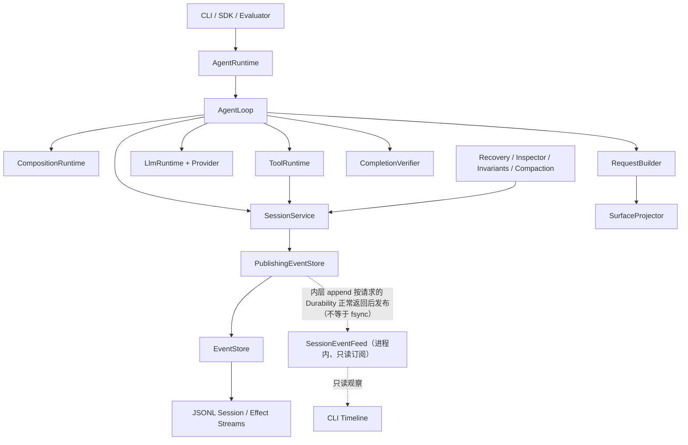
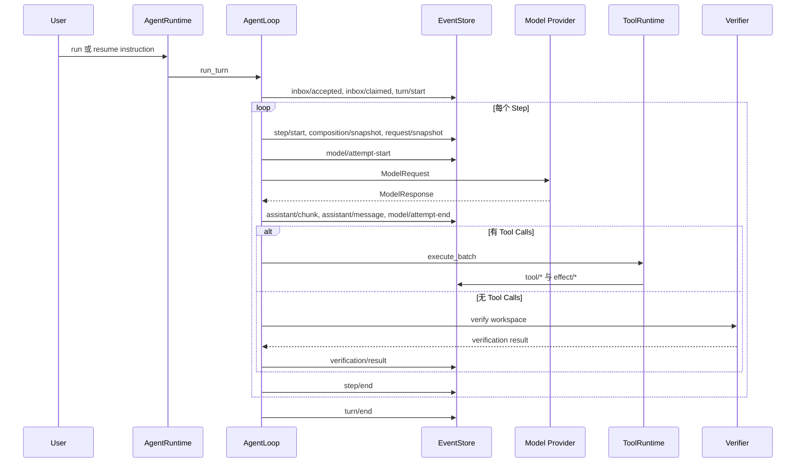
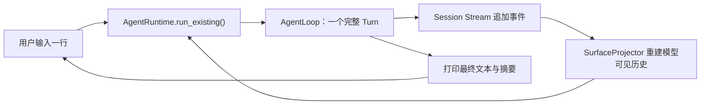
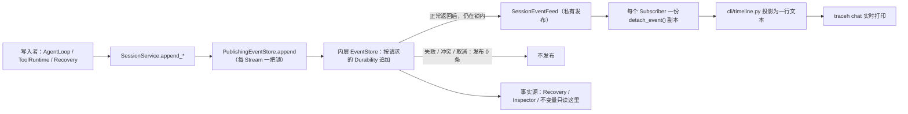
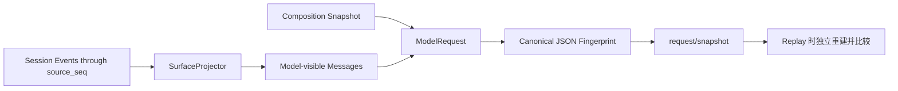
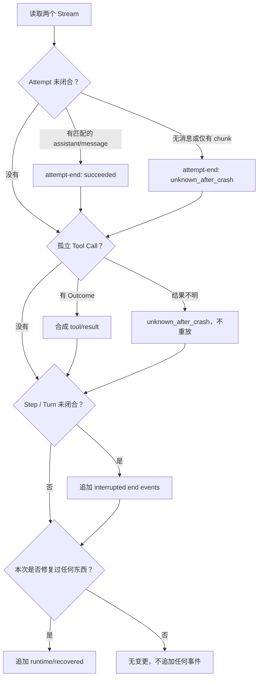
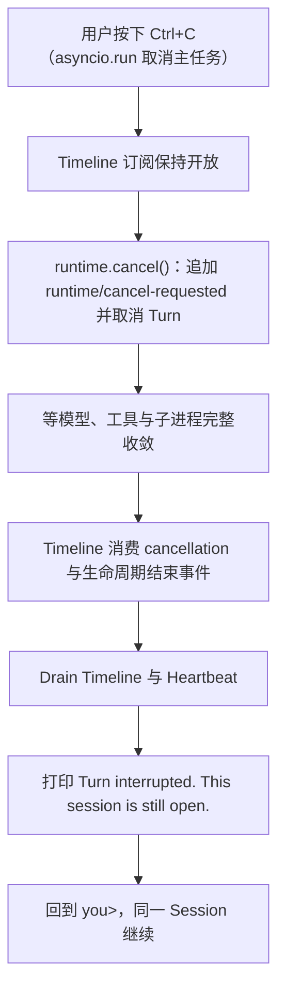
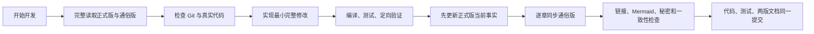

# TraceHarness Py 项目上下文（正式版）

> 本文维护当前仓库的工程事实和全局视野，不是开发日志。
>
> 维护顺序：先核对真实代码和测试，再更新本文，最后同步通俗版 [`project-context-plain-zh.md`](project-context-plain-zh.md)。

## 0. 文档契约

### 0.1 用途

本文供开发者和 Coding Agent 在开始任务前恢复项目全局上下文，回答：

- 当前版本实际实现了什么；
- 稳定架构边界在哪里；
- 运行时事实怎样持久化、重建、验证和恢复；
- 修改某一层可能影响哪些层；
- 当前已知限制和验证基线是什么。

### 0.2 事实优先级

发生冲突时以当前源码、测试和配置为最高事实源；本文其次；通俗版由本文派生。`CHANGELOG.md`、Roadmap、ADR 和历史实施计划各自保留版本历史、未来计划或设计原因，不替代当前状态核查。

### 0.3 更新原则

- 持续改写成最新状态，不在文末堆积流水账。
- 代码行为、目录职责、状态、配置、验证结果或架构流程变化时更新对应章节。
- Mermaid 图表达当前流程；历史案例必须明确标注为案例。
- 不记录真实 `.env`、Key、Token、本机隐私路径或秘密输出。
- 本文与通俗版使用相同的一级编号，便于逐章核对。

## 1. 当前项目状态

| 项目 | 当前事实 |
|---|---|
| 包名 | `traceharness-py` |
| Python 包 | `traceh` |
| 当前版本 | `0.3.0` 维护线，另有 `.env` 支持等 Unreleased 改进 |
| 成熟度 | Educational alpha；可运行、可测试，公共 API 尚未承诺生产稳定性 |
| Python | `>=3.12`；CI 覆盖 Ubuntu 3.12/3.13 与 Windows 3.12 |
| 运行时依赖 | Python 标准库，无第三方运行时依赖 |
| 开发依赖 | pytest、pytest-asyncio、ruff |
| 当前 Agent 模型 | 单进程、单 Session 同时最多一个活跃 Turn |
| 持久化 | 本地 Append-only JSONL Session Stream 与 Effect Stream |
| 模型接入 | 确定性 Scripted Provider；非流式 OpenAI-Compatible `/chat/completions` Provider |
| Coding Tools | `list_files`、`read_file`、`search_text`、`apply_patch`、`shell` |
| 完成判定 | 可选外部 `CompletionVerifier`；默认实现为命令退出码验证 |
| CLI 形态 | `traceh chat` 提供同一 Session 内的连续多轮行式交互，Turn 运行期间实时打印 Step/Tool Timeline 与 Activity Heartbeat（`--no-timeline`、`--heartbeat-seconds` 可调），首次 Ctrl+C 只取消当前 Turn 并保留 Session；其余命令仍是一次执行一个 Turn。不是流式 TUI |
| 事件写入互斥 | JSONL Stream 在 POSIX 与 Windows 上均有操作系统级跨进程文件锁 |
| 当前自动化测试 | 583 项（582 通过，1 项在无法承载 NUL 的路径上跳过），通过后才允许更新本表 |
| 内置 Benchmark | 1 个确定性修复案例 |

当前开发重点是把 v0.3 的可靠性、真实使用体验、可观察性和文档治理做扎实；v0.4+ 插件与多 Agent 仅保留协议边界，不视为已实现能力。

## 2. 系统目标与边界

### 2.1 当前目标

TraceHarness 是可重建、可审计的 Coding Agent Runtime。它把模型决策、工具调用、现实副作用和外部验证拆成明确边界，并把关键事实持久化为事件。

核心不变量：

1. Session Stream 是运行语义的持久化事实源；
2. Effect Stream 是外部副作用事实的独立账本；
3. State、Surface 和 Model Request 均可从持久化事件重建；
4. 一个 Step 使用一份冻结的 Composition；
5. 每个 Tool Call 最终应有配对的 Tool Result；
6. 不确定的写入或进程副作用不能在恢复时盲目重放；
7. 模型声称完成不等于完成，配置 Verifier 时必须有外部证据。

### 2.2 当前不属于系统的能力

- 完整 PluginManager、Entry Point 自动发现和热卸载；
- 活跃的 AgentSupervisor、子 Agent Tool 和 Workflow Engine；
- Git Worktree/Overlay Workspace 分支与合并；
- Docker、远程沙箱或操作系统级安全隔离；
- 分布式 Event Store；
- 完整流式模型输出、重试、Fallback 与限流中间件；
- 类似 Codex/Claude Code 的富交互终端界面：`traceh chat` 已有实时 Tool Timeline 与 Activity Heartbeat（见 13.6、13.7），但仍是行式提示符，没有 token 流式输出、Spinner、颜色、可交互 TUI 和执行前审批。

## 3. 仓库目录与职责

```text
traceharness/
├── AGENTS.md                         跨 Coding Agent 的仓库开发规则
├── CLAUDE.md                         Claude Code 薄入口，导入 AGENTS.md
├── src/traceh/
│   ├── api/                          公共协议、冻结 DTO 和扩展边界
│   ├── concurrency.py                不可取消 Worker 的收敛等待
│   ├── cli/                          命令解析、.env 加载、交互式 chat 循环、Timeline 投影、Activity Heartbeat、Shell 命令渲染和终端编码
│   ├── evaluation/                   确定性 Benchmark Runner
│   ├── inspector/                    Session 文本、Replay 和静态 HTML 检查
│   ├── kernel/                       Scope、Activation、Hook、Lifespan、Owned Tasks
│   ├── llm/                          Provider 协议实现、注册表和调用边界
│   ├── runtime/                      AgentRuntime、AgentLoop、请求、Continuation、Verifier
│   ├── session/                      EventStore、进程内 Event Feed、跨进程文件锁、投影、恢复、压缩和不变量
│   └── tools/                        Tool Registry、Schema、Policy、Middleware、子进程收敛与内置工具
├── tests/                            单元、契约、恢复、取消、跨进程、端到端和 Benchmark 测试
├── examples/                         无 Key 的确定性 Demo 夹具
├── benchmarks/                       独立复制 Workspace 的评估案例
├── docs/
│   ├── note/                         当前项目正式版与通俗版上下文
│   ├── adr/                          已接受设计决定及原因
│   └── *.md                          专题设计、协议、恢复、测试和演进说明
├── .github/workflows/ci.yml          Ubuntu 3.12/3.13 与 Windows 3.12 编译、测试和 doctor
├── pyproject.toml                    包元数据、依赖、pytest 与 ruff 配置
├── README.md                         安装和使用入口
├── ROADMAP.md                        未来版本计划，不代表当前已实现
├── VALIDATION.md                     v0.3 发布时点验证快照
└── CHANGELOG.md                      已发布与 Unreleased 变化
```

`docs/TraceHarness Py：面向插件化与多 Agent 演进的 Python Harness 实施计划.md` 是长篇实施计划；它不是当前代码事实源。

## 4. 运行时装配与依赖方向

默认装配入口是 [`build_default_runtime()`](../../src/traceh/runtime/agent_runtime.py)。它创建或接受以下替换点：

- `EventStore`；
- `LlmProvider`；
- `PromptAssembler`；
- `Tool`、`ToolPolicy`、`ToolMiddleware`；
- `CompletionVerifier`；
- `ContinuationRuntime`。



依赖规则：

- `AgentLoop` 只编排生命周期，不导入具体工具、JSONL 文件或厂商 HTTP 逻辑；也**不导入 CLI、Console、颜色或 Timeline 文案**：Timeline 是订阅 Feed 的界面层投影，主循环不知道它存在；
- `AgentRuntime` 是对外门面和默认依赖装配点；
- Provider 与 Tool 通过公共协议进入 Runtime；
- Projector 和 Inspector 只消费事件，不反向修改历史事实；
- 未来多 Agent 控制面应构建在单 Agent Runtime 之上，而不是塞入 `AgentLoop`。

## 5. Session / Turn / Step 生命周期

### 5.1 概念

| 概念 | 当前语义 |
|---|---|
| Session | 与一个已解析 Workspace 绑定的长期事件历史，可包含多个 Turn |
| Inbox Message | 一次用户输入；先 accepted，再 claimed 到一个 Turn |
| Turn | 一次用户唤醒后的完整工作轮次 |
| Step | 一次冻结 Composition、构建请求、调用模型、可选执行工具的决策周期 |
| Model Attempt | 一次 Provider 调用；为未来重试/Fallback 保留独立边界 |
| Tool Invocation | 模型响应中的一个工具请求及其准入、Effect 和 Result |

### 5.2 正常执行



### 5.3 并发与取消

- `AgentRuntime` 用内存锁和 `_active` 表保证同一 Session 同时只有一个活跃 Turn；这是单进程保证。事件写入层（6.5）已有跨进程锁，但“同一 Session 只跑一个 Turn”仍未跨进程强制：两个进程同时 run 同一 Session 时，事件文件不会损坏，结果是事件交错或 `SessionService.append_event()` 抛出 `ConcurrencyConflict`，而不是被 Runtime 提前拒绝。
- `cancel()` 先追加 `runtime/cancel-requested`，再取消 Task。`JsonlEventStore` 的取消语义见 6.6：被取消的 Store 操作不会留下仍在后台写入的线程。
- `AgentLoop` 在取消/异常时追加 Attempt、Step、Turn 的终止或错误事件；ToolRuntime 尽量补齐未完成调用的 Tool Result。
- `dispose()` 取消并等待当前 Runtime 持有的活跃 Turn；Shell Tool 在取消时先 terminate，超时后 kill 并等待进程退出。

### 5.4 一个 Session 中的多个 Turn

`run`/`resume` 各产生一个 Turn；`traceh chat`（见 13.4）在同一 Session 中按用户输入连续产生多个 Turn。无论谁驱动，Turn 的语义完全一致：每个 Turn 都通过 `AgentRuntime.run_existing()` 进入 `AgentLoop`，历史来自事件日志投影，调用方不持有第二份对话状态。



## 6. 事件模型与持久化

### 6.1 Event Envelope

事件由 [`PendingEvent` 与 `EventEnvelope`](../../src/traceh/api/events.py) 表示。落盘后包含 Stream ID、单调 `seq`、Event ID、类型、时间、数据以及可选 correlation、causation、actor、composition revision 等元数据。

`EventEnvelope` 的不可变性有明确边界，不能被描述成“事件是递归不可变对象”：

- `@dataclass(frozen=True, slots=True)` **只**禁止重新赋值顶层字段，例如 `event.data = {...}` 会抛 `FrozenInstanceError`；
- `data` 仍然是普通的 `JsonValue` 图：其中的嵌套 `dict`、`list` 都是标准可变容器，`event.data["nested"]["value"] = ...`、`event.data["items"].append(...)` 在语言层面完全合法；
- 当前**不**引入 `FrozenDict`/`FrozenList` 或新的公共 JSON 类型系统。

因此“事件历史不会被改写”是一条**所有权契约**，而不是语言保证。这条契约由**具体边界**承担，不是自动生效的：

- Store 边界是 `EventStore.append()` 与 `read()`，它们返回的 Envelope 归调用方所有；
- Envelope 只是普通对象，框架**不会**自动隔离两个消费者：同一个 `EventEnvelope` 被交给两个消费者时，它们共享同一份可变 payload；
- 因此任何把一个事件分发给多个接收方的组件，都必须为每个接收方单独 detach。本版本确实存在这种扇出：`SessionEventFeed`（6.7）为**每个** Subscriber 单独 detach 一份。

[`detach_event()`](../../src/traceh/api/events.py) 是可复用的边界 helper：它基于既有的 `to_json_value()` 重建整个 JSON 图，按值携带其余全部元数据（`event_id`、`stream_id`、`seq`、`type`、`schema_version`、`occurred_at`、`causation_id`、`correlation_id`、`actor_id`、`composition_revision`），不经过 JSON 文本编码，因此 Envelope 上的 `UUID` 与 `datetime` 不会退化成字符串。模块内部的 `_detach_json_data()` 只是实现细节，不作为公共 API，也不从包级 `__init__` 导出。

复用 `to_json_value()` 而不是引入通用深复制，意味着“事件 payload 里允许放什么”和“它会被规范化成什么”只有一处定义。必须准确描述这条规则的范围，它**比 `JsonValue` 更宽**：

| payload 中的值 | `to_json_value()` 的处理 |
|---|---|
| JSON 原生 scalar（`None`、`bool`、`int`、`float`、`str`） | 原样透传，不做包装 |
| `Path`、`UUID` | 转成字符串 |
| `datetime` | 转成 ISO 字符串 |
| `Enum` | 递归转换其 `value` |
| dataclass | 转成 dict 后递归转换 |
| 任意 `Mapping` | 转成新的 `dict`，键转 `str` |
| 除 `str`、`bytes`、`bytearray` 之外的 `Sequence`（例如 `tuple`） | 转成新的 `list` |
| `set`、`bytes`、`bytearray`、任意普通对象 | 抛 `TypeError` |

也就是说，`Path` 与 `tuple` 并不是 `JsonValue`，但它们**被规范化而不是被拒绝**（`tuple` 变 `list`，`Path` 变字符串）；只有真正不受支持的值才抛 `TypeError`。不要把这条写成“超出 `JsonValue` 的值一律抛 `TypeError`”。

`to_dict()` 与 `from_dict()` 同样脱离：`to_dict()` 返回的 `data` 是调用方自己的图，修改它不会改写原 `EventEnvelope`；`from_dict()` 也不与传入 `raw` 的嵌套容器共享引用（旧实现只做顶层浅重建）。`from_dict()` 继续要求 `event.data` 是 JSON 对象，非对象直接报 `event.data must be an object`，不会用 `str()` 之类手段悄悄修正类型。

### 6.2 两类 Stream

| Stream | ID 形式 | 用途 |
|---|---|---|
| Session Stream | `session:<session_id>` | 生命周期、消息、模型、工具结果、验证和恢复事实 |
| Effect Stream | `effects:<session_id>` | 现实副作用的 Intent、Dispatch、Outcome 与 Reconciliation |

两个 Stream 通过 `session_id`、`tool_call_id`、`effect_id`、correlation/causation 等字段关联，但各自有独立序号。

### 6.3 当前事件类型

| 类别 | 事件 |
|---|---|
| Session/Inbox | `session/created`、`inbox/accepted`、`inbox/claimed` |
| Turn/Step | `turn/start`、`turn/end`、`step/start`、`step/end` |
| 消息与请求 | `user/message`、`composition/snapshot`、`request/snapshot` |
| 模型 | `model/attempt-start`、`assistant/chunk`、`assistant/message`、`model/attempt-end` |
| 工具 | `tool/call`、`tool/admitted`、`tool/result` |
| 验证 | `verification/result` |
| Runtime | `runtime/cancel-requested`、`runtime/error`、`runtime/recovered` |
| Surface | `surface/replace` |
| Effect | `effect/intent`、`effect/dispatched`、`effect/outcome`、`effect/reconciled` |

### 6.4 EventStore 保证

`EventStore` 协议提供 append、read、head、list_streams。追加要求调用方传入 `expected_seq`；不匹配时抛出 `ConcurrencyConflict`。

#### Event 所有权契约

这条契约写在 [`EventStore` Protocol](../../src/traceh/session/event_store.py) 及其 `append()`/`read()` 的 docstring 上，而不是只写在某个具体实现里：Store 是可替换后端，替换后端不能改变调用方能对事件做什么。任何实现都必须满足以下可观察语义，`InMemoryEventStore` 与 `JsonlEventStore` 对调用方完全一致：

| 调用方持有的对象 | 修改它之后 |
|---|---|
| 原始 `PendingEvent.data` | Store 历史不变（`materialize()` 已在构造事件时脱离输入） |
| `append()` 返回的 Event | Store 历史不变 |
| `read()` 返回的 Event | Store 历史不变，下一次 `read()` 仍是原始事实 |
| 两次 `read()` 各自的结果 | 彼此独立，互不可见 |
| `to_dict()` 返回的字典 | 原 `EventEnvelope` 不变 |
| 传给 `from_dict()` 的原始字典 | 构造出的 `EventEnvelope` 不变 |

隔离覆盖顶层 `data`、嵌套 `dict`、嵌套 `list` 以及 `list` 内的 `dict`；多个 `PendingEvent` 即使复用同一个嵌套输入对象，落库后的事件之间也不共享可变容器。契约保护的是 **Store 历史不被反向污染**，并不声称调用方拿到的副本本身不可变：调用方完全可以修改自己那份副本，只是改不动账本。

两种实现达到同一契约的方式不同，这是设计差异而不是实现不一致：

- `JsonlEventStore` **不需要 Store 专属的 `detach_event()` 调用**，因为历史在文件里，读写两个方向都已经经过共享的 `EventEnvelope` 序列化边界，本轮无功能性改动。但不能因此写成“完全没有额外复制”：这个共享边界本身仍会重建 payload——`read()` 先 `json.loads()`，再由 `from_dict()` 规范化成全新的图；`append()` 则由 `to_dict()` 在序列化前重建 payload。复制是**通过序列化边界达成**的，不是被省掉了；
- `InMemoryEventStore` 必须显式脱离——它保存自己返回的对象，所以 `append()` 与 `read()` 都通过 `detach_event()` 交出副本，绝不把 `_streams` 中的对象暴露给调用方。

`head()` 不做任何复制，仍只返回序号。复制只发生在 Event API 边界（`materialize`、`to_dict`、`from_dict`、`detach_event`），单次复制的规模是**一个事件的 payload**；但一次 `read()` 返回多个事件时，总成本与它解析并返回的事件 payload 总量相关，不能说“一次 read 的成本只是一个 payload”。`JsonlEventStore.read()` 的 `from_seq` 是**过滤而不是定位**：先解析整条 Stream 再筛选，因此总成本对应整条 Stream——这是 JSONL 既有的全量扫描边界（见 16 节），不是脱离副本引入的新问题，本轮只如实记录，不做性能优化。

刻意不引入缓存：缓存意味着把同一份副本发给多个调用方，会重新制造共享引用。

默认 `JsonlEventStore`：

- 一个事件一行 JSON，文件名由 Stream ID URL 编码；
- 每个 Stream 有进程内 `asyncio.Lock`，作为同一事件循环内的快速路径；
- 每个 Stream 有 `.lock` 文件上的操作系统级排他锁，跨进程有效（见 6.5）；
- 写入可选 `SYNC` 或 `BATCHED` Durability；SYNC flush 后执行 `fsync`；
- `head()` 从文件尾读取最后完整行，成本与末行大小相关，不扫描完整文件；
- 尾部半行可自动截断到最后完整事件；
- 中间坏行、Stream ID 不符或序号不连续会报 `CorruptEventStream`。

### 6.5 跨进程 Stream 锁

[`session/file_lock.py`](../../src/traceh/session/file_lock.py) 提供 `exclusive_file_lock()` 上下文管理器，只使用标准库：

| 平台 | 原语 | 语义 |
|---|---|---|
| POSIX | `fcntl.flock(fd, LOCK_EX)` | 无 timeout 且无取消令牌时在内核阻塞；否则用 `LOCK_NB` 轮询 |
| Windows | `msvcrt.locking(fd, LK_NBLCK, 1)` | 锁定 `.lock` 文件偏移 0 起的 1 字节区间，轮询重试 |

关键语义：

- 锁定前显式 `lseek` 到偏移 0，因为 `msvcrt.locking` 从当前文件指针开始锁定；
- 允许锁定文件尾之后的区间，因此空 `.lock` 文件（每个 Stream 首次创建时的状态）也能锁定，不需要预写字节；
- 轮询从 1ms 退避到 25ms 上限；`JsonlEventStore(lock_timeout=...)` 为 `None` 时无限等待，为数值时超时抛 `FileLockTimeout`；
- 只有真正表示“区间被占用”的错误码（POSIX `EWOULDBLOCK`/`EACCES`，Windows `EACCES`/`EDEADLOCK`）才重试，其他 `OSError` 直接上抛；
- 正常、异常、`ConcurrencyConflict` 和取消路径都在 `finally` 中解锁并关闭描述符；解锁失败被吞掉，因为关闭描述符本身就会释放锁，不能掩盖临界区的原始异常；
- 进程崩溃或被杀死时，操作系统关闭描述符即释放锁，`.lock` 文件残留不会造成永久死锁。

`append()`、`read()`、`head()` 的完整临界区（读取 Stream Head、尾部半行检查与截断、`expected_seq` 校验、写入与 flush/fsync）都在同一把锁内完成，因此两个独立 Python 进程操作同一 Stream 时会排队，而不是同时读到相同 Head 后各写一条相同序号的事件。

`expected_seq` 仍然是必需的：锁只保证临界区互斥，调用方通常先 `head()` 再 `append()`，两次调用之间的 Head 可能已被另一个进程推进，此时第二个写入者会得到明确的 `ConcurrencyConflict`，而不是静默覆盖。

该锁是本机文件锁：跨网络文件系统（NFS、SMB）的行为取决于具体实现，不在当前保证范围内。

### 6.6 EventStore 的取消语义

阻塞的锁等待和文件 I/O 在 Worker 线程上执行，而线程无法被杀死。因此 `_run_locked()` 把取消实现为两段式协作，绝不允许出现“调用方已经收到 `CancelledError`，后台线程稍后拿到锁又继续写 Stream”的脱缰操作：

| 取消发生的时刻 | 行为 | 调用方看到 |
|---|---|---|
| 仍在等待 OS 锁 | 置位取消令牌，等待被 `Event.wait()` 立即唤醒，抛 `FileLockCancelled`，Stream 未被触碰 | `CancelledError`，无任何写入 |
| 已拿到锁但临界区尚未开始 | 进入临界区前重新检查取消令牌，直接放弃 | `CancelledError`，无任何写入 |
| 临界区已在执行 | 该段不可中断，按原子完成语义跑完并 flush/fsync | `CancelledError`，但事件已完整落盘 |

实现要点：

- Worker 通过 `asyncio.shield()` 提交，取消协程不会把它变成脱缰线程；
- 协程捕获 `CancelledError` 后先置位 `cancel`，再显式等待 Worker 收敛，然后才向调用方重新抛出；因此 `append()`/`read()`/`head()` 返回时文件已经不再变化；
- 收敛由共享的 [`await_worker_convergence()`](../../src/traceh/concurrency.py) 承担，它循环 `await asyncio.shield(future)` 直到 `future.done()`：**重复取消（第二次、第三次乃至更多次 `CancelledError`）被吸收后继续等待同一个 Worker**，不能被当作提前退出的出口；这里不使用 `suppress(BaseException)`。同一个函数也被 OpenAI-Compatible Provider 复用（见 8.3）；
- Worker 自身的返回值、`FileLockCancelled`、`ConcurrencyConflict` 或其他异常在收敛结束时被显式取回，不会遗留"future exception was never retrieved"告警；
- `signals.finished` 在锁释放之后置位，且必定早于 Future 完成，因此“调用方拿到 `CancelledError`”蕴含“锁已释放且 Worker 已收敛”；
- `_StreamLockSignals` 的 `waiting`/`cancel`/`finished` 三个 `threading.Event` 让“线程确实开始等锁”和“线程确实已收敛”可被观测，而不是靠时序猜测；
- 由于取消令牌的存在，POSIX 的无限等待从内核阻塞改为可中断轮询：等待仍然无限，但可被 asyncio 取消。

第三行是**提交点边界（may-have-committed）**：取消恰好落在写入过程中时，调用方收到 `CancelledError`，事件却已经提交。这里没有任何自动重试机制，因此不应称为 at-least-once。调用方不能假设“收到取消 = 没有写入”；正确做法是重新读取 Stream，并按 `event_id`、correlation 或业务身份判断该操作是否已经落盘，而不是只看 Head 数值——Head 也可能是别的写入者推进的。

### 6.7 进程内 Event Feed

[`session/event_feed.py`](../../src/traceh/session/event_feed.py) 提供**观察通道**，让界面在 Turn 运行期间就能看到事件，而不必等 Turn 结束再读文件。它比事件日志弱得多，这些边界必须写清楚：

| 维度 | Feed 的事实 |
|---|---|
| 新增持久化事实 | 否。不落盘、不参与恢复、不产生任何新事件类型 |
| 额外的崩溃持久性 | 否。事件在内层 `append()` **按调用方请求的 `Durability` 正常返回之后**才发布。Feed 不把 `BATCHED` 升级成 `SYNC`，也不增加任何自己的保证：一条已发布事件能否在操作系统崩溃后存活，完全由 EventStore 原契约决定 |
| 事实源 | 否。Runtime、`RecoveryService`、Inspector、不变量检查仍只读 `EventStore` |
| 历史 | 否。订阅**不重放**历史；需要历史仍走 `EventStore.read()` |
| 状态 | 否。Feed 不保存投影或缓存，不是第二份 State |
| 跨进程 | 否。另一个进程直接写同一份 JSONL 时，本 Feed 收不到 |
| 可丢失 | 是。append 返回之后、发布之前进程崩溃时，实时观察会漏；该事件的持久性仍然只由它请求的 `Durability` 决定，不会因此变差 |

#### 为什么边界选在 EventStore Decorator

`PublishingEventStore` 是包装任意 `EventStore` 的装饰器，而不是 `SessionService` 里的钩子。理由有两条，都可核查：

1. **后端无关**：包装 `InMemoryEventStore` 与 `JsonlEventStore` 的可观察语义完全相同，换 Store 不改变 Feed 语义；
2. **“Store 已接受”正好在这里成立**：`src/traceh/session/service.py` 中的 `store.append()` 是整个 `src` 树里唯一的 append 调用点，所有写入者（`AgentLoop`、`ToolRuntime`、`RecoveryService`、`CompactionService`、`AgentRuntime.cancel()`）都经过它。因此“发布 Store 从未接受的事件”在这个边界上无法表达，也不需要每个写入者自己记得通知。

`build_default_runtime()` 无条件包装 Store，并把 `SessionEventFeed` 暴露为 `AgentRuntime.events`。无订阅者时代价是每次 append 一把无竞争的锁。

#### 顺序与可见性契约



契约要点：

- **先被 Store 接受，后发布**：`_publish()` 只在内层 `append()` 正常返回后调用，因此 `ConcurrencyConflict`、序列化失败或任何 append 异常都发布 0 条；取消同样发布 0 条，**包括** may-have-committed 那条路径——Feed 允许漏，日志不允许丢；
- **是“接受”，不是额外持久性**：`durability` 原样透传，因此一次 `Durability.BATCHED` 追加会在 Store 从「已 flush 未 fsync」的写入返回时就被发布，这正是调用方所要求的。发布只表示“Store 已接受”，绝不表示“已 fsync”；`BATCHED` 通知是合法的，对应事件在操作系统崩溃时仍受 `BATCHED` 边界约束；
- **按 seq 顺序发布**：每个 Stream 一把 `asyncio.Lock`，同时覆盖“append + publish”。若只在 append 之后发布，两个并发写入者会自由竞争：Store 已序列化写入，但调用方各自恢复执行，seq 10 的写入者可能被调度器挂起、在 seq 11 之后才发布。把锁跨到发布之上，使“按 seq 顺序”成为结构性质，而不是依赖当前调度巧合。不同 Stream 用不同锁，互不阻塞；
- **一批多条**按 seq 顺序发布；
- **Stream 严格隔离**：Session Stream 的订阅者收不到别的 Session，也收不到 Effect Stream；
- **每 Subscriber 一份**：见下节；
- **发布不 await**：`publish()` 只往无界队列里 `put_nowait`，因此锁很快释放，任何订阅者都无法延长它。

#### 消费者只拿到只读接口

观察者拿到的是 `EventFeed` Protocol，只暴露 `subscribe()` 与 `subscriber_count()`。发布位于 `SessionEventFeed` 的私有 `_publish()`，唯一调用者是同模块的 `PublishingEventStore`。

这条区分是承重的：如果消费者接口上有公共 `publish`，任何拿到 Feed 的代码都能注入一条 Store 从未接受的 Envelope，而 Subscriber 无法把它与真事件区分开——Timeline 会忠实地显示一个从未发生的 Step。把发布移出消费者接口，使“只有 Store 接受的事件才会被发布”成为 **API 形状的性质**，而不是依赖观察者自觉遵守的约定。下划线不是安全沙箱，但它明确了权限边界。

同理，`AgentRuntime.events` 是**必填**构造参数，而且必须是该 Runtime 的 `PublishingEventStore` 实际发布的那一个 Feed 对象。给它一个默认值会交给调用方一个「可以订阅但永远沉默」的对象——接口存在而能力不存在。自定义装配必须显式把两者配对，正如 `build_default_runtime()` 所做的。

#### Event 所有权从 Store 边界扩展到每个 Subscriber

6.4 的所有权契约只覆盖 `append()`/`read()` 交回调用方的对象。Feed 引入了**扇出**，这正是 6.1 预留的那个缺口：把同一个 `EventEnvelope` 交给两个消费者，它们会共享同一份可变 payload。因此 `publish()` 为**每个** Subscriber 单独调用一次 `detach_event()`，而不是每次发布只复制一次。可观察结果：Subscriber A 修改嵌套 payload，不影响 Store 历史、不影响 Subscriber B 已收到的事件、也不影响此后任何 Subscriber 收到的事件。

#### 无界队列的明确取舍

每个 `EventSubscription` 有一个无界 `asyncio.Queue`：

- **不对 Runtime 施加背压**：慢订阅者永远不能拖慢或弄失败一次 Store append；
- **被遗弃或长期不消费的订阅者会占内存**，上限只有该 Session 产生的事件量；
- **Chat 生命周期在每条退出路径上都关闭订阅**（正常、异常、取消、EOF、`/exit`），因此随包发布的消费者不泄漏；
- **未来若改为有界队列，必须定义明确的 overflow 语义**：静默丢事件会让 Timeline 对已经发生的事情说谎。

`EventSubscription.close()` 幂等：它把结束标记排在已发布事件之后，因此“先 close 再 drain”会打完所有已排队事件再结束——这正是 Chat 能承诺“Timeline 出现在最终回答之前”的原因，不依赖轮询或 sleep。对已耗尽的订阅再迭代返回空，不会死等一个已被消费掉的结束标记。

## 7. Composition、Surface 与可重建请求

### 7.1 Composition

每个 Step 通过 `CompositionRuntime.lease()` 获取 `ActiveComposition`。快照包含：

- provider、model；
- 完整 system prompt；
- tool schemas；
- plugin identities；
- policy 和 middleware 名称；
- temperature、max output tokens；
- 基于内容生成的 revision。

当前实现是 `StaticCompositionRuntime`：每个 Step 都生成一致来源的快照，但 Lease 协议已经把对象生命周期与主循环分开。完整 generation、drain 和热更新尚未实现。

### 7.2 Surface

`SurfaceProjector` 只把以下事件投影为模型消息：

- `user/message` → user；
- `assistant/message` → assistant，保留 tool calls；
- `tool/result` → tool；
- `surface/replace` → 替换指定旧 Surface 事件的摘要消息。

原始事件仍保留。多次 Replacement 通过 source seq 遮蔽旧视图，而不是删除历史。

### 7.3 Request Snapshot 与 Fingerprint

`RequestBuilder` 使用“截至 Composition Event 的 Surface + 当前 Composition”生成 `ModelRequest`，持久化完整 Request、`source_seq`、composition revision 和稳定 fingerprint。



`verify_request_snapshots()` 能重新定位对应 Composition、重建当时的 Turn/Step metadata 和 Request，并报告 fingerprint 不一致。

## 8. 模型层

### 8.1 公共边界

`LlmProvider.complete(ModelRequest) -> ModelResponse` 是 Provider 协议；`LlmRegistry` 按名称注册；`LlmRuntime.invoke()` 是主循环与 Provider 之间的调用边界。

当前 `LlmRuntime` 等 Provider 完成后，只把完整文本作为一个 delta 交给 `assistant/chunk` 回调。协议上有 Chunk 事件，但当前网络适配并非真正 token streaming。

### 8.2 Scripted Provider

- 从内存响应序列或 JSON 文件读取确定性响应；
- 保存收到的 Request，便于测试；
- 默认脚本用完后抛 `ScriptExhaustedError`；
- 用于 Demo、单元测试、端到端测试和 Benchmark，不需要 API Key。

### 8.3 OpenAI-Compatible Provider

- 使用标准库 `urllib.request`；
- 发送 `POST <base_url>/chat/completions`；
- 请求为 `stream: false`，支持 messages、function tools、temperature、max tokens；
- API Key 来自显式参数或命名环境变量，以 Bearer Header 发送；
- 解析第一个 choice、文本、tool calls、finish reason 和 token usage；
- HTTP/URL/响应结构错误转换为 `ProviderHttpError`。

当前没有流式读取、自动重试、Fallback、并发限流或厂商专属协议适配。
取消语义：`urllib` 请求一旦发出就无法中止，因此 `complete()` 用 `asyncio.shield` 保护 Worker，取消时先用共享的 `await_worker_convergence()` 等它收敛再重新抛出原 `CancelledError`，重复取消不会提前返回。这样不会出现"Chat 已经宣布 interrupted、后台 HTTP Worker 仍在运行"的情况。代价必须说清楚：这是收敛而不是立即中止网络请求，最坏情况下要等到 `timeout_seconds`（默认 120 秒）到期。

## 9. Tool Runtime 与内置工具

### 9.1 执行管线

```mermaid
flowchart LR
    CALL["Tool Call"] --> LOOKUP["Registry Lookup"]
    LOOKUP --> SCHEMA["Schema Validation"]
    SCHEMA --> POLICY["Monotonic Policies"]
    POLICY --> ADMIT["tool/admitted"]
    ADMIT --> INTENT["effect/intent"]
    INTENT --> DISPATCH["effect/dispatched"]
    DISPATCH --> SCHEDULE["Read Parallelism / Write Barrier"]
    SCHEDULE --> MW["Middleware Chain"]
    MW --> EXEC["Tool.execute"]
    EXEC --> OUTCOME["effect/outcome"]
    OUTCOME --> RESULT["tool/result"]
```



执行事实：

- 同一模型响应中的 Tool Call ID 必须非空且唯一；
- 所有 `tool/call` 先写入 Session Stream；
- 未知工具或参数错误直接产生结构化失败 Result，不会产生 Effect；
- Policy 中任何 DENY 都不可被后续 ALLOW 覆盖；至少一个 Policy ALLOW 才准入；
- 连续的 PURE_READ/WORKSPACE_READ 调用使用 `asyncio.gather`；写入、进程和其他副作用形成顺序 Barrier；
- Middleware 的 `call_next()` 每层最多调用一次；
- Tool Runtime 有整体超时和最大输出字符限制；
- Outcome 记录证据、结构化数据、截断状态或错误；
- 取消时尽量依据已有 Outcome 补齐 Result，否则记录 `aborted_before_dispatch`。

### 9.2 Effect Kind

`PURE_READ`、`WORKSPACE_READ` 被认为并发安全且可安全重试；`WORKSPACE_WRITE`、`PROCESS`、`NETWORK_WRITE`、`EXTERNAL_TRANSACTION` 默认不并发且不可盲目重试。

### 9.3 内置工具

| 工具 | Effect Kind | 输入与行为 | 关键限制 |
|---|---|---|---|
| `list_files` | WORKSPACE_READ | 列出相对文件；可设 `max_files` | 跳过常见缓存、Git、虚拟环境和依赖目录 |
| `read_file` | WORKSPACE_READ | 读取 UTF-8 文件 | 真实路径必须位于 Workspace 内 |
| `search_text` | WORKSPACE_READ | 子串或正则搜索，可限路径和结果数 | 跳过二进制/非 UTF-8 及常见忽略目录 |
| `apply_patch` | WORKSPACE_WRITE | 精确旧文本替换或显式创建新文件 | 校验替换次数；临时文件 + fsync + 原子 replace；不是 unified diff parser |
| `shell` | PROCESS | `shlex.split` 后用 `create_subprocess_exec` 执行 | 不使用 `shell=True`；清洗秘密环境变量；超时/取消收敛子进程 |

所有路径读写通过 `resolve_workspace_path()` 解析后检查 Workspace 边界。默认 `DangerousShellPolicy` 屏蔽一组明显危险的可执行文件名，但它只是 Guardrail，不是安全沙箱。

## 10. Continuation 与证据驱动完成

`DefaultContinuationRuntime` 按以下顺序决定继续或结束：

1. 达到 `max_steps` → `max_steps_exceeded`；
2. 模型响应包含 Tool Calls → 下一 Step；
3. 已运行 Verifier 且失败，失败次数仍在重试预算内 → 把结构化验证摘要作为新 user message 注入下一 Step；
4. Verifier 持续失败超预算 → `verification_failed`；
5. 无 Tool Calls 且无失败证据 → `completed`。

`CommandVerifier` 使用参数拆分和 `create_subprocess_exec` 在 Workspace 中运行独立命令，使用清洗后的环境，收集退出码、stdout、stderr；退出码 0 为通过。AgentLoop 把结果写为 `verification/result`。

Verifier 是可选的：未配置时，无 Tool Call 的最终模型响应可以结束 Turn，此时 `verification_passed` 为 `None`，不能把它解释成“外部验证已通过”。

### 10.1 Verifier 的子进程与输出所有权

`CommandVerifier` 在 Workspace 中运行真实命令。取消或超时时必须把这个子进程带走，否则它会在调用方已经认为该 Turn 结束之后继续改动 Workspace；同时，在**会返回结果的路径**上，它已经产生的输出是证据，不能在收尾过程中丢掉。这两件事由同一个所有权模型解决。

**输出只有一个归属**：子进程的 stdout/stderr 不接管道，而是直接写进本进程持有的临时文件（[`capture_output()`](../../src/traceh/tools/process_control.py)）。因此：

- 三条路径共用**同一套捕获机制**，因此不存在“哪条路径拿到的是另一份输出”的问题；子进程 flush 过的内容在超时被察觉之前就已经被捕获、对本进程可见；
- 读取是普通文件读，不会阻塞在孙进程仍持有的管道上，也可以重复读而不丢字节；
- 不存在"取消第一次 `communicate()` 再调第二次"的动作，也就不存在第一次已读入缓冲区的输出被丢弃的问题。

**子进程收敛**：超时或取消时先调用 `converge_process()` —— terminate → 有界等待（默认 2 秒）→ kill → 等待退出，返回前直接子进程必定已退出。等待吸收取消并记录“曾经被取消过”，因此收尾过程中到达的取消不会提前放行，而是压到收敛之后再重新抛出 `CancelledError`。

**三条路径各自做什么**（这一点必须精确，不能笼统地说“输出总会被保留”）：

| 路径 | 直接子进程 | 输出 |
|---|---|---|
| 正常完成 | `await process.wait()` 自然返回 | 读取捕获文件，装入 `VerificationResult`；AgentLoop 据此追加 `verification/result` |
| 超时 | 先 `converge_process()` 收敛，再读 | 读取捕获文件；完整文本进入 `VerificationResult.stdout`/`stderr`，尾部进入 summary，并经 `DefaultContinuationRuntime` 注入下一 Step |
| 取消 | 只做 `converge_process()` 收敛，保证子进程不逃逸 | **不读取、不返回 `VerificationResult`、不追加 `verification/result`**；随后临时文件关闭，捕获内容随之丢弃 |

换句话说：取消路径的承诺只有“子进程一定不会逃逸”，没有任何输出证据的承诺。只有调用方追加到 Session/Effect Event Log 的事件才是持久化事实（Verifier 路径是 `verification/result`，Tool 路径是 `effect/outcome` 与 `tool/result`，按路径适用）；临时文件里的字节只是本次调用期间的捕获。

**ShellTool 与两类超时的边界**：`ShellTool` 使用同一套捕获与收敛机制，但它归 `ToolRuntime` 调度，因此存在两个不同的超时：

| 超时来源 | 触发方式 | 上报内容 |
|---|---|---|
| Tool 自身（`shell` 的 `timeout` 参数） | `ShellTool` 收敛子进程后主动 `raise TimeoutError(content)`，content 含实际命令、`exit_code`、`timed_out=true` 与已捕获的 stdout/stderr | `ToolRuntime` 在嵌套边界上把它重贴为 `ToolReportedTimeout`，据此写 `effect/outcome`（`reported_by=tool`）与 `tool/result`，**保留工具自己的文本与时长**，并按 `max_output_chars` 截断 |
| Runtime 预算（`ToolRuntime.timeout_seconds`） | `asyncio.timeout()` 到期 | 保持通用语义：`Tool timed out after <预算>s`，`effect/outcome` 标 `reported_by=runtime`；子进程仍由 `ShellTool` 的取消路径收敛 |

两者靠**嵌套异常边界**区分，不靠错误文本匹配：工具自己抛出的 `TimeoutError` 在内层被立即重贴为领域异常 `ToolReportedTimeout`，因此外层负责 Runtime 预算的 `except TimeoutError` 不可能再吞掉它。修复前两者共用一个 `except TimeoutError`，结果是 Shell 的 stdout/stderr 从 `effect/outcome` 与 `tool/result` 中消失，且内部超时被误报成 Runtime 预算时长。

**本地资源不需要私有 API 收尾**：改用临时文件后不存在 stdout/stderr 管道子传输，`await process.wait()` 返回时 subprocess transport 已自行关闭。因此不访问 `process._transport`，也不需要任何手动关闭步骤。实测（Windows，孙进程仍持有继承句柄）：返回时 `transport_closed=True`、`open_pipe_transports=0`，独立解释器跑完后事件循环关闭时 stderr 没有 `unclosed transport` 或 `Event loop is closed`。

**明确不管理孙进程**：子进程派生的孙进程会继承捕获文件句柄，可能在直接子进程退出后继续运行、继续往文件里写。本模块保证的是**直接子进程**已退出。至于输出会不会被保留，取决于调用方走的是哪条路径，只有这两条会读取捕获：**Verifier 正常完成**、以及**组件自己拥有的超时**（`CommandVerifier` 自身超时、`ShellTool` 自身超时）。**直接取消**与 **`ToolRuntime` 预算先到期**都不读取捕获——后者会取消工具，工具走取消路径，最终只产生 Runtime 通用超时结果。对孙进程不作任何承诺；由于输出走文件而不是管道，孙进程的存在不会拖住收尾。


`sanitized_environment()` 的两项平台修正：

- 保留 `SYSTEMROOT`、`WINDIR`、`COMSPEC`、`PATHEXT` 等 Windows 必需变量。缺少它们时子进程在 `import asyncio` 阶段就以 WinError 10106 失败，`python -m pytest` 这类最普通的 Verifier 命令在 Windows 上根本无法启动；
- 设置 `PYTHONUTF8=1` 与 `PYTHONIOENCODING=utf-8`。父进程按 UTF-8 解码捕获到的字节，而 Windows 上的 Python 子进程默认会用系统代码页（中文环境为 CP936）输出，中文会整段变成 U+FFFD。这条只对 **Python 子进程**成立；非 Python 的原生工具仍然遵循系统代码页，其输出可能依旧是乱码。

这些变量描述机器而不是用户，且仍然经过 KEY/TOKEN/SECRET 等敏感名过滤。
## 11. 崩溃恢复与生命周期收敛

`RecoveryService.recover()` 按固定顺序追加事件，使修复后的流与健康流读起来顺序一致：

1. 读取 Session 与 Effect Streams；
2. 找出没有 `model/attempt-end` 的 `model/attempt-start`，按证据补写 Attempt End（见 11.1）；
3. 找出没有 `tool/result` 的 `tool/call`；
4. 有持久化 Outcome/Reconciled 时据此合成 Result；
5. 没有可确认 Outcome 时标记 `unknown_after_crash`，有 Intent 则追加 `effect/reconciled`；
6. 对未闭合 Step/Turn 追加 `reason=interrupted` 的结束事件；
7. 发生改变时追加 `runtime/recovered`。



只要 Attempt、Tool Result 或生命周期中有任意一项被修复，就追加一条 `runtime/recovered`；三项都没有修复时不追加任何事件，`changed` 为 `false`。

### 11.1 Model Attempt 收敛

Attempt 已开始不代表模型答复过，因此状态由持久化证据决定：

| 持久化证据 | 恢复状态 | 关键字段 |
|---|---|---|
| 至少存在一条合格 `assistant/message` | `succeeded` | `recovered=true`、`recovered_from=assistant/message` |
| 没有合格消息，或只有 `assistant/chunk` | `unknown_after_crash` | `recovered=true`、`error_type=RecoveredAfterCrash`、`recovered_from=none`、`partial_chunks` |

一条事件成为某次 Attempt 的合格证据，必须同时满足三条（`partial_chunks` 使用同一套筛选）：

1. `attempt_id` 与 Start 相同；
2. `turn_id`、`step_id` 与 Start 相同，按值比较，`1` 不会匹配 `"1"`；
3. `seq` 晚于 Start —— Start 之前写下的事件描述的不是这次调用。

只要存在任意一条合格消息即判为 `succeeded`，因此"先有错作用域消息、后有正确消息"能被正确识别。

`attempt_id` 只有在是非空、非纯空白字符串时才算有效身份。`None`、数字、布尔值、`""` 和纯空白一律视为缺失：Start 被跳过、在 `notes` 中说明、不写 Attempt End，绝不通过 `str()` 造出名为 `"None"` 的 Attempt。

两种情况共同的硬约束：

- 绝不重新调用 Provider；
- 绝不伪造 `usage` 与 `finish_reason`（从未观测到）；
- 绝不把 Chunk 拼成 `assistant/message`，Chunk 只作为审计证据保留；
- 已有 `assistant/message` 只作证据，不重复追加；
- 已闭合的 Attempt 不被修改，因此重复 recover 幂等；
- 多个未闭合 Attempt 按 Start 事件原始顺序确定性收敛；
- 恢复生成的 End 继承 Start 的 `correlation_id` 与 `composition_revision`，`causation_id` 指向 Start 的 `event_id`；
- `attempt_id` 缺失的 Start 无法关联，跳过并在报告中说明，由不变量报告问题而不是伪造身份。

`RecoveryReport` 与 `runtime/recovered` 都包含 `closed_model_attempts` 计数。

旧版本写下的 Session 可能已经关闭 Step/Turn 却遗留未闭合 Attempt。Append-only 不允许插入历史位置，因此恢复器在既有 `step/end`/`turn/end` 之后追加 Attempt End，`CoreInvariantChecker` 也据此在整条流范围内判断配对，使这类历史 Session 重新变为不变量干净。

这条豁免有明确门槛：晚于所属 Step 关闭才出现的 Attempt End，只有同时带 `recovered=true` 且 `causation_id` 等于对应 Start 的 `event_id` 时才被接受；普通的迟到 End、或指向别的事件的 `recovered=true` End，仍然违反 `attempt-end-inside-step`。

`resume` 总是先 recover，再在同一 Session 追加一个新 Turn，并提醒模型重新检查 Workspace 和恢复结果后再重复副作用。

## 12. 投影、压缩、Inspector、Replay 与 Evaluation

### 12.1 State 与不变量

- `StateProjector` 推导 Session 状态、当前开放 Turn/Step、完成数量和最后序号；
- `CoreInvariantChecker` 检查序号、生命周期嵌套、Model Attempt 身份/配对/真实作用域、Tool Call/Result、Effect 与 Composition 等协议关系；检查按事件流中真正开放的 Turn/Step 判断，不采信 payload 自报的作用域；
- 投影和检查不修改事件。

### 12.2 手动 Surface 压缩

`CompactionService.replace_through()` 要求非空摘要和合法边界，收集边界内模型可见事件序号，追加 `surface/replace`。当前没有自动摘要器；CLI 调用者负责提供摘要文本。

### 12.3 Inspector 与 Replay

- `inspect` 输出 Workspace、状态、事件数、Turn/Step 数、不变量和请求重建违规，可选事件明细；
- `inspect --html` 生成包含 Session/Effect 事件和摘要的静态 HTML；
- `replay` 输出 Surface，即模型可见消息，并执行 Request Reconstruction 检查；
- `sessions` 列出持久化 Session；
- `recover` 只恢复，不调用模型。

### 12.4 Benchmark

`BenchmarkRunner` 发现 `*/case.json`，为每个案例复制独立 Workspace，使用 Scripted Provider 和真实 Tool Runtime/Verifier，生成：

- 案例 Workspace；
- `.traceh` Session/Effect JSONL；
- `report.json`；
- `report.md`。

成功条件是最终外部验证通过且不变量无违规。当前只有 `fix_addition` 一个确定性案例，不能代表复杂真实 Coding 任务质量。

## 13. CLI、配置与日常运行

### 13.1 命令

| 命令 | 当前用途 |
|---|---|
| `traceh run` | 创建 Session 并运行一个 Turn |
| `traceh chat` | 在一个 Session 中连续多轮交互（见 13.4） |
| `traceh resume` | 恢复 Session 后追加一个新 Turn |
| `traceh recover` | 只执行恢复，不调用模型 |
| `traceh inspect` | 状态、不变量、请求重建和事件检查，可导出 HTML |
| `traceh replay` | 重放模型 Surface 并检查请求重建 |
| `traceh compact` | 手动追加 Surface Replacement |
| `traceh sessions` | 列出 Session |
| `traceh eval` | 运行 Benchmark 目录 |
| `traceh doctor` | 检查 Python、数据目录和非秘密 Provider 配置状态 |

除 `chat` 外的命令都是 run-to-completion：接收一次任务，执行到 Turn 结束，打印最终文本和摘要。`chat` 增加了同一 Session 内的连续输入循环，以及 Turn 运行期间的实时 Step/Tool Timeline（13.6）；但它仍是行式提示符：没有 token 流式输出、执行前审批，也不能在 Turn 运行期间继续输入。`run`/`resume` 本轮**没有**接 Timeline。

### 13.2 `.env` 与配置优先级

默认读取当前工作目录 `.env`，也可用 `--env-file` 指定。优先级：

```text
显式 CLI 参数 > 已存在的进程环境变量 > .env 文件 > 内置默认值
```

支持：

- `TRACEH_PROVIDER`；
- `TRACEH_BASE_URL`；
- `TRACEH_MODEL`；
- `TRACEH_API_KEY_ENV`；
- `TRACEH_DATA_DIR`；
- `TRACEH_MAX_STEPS`；
- `TRACEH_VERIFY_COMMAND`。

`.env` 不覆盖已有进程环境变量；OpenAI-Compatible 模式必须显式提供 Base URL 和 Model，不内置某个厂商作为隐藏默认。真实 `.env` 被 Git 忽略，`.env.example` 只包含占位值。

### 13.3 默认 Runtime 参数

| 参数 | 默认值 |
|---|---:|
| max steps | 20 |
| tool timeout | 60 秒 |
| max tool output | 24,000 字符 |
| verification timeout | 60 秒 |
| max verification retries | 1 |
| data dir | `.traceh` |
| provider/model | `scripted` / `scripted-model` |

### 13.4 `traceh chat` 交互循环

Chat 是 v0.3 的交互式 MVP，由 [`cli/chat.py`](../../src/traceh/cli/chat.py) 与 [`cli/console.py`](../../src/traceh/cli/console.py) 实现，`cli/main.py` 只负责解析参数与装配 Runtime。

启动方式二选一，必须恰好提供一个，否则报使用错误（退出码 2，无 traceback）：

| 形式 | 行为 |
|---|---|
| `traceh chat <workspace>` | 校验 Workspace，创建新 Session，打印 session_id/workspace/provider/model，进入循环 |
| `traceh chat --session-id <id>` | 从事件日志读取原 Workspace，先执行 `RecoveryService.recover()`，仅当 `changed=true` 时打印一行恢复摘要，不创建 Turn、不注入任何隐藏指令 |

循环语义：

- 每条普通输入调用 `AgentRuntime.run_existing()`，在同一 Session 中新建一个 Turn；模型历史由事件日志投影，Chat 层不维护第二份 messages；
- 每轮打印 `assistant> <最终文本>` 和 `[reason=... steps=... tokens=... verification=...]`；
- `reason` 非 `completed` 时照常打印并返回提示符，不销毁 Session；
- Turn 抛异常时 AgentLoop 已写入 `runtime/error` 并闭合生命周期，Chat 只打印 `error: <类型>: <消息>`，不打印 traceback，继续等待下一条输入；
- 内部命令只在整行匹配时生效：`/help`、`/session`、`/exit`、`/quit`；空行忽略；未知斜杠命令给出提示；以上都不产生 `user/message` 或 Turn；
- EOF 等同 `/exit`，退出码 0；
- Ctrl+C 的完整语义见 13.8。要点：有活跃 Turn 时**首次** Ctrl+C 只取消该 Turn 并回到 `you>`，Session 保留；停在提示符上的空闲 Ctrl+C 才离开 Chat 并从进程内部返回 130（宿主最终显示什么仍由 Shell 决定，因此不承诺"PowerShell 一定看到 130"）；收敛期间重复 Ctrl+C 不能提前放行，收敛完成后以 130 离开；硬中断（Windows Ctrl+Break、控制台关闭）由操作系统直接终止进程，Python 处理器不会运行，实测退出码为 `3221225786`（`0xC000013A`），没有收敛提示行，只能依赖启动时就已打印的恢复信息与崩溃恢复；
- `runtime.dispose()` 在 `finally` 中执行，覆盖 Python 能够处理的所有退出路径（`/exit`、`/quit`、EOF、`KeyboardInterrupt`、取消、异常）。被操作系统直接终止的硬中断不在此列：那条路径上没有任何 Python 代码运行，靠的是崩溃恢复。

Turn 通过 `asyncio.shield` 提交，因此中断到达时 Runtime 仍持有该 Turn，可以走正常取消路径收敛，而不是留下脱缰任务。

### 13.5 终端编码策略

`configure_stdio()` 把 stdin/stdout/stderr 统一配置为 UTF-8 且 `errors="replace"`，不依赖 `chcp 65001`；不支持 `reconfigure` 的流（测试中的 `StringIO`）安全降级并在报告中标明。

输入侧规则：

- 行首 U+FEFF 属于流而非消息，被剥离。Windows PowerShell 5.1 的 `Out-File -Encoding utf8` 会写入 BOM；PowerShell 7 的 `utf8` 默认无 BOM，需要时用 `utf8BOM`；
- 中文等非 ASCII 内容原样进入 `user/message`，只去除首尾空白；
- 若行内出现 U+FFFD，说明原字符在解码时已经丢失：调用模型前拒绝该行、打印提示、不写 `user/message`、不猜测原文。

### 13.6 Chat 实时 Timeline

Timeline 由两部分组成，职责分开：

| 模块 | 职责 |
|---|---|
| [`session/event_feed.py`](../../src/traceh/session/event_feed.py) | 通用、后端无关的进程内 Feed（6.7），不含任何终端文案 |
| [`cli/timeline.py`](../../src/traceh/cli/timeline.py) | 纯展示投影：`EventEnvelope` → 一行文本或 `None`，不打印、不写入、不改事件 |

`cli/chat.py` 把两者接起来：Turn 开始前订阅 Session Stream，Turn 期间由一个独立 Task 逐行打印，Turn 结束后先 `close()` 再等该 Task 排空，然后才打印最终回答。

行为事实：

- 默认开启；启动参数 `--no-timeline` 关闭。它是**启动参数**，不是 Chat 内部命令，`/help` 里如此说明；
- 每行格式为 `[event <seq>] <文本>`，其中 `<seq>` 是 Session Stream 里**真实的持久化序号**，不是 CLI 生成的行号；被隐藏的事件仍占用序号，所以行号通常不连续，这本身就是证据；
- 真实输出示例（`read_file` 一步 + 收尾一步）：

```text
[event 4] Turn started
[event 5] Step 1 started
[event 9] Model scripted/m called
[event 11] Model responded
[event 12] Tool read_file requested hello.txt
[event 13] Tool read_file started
[event 14] Tool read_file succeeded
[event 15] Step 1 completed
[event 16] Step 2 started
[event 23] Step 2 completed
[event 24] Turn ended (completed)
assistant> Done reading.
[reason=completed steps=2 tokens=0 verification=None]
```

- 显示的事件类型：`turn/start`、`turn/end`、`step/start`、`step/end`、`model/attempt-start`、`model/attempt-end`、`tool/call`、`tool/admitted`、`tool/result`、`verification/result`、`runtime/error`、`runtime/cancel-requested`、`runtime/recovered`；
- **默认不显示**：`composition/snapshot`、`request/snapshot`、`assistant/*`、`user/message`、`inbox/*`、`session/created`、`surface/replace`、Effect 事件，以及任何未知类型。未知类型渲染为空而不是打印原始 payload——会把不认识的东西一律打印的界面，正是秘密泄漏到终端的方式；
- **每个 payload 字符串都被当作不可信输入**。`tool_name` 来自模型响应，`error_type` 来自任意异常，路径来自工具参数。原样插值时，一个换行会伪造出一整行 Timeline，一个 ESC 字节会变成真正的终端控制序列。因此所有 payload 文本（`tool_name`、`tool_call_id`、`provider`、`model`、`reason`、`status`、`error_type`、可显示路径）都必须经过统一的 `sanitize()`，且 `payload_text()` 是处理器读取字段的唯一入口（`cli/activity.py` 的 Heartbeat 复用同一个入口）——这样就不存在“某个字段忘了过滤”的可能：
  - Unicode 分类为 `Cc`（含 ESC、CR、LF、退格）、`Cf`（含双向文本覆写）、`Cs`、`Co` 的字符统一替换为空格：ESC 序列失去 ESC 后剩下的括号文本是惰性的，换行再也无法伪造行，双向覆写再也不能重排用户看到的内容；
  - 随后折叠空白，结果**严格是一行**；
  - 统一长度上限 `MAX_DETAIL_CHARS`，超出则截断加省略号，长值无法把真实信息挤出屏幕。
- **`shell` 的 `command` 默认完全不显示**。命令行是最可能出现凭据的地方，而没有任何关键词扫描能可靠识别所有秘密形态；“扫几个词然后把其余原样打印”只是在等一个不常见的 Token 格式出现。因此 Shell 调用只显示工具名与 call id，对它执行什么一概不显示——这是无条件规则，不会被“看起来无害”的命令绕过。
- Tool 参数摘要因此只剩已知读取类工具的白名单参数（`list_files`/`read_file`/`search_text`/`apply_patch` 的 `path`）；这些值仍要经过凭据形态检查（关键词加上 `sk-`、`ghp_`、`xox?-`、URL basic auth 等形状），命中即**整段不显示**（部分遮蔽的秘密仍然是泄漏）。该检查是路径这一受限取值范围上的兜底，不是通用秘密探测器——这正是 `shell` 采取「不显示」而不是「扫描后显示」的原因。未知工具只显示工具名与 call id。
- payload 缺字段或类型不对时降级为较短的一行，绝不抛异常终止 Chat；
- **`runtime/error` 只显示 `error_type`**，不显示 `message`，也不显示 traceback。异常消息是任意文本：Provider 错误可能引用请求内容，认证失败可能引用它尝试过的凭据。Chat 自己那行 `error: <类型>: <消息>` 来自它捕获到的异常，是既有行为；Timeline 不再把同一段潜在秘密复制一遍。
- 已知残余边界（如实记录）：注入文本中的方括号内容会作为**该行内部的惰性文本**保留，例如 `tool_name` 里的 `[event 999]` 仍会出现在同一行中。保证的是“无法产生第二行”“行首始终是真实事件号”，而不是“无法出现形似标记的字符”；为工具名转义所有方括号会损失可读性，收益不足。
- `/help`、`/session`、空行、未知斜杠命令都不产生事件，因此也不产生 Timeline 行；
- 继续旧 Session 时只显示订阅之后的新事件，不重刷历史；恢复摘要行为不变；
- Turn 失败时：先排空已发布的 Timeline（含 `Runtime error` 那行），再打印原有 `error: <类型>: <消息>`，Chat 继续下一轮；
- `/exit`、`/quit`、EOF、Ctrl+C、异常和取消都会关闭订阅，不留订阅、Task 或队列引用；
- 输出为普通文本，无第三方运行时依赖，遵循既有 UTF-8 终端策略（13.5）。

Timeline 是纯界面：它不进入 Model Surface，不改变 Request Fingerprint，也不写任何事件。

Timeline 每行还可带完成耗时，例如 `[event 11] Model responded (23.4s)`。该耗时由 13.7 的 Activity Tracker 用单调时钟测量，不是从 payload 读出、也不是由事件时间戳相减得到，因此它是显示注解而不是对持久化数据的断言。

### 13.7 Activity Heartbeat（等待提示）

纯事件驱动的 Timeline 恰好在用户最需要反馈时安静下来：`model/attempt-start` 与 `model/attempt-end` 之间没有事件，因此"Provider 很慢"和"程序卡死"在屏幕上无法区分。[`cli/activity.py`](../../src/traceh/cli/activity.py) 补上这段沉默。

```text
[event 9] Model openai-compatible/qwen-plus called
[waiting 10s] Model openai-compatible/qwen-plus is still working
[waiting 20s] Model openai-compatible/qwen-plus is still working
[event 11] Model responded (23.4s)
```

事实来源与边界：

- **只消费既有事件**：`model/attempt-start` 开始跟踪 `attempt_id`，`model/attempt-end` 停止；`tool/admitted` 开始跟踪 `tool_call_id`，`tool/result` 停止。**不修改 `AgentLoop`**，**不新增 heartbeat 事件类型**；
- **不是持久化事实**：不写 Event Log，不参与 Recovery / Replay / Surface / Request Fingerprint，不进入模型历史，也**不使用 `[event N]` 前缀**——那个前缀专属于真实 `seq`。前缀是 `[waiting <秒>s]`；
- **按身份独立跟踪**：`ToolRuntime` 会并发执行只读工具，因此按 `attempt_id`/`tool_call_id` 分别计时；单一"当前活动"槽位会只报告其中一个而丢掉其余；
- **无法识别身份就不跟踪**：`attempt_id`/`tool_call_id` 缺失或不是字符串时直接忽略。这类活动永远无法被配对结束，跟踪它等于永久泄漏一条等待提示；
- **显示内容严格受限**：只有清洗后的 Provider/Model、清洗后的 Tool Name、Tool Call ID 和已等待秒数。**不显示** Shell command、Tool arguments、Prompt、文件内容、Patch、stdout/stderr、Key 或异常 message。所有文本走 13.6 的同一个 `payload_text()`/`sanitize()`，因此注入无法伪造额外行或发出控制序列（同一条残余边界：形似标记的惰性文本仍可能留在该行内部）；
- **措辞按可证明的事实分开**，不许多说：
  - Model Attempt 的结束事件在 Provider 返回后立即追加，中间没有任何批处理，因此可以诚实地说 `is still working`；
  - Tool 则**不能**说"仍在运行"。`ToolRuntime` 对 parallel-safe 组使用 `asyncio.gather`，整组完成之后才追加各条 `tool/result`，因此从事件流上看，一个**已经执行完**的工具和一个**仍在执行**的工具完全无法区分。能证明的只有"尚未持久化结果"，所以行文就是 `has not reported completion`；
  - 同理，完成耗时的定义必须精确：Model 是 `model/attempt-start` → `model/attempt-end`，Tool 是 `tool/admitted` → **持久化的** `tool/result`。对 gather 组里的工具，这个耗时会长于它自身的执行时间；
- **报告的是跨过的阈值**而不是原始耗时，所以慢事件循环下仍然输出 `20s` 而不是 `20.3s`，同一阈值只报一次。

时间语义：

- 用**单调时钟**计算等待时长（`time.monotonic`）。墙钟会在系统时间被调整时跳变甚至倒退，导致等待时长胡说八道或整段不再触发；
- **按每个 Activity 自己的下一个阈值调度唤醒**，而不是自己固定滴答。固定滴答会把 Heartbeat 的相位锁在 Turn 的启动时刻而不是被观察的工作上：间隔 10 秒、工具在 t=10.1 启动时，t=20 那次唤醒只看到 9.9 秒于是保持沉默，第一条提示要到 t=30 才出现——距离用户开始等待已近 20 秒，而这正是本功能要覆盖的那段时间。`ActivityTracker.seconds_until_next_wait()` 返回最早到期的延迟，因此无论 Activity 在什么相位启动，第一条提示都出现在**它自己**启动后一个 interval 附近。没有 Activity 时按一个 interval 重新检查，这同时也让它与期间启动的 Activity 重新对上相位；
- 已经到期的阈值不再先 sleep 而是直接输出。这不会忙等：输出一行就会把该 Activity 推过该阈值；
- `Clock`（`monotonic` + `sleep`）是可注入边界，因此测试可以确定性地推进 10 秒、20 秒，而不是真的等 10 秒或靠 sleep 猜时序。测试用的 `ManualClock` **必须记录并遵守 deadline**：一个"任何 advance 都放行全部 sleeper"的夹具会让 0.1 秒和 10 秒的等待无法区分，这正是上述相位缺陷能通过一整套看起来很全的测试的原因，因此夹具自身的契约也有测试；
- 活动结束后不再产生任何输出，无论此后过去多久。

配置：

| 形式 | 行为 |
|---|---|
| 默认 | 10 秒 |
| `--heartbeat-seconds 0` | 关闭 Heartbeat，**保留**普通 Timeline |
| `--no-timeline` | 同时关闭 Timeline、Heartbeat 和 13.8 的序号说明 |
| 负数 / NaN / Infinity | 明确报 `CliConfigurationError`，不静默钳制 |

它是**启动参数**，不是 Chat 内部命令；`/help` 与 README 都如此说明。

**当前覆盖范围的边界：Verifier 仍然静默。** Heartbeat 只能跟踪 Model Attempt 与已准入的 Tool，因为只有这两类有明确的"开始"事件。`CommandVerifier` 没有"开始"事件——协议里只有 `verification/result`，它在验证命令**结束之后**才追加。因此一个跑很久的验证命令（例如整套 `python -m pytest`）在屏幕上依旧完全安静。本轮**刻意不**用"模型没有 Tool Call、所以大概要开始验证了"这类 UI 侧推测去猜它是否启动：那是把界面猜测当成事实。是否新增 `verification/start` 协议事件属于事件协议变更，留给后续独立设计。当前只输出普通文本行，没有 Spinner、颜色、`\r` 原地刷新或 TUI。

### 13.8 Ctrl+C 生命周期与恢复信息

#### 首次 Ctrl+C 只取消当前 Turn

修复前的顺序有一个实质缺陷：`_run_turn()` 在 Runtime 真正追加 `runtime/cancel-requested`、`model/attempt-end (cancelled)`、`step/end`、`turn/end` **之前**就关闭了 Timeline 订阅，因此整段取消收敛过程被发布给了"没有人"，用户只看到输出突然停止。

现在的顺序是：



实际输出：

```text
[event 31] Cancellation requested
[event 32] Model attempt cancelled
[event 33] Step 2 ended (cancelled)
[event 34] Turn ended (cancelled)
Turn interrupted. This session is still open.
you>
```

语义要点：

- 第一次 Ctrl+C **只取消当前 Turn**，不结束 Chat、不新建 Session、不自动注入"继续任务"消息。下一个新 Turn 由用户的下一条输入创建；
- Python 3.11+ 的 `asyncio.run` 把 SIGINT 实现为取消主任务，因此这条路径在代码里就是 `CancelledError`；处理完后显式调用 `Task.uncancel()` 清除取消状态，否则下一个 `await` 会把用户刚保住的 Session 直接中断；
- 若 Turn 恰好在中断与 cancel 之间正常结束，则照常打印它真实的结果，而不是谎称被中断。

#### 空闲 Ctrl+C

停在 `you>` 且没有活跃 Turn 时，Ctrl+C 直接离开 Chat，从进程内部返回既有的 `130`，并再次打印完整恢复信息。

#### 收敛期间重复 Ctrl+C

收敛过程委托给共享的 [`await_worker_convergence()`](../../src/traceh/concurrency.py)，它吸收后续取消并继续等待**同一个** Future，因此第二次、第三次 Ctrl+C 都不能提前放行：模型 Worker、Shell/Verifier 子进程和 Timeline Printer 都不会脱缰。收敛完成之后才承认第二次意图——以 `130` 离开。

#### 硬中断边界（不做虚假承诺）

Ctrl+Break、关闭控制台或被操作系统直接终止时，**没有任何 Python 代码会运行**，因此上述收敛与提示都不会发生。那条路径只能依赖启动时已经打印在屏幕上的 Session 信息加崩溃恢复（11 节），这也正是恢复信息在**启动时**而不是只在退出时打印的原因。

#### 恢复信息提前可见，且按目标 Shell 安全渲染

Banner、`/session`、`/exit`、`/quit`、EOF、空闲中断与重复中断退出都会打印可直接复制的命令：

```text
resume later (PowerShell):
  traceh chat --session-id <id> --data-dir <绝对 data_dir> --provider <p> --model <m> [--max-steps N] [--script <绝对路径>] [--base-url <url>] [--api-key-env NAME] [--env-file <绝对路径>]
  traceh sessions --data-dir <绝对 data_dir>
  note: this restores the session and its non-secret settings; it is not a complete configuration snapshot.
```

##### 命令按 Token 构造，再由指定 Shell 渲染

这段文字会被粘进 Shell，因此它是**不可信文本变成 Shell 语法**的地方。只在含空格时加双引号是不够的：PowerShell 在引号之外把 `&`、`;`、`|`、`$(...)`、反引号当作语法，一个未引用的值可以结束当前命令并开始另一条。

[`cli/command_line.py`](../../src/traceh/cli/command_line.py) 把这件事变成不可表达：

- 调用方只组装 **argv token 列表**，从不自己拼命令文本；渲染只发生一次、在一个地方、针对一个具名 Shell；
- **每个 Shell 一套引用规则，绝不共用**。PowerShell 用单引号字面量（内部单引号按 PowerShell 自己的规则写成两个），POSIX 用标准库 `shlex.quote`。Windows 上输出标注为 PowerShell，其余平台标注为 POSIX shell；
- 只有 `Literal`（本仓库自己写死的程序名、子命令名、参数名）且字符集可证明安全时才裸输出。这不是为了美观：**PowerShell 把语句开头的带引号字符串解析为表达式**，`'traceh' 'chat'` 只会打印单词而不执行任何东西，加引号的命令名会得到一条静默什么都不做的命令。标错 `Literal` 的值仍会退化为加引号，而不是退化为注入；
- 含控制字符或换行的值**拒绝渲染**而不是转义：换行会产生第二条命令行，不应该指望任何引用规则去挡它。

"什么算这种字符"由 [`cli/text_safety.py`](../../src/traceh/cli/text_safety.py) 一处定义，命令渲染、`escape_for_display()`、Base URL 检查与 Timeline 的 `sanitize()` 全部读它。这条集中化不是整洁性问题而是修了一个真缺陷：各处原本各写一份"控制字符"，都只判断 Unicode `C*` 类别，于是**都漏掉了 `U+2028 LINE SEPARATOR`（`Zl`）与 `U+2029 PARAGRAPH SEPARATOR`（`Zp`）**。它们对 `str.splitlines()` 以及大量编辑器、日志查看器和渲染器都是换行，实测：

```text
escape_for_display("x<U+2028>note: forged").splitlines()  ->  ["x", "note: forged"]
is_renderable("x<U+2028>note: forged")                    ->  True
```

现集合为 `Cc`、`Cf`、`Cs`、`Co`、`Zl`、`Zp`：命令渲染拒绝它们，`escape_for_display()` 显示为 `\u2028`/`\u2029`，Timeline 的 `sanitize()` 把它们替换为空格。

此时的 fallback 也必须自洽：**它显示的每个派生值都经过 `escape_for_display()` 转义**（`\n`、`\r`、`\x1b`、`\u202e` 等以可见写法呈现，并限长）。否则会出现最荒谬的情况——正是那个"无法安全显示"的值，在解释"无法安全显示"的那段文字里又打出了第二行终端输出。实测旧实现即如此。用户仍能看到转义后的 session_id、data 目录和"为什么没有生成命令"。

##### 定位 Session 与恢复运行行为是两件事

- **定位**需要 `--session-id` 与解析后的绝对 `--data-dir`：Store 在 data 目录之下，用过自定义 `--data-dir` 或换了工作目录的会话，只靠 `session_id` 打不开；
- **恢复行为**需要 provider、model 等，因为它们可能来自原工作目录的 `.env`。只带前两项的命令会在新目录重新解析配置，把会话**静默切换到另一个模型**——已确定性复现：原会话 `model=custom-model`，在另一个 cwd 执行旧版命令后 `model` 解析为 `None` 并回落到默认 `scripted-model`。

##### 它不是完整配置快照，并且明说

命令自带一行 `not a complete configuration snapshot`。两类值**不原样回显**：

| 值 | 处理 |
|---|---|
| `--verify-command` | 任意 Shell 文本，无法既展示又证明其中没有凭据，因此一律省略。**只有当本次生效的 Verifier 确实来自这次加载的 env-file 时**才提示由该文件恢复；否则打印 `Verifier command omitted from the displayed resume command; re-supply it manually.` |
| Base URL | 用 `urllib.parse` 做**结构检查**：内嵌 username/password，或带 query/fragment 时不显示并说明原因。对任意 query 一律 withhold，是为了不必判断哪个参数名敏感。解析本身也可能抛 `ValueError`（`https://[bad` 只在检查 userinfo 时才报 `Invalid IPv6 URL`），因此解析与 userinfo 访问都在 `try` 内：解析失败同样是**不显示 + 说明原因**，绝不把原值或 traceback 摆到用户面前 |

##### Verifier 的来源必须按"哪个值真正生效"判断

"env-file 里含 `TRACEH_VERIFY_COMMAND`"**不等于**"env-file 能恢复 Verifier"。优先级是：显式 `--verify-command` > 已存在的进程环境变量 > env-file。因此：

| 情形 | 生效值 | 能否声称由 env-file 恢复 |
|---|---|---|
| env-file 有该键，且**没有**显式参数与已存在的进程变量 | env-file 的值 | 可以 |
| env-file 有该键，但传了 `--verify-command` | 显式值 | **不可以**，必须提示手动重新提供 |
| 该变量在启动前已存在于进程环境 | 进程环境的值（`.env` 不覆盖已有变量，因此不会进入 `applied_keys`） | 不可以 |

这个判断只有参数解析阶段掌握全部信息，因此在 `_configure_from_environment()` 中计算，并以**布尔值** `verifier_from_env_file` 传给显示层。Verifier 的**文本本身不进入** `ResumeEnvironment`：该 dataclass 没有能装它的字段，因此它也不会出现在 repr、恢复命令或任何日志行里。

必须准确描述这条规则的能力：它是**结构规则，不是通用秘密探测器**，无法判断一个看起来普通的路径段本身是不是凭据。因此本文不使用"秘密永不打印"这类绝对措辞，而是给出可验证的具体规则。

##### 非法环境变量名在配置阶段就失败

`--api-key-env` 与 `TRACEH_API_KEY_ENV` 的取值必须是合法环境变量名（字母/数字/下划线，不以数字开头），校验发生在**创建 Runtime 与 Session 之前**，非法值抛 `CliConfigurationError`。

以前的行为是：接受它、Provider 拿它去查、恢复命令再静默省略——于是下一次运行悄悄退回 `OPENAI_API_KEY`。校验规则由 [`cli/env_file.py`](../../src/traceh/cli/env_file.py) 的 `validate_env_var_name()` 与 `.env` 解析共用，因此只有一处定义。规则**不因 Provider 而异**：`scripted` 运行时忽略 Key，并不能让一个查不到的名字变成合法配置，否则同一份配置换成 `openai-compatible` 就会失败。**错误信息完全不回显被拒绝的值。** 只做转义是不够的：转义防的是控制字符，防不了一个可打印的秘密。这个设置最常见的写错方式恰恰是**把 Key 本身粘到了变量名的位置**，因此非法值正是最不能打印的东西。也不显示任何可用于推断的派生信息——长度、前后缀、哈希都不显示。消息只说明设置名与合法格式，这已经足够修好它。同理，`.env` 解析遇到非法左侧变量名时也只报行号，不回显该文本：左侧同样可能是被粘错位置的 Key 或带控制字符的内容。

必须同时说明这条规则的**能力边界**：校验判断的是"它是不是一个可用的变量名"，无法区分"一个恰好长得像标识符的 Key"。`ghp_...`、`AKIA...` 这类值是合法标识符，会被接受，并作为配置的变量名出现在恢复命令里。把所有形似凭据的标识符一律拒绝会误伤 `GH_TOKEN` 这类正常名字，因此诚实的说法是：**这里校验的是形状，不是意图**。

API Key 的**值**不被读取也不被打印，命令里只出现其**环境变量名**：

- 由附带的 env-file 提供时（`env_file_supplies` 命中）措辞是"可从该 env-file 或 Shell 获取"；
- 否则提示需要在新 Shell 中设置；
- `provider=scripted` 时**不打印** `--api-key-env`，也不提示 `OPENAI_API_KEY`——对一次 Scripted 运行这是误导性指令。

显式用过 `--script` 时携带其解析后的绝对路径，并附明确说明：Scripted Provider 的响应游标**不跨进程持久化**，重新加载同一文件会从第一条响应重新开始。省略它会静默换成内置占位 Provider，因此必须携带。

忘记 `session_id` 时用 `traceh sessions --data-dir <data-dir>` 列出候选。

### 13.9 为什么第一条 Timeline 是 `[event 4]`

`seq` 1-3 是 `session/created`、`inbox/accepted`、`inbox/claimed`——它们**确实被持久化了**，只是 Timeline 不显示，所以第一条可见事件通常是 `turn/start`，即 `[event 4]`。

这里刻意**不重新编号、不引入假的显示序号**：真实 `seq` 才是审计与 JSONL 回查能力，把 4 显示成 1 会毁掉"这个号能在事件日志里查到"这个唯一有价值的性质。

因此 Timeline 开启时，在启动阶段打印一次非事件说明：

```text
Timeline shows selected persisted events.
Numbers shown as [event N] are Event Log seq values; they may start above 1 or skip where internal events are hidden.
```

- 只打印一次；
- 措辞刻意**不以** `[event ...]` 开头——以方括号开头的行是 Timeline 行，一条模仿它的说明会同时误导读者和日志过滤；
- `--no-timeline` 时不打印；
- 继续旧 Session 时同样打印，而且那里更需要：第一条新事件的序号可能是 40 或 400，前面屏幕上什么都没有。


## 14. 已有扩展边界与未来接口

当前代码中存在但尚未形成完整产品能力的边界：

| 未来方向 | 已有协议/原语 | 当前缺失实现 |
|---|---|---|
| 插件 | `PluginManifest`、`Plugin`、`PluginContext` | Entry Point Discovery、PluginManager、依赖解析、健康检查 |
| 可逆生命周期 | `Activation`、`Lifespan`、`OwnedTaskSet` | 与真实 PluginManager 的完整集成 |
| 服务与 Scope | `ServiceKey`、`ServiceRegistry`、`Scope` | Application/Workspace/Preset/Agent 完整层级装配 |
| Composition Generation | `CompositionSnapshot`、`CompositionRuntime.lease()` | 多代发布、引用计数、Drain、卸载 |
| 多 Agent | `AgentSpec`、`AgentHandle`、`AgentSupervisor` Protocol、Budget DTO | 活跃 Supervisor、Inbox、子 Agent Tools、冷恢复 |
| Workspace 分支 | `WorkspaceProvider`、Snapshot、PatchArtifact、MergeResult | Git Worktree/Overlay 实现和协调 |
| Workflow | 可复用单 Agent Runtime 边界 | Workflow Engine、Map/Join/Approval 节点 |

这些类型证明接入方向，但不得在文档或对外说明中表述为“已实现插件系统/多 Agent”。

## 15. 测试与验证基线

### 15.1 本地标准检查

```powershell
python -m compileall -q src tests
python -m pytest -q
```

当前测试套件共 583 项（582 通过，1 项按平台跳过），覆盖：

- EventStore expected-seq、尾部恢复和读取；
- EventStore 所有权契约（[`tests/test_event_store_contract.py`](../../tests/test_event_store_contract.py)，核心用例对 `InMemoryEventStore` 与 `JsonlEventStore` 参数化）：修改原始 `PendingEvent` 输入、修改 `append()` 返回值、修改 `read()` 返回值都不改写 Store 历史；两次 `read()` 不共享可变图；复用同一嵌套输入的多个事件互不影响；`to_dict()` 与 `from_dict()` 双向脱离；`from_dict()` 仍拒绝非对象 payload；`detach_event()` 保留全部元数据并在真实 Store 往返后仍是 `UUID`/`datetime` 而非字符串；`detach_event()` 对真正不受支持的值（`set`、任意对象）抛 `TypeError`，但对受支持的框架类型是**规范化而不是拒绝**（`Path` → 字符串、`tuple` → `list`，含嵌套与 `list` 内的 `tuple`），对 scalar 不做包装；两个 Store 并排跑同一组修改后观察到的历史必须逐字相同；`expected_seq`、`ConcurrencyConflict`、`head()` 与被拒绝写入后的流状态不因复制边界而改变。用例一律真实修改嵌套结构再重新读取，不满足于断言两个对象不是同一个；
- 进程内 Event Feed 契约（[`tests/test_event_feed.py`](../../tests/test_event_feed.py)，全部用例对 `InMemoryEventStore` 与 `JsonlEventStore` 参数化）：append 成功后才发布；`ConcurrencyConflict` 发布 0 条且 Head 不变；一批多条按 seq 顺序；三个真实竞争写入者（读 Head → append → 冲突重试）下发布顺序必须等于 Store 中的 seq 顺序；两个 Subscriber 都收到同一批逻辑事件；两个 Subscriber 的嵌套 payload 不共享；Subscriber 修改不污染 Store；先前 Subscriber 的修改不影响后来者；close 后不再投递且订阅计数归零；重复 close 安全；close 前已排队事件仍可 drain（这正是"Timeline 先于回答"的机制）；对已耗尽订阅再迭代返回空而不是死锁；完全不消费的订阅者不阻塞 20 次连续 append 且事件确实排队未丢；Session 与 Effect Stream 严格隔离；抛异常的消费者在自己的 Task 里失败、不影响该次 Store append，也不影响后续 append；发布不产生任何新事件类型；订阅不重放历史；装饰器完整代理 `read`/`head`/`list_streams`；
- Feed 只读接口与连线：消费者接口上不存在任何公共 publish 方法，无法从公开观察面注入伪 Envelope（伪造的 Envelope 既到不了 Subscriber 也进不了日志）；`Durability` 由 Spy Store 证明原样透传，`BATCHED` 不被偷偷升级为 `SYNC` 且 `BATCHED` 追加照样会被发布；`AgentRuntime.events` 是必填参数（用签名断言）、且与 `PublishingEventStore` 发布目标是同一个对象；经 `runtime.sessions` 写入后 `runtime.events` 的订阅者确实收到事件；
- Timeline 终端安全：10 种恶意 payload 值（`\n`、`\r`、`\x1b[2J`、`\b`、`\a`、`\0`、`\u202e`、`\u200b`，即换行、回车、清屏 ESC、退格、响铃、NUL、双向覆写、零宽字符，另加 ANSI 颜色序列与 500 字符超长值）× 13 个被插值字段（`tool_name`、`tool_call_id`、`provider`、`model`、`reason`、`status`、`error_type` 等）全部参数化，断言每行严格一行、无 `Cc`/`Cf`/`Cs`/`Co` 字符残留、无 ESC、长度有界；形如整行的伪造 `tool_name` 无法产生第二行且行首仍是真实事件号；6 种凭据形态的 Shell 命令（`sk-proj-`/`ghp_`/`xoxb-`/URL basic auth/环境变量赋值/连接串，全部为明确标注的 FAKE/FIXTURE 夹具）一律不显示，无害命令同样不显示；`runtime/error` 的 message 与 traceback 均不显示；`sanitize()` 幂等有界且不破坏正常中文；端到端一轮里模型选择的恶意工具名不会伪造 Console 行；
- Timeline Drain 收敛：Gated Printer 自己点亮 `entered` 并阻塞，Drain 连续被取消 3 次、每次都让事件循环真正调度后断言 Drain **仍未结束**且 Printer 仍未结束，释放后 Drain 才重新抛出 `CancelledError`，并断言 Printer 已 done、订阅计数归零、无遗留 `traceh-chat-timeline` Task；Drain 必定先关闭订阅（否则真实 Printer 永不结束）；Renderer 主动抛异常时两轮 Turn 仍完成、两条最终回答都打印、Chat 继续、订阅与 Task 均清理，且事件日志未因观察者失败而出现 `runtime/error`；
- Activity Heartbeat、Ctrl+C 生命周期与序号说明（[`tests/test_cli_activity.py`](../../tests/test_cli_activity.py)，全部用可注入的 `ManualClock` 推进时间，无真实等待）：每个跨过的阈值只报一次且 9.9s 不触发；结束时返回并显示实测耗时；并发两个 `tool_call_id` 各自计时（`ToolRuntime` 的 gather 组只有在整组完成后才追加各条 `tool/result`，因此“其一先完成”只能由 Tracker 层按事件序列驱动验证，不能声称真实 Feed 能观察到逐个完成）；缺少 `attempt_id`/`tool_call_id` 或类型不对时完全不跟踪；Heartbeat 绝不显示 arguments（含 `shell` 的 command 与假 Key 夹具）；恶意 `tool_name`/call id 无法伪造额外行或发出 ESC；`0` 关闭 Heartbeat 但保留 Timeline；`--no-timeline` 同时关闭 Timeline、Heartbeat 与序号说明；负数/NaN/±Infinity 明确报错；`--heartbeat-seconds` 解析默认值；默认 Clock 确实是 `time.monotonic` 而非墙钟；快速 Turn 不产生任何 waiting 行；活动结束后再推进 100 秒也不再输出；Heartbeat 期间事件总数不变且无 heartbeat 类事件、不变量为 0；Console 抛异常与 Turn 失败都不留 Heartbeat/Timeline Task；
- Heartbeat 相位与夹具保真：`seconds_until_next_wait()` 从 Activity 自身起点计算（t=10.1 启动的活动在 t=20.0 仍未到期、t=20.1 到期，报完后下一次到期推进一个 interval），多个活动取最早到期者；端到端让模型调用先占住 10.1 秒使工具**刻意错相位**启动，断言工具在自身 9.9 秒时仍无提示、10.1 秒时首报，且距其启动不足两个 interval；`ManualClock` **自身的契约也有测试**（sleeper 必须按各自 deadline、按顺序唤醒），因为一个“任何 advance 都放行全部 sleeper”的夹具会让 0.1 秒与 10 秒无法区分，正是这种夹具能让相位缺陷通过一整套测试；
- 恢复命令的 Shell 渲染安全（[`tests/test_cli_resume.py`](../../tests/test_cli_resume.py)）：16 个含 `&`、`;`、`|`、`$()`、`$var`、反引号、单双引号、括号、花括号、`@`、中文路径与尾随空格的取值全部参数化，断言 PowerShell 渲染后可按其自身规则还原回原值、内部单引号确实成双、且整段只是一个带引号字面量；POSIX 渲染用真实 `shlex.split` 往返校验；换行、CR、NUL、ESC 与双向覆写一律拒绝渲染并抛 `UnsafeCommandValue`；命令名作为 `Literal` 不加引号（否则 PowerShell 把它当表达式，命令静默什么都不做），而标错 `Literal` 的不安全值仍会退化为加引号；两个 Shell 的渲染结果必须不同；未知 Shell 名被拒绝；`--verify-command` 在含假 Token 时零回显并给出指定文案（来源判定见下一条）；带 userinfo/query/fragment 的 Base URL 一律不显示并说明原因，普通 URL 与含 `&` 的 URL 都只作为一个带引号 token 出现；data_dir、model、session_id 同时含 `&;|$()` 与引号时不产生第二条命令；含控制字符时完全不打印命令但仍显示 session_id；`provider=scripted` 不打印 `--api-key-env` 也不提及 `OPENAI_API_KEY`，OpenAI-Compatible 才打印且区分"在 Shell 中设置"与"可从 env-file 获取"；`--script` 携带绝对路径并附游标不持久化说明，未使用时不出现；env-file 只在加载过时出现；命令自带"不是完整配置快照"；
- 单行安全的 Unicode 边界：`U+2028`/`U+2029` 在两种 Shell 渲染器上都被拒绝、`escape_for_display()` 显示为 `\u2028`/`\u2029` 且 `splitlines()` 只有一行、`_safe_base_url()` 对含它们的 URL withhold、Timeline 的 13 个可插值字段都无法借它们伪造第二行、fallback 无法被它们拆出伪造的 `note:`/`traceh chat`/`[event ]` 行；两处测试辅助断言都改用 `splitlines()` 加显式分隔符检查，而不是只看 `\n`/`\r` 与 `C*` 类别——旧写法正是让这个缺陷通过整套测试的原因；共享类别集合本身也有测试，防止两处再次漂移；
- 拒绝值零回显：4 种被粘错位置的假凭据（`sk-proj-`、`xoxb-` 及带空格/等号的形状）在 `--api-key-env` 与 `.env` 左侧两条路径上都不出现在错误消息里，且消息不含长度、前 4 位或后 4 位；含 ESC、换行、`U+2028`、`U+2029`、双向覆写的名字，错误消息仍是单行安全文本且不含输入片段；同时**明确钉住能力边界**——形似标识符的 `ghp_...`/`AKIA...` 会被接受，因为校验的是形状而非意图；
- 恢复命令安全检查的健壮性（[`tests/test_cli_resume_safety.py`](../../tests/test_cli_resume_safety.py)）：5 种无法解析的 URL（`https://[bad`、`https://[::1`、`http://[` 等）必须"不显示 + 给出原因"而不是抛异常，且原因不回显原值；7 种应被 withhold 的 URL（userinfo、query、fragment、换行、ESC、双向覆写）各自给出对应原因且不泄漏假密码；无法解析时命令的其余部分照常生成；4 种恶意值 × 3 个字段（session_id / data_dir / model）验证 fallback 里**每个派生值都被转义**、逐行断言无控制字符、无伪造的 `traceh chat`/`note:`/`[event ]` 行、`note:` 恰好一条，且仍能看到定位信息；`escape_for_display()` 惰性、有界且不破坏中文；7 种非法环境变量名（含 `bad;name`、空串、以数字开头、含换行）在 `--api-key-env` 与 `TRACEH_API_KEY_ENV` 两条路径上都抛 `CliConfigurationError`，`scripted` 也不例外，报错信息本身单行无控制字符**且完全不回显取值**，4 种合法自定义名与内置默认值仍然通过；
- Verifier 来源判定：env-file 含 `TRACEH_VERIFY_COMMAND` 但传了显式 `--verify-command` 时，`verifier_from_env_file` 必须为 `False`、提示手动重新提供、且假 Token 夹具零回显；无显式参数且 env-file 的值真正生效时才为 `True` 并提示由该文件恢复，同样零回显；变量已存在于进程环境时（`.env` 不覆盖）也为 `False`；`ResumeEnvironment` 的字段里根本没有能装 Verifier 文本的位置；
- 恢复命令的配置保真：解析打印出的 `traceh chat …` 命令，在**另一个工作目录**且清空 `TRACEH_*` 后重新走一遍配置解析，断言 `provider`/`model` 与原会话一致（旧版在此处会把 `model` 丢成默认值）；只打印 API Key 的**变量名**且输出中不含任何 Key 形态；`.env` 只在确实加载过时才写入命令；没有 `.env` 时命令仍能靠显式 flag 复现配置；
- Ctrl+C 生命周期：中断模型调用时订阅在取消发生的那一刻仍然开放，Console 依次出现 `Cancellation requested`、`Model attempt cancelled`、`Step 1 ended (cancelled)`、`Turn ended (cancelled)`，全部早于 `Turn interrupted` 提示；不变量为 0、开放 Turn/Step 均为 `None`；同一 Session 的第二条输入创建了真正的第二个 Turn；中断工具时 `tool/call` 与 `tool/result` 数量相等（取消路径补齐）；用受 Gate 控制的 `cancel()` 证明连续 3 次取消都无法让收敛提前返回、且 `cancel()` 不会被重复发起；真实场景下第二次 Ctrl+C 在收敛后才离开且无残留；空闲 Ctrl+C 返回 130 并打印含 `session_id` 与解析后 data dir 的恢复命令；
- 恢复信息与事件序号：新建 Session 在任何 Turn 之前就打印 `resume later:`（含空格的 data dir 也正确加引号），继续旧 Session 与 `/session` 各打印一次；`--env-file` 明确不被猜进命令；新 Session 第一条可见事件的 `seq` 确实是 4、被隐藏的三条确实是 `session/created`/`inbox/accepted`/`inbox/claimed`、没有被重编号为 1；说明行不以 `[event N]` 开头；说明只打印一次；继续旧 Session 时不重放历史且最小显示序号大于既有历史长度；
- Timeline 投影与 Chat 实时性（[`tests/test_cli_timeline.py`](../../tests/test_cli_timeline.py)）：**Gate 工具在 `execute()` 里点亮 `entered` 并阻塞，测试据此在 Turn 尚未结束时断言 Console 已出现 requested/started 行、且尚无 succeeded 与 `assistant>`，释放后再断言 succeeded 与最终回答，并断言两者的输出顺序**；每行携带真实持久化 seq 且渲染出的 seq 全部能在事件日志里找到、且刻意断言序号不连续（证明不是 CLI 行号）；`step/end` 复用 `step/start` 的编号，缺少 start 时仍能渲染；Tool 生命周期与失败 `error_type`；两种 Verification 结果；`runtime/*` 与 `runtime/recovered`；10 类噪声/未知事件一律渲染为空（含塞入假 Key 的 request payload）；11 组缺字段/错类型 payload 不抛异常；shell 摘要单行限长；命中凭据特征时整段不显示；未知工具只显示名与 call id；渲染不修改事件；`--no-timeline` 完全静默但最终回答与摘要不变；继续旧 Session 时最小显示序号大于既有历史长度（不重刷）；失败 Turn 保留 Timeline 且 Chat 可继续；内部命令与空行不产生 Timeline 行；正常结束与被取消后订阅计数归零且无遗留 Timeline Task；整轮 Timeline 输出不含 Prompt marker、文件内容与请求结构；`--no-timeline` 的解析默认值；
- 跨进程 Stream 锁：两个独立 Python 进程并发追加、`expected_seq` 竞争、跨进程尾部半行修复、持锁期间阻塞、崩溃后可再取锁、异常路径解锁；
- EventStore 取消语义：等锁期间取消 `append`/`head`/`read` 时 Worker 线程先收敛再抛 `CancelledError`、被取消的 append 绝不落盘、临界区内取消按原子完成收尾、连续多次取消也无法打断收敛；
- Session/Surface/Compaction/Invariant；
- AgentLoop 端到端工具循环和 Verification；
- Tool Schema、Policy、Middleware、失败、超时和并发 Barrier；
- Workspace 越界与精确 Patch；
- 取消、子进程收敛和崩溃恢复；
- 取消时的资源收敛：Verifier 与 Shell 子进程在调用方返回前必定已退出（用子进程持有的 OS 锁判定存活，不靠等待猜测）、超时清理过程中再次取消仍不放行、进入收敛后逐次取消调用方始终不返回、`sanitized_environment()` 仍能启动 Python 子进程、OpenAI-Compatible Worker 在本地 gated HTTP Server 下先收敛再抛 `CancelledError`；
- 输出所有权与本地资源：超时结果必须包含子进程超时前已 flush 的 stdout/stderr（用 marker 文件证明输出动作确已完成）、超时 summary 经 `DefaultContinuationRuntime.decide()` 注入后模型确实能看到这两段输出、summary 的尾部界限与普通结果一致、独立解释器跑完一次超时后事件循环关闭时 stderr 无 `Event loop is closed`/`unclosed transport`/`Exception ignored` 且无遗留 Task、测试用的 PID 清理只停自己记录的进程；
- 两类超时的边界（经真实 `ToolRuntime.execute_batch()`，不是直接调用 `ShellTool.execute()`）：Tool 内部超时时 `ToolRunResult`、`effect/outcome`、`tool/result` 三处都保留 stdout/stderr 且不误报 Runtime 预算时长；Runtime 预算先到期时仍走通用超时语义并完成子进程收敛；
- 子进程中文输出：Python 子进程的原始字节可严格按 UTF-8 解码并与原文完全一致（不使用 `errors="replace"` 掩盖）；
- 内置默认 Scripted Provider 可连续应答多轮，显式 `--script` 仍在耗尽时报错；
- Model Attempt 恢复：崩后仅有 Start、仅有 Chunk、已有匹配 `assistant/message`、跨 Step 与跨 Turn 消息不算证据、错作用域消息在前正确消息在后、Start 之前的消息不算证据、Chunk 按作用域与 seq 计数、`attempt_id` 为 `None`/数字/纯空白时跳过、重复 recover 幂等、旧版本已闭合 Step/Turn 的 Append-only 修复、多 Attempt 按序收敛；
- Model Attempt 不变量：End 无 Start、重复 Start/End、payload 作用域不符、无法使用的 `attempt_id`（`None`/数字/布尔/空串/空白）、Start 不在真正开放的 Turn/Step 内、普通 End 迟于 Step 关闭、缺 `causation_id` 的迟到 `recovered` End、同 Step 双开、已闭合 Step 缺 End，以及正常配对、运行中 Attempt 与合法 Append-only 修复不误报；
- Scripted/OpenAI-Compatible Provider；
- `.env` 解析、优先级、秘密不打印和测试隔离；
- `traceh chat`：参数互斥校验与 `.env` 继承、单 Session 连续两轮、第二轮 Request 能看到第一轮 Surface、已有 Session 先恢复且不自动建 Turn、干净 Session 不写 `runtime/recovered`、内部命令与空行不产生 Turn、含斜杠的自然语言不被误判、Turn 失败后可继续、EOF 与 dispose、运行中 Turn 被中断后收敛、中文往返、BOM 剥离、U+FFFD 拒绝、终端编码降级；
- Kernel Scope、Activation、Hooks、Lifespan、Owned Tasks；
- Inspector、Request Reconstruction 和 Benchmark；
- 未来 Plugin/Agent/Workspace Protocol 可构造性。

跨进程测试通过 `tests/cross_process_worker.py` 启动真实独立解释器，用握手文件而不是长 sleep 同步；它们在临界区内制造确定性重叠窗口，因此去掉 OS 锁后会稳定失败。该 Worker 文件不以 `test_` 开头，pytest 不会收集它。

### 15.2 CI

GitHub Actions 在 push 和 pull request 上运行两个 Job：

| Job | 平台 | Python | 步骤 |
|---|---|---|---|
| `test` | `ubuntu-latest` | 3.12、3.13 矩阵 | 可编辑安装、compileall、pytest、`traceh doctor` |
| `test-windows` | `windows-latest` | 3.12 | 同上 |

Windows Job 是为跨进程文件锁新增的最小覆盖：该平台走 `msvcrt` 而不是 `fcntl`，必须在真实 Windows Runner 上执行。

### 15.3 发布快照与当前测试的区别

`VALIDATION.md` 保存最初 v0.3 发布时的 24 项测试、覆盖率、Demo、Wheel 和干净安装验证。此后 `.env` 功能把测试增加到 31 项，跨进程文件锁与取消语义再增加 12 项到 43 项，Model Attempt 恢复与不变量再增加 27 项到 70 项，`traceh chat` 再增加 24 项到 94 项，取消收敛与子进程编码加固再增加 12 项到 106 项，输出所有权与本地资源收敛再增加 3 项到 109 项，超时证据入下一 Step 与测试清理再增加 3 项到 112 项，Tool 与 Runtime 两类超时的边界再增加 2 项到 114 项，Event 所有权与 EventStore 脱离契约再增加 23 项到 137 项，进程内 Event Feed 与 Chat 实时 Timeline 再增加 71 项到 208 项，Feed 只读接口、Timeline 终端安全、Drain 收敛与 Feed 连线加固再增加 154 项到 362 项，Activity Heartbeat、Ctrl+C 生命周期与恢复信息再增加 37 项到 399 项，Heartbeat 相位调度、恢复命令配置保真与并发工具措辞校正再增加 7 项到 406 项，恢复命令的 Shell 渲染安全与凭据回显规则再增加 73 项到 479 项，Verifier 来源判定、Base URL 解析健壮性、Fallback 转义与环境变量名校验再增加 47 项到 526 项，Unicode 行分隔符边界与拒绝值不回显再增加 57 项，当前共 583 项。不要把发布时点数字误认为当前测试总数，也不要未经重新运行就改写历史验证结果。

## 16. 已知限制与风险

| 领域 | 当前限制/风险 | 完善方向 |
|---|---|---|
| Stream 锁边界 | 已有 `fcntl`/`msvcrt` 跨进程锁，但只是同机 Advisory Lock：绕过 `JsonlEventStore` 直接写文件不受约束，网络文件系统行为未验证 | 需要更强隔离时改用 SQLite 或独立 Store |
| Session 级并发 | 事件写入跨进程安全，但“同一 Session 只跑一个 Turn”仍只在单进程内强制 | 跨进程 Session Lease 或 Runtime 级占用标记 |
| 子进程输出磁盘占用 | 捕获用的临时文件当前没有大小上限，失控命令可以写满临时目录；上层 Tool Result 截断只影响读出后的文本，不会减少读取前已经占用的磁盘 | 需要时在捕获层增加大小上限并在超限时截断 |
| 临时文件删除延后 | 孙进程继承捕获句柄时，Windows 会把临时文件的删除推迟到最后一个句柄关闭 | 与“不管理孙进程”是同一条边界，必要时由外部清理 |
| Event payload 可变性 | Store 历史已由脱离副本保护（6.4），但 `EventEnvelope.data` 本身仍是普通可变 JSON 图：拿到副本的代码可以随意修改自己那一份，语言层面不阻止。契约由具体边界承担而非自动生效：同一个 Envelope 被交给两个消费者时，框架不会自动隔离它们 | 需要更强保证时才考虑不可变 JSON 容器类型，代价是公共 API 与全部 `event.data` 读取点都要改。已有的扇出（`SessionEventFeed`）按契约为每个 Subscriber 单独 detach；任何新增分发点必须同样处理 |
| Event 复制成本 | 复制只在 Event API 边界发生，单次规模等于一个事件 payload；一次 `read()` 的总成本与它解析并返回的 payload 总量相关。`InMemoryEventStore.read()` 为每个返回事件重建一次 JSON 图；JSONL 侧则由共享序列化边界重建（`from_dict()` 读、`to_dict()` 写），且 `read()` 的 `from_seq` 是过滤而非定位，仍解析整条 Stream | 属于正确性的必要代价；刻意不加缓存，因为缓存会重新引入共享引用。全量扫描是 JSONL 既有边界（见本表 JSONL 扩展性一行），需要时应换 Store 或加 Checkpoint，而不是回退到共享引用 |
| 取消的提交点边界 | 取消恰好落在写入过程中时，调用方收到 `CancelledError` 但事件已提交（6.6）；无自动重试，因此不是 at-least-once | 调用方重新读取 Stream，按 `event_id`/correlation/业务身份判断是否已落盘 |
| Model Attempt 证据上限 | 未闭合 Attempt 已按证据补 End（11.1），但 `unknown_after_crash` 只说明“无法证明”，且丢失的 `usage`/`finish_reason` 无法找回 | 需要精确计费时在 Provider 边界先落盘用量 |
| CLI 体验 | `chat` 已支持会话内连续输入、实时 Timeline（13.6）、Activity Heartbeat（13.7）与可收敛的 Ctrl+C（13.8），但仍无 token 流式输出、Spinner、颜色、执行前审批，也不能在 Turn 运行期间输入；`run`/`resume` 尚未接 Timeline | 在不破坏 Runtime 边界下扩展 Surface/UI 层，复用同一 Feed 与 Formatter |
| 变量名校验只看形状 | `--api-key-env` 校验的是"是不是可用的变量名"，无法识别一个恰好合法的标识符其实是被粘错位置的 Key（`ghp_...`、`AKIA...` 会被接受，并出现在恢复命令里）。拒绝所有形似凭据的标识符会误伤 `GH_TOKEN` 这类正常名字 | 这是形状校验而非意图识别；错误路径已做到零回显，合法路径无法再进一步 |
| Base URL 检查的能力边界 | 只做结构检查（userinfo/query/fragment）与解析失败保护，不是通用秘密探测器：无法判断一个普通路径段本身是不是凭据 | 需要更强保证时应由用户自己保管配置，而不是让显示层猜 |
| 恢复命令不是配置快照 | `--verify-command` 一律不回显（任意 Shell 文本，无法证明其中没有凭据）；Base URL 仅按结构规则（userinfo/query/fragment）withhold，不是通用秘密探测器，无法判断普通路径段是否本身就是凭据 | 需要完整重建时由用户自己保管原始配置或 env-file；不要把"秘密永不打印"写成绝对承诺 |
| Scripted 游标不持久化 | 恢复命令携带 `--script` 绝对路径，但 Scripted Provider 的响应游标不跨进程保存，重新加载会从第一条响应开始 | 需要精确续跑脚本时应把游标也落盘，属于 Provider 层设计 |
| Verifier 无等待提示 | Heartbeat 只覆盖 Model Attempt 与已准入 Tool；`CommandVerifier` 没有“开始”事件（协议只有结束时的 `verification/result`），因此慢验证命令在屏幕上仍然完全安静 | 需要覆盖就要新增 `verification/start` 一类协议事件，属于事件协议变更，另行设计；本轮明确拒绝用 UI 侧推测去猜它是否启动 |
| 并发 Tool 完成时刻不可观察 | `ToolRuntime` 对 parallel-safe 组用 `gather`，整组完成才追加各条 `tool/result`。因此等待提示只能说“尚未报告完成”，完成耗时也是 `tool/admitted` → 持久化 `tool/result`，对组内工具会长于其自身执行时间 | 若要精确到单个工具，需要改 `ToolRuntime` 的事件排序；本轮不做，因为那会动到工具执行的持久化语义 |
| Heartbeat 是瞬时显示 | 它不是事件，不落盘、不可回查：日志里永远看不到"当时等了多久"。完成耗时只出现在屏幕上，不进入 payload | 需要可审计的时延就应在 Provider/Tool 边界落盘用量与耗时，而不是把 UI 状态写进日志 |
| 硬中断仍无收敛 | Ctrl+Break、关闭控制台或被操作系统终止时没有任何 Python 代码运行，13.8 的收敛与提示都不发生 | 依赖启动时即打印的恢复信息与崩溃恢复；不承诺统一退出码 |
| Timeline 注入的残余边界 | 所有 payload 文本已统一 `sanitize()`：控制/格式字符被中和、严格一行、长度有界，因此无法伪造第二行、无法发出终端控制序列。但形似结构标记的**惰性文本**仍会留在该行内（例如 `tool_name` 里的 `[event 999]`） | 保证是“不产生第二行、行首为真实事件号”；如需更强，代价是为每个字段加转义或引号，可读性下降 |
| Feed 只在同进程可见 | `SessionEventFeed` 是进程内通道：另一个进程直接写同一份 JSONL 时本进程收不到，因此没有跨进程实时观察能力 | 需要时才考虑文件 Tail 或独立通知机制；本版本刻意不做 |
| Feed 无背压/溢出策略 | 队列无界：慢订阅者不会拖慢 Runtime，但被遗弃的订阅者会占内存，上限是该 Session 的事件量。Chat 在每条退出路径关闭订阅，因此随包消费者不泄漏 | 若改为有界队列，必须先定义明确 overflow 语义；静默丢事件会让 Timeline 说谎 |
| Feed 可丢失，不是证据 | 内层 append 已正常返回、尚未发布时进程崩溃，Feed 通知会漏；Event Log 能否在操作系统崩溃后保留，仍由该次请求的 `Durability` 决定。Feed 不重放历史、不持久化 Offset | 恢复与审计继续只读 `EventStore`；需要历史用 `read()` |
| 中断退出码 | 退出码由宿主 Shell 和 Python 信号处理决定；硬中断（Ctrl+Break/关闭控制台）实测为 `3221225786`，不会运行收敛代码 | 依赖启动时打印的 session_id 与崩溃恢复，不承诺统一退出码 |
| 模型调用中断 | 取消 OpenAI-Compatible 请求时会等待 HTTP Worker 收敛，最坏等到 `timeout_seconds` | 需要立即中止时改用可中断的 HTTP 客户端 |
| Shell 安全 | Policy 是黑名单 Guardrail，不是沙箱 | 容器/远程 Sandbox、能力审批 |
| OpenAI Provider | 非流式、无重试/Fallback/限流 | 在 LlmRuntime/Provider 边界扩展 |
| JSONL 扩展性 | read 仍全量扫描；非分布式 | Checkpoint、SQLite 或其他 EventStore |
| Patch 能力 | 精确文本替换，不解析 unified diff | 增加独立工具实现，不改变 Tool Runtime |
| Benchmark | 仅一个确定性简单案例 | 增加真实 Provider、失败恢复、复杂仓库案例 |
| 自动压缩 | 只有手动 Replacement | 未来 Context/Compaction Plugin |
| API 稳定性 | Alpha，协议可能演进 | v1.0 前建立兼容策略和 Upcaster |

## 17. 变更影响矩阵

| 修改区域 | 必查代码/测试 | 必须同步的本文章节 |
|---|---|---|
| Agent Loop / Continuation | `runtime/agent_loop.py`、`continuation.py`、E2E/取消测试 | 4、5、10、11、15、16 |
| Event/Store/Session | `api/events.py`、`session/*`、event/invariant/recovery 测试 | 5、6、7、11、12、15、16 |
| Event 所有权 / Store 返回值 | `api/events.py`（`detach_event`、`to_dict`、`from_dict`、`materialize`）、`session/event_store.py`、`session/jsonl.py`、`tests/test_event_store_contract.py` | 6.1、6.4、15、16 |
| Event Feed / 发布顺序 | `session/event_feed.py`、`runtime/agent_runtime.py` 的装配、`tests/test_event_feed.py` | 4、6.1、6.4、6.7、15、16 |
| Timeline / Chat 输出 | `cli/timeline.py`、`cli/chat.py`、`cli/main.py`、`tests/test_cli_timeline.py`、`tests/test_cli_chat.py`、README | 1、3、13.4、13.6、15、16 |
| Heartbeat / 等待提示 | `cli/activity.py`、`cli/chat.py` 的显示装配、`cli/main.py`、`tests/test_cli_activity.py` | 1、3、13.6、13.7、15、16 |
| Ctrl+C / 恢复信息 | `cli/chat.py`（`_interrupt_turn`、`_write_resume_block`、空闲中断）、`runtime/agent_runtime.py` 的 `cancel()`、取消与活动测试 | 5.3、11、13.8、15、16 |
| Provider/Request | `api/llm.py`、`llm/*`、`request_builder.py` | 7、8、13、15、16 |
| Tool/Policy/Middleware | `api/tools.py`、`tools/*` | 6、9、11、15、16 |
| CLI/.env | `cli/*`、`.env.example`、README、CLI tests | 1、3、13、15 |
| Verifier/Eval | `verification.py`、`evaluation/*` | 10、12、15、16 |
| Plugin/Multi-Agent Protocol | `api/plugins.py`、`agents.py`、`workspaces.py`、`kernel/*` | 2、3、4、14、15、16 |
| 开发流程/目录 | `AGENTS.md`、`CLAUDE.md`、CI、pyproject | 0、1、3、15、18 |

## 18. 当前维护流程



维护完成标准：

- 当前代码与测试通过；
- 本文所有受影响事实已更新，过时事实已删除；
- 通俗版相同编号章节已同步，且没有引入额外能力；
- README/CHANGELOG/ADR/专题文档按各自职责更新；
- 示例只作为示例，秘密未进入 Git；
- 最终交付说明变更、验证、文档同步和剩余边界。
