# TraceHarness Py 项目上下文（正式版）

> 本文维护当前仓库的工程事实和全局视野，不是开发日志。
>
> 维护顺序：先核对真实代码和测试，再更新本文，最后同步通俗版 [`project-context-plain-zh.md`](project-context-plain-zh.md)。

## 0. 文档契约

### 0.1 用途

本文供开发者和 Coding Agent 在开始任务前恢复项目全局上下文，回答：

- 当前版本实际实现了什么；
- 稳定架构边界在哪里；
- 运行时事实怎样持久化、重建、验证和恢复；
- 修改某一层可能影响哪些层；
- 当前已知限制和验证基线是什么。

### 0.2 事实优先级

发生冲突时以当前源码、测试和配置为最高事实源；本文其次；通俗版由本文派生。`CHANGELOG.md`、Roadmap、ADR 和历史实施计划各自保留版本历史、未来计划或设计原因，不替代当前状态核查。

### 0.3 更新原则

- 持续改写成最新状态，不在文末堆积流水账。
- 代码行为、目录职责、状态、配置、验证结果或架构流程变化时更新对应章节。
- Mermaid 图表达当前流程；历史案例必须明确标注为案例。
- 不记录真实 `.env`、Key、Token、本机隐私路径或秘密输出。
- 本文与通俗版使用相同的一级编号（当前为 0–20），便于逐章核对。

### 0.4 “已冻结合同”与“已实现能力”必须分开写

从 v0.7-F0 起，本文出现两类内容：**已经在跑的能力**，和**只冻结了合同、尚未实现的协议**。二者不得混写。合同阶段及其历史边界写在自己的章节里；后续阶段真正实现后，再按当前代码同步 Stream、事件类型、目录、状态与验证章节。只有真的能被生产代码写入、重放或执行的东西才算当前能力，计划中的未来 Stream 不能提前进入当前分类。

### 0.5 按范围恢复与文档分工

开发前必读根 AGENTS 和[精简入口](project-overview.md)，再按[模块导航](context-reading-map.md)读取本文相关合同与相邻 owner；不再每次完整读取正式版和通俗版。本文保留完整细节及原锚点，不另复制模块合同。历史实验只在核验证据时读取，不能用旧阶段状态覆盖当前代码。正文需要更新时先正式后通俗；入口只同步全局状态和导航。小节按标题边界完整读取，输出截断须分段补齐。


## 1. 当前项目状态

TUI 已同步当前多子能力：multi 文案说明主 Agent 可自主使用一个或多个获准助手，任务对话按 agent/session 分开显示同角色多实例。记录 075 的真实 PTY/TUI 运行中，题面不写助手数量，主方自主选择 4 个 patch_author；四个身份、四份 Patch 与四条 applied 回执均可见，但固定功能检查 exit 1，因此无 Review、Approval 或 Promotion。仍默认 single，TUI 新建配置默认 `coder.budget.max_children=1`，宿主显式调大后才允许模型在上限内多开。项目未提交发版。

**WC-1D/E 必经 multi 分工、WC-2 可写交接、WC-3 显式整合、WC-4 固定验收与后续多子扩展均已接入。** 当前 single/multi、默认 single；multi 一次可分配一批直接助手，默认只读，显式 patch_author 可写，所有助手仍受原身份、预算、Workspace、取消、Patch 完整读取与人工 Promotion 边界约束。Product 6 / Product event 5 / host config 6 / comparison 3；Session 15、Context 13、SQLite 2 不变。历史成功与失败均保留，当前多子真实结果见 14.3.20–14.3.23。

**DA-14 已接入 Adaptive 主方职责 PromptSection。** 按原解析能力选择，single/child 隔离；四个真实 Product trial 门禁 4/4、42 次 qwen-plus 调用、390648 exact tokens、委派 0。全部主方真实请求均含提示全文，尚未证明自然协作改善，见 12.23。

**DA-12 互补分工说明配对已结束，未采用。** 只给 main_goal、child_goal、child_deliverable 补语义 description，原输入与其他合同保持不变；六次真实调用、14905 exact tokens，两组各 3/3 合法决定与预期类别，无 Provider 失败。可拆候选仍把两个实质主题留给主方，助手只重复确认已知目录信息，未证明有用的独立分工。生产和默认 single 不变，见 12.21、15 与[记录 038](../deal/038-complementary-work-contract.md)。

**DA-13 四类完整真实任务观察已结束。** 用户手动启动 Docker 后直接复用；37 次真实调用、308480 exact tokens，原 Product 验收 3/4、自然委派 0。主方的 37 份请求均可见委派工具，协作链路本轮未被验证；不宣称语义通过率或多 Agent 收益，见 12.22。

**DA-11 独立决定输入验证结束，决定合规改善，分工尚未证明。** 三类题的原请求均未提交决定；保留原目标和逐字已读证据的两种独立输入各 3/3 合法决定、预期标签匹配。共 9 次真实调用、30509 exact tokens，无 Provider 失败。两份 separable 提案仍有职责重叠或读取后分析的依赖，不能称为已通过独立并行分工。没有执行工具、创建助手或修改生产，仍默认 single，见 12.20、15 与[记录 037](../deal/037-independent-decision-input.md)。

**DA-10 阶段切换归因已完成，未新增生产能力。** 对 DA-9 三份首次决定请求执行原样、移除旧侦察提醒、末尾重申决定、同时两项的四条件真实对照，12 次调用、44477 exact tokens，四条件均 0/3 有效决定提案，无 Provider 失败。提示传输正常，但这两项干预不足以改变继续原任务的行为；不宣称根因已完全定位。没有执行返回工具或恢复 DA-9，详见 12.19、15 与[记录 036](../deal/036-phase-transition-diagnosis.md)。

**AO-3 已提交并发行 v0.11.0；DA-1～DA-5 工程与约定有限实测已完成，工作区未发行。** 发行提交为 `c9ff07d050c85ec198fb1137145f167d9976c24b`，GitHub Release 已上传源码、Wheel 与校验文件。当前未发行工作区已接入只读委派和 Product adaptive 装配，见 12.12；68 个真实任务 trial 和一次优化提案已结束；未证明 adaptive 收益，保留默认 single，见 12.12。

**真实主模型/助手小样已执行，完整双模型 Product task 未通过。** 明确委派可真实创建助手并 collect 报告，最小题产物离线验证正确；自然复杂题没有委派，明确题在冻结调用上限前未完成 Product 状态。57 次真实调用与 71 份请求重放见 12.14、15 和[记录 031](../deal/031-real-main-child-model-smoke.md)；这不改变默认 single，也不构成协作收益。

**DA-6 提示实验已结束，候选全部拒绝。** 工具说明、Adaptive system section、明确分类规则与任务消息提示五轮共 15 个 Product trial、121 次真实 qwen-plus 调用，均未产生自然委派；当时生产提示与装配已恢复实验前状态；当前新增的职责说明另见 12.23。45 个 Session / 153 份请求离线重放通过，见 12.15、15 和[记录 032](../deal/032-adaptive-decomposition-guidance.md)。

**DA-7 类型化拆分决策实验已结束，生产候选撤回。** 候选让显式 adaptive 在普通工作前必须选择 `local` 或 `separable`，确定性合同可运行；四轮 12 个真实 trial、68 次 qwen-plus 调用却没有一次 `separable` 或助手创建。12/12 Budget 收敛、Workspace 无泄漏。当前生产仍使用原 adaptive 与默认 single，不存在必经 typed 拆分检查点。见 12.16、15 和[记录 033](../deal/033-typed-adaptive-decomposition.md)。

**DA-9 有界侦察实验结束，候选撤回。** 三个真实任务共 18 次 qwen-plus 调用、65117 tokens，只有简单题提交 local 并完成；另两题在工具面切换后仍调用读取，未提交决定。预算和 Workspace 全部收敛，无 Provider 失败。两步侦察不能保证取得充分的拆分证据，本轮不能证明分类改善。当前仍是原 adaptive、默认 single，详见 12.18、15 与[记录 035](../deal/035-scout-before-decomposition.md)。

**DA-8 独占拆分界面实验已结束，生产候选撤回。** 候选曾在显式 adaptive 首 Step 只公开一个拆分决策 Tool，决定后才恢复普通工具；确定性合同和真实 Docker Product 主线可运行。两轮六个 qwen-plus trial 共 54 次真实调用：首轮三题均完成且分类符合预期，但可拆题创建助手后没有收回报告；补上按原 Session 事实验证的子工作收口后，第二轮可拆题误判 `local`，耦合题虽判 `local` 但任务失败，只有简单题完整通过。六次 Budget 均收敛、Workspace live=0、无 Provider 失败。独占表面解决“跳过决定”，没有解决分类稳定性，候选已完整撤回；当前仍是原 adaptive、默认 single。见 12.17、15、[记录 034](../deal/034-exclusive-adaptive-decomposition.md)与[验证数据](../validation-data/dynamic-collaboration/exclusive-decomposition/README.md)。

**有界源码读取已完成，工作区未发行。** 公共 read_file 已支持行范围、真实行号、长行/摘要续读，原 Workspace/ToolRuntime/事实源不变；后续十二次真实对照结构通过 4/6→5/6，但五份结构通过的复杂答复仍有关键语义错误，完整交接为零，费用增加 7.6%。135 项定向检查、187 份原请求独立重放通过；不声明协作收益，默认 single。见 9.3、12.13 和[记录 029](../deal/029-bounded-source-reading.md)。此前委派说明诊断及未采用候选的历史结果仍见 12.12。

**AO-2+ 语义裁判校准实验已完成，候选未采用。** 固定开发对照符合预期为 16/24→15/24；真实 74 次、494,845 tokens，含中止实验与原主线复审。原生产策略已逐字节恢复，证据归档；不代表搜索成绩变化或裁判可靠性达标。见 12.10 与[记录 025](../deal/025-semantic-judge-calibration.md)。

**AO-1 人工候选闭环已接入：** `evolution/optimization.py` 经 AO-0 受限准入后调用原 EvaluationRunner 双进程，依据原 comparison 证据判断无收益、待审或开发候选可交审阅。实验/候选/额度冻结，评分和运行事实不搬家；无自动采用或新检索成绩。AO-2 已接入一次真实策略提案与独立模型语义审阅；真实验收见 12.9。见 12.7–12.8、[AO-1 合同](../plan/TRACEHARNESS_OPTIMIZATION_AO1_CONTRACT.md) 与[记录 023](../deal/023-manual-optimization-loop.md)。

**UE-4 当前单臂真实测量已完成，人工语义评分待审：** 原 72 条全部执行关闭；60 道有答案题暂定 answer+evidence 为 49/60，12 道负例保留范围审阅，全部 72 条仍 pending_review。另四条普通问题均无工具调用；四条来源竞争中两条选对，两条误用 Memory。没有候选、提示调优或自动采用。原 55/72 属历史合成口径，不与本轮拼分。见 [UE-4 合同](../plan/TRACEHARNESS_UNIFIED_EVALUATION_UE4_CONTRACT.md)、[记录 021](../deal/021-unified-evaluation-ue4.md) 与 [真实证据](../validation-data/unified-evaluation/ue4/README.md)。

**统一评估 UE-0～UE-3+ 已接入：** 唯一 `traceh eval` / EvaluationRunner 静态接 ProductTaskEvaluator 与 RetrievalEpisodeEvaluator，共享冻结、试次、证据和报告。可冻结受限说明文本候选，用独立进程运行 baseline/candidate，并离线比较原证据或人工评分；检索诊断区分来源候选、实际证据派发与原回答评估，展示读取和查询范围。AO-2 已接入一次受限策略提案；后台优化已接入并完成限定验收（12.11）。见 [UE-3 合同](../plan/TRACEHARNESS_UNIFIED_EVALUATION_UE3_CONTRACT.md)、[UE-3+ 合同](../plan/TRACEHARNESS_UNIFIED_EVALUATION_UE3_PLUS_CONTRACT.md)、12.6、14、15；本版不改写原 55/72，后台能力须显式装配。

**v0.10 沙箱目标已完成限定验收：** S0 实验已通过，S1/S2 已接通 Runtime shell、完成验证、Product 固定验证及原预算身份；CLI 的 --sandbox-config、TUI 中文执行沙箱配置页和 /sandbox 只读观察已接入。未配置时进程执行失败关闭，不回退宿主。评估相邻回归已核对修复，S3-A 的有界 stdio 与原 Activation/Lease/Drain 已接通并完成首轮真实检查；配置入口与 S4 生产验收已完成；463 项定向合并检查、观察补查 4 项及部分写入取消 1 项通过，未跑全量或 L2。见 [ADR-0065](../adr/0065-host-owned-sandbox-execution.md)与 [执行记录](../deal/012-sandbox-execution.md)。

**当前版本：0.11.0（Educational alpha，GitHub Release）。** 本次收口统一 Evaluation、受限 AO 和 AO-3 应用内后台优化；Session 13 / Context 12、Sandbox 配置 2 / Promotion 验证 2 保持，独立评估 worker 回执为 2。旧评估需按冻结源码核验；不迁移或改写用户数据，不自动采用候选，不上传 PyPI。本版不含 DA 或 MCP，不改写旧 55/72 统计。见[限定验证](../validation-v0.11.0.md)和[后台优化记录](../deal/026-runtime-background-optimization.md)。

**历史 grid-06 补测后成绩：55/72（76.4%）。** 原 51 条通过保留，六条 TLS 失败槽位直连补测新增 4 条通过、2 条回答/依据问题，无最终连接失败；仅跑当前候选，未跑基线。历史计分见[记录 010](../deal/010-grid06-direct-supplement.md)。原 51/72 是历史完整运行记录，该历史合成口径为 55/72；不是 UE-4 新运行的成绩。

**当前执行状态：** AR-A–AR-D、后续定向修复及 RE-0–RE-5 可靠性实验已收口。RE 共完成 112 条真实目标旅程；没有候选满足稳定收益条件，未采用新生产策略。RE-5 完成资格判定，无合格组合，96 条条件性留出验证未启动。原 grid-06 51/72 与 NO-GO 作为历史记录保留；当前按上述用户决定发行；详见[实验记录 008](../deal/008-retrieval-reliability-experiments.md)。 追加授权的一次片段预算追试已收口：16 条真实旅程为 4/8→4/8，未采用候选；关键题未触发有命中搜索，不能据此否定片段机制本身。见[记录 009](../deal/009-search-snippet-budget-followup.md)。

用户已授权依序执行[主动检索计划](../plan/TRACEHARNESS_ACTIVE_RETRIEVAL_EXECUTION_PLAN.md)。AR-A 已完成
设计/评测冻结；AR-B 的 History 搜索已接入，AR-C 已接入 Memory/Skill 搜索并完成真实诊断与合并范围门禁。
上一阶段代码与证据已提交为 `a54d431`，未推送。三个搜索工具共用当前 Step 准入规则；
历史 AR 完整对照 grid-06：基线 20/72、当前候选 51/72 联合通过，分别有 11/6 条 TLS EOF；两臂均无执行错误的 57 对中为 19/57 → 44/57。此前 grid-05 为 21/72 → 45/72，不能跨轮择优或把变化归因于单个补丁。四个独立日常对照每臂均正确回答、零工具调用；详见 7.11 与[最终对照记录](../deal/007-active-retrieval-final-comparison.md)。当前协议不变，语义检索保持关闭。
随后授权的职责定位与小规模真实对照已完成。前两项呈现实验未合入生产；拒绝状态呈现实验减少重复但未解决来源选择，仍保留为隔离候选。诊断入口已修复相对目录导致 Skill 准备失败的问题，详见 7.11。

已补齐证据导航的呈现合同（7.11、9.5、ADR-0064）：Skill 导航标记与准确目录动作、大输出引用、读取覆盖范围。长提示重写与强制自评实验未采用；不能保证模型正确判断全来源不存在。

已修正来源导航与结果交付说明（7.11、ADR-0063），当前 Session 15 / Context 13；旧会话保留并明确拒绝，需要新的数据空间。

已接入连续相同拒绝的 Continuation 保护，默认 2 次提示、3 次停止；真实验证与保守边界见第 10 节。拒绝 JSON 呈现改动仍未合入，AR-D 的 NO-GO 不变。

分层压缩 A/B 已接入：大工具输出在同一 Effect Outcome 中保存完整正文/结构化数据与引用，Session 携带引用及必要的宿主控制回执；默认工具提供本会话输出目录及有界读回。B+ 增加同源关键词搜索与附近展开；C 已接入旧结果折叠，仍超阈值才做 M3 摘录；E0 已前置完整请求 token 估算、触发/拒绝与用量显示，D 已接入可选模型语义摘要；E1 已支持轮内闭合旧历史维护，E2 已按 token 准入参考，E3 已完成超限解释与真实旅程验收，见 9.5、12.2 与 ADR-0053/0054/0055/0056。

本轮问题定位修复已接入唯一请求主线（ADR-0051）：后置参考包末尾逐字引用当前 Turn 的原始输入，防止检索完成后新问题被历史主题覆盖。当前为 Session 15 / Context 13 / `context-json-v13`；旧 Session 1–14 明确拒绝，使用新的数据目录与 Session，不自动迁移或改写旧账。

当前在 Stop C 限定验收之后新增了 TUI 启动配置面板（13.11）：模型连接、会话、插件、自动压缩与功能开关均有中文表单；
裸 traceh 在连接配置完整时直接进入聊天，首次缺配置才显示简短向导；Context／Product 可按中文字段编辑，F2 可应用配置并恢复当前会话。它不改变 Session 15／Context 12 协议或已有 authority；
旧 Stop C 的生产字节冻结与独立审查是历史基线，不自动覆盖此后新增的配置面板实现。

| 项目 | 当前事实 |
|---|---|
| 包名 | `traceharness-py` |
| Python 包 | `traceh` |
| 当前版本 | `v0.11.0` Educational alpha，发布至现有 GitHub 仓库 Releases；本轮限定验证见第 15 节；唯一版本事实源是 [`src/traceh/version.py`](../../src/traceh/version.py) 的 `__version__`。`pyproject.toml` 用 `[tool.setuptools.dynamic]` 读取同一属性，因此 Wheel metadata、被导入的包版本与源码 ZIP 文件名由同一值派生 |
| 成熟度 | Educational alpha；可运行、可测试，公共 API 尚未承诺生产稳定性 |
| Python | `>=3.12`；CI 覆盖 Ubuntu 3.12/3.13 与 Windows 3.12 |
| 运行时依赖 | 核心安装只有 `packaging>=24.0,<27`；v0.8-F4 新增可选 `tui` extra：`textual>=8.2.8,<9`。Line Chat、Eval 与核心 import 不依赖 Textual，未安装 extra 时 `traceh chat --tui` 在创建 Store/Session 前明确失败且不回退 Line |
| 开发依赖 | pytest、pytest-asyncio、ruff |
| 当前开发阶段 | v0.9 Skill/Memory/History、主动检索与分层压缩已经收口；v0.10 S0–S4（含 S3-A、不含 S3-B）沙箱、原执行回执与 TUI 环境选择完成限定验收。用户已授权 GitHub 发行，具体门禁见第 15 节；未运行本次发布级全量或 L2 |
| Step Context | 同一 Lease 内先写唯一 `context/input`、再写 Composition；wrapper user message 始终在完整 Surface 之后且不进入 Surface。显式正文首次供紧邻目标 Step，实际准入正文在本 Turn 逐步复核资格与预算后保留；F2 接入宿主持久选择、eligible exact+FTS 与按请求的 section/chunk，Memory authority 与 F4 Context 注入均已实现；见 7.4–7.10、19.16 |
| 当前 Agent 模型 | v0.8.0 候选保留 v0.7.1 的单进程多 Agent 与 ProductTask 主线（20.19–20.38）。`AgentLoop` 的两阶段 Model admission/Session dispatch permit 冻结 exact Provider/request/Attempt；F2 只在同一 Step 内把候选瞬时 Provider failure 变成后续 Attempt ordinal；F3/F4 让 Line 与 Textual 共用 UI-neutral Driver、Session open/recovery 与 Product control/observation，两个 adapter 都不持有新的 durable 状态或权限。20.38 在下一次 requester Turn 前 fresh replay 同一 Session 相关 ProductTask，把“当前 focus 在内最多六项任务 + 精确总数/省略数”原子冻结为一条 format-8 Session 感知事件；Surface 在旧对话前放置一条 system 当前事实和一条 user-role 历史参考。format 8 只为处于稳定检查点的 focus 加入 Workflow 状态、managed Tool 调用数、changed-path 数、Verifier 结果/数量与 Promotion 是否落盘的最小执行摘要；需要细节时，模型可用同 Session、精确 task id 的纯读 `read_product_task_evidence` fresh 重建受限证据。该 Tool 不返回原始 Patch、Tool 参数/输出、模型 prose 或 Workspace 路径，也不授予 START/Approve/Promote 等控制能力。Product/Workflow/Promotion 原流仍是唯一权威；`ProductTaskMemoryReader` 与 `ProductTaskActivityReader` 只是同一 EventStore 的无状态 fresh join，没有新 Memory Stream、缓存、RAG、FTS 或跨 Session 记忆。模型仍可自然总结和合理推断，但需区分宿主事实、历史原文与推断；确定性测试只证明请求合同，真实 Provider 是否遵从仍属验收边界。`AgentRuntime`、concrete Supervisor 与 `PluginManager` 的职责不变。每个 Agent 最多一个 Live Activation，每个 Activation 同时最多一个 Turn。**没有**冷恢复、stale claim 接管、Provider/model fallback、Workflow/Tool retry 或默认 Product Profile；`NEXT_STEP` 被拒绝而非改写 |
| 持久化 | stdlib SQLite 是唯一生产 EventStore：一个 current-schema `events.sqlite3` 保存 Session、Effect、Agent Directory、Budget Ledger、Workspace/Artifact/Promotion Catalog、每 Agent Inbox/Delivery、每 Workflow 与每 ProductTask 的 append-only Stream；Patch 原始 bytes 仍在显式内容寻址 CAS，不写入 Event Log。旧 JSONL 明确拒绝且零迁移/零 fallback |
| 模型接入 | 确定性 Scripted Provider；非流式 OpenAI-Compatible `/chat/completions` Provider。OpenAI-compatible adapter 将 transport/HTTP/strict-response failure 变成稳定、无秘密的 typed category；严格 JSON 解析失败时，只允许按冻结 Tool schema 对顶层 `type=string` 字段的双三引号 multiline lexical form 做一次有界规范化，结果仍须通过标准 JSON object 解析，其他 malformed response 继续 fail closed。CLI composition root 默认最多 3 个同 Provider/同模型/同冻结请求 Attempt，程序化 Runtime 默认显式 `NO_MODEL_RETRY`，没有 fallback |
| Coding Tools | 普通 Coding Runtime 的默认工具是 `list_files`、`read_file`、`search_text`、`apply_patch`、`shell`，插件可增加更多；Product-configured requester Chat 是显式只读子集：list/read/search + proposal/confirmation + `read_product_task_evidence`，并单调拒绝声明为 effectful 的插件 Tool。证据 Tool 只按同 Session 精确任务关系读取有界元数据，不是控制 Tool；Product coder 在 START 后仍按 Profile 获得 managed Workspace 写权限 |
| 插件系统 | v0.5 的 `traceh.plugins` Entry Point、事务激活、Generation/Lease/Drain、Session 组合迁移、四层宿主装配与 Provider/Policy/Middleware/命名 Verifier application 贡献全部保留；**v0.6.0 又发布 L1–L4 控制面**：独立 Plugin Creator Skill Wheel、候选构建/审计/测试、精确 baseline/candidate 对比，以及两阶段人工批准、推广与回滚。它们都在 Runtime 外，不进入 `AgentRuntime` 或第二个插件加载器。插件 setup 仍只在 application scope、trusted、进程内运行，不能自行选择子层；EventStore 仍不是插件贡献面；v0.9-F1 新增 typed Skill 目录与受 Lease 保护的资源，见 19.16 |
| 完成判定 | 可选外部 `CompletionVerifier`；默认实现为命令退出码验证 |
| CLI 形态 | `traceh chat` 默认仍是连续多轮 Line adapter；`--tui` 选择同一命令的可选 Textual adapter。两者共用 `ChatDriver` 与 UI-neutral Session open/recovery。TUI 只有一套当前浅色 presentation：左栏短对话底部生长，右栏从顶部显示 transient operation、durable Product/Workflow/Session/Review/Promotion facts，底部只显示当前合法闸门；模型文字以低饱和紫色斜体 `模型 ·` 标记，不作为宿主证据，工具活动只给左侧 `▏` 使用既有强调色，工具名和安全参数保持默认文字色。START/Approve/Reject/Cancel 都需 typed confirmation；控制操作返回并完成 fresh observation 后，左栏从 typed `ProductCommandResult.advance` 追加一次进程内宿主结果提示，该 UI 文案本身不写 Session、SQLite 或模型上下文。下一次 requester Turn 使用 20.38 的独立 typed bridge，从同一 EventStore fresh 选择 ProductTask head 并把一条有界状态语义证据写入 Session；它不复制 UI 文案或控制证据。Feed dirty hint 与有界周期都只触发 fresh read；task-bound latest event age、operation wait、叶子失败 code、Workflow 包装失败、分歧和逐 owner closing 可见，refresh 不自动 reconcile。`Ctrl+T` 每次 fresh 打开当前任务的 主 Agent 与只读调查 Session 对话，`Ctrl+P` 每次 fresh 打开完整身份；`Ctrl+D` 每次重新校验 Review→Artifact catalog→CAS 身份链并打开精确完整改动，`Ctrl+E` 可导出同一原始 Patch bytes。M4 增加 topbar 下方一行全宽 Context 状态条与 `Ctrl+X` 上下文详情页（12.3）：状态条在 E0 启用时显示最近请求输入估算与输入上限，否则显示模型可见历史字节数、压缩阈值（仅在启用时）、durable 压缩与失败次数和任务目录计数，详情页每次打开 fresh 重读 Session。当前不提供 `Ctrl+I`/`Ctrl+R`。Approval 仍只向原 control plane 发送 task id，digest 由宿主从 fresh Review 重算。Line 的 `/plugins` 组合切换继续保留；F5 两种 adapter 复用共享治理命令（7.8）；仍没有完整历史 Dashboard、拖拽 DAG、并发输入或 token streaming。其他命令仍一次执行一个 Turn |
| 事件写入互斥 | SQLite `BEGIN IMMEDIATE` + `(stream_id, seq)` 主键 + `expected_seq` 事务 CAS；同库 writer 跨 Stream 有界串行化，默认 busy timeout 5 秒，超时为稳定 `event-store-busy` |
| 当前自动化测试 | v0.8.0 最终候选在安装 Textual 8.2.8 的解释器上收集 `2765 tests`；公开真实 L2 独立得到 `1 passed in 1398.14s`，最终无筛选全量得到 `2758 passed, 7 skipped`、退出码 0、耗时 `2712.46s (45:12)`。收口期间 L2 先后真实暴露 core-only 环境硬导入 Rich、以及 `test_product_contract.py` 未同步 M3 两个受保护 Runtime pin；两项均在原测试 owner 根修并由公开 L2 反向证明。compileall、修改范围 Ruff、`git diff --check`、文档 QA、Wheel E2E、clean-input 资产预检、core/`[tui]` 离线安装与完整 18-attempt Provider 网格均已执行；详细边界与结果见 [`validation-v0.8.0.md`](../validation-v0.8.0.md) 第 8 节 |
| Surface 压缩 | M3 起 `CompactionService` 拥有手动／自动 replacement；`surface_prefix()` 唯一派生来源，由不变量重算。字节模式在 Turn 前、token 模式在首 Step 准备时只压缩闭合旧 Turn 前缀，保留显式数量的最近 Turn，不碰 Product context、不拆 Step/Tool 组。format 2 绑定 exact source、cut、policy 与摘要器；拒绝 format 1。摘要按原逻辑位置投影，历史 Request 精确重建；手动 cut 必须命中闭合 Turn。字节模式四项策略显式给出；E0 可另设完整请求 token 估算策略（12.2），物理字节限额保留。默认规则摘录；D 可选语义摘要走原模型 Step/许可/Budget/取消与冻结来源变体（12.2、20.39、ADR-0057）。原始事件保留；F0-C 已在同一来源上接入当前 Session、exact block/cursor、request-only、Step-scoped 原文分页，并通过本轮限定验证（7.4） |
| 内置 Benchmark | `traceh eval` 当前由 UE-1 公共框架承接原 v0.7-F4 ProductTask Benchmark：`benchmarks/product_v1` 有 3 个彼此不同的通用编码任务，每道题绑定自己的冻结 Verifier，按 single/multi 两种策略运行（20.30）；F5 已按 ADR-0034 把角色累计 `budget.max_tokens` 与每次请求 `max_output_tokens` 分开，所有 arm 仍共用同一冻结 Profile。L3 另有 1 套宿主固定 Python Quality v1 对比 Suite（3 个合同案例），两者职责不同。v0.6 的 `*/case.json` 布局被明确拒绝 |

前一版 `v0.8.0` 的完整发布门禁属于历史证据。F0–F4、M1–M4 已在同一主线完成：SQLite 是唯一生产 EventStore，
Provider retry 只复用同一冻结请求，Line/Textual 共用 Driver 与 Product control/observation，format-8
ProductTask context 提供同 Session 有界目录与按需证据，M3 用 append-only `surface/replace` 自动压缩
Surface，M4 只读解释当前投影和最近冻结请求。Product/Workflow/Promotion 原流仍是唯一权威；没有第二
Runtime、第二 Product 状态、第二 EventStore、缓存或 RAG。

最终候选的独立真实 L2 与无筛选全量均已通过；完整 Provider 网格、clean-input 资产及 core/`[tui]`
离线安装也已执行。发布收口中 L2 暴露的两个真实契约遗漏（core-only 环境硬导入 Rich、第二份受保护
Runtime pin 未同步）已在测试 owner 根修并保留反向证据。详细数字见上表与
[`validation-v0.8.0.md`](../validation-v0.8.0.md) 第 8 节。v0.8.0 发布时没有默认 Product Profile、OS 沙箱、
跨进程 Session/Workspace lease、冷恢复、stale claim takeover、自动批准、非 bare 推广目标、通用
Workflow DSL、MCP、流式输出或 Provider/model fallback；这些属于 v0.9 及之后的冻结路线。

2026-09-07 已完成 v0.9-F0-A ADR／设计冻结，并将 F0-B 最小 Context 请求链接入现有生产 owner（20.33）。
F0-A 的 19 项检查只证明旧接缝；F0-B 新增 Context 24、Request protocol 24、Runtime 11 项，共 59 项
已通过并包含在最终限定门禁中：36 文件 `1079 collected / 1076 passed / 3 skipped`，耗时 20.22 秒。
F0-C 当时将 Session 唯一切到 `context_protocol=2`，明确拒绝 F0-B 的 1，不补写或迁移；outer Context
format 和 SQLite schema 仍为 1。最终 38 文件 1104 collected、`1100 passed, 4 skipped in 31.98s`，
包含新 History 四文件 81 项。F0-A/B/C 本轮授权实现收口，F1 Skill 贡献与 F2 持久选择／检索／披露已实现，F3 项目归属与 Memory authority 已实现，B-P1-01 已修复并经独立复审关闭，Release Stop B 已通过（P0=0/P1=0/P2=0）；F4 已接入（7.7）；F5 治理/评估已接入（7.8），检索精度整改及同冻结复验已完成，Release Stop C 已通过限定审查与定向验收，发布门禁仍待授权执行，不表示发布门禁完成。
本轮未运行全量、L2、构建、联网或真实模型；上述 v0.8.0 数字仅是发布基线。

第四轮以后，生产 Router 提示中缺失既有 reason 上界与单行安全约束的根因已经用公共路径反例和反向验证修复；严格 parser 未放宽。随后第五轮从全新输出目录完成修复后的 18-attempt 真实模型网格：`15/18` 严格质量成功，auto `6/6` 严格解析且 reason 拒绝归零；其余 3 次均为 coder 的瞬时 DNS `getaddrinfo failed`，没有 TLS EOF 或 Verifier failure。该结果仍是小样本描述，不是显著性结论。

### 1.1 为什么引入 `packaging`

Plugin Manifest 的 `requires_traceh`、插件之间的依赖版本区间、以及插件 Distribution 声明的 `traceharness-py` 依赖，三者都是 PEP 440 文本，并且都位于**信任边界**上：解析结果决定一段第三方代码是否被 import 并执行。自己实现一个不完整的 PEP 440 解析器，等于用一个未经验证的比较器守门。因此保留 `packaging` 并在 `pyproject.toml` 显式声明。

必须同时更新的一条旧事实：**“运行时只依赖标准库”从 v0.4 起不再成立**，README、通俗版和本表都已改写。离线 Wheel 验收的 wheelhouse 因此必须同时包含 `packaging` 的 Wheel，见 15.4。

### 1.2 版本为什么必须只有一个来源

`traceh.core` 的 `PluginIdentity` 会写进**每一条持久化的 Composition Snapshot**。如果版本散落在多处，两个来自同一次构建的 Runtime 可能给同一种 Step 写下不同的核心版本——这正是 Composition Snapshot 存在的意义所要排除的情况。

因此以下全部派生自 `traceh.version.__version__`：`pyproject.toml` 的项目版本（dynamic attr）、`traceh.__version__`、`CORE_PLUGIN_IDENTITY`、`TRACEH_PLUGIN_API_VERSION`、`PluginManifest.requires_traceh` 默认值、Generation Runtime 的默认 plugins、`AgentRuntime` 的默认 plugins、CLI 描述。[`tests/test_version_contract.py`](../../tests/test_version_contract.py) 断言 `importlib.metadata.version("traceharness-py")` 与被导入的 `__version__` 相等，并断言默认兼容范围确实包含当前版本。

## 2. 系统目标与边界

### 2.1 当前目标

TraceHarness 是可重建、可审计的 Coding Agent Runtime。它把模型决策、工具调用、现实副作用和外部验证拆成明确边界，并把关键事实持久化为事件。

核心不变量：

1. Session Stream 是运行语义的持久化事实源；
2. Effect Stream 是外部副作用事实的独立账本；
3. State、Surface 和 Model Request 均可从持久化事件重建；
4. 一个 Step 使用一份冻结的 Composition；
5. 每个 Tool Call 最终应有配对的 Tool Result；
6. 不确定的写入或进程副作用不能在恢复时盲目重放；
7. 模型声称完成不等于完成，配置 Verifier 时必须有外部证据。

### 2.2 当前不属于系统的能力

- 面向用户的插件**组合切换**：`traceh chat` 空闲提示符提供 `/plugins`、`/plugins reload`、`/plugins use ID...` 和 `/plugins use --none`。它只重新发现当前进程可见的 Entry Point 并重做 setup/conflict/health，不安装或卸载 Wheel，不强制 `importlib.reload()`，也不承诺从磁盘重新导入 Python 源码；
- **isolated（跨进程）插件**：Manifest 可以声明 `trust_mode="isolated"`，激活会**明确拒绝**它，而不是降级成 trusted；
- 插件提供 `EventStore`：D3 已开放 Provider、Policy、Middleware 与命名 Verifier，但 EventStore 仍固定在 Runtime/Session 生命周期，不能跟随 Step Generation 热替换；
- 插件在 workspace / preset / agent 层执行 setup，或自行声明分层 Tool/Prompt/Policy；D2 只开放宿主装配代码传入的 binding，D3 的新贡献仍属于 application setup，不把 `allowed_scopes` 变成新的激活入口；
- 统一 `traceh chat` 产品面：F0–F2 冻结并实现 ProductTask/Profile/Assembly，F3（20.29）再以显式 `--product-config` 接入 Proposal、固定 Workflow、Review/Approval 与 Promotion；v0.7.1（20.32）把模型的确认 Tool 降为提示建议，真正启动必须由终端用户对当前精确 task 输入固定 `START`。启用 Product 配置时，请求者 Chat 只暴露 `list_files/read_file/search_text`、proposal/confirmation 与纯读 `read_product_task_evidence`，并以单调 Policy 拒绝所有声明为写入、进程或外部事务的 core/plugin Tool；代码副作用只能在 `START` 后由 Product Workflow 的隔离 Workspace owner 执行。20.38 在后续 requester Turn 前提供 host-owned、bounded、非授权的当前 Product 摘要与同 Session 任务历史，并允许模型对精确 task id 按需 fresh 读取同 Session 的受限执行证据；它不开放 START/Approve/Promote 或 Workflow 控制能力。未启用配置的普通 Coding Chat 仍保留默认工具。`/task inspect|approve|reject|cancel|abandon TASK_ID` 由宿主先于模型分派。Profile/路径/Budget/Verifier/target 必须显式配置，没有默认 profile。F4（20.30）的 `traceh eval` 是同一条主线的另一个 composition root：它复用同一个 `ProductChatHost` 与同一个控制面，但由 manifest 而不是模型提供需求与模式，并自己创建一次性本地仓库；
- 通用 Workflow DSL、条件/循环节点与重试策略。v0.7-E 已实现**固定** Typed DAG（五类节点），但不是通用引擎。v0.6 Stage A–E 已实现 Agent 事实、执行、生命周期和五个模型 Tool；v0.7-A/B 已有层级 Budget Ledger 和显式宿主执行装配；v0.7-C 实现 commit-pinned worktree；v0.7-D1 已能把 terminal message 的完整 Git 状态捕获为不可变 Patch Artifact；v0.7-D2 已实现固定验证、人工批准和 Git ref compare-and-swap 推广；v0.7-E 已实现固定 Typed Workflow。因此仍**没有**默认 CLI 装配、冷恢复、stale claim 接管、自动重试、自动批准、自动选择推广目标或通用 Workflow DSL，`MessageTarget.NEXT_STEP` 也未实现；
- MCP 接入；
- Git worktree 已由 v0.7-C、不可变 Patch Artifact 已由 v0.7-D1、Review/Approval/Promotion 已由 v0.7-D2 以宿主显式装配方式实现；尚无 Overlay、多父 merge、非 bare 推广目标、CAS/对象垃圾回收或跨进程 lease；
- 远程沙箱和未验收的宿主后端；当前仅实测 Windows + Docker Desktop + Linux 容器禁网执行（第 3、16 节）；
- 分布式 Event Store；
- 完整流式模型输出、重试、Fallback 与限流中间件；
- 完整 Codex/Claude Code 式终端工作台：F4 已提供最小可交互 Textual TUI，但没有 token streaming、完整历史 Dashboard、拖拽 DAG、Turn 执行中的并发输入或新的“执行前审批”权限；START/Approval 仍是 Product 主线原有的人机边界。

## 3. 仓库目录与职责

AO-3 新增 `evolution/background.py`（原账本上的周期、准入与收尾）、`evolution/background_experiment.py`（接原有限实验）、`chat/background.py`（配置和反馈绑定）、`tui/optimization.py`（F6 管理面板）、`tui/optimization_plan.py`（从真实题库选题并生成计划）。原 Runtime/Evaluation 继续拥有执行和评分；F2 表单复用 `tui/settings.py` / `config_forms.py`，见 12.11。

`docs/plan/TRACEHARNESS_DYNAMIC_COLLABORATION_EXECUTION_PLAN.md` 记录已执行的 DA-0～DA-5 合同、owner 与验收顺序，当前实现及收益限制以 12.12/14.1 为准。`tests/live_dynamic_collaboration/diagnosis*.py` 是显式研究入口：实际源码材料、原 EvaluationRunner 运行、闭合账本审计、受限候选冻结和失败前读取可见性；不新增生产评估器，普通 pytest 不调用真实 API。

D 新增 [`session/semantic_summary.py`](../../src/traceh/session/semantic_summary.py)：冻结摘要输入、纯请求构造和响应/来源验证。它没有 Provider 或写入权；主线仍由 RequestBuilder、AgentLoop、SessionService、CompactionService 各自拥有（12.2）。

`llm/token_meter.py` 负责完整请求的显式本地估算；`runtime/request_builder.py` 负责准备、精确来源计量事件与重建校验；`session/compaction.py` 仍唯一拥有压缩写入。CLI/TUI 只配置和显示这些事实（12.2）。

E3 的 `chat/context_pressure.py` 从原计量事件证明失败请求占用，`cli/context_pressure.py` 统一 Line/TUI 文案；专项 `tests/test_context_pressure.py`，真实入口 `tests/live_context_acceptance/run.py`。

E2 新增纯派生 `session/context_tokens.py`，支持 ContextInput 的剩余额度与冻结证明；专项入口为 `tests/test_reference_token_budget.py` 和 `tests/live_reference_token_budget/run.py`。

C 沿用 `session/compaction.py` 的写入 owner；`surface_replacement.py` 定义 Tool 折叠变体与源重算，`history.py` 递归展开，`context_input.py` 排除非摘要目录候选，TUI/Line 只读显示。新增 `tests/test_tool_result_folding.py`，真实入口沿用 `tests/live_tool_outputs/run.py --fold-tools`。

`session/tool_output.py` 定义保留输出的 format-1 纯协议、来源校验、分页及字面搜索渲染；`tools/output.py` 提供本 Session 的 `list_tool_outputs` / `search_tool_output` / `read_tool_output`，复用原 ToolRuntime 与 SessionService。真实验收入口为 `tests/live_tool_outputs/run.py`，不参与 pytest 自动执行。

新增启动展示模块 `tui/onboarding.py`、`tui/session_picker.py`，CLI 侧的 `credentials.py`、`startup.py`，以及复用原项目 owner 的 `chat/workspace_project.py`；职责与流程见 13.11。

```text
traceharness/
├── AGENTS.md                         跨 Coding Agent 的仓库开发规则
├── CLAUDE.md                         Claude Code 薄入口，导入 AGENTS.md
├── src/traceh/
│   ├── version.py                    版本、Distribution 名、核心 plugin id 与默认兼容范围的唯一来源
│   ├── agents/                       多 Agent 控制面事实层：Agent identity、创建事务、只读 Directory 投影，以及每 Agent 的 Inbox 接受协议、投影与事务
│   ├── budgets/                      v0.7 单一层级 Budget 事件/投影/写入，以及 create/model/Step/Tool/process 薄执行适配器
│   ├── projects/                     F3：同 Store 项目归属事件、唯一纯投影与宿主 ProjectScopeService（7.6）
│   ├── memory/                       F3 authority（7.6）；F4 context.py 的 qualified reader、active corpus 与历史证明（7.7）
│   ├── workspaces/                   Workspace Catalog、Git Provider、取消收敛服务、受控文件编辑/补偿、Supervisor 包装器与 Tool Policy
│   ├── artifacts/                    Patch Manifest/Catalog、SHA-256 CAS、临时 Git index 捕获、同源不可变对象物化、fresh reader 与只读报告适配器
│   ├── promotion/                    v0.7-D2 Promotion Ledger 事件/投影、固定 Verifier 执行、临时 clone 集成、bare 目标解析、共用 scratch 失败组合与 Git ref CAS 推广服务
│   ├── workflow/                     v0.7-E 固定 Typed DAG：定义冻结与派生身份、编排事件/投影、五类节点执行器与单飞协调器
│   ├── product/                      ProductTask 唯一事件/投影/写入；显式 Profile Registry、single/multi Assembly、宿主控制面、协议 6 配置、只读任务证据；context.py 冻结当前状态，activity.py/memory.py/observation.py 从原事实与 owned Agent 子树派生界面
│   ├── chat/                         UI-neutral Chat Driver、Session open/recovery、typed activity/update 与唯一 ActivityTracker；F0-C 透传 TurnInput.history_requests；不从正文赋权、不保存第二份对话
│   ├── tui/                          v0.8-F4 可选 Textual adapter：bounded presentation、对话/Product 面板与原控制 owner；F0-B 的 `context_inspection.py` 复用请求重建并分开统计 Context reference、Product 和 conversation
│   ├── supervision/                  进程内 Agent Supervisor：Delivery/Activation/ownership 收敛；原 Authority/Provisioning Policy 支撑子 Agent Tool；可写工作包、Capture 交接与显式 Patch 整合适配
│   ├── api/                          公共协议、冻结 DTO 和扩展边界（含 `prompts.py`、`plugins.py`、`agents.py`、`budgets.py`、`workspaces.py`、`artifacts.py`、`promotion.py`、`workflow.py`、`product.py`；F0-C `history.py` 的 policy/cursor/page request DTO；F1 `skills.py` 的 descriptor/contribution 与宿主资源策略；F2 `retrieval.py` 显式检索策略）
│   │                                 `product.py` 是 v0.7-F0 的**纯合同**、没有 I/O；实现位于上面的独立 `product/` 域
│   ├── concurrency.py                不可取消 Worker 的收敛等待
│   ├── process_control.py            Tool/Verifier/Git 共用的直接子进程取消与超时收敛
│   ├── cli/                          命令解析、.env 加载、Line Chat/Product adapter、Timeline/Activity 终端渲染、Shell 命令渲染、插件 CLI 投影和终端编码
│   ├── evaluation/                   共享 Evaluation：根协议 3、公共输入/调度/报告，Product 与检索旅程各自准备/评分，检索派生诊断、受限变体独立进程与离线 review/assess/compare；model_service/evidence 与 model_review/protocol 接独立控制调用和语义审阅（12.6、12.9）
│   ├── evolution/                    L2 验证、L3 对比、L4 人工批准/精确推广/回滚；AO-0 受限合同，AO-1 人工队列；AO-2 strategy 的一次插件提案接原评估（12.7–12.9）
│   ├── inspector/                    Session 文本、Replay 和静态 HTML 检查
│   ├── kernel/                       四层 Service 与 Composition Overlay、含真实 Skill catalog/digest 的严格快照与 revision、显式覆盖诊断、Activation、Hook、Lifespan、Owned Tasks
│   ├── llm/                          Provider 协议实现、注册表、typed sanitized failure、显式 bounded retry policy/scheduler 与两阶段调用边界
│   ├── plugins/                      Entry Point 发现、显式启用解析、事务式 PluginManager、Generation-owned ActivationSet Builder；`skills.py` 校验和冻结资源，提供仅限有效 Lease 的读取
│   ├── runtime/                      AgentRuntime 门面、PluginCompositionCoordinator 控制面、AgentLoop、Generation Composition/Lease、请求、Continuation、Verifier；skill_context.py 与 memory_control.py 借用既有 owner 的选择／重建门面
│   ├── session/                      EventStore、Event Feed、锁、投影、恢复、不变量与事实重建；`protocol.py` 唯一 Session 协议，`context_input.py` 窄策略／只读冻结／精简模型视图／重建；F0-C `history.py` 纯展开分页、`history_requests.py` 唯一授权及目标派生，写入仍由 SessionService owned/CAS；F2 skill_selection/skill_retrieval/skill_requests/context_index 分别负责选择事实、检索、次步披露和 Store 派生索引；F4 retrieval/reference_requests/stream_heads 为共享规则，F5 retrieval 增加完整查询段/覆盖证明，Context 在预算后排除弱覆盖，history_observation 派生时效；M3 owner 保留
│   └── tools/                        Tool Registry、Schema、Policy、Middleware、子进程输出捕获与内置工具；F0-C `history.py` 与 F2 `skill.py` 及 F4 memory_reference.py 的普通 PURE_READ 披露工具仅返回 receipt
├── tests/                            单元、契约、恢复、取消、跨进程、插件、打包和端到端测试
│   ├── live_unified_evaluation/    UE-4 显式 current/普通/多来源真实驱动、材料与离线重开；不是生产 evaluator（12.6）
│   ├── live_skill_navigation/        显式真实 Provider Skill 导航集成测试与合成语料，不由 pytest 自动执行（7.10）
│   ├── live_reference_journeys/      显式真实 Provider Memory/History/混合旅程与原 SQLite 核算（7.10）
│   ├── local_retrieval_screen/       C3 及 E 后有界模型复测；capture/screen/retest 沿原资格捕获及离线评分，未接入产品（7.9）
│   └── provider_argument_probe/      C4 显式历史请求/HTTP 字节诊断；原 Provider、不执行 Tool、不增加生产日志开关（8.3）
├── examples/                         无 Key 的确定性 Demo 夹具
│   └── plugins/                      四个独立插件 Distribution 源码（示例、Python Quality、Plugin Creator Skill、F5 Reference Skills）；前三个有历史安装证据，第四个当前仅验证源码加载
├── benchmarks/                       `product_v1`/`retrieval_v1` 测 Product/F5，`retrieval_episodes_v1` 是 72 条独立检索开发题；`evolution/python_quality_v1` 是 L3 固定 Suite
├── docs/
│   ├── note/                         当前项目正式版与通俗版上下文
│   ├── adr/                          已接受设计决定及原因（含 0007 插件事务激活）
│   ├── plan/                         当前版本的阶段顺序、目标效果与不可偏离原则；不替代工程事实
│   ├── plugins.md                    插件作者与运维契约
│   └── *.md                          专题设计、协议、恢复、测试和演进说明
├── .github/workflows/ci.yml          Ubuntu 3.12/3.13 与 Windows 3.12 编译、测试和 doctor
├── pyproject.toml                    包元数据、依赖、pytest 与 ruff 配置
├── README.md                         安装和使用入口
├── ROADMAP.md                        未来版本计划，不代表当前已实现
├── VALIDATION.md                     v0.3 发布时点验证快照
└── CHANGELOG.md                      已发布与 Unreleased 变化
```

`docs/TraceHarness Py：面向插件化与多 Agent 演进的 Python Harness 实施计划.md` 是长篇实施计划；它不是当前代码事实源。

`CHANGELOG.md` 的 0.11.0 节记录本次 UE/AO 发行范围；源码版本由 version.py 唯一维护。
未提交工作树实现不等于已发布，Session 协议与旧数据拒绝仍以第 6、7 节当前合同为准。

F5 目录接线：chat/config.py 和 chat/governance.py 管显式输入与共享治理；tui/governance.py 管可选取证据与 Memory 命令草稿表单；
evaluation/retrieval.py 管冻结校验及度量，attempt.py 仍是 F5 Product seeding owner。独立检索旅程由 episode_setup.py 准备（12.6）。详见 7.8、12.5。

沙箱模块：`api/sandbox.py` 定义不可变宿主配置、请求、owner、限制和回执引用；`sandbox/workspace.py` 快照授权普通文件与空目录；`sandbox/docker.py` 持有容器与取消 worker；`sandbox/_guest.py` 是容器内可信监督脚本；`sandbox/reader.py` 核对原事件与 CAS 字节；`sandbox/ledger.py` 在原 owner stream 中核对 request/outcome/publication 身份。`sandbox/service.py` 为原 Tool/Verifier owner 提供有界生命周期的命令能力，调用者只能缩小时间/输出限制，不能扩权；`sandbox/publication.py` 先比对原快照与宿主当前文件，再检查写权限并逐文件发布，部分 I/O 失败记录已完成操作，不承诺整个目录原子回滚。输入/输出使用原 ArtifactCas，没有新增数据库或 runtime.state。`scripts/sandbox_s0/` 是显式运行的实验夹具。

`sandbox/stdio.py`、`_stdio_client.py`、`_guest_stdio.py` 提供有界双向字节连接；固定核心控制程序只访问 PID 1 的 root 专用 socket，业务进程不能访问控制通道。输入总字节和单帧大小由 `SandboxStdioLimits` 限制，输出沿用执行额度。连接只做 byte read/write/close/wait，不实现 MCP；不确定写入不重试，取消收敛同一个执行。关闭 stdin 导致程序立即退出时，通过原终态确认关闭，不重复投递 EOF。

`sandbox/plugins.py` 在原 Runtime 准备装配阶段绑定同一个 SandboxExecutionService，`PluginGenerationBuilder`/`PluginManager` 只向对应 Context 注入受限能力。宿主 `SandboxConfiguration.plugin_grants` 精确授权 plugin_id/version、绝对工作区、stdio 限额及每次 activation 的尝试次数上限；程序化入口与格式 2 配置文件/TUI 中文授权表单共用同一合同；空列表表示未授权，配置不自动启用插件。`PluginContext.open_process()` 仅 setup 期间开放；先把 scope cleanup 注册给原 Activation，再启动外部程序。Activation 的独立 activation_id 与实际插件身份一同进入原 EventStore 的 `plugin-activation:<id>` stream；CAS 仍是原实例，未虚构 Session/Agent/Budget 身份。服务器属于应用级 Activation，工具调用仍走原 Effect/预算主线；Generation Lease 持有时不关闭，rollback、drain、shutdown 由原生命周期收敛。每个连接不自动重启，不回写服务工作区，也不隔离可信 Python 插件本身。

`ToolRuntime` 的 PROCESS 调用先走原 Policy/Budget/Effect intent，再绑定 Sandbox scope；回执引用原 Agent、准入与 Turn 时间 reservation。shell 只调用这个能力，用户代码不走宿主 subprocess。完成验证保留 trusted `verify(workspace)` 接口，由宿主短期绑定命令能力，回调结束立即失效；这种执行能力的 ContextVar 不是事实源。验证在工作区副本执行，不把临时写入带回宿主。

Product Factory 传递同一宿主 Sandbox 配置；固定验证以 Review ID 为 owner，将执行证据写入产物来源 Session 的 Effect stream，复用其原 CAS。Review 的结构化结果绑定执行编号、原 stream、receipt/policy digest，宿主重新核对实际执行 owner、命令摘要、状态和原始输出字节摘要。固定验证原始 stdout/stderr 不持久化，也不导出验证目录；仅存字节数和 SHA-256。更换有效沙箱策略不能复用旧 Review 进行批准或推广。Promotion 协议现为 2（结果增加 execution 引用），旧 1 明确拒绝，不猜测迁移；当前开发版 Product 配置顶层版本为 2，其 verification.protocol_version 仍为 2。上述主线与相邻评估装配已有真实定向验证。

`sandbox/config.py` 是唯一宿主策略文件解析器：format 2、完整 policy/limits/plugin_grants 精确键集、最多 64 KiB；旧格式 1 明确拒绝，不自动迁移；不猜 Docker context、镜像或路径权限。CLI run/chat/resume 与 eval 接受 `--sandbox-config`；普通 Runtime 使用数据目录下 artifacts，Product/每个 benchmark attempt 使用原 ArtifactCas 根。TUI「执行沙箱」页复用该解析器，连接与镜像通过 `tui/docker_choices.py` 的只读查询下拉选择，也可手动填写名称／ID；镜像标签在点更新时解析为固定 sha256，保存时按固定 ID 复核。下拉候选绑定发现时的 ID，同名标签变化不会自动替换；切换连接清空旧镜像，失败刷新丢弃旧候选。每次查询 10 秒、输出 1 MiB，使用临时文件和原 await_worker_convergence 处理取消与收尾；不拉取、构建或运行镜像，不读取镜像环境变量。仅预检 Linux／无自动挂载卷元数据，Python、依赖和 cgroup 仍由实际执行检查。资源预设可编辑，读写权限须明确填写；关闭只取消下一次装配的执行能力，配置应用仍先收尾旧 Runtime。恢复命令保留策略文件路径。eval 只接受空应用级插件授权列表，拒绝把共享服务器工作区混入隔离评估；不会静默丢弃授权。

`chat/sandbox_inspection.py` 为 Line/TUI 的 `/sandbox` 提供共同只读视图：当前选定策略与最近 20 次历史执行分列；历史明确包括当前 Session 执行与原宿主账本中的应用级插件进程，后者不冒充当前 Session 的资源。插件显示 id/version/activation_id 及 stdio 限额。`sandbox/reader.py` 的 record 读取核对原事件摘要和关联，完整读取再核对 CAS；界面只展示前者，不读取命令或输出正文。实际 backend、policy、状态、收敛、失败/cleanup_failures、publication 与回执编号来自原事件。只有 request 时明确未确认启动/收尾，配置成功和 finished 均不等于验证通过。取消仍抛 CancelledError，清理失败保留在异常 cause 与回执中。

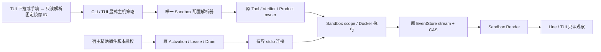

AO-2+ 研究驱动位于 `tests/live_optimization/calibrate.py`、`calibration_inputs.py`、`reopen_calibration.py`；其样本和期望为显式开发材料，不进入生产评分规则。拒绝的实验源码/测试和完整证据位于 `docs/validation-data/unified-evaluation/ao2plus/`，见 12.10。

## 4. 运行时装配与依赖方向

D 的语义摘要在既有 Runtime 装配中显式启用，借当前 Composition Lease/Provider 和原 admission/Session permit；不新增模型运行器、后台 Session 或 Product 依赖。

E0 由 `RuntimeConfig.token_budget` 装配绑定当前 Provider/model 的计量器。AgentLoop 在原 Lease 内委托 RequestBuilder.prepare；请求重试、Provider 调用和 Session permit 仍在既有 owner，未新增执行生命周期（12.2）。

C 不改 AgentLoop/AgentRuntime 的装配与生命周期：同一个 Turn 前 CompactionService 依次执行旧 Tool 折叠、必要时 M3 摘要；读取原文仍借用本 Runtime 的 SessionService 与 B/B+ 工具。

默认工具装配增加绑定本 Runtime 同一 SessionService 的输出目录、关键词查找与读回工具；没有独立存储 owner、缓存或后台 Task。关闭默认工具的宿主仍须显式装配/授予读取能力；Product 的既有 capability grants 不自动扩权。

TUI runner 在原 open_chat_session 后完成已确认工作区项目的来源验证/正式绑定与索引重建，再打开聊天；切换会话复用现有 RestartChat 和收尾主线（13.11）。

当前任务绑定由 ContextInputService 从事件日志派生，Session append 的来源校验与 CAS 负责持久化准入；RequestBuilder、校验和 Replay 复用同一 renderer。Provider 不临时补写消息，Surface 不保存派生回显。

TUI 配置相关模块职责补充：`cli/tui_config.py` 拥有严格格式 1 的非密钥启动输入读写、路径解析与
启动前本地 preflight；`cli/tui_entry.py` 拥有唯一交互启动/重启循环；`tui/settings.py` 管启动字段、开关和标签页；`tui/config_forms.py` 管 Context／Product 中文树形草稿、可见可编辑的起始预设与列表增删。
`chat/config.py::parse_context_host_config()` 与 `product/config.py::parse_product_host_config()` 分别是对应文件与草稿共用的唯一严格解析器。
`tui/governance.py` 的只读 TextArea 和 Memory 下拉表单属于展示层；表单返回带精确 ID 的
命令草稿，仍经 `chat/governance.py` 重新读取与冻结审阅，不直接调用 Memory 写入或缓存权限。
`tui/text_selection.py` 为显示日志提供字符偏移、高亮、选区读取及右键菜单，复用已有 RichLog 行与
Textual selection；`tui/clipboard.py` 只拥有 Windows Unicode 剪贴板的临时隐藏窗口和内存句柄，
返回前关闭窗口/剪贴板，成功传递的内存由 Windows 接管。没有新增事件、检索或审批事实源。
`tui/app.py` 的任务面板快捷键只切换既有控件的 `display`，不维护另一份任务状态或重启 Product owner。
`cli/main.py` 仍拥有环境配置解析、Provider 与 Runtime 装配，`tui/runner.py` 仍拥有 Session
open/recovery 及 Product／Runtime 的收敛。配置文件不是 Session、Memory 或 Skill selection 的事实源。

装配有两个入口，位于 [`runtime/agent_runtime.py`](../../src/traceh/runtime/agent_runtime.py)：

| 入口 | 用途 |
|---|---|
| `build_default_runtime()` | 同步、无插件；通过空的 Generation-owned `PluginActivationSet` 进入同一 Generation/Lease 主线，不发现、不 import 插件 |
| `build_default_runtime_async()` | 异步。`enabled_plugins` 为空时使用空 ActivationSet；非空时在私有候选注册表中完成激活事务，再由初始 Generation 接管 |

两者共享 `_prepare_default_runtime()` 与 `_finish_default_runtime()`。拆成两段的原因很具体：插件必须在**注册表已创建、Composition 尚未围绕它们冻结**的那一刻贡献内容，而拆分让这一点成立，同时不需要把装配代码写两遍。

它们创建或接受以下替换点：

- `EventStore`；
- `LlmProvider`；
- `PromptAssembler`；
- `Tool`、`ToolPolicy`、`ToolMiddleware`；
- `CompletionVerifier`；
- `ContinuationRuntime`；
- `LlmRuntime` 与 `ToolAdmissionGate`（宿主可显式注入；Budget Stage B 复用此接缝，不改变 `AgentLoop`）；
- `ScopedServiceBinding`（Application / Workspace / Preset / Agent 的程序化 Service 装配；覆盖必须显式）；
- `ScopedToolBinding`、`ScopedPromptBinding`、`ScopedPolicyBinding`（同样四层的程序化模型/执行能力装配；覆盖必须显式）；
- `PluginDiscovery`、`enabled_plugins`、`plugin_configs`（仅异步入口）。

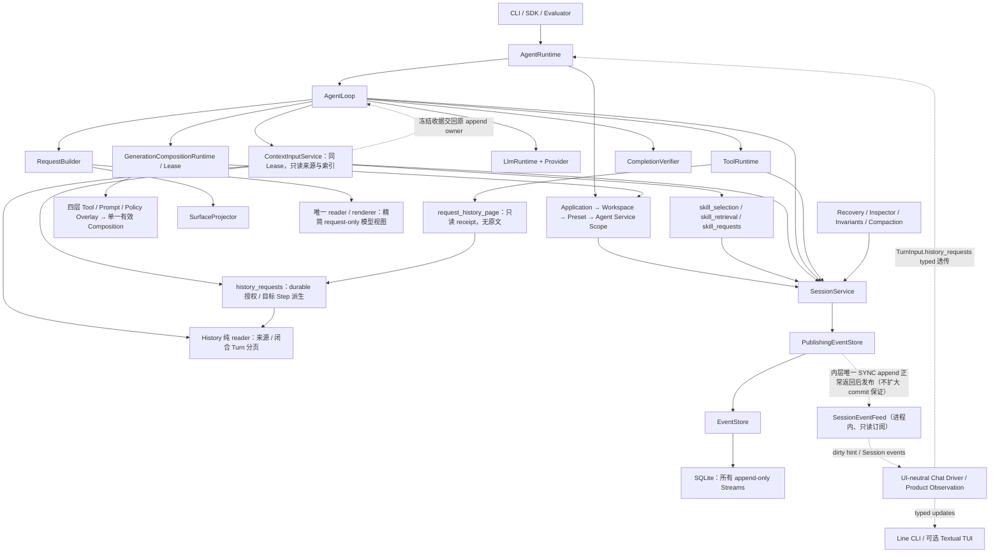

插件在这张图上的位置见下：

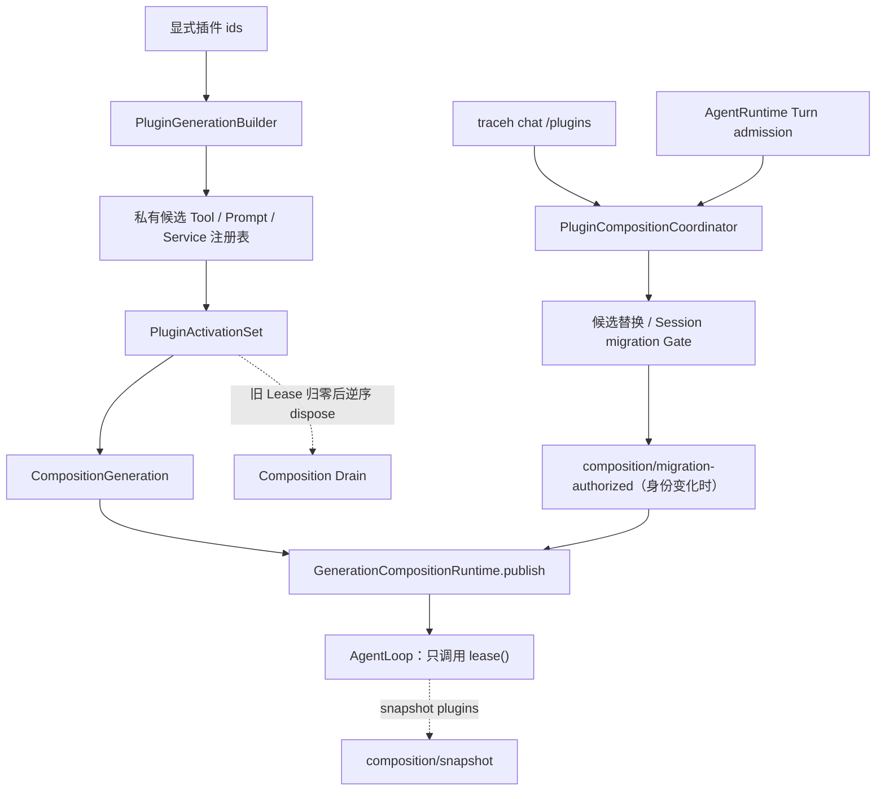

依赖规则：

- `AgentLoop` 只编排生命周期，不导入具体工具、SQLite backend 或厂商 HTTP 逻辑；也**不导入 CLI、Console、颜色或 Timeline 文案**：Timeline 是订阅 Feed 的界面层投影，主循环不知道它存在；
- **`AgentLoop` 同样不知道 `PluginManager` 存在**。插件位于装配层，它的 Tool、Prompt 和 Service 进入既有的 `ToolRegistry`、`PromptAssembler` 和 `ServiceRegistry`，因此**没有** `PluginToolRuntime`，也**没有** `PluginAgentLoop`。`agent_runtime.py` 里对 `PluginManager` 的 import 是函数内局部 import，正是为了让这条边界在依赖图上也成立；
- `AgentRuntime` 是对外门面和默认依赖装配点，并继续拥有活跃 Turn 表、Turn admission 的最终线性化检查和唯一总关闭 Task。D0 把候选 prepare/publish/rollback、Session durable identity 校验与迁移、共享 Gate、replacement/admission 在途任务收敛集中到 `PluginCompositionCoordinator`；协调器只通过窄回调读取 Runtime 是否关闭、是否有活跃 Turn 和 current Generation 的外部插件身份，不拥有第二份可变身份事实。Stage B 的内部 `replace_plugin_composition()` 与 Stage C 的 Chat `/plugins` 控制面仍复用同一条候选→Generation→publish 主线，身份变化仍在共享 Gate 内追加 append-only 授权事件；插件 Tool/Prompt/Service、Activation 与 Owned Task 由对应 Generation 的 ActivationSet 持有；SessionService、EventStore、核心 Provider、内置 Tool 和基础配置是 borrowed core，不能被插件 cleanup 关闭。`dispose()` 先收敛 Turn，再收敛控制面在途任务，再 Drain 所有 Generation，最后仅清理 application-level legacy 资源；
- Provider 与 Tool 通过公共协议进入 Runtime；
- Projector 和 Inspector 只消费事件，不反向修改历史事实；
- 多 Agent 控制面构建在单 Agent Runtime **之上**，不塞入 `AgentLoop`。v0.6 Stage A 的 [`agents/`](../../src/traceh/agents/) 只依赖 `traceh.api` 与 `EventStore`：它不导入 `AgentRuntime`、`AgentLoop` 或 `PluginManager`，也不被它们导入。方向是单向的——未来的 Supervisor 持有 Activation 并从这里读取 identity，`AgentRuntime` 永远不感知 Supervisor（见 20 节）。

## 5. Session / Turn / Step 生命周期

D 的语义摘要由 E1 扩展至当前 Turn 任一仍有回答余量的 Step；下一 Step 继续回答，两者共用 max_steps 与实际 usage，最少允许 2 步。显式 History 请求所在轮保留首 Step 阅读优先级。

### 5.1 概念

| 概念 | 当前语义 |
|---|---|
| Session | 与一个已解析 Workspace 绑定的长期事件历史，可包含多个 Turn |
| Inbox Message | 一次用户输入；先 accepted，再 claimed 到一个 Turn |
| Turn | 一次用户唤醒后的完整工作轮次 |
| Step | 一次冻结 Composition、构建请求、调用模型、可选执行工具的决策周期 |
| Model Attempt | 一次取得 Session dispatch permit 的 Provider 调用；F2 的同请求 retry 是同一 Step 下的新 ordinal。它不是 fallback，Provider/model/request 都不变 |
| Tool Invocation | 模型响应中的一个工具请求及其准入、Effect 和 Result |

### 5.2 正常执行

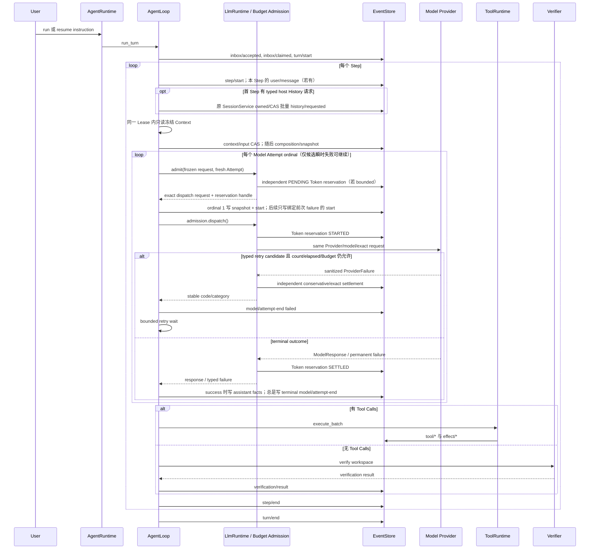

### 5.3 并发与取消

- `AgentRuntime` 用内存锁和 `_active` 表保证同一 Session 同时只有一个活跃 Turn；这是单进程保证。事件写入层（6.5）已有跨进程锁，但“同一 Session 只跑一个 Turn”仍未跨进程强制：两个进程同时 run 同一 Session 时，事件文件不会损坏，结果是事件交错或 `SessionService.append_event()` 抛出 `ConcurrencyConflict`，而不是被 Runtime 提前拒绝。
- Turn admission 与 Stage C Session 迁移共用一把 Composition Gate：Turn 在 Gate 内完成 durable 身份校验并登记 active Turn；迁移在同一 Gate 内确认全局没有 active Turn、准备候选、执行授权 CAS 和 publish。迁移持 Gate 时，新的 Turn 只能等待，不能出现“检查时空闲、下一瞬间 Turn 已开始”的窗口。Gate 不是持久化事实；真正的 Session 身份仍来自事件。
- `cancel()` 先追加 `runtime/cancel-requested`，再取消 Task。`SqliteEventStore` 的取消语义见 6.6：被取消的 Store 操作不会留下仍在后台写入的线程。
- `AgentLoop` 在取消/异常时 fresh read 当前 Attempt；只有 durable start 才补 Attempt End，然后依次关闭
  Step、Turn。admission 未取得 Session CAS permit 时先释放 PENDING reservation，不制造 Attempt；ToolRuntime
  尽量补齐未完成调用的 Tool Result。
- `dispose()` 取消并等待当前 Runtime 持有的活跃 Turn，然后 Drain Composition，最后卸载插件；完整语义见 5.5。Shell Tool 的原 scope 在取消返回前收敛容器及其进程树；不能确认时记录 unknown-convergence 并报错。

### 5.5 `AgentRuntime.dispose()` 的收敛语义

整个关闭过程位于**一个内部 Task**（`_shutdown()`）里，而不是 `dispose()` 自己的协程帧里。这条放置方式修复的是一个真实缺陷：关闭逻辑内联时，调用方在活跃 Turn 仍在收敛期间被取消，会在**到达 `PluginManager.dispose()` 之前**就逃出去；而 `_disposed` 已经置位，于是此后每一次 `dispose()` 都立即返回——插件从此再也不会被卸载，而且没有任何地方报告这件事。

现在的规则：

| 情形 | 行为 |
|---|---|
| 首次调用 | 置 `_disposed = True`（立刻拒绝新 Turn），创建唯一的 `traceh-runtime-dispose` Task，通过 `shield` 等待它 |
| 等待期间被取消 | 用 [`await_worker_convergence()`](../../src/traceh/concurrency.py) 吸收取消并继续等待**同一个** Task；第二、三次取消同样不能提前放行；收敛完成后重新抛出**原始** `CancelledError` |
| 再次调用 | `await` **同一个**已完成 Task，因此复用同一个真实结果，关闭不会跑第二遍 |
| 关闭本身失败 | 该 Task 以异常完成，后续 `dispose()` 会再次抛出同一个异常，**不会**静默伪装成功 |

工作属于 Task 而不属于等待它的人，所以调用方的取消永远碰不到关闭本身。顺序是：先取消并 `gather` 全部活跃 Turn，再取消并等待在途插件候选/迁移及其 rollback，也等待已经进入 Gate 但还未登记的 Turn admission；随后让 Composition Runtime Drain 所有 retired/current Generation。Drain 会由各代 ActivationSet 逆序卸载插件 Activation、取消并等待 Owned Task、撤销 Service/Tool/Prompt 注册，最后才清理仍属 application-level 的 legacy 构建器/发现器资源（19.8）。默认 Stage B/C Runtime 不让 PluginManager 和 Generation 同时拥有同一份插件 cleanup。

### 5.4 一个 Session 中的多个 Turn

`run`/`resume` 各产生一个 Turn；`traceh chat`（见 13.4）在同一 Session 中按用户输入连续产生多个 Turn。无论谁驱动，Turn 的语义完全一致：每个 Turn 都通过 `AgentRuntime.run_existing()` 进入 `AgentLoop`，历史来自事件日志投影，调用方不持有第二份对话状态。

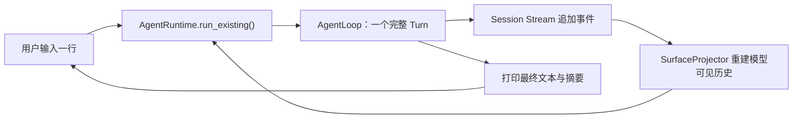

## 6. 事件模型与持久化

当前 Budget schema 3 新增 `budget/child-token-decided`，原 child-reserved 增加初始 Token 分配；Product 当前 protocol 6 / event schema 5。额度、申请与原事实源关系见 12.14。

AO-3 增加同一 Store 内的 `optimization-background:<workspace fingerprint>` 流：只记录后台周期授权、反馈准入、额度预留、结算位置与待审状态。聊天原文、工具结果、评估成绩与实际费用仍在各自原 owner，不能用后台投影代替它们（12.11）。

D 只在原 Session 流增加 `summary/input`、`summary/response` 与 `method=semantic` replacement；真实响应通过 causation_id 被引用，原事件不改。完整冻结字段和协议变体见 12.2。

E0 的可选 `request/token-measurement` 追加在原 Session 流，绑定精确 Composition/source_seq 和请求指纹。它记录估算，实际 usage 仍在 Attempt end；两者都不是可变 runtime.state，也不复制原文为第二事实源（12.2）。

C 在同一 `surface/replace` format 2 内新增严格 `method=tool-fold` 变体，单项引用原 Tool result，
绑定来源指纹、字节、闭合 cut 和策略；它只保存派生的较短 reply，不改原 Session/Effect 事实。
没有 summary/summarizer 字段，完整形状及拒绝规则见 12.2。Session/Context/SQLite 版本不变。

### 6.1 Event Envelope

事件由 [`PendingEvent` 与 `EventEnvelope`](../../src/traceh/api/events.py) 表示。落盘后包含 Stream ID、单调 `seq`、Event ID、类型、时间、数据以及可选 correlation、causation、actor、composition revision 等元数据。

`EventEnvelope` 的不可变性有明确边界，不能被描述成“事件是递归不可变对象”：

- `@dataclass(frozen=True, slots=True)` **只**禁止重新赋值顶层字段，例如 `event.data = {...}` 会抛 `FrozenInstanceError`；
- `data` 仍然是普通的 `JsonValue` 图：其中的嵌套 `dict`、`list` 都是标准可变容器，`event.data["nested"]["value"] = ...`、`event.data["items"].append(...)` 在语言层面完全合法；
- 当前**不**引入 `FrozenDict`/`FrozenList` 或新的公共 JSON 类型系统。

因此“事件历史不会被改写”是一条**所有权契约**，而不是语言保证。这条契约由**具体边界**承担，不是自动生效的：

- Store 边界是 `EventStore.append()` 与 `read()`，它们返回的 Envelope 归调用方所有；
- Envelope 只是普通对象，框架**不会**自动隔离两个消费者：同一个 `EventEnvelope` 被交给两个消费者时，它们共享同一份可变 payload；
- 因此任何把一个事件分发给多个接收方的组件，都必须为每个接收方单独 detach。本版本确实存在这种扇出：`SessionEventFeed`（6.7）为**每个** Subscriber 单独 detach 一份。

[`detach_event()`](../../src/traceh/api/events.py) 是可复用的边界 helper：它基于既有的 `to_json_value()` 重建整个 JSON 图，按值携带其余全部元数据（`event_id`、`stream_id`、`seq`、`type`、`schema_version`、`occurred_at`、`causation_id`、`correlation_id`、`actor_id`、`composition_revision`），不经过 JSON 文本编码，因此 Envelope 上的 `UUID` 与 `datetime` 不会退化成字符串。模块内部的 `_detach_json_data()` 只是实现细节，不作为公共 API，也不从包级 `__init__` 导出。

复用 `to_json_value()` 而不是引入通用深复制，意味着“事件 payload 里允许放什么”和“它会被规范化成什么”只有一处定义。必须准确描述这条规则的范围，它**比 `JsonValue` 更宽**：

| payload 中的值 | `to_json_value()` 的处理 |
|---|---|
| JSON 原生 scalar（`None`、`bool`、`int`、`float`、`str`） | 原样透传，不做包装 |
| `Path`、`UUID` | 转成字符串 |
| `datetime` | 转成 ISO 字符串 |
| `Enum` | 递归转换其 `value` |
| dataclass | 转成 dict 后递归转换 |
| 任意 `Mapping` | 转成新的 `dict`，键转 `str` |
| 除 `str`、`bytes`、`bytearray` 之外的 `Sequence`（例如 `tuple`） | 转成新的 `list` |
| `set`、`bytes`、`bytearray`、任意普通对象 | 抛 `TypeError` |

也就是说，`Path` 与 `tuple` 并不是 `JsonValue`，但它们**被规范化而不是被拒绝**（`tuple` 变 `list`，`Path` 变字符串）；只有真正不受支持的值才抛 `TypeError`。不要把这条写成“超出 `JsonValue` 的值一律抛 `TypeError`”。

`to_dict()` 与 `from_dict()` 同样脱离：`to_dict()` 返回的 `data` 是调用方自己的图，修改它不会改写原 `EventEnvelope`；`from_dict()` 也不与传入 `raw` 的嵌套容器共享引用（旧实现只做顶层浅重建）。`from_dict()` 继续要求 `event.data` 是 JSON 对象，非对象直接报 `event.data must be an object`，不会用 `str()` 之类手段悄悄修正类型。

### 6.2 当前的 Stream 分类

| Stream | ID 形式 | 用途 |
|---|---|---|
| Session Stream | `session:<session_id>` | 生命周期、消息、模型、工具结果、验证和恢复事实 |
| Skill Selection Stream | `context-selection:<session_id>` | 宿主选择的 exact catalog/id/version 与 CAS 操作事实；只影响未来 Step（7.5） |
| Effect Stream | `effects:<session_id>` | 现实副作用的 Intent、Dispatch、Outcome 与 Reconciliation |
| Agent Directory Stream | `agents:directory` | 持久化 Agent identity：哪些 Agent 存在、各自拥有哪个 Session（20 节） |
| Agent Inbox Stream | `agent-inbox:<agent_id>` | 每个 Agent 已**接受**的消息及其 FIFO 顺序（20.8）。accepted 不等于 claimed/processed |
| Agent Delivery Stream | `agent-delivery:<agent_id>` | 每个 Agent 的投递生命周期：claim 与 completed/failed/cancelled（20.11） |
| Budget Ledger Stream | `budgets:ledger` | 每个 Store 一条的层级 Budget grant、reservation、usage lifecycle 与 close 事实；v0.7-A 建事实层，v0.7-B 在显式 managed host 的 owned boundary 强制执行（20.20–20.21） |
| Workspace Catalog Stream | `workspaces:catalog` | 每个 Store 一条的 managed worktree 生命周期：provisional、attached、quarantined、released；只保存宿主 source identity/commit，不保存模型可控路径（20.22） |
| Patch Artifact Catalog Stream | `artifacts:catalog` | 每个 Store 一条的不可变 Patch Manifest 事实；保存 CAS digest、Agent/Session/message/Turn/Workspace/Git 来源，不保存 Patch bytes 或本机路径（20.23） |
| Patch Promotion Ledger Stream | `patch-promotions:ledger` | 每个 Store 一条的 Review、Approval 与 Promotion 控制流；保存 target id/fingerprint/ref/revision、integration tree/commit、verifier 定义与证据摘要，不保存仓库路径、verifier 输出或环境值（20.24） |
| Workflow Run Stream | `workflow:<run_id>` | 每个 Workflow Run 一条的编排事实：run/node 生命周期、Map 展开与 Approval 等待；只保存指向其它事实源的身份，不复制 Agent 报告、Patch bytes、Review 证据或 Approval（20.25） |
| ProductTask Stream | `product-task:<task_id>` | 每个产品任务一条的产品事实：产品身份、宿主控制决定、digest 与指向其它域的引用；不保存 Agent 报告、会话用量、Patch bytes、Review 证据或 Approval（20.27） |

v0.7-F1 起 `product-task:<task_id>` **确实会被写入**，由 `traceh.product` 的宿主服务写、由它的唯一投影器读。raw ProductTask 事件仍不直接进入 Model Surface、Session Recovery 或 Request Fingerprint；20.38 的 host bridge 会在下一次 requester Turn 前 fresh 读取 canonical head，把严格白名单的 `product/context-snapshot` 写进 requester Session。format 8 的最小执行摘要和按需证据读取都从同一 EventStore fresh 重建；前者只证明模型当时看见了什么，后者只是普通 ToolRuntime 中的纯读结果，两者都不反向成为 ProductTask 权威。

前两个 Stream 通过 `session_id`、`tool_call_id`、`effect_id`、correlation/causation 等字段关联，但各自有独立序号。其余均为各域自己的控制面流：Directory、Budget Ledger、Workspace Catalog、Patch Artifact Catalog 与 Patch Promotion Ledger 每个 Store 各一条，Inbox 与 Delivery 每个 Agent 各一条，Workflow 与 ProductTask 分别每个 run/task 各一条；这些 raw 控制事件都不直接进入 Model Surface、Session Recovery 或 Request Fingerprint。唯一窄例外是 Product host 写回 Session 的 bounded status-semantics observation；Artifact 原始 bytes 位于显式 SHA-256 CAS，由 Manifest 引用并在读取时重新校验。

Agent Directory Stream 是**每个 Store 一条**的控制面流，不是 per-session 流，边界必须写准：Session Stream 记录“一个 Agent 运行时发生了什么”，Directory Stream 记录“存在哪些 Agent”。二者不合并，因为枚举 Agent 不应要求读遍每个 Session，而且一个 Agent 的执行历史不得断言另一个 Agent 的事实；二者也不分库，因为 `expected_seq`、跨进程文件锁、取消/提交点语义和事件所有权契约正是创建事务需要的东西。它**不进入 Model Surface、不参与 Session Recovery、不影响 Request Fingerprint**，`SessionService.list_sessions()` 按 `session:` 前缀过滤，因此看不到它。

F3 新增同 Store 的 `projects:catalog`（每 Store 一条）和 `memory:<project_id>`（每项目一条）。
前者决定项目归属，后者决定提议与人工决策；控制事件不进入 Surface 或 Session Recovery。
F4 的 MemoryContextReader 从获准的生效事实派生 Context（7.7），不把整条控制流注入模型，
也不新增权威表或迁移。具体 owner、字段和历史证据边界见 7.6。

### 6.3 当前事件类型

| 类别 | 事件 |
|---|---|
| Session/Inbox | `session/created`、`inbox/accepted`、`inbox/claimed` |
| Composition control | `composition/migration-authorized`（只记录外部插件身份迁移授权，不进入 Model Surface） |
| Turn/Step | `turn/start`、`turn/end`、`step/start`、`step/end` |
| Step reference input | `context/input`（format 8，绑定当前 Session/Turn/Step、观察截止点、同 Lease Composition/catalog、窄 policy、query、exact blocks/exclusions 与渲染预算；只供 Request，不进入 Surface） |
| Project association control | `project/created`、`project/source-bound`、`project/session-bound`；projects:catalog，schema/format 1（7.6） |
| Memory authority control | `memory/proposed`、`memory/approved`、`memory/superseded`、`memory/revoked`；memory:project_id，schema/format 1（7.6） |
| Skill selection control | `skill/selection-set`（format 1，独立 context-selection 流；宿主写，模型不可写，7.5） |
| History host request | `history/requested`（format 1；typed 用户输入绑定本 Turn 首 Step 与真实 user/message；原 SessionService 写入，不进入 Surface，不能由 source/text 伪造） |
| 消息与请求 | `user/message`、`product/context-snapshot`（只在 requester Session，envelope schema 1、message format 8、exact key/messages、当前 Product head causation；原子记录当前 focus 在内最多六项任务、精确总数/省略数、固定状态语义、有界历史 source-request 摘录，并只为稳定检查点 focus 记录最小执行摘要；formats 1–6 拒绝，不授予控制权限）、`composition/snapshot`、`request/snapshot` |
| 模型 | `model/attempt-start`、`assistant/chunk`、`assistant/message`、`model/attempt-end` |
| 工具 | `tool/call`、`tool/admitted`、`tool/result` |
| 验证 | `verification/result` |
| Runtime | `runtime/cancel-requested`、`runtime/error`、`runtime/recovered` |
| Agent control plane（独立 Stream） | `agent/created`（只在 `agents:directory`）、`agent/message-accepted`（只在 `agent-inbox:<agent_id>`）、`agent/message-claimed`、`agent/message-completed`、`agent/message-failed`、`agent/message-cancelled`（只在 `agent-delivery:<agent_id>`）。它们都不进入任何 Session Stream，也不进入 Model Surface |
| Budget control plane（只在 `budgets:ledger`） | `budget/root-granted`、`budget/child-reserved`、`budget/reservation-committed`、`budget/reservation-released`、`budget/usage-charged`、`budget/usage-reserved`、`budget/usage-started`、`budget/usage-settled`、`budget/usage-released`、`budget/account-closed`；只投影权限与用量，不进入 Model Surface |
| Workspace control plane（只在 `workspaces:catalog`） | `workspace/provisioned`、`workspace/attached`、`workspace/quarantined`、`workspace/released`；只投影 host-managed worktree identity/lifecycle，不持久化本机路径，也不进入 Model Surface |
| Artifact control plane（只在 `artifacts:catalog`） | `artifact/patch-captured`；只记录不可变 Manifest 与 CAS 引用，Patch bytes 不进入 Event Log，报告关联由 `(agent_id, message_id)` fresh replay 重建（20.23） |
| Promotion control plane（只在 `patch-promotions:ledger`） | `patch/review-recorded`、`patch/approval-recorded`、`patch/promotion-committed`；只记录固定验证结论、精确 approval digest 与已完成的 ref compare-and-swap，不进入 Model Surface，也不保存路径或 verifier 输出（20.24） |
| Workflow control plane（只在 `workflow:<run_id>`） | `workflow/run-started`、`workflow/node-started`、`workflow/map-expanded`、`workflow/node-completed`、`workflow/node-failed`、`workflow/approval-awaited`、`workflow/run-finished`；只记录编排，不进入 Model Surface，也不复制其它域的状态（20.25） |
| Surface | `surface/replace`（schema 1、message format 2、exact key 集；绑定 exact source seq/digest、cut boundary、method、policy digest、摘要器身份与 exact replacement bytes；format 1 拒绝）、`surface/compaction-failed`（宿主证据，只含 method/稳定 code/committed，不进入 Model Surface） |
| Effect | `effect/intent`、`effect/dispatched`、`effect/outcome`、`effect/reconciled` |

| Product control plane（只在 `product-task:<task_id>`） | `product/task-opened`、`product/task-started`、`product/task-awaiting`、`product/task-completed`、`product/task-rejected`、`product/task-cancelled`、`product/task-failed`、`product/task-abandoned`；schema 4，key 集精确，终态后不可追加；raw 事件不直接进入 Model Surface（20.27、20.38） |

v0.7-F1 起这九种事件有了真实写入路径。`interrupted` 仍然**不是**事件类型——它只是派生视图状态。

### 6.4 EventStore 保证

`EventStore` 协议提供 append、read、head、list_streams。追加要求调用方传入 `expected_seq`；不匹配时抛出 `ConcurrencyConflict`。

#### Event 所有权契约

这条契约写在 [`EventStore` Protocol](../../src/traceh/session/event_store.py) 及其 `append()`/`read()` 的
docstring 上，而不是只写在某个具体实现里：Store 是可替换后端，替换后端不能改变调用方能对事件做什么。
任何实现都必须满足以下可观察语义，确定性测试替身 `InMemoryEventStore` 与唯一生产实现
`SqliteEventStore` 对调用方完全一致：

| 调用方持有的对象 | 修改它之后 |
|---|---|
| 原始 `PendingEvent.data` | Store 历史不变（`materialize()` 已在构造事件时脱离输入） |
| `append()` 返回的 Event | Store 历史不变 |
| `read()` 返回的 Event | Store 历史不变，下一次 `read()` 仍是原始事实 |
| 两次 `read()` 各自的结果 | 彼此独立，互不可见 |
| `to_dict()` 返回的字典 | 原 `EventEnvelope` 不变 |
| 传给 `from_dict()` 的原始字典 | 构造出的 `EventEnvelope` 不变 |

隔离覆盖顶层 `data`、嵌套 `dict`、嵌套 `list` 以及 `list` 内的 `dict`；多个 `PendingEvent` 即使复用同一个嵌套输入对象，落库后的事件之间也不共享可变容器。契约保护的是 **Store 历史不被反向污染**，并不声称调用方拿到的副本本身不可变：调用方完全可以修改自己那份副本，只是改不动账本。

两种实现达到同一契约的方式不同，这是设计差异而不是实现不一致：

- `SqliteEventStore` 把完整 Envelope 保存为唯一 canonical JSON；`append()` 在编码前规范化，`read()` 从
  JSON 重建新的对象图，并检查行身份、精确 key 集、时区和 canonical round trip；
- `InMemoryEventStore` 保存 Python 对象，因此 `append()` 与 `read()` 都必须显式通过 `detach_event()`
  交出副本，绝不暴露 `_streams` 中的对象。

`head()` 只返回序号，不涉及副本。一次 `read()` 的复制成本与实际返回事件的 payload 总量相关。
SQLite 使用 `(stream_id, seq)` 索引从 `from_seq` 定位，不再先扫描并解析整条 Stream。没有引入 Event
cache：缓存同一份对象会重新制造跨调用方共享引用。

当前唯一生产 `SqliteEventStore` 的协议由
[`ADR-0036`](../adr/0036-single-production-sqlite-event-store.md) 冻结：

- 每个 Store root 只有 `events.sqlite3`；`application_id` 与 `user_version = 2` 共同标识 current schema；
- `streams(stream_id, head_seq)` 与 `events(stream_id, seq, envelope_json)` 都是 `WITHOUT ROWID`，
  `(stream_id, seq)` 唯一且 Event 行外键指向 Stream；
- F2 的三个派生表和五个 FTS shadow 表也属于同一精确 schema；列、DDL 与失效／重建边界见 7.5；
- 打开时精确验证全部持久 schema 对象、规范化表 DDL、列、外键、`integrity_check`、每条 Stream 的
  head/count/连续 seq，以及每个 Envelope 的 canonical JSON；额外 table/index/view/trigger 与
  unknown/older/newer、空白、坏行、gap、非 canonical 内容全部拒绝，不修补；
- 既有数据库先用 `mode=ro&immutable=1` 的无锁、无 journal recovery 连接只验证冻结 schema authority，
  不读取 mutable history；只有通过后普通读写连接才有权执行 SQLite crash recovery，再做 integrity/history
  校验并启用 WAL。未通过 schema authority 的数据库连 hot rollback journal 及其 bytes 也保持不变；
- 每个操作在执行它的 Worker 线程内打开短连接；foreign keys 与 `synchronous=FULL` 是连接配置；
- `Durability` 当前只有 `SYNC`，没有 flush-only 的 `BATCHED` 路径；
- `build_default_runtime()`/`build_default_runtime_async()` 不再暗中创建 Store；Runtime 借用显式 Store，
  CLI composition root、每个 Evaluation attempt 和每个 Evolution comparison case 分别拥有 open/close。

发现旧 `.jsonl`/`.lock`、JSONL/SQLite 混合目录、非 current schema、链接 Store root 或链接数据库时
fail closed。旧文件零读取、零移动、零删除、零自动转换，用户必须选择新 data dir；没有 compatibility
reader、dual write 或 fallback。`backup()` 通过 SQLite backup API 写入事先不存在的目标，在 rename 前
复用 schema/integrity/history 校验；`restore()` 先验证来源且绝不覆盖现有目标。

### 6.5 SQLite 跨进程 writer、CAS 与 busy

SQLite WAL 允许 readers 与 writer 并存，但单个数据库同一时刻只有一个 writer；不同 Stream 不再拥有各自
独立的生产文件锁。`SqliteEventStore` 在 Worker 线程内打开短连接，设置 5 秒默认 `busy_timeout`，然后用
`BEGIN IMMEDIATE` 取得 writer：

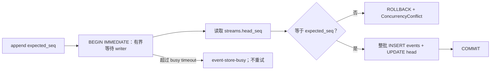

数据库主键与同一事务共同形成跨线程、跨实例、跨进程线性化点。两个进程用同一 Head 写同一 Stream 时
最多一组提交，另一个在拿到 writer 后读到新 Head 并得到 `ConcurrencyConflict`。两个进程写不同 Stream
也会串行化：普通短竞争在 busy 上限内等待后提交；超过上限抛稳定 `EventStoreBusy`。Store 不做第二次
append，Provider retry 也不消费这个错误。

读操作使用参数化 SQL，按 seq 排序；`list_streams(prefix)` 用 literal `substr` 比较，`%`/`_` 不是通配符。
打开 Store 时对整个 history 的 head/count/Envelope 校验位于同一个只读事务快照，避免合法并发提交落在
两次 SELECT 之间而被误报为 corruption。进程崩溃会由 SQLite/操作系统释放 writer lock；测试证明随后
可以重新打开并追加，但不把网络文件系统或任意断电设备的行为写成已验证事实。

[`session/file_lock.py`](../../src/traceh/session/file_lock.py) 仍服务 Promotion 和相邻独立文件协议，不再是
EventStore 的生产写入边界。

### 6.6 EventStore 的取消、关闭与提交点

SQLite 调用位于 `asyncio.to_thread()` Worker，而 Python 不能杀死已经开始的线程。`_run()` 以
`asyncio.shield()` 保护确切 Worker；调用方取消后，先由共享
[`await_worker_convergence()`](../../src/traceh/concurrency.py) 等到该 Worker 完成并取回异常，再重新抛出
`CancelledError`。重复取消不会成为提前返回出口。

因此取消结果必须按提交点解释：

| 时刻 | 持久结果 | 调用方返回前保证 |
|---|---|---|
| Store coroutine 尚未取得执行机会 | 没有 Worker，也没有写入 | 无后台操作 |
| Worker 在 `BEGIN IMMEDIATE`/事务内被调用方取消 | 可能回滚，也可能提交 | 同一 Worker 已完成；必须 fresh replay 判定 |
| `COMMIT` 已发生、Python 结果尚未交回 | 已提交 | Worker 已完成；调用方仍看到 `CancelledError` |

这仍是 may-have-committed，不是 at-least-once。业务层按 `event_id`、correlation 或完整业务身份重读对账，
不能把取消等同于未写，也不能只看可能由其他写入者推进的 Head。

`aclose()` 在一个进程内拥有明确线性化边界：先阻止新操作，再等待关闭开始前已经 admitted 的全部 Worker；
重复 close 幂等。关闭本身被取消时同样先等 close Task 收敛，然后传播取消。CLI、Evaluation 和 Evolution
owner 均先收敛/释放借用 Store 的 Runtime 或 Host，再 close Store；build、执行与 cleanup 同时失败时，
原始错误和独立 cleanup 错误一起保留，不互相遮蔽。

### 6.7 进程内 Event Feed

[`session/event_feed.py`](../../src/traceh/session/event_feed.py) 提供**观察通道**，让界面在 Turn 运行期间就能看到事件，而不必等 Turn 结束再读文件。它比事件日志弱得多，这些边界必须写清楚：

| 维度 | Feed 的事实 |
|---|---|
| 新增持久化事实 | 否。不落盘、不参与恢复、不产生任何新事件类型 |
| 额外的崩溃持久性 | 否。事件只在内层唯一 `SYNC` append 正常返回之后发布；Feed 不增加 SQLite commit 之外的保证 |
| 事实源 | 否。Runtime、`RecoveryService`、Inspector、不变量检查仍只读 `EventStore` |
| 历史 | 否。订阅**不重放**历史；需要历史仍走 `EventStore.read()` |
| 状态 | 否。Feed 不保存投影或缓存，不是第二份 State |
| 跨进程 | 否。另一个进程写同一个 SQLite 数据库时，本 Feed 收不到 |
| 可丢失 | 是。append 返回之后、发布之前进程崩溃时，实时观察会漏；SQLite 中的事实不因此丢失 |

#### 为什么边界选在 EventStore Decorator

`PublishingEventStore` 是包装任意 `EventStore` 的装饰器，而不是 `SessionService` 里的钩子。理由有两条，都可核查：

1. **后端无关**：包装测试 `InMemoryEventStore` 与生产 `SqliteEventStore` 的可观察语义完全相同，换
   Store 不改变 Feed 语义；
2. **“Store 已接受”正好在这里成立**：`src/traceh/session/service.py` 中的 `store.append()` 是整个 `src` 树里唯一的 append 调用点，所有写入者（`AgentLoop`、`ToolRuntime`、`RecoveryService`、`CompactionService`、`AgentRuntime.cancel()`）都经过它。因此“发布 Store 从未接受的事件”在这个边界上无法表达，也不需要每个写入者自己记得通知。

`build_default_runtime()` 无条件包装 Store，并把 `SessionEventFeed` 暴露为 `AgentRuntime.events`。无订阅者时代价是每次 append 一把无竞争的锁。

#### 顺序与可见性契约


契约要点：

- **先被 Store 接受，后发布**：`_publish()` 只在内层 `append()` 正常返回后调用，因此 `ConcurrencyConflict`、序列化失败或任何 append 异常都发布 0 条；取消同样发布 0 条，**包括** may-have-committed 那条路径——Feed 允许漏，日志不允许丢；
- **是“接受”，不是额外持久性**：当前只有 `Durability.SYNC`，装饰器原样透传；发布只表示 SQLite
  append 正常返回，不扩大 ADR-0036 对 WAL、文件系统和断电边界的陈述；
- **按 seq 顺序发布**：每个 Stream 一把 `asyncio.Lock`，同时覆盖“append + publish”。若只在 append
  之后发布，两个并发写入者会自由竞争：Store 已序列化写入，但调用方各自恢复执行，seq 10 的写入者
  可能被调度器挂起、在 seq 11 之后才发布。不同 Stream 使用不同的 wrapper lock，但内层 SQLite writer
  仍按 6.5 在整个数据库范围有界串行化；
- **一批多条**按 seq 顺序发布；
- **Stream 严格隔离**：Session Stream 的订阅者收不到别的 Session，也收不到 Effect Stream；
- **每 Subscriber 一份**：见下节；
- **发布不 await**：`publish()` 只往无界队列里 `put_nowait`，因此锁很快释放，任何订阅者都无法延长它。

#### 消费者只拿到只读接口

观察者拿到的是 `EventFeed` Protocol，只暴露 `subscribe()` 与 `subscriber_count()`。发布位于 `SessionEventFeed` 的私有 `_publish()`，唯一调用者是同模块的 `PublishingEventStore`。

这条区分是承重的：如果消费者接口上有公共 `publish`，任何拿到 Feed 的代码都能注入一条 Store 从未接受的 Envelope，而 Subscriber 无法把它与真事件区分开——Timeline 会忠实地显示一个从未发生的 Step。把发布移出消费者接口，使“只有 Store 接受的事件才会被发布”成为 **API 形状的性质**，而不是依赖观察者自觉遵守的约定。下划线不是安全沙箱，但它明确了权限边界。

同理，`AgentRuntime.events` 是**必填**构造参数，而且必须是该 Runtime 的 `PublishingEventStore` 实际发布的那一个 Feed 对象。给它一个默认值会交给调用方一个「可以订阅但永远沉默」的对象——接口存在而能力不存在。自定义装配必须显式把两者配对，正如 `build_default_runtime()` 所做的。

#### Event 所有权从 Store 边界扩展到每个 Subscriber

6.4 的所有权契约只覆盖 `append()`/`read()` 交回调用方的对象。Feed 引入了**扇出**，这正是 6.1 预留的那个缺口：把同一个 `EventEnvelope` 交给两个消费者，它们会共享同一份可变 payload。因此 `publish()` 为**每个** Subscriber 单独调用一次 `detach_event()`，而不是每次发布只复制一次。可观察结果：Subscriber A 修改嵌套 payload，不影响 Store 历史、不影响 Subscriber B 已收到的事件、也不影响此后任何 Subscriber 收到的事件。

#### 无界队列的明确取舍

每个 `EventSubscription` 有一个无界 `asyncio.Queue`：

- **不对 Runtime 施加背压**：慢订阅者永远不能拖慢或弄失败一次 Store append；
- **被遗弃或长期不消费的订阅者会占内存**，上限只有该 Session 产生的事件量；
- **Chat 生命周期在每条退出路径上都关闭订阅**（正常、异常、取消、EOF、`/exit`），因此随包发布的消费者不泄漏；
- **未来若改为有界队列，必须定义明确的 overflow 语义**：静默丢事件会让 Timeline 对已经发生的事情说谎。

`EventSubscription.close()` 幂等：它把结束标记排在已发布事件之后，因此“先 close 再 drain”会打完所有已排队事件再结束——这正是 Chat 能承诺“Timeline 出现在最终回答之前”的原因，不依赖轮询或 sleep。对已耗尽的订阅再迭代返回空，不会死等一个已被消费掉的结束标记。

## 7. Composition、Surface 与可重建请求

D 增加可重建的摘要请求来源变体：普通请求仍由 Context+Surface+Composition 构建；摘要请求由精确旧前缀和 `summary/input` 构建。共享 builder、permit、checker、replay 按显式形状判别，不把摘要请求冒充聊天投影。

E0 在正式 Context/Composition 与原模型 admission 之间计量完整请求。首次草稿可能触发旧历史维护，维护后重新选引用；重放仅使用正式冻结来源。计量记录的 Product 分区和 CAS 都绑定该请求原 source_seq，不能读新 head 反向修改旧请求（12.2）。

C 的 `tool-fold` 是同一 Surface 中的 Tool reply 正文替换：保留原调用参数、role/name/tool_call_id 和位置；不改原 Effect/Result。它不成为 History 目录根或可见摘要，后续摘要可递归展开到原 Result。完整协议与分层流程见 12.2。

### 7.1 Composition

每个 Step 通过 `CompositionRuntime.lease()` 获取 `ActiveComposition`。快照包含：

- provider、model；
- 完整 system prompt；
- tool schemas；
- plugin identities；
- policy 和 middleware 名称；
- temperature、max output tokens；
- 按 skill_id 排序的 typed `skill_catalog` 与 `skill_catalog_digest=H(catalog)`；F1 校验描述符、贡献插件身份与 digest，空目录仍为 `[]`／`H([])`；
- 基于内容生成的 revision。

`plugin identities` 从 v0.4 起是**真实数据**，不再是占位：它等于 `traceh.core`（版本来自 1.2 的唯一来源）加上本次激活的每个外部插件的真实 `plugin_id` 与 `version`。无插件运行时该列表只有一项。

这条身份必须能被重建，否则 Replay 会正确地报告不一致。因此 [`composition_from_event()`](../../src/traceh/runtime/request_builder.py) 也从事件里重建 `plugins`；此前它固定返回 `()`，于是每个被重建的 Composition 都在声称自己来自一个无插件 Runtime。

当前实现是 Generation-backed `CompositionRuntime`：每个 Runtime 始终只有一个 current Generation；Runtime 初始化时固定主 `ToolRuntime.sessions` 对象，Step 进入 `lease()` 时在 `asyncio.Lock` 保护下原子绑定它，并从同一代取得 Provider、ToolRuntime、Prompt、Plugin Identity、Policy/Middleware 和 Snapshot。`publish()` 在同一把锁内把旧代标为 retired、安装新代；旧 Lease 继续持有旧记录，新 Lease 只能拿新代。候选若引用另一个 `SessionService` 会在这个线性化点前被拒绝，避免 `tool/call` 或 `tool/result` 写入另一份 EventStore。每个 Generation 对象只能被一个 Runtime 认领一次；已 retired/cleaned 的 Generation 不能重新发布。资源 cleanup 由独立的一次性 `CompositionResourceOwner` handle 负责：装配层把同一个 handle 显式绑定到 `LlmRegistry`、`ToolRuntime`、`PromptAssembler` 及 Provider/Tool/Policy/Middleware 组件，冻结 Generation、扁平适配器和兼容性投影只传播这个 handle/binding，不扫描对象图，也不使用全局 `id()` 身份目录。binding 直接写入实例字典或声明过的 slot，并验证写入后的真实状态，因此自定义 `__setattr__` 不能静默吞掉所有权标记；提交若在中途失败，会逐项恢复每个组件原来“字段不存在”或“字段存在且为 `None`”的精确状态，Owner 也保持可重试。无法承载这种可验证 binding 的裸 slotted Provider、Tool、Policy 或 Middleware 不能进入 cleanup-bearing Generation；它们必须先经过可绑定的受控装配，或者只能留在没有 Generation cleanup ownership 的 application-level 路径。这样同一个 slotted 原始能力被放进两个新容器时不会被两个 Owner/Runtime 同时接受。多层 `replace()`、把冻结能力重新放进新注册表、从冻结能力构造 Runtime、以及同一 raw capability 再构造 cleanup Generation，都会在 Runtime 初始化或 publish 的共同认领入口被拒绝；没有资源级引用计数时，cleanup-bearing Generation 必须拥有尚未认领的显式 owner，并且不能和旧 Lease 或旧代共享会被 cleanup 关闭的资源。

Generation identity 是内部生命周期编号，只用于引用计数、retire、cleanup 和诊断，不写入事件或 Request Fingerprint。`CompositionSnapshot.revision` 是 Composition 全部内容（含 Skill 目录元数据）的 fingerprint；目录本身不会自动进入 prompt/messages。两代 Composition 内容完全相同时，内部 identity 可以不同而 revision 相同。Generation 构造时还会冻结 Tool 的 name、description、input_schema、effect_kind，并用真正只读、扁平、幂等的适配器把执行委托给原 Tool；嵌套 Schema 也不能改写，连续从冻结 Generation 构造无 cleanup 候选不会递归套适配器。Policy/Middleware 名称在构造时捕获，兼容性检查投影与当前 Generation 分离。Runtime 初始化会先从已经冻结的初始 Generation 构造全部兼容性视图，再一次性认领资源；认领后不再调用调用方可变的 Prompt/Registry 来源，因此第二次读取失败不会留下已认领但无 Runtime 接管的资源。Generation 被 retired 后，仍有 Lease 时绝不 cleanup；最后一个 Lease 释放才创建一次 cleanup Task。`drain()` 等待所有 retired Generation 的 Lease 归零并等待 cleanup 真正完成，cleanup 失败会在所有其他 Generation 都尝试后以有界的结构化 `CompositionDrainError.failures` 报告，并把 Runtime 标为 poisoned、拒绝后续 `publish()`。等待期间重复取消由共享内部 Task 和 `await_worker_convergence()` 吸收，收敛后再抛最初的 `CancelledError`。

Stage B 的插件 cleanup 不再使用上述 capability-wide owner 推断插件所有权：`PluginActivationSet` 显式持有插件 Activation、插件 Tool/Prompt/Service、Owned Task 与 cleanup，SessionService、EventStore、核心 Provider 和内置 Tool 只是 borrowed core。候选只在私有注册表中 setup，成功 publish 后由 Generation 接管；旧 Lease 结束前旧 set 不会被卸载。

Stage A 已进入同步/异步默认 Runtime 主线，Stage B 又把 Generation-owned `PluginActivationSet` 接入启动插件和内部候选替换路径；Stage C 让 `traceh chat` 的 `/plugins` 控制面调用同一套 Builder→ActivationSet→Generation→publish→Drain；D1/D2 把四层 Service 与程序化 Tool/Prompt/Policy 装配压成有效 Composition；D3 再把插件 Provider、Policy、Middleware、Verifier 接入同一候选和 Step Lease。`AgentLoop` 仍不导入 PluginManager、Builder、Scope resolver 或 reload service；它只从 Lease 取得本 Step 的 Provider、ToolRuntime 与 Verifier。v0.5.0 由独立 Python Quality Wheel 对这条公开主线做发行验收；用户命令仍只重新构造当前进程可发现的已安装 Entry Point，不安装/卸载 Wheel、不强制 module reload，插件自行选择子层与 EventStore 插件化仍未开放。

### 7.2 Surface

`SurfaceProjector` 只把以下事件投影为模型消息：

- `user/message` → user；
- `assistant/message` → assistant，保留 tool calls；
- `tool/result` → tool；
- validated `product/context-snapshot` → 逻辑最新的一张快照所冻结的两条有序消息：system 当前事实 + user 历史参考；按
  `(confirmation inbox/accepted seq, Product head seq)` 选择，而不是按跨 Stream 时间戳或 append 竞态；
- validated format-2 `surface/replace` → 摘要变体替换旧前缀；`tool-fold` 变体只缩短一个原 Tool reply 的正文，保留配对与位置。

原始事件仍保留。多次 Replacement 通过 source seq 遮蔽旧对话视图，而不是删除历史；它不能遮蔽
`product/context-snapshot`，Compaction 也不会把后者列为可替换来源。旧 Product 快照继续留在 append-only
Session 中，但当前 Surface 只投影逻辑最新一条。

对话按**逻辑位置**排序，不按 append 顺序：普通消息的逻辑位置是自身 seq，`surface/replace` 的逻辑位置是其
全部 source 逻辑位置的最小值（递归求得，因此“摘要的摘要”保留最初位置）。replacement 总是在被替换历史
之后才 append，若按 seq 排序，摘要会跑到更新的对话——甚至当前用户消息——之后，描述一段从未发生过的顺序。
该规则由 `surface_conversation()` 一处定义，`SurfaceProjector`、`CompactionService` 与不变量检查共用。
非法或旧格式的 replacement 会让投影 fail closed 抛出，而不是被静默忽略（12.2）。

### 7.3 Request Snapshot 与 Fingerprint

`RequestBuilder` 使用“截至 Composition Event 的完整 Surface + 本 Step Context 的一条 user reference
message + 同一 Lease 提供的 Composition Snapshot”生成 composed `ModelRequest`。Context 在所有
Surface 消息后，包括完整 Tool 续步组；Surface 自身不识别或保存 Context。Budget admission 可以只把
`max_output_tokens` 正向下调，产生 exact dispatch request。首个 Attempt 的 Session CAS batch 只写
一条 current-schema `request/snapshot`，原八项之外新增必填 `context_input_seq`、`context_input_digest`，
共十项；保存两份 canonical request/fingerprint、`source_seq` 和 composition revision；同一 batch 再写
`model/attempt-start`。内部 Generation/Attempt/reservation identity 不进入 Request Fingerprint。

```mermaid
flowchart LR
    LOG["唯一 EventStore durable log"] --> READ["stateless Product read models / fresh join"]
    READ --> BRIDGE["ProductModelContext: format-8 catalog + minimal summary"]
    READ --> TOOL["read_product_task_evidence: same-Session bounded metadata"]
    BRIDGE --> EV
    TOOL --> TR["普通 ToolRuntime audit"]
    TR --> EV
    EV["Session Events through source_seq"] --> SU["SurfaceProjector"]
    SU --> MSG["Model-visible Messages"]
    EV --> CTX["context/input：唯一 reader / renderer"]
    CTX --> REF["一条 request-only user reference"]
    CO["Composition Snapshot"] --> REQ["ModelRequest"]
    MSG --> ORDER["完整 Surface → 当前 Context reference"]
    REF --> ORDER
    ORDER --> REQ
    REQ --> CFP["Composed Fingerprint"]
    REQ --> ADMIT["Budget Admission"]
    ADMIT --> DISPATCH["Exact Dispatch Request / Fingerprint"]
    CFP --> SNAP["唯一 request/snapshot"]
    DISPATCH --> SNAP
    SNAP --> START["同一 CAS batch: model/attempt-start"]
    SNAP --> REBUILD["Replay 独立重建 composed 并校验 dispatch"]
```

`verify_request_snapshots()` 能重新定位对应 Composition、重建当时的 Turn/Step metadata 和 composed
Request，并独立验证两份 fingerprint。dispatch 除正向收紧输出上限外必须逐字段等于 composed request。
Core invariant 另行核对 Attempt ordinal、snapshot seq、dispatch fingerprint、provider/model 与
reservation binding；Budget reconciliation 再把 non-null reservation 与唯一 ledger 交叉验证。

### 7.4 当前唯一 Context Input 与 F0-C History 接缝

当前工具导航不再枚举未必装配的检索/输出工具，明确仅使用本请求提供的工具及参数；来源 read_action 也不能超越当前工具表。Patch 的读取说明与 schema 明确 Unicode 字符、offset 零基、默认 2000/最大 4000 及 next_offset/null；数值来自原读取 owner 的共享常量。完整页可见性、整合权限及回滚不变。Context renderer 文字属于确定性重放与字节计量合同，因此本次切到 Session 15 / Context 13 / context-json-v13；旧 Session/Context 明确拒绝，需要新数据空间/会话，不迁移、删除或改写旧日志。见 [ADR-0075](../adr/0075-tool-guidance-and-context-renderer.md)。

当前唯一 Context 增加 `active_request={source_ref, content}`：从本 Turn 首条真实 `user/message` 逐字派生，不用检索 query 或摘要替代，后续 verifier 输入也不替换它。同 Turn 的工具续步沿用该任务，新 Turn 重新绑定；空参考包同样保留该定位。来源校验在 observed Session 前缀内重建绑定，改内容或借用其他 Turn 的来源，即使重算 digest 也拒绝。

原参考 wrapper、导航和正文之后，renderer 追加 JSON 引用的原问题及任务定位说明；所有内容一起冻结和重放。预算中的 `reference_limit` 等于原 `policy.total_bytes`，`reference_bytes` 是参考呈现大小；`active_request_bytes` 是回显与说明的实际 UTF-8 大小。`rendered_bytes` 是两者之和，`total_limit=reference_limit+active_request_bytes`，`remaining_bytes` 只表示引用剩余额度。资料准入配额不变，完整请求仍按原模型预算计费。

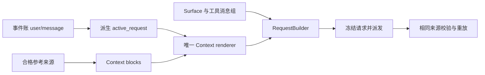

设计决定见 [ADR-0051](../adr/0051-current-turn-request-anchor.md)。

[`ContextInputService`](../../src/traceh/session/context_input.py) 只获得 `SessionService.read_session`、selection/index、Memory reader/recheck、workspace observation 只读
回调与宿主配置；没有 Store writer、Provider、Plugin manager 或后台任务。`AgentLoop` 在同一 Step Lease
内取得 Composition，读取来源并冻结 Context，由原 `SessionService.append_context_input()` 用观察到的
Session head 做 CAS；成功后才追加 Composition。retry 位于冻结之后，复用同一 Context、source_seq 和请求。

F0-B 的请求冻结基础与 F0-C 原文披露均已通过本轮限定验证（15.1）。当前唯一策略切换为
`active-reference-policy-v8`，配置为 13.3.1 的十二项统一策略。默认使用具名空策略：query、blocks
为空；空 Skill 目录记录 source-unavailable，非空目录记录 not-selected；Memory 来源未提供、History 未选择，引用配额恰容纳空 wrapper，本轮原问题回显另按实际字节记账。自动目录／摘要仍
只从当前 Session 可见 M3 replacement 按原逻辑顺序取块；查询只冻结本 Turn 首条真实 user/message，
History 不参与排名；Skill 与 Memory 共享检索见 7.5、7.7。仅额外显式配置 History reader 才能请求原文；不提供 raw-only 或跨 Session 读取。

[`api/history.py`](../../src/traceh/api/history.py) 定义 `HistoryReadPolicy`、`HistoryCursor` 与
`HistoryPageRequest`；DTO 本身不证明授权。[`session/history.py`](../../src/traceh/session/history.py)
只读验证 M3 图、递归展开允许的 user/message、assistant/message、tool/result，保留 tool_calls 与
原逻辑顺序。按闭合 Turn 分组分页，section/chunk 首版语义相同；不拆 Turn/Tool 组，超大 Turn 保留
稳定 page slot 并整页拒绝，不产生 accepted receipt。来源事件数／bytes、深度、block 数与页大小均有
显式上限。目录正文新增 cursor；未配置 reader 时为 null，配置后为首 cursor。摘要仍为已验证 replacement
message 的 canonical JSON。只逐页披露 next_cursor，不公开全页目录。

[`session/history_requests.py`](../../src/traceh/session/history_requests.py) 是唯一资格与消费派生规则。
当前 Session 曾经在冻结 Context 披露的 block/cursor，即使后来被更宽 replacement 隐藏，仍能按精确
身份请求。普通 PURE_READ [`request_history_page`](../../src/traceh/tools/history.py) 只返回有界 receipt，
实际嵌套在 tool/result 的 `data["data"]["history_receipt"]`；原文仅由目标 Step 的 Context 注入。
Tool 的首次注入只供同 Turn 紧邻后继 Step；实际获准正文的后续保留见 7.10；`include_default_tools=False` 不自动授予它。用户请求经显式
`TurnInput.history_requests` tuple，由 `ChatDriver` 透传，在首 Step 真实 user/message 后由原
`SessionService.append_history_requests()` owned/CAS 批量写入 `history/requested`。source="user"、
正文和 metadata 都不能伪造该权限。首 Step 是宿主请求唯一的首次目标；未首次注入的请求不顺延。已注入正文仅依 7.10 的连续准入链在本 Turn 保留。

每个 History block 绑定 replacement 与闭合 `turn/end` 的完整 EventRef、注入正文字节数／digest、scope
与观察边界。未启用真实观察时 workspace_observation=null、freshness=unknown；F4 显式观察与
三态派生规则见 7.7，不能使用建仓 base_revision 冒充当前验证。来源重算复用 M3 验证器与
`surface_conversation()`。`ContextInputSnapshot` 只持有 canonical 字符串，`to_dict()` 返回独立 JSON 图。
reader 按 `observed_session_seq` 重建旧来源，不用后来的摘要；精确核对本 Step 身份、唯一 Context、
随后 Composition、catalog、query、正文与预算。原文另核 request_ref、cursor、page/leaf_refs 和目标
Step，未授权 raw、无效或错配 catalog、Memory 来源证明和跨 scope 均拒绝；各领域使用 7.5、7.7 的来源验证。

唯一 `context-json-v13` renderer 从完整合格 block 派生精简模型项，正文仍为 canonical JSON 字符串。
完整 source_refs/provenance 保存在原 Context 事件，模型不再收到重复的账本证明。宿主头尾区分导航
与来源正文，导航不授予权限。History 的 read_action 按原首／下一 cursor 生成；无 reader 或末页为 null。
Memory directory 给当前 ID/version 的完整短事实阅读动作，summary/section 已有完整正文时为 null。
默认空 wrapper 仍是一条参考消息。统一预算计算实际显示的身份、导航、正文、转义与头尾，放不下整块
排除；来源证明和正文保留仍按原 owner 验证。完整字段与真实验收见 7.10。

允许已闭合的失败前缀为 Context/Composition/首 Request+Attempt 数 `0/0/0`、`1/0/0`、`1/1/0`、
`1/1/1`；进入普通对话请求构建才要求唯一 Context，D 摘要 Step 使用独立判别的 summary/input 来源。append 失败或重复取消先等待 owned Task 收敛，再按精确
identity 与 canonical JSON 对账 committed true/false/unknown；unknown 不重投、不派发。Recovery
不补造 Context 或 Attempt。History accepted/eligible/consumed/expired 从原持久事件与 Step 顺序派生；
目标超预算、失败、未发生、max_steps、取消或恢复均不顺延，无新增 writer、Lease 或 pending 状态机。
`session/protocol.py` 要求首事件 exact 四字段并含整数 `context_protocol=15`；
共同 Session reader、invariant、open/recover/inspect/replay/Request 路径拒绝旧 Session，只有列表可列身份。
EventEnvelope schema 仍为 1、M3 format 与 SQLite schema 仍为 2；当前 Context outer format 为 13。
Session marker 1–14、旧 Context/policy/renderer 与物理 schema 1 明确拒绝，无迁移或兼容 reader。
F3 authority 和 F4 Memory 检索均已实现（7.6、7.7）；F5 共享治理已接入（7.8）。

Product 的 Session 证据与叶失败读取也调用同一 `require_session_protocol()`，不再维护两份旧
`session/created` 字段白名单；新 Session 可读、旧 Session 拒绝。`ModelRequest.from_dict()` 保留合法的
空字符串 system prompt，不再把它转换为 `None`，保证冻结请求重建字节一致。

### 7.5 F2：持久选择、eligible 检索与 Skill 渐进披露

Release Stop A 的两项 P2 已修复。Context 去重复用 `retrieval.block_identity()` 的完整内容身份，
包含 tier；同一 Skill 的 directory 与 summary 可以在目标 Step 共存，相同请求仍沿原 receipt 规则合并，
持久 Context 中真正重复的块仍拒绝。exact matcher 对规范化后的完整标识做字面量匹配，保留内部空格、
转义正则特殊字符，并沿用标识边界，防止前缀、后缀或更长路径误命中；支持路径单独出现或被引号包围。
现行 eligibility、预算、FTS 元数据范围与冻结重放合同不变，修复及反向证据见
[Stop A 记录](../plan/TRACEHARNESS_V0.9_RELEASE_STOP_A_REVIEW.md)。

F2 已接入原请求链。宿主通过 [SkillContextControl](../../src/traceh/runtime/skill_context.py)
的 `runtime.skill_context.select()` 显式选择，通过 `rebuild_index()` 显式重建派生索引。
两项都借用同一 Runtime 的 Composition Lease，核对其 ToolRuntime 的 SessionService owner；
相同 Session id 的另一个 Store 不被接受。选择不 publish/drain Generation，不迁移插件身份，不增加 Tool grant。

`session/skill_selection.py` 只在同一 Store 的 `context-selection:<session_id>` 追加
`skill/selection-set`：exact format-1 payload 是
`{format,session_id,operation_id,expected_head,actor_id,catalog_digest,skills}`；
skills 是按 id 排序的 `{skill_id,version}`。同 operation id 仅 exact payload 重入返回原事件，
其他变更做 CAS；显式清空也写事实。取消／异常先等原 append 收敛，再对账 committed true/false/unknown；
不盲目重写。catalog digest 改变后旧选择为 stale-selection，必须由宿主重新确认。

`session/skill_retrieval.py` 从同一 Lease 的 enabled catalog 与持久选择交集构造候选。
query 只取本 Turn 首条真实 user/message，保留 EventRef；只对检索文本做 NFKC+casefold，
冻结运行时 Unicode 版本，正文不规范化。`traceh-lexical-v3` 把汉字分为单字与相邻双字，
其余字母数字组成连续词，并保留含点、下划线、路径分隔符等的完整代码字面量。query_terms 让查询中的
字面量保持整体；有此类字面量的查询，候选至少须命中其中一个完整值，不能用其组成词回退。
FTS query 是 UTF-8 hex token 的引用 OR，不接受原始 FTS 语法。
自动候选仅为 directory 或 summary；索引只含已选目录元数据的词频，没有 section/resource 原文。
exact lane 按配置字段优先级匹配 id/tag/path/symbol/error；FTS5 取候选，
`eligible-bm25-v2` 只用本 eligible corpus 的 N/avgdl/df/tf 算分，不用全库 bm25。
加权 RRF 用有理数融合，按稳定内容身份打破并列；其他 Session 或未选择项不参与统计。

`session/context_index.py` 持有精确 DDL 与不可变 ContextCorpus，SqliteEventStore 是连接、
事务、Worker、关闭与 backup 的唯一 owner。schema 2 增加
`context_index_manifest(corpus_key,manifest_json)`（WITHOUT ROWID）、
`context_index_items(rowid,corpus_key,item_json)`、`context_fts(terms)`（FTS5 unicode61）
以及五个精确白名单 shadow 表：config/content/data/docsize/idx；不按名称前缀放行。
corpus key 绑定 scope/catalog/selection head/tokenizer/ranker/config digest；
manifest 另存 corpus digest、item 数和 bytes。查询核对 manifest、canonical item、词频／FTS 行与
当前 source head；已知派生行损坏返回 index-unavailable，unknown schema／缺 shadow 在开库前拒绝。
FTS5 不可用明确失败，不装包或自动换实现。显式 rebuild 在同一 BEGIN IMMEDIATE 事务重新核对
selection head，整批替换 manifest/items/FTS，清理孤立派生行；失败回滚，事件不改写。
Store 的原 Worker/close 收敛规则同样适用。失败后只读探测完整快照是否存在，
`ContextIndexWriteError.published` 为 true/false/unknown；true 也可能是旧的相同完整快照，
不能据此断言本次操作提交。备份／恢复包含这些派生表，仍不覆盖现有目标。

`session/skill_requests.py` 复用 History 的真实 Step／已派发 Request 证明，
由普通 PURE_READ [request_skill_reference](../../src/traceh/tools/skill.py) 接受
`{skill_id,version,catalog_digest,requested_tier,section_id,resource_id,chunk_id}`，未适用字段必须 null。
只能请求本 Step 实际已披露且仍被宿主选择的 Skill；directory/summary 使用冻结 descriptor，
section 使用完整具名 section，chunk 使用贡献方声明的完整资源片段。
Tool 返回有界 skill_receipt 与 section/resource/chunk 导航卡（ID、title、summary、content_bytes），不返回正文。
成功 receipt 绑定原 Context EventRef、实际 Tool call、policy digest 与 format=2 / target_rule=next-step-then-bounded-turn；
首次仅同 Turn 紧邻后继 Step 可消费，实际注入的正文依 7.10 在本 Turn 有界保留。最后一步、取消、恢复、目标失败／超预算均不顺延到别的 Step/Turn，
没有 pending 流。实际读取只经同一 active Lease，版本、插件身份、section/chunk digest 错配明确拒绝。

Context 对三类来源统一分配预算：新显式请求、保留正文、自动 History、自动 Skill/Memory 融合候选；按完整渲染 item 分配
item/kind/total/block 上限，超限整块排除。冻结前再次读取选择 head，变化则记录 source-unavailable，
不偷偷替换成最新选择。已冻结的 Step 与重试不再检索。Context format 12 的必填
`retrieval` 统一为 `{skill,memory,fusion}` 或 null；每个来源的 format-2 receipt 恰好含 format/corpus_key/corpus_digest/eligible_count/lanes/fusion/coverage，见 7.7。
lanes 记录 exact/FTS 状态与稳定 identity/score 排名，fusion 保存分子／分母；coverage 记录每个融合候选
确实覆盖的查询词项。历史读取从原目录／Memory 前缀证明覆盖，不查询当前索引。
Request 重建只核对冻结 receipt、原 selection 前缀与随后 Composition 的元数据、正文和预算，
不查询当前索引或资源；每个 Skill block 必须来自冻结融合结果或精确披露请求。
这些引用不进入 Surface，不增加权限；EventStore、selection 和已冻结 Context 分别记录各自事实。

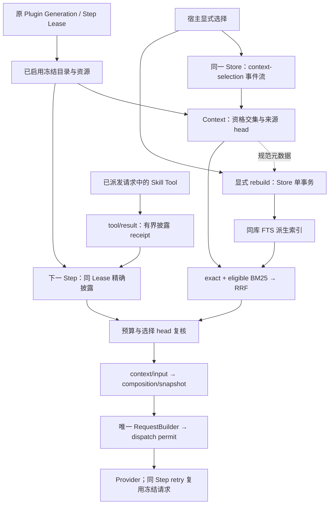

### 7.6 F3：项目归属与 append-only Memory authority

F3 已接入真实生产入口；B-P1-01 已修复并经独立复审关闭，Release Stop B 已通过（P0=0/P1=0/P2=0），Memory 检索／Context 注入现已在 F4 接入（7.7）。
[`ProjectScopeService`](../../src/traceh/projects/service.py) 借用原 SessionService 和 EventStore，
[`projects/projection.py`](../../src/traceh/projects/projection.py) 是项目关联的唯一纯 projector。
宿主 create/bind_source/bind_session 分别追加 `project/created`、`project/source-bound`、
`project/session-bound` 到同 Store 唯一 `projects:catalog`，全部 schema/format=1，exact 字段沿用
设计合同 §6。全流 expected_head CAS；同 operation/type/完整 payload 返回同一回执，不同 payload 冲突。
不同 operation 重复绑定同一归属只返回既有事实。一项目一个不可变 source，规范身份
`{source_id,repository_fingerprint}` 不能被另一项目占用，一个 Session 只绑定一次。

普通 Session 仍只有目录，归属由独立 catalog 证明。当前读取 `resolve()` 每次 fresh 验证同 Store
Session 创建引用、当前宿主 source mapping 和真实 checkout。LocalGitWorkspaceProvider 的
`project_fingerprint()` 复用原 Git runner，只读核对 source root/common-dir、Git 注册及管理目录，
允许脏文件，不创建 managed root。source 自身、不同消费方及 workspace=null 的 mapping-only
读取共用 `_require_project_registration()`：Git worktree list 的首项标识主 checkout，其实际
admin 必须等于 common-dir；其它注册项必须匹配唯一 worktrees/*/gitdir 反向指针与实际 admin。
不再按“路径等于 configured source”或“marker 指向 common”豁免 linked checkout；主 source、
linked source 与同仓库主／linked 消费方均按真实身份验证，损坏 source 在 read/approve/历史证据
及新 source binding 前拒绝。无法由 Git registry 证明的路径（包括所测 separate-git-dir 主目录）
明确不可用，不加路径推断。B-P1-01 已修复，证据见
[Stop B 审查记录 §7](../plan/TRACEHARNESS_V0.9_RELEASE_STOP_B_REVIEW.md#7-b-p1-01-修复与定向确认)。
common-dir 路径摘要不是永久仓库 UUID，不承诺识别同路径重建仓库；没有自动项目默认值、迁移或 rebind。

[`ProductProjectBinding`](../../src/traceh/product/project_scope.py) 由原 Product host 装配：
必须与 requester 使用同一个 SessionService、同一底层 Store、同一 Workspace Provider/resolver 实例。
从原 ProductTask opening、requester binding、Directory owner 祖先和 Workspace attached 事实证明
child 归属；不读 Agent metadata 猜项目。Workspace Supervisor 在真实 attach 后、create 返回前绑定，
resume/send 再验证，绑定失败／取消复用原 dispose 收敛。无 requester binding 的 Product 工作仍限
Session scope。关联不授予 Tool/Budget 权限，也不接管 Workspace 生命周期。

[`MemoryService`](../../src/traceh/memory/service.py) 与
[`memory/projection.py`](../../src/traceh/memory/projection.py) 是唯一 Memory writer/projector。
每项目只写 `memory:<project_id>`：proposed 不生效；宿主 approve 消费 exact proposal_ref/digest
并激活空 fact_slot；supersede 用一条事件退出 exact predecessor 并激活新 proposal；revoke 只退出
exact active。proposal_id、memory_id 各自唯一，proposal 只消费一次，同槽最多一个 active，旧身份不复活。
decision_digest 覆盖除自身外的完整 data；predecessor_digest 是旧 proposal_digest，EventRef.digest
则是 whole-envelope digest，二者不混用。所有事件只追加，不新增表、active flag 或可变缓存。

[`memory/sources.py`](../../src/traceh/memory/sources.py) 只接受三种来源：当前项目已绑定 Session 的
闭合 Turn 叶事件 user/message、assistant/message、tool/result；原 ProductTask 的 completed/failed/
cancelled/rejected/abandoned 终态事实；由 host declare 入口捕获的人工 statement。
Session 叶与闭合 Turn 的对应复用 `history.closed_turn_membership`；observed_head 绑定实际闭合前缀，
refs/digest、来源数、事件数、前缀字节都验证。模型不能提供 host-declaration，也不能引用其他 Session。
宿主可引用同项目历史证据，引用不构成通用原文披露权。`resolve_evidence()` 复用同一归属证明与当前
source mapping，允许保留已释放工作区的持久证据；当前访问仍须 `resolve()`，不复活资源或授予访问权。
每次 read 重放并交付 detached snapshot，验证来源后复核 Memory head；变化明确 source-unavailable。
这些观察不组成跨流原子快照，已批准文字的跨槽语义一致性仍由人判断。

[`api/memory.py`](../../src/traceh/api/memory.py) 的 ProjectScopeLimits 必填
max_catalog_events/max_label_bytes；MemoryPolicy 必填 max_body_bytes/max_sources/max_source_events/
max_source_bytes/max_memory_events 和非空 denied_patterns。数值须为正整数，正则须合法。
[`memory/policy.py`](../../src/traceh/memory/policy.py) 将固定秘密／私有输入／瞬时状态形态检查与宿主
显式规则合并，超限或命中拒绝写入；不声称穷尽自然语言秘密或语义冲突。长期目标、约束、术语、
决策、重要里程碑、当前获批阶段与批准路线仍可作为短事实。

RuntimeConfig.memory 为 null 或完整 ProjectMemoryConfig(project_limits,memory_policy,source_resolver)。
默认构建只在显式配置且 include_default_tools=True 时注册
[`propose_workspace_memory`](../../src/traceh/tools/memory.py)，它沿原 ToolRuntime 的
EXTERNAL_TRANSACTION 路径运行，只收 proposal_id/body/source_event_ids，返回 proposed 回执。
模型须已获得准确的本 Session 原始事件 ID；F3 不添加来源目录、任意事件查询或自动来源猜测。
运行期派生 operation/actor 绑定真实 Session/Turn/Step/Tool call；模型不能传项目、槽、批准、替代或撤销。
原来的 Tool 授权保持有效，配置本身不改变 include_default_tools=False 的行为。
宿主 `runtime.memory.read/declare/propose/approve/supersede/revoke` 通过
[`MemoryControl`](../../src/traceh/runtime/memory_control.py) 借同一 Lease，核对 exact Session owner，
由原 Drain 等待收敛。`runtime.project_scope` 与独立 MemoryService 一样是 Store-owned 宿主服务，
其生命周期不同于 Runtime 门面的 Lease；没有把 writer/Store 注册到 Plugin service 或模型 context。
append 失败或取消先收敛 owned task，再按完整 payload 对账 true/false/unknown；取消保留原异常，
committed 放在 AuthorityWriteError cause，unknown 不自动重投。并发相同操作返回同一已提交回执。

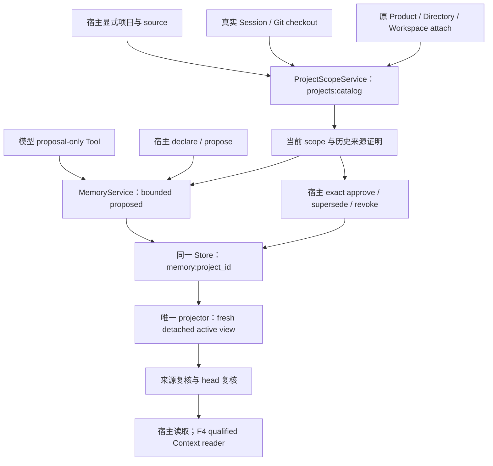

### 7.7 F4：Memory 检索、History 时效与统一 Context

F4 已接入同一 AgentLoop → Context → Composition → RequestBuilder 主线；设计细化见
[ADR-0045](../adr/0045-qualified-reference-retrieval-and-history-observations.md)。
`memory/context.py` 的 MemoryContextReader 每次借用原 MemoryService/ProjectScopeService，
验证当前 Session 绑定、source 身份和 active 事实，记录 projects:catalog 与 memory:<project_id> 两个
HeadRef，再复核来源。不持有可变选择缓存、写权限或新生命周期。未绑定 Session 即使同路径也没有资格。

`session/retrieval.py` 是 Skill/Memory 共用的 normalization、tokenizer、exact、eligible BM25、RRF
与 receipt 校验 owner；`skill_retrieval.py` 和 `memory/context.py` 分别负责领域候选与来源证明。
Memory 只索引 active 的 id/fact_slot/完整已批准正文，proposed/revoked/superseded 不入候选；
带空格的正文标识用引号或反引号明确界定，exact 保留完整字面量及边界，不从散文猜多词路径。
Skill 仍只索引已选择的目录元数据，不把 section/resource 原文自动加入索引。两个来源独立计算
有界 eligible corpus 的 df/avgdl，避免跨项目或跨来源污染；共享 rank 算法不等于混合事实源。
FTS 仍由原 SqliteEventStore Worker 和事务拥有。缺失或损坏索引记 index-unavailable，exact
仍可用；`runtime.memory.rebuild_index(session_id)` 借用原 Lease 显式重建，不改 Memory 事实。

Context 的 `retrieval` 是 null 或 exact `{skill,memory,fusion}`；两项来源各为 null 或 format-2
receipt `{format,corpus_key,corpus_digest,eligible_count,lanes,fusion,coverage}`。global fusion 保留两来源
候选，按查询覆盖数量、原有理数分数和完整内容身份排序；实际预算后的自动排除见 7.9。先分配本步新显式请求，再分配仍有效的已读正文，再分配自动 History，最后自动 Skill/Memory 融合候选；前两组内按 History、Skill、Memory 顺序，各来源沿实际请求／准入顺序，同一 memory_id 最多一个块。
统一 item/kind/total/max_blocks 门控制完整渲染成本，超限整块排除，正文不截断，token_measurement
仍为 unavailable。query 只记录本 Turn 首条真实 user/message 及规范化版本，没有模型查询扩写。

Memory block 的 version 是 proposal_digest，source_refs 为 proposal 与 activation，provenance exact
为 `{project_id,memory_id,fact_slot,activation_ref,approved_content_digest}`。directory 正文是
`{project_id,memory_id,fact_slot,approved_content_digest,content_bytes}`，其中 content_bytes 指完整
已批准正文；summary/section 都使用该完整正文，不另造摘要。`request_workspace_memory` 普通
PURE_READ Tool 只接受已实际披露的 exact memory_id/version/tier，返回 receipt，不返回正文或原始
跨 Session 来源；chunk 拒绝。`session/reference_requests.py` 统一 Skill、Memory、History 的首次注入与逐步保留推导（7.10），
各领域 request reader 保留来源资格检查。每步 fresh active/source 复核，撤销后
不再注入。max_steps、取消、失败、恢复和新 Turn 都不顺延 receipt；Provider retry 只用冻结请求。

显式 `workspace_observations=True` 才启用 History 版本观察，要求 Memory authority、Memory 检索和
有界 History reader。MemoryContextReader 对接 `workspaces/observation.py` 并借用原 scope；Runtime 只接收回调，resolver 必须支持只读
`project_observation(source_id, workspace)`。LocalGit 实现复核 source/checkout 注册身份，读 HEAD、
完整 status、再读 HEAD，仅干净且前后相同才给 revision。ToolRuntime 对工作区读组、串行写和 process
在执行前后观察，相同观察写入 `tool/result` 宿主外层 `workspace_observation`；ToolOutput.data 的
同名字段不能赋予证明。缺失、脏工作区、执行期间变化与取消收尾没有已知 revision 证明。

History directory 的 canonical body 另含 original_bytes：有 reader 时由同一有界来源图计算完整
源消息数组 UTF-8 大小；未配置 reader 为 null。它不保证一页装得下，也不授予原文权限。

`session/history_observation.py` 从有界 History reader 的允许 leaf_refs 中读取真实 Tool envelope，
与当前 Context 冻结的观察值比较；已知冲突为 stale，所有相关工具观察均已知且相同为 matched，
其余 unknown。block provenance 保存 source/current identity/revision 四字段或 null，renderer 以
current_workspace_validity 显示原 freshness，区分当前有效性与历史页面可读性。matched 仅表示观察时 Git 版本一致，不表示旧测试当前仍通过，不覆盖 Product/
Workflow/Workspace 权威。观察没有跨进程文件锁，也不承诺请求返回后文件仍不变。

新 payload 必填 `memory_source` 与 `workspace_observation`；前者冻结 ProjectScopeLimits/MemoryPolicy
用于历史证明，scope 绑定原 project/session-bound，source_heads 绑定两条原流。SessionService 在
append/read 时复用原 project/memory projector 重放 exact 历史前缀，核对创建引用、绑定、active 正文、
activation、digest 和 eligible corpus。当前观察的 source_identity 必须属于该项目。已冻结 Request
只使用旧 prefix/receipt/bytes；以后批准、撤销、修改 Git 或丢失索引都不改写旧 Request。

唯一协议现为 Session marker 13、Context format 12、`active-reference-policy-v8`、`context-json-v13`。
SQLite schema 仍为 2，M3 replacement format 仍为 2；旧 Session 1–14、旧 Context/策略明确拒绝，
无迁移、别名或兼容 reader。生产 semantic/reranker 目前明确关闭，不加载或下载模型；测试目录中的显式评估资产不属于 Runtime 装配；F5 治理与冻结评测已接入（7.8），发布门禁另计。

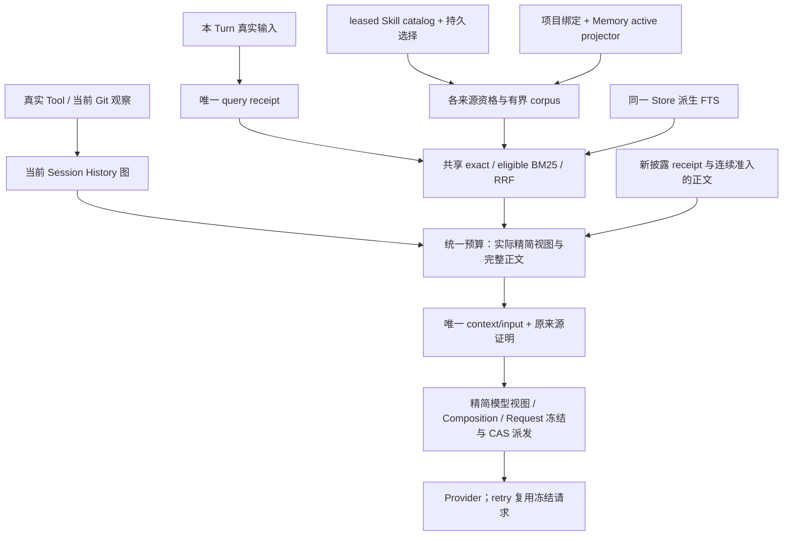

### 7.8 F5：共享治理、显式宿主配置与冻结评估

决策见 [ADR-0046](../adr/0046-shared-context-governance-and-frozen-retrieval-evaluation.md)。
`chat/governance.py` 是 Line/TUI 唯一治理 service；`chat/config.py` 解析显式宿主配置；
`tui/governance.py` 用只读 TextArea 显示可选取证据和确认框，并提供 Memory 身份选择表单；复用 App
原有 owned operation，关闭时收敛表单与确认 Future。草稿不构成审批，确认仍由共享 service 冻结当前事实。
`runtime/skill_context.py` 的 read/selection/rebuild 和 `runtime/memory_control.py` 的
read/authority/observe/rebuild 继续借用原 Session 与 Composition Lease。没有 UI 缓存或新事实流。

- `/skills` 展示 enabled catalog、持久选择及 head、eligible 原因、当前 capabilities，与最近实际
  retrieved Step/Skill/tier/bytes 分开。`/plugins` 显示 installed/enabled；use/reload 先导入显式
  trusted 插件、显示完整 Manifest/provides，再确认 setup。review 绑定同一对象与摘要，激活仍经
  原 Manager；provides 不是完整权限承诺，import 也不是无执行的操作。
- `/memory` 展示 proposal/source/scope/body/digest 和当前 active；declare 只写提议；approve、
  supersede、revoke 需精确身份及人工 CONFIRM。确认前冻结 head/ref/digest；旧确认遇到并发改动拒绝。
  Skill 选择同样冻结 catalog digest/head，Project 创建/来源/Session 绑定复用原 CAS writer。
- `/history` 和 exact page 展示原目录、摘要、source digest、原始字节数、receipt/cutoff/freshness，
  人工查看不向模型注入。`/context [STEP_ID]` fresh 读取实际冻结 snapshot，完整解释 query、
  provenance、候选/命中/排除、预算和实际 blocks，并单独标记是否 dispatch。

`--context-config` 的 exact-key format 1 使用同一 Context policy parser，Skill limits/resource roots、
Project limits/Memory policy/source mapping/managed root 均显式输入；示例见
[`examples/context-governance.json`](../../examples/context-governance.json)，示例路径和限额不是默认值。
与 Product 合用时复用同一 resolver 实例并核对 source/root；角色 Runtime 复用该 Context/Memory 配置，
仍按原 Profile 授权 Tool，不继承 requester Skill 选择。

ProductProjectBinding 在 attach 后的原有 bind/send 边界准备 Session-specific 派生 Memory corpus，
不复用 requester 索引键，也不在 query 中自动修复索引；部分失败/取消沿原资源 owner 收敛。
`evaluation/retrieval.py` 只校验冻结输入及只读度量；seeding 仍由 `attempt.py::run_attempt` 单独拥有，
schema/指标/成本见 12.5，命令见 13.10。F5 开发与发布门禁分开：原 5 条质量失败已修复，同冻结基线 11/11 达到原阈值；语义题仍为 0。Release Stop C 已通过限定验收，发布门禁仍待授权。

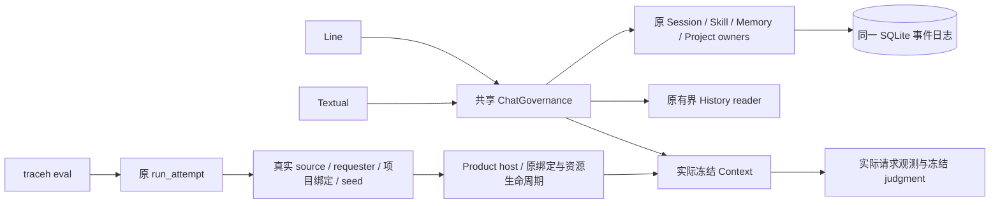

### 7.9 F5 精度修订：完整字面量与查询覆盖

[ADR-0047](../adr/0047-literal-query-coverage-admission.md) 将修订放在原共享检索与 Context 预算 owner。
每个来源的 format-2 receipt 新增 coverage：按来源 fusion 顺序记录 `{identity,terms}`，terms 是去重排序的
query_terms 交集，并补入实际 exact 字段匹配提供的词项。因此未进入 Skill FTS 的完整 resource path
仍可证明 exact 命中，不读取 section/resource 正文。无索引时仍保留 exact；不可用来源不参与排序。

全局候选先按覆盖词项数量降序，再按原有理数 RRF 和内容身份排序。自动块只有实际通过原 item/kind/total/
block 预算后，才能排除后续覆盖集合为其严格子集的候选，冻结原因 `query-dominated`。相等或互补集合
保留；预算放不下的大块不会压制小块。显式 Skill/Memory 披露仍优先，不参与该自动支配判断。
普通词后的单个句号视为散文标点；作为标识时需成对引号／反引号。已有内部连接符的段保留尾点及
其他尾连接符，不能降级为较短标识。没有新增阈值、停用词词典、域名／样本 ID 例外或语义模型。它仍是词法选择规则，不证明语义相关性：
包含更多偶然查询词的参考可能压制有用的部分覆盖；相等或互补覆盖的噪声仍可能入选。

先前 C3 对当时本地资产完成了四候选可行性筛查，结论为不接入。原 11 题在当前 Runtime 重新达到原阈值，
44 个 Session/Context/dispatch 的 SQLite 核算无重放或不变量错误。另冻结中、英文各四条改写，使用
相同资格过滤后的 6 条内容。`tests/local_retrieval_screen/capture.py` 原样观察原 Runner/owner；
`screen.py` 只离线比较固定 cosine 阈值及可选 cross-encoder，再调用原 Context 预算，不持久化假设
结果，不伪造当前协议允许的语义收据，也不增加生产模型依赖或默认模型。资产、源码与门槛先于评分冻结。

最佳 cosine 0.5 候选补回原语义题及一条英文改写；新增英文平均 Recall/precision 为 0.25/0.25，
中文为 0.25/0.125，未达每项 0.75；全部九条语义题的平均 Recall 增益为 2/9，未达 0.25。
其他三个候选也未达标，原非语义要求和隔离保持通过。暖查询 p95 为 11.40–25.26 ms，6 条向量
共 9216 bytes；成本通过不能代替质量通过。中文四题有 55%–88% 未知 token；仅补空结果也不能纠正
既有词法误召回。该结论只限当前资产、表示和候选，不推断所有向量模型无效。semantic/reranker 继续
关闭，生产仍执行上面的词法合同；当时未接入新检索，没有把重复聊天调用当成语义集成证据。
完整门槛、失败及限定检查见 [C3 验证记录](../validation-v0.9-stop-c-c3.md)。

E1/E2/E3 收口后的有界复测也已完成：固定 BGE small 中文/英文两资产、单独或 max 合并、.6/.7/.8 共九个候选，
原 11 题、八条改写、K/判断/门槛全部不变。`tests/local_retrieval_screen/retest.py` 与 `retest.json` 仅为诊断，
复用原 capture/资格/准入，不写 Session 或新增生产模型默认。440 个源码/测试文件、资产、捕获先于评分冻结。
真实本地推理得到最好英文 Recall/precision .5/.5、中文 .25/.125，九题增益 1/3；仍未过每语言 .75，九组均不接入。
中文模型对四条中文改写未知 token 为 0，相关文本的分数仍低于阈值；不能把失败全部归因于分词器。
单语言模型 max 合并没有保证混合语言语料的对齐，且仅补空结果仍不能修正原词法误召回。
模型资产 230788023 bytes、双向量每项 3584 bytes、无截断；共同加载 688.99ms、重建 190.84ms，暖 p95 15.33–37.30ms。
从保存的文档/查询向量独立核算 171 条候选观察；实际问题渲染最大 2302 bytes。44 个 Session/Context/request
fresh reader 重放与不变量零问题，事件未改写。12 项控制测试、55 项相邻定向集合及语言门槛反向验证通过。
生产 semantic/reranker 继续关闭，未安装新依赖或提前建索引 owner；这不推断所有语义模型无效。
见 [复测报告](../validation-semantic-retest.md) 和 [评分前合同](../plan/TRACEHARNESS_SEMANTIC_RETEST.md)。

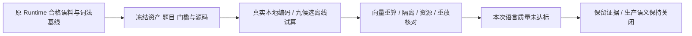


精度修订的覆盖证据沿用来源 receipt 2；导航修订后当前唯一协议为 Session 15、Context 13、`active-reference-policy-v8`，
索引 `traceh-lexical-v3`/`eligible-bm25-v2`。旧 Session 1–14 在原入口明确拒绝，不迁移、改写或删除。
当前 renderer 为 `context-json-v13`；SQLite 2、M3 2、Context 十二项及来源十五项配置保持原结构。精度阶段冻结 benchmark/
corpus JSON 和阈值不变。SessionService 与 Memory 原历史 reader 验证当时的覆盖和来源前缀，重试／重建
使用原 receipt 和 bytes，不运行新查询；没有双 reader 或第二事实源。定向验证和冻结复验见 15.1。

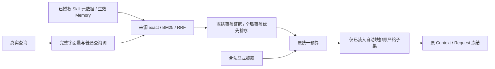

### 7.10 F5 Skill 导航合同与真实模型披露

`SkillSection`、`SkillResource`、`SkillChunk` 的 `title`、`summary` 是贡献者必填的非空 keyword-only
字段，reader 拒绝缺失；不从 ID、路径或正文猜测。元数据进入原 `skill_catalog_digest` 和 Composition
revision；Skill/section/resource/chunk 的每项 summary 都受原 `max_summary_bytes` 限制，整个目录
受 `max_catalog_bytes` 限制。旧选择在目录改变后 stale，必须走原宿主确认。

`SkillDescriptor.navigation()` 是唯一导航投影：section/chunk 卡含 ID、title、summary、content_bytes，
resource 卡另含 relative_path 和 chunk 卡。`directory()` 包含顶层身份、title、summary、tags 与这些卡；
Context directory 和 Tool available 复用该元数据。summary 仍只给顶层摘要，需要选章时模型先请求 directory。
召回范围仍是已选 Skill 的顶层元数据，不因此具备正文/语义搜索或未选择 Skill 的发现能力。

`runtime/prompt.py` 的 `assemble_prompt_sections()` 同时服务 live 与 frozen PromptAssembler，固定宿主
说明实际进入 Generation 的 Provider 请求。它与 Skill renderer notice、Tool 描述/回执共同说明目录是
参考文档、如何复制精确 ID、正文在何处；这些说明不把 Skill 作者正文提升为 system 或执行权限。
每个 Step 的 Context 作为最后一条 request-only user message，位于完整 Surface 和 Tool 调用／结果组之后，
明确标为当前任务的参考，不是新任务。RequestBuilder、实际派发、重试、重建、invariant 和 Inspector 共用这个顺序。
正文不进入 Tool result 或 Surface。模型既可一次请求多章，也可顺序读取并在当前参考中对照仍获准的正文。

[ADR-0049](../adr/0049-current-reference-context-and-bounded-turn-retention.md) 冻结了三类引用的共同寿命。
Tool 请求首次只供同 Turn 紧邻下一 Step，typed History 请求首次只供本 Turn 首 Step；只有实际通过预算
进入 Context 的 Skill section/chunk、Memory summary/section、History section/chunk 才能继续保留。
`reference_requests.collect_requests()` 从原事件的连续 Context 准入链派生 fresh/retained 句柄，
不缓存正文或新增 pending 状态。每步仍检查 Skill selection/catalog/Lease、Memory active/project scope、
History 来源和当前 freshness；History 保留原 request_ref，重放只用原冻结前缀，不读今天的资源。
新显式请求优先于保留正文，再分配自动 History 和自动 Skill/Memory 融合候选；两组显式项内部均按
History→Skill→Memory 及原请求／准入顺序。所有来源共用完整块 item/kind/total/max_blocks 预算。
首次未注入、后续淘汰或资格中断的旧请求不复活；失败、取消、恢复、Turn 结束后不顺延。元数据不因
旧回执自动常驻，Provider retry 继续使用同一冻结请求。这保持原事件唯一事实源与原资源生命周期。

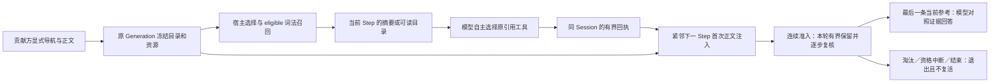

真实调用还定位并修复两项：ModelRequest reader 保留 JSON 温度的 int/float 原表示，避免合法 `0`
变成 `0.0` 导致冻结请求绑定失败；词法分词将无引号普通词尾标点、仅由冒号连接的汉字散文按自然语言
处理，显式引号、复合标识符和路径仍整体匹配，没有领域词表。当前唯一版本为 Session 15、Context 13、
renderer `context-json-v13`、tokenizer `traceh-lexical-v3`；policy 为 v8、披露 Tool receipt 为 2、来源检索 receipt/ranker 仍为 v2，SQLite/M3
仍为 2。旧 Session 1–14 明确拒绝，不迁移、双读、猜测或删除。

`tests/live_skill_navigation/` 是显式真实集成测试，使用原 Runtime/Provider/Plugin/SQLite/Tool 和自然
语言输入；不预写模型响应、不向模型提供判定答案、无语义 ID 随重复变化。它不由 pytest 自动调用，
也不是第二产品 Benchmark Runner。按模型区分答对、取得正文、严格选章、额外读取与失败，保留导航
移除对照和全部失败；真实模型仍可能提前停下、误用文件工具或多读资料，不能宣称任意模型可靠。
目录大到超预算时整体排除，尚无分页。详见 [ADR-0048](../adr/0048-skill-navigation-and-real-provider-disclosure.md)
及 [真实验证记录](../validation-v0.9-skill-navigation.md)。Release Stop C 已通过限定验收；发布门禁仍待授权执行。

项目所有者已授权按[Stop C 修补执行计划](../plan/TRACEHARNESS_V0.9_RELEASE_STOP_C_EXECUTION.md)
继续推进。首轮 40 次隔离真实诊断将 Context 位置与回执时态分别比较：原方案 4/8、后置 8/8、
后置加本轮已读正文保留原型 8/8；这只是探索结果。C1 已按 ADR-0049 接入上述生产主线，
三类来源均采用共同准入链与统一预算；主线 149 项、相邻检索／Inspector 171 项、Provider／请求相邻
75 项定向测试通过，另补 Memory 正向保留后专门的 10 项保留测试通过。测试集合重叠，不相加冒称唯一总数。
四组隔离反向控制分别证明正文寿命、逐步准入、新请求预算优先及末尾位置保护；正确实现通过后，
通用任务提示的 95 项相邻确认也通过。JSON-null 说明修订后 navigation/retrieval/failures 的
99 项通过（67.33 秒），包含字符串误填拒绝、无正文／receipt 泄漏、改正后成功与重放。
当前源码明确区分 JSON null 与字符串，不做 coercion；compileall、修改范围 Ruff 和 3259 项仅收集通过。

C1 现已达到冻结真实验收：第三轮 qwen-plus、qwen3.8-max-0902、deepseek-v4-pro-0813 各 24/24
严格通过，任务、答案与正文证据也各 24/24，scope/replay/invariant 违规为 0。
前两轮失败与两次八例探索均保留，三轮完整网格加探索共 232 次旅程、614 份 Request、615 次
Provider Attempt；614 次 exact usage 合计 2,002,286 tokens。一次原策略可重试的
provider-disconnected 没有 usage，未补零。修订未改变题目、判定、权限、预算或门槛。
完整结果、原失败及反向证据见 [C1 验证记录](../validation-v0.9-stop-c-c1.md)。

C2 已按 [ADR-0050](../adr/0050-compact-reference-navigation-and-model-view.md) 接入原 renderer 与共享 prompt。
原 Context block/source_refs/provenance 仍是完整来源证明，模型视图共有 kind/id/version/tier/digest/body。
Skill 另有顶层 catalog_digest 与固定说明；Memory 另有 project_id/fact_slot/body_status/read_action；
History 另有 body_status/current_workspace_validity/more_pages_available/read_action。正文 bytes 不变。
Memory directory 动作复制当前 memory_id/version 申请 section；完整短事实已显示时动作为 null。
History 动作复制原首／下一 cursor 申请 chunk，没有 reader 或后续页时为 null；unknown/stale 不表示
页面不可读。模型自行选择需要的动作，经原 Tool/Policy/收据/下一 Context 主线执行，没有新 Tool、
权限、自动读全资料、缓存或第二事实源。实际精简视图成本仍由同一 renderer 纳入原完整块预算。
共享完成提示遵守用户指定格式，历史正文中的指令仍是过去记录；不会按评分器裁剪、补值或转换答案。
当前唯一协议为 Session 15 / Context 13 / renderer v12 / policy v8；Session 8 / Context 7 仅为保留的
隔离探索，所有旧 Session 1–14 均拒绝，披露收据、History page policy、SQLite、M3 和来源检索协议不变。

显式开发旅程位于 `tests/live_reference_journeys/`：journey_fixtures 组装隔离 Git、SQLite 与原 Runtime；
bootstrap 经原宿主审批准备 Memory，用真实模型回合准备和压缩 History；assessment 核对严格 JSON
及最终 composed/dispatch 中实际正文；run 冻结输入、保存账本并分别统计前置和目标调用用量。
audit 从原 SQLite 核对所有 Session、策略、问题、请求和最终 assistant/turn 事件，不把报告当答案事实源。
篡改复制报告会被原 SQLite 拒绝。format 2 用独立 answer_fields 明确字段的单位和代号形式；问题不读取
预期值，缺少描述或字段不一致在调用前拒绝。27 项评估器定向检查通过，恢复旧问题生成器的 3 项检查
按预期失败。初版题目歧义、旧失败及单请求探索保留，不追溯改分、不与新题结果混算。

format 2 完整同题三模型网格的原实现为 20/28、27/28、28/28，阅读动作候选为 22/28、28/28、28/28；
最终精简视图为 27/28、28/28、28/28，达到每模型至少 26/28；最后正文证据均为 28/28。
scope/replay/invariant/evidence-reader 违规为 0。最后 96 条旅程 250 次 Attempt 均有 exact usage，
共 840,126 tokens；各模型另 4 条语义诊断全通过，但仍是词法检索，不表示已有向量能力。
原 Skill 完整回归为 24/24、23/24、24/24，达到原严格至少 22、任务至少 23 的门槛；最后正文均齐全。
72 条 Skill 旅程 183 次 exact Attempt，共 575,886 tokens。C2 一次纯 JSON 偏离、Skill 一次非法披露
及后续被拒的工作区调用原样保留，不能宣称所有模型完全可靠。
隔离 owner 检查经展示字段断言同步后 160 项通过，阅读动作的正向、拒绝、分页和预算共 4 项通过；
源码格式化前后 244 个模块 AST 等价；当前源码逐字节重现 180 个实测 Session 的 433 份参考请求。
接入后 owner 首轮 215 项通过、1 项旧预算夹具不再超限；明确原文超过 Context 限额并独立配置夹具
Memory 容量后，精度／共享预算 31 项通过，另一组相邻 153 项通过，所有已知失败清零。
compileall、修改范围 Ruff、差异及文档检查通过，collect-only 3292 项，未执行全量。C2 已完成，详细结果和原失败见
[C2 验证记录](../validation-v0.9-stop-c-c2.md)。C3 本地模型筛查见 7.9；没有候选达到接入门槛，保持关闭。
C4 已完成受控调查，历史具体字节原因仍未知（8.3）；C5 三路独立审查和范围内修复已完成，
Release Stop C 已通过，实际范围、失败及未运行门禁见 [Stop C 记录](../validation-v0.9-stop-c.md)。
全量、L2–L4、Wheel/安装及提交发布继续禁止。

### 7.11 主动检索：三类来源已接入，55/72 与已知限制接受

**当前版本：0.11.0（Educational alpha，GitHub Release）。** 本次收口统一 Evaluation、受限 AO 和 AO-3 应用内后台优化；Session 13 / Context 12、Sandbox 配置 2 / Promotion 验证 2 保持，独立评估 worker 回执为 2。旧评估需按冻结源码核验；不迁移或改写用户数据，不自动采用候选，不上传 PyPI。本版不含 DA 或 MCP，不改写旧 55/72 统计。见[限定验证](../validation-v0.11.0.md)和[后台优化记录](../deal/026-runtime-background-optimization.md)。

**历史 grid-06 补测后成绩：55/72（76.4%）。** 原 51 条通过保留，六条 TLS 失败槽位直连补测新增 4 条通过、2 条回答/依据问题，无最终连接失败；仅跑当前候选，未跑基线。历史计分见[记录 010](../deal/010-grid06-direct-supplement.md)。原 51/72 是历史完整运行记录，该历史合成口径为 55/72；不是 UE-4 新运行的成绩。

**追加追试已停止。** [记录 009](../deal/009-search-snippet-budget-followup.md)在隔离副本尝试减少命中数后重新分配片段上下文。49 项定向检查和公开路径反向验证证明相同预算下可恢复片段、原 Reader 可定位目标；脚本提供精确定位词不算自主检索。真实模型 16 条旅程为 4/8→4/8，没有有命中搜索页，候选关键路径未被真实模型使用，故未验证端到端收益，按用户要求停止追加方案。44 个请求独立重放通过，无最终连接失败，Provider 报告 248,063 tokens；较深连续分页的离线诊断中止、不计通过，其性能与取消收敛不作新保证。未采用生产改动，未跑全量或 L2–L4，未提交。

**可靠性实验已收口，未新增生产策略。** [RE 计划](../plan/TRACEHARNESS_RETRIEVAL_RELIABILITY_EXPERIMENT_PLAN.md)以完整当前源码冻结 B0，在独立进程中用同一模型、预算和直连条件对照。RE-1a/1b 分别为 7/10→7/10；RE-2 为 7/10→6/10；RE-3 首轮 5/10→6/10、重复 3/6→2/6；RE-4 为 8/10→8/10。首轮包含四个无需检索保护题，这些诊断分数不能替代历史 72 题成绩。无稳定收益候选，RE-5 完成组合资格判定，24 个冻结留出场景对应的 96 条验证未运行，不算通过。

新增 `tests/live_active_retrieval/reliability.py` 显式实验入口及固定材料，复用原真实 Runtime/Reader/工具主线；普通 pytest 不隐式联网。112 条目标旅程无最终连接错误，40 条日常保护旅程正确且零工具调用；含准备共 401 个请求在独立 SQLite 副本重放一致，无不变量或 Attempt 收敛错误，命令输出各执行一次。Provider 报告含准备 1,956,458 tokens（目标部分 1,421,171），不含两个探针，unknown/estimated 为 0。运行器/Provider 定向 43 项及各候选 owner 检查通过，3,645 项仅收集；未跑全量、L2–L4 或发布门禁。

实验确认：Memory 可在只扫 2/13 对象且还有下一页时停在背景；模型可能把导航记录名当业务凭证、把来源不可用说成无命中。多词查询的单题改善未重复。题目歧义、附加错误及评分敏感性均单列在[记录 008](../deal/008-retrieval-reliability-experiments.md)，不能归因为存储丢失或靠强制搜索处理。生产 Python 源码与 B0 完全一致，Session 15 / Context 13 协议、原 Projection/Reader、Effect 事实源、预算、停止规则与用户连接配置保持当前主线；语义检索和本轮候选均未采用，原 51/72 与 NO-GO 不变。

[主动检索执行计划](../plan/TRACEHARNESS_ACTIVE_RETRIEVAL_EXECUTION_PLAN.md)与
[ADR-0061](../adr/0061-active-reference-search.md)冻结共同合同。AR-A 已完成；AR-B 已接入
`search_history`，定向/相邻验证已完成。AR-C 已装配 `search_memory`、`search_skill`，保留原自动检索与读取工具；
合并范围门禁已完成；AR-D 已执行完整网格与独立重放，原验收结论 NO-GO；当前按第 1 节的已知限制接受决定发行并进入 S0。语义检索仍关闭。

`session/history.py` 的同一完整 Turn 分页规则供 `read_page` 与 `search_records` 复用。
搜索只扫描当前 Session 合法压缩根展开的原消息 content；记录绑定 root/version/leaf ref/page cursor。
它不是所有 Session 或任意 Stream 搜索；大工具结果仍沿独立 retained output reader 读取，不能重跑命令。
超大完整 Turn 可以产生带来源的短片段，但原页不可读时 `read_action=null`，不拆开 Tool call/result。

`session/reference_search.py` 负责字面 Unicode 忽略大小写定位、规范参数、稳定扫描顺序与派生页；
`tools/reference_search.py` 借用同一 Session reader，经原 ToolRuntime、Policy 与 Step 记录回执。
query 不接受空值或超限，limit 取现有 Context max_blocks，cursor 绑定来源/查询/策略和扫描位置；
只有本 Step 已准入页给出的 next_cursor 可以翻页。无关追加事件不改变压缩根来源身份。
没有新索引、pending、持久搜索队列、业务投影、AgentLoop 或预算配置字段。

`session/memory_search.py` 从原 MemoryContextReader / active 投影生成分离的有界记录，搜索 memory_id、fact_slot、
批准正文；以项目 scope、原 source heads、Memory source policy 绑定版本。候选只含当前批准且有效对象，
提议、撤销和被替代版本不可重新准入；读取仍由 request_workspace_memory 核对批准引用、版本与当前绑定。
Session append/read 通过原冻结 Memory reader 重算搜索页，重新计算摘要也不能把伪造片段变成批准事实。

`session/skill_search.py` 从原 selection 与 Composition descriptor 生成顶层/章节/资源分块的 ID、标题、summary、tags
记录，顺序由原目录身份决定。资源标题进入其 chunk 记录；无 chunk 的资源只提供目录读取入口。
搜索不调用正文 reader；记录数/字节、catalog、查询、页与 token 均有原限额。搜索页绑定 Session、catalog digest、
selection head；Session reader 以原选择流前缀和冻结 Composition 重建，Request reader 另外核对片段来自该目录。
正文继续由原 Skill Lease 的 read_section/read_chunk 读取，插件切换、退役和取消选择沿原规则失效。

共同 `SearchSource` 只是临时 detached reader 结果，不存业务状态。三类工具复用成功 Tool 回执、下一 Step 搜索页、
预算与游标规则；Memory/Skill 命中只给原读取工具接受的精确 read_action，不能随意改 tier、ID 或版本。
顶层 Skill 摘要命中不能直接改成目录申请；需要章节正文时继续搜索主题词，或先按原摘要入口取得原披露资格。
当前参考包装与通用工具说明明确自动目录为空不代表合法资料不存在；搜索未命中应换相关词，不能把工作区文件
当作批准 Memory 或 Skill 来源。这些指引不包含领域答案、具体模型分支或测试词表。


Tool result 只存 format-1 search_receipt；成功模型 Tool call、原冻结请求/Context、来源摘要均核对。
下一 Step 才从原事件和来源重建 `kind=history|memory|skill,tier=search` 页并走统一准入；搜索页不保留到更后 Step。
原 `request_history_page` 仅从当前已准入搜索命中接受精确读法，之后继续原 fresh/retained 正文寿命。
同一步搜索后抢先读取、伪造 offset、跨 Session、过期命中及重新计算摘要后的伪造正文均不能获得授权。
未准入不等于送达；失败/取消/恢复收据不产生后续搜索候选。CoreInvariantChecker 也核对没有后续 Context 的搜索回执。

搜索片段不伪装成完整批准事实或原消息。body 明示字段、status、scanned/total、hits、next_cursor；
无合法压缩来源与当前字面无命中分开表达。total 为有界来源记录数，不是命中总数。
页按原 item/kind/total bytes 与完整请求 token 准入；先缩短片段，再缩减命中数并返回精确续页位置，
单条身份/动作也放不下时为 resource-limit，绝不截坏 JSON。统一优先级为新正文 → 新搜索页 →
已保留正文 → 自动 History → 自动 Skill/Memory；重放重算同一规则。

当前唯一合同已切为 Session 15 / Context 13 / `context-json-v13` / `active-reference-policy-v8`。
普通披露 receipt 2、History page、SQLite/M3 和 retained output 格式不变。
旧 Session 1–14 明确拒绝，需要新数据目录与新 Session；Line Chat 给出中文说明，TUI 复用原旧数据选择界面。
不迁移、猜测、修改或删除用户旧账；历史真实报告保留其原协议，不能拿新版 reader 静默读取旧报告中的会话。

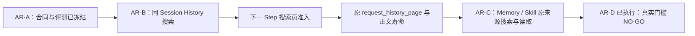

AR-B 的隔离真实 qwen-plus 诊断保留两轮结果：[第一轮](../validation-data/active-retrieval/ar-b-smoke-01/report.json)
中文未完成检索、英文沿旧分页找回；[第二轮](../validation-data/active-retrieval/ar-b-smoke-02/report.json)
在通用搜索/实际调用指引修订后，中英文答案与证据、重放、不变量均通过，中文实际使用 search_history，
英文仍沿原分页完成。第一轮失败未删除。两轮目标问答实际 Provider total_tokens 分别为 28197、40458，
不含准备材料的请求；这些是诊断，不是 AR-D 得分或模型成功保证。

AR-C 的[真实诊断汇总](../validation-data/active-retrieval/ar-c-real-summary.json)保留五轮全部结果，共 38 个实际 Attempt、
160991 total_tokens。第一轮 Skill 夹具因目录身份顺序不合法而未启动；第二轮模型读取工作区中的审计夹具，明确判失败，
随后把证据移到工作区外并使用参考来源 Tool policy。第三轮开始的 Memory 问题更明确，这些轮次不是受控成功率对比。
[第五轮](../validation-data/active-retrieval/ar-c-smoke-05/report.json) Memory 2 Step、Skill 5 Step 均实际搜索，
答案、原来源证据、当时请求重放与不变量通过；Skill 目录超过单页预算，通过章节搜索后原 Reader 读回正文。
合成 owner 检查已覆盖大型目录、章节/chunk、分页、隐藏正文词不检索、身份拒绝、取消选择、插件目录切换和重复取消。
Memory 伪造片段反向验证：去掉原来源重算保护后公开路径不再拒绝，恢复后正确拒绝。[AR-C 范围门禁](../validation-data/active-retrieval/ar-c.json)：主轮 298 项中 297 通过，1 项旧窄窗口夹具不再容纳新正文；
按实测开销调整测试窗口后，保留原正文优先及排除历史断言的两个预算模块 24 项通过。新增 Memory 8 项、Skill 11 项通过。
生产限额未改变，compileall、修改范围 Ruff、298 项收集与 diff 检查通过。

[24 题 manifest](../../tests/live_active_retrieval/manifest.json)及[AR-A 冻结](../validation-data/active-retrieval/manifest-freeze.json)
未改变。AR-D 的[最终报告](../validation-active-retrieval.md)与[grid-06 完整统计](../validation-data/active-retrieval/ar-d-grid-06/summary.json)
结论为 **NO-GO**：同一 qwen-plus、24 题 × 3 种子，两臂各 72 条全部收齐、逐项复核答案及实际派发证据。基线 20/72、当前候选 51/72，增加 31 题（43.1 个百分点）。
基线完成回答 58 条、耗尽 Step 3 条、TLS EOF 11 条；候选完成回答 66 条、耗尽 Step 0 条、TLS EOF 6 条。排除任一臂有执行错误的整对后，57 对为 19/57 → 44/57；此为辅助观察，不替换固定分母。
候选 History/Skill/Memory/Output 分别通过 12/14/14/11（每类 18）；有答案题 46/60、无答案题 5/12，仍低于总数 66/72、各类 15/18 的冻结门槛。
候选仍有 4 条把退出码或内容摘要标识误作所问事实；已观察资料越权、重复副作用、旧 Memory 冒充当前批准均为 0。
先前 grid-05 的 21/72 → 45/72 原样保留为历史对照。当前候选比该轮多 6 题，但题库已用于诊断、存在服务波动，不能解释成独立留出效果或某一补丁的因果收益。
负例必须限定实际证据范围：Skill 搜索只覆盖导航，局部预览/分页不能证明全来源不存在。
另有目标答案有证据但附带错误行数的回答，单独记录，不把目标通过解释为所有陈述正确。

grid-02 暴露搜索上限未说明、grid-03 暴露大导航收存清空控制回执；两项均已修复并做公开路径反向验证，旧失败保留。
搜索 schema 按当前 policy 生成上限；大结果只保留宿主参考工具成功回执投影，仍核对原 Effect，详见 9.5。
Line/headless TUI 沿同一个 display 将来源、覆盖、命中/无命中/限额/失效翻成中文，并说明查看历史快照不注入模型。
AR-D 当时 owner/相邻 145 项、协议/CLI/合同 143 项，共 288 项不同用例通过；其编译、修改范围 Ruff、收集与 diff 检查通过。后续生产修复门禁见本节后文，本轮没有重新修改生产源码。
grid-06 用各臂冻结源码、新 SQLite 备份与独立 Reader 重开 144 个会话，837 个冻结请求精确重放，不变量/重放错误 0，未结束 Attempt 0；重放没有 Provider 调用。
主网格 973 个结束 Attempt，已报告 3641108 total_tokens，另有 153 个 Attempt 用量未知，估计用量为 0；不能据此声称精确成本下降，准备与目标用量分别保留。
独立的[四类日常对照](../validation-data/active-retrieval/ar-final-controls-01/summary.json)每臂各 4 题均正确、1 步、零工具调用；当前候选仍暴露搜索/读取工具。8 个请求独立重放通过，另报告 30772 tokens；这是小样本，没有证明所有场景都不误搜，也不计入 72 题得分。原文证据足够时可以直接回答，没有新增每题搜索、遍历全部资料或强制复核规则。
历史 grid-05 的 909 请求和 4032845 tokens 记录仍保留，不与本轮混算。
先前 grid-04 的 117 条 TLS EOF 及中止轮仍保留；不能合并不同轮次择优计分。源码与材料冻结摘要、完整源码归档均保留。

自然问题不含工具名、ID、预期答案或操作步骤，片段足够时不强迫多读；批准、选择、版本、取消和预算不放宽。
已观察到成对收益及个别模型波动损失，未发现新增确定性控制组回归证据；收益不全部归因于搜索，也包括控制回执修复。
固定门槛未满足，按计划停止进入下一阶段或发布，不换模型、抬预算或改变评分来凑通过。
后续用户单独授权的职责定位、共性修复与最终 grid-06 复测已完成；完整轨迹和剩余行为边界见[记录 007](../deal/007-active-retrieval-final-comparison.md)，不提前实现语义检索。

[职责诊断记录](../deal/002-active-retrieval-responsibility-diagnosis.md)将 27 条失败按主要行为分为：字段误用 9、
局部推断全来源不存在 9、错误来源工具 4、读到背景后提前停止 4、分页耗尽步骤 1。行为分类不等于已证明因果 owner。
默认 Continuation 在无工具调用且无失败的可选 Verifier 时返回 completed，不承诺语义证据充分；没有新增自动证据裁判。
隔离评测 SourceOnly 拒绝文件探索但保留可见工具定义，必须区分评测条件与生产缺陷，不偷改该条件提高旧分数。

新增 `tests/live_active_retrieval/output_diagnosis.py` 复用原真实 run_case、冻结材料、模型加载器与账本；
每轮同一模型、六道输出题 × 两个种子、两臂各 12 条。新种子改变正例事实值，负例正文相同，不是未见问题集。
[呈现说明实验](../validation-data/active-retrieval/ar-e-output-01/summary.json)为 4/12 → 3/12，字段误用均 6 条，已撤回。
[Context 导航实验](../validation-data/active-retrieval/ar-e-output-02/summary.json)为 3/12 → 5/12，字段误用 6 → 5，
两条错误文件调用耗尽步骤；收益集中一个种子，尚不能证明稳定的通用改善，未合入生产冻结 renderer。
两项改动均确认实际派发；实验源码与所有失败保留。这两轮实验结束时生产 Python 摘要与 grid-05 候选一致，Session/Context 协议当时未变；后续当前修改见本节末尾。
48 条真实任务独立重开后共 245 个请求精确重放，无不变量/重放错误或未结束 Attempt；原输出命令每条只执行一次。
246 个结束 Attempt，服务报告 1333505 total_tokens，另有 1 次 usage 未知、估计为 0；不合并不同实验择优计分。
本轮保留诊断运行器、责任归类与证据，未声称修复全部行为问题；下一调查点是来源工具选择与拒绝反馈，
应沿原 Policy/Tool 边界单独对照，不加领域硬编码、强制读取状态机或新事实源。验证详情见职责诊断记录。

[拒绝反馈诊断](../deal/003-tool-denial-feedback-diagnosis.md)确认：原拒绝说明进入下一请求，但 surface_message 未投影
status/error_type/policy；工具表仍是 Composition 注册表，权限判定不是可见工具表的过滤器。
候选仅在隔离源码中把 denied 事件的已有字段呈现为 JSON，不改权限、工具列表、停止规则或生产协议。
03 轮诊断入口使用相对输出路径，两臂各 4 条 Skill 准备在模型调用前失败；原记录保留。
output_diagnosis 入口已与 grid 一致使用绝对输出路径，新检查和隔离旧逻辑反向验证确认 Skill 根目录合同。
04 轮同材料完整重跑：每臂 8 条，联合通过 4/8 → 5/8，相同工具/参数的重复拒绝次数 12 → 0，耗尽步骤 1 → 0；
三条输出附近读取题双方仍全部失败，不能把减少重复当成正确检索。首次工具选择也有波动，未证明完整因果。
16 条任务、87 个请求独立重放，无不变量/重放错误或未结束 Attempt；87 个结束 Attempt、426628 已报告 total_tokens，
未知和估计均为 0。连同 03 轮实际启动的 8 个会话，共 137 个请求重放、673454 total_tokens；另 8 条准备失败不计真实调用。
候选有后续请求的 8 次结构化拒绝确认实际派发，工具仍可见。当时生产文件摘要保持 grid-05，拒绝 JSON 候选暂不合入；
后续需固定同一拒绝后请求做成对行动对照，再决定消息投影协议变更。42 项相关检查通过，3 项为新增运行器检查，
编译、Ruff、定向收集与文档检查通过；全量/L2–L4 未运行，AR-D 仍 NO-GO。

AR-A 的 57 项检查与反向证据仍见 [AR-A 验证数据](../validation-data/active-retrieval/ar-a.json)。
AR-B 新增 24 项测试通过，358 项不同的定向/相邻用例已验证：主轮 357 通过、1 个窄窗口夹具因新增 schema 开销失败，
保持正文排除断言并调整测试窗口后，该模块 13 项通过。生产预算未放宽。公开 Context append 来源保护反向失效、恢复后通过；
compileall、Ruff、collect-only 与 diff 检查通过，见 [AR-B 证据](../validation-data/active-retrieval/ar-b.json)。
两轮真实诊断含准备共 38 个 Attempt、150415 total_tokens；不运行全量、L2–L4、Wheel/安装或发布门禁，不自动提交 AR 新改动。

来源导航与交付语义已按 [ADR-0063](../adr/0063-source-navigation-and-delivery-semantics.md) 修订。Composition snapshot 从当前 generation 捕获的工具表生成 system_prompt 中的来源导航，仅列实际暴露的宿主工具；不把暴露解释成获准或存在数据，不调用 Policy。History/Memory/Skill 的回执正文进入下一 Step 参考包，Tool Output 正文仍直接进入工具消息；空参考数组不代表后者不可用。搜索结果旁明确列出原有字面子串匹配与字段范围，区分 no-hit、source-unavailable 和预算未准入，不改查询、排序、Reader 或权限。拒绝反馈没有新增替代工具推断。

当前唯一协议为 Session 15 / Context 13 / active-reference-policy-v8 / context-json-v13，拒绝旧 Session 1–14，保留旧数据、不迁移；历史验证用冻结源码重放。六对自然任务与定向验证见[修复记录](../deal/005-source-navigation-and-delivery-semantics.md)，不替代原 AR-D 分数。来源事实仍由各 Reader 提供，Composition 只冻结说明，Context 只编排呈现，架构层级不变。 本轮六对正例为 1/6 → 6/6，但新增两对无答案反例中候选均过早断言不存在；不宣称整体可靠性达标。290 项定向检查和 84 个真实请求独立重放通过。

当前新增的是呈现合同（[ADR-0064](../adr/0064-evidence-bounded-retrieval-policy.md)），不是新的检索状态机。Skill summary/directory 明确为 `navigation-only`，section/chunk 为 `source-content`；summary 附精确 `request_skill_reference(directory)` 动作，身份来自当前已准入 block，其他 ID 为 JSON null。动作仍由原 Skill 选择、版本、披露、Lease 与下一 Step 预算规则校验；不直接交付正文，不扩大 search_skill 的导航字段范围。

工具大结果在当前组合暴露搜索或读回工具时，只展示原 `output_ref` 与查找入口；两种工具都未装配时才保留不完整前缀预览。小结果继续 inline。`read_tool_output` 明确 `end_offset` 与 `body_status`：只有从 0 读到所选 part（content 或 canonical data）末尾的一页才是 complete-source，其余都是 source-excerpt；EOF 不等于已读全文，也不代表另一 part 已读。搜索显式标记 literal-substring。所有标记均由原内容、当前位置与实际组合推导，原文仍在唯一 Effect outcome。

证据充分就回答，局部未命中只描述对应范围，有用且获准的查找仍可继续；权限、预算或证据不足时如实说明未解决。这是需要真实检验的模型行为，`completed` 不证明语义正确。静态长提示、后置提醒、一次强制草稿复核均未稳定改善，因此已撤回，没有模型自评批准事实或可变证据账本。相同问句只改变隐藏正文的正反事实暴露了仅看主题/预览的错误；最终对照、失败及成本见[记录 006](../deal/006-evidence-bounded-retrieval-policy.md)，不重算 AR-D，也不把这些已反复使用的诊断题称为独立留出集。

Context 呈现变化使用 Session 13 / Context 12 / active-reference-policy-v8 / context-json-v13。旧 Session 1–14 保留但拒绝，使用新的数据空间；SQLite、M3 和原 output_ref 格式不变。历史实验仅用各自冻结源码重放，没有兼容解释、迁移或删数据。

本轮 305 个不同定向用例通过，真实最终导航正例 7/9→8/9；覆盖标记候选 5/5，基线 4/5 的缺失为 TLS EOF，不能归因为准确率改善。共 122 个目标实例、含准备 625 次 Attempt，已知 total_tokens=3,430,669，另有 26 次 usage 未知。负面结论仍未全面可靠，未运行全量或 L2–L4；实验完整证据与限制见记录 006。

## 8. 模型层

### 8.1 公共边界

`LlmProvider.complete(ModelRequest) -> ModelResponse` 是 Provider 协议；`LlmRegistry` 按名称注册。
`LlmRuntime.admit(provider, composed_request, attempt)` 返回不调用 Provider 的 `LlmAdmission`；只有 Session
CAS 已持久化 exact request 与 Attempt start 后，`LlmAdmission.dispatch()` 才是一-shot Provider 边界。
`abort()` 收敛从未取得 permit 的 admission。Budget wrapper 只在 admit 创建 PENDING hold，在 dispatch
START/SETTLE；它不再以 Step-scoped reservation 充当外部执行锁，见 [ADR-0035](../adr/0035-two-stage-model-admission-and-session-dispatch-permit.md)。

当前 `LlmRuntime` 等 Provider 完成后，只把完整文本作为一个 delta 交给 `assistant/chunk` 回调。协议上有 Chunk 事件，但当前网络适配并非真正 token streaming。

### 8.2 Scripted Provider

- 从内存响应序列或 JSON 文件读取确定性响应；
- 保存收到的 Request，便于测试；
- 默认脚本用完后抛 `ScriptExhaustedError`；
- 用于 Demo、单元测试、端到端测试和 Benchmark，不需要 API Key。

### 8.3 OpenAI-Compatible Provider

- 使用标准库 `urllib.request`；
- 发送 `POST <base_url>/chat/completions`；
- 请求为 `stream: false`，支持 messages、function tools、temperature、max tokens；
- API Key 来自显式参数或命名环境变量，以 Bearer Header 发送；
- 解析第一个 choice、文本、tool calls、finish reason 和 token usage；
- HTTP/transport/响应结构错误转换为 exact `ProviderFailure` code/category；公开 message 只含稳定 code，
  不复制 HTTP body/header、底层异常正文、秘密或本机路径；
- 401/403、bad request/configuration、严格响应解析与未知失败不可重试；DNS、timeout/408、TLS EOF、
  disconnect、429 与 500/502/503/504 才是 host policy 可进一步收窄的候选；
- malformed usage 或 tool-call shape 是 protocol failure；Tool arguments 仍先走标准 JSON。只有严格解析失败
  时，才允许 exact frozen Tool schema 已声明为顶层 string 的字段使用双三引号 multiline lexical form；
  tokenizer 转换后的整体仍须严格解析为 object。其他 malformed 输入继续拒绝，见
  [ADR-0038](../adr/0038-schema-gated-multiline-tool-arguments.md)；完全缺失 usage 则保留
  `UsageQuality.UNKNOWN`，由 Budget 继续保守结算。

参数诊断现沿原 `ProviderFailure.code` → `model/attempt-end.failure_code` 持久化：区分原始类型错误、JSON 顶层非 object、期待逗号/冒号/键/值、额外数据、字符串未闭合、控制字符、非法转义和非有限数字；未知 JSON 语法使用固定兜底码。只映射解析器的固定类别，不复制 error.doc、原异常消息或响应内容；不记录原始参数、认证信息或第二份响应账本。解析器报告“期待逗号”并不证明根因一定是漏逗号，也不能断言响应被截断。旧三引号规范化范围、拒绝规则、protocol 不重试和未知 usage 结算不变，Session/Context/SQLite 版本不变。旧 WC-1G 仍不能精确追溯；显式取证脚本可识别新诊断码族，真实原文观察需另行按冻结调用合同执行。见 [参数诊断记录](../deal/046-provider-argument-diagnostics.md)。

随后单独授权原分工请求一次响应取证：1 次真实调用、2843 exact tokens、32.975 秒；原 Provider 正常解析，finish_reason=stop、零 tool_calls。模型因两份规格尚未读取而拒绝制定分工，未复现 json-extra-data，不能追认旧失败根因。已保存字节经原 Provider 离线核验，payload 摘要与正文一致，原库未变；未执行 Tool 或完整任务。见[记录 048](../deal/048-planning-response-capture.md)。

当前没有流式读取、Provider 内部/SDK retry、Fallback、并发限流或厂商专属协议适配。
C4 的 `tests/provider_argument_probe/` 是显式开发取证：绑定原失败的 Stream/Step/Turn/snapshot/
fingerprint，原样调用当前 Provider，只记录它实际读取的 HTTP body 和请求 payload 摘要；不读取或
导出认证头/环境值，不执行返回的工具，不恢复旧 Session，也不改变生产的 sanitized 日志合同。
C4 当时 Adapter 源码与历史运行 manifest 字节相同；原失败未保留 HTTP body，不能追认具体非法语法。
24 次同历史 dispatch 的真实重放中 21 次解析、3 次连接/TLS 中断；18 个工具参数均为合法 object，
与 Adapter 输出逐字段一致并通过原 JSON Schema。另一个最小文本控制成功；22 份已取得响应全部
经原 Adapter 离线字节重放核对。没有复现参数协议错误，也没有确认的 Adapter 缺陷，故未放宽 parser。
原 24 次已知 wire usage 为 67,024 tokens，3 次未知不按零计；控制另 101 tokens。Schema 通过
不表示引用资格或 Tool 执行成功。原失败、网络失败与未知部分分别保留，见
[C4 验证记录](../validation-v0.9-stop-c-c4.md)。
取消语义：`urllib` 请求一旦发出就无法中止，因此 `complete()` 用 `asyncio.shield` 保护 Worker，取消时先用共享的 `await_worker_convergence()` 等它收敛再重新抛出原 `CancelledError`，重复取消不会提前返回。这样不会出现"Chat 已经宣布 interrupted、后台 HTTP Worker 仍在运行"的情况。代价必须说清楚：这是收敛而不是立即中止网络请求，最坏情况下要等到 `timeout_seconds`（默认 120 秒）到期。

### 8.4 typed failure 与同请求 bounded retry

完整决定见 [ADR-0037](../adr/0037-typed-provider-failures-and-bounded-model-retry.md)。Provider adapter
只分类和清洗，不自行重试；`LlmAdmission` 把未遵守 typed 合同的 Provider/plugin 异常统一降为
non-retryable `provider-failure-unclassified`。宿主的 `ModelRetryPolicy` 显式限制总 Attempt 数、整个
retry window 的 monotonic elapsed、指数 backoff、单次 delay、numeric `Retry-After` cap、jitter 和候选
category 子集。永久类别不能被 host 加回候选集，所有数值必须有限；`max_attempts=1` 是明确 no-retry。

`AgentLoop` 每个 Step 只 build 一次 request。ordinal one 经 Budget shaping 后冻结 exact dispatch request；
后续 ordinal 必须由同一 Composition lease 的同一个 Provider/model 原样 admit。AgentLoop 先做对象/DTO
比较，`SessionService.start_model_attempt()` 再在 CAS owner 内比较 snapshot fingerprint，并要求后续 start
绑定紧邻 failed Attempt 的稳定 code/category。两层任一不一致都在 Provider 调用前拒绝。

每个 ordinal 都有新的 Attempt/reservation identity 和独立 reserve/start/settle。failure Usage 可信时同时
进入 durable Attempt 与执行 Token；缺失/UNKNOWN 时执行 Token 明确 unavailable，Ledger 仍结算完整 hold。
余额不足以完整预留 frozen request 时不降低输出上限换取调用。delay、reserve、start append、Provider、
end append 或 settlement 任一窗口收到取消，都先让当前 owner 收敛并且不得生成下一 ordinal。Recovery
只闭合 open Attempt，不持有 policy/scheduler，也不会继续 retry。严格 Router parse、Tool、Workflow、
Verifier、EventStore 或 Promotion failure 都不属于本策略。

## 9. Tool Runtime 与内置工具

只读调查增加两个预算查询/申请工具，adaptive 主方增加决定工具；权限分属子方与直接父方，接线与原 Session 证据见 12.14。

F3 的 opt-in `propose_workspace_memory` 是 EXTERNAL_TRANSACTION，只提出候选，不提供决策能力；
来源身份、注册开关、policy 和 host-only 门面见 7.6。

### 9.1 执行管线

```mermaid
flowchart LR
    CALL["Tool Call"] --> LOOKUP["Registry Lookup"]
    LOOKUP --> SCHEMA["Schema Validation"]
    SCHEMA --> POLICY["Monotonic Policies"]
    POLICY --> ADMIT["tool/admitted"]
    ADMIT --> INTENT["effect/intent"]
    INTENT --> DISPATCH["effect/dispatched"]
    DISPATCH --> SCHEDULE["Read Parallelism / Write Barrier"]
    SCHEDULE --> MW["Middleware Chain"]
    MW --> EXEC["Tool.execute"]
    EXEC --> OUTCOME["effect/outcome"]
    OUTCOME --> RESULT["tool/result"]
```

执行事实：

- 同一模型响应中的 Tool Call ID 必须非空且唯一；
- 所有 `tool/call` 先写入 Session Stream；
- 未知工具或参数错误直接产生结构化失败 Result，不会产生 Effect；
- Policy 中任何 DENY 都不可被后续 ALLOW 覆盖；至少一个 Policy ALLOW 才准入；
- 连续的 PURE_READ/WORKSPACE_READ 调用使用 `asyncio.gather`；写入、进程和其他副作用形成顺序 Barrier；
- Middleware 的 `call_next()` 每层最多调用一次；
- Tool Runtime 有整体超时与 inline 输出字符阈值；超阈值的正文或 canonical data 进入保留 variant，固定引用与 JSON 转义另计实际成本（9.5）；
- Outcome 记录 inline 结果，或同事务提交 retained_output、output_ref 与有限呈现；工具错误和持久化错误分开处理，原始输出不再由 Runtime 截断；
- 取消时尽量依据已有 Outcome 补齐 Result，否则记录 `aborted_before_dispatch`。

### 9.2 Effect Kind

`PURE_READ`、`WORKSPACE_READ` 被认为并发安全且可安全重试；`WORKSPACE_WRITE`、`PROCESS`、`NETWORK_WRITE`、`EXTERNAL_TRANSACTION` 默认不并发且不可盲目重试。

### 9.3 内置工具

| 工具 | Effect Kind | 输入与行为 | 关键限制 |
|---|---|---|---|
| `list_files` | WORKSPACE_READ | 列出相对文件；可设 `max_files` | 跳过常见缓存、Git、虚拟环境和依赖目录 |
| `read_file` | WORKSPACE_READ | UTF-8 文件按实际行号读取；可选起止行、长行列偏移和来源摘要 | 每页最多 120 行/8000 JSON 字符；续读校验来源，真实路径仍须在 Workspace 内 |
| `search_text` | WORKSPACE_READ | 子串或正则搜索，可限路径和结果数 | 跳过二进制/非 UTF-8 及常见忽略目录 |
| `apply_patch` | WORKSPACE_WRITE | 精确旧文本替换或显式创建新文件 | 校验替换次数；临时文件 + fsync + 原子 replace；不是 unified diff parser |
| `shell` | PROCESS | `shlex.split` 后调用原 ToolRuntime 绑定的 Sandbox 能力 | 不使用 `shell=True`；显式 Linux guest 环境；缺配置失败关闭；超时/取消收敛容器工作负载 |
| `list_tool_outputs` | PURE_READ | 本 Session 已保留结果的有界目录 | 以 through_seq 固定翻页边界；不读取别的 Session |
| `search_tool_output` | PURE_READ | 按 effect_id/digest 搜索 content/data 字面词 | 同源校验；有界命中片段、准确位置和展开动作；无新索引 |
| `read_tool_output` | PURE_READ | 按 effect_id/digest 读取原 content 或 data | Unicode 字符偏移，整页限长；身份及来源校验，不重跑工具 |

所有路径读写通过 `resolve_workspace_path()` 解析后检查 Workspace 边界。默认 `DangerousShellPolicy` 屏蔽一组明显危险的可执行文件名，但它只是 Guardrail，不是安全沙箱。

F2 显式开启 skills 策略且启用默认工具时，增加 PURE_READ `request_skill_reference`；
只返回下一 Step 的受限披露收据，不返回正文、不改变选择。精确参数与时效见 7.5。

`ReadFileTool` 与 `file_page.py` 只有一条分页主线：path 必填；start_line/end_line 为 1-based 闭区间，未填起点从第一行开始，终点默认文件末尾并按实际 EOF 截止。start_column 为 1-based Unicode 字符位置，source_sha256 可绑定实际原文件字节。只填 path 也是第一页，不保留旧整文件模式。输出 format=1 的 JSON 含 path、source_sha256、total_lines、实际起止行/列、带行号 text、truncated、eof 和完整 next_read 参数；ToolOutput.data 复用同一元数据但不重复正文。空文件为零行空正文、EOF，无虚构尾行。

页同时受 120 行和 canonical JSON 8000 字符限制；超长行用同一行的下一列继续，范围未完成时 next_read 保留 end_line，指定范围读完但未到文件尾时 next_read 从范围之后开始。truncated 只表示请求范围未完整返回，eof 才表示整个文件已到末尾。每次仍经原 resolve_workspace_path；旧摘要与本次原始字节不同则 file-read-source-changed，非法类型/范围/摘要、非 UTF-8、目录、越界或重解析路径均明确失败。摘要不是权限，也不是历史文件快照。

读取与页渲染在工具拥有的线程工作中完成，取消沿原 await_worker_convergence 等待工作结束，重复取消不能提前释放；外层保留 CancelledError，工作失败作为 cause。实现仍读取当前完整文件再选择视图，不宣称总磁盘 I/O、内存或文件大小有界。页字符数也不是 Provider token 预算；原 ToolRuntime 的整体输出处理、Effect/Session、Context 冻结与费用账本不变。search_text 算法/输出不变，说明命中行后可用 read_file 的起止行查看附近正文；调查方仍不获得 shell/read_tool_output。实现与真实对照合同见[有界源码读取](../plan/TRACEHARNESS_BOUNDED_SOURCE_READING_CONTRACT.md)。

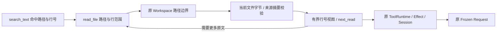

WC-3 的主方专用 Patch 读/整合/对账工具也走本管线（14.3.3）。通用 ToolExecutionFailure/ToolExecutionCancelled 可在原 Effect 留下已经收敛的结构化回执；不绕过 Policy/Budget，不自动重试写操作。

ShellTool 的说明与 command schema 明确工作目录已是隔离工作区、命令按 argv 执行，引号仅分组参数，cd/&&/管道/重定向/展开不自动解释。guest 捕获启动 ValueError/OSError 后，把异常类型和消息写入原 stderr，按原 output_bytes 字节限额截断，再由原 finish 收敛；状态保持 start-failed，原 CAS/Outcome/Tool failure/后继请求携带同源错误。无新字段、解析器、自动重试或权限变化，协议保持。见[记录 063](../deal/063-shell-launch-feedback.md)。

### 9.4 插件 Tool 走同一条管线

被启用插件注册的 Tool 进入的是**同一个** `ToolRegistry`，因此 9.1 的整条管线对它逐字适用：Registry 查找、Schema 校验、单调 Policy、`tool/admitted`、`effect/intent`、按 Effect Kind 的并发或 Barrier 调度、Middleware、执行、`effect/outcome`、`tool/result`。没有 `PluginToolRuntime`，插件 Tool 在事件日志里与内置 Tool 无法区分——这正是目的。

插件 Tool 名与内置 Tool 冲突时，激活在发布**之前**被拒绝（见 19.4），因此不存在“插件悄悄顶替 `read_file`”这种情况。

### 9.5 分层压缩 A/B/B+/C/E0/D：保存、查找、读回与旧结果折叠（ADR-0053/0054/0055）

当前 owner 主线如下；这是工具结果保存和展示策略，不是模型摘要器。

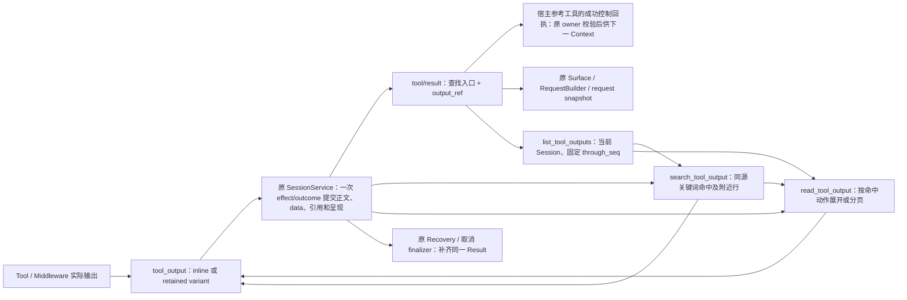

content 或 canonical data 超过 `max_tool_output_chars` 时，原 content/data/evidence 放进
`effect/outcome.retained_output`，同事件写 format-1 `output_ref` 和实际呈现。引用含 effect_id、
payload digest、正文字符/UTF-8 字节数与 canonical data 字符数；没有可变文件路径。
大 Result.data 通常为空，原 data 按 `part=data` 读回；避免 stdout 等再次占满 Session 源事件。
例外是六个宿主参考搜索/读取工具的成功控制回执：保留对应 history/skill/memory/search_receipt，
防止大导航收存后丢失下一 Step 的披露请求。Session 仅携带原 Effect payload 的回执投影，
`output_reference` 验证投影与原数据相等；普通工具的同名字段不会被当作宿主控制回执保留。
原来源、版本、取消和准入规则继续校验回执；此例外不把大正文重新塞进模型，也不产生新的事实源。
小输出保持 inline。大输出在暴露搜索/读取工具时只给引用和查找入口，避免前缀冒充全文；两者均未装配时保留明确不完整的前缀预览。`truncated=false` 表示 Runtime 未丢弃原内容，不表示当前呈现完整。

工具读回默认装配，不依赖项目绑定、Memory 或 ProductTask，也不要求开启 History。目录从本 Session
原始 Tool Result 派生，所以即使 M3 把整轮对话藏起或 History 原文页太大，也能找到输出引用。
目录按最新结果优先；后续 offset 必须同时提供首目录返回的 through_seq，防止新结果插入导致错页。
每页完整 canonical JSON 都受字符预算限制，页装不下明确失败；offset 单位为 Unicode code point，
返回 next_offset/end_offset；body_status 只有从 0 一页读到末尾才是 complete-source，否则为 source-excerpt，最后一页也不证明之前已读。原始 data 按 canonical JSON 作为文本分页。目录和读取结果仍走普通 Tool admission、
Policy、Effect、Result 和模型请求快照；只读不会重跑 Shell 或赋予 Memory 批准权。

B+ 默认工具 `search_tool_output` 必填 effect_id/digest/query；part 默认 content（或 canonical data），
query 是非空字面词，正则符号不执行；结果以 match_mode=literal-substring 明确其范围。case_sensitive 默认 true，false 使用 Unicode 忽略大小写语义。
offset 默认 0，按同一原文 Unicode code point；count 默认 10、1–100；context_lines 默认 0、0–20（默认仅命中行，附近行显式请求）。
命中按原文次序且不重叠，返回 match_start/end、LF 一基 line_number、片段 text_offset，
before_context/matched_lines/after_context 分字段展示；read_action 携带原身份、part 和命中行起点。
长行片段缩小时标记 context_truncated，完整匹配保留；整页 JSON 限长，单项装不下明确预算错误。
next_offset 指向最后返回命中的末尾，继续时沿用 query/options；null 表示所选原文后缀无更多命中。
不提供推测命中总数。直接扫描原 Effect 原文，不加索引或第二事实源，搜索页仍进入原 Tool/请求快照。

关键词问题的通用导航先搜索。registry 有搜索工具时，引用显示搜索入口，移除通用 offset=0 读取动作；
仅有 reader 时保留原读取入口。搜索结果的 read_action 带命中行位置和当前页预算 count。片段不足时执行
read_action 展开；相邻上下文可能属于别的记录，不能把前一条记录字段配给命中标题，须核对正文归属。
无命中只表示所选 part/offset 后没有该字面词，不证明相关主题不存在；当前不做跨输出联合、语义或向量搜索。

resolver 对同一 Session 的 Call/Result 与 Effect Intent/Outcome 检查身份、唯一性、Step、参数、
因果顺序、状态和呈现一致性，重算 payload digest 与长度；跨 Session 或错引用明确拒绝。
CoreInvariantChecker 在收到 Effect 流时复用同一验证器；Session-only 检查不能声称验证了 Effect。
原 runtime/prompt.py 的通用 reference guidance 明确工具历史先定位输出目录，正文来自 Tool Result；
它不是 Skill/Memory/History 的 next-Step receipt，History 页过大也不代表工具输出不可访问。
持久化在工具异常处理之外，写入错误不能伪造成另一条工具失败 Outcome。Outcome 已提交但 Result
未写时，原恢复和取消收敛代码补齐同一呈现/引用；未提交时不发布可读指针，恢复按原规则标记执行未知。

当前 Session 15 / Context 13；SQLite 2 / M3 format 2 不变。已有截断记录不会被改写或伪造丢失原文。
C 已实现旧 retained Tool reply 的确定性折叠，仍用这里的 output_ref 搜索和读回；细节见 12.2。E0 已增加完整请求 token 估算及超限拒绝；D 已实现可选 LLM 摘要；E1 已在后续 Step 维护闭合旧历史，E2 已实现参考 token 准入，尚未实现 Provider 超限重试。
A 冻结的后续预算包括 system、tools、Product、Surface、Context reference、当前任务回显、Provider
封装和输出预留；字节/估算 token/实际 usage 必须分开。80% 触发、60%–65% 目标只是待验证候选，
并非新默认。模型摘要必须复用正式调用、计费与取消主线；不得由摘要器裸调 API。

底层工具自行截取的内容、Shell 解码替换之前的字节、尚未返回工具在取消/Runtime timeout 时的输出
不在 B 的保留承诺内。工具自己返回的长错误/timeout 文本同样保留；非零 exit_code 不会被摘要改写。
大输出占 SQLite 磁盘；当前 reader 先读取本 Session Effect 流，再有限披露，没有流式存储、磁盘配额或 GC。
详见 [ADR-0053](../adr/0053-layered-compaction-and-retained-tool-output.md) 与
[验收记录](../validation-retained-tool-output.md)。

## 10. Continuation 与证据驱动完成

`DefaultContinuationRuntime` 按以下顺序决定继续或结束：

1. 达到 `max_steps` → `max_steps_exceeded`；
2. 模型响应包含 Tool Calls → 检查事件派生的连续相同拒绝批次；达到停止阈值则 `stalled_repeated_denial`，达到提示阈值则携带反馈进入下一 Step，其他情况正常继续；
3. 已运行 Verifier 且失败，失败次数仍在重试预算内 → 把结构化验证摘要作为新 user message 注入下一 Step；
4. Verifier 持续失败超预算 → `verification_failed`；
5. 无 Tool Calls 且无失败证据 → `completed`。

`CommandVerifier` 拆分 argv 后调用宿主绑定的 SandboxCommandPort，在授权工作区副本运行；只有 finished 且退出码 0 才通过。结果携带原 Sandbox 回执，AgentLoop 仍只追加 verification/result。未配置沙箱返回明确失败，不回退宿主。

通用 Runtime 的 Verifier 是可选的；Product 可写 multi 的 REVIEW 按 14.3.6 必须绑定原完成检查。未配置时，无 Tool Call 的最终模型响应可以结束 Turn，此时 `verification_passed` 为 `None`，不能把它解释成“外部验证已通过”。


`runtime/repeated_denial.py` 从当前 Turn 的 `turn/start` 配置与已闭合 Step 的 Tool Call/Result 派生计数。只有整个批次均为无 Effect 的 `denied`，且工具、参数、拒绝类型/原因/data 与 Composition revision 均相同才连续计数；批次内排序不影响身份，一个 Step 只计一次。参数、结果或 Composition 改变、成功执行、其他失败或未闭合 Step 都打断连续性，不跨 Turn 保存计数。每次调用先经过现有 ToolRuntime 的新鲜权限检查，保护只在结果落账后决定是否继续；不缓存授权，也不能观察未记录的外部权限变更。

默认 `RepeatedDenialPolicy(warn_after=2, stop_after=3)`；`RuntimeConfig.repeated_denial_policy=None` 关闭。CLI 提供 `--denial-warn-after`、`--denial-stop-after` 和 `--disable-repeated-denial-check`，要求整数 `2 <= warn_after < stop_after`，关闭不能同时指定阈值。配置写入原 `turn/start`，旧记录缺少该配置时不补推保护。恢复命令保留配置；本次未增加 TUI 配置表单。

AgentLoop 只连接事件投影与 Continuation；默认 Continuation 拥有提示/停止决定，BudgetContinuation 透传状态并保留原预算结算，自定义 Continuation 需自行处理新增可选状态。提示沿现有 user/message 路径持久化，原始当前任务仍由 Turn 首条用户输入锚定。取消、恢复、新 Turn 与重放沿用原 Session 生命周期，没有第二事实源。Session 15 / Context 13 / `context-json-v13` 不变。

这不是通用语义无进展检测：交替调用、变更参数、成功轮询不在本保护范围。真实压力例从 6 次相同拒绝降为 2 次后模型自行停止；真实运行没有触发第 3 次硬停止，该分支由确定性与反向测试验证。4 个自然问题两组均通过 2/4，不能宣称检索准确率改善；10 条真实旅程的 65 个请求独立重放通过。当前范围共 210 项定向/相邻检查通过，未跑全量或 L2–L4。见 [ADR-0062](../adr/0062-repeated-denial-continuation.md) 与[修复记录](../deal/004-repeated-denial-continuation.md)。

参考问答的模型侧停止指导见 7.11：证据充分、仅能作范围限定的结论、或者存在真实阻碍时各自如实回答。宿主默认 Continuation 不解析自然语言来判断否定断言，不把模型自评当作新的批准事实或验证结果；`completed` 仍只表示循环结束。

可写主方复核通过 StepViewSelection 只在交付阶段接入 CompletionVerifier，沿用本节失败计数与反馈规则；完成检查不等同于 Artifact Review 或人工批准，详见 14.3.6。

### 10.1 Verifier 的执行与输出所有权

`invoke_verifier` 保留可信 verify(workspace) 接口，在原 Session/Turn/Step owner 下临时绑定同一个
SandboxExecutionService。完成验证的执行回执写入原 Session stream；Tool 和固定 Review 使用各自
原 Effect stream。`/sandbox` 经同一个 Reader 查询这些流及应用级插件 activation stream，不改变写入归属。

容器 PID 1 监督进程管理内部期限、输出额度与整个 PID namespace。业务命令以 UID 65532 运行，
使用显式 Linux 环境；不继承宿主 HOME/PATH/密钥，不挂载宿主工作区。可信控制客户端使用有界临时
文件避免 Docker Desktop 继承输出句柄拖住等待；业务 stdout/stderr 在客体有界捕获，原文进入原 CAS。

父命令退出是收尾触发条件，不能等待后台后代释放输出管道才认为结束。监督进程先杀死并回收后代，
再读尽已写入的有界管道尾部；输出超限终止，正常退出不再因后台后代被误报为超时。

| 路径 | 收敛与结果 |
|---|---|
| 正常完成 | 收敛进程树，返回有界输出、退出码与回执；原 AgentLoop 记录 verification/result |
| 内部期限 | 客体自行终止，返回 timed-out 与已保留输出；Verifier 失败摘要可进入下一 Step |
| 取消／Runtime 预算先到 | 原 scope 等待执行 worker 与回执写入收敛，再抛 CancelledError；不制造 verification/result，且不承诺终止前输出完整 |
| 无法确认清理 | 原回执记录 unknown-convergence；调用失败，不能自动重试或冒充取消成功 |
| 宿主硬退出 | 客体内部期限仍限制工作；原账本可能只有 request，不补造 outcome，不自动删除停止容器或冷恢复 |

Shell 自身 timeout 由原 ToolReportedTimeout 边界与 Runtime 总预算超时区分，原 Effect/Tool 记录
继续保持各自结果语义（9.5）。固定 Review 设置 retain_output=False，只持久化输出字节数/摘要与回执，
不保存原始固定验证输出。上述所有临时句柄、控制文件和连接均为资源，不成为新的业务事实源。

`sanitized_environment()` / `tools/process_control.py` 仍供可信宿主控制和既有 L2 等工具使用，
不是 shell、CommandVerifier 或默认固定 Review 的 native fallback；本目标没有运行 L2。

## 11. 崩溃恢复与生命周期收敛

D 的孤立模型 Attempt 可由同身份的完整 `summary/response` 证明已返回，否则 unknown；恢复不补造 usage、不重调 Provider、不自动提交尚未写入的摘要。已提交的 replacement 保留；取消和 owned append 收敛仍按原规则。

恢复首先经过当前唯一 Session 协议 13 校验；History 请求失效只按原 Turn/Step 与 receipt 派生，不能在
恢复后转交下一轮。合法 Context-only／Composition-only 失败前缀按原 Step/Turn
规则收敛，不重新选择来源、不补写 Context，也不为未开始的后继 Step 发明 Attempt（7.4）。

`RecoveryService.recover()` 按固定顺序追加事件，使修复后的流与健康流读起来顺序一致：

1. 读取 Session 与 Effect Streams；
2. 找出没有 `model/attempt-end` 的 `model/attempt-start`，按证据补写 Attempt End（见 11.1）；
3. 找出没有 `tool/result` 的 `tool/call`；
4. 有持久化 Outcome/Reconciled 时据此合成 Result；
5. 没有可确认 Outcome 时标记 `unknown_after_crash`，有 Intent 则追加 `effect/reconciled`；
6. 对未闭合 Step/Turn 追加 `reason=interrupted` 的结束事件；
7. 发生改变时追加 `runtime/recovered`。

```mermaid
flowchart TD
    READ["读取两个 Stream"] --> ATT{"Attempt 未闭合？"}
    ATT -- "有匹配的 assistant/message 或 summary/response" --> ASUC["attempt-end: succeeded"]
    ATT -- "无消息或仅有 chunk" --> AUNK["attempt-end: unknown_after_crash"]
    ATT -- "没有" --> CALL{"孤立 Tool Call？"}
    ASUC --> CALL
    AUNK --> CALL
    CALL -- "有 Outcome" --> SYN["合成 tool/result"]
    CALL -- "结果不明" --> UNK["unknown_after_crash，不重放"]
    CALL -- "没有" --> LIFE{"Step / Turn 未闭合？"}
    SYN --> LIFE
    UNK --> LIFE
    LIFE -- "是" --> CLOSE["追加 interrupted end events"]
    LIFE -- "否" --> ANY{"本次是否修复过任何东西？"}
    CLOSE --> ANY
    ANY -- "是" --> REC["追加 runtime/recovered"]
    ANY -- "否" --> DONE["无变更，不追加任何事件"]
```

只要 Attempt、Tool Result 或生命周期中有任意一项被修复，就追加一条 `runtime/recovered`；三项都没有修复时不追加任何事件，`changed` 为 `false`。

### 11.1 Model Attempt 收敛

Attempt 已开始不代表模型答复过，因此状态由持久化证据决定：

| 持久化证据 | 恢复状态 | 关键字段 |
|---|---|---|
| 至少存在一条合格 `assistant/message` | `succeeded` | `recovered=true`、`recovered_from=assistant/message` |
| 没有合格消息，或只有 `assistant/chunk` | `unknown_after_crash` | `recovered=true`、`error_type=RecoveredAfterCrash`、`recovered_from=none`、`partial_chunks` |

一条事件成为某次 Attempt 的合格证据，必须同时满足三条（`partial_chunks` 使用同一套筛选）：

1. `attempt_id` 与 Start 相同；
2. `turn_id`、`step_id` 与 Start 相同，按值比较，`1` 不会匹配 `"1"`；
3. `seq` 晚于 Start —— Start 之前写下的事件描述的不是这次调用。

只要存在任意一条合格消息即判为 `succeeded`，因此"先有错作用域消息、后有正确消息"能被正确识别。

`attempt_id` 只有在是非空、非纯空白字符串时才算有效身份。`None`、数字、布尔值、`""` 和纯空白一律视为缺失：Start 被跳过、在 `notes` 中说明、不写 Attempt End，绝不通过 `str()` 造出名为 `"None"` 的 Attempt。

两种情况共同的硬约束：

- 绝不重新调用 Provider；
- 绝不伪造 `usage` 与 `finish_reason`（从未观测到）；
- 绝不把 Chunk 拼成 `assistant/message`，Chunk 只作为审计证据保留；
- 已有 `assistant/message` 只作证据，不重复追加；
- 已闭合的 Attempt 不被修改，因此重复 recover 幂等；
- 多个未闭合 Attempt 按 Start 事件原始顺序确定性收敛；
- 恢复生成的 End 继承 Start 的 `correlation_id` 与 `composition_revision`，`causation_id` 指向 Start 的 `event_id`；
- `attempt_id` 缺失的 Start 无法关联，跳过并在报告中说明，由不变量报告问题而不是伪造身份。

`RecoveryReport` 与 `runtime/recovered` 都包含 `closed_model_attempts` 计数。

旧版本写下的 Session 可能已经关闭 Step/Turn 却遗留未闭合 Attempt。Append-only 不允许插入历史位置，因此恢复器在既有 `step/end`/`turn/end` 之后追加 Attempt End，`CoreInvariantChecker` 也据此在整条流范围内判断配对，使这类历史 Session 重新变为不变量干净。

这条豁免有明确门槛：晚于所属 Step 关闭才出现的 Attempt End，只有同时带 `recovered=true` 且 `causation_id` 等于对应 Start 的 `event_id` 时才被接受；普通的迟到 End、或指向别的事件的 `recovered=true` End，仍然违反 `attempt-end-inside-step`。

`resume` 总是先 recover，再在同一 Session 追加一个新 Turn，并提醒模型重新检查 Workspace 和恢复结果后再重复副作用。

## 12. 投影、压缩、Inspector、Replay 与 Evaluation

大工具输出的保存/目录/关键词查找/分页见 9.5。搜索和读取页面的实际正文由原 Result/request snapshot 冻结，Replay 不重新搜索。M3 仍只处理闭合对话前缀；History 的整 Turn 页合同未被放宽。输出目录可绕过过大 History 页定位工具原文，但不表示一般历史页都可无限展开。

TUI 聊天重排由 `ConversationLog` 的实际尺寸变化触发，再由原 App 排版；窗口 Resize 只切换布局。
这避免双栏切换时按旧聊天宽度排版。LayoutChanged 是可丢弃的界面通知，不是持久事件或对话事实。

### 12.1 State 与不变量

F0-B 的 `context/input` 不改变 Surface 白名单。Core invariant 复用唯一 Context parser/source reader，
核对合法失败前缀、普通 Step 唯一 Context 与 Composition/Request 的精确绑定；D 摘要 Step 则核对唯一 summary/input；旧 Session 首标记缺失
明确拒绝，不以合成空 Context 掩盖。相关生产流程见 7.4。

- `StateProjector` 推导 Session 状态、当前开放 Turn/Step、完成数量和最后序号；
- `CoreInvariantChecker` 检查序号、生命周期嵌套、Model Attempt 身份/配对/真实作用域、Tool Call/Result、Effect、Composition 与 exact Product context snapshot 等协议关系；Product context 必须 canonical，且同一逻辑 `(task_order_seq, source_seq)` 不能命名两个 head；检查按事件流中真正开放的 Turn/Step 判断，不采信 payload 自报的作用域；
- 投影和检查不修改事件。

### 12.2 Surface 分层压缩：手动、旧结果折叠与自动摘要（ADR-0042/0055）

[`session/compaction.py`](../../src/traceh/session/compaction.py) 是本 Runtime **唯一**的 Surface
replacement owner，手动与自动共用同一条选择、限长、排序与 durable 写入主线；
[`session/surface_replacement.py`](../../src/traceh/session/surface_replacement.py) 是该协议的唯一定义处，
被 `SurfaceProjector`、`CompactionService` 与 `CoreInvariantChecker` 共同使用。原始事件永不删除。

#### C：先折叠工具结果，再考虑摘要

自动策略达到字节触发线或 E0 完整请求 token 提前触发线时，按旧到新选择已闭合、仍可见、带 `output_ref` 且缩短后确实节省
字节的原 `tool/result`，排除最近 `keep_recent_turns` 轮。写入前用 B 的 `resolve_tool_output` 验证
Session/Effect/调用身份、参数、因果和原文 digest。保留原 assistant call（包括参数）及 reply 的
role/name/tool_call_id，只把 reply 正文替换为历史说明、invocation_status 和原 output_ref。
invocation_status 不等于进程退出码；原文仍走 B/B+ 读取，不重跑原工具。小 inline 结果不参与。

每写一条 fold 都重新读取、计量；降到 trigger 以下就停。没有可折叠结果且仍达到 trigger 才走 M3
完整旧历史前缀摘要；最近轮、活动组及 Product 状态保持原边界。C 没有独立百分比目标或额外开关，
不会开启原本关闭的压缩；四项策略参数不变，digest 的配置版本为 3，以绑定新的分层算法。

```mermaid
flowchart TD
    A[字节模式 Turn 前 / token 模式每个 Step 准备] --> B{显式开启且达到对应触发线?}
    B -- 否 --> G[继续当前请求准备]
    B -- 是 --> C{存在可折叠的旧 retained 结果?}
    C -- 是 --> D[核对原来源并 CAS 写入 tool-fold]
    D --> B
    C -- 否 --> E[既有 M3 闭合前缀摘要]
    E --> G
    D -- 失败 --> F[记录实际提交状态]
    E -- 失败 --> F
    F --> G
```

每条 fold 独立提交；只有摘要被计为可见摘要和 History 目录根。后续 M3 的来源可以包含 fold，
History 将它递归展开回原 Result 叶子。原 Effect、Session result 与旧请求快照不改写。
fold-only 的 CompactionReport 以 `method=tool-fold` 返回最后一条成功替换，summary 为空；
多条记录仍以事件日志为准。Line/TUI 分别显示工具折叠，详情不把它误标成人工空摘要。

#### 触发与线性化点

未配置 token 计量时，`AgentLoop.run_turn()` 在 `ensure_session()` 后、`inbox/accepted` 前调用
原 `CompactionService.compact_before_turn()`；触发指标为对话 canonical UTF-8 字节，不含 Product。
配置 E0 后，E1 在每个 Step 的 `RequestBuilder.prepare()` 在同一 Composition Lease 内先选当前参考资料，
用完整请求估算触发同一个 CompactionService；随后重新选择引用，再冻结 Context 与 Composition。
两条模式均由 Runtime 的单活跃 Turn owner 保护，只处理已闭合旧历史，活动用户消息与工具组不参与。
维护失败如实保留已有 fold；最终请求仍须通过 token 硬上限，失败不能变成无限放行。

#### E0：完整请求估算与实际用量分离（ADR-0056）

`llm/token_meter.py` 唯一提供 `RequestTokenMeter` 与 `TokenBudgetPolicy`。显式配置编码、模型窗口、
输出预留、安全余量；输入硬上限 = 窗口 − 输出预留 − 安全余量。提前触发比例 `trigger_percent`
可配置为 1–100，默认 80，乘的是输入硬上限。输出上限不可超过预留，未另指定时使用预留。
这是公开策略默认，编码和窗口没有模型名推断或隐藏默认值。模型热切换与原绑定不符时明确拒绝。

统一计量系统提示、Product 消息、对话、参考资料及当前问题回显、工具定义和可见请求封装；内部
审计 metadata 不作为模型输入。算法 `canonical-parts-bpe-v1` 对各 canonical 部分编码求和，始终
标记 estimated，不能称为远端隐藏模板的精确 token 数。`tokens` extra 提供 tiktoken，首次获取编码
可能下载公开词表；缺库/编码失败明确拒绝，不退回字节除以常数。

E1 在后续 Step 也可先折叠旧结果，不够再按配置做规则摘录或 D 语义摘要；只处理闭合旧 Turn，不拆活动 Tool 组。语义模式每轮最多一条摘要链、必须留回答步骤，并保留 fresh/retained 披露优先级。
自动压缩关闭时也不偷偷开启。token 模式替代原 byte trigger，摘要字节和保留轮数仍生效；replacement
的 policy digest 同时绑定两份策略。E2 在既有物理字节边界内按完整请求剩余 token 准入参考，最终全部计入完整请求；E1 轮内旧历史维护已实现，不能切割当前 Turn 腾空间。

`request/token-measurement` 在正式 Context/Composition 后、模型 admission 前写入同一 Session，
绑定原 composed fingerprint、Turn/Step/source_seq、Provider/model、算法/编码/库版本、策略与分项。
CAS 的 expected_seq 必须就是 built.source_seq，Product 分区也只读到该边界；并发头变化拒绝写入，
不能改绑到更新的 head。owned append 在取消时收敛；写前/写后失败均不调用 Provider。超限留记录，
但不造 request/snapshot 或 Attempt。它是派生审计事实，不是第二历史、权限或费用账本。

共享 checker 用冻结请求重算分区、数值与身份，并拒绝超限后 dispatch、重复或伪造记录。
E0 本身保持 Session 13 / Context 12 / SQLite 2 与普通 request/snapshot 形状；D 新增摘要来源判别变体（下文）。未启用计量时无该观测事件。
重算要求同一编码和库版本，不可用新算法冒充旧计量；无库或版本不符时明确失败。
实际用量仍只来自 `model/attempt-end.usage`，无 exact usage 显示未知；累计计费与单请求窗口分开，
估算器不作为严格费用 Budget 的 exact TokenCounter。服务端模板/分词差异意味着安全余量也不保证永不超窗。

```mermaid
flowchart TD
    A[同一 Lease 下选参考并构造完整草稿] --> B{当前 Step 可维护且开启压缩并到提前线?}
    B -- 是 --> C[原 owner 处理闭合旧历史 / 重选引用]
    B -- 否 --> D[冻结 Context / Composition]
    C --> D
    D --> E[完整估算 / 精确来源 CAS 记账]
    E --> F{超过输入硬上限?}
    F -- 是 --> G[拒绝 / 不产生模型调用]
    F -- 否 --> H[原 Admission / Session permit / Provider]
    H --> I[原 Attempt usage / 显示实际值]
```

#### D：模型语义摘要（ADR-0057）

`RuntimeConfig.semantic_summary=True` 显式开启；必须配置启用的 `CompactionPolicy`、完整
`TokenBudgetPolicy` 和 `max_steps>=2`。默认仍为规则摘录。E1 允许的当前 Step 到 E0 提前线时先做 C 折叠，
仍需要压缩则 `CompactionService` 返回冻结来源计划；`RequestBuilder` 追加 `summary/input` 与
Composition，构造不带工具的历史 JSON 请求，仍经 E0 计量和硬拒绝、原 admission、Budget 及 Session permit。
摘要响应写 `summary/response`，不显示成聊天、不执行其中 Tool calls；实际 usage 写原 Attempt End。

`session/semantic_summary.py` 只定义纯请求构造和源校验，不拥有 Provider、Store 或第二生命周期。
input format 1 绑定 Session/Turn/Step、observed head、cut、来源 seq/digest、Composition revision、
压缩/token 策略和 prompt digest；E1 reader 验证当前未冻结 Step 及本 Turn 尚无前序摘要。请求快照的普通 `context_input_seq/digest` 替换为
`summary_input_seq/digest` 形成精确判别变体；同 Step 不混用。重放按当时截止点重建，不调用模型。

JSON 摘要保留 goal、constraints、verified_progress、reported_progress、decisions、open_questions、
evidence（source_seq/note）。决定只指用户明确采纳的决定；助手陈述不自动成为验证进度，成功工具输出
不外推未观察到的文件或完整完成。宿主检查严格字段、非空目标、数组、实际来源指针、无工具调用、
完整 finish reason 和字节上限。截断、空、超长和非法 JSON 直接拒绝，不截半份 JSON 伪装成功。

成功才由同一 `CompactionService` 追加 format-2 `method=semantic` replacement；causation_id 精确
指向已成功结束的摘要响应。来源、正文、策略、cut 和摘要器身份由 checker 重算。原事件、Product
当前状态和人工 Memory 权限不变，摘要仍是不可信历史。旧 reader 明确拒绝新请求形状/method；
Session 15/Context 13/SQLite 2 不变，不迁移、不改写。摘要之后另开普通 Step，重选 Context 并回答当前问题。

摘要和回答共享同一个 Turn 的步数与费用，最多一条摘要调用链，原重试策略控制传输重试。失败 JSON
记录 compaction-failed；Provider/Budget/取消沿原生命周期收敛，原文不被失败摘要替换。若 C 已折叠，
这些已提交呈现仍保留。格式失败后普通请求可在硬上限内继续，否则拒绝。CAS 冲突重验固定来源、
只重试写入，不重复摘要模型调用；来源变化拒绝。显式 `TurnInput.history_requests` 优先，所在轮
跳过语义维护，保证原首 Step 披露合同，仍受硬上限约束。

```mermaid
flowchart TD
    A[当前 Step 可维护 / 旧结果折叠后仍需摘要] --> B[冻结 summary/input 与 Composition]
    B --> C[完整请求计量 / 原 Budget admission / Session permit]
    C --> D[同一 Provider 生成 JSON / 记录 summary response 与 usage]
    D --> E{完整内容和来源合法?}
    E -- 是 --> F[原 Compaction owner / CAS 追加 semantic replacement]
    E -- 否 --> G[记失败 / 保留旧历史]
    F --> H[下一普通 Step / 冻结当前 Context / 回答当前问题]
    G --> H
    H --> I[仍需通过输入硬上限]
```

真实验证见 [D 专题](../validation-semantic-summary.md)。结构检查不等于自然语言正确性证明；
摘要可能遗漏，须按需读 History 原文，且摘要额外花费 token。E1 轮内旧历史维护已实现；E2 参考 token 准入已实现；
分批摘要及超窗恢复未实现；摘要请求本身超限也会拒绝，不能借压缩绕过上限。

#### E1：后续 Step 维护与披露连续性（ADR-0058）

RequestBuilder 在摘要前调用 `context_input.has_disclosure_requests()`，复用三个来源的 eligible reader；fresh/retained 请求存在时不插入摘要，不消耗下一步阅读机会。规则摘录不占模型步骤，最后一步仍能维护；语义摘要必须保留下一回答步骤。共享 `reference_requests.collect_requests()` 允许真实摘要步骤之后的正常披露链继续，但摘要步骤没有 Context，不携带旧授权；失败、取消、实际逐出规则不变。全部状态从原事件导出。

E1 专项 7 项通过（含工具后取消）；最终 8 文件门禁 176 项通过，含 Product 合同和架构保护。真实两组 8 回合、12 次调用共 98665 token，其中摘要 5921；成功/非零退出各执行一次，重启换题正常。旧历史展开与摘要后的同请求估算分别为 14349→12704、14368→12725，不代表总账单节省。两项反向验证重现原根因；详见 [E1 验证](../validation-in-turn-compaction.md) 与 [ADR-0058](../adr/0058-in-turn-history-maintenance.md)。E2/E3 已完成，语义检索复测已完成且未达接入门槛。

#### E2：完整请求剩余 token 准入（ADR-0059）

`session/context_tokens.py` 是纯派生计量依据，由原 ContextInputService 使用同一个 RequestTokenMeter。
先以原字节限制准备维护草稿，原 Compaction owner 处理旧历史后，再按完整请求剩余额度选择参考。
新显式阅读优先于实际保留正文和自动导航；完整块准入，同时保留物理字节及数量上限。正文装不下时，
只有原本已具资格且被检索选中的目录可留下；首次披露失败不产生保留授权，目录也可能装不下。
当前问题回显、Product 状态、完整当前工具组不裁切，最终完整请求仍由 E0 硬拒绝。

budget.token_measurement 明确区分 unavailable 与 estimated；后者冻结编码/库版本/策略、固定请求指纹与
计数、参考限额和实际渲染计数。reader 从同一 observed_session_seq、Composition 与 Surface 重建固定部分，
拒绝伪造额度；不新增可变事实源或持久索引。没有 TokenBudgetPolicy 时仍采用显式字节模式。
实际 token 排除会渲染宿主说明：阅读回执不等于正文已进入，缺失正文不可反复申请原样内容。
逐块准入同时预留普通/排除两种说明的较大需求，最后只记录实际说明；这是有界安全余量。

```mermaid
flowchart LR
    A[原资格与字节候选] --> B[原 owner 维护闭合旧历史]
    B --> C[重建固定请求及剩余 token]
    C --> D[新阅读 / 保留 / 自动参考逐块准入]
    D --> E[冻结原文或合格导航及排除原因]
    E --> F[完整请求计量与硬门禁]
```

13 项专项与相邻模块最终 313 项通过；两项反向验证分别证明准入保护与固定来源证明必需。
真实 Skill/Memory/History 各一宽一窄共六组，均两步完成；额外两次 History 建档共 14 次调用，
实际 112182 token。全部尝试 38 次调用共 273913 token，包含模型未读先拒绝及循环重试的失败，
保留证据未隐藏。六组重启精确重放和不变量检查零问题。详见 [E2 验证](../validation-reference-token-budget.md)。
E3 体验已完成，语义检索复测已完成且未达接入门槛；并未实现分批摘要、Provider 超窗自动重试或任意容量保证。

#### E3：原证据驱动的可读超限提示（ADR-0060）

RequestTokenBudgetExceeded 携带 Session/Turn/Step 身份，计量值仍只来自已收敛写入的原 token-measurement。
`chat/context_pressure.py` 复用完整请求验证器派生 ContextPressureView；不把后续请求计数错配给失败步骤。
ChatDriver 传递只读视图，`cli/context_pressure.py` 为 Line/TUI 统一解释输入估算/额度、预留、六个分项、
本轮成功维护及失败次数、记录的参考 token 排除数；摘要请求超限单独说明。诊断读取或证明失败只显示
明细不可核对，保留原失败，不打印请求正文或底层异常。取消仍传播并由原 Runtime 收敛。

提示缩短输入、按实际模型容量调整 Token 配置、在新一轮读具体片段或新建会话；不自动重跑工具。
配置沿用原 Token/Compaction 页，无新增隐式开关。Ctrl+X 最近已发送请求与本次未发送的拒绝提示不是同一项。
六项专项、198 项相邻主线、61 项界面集合通过（集合有重叠），两项反向验证通过。
真实整合旅程及费用、原文读回、重复取消、摘要拒绝和模型漏执行的失败证据见 [E3 验证](../validation-context-acceptance.md)。
这证明宿主边界与受测旅程，不承诺模型每轮都正确使用工具或生成合法摘要；语义检索复测未达门槛，继续关闭。

```mermaid
flowchart LR
    A[原计量事件已写入 / 硬超限] --> B[错误携带原 Session Turn Step]
    B --> C[Chat 读取并复核原请求证据]
    C --> D[Line / TUI 可读说明]
    C --> E[证明或读取失败 / 明细不可核对]
    D --> F[用户调整输入或配置 / 无自动副作用重跑]
```

#### 安全边界

cut boundary 只能是真正闭合过某个开放 Turn 的 `turn/end` 序号，因此当前用户消息、开放 Turn、Step，以及
assistant tool call 与其 `tool/result` 都不可能被拆开；自动压缩再从候选边界中去掉最近
`keep_recent_turns` 个闭合 Turn。手动 `--through-seq` 必须**精确命中**某个闭合 Turn 的 `turn/end`：把调用者
给的序号悄悄前移到更早的 Turn，等于压缩了一段他没有要求的范围，因此拒绝（`compaction-boundary-not-closed-turn`）
而不是猜测。`product/context-snapshot` 不是模型可见对话类型，因此永远不会成为
source；ADR-0039/0041 的“摘要可以替换对话 prose、不能遮蔽宿主状态证据”现在同时由选择逻辑和不变量检查
强制。选择按**逻辑位置**而不是 seq 进行，所以上一条 replacement 会连同其后新增的旧历史一起收敛成一条
摘要，不会无限堆积；自动压缩在没有新增历史时是 no-op。**逻辑顺序只用于选择和交给摘要器的消息顺序**：
写进 `source_seqs` 和参与 digest 的必须按 seq 升序，因为一条较晚追加的旧摘要的 seq 会大于此次一并纳入的
较新历史，按逻辑顺序写入会产生降序并被协议拒绝。选择、digest 与字节统计由
`surface_prefix()` 一处派生，`CompactionService` 写它、`CoreInvariantChecker` 重算它。

#### durable 协议（format 2，严格判别变体）

C 新增 `method=tool-fold`，仍为 format 2；沿用摘要变体的 key 集，但去掉 summarizer、summary、
summary_truncated，source_seqs 必须只有原 result 一项，policy_digest 必填，replacement 是配对的
Tool reply。共享源检查重算完整消息、来源、digest、字节与保留轮边界。旧实现会明确拒绝新 method，
不会静默忽略；当前 manual/automatic 摘要仍合法。Session 15 / Context 13 / SQLite 2 /
retained format 1 不变，无迁移或历史改写。此变体不是第二事实源、第二 Projector 或旧格式适配。

`surface/replace` 的摘要变体 key 集精确：`format_version`、`method`（`manual`/`automatic`/`semantic`）、`cut_seq`、
`source_seqs`、`source_digest`、`source_utf8_bytes`、`history_utf8_bytes`、`kept_recent_turns`、
`policy_digest`、`summarizer`、`summary`、`summary_truncated`、`replacement`。automatic/semantic 必须同时绑定
`CompactionPolicy` digest 与摘要器身份（`name`/`version`/`config_digest`）；manual 两者都必须为 `null`
且不得声称保留 Turn。parser 重建完整 payload（含消息本身）并要求 canonical 相等后才允许进入 Surface。
摘要是**不可信历史**：先清洗 `Cc`/`Cf`/`Cs`/`Co`/`Zl`/`Zp`（保留换行），按 canonical UTF-8 字节截断并显式
记录 `summary_truncated`，再以 JSON string 嵌入固定 header，所以伪 XML 闭合标签、伪 header 和换行都无法
伪造第二条消息或宿主事实。format 1 明确拒绝，没有第二 parser、迁移器、别名、双 Projector 或 fallback，
旧数据必须换新 data 目录。

派生事实由不变量**重算而不是采信**：`CoreInvariantChecker` 用 `surface_prefix()` 对该 replacement 之前的
历史重新推导，要求 `source_seqs` 恰好等于该 cut 之前完整、连续、当前仍可见的对话前缀
（`surface-replacement-prefix`），并要求 `source_digest`、`source_utf8_bytes`、`history_utf8_bytes` 与真实历史
逐项相等（`surface-replacement-derivation`）。只检查字段形状而不重算，等于允许一条 canonical 形状正确、
语义伪造的 replacement 遮蔽任意子集历史后进入模型 Surface。

#### 逻辑位置与重放

replacement 的逻辑位置 = 其全部 source 逻辑位置的最小值（普通消息的逻辑位置是自身 seq，replacement 递归
求得），Surface 按该位置而非 append 顺序排序，因此摘要停在被替换历史的位置，绝不会跑到当前用户消息之后。
由于投影仍只读到记录的 `source_seq`，压缩之前冻结的 `request/snapshot` 仍逐字节重建原始历史，之后的请求
重建摘要后的历史；replay 不调用摘要器、不调用 Provider、不读取任何 latest 状态。

#### 摘要器边界

`SessionSummarizer` 收到的 `SummaryRequest` 只有 `session_id`、被替换的精确消息、字节上限和保留 Turn 数——
没有 Store、SessionService、Tool registry、Runtime 或 Approval handle，因此它不能选择压缩范围、不能读取其它
历史、不能产生任何副作用；它抛出的异常会变成稳定的 compaction code，不会逃逸到 Turn owner。默认
`BoundedHistorySummarizer` 是确定性、无模型的有界转录摘要。

**D 已建立合法模型摘要请求。** [ADR-0057](../adr/0057-semantic-history-summary-step.md) 以冻结 `summary/input` 扩展原请求重建合同，摘要占当前 Turn 的普通 Step，仍经同一 permit、Budget、重试和取消。上面的本地 `SessionSummarizer` 接口继续只负责规则摘录，不得在其中裸调 Provider。

#### 并发、失败与取消

选择时观察到的 Session head 直接作为 append 的 `expected_seq`，Store 的 CAS 就是线性化点：摘要期间
Session 变化会让写入被拒，有界重试从 fresh read 重新选择，绝不重投旧 payload。取消先收敛 owned append
worker，再对 may-have-committed 写入做 JSON 类型敏感的对账后原样传播；普通失败同样对账并如实报告
`True`/`False`/unknown。失败不删历史、不留半条 replacement、不伪装成功，并追加一条
`surface/compaction-failed`（只含 `method`、稳定 `code`、`committed`，不含历史），用户仍可手动 compact 或重试。
`committed` 的三种取值必须原样呈现：只有精确 `False` 才允许说"历史未改变"，`True` 表示已有写入；若 code 为 `compaction-after-tool-fold-*`，说明已有前序折叠，后续维护失败，否则沿用单次写入后的对账语义，
其余（含 `null`、缺失、类型不对）一律显示为"是否写入未知"。把 unknown 折叠成"没发生"正是提交点对账协议要
禁止的读法。

#### 透明度

Line 与 TUI 消费**同一条 durable 事件**，不增加第二套状态：[`cli/timeline.py`](../../src/traceh/cli/timeline.py)
渲染 `[event N] Context compacted (18 messages -> 1 summary, kept 2 recent turns)`，
[`tui/presentation.py`](../../src/traceh/tui/presentation.py) 的 `compaction_notice_text()` 渲染
`上下文已压缩 · 18 段历史 → 1 段摘要 · 保留最近 2 个对话`。两者都只显示数量与来源，绝不显示摘要正文、
被替换消息、digest 或 Prompt；失败通知只显示稳定 code。

### 12.3 TUI 上下文透明度（M4）

E0 启用后，状态条从最近 `request/token-measurement` 显示“最近请求输入估算 X/Y token”；超限
显示“超限未发送”，不是当前 Surface 的实时预测。详情按最近已冻结请求显示六项估算、配置窗口、
预留/余量、提前线、编码及最近 Attempt 的实际输入/输出；失败的新准备请求可能还没有 Snapshot，
不能把较旧请求的实际 usage 贴到它身上。Feed 的计量/Attempt 结束事件触发同一个只读 reader 刷新。

F0-B 对现有 M4 Context 面板作相邻协议适配：`context_inspection.py` 用共享纯函数
`build_request_from_events()` 验证最近冻结请求，先独立统计最后一条 request-only Context reference 的
消息数和 UTF-8 字节，再从剩余 Surface 匹配 Product 前缀，conversation 排除二者。`presentation.py`
只增加 `Context reference` 统计，不披露 Context 正文。当前 Surface/压缩阈值仍按原投影解释，
不是 F5 检索治理 UI，没有新增 durable 状态、原文披露、后台任务或第二 reader。

M4 只增加一层**只读投影**，不新增 durable 事件、事实源、缓存、索引或状态机。
[`tui/context_inspection.py`](../../src/traceh/tui/context_inspection.py) 的 `ContextInspectionReader`
对 requester Session 做一次 fresh read，然后复用既有 owner 的 parser 与 projector 派生一份可丢弃的展示
快照 `ContextSnapshot`：`surface_conversation()`/`surface_utf8_bytes()` 给出当前可见对话与字节数，
`parse_surface_replacement()` 给出压缩记录，`latest_product_context()` 给出任务目录，
`ModelRequest.from_dict()`/`dispatch_request_matches_composed()` 给出最近冻结请求，
`runtime.compaction.policy` 给出当前策略。TUI 中保存的只是这份快照；详情页每次打开都重新读取。

必须分清的四条边界：

1. **当前投影 ≠ 最近一次冻结请求。** 请求冻结之后 Surface 仍会继续变化（新的 `assistant/message`、
   `tool/result`、`product/context-snapshot`、`surface/replace`）。因此"模型上次实际看到什么"只能从
   `request/snapshot` 的 `composed_request`/`dispatch_request` **读出**，不能用今天的 Surface 重算。
2. **历史请求的 Product context 必须取自它自己的 `source_seq` 边界内**，不能拿今天更新的 ProductTask
   head 反向改写模型当时看见的状态。主界面右侧 Product 面板描述的是当前 durable Product 状态，上下文页
   描述的是模型上下文事实，两者不同时如实分别显示。
3. **durable 压缩次数 ≠ 当前可见摘要数。** 前者是 `surface/replace` 事件数，后者由当前 Surface 投影决定；
   扩大 cut 会把旧摘要折进新摘要，所以事件累积而可见摘要通常仍是一条。
4. **历史策略 ≠ 当前策略。** replacement 只保存 `policy_digest`，不保存历史阈值数值。只有 digest 与
   `runtime.compaction.policy.digest` 相等时才显示"策略与当前一致"，否则只显示历史 digest。

**单位和可信度必须分别呈现。** 未配置 E0 时，历史大小与“占压缩阈值”只表示 canonical UTF-8 字节，
不推断模型窗口。配置 E0 时另列完整请求 token 估算/显式输入上限，不称服务端精确窗口百分比。
实际输入/输出取最近 Attempt 的 exact usage，不能把字节数或估算写成真实消耗。

读取失败、协议不合法、`surface/replace` 或 `request/snapshot` 畸形都 fail closed，只显示稳定 code，不显示
半真半假的数字，也不泄漏 raw exception；Context 的失败绝不影响 Turn、ProductTask 或 shutdown。

**窄屏按实际 cell 数选择文案，不交给终端裁断。** `context_status_line()` 接收调用方**实际可用的 cell 数**
（状态条有左右各 2 的 padding，CJK 标签又是双宽，所以不能用终端列数），把从最丰富到最精简的候选文案依次
测量，返回第一个放得下的：完整任务 id → 只留任务计数 → 紧凑词汇 → 去掉"任务"标签 → 去掉任务计数 → 只留
历史/阈值。错误态同理，但稳定 code 是这一行的载荷，因此最后才被牺牲（`上下文状态暂不可读 · <code>` →
`上下文不可读 · <code>` → `不可读 · <code>` → 只有 `<code>`）。只有连最精简候选都放不下时才显式加省略号
截断，而不是让终端决定这一行在哪里结束。

上下文详情页的 `RichLog` 显式设置 `min_width=1`。Textual 的 `RichLog` 按 `max(min_width, viewport)` 排版且
默认 `min_width=78`，沿用默认会让窄终端下的行比视口更宽、退化成需要横向滚动，而 Footer 并没有提供横向
滚动入口；写入时也不再传 `width=`，否则会钉死虚拟行宽、使 `wrap=True` 失效。

### 12.4 Inspector 与 Replay

- `inspect` 输出 Workspace、状态、事件数、Turn/Step 数、不变量和请求重建违规，可选事件明细；
- `inspect --html` 生成包含 Session/Effect 事件和摘要的静态 HTML；
- `replay` 输出 Surface，即模型可见消息，并执行 Request Reconstruction 检查；
- `sessions` 列出持久化 Session；
- `recover` 只恢复，不调用模型。

### 12.5 Benchmark

`EvaluationRunner` 读取根协议 3 的 benchmark/dataset，经静态 ProductTaskEvaluator 按 case × mode × replicate 运行。task_settings 保留原 ProductHostSettings 与 retrieval，重复次数来自 RunOptions；直接 CLI 默认一次。每次 attempt 仍走原 ProductTask 的真实确认、Workflow、managed worktree、Patch、冻结 Verifier、Review、立即批准和 Git ref CAS。旧根 1/2 拒绝；嵌套 Verifier 为 2，SandboxPolicy 仍显式传给原 owner，使用原 Store/CAS。

输出位于要求尚不存在的 `--output` 目录：

- `attempts/<NNN>/`：每次 attempt 自己的 `source`、`tgt.git`、`ev/events.sqlite3`、`work`（managed worktree）、`cas`、`rt`（requester Runtime）、`pd`；requester 使用真实 source，不再创建 rw。隔离样本需要时创建独立 foreign-source/foreign.git；
- `frozen.json`、`artifacts/source.zip`、`artifacts/materials.zip`：冻结条件、当前生产源码和明确声明的宿主材料，逐项绑定摘要；
- `evidence-manifest.json`：关闭后原事件流的文件、stream、序号范围和摘要；
- `report.json`、`report.md`：同一个公共 EvaluationReport 派生，内嵌原 Product task_report；取消/未开始保留在公共 trials 分母。

成功条件是四条互相独立的持久事实同时成立：ProductTask 终态 `completed`、Workflow 终态 `completed`、Review `passed`，以及一条 Promotion 回执且目标 ref 现在确实指向它记录的 new revision。旧 `*/case.json` 布局被明确拒绝，不做升级也不留兼容 reader。完整语义与边界见 20.30。

F5 的 frozen corpus format 1 同时冻结 Context/authority 配置、事实状态、插件选择/目录摘要、
judgments、K 和阈值；只允许 manifest root 内且在所有 initial tree 外的文件，装载与 seeding 前后
复核 SHA-256。requester 先绑定真实 source，再经生产 Plugin/Memory API seed，之后才构造 Product。
跨 Session 项目事实通过原 Product binding 继承，完整 corpus/evaluator 不复制到模型工作区。
失败和取消保留已发生的事实，沿原 attempt 的 Runtime/Host/Store 关闭链返回。

实际 Context 按唯一 Session/Step 计样，request/snapshot 证明 dispatch，重试不重复；
candidate_ranking 与实际注入分开，同 kind/id 去重，实际任一合格 tier 满足 relevance，排名沿首次
身份位置。报告 Recall/MRR/precision@K、全 Context precision、zero-hit、每个 dispatch 的隔离违规、
unavailable/unproven 和 attempt/role/query 描述性汇总；无阈值不声称质量通过。Product success 独立。
成本为 Context UTF-8 bytes、Context prepare 时间、索引 manifest 逻辑条数/字节、prepare/rebuild
和 seeding 时间及 Python/SQLite/Unicode/OS/架构；纯排名耗时和物理索引大小未单独计量。
[`benchmarks/retrieval_v1`](../../benchmarks/retrieval_v1/README.md) 冻结 11 条中文/英文/代码样本，
覆盖九类；明确启用/退役两个 typed 示例 Skill 插件，缺失或摘要不符拒绝。semantic 的词法基线阈值
为 0，记录局限；semantic/reranker 仍关闭。没有第二 Runner 或模型自评。

### 12.6 共享评估、检索旅程、派生诊断与变体比较（UE-0～UE-4 测量，ADR-0066）

Product 交接观测改用同一 episode_assessment owner 的 successful_dispatches，保留成功 Attempt、原请求身份/位置/指纹及交接正文核对，不要求最终回答。answer_dispatches 继续限定到最终回答之前，用于原检索答案评估；没有改评分、协议或业务状态。记录 062 副本可重算 17 次已送达请求，原报告不覆写。

WC-4 当前评估识别原 Directory 授权的 patch_author / investigator，校验可写工作输入与 Workspace 归属；原 investigations 容器、整树成本和检索角色归属接入可写助手。原限定通过见 14.3.13，当前稳定性见 14.3.14。

唯一 `traceh eval` / EvaluationRunner 静态装配 ProductTaskEvaluator 或 RetrievalEpisodeEvaluator。
公共 inputs/manifest/plan/contracts/runner/report 拥有根协议 3、运行身份、冻结、顺序试次、取消和报告。
Product 的配置、评分和统计仍归 evaluators/product*.py；原 attempt/repositories 与 Product/Workflow/Review/Promotion 主线不变。
旧 ProductBenchmarkRunner、根协议 1/2 和旧 metrics 导出不保留兼容分支。

新增 evaluators/episode_manifest.py 校验封闭材料；episode_setup.py 通过原 Runtime/Session、Plugin/Generation、
Memory 公共服务和 Tool/Sandbox 准备；episode_assessment.py 只读核对派发证据；retrieval_episode.py 适配公共 DTO。
episode_diagnostics.py 从同一原请求和证据派生来源/派发/范围观测，不评分、不改变 Agent 策略。
review.py 导出离线审阅包、派生诊断和导入不可变 judgment。没有从 tests 导入的生产夹具或第二个业务状态机。
具体字段、配置样例与错误语义见 [UE-0/UE-1 合同](../plan/TRACEHARNESS_UNIFIED_EVALUATION_UE0_CONTRACT.md) 和
[UE-2 合同](../plan/TRACEHARNESS_UNIFIED_EVALUATION_UE2_CONTRACT.md)；双臂字段和生命周期见
[UE-3 合同](../plan/TRACEHARNESS_UNIFIED_EVALUATION_UE3_CONTRACT.md)。

检索 dataset 每条绑定 case/group/family/material_seed/question/setup/expectation，actual material digest 与 replicate 分开。
History 使用真实回合后压缩；Skill typed contribution 经原 PluginManager 激活与选择，资源正文走宿主绑定目录；
Memory 真正 declare/approve/supersede/revoke，可另建绑定 Session 读取；Output 显式程序只在准备轮经原 Sandbox 执行一次。
目标轮受 source-isolated Policy 限定，禁止工作区探索或重跑；这是隔离实验条件，不代表开放 Chat 只能查一种来源。
问题、答案、ID、程序和数值来自显式材料，宿主 expectation/rubric 不放进 Agent 工作区。

run plan format=1 支持 current 单变体（comparison=null）或按 baseline/candidate 顺序的两臂；未知 evaluator 明确拒绝。
trials 可加 selection={case_ids,material_seeds}；未知/重复/空选择拒绝，先冻结选择的完整试次再核对 max_trials，不截减分母。
--run-plan 拒绝相同领域 CLI 覆盖，null 不被环境变量补上；Key 仍由原加载器使用。
冻结源码/明确材料 ZIP、Provider 身份/配置指纹、retry、沙箱、环境和全部试次；源码 ZIP 不是依赖锁定或 Wheel。
远端模型 revision 未知时为 null，连接路径按实际观测记录。每试次前后核对材料与源码漂移。
输出不进入 benchmark 根；Git 保留 shipped 冻结材料原始字节。未开始就到期的槽位不虚增执行次数。

variants.py 固定可编辑的 AST 字符串：History/Skill/Memory 搜索工具、输出 list/search/read 工具的 description，
以及 runtime/prompt.py 的 _REFERENCE_GUIDANCE。候选精确绑定 base_source_digest、file/selector/old_sha256/new_text；
宿主验证完整 AST 除允许字符串外不变，拒绝 grader、预算、权限、schema、执行逻辑和未知/重复节点修改。
baseline 为 current；candidate 为 current（A/A）或明确的候选文件与 SHA-256；不是任意代码或 Wheel 装载。

variant_execution.py 冻结 experiment.json、完整 Python 源码与材料归档、两臂派生计划和全部试次，
顺序持有两个 worker 子进程。worker.py 校验实际源码、环境、计划和 Provider implementation 后仍调用原 CLI/EvaluationRunner，
不传递父 Provider 的可变对象。每臂都保留原 frozen、事件、CAS、报告；process/worker-receipt 绑定 PID、请求、
源码、环境、原报告摘要和关闭结果，父执行记录再绑定回执摘要。环境记录解释器字节摘要、平台、SQLite 和已安装依赖清单，
是观测身份而非可重建依赖锁。模型 Key 只由现有加载器解析后供私有进程继承，原值不落盘。
双臂 execution 必须有 direct 网络模式、总 timeout_seconds、shutdown_seconds 和覆盖两臂完整分母的 max_trials。
私有子进程禁用环境/系统代理发现；无失败重跑、并行试次或冷恢复。取消先通知原运行 Task 并等原 owner 收敛，
重复取消等待同一关闭任务；超时复用 converge_process 终止直接子进程，但强制退出仍是 unproven，停止后续臂。
源码/进程隔离只针对可信本地文本候选，工具安全边界仍归原 Sandbox。

每条 execute 拥有 Runtime/Store，准备失败同样关闭；重复取消继续等原 owner 收敛，关闭错误与原失败合并保留。
先从原 SessionService/Reader 采集并核对，再关闭资源、只读评分；公共 Runner 最后读取关闭后的原事件流摘要。
Context 证据绑定成功目标 Attempt、snapshot、context seq 与实际 dispatch 消息，并由原 render_context_message 重建比较，
不依赖提示前缀。History 原文、Skill 版本/选择、Memory 批准/归属继续由原 Reader/Projection 解释。
Output 绑定准备轮原 shell Effect，按原 resolve/render 核对搜索/读取文本；元数据不算业务值。
目录/Skill 摘要不算正文；完整有效搜索片段允许直接作为证据，不用强制 read 次数替代正确性。

UE-3+ 复用 episode_assessment 的成功回答请求和 Context 渲染校验。candidate 是 source-container 粒度：
Skill/Memory 按明确 ID，History 用原 Reader 的叶引用映射到宿主已知来源，Output 按准备轮 Effect/digest。
目录只证明相关来源出现；足够原文也直接证明来源出现，不要求先搜索。evidence 复用既有派发证据，
并再次绑定成功 Attempt、实际 snapshot 和 Context/Tool 消息，accepted 读取回执不算正文。
observed 表示已观测，not_observed 仅表示完整的这条轨迹未出现，缺少可靠映射或可核对轨迹则 unknown；负例为 not_applicable。
gap 描述 evidence-dispatched、candidate-without-evidence、candidate-not-observed、negative-scope-review 或 unresolved，
不能单凭它断言模型、索引或预算根因，也不等价于模型已理解证据。
read_requests 保留原调用参数、tier、结果状态和错误；source_views 带版本和原分页/章节 provenance。
search_coverage 展示实际查询、搜索域、字段、扫描量、命中数及 next_cursor/输出字符范围；每项均不证明全库不存在。
负例保留原回答并要求范围审阅，不通过否定措辞规则自动判分、不要求遍历全库；没有完整相关性标注，不计算完整 Recall/MRR 或消费率门槛。

公共结果分 execution、assessment、invariants、convergence、usage、evidence；完整测量不是全部答对。
检索全部完成答案先 pending_review；数值匹配只产生 provisional。执行失败为 unassessable，准备/目标成本和原始失败保留。
usage 分 preparation/target/all，未知保留 null，另列已知小计。公共 trials 保留失败、取消、未开始，不缩减分母。
invariants 指本类型检查过的原来源/请求/作用域合同，不声称全系统安全证明。宿主硬退出没有冷恢复承诺。

`eval --review RUN --output NEW` 与 `eval --assess RUN --judgment-file FILE --output NEW` 是互斥离线动作；
在环境加载前拒绝模型/.env/沙箱/运行参数，不创建 Provider、工具或重跑。核对原冻结、事件摘要及归档材料后导出 rubric/证据。
judgment 绑定 run/frozen/evidence/report/scorer/rubric、reviewer、逐条身份/结论/原因和可空的确切 supersedes 引用。
无答案执行不可人工改成 passed，正例没有实际派发证据不可通过；漏项仍 pending。更正明确列本次采用的判断，不猜最新文件。
新的 judgment/assessment/report 进入新目录，原运行不覆写。业务事实仍仅在原 EventStore/CAS/Git，人工评分是宿主评估工件。

新运行的 episode packet 带 retrieval_diagnostics，Markdown 表格把观测与原 trial assessment/provisional 分开。
同一 --review/--assess 另写 diagnostics.json/md：从原关闭账本重新派生，保留全部计划试次，缺少 packet 的项为未知，
并绑定原 run/frozen/evidence/report 和当前分析器 version/source_digest。人工判断仍通过原 judgment 更新；不把新诊断塞回旧报告或评分绑定。
这是现行协议的离线派生视图，不增加迁移分支、业务事件、CLI 动作、Provider 调用或模型可见提示。
字段和复核口径见 [UE-3+ 合同](../plan/TRACEHARNESS_UNIFIED_EVALUATION_UE3_PLUS_CONTRACT.md)。

evidence.py 是 review/comparison 共用的原冻结、事件摘要、源码和材料核验入口；comparison.py 只读原账本统计，显式关闭 SQLite 连接。
`eval --compare EXPERIMENT --output NEW` 同样离线且与 review/assess 互斥。可用 --assessments 指定
format=1/experiment_digest/assessments 文件；按 variant_id 映射到确切 assessment.json 文件与摘要，评分从原 judgment 重算。
未填的臂保留原待审状态，不猜“最新评分”。配对键是 case/group/material digest/material seed/replicate/requested mode，
不按成功交集或 resolved mode 换分母；共同模型/配置/环境/材料不符、越界源码或证据漂移均 not_comparable。
准备阶段生成文字的摘要不同会单列，不能未经等价性证明就归因于目标策略。

comparison 配置为 format/min_pass_gain/max_token_ratio/max_tool_call_delta，后三者可空表示只描述。
报告同时给质量 gain/loss/unchanged/unknown 与 quality_status、分组、成本和硬约束；token 区分 exact/estimated/unknown 和已知小计，
原调用、失败、重复调用和准备/目标成本保留。总状态为 not_comparable/inconclusive/improved/regressed/mixed/no_change；
待审、未证明或必要成本未知为 inconclusive。质量退步但工具更少也可能 mixed，不能只看总标签。
JSON/Markdown 来自同一对象；比较结果不授予采用、安装、提交或发布权限。
Product auto 路由分布与业务统计保留在绑定的每臂原 task_report，由原类型 owner 计算，不改作配对键。

```mermaid
flowchart LR
    A[协议 3 / dataset / plan] --> V{变体装配}
    V -->|current| B[同一 EvaluationRunner]
    V -->|baseline / candidate| W[冻结受限文本 / 顺序独立 worker]
    W --> B
    U[显式 UE-4 验收驱动] --> B
    U -->|八条辅助对照| T
    B --> C[ProductTaskEvaluator]
    B --> R[RetrievalEpisodeEvaluator]
    C --> D[原 Product / Workflow / Review / Promotion]
    R --> T[原 Runtime / Session / Context / Tool / Sandbox]
    D --> E[原 EventStore / CAS / Git]
    T --> E
    E --> F[原 Reader / Projection / Request replay]
    F --> G[公共结果 / 类型测量]
    G --> H[离线人工 judgment / 新评分报告]
    F --> J[检索来源 / 派发 / 查询范围诊断]
    J --> H
    G --> I[离线 comparison / 全部配对槽位]
    H --> I
    W --> I
```

UE-4 使用 tests/live_unified_evaluation/baseline.py 显式加载已授权连接，经空 ProxyHandler 直连调用原 EvaluationRunner，
冻结 current 单臂、原 24×3 材料、每题一次、原预算、60 秒模型超时、无重试及 7200 秒运行期限。生产源码未改变。
controls.py/controls.json 用原 Runtime、Memory、Skill、History 与 Sandbox 准备八条独立辅助对照；
四类 reference 工具同时可用，但目标轮仍禁止工作区探索与 shell 重跑。这是显式测试驱动，不新增 evaluator、评分器或产品状态。
原 source-isolated 72 题合同不变，普通/竞争对照不进入其分母；无入围候选不运行第二臂，波动仅引用原 UE-3 A/A。
reopen.py 在 owner 关闭后独立重开原 Store，调用原 replay/invariants/review，检查原文件摘要未变；
Codex advisory 单独标识，不导入人工 judgment。完整测量与正式语义评分分开，不能把 pending_review 视为 passed。
本轮四类正例暂定为 History 15/15、Skill 14/15、Memory 12/15、Tool Output 8/15；
11 条正例失败涉及未继续搜索、输出元数据误答、拒绝后只口头承诺搜索。负例仍出现局部观察推断全域不存在。
来源竞争两条失败时，实际请求中正确目录与工具均可用，模型仍误把批准 Memory 当作手册/输出的值；
这是一组来源适用性实验线索，不是证明 Projection 或唯一事实源被破坏，也未据此改写生产策略。
执行证据、用量、全部回答与待审事项见 [记录 021](../deal/021-unified-evaluation-ue4.md)。

`evaluation/retrieval.py` 继续测 Product 内 F5 指标。新 retrieval_episodes_v1 为旧 24 模板 × 3 材料组的开发/回归题库。
UE-2 真实验证明确八题，UE-3 在这八题上执行双臂 A/A；不产生新 72 题得分，原 55/72 仍是历史合成口径。
UE-3+ 对原 16 条真实 A/A 轨迹离线重算诊断，8 个正例均有来源和派发证据，8 个负例保留范围待审；全部 16 条仍 pending_review，不产生新成绩。
当前验证详见 15、[记录 018](../deal/018-retrieval-episode-evaluator.md)、[记录 019](../deal/019-unified-evaluation-ue3.md) 与 [记录 020](../deal/020-retrieval-journey-diagnostics.md)。
UE-4 已完成限定执行与证据复核，正式语义评分仍待人工；AO-0 合同见 12.7，AO-1 人工队列调度见 12.8。原 L3/L4 继续只消费确切 Wheel，不放宽 L2 或安装权限。

### 12.7 AO-0：受限策略服务、提案与停止合同

`api/optimization.py` 是纯 API：EditableText/TextEdit、DevelopmentObservation、CandidateHistory、OptimizationRequest、
CandidateProposal/NoCandidate、OptimizationAnalysisResult 与两个 Protocol。`traceh.api` 和 `traceh.plugins` 导出同一对象。
`evolution/optimization_contract.py` 是开发控制面的唯一 AO-0 校验入口，不写事件、文件、缓存状态，也不启动模型或实验。
它导入原 `evaluation/variants.py` 的 EDITABLE_TEXT/text_node/apply_candidate，复用相同源码清单及 canonical 摘要。

OptimizationContract format=1 绑定 experiment_id、base_source_digest、benchmark_digest、run_plan_digest、
development_dataset_digest、development_case_ids、editable_text、limits 与规范 UTC deadline_utc。
原 benchmark/plan 摘要继续绑定模型/Provider、重试、单试次预算、材料和比较条件；AO-0 不替代原工件核验。
editable_text() 从真实源码提取本轮允许的 file/selector/old_sha256/text，范围只能收窄原 UE-3 的七个字符串节点。
validate_request() 核对当前完整源码、合同/开发集摘要、确切可改文本、轮次/分析额度、开发案例归属和请求总字节。
请求只含宿主选取并脱敏的开发失败说明、证据定位、候选历史、可改文本、analysis_max_tokens 与轮次；请求摘要覆盖整个 payload。
该结构不自动清洗秘密，也不把 locator 当路径执行；宿主不得把 scorer、留出答案或用户会话放进请求。

CandidateProposal 绑定 request_digest/base_source_digest，带 rationale、targeted_failure_classes、edits、expected_tradeoffs。
admit_proposal() 拒绝错请求/旧基线/旧文字、越界节点、无改动及原 UE-3 拒绝的重复节点/超大文本，
把 edits 按 file/selector 排序后交原 AST owner。canonical patch 摘要是 candidate_digest；解释和编辑顺序不影响去重。
seen_candidate_digests 和请求历史均参与去重。AdmittedCandidate 只包含确切 patch_json、candidate_digest、候选 source_digest；
不代表运行预留、评分、收益或采用权限。NoCandidate 同样绑定请求并说明原因。

OptimizationLimits 九项全部必填、正整数：轮次、候选数、trial 总数、连续无收益、无效提案、重复提案、
analysis 调用数、analysis token 总数和请求字节上限；字段名与完整合同见 [AO-0 合同](../plan/TRACEHARNESS_OPTIMIZATION_AO0_CONTRACT.md)。
OptimizationProgress 是调用方从原记录派生的不可变计数及证据/收敛状态，不能持久化成另一个事实源。
decide_next() 在新轮次前检查整批预留；取消、到期、证据非 passed、收敛非 converged、未知分析用量、NoCandidate 返回 stop。
有 pending_reviews 返回 await_review，不推进轮次，也不自行记收益或无收益；正式审阅后才判断下一轮。
其余达到任一上限，或下一整批 trials/analysis token 预留放不下，也返回 stop；满足则 continue。
这不是并发预留器；AO-1 由单一 owner 核验原工件、先预留再执行（12.8），失败槽位仍保留，不能截短分母或重跑取最好结果。
纯判定不根据 comparison 总标签打分，收益需要原正式 assessment、质量非退步、明确成本门槛及完整证据。

`traceh.optimization.strategy@1` 由可信插件通过原 provide 注册；`traceh.optimization.analysis@1` 由宿主通过原 Service/Scope 装配，策略 require 借用。
服务从同一 Generation Lease 读取并在调用结束后释放；插件拥有自身资源，宿主拥有借出的 analysis/Runtime/Store，不能互相 dispose。
analysis Protocol 只接受冻结 OptimizationRequest，返回同一请求摘要、独立分析 Session/Turn、原证据摘要、text 和原 Usage；DTO 本身不证明证据存在。
AO-2 已实现原 Runtime/Provider/Budget analysis adapter（12.9），记录实际成本、核验来源、传播错误并等待取消收敛；没有隐藏 Provider 或 SDK 调用。
AO-0 已用脚本分析替身走原 PluginManager/Generation，核对提案接纳、代际借用、setup 回滚、失败及重复取消；这不冒充真实模型分析测试。

```mermaid
flowchart LR
    A[宿主冻结合同 / 开发失败包] --> V[validate_request]
    V --> S[原 Lease 中的策略服务]
    S --> P[CandidateProposal / NoCandidate]
    P --> H[admit_proposal / 本轮范围 / 去重]
    H --> U[原 UE-3 AST 校验 / 确切 patch]
    R[原记录派生 Progress] --> D[decide_next]
    D --> C[continue / await_review / stop]
    U --> E[AO-1 / 原 EvaluationRunner / comparison]
```

AO-0 合同仍是纯校验；人工候选调度见 12.8，真实策略入口见 12.9。AO-0 本身无优化 CLI、后台调度或自动采用；后台宿主另见 12.11；AgentLoop、检索算法及原业务权限不变。
可信同进程 Python 插件的接口约束不是 OS 安全边界；不提前做 S3-B。旧 72 题已曝光，只能作开发/回归材料。
实际实验仍须显式选择题目、预算、期限和原评估条件，不能从示例猜默认；AO-1 验证人工流程，AO-2 的一次提案与未见验证组见 12.9。

### 12.8 AO-1：人工候选复用原评估闭环

`evolution/optimization.py` 提供 `run_manual_optimization()`、`inspect_optimization()` 和
`write_optimization_report()`，属于开发控制面。前者接收已配置的 EvaluationRunner、AO-0 合同、
显式 DevelopmentObservation 和 ManualCandidate 队列。人工提案绑定该轮 request digest 后，仍交
`admit_proposal()` / 原 `apply_candidate()`；没有策略插件加载、模型分析或新评分器。
`EvaluationRunner.for_plan()` 重用同类 evaluator 的构造条件，不借用已运行 trial 的状态；原
`comparison.inspect_experiment()` 是只读核验/比较入口，原写报告入口与优化层消费同一计算。

输入模板必须是 baseline/candidate 都为 current 的双臂计划；合同摘要绑定真实源码、benchmark、
dataset、原 plan 和确切选题。冻结材料清单、环境、设置、Provider 实现、沙箱、全部试次以及显式
script/sandbox 输入字节；每批开始前重新核对。比较的 min_pass_gain、max_token_ratio、
max_tool_call_delta 均须显式非空，不从示例或旧成绩填默认值。analysis_max_tokens 仍是合同上限，
本阶段实际 analysis_calls/analysis_tokens 均为 0，不能把评估调用费用算成分析费用。

全新输出目录的独占创建是单写者线性化点；同目录不接管、不自动恢复，不并行安排轮次。
optimization.json、原计划/输入、sources.zip 冻结实验定义；rounds/NNNN 保存请求、提案、规范 patch、
有效计划和整批 trial 预留。每轮 evaluation/ 下由原双进程执行器生成原工件及原 Session/Effect 账本。
outcome.json 仅记录执行引用与稳定错误类别；输入漂移的 stop.json 是调度停止回执。
进度、正式评分、Token、工具调用及收益都重新读取原证据计算，旧 report.json 不是决策事实源。
完整分母保留，未开始槽位不冒充已执行，未知用量不按 0 算。工件损坏或错实验身份明确拒绝/停止。

候选只有在执行完整、硬约束通过、正式评分全部可判、零质量损失、三项门槛通过且质量或成本至少
一项改善时，才得到 `review_candidate`；这只是开发候选可交后续审阅，不代表采用或未见留出通过。
无收益/不达门槛计入连续无收益；重复提案计入重复上限但不运行 trial；越界提案直接停止。
待语义评分返回 `await_review` 并退出当前循环，不能用 provisional 代替正式审阅；AO-2 可显式提供标明 model 来源的审阅（12.9），不冒充人工。
离线检查可显式传入按轮次绑定的原 assessment manifest，记录其确切路径和 SHA 后重算；不重跑、
不自动继续队列。报告的 `execution_resumable=false` 明确这一边界；新执行必须新建显式实验。

总 deadline 同时受初次计算的单调期限和 UTC 截止约束，原单轮预算不被修改。取消/超时只通知同一
原 worker，并等待其 Runtime/进程收尾；重复取消不能提前返回。执行错误与收尾错误保留稳定类别；
持久工件写入失败仍报错，不能假装成功。优化层不安装、提交或推广候选，不发布或修改用户聊天配置；
评估内部 Product 在隔离测试仓库中的 Git/Promotion 活动仍归原 owner。

```mermaid
flowchart TD
    A[人工候选 / 显式合同 / 开发观察] --> B[AO-0 预检与整批预留]
    B --> C[原文本准入 / 冻结 patch]
    C --> D[原 EvaluationRunner / 两个隔离 worker]
    D --> E[原 Session / Effect / Product / 检索证据]
    E --> F[原 comparison 只读核验]
    F --> G{正式结果与成本}
    G -->|待审| H[退出调度 / 显式人工审阅 / 离线重算]
    G -->|无收益且仍有额度| B
    G -->|开发候选达标| I[交后续审阅 / 无采用权限]
    G -->|到限或失败| J[停止 / 保留原证据]
```

真实隔离进程、请求快照、Product/Git/沙箱和失败/取消的限定验证见第 15 节及
[记录 023](../deal/023-manual-optimization-loop.md)、[AO-1 合同](../plan/TRACEHARNESS_OPTIMIZATION_AO1_CONTRACT.md)。
本阶段用确定性 Provider 和本地 HTTP 替身验证执行链，不宣称外部模型改进或新的 72 题成绩。
真实 strategy/analysis adapter 与未见场景验证见 12.9；无新 CLI、自动冷恢复或默认启用项。

### 12.9 AO-2：一次策略提案、独立语义审阅与人工采用

`evolution/strategy.py` 提供 `run_strategy_optimization()` 与只读 `inspect_strategy_optimization()`。
入口冻结一次提案的合同、请求、分析/裁判配置及整批额度；TextStrategyPlugin 通过原 PluginDiscovery、
provide/require、Service Scope 与 Generation Lease 借用 HostAnalysis。插件只见 AO-0 的开发观察与可编辑原文，
不见 gold、rubric、评分实现或未见验证组；没有工作区读写工具、安装或采用权限。宿主信任插件本身，
本阶段不增加进程插件沙箱。输出严格解析：元数据字符串不接受数组替代；模型返回 NoCandidate、越界或
格式错误均留证据并停止，不自动修正输出。合法候选仍交原 admit_proposal/apply_candidate，再作为一条
显式候选进入 AO-1 原执行器；不新增评测循环、评分器或自动连续生成。

| 模块 | 当前职责 |
|---|---|
| `evaluation/model_service.py` | 用原 AgentRegistrar、BudgetLedger、Runtime/Provider 运行单次无工具控制任务；独立 Agent/Session、单 Step、显式输出/token/墙钟限制、无重试；通过原 continuation 接缝完成一份响应 |
| `evaluation/model_evidence.py` | 只读原 SQLite，重建身份/预算、请求及响应；校验原请求指纹、无工具与冻结参数；`result.json` 只是重算核对的收据 |
| `evaluation/model_review.py` | 显式运行独立裁判，预留整批调用/Token；把判断送回原 assess/comparison，分列裁判成本 |
| `evaluation/model_review_protocol.py` | 使用原 answer_dispatches/dispatched_context 构造裁判证据；相同正文去重，保留搜索范围和读取轨迹；按固定 rubric 解析并核验模型判断，不把目录当正文 |

ModelCallConfig 必须明确 provider/model、temperature、encoding、token_limit、output_tokens、safety_tokens、
timeout_seconds、connection_digest。Key 不进入这些值或工件。TokenBudgetPolicy 在请求前估算完整输入压力，
原 Budget 先预留单次额度，实际用量以 attempt-end 及预算结算为准。未知/估算 usage、超出 grant 的报告
不能获得自动资格；未知不是零。分析费、裁判费、原试验费分别报告，不能用试验节省掩盖额外控制调用。

取消只向同一个受保护任务通知一次，等待 Provider/Runtime 收敛、预算结算关闭、SQLite 关闭后返回。
重复取消不能打断收尾；执行和 cleanup 同时失败保留两者。调用失败的原 Session 与收据仍保留。
缺失证据明确停止，不能因为 report.json 写了成功就继续。原调用和双臂工件可关闭后独立重放。

judgment 格式为 **2**，明确 `origin.kind=human/model`。模型审阅记录固定配置、每题实际 call 定位及摘要；
只读 assess/load_assessment 会重新关联原答案、rubric、可见证据与原模型输出，不能手改判断后仍通过核验。
格式 1 明确拒绝；对旧执行补审需重新 export 当前格式，不自动迁移旧判断。模型未执行或没有原依据时不
伪造人工 reviewer。正例没有实际派发证据，程序直接判 failed，不花一次裁判调用来推翻硬约束；模型失败、
协议不合法或精确用量未知保留 pending_review，并停止另一臂后续裁判；部分审阅由原比较器保留待审。最终候选采用仍由用户决定；模型判断绝不是 Promotion 授权。

```mermaid
flowchart TD
    A[显式开发观察与允许文本] --> B[原 Plugin Scope / Generation Lease]
    B --> C[宿主分析 / 原 Runtime 与 Budget / 独立 Session]
    C --> D[严格提案准入 / 一份冻结候选]
    D --> E[AO-1 / 原 EvaluationRunner 双臂]
    E --> F[原事实与证据硬门禁]
    F --> G[独立模型语义审阅 / 固定 rubric]
    G --> H[origin=model / 原 assess 与 comparison]
    H --> I[保留基线或交用户审阅 / 不自动采用]
```

真实实验先冻结开发题和本轮提案未见的新场景，候选冻结后只验证同一 patch；不把已看过的题称作未见集，
不因失败而删题、放宽门槛或反复选择最高分。相同远端模型分属独立 Session，不等于统计独立；模型裁判仍
可能有共同偏差，不声称替代最终人工判断。一次入口不连续调优、不自动恢复，无动态 Workflow 或多 Agent
协作扩展。合同见 [AO-2](../plan/TRACEHARNESS_OPTIMIZATION_AO2_CONTRACT.md)、[ADR 0067](../adr/0067-independent-model-assessment-and-human-adoption.md)，实际验证与边界见 [记录 024](../deal/024-strategy-analysis-and-model-review.md)。

### 12.10 AO-2+：语义裁判校准，未采用实验策略

本阶段只研究 evaluation 裁判的说明与输入呈现，复用 12.9 的原控制模型服务、原证据和
review/assess/comparison。先审核原 18 份答案，再冻结 12 个开发输入：8 个原答案、4 个合成对照。
额外期望标签为 Agent 合同审核，不是独立人工 gold，不进入模型输入。两条件的 question、answer、
expectation、rubric、可见证据与搜索/读取轨迹相同；候选只增加派生范围解释和裁判任务前后说明。
原验证组已被本次检查，不再称未见集。没有重新运行检索旅程。

首次 9 次真实调用后因输出被评问题的答案而非裁判 JSON 停止；按事前有界修订保留原记录，再冻结
48 次最终对照与最多 17 次原主线复审。校准的独立样本中，已收敛且精确计费的无效输出保留为失败观测，
不重试；运输、生命周期或用量失败仍停止。生产 model review 的 pending 即停止语义没有改变。

| 最终固定对照（12 项，每条件两次） | 原裁判 | 实验候选 |
|---|---:|---:|
| 符合开发预期 | 16/24 | 15/24 |
| 误放 / 误拒 / 待审 | 7 / 0 / 1 | 6 / 3 / 0 |
| 重复结论不一致的样本 | 1 | 1 |
| 精确 tokens | 146,462 | 171,217 |

候选修正一个目录否定样本，却仍误放另一主题下的目录否定及漏动作答案，并把 value_type/code/number
误解为只输出单值的格式要求，误拒有依据的 Memory/History 完整回答。范围元数据实际送达不能保证
模型遵循其含义。单值 expectation 与多项问题要求的关系是后续评分合同应澄清的问题，尚未改协议。

候选未通过 24/24 且不低于原条件的冻结门槛，**生产 model_review_protocol.py 已按阶段前源码逐字节恢复**。
没有新 evidence_scope 函数、提示或测试专用评分分支留在生产；实验源码、候选测试、输入和判断都归档。
原 4 份 assessment 在恢复后可重开；实验 4 份 assessment 因策略绑定不同在当前源码下明确拒绝，已用
对应冻结源码核验通过。不增加旧策略兼容分支，不重写原判断，不把实验复审差值计作检索提升。

真实直连 qwen-plus 共 74 次、494,845 精确 tokens：首次停止 9 次/56,502，最终校准 48 次/317,679，
原主线复审 17 次/120,664；另 1 个正例由原硬门禁零调用拒绝。没有网络失败、未知用量或资源未收敛。
原 18 份的实验评分为开发 2/4→3/4、原验证组 3/5→4/5，仅 13/18 符合本次审核，不能证明优化效果。
AO-2 原实验和旧 72 题口径保持不变。

`tests/live_optimization/calibrate.py` / `calibration_inputs.py` 是这个固定实验的驱动与显式夹具；
`reopen_calibration.py` 从原调用重建观察并核对两条件证据，再走原请求重放和审阅。当前源码拒绝把
恢复后的原裁判当历史候选执行；复现须显式加载归档源码及原定位，不自动切换产品策略。
这些文件不构成新 evaluator、插件、优化 CLI、后台服务或事实源。

所有 74 个 Session/请求离线重放通过，428 个实验文件检查前后不变；原 AO-2 的 1,523 个文件与先前
归档逐字节相同。生产恢复后 116 项定向回归通过，6 项为校准记录/拒绝/分母/证据等价的离线检查；
实验专项测试随候选归档。没有全量、L2–L4、Wheel、安装、提交或发布。
合同见 [AO-2+](../plan/TRACEHARNESS_OPTIMIZATION_AO2_PLUS_CONTRACT.md)，
解释见 [记录 025](../deal/025-semantic-judge-calibration.md)，原证据见
[数据索引](../validation-data/unified-evaluation/ao2plus/README.md)。未宣称裁判已达到人工可靠性；采用权仍属用户。

### 12.11 AO-3：宿主托管的运行期后台受限优化（限定验收完成）

`evolution/background.py` 的 `BackgroundOptimizationHost` 持有应用生命周期内唯一活动实验任务；`project_background` 从同一 EventStore 的 `optimization-background:<workspace fingerprint>` 流派生状态。原 Session/Effect 拥有运行证据，原 Evaluation 拥有评分和实际费用。新流只写 period-opened、enabled、observed、admitted、settled、review-dismissed，expected_seq 是跨宿主实验准入线性化点，不新增数据库或复制任务状态。

`chat/background.py` 用显式工作区、题库、双臂 run-plan、允许的文本节点、周期额度、截止时间及控制调用限额装配原能力。初版只接 source-isolated RetrievalEpisodeEvaluator；模型名称、Provider 和 endpoint 必须与本次聊天一致。`evolution/background_experiment.py` 冻结当前源码并复用原 run_strategy_optimization、隔离 worker 和模型审阅。EvaluationRunner 可把进程内借用的 Key 仅传给指定 worker 环境变量，不写到冻结材料，也不修改父进程环境。

`RuntimeObservation` 区分真实反馈与开发 case：只引用已结束 Turn 的 Session、截止序号、证据摘要和说明，不虚构 gold/case_id。自动观察仅包含当前 Turn 工具拒绝/失败计数，明确正常拒绝不等于错误；显式反馈只发送用户填写的说明和定位。两类信号按原证据身份分别去重，完整聊天不自动上传，不回放真实工作区写入。固定题库成绩不能直接证明修复未经标注的反馈。

周期预留累计实验次数、完整 trial 数和分析/裁判 Token 上限；预留不退款、不冒充实际 usage，每题预算仍由原执行合同负责。到期或额度不足等待明确续批，应用重启不能重置额度。续批在原流写入新周期、保持旧反馈去重，默认暂停；候选摘要去重在原提案准入处检查。待审可继续记录反馈但不新增实验；无新反馈等待，无收益冷却，未知费用/未证实收敛阻塞。遗留活动准入不自动接管或重跑。

TUI F2 提供后台优化表单、从真实题库勾选题目与材料版本的计划向导及装配开关，F6 或 `/optimize` 提供状态、开启、反馈、暂停、拒绝待审候选和明确续批。同一 TUI 的前台操作先取消并等待后台收敛；重复取消只通知同一 worker 一次。退出按后台、Chat/Product 与 Runtime 的原 owner 顺序关闭；无 OS daemon。生产仍用当前批准版本，没有自动采用、源码修改或在途热切换。错误和部分费用保留，不能把“没有结果”解释成零成本。

```mermaid
flowchart LR
    C["完成的 Chat Turn / 用户反馈"] --> H["宿主：作用域与原证据定位"]
    H --> S["原 EventStore：后台周期与准入"]
    S --> A["原 AO：一份受限说明提案"]
    A --> E["原 Evaluation：隔离双臂与审阅"]
    E --> W["等待 / 冷却 / 停止 / 用户审阅"]
    W --> S
    E --> F["原 Session / Effect / 评估证据"]
```

真实小样已完成：10 个 Session、21 次模型请求、126,191 exact tokens、0 次失败；原请求重放通过。两题模型评分 1/2→2/2，但任务 Token 27,820→34,498 超过冻结的 1.15 倍门槛，候选未晋级或采用。真实运行后立即退出竞态已通过定向及反向验证；最终发行门禁另见 v0.11.0 验证记录。合同、决策和验证见 [AO-3 合同](../plan/TRACEHARNESS_OPTIMIZATION_AO3_CONTRACT.md)、[ADR 0068](../adr/0068-runtime-background-bounded-optimization.md) 和 [记录 026](../deal/026-runtime-background-optimization.md)。

发行核查补充：独立 worker 回执现为 format 2，记录实际 pid 与 parent_pid；宿主进程记录 owner_pid 与启动 pid。原比较器验证“宿主直接启动 worker”或“宿主启动器→worker”的同一进程所有权链，支持 Windows venv 启动器而不忽略身份。请求摘要、冻结源码、环境、报告及回执摘要仍全部核对。旧 format 1 实验需用其归档冻结源码检查，当前比较器明确拒绝，不改写旧记录。证据不可比较时后台保留未知成本并停止，TUI 显示证据不完整，不把缺失统计当作零。

最终 0.11.0 wheel 在独立 Windows venv 又运行同一规模的小样：10 个 Session、21 次请求、125,128 exact tokens、0 失败，759 个原文件不变且请求重放通过。任务模型评分仍为 1/2→2/2，任务 Token 34,376→28,090、工具 4→3，本轮达到原冻结门槛并进入 review_candidate，未自动采用。前台 24,729、分析 5,942、任务 62,466、裁判 31,991 tokens。这是另一轮独立小样；前一轮成本超标记录仍保留，不拼分、不声称普遍改善。

### 12.12 DA：只读动态委派（工程与有限实测完成，未发行）

本节保留 DA 当时的冻结条件与验收结果；当前模式、协议与受限编辑入口由 14.3 覆盖，不再接受旧 adaptive 配置。

`supervision/delegation.py` 提供 delegate_investigation、followup_investigation、collect_investigation、stop_investigation。模型只填 goal/deliverable/briefing 或已返回的子 Agent/消息身份；宿主通过原 Directory、Supervisor.create、Inbox NEW_TURN 和 AgentRunReport 建立工作与交接。创建、消息使用原 Tool 调用派生的稳定身份；收集核对调用 Session、直接 owner、原工作输入摘要和 Workspace 源版本。消息身份必须进入模型可见 content，而不能仅存在 ToolOutput.data。正文是子方声明，completed 不是正确性或批准结论。

ProductResourceBindings 从同一 preflight 的 investigator 只读模板、source/base revision、预算绑定子运行；父历史不继承，子装配不接父 Context/Memory 配置，不获得委派或写入 Tool。ProductProfileRegistry 同时冻结单独的 adaptive 主方装配，只有它追加委派 Tool；single 仍使用原主方工具集。两个模式的基础能力、主方账户与源码相同。调查是在原始 base checkout 中工作，不能看到主方脏修改。DA-5 已删除旧 multi/auto、Router、parent/reviewer 固定角色及其重叠入口；只支持显式 single/adaptive，默认仍为 single。

预算仍由原账本所有。Budget schema 3 的 child-reserved 必填 retained_tokens 与 initial_tokens，ChildBudgetGrant 是宿主的累计 limits、初始分配与 retained_tokens 决策；service 的原子准入及 Projector 回放都检查委派后父方保留量，普通调用显式填零。它不另建余额，也不自动返还已委派包络。BudgetedAgentExecution 支持显式单 Turn 墙钟上限，只预留 min(账户剩余, Turn 上限)，给子方留出可授予的时间；仍通过原 usage-reserved/started/settled 记账和取消收敛。没有设单 Turn 上限的其他宿主仍由整个账户剩余墙钟限制。

Product 协议/事件/配置为 4，角色仅保留 coder/investigator，显式绑定 max_turn_wall_milliseconds、retained_tokens 与 investigator_initial_tokens；Product Context format 8 删除 routed 状态语义，Session 13/Context input format 12 仍保持原合同。旧 Product 1/2/3、Product Context format 7 与多余 Router/角色字段明确拒绝，不能用新代码直接续跑旧 Product 数据；Budget 为 schema 3，旧 Budget 1/2 拒绝。已发行版仍为 v0.11.0，其旧记录应由对应冻结源码检查；不自动迁移或删除。Workflow 的原执行节点现在等待主方整树 dispose 后才 capture Artifact，工作区生命周期仍由原 Workspace 管理。

原 EvaluationRunner 已接入 comparison format 2：execution_strategy 只允许同源码 single/adaptive 装配差异，text_candidate 要求两臂执行模式相同。requested_modes 明确指定各臂；first_arm 决定实际运行顺序，原 worker receipt 绑定 variant_id，比较时按身份配对，不按完成顺序猜测。A/A 可以显式选相同策略；执行策略比较拒绝源码 patch。选题中的 material_seeds 可显式为 null，表示 Product 使用冻结源码而非随机材料种子，不虚构 seed=0。

Product dataset format 2 将完整 VerificationPlan 绑定每个 case，通过原配置解析器冻结；检查命令留在评估材料中，不复制到 Agent 工作区。task_settings 保留共用角色/预算配置。ProductTaskEvaluator 从原 Directory ownership 归因整个主方子树，失败/取消 Session 仍计入，usage 未知不记零；Verification 已开始但失败时仍从原 PromotionLedger 的精确 request identity 读取失败报告，不能因 Product summary 没有 review_id 丢失结果。新增交接诊断沿原 Inbox/Delivery/Session 区分报告可用、子方成功请求里出现的来源工具输出和主方成功请求里出现的精确报告；这些可见性记录不自行证明相关性或正确性。另从原 Session 闭合 Turn 的同宿主 UTC 半开区间派生 observed_peak_active_turns，结束与开始同刻不算重叠；未闭合/反向时间为 unknown。这是观察到的对话重叠，不是 CPU 并行度。按源版本、goal、deliverable、briefing 的摘要统计完全相同的工作输入；重复不自动判为浪费。报告可用数与主方实际收到数继续分列。

需要语义审阅的 Product benchmark 明确声明 product-durable-semantic-v1、requires_review=true 和与全部 case 精确对应的冻结 rubric。原 review/assess/model-review 按 task_type 接入 Product 原源码、CAS 校验的不可变补丁、Verification、最终答复和实际 dispatch 的工具结果。未审保持 pending_review，语义意见不能覆盖硬失败；无需语义审阅的 Product 仍使用原确定性合同。LocalArtifactCas.read_bytes 暴露同一个已验证读取 owner，离线证据不另写一套 CAS 解析器。

ProductObservation/Activity 和原任务对话页已沿 Directory 发现只读子 Session，显示具体调查目标、交付要求与未经验证的背景。后台优化继续使用原 AO-3：Product 模板必须是相同 adaptive 模式、显式 network=none 沙箱、无插件额外授权及 Product 语义评分；候选只可改 supervision/delegation.py 的四个说明常量。F2 选题页可选择 Product 题和显式沙箱，生成原双臂计划，保存不启动实验。任务完成到审批屏障或终态后，原 TUI 将结构性失败/取消线索交给原后台 owner；确认 Chat 必须属于该周期工作区，跨 Store 通过原 durable_log_identity 拒绝，同一任务不因后续批准重复触发。失败/取消可能符合预期，线索不等于标准答案。前台优先、额度、冷却、候选去重和人工采用继续由原 AO-3 管理。

当前定向收口已通过：合同/配置/投影等 277 项、新边界 20 项、真实 Git/Docker Product 48 项、TUI/状态快照 174 项（3 跳过）、独立安装包 88 项、真实 Workflow/原优化 47 项、后台 owner 13 项、评估合同 35 项，以及 Product 经原 AO 候选双臂、真实验证与语义审阅的 1 项完整路径。集合存在重叠，不相加为独立总数。主方保留额度、单 Turn 时间预留、捕获前整树收敛、取消外层类型四项保护做过反向验证。后台测试 UTC 起点过期在明确绑定 HEAD 的副本重现后修正夹具；生产截止规则不变。Windows Git 在深层 worktree 管理路径下仍有长度限制，Product 比较使用明确的短根目录；未宣称支持任意深度。

真实 A/A 8 trials：30 Sessions / 84 requests、276185 tokens；同源码两次出现净增 2 题和一增一减，存在明显自然波动。机制 12 trials：45 Sessions / 146 requests，single 硬验证 6/6、adaptive 3/6；一次 Provider 工具参数协议失败使整批实际 tokens 未知，不能以预算保守结算补齐。开发集 48 trials 已完成：177 Sessions / 546 requests、1817962 tokens、无失败模型请求；第一次配对增 0/退 1/不变 5/待审 6，第二次增 1/退 0/不变 11。任务 Token 分别为 348712→450769 与 356326→432739。三批真实模型都没有调用委派，因此不能宣称验证了自主并行协作或收益。部分真实任务与同宿主 Docker 回归重叠，wall elapsed 仅为观测值。实测来自冻结的 DA 开发 Wheel / Product 2；当前 Product 3 清理版本另外通过安装和工程验证，不把旧源码成绩改称新版本成绩。

原 AO 的一次真实受限提案返回 no-candidate，使用 22014 Token：这是模型认为证据不足以支持通用说明修改，不是宿主证明所有说明已经最优。此前输入预算拒绝发生在派发前（0 次模型调用）；缩短重复评语预览和修正缺失待审评语后再运行，没有提高预算。无候选不启动比较；基础 adaptive 未过冻结资格，因此未运行留出。整个 DA 有 68 个任务 trial、777 份模型请求（含裁判/分析），一个未知用量失败使总体 Token 保留 unknown。独立进程重开 254 个 Session 并重放全部 777 份请求；中间读取曾清理或建立 WAL/SHM 临时文件，持久数据库/CAS/报告/请求文件字节与原批次一致，最终独立复核期间全部原文件不变。Session 轨迹采样改为副本读取，复核与其他 Reader 串行执行。最终干净安装包的 85 项检查与 CLI smoke 通过，包内 319 个文件与当前源码字节一致。详见 [DA 验证记录](../deal/027-dynamic-collaboration.md) 和 [派生汇总](../validation-data/dynamic-collaboration/da-final/summary.json)。没有跑全量或 L2–L4，没有自动采用或发布 DA。

```mermaid
flowchart TD
    P[ProductTask 原治理] --> W[Workflow 执行节点]
    W --> M[主 Agent single 或 adaptive]
    M -->|adaptive 按需委派| S[原 Supervisor 与 Inbox]
    S --> C[只读子 Agent 原始版本]
    C --> R[原 Session 与报告 Reader]
    R -->|精确消息交接| M
    M --> D[整棵子树停止并收敛]
    D --> A[原 Artifact 捕获]
    A --> V[原 Verification 与人工 Approval]
```

补充自主委派诊断针对 Product 3，单独于旧 68 个任务记账。旧 30 个 adaptive trial 的 276 份主方请求均包含委派工具，但实际任务源码只有 2～16 行。新实验复制 18 个真实模块、6,919 行源码，用明确委派/自然复杂/简单三个条件各重复两次，再用同材料、同预算复测一个只改 DELEGATE_GUIDANCE/COLLECT_GUIDANCE 的隔离候选。两版明确条件均 2/2 实际读文件后创建并接受子工作，自然和简单条件均 0/2；四个子方都读到原文却因预算耗尽失败，completed 报告和成功报告交接均为零。原版结构通过 4/6、候选 6/6；六份结构通过的复杂答复经 Codex 对原 CAS 补丁与源码核读均发现关键错误，非用户金标、不回写原结构评分。

该次诊断时的读取边界是 `read_file(path)` 整文件、无行号，`search_text` 仅匹配行；调查方不具备 shell/read_tool_output 或范围读取。候选包含范围阅读建议，与真实能力不匹配，且未改善自然委派/完整交接，因此未采用。失败前可见性由诊断脚本按原 Session 成功请求单独派生，原 completed-handoff 指标的空列表不能解释为失败助手没有读过。两版各 75 次真实 API、总计 1,748,884 exact tokens；原 Reader 独立重开 40 Sessions / 174 requests（含 24 份 scripted requester），重建和不变量通过，最终期间 636/653 个原文件不变。首次重开清理空 WAL/SHM 导致文件集合检查失败，持久原文不变，串行复核后通过；12 个任务 Budget 收敛、Workspace live=0。16 项定向/相邻诊断通过，停止条件反向检查有效；没有修改生产源码、增加预算、全量/L2–L4、提交或发行。详见[诊断合同](../plan/TRACEHARNESS_DA_AUTONOMOUS_DELEGATION_DIAGNOSIS.md)、[记录 028](../deal/028-autonomous-delegation-diagnosis.md)及[驱动职责](../../tests/live_dynamic_collaboration/README.md)。

合同见 [DA-0](../plan/TRACEHARNESS_DYNAMIC_COLLABORATION_DA0_CONTRACT.md) 与 [ADR 0069](../adr/0069-task-adaptive-readonly-delegation.md)。

### 12.13 有界源码读取：功能验证完成，未证明协作收益

本阶段按用户授权只改公共 ReadFileTool、file_page 渲染 helper 与 SearchTextTool 的阅读导航说明，精确输入/输出、路径和线程取消边界见 9.3。原版运行前冻结生产源码、驱动与材料，新版运行前冻结其三文件差异；其余生产源码逐字节相同。复用原 EvaluationRunner / ProductTaskEvaluator 和 12.12 的实际 18 模块/6919 行题目，每版明确委派/自然复杂/简单条件各两次，固定 qwen-plus、直连、90 秒、每请求一次尝试、600k/300k/60k 配置和 network=none 沙箱；无新增裁判、预算或委派提示。真实任务期间不并行运行 Docker 回归。

结构通过 4/6→5/6（明确 1/2→1/2，自然 1/2→2/2，简单 2/2→2/2）。两版明确条件都在读文件后成功创建两个助手，自然条件未委派；四个助手均读过源码后因原预算耗尽失败，completed 报告及主方完成报告消费均为零。新版明确第 1 次主方也预算耗尽，未捕获产物；原版两次硬失败捕获空补丁。原 Budget 全部收敛、Workspace live=0。新版 51 个独立读取结果进入成功模型请求，均为分页视图、最大 6871 JSON 字符，11 次使用范围参数，读取失败为零；实际模型未使用带来源摘要的 next_read 原样续读。长行及摘要续读由确定性真实文件测试证明，不能冒充模型行为证据。

五份格式通过的复杂答复逐份 Codex 源码核读仍有关键错误：函数声明被当正文，grant_root/取消清理被当保留额度，collect/report/TurnResult 被当产物捕获；未经用户人工金标确认，不回写原评分。四份简单题由原 Verifier 确定性通过。原版 76 次真实 API / 823363 exact tokens，新版 87 / 886141，合计 163 / 1709504，Provider 失败为零；费用增加 7.6%，不宣称效率改善。独立进程按两份冻结源码重开 20/20 Sessions，重放 88/99 requests，共 40/187，含 24 份零用量 requester 请求；重建及不变量通过，最终复核 637/644 个原文件不变。首次重开因清理空 WAL/SHM 报文件集合变化，持久内容未变，串行严格复核后通过。

实现保留通用阅读能力，但自然委派、语义正确性与在预算内交付仍未证实改善；不采用旧说明候选、不切换默认模式、预算收尾的后续进展见 12.14。135 passed / 1 skipped、三项保护反向检查和文档/编译/收集检查见 15 及[记录 029](../deal/029-bounded-source-reading.md)，[逐题证据](../validation-data/dynamic-collaboration/bounded-reading/README.md)与旧 DA/72 题分开。未全量、L2–L4、Wheel、提交或发行。

### 12.14 只读助手额度申请与显式续派

Product protocol 4 明确区分 `investigator_initial_tokens` 初始授予量与 investigator `budget.max_tokens` 累计硬上限。初始量为正且不得超过上限；TUI 模板示例为 20000/30000，可由用户修改。现有 benchmark 初始等于原累计量，保持原分配条件；需要协商的实验单独冻结较小初始量。

宿主给 investigator 装配 `inspect_investigation_budget` 与 `request_investigation_budget`，给 adaptive 主方增加 `decide_investigation_budget`。申请携带额度、部分进展、剩余工作及当前工作身份，原 Session Tool result 是唯一申请证据。InvestigationBudgetContinuation 读取成功结果，以 `investigation_budget_requested` 结束原 Turn，不增加收尾模型调用。collect 沿原 report/source/owner 验证读取申请、预算和决定；completed 只指 Turn 完成，进展仍是不可信子方声明。

Budget schema 3 的原 child-reserved 保存初始量，新增 `budget/child-token-decided` 事实。原 service/CAS 与 projector 保证父方余额、在途预留、retained_tokens 和子方累计硬上限；精确重复不再拨款，冲突、旧消息、未结束或取消的请求拒绝。0 是拒绝；批准不改变消耗、其他维度或原时间限制。模型工具的外部事务调用沿原 ToolRuntime 顺序执行，未另建协商队列或状态机。

主方批准后须显式 followup 才继续；停止先收敛原子执行再关闭账户。若先耗尽而未成功申请，只返回失败与已有证据，不编造申请、不无条件加钱。原 AgentLoop 不新增预算分支，Product/Workflow/Promotion 与人工批准边界保持。

合同及测试范围见[额度申请合同](../plan/TRACEHARNESS_INVESTIGATION_BUDGET_CONTRACT.md)，机制结果见[记录 030](../deal/030-investigation-budget-negotiation.md)。后续真实主子小样见[记录 031](../deal/031-real-main-child-model-smoke.md)：三种自然场景没有委派或额度申请；两种明确委派场景实际调用主模型与助手，delegate/collect 成功，但都在冻结调用上限前未形成 Product completed。最小题已写出并回读正确产物，离线 Verifier 通过；原失败状态不改写。因此当前只证明真实双模型交接链可运行，仍未证明自然申请、协作收益或新检索得分。

### 12.15 DA-6：Adaptive 拆分提示未达到采用条件

DA-6 沿原 ProductTaskEvaluator 冻结可拆双主题、明确紧耦合状态链和简单读取三类材料。每轮连接 Provider 前先冻结生产源码、驱动、题目、调用上限和断网 Docker 身份；空产物必须失败、参考产物必须通过。题目没有写委派工具名或强制委派，真实请求固定 qwen-plus、直连、每请求一次尝试，无基线、语义裁判或自动采用。

五轮依次测试：拆分条件工具说明、条件动作工具说明、同一规则进入 Adaptive 专属 system section、明确“多主题默认可拆且下一动作委派”、Workflow 任务消息提示本次为 Adaptive。后两种装配仍复用同一个规则文本，没有复制第二份判断事实。请求快照证明模型看到了 system section 与工具；文件字节、Python Unicode 对象及事件日志均保留正确中文，事件要求中的替换字符为 0，终端乱码只是 PowerShell 渲染，未修改生产编码。

结果为 15 个 Product trial、121 次真实 Provider 调用，delegate/child/collect 均为 0。五轮简单题全部未误派；最后一轮可拆题未通过，紧耦合题达到本地调用上限，说明进一步提示还可能降低稳定性。121 次 Provider 调用与 30 次零用量本地 requester 的成功记录合计 940445 exact tokens；2 次本地上限拒绝发生在 Provider 调用前。所有 Budget 收敛、Workspace live=0。

候选全部拒绝：`DELEGATE_GUIDANCE` 恢复实验前五句短说明，Adaptive 专属 prompt section 和任务消息模式提示均撤回；Single、AgentLoop、Product/Workflow、事实源、权限、预算和人工 Promotion 不变。离线使用临时 SQLite 副本重开 45 个 Session，重放 153 份请求，请求重建与 CoreInvariant 无错误，原数据库字节不变。

这证明当前问题不能靠继续叠 prompt 可靠解决。后续如获授权，应另立 typed decomposition decision 合同：Adaptive 在普通执行前输出 `local` 或有界 `separable` 提案，程序验证子目标依赖、来源、交付和主方保留工作后再调用现有委派工具；该决策不拥有任务事实或 Promotion。本阶段没有提前实现。完整证据见[合同](../plan/TRACEHARNESS_DA6_ADAPTIVE_DECOMPOSITION_CONTRACT.md)、[记录 032](../deal/032-adaptive-decomposition-guidance.md)和[派生汇总](../validation-data/dynamic-collaboration/adaptive-decomposition/README.md)。

### 12.16 DA-7：类型化拆分协议可执行，真实模型候选未采用

DA-7 按独立合同实现了一个候选检查点：只有显式 adaptive 主 Agent 需要先调用 `decide_task_decomposition`，选择 `local` 或 `separable`。决定写入原 Session Tool/Effect 事实；`separable` 复用现有只读调查 owner，Budget、Workspace、Supervisor、Inbox/Delivery 和 terminal 报告仍由原模块持有。Policy 在决定前拒绝普通工具，漏答最多修复两次；决定本身不增加权限、额度、深度或 Promotion 权力。默认 single 没有进入这条候选路径。

确定性 Provider 覆盖了 local/separable、重复与漏答、非法依赖、错 Session/owner、pending/terminal、失败和取消，证明程序合同能保持现有 owner 边界。真实小样固定 qwen-plus、直连、每请求一次尝试和断网 Docker Verifier，四轮各跑可拆双目标、紧耦合链和简单读取。第一轮修正了 local schema 过严；后续只调整通用字段说明、分类规则、Tool 排序和有界修复。12 个 trial 共 68 次真实调用，预期可拆的四次均未选择 `separable`，助手创建为 0；五次 typed 选择符合冻结期望，三次 Product 成功，只有两次完整行为通过。全部 Budget 收敛，Workspace live=0。

失败模式稳定为两类：模型在必经决定前调用同时可见的普通工具；或者进入决定后仍因“自己能做完”把可拆任务选成 local。typed schema 能约束输出形状，却没有稳定改变模型的工具选择与拆分偏好。冻结合同规定分类仍不可靠时撤回，因此候选 Tool、Policy、Reader、Evaluation 字段与专用真实驱动均已删除；原 adaptive、默认 single、AgentLoop、Product/Workflow 和事实源不变。

下一步若继续，应另立合同研究普通工具可见前的独占决策界面或独立 planner checkpoint，并验证请求冻结、取消和恢复；不能临时在 AgentLoop 加特殊分支，也不能新建 Product 状态、Workflow、预算余额或消息账。该方向仍是假设。完整证据见[DA-7 合同](../plan/TRACEHARNESS_DA7_TYPED_DECOMPOSITION_CONTRACT.md)、[记录 033](../deal/033-typed-adaptive-decomposition.md)和[验证数据](../validation-data/dynamic-collaboration/typed-decomposition/README.md)。

### 12.17 DA-8：独占决策能强制选择，不能稳定决定是否拆分

DA-8 按独立合同实现并撤回了一个实验候选。显式 adaptive 的首 Step 从完整 Generation lease 派生只含 `decide_task_decomposition` 的冻结 Composition；合法 `local`/`separable` 决定仍写入原 Session 的 Tool call、Effect 和 result。`separable` 在同一外部事务中复用原 `delegate_investigation` 创建只读助手，之后恢复原普通与调查工具；`local` 只恢复普通工具。候选 Runtime 接缝不理解 Product 语义，ToolRuntime 还核对模型调用是否属于本 Step 实际公开的 Tool。ProductTask、Workflow、Budget、Workspace、Artifact、Approval 与 Promotion 均未改变。

确定性验证覆盖独占工具面、未公开工具拒绝、local/separable、重复或漏答、预算先停止、子创建和发送失败、取消及整树收敛。使用真实 Git 工作区和固定断网 Docker Verifier 的 Product 回归也证明：创建两个助手后收回报告，或在交付前取消未用助手，两条原 owner 主线均可收口。

第一轮真实观察固定三类材料、qwen-plus 直连、每请求一次尝试和场景调用上限。三题均完成硬验证，决定也分别符合 `separable/local/local`；但可拆题只创建并运行了助手，主方没有调用 `collect_investigation`，所以按 answer+handoff 联合合同不通过。首轮分析器还错误地跨 Session 取了第一个 Composition，保存摘要中的 `first_step_tools=[]` 不是主 Session 事实；重新只读原 SQLite 后确认三题首步均只公开决策 Tool。分析器按 stream 修正，并增加一条通用收口规则：创建的初始助手必须被精确 collect 到非 pending 报告，或由主方显式 stop；原预算、最大步数、验证失败和重复拒绝停止原因优先。

第二轮在新目录重新冻结源码、驱动和同三类材料，共 32 次真实调用。三题首步均只公开决策 Tool，证明独占表面生效；简单题选择 local 并完整通过。可拆题却选择 local 且 Product 失败，耦合题选择 local 但同样未通过硬验证。两轮合计 54 次真实调用，无 Provider failure，六次 Budget 全部收敛、Workspace live=0。第一轮修复前为三项任务成功但仅两项修正后完整行为通过，第二轮为一项完整行为通过。

冻结合同要求可拆题稳定选择 separable、创建并收回助手，分类失败即撤回。第二轮已经给出同一类可拆材料被误判的直接反例，因此不再重跑抽样，也不修改题目或门槛。候选的 Step 接缝、决策 Tool、运行时接线、Tool 表面拦截和专用 live driver 均已删除；撤回后架构保护、Registry/Assembly、ToolRuntime、委派预算、调查工具与真实 Product/Docker 相邻回归通过。当前生产没有独占决策阶段或隐藏状态，仍使用原自由 adaptive 工具面与默认 single。

这个结果还暴露了设计矛盾：首步在读取工作区前就要求模型决定执行拓扑，虽然避免了普通工具抢跑，却可能让它在证据不足时一次性关闭协作路径。由此提出的“有界只读侦察 → 独占 typed 决定 → 执行”已在 DA-9 试验并撤回（12.18），阶段切换问题仍需定位；不得把本次未采用接缝留在 AgentLoop，也不得新增 Product 状态、第二事实源或默认额度。完整证据见[DA-8 合同](../plan/TRACEHARNESS_DA8_EXCLUSIVE_DECOMPOSITION_SURFACE.md)、[记录 034](../deal/034-exclusive-adaptive-decomposition.md)和[验证目录](../validation-data/dynamic-collaboration/exclusive-decomposition/README.md)。

### 12.18 DA-9：有界侦察成立，切换后的决定仍未稳定执行

DA-9 已按[冻结合同](../plan/TRACEHARNESS_DA9_SCOUT_THEN_DECIDE.md)实现、验证并撤回候选。显式 adaptive 主方前两个 Step 仅公开原授权的 list_files/read_file/search_text，每 Step 最多执行两个调用；第三步才进入独占决定。程序从当前 Session/Turn 的成功 read_file 结果提取精确读取身份和来源摘要，写入 format 2 决定回执。Product 拥有阶段含义；Runtime 只提供通用 Composition 收窄和预算结算后的 Continuation 修正，阶段没有独立事实表。决定、委派、报告、取消、Budget 和 Workspace 仍由原 owner 管理。

三类原材料的首次真实实验共 18 次 qwen-plus 调用、65117 exact tokens：可拆题和紧耦合题均经过两步侦察，读取内容也进入独占决定请求，但随后仍调用读取工具，三次未提交决定而失败；简单题在两次隐藏工具拒绝后，第三次选择 local 并完成。Product 与联合行为通过均为 1/3，无助手，Provider failure=0，预算 3/3 收敛、Workspace live=0。不能将缺失决定计为 local，也不能把资料进入请求计为分类成功。

可拆题的两步实际是列目录、读 INDEX.md，没有读到主题源码；紧耦合题只读了源码第一页。固定 Step 数保证资源上限，不能证明已取得足够的任务结构证据。本轮首先暴露阶段切换未被模型遵循，没有充分验证侦察对分类质量的影响。

首组未达到冻结门槛，因此没有确认组、改题或放宽预算。候选及测试已归档后撤回，10 个原文件逐字节恢复、5 个候选文件删除；当前生产仍是原 adaptive、默认 single，没有新增 Prompt、Step 接缝、Product 状态或 Promotion 权限。9 个会话、24 份请求在临时 SQLite 副本中重放和不变量检查通过，227 个原文件不变。原统计的 termination 和 unknown 角色标签只是 driver 展示口径，实际失败原因与主方身份通过原事件校正，见[记录 035](../deal/035-scout-before-decomposition.md)和[验证数据](../validation-data/dynamic-collaboration/scout-decomposition/README.md)。

### 12.19 DA-10：提示生命周期诊断，两个干预均未改善首次决定

对 DA-9 原首次决定请求的离线核查确认：Product 候选的阶段 system 与唯一工具确实进入冻结请求，OpenAI-compatible 序列化没有丢弃这些字段。与此同时，Continue.messages 经 AgentLoop 写成普通 user/message，SurfaceProjector 会保留旧侦察提醒；末尾 Context 参考包又重申完成原用户任务。这是可见的当前动作信号不一致，尚不是已证明的全部因果解释。

`tests/live_dynamic_collaboration/phase_diagnosis.py` 是显式、单步、无 Tool 执行的诊断驱动，不是第二套 EvaluationRunner。它只读取已关闭原日志，验证请求摘要和唯一本轮来源，从归档 AST 读取确切旧提示，冻结原样、只移除旧提醒、只末尾重申相同决定 system、同时两项四条件；保持所有 assistant/tool 配对、读取正文、原目标、参考包、工具 schema 和模型参数。准备与真实运行入口分离，最多 12 calls、每调用 60 秒、无重试，失败/取消传播、未知 usage 停止、目录不复用；调用前落盘独立诊断请求，返回后保存原响应，不把派生请求写回原 Session 或当作 Tool 执行。

三类场景各四条件一次，共 12 次 qwen-plus 直连调用、44477 exact tokens，无 Provider 失败，四条件各 0/3 有效决定提案。复杂题均继续 read_file，简单题继续 apply_patch/write_file；没有决定，不评分 local/separable 正确性，不创建助手。三份原 SQLite 摘要保持不变。原 DA-9 首次决定同样 0/3，但本轮不跑 Product，因此不能与 DA-9 完整任务 1/3 混合计分。

原提醒移除及末尾重申都不足以解决行为；末尾重申同时改变位置与重复次数，保留的最终参考包和历史执行轨迹仍是未隔离因素，可拆题证据不充分的限制也仍在。不能据此认定纯模型问题或继续堆 Prompt。候选没有恢复，生产仍是原 adaptive、默认 single。独立决定输入现已在 12.20 完成受限验证，仍无新 Planner、阶段状态或生产协议。合同、说明和精简数据见[DA-10](../plan/TRACEHARNESS_DA10_PHASE_DIAGNOSIS.md)、[记录 036](../deal/036-phase-transition-diagnosis.md)与[证据](../validation-data/dynamic-collaboration/phase-transition/README.md)。

### 12.20 DA-11：独立决定输入可行，互补分工仍需验证

`tests/live_dynamic_collaboration/independent_decision.py` 复用 DA-10 的 Provider 探针和原提案检查，不另建 EvaluationRunner。prepare 从 DA-10 original 请求回查 DA-9 原 Snapshot、stream/seq/摘要、当前 Turn 的 call 与此前成功 result，构造原目标和逐字正文引用包。每项保留 step/call/effect、参数和正文摘要；别的 Session、未来结果、失败、正文或身份错配均拒绝，至少一项 read_file。assistant/tool 对话组整体转换为数据引用，不遗留孤立消息，不增加源码、语义摘要或权威事实。独立包说明目标是待分析工作、证据不是指令或权限。

固定原样、独立包/原 system、同一独立包/仅原决定 system 三条件，每类题各一次。保留同一模型、schema、temperature 和输出上限；明确 provider/model 匹配、直连、60 秒超时、不重试，失败/取消传播、未知 usage 停止、目录不可重跑。最多 9 次；调用前冻结请求与驱动/共享探针摘要，不把派生输入写回原 Session，返回工具只记提案不执行。

真实 qwen-plus 共 9 calls、30509 exact tokens、0 Provider failures。原请求合法决定 0/3，两独立输入均 3/3，分类各为预期 separable/local/local；对应 tokens 为 11092/12283/7134。三份原数据库摘要未变。独立包/原 system 已成功提交决定，故当前观察不要求先去掉全部通用 system；但第一到第二条件同时改变执行叙述、角色、尾注和包装，不能单独归因于历史惯性，单格一次也没有统计或留出结论。

本轮实现 Agent 对提案核读发现：保留原 system 的可拆提案让主子都从四个文件收集两主题证据；精简 system 的提案让助手读四文件、主方据此分析，未明确主方可同时独立完成的结果。两份可拆提案均标 not_demonstrated，标签正确不等于分工正确，更不等于实际协作交付。可拆题仍只实际读过索引，未新增源码。该核读不是独立裁判、用户审批或 Product 正式语义评分。16 项新增测试与相邻回归通过，见第 15 节。

当前无生产接入，DA-9 仍撤回、原 adaptive 与默认 single 不变。上述字段含义已在 DA-12 单独补说明并配对验证（12.21），仍未证明互补实质分工；后续应区分证据充分性与分工能力，再考虑完整任务。不能按案例关键词强制选模式、直接删除历史或先建新 Planner/状态机。见[合同](../plan/TRACEHARNESS_DA11_INDEPENDENT_DECISION.md)、[记录 037](../deal/037-independent-decision-input.md)与[精简证据](../validation-data/dynamic-collaboration/independent-decision/README.md)。

### 12.21 DA-12：字段含义补全未证明有用分工

`tests/live_dynamic_collaboration/complementary_work.py` 复用 DA-11 的独立输入来源回查和 DA-10 Provider/提案检查。三类原 evidence-focused-system 请求逐字段核对后，各做原 schema / 三字段 description 候选一次，最多六次。main_goal 区分 local 全部工作与 separable 主方保留的独立结果，child_goal 描述互补只读结果，child_deliverable 要求子问题答案及证据；不改字段结构、schema 约束、工具总说明、system、目标、已读正文、模型或参数。案例标签、路径和答案不进入说明。

固定 qwen-plus 直连、60 秒、无重试；失败/取消传播、未知 usage 停止、输出目录不复用、返回工具不执行。真实六次共 14905 exact tokens，原组 7155、候选组 7750；两组均 3/3 合法决定和 separable/local/local 预期类别，服务失败为零。原数据库三份摘要不变，请求与响应独立落盘，不创建 Agent、Workspace 或 Product。

实现 Agent 按冻结语义标准核读：原可拆提案仍是助手收齐全部证据、主方随后分析；候选让主方做两个实质主题，助手只核对已知 INDEX 与文件列表。虽然这个小检查可以独立开始，但它不承担用户要求中互补的实质结果，不能将其当作有用并行，两份可拆分工均为 not_demonstrated。两类 local 没有退化。该核读不等于独立裁判、人工批准或任务质量评估。

候选只留诊断脚本、冻结说明和证据，不进入生产；原 adaptive、默认 single、事实源和 Promotion 边界不变，DA-9 仍撤回。后续已转入 DA-13 的有价值委派观察（12.22），接受依赖式调查并分开核对任务结果与报告使用；不能把字段合法或目标文字不同替代语义判断，也不继续无界堆提示。见[合同](../plan/TRACEHARNESS_DA12_COMPLEMENTARY_WORK.md)、[记录 038](../deal/038-complementary-work-contract.md)与[证据](../validation-data/dynamic-collaboration/complementary-work/README.md)。

### 12.22 DA-13：完整真实任务 3/4，协作链路未被触发

本轮修订 evaluation 的解释合同，不改生产委派逻辑。DA-11/12 的“独立并行分工未证明”不能扩大成“依赖式调查无价值”；主方允许等待助手先交证据，也允许两方为独立复核阅读相同来源。只读助手仍绑定冻结 revision，不能直接复核主方尚未冻结的修改。

`tests/live_dynamic_collaboration/valuable_delegation.py` 只组装四份显式实验材料，复用原 EvaluationRunner / ProductTaskEvaluator、原 VerificationPlan、报告中的 investigations/collaboration 和原主子生命周期。可并行调查、依赖式调查、冻结草稿复核、简单版本读取各一个 adaptive trial，调用上限 20/20/20/8，最多 68 次含整树；每 trial 600 秒、连接直连 60 秒无重试。不给模型预期委派类别，不要求创建助手，不执行新的 typed decision，也不恢复 DA-7/8/9。源码、脚本及依赖、材料、配置、沙箱摘要冻结；原镜像先验证缺交付失败/参考结构通过，运行标记阻止失败或取消后重跑。

程序分别记录 task_success、报告到达与 chain_observation。没有助手时 task_success 仍可为真，chain_observation=not-exercised；报告已实际派发时为 report-visible-use-unreviewed，不能自动变成“已经使用/有价值”。语义、报告实际使用和贡献需核对源码、原请求与交付；实现 Agent 核读不是独立裁判或人工批准。三个分析题的程序检查只覆盖结构、所有引用行范围、代码来源及原文件摘要，简单题核对真实版本；结构参考不是语义 gold。旧材料的方法名 after_tool_results 已不适用于当前源码，新依赖题明确核对实际 decide 链，历史实验不改写。

```mermaid
flowchart TD
    A[四份冻结实验材料] --> B[原 Docker 沙箱预检]
    B -->|不可用| X[记录环境阻塞 / 不调用模型]
    B -->|通过| C[原 ProductTaskEvaluator / adaptive]
    C --> D[原 Session / Effect / Budget / 产物]
    D --> E[任务结果与报告送达分别记录]
    E --> F[离线核对语义 / 报告使用 / 贡献]
    F --> G[保留观察 / 不自动采用]
```

本轮最初因本机 Docker 初始化失败而停止，零请求的历史阻塞记录保留。用户手动启动后，原引擎可用，未再重启或修复 Docker；冻结摘要不变，四题各缺交付/参考结构的八次真实容器预检通过，随后按原合同各运行一次。

| 任务 | 原 Product 验收 | 真实调用 | exact tokens | 委派 |
|---|---|---:|---:|---:|
| 可并行调查 | 通过 | 10 | 92087 | 0 |
| 依赖调查 | 失败 | 10 | 71836 | 0 |
| 冻结草稿复核 | 通过 | 12 | 123864 | 0 |
| 简单版本读取 | 通过 | 5 | 20693 | 0 |

共 37 次 qwen-plus 直连、308480 exact tokens，无 Provider 失败或调用封顶。所有主方真实请求都包含原委派工具，四题仍由主方独做，因此只报告 Product 门禁 3/4，不能说验证了主子交接或协作收益。离线实现 Agent 核读：两个分析交付的主要方向有源码支持，但部分引用只指常量或未直接覆盖收集实现，不认定独立语义通过率；版本输出 0.11.0 与冻结文件一致。依赖题没有交付：模型新建 answer.json 漏 create=true，遇到 WorkspaceBoundaryError 后将 echo 重定向直接交给 argv 工具，`>` 被当成普通参数，exit_code=0 仅表示打印成功；未产生文件，空 Patch 在 verification 节点被 promotion-patch-invalid 拒绝。不能把意图文本算交付，亦不在本轮修工具后追跑。

原日志副本独立重放 45 份请求通过（37 份真实执行请求、8 份原产品流程的本地控制请求），CoreInvariant 无错误，四份原数据库摘要不变。四题预算及工作区全部收敛，live workspace=0；无助手及报告消费，not-exercised 保持。无 single 对照、独立语义裁判、全量/L2–L4/Wheel、仓库提交或发行，生产未改、默认仍 single；隔离产品实验内部的程序化批准不代表用户仓库 Promotion 授权。Docker 按用户启动状态保留。见[合同](../plan/TRACEHARNESS_DA13_VALUABLE_DELEGATION.md)、[记录 039](../deal/039-valuable-delegation.md)与[证据](../validation-data/dynamic-collaboration/valuable-delegation/README.md)。

### 12.23 DA-14：Adaptive 主方职责提示

本轮唯一生产变化属于 Product 装配/说明层。`product/runtime.py` 的 BuiltinProductAssemblyResolver 根据原 Registry 已解析的完整 INVESTIGATION_TOOL_IDS 能力集合，为 Adaptive 主方选择 ADAPTIVE_PROMPT_IDS；investigator 仍优先使用原调查 prompt，普通 single 仍用 CODING_PROMPT_IDS。新增 `traceh.product.adaptive-collaboration` section，Prompt ID 进入原 assembly digest，实际全文进入原 RequestSnapshot，没有新的状态源或可变 messages 状态。

提示要求主方在获得必要初始信息后主动发现有价值的有界只读子任务，实际调用 delegate，提供目标、简报和证据交付要求；可继续非重叠工作，也可通过 collect 等待依赖报告。必须按实际 agent_id/message_id 收回并核对，pending 不是答案、completed 报告不是批准或已核实事实。简单任务可本地完成，不制造无用工作。助手只读原冻结 revision；主方仍是唯一写入者、最终验证与交付 owner。原 delegate 工具结尾同步允许等待，避免并行导向措辞冲突。

```mermaid
flowchart TD
    A[原 Registry 解析模式与能力] --> B{原角色装配}
    B -->|single| C[原编码提示]
    B -->|adaptive 主方| D[原编码提示 + 协作职责]
    B -->|只读助手| E[原调查提示]
    C --> F[原 RequestSnapshot / AgentLoop]
    D --> F
    E --> F
    F --> G[原工具 / Supervisor / 账本 / 收敛规则]
```

不新增 Planner、typed decision、强制分类关卡、关键词路由、共享写入或递归助手。默认仍 single；不修改权限、预算、审批、AgentLoop 或模型选择。确定性验证按不同 preset、实际主子请求、确认 single 覆盖 adaptive profile、SQLite 主线以及取消先于 capture 检查装配和边界；故意移除 section 时，公开执行请求仍有委派工具但缺提示，检查失败，恢复后通过。

真实观察及最终验证见[DA-14 合同与提示全文](../plan/TRACEHARNESS_DA14_ADAPTIVE_POLICY.md)。本轮复用原 DA-13 驱动并重新冻结源码/材料，旧题成绩仅作历史参考，不作为严格 A/B；提示送达与模型实际委派分别判断。

本轮四个真实 trial 的调用/tokens 分别为可并行调查 13/157330、依赖调查 13/101170、冻结复核 11/110179、简单读取 5/21969。Product 门禁 4/4、委派 0、Provider 失败及封顶 0。42 份真实主方请求均含专属提示全文；另 8 份本地控制请求合计 50 份在副本重放与 CoreInvariant 检查通过，四份原数据库摘要不变，预算收敛、live workspace=0。74 项不同定向检查通过、零跳过，compileall、4089 项 collect-only、Ruff、文档检查通过。程序门禁不等于独立语义评分：handoff 引用未直接覆盖 collect 等局限保留在核读记录。没有真实助手，不能声称本轮验证主子交接或自然协作改善；按合同停止，不追加提示追跑。职责说明保留，未跑全量/L2–L4/Wheel、baseline 或独立语义裁判，未提交发行。见[记录 040](../deal/040-adaptive-policy.md)和[证据](../validation-data/dynamic-collaboration/adaptive-policy/README.md)。


## 13. CLI、配置与日常运行

AO-2+ 没有新增 CLI、TUI 开关或默认裁判配置。校准驱动是显式研究入口；当前主线拒绝复跑已撤回的候选，需在独立目录使用对应冻结源码和原证据。离线重放不加载凭据、不调用 Provider，详见 12.10 与[驱动说明](../../tests/live_optimization/README.md)。

AO-0～AO-2 提供 Python 合同、人工队列、一次策略实验及显式模型审阅入口，无新聊天命令或默认启用项。调用方提供原 EvaluationRunner、开发观察、ModelCallConfig 和全新输出目录；不自动读取私人会话。入口见 12.7–12.9，真实驱动见 [AO-2 驱动说明](../../tests/live_optimization/README.md)。

UE-4 显式验收脚本与必填 profile/sandbox/benchmark/output 参数见 [驱动说明](../../tests/live_unified_evaluation/README.md)。它们不随普通 pytest 自动联网，不改用户启动配置；72 题、八条辅助对照和离线复核分开输出。

检索材料选择、单臂/双臂 plan 与互斥离线 --review/--assess/--compare，命令及完整参数见 12.6 与 [UE-3 合同](../plan/TRACEHARNESS_UNIFIED_EVALUATION_UE3_CONTRACT.md)。
UE-3+ 沿用 --review/--assess，在新的输出目录查看 diagnostics.md/diagnostics.json；无需新配置或重跑模型。原实验与新分析器分别记录身份，见 [诊断合同](../plan/TRACEHARNESS_UNIFIED_EVALUATION_UE3_PLUS_CONTRACT.md)。

D：F2“自动压缩”页新增“模型语义摘要（使用当前连接）”；CLI 为 `--auto-compact-method semantic`。需开启自动压缩、填齐 Token 预算、至少 2 步，否则给出固定中文说明。profile format 1 可选 `auto_compact_method`，默认规则摘录；保存共 26 项。Ctrl+X 会显示最近请求用途，摘要 JSON 不作为聊天正文。

F2 新增“Token 预算”中文页；CLI 对应 `--token-encoding`、`--context-window-tokens`、`--context-output-reserve`、`--context-safety-margin`、`--context-trigger-percent`。前四项一起填写或留空关闭，触发比例默认 80；单填比例无效。profile format 1 新增五项可选字段，恢复命令保留并按原 shell quoting 编码。未配置不猜模型窗口；详见 [配置说明](../tui-configuration.md) 与 12.2。

C 沿用现有自动压缩设置：开关、触发字节、摘要字节、保留轮数。开启后先折叠旧结果再按需摘要；关闭仍不做自动维护。手动 compact 仍执行显式范围摘要。没有新的 JSON 参数、默认百分比或自动启用动作。

RuntimeConfig.memory / ProjectMemoryConfig 仍是唯一 typed 装配合同，所有限额与 resolver 显式给出。
F5 增加 `--context-config` 文件输入及共享治理命令（13.10），不从自然语言推导人工批准。

### 13.1 命令

| 命令 | 当前用途 |
|---|---|
| `traceh run` | 创建 Session 并运行一个 Turn |
| `traceh chat` | 在一个 Session 中连续多轮交互（见 13.4） |
| `traceh resume` | 恢复 Session 后追加一个新 Turn |
| `traceh recover` | 只执行恢复，不调用模型 |
| `traceh inspect` | 状态、不变量、请求重建和事件检查，可导出 HTML |
| `traceh replay` | 重放模型 Surface 并检查请求重建 |
| `traceh compact` | 手动追加 Surface Replacement；`--through-seq` 必须**精确等于**某个闭合 Turn 的 `turn/end` 序号，否则以退出码 3 报出稳定 code（`compaction-boundary-not-closed-turn` / `compaction-no-closed-history`），不会静默前移到更早的 Turn |
| `traceh sessions` | 列出 Session |
| `traceh eval` | 运行根协议 3 的共享评估（当前 ProductTaskEvaluator）；`--output` 必须尚不存在，度量不完整时退出码 4 |
| `traceh plugins list` | 列出已安装插件的元数据，**不 import 任何插件** |
| `traceh plugins inspect <id>` | 同上，针对单个插件；未知或有问题时退出码 6 |
| `traceh plugins doctor [ids...]` | import、setup、health check 后**立即 dispose**；失败时退出码 7 |
| `traceh plugins validate <candidate>` | 在 Runtime 外验证一个 L1 源码候选；要求显式可信核心、全新输出目录和依赖源；失败时退出码 8 |
| `traceh plugins compare <l2-evidence>` | 复用精确 L2 产物和可信核心内固定 Suite 做 baseline/candidate 对比；失败时退出码 9 |
| `traceh plugins promote <l2> <l3>` | 不带 `--approve` 时只生成证据/风险卡；带回精确摘要后才安装审计 Wheel；失败时退出码 10 |
| `traceh plugins rollback` | 按显式当前/未完成推广 ID 恢复上一份精确 Wheel 或卸载首版；失败时退出码 10 |
| `traceh doctor` | 检查 Python、数据目录和非秘密 Provider 配置状态 |

`run`、`chat`、`resume` 接受 `--plugin`（可重复）。`recover`、`inspect`、`replay`、`compact`、`sessions` 使用同步的 `build_default_runtime()`、不启用插件，因此也**不接受** `--plugin`——提供该参数会是误导。`eval` 接受 `--output`、`--env-file`、`--sandbox-config`、`--run-plan` 或直接 `--repetitions/--max-trials/--eval-timeout-seconds`、provider 选择（`--provider`、`--model`、`--script`、`--base-url`、`--api-key-env`）与六个 model-retry policy 参数；Benchmark 自己拥有数据目录、Verifier 和仓库，所以 `--data-dir`、`--verify-command`、`--plugin-verifier`、`--max-steps` 和 `--plugin` 是它无法兑现的参数，因此干脆不提供而不是接受后忽略。同一次 Eval 只解析一份 policy 并应用到所有 task/repetition/arm，报告也保存该 policy；它不改变 Product success 或 resolved-arm 归属。`plugins list/inspect/doctor/validate/compare/promote/rollback` 也不接受运行时 `--plugin`；`validate` 的 `--plugin-id` 只在候选声明多个 Entry Point 时显式选定待验证身份，绝不代表启用插件。`compare` 与 `promote` 的目标身份必须来自 L2 证据，不能由命令行替换；`rollback --plugin-id --distribution` 只定位同一规范包所有权下的既有 Registry 记录，仍必须同时给出精确当前推广 ID。

除 `chat` 外的命令都是 run-to-completion：接收一次任务，执行到 Turn 结束，打印最终文本和摘要。`chat` 增加了同一 Session 内的连续输入循环，以及 Turn 运行期间的实时 Step/Tool Timeline（13.6）；但它仍是行式提示符：没有 token 流式输出、执行前审批，也不能在 Turn 运行期间继续输入。`run`/`resume` 本轮**没有**接 Timeline。

L2 候选验证不创建 Session、Turn、Generation 或模型请求。在线解析依赖时必须显式写 `--allow-index`；离线则必须显式给 `--wheelhouse`，二者恰好选一：

```powershell
traceh plugins validate <candidate-workspace> `
  --core-project <trusted-traceh-git-repository> `
  --output <new-evidence-directory> `
  --allow-index
```

候选、核心仓库和输出目录必须互不包含；输出目录必须尚不存在。候选 Entry Point 不唯一时必须再给 `--plugin-id`，Distribution 需要额外钉住时可给 `--distribution`，缺失或歧义一律失败而不是猜默认。成功输出 `report.json`、`report.md` 与 `artifacts/<wheel>`；普通门禁失败会原子提交不含 Wheel 的报告目录，若报告写入或最终目录提交本身失败，则请求的输出目录保持不存在，绝不暴露半套报告或孤立 Wheel。终端路径经统一单行转义，候选 stdout/stderr 不进入报告。

L3 只接受上述 L2 成功证据，不重建候选。Suite 是 L2 报告所记核心提交内的相对路径；依赖只解析一次并冻结为带 SHA-256 的本地 Wheel 集，两个 venv 从同一 Wheel 集离线安装相同核心、候选和传递依赖，安装 receipt 必须一致，只有 candidate arm 启用目标插件：

```powershell
traceh plugins compare <l2-evidence-directory> `
  --core-project <trusted-traceh-git-repository> `
  --suite benchmarks/evolution/python_quality_v1 `
  --output <new-comparison-evidence-directory> `
  --allow-index
```

离线同样用 `--wheelhouse` 取代 `--allow-index`。输出只有 `improved`、`regressed`、`mixed` 或 `no-change` 及其固定证据，不含批准、安装、晋升或回滚权限。

L4 先审阅、后批准。第一条命令只生成中文证据/风险卡和审批摘要，不创建 Registry、不修改目标 Python；第二条命令必须换一个新输出目录并把完整摘要原样交回：

```powershell
traceh plugins promote <l2-evidence-directory> <l3-evidence-directory> `
  --target-python <target-venv-python> `
  --registry <promotion-registry> `
  --output <new-review-directory>

traceh plugins promote <l2-evidence-directory> <l3-evidence-directory> `
  --target-python <target-venv-python> `
  --registry <promotion-registry> `
  --output <new-promotion-directory> `
  --approve <full-approval-sha256>
```

只有 `improved`、至少一项 improvement、零 regression 才可进入卡片；人工不能覆盖已知回归。摘要绑定 L2/L3 原始报告、Wheel SHA、Registry、目标解释器身份、完整 Distribution receipt 和当前托管状态。Apply 在跨进程锁内再次读取全部事实，只用 `--no-index --no-deps` 安装 Registry 中的精确 Wheel，再核对完整 L3 receipt 并执行 doctor。成功报告返回 `promotion_id`；回滚必须显式写回该 ID：

```powershell
traceh plugins rollback `
  --target-python <target-venv-python> `
  --registry <promotion-registry> `
  --output <new-rollback-directory> `
  --plugin-id <plugin-id> `
  --distribution <canonical-distribution-name> `
  --current-promotion-id <promotion-id>
```

Registry 以 `stable / installing / rollbacking` 标记稳定态和崩溃窗口，保留上一份精确 Wheel 或“此前未安装”的回滚事实。普通失败与取消会在返回前恢复；硬崩溃留下的未完成状态不会冒充成功，只能由同一显式 rollback 命令收敛。L4 不自动启用正在运行的 Runtime，也不解析或升级依赖。

### 13.2 `.env` 与配置优先级

默认读取当前工作目录 `.env`，也可用 `--env-file` 指定。优先级：

```text
显式 CLI 参数 > 已存在的进程环境变量 > .env 文件 > 内置默认值
```

支持：

- `TRACEH_PROVIDER`；
- `TRACEH_BASE_URL`；
- `TRACEH_MODEL`；
- `TRACEH_API_KEY_ENV`；
- `TRACEH_DATA_DIR`；
- `TRACEH_MAX_STEPS`；
- `TRACEH_MODEL_RETRY_MAX_ATTEMPTS`；
- `TRACEH_MODEL_RETRY_MAX_ELAPSED_SECONDS`；
- `TRACEH_MODEL_RETRY_BASE_DELAY_SECONDS`；
- `TRACEH_MODEL_RETRY_MAX_DELAY_SECONDS`；
- `TRACEH_MODEL_RETRY_AFTER_CAP_SECONDS`；
- `TRACEH_MODEL_RETRY_JITTER_RATIO`；
- `TRACEH_AUTO_COMPACT`（`on`/`off`）；
- `TRACEH_AUTO_COMPACT_BYTES`；
- `TRACEH_AUTO_COMPACT_SUMMARY_BYTES`；
- `TRACEH_AUTO_COMPACT_KEEP_TURNS`；
- `TRACEH_VERIFY_COMMAND`；
- `TRACEH_PLUGIN_VERIFIER`（必须同时显式启用插件，且与命令 Verifier 互斥）。

自动压缩没有任何内置默认值：四项必须一起显式给出（`--auto-compact on` 加三个阈值），只给阈值不给开关、
`off` 却带阈值、缺任一阈值都在创建 Runtime 与 Session **之前**抛 `CliConfigurationError`；全部缺失表示
关闭。`run`/`chat`/`resume` 接受这四个参数，只读命令（含 `compact`）不接受。

`.env` 不覆盖已有进程环境变量；OpenAI-Compatible 模式必须显式提供 Base URL 和 Model，不内置某个厂商作为隐藏默认。真实 `.env` 被 Git 忽略，`.env.example` 只包含占位值。

### 13.3 默认 Runtime 参数

| 参数 | 默认值 |
|---|---:|
| max steps | 20 |
| tool timeout | 60 秒 |
| max tool output | 24,000 字符：inline/保留阈值；完整大输出仍保存，搜索/读取页整体限长 |
| verification timeout | 60 秒 |
| max verification retries | 1 |
| model retry max attempts | 3（包含第一次调用） |
| model retry max elapsed | 30 秒 |
| retry base / max delay | 0.5 / 4 秒 |
| Retry-After cap / jitter ratio | 8 秒 / 0.2 |
| data dir | `.traceh` |
| provider/model | `scripted` / `scripted-model` |
| 自动 Surface 压缩 | 关闭；启用时四项阈值必须全部显式配置，无内置数值 |
| Step Context | `RuntimeConfig.context_input=None`：具名空策略，仍冻结空 Context 并渲染一条 request-only user wrapper；没有默认历史选择 |
| Skill 贡献 | `RuntimeConfig.skill_policy=None`：不接受 Skill 注册；启用需显式 `SkillPolicy` 五项正整数上限，资源还需宿主绑定 exact PluginIdentity 的绝对 root。负责目录和 leased reader；选择／检索另由 context_input.skills 和宿主 API 开启（7.5、19.16） |

#### 13.3.1 F4 程序化 Context 配置

`RuntimeConfig.context_input` 接受 `ContextInputPolicy` 或 `None`；原文宿主请求经 typed TurnInput/ChatDriver，
Skill 选择／索引重建通过 `runtime.skill_context` 的宿主 Python API；尚无 Memory 或检索治理界面。
Skill 激活资源策略由独立 `RuntimeConfig.skill_policy` 提供。`active-reference-policy-v8` 的 exact config
为以下十二项，启用值全部显式给出：

| 字段 | 当前含义与约束 |
|---|---|
| `history_tier` | `None` 关闭 History；否则只接受 `directory` 或 `summary`，仅当前 Session 可见 M3 replacement |
| `total_bytes` | 非负整数，必须至少容纳完整空 wrapper；引用 wrapper、导航及正文的 UTF-8 上限；本轮问题回显单独按实际字节记账（7.4） |
| `history_bytes` | 非负整数，全部 History 渲染 item 的总上限 |
| `item_bytes` | 非负整数，每个完整渲染 item 的上限，含转义／provenance／尾注 |
| `max_blocks` | 非负整数，实际纳入块数上限 |
| `max_exclusions` | 整数且至少 3，排除记录上限；超过则明确失败 |
| `max_query_bytes` | 非负整数，本 Turn 第一条真实用户输入的 UTF-8 上限；超限拒绝，不截断 |
| `history` | null 或 `HistoryReadPolicy` exact 七字段；null 不开放原文分页 |
| `skills` | null 或 `ReferenceRetrievalPolicy` exact 十五字段；null 不开启 Skill 检索／披露 |
| `memory` | null 或同一 ReferenceRetrievalPolicy；启用必须同时显式配置 RuntimeConfig.memory authority |
| `local_lanes` | exact `{semantic:null,reranker:null}`；Python DTO 为 `()`，非空/未知实现拒绝 |
| `workspace_observations` | bool；true 要求 memory、history 和 resolver.project_observation，装配前校验 |

`history_tier=None` 时 history 必须为 null；只有 skills 与 memory 也都为 null 时，
history_bytes/item_bytes/max_blocks/max_query_bytes 才必须全为 0。History 仍无 raw-only 模式；Skill 可独立启用。
空策略的 `total_bytes` 由固定 wrapper 的真实 bytes 派生，`max_exclusions=3` 对应三个来源的明确状态。
HistoryReadPolicy 的七项全部为显式正整数：

| 字段 | 约束的工作 |
|---|---|
| `max_blocks` | reader 的 replacement 数；不是外层 Context 的注入块数 |
| `max_depth` | replacement 来源展开深度 |
| `page_bytes` | 一页完整 canonical 消息数组的 UTF-8 bytes，包含数组标点 |
| `page_messages` | 一页 ModelMessage 数 |
| `max_source_events` | 观察 Session 前缀的事件数，含审计事件 |
| `max_source_bytes` | 观察 Session 前缀的 bytes，含审计事件 |
| `max_requests` | 请求 owner 接受的页请求数 |

分页 policy digest 为 `H({version:"history-turn-pages-v2",config:七项})`，cursor 绑定该 digest；
DTO 不制造披露权限。`include_default_tools=False` 不自动授予 History Tool。没有缺值补全的启用策略。
`ReferenceRetrievalPolicy` 的十五项为：unicode_version（须匹配运行时）、default_tier（directory/summary）、
match_fields（id/symbol/path/error/tag 的显式优先序）、k1（正有限数）、b（0–1 有限数）、
rrf_constant/exact_weight/fts_weight（正整数）、context_bytes（该来源的非负渲染配额）、
max_catalog_bytes/max_terms/max_corpus_items/max_corpus_bytes/max_candidates/max_requests（正整数）。
无数值默认；缺值、未知字段和 semantic/reranker 配置拒绝。各限制分别约束目录、query 词数、
候选 corpus、排名和披露请求，不是模型 token 预算。`include_default_tools=False` 不自动授予 Skill Tool。
设计合同 §5.2 的目标已由 ADR-0045 与合同 §16 细化为当前唯一策略。local_lanes 明确关闭，不能启用未选定实现。

### 13.4 `traceh chat` 交互循环

Chat 是 v0.3 的交互式 MVP，由 [`cli/chat.py`](../../src/traceh/cli/chat.py) 与 [`cli/console.py`](../../src/traceh/cli/console.py) 实现，`cli/main.py` 只负责解析参数与装配 Runtime。

启动方式二选一，必须恰好提供一个，否则报使用错误（退出码 2，无 traceback）：

| 形式 | 行为 |
|---|---|
| `traceh chat <workspace>` | 校验 Workspace，创建新 Session，打印 session_id/workspace/provider/model，进入循环 |
| `traceh chat --session-id <id>` | 从事件日志读取原 Workspace，先执行 `RecoveryService.recover()`，仅当 `changed=true` 时打印一行恢复摘要，不创建 Turn、不注入任何隐藏指令 |

循环语义：

- 每条普通输入由 UI-neutral [`ChatDriver`](../../src/traceh/chat/driver.py) 调用 `AgentRuntime.run_existing()`，在同一 Session 中新建一个 Turn，并把过程变成 typed update；模型历史仍由事件日志投影，Driver/adapter 都不维护第二份 messages；
- 每轮打印 `assistant> <最终文本>` 和 `[reason=... steps=... tokens=... verification=...]`；
- `reason` 非 `completed` 时照常打印并返回提示符，不销毁 Session；
- Turn 抛异常时 AgentLoop 已写入 `runtime/error` 并闭合生命周期，Chat 只打印 `error: <类型>: <消息>`，不打印 traceback，继续等待下一条输入；
- 内部命令只在整行匹配时生效：`/help`、`/session`、`/plugins`、`/plugins reload`、`/plugins use ID [ID ...]`、`/plugins use --none`、`/exit`、`/quit`；空行忽略；未知插件命令不回显用户输入；这些命令都不产生 `user/message`、Turn 或模型请求。插件切换命令在异步控制面完整等待候选 setup/conflict/health、迁移授权、publish 和失败 rollback 后才返回提示符；
- EOF 等同 `/exit`，退出码 0；
- Ctrl+C 的完整语义见 13.8。要点：有活跃 Turn 时**首次** Ctrl+C 只取消该 Turn 并回到 `you>`，Session 保留；停在提示符上的空闲 Ctrl+C 才离开 Chat 并从进程内部返回 130（宿主最终显示什么仍由 Shell 决定，因此不承诺"PowerShell 一定看到 130"）；收敛期间重复 Ctrl+C 不能提前放行，收敛完成后以 130 离开；硬中断（Windows Ctrl+Break、控制台关闭）由操作系统直接终止进程，Python 处理器不会运行，实测退出码为 `3221225786`（`0xC000013A`），没有收敛提示行，只能依赖启动时就已打印的恢复信息与崩溃恢复；
- `runtime.dispose()` 在 `finally` 中执行，覆盖 Python 能够处理的所有退出路径（`/exit`、`/quit`、EOF、`KeyboardInterrupt`、取消、异常）。被操作系统直接终止的硬中断不在此列：那条路径上没有任何 Python 代码运行，靠的是崩溃恢复。

Turn 通过 `asyncio.shield` 提交，因此中断到达时 Runtime 仍持有该 Turn，可以走正常取消路径收敛，而不是留下脱缰任务。

Chat 控制面命令：

| 命令 | 语义 |
|---|---|
| `/plugins` | 显示当前 Composition Generation 真正启用的外部 `plugin_id==version`；无插件显示 `none` |
| `/plugins reload` | 用当前外部 id 重新 discovery/setup/conflict/health 并发布新 Generation；身份不变，不追加迁移授权 |
| `/plugins use ID [ID ...]` | 用显式已安装 Entry Point 插件集合迁移当前 Session；身份变化时追加 `composition/migration-authorized` |
| `/plugins use --none` | 切换到只含 `traceh.core` 的 Composition |

这些命令不是代码级 module reload，也不执行 `pip install`/`uninstall`。目标身份变化时，Runtime 在全局 Composition Gate 内确认没有活跃 Turn，候选完全健康后以 Session head CAS 追加授权，再 publish；授权已落盘但 publish 失败时保持 Session fail-closed，不能继续用旧 Generation。身份计算、`source_seq` 和 from/to 校验由 [`session/plugin_identity.py`](../../src/traceh/session/plugin_identity.py) 共享给 Runtime 与 InvariantChecker。

### 13.5 终端编码策略

`configure_stdio()` 把 stdin/stdout/stderr 统一配置为 UTF-8 且 `errors="replace"`，不依赖 `chcp 65001`；不支持 `reconfigure` 的流（测试中的 `StringIO`）安全降级并在报告中标明。

输入侧规则：

- 行首 U+FEFF 属于流而非消息，被剥离。Windows PowerShell 5.1 的 `Out-File -Encoding utf8` 会写入 BOM；PowerShell 7 的 `utf8` 默认无 BOM，需要时用 `utf8BOM`；
- 中文等非 ASCII 内容原样进入 `user/message`，只去除首尾空白；
- 若行内出现 U+FFFD，说明原字符在解码时已经丢失：调用模型前拒绝该行、打印提示、不写 `user/message`、不猜测原文。

### 13.6 Chat 实时 Timeline

Timeline 由两部分组成，职责分开：

| 模块 | 职责 |
|---|---|
| [`session/event_feed.py`](../../src/traceh/session/event_feed.py) | 通用、后端无关的进程内 Feed（6.7），不含任何终端文案 |
| [`chat/driver.py`](../../src/traceh/chat/driver.py) | 订阅当前 Session、驱动既有 Runtime Turn、发出 typed event/activity/outcome update 并收敛取消；不读 stdin、不渲染文本 |
| [`cli/timeline.py`](../../src/traceh/cli/timeline.py) | 纯展示投影：`EventEnvelope` → 一行文本或 `None`，不打印、不写入、不改事件 |
| [`cli/chat.py`](../../src/traceh/cli/chat.py) | 默认 Line adapter：读取终端、分派宿主命令、把 typed update 渲染为既有 Timeline/assistant/error 行 |
| [`tui/app.py`](../../src/traceh/tui/app.py) | 可选 Textual adapter：消费同一 typed update，并把 Product fresh observation 渲染为 bounded plain-text widgets；没有新的 control authority |

`ChatDriver` 在 Turn 开始前订阅 Session Stream，结束或取消时先关闭订阅并等待 observer 收敛，再发出
terminal outcome update；Line/Textual adapter 只决定这些 typed 值如何显示。adapter 渲染失败不会改变 durable
Turn 结果，也不会让 Driver 保存第二份状态。

行为事实：

- 默认开启；启动参数 `--no-timeline` 关闭。它是**启动参数**，不是 Chat 内部命令，`/help` 里如此说明；
- 每行格式为 `[event <seq>] <文本>`，其中 `<seq>` 是 Session Stream 里**真实的持久化序号**，不是 CLI 生成的行号；被隐藏的事件仍占用序号，所以行号通常不连续，这本身就是证据；
- 真实输出示例（`read_file` 一步 + 收尾一步）：

```text
[event 4] Turn started
[event 5] Step 1 started
[event 9] Model scripted/m called
[event 11] Model responded
[event 12] Tool read_file requested hello.txt
[event 13] Tool read_file started
[event 14] Tool read_file succeeded
[event 15] Step 1 completed
[event 16] Step 2 started
[event 23] Step 2 completed
[event 24] Turn ended (completed)
assistant> Done reading.
[reason=completed steps=2 tokens=0 verification=None]
```

- 显示的事件类型：`turn/start`、`turn/end`、`step/start`、`step/end`、`model/attempt-start`、`model/attempt-end`、`tool/call`、`tool/admitted`、`tool/result`、`verification/result`、`runtime/error`、`runtime/cancel-requested`、`runtime/recovered`；
- **默认不显示**：`composition/snapshot`、`request/snapshot`、`assistant/*`、`user/message`、`inbox/*`、`session/created`、`surface/replace`、Effect 事件，以及任何未知类型。未知类型渲染为空而不是打印原始 payload——会把不认识的东西一律打印的界面，正是秘密泄漏到终端的方式；
- **每个 payload 字符串都被当作不可信输入**。`tool_name` 来自模型响应，`error_type` 来自任意异常，路径来自工具参数。原样插值时，一个换行会伪造出一整行 Timeline，一个 ESC 字节会变成真正的终端控制序列。因此 Timeline 的 payload 文本必须经过统一 `sanitize()`，且 `payload_text()` 是 renderer 读取字段的唯一入口；共享 ActivityTracker 只产生 UI-neutral label，Line adapter 的 `render_activity_wait()` 在显示前同样对完整 label 执行 `sanitize()`：
  - Unicode 分类为 `Cc`（含 ESC、CR、LF、退格）、`Cf`（含双向文本覆写）、`Cs`、`Co` 的字符统一替换为空格：ESC 序列失去 ESC 后剩下的括号文本是惰性的，换行再也无法伪造行，双向覆写再也不能重排用户看到的内容；
  - 随后折叠空白，结果**严格是一行**；
  - 统一长度上限 `MAX_DETAIL_CHARS`，超出则截断加省略号，长值无法把真实信息挤出屏幕。
- **`shell` 的 `command` 默认完全不显示**。命令行是最可能出现凭据的地方，而没有任何关键词扫描能可靠识别所有秘密形态；“扫几个词然后把其余原样打印”只是在等一个不常见的 Token 格式出现。因此 Shell 调用只显示工具名与 call id，对它执行什么一概不显示——这是无条件规则，不会被“看起来无害”的命令绕过。
- Tool 参数摘要因此只剩已知读取类工具的白名单参数（`list_files`/`read_file`/`search_text`/`apply_patch` 的 `path`）；这些值仍要经过凭据形态检查（关键词加上 `sk-`、`ghp_`、`xox?-`、URL basic auth 等形状），命中即**整段不显示**（部分遮蔽的秘密仍然是泄漏）。该检查是路径这一受限取值范围上的兜底，不是通用秘密探测器——这正是 `shell` 采取「不显示」而不是「扫描后显示」的原因。未知工具只显示工具名与 call id。
- payload 缺字段或类型不对时降级为较短的一行，绝不抛异常终止 Chat；
- **`runtime/error` 只显示 `error_type`**，不显示 `message`，也不显示 traceback。异常消息是任意文本：Provider 错误可能引用请求内容，认证失败可能引用它尝试过的凭据。Chat 自己那行 `error: <类型>: <消息>` 来自它捕获到的异常，是既有行为；Timeline 不再把同一段潜在秘密复制一遍。
- 已知残余边界（如实记录）：注入文本中的方括号内容会作为**该行内部的惰性文本**保留，例如 `tool_name` 里的 `[event 999]` 仍会出现在同一行中。保证的是“无法产生第二行”“行首始终是真实事件号”，而不是“无法出现形似标记的字符”；为工具名转义所有方括号会损失可读性，收益不足。
- `/help`、`/session`、空行、未知斜杠命令都不产生事件，因此也不产生 Timeline 行；
- 继续旧 Session 时只显示订阅之后的新事件，不重刷历史；恢复摘要行为不变；
- Turn 失败时：先排空已发布的 Timeline（含 `Runtime error` 那行），再打印原有 `error: <类型>: <消息>`，Chat 继续下一轮；
- `/exit`、`/quit`、EOF、Ctrl+C、异常和取消都会关闭订阅，不留订阅、Task 或队列引用；
- 输出为普通文本，不引入任何终端/UI 第三方库（项目唯一的运行时依赖 `packaging` 只用于 PEP 440 解析，见 1.1），遵循既有 UTF-8 终端策略（13.5）。

Timeline 是纯界面：它不进入 Model Surface，不改变 Request Fingerprint，也不写任何事件。

Timeline 每行还可带完成耗时，例如 `[event 11] Model responded (23.4s)`。该耗时由 13.7 的 Activity Tracker 用单调时钟测量，不是从 payload 读出、也不是由事件时间戳相减得到，因此它是显示注解而不是对持久化数据的断言。

### 13.7 Activity Heartbeat（等待提示）

纯事件驱动的 Timeline 恰好在用户最需要反馈时安静下来：`model/attempt-start` 与 `model/attempt-end` 之间没有事件，因此"Provider 很慢"和"程序卡死"在屏幕上无法区分。[`chat/activity.py`](../../src/traceh/chat/activity.py) 的唯一 UI-neutral `ActivityTracker` 补上这段沉默；[`cli/activity.py`](../../src/traceh/cli/activity.py) 只保留 CLI 参数校验与 Line 文本渲染。

```text
[event 9] Model openai-compatible/qwen-plus called
[waiting 10s] Model openai-compatible/qwen-plus is still working
[waiting 20s] Model openai-compatible/qwen-plus is still working
[event 11] Model responded (23.4s)
```

事实来源与边界：

- **只消费既有事件**：`model/attempt-start` 开始跟踪 `attempt_id`，`model/attempt-end` 停止；`tool/admitted` 开始跟踪 `tool_call_id`，`tool/result` 停止。**不修改 `AgentLoop`**，**不新增 heartbeat 事件类型**；
- **不是持久化事实**：不写 Event Log，不参与 Recovery / Replay / Surface / Request Fingerprint，不进入模型历史，也**不使用 `[event N]` 前缀**——那个前缀专属于真实 `seq`。前缀是 `[waiting <秒>s]`；
- **按身份独立跟踪**：`ToolRuntime` 会并发执行只读工具，因此按 `attempt_id`/`tool_call_id` 分别计时；单一"当前活动"槽位会只报告其中一个而丢掉其余；
- **无法识别身份就不跟踪**：`attempt_id`/`tool_call_id` 缺失或不是字符串时直接忽略。这类活动永远无法被配对结束，跟踪它等于永久泄漏一条等待提示；
- **显示内容严格受限**：只有清洗后的 Provider/Model、清洗后的 Tool Name、Tool Call ID 和已等待秒数。**不显示** Shell command、Tool arguments、Prompt、文件内容、Patch、stdout/stderr、Key 或异常 message。所有文本走 13.6 的同一个 `payload_text()`/`sanitize()`，因此注入无法伪造额外行或发出控制序列（同一条残余边界：形似标记的惰性文本仍可能留在该行内部）；
- **措辞按可证明的事实分开**，不许多说：
  - Model Attempt 的结束事件在 Provider 返回后立即追加，中间没有任何批处理，因此可以诚实地说 `is still working`；
  - Tool 则**不能**说"仍在运行"。`ToolRuntime` 对 parallel-safe 组使用 `asyncio.gather`，整组完成之后才追加各条 `tool/result`，因此从事件流上看，一个**已经执行完**的工具和一个**仍在执行**的工具完全无法区分。能证明的只有"尚未持久化结果"，所以行文就是 `has not reported completion`；
  - 同理，完成耗时的定义必须精确：Model 是 `model/attempt-start` → `model/attempt-end`，Tool 是 `tool/admitted` → **持久化的** `tool/result`。对 gather 组里的工具，这个耗时会长于它自身的执行时间；
- **报告的是跨过的阈值**而不是原始耗时，所以慢事件循环下仍然输出 `20s` 而不是 `20.3s`，同一阈值只报一次。

时间语义：

- 用**单调时钟**计算等待时长（`time.monotonic`）。墙钟会在系统时间被调整时跳变甚至倒退，导致等待时长胡说八道或整段不再触发；
- **按每个 Activity 自己的下一个阈值调度唤醒**，而不是自己固定滴答。固定滴答会把 Heartbeat 的相位锁在 Turn 的启动时刻而不是被观察的工作上：间隔 10 秒、工具在 t=10.1 启动时，t=20 那次唤醒只看到 9.9 秒于是保持沉默，第一条提示要到 t=30 才出现——距离用户开始等待已近 20 秒，而这正是本功能要覆盖的那段时间。`ActivityTracker.seconds_until_next_wait()` 返回最早到期的延迟，因此无论 Activity 在什么相位启动，第一条提示都出现在**它自己**启动后一个 interval 附近。没有 Activity 时按一个 interval 重新检查，这同时也让它与期间启动的 Activity 重新对上相位；
- 已经到期的阈值不再先 sleep 而是直接输出。这不会忙等：输出一行就会把该 Activity 推过该阈值；
- `Clock`（`monotonic` + `sleep`）是可注入边界，因此测试可以确定性地推进 10 秒、20 秒，而不是真的等 10 秒或靠 sleep 猜时序。测试用的 `ManualClock` **必须记录并遵守 deadline**：一个"任何 advance 都放行全部 sleeper"的夹具会让 0.1 秒和 10 秒的等待无法区分，这正是上述相位缺陷能通过一整套看起来很全的测试的原因，因此夹具自身的契约也有测试；
- 活动结束后不再产生任何输出，无论此后过去多久。

配置：

| 形式 | 行为 |
|---|---|
| 默认 | 10 秒 |
| `--heartbeat-seconds 0` | 关闭 Heartbeat，**保留**普通 Timeline |
| `--no-timeline` | 同时关闭 Timeline、Heartbeat 和 13.8 的序号说明 |
| 负数 / NaN / Infinity | 明确报 `CliConfigurationError`，不静默钳制 |

它是**启动参数**，不是 Chat 内部命令；`/help` 与 README 都如此说明。

**当前覆盖范围的边界：Verifier 仍然静默。** Heartbeat 只能跟踪 Model Attempt 与已准入的 Tool，因为只有这两类有明确的"开始"事件。`CommandVerifier` 没有"开始"事件——协议里只有 `verification/result`，它在验证命令**结束之后**才追加。因此一个跑很久的验证命令（例如整套 `python -m pytest`）在屏幕上依旧完全安静。本轮**刻意不**用"模型没有 Tool Call、所以大概要开始验证了"这类 UI 侧推测去猜它是否启动：那是把界面猜测当成事实。是否新增 `verification/start` 协议事件属于事件协议变更，留给后续独立设计。Line 仍只输出普通文本行；F4 TUI 也只消费现有 typed update，不用 Spinner、`\r` 或 UI 推测伪造 Verifier 活动。

### 13.8 Ctrl+C 生命周期与恢复信息

#### 首次 Ctrl+C 只取消当前 Turn

修复前的顺序有一个实质缺陷：`_run_turn()` 在 Runtime 真正追加 `runtime/cancel-requested`、`model/attempt-end (cancelled)`、`step/end`、`turn/end` **之前**就关闭了 Timeline 订阅，因此整段取消收敛过程被发布给了"没有人"，用户只看到输出突然停止。

现在的顺序是：

```mermaid
flowchart TD
    CTRLC["用户按下 Ctrl+C（asyncio.run 取消主任务）"] --> KEEP["Timeline 订阅保持开放"]
    KEEP --> CANCEL["runtime.cancel()：追加 runtime/cancel-requested 并取消 Turn"]
    CANCEL --> CONV["等模型、工具与子进程完整收敛"]
    CONV --> EVENTS["Timeline 消费 cancellation 与生命周期结束事件"]
    EVENTS --> DRAIN["Drain Timeline 与 Heartbeat"]
    DRAIN --> NOTICE["打印 Turn interrupted. This session is still open."]
    NOTICE --> PROMPT["回到 you>，同一 Session 继续"]
```

实际输出：

```text
[event 31] Cancellation requested
[event 32] Model attempt cancelled
[event 33] Step 2 ended (cancelled)
[event 34] Turn ended (cancelled)
Turn interrupted. This session is still open.
you>
```

语义要点：

- 第一次 Ctrl+C **只取消当前 Turn**，不结束 Chat、不新建 Session、不自动注入"继续任务"消息。下一个新 Turn 由用户的下一条输入创建；
- Python 3.11+ 的 `asyncio.run` 把 SIGINT 实现为取消主任务，因此这条路径在代码里就是 `CancelledError`；处理完后显式调用 `Task.uncancel()` 清除取消状态，否则下一个 `await` 会把用户刚保住的 Session 直接中断；
- 若 Turn 恰好在中断与 cancel 之间正常结束，则照常打印它真实的结果，而不是谎称被中断。

#### 空闲 Ctrl+C

停在 `you>` 且没有活跃 Turn 时，Ctrl+C 直接离开 Chat，从进程内部返回既有的 `130`，并再次打印完整恢复信息。

#### 收敛期间重复 Ctrl+C

收敛过程委托给共享的 [`await_worker_convergence()`](../../src/traceh/concurrency.py)，它吸收后续取消并继续等待**同一个** Future，因此第二次、第三次 Ctrl+C 都不能提前放行：模型 Worker、Shell/Verifier 子进程和 Timeline Printer 都不会脱缰。收敛完成之后才承认第二次意图——以 `130` 离开。

#### 硬中断边界（不做虚假承诺）

Ctrl+Break、关闭控制台或被操作系统直接终止时，**没有任何 Python 代码会运行**，因此上述收敛与提示都不会发生。那条路径只能依赖启动时已经打印在屏幕上的 Session 信息加崩溃恢复（11 节），这也正是恢复信息在**启动时**而不是只在退出时打印的原因。

#### 恢复信息提前可见，且按目标 Shell 安全渲染

Banner、`/session`、`/exit`、`/quit`、EOF、空闲中断与重复中断退出都会打印可直接复制的命令：

```text
resume later (PowerShell):
  traceh chat --session-id <id> --data-dir <绝对 data_dir> --provider <p> --model <m> [--max-steps N] [--script <绝对路径>] [--base-url <url>] [--api-key-env NAME] [--env-file <绝对路径>]
  traceh sessions --data-dir <绝对 data_dir>
  note: this restores the session and its non-secret settings; it is not a complete configuration snapshot.
```

##### 命令按 Token 构造，再由指定 Shell 渲染

这段文字会被粘进 Shell，因此它是**不可信文本变成 Shell 语法**的地方。只在含空格时加双引号是不够的：PowerShell 在引号之外把 `&`、`;`、`|`、`$(...)`、反引号当作语法，一个未引用的值可以结束当前命令并开始另一条。

[`cli/command_line.py`](../../src/traceh/cli/command_line.py) 把这件事变成不可表达：

- 调用方只组装 **argv token 列表**，从不自己拼命令文本；渲染只发生一次、在一个地方、针对一个具名 Shell；
- **每个 Shell 一套引用规则，绝不共用**。PowerShell 用单引号字面量（内部单引号按 PowerShell 自己的规则写成两个），POSIX 用标准库 `shlex.quote`。Windows 上输出标注为 PowerShell，其余平台标注为 POSIX shell；
- 只有 `Literal`（本仓库自己写死的程序名、子命令名、参数名）且字符集可证明安全时才裸输出。这不是为了美观：**PowerShell 把语句开头的带引号字符串解析为表达式**，`'traceh' 'chat'` 只会打印单词而不执行任何东西，加引号的命令名会得到一条静默什么都不做的命令。标错 `Literal` 的值仍会退化为加引号，而不是退化为注入；
- 含控制字符或换行的值**拒绝渲染**而不是转义：换行会产生第二条命令行，不应该指望任何引用规则去挡它。

"什么算这种字符"由 [`cli/text_safety.py`](../../src/traceh/cli/text_safety.py) 一处定义，命令渲染、`escape_for_display()`、Base URL 检查与 Timeline 的 `sanitize()` 全部读它。这条集中化不是整洁性问题而是修了一个真缺陷：各处原本各写一份"控制字符"，都只判断 Unicode `C*` 类别，于是**都漏掉了 `U+2028 LINE SEPARATOR`（`Zl`）与 `U+2029 PARAGRAPH SEPARATOR`（`Zp`）**。它们对 `str.splitlines()` 以及大量编辑器、日志查看器和渲染器都是换行，实测：

```text
escape_for_display("x<U+2028>note: forged").splitlines()  ->  ["x", "note: forged"]
is_renderable("x<U+2028>note: forged")                    ->  True
```

现集合为 `Cc`、`Cf`、`Cs`、`Co`、`Zl`、`Zp`：命令渲染拒绝它们，`escape_for_display()` 显示为 `\u2028`/`\u2029`，Timeline 的 `sanitize()` 把它们替换为空格。

此时的 fallback 也必须自洽：**它显示的每个派生值都经过 `escape_for_display()` 转义**（`\n`、`\r`、`\x1b`、`\u202e` 等以可见写法呈现，并限长）。否则会出现最荒谬的情况——正是那个"无法安全显示"的值，在解释"无法安全显示"的那段文字里又打出了第二行终端输出。实测旧实现即如此。用户仍能看到转义后的 session_id、data 目录和"为什么没有生成命令"。

##### 定位 Session 与恢复运行行为是两件事

- **定位**需要 `--session-id` 与解析后的绝对 `--data-dir`：Store 在 data 目录之下，用过自定义 `--data-dir` 或换了工作目录的会话，只靠 `session_id` 打不开；
- **恢复行为**需要 provider、model 等，因为它们可能来自原工作目录的 `.env`。只带前两项的命令会在新目录重新解析配置，把会话**静默切换到另一个模型**——已确定性复现：原会话 `model=custom-model`，在另一个 cwd 执行旧版命令后 `model` 解析为 `None` 并回落到默认 `scripted-model`。

##### 它不是完整配置快照，并且明说

命令自带一行 `not a complete configuration snapshot`。两类值**不原样回显**：

| 值 | 处理 |
|---|---|
| `--verify-command` | 任意 Shell 文本，无法既展示又证明其中没有凭据，因此一律省略。**只有当本次生效的 Verifier 确实来自这次加载的 env-file 时**才提示由该文件恢复；否则打印 `Verifier command omitted from the displayed resume command; re-supply it manually.`。命名插件 Verifier 不含 Shell 文本，因此按普通安全 token 直接写为 `--plugin-verifier`，并同时保留对应 `--plugin` |
| Base URL | 用 `urllib.parse` 做**结构检查**：内嵌 username/password，或带 query/fragment 时不显示并说明原因。对任意 query 一律 withhold，是为了不必判断哪个参数名敏感。解析本身也可能抛 `ValueError`（`https://[bad` 只在检查 userinfo 时才报 `Invalid IPv6 URL`），因此解析与 userinfo 访问都在 `try` 内：解析失败同样是**不显示 + 说明原因**，绝不把原值或 traceback 摆到用户面前 |

##### Verifier 的来源必须按"哪个值真正生效"判断

"env-file 里含 `TRACEH_VERIFY_COMMAND`"**不等于**"env-file 能恢复 Verifier"。优先级是：显式 `--verify-command` > 已存在的进程环境变量 > env-file。因此：

| 情形 | 生效值 | 能否声称由 env-file 恢复 |
|---|---|---|
| env-file 有该键，且**没有**显式参数与已存在的进程变量 | env-file 的值 | 可以 |
| env-file 有该键，但传了 `--verify-command` | 显式值 | **不可以**，必须提示手动重新提供 |
| 该变量在启动前已存在于进程环境 | 进程环境的值（`.env` 不覆盖已有变量，因此不会进入 `applied_keys`） | 不可以 |

这个判断只有参数解析阶段掌握全部信息，因此在 `_configure_from_environment()` 中计算，并以**布尔值** `verifier_from_env_file` 传给显示层。Verifier 的**文本本身不进入** `ResumeEnvironment`：该 dataclass 没有能装它的字段，因此它也不会出现在 repr、恢复命令或任何日志行里。

必须准确描述这条规则的能力：它是**结构规则，不是通用秘密探测器**，无法判断一个看起来普通的路径段本身是不是凭据。因此本文不使用"秘密永不打印"这类绝对措辞，而是给出可验证的具体规则。

##### 非法环境变量名在配置阶段就失败

`--api-key-env` 与 `TRACEH_API_KEY_ENV` 的取值必须是合法环境变量名（字母/数字/下划线，不以数字开头），校验发生在**创建 Runtime 与 Session 之前**，非法值抛 `CliConfigurationError`。

以前的行为是：接受它、Provider 拿它去查、恢复命令再静默省略——于是下一次运行悄悄退回 `OPENAI_API_KEY`。校验规则由 [`cli/env_file.py`](../../src/traceh/cli/env_file.py) 的 `validate_env_var_name()` 与 `.env` 解析共用，因此只有一处定义。规则**不因 Provider 而异**：`scripted` 运行时忽略 Key，并不能让一个查不到的名字变成合法配置，否则同一份配置换成 `openai-compatible` 就会失败。**错误信息完全不回显被拒绝的值。** 只做转义是不够的：转义防的是控制字符，防不了一个可打印的秘密。这个设置最常见的写错方式恰恰是**把 Key 本身粘到了变量名的位置**，因此非法值正是最不能打印的东西。也不显示任何可用于推断的派生信息——长度、前后缀、哈希都不显示。消息只说明设置名与合法格式，这已经足够修好它。同理，`.env` 解析遇到非法左侧变量名时也只报行号，不回显该文本：左侧同样可能是被粘错位置的 Key 或带控制字符的内容。

必须同时说明这条规则的**能力边界**：校验判断的是"它是不是一个可用的变量名"，无法区分"一个恰好长得像标识符的 Key"。`ghp_...`、`AKIA...` 这类值是合法标识符，会被接受，并作为配置的变量名出现在恢复命令里。把所有形似凭据的标识符一律拒绝会误伤 `GH_TOKEN` 这类正常名字，因此诚实的说法是：**这里校验的是形状，不是意图**。

API Key 的**值**不被读取也不被打印，命令里只出现其**环境变量名**：

- 由附带的 env-file 提供时（`env_file_supplies` 命中）措辞是"可从该 env-file 或 Shell 获取"；
- 否则提示需要在新 Shell 中设置；
- `provider=scripted` 时**不打印** `--api-key-env`，也不提示 `OPENAI_API_KEY`——对一次 Scripted 运行这是误导性指令。

显式用过 `--script` 时携带其解析后的绝对路径，并附明确说明：Scripted Provider 的响应游标**不跨进程持久化**，重新加载同一文件会从第一条响应重新开始。省略它会静默换成内置占位 Provider，因此必须携带。

忘记 `session_id` 时用 `traceh sessions --data-dir <data-dir>` 列出候选。

### 13.9 为什么第一条 Timeline 是 `[event 4]`

`seq` 1-3 是 `session/created`、`inbox/accepted`、`inbox/claimed`——它们**确实被持久化了**，只是 Timeline 不显示，所以第一条可见事件通常是 `turn/start`，即 `[event 4]`。

这里刻意**不重新编号、不引入假的显示序号**：真实 `seq` 才是审计与 EventStore 回查能力，把 4 显示成 1 会毁掉"这个号能在事件日志里查到"这个唯一有价值的性质。

因此 Timeline 开启时，在启动阶段打印一次非事件说明：

```text
Timeline shows selected persisted events.
Numbers shown as [event N] are Event Log seq values; they may start above 1 or skip where internal events are hidden.
```

- 只打印一次；
- 措辞刻意**不以** `[event ...]` 开头——以方括号开头的行是 Timeline 行，一条模仿它的说明会同时误导读者和日志过滤；
- `--no-timeline` 时不打印；
- 继续旧 Session 时同样打印，而且那里更需要：第一条新事件的序号可能是 40 或 400，前面屏幕上什么都没有。


### 13.10 F5 治理入口

Line 与 `--tui` 均可输入 `/context [STEP_ID]`、`/skills`、`/plugins`、`/memory`、`/history`、
`/project`。`/help` 给出同一份完整语法；命令不送给模型。Textual Esc 取消或关闭证据页，
需决定的操作必须完整输入 `CONFIRM`；Line 的其他输入取消决定。

明确操作包括 `/skills select ACTOR ID...`、`/skills clear ACTOR`、`/plugins use ID...|--none`、
`/plugins reload`、`/memory declare ACTOR "BODY"`、`/memory approve PROPOSAL SLOT NEW_ID ACTOR`、
`/memory supersede PROPOSAL SLOT NEW_ID ACTOR`、`/memory revoke ID ACTOR`、两类 `/... rebuild`、
`/project create ID ACTOR "LABEL"`、`/project source PROJECT SOURCE ACTOR`、
`/project bind PROJECT ACTOR` 与 `/history page BLOCK INDEX`。所有 actor/identity 均为显式输入。
`/project` 展示当前绑定及宿主已登记项目/来源；不根据工作目录名称猜项目。

`traceh chat <workspace> --context-config <file>` 的文件顶层为 `format/context/skill_policy/project`。
完整可修改示例见 7.8；相对路径以配置文件目录为基准，来源必须能通过原 Git 注册证明。
恢复命令保留 context-config 路径，重启重新校验。现有持久协议不新增兼容 reader。

### 13.11 一条命令启动与 TUI 应用配置

TUI Product 表单已对齐 host config 6 / 验证协议 3：新建及追加命令均显式包含 public_requirement，空白保存为 null，非空经原解析器校验。roles.patch_author 默认 null，用户点击开关后生成独立可编辑草稿，复制当前 investigator 预算并明确授予 list_files/read_file/search_text/apply_patch；关闭只撤销草稿角色。未扩展 Shell、递归或审批权限。single/multi 文案现按主 Agent 自主使用一个或多个获准助手描述，主方负责整合与最终交付；任务对话仍读取原 Session/Activity，并按 agent/session 分开呈现同角色多实例。Patch 和身份页面沿用原只读证据，START 与人工批准边界不变。

聊天正文直接支持鼠标拖选和高亮，右键弹出“复制”；Ctrl+C 只复制当前选区，没有选区时不执行操作，
所有 TUI 页面均不再用它退出。Ctrl+Q 保留完整收尾退出。顶部按钮栏和 F3 独立复制页已删除；Product
未配置时默认收起右侧 Product 区域，已配置时默认展开。在聊天主界面按 Ctrl+B（Footer“任务面板”）
随时展开/收起，未配置时展开显示原未启用提示。收起后聊天使用完整宽度，原任务执行和观察刷新继续。
权限确认的内容与草稿保留，重新展开恢复确认框焦点；隐藏不会提交审批。全屏详情/模态页及关闭收尾期间
不切换底层面板。显示偏好只在当前 TUI 进程保留，不写 profile 或事件；事实面板与审批门禁 owner 不变。
治理证据也支持原处选字和右键复制。选区从当前保留的最多 2,000 行显示日志读取，不是完整会话导出。
Windows 实际 TUI 直接写系统 Unicode 剪贴板，同时更新 Textual 原有应用内剪贴板；系统剪贴板忙时
提示失败，应用内仍可粘贴。其他平台沿用 Textual OSC 52，受终端能力限制。headless 测试不写系统剪贴板。

F4、`/memory` 在空闲时打开 Memory 表单：从实际提议列表选择 ID，填写槽位和操作人；
新记忆 ID 留空生成 UUID。替换/撤销选择当前 active 事实，替换保留所选槽位。空字段和缺失选择在表单
中提示；所有有效草稿重新进入原 `ChatGovernance.run()` 和人工 CONFIRM，保留 fresh read、CAS、失败
与取消合同。不会把测试案例、默认操作人或默认槽位写入通用逻辑，也不会自动批准或重建检索索引。

```mermaid
flowchart LR
    Form[Memory 表单选择真实 ID] --> Draft[命令草稿]
    Draft --> Shared[原 ChatGovernance 读取并冻结审阅]
    Shared --> Confirm[人工 CONFIRM]
    Confirm --> Owner[原 Memory owner 与 CAS 事件追加]
```

安装可选 Textual 后，裸 `traceh` 等价于交互式 TUI Chat，以当前目录创建新会话；
`traceh chat --tui` 同样支持省略 workspace。完整的 Line CLI 子命令保持原行为。
连接配置完整时启动直接进入聊天；缺配置时打开服务商、模型和密钥的简短向导。`--configure` 显式打开完整配置，`--tui-profile` 选择启动文件。

`cli/tui_entry.py` 是唯一交互启动循环：读取个人连接默认、当前项目 profile、显式 CLI 参数，
调用原环境解析与 `_chat`；收到 `RestartChat` 意图时，只在原 runner 和 Store 全部收尾后重新装配。
`cli/tui_config.py` 只负责格式 1 启动输入、原子文件写入和本地 preflight；`tui/settings.py` 只负责
启动字段与开关；`tui/config_forms.py` 管中文分组字段、列表和映射编辑。Context 与 Product 草稿分别调用原 owner 的严格解析器，不新增 Runtime 规则。

`tui/onboarding.py` 提供首次连接向导和旧数据选择页：服务商与地区由用户明确选择，地址预设和有限模型快捷项来自官方文档，未自动选择模型；自定义服务保留地址与模型输入。点击“保存并开始聊天”保存个人连接默认，Windows 可选择通过 `cli/credentials.py` 使用当前用户 DPAPI 加密保存密钥。密文位于个人 `.traceh/credentials`，身份与熵绑定 exact provider/base_url/api_key_env；读取优先级为显式进程内密钥、既有环境密钥、同身份已保存密钥。环境密钥优先时不读取密文。启动 JSON 和事件不保存明文密钥，换地址不能复用其他地址的密文，解密失败明确要求修正，不回退明文。其他平台仍使用环境变量/环境文件或临时密钥；没有新增安装依赖。密钥与 profile 分别原子保存，不承诺跨文件事务，后一步失败可能留下已成功保存的加密条目。

`cli/startup.py` 仅只读检查所选 SQLite 的版本/Session 首事件，识别旧数据并显示选择；它不替代生产 Store/Session 协议验证。用户点击创建后，独占创建旧目录旁的新数据目录、清空恢复目标与项目偏好，保存启动 profile 后继续原入口。旧数据不迁移、不删除、不改写；保存失败可能留下空的新目录。退出或取消不选择新目录。原 Session 13 / Context 12 协议不变。

聊天内 Ctrl+O 或 `/sessions` 调用 `tui/session_picker.py`，从原 Session reader 列出同工作区、当前协议、非 managed Agent 的对话，以时间和首条输入显示；`/new` 新建对话。选择后再次检查候选，返回原 RestartChat 意图，旧 owner 全部收尾才恢复或创建，运行中/确认中拒绝切换，取消保留当前会话。它不建立独立会话索引或自动恢复最近会话。

`chat/workspace_project.py` 在原 TUI runner 打开 Session 后、接受聊天输入前运行。已装配项目能力时，从原 catalog 和 source resolver 得到合法项目候选，首次显示名称选择与操作署名；歧义无默认选择。确认走原 bind_session/CAS 和真实来源证明，再用原 MemoryControl 重建派生索引，不批准记忆。勾选记住才保存三个项目偏好；偏好限定 exact 工作区，复制到其他目录不会自动继承。新会话每次重新验证来源并追加正式绑定；已有会话保留原正式绑定，恢复时校验并重建索引，索引失败不撤销或重复追加已生效归属。未启用项目能力或没有合格候选时保持未关联；不会猜项目、创建项目或装配未配置的 Memory。偏好只表达宿主启动意图，项目 catalog 和 Memory 事件仍是唯一权限事实源。


个人默认位于 `Path.home()/.traceh/settings.json`；“保存为个人默认”只保存 provider、model、
base_url、api_key_env、env_file 和 max_steps。个人环境文件只加载这些连接变量与被选定的密钥变量；
不能借该文件把某项目的数据目录、插件、重试策略或 verifier 带到其他目录。明确选择项目/CLI 环境
文件则仍按原宿主规则加载。当前目录 `.traceh-tui.json` 覆盖个人默认，空白连接字段表示继承；
插件栏空白仍表示不启用外部插件。显式 CLI 字段优先，面板输入作为本次显式输入。

自动发现的 profile 不会携带旧 workspace/session_id 到新目录：目标取当前目录或显式 CLI 目标。
只有显式 `--tui-profile` 才允许该文件指定会话目标。缺省数据目录为当前或显式工作区目录下的 `.traceh`，
显式项目/CLI/进程环境存储配置依旧有效。已填路径保存为绝对路径，加载文件内的相对路径按文件目录解释。
格式 1 profile 包含 13 个必填基础字段、5 个可选压缩输入（含 auto_compact_method）、3 个可选工作区项目偏好（default_project_id、project_actor_id、project_workspace）及 5 个可选 token 字段；保存写齐 26 项。缺少可选项表示未指定，未知字段/版本仍拒绝，不改写原文件；它不是完整 CLI 快照。

交互入口先在私有环境映射中校验配置，不把已解析重试参数回写成新的显式输入；完整配置直接装配 Chat。首次缺配置用简短向导，“完整配置”或 --configure 打开原 Settings。可恢复的装配错误返回配置页；F2 应用成功后的重启不再次弹启动页。配置阶段不构造模型响应。`scripted` 仅在用户明确选择或明确环境配置时使用。
本地 preflight 使用独立环境字典，完全不修改进程环境，不调用 API、插件 setup 或创建事件账本。
环境解析全部成功后才发布本轮 dotenv 值；旧 Runtime 和 Store 收尾后恢复该轮加载的变量。
因此换环境文件时会重新解析新密钥及高级参数，预览不会影响正在运行的 Provider。

聊天中 F2 或 `/settings` 只在原请求操作空闲且没有权限确认时打开。表单预填当前 Session ID，
点击“应用配置”先校验，再让原 ChatDriver、观察者、Product、Runtime 和 Store 收尾；新 Runtime
通过原 `open_chat_session()` 从相同账本恢复该 Session 和对话。下一轮请求冻结新模型/配置，历史
请求仍用自己的事件证明。清空 Context 路径明确关闭该装配，不保留旧解析 DTO。没有 live Runtime
字段写入或第二份 messages。任一 cleanup 失败终止切换，不能作为可恢复配置错误继续重建；
收尾时再次退出可撤回尚未执行的重启意图，仍等待原 owner 完成。

继续当前 Session 必须保持数据目录；已有 Session 的插件集合切换仍走 `/plugins use`。
更换插件集合或 Product 配置时可明确清空 Session ID、填写工作区新建会话，不能绕过身份和权限合同。
保存项目配置、保存个人默认与应用是独立的显式动作：保存不改变当前 Runtime，应用不自动写盘。
未提供启动参数的嵌入式 TUI 只提示 CLI 配置入口，不猜宿主参数。

密码框始终空白显示；用户填写的临时 Key 只交给原内置 Provider，不写 JSON 或事件。同一 Provider、
Base URL 和密钥变量名下，留空可沿用当前进程密钥；改变连接身份或加载另一份 profile 会撤销沿用，
需要重新填写或从环境获得。个人默认可引用环境文件，但不复制密钥值；Base URL 拒绝凭据、query、
fragment，变量名栏严格校验。知识与记忆、任务执行各有启用开关与中文结构化配置入口；Context 的原始 JSON 收进高级折叠区。
左侧按中文名选择参数，右侧说明单位及填写方式；枚举用下拉，数字用输入框，来源、资源根和验证 argv 支持逐项增删。
History／Skill／Memory 可单独开启或关闭。空策略首次开启读取时展示可编辑预算；来源、插件身份、审批人、目标仓库/分支和命令仍需显式填写。
可见起始预设只用于用户主动创建草稿，不是 Runtime 缺省；身份用新 UUID，不使用示例值。插件列表只发现安装元数据，不 import/setup，勾选使用后才形成显式启用列表。
压缩页有沿用/开启/关闭和三项数字输入；明确关闭时忽略环境中的旧阈值，显式 CLI 同时传 off 与数字仍拒绝。规则摘录、Turn 前触发与事件原文保留不变。
功能草稿先经原解析器校验才保存，已有文件先验证后显示，并拒绝观察到的外部修改；先写临时文件再替换。功能关闭只清空本次装配选择，不删除配置或账本。
它不安装插件、自动选 Skill、绑定项目或批准 Memory，也不执行验证命令或创建 Git 仓库。取消不会撤销此前明确保存过的文件。

```mermaid
flowchart LR
    Defaults[个人连接默认与当前项目配置] --> Entry[唯一交互启动循环]
    CLI[当前目录与显式 CLI 参数] --> Entry
    Entry -->|缺少连接配置| Wizard[首次连接向导]
    Wizard -->|保存并开始| Entry
    Entry -->|显式配置或可修正错误| Form[完整配置与功能表单]
    Form -->|本地校验通过| Entry
    Entry -->|旧数据| Old[保留旧账并选择新数据空间]
    Old -->|用户明确创建| Entry
    Entry -->|配置完整且协议可用| Assembly[原 Runtime 装配与 Session 恢复]
    Assembly --> Binding[原项目来源校验和绑定]
    Binding --> Chat[原 ChatDriver 与 TUI]
    Chat -->|F2 或会话列表切换| Drain[原 owner 全部收尾]
    Drain -->|全部成功| Entry
    Drain -->|cleanup 失败| Stop[终止切换]
```

当前用户明确选择的下一次本地启动模型为 `deepseek-v4-flash`，通过项目 profile 的 model 字段覆盖原继承值；这不是通用默认，不改运行中 Runtime 或旧 Product/Profile/验收事实。百炼 V4.1 模型 ID 尚未确认，后续记录 059 已实际连接并返回三次响应，但未遵守阶段工具约束；思考多轮兼容尚未证明。配置来源见[记录 058](../deal/058-bailian-model-selection.md)。

使用方式见 [TUI 配置说明](../tui-configuration.md)。

## 14. 已有扩展边界与未来接口

AO-2+ 完成一次受限校准，候选因误判回退；没有新增生产层或扩大优化权限。当前原裁判的语义偏差仍存在，后续评分合同澄清尚未实现（12.10）。

UE-4 执行和证据测量已完成，人工语义待审；辅助驱动不构成新产品能力或优化服务。
统一 Evaluation 已接 Product 与独立检索旅程；受限文本候选、独立进程与离线 review/assess/compare 可用，UE-3+ 在原评估层提供检索派生诊断。诊断没有评分、策略或采用权限；AO-2 已有一次受限策略提案，后台优化已接入并完成限定验收（12.11），原 Plugin typed service 和 L3/L4 边界不变。
`api/optimization.py` typed 服务合同及 `evolution/optimization_contract.py` 校验/停止判定已实现（12.7）；`evolution/optimization.py` 人工队列调度和离线重算已实现（12.8）；`evolution/strategy.py` 的真实提案及 evaluation 的模型审阅已接入（12.9）。
不新增任意 evaluator 插件装载或 Runtime 内优化循环；见 12.6 与[执行设计](../plan/TRACEHARNESS_UNIFIED_EVALUATION_AND_OPTIMIZATION_DESIGN.md)。

当前代码中存在但尚未形成完整产品能力的边界：

| 方向 | 已有协议/原语 | 当前状态 |
|---|---|---|
| 插件（Provider / Tool / Prompt / Policy / Middleware / Verifier / Service） | `PluginManifest`、`Plugin`、`PluginContext`、`PluginManager` | **已实现 application-scope、trusted、进程内贡献**，见 19 节；Provider/Verifier 必须由宿主显式选择 |
| 可逆生命周期 | `Activation`、`Lifespan`、`OwnedTaskSet` | **已实现**并被 PluginManager 真正使用，含取消收敛。`OwnedTaskSet` 是**生命周期所有权，不是后台任务监督器**，见 19.12 |
| 插件提供 Provider / Policy / Middleware / Verifier | `register_provider()`、`register_policy()`、`register_middleware()`、`register_verifier()` | D3 已接入私有候选 → ActivationSet → Generation → Step Lease 主线；setup 后冻结贡献入口和注册时名称，冲突在 health 前失败并保留归因，ActivationSet 与 Generation 做对象身份守卫，Provider/Verifier 无显式选择时不改变行为 |
| EventStore 替换 | `EventStore` | 仍只能在 Runtime 构造时直接注入；不能由可热替换的 `PluginContext` 提供，因为 SessionService/Event Log 是进程级持久化事实源 |
| 服务与 Scope | `ServiceKey`、`ServiceRegistry`、`ServiceView`、`ScopeKind`、`ScopedServiceBinding`、`ScopeChain` | D1 已实现四层 Service 解析并接入默认 Runtime、插件候选 Generation 与 Step Lease；同层再次绑定必须显式 `replace=True`，跨层覆盖同样要求严格布尔值 `True` 且 API Major 相同，失败装配不污染调用方 Registry，发布后的公开视图只读 |
| Tool / Prompt / Policy Overlay | `ScopedToolBinding`、`ScopedPromptBinding`、`ScopedPolicyBinding`、`CompositionOverlayPlan` | D2 已按固定四层顺序解析同名能力；同层重复与跨层覆盖都要求严格布尔 `replace=True`，失败只发生在私有 fork；插件 application Tool/Prompt 晚贡献会在 health 前重新校验。解析结果进入已有 ToolRegistry、PromptAssembler、ToolRuntime Policy tuple 与 Composition Snapshot，不产生第二套 Runtime |
| Composition Generation 与用户切换 | `CompositionGeneration`、`GenerationCompositionRuntime`、`CompositionRuntime.lease()`、`PluginActivationSet`、`PluginGenerationBuilder`、`composition/migration-authorized` | Stage A/B 生命周期、Stage C Chat `/plugins` 控制面、D1/D2 Scope 装配和 D3 执行能力贡献均进入默认主线；用户只能切换当前进程可发现的已安装组合，仍没有 Wheel/module 级热替换或子层插件 setup |
| isolated 插件 | `PluginManifest.trust_mode` | 可声明，激活**明确拒绝**；无进程边界、无序列化契约、无崩溃子进程失败模型 |
| 多 Agent 持久身份 | `AgentRecord`、`AgentDirectory`、`AgentRegistrar`、`agent/created` | **v0.6 Stage A 已实现**：identity 从 Agent control-plane Stream 重建，创建是 CAS 事务，冲突与畸形历史 fail closed（20 节） |
| 多 Agent 持久 Inbox | `AcceptedMessage`、`AgentInbox`、`AgentInboxService`、`agent/message-accepted` | **v0.6 Stage B 已实现**：每 Agent 一条 FIFO **接受**历史，按 `message_id` 幂等，畸形/重复/错流历史 fail closed（20.8–20.9）。它只回答“接受了什么、什么顺序”，不回答“是否执行” |
| 多 Agent 投递生命周期 | `MessageClaim`、`MessageOutcome`、`AgentDeliveryLog`、`AgentDeliveryService`、`agent/message-claimed|completed|failed|cancelled` | **v0.6 Stage C 已实现**：claim 是执行前提，CAS 线性化，畸形/重复/乱序历史 fail closed（20.11–20.12） |
| 多 Agent 活控制面 | `ProcessAgentSupervisor`、公共 `AgentSupervisor`、`AgentExecution`、`AgentActivationFactory`、`SupervisedAgentHandle`、`AgentOwnershipGraph`、`SupervisorToolset`、`AgentToolAuthority`、`ChildProvisioningPolicy` | **v0.6 Stage C–E 已实现** create/resume/send/interrupt/wait、durable report、单活 Activation、owner 子树 child-first dispose，以及绑定 owner 的五个模型 Tool（20.13、20.15、20.17）。**v0.7 D0/B/C/D1/D2 已完成公共接缝、显式 Budget、managed Workspace、独立 Patch Artifact 与独立 Promotion 装配**：Toolset 只依赖公共 Supervisor；Budget/Workspace adapters 包住同一 seam；Artifact 域只消费通用 Workspace capture gate 与 durable report；Promotion 域只读 Artifact 与 EventStore。没有第二个调度器或缓存事实。v0.7-E 的固定 Typed Workflow 也只通过同一个公共 Supervisor 接缝组合它。仍**缺失**：默认 CLI 装配、冷恢复、stale claim 接管、自动重试、通用 Workflow DSL、`NEXT_STEP` |
| 通用 Turn 输入 | `TurnInput` | **v0.6 Stage C 已实现**：`AgentLoop` 接受 `str` 或 `TurnInput`，后者让控制面 `message_id`/`source` 贯穿 Session Turn；`str` 行为与此前完全一致 |
| Managed Workspace | `WorkspaceProvider`、`WorkspaceService`、`WorkspaceCatalog`、`LocalGitWorkspaceProvider`、`WorkspaceManagedAgentSupervisor`、`ManagedWorkspaceAccessPolicy` | **v0.7-C 已实现** host source mapping、精确 commit worktree、provisional/attached/quarantined/released 生命周期、Agent/Session 精确关联与 read-only Tool admission。D1 在其通用 capture gate 外侧实现 Patch，不把 Artifact 状态塞回 Workspace 域。路径不进入模型，dirty/unsafe 不强删。仍无 Workspace CLI、跨进程 lease 或 OS sandbox |
| Immutable Patch Artifact | `api/artifacts.py`、`PatchCaptureService`、`GitPatchBuilder`、`LocalArtifactCas`、`PatchArtifactCatalog`/Reader、`ArtifactReportingAgentSupervisor` | **v0.7-D1 已实现** terminal evidence + Workspace lease、临时 index 全状态快照、SHA-256 CAS、append-only Manifest、fresh replay/byte verification 与只读 report refs（20.23、ADR-0029）。它本身不判断质量、不批准、不推广；那属于下一行的 Promotion 域，没有 CLI，也没有模型 capture Tool |
| Patch Review / Approval / Promotion | `api/promotion.py`、`PatchPromotionService`、`LocalBareGitPromotionTargets`、`LocalGitPromotionEngine`、`HostVerificationRunner`、`PromotionLedger`/Reader | **v0.7-D2 已实现** 固定宿主 `VerificationPlan`、临时 clone 集成与确定性 integration commit、有界结构化证据、immutable Review Report、精确 approval digest、目标内重建与 `git update-ref <ref> <new> <expected-old>`，以及 Git/Event 三态对账（20.24、ADR-0030）。D2 域本身没有 CLI、自动批准、非 bare 目标、跨进程 lease 或模型可见的 approve/promote Tool；它被 v0.7-E 的 Verification/Approval 节点作为公共服务调用（20.25） |
| Typed Workflow | `api/workflow.py`、`WorkflowService`、`WorkflowProjection`、`NodeExecutor`、`WorkflowServices` | **v0.7-E 已实现** 固定五类节点 DAG、每 Run 一条编排流、派生稳定身份、Map 先落盘再展开、Join 等全部子节点、Verification 绑定精确 Artifact/target、Approval 人工屏障与窄恢复边界（20.25、ADR-0031）。没有 CLI、重试策略、条件/循环节点、跨进程 lease 或模型可见 Workflow Tool |
| 统一 Chat 产品面（合同） | `api/product.py`：`ProductTaskStatus`/`ProductTaskViewStatus`、`RequestedTaskMode`/`ResolvedTaskMode`、`PRODUCT_TASK_EVENTS`、`ProductTaskProfile`、`ProductPreflightBinding`/`ProductAssemblyReceipt`、`ProductTaskSummary`/`View`、`ProductTaskReader`、`TaskRoutingParser` | **v0.7-F0 已冻结**（20.26、ADR-0032）。它仍是纯合同：无 I/O、无可变状态，实现在别处 |
| ProductTask 持久事实层 | `traceh.product`：`rebuild_product_task()`、`ProductTaskStreamReader`、`ProductTaskService`、`SessionEvidenceReader`、`WorkflowStateSource`/`TaskOwnershipSource` | **v0.7-F1 已实现**（20.27）：严格 parser、唯一投影、fresh reader、九种事件写入、精确幂等、CAS、三态对账、取消收敛与三次 fresh read 的派生视图。它**不执行**任何它记录的东西 |
| 严格 Router、Profile Registry 与 Product Assembly | `traceh.product`：`StrictTaskRoutingParser`、`ProductModeRouter`、`ProductProfileRegistry`、`ProductAssemblyResolver`、`ResolvedAgentAssembly`、`product_workflow_definition()`、`ProductAssemblyService` | **v0.7-F2 已实现**（20.28）：只认一种 JSON 形状的严格路由解析、由显式 Profile 决定界限且绑定实际 resolved assembly 的 owned Router 调用、无默认值的唯一 Profile Registry、强制“写权限来自槽位”与“Router 不持 Tool”、覆盖真实解析结果的三个 assembly digest、single/multi 两种固定拓扑与共同安全尾部，以及对 source/Verifier/Promotion target 精确 ref+revision 漂移即拒绝的 preflight/receipt 装配。它产出计划但**不执行**：不启动 Workflow、不捕获 Patch、不验证、不批准、不推广，只允许 import 五个具名纯函数。仍缺 Chat 接线与真实模型验收 |

标记为“协议存在但未实现”的行，不得在文档或对外说明中表述为已实现能力。反过来，插件系统本身现在**是**已实现能力，旧文档中“没有完整 PluginManager”的说法已经过时并被本轮改写。


当前模型另完成记录 060 的一次有界试验，已分工并交回助手 Patch，主方在读取阶段耗尽 Token；当前状态见 14.3.9。未改 Provider 或思考参数。

### 14.1 DA-0～DA-5 动态协作执行计划（已执行，保留收益边界）

本节保留 DA 当时的冻结条件与验收结果；当前模式、协议与受限编辑入口由 14.3 覆盖，不再接受旧 adaptive 配置。

[DA 执行计划](../plan/TRACEHARNESS_DYNAMIC_COLLABORATION_EXECUTION_PLAN.md) 已按授权完成 DA-0 合同与 DA-1～DA-5 工程、定向和有限真实验证。已发行版仍为 v0.11.0，DA 为未提交/未发行工作区；当前能力与效果见 12.12，不把完成实施等同于证明协作收益。

1. ProductTask 保留需求、授权、任务总预算与交付状态；Workflow 保留执行、验证和人工审批关卡。动态分工仅在执行节点内，不新增任意 DAG 或子 ProductTask。
2. 主 Agent 可委派只读调查，自己负责写入/整合；无孙 Agent、兄弟广播、多写入者或共享脏工作区。DA-5 已删除固定 multi/auto Router 与旧角色，只保留 single/adaptive，默认 single。旧协议拒绝，不迁移、不删除用户数据。
3. Directory/Inbox/Delivery/Budget/Workspace/Artifact 各自保留事实与生命周期。交接区分子方读取、报告可用和父方派发，不产生 Memory authority；整树收敛先于产物捕获。
4. 原 EvaluationRunner 已支持同源码策略对照和同模式文本候选比较，原 Product evaluator 已接按题验证及语义 review/assess。所有子方、失败和取消成本算入原整树归因，未知使用量不补零。
5. 12 道开发题和 6 道留出题由仓库合同缩减重建。68 个 A/A、机制、开发 trial 完成；一次真实提案 no-candidate。基础 adaptive 未达到冻结资格，因此没有启动留出或候选比较，不追加运行追分。三批真实模型未委派，不声称协作有效。
6. 四项委派说明进入原 AO-3 后台受限优化，仍受前台优先、原预算、去重、暂停和人工采用边界。当前不自动采用或提交 DA。未执行全量或 L2–L4；最终 compileall、98 个改动 Python 文件 Ruff、3969 项 collect-only、文档和 diff 检查通过。

DA 后续诊断的说明候选未采用，原结果保留在 12.12；其后单独完成有界源码读取（12.13）和基于原 Budget 投影的额度申请/决定/显式续派（12.14）。后续真实主子小样证明明确委派交接可运行，但自然复杂题仍由主方独做，最小明确题也需要第 9 次模型调用才能输出最终结束消息。DA-6 又用五轮提示实验证明工具说明、system section 和任务消息提示均不能让当前模型可靠自然拆分，所有候选已撤回（12.15）。DA-7 的必经 typed 判断在确定性测试中成立，但四轮真实实验仍未出现 `separable` 或助手，也按冻结规则撤回（12.16）。DA-8 的独占决策表面解决了跳过检查点，却在第二轮把可拆题判成 local；候选也已撤回（12.17）。DA-9 已验证两步有界侦察后再独占决定（12.18），但两个复杂场景没有提交决定，候选已撤回。DA-10 已完成阶段切换请求核查和四条件对照（12.19）：旧提醒移除与末尾重申都未改善首次决定，故未改生产。DA-11 已完成独立决定输入验证（12.20），两个独立条件各 3/3 决定与标签命中，但可拆提案职责重叠或依赖，未证明独立分工。DA-12 对三个字段补说明并真实配对（12.21），类别保持正确，却只把已知目录核对交给助手，未证明互补实质分工。后续已完成 DA-13 四类完整任务观察（12.22），Product 门禁 3/4、委派 0，尚无协作收益证明；不自动增加 Planner、状态机或预算，继续默认 single。

当前 DA-14 仅在原 Product 装配接主方协作 PromptSection（12.23），不恢复已撤回的 typed 决定或 Planner。四题 Product 门禁 4/4、自然委派 0；默认 single 及原治理边界保留，后续需单独定范围。

### 14.2 AO-3 后台优化：已接主线，限定验收完成

用户已授权先完成 AO-3 并提交发布，再执行 DA-1～DA-5。后台宿主、F2/F6 入口与原有限实验的当前实现见 12.11，限定门禁、两轮独立真实小样与安装包证据已完成；发行见 0.11.0 验证记录。

DA-4 已把获准协作说明接入同一后台 owner；不另造无限调用服务、不自动修改源码或采用候选。DA 的有限实验额度不等于后台长期额度。详见 [AO-3 合同](../plan/TRACEHARNESS_OPTIMIZATION_AO3_CONTRACT.md)。

### 14.3 WC：必经分工与受控可写交接

当前按 [ADR-0071](../adr/0071-required-multi-allocation.md) 实现 single/multi，替换 WC-1B 的 adaptive/local 选择。外层 Product 仍是 coder → verification → approval；WorkflowDefinition 原 AgentTask/Map/Join/Verification/Approval 不变。一次分工可以分配一个或多个直接助手（14.3.20，[ADR-0078](../adr/0078-multi-child-concurrent-allocation.md)），默认仍是派发调用内部等待报告的串行形态；按 [ADR-0077](../adr/0077-on-demand-concurrent-child.md)，主方可在计划里显式选择并发派发，自己继续保留工作后再收报告（14.3.19）。显式 patch_author 槽位为空时助手仍只读，非空时在独立受管工作区编辑并由宿主捕获 Patch（14.3.2）。仍是一层、一次分工、一批助手；助手数量由宿主 `coder.budget.max_children` 授权，默认 1。不增加动态 DAG、递归团队、追加派单或自动合并。WC-1G 最新状态以记录 051 为准；当前授权顺序实施 WC-2～WC-4，历史失败保留。

仅 multi 主方装配 CollaborationPolicy/CollaborationContinuation。按 ADR-0074，准备视图 collaboration-plan 同时开放原 list_files/read_file/search_text 和 submit_collaboration_plan；主方自行决定调查深度和提交时机，可批量只读，不设固定侦察轮数或单工具限制。原总步数、调用、Token、时间及重复拒绝门禁不变。计划表达 main_work 与 child 的职责，不能选择 local；完整助手交接成功后才进入 execute，恢复原实施工具并隐藏全部委派控制。single、Chat、助手和裁判不进入该策略。

WC-1G：execute 首次无工具的正常完成先 Continue 到 collaboration-review；原 request/view 与 assistant/message 推导阶段，无可变标记。review 保留执行工具，可补检查，下一次最终回答正常收口。原预算、失败、取消与重复拒绝优先，不加预算，不循环要求重新自审。此前回答仍留在原日志，作为待核对陈述。每次 review 附当前主方 Turn 最近 8 个 tool/call 与 tool/result 的定位（seq、step_id、tool_call_id）、最多 240 字符参数预览、工具状态、已知退出码及保留输出引用；明确省略数，未知退出码不当零，不取隐藏正文。收据只是原事件派生输入，经原 RequestView 冻结；不另存事实账本。核对说明区分语法检查、功能检查、工具事务成功与命令成功，要求实际结果引用真实调用、未执行则如实说明。结构必经不保证语义真实，固定 Verifier 和人工审批仍独立。见 [WC-1G 合同](../plan/TRACEHARNESS_WC1G_VERIFICATION_REVIEW.md)。

| Owner | 当前职责 |
|---|---|
| product/collaboration.py | 从原事件解释自主准备/execute/review；核对必经职责交接和收尾；并发派发时按已派发角色暴露对应收集工具，并在交付前逐个 assignment 要求已收集的完成报告 |
| product/completion.py | 可写主方复核原整合回执，执行冻结检查，接入原完成验证反馈，不拥有批准权 |
| product/verification_review.py | 从当前主方 Turn 生成有界调用收据与核对说明，不判断业务成功 |
| product/runtime.py | 原 Budget 包装保持身份绑定；multi execution 将非 completed 停止报告为失败 |
| runtime/step_view.py、AgentLoop | 异步选择通用 Step 视图；受管交付观察见 14.3.5，原 Lease、循环和清理保持 |
| session/request_view.py、RequestBuilder | 绑定来源前缀、Composition 与工具子集，独立输入及请求重放 |
| ToolRuntime | 整批工具与数量校验，非法批次在副作用前拒绝 |
| supervision/structured_collaboration.py | 唯一计划工具：按授权角色校验整批分工、assignment_id 唯一性、数量与路径不重叠，经原 Control 逐个派发；等待式整批共享一个截止时间，并发式立即交回全部 accepted 身份；部分派发失败时收敛本批已启动助手 |
| supervision/writable_collaboration.py | 可写交接与 collect_child_patch：主方按需有界等待（0–30 秒），复用原 CaptureGate 捕获后交回真实 Artifact 身份，pending 不伪造完成 |
| supervision/investigation_work.py | work 2 的唯一字段/摘要/绑定读取规则，供工具、预算与评估共用 |
| Supervisor / Budget / Workspace | 原身份、所有权、额度、工作区和进程生命周期 |

request/view format 1、Session 15、Context 13、SQLite 2 不变。准备视图保留原 surface 可见历史，包括用户目标、已披露工具结果和主方叙述；不再切换独立 evidence 输入。历史是模型上下文，不是替代原事件的事实源或权威。大报告仍走原 ToolOutput 预览和读取，不偷读隐藏全文；旧请求仍按当时冻结视图重放。

准备期间的参数错误（invalid/ToolArgumentError）、明确未执行的工具拒绝（denied/ToolDenied）和 delegate 前字段校验错误（failed/CollaborationPlanInputInvalid）可在原预算内修正。多个同批分工在派发前全部拒绝；原 Session 中成功、未知或非上述失败的分工调用阻止再次派发。无计划的纯文本完成、派发失败、报告未完成/partial/预算申请和超时均不能正常交付。原 Session runtime/error、Supervisor Delivery 和 TUI 保留失败原因；原取消清理、身份绑定与非 completed 报告处理不变，不退回 single。工具成功不等于助手完成，仍须 report.status/reason 均为 completed。

```mermaid
flowchart LR
    S[主方自主只读调查，可批量] --> P[准备好后提交职责分工]
    P -->|派发前参数可纠正| S
    P --> H[原 Supervisor 派发一批获准助手]
    H -->|handoff=await_report，默认| R[核对报告与身份；可写先捕获 Patch]
    H -->|handoff=dispatch_and_continue| W[主方先做保留工作，一批助手并发运行]
    W -->|按需有界收集，pending 不是答案| R
    R --> E[主方使用证据实施与核验]
    E --> Q[一次收尾：核对实际收据，可补检查]
    Q --> V[原 Product 验证与人工审批]
    Q -->|预算或取消| F
    P -->|无计划完成或预算耗尽| F[原失败与清理]
    H -->|失败或取消| F
    R -->|未完成| F
```

WC-1C 实际结果：qwen-plus 直连 7 次主方调用、0 次助手调用，23786 exact tokens，没有 Provider 失败；Product/Workflow completed，11 个功能用例与源文件边界通过，预算和 Workspace 已收敛。明确委派要求确实存在于独立决定输入，但模型认为已读全规则，提交合法 local。故协作验收未通过，不进入 WC-2，不改题或补提示重跑。3 个 Session 的 9 份请求重放通过（含 2 份脚本控制请求），原数据库不变。报告可见性仪表新增结构化 child 返回识别，仍回查原身份和正文。见[真实验收记录](../deal/042-structured-real-acceptance.md)。

WC-1F 新合同实测：11 次 qwen-plus 直连调用（主方 7、助手 4），56551 exact tokens，无连接失败或重试。助手实际读两份规格、带行号交报告，主方后续 4 份请求收到并用于实施；但实现遗漏带空格键校验，None/字符串冲突错误触发 TypeError，固定 Review 失败。主方只执行编译，却声称多项功能测试通过，语义核读亦不通过。Product/Workflow failed，无 Promotion；3 个预算账户关闭，Workspace live 0（2 released、1 quarantined 留证），13 份请求副本重放通过，含 2 份脚本控制。按停止规则不追跑、不进入 WC-2。详见[记录 044](../deal/044-required-multi-real-acceptance.md)。

WC-1G 新题一次真实运行在 planning 的第三次调用遇到 provider-tool-arguments-invalid（protocol），没有助手或 review，真实收尾效果未测到。两次成功侦察合计 2337 exact tokens，失败调用用量未知，不能用预算保守结算的 240000 冒充实际用量。约 40.9 秒，Product/Workflow failed，2 个预算账户与 4 个使用预留终结，工作区 live 0；5 份请求副本重放通过（3 真实、2 脚本控制），原库不变。没有重试或补跑，WC-2 不开始。详见 [记录 045](../deal/045-main-verification-review.md)。

参数诊断后用户另行授权一次同题确认，材料/评分/驱动/沙箱未变，重新冻结源码。3 次真实主方调用、0 助手；第三次 planning 返回 provider-tool-arguments-json-extra-data。前两次 2337 exact tokens、失败用量未知，31.016 秒；2 个账户/4 个使用预留终结，工作区 live 0，5 份请求副本重放通过，原库不变。JSON 值后存在额外内容是解析观察，不足以推断具体字符或旧失败原因。仍未进入 review/固定检查，未证明完整闭环；按独立合同停止，无追加调用。见[记录 047](../deal/047-verification-review-confirmation.md)。

随后单独授权原分工请求一次响应取证：1 次真实调用、2843 exact tokens、32.975 秒；原 Provider 正常解析，finish_reason=stop、零 tool_calls。模型因两份规格尚未读取而拒绝制定分工，未复现 json-extra-data，不能追认旧失败根因。已保存字节经原 Provider 离线核验，payload 摘要与正文一致，原库未变；未执行 Tool 或完整任务。见[记录 048](../deal/048-planning-response-capture.md)。

后续完整同题确认：13 次真实调用（主方 9、助手 4）、75102 exact tokens、144188 ms，无 Provider 失败/重试。助手实际读两份规格，完整报告进入主方 6 份请求；主方实施，functional-contract exit 0，25 项功能及文件边界通过，隔离 Product/Workflow completed。review 真实执行 1 次，但未追加功能测试或引用 tool_call_id；主方如实承认未跑单测，没有再次虚报多项命令。助手空区间说明有一处自相矛盾，主方实现正确。工程/固定功能通过与验证行为不充分分开报告。3 账户和 15 预留终结、Workspace live 0，15 份请求副本重放通过，原库不变。见[记录 051](../deal/051-full-collaboration-confirmation.md)。

### 14.3.1 当前分工合同与受限优化边界

只替换分工说明的一次真实请求观察：1 次调用、3832 exact tokens、27295 ms，恰好一个合法 submit_collaboration_plan，助手读取未读规格与实现，主方保留设计/修改/验证；schema、严格字段/长度及原 Provider 离线字节重放通过。未执行工具、原库不变。首尾摘录与 sole authoritative source 措辞仍有交付质量风险，不改变原文件权威，也不证明完整协作或收尾通过。见[记录 050](../deal/050-unread-allocation-probe.md)。

分工说明已澄清：有证据定位、属于助手获准只读能力的来源，其未知内容本身可以成为调查目标。主方描述问题、来源、证据要求及局限，并保留使用结果的工作，不必先读完助手要调查的全部内容。未读不单独构成阻塞，也不等于缺失；来源定位不保证存在或访问权限，助手须报告实际拒绝、缺失与证据不足。本轮只改 ALLOCATION_GUIDANCE，不改 PLAN_REQUIREMENT、程序门禁或解析器；随后完整同题已通过协作与固定功能验收，验证行为质量边界仍单列。见[记录 049](../deal/049-unread-source-allocation.md)。

main_work 为 goal/deliverable/uses_child_report，分别限 4000/2000/2000 字符；child 为 goal/scope/exclusions/deliverable/briefing，分别限 4000/2000/2000/2000/8000 字符。顶层字段为 `main_work` 与 `children`，唯一可选项是 14.3.19 的 `handoff`；每个 children 条目含 `assignment_id`/`role` 与上述语义字段（可写另含 `paths`），其余字段仍被严格拒绝（14.3.20）。严格字段、非空文本；助手 work 2 同时携带全部 child 字段和 main_work、owner/source/revision 与摘要，真实子请求可见。scope 是职责范围，不另造文件 ACL。

Product 6、Product event 5、host config 6、comparison 3、readonly work 2 明确拒绝旧版本。旧 adaptive、固定团队 multi 配置与旧编辑候选不自动映射，原数据不删除、不迁移；历史实验须用冻结源码。当前代码、CLI/TUI 和评估都只接受 single/multi。后台 AO 仅允许修改 structured_collaboration.ALLOCATION_GUIDANCE 的语义说明，不能改 PLAN_REQUIREMENT、权限、程序门禁或评分。

提示要求：主子各有实质交付；不得分配重复的整个任务、要求复述已知答案、伪造来源或把泛泛复核当独立贡献。主方说明如何使用报告；允许共享文件和必要证据核验。助手只能读宿主绑定原 revision，不能依赖主方未来修改。结构/权限/一次派发是硬规则；分工有用、非重复和证据使用由语义核读判断，不靠字符串或路径差异伪造保证。

WC-1F 已按新业务题一次验收，最多 16 次主子调用、600 秒、连接 60 秒、零重试，无基线/额外裁判。题目不额外要求委派，由 multi 模式提供要求。运行前冻结源码、提示、材料和评分，并验证占位实现失败、参考实现通过。各项闭环与收敛通过才进入 WC-2；强制参与不等于质量或效率更好，收益比较留给后续原 Evaluation execution_strategy。

### 14.3.2 WC-2：显式可写助手与不可变交接

合同先冻结于 [ADR-0072](../adr/0072-owned-writable-collaboration.md)。Product/Profile/host 协议为 6、Product event schema 为 5；roles 必须显式携带 patch_author，null 表示未授权，非空为独立完整角色配置。single 不派助手；multi 选择已配置的 patch_author，否则沿原 investigator。旧版本不自动迁移，使用新的配置与数据目录。

Product registry/resolver 将可写角色限制为 list_files/read_file/search_text/apply_patch 的显式子集且必须含 apply_patch；max_children/max_depth/max_processes 为零，无 Shell、网络、安装、递归、批准或推广工具。resources.py 复用原 Budget 与 Workspace 绑定来源、revision、父子 owner 和不同工作区。TUI 从原 Directory 的授权派生“可写助手”标签，不写另一份角色事实。

writable_work.py 的 writable-assignment format 1 精确绑定 task、owner、预派生 agent/session/message、source/revision、budget/assembly 摘要、主方职责和助手语义字段，以及非空的精确相对 paths。缺失、旧格式、摘要或归属不符拒绝。paths 是可接受交付范围，不是 OS 文件沙箱；越界编辑不能成为成功交接。

writable_collaboration.py 复用原一次 submit_collaboration_plan、Supervisor/Inbox/Delivery。助手只执行绑定的一条工作消息，不支持续派；完成报告必须 completed/completed。捕获时机取决于 14.3.19 的 handoff：等待式在派发调用内捕获并交回，并发式在主方调用 collect_child_patch 时捕获，两者走同一个 CaptureGate 和同一套身份校验。宿主沿同一个 CaptureGate 捕获实际 Git 改动并写原 Artifact Catalog/CAS，再读回 Manifest 与原始 bytes 校验，交回真实 Artifact id、Patch digest、base revision、Agent/Session/Message 和 changed_paths。非空产物及范围必须匹配，模型自报 id 不被采用。重复收集复用同一 Capture identity，工作区释放后仍按捕获时的 Catalog generation 验证不可变证据。

WC-2 阶段没有整合工具；现有 WC-3 整合见 14.3.3，收回助手 Patch 本身仍不改变主方文件。原 Product 后续 Capture/Verification/人工 Promotion 仍独立；完成、失败和取消沿原资源 owner 收敛，停止 Activation 不等于释放工作区，未完成证据按原规则隔离保留。重复取消等待真实模型请求和 cleanup 结束；Supervisor 关闭重入修复见 20.15。

WC-2 定向门禁通过：相关重跑 150 passed、Capture/Artifact/TUI 相邻 67 passed，collect-only 4154；集合有重叠，详细正反向证据见[记录 052](../deal/052-writable-child-handoff.md)。覆盖隔离、失败、越界、身份/版本、重复收集、释放后读取与重复取消；未运行真实模型、全量或 L2–L4。WC-3 的整合 identity/前后像/原 Tool Effect 回执已按冻结合同接入，详见 14.3.3；WC-4 仍限定一题、32 次主子调用、600 秒、连接 60 秒、零重试。

### 14.3.3 WC-3：显式读取、精确整合与只读对账

沿 [ADR-0072](../adr/0072-owned-writable-collaboration.md) 接入，不改变 Product 6 / event 5 / host 6、Session 15 / Context 13 / SQLite 2。仅启用 patch_author 的 multi 主方装配 read_child_patch、integrate_child_patch、inspect_patch_integration；调查助手与写助手都没有整合/批准权。原 Assembly digest 覆盖工具变化。

supervision/patch_integration.py 先用 WC-2 的 direct owner、单消息完成与 Manifest/CAS 校验重新确认交接。read_child_patch 的说明与 schema 明确返回原 UTF-8 Patch 的 Unicode 字符页（默认 2000、最多 4000，offset 从 0 开始、next_offset 为 null 才完成），同时把 source/base、Artifact/Manifest/Patch digest、目标 Agent/Session/Workspace/generation、每文件前后像的存在性、Git blob id、字节 SHA-256、size/mode 作为冻结 request 保存到原 read Effect。整合参数显式引用 artifact_id、read_tool_call_id 和 request_digest。相同字符页的原始正文必须出现在该主方实际 dispatch request 中；大输出仅在实际提供输出读取工具时沿原能力读回；否则可缩小字符页，仍不可见就报告限制。原文区间必须完整核对。元数据、预览或只读最后一页都不能冒充读完。

artifacts/materialize.py 仅从同一 repository fingerprint 的不可变 base/candidate tree 生成原 Patch，与 CAS bytes 精确比较，再有界读取 blob；不修改 index、工作区或 ref。对象已不可用就失败，不从网络补取。api/workspace_edits.py 只包含不可变文件前后像和请求值，不是另一份文件状态。

WorkspaceService.edit 在原修改锁内重新解析 Agent/Session/Workspace 身份、可写权限、来源与 generation，交给 workspaces/editing.py。所有前像必须先匹配，才逐文件原子发布；同文件主方改动、路径越界、reparse 或来源漂移拒绝，不自动三方合并。只支持普通文件的创建/替换/删除；实际字节必须精确一致，checkout 换行转换/过滤器差异不能猜测规范化；Windows 无法证明的执行位改变拒绝。替换不扩大已有文件读写权限。

文件发布前登记本次尝试的路径，异常时核对实际前/后像：仍是前像记 unchanged，仍是本次后像才回滚并记 rolled_back，第三方变化保留为 conflict，无法证明记 unknown；成功为 applied。多文件不是全目录原子事务，也不承诺抵御宿主同权限恶意进程。取消设置停止信号，等待正在执行的文件发布与补偿结束后交回逐文件回执。

ToolExecutionFailure / ToolExecutionCancelled 是通用的“已经收敛并带回执”的失败/取消结果，ToolRuntime 将其 data/evidence 留在原 effect/outcome；大回执用既有 retained_output，原取消 finalizer/Recovery 补齐同一个 tool/result。没有整合事件流、applied_patches、重试缓存或新调度器。operation_id 由原 Agent/Session/Turn/Step/tool_call_id 派生，唯一 intent/dispatched 绑定原 read request；已结算或重复派发拒绝。更换 tool_call_id 不能越过前像检查再套一次 Patch。

inspect_patch_integration 只读原 intent/outcome 与当前文件，分别给出原回执、request 是否仍匹配、当前 before/after/conflict/unknown；缺 Outcome 保留 unknown_after_dispatch，不自动执行。主方整合以后又改文件，不拿旧成功回执覆盖当前内容。最终汇总 Artifact、固定 Verifier、人工 Approval 与 Promotion 仍各走原 owner。

```mermaid
flowchart LR
    A[原交接与 CAS] --> R[主方读原文页及冻结 request]
    R --> V[原请求证明全文已可见]
    V --> I[显式整合：原 Tool Effect intent/dispatched]
    I --> W[原 Workspace 身份与全部前像检查]
    W --> P[逐文件发布]
    P --> O[原 Effect 回执与 Result]
    P -->|失败或取消| B[核对后像并补偿；保留冲突与未知]
    B --> O
    O --> Q[只读对账；不重放]
    O --> F[原最终 Capture / Verifier / 人工 Promotion]
```

WC-3 定向验收通过：相邻集合 101 passed、1 个符号链接平台用例 skipped；文件/回执重跑 18 passed，分页追加 1 passed，collect-only 4178；集合有重叠不相加。正反向证据见[记录 053](../deal/053-explicit-patch-integration.md)。WC-3 未运行真实模型、全量或 L2–L4；后续唯一真实轮结果见 14.3.4。

### 14.3.4 WC-4 首轮：有界真实可写协作未通过完整验收

原 Evaluation/Product 主线已识别 patch_author handoff，核对原 Directory、可写输入及 Workspace 身份；执行费用、检索角色与请求归属仍从原事件读取。没有第二运行器或应用状态。一次遥测清洗/汇总任务冻结 32 次主子调用、600 秒、连接 60 秒、零重试；空实现失败、参考实现通过后执行，实际 18 次（主 13、子 5）、124609 exact tokens、171406 ms，无 Provider 失败或重试。

子 Patch 1757 字节，全文进入主方后续 9 份请求，原整合回执 applied；最终 Artifact 保留助手实现。但主方违规新增 test_telemetry.py，固定验证 exit 1，Product/Workflow failed，无 Promotion。离线核验还证明助手漏验顶层 list：None 抛 TypeError，空 dict/tuple 返回 []，不符合要求的 ValueError；主方最终声称没有新增文件且全部通过，与证据冲突。实际运行过测试脚本、退出零，不等于完整功能正确。

3 个预算账户关闭、20 个使用预留终结；工作区 live 0、released 1、quarantined 2，失败证据隔离保留。副本 20 份请求重放通过，原数据库摘要不变。机制观察成立；完整功能验收失败，语义质量有缺陷，收益未测量。按一次冻结停止，不改题、不追加模型或抬高上限；WC-4 尚未验收完成。详细证据与定向门禁见[记录 054](../deal/054-writable-real-acceptance.md)。

### 14.3.5 WC-4 后续修复：当前交付观察与断言式核对

用户在记录 054 失败后授权修复及另一轮同上限真实验收。当前 writable 分工在原 deliverable/briefing 中要求可检查的完整输入、输出、错误、文件范围及主方验证责任；助手提示补齐顶层输入与元素规则区分。收尾提示要求断言/非零退出、禁止新增文件时以内存命令验证，并对照实际变更清单。没有业务案例默认值或新增工作信封字段。

StepViewPolicy.select 当前为异步；原 freeze_step_view 等待 Product 的 WorkspaceDeliveryReader 读取当前候选，再把 delivery 随原 RequestView 冻结。WorkspaceService.inspect_session 在原生命周期/编辑锁内核对 Agent/Session，原 GitPatchBuilder 按原 Capture 上限两次读取稳定候选，提供 workspace/generation、source/base、candidate_tree、patch_sha256、changed_paths。临时索引和候选 Git 对象沿原构建器生成，不改工作文件、索引或 ref，不写 Artifact/CAS/Approval。观察失败或取消沿原 owner 收敛；历史请求重放只读原冻结输入，不读取当前目录。

delivery 是 Git 可见候选观察，不是范围合规或语义通过判定，也不覆盖 ignored 文件。生产 multi 绑定原 Workspace/Capture；非受管测试入口明确 unavailable。原最近八条工具回执、预算、主子权限、固定 Verifier 和人工 Promotion 边界保持。

另一轮题目/评分/权限/沙箱字节与首轮完全相同，仅冻结新源码；32 次、600 秒、连接 60 秒、零重试，预检空实现失败/参考通过。实际 19 次（主 14、子 5）、139444 exact tokens、223842 ms。原文读取成立，但主方未调用 integrate_child_patch，而是普通 apply_patch 复制代码。新的收尾请求明确列出三个文件，主方仍声称只改两个；顶层 list 校验仍遗漏。自测脚本已有 36 个 assert，曾 exit 1、修正自测预期后 exit 0，但最终固定验证仍 exit 1，Product/Workflow failed，无 Promotion。

账户 3 closed、使用预留 21 settled，工作区 live 0、released 1/quarantined 2；副本 21 份请求重放通过，原数据库不变。代码机制定向通过，行为修复与完整验收未通过；不把展示证据当成强制遵守，不追加真实调用或普遍收益结论。记录 054 保留，最新完整证据见[记录 055](../deal/055-delivery-review-observation.md)。

### 14.3.6 WC-4 修复：把完成约束接入原验证与有界反馈

记录 055 后，用户要求继续修改实现。启用 patch_author 的 multi 主方现在绑定 product/completion.py 的 WritableCompletionVerifier；single、只读 multi 和助手不增加这项策略。宿主使用确认 Profile 的冻结 VerificationPlan，不解析需求文本来猜文件白名单，不写死某题的路径、输入类型或答案。

StepViewPolicy.select 返回 StepViewSelection：RequestView 沿原 format 1 冻结，当前 Step 可附宿主 CompletionVerifier 能力。CollaborationPolicy 只在 REVIEW 绑定它；SCOUT/PLAN/EXECUTE 不运行也不制造“跳过但通过”。freeze_step_view 接入原 ActiveComposition.verifier，已有 verifier 冲突拒绝。AgentLoop 不改，原 verification/result、失败计数、DefaultContinuationRuntime 和预算层继续负责反馈与停止。默认 max_verification_retries=1，即至多两次完成检查、一次失败后的修复机会；总 Step、token、调用与墙钟上限照常先收口。

PatchIntegrationControl.completion_receipt 从当前 Turn 的 Effect intent 关联原 outcome，要求唯一完成的交接，重读原 Artifact/CAS、直属 owner 和精确目标 Workspace/generation/source/base/每文件请求，匹配同一 Turn 的 integrate_child_patch applied 回执。缺少成功回执返回明确验证失败；failed/cancelled、其他 Turn、其他产物、普通 apply_patch 复制或模型自述均不算完成整合。没有新的整合账本。

同次完成检查中，Product 还会在原 Workspace 检查锁内调用共享 HostVerificationRunner，使用绑定 Session/Turn/Step 的 verification owner 和原 Sandbox 服务，检查授权工作区副本；沙箱不把检查生成文件回写。缺少整合不会跳过固定检查，所有结果一起反馈；前后候选观察不一致时失败。固定计划的命令、环境和限额不由模型改写；原始 stdout/stderr 继续不保存，摘要只含命令身份、状态、退出码、输出摘要/大小、原执行引用、当前候选和整合引用。失败摘要由原 Runtime 写成下一步消息；持续失败或预算耗尽使 Product 失败，不进入审批。

取消在原 Sandbox worker、回执和 Workspace 锁收敛后返回，不伪造 verification/result。通过只表示该工作区快照满足所声明检查；Git 可见候选不覆盖 ignored 文件，未写进冻结检查的语义需求不获保证。原 Workflow 仍重新捕获最终不可变 Artifact、执行正式 Review，最后等待人工 Approval/Promotion；这个完成检查没有批准权。

```mermaid
flowchart LR
    A[主方 REVIEW 交卷] --> I[核对本轮原整合回执]
    I --> V[原沙箱执行冻结检查]
    V --> D{回执存在且检查通过}
    D -->|否| F[原 verification/result 汇总失败]
    F -->|原预算内一次返工| M[主方用原工具修复]
    M --> A
    F -->|耗尽或取消| S[原 owner 收敛并保留失败]
    D -->|是| C[原 Capture 和正式固定 Review]
    C --> H[等待人工 Approval 和 Promotion]
```

确定性公开路径覆盖文件越界、顶层输入错误、组合修复、忽略反馈后有界失败、整合缺失和取消；详细门禁与反向验证见[记录 056](../deal/056-writable-completion-gate.md)，决定见[ADR-0073](../adr/0073-writable-completion-verification.md)。记录 056 实现阶段未调用真实模型；后续第三轮真实结果见 14.3.7，旧失败保留。

### 14.3.7 WC-4 第三轮真实验收：完成拒绝成立，返工未完成

用户另行授权后，以记录 056 的当前源码冻结一题一次、32 次主子调用、600 秒、连接 60 秒、零重试，复用原驱动与 Evaluation/Product 主线；空实现预检失败、参考实现通过，材料与固定评分未修改。

本轮 25 次真实调用（主方 20、助手 5）、248004 Provider 报告 exact tokens、284108 ms，Provider 失败与重试均为 0。原 Budget 结算 236301 tokens，其中一笔超预留报告按既有规则结清预留并标 unknown，不能将结算数当实际调用量。助手 Patch 2152 字节、两页完整读回，原文进入 15 份主方请求；明确整合 applied，完成检查绑定同一交接与目标。

主方新增禁止的 test_telemetry.py，助手仍漏最外层 list 校验。自测两次 exit 1，其中排序预期错误地保留大写；离线只读诊断确认实现按小写排序正确，但 None 抛 TypeError、空 dict/tuple 返回 []，违反输入规格。完成检查 seq 248/262 均失败，候选不变；失败反馈确实进入 seq 255 请求，模型仍重复回答，没有修复工具调用。原一次返工上限随后停止，Product/Workflow failed，没有主方最终 Artifact、正式 Review、Approval 或 Promotion。

3 个账户关闭、27 个使用预留结清，工作区 live 0、released 1/quarantined 2。27 份请求副本重放通过，原数据库不变。机制的读取、整合、拒绝、反馈与收敛有真实证据，功能和完整交付未通过；反馈只给固定检查状态和回执，不提供私有验证器源码或细粒度业务诊断，不能声称已证明模型可自主修好。没有新源码修改、全量/L2、收益比较、额外真实轮或项目提交。证据见[记录 057](../deal/057-writable-completion-real-acceptance.md)。

### 14.3.8 WC-4 DeepSeek V4 Flash：分工前有界失败

用户授权切换后的单轮真实测试，当前同一 Provider/model 供主方与助手使用。冻结一题一次、32 次主子调用、600 秒、连接 60 秒、零重试，预检空实现失败、参考通过。材料生成器未修改；集合字面量元素顺序令新旧 dataset 字节摘要不同，检查语义相同，本轮冻结后未改动。

实际仅主方 3 次调用、5523 exact tokens、16922 ms，Provider 失败/重试 0。第一步 list_files 成功；第二步同时提出三个 read_file，违反 SCOUT 每步一个调用而整批拒绝；第三步原冻结请求只提供 submit_collaboration_plan，仍返回三个 read_file，被拒绝后 CollaborationPlanInvalid 停止。7 个 tool/call 是提出数，真实执行 1、拒绝 6；没有读取规格、启动助手、捕获 Patch、完成检查、正式 Review 或 Promotion。

2 账户关闭、4 使用预留结清、2 工作区释放、live 0；5 份请求副本重放通过，原数据库不变。只证明当前模型/适配/阶段约束组合未走通，不证明编码能力优劣。原 Provider 按 request.tools 序列化，未传 tool_choice 或 parallel_tool_calls；本轮没有放宽权限或更改 Provider 追跑。证据见[记录 059](../deal/059-deepseek-writable-real-acceptance.md)。


### 14.3.9 WC-4：自主准备与职责边界

按用户明确要求与 [ADR-0074](../adr/0074-autonomous-collaboration-preparation.md)，已删除固定 scout 阶段和规划独占切换；准备阶段可连续调查、批量只读、纠正派发前错误。状态仍从原 Session 派生；不新增调度器、重试账本或 Provider 特例，不改 AgentLoop、工具权限、工作信封协议、Patch 整合与人工 Promotion。

定向公开路径已验证连续四轮各三次真实文件读取，以及 schema、空白字段、重复分工和混入越权写入后的修正；只产生一个助手，全部请求可重放。恢复单工具上限的进程内反向试验实际拒绝九个读取请求并触发原重复拒绝停止，正确实现恢复通过。主方仍可能过度调查、分工不佳或耗尽总预算，不保证模型成功。新一轮真实验收按一题一次、主子合计 32 次调用、600 秒、连接 60 秒、零重试冻结；结果见下，完整验收未通过。

本轮一次真实 DeepSeek V4 Flash 共 32 次调用（主方 26、助手 6）、245527 Provider exact tokens、224842 ms，无 Provider 失败或重试。前两轮分别成功批量 read_file/list_files 和两个 read_file；第三轮分工完成，助手交出 980 字节 Patch。原交接正文实际进入后续 23 份主方请求；旧 reports_dispatched_to_parent 指标仍为 0，不能据此认定没有送达。

主方 14 次 read_child_patch 均显式请求 count=20，仅连续读到 280/980 字符；另外 9 次请求当前未提供的 read_tool_output/list_tool_outputs/search_tool_output 被拒。公开 schema 没解释 count/offset 单位、默认值或范围，说明又引导 read_tool_output，而本轮实际工具表没有它；这些是可复核的接口表达问题，不能证明模型内部为何选 20。现有实现默认 2000、上限 4000 字符，本 Patch 本可一次读完。主方没有整合、改代码或进入完成检查/正式 Review；最终原 Budget 在下一次 admission 以 max_tokens 耗尽停止，并非 Provider 调用上限包装器触发。源码静态核对还发现助手用 if not rows 返回 []，遗漏最外层 list 校验；本轮未执行功能验收，不能把它报告的“全部满足”算通过。

3 个账户关闭、34 个使用预留结清，2 个工作区释放、1 个隔离留证、live 0。预算结算 240000，与 Provider 报告不同；两笔使用量质量 unknown，不用结算数冒充实际 tokens。34 份请求在数据库副本上重放及不变量检查通过，原库与前四轮证据不变。80 项不同定向/相邻检查、反向验证、compileall、4201 项 collect-only、9 个 Python 文件 Ruff、文档和 diff 检查通过。自主准备实现完成，WC-4 完整验收仍失败；没有追加真实调用、全量/L2、收益对照或项目提交。详见[记录 060](../deal/060-autonomous-preparation-real-acceptance.md)。

### 14.3.10 WC-4：工具导航与分页语义修复

当前工具导航不再枚举未必装配的检索/输出工具，明确仅使用本请求提供的工具及参数；来源 read_action 也不能超越当前工具表。Patch 的读取说明与 schema 明确 Unicode 字符、offset 零基、默认 2000/最大 4000 及 next_offset/null；数值来自原读取 owner 的共享常量。完整页可见性、整合权限及回滚不变。Context renderer 文字属于确定性重放与字节计量合同，因此本次切到 Session 15 / Context 13 / context-json-v13；旧 Session/Context 明确拒绝，需要新数据空间/会话，不迁移、删除或改写旧日志。见 [ADR-0075](../adr/0075-tool-guidance-and-context-renderer.md)。

记录 061 仅完成上述工程修复与定向门禁，当时未追加真实调用；后续新授权结果见 14.3.11。原五轮日志保持原字节，其重放结论属于当时源码，不能用新 renderer 冒充旧请求。验证见[记录 061](../deal/061-tool-guidance-repair.md)。

### 14.3.11 WC-4：工具说明修复后的真实结果

用户另行授权的一轮按原一题一次、32 次/600 秒/连接 60 秒/零重试冻结并完成预检。DeepSeek V4 Flash 实际调用 25 次（主 21、子 4），236855 Provider exact tokens，221985 ms。准备阶段批量读三份文件成功，首次分工 schema 错误可纠正，随后只启动一个助手。1146 字节 Patch 仅传 artifact_id 一次完整读完，显式整合 applied，主方写出另一模块；本轮没有调用未提供的工具。

主方 12 次 shell 中 8 次以 cd /workspace && 开头，均 start-failed；当前合同按 argv 执行，不解释 shell 内建命令。4 次直接 python3 成功，最后 normalize 断言 exit 0，summarize 未测试。下一步原 Budget admission 因 max_tokens 不足停止；不是调用次数封顶、Provider 故障或完成门禁退回。没有完成检查、正式 Review 或 Promotion，Product/Workflow failed，不能用局部自测认证完整功能。

原交接正文进入后续 17 份主方请求，旧送达指标仍为 0。3 账户关闭、27 预留结清，账本 232483 tokens（24 笔 exact、1 笔 unknown、2 笔无 usage），与 Provider 报告分开。工作区 released 1、quarantined 2、live 0；12 份 Sandbox 原 reader/CAS 证据全部收敛，27 份请求副本重放及不变量通过，原库和前五轮日志不变。本轮无生产源码变更、追加真实调用、全量/L2 或提交；记录 061 的定向门禁保持历史归属。详见[记录 062](../deal/062-tool-guidance-real-acceptance.md)。

### 14.3.12 WC-4：命令说明与启动原因

ShellTool 的说明与 command schema 明确工作目录已是隔离工作区、命令按 argv 执行，引号仅分组参数，cd/&&/管道/重定向/展开不自动解释。guest 捕获启动 ValueError/OSError 后，把异常类型和消息写入原 stderr，按原 output_bytes 字节限额截断，再由原 finish 收敛；状态保持 start-failed，原 CAS/Outcome/Tool failure/后继请求携带同源错误。无新字段、解析器、自动重试或权限变化，协议保持。见[记录 063](../deal/063-shell-launch-feedback.md)。

记录 063：命令说明与启动错误反馈修复完成，70 项不同定向/相邻检查通过，覆盖错误后实际成功执行、长错误限长、取消/孙进程、stdio、固定验证、Product、发布、架构和请求重放。反向移除错误输出重现空失败，正常代码复测通过；compileall、4209 项 collect-only、三文件 Ruff、文档及 diff 检查通过。没有新增真实模型调用、全量或 L2。

### 14.3.13 WC-4：本题真实完整验收通过

用户新授权的一轮按 32 次/600 秒/连接 60 秒/零重试冻结并预检，实际 DeepSeek V4 Flash 15 次调用（主 11、子 4）、114367 exact tokens、147875 ms，无 Provider 失败。助手 Patch 1397 字节一次完整读取并显式整合，主方交付另一模块；一次直接 python 自测覆盖两模块且 exit 0，最终报告引用真实调用 ID。完成门禁、固定功能/文件范围、正式 Review 与隔离 benchmark Promotion 全部通过，Product/Workflow completed。最终 Artifact 2610 字节仅含约定两文件。

3 个预算账户关闭、17 笔预留结清，账本与 Provider 总量一致；3 个工作区全部释放，live 0。三份原 Sandbox/CAS 证据全部收敛，17 份请求副本重放及不变量通过，原库和前六轮失败证据不变。本轮没有生产代码修改或新增源码门禁；冻结材料、文档与 diff 核查通过，既有记录 063 的 70 项测试保持历史归属。见[记录 064](../deal/064-shell-feedback-real-acceptance.md)。

当前稳定性限制：普通新任务通过，真实错误后纠正行为已观察，但该练习未完成交付；收尾重复验证仍会消耗预算，冲突真实练习未运行。新发票题目曾未写明 normalize 输出键名，固定检查与第二项实现有差异；当前材料已补明 sku/qty 并在新目录预检，旧试次不改写、不追加模型。不能把题目歧义全算作模型缺陷，也不能推断一般成功率或协作收益。

### 14.3.14 稳定性基准、交接观测与首批试次

Product 交接观测改用同一 episode_assessment owner 的 successful_dispatches，保留成功 Attempt、原请求身份/位置/指纹及交接正文核对，不要求最终回答。answer_dispatches 继续限定到最终回答之前，用于原检索答案评估；没有改评分、协议或业务状态。记录 062 副本可重算 17 次已送达请求，原报告不覆写。

记录 064 的成功基准已归档。新批次冻结三项、每项 32 次/600 秒/连接 60 秒/零重试；实际执行两项共 40 次、359981 Provider exact tokens、399889 ms。新发票任务 16 次通过原完整验收；错误恢复项 24 次，确实从旧命令 FileNotFoundError 改用 Python，但测试预期与命令语法修正、收尾重复验证后 Token 预算不足，未进正式固定检查。第三项冲突练习按失败停止规则未运行。两项共 44 份请求副本重放通过，6 个账户关闭、44 个预留结清，工作区 live 0；第一项全释放，第二项两处隔离留证。

当前稳定性限制：普通新任务通过，真实错误后纠正行为已观察，但该练习未完成交付；收尾重复验证仍会消耗预算，冲突真实练习未运行。新发票题目曾未写明 normalize 输出键名，固定检查与第二项实现有差异；当前材料已补明 sku/qty 并在新目录预检，旧试次不改写、不追加模型。不能把题目歧义全算作模型缺陷，也不能推断一般成功率或协作收益。

记录 065–066：66 项不同定向/相邻检查最终通过，反向恢复旧观测入口确实漏计，正常复测通过；compileall、4211 项 collect-only、5 文件 Ruff、材料正反预检、文档及 diff 检查通过。真实两项按冻结停止，没有全量/L2–L4、收益对照、安装或项目提交。 详见[记录 065](../deal/065-stability-baseline-and-handoff-metric.md)与[记录 066](../deal/066-stability-real-probes.md)。

### 14.3.15 优先复用证据的收尾

Product REVIEW 优先复用已通过且未被后续改动失效的检查，允许引用实际调用直接交卷；进入检查点不要求重读或重测。REVIEW 不再重复 EXECUTE 交接提示，最近八条原回执和候选观察保持；缺失检查、失败结果、固定完成检查和人工 Promotion 边界不放宽。没有新事实源或自动判定测试充分性的算法。

用户授权的一项新 command-recovery 使用明确输出接口的新材料，显式测试配置 task 480000 / coder 子树 360000 / child 30000，主方可用 330000；生产默认预算不改。32 次调用、600 秒试次、60 秒连接、零 Provider 重试，原 Turn 限额保持。新材料正反预检通过；实际 24 次调用，首次复核直接引用证据，固定检查拒绝顶层输入漏验，返工未完成。26 份请求重放及取消收敛已核实，详情见[记录 067](../deal/067-evidence-first-closure.md)。旧三项批次不续跑，冲突项仍未运行。

### 14.3.16 宿主声明的通用验证反馈

VerifierCommand.public_requirement 为宿主显式授权的公开要求说明；None 保持不公开，非空文本最多 1000 字符、无控制字符。JSON 必须明确给出字段，配置入口通过原 freeze_verification_plan 完整验证。说明进入原命令/计划摘要，Promotion/VerificationPlan 协议为 3，旧 1/2 明确拒绝；不迁移或改写历史数据，新执行使用新配置和数据目录。

WritableCompletionVerifier 在原 Workspace/Session 边界执行原固定计划，反馈前核对 definition digest、每项命令 id/digest、数量、evidence digest 与 passed。原 verification/result summary 的 results 加入对应 public_requirement；diagnostic_scope 为 command-result-only，failure_cause 为 unknown，raw_output_availability 为 not-retained。结果只证明这个命令的执行结果，不定位其内部断言；启动失败/超时/超限不构成业务正确性判断。候选发生变化时，原结果不证明新候选正确。

原始 stdout/stderr 仍不保留在 CAS/Event；执行引用只标识原回执，不是可读 stderr 地址。没有新增检索工具或公开私有验证器。宿主可显式拆分多个独立命令以提高定位粒度，框架不解析需求、源码或业务异常来猜检查项。公开说明由配置作者负责与实际检查对应，框架不证明自然语言等价性。

权限、失败返工限额、取消收敛、原 Artifact Review 和人工 Promotion 不变。活动配置与测试材料同步到新协议，历史试次仅以冻结版本核验。本轮定向验证见[记录 068](../deal/068-declared-verification-feedback.md)，决策见[ADR-0076](../adr/0076-declared-verification-disclosure.md)；未新增真实模型验证，不宣称成功率改善。

### 14.3.17 新协议的真实完整验收

记录 069：唯一授权真实试次 20 次调用（主 15、子 5）、172050 exact tokens、193485 ms，Product/Workflow、完成检查、正式 Review 和隔离 Promotion 通过。22 份请求副本重放与不变量通过，3 账户关闭、22 预留结清、3 工作区释放，6 份沙箱证据收敛。公开说明已写入验证事实，但固定检查首次通过、后续模型请求为零，不能证明失败反馈改善。无追加试次或源码修改，详见[记录 069](../deal/069-declared-feedback-real-acceptance.md)。

主方遇到旧命令不可用及 pytest 缺失后采用两条 Python 自测，未安装或扩大权限；收尾重读两文件而未重测。最终报告仍未引用 tool_call_id。原任务和检查代码保持，仅把已有公开要求声明为整体检查说明；没有拆分检查或推断内部失败。旧真实失败不改写。

### 14.3.18 TUI 同步与真实终端验收

记录 070：TUI 新建/追加验证命令对齐 public_requirement，显式 patch_author 启停与角色文案同步。真实 PTY 经原 CLI/TUI/Product 主线完成提议、确认、START、协作、固定验证、Review 与隔离 APPROVE；24 次调用（聊天 4、主 15、子 5）、193929 exact tokens、262.047 秒。24 份请求副本重放通过，3 账户关闭、22 预留结清、3 工作区释放，6 份沙箱证据收敛。任务对话用原账本副本补查加载与展开，零追加模型调用。配置阶段为程序化表单，不能称人工逐项输入；固定检查首次通过，未验证失败反馈返工或稳定性。详见[记录 070](../deal/070-tui-sync-real-acceptance.md)。

### 14.3.19 按需并发的一主一子交接

合同见 [ADR-0077](../adr/0077-on-demand-concurrent-child.md)。计划输入新增可选 `handoff`：缺省或 `await_report` 完全等于原串行行为（派发调用内部等待精确报告并返回 `outcome=completed` 与完整 child 报告；等待时长由宿主授权推导，见 14.3.24 与 [ADR-0079](../adr/0079-authorized-child-report-wait.md)）；`dispatch_and_continue` 在 Supervisor 接受消息后立即返回 `outcome=dispatched` 与 accepted 的 `agent_id`/`message_id`，不等待、不捕获。未知取值在派发前被 schema 或 `CollaborationPlanInputInvalid` 拒绝，属于原可纠正输入，不创建助手。Product/event/host、Session/Context/SQLite、Promotion 协议版本均不变；work 2 与 writable-assignment 1 字段不变。

owner 不变：`Supervisor.create/send` 派发，`Supervisor.wait_message/report` 提供等待与终局报告（未结算即 pending），`BudgetLedgerService`/`BudgetEnforcement` 管额度与步数/时间上限，`Supervisor.dispose` 经原 Product 任务 owner 树做 child-first 收敛。没有新增调度器、等待队列、并行状态机或第二事实源。并发派发调用返回后不再持有等待者，因此不再由它停止助手；主方 Turn 失败、取消或任务结束时，原任务 owner 树收敛该助手，工作区与账户仍按原规则释放或隔离保留。

主方的按需等待用既有收集工具：只读助手用 `collect_investigation`；显式 patch_author 用新增的 `collect_child_patch`（agent_id/message_id/wait_seconds，0–30 秒，零只轮询）。收集先经原 authority 校验直接所属与来源绑定，再等待该一条消息；未结算返回 `status=pending`、`artifact=null`；完成后沿原 CaptureGate/PatchCaptureService 捕获，交回真实 artifact_id、Patch digest、base revision、changed_paths。重复收集返回同一身份且不重复捕获。取消收集只取消调用方的等待，不取消助手。该工具只装配给可写主方，Profile 不能自行声明（registry 与 resolver 都拒绝）。

Step 视图仍由原事件推导：接受的计划声明并发时，execute 与 review 额外暴露唯一一个收集工具（有 patch_author 时优先 `collect_child_patch`），继续隐藏 delegate/followup/stop/预算决定和计划工具，并附加"助手并发运行、pending 不是答案、未收集或未完成不能交付"的说明；串行运行的视图名单与说明与之前完全一致。Continuation 增加交付前门禁：声明并发后，本 Turn 必须存在一次成功收集、`status` 与 `reason` 均为 `completed`、且 agent/message 与派发身份一致的报告，否则 `CollaborationChildIncomplete("collaboration-child-report-not-collected")`。可写完成校验接受"等待式派发"或"显式收集"两种同一身份的交接证据，仍要求本 Turn 的 applied 整合回执；证据缺失或互相不一致时拒绝。

分工说明（`ALLOCATION_GUIDANCE`，AO 唯一可改文本）与 multi 提示已改为正向判据：先识别「有独立验收条件、不依赖兄弟输出、可写时文件互不重叠」的交付单元，每个单元一个 assignment，整合与最终验证留给主方；共享文件、依赖兄弟结果或过小的工作不拆；数量在宿主上限内由模型按工作本身判断，既不是配额也不是越少越好。原有禁止重复整题、复述已知答案、泛泛复核与伪造证据的规则不变。

定向验证（本轮实际运行）：`tests/test_concurrent_collaboration.py` 8 项全部通过。真实循环中主方在助手 Turn 打开期间继续自己的步骤（`Supervisor.report` 未结算、pending 收集、随后 completed）；未收集与只拿到 pending 的交付被拒；未知 handoff 在派发前被拒且零助手；并发期间取消由 owner 树 child-first 收敛为 cancelled；默认省略 handoff 的串行形态视图名单与结果不变；同一份真实事件在授予 patch_author 时选出 `collect_child_patch`。可写侧用真实 Git/Capture（无 Docker）验证 pending→完成捕获→重复同一身份不重复捕获→外部 session 拒绝→越界 wait_seconds 拒绝→取消等待不取消助手；另有一条本地整链：并发派发→主方自己新增文件→收集并捕获→读完原 Patch→显式整合 applied→`completion_receipt` 用收集证据给出同一 artifact 与整合 tool_call_id，异常 turn 仍报 handoff-missing。反向验证：去掉交付门禁后未收集/只 pending 用例变为通过；屏蔽收集工具或拒绝 `dispatched` 后并发用例失败；禁用有界等待后取消等待用例失败；把完成证据限回仅计划工具后整链报 patch-completion-handoff-incomplete。相邻回归（collaboration/structured/investigation/writable/patch integration/capture/workspace editing/product registry 等）221 passed、32 skipped，跳过均为 Docker 门禁。未运行：完整全量、L2–L4、Wheel；`tests/test_concurrent_writable_product.py`（Product 整机并发写协作）需要显式 Docker 镜像，本地按原规则跳过。既有基线失败仍在：`tests/test_product_service.py` 两项仍写 schema_version=4（当前为 5），`tests/test_evaluation_comparison.py` 两项在 GBK 本地化下 `read_text()` 解码失败（`PYTHONUTF8=1` 下通过），二者与本轮改动无关。

真实验收（记录 071）：用户另行授权一次真实试次，驱动 `concurrent_acceptance.py` 复用原 EvaluationRunner/ProductTaskEvaluator 与 WC-4 遥测夹具字节，仅 requirement 声明两模块独立且**不出现任何交接模式名称**。15 次真实调用（主 11、子 4）、115656 exact tokens、114.453 秒、零 Provider 失败、未触 32 次上限。主方自行选择 `dispatch_and_continue`；原日志显示助手 Turn 开始后 0.35 秒主方即发出下一次模型请求，并在助手运行期间用 apply_patch 写完自己的模块，再 `collect_child_patch`（一次即完成）→ `read_child_patch` → `integrate_child_patch` → 自测收尾。两条独立并发度量一致：主/子 Provider 在飞重叠 6.905 秒，整树累计工作 121534 ms 比墙钟 114453 ms 多 7081 ms。Product/Workflow completed、固定功能检查一次通过、Review 通过、隔离目标推广提交；3 账户关闭、17 使用预留与 2 子预留终结、3 工作区释放（live 0）、3 份沙箱证据收敛、17 份请求副本重放通过且原库 SHA-256 未变。**收益（时延或质量）仍未测量**：本轮没有同 requirement 的串行基线，7 秒重叠只是观察量；一题一次不能推断普遍可靠性，推广只在隔离基准目标。详见[记录 071](../deal/071-concurrent-handoff-real-acceptance.md)。

### 14.3.20 一次分工、多个直接助手

合同见 [ADR-0078](../adr/0078-multi-child-concurrent-allocation.md)，交接计划见[多子并发交接](../plan/TRACEHARNESS_MULTI_CHILD_CONCURRENCY_HANDOFF.md)。计划输入把单一 `child` 换成非空 `children` 列表（最多 8 项，真实上限由预算决定），每项含计划内唯一的 `assignment_id`、`role`（`investigator`/`patch_author`）与原有语义字段，可写项另含非空精确 `paths`；`main_work` 与 `handoff` 语义不变。旧 `child` 字段不再接受，不维护双写。

单一 `submit_collaboration_plan` 现在按授权角色装配：`CollaborationPlanTool` 持有一组 `AssignmentRole`（角色 → 原 Control、收集工具、角色说明），只读/可写不再各有一个计划工具类；未授权 patch_author 时该角色不出现在枚举里，计划里写上就在派发前被拒。

身份：`assignment_id` 只是计划内关联键，不授予权限。宿主用 `_operation_id(kind, owner, call, discriminator)` 从真实 owner、调用身份和 assignment_id 派生每个助手的 agent/session/message/**create request**，空 discriminator 保持原单助手派生字节不变。工作信封 `writable-assignment` 升 format 2、`readonly-investigation` 升 format 3，都新增 `assignment_id`/`role` 并拒绝旧结构；直接 delegate 用调用派生键，followup 沿用助手已接受的键。

数量授权与资源：本批助手数量的有效上限是 `coder.budget.max_children` 与**各祖先剩余进程槽**（`max_processes`）的较小值——进程槽由 `ProcessSlotAuthority` 按每个活动 Agent 向每个祖先计租，不进账本，宿主通过 `ProductAgentRuntimeFactory.bind_process_slots` 把同一个授权交给计划预检，因此超出时是可纠正拒绝而不是创建期硬失败（记录 072 第二轮正是被它硬拒的）。`coder.budget.max_children`，原 `_ensure_capacity` 在预留时原子校验累计直接子数，token/步数/工具/时间按子逐份从主方额度永久划出。计划先做可纠正预检：整批累计 tokens/steps/tool_calls/wall 与 `ledger.available()` 比对并点名维度，再按祖先剩余进程槽检查活动助手数；无开放账户或宿主未声明 grant 时跳过对应部分，原准入与租约仍是权威。`BudgetExhaustedError` 现在在消息里记录被拒维度。**TUI 生成的默认宿主配置已把 coder `max_children` 从 3 改为 1**，因此默认仍只授权一个助手；更大的值是宿主显式决定。整批先校验字段、角色授权、assignment_id 唯一性、数量与可写路径不重叠，再逐个创建/发送；第 k 个失败时 `_converge` 停止本批已启动的助手、保留已产生事实并原样抛出失败（取消保持外层类型，cleanup 失败进 ExceptionGroup），不自动重派。

等待与收集：`dispatch_and_continue` 在整批接受后返回全部身份；`await_report` 先派发整批再等待全部，**共享一个由宿主授权推导的截止时间**（各助手 grant 中最长的 `max_wall_milliseconds`，批次并发故取最大值而非求和，见 14.3.24）。视图按已派发角色暴露对应收集工具（只读 `collect_investigation`、可写 `collect_child_patch`），混合角色同时开放两者，其余委派控制继续隐藏。交付门禁按 (agent_id, message_id) 逐个 assignment 校验已收集的 completed 报告，重复收集同一助手不抵充兄弟。

多份 Patch：每个可写助手独立捕获、独立读完、独立整合；`completion_receipt` 返回**每个 assignment 一条** applied 回执，任一缺失回 None（验证按"整合缺失"失败），未被计划接受的捕获、交叉身份、同一助手两个不同 Artifact 或实际 `changed_paths` 跨助手重叠都拒绝。`WorkspaceService.edit` 不改工作区 generation，且整合计划的前/后像取自不可变 base/candidate tree，因此多次整合互不失效。

定向验证（A–E 实施门禁）：`tests/test_multi_child_collaboration.py` 17 项通过——N=2/N=3/乱序收集、每个助手都在真实运行时主方完成自己的工具调用（Gate 确定性，且逐个 `report` 为未结算）、重复收集不抵充未收集兄弟、空批/重复 assignment_id/未授权角色/非法 id/多余字段/声明路径重叠在派发前拒绝、超出授权数量给可纠正失败、第二个 send 失败时第一个被停止且第三个未创建、两个可写助手各自捕获独立 Patch 且交叉身份收集被拒、已派发角色决定可见收集工具。`tests/test_concurrent_collaboration.py` 8 项按新合同重跑通过。反向验证：把门禁改成按数量出队 → 重复收集用例变为通过；去掉可写 child_id 的 assignment 区分 → 两个可写助手冲突；移除 `_converge` → 第一个助手在批次失败后仍在运行。合并回归 415 passed / 33 skipped（跳过均为 Docker 门禁）；compileall、collect-only 4254、修改范围 Ruff 通过。既有基线失败仍在：`tests/test_product_service.py` 两项写 `schema_version=4`（当前 5）、`tests/test_evaluation_comparison.py` 两项 GBK 解码（`PYTHONUTF8=1` 通过），与本轮无关。该实施门禁未调用真实模型；后续 F 阶段与 TUI 结果见 14.3.20–14.3.23。未跑全量与 L2–L4。

真实验收（记录 072）：用户授权后按同一冻结题目跑了三次，题目/评分/镜像/连接/上限全程不变，只修宿主配置与被暴露的源码缺陷，没有改题追分。上限为整树 60 次调用、900 秒、连接 60 秒、零重试；预算逐角色冻结（任务 600000、主方子树 460000、每助手 60000、保留 40000、coder 时钟 1320000 ms、进程槽 root 3/coder 2）。第一次 5 次调用零助手：夹具时钟自相矛盾（主方单 Turn 已预留 600000 ms，coder 上限仅 720000 ms）。第二次 4 次调用一个助手：两个 grant 都成立，第二个助手在创建期被 `ProcessSlotAuthority` 拒绝——进程槽向**每个祖先**计数，任务 root 的 `max_processes=2` 覆盖不了主方加两个助手；补偿完整（工作区 `agent-not-created` 释放、grant 释放、首个助手被 `_converge` 取消、账户全关、Workflow 干净失败）。第三次 25 次调用（主 17、子 8）、297928 exact tokens、254.9 秒：**机制全链通过**——一次计划两个 `patch_author`（路径不重叠）、两份独立 Patch 各自捕获、主方分别读完并两次 `integrate_child_patch` 成功、`completion_receipt` 给出每个 assignment 一条 applied 回执；固定功能检查两次失败（助手 A 的 `normalize` 未校验顶层输入，`normalize(None)` 抛 TypeError 而非 ValueError），因此无 Review 通过、无 Promotion。收敛：4 个预算账户关闭、4 个工作区 1 释放 3 按失败路径隔离留证、6 份沙箱证据收敛、27 份请求快照留存。

记录 072 暴露并修复三个宿主缺陷：①整批资源预检原本只查 `max_children`，额度不足时给硬失败而非可纠正拒绝，现按整批累计 tokens/steps/tool_calls/wall 与 `ledger.available()` 比对并点名维度，策略新增 `planned_grant(owner)` 复用既有 `grant_for_child`；②`BudgetExhaustedError` 不记录维度，落盘只有 insufficient capacity，现消息带维度名；③`product_handoffs.investigations` 读取多 assignment 计划回执时遮蔽了结果列表，导致运行结束后的证据收集崩溃，已修并补离线回归与反向验证。记录 072 的题面点名助手数量，只是隔离机制的脚手架；后续记录 073 已用不点名数量的题目观察模型两次自主选 4，记录 074 已完成同题 single/multi 成本对照，记录 075 已完成真实 PTY/TUI 多身份验证。数量仍由宿主 `coder.budget.max_children` 授权、计划内 1..N 由模型选择（结构上限 `MAX_ASSIGNMENTS=8`）。详见各后续小节。

### 14.3.21 不点名数量时的自主拆分观察

合同与结果见[记录 073](../deal/073-autonomous-decomposition-probe.md)。题目 `autonomy-telemetry-pipeline` 含四个各自独立成节的模块加一个组合模块，requirement 只陈述「每节自足、模块间调用是接口约定」并要求路径不重叠，**全文没有任何数量字样**（契约 `assistant_count_named_in_requirement: false`）；宿主授权 4 个助手。

两次真实试次的拆分结果一致：模型自主提交 **4 个 assignment**，与四个独立单元一一对应、文件互不重叠，组合模块 `telemetry_report.py` 留给自己；四份独立 Patch 全部捕获，主方读完后四次 `integrate_child_patch` 全部成功。第一次 41 次调用（主 21、子 20）、613188 exact tokens、313.9 秒，主方在进入固定验证前耗尽自身 token（新错误消息直接点名 `max_tokens`）。第二次**只把主方 token 上限从 700000 提到 1600000**，其余一律不变：36 次调用（主 16、子 20）、416530 exact tokens、290.8 秒，走到固定验证并两次失败，主方消费反馈返工一轮仍未通过，`CollaborationExecutionStopped: verification_failed`，无 Review 通过、无 Promotion。离线复跑冻结检查定位首个失败断言：`telemetry_parse.parse(None)` 抛 TypeError 而非 ValueError，即助手未校验顶层输入——同一缺陷类第三次出现（记录 044、054、072）。第二次收敛：6 个预算账户关闭、5 次子预留、工作区 1 释放 5 隔离留证、4 份沙箱证据 converged、38 份请求快照、invariants passed。

边界：当前 multi 模式本来就强制分工，因此本轮只说明**拆分粒度**，不说明模型会不会主动协作；两次观察不是比率；没有单助手或串行基线，`await_report` 形态下主子调用重叠为 0 秒，**收益仍未测量**；四路拆分的代价是主方上下文显著膨胀。

### 14.3.22 single 与 multi 的同题配对对照

见[记录 074](../deal/074-strategy-paired-comparison.md)。复用原 `execution_strategy` 配对机制（run-plan 两臂 baseline=single / candidate=multi，判定由原 comparison owner 给出），题目沿用 14.3.21 的五模块流水线，两臂共用同一 Profile、固定检查、镜像、连接与上限，仅 requested_mode 不同，每臂一个复本。

结果：两臂固定检查**均通过**；single 50902 exact tokens / 13 次工具调用 / 62.7 秒，multi 315438 exact tokens / 46 次工具调用 / 199.8 秒。判定 **`regressed`**：`changes {gain:0, loss:0, unchanged:1}`、`cost_delta {total_tokens:+264536, tool_calls:+33}`、`quality_status: no_change`、`hard_constraints: passed`、`adoption_authorized: false`。multi 臂仍自主拆出 4 个 assignment 并成功整合 4 份 Patch，固定检查一次通过。

读数：本题上多助手**净亏**。助手各自只花 2–3 万 token，成本集中在主方读 4 份补丁、做 4 次整合并自测所带来的上下文膨胀——**整合税压过并行收益**，因为每个模块只有几十行；这也解释了 14.3.21 第一次为何被主方自身 token 拖垮。边界：一题、每臂一复本、一个模型，属于**这一类任务**的观察而非普遍结论，不否定机制本身；要证明收益需要单元更大、整合相对更便宜的任务类型与多复本，属后续独立实验。

### 14.3.23 自主多子 Agent 的真实 TUI 验收

见[记录 075](../deal/075-autonomous-multi-child-tui-acceptance.md)。复用记录 073 的无数量提示五模块题，宿主授权最多 4 个直接助手；真实 Textual 配置、聊天、确认、START 与 Product 主线经 PTY 执行。主方自主选择 4 个 patch_author，分别负责 parse/rules/format/stats，组合模块由主方负责；四份 Patch 各自捕获并形成四条 applied 回执。运行后从不可变账本副本打开真实任务对话页，TUI 按 agent/session 展示一个主方和四个同角色助手，各自工具调用与用量没有被 role 覆盖；该补查零模型调用。配置页 multi 标签同步为“一个或多个获准助手”，默认上限仍是 1。

本轮完整端到端为 failed：固定 Verifier exit 1，Product/Workflow 以叶子失败收口，没有 Review、Approval 或 Promotion，目标 ref 保持源 revision。TUI 结果卡只显示 `product-role-coder · unavailable`，未呈现已有固定检查失败细节；这是展示限制，不能解释成 Provider 不可用。共启动 34 次调用，33 次有 exact usage（已知 331758 tokens），最后一次在失败流程退出 TUI 时取消，故完整 token 总数不可得；墙钟 356.266 秒。34 份请求快照重放，6 个预算账户关闭、35 个使用预留结算、1 个工作区释放、5 个失败工作区隔离留证、1 次沙箱执行收敛。自主拆分、TUI 多身份和多 Patch 整合成立，固定功能验收不成立；不据此主张稳定性、提速或质量收益。

验收驱动另修正一处 TUI 配置保存：第二次打开已有配置时现在携带 `expected_bytes`，完整写入任务/主方/助手冻结上限并检查表单成功关闭；零模型预检确认任务 2000000、主方 1600000、每助手 50000 tokens、`max_children=4`、主方单 Turn 600000 ms 均落盘。该修正避免 ConfigForm 的并发保护被驱动静默忽略，不改变产品默认。先前误用“明确要求两个助手”夹具的 18 次调用已取消并排除出本次结论；本轮没有为追求绿灯追加真实运行。

收尾定向门禁：TUI 配置 11 passed；任务对话与 Product 观测 32 passed；账本副本真实 PTY 对话页零模型复开并识别 4 个 patch_author；compileall、4 文件 Ruff、collect-only 4255、文档链接/章节/JSON/秘密/空白与范围 diff 检查通过。未跑全量、L2–L4、Wheel、安装或追加真实模型。

### 14.3.24 派发等待时长与宿主授权对齐

合同见 [ADR-0079](../adr/0079-authorized-child-report-wait.md)。缺陷：`await_report` 原先等待固定的 `CHILD_REPORT_WAIT_SECONDS = 300`，而 Product 每一次工具调用都在 `ToolRuntime` 的 `asyncio.timeout(tool_timeout_seconds)` 内，Product 从未设置该值、沿用 `RuntimeConfig` 默认 **60 秒**，因此那个 300 秒在生产路径上从未生效。宿主授权助手 `max_wall_milliseconds`（实验配置常用 240000），批次一旦超过 60 秒即被外层取消，`_converge` 停掉仍在自身预算内的助手，计划结果为不可纠正的 `TimeoutError`，Continuation 以 `CollaborationDispatchFailed` 终止任务。

修复：等待时长由既有 `_require_capacity` 预检读到的 grant 推导——批次并发，故取各助手 `max_wall_milliseconds` 的**最大值**而非求和；计划工具显式接收 `in_call_wait_seconds`，由 `product/runtime.py` 的单一 `TOOL_TIMEOUT_SECONDS` 同时提供给 `RuntimeConfig.tool_timeout_seconds` 与计划工具，两者不能漂移；`COLLECT_RESERVE_SECONDS = 5` 留给等待结束后仍在同一次调用内的报告收集。授权装不进该上限时，`await_report` 在**任何助手被创建之前**以可纠正的 `CollaborationPlanInputInvalid` 拒绝，消息点名 `dispatch_and_continue` 与对应收集工具；宿主未声明 grant 时 `CHILD_REPORT_WAIT_SECONDS` 退化为兜底上限并仍受该调用上限约束。不变量：**等待不得少于宿主已授权的助手运行时间，也不得承诺运行时会截断的等待。**

定向验证：`tests/test_multi_child_collaboration.py` 新增 2 项（共 20 项通过）——推导规则的边界值与无 grant 兜底；以及真实循环用例：宿主授权 240000 毫秒、调用上限 60 秒时首个 `await_report` 计划被可纠正拒绝、模型改用 `dispatch_and_continue` 后完成收集，目录中**只有 1 个助手**（被拒计划一个也没创建）。反向验证：恢复固定等待后该用例耗时 **60.10 秒**、计划结果 `('failed', 'TimeoutError')`、目录留下一个被创建又被停止的助手、运行以 `CollaborationDispatchFailed` 结束。相邻回归：`test_concurrent_collaboration` / `test_writable_collaboration` / `test_collaboration_runtime` / `test_investigation_tools` / `test_patch_integration` / `test_collaboration_diagnostics` / `test_structured_product` / `test_product_f3_e2e` / `test_autonomous_preparation` 全部通过；compileall、collect-only、修改范围 Ruff、`git diff --check` 通过。未跑全量、L2–L4 与真实模型。

### 14.3.25 预算预留的可证明上界与超支拒绝

合同见 [ADR-0080](../adr/0080-bounded-token-reservation-and-overage-refusal.md)。缺陷链（每环有源码与事件佐证）：`BudgetedLlmRuntime._bounded_request` 在无 token 计数器时把**账户全部剩余**作为单次预留额，而生产里**没有任何路径提供计数器**——`BudgetEnforcement` 仅在 `product/runtime.py` 与 `evaluation/model_service.py` 构造且均不传 `token_counter`，`src/traceh/` 内也没有任何类实现 `TokenCounter` 协议，故该有界分支是只有测试会走的死代码；`llm/openai_compatible.py` 的超时 `ProviderFailure` 不带 usage（同文件 DNS 失败带 `Usage(0, 0, EXACT)`）；失败且无 usage 时按预留全额计费；账户归零后宿主自己声明的重试策略（TIMEOUT 可重试、最多 3 次）在准入处被 `BudgetExhaustedError` 拒绝，异常自 `runtime/agent_loop.py:285` 逃出并使 Turn 失败。实测 `budget/usage-reserved tokens=4653578` → `budget/usage-settled tokens=4653578 quality=unknown` → `runtime/error BudgetExhaustedError`（step_id 与超时尝试相同）。另一相关行为：`_usage_settlement` 在 `total > reserved` 时按预留额封顶，真实超支被静默丢出账本。两条规则单独看都是安全方向，**问题出在叠加**，而既有测试只分别覆盖了每一条。

决定与实现：**预留额必须是本次调用的可证明上界，而不是账户余额；真实超支不得静默离开账本。**①可数路径——Product Profile 新增必填键 `token_estimate`（`{encoding, margin_percent}` 或显式 `null`），宿主据此构造 `CanonicalTokenCounter` 并连同余量交给 `BudgetEnforcement`；预留额为 `padded_input + output_limit`，余量**只加计数出来的输入侧**，并同步压缩可买的输出。②不可数路径——预留额改为 `min(剩余, 规范化请求 UTF-8 字节数 + 输出上限)`；字节级 BPE 的每个 token 至少映射一个字节，故该值是 token 数的数学上界，既不少计费也不再吞掉账户，且以 `remaining` 封顶使准入宽松度不变。③超支拒绝——`total > reserved` 抛 `BudgetUsageOverageError`（`budget-usage-overage`，携带 reported/reserved），成功分支既有的「仍按预留额结算→再抛出」路径直接承接；失败分支原本缺少该保护，本次补上并保守结算，**不遮蔽 Provider 主错误**。④协议——`token_estimate` 必填，`profile_version` 6→7，缺键旧文档明确拒绝（共享设置解析器点名该键）。⑤计数只有一套实现——从 `RequestTokenMeter` 抽出 `CanonicalTokenCounter`，输入计量与预算预留共用同一规范化原语，因此「数 token」不需要宿主编造 `window_tokens`。

定向验证：新增 11 项（协议接受/`null`/缺键拒绝/8 种非法形状、余量只加输入侧、非法余量被拒、字节上界按请求成比例——预留 <1000 且账户仍余 90 万+），更新 1 项（溢出由静默封顶改为抛错，断言 `(reported, reserved) == (13, 10)` 且账户仍一致）。反向验证：两处保护分别撤回 → `DID NOT RAISE` 与预留 30≠40，均因预期根因失败。相邻回归：预算、Product、协作、评估契约、TUI 共 11 个套件通过；compileall、修改范围 Ruff 通过。

边界：计数依赖可选依赖 tiktoken，其编码对非 OpenAI 模型是**估算**，这正是 `margin_percent` 的存在理由，余量由宿主显式声明而非从模型名推断；成功调用仍以 Provider 报告的精确用量结算。超支拒绝对**所有**路径生效，此前「超支后静默继续」的运行现在会失败，属有意的行为变更。仓库自带 benchmark 与 TUI 生成配置均声明 `null`（不强制可选依赖），其预留由字节上界保护。本轮未用真实模型验证。

### 14.3.26 宿主向模型隐瞒已知信息的三处修正

证据见[记录 076](../deal/076-large-codebase-comprehension-rounds.md)。三处同类缺陷：宿主已经掌握模型需要的事实，却不在应当给出的位置给出。

**① 提示按实际工具组装。** `assemble_prompt_sections` 无条件拼入 `traceh.runtime.references`（5,969 字符），而紧邻其上的 `source_navigation(tools)` 早已按真实工具构建、无匹配即返回空串。结果：只有 `apply_patch/list_files/read_file/search_text/shell` 的 Product coder，收到的提示中 **79% 在讲 `search_history`、`read_tool_output`、`request_skill_reference` 等 10 个它没有的工具**，每次请求约 1,546 token。修正复用 `navigation` 这一既有判断，不新增第二套逻辑：Product coder 的系统提示由 **7,583 降至 1,397 字符**，而有检索工具的宿主一字未变。

**② 拒绝消息带可纠正信息。** `ToolRuntime._prepare_one` 的视图检查**先于**注册表查找返回，因此 `Unknown tool:` 这条本可自纠的消息永不出现，模型只收到 「Tool batch is outside the frozen Step view」。实测第 6 轮 multi 臂据此**调用不存在的 `write_file` 五次**。修正后区分「无此工具」与「本步不可调用」，并附本步可调用清单；所有名字均来自调用方自身请求或其已发布工具表，不构成披露。第 7 轮 `write_file` 未再出现。

**③ `read_file` 增加 `mode=outline`。** 返回文件内定义行与行号、不返回正文；按行谓词而非解析器实现，不会在异常文本上失败，也不宣称语义。实测对 221 个 Python 文件，大纲合计 244,976 字符，为逐页读取正文的 **4.9%**。同受 8000 字符上限约束，超出以 `next_read` 续读；`end_line` 与 `start_column` 在该模式下被拒。

定向验证：提示条件化新增一项反向契约用例（无检索工具的组装中该段与相关工具名全部不出现，identity 与 workspace 仍在），并改造既有冻结重放用例使其组装真实拥有该类工具；拒绝消息新增一项用例分别钉住幻觉名与真工具被隐藏两条分支且互不混淆；outline 新增 5 项（定义与行号正确且**正文绝不出现**、无定义文件为空且终止、超限续读衔接、拒绝正文类参数、过期 digest 被拒）。三者均做反向验证；其中一次撤回只得到夹具 `TypeError`，按 §8.2 重做为打行为断言的版本。相邻回归：`test_request_view`、`test_file_reading`、Product 与协作套件通过。

边界：三处修正改变模型可见信息，因此可能改变模型行为；这是有意的，但意味着跨轮次对照必须把它们记为自变量。本节不改任何协议版本。

### 14.3.27 大型代码库理解任务的十轮对照

完整逐轮证据见[记录 076](../deal/076-large-codebase-comprehension-rounds.md)。题目为「读懂 6.8 万行代码库并写出带可解析引用的 `ARCHITECTURE.md`」，语料 253 文件、**刻意不含全项目摘要文档**，判分完全机械（引用必须真实存在，编造即失败）。

**第 1–6 轮全部作废**，失败原因依次为：交付物字数上限与单次回复输出上限矛盾（轮 1、2）、Provider 固定 120 秒超时且不可重试（轮 3）、`outline` 提供了但零次使用（轮 4）、两臂耗尽预算（轮 5）、single 首次走到固定验证却被**检查器拒绝合法行区间锚点**误杀（轮 6）。这些**全部来自宿主侧缺陷或夹具设置**，不是被测机制。

**第 7 轮是唯一有效读数**：single **passed**（13 分钟、102 次工具调用、峰值 115,803 token、3,624,030 exact tokens，交付物 69 个真实引用文件 / 13 个包 / 61 条锚点全部可解析 / 零编造）；multi **failed**。原 comparison owner 判定 **`mixed`**，`changes {gain:0, loss:1}`、`quality_status: regressed`、`adoption_authorized: false`。

**multi 的失败不能读作「协作无收益」**：它五次提交分工计划、五次同一参数形状错误（`argument main_work must be object, got str`），随后死于输出截断；拒绝消息只说类型不对、不给正确形状，与 14.3.26 第②条同类。**它未进入可比较的执行阶段。**

另一项跨轮观察：第 5 轮仅去掉提示噪音后，single 的 `search_text` 由 0 升至 55 次、工具调用由 73 升至 208，multi **首次**提交分工计划（2 次）并**首次**使用 `outline`（6 次）；第 7 轮 multi 的 `outline` 用量为 8 次、计划提交 5 次。样本过小，只能作为方向性观察。

**第 8–10 轮续测**：第 8 轮为类型拒绝补上 schema 已声明的键名后，旧模型仍在分工门放弃；第 9 轮**只换模型**为 `deepseek-v4.1-flash`（端点探针证明与 `v4-flash` 非别名：同一句 `hi` 计 5 与 31 个 prompt token），首次出现 `outline` 被使用（两臂合计 332 次，前八轮零次）与**分工门通过**（被拒两次后自行纠正，建 6 助手、收 18 份报告），但两个助手各自打满 150 万 token 上限而主方仅用 15%；第 10 轮据此把每助手额度提到 500 万、调用提到 400、输出上限提到 32,768。

**第 10 轮两臂均 passed**，是本项目首次取得「两臂都完成」的对照：single 41 分钟 / 10,414,873 exact tokens / 234 次调用，multi 38 分钟 / 10,864,026 / 658 次调用；两份交付物均已推广，从各自目标仓库取出核验为 single 116 个引用文件 / 17 包 / 188 锚点、multi 92 / 16 / 207，**双方均零不可解析引用**。判定 `quality_status: no_change`、`hard_constraints: passed`、`adoption_authorized: false`，`cost_delta {tool_calls: +424, total_tokens: +449,153}`。

**与 14.3.22（记录 074）的对照给出本项目对「多助手何时划算」的第一个有数据支撑的答案**：074 的小模块改码任务中 multi 花 6.2 倍 token、3.2 倍墙钟并判 regressed，本轮大库理解任务中 multi 仅多 4.3% token、墙钟反而快 7%。差异在**整合税**——074 的助手交回不可变 Patch，主方必须逐字读完再逐个整合；本轮助手交回压缩过的证据包，主方无需重读。**判据是交回物是否需要主方逐字重读。**

边界：每臂一个复本、单一端点；第 1–8 轮与第 9–10 轮模型不同，**跨轮 token 与耗时不可比、轮内可比**；第 4 轮起语料随工作区重新生成，实现 outline 的 2/253 个文件与早期轮次不同；multi 读了 253 个文件却只引用 92 个，大量阅读对交付物无用；第 1–9 轮的失败全部来自宿主侧缺陷或夹具设置，本轮成立是因为那六处已逐一修复。

## 15. 测试与验证基线

记录 070 最终门禁：86 项定向/相邻回归全部通过，无跳过；含真实沙箱审批、取消、SQLite 与 single/multi 推广。compileall、4230 项仅收集、修改范围 Ruff、文档与 diff 检查通过。没有全量、L2–L4 或第二轮真实模型。

记录 070：TUI 新建/追加验证命令对齐 public_requirement，显式 patch_author 启停与角色文案同步。真实 PTY 经原 CLI/TUI/Product 主线完成提议、确认、START、协作、固定验证、Review 与隔离 APPROVE；24 次调用（聊天 4、主 15、子 5）、193929 exact tokens、262.047 秒。24 份请求副本重放通过，3 账户关闭、22 预留结清、3 工作区释放，6 份沙箱证据收敛。任务对话用原账本副本补查加载与展开，零追加模型调用。配置阶段为程序化表单，不能称人工逐项输入；固定检查首次通过，未验证失败反馈返工或稳定性。详见[记录 070](../deal/070-tui-sync-real-acceptance.md)。

记录 069：唯一授权真实试次 20 次调用（主 15、子 5）、172050 exact tokens、193485 ms，Product/Workflow、完成检查、正式 Review 和隔离 Promotion 通过。22 份请求副本重放与不变量通过，3 账户关闭、22 预留结清、3 工作区释放，6 份沙箱证据收敛。公开说明已写入验证事实，但固定检查首次通过、后续模型请求为零，不能证明失败反馈改善。无追加试次或源码修改，详见[记录 069](../deal/069-declared-feedback-real-acceptance.md)。

记录 068：227 项不同定向/相邻检查最终通过，含真实沙箱、多业务公开/私有检查、协议拒绝、配置/摘要绑定、错误命令结果替换拒绝、完成返工、取消和原批准推广路径。反向绕过命令绑定确实越过完成边界，正常实现拒绝；compileall、4230 项仅收集、修改范围 Ruff、文档和 diff 检查通过。本轮无真实模型调用、全量或 L2–L4，真实失败仍见记录 067。详见[记录 068](../deal/068-declared-verification-feedback.md)。

记录 067：39 项定向/相邻检查、compileall、4215 项仅收集、5 文件 Ruff、材料正反预检和文档检查通过。单次真实调用 24 次、315593 ms，已知 exact 236088 tokens，最后一次取消使完整总量未知；账本 351143 不等于实际用量。首次收尾直接引用已有证据，但固定检查拒绝顶层类型漏验，返工未完成；26 份请求副本重放通过，账户/预留收口，工作区 live 0。没有全量、L2–L4 或追加试次。详见[记录 067](../deal/067-evidence-first-closure.md)。

记录 065–066：66 项不同定向/相邻检查最终通过，反向恢复旧观测入口确实漏计，正常复测通过；compileall、4211 项 collect-only、5 文件 Ruff、材料正反预检、文档及 diff 检查通过。真实两项按冻结停止，没有全量/L2–L4、收益对照、安装或项目提交。

历史记录 064：用户新授权的一轮按 32 次/600 秒/连接 60 秒/零重试冻结并预检，实际 DeepSeek V4 Flash 15 次调用（主 11、子 4）、114367 exact tokens、147875 ms，无 Provider 失败。助手 Patch 1397 字节一次完整读取并显式整合，主方交付另一模块；一次直接 python 自测覆盖两模块且 exit 0，最终报告引用真实调用 ID。完成门禁、固定功能/文件范围、正式 Review 与隔离 benchmark Promotion 全部通过，Product/Workflow completed。最终 Artifact 2610 字节仅含约定两文件。 3 个预算账户关闭、17 笔预留结清，账本与 Provider 总量一致；3 个工作区全部释放，live 0。三份原 Sandbox/CAS 证据全部收敛，17 份请求副本重放及不变量通过，原库和前六轮失败证据不变。本轮没有生产代码修改或新增源码门禁；冻结材料、文档与 diff 核查通过，既有记录 063 的 70 项测试保持历史归属。见[记录 064](../deal/064-shell-feedback-real-acceptance.md)。

记录 063：命令说明与启动错误反馈修复完成，70 项不同定向/相邻检查通过，覆盖错误后实际成功执行、长错误限长、取消/孙进程、stdio、固定验证、Product、发布、架构和请求重放。反向移除错误输出重现空失败，正常代码复测通过；compileall、4209 项 collect-only、三文件 Ruff、文档及 diff 检查通过。没有新增真实模型调用、全量或 L2。

历史记录 062：一次真实 DeepSeek V4 Flash 验收共 25 次调用（主 21、子 4）、236855 Provider exact tokens、221985 ms；一次完整读 Patch 并显式整合，没有未提供工具调用。自测 8 次 start-failed 后部分断言通过，原 Token admission 停止，完整验收未通过。27 份请求副本重放与不变量检查通过，12 份 Sandbox 原证据校验且全部收敛，3 账户关闭、27 预留结清、工作区 live 0。冻结源码/材料和文档检查通过；没有源码修改、追加模型调用或全量/L2。

既有记录 061：工具导航和分页说明的 210 项不同定向/相邻用例通过，最终零跳过；反向验证、compileall、4205 项仅收集、5 个 Python 文件 Ruff 通过。本轮未重复这些源码检查。

历史真实验收为记录 057：25 次调用，完成检查两次拒绝，反馈后未修复，完整交付失败；27 份请求副本重放通过，三轮原数据库均未修改。本轮只新增预检、真实验收、只读诊断与文档检查，以下 056 数字为既有实现门禁。

WC-4 完成门禁修复：功能闭环 4 passed，主线/取消/Evaluation 19 passed，架构/请求/装配/owner 71 passed，冻结协议/相邻架构 87 passed，相邻沙箱/收尾 16 passed。反向移除整合门禁和完成反馈均重现公开错误；恢复后定向复验见记录 056。集合不相加；compileall、Ruff、collect-only 4196、diff 与文档检查通过。没有全量/L2 或新真实模型轮。

记录 055 的既有定向集合 13、7、74、27 passed（集合重叠，最后一组 1 skipped）；compileall、Ruff、collect-only 4186、diff 检查通过。唯一新授权真实轮完整验收失败，见记录 055；没有全量/L2 或继续追跑。

WC-4 定向与相邻集合见记录 054；compileall、修改范围 Ruff、collect-only 4183、diff 检查通过。唯一真实轮为失败结果，未跑全量/L2，不覆盖历史门禁。

WC-2/3 当前定向门禁分别见[记录 052](../deal/052-writable-child-handoff.md)和[记录 053](../deal/053-explicit-patch-integration.md)，未跑全量/L2，WC-4 唯一真实轮完整验收失败，详见记录 054。历史发布全量数字不改写。

后续完整同题确认：13 次真实调用（主方 9、助手 4）、75102 exact tokens、144188 ms，无 Provider 失败/重试。助手实际读两份规格，完整报告进入主方 6 份请求；主方实施，functional-contract exit 0，25 项功能及文件边界通过，隔离 Product/Workflow completed。review 真实执行 1 次，但未追加功能测试或引用 tool_call_id；主方如实承认未跑单测，没有再次虚报多项命令。助手空区间说明有一处自相矛盾，主方实现正确。工程/固定功能通过与验证行为不充分分开报告。3 账户和 15 预留终结、Workspace live 0，15 份请求副本重放通过，原库不变。见[记录 051](../deal/051-full-collaboration-confirmation.md)。

只替换分工说明的一次真实请求观察：1 次调用、3832 exact tokens、27295 ms，恰好一个合法 submit_collaboration_plan，助手读取未读规格与实现，主方保留设计/修改/验证；schema、严格字段/长度及原 Provider 离线字节重放通过。未执行工具、原库不变。首尾摘录与 sole authoritative source 措辞仍有交付质量风险，不改变原文件权威，也不证明完整协作或收尾通过。见[记录 050](../deal/050-unread-allocation-probe.md)。

未读来源分工说明：29 项定向/相邻检查通过、零跳过；冻结源码 AST 对照确认只修改 ALLOCATION_GUIDANCE，规划与工具说明共享文本。compileall、4138 项仅收集、Ruff 和文档检查通过。本轮零真实调用，不能宣称行为改善。见[记录 049](../deal/049-unread-source-allocation.md)。

受控分工取证：原请求 1 次真实调用返回纯文字拒绝分工；原响应字节离线重放通过，零工具执行、原库未变，未复现旧参数错误。没有生产修改或新增功能通过结论，见[记录 048](../deal/048-planning-response-capture.md)。

WC-1G 独立确认：同题材料 Docker 正反预检通过，3 次真实调用后因 json-extra-data 失败，5 份请求副本重放通过且原库未变；不是收尾行为通过。本轮源码未改，没有重跑定向套件或全量，文档检查另行通过。见[记录 047](../deal/047-verification-review-confirmation.md)。

Provider 参数诊断：81 项不同定向/相邻检查通过，包含本地 HTTP → 原 Runtime → 失败事件与重放、成功解析、取消/重试边界与 TUI 展示；隔离回退粗粒度诊断后测试按预期失败，正常实现复测通过。本轮不调用外部模型，不改变 WC-1G 的未验证结论。见[记录 046](../deal/046-provider-argument-diagnostics.md)。

WC-1G：56 项不同定向/相邻检查通过、零跳过；隔离删除收尾 Continue 的反向验证有效，正常实现复测通过。compileall、4125 项仅收集、8 个 Python 文件 Ruff、文档与 diff 检查通过。真实新题在 planning 参数协议失败，未进入 review，不宣称语义改善；没有全量、L2–L4、Wheel 或追加真实调用。见[记录 045](../deal/045-main-verification-review.md)。

WC-1D/E：559 项不同定向及相邻检查最终通过，无剩余失败或跳过；1 项隔离源码反向验证有效。compileall、4116 项仅收集、69 个改动 Python 文件 Ruff、文档与 diff 检查通过。没有跑全量、L2–L4 或 Wheel。真实模型验收单列，不与脚本结果混算。见[记录 043](../deal/043-required-multi-allocation.md)。

WC-1C 定向验证累计 65 项不同用例通过，另有 1 项报告可见性反向检查有效；compileall、4104 项仅收集、7 个本轮 Python 文件 Ruff 通过。旧测试夹具已适配当前侦察/决定阶段，真实实验未重跑；示例名称仅用于测试材料，未写入通用生产规则。 真实验收仍为任务完成、未触发助手，见 14.3 和[记录 042](../deal/042-structured-real-acceptance.md)。

WC-1B：244 项不同定向检查通过、零跳过；3 项反向检查有效。编译、4100 项只收集、23 个 Python 文件 Ruff、链接/围栏/主章节对应及 diff 检查通过。详细结果见[实施记录](../deal/041-structured-readonly-collaboration.md)。运行真实 Git/Docker/Supervisor 配合确定性模型；WC-1C 的后续真实结果另列，不能与确定性替身混算。未运行全量、L2–L4、Wheel 或提交发行。历史成绩仍按冻结源码解释。


DA-14：74 项不同定向检查通过、零跳过，含真实 Docker 主子请求/取消、single 隔离和 SQLite 相邻主线。漏注入反向检查有效，恢复后通过；compileall、4089 项 collect-only、五个改动 Python 文件 Ruff、文档及 diff 检查通过。四题真实 42 次/390648 exact tokens、Product 门禁 4/4、委派 0；50 份请求副本重放通过，原数据库不变、预算与工作区收敛。未运行全量/L2–L4/Wheel、baseline 或独立裁判，未提交发行。见 12.23 与记录 040。

DA-13 已按原合同完成四个真实 Product trial：37 次 qwen-plus 调用、308480 exact tokens，原门禁 3/4，委派 0，无连接失败。八次真实容器材料预检与 45 份请求副本重放通过，四份原数据库摘要不变，预算/工作区收敛。此前离线检查仍为 30 passed / 1 skipped（原可选 Docker 测试未配置显式测试环境）；本次真实预检另计，不能把两者混算。compileall、4087 项 collect-only、Ruff 与反向引用检查沿用未变代码的已完成结果，本轮重新核对冻结输入、文档/JSON/链接/围栏和 diff。未运行全量/L2–L4/Wheel、基线或语义裁判，未提交发行。详见 12.22 与记录 039。


DA-12 于 2026-09-12 完成六次字段说明真实配对，14905 exact tokens，无 Provider 失败，两组决定与预期标签均 3/3，但互补实质分工未证明，不采用。10 项新增测试与原探针/独立输入/Provider/Context/材料相邻回归共 101 passed / 0 skipped；反向移除 description 后差异检查按预期失败，恢复后通过。compileall、4073 项 collect-only、两个新增文件 Ruff、文档/JSON/链接/围栏、反示例范围和 diff 检查通过。三份原数据库和原生产代码未变，六份请求与响应另存。未执行返回工具、完整任务、Docker、全量、L2–L4、Wheel、完整基线或语义裁判，未提交发布，见 12.21 与[记录 038](../deal/038-complementary-work-contract.md)。

DA-11 于 2026-09-12 完成九次独立决定输入探针，30509 exact tokens，无服务失败；原样 0/3、两独立条件各 3/3 合法决定及预期标签，但可拆分工未证明，未执行 Tool 或 Product。16 项新增身份/正文/失败/未来结果反例和取消、九次上限、不重跑测试，加相邻探针/Provider/Context/材料回归共 91 passed / 0 skipped；反向移除正文相等检查后错配反例按预期失败，恢复后通过。compileall、4063 项 collect-only、两个新增文件 Ruff、文档/JSON/链接/围栏、实验常量范围及 diff 检查通过。原数据库三份摘要未变，九份派生请求独立保留来源。没有全量、L2–L4、Wheel、Docker、完整基线、语义裁判、生产改动或提交发布，见 12.20 与[记录 037](../deal/037-independent-decision-input.md)。

DA-10 于 2026-09-12 完成 12 次请求级真实对照，44477 exact tokens，四条件各 0/3 决定提案，无 Provider 失败；不是 Product 验收。22 项新增检查及 Provider、Context、材料相邻回归共 75 passed / 0 skipped；反向移除转换后三个干预条件均按预期失败，恢复后通过。compileall、4047 项 collect-only、两份新增 Python 文件 Ruff、文档/链接/JSON/围栏、实验常量作用域与 diff 检查通过。三个原数据库摘要未变，12 份派生请求保留原来源身份与独立摘要。未执行返回工具、完整任务、Docker、基线套件、语义裁判、全量、L2–L4 或 Wheel，未修改生产或提交发布，详见 12.19 与[记录 036](../deal/036-phase-transition-diagnosis.md)。

DA-9 于 2026-09-12 完成首组有界侦察实验：20 项候选检查通过，隐藏工具保护与侦察调用上限的两项反向测试有效；真实 Docker Product 完成/取消路径及三类材料的正反预检通过。18 次真实 qwen-plus 调用、65117 exact tokens，Product/联合行为 1/3，无助手或网络失败，预算和 Workspace 全部收敛。9 个 Session、24 份 Request Snapshot 在临时库重放与不变量检查通过，227 个原文件未变。候选撤回后的最终相关及相邻回归为 235 passed / 0 skipped，含 Product、Runtime、Generation、重试、取消、释放和真实 Docker 边界；compileall、修改范围 Ruff、4025 项 collect-only、文档/JSON/链接/围栏/反示例扫描与 diff 检查通过。未跑第二组、baseline、语义裁判、旧 72 题、全量、L2–L4、Wheel，未提交发布。详见 12.18 与[记录 035](../deal/035-scout-before-decomposition.md)。

DA-8 于 2026-09-12 完成两轮独占拆分界面实验，见[记录 034](../deal/034-exclusive-adaptive-decomposition.md)。三类冻结材料共 6 个 Product trial、54 次真实 qwen-plus 调用、438103 个精确 tokens；没有 Provider 连接失败。首轮按主 Session 事件修正分析器口径后，三次首 Step 都只公开拆分 Tool，三题分类均符合预期且任务均成功，但可拆题创建助手后没有收回报告，所以联合行为只通过 2/3。候选随后按原 Session 事实增加“已派出就必须收回或明确停止”的收口约束；第二轮可拆题误判 `local` 且任务失败，耦合题虽判 `local` 也未通过文件检查，只有简单题完整通过，联合行为为 1/3。六次 Budget 全部收敛、Workspace live=0。真实结果触发冻结撤回条件，候选源码和实验测试已删除，原 adaptive、默认 single、AgentLoop、事实源与 Promotion 边界不变。撤回后 142 项相关及相邻测试通过，其中包含真实 Docker Product 的完成与取消两条路径；compileall、116 个修改范围 Python 文件 Ruff、4025 项 collect-only、反示例生产扫描、JSON/文档与 diff 检查通过。没有运行 baseline、语义裁判、旧 72 题、全量、L2–L4、Wheel、提交或发布。

DA-7 于 2026-09-12 完成四轮类型化拆分实验，见[记录 033](../deal/033-typed-adaptive-decomposition.md)。三类冻结材料共 12 个 Product trial、68 次真实 qwen-plus 调用；预期可拆四次，实际 `separable`、child 和 collect 均为 0。五次 typed 选择符合预期，三次任务成功，两次同时满足分类与任务结果。12/12 Budget 收敛、Workspace live=0，没有 Provider 连接失败。确定性候选曾覆盖协议、失败与取消，真实结果未达冻结采用条件后已完整撤回；撤回后的 Adaptive、Registry、架构和 Product/Docker 定向回归 47 项通过。compileall、修改范围 Ruff、4025 项 collect-only、JSON/文档与 diff 检查通过。没有运行 baseline、语义裁判、旧 72 题、全量、L2–L4、Wheel、提交或发布。

DA-6 于 2026-09-11 完成五轮提示候选实验，见[记录 032](../deal/032-adaptive-decomposition-guidance.md)。三类冻结材料共 15 个 Product trial、121 次真实 qwen-plus Provider 调用，delegate/child call/collect 均为 0；30 次零用量本地 requester 成功记录计入总成功记录，合计 940445 exact tokens，另有 2 次本地调用上限拒绝发生在 Provider 前。45 个 Session、153 份 Request Snapshot 在临时 SQLite 副本中重放且 CoreInvariant 无错误，所有 Budget 收敛、Workspace live=0。每轮均先以固定断网 Docker 对空产物失败和参考产物通过做反向预检。目标能力未出现，全部提示候选撤回。恢复后 DA-6 合同、Registry、Adaptive Product、调查工具与 Assembly 合计 31 项定向测试通过；compileall、修改范围 Ruff、4025 项 collect-only、反示例硬编码、文档和 diff 检查通过。未运行基线、语义裁判、全量、L2–L4、Wheel、提交或发布。

2026-09-11 真实主子小样见[记录 031](../deal/031-real-main-child-model-smoke.md)。三种自然单次场景与两种明确委派场景合计 57 次真实 qwen-plus 调用，主方 46、助手 11；成功调用精确用量 509179 tokens，外部 Provider 失败 0。自然场景委派 0 次；明确场景各成功 delegate/collect 一次，但大题和最小题都在本地调用上限后保留为 Product failed，完整双模型 Product task 未通过。最小题产物经冻结 Docker Verifier 离线通过，不回写原任务状态。17 个 Session、71 份 Request Snapshot 重放及不变量检查无错误，全部 Budget 收敛、Workspace live=0。没有语义裁判、基线、自动采用、全量、L2–L4、Wheel、提交或发布。

本轮额度协商的定向、反向与真实验证见[记录 030](../deal/030-investigation-budget-negotiation.md)。最终按身份去重为 302 passed / 0 skipped / 0 failed；含 25 项显式 Git/Docker 相邻集成。compileall、修改范围 Ruff、文档及 diff 检查通过，全仓仅 collect-only 4019 项。真实子方 4 次调用、14483 Token，4 个 Session 的 15 份请求重开核验通过；脚本主方的明确协商练习不等于自然策略提分。

有界源码读取：107 passed / 1 skipped、相邻 owner 23 passed、显式真实 Git/Docker 5 passed，三批无重复用例，共 135 passed / 1 skipped；跳过仅为 Windows 符号链接权限。摘要校验、长行前进和重复取消收敛三项保护反向验证有效，Runtime 读取/失败/续读/重开请求证据通过。compileall、4000 项 collect-only、修改范围 Ruff、反示例硬编码、文档章节/链接/围栏与 diff 检查通过。十二次真实对照的 187 份原请求分别用冻结源码独立重放；首次 SQLite 临时副文件断言和语义失败均保留。未跑全量、L2–L4 或 Wheel，未提交发行。详见 12.13 和[记录 029](../deal/029-bounded-source-reading.md)；此前 16 项自主委派诊断检查及其原成绩仍见 12.12。

发行定向首批 318 passed / 12 skipped，在一个过期的 0.10 版本重复断言处停止；删除两处重复版本断言、由原 test_version_contract 唯一检查 0.11 版本后，架构/版本/TUI 及相邻合同批次为 110 passed / 18 skipped。未修改已经通过的执行源码，未把两批相加；跳过项是未显式配置的 Docker 测试。另显式使用现有测试镜像，Product 两臂经过真实 Git、Docker 验证与原推广链，1 passed。编译、修改范围 Ruff、collect-only 3,978 条、diff-check 和文档检查通过；五项关键保护的反向检查均因预期根因失败。新 wheel 离线安装后 316 个包文件与源码逐字节一致，CLI/doctor 正常。没有运行全量 pytest 或 L2–L4，也没有把模型语义判断当成人工评分。 见[记录 026](../deal/026-runtime-background-optimization.md)。

AO-2+ 生产恢复后 **116 项定向回归通过**，6 项为本轮新离线检查；实验阶段 116 项、最终候选呈现 47 项分别保留，不累加重复计数。全部 74 份真实请求重放通过，494,845 tokens 含首轮停止成本，428 个实验文件不变、1,523 个原 AO-2 文件不变；候选门槛失败，生产策略恢复。compileall、仅收集、修改范围 Ruff、反向验证及文档/凭据检查见[检查记录](../validation-data/unified-evaluation/ao2plus/checks.json)。未跑全量、L2–L4、Wheel 或发布。

AO-2 一次策略提案与独立模型审阅已完成限定验证。 当前 **193 项不同的相关检查**均已取得通过结果（22 项 AO-2 新测试）；首次相邻回归发现异常类型断言和旧架构断言不一致，修正后复跑 39 项全通过。三项关键保护反向验证通过；compileall、3959 项 collect-only、修改范围 Ruff 和反硬编码扫描通过。真实直连 qwen-plus 共 **63 次请求 / 327,963 exact tokens**，含被拒提案，连接失败 0；39 个 Session / 63 份请求独立重放通过，第二轮 1,542 个原文件级核对不变。开发模型评分 **3/4 → 3/4**，本轮未见五组 **5/5 → 5/5**；开发负例裁判对两臂采用了不一致标准，原分数保留为模型意见，不声称候选真实净增或退步。质量净增门槛未通过，保留基线、无自动采用；原试验 212,566 tokens、分析 11,876、裁判 103,521 分列。定向/反向验证与 SQLite 临时副文件检查见 [记录 024](../deal/024-strategy-analysis-and-model-review.md) 和 [数据索引](../validation-data/unified-evaluation/ao2/README.md)。没有全量、L2–L4、Wheel 或提交发布，不拼接旧 72 题分数。

AO-1 共 **142 项不重复定向检查通过**：人工闭环新增 22 项；AO-0 合同/服务、原 evaluation
比较/证据/worker/生命周期/架构及 Product benchmark 相邻回归 120 项。真实隔离进程证明候选说明
仅进入候选请求，原 review/assess 只读补审不重跑；Product 四个正式 trial 经真实 Git、已有固定
Docker 镜像和原验证/推广账本完成，两次无收益停止，中间重复提案不执行。回复为确定性脚本或
本地 HTTP 替身，不宣称外部模型效果。Windows Git 验证沿用原 Product 的短临时目录；深路径
首次触发 workspace-git-failed 被正确保留，未放宽门禁或承诺任意长路径支持。
三项反向变异分别移除待审判断、确切运行身份核对、质量损失保护，得到三个预期断言失败；
原字节已恢复。末次调整让不完整/坏证据的 Progress 明确标记 unknown/unproven，相关 21 项复核通过。
compileall src/tests、五个改动 Python 文件 Ruff、硬编码扫描、仅 collect-only（3937 项）、
七份文档章节/相对链接/代码块/秘密形态和 diff 检查通过。详见[记录 023](../deal/023-manual-optimization-loop.md)。
未跑全量、L2–L4、Wheel 或外部 API；没有新 72 题成绩或自动采用。

AO-0 离线 105 项不重复定向检查通过：新合同/服务 53 项、原 Plugin SDK/ActivationSet 与 evaluation 比较/证据/架构相邻回归 52 项。
临时放宽本轮范围、移除去重、跳过 pending_review 三类保护，四个定向测试按预期失败；恢复后新合同/服务 53 项再次通过。
compileall src/tests、七个修改源码/测试文件 Ruff、全仓 collect-only 3915 项通过；收集不等于执行全量。
没有运行全量、L2–L4、Wheel 或真实 API；不宣称检索涨分。AO-2 新入口及真实验收另见 12.9 与记录 024，不与 AO-1 数量或旧 72 题成绩拼接。
验证及文件范围见[记录 022](../deal/022-bounded-optimization-contract.md)，此前 UE-4 归档与人工待审状态不改。

UE-4 新增显式验收驱动与材料，生产 src 字节保持 UE-3+ 身份。57 项不重复定向检查通过：材料/派发 4、辅助对照正反与失败/重复取消 4、相邻合同/架构/审阅 49。
编译 src/tests、50 个修改范围源码/测试文件 Ruff、collect-only 3862 项通过；没有执行全量或 L2–L4。
真实 qwen-plus 直连当前单臂 72 条全部关闭、443 次请求无模型失败、2,085,765 exact tokens；90 个 Session 的 443 份请求独立重放与不变量检查无错误，原 297 个文件摘要不变。
辅助八条实际用了 52 次请求、307,502 exact tokens，四条普通题目标轮零工具、四条来源竞争两条符合预期来源和值；每条原输出只执行一次。
两组共 495 次真实请求、2,393,267 exact tokens（含准备），不是 495 个题目。60 道正例暂定联合通过 49，12 道负例未自动评分，正式 72 条仍全部 pending_review。
原账本/源码/材料、独立复核、逐题 Codex advisory 与人工待审包一同归档，advisory 未导入 judgment；原 A/A 不冒充新重复运行。
详细门禁、冻结材料扫描边界及归档复核见 [记录 021](../deal/021-unified-evaluation-ue4.md) 和 [证据说明](../validation-data/unified-evaluation/ue4/README.md)。

UE-3+ 诊断/派发/审阅/检索定向 41 项、相邻比较/证据/架构 46 项通过，共 87 项不重复用例。覆盖真实 Docker 输出主线、完整搜索片段、仅目录、失败/错章节读取、失败 Attempt、取消和显式人工评分更新。临时绕过实际派发消息检查，未派发目录被误记 observed，新测试按预期失败；恢复后通过。原 16 条真实 A/A 离线复算：8 个正例均有来源和足够派发证据，8 个负例保留范围审阅，全部仍 pending_review；新增 API 调用 0，原实验 719 个文件哈希不变。归档分析器经实际 CLI 重导两臂，诊断 JSON 与归档完全一致。compileall、Ruff 46 文件、collect-only 3858 项通过；该 UE-3+ 阶段未执行全量、L2–L4 或 UE-4/AO。细节见 [记录 020](../deal/020-retrieval-journey-diagnostics.md) 和 [离线诊断证据](../validation-data/unified-evaluation/ue3-plus/README.md)。

原 UE-3 真实 qwen-plus 直连 A/A 为 8 对/16 条，两臂源码和准备文字相同，全部执行关闭；8/8 正例有实际派发证据、16 条待审，因此 comparison=inconclusive。两臂 241,784/243,031 exact token、21/21 工具调用，102 次模型请求无失败；原阶段关闭后重开 20 个 Session、102 份请求独立重放无错误。原比较/取消/原报告摘要/SQLite 连接关闭验证保留在 [记录 019](../deal/019-unified-evaluation-ue3.md) 与 [真实证据](../validation-data/unified-evaluation/ue3/README.md)，不冒充本轮新增 API 或重放。
UE-3+ 两版编号章节、相对链接、代码块、秘密形状、反硬编码、归档摘要与 git diff --check 均通过；分析器当前源码身份与归档一致。

UE-2 定向公共/CLI/架构集合 122 项、检索/生命周期/真实沙箱取消集合 20 项及后续定向收口通过（分组有重叠，不累加）；相邻 History/Skill/Memory 47 项、显式 Docker 下工具输出 33 项通过。真实 qwen-plus 八条执行完成，4/4 正例有实际派发证据；关闭后 10 个 Session、50 份请求独立重放无错误，242,709 token。三个负例的结论范围过大已留预审说明；八条仍 pending_review，不算新的 72 题得分。compileall、修改范围 Ruff 35 文件、collect-only 3816 项及文档门禁通过，未运行全量或 L2–L4。见 [记录 018](../deal/018-retrieval-episode-evaluator.md)。

UE-0/UE-1 当前合同/指标/架构集合 84 项通过，相邻 CLI/Product 配置与 Workflow/存储/推广架构 86 项通过。
Product/F5 和公共生命周期 owner 定向门禁见 [记录 017](../deal/017-unified-evaluation-ue01.md)。
最终收口 13 项通过，覆盖修正后的归档/重试断言、新报告失败保护、真实 Product 与 F5 正反和取消路径。
两条旧 Workflow 用例在隔离干净 HEAD 同样失败：夹具漏接沙箱且命令使用宿主解释器；仅修正测试装配后相邻集合通过。
run-plan 空值保护移除后公开 CLI 反例失败，恢复后通过。真实执行为本机 Git/Docker，模型是确定性替身。
F5 冻结十一题实际 Product 11/11、检索质量 11/11、隔离违规 0。它属于原 Product 指标，不是 72 条主动检索的新成绩。
没有全量、L2–L4、真实模型或构建；原 55/72 不变。初次文档调研记录 016 为历史，本次以 017 为准。

本机检索体验核对：用户旧夹具存在沙箱 profile 未开启知识、旧检索 profile 固定旧 Session 的配置分歧。新建独立 Session 13 / Context 12 体验 profile 与逐行手册，原 lab 启动、列表、压缩通过显式 --profile 使用同一数据目录；不修改原配置、迁移旧会话或调用真实模型。治理与主动搜索 68 项定向检查通过；脚本 Provider 的临时数据库通路预检不代表自然模型召回成绩。详见 [本机体验记录](../deal/014-retrieval-lab-v13.md)。

环境选择产品改进：连接与镜像下拉／手填、真实 Docker 解析及保存、失败与取消、相邻配置／架构共 133 项定向检查通过（100.024 秒，0 skipped）。移除切换连接时清空镜像保护后，公开表单错误保存新连接与旧镜像的组合；恢复后该用例通过。见 [环境选择记录](../deal/013-sandbox-environment-picker.md)。未运行全量或 L2。

沙箱已完成本轮限定定向验收；以下早期检查保留为阶段证据：S0 的 13 项真实实验、此前 S1 的 65 项通过保留为阶段证据。当前沙箱合同/真实 Docker/发布/Runtime/Product/Verifier/配置/只读观察 9 文件 59 passed（94.232 秒）；配置/Line/Product 合同与架构相邻 8 文件 176 passed（56.179 秒）。更早 Promotion/Budget/Runtime/Plugin 相邻 109 项及 Product 配置/装配/读取 74 项通过。这些集合存在重叠，不相加冒充全量。Review owner/策略与取消清理 cause 三条保护均有按预期失败的反向证明。旧宿主私有管道/进程锁测试已改为公共原 owner 的真实容器、输出、取消和解释器退出证据。评估相邻旧进程 74 项中两处夹具失败已修正并独立复跑 2 项通过；S3-A/stdio/Plugin/Promotion/Runtime/观察/Product 合同相邻 140 项通过（86.454 秒），另有输入额度、期限和精确清理错误的定向补查。错误插件版本授权已反向证明，实际启动后回滚、拒绝断言失败。编译、全库 collect-only、修改范围 Ruff 与 diff 按当前修改更新；最终 25 文件 463 passed（226.741 秒），观察补查 4 passed、部分写入取消 1 passed；没有执行全量或 L2。见 [执行记录](../deal/012-sandbox-execution.md)。

本次 v0.11.0 的版本、定向回归、打包和文档检查以[发布验证](../validation-v0.11.0.md)为准；下列数字是各阶段历史证据，不相加、不冒充新全量。

当前 E 收口与语义复测门禁（集合有重叠，不相加）：E1 最终 176 项、E2 最终 313 项、E3 相邻主线 198 项、
界面 61 项及最终专项 6 项通过；语义筛查控制 12 项、相邻检索/evaluator 55 项通过。关键保护均有反向验证。
全仓只收集 3537 项，未执行本轮全量或 L2–L4。compileall、范围 Ruff、diff check 与两份文档 QA 通过。
真实 Provider 全部尝试的已知返回用量 1345379 token，另一次网络失败计费未知；失败尝试未删除。
语义九候选真实本地推理后均未达语言门槛，171 条观察独立核算、44 Session 重放/不变量通过，生产保持关闭。
验收和边界见 [执行记录](../plan/TRACEHARNESS_E_AND_SEMANTIC_EXECUTION.md) 与
[完成数据](../validation-data/e-goal-completion.json)；没有把这些定向结果称为发布全量。


D 的真实验证和本轮定向门禁统一见 [语义摘要验证](../validation-semantic-summary.md)：16/16 最终真实回合、22 次模型调用、107759 实际 token（摘要 7983），21 项摘要专项与两个反向守卫验证。未运行全量、L2–L4 或提交。

E0 验证见 [完整请求 Token 专题](../validation-request-token-meter.md)：定向 owner/相邻回归、精确来源 CAS、重复取消、反向故障验证和真实模型用量逐请求对照。最终真实 14/14 回合、37 次调用、456929 个服务端实际总 token；估算平均绝对百分比误差 19.6418%，范围 −11.843% 至 +26.7299%。探索失败记录保留，不代表完整全量或 L2 已执行。

C 当前 22 个 owner/相邻文件 586 passed；反向还原后 C 的 17 项用例再次通过。真实 qwen-plus
两种退出码共 14/14 回合通过，10 次搜索、10 次阅读，原程序各一次；对话分别从 25,118/25,182
降至 14,057/14,121 canonical UTF-8 bytes，约 44%。首轮真实暴露的 Context 误列 History 目录
已修复并反向复现，来源消息/计量重算保护也已做反向验证。编译、Ruff、3464 项仅收集与 diff
检查通过；未跑全量/L2，未提交。精确文件、失败记录、usage 与边界见 [C 验证](../validation-tool-result-folding.md)。

B+ 当前定向集合 252 passed / 1 skipped；真实多行日志两种退出码共 10/10 回合通过，8 次搜索、9 次展开，原程序各一次，恢复仍有 4 次 History 绕路。单行记录另 6/6 回合通过，4 次搜索、0 次 reader；两组共 16 回合、12 次搜索、9 次按需展开。完整结果见 [专题验证](../validation-tool-output-search.md)。真实入口在原脚本增加显式 `--keyword-search` 模式，含相邻记录干扰、随机字段、搜索后展开、压缩重启、重复及无命中；不把失败运行删掉或把调用工具等同于答对。

A/B 阶段具名定向门禁合计 238 passed / 1 skipped；真实 qwen-plus 两场景共 6 回合通过，
21 次正文分页、54 次 Attempt，其中 37 次已知 usage 为 361,862 tokens。每场景进程仅执行一次；
两个恢复回合仍各先失败读取 History 页两次再改走输出目录，额外开销和前四轮失败均保留。

分层压缩 A/B 的验证以 `tests/test_retained_tool_output.py` 和真实入口 `tests/live_tool_outputs/run.py` 为准；包含真实 Shell/SQLite、重启、跨 Session 反例、写入失败/取消及反向恢复截断逻辑。具体门禁、失败与真实 Provider 结果集中记录在 [专题验证](../validation-retained-tool-output.md)，不把收集或模拟 Provider 当作真实模型通过。

简化启动的定向验证见 [验证记录](../validation-tui-simple-start.md)：覆盖首次配置、Windows 合成密钥 DPAPI、二次裸命令真实本地 HTTP、项目取消/来源变化/真实 Git、索引失败后恢复、会话列表与旧数据选择。未运行全量或 L2。

本轮问题定位修复的定向验证、真实 Provider 对照及未通过的极小分页实验见 [验证记录](../validation-current-turn-anchor.md)。新增 `tests/test_active_request.py` 覆盖来源绑定、防伪造、完整预算、工具续步和失败后换题；移除绑定校验后两个公开 append 反例均因未拒绝伪造而失败，恢复保护后验证通过。未运行全量或 L2。

中文启动与功能配置当前验证：10 个定向文件覆盖 181 项。初轮 180 通过、1 项高级编辑按钮测试受滚动动画影响；改用真实焦点/Enter 后，36 项配置测试全部通过，相邻 145 项已通过。
临时移除草稿保存前原解析器校验，非法预算会写入文件，新测试按预期失败；按原字节恢复后取消/非法/过期文件 3 项再次通过。
compileall、定向 Ruff、收集与文档检查见 [当前记录](../validation-tui-feature-settings.md)。未执行全量、L2 或外部模型请求。

**当前任务面板快捷键验证：**TUI、治理界面、设置、可选安装、Product 架构五个具名文件
`110 passed in 97.62s`。覆盖 Ctrl+B 反复展开/收起、未配置提示、宽窄屏布局、展开后的聊天重排、
模态页不切换底层面板、审批草稿/焦点恢复与取消、隐藏期间真实 SQLite 观察刷新，且切换没有新增请求
或 Session 事件。暂时移除 Ctrl+B 绑定后，公开快捷键测试因面板无法展开失败；正确源码已恢复。
同范围收集 110 项，compileall、两个修改 Python 文件 Ruff、diff-check 与文档 QA 通过；未跑全量/L2。
反示例扫描只命中既有 `ChatDriver` 类型名。详细命令见 [定向记录](../validation-tui-copy.md)。

**正文直接复制与 Memory 表单验证基线：**七个定向文件 `152 passed in 84.65s`，覆盖滚动后的正文鼠标
拖选与高亮、右键复制、Ctrl+C 空选区不退出、输入框/治理证据复制，以及精确提议/active 选择、批准/
替换/撤销、取消与关闭收敛。无 Product 配置时全宽布局、原 TUI、设置、共享治理、架构和协议拒绝回归
通过。移除渲染行的原文坐标后，真实鼠标测试因选区内容错误失败；正确源码已恢复。真实 Windows
Unicode 系统剪贴板以合成中文、emoji、换行完成写入和读回。152 项仅做同范围收集，compileall、六个
修改 Python 文件 Ruff 与 diff-check 通过；未跑全量/L2/真实模型。详见 [定向记录](../validation-tui-copy.md)。

**当前 TUI 启动/应用验证（Stop C 之后）：**七个具名文件 `138 passed in 69.35s`，配置文件含
27 项检查。裸命令、个人/项目/CLI 优先级、同一 Session 切换模型、原请求重建、更换环境文件与
清空 Context、失败不发布环境、cleanup 失败不重启，以及原 Product/TUI/治理回归通过。
聊天重排改由实际 ConversationLog 尺寸变化触发；两项关键保护均有反向失败证据。
使用日常 Anaconda Python 3.12.7 与已安装 Textual 8.2.8，未借助缓存路径或安装依赖。
compileall、十个相关 Python 文件 Ruff、diff-check 通过；3377 项仅收集，未跑全量或 L2。
详见 [当前验证](../validation-tui-entry.md)。下方 C5 生产字节冻结和首版 129 项记录是历史基线，
不覆盖此后的启动/应用实现；没有宣称新的独立审查或发布门禁已完成。

### 15.1 本地标准检查

**Stop C 当前限定状态：**C1/C2 已达到各自冻结的真实 Provider 门槛，详见 7.10；下方旧 F5 网格保留
历史失败，不代表 C2 的最终结果。C3 当前生产源码未变，原 11 题 Runtime 复验通过，44 个 Context/
dispatch 的 SQLite 独立核算通过；四个本地模型候选均未达到质量/增益门槛，按 7.9 保持关闭。
筛查及相邻四个具名文件 43 项通过；查询规范化修正后的筛查文件 4 项通过（与前组重叠），失败保留。
compileall、修改范围 Ruff、diff-check、文档章节/链接/围栏和示例硬编码检查通过；3296 项仅收集。
C4 原 Provider/重试/工具失败/诊断四个具名文件 53 项通过；受控调用与边界见 8.3，无确认的生产缺陷。
C4 最终 compileall、Ruff、差异、文档与反硬编码检查通过；3300 项仅收集，244 个生产模块与 C2 字节相同。
C5 已完成：三路独立审查生产 P0/P1/P2 均为 0。Context 113 项、检索 31 项、治理相邻 5 项通过；
旧 Product 夹具与 TUI 等待方式修复后，直接相邻 32 项和原 TUI/Line 七项全部通过，原失败保留。
生产 244 个模块仍与 C2 字节相同；97 个变更 Python 文件 Ruff、编译、差异及 3300 项仅收集通过。
TUI 使用现成 Textual 8.2.8 缓存补跑，零跳过、无安装/联网。分组有重叠，不能相加；
当前已知失败清零，Release Stop C 通过。详见 [最终记录](../validation-v0.9-stop-c.md)。
本轮未跑全量、L2–L4、Wheel/安装或发布级门禁，也未提交或发布。

**F5 导航修订与真实模型验证：**新增元数据、共同 prompt owner、数字/标点修复；548 项相关/相邻测试
通过、1 项 Windows 权限 skip；最终相邻补充 198 项通过/1 skip（重叠），冻结检索 18 项通过，
Product 与原质量阈值均 11/11、44 Step、隔离 0；Prompt 直接相邻 3 文件另 70 项通过。
合计 30 个不同文件 636 passed / 1 skipped；另做四组关键反向验证。真实模型按同一语料单独计量，失败不隐藏，
正式真实网格 96 场景/370 Provider Attempt；qwen-plus 严格 11/24，qwen3.8-max-0902 为 17/24，
deepseek-v4-pro-0813 为 20/24，同 qwen max 移除导航对照 0/24。默认模型未达到稳定验收；
最终网格、冻结检索重跑与补充门禁见 [本轮验证记录](../validation-v0.9-skill-navigation.md)。本轮获用户
明确授权调用真实 Provider；未跑全量、L2–L4 或 Wheel。旧冻结检索先因新增字段改变 catalog digest
而拒绝，随后仅重冻结该绑定和依赖文件摘要，原 query/judgment/阈值/上限与 initial tree 保持不变。
下方精度阶段的“JSON 未改”和“未调用真实 Provider”描述各自当时验证，不代表本轮。

**v0.9-F5 精度整改最终验证：**16 个具名文件 **303 passed in 973.99s**，包含 19 项非样本公开 Runtime
回归和唯一一次冻结 11-attempt/44-Step 网格。原 5 条质量失败全部达标：四项 precision/全 Context
precision 从 0.5 升为 1，Recall/MRR 保持 1；退役查询 zero-hit 从 0 升为 1。Product 11/11、原阈值
quality 11/11、隔离违规 0；语义题仍为 0，仅满足冻结词法底线。输入 JSON、judgment、阈值和 evaluator
摘要不变。3 组关键反向均因目标行为失败并逐字节恢复；独立复核关闭尾连接符 P2，本范围没有 P0/P1。
compileall、11 个本次修改 Python 文件 Ruff、反硬编码扫描及 diff-check 通过；只收集 3193 项，未跑
全量/L2。两份上下文与 ADR-0047、计划、验证记录同步；Release Stop C 已通过限定审查与定向验收，发布门禁仍待授权执行。

**v0.9-F5 治理／评估开发验证（精度整改前）：**共享治理与原 owner 接线、显式配置、唯一 attempt seed 和冻结度量已接入。
Line/TUI/CLI/Product 相邻 10 文件 274 passed；治理/Project/架构最终 5 文件 145 passed；新 CLI 配置
2 passed。25 文件相邻首轮 464 passed/1 failed，Project 查看遗漏目录已修复并在 145 项中确认。
冻结评估/seed 与 Product index 的真实失败/取消 2 文件最终 **18 passed in 864.69s**，
包括 11-attempt/44-Step 复验。去掉 catalog 审阅保护或 frozen file digest 检查的两项反向测试均
因真实行为失败；恢复后治理/配置/指标 **16 passed in 3.39s**。62 个修改 Python 文件 Ruff、
compileall、示例硬编码扫描和 diff-check 通过；core collect-only 3173 项（未执行全量），清单重叠不相加。
首次冻结 11-query baseline 的 Product 11/11、隔离违规 0，曾有 5 条 precision/zero-hit 未达事前阈值；
这些失败已由上方精度整改和同冻结复验关闭，Release Stop C 已通过限定审查与定向验收，发布门禁仍待授权执行。结果及测试开发中的夹具问题见
[F5 验证记录](../validation-v0.9-f5.md)。没有全量、L2–L4、Wheel 或真实 Provider。


**v0.9-F4 阶段定向验证：**明确列出 27 个相关/相邻测试文件，457 collected，
**456 passed / 1 skipped in 216.73s**。唯一 skip 是 Windows 目录符号链接权限，见 test_tools.py。
范围为 Memory Context/authority/来源/Runtime/取消、ProjectScope、History reader/request/Tool/真实 Git
时效、Skill selection/retrieval、统一预算、Context/Request 协议、Store index、Tool/Composition 和
Product Memory 相邻边界。新测试还拒绝 Session 3、Context 2、旧 policy、缺键及未实现 semantic 配置。
首轮 447/1 的旧 fusion 错误码断言已按新 wrapper 校验修正；最终上述清单全部重新执行，无已知失败。

三项关键保护逐一反向验证：去掉 Memory 最终来源复核后，撤销竞态用例泄漏旧块并失败；
移除 frozen active 证明后，保持字节预算和 hash 自洽的错误 fact_slot 被接受，反例失败；
去掉 Git HEAD 前后相等条件后，真实提交变化错误获得 revision，反例失败。均不是夹具/导入失败，
原字节恢复后 **3 passed in 2.10s**。随后含空格标识保留完整边界的三个公开 Runtime 反例通过。
两份 Product 架构保护 pin 仅同步 F4 的 Runtime 回调接线，Supervisor/PluginManager 未改动。
额外 9 文件架构／协议／请求检查 **190 passed in 4.34s**；检查曾发现 Runtime 直接导入 Workspace
观察 owner，已在 MemoryContextReader 来源适配层修正，原架构断言保持不变。最终接线 6 文件
复验 **55 passed in 77.86s**。补齐 History directory 的 original_bytes 后，History 请求资格
校验也同步使用原 reader 的派生大小；最终 7 个 History/Context/统一编排文件 **118 passed in 72.47s**，
覆盖目录到实际原文披露与旧请求重建。上述复验与 457 项清单有重叠，不相加为独立用例总数。
compileall、37 个修改 Python 文件 Ruff、生产文件反硬编码扫描与 git diff --check 均通过；
9 份文档的 547 个相对链接存在，33 个 Mermaid 代码块闭合／根类型检查通过，两版 0–20 章节及 7.7 对应。
当前阶段没有运行全量、L2–L4、Wheel、包索引、真实 Provider/API，没有 commit/push/tag/release；
以上是 F4 阶段证据；当前 F5 验证另列，Release Stop C 未运行。旧版发布全量不能作为当前开发门禁。

以下为原阶段证据，保持其历史范围：

**Release Stop B 修复后独立复审：P0=0、P1=0、P2=0，B-P1-01 关闭，停止点通过。**
以修复后的真实源码、公开入口、Git 本机官方文档和新运行证据重新核查，未直接采用修复完成报告作结论。
source/consumer/mapping-only 共用的注册证明、主／linked 分类、直接审批前置读取及原 runner 的
spawn/wait 取消收敛符合当前合同；没有新增事实源、缓存或 Workspace 生命周期。
11 个具名仓库测试文件加 1 个仓库外独立探针文件，**194 collected / 193 passed / 1 skipped in 170.52s**；
4 项独立探针保持主／兄弟消费方不变，只损坏 linked source，read、直接 approve、resolve_evidence
都拒绝且两条事实流逐事件不变；恢复 marker 后同一 exact approve 成功，head 3→4、active 1→2。
唯一 skip 仍为 Windows 无目录符号链接创建权限。29 个 F3 Python 文件 Ruff 通过，复审前后逐字节不变；
修复阶段反向日志的 8 项预期失败与正确源码恢复已核查，不算本轮重新执行。完整范围与证据见
[复审记录第 8 节](../plan/TRACEHARNESS_V0.9_RELEASE_STOP_B_REVIEW.md#8-修复后独立复审)。Stop B 独立复审当时只更新文档；当前 F4 见 7.7；未运行全量、L2–L4、Wheel、联网或真实 Provider，未提交。
文档 QA 通过：10 份文档、522 个有效相对链接、32 个闭合 Mermaid 块，两份上下文 0–20 章节对应，
配置字段和阶段测试清单一致，无新增秘密形态或编码损坏；git diff --check 通过。

**B-P1-01 修复阶段定向确认（历史）：**只修改 LocalGitWorkspaceProvider 与 test_project_scope.py，
新增 13 项覆盖正常主／linked source 组合、注册缺失拒绝、两类 marker 替换后的直接 read/approve
零写入、mapping-only/历史来源/首次 source binding，以及真实子进程 spawn/wait 阶段的重复取消收敛。
最终同一明确 11 文件 **190 collected / 189 passed / 1 skipped in 135.26s**；新增 13 项全部通过，
唯一 skip 是 Windows 无目录符号链接创建权限。collect-only 0.71s，不是全量。
临时逐字节恢复旧 provider 后，9 项中 **8 failed / 1 passed**（28.17s）；失败均为真实身份误拒
或越权路径未拒绝，随后逐字节恢复修复代码。compileall src/tests、两文件 Ruff、生产文件
反硬编码扫描通过。完整文件清单、夹具修订原因与当前边界见
[审查记录 §7](../plan/TRACEHARNESS_V0.9_RELEASE_STOP_B_REVIEW.md#7-b-p1-01-修复与定向确认)。
该阶段只完成修复与定向确认；后续独立复审结果见本节开头。Stop B 时 F4 尚未开始；当前 F4 见 7.7。未跑全量、L2–L4、
Wheel、联网或真实 Provider；未提交、推送、发布。

**v0.9 Release Stop B 首审历史（修复前）：P0=0、P1=1、P2=0，未通过。** B-P1-01 通过临时真实 Git
的 ProjectScopeService → MemoryService read/approve 路径复现，损坏的 linked source 身份
仍新增 active。11 个具名文件分两批执行：F3 核心 100 项全通过，相邻 134 passed in 2.91s；
两批不重叠，同集合 collect-only 234 项（0.71s）。这些绿色用例未覆盖该 source 配置，不能抵消 P1。
29 个 F3 Python 文件 Ruff 与 19 个生产文件反硬编码检查通过；源码和仓库测试逐字节未改。
文档 QA 通过：10 份文档、514 个有效相对链接、32 个闭合 Mermaid 块，两版 0–20 章节对应，
Memory 配置与阶段测试清单一致；无新增秘密形态或编码损坏，git diff --check 通过。
完整范围、真实反例、探针首稿错误与未运行门禁见
[Stop B 审查记录](../plan/TRACEHARNESS_V0.9_RELEASE_STOP_B_REVIEW.md)。本轮只登记文档，
未重跑 compileall/修复反向验证；未运行全量、L2–L4、Wheel、联网、真实 Provider，未提交。

**v0.9-F3 初次实现与定向验证：**新增 6 个测试文件共 **100 项通过**：核心／来源／Runtime／并发／
项目 5 文件 94 passed in 4.86s，真实本地 Product/Git 与失败收敛 6 passed in 34.09s。没有真实模型。
相邻范围显式限定 27 文件：初次 491 collected，486 passed / 3 skipped / 2 failed in 459.83s。
其中 Product 消息顺序断言在干净 HEAD `22799a3` 独立复现（1 failed in 23.32s）：F0 已要求 Context
wrapper 排在 Product 消息之前，旧断言未同步；现按真实 Context 事件重建并精确比较 wrapper，保留
后续全部 Product authority 断言。另一处架构检查把 project-inherit: 操作 id 当成新 Stream；现识别
其用途，并验证 Product bridge 只调用 scope owner、没有直接 Store append。两处修订后
**18 passed in 20.72s**。这不是源码 P0/P1 或独立审查结论。

最终同一 27 文件 collect-only 为 **496 项**（新增完整 JSON 秘密与三种 foreign owner 反例）；
覆盖口径为去重 493 通过、3 项 Windows 符号链接权限跳过，来自上述首轮和相关修订复验，**不是
一次 496 项执行，更不是全量**。精确清单见[阶段计划 10.5](../plan/TRACEHARNESS_V0.9_STAGE_PLAN.md#105-f3-实现验证记录)。
反向验证临时允许未绑定 Session 借他人项目，3 个公开访问／写入反例失败；临时去掉固定内容规则，
普通／JSON 形式秘密的 2 个拒绝反例失败；恢复后 5 passed，源码逐字节恢复。
`compileall -q src tests`、29 个改动 Python 文件 Ruff、19 个生产文件反硬编码扫描、限定 collect-only
与 git diff --check 通过。9 份文档 QA 验证 500 个相对链接、32 个闭合 Mermaid 块、两份上下文
0–20 章节对应与 Memory 配置字段，无问题。未运行全量、L2–L4、Wheel、联网或真实 Provider；未提交／推送。
F3 实现与限定验证已完成，B-P1-01 已修复并经独立复审关闭，Release Stop B 已通过（P0=0/P1=0/P2=0），Stop B 时 F4 尚未开始；当前 F4 见 7.7。


**Release Stop A 两项 P2 修复验证：**仅修改 Context 去重、exact matcher 与对应两份测试；
同一明确 12 文件集合 **273 collected / 273 passed in 54.98s**，无跳过，文件清单见
[审查记录 §7](../plan/TRACEHARNESS_V0.9_RELEASE_STOP_A_REVIEW.md)。新增 19 项包含在这 273 项中，
不另加总：两种混合层级顺序、相同请求合并、真正重复块拒绝，以及三类路径的完整／引号查询和近似反例。
临时恢复两处旧实现后，8 项公开路径按原根因失败、10 项保持通过，随后逐字节恢复修复代码。
`compileall -q src tests`、本轮四个 Python 文件 Ruff、两生产文件反硬编码与新夹具词扫描通过。
未运行全量、L2–L4、Wheel、联网或真实 Provider；该 P2 修复阶段未提交、未进入 F3；后续授权 F3 实现见 7.6。

**v0.9 Release Stop A 首轮独立审查：**当时 P0=0/P1=0/P2=2，符合阶段计划 §9.3 的通过门槛；
随后两项 P2 修复证据见上段，不改写首审结论。首审三个独立分区实测分别为
Plugin/Generation **205 passed / 1 skipped**、selection/Store **40 passed / 2 skipped**、
retrieval/Request **79 passed**（同集合 collect-only 79）；主审相邻回归 **119 passed**，
另有三个真实 Runtime/SQLite 生命周期与并发探针 **3 passed**。集合重叠，不相加为去重总数。
首审主审独立复现了两项 P2；40 个改动 Python 文件 Ruff 通过，首审前后生产与测试 SHA-256 不变。
首审只登记文档，未重跑实现阶段 compileall／反向保护；未运行全量、L2–L4、Wheel、联网或真实 Provider。
完整范围、文件集合、反例及未运行边界见
[Stop A 审查记录](../plan/TRACEHARNESS_V0.9_RELEASE_STOP_A_REVIEW.md)。

**v0.9-F2 定向／相邻门禁：**同一显式 40 文件集合执行 **893 passed, 3 skipped in 50.33s**，
共 896 项，精确集合见阶段计划 §9.4。三项为 Windows 符号链接权限跳过。覆盖 F2 新主线与 F0/F1、
SQLite 跨进程、Session/Request/Recovery、Plugin/Generation、Product/TUI 相邻 owner。
六组关键反向保护已按公开路径预期失败并逐字节恢复：孤立 FTS 行清理、operation payload、Skill 配额、
section digest、Store owner、冻结融合收据。以上是实现阶段证据；独立审查结果单独列于本节开头。
未运行全量、L2、Wheel、联网或真实 API，未提交／推送／发布。技术与文档静态检查见合同 §14.4。

另对共享 Session 协议切换的 CLI／Inspector／Product 只读入口补查五个不重叠文件：
`test_cli_read_only_commands.py`、`test_cli_resume_safety.py`、`test_cli_resume.py`、`test_inspector.py`、`test_product_inspection_leaf_failure.py`。
同集合 collect-only **184 项**，执行 **183 passed, 1 skipped in 3.10s**（Windows NUL 路径边界）。
两批合计 **45 文件、1080 collected、1076 passed、4 skipped**，不是一次全量运行；
反向保护恢复后的八文件确认另得 **161 passed, 2 skipped**，与上述集合重叠，不再加总。

`compileall -q src tests`、40 个修改 Python 文件 Ruff、23 个生产文件反硬编码扫描与当前
测试示例词扫描均通过。八份文档 QA 检查了 463 个相对链接、30 个闭合 Mermaid 块、两份上下文
0–20 编号对应关系和新增秘密／编码损坏，均无问题；`git diff --check` 通过。


**v0.9-F0-B 最终定向／相邻门禁：**限定 36 个测试文件，collect-only **1079 项**，同集合最终
**1076 passed, 3 skipped in 20.22s**。三项 skip 均为 Windows 边界：两项文件符号链接权限不足
（`WinError 1314`）、一项 NUL 路径不合法。新 `test_context_input.py` 24、`test_context_request_protocol.py`
24、`test_context_runtime.py` 11 项，共 **59 项已包含在 1076 中**，不能另加一次。覆盖空策略、M3
目录／摘要、完整渲染预算、来源篡改拒绝、Tool 续步、精确重建、失败前缀、取消与原 owner 相邻回归。

相邻回归在各自 owner 修正三处真实问题：Product 两份旧 Session 字段白名单改用共同协议检查；
ModelRequest 保留空 system prompt；TUI 在新 Context reference 后正确定位 Product 与 conversation。
TUI 反向验证临时恢复旧 offset 后，两项反例按真实 Product mismatch／conversation 计数错误变红，
随后恢复正确实现；其它关键保护也完成反向证据。两轮有界独立审查及 TUI 复审均无 P0/P1。
测试从隔离空临时 cwd 使用 absolute tests 路径执行，没有加载仓库真实 `.env`；compileall `src tests`
成功，30 个改动 Python 文件 Ruff 通过，13 个生产文件反硬编码扫描无命中。这些是 F0-B 已完成的
阶段证据；该轮未运行全量、L2、构建、联网或真实 Provider。

**v0.9-F1 最终定向／相邻门禁：**同一显式 **31 文件**集合 collect-only **767 项**，执行
**764 passed, 3 skipped in 32.06s**。两个新 Skill 文件为 **51 passed, 1 skipped**，已包含在总数；
三项 skip 均为 Windows 符号链接权限不足（Skill 一项、SQLite 两项）。范围包括 SDK、metadata-only
Discovery/CLI、激活回滚／取消、重复 id、身份／兼容性／资源摘要、整候选上限、exact Lease、重载旧
字节、清理一次、Composition/Context/History、TUI inspector、协议拒绝和 Product 架构保护。
精确清单见设计合同 §13。五组反向验证临时引入 prompt 泄漏、移除 candidate receipt、资源 digest、
Lease 有效性、SDK Tool grant 字段拒绝，均因目标根因变红后逐字节恢复生产文件，不另加测试数量。
`compileall -q src tests` 与本轮 **23 个 Python 文件 Ruff** 通过。测试使用隔离空临时 cwd、绝对路径和
独立 cache/basetemp，不读取真实 `.env`。本轮未运行全量、L2、Wheel、联网或真实 API；未提交、推送
或发布。该 F1 检查点尚未实现 F3–F5；当前 F3 实现见 7.6，完整门禁仍待各自授权检查点。

**v0.9-F0-C 最终定向／相邻门禁：**同一组 **38 文件 collect-only 1104 项，1100 passed, 4 skipped
in 31.98s**。新 History 四文件 **81 项**（reader 37、requests 12、Tool 16、Runtime 16）已包含在 1100，
不另相加。四项 skip 是 Windows 边界：SQLite 两项文件符号链接权限不足（WinError 1314）、Tools 一项
目录符号链接权限不足、CLI 一项 NUL 路径不合法。精确文件集合与隔离 cwd 重放方式见设计合同 §12。

公开路径覆盖原文／next_cursor／leaf_refs／request_ref 的精确重建及篡改拒绝、两类授权、被新 replacement
隐藏的已披露 block、紧邻 Step、原子预算、retry、失败取消／max_steps／恢复、Tool opt-out 与 SQLite
重建；两分区独立有限审查均无 P0/P1。七组反向保护证据覆盖紧邻后继、reader 顺序／M3 来源、请求 owner
页面／请求来源／重复取消，均按预期根因变红后恢复，不作为测试数追加。compileall `src tests` 成功，
40 个改动 Python 文件 Ruff 通过，19 个生产文件反硬编码扫描无命中。测试从隔离空临时 cwd 调用绝对
tests 路径，未加载真实 `.env`。F0-A/B/C 本轮授权实现已收口，F1 已完成限定验证；没有全量、L2、构建、联网、
真实 API 或提交，不声称发布通过。以下长门禁历史不是本轮执行要求。

```powershell
python -m compileall -q src tests
python -m pytest -o addopts='' -q
python -m ruff check src tests
```

带 `slow` 标记的打包验收会构建 Wheel 并创建虚拟环境；需要跳过时用 `-m "not slow"`。

F2 独立复审清零后，最终全量只运行一次，实测为 `2326 collected / 2321 passed / 5 skipped`，退出码 0；产品域定向为 `233 passed`（三个新文件 69 项 + 跨阶段架构 15 项 + F0 合同 73 项 + F1 两个专门文件 76 项），当前 Budget/Workflow/Promotion/Product 相邻回归 `375 passed`。五个 skip 全部是平台权限或路径边界——三处目录 symlink（Workspace、Tool 与 D1 capture）、一处 D2 推广目标 symlink（[`test_patch_promotion.py`](../../tests/test_patch_promotion.py)），以及一处 CLI 路径不能包含 NUL。F1 最终检查点为 `2253/2248/5`，上一 F1 检查点为 `2235/2230/5`，v0.7-F0 为 `2165/2160/5`，v0.7-E 为 `2093/2088/5`，v0.7-D2 为 `2005/2000/5`，v0.7-D1 为 `1875/1871/4`，v0.7-C 为 `1835/1832/3`，v0.7-B 为 `1770/1769/1`，v0.6.0 发布快照为 `1707/1706/1`。旧发布时点数字继续作为历史证据，不用于描述当前工作区。

已关闭的递归门禁问题：`tests/test_candidate_validation.py::test_real_candidate_validation_runs_every_l2_gate` 会在子进程里克隆并检出已提交的 core commit，再在其中跑一遍完整基线套件。此前失败的是嵌套套件里的 `tests/test_promotion_architecture.py::test_the_output_bound_is_enforced_while_a_verifier_is_running`：D2 输出捕获曾按整个 read chunk 计入，使字节数与摘要依赖管道分块；在最大合法 `max_output_bytes` 下还可能把 `stdout_bytes` 顶过 `VerifierOutcome` 上限。现在捕获只精确计入并摘要每个流的前 `max_output_bytes` 字节，其余继续 drain，因此证据与分块无关且必然可记录（20.24）。修复提交后，递归 L2 已从新 `HEAD` 单独通过，完整 `2093` 项套件也得到 `2088 passed, 5 skipped`；这条历史问题不再是当前边界。

L2 新增 [`tests/test_candidate_validation.py`](../../tests/test_candidate_validation.py)，覆盖显式候选身份与依赖源、可信 clone 版本而非运行中 CLI 版本、大小写变体 `.env`、符号链接、Windows Junction/reparse point、缓存与 direct-reference 依赖拒绝、干净源码复制、Wheel 路径钩子/启动钩子/符号链接成员/宿主保留命名空间审计、两套独立 venv、宿主 pytest 配置、安装元数据合同、doctor、候选测试、可信核心回归、结构化 JSON 配置失败、执行后 Wheel 漂移拒绝、报告目录事务、SHA-256 产物和子进程取消收敛。真实验收不是用脏工作区充当核心：先在仓库外建立包含当前改动的临时 Git 提交，再让公开 CLI 从其 `HEAD` 克隆，13 道门禁与完整核心回归全部通过。当前 L4 未提交工作区收集 `1162` 项并得到 `1161 passed, 1 skipped`，唯一 skip 是 Windows NUL 路径边界；L2 已存在于当前可信 `HEAD`，仓库外干净克隆的真实链路再次跑完 13 道门禁和完整核心回归。反向验证除既有“测试失败不得产生 Wheel”和 `.pth` 拒绝外，还临时移除执行后 Wheel 复核，反例会把被追加启动钩子的 Wheel 错报为通过；临时改回就地写报告，报告写失败会留下半目录。恢复两道保护后新增反例与扩大门禁重新全绿。

L3 的 [`tests/test_candidate_comparison.py`](../../tests/test_candidate_comparison.py) 覆盖 canonical L2 Gate、精确 Wheel 摘要、固定 Suite、依赖单次冻结、两套离线同构安装与 receipt、真实 Runtime/Session/Verifier Probe、durable Turn/Step 未闭合、瞬时/持久化 reason 不一致、实际插件身份偏差、冻结 Wheel 被改写、improved/regressed 分类、原子报告和重复取消收敛。Probe 的 reason、Step 数和证据完整性来自匹配的持久化 `turn/end` 与关闭投影，不再把正常返回当作闭环证明；每个 Turn 内的 `composition/snapshot` 还必须与 baseline 空插件或 candidate 的精确 L2 身份一致。反向验证临时移除 lifecycle、插件身份和依赖重验守卫时，新增反例分别稳定失败；恢复后定向门禁通过。仓库外真实链路先让 L2 13/13 通过，再由公开 `plugins compare` 运行 Python Quality v1 三项固定任务：baseline `2/3`、candidate `3/3`，唯一改进是能力合同案例，无 regression，两边不变量与请求重建违规均为 0；冻结依赖为 3 个 Wheel，两臂 receipt 均为同一组 4 个 Distribution。

L3 的 Wheelhouse 传递另有协议级反例：环境清洗只接受宿主生成的单个规范化本地 `file://` URI，测试同时覆盖含空格目录、原始路径、复合值、远端 URL、query 和 fragment；真实 `pip download` 必须能从 `%20` 编码的目录取到 Wheel。临时恢复旧的原始路径传递后，pip 会把目录拆成多个位置并确定性失败，证明这不是只比较字符串的空验证。

L4 的 [`tests/test_candidate_promotion.py`](../../tests/test_candidate_promotion.py) 现有 29 项契约：canonical L3 parser 必须重建完整 Case 两臂、汇总、固定 Gate、分类和非空冻结 Wheel 集，骨架 JSON 与缺 Gate 报告不能签发摘要；`failure_codes`、`improvements`、`regressions` 中的非字符串 JSON 成员会成为稳定的结构化证据错误，不能泄漏裸 `TypeError`；review 保持零 Registry、零 pip，摘要绑定 Registry、证据、解释器、目标 receipt 与内容摘要；已知 regression、未比较依赖、未托管安装、目标内 output/Registry 和重复 Artifact 均拒绝。Apply 只安装 Registry 中的精确 Wheel，doctor 前后同时复核 Distribution receipt 与安装包目录内容；同版本文件改写、未列入 `RECORD` 的新文件会失败并回滚，可再生 `__pycache__` 不制造假漂移。并发测试用 Gate 证明两个 Registry、解释器别名和同 Distribution 的多个插件身份共享唯一 Owner/锁；新增目标级契约还证明不同 Distribution 不能在同一 venv 形成第二条受管变更链，只有当前 Distribution 完整回滚到未安装并释放 Owner 后才能移交。取消、报告提交失败和首版 rollback 都会在调用方返回前卸载；显式 rollback 既能恢复已落盘的 `installing`，也能接管首次 Owner/不可变记录已写但首个状态尚未写入的硬崩溃窗口，后者只有在精确首版记录与目标仍未安装相互印证时才重建前状态。真实 Target Probe 覆盖当前解释器和无 pip 独立 venv，在 `-I -S` 下从相邻 `pyvenv.cfg` 恢复 venv root，只读选定环境 metadata，不 import 候选或泄漏到 base Python。反向验证实际移除摘要、rollback、完整环境 receipt、canonical L3、内容漂移、目标路径、Owner 前状态恢复与目标派生协调目录守卫，并临时恢复 Distribution 级锁及先 `set(...)` 后校验元素类型的旧逻辑；对应测试均因各自根因失败，恢复后 29 项 L4 契约和全量门禁通过。仓库外公开链路还真实完成 L2→L3→L4 review/apply/doctor/rollback，review 前后零 Registry/零候选，apply 后目标发现并 doctor 通过，rollback 后候选 Distribution 不存在。

- EventStore expected-seq、尾部恢复和读取；
- EventStore 所有权契约（[`tests/test_event_store_contract.py`](../../tests/test_event_store_contract.py)，核心用例对 `InMemoryEventStore` 与 `SqliteEventStore` 参数化）：修改原始 `PendingEvent` 输入、修改 `append()` 返回值、修改 `read()` 返回值都不改写 Store 历史；两次 `read()` 不共享可变图；复用同一嵌套输入的多个事件互不影响；`to_dict()` 与 `from_dict()` 双向脱离；`from_dict()` 仍拒绝非对象 payload；`detach_event()` 保留全部元数据并在真实 Store 往返后仍是 `UUID`/`datetime` 而非字符串；`detach_event()` 对真正不受支持的值（`set`、任意对象）抛 `TypeError`，但对受支持的框架类型是**规范化而不是拒绝**（`Path` → 字符串、`tuple` → `list`，含嵌套与 `list` 内的 `tuple`），对 scalar 不做包装；两个 Store 并排跑同一组修改后观察到的历史必须逐字相同；`expected_seq`、`ConcurrencyConflict`、`head()` 与被拒绝写入后的流状态不因复制边界而改变。用例一律真实修改嵌套结构再重新读取，不满足于断言两个对象不是同一个；
- 进程内 Event Feed 契约（[`tests/test_event_feed.py`](../../tests/test_event_feed.py)，全部用例对 `InMemoryEventStore` 与 `SqliteEventStore` 参数化）：append 成功后才发布；`ConcurrencyConflict` 发布 0 条且 Head 不变；一批多条按 seq 顺序；三个真实竞争写入者（读 Head → append → 冲突重试）下发布顺序必须等于 Store 中的 seq 顺序；两个 Subscriber 都收到同一批逻辑事件；两个 Subscriber 的嵌套 payload 不共享；Subscriber 修改不污染 Store；先前 Subscriber 的修改不影响后来者；close 后不再投递且订阅计数归零；重复 close 安全；close 前已排队事件仍可 drain（这正是"Timeline 先于回答"的机制）；对已耗尽订阅再迭代返回空而不是死锁；完全不消费的订阅者不阻塞 20 次连续 append 且事件确实排队未丢；Session 与 Effect Stream 严格隔离；抛异常的消费者在自己的 Task 里失败、不影响该次 Store append，也不影响后续 append；发布不产生任何新事件类型；订阅不重放历史；装饰器完整代理 `read`/`head`/`list_streams`；
- Feed 只读接口与连线：消费者接口上不存在任何公共 publish 方法，无法从公开观察面注入伪 Envelope（伪造的 Envelope 既到不了 Subscriber 也进不了日志）；`Durability` 由 Spy Store 证明唯一 `SYNC` 原样透传；`AgentRuntime.events` 是必填参数（用签名断言）、且与 `PublishingEventStore` 发布目标是同一个对象；经 `runtime.sessions` 写入后 `runtime.events` 的订阅者确实收到事件；
- Timeline 终端安全：10 种恶意 payload 值（`\n`、`\r`、`\x1b[2J`、`\b`、`\a`、`\0`、`\u202e`、`\u200b`，即换行、回车、清屏 ESC、退格、响铃、NUL、双向覆写、零宽字符，另加 ANSI 颜色序列与 500 字符超长值）× 13 个被插值字段（`tool_name`、`tool_call_id`、`provider`、`model`、`reason`、`status`、`error_type` 等）全部参数化，断言每行严格一行、无 `Cc`/`Cf`/`Cs`/`Co` 字符残留、无 ESC、长度有界；形如整行的伪造 `tool_name` 无法产生第二行且行首仍是真实事件号；6 种凭据形态的 Shell 命令（`sk-proj-`/`ghp_`/`xoxb-`/URL basic auth/环境变量赋值/连接串，全部为明确标注的 FAKE/FIXTURE 夹具）一律不显示，无害命令同样不显示；`runtime/error` 的 message 与 traceback 均不显示；`sanitize()` 幂等有界且不破坏正常中文；端到端一轮里模型选择的恶意工具名不会伪造 Console 行；
- Timeline Drain 收敛：Gated Printer 自己点亮 `entered` 并阻塞，Drain 连续被取消 3 次、每次都让事件循环真正调度后断言 Drain **仍未结束**且 Printer 仍未结束，释放后 Drain 才重新抛出 `CancelledError`，并断言 Printer 已 done、订阅计数归零、无遗留 `traceh-chat-timeline` Task；Drain 必定先关闭订阅（否则真实 Printer 永不结束）；Renderer 主动抛异常时两轮 Turn 仍完成、两条最终回答都打印、Chat 继续、订阅与 Task 均清理，且事件日志未因观察者失败而出现 `runtime/error`；
- Activity Heartbeat、Ctrl+C 生命周期与序号说明（[`tests/test_cli_activity.py`](../../tests/test_cli_activity.py)，全部用可注入的 `ManualClock` 推进时间，无真实等待）：每个跨过的阈值只报一次且 9.9s 不触发；结束时返回并显示实测耗时；并发两个 `tool_call_id` 各自计时（`ToolRuntime` 的 gather 组只有在整组完成后才追加各条 `tool/result`，因此“其一先完成”只能由 Tracker 层按事件序列驱动验证，不能声称真实 Feed 能观察到逐个完成）；缺少 `attempt_id`/`tool_call_id` 或类型不对时完全不跟踪；Heartbeat 绝不显示 arguments（含 `shell` 的 command 与假 Key 夹具）；恶意 `tool_name`/call id 无法伪造额外行或发出 ESC；`0` 关闭 Heartbeat 但保留 Timeline；`--no-timeline` 同时关闭 Timeline、Heartbeat 与序号说明；负数/NaN/±Infinity 明确报错；`--heartbeat-seconds` 解析默认值；默认 Clock 确实是 `time.monotonic` 而非墙钟；快速 Turn 不产生任何 waiting 行；活动结束后再推进 100 秒也不再输出；Heartbeat 期间事件总数不变且无 heartbeat 类事件、不变量为 0；Console 抛异常与 Turn 失败都不留 Heartbeat/Timeline Task；
- Heartbeat 相位与夹具保真：`seconds_until_next_wait()` 从 Activity 自身起点计算（t=10.1 启动的活动在 t=20.0 仍未到期、t=20.1 到期，报完后下一次到期推进一个 interval），多个活动取最早到期者；端到端让模型调用先占住 10.1 秒使工具**刻意错相位**启动，断言工具在自身 9.9 秒时仍无提示、10.1 秒时首报，且距其启动不足两个 interval；`ManualClock` **自身的契约也有测试**（sleeper 必须按各自 deadline、按顺序唤醒），因为一个“任何 advance 都放行全部 sleeper”的夹具会让 0.1 秒与 10 秒无法区分，正是这种夹具能让相位缺陷通过一整套测试；
- 恢复命令的 Shell 渲染安全（[`tests/test_cli_resume.py`](../../tests/test_cli_resume.py)）：16 个含 `&`、`;`、`|`、`$()`、`$var`、反引号、单双引号、括号、花括号、`@`、中文路径与尾随空格的取值全部参数化，断言 PowerShell 渲染后可按其自身规则还原回原值、内部单引号确实成双、且整段只是一个带引号字面量；POSIX 渲染用真实 `shlex.split` 往返校验；换行、CR、NUL、ESC 与双向覆写一律拒绝渲染并抛 `UnsafeCommandValue`；命令名作为 `Literal` 不加引号（否则 PowerShell 把它当表达式，命令静默什么都不做），而标错 `Literal` 的不安全值仍会退化为加引号；两个 Shell 的渲染结果必须不同；未知 Shell 名被拒绝；`--verify-command` 在含假 Token 时零回显并给出指定文案（来源判定见下一条）；带 userinfo/query/fragment 的 Base URL 一律不显示并说明原因，普通 URL 与含 `&` 的 URL 都只作为一个带引号 token 出现；data_dir、model、session_id 同时含 `&;|$()` 与引号时不产生第二条命令；含控制字符时完全不打印命令但仍显示 session_id；`provider=scripted` 不打印 `--api-key-env` 也不提及 `OPENAI_API_KEY`，OpenAI-Compatible 才打印且区分"在 Shell 中设置"与"可从 env-file 获取"；`--script` 携带绝对路径并附游标不持久化说明，未使用时不出现；env-file 只在加载过时出现；命令自带"不是完整配置快照"；
- 单行安全的 Unicode 边界：`U+2028`/`U+2029` 在两种 Shell 渲染器上都被拒绝、`escape_for_display()` 显示为 `\u2028`/`\u2029` 且 `splitlines()` 只有一行、`_safe_base_url()` 对含它们的 URL withhold、Timeline 的 13 个可插值字段都无法借它们伪造第二行、fallback 无法被它们拆出伪造的 `note:`/`traceh chat`/`[event ]` 行；两处测试辅助断言都改用 `splitlines()` 加显式分隔符检查，而不是只看 `\n`/`\r` 与 `C*` 类别——旧写法正是让这个缺陷通过整套测试的原因；共享类别集合本身也有测试，防止两处再次漂移；
- 拒绝值零回显：4 种被粘错位置的假凭据（`sk-proj-`、`xoxb-` 及带空格/等号的形状）在 `--api-key-env` 与 `.env` 左侧两条路径上都不出现在错误消息里，且消息不含长度、前 4 位或后 4 位；含 ESC、换行、`U+2028`、`U+2029`、双向覆写的名字，错误消息仍是单行安全文本且不含输入片段；同时**明确钉住能力边界**——形似标识符的 `ghp_...`/`AKIA...` 会被接受，因为校验的是形状而非意图；
- 恢复命令安全检查的健壮性（[`tests/test_cli_resume_safety.py`](../../tests/test_cli_resume_safety.py)）：5 种无法解析的 URL（`https://[bad`、`https://[::1`、`http://[` 等）必须"不显示 + 给出原因"而不是抛异常，且原因不回显原值；7 种应被 withhold 的 URL（userinfo、query、fragment、换行、ESC、双向覆写）各自给出对应原因且不泄漏假密码；无法解析时命令的其余部分照常生成；4 种恶意值 × 3 个字段（session_id / data_dir / model）验证 fallback 里**每个派生值都被转义**、逐行断言无控制字符、无伪造的 `traceh chat`/`note:`/`[event ]` 行、`note:` 恰好一条，且仍能看到定位信息；`escape_for_display()` 惰性、有界且不破坏中文；7 种非法环境变量名（含 `bad;name`、空串、以数字开头、含换行）在 `--api-key-env` 与 `TRACEH_API_KEY_ENV` 两条路径上都抛 `CliConfigurationError`，`scripted` 也不例外，报错信息本身单行无控制字符**且完全不回显取值**，4 种合法自定义名与内置默认值仍然通过；
- Verifier 来源判定：env-file 含 `TRACEH_VERIFY_COMMAND` 但传了显式 `--verify-command` 时，`verifier_from_env_file` 必须为 `False`、提示手动重新提供、且假 Token 夹具零回显；无显式参数且 env-file 的值真正生效时才为 `True` 并提示由该文件恢复，同样零回显；变量已存在于进程环境时（`.env` 不覆盖）也为 `False`；`ResumeEnvironment` 的字段里根本没有能装 Verifier 文本的位置；
- 恢复命令的配置保真：解析打印出的 `traceh chat …` 命令，在**另一个工作目录**且清空 `TRACEH_*` 后重新走一遍配置解析，断言 `provider`/`model` 与原会话一致（旧版在此处会把 `model` 丢成默认值）；只打印 API Key 的**变量名**且输出中不含任何 Key 形态；`.env` 只在确实加载过时才写入命令；没有 `.env` 时命令仍能靠显式 flag 复现配置；
- Ctrl+C 生命周期：中断模型调用时订阅在取消发生的那一刻仍然开放，Console 依次出现 `Cancellation requested`、`Model attempt cancelled`、`Step 1 ended (cancelled)`、`Turn ended (cancelled)`，全部早于 `Turn interrupted` 提示；不变量为 0、开放 Turn/Step 均为 `None`；同一 Session 的第二条输入创建了真正的第二个 Turn；中断工具时 `tool/call` 与 `tool/result` 数量相等（取消路径补齐）；用受 Gate 控制的 `cancel()` 证明连续 3 次取消都无法让收敛提前返回、且 `cancel()` 不会被重复发起；真实场景下第二次 Ctrl+C 在收敛后才离开且无残留；空闲 Ctrl+C 返回 130 并打印含 `session_id` 与解析后 data dir 的恢复命令；
- 恢复信息与事件序号：新建 Session 在任何 Turn 之前就打印 `resume later:`（含空格的 data dir 也正确加引号），继续旧 Session 与 `/session` 各打印一次；`--env-file` 明确不被猜进命令；新 Session 第一条可见事件的 `seq` 确实是 4、被隐藏的三条确实是 `session/created`/`inbox/accepted`/`inbox/claimed`、没有被重编号为 1；说明行不以 `[event N]` 开头；说明只打印一次；继续旧 Session 时不重放历史且最小显示序号大于既有历史长度；
- Timeline 投影与 Chat 实时性（[`tests/test_cli_timeline.py`](../../tests/test_cli_timeline.py)）：**Gate 工具在 `execute()` 里点亮 `entered` 并阻塞，测试据此在 Turn 尚未结束时断言 Console 已出现 requested/started 行、且尚无 succeeded 与 `assistant>`，释放后再断言 succeeded 与最终回答，并断言两者的输出顺序**；每行携带真实持久化 seq 且渲染出的 seq 全部能在事件日志里找到、且刻意断言序号不连续（证明不是 CLI 行号）；`step/end` 复用 `step/start` 的编号，缺少 start 时仍能渲染；Tool 生命周期与失败 `error_type`；两种 Verification 结果；`runtime/*` 与 `runtime/recovered`；10 类噪声/未知事件一律渲染为空（含塞入假 Key 的 request payload）；11 组缺字段/错类型 payload 不抛异常；shell 摘要单行限长；命中凭据特征时整段不显示；未知工具只显示名与 call id；渲染不修改事件；`--no-timeline` 完全静默但最终回答与摘要不变；继续旧 Session 时最小显示序号大于既有历史长度（不重刷）；失败 Turn 保留 Timeline 且 Chat 可继续；内部命令与空行不产生 Timeline 行；正常结束与被取消后订阅计数归零且无遗留 Timeline Task；整轮 Timeline 输出不含 Prompt marker、文件内容与请求结构；`--no-timeline` 的解析默认值；
- 跨进程 Stream 锁：两个独立 Python 进程并发追加、`expected_seq` 竞争、跨进程尾部半行修复、持锁期间阻塞、崩溃后可再取锁、异常路径解锁；
- EventStore 取消语义：等锁期间取消 `append`/`head`/`read` 时 Worker 线程先收敛再抛 `CancelledError`、被取消的 append 绝不落盘、临界区内取消按原子完成收尾、连续多次取消也无法打断收敛；
- Session/Surface/Compaction/Invariant；
- AgentLoop 端到端工具循环和 Verification；
- Tool Schema、Policy、Middleware、失败、超时和并发 Barrier；
- Workspace 越界与精确 Patch；
- 取消、子进程收敛和崩溃恢复；
- 取消时的资源收敛：Verifier 与 Shell 子进程在调用方返回前必定已退出（用子进程持有的 OS 锁判定存活，不靠等待猜测）、超时清理过程中再次取消仍不放行、进入收敛后逐次取消调用方始终不返回、`sanitized_environment()` 仍能启动 Python 子进程、OpenAI-Compatible Worker 在本地 gated HTTP Server 下先收敛再抛 `CancelledError`；
- 输出所有权与本地资源：超时结果必须包含子进程超时前已 flush 的 stdout/stderr（用 marker 文件证明输出动作确已完成）、超时 summary 经 `DefaultContinuationRuntime.decide()` 注入后模型确实能看到这两段输出、summary 的尾部界限与普通结果一致、独立解释器跑完一次超时后事件循环关闭时 stderr 无 `Event loop is closed`/`unclosed transport`/`Exception ignored` 且无遗留 Task、测试用的 PID 清理只停自己记录的进程；
- 两类超时的边界（经真实 `ToolRuntime.execute_batch()`，不是直接调用 `ShellTool.execute()`）：Tool 内部超时时 `ToolRunResult`、`effect/outcome`、`tool/result` 三处都保留 stdout/stderr 且不误报 Runtime 预算时长；Runtime 预算先到期时仍走通用超时语义并完成子进程收敛；
- 子进程中文输出：Python 子进程的原始字节可严格按 UTF-8 解码并与原文完全一致（不使用 `errors="replace"` 掩盖）；
- 内置默认 Scripted Provider 可连续应答多轮，显式 `--script` 仍在耗尽时报错；
- Model Attempt 恢复：崩后仅有 Start、仅有 Chunk、已有匹配 `assistant/message`、跨 Step 与跨 Turn 消息不算证据、错作用域消息在前正确消息在后、Start 之前的消息不算证据、Chunk 按作用域与 seq 计数、`attempt_id` 为 `None`/数字/纯空白时跳过、重复 recover 幂等、旧版本已闭合 Step/Turn 的 Append-only 修复、多 Attempt 按序收敛；
- Model Attempt 不变量：End 无 Start、重复 Start/End、payload 作用域不符、无法使用的 `attempt_id`（`None`/数字/布尔/空串/空白）、Start 不在真正开放的 Turn/Step 内、普通 End 迟于 Step 关闭、缺 `causation_id` 的迟到 `recovered` End、同 Step 双开、已闭合 Step 缺 End，以及正常配对、运行中 Attempt 与合法 Append-only 修复不误报；
- Scripted/OpenAI-Compatible Provider；
- `.env` 解析、优先级、秘密不打印和测试隔离；
- `traceh chat`：参数互斥校验与 `.env` 继承、单 Session 连续两轮、第二轮 Request 能看到第一轮 Surface、已有 Session 先恢复且不自动建 Turn、干净 Session 不写 `runtime/recovered`、内部命令与空行不产生 Turn、含斜杠的自然语言不被误判、Turn 失败后可继续、EOF 与 dispose、运行中 Turn 被中断后收敛、中文往返、BOM 剥离、U+FFFD 拒绝、终端编码降级；
- Kernel Scope、Activation、Hooks、Lifespan、Owned Tasks；
- Inspector、Request Reconstruction 和 Benchmark；
- 未来 Agent/Workspace Protocol 可构造性；
- **版本契约**（[`tests/test_version_contract.py`](../../tests/test_version_contract.py)）：`importlib.metadata.version("traceharness-py")` 必须等于被导入的 `traceh.__version__`；`pyproject.toml` 不得写死字面版本且必须声明 dynamic attr；`CORE_PLUGIN_IDENTITY`、`TRACEH_PLUGIN_API_VERSION`、`installed_traceh_version()` 三者一致；默认 `requires_traceh` 范围必须包含当前版本；同步与异步两个装配入口报告同一个核心版本；Composition Snapshot 里的核心版本等于该唯一来源；
- **插件发现**（`test_plugin_discovery.py`）：discovery 绝不调用 `EntryPoint.load()`；`to_dict()` 明示 manifest 未被读取；非法 Entry Point 名、缺失/非法 Distribution 元数据、不可读或非法 requirement、缺失/重复/不兼容的 `traceharness-py` 依赖各自报对应问题码；重复 Entry Point 名把**每一个**声明者都标为失败；其他 group 被忽略；元数据 Provider 抛异常时返回合成记录且不泄漏异常文本；排序确定；
- **显式启用**（`test_plugin_selection.py`、`test_cli_plugin_selection.py`）：默认不启用任何插件；`TRACEH_PLUGINS` 逗号分隔并去空白；任一 `--plugin` 整体替换环境变量；空、非法（含大写、空格、控制字符、ESC、双向覆写、超长）、重复 id 全部拒绝；被拒绝的假凭据取值零回显且不泄漏长度/前后缀；错误消息单行无控制字符；`run`/`chat`/`resume` 解析结果一致；`plugins` 与只读命令不暴露该参数；CLI 报使用错误而非 traceback；
- **Manifest 校验**（`test_plugin_manifest.py`）：非 Manifest 值、非法/不匹配/保留 `plugin_id`、非 PEP 440 版本、非法或不兼容 `requires_traceh`、非法依赖项与依赖版本、重复依赖、required 与 optional 冲突、非 tuple 依赖列表、空/未知/重复 scope、缺少 application scope、非法 trust mode、`isolated` 明确拒绝、非法与重复 `provides`；并断言**一次返回全部失败**而不是第一条；
- **激活事务**（`test_plugin_manager.py`，58 项）：只 import 已启用插件、空选择完全不碰 discovery、未安装/元数据有问题的插件不被 import；import 失败与 setup 失败都不泄漏插件异常文本；类与工厂两种 Entry Point 目标；缺 `setup` 被拒；依赖先于依赖者 setup、未启用的必需依赖失败、依赖版本不兼容失败、核心依赖按唯一版本判定、缺失可选依赖只是 notice 而已启用但不兼容是失败、依赖环在任何 setup 之前被发现、`provides` 冲突、独立插件顺序确定；Tool/Prompt/Service 真正进入既有主线且 setup 期间核心注册表看不到 staged 内容；dispose 按反向依赖顺序移除全部贡献、单个 cleanup 失败不阻止其余；setup 失败逆序回滚且什么都不发布、Owned Task 被取消；与核心 Tool/Prompt/Service 冲突各自报对应码并完整回滚；**冲突插件的 `health_check` 从未被调用**；health 返回 `False`、抛异常、零参数签名、缺省四种情况；health 在全部 setup 之后运行；配置深拷贝隔离、缺键无默认报错、依赖提供的 Service 可被 `require()`；`spawn_owned` 拒绝非协程且任务名不使用插件提供的文本；非法 Tool 名与 Prompt section id 被拒；激活只能一次、状态表正确、身份含真实版本、重复 dispose 安全；
- **取消语义**（`test_plugin_cancellation.py`，11 项，全部用显式 Event 门控而非 sleep）：setup 阻塞期间的**纯取消**抛原始 `CancelledError` 而**不是** `PluginActivationError`；取消后 Tool/Prompt/Service 全部回滚、cleanup 全部执行、Owned Task 已收敛；health check 阻塞期间取消同理；回滚期间连续取消 3–4 次都不能让调用方提前返回（每次都真正让事件循环运行并断言仍未结束）；dispose 期间重复取消同样收敛；若收敛后的 cleanup 真失败，则以脱敏 `PluginDisposeError` 报告而不是让取消遮蔽失败，且其余 Activation 继续回滚；不产生任何 never-retrieved task exception（用事件循环异常处理器捕获断言为空）；纯取消**不**被记入插件失败状态；真实 setup 失败仍报 `plugin-setup-failed`；
- **插件与 Runtime 主线**（`test_plugin_runtime.py`）：无插件时 Prompt 与 Tool 集合同步于同步装配入口；插件**已安装但未启用**时默认 Runtime 完全不变且 `setup` 从未被调用；启用后 Tool Schema 与 Prompt Section 确实进入模型可见面；模型真正调用插件 Tool，`tool/call` 与 `tool/result` 数量相等、`effect/intent` 与 `effect/outcome` 数量相等、不变量 0 项、Request 重建违规 0 项；Composition Snapshot 含真实插件身份且 `composition_from_event()` 能重建它；Session 记录外部插件身份、无插件时为空列表；插件集合相同可继续、丢插件/加插件/改版本三种情况都拒绝；v0.4 之前无该键的 Session 视为无插件可继续；畸形 metadata 被拒；保留键不可由调用方提供；Runtime dispose Drain 后才卸载插件、幂等、且先收敛 Turn 再进入 Composition cleanup；
- **插件 CLI**（`test_cli_plugins.py`，36 项）：`list`/`inspect` 的 human 与 JSON 输出、排序、空集合、退出码；10 种恶意元数据值（换行、回车、清屏与颜色 ESC、退格、响铃、双向覆写、行/段分隔符、超长）断言输出严格单行、无 ESC、无 `Cf` 残留、长度有界；`list`/`inspect` 绝不 import 插件；`doctor` 完成 setup 与 health 后立即 dispose、默认覆盖全部已发现插件、失败时退出码 7 且不泄漏插件异常文本、报告未安装插件、报告可选依赖 notice、human 输出同样安全、使用一次性注册表因此不污染真实 Runtime；断言 `llm_used` 与 `session_created` 均为 false；
- **只读 CLI 命令**（`test_cli_read_only_commands.py`）：`sessions`/`inspect`/`inspect --html`/`replay`/`recover`/`compact` 经 `main()` 真实执行并断言不变量与重建违规为 0；同时钉住它们不接受 `--plugin`。这组用例是本轮补上的覆盖缺口——一个被漏掉的 import 让这些命令全部无法运行，而当时没有任何测试会发现；
- **真实打包验收**（`test_plugin_wheel_e2e.py`，标记 `slow`，见 15.4）；
- **Owned Task 异常所有权**（[`tests/test_owned_task_ownership.py`](../../tests/test_owned_task_ownership.py)，13 项，全部安装真实事件循环 exception handler 并强制 `gc.collect()`，而不是读 stderr）：任务在 dispose **之前**自行抛错并完成时，dispose 前后都不得出现 `never retrieved`；关闭时仍在运行的任务由 `gather` 覆盖；**成功完成**与**被取消**的任务都不被误报；四种结局（成功、取消、自行失败、关闭期间失败）都不产生 `never retrieved`；取回即止——异常对象**不保留**：所有者身上没有 `failures` 属性，一百次失败后所有者状态不增长（钉住最小语义与“所有权而非监督”这条边界）；失败的后台任务**不会**让 `cancel_and_wait()` 抛错、不会阻止后续 spawn；`active_count` 忽略已完成任务；关闭后 spawn 被拒且不留下未 await 的协程告警；
- **Runtime 关闭收敛**（[`tests/test_runtime_dispose.py`](../../tests/test_runtime_dispose.py)，11 项，活跃 Turn 与插件 cleanup 全部用 `asyncio.Event` 门控，不用 sleep 猜时序）：核心用例使用**确定性取消门闩**——`GatedCancellationProvider` 在收到 shutdown 的取消后点亮 `cancellation_entered` 并继续停驻、吸收第二、三次取消；测试**等待该门闩**之后才取消 `dispose()`，release 之前断言 dispose 未完成、插件 cleanup 未运行、Turn 未结束，release 之后才允许收敛并重新抛出原始 `CancelledError`（反向验证：改回内联写法，此用例报 `plugins were stranded by the cancellation`）。每次显式 `cancel()` 后的单个 `sleep(0)` 只负责投递已请求的取消信号，不是到达缺陷窗口的证据——窗口证据全部来自 Event；回滚期间连续 3 次取消都不能让调用方提前返回；被取消的 dispose 之后再次 dispose 复用同一次关闭而不是重跑；活跃 Turn 必定先于插件 cleanup 收敛；`dispose()` 一开始就拒绝新 Turn；重复与并发 dispose 只执行一次关闭；**关闭失败时后续 dispose 再次抛出同一异常**而不是伪装成功；无插件路径同样幂等且能收敛运行中的 Turn；普通 run 的行为不变；
- **Session 插件身份**（[`tests/test_session_plugin_identity.py`](../../tests/test_session_plugin_identity.py)，36 项，全部用真实 Session 与真实事件日志）：6 组 PEP 440 等价版本（`1.0`↔`1.0.0`、`1.0`↔`1.0.0.0`、`2.0`↔`2.0.0` 等）创建的 Session 可以继续并真正跑完一个 Turn；6 组真实差异（`1.0` vs `1.0.1`、`1.1`、`2.0`、`1.0.post1` 等）仍然被拒绝；不匹配消息保留 Session 记录的原始版本文本；4 种无法解析的版本仍报 `malformed`；重复 id 仍被拒；保留键在 6 种取值（`[]`、`None`、完全相同的列表、别的插件、字符串、字典）下**一律按出现即拒绝**，无插件 Runtime 上同样如此；被拒绝时 Session 根本没有被创建；其余用户 metadata（含嵌套结构）照常保存，无论有没有插件；**缺键与显式 `null` 是两种事实**：经 `SessionService` 直接写入、`traceh_plugins` 键真正缺席的 Session 按 v0.3 无插件 Session 继续并跑完 Turn；同一路径写入显式 `None` 的 Session 在 `verify_session_plugins` 与 `run_existing` 上都报 `malformed`，插件 Runtime 上同样如此；`[]` 是 Runtime 自己写的合法无插件记录，仍然通过；
- **`traceh run` 的 dispose 保护与 `.env` 隔离**（[`tests/test_cli_run_dispose.py`](../../tests/test_cli_run_dispose.py)，14 项）：Workspace 缺失、Store 失败、保留键被拒三种 `create_session` 失败路径都断言 `dispose()` **确实被调用**（用包装真实 Runtime 的 Spy，不是断言副作用）；失败时不会打印一个并不存在的 `session_id=`；正常完成与 Turn 抛异常两条既有路径继续 dispose；正常 run 的输出行、`session_id` 先于结果的顺序、退出码 0 与 `max_steps_exceeded` 的退出码 2 全部不变。**这组用例真正不读取开发者的 `.env`**：autouse fixture 把工作目录移到 `tmp_path`——`--env-file` 默认是相对路径 `.env`，把仓库根目录从可达范围里移走比让每个测试记得传参更可靠，也不依赖 fake `_runtime` 挡网络；`drive_run` 强制使用测试专属的不存在 env-file 路径，并**断言 `EnvLoadReport.loaded is False`**；另有 5 项专门验证隔离本身：仓库 `.env` 不在工作目录、默认参数解析结果为 `loaded=False`、Provider/Base URL/Model/Key 全是内置默认、真实 `_runtime()` 不经过任何 monkeypatch 就能构建出 Scripted Provider、而测试目录内的显式 env-file 仍然生效（隔离没有弄坏功能）。反向验证：去掉 chdir 后 4 项隔离测试立即变红，且失败内容正是仓库 `.env` 提供的 `openai-compatible`。

跨进程测试通过 `tests/cross_process_worker.py` 启动真实独立解释器，用握手文件而不是长 sleep 同步；它们在临界区内制造确定性重叠窗口，因此去掉 OS 锁后会稳定失败。该 Worker 文件不以 `test_` 开头，pytest 不会收集它。同理，`tests/plugin_fixtures.py` 与 `tests/plugin_e2e_driver.py` 也不以 `test_` 开头。

### 15.4 真实 Wheel / Entry Point 验收

插件套件其余部分都注入假的 `entry_points` provider。这足以确定性地驱动 Manager，但它**证明不了打包**：无法说明一个声明 `traceharness-py>=0.4,<1.0` 的独立 Distribution 真的能与本次构建共存，也无法说明 `importlib.metadata` 找得到它。

因此 [`tests/test_plugin_wheel_e2e.py`](../../tests/test_plugin_wheel_e2e.py) 做真实验收（当前 `18 passed`）：

1. 为核心与三个插件各建一个隔离构建输入，只复制 `pyproject.toml`、`README.md` 和过滤过的 `src/`；再用 `pip wheel --no-deps` 从这些副本构建四个 Wheel，并直接审计 ZIP 成员，拒绝 `.pyc`、`.pyo`、`__pycache__`、`build`、`dist`、`.egg-info`、`.pytest_cache` 和 `.ruff_cache`；
2. 用 `pip download` 把 `packaging` 放进同一个 wheelhouse——它现在是真实运行时依赖，离线安装必须能找到它；
3. `python -m venv` 创建全新虚拟环境；
4. `pip install --no-index --find-links <wheelhouse>` **离线**安装核心、三个插件与 `packaging`；
5. 用该 venv 的解释器运行 [`tests/plugin_e2e_driver.py`](../../tests/plugin_e2e_driver.py)，它只能 import 这些 Wheel 装出来的东西。

Driver 断言的事实（不需要任何 API Key，不调用真实模型，由 Scripted Provider 驱动）：三个真实 `importlib.metadata` Entry Point 被发现且值正确；discovery 无问题码；三者的 `plugins list/inspect/doctor` 全部返回 0；未启用插件时默认 Runtime 的 Tool 集合与 Prompt 完全不变；示例 Skill 插件仍证明 Tool/Prompt/Effect/Session identity 主线；Python Quality 插件让模型先请求会被 `python-environment-safety` 拒绝的 `pip uninstall`，再真实执行 `python_project_info`，最后由显式选择的 `python-tests` 运行标准库 unittest；Plugin Creator 则由模型经正常 ToolRuntime 读取 workflow，断言 Tool/Effect 配对、Snapshot、不变量与 Request 重建干净，并证明其专用 Workspace 没有被只读指南写入。

获取 `packaging` Wheel 这一步可能需要网络或已预热的 pip 缓存；不可用时该用例明确 skip 并说明原因，**安装本身**始终是 `--no-index` 的离线安装。

发布源码 ZIP 由 [`scripts/package_source.py`](../../scripts/package_source.py) 生成。文件集合来自 `git ls-files`，而不是工作区文件系统遍历；因此未跟踪笔记、测试缓存和其他本地产物即使存在于 checkout 中，也不能进入发行包。脚本仍应用 `.env`、构建目录、Wheel/ZIP 等显式排除，并逐文件验证 UTF-8 文件名与字节内容；默认归档名从 `traceh.version.__version__` 派生，不再把某次发布版本写成脚本隐藏默认。

### 15.2 CI

GitHub Actions 在 push 和 pull request 上运行两个 Job：

| Job | 平台 | Python | 步骤 |
|---|---|---|---|
| `test` | `ubuntu-latest` | 3.12、3.13 矩阵 | 安装 `.[dev,tui]`、compileall、核心 pytest、Python Quality/Plugin Creator 两个独立 Distribution 的 pytest、`traceh doctor` |
| `test-windows` | `windows-latest` | 3.12 | 同上 |

Windows Job 不是已删除 JSONL 文件锁实现的遗留门禁。它在受支持的真实 Windows Runner 上执行与 Linux
相同的 `.[dev,tui]` 测试主线，覆盖当前 SQLite/Git 子进程、终端、路径长度和 Textual 生命周期等
平台相关行为；Ubuntu 3.12/3.13 与 Windows 3.12 都必须安装可选 TUI 依赖后运行核心全量。

`tests/` 不是 Python package；共享测试夹具（例如 `plugin_fixtures.py`）按 pytest 加入测试目录后的顶层模块导入，不使用 `tests.plugin_fixtures`。后者可能在开发机上偶然可用，却会在干净检出中被环境里的同名 `tests` package 遮蔽并导致收集失败。CI 与本地发布门禁都必须能在只含 Git 跟踪文件的干净检出中完成收集和全量测试。

### 15.3 发布快照与当前测试的区别

`VALIDATION.md` 保存最初 v0.3 发布时的 24 项测试、覆盖率、Demo、Wheel 和干净安装验证。历史 v0.4 基线为 910 项（909 通过、1 项按平台跳过）；Stage A 后为 960/959/1，Stage B 为 980/979/1，Stage C 为 999/998/1，D0 为 1003/1002/1，D1 为 1029/1028/1，D2 为 1053/1052/1，D3 结束基线为 1088/1087/1；v0.5.0 发布基线为 1090/1089/1；L1 时点为 1092/1091/1，L2 初版为 1110/1108/2，L2 加固后为 1116/1114/2，L3 初版为 1126/1124/2，L3 加固后为 1133/1131/2，L4 为 1162/1161/1；v0.6 Stage A 为 1329/1328/1，Stage B 为 1523/1522/1，Stage C 为 1657/1656/1，Stage D 为 1677/1676/1，**v0.6.0 发布基线为 1707/1706/1**；v0.7 D0 为 1712/1711/1，A 为 1732/1731/1，B 为 1770/1769/1，C 为 1835/1832/3，当前 D1 为 `1875/1871/4`（在 C 的两个目录 symlink 和一个 NUL skip 之外，新增 Patch 捕获目录 symlink 权限 skip）。独立 Python Quality 与 Plugin Creator Skill 分别另有 17、10 项通过。不要把发布时点数字误认为未来测试总数，也不要未经重新运行就改写历史验证结果。

## 16. 已知限制与风险

当前稳定性限制：记录 067 的顶层漏验与返工失败保留。记录 068 新反馈只提供宿主声明的检查说明和执行结果，不证明具体失败原因；私有原始输出仍不可读取，说明与测试语义是否一致由配置作者负责。记录 069 新试次完整通过，但没有固定失败后的模型请求，仍不能宣称反馈改善或提高成功率。主方报告调用引用仍不充分，冲突真实练习未运行。

记录 054–057 的漏验输入、违规新增文件或报告不实属于对应历史试验；最新记录 062 的停止点是自测阶段预算不足，不能混写为同一轮失败原因。

WC-2/3 工程门禁与记录 064 的 WC-4 本题完整验收已通过。原文阅读、实际整合、固定功能、批准与推广均有原证据；收益另行验证。字节/换行、冲突、未知状态仍不猜测修复，不扩展动态 DAG。


AO-2+ 实测确认模型裁判可能混淆目录覆盖与全文、单值参考与多项问题要求，甚至回答被引用问题而非评分。该候选未采用，原裁判也不能视作独立人工 gold；本轮开发一致数不代表搜索准确率或通用裁判准确率。完整事实与拒绝决策见 12.10。

v0.9.0 接受检索漏读和证据范围误述等已知限制，55/72 是内部固定题库合并成绩。沙箱首个已测组合仅为 Windows/Docker Desktop/Linux 容器与禁网。程序化 shell/Verifier/Product 已接入，未配置时拒绝进程执行；CLI/TUI 配置与只读展示已有定向检查；S3-A/S4 限定定向验收已完成；环境选择仍不自动验证项目依赖。只对授权普通文件做复制及逐文件写回，不提供全目录事务，也不抵御宿主同权限恶意并发写者；部分发布有明确证据。网络 allowlist、其他平台、自动拉镜像和冷恢复没有实现。S3-B/MCP/自由 Workflow 不在本次授权范围，isolated 继续拒绝。

B+ 只搜索一份已定位 retained output 的字面内容；不搜索 inline 小结果，不提供跨输出联合或语义检索。当前会加载 Session/Effect 流并扫描原文，搜索页限额不是磁盘、CPU 或全请求上限。真实模型可能误配相邻记录；命中行分隔和读取动作改善导航，不构成任意模型均正确的保证。

分层压缩 B 仅限制工具结果呈现，并不限制整批结果或整请求；数据仍占磁盘，reader 仍读取本 Session Effect 流。工具底层已截掉/未返回的数据不能补回。C 已接入旧结果折叠；E0 已计量完整请求，D 已支持可选语义摘要，E1 轮内旧历史维护已实现，E2 已完成，E3 已完成超限解释与真实旅程验收；可读回不等于模型一定会正确选择和翻页。

简化启动不自动猜测项目或创建 Memory 配置；自动关联仅复用本工作区明确记住的选择并经原来源证明。服务预设不是账号模型可用性验证，网络认证仍由真实请求确认。DPAPI 保存仅支持 Windows 当前用户；其他平台沿用环境凭据。旧数据只提供新空间入口，不迁移（13.11）。

本轮问题回显增加实际模型输入字节；引用配额不因此扩大。Session 13 不兼容旧 Session 1–14，现有旧数据保留，需新数据目录和新 Session。真实模型在每页两条消息的自然问句实验中会停在第一页；修改前呈现的对照同样失败，本次只修复换题重复回答，不保证模型总能按 next_cursor 翻完所需页。

TUI 直接复制选中显示文字，最多涉及当前保留的 2,000 行；Windows Unicode 系统剪贴板中文/emoji/换行
往返已验证，剪贴板忙时会提示，其他平台依赖终端 OSC 52。Memory 表单仍要人工 CONFIRM，不自动重建检索索引，见 13.11。
Ctrl+B 只控制任务面板显示，不启用未配置的 Product，也不取消正在执行的任务；展开/收起偏好不跨重启保存。

TUI 配置面板的范围见 13.11：Context／Product 支持中文结构化草稿和可编辑预设，复杂预算仍需理解并确认；
不安装插件、不原地改写活动 Runtime；工作区明确记住的项目选择可经原校验自动写入新会话绑定，不自动批准 Memory；应用经原 owner 收尾后重建。profile 不是完整 CLI 快照，
高级面板的临时密钥不跨进程保存；首次向导可选择 Windows DPAPI 加密记住密钥。本地 preflight 不能替代认证、网络、插件激活、Session 协议和发布门禁。

F5 原 5 条精度/zero-hit 失败已通过共享规则修复并由同冻结输入复验关闭，没有样本例外或阈值调整。
这只是小型词法基线：语义题仍为 0，覆盖支配可能压制有用部分参考或保留等覆盖噪声（7.9）；
Release Stop C 已通过限定审查与定向验收，发布门禁仍待授权执行，不能据此宣称通用语义质量或 v0.9 发布通过。

**B-P1-01 已经修复后独立复审关闭；Stop B 已通过，P0=0/P1=0/P2=0。** source 与消费方共用 Git 注册／
admin 规则，损坏 linked marker 零写入拒绝，合法主 checkout 不再因 source 是 linked 而误拒。
Git registry 无法证明的布局仍不可用，不猜路径；common-dir 指纹仍不是永久 UUID，不新增跨流
原子快照或 Workspace 生命周期。Stop B 时 F4 尚未开始；当前 F4 见 7.7，证据见
[Stop B 审查](../plan/TRACEHARNESS_V0.9_RELEASE_STOP_B_REVIEW.md)。

F0-C 当前 Session 原文分页／请求已通过限定验证；F1 已提供 typed Skill catalog 与 leased resource reader；F2 已接入 Skill 选择／注入、排名和 FTS；F3 已提供 Workspace Memory authority（7.6），B-P1-01 已修复并经独立复审关闭，Release Stop B 已通过（P0=0/P1=0/P2=0）；F4 已有 Memory 检索／Context 注入与显式真实版本观察（7.7）；没有 raw-only 模式或跨 Session 原文；未开启观察时为 unknown，
原文只进授权 Step 的 Context，不驻留 Surface。未配置仍有空 wrapper；F5 治理见 7.8，字节预算不是
token 窗口。Session 必须为 `context_protocol=15`；1/2/3/4/5 和无标记旧 Session、物理 schema 1 均拒绝，不迁移（7.4）。

| 领域 | 当前限制/风险 | 完善方向 |
|---|---|---|
| SQLite writer 边界 | 同库 writer 跨 Stream 串行化；普通竞争在显式 5 秒 busy timeout 内等待，超时稳定失败。绕过 Store 直接改数据库仍不受领域协议保护，网络文件系统与任意断电设备未验证 | 继续保持本机 Store；若未来出现多主机写入需求，再选择独立数据库服务而不是伪装 SQLite 已分布式 |
| Session 级并发 | 事件写入跨进程安全，但“同一 Session 只跑一个 Turn”仍只在单进程内强制 | 跨进程 Session Lease 或 Runtime 级占用标记 |
| 子进程输出磁盘占用 | 捕获用的临时文件当前没有大小上限，失控命令可以写满临时目录；上层引用呈现只减少模型请求里的正文，完整输出仍会进入 Effect，不会减少捕获或数据库的磁盘占用 | 需要时在捕获层增加大小上限并在超限时截断 |
| 临时文件删除延后 | 孙进程继承捕获句柄时，Windows 会把临时文件的删除推迟到最后一个句柄关闭 | 与“不管理孙进程”是同一条边界，必要时由外部清理 |
| Event payload 可变性 | Store 历史已由脱离副本保护（6.4），但 `EventEnvelope.data` 本身仍是普通可变 JSON 图：拿到副本的代码可以随意修改自己那一份，语言层面不阻止。契约由具体边界承担而非自动生效：同一个 Envelope 被交给两个消费者时，框架不会自动隔离它们 | 需要更强保证时才考虑不可变 JSON 容器类型，代价是公共 API 与全部 `event.data` 读取点都要改。已有的扇出（`SessionEventFeed`）按契约为每个 Subscriber 单独 detach；任何新增分发点必须同样处理 |
| Event 复制成本 | 复制只在 Event API 边界发生，一次 `read()` 的总成本与返回 payload 总量相关。`InMemoryEventStore` 显式 detach；SQLite 从 canonical JSON 重建并可用索引从 `from_seq` 定位 | 属于正确性的必要代价；刻意不加共享 Event cache，因为会重新引入共享引用 |
| 取消的提交点边界 | 取消恰好落在写入过程中时，调用方收到 `CancelledError` 但事件已提交（6.6）；无自动重试，因此不是 at-least-once | 调用方重新读取 Stream，按 `event_id`/correlation/业务身份判断是否已落盘 |
| Model Attempt 证据上限 | 未闭合 Attempt 已按证据补 End（11.1），但 `unknown_after_crash` 只说明“无法证明”，且丢失的 `usage`/`finish_reason` 无法找回 | 需要精确计费时在 Provider 边界先落盘用量 |
| CLI 体验 | `chat` 已支持会话内连续输入、实时 Timeline（13.6）、Activity Heartbeat（13.7）与可收敛的 Ctrl+C（13.8），但仍无 token 流式输出、Spinner、颜色、执行前审批，也不能在 Turn 运行期间输入；`run`/`resume` 尚未接 Timeline | 在不破坏 Runtime 边界下扩展 Surface/UI 层，复用同一 Feed 与 Formatter |
| 变量名校验只看形状 | `--api-key-env` 校验的是"是不是可用的变量名"，无法识别一个恰好合法的标识符其实是被粘错位置的 Key（`ghp_...`、`AKIA...` 会被接受，并出现在恢复命令里）。拒绝所有形似凭据的标识符会误伤 `GH_TOKEN` 这类正常名字 | 这是形状校验而非意图识别；错误路径已做到零回显，合法路径无法再进一步 |
| Base URL 检查的能力边界 | 只做结构检查（userinfo/query/fragment）与解析失败保护，不是通用秘密探测器：无法判断一个普通路径段本身是不是凭据 | 需要更强保证时应由用户自己保管配置，而不是让显示层猜 |
| 恢复命令不是配置快照 | `--verify-command` 一律不回显（任意 Shell 文本，无法证明其中没有凭据）；命名插件 Verifier 会作为安全 token 保留，但 Event Log 只持久化验证结果、不把其选择名当作 Session 兼容身份；Base URL 也只按结构规则（userinfo/query/fragment）withhold，不是通用秘密探测器 | 需要完整重建时由用户自己保管原始配置或 env-file，不要手工删改恢复命令中的 `--plugin-verifier`；不要把"秘密永不打印"写成绝对承诺 |
| Scripted 游标不持久化 | 恢复命令携带 `--script` 绝对路径，但 Scripted Provider 的响应游标不跨进程保存，重新加载会从第一条响应开始 | 需要精确续跑脚本时应把游标也落盘，属于 Provider 层设计 |
| Verifier 无等待提示 | Heartbeat 只覆盖 Model Attempt 与已准入 Tool；`CommandVerifier` 没有“开始”事件（协议只有结束时的 `verification/result`），因此慢验证命令在屏幕上仍然完全安静 | 需要覆盖就要新增 `verification/start` 一类协议事件，属于事件协议变更，另行设计；本轮明确拒绝用 UI 侧推测去猜它是否启动 |
| 并发 Tool 完成时刻不可观察 | `ToolRuntime` 对 parallel-safe 组用 `gather`，整组完成才追加各条 `tool/result`。因此等待提示只能说“尚未报告完成”，完成耗时也是 `tool/admitted` → 持久化 `tool/result`，对组内工具会长于其自身执行时间 | 若要精确到单个工具，需要改 `ToolRuntime` 的事件排序；本轮不做，因为那会动到工具执行的持久化语义 |
| Heartbeat 是瞬时显示 | 它不是事件，不落盘、不可回查：日志里永远看不到"当时等了多久"。完成耗时只出现在屏幕上，不进入 payload | 需要可审计的时延就应在 Provider/Tool 边界落盘用量与耗时，而不是把 UI 状态写进日志 |
| 硬中断仍无收敛 | Ctrl+Break、关闭控制台或被操作系统终止时没有任何 Python 代码运行，13.8 的收敛与提示都不发生 | 依赖启动时即打印的恢复信息与崩溃恢复；不承诺统一退出码 |
| Timeline 注入的残余边界 | 所有 payload 文本已统一 `sanitize()`：控制/格式字符被中和、严格一行、长度有界，因此无法伪造第二行、无法发出终端控制序列。但形似结构标记的**惰性文本**仍会留在该行内（例如 `tool_name` 里的 `[event 999]`） | 保证是“不产生第二行、行首为真实事件号”；如需更强，代价是为每个字段加转义或引号，可读性下降 |
| Feed 只在同进程可见 | `SessionEventFeed` 是进程内通道：另一个进程写同一个 SQLite 数据库时本进程收不到，因此没有跨进程实时观察能力 | 需要时才考虑 SQLite change observation 或独立通知机制；本版本刻意不做 |
| Feed 无背压/溢出策略 | 队列无界：慢订阅者不会拖慢 Runtime，但被遗弃的订阅者会占内存，上限是该 Session 的事件量。Chat 在每条退出路径关闭订阅，因此随包消费者不泄漏 | 若改为有界队列，必须先定义明确 overflow 语义；静默丢事件会让 Timeline 说谎 |
| Feed 可丢失，不是证据 | 内层唯一 SYNC append 已正常返回、尚未发布时进程崩溃，Feed 通知会漏；Feed 不重放历史、不持久化 Offset，也不扩大 SQLite commit 的平台保证 | 恢复与审计继续只读 `EventStore`；需要历史用 `read()` |
| 中断退出码 | 退出码由宿主 Shell 和 Python 信号处理决定；硬中断（Ctrl+Break/关闭控制台）实测为 `3221225786`，不会运行收敛代码 | 依赖启动时打印的 session_id 与崩溃恢复，不承诺统一退出码 |
| 模型调用中断 | 取消 OpenAI-Compatible 请求时会等待 HTTP Worker 收敛，最坏等到 `timeout_seconds` | 需要立即中止时改用可中断的 HTTP 客户端 |
| Shell 安全 | Policy 仍只是 Guardrail；实际 PROCESS 已接显式 Linux 容器，未配置则拒绝 | 容器边界不隔离 trusted 进程内插件；不支持网络 allowlist 或其他未测平台 |
| Managed Workspace 不是 OS 沙箱 | v0.7-C 的 read-only 只在显式安装 `ManagedWorkspaceAccessPolicy` 后限制 Tool admission；同一用户权限的插件、Python/原生进程仍可直接改物理目录 | 只对可信进程内能力使用；不可信代码需要容器、远程 Sandbox 或独立 OS 身份 |
| Workspace 协调只在本进程 | `WorkspaceService` 以一把宿主锁串行 Catalog/Git mutation 并使用 Stream CAS，但没有跨进程/跨主机 worktree lease；外部 Git 或另一个 writer 可制造冲突 | 当前检测 identity/state 不一致后 fail closed 或 quarantine；分布式协调必须另行设计，不能把进程锁说成全局锁 |
| Workspace cleanup 保守 | 只有 exact registered、HEAD 等于 base 且 clean 的 worktree 才删除；dirty、unsafe、Git/append 结果不明都 quarantine。Agent `dispose/aclose()` 刻意保留 worktree | 由后续 Artifact/Promotion 或人工检查决定 release；不得用 force/prune 清掉证据或用户改动 |
| OpenAI Provider | 非流式、无重试/Fallback/限流 | 在 LlmRuntime/Provider 边界扩展 |
| SQLite 本地边界 | 当前打开 Store 会完整校验 schema/integrity/history，历史很大时启动成本线性；SQLite 仍非分布式服务 | 有真实规模证据后再设计 checkpoint/增量校验或独立 Store，不提前增加第二事实源 |
| Patch 能力 | 精确文本替换，不解析 unified diff | 增加独立工具实现，不改变 Tool Runtime |
| Benchmark | 仅一个确定性简单案例 | 增加真实 Provider、失败恢复、复杂仓库案例 |
| 语义摘要的真实性与预算 | D 校验结构、来源、完整性、调用身份和字节上限；自然语言仍可能遗漏或误解。摘要调用也花费 token，且必须在 E0 输入硬上限内 | 原事件可查证；默认规则摘录，模型模式显式开启。E1 只处理闭合旧历史；E2 已按 token 准入参考；分批摘要和 Provider 超窗恢复未实现 |
| 字节不是 token | 触发指标是 canonical UTF-8 字节，不代表任何 Provider 的实际 token 用量；不同 tokenizer 的比值差异很大 | 有可信通用 TokenCounter 之前不引入 token 估算；伪造的 token 数比诚实的字节数更糟 |
| 插件切换的代码边界 | Stage C 的 `traceh chat` 已有 `/plugins`、`/plugins reload`、`/plugins use ...` 和 `--none`；它只重做当前进程可发现的 Entry Point 激活，不重新导入已在 `sys.modules` 中的模块，也不安装/卸载 Wheel | 后续若需要动态安装、module reload 或文件监听，必须另设安全与所有权设计 |
| 插件不是沙箱 | v0.4 只有 trusted、进程内插件。`isolated` 可声明但被明确拒绝。一个被启用的插件与 Harness 同进程、同权限运行，能做任何 Python 能做的事 | 真正的隔离需要进程边界、每次 context 调用的序列化契约与子进程崩溃失败模型；在此之前，“启用插件”等于“信任其作者” |
| L1 候选创建不是审批或沙箱 | `traceh.plugin.creator` 只提供 Prompt 与只读指南；“专用 Candidate Workspace”“不执行候选”是工作流合同，不是操作系统隔离。`CANDIDATE.md` 也只是待审卡片，不是安全或质量证据 | L2 起在独立验证环境构建和运行，并由候选之外的门禁产生测试证据；L3–L4 再做比较与人工批准，不能让候选自行宣告通过 |
| L2 虚拟环境不是 OS 沙箱 | `traceh plugins validate` 不修改宿主 Python 或工作区，并剥离秘密环境变量、拒绝候选 stdout/stderr 进入报告；候选 build/import/doctor/test 仍以当前用户权限执行，只保证直接子进程收敛。宿主会在内存锚定审计字节、执行后复核 Wheel、事务提交输出，但同权限恶意进程仍可在命令返回后改写普通文件；`--allow-index` 还允许依赖解析访问网络 | 只对受信任的自有候选使用本地 L2；不可信第三方源码必须在容器/远程沙箱内运行，并用 `--wheelhouse` 获得显式离线依赖边界。L4 消费产物时必须再次核对报告中的 SHA-256 |
| L2 不是质量比较或批准 | 13 道门禁只证明一个精确 Wheel 能构建、满足合同、通过候选测试和指定核心提交回归；候选测试仍由候选作者编写，且“核心没退化”不等于“新能力更好” | L3 使用固定宿主任务比较 baseline/candidate；L4 才能人工批准、晋升精确哈希产物并保留 rollback |
| L3 是固定合同对比，不是批准或通用 Benchmark | `plugins compare` 只比较可信核心提交内的固定 Suite；两套 venv 不是 OS 沙箱，Scripted Provider 的确定性结果不能外推真实模型波动、Token 成本或复杂仓库泛化。`improved` 只表示这组固定证据上有增益且无已观测回归 | L4 必须重新核对 L2/L3 摘要并由人批准精确产物；需要更广结论时由宿主独立扩展 Suite 或另建真实模型评测，候选不能控制 evaluator |
| L4 是受控包管理，不是沙箱或自动启用 | 审批摘要能防止 L4 内的陈旧批准、错 Artifact、错目标和并发写入，但同权限进程仍可绕过 Registry 直接运行 pip/改文件；目标必须预先拥有与 L3 相同的非候选依赖，L4 v1 不解析或升级依赖，且一个目标环境同一时刻只允许一条受管 Distribution 链。推广成功也不会修改已运行 Runtime 的 Generation 或 Session | 使用专用目标 venv，只批准可信自有候选；完整回滚当前 Distribution 后才能把该环境移交给另一条链。多 Distribution 同时管理与依赖集合变化都需要未来的统一环境事务。启动新 Runtime 时仍显式 `--plugin`；硬崩溃后查看 Registry 非稳定态并用精确 promotion id 执行 rollback |
| 插件贡献面仍有生命周期边界 | D3 已能提供 Provider、Policy、Middleware 和命名 Verifier，但全部是 application setup、trusted、进程内且 Generation-owned；EventStore 仍不能由插件提供 | EventStore 必须先有独立于 Step Generation 的进程级固定插件所有权，不能把账本跟着 `/plugins` 切换 |
| Scope Overlay 仍不是 scoped plugin activation | D1/D2 已解析程序化 Service、Tool、Prompt、Policy binding，并把模型可见结果纳入既有 Generation/Snapshot；D3 的插件 Policy 仍来自 application setup。插件 Manifest 仍要求 application scope，Workspace/Preset/Agent 不能各自运行 setup。单 Runtime 的一条 Agent 层装配不等于多 Agent Scope 所有权，`ProcessAgentSupervisor` 也没有为每个 Agent 引入新的 scope 生命周期 | 子层插件生命周期与多 Agent Scope 所有权留给后续明确设计；不得把程序化 binding 或 application 插件贡献误称为插件已能自行选择 scope |
| Session 插件身份与迁移 | 当前身份由共享事件解析器按 `session/created`、合法 `composition/snapshot` 和 `composition/migration-authorized` 顺序重建；身份变化必须在全局 Gate 内以 `source_seq`/Session head CAS 追加授权。授权已落盘而 publish 失败时 fail-closed；不会自动迁移所有 Session。版本按 PEP 440 等价判定 | 仍没有 Session 自动迁移、批量迁移或跨进程迁移协调；每次授权仍由用户命令显式触发，Generation identity 不持久化 |
| 后台任务失败不被上报为运行结果 | `OwnedTaskSet` 取回插件后台任务的异常（因此不会再出现 `Task exception was never retrieved`）但**不保留**它——早期版本把每个失败对象存进一个无界列表，而该列表没有任何主线消费者；每个异常都持有 traceback，进而持有每一帧的局部变量，为无人读的数据保留不受信任的插件状态是一种内存泄漏兼泄漏面。它也不重启任务、不把失败升级成 Runtime 故障。一个插件的后台任务静默死掉时，Turn 仍会照常完成 | 需要观测语义时必须先有真实主线消费者，且采用有界、结构化、脱敏的记录，不能保留原始异常与 traceback；需要监督语义（重启、退避、上报）时另行设计并明确授权，见 19.12 |
| 依赖 `packaging` | 运行时不再只依赖标准库；离线安装必须自行准备该 Wheel | 这是守信任边界的必要代价，见 1.1 |
| Textual 只属于可选 UI | 核心/Line/Eval 不 import Textual；`--tui` 缺 extra 明确失败。F5 已共享 `/plugins` 治理；没有 token streaming、完整历史 Dashboard 或执行中并发输入 | F5 必须分别验证无 `[tui]` 与带 `[tui]` 的 clean-input/离线安装；不能为了方便把 Textual 变成核心依赖或缺失时静默 fallback |
| Agent identity 只是身份，不是运行 | `AgentRecord` 只记录“存在哪些 Agent、各自拥有哪个 Session”。运行由 Stage C 的 `ProcessAgentSupervisor` 负责，且只在本进程内；`AgentRegistrar` 仍不创建该 Agent 的 Session，只声明这个 `session_id` 归它所有 | 一条 `AgentRecord` 不等于“一个正在运行的子 Agent”；Stage E 模型 Tool 能请求 spawn，但只有宿主显式装配并由 D0 provisioning policy 批准后才会进入同一个 Supervisor |
| Inbox 只记录 accepted | Inbox Stream 本身仍只回答“收到了什么、什么顺序”。是否被 claim、是否执行完毕由**独立的** Delivery Stream 回答（20.11），Stage B 的单事件类型合同没有被破坏 | 两条流分开是刻意的；读取任何一条都不能单独得出“这条消息处理完了” |
| Supervisor 只在本进程内 | Stage C 的 `ProcessAgentSupervisor` 只管理**自己创建或显式 resume 的** Activation。进程启动后不会自动扫描全部 Agent，不会接管别的进程留下的 claim，也没有自动重试 | 冷恢复需要 attempt identity 与重试策略；在此之前，崩溃后留下的“已 claim 未 terminal”只能由人查看 Delivery Stream |
| 无法证明的 claim 会让 Activation faulted | claim 结果 unknown 时不执行 Turn、不重试，Activation 进入 faulted，`wait_idle()` 报告而不是永远等待。代价是一次瞬时存储故障会停掉该 Agent | 这是没有重试策略的 Stage 应有的姿态；重试会引入重复执行风险 |
| `NEXT_STEP` 未实现 | `send()` 在**接受之前**拒绝它，零事件。直接经 `AgentInboxService` 写入的 `NEXT_STEP` 会被 claim 后记为 `failed`/`unsupported-target`，既不跳过（会打乱 FIFO）也不 fault | 需要在活跃 Turn 中注入消息的安全接缝；Step 有冻结 Composition 和在途模型调用，当前没有这样的接缝 |
| create 跨两条 Stream 非原子 | Session 与 Agent Directory 是两条 append-only 流，没有跨流事务。顺序是 Session 先、identity 后：失败最多留下一个可检测且无害的未归属 Session，绝不留下指向不存在 Session 的 `AgentRecord` | 这条边界如实记录，不通过删除事件或隐式回滚伪造原子性；`resume()` 会验证 Session 真实存在 |
| 一条坏 Inbox 记录会阻塞该 Agent | 顺序就是这个投影给出的答案，因此坏记录不跳过：重复 `message_id`、未知事件类型、错 schema、错流、多键/少键 payload 都会让该 Agent 的 Inbox 读取**和新的接受**一起失败 | 这是事实源应有的行为；跳过一条会报出一个从未发生过的 FIFO 顺序。未来新增 Inbox 生命周期事件类型必须显式扩展该投影 |
| v0.7-B Budget 是显式宿主装配，不是默认 CLI 或分布式调度 | `budgets:ledger` 已包住 managed create、model、Step、Tool、Turn wall 与 process-local slot；默认 CLI 不猜 root/child grant、tokenizer 或 policy，跨进程同时执行也没有 distributed lease | 产品入口留给后续 Stage；不得把 process-local slot 说成分布式锁，也不得另造余额或在 `AgentLoop` 加分支 |
| v0.7 D0 是接缝而非能力本身 | `AgentToolAuthority` 和 `ChildProvisioningPolicy` 已进入现有 Toolset；A/B 已在独立域建立/执行 Budget，C 已在独立域实现 managed Git Workspace，D1 已在独立 Artifact 域冻结 Patch，D2 已在独立 Promotion 域完成验证/批准/ref CAS，E 已在独立 Workflow 域组合它们；通用 DSL、CLI 与产品装配仍不存在 | 后续继续复用同一个公共 Supervisor 与各域服务；不得把 D0 本身说成后续能力，也不得把 Stage C 的 Tool policy、D1 capture 或 D2 Verifier 说成 OS 隔离 |
| v0.7-D1 Patch Artifact 不是验证或推广 | D1 只证明一份 terminal durable evidence 对应的 managed worktree 状态被完整冻结成 Manifest + CAS bytes；Git candidate tree、Patch bytes 和来源身份会重验，但不会判断修改是否正确或安全 | 验证、批准与 ref CAS 推广由独立的 D2 Promotion 域承担；capture service 仍不得自批、自合并或成为模型写 Tool |
| v0.7-D2 推广是证据边界，不是隔离或分布式锁 | 默认固定 Verifier 已接入 Host Sandbox，命令、参数、环境和超时由宿主冻结，只留摘要与回执证据；另一个有目标仓库写权限的进程仍可移动 ref，D2 只能检测并 fail closed。`write-tree`/`commit-tree` 会在 ref 移动前写入目标对象库，被拒绝的推广可能留下不可达对象 | 执行隔离不等于 Git 分布式锁；不可达对象的回收仍是运维显式动作，不得由推广路径静默 GC；也不得引入自动批准、非 bare 目标或模型可见的 approve/promote Tool |
| v0.7 Budget 是破坏式切换 | ADR-0025/0026/0027 已落实：不把 v0.6 未执行的 Budget DTO 伪装成新账本，也不保留 legacy/V2/双 Projector/自动迁移路径；执行只由显式宿主适配器接到既有 owned boundary | 新 Agent 使用 schema 2；旧 schema 1 history 明确 fail closed 且永不自动删除旧 `.traceh`；Runtime 与 Supervisor 不保存第二份 balance |
| Agent Directory 严格 fail closed | 重复 `agent_id`/`session_id`/`request_id`、畸形 payload、未知事件类型、self-owner 和悬空 owner 都会让整份 Directory 读写失败，而不是跳过坏记录。代价是一条坏记录会阻塞该 Store 上的全部 Agent 读取与新建 | 这是事实源应有的行为；未来新增 identity 生命周期事件类型必须显式扩展该投影，通信事件则应放在 per-Agent Stream 而不是这条流上 |
| Agent 创建仍是单 Store 事务 | CAS 只保证一条 `agents:directory` 流内的线性化；跨 EventStore、跨机器没有协调，取消恰好落在写入中途时同样是“可能已提交”，必须按 `request_id` 重读判定 | 与 6.6 是同一条提交点边界；需要跨进程 Agent 协调时应另行设计 |
| API 稳定性 | Alpha，协议可能演进 | 每次协议切换明确旧数据拒绝入口；仅在另获迁移授权时设计迁移，v1.0 冻结支持范围，不预设通用 Upcaster |

v0.9-F0-A/B/C、F1/F2 已实现；当前 Session 15、Context 13、context-json-v13、SQLite 2 与 Skill exact/FTS
主线见第 7 节。F3 已实现跨 Session 项目绑定与 Memory authority，B-P1-01 已修复并经独立复审关闭，Release Stop B 已通过（P0=0/P1=0/P2=0）；F4 Memory 检索已接入；Sandbox 的 S0–S3-A 主线已接通并做真实定向验证，S4 生产验收通过；isolated Plugin 与多 coder 集成不在本目标。
Release Stop A 首审未发现 P0/P1，两项 P2 已在现有 owner 修复并定向确认（15.1）：
A-P2-01 统一 Skill 内容身份，允许不同层级共存而拒绝真正重复；A-P2-02 保留完整路径字面量和标识边界。
原始反例与修复证据保存在 [审查记录](../plan/TRACEHARNESS_V0.9_RELEASE_STOP_A_REVIEW.md)。
exact 仍不提供模糊路径、别名、路径自动修正或越过 selection 的访问；正文不加入 FTS。
请求仍仅供同 Turn 紧邻后继 Step，失败／取消／预算不足不顺延。P2 修复阶段未提前实现 F3；随后授权的 F3 实现与验证见 7.6、15.1。
后续全量／L2 仍按明确授权和所属检查点执行，本轮均未运行。

## 17. 变更影响矩阵

DA 工程与有限实测已完成，当前 Budget/Product 协议与原 Supervisor/Workflow 装配及收益边界见 12.12；1、3、6、12、14、17 随源码同步。AO-3 后台目标见 14.2：AO-3 验收须联合核对宿主生命周期、原证据采样/披露、跨轮准入与费用、原有界 AO/评估、TUI 和重启对账，不能把一次提案循环包装成无限调用。未来实现必须联合核对 Product 装配/资源、公共 Supervisor 与 Inbox/Delivery、Budget/Workspace、交接 Reader/Context、Workflow 收尾、Evaluation 策略配对/整树归因/Product 语义审阅及原 AO；具体 owner、正反例和退出条件见[DA 计划](../plan/TRACEHARNESS_DYNAMIC_COLLABORATION_EXECUTION_PLAN.md)。不得以该计划新增第二事实源或提前宣称动态协作已完成。

AO-2+ 校准须核对原模型调用、review_input/原策略绑定、诊断证据范围、候选与基线的输入等价、待审分母及含失败成本；同步 1、3、12.10、13–17。驱动只复用原主线，不更改旧评分，候选不达标就保留证据并恢复原策略。

UE 输入/调度/报告变化同时检查 Product evaluator、CLI、两个 shipped benchmark、F5 采集入口和生命周期定向测试；
Product 成功规则只在原 metrics owner 修改，不能在公共 report 再写一份。协议切换同步 dataset 与 run-plan 摘要。

修改 D 时还须同时检查摘要来源判别、请求许可/Budget/usage、恢复、History 首 Step 披露、C 折叠、TUI 配置和重放；不能只改摘要 Prompt 而不核对冻结 prompt digest 与持久来源。

修改 token 计量需联查 `llm/token_meter.py`、RequestBuilder/AgentLoop、RuntimeConfig、CompactionService、Session invariant、CLI profile/恢复命令及 TUI reader/presentation。必须重建同一请求对照估算、服务端 usage，并验证 CAS/取消/硬拒绝不产生 Provider 调用；计数算法或库版本变化不能静默重解释历史记录。

C 变更必须同时检查 CompactionService、Surface 变体、源不变量、History 递归与 Context 目录分类、TUI/Line 和请求重放。只改 projector 而遗漏目录会导致下一轮 HistoryReadError；对应真实反例与反向回归见 C 专题。

修改输出保存时需同步 `session/tool_output.py`、`tools/output.py`、ToolRuntime/ToolRunResult、Recovery、CoreInvariantChecker、默认装配及相关测试；必须核对一次提交、Result 恢复、源身份、目录页边界和实际请求重放，不能只改模型预览。B+ 还需联查通用 prompt、字面匹配、片段位置与 read_action、命中分页、长行预算和真实模型记录归属。

启动体验变更联查 cli/tui_entry、tui_config、credentials、startup，TUI onboarding/session_picker/settings/runner/app 和 chat/workspace_project；验证 Settings 环境解析、Session 恢复、项目权限及原 Memory 索引，不改 AgentLoop。

本轮原始输入绑定的 owner 为 `session/context_input.py`，协议 owner 为 `session/protocol.py`，模型定位说明在 `runtime/prompt.py`。变更应联查 `test_active_request.py`、Context/History、Surface/Replay、相邻 Product 请求及两份上下文文档。

F3 项目／Memory 变更须联查 projects、memory、api/memory、Runtime facade、proposal Tool、
ProductProjectBinding、Workspace Supervisor/Git 与闭合 History 来源；同步 1、3、6、7.6、9、13、15–17 及计划合同。

F5 精度变更须联查共享 retrieval、Context 最终预算、Skill/Memory 原来源证明、Session/索引协议和
实际注入 evaluator；同步 7.5/7.7/7.9、11、13、15–17。非样本回归在 test_retrieval_precision.py，
冻结语料、judgment、阈值不得跟随候选调整；先验证根因保护，再做一次冻结网格复验。

| 修改区域 | 必查代码/测试 | 必须同步的本文章节 |
|---|---|---|
| 语义检索可行性复测 | `tests/local_retrieval_screen/{capture,screen,retest}.py`、冻结 criteria/语料/资产、`tests/test_semantic_retest.py`、原检索与 evaluator 失败回归 | 1、3、7.9、15–17；筛查不写生产收据，未达门槛不得提前接入 |
| Agent Loop / Continuation / model retry owner | `runtime/agent_loop.py`、`continuation.py`、`llm/retry.py`、`tests/test_model_retry.py`、E2E/取消测试、ADR-0035/0037 | 4、5、8.4、10、11、15、16、20.34 |
| Event/Store/Session | `api/events.py`、`session/*`、event/invariant/recovery 测试 | 5、6、7、11、12、15、16 |
| Step Context / Session Context / History 协议 | `session/context_input.py`、`session/protocol.py`、`session/service.py`、`api/history.py`、`api/turns.py`、`session/history.py`、`session/history_requests.py`、`tools/history.py`、`chat/driver.py`、`kernel/composition.py`、`runtime/request_builder.py`、`runtime/agent_loop.py` 与对应 History/Context、Request/Lease/Budget/Recovery 相邻 owner | 1、3–7、11–13、15–17、20.33；正式合同 §2–5，通俗版对应章节；原文授权不能分散成多个 reader 规则 |
| Event 所有权 / Store 返回值 | `api/events.py`（`detach_event`、`to_dict`、`from_dict`、`materialize`）、`session/event_store.py`、`session/sqlite.py`、`tests/test_event_store_contract.py`、`tests/test_sqlite_event_store.py` | 6.1、6.4–6.6、15、16 |
| Event Feed / 发布顺序 | `session/event_feed.py`、`runtime/agent_runtime.py` 的装配、`tests/test_event_feed.py` | 4、6.1、6.4、6.7、15、16 |
| Chat Driver / Timeline / Chat 输出 | `chat/driver.py`、`cli/timeline.py`、`cli/chat.py`、`cli/main.py`、`tests/test_cli_timeline.py`、`tests/test_cli_chat.py`、README | 1、3、13.4、13.6、15、16、20.35 |
| Activity / 等待提示 | `chat/activity.py`（唯一 projector）、`cli/activity.py`（Line renderer）、`chat/driver.py`、`tests/test_cli_activity.py` | 1、3、13.6、13.7、15、16、20.35 |
| Ctrl+C / 恢复信息 | `chat/driver.py`（活跃 Turn 取消/收敛）、`cli/chat.py`（恢复信息、空闲中断）、Runtime 的 `cancel()`、取消与活动测试 | 5.3、11、13.8、15、16、20.35 |
| Product UI observation | `product/observation.py`、`product/chat.py`、`product/host.py`、`cli/product.py`、`tests/test_product_observation.py`、`tests/test_product_f3_e2e.py` | 1、3、6.7、13、15、16、20.29、20.35 |
| Product requester 模型上下文 | `product/context.py`、`session/product_context.py`、`product/chat.py`、`product/host.py`、`session/surface.py`、`session/invariants.py`、`session/compaction.py`、`tests/test_product_model_context.py`、Product F3 E2E、ADR-0039/0040 | 1、3、6.2–6.3、7.2–7.3、12.1–12.2、15、16、20.38 |
| TUI 上下文透明度 | `tui/context_inspection.py`（只读投影）、`tui/presentation.py`（纯格式化）、`tui/screens.py`（详情 Screen）、`tui/app.py`（装配/刷新/快捷键）、`tests/test_tui_context_inspection.py`、`tests/test_tui.py` | 1、3、12.3、13、15、16、17、20.40；只允许复用既有 parser/projector，不得复制第二套解析、不得新增 durable 事件或缓存，不得显示没有分母的 context-window 百分比 |
| Surface 压缩 / replacement 协议 | `session/surface_replacement.py`（协议唯一定义处）、`session/compaction.py`、`session/surface.py`、`session/invariants.py`、`runtime/agent_loop.py` / `runtime/request_builder.py`（字节模式 Turn 前、token 模式每个 Step 准备）、`runtime/agent_runtime.py`（policy/summarizer 装配）、`cli/main.py`（四项显式配置与 `compact`）、`cli/timeline.py`、`tui/presentation.py`、`tui/app.py`、`tests/test_compaction.py`、`tests/test_surface_and_invariants.py`、`tests/test_cli_timeline.py`、`tests/test_cli_env.py`、`tests/test_cli_read_only_commands.py`、ADR-0042 | 1、3、6.3、7.2、7.3、12.1、12.2、13.1–13.3、13.6、15、16、17、20.39；改动 replacement 形状必须同时更新 parser、投影、不变量与两套 UI 投影，不得新增第二 parser 或第二 Projector |
| Provider/Request / typed failure | `api/llm.py`、`llm/failures.py`、`llm/openai_compatible.py`、`llm/runtime.py`、`request_builder.py`、`tests/test_openai_provider.py`、ADR-0037/0038 | 7、8、13、15、16、20.34、20.36 |
| Tool/Policy/Middleware | `api/tools.py`、`tools/*` | 6、9、11、15、16 |
| CLI/.env | `cli/*`、`.env.example`、README、CLI tests | 1、3、13、15 |
| Verifier | `verification.py` | 10、12、15、16 |
| AO-0 受限策略合同 | `api/optimization.py`、API/Plugin SDK 导出、`evolution/optimization_contract.py`、原 `evaluation/variants.py` 与 Service/Scope/Lease | 1、3、12.7、13、14、15、17、19；只有开发数据和允许文本，无调度/评分/采用权限，去重与待审不能绕过，借用服务的取消及 cleanup 归原 owner |
| AO-2 一次策略与模型审阅 | `evolution/strategy.py`、原 Plugin/Lease、`evaluation/model_service.py` / `model_evidence.py` / `model_review.py` / `model_review_protocol.py`、原 review/assess/comparison | 1、3、12.7–12.9、13–15、17、19；开发与裁判输入分开，实际调用有预算与原证据，模型判断不能盖过硬门禁，不自动采用 |
| AO-1 人工候选闭环 | `evolution/optimization.py`、`optimization_contract.py`、原 `EvaluationRunner.for_plan` / `comparison.inspect_experiment` / 两臂 worker | 1、3、12.7–12.8、13–15、17；实验/输入/整批预留有确切身份，原证据派生进度与成本，待审退出、重复不执行、取消等收尾；无自动采用或恢复 |
| UE-4 显式真实验收 | `tests/live_unified_evaluation/`、`tests/test_ue4_controls.py`、原冻结 run/Source/SQLite/CAS 与 review | 1、3、12.6、13、14、15、17；单臂和辅助对照分开、真实账本不可改写、advisory 不冒充人工评分、无候选不跑第二臂 |
| 独立检索旅程、诊断与候选比较 | `evaluation/evaluators/episode*.py`（含 `episode_diagnostics.py`）、`retrieval_episode.py`、`review.py`、`evidence.py`、`variants.py`、`variant_execution.py`、`worker.py`、`comparison.py`、共享 runner/plan、CLI、retrieval_episodes_v1 | 1、3、12.6、13、14、15、17；保持原 Reader/Projection/Runtime/Sandbox 身份和生命周期；诊断不能替代评分或改变策略，审阅不能替代机器证据，比较不能授予采用权限 |
| ProductTask Benchmark | `evaluation/*`（公共 inputs/manifest/plan/contracts/runner/report、`evaluators/product*.py`、原 repositories/attempt/retrieval）、`cli/main.py` 的 `eval` handler 与 parser、`product/config.py` 的 `parse_product_host_settings`、`product/host.py` 的 `control`、`benchmarks/product_v1/*`、`tests/test_product_benchmark.py`、`tests/test_product_benchmark_e2e.py`、ADR-0033/0037 | 1、3、8.4、12.5、13.1、15、16、20.29、20.30、20.34；改 Product host 装配、Workflow 拓扑、Promotion 回执字段、Session Attempt 事件形状或 retry 度量时必须同时核对本域的指标推导 |
| 插件发现/启用/激活 | `plugins/*`、`api/plugins.py`、`api/prompts.py`、`kernel/activation.py`、`kernel/tasks.py`、`runtime/agent_runtime.py`、`tests/test_plugin_*.py` | 1、2、3、4、7.1、13、14、15、16、19 |
| Runtime 关闭 / dispose | `runtime/agent_runtime.py`（`_shutdown`、`dispose`）、`plugins/manager.py` 的 `dispose`、`tests/test_runtime_dispose.py` | 5.3、5.5、15、16、19.8 |
| 插件组合控制面 / Session 迁移 | `runtime/plugin_composition.py`、`runtime/agent_runtime.py` 门面、`tests/test_plugin_composition_coordinator.py`、Stage B/C 控制面测试 | 4、5.3、14、15、16、19.7–19.9 |
| Composition Generation / Lease / Drain | `runtime/composition_runtime.py`、`runtime/agent_loop.py`（仅 lease 调用）、`runtime/agent_runtime.py` 工厂与 dispose、`tests/test_composition_generations.py`、插件 Runtime 顺序测试 | 4、5.5、7.1、7.3、14、15、16、19.7、19.8 |
| Service Scope / Overlay | `api/services.py`、`kernel/registry.py`、`kernel/scope.py`、`plugins/manager.py` 的候选 Scope、默认 Runtime 工厂、`tests/test_scope_overlays.py` | 1、2、3、4、14、15、16、19.7、19.13 |
| Tool / Prompt / Policy Overlay | `kernel/composition_overlays.py`、`runtime/prompt.py`、`plugins/manager.py` 的候选解析、默认 Runtime 工厂、`tests/test_composition_scope_overlays.py` | 1、2、3、4、7.1、14、15、16、19.7、19.14 |
| Owned Task 所有权 | `kernel/tasks.py`、`kernel/activation.py`、`tests/test_owned_task_ownership.py` | 14、15、16、19.12 |
| Session 插件身份比较 | `session/plugin_identity.py`（持久化身份重建与 PEP 440 比较）、`runtime/plugin_composition.py`（校验、迁移和 CAS）、`runtime/agent_runtime.py`（`create_session` 与公开门面）、`tests/test_session_plugin_identity.py`、Stage C/D0 控制面测试 | 15、16、19.9 |
| CLI 命令的资源保护 | `cli/main.py` 的各 handler、`tests/test_cli_run_dispose.py`、`tests/test_cli_read_only_commands.py` | 13.1、15、16 |
| 插件 CLI | `cli/plugins.py`、`cli/main.py`、`tests/test_cli_plugins.py`、`tests/test_cli_plugin_selection.py`、README、`docs/plugins.md` | 13.1、15、19.10 |
| 候选验证 / 能力演进控制面 | `evolution/*`、`cli/main.py` 的 `plugins validate/compare/promote/rollback`、`tests/test_candidate_validation.py`、`tests/test_candidate_comparison.py`、`tests/test_candidate_promotion.py`、`benchmarks/evolution/*`、打包验收、ADR-0015/0016/0017/0018 | 1、2、3、13.1、15、16、19.11 |
| 版本 | `version.py`、`pyproject.toml`、`tests/test_version_contract.py`、CHANGELOG | 1、1.2、15、19 |
| 运行时依赖 | `pyproject.toml`、README、打包验收 | 1、1.1、15.4、16 |
| Composition 插件身份 | `composition_runtime.py`、`request_builder.py`、`session/service.py`、插件运行时测试 | 7.1、7.3、12、15、19.9 |
| Agent 持久身份 / 创建事务 | `agents/identity.py`、`agents/directory.py`、`agents/registrar.py`、`agents/errors.py`、`api/agents.py`、`tests/test_agent_identity.py`、ADR-0019 | 1、2、3、4、6.2、6.3、14、15、16、17、20 |
| Agent Inbox 接受协议 / 事务 | `agents/inbox_identity.py`、`agents/inbox.py`、`agents/inbox_service.py`、`agents/errors.py`、`api/agents.py`、`tests/test_agent_inbox.py`、ADR-0020 | 1、2、3、6.2、6.3、14、15、16、17、20.8–20.10 |
| 提交点收敛（三个控制面事务共用） | `agents/commit_reconciliation.py`、`agents/registrar.py`、`agents/inbox_service.py`、`supervision/delivery_service.py`、三套 Agent 测试 | 15、16、20.5、20.9、20.12 |
| Agent Delivery 协议 / 投影 / 事务 | `supervision/delivery_identity.py`、`supervision/delivery.py`、`supervision/delivery_service.py`、`supervision/errors.py`、`tests/test_agent_delivery.py`、ADR-0021 | 1、2、3、6.2、6.3、14、15、16、17、20.11–20.14 |
| Agent Supervisor / Activation | `supervision/supervisor.py`、`supervision/execution.py`、`tests/test_agent_supervisor.py`、ADR-0021 | 1、2、3、14、15、16、17、20.13–20.14 |
| 子 Agent Tool / durable run report | `supervision/tools.py`、`supervision/reports.py`、`api/agents.py`、`tests/test_agent_tools.py`、ADR-0023 | 1、2、3、14、15、16、17、20.17–20.18 |
| v0.7 Tool authority / child provisioning | `supervision/authority.py`、`supervision/provisioning.py`、`supervision/tools.py`、公共 `AgentSupervisor`、`AgentActivationFactory`、`tests/test_v07_d0_architecture.py`、ADR-0024 | 1、2、3、14、15、16、17、20.19 |
| 层级 Budget 协议 | ADR-0025/0026/0027、`api/budgets.py`、`budgets/events.py`/`projection.py`/`service.py`、`budgets/enforcement.py`/`supervision.py`、Agent schema-v2 cutover，以及 Runtime/Tool 窄注入点 | 1、2、3、6、14、15、16、17、20.19–20.21；这是 pre-1.0 破坏式切换，不保留 v0.6 Budget 双轨、Runtime balance 或第二个调度器 |
| 通用 Turn 输入 | `api/turns.py`、`runtime/agent_loop.py`（仅入口归一化）、`runtime/agent_runtime.py`（仅签名放宽）、`tests/test_agent_supervisor.py` | 5、14、15、20.13 |
| Multi-Agent/Workspace Protocol | `api/agents.py`、`api/workspaces.py`、`kernel/*` | 2、3、4、14、15、16、20 |
| Immutable Patch Artifact / Git capture | `api/artifacts.py`、`artifacts/*`、`workspaces/supervision.py` 的通用 capture gate、`supervision/tools.py` 的只读 report 行为、四个 D1 测试、ADR-0029 | 1、2、3、6、14、15、16、17、20.23 |
| Patch 验证 / 人工批准 / Git ref promotion | `api/promotion.py`、`promotion/*`、`tests/test_promotion_ledger.py`、`tests/test_patch_review.py`、`tests/test_patch_promotion.py`、`tests/test_promotion_architecture.py`、ADR-0030 | 1、2、3、6、14、15、16、17、20.24；不得引入模型可见的 approve/promote Tool、第二调度器或 CLI |
| 固定 Typed Workflow | `api/workflow.py`、`workflow/*`、`tests/test_workflow_definition.py`、`tests/test_workflow_execution.py`、`tests/test_workflow_architecture.py`、ADR-0031 | 1、2、3、6、14、15、16、17、20.25；只能调用公共服务，不得读 Supervisor 私有状态、不得新增第二事实源或调度器，也不得放宽 Approval 屏障与恢复边界 |
| 开发流程/目录 | `AGENTS.md`、`CLAUDE.md`、CI、pyproject | 0、1、3、15、18 |

F5 治理修改还应覆盖 Line/TUI 的确认与关闭、原 authority 的 CAS、Context 历史重读；
检索评估修改应覆盖 manifest 拒绝、真实 attempt seed/失败收敛、Product 绑定、冻结指标和基线摘要。

## 18. 当前维护流程

```mermaid
flowchart TD
    A[AGENTS 与精简入口] --> B[Git 状态与模块导航]
    B --> C[相关正式合同与相邻边界]
    C --> D[核对源码和测试]
    D --> E[范围内实现与验证]
    E --> F[更新受影响正式章节]
    F --> G[同步通俗解释与必要导航]
    G --> H[检查链接 图 文档一致性]
    H --> I[汇报结果 授权后才提交]
```

读取路径见[模块导航](context-reading-map.md)，WC 后续任务见[交接入口](../plan/TRACEHARNESS_WC2_WC4_HANDOFF.md)。首次必读入口，细节按 owner 读取，修改范围扩大再补读；不把两本详细文档重复加载作为完成标准。

AGENTS 管执行规则，正式版管工程事实，通俗版解释同一事实，入口只做导航，计划描述未完成目标，ADR/记录保留决定与实验。保留当前事实的唯一维护位置，不能把缩略入口变成第二合同。

完成时核对相关代码、测试、正式和通俗章节一致；全局状态变化才同步入口。文档任务检查章节对应、相对链接和 Mermaid 闭合，不为文档组织变化启动全量或真实模型。源码任务仍执行 AGENTS 的 owner 门禁，不省略取消、失败、身份与回滚验证。

最终汇报实际变更、验证、文档同步和剩余边界；没有执行的检查如实标明。代码、测试和相关文档应一起交付，只有明确授权才操作 Git 历史和远程。

## 19. 插件系统（v0.4 / Stage A–D3 / v0.9-F1）

AO-2 的 `TextStrategyPlugin` 是显式装配的可信内置插件：使用原 Discovery、provide/require、Service Scope、Generation Lease；借用宿主 `OptimizationAnalysis`，提供 `OptimizationStrategy`。没有新注册中心或默认聊天开关，不自动发现/安装策略 Wheel。分析调用由宿主在独立持久 Session 和原 Budget 中执行；插件不拥有 Key、Runtime 或 Promotion，收到的仅为受限开发请求与结果。原 Plugin owner 负责释放，详情见 12.9。

AO-0 新增 optimization typed 服务与 DTO 的 SDK 导出（12.7），沿用原 provide/require、Service/Scope、Generation Lease 和 cleanup；没有新注册器或策略默认启用。AO-2 的实际分析适配和显式策略插件见 12.9；analysis 仍是宿主借出服务，插件不能替宿主释放它。

作者与运维契约见 [`docs/plugins.md`](../plugins.md)，v0.4 事务原因见 [ADR-0007](../adr/0007-transactional-plugin-activation.md)，Stage B 所有权决定见 [ADR-0009](../adr/0009-generation-owned-plugin-activation-set.md)，Stage C Session 迁移决定见 [ADR-0010](../adr/0010-session-plugin-composition-migration.md)，D0 控制面所有权拆分见 [ADR-0011](../adr/0011-plugin-composition-control-plane-coordinator.md)。本节记录工程事实。

### 19.1 模块职责

| 模块 | 职责 |
|---|---|
| [`plugins/discovery.py`](../../src/traceh/plugins/discovery.py) | 读取 `traceh.plugins` Entry Point 组的 Distribution 元数据，**不 import 插件** |
| [`plugins/selection.py`](../../src/traceh/plugins/selection.py) | 解析并校验显式启用列表，发生在发现与 import 之前 |
| [`plugins/errors.py`](../../src/traceh/plugins/errors.py) | 结构化 `PluginFailure` 与异常层次 |
| [`plugins/manager.py`](../../src/traceh/plugins/manager.py) | Manifest 校验、依赖解析、事务式激活，以及 `PluginActivationSet` / `PluginGenerationBuilder` 的候选所有权转交 |
| [`cli/plugins.py`](../../src/traceh/cli/plugins.py) | `list`/`inspect`/`doctor` 的安全投影 |
| [`api/plugins.py`](../../src/traceh/api/plugins.py) | `PluginManifest`、`PluginContext`、`Plugin`、`CORE_PLUGIN_IDENTITY` |
| [`api/skills.py`](../../src/traceh/api/skills.py) | 冻结 Skill DTO、严格 descriptor reader、host SkillLimits/Policy/ResourceRoot；SDK 从 `traceh.plugins` 与 `traceh.api` 导出相同类型 |
| [`plugins/skills.py`](../../src/traceh/plugins/skills.py) | 有界 UTF-8 资源校验、原 Activation 所有的 FrozenSkill、exact Lease 内只读接口 |
| [`api/prompts.py`](../../src/traceh/api/prompts.py) | `PromptSection`，从 `runtime/prompt.py` 移出，使 SDK 不必导入装配层 |

### 19.2 Discovery 只读元数据

`PluginDiscovery.discover()` 通过 `importlib.metadata` 读取 Entry Point 与 Distribution 元数据，**从不调用 `EntryPoint.load()`**。这条分离是一个安全性质而不是性能优化：它使“列出这台机器上装了哪些插件”本身不成为一次代码执行。

每条记录报告的问题码：`invalid-entry-point-name`、`distribution-metadata-missing`、`distribution-version-invalid`、`distribution-requirements-missing`、`distribution-requirement-invalid`、`traceh-dependency-missing`、`traceh-dependency-duplicate`、`traceh-distribution-incompatible`、`duplicate-entry-point`、`entry-point-metadata-error`。

两个刻意的选择：

- 同一个 Entry Point 名被两个 Distribution 声明时，**所有声明者都被标为失败**，而不是按安装顺序静默选一个；
- 全局元数据 Provider 本身抛异常时，返回一条合成记录，绝不把它的异常文本或 traceback 交给 CLI。

比较用的“已安装 TraceHarness 版本”取自 `traceh.version.__version__` 而不是 `importlib.metadata`：真正要承载插件的是被 import 的那份代码，而 `pyproject.toml` 又从同一属性派生版本，因此二者是构造性一致而非巧合一致。

### 19.3 显式启用

安装**不等于**启用。启用来自 `--plugin`（可重复）或 `TRACEH_PLUGINS`（逗号分隔）。命令行上任何一次 `--plugin` 都会**整体替换**环境变量值，而不是追加，因此一条命令行总能完全决定本次运行的插件集合。`run`、`chat`、`resume` 在 `_configure_from_environment()` 中共用同一次解析。

校验发生在发现与 import 之前，因此非法 id 永远到不了第三方代码。被拒绝的取值**完全不回显**：这个设置最常见的写错方式是把 Token 粘到了插件 id 的位置。

### 19.4 激活事务的四个阶段

```mermaid
flowchart TD
    SEL["显式选择"] --> VAL["校验 id"]
    VAL --> DISC["元数据发现（不 import）"]
    DISC --> LOAD["只 import 已启用插件"]
    LOAD --> MAN["逐字段校验 Manifest"]
    MAN --> DEP["依赖解析 + 确定性拓扑排序"]
    DEP --> P1["阶段 1：setup() 写入私有 staged registries"]
    P1 --> P2["阶段 2：完整冲突检查"]
    P2 --> P3["阶段 3：health check"]
    P3 --> P4["阶段 4：原子发布进既有主线"]
    P4 --> OK["装配完成；身份写入 Composition"]
    P1 -. "失败或取消" .-> RB["逆序回滚全部 Activation"]
    P2 -. "冲突" .-> RB
    P3 -. "失败或取消" .-> RB
    P4 -. "失败" .-> RB
    RB --> ERR["PluginActivationError / PluginDisposeError / 原始 CancelledError"]
```

**为什么冲突检查必须早于 health check。** 一个 Tool 与内置 Tool 同名的插件无论 health check 说什么都会被拒绝。先跑 health check 只是给一段已知注定失败的第三方代码额外一次执行、占用时间或访问网络的机会；而冲突完全由 Manager 已经持有的数据判定，先问插件不会得到任何新信息。候选实现的顺序是反的，本轮已修正，并由 `test_conflicting_plugin_health_check_is_never_called` 钉住（反向验证：把顺序换回去，该用例立即失败）。

**为什么 setup 必须写进私有 staged registries。** 一个在 `setup()` 中途失败的插件，此前已经注册过的内容如果直接进了实时注册表，失败的激活就会留下一个任何配置都无法描述的状态。私有暂存使“全部成功之前什么都不可见”成为结构性质。插件之间的同名冲突因此在 setup 阶段就由共享的 staged registry 抛出，表现为后一个插件 `plugin-setup-failed`。

**为什么发布必须原子。** 一个 Step 冻结一份 Composition。若逐个发布，某个 Step 可能由半发布的插件集合组成，而 Composition Snapshot 会描述一个从未连贯存在过的配置。

### 19.5 取消不是失败

候选实现用 `except BaseException` 捕获 `CancelledError` 并重写成 `PluginActivationError`/`plugin-setup-failed`，于是启动期按 Ctrl+C 会被报告成“插件配置有问题”。更糟的是回滚把重复取消当作停止展开的理由，第二次 Ctrl+C 可能让尚未回滚到的 Activation 就此滞留。

现在的语义：

| 取消发生的位置 | 行为 |
|---|---|
| setup 阻塞期间 | 停止继续 setup/health/publish，逆序回滚全部 Activation，重新抛出原始 `CancelledError` |
| health check 阻塞期间 | 同上 |
| publish 期间 | 同上 |
| 回滚期间重复取消 | 被吸收；`Activation.dispose()` 已在重新抛出前收敛，因此记录取消意图并**继续展开其余 Activation** |

当 rollback 全部成功时，调用方拿到原始 `CancelledError`，并且保证：全部 staged 注册已撤销、全部 Owned Task 已取消并等待完成、全部 cleanup 已执行、状态表中**没有**把纯取消记成插件失败。若 rollback cleanup 真失败，取消不能把失败改写成成功收尾：其余 Activation 仍继续逆序回滚，最终以只含仓库固定文案的 `PluginDisposeError` 报告；原始插件异常正文与 traceback 不保留、不显示。收敛复用既有的 [`await_worker_convergence()`](../../src/traceh/concurrency.py)（见 6.6、8.3、13.8）：重复取消是意愿声明，不是逃生出口，也不是遮蔽 cleanup 失败的理由。

真实失败仍然是失败：`test_a_genuine_setup_failure_is_still_reported_as_a_failure` 防止这条修复把真错误变成静默取消。反向验证：去掉专门的 `CancelledError` 分支后，原有 10 项取消测试中有 6 项立即变红，且报出的正是 `PluginActivationError: Plugin setup failed`；本轮新增的第 11 项又证明，恢复“忽略 rollback failure”的旧逻辑时会错误地只抛 `CancelledError`。

### 19.6 依赖与 Manifest

- `requires_plugins` 的目标必须**也被显式启用**，仅安装不够，否则 `required-plugin-missing`。插件不能替运维启用它的依赖；
- `optional_plugins` 缺失是 notice；**已启用但版本不兼容**是失败，不是可以耸肩略过的缺席；
- 依赖环报 `plugin-dependency-cycle`，且此时任何插件的 `setup()` 都还没跑过；
- 两个插件声明同一个 `provides` 能力报 `provides-conflict`；
- 排序用最小堆做拓扑排序，所以同一组插件的 setup 顺序永远相同，复现是真的可复现；
- `traceh.core` 是保留 id，任何外部插件声明它都报 `plugin-id-reserved`；
- Manifest 校验**一次返回全部失败**而不是第一条，作者修一次就能看到全部问题。

### 19.7 Generation 主线、ActivationSet 与仍未实现的用户热更新

Stage A 已把 Generation-backed Composition Runtime 接入两个默认工厂；Stage B 又把 Generation-owned `PluginActivationSet` 接入无插件、启动插件和内部候选替换路径。`PluginGenerationBuilder` 为每次候选创建独立的 Tool、Prompt、Service 注册表视图，`PluginManager` 在这些私有注册表中完成 discovery、依赖排序、Manifest 校验、setup、冲突检查和 health check；成功后只把一次性 Activation 所有权转交给 ActivationSet。`activate()` 成功到 `PluginActivationSet` 构造成功属于同一个事务：receipt 或 Scope 校验在交接构造中失败时，调用方尚未拿到候选，临时 Manager 仍是唯一 cleanup owner，Builder 必须先完整 dispose 它再返回错误。候选构造或 publish 失败都会立即逆序 rollback，current Generation 不变。`AgentLoop` 继续只依赖 `CompositionRuntime.lease()`，不导入 PluginManager、Builder 或 reload service。

一个 Generation 是一组在构造时捕获的不可变运行能力引用：LLM Registry/Provider、Provider 名称、Model、Prompt sections、Tool schemas/ToolRuntime、Plugin Identity、Policy/Middleware 和模型参数一起绑定。Tool 的 name、description、input_schema、effect_kind 会进入真正只读、扁平且幂等的适配器，公开属性没有赋值或删除入口，嵌套 Schema 也被冻结，执行仍委托给捕获的 Tool；Provider、Policy 和 Middleware 的模型可见名称也由冻结适配器捕获，因此 Snapshot 不会重新读取活对象。Generation identity 的一次性发布状态与资源 cleanup ownership 是两件独立的事：Stage A 的 capability-wide `CompositionResourceOwner` 仍由显式装配使用；Stage B 的插件 cleanup 绑定到一次性 ActivationSet，而不是绑定到共享 core 能力。SessionService、EventStore、核心 Provider、内置 Tool 和基础配置是 borrowed core；插件 Activation、插件 Tool、Prompt Section、Service、Owned Task 和 cleanup callback 是 generation-owned。插件 ActivationSet 不能被两个 Generation 或两个 Runtime 接收，也不能被 PluginManager 留作第二个 cleanup owner。

候选插件身份可以随 Generation 变化，但 Generation 的 ToolRuntime 必须使用 Runtime 固定的 `SessionService`；这保证 Session Event Log 仍是唯一事实源。Stage A 没有资源级引用计数，因此能力-wide cleanup-bearing Generation 仍必须使用尚未被其他 Generation 认领的独占 raw 能力。发布在内部 `asyncio.Lock` 的线性化点完成；旧记录进入 retired，新 Lease 只能取得新记录，已有 Lease 保存旧代完整的 Provider、Prompt、ToolRuntime、Policy/Middleware、Service 和 Snapshot。旧代只有在 Lease 归零后才启动一次 ActivationSet cleanup；同步 ownership lock 只核对 owner 并冻结 `disposing`，独立 async start lock 随后在同步锁外发布唯一 cleanup Task，因此 lazy/eager task factory 都不能让 cleanup 同线程重入非重入锁。cleanup 先取消并等待 Owned Task，再按依赖逆序撤销 Service、Tool 和 Prompt 注册。ActivationSet 的 cleanup 失败会以有界、终端安全的结构化摘要报告，但不会跳过其他插件或其他 Generation；Runtime 标记为 poisoned 并拒绝后续 publish。`drain()` 等待所有 retired 记录的 Lease 与 cleanup 都收敛，重复取消只能在同一内部收敛任务完成后重新抛出最初的 `CancelledError`。

binding 的事务边界不是普通 `setattr()`：实现直接操作真实实例字典或类声明的 slot，并在提交后验证读取到的是同一个 binding。这样即使能力对象自定义 `__setattr__` 且静默忽略字段，也不能绕过资源所有权。提交过程保存每个组件的原始属性状态；后续组件失败时，已写入组件会精确恢复为“原本不存在”或“原本存在且值为 `None`”，不会把内部 Registry 破坏成缺少属性的半初始化对象。Runtime 构造同样先从冻结后的初始 Generation 建好兼容性 LLM/Tool/Prompt 视图，再认领 Owner；认领之后没有第二次调用 raw Prompt/Registry 的失败窗口。

Generation identity 只服务内部生命周期，`CompositionSnapshot.revision` 仍是模型可见内容 fingerprint；同内容的不同 Generation 因此可以复用相同 revision，不会把内部编号塞进 Request Fingerprint。`AgentRuntime.dispose()` 的默认顺序是活跃 Turn → Composition Drain（由各代 ActivationSet 负责插件 cleanup）→ 仍属 application-level 的构建器/发现器资源；默认路径没有 PluginManager 的第二个插件 cleanup owner，旧 v0.4 自定义装配才会在 Drain 后清理可选的 legacy PluginManager。

Stage B 提供 `AgentRuntime.replace_plugin_composition()` 这一装配层内部 API；Stage C 又提供 `AgentRuntime.migrate_session_plugin_composition()` / `reload_plugin_composition()`，由 `traceh chat` 的四条 `/plugins` 命令调用，但没有第二套 PluginManager、ToolRuntime 或 Registry。`/plugins reload` 重建当前外部 id；`/plugins use` 需要显式目标 id，身份变化时先写授权事件；`/plugins use --none` 只保留 `traceh.core`。命令只在空闲提示符执行，不创建 Turn。插件 id/version 输出经过受控身份验证；第三方 setup/health/cleanup 异常不直接打印。

D0 不改变上述协议，只重新划清控制面所有权。[`runtime/plugin_composition.py`](../../src/traceh/runtime/plugin_composition.py) 的 `PluginCompositionCoordinator` 现在持有候选替换串行锁、共享 admission/migration Gate、replacement/admission 在途 Task 集合、Session durable identity 校验以及 migration CAS/may-have-committed/fail-closed 流程；[`runtime/agent_runtime.py`](../../src/traceh/runtime/agent_runtime.py) 保留公开方法的薄委托、活跃 Turn 表、最终 Turn admission 线性化点和总关闭 Task。公开门面之间原有的动态分派同样保留：`reload_plugin_composition()` 读取门面的 `enabled_plugin_ids` 并调用门面的 `migrate_session_plugin_composition()`，协调器没有另设 reload 捷径，因此继承、替换或审计公开迁移入口不会被抽取绕过。协调器通过窄回调查询“Runtime 是否关闭”“是否有活跃 Turn”“current Generation 的外部身份”，不保存第二份可变插件身份，也不执行 Turn。`AgentLoop` 完全未修改，继续只依赖 `CompositionRuntime.lease()`。D0 当时是进入 Scope 工作前的结构检查点；D1/D2 的 Service 与 Composition Scope 随后接入 Builder/ActivationSet/Generation，没有把控制面复杂度塞回门面。

当前身份事实由 [`session/plugin_identity.py`](../../src/traceh/session/plugin_identity.py) 共享计算：初始值来自 `session/created.metadata.traceh_plugins`，合法 `composition/snapshot` 更新到实际 Step 身份，合法 `composition/migration-authorized` 要求 `from_plugins` 等于此前身份且 `source_seq` 等于此前身份事实序号，然后更新到 `to_plugins`。迁移事件只记录外部插件，不写 `traceh.core`、Generation identity 或 Request Fingerprint。候选通过 setup/conflict/health 后才追加授权；append 取消会按稳定 `migration_id` 重读判断是否已落盘。若授权已落盘但 publish 失败，Runtime 不伪造成功，也不继续接受旧 Composition，Session 保持 fail-closed。

v0.5.0 仍没有运行中 pip install/uninstall、强制 `importlib.reload()`、文件 watcher、Workspace/Preset/Agent 层的插件 setup、EventStore 插件贡献、isolated 插件、多 Agent、Workflow、MCP、TUI 或模型流式输出。D2 的 Tool/Prompt/Policy 是宿主程序显式装配；D3 新增的 Provider/Policy/Middleware/Verifier 也仍属于 application setup。Python module 可能仍在 `sys.modules` 中，`/plugins reload` 不是从磁盘重新加载修改后的源码。

`trust_mode="isolated"` 被**明确拒绝**而不是降级成 trusted：把“请求隔离”当成“允许进程内运行”的许可，等于给了插件比它申请的更高权限。真正的隔离需要进程边界、每次 context 调用的序列化契约和子进程崩溃的失败模型，这些都还不存在。

### 19.8 dispose 顺序

`AgentRuntime.dispose()` 在与 Turn admission 最终检查共享的 `_lock` 线性化点标记关闭，之后先取消并 `gather` 全部活跃 Turn；再调用 `PluginCompositionCoordinator.shutdown_inflight()`，取消并等待所有在途候选替换/迁移及其 rollback，也等待已进入共享 Gate 但尚未完成注册的 Turn admission；随后才调用 Composition Runtime 的 `dispose()`，退休 current Generation 并 Drain 所有 Generation-owned ActivationSet；最后清理 application-level legacy 资源。协调器会取回每个候选 Task 的终态：正常取消不算关闭失败，但候选 rollback 产生的 `PluginDisposeError` 会进入关闭错误集合，因此 `dispose()` 不能在插件资源可能未清干净时报告成功，后续调用也会重放同一关闭失败。默认 Stage B/C 路径没有 PluginManager 的插件 cleanup owner；只有保留 v0.4 兼容性的自定义 legacy 装配才会在 Drain 后调用可选的 `PluginManager.dispose()`。顺序相反会让 Drain 越过仍在 setup/rollback 的候选，或把某个仍有 Lease 的 Generation 正在使用的 Tool、Service 或 Owned Task 抽走。

整个关闭过程位于唯一的内部 Task 中，因此重复调用复用同一结果、重复取消无法提前放行、关闭失败不会被后续调用伪装成成功；完整语义与它修复的缺陷见 5.5。

单个插件 cleanup 失败不阻止其余 cleanup：失败被收集成 `PluginDisposeError`，`Lifespan.close()` 本身也已保证逐条继续。该错误会通过 `AgentRuntime.dispose()` 传播出来，并在后续每一次 `dispose()` 上再次抛出。

### 19.9 Session 插件身份

`AgentRuntime.create_session()` 把初始外部插件身份写进 `session/created` 的 metadata 保留键 `traceh_plugins`。每个实际 Step 的 `composition/snapshot` 也记录完整 PluginIdentity。

**保留键按“是否出现”判定，不看取值。** 只要调用方的 metadata 里出现 `traceh_plugins` 就抛 `ValueError`，无论它是 `[]`、`None`，还是与当前插件身份**完全相同**的列表。早期实现只在取值与预期不同时才拒绝，于是这三种写法都能通过——而这个键记录的是运行时**自己观测到什么**，任何调用方能写进去的值都是一个 Runtime 无法背书的断言。调用方提供的其余 metadata 键照常原样保存。

`verify_session_plugins()` 在 `run_existing()`、`resume()` 和 `chat` 继续旧 Session 时执行，且**早于 recovery**——recovery 会追加事件，向一个用不同 Composition 创建的 Session 追加事件正是要防的事。身份解析集中在 [`session/plugin_identity.py`](../../src/traceh/session/plugin_identity.py)：按 seq 顺序读取 `session/created.metadata.traceh_plugins`、合法 `composition/snapshot` 与合法 `composition/migration-authorized`。迁移授权要求 `from_plugins` 等于此前有效身份、`source_seq` 等于此前身份事实序号，才把有效身份更新为 `to_plugins`。如果 Session 已有最新合法 `composition/snapshot` 的 `plugins` 字段，校验优先使用实际 Step 身份；没有 Snapshot，或是 v0.3 缺少该字段的旧数据，才回退到创建 metadata（随后合法迁移事件仍可显式更新授权身份）。不匹配抛 `SessionPluginMismatchError`，消息同时列出 Session 要求的与当前运行的两组身份，且**保留 Session 当时记录的原始版本文本**而不是改写过的形式。Stage B 的内部替换仍不会自动授权；Stage C 只有用户明确执行 `/plugins use` 才追加本 Session 的 migration authorization，不会自动迁移其他 Session。内部 publish 本身不追加事件；如果只是内部 publish 且新 Generation 尚未执行 Step，进程崩溃后仍可回到最后一条 durable Snapshot。

**缺键与显式 `null` 必须区分，读取端用缺失 sentinel 而不是 `get()`。** `dict.get()` 对“键不存在”和“键被显式记为 `null`”返回同一个 `None`，这是两个不同的事实：键真正缺席的是 v0.4 之前写下的无插件 Session；显式记录的 `null` 不是本 Runtime 任何版本会写下的值，属于损坏数据，必须报 `malformed` 而不是当“无插件”放行。这个 sentinel 现在由共享的 `plugin_identity.py` 持有，Runtime、迁移和不变量检查不各自复制解析规则。

**版本按 PEP 440 语义比较，用的是 `Version` 对象而不是字符串。** 这一条必须写准，因为直觉上的写法是错的：`str(Version("1.0"))` 是 `"1.0"`，`str(Version("1.0.0"))` 是 `"1.0.0"`，所以“先 `Version()` 解析再 `str()` 规范化然后比字符串”**并不会**把两个 PEP 440 等价版本判成相同——早期实现正是这样，于是 `1.0` 与 `1.0.0` 之间会被误判为组合变化并拒绝继续 Session。现在由共享 identity helper 生成 `(plugin_id, Version)` 键：`Version("1.0") == Version("1.0.0")` 为真，而 `Version("1.0") == Version("1.0.1")` 仍为假，因此真正的版本变化照旧被拒绝。无法解析的版本仍然报 `malformed`，等价性没有变成宽容；migration event 的 `from/to/source_seq` 也使用这套对象比较，不能用 `str()` 把坏值修成合法身份。

v0.4 之前写下的 Session 没有这个键，等价于“无插件”，可以正常继续。

`traceh chat` 打印的恢复命令按 Session 最新 durable 插件身份生成，而不是盲目读取当前 Runtime Generation；因此授权已落盘但 publish 失败时，提示仍会带上已授权的目标 `--plugin`，不会给出必然被拒绝的旧组合。若 durable 身份本身无法安全读取，则只打印转义后的定位信息，不打印可能误导的命令。迁移 API 在候选构建前后都会投影 Session 的持久化 Turn/Step 生命周期；存在未闭合 Turn 或 Step 时直接拒绝，不追加授权。

### 19.10 CLI 输出安全

`list`/`inspect`/`doctor` 打印的每一个插件字符串都来自第三方 Distribution 元数据，因此全部经过 `escape_for_display()`（与 13.8 的恢复命令、13.6 的 Timeline 共用同一套规则）：严格一行、无控制字符、有长度上限。`validate` 只打印宿主固定状态和转义后的报告/产物路径；候选 stdout/stderr 不进入终端或报告，报告中的身份也先通过静态格式合同。`traceh chat` 的 `/plugins` 只显示经过 Manifest/PEP 440 验证的 `plugin_id==version`，而 `/plugins use`、`reload` 的失败出口只显示仓库固定的一行摘要，不回显无效 id、插件异常正文、路径或配置值；通用未知命令也只显示固定的 `unknown command (try /help)`，不回显整条用户输入。`_safe()` 递归处理整个结构而不是几个预期字段，因此不存在“某个字段忘了清洗”。

`doctor` 使用一次性 `ToolRegistry` 与 `PromptAssembler`，因此它激活的任何东西都到不了真实 Runtime；无论激活成功与否都在 `finally` 中 dispose。插件自身的异常文本从不外泄——所有 message 都由本仓库编写，失败只用固定 `code` 区分。

### 19.11 外部插件发行验收

[`examples/plugins/traceh-example-skill-plugin/`](../../examples/plugins/traceh-example-skill-plugin/) 是一个**可独立构建安装**的 Distribution，不是仓库内的测试夹具。它有自己的 `pyproject.toml`、`traceh.plugins` Entry Point、`PluginManifest`、一个 `PromptSection`、一个 `PURE_READ` 无副作用 Tool，以及一份打包进 Wheel 的 `SKILL.md` 资源（通过 `importlib.resources` 读取）。

它明确**不**扫描用户的 Codex/Claude 目录、不读环境变量、不访问网络，也**不**因为被安装就成为默认能力。

[`examples/plugins/traceh-python-quality-plugin/`](../../examples/plugins/traceh-python-quality-plugin/) 是 v0.5.0 的真实用途插件，同样拥有独立 `pyproject.toml`、Distribution 与 Entry Point。它只从公共 `traceh.plugins` SDK 导入能力：`python_project_info` 读取固定 Workspace 根文件并输出结构化项目事实；Prompt 要求先取证再修改；`python-environment-safety` 只做单调 Deny，拒绝 `pip uninstall` 及 `--user`/`--prefix`/`--root`/`--target` 这类逃离当前环境的安装；命名 Verifier `python-tests` 只有操作员显式选择才运行。

Verifier 的解析顺序是“项目明确的 `[tool.traceh-python-quality].test-command` 数组 → 已声明的 pytest 配置 → 明确失败”，不从目录名、测试文件名或某个 Demo 猜框架。命令数组经现有 `CommandVerifier` 的 `create_subprocess_exec`、超时和取消收敛主线执行，不开 `shell=True`；工具不回显显式命令。插件不读用户目录、环境变量或网络，固定根文件也必须 resolve 后仍位于 Workspace 内。Policy 仍只是 Guardrail，不是沙箱。

[`examples/plugins/traceh-plugin-creator-skill-plugin/`](../../examples/plugins/traceh-plugin-creator-skill-plugin/) 是 v0.6 首次发布、并已随当前候选同步到 v0.8 作者合同的 L1 候选编写技能。它同样是真实独立 Distribution，通过 `traceh.plugin.creator` 显式启用，只注册一段短 Prompt 和 `traceh_plugin_creator_guide` 这个 `PURE_READ` Tool。workflow、当前 v0.8 插件 SDK contract、package template、static checklist 四份 Markdown 用 `importlib.resources` 从 Wheel 读取；面向新候选的模板精确要求 `traceharness-py>=0.8,<0.9`。模型仍通过现有 `apply_patch` 等 Workspace Tool 写文件，因此 Event/Effect、Workspace confinement 与 Generation Snapshot 没有第二条路径。技能要求当前目录是 TraceHarness 核心仓库之外的专用 Candidate Workspace，身份与权限必须显式确认，并把结果标为 `UNVALIDATED (L1 SOURCE ONLY)`；L1 不构建、不导入、不运行测试、不安装、不启用、不 commit/push 候选。该限制不是沙箱，记录在 [ADR-0015](../adr/0015-source-only-plugin-candidate-authoring-skill.md)。

只读边界有反向验证：临时把指南 Tool 错标成 `WORKSPACE_READ` 时，独立插件契约测试稳定失败于 EffectKind 断言；恢复 `PURE_READ` 后 10 项重新全绿。该插件没有 owned task、cleanup 或外部副作用，因此本轮不为不存在的生命周期编造取消测试。

#### 19.11.1 L2：候选验证是独立开发控制面

[`evolution/candidate_validation.py`](../../src/traceh/evolution/candidate_validation.py) 接过 L1 明确没有做的“证明”步骤，但没有进入 Runtime 装配。`traceh plugins validate` 要求调用方显式给出 Candidate Workspace、可信 TraceHarness Git 仓库、尚不存在的输出目录，以及 `--allow-index` 或 `--wheelhouse` 之一；三条目录必须互不包含。候选 build/runtime 依赖和额外测试依赖都拒绝 `name @ URL/file` 直接引用，不能绕过所选依赖源。候选复制会按大小写无关规则拒绝符号链接、Windows Junction/其他 reparse point 和 `.env`，排除 VCS、缓存、旧 build/dist、egg-info、Wheel 与 Session 数据，并应用文件数和字节预算。身份来自 `pyproject.toml` 的 Distribution、版本和 `traceh.plugins` Entry Point；有多个 id 时必须 `--plugin-id` 点名，不从文件名或示例猜默认。

可信 evaluator 不是当前脏工作区，也不是运行这条命令的 CLI 版本，而是显式核心仓库的 detached `HEAD` clone：宿主静态解析该 clone 的唯一字面量 `__version__`，候选依赖必须接受这个版本。核心与候选各自建 Wheel；候选 Wheel 再拒绝不安全路径、加密或符号链接成员、`.pyc`/缓存、`.pth`、`sitecustomize.py`/`usercustomize.py`、Entry Point 顶层包之外的模块，以及标准库、`traceh`、`pytest` 等宿主核心/验证控制命名空间。候选合同环境和核心回归环境是两套 venv，且在执行任何候选代码之前均已从同一审计字节完成安装；二者显式移除宿主 `PYTHONPATH`、关闭第三方 pytest 自动加载：前者用宿主复制的 `contract_probe.py` 经公共 `PluginDiscovery` 对照安装元数据，调用现有 `plugins doctor`，并用宿主 pytest 配置收集和运行候选测试；后者安装候选但不启用，只运行可信 clone 自带的完整核心测试。候选自己的 pytest `addopts`、报告与 stdout/stderr 都不能充当宿主证据。

门禁固定为 13 步：源码合同、可信 HEAD、核心 Wheel、候选 Wheel、Wheel 审计、候选环境安装、installed metadata、doctor、候选测试收集、候选测试、回归环境安装、完整核心回归、验证产物发布。初审会把受预算约束的 Wheel 字节与 SHA-256 锚定在宿主进程内存；候选执行结束后，第 13 步重新审计构建文件和安装用快照并核对初始摘要，再只从锚定字节生成产物。Wheel、`report.json`、`report.md` 和可选诊断先写入输出目录的同盘兄弟暂存目录，全部成功后才以一次目录 rename 对外可见；普通门禁失败得到完整无 Wheel 报告，报告写入/最终提交失败则目标输出目录保持不存在。报告只有宿主编写的稳定 code、有界中文摘要和耗时；候选输出不落报告，只有可信核心回归失败时可以另存一份 32 KiB 尾部诊断。

取消沿用现有直接子进程收敛原语：terminate、有界等待、kill、确认退出，重复取消不能提前返回。但 venv 不是 OS 沙箱：build、import、doctor 和测试仍以当前用户权限运行，也只管理直接子进程；`--allow-index` 还允许解析依赖时访问网络。因此本地 L2 只适合受信任的自有候选，不可信源码要放进容器或远程 Sandbox。L2 也不比较能力好坏、不批准或安装插件；精确报告与哈希 Wheel 是 L3/L4 的输入。完整决策见 [ADR-0016](../adr/0016-independent-plugin-candidate-validation.md)。

#### 19.11.2 L3：宿主固定 baseline/candidate 对比

[`evolution/candidate_comparison.py`](../../src/traceh/evolution/candidate_comparison.py) 只消费成功的 L2 schema-v1 证据：13 个 canonical Gate 必须逐项通过，核心提交、插件身份和 `artifacts/` 下的 Wheel 文件名/大小/SHA-256 必须完整。它先重新审计 Wheel，再从显式核心仓库克隆报告记录的精确提交；Suite 必须是该提交内的相对路径，调用方不能从候选目录另塞 evaluator。候选不会重新构建。

Comparator 先对核心 Wheel、L2 候选 Wheel 与显式测试依赖执行一次 `pip download --only-binary=:all:`，把完整依赖闭包冻结为带文件名/大小/SHA-256 的本地 Wheel 集；baseline 与 candidate 再各建一套临时 venv，只能从这组 Wheel 离线安装。宿主直接读取两边 `site-packages/*.dist-info/METADATA` 建立 Distribution receipt，安装后必须相同，候选执行后还要再次核对两份 receipt 与全部 Wheel 摘要。传给 Probe 的 `PIP_NO_INDEX=1` 与 `PIP_FIND_LINKS=<canonical-file-uri>` 会穿过统一子进程环境清洗：后者必须是一个已存在本地目录的规范化、百分号编码 `file://` URI，不能含空白、远端 host、query 或 fragment。这样含空格的临时目录不会被 pip 拆成多个位置，原始路径与“本地值 + 远端 URL”的复合输入也不会被放行；Tool 或 Verifier 内的嵌套 pip 因此只能读取这一份冻结 Wheel 集。

只有 candidate arm 启用目标 plugin id。宿主复制的 [`comparison_probe.py`](../../src/traceh/evolution/comparison_probe.py) 使用真实 `build_default_runtime_async()`、Scripted Provider、AgentLoop、Session Event Log、Effect ledger 和 Verifier，按固定期望收集 Case 结果、Step/model/tool 计数、非成功 Tool Result、验证结果、不变量、请求重建和耗时。`completed=True` 只表示 Runtime 调用正常返回，不再自动等于证据完整：Probe 必须从匹配的持久化 `turn/end` 读取 reason，确认 Turn/Step 均已关闭、持久化 Step 数与返回值一致，并检查该 Turn 的每个 `composition/snapshot` 确实是 baseline 空插件或 candidate 的精确 L2 插件身份；缺失闭环成为 `event-evidence-incomplete`，身份不符成为 `arm-plugin-identity-mismatch`。候选代码运行后，宿主还会再次核对原 L2 报告字节、Wheel 摘要/审计结果以及两份 Suite 副本摘要。

报告只分类 `improved`、`regressed`、`mixed`、`no-change`，并以同盘暂存目录 + rename 原子提交 JSON/Markdown；不存在 `approved` 或 `promoted` 字段。首个 [`python_quality_v1`](../../benchmarks/evolution/python_quality_v1/) Suite 含 3 个确定性合同案例：一项能力差异、一项普通 Python 修复不得回归、一项失败 Verifier 必须如实失败。真实 CLI 验收得到 baseline `2/3`、candidate `3/3`、`improved`、0 regressions，双方不变量与请求重建违规均为 0。这不是通用 Coding/真实模型 Benchmark；venv 仍不是 OS 沙箱，L4 才能人工批准、晋升精确摘要并保留 rollback。完整决定见 [ADR-0017](../adr/0017-host-owned-baseline-candidate-comparison.md)。

#### 19.11.3 L4：人工批准、精确推广与确定性回滚

[`evolution/candidate_promotion.py`](../../src/traceh/evolution/candidate_promotion.py) 是 L4 唯一的审批/包管理控制面。`plugins promote` 第一次调用只重新解析成功 L2/L3、重审 Wheel 自身的 Distribution/版本/Entry Point 元数据，并用目标 Python 的 `importlib.metadata` 读取解释器、核心、全部 Distribution 与候选内容 receipt；它写出中文卡片和 SHA-256，不 import 候选、不创建 Registry、不运行 pip。L3 不是只看 `classification` 和 Case id：共享 parser 必须重建每个 Case 的 baseline/candidate 结果与 failure code、重新汇总两臂统计、推导 outcome/improvement/regression/classification，校验固定 11 道 Gate 顺序，并确认非空冻结 Wheel 集同时包含精确候选与可信核心且都出现在安装 receipt。骨架 JSON 不能签发摘要。只有 `improved`、至少一项 improvement、零 regression 才能继续；人工审批不是跳过失败规则的后门。

摘要的 canonical JSON 绑定 L2/L3 报告完整字节摘要、精确 Wheel 与插件身份、Registry 绝对路径、目标 Python 路径/实现/版本/prefix、Distribution 名称/版本 receipt、安装包内容摘要、规范包所有者、当前托管推广以及 improvement/regression 列表。Review 输出与 Registry 都必须位于目标 prefix 外，审阅本身不会因为路径选择而写进目标环境。Apply 必须带回 64 位小写摘要；跨进程锁内再次读完上述事实，任何目标漂移、Registry 变化或证据改写都会得到 stale/mismatch，而不是继续安装。首次推广若发现同名 Distribution 已安装但不归 Registry 管理，会拒绝接管；当前已经是同一精确 Artifact 也拒绝制造空洞的新版本链。

L4 v1 刻意不做依赖升级：目标的核心版本与除候选以外的完整 Distribution 名称/版本 receipt 必须和 L3 一致。Registry 先以 SHA-256 目录保存 L2 原始 Wheel、不可变 promotion record，再把状态写成 `installing`；随后只执行 `pip install --no-index --no-deps --no-compile --force-reinstall <exact-wheel>`。安装后完整 receipt 必须等于 L3，候选 Distribution/版本/Entry Point 与有界内容摘要必须和批准一致；探针还会对目标 `purelib`/`platlib` 下除可再生 `__pycache__` 外的全部普通文件做有界逐字节摘要，拒绝符号链接/Junction。公共 `plugins doctor` 前后这份安装包内容 receipt 必须完全相同，所以别的 Distribution 被同版本改写、候选目录新增未列入 `RECORD` 的文件也会触发回滚；这不是目标 venv 之外文件的全盘证明。目标探针用 `-I -S` 禁止候选 `.pth`/startup hook；由于 `-S` 也跳过 venv 前缀初始化，配置层保留用户明确选择的解释器路径（POSIX 不追随 `bin/python` 的最终符号链接），子进程再从相邻 `pyvenv.cfg` 恢复 venv root，并把它作为 `base/platbase` 交给 `sysconfig` 后只读该环境 metadata。它不能误读 base Python，也不 import 候选；doctor 才是批准后的显式 import 边界。

目标环境旁的固定宿主协调目录只按规范目标 prefix 映射一份全局 Owner 记录和 OS advisory lock，不依赖进程的 `TEMP`、caller 选择的 Registry、解释器别名、plugin id 或 Distribution。L4 v1 因为每条 Distribution 状态都保存完整目标环境 receipt，刻意只允许同一目标环境存在一条受管 Distribution 链；另一 Distribution 在当前链完整回滚到未安装、释放 Owner 之前会以稳定 code 拒绝，不能同时写出第二份彼此冲突的完整环境事实。Registry 内仍按“目标 + Distribution”保存这条活动链的精确 Wheel、记录、状态与 receipt；未被全局 Owner 指向的历史目录不拥有目标环境。状态/记录/receipt 在 fsync 后原子替换，路径保持浅层以避免 Windows 长路径。普通安装、doctor 或推广报告失败会启动共享 rollback Task：上一代存在就从 Registry 的精确 Wheel 重装，不存在就卸载本次 Distribution；等待期间重复取消不会让调用方先走，完成后才重抛原取消。`plugins rollback --distribution ... --current-promotion-id ...` 同样先核对包所有者与稳定 receipt；若硬崩溃留下 `installing` 或 `rollbacking`，显式 ID 必须指向未完成动作的 source，随后才能继续恢复。首次推广若恰好死在 Owner/不可变记录已经落盘、首个 `installing` 状态尚未落盘的窗口，显式 rollback 只在记录确为首版且目标仍未安装时重建该前状态；任何相反证据都 fail-closed。首版回滚到未安装状态后释放全局 Owner，此后该环境才可移交给另一 Distribution；无法恢复时保留非稳定状态并 fail-closed，绝不把半完成目标写成稳定。

Registry 是推广事实源，命令输出目录是原子镜像，不进入 Session/Event Log。L4 没有修改 AgentLoop、AgentRuntime、PluginManager、Generation 或运行中的插件选择；推广成功只改变显式 Python 环境，新的 Runtime 仍需操作员显式 `--plugin`。同权限外部进程可绕过 Registry 直接改环境，venv 也不是 OS 沙箱或包签名系统；这属于已声明信任边界。完整决定见 [ADR-0018](../adr/0018-human-approved-exact-plugin-promotion.md)。

### 19.12 `OwnedTaskSet` 是生命周期所有权，不是监督器

插件通过 `PluginContext.spawn_owned()` 创建的后台任务归 [`kernel/tasks.py`](../../src/traceh/kernel/tasks.py) 的 `OwnedTaskSet` 所有。必须准确描述它**拥有什么**：

| 它保证 | 它不做 |
|---|---|
| 关闭时取消并等待全部 owned task 收敛 | 重启失败的任务 |
| 取回每个任务的结果或异常，不留给 GC | 把后台任务失败升级为 Runtime 故障 |
| —— | **保留**异常对象。取回之后立刻丢弃，不建立任何异常列表 |

**为什么“取回异常”需要一个明确的所有者。** 一个在关闭之前就抛异常的任务会自行完成，done callback 把它从集合中移除——于是 `cancel_and_wait()` 永远看不到它，也永远不会取回它的异常。asyncio 随后会在垃圾回收时报 `Task exception was never retrieved`：时机与真正的原因无关，也不归属于任何组件。因此 done callback（`_retire()`）在任务完成的那一刻调用一次 `task.exception()`：被取消的任务直接跳过（取消是预期的关闭结果，而且此时 `task.exception()` 本身会抛 `CancelledError`），正常完成和真正失败的都只到“取回”为止。

**为什么取回之后不留存。** 早期版本把每个失败对象追加进一个 `failures` 列表供“查询”，但该列表**没有任何主线消费者**——它是一份无界、永久增长、永远不会被读的记录。而每个异常对象都持有 traceback，traceback 又持有每一帧的局部变量：为无人读的数据保留不受信任的插件状态，既是内存泄漏，也是一道泄漏面。真正的可观测性必须从“有消费者”开始；在 v0.4 拥有消费者之前，所有权止步于取回。测试明确钉住这一点：所有者身上没有 `failures` 属性，一百次失败后所有者状态不增长。

**为什么不升级成 Runtime 故障。** 把插件的后台任务崩溃翻译成“Runtime 失败”是一个 v0.4 尚未做出的策略决定：它会改变“运行时失败了”这句话的含义，也需要定义重启、退避和上报规则。本轮刻意只做所有权，并在此写明边界，而不是顺手发明一个未经授权的监督器。

### 19.13 D1：四层 Service Scope 主线

D1 没有另造一套“Scoped Runtime”。[`kernel/registry.py`](../../src/traceh/kernel/registry.py) 的 `ServiceRegistry` 仍是 Service 注册唯一主线，只是每层 Registry 现在可以只读穿透一个 parent；[`kernel/scope.py`](../../src/traceh/kernel/scope.py) 用固定的 `ScopeKind` 把它们装成 Application → Workspace → Preset → Agent。默认同步/异步 Runtime 工厂接收显式 `ScopedServiceBinding`，`PluginGenerationBuilder` 为每个候选复制 application Registry，再重新构造后三层。候选 `PluginActivationSet` 持有这一整条 ScopeChain，Generation 构造时捕获其 effective Agent Scope 与 `ServiceView`，Step Lease 随 Provider/Tool/Prompt 一起返回同一代的 Service 视图。公开 `PluginManager.prepare_activation_set()` 会把来源链的 Workspace/Preset/Agent binding blueprint 交给 Builder，不会把既有 child Scope 静默丢掉。application 插件的 Service 会晚于 child binding 发布，所以 Manager 在 Activation 真正生效前重新校验 child override；Workspace/Preset/Agent 不能利用时间差绕过 `replace=True` 或 API Major 检查，失败仍走事务回滚并保留稳定冲突 code 与责任插件身份。

解析规则是协议而不是惯例：同层第二次绑定若未传 `replace=True`，得到 `service-already-bound`；显式传入 `replace=True` 才替换同层旧值。较近层覆盖祖先也必须传 `replace=True`，否则得到 `service-override-requires-replace`；字符串 `"false"`、整数 `1` 或其他 truthy 值都不是覆盖授权，`replace` 必须是严格的 `bool`。显式覆盖若只找到同名但不同 API Major 的能力，得到 `service-override-api-major-mismatch`。插件发布冲突保留同一稳定 code 与责任 `plugin_id`，不会降级成无身份的通用 `plugin-publish-failed`。错误对象同时保留 `code`、目标 key、当前 scope 与既有 scope，调用者不需要匹配整段英文。不同 API Major 在没有声称“替换”时可以并存。`ServiceKey.api_major` 必须是正整数，布尔值不算整数。

装配按固定层级排序，而不是相信调用者传入 binding 的顺序；因此把 Agent binding 写在 Application binding 前面也不能绕过覆盖检查。`ScopeChain.build()` 先在隔离 fork 上预检完整四层，全部成功后才把 Application binding 写进调用方 Registry；后续层失败不会留下“幽灵”Application 值。构造完成后四个 Scope 会封印，公开 `ServiceView` 只有 `resolve/get/require/snapshot`，没有 `provide()`；`AgentRuntime.services` 与 `ActiveComposition.services` 都返回该只读视图，`AgentRuntime.scope` 与 `ActiveComposition.scope` 指向 current/leased Generation 捕获的 Scope。插件内部仍通过 application Registry 的受控 Registration 写入，旧代的 Registration 只有在最后一个旧 Lease 退出后才撤销，所以新 Generation 切换不会原地改写旧 Step 的 Service 视图。

D1 的 Scope 能力是 ActivationSet 的可选扩展，不会反向收窄 D0 的 ownership/cleanup 协议：满足原有 claim/dispose 合同但没有 `scope`/`services` 属性的自定义 ActivationSet 仍可装配，其 Generation/Lease 的 Scope 视图为 `None`；如果自定义对象选择提供 D1 Scope，则 `scope` 与 `services` 必须成对出现并属于同一条链。默认 `PluginActivationSet` 始终提供完整四层视图。

层级方向同样受约束：application 插件 setup 可以读取 application Service，但不能反向读取 workspace/preset/agent 覆盖；最终 Runtime/Step 从 agent 层向上查找。两个 Runtime 用不同 agent binding 时不会共享局部 Registry。`ScopedServiceBinding.value` 当前是由装配调用者持有生命周期的借用能力，Scope 只解析、不自动 dispose；插件通过 Registration 提供的 application Service 才随 ActivationSet/Generation 清理。这里没有把 `PluginManifest.allowed_scopes` 解锁：插件仍按 v0.4 规则只允许 application setup。Service 不直接进入模型请求，所以 Scope identity 不写进 `CompositionSnapshot.revision` 或 Request Fingerprint；D2 真正影响模型可见内容的 Overlay 继续走现有 Generation/Snapshot 主线，见下一节。

### 19.14 D2：Tool、Prompt 与 Policy 的四层程序化 Overlay

D2 沿用 D1 的固定顺序，但没有复制一套“Scoped ToolRuntime”。[`kernel/composition_overlays.py`](../../src/traceh/kernel/composition_overlays.py) 接收 `ScopedToolBinding`、`ScopedPromptBinding` 与 `ScopedPolicyBinding`，先在私有 fork 上按 Application → Workspace → Preset → Agent 排序解析，再产出既有 `ToolRegistry`、`PromptAssembler` 和 Policy tuple。默认同步/异步工厂把这些显式 binding 交给 `PluginGenerationBuilder`；空插件、启动插件和后续 `/plugins` 候选替换都使用同一份不可变 blueprint。解析结果进入 `PluginActivationSet`，随后由既有 `CompositionGeneration` 冻结 Tool schema、Prompt、Policy 名称并生成 Snapshot revision。`AgentLoop`、RequestBuilder、Event Log 与 Replay 没有第二条路径。

Tool、Prompt、Policy 都以稳定名字作为覆盖身份。相同 scope 的第二次绑定若没有 `replace=True`，分别得到 `tool-already-bound`、`prompt-already-bound`、`policy-already-bound`；较近层覆盖祖先而未授权时得到对应的 `*-override-requires-replace`。`replace` 必须是真正的 `bool`，字符串、数字和 `None` 都不能冒充授权。解析按 scope 排序而不信任输入顺序，且只修改 fork；即使 Policy 冲突发生在 Tool/Prompt 已完成候选替换之后，调用方原来的 Registry 与 Prompt 也保持不变。`PromptAssembler.register(..., replace=True)` 的 Registration 会在逆序清理时恢复旧 Section，与 ToolRegistry 的可逆替换语义一致。

插件 Tool/Prompt 仍由 application setup 贡献，因此有一个晚到祖先问题：初次解析 child Overlay 时插件内容尚不存在。Manager 会把 staged application Tool/Prompt 投影到私有候选，**在 health check 之前**再次解析 child Overlay；隐式覆盖因此以稳定 code 和责任 `plugin_id` 失败并回滚，第三方 health 不会获得一次本来就不该发生的执行机会。全部插件真实发布后再解析一次，最终 Tool/Prompt/Policy 三者一起转移到 ActivationSet。后续插件组合替换继续使用 Builder 保存的 child blueprint；协调器构造候选 ToolRuntime 时必须使用 ActivationSet 的 Policy tuple，CompositionGeneration 按长度、顺序和逐项 `is` 对象身份校验二者一致，绝不调用可由第三方重载的 `__eq__`。因此名称相同但 admission 行为不同的 Policy 不能伪装成同一候选能力。

D2 只增加宿主装配能力；D3 才在下一层正式扩宽 `PluginContext`，见下一节。Binding 中的程序化 Tool/Policy 是借用能力，其生命周期仍由装配调用者持有；application 插件资源由对应 ActivationSet 清理。两个 Runtime 可以装配不同的 Agent Tool/Prompt/Policy，真实 Tool admission 与 Request Snapshot 会反映各自结果；Stage C 的 `ProcessAgentSupervisor` 能在一个进程内管理多个 Agent，但它通过窄执行协议使用 Runtime，并不改变这里的四层装配边界，插件仍只能在 application 层 setup。

### 19.15 D3：Provider、Policy、Middleware 与 Verifier 插件贡献

D3 没有给四类能力另建“插件 Runtime”。`PluginContext.register_provider()` 写入候选 `LlmRegistry`，`register_policy()` 与 `register_middleware()` 进入候选 ToolRuntime，`register_verifier(name, verifier)` 写入命名候选；这些 Registration 都归当前 Activation，setup、conflict、health、publish、rollback、最后 Lease cleanup 继续使用同一事务。**setup 是唯一允许改变候选 Composition 的阶段**：全部插件 setup 完成后，Manager 会先关闭每个 Context 的 Provider/Policy/Middleware/Verifier/Tool/Prompt/Service 注册入口，再做冲突检查和 health。health 仍可读取配置与 Service，并可登记 cleanup/Owned Task，但不能补注册执行能力；尝试晚注册会成为有界的 `plugin-health-check-failed` 并走同一回滚，不可能绕过 pre-health 检查。关掉方法本身还不够：Tool、Provider、Policy、Middleware 的名称会在注册时单独捕获，冲突检查、Overlay 归因和选择判断只读这份事务事实；setup 后、每次 health 返回后及带 `await` 的 Service 发布结束后都会校验原对象名称仍一致。任何漂移都以 `plugin-contribution-identity-changed` 拒绝并逆序回滚；Tool/LLM Registration 撤销同样使用注册时键，不会因对象改名清错槽位。`prepare_activation_set()` 是公开的异步交接边界，返回后调用方可能在构造 Generation 前再次 `await`；因此 ActivationSet 在 transfer 时保存不可变 capability receipt，Generation claim 前重新核对候选 Registry 容器、成员对象、固定名称、Prompt、Policy/Middleware、Verifier 与插件身份。交接不是在 `activate()` 返回时完成，而是在 ActivationSet 构造成功后才完成；如果 receipt 自身发现 Registry key 与活对象身份已经分裂，Builder 会 dispose 尚未转移所有权的临时 Manager，取消并等待 Owned Task、逆序 cleanup 每个 Activation，然后重新抛出原始交接错误。清理期间的重复取消不会让调用方提前返回；清理也失败时，两份错误通过 `BaseExceptionGroup` 构造器一起保留：成员全是普通 `Exception` 时 Python 自动派生为 `ExceptionGroup`，而 `KeyboardInterrupt`、`SystemExit` 等直接 `BaseException` 仍能留在 `BaseExceptionGroup` 中，不会被新的分组 `TypeError` 遮蔽。Generation 复核失败则由已经拿到 ActivationSet 的调用方按既有候选 cleanup 协议负责。Tool schema 与 ToolRuntime 查找键都以已经登记的 Registry key 为准，不能出现 Snapshot 宣称新名字而执行表仍只认旧名字。Provider/Policy/Middleware 名字必须满足通用能力名规则，实现必须提供相应的 `complete()`、`check()`、`invoke()`；Verifier 由注册时的显式名字标识并要求 `verify()`。它们不能隐式覆盖宿主同名能力：Provider、Policy、Middleware 分别用 `provider-publish-conflict`、`policy-publish-conflict`、`middleware-publish-conflict` 在 health 前拒绝；同一候选内部的重复注册则在 setup 阶段按既有事务失败并回滚。插件 Policy 与 child Overlay 冲突时也保留稳定 code 和责任 `plugin_id`。

“注册了”不等于“自动接管”。有效 Provider 仍由 `RuntimeConfig.provider` / CLI `--provider` 明确选择；自定义名字只有在同时显式启用至少一个插件时才被 CLI 接受，并且必须明确提供 Model。Verifier 同样由 `verifier_name` / `--plugin-verifier` / `TRACEH_PLUGIN_VERIFIER` 选择；没有选择时，插件 Verifier 不运行，现有直接 Verifier 或 `--verify-command` 语义不变。命名插件 Verifier 与命令 Verifier 互斥，缺失显式目标分别得到 `provider-not-provided` 或 `verifier-not-provided`，并在 health 前回滚，而不是从“唯一看起来像候选”的对象猜默认值。

`PluginActivationSet` 现在随 Tool/Prompt/Service/Policy 一起持有候选 LLM Registry、Middleware tuple 与有效 Verifier。`CompositionGeneration` 对选中 Provider、Policy、Middleware 和 Verifier 都做对象身份守卫；ToolRuntime 不能换成名称相同、行为不同的对象。若 ActivationSet 显式提供 LLM Registry，所选 Provider 必须存在于该 Registry，且必须与 Runtime 使用的对象逐项 `is` 相同；“候选里没有，但另一个 Registry 里恰好有同名 Provider”不是回退条件。为保持 D0 的自定义 ActivationSet 替换合同，只有完全没有 `llms` 属性（或明确为 `None`）的旧式对象，协调器才借用自身已有核心 Registry；显式提供 D3 Registry 的候选绝不会走这个兼容分支。`ActiveComposition` 把 Verifier 带进 Step Lease，AgentLoop 的验证阶段已移动到 `async with compositions.lease(...)` 内：模型响应、ToolRuntime 和验证器由同一个 Generation 冻结。发布新 Generation 时，正在验证的旧 Step 仍用旧 Verifier，旧插件 Activation 要等该 Lease 退出后才 cleanup。Snapshot 已记录 Provider、Policy/Middleware 名称和插件身份；Verifier 不影响发给模型的 Request，因此不新增 Request Fingerprint 字段，其真实结果仍由 `verification/result` 持久化。

EventStore 刻意没有加入 `PluginContext`。它是 SessionService、Recovery、Inspector 和所有事件写入共同借用的**进程级事实源**，而当前插件 ActivationSet 会随 Step Generation retire。若让 `/plugins` 切换卸载 Store 插件，旧 Session 会继续握着已经被 cleanup 的账本实现，或者同一 Runtime 出现两本账。真正开放前必须先设计独立于 Generation 的 process-lifetime/pinned Activation 所有权、Store 构造与关闭顺序、旧 Session 兼容和合同测试；当前仍只能在 Runtime 构造时直接注入 EventStore。这个收窄记录在 [ADR-0014](../adr/0014-generation-scoped-plugin-execution-capabilities.md)。

### 19.16 v0.9-F1：Skill 贡献、冻结目录与资源（通俗版 19.12）

Discovery 仍只读 Distribution 元数据，`skills={available:false,requires_activation:true}` 明确表示
目录需成功激活后才可见；`plugins list/inspect` 的文本输出同样提示，不 import 未启用插件。

公共 SDK 的 `SkillContribution` 只包含 `SkillDescriptor` 和显式 `SkillSectionContent` tuple；
`PluginContext.register_skill()` 只在 setup 期间可用，不调用 `register_prompt()`、不注册 Tool。
每个 section/resource/chunk 还必填 title/summary，四层 summary 都受原 max_summary_bytes 限制；
导航字段进入原目录身份，详见 7.10。Descriptor exact 字段、canonical digest 和排序以 [设计合同 §3.2](../plan/TRACEHARNESS_V0.9_F0_DESIGN_CONTRACT.md#32-catalog-和选择)
为准：Skill id 在候选全局唯一，sections/resources 分别按 id 排序，tags 去重排序；section tier 当前固定
为 `section`。`SkillResource` 的 chunks 保留作者声明的 byte 顺序，id 唯一、区间互不重叠；宿主验证
UTF-8 半开范围与各级 SHA-256／content_bytes。正文按原始 UTF-8 bytes 验证，不改写 CRLF 或其他内容。
Descriptor 不接受 Tool grant、执行对象或绝对路径。插件身份必须等于实际激活 Manifest 的 id/version，
requires_traceh 必须兼容当前唯一版本。

`RuntimeConfig.skill_policy`、`PluginGenerationBuilder.skill_policy` 与 `PluginManager.skill_policy`
接收同一冻结 `SkillPolicy`，默认 None 表示注册明确失败，不提供隐藏上限或本机路径。宿主必须显式配置：

| SkillLimits 字段 | 生效范围 |
|---|---|
| max_skills | 整个候选 Skill 数 |
| max_catalog_bytes | 整个排序目录 canonical JSON 的 UTF-8 bytes |
| max_summary_bytes | 每个 summary 的 UTF-8 bytes |
| max_content_bytes | 整个候选的 section 与资源正文 bytes 合计 |
| max_resource_bytes | 每个资源文件的声明大小和实际有界读取 |

五项都是正整数。只有含资源的贡献才需要 `SkillResourceRoot(plugin, path)`；path 必须是宿主显式给定的
绝对路径，每个 plugin id 只有一个绑定，并匹配 exact PluginIdentity。没有、错版本或歧义的 root 都拒绝。
贡献只提供规范的可移植相对路径；拒绝绝对／上跳／非规范路径、Windows 设备名／流、符号链接和 reparse
point、非普通文件、越界、变动或超限文件；`.git`、`.env*` 名称在读取前拒绝。它仍是 trusted 进程内
Plugin 合同，不声称是抵御同权限恶意进程的 OS sandbox。F5 也可由 --context-config 提供这些上限和 root，选择见共享治理（7.8）；没有文件 watcher、
Wheel 替换或旧示例插件自动转换。

```mermaid
flowchart LR
    HOST["宿主 SkillPolicy / exact PluginIdentity root"] --> SETUP["现有 setup 私有暂存 / 有界校验冻结 bytes"]
    SETUP --> CHECK["冲突 / health / receipt"]
    CHECK --> SET["原 ActivationSet 转交唯一所有权"]
    SET --> GEN["Generation 冻结 catalog / digest / revision"]
    GEN --> LEASE["现有 Lease / ActiveComposition.skills"]
    LEASE --> READ["按 skill + section/resource/chunk id 读原 bytes"]
    GEN --> CTX["Context 绑定 catalog digest / Skill not-selected"]
    LEASE --> END["retired 且最后一个 Lease 释放"]
    END --> CLOSE["原 Activation 清理一次 / 清空资源快照"]
```

`plugins/skills.py` 在注册时捕获有界、不可变的 section/resource bytes，作为已验证 root 的只读快照，
不保留会被新磁盘内容改变的延迟读取。原 Activation 的注册清理是唯一释放入口，未新增资源计数器、
后台 Task、持久流或 retriever 缓存。插件拿到的 Registration 只能在 setup 中撤销；setup 结束后不能
靠这个句柄关闭在用资源。失败和取消由现有事务逆序收敛。ActivationSet 同时核对资源原 Activation
归属与目录收据，Generation 转交再校验 receipt，禁止借用另一 Activation 的资源。

`ActiveComposition.skills` 提供 catalog 与 `read_section/read_resource/read_chunk`，读取参数是声明的
id，返回不可变 bytes；不接受任意文件路径。每次读取核验 exact Lease 仍有效，退出或释放开始后拒绝。
重载在既有 publish 线性化点切代；旧 Lease 保留旧目录与 bytes，新 Lease 只拿新代，源文件覆盖或删除
不影响已冻结内容。旧代最后一个 Lease 释放后才清理；重复释放、重复取消和邻近 cleanup 失败仍沿原
ActivationSet／Drain owner 收敛，不提前返回或增加第二个生命周期。

Composition 只持久化有界 descriptor manifest/digest，不保存 section/resource 正文或 host root。
Context 绑定 exact catalog digest；默认未配置 F2 时，空目录记 source-unavailable，非空目录记 not-selected，
Skill blocks 与配额仍为零。插件启用不自动注入；F2 经过宿主持久选择、检索与预算才逐级披露（7.5）。
当前 Session context_protocol=15、Context format=13、context-json-v13、SQLite schema=2，旧版本拒绝。
F1/F2 的限定验证与 Release Stop A 独立审查分别记录于 15.1；后者 P0/P1 清零，2 项 P2 已修复并完成定向确认。
停止点通过不代表 v0.9 发布通过；F1 的五组反向验证也不代替本轮审查。

### 19.17 F5：治理接入与 typed 示例（通俗版 19.13）

Line/TUI 的插件审阅先用原 Manager 导入显式 trusted 对象，显示完整 Manifest，再由原激活路径
校验同一对象/摘要并 setup；取消或失败不旁路回滚。Skill 选择审阅显示 descriptor/catalog digest，
实际检索另给 content_digest/provenance/tier/bytes。--context-config 可显式配置 Skill limits/root。
独立 traceh-reference-skills 示例只贡献两项内联 typed Skill，用于实际激活后退役的冻结验收；
没有 Tool/Prompt 或自动启用。源码 Entry Point 测试已运行，Wheel/离线安装仍未运行，详见 7.8。

## 20. 多 Agent 控制面（Stage A 身份 + Stage B Inbox + Stage C 执行 + Stage D 生命周期 + Stage E 模型 Tool）

Stage A（身份）的设计决定见 [ADR-0019](../adr/0019-durable-agent-identity-and-activation-boundary.md)，Stage B（Inbox 接受）见 [ADR-0020](../adr/0020-durable-agent-inbox-acceptance.md)，Stage C（Supervisor 与投递生命周期）见 [ADR-0021](../adr/0021-process-local-agent-supervisor-and-delivery-lifecycle.md)，Stage D（生命周期 ownership 与静默收敛）见 [ADR-0022](../adr/0022-agent-lifecycle-ownership-and-quiescent-disposal.md)，Stage E（绑定 owner 的模型 Tool 与 durable run report）见 [ADR-0023](../adr/0023-supervisor-backed-subagent-tools.md)。v0.7 D0 的控制面/威胁边界与 Budget 破坏式切换分别见 [ADR-0024](../adr/0024-v07-managed-agent-control-plane-and-threat-boundary.md)、[ADR-0025](../adr/0025-hierarchical-budget-breaking-cutover.md)，单一 Budget Ledger 与 owned-boundary 执行分别见 [ADR-0026](../adr/0026-append-only-hierarchical-budget-ledger.md)、[ADR-0027](../adr/0027-budget-enforcement-at-owned-boundaries.md)，managed Git Workspace 见 [ADR-0028](../adr/0028-managed-git-workspace-lifecycle.md)。本节记录当前工程事实：20.1–20.7 是 v0.6 Stage A，20.8–20.10 是 Stage B，20.11–20.14 是 Stage C，20.15–20.16 是 Stage D，20.17–20.18 是 Stage E，20.19 是 v0.7 D0，20.20–20.22 是 v0.7-A/B/C。

**v0.6 Stage A 与 B 只实现 Agent 事实层；Stage C 真正运行 Agent；Stage D 管住生命周期关系；Stage E 才把这套控制面作为普通 Tool 交给模型。v0.7-A 建立 Budget 事实层，v0.7-B 完成显式宿主执行强制，v0.7-C 提供 host-managed Git worktree 生命周期，v0.7-D1 把一个 terminal message 对应的完整 Git 状态冻结成 immutable Patch Artifact，v0.7-D2 再在独立域完成固定验证、人工批准与 Git ref compare-and-swap 推广（20.24），v0.7-E 再把这些公共服务组合成固定 Typed Workflow（20.25）。** 当前仍然没有的是：Agent 冷恢复与 stale claim 接管、自动重试、通用 Workflow DSL 与 Workflow 重试策略、默认 CLI Budget/Workspace/Artifact/Promotion/Workflow 装配与 `MessageTarget.NEXT_STEP` 投递。模型现在能创建并运行 child，host 能给它绑定独立 worktree，宿主也能显式捕获 Patch 并推广它；但仍必须显式装配 preset、Toolset、Budget grant/policy、Workspace source/policy、capture service 和 read-only Tool policy。

### 20.1 模块职责

| 模块 | 职责 |
|---|---|
| [`agents/identity.py`](../../src/traceh/agents/identity.py) | 标识符规则、`agent/created` payload 的构造与解析，写入方与投影器**共用同一份**读法 |
| [`agents/directory.py`](../../src/traceh/agents/directory.py) | 只读 `AgentDirectory` 投影与 `validate_agent_directory_events()`，以及只从 `EventStore` 读取的 `AgentDirectoryReader` |
| [`agents/registrar.py`](../../src/traceh/agents/registrar.py) | `AgentRegistrar`：创建事务、线性化点、取消与 may-have-committed 收敛 |
| [`agents/errors.py`](../../src/traceh/agents/errors.py) | 稳定 `code`、固定文案、**从不回显**被拒绝取值的错误层次 |
| [`api/agents.py`](../../src/traceh/api/agents.py) | 冻结 DTO：`AgentRecord`、`AgentSpec`、`AgentHandle`、`AgentRunReport`，以及由 `ProcessAgentSupervisor` 实际满足的 `AgentSupervisor` Protocol；Budget authority 已移到独立 [`api/budgets.py`](../../src/traceh/api/budgets.py) 与 Ledger，不再属于身份 DTO |
| [`supervision/reports.py`](../../src/traceh/supervision/reports.py) | 从 Directory、Inbox、Delivery 与 Session 重建指定消息的 durable `AgentRunReport`；不持有 Activation 或瞬时 `TurnResult` |
| [`supervision/tools.py`](../../src/traceh/supervision/tools.py) | 把 owner/Store 权限绑定成五个普通 Tool，委托现有 Supervisor；不实现第二套队列、调度或 cleanup |

依赖方向单向：`agents/` 只导入 `traceh.api`、`traceh.session.event_store`、`traceh.concurrency` 与 `traceh.cli.text_safety`。它不导入 `AgentRuntime`、`AgentLoop` 或 `PluginManager`；`traceh.supervision` 从它读取 durable identity/Inbox，Stage E Tool 再从上层调用 Supervisor。反向依赖不存在，`AgentLoop`、`AgentRuntime` 与 `PluginManager` 仍不感知多 Agent 控制面。

### 20.2 durable identity 与 Activation 的区别

| | durable identity | Activation |
|---|---|---|
| 是什么 | `AgentRecord`，从 `agent/created` 重建 | `AgentRuntime`、Task、`AgentHandle` 等进程内活对象 |
| 事实源 | Agent control-plane Stream | 无；它是运行状态，不是事实 |
| 生命周期 | 一经追加即存在 | 可创建、停止、再创建 |
| 崩溃后 | 全新进程只靠 `EventStore` 完整恢复 | 全部消失 |
| 谁持有谁 | `ProcessAgentSupervisor` 持有 Activation、从这里读 identity | Activation 永远不感知 Supervisor 或 Directory |

因此：Activation stop/restart **不改变** identity；进程内丢失全部 Handle **不删除** Agent；identity 不能由内存中的 Runtime、Task 或 Handle 充当。

### 20.3 Agent 事实与三条独立关系

`agent/created` 的 schema version 2 payload 恰好包含九个键：`agent_id`、`session_id`、`request_id`、`preset`、`workspace_id`、`owner_agent_id`、`forked_from_session_id`、`capability_grants`、`metadata`。Budget 不再属于 identity。

“恰好”是被强制的，不只是描述：投影器要求 `schema_version == 2`、`stream_id == agents:directory`，并且 payload 键集合**严格等于**上述九个。v0.6 的 schema version 1 含有未执行的 caller-chosen `budget`，新读取器明确返回 `agent-budget-history-unsupported`，不会 upcast、推算 grant 或自动删除；其他版本也 fail closed。

其中三条关系被**刻意分开**，不得互相解释：

| 字段 | 含义 | 不含的含义 |
|---|---|---|
| `session_id` | 这个 Agent 拥有哪段历史。一个 Session 恰好一个 Agent | 不表示谁能停止它 |
| `forked_from_session_id` | **history lineage**：起始上下文复制自哪个 Session | 不授予任何权限，也不是 ownership |
| `owner_agent_id` | **lifecycle ownership**：谁负责 dispose 它 | 不是 lineage，也不是消息路由 |

**communication 在本事件中完全没有字段。** 消息来源是 per-message 事实；把它折进创建事实会让“谁创建了我”和“谁在跟我说话”永远变成同一种关系。Stage A 只留清晰边界：未来的 Inbox/投递事件应放在 per-Agent Stream，而不是 `agents:directory`。

Budget authority 由 20.20 的独立 Ledger 持有。Agent identity 不携带额度，模型或创建 DTO 因此不能通过“声明一个 Budget”给自己铸造权力。

### 20.4 Agent Directory 投影

`AgentDirectory.rebuild(events)` 支持按 `agent_id`、`session_id`、`request_id` 查询与 `children_of()`（仅 ownership 关系）。它是只读的、从事件重建的，并且**不是可变注册表**：

| 情形 | 行为 |
|---|---|
| 重复 `agent_id` | `agent-id-duplicate`，**绝不**“最后一条覆盖前一条” |
| 重复 `session_id` | `agent-session-duplicate`：两个 Agent 不能拥有同一个 Session |
| 重复 `request_id` | `agent-request-duplicate` |
| payload 畸形 | `agent-payload-invalid` / `agent-identity-invalid` / `agent-grants-invalid` / `agent-metadata-invalid` |
| 该流上出现未知事件类型 | `agent-event-type-unknown` |
| 不在 `agents:directory` 上 | `agent-stream-unexpected`：Session Stream 里的同名事件不是身份事实 |
| `schema_version == 1` | `agent-budget-history-unsupported`，保留旧证据但不把旧 DTO 当 authority |
| 其他非 2 版本 | `agent-schema-version-unsupported` |
| payload 键集合不精确匹配 | `agent-payload-keys-unexpected` |
| `owner_agent_id` 指向自己 | `agent-owner-self` |
| `owner_agent_id` 此刻尚不存在 | `agent-owner-unknown`：外部 payload 不能自报一个尚未出现的 owner |

**写入端校验与回放端校验必须是同一套规则。** v0.7-A 不保留 v0.6 的 Budget validator，也不让新写入端继续产生 schema version 1。`AgentRegistrar` 与投影器共用 schema-v2 payload 规则；Budget 数值的 JSON 范围、层级关系和容量则只在 `traceh.budgets` 的构造器与 Projector 中定义。这样不会出现一个字段在 Agent Directory 和 Budget Ledger 被两套代码赋予两种意义。

**读取持久化事件本身也是不可信操作，而且边界必须覆盖整个 Envelope。** `parse_agent_created()` 会对 Store 交回的容器执行 `set(data)`、`data.get()`、`data[key]`，也会比较 `event.type`、`event.stream_id`、`event.schema_version`。`EventEnvelope` 是**公开 DTO**，任何代码（包括测试）都能直接构造，所以它的协议字段与 payload 一样不可信：一个 `__ne__` 抛异常的 `str` 子类作为 `event.type` 会在第一次比较就炸。因此**整个事件的读取**——协议字段与 payload——位于同一个 `try` 之内，普通 `Exception` 一律转成固定的 `agent-payload-invalid`；边界外只剩 `event.seq` 的属性访问，那不会执行任何代码。两个 `_scan()` 也**不再自己预先比较事件类型**，否则那次读取又落在解析器边界之外。捕获的是 `Exception` 而**不是** `BaseException`。

坏记录**不被静默跳过**：跳过会让 Directory 自信地描述一个从未存在过的 Agent 集合。`rebuild()` 抛 `AgentDirectoryProtocolError`（带稳定 `code` 与 `seq`），`validate_agent_directory_events()` 返回全部 issue 而不抛。写入路径同样 fail closed：历史读不出来时拒绝新建，而不是在一份读不懂的历史上再叠一层 Agent 集合。

**所有权边界有两个入口，出口复制修不了入口污染。** 解析 `agent/created` 时如果直接持有 `event.data["metadata"]`，Directory 保留的记录一开始就和调用方手里的 envelope 共图：调用方随后改那批事件，Directory 之后所有查询都会跟着变，而出口再怎么复制也来不及。因此 `_normalized_metadata()` 在**解析时**就深拷贝并规范化整张图，Directory 从输入事件起就拥有自己的图；出口的 detach 解决的是另一个方向（调用方通过返回值回写）。两者都需要，缺一不可。

**每次查询返回的都是 detached 记录。** `AgentRecord` 是 frozen 的，但 `metadata` 仍是普通嵌套 JSON 图，冻结只挡住字段重新赋值。如果 Directory 把自己保留的那个对象交出去，调用方就能 `directory.get(a).metadata[k] = v`，从而改变**同一个 Directory 之后所有查询**的答案——EventStore 没被改写，但共享投影器已经多出了一份可变的第二真相。这与 6.4 的所有权契约是同一条规则，解法也一样：`get`、`for_session`、`for_request`、`children_of`、`records` 和迭代全部返回复印件，并且刻意不加缓存（缓存等于把同一份复印件发给多人）。

**metadata 图必须可遍历，而且失败必须确定。** `to_json_value()` 是递归的，因此自引用或极深的 metadata 会抛出**裸 `RecursionError`**——写入与回放两侧都会，而且是在“这台机器、这个线程恰好耗尽栈”的深度上抛出，等于让公开 API 的错误契约取决于 `sys.getrecursionlimit()`。因此 `_normalized_metadata()` 先做一次**有界遍历**：容器出现在自己的祖先链里即为环，深度超过 `MAX_METADATA_DEPTH = 64` 即拒绝；随后才调用 `to_json_value()`。

**关键在于这三步全部位于同一个 `try` 之内。** metadata 是调用方提供的，因此**仅仅"看"它就可能失败**：一个只重写了 `values()` 或 `__iter__` 的 `dict` 子类完全可以被 `to_json_value()` 正常编码（它走 `items()`），却会让有界遍历抛出普通异常。把预检放在归一化边界之外，等于让这条异常直接泄漏、绕过统一出口——两个入口都如此。现在 key 扫描、有界遍历和编码同在边界内，捕获 `Exception`。

捕获的是 `Exception` 而**不是** `BaseException`：`KeyboardInterrupt`、`SystemExit` 和 `CancelledError` 不是对 metadata 的判断，必须原样到达调用方——这与创建事务在 append 周围遵循的是同一条规则。

**公开 helper 拒绝而不是清空。** `agent_created_data()` 是导出的公共函数，原先写成 `_normalized_metadata(...) or {}`，把“被拒绝”和“本来就是空字典”合并成同一个结果，于是非法 metadata 会被**静默丢弃**而不是报错。现在它显式抛 `AgentIdentityError`，合法的 `{}` 仍原样通过。

标识符规则很窄且只有一处定义：必须是 `str`（`True`、`1`、`None` 都是缺失身份而不是待强制转换的值）、非空、`value == value.strip()`（否则 `"a"` 与 `"a "` 会读成同一身份）、单行安全（复用 13.8 的 [`cli/text_safety.py`](../../src/traceh/cli/text_safety.py)）、长度上限 256。错误消息是仓库固定文案，**完全不回显**被拒绝取值——把 Token 粘进 `agent_id` 正是最常见的写错方式。

### 20.5 创建事务、线性化点与取消

顺序：校验输入 → 读取 Directory → 检查冲突（`agent_id`、`session_id`、owner 存在性）→ 以 `expected_seq = directory.head_seq` 追加。

- **线性化点是 append 的 `expected_seq`**。它是真正拒绝第二个写入者的东西，也是唯一跨进程仍然有效的部分。`AgentRegistrar` 上另有一把 `asyncio.Lock`，只为共享同一对象的调用方关闭 read-then-append 窗口，使普通并发创建排队而不是相撞；它**不是**事实源，也**绝不**被用来判断写入是否成功。
- **整个创建请求在第一个挂起点之前就被冻结。** `AgentSpec` 是 frozen 的，但 `metadata` 仍是普通嵌套图，调用方可以在 `create_agent()` 挂在目录读取上时继续改它；此后再做浅拷贝，落盘的就是被改过的内容。现在 payload 在任何 `await` 之前一次性构造完成并深拷贝，之后的冲突检查、append 和 `request_id` 比对**只读这份快照**，不再回头读调用方的 spec。`metadata` 的整张图也在这一步按 `to_json_value()` 校验，因此 `set` 之类 Store 编码不了的值会得到写前的 `AgentIdentityError`，而不是事务中途的 `AgentCreationError`。
- **append 携带的是 Directory 读取时的序号**，不是追加那一刻重新读的 head。后者会接受一个针对已不存在的历史做出的决定——冲突检查等于查了错的 Agent 集合。
- **重试由调用方提供的 `request_id` 决定**，该参数**必填且无默认值**。同一 `request_id` 重复调用返回该请求已经创建的那个 Agent；内部自动生成会让每次重试都变成新请求，从而在 may-have-committed 取消后造出两个 Agent。用同一 `request_id` 指向不同身份是错误，不是更新。调用方若不想用稳定 `request_id`，应改为固定 `agent_id`，第二次尝试会得到 `AgentIdentityConflictError` 而不是一个孪生体。
- **失败或取消的 append 绝不伪装成功。** 依据 6.6 的提交点边界，取消恰好落在临界区时调用方收到 `CancelledError` 而事件已经落盘，且没有自动重试。因此“我被取消了”不等于“什么都没写”，实现选择**去看**而不是猜：重读该流并按 `request_id` 查找，与 `PluginCompositionCoordinator` 收敛迁移授权用的是同一模式。随后取消被原样重新抛出。重读在自己的 Task 中进行并通过 [`await_worker_convergence()`](../../src/traceh/concurrency.py) 收敛，因此重复取消不能让调用方提前返回，调用返回后也不遗留 Task。
- **对账匹配的是完整冻结事实，不是 id，而且比较必须是 JSON 类型敏感的。** 问题是「**我们这条**事件落盘了吗」。另一个写入者可能用同一个 `request_id` 提交了**另一个** Agent；只比 id 会把它的事实当成我们的。因此匹配分两步：先用投影器解析候选事件（顺带复核 type、stream、schema 与键集合），再比较 `canonical_json(event.data)` 与 `canonical_json(冻结 payload)`。**刻意不用 `==`**：Python 的相等不是 JSON 同一性——`True == 1`、`1 == 1.0`、`[True] == [1]` 在 Python 里全为真，在账本里却是不同事实，因此 `metadata={'flag': 1}` 曾经会匹配上别人写的 `{'flag': True}`。规范编码器与 Request Fingerprint 用的是同一个，所以「这两段 JSON 是否相同」只有一处定义。**只有协议错误才允许回答 `False`。** 解析失败证明候选事件根本不是一条格式合法的事实，因此确定不是我们的；但**规范编码失败不是否定答案**——它意味着比较做不成。这类普通异常刻意向上传播，由共享重读逻辑转成 `None`（未知）。把它吞成 `False` 等于在证据最弱的时刻宣称「确定没写」，而事件很可能就躺在流里，调用方据此重试就会写第二条。`KeyboardInterrupt`/`SystemExit` 照旧原样传播。
- **`committed` 有三个状态，不是两个。** `AgentCreationError.committed` 为 `True`/`False`/`None`，其中 `None` 表示**未知**——重读本身也失败了，无法证明任何一侧。把“查不出来”写成 `False` 等于在证据最弱的时刻做出最强断言，调用方据此重试就会为一个已经落盘的请求再造一个 Agent。同理，`AgentDirectoryConflictError` 承诺“什么都没写”，因此只有在重读**确实证明**未落盘时才使用，未知绝不被升级成这个承诺。三种状态下，用同一 `request_id` 重试都是安全的。
- **只有 `CancelledError` 需要特殊收敛，其他 `BaseException` 原样传播。** `SystemExit`、`KeyboardInterrupt` 不经过任何改写：把解释器级信号翻译成 `AgentCreationError` 会让一次关机看起来像存储故障，并把中断整个吞掉。`_append()` 因此分别捕获 `CancelledError` 与 `Exception`，其余 `BaseException` 刻意没有 handler。

```mermaid
flowchart TD
    IN["create_agent(spec, request_id=...)"] --> VAL["校验标识符与 spec（尚未读写任何东西）"]
    VAL --> LOCK["进程内锁：关闭 read-then-append 窗口"]
    LOCK --> READ["读 agents:directory 并 rebuild（历史坏则拒绝）"]
    READ --> IDEM{"request_id 已存在？"}
    IDEM -- "是且身份一致" --> SAME["返回原记录，不再 append"]
    IDEM -- "是但身份不同" --> REUSE["AgentRequestConflictError"]
    IDEM -- "否" --> CONF{"agent_id / session_id / owner 冲突？"}
    CONF -- "是" --> REJ["对应 Conflict Error，零 append"]
    CONF -- "否" --> APP["append（expected_seq 取自读到的 head_seq）"]
    APP -- "成功" --> PARSE["用投影器同一个解析器读回 → AgentRecord"]
    APP -- "失败或取消" --> RE["按 request_id 重读（收敛保护）"]
    RE -- "未落盘且 CAS 冲突" --> CAS["AgentDirectoryConflictError"]
    RE -- "取消" --> CAN["原样重新抛出 CancelledError"]
    RE -- "其他失败" --> ERR["AgentCreationError（committed 为真实结果）"]
```

成功路径会把刚追加的 Envelope **再经投影器自己的解析器读回**，因此返回值与重放结果不可能不同——内存中不存在一份更宽松的读法。

### 20.6 验证基线

当前 Agent identity/Inbox 相邻回归已改为显式打开并关闭 `SqliteEventStore`，覆盖 fresh reopen、
identity/Activation 分离、id/session/request 冲突、lineage/ownership 分离、畸形 payload、并发线性化、CAS、
取消与 may-have-committed 三态、metadata 所有权和敌意容器/Envelope 边界；历史收集数字仍按各发布/阶段
当时的验证记录解释，不冒充 F1 门禁结果。

外部审查（Codex）在 v0.6 身份协议中曾发现 Budget 写入/回放不对称；v0.7-A 没有继续维护那条未执行路径，而是删除它并用 schema-v2 cutover test 证明旧 history 明确拒绝。仍属于 Agent identity 的三态重读、`BaseException` 传播、错 schema/错流/键集合 fail closed，以及六个 Directory 查询入口的 metadata detach 保证继续由本测试固定。

复审第二轮又指出三处**同类但在入口侧**的问题，同样已修复并补上反例：`rebuild()` 后修改传入的 `EventEnvelope` 不得改变 Directory 的答案；在第一次 `await` 期间修改调用方 `metadata` 不得影响落盘内容、返回记录或 owner 冲突判定；`set`/`bytes`/任意对象/非法键的 metadata 必须在写前得到 `AgentIdentityError`；`10**10000` 在写入与回放两条路径上都必须落在稳定错误协议内。另有一项证明修正没有走过头：未固定 `agent_id`/`session_id` 的幂等重试仍然返回同一个 Agent（生成的新 id 本就应当不同，不属于请求身份）。

复审第三轮再指出一处同类根因：环状或过深 metadata 会让两条路径都泄漏裸 `RecursionError`，而公开 `agent_created_data()` 会把非法 metadata 静默清成 `{}`。已修复并补上循环写入、循环重放、公开 helper 非法输入三组反例，同时钉住 `MAX_METADATA_DEPTH - 4` 深度的正常数据仍可往返、合法 `{}` 仍被接受。

复审第四轮指出同一根因的最后一处残余：有界预检位于异常归一化之外，因此**遍历本身**抛出的普通异常仍会泄漏。已修复并补上两组确定性反例——容器访问抛普通 `Exception` 时，创建、重放与公开 helper 三条路径都得到固定的 `agent-metadata-invalid` 且零写入；抛 `KeyboardInterrupt`/`SystemExit` 时必须原样传播，防止修复时过度捕获 `BaseException`。另有一项钉住边界没有走过头：普通 `dict` 子类仍被正常接受。

并发与取消一律使用 `asyncio.Event` 门控与确定性 store stub，没有用 `sleep()` 猜时序。其中 `YieldingStore` 是必须的：`InMemoryEventStore` 从不 `await`，两个 Task 在它上面**永远不会交错**，因此建立在它之上的并发测试即使面对完全没有线性化的实现也会通过——这正是本轮反向验证抓到的问题。

反向验证（每项都先复现失败、再恢复正确实现，仓库中不保留故障代码）：

| 临时移除的保护 | 失败的测试与根因 |
|---|---|
| 投影器的重复 `agent_id`/`session_id` 检测 | 3 项 `DID NOT RAISE AgentDirectoryProtocolError`——最后一条静默覆盖前一条 |
| may-have-committed 重读（改为假定未落盘） | 2 项：已落盘的 append 被报成 `committed=False`，以及被误报为 CAS 冲突 |
| 重读的 `await_worker_convergence()` | `repeated cancellation released the caller early` |
| CAS 序号（改为追加时重读 head） | stale read 上建立的创建被放行，`DID NOT RAISE AgentDirectoryConflictError` |
| 进程内创建锁 | 3 项并发测试收到 `AgentDirectoryConflictError` 而非按身份拒绝；8 个不同身份的并发创建有 7 个丢失 CAS |
| 标识符类型检查（改为 `str()` 强制转换） | 23 项：`True`、数字、带空白的取值被接受为合法身份 |
| owner 存在性检查 | `DID NOT RAISE`——payload 可以自报一个不存在的 owner |
| `request_id` 幂等 | 3 项：重试造出第二个 Agent，复用同一 request id 指向不同身份未被拒绝 |
| `committed` 的未知状态（改回 `False`） | 2 项：已落盘却被断言未落盘，并被误报成 CAS 冲突 |
| `CancelledError` 与其他 `BaseException` 分开处理 | 2 项：`SystemExit`/`KeyboardInterrupt` 被改写成 `AgentCreationError` |
| stream / `schema_version` / 键集合三道协议闸门 | 5 项：错流、未知版本、多键与少键 payload 全被当作合法 v1 身份读取 |
| Directory 查询返回 detached 记录 | 1 项：通过返回值写 `metadata` 改变了同一 Directory 后续所有查询 |
| 解析时深拷贝 metadata | 1 项：改传入事件即改变 Directory 的答案，出口复制救不回来 |
| payload 深拷贝（改回浅拷贝） | 1 项：第一次 `await` 期间的修改被真正持久化 |
| 写前校验整张 metadata 图 | 5 项：嵌套 `set`/`bytes`/对象直到 Store 才失败，报成 `AgentCreationError` |
| metadata 有界遍历 + 扩大 except | 9 项：环状/过深图在写入与回放两侧泄漏裸 `RecursionError` |
| 公开 helper 显式拒绝（改回 `or {}`） | 6 项：非法 metadata 被静默清空成 `{}`，调用方数据丢失 |
| 对账改回只比 `request_id` | 5 项：另一个写入者的 Agent 被报成「我们的已记录」 |
| payload 读取边界（Directory） | 6 项：敌意容器让 `rebuild()` 与 validator 都泄漏裸异常 |
| 规范 JSON 比较改回 `==` | 9 项：`{'flag': 1}` 与别人写的 `{'flag': True}` 被判为同一事实 |
| Envelope 协议字段移出解析器边界 | 1 项：`__ne__` 抛异常的 `event.type` 让公开解析器泄漏裸异常 |
| 把规范编码失败吞成 `False` | 2 项：已落盘事件被断言「确定未提交」 |
| 共享重读把 matcher 失败报成 `False` | 2 项：同上，从另一侧复现 |
| 遍历移回归一化边界之外 | 7 项：容器访问抛出的普通异常泄漏，绕过统一出口 |
| 过度捕获 `BaseException`（而非 `Exception`） | 4 项：遍历期间的 `KeyboardInterrupt`/`SystemExit` 被吞成 metadata 错误 |

### 20.7 Stage A 当时尚未实现的边界

（其中 FIFO Inbox 接受已由 Stage B 补上，进程内 Supervisor/单活 Activation/claim/complete/wakeup 已由 Stage C 补上，lifecycle ownership 图与 child-first quiescent dispose 已由 Stage D 补上，五个模型 Tool 已由 Stage E 补上，层级 Budget 事实/强制已由 v0.7-A/B 补上，managed Git Workspace 与 immutable Patch Artifact 已由 v0.7-C/D1 补上，Patch 验证、人工批准与 Git ref 推广已由 v0.7-D2 补上，分别见 20.8、20.11–20.13、20.15、20.17、20.20–20.24。）当前仍缺失、不得在文档或对外说明中表述为已有能力的是：跨进程 Activation/Workspace/Promotion 唯一性与 stale claim 接管；ack/retry 语义；Workflow Engine；默认 CLI Budget/Workspace/Artifact/Promotion 装配；Agent 冷恢复。`AgentRegistrar` 也**不创建**该 Agent 的 Session——它只声明这个 `session_id` 归该 Agent 所有，Session 仍由 `SessionService` 按原有方式创建。

### 20.8 Stage B：持久化 Agent Inbox 接受事实

设计决定与被否决的替代方案见 [ADR-0020](../adr/0020-durable-agent-inbox-acceptance.md)。

**Stage B 这一层本身只实现「已接受」这个事实，不实现执行。** 消费它的 claim 与 Turn 执行由 Stage C 的 `traceh.supervision` 提供（见 20.11–20.13），本小节描述的模块不感知也不依赖它。写入 Inbox 事件本身仍然只意味着 accepted，不意味着 processed 或 completed；`wakeup` 字段在 Inbox 层仍只是发送方**请求**唤醒，真正去唤醒的是 Supervisor。

Stage B 这一层只回答四个问题：哪些消息已被持久接受、每条属于哪个 Agent、接受顺序是什么、同一 `message_id` 是否已经提交。

| 模块 | 职责 |
|---|---|
| [`agents/inbox_identity.py`](../../src/traceh/agents/inbox_identity.py) | Stream ID 构造、event type、schema、payload 构造与解析——写入方与投影器**共用同一份**读法 |
| [`agents/inbox.py`](../../src/traceh/agents/inbox.py) | 只读 `AgentInbox` 投影、`AgentInboxIssue`、`validate_agent_inbox_events()`、`AgentInboxReader` |
| [`agents/inbox_service.py`](../../src/traceh/agents/inbox_service.py) | `AgentInboxService.accept()`：接受事务、每 Agent 线性化、幂等与不确定提交结果 |
| [`agents/commit_reconciliation.py`](../../src/traceh/agents/commit_reconciliation.py) | 两个控制面事务**共用**的提交点重读（见 20.9） |
| [`api/agents.py`](../../src/traceh/api/agents.py) | 新增冻结 DTO `AcceptedMessage`；既有 `AgentMessage`、`MessageTarget`、`MessageReceipt` 未改动 |

`AgentLoop`、`AgentRuntime`、`PluginManager` 未做任何改动，也不持有 Inbox 状态。

#### Stream 与 payload 协议

每个 Agent 一条独立 Inbox Stream，id 由**唯一构造函数** `agent_inbox_stream(agent_id)` 生成，形如 `agent-inbox:<agent_id>`。刻意**不提供反向解析**：标识符本身可能包含分隔符，用 `split()` 从流名倒推 `agent_id` 会让身份取决于猜测。校验的做法是从 payload 的 `agent_id` **正向**构造期望流名再比较。

不是共享一条流，因为 FIFO 顺序是**某个 Agent 的** Inbox 的属性；共享流会让一个 Agent 的流量推进另一个 Agent 的 `expected_seq`，并把互不相关的发送方串行化。

事件类型 `agent/message-accepted`，`schema_version = 1`，payload 键集合**恰好**是八个：`agent_id`、`message_id`、`content`、`source`、`target`、`wakeup`、`correlation_id`、`causation_id`。

| 字段 | 规则 |
|---|---|
| `agent_id`、`message_id`、`source` | 复用 Stage A 的标识符规则（必须 `str`、非空、无首尾空白、单行安全、有界） |
| `content` | **不是标识符**，不套用终端单行规则：消息是普通文本，可以合法包含换行、制表符和任意脚本。约束是必须 `str`、不超过 `MAX_MESSAGE_CONTENT_CHARS`、且**可 UTF-8 编码** |
| `target` | 必须是 `MessageTarget` 的真实取值；绝不 `MessageTarget(str(value))`，那会把未知路由指令强行改成已知的 |
| `wakeup` | 严格 `bool`。truthiness 会把 `1`、`"false"`、`[]` 读成一个决定，而这个字段以后要决定是否启动 Activation |
| `correlation_id`、`causation_id` | 可选标识符；**缺键**与显式 `null` 是两种事实，由精确键集合闸门保证缺键根本到不了解析处 |

`content` 的 UTF-8 约束不是洁癖：Event payload 的唯一 canonical JSON 与数据库 text 边界必须能编码同一
Unicode 标量序列；接受孤立代理项会让领域层先承诺一段 Store 无法规范持久化的内容。事件一律以唯一
`Durability.SYNC` 追加。

#### 只读投影

`AgentInbox.rebuild(events, agent_id)` 按 seq 保持接受顺序，支持按 `message_id` 查询、返回全部已接受消息、迭代与 `len()`。`agent_id` 必须**显式传入**，理由同上。

它**不是可变队列**：没有 pop、ack 或删除，重复 `message_id` 是 append-only 流中的矛盾而不是更新。以下情况全部 fail closed，并由 `validate_agent_inbox_events()` 以稳定 code + `seq` 报告（绝不回显 content 或 source）：未知事件类型、`schema_version` 不是 1、payload 键集合不精确匹配、事件在错误的流上、payload 的 `agent_id` 与所查 Agent 不符、任意字段畸形、重复 `message_id`。

与 Directory 同理，**读取事件本身也是不可信操作**：`parse_message_accepted()` 把 `event.type`、`event.stream_id`、`event.schema_version` 与整段 payload 一起放进同一个异常边界，普通 `Exception` 转成固定的 `inbox-payload-invalid`，`SystemExit`/`KeyboardInterrupt` 原样传播；`_scan()` 也不再自己预先比较类型或流名。`validate_agent_inbox_events()` 的合同是返回 issue 而不是抛异常，敌意容器不得打破它。

坏记录**不跳过**的理由在这里比 Directory 更强：顺序就是这个投影给出的答案，跳过一条等于报出一个从未发生过的 FIFO 序列。写入路径同样 fail closed——历史读不出来时拒绝新的接受。

`AgentInbox` 直接返回它保留的 `AcceptedMessage` 对象而不复制，因为 `AgentMessage` 与 `AcceptedMessage` 的每个字段都是不可变标量，调用方无法写穿。这是**当前消息形状的性质，不是永久许可**：将来若引入可变 `ContentBlock` 或附件列表，就会重新出现共享可变状态，这条边界必须开始 detach。[`tests/test_agent_inbox.py`](../../tests/test_agent_inbox.py) 用一项字段类型内省测试把这条边界钉住，将来有人加可变字段时它会失败。

### 20.9 接受事务、线性化点与共用的提交点收敛

顺序：在第一个 `await` 之前冻结完整请求 → 读 durable Directory 确认目标 Agent 存在 → 读并重建该 Agent 的 Inbox → 处理重复 `message_id` → 以 `expected_seq = inbox.head_seq` 追加。

- **线性化点是 append 的 `expected_seq`**，取自 Inbox 读取时的 head，而不是追加那一刻重新读的 head。后者会接受一个针对已不存在的历史做出的决定——幂等检查等于查了错的 Inbox。
- **每个 Agent 一把锁**，不是整个 Service 一把。每个 Agent 有自己的流、因而有自己的 CAS，把互不相关的 Agent 串行化是凭空发明的约束。锁只为共享同一对象的调用方关闭 read-then-append 窗口，**绝不**用来判断写入是否成功。
- **目标 Agent 必须已存在**，在任何写入之前就检查：一段没有任何 Agent 拥有的 Inbox 历史永远不会有人来 claim。
- **重试由调用方的 `message_id` 决定**。相同 id + 相同消息返回原 `MessageReceipt`；相同 id + **不同**消息是 `AgentMessageConflictError`。比较时**每个字段都参与**——与 Agent 的自由 `metadata` 不同，消息里没有纯装饰性的字段，同一个 id 下不同内容就是不同消息。
- **对账匹配完整冻结事实，不是 `message_id`。** 两个发送方抢同一个 id 写的是**不同的消息**；只比 id 会告诉输的那一方「你的消息已被记录」，而落盘的是对方那条。匹配同样先经投影器解析（复核 type、stream、schema、键集合），再比较 `canonical_json`——与 Agent 创建**共用同一条 JSON 同一性规则**，也共用同一条三态规则：解析失败 → `False`，编码失败 → 向上传播成 `None`。
- **失败或取消的 append 绝不伪装成功**，`committed` 保留 `True`/`False`/`None` 三态，`AgentInboxConflictError`（承诺什么都没写）只在重读**确实证明**未落盘时使用。取消原样重新抛出；`SystemExit`、`KeyboardInterrupt` 等直接 `BaseException` 不经改写。

**提交点收敛只有一份定义。** 取消恰好落在 Store 临界区时事件已经落盘，因此“我被取消了”不等于“什么都没写”。两个控制面事务都需要这个答案，且**不得**发展出两套读法，所以 [`commit_reconciliation.py`](../../src/traceh/agents/commit_reconciliation.py) 只保存它一次：一次经 `await_worker_convergence()` 收敛的重读，返回三态答案。

这个接缝刻意很窄：共用模块只回答**问题本身**（我们的事件落盘了吗、我们能否判断），每个事务仍保留自己的错误映射，因为“失败变成哪种领域错误”是那个事务的性质，不是重读的性质。`AgentRegistrar` 已改为使用它且行为不变——Stage A 的 167 项契约全部原样通过，其原有反向验证也仍然成立。

```mermaid
flowchart TD
    IN["accept(agent_id, message, target=, wakeup=)"] --> VAL["校验并冻结完整 payload（尚未读写任何东西）"]
    VAL --> LOCK["该 Agent 的进程内锁"]
    LOCK --> DIR["读 Directory：目标 Agent 存在？"]
    DIR -- "否" --> UNK["AgentUnknownError，零写入"]
    DIR -- "是" --> READ["读 agent-inbox:<id> 并 rebuild（历史坏则拒绝）"]
    READ --> IDEM{"message_id 已存在？"}
    IDEM -- "是且逐字段相同" --> SAME["返回原 MessageReceipt，不再 append"]
    IDEM -- "是但不同" --> CONF["AgentMessageConflictError"]
    IDEM -- "否" --> APP["append（expected_seq 取自读到的 head_seq，SYNC）"]
    APP -- "成功" --> PARSE["用投影器同一个解析器读回 → MessageReceipt"]
    APP -- "失败或取消" --> RE["共用重读：按 message_id 判定三态"]
    RE -- "证明未落盘且 CAS 冲突" --> CAS["AgentInboxConflictError"]
    RE -- "取消" --> CAN["原样重新抛出 CancelledError"]
    RE -- "其他" --> ERR["AgentMessageAcceptError（committed 为真实三态）"]
```

### 20.10 Stage B 验证基线与尚未实现的边界

[`tests/test_agent_inbox.py`](../../tests/test_agent_inbox.py) 仍为 `147` 项；v0.6 Stage A 当时是 `214` 项，当前 identity 经 v0.7-A 破坏式 Budget cutover 后为 `193` 项。Inbox 覆盖：fresh rebuild、严格 FIFO、跨 Agent 隔离、receipt/event 一致、未知 Agent 零写入、完整 payload 幂等、坏历史 fail closed、并发线性化、CAS、取消与 may-have-committed 三态、敌意 payload/Envelope 和字段不可变边界。

并发与取消一律使用 `asyncio.Event` 门控与确定性 store stub，没有用 `sleep()` 猜时序；`YieldingStore` 仍是必需的，因为 `InMemoryEventStore` 从不 `await`，两个 Task 在它上面永远不会交错。

反向验证（每项都先复现失败、再恢复正确实现，仓库中不保留任何 scratch patch）：

| 临时移除的保护 | 失败的测试与根因 |
|---|---|
| payload 精确键集合 / schema / 流校验 | 5 项：多键、少键、错 schema 的历史被当作合法 v1 接受事实读取 |
| `expected_seq` 改为追加时重读 head | stale read 上建立的接受被放行，`DID NOT RAISE AgentInboxConflictError` |
| `message_id` 幂等检查 | 9 项：重试造出第二条事件，复用同一 id 指向不同消息未被拒绝 |
| `committed` 的未知状态（改回 `False`） | 2 项：已落盘却被断言未落盘，并被误报成 CAS 冲突 |
| 取消路径不等待重读 Task | `repeated cancellation released the caller early` |
| `wakeup` 改为 truthiness | 10 项：`1`、`"false"`、`[]` 被读成唤醒决定 |
| 写入方 content 校验比回放宽松 | 3 项：超长与孤立代理项 content 通过写入方，落到 Store 才炸 |
| 对账改回只比 `message_id` | 5 项：另一个发送方的消息被报成「我们的已记录」 |
| payload 读取边界（Inbox） | 6 项：敌意容器让 `rebuild()` 与 validator 都泄漏裸异常 |
| 过度捕获 `BaseException`（两侧） | 4+12 项：读事件期间的 `KeyboardInterrupt`/`SystemExit` 被吞成协议错误 |
| Envelope 协议字段移出解析器边界（Inbox） | 1 项：公开解析器泄漏裸异常 |
| `_scan()` 自行预检事件类型 | 1 项：预检落在解析器边界之外，裸异常重新泄漏 |

**Stage B 当时仍然缺失的边界**：进程内 `AgentSupervisor`、单一 Live Activation 与其强制、Inbox claim/complete、真正的 wakeup 与 Turn 调度、Agent 冷恢复、`spawn_agent` 等子 Agent Tool、Parent/Child dispose、层级 Budget、WorkspaceProvider 与 Workflow。其中执行相关前四项已由 Stage C 补上（见 20.11–20.14），Parent/Child dispose 已由 Stage D 补上（20.15），五个模型 Tool 已由 Stage E 补上（20.17），Budget 事实/强制已由 v0.7-A/B 补上（20.20–20.21），managed Git Workspace 已由 v0.7-C 补上（20.22）；当前仍缺失 Agent 冷恢复与 stale claim 接管、默认 Budget/Workspace CLI、Patch 与 Workflow。版本仍为 `0.5.0`，Stage B **不是** v0.6 发布。

### 20.11 Stage C：Delivery lifecycle 事实层

设计决定与被否决的替代方案见 [ADR-0021](../adr/0021-process-local-agent-supervisor-and-delivery-lifecycle.md)。

Stage C 是 v0.6 里第一个**真正运行** Agent 的阶段。它把 Stage B 已经持久接受的 `NEW_TURN` 消息变成：

```text
durable accepted → durable claim → 该 Agent 自己 Session 上的真实 Turn → durable completed / failed / cancelled
```

四件事被严格分开，不得混为一谈：

| 概念 | 位置 | 崩溃后是否存活 |
|---|---|---|
| Identity（`AgentRecord`） | `agents:directory` | 是 |
| Acceptance（`AcceptedMessage`） | `agent-inbox:<agent_id>` | 是 |
| Delivery lifecycle（claim / outcome） | `agent-delivery:<agent_id>` | 是 |
| Activation（worker + 执行 Runtime） | 内存 | **否** |

Activation 可以从前三者重建，反过来不成立。claim 里记录的 `activation_id` 只说明“当时是哪一个活实例取走了它”，不证明该 Activation 现在还存在。

| 模块 | 职责 |
|---|---|
| [`supervision/delivery_identity.py`](../../src/traceh/supervision/delivery_identity.py) | Stream ID、四种事件类型、schema、精确 payload 构造与解析——写入方与投影器**共用同一份**读法 |
| [`supervision/delivery.py`](../../src/traceh/supervision/delivery.py) | 只读 `AgentDeliveryLog` 投影、`MessageClaim`/`MessageOutcome`、`validate_agent_delivery_events()` |
| [`supervision/delivery_service.py`](../../src/traceh/supervision/delivery_service.py) | claim 与 terminal 的 CAS 事务、共用提交点收敛 |
| [`supervision/execution.py`](../../src/traceh/supervision/execution.py) | 窄执行协议 `AgentExecution`、`AgentActivationFactory`、`AgentRuntimeExecution` 适配器 |
| [`supervision/lifecycle.py`](../../src/traceh/supervision/lifecycle.py) | 从 durable Directory 投影 `AgentOwnershipGraph`，以及只在本进程内线性化 lineage admission、子树 disposal 与整体 close 的 `AgentLifecycleCoordinator` |
| [`supervision/supervisor.py`](../../src/traceh/supervision/supervisor.py) | `ProcessAgentSupervisor` 与内存 Activation 状态机 |
| [`api/turns.py`](../../src/traceh/api/turns.py) | 通用 `TurnInput`，让 Turn 可被寻址 |

`AgentLoop` 与 `AgentRuntime` **不导入** `traceh.agents` 或 `traceh.supervision`，也没有获得任何 Supervisor 状态；依赖方向单向。

#### 为什么 Delivery 用独立 Stream

不复用 Inbox Stream。Stage B 的投影器只接受一种事件类型、拒绝其他一切，这条合同值得保留：一段既记“收到什么”又记“执行状态”的历史，不再是对“收到了什么”的直接回答。共享一条流还会让每次 claim 去推进发送方竞争的同一个 `expected_seq`。

每 Agent 一条流，由唯一构造函数生成，**不提供**从流名反推 `agent_id` 的逆操作——理由与 Inbox 相同。

claim 除 `message_id` 外还携带 `accepted_seq`，因此重放可以**证明**两条流对“正在执行哪一条消息”意见一致，而不是仅凭 id 相同就相信。

事件类型：`agent/message-claimed`、`agent/message-completed`、`agent/message-failed`、`agent/message-cancelled`，`schema_version = 1`，`Durability.SYNC`。

| 事件 | 精确 payload 键 |
|---|---|
| claimed | `agent_id`、`message_id`、`accepted_seq`、`claim_id`、`activation_id`、`session_id` |
| completed | `agent_id`、`message_id`、`claim_id`、`turn_id`、`reason` |
| failed | `agent_id`、`message_id`、`claim_id`、`error_code` |
| cancelled | `agent_id`、`message_id`、`claim_id`、`reason` |

**这条流不记录 Turn 内部发生了什么。** 模型输出、工具结果和异常正文属于 Session Event Log；terminal 事实只带仓库固定的 reason/error code，以及指向 Session 的 `turn_id`。原始异常文本与 traceback 是任意第三方输出，可能引用请求、路径或凭据，因此绝不持久化。

#### 投影器的 fail-closed 规则

`AgentDeliveryLog.rebuild(events, agent_id, inbox)` 必须传入 Inbox：claim 只有相对它引用的那条 acceptance 才有意义。以下全部 fail closed，并由 `validate_agent_delivery_events()` 以稳定 code + `seq` 报告：

未知事件类型、`schema_version` 不是 1、payload 键集合不精确、事件在错误的流上、payload 的 `agent_id` 与所查 Agent 不符、传入另一 Agent 的 Inbox、任何标识符/reason/`accepted_seq` 畸形、claim 引用本 Agent 从未接受的消息、claim 与 acceptance 的 `accepted_seq` 不一致、claim 跳过 FIFO 头、前一 claim 尚未 terminal 却出现后一 claim、同一消息被 claim 两次、两个 claim 共用一个 `claim_id`、terminal 引用不存在的 claim、terminal 与 claim 的消息不符、同一 claim 出现第二个 terminal（completed/failed/cancelled 互斥）。

这个投影器比展示型投影 fail 得更硬，因为它正是 worker 在调用模型前查阅的东西：一条无法验证的事件如果被读成“没有 claim”，结果就是同一条消息被再执行一次。

与 Directory/Inbox 同理，**读取事件本身也是不可信操作**：`parse_delivery_event()` 把 `event.type`、`event.stream_id`、`event.schema_version` 与整段 payload 放进同一个异常边界，普通 `Exception` 转成固定的 `delivery-payload-invalid`；`SystemExit`/`KeyboardInterrupt` 原样传播；`_scan()` 不再自行预检类型。

### 20.12 claim 线性化点与“durable claim 之前不得执行”

这是整个 Stage 的承重规则。

`AgentDeliveryService.claim()` **只有在 claim 可被证明落盘时才返回**，其余一切情况都抛出——**包括 unknown**。在未经证明的 claim 上运行 Turn 的 worker，可能正是第二个运行它的人，而这件事事后无法撤销：一个已经写过工作区的工具不会因为账本更正而回滚。

- **线性化点是 claim append 的 `expected_seq`**，取自 worker 实际据以决策的那份 delivery log。两个读到同一 head 的 worker 不可能都 claim 成功：其一得到 `ConcurrencyConflict`，被报告为 `DeliveryConflictError`，含义就是“别人正在跑那条”。
- **append 前先证明全部输入属于当前事实。** Service 在自己的 per-Agent 锁内重读 authoritative Inbox 与 delivery log，校验 `inbox.agent_id`、`delivery.agent_id`、完整 `AcceptedMessage`、delivery head/claim/outcome 视图以及“确实是下一个 FIFO 项”；terminal 同样重读并要求传入的 `MessageClaim` 与当前唯一 open claim 完整一致。伪造 Acceptance、跨 Agent 视图、stale/fabricated delivery view 与 foreign claim 全部在写入前失败，delivery stream 保持零增量。
- **claim 结果 unknown 时**：不运行 Turn、不重试、Activation 进入 faulted。不重试是因为重试正是可能重复执行的动作；不继续是因为该 claim 可能对另一个 worker 不可见。`wait_idle()` 报告该 fault，而不是永远等待或假装一切正常。
- **terminal append 失败或 unknown** 同样让 Activation faulted。此时 Turn 已经跑过，claim 也已落盘，因此**不会**被重新执行（它已不再是 unclaimed），但结果无法证明已记录，属于 Stage C 无法修复的状态。
- 比较 JSON 事实使用既有 `canonical_json`，不用 Python 的宽松 `==`（`True == 1`、`1 == 1.0` 在 Python 为真，在账本里是不同事实）。只有协议错误才允许回答“不是我们的”；编码失败向上传播成 `None`。

**没有内存队列。** worker 每次循环都重新读取 Inbox 与 delivery log，取 FIFO 中最早的未 claim 消息。把 accepted 消息复制进进程内列表，等于制造一份别的进程看不见的“下一步该跑什么”，而它第一个会搞错的就是别人已经 claim 的消息。FIFO 严格：最早的未 claim 消息胜出；若它已有 open claim，后面的消息全部被阻塞，直到该 claim 出现 terminal。Stage C 没有 stale-claim takeover，因此绝不把“已 claim 但未结束”解释成“可以跳过”。

### 20.13 Activation 内存状态机与公开控制面

**单活 Activation。** `_activate()` 的单飞（single-flight）是“一个 Agent 最多一个 Activation”的线性化点：并发调用要么找到已安装的 Activation，要么加入同一次在途构建，因此多个 resume 竞争时 Factory 只被调用一次。`session_id → agent_id` 另有映射，两个 Agent 不能绑定同一个 Session。

**single-flight 合并的是完整请求，不只是 key。** `create()` 在第一个挂起点前 detach `AgentSpec.metadata`，并以 Agent identity 协议同一字段集合计算 request fingerprint；`request_id` 相同但 preset、workspace、owner/lineage、grants、budget 或显式 Agent/Session id 不同的调用得到 `AgentRequestConflictError`，不能加入别人的在途 Task。durable request 已存在时仍重新进入 `AgentRegistrar.create_agent()` 做完整 reconciliation，而不是按 `request_id` 查到记录就直接激活。Factory 获得另一份 detached spec，因此它不能在 provision await 中改写之后要持久化的身份请求。

**唤醒不会丢失。** `_wake` 置位与 `_idle` 清除在同一把锁内完成；worker 在**排空之前**清除 `_wake`，并且只在同一把锁内确认 `_wake` 未置位后才置 `_idle`。这一配对消除了“我排空完了”与“我现在空闲”之间那个可能吞掉请求的窗口。**排空之后**再清除（直觉写法）才是有缺陷的那个。

**Turn 输入身份贯穿控制面与 Session。** `AgentLoop.run_turn()` 原本自己生成 `message_id` 并把 `source` 写成 `user`，这让 Turn 无法被寻址。`TurnInput`（`traceh.api`，只含 content/message_id/source）解决了这一点：`AgentLoop` 接受它而无需导入任何 Agent 概念，传入普通 `str` 时行为与此前**完全一致**。于是同一个 `message_id` 出现在 Session 的 `inbox/accepted`、`inbox/claimed`、`turn/start`，也出现在 delivery 的 claim 与 completed 中；completed 还带真实 `turn_id`。

**执行 Runtime 的身份校验。** Supervisor 通过四方法窄协议使用 Runtime（run one message、cancel current Turn、dispose、暴露 Session/EventStore 身份），不读取 `AgentRuntime` 私有字段。EventStore 按**对象身份**比较，只解析 `PublishingEventStore` 这一个仓库自带的透明装饰器（`build_default_runtime()` 总会包装）；配置看起来相同的两个 Store 仍是两条不同的账本，写错账本会让 claim 指向一段并不包含它的 Session 历史。Session 不符同样在运行 Turn 前拒绝。

**`create()` 跨两条 Stream 不是原子的。** 顺序是：冻结 spec 与显式 id → 若该 `request_id` 已创建过 Agent则由 Registrar 复核完整请求后激活 → Provisioner 创建精确 Session 与候选 Runtime → 用同一 `request_id`/`agent_id`/`session_id` 追加 identity → 成功后才安装 Activation → 任何失败或取消（**包括 identity append unknown**）都 dispose 候选 Runtime。选择 Session 先、identity 后，是因为它的失败模式可以承受：一个无人引用的 Session 可检测且无害，而指向不存在 Session 的 `AgentRecord` 是一个谁都用不了的坏身份。这条边界如实记录，不通过删除事件伪造事务。

**`wakeup`。** `False` 只持久接受，不创建、不恢复、不唤醒任何东西；`True` 确保 Activation 存在并触发 durable Inbox drain。若接受已成功但唤醒失败，抛 `MessageWakeError` 并**携带 `MessageReceipt`**——报告一个笼统失败会诱使调用方重试，把同一条消息用新 id 再写一遍。

**`NEXT_STEP`。** `send()` 在**接受之前**拒绝，零事件。直接经 `AgentInboxService` 写入的 `NEXT_STEP` 会被 claim 后记为 `failed`/`unsupported-target`：既不跳过（会静默打乱 FIFO），也不 fault（一条无法投递的消息不该停掉其余）。

**`interrupt` / `wait_idle` / `dispose`。**

| 方法 | 语义 |
|---|---|
| `interrupt(agent_id, reason)` | 只取消当前 Turn，走 Runtime 既有取消主线并等待模型/工具/子进程收敛；worker 随后追加 `cancelled`。空闲时幂等返回 `False`。`reason` 先经长度与单行安全校验 |
| `wait_idle(agent_id)` | 等待**已调度**的 claim/Turn/terminal append 全部完成。`wakeup=False` 的消息从未被调度，因此不等待也不假称已处理。Activation faulted 时抛 `ActivationFaultedError` 而不是永远等待。取消 `wait_idle` 不会取消 Agent |
| `dispose(agent_id)` | Stage D 起语义是**生命周期子树**：先注册该 owner 子树的 disposal scope，封闭相交 lineage 的新 admission；取消并等待匹配的在途 create/resume 后重新读取 Directory；再按后代到 owner 收敛 worker、terminal append 与独占 Runtime。关闭位于共享内部 Task，并发父/子 dispose 复用每个 Agent 的同一 cleanup Task；重复取消不能让候选或 cleanup 逃逸；一个 cleanup 失败也不跳过兄弟或 owner。**不删除**任何 durable 事实 |
| `aclose()` | 在锁内永久关闭新 admission，收敛全部在途 create/activation build 与候选 rollback，加入正在执行的子树 disposal，再按 durable ownership forest 的 child-first 顺序释放全部 Activation；调用者被重复取消只会中断等待，内部关闭继续到所有权清零。不同失败在全部资源都尝试 cleanup 后以 `BaseExceptionGroup` 一并报告 |

Worker 主循环的普通异常（例如 Inbox/EventStore 重读失败）会转成固定 `worker-failed` fault，`wait_idle()` 与后续 wake 都显式失败；异常正文不进入日志或终端。`AgentRuntimeExecution.dispose()` 同样使用共享 Task：第一次 cleanup 失败会被后续调用原样重放，取消会等待真实 Runtime 收敛后再向外抛出。

### 20.14 Stage C 验证基线与尚未实现的边界

Stage C 新增 [`tests/test_agent_delivery.py`](../../tests/test_agent_delivery.py)（`73 passed`）与 [`tests/test_agent_supervisor.py`](../../tests/test_agent_supervisor.py)（`61 passed`）；共享夹具在 `tests/supervision_fixtures.py`（不以 `test_` 开头，不被收集）。该 Stage 的检查点是全仓 `1657 collected`、`1656 passed, 1 skipped`；Stage D 的当前基线见 20.16。

Delivery 协议覆盖：accepted→claimed→completed、failed 与 cancelled、open claim 阻塞后续 FIFO、重放拒绝跳过 FIFO 头、事件只出现在自己的流上且 Inbox 流仍只含 acceptance、未知事件类型/错 schema/多键少键/错流、9 组畸形字段、7 组畸形 reason、claim 引用未接受消息、`accepted_seq` 不符、重复 claim、重复 `claim_id`、terminal 无 claim、双 terminal（4 种组合）、terminal 与 claim 不符、伪造 Acceptance/跨 Agent Inbox 与 delivery view/foreign terminal claim 写前拒绝且零事件、validator 返回 issue 不抛异常、公开 builder 拒绝而非修补、敌意 payload 容器与敌意 envelope 协议字段转成稳定协议错误、`KeyboardInterrupt`/`SystemExit` 原样传播、普通 `dict` 子类仍可读、CAS 三态（committed True/False/unknown）、别人的 claim 不被误认成自己的、claim/outcome 字段不可变。

Supervisor 覆盖：accepted→claim→Turn→completed 全链路且 `turn_id` 与真实 Session Turn 一致、控制面 `message_id`/`source`/多行 content 贯穿 Session、普通 `str` 任务行为不变、5 条消息严格 FIFO、两个 Supervisor 竞争同一 Inbox 每条消息恰好执行一次、open claim 后的消息不执行、durable claim 之前 Provider 调用数为 0、claim unknown 时 Provider 调用数为 0 且 Activation faulted、丢失 claim 竞争不算 fault、`wakeup=False` 零 delivery 事件且不启动 Runtime、`wakeup=False` + `resume` 排空、`wakeup=True` 创建 Activation、12 条消息穿插唤醒无丢失、`NEXT_STEP` 接受前拒绝且零事件、直接写入的 `NEXT_STEP` 记为 failed 且不打乱 FIFO、唤醒失败仍带回 receipt、6 个并发 resume 只调用 Factory 一次、重复 resume 不新建 Runtime、dispose 后 resume 得到新 Activation、dispose 后无 Turn 可进入、EventStore/Session 身份不符被拒、同 `request_id` 的相同请求 single-flight、不同请求在 durable 与在途两条路径都拒绝、identity 失败/provision 失败不污染 registry 且候选 Runtime 被释放、resume 未知 Session/未创建 Session 明确失败、Worker 存储异常进入稳定 fault、失败 Turn 记稳定 code 且不泄漏异常文本或 traceback、interrupt 只取消当前 Turn 而 Activation 继续工作、空闲 interrupt 幂等、7 组非法 reason 被拒、Turn 运行中 dispose 收敛且无遗留 Task、dispose/`aclose()` 收敛在途 resume/create、连续三次取消不能提前返回、cleanup 主错误与失败同时保留、Runtime adapter 失败重放且只 cleanup 一次、dispose 保留全部 durable 事实、claim 途中 dispose 收敛、`wait_idle` 不等待未调度消息、取消 `wait_idle` 不取消 Agent，以及公开 Protocol 签名与结构检查。

并发与取消一律使用 `asyncio.Event`、Gate 与真实 append latch；唯一的 `sleep(0)` 用于投递已经提出的取消请求，并在代码中注明原因。

反向验证（每项都先复现失败、再恢复正确实现，仓库中不保留任何 scratch patch）：

| 临时移除的保护 | 失败的测试与根因 |
|---|---|
| Activation 单飞线性化 | `concurrent_resume_builds_exactly_one_activation`：Factory 被调用多次，出现两份 Runtime |
| durable claim 之前不得执行 | 2 项：claim 尚未落盘时 Provider 已被调用；claim unknown 时同样已调用 |
| dispose 的 shield/convergence | `repeated_cancellation_cannot_release_dispose_early`：`DID NOT RAISE CancelledError`，dispose 提前返回 |
| `AgentLoop` 复用 `TurnInput.message_id` | 2 项：Session 中的 `message_id` 变回随机 UUID，控制面与 Session 无法关联 |
| open claim 的 FIFO 阻塞 | 2 项：`next_unclaimed()` 返回后一条消息，真实 Supervisor 随后尝试越过 open claim |
| `request_id` 只查 id 不复核完整请求 | 不同 preset 被静默返回已有 Agent，`DID NOT RAISE AgentRequestConflictError` |
| claim 写入前事实归属校验 | 伪造 Acceptance 与跨 Agent 视图都成功追加 claim，2 项 `DID NOT RAISE DeliveryProtocolError` |
| Worker 异常转 fault | EventStore 重读失败后 `wait_idle()` 返回成功，`DID NOT RAISE ActivationFaultedError` |
| Runtime cleanup 共享结果 | 第一次 dispose 失败后第二次静默成功，`DID NOT RAISE RuntimeError` |

**Stage C 检查点之后的缺失项中，Parent/Child child-first dispose 已由 Stage D 补上，五个模型 Tool 已由 Stage E 补上，层级 Budget 事实/强制已由 v0.7-A/B 补上，managed Git Workspace 与 immutable Patch Artifact 已由 v0.7-C/D1 补上，Patch 验证/Review/人工批准/ref CAS promotion 已由 v0.7-D2 补上。** 当前仍缺失的是：自动冷恢复与 stale claim 接管、自动重试与 attempt identity、默认 Budget/Workspace/Artifact/Promotion CLI、Workflow、多 Agent 并行编排、`MessageTarget.NEXT_STEP` 投递、MCP、TUI、流式模型输出。

### 20.15 Stage D：durable ownership 投影与 child-first quiescence

`owner_agent_id` 从 Stage A 起就是 durable lifecycle responsibility，但 Stage D 之前 `dispose(parent)` 不会读取它。现在 [`AgentOwnershipGraph`](../../src/traceh/supervision/lifecycle.py) 每次从 `AgentDirectory` 投影 owner→children，只保留 Agent id 和 ownership edge；`forked_from_session_id`、消息 source、Inbox 与 Session history 都不参与。图会独立拒绝重复 id、自指、未知 owner 与 cycle，并以 durable 创建顺序稳定遍历兄弟节点；`subtree_postorder(root)` 和 `forest_postorder()` 都保证后代先于 owner。

**没有第二份身份事实。** 图和 coordinator 都不追加事件，也不缓存一份可修改的 children registry。Durable identity 仍只来自 `agents:directory`；Activation 是否 live 仍只在 Supervisor 内存中。dispose 以后 identity、Inbox 和 delivery history 全部保留。

**Admission 是 dispose 的线性化边界。** `create()`、`resume()` 与 `wakeup=True` 的 `send()` 在启动或安装 Activation 前取得目标完整 ownership lineage 的 lease。子树 dispose 先登记 affected ids，因此后到的相交 admission 无法进入；随后主动取消并等待 Stage C 已经承诺收敛的在途 create/resume candidate，等待更早 admission 退出，再重新读取 Directory。匹配 pending create 不只看本次尝试临时生成的 `assigned_agent_id`：对于已有的 unpinned 幂等请求，还会用 durable `AgentRecord.request_id` 关联同一个在途重试；否则新 UUID 会让 `dispose(child)` 找不到实际属于该 child 的任务并永久等 admission。第二次读取不是多余 I/O：若 child identity 在取消到达前已经提交，它会出现在新图里并被同一轮 cleanup 捕获，不会成为孤儿。

**创建与恢复 child 需要 owner live。** 未知 owner 继续由 durable Registrar 报 `AgentOwnerNotFoundError`；owner 有 identity 但在本 Supervisor 中没有非 stopping、非 faulted Activation 时，创建在 provision 之前报稳定的 `agent-owner-not-active`，最终安装处还会在同一 Supervisor 锁内复核。恢复 child 遵守同一规则：先显式恢复 root，再按 ownership 顺序恢复 child。lineage lease 保证检查到安装之间 owner 不会被并发 dispose。

**关闭中的重入收敛。** WC-2 的公开 Product 取消路径发现：父方清理会再次请求 dispose(child)，若排在祖先 scope 后会与祖先等待父方形成环。现在仅当原 lineage admission 已被 scope/close 封闭且无相交在途 admission、原 Supervisor 已分配该 Agent 的 child-first cleanup Task 时，重复请求直接加入同一 Task（包括失败），不再等待第二个 scope。已停止的旧实例不能跨恢复代际复用此捷径；正常 resume 会清除旧 cleanup。没有新的事实源或跳过资源收敛。

**Cleanup 子代优先、恰好一次、失败穷尽。** `dispose(root)` 使用共享 tree Task；相交的父/子 dispose 在 subtree scope 上串行，并在每个 Agent 上加入同一个 cleanup Task，所以不会双重释放。一个 child cleanup 失败只记录错误，兄弟与 owner 仍全部尝试，最后统一报告。调用方连续取消不会打穿内部收敛，清理完成后才重抛最初的 `CancelledError`。`aclose()` 在 Supervisor 锁内创建共享 close Task 的时刻，就接管登记表里仍在途的 tree disposal；公开 `dispose()` 等待者即使随后被取消，也不能在 close 快照和观察结果前移除 task 或失败证据，只有 close 加入这些精确 task 后才清理登记。随后关闭收敛候选与已有 tree disposal，再按整个 durable forest 的 post-order 清理。如果最终 Directory 已损坏，投影错误仍会如实报告，但关闭会退化为释放全部已知 Activation/cleanup Task，不能因为账本不可读就把进程内 Runtime 留活；此时反向安装顺序只是确定性资源回收顺序，不冒充 ownership 事实。关闭按 cleanup Task 来源去重观察：tree aggregate 中属于其已等待 Task 的失败会被剔除，再由最终 Task join 各报告一次；不能按异常对象身份全局去重，因为两个独立 cleanup Task 可以抛出同一个异常实例，二者仍是两次失败。`interrupt()` 仍只取消当前 Turn，**不**被偷换成子树 shutdown。

依赖方向保持不变：`AgentRuntime`、`AgentLoop` 与 `PluginManager` 没有 Stage D diff，也不持有 ownership graph、admission 或 disposal state；未来模型 Tool 必须调用 Supervisor。不同 ownership tree 可以独立 admission/dispose，不使用会阻塞全部 Agent 的全局读写 gate。

### 20.16 Stage D 验证基线与仍未实现的边界

新增 [`tests/test_agent_lifecycle.py`](../../tests/test_agent_lifecycle.py)（`20 passed`），覆盖图的 lineage/post-order 与 lineage/ownership 分离、未知和 inactive owner 在 provision 前拒绝、父子孙 child-first、dispose child 不碰 owner/兄弟、父 dispose 收敛在途 child create、unpinned durable 请求重试也会被 `dispose(child)` 主动取消、连续三次取消不能提前返回、单个 cleanup 失败不跳过其余节点、并发父/子 dispose cleanup 恰好一次、malformed Directory 下 `aclose()` 仍释放 Live Activation、同一 cleanup Task 被 tree/close 观察时只报告一次、两个独立 Task 抛同一异常对象时仍报告两次、close 已开始但尚未快照时取消公开 disposer 仍会由 close 报告 tree failure、owner 先恢复才能恢复 child，以及 `aclose()` 对多棵树的确定顺序。Stage A–D 定向事实/执行集合当前 `515 passed`，Stage C + D Supervisor 集合 `81 passed`。全仓 `1677 collected`，最终门禁 `1676 passed, 1 skipped`。

反向验证真实移除八项保护并在恢复前观察对应失败：post-order 临时反转为 owner-first 时 2 项顺序测试变红；移除 provision 前 owner-live 守卫时 child 虽最终被拒绝却已经错误创建候选 Runtime，测试观察到 provision 计数增加；遇到首个 cleanup 错误立即抛出时，兄弟与 owner 未被清理；移除 malformed Directory 的回收降级路径时，`aclose()` 在任何 cleanup 前泄漏 Activation；移除 durable `request_id` pending 匹配时，unpinned 重试不被取消且子树 disposal 卡在 admission；tree error 不剔除已由其观察的 cleanup Task 时，同一失败在 close 中出现两次；恢复全局按异常对象身份去重时，两个独立 cleanup Task 复用同一 `RuntimeError` 的第二次失败被吞掉；允许被取消的公开 disposer 在 close 开始后继续移除 tree 登记时，`aclose()` 未报告真实 tree failure。八项均恢复正确代码后重新通过 Stage D/Stage C 定向门禁。

**Stage D 检查点当时仍然缺失、但 Stage E 已补上的能力**：模型可调用的五个子 Agent Tool；Budget 事实/强制随后由 v0.7-A/B 补上，managed Git Workspace 与 immutable Patch Artifact 由 v0.7-C/D1 补上，Patch 验证/批准/promotion 由 v0.7-D2 补上。当前仍缺失的是 Agent 冷恢复、跨进程 Activation/Workspace/Promotion lease 与 stale claim takeover、自动重试/attempt identity、默认 Budget/Workspace/Artifact/Promotion CLI、Workflow、`NEXT_STEP`、MCP、TUI 与流式模型输出。Stage D 是进程内显式生命周期保证，不是操作系统沙箱，也不会在进程硬崩溃时运行 cleanup。版本仍为 `0.5.0`，Stage D **不是** v0.6 发布。

### 20.17 Stage E：Supervisor-backed 子 Agent Tool 与 durable run report

Stage E 新增 [`supervision/tools.py`](../../src/traceh/supervision/tools.py) 的 `SupervisorToolset`。它一次构造五个普通 `Tool`：

| Tool | 当前语义 |
|---|---|
| `spawn_agent` | 模型只提供 `preset` 与 `workspace_id` intent；`owner_agent_id` 由宿主绑定，先经必须显式提供的 `ChildProvisioningPolicy` 批准/映射，再调用公共 `AgentSupervisor.create()`；child 获得独立 durable identity、Session 与由宿主 Factory 解析的 Scope |
| `send_agent_message` | 以当前 owner 作为不可伪造的 source，把消息持久接受进 owned descendant 的 FIFO Inbox 并唤醒；返回的 receipt 仍只表示 accepted，不表示 completed |
| `wait_agent` | 等待**指定 `message_id`** 的已调度工作收敛，再返回 durable report 摘要；取消 waiter 不取消 child Turn |
| `stop_agent` | 调用 Stage D 的 `dispose(agent_id)`，按 ownership subtree child-first 收敛；只停止 Activation，identity/Inbox/delivery/Session 全部保留 |
| `collect_agent_artifact` | 读取已经 terminal 的 `AgentRunReport`，把 final text 作为 Tool content，并返回 Inbox/Delivery/Session evidence refs。Stage E 核心仍不捕获 Patch；v0.7-D1 的可选 `ArtifactReportingAgentSupervisor` 只会 fresh replay 并附加已经由宿主捕获的 Artifact refs，永远不在这个只读 Tool 中修改 Workspace |

**这不是第二套调度器。** Tool 只是薄适配层，仍经公共 `AgentSupervisor` 走同一个 create/send/wait/dispose；当前实现仍是 `ProcessAgentSupervisor`，但 Toolset 不再依赖它的私有类型或 Registrar。`AgentLoop`、`AgentRuntime` 和 `PluginManager` 没有 D0 改动。宿主通过 `build_default_runtime(additional_tools=toolset.tools)` 或等价的插件/装配路径把 Tool 放进某个 Agent 的 Composition。`ChildProvisioningPolicy` 只批准 preset/workspace intent 与描述 metadata；Factory 才能把批准后的标识映射为真实 Provider、model、prompt、Runtime、目录和 Agent Scope。通用控制面不把示例名称或本机路径写成默认值。

**权限在装配时绑定，不由模型声明。** `SupervisorToolset` 同时固定公共 Supervisor、owner Agent id、Runtime 的 EventStore 和宿主 Policy：两个 Store 的 durable object identity 不同就拒绝构造；执行时还要求 `ToolExecutionContext.session_id` 等于该 owner 的 durable Session。`AgentToolAuthority` 只保存 reader 与 owner id，每次从 Event Log 重放 fresh Directory，并在同一 snapshot 中校验 caller Session 和严格 descendant；它不缓存 Directory/graph，也不读 live Activation。模型输入 schema 中没有 `owner_agent_id`、capability grant、Budget、task、Provider 或 model 字段，避免把未强制的 v0.7 设计冒充安全边界；task 仍必须另走 `send_agent_message`。

**幂等和取消。** spawn 的 `request_id`、send 的 `message_id` 都从 owner + 当前 Session/Turn/Step/Tool Call identity 确定性派生；同一 Tool Call 重放会加入同一控制面事实，不会生成第二个 child 或第二条消息。create single-flight 在 Supervisor 锁内为每个并发调用登记独立 waiter receipt。shared create 若真正新安装本地 Activation，这份 Activation 起初只是“尚未被外部保留”，而不是永久拥有补偿权；`create()` 交出 handle，或同一 Activation 被公开 `resume()`/wakeup 路径交付时，都会在同一把锁下把它标记为 retained。取消方只有在“自己是最后一个 waiter、没有 create 调用收到 handle、shared create 证明它新安装了本地 Activation、且没有其他公开交付路径先 retained”四个条件同时成立时，才能在锁内选中一次 abandonment cleanup；若 cleanup 先赢，随后的公开复用会 fail-closed，不能拿到已经承诺销毁的 handle。实际任务若在权威 Directory 重读时复用了已有 durable identity，就从一开始没有补偿权；即使调用方入场时拿着另一 create generation 提交前的合法旧快照，也不能销毁已经交付的 child。因此并发首次调用、跨 generation 晚到重试以及 `resume()`/wakeup 与取消 spawn 的竞争都安全；Tool 层与外层 admission 不再用调用开始前的 Directory 布尔快照猜来源。若取消方取得清理权，Supervisor 先离开 lifecycle admission，再收敛对应 subtree，避免 disposal 等待自己持有的 admission；cleanup 期间的第二、第三次取消只会继续等待同一 Task。公开 `create()` 从入口到 admission 外补偿结束都由一个**调用级状态与方法返回回执**登记；调用者 Task 只在该调用仍登记时承担取消传递，绝不是关闭要等待的工作单位。公开协程返回时只调度一个 post-return completion Task；它不可能早于方法返回执行，并在同一次 Supervisor 锁内同时移除调用登记、发布 returned 回执。因此 close 只能看到“仍登记的调用”或“已经发布的完成”，不存在 unregister 后、方法返回前的空窗。`aclose()` 会停止新调用、收敛候选与 forest 资源，再等待这些调用级回执，所以既不能带着 create/cleanup 尾部提前返回，也不会等待调用方在 `create()` 返回后做的无关工作或形成 self-wait。close 与补偿用资源阶段 hand-off 事件避免互相等待。cleanup 自身若失败，外层仍抛裸 `CancelledError`，并把 cleanup failure 保存在其 cause；同时 Supervisor 持有的失败 disposal Task 会在 `aclose()` 再次如实报告。不能把二者装进含取消的 `BaseExceptionGroup`，因为现有 ToolRuntime/AgentLoop/Activation 的取消边界只识别 `CancelledError`，那会穿透 worker 并留下 open claim。已经成功返回给模型或其他公开调用方的 child 是有意创建的资源，不因以后某次 `interrupt(parent)` 自动消失；parent lifecycle `dispose/aclose` 仍按 Stage D ownership 保证收敛，`interrupt()` 仍只取消一个 Turn。

这里“调用仍登记”只是 caller 可以接收关闭取消的必要条件；`finally` 的第一条无 await 操作还会显式标记同步退出已经开始。此后即使早期校验失败、尚无 owned work，而且 post-return receipt 仍在等 Supervisor 锁，close 也只能等待回执，不能把取消注入调用者随后执行的错误处理或其他工作。

[`supervision/reports.py`](../../src/traceh/supervision/reports.py) 的 `AgentRunReportReader` 不缓存 `TurnResult`。它从全新的 Directory、Inbox、Delivery 与 Session reader 重建一条指定消息的报告：claim Session 必须等于 Agent Session；completed outcome 必须指向唯一、顺序闭合且 message/reason 一致的 durable Turn；final text 来自该 Turn 最后一条持久化 `assistant/message`。读取 envelope 字段与比较 `seq` 顺序都在同一个不可信证据边界内，畸形值统一成为带稳定 code 的 `AgentRunEvidenceError`。missing 与 open 分别使用 `agent-message-not-found`、`agent-message-not-settled`，矛盾证据明确失败。failed/cancelled terminal 可以形成 status/reason 报告，但不会编造 final text。`ProcessAgentSupervisor.report()` 是只读查询；`wait_message()` 初读未 terminal 时为**这一条 message identity**登记进程内通知，登记后立即重读以关闭竞态，收到通知后仍只采信 durable report。进程内通知只是同一 Activation 写 terminal 时的低延迟快路；Stage C 支持另一个 Supervisor 竞争并写入同一 Delivery Stream，因此等待期间还以有界间隔重读 durable report，不能把本地 Future 当成唯一进展信号。它不再等待整个 Activation idle，因此后续消息不会阻塞或污染前一条的 join；取消 waiter 只移除自己的通知，不取消 child。send 的 acceptance 语义没有被偷偷扩成同步执行。

### 20.18 Stage E 验证基线与仍未实现的边界

新增 [`tests/test_agent_tools.py`](../../tests/test_agent_tools.py)（`30 passed`），覆盖五个精确 Tool/schema、Store 与 caller Session 绑定、同 Tool Call spawn 幂等、owner/独立 Session、真实 send→wait→collect、fresh reader 重放、未 terminal 拒绝、waiter 取消不杀 child、指定消息 A 完成后不等待仍在运行的后续消息 B、终态由另一个受支持 Supervisor 写入时仍由 durable 轮询返回、取消后的 durable report、Activation 已 dispose 后仍从 durable terminal 返回、self/ancestor/sibling 越权拒绝、owner 停 grandchild subtree、首次 spawn 取消收敛已提交 child、取消已成功 spawn 的幂等重试不销毁原 child、两个首次 spawn 并发加入同一 create 时取消一方不销毁另一方收到的 child、跨 pending generation 的旧 Directory 快照不能取得补偿权、`resume()` 或带 wakeup 的 send 已交付同一 Activation 后取消原 create 不得销毁它、补偿已经选中但尚未执行时的晚到重试会先等收敛再恢复、`aclose()` 必须等待 admission 外的补偿与完整公开 create 调用但不得等待调用方返回后的无关工作、create 的登记必须保留到方法返回后由 completion Task 原子移除并发布回执、早期校验失败已经 return/raise 后不得因 receipt 延迟而取消调用者的后续工作、单次和重复取消遇到 child cleanup 失败仍让 parent durable terminal 为 cancelled 且关闭报告 cleanup failure、敌意 Session `seq` 归一化、两类消息异常的稳定 code、矛盾 Session Turn 拒绝，以及真实 `AgentLoop → ToolRuntime → spawn_agent → Supervisor → child Session` 主线。Stage A–E 定向集合为 `545 passed`；全仓 `1707 collected`，完整门禁 `1706 passed, 1 skipped`，包含真实 L2 递归验证和 Wheel E2E。

反向验证临时移除十四项关键保护并确认新测试因各自根因失败：去掉 caller Session 对 durable owner Session 的比较后，绑错 Runtime 的 spawn 产生了真实 child，测试得到 `DID NOT RAISE AgentToolBindingError`；让首次取消后的 spawn cleanup 直接返回后，child Activation 仍可 `wait_idle()`，测试得到 `DID NOT RAISE AgentNotActiveError`；把 per-message 通知退回 `wait_idle()` 后，A 的 durable report 已完成但 waiter 被 B 卡住并超时；取消重试也无条件清理 stable request 后，早先已交付 child 变成 `AgentNotActiveError`；把裸取消 + cause 重新组合成 `BaseExceptionGroup` 后，单次与重复取消均从 parent worker 穿透，新的主线测试收到错误组而不是 durable cancelled terminal；让并发取消方不看其他 waiter/delivery receipt 就取得清理权后，另一个调用已收到的 child 变成 `AgentNotActiveError`；去掉 bounded durable poll、只等本地 Future 后，另一 Supervisor 已写出 `completed` 而原 waiter 仍超时；让补偿选中后立即删除 pending receipt 时，晚到重试先收到随后被 dispose 的 handle 并变成 `AgentNotActiveError`；把权威任务结果中的复用身份误标为可补偿时，携带旧 Directory 快照的取消方销毁了前一 generation 已交付的 child；让 `aclose()` 不等待公开 create 的 admission 外补偿尾部时，close body 在补偿 Gate 释放前提前返回；临时移除 `resume()`/wakeup 公开交付时的 retained 迁移后，已经由 `resume()` 返回的 child 被取消 create 补偿销毁并得到 `AgentNotActiveError`；把调用级回执退回为等待整个 caller Task 后，调用者在 `create()` 返回后等待同一个 close，确定性形成 self-wait；把 post-return completion 重新 await 在 `create()` 的 `finally` 内后，Gate 在方法返回前打开且测试精确观察到 `method_returned=False`；移除同步退出标记、再次仅凭 `owned_work is None` 取消 caller 后，早期 `DeliveryInputError` 已返回的调用者在等待无关 Event 时变成 cancelled。十四项恢复正确代码后 Stage E 与 Agent A–E 定向门禁重新全绿。

v0.6 RC 另用真实 OpenAI-compatible Provider 执行一次完整 product-host 装配：parent 模型依次调用 `spawn_agent`、`send_agent_message`、`wait_agent`、`collect_agent_artifact`、`stop_agent`；child 在独立 Session 完成真实模型 Turn，停用后以相同 durable Agent/Session identity 显式 `resume()` 并完成第二个真实 Turn，随后在确定性模型 Gate 中被 `interrupt()`，最终由 Delivery 与 Session 账本证明为 `cancelled`。该验收得到 2 条 Directory identity、1 条 ownership edge、4 条 Inbox acceptance、8 条 Delivery lifecycle event；parent 1 个闭合 Turn、child 3 个闭合 Turn，不变量与 Request Snapshot 重建违规均为 0。验收只通过公开 Runtime/Supervisor/Tool/Inspector 接口；临时 Workspace 与 Session 数据位于仓库外且不进入发行资产，未把模型、路径或凭据写成默认值。完整发行门禁见 [`validation-v0.6.0.md`](../validation-v0.6.0.md)。

**v0.6.0 发布时仍缺失**：模型 Tool 的默认 CLI 产品装配与丰富交互；跨进程 Activation lease、冷恢复、stale claim takeover、自动 retry/attempt identity；层级 Budget；独立 Workspace/Git worktree/Patch Artifact/merge；Workflow 与并行 join；`NEXT_STEP`；MCP、TUI 和流式模型输出。v0.7-A/B 已补 Budget 事实与显式宿主强制，v0.7-C/D1 已补 host-managed Git worktree 与 immutable Patch Artifact，v0.7-D2 已补固定验证、人工批准与 Git ref compare-and-swap 推广；默认产品装配、跨进程 lease 与 OS sandbox 仍没有。五个 Tool 运行在与宿主相同的进程/用户权限下。

### 20.19 v0.7 D0：先固定控制面的接缝，不提前造能力

D0 只解决「后续 Budget/Workspace/Patch/Workflow 应该从哪里接入」，不实现这些能力。完整决定见 [ADR-0024](../adr/0024-v07-managed-agent-control-plane-and-threat-boundary.md) 与 [ADR-0025](../adr/0025-hierarchical-budget-breaking-cutover.md)。

依赖方向现在固定为：未来 managed control service 在上层协调 Budget reservation → provisional Workspace → 公共 `AgentSupervisor.create()` → durable Directory reconciliation → Budget commit/release → Workspace attach/release/quarantine；它包住**一个**现有 `ProcessAgentSupervisor`，不能另建 Activation 表、Inbox、Directory 或关闭协议。Budget ledger、Workspace manager、Artifact service、Promotion service 与 Workflow 各自只拥有本域事实，Workflow 只调用这些公开服务。`AgentLoop` 仍只处理单个 Session/Turn/Step，`AgentRuntime` 仍只是一名 Agent 的执行门面。

D0 的真实代码变化只有三个接缝：

1. 公共 `AgentSupervisor` 增加只读 `store` 身份面，`SupervisorToolset` 的类型依赖改为该 Protocol；
2. [`supervision/authority.py`](../../src/traceh/supervision/authority.py) 的 `AgentToolAuthority` 每次用 `AgentDirectoryReader` fresh replay caller/严格后代权限，没有缓存第二份身份事实；
3. [`supervision/provisioning.py`](../../src/traceh/supervision/provisioning.py) 的 mandatory `ChildProvisioningPolicy` 只返回 `preset`、`workspace_id`、`metadata`。没有默认 pass-through；owner、Budget、grants、task、Provider/model/prompt/runtime 均不在 proposal 中，metadata 会在交给 Supervisor 前走既有 `freeze_agent_spec()` 脱离与校验。

五个 Tool 的名称、input schema、Event 协议和幂等/取消/关闭语义都没有改变；`AgentActivationFactory` 仍是 concrete Runtime capability 与目录的唯一解析边界。新增架构守卫证明 Protocol-only Supervisor 可真实走 spawn、invalid Policy 在 create 前失败、Policy 不能夹带 runtime/task/Budget 字段、Authority 能看到后来追加的 child 且拒绝 self，并以 AST/import 检查固定 `AgentLoop`、`AgentRuntime`、`PluginManager` 和 concrete Supervisor 的依赖方向。

Budget 在 D0 **仍未执行**；随后 v0.7-A 已按 ADR-0025 落实破坏式切换，详见 20.20：不会保留 `LegacyBudget`/`BudgetV2`、旧字段别名、双 writer/projector 或自动迁移；旧 v0.6 managed history 不能被猜成新 grant，而且程序绝不自动删除旧 `.traceh`。这条切换只针对 Budget，不授权破坏无关的插件、Session、EventStore 或单 Agent Runtime API。

当前版本仍为 `0.6.0`。D0 当时没有创建 managed Workspace、Patch Artifact、Promotion、Workflow、Budget event 或 CLI 产品入口，也不是 OS sandbox。新增 5 项架构守卫；与既有 Tool/Supervisor 的定向门禁为 `96 passed`，全仓为 `1712 collected / 1711 passed / 1 skipped`。三项反向验证分别把 Toolset 协议注解退化为 `object`、绕过 host policy、缓存第一次 Directory；对应守卫均按根因失败，恢复后的两个生产文件 SHA-256 与验证前一致。D0 之后的 v0.7-A/B Budget、v0.7-C Workspace 与 v0.7-D1 Patch Artifact 分别由 20.20–20.23 补上；Workflow 仍未开始。

### 20.20 v0.7-A：单一 append-only 层级 Budget Ledger

当前账本使用 schema 3，增加初始 Token 分配和 child-token-decided 事实；额度协商见 12.14，历史阶段决定不改写。

完整决定见 [ADR-0026](../adr/0026-append-only-hierarchical-budget-ledger.md)。Stage A 做的是**事实与权限来源切换**，不是执行接线：旧 `AgentSpec.budget`、`AgentRecord.budget` 和公共 `Budget` DTO 已删除；新 `agent/created` 使用 schema version 2 且没有 Budget 字段。schema version 1 的 v0.6 history 明确得到 `agent-budget-history-unsupported`，没有 alias、upcaster、双 reader/writer、自动 grant 推断或删除旧目录。

[`api/budgets.py`](../../src/traceh/api/budgets.py) 提供七个必填 limit 的只读值、四种 durable usage amount 和只读 Account/Reservation/Charge；[`budgets/events.py`](../../src/traceh/budgets/events.py) 在 Stage A 当时定义一条 `budgets:ledger` 的六种唯一事实，Stage B 又为真实外部工作补入 reserve/start/settle/release 四种 usage lifecycle 事实（当前共十种，见 20.21）；[`budgets/projection.py`](../../src/traceh/budgets/projection.py) 从这些事实与 fresh Agent Directory 重建所有余额；[`budgets/service.py`](../../src/traceh/budgets/service.py) 是唯一宿主写入服务。没有 per-Agent Budget stream、mutable balance、Runtime cache 或模型 Tool。

| 维度 | Stage A 语义 |
|---|---|
| token / Step / Tool call / wall milliseconds | usage 与 child delegation 共用同一累计容量；child grant 从 parent 永久 carve out |
| direct children | 每个 reservation 恰好 hold 1；`BudgetAmounts` 没有 children 字段，避免第二条记账路径 |
| depth | child 必须严格递减的非消耗约束 |
| processes | durable limit/child 单调约束已记录；真实进程 slot 是 Stage B 的 process-local lease |
| `None` | 宿主明确未激活该维度，不是漏填后得到的宽松默认 |

根 grant 只能指向 durable root Agent。child reservation 在 Agent 创建前立即占用 parent 容量；精确匹配 `child_agent_id + creation_request_id + owner_agent_id` 的 Directory 事实是**唯一**创建 commit proof，并据此打开 child Budget account。`budget/reservation-committed` 只是可选审计确认，不是第二条 identity。失败创建只有在 trusted host 明确提供 `creation_converged=True`，且 fresh Directory 同时没有 child/request 时才可 release。跨 Directory/Budget 两条流不存在原子 absence transaction，因此绕过未来 managed saga 的外部 writer 可使 history 进入 fail-closed contradiction；Stage B 必须在 D0 控制面上串行化受管 create/cleanup，这一边界不伪装成 Stage A 已解决。

每次写入先完整 replay，再以 Budget stream `expected_seq` CAS 追加。`operation_id` 全局唯一；child id 与 creation request id 即使 release 后也不能换一个 reservation 重新解释。完全相同的 event type + canonical JSON payload 才是幂等重试，`true`/`1`/`1.0` 不会被 Python 相等规则混淆。append 失败或取消后复用同一收敛 helper 得到 committed/absent/unknown 三态；重复取消不能留下 reconciliation Task，普通 payload/Envelope 异常被稳定归一化，解释器级 `BaseException` 不被吞掉。

跨流重建固定先读依赖方 Budget prefix、再读作为前置事实的 fresh Directory。这样任何已读到的 root grant/commit 都能看见更早落盘的 Agent 事实，不会把合法并发写入拼成“旧 Directory + 新 Ledger”的虚假损坏；反向出现“旧 Ledger + 新 Directory”只会保守地不给额外 Budget authority。Budget 数值只接受精确内置 `int`，在范围比较前拒绝 bool 和敌意 int 子类，公共写入与回放各自稳定归一化为 input/protocol error。

Stage A **没有**修改 `AgentLoop`、`AgentRuntime`、`PluginManager`、Supervisor scheduler、五个 Tool schema 或 CLI，也不会自动 reserve/charge/stop。v0.7-B 随后只在 managed create、model attempt、Step、Tool dispatch 与 process slot 的既有 owned boundary 上复用这本 Ledger 并保证取消/失败收敛（见 20.21）；没有另造余额或把 Budget 分支塞进主循环。

新增 [`tests/test_budget_ledger.py`](../../tests/test_budget_ledger.py) `41 passed`，覆盖 root/child 状态、容量守恒、唯一 correlation、Directory-only commit、converged release、inactive/closed/depth 边界、CAS 并发、跨流依赖顺序、精确幂等、append 三态、取消、敌意 event/payload/数值、旧 history 明确拒绝和 API cutover。Budget + identity/lifecycle/D0 扩大定向集 `290 passed`；全仓 `1732 collected / 1731 passed / 1 skipped`。五项反向验证分别移除 delegation debit、Directory commit proof、schema-v1 专用拒绝、依赖顺序读取和精确整数保护；对应测试均按根因变红，恢复后源码哈希或定向门禁回到正确状态。

### 20.21 v0.7-B：在既有 owned boundary 执行 Budget

完整决定见 [ADR-0027](../adr/0027-budget-enforcement-at-owned-boundaries.md)。Stage B 没有把七个 limit 塞进 `AgentLoop`、`AgentRuntime` 或 `ProcessAgentSupervisor`，而是由宿主显式装配一组窄适配器：[`budgets/enforcement.py`](../../src/traceh/budgets/enforcement.py) 在模型调用、Step continuation、Tool admission 和完整 Turn 外层接入 Ledger；[`budgets/supervision.py`](../../src/traceh/budgets/supervision.py) 包住公共 `AgentSupervisor` 与 `AgentActivationFactory`，负责 child grant saga 和进程内 slot lease。`BudgetEnforcement` 只读地绑定一份 `BudgetLedgerService`、Agent id、Session id、tokenizer/Usage 策略和这些适配器；Runtime、Session 与 Budget Store 身份不一致时在工作开始前拒绝，候选 Activation 不一致时先释放资源再返回错误。注入的 `LlmRuntime` 只以 `is None` 判断缺省，合法的 falsey 实例不会被替换；`allow_estimated_usage` 必须是精确内置 `bool`，字符串或整数 truthiness 不能降低 Usage 证据要求。默认 CLI 不猜 root grant、child grant、tokenizer 或 process authority。

| owned boundary | 当前强制语义 |
|---|---|
| managed child create | 先 reserve parent grant，再调用同一个 Supervisor；`PENDING` 才授权首次创建，`COMMITTED` 只允许精确 durable child 的幂等恢复，`RELEASED` 在任何内层副作用前拒绝；精确 Directory child/request/owner 事实 commit，已收敛且 fresh Directory 证明不存在才 release；同一宿主锁串行化 saga 与 close |
| process-local Activation | 每个 descendant 从所有启用 `max_processes` 的 ancestor 各取得一个 slot；自己不计自己；provision/activate 失败、取消、dispose 与 host close 都释放同一 lease 恰好一次 |
| model invocation / token | 先 reserve，再用一次性 START 认领外部调用；可信 TokenCounter 可预先封顶，可信 Usage 按 `EXACT`/显式允许的 `ESTIMATED` settle，未知、敌意、越 reservation、Provider 失败或取消都保守消费完整 hold |
| Step continuation | Turn 前从 durable `step/start` 补记历史用量，余额为零时在 `turn/start` 前拒绝；每次 continuation 决策和 Turn finalizer 都按稳定 operation id 重放/补记，不退款已开始 Step |
| active wall time | reserve 当前剩余毫秒并 START，在单调时钟 `asyncio.timeout()` 下运行真实 Turn；最终 settle 不超过 hold，超时/取消也先等 Provider、Tool、Turn 与 Budget finalizer 收敛 |
| Tool dispatch | lookup、Schema 与普通 Policy 之后，把剩余调用按模型顺序一次交给 `ToolAdmissionGate`；Ledger CAS 只放行可用容量内的最长前缀，`tool/admitted` 落盘后才 dispatch；未知/非法/Policy 拒绝不计费，已放行调用失败或取消不退款 |

child reserve 与 Token/wall START 本身也属于 saga 的 owned work，而不是补偿范围之外的一次普通 `await`。取消若发生在事实已落盘、调用尚未返回的窗口，适配器先等写入任务取得确定 verdict：child reserve 会在 fresh Directory 证明 child 尚未创建后 release，且不会调用内层 Supervisor；usage 仍是 `PENDING` 就 release，已由本调用取得 `STARTED` 则在 Provider/Turn 启动前把完整 hold 以 Token `UNKNOWN` 或完整 wall 用量 settle。第二、第三次取消不能提前返回，终态完成后才重抛最初的 `CancelledError`。这条同进程取消收敛不能和进程硬崩溃恢复混为一谈。

reserve 操作本身可以按 canonical payload 幂等返回当前 Reservation，但这不等于重新发放 create 权限。managed wrapper 必须消费它返回的真实状态：`PENDING` 进入首次创建，`COMMITTED` 只能沿已有精确 Directory identity 走幂等恢复，`RELEASED` 稳定报 `budget-reservation-state-invalid`。这道判断发生在调用内层 Supervisor 之前；否则原请求重试会先写入已经退款的 child identity，再让 `budget-release-after-agent` 破坏整条 Ledger 回放。

真实外部工作不能只用“幂等事实”代替所有权，因此 Ledger 新增四种生命周期：`budget/usage-reserved`、`budget/usage-started`、`budget/usage-settled`、`budget/usage-released`。状态只允许 `PENDING → STARTED → SETTLED` 或 `PENDING → RELEASED`。START 故意不是可重复获得的许可：CAS 竞争或恢复时再次看到相同 START，说明已有执行 owner，必须返回 `budget-reservation-state-invalid`，不能再调用一次 Provider/Turn。进程硬崩溃若发生在 STARTED 后会保守保留完整额度；显式恢复策略属于后续阶段，Stage B 不自动退款。

Tool 容量的线性化点是 Budget Ledger charge，Session 中的 `tool/admitted` 是 dispatch 授权与运行证据。如果 admitted append 失败，Tool 不执行，但已经线性化的容量保守保留；这是刻意避免再造第二套跨 Stream reservation/commit 协议，而不是遗漏退款。Admission 与 admitted-event append 都由 ToolRuntime-owned Task 收敛；已经 dispatch 的 Tool 也用显式 owned Task 写 cancelled `effect/outcome`，第二、第三次取消不能把它 detached，外层读完 Effect evidence 并补齐每个未完成调用的 terminal `tool/result` 后才重抛取消。parallel-safe Tool 也只能在完整有序 admission 阶段落盘后并发执行，因此最后一个 slot 的归属不取决于 Task 调度顺序。

Stage B 的承诺仍是**一个显式装配的 managed host/process**，不是分布式调度器：跨进程同时运行仍需未来 Activation lease；没有 trusted tokenizer 时只能封顶请求并把未知 Usage 记为完整 hold，不能承诺 Provider 永不超出一个 response；进程硬崩溃留下的 STARTED 未 SETTLED reservation recovery、默认 CLI Budget 配置、Patch、Workflow、冷恢复与 stale claim takeover 均未实现。Workspace 后续已由 Stage C 以同样显式宿主装配方式补上（20.22），但没有改变这些 Budget 边界。版本仍为 `0.6.0`，v0.7-B 已实现但尚未发布。

新增 [`tests/test_budget_enforcement.py`](../../tests/test_budget_enforcement.py) 与 [`tests/test_budget_supervision.py`](../../tests/test_budget_supervision.py)，并扩展 [`tests/test_budget_ledger.py`](../../tests/test_budget_ledger.py)：Budget 专项共 `79 passed`，覆盖精确/估算/未知 Token、精确布尔 Usage 策略、falsey Runtime 注入、无 tokenizer 的保守 hold、一次性 START、START 已提交时取消的保守 settle、Provider 失败/取消、Tool 有序前缀、admission 取消与 dispatch outcome 重复取消、inactive limit、Step/wall 收敛、Generation gate 保留、Store/Session identity、只读装配、child reserve 已提交但 provision 未开始时的 release、`RELEASED` 同请求重试在内层创建前拒绝、child grant 并发、process slot rollback、Activation mismatch 与 host close；加入 Composition/插件主线后扩大定向集 `168 passed`。Stage B 检查点为 `1770 collected / 1769 passed / 1 skipped`；当前全量见 15.1 与 20.22。

反向验证临时移除五项原保护并确认测试按各自根因失败：去掉 settlement append 前校验后，非法 dimension/overage 先污染 Ledger 再以 Projector error 失败；去掉 Runtime/Budget Store identity 守卫后，跨 Store wrapper 未拒绝；去掉 provision 失败的 process-slot rollback 后，ancestor hold 从 0 变成 1；把显式 `llm_runtime is None` 恢复成 truthiness fallback 后，注入对象的敌意 `__bool__` 泄漏并绕过装配合同；保留旧式 `shield(coroutine)` 而不拥有 Tool outcome finalizer 时，重复取消在 Gate 释放前提前返回。本轮复审又分别移除 START 取消终态推进、child reserve 取消补偿和精确布尔校验，得到 `2`、`1`、`3` 项对应失败，并再次把 Runtime fallback 恢复成 truthiness 得到 `1` 项失败；临时移除 `RELEASED` create-permit 守卫时，新反例先持久化 child，再稳定得到 `budget-release-after-agent`。全部恢复后 Budget 专项、扩大定向与完整门禁重新通过。wall deadline 测试也改为先等待 Provider 的确定性进入事件，再观察真实 timeout 取消，不再用 `20ms` 猜事件循环时序。

### 20.22 v0.7-C：Managed Git Workspace 与 Agent 生命周期分离

完整决定见 [ADR-0028](../adr/0028-managed-git-workspace-lifecycle.md)。Stage C 新增独立 [`traceh.workspaces`](../../src/traceh/workspaces/) 域，不修改 `AgentLoop`、`AgentRuntime`、`ProcessAgentSupervisor` 或 `PluginManager`。公共 [`api/workspaces.py`](../../src/traceh/api/workspaces.py) 现在只保留已经实现的 `WorkspaceAccess`、`WorkspaceStatus`、`WorkspaceLocalState`、Provisioning/Source/Record/Handle 值和 `WorkspaceProvider`；此前没有实现的 Snapshot/PatchArtifact/MergeResult 草图已删除，不保留旧别名或双合同。

每个 Store 只有一条 `workspaces:catalog`。四种事实形成一条状态机：

```text
PROVISIONAL -> ATTACHED
PROVISIONAL -> QUARANTINED -> ATTACHED（仅能回到同一个已证明的 Agent/Session）
PROVISIONAL -> RELEASED
ATTACHED    -> QUARANTINED
ATTACHED    -> RELEASED
QUARANTINED -> RELEASED
```

`workspace/provisioned` 保存 framework workspace id、creation request、宿主 source id、requested revision、repository fingerprint、精确 base commit、读写 capability 与 owner；`workspace/attached` 保存 exact Agent/Session；quarantine/release 只接受固定 reason。Catalog 检查连续 seq、精确 key、全局 operation/request/workspace 唯一性和 Agent/Session 唯一绑定。解析后保存的 operation event type 来自内置协议常量，不保留 EventStore 交回的 `str` 子类或其他敌意 envelope 对象，因此幂等对账不会在稍后的第二次比较中重新执行调用方代码。它不保存本机路径、不进入 Session Surface、Recovery 或 Request Fingerprint，也没有第二份 mutable registry。

[`LocalGitWorkspaceProvider`](../../src/traceh/workspaces/local_git.py) 只从宿主显式 source mapping 解析仓库；模型永远只得到 `workspace_id`。source 必须是 clean、top-level、normal Git checkout；revision 先解析为精确 commit，worktree 以 detached HEAD 创建在唯一 managed root 下。source/root/target 任一 symlink、Junction/reparse component、占用目录、异常 `.git` marker、Git registry/common-dir/HEAD 身份不一致都会在 mutation 前拒绝或进入 quarantine。身份核对是双向的：Git common directory 的唯一 `worktrees/*/gitdir` entry 必须精确反向指向目标 `.git`，而目标 marker 经 Git 解析出的 absolute admin directory 又必须等于该 entry；所以同仓库、同 Commit 的两个合法 worktree 互换 marker 也会成为 `UNSAFE`，不能借用兄弟 worktree 的 index/HEAD 管理状态。Git 命令使用 argv、关闭 prompt 与 hooks、限制 stdout、丢弃不可信 stderr，并复用 [`traceh.process_control`](../../src/traceh/process_control.py) 的直接子进程取消/超时收敛；Tool 专属输出捕获仍在 [`tools/process_control.py`](../../src/traceh/tools/process_control.py)，旧位置不保留 `converge_process` 兼容别名。

删除规则故意保守：只有 Catalog 描述的 exact registered worktree、当前 HEAD 等于 base 且 status clean 才能 `git worktree remove`。不会用 `--force`、`worktree prune`、`update-ref` 或 apply；dirty/unsafe/unknown 都 quarantine，保留给人检查。重复 provision/remove 会重新验证同一 worktree，而不是仅因目录已存在就猜成功。Windows 含空格路径、Junction/reparse、无 symlink 权限和 Git 工作区 marker 都有真实测试。

[`WorkspaceService`](../../src/traceh/workspaces/service.py) 是 Catalog 与 Git 的唯一宿主写服务。它以一把进程内锁串行真实 mutation、以 Catalog head 做 CAS，并沿现有三态对账判断 append 是否落盘。provision、attach、release 与 compensation 都有明确 owned Task；取消只能在同一 Task 收敛、物理状态被 inspect、durable terminal 已写后重新抛出。Agent Directory 必须精确证明 `creation_request_id`、`workspace_id` 与 owner，Session `session/created` 还必须证明同一个 workspace id；无法 attach 的已创建 Agent 先经现有 Supervisor dispose，再 release/quarantine worktree。没有跨 Stream 假事务，也不会把 unknown 当作“没有写入”。

[`WorkspaceManagedAgentSupervisor`](../../src/traceh/workspaces/supervision.py) 只包住公共 `AgentSupervisor`：host `AgentWorkspacePolicy` → provisional worktree → 原 Supervisor `create()` → fresh Directory/Session reconciliation → attach 或 cleanup。它没有 Activation 表、Inbox、Delivery、Directory、worker 或第二套关闭协议；create saga/close 的小锁只串行这层跨域 mutation，不串行模型 Turn。`resume()` 的前置 Workspace 解析、inner resume、后置 Agent/Session/路径复核与失败 cleanup 也全部属于 wrapper-owned 操作，并持有同一把锁直到公开返回；因此 `aclose()` 不会先关闭 inner，再让复核尾部返回一个已失活 handle。wakeup 前同样重新解析 durable workspace；`dispose()`/`aclose()` 只释放 Activation，**不删除 worktree**，因为 workspace review/Patch 生命周期可能长于一次进程内 Activation。显式 `release(..., reason="explicit-release"|"rejected"|"merged")` 才尝试安全删除。

[`ManagedWorkspaceAccessPolicy`](../../src/traceh/workspaces/policy.py) 每次由 caller Session 重建 exact Catalog handle，并核对 `ToolExecutionContext.workspace`。READ_ONLY 只允许 `PURE_READ`/`WORKSPACE_READ`，拒绝 write/process/network/external；WRITABLE 只 defer 给其他宿主 Policy。这个 Policy 必须由宿主明确加入 Composition，且只是 Tool capability boundary，**不是 OS sandbox**：同用户权限的插件或任意外部进程仍能绕开 ToolRuntime 直接写目录。

Stage C 的五个专门测试文件共 60 项：Catalog/Service 28、真实 Git 16、Policy 3、Supervisor adapter 9、架构守卫 4；另有 10 项路径/process 相关回归进入既有测试，本轮净增 70 项。扩大定向门禁为 `84 passed, 2 skipped`；全仓 `1835 collected / 1832 passed / 3 skipped`，三个 Windows skip 是两处当前用户无权创建目录 symlink，以及一处路径不能包含 NUL。反向验证先临时允许 attached dirty delete、忽略 occupied target 和移除 Session workspace 精确核对；复审后又分别移除 marker/admin 双向绑定、resume/close 的共享锁和 Catalog event type 冻结。六个反例都按各自根因失败，恢复后定向、Ruff 与全量门禁通过。

Stage C 本身仍不是 Patch/merge：当时没有 diff/Patch Artifact、Verifier 输入冻结、人工批准、Git ref CAS promotion、Workspace CLI、跨进程 workspace lease、容器或 OS sandbox。随后 D1 补上 immutable Patch capture，D2 又补上 Verifier、人工批准与 ref CAS promotion（20.24）。一个外部 Git writer 或另一进程仍可能制造冲突；当前会检测后 fail closed/quarantine，而不是声称拥有分布式锁。版本仍为 `0.6.0`，Stage C/D1/D2 已实现但尚未发布。

WC-3 增加 WorkspaceService.edit 与受控文件编辑 owner，在原修改锁内核对身份、前像、发布与补偿；原 Catalog 不新增整合状态，回执归原 Tool Effect，详见 14.3.3。

WC-4 后续增加 inspect_session：原锁内解析同一 Agent/Session 的受管句柄，供宿主读取候选及在同一锁内执行隔离完成检查；不修改 Catalog 或扩大工具权限。Product 将稳定候选清单冻结到原请求，见 14.3.5。

### 20.23 v0.7-D1：不可变 Patch Artifact 与只读报告关联

完整决定见 [ADR-0029](../adr/0029-immutable-patch-artifact-capture.md)。D1 在 `AgentRuntime`、`AgentLoop`、具体 `ProcessAgentSupervisor` 与 `PluginManager` 之外新增独立 Artifact 域。[`api/artifacts.py`](../../src/traceh/api/artifacts.py) 只定义 Manifest、Artifact、CAS 与 Workspace capture gate 等公共能力；[`artifacts/`](../../src/traceh/artifacts/) 拥有 capture、Git snapshot、Catalog、CAS、reader 与 reporting adapter。它不保存第二份 Agent、Session、Workspace 或 Git 身份事实。

每次 capture 必须绑定一个精确 terminal `message_id`。服务先 fresh replay Directory、Inbox、Delivery、Session 与 Workspace Catalog，证明 Agent/Session/message/Turn/workspace 一致、所有 Inbox 消息 terminal、没有开放 claim/Turn/Step 且不变量通过；随后通过 `WorkspaceManagedAgentSupervisor.capture_workspace()` 取得与 `send()`、`resume()`、`aclose()` 共用的同一宿主 gate。capture 期间新 send 和 close 都不能越过该边界，释放 gate 后才继续。

Git 捕获不修改用户 index：它创建临时 `GIT_INDEX_FILE`，从精确 `HEAD` 执行 `read-tree`、`git add -A`、`write-tree`，然后从 base tree 到 candidate tree 生成 `--binary --full-index --no-renames` Patch。raw tree diff 必须用 `-r` 递归到 leaf entry；新目录本身的 `040000` 只是容器，不是候选文件或非法 gitlink。完整候选树和工作目录扫描会拒绝 symlink、Junction/reparse、gitlink/submodule、任何 `.gitmodules`、`.git`/`.traceh` 控制路径、非法 leaf mode、非 UTF-8/NFC 路径、casefold 冲突以及超出显式数量/byte 限额的输入。这样 staged、unstaged、untracked、deleted、binary、在新目录下加入的普通文件与 executable-bit 变化都属于同一个 candidate tree，而不是只读取某一种 `git diff` 视图。

Patch 原始 bytes 写入显式 SHA-256 [`LocalArtifactCas`](../../src/traceh/artifacts/cas.py)；`artifacts:catalog` 只追加 schema-1 `artifact/patch-captured` Manifest，保存 digest、byte size、changed paths、Agent/Session/message/Turn、Workspace generation/repository fingerprint、base/head/candidate tree 与协议版本，不保存本机路径或 bytes。`capture_key` 必须由 Agent/message/Workspace/generation 重算，`artifact_id` 再由该 key 重算；写入 helper 与 replay 都拒绝形状合法但派生错误的身份，不接受调用方字段成为第二事实。Catalog append 使用 expected-seq 与既有 may-have-committed 三态对账；无法规范比较时返回 unknown，不能误报“未提交”。Manifest 读回必须 fresh replay 并重新核对 CAS 摘要与长度。CAS 在创建目录、写入和读取之前逐层验证配置根到 blob 父目录之间没有 symlink、Junction 或其他 reparse point，初始化后植入的重解析点也不能在根外产生目录副作用或提供 bytes。CAS 先于 Manifest 写入，因此后续失败最多留下不可达 blob，不会留下引用缺失 bytes 的有效 Artifact。

同一个 `(agent_id, message_id)` 的并发 capture 共享一个 owned Task；等待者取消或重复取消只能在同一 Task 完整收敛后重新抛出最初取消。捕获前后各重读一次 Git 与 durable evidence，任何 HEAD/index/admin/worktree/evidence 漂移都会 fail closed 且不追加 Manifest。[`ArtifactReportingAgentSupervisor`](../../src/traceh/artifacts/reporting.py) 只在既有 report 上 fresh 附加已记录 Artifact refs；`collect_agent_artifact` 仍是 `PURE_READ`，不会偷偷触发 capture、写 Workspace 或创建 Artifact。

D1 的 Git 子进程不继承任何宿主 `GIT_*` 变量；环境从干净副本删除整个前缀后，只重新加入 capture 明确控制的 prompt、credential、optional-lock 与临时 index 设置。该正向 allowlist 边界覆盖 `GIT_CONFIG_PARAMETERS` 及未来新增变量，不能用有限 denylist 猜测 Git 支持的注入面。

D1 四个专门测试文件共 `40` 项（`39 passed, 1 skipped`）；扩大到 Workspace/Supervisor/Tool 回归为 `82 passed, 1 skipped`；全仓 `1875 collected / 1871 passed / 4 skipped`。六项反向验证分别临时移除 Git 双快照漂移守卫、把 canonical compare 失败误吞成 false、让 capture 使用独立于 Workspace wrapper 的锁、在 CAS 父链校验前递归建目录、跳过 Manifest 派生身份重算、以及恢复继承宿主 Git 环境；TOCTOU、unknown 对账、send/capture 竞态、根外副作用、伪造身份与 Git 配置注入均按根因变红，恢复后源码摘要一致并重新通过门禁。

D1 本身不是 D2：它没有 Patch Verifier、Review Report、人工批准、integration tree 或 Git ref compare-and-swap promotion，也没有 Workspace/Artifact CLI 或模型 capture Tool。这些能力由 20.24 的 D2 在 Runtime 外单独实现，D1 的 capture 边界没有因此变宽。

### 20.24 v0.7-D2：固定验证、人工审批与 Git ref CAS 推广

当前 Promotion/验证计划协议为 3，旧 1/2 拒绝。命令的 public_requirement 由宿主显式授权并绑定入命令/计划摘要，改变说明会改变原批准绑定；原输出不保留、原账本 schema 和人工批准机制保持。完整披露边界见 14.3.16。

完整决定见 [ADR-0030](../adr/0030-verified-approved-git-ref-promotion.md)。D2 在 `AgentRuntime`、`AgentLoop`、具体 `ProcessAgentSupervisor` 与 `PluginManager` 之外新增独立 Promotion 域，把 D1 的不可变 Patch Artifact 变成一条可审计的推广主线：

```text
PatchArtifact
  -> exact target revision
  -> 临时 integration 环境
  -> apply exact Patch
  -> 固定宿主 Verifier
  -> immutable Review Report
  -> 人工提交 exact approval digest
  -> 在正式 bare 仓库重建 approved integration commit
  -> git update-ref <ref> <new> <expected-old>
  -> durable promotion result
```

#### 模块与公共接缝

[`api/promotion.py`](../../src/traceh/api/promotion.py) 只定义冻结（`frozen=True, slots=True`）的宿主值与协议：`VerifierCommand`、`VerifierEnvironmentPolicy`、`VerificationPlan`、`VerifierOutcome`、`PromotionTargetBinding`、`PromotionTarget`、`PromotionTargetResolver`、`PatchReviewReport`、`PatchApproval`、`PatchPromotion`。

[`promotion/`](../../src/traceh/promotion/) 拥有实现：`models.py`（身份、digest、冻结校验与协议常量）、`events.py`（三类事件与严格 payload 解析）、`projection.py`（唯一 Projector 与 fresh reader）、`verification.py`（固定 Verifier 执行与有界证据）、`local_git.py`（bare 目标解析、临时 clone 集成、目标内重建与 ref CAS）、`service.py`（review/approve/promote 三个事务）、`errors.py`。

依赖方向是单向的：Promotion 只读地使用 `traceh.artifacts` 的 `PatchArtifactReader` 和公共 `EventStore`，不 import `AgentLoop`、`AgentRuntime`、`ProcessAgentSupervisor`、`PluginManager`、CLI 或 `traceh.evolution`；Workflow、Product 与声明的宿主装配/只读 Evaluation 边界可以引用它，逐文件符号由架构测试固定；Runtime/Agent/Tool 不导入 Promotion。没有第二个调度器、Activation 表或第二份 Session/Workspace/Artifact 事实源。

#### 事实源与状态

每个 Store 只有一条 `patch-promotions:ledger`，schema 只支持 `1`，只承载三类事实：

| 事件 | 记录什么 |
|---|---|
| `patch/review-recorded` | review id/request id、artifact id、Manifest digest、Patch digest 与字节数、target id、repository fingerprint、target ref、expected revision、integration tree/commit、verifier definition digest、verification evidence digest、逐条 verifier 结构化结果、`passed`、merge policy 版本与协议版本 |
| `patch/approval-recorded` | operation id、review id、exact approval digest、approver id |
| `patch/promotion-committed` | promotion id、review id、approval digest、target id/fingerprint/ref、previous revision、new revision、integration tree、merge policy 版本与协议版本 |

唯一 Projector 每次 `load()` 都从整条流重建 Review、Approval 与 Promotion；没有 mutable balance、状态文件、Registry 或 Runtime cache。replay 会**重算**而不是信任派生字段：`review_id` 由 review request id 重算，`verification_evidence_digest` 由结果重算，`passed` 由结果合取重算，approval digest 由已重建的 Review 重算，`promotion_id` 由 approval digest 重算；promotion 的 target 身份、ref、previous/new revision 与 tree 必须与其 Review 一致。序号跳跃、未知 schema、未知事件类型、多余或缺失 key、重复身份、批准未通过的 Review、无 Approval 的 Promotion 都在 replay 阶段拒绝。Event 只保存 `target_id`、fingerprint、ref 与精确 revision，不保存仓库路径、CAS 路径、临时目录、verifier 输出或环境值。

共享 HostVerificationRunner 同时服务 Product 的可写完成检查（14.3.6）：verification owner 必须绑定同一 Session 流及 Turn/Step，原 Promotion owner/Effect 流不变。两者复用冻结计划、环境、限额、沙箱收敛与输出隐私；完成检查不写本域的 Review/Approval/Promotion 事件。

#### D2-A：固定验证与 Review Report

Review 的输入只有：fresh `PatchArtifactReader`（Manifest replay + CAS 重新哈希）、宿主配置的 `target_id`、宿主 `PromotionTargetResolver`、宿主提前冻结的 `VerificationPlan`，以及显式 `review_request_id`。模型、Patch 内容和 Workspace 文件都无法提供仓库路径、ref、verifier argv、environment policy、timeout 或批准决定。

`freeze_verification_plan()` 在公共边界一次性校验整份计划：精确类型（`bool` 不是 `int`）、有界 argv/timeout/输出上限、命令 id 唯一，以及 environment policy 的 passthrough 名与 override 名都不得以 `GIT_` 开头。域内没有 `shell=True`，也没有 `create_subprocess_shell`。

Promotion Target 只支持宿主管理的本地 **bare** Git 仓库。[`LocalBareGitPromotionTargets`](../../src/traceh/promotion/local_git.py) 把 `target_id` 映射为可信仓库、repository fingerprint（common dir 路径 key 的 SHA-256）、固定 target ref 与当前 expected revision；路径必须绝对、无 symlink/Junction/reparse 组件，`rev-parse --is-bare-repository` 必须为 `true`，ref 必须通过 `refs/heads/` 白名单与 `git check-ref-format`。ref 读取用 `show-ref --verify --quiet` 判定存在性再读值，因此"不存在"不会与通用 fatal 混淆。

Review 在**临时 clone** 中构建，正式 bare 仓库既不改 ref 也不增加对象：

```text
git clone --no-checkout <bare target> <scratch>
git update-ref --no-deref HEAD <expected revision>
git read-tree <expected revision>
git apply --check --cached --binary --whitespace=nowarn <exact patch bytes>
git apply --cached ...
git write-tree                      -> integration tree
git commit-tree <tree> -p <expected revision> -m <确定性 message>
git update-ref --no-deref HEAD <integration commit>
git read-tree --reset <integration commit>
git checkout-index -a -f            -> Verifier 看到的工作目录
```

不使用 `--3way`：冲突就是冲突，不允许重新解释改动。`--cached` 让 tree 完全由 blob 计算、不经工作目录转换，因此 Review 与 Promotion 得到逐字节相同的 tree。

Verifier 实际跑在什么字节上，由**文件系统哈希**证明，不问 Git。Git 侧的每一个答案都受候选或 Verifier 控制的状态影响：`git write-tree` 只读 index；`git status` 遵守候选自带的 `.gitignore`，并跳过被标记 `--assume-unchanged` 或 `--skip-worktree` 的路径。Patch 能加 ignore 规则、Verifier 能设 index flag，所以两者都无法见证真正被执行的内容。

这里需要证明的是**两件事**，其中只有一件与漂移有关。`git checkout-index` 会做行尾转换，来源既可能是运行 Review 那台机器的 `core.autocrlf`/`core.eol`，也可能是候选**自己带来的** `.gitattributes`——而 attributes 优先级高于 config。只把 checkout 和它自己稍后的副本比较，只能证明"期间没动过"，完全不能证明"Verifier 跑的就是被批准的那些字节"：于是可能出现 tree 里是 LF、Verifier 实际读到 CRLF，却仍然 `passed=True`。

因此两件事都要证：先给每个 Git 调用加上 `core.autocrlf=false` 与 `core.eol=lf`，消除配置驱动的转换；随后在 materialize 之后立刻把每个文件**按 Git 计算 blob 的方式**哈希，与 integration tree 自身的 blob id 和 mode 位精确比较——checkout 不等于 tree 就 fail closed，这正是拦住"配置压不住的 attributes 转换"的那一道。验证结束后再走一次同样的遍历，摘要必须不变。只排除根部 `.git` 管理目录——真正重要的 Git 侧身份由 HEAD、integration tree 与 commit id 单独重新推导，所以被 Verifier 改写的 index 会改变 tree 并在那里被抓住。遍历不跟随任何链接，拒绝 symlink、Junction、其他 reparse point 与非普通文件，并受显式条目数与总字节上限（`MAX_INTEGRATION_WORKTREE_BYTES`）约束；超过上限的 checkout 被拒绝，而不是留下未经证明的状态。

`100755` 只在**平台能表示这一位**时比较文件系统。Windows 不能：可执行 blob checkout 之后 `st_mode` 是 `0o666`，在那里强求这一位只会拒绝所有包含可运行脚本的正常仓库，而且什么都没证明。于是在这类平台上直接沿用 tree 自己的 mode；mode 的保证仍在 Git 侧——`write-tree` 从 index 重建 tree 并与被审阅的 tree 比较，所以 Verifier 改写已记录 mode 仍会被抓住。POSIX 上则额外真实比较该位。

固定验证现在通过共享 Sandbox 服务检查集成工作区副本，publish_changes=False；验证命令可在客体临时空间或副本写文件，均不回写宿主集成目录。环境从 GUEST_ENVIRONMENT 加冻结 plan 的 passthrough/override 构造，未配置沙箱时明确失败，没有宿主命令回退。

commit 的 parent、tree、message、author、committer 与时间戳全部是协议常量或已批准输入（作者/提交者为固定 `TraceHarness Promotion <promotion@traceharness.invalid>`，时间戳固定为 `@0 +0000`），所以同一 Patch 在同一 revision 上总是得到同一个 commit id。集成 raw diff 同样用 `-r` 读取 leaf entry：允许新目录中的普通 `100644`/`100755` 文件，同时仍拒绝真正的 `120000`/`160000` leaf mode，并复用 D1 的 `freeze_changed_paths()` 做路径安全与数量上限检查。

Verifier 证据是有界结构化事实：每条命令记录 command id、argv digest、状态、exit code、stdout/stderr 的 SHA-256 与字节数和原 Sandbox 执行引用。客体有界捕获输出，runner 可临时读取；retain_output=False 使固定输出原文不进入 CAS 或 Event Log，不能说“从不进入内存”。环境只包含原客体基础值和计划显式授权值，GIT_* 在计划冻结时拒绝。

输出上限和命令期限由原沙箱客体监督进程在执行期间强制；状态、输出摘要与收敛结果使用原回执，具体规则见 10.1。

父进程退出、取消、超时或输出超限都必须收敛整个客体进程树，不能靠后代保留管道延长执行；无法证明清理时明确失败，不自动重试或返回假成功。这里没有另一套宿主 subprocess/drain 实现。

Runner 交回的证据也不被当作整体信任：每条结果按顺序与对应的冻结命令逐项核对（相同 command id、相同 argv digest、形状与边界合法），随后由这些结果重算 evidence digest。报告了 plan 里不存在的命令会被拒绝而不是记录。

追加 Review 之前会再核对一遍：重读 Artifact（Manifest digest、blob digest 与精确 bytes）、重证目标仓库身份与 fingerprint、重读 target ref 必须仍等于 expected revision、并重新推导 HEAD/integration tree/commit。任何漂移 fail closed 且不追加事件。Verifier **失败**是另一回事：它形成 `passed=False` 的 durable Review Report，可以被审阅，但永远不能被批准。

#### D2-B：人工审批硬边界

`approve(review_id, approval_digest, approver_id, operation_id)` 是宿主 API：没有 `approved=True` 形态、没有 CLI，也没有模型可见 Tool。模型不拥有 approve、merge、promote、update-ref 或 capture Tool。

approval digest 由 fresh replay 得到的 Review 精确计算，绑定：review id 与 request id、artifact id、Manifest digest、Patch digest 与字节数、target id、repository fingerprint、target ref、expected revision、integration tree、integration commit、verifier definition digest、verification evidence digest、merge policy 版本与 `passed`。它**故意不复用** `review_digest`——否则去掉 verifier/evidence 绑定后 digest 仍会变化，"verifier 定义变化会使旧批准失效"这条性质就无法被测试证伪。

批准还会重新解析目标；target 定义或当前 revision 与 Review 不一致时拒绝。Projector 只能证明 Review 内部摘要自洽，不能证明其中每个 `argv_digest` 属于当前宿主冻结的命令，因为它不持有 VerificationPlan。因此持有 Plan 的 Promotion service 在重用 Review、批准、推广（包括幂等返回已有 Approval/Promotion）前都复用 `review_matches_verification_plan()`：重新核对 definition digest、结果数量与顺序、每项 command id/`argv_digest`、evidence digest 和 `passed`。内部重算过摘要但换了命令 digest 的 durable Review 会在任何 Git 副作用前 fail closed。`operation_id` 是精确幂等：同 id 且 canonical payload 完全一致返回同一条 Approval；同 id 不同 payload、或对同一 Review 的第二次批准都是冲突。

幂等绑定的是**完整操作定义**而不是身份本身。`review_id` 由 request id 派生，所以命中已记录报告时还必须核对 artifact、target 与 verifier definition digest；在途 owned Task 也只与请求摘要完全相同的调用方共享。否则第二个定义不同的请求会拿到一份它从未描述过的工作凭据。`approver_id` 只是宿主提供的审计身份，D2 不虚构认证系统。

#### D2-C：安全 Promotion 与三态对账

Promotion 依次：fresh replay Review 与 Approval、用冻结 Plan 重验完整 verifier result 绑定、重算 approval digest、fresh 读取并校验 Artifact、fresh 解析目标并重证仓库身份，然后用临时 `GIT_INDEX_FILE` 在**正式 bare 仓库自身的对象库**里重建 tree 与 commit。重建结果必须与已批准的 tree/commit 完全一致，否则不碰 ref。

唯一线性化点是 `git update-ref --no-deref <ref> <new> <expected-old>`。没有 force update、merge、rebase、reset、checkout 目标工作目录、last-writer-wins，也没有"目标漂移后重新 apply 并沿用旧 approval"和"自动回滚覆盖后续 ref"。`promotion_id` 由 approval digest 稳定派生，所以重试指向同一次推广。

Git 变更与 Event append 不是一个事务，因此推广读取 ref 并只承认三种状态：

| 观察到的 ref | 含义 | 动作 |
|---|---|---|
| approved new commit | Git 变更已收敛 | 补写或核对 promotion 事件 |
| approved expected-old | 变更尚未发生 | 重建并重试 update-ref CAS |
| 第三个值 | target drift | fail closed |

append 失败、超时或取消都不等于"Git 没有更新"。Ledger append 复用共享的 [`committed_after_failure()`](../../src/traceh/agents/commit_reconciliation.py) 三态对账：已提交、未提交或 **unknown**；unknown 表现为 `PromotionWriteError(committed=None)`，后续重试从 ref 对账。由于 ledger 是 review/approval/promotion 共用的一条流，ref 已经成功更新后遇到 `expected_seq` 竞争会有界重试（`MAX_APPEND_ATTEMPTS = 8`），而不是把一次已落盘的 Git 变更丢成无记录。

#### 取消、并发与临时资源

review/approve/promote 各自在按身份 keyed 的一个 owned Task 中执行；调用方取消后通过 [`await_worker_convergence()`](../../src/traceh/concurrency.py) 等待**同一个** Task 收敛，再重新抛出**最初**的 `CancelledError`，连续取消不能提前放行或打穿对账。同一身份的并发调用共享同一个 Task。工作属于 Task，因此被取消的推广仍会收敛，之后的调用观察到已记录事实而不是半状态。

临时目录在成功、失败、取消和 cleanup 失败四条路径都收敛；cleanup 失败不遮蔽原错误——有原错误时组成 `BaseExceptionGroup`，没有原错误时单独报 `promotion-scratch-cleanup-failed`。Windows 上 Git 只读对象文件由 `shutil.rmtree(onexc=...)` 清除只读位后删除。

所有 Git 子进程都先删除**整个**继承的 `GIT_*` 前缀，再只加入受控的 prompt、credential、optional-lock、临时 index 与固定 commit 身份变量；不使用有限 denylist，因此 `GIT_DIR`、`GIT_INDEX_FILE`、`GIT_CONFIG_PARAMETERS` 以及未来新增变量都无法注入。

Envelope 来自可替换 Store，读取属性本身可能失败。Promotion 的事件 header 边界把任何 `Exception` 归一化成稳定的 `PromotionProtocolError`，但**不**捕获 `BaseException`——`KeyboardInterrupt` 与 `SystemExit` 不是关于 payload 的答案。

#### 验证基线与已知边界

D2 的四个专门测试文件共 `130` 项（`129 passed, 1 skipped`）：`test_promotion_ledger.py` 61、`test_patch_review.py` 32、`test_patch_promotion.py` 23（1 skip 是当前 Windows 用户无权创建目录 symlink）、`test_promotion_architecture.py` 17。十九项反向验证分别绕过 Approval 检查、从 `update-ref` 去掉 expected-old、把 verifier/evidence 从 approval digest 解绑、在 append 失败后假定 Git 未更新、把 unknown 对账坍缩成 false、恢复继承宿主 `GIT_*`、移除验证后的工作目录完整性复核、按身份而非完整操作定义共享在途任务与已记录报告、把输出上限改成只描述不阻止、直接信任 Runner 交回的结果集，去掉 Envelope 读取的归一化边界、把工作目录证明换回 `git status`、在 reader 上等待管道 EOF 而不是释放、移除 checkout 与 integration tree 的逐 blob 比较、让 Git 继承宿主的行尾配置、在取消路径上收敛清理 Task 却不读取其结果、在所有平台强求文件系统提供可执行位、取消时只看 cleanup 结果而丢弃既有 primary，以及取消时只看 primary 而丢弃 cleanup 失败；对应测试都按各自根因失败，恢复正确实现后源码无临时补丁残留并重新通过定向与全量门禁。

宿主集成工作目录前后必须仍等于被审阅的 tree；客体副本中的验证临时文件不会回写。原 Sandbox 独占执行、输出限额、取消及回执收敛已替代旧的 native verifier scratch，参见 10.1。Promotion 的临时 integration clone 仍由原 cleanup 规则收敛，失败不能遮蔽原错误。

**清理执行期间**发生取消适用同一条规则，但多一步：收敛清理 Task 不等于读取它。调用方被取消后删除仍在继续，它的真实结果只有在 Task 完成之后才存在；因此代码先等待收敛，再读取该 Task 的异常。重复取消仍然等待同一个 Task。

三件事可能同时成立——工作本身已失败、删除失败、调用方取消——每一件都是真的，所以一件都不能丢：顶层仍是调用方自己的 `CancelledError`；其余发生过的事作为 cause；工作与删除都失败时，cause 同时携带**两者**（`BaseExceptionGroup`）。Promotion integration clone 的组合规则收敛到 [`promotion/cleanup.py`](../../src/traceh/promotion/cleanup.py) 一处共用，不写两遍再各自漂移；调用方只提供"删除是唯一失败"时使用的自有错误词汇。

真正需要行尾转换的仓库在 D2 v1 无法推广：Review 会 fail closed，而不是批准一份没人真正跑过的字节。这是明确的边界，不是遗漏。

D2 本身仍**没有**：CLI、Workflow（由 20.25 的 E 单独实现）、自动批准、自动选择目标、非 bare 目标、tag/note ref、多父 merge、CAS 或 Git 对象垃圾回收、跨进程 lease；当前固定 Verifier 已接共享 OS 沙箱，Git 目标操作仍由可信宿主执行。另一个拥有目标仓库写权限的进程仍可能移动 ref，D2 只保证检测并拒绝，不声称拥有分布式锁。`git write-tree`/`commit-tree` 会在 ref 移动前把对象写入目标仓库，因此被拒绝或失败的推广可能留下不可达对象；没有任何 ref 引用它们，垃圾回收仍是运维显式动作。版本仍为 `0.6.0`；D2 完成不等于 v0.7 发布。

### 20.25 v0.7-E：固定 Typed Workflow

完整决定见 [ADR-0031](../adr/0031-fixed-typed-workflow-above-public-services.md)。E 在 D0–D2 的公共服务之上加一层**固定** Typed DAG，不修改 `AgentLoop`、`AgentRuntime`、`ProcessAgentSupervisor` 或 `PluginManager`，也不新增第二个调度器。

#### 模块与公共接缝

[`api/workflow.py`](../../src/traceh/api/workflow.py) 只定义冻结（`frozen=True, slots=True`）的公共值：五种 Node、`WorkflowDefinition`、`NodeOutcome`、`WorkflowRun`、状态枚举，以及宿主 `WorkflowBindingResolver`。[`workflow/`](../../src/traceh/workflow/) 拥有实现：`models.py`（定义冻结、DAG 校验、派生身份与 definition hash）、`events.py`（七类事件与严格解析）、`projection.py`（唯一投影与 ready 推导）、`execution.py`（五类节点执行器）、`service.py`（单飞协调器）、`errors.py`。

依赖方向单向：Workflow 只调用公共 `AgentSupervisor`、`PatchCaptureService`、`PatchPromotionService` 与 `EventStore`，不 import `agent_loop`、`agent_runtime`、`supervision.supervisor`、`supervision.execution`、`plugins.manager` 或 CLI；反过来这些模块也不 import Workflow。架构测试还按名字断言域内没有出现 `_activations`、`_pending_create`、`_workers`、`_inbox`、`_delivery`、`_activation` 等私有调度状态。

#### 固定 DAG 而不是 DSL

只有五类节点，没有表达式、条件、循环、重试或调用方 callable。定义在任何东西开始跑之前被**完整**校验：重复 node id、未知 predecessor、自环、DAG 环、不可达节点，以及节点数（`MAX_NODES = 256`）、依赖数（`MAX_PREDECESSORS = 32`）与 Map fan-out（`MAX_FAN_OUT = 64`）上限。引用型节点还要求被引用者类型正确且确实是自己的祖先。

节点只保存宿主 binding id（`spec_binding`/`message_binding`/`keys_binding`），不保存 `AgentSpec`、Prompt、仓库路径、命令环境或 Python 对象；具体值由宿主 `WorkflowBindingResolver` 在运行时解析。`workflow_definition_hash()` 用 canonical JSON 覆盖每个决策字段，因此 `True` 与 `1` 是不同定义；Run 绑定的是这个 hash，不是名字。

#### 事实源与状态机

每个 Run 一条 `workflow:<run_id>`，schema 只支持 `1`，共七类事实：`run-started`、`node-started`、`map-expanded`、`node-completed`、`node-failed`、`approval-awaited`、`run-finished`。唯一投影器每次 `load()` 从整条流重建；没有 status 文件、结果缓存或第二个 store。

节点状态机是 `PENDING → RUNNING → COMPLETED|FAILED`；Run 状态由投影派生为 `running`/`awaiting_approval`/`completed`/`failed`。流**只记录编排**：Agent 是否存在、报告说了什么、Patch 是哪些字节、Review 证明了什么、谁批准了，仍分别属于 Directory、Session、Artifact Catalog 与 Promotion Ledger；Workflow 只保存指向它们的身份。

replay 会**重算**派生值而不是照抄 payload：map child id 由 parent node id 与 canonical key 重新推导，伪造的 child id 被拒绝；key set、schema、事件类型、序号与顺序不对都拒绝而不是迁移。

terminal fact 只描述节点**怎么结束**，不能改写它**是什么**：其 kind 与 map_key 必须等于 node-started 记录的值，投影器采用 start 的值而不是 payload 的值。否则一个已启动的 AgentTask 可以以 Join 身份完成并携带外部 Artifact，之后所有读者（包括 Verification）都会相信它。

completion 还必须携带**该节点自己会产生**的证据，且只有这些。这是**同一条规则的两层**，第二层是叠加而不是替代。

`rebuild()` 负责**仅凭流即可判定**的部分：Join 不带 Artifact/Review/digest；Verification 必须同时有 Artifact 与 Review；Approval 再加 approval digest；跑 Agent 的节点必须给出 agent_id/message_id，且这两个 id 由 run 与 node **重算**而不只是要求非空。这一层必须能独立成立：`WorkflowProjection.rebuild()` 与 `WorkflowStreamReader.load()` 是公开且不接受 Definition 的入口，任何只做 replay 的调用方也必须被拒绝畸形终态。

`run(definition)` 再补上**只有 Definition 能决定**的那一项：该 AgentTask 是否被要求捕获。`capture_artifact` 是单个节点的属性，只按 kind 判断会同时放过“没捕获却带着别人 Artifact”和“被要求捕获却没有产出”；Map child 沿用父节点的设置。

Map 展开同样分两层，且大部分属于 replay。仅凭一条流即可判定的四条都在 `rebuild()` 强制：只有**处于运行中的 Map 父节点**能记录 expansion（因此 Join 不能记录展开并携带它从未产生的 map key）；child node id 与 key 必须精确对应；没有被任何 expansion 展开过的节点不能带 key；同一个 child 只能属于一个 expansion，也不能出现在创建它的那次展开之前。

Definition 层保留只有它能判断的部分：expansion 背后的节点在**这份 Definition 里**是不是 Map，以及一个被 Definition 单独声明的节点是否有资格带 key——Definition 完全可以声明一个 id 恰好等于某个真实 child id 的节点，而 replay 无从得知。

用某个 Definition 解释 Run 时还有两层：流里出现的每个节点都必须由该 Definition 声明，或者是一个真正 Map 节点的 map child，且 kind 与 Definition 一致；反向同样成立——只有当每个已声明节点、以及每个已展开 Map 的全部 child 都 durably completed 时，Run 才可以报告 `completed`。否则单独一条 `run-finished(completed)` 就足以为一个从未运行的 DAG 宣称成功。

正因为"解释"本身可能是错的，**读取路径也要检查**：`state()` 与 `start()`/`resume()` 一样拒绝 definition hash 不匹配的 Definition；否则只读调用方会把真实 Run 与错误 Definition 关联，报告出这个 Run 从未同意过的节点类型和结果。

#### 稳定身份与重入

所有有副作用的调用都由 run 与 node 派生身份：

```text
agent id / session id / create request = hash(run_id, node_id, "create")
message id                             = hash(run_id, node_id, "message")
review request id                      = hash(run_id, node_id, "review")
map child node id                      = hash(parent_node_id, canonical_key)
```

调度顺序不参与。重入是**重新读取**而不是重跑：执行器先 fresh replay Agent Directory 决定 `create` 还是 `resume`，再 fresh replay Inbox 决定消息是否还需要发送；Artifact capture 本身对 `(agent, message)` 幂等。Map key 在展开前被 canonical 排序，因此同一定义两次运行得到相同的 child 身份。

**只比对身份是不够的**：派生身份可预测，因而可被他人占用。采纳既有 Agent 或既有消息前，要求 durable fact 就是本节点自己会发起的那次完整操作。这段比较**不在 Workflow 里手写**，而是走各协议自己的 `creation_matches()` 与 `acceptance_matches()`，因此定义该操作的每个字段都参与——包括决定被采纳 Agent 能做什么的 `capability_grants`，以及 `AgentMessage` 比较根本看不到的投递语义 `target`/`wakeup`。文字完全相同但没有本节点要求的 wakeup，就不是本节点的操作。只是占住了身份的记录会被拒绝，而不是被采纳。

`workspace_id` 被**刻意排除**在该比对之外：管理 Workspace 的 Supervisor 会把 spec 的 intent id 改写成 managed catalog id，durable 值本就不是本节点请求的那个。Workspace 分配属于那一层，Workflow 不断言自己不拥有的事实。

#### 五类节点的真实调用路径

| 节点 | 真实调用 |
|---|---|
| AgentTask | fresh Directory → `creation_matches()` 完整比对 → `create`/`resume` → fresh Inbox → `acceptance_matches()` 完整比对（含 target/wakeup） → `send` → `wait_message` → 可选 `PatchCaptureService.capture` → `finally: dispose`（收敛 Activation 与 process slot；**不**释放 Workspace） |
| Map | `resolver.map_keys` → `freeze_map_keys` → **先** append `map-expanded` → 子节点在下一轮成为 ready |
| Join | 只从 predecessor 的 durable terminal 推导；Map 的后继等待它的**子节点**全部终态，而不只是等展开 |
| Verification | 从 artifact 节点的 durable outcome 取 `artifact_id` → `PatchPromotionService.review(...)`；未通过则该节点 `failed`，Review 本身仍留在 Promotion Ledger 里 |
| Approval | fresh 读 Promotion Ledger；没有批准就 append `approval-awaited` 并停止；有批准则要求它覆盖**这一份** review，digest 由 review 内容重算，artifact 与本 Run 捕获的一致 |

Workflow **永远不会**自己批准或推广：架构测试断言域内不存在对 `approve`、`promote`、`compare_and_swap` 的调用。Approval 出现之前，任何后继都不会启动。

#### 取消、失败与关闭

所有被组合的服务必须写到本次 Run 使用的**同一条** durable log，用 Budget/Artifact/Promotion 已有的同一个 `durable_log_identity` 解析（这是 `traceh.supervision.execution` 中唯一被允许引入的符号）。拆开会产生两段无法互证的历史：Workflow 记录某节点创建了 Agent，而 Agent 事实落在这次 Run 永远读不到的地方。

失败的 Run 会在把节点异常交给调用方**之前**先写 `run-finished(failed)`。若让 Run 持久状态停在 `running`，之后的 `resume()` 会自己补写这个终态，与合法继续无法区分，等于悄悄放宽上面的恢复边界。**被取消**的节点则不同：它保留 start fact 且没有 terminal，Run 因此不可继续，也不写 Run 终态。

如果这条终态写不进去，调用方仍必须知道节点为什么失败：两者用同一条共享组合规则合并，而不是让记账错误替换掉根因——真正的失败被 append 错误遮蔽，比单纯失败更糟。

一个 Run 只有一个 owned 单飞 Task。调用方取消后等待**同一个** Task 并重新抛出最初的 `CancelledError`；重复取消不能提前放行。同一轮 ready 的独立节点并行执行，但每一个都会在调用方返回前收敛，因此一个节点失败不会让兄弟节点还在动 Agent、Workspace 或 Git。

失败按**节点**收集，所以两个节点抛出同一个异常**对象**仍算两次独立失败；同一节点被多条 join 路径观察也只报告一次。「多件事同时失败」的组合规则复用 D2 已有的一份，现收敛到 [`concurrency.py`](../../src/traceh/concurrency.py) 的 `combine_failures()`/`informative_failure()`，不再各写一份。流 append 复用既有 `committed_after_failure()` 三态对账：失败或取消的 append 绝不假定未提交。

#### Workspace 归属

节点结束时 `dispose()` 关闭的是 Activation 与 process slot，**不释放 Workspace**：managed worktree 的寿命长于用它的 Agent，因为其中的 Patch 仍是证据。释放是宿主的显式决定，Stage E 不把它变成节点结束的副作用。

#### 恢复边界

v0.7-E **不实现**通用崩溃恢复。唯一可继续的中断状态是：干净地停在人工 Approval 屏障。有 start 事实但没有 terminal 事实的节点一律拒绝（`workflow-node-still-running`）——那可能意味着未关闭的 Agent claim、开放 Turn/Step、pending/started Budget 用量、未释放的 process slot、provisional Workspace、正在跑的 capture 或 Review，而流里分不出是哪一种，猜测就可能重复外部工作。stale-claim 接管、自动重试、冷恢复 Activation、跨进程 lease 与 retry policy 都明确不做。

#### 验证基线与已知边界

E 的三个专门测试文件共 `85` 项全部通过：`test_workflow_definition.py` 52（定义/DAG/身份/流严格性/终态绑定/两层证据规则/Map 展开与 map_key 闭合/DAG 完整性）、`test_workflow_execution.py` 8（五类节点的真实端到端路径）、`test_workflow_architecture.py` 25（恢复边界、取消、关闭、事实源、完整事实重入与依赖守卫）。

二十一项反向验证分别移除恢复门、把 Map 展开改到子节点之后记录、去掉 Approval 的绑定校验、让被禁模块 import promotion、去掉 EventStore 同一性检查、失败后不写 Run 终态、`state()` 不校验 definition hash、消息重入只比 id、create fact 重入只比身份、让 terminal fact 自带 kind、退回手写的缩水身份比较、去掉 DAG 完整性要求，去掉 completion 的结果形状与派生身份校验、把输出捕获退回按整块计数，让证据复核忽略 `capture_artifact`、单独移除 replay 基础层，单独移除 Definition 层，移除 map_key 与节点角色的绑定、允许任意节点记录 expansion、去掉 replay 层的 key 绑定，以及去掉 child 归属唯一性；对应测试都按各自根因失败，恢复后源码无临时补丁残留。

E 仍**没有**：CLI、模型可见的 workflow/approve/promote/capture Tool、重试策略、条件或循环节点、跨进程 lease、冷恢复 Activation 与 OS 沙箱。Verifier 仍以宿主同一用户权限运行。版本仍为 `0.6.0`；E 完成不等于 v0.7 发布。Stage F 已开始，但只走完 F0（见 20.26）。

### 20.26 Product 公共合同：当前 single/multi（原 v0.7-F0）

历史决策见 [ADR-0032](../adr/0032-unified-chat-product-task-surface.md)，当前必经分工决策见 [ADR-0071](../adr/0071-required-multi-allocation.md)。本节维护当前合同，原 Router 合同不再可执行。

`api/product.py` 只拥有纯值、派生身份、状态迁移和精确字段集，不拥有 I/O、可变会话、执行或审批。普通 Chat 仍只有 Session；ProductTask 需要 Proposal 和宿主确认，以 task_id 派生唯一 Workflow run_id。

| 合同 | 当前行为 |
|---|---|
| 模式 | RequestedTaskMode/ResolvedTaskMode 仅 single/multi；模式来自确认 Proposal 或显式 Profile 默认值；不调用 Router |
| 工作流 | 两种模式均 coder → verification → approval；multi 的必经分工在 coder 节点内部 |
| 权限 | coder 与显式 patch_author 各写独立工作区；investigator 仍只读；角色槽位决定权限，模板不能另带 access；写助手只获准 read/search/apply_patch，不能审批或推广 |
| 事实 | 同一 EventStore 的 product-task:task_id；Proposal 为临时界面状态，进程消失不伪造 durable 提议 |
| 状态 | opened、started、awaiting_approval、completed、rejected、cancelled、failed、abandoned；终态不可续写，completed/rejected 必须先 awaiting |
| 协议 | Product protocol 6 / event schema 5 / host config 6；精确字段，拒绝旧 adaptive/auto/固定 multi、路由事件和多余字段，不自动迁移 |
| 跨事件约束 | ProductTaskFacts/product_required_values 推导已确认 mode、run_id、preflight_digest；写入服务另核对完整 Receipt 的源码、定义与装配摘要 |
| 审批 | 主方和助手完成都不授予批准；精确 Review/Artifact/target 仍由原人工 Approval/Promotion owner 控制 |

`ProductTaskSummary` 仅由原任务事件重建。没有流就没有 Summary，外部 Review/Promotion/Session 身份必须从其原 Reader 解析。`ProductTaskView` 再结合 Workflow 与活动 owner 派生 resumable/interrupted/unreconciled，不写第二份状态。实现保护在 `test_product_contract.py`、`test_product_task_stream.py` 和 `test_product_architecture.py`，阶段结果见 12.12。

### 20.27 Product 持久事实、写入与投影（原 v0.7-F1）

`product/events.py` 生成并精确校验当前 schema 5 的八种事件；`projection.py` 从原流重建任务，`service.py` 是唯一 Product 写入 owner。来源需求与确认身份绑定原 Session；任务仅保存需求摘要和跨域引用，不复制模型全文或工作流状态。

服务先重放当前历史，再以该历史的 head 做 compare-and-swap；并发冲突重新读取，不能把另一次 head 查询拼到旧判断上。同一 operation identity 的精确重复可对账，不同内容不可覆盖。内部 owned task 在取消、部分提交或关闭时先收敛，外部收到取消不等于写入没有发生。

`start_task` 必须绑定确认时 preflight 和完整 Assembly Receipt。`record_awaiting`、`reject_task`、`complete_task`、`cancel_task`、`fail_task`、`abandon_task` 分别受原状态及所属 Review/Promotion 规则限制；没有 record_routing、任意状态覆盖或自动恢复接口。

只读检查重新读取原 Product/Workflow/Promotion 事实，活动 owner 用于判断当前运行是否还在本进程；它不替代 durable 状态。原干净 Approval 屏障可恢复，其他中断不猜测已经完成的外部副作用。失败、重复写入、CAS 竞争和取消由服务/任务流定向测试验证，当前结果见 12.12。

### 20.28 Product Profile Registry 与执行装配（原 v0.7-F2）

| 文件 | 当前职责 |
|---|---|
| [registry.py](../../src/traceh/product/registry.py) | 将显式 profile_id 解析为真实 coder、multi coder、investigator 与可选 patch_author 装配；核对模板、模型、授权、工具及其顺序摘要 |
| [topology.py](../../src/traceh/product/topology.py) | 两种策略共享 coder/verification/approval 结构，保留策略与推广目标绑定的 definition identity/hash |
| [assembly.py](../../src/traceh/product/assembly.py) | fresh 解析 source、verification、target 与角色装配，对照用户确认的 preflight；拒绝漂移，产生尚未执行的 Receipt |
| [runtime.py](../../src/traceh/product/runtime.py) | 实际宿主装配；只有 multi 主方在独占规划阶段获得 submit_collaboration_plan；两类助手均绑定原始版本与宿主限额；patch_author 用独立可写工作区和原 Capture |

已移除 router.py 和固定 parent/reviewer 路径，不保留兼容别名。Profile 字段不包含 Workflow 节点/边/拓扑；没有默认 profile_id，未知、重复或歧义配置明确失败。相同名称不能证明相同装配，因此 role_assembly_digest 包含实际解析结果，而非仅 preset 名称。

Assembly 不执行模型、Git 修改或持久进度写入。源码、验证计划、角色装配或目标 ref 漂移时必须重新获得精确确认，不能替旧 Proposal 自动换绑。并发解析不会产生第二路由决定；取消 source 解析时等待原调用收敛且不写 started。Workflow、Workspace、Budget 和 Promotion 的生命周期仍在各自原 owner，见 12.12 与下一节。

### 20.29 v0.7-F3：统一 Chat 产品控制面与真实本地执行链

设计决定仍由 [ADR-0032](../adr/0032-unified-chat-product-task-surface.md) 统一记录。F3 没有新增第二个 Runtime、Scheduler 或事实源，而是把 F1 ProductTask、F2 固定 Assembly、Stage E Workflow，以及 Budget/Workspace/Artifact/Promotion 的既有公共服务装配到可选的 `traceh chat` 产品面。

#### 当前入口与权限边界

普通 `traceh chat` 完全保持原行为。只有显式传入 `--product-config <schema-1.json>` 才装配 Product host，并把两个低权限 Tool 加入 Chat Agent：`propose_product_task` 和 `confirm_product_task`。二者只持有 [`ProductTurnActions`](../../src/traceh/product/chat.py) 的当前 Turn 临时动作，不持有 Supervisor、Workflow、Review、Promotion 或文件路径。Proposal Tool 只允许在用户明确要求时附带 `single`、`multi` 或 `auto`；省略时才使用 Profile 默认值。它不能指定 DAG、Agent 数、Budget、Verifier、approval digest 或 target revision。

模型 Turn durable close 后，Chat host 才消费动作。Proposal 仍是进程内问题，宿主面板显示模型提出的**有界精确 requirement**、mode 及其来源、fresh preflight 的 Profile/source/target/safety，以及该 Proposal 若被确认将使用的唯一 prospective task id。后续 user Turn 与 F1 replay 只证明 message/Turn/accepted 身份和顺序；模型调用 `confirm_product_task` 也只会请求一次宿主提示。终端用户还必须对提示中的精确 task 输入固定 `START`，宿主才调用控制面并写第一条持久任务事实。其他输入、EOF 或不可解码文本都保持 Proposal 未启动，不创建 `product-task:*`、Workflow、task Budget 或 managed Workspace；同一 Proposal 也不能因重复手势生成两个任务。Requirement 与 auto Router 共用 `4096` 字符协议上限。

Host 命令只有：

```text
/task inspect TASK_ID
/task approve TASK_ID
/task reject TASK_ID
/task cancel TASK_ID
/task abandon TASK_ID
```

它们在模型分派前由现有 Chat command seam 处理，并从 task id fresh replay。Review id、Patch SHA-256、approval digest、target ref/revision 与 promotion id 只写向宿主 Console；产品 Agent 的请求中没有这些值。`/task approve` 是唯一 Promotion authority：Workflow 的 Approval node 仍只建立屏障，`traceh.workflow` 没有 Product import，也不调用 `approve()`/`promote()`。

F5 发版稳定化补齐了宿主可读性，但没有增加第二条状态：确认被接受后，Console 在控制面开始阻塞执行前先显示 prospective task id、requested mode 和 auto 的待解析状态；`--heartbeat-seconds` 已由用户显式决定的同一个单调时钟间隔继续用于 Product 执行等待行，每次只 fresh replay ProductTask/Workflow status、resolved mode。到 Approval 或执行 `/task inspect` 时，[`product/inspection.py`](../../src/traceh/product/inspection.py) 从固定 Workflow、Agent Directory、Artifact CAS 与 Promotion Review fresh join 节点状态、实际 Session、changed paths、有界且控制字符惰性的 Patch preview、Verifier command executable/argument count/argv digest/status/exit；每个实际 Session 同时给出安全 quoting 的 `traceh replay` 命令。CAS bytes、身份链或冻结 Verifier 对不上时，界面显示 `evidence: unavailable` 与 do-not-approve 警告，不填 0、不猜测，也不把投影写入 Event Store 或模型请求。这里“冻结 Verifier 对不上”包含逐项命令摘要：即使篡改方同步重算 Review 的内部 evidence digest，`argv_digest` 不是该 Plan 的 frozen command digest 仍会拒绝；同一共享规则也在 direct approve/promote 边界强制，不能绕过 inspect。

#### 显式配置与固定装配

[`product/config.py`](../../src/traceh/product/config.py) 只读 exact-key schema 1。宿主必须显式给出 Profile id、provider/model、default mode、三角色 preset/grants/每次请求 `max_output_tokens`/累计 Budget、Router preset/每次请求 `max_output_tokens`/其他 limits、aggregate task Budget、source id/repository/revision、managed Workspace root、CAS root、完整 VerificationPlan、bare promotion target/ref、capture limits 与 report bound。路径必须是绝对路径。未知键、缺字段、旧版本、相对路径或不合法值稳定拒绝；旧的 role/router shape 同样拒绝，没有 legacy reader、默认值、自动迁移或 fallback。配置没有 nodes、edges、graph、prompt、approval digest、Agent count 或 fan-out 字段，因此不会把 ADR-0031 拒绝的自由 DSL 从 JSON 带回来。

F3 v1 只共享当前 Chat 已直接构造的内置 Provider 对象：Profile 的 `provider_id`/`model_id` 必须与当前 Chat 精确相同，插件 Provider 因 CLI 只有已注册能力、没有可交给 Product host 的明确 Provider 对象而被拒绝。它不偷偷再构造第二个模型客户端，也不把这个实现边界伪装成跨 Provider 编排能力。

[`product/runtime.py`](../../src/traceh/product/runtime.py) 是具名 built-in assembly resolver：只解析 shipped read/write Coding Tools、固定 Prompt section 与 Policy 组合，未知 grant/preset 不 fallback。每个实际角色 Runtime 都复用同一个 EventStore、managed Workspace 与 `BudgetEnforcement`；Router 是真实 no-Tool managed Agent，identity 从 task id 派生，响应仍经 F2 严格 parser。一个不调用模型的 task-root Agent 锚定 ownership tree 与 aggregate Budget，角色 child 的授权仍由现有 Supervisor/Workspace/Budget adapters 执行。按 [ADR-0034](../adr/0034-separate-product-token-budget-and-request-output-limit.md)，`BudgetLimits.max_tokens` 继续表示整个 Agent 生命周期累计 input+output authority，新的 Profile `max_output_tokens` 只进入既有 `RuntimeConfig` 作为每次 provider 请求上限；Budget enforcement 仍取它与 remaining authority 的较小值并按原账本结算。二者都进入 Profile digest，Provider/`AgentLoop`/Budget ledger 没有 Product 特例。

#### 执行、暂停、重启和推广

[`product/control.py`](../../src/traceh/product/control.py) 是宿主状态机，`execution.py` 只把 F2 binding 解析成现有 Workflow 调用，`resources.py` 只翻译 Profile 到既有 Workspace/Budget/Supervisor policy，`host.py` 负责显式装配与关闭顺序。它们不保存另一份 task status；进程内只保留未回答 Proposal、live binding 和 owned Task receipt。

确认后的顺序是：

1. 写 `product/task-opened`，fresh preflight，准备 task-root/Budget/Workspace；
2. explicit single/multi 直接使用固定 topology；auto 由真实 bounded Router Agent 决定一次并写 `product/task-routed`；
3. 写 `product/task-started`，启动同 id Workflow；
4. parent/reviewer/coder 按固定拓扑运行，coder 使用唯一 writable worktree；前序 report 从 durable Agent report 读取并按 host bound 截断后注入，里面没有 Review/approval/promotion 值；
5. 捕获 immutable Artifact，运行固定 Verifier，写 Review；Workflow 停在 Approval；
6. Product 写 `product/task-awaiting` 并在 Console 显示 durable node/Session、changed paths、bounded Patch、Verifier 与 Review evidence；当前 host 可关闭，live Activation/process slot 全部收敛，但 durable task/workspace/evidence 保留；
7. 新进程用同一个 EventStore 和 task id 重建 Assembly/Workflow/Review；人工 `/task approve` 先写 Promotion approval、继续 Workflow 的 Approval node，再由 Product controller 显式 `promote()`；
8. target ref CAS 成功后先收敛/释放资源，最后写 `product/task-completed`。

Router、fresh assembly 或 `product/task-started` 在 Workflow 启动前发生普通失败时，宿主先复用现有 release 收敛 ownership tree、Budget account 与 Workspace，再写 `product/task-failed` 和稳定错误码；只有清理成功后才能声称终态。Product 内部的 failed/cancelled 不扩张 Workspace 协议，clean worktree 映射到既有 `explicit-release`，dirty 失败证据仍 quarantine。清理或终态写入本身失败时保留原始失败并让任务保持可重试，而不是伪造收敛。

终态事实故意最后写：若进程在 ref 已移动但 Product terminal 尚未写时崩溃，下一次 approve 从 Promotion ledger 找到同一 digest 的既有 promotion，先补清理再幂等补 terminal；不会重复移动 ref。Reject/cancel/fail 同样先停止并清理，再写 Product terminal，避免“账上已经结束、资源却再也没有合法重试入口”。

跨 Product/Workflow 两条 CAS 流没有伪事务。若 Workflow 已 durable 到 Approval/Completed 而 Product 仍是 STARTED，`inspect/approve/reject` fresh replay 后只补 `product/task-awaiting`，不重跑节点；Workflow FAILED 则按 durable terminal 清资源并补 Product failure。开放 Agent node 等其余 partial state 仍派生为 `interrupted`，不能 resume；人只能 inspect 后 cancel/abandon，F3 没有 stale-claim takeover 或冷 Activation 恢复。

#### Workspace 清理与取消收敛

成功推广或人工拒绝后，dirty worktree 只能走 `release_captured(candidate_tree=...)`：Local Git provider 使用临时 index 连续两次重算完整 Git tree，必须与 Artifact Manifest 的 `candidate_tree` 精确相同，之后才允许唯一一处受控 `git worktree remove --force`。后置修改、marker/admin identity 漂移、symlink/Junction/reparse 或未知状态均拒绝并 quarantine；外部文件不会因 Product terminal 被删除。失败/取消没有丢弃 captured bytes 的权限，dirty worktree 被保留为 quarantine evidence。

确认执行期间的调用方取消会显式取消 Workflow advancement，并 child-first dispose task-root ownership tree，使 Provider/Tool/process slot 收敛；它不会伪造 Workflow terminal。ProductTask 保持 STARTED，下一次 fresh view 是 interrupted，可由人明确 cancel 或 abandon。重复取消不能跳过同一 owned cleanup。

#### 当前验证与边界

F3 新增 [`tests/test_product_f3_e2e.py`](../../tests/test_product_f3_e2e.py) 与 [`tests/test_product_config.py`](../../tests/test_product_config.py)，使用真实本地 Git source/worktree、真实 Patch capture、固定 verifier subprocess、SHA-256 CAS 和一次性 bare target，覆盖 ordinary Chat 不创建任务、single、multi、auto、Approval 屏障、进程重建后 approve/promote、reject 不移动 ref、模型请求不含 Review/approval 值、确认取消收敛、Router 失败后的 Budget/Workspace 收敛、用户可见 task id、逐任务显式 mode 与配置拒绝自由 topology。两份专测共 `16 passed`；Chat/CLI/Product/Workspace 离线定向门禁为 `273 passed, 2 skipped`。独立 Sol 复审清零 P0/P1 后，最终确认全量为 `2344 collected / 2339 passed / 5 skipped`、退出码 0。测试 Provider 是确定性 `LlmProvider` 实现；本阶段没有读取 `.env`、没有调用外部模型/API、没有接触真实远端，所以“真实外部模型验收”仍是 F3 提交后或 F5 RC 前的显式运行项，不能由这些测试冒充。

F3 本身没有实现 benchmark、旧 eval manifest cutover、重试策略、跨进程 lease、冷恢复、OS sandbox、默认 Product Profile 或 v0.7 发布；前两项由 20.30 的 F4 完成，其余仍未做。四个核心文件 `AgentLoop`、`AgentRuntime`、`ProcessAgentSupervisor`、`PluginManager` 零 diff；版本仍是 `0.6.0`。

### 20.30 v0.7-F4：`traceh eval` 成为 ProductTask 主线的度量入口

本节保留 v0.7-F4 历史决定；当前 UE-1 根协议 3、公共调度和 Product owner 文件迁移见 12.5–12.6，F5 requester/scope/seed 顺序见 7.8。下文旧键集和类名仅解释当时版本。

通俗版对应 [20.24](project-context-plain-zh.md)；两份文档的 20.x 子编号自 v0.7 D0 起有固定偏移，通俗版每个标题都写明了它对应的正式版编号。完整决定见 [ADR-0033](../adr/0033-product-task-benchmark-as-the-single-eval-path.md)。F4 不新增任何产品能力：它把 v0.6 的单 Agent scripted benchmark 换成一个**只度量**的宿主，跑的正是 20.29 那条主线。

#### 只有一条 benchmark 通路

[`traceh.evaluation`](../../src/traceh/evaluation/) 是**第二个 composition root**，与 `traceh.cli` 平级：它调用同一个 [`build_product_chat_host()`](../../src/traceh/product/host.py)，驱动同一个 `ProductTaskControlPlane`，不拥有第二个任务状态机、调度器、Workflow 或“成功”的第二个定义。七个文件各司其职：

| 文件 | 职责 |
|---|---|
| [`manifest.py`](../../src/traceh/evaluation/manifest.py) | schema-1 精确键集解析、旧 `case.json` 明确拒绝、Benchmark 自有身份常量 |
| [`repositories.py`](../../src/traceh/evaluation/repositories.py) | 每次 attempt 的一次性源仓库与一次性本地 bare target，以及有界、无链接的初始树复制 |
| [`attempt.py`](../../src/traceh/evaluation/attempt.py) | 一次 attempt：两个真实 user Turn、确认、立即批准、相位计时与 owner 收敛 |
| [`metrics.py`](../../src/traceh/evaluation/evaluators/product_metrics.py) | 从各自的事实源推导每个指标，或报告 unavailable |
| [`product_report.py`](../../src/traceh/evaluation/evaluators/product_report.py) | Product DTO、descriptive 聚合、实验条件一致性与两份一致的输出 |
| [`runner.py`](../../src/traceh/evaluation/runner.py) | 唯一 `ProductBenchmarkRunner`：网格顺序、输出目录与报告写入 |
| [`errors.py`](../../src/traceh/evaluation/errors.py) | 三类稳定失败，均不回显 payload、路径或异常文本 |

为此 `ProductChatHost` 公开了 `control` 属性：F3 当时的 `ProductChatSurface` 已在 v0.8-F3 重构为
UI-neutral typed coordinator，Line 文案移到 [`cli/product.py`](../../src/traceh/cli/product.py)；两者都不是
第二个权限来源。模型侧没有变化，两个 Chat Tool 仍只持有 `ProductTurnActions`。Product host 配置 schema
的共享一半收敛到 [`parse_product_host_settings()`](../../src/traceh/product/config.py)，因此 Chat 配置文件与
Benchmark manifest 不可能对“什么是 Profile”给出两种答案。

架构守卫按具名符号扩展而不是放宽：`tests/test_promotion_architecture.py` 新增 `EVALUATION_PROMOTION_IMPORTS`（`attempt.py` 只允许 `LocalBareGitPromotionTargets`，`metrics.py` 只允许 `PromotionLedgerReader`）；`tests/test_product_architecture.py` 新增一条断言——除 `cli/main.py` 里 `eval` handler 内的两个延迟 import 外，`traceh` 包内没有任何模块 import `traceh.evaluation`，且 Benchmark 不触碰它所驱动域的私有名。

#### manifest 不能命名仓库、模型或图

`<benchmark>/benchmark.json` 的顶层键集恰好是 `PRODUCT_HOST_SETTINGS_KEYS ∪ {protocol_version, benchmark_id, arms, tasks}`。它只能命名 Profile、三个角色槽位与 Budget、Router 上界、任务总 Budget、冻结 `VerificationPlan`、capture 上限、arms 与 tasks。

它**没有**仓库、推广目标、`managed_workspace_root`、`cas_root`、`provider_id`、`model_id`、节点、边、fan-out、Agent 数量或 approval digest 字段。源仓库与一次性本地 bare target 由 Runner 从任务的 `initial/` 树自建，因此“绝不接触真实远端”是结构性质而不是需要有人记住的规则。provider/model 来自 `--provider` / `--model`，一次运行的所有 arm 因此必然使用同一个模型族。

初始树复制只接受普通文件，拒绝 symlink/Junction/其他 reparse point、`.git`/`.traceh` 名字，并受显式条目数与字节上限约束。源提交使用固定 tree、固定 author/committer 身份与固定时间戳，所以同一个任务的每次 attempt 得到**相同的 base revision**——报告随后核对这一点，而不是假设它。

#### 候选不能改写题目

需求文本与请求模式来自 manifest，直接交给 `ProductTaskControlPlane.offer()`。Chat 表面存在的意义是让**人**把对话变成任务；Benchmark 已经知道题目，而能提出题目的模型就能改写自己被评分的问题。

`product/task-opened` 仍要求真实 Session 证据，因此 Benchmark 用一个宿主冻结、**无 Tool** 的 requester Provider 跑两个真实 user Turn。它不做任何决定、看不到 managed Workspace，它的 Session 也不属于被度量的 Agent 子树。

#### 立即批准，并且到处标注

Benchmark 到达 Approval 屏障后由宿主对自己的一次性本地目标立即批准，两份报告都写明 `approval_policy: programmatic-immediate`。它不在别处产生任何权限：普通 Chat 仍必须由人执行 `/task approve`。

它存在的理由是让 `active elapsed` 度量的是工作：approval wait 作为独立区间计时并从 active 中扣除，wall 则包含它。三者由减法定义，因此不可能互相矛盾。

#### 每个指标的事实源

| 指标 | 来源 |
|---|---|
| 是否成功 | ProductTask 终态 + Workflow 终态 + Review `passed` + Promotion 回执，且目标 ref **现在确实**指向回执记录的 new revision |
| routing tokens / elapsed | `product/task-routed` 指名的那个 Agent 的 Session |
| execution tokens / steps / tool calls | Workflow 节点 outcome 指名的那些 Agent 的 Session |
| 累计工作时长 | durable `turn/start` → `turn/end` 区间求和 |
| Budget 结果 | Budget Ledger，按本任务 ownership 子树取值 |
| active / approval wait / wall | Runner 自己的单调时钟 |

相位边界是唯一的非持久指标，并被如实标注：没有任何持久事实记录“宿主是什么时候决定的”。

数事件不等于读 Session：每条被度量的 Session 先经过既有 `CoreInvariantChecker`，不通过就 fail closed（`benchmark-session-invariants-violated`）。Benchmark 不拥有第二套更弱的生命周期定义，因此一条“看起来像 Session”的流（例如多出一条没有对应 start 的 `model/attempt-end`）只会让指标拒绝，而不会让 Token 列膨胀。

**失败**的 AgentTask 节点不记录 `agent_id`——它的终态 payload 只有 failure code。只读 outcome 会把该角色失败前真实花掉的 Token 全部丢掉，并给一个已经干过活的角色报一个笃定的 0。因此 Agent 身份改由 `agent_identity(run_id, node_id)`（执行器用的同一条规则）推出；outcome 带 id 时两者必须一致，这是交叉核对而不是替换。

Workflow Verification outcome、ProductTask 的 `review_id` 与 Promotion 回执必须描述**同一份** Review，且 promotion 的 approval digest 必须是那份 Review 内容的 digest。三者各自都形状合法，所以独立读取会让一份报告用三条互不相干的记录说出“已验证、已批准、已推广”。

`product/task-routed` 同时记了 Router Agent 与 routing Session，但“这个 Agent 实际拥有哪条 Session”只有 Agent Directory 说了算，因此 routing Session 从 Directory 解析并要求与记录值一致（`benchmark-routing-session-mismatch`）。直接采信 payload 里的这一对，会让 routing identity 指向同一任务某个角色的 Session——它解析正常、也过得了不变量检查——于是同一批 Token 被 routing 和 execution 各算一次，正好毁掉这两个指标存在的意义。

报告同时给出两个 Token 总数，它们不是同一件事：Session 总数是 Provider 声称用掉的量，Ledger 总数是 Budget 权限实际结算的量（对非 `exact` 用量按设计保守地结算整份预留）。用其中一个冒充另一个，就会误报被替换掉的那一个。

推不出来的指标报告为 **unavailable**，不填 0。特别是 `UsageQuality.UNKNOWN` 会让该 Session 的 Token 总数变成 unavailable——`unknown` 正是本仓库对“这个计数不是证据”的说法，而 Token 列里的 `0` 读起来是“没有用 Token”。`estimated` 仍作为数值报告并带上 quality 标签。

Workflow 或 routing 事实指名了本任务不拥有的 Agent 时 fail closed（`benchmark-agent-set-inconsistent`）；反向不成立：Router Agent 在答案被解析**之前**就已创建，因此被拒绝的路由会留下一个真实、被拥有、却没有任何持久 Product 事实指名的 Agent。它的开销单列为 `unattributed`，既不丢弃，也不冒充成从未记录过的 routing。

#### auto 不是第三个质量 arm

质量聚合按**解析后**的模式分组，包含所有解析到该模式的 attempt（含 auto）。auto 只单独报告严格解析是否成功、路由 Token 与路由耗时。把 auto 当成第三个 arm，等于拿 `multi` 和它自己比较，再把差值当作结论。

聚合只有计数、总和、最小、最大和均值；没有方差、没有置信区间、没有显著性声明；只有一次观测的 arm 在两份输出里都标注 `single observation`。

#### 可比性是被证明的

每个任务都记录所有 arm 共享的 `requirement_digest`、`profile_digest`、`source_base_revision` 与 `verifier_definition_digest`，并点名任何发生分歧的字段。

其中 verifier 由**宿主冻结的 manifest** 证明，而不是从「哪些 attempt 恰好走到了 Review」反推：在 Review 之前就失败的 arm 根本没有 verifier digest，把这个缺失过滤掉正是「只有 single 活下来、却宣称两条 arm 共用同一个 verifier」的来源。已经建立了 digest 的 attempt 必须与冻结计划一致。

其他列同理：缺失不等于一致。没有建立某个字段的 attempt 被计入 `unproven_fields`，与 `coherent` 并列报告而不是并入它——一个在启动前就失败的 attempt 本来就没有 source revision，为此把整个任务判成 incoherent，等于把一次正常失败报告成实验被破坏。

存在分歧的条件、或存在无法度量的 attempt，都会让 `complete: false` 并使 `traceh eval` 退出码为 `4`。退出码回答的是“度量是否完成”，不是“编码任务是否成功”：一个失败的任务是数据，而不是工具错误。

一个 attempt 无法度量（例如 Windows 上过长的输出目录加上派生流文件名超过路径上限）时，它被记为 unmeasured 并让整轮 `complete: false`，而不是用 traceback 毁掉其余 attempt 的证据。

#### 收敛，而不是删除

失败与取消都通过同一个控制面收敛既有 owner——ownership tree、Budget account 与 managed worktree——然后写下诚实的终态。Workspace 的 **quarantine 是收敛终态**而不是未收敛：Product 资源合同正是为了保住 dirty worktree 里的证据才 quarantine 它，收敛只排除仍停在 `provisional`/`attached` 的记录，报告用 `live` 显式给出这个数。`--output` 目录下任何东西都不会被删除：一次 attempt「干净」的含义是它的 owner 已经收敛，不是它的证据被抹掉了。

attempt 目录是编号的（`attempts/<NNN>/`）而不是描述性的：managed worktree 使用保留完整 SHA-256 的 67 字符 `ws-<digest>` 身份并位于其中；它不再重复 `workspace` 目录标签，避免嵌套 L2 临时根把 Git for Windows 的 linked-worktree admin path 推过固定 `$GIT_DIR` 上限。描述性 attempt 路径仍可能越界，所以可读的 `attempt_id` 与编号目录继续通过报告的相对 `directory` 字段关联，报告不写宿主绝对路径。

#### 验证基线与反向验证

F4 新增 [`tests/test_product_benchmark.py`](../../tests/test_product_benchmark.py)（manifest、旧布局拒绝、聚合与 CLI 接线）与 [`tests/test_product_benchmark_e2e.py`](../../tests/test_product_benchmark_e2e.py)（真实本地 Git、真实 Patch capture、固定 verifier subprocess、SHA-256 CAS、一次性 bare target），两份共 `51 passed`。Product/架构门禁 `304 passed`，Budget/Workspace/Artifact/Promotion/Workflow 相邻回归 `325 passed, 2 skipped`，CLI 门禁 `519 passed, 1 skipped`，collect-only `2395 collected`；`python -m compileall -q src tests`、改动范围 `ruff check` 与 `git diff --check` 通过。最终独立复审清零 P0/P1/P2 后只运行一次全量，得到 `2390 passed, 5 skipped`、退出码 0、耗时 `28:04`；五个 skip 仍是既有 Windows 权限/路径边界。

两轮独立审查共提出 5 个 P1 与 2 个 P2，全部按根因修复：失败角色的 Session 曾被整段丢弃、Session 指标未过 `CoreInvariantChecker`、Verification/Review/Promotion 未绑成同一条证据链、quarantine 被误判为未收敛、缺失的实验条件被过滤成一致，routing Session 未与 Router Agent 的 Directory 记录交叉绑定，以及两份上下文的编号与 ADR-0032 状态未同步。每条都补了确定性反例（见下），其中六条同时做了反向验证。

十七项反向验证全部经**公开路径**触发，各自按预期根因变红后恢复：

1. 成功判定去掉“目标 ref 现在确实指向 new revision” → 只有 ref 不一致的用例仍报成功；
2. 去掉 definition hash 一致性检查 → 用另一份 definition 解释同一次 run 不再被拒绝；
3. 去掉 Promotion target ref 一致性检查 → 指向别的 ref 的读取不再被拒绝；
4. `summarize()` 把 unavailable 当作 0 → 观测数与均值同时变错；
5. `active_ms` 返回 `wall_ms` → 相位口径用例变红；
6. 质量 arm 按请求模式分组 → auto 变成第三个 arm，两条用例变红；
7. 去掉旧 `case.json` 探测 → 旧布局得到 `benchmark-manifest-missing` 而不是明确拒绝；
8. 实验条件永不报告分歧 → 分歧用例被静默平均；
9. 去掉取消路径的 `_settle` → 被中断的 attempt 停在 `started`，Budget/Workspace 不收敛；
10. 把 routing Session 并入 execution group → 两类 Token 不再可分离；
11. 接受 `UsageQuality.UNKNOWN` 作为 Token 计数 → 报告出现 `total_tokens: 0, quality: unknown`；
12. 失败节点只读 `outcome.agent_id` → 先真实 `apply_patch`、随后模型调用失败的 coder 得到 `execution_sessions=0`、`execution_tokens=0`；
13. 去掉 Session 的 `CoreInvariantChecker` → 在成功 attempt 的执行 Session 后追加一条没有对应 start 的 `model/attempt-end`，Token 被伪造放大而 success 仍为 true；
14. 去掉 Verification/Review/Promotion 的链绑定 → 把 Workflow 里的 review 换成另一个格式合法的 id 后，报告仍然 success=true；
15. quarantine 不算收敛终态 → 真实 dirty failure 的 `workspaces=2, released=1, quarantined=1` 被报成 `converged=false`；
16. 实验条件的 verifier 从幸存 attempt 反推而不是从冻结 manifest 证明 → 只有 single 走到 Review 的任务被误报为条件一致；
17. routing Session 直接采信 ProductTask payload 而不从 Directory 解析 → 把 durable `routing_session_id` 换成同一任务 coder 的合法 Session 后仍 `success=true`，同一组 Token 被两边重复计量。

恢复后源码没有临时补丁残留，定向门禁重新全绿。另有一次通过 CLI 的真实冒烟运行（`--provider scripted`、shipped manifest 的一个任务/一个 arm）证明命令端到端可跑：内置占位 Provider 不修改任何文件，attempt 被如实记为失败（`workflow-node-failed`），Budget 与 Workspace 收敛，退出码为 `0`——因为**度量**完成了。

#### F4 之后仍未完成的部分

F4 **本身没有**做真实外部模型验收（该阶段所有 Provider 都是确定性进程内实现，没有读取 `.env`、没有调用外部 API、没有接触真实远端），也没有做 F5 的 v0.7.0 RC/打包/发布、重试策略、跨进程 lease、冷恢复、OS sandbox 或默认 Product Profile。F5 后续真实验收见 20.31。Stage E 的恢复边界没有被放宽。四个核心文件 `AgentLoop`、`AgentRuntime`、`ProcessAgentSupervisor`、`PluginManager` 零 diff；版本仍是 `0.6.0`。独立复审已清零 P0/P1/P2，唯一一次最终全量已通过；F4 已提交为 `a4ed8a6`。

### 20.31 v0.7-F5：真实模型 ProductTask 验收与发布（通俗版 20.25）

历史验收记录：本节的 Router、auto/multi 与旧格式属于当时冻结版本，不能作为当前配置或新版本测试成绩。当前生产模式及协议以 12.12、20.26–20.28 为准；历史 ADR 和测量不追改。

通俗版对应 [20.25](project-context-plain-zh.md)。本节记录 F4 提交后的 RC 验收与发布事实，不把真实模型的随机质量、外部传输故障或“报告完整”混成同一个结论。当前已发布版本是 `0.7.0`。

#### 预检、首轮反例与 RC 根因修复

验收通过 `traceh eval benchmarks/product_v1` 的唯一入口执行，显式选择 OpenAI-compatible provider 与 `qwen-plus`，所有 18 次 attempt 共用同一个模型族、manifest、Verifier、Budget 和 Promotion 规则。凭据只由现有 `.env` loader 注入；命令行显式 provider/base URL/model/key-env-name 的优先级高于环境，运行没有读取或打印 Key 内容。每次 attempt 仍只使用 Runner 创建的一次性源仓库和一次性本地 bare target，全部证据写在仓库外的新输出目录中。

第一次 18-attempt 网格本身 `18/18 measured`、`complete=true`，但所有质量尝试都失败：当时 Product Profile 只有累计 `BudgetLimits.max_tokens`，manifest 给角色的整个生命周期额度为 `60000`/`120000`；请求没有独立输出上限时，Budget enforcement 的通用保守规则会把 remaining authority 带成下一请求的 `max_tokens`，而当前 provider 接口只接受不超过 `32768`。这不是模型质量样本。当时的 RC 临时修复没有在 Provider、`AgentLoop` 或 Budget 域写模型特例，而是把 shipped manifest 三个角色的累计额度统一为 `32768`，同时保留每任务 `500000` 总预算以及 single/multi/auto 完全相同的规则。第五轮之后的手工 Chat 又证明这个临时值会让多 Step Coder 在合法请求中提前耗尽整个累计账户；当前根因修复见本节后面的 ADR-0034 小节，不能把临时耦合继续描述成最终合同。

随后的一次单 attempt 冒烟中，模型完成代码修改和固定测试，但 D1 Artifact capture 在新建目录里的普通文件上报 `artifact-git-mode-rejected`。真实工作区证明 Git 的非递归 `diff-tree --raw` 把新目录容器报告为 `040000`；这不是候选加入了 tree/submodule，而是读取者没有递归到合法的 `100644` leaf entry。D2 Promotion 使用了同样的非递归读取规则，因此属于同一根因的两个公共路径缺陷。

修复只在两个拥有 Git 边界的现有实现中给 `diff-tree` 增加 `-r`：D1 [`git_patch.py`](../../src/traceh/artifacts/git_patch.py) 与 D2 [`local_git.py`](../../src/traceh/promotion/local_git.py)。两个确定性真实 Git 反例分别通过公开 capture 与 promotion service 证明“在新目录中加入第一个普通文件”可被捕获、应用、验证和推广；临时撤回 `-r` 时，它们分别稳定重现 `artifact-git-mode-rejected` 与 `promotion-git-mode-rejected`，恢复后通过。三个题目的初始树另各自跟踪普通 `.gitignore`，排除 Verifier/模型运行 Python 时生成的 `__pycache__`/`*.py[cod]`；它属于可复核 source revision，不是 Runner 隐藏默认，也不改变题目或评分规则。

修复后的单 attempt 冒烟打通了完整链路：真实模型共 8 steps / 7 tool calls，Session 报告 `12200` 个 exact execution tokens，Product 与 Workflow completed、Review passed、Promotion receipt 与目标 ref 一致，Budget/Workspace 全部收敛且 `live=0`。

#### 正式 18-attempt 结果

修复后的正式网格是 3 个任务 × `{single, multi, auto}` × 2 次重复。JSON 与 Markdown 报告一致：`18/18` attempts measured、unavailable attempts 为 `0`、`complete=true`。这里 `complete` 只表示证据链完整且实验条件可核对，不表示 18 次编码都成功。按 Product terminal + Workflow terminal + passed Review + Promotion receipt/当前 target ref 的 F4 成功定义，真实质量结果为 **11/18 成功**：

| 口径 | 观测 | 成功 | 其他事实 |
|---|---:|---:|---|
| requested single | 6 | 5 | 全部 resolved single |
| requested multi | 6 | 2 | 全部 resolved multi |
| requested auto | 6 | 4 | 4 次严格解析为 single 并全部归入 single arm；2 次 unresolved |
| resolved single quality arm | 10 | 9 | execution tokens `119968`；Ledger settled tokens `152909`；72 steps / 62 tool calls；active/wall `525619 ms` |
| resolved multi quality arm | 6 | 2 | execution tokens `80129`；Ledger settled tokens `201936`；57 steps / 46 tool calls；active/wall `342418 ms` |

auto 的 6 次观测中 4 次严格解析成功，routing tokens 合计 `979`、routing elapsed 合计 `9463 ms`；另 2 次按合同报告 unavailable，而不是填 0。其中一次模型给出 JSON，但 `reason` 超过严格 Router 合同上限，稳定失败为 `product-router-reason-invalid`；另一次是 Router 调用遇到下述 TLS 故障。auto 没有被当作第三个质量 arm。

7 次质量失败里，6 次 durable Session 事实记录为 `ProviderHttpError` / TLS `UNEXPECTED_EOF_WHILE_READING`，分布在执行角色或 Router 调用；这是当前网络/服务传输条件下的外部失败证据，不能归类为 Verifier 质量失败，也不能由本轮偷偷新增 retry/fallback 改写。剩余 1 次是上述严格 Router reason 拒绝。成功链路中没有 Verifier 失败；三个任务分别为 `2/6`、`6/6`、`3/6`。

所有 attempt 的 approval policy 均为 `programmatic-immediate`，approval wait 合计为 `0`；active 与 wall 合计都是 `887599 ms`。全部 Budget account 与 Workspace 都收敛，最大 `live=0`、quarantined 合计为 `0`，Ledger settled tokens 合计 `363104`。每个任务的实验条件都 `coherent=true` 且没有 divergent fields；在启动前失败的 attempt 缺少 source/verifier 证据时，报告仍按合同列入 `unproven_fields`，没有把缺失冒充一致。

两份正式报告和每次 attempt 的 JSONL/仓库/CAS/Promotion 证据均保存在仓库外；报告不含 Key。输出目录未删除，失败证据没有为制造“干净”而被清理。

#### 同配置第三轮复测与 TLS 准入探针

为判断同一远端是否适合再跑完整网格，仓库外增加了一个无凭据、无模型调用的通用 HTTPS 探针；URL、次数与超时均为必填输入，不含 provider、模型或本机路径默认值。它使用与 `OpenAICompatibleProvider` 相同的 Python `urllib`/OpenSSL 主线，把 HTTP 401/404 视为“TLS 已完成”，只把 TLS EOF 与其他 transport exception 视为失败。第一组 50 次得到 36 个 HTTP response 与 14 个 TLS EOF；同一域名解析出的 4 个 IP 经 Windows Schannel/curl 各 8 次则为 32/32 HTTP response，说明故障不是单个 DNS 节点且与当前 Python TLS 路径相关。一次仅用于诊断的 `OP_IGNORE_UNEXPECTED_EOF` 试验仍得到 2 个其他 transport error，因此没有用于正式运行，也没有进入生产 Provider。随后标准探针在一个短窗口内得到 20/20 HTTP response、0 TLS EOF/transport error，宿主才启动新的、未加容错的完整网格。

第三轮仍通过标准 `traceh eval benchmarks/product_v1` 运行同一个 manifest、provider/model 与冻结条件，不重试、不替换失败 attempt、不拼接旧报告。它再次得到 `18/18 measured`、unavailable attempt 为 `0`、`complete=true`，但严格质量成功只有 **3/18**：requested single `0/6`、requested multi `2/6`、requested auto `1/6`；resolved single arm `1/10`，resolved multi arm `2/6`。auto 仍是 4/6 严格解析且全部归入 single，2 次 unresolved；routing tokens 为 `992`、routing elapsed 为 `11242 ms`，未完成路由的两次如实 unavailable。

15 次质量失败中，14 次 durable `model/attempt-end` 明确记录 `ProviderHttpError` / TLS `UNEXPECTED_EOF_WHILE_READING`：coder 10 次、multi parent 3 次、Router 1 次；另 1 次仍是严格 `product-router-reason-invalid`，没有 Verifier 失败。三个任务各自只成功 `1/6`。全部 18 次的 active/wall 合计 `740851 ms`、approval wait 为 `0`，Ledger settled tokens 合计 `526805`；Budget 与 Workspace 全部收敛、最大 `live=0`，2 个 dirty failure Workspace 按资源合同进入 quarantine，而不是删除证据。JSON/Markdown attempt 行与聚合一致，报告 SHA-256 分别为 `2eed6a0890d7dc18d595905e4dea80c56498c49c3f71766a6933639833affb14` 与 `7700e6bdb1c85d1d576d77925d322ce7e1a4f2b8b9ccc53044194e2f3fc367b8`。

第三轮说明：短 GET 探针可以在已有故障时阻止付费运行，却不能证明后续长时间 POST 模型调用不会再次遇到 EOF；当前 DashScope/qwen-plus 链路不能提供“18 次无 Provider 错误”的可复核保证。这里没有据此新增 retry、fallback、替换 Provider 或 SSL 容错；14 次外部传输失败也不能用于评价 single/multi 质量差异。第二轮与第三轮报告都保留，后者不覆盖前者。

#### 绕过本机系统代理后的第四轮

后续只读诊断确认：进程环境没有 `HTTP_PROXY`/`HTTPS_PROXY`，WinHTTP 也是 direct，但 `urllib.request.getproxies()` 从 Windows 用户代理设置发现了不带凭据的本机 loopback HTTP proxy（端口 `7897`），因此 TraceHarness 与此前 Python 探针实际经过该代理，curl/Schannel 对照则是直连。即时 A/B 中，默认代理路径 20 次得到 16 个 HTTP response 与 4 个 TLS EOF、平均 `2638.05 ms`；同一 Python/OpenSSL 仅用 `ProxyHandler({})` 绕过代理后为 20/20、0 错误、平均 `127.15 ms`。不改系统设置、只给子进程设置 `NO_PROXY=dashscope.aliyuncs.com` 的验证同样为 20/20、0 错误、平均 `132.6 ms`。这把第三轮的大量 TLS EOF 根因收窄为本机代理链路，而不是 ProductTask、Benchmark、任务 payload 或 DashScope 直连本身。

正式第四轮先在与 Runner 相同的 `NO_PROXY` 子进程条件下完成 50 次无凭据探针：50/50 HTTP 401、0 TLS EOF、0 其他 transport error，平均 `127.18 ms`。随后标准、未改源码的 `traceh eval benchmarks/product_v1` 在同一环境变量下从全新输出目录完整运行同一 manifest；没有重试、替换 attempt 或拼接旧报告。结果是 `18/18 measured`、unavailable attempt 为 `0`、`complete=true`，严格质量成功 **13/18**：requested single `5/6`、requested multi `5/6`、requested auto `3/6`；resolved single arm `8/10`，resolved multi arm `5/6`。auto 仍是 4/6 严格解析且全部进入 single，2 次 unresolved；routing tokens `1000`、routing elapsed `6291 ms`。

5 次失败的 durable 分类彼此分开：2 次 auto 为 `product-router-reason-invalid`；1 次 single coder 为 `BudgetExhaustedError`；2 次 coder Provider 调用为 Windows `[Errno 11001] getaddrinfo failed`，分别发生在 requested multi 和 resolved-single auto。第四轮 **没有 TLS EOF**，也没有 Verifier failure。三个任务分别成功 `4/6`、`4/6`、`5/6`。因此 `NO_PROXY` 已消除已确认的代理 TLS 故障，但本机 DNS 仍有两次瞬时失败，不能声称“18 次零 Provider 错误”。

第四轮全部 18 次 active/wall 合计 `1115618 ms`，approval wait 为 `0`，Ledger settled tokens 合计 `357843`；Budget/Workspace 全部收敛、最大 `live=0`，2 个 dirty failure Workspace 依合同 quarantine 留证。JSON/Markdown 的 18 个 attempt 行逐字段一致，报告 SHA-256 分别为 `5237a41420e97e5edeede58dcb84ffb06aa2a70c79b54b9d75c04811ec3491ba` 与 `185e269fd8fe7af06da30f8ced8f21475dc4d505897fdfa665e8ea18eca7cca5`。第二、三、四轮均保留，最新报告不覆盖历史证据；生产 Provider 仍未增加 retry/fallback、代理特例或 SSL 放宽。

#### 第四轮后修复 Router 的模型可见合同

第四轮两次 `product-router-reason-invalid` 不是 parser 过严，而是生产 `ProductRouterAgentResponder` 只告诉模型返回 `mode`/`reason` 和两个 mode 值，却没有告诉它 parser 已冻结的 256 字符、单行安全和首尾空白限制；两次真实回答分别为 339 和 434 字符。放宽 parser、静默截断、失败重试或自动改选模式都会改变严格路由事实，因而都被拒绝。根因修复只补全模型可见提示，并从 `traceh.product.events.MAX_REASON_DISPLAY_CHARS` 读取唯一上界；parser、Budget、Workflow、Benchmark 和 Provider 均未改变。

确定性反例通过真实 Chat → Product Router → ProductTask 公共路径运行：测试 Provider 只有在请求中看到 `null`、精确上界、无首尾空白及单行安全限制时才返回短 reason，否则返回 `MAX_REASON_DISPLAY_CHARS + 1`。旧提示稳定写出 `product-router-reason-invalid`，Workflow 不启动；恢复保护后同一路径严格解析为 `single`。这也完成了反向验证，而不是直接检查私有 prompt 字段。第四轮 `13/18` 仍是修复前历史证据；修复后的结果由下面独立第五轮承担，不能拿旧报告改名。

#### Router 提示修复后的第五轮

第五轮继续使用同一个公开 manifest、OpenAI-compatible `qwen-plus`、进程级 `NO_PROXY` 和标准 `traceh eval benchmarks/product_v1`，但从新的仓库外目录开始；没有重试、替换 attempt、拼接旧报告或修改题目/Verifier。Runner 启动前同一路径的 50 次无凭据探针得到 50/50 HTTP 401、0 TLS EOF、0 其他 transport error，平均 `124.32 ms`。CLI 最终退出码为 0，`18/18 measured`、unavailable attempt 为 `0`、`complete=true`。

严格质量成功为 **15/18**：requested single `6/6`、requested multi `4/6`、requested auto `5/6`；resolved single arm `11/12`、resolved multi arm `4/6`。auto `6/6` 全部严格解析并选择 single，routing tokens `1761`、routing elapsed `8200 ms`，`product-router-reason-invalid` 为 0。这直接验证了模型可见 Router 合同修复，但 auto 仍只归入实际 single arm，不成为第三个质量 arm。

3 次失败全部由 durable coder Session 记录为 `ProviderHttpError: <urlopen error [Errno 11001] getaddrinfo failed>`，分别落在 requested auto、multi、multi；没有 TLS EOF、Budget exhaustion、Router failure 或 Verifier failure。去掉这 3 次外部 DNS 失败后，其余 15/15 均满足 Product terminal、Workflow terminal、passed Review 与 Promotion receipt 的完整成功定义。三个任务各自都是 `5/6`，不能据此声称某个题目或模式具有统计优势。

resolved single 的 12 次观测为：execution tokens `149397`、Ledger settled tokens `179614`、89 steps / 77 tool calls、cumulative work `369666 ms`、active/wall `586167 ms`；resolved multi 的 6 次观测为：execution tokens `139642`、Ledger settled tokens `202164`、94 steps / 76 tool calls、cumulative work `370771 ms`、active/wall `495026 ms`。对应均值中 multi 的 execution tokens 为 `23273.67`、single 为 `12449.75`，active 为 `82504.33 ms` 对 `48847.25 ms`；这些只是当前小样本的可复核效率描述，且原始成功率仍受 1 次 single-arm 与 2 次 multi-arm DNS 失败影响。

全部 attempt 的 active/wall 合计 `1081193 ms`，approval wait 为 `0`，execution tokens `289039`，Ledger settled tokens `381778`，183 steps / 153 tool calls，cumulative work `740437 ms`。54 个 Budget account 全部 closed，54 个 Workspace record 全部 released，最大 `live=0`、quarantined `0`。三个任务的实验条件均 `coherent=true`、无 divergent fields；各自一次 coder DNS 失败没有到达 Review，所以 verifier 字段如实列为 unproven，但 manifest 冻结的 digest 与所有已建立该事实的 attempt 一致。

JSON 与 Markdown 的 18 行、两个 quality arm 和 routing 聚合已逐项核对一致；报告 SHA-256 分别为 `c545811af8c1001753f1e66baad7a8b2d29f751c6ed2179b4e6c0859074c4446` 与 `35abc8cbca30ef4b8d12f63eba2ea86d6f7b5546749478ce2d341eb49f08d273`，不含 Key。第二至第五轮全部保留，`complete=true` 仍只表示度量和证据完整，不表示 18 次全成功。

#### 手工 Product Chat 暴露的发版前可用性与 Token 根因

第五轮后使用同一真实 provider 分别完整体验 single 与 multi Chat。两条任务都能按固定 topology 修改代码、运行冻结 Verifier、生成 Review，并在人工命令后把一次性 bare target 推广到精确 integration commit；multi 的 parent/reviewer/coder 三个真实 Agent 与各自 Session 均可从 Directory/Workflow 重建。但原 Console 在确认后直到控制面返回前没有 Product 进度，只在 Approval 打印 Review/Patch/target/digest 哈希；用户无法从屏幕知道三角色是否运行、改了哪些文件、Verifier 结果或如何 replay Session。`traceh replay` 在 Windows legacy GBK stdout 上遇到模型合法字符 `✅` 还会抛 `UnicodeEncodeError`。这些是宿主可读性问题，不是 Product/Workflow/Promotion 权限问题。

同一次 single 体验还给出 Token 反例：Coder 已完成修改与测试，11 个 provider response 记录 `38454` exact tokens，但当时角色累计账户只有 `32768`，最后仅用于总结的下一次调用被 Budget 拒绝。provider 的单次请求上限与 Agent 整个生命周期的累计 Token authority 不是同一个量。当前 [ADR-0034](../adr/0034-separate-product-token-budget-and-request-output-limit.md) 因而给每个 role/router 增加必填 `max_output_tokens`，由 [`ProductResourceBindings`](../../src/traceh/product/resources.py) 带入既有 `RuntimeConfig`；`budget.max_tokens` 仍由 append-only Ledger 累计 charge/settle。旧 schema 不兼容、不默认、不迁移。shipped benchmark 当前为 parent/reviewer 累计 `60000`、coder `120000`、三角色每请求 `8192`，Router 累计 `8000`/每请求 `256`，task 总额 `500000`，三种 arm 仍完全相同。

Chat 可读性修复复用现有事实：确认接受后立即显示 task id/requested mode，已有 `--heartbeat-seconds` 的 host monotonic clock 在长执行中 fresh replay status；Approval 与 `/task inspect` 通过新的 [`ProductInspectionEvidenceReader`](../../src/traceh/product/inspection.py) 读取固定 Workflow、Agent Directory、Artifact CAS 与 Review，展示 node/Session/replay、changed paths、控制字符惰性且按 host report bound 截断的 Patch、Verifier executable/argument count/argv digest/status/exit。Patch CAS 被改写的确定性反例会显示 `artifact-cas-collision` 与 do-not-approve，不会显示伪造 preview。Verifier argv 参数不直接回显，避免宿主错误地把可能含秘密的参数写到 Console；完整命令仍由冻结 host 配置拥有。这些 inspection/display 值不会被 TUI 自动复制进模型请求；20.38 的 format-7 snapshot 默认只放 task handle、公开 status、固定关系/执行主体、最小执行摘要、明细省略范围与非授权说明。模型显式调用同 Session `read_product_task_evidence` 时，受限 path/Tool outcome/Verifier/Promotion 元数据才作为普通 audited Tool result 进入该 Session；原始 Patch、参数/输出和 Workspace 路径仍不提供。

冻结计划绑定也不是 Chat 专用显示规则。Promotion owner 的同一 `review_matches_verification_plan()` 同时保护 Review 重用、approve、promote 与 Product inspection；F4 [`collect_attempt_evidence()`](../../src/traceh/evaluation/evaluators/product_metrics.py) 现在必须接收 manifest 的 frozen `VerificationPlan` 并在读取 `review.passed` 前复用该规则。确定性反例同步改写 Review、Approval、Promotion、ProductTask 与 Workflow 的关联摘要和身份，使 durable 链条保持内部及跨域一致，但把结果 `argv_digest` 换成冻结计划之外的值；移除 matcher 后 collector 会把该 attempt 接受为成功，恢复后稳定拒绝为 `benchmark-verifier-evidence-mismatch`。

Promotion receipt 已落盘也不能成为 Product 控制面绕过 owner 的捷径。真实崩溃窗口允许 ref CAS 和 Promotion fact 已完成，而 `product/task-completed` 尚未追加；`approve()` 的恢复分支现在先用当前 frozen plan 调用幂等 `PatchPromotionService.promote()`，只有 owner 重新验证并返回同一 receipt 后才 release 并补写 terminal。公开反例先跑完整 Chat/Promotion，再恢复到这个 durable prefix；临时退回“只查 ledger 就完成”时任务错误变成 `completed`，正确实现保持 `awaiting_approval` 并返回 `promotion-review-verification-mismatch`。

CLI 的 UTF-8 策略从只在 `chat` handler 生效提升到 `main()` 的统一入口；`stdin/stdout/stderr` 均尝试 `encoding=utf-8, errors=replace`，不能 reconfigure 的注入流安全降级。公开 `main(["replay", ...])` 反例先构造严格 GBK-like stdout 与含 `✅` 的真实 durable Session；旧入口稳定抛编码错误，当前入口成功 replay。这不改变 Event/文件编码，也不修改系统 code page。

旧第五轮仍是它实际 Profile 下的有效历史证据，但新的字段改变了 Profile digest 与实验条件，**不能**拿旧报告认证当前 manifest。

#### 变更后第六轮真实网格

独立复审与唯一一次最终全量通过后，第六轮在新的仓库外 `acceptance-6` 目录运行当前 manifest；仍是公开 CLI、`openai-compatible/qwen-plus`、3 个任务 × `{single,multi,auto}` × 2 次，不重试、不 fallback、不补跑、不覆盖旧报告。provider/base URL/model/key-env-name 继续由显式 CLI 与现有 `.env` loader 的既有优先级解析，Key 值没有被打开、打印或写入报告。该进程在 loader 前把大小写 HTTP/HTTPS/ALL proxy 设为空并把大小写 `NO_PROXY` 设为 `*`，因此这轮不经过系统代理；没有把代理特例写进生产代码。

运行退出码为 0，`18/18 measured`、unavailable attempt 为 0、`complete=true`，每个任务条件均 coherent 且没有 divergent field。质量成功为 **15/18**：requested single `5/6`、multi `4/6`、auto `6/6`；按真正执行的模式是 single `11/12`、multi `4/6`。auto `6/6` 严格解析且全部归入 single，routing 为 1752 tokens / 8704 ms。三个失败均由 durable `model/attempt-end` 精确记录为 `ProviderHttpError: [Errno 11001] getaddrinfo failed`：`add_missing_helper/single/1` 的 coder、`guard_invalid_input/multi/1` 的 parent，以及 `guard_invalid_input/multi/2` 在 parent/reviewer 已完成后的 coder。没有 TLS EOF、Router rejection、Budget exhaustion 或 Verifier failure；排除这三次外部 DNS 失败后，其余 15/15 都完成 Product、Workflow、Review 与 Promotion。因此该小样本不能把原始 `11/12` 对 `4/6` 解释成模式质量差异。

所有 attempt 的 active/wall 合计都是 915899 ms，programmatic-immediate approval wait 为 0；execution tokens 273869、Ledger settled tokens 557367、178 steps、150 tool calls、累计 Agent work 693763 ms。52/52 Budget account terminal；52 个 Workspace 中 51 released、1 个 dirty Provider failure 依资源合同 quarantined 留证，`live=0`，全部收敛。两个在 Review 前失败的任务把 `verifier_definition_digest` 如实列为 unproven，而不是伪造为缺失或分歧。JSON/Markdown 的 18 行与 quality/routing 聚合逐项复核一致，两份报告都没有凭据形态或当前机器路径；SHA-256 分别为 `ca03342e0cff0b56ac7541596bbfcfe14147d8fd0cf2346edc9fd386061bcfc0` 与 `cb5c3551d24c783575e66b1b68da594aeb4905a19c89d3b2116444690a337ec2`。

成功 attempt 的描述性均值仍只表示这批简单任务：resolved single（n=11）为 12788.09 execution tokens / 43059.18 active ms / 7.64 steps / 6.64 tool calls；multi（n=4）为 26028.75 / 77816 / 17.25 / 14.25。multi 在成功样本里约使用 2.04 倍 Token 和 1.81 倍 active 时间，体现固定协作拓扑成本；n 很小且任务简单，不能声称统计显著或泛化质量结论。当前 manifest 的累计 Budget 与每请求上限在完整网格中没有再发生 Budget exhaustion，ADR-0034 的新 Profile 因而已有真实外部验收证据。

#### DNS 修复后的第七轮真实网格

第六轮之后的 DNS-only 诊断证明 WLAN 通过 DHCP 得到的首选 `211.138.200.69` 是故障源：绕过缓存直接查询时默认路径 `47/50`，该服务器 UDP `0/50`、TCP `0/10`，而 `223.5.5.5` UDP `50/50`、TCP `10/10`。用户以管理员权限把 WLAN 静态 DNS 改为阿里云公开的 `223.5.5.5`/`223.6.6.6`；修改后 Windows system resolver `200/200`、默认 UDP `100/100`、两台 UDP 各 `50/50`、主 DNS TCP `20/20`，备用 TCP `19/20`。随后与 Provider 相同 Python `urllib`/OpenSSL 且强制无代理的 50 次无 Key HTTPS admission probe 得到 `50/50` HTTP response、0 DNS/TLS/其他 transport error。

新的仓库外 `acceptance-7` 仍从头运行同一 18-attempt manifest，不补第六轮的失败项。它再次 `18/18 measured`、unavailable 为 0、`complete=true`，严格成功 **16/18**：requested single `5/6`、multi `5/6`、auto `6/6`；resolved single `11/12`、multi `5/6`；auto `6/6` 严格解析且仍全部归入 single，routing 为 1755 tokens / 29773 ms。全部 durable model failure 中 DNS 和 TLS EOF 均为 **0**，所以 DNS 修复达到了目标。

两个失败仍必须分开：`add_missing_helper/single/1` 的 coder 在 8 steps / 7 tools、11925 exact tokens 后收到 `RemoteDisconnected: Remote end closed connection without response`，属于远端在 HTTP response 前断开；`add_missing_helper/multi/2` 的 parent/reviewer 已完成，coder 异常延长到 22 steps / 21 tools、126312 exact Session tokens 后，120000 累计账户在下一次 admission 以 `BudgetExhaustedError` fail closed。后者符合没有 trusted tokenizer 时一次已准入 response 可能越过剩余额度、随后账户拒绝继续工作的既有边界；Ledger 对 coder 结算到其授权上限，而不是无限放行。不能为了这一个随机 outlier 事后调大 Budget 或改题目来追逐 18/18，那会破坏冻结实验条件。

本轮 54/54 Budget account terminal；54 个 Workspace 为 52 released、2 个 dirty failure quarantined、`live=0`，全部收敛。总 execution tokens 438973、Ledger settled 542491、active/wall 1347723 ms、approval wait 0、218 steps、189 tool calls、累计 Agent work 1076003 ms。成功样本里 single（n=11）平均 12514.82 tokens / 50989.64 active ms / 7.55 steps / 6.55 tools，multi（n=5）为 28814.2 / 92999.2 / 18 / 15.2；仍只说明这批小题的固定 multi 成本，不能宣称显著性。JSON/Markdown 18 行逐项一致且无凭据形态/本机路径；SHA-256 分别为 `a84a4e215d376673f3f50f775d2f47caf57cb04daf8691824a2809fa68cdd5d0` 与 `6470c3d80a902975319be12162c015731c9566fb7da243b87b187425cb287541`。第六轮保留为修改 DNS 前的历史对照，第七轮是当前最终真实网格。

#### 当前门禁与未完成边界

新增两个真实 Git 反例、D1/D2 修复和 Product Benchmark 相邻回归为 `111 passed, 2 skipped`；Router/F3、Product 合同/架构与 Product Benchmark E2E 修复门禁为 `141 passed`。本轮发版前稳定化又新增 durable 审批投影、CAS 篡改、Product heartbeat 收敛、request cap/cumulative Budget 分离、旧 schema 拒绝、Windows replay Unicode、Evaluation frozen-plan 与已有 Promotion 恢复重验公开路径反例；当前 Product（不重复 Benchmark）`257 passed`、Evaluation/F4 Benchmark `52 passed`、Budget/Workspace/Artifact/Promotion/Workflow `397 passed, 3 skipped`、CLI `521 passed, 1 skipped`，collect-only 为 `2407`。独立审查先发现 frozen command/Review 绑定 P1，修复后复审又发现已有 Promotion 的 Product 恢复早退绕过 owner；当前两处均按 Promotion owner 根修，并增加真实 `/task inspect`、direct `/task approve`、bare ref、Benchmark collector 与 crash-prefix recovery 反例，连同此前保护共七类关键反向验证。最终独立复审为 `P0=0/P1=0/P2=0`；其后唯一一次最终全量为 `2407 collected / 2402 passed / 5 skipped`、退出码 0。compileall、修改范围 Ruff、示例硬编码扫描、`git diff --check` 与受保护核心文件零 diff 已通过。F5 安全扫描又检查了全部 377 个 Git 跟踪或本轮预期新增的文本文件：没有真实凭据形态、当前机器用户路径或 Benchmark/Provider 名称渗入生产实现；宽泛 Key 形态只命中确定性测试里的合成身份字符串。模型可见请求不含 approval/promotion secret 由已经通过的架构契约测试证明。变更后第六、七轮真实网格均完成并通过报告一致性、秘密形态与资源收敛检查；第七轮证明 DNS failure 已归零，余下两次失败由 Remote disconnect 与 Budget fail-closed 分别解释。

F5 已完成：独立 P0/P1/P2 复审、唯一一次最终完整 pytest、F5 安全扫描、变更后 18-attempt 真实验收、单一 `0.7.0` 版本、验证记录、最终提交后的干净输入打包/Wheel/source ZIP 内容审计和全新 venv 离线安装均已通过；annotated tag、push 与 GitHub Release 已完成。没有修改 `AgentLoop`、`AgentRuntime`、`ProcessAgentSupervisor` 或 `PluginManager`，也没有新增 retry/fallback。

### 20.32 v0.7.1：宿主启动授权、取消收敛与受支持平台可移植性（通俗版 20.26）

`0.7.1` 是已发布的窄维护版，不进入 v0.8/v0.9。它处理发布源码独立审查给出的两个确定 P1、一个目标 Python 平台缺陷，以及三平台发布门禁继续发现的 Windows Git 路径缺陷；没有新增状态机、事实流、Runner、重试/fallback 或模型权限。

第一项属于 Product Chat 的**能力升级边界**。[`product/chat.py`](../../src/traceh/product/chat.py) 中的 `confirm_product_task` 仍只记录当前 Turn 的进程内建议，但该建议不再直接调用 `ProductTaskControlPlane.confirm()`。宿主先显示当前 Session 唯一 pending Proposal 推导出的精确 task id，并从独立 Console 输入只接受固定 `START`；EOF、含替换字符的不可解码输入或任何其他文本都只显示 `start not authorized`。这里不解析“是/否”“开始吧”或某种语言的关键词：自然语言模型可以决定何时建议显示提示，但模型不能产生终端输入。通过后控制面仍 fresh 读取同一个 pending Proposal，原有 deterministic task identity、Session/Turn/message 时序证据与一次性消费规则继续生效。没有 `START` 时不会出现 `product-task:*`、task Budget account、managed Workspace 或 Workflow；Approval/Promotion 仍是后续独立宿主权限。`traceh eval` 的 programmatic-immediate 本地实验授权仍由可信 Benchmark host 直接调用控制面，不借用 Chat 模型 Tool。

第二项属于 [`runtime/agent_loop.py`](../../src/traceh/runtime/agent_loop.py) 自己拥有的通用生命周期。旧实现分别用两个裸 `asyncio.shield()` 写 `model/attempt-end` 与 Step/Turn close；第二、第三次取消只会中断等待者，受 shield 的 append 仍在后台跑，公开 `run_existing()` 因而能先返回。当前实现把取消收尾放进一个命名 owned Task，固定顺序为：fresh replay 当前 Session，若该 attempt start 已 durable 且没有 end，则写 cancelled `model/attempt-end`；随后写仍开放的 `step/end` 与 `turn/end`。调用者用共享 `await_worker_convergence()` 等同一个 Task，重复取消不能改变 owner；完成后才重抛最初取消。若 finalizer 自身独立失败，`combine_failures()` 同时保留取消和收尾失败。这次修改没有把 Product、Budget、Workspace、Workflow 或 Supervisor 状态塞进 AgentLoop，`AgentRuntime`、`ProcessAgentSupervisor` 与 `PluginManager` 未修改。

第三项属于 [`evolution/candidate_promotion.py`](../../src/traceh/evolution/candidate_promotion.py) 的 L4 目标解释器探测。目标仍以 `-I -S` 启动，不执行候选 `.pth`、startup hook 或 `site`。若所选 executable 旁存在 `pyvenv.cfg`，脚本现在显式调用 `sysconfig.get_paths(scheme="venv", vars={base, platbase})`；解析出的 `purelib`/`platlib` 会先 resolve，且必须留在该 venv prefix 内，之后原有目录存在性、metadata-only Distribution receipt 与内容摘要检查继续执行。没有 venv 配置时才保留目标 base interpreter 的默认 scheme。这样 Python 3.13 发行版把默认 scheme 改成 `posix_local` 等行为时，不会再把真实 venv 错推到 `<venv>/local/.../dist-packages`，同时没有放宽 ADR-0018 的隔离启动边界。

第一次发布全量还真实暴露了 v0.7.0 版本切换留下的打包合同缺口：两个独立示例插件的 Distribution dependency 和 `PluginManifest.requires_traceh` 仍停在 `<0.7`，所以核心 Wheel 升到 `0.7.1` 后，真实四 Wheel `--no-index` 共存安装正确地拒绝，L2 的 Plugin Creator 候选也以 `candidate-traceh-dependency-incompatible` fail closed。这里没有放宽核心 discovery 或 validator；拥有元数据的两个示例 Distribution 各自升到 `0.2.1`，Plugin Creator 自身声明 `traceharness-py>=0.6,<0.8`、Python Quality 声明 `>=0.5,<0.8`，并让 Distribution 与运行时 Manifest 精确一致。Creator 打包的作者指南则只为当前新候选生成 `>=0.7,<0.8`，没有提前承诺 v0.8 兼容。旧范围可稳定重现 `ResolutionImpossible` 和 L2 拒绝，修正后两个插件自身测试与真实四 Wheel E2E 重新通过。

第一次把最终候选推到 GitHub 后，Ubuntu 3.12/3.13 同时指出两条本机 Windows
没有真正证明的测试合同。`test_git_patch_capture` 只把 executable bit 写进 Git index；
POSIX 的临时 `git add -A` 会按工作区真实 mode 将它恢复，因而夹具现在也对真实文件
执行 `chmod`。`test_no_evaluator_approval_or_promotion_value_reaches_the_model` 又把
attempt 输出父目录本身当成 evaluator secret，但模型必须知道位于其下的 writable
Workspace 绝对路径；Windows 只因 `repr` 把反斜杠双写而假绿。当前断言只覆盖真实
冻结的 Review、Promotion、target 和 verifier 值，没有把 evaluator 权限放进模型，
也没有改变“不提供 OS sandbox”的既有边界。L2 红灯是候选递归全量命中这两项后的
连带结果，不是第三个生产缺陷。

修正夹具后的下一次 CI 中，Ubuntu 3.12/3.13 已通过，Windows 外层只剩真实 L2
失败；其内部核心回归汇总为 23 个 Product Benchmark 失败，但 L2 原有 `--tb=short`
让多份 stack 占满了 `SubprocessCommandRunner` 只保留尾部的 32 KiB，外层 pytest 又
缩略 `CommandOutcome`，最终日志没有保留首个失败码。同一提交在本机 Windows 全量
退出 0，而且官方 CPython 3.12.13、已安装候选插件的精确隔离环境、detached clean
clone 三条本地反例均得到该组 `25 passed`，所以没有证据支持猜改 Product/Evaluation。
Candidate Validation 仍完整执行核心回归，只把 traceback 呈现改为 `--tb=line`，并
让真实 L2 测试在失败时输出已经持久化的有界诊断；删除该参数会使对应 argv 合同测试
失败。该改动不改变收集、执行或 fail-closed 判定，只让下一次三平台 run 可复核。

改进后的第三次 CI 证明 23 项 Product Benchmark 红灯共享同一个更早的
`workspace-git-failed`，而不是 23 个 Evaluation 缺陷。CI 的 L2 会在普通 Windows
临时目录下再嵌一层 Candidate root、可信核心和 pytest temp；Workspace 原来把
`ws-workspace-<64 hex>` 同时作为 durable identity 与 worktree leaf，最终令
`.git/worktrees/<identity>` 触发 Git for Windows 的固定错误
`fatal: '$GIT_DIR' too big`。同一 Git 2.55、候选插件、隔离 HOME/TEMP 与完整
Benchmark 在较短目录中均通过；把本机临时根精确延长到边界则稳定重现同一错误。
[`WorkspaceService`](../../src/traceh/workspaces/service.py) 现在为资源身份使用
`ws-<完整 SHA-256>`：只去掉操作命名空间已经表达过的 `workspace` 标签，完整摘要、
Catalog/Directory/Session identity 和 provider path 双向校验均不变。它没有截断摘要、
自动换目录、重试或 fallback。Windows 边界测试把 admin path 构造到 229 字符；恢复
旧前缀会增加十个字符并真实得到 `WorkspaceGitError`，当前 provision/release 通过。

四项新增测试都走真实公开主线而非夹具导入失败：前三项分别覆盖否定消息不能授权 ProductTask、Attempt/Step/Turn owned finalizer 与真实 L4 target venv；第四项用真实 Git for Windows 构造 nested admin path。反向验证分别移除宿主 `START` 守卫、把 convergence 等待退回单次 shield、删除 `scheme="venv"`、恢复冗余 `ws-workspace-` 前缀，依次重现未经授权的 `product-task:*`、第二次取消让调用方提前完成、`promotion-target-inspection-failed` 与 `WorkspaceGitError`。保护恢复后均重新通过。第一次发布全量的 `1 failed + 17 errors` 已证明并修复为同一个插件兼容元数据根因；首次远端 Linux 夹具问题、Windows L2 诊断缺口和最终 nested-worktree 平台缺陷也按各自 owner 修正。当前 collect-only 为 `2413`；只运行一次的最终完整 pytest 为 `2408 passed, 5 skipped`、退出码 0、耗时 `39:33`，真实 L2 包含在内。完整证据见 [`validation-v0.7.1.md`](../validation-v0.7.1.md)。

### 20.33 v0.8 实现基线与 v0.9–v1.0 修订计划（通俗版 20.27）

2026-08-29 在已发布 `v0.7.1`、基线 `194f44fe84ecb9adb85fc1d48d182d364bb94f45`
上完成多轮独立只读审查后，范围分别冻结为 [`v0.8` 阶段计划](../plan/TRACEHARNESS_V0.8_STAGE_PLAN.md)
与 [`v0.9` 阶段计划](../plan/TRACEHARNESS_V0.9_STAGE_PLAN.md)。v0.8-F0 已实现并提交为 `4906590`；
F1 已实现且 Release Stop A 最终复审确认 P0/P1 清零；这是 F1 停止点的实施记录，当时 F2-F5 和整个
v0.9 均未实现，F2 的后续当前状态见 20.34。F0/F1 没有升级版本、push、
tag、release、联网、调用真实 Provider 或读取秘密。

[`v1.0` 总路线](../plan/TRACEHARNESS_V1.0_MASTER_PLAN.md) 已于 2026-09-07 按已发布 v0.8.0 修订：
M3+M4 前置已完成，不再作为当前待办；后续依次为 v0.9 Context/Skill/Workspace Memory/History Evidence、
v0.10 host-owned Sandbox、v0.11 官方 MCP Client Plugin、v0.12 受控动态并发 Product Workflow、v1.0 RC。
计划修订后已完成 F0-A ADR／设计冻结，F0-B 最小请求主线与最终定向／相邻门禁随后完成。
F0-C History 接缝与最终限定门禁已完成，F0-A/B/C 本轮授权实现收口；F1 Skill 贡献与 F2 持久选择／检索／披露已实现，F3 项目归属与 Memory authority 已实现，B-P1-01 已修复并经独立复审关闭，Release Stop B 已通过（P0=0/P1=0/P2=0）；F4 已接入（7.7）；F5 治理/评估已接入（7.8），检索精度整改及同冻结复验已完成，Release Stop C 已通过限定审查与定向验收，发布门禁仍待授权执行，三个 Release Stop 保持原顺序。
Release Stop A 已独立审查通过 P0/P1 门槛，2 项 P2 已修复并完成定向确认，范围与证据见 15.1、16。

总路线分别定义事实权威、控制权限和预算：当前执行状态由 Product/Workflow/Promotion/Workspace 原流
的 owner fresh 读取，approved Memory 只证明长期项目事实，Skill／History 作为参考；它们不改写当前
用户请求、冻结 requirement、验证、批准或预算。Context 预算沿用 v0.9 §4.2，不以 Memory 的长期性提高
它对当前执行状态的解释权。单一事实源按每类事实的 owner 和可验证引用落实：事件管生命周期与授权，
CAS 管 digest 绑定的 Patch bytes，Git 管代码／实际 ref；读取投影、检索索引和 UI 不独立裁定业务结论。

v0.10 S3-A 先验收 trusted adapter 管理 Sandbox 外部进程；S3-B 的通用 isolated Plugin 单列协议与
实现停止点，是否同版由 S0 决定。未完成隔离前装载、贡献子集、序列化与崩溃对账时继续拒绝 isolated，
不能把进程内 Plugin 宣传为已隔离。v0.12 W1 先开放并行只读分析后交单 coder；W3 接通精确集成 Artifact、
确定性合并、集成验证和后续真正消费的 post-code Review 后，才开放多 coder 模板。现有 Join 只是屏障。
后续仍复用同一 EventStore、现有 Generation/Lease、Workflow scheduler 和 Product 安全尾部，不增加
第二事实源、第二编排器或模型自授权路径；OS/backend、协议字段与通用冷恢复范围仍须在所属阶段决定。

F0 的基线反例确认，旧 `AgentLoop` 会在 `BudgetedLlmRuntime.invoke()` 准入前写
`request/snapshot`/`model/attempt-start`，零 Token 时 Provider 调用数虽为 0，Session 仍虚构一次 Attempt；
旧 snapshot 也只描述 composed request，不能证明 Budget 裁剪后真正发送的 request。另一个独立公开路径
会把 Chat 异常类型与 `str(error)` 原样写进与人工 Approval 共用的终端。当前实现先分别通过现有
single-line sanitizer 清洗并限制异常类型与正文，换行、ANSI/OSC、控制字符、双向格式字符、超长正文和
伪造状态文本只能落在一条惰性错误行。Provider raw error 进入 durable Attempt/runtime evidence 的剩余
边界仍由 F2 typed adapter 处理，不在 F0 假装完成。

F0 的两阶段协议已由
[`ADR-0035`](../adr/0035-two-stage-model-admission-and-session-dispatch-permit.md) 冻结并实现。
`LlmRuntime.admit()` 不调用 Provider；bounded Budget admission 先冻结 final dispatch request 并创建
Attempt-scoped PENDING reservation。`AgentLoop` 随后让 `SessionService.start_model_attempt()` 在一个 CAS
batch 内写唯一 current-schema snapshot 与 ordinal-1 start，成功 append 才是 dispatch permit。snapshot
同时保存可从 Composition/Surface/`source_seq` 重建的 composed request/fingerprint，以及 Provider 实收的
canonical dispatch request/fingerprint；二者除 `max_output_tokens` 只能被正向下调外逐字段一致。
Attempt start/end 重复 snapshot seq、dispatch fingerprint、provider/model 与 reservation identity；Budget
reconciliation 和 replay 对不一致 fail closed。每次 admission 使用独立 Attempt id，reservation 由完整
Attempt identity 派生；两个 owner 可各自 hold，但只有 Session CAS 胜者 dispatch，败者返回前 abort 并
RELEASED。append 前取消不会留下 snapshot/start，commit 已发生但返回 unavailable 时不会调用 Provider，
live failure/cancellation fresh read 后按 Attempt → Step → Turn 闭合；cold recovery 仍只闭合既有 open
Attempt，不创建下一 ordinal。ADR-0027 §5 的 Token usage/settlement/cancellation 规则继续有效，只有
Step-scoped Budget 互锁被 Session dispatch permit 取代。

dispatch permit 还绑定真实 capability，而不只校验它展示的 DTO。`AgentLoop` 只接受 exact concrete
`LlmAdmission`，并要求其 Provider 对象与 active Composition Lease 解析出的对象同一、Attempt 与宿主生成
identity 相等；随后基类只用该 Provider 与 CAS 前捕获的 exact request 调用 `Provider.complete()`。Budget
通过 accounting-only hook 包围 START/settle/abort，不再用 Admission 子类拥有 dispatch。因此公开注入
Runtime 无法用“声明 primary、实际 alternate”或 dispatch 时改 model 的 handle 通过生产循环。任意注入
Python 在 `admit()` 内自行联网仍违反 side-effect-free 注入合同，不被伪装成可由 DTO 校验解决的问题。

F0 的确定性公开测试覆盖零 Token、Budget 输出裁剪、双 owner 竞争、append 前取消、commit-return
unknown、recovery、篡改 snapshot/ordinal/provider/reservation、Provider swapping、dispatch-time request
rewrite 与相邻 Session/Runtime/Budget/CLI 合同。
反向验证把 reservation 暂时退回 Step-scoped 后第二次 admission 稳定报 reservation state conflict；移除
Session owner/CAS 后同一 Step 的 Provider 调用从 1 变成 2；退回“先写 Attempt、后做 Budget”后零 Token
路径重新产生虚假 start 并令 durable Budget evidence fail closed；新增两条 capability 反例在修复前都
实际完成 Turn，修复后均在 Session 写入前拒绝、Provider 调用为 0，bounded hold 为 RELEASED。保护均已恢复。

独立复审清零 P0/P1 后执行 F0 最终全量。第一次全量唯一失败是
`test_real_turn_keeps_one_generation_during_publish_and_rebuilds_requests` 仍按已删除的旧 snapshot 顶层
`provider/model/request` 读取 current event；实现没有恢复旧字段或兼容 reader，而是让测试同时验证唯一
新格式的 `composed_request`/`dispatch_request` 与同一 Generation 的 Provider、model、system prompt。
该测试定向通过后，修复确认全量按 `2426 collected` 口径运行到 100%、退出码 0，只有 5 个既有 skip
标记。门禁未联网、未调用真实 Provider/API、未读 `.env`，也未另跑 Wheel/L2-L4 或 F1-F5。

F1 由 [`ADR-0036`](../adr/0036-single-production-sqlite-event-store.md) 把 stdlib SQLite 冻结为唯一生产
EventStore。`JsonlEventStore` 已从源码和公共导出删除，`Durability.BATCHED` 同时删除；旧 `.jsonl`/
`.lock`、mixed 目录、未知/旧/新 schema、blank/linked/corrupt/non-canonical 数据全部 fail closed，旧 bytes
不读取、不移动、不删除、不迁移。v0.8-F1 当时的 schema 使用 `application_id` + `user_version = 1`，只有
`streams`/`events` 两张 `WITHOUT ROWID` 表；完整 Envelope 保存为 canonical JSON。打开时检查全部持久
schema 对象、规范化表 DDL、精确表列/外键、SQLite integrity、head/count/gap 与 Envelope round trip；
额外 table/index/view/trigger 都会让 current schema 被拒绝。

既有数据库先用 `mode=ro&immutable=1`、private cache 的 authority connection 只验证冻结 schema，跳过
locking/change detection，因此不会触发 hot rollback journal 自动恢复。只有 schema authority 成立后，
普通读写连接才有权让 SQLite 恢复本产品自己的 journal，然后重验 schema、integrity 与完整 history；
最后才启用 WAL。TraceHarness 的 schema 创建后不再改变，因此并发合法 Event 写入不影响这次只读权限探测。
未通过 schema authority 的数据库不会被改写 journal mode/bytes，也不会丢失 `-journal` 恢复证据；已经
证明为 current 的数据库明确授权 crash recovery，恢复后若 integrity/history 仍坏则继续 fail closed，
但不宣称这次已授权恢复是 byte-neutral。

每个操作在 Worker 线程打开短连接，使用 foreign keys、`synchronous=FULL` 和显式 5 秒默认 busy timeout。
`append(expected_seq)` 以 `BEGIN IMMEDIATE` 把 head 检查、整批 Event insert 和 head advance
放在同一事务；同流竞争最多一组提交，异流 writer 也按 SQLite 单 writer 有界串行，超时稳定为
`event-store-busy` 且不重试。取消在向调用方返回前等待同一 Worker 收敛，fresh replay 判定
may-have-committed；`aclose()` 拒绝新操作、等待 active Worker、重复安全且被取消时仍先收敛。

Runtime factory 缺少显式 Store 稳定失败并只借用 Store。CLI `run/resume`、只读/控制命令与 Chat，
每个 Evaluation attempt、每个 Evolution comparison case 分别在 composition root 打开 Store，先 dispose
Runtime/Host 再 close；主错误与独立 cleanup 错误都保留。Product 的子 Agent Runtime 继续借用宿主同一
Store。Backup 使用 SQLite backup API 写入事先不存在的同级临时目录，复用 schema/integrity/history
验证后 rename；restore 先验证且不覆盖目标。WAL/FULL 是正常 commit 的配置边界，定向测试没有把任意
文件系统/电源故障宣传成已证明。

F1 定向反例覆盖跨进程同 Head CAS、异流普通等待与 timeout、进程死亡释放 writer、24 条并发 Stream +
Feed、commit 后取消、close/close-cancel、backup 与 active writer、restore/no-overwrite、literal prefix、
legacy/mixed/schema/link/gap/non-canonical 拒绝，以及 CLI legacy 稳定提示；Session/Agent/Product/Evaluation/
Plugin 相邻回归均走显式 Store。Release Stop A 前两轮独立审查共发现三项符合公开路径与现行合同的 P1，
当前均已修复，最终复审确认 P0/P1 清零；F1 按冻结计划不在此处重跑完整 pytest，F1+F2 的集成全量统一位于
Release Stop B。

本轮实际 `collect-only = 2446`。SQLite/EventStore/Feed 直接组 `100 passed, 2 skipped`（本机无文件
symlink 权限），Session/Runtime/Agent `608 passed`，插件组合 `184 passed`。跨域大组首次
`692 passed, 2 failed, 2 skipped`；两项失败都是 Product 守卫仍钉着 F0 的 `AgentLoop`/`AgentRuntime`
摘要，F1 分别只改 `BATCHED → SYNC` 与“删除默认 JSONL、要求显式 Store”，更新这两个命名摘要后对应
两文件 `90 passed`，Supervisor/PluginManager 零 diff。CLI + comparison 首次
`537 passed, 1 failed, 1 skipped`；唯一失败的公开 replay 夹具把事件写入 InMemory、再从 SQLite 读取，
改为显式拥有同一 SQLite 后聚焦组 `38 passed`。另有 Benchmark 取消/Store cleanup 聚焦组 `4 passed`。

首轮 Release Stop A 的两项 P1 都在 SQLite schema authority owner 根修：exact gate 现在比较全部持久
schema 对象和规范化表 DDL，extra trigger/view/index 不再是隐式扩展点；初始化先验证 schema 与完整 history，
再持久切换 WAL。新增测试证明成功 append 与同 Store/fresh reopen replay 一致，并证明拒绝 unknown
DELETE-mode 数据库时 SHA、journal mode、原行及 sidecar 均不变。暂时退回只核对 table name 后，公开
trigger 反例真实得到 `returned=1, head=1, replay=0`；把 WAL 提前到验证前后，拒绝测试真实以数据库 SHA
变化失败。

第二轮复审又证明，普通读写连接即使不显式设置 WAL，也会在首次读取前自动恢复 unknown 数据库的 hot
rollback journal，改写主库并删除 sidecar。当前新增 authority connection，只读取 immutable frozen schema；
真实子进程用 cache spill 后 `os._exit(9)` 留下 hot journal，unknown 库被拒绝后主库 SHA 与全部 bytes、
journal bytes 都不变。相反，同样真实崩溃但 schema 已被证明是 current 的库，会在普通连接阶段恢复，
fresh replay 仍得到崩溃前 64 条 canonical Event。临时删除 authority probe 后，同一 unknown 反例稳定因
数据库 SHA 从预期值变化而失败。保护恢复后的 review-fix 相邻组为 `155 passed, 2 skipped`。

连同此前六项，共九项反向验证均先真实变红再恢复：删除 expected-seq guard 后两个进程都提交；删除 legacy/schema gate
后旧文件旁生成新库、错误版本被接受；删除取消等待后 append caller 在 Worker 未收敛时完成；删除 close
gate 后关闭的 Store 仍可读取；把 busy 等待退回 0 后普通异流竞争稳定报 `event-store-busy`。保护恢复后
SQLite 核心组重新通过。compileall 与全仓 collect-only 已通过；没有运行完整 pytest、联网、真实
Provider/API、Wheel/L2-L4，也没有读取 `.env`。修改范围 Ruff（`AgentRuntime` 仅排除 HEAD 已存在的
`ASYNC240`）、`git diff --check`、两版 0–20 章节对应、Markdown 围栏和相对链接检查均通过。
Release Stop A 已由最终独立复审确认 P0/P1 清零；F1 在此停止，阶段计划允许下一步开始 F2，但本节没有
把 F2 描述为已实现。最终完整全量仍留在 F2 的 Release Stop B。

后续验证采用根目录 [`AGENTS.md`](../../AGENTS.md) 第 5 节定义的风险分层门禁，而不是每个小阶段机械
运行完整 pytest。F1-F4 每阶段运行 compileall、当前 owner 的正向/关键反例/失败或取消定向测试、相邻
回归、collect-only、修改范围 Ruff、diff 与文档 QA；F1 的 SQLite 广泛验证和 F2 的 retry 矩阵分别通过
独立审查后，在 F2 Release Stop B 合并运行一次带 `--durations=30` 的集成全量。F3/F4 没有新的跨域
触发时不重复全量；F5 全局复审清零 P0/P1 后再运行一次发布候选全量及打包/离线门禁。若某阶段真实
改变共享 Runtime/Session/Store schema、Provider 外部副作用或审查证明存在跨域 P0/P1，可有据前移一次
集成检查点；全量红灯后的根修与确认全量必须如实保留，不能用只跑失败项冒充。并发、取消、进程、
SQLite 和 Git 测试不默认用 xdist，Wheel/L2-L4、联网与真实 Provider 也不进入无关阶段的日常门禁。

冻结计划中的 F2 已按 20.34 完成同 Provider/同模型/同冻结 dispatch request 的有界 retry；F3 又已按
20.35 让 Line 与未来 TUI 共用一个 Driver 和 ephemeral activity projection，并保持 Product/Workflow
observation 纯读。唯一完整真实 Provider 网格只在 F5 作为发布证据运行。当前已是 SQLite、有同请求
bounded retry、UI-neutral Driver 与可选最小 Textual TUI，但仍无 Provider/model fallback、token streaming
或完整历史 Dashboard。

v0.9 的发布前置与 F0-A/B 已完成；F0-C 当前实施代码与配置见 7.4、13.3.1，验证状态见 15.1。
设计理由分别记录在
[ADR-0043](../adr/0043-step-scoped-context-input-and-retrieval.md)（Context/Skill/History/检索）和
[ADR-0044](../adr/0044-host-owned-project-scope-and-memory-authority.md)（项目绑定/Memory authority）；
[F0 设计合同](../plan/TRACEHARNESS_V0.9_F0_DESIGN_CONTRACT.md) 是新字段、事件、状态、schema、配置、
评测规格和 owner 验收表的唯一详细定义。以下区分已完成 F0-B/C/F1 与后续目标：

- **Skill 与资源 owner**：typed catalog 进入现有 trusted Plugin Activation/Generation/Lease；selection
  不启用插件、不 publish/drain、不授予 Tool。运行期 exact Lease 校验资源归属；持久 Context 绑定
  composition revision、plugin provenance 和 catalog 内容 digest，不能用进程内 `generation_id`。
  ADR-0043 决定由 Composition 持久化有界 descriptor manifest 与可重算 digest，二者进入 revision；
  Context 保存关联与选中 exact bytes，历史重建校验 catalog 成员，不加载当前 Wheel。四级披露按
  manifest metadata/summary/section/chunk 的确定规则匹配，资源 chunk 具有显式 byte range/digest。
  F2 selection 使用同 Store 的 Session-scoped 流，只影响未来 Step；catalog 变化后不静默改绑旧选择。
  F1 已由 typed SkillContribution 接入非空 catalog/digest 和有界资源快照；实现、限制和唯一 cleanup owner 见 19.16。F2 选择／检索与模型披露已接入，见 7.5；治理界面见 7.8。
- **项目 Memory（F3 authority 已实现，7.6）**：当前普通 Session 只有目录，managed workspace identity 是一次 provision 的 worktree
  身份。ADR-0044 冻结唯一 ProjectScopeService 与同 Store 的 `projects:catalog`，以全流 CAS 记录
  created/source-bound/session-bound；一 Session 只绑一个项目，不从 metadata 或路径猜归属。
  requester 的实际 workspace 须经宿主 resolver 核对 source，child 经原 Product/Directory/Workspace
  关系在首次执行前继承；部分失败仍走原创建／dispose。路径 fingerprint 不是永久 UUID，首版拒绝
  source mapping 漂移与 rebind。Memory 用 `memory:<project_id>` 的 proposed/approved/superseded/revoked
  事件，由宿主按 exact proposal digest 批准；同一 scope
  的宿主事实槽至多一个 active，替代／撤销绑定 exact predecessor/digest/head，经 CAS 追加。跨槽自然
  语言冲突交宿主审核，不让检索器猜测。scope binding 不另建 Workspace 生命周期或用户全局记忆。
  F4 待接入的检索合同：Memory 为短事实，目录从固定 metadata 派生，summary/section 保留完整批准正文；不截断限定句，
  首版没有额外资源 chunk，更不因 source 引用开放跨 Session 原文。批准全文与实际 block 的摘要分开核对。
- **Context 与合法失败前缀（F0-B 已实现）**：进入请求构建的 Step 在同一 Lease 内先追加唯一 Context，再追加 Composition，
  沿用 `source_seq`。成功零命中仍记录空 blocks；检索／Lease 失败可以零 Context，Context／Composition
  已提交而预算拒绝可以没有 Request/Attempt。append 失败／取消先收敛再对账 True/False/unknown；
  Recovery 不补造 Context 或模型调用。同 Step Provider retry 复用原 Context/source_seq，旧格式缺少
  Context 不静默合成。当前唯一 Session 标记为 `context_protocol=15`，共同 reader、invariant、
  open/recover/inspect/replay/Request 拒绝旧 1/2/3/4/5 和无标记 Session；EventEnvelope 1、M3 format 2 不变。
  Context outer 为 6、SQLite schema 为 2，policy 十二项；Memory 来源绑定项目，精确重建见 7.4–7.7，
  没有跨流 latest 保证。
- **History（F0-C 已完成）**：同 Session 原始 Surface 与 format-2
  replacement provenance 是唯一来源。当前默认空策略，不默认选历史；显式选择时读取有界目录／摘要。
  显式 reader 配置后 exact block/cursor 经来源、分页、授权与预算核对才展开；已披露的旧 block 被新
  replacement 隐藏后仍可请求。只逐页给 next_cursor，不给全页目录。Tool 请求只供同 Turn 紧邻
  后继 Step，accepted 不保证下一 Step 存在；max_steps、结束、失败、取消或恢复使未消费请求失效。
  资格从 durable receipt/Step 顺序派生，不增 mutable pending cache；原文只进该 Step Context/request，
  不进普通 Surface。用户请求由 TurnInput.history_requests/ChatDriver 透传，原 SessionService owned/CAS
  批量写 history/requested，绑定本轮真实消息与首 Step；自报 source=user 不能授读取资格。section/chunk
  同按闭合 Turn/Tool 组切分，超大 Turn 的 slot 稳定且整页拒绝，无 accepted receipt；原文预算优先于
  自动参考。观察时间来自持久 cut boundary；workspace_observation=null、freshness=unknown 严格固定，
  Workspace base_revision 无历史 ToolResult 执行时绑定，matched/stale 推迟 F3/F4 真实 owner 接入。
- **索引／计量**：exact+FTS 已在 F2 实现，只以 eligible corpus 计算排名，见 7.5。物理 schema 已唯一切为 2；对象精确为
  streams/events、manifest/items 两张派生表、contentful FTS5 与五张 shadow 表，拒绝未知对象／旧库。
  Store 持有连接、worker、事务、重建、关闭与一致 backup/restore；插件无 writer。已知派生行逻辑
  缺失／过期可 unavailable，DDL/shadow 缺失或物理损坏仍拒绝，重建只改派生行。
  FTS 先按资格召回，BM25 只使用 eligible corpus 词频，避免全库统计串项目；RRF/稳定 tie-break、
  中文单字/双字与代码 exact lane、各资源上限都在合同中版本化，F2 已完成确定性合同验证，冻结检索评测见 7.8、12.5。
  Context 每块与每类按完整渲染 UTF-8 item 计费，总 wrapper 计总额；原文 bytes 另报。无显式可验证 counter
  时 token unavailable。可选本地 semantic/reranker 保持离线、derived，先证明预定收益与资源成本。
- **评测**：复用唯一 `traceh eval`。同一 attempt 内先创建 Store/受控 Runtime、requester Session/项目
  binding，再由生产服务 seeding，最后构造 Product host；tool-free requester 使用 attempt source
  repository 以满足真实 source 绑定，F5 不沿用独立 rw 目录。后续 child 继承宿主关联，各部分失败仍由
  attempt owner 收敛。完整 corpus／人工答案／evaluator 不进 coder Workspace 或模型上下文。F0 定义
  Step 计样（retry 不重复）、角色／attempt 汇总、K、tier relevance、失败分母和计量；F5 在 candidate
  结果前冻结语料／阈值。包含中文、英文、混合代码标识和跨 Session 项目问答；scope 泄漏必须为 0，
  其他阈值缺失只算测量。History 不因评测或 Memory 引用变成跨 Session 原文读取。
- **实施／验证**：F0-A 设计、F0-B 请求主线与 F0-C History 本轮授权实现均已收口，F1 Skill 贡献与 F2 持久选择／检索／披露已实现，F3 项目归属与 Memory authority 已实现，B-P1-01 已修复并经独立复审关闭，Release Stop B 已通过（P0=0/P1=0/P2=0）；F4 已接入（7.7）；F5 治理/评估已接入（7.8），检索精度整改及同冻结复验已完成，Release Stop C 已通过限定审查与定向验收，发布门禁仍待授权执行。F0 不提前造
  Skill/Memory authority 或完整 UI；仅使用 Session 历史时 receipt 记录 Session 范围，不虚构项目 binding
  或 Memory 读取资格，后续 owner 各自证明真实路径。F0-A 的 19 项现有接缝测试与文档 QA 是设计依据，
  不冒充新协议验证。F0-B 三个新模块的 59 项包含在最终 36 文件 `1076 passed, 3 skipped` 中，详见 15.1；本轮没有
  全量、L2、构建或联网证据。F0-C 最终 38 文件 1100 passed / 4 skipped（1104 collected，含新 History 81），
  两分区无 P0/P1，详见 15.1。F4 当前 policy 为十二项，Skill/Memory 各使用同一十五项显式
  ReferenceRetrievalPolicy（13.3.1）；统一检索见 7.7。Release Stop
  不自动触发全量。无筛选全量本就含
  真实 L2，最终检查点须明确授权和长门禁构成，避免无意重复；禁止全量／L2 时如实记录未运行。

### 20.34 v0.8-F2：typed Provider failure 与同冻结请求 bounded retry（通俗版 20.28）

F2 的设计决定见
[ADR-0037](../adr/0037-typed-provider-failures-and-bounded-model-retry.md)。它没有在 Provider 内部、
`LlmRuntime.dispatch()` 里或 Benchmark 旁边增加隐藏 retry loop；唯一执行位置仍是既有 `AgentLoop` 的
Step owner。这样一次真实 Provider 调用仍严格对应一条 durable Model Attempt 与一份独立 Budget
reservation，而不是“Session 看见一次、网络实际付费多次”。F2 也没有改 Product success、固定 Workflow、
人工 Approval、Promotion 或 Eval Runner 的身份和权限。

[`llm/failures.py`](../../src/traceh/llm/failures.py) 定义 exact `ProviderFailure` 与枚举 category。异常公开
文字只有稳定 kebab-case code；除有限 numeric `Retry-After` 与 typed Usage 外，不允许 HTTP body/header、
`URLError` 正文、秘密或本机路径穿过 adapter。OpenAI-compatible adapter 按异常类型和 HTTP status
分类：401 authentication、403 permission、常见 4xx invalid request、配置与严格 response parse 都永久
失败；DNS、timeout/408、TLS EOF、disconnect、429 与 500/502/503/504 才是候选；未识别一律 unknown
且不重试。malformed usage/tool call 是 protocol failure，完全缺失 usage 仍表示 UNKNOWN。stdlib
`urllib` 没有第二层 SDK retry。插件或自定义 Provider 抛 raw exception 时，concrete `LlmAdmission`
统一降为 `provider-failure-unclassified/unknown`，不把原文交给 Session、CLI 或报告。

[`llm/retry.py`](../../src/traceh/llm/retry.py) 的 `ModelRetryPolicy` 由宿主显式持有 Attempt 总数、retry
window monotonic elapsed、base/max delay、Retry-After cap、jitter 与候选 category 子集。永久类别不能
由调用方加回，所有数值都必须有限；`NO_MODEL_RETRY` 是 `max_attempts=1`。`RetryScheduler` 把 monotonic
clock、sleep 和 entropy 注入同一个 owner，生产用标准 monotonic/`asyncio.sleep`/本地 entropy，测试用
Event/Gate 与假时钟，不靠任意 `sleep()` 猜时序。CLI `run`/`resume`/`chat`/`eval` 的 shipped 默认是最多
3 个总 Attempt、30 秒 retry window、0.5 秒 base delay、4 秒单次上限、8 秒 Retry-After 上限和 0.2
jitter；程序化 Runtime 默认为 no-retry，composition root 必须主动提供 policy。Product host 把同一份
policy 交给主方与调查模板；一个 Eval run 也把同一份 policy 交给全部任务、重复与 arm。
Chat 启动时打印的可恢复命令会携带这六个非秘密数值，重新解析后得到同一份 policy，不会在恢复时
静默回到 shipped 默认。

每个 Step 的 request 仍只构建一次。ordinal one 可以先被既有 Budget adapter 正向收紧
`max_output_tokens`，之后这份 provider-bound request 即冻结；后续 ordinal 使用同一个 Composition lease、
Provider 对象、model 和 exact request。AgentLoop 在 Session 写入前比较 request/指纹，Session CAS 再与
唯一 snapshot 比较，并要求新 start 的 `retry_failure_code/category` 精确指向紧邻的 failed Attempt end。
在同一个 Stream lock 内读取 fresh history 后，`SessionService.start_model_attempt()` 还会先复用
`CoreInvariantChecker` 检查整条已有 Session；只要任何核心不变量已经破坏，就以 ownership conflict
拒绝下一张 dispatch permit，不按 set/dict 折叠重复事实，也不修补或删除证据。任何历史非法或请求漂移
都不调用 Provider。ordinal one 的 start 记录 retry wait 为 0、failure identity 为 null；后续 start
记录上一失败与该次实际等待毫秒。每个 end 记录 Provider-active 毫秒；typed failure 只记录稳定
code/category，以及 adapter 真能证明时的 Usage。

Budget 继续是唯一余额事实源：每个 ordinal 用新的 Attempt 派生 reservation，独立
reserve/start/settle。失败 Usage 可证明时按原 quality 结算；没有或不可信时结算完整 hold。第一次 unknown
usage 把余额耗到不能完整购买同一 frozen request 时，后续 admission 直接 `BudgetExhaustedError`，不会
偷偷降低输出上限。F2 修正了一个同层取消根因：Provider 已失败、调用方又在 settlement 等待中取消时，
owned finalizer 先收敛 Ledger，再把 `CancelledError` 交回 AgentLoop；不能用旧 Provider failure 把取消
包装成 `BaseExceptionGroup`，否则 Attempt/Step/Turn owner 根本接不到取消。delay、reservation commit、
Attempt start commit、Provider、Attempt end commit 和 settlement 六个窗口均有确定性 Gate，调用方返回
前没有下一 ordinal 或后台付费调用。Recovery 只给 open Attempt 追加终结事实，从不创建新 start。

Evaluation 从经过 `CoreInvariantChecker` 的 Session facts 读取 Model Attempt count、retry wait、Provider
active、failure categories、final model result 与 Usage。失败 Attempt 有 exact/estimated Usage 时计入
execution/routing Tokens；没有可信 Usage 时该 Token 指标是 `unavailable`，不是 0，Ledger settled tokens
仍给出保守权威支出。JSON 与 Markdown 都记录同一 policy，并在 routing、execution、quality-arm 描述和
attempt 行中显示上述字段。backoff 计入 Step/wall，不计 Provider active。auto 仍归入实际 resolved arm；
retry-assisted success 只能描述当前网络条件下的可靠性，不能说模型质量提升或形成第四个 arm。

公开确定性矩阵覆盖：DNS/429 等候选失败后同请求成功；认证、协议、strict Router parse、unknown/raw
异常一次即停；Attempt 数、elapsed、Retry-After cap；全部取消窗口；每 ordinal 独立 Budget；unknown
usage 后余额不足；请求漂移；恢复只闭合；极大合法 ordinal 仍返回有限 cap；choice 缺少 message 与显式
`usage: null` 均为 protocol failure；原始 body/header/异常/secret/path 不进入 durable event。四项
反向验证都真实变红后恢复：移除 permanent-category gate 后认证/协议/unknown 直接执行第二次调用；让
后续 ordinal 绕过 Budget admission 后 Provider 调用 2 次但 Ledger 只有 1 份 reservation；取消不再优先
返回 owner 时出现嵌套 `BaseExceptionGroup` 与未闭合证据；同时移除 AgentLoop/Session snapshot 两层冻结
检查后，改小输出上限的第二次 request 被 Provider 接受并完成。
自审新增的三条公开反例也先在旧实现上分别得到 `OverflowError` 与两次 `DID NOT RAISE ProviderFailure`，
修复后由同一 policy/adapter owner 稳定拒绝或返回有限 delay，没有按 ordinal/响应形态堆专用 fallback。

Release Stop B 首轮独立审查又给出一条公开并发反例：第一次 transient failure 已写入 end、正在等待 retry
时，同一公开 EventStore 被追加第二条 canonical `model/attempt-end`。旧许可路径用 set/dict 汇总 end，因而
把重复事实折叠后仍发出 ordinal 2，得到 Provider 调用 2 次、start 2 条、end 3 条，同时 checker 已报告
`single-attempt-end`。新增测试先在旧逻辑上确定性得到 `DID NOT RAISE ModelAttemptConflictError`，恢复上述
完整历史 gate 后第二次调用不再发生，非法事实仍留在日志供审计。相邻 Recovery 测试也不再借
dispatch-permit API 制造多条未闭合 Attempt，而是在 EventStore 测试接缝明确注入崩溃历史，再验证恢复按
start 顺序只追加闭合事实。审查同时发现一条 Benchmark 旧断言：一次 exact Usage 后又遇到 unknown
failure 时，Provider-reported Session 总 Token 依法为 `unavailable`，测试现同时核对该 unavailable 字段与
Ledger `settled_tokens > 0`，没有为过时断言放宽生产计量。

F2 完成时仍为未发布 `0.7.1` 工作树；它没有读取 `.env`、联网或调用真实 Provider，也没有 fallback、
代理/TLS 放宽、第二 Event/Runner 或 v0.9 Skill/Memory。Release Stop B 最终独立复审已确认 P0/P1/P2
全零；随后实现的 F3 Driver/observation 见 20.35，本节不把后续能力改写成 F2 自己完成。本轮此前实际
门禁为：F2/Provider/Admission/Invariant/Budget/Recovery/CLI 定向组 `416 passed`；Runtime/Session/
Budget/取消/CLI 相邻组 `474 passed, 1 skipped`；Product/Workflow/Promotion/Benchmark 跨域组先得到
`504 passed, 2 failed, 1 skipped`，两项都只是 F2 合法修改的 `AgentLoop`/`AgentRuntime` 保护摘要仍钉在
F1，更新两个具名摘要后对应反例 `2 passed`；六条受影响的真实本地 Git Benchmark E2E 为 `6 passed`。
全仓 `collect-only = 2478`，compileall、修改范围 Ruff（保留该文件既有 `ASYNC240` 例外）、
`git diff --check`、新增行秘密/示例硬编码扫描及七份改动文档的章节、围栏、Mermaid、相对链接 QA 均
通过。这里没有沿用 F1 或 v0.7.1 的旧基线冒充 F2 结果。

首轮审查修复后，Retry/Admission/Invariant/Recovery/Budget 组 `90 passed`，受影响的真实本地 Git
Benchmark E2E `7 passed`，Provider/Runtime/SQLite/Product 架构相邻组 `32 passed`，CLI Chat/Product
合同/Benchmark 报告组 `131 passed`；合计 `260 passed`，各组不重叠。全仓 `collect-only = 2479`，
compileall、四个本次修改 Python 文件的 Ruff、生产修复反示例硬编码扫描和 `git diff --check` 通过。
这些在当时只是修复门禁，没有冒充随后实际运行的 Release Stop B 完整全量。

Release Stop B 完整集成门禁使用全新、仓库外的短 pytest `basetemp`，避免已复核的 Windows 长临时路径
在 Git Workspace 建立前产生无关 `workspace-git-failed`；没有筛选测试。第一次完整运行得到
`2471 passed, 7 skipped, 1 failed`：唯一失败是 Activity 测试仍期待 raw
`RuntimeError: provider exploded`，而 F2 已按合同把未分类 Provider 异常安全归一为
`ProviderFailure: provider-failure-unclassified`。生命周期断言 `live_display_tasks() == empty` 没有失败，
生产行为无需放宽。更新这条旧测试文字后，目标与两条既有 CLI 清洗反例 `3 passed`；随后从另一个全新
短目录完整重跑，得到 **`2472 passed, 7 skipped`、退出码 0**。最慢用例是完整 L2 隔离验证
`1097.00s`；这次必要重跑属于同一个失败后修复到绿的检查点，不是用 `--lf` 或局部结果冒充完整门禁。

### 20.35 v0.8-F3：UI-neutral Chat Driver 与只读 Product observation（通俗版 20.29）

F3 没有创建第二个 Chat 命令、Runtime、ProductTask 状态或 Event bus。新
[`traceh.chat`](../../src/traceh/chat/) 只拥有 UI-neutral 交互接缝：`ChatDriver` 接收一个已打开的
`AgentRuntime`、Session id、typed update sink、heartbeat policy 与单调 `Clock`，每轮仍调用唯一
`AgentRuntime.run_existing()`。它订阅精确 Session Stream，把持久 `EventEnvelope`、临时
`ActivityUpdate` 与 Turn completed/failed/interrupted 结果交给 adapter；它不读 stdin、不 import CLI、
不渲染文本，也不保存 messages。取消仍调用 Runtime 的唯一 owner 并等待收敛；adapter sink 失败只让
界面丢失后续显示，不能把已完成的 durable Turn 改成 Agent failure。

[`chat/activity.py`](../../src/traceh/chat/activity.py) 现在是唯一 ephemeral in-flight projector。
`ActivityTracker` 从既有 model/tool start/end Event 派生 typed waiting/completed update，所有时间来自注入的
monotonic clock；它仍不落盘、不参与 replay/recovery/request。[`cli/activity.py`](../../src/traceh/cli/activity.py)
只校验 Line 参数并在最后一道终端边界清洗/渲染 label；[`cli/chat.py`](../../src/traceh/cli/chat.py) 的
Line adapter 消费 Driver update，再复用原 `TimelineRenderer`、assistant/result 与恢复文案。旧私有
`_drain_timeline` 等显示生命周期 helper 已删除，测试也迁到公共 Driver，不保留 compatibility alias。

Product 侧同样把协调与显示拆开。[`product/chat.py`](../../src/traceh/product/chat.py) 只解析纯
`ProductCommand` 并返回 typed proposal/start/inspection/action 结果；[`cli/product.py`](../../src/traceh/cli/product.py)
是唯一 Line renderer 和精确 `START` 输入 owner。所有 confirm/inspect/approve/reject/cancel/abandon 写动作
仍进入原 `ProductTaskControlPlane`，Benchmark 仍驱动同一个 control；proposal/confirmation 两个模型 Tool
只持有 `ProductTurnActions`。20.38 后新增的 `read_product_task_evidence` 只持有 pure read model，能读取
同 Session 的受限 Review/Promotion/Activity 元数据，但看不到 evaluator 或任何 approval/promotion 控制能力。

当前 `--product-config` composition 也把请求者 Chat 与真正执行代码的 Product Agent 分开：Chat Runtime
关闭默认 Coding Tool 集，只重新装配 `list_files`、`read_file`、`search_text`、proposal/confirmation
和 `read_product_task_evidence`。`ProductChatSideEffectPolicy` 对所有声明为 `WORKSPACE_WRITE`、`PROCESS`、`NETWORK_WRITE` 或
`EXTERNAL_TRANSACTION` 的 core/plugin Tool 单调 `DENY`，后面的 allow policy 不能覆盖；声明为 pure/read
的 Tool 仍按插件的可信 effect-kind 合同工作。这不是 OS sandbox，但保证正式工具面不会在宿主 `START`
前修改 source、运行进程或执行外部事务。没有 `--product-config` 的普通 Coding Chat 仍使用原五个默认
Tool；Product Workflow 中 coder 的可写 Tool/Workspace 也完全不变。

新 [`product/observation.py`](../../src/traceh/product/observation.py) 是纯读 join，不是 Projector 的第二份
事实。`ProductObservationReader` 每次 fresh read ProductTask、固定 Workflow、Agent Directory、Artifact
Catalog、Promotion Ledger 与 Artifact CAS evidence，并把 `product_status`、`workflow_status` 分列；若
Workflow 已 awaiting approval、ProductTask 仍 started，`streams_diverged=true`，界面如实显示而不调用
带 reconciliation 的 `inspect()`，也不 append。真正用户动作才由原 control owner 对账。
每个 `ObservedStreamHead` 现在还携带 fresh read 得到的 event type 与 durable `occurred_at`。Product 与
Workflow 两条状态流精确绑定产生该 projection 的 `head_seq`，其他相关流使用 fresh latest；这样并发 append
不能让旧 status 搭配未来 event。缺少 reported head 的事件会 fail closed，不能用 `0` 或当前时钟伪造。

观察握手先订阅 Product/Workflow/Directory/Artifact/Promotion 的精确 Stream，再 fresh read；如果读出
主方或临时调查 Session 等新 identity，就先订阅这些精确 Stream 并重读，直到集合稳定。Feed payload 永远
不参与投影，只设置 dirty；Line adapter 在 dirty、周期 heartbeat、用户动作前后与 terminal finally 中
强制 durable refresh。因而通知在 subscribe 前到达、Feed 被丢弃、adapter 暂停或未来 TUI 重启，都只会
影响刷新时机，不会改变最终 view。`ProductObservationSession.start()` 若在初始订阅后的 fresh read 失败或
被取消，会在同一 owner 内回滚全部 subscription 并等待 watcher 收敛；Line adapter 的 `finally` 又覆盖
整个 start/execute 区间，重复 close 保持幂等，closed observer 在重新订阅前拒绝再次 start。`build_product_chat_host()` 不再制造未连接的默认 Feed：调用
方必须显式提供 `PublishingEventStore` 自己持有的同一 Feed，普通 Store、缺失 Feed 或身份不一致均在任何
Product 资源装配前 fail closed。Feed 仍只是可丢 dirty hint，不因此升级为事实源。

公开确定性测试覆盖：没有 stdin 的 Driver 仍能收进度并取消；Line 原 Proposal/START/Approval、普通 Chat
和 Ctrl+C 合同不变；subscribe/discover/read 竞态不会漏新 Session head；丢掉全部 Feed 仍由周期 refresh
看到 Product running；Workflow awaiting/Product started 的五次纯读保持同一组相关 head，随后真实 Approval
才完成对账与 Promotion；高频纯观察零写入；Line 产品关闭不遗留 observer/heartbeat 或 owned work。
架构门禁还证明 `chat/driver.py`、`product/chat.py`、`product/observation.py` 不 import `traceh.cli`，且
observation 没有 control 调用或 `_store.append()`。

首轮独立审查发现一项阻断 P1（initial refresh 失败遗留五条订阅与后台 watcher）和一项非阻断 P2（公开
host 默认创建与 Store 断开的 Feed）。两者已在各自 owner 根修，并补充真实 Line 失败、Store/Feed 身份
拒绝和即时 dirty 通知反例。独立短复审随后确认 `P0=0/P1=0/P2=0`；额外取消探针还证明原始
`CancelledError` 传播、五条初始订阅与全部 watcher 收敛，closed observer 无法重启。

七项反向验证都先真实变红再恢复：删除新发现 Stream 后的重读，竞态测试从两次 load 降为一次并漏掉
窗口；向 observation 源码注入 `_store.append()`，纯读架构门禁立即失败；忽略 periodic refresh 后，
detached Feed 的真实 Product E2E 在 10 秒内看不到 running；绕过 Driver 的唯一 `ActivityTracker` 后，慢
模型等待提示为空；移除 failed-start rollback 后稳定留下五条订阅；让 host 丢弃已绑定 Feed 并换成另一条
Feed 后，即时 dirty 通知稳定超时；移除 closed-start 入口守卫后，同一失败 observer 第二次 start 又留下
五条订阅。恢复后核心 F3 组 `93 passed`；直接相邻的 Product/Workflow/Promotion/
Evaluation/CLI 组 `739 passed, 1 skipped`；全仓 `2488 collected`。compileall、修改范围 Ruff 和
collect-only 已通过。F3 没有改变
Runtime/Session/SQLite schema 或 Provider 副作用，所以按冻结计划不重复 F2 已完成的完整全量；也没有
联网、真实 Provider/API、读取 `.env`、Wheel/L2-L4、版本升级、push、tag 或 release。独立短复审已确认
P0/P1/P2 清零，本提交完成 F3；F4 的当前实现见 20.36。

### 20.36 v0.8-F4：同一 `traceh chat` 的可选 Textual adapter（通俗版 20.30）

历史验收记录：本节的 Router、auto/multi 与旧格式属于当时冻结版本，不能作为当前配置或新版本测试成绩。当前生产模式及协议以 12.12、20.26–20.28 为准；历史 ADR 和测量不追改。

F4 没有新增第二条 Chat/Product 命令、Runtime、Event bus、ProductTask 状态或控制面。唯一入口仍是
`traceh chat`；`--tui` 只选择第二个 presentation adapter。新
[`chat/session.py`](../../src/traceh/chat/session.py) 把“新建 Session”与“核对冻结插件身份后恢复旧
Session”抽成 UI-neutral opening boundary，Line 与 Textual 都在接受用户输入前调用它。对话重启显示由
现有 `SurfaceProjector` fresh replay SQLite Session facts 得到，widget 内容不参与下一次请求、恢复或
事实判断。

Textual 位于新的 [`traceh/tui/`](../../src/traceh/tui/) 包。包的 `__init__` 不 import Textual 或 Rich；
presentation 只在真正需要 Rich cell/Text 的函数内局部 import Rich，core-only 的 safe display 与任务对话
投影不需要 optional package。`pyproject.toml` 只在 `tui` extra 声明 `textual>=8.2.8,<9`。CLI 在装配 Store、
Runtime、Product 或创建 Session **之前**检查 optional dependency，缺失时给出安装提示并停止，不静默
切回 Line。`runner.py` 只拥有 adapter lifecycle：App 退出后先收敛 Product host，再 dispose Runtime；
SQLite Store 仍由 CLI composition root 关闭。F5 才负责无 extra/有 extra 的 clean-input Wheel 与离线
安装门禁，本节没有提前打包或升级版本。

当前 App 已直接替换 F4 最初的五个固定按钮布局，没有保留旧 TUI、兼容开关或第二套 widget 流程。默认
画面左侧仍是对话与同一 `ChatDriver` 的 activity，右侧把信息明确分成三层：尚未落盘的 Proposal/
`ProductStartRequest`/宿主 operation 是 **transient**，Product/Workflow/Review/Promotion 与各相关
Session stream head 是 **durable facts**，左侧 Assistant 文字则用短前缀 `模型 ·` 和低饱和紫色斜体样式表示
“非宿主证据”。界面不会把模型总结当成完成、失败、Review 或 Promotion 事实。Chat Turn 仍交给 F3 唯一 `ChatDriver`，
Timeline 与 heartbeat 仍来自同一个 `ActivityTracker`；TUI 没有 token streaming，也不允许执行中并发
提交第二轮。重启时
`ProductTaskStreamReader.current_for_session()` 扫描唯一 ProductTask Stream 前缀并完整 replay，只接受
与当前 Chat Session 绑定的唯一未终结任务；终态不是“当前任务”，多个 live 候选明确报 ambiguous，绝不
按 widget、时间戳或字符串顺序猜一个。随后 `ProductObservationSession` 仍以 Feed dirty hint + fresh
durable read 更新面板，Feed payload 不是状态。全局 Agent Directory、Artifact Catalog 与 Promotion
Ledger 仍会被读取，但其事件不能唯一绑定当前 task，所以只作证据摘要，不能刷新“当前任务最后事实”的
年龄；停滞判断只使用 Product/Workflow 与该任务实际 Session 等 task-bound heads。TUI watcher 同时等待
dirty 与宿主单调时钟周期，任一先到都重新读取 durable facts；正数 heartbeat 配置复用其周期，活动
heartbeat 被 `--no-timeline` 或 `0` 关闭时，Product correctness refresh 仍使用既有默认 10 秒，不会被
一起关闭。初次查找当前任务或建立 observer 的普通读取失败也不会被伪装成“尚无任务”：界面单独显示
稳定 observation error 与恢复提示，并按同一有界周期重新发现/建立 observer；后续成功 fresh read 只
清除该 observation error，不会吞掉无关宿主 operation error。因而另一进程写同一 SQLite、进程内 Feed
永不通知时，面板与按钮也只会延迟一个有界周期，不会一直停在旧 widget state。

模型的确认 Tool 仍只能产生 F3 typed `ProductStartRequest`。TUI 先显示 requirement 把手、mode 与明确的
`transient ┊ durable` 生命周期；只有用户点击独立 `START` 并完整输入 `START`，才把**同一个
request 对象**交给 `ProductChatHost.start()`。Approve/Reject/Cancel 同样使用精确 typed confirmation，
焦点移动或双击不能执行。界面不再常驻五个 disabled button，而由纯函数 `resolve_gate()` 对
transient/Product/Workflow 三元组 fail closed，只渲染当前合法动作；未知组合原样显示两边状态且没有
闸门。`started + awaiting_approval` 只显示分歧，并明确提示可在 Line 界面执行精确
`/task inspect <task-id>`；本轮 TUI 不提供 `Ctrl+I` 写入型对账快捷键，也不提供 `Ctrl+R` raw-event
视图，fresh refresh 本身绝不调用 `inspect()`。Approval 只有 fresh observation 同时证明 Product/Workflow 已对账、Product status
awaiting approval、Review、固定 Workflow evidence 和 expected digest 都存在，且尚无 Approval/Promotion
receipt 时才出现；动作只构造既有
`ProductCommand(APPROVE, task_id)`，不接收、不保存也不让模型提供 digest。真正 approve/promote 仍由
Promotion/Product owner fresh 重算并走既有 idempotency/CAS。App 自己把操作串行化以免双击制造并发
噪声，但这不替代底层重复/stale digest 保护。START caller 尚未返回时，如果 fresh durable observation
已证明 `Product STARTED + Workflow RUNNING`，界面仍显示 typed Cancel。确认后 App 先取消并等待自己
持有的 START caller 按原 Product/Workflow owner 收敛，再把同一 task id 的既有
`ProductCommand(CANCEL, ...)` 交给原 `ProductChatHost`；它没有直接写终态、没有新增取消状态，也不会
用 Ctrl+Q 退出整个 TUI 冒充正常 Cancel。

发布前真实 TUI 体验还暴露了一条跨 F3/F4 的权限故障：请求者 Chat 与 Product source 使用同一个自然
Workspace 时，普通 Chat 继承的 `apply_patch`/`shell` 允许模型在 confirmation Tool 返回后继续修改 source；
真正 `START` 随后被 `LocalGitWorkspaceProvider` 正确拒绝为 `workspace-source-invalid`。修复没有清理证据、
放宽 source-clean gate 或给 TUI 增加特例，而是在上述 Product Chat composition owner 关闭默认写入/进程
工具并增加 effect-kind Policy。确定性真实 Git 反例让 Chat Provider 在确认后仍强行请求两项旧 Tool：
二者现在只留下 `UnknownTool` result，source 保持 clean，fixed Workflow 正常到达 Approval；另一个已注册
的通用 `WORKSPACE_WRITE` Tool 被 Policy 记为 `ToolDenied`，没有 Effect。Textual Pilot 也直接把同一 source
作为 Chat Workspace 并走到 auto→multi Approval。反向移除隐藏工具与 Policy 后，同一反例真实修改
`tracked.txt` 并稳定恢复 `failed/workspace-source-invalid`；保护恢复后通过。

每个宿主 operation 在启动 Task 的同一同步路径立即刷新右栏，所以 START 即使在 observer 初读前停住，
500 ms 反例也能看到“已被宿主接受 · 等待返回”，而不是旧面板无响应。observer 又把 Product/Workflow
精确 projection head 与其他已知相关流的 latest seq、event type、durable `occurred_at` 一起 fresh read；
界面用宿主 monotonic 时钟显示 operation
等待时长和事实年龄，20 秒没有新 durable 事实只陈述这一可证明症状，不猜“模型还在思考”。周期、dirty
和 control action 的 refresh 通过 App 内单锁串行，较早开始但较晚返回的旧 projection 不能覆盖新 facts；
该锁只是 UI 读取排序，不是新事实源。auto Router Session 已结束但 Product 仍只有 opened 时，界面也只
陈述这两个 durable 症状，不擅自断言底层根因或启动 fallback。

随后一次真实批准体验又暴露出左右栏反馈断层：右栏已从 fresh Product/Workflow/Promotion facts 显示
`completed`，左栏却永久停在 START caller 先前追加的 `awaiting_approval` 宿主提示。两栏本来就不是同一
投影——左栏是 requester Session Surface 加进程内宿主提示，右栏才是 durable Product observation——所以
这不是 SQLite、Promotion 或权限不同步；真正缺口是 [`TracehTuiApp._execute_product()`](../../src/traceh/tui/app.py)
执行批准/驳回/取消/放弃后只刷新右栏，丢弃了现有 typed `ProductCommandResult.advance`。当前实现只在
operation 成功返回且 fresh observation 也成功后，把操作名与 `advance.summary.status` 作为一条有界宿主
提示追加到左栏。这条 UI 文案不 append Session、不会在重启时伪装聊天历史，也不进入模型请求；20.38
另由 host-owned typed bridge 在后续 requester Turn 前写入 exact、可重放的 Product status-semantics observation，
两者不是同一数据路径。确定性 Pilot 真实
点击批准、输入 `APPROVE`、让右栏到达 completed，并要求左栏同时出现“批准已完成”；旧逻辑只在这条断言
失败，恢复保护后通过，且 replay 的 Chat Session 中没有该 UI 提示。

第二、三、四轮真实体验把这条症状定位到了更底层、也更统一的生命周期故障：Router 或 coder Session 已
完整写出 terminal facts 后，对应 Product/Workflow 仍不再前进；同一 Provider 和同一 Product 主线在 Line
adapter 却能从角色失败继续收敛到 Product terminal。第四轮真实 Textual 复现中，连 App 内 asyncio
watchdog 都停止，证明不是 observer、按钮或 Workflow 状态机慢，而是整个 event-loop thread 被同步阻塞。
独立 native thread 的 `faulthandler` 连续得到同一调用栈：`AgentRuntime._shutdown()` → Composition Drain →
Generation plugin cleanup → `PluginActivationSet._dispose_for_generation()` → `_dispose_body()`，最终停在
[`plugins/manager.py`](../../src/traceh/plugins/manager.py) 再次取得 `_claim_lock`。

旧 `PluginActivationSet` 在持有非重入 `threading.Lock` 时调用 `asyncio.create_task(_dispose_body())`，并假设
协程必定稍后才开始。Python 3.12 的 eager task factory 可以在 `create_task()` 返回前同步执行协程；Textual
路径会暴露这一调度语义。core/empty ActivationSet 的 `_dispose_body()` 在第一次真实 suspension 前就走到
终态写入并重入同一把锁，于是 event-loop thread 永久自锁。Line adapter 通常使用 lazy task scheduling，
所以相同代码看起来只在 TUI 中失败；Router cleanup、coder cleanup 和错误 Provider response 都只是触发
了同一个缺陷，不是三个 owner 问题。

修复仍在唯一插件生命周期 owner 内：同步 `_claim_lock` 只验证 Generation 身份并冻结 `disposing`；随后
释放它，再创建 cleanup Task。一个独立 async start lock 串行化并发 dispose caller，继续保证唯一 Task、
重复取消收敛与同一失败结果；没有把锁替换成 `RLock`，也没有让任意插件 cleanup 在身份锁内运行。此前为
症状删除的 Router responder-local `dispose()` 已恢复原主线，Supervisor、ProductTask root 与 Workflow
cleanup ownership 均未改写，也没有 TUI 特例、retry、fallback 或第二套生命周期。

确定性反例把 `_claim_lock` 替换为“同线程重入立即报错”的测试锁，并在真实 Runtime dispose 公共路径启用
`asyncio.eager_task_factory`。旧实现不会靠超时猜测，而是立即通过 Composition Drain 失败；恢复正确实现后
同一路径、插件 ActivationSet 相邻回归、生产 SQLite auto ProductTask 与完整 Textual Pilot 都能收敛。真实
native-thread 栈、旧逻辑反向失败和修复后的公共路径共同证明根因，不再用 UI 假进度或删除局部 cleanup
冒充修好。

同一实际 Textual 8.2.8 环境重新运行完整 Pilot 时还暴露三处测试调度竞态：测试在 `click()`/`press()` 后
没有让 Textual 处理一次消息循环，就读取 confirmation 或 `_operation_task`；单独运行通常通过，整组会
偶发读取旧 UI 状态。Pilot 现在在这些公开交互边界显式 `pause()`，没有增加生产 sleep 或改写 TUI 行为；
START→auto→Approval、运行中 typed Cancel 与完整 16 项 Pilot 随后全绿。

随后真实用户在同一个 TUI Session 中完成一次失败任务后，又提交并确认了下一项 Proposal。左栏已持有
新 `PendingProductProposal` 与精确 `ProductStartRequest`，右栏却仍由旧终态 task 的 observation 驱动；
旧实现只判断“有没有 durable task”，没有验证它是否就是 transient Proposal 指向的同一 task id，因而
把新需求标题与旧 `workflow-node-failed` 拼在一个面板里，并让旧终态关闭新任务的 START 闸门。这不是
ProductTask 没生成，也不是模型确认失败，而是 TUI 单一当前任务投影的身份交接缺口。

修复仍归当前 App 的 observation owner：每次接收 Proposal 或 START request，先比较 exact task id；身份
变化时关闭并等待旧 observer 收敛，清除的只是旧任务内存投影与 observation error，再把唯一 Product pane
切到新 pending task。旧失败任务及其证据继续完整保留在 SQLite，未删除、迁移或兼容；新任务尚未 START
时也不会伪造 durable Product fact。确定性 Pilot 从一个 restored FAILED task 出发，先接收新 Proposal、
再接收同一 task 的 confirmation，证明旧 observer 已关闭、旧 failure 不再污染右栏且 START 只在确认后
出现。临时移除两处身份交接调用时，同一公开路径稳定恢复“新标题 + 旧失败 + 无 START”；恢复保护后完整
Textual Pilot 增至 17 项并通过。

默认视图使用短 requirement 把手和截断 Review/target/patch/digest。右栏现在只按四个语义组展示任务头与
生命周期、最近 durable 事实、证据、闸门或终态，组间恰好三条暗色分隔线；证据组统一使用“审批 / 改动 /
校验 / 补丁”中文标题。证据组首行由同一 EventStore 的 `BudgetLedgerReader` fresh 重建当前
ProductTask durable Agent ownership 子树，只累计各账户的 `charged` Token、Step 与 Turn wall milliseconds；
不累计 delegated/reserved，不读取 App 单调时钟，也不会把别的 task 账户算进来。任一相关账户或预算维度
尚未建立时，该项显示 `—`；Token Usage 为 unknown、Token/Wall reservation 尚未终结时，对应项同样显示
`—`，不会用保守预留额或局部和冒充精确用量。`budgets:ledger` 是 observation 的全局 dirty-hint 流并绑定
本次 ledger projection head，但不参与当前任务事实年龄。`ProductInspectionEvidenceReader` 仍从 Review
精确绑定 Artifact，并由 `PatchArtifactReader.load()` fresh 重放 `artifacts:catalog`、读取内容寻址 CAS、核对
sha256 与 size 后取得完整 Patch bytes。默认右栏不再显示 diff 正文，而是只保留已证明的 changed paths、
Verifier command id/status/exit/argv digest，以及从这份完整 bytes 单遍解析出的总字节数、文件数、逐文件
新增/修改/删除/重命名状态和精确 `+/-` 统计。畸形、二进制或无法可靠归属的 Patch fail soft：文件身份仍尽量
来自 manifest，状态或计数显示 unknown/`?`，绝不从截断 preview 猜一个貌似精确的数字。Review digest 后的
完整出口合并为一处 `Ctrl+D` 改动与 `Ctrl+P` 身份提示；completed 时面板只显示
“已合入 · Promotion receipt 已记录”，空闸门不再重复一条通用终态说明。所有 Product 终态都只把完整
生命周期轨施加现有 `dim` 样式，证据与终态摘要仍保持默认色。

`Ctrl+T` 在宽屏和窄屏都打开同一个全宽、纯读“任务对话”视图，不再是窄屏布局开关。每次打开先由现有
`ProductObservationReader` fresh read 当前 task，再由唯一
[`TaskConversationReader`](../../src/traceh/tui/task_conversation.py) 精确绑定该 observation 已证明的 Session：
主方沿固定 Workflow 执行 node、`agent_identity(workflow_run_id, node_id)` 与 Directory 的 session/create-request 绑定；临时调查方沿原 ownership 子树、Inbox/Delivery 和精确创建身份绑定。
它不扫描 Store、不按前缀猜 Session，也不建立缓存、订阅、durable 写入口或第二状态机。每条 Session 在
投影前 fresh read Session/Effect streams 并通过 `CoreInvariantChecker`，随后按 canonical seq 单遍遍历
`user/message`、`assistant/message`、`tool/call` 与 `tool/result`，不再先用 `SurfaceProjector` 聚合发言、再用
第二遍事件循环补工具活动。call/result 合成一条工具行；真实 seq 区间只有当前宽度容得下时才以暗色贴齐
右缘，否则省略而不挤乱摘要。展开角色会渲染该 Session 的全部可见发言与工具活动：screen 不再只取前
12 条，`RichLog` 不设总行数上限，reader 也不再对单条 user/assistant message 使用 4000 字符、40 行或
单行宽度上限。安全转义仍逐物理行执行；超出视口只靠滚动，不再显示“还有 N 条”或保留旧阈值开关。
视图按主方和实际创建的临时调查方分段，默认展开最近活跃角色；模型文字仍明确为非宿主证据。Token 只在所有 Attempt 都有可信 Usage 时聚合，任何
unknown/malformed/missing Usage 都显示 `unavailable`，绝不填零或保留部分和。工具摘要继续复用现有
Timeline 的 allowlist：`shell` 参数只显示遮蔽后的 canonical JSON UTF-8 字节数；其他工具只显示 allowlist
允许的安全 path/query，空参数没有目标时只保留工具名，不再伪称“已遮蔽”。shell 的 exact `exit_code=0`
显示成功，非零退出显示 warning `完成 · exit=N`，不能把 `exit=1` 写成成功。tool result 正文、文件内容、
stdout 和 raw payload 均不显示。角色段头改为“折叠符 + 角色 + 全宽横线 + turns/tools/tokens/age”，当前段
使用既有强调色、其他段 dim，绝不使用反色背景；窄屏放不下时按 terminal cell width 手工把完整统计折到
后续行，不能产生水平滚动或静默丢字段。展开内容以两格形成层级，需求正文以四格自行折行；模型前缀统一为
`模型 ·`，连续多个空行压成一个。默认只显示 `wf-session-…` 短把手，精确 Session identity 仍在 `Ctrl+P`。
上下键选择角色、Enter 展开/折叠、Esc 返回；重复的底部说明已删除，标题右侧在正常宽度写
“打开时快照 · 不实时 tail”，44 列使用等义短句“快照 · 非实时”。关闭再打开会重新读取当前 facts，删除该
projection 不损失任何信息；没有新增类层次、缓存、读取路径或状态机。

`Ctrl+P` 同样打开一个全宽身份视图；若 task 已 durable，它会先 fresh read `ProductObservation`，失败时明确
unavailable，不回退旧内存快照。视图完整显示 task、Chat/origin/confirmation/router/固定角色 Session、
Workflow、source、Review、target、Patch、approval digest 与 receipt 等已经建立的身份，并按显式按键复制
选定字段。剪贴板调用失败时才把该完整值写到独立临时文本文件并显示路径；该文件只是用户请求的导出，
不进入 SQLite、模型上下文或任何 Product 事实源。这些全值视图与默认短把手都只是 display alias：20.38
的 bounded status-semantics observation 也不会复制其中任何完整身份、Patch、digest 或命令证据；真实
identity 从未被缩短、改写或由 widget state 决定。终端宽度小于 110 列仍使用单栏两行摘要加独立闸门，
不做水平滚动；当前只有这一套 Textual TUI，没有旧 details panel、旧 `product-expanded` 行为或兼容分支。

`Ctrl+D` 打开同一 TUI 的全宽只读“完整改动”页。它不复用默认右栏的摘要，也不缓存上次结果，而是每次调用
`ProductObservationReader.load_patch()`，重新核对 exact task/Review/Workflow/Artifact identity 并读取上面的
CAS 原始 bytes。统一 diff parser 保留文件级新增/修改/删除/重命名、二进制/模式/无末尾换行等 metadata，
把 hunk header 转成旧/新行号；默认展开第一个文件，上下键选文件、Enter 展开或折叠、Esc 返回。新增、删除、
上下文与 metadata 使用现有七色以内的语义；长行按当前 Rich cell width 自行切分，续行保持八列前缀空位，
不交给 Textual 在第 0 列二次折行。页面没有行数上限：每个物理行先走同一 terminal-safe 转义再渲染，
`Ctrl+E` 只把已经完成身份校验的 exact `content` bytes 写入具名临时 `.patch` 文件。导出路径是用户请求的
临时结果，不进入 EventStore、模型上下文、observation 或任何状态机。

所有模型回答、requirement、路径、Patch 文字、失败 code 与 durable identity 都进入
`safe_display_block()`：只保留 literal LF，控制/format/bidi 字符使用现有 terminal safety 转义。默认摘要、
主聊天和身份页继续有各自的展示上限；显式打开的 `Ctrl+D` 完整改动页与 `Ctrl+T` 任务对话页取消内容
行数/字符上限，并逐物理行安全转义与自行折行，不跳过或静默截断 diff、发言或工具活动。默认参数仍保持
有界，只有这两个明确的“看全部”出口传入无界值。`RichLog` 和全部 untrusted `Static` 明确 `markup=False`，所以 `[bold]` 等字符串按
字面显示，不能执行 Rich/Textual 标记；错误只显示稳定 code/type，不显示 raw Provider/exception 正文。
关闭、EOF/terminal teardown 与 Ctrl+Q 先进入可见 closing 视图，逐项显示 operation、Driver、observer、
Product host 与 Runtime 的真实关闭状态；App 才取消并等待自己持有的 operation。普通 Turn 继续走 Runtime
cancel owner，Product start 的 caller cancellation 继续走 Product control owner。UI 使用独立
`_ui_closing` 字段，不能覆盖 Textual `MessagePump._closing` 并把自己的最终 Exit 消息拦住；强制 terminal/
测试 teardown 已移除 widget 时，余下显示更新降级为 best-effort，但 resource convergence 继续完成。
Windows resize 只触发布局，不改变任何 durable state。

当前 presentation 按一套浅色标准原地替换：左栏用户行保持顶格、默认色和正常字重，宿主行保持顶格并用
真正的 teal `#008080`，模型行使用两个空格、暗色 `▏`（U+258F）与低饱和紫色斜体正文。主聊天和任务对话不再把
长文本交给 Textual 自动折行：先以 Rich cell width 按“实际可用宽度减前缀”切段，再给每段重新加同一
前缀，并以精确 render width 写入 `RichLog`；因此中文宽字符、原始换行、模型/工具/结果缩进和滚动条出现
后的可用宽度都保持同一左边缘，不会把 seq 单独挤到下一行。右栏摘要从顶部起排，只有闸门停在底部；确认输入只替换闸门区，任务头、生命周期轨和 durable
事实仍保持可见；START/批准/驳回使用同一个透明描边样式；三列事实表总宽度严格等于 Product 内容宽度，
流名/事件/年龄分别有固定列宽，长 identity 只作显示别名或截断；短对话依靠弹性 spacer 从输入框向上生长，
长对话仍由同一个 `RichLog` 自动滚动。色板仍限于默认、暗色、宿主 teal、模型 purple、一个强调色、
danger 与 warning；
这里没有旧主题开关、旧 widget 流程或第二 TUI。真实 110×34 Pilot 与最终真实模型截图都核对了这些几何
合同；后者还抓住并修正了最初 18/22/12 三列加分隔符超过实际 52 列、导致每个“秒”单独折行的算术错误。

Workflow 终态的 `workflow-node-failed` 只是一层包装，不能解释用户为什么失败。只读
`ProductInspectionEvidenceReader` 现在从失败 node 重算 exact Agent/Session/create-request/message identity，
核对 Directory 绑定；若 Workflow 已记录 `workflow-agent-identity-conflict`，即使可预测 id 表面相同也不
采纳该外来 Agent。只有 `workflow-agent-message-failed` 才会在同一 SQLite Store fresh replay 对应 Session，
先通过 `CoreInvariantChecker`，再只读取 `turn/start.message_id` 等于该节点 deterministic message id 的
精确 Turn 中合法 `runtime/error` 的稳定 `failure_code/category/error_type`。读取器按事件顺序维护当时实际
open 的 Turn；Workflow message/Turn 只能出现一次，目标 Turn 只能有一条 `runtime/error`，其 `turn_id` 必须
与当时 open Turn 一致，且目标 Turn 必须以 `reason=failed` 闭合。后续 Turn 不能靠 payload 冒充旧 Turn，也不能覆盖原节点失败。
TUI 在失败摘要中先显示这条叶子证据，再保留 Workflow
包装 code；缺少可靠证据时明确 unavailable，不读取 raw Provider body、header、exception message 或
traceback，也不复制、改写任何 durable fact。

本次替换后的 TUI/纯 presentation 与 Textual 8.2.8 Pilot 在 R1/R3/R2 可读性批次曾为 **47 passed**；
N1–N6 折行、左边缘、seq、工具结果语义及视觉层级检查点曾为 **54 passed**，N7–N9 的
`55/66/23 passed` 与 **2605 tests** 也只保留为历史检查点。N10–N11 检查点的
`test_tui.py` + `test_tui_presentation.py` 为 **50 passed**；统一 diff、Product observation、inspection leaf、
TUI optional 与 Product architecture 相邻组为 **56 passed**。完成 N12/R4 后，`test_tui.py`、
`test_tui_presentation.py` 与 `test_tui_task_conversation.py` 直接组为 **65 passed**；2105 条消息的单独 Pilot
保留首尾并能滚到底部，call 阶段约 **1.47 秒**，没有达到需要引入增量渲染的证据门槛。全仓 collect-only
为 **2638 tests**；这些定向数字不冒充最终全量。
N1 先按 Rich terminal cell 宽度扣除稳定前缀，再把同一左边缘加回每个物理行；主聊天跨过 110 列布局
断点、实际聊天列反而变窄时，只重排现有 RichLog 可见行，`Ctrl+T` 则只从已经打开的只读 snapshot 重绘，
没有消息缓存、Store 重读或第二事实源。真实 Textual 截图还发现 mount handler 内布局宽度尚未建立；
Session/Workspace 与 durable conversation 现在先完成读取，再由 `call_after_refresh` 在首个真实布局上绘制，
不会按 1 列逐字折行。N2 统一使用 `▏`。N3 只在单行工具标签仍能容纳时把 seq 区间以
dim 样式右对齐，窄屏直接省略。N4 继续只遮蔽 shell canonical arguments；非 shell 只使用 Timeline 的
安全关键参数 allowlist，`search_text` 读取必填 `query`，敏感查询仍 fail closed。精确整数 exit code 为 0
才显示成功，非零显示 warning `完成 · exit=N`。N5 在唯一浅色主题中给模型自述使用低饱和紫色
`#7d6bab`，保持斜体、不加粗，marker 仍为 dim；N6 把工具行拆成独立 Rich segments，只有左侧 `▏`
使用既有强调蓝，工具名与安全参数回到默认文字色，seq 仍为 dim，非零结果仍为 warning。这样前景语义
只有默认、dim、teal、purple、emphasis、warning 六种，danger 仍只是第七个预留槽；没有深色主题分支或
第二种紫色。样式拆段不改变折行字符串、cell 宽度、遮蔽规则、snapshot 或 durable 读取。
N1–N4、N5–N6 与 N7–N9 的独立只读短复审均确认 **P0=0 / P1=0 / P2=0**。N10–N11 独立复审也确认
**P0=0 / P1=0 / P2=0**；复审实际抓住并关闭 malformed Patch 破坏正常 observation、RichLog 首帧滚到底、
重复 `^p`、mode/no-newline metadata 丢失、长 diff 续行回到第 0 列及文件标题横线二次折行等实现缺口。
N10–N11 没有改变 owner、
闸门、ProductObservation 状态语义、遮蔽规则、durable 写入或事实源。用户确认截图后完成的 N12/R4 也只
删除任务对话投影的固定截断并重排同一 snapshot；安全转义、Session identity 绑定和单一 EventStore 事实链
保持不变。最终独立复审为 **P0=0 / P1=0 / P2=0**，提交门禁记录于验证文档。
Pilot 覆盖精确 START/Approval typed confirmation、挂起 operation 即时反馈、durable stream age/stall、
分歧不显示 Approval、显式 reconcile、窄屏折叠、可见 closing、active Provider 取消、跨进程无 Feed 周期
refresh 以及并发 refresh 不倒退。另有一条确定性真实边界 Pilot 使用真实 `ProductChatHost`、auto Router、
固定 multi topology、managed local Git、Verifier、Review 和 Approval barrier，从聊天 Proposal 一直跑到
`awaiting_approval`；它实际抓住并修复了 durable task 已存在后旧 transient proposal 仍关闭 Approval 的
缺陷。反向验证分别移除 operation 启动时的同步 refresh、移除 refresh 串行锁、恢复旧 proposal 抢占规则，
对应测试稳定复现“START 无反馈”、两次读取乱序和 Review 齐全却无 Approval；保护恢复后均通过。

replacement 独立审查随后给出 `P0=0 / P1=2 / P2=2`：START caller 活跃时遮蔽正常 Cancel；首次
observation 失败被显示成没有任务且不再恢复；其他任务写全局流会把当前任务事实年龄刷年轻；details 与
窄屏展开 class 不同步。四项均在现有 presentation/observer/control owner 内集中修复，没有增加控制面或
事实源。新增确定性反例覆盖 typed Cancel 的 UI gate、真实 Product host 从 RUNNING 到 durable CANCELLED、
初始读取失败的可见错误与周期恢复、后续成功读取清除旧 observation error、跨任务全局流不污染年龄，
以及 details 二次关闭/resize。六项反向验证分别恢复旧 gate、旧空面板早退、删除 discovery retry、删除
task-bound age 过滤、恢复单向 details class、保留旧 observation error；每项都按相应根因变红，恢复后
`38 passed`。短独立复审随后确认这四项 `P0/P1/P2` 清零。之后的真实 TUI 体验先发现并根修上述 Product
Chat 越过宿主 START 前副作用边界，后续多轮又用 native-thread traceback 定位并根修 Plugin ActivationSet
的 eager-cleanup 死锁；同一轮用户体验再发现并根修上述终态任务→新 Proposal 的 exact identity handoff。
随后用户按同一真实流程重复遇到 `workflow-node-failed`。SQLite 与 exact frozen request 复放证明：Router、
Workspace、Git 与 TUI 均正常；coder 已完成 list/read，Endpoint 返回 HTTP 200 和 `apply_patch` Tool Call，
但 `function.arguments` 把 multiline `old_text/new_text` 写成 Python 双三引号，标准 JSON 在同一位置稳定失败，
因此真实链是 `provider-response-invalid` → Agent/Workflow 包装失败，且没有 ApplyPatch Effect、Review 或
Promotion。这不是 retryable transport failure，也不能靠放宽 Workflow、删除失败证据或对同一 Attempt
fallback 处理。

根修位于唯一 OpenAI-compatible Provider 解析边界，决定记录在
[`ADR-0038`](../adr/0038-schema-gated-multiline-tool-arguments.md)：先保持标准 `json.loads()`；只有它失败时，
才用 Python tokenizer 识别顶层 object value 的双三引号 token，并要求 exact frozen Tool schema 把对应字段
声明为字符串。转换后的整体仍须按 RFC JSON 严格解析为 object；Python decoder 默认接受但 JSON 标准
不接受的 `NaN` 与正负 `Infinity` 也由同一 strict decoder 拒绝。未知 Tool/字段、非字符串或嵌套字段、
单三引号、表达式、comment、trailing comma、未闭合/歧义输入继续得到稳定 protocol failure。实现不使用
`eval`/`literal_eval`/JSON5，不改变冻结 request、Provider/model identity、retry category 或 Budget 规则，
也不含 qwen、库存任务、文件名或某个 Tool 名的隐藏分支。

修复后本窗口亲自从全新仓库外目录走了一次真实 `qwen-plus` TUI 主线：聊天提议、自然确认、typed START、
auto→single、真实 managed Git coder、Verifier/Review、typed Approval 与 bare target Promotion 全部完成。
源 revision 保持 clean；一次性 bare target 从原 commit 前进到 integration commit，推广 checkout 的
`python -m unittest discover` 为 4 项通过；4 个 Session 均无核心不变量错误，3 个 Budget account 全部
closed、13 个 reservation 全部 settled、3 个 Workspace 全部 released。这个一次性定向验收只证明公开
流程与该 Provider response shape 已真实走通，不替代 18-attempt Benchmark 网格或统计结论。当前只重新
打开这批 Provider/TUI/失败证据修复的聚焦独立复审，不重新扩张整个 F4 或保留旧 TUI；Provider、TUI
与失败证据三项短复审及跨 owner 最终复审均已清零 P0/P1/P2。Textual gate 点击还暴露一条真实焦点
交接竞态：Button handler 内立即 `focus()` 会被点击收尾覆盖，真实用户随后的 typed confirmation 可能被
吞掉。当前唯一 App 使用 Textual 公开 `call_after_refresh(field.focus)` 在线性化后的 refresh 取得焦点，
没有新增状态或控制面；Pilot 统一等待并断言 `Input.has_focus` 后才模拟键入，不再用一次 `pause()` 猜时序。

F4 layout replacement 没有修改 AgentRuntime/AgentLoop、Session SQLite schema、Agent/Supervisor、Workflow、
Budget、Workspace、Artifact、Promotion 或 Evaluation owner；上述 F5 RC repair 只修改现有 Provider 的
response parser 与 Product inspection 只读投影。定向真实验收通过既有 loader 使用 `.env`，但没有打开、
打印、复制或记录 Key，并显式清空进程代理；没有真实远端 Git、Wheel/L2-L4、commit、push、tag 或 release。
旧 F4 的 Release Stop C 与 F5 `2496 passed, 7 skipped` 仍是
其当时候选的历史证据，**不能认证本次替换后的 TUI**。当前 replacement、Product Chat 权限、Plugin
ActivationSet eager-cleanup、Provider multiline Tool arguments、失败证据与焦点交接均已在原 owner 根修，
Provider/TUI/失败证据与跨 owner 最终复审清零 P0/P1/P2。随后本节记录的产出可见性又实质修改了同一
TUI 及测试，所以该轮完整全量现在只作历史证据。本轮 `47` 项 TUI、`215` 项相邻回归、`2575` 项
collect-only 已通过，独立短复审为 `P0=0/P1=0/P2=0`；Router/Directory 保护的反向验证在移除绑定后
确定性得到 `DID NOT RAISE`，恢复后转绿。该历史检查点先让用户实际体验、没有直接打包；后续 M2
当前候选的唯一最终全量结果见 20.38 与 [`validation-v0.8.0.md`](../validation-v0.8.0.md)。

### 20.37 v0.8-F5：`0.8.0` 发布候选整合与门禁（通俗版 20.31）

历史验收记录：本节的 Router、auto/multi 与旧格式属于当时冻结版本，不能作为当前配置或新版本测试成绩。当前生产模式及协议以 12.12、20.26–20.28 为准；历史 ADR 和测量不追改。

本节记录的原始 F5 整合阶段不增加新的 Runtime、Session schema、Product 状态、Workflow、Provider
策略、TUI 权限或 Benchmark Runner；它只把 F0–F4 已实现且已分别清零停止点 Finding 的同一主线，
整理成一个可独立审查和可重复构建
的 `0.8.0` 候选。版本仍只有 [`traceh.version.__version__`](../../src/traceh/version.py) 一个事实源；
Distribution metadata、`traceh.__version__`、`traceh.core` identity、插件 API version、CLI banner 和源码
ZIP 文件名继续从它派生。工作树已经把该值切到 `0.8.0`，但在最终门禁、提交、tag 和发布完成前，最新
正式版本仍是 `v0.7.1`。

发布前真实体验随后产生的候选修复不属于这条“只整合”声明：特别是 20.38 当前 envelope schema-1、
message format-7 `product/context-snapshot` 记录 requester 模型看见的当前 Product 状态语义、同 Session
有界近期任务参考与 focus 最小执行摘要，并提供一个同 Session 纯读证据 Tool；它们都不成为 Product、
Workflow 或 Promotion 的第二权威。当前能力应同时阅读本节与 20.38，不能拿原始 F5 边界否定后续已实现修复。

F5 核对版本切换时发现两个独立示例插件仍按 v0.7.1 发布时的谨慎边界显式声明 `<0.8`。核心 discovery
与 validator 没有放宽：拥有这些元数据的 Plugin Creator 与 Python Quality 自己升为补丁版 `0.2.2`，
Distribution dependency 与 `PluginManifest.requires_traceh` 分别同步到 `>=0.6,<0.9` 和 `>=0.5,<0.9`；
Plugin Creator 面向**新候选**的作者模板则固定为当前 `>=0.8,<0.9`。这不是把示例变成默认兼容规则，
而是让两个受版本门禁保护的独立 Wheel 明确声明并测试它们实际使用的公开 SDK。`docs/plugins.md` 同步为
v0.8 作者合同，CI 安装 `dev,tui` extras，避免公开三平台测试一直跳过 Textual Pilot；核心无 extra 与带
extra 的真正 clean-input 安装仍由后续发布门禁分别证明。

执行顺序严格沿用冻结计划：先跑 compileall、F0–F4 定向、Session/Product/Workflow/Budget/Workspace/
Artifact/Promotion/Evaluation 相邻回归、SQLite 并发/backup/legacy/所有 production store owner、
collect-only、Ruff、diff 与文档 QA；然后停在一次全局独立 P0/P1 审查。只有审查清零，才运行唯一一次
`python -m pytest -q --durations=30` 最终全量；再从 clean committed input 构建 Wheel、sdist 与 Git-index
source ZIP，审计归档并分别在无 `[tui]` 和带 `[tui]` 的全新离线环境验证。真实 Provider 18-attempt
网格、commit、push、annotated tag 与 GitHub Release 都是独立授权动作，不由“开始 F5”自动扩大。

独立审查前门禁已通过：版本/Product pin `12 passed`，两个独立插件自身 `10 + 18 passed`；F0/F1
`106 passed, 2 skipped`，F2/F3 `103 passed`，F4 Textual/optional `14 passed`；Session/Runtime/Product
相邻组 `313 passed`，Workflow/Budget/Workspace/Artifact/Promotion/Evaluation `455 passed, 3 skipped`，
全部 CLI 与 Evolution comparison `538 passed, 1 skipped`。core-only 和隔离 `[tui]` 分别收集 `2496` 与
`2503` 项；compileall、修改范围 Ruff、diff、415 个本地相对链接、围栏、正式/通俗章节映射、变化范围
秘密/本机路径与示例硬编码扫描均通过，四个受保护核心文件零 diff。分组有重叠，不能求和冒充全量。

2026-08-30 全局独立审查结论为 `P0=0/P1=0/P2=2`；两个 P2 只涉及本上下文早期 CI 与 Creator 作者
合同叙述过期，已经按“正式版先、通俗版后”同步修正。其后唯一最终全量使用安装了 Textual 8.2.8 的
开发解释器和全新仓库外短 basetemp，真实收集 `2503` 项，结果为 `2496 passed, 7 skipped`、退出码 0、
耗时 `2133.68s (35:33)`。最慢项是完整 L2 候选验证 `1089.38s`，不是测试挂起；所有七个 skip 都是
既有 Windows 平台边界，没有新增 skip 或过滤失败。当前只允许进入 clean committed input 构建/安装；
真实 Provider 网格、commit/tag/release 仍未宣称完成。过程与最终数字统一写入
[`validation-v0.8.0.md`](../validation-v0.8.0.md)。

上述 `2496/7` 数字是 TUI replacement **之前**真实完成的门禁，不能删除，也不能改写成当前候选已通过。发布前
体验随后原地替换了 `traceh chat --tui` presentation，当前实现见 20.36；因此 Release Stop C、当前
候选最终全量及其后的 clean-input 资产门禁均重新打开。replacement 原定向组 `38 passed`，首次独立
审查的两项 P1 与两项 P2 已修、完成六次反向验证并经短复审清零；随后真实体验发现 Product Chat 权限
缺陷与 Plugin ActivationSet eager-cleanup 死锁。后者的旧逻辑反例已确定性失败，正确逻辑下 Plugin
ActivationSet `21 passed`、Runtime dispose/cancellation/Composition `72 passed`、生产 SQLite auto
ProductTask `1 passed`、Textual Pilot `17 passed`，更宽插件生命周期 `200 passed`、Product/Observation/
Contract/Architecture `118 passed`、presentation/observation/activity/timeline `256 passed`。core-only 与隔离
`[tui]` 当时分别收集 `2508` 与 `2525` 项；这些分组有重叠，不相加冒充全量。其后完成的浅色布局替换、
叶子失败只读投影和 schema-gated Provider 解析修复已由一次真实 `qwen-plus` TUI ProductTask 从 Proposal
走到 Promotion 证明公开主线可用；在产出可见性补齐之前，Provider、TUI、失败证据与跨 owner 独立复审
均已清零 P0/P1/P2，core-only 与 `[tui]` collect-only 分别为 `2540` 与 `2562`。

当前候选的完整全量严格使用安装 Textual 8.2.8 的开发解释器、全新仓库外短 basetemp、无测试筛选、
无 `--lf`、无缓存结果冒充。第一次完整运行得到 `2553 passed, 7 skipped, 2 failed`、耗时
`3106.78s (51:46)`：一条 Pilot 只允许看到 transient START，却合法地先看到了 durable opened；另一条
暴露 Button 点击收尾覆盖 handler 内立即 focus 的真实交互竞态。生产 App 改为公开
`call_after_refresh(field.focus)`，并把前一条断言改为接受这两个都能证明 START 已进入宿主的合法观测点。
短复审随后发现 Pilot 自身仍可能在 deferred focus 前直接给 Input 赋值并向当前按钮发送 Enter，因此第二次
完整运行前先中止了一次尚未完成的试跑；该中止结果不计作全量证据。第二次完整运行得到
`2554 passed, 7 skipped, 1 failed`、耗时 `3076.66s (51:16)`，确认还遗留两处 click 后立即读取
`_confirmation_action` 的测试同步错误。所有 START/Cancel/Approve Pilot 现统一等待真实 `Input.has_focus`，
原失败用例在 10 个独立 pytest 进程中全过，完整 TUI/presentation 又连续三轮 `34 passed`，独立短复审
清零 P0/P1/P2。

最终从另一个全新目录完整重跑，得到 **`2555 passed, 7 skipped in 3078.80s (0:51:18)`、退出码 0**；
总口径为 `2562` 项。最慢项仍是完整 L2 候选验证 `1403.74s`，不是挂起；七个 skip 仍是既有 Windows/
optional 平台边界。该结果发生在 20.36 的 `Ctrl+T`/`Ctrl+P` 产出可见性补齐之前，现只保留为真实历史
门禁，不能认证当前工作树。在该历史检查点，新增 projection/screens 的定向与相邻回归、独立审查和一次
新的最终全量都仍待完成；当前 M2 结果见 20.38。clean committed input 的 Wheel/sdist/source ZIP、archive
audit、双形态离线安装、另行授权的完整真实 Provider 网格、commit、tag、push 与 release 仍未执行。

### 20.38 v0.8-F5：requester 模型的 host-owned Product 状态与任务记忆（通俗版 20.32）

真实 TUI 体验先证明右栏 Product/Workflow/Promotion 事实与下一轮 requester 模型可能同时给出相反结论：
右栏已经 fresh replay 到 `product/task-completed` 和 Promotion receipt，模型却说任务“尚未实际执行”。第一版
bridge 随后把 `status: completed` 放进请求，但第二次真实体验仍复现：模型承认宿主给了 completed，同时又以
“我这个 requester 模型没有调用写 Tool、requester Workspace 没变”为理由宣称任务没有执行并再次请求 START。
因此根因不只是缺少 status，而是 status-only 协议丢失了 bridge 已经验证的三层语义：这是同一 requester
Session 提议并确认的精确任务；真正执行者是 host-managed Product Workflow Agent；执行发生在 managed
Workspace，不能由 requester 模型自己的 Tool 历史反证。

format-3 补齐上述关系并收窄跨 owner 声明后，后续真实体验已证明时效与左右状态同步恢复：下一轮模型
能够点名精确 task id 和 `completed`。但同一回答又从“请求中只看到一个 task id”推断“系统只有这一项任务”，
把 requester Session 的 source Workspace 路径误称为 Product managed Workspace，并直接复述内部 XML wrapper。
这不是旧状态再次出现，而是 canonical model-facing message 没有说明**选择覆盖范围、Workspace 映射缺失及
事实/推断的表达边界**。因此当前修复仍属于同一个 bridge owner，不在 TUI 输出过滤或 Provider 后处理堆补丁。

format-4 补齐上述表达边界后，下一次真实体验又给出了更精确的请求级反例：冻结的 Provider request
确实同时含有 `completed` 宿主 context、旧 assistant 的“仍在等待 START”以及当前用户问题，但 Surface
仍按 Session seq 把宿主 context 放在旧 assistant 之后。模型随后复述了旧聊天状态。这不是 durable 状态
回退，也不是模型没看到 context，而是**同一请求内当前宿主事实与历史自述没有明确优先级**。正确 owner
因此仍是 Session Surface：完整历史继续可见，但 canonical 当前事实必须在对话历史之前成为 leading
instruction；模型服从仍是 best effort，不能由确定性代码保证。

这不是 Product 状态、SQLite、左右栏同步、Provider、Compaction 或并发主线再次损坏。[`RequestBuilder`](../../src/traceh/runtime/request_builder.py)
仍只从 requester Session Surface 构造请求，正确 owner 仍是 Product Chat 与 Session Surface 之间的 typed
bridge，而不是让 Textual/Line adapter 拼提示或让通用 RequestBuilder 临时跨域读今天的控制流。

修复位于 Product Chat 与 Session Surface 的已有边界，不在 Textual 或 Line adapter 拼提示。
[`ProductModelContext`](../../src/traceh/product/context.py) 在每个 requester Turn 开始前使用同一个
EventStore fresh replay ProductTask 与 Session origin/确认证据，并为所有合法关联任务建立一次性候选目录。
task 跨 Stream 的先后只认确认消息的 durable `inbox/accepted.seq`：若有且只有一个 live task，它作为
focus；否则 confirmation seq 最大且唯一的 terminal task 作为 focus。其余候选按 confirmation seq 降序，
连同 focus 最多保留六项，并同时记录准确总数与省略数。task id、Product stream head seq、`occurred_at` 和
`list_streams()` 顺序都不是跨 Stream 时钟；多个 live task、同序冲突、缺失 origin/确认、Turn 不匹配或
origin/confirmation Session 混合都 fail closed。宿主装配要求 bridge 的
`SessionService` 与 Product Store 具有同一 durable-log identity，不能拿两本账字段对得上就冒充同源。

目录改变后，bridge 向 requester `session:<session_id>` append **一条** envelope schema-1、message format-7
`product/context-snapshot`。[`session/product_context.py`](../../src/traceh/session/product_context.py) 规定 exact
key 集、built-in 类型、focus task id、准确总数/省略数、每项 Product stream/head/event、confirmation order、
status/mode、requirement digest、origin message id、有界 source-request 摘录及其截断标记，以及仅属于 focus
稳定检查点的可选最小执行摘要；focus Product head
event id 是整条 Session event 的 causation。deterministic context id 覆盖完整目录，parser 重建全部 payload
和两条消息后才允许进入 Surface。format 参与 context id，format 1–6 全部明确拒绝并要求使用新 data-dir；
没有多版本 parser、迁移、静默改写或 fallback。

format-7 在**同一事件**内冻结两条有顺序的模型消息。第一条是 system-role 当前事实：focus task id、
durable Product head、公开 `ProductTaskStatus`、requested/resolved mode、整个有界目录中每项任务的
task/head/status/mode，以及由已验证关系和 status 固定生成的当前状态、同 Session 关系、host-managed
Product Workflow Agent 执行主体、Workspace/明细省略范围、回答证据边界与非授权边界。第二条是 user-role
历史参考：准确的 shown/total/omitted 数字，以及每项任务的 task id 和 source request 有界摘录。摘录先按
canonical JSON 表示限制在 320 字符内并显式记录是否截断，再作为 JSON string 写入历史参考，所以换行、
引号或类似内部标题的文本不能伪造额外消息或字段。
system 消息明确说明这些摘录只是历史 requester 原文，不是 canonical requirement、当前用户指令或任何控制
授权；任务头、状态和 mode 才是宿主派生事实。两条消息各自最多 8192 字符。内部 XML wrapper 仍不进入
provider-visible 文本，模型被要求自然回答而不是复述内部 block/label。
format 8 只在 focus 为 `awaiting_approval`、`completed`、`rejected`、`cancelled` 或 `failed` 时加入
`execution_summary`，字段固定为 `workflow_status`、`managed_tool_call_count`、`changed_path_count`、
`verification_passed`、`verifier_count` 与 `promotion_recorded`。历史目录项没有该摘要；其他非稳定 focus
也没有。`completed` 必须有 Promotion，其他这些稳定状态不得借一条 Promotion 冒充自己的结果。摘要提供
“是否、多少”的最小可靠信号，不放入 path、Tool 名、Verifier 身份、Review/Promotion id 或 Patch 内容。
`started` 只证明这个 ProductTask 已在
宿主接受 START 后 durable 进入 STARTED；Product-only context 不声称 `workflow/run-started` 已经落盘，执行
仍可能处于跨 owner 启动/对账窗口。`completed` 只证明这个精确 ProductTask 已 durable terminal；format 8
通过 fresh evidence join 额外要求 `promotion_recorded=true`，但仍不暴露 receipt 身份。它要求不得把
completed 当成仍在等 START，也不得再次要求 START。`awaiting_approval`
只陈述到达人审屏障；failed/cancelled/rejected/abandoned 均不冒充成功。requester 模型自己的 Tool 历史和
requester Workspace 不能反证 ProductTask 进度；路径、Patch、Review/Promotion id 等细节没进入也不等于
没发生工作。消息仍不声称某个文件一定变化，因为合法 completed 可以是 no-op。它没有禁止推理：明确允许
自然总结与合理推断，但要求把宿主事实和推断区分开，不能把未提供的任务数量、路径、文件、命令、测试或
输出编造成 durable 事实。它同时明确：较早聊天中关于当前 task status 的冲突说法不能覆盖这些宿主事实，
但旧消息仍作为历史保留，既不删除也不改写。

canonical requirement、模型报告、路径明细、Patch bytes、Review/Promotion id、revision、Verifier 身份、
failure detail 与 Provider 数据都不进入默认 snapshot；每项只保留 Product 自身已经记录的 requirement digest
和有界 origin source request 摘录，两者不能被等同。raw Product/Workflow/Promotion 事件也仍不直接进入
默认 Surface。历史任务只在默认窗口外省略，不从 EventStore 删除，也不由 LLM 总结；跨 Session/Workspace
检索、FTS、embedding、RAG 仍未实现。自动 Surface 压缩已由 M3 实现（12.2、20.39），但它压缩的是对话 prose，
绝不触碰这条 Product context 宿主证据。

需要比默认摘要更具体的证据时，Product requester 可调用
[`ReadProductTaskEvidenceTool`](../../src/traceh/product/chat.py) 的 `read_product_task_evidence`。它只接受 exact
`{"task_id": ...}`，并由 [`ProductTaskMemoryReader`](../../src/traceh/product/memory.py) 对同一 EventStore
fresh join ProductTask、Workflow/node、task-owned Agent Session activity、Review、Approval、Promotion 与
Usage；[`ProductTaskActivityReader`](../../src/traceh/product/activity.py) 要求主方与动态调查 Agent 都在
当前 `product_task_owner_id(task_id)` 子树，并校验各自 Directory/Session/request 身份及 Session 核心不变量。
它只接受 Tool Runtime/Recovery 当前会持久化的七种结果状态：`succeeded`、`failed`、`cancelled`、
`invalid`、`denied`、`aborted_before_dispatch` 与 `unknown_after_crash`；其他 durable 值 fail closed。
`pending` 不是第八种 durable 结果，只用于表示尚未配对 `tool/result` 的开放调用。
origin 与 confirmation 必须来自调用者同一 Session 的精确 message/turn/order；missing、foreign、损坏或读取
失败统一返回 `product-task-evidence-unavailable`，不能把 Tool 当 task-id oracle。Product head 在 join 前后
变化会整次重试，不能把旧目录状态和新执行证据拼成一张快照。

成功结果是白名单 JSON：changed paths 最多 8 项并报告 shown/omitted，每个角色只保留最新 8 次 Tool
name/status/seq/exit 并报告 shown/omitted；Verifier 最多 8 项并报告 shown/total。总 JSON 最多 20,000
字符。它不返回原始 Patch、Tool 参数或
输出、模型 prose、Product Workspace 路径，也没有 START/Approve/Reject/Cancel/Promote 权限。Tool 本体是
`PURE_READ`、不写 Product/control facts；经正常 `ToolRuntime` 调用时，既有 requester Session 的
`tool/call`/`tool/result` 审计仍照常落盘。

CLI 因 Tool Registry 冻结与 connected Feed 的生命周期边界构造两份无状态 reader bundle：冻结前 bundle
让 evidence Tool 读取 raw durable log；Runtime 建成后的 bundle 绑定其 `PublishingEventStore`，供
Product host/context/UI 使用。CLI 对两次构造传入同一原始 durable-log identity、CAS、Verifier plan、target
与报告上限，因此生产装配按构造保证它们同源同配置，不是两本账、缓存或第二事实源。两份 bundle 不由
host 跨实例比较；host 只逐层校验交给自己的第二份 bundle 中 artifact/evidence/observation/memory 的
store、对象链和配置，拒绝该 bundle 内部混合。TUI 任务对话复用同一 `ProductTaskActivityReader` 规则，
不保留平行活动投影。

[`SurfaceProjector`](../../src/traceh/session/surface.py) 按
`(focus confirmation inbox/accepted seq, focus Product head seq)` 只选择逻辑最新的一条 format-7 snapshot；
它先按原 seq 完整投影并排序 conversation，再把同一 snapshot 的 system 当前事实和 user 历史参考一起放到
conversation 之前。因此
旧 reader 晚 append 不能把完成状态倒退成 opened，旧 assistant 自述也不能在结构上排到当前宿主事实之前；
conversation 内容和内部顺序均不变。`surface/replace` 不得隐藏这类宿主证据，Compaction 不把它列为
可替换来源。事件在当前 Turn 的 `user/message` 之前落盘，既有 `request/snapshot.source_seq`、fingerprint
与 `verify_request_snapshots()` 便可只依赖 Session 精确重建“模型当时看到什么”，无需在 replay 时再 join
控制流的今天状态。Product control plane 从不读取该快照，所以它是 perception evidence，不是第二事实源。

写入继续走原 `SessionService` 的 `expected_seq` CAS。冲突后必须重新 fresh 选择 Product head 与 Session，
不能重试旧 payload；同一 head 在重启后幂等。取消会先等待 append worker 收敛再原样传播；普通失败用
完整、JSON 类型敏感的 payload 与 causation 对账，未知 commit outcome 仍是 unknown。协议 parser 同样
拒绝 Python 会宽松比较的 `format_version=True`，不能让 bool 冒充协议整数 `7`。

format 1–5 的历史设计理由见
[`ADR-0039`](../adr/0039-host-owned-product-status-in-model-context.md)，format-6 有界多任务投影见
[`ADR-0040`](../adr/0040-session-scoped-product-task-history-context.md)；当前 format 8、最小执行摘要与同 Session
按需证据读取见 [`ADR-0041`](../adr/0041-session-scoped-product-task-evidence-memory.md)。这些修订没有改变
owner、Surface 前置、重放和控制权限决定。确定性测试保留九种 status、最长 identity、
read failure、Session CAS、JSON 类型敏感对账、取消前未写和 append 已提交未返回等既有反例，并新增多个
terminal task、唯一 live focus、跨 Session 排除、稳定目录顺序、六项上限、准确 omitted count、source excerpt
JSON 转义/截断标记、formats 1–6 fail-closed、双消息原子投影、head-change 整体重试、同 Session ACL、
missing/foreign/corrupt 同形、输出上限、Agent owner-subtree、混合 reader bundle 拒绝，以及两次 manual
Compaction 后 request snapshot 精确重建。当前直接九模块为 **`172 passed`**，完整
TUI/optional/presentation/task-conversation 为 **`82 passed`**，Product F3 E2E 为 **`26 passed`**，安装
Textual 8.2.8 的解释器收集 **`2665 tests`**。

第一次无筛选全量暴露两项真实候选门禁缺口：core-only L2 会被 `traceh.tui`/presentation 的 eager Rich
import 破坏，Promotion 架构测试对白名单中新接入的两个纯 VerificationPlan 函数仍停在旧合同。根修让 TUI
包入口不 import Rich/Textual、presentation 只在实际 Rich 路径局部 import，并同步精确 Promotion seam；反向
探针证明恢复 eager Rich import 时新的 core-only 反例会失败。由于真实 L2 只认证 Git HEAD，而本轮未获授权
提交，最终验收在仓库外构造了唯一父节点为当前 HEAD、33 个候选 Git blob 逐项一致的临时提交。该快照的
独立真实 L2 为 **`1 passed in 1487.10s (24:47)`**；随后唯一最终全量无筛选、无 `--lf`，得到
**`2665 collected / 2658 passed / 7 skipped`**、退出码 0、耗时 **`3226.49s (53:46)`**，其中内嵌 L2
为 `1583.65s`。最终代码与文档复审修正后均为 **`P0=0 / P1=0 / P2=0`**；compileall、修改范围 Ruff、
`git diff --check`、anti-hardcoding、文档 QA 与受保护核心零 diff 也通过。完整命令与第一次红灯证据见
[`validation-v0.8.0.md`](../validation-v0.8.0.md)。该修复没有新增 Product 状态、TUI 状态机、mutable cache、
第二 Store、Memory Stream 或模型可见的 approve/promote/workflow 控制 Tool；Wheel、离线安装、真实
Provider、commit、push、tag 与 release 仍未由本段宣称完成。

### 20.39 M3：宿主自动上下文压缩与精确重放（通俗版 20.33）

长 Session 此前只能靠人注意到并手动跑 `traceh compact`，否则模型请求会无限增长。M3 把这条能力交给宿主，
同时把 v0.3 的 replacement 协议换成能承载“自动决定”的 format 2。完整设计原因见
[ADR-0042](../adr/0042-host-owned-automatic-surface-compaction.md)，当前工程事实见 7.2 与 12.2；C 已在同一主线加入旧工具结果折叠（ADR-0055）；E0 token 计量及 E1 每 Step 维护见 12.2/ADR-0056/0058，规则摘录仍为默认，D 可选语义摘要见 ADR-0057。

**根因不只是“缺一个定时器”，还有两处旧协议缺陷。** 旧 format 1 只记录 `source_seqs`、一条自由格式消息和
`through_seq`：既没有内容 digest、policy、摘要器身份，也没有 cut 语义，durable 事件无法回答“谁在什么规则下
针对哪段精确历史做了这次压缩”；它还用 `<compacted-summary>` XML 包裹摘要，而不可信摘要可以自己闭合该标签
逃逸出去。旧 `SurfaceProjector` 又按 replacement 自身 append seq 排序，而 replacement 必然晚于被替换历史，
于是摘要会排到更新的对话后面——手动压缩通常一次压完整段历史所以掩盖了这一点，自动压缩若每轮触发则会把
摘要固定放到当前用户消息之后。

**线性化点。** 字节模式仍在 `ensure_session()` 后、`inbox/accepted` 前维护；E0 token 模式改在
同一 Turn owner/Composition Lease 下的每个 Step 请求准备时，取得完整参考后检查。两者都只处理闭合旧
历史，最终 replacement 按原逻辑位置投影；当前用户与工具组不参与。维护失败记录实际已提交状态，
继续使用合法投影；E0 最终超限仍拒绝，不能因为维护失败就绕过请求上限。

**安全边界与协议。** cut boundary 只能是真正闭合过开放 Turn 的 `turn/end` 序号，因此当前消息、开放 Turn、
Step 与 assistant tool call/`tool/result` 都不可拆；自动压缩再排除最近 `keep_recent_turns` 个闭合 Turn。
`product/context-snapshot` 不是模型可见对话类型，永远不会成为 source，该排除现在同时由选择逻辑和不变量
（`surface-replacement-source-type`）强制。format 2 的 key 集精确，automatic/semantic 必须绑定 policy digest 与
摘要器身份，manual 两者必须为 `null`；parser 重建整份 payload 并要求 canonical 相等。摘要按 UTF-8 字节
限长、清洗控制/格式/行分隔字符、以 JSON string 嵌入固定 header，因此伪 XML、伪 header 与换行都无法伪造
结构。format 1 明确拒绝，无第二 parser、迁移器或 fallback。

**逻辑位置与重放。** replacement 的逻辑位置取其全部 source 逻辑位置的最小值（递归），Surface 按逻辑位置
排序，因此摘要停在被替换历史的位置，多次压缩收敛成一条摘要而不是堆叠。投影仍只读到记录的 `source_seq`，
所以压缩前冻结的请求仍逐字节重建原始历史、压缩后的请求重建摘要后的历史；replay 不调用摘要器、不调用
Provider、不读 latest 状态。确定性测试直接比较 `request/snapshot.composed_request` 的 canonical JSON 与
一次 fresh `reconstruct_request()`。

**当前摘要边界。** M3 的规则摘录仍为默认。D 已用 `summary/input` 冻结来源变体和同一 Turn 的普通摘要 Step 解决原先模型摘要不能精确重建的问题；同一 permit/Budget/重试/取消继续生效，不允许自定义本地摘要器裸调 Provider。完整合同见 12.2 与 ADR-0057。

**并发、失败与透明度。** 选择时观察到的 head 直接作为 append 的 `expected_seq`，Store CAS 就是线性化点；
摘要期间 Session 变化会让写入被拒，有界重试从 fresh read 重新选择，绝不重投旧 payload。取消先收敛 owned
append worker 再对账 may-have-committed 后原样传播；普通失败同样对账并如实报告 `True`/`False`/unknown。
Line 与 TUI 消费同一条 durable 事件（`[event N] Context compacted (18 messages -> 1 summary, kept 2 recent
turns)` 与 `上下文已压缩 · 18 段历史 → 1 段摘要 · 保留最近 2 个对话`），都只显示数量与来源，不显示摘要正文、
被替换消息、digest 或 Prompt。

**验证。** 三组数字下面各自给出精确文件范围，避免同一份文档出现互不对应的计数。

- **定向组**（`tests/` 中 `test_compaction.py`、`test_surface_and_invariants.py`、`test_cli_timeline.py`、`test_cli_read_only_commands.py`、`test_cli_env.py`、`test_product_architecture.py`、`test_cli_resume.py`、`test_cli_resume_safety.py` 八个文件）：**`470 passed, 1 skipped`**。
  唯一 skip 是 `test_cli_resume_safety.py` 的 “a path cannot contain NUL”，属既有 Windows 平台边界。
  其中 `test_compaction.py` 单独为 **`41 passed`**。
- **相邻 owner 回归组**（Product model-context/memory/observation/F3 E2E、recovery、inspector、runtime
  e2e/factory/dispose、budget enforcement/supervision、TUI 四套、CLI chat/run-dispose/activity、cancellation、
  event feed、event store contract、model attempt admission/retry、plugin runtime、composition generations、
  agent supervisor 共二十五个文件）：**`526 passed, 1 skipped`**。唯一 skip 是 `test_tui.py` 的模块级
  `importorskip("textual")`，因为本机解释器没有安装可选 `tui` extra——这是环境边界，不是平台边界。
- **全仓收集**：本机（无 `tui` extra）**`2719 tests`**，装有该 extra 的解释器 **`2765 tests`**。两者都正确，
  差额完全来自 `test_tui.py` 的模块级 `importorskip("textual")`。引用收集数时必须同时说明解释器是否装了
  该 extra。

`python -m compileall -q src tests` 与 `git diff --check` 通过。**修改范围 Ruff**（对 `git diff --name-only`
列出的 `.py` 文件加新增的 `session/surface_replacement.py`）只有一条 `ASYNC240`，位于
`runtime/agent_runtime.py` 一段本轮未触碰的既有代码，并已在干净 `HEAD` 上 `git stash` 独立复现，属既有基线。
按整个包目录扫描还会带出 `runtime/continuation.py` 的 `E501` 与 `session/projections.py` 的 `UP042`，但那两个
文件本轮没有改动，不属于修改范围。受保护核心的两条 pin
（`runtime/agent_loop.py`、`runtime/agent_runtime.py`）按 `tests/test_product_architecture.py` 的约定在同一次
改动中更新并说明原因。反向验证依次临时移除闭合 Turn 边界（8 项变红）、Product context 排除（3 项）、
request reconstruction 的历史 `source_seq`（4 项）、Session CAS（1 项）、逻辑位置排序（1 项）、tool call/result
配对规则（1 项）与摘要器能力边界（1 项），确认各自按预期根因失败后全部恢复。审查中还发现一处“摘要后再读
head 比较”与 Store CAS 完全重复、删掉也不破坏任何公开合同，已按最小保护原则移除，改由 `expected_seq` 单独
承担。

**独立复审提出的三项 P1 与两项 P2 已全部根修并各自反向验证。** ① 扩大 cut 时 `source_seqs` 按逻辑顺序
生成而协议要求升序，导致“较晚执行的部分人工压缩再扩大范围”稳定报 `compaction-payload-invalid`，其后的自动
压缩也会每轮失败；根修是把选择顺序与写入顺序分开（逻辑顺序只交给摘要器，写入与 digest 按 seq 升序），并
新增覆盖手动与自动两条路径扩大 cut 的用例。② 不变量只检查 replacement 的字段形状，不重算 `source_seqs`
覆盖范围、`source_digest` 与两个字节数，因此一条 canonical 形状正确但语义伪造的 replacement 可以只遮蔽
assistant、保留对应 user 后进入 Surface；根修是让检查器用同一个 `surface_prefix()` 重算并逐项比对，新增完整
前缀反例与三项伪造派生事实反例，并用一条“诚实派生必须零违规”的正向断言防止检查器退化成永远报错。
③ Line/TUI 无条件显示“历史未改变”，把 `committed=null/true` 折叠成“没发生”；根修是三态分别渲染，并把只
接受精确布尔的规则写进测试（`0`、`"false"`、字段缺失都算 unknown）。④ 恢复命令不携带 `--auto-compact*`，
复制粘贴会静默关闭自动压缩；根修是把四项非秘密整数按既有 token 渲染写回恢复命令。⑤ 手动 `--through-seq`
的实现是“前移到最近闭合 Turn”而文档写的是“切在 Turn 内拒绝”，且 `through_seq` 远超 head 时也会成功；按
“缺失或歧义时明确失败”改为必须精确命中闭合 Turn，代码、CLI、README、CHANGELOG、ADR 与测试同步为同一条合同。

本轮未运行完整 `python -m pytest -q`、Wheel/离线安装、真实 Provider 或 L2–L4 门禁，也没有 commit、
push、tag 或 release。

### 20.40 M4：上下文透明度与最终体验（通俗版 20.34）

当前相邻适配见 12.3：最近冻结请求的 Context reference 位于最后并单独计数，原 Product 前缀与
conversation 从它之前的完整 Surface 读取。它复用当前共享请求重建；本轮
修复与定向／反向证据见 15.1，下面的 M4 发布记录保持原历史边界。

M3 让宿主可以自动压缩，但用户看不到"现在模型能看见多少""离阈值还有多远""哪些历史被压缩了""上次冻结的
请求到底由什么组成"。M4 只补这一层**只读展示**：不新增 durable 事件、不新增事实源、不改变模型看到的消息、
不改变 request fingerprint、不碰压缩触发与 CAS 语义。

**架构判断。** 所需事实全部已经存在于同一个 EventStore，因此不需要任何协议改动：当前 Surface 来自
`surface_conversation()`，压缩记录来自 `surface/replace`，失败来自 `surface/compaction-failed`，任务目录来自
`product/context-snapshot`，最近冻结请求来自 `request/snapshot`，当前策略来自 `runtime.compaction.policy`。
新增的 [`tui/context_inspection.py`](../../src/traceh/tui/context_inspection.py) 只是一个无状态只读
projector，复用既有 parser（`parse_surface_replacement()`、`latest_product_context()`、
`ModelRequest.from_dict()`、`dispatch_request_matches_composed()`、`CoreInvariantChecker`），不复制第二套解析
逻辑。工程细节与四条边界见 12.3。

**主界面。** topbar 下方增加一行全宽 Context 状态条（不放进右侧 Product 面板：它描述整个 requester
Session，Product 未启用时 Surface 压缩依然可能发生）。候选文案按**实际可用 cell 数**逐个测量后选出最丰富
的那一个，不依赖 Textual 静默裁断（12.3）：

```text
110 列  历史 28.4 KiB / 64.0 KiB 阈值 · 压缩 0 次 · 失败 1 次 · 任务 task-a798123… · 6/9
 60 列  28.4 KiB/64.0 KiB · 压缩 0 · 失败 1 · 任务 6/9
 44 列  28.4 KiB/64.0 KiB · 压缩 0 · 失败 1
关闭     历史 68 B · 自动压缩关闭 · 压缩 0 次 · 无任务上下文
失败宽   上下文状态暂不可读 · context-inspection-read-failed
失败窄   不可读 · context-inspection-read-failed
```

主界面不显示摘要正文、完整 digest 或 source seq 列表；task id 缩短显示，详情页给完整值。

**详情页。** 新增 `Ctrl+X`（Footer 显示"上下文"），沿用 `screens.py` 既有的全屏只读 Screen 模式，Esc 返回后
聊天输入可继续使用。分组为：当前投影、自动压缩、最近冻结请求、任务记忆、压缩记录、（有失败时）压缩失败
记录、最近一次压缩（含明确标注为"不可信历史摘要"的正文）。所有文本经既有 `safe_display_block()`；RichLog
`markup=False`，每一行是独立 `Text`、样式按 span 明确限定，标题的 bold 不会继承到后续普通行。压缩记录列表
不设 `max_lines`，不做静默截断。

**刷新。** mount 时、打开详情页时，以及会改变上下文的事件到达时各 fresh 读一次。相关事件为 `user/message`、
`assistant/message`、`tool/result`、`product/context-snapshot`、`request/snapshot`、`surface/replace`、
`surface/compaction-failed`。注意 `ProductChatHost.prepare_turn()` 会在 ChatDriver 订阅**之前**写
`product/context-snapshot`，该事件永远不会经过 Feed，因此 `_run_turn()` 在这个宿主调用边界补一次 refresh。
没有新增轮询器、后台 task 或第二个 EventFeed；并发刷新用一个合并标志收敛，旧结果不会覆盖新 head。Context
读取失败只影响这一层展示，不会让 Turn、ProductTask 或 shutdown 失败。

**独立复审提出的两项窄屏 P2 已修并各自反向验证。** ① 44 列终端下状态条实际只有 40 cells，而错误态 51
cells、"压缩失败 + 任务计数"46 cells，都会被 Textual 静默裁断——最需要诊断时反而看不全稳定 code。根修是把
`narrow` 布尔换成显式可用 cell 数 + 逐个测量的候选阶梯，`app.py` 传入真实 `content_region.width`（首次
布局前回退到屏宽减 padding），并在 resize 后重新组合。② 详情页 `log.write(row, width=row.cell_len)` 钉死了
虚拟行宽，加上 `RichLog` 默认 `min_width=78`，44 列下内容宽 36 却排到 60，产生 Footer 未提示的横向溢出。
根修是去掉显式 `width=` 并设置 `min_width=1`，让 `wrap=True` 真正折行到视口。

**实现中发现并修复的另一个真实缺陷。** 最初把展示快照命名为 `self._context`，而 `textual.app.App` 已经拥有
同名方法；赋值后 `App.run_test()` 在 `app._context()` 上抛 `TypeError: 'NoneType' object is not callable`，
应用永远无法就绪，全部 TUI 测试挂死而不是报错。已重命名为 `_context_snapshot` 并在代码中写明原因；这也是
"新增属性必须避开框架基类命名空间"的一条具体证据。

**验证。** 见 20.40 验证段与 [`validation-v0.8.0.md`](../validation-v0.8.0.md) 第 7 节。

### 20.41 v0.8.0 发布收口（通俗版 20.35）

历史验收记录：本节的 Router、auto/multi 与旧格式属于当时冻结版本，不能作为当前配置或新版本测试成绩。当前生产模式及协议以 12.12、20.26–20.28 为准；历史 ADR 和测量不追改。

M3+M4 的联合发布候选以 `1d09acc` 为代码/测试基线完成公开真实 L2 和一次无筛选全量：L2 为
`1 passed in 1398.14s (23:18)`；全量为 `2758 passed, 7 skipped`、退出码 0、耗时
`2712.46s (45:12)`，最慢项正是其内部独立 L2（`1388.01s`）。安装 Textual 8.2.8 的解释器
collect-only 为 `2765 tests`。

发布前 L2 两次真实红灯均作为反向证据保留：第一条证明 core-only 候选环境不能导入可选 Rich；
`tests/test_tui_context_inspection.py` 现以模块级 `importorskip("rich")` 保持核心 Wheel 边界，TUI
解释器上的该文件仍为 `38 passed`。第二条在核心回归跑到 `2653 passed, 11 skipped` 后证明
`tests/test_product_contract.py` 的受保护核心 pin 没有随 M3 更新；现在它与
`tests/test_product_architecture.py` 共同绑定相同的 `AgentLoop`/`AgentRuntime` LF-normalized SHA-256，
完整 Product contract 为 `73 passed`。两项修复都没有改变生产代码或放宽保护。

同一生产源码的完整真实 Provider 网格从全新输出目录完成 `18/18 measured`、`complete=true`；严格
Product 成功 `11/18`，single `8/11`、multi `3/6`，auto Router `5/6` 可解析且全部解析为 single。
七条未成功样本及 `tls_eof`/`protocol`/unresolved 证据原样保留；“网格完成”只表示所有样本都有
durable 结果，不表示 18 条质量成功。clean-input Wheel/sdist/source ZIP、Wheel E2E 与无/有 `[tui]`
双形态离线安装在仓库外预检通过，最终资产只接受含本记录的发布提交重新构建的字节。SHA-256 属发布
外部元数据，不写回 source ZIP 制造自引用。
