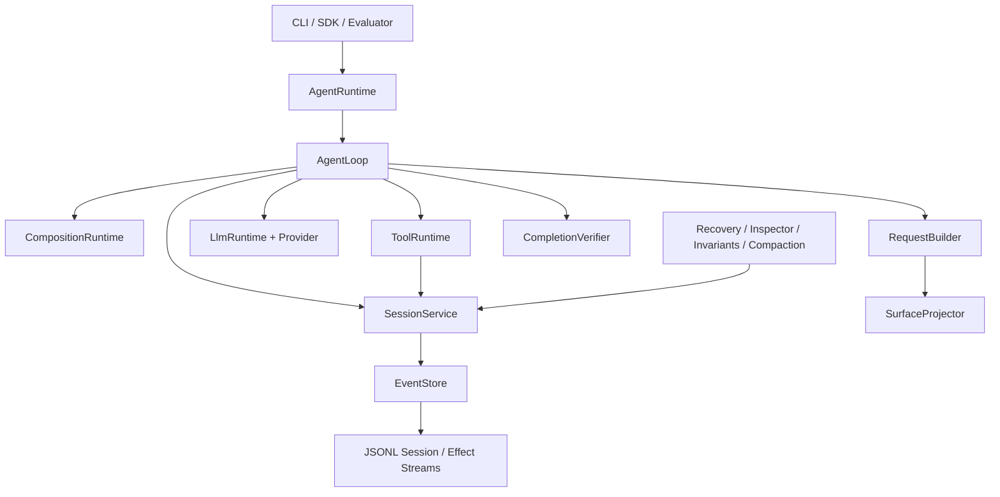
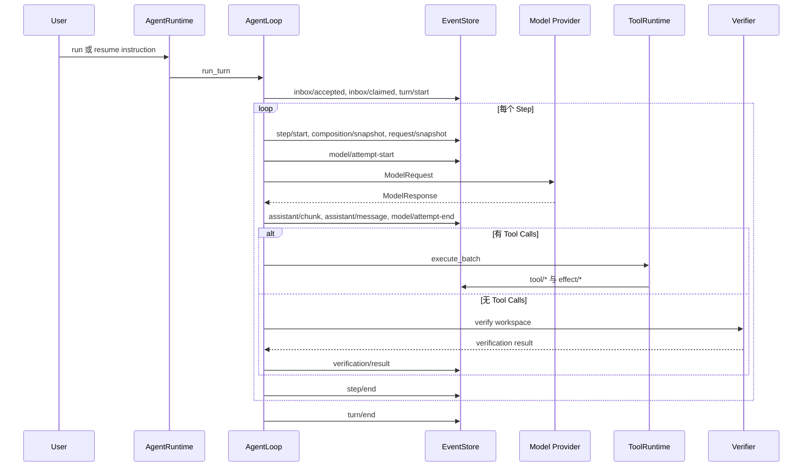
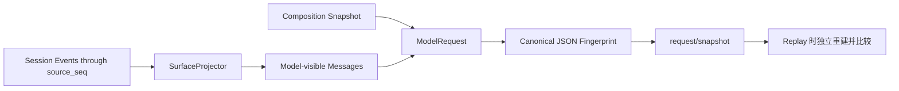
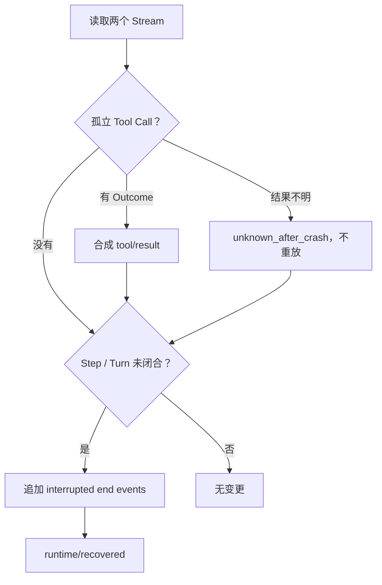
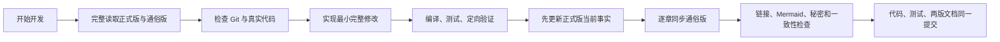

# TraceHarness Py 项目上下文（正式版）

> 本文维护当前仓库的工程事实和全局视野，不是开发日志。
>
> 维护顺序：先核对真实代码和测试，再更新本文，最后同步通俗版 [`project-context-plain-zh.md`](project-context-plain-zh.md)。

## 0. 文档契约

### 0.1 用途

本文供开发者和 Coding Agent 在开始任务前恢复项目全局上下文，回答：

- 当前版本实际实现了什么；
- 稳定架构边界在哪里；
- 运行时事实怎样持久化、重建、验证和恢复；
- 修改某一层可能影响哪些层；
- 当前已知限制和验证基线是什么。

### 0.2 事实优先级

发生冲突时以当前源码、测试和配置为最高事实源；本文其次；通俗版由本文派生。`CHANGELOG.md`、Roadmap、ADR 和历史实施计划各自保留版本历史、未来计划或设计原因，不替代当前状态核查。

### 0.3 更新原则

- 持续改写成最新状态，不在文末堆积流水账。
- 代码行为、目录职责、状态、配置、验证结果或架构流程变化时更新对应章节。
- Mermaid 图表达当前流程；历史案例必须明确标注为案例。
- 不记录真实 `.env`、Key、Token、本机隐私路径或秘密输出。
- 本文与通俗版使用相同的一级编号，便于逐章核对。

## 1. 当前项目状态

| 项目 | 当前事实 |
|---|---|
| 包名 | `traceharness-py` |
| Python 包 | `traceh` |
| 当前版本 | `0.3.0` 维护线，另有 `.env` 支持等 Unreleased 改进 |
| 成熟度 | Educational alpha；可运行、可测试，公共 API 尚未承诺生产稳定性 |
| Python | `>=3.12`；CI 覆盖 3.12、3.13 |
| 运行时依赖 | Python 标准库，无第三方运行时依赖 |
| 开发依赖 | pytest、pytest-asyncio、ruff |
| 当前 Agent 模型 | 单进程、单 Session 同时最多一个活跃 Turn |
| 持久化 | 本地 Append-only JSONL Session Stream 与 Effect Stream |
| 模型接入 | 确定性 Scripted Provider；非流式 OpenAI-Compatible `/chat/completions` Provider |
| Coding Tools | `list_files`、`read_file`、`search_text`、`apply_patch`、`shell` |
| 完成判定 | 可选外部 `CompletionVerifier`；默认实现为命令退出码验证 |
| CLI 形态 | 一次命令执行一个 Turn，不是交互式 TUI |
| 当前自动化测试 | 31 项，通过后才允许更新本表 |
| 内置 Benchmark | 1 个确定性修复案例 |

当前开发重点是把 v0.3 的可靠性、真实使用体验、可观察性和文档治理做扎实；v0.4+ 插件与多 Agent 仅保留协议边界，不视为已实现能力。

## 2. 系统目标与边界

### 2.1 当前目标

TraceHarness 是可重建、可审计的 Coding Agent Runtime。它把模型决策、工具调用、现实副作用和外部验证拆成明确边界，并把关键事实持久化为事件。

核心不变量：

1. Session Stream 是运行语义的持久化事实源；
2. Effect Stream 是外部副作用事实的独立账本；
3. State、Surface 和 Model Request 均可从持久化事件重建；
4. 一个 Step 使用一份冻结的 Composition；
5. 每个 Tool Call 最终应有配对的 Tool Result；
6. 不确定的写入或进程副作用不能在恢复时盲目重放；
7. 模型声称完成不等于完成，配置 Verifier 时必须有外部证据。

### 2.2 当前不属于系统的能力

- 完整 PluginManager、Entry Point 自动发现和热卸载；
- 活跃的 AgentSupervisor、子 Agent Tool 和 Workflow Engine；
- Git Worktree/Overlay Workspace 分支与合并；
- Docker、远程沙箱或操作系统级安全隔离；
- 分布式 Event Store；
- 完整流式模型输出、重试、Fallback 与限流中间件；
- 类似 Codex/Claude Code 的持续交互式终端界面。

## 3. 仓库目录与职责

```text
traceharness/
├── AGENTS.md                         跨 Coding Agent 的仓库开发规则
├── CLAUDE.md                         Claude Code 薄入口，导入 AGENTS.md
├── src/traceh/
│   ├── api/                          公共协议、不可变 DTO 和扩展边界
│   ├── cli/                          命令解析、.env 加载和运行入口
│   ├── evaluation/                   确定性 Benchmark Runner
│   ├── inspector/                    Session 文本、Replay 和静态 HTML 检查
│   ├── kernel/                       Scope、Activation、Hook、Lifespan、Owned Tasks
│   ├── llm/                          Provider 协议实现、注册表和调用边界
│   ├── runtime/                      AgentRuntime、AgentLoop、请求、Continuation、Verifier
│   ├── session/                      EventStore、投影、恢复、压缩和不变量
│   └── tools/                        Tool Registry、Schema、Policy、Middleware、执行与内置工具
├── tests/                            单元、契约、恢复、取消、端到端和 Benchmark 测试
├── examples/                         无 Key 的确定性 Demo 夹具
├── benchmarks/                       独立复制 Workspace 的评估案例
├── docs/
│   ├── note/                         当前项目正式版与通俗版上下文
│   ├── adr/                          已接受设计决定及原因
│   └── *.md                          专题设计、协议、恢复、测试和演进说明
├── .github/workflows/ci.yml          Python 3.12/3.13 编译、测试和 doctor
├── pyproject.toml                    包元数据、依赖、pytest 与 ruff 配置
├── README.md                         安装和使用入口
├── ROADMAP.md                        未来版本计划，不代表当前已实现
├── VALIDATION.md                     v0.3 发布时点验证快照
└── CHANGELOG.md                      已发布与 Unreleased 变化
```

`docs/TraceHarness Py：面向插件化与多 Agent 演进的 Python Harness 实施计划.md` 是长篇实施计划；它不是当前代码事实源。

## 4. 运行时装配与依赖方向

默认装配入口是 [`build_default_runtime()`](../../src/traceh/runtime/agent_runtime.py)。它创建或接受以下替换点：

- `EventStore`；
- `LlmProvider`；
- `PromptAssembler`；
- `Tool`、`ToolPolicy`、`ToolMiddleware`；
- `CompletionVerifier`；
- `ContinuationRuntime`。



依赖规则：

- `AgentLoop` 只编排生命周期，不导入具体工具、JSONL 文件或厂商 HTTP 逻辑；
- `AgentRuntime` 是对外门面和默认依赖装配点；
- Provider 与 Tool 通过公共协议进入 Runtime；
- Projector 和 Inspector 只消费事件，不反向修改历史事实；
- 未来多 Agent 控制面应构建在单 Agent Runtime 之上，而不是塞入 `AgentLoop`。

## 5. Session / Turn / Step 生命周期

### 5.1 概念

| 概念 | 当前语义 |
|---|---|
| Session | 与一个已解析 Workspace 绑定的长期事件历史，可包含多个 Turn |
| Inbox Message | 一次用户输入；先 accepted，再 claimed 到一个 Turn |
| Turn | 一次用户唤醒后的完整工作轮次 |
| Step | 一次冻结 Composition、构建请求、调用模型、可选执行工具的决策周期 |
| Model Attempt | 一次 Provider 调用；为未来重试/Fallback 保留独立边界 |
| Tool Invocation | 模型响应中的一个工具请求及其准入、Effect 和 Result |

### 5.2 正常执行



### 5.3 并发与取消

- `AgentRuntime` 用内存锁和 `_active` 表保证同一 Session 同时只有一个活跃 Turn；这是单进程保证。
- `cancel()` 先追加 `runtime/cancel-requested`，再取消 Task。
- `AgentLoop` 在取消/异常时追加 Attempt、Step、Turn 的终止或错误事件；ToolRuntime 尽量补齐未完成调用的 Tool Result。
- `dispose()` 取消并等待当前 Runtime 持有的活跃 Turn；Shell Tool 在取消时先 terminate，超时后 kill 并等待进程退出。

## 6. 事件模型与持久化

### 6.1 Event Envelope

事件由 [`PendingEvent` 与 `EventEnvelope`](../../src/traceh/api/events.py) 表示。落盘后包含 Stream ID、单调 `seq`、Event ID、类型、时间、数据以及可选 correlation、causation、actor、composition revision 等元数据。

### 6.2 两类 Stream

| Stream | ID 形式 | 用途 |
|---|---|---|
| Session Stream | `session:<session_id>` | 生命周期、消息、模型、工具结果、验证和恢复事实 |
| Effect Stream | `effects:<session_id>` | 现实副作用的 Intent、Dispatch、Outcome 与 Reconciliation |

两个 Stream 通过 `session_id`、`tool_call_id`、`effect_id`、correlation/causation 等字段关联，但各自有独立序号。

### 6.3 当前事件类型

| 类别 | 事件 |
|---|---|
| Session/Inbox | `session/created`、`inbox/accepted`、`inbox/claimed` |
| Turn/Step | `turn/start`、`turn/end`、`step/start`、`step/end` |
| 消息与请求 | `user/message`、`composition/snapshot`、`request/snapshot` |
| 模型 | `model/attempt-start`、`assistant/chunk`、`assistant/message`、`model/attempt-end` |
| 工具 | `tool/call`、`tool/admitted`、`tool/result` |
| 验证 | `verification/result` |
| Runtime | `runtime/cancel-requested`、`runtime/error`、`runtime/recovered` |
| Surface | `surface/replace` |
| Effect | `effect/intent`、`effect/dispatched`、`effect/outcome`、`effect/reconciled` |

### 6.4 EventStore 保证

`EventStore` 协议提供 append、read、head、list_streams。追加要求调用方传入 `expected_seq`；不匹配时抛出 `ConcurrencyConflict`。

默认 `JsonlEventStore`：

- 一个事件一行 JSON，文件名由 Stream ID URL 编码；
- 每个 Stream 有进程内 `asyncio.Lock`；
- Unix-like 平台有 `fcntl.flock` 文件锁；
- 写入可选 `SYNC` 或 `BATCHED` Durability；SYNC flush 后执行 `fsync`；
- `head()` 从文件尾读取最后完整行，成本与末行大小相关；
- 尾部半行可自动截断到最后完整事件；
- 中间坏行、Stream ID 不符或序号不连续会报 `CorruptEventStream`。

Windows 当前没有 `fcntl`，因此 `.lock` 文件会创建，但跨进程互斥没有等价 OS 锁；现有可靠保证主要是单进程内锁。这是 v0.3 需继续加固的事实边界。

## 7. Composition、Surface 与可重建请求

### 7.1 Composition

每个 Step 通过 `CompositionRuntime.lease()` 获取 `ActiveComposition`。快照包含：

- provider、model；
- 完整 system prompt；
- tool schemas；
- plugin identities；
- policy 和 middleware 名称；
- temperature、max output tokens；
- 基于内容生成的 revision。

当前实现是 `StaticCompositionRuntime`：每个 Step 都生成一致来源的快照，但 Lease 协议已经把对象生命周期与主循环分开。完整 generation、drain 和热更新尚未实现。

### 7.2 Surface

`SurfaceProjector` 只把以下事件投影为模型消息：

- `user/message` → user；
- `assistant/message` → assistant，保留 tool calls；
- `tool/result` → tool；
- `surface/replace` → 替换指定旧 Surface 事件的摘要消息。

原始事件仍保留。多次 Replacement 通过 source seq 遮蔽旧视图，而不是删除历史。

### 7.3 Request Snapshot 与 Fingerprint

`RequestBuilder` 使用“截至 Composition Event 的 Surface + 当前 Composition”生成 `ModelRequest`，持久化完整 Request、`source_seq`、composition revision 和稳定 fingerprint。



`verify_request_snapshots()` 能重新定位对应 Composition、重建当时的 Turn/Step metadata 和 Request，并报告 fingerprint 不一致。

## 8. 模型层

### 8.1 公共边界

`LlmProvider.complete(ModelRequest) -> ModelResponse` 是 Provider 协议；`LlmRegistry` 按名称注册；`LlmRuntime.invoke()` 是主循环与 Provider 之间的调用边界。

当前 `LlmRuntime` 等 Provider 完成后，只把完整文本作为一个 delta 交给 `assistant/chunk` 回调。协议上有 Chunk 事件，但当前网络适配并非真正 token streaming。

### 8.2 Scripted Provider

- 从内存响应序列或 JSON 文件读取确定性响应；
- 保存收到的 Request，便于测试；
- 默认脚本用完后抛 `ScriptExhaustedError`；
- 用于 Demo、单元测试、端到端测试和 Benchmark，不需要 API Key。

### 8.3 OpenAI-Compatible Provider

- 使用标准库 `urllib.request`；
- 发送 `POST <base_url>/chat/completions`；
- 请求为 `stream: false`，支持 messages、function tools、temperature、max tokens；
- API Key 来自显式参数或命名环境变量，以 Bearer Header 发送；
- 解析第一个 choice、文本、tool calls、finish reason 和 token usage；
- HTTP/URL/响应结构错误转换为 `ProviderHttpError`。

当前没有流式读取、自动重试、Fallback、并发限流或厂商专属协议适配。

## 9. Tool Runtime 与内置工具

### 9.1 执行管线

```mermaid
flowchart LR
    CALL["Tool Call"] --> LOOKUP["Registry Lookup"]
    LOOKUP --> SCHEMA["Schema Validation"]
    SCHEMA --> POLICY["Monotonic Policies"]
    POLICY --> ADMIT["tool/admitted"]
    ADMIT --> INTENT["effect/intent"]
    INTENT --> DISPATCH["effect/dispatched"]
    DISPATCH --> SCHEDULE["Read Parallelism / Write Barrier"]
    SCHEDULE --> MW["Middleware Chain"]
    MW --> EXEC["Tool.execute"]
    EXEC --> OUTCOME["effect/outcome"]
    OUTCOME --> RESULT["tool/result"]
```



执行事实：

- 同一模型响应中的 Tool Call ID 必须非空且唯一；
- 所有 `tool/call` 先写入 Session Stream；
- 未知工具或参数错误直接产生结构化失败 Result，不会产生 Effect；
- Policy 中任何 DENY 都不可被后续 ALLOW 覆盖；至少一个 Policy ALLOW 才准入；
- 连续的 PURE_READ/WORKSPACE_READ 调用使用 `asyncio.gather`；写入、进程和其他副作用形成顺序 Barrier；
- Middleware 的 `call_next()` 每层最多调用一次；
- Tool Runtime 有整体超时和最大输出字符限制；
- Outcome 记录证据、结构化数据、截断状态或错误；
- 取消时尽量依据已有 Outcome 补齐 Result，否则记录 `aborted_before_dispatch`。

### 9.2 Effect Kind

`PURE_READ`、`WORKSPACE_READ` 被认为并发安全且可安全重试；`WORKSPACE_WRITE`、`PROCESS`、`NETWORK_WRITE`、`EXTERNAL_TRANSACTION` 默认不并发且不可盲目重试。

### 9.3 内置工具

| 工具 | Effect Kind | 输入与行为 | 关键限制 |
|---|---|---|---|
| `list_files` | WORKSPACE_READ | 列出相对文件；可设 `max_files` | 跳过常见缓存、Git、虚拟环境和依赖目录 |
| `read_file` | WORKSPACE_READ | 读取 UTF-8 文件 | 真实路径必须位于 Workspace 内 |
| `search_text` | WORKSPACE_READ | 子串或正则搜索，可限路径和结果数 | 跳过二进制/非 UTF-8 及常见忽略目录 |
| `apply_patch` | WORKSPACE_WRITE | 精确旧文本替换或显式创建新文件 | 校验替换次数；临时文件 + fsync + 原子 replace；不是 unified diff parser |
| `shell` | PROCESS | `shlex.split` 后用 `create_subprocess_exec` 执行 | 不使用 `shell=True`；清洗秘密环境变量；超时/取消收敛子进程 |

所有路径读写通过 `resolve_workspace_path()` 解析后检查 Workspace 边界。默认 `DangerousShellPolicy` 屏蔽一组明显危险的可执行文件名，但它只是 Guardrail，不是安全沙箱。

## 10. Continuation 与证据驱动完成

`DefaultContinuationRuntime` 按以下顺序决定继续或结束：

1. 达到 `max_steps` → `max_steps_exceeded`；
2. 模型响应包含 Tool Calls → 下一 Step；
3. 已运行 Verifier 且失败，失败次数仍在重试预算内 → 把结构化验证摘要作为新 user message 注入下一 Step；
4. Verifier 持续失败超预算 → `verification_failed`；
5. 无 Tool Calls 且无失败证据 → `completed`。

`CommandVerifier` 使用参数拆分和 `create_subprocess_exec` 在 Workspace 中运行独立命令，使用清洗后的环境，收集退出码、stdout、stderr；退出码 0 为通过。AgentLoop 把结果写为 `verification/result`。

Verifier 是可选的：未配置时，无 Tool Call 的最终模型响应可以结束 Turn，此时 `verification_passed` 为 `None`，不能把它解释成“外部验证已通过”。

## 11. 崩溃恢复与生命周期收敛

`RecoveryService.recover()`：

1. 读取 Session 与 Effect Streams；
2. 找出没有 `tool/result` 的 `tool/call`；
3. 有持久化 Outcome/Reconciled 时据此合成 Result；
4. 没有可确认 Outcome 时标记 `unknown_after_crash`，有 Intent 则追加 `effect/reconciled`；
5. 对未闭合 Step/Turn 追加 `reason=interrupted` 的结束事件；
6. 发生改变时追加 `runtime/recovered`。



当前恢复器没有单独扫描和收敛未闭合 `model/attempt-start`；它通过关闭 Step/Turn 使 Session 回到非活跃状态，但 Model Attempt 配对语义仍是待加固项。

`resume` 总是先 recover，再在同一 Session 追加一个新 Turn，并提醒模型重新检查 Workspace 和恢复结果后再重复副作用。

## 12. 投影、压缩、Inspector、Replay 与 Evaluation

### 12.1 State 与不变量

- `StateProjector` 推导 Session 状态、当前开放 Turn/Step、完成数量和最后序号；
- `CoreInvariantChecker` 检查序号、生命周期嵌套、Attempt、Tool Call/Result、Effect 与 Composition 等协议关系；
- 投影和检查不修改事件。

### 12.2 手动 Surface 压缩

`CompactionService.replace_through()` 要求非空摘要和合法边界，收集边界内模型可见事件序号，追加 `surface/replace`。当前没有自动摘要器；CLI 调用者负责提供摘要文本。

### 12.3 Inspector 与 Replay

- `inspect` 输出 Workspace、状态、事件数、Turn/Step 数、不变量和请求重建违规，可选事件明细；
- `inspect --html` 生成包含 Session/Effect 事件和摘要的静态 HTML；
- `replay` 输出 Surface，即模型可见消息，并执行 Request Reconstruction 检查；
- `sessions` 列出持久化 Session；
- `recover` 只恢复，不调用模型。

### 12.4 Benchmark

`BenchmarkRunner` 发现 `*/case.json`，为每个案例复制独立 Workspace，使用 Scripted Provider 和真实 Tool Runtime/Verifier，生成：

- 案例 Workspace；
- `.traceh` Session/Effect JSONL；
- `report.json`；
- `report.md`。

成功条件是最终外部验证通过且不变量无违规。当前只有 `fix_addition` 一个确定性案例，不能代表复杂真实 Coding 任务质量。

## 13. CLI、配置与日常运行

### 13.1 命令

| 命令 | 当前用途 |
|---|---|
| `traceh run` | 创建 Session 并运行一个 Turn |
| `traceh resume` | 恢复 Session 后追加一个新 Turn |
| `traceh recover` | 只执行恢复，不调用模型 |
| `traceh inspect` | 状态、不变量、请求重建和事件检查，可导出 HTML |
| `traceh replay` | 重放模型 Surface 并检查请求重建 |
| `traceh compact` | 手动追加 Surface Replacement |
| `traceh sessions` | 列出 Session |
| `traceh eval` | 运行 Benchmark 目录 |
| `traceh doctor` | 检查 Python、数据目录和非秘密 Provider 配置状态 |

CLI 当前是 run-to-completion：接收一次任务，执行到 Turn 结束，打印最终文本和摘要；没有持续对话输入循环、实时审批 UI 或 TUI 面板。

### 13.2 `.env` 与配置优先级

默认读取当前工作目录 `.env`，也可用 `--env-file` 指定。优先级：

```text
显式 CLI 参数 > 已存在的进程环境变量 > .env 文件 > 内置默认值
```

支持：

- `TRACEH_PROVIDER`；
- `TRACEH_BASE_URL`；
- `TRACEH_MODEL`；
- `TRACEH_API_KEY_ENV`；
- `TRACEH_DATA_DIR`；
- `TRACEH_MAX_STEPS`；
- `TRACEH_VERIFY_COMMAND`。

`.env` 不覆盖已有进程环境变量；OpenAI-Compatible 模式必须显式提供 Base URL 和 Model，不内置某个厂商作为隐藏默认。真实 `.env` 被 Git 忽略，`.env.example` 只包含占位值。

### 13.3 默认 Runtime 参数

| 参数 | 默认值 |
|---|---:|
| max steps | 20 |
| tool timeout | 60 秒 |
| max tool output | 24,000 字符 |
| verification timeout | 60 秒 |
| max verification retries | 1 |
| data dir | `.traceh` |
| provider/model | `scripted` / `scripted-model` |

## 14. 已有扩展边界与未来接口

当前代码中存在但尚未形成完整产品能力的边界：

| 未来方向 | 已有协议/原语 | 当前缺失实现 |
|---|---|---|
| 插件 | `PluginManifest`、`Plugin`、`PluginContext` | Entry Point Discovery、PluginManager、依赖解析、健康检查 |
| 可逆生命周期 | `Activation`、`Lifespan`、`OwnedTaskSet` | 与真实 PluginManager 的完整集成 |
| 服务与 Scope | `ServiceKey`、`ServiceRegistry`、`Scope` | Application/Workspace/Preset/Agent 完整层级装配 |
| Composition Generation | `CompositionSnapshot`、`CompositionRuntime.lease()` | 多代发布、引用计数、Drain、卸载 |
| 多 Agent | `AgentSpec`、`AgentHandle`、`AgentSupervisor` Protocol、Budget DTO | 活跃 Supervisor、Inbox、子 Agent Tools、冷恢复 |
| Workspace 分支 | `WorkspaceProvider`、Snapshot、PatchArtifact、MergeResult | Git Worktree/Overlay 实现和协调 |
| Workflow | 可复用单 Agent Runtime 边界 | Workflow Engine、Map/Join/Approval 节点 |

这些类型证明接入方向，但不得在文档或对外说明中表述为“已实现插件系统/多 Agent”。

## 15. 测试与验证基线

### 15.1 本地标准检查

```powershell
python -m compileall -q src tests
python -m pytest -q
```

当前测试套件共 31 项，覆盖：

- EventStore expected-seq、尾部恢复和读取；
- Session/Surface/Compaction/Invariant；
- AgentLoop 端到端工具循环和 Verification；
- Tool Schema、Policy、Middleware、失败、超时和并发 Barrier；
- Workspace 越界与精确 Patch；
- 取消、子进程收敛和崩溃恢复；
- Scripted/OpenAI-Compatible Provider；
- `.env` 解析、优先级、秘密不打印和测试隔离；
- Kernel Scope、Activation、Hooks、Lifespan、Owned Tasks；
- Inspector、Request Reconstruction 和 Benchmark；
- 未来 Plugin/Agent/Workspace Protocol 可构造性。

### 15.2 CI

GitHub Actions 在 push 和 pull request 上运行 Python 3.12、3.13 矩阵：可编辑安装、compileall、pytest、`traceh doctor`。

### 15.3 发布快照与当前测试的区别

`VALIDATION.md` 保存最初 v0.3 发布时的 24 项测试、覆盖率、Demo、Wheel 和干净安装验证。此后 `.env` 功能将当前测试增加到 31 项。不要把发布时点数字误认为当前测试总数，也不要未经重新运行就改写历史验证结果。

## 16. 已知限制与风险

| 领域 | 当前限制/风险 | 完善方向 |
|---|---|---|
| Windows 持久化 | 无 `fcntl`，缺少等价跨进程文件锁 | Windows 原生锁或明确单进程约束与测试 |
| Model Attempt 恢复 | 未闭合 Attempt 无专门恢复事件 | 补齐 Attempt 恢复语义和不变量 |
| CLI 体验 | 非交互式，无审批、流式 UI、会话内连续输入 | 在不破坏 Runtime 边界下新增 Surface/UI 层 |
| Shell 安全 | Policy 是黑名单 Guardrail，不是沙箱 | 容器/远程 Sandbox、能力审批 |
| OpenAI Provider | 非流式、无重试/Fallback/限流 | 在 LlmRuntime/Provider 边界扩展 |
| JSONL 扩展性 | read 仍全量扫描；非分布式 | Checkpoint、SQLite 或其他 EventStore |
| Patch 能力 | 精确文本替换，不解析 unified diff | 增加独立工具实现，不改变 Tool Runtime |
| Benchmark | 仅一个确定性简单案例 | 增加真实 Provider、失败恢复、复杂仓库案例 |
| 自动压缩 | 只有手动 Replacement | 未来 Context/Compaction Plugin |
| API 稳定性 | Alpha，协议可能演进 | v1.0 前建立兼容策略和 Upcaster |

## 17. 变更影响矩阵

| 修改区域 | 必查代码/测试 | 必须同步的本文章节 |
|---|---|---|
| Agent Loop / Continuation | `runtime/agent_loop.py`、`continuation.py`、E2E/取消测试 | 4、5、10、11、15、16 |
| Event/Store/Session | `api/events.py`、`session/*`、event/invariant/recovery 测试 | 5、6、7、11、12、15、16 |
| Provider/Request | `api/llm.py`、`llm/*`、`request_builder.py` | 7、8、13、15、16 |
| Tool/Policy/Middleware | `api/tools.py`、`tools/*` | 6、9、11、15、16 |
| CLI/.env | `cli/*`、`.env.example`、README、CLI tests | 1、3、13、15 |
| Verifier/Eval | `verification.py`、`evaluation/*` | 10、12、15、16 |
| Plugin/Multi-Agent Protocol | `api/plugins.py`、`agents.py`、`workspaces.py`、`kernel/*` | 2、3、4、14、15、16 |
| 开发流程/目录 | `AGENTS.md`、`CLAUDE.md`、CI、pyproject | 0、1、3、15、18 |

## 18. 当前维护流程



维护完成标准：

- 当前代码与测试通过；
- 本文所有受影响事实已更新，过时事实已删除；
- 通俗版相同编号章节已同步，且没有引入额外能力；
- README/CHANGELOG/ADR/专题文档按各自职责更新；
- 示例只作为示例，秘密未进入 Git；
- 最终交付说明变更、验证、文档同步和剩余边界。
