# TraceHarness Py 项目上下文（正式版）

> 本文维护当前仓库的工程事实和全局视野，不是开发日志。
>
> 维护顺序：先核对真实代码和测试，再更新本文，最后同步通俗版 [`project-context-plain-zh.md`](project-context-plain-zh.md)。

## 0. 文档契约

### 0.1 用途

本文供开发者和 Coding Agent 在开始任务前恢复项目全局上下文，回答：

- 当前版本实际实现了什么；
- 稳定架构边界在哪里；
- 运行时事实怎样持久化、重建、验证和恢复；
- 修改某一层可能影响哪些层；
- 当前已知限制和验证基线是什么。

### 0.2 事实优先级

发生冲突时以当前源码、测试和配置为最高事实源；本文其次；通俗版由本文派生。`CHANGELOG.md`、Roadmap、ADR 和历史实施计划各自保留版本历史、未来计划或设计原因，不替代当前状态核查。

### 0.3 更新原则

- 持续改写成最新状态，不在文末堆积流水账。
- 代码行为、目录职责、状态、配置、验证结果或架构流程变化时更新对应章节。
- Mermaid 图表达当前流程；历史案例必须明确标注为案例。
- 不记录真实 `.env`、Key、Token、本机隐私路径或秘密输出。
- 本文与通俗版使用相同的一级编号（当前为 0–20），便于逐章核对。

## 1. 当前项目状态

| 项目 | 当前事实 |
|---|---|
| 包名 | `traceharness-py` |
| Python 包 | `traceh` |
| 当前版本 | `0.6.0`。唯一事实源是 [`src/traceh/version.py`](../../src/traceh/version.py) 的 `__version__`；`pyproject.toml` 用 `[tool.setuptools.dynamic]` 读取同一属性，因此 Wheel metadata 与被导入的包不可能不一致；源码 ZIP 默认文件名也从该属性派生 |
| 成熟度 | Educational alpha；可运行、可测试，公共 API 尚未承诺生产稳定性 |
| Python | `>=3.12`；CI 覆盖 Ubuntu 3.12/3.13 与 Windows 3.12 |
| 运行时依赖 | `packaging>=24.0,<27`——v0.4 引入的**第一个**第三方运行时依赖，用于 PEP 440 解析（见 1.1）。其余仍只用标准库 |
| 开发依赖 | pytest、pytest-asyncio、ruff |
| 当前 Agent 模型 | **v0.6.0 已发布**单进程多 Agent 主线：Stage A 有持久化 Agent identity 与只读 Directory，Stage B 有每 Agent 一条持久化 FIFO Inbox **接受**历史，Stage C 有进程内 `ProcessAgentSupervisor` 完成 durable claim → 真实 Turn → durable terminal，Stage D 把 `owner_agent_id` 投影成 child-first 生命周期树；Stage E 再提供绑定 owner 的 `spawn_agent`/send/wait/stop/collect 五个模型 Tool（见 20 节）。v0.7 D0 固定公共控制面接缝，v0.7-A/B 用单一 Budget Ledger 与薄适配器强制七个维度；v0.7-C 用独立 Workspace 域给 managed Agent 分配 commit-pinned worktree；v0.7-D1 把 terminal Agent 的完整 Git 状态捕获为 CAS bytes + append-only Manifest；v0.7-D2 再在 Runtime 外新增独立 Promotion 域，把不可变 Patch 经固定宿主 Verifier、人工精确批准和 Git ref compare-and-swap 推广到宿主管理的 bare 仓库。`AgentLoop`、`AgentRuntime`、concrete Supervisor 并发内核与 `PluginManager` 都不持有 Budget、Workspace、Artifact 或 Promotion 状态。每个 Agent 最多一个 Live Activation，每个 Activation 同时最多一个 Turn。**没有**冷恢复、stale claim 接管、自动重试、模型可见的 approve/promote Tool 或 Workflow；Budget/Workspace/Artifact/Promotion 宿主装配仍需显式提供，`NEXT_STEP` 被拒绝而非改写 |
| 持久化 | 本地 Append-only JSONL Session Stream、Effect Stream、Agent Directory Stream、全局 Budget Ledger Stream、全局 Workspace Catalog Stream、全局 Patch Artifact Catalog Stream、全局 Patch Promotion Ledger Stream，以及每 Agent 的 Inbox Stream 与 Delivery Stream；Patch 原始 bytes 在显式内容寻址 CAS，不写入 Event Log |
| 模型接入 | 确定性 Scripted Provider；非流式 OpenAI-Compatible `/chat/completions` Provider |
| Coding Tools | `list_files`、`read_file`、`search_text`、`apply_patch`、`shell`；插件可增加更多 |
| 插件系统 | v0.5 的 `traceh.plugins` Entry Point、事务激活、Generation/Lease/Drain、Session 组合迁移、四层宿主装配与 Provider/Policy/Middleware/命名 Verifier application 贡献全部保留；**v0.6.0 又发布 L1–L4 控制面**：独立 Plugin Creator Skill Wheel、候选构建/审计/测试、精确 baseline/candidate 对比，以及两阶段人工批准、推广与回滚。它们都在 Runtime 外，不进入 `AgentRuntime` 或第二个插件加载器。插件 setup 仍只在 application scope、trusted、进程内运行，不能自行选择子层；EventStore 仍不是插件贡献面 |
| 完成判定 | 可选外部 `CompletionVerifier`；默认实现为命令退出码验证 |
| CLI 形态 | `traceh chat` 提供同一 Session 内的连续多轮行式交互，Turn 运行期间实时打印 Step/Tool Timeline 与 Activity Heartbeat（`--no-timeline`、`--heartbeat-seconds` 可调），首次 Ctrl+C 只取消当前 Turn 并保留 Session；空闲提示符支持 `/plugins`、`/plugins reload`、`/plugins use ...` 和 `--none` 的异步组合切换，不创建 Turn。其余命令仍是一次执行一个 Turn。不是流式 TUI。插件命令为 `list/inspect/doctor/validate/compare/promote/rollback`；后四者构成 Runtime 外的 L2–L4 控制面 |
| 事件写入互斥 | JSONL Stream 在 POSIX 与 Windows 上均有操作系统级跨进程文件锁 |
| 当前自动化测试 | 核心套件 `2005` collected；完整门禁 `2000 passed, 5 skipped`。五个 skip 全部是平台权限或路径边界：三处目录 symlink（Workspace、Tool、D1 capture）、一处 D2 推广目标 symlink，以及一处路径不能包含 NUL。D2 四个专门文件共 `130` 项（`129 passed, 1 skipped`），连同 D1 Artifact 与 Workspace 架构回归的扩大定向门禁为 `172 passed, 2 skipped`。v0.7-D1 检查点为 1875/1871/4，v0.7-C 为 1835/1832/3，v0.7-B 为 1770/1769/1，v0.6.0 发布快照为 1707/1706/1。仓库外干净 `HEAD` 克隆另行完成 L2 `13/13` 门禁与完整可信核心回归；v0.6 RC 还用真实模型完成 parent→child 主线、恢复与取消收敛。独立 Python Quality/Plugin Creator Skill 另有 `17`/`10 passed` |
| 内置 Benchmark | `traceh eval` 有 1 个确定性修复案例；L3 另有 1 套宿主固定 Python Quality v1 对比 Suite（3 个合同案例），两者职责不同 |

当前版本为 `0.6.0`。它在 v0.5 插件 Composition 主线之上正式发布两组能力：Runtime 外的 L1–L4 受控候选演进控制面，以及 v0.6 Stage A–E 的 durable Agent identity/Inbox/Delivery、进程内 Supervisor、owner 子树 child-first disposal 和五个模型 Tool。v0.7 D0 又完成了**未发布、无新增产品能力**的依赖接缝；v0.7-A/B 建立并执行单一层级 Budget Ledger；v0.7-C 加入独立 managed Workspace；v0.7-D1 加入独立 Artifact Catalog、SHA-256 CAS、临时 Git index 完整快照、终态证据复核和只读报告关联；v0.7-D2 再加入独立 Promotion Ledger、固定宿主 Verifier、确定性 integration commit、精确 approval digest 与 Git ref compare-and-swap 推广。Plugin Creator Skill 与 Python Quality 仍是独立 Distribution，分别以 `0.2.0` 进入本次 Wheel E2E；前者的作者合同针对 `>=0.6,<0.7`，后者经验证继续兼容 `>=0.5,<0.7`。这些能力均没有修改 `AgentLoop` 的职责，也没有把多 Agent 队列、余额、路径、Git、Artifact、Promotion 或包管理塞进 `AgentRuntime`。当前仍没有 v0.7 Budget/Workspace/Artifact/Promotion 的默认 CLI 装配、L5 自动弱点归纳/候选提案、任意运行中 Runtime 自动安装/启用、OS 沙箱、isolated、跨进程 Agent/Workspace/Promotion lease、冷恢复、stale claim takeover、自动批准、非 bare 推广目标、Workflow、MCP、TUI 或流式输出。

### 1.1 为什么引入 `packaging`

Plugin Manifest 的 `requires_traceh`、插件之间的依赖版本区间、以及插件 Distribution 声明的 `traceharness-py` 依赖，三者都是 PEP 440 文本，并且都位于**信任边界**上：解析结果决定一段第三方代码是否被 import 并执行。自己实现一个不完整的 PEP 440 解析器，等于用一个未经验证的比较器守门。因此保留 `packaging` 并在 `pyproject.toml` 显式声明。

必须同时更新的一条旧事实：**“运行时只依赖标准库”从 v0.4 起不再成立**，README、通俗版和本表都已改写。离线 Wheel 验收的 wheelhouse 因此必须同时包含 `packaging` 的 Wheel，见 15.4。

### 1.2 版本为什么必须只有一个来源

`traceh.core` 的 `PluginIdentity` 会写进**每一条持久化的 Composition Snapshot**。如果版本散落在多处，两个来自同一次构建的 Runtime 可能给同一种 Step 写下不同的核心版本——这正是 Composition Snapshot 存在的意义所要排除的情况。

因此以下全部派生自 `traceh.version.__version__`：`pyproject.toml` 的项目版本（dynamic attr）、`traceh.__version__`、`CORE_PLUGIN_IDENTITY`、`TRACEH_PLUGIN_API_VERSION`、`PluginManifest.requires_traceh` 默认值、Generation Runtime 的默认 plugins、`AgentRuntime` 的默认 plugins、CLI 描述。[`tests/test_version_contract.py`](../../tests/test_version_contract.py) 断言 `importlib.metadata.version("traceharness-py")` 与被导入的 `__version__` 相等，并断言默认兼容范围确实包含当前版本。

## 2. 系统目标与边界

### 2.1 当前目标

TraceHarness 是可重建、可审计的 Coding Agent Runtime。它把模型决策、工具调用、现实副作用和外部验证拆成明确边界，并把关键事实持久化为事件。

核心不变量：

1. Session Stream 是运行语义的持久化事实源；
2. Effect Stream 是外部副作用事实的独立账本；
3. State、Surface 和 Model Request 均可从持久化事件重建；
4. 一个 Step 使用一份冻结的 Composition；
5. 每个 Tool Call 最终应有配对的 Tool Result；
6. 不确定的写入或进程副作用不能在恢复时盲目重放；
7. 模型声称完成不等于完成，配置 Verifier 时必须有外部证据。

### 2.2 当前不属于系统的能力

- 面向用户的插件**组合切换**：`traceh chat` 空闲提示符提供 `/plugins`、`/plugins reload`、`/plugins use ID...` 和 `/plugins use --none`。它只重新发现当前进程可见的 Entry Point 并重做 setup/conflict/health，不安装或卸载 Wheel，不强制 `importlib.reload()`，也不承诺从磁盘重新导入 Python 源码；
- **isolated（跨进程）插件**：Manifest 可以声明 `trust_mode="isolated"`，激活会**明确拒绝**它，而不是降级成 trusted；
- 插件提供 `EventStore`：D3 已开放 Provider、Policy、Middleware 与命名 Verifier，但 EventStore 仍固定在 Runtime/Session 生命周期，不能跟随 Step Generation 热替换；
- 插件在 workspace / preset / agent 层执行 setup，或自行声明分层 Tool/Prompt/Policy；D2 只开放宿主装配代码传入的 binding，D3 的新贡献仍属于 application setup，不把 `allowed_scopes` 变成新的激活入口；
- Workflow Engine。v0.6 Stage A–E 已实现 Agent 事实、执行、生命周期和五个模型 Tool；v0.7-A/B 已有层级 Budget Ledger 和显式宿主执行装配；v0.7-C 实现 commit-pinned worktree；v0.7-D1 已能把 terminal message 的完整 Git 状态捕获为不可变 Patch Artifact；v0.7-D2 已实现固定验证、人工批准和 Git ref compare-and-swap 推广。因此仍**没有**默认 CLI 装配、冷恢复、stale claim 接管、自动重试、自动批准、自动选择推广目标或 Workflow，`MessageTarget.NEXT_STEP` 也未实现；
- MCP 接入；
- Git worktree 已由 v0.7-C、不可变 Patch Artifact 已由 v0.7-D1、Review/Approval/Promotion 已由 v0.7-D2 以宿主显式装配方式实现；尚无 Overlay、多父 merge、非 bare 推广目标、CAS/对象垃圾回收或跨进程 lease；
- Docker、远程沙箱或操作系统级安全隔离；
- 分布式 Event Store；
- 完整流式模型输出、重试、Fallback 与限流中间件；
- 类似 Codex/Claude Code 的富交互终端界面：`traceh chat` 已有实时 Tool Timeline 与 Activity Heartbeat（见 13.6、13.7），但仍是行式提示符，没有 token 流式输出、Spinner、颜色、可交互 TUI 和执行前审批。

## 3. 仓库目录与职责

```text
traceharness/
├── AGENTS.md                         跨 Coding Agent 的仓库开发规则
├── CLAUDE.md                         Claude Code 薄入口，导入 AGENTS.md
├── src/traceh/
│   ├── version.py                    版本、Distribution 名、核心 plugin id 与默认兼容范围的唯一来源
│   ├── agents/                       多 Agent 控制面事实层：Agent identity、创建事务、只读 Directory 投影，以及每 Agent 的 Inbox 接受协议、投影与事务
│   ├── budgets/                      v0.7 单一层级 Budget 事件/投影/写入，以及 create/model/Step/Tool/process 薄执行适配器
│   ├── workspaces/                   v0.7-C Workspace Catalog、Git Provider、取消收敛服务、Supervisor 包装器与只读 Tool Policy
│   ├── artifacts/                    v0.7-D1 Patch Manifest/Catalog、SHA-256 CAS、临时 Git index 捕获、fresh reader 与只读报告适配器
│   ├── promotion/                    v0.7-D2 Promotion Ledger 事件/投影、固定 Verifier 执行、临时 clone 集成、bare 目标解析、共用 scratch 失败组合与 Git ref CAS 推广服务
│   ├── supervision/                  进程内 Agent Supervisor：Delivery/Activation/ownership 收敛；另有独立 Authority 与宿主 Provisioning Policy 支撑绑定 owner 的五个子 Agent Tool
│   ├── api/                          公共协议、冻结 DTO 和扩展边界（含 `prompts.py`、`plugins.py`、`agents.py`、`budgets.py`、`workspaces.py`、`artifacts.py`、`promotion.py`）
│   ├── concurrency.py                不可取消 Worker 的收敛等待
│   ├── process_control.py            Tool/Verifier/Git 共用的直接子进程取消与超时收敛
│   ├── cli/                          命令解析、.env 加载、交互式 chat 循环、Timeline 投影、Activity Heartbeat、Shell 命令渲染、插件 CLI 投影和终端编码
│   ├── evaluation/                   确定性 Benchmark Runner
│   ├── evolution/                    L2 验证、L3 对比与 L4 人工批准/精确推广/回滚
│   ├── inspector/                    Session 文本、Replay 和静态 HTML 检查
│   ├── kernel/                       四层 Service 与 Composition Overlay、显式覆盖诊断、Activation、Hook、Lifespan、Owned Tasks
│   ├── llm/                          Provider 协议实现、注册表和调用边界
│   ├── plugins/                      Entry Point 发现、显式启用解析、事务式 PluginManager、Generation-owned ActivationSet Builder
│   ├── runtime/                      AgentRuntime 门面、PluginCompositionCoordinator 控制面、AgentLoop、Generation Composition/Lease、请求、Continuation、Verifier
│   ├── session/                      EventStore、进程内 Event Feed、跨进程文件锁、投影、恢复、压缩、不变量和插件身份事实重建
│   └── tools/                        Tool Registry、Schema、Policy、Middleware、子进程输出捕获与内置工具
├── tests/                            单元、契约、恢复、取消、跨进程、插件、打包和端到端测试
├── examples/                         无 Key 的确定性 Demo 夹具
│   └── plugins/                      三个可独立构建安装的外部插件 Distribution（示例、Python Quality、Plugin Creator Skill）
├── benchmarks/                       独立复制 Workspace 的评估案例
├── docs/
│   ├── note/                         当前项目正式版与通俗版上下文
│   ├── adr/                          已接受设计决定及原因（含 0007 插件事务激活）
│   ├── plugins.md                    插件作者与运维契约
│   └── *.md                          专题设计、协议、恢复、测试和演进说明
├── .github/workflows/ci.yml          Ubuntu 3.12/3.13 与 Windows 3.12 编译、测试和 doctor
├── pyproject.toml                    包元数据、依赖、pytest 与 ruff 配置
├── README.md                         安装和使用入口
├── ROADMAP.md                        未来版本计划，不代表当前已实现
├── VALIDATION.md                     v0.3 发布时点验证快照
└── CHANGELOG.md                      已发布与 Unreleased 变化
```

`docs/TraceHarness Py：面向插件化与多 Agent 演进的 Python Harness 实施计划.md` 是长篇实施计划；它不是当前代码事实源。

## 4. 运行时装配与依赖方向

装配有两个入口，位于 [`runtime/agent_runtime.py`](../../src/traceh/runtime/agent_runtime.py)：

| 入口 | 用途 |
|---|---|
| `build_default_runtime()` | 同步、无插件；通过空的 Generation-owned `PluginActivationSet` 进入同一 Generation/Lease 主线，不发现、不 import 插件 |
| `build_default_runtime_async()` | 异步。`enabled_plugins` 为空时使用空 ActivationSet；非空时在私有候选注册表中完成激活事务，再由初始 Generation 接管 |

两者共享 `_prepare_default_runtime()` 与 `_finish_default_runtime()`。拆成两段的原因很具体：插件必须在**注册表已创建、Composition 尚未围绕它们冻结**的那一刻贡献内容，而拆分让这一点成立，同时不需要把装配代码写两遍。

它们创建或接受以下替换点：

- `EventStore`；
- `LlmProvider`；
- `PromptAssembler`；
- `Tool`、`ToolPolicy`、`ToolMiddleware`；
- `CompletionVerifier`；
- `ContinuationRuntime`；
- `LlmRuntime` 与 `ToolAdmissionGate`（宿主可显式注入；Budget Stage B 复用此接缝，不改变 `AgentLoop`）；
- `ScopedServiceBinding`（Application / Workspace / Preset / Agent 的程序化 Service 装配；覆盖必须显式）；
- `ScopedToolBinding`、`ScopedPromptBinding`、`ScopedPolicyBinding`（同样四层的程序化模型/执行能力装配；覆盖必须显式）；
- `PluginDiscovery`、`enabled_plugins`、`plugin_configs`（仅异步入口）。

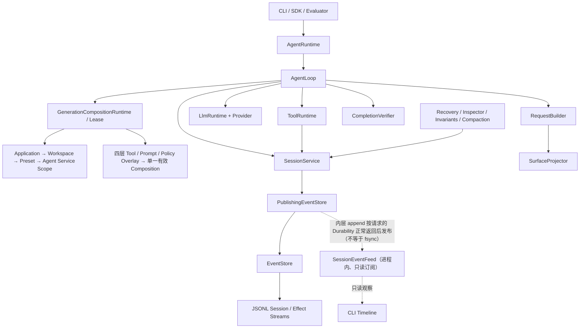

插件在这张图上的位置见下：

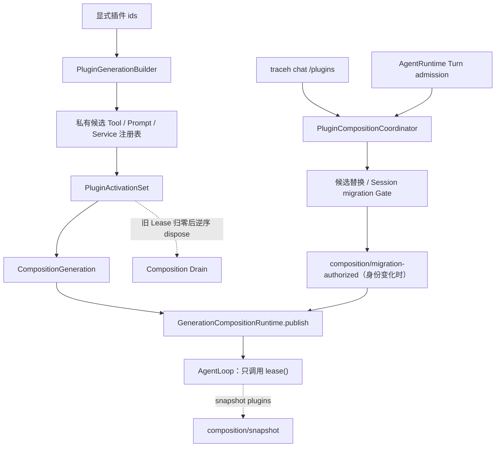

依赖规则：

- `AgentLoop` 只编排生命周期，不导入具体工具、JSONL 文件或厂商 HTTP 逻辑；也**不导入 CLI、Console、颜色或 Timeline 文案**：Timeline 是订阅 Feed 的界面层投影，主循环不知道它存在；
- **`AgentLoop` 同样不知道 `PluginManager` 存在**。插件位于装配层，它的 Tool、Prompt 和 Service 进入既有的 `ToolRegistry`、`PromptAssembler` 和 `ServiceRegistry`，因此**没有** `PluginToolRuntime`，也**没有** `PluginAgentLoop`。`agent_runtime.py` 里对 `PluginManager` 的 import 是函数内局部 import，正是为了让这条边界在依赖图上也成立；
- `AgentRuntime` 是对外门面和默认依赖装配点，并继续拥有活跃 Turn 表、Turn admission 的最终线性化检查和唯一总关闭 Task。D0 把候选 prepare/publish/rollback、Session durable identity 校验与迁移、共享 Gate、replacement/admission 在途任务收敛集中到 `PluginCompositionCoordinator`；协调器只通过窄回调读取 Runtime 是否关闭、是否有活跃 Turn 和 current Generation 的外部插件身份，不拥有第二份可变身份事实。Stage B 的内部 `replace_plugin_composition()` 与 Stage C 的 Chat `/plugins` 控制面仍复用同一条候选→Generation→publish 主线，身份变化仍在共享 Gate 内追加 append-only 授权事件；插件 Tool/Prompt/Service、Activation 与 Owned Task 由对应 Generation 的 ActivationSet 持有；SessionService、EventStore、核心 Provider、内置 Tool 和基础配置是 borrowed core，不能被插件 cleanup 关闭。`dispose()` 先收敛 Turn，再收敛控制面在途任务，再 Drain 所有 Generation，最后仅清理 application-level legacy 资源；
- Provider 与 Tool 通过公共协议进入 Runtime；
- Projector 和 Inspector 只消费事件，不反向修改历史事实；
- 多 Agent 控制面构建在单 Agent Runtime **之上**，不塞入 `AgentLoop`。v0.6 Stage A 的 [`agents/`](../../src/traceh/agents/) 只依赖 `traceh.api` 与 `EventStore`：它不导入 `AgentRuntime`、`AgentLoop` 或 `PluginManager`，也不被它们导入。方向是单向的——未来的 Supervisor 持有 Activation 并从这里读取 identity，`AgentRuntime` 永远不感知 Supervisor（见 20 节）。

## 5. Session / Turn / Step 生命周期

### 5.1 概念

| 概念 | 当前语义 |
|---|---|
| Session | 与一个已解析 Workspace 绑定的长期事件历史，可包含多个 Turn |
| Inbox Message | 一次用户输入；先 accepted，再 claimed 到一个 Turn |
| Turn | 一次用户唤醒后的完整工作轮次 |
| Step | 一次冻结 Composition、构建请求、调用模型、可选执行工具的决策周期 |
| Model Attempt | 一次 Provider 调用；为未来重试/Fallback 保留独立边界 |
| Tool Invocation | 模型响应中的一个工具请求及其准入、Effect 和 Result |

### 5.2 正常执行

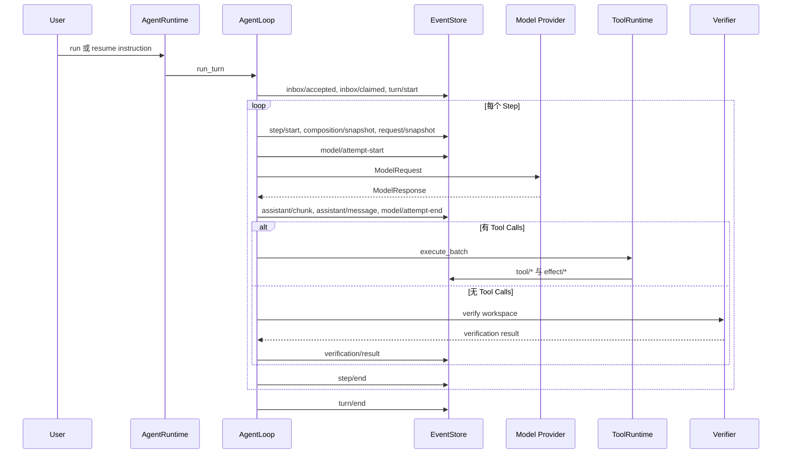

### 5.3 并发与取消

- `AgentRuntime` 用内存锁和 `_active` 表保证同一 Session 同时只有一个活跃 Turn；这是单进程保证。事件写入层（6.5）已有跨进程锁，但“同一 Session 只跑一个 Turn”仍未跨进程强制：两个进程同时 run 同一 Session 时，事件文件不会损坏，结果是事件交错或 `SessionService.append_event()` 抛出 `ConcurrencyConflict`，而不是被 Runtime 提前拒绝。
- Turn admission 与 Stage C Session 迁移共用一把 Composition Gate：Turn 在 Gate 内完成 durable 身份校验并登记 active Turn；迁移在同一 Gate 内确认全局没有 active Turn、准备候选、执行授权 CAS 和 publish。迁移持 Gate 时，新的 Turn 只能等待，不能出现“检查时空闲、下一瞬间 Turn 已开始”的窗口。Gate 不是持久化事实；真正的 Session 身份仍来自事件。
- `cancel()` 先追加 `runtime/cancel-requested`，再取消 Task。`JsonlEventStore` 的取消语义见 6.6：被取消的 Store 操作不会留下仍在后台写入的线程。
- `AgentLoop` 在取消/异常时追加 Attempt、Step、Turn 的终止或错误事件；ToolRuntime 尽量补齐未完成调用的 Tool Result。
- `dispose()` 取消并等待当前 Runtime 持有的活跃 Turn，然后 Drain Composition，最后卸载插件；完整语义见 5.5。Shell Tool 在取消时先 terminate，超时后 kill 并等待进程退出。

### 5.5 `AgentRuntime.dispose()` 的收敛语义

整个关闭过程位于**一个内部 Task**（`_shutdown()`）里，而不是 `dispose()` 自己的协程帧里。这条放置方式修复的是一个真实缺陷：关闭逻辑内联时，调用方在活跃 Turn 仍在收敛期间被取消，会在**到达 `PluginManager.dispose()` 之前**就逃出去；而 `_disposed` 已经置位，于是此后每一次 `dispose()` 都立即返回——插件从此再也不会被卸载，而且没有任何地方报告这件事。

现在的规则：

| 情形 | 行为 |
|---|---|
| 首次调用 | 置 `_disposed = True`（立刻拒绝新 Turn），创建唯一的 `traceh-runtime-dispose` Task，通过 `shield` 等待它 |
| 等待期间被取消 | 用 [`await_worker_convergence()`](../../src/traceh/concurrency.py) 吸收取消并继续等待**同一个** Task；第二、三次取消同样不能提前放行；收敛完成后重新抛出**原始** `CancelledError` |
| 再次调用 | `await` **同一个**已完成 Task，因此复用同一个真实结果，关闭不会跑第二遍 |
| 关闭本身失败 | 该 Task 以异常完成，后续 `dispose()` 会再次抛出同一个异常，**不会**静默伪装成功 |

工作属于 Task 而不属于等待它的人，所以调用方的取消永远碰不到关闭本身。顺序是：先取消并 `gather` 全部活跃 Turn，再取消并等待在途插件候选/迁移及其 rollback，也等待已经进入 Gate 但还未登记的 Turn admission；随后让 Composition Runtime Drain 所有 retired/current Generation。Drain 会由各代 ActivationSet 逆序卸载插件 Activation、取消并等待 Owned Task、撤销 Service/Tool/Prompt 注册，最后才清理仍属 application-level 的 legacy 构建器/发现器资源（19.8）。默认 Stage B/C Runtime 不让 PluginManager 和 Generation 同时拥有同一份插件 cleanup。

### 5.4 一个 Session 中的多个 Turn

`run`/`resume` 各产生一个 Turn；`traceh chat`（见 13.4）在同一 Session 中按用户输入连续产生多个 Turn。无论谁驱动，Turn 的语义完全一致：每个 Turn 都通过 `AgentRuntime.run_existing()` 进入 `AgentLoop`，历史来自事件日志投影，调用方不持有第二份对话状态。

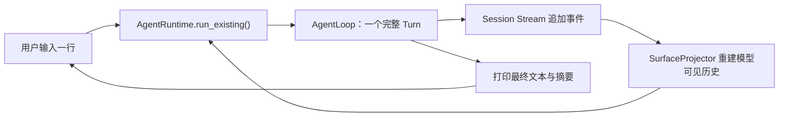

## 6. 事件模型与持久化

### 6.1 Event Envelope

事件由 [`PendingEvent` 与 `EventEnvelope`](../../src/traceh/api/events.py) 表示。落盘后包含 Stream ID、单调 `seq`、Event ID、类型、时间、数据以及可选 correlation、causation、actor、composition revision 等元数据。

`EventEnvelope` 的不可变性有明确边界，不能被描述成“事件是递归不可变对象”：

- `@dataclass(frozen=True, slots=True)` **只**禁止重新赋值顶层字段，例如 `event.data = {...}` 会抛 `FrozenInstanceError`；
- `data` 仍然是普通的 `JsonValue` 图：其中的嵌套 `dict`、`list` 都是标准可变容器，`event.data["nested"]["value"] = ...`、`event.data["items"].append(...)` 在语言层面完全合法；
- 当前**不**引入 `FrozenDict`/`FrozenList` 或新的公共 JSON 类型系统。

因此“事件历史不会被改写”是一条**所有权契约**，而不是语言保证。这条契约由**具体边界**承担，不是自动生效的：

- Store 边界是 `EventStore.append()` 与 `read()`，它们返回的 Envelope 归调用方所有；
- Envelope 只是普通对象，框架**不会**自动隔离两个消费者：同一个 `EventEnvelope` 被交给两个消费者时，它们共享同一份可变 payload；
- 因此任何把一个事件分发给多个接收方的组件，都必须为每个接收方单独 detach。本版本确实存在这种扇出：`SessionEventFeed`（6.7）为**每个** Subscriber 单独 detach 一份。

[`detach_event()`](../../src/traceh/api/events.py) 是可复用的边界 helper：它基于既有的 `to_json_value()` 重建整个 JSON 图，按值携带其余全部元数据（`event_id`、`stream_id`、`seq`、`type`、`schema_version`、`occurred_at`、`causation_id`、`correlation_id`、`actor_id`、`composition_revision`），不经过 JSON 文本编码，因此 Envelope 上的 `UUID` 与 `datetime` 不会退化成字符串。模块内部的 `_detach_json_data()` 只是实现细节，不作为公共 API，也不从包级 `__init__` 导出。

复用 `to_json_value()` 而不是引入通用深复制，意味着“事件 payload 里允许放什么”和“它会被规范化成什么”只有一处定义。必须准确描述这条规则的范围，它**比 `JsonValue` 更宽**：

| payload 中的值 | `to_json_value()` 的处理 |
|---|---|
| JSON 原生 scalar（`None`、`bool`、`int`、`float`、`str`） | 原样透传，不做包装 |
| `Path`、`UUID` | 转成字符串 |
| `datetime` | 转成 ISO 字符串 |
| `Enum` | 递归转换其 `value` |
| dataclass | 转成 dict 后递归转换 |
| 任意 `Mapping` | 转成新的 `dict`，键转 `str` |
| 除 `str`、`bytes`、`bytearray` 之外的 `Sequence`（例如 `tuple`） | 转成新的 `list` |
| `set`、`bytes`、`bytearray`、任意普通对象 | 抛 `TypeError` |

也就是说，`Path` 与 `tuple` 并不是 `JsonValue`，但它们**被规范化而不是被拒绝**（`tuple` 变 `list`，`Path` 变字符串）；只有真正不受支持的值才抛 `TypeError`。不要把这条写成“超出 `JsonValue` 的值一律抛 `TypeError`”。

`to_dict()` 与 `from_dict()` 同样脱离：`to_dict()` 返回的 `data` 是调用方自己的图，修改它不会改写原 `EventEnvelope`；`from_dict()` 也不与传入 `raw` 的嵌套容器共享引用（旧实现只做顶层浅重建）。`from_dict()` 继续要求 `event.data` 是 JSON 对象，非对象直接报 `event.data must be an object`，不会用 `str()` 之类手段悄悄修正类型。

### 6.2 当前的 Stream 分类

| Stream | ID 形式 | 用途 |
|---|---|---|
| Session Stream | `session:<session_id>` | 生命周期、消息、模型、工具结果、验证和恢复事实 |
| Effect Stream | `effects:<session_id>` | 现实副作用的 Intent、Dispatch、Outcome 与 Reconciliation |
| Agent Directory Stream | `agents:directory` | 持久化 Agent identity：哪些 Agent 存在、各自拥有哪个 Session（20 节） |
| Agent Inbox Stream | `agent-inbox:<agent_id>` | 每个 Agent 已**接受**的消息及其 FIFO 顺序（20.8）。accepted 不等于 claimed/processed |
| Agent Delivery Stream | `agent-delivery:<agent_id>` | 每个 Agent 的投递生命周期：claim 与 completed/failed/cancelled（20.11） |
| Budget Ledger Stream | `budgets:ledger` | 每个 Store 一条的层级 Budget grant、reservation、usage lifecycle 与 close 事实；v0.7-A 建事实层，v0.7-B 在显式 managed host 的 owned boundary 强制执行（20.20–20.21） |
| Workspace Catalog Stream | `workspaces:catalog` | 每个 Store 一条的 managed worktree 生命周期：provisional、attached、quarantined、released；只保存宿主 source identity/commit，不保存模型可控路径（20.22） |
| Patch Artifact Catalog Stream | `artifacts:catalog` | 每个 Store 一条的不可变 Patch Manifest 事实；保存 CAS digest、Agent/Session/message/Turn/Workspace/Git 来源，不保存 Patch bytes 或本机路径（20.23） |
| Patch Promotion Ledger Stream | `patch-promotions:ledger` | 每个 Store 一条的 Review、Approval 与 Promotion 控制流；保存 target id/fingerprint/ref/revision、integration tree/commit、verifier 定义与证据摘要，不保存仓库路径、verifier 输出或环境值（20.24） |

前两个 Stream 通过 `session_id`、`tool_call_id`、`effect_id`、correlation/causation 等字段关联，但各自有独立序号。其余七类是控制面流：Directory、Budget Ledger、Workspace Catalog、Patch Artifact Catalog 与 Patch Promotion Ledger 每个 Store 各一条，Inbox 与 Delivery 每个 Agent 各一条；它们都不进入 Model Surface、Session Recovery 或 Request Fingerprint。Artifact 原始 bytes 位于显式 SHA-256 CAS，由 Manifest 引用并在读取时重新校验。

Agent Directory Stream 是**每个 Store 一条**的控制面流，不是 per-session 流，边界必须写准：Session Stream 记录“一个 Agent 运行时发生了什么”，Directory Stream 记录“存在哪些 Agent”。二者不合并，因为枚举 Agent 不应要求读遍每个 Session，而且一个 Agent 的执行历史不得断言另一个 Agent 的事实；二者也不分库，因为 `expected_seq`、跨进程文件锁、取消/提交点语义和事件所有权契约正是创建事务需要的东西。它**不进入 Model Surface、不参与 Session Recovery、不影响 Request Fingerprint**，`SessionService.list_sessions()` 按 `session:` 前缀过滤，因此看不到它。

### 6.3 当前事件类型

| 类别 | 事件 |
|---|---|
| Session/Inbox | `session/created`、`inbox/accepted`、`inbox/claimed` |
| Composition control | `composition/migration-authorized`（只记录外部插件身份迁移授权，不进入 Model Surface） |
| Turn/Step | `turn/start`、`turn/end`、`step/start`、`step/end` |
| 消息与请求 | `user/message`、`composition/snapshot`、`request/snapshot` |
| 模型 | `model/attempt-start`、`assistant/chunk`、`assistant/message`、`model/attempt-end` |
| 工具 | `tool/call`、`tool/admitted`、`tool/result` |
| 验证 | `verification/result` |
| Runtime | `runtime/cancel-requested`、`runtime/error`、`runtime/recovered` |
| Agent control plane（独立 Stream） | `agent/created`（只在 `agents:directory`）、`agent/message-accepted`（只在 `agent-inbox:<agent_id>`）、`agent/message-claimed`、`agent/message-completed`、`agent/message-failed`、`agent/message-cancelled`（只在 `agent-delivery:<agent_id>`）。它们都不进入任何 Session Stream，也不进入 Model Surface |
| Budget control plane（只在 `budgets:ledger`） | `budget/root-granted`、`budget/child-reserved`、`budget/reservation-committed`、`budget/reservation-released`、`budget/usage-charged`、`budget/usage-reserved`、`budget/usage-started`、`budget/usage-settled`、`budget/usage-released`、`budget/account-closed`；只投影权限与用量，不进入 Model Surface |
| Workspace control plane（只在 `workspaces:catalog`） | `workspace/provisioned`、`workspace/attached`、`workspace/quarantined`、`workspace/released`；只投影 host-managed worktree identity/lifecycle，不持久化本机路径，也不进入 Model Surface |
| Artifact control plane（只在 `artifacts:catalog`） | `artifact/patch-captured`；只记录不可变 Manifest 与 CAS 引用，Patch bytes 不进入 Event Log，报告关联由 `(agent_id, message_id)` fresh replay 重建（20.23） |
| Promotion control plane（只在 `patch-promotions:ledger`） | `patch/review-recorded`、`patch/approval-recorded`、`patch/promotion-committed`；只记录固定验证结论、精确 approval digest 与已完成的 ref compare-and-swap，不进入 Model Surface，也不保存路径或 verifier 输出（20.24） |
| Surface | `surface/replace` |
| Effect | `effect/intent`、`effect/dispatched`、`effect/outcome`、`effect/reconciled` |

### 6.4 EventStore 保证

`EventStore` 协议提供 append、read、head、list_streams。追加要求调用方传入 `expected_seq`；不匹配时抛出 `ConcurrencyConflict`。

#### Event 所有权契约

这条契约写在 [`EventStore` Protocol](../../src/traceh/session/event_store.py) 及其 `append()`/`read()` 的 docstring 上，而不是只写在某个具体实现里：Store 是可替换后端，替换后端不能改变调用方能对事件做什么。任何实现都必须满足以下可观察语义，`InMemoryEventStore` 与 `JsonlEventStore` 对调用方完全一致：

| 调用方持有的对象 | 修改它之后 |
|---|---|
| 原始 `PendingEvent.data` | Store 历史不变（`materialize()` 已在构造事件时脱离输入） |
| `append()` 返回的 Event | Store 历史不变 |
| `read()` 返回的 Event | Store 历史不变，下一次 `read()` 仍是原始事实 |
| 两次 `read()` 各自的结果 | 彼此独立，互不可见 |
| `to_dict()` 返回的字典 | 原 `EventEnvelope` 不变 |
| 传给 `from_dict()` 的原始字典 | 构造出的 `EventEnvelope` 不变 |

隔离覆盖顶层 `data`、嵌套 `dict`、嵌套 `list` 以及 `list` 内的 `dict`；多个 `PendingEvent` 即使复用同一个嵌套输入对象，落库后的事件之间也不共享可变容器。契约保护的是 **Store 历史不被反向污染**，并不声称调用方拿到的副本本身不可变：调用方完全可以修改自己那份副本，只是改不动账本。

两种实现达到同一契约的方式不同，这是设计差异而不是实现不一致：

- `JsonlEventStore` **不需要 Store 专属的 `detach_event()` 调用**，因为历史在文件里，读写两个方向都已经经过共享的 `EventEnvelope` 序列化边界，本轮无功能性改动。但不能因此写成“完全没有额外复制”：这个共享边界本身仍会重建 payload——`read()` 先 `json.loads()`，再由 `from_dict()` 规范化成全新的图；`append()` 则由 `to_dict()` 在序列化前重建 payload。复制是**通过序列化边界达成**的，不是被省掉了；
- `InMemoryEventStore` 必须显式脱离——它保存自己返回的对象，所以 `append()` 与 `read()` 都通过 `detach_event()` 交出副本，绝不把 `_streams` 中的对象暴露给调用方。

`head()` 不做任何复制，仍只返回序号。复制只发生在 Event API 边界（`materialize`、`to_dict`、`from_dict`、`detach_event`），单次复制的规模是**一个事件的 payload**；但一次 `read()` 返回多个事件时，总成本与它解析并返回的事件 payload 总量相关，不能说“一次 read 的成本只是一个 payload”。`JsonlEventStore.read()` 的 `from_seq` 是**过滤而不是定位**：先解析整条 Stream 再筛选，因此总成本对应整条 Stream——这是 JSONL 既有的全量扫描边界（见 16 节），不是脱离副本引入的新问题，本轮只如实记录，不做性能优化。

刻意不引入缓存：缓存意味着把同一份副本发给多个调用方，会重新制造共享引用。

默认 `JsonlEventStore`：

- 一个事件一行 JSON，文件名由 Stream ID URL 编码；
- 每个 Stream 有进程内 `asyncio.Lock`，作为同一事件循环内的快速路径；
- 每个 Stream 有 `.lock` 文件上的操作系统级排他锁，跨进程有效（见 6.5）；
- 写入可选 `SYNC` 或 `BATCHED` Durability；SYNC flush 后执行 `fsync`；
- `head()` 从文件尾读取最后完整行，成本与末行大小相关，不扫描完整文件；
- 尾部半行可自动截断到最后完整事件；
- 中间坏行、Stream ID 不符或序号不连续会报 `CorruptEventStream`。

### 6.5 跨进程 Stream 锁

[`session/file_lock.py`](../../src/traceh/session/file_lock.py) 提供 `exclusive_file_lock()` 上下文管理器，只使用标准库：

| 平台 | 原语 | 语义 |
|---|---|---|
| POSIX | `fcntl.flock(fd, LOCK_EX)` | 无 timeout 且无取消令牌时在内核阻塞；否则用 `LOCK_NB` 轮询 |
| Windows | `msvcrt.locking(fd, LK_NBLCK, 1)` | 锁定 `.lock` 文件偏移 0 起的 1 字节区间，轮询重试 |

关键语义：

- 锁定前显式 `lseek` 到偏移 0，因为 `msvcrt.locking` 从当前文件指针开始锁定；
- 允许锁定文件尾之后的区间，因此空 `.lock` 文件（每个 Stream 首次创建时的状态）也能锁定，不需要预写字节；
- 轮询从 1ms 退避到 25ms 上限；`JsonlEventStore(lock_timeout=...)` 为 `None` 时无限等待，为数值时超时抛 `FileLockTimeout`；
- 只有真正表示“区间被占用”的错误码（POSIX `EWOULDBLOCK`/`EACCES`，Windows `EACCES`/`EDEADLOCK`）才重试，其他 `OSError` 直接上抛；
- 正常、异常、`ConcurrencyConflict` 和取消路径都在 `finally` 中解锁并关闭描述符；解锁失败被吞掉，因为关闭描述符本身就会释放锁，不能掩盖临界区的原始异常；
- 进程崩溃或被杀死时，操作系统关闭描述符即释放锁，`.lock` 文件残留不会造成永久死锁。

`append()`、`read()`、`head()` 的完整临界区（读取 Stream Head、尾部半行检查与截断、`expected_seq` 校验、写入与 flush/fsync）都在同一把锁内完成，因此两个独立 Python 进程操作同一 Stream 时会排队，而不是同时读到相同 Head 后各写一条相同序号的事件。

`expected_seq` 仍然是必需的：锁只保证临界区互斥，调用方通常先 `head()` 再 `append()`，两次调用之间的 Head 可能已被另一个进程推进，此时第二个写入者会得到明确的 `ConcurrencyConflict`，而不是静默覆盖。

该锁是本机文件锁：跨网络文件系统（NFS、SMB）的行为取决于具体实现，不在当前保证范围内。

### 6.6 EventStore 的取消语义

阻塞的锁等待和文件 I/O 在 Worker 线程上执行，而线程无法被杀死。因此 `_run_locked()` 把取消实现为两段式协作，绝不允许出现“调用方已经收到 `CancelledError`，后台线程稍后拿到锁又继续写 Stream”的脱缰操作：

| 取消发生的时刻 | 行为 | 调用方看到 |
|---|---|---|
| 仍在等待 OS 锁 | 置位取消令牌，等待被 `Event.wait()` 立即唤醒，抛 `FileLockCancelled`，Stream 未被触碰 | `CancelledError`，无任何写入 |
| 已拿到锁但临界区尚未开始 | 进入临界区前重新检查取消令牌，直接放弃 | `CancelledError`，无任何写入 |
| 临界区已在执行 | 该段不可中断，按原子完成语义跑完并 flush/fsync | `CancelledError`，但事件已完整落盘 |

实现要点：

- Worker 通过 `asyncio.shield()` 提交，取消协程不会把它变成脱缰线程；
- 协程捕获 `CancelledError` 后先置位 `cancel`，再显式等待 Worker 收敛，然后才向调用方重新抛出；因此 `append()`/`read()`/`head()` 返回时文件已经不再变化；
- 收敛由共享的 [`await_worker_convergence()`](../../src/traceh/concurrency.py) 承担，它循环 `await asyncio.shield(future)` 直到 `future.done()`：**重复取消（第二次、第三次乃至更多次 `CancelledError`）被吸收后继续等待同一个 Worker**，不能被当作提前退出的出口；这里不使用 `suppress(BaseException)`。同一个函数也被 OpenAI-Compatible Provider 复用（见 8.3）；
- Worker 自身的返回值、`FileLockCancelled`、`ConcurrencyConflict` 或其他异常在收敛结束时被显式取回，不会遗留"future exception was never retrieved"告警；
- `signals.finished` 在锁释放之后置位，且必定早于 Future 完成，因此“调用方拿到 `CancelledError`”蕴含“锁已释放且 Worker 已收敛”；
- `_StreamLockSignals` 的 `waiting`/`cancel`/`finished` 三个 `threading.Event` 让“线程确实开始等锁”和“线程确实已收敛”可被观测，而不是靠时序猜测；
- 由于取消令牌的存在，POSIX 的无限等待从内核阻塞改为可中断轮询：等待仍然无限，但可被 asyncio 取消。

第三行是**提交点边界（may-have-committed）**：取消恰好落在写入过程中时，调用方收到 `CancelledError`，事件却已经提交。这里没有任何自动重试机制，因此不应称为 at-least-once。调用方不能假设“收到取消 = 没有写入”；正确做法是重新读取 Stream，并按 `event_id`、correlation 或业务身份判断该操作是否已经落盘，而不是只看 Head 数值——Head 也可能是别的写入者推进的。

### 6.7 进程内 Event Feed

[`session/event_feed.py`](../../src/traceh/session/event_feed.py) 提供**观察通道**，让界面在 Turn 运行期间就能看到事件，而不必等 Turn 结束再读文件。它比事件日志弱得多，这些边界必须写清楚：

| 维度 | Feed 的事实 |
|---|---|
| 新增持久化事实 | 否。不落盘、不参与恢复、不产生任何新事件类型 |
| 额外的崩溃持久性 | 否。事件在内层 `append()` **按调用方请求的 `Durability` 正常返回之后**才发布。Feed 不把 `BATCHED` 升级成 `SYNC`，也不增加任何自己的保证：一条已发布事件能否在操作系统崩溃后存活，完全由 EventStore 原契约决定 |
| 事实源 | 否。Runtime、`RecoveryService`、Inspector、不变量检查仍只读 `EventStore` |
| 历史 | 否。订阅**不重放**历史；需要历史仍走 `EventStore.read()` |
| 状态 | 否。Feed 不保存投影或缓存，不是第二份 State |
| 跨进程 | 否。另一个进程直接写同一份 JSONL 时，本 Feed 收不到 |
| 可丢失 | 是。append 返回之后、发布之前进程崩溃时，实时观察会漏；该事件的持久性仍然只由它请求的 `Durability` 决定，不会因此变差 |

#### 为什么边界选在 EventStore Decorator

`PublishingEventStore` 是包装任意 `EventStore` 的装饰器，而不是 `SessionService` 里的钩子。理由有两条，都可核查：

1. **后端无关**：包装 `InMemoryEventStore` 与 `JsonlEventStore` 的可观察语义完全相同，换 Store 不改变 Feed 语义；
2. **“Store 已接受”正好在这里成立**：`src/traceh/session/service.py` 中的 `store.append()` 是整个 `src` 树里唯一的 append 调用点，所有写入者（`AgentLoop`、`ToolRuntime`、`RecoveryService`、`CompactionService`、`AgentRuntime.cancel()`）都经过它。因此“发布 Store 从未接受的事件”在这个边界上无法表达，也不需要每个写入者自己记得通知。

`build_default_runtime()` 无条件包装 Store，并把 `SessionEventFeed` 暴露为 `AgentRuntime.events`。无订阅者时代价是每次 append 一把无竞争的锁。

#### 顺序与可见性契约

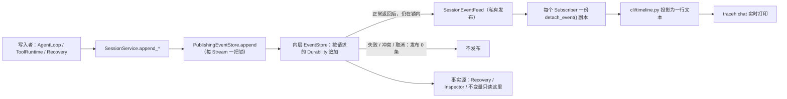

契约要点：

- **先被 Store 接受，后发布**：`_publish()` 只在内层 `append()` 正常返回后调用，因此 `ConcurrencyConflict`、序列化失败或任何 append 异常都发布 0 条；取消同样发布 0 条，**包括** may-have-committed 那条路径——Feed 允许漏，日志不允许丢；
- **是“接受”，不是额外持久性**：`durability` 原样透传，因此一次 `Durability.BATCHED` 追加会在 Store 从「已 flush 未 fsync」的写入返回时就被发布，这正是调用方所要求的。发布只表示“Store 已接受”，绝不表示“已 fsync”；`BATCHED` 通知是合法的，对应事件在操作系统崩溃时仍受 `BATCHED` 边界约束；
- **按 seq 顺序发布**：每个 Stream 一把 `asyncio.Lock`，同时覆盖“append + publish”。若只在 append 之后发布，两个并发写入者会自由竞争：Store 已序列化写入，但调用方各自恢复执行，seq 10 的写入者可能被调度器挂起、在 seq 11 之后才发布。把锁跨到发布之上，使“按 seq 顺序”成为结构性质，而不是依赖当前调度巧合。不同 Stream 用不同锁，互不阻塞；
- **一批多条**按 seq 顺序发布；
- **Stream 严格隔离**：Session Stream 的订阅者收不到别的 Session，也收不到 Effect Stream；
- **每 Subscriber 一份**：见下节；
- **发布不 await**：`publish()` 只往无界队列里 `put_nowait`，因此锁很快释放，任何订阅者都无法延长它。

#### 消费者只拿到只读接口

观察者拿到的是 `EventFeed` Protocol，只暴露 `subscribe()` 与 `subscriber_count()`。发布位于 `SessionEventFeed` 的私有 `_publish()`，唯一调用者是同模块的 `PublishingEventStore`。

这条区分是承重的：如果消费者接口上有公共 `publish`，任何拿到 Feed 的代码都能注入一条 Store 从未接受的 Envelope，而 Subscriber 无法把它与真事件区分开——Timeline 会忠实地显示一个从未发生的 Step。把发布移出消费者接口，使“只有 Store 接受的事件才会被发布”成为 **API 形状的性质**，而不是依赖观察者自觉遵守的约定。下划线不是安全沙箱，但它明确了权限边界。

同理，`AgentRuntime.events` 是**必填**构造参数，而且必须是该 Runtime 的 `PublishingEventStore` 实际发布的那一个 Feed 对象。给它一个默认值会交给调用方一个「可以订阅但永远沉默」的对象——接口存在而能力不存在。自定义装配必须显式把两者配对，正如 `build_default_runtime()` 所做的。

#### Event 所有权从 Store 边界扩展到每个 Subscriber

6.4 的所有权契约只覆盖 `append()`/`read()` 交回调用方的对象。Feed 引入了**扇出**，这正是 6.1 预留的那个缺口：把同一个 `EventEnvelope` 交给两个消费者，它们会共享同一份可变 payload。因此 `publish()` 为**每个** Subscriber 单独调用一次 `detach_event()`，而不是每次发布只复制一次。可观察结果：Subscriber A 修改嵌套 payload，不影响 Store 历史、不影响 Subscriber B 已收到的事件、也不影响此后任何 Subscriber 收到的事件。

#### 无界队列的明确取舍

每个 `EventSubscription` 有一个无界 `asyncio.Queue`：

- **不对 Runtime 施加背压**：慢订阅者永远不能拖慢或弄失败一次 Store append；
- **被遗弃或长期不消费的订阅者会占内存**，上限只有该 Session 产生的事件量；
- **Chat 生命周期在每条退出路径上都关闭订阅**（正常、异常、取消、EOF、`/exit`），因此随包发布的消费者不泄漏；
- **未来若改为有界队列，必须定义明确的 overflow 语义**：静默丢事件会让 Timeline 对已经发生的事情说谎。

`EventSubscription.close()` 幂等：它把结束标记排在已发布事件之后，因此“先 close 再 drain”会打完所有已排队事件再结束——这正是 Chat 能承诺“Timeline 出现在最终回答之前”的原因，不依赖轮询或 sleep。对已耗尽的订阅再迭代返回空，不会死等一个已被消费掉的结束标记。

## 7. Composition、Surface 与可重建请求

### 7.1 Composition

每个 Step 通过 `CompositionRuntime.lease()` 获取 `ActiveComposition`。快照包含：

- provider、model；
- 完整 system prompt；
- tool schemas；
- plugin identities；
- policy 和 middleware 名称；
- temperature、max output tokens；
- 基于内容生成的 revision。

`plugin identities` 从 v0.4 起是**真实数据**，不再是占位：它等于 `traceh.core`（版本来自 1.2 的唯一来源）加上本次激活的每个外部插件的真实 `plugin_id` 与 `version`。无插件运行时该列表只有一项。

这条身份必须能被重建，否则 Replay 会正确地报告不一致。因此 [`composition_from_event()`](../../src/traceh/runtime/request_builder.py) 也从事件里重建 `plugins`；此前它固定返回 `()`，于是每个被重建的 Composition 都在声称自己来自一个无插件 Runtime。

当前实现是 Generation-backed `CompositionRuntime`：每个 Runtime 始终只有一个 current Generation；Runtime 初始化时固定主 `ToolRuntime.sessions` 对象，Step 进入 `lease()` 时在 `asyncio.Lock` 保护下原子绑定它，并从同一代取得 Provider、ToolRuntime、Prompt、Plugin Identity、Policy/Middleware 和 Snapshot。`publish()` 在同一把锁内把旧代标为 retired、安装新代；旧 Lease 继续持有旧记录，新 Lease 只能拿新代。候选若引用另一个 `SessionService` 会在这个线性化点前被拒绝，避免 `tool/call` 或 `tool/result` 写入另一份 EventStore。每个 Generation 对象只能被一个 Runtime 认领一次；已 retired/cleaned 的 Generation 不能重新发布。资源 cleanup 由独立的一次性 `CompositionResourceOwner` handle 负责：装配层把同一个 handle 显式绑定到 `LlmRegistry`、`ToolRuntime`、`PromptAssembler` 及 Provider/Tool/Policy/Middleware 组件，冻结 Generation、扁平适配器和兼容性投影只传播这个 handle/binding，不扫描对象图，也不使用全局 `id()` 身份目录。binding 直接写入实例字典或声明过的 slot，并验证写入后的真实状态，因此自定义 `__setattr__` 不能静默吞掉所有权标记；提交若在中途失败，会逐项恢复每个组件原来“字段不存在”或“字段存在且为 `None`”的精确状态，Owner 也保持可重试。无法承载这种可验证 binding 的裸 slotted Provider、Tool、Policy 或 Middleware 不能进入 cleanup-bearing Generation；它们必须先经过可绑定的受控装配，或者只能留在没有 Generation cleanup ownership 的 application-level 路径。这样同一个 slotted 原始能力被放进两个新容器时不会被两个 Owner/Runtime 同时接受。多层 `replace()`、把冻结能力重新放进新注册表、从冻结能力构造 Runtime、以及同一 raw capability 再构造 cleanup Generation，都会在 Runtime 初始化或 publish 的共同认领入口被拒绝；没有资源级引用计数时，cleanup-bearing Generation 必须拥有尚未认领的显式 owner，并且不能和旧 Lease 或旧代共享会被 cleanup 关闭的资源。

Generation identity 是内部生命周期编号，只用于引用计数、retire、cleanup 和诊断，不写入事件或 Request Fingerprint。`CompositionSnapshot.revision` 仍是模型可见内容的 fingerprint；因此两个模型可见内容完全相同的 Generation 可以有不同 identity，但 revision 相同。Generation 构造时还会冻结 Tool 的 name、description、input_schema、effect_kind，并用真正只读、扁平、幂等的适配器把执行委托给原 Tool；嵌套 Schema 也不能改写，连续从冻结 Generation 构造无 cleanup 候选不会递归套适配器。Policy/Middleware 名称在构造时捕获，兼容性检查投影与当前 Generation 分离。Runtime 初始化会先从已经冻结的初始 Generation 构造全部兼容性视图，再一次性认领资源；认领后不再调用调用方可变的 Prompt/Registry 来源，因此第二次读取失败不会留下已认领但无 Runtime 接管的资源。Generation 被 retired 后，仍有 Lease 时绝不 cleanup；最后一个 Lease 释放才创建一次 cleanup Task。`drain()` 等待所有 retired Generation 的 Lease 归零并等待 cleanup 真正完成，cleanup 失败会在所有其他 Generation 都尝试后以有界的结构化 `CompositionDrainError.failures` 报告，并把 Runtime 标为 poisoned、拒绝后续 `publish()`。等待期间重复取消由共享内部 Task 和 `await_worker_convergence()` 吸收，收敛后再抛最初的 `CancelledError`。

Stage B 的插件 cleanup 不再使用上述 capability-wide owner 推断插件所有权：`PluginActivationSet` 显式持有插件 Activation、插件 Tool/Prompt/Service、Owned Task 与 cleanup，SessionService、EventStore、核心 Provider 和内置 Tool 只是 borrowed core。候选只在私有注册表中 setup，成功 publish 后由 Generation 接管；旧 Lease 结束前旧 set 不会被卸载。

Stage A 已进入同步/异步默认 Runtime 主线，Stage B 又把 Generation-owned `PluginActivationSet` 接入启动插件和内部候选替换路径；Stage C 让 `traceh chat` 的 `/plugins` 控制面调用同一套 Builder→ActivationSet→Generation→publish→Drain；D1/D2 把四层 Service 与程序化 Tool/Prompt/Policy 装配压成有效 Composition；D3 再把插件 Provider、Policy、Middleware、Verifier 接入同一候选和 Step Lease。`AgentLoop` 仍不导入 PluginManager、Builder、Scope resolver 或 reload service；它只从 Lease 取得本 Step 的 Provider、ToolRuntime 与 Verifier。v0.5.0 由独立 Python Quality Wheel 对这条公开主线做发行验收；用户命令仍只重新构造当前进程可发现的已安装 Entry Point，不安装/卸载 Wheel、不强制 module reload，插件自行选择子层与 EventStore 插件化仍未开放。

### 7.2 Surface

`SurfaceProjector` 只把以下事件投影为模型消息：

- `user/message` → user；
- `assistant/message` → assistant，保留 tool calls；
- `tool/result` → tool；
- `surface/replace` → 替换指定旧 Surface 事件的摘要消息。

原始事件仍保留。多次 Replacement 通过 source seq 遮蔽旧视图，而不是删除历史。

### 7.3 Request Snapshot 与 Fingerprint

`RequestBuilder` 使用“截至 Composition Event 的 Surface + 同一 Lease 提供的 Composition Snapshot”生成 `ModelRequest`，持久化完整 Request、`source_seq`、composition revision 和稳定 fingerprint。内部 Generation identity 不进入 Request Fingerprint；因此请求重建、Replay 和 `verify_request_snapshots()` 继续依据持久化的内容 revision 工作。

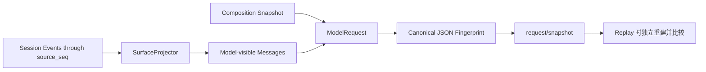

`verify_request_snapshots()` 能重新定位对应 Composition、重建当时的 Turn/Step metadata 和 Request，并报告 fingerprint 不一致。

## 8. 模型层

### 8.1 公共边界

`LlmProvider.complete(ModelRequest) -> ModelResponse` 是 Provider 协议；`LlmRegistry` 按名称注册；`LlmRuntime.invoke()` 是主循环与 Provider 之间的调用边界。

当前 `LlmRuntime` 等 Provider 完成后，只把完整文本作为一个 delta 交给 `assistant/chunk` 回调。协议上有 Chunk 事件，但当前网络适配并非真正 token streaming。

### 8.2 Scripted Provider

- 从内存响应序列或 JSON 文件读取确定性响应；
- 保存收到的 Request，便于测试；
- 默认脚本用完后抛 `ScriptExhaustedError`；
- 用于 Demo、单元测试、端到端测试和 Benchmark，不需要 API Key。

### 8.3 OpenAI-Compatible Provider

- 使用标准库 `urllib.request`；
- 发送 `POST <base_url>/chat/completions`；
- 请求为 `stream: false`，支持 messages、function tools、temperature、max tokens；
- API Key 来自显式参数或命名环境变量，以 Bearer Header 发送；
- 解析第一个 choice、文本、tool calls、finish reason 和 token usage；
- HTTP/URL/响应结构错误转换为 `ProviderHttpError`。

当前没有流式读取、自动重试、Fallback、并发限流或厂商专属协议适配。
取消语义：`urllib` 请求一旦发出就无法中止，因此 `complete()` 用 `asyncio.shield` 保护 Worker，取消时先用共享的 `await_worker_convergence()` 等它收敛再重新抛出原 `CancelledError`，重复取消不会提前返回。这样不会出现"Chat 已经宣布 interrupted、后台 HTTP Worker 仍在运行"的情况。代价必须说清楚：这是收敛而不是立即中止网络请求，最坏情况下要等到 `timeout_seconds`（默认 120 秒）到期。

## 9. Tool Runtime 与内置工具

### 9.1 执行管线

```mermaid
flowchart LR
    CALL["Tool Call"] --> LOOKUP["Registry Lookup"]
    LOOKUP --> SCHEMA["Schema Validation"]
    SCHEMA --> POLICY["Monotonic Policies"]
    POLICY --> ADMIT["tool/admitted"]
    ADMIT --> INTENT["effect/intent"]
    INTENT --> DISPATCH["effect/dispatched"]
    DISPATCH --> SCHEDULE["Read Parallelism / Write Barrier"]
    SCHEDULE --> MW["Middleware Chain"]
    MW --> EXEC["Tool.execute"]
    EXEC --> OUTCOME["effect/outcome"]
    OUTCOME --> RESULT["tool/result"]
```

执行事实：

- 同一模型响应中的 Tool Call ID 必须非空且唯一；
- 所有 `tool/call` 先写入 Session Stream；
- 未知工具或参数错误直接产生结构化失败 Result，不会产生 Effect；
- Policy 中任何 DENY 都不可被后续 ALLOW 覆盖；至少一个 Policy ALLOW 才准入；
- 连续的 PURE_READ/WORKSPACE_READ 调用使用 `asyncio.gather`；写入、进程和其他副作用形成顺序 Barrier；
- Middleware 的 `call_next()` 每层最多调用一次；
- Tool Runtime 有整体超时和最大输出字符限制；
- Outcome 记录证据、结构化数据、截断状态或错误；
- 取消时尽量依据已有 Outcome 补齐 Result，否则记录 `aborted_before_dispatch`。

### 9.2 Effect Kind

`PURE_READ`、`WORKSPACE_READ` 被认为并发安全且可安全重试；`WORKSPACE_WRITE`、`PROCESS`、`NETWORK_WRITE`、`EXTERNAL_TRANSACTION` 默认不并发且不可盲目重试。

### 9.3 内置工具

| 工具 | Effect Kind | 输入与行为 | 关键限制 |
|---|---|---|---|
| `list_files` | WORKSPACE_READ | 列出相对文件；可设 `max_files` | 跳过常见缓存、Git、虚拟环境和依赖目录 |
| `read_file` | WORKSPACE_READ | 读取 UTF-8 文件 | 真实路径必须位于 Workspace 内 |
| `search_text` | WORKSPACE_READ | 子串或正则搜索，可限路径和结果数 | 跳过二进制/非 UTF-8 及常见忽略目录 |
| `apply_patch` | WORKSPACE_WRITE | 精确旧文本替换或显式创建新文件 | 校验替换次数；临时文件 + fsync + 原子 replace；不是 unified diff parser |
| `shell` | PROCESS | `shlex.split` 后用 `create_subprocess_exec` 执行 | 不使用 `shell=True`；清洗秘密环境变量；超时/取消收敛子进程 |

所有路径读写通过 `resolve_workspace_path()` 解析后检查 Workspace 边界。默认 `DangerousShellPolicy` 屏蔽一组明显危险的可执行文件名，但它只是 Guardrail，不是安全沙箱。

### 9.4 插件 Tool 走同一条管线

被启用插件注册的 Tool 进入的是**同一个** `ToolRegistry`，因此 9.1 的整条管线对它逐字适用：Registry 查找、Schema 校验、单调 Policy、`tool/admitted`、`effect/intent`、按 Effect Kind 的并发或 Barrier 调度、Middleware、执行、`effect/outcome`、`tool/result`。没有 `PluginToolRuntime`，插件 Tool 在事件日志里与内置 Tool 无法区分——这正是目的。

插件 Tool 名与内置 Tool 冲突时，激活在发布**之前**被拒绝（见 19.4），因此不存在“插件悄悄顶替 `read_file`”这种情况。

## 10. Continuation 与证据驱动完成

`DefaultContinuationRuntime` 按以下顺序决定继续或结束：

1. 达到 `max_steps` → `max_steps_exceeded`；
2. 模型响应包含 Tool Calls → 下一 Step；
3. 已运行 Verifier 且失败，失败次数仍在重试预算内 → 把结构化验证摘要作为新 user message 注入下一 Step；
4. Verifier 持续失败超预算 → `verification_failed`；
5. 无 Tool Calls 且无失败证据 → `completed`。

`CommandVerifier` 使用参数拆分和 `create_subprocess_exec` 在 Workspace 中运行独立命令，使用清洗后的环境，收集退出码、stdout、stderr；退出码 0 为通过。AgentLoop 把结果写为 `verification/result`。

Verifier 是可选的：未配置时，无 Tool Call 的最终模型响应可以结束 Turn，此时 `verification_passed` 为 `None`，不能把它解释成“外部验证已通过”。

### 10.1 Verifier 的子进程与输出所有权

`CommandVerifier` 在 Workspace 中运行真实命令。取消或超时时必须把这个子进程带走，否则它会在调用方已经认为该 Turn 结束之后继续改动 Workspace；同时，在**会返回结果的路径**上，它已经产生的输出是证据，不能在收尾过程中丢掉。这两件事由同一个所有权模型解决。

**输出只有一个归属**：子进程的 stdout/stderr 不接管道，而是直接写进本进程持有的临时文件（[`capture_output()`](../../src/traceh/tools/process_control.py)）。因此：

- 三条路径共用**同一套捕获机制**，因此不存在“哪条路径拿到的是另一份输出”的问题；子进程 flush 过的内容在超时被察觉之前就已经被捕获、对本进程可见；
- 读取是普通文件读，不会阻塞在孙进程仍持有的管道上，也可以重复读而不丢字节；
- 不存在"取消第一次 `communicate()` 再调第二次"的动作，也就不存在第一次已读入缓冲区的输出被丢弃的问题。

**子进程收敛**：超时或取消时先调用 `converge_process()` —— terminate → 有界等待（默认 2 秒）→ kill → 等待退出，返回前直接子进程必定已退出。等待吸收取消并记录“曾经被取消过”，因此收尾过程中到达的取消不会提前放行，而是压到收敛之后再重新抛出 `CancelledError`。

**三条路径各自做什么**（这一点必须精确，不能笼统地说“输出总会被保留”）：

| 路径 | 直接子进程 | 输出 |
|---|---|---|
| 正常完成 | `await process.wait()` 自然返回 | 读取捕获文件，装入 `VerificationResult`；AgentLoop 据此追加 `verification/result` |
| 超时 | 先 `converge_process()` 收敛，再读 | 读取捕获文件；完整文本进入 `VerificationResult.stdout`/`stderr`，尾部进入 summary，并经 `DefaultContinuationRuntime` 注入下一 Step |
| 取消 | 只做 `converge_process()` 收敛，保证子进程不逃逸 | **不读取、不返回 `VerificationResult`、不追加 `verification/result`**；随后临时文件关闭，捕获内容随之丢弃 |

换句话说：取消路径的承诺只有“子进程一定不会逃逸”，没有任何输出证据的承诺。只有调用方追加到 Session/Effect Event Log 的事件才是持久化事实（Verifier 路径是 `verification/result`，Tool 路径是 `effect/outcome` 与 `tool/result`，按路径适用）；临时文件里的字节只是本次调用期间的捕获。

**ShellTool 与两类超时的边界**：`ShellTool` 使用同一套捕获与收敛机制，但它归 `ToolRuntime` 调度，因此存在两个不同的超时：

| 超时来源 | 触发方式 | 上报内容 |
|---|---|---|
| Tool 自身（`shell` 的 `timeout` 参数） | `ShellTool` 收敛子进程后主动 `raise TimeoutError(content)`，content 含实际命令、`exit_code`、`timed_out=true` 与已捕获的 stdout/stderr | `ToolRuntime` 在嵌套边界上把它重贴为 `ToolReportedTimeout`，据此写 `effect/outcome`（`reported_by=tool`）与 `tool/result`，**保留工具自己的文本与时长**，并按 `max_output_chars` 截断 |
| Runtime 预算（`ToolRuntime.timeout_seconds`） | `asyncio.timeout()` 到期 | 保持通用语义：`Tool timed out after <预算>s`，`effect/outcome` 标 `reported_by=runtime`；子进程仍由 `ShellTool` 的取消路径收敛 |

两者靠**嵌套异常边界**区分，不靠错误文本匹配：工具自己抛出的 `TimeoutError` 在内层被立即重贴为领域异常 `ToolReportedTimeout`，因此外层负责 Runtime 预算的 `except TimeoutError` 不可能再吞掉它。修复前两者共用一个 `except TimeoutError`，结果是 Shell 的 stdout/stderr 从 `effect/outcome` 与 `tool/result` 中消失，且内部超时被误报成 Runtime 预算时长。

**本地资源不需要私有 API 收尾**：改用临时文件后不存在 stdout/stderr 管道子传输，`await process.wait()` 返回时 subprocess transport 已自行关闭。因此不访问 `process._transport`，也不需要任何手动关闭步骤。实测（Windows，孙进程仍持有继承句柄）：返回时 `transport_closed=True`、`open_pipe_transports=0`，独立解释器跑完后事件循环关闭时 stderr 没有 `unclosed transport` 或 `Event loop is closed`。

**明确不管理孙进程**：子进程派生的孙进程会继承捕获文件句柄，可能在直接子进程退出后继续运行、继续往文件里写。本模块保证的是**直接子进程**已退出。至于输出会不会被保留，取决于调用方走的是哪条路径，只有这两条会读取捕获：**Verifier 正常完成**、以及**组件自己拥有的超时**（`CommandVerifier` 自身超时、`ShellTool` 自身超时）。**直接取消**与 **`ToolRuntime` 预算先到期**都不读取捕获——后者会取消工具，工具走取消路径，最终只产生 Runtime 通用超时结果。对孙进程不作任何承诺；由于输出走文件而不是管道，孙进程的存在不会拖住收尾。


`sanitized_environment()` 的两项平台修正：

- 保留 `SYSTEMROOT`、`WINDIR`、`COMSPEC`、`PATHEXT` 等 Windows 必需变量。缺少它们时子进程在 `import asyncio` 阶段就以 WinError 10106 失败，`python -m pytest` 这类最普通的 Verifier 命令在 Windows 上根本无法启动；
- 设置 `PYTHONUTF8=1` 与 `PYTHONIOENCODING=utf-8`。父进程按 UTF-8 解码捕获到的字节，而 Windows 上的 Python 子进程默认会用系统代码页（中文环境为 CP936）输出，中文会整段变成 U+FFFD。这条只对 **Python 子进程**成立；非 Python 的原生工具仍然遵循系统代码页，其输出可能依旧是乱码。

这些变量描述机器而不是用户，且仍然经过 KEY/TOKEN/SECRET 等敏感名过滤。
## 11. 崩溃恢复与生命周期收敛

`RecoveryService.recover()` 按固定顺序追加事件，使修复后的流与健康流读起来顺序一致：

1. 读取 Session 与 Effect Streams；
2. 找出没有 `model/attempt-end` 的 `model/attempt-start`，按证据补写 Attempt End（见 11.1）；
3. 找出没有 `tool/result` 的 `tool/call`；
4. 有持久化 Outcome/Reconciled 时据此合成 Result；
5. 没有可确认 Outcome 时标记 `unknown_after_crash`，有 Intent 则追加 `effect/reconciled`；
6. 对未闭合 Step/Turn 追加 `reason=interrupted` 的结束事件；
7. 发生改变时追加 `runtime/recovered`。

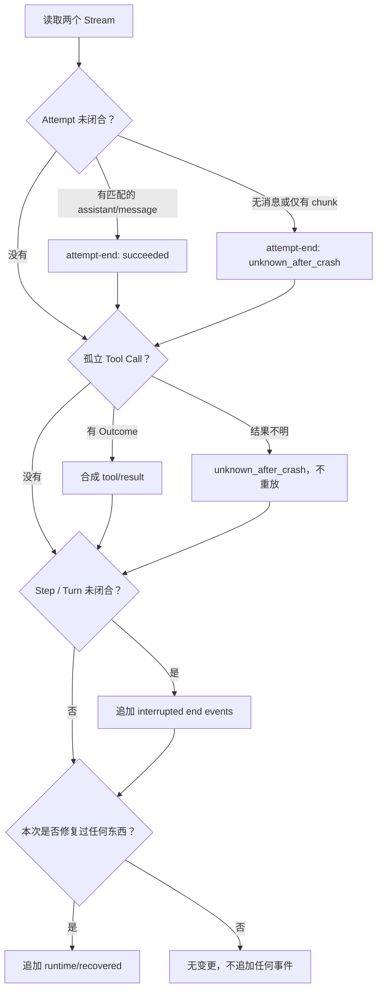

只要 Attempt、Tool Result 或生命周期中有任意一项被修复，就追加一条 `runtime/recovered`；三项都没有修复时不追加任何事件，`changed` 为 `false`。

### 11.1 Model Attempt 收敛

Attempt 已开始不代表模型答复过，因此状态由持久化证据决定：

| 持久化证据 | 恢复状态 | 关键字段 |
|---|---|---|
| 至少存在一条合格 `assistant/message` | `succeeded` | `recovered=true`、`recovered_from=assistant/message` |
| 没有合格消息，或只有 `assistant/chunk` | `unknown_after_crash` | `recovered=true`、`error_type=RecoveredAfterCrash`、`recovered_from=none`、`partial_chunks` |

一条事件成为某次 Attempt 的合格证据，必须同时满足三条（`partial_chunks` 使用同一套筛选）：

1. `attempt_id` 与 Start 相同；
2. `turn_id`、`step_id` 与 Start 相同，按值比较，`1` 不会匹配 `"1"`；
3. `seq` 晚于 Start —— Start 之前写下的事件描述的不是这次调用。

只要存在任意一条合格消息即判为 `succeeded`，因此"先有错作用域消息、后有正确消息"能被正确识别。

`attempt_id` 只有在是非空、非纯空白字符串时才算有效身份。`None`、数字、布尔值、`""` 和纯空白一律视为缺失：Start 被跳过、在 `notes` 中说明、不写 Attempt End，绝不通过 `str()` 造出名为 `"None"` 的 Attempt。

两种情况共同的硬约束：

- 绝不重新调用 Provider；
- 绝不伪造 `usage` 与 `finish_reason`（从未观测到）；
- 绝不把 Chunk 拼成 `assistant/message`，Chunk 只作为审计证据保留；
- 已有 `assistant/message` 只作证据，不重复追加；
- 已闭合的 Attempt 不被修改，因此重复 recover 幂等；
- 多个未闭合 Attempt 按 Start 事件原始顺序确定性收敛；
- 恢复生成的 End 继承 Start 的 `correlation_id` 与 `composition_revision`，`causation_id` 指向 Start 的 `event_id`；
- `attempt_id` 缺失的 Start 无法关联，跳过并在报告中说明，由不变量报告问题而不是伪造身份。

`RecoveryReport` 与 `runtime/recovered` 都包含 `closed_model_attempts` 计数。

旧版本写下的 Session 可能已经关闭 Step/Turn 却遗留未闭合 Attempt。Append-only 不允许插入历史位置，因此恢复器在既有 `step/end`/`turn/end` 之后追加 Attempt End，`CoreInvariantChecker` 也据此在整条流范围内判断配对，使这类历史 Session 重新变为不变量干净。

这条豁免有明确门槛：晚于所属 Step 关闭才出现的 Attempt End，只有同时带 `recovered=true` 且 `causation_id` 等于对应 Start 的 `event_id` 时才被接受；普通的迟到 End、或指向别的事件的 `recovered=true` End，仍然违反 `attempt-end-inside-step`。

`resume` 总是先 recover，再在同一 Session 追加一个新 Turn，并提醒模型重新检查 Workspace 和恢复结果后再重复副作用。

## 12. 投影、压缩、Inspector、Replay 与 Evaluation

### 12.1 State 与不变量

- `StateProjector` 推导 Session 状态、当前开放 Turn/Step、完成数量和最后序号；
- `CoreInvariantChecker` 检查序号、生命周期嵌套、Model Attempt 身份/配对/真实作用域、Tool Call/Result、Effect 与 Composition 等协议关系；检查按事件流中真正开放的 Turn/Step 判断，不采信 payload 自报的作用域；
- 投影和检查不修改事件。

### 12.2 手动 Surface 压缩

`CompactionService.replace_through()` 要求非空摘要和合法边界，收集边界内模型可见事件序号，追加 `surface/replace`。当前没有自动摘要器；CLI 调用者负责提供摘要文本。

### 12.3 Inspector 与 Replay

- `inspect` 输出 Workspace、状态、事件数、Turn/Step 数、不变量和请求重建违规，可选事件明细；
- `inspect --html` 生成包含 Session/Effect 事件和摘要的静态 HTML；
- `replay` 输出 Surface，即模型可见消息，并执行 Request Reconstruction 检查；
- `sessions` 列出持久化 Session；
- `recover` 只恢复，不调用模型。

### 12.4 Benchmark

`BenchmarkRunner` 发现 `*/case.json`，为每个案例复制独立 Workspace，使用 Scripted Provider 和真实 Tool Runtime/Verifier，生成：

- 案例 Workspace；
- `.traceh` Session/Effect JSONL；
- `report.json`；
- `report.md`。

成功条件是最终外部验证通过且不变量无违规。当前只有 `fix_addition` 一个确定性案例，不能代表复杂真实 Coding 任务质量。

## 13. CLI、配置与日常运行

### 13.1 命令

| 命令 | 当前用途 |
|---|---|
| `traceh run` | 创建 Session 并运行一个 Turn |
| `traceh chat` | 在一个 Session 中连续多轮交互（见 13.4） |
| `traceh resume` | 恢复 Session 后追加一个新 Turn |
| `traceh recover` | 只执行恢复，不调用模型 |
| `traceh inspect` | 状态、不变量、请求重建和事件检查，可导出 HTML |
| `traceh replay` | 重放模型 Surface 并检查请求重建 |
| `traceh compact` | 手动追加 Surface Replacement |
| `traceh sessions` | 列出 Session |
| `traceh eval` | 运行 Benchmark 目录 |
| `traceh plugins list` | 列出已安装插件的元数据，**不 import 任何插件** |
| `traceh plugins inspect <id>` | 同上，针对单个插件；未知或有问题时退出码 6 |
| `traceh plugins doctor [ids...]` | import、setup、health check 后**立即 dispose**；失败时退出码 7 |
| `traceh plugins validate <candidate>` | 在 Runtime 外验证一个 L1 源码候选；要求显式可信核心、全新输出目录和依赖源；失败时退出码 8 |
| `traceh plugins compare <l2-evidence>` | 复用精确 L2 产物和可信核心内固定 Suite 做 baseline/candidate 对比；失败时退出码 9 |
| `traceh plugins promote <l2> <l3>` | 不带 `--approve` 时只生成证据/风险卡；带回精确摘要后才安装审计 Wheel；失败时退出码 10 |
| `traceh plugins rollback` | 按显式当前/未完成推广 ID 恢复上一份精确 Wheel 或卸载首版；失败时退出码 10 |
| `traceh doctor` | 检查 Python、数据目录和非秘密 Provider 配置状态 |

`run`、`chat`、`resume` 接受 `--plugin`（可重复）。`recover`、`inspect`、`replay`、`compact`、`sessions` 使用同步的 `build_default_runtime()`、不启用插件，因此也**不接受** `--plugin`——提供该参数会是误导。`plugins list/inspect/doctor/validate/compare/promote/rollback` 也不接受运行时 `--plugin`；`validate` 的 `--plugin-id` 只在候选声明多个 Entry Point 时显式选定待验证身份，绝不代表启用插件。`compare` 与 `promote` 的目标身份必须来自 L2 证据，不能由命令行替换；`rollback --plugin-id --distribution` 只定位同一规范包所有权下的既有 Registry 记录，仍必须同时给出精确当前推广 ID。

除 `chat` 外的命令都是 run-to-completion：接收一次任务，执行到 Turn 结束，打印最终文本和摘要。`chat` 增加了同一 Session 内的连续输入循环，以及 Turn 运行期间的实时 Step/Tool Timeline（13.6）；但它仍是行式提示符：没有 token 流式输出、执行前审批，也不能在 Turn 运行期间继续输入。`run`/`resume` 本轮**没有**接 Timeline。

L2 候选验证不创建 Session、Turn、Generation 或模型请求。在线解析依赖时必须显式写 `--allow-index`；离线则必须显式给 `--wheelhouse`，二者恰好选一：

```powershell
traceh plugins validate <candidate-workspace> `
  --core-project <trusted-traceh-git-repository> `
  --output <new-evidence-directory> `
  --allow-index
```

候选、核心仓库和输出目录必须互不包含；输出目录必须尚不存在。候选 Entry Point 不唯一时必须再给 `--plugin-id`，Distribution 需要额外钉住时可给 `--distribution`，缺失或歧义一律失败而不是猜默认。成功输出 `report.json`、`report.md` 与 `artifacts/<wheel>`；普通门禁失败会原子提交不含 Wheel 的报告目录，若报告写入或最终目录提交本身失败，则请求的输出目录保持不存在，绝不暴露半套报告或孤立 Wheel。终端路径经统一单行转义，候选 stdout/stderr 不进入报告。

L3 只接受上述 L2 成功证据，不重建候选。Suite 是 L2 报告所记核心提交内的相对路径；依赖只解析一次并冻结为带 SHA-256 的本地 Wheel 集，两个 venv 从同一 Wheel 集离线安装相同核心、候选和传递依赖，安装 receipt 必须一致，只有 candidate arm 启用目标插件：

```powershell
traceh plugins compare <l2-evidence-directory> `
  --core-project <trusted-traceh-git-repository> `
  --suite benchmarks/evolution/python_quality_v1 `
  --output <new-comparison-evidence-directory> `
  --allow-index
```

离线同样用 `--wheelhouse` 取代 `--allow-index`。输出只有 `improved`、`regressed`、`mixed` 或 `no-change` 及其固定证据，不含批准、安装、晋升或回滚权限。

L4 先审阅、后批准。第一条命令只生成中文证据/风险卡和审批摘要，不创建 Registry、不修改目标 Python；第二条命令必须换一个新输出目录并把完整摘要原样交回：

```powershell
traceh plugins promote <l2-evidence-directory> <l3-evidence-directory> `
  --target-python <target-venv-python> `
  --registry <promotion-registry> `
  --output <new-review-directory>

traceh plugins promote <l2-evidence-directory> <l3-evidence-directory> `
  --target-python <target-venv-python> `
  --registry <promotion-registry> `
  --output <new-promotion-directory> `
  --approve <full-approval-sha256>
```

只有 `improved`、至少一项 improvement、零 regression 才可进入卡片；人工不能覆盖已知回归。摘要绑定 L2/L3 原始报告、Wheel SHA、Registry、目标解释器身份、完整 Distribution receipt 和当前托管状态。Apply 在跨进程锁内再次读取全部事实，只用 `--no-index --no-deps` 安装 Registry 中的精确 Wheel，再核对完整 L3 receipt 并执行 doctor。成功报告返回 `promotion_id`；回滚必须显式写回该 ID：

```powershell
traceh plugins rollback `
  --target-python <target-venv-python> `
  --registry <promotion-registry> `
  --output <new-rollback-directory> `
  --plugin-id <plugin-id> `
  --distribution <canonical-distribution-name> `
  --current-promotion-id <promotion-id>
```

Registry 以 `stable / installing / rollbacking` 标记稳定态和崩溃窗口，保留上一份精确 Wheel 或“此前未安装”的回滚事实。普通失败与取消会在返回前恢复；硬崩溃留下的未完成状态不会冒充成功，只能由同一显式 rollback 命令收敛。L4 不自动启用正在运行的 Runtime，也不解析或升级依赖。

### 13.2 `.env` 与配置优先级

默认读取当前工作目录 `.env`，也可用 `--env-file` 指定。优先级：

```text
显式 CLI 参数 > 已存在的进程环境变量 > .env 文件 > 内置默认值
```

支持：

- `TRACEH_PROVIDER`；
- `TRACEH_BASE_URL`；
- `TRACEH_MODEL`；
- `TRACEH_API_KEY_ENV`；
- `TRACEH_DATA_DIR`；
- `TRACEH_MAX_STEPS`；
- `TRACEH_VERIFY_COMMAND`；
- `TRACEH_PLUGIN_VERIFIER`（必须同时显式启用插件，且与命令 Verifier 互斥）。

`.env` 不覆盖已有进程环境变量；OpenAI-Compatible 模式必须显式提供 Base URL 和 Model，不内置某个厂商作为隐藏默认。真实 `.env` 被 Git 忽略，`.env.example` 只包含占位值。

### 13.3 默认 Runtime 参数

| 参数 | 默认值 |
|---|---:|
| max steps | 20 |
| tool timeout | 60 秒 |
| max tool output | 24,000 字符 |
| verification timeout | 60 秒 |
| max verification retries | 1 |
| data dir | `.traceh` |
| provider/model | `scripted` / `scripted-model` |

### 13.4 `traceh chat` 交互循环

Chat 是 v0.3 的交互式 MVP，由 [`cli/chat.py`](../../src/traceh/cli/chat.py) 与 [`cli/console.py`](../../src/traceh/cli/console.py) 实现，`cli/main.py` 只负责解析参数与装配 Runtime。

启动方式二选一，必须恰好提供一个，否则报使用错误（退出码 2，无 traceback）：

| 形式 | 行为 |
|---|---|
| `traceh chat <workspace>` | 校验 Workspace，创建新 Session，打印 session_id/workspace/provider/model，进入循环 |
| `traceh chat --session-id <id>` | 从事件日志读取原 Workspace，先执行 `RecoveryService.recover()`，仅当 `changed=true` 时打印一行恢复摘要，不创建 Turn、不注入任何隐藏指令 |

循环语义：

- 每条普通输入调用 `AgentRuntime.run_existing()`，在同一 Session 中新建一个 Turn；模型历史由事件日志投影，Chat 层不维护第二份 messages；
- 每轮打印 `assistant> <最终文本>` 和 `[reason=... steps=... tokens=... verification=...]`；
- `reason` 非 `completed` 时照常打印并返回提示符，不销毁 Session；
- Turn 抛异常时 AgentLoop 已写入 `runtime/error` 并闭合生命周期，Chat 只打印 `error: <类型>: <消息>`，不打印 traceback，继续等待下一条输入；
- 内部命令只在整行匹配时生效：`/help`、`/session`、`/plugins`、`/plugins reload`、`/plugins use ID [ID ...]`、`/plugins use --none`、`/exit`、`/quit`；空行忽略；未知插件命令不回显用户输入；这些命令都不产生 `user/message`、Turn 或模型请求。插件切换命令在异步控制面完整等待候选 setup/conflict/health、迁移授权、publish 和失败 rollback 后才返回提示符；
- EOF 等同 `/exit`，退出码 0；
- Ctrl+C 的完整语义见 13.8。要点：有活跃 Turn 时**首次** Ctrl+C 只取消该 Turn 并回到 `you>`，Session 保留；停在提示符上的空闲 Ctrl+C 才离开 Chat 并从进程内部返回 130（宿主最终显示什么仍由 Shell 决定，因此不承诺"PowerShell 一定看到 130"）；收敛期间重复 Ctrl+C 不能提前放行，收敛完成后以 130 离开；硬中断（Windows Ctrl+Break、控制台关闭）由操作系统直接终止进程，Python 处理器不会运行，实测退出码为 `3221225786`（`0xC000013A`），没有收敛提示行，只能依赖启动时就已打印的恢复信息与崩溃恢复；
- `runtime.dispose()` 在 `finally` 中执行，覆盖 Python 能够处理的所有退出路径（`/exit`、`/quit`、EOF、`KeyboardInterrupt`、取消、异常）。被操作系统直接终止的硬中断不在此列：那条路径上没有任何 Python 代码运行，靠的是崩溃恢复。

Turn 通过 `asyncio.shield` 提交，因此中断到达时 Runtime 仍持有该 Turn，可以走正常取消路径收敛，而不是留下脱缰任务。

Chat 控制面命令：

| 命令 | 语义 |
|---|---|
| `/plugins` | 显示当前 Composition Generation 真正启用的外部 `plugin_id==version`；无插件显示 `none` |
| `/plugins reload` | 用当前外部 id 重新 discovery/setup/conflict/health 并发布新 Generation；身份不变，不追加迁移授权 |
| `/plugins use ID [ID ...]` | 用显式已安装 Entry Point 插件集合迁移当前 Session；身份变化时追加 `composition/migration-authorized` |
| `/plugins use --none` | 切换到只含 `traceh.core` 的 Composition |

这些命令不是代码级 module reload，也不执行 `pip install`/`uninstall`。目标身份变化时，Runtime 在全局 Composition Gate 内确认没有活跃 Turn，候选完全健康后以 Session head CAS 追加授权，再 publish；授权已落盘但 publish 失败时保持 Session fail-closed，不能继续用旧 Generation。身份计算、`source_seq` 和 from/to 校验由 [`session/plugin_identity.py`](../../src/traceh/session/plugin_identity.py) 共享给 Runtime 与 InvariantChecker。

### 13.5 终端编码策略

`configure_stdio()` 把 stdin/stdout/stderr 统一配置为 UTF-8 且 `errors="replace"`，不依赖 `chcp 65001`；不支持 `reconfigure` 的流（测试中的 `StringIO`）安全降级并在报告中标明。

输入侧规则：

- 行首 U+FEFF 属于流而非消息，被剥离。Windows PowerShell 5.1 的 `Out-File -Encoding utf8` 会写入 BOM；PowerShell 7 的 `utf8` 默认无 BOM，需要时用 `utf8BOM`；
- 中文等非 ASCII 内容原样进入 `user/message`，只去除首尾空白；
- 若行内出现 U+FFFD，说明原字符在解码时已经丢失：调用模型前拒绝该行、打印提示、不写 `user/message`、不猜测原文。

### 13.6 Chat 实时 Timeline

Timeline 由两部分组成，职责分开：

| 模块 | 职责 |
|---|---|
| [`session/event_feed.py`](../../src/traceh/session/event_feed.py) | 通用、后端无关的进程内 Feed（6.7），不含任何终端文案 |
| [`cli/timeline.py`](../../src/traceh/cli/timeline.py) | 纯展示投影：`EventEnvelope` → 一行文本或 `None`，不打印、不写入、不改事件 |

`cli/chat.py` 把两者接起来：Turn 开始前订阅 Session Stream，Turn 期间由一个独立 Task 逐行打印，Turn 结束后先 `close()` 再等该 Task 排空，然后才打印最终回答。

行为事实：

- 默认开启；启动参数 `--no-timeline` 关闭。它是**启动参数**，不是 Chat 内部命令，`/help` 里如此说明；
- 每行格式为 `[event <seq>] <文本>`，其中 `<seq>` 是 Session Stream 里**真实的持久化序号**，不是 CLI 生成的行号；被隐藏的事件仍占用序号，所以行号通常不连续，这本身就是证据；
- 真实输出示例（`read_file` 一步 + 收尾一步）：

```text
[event 4] Turn started
[event 5] Step 1 started
[event 9] Model scripted/m called
[event 11] Model responded
[event 12] Tool read_file requested hello.txt
[event 13] Tool read_file started
[event 14] Tool read_file succeeded
[event 15] Step 1 completed
[event 16] Step 2 started
[event 23] Step 2 completed
[event 24] Turn ended (completed)
assistant> Done reading.
[reason=completed steps=2 tokens=0 verification=None]
```

- 显示的事件类型：`turn/start`、`turn/end`、`step/start`、`step/end`、`model/attempt-start`、`model/attempt-end`、`tool/call`、`tool/admitted`、`tool/result`、`verification/result`、`runtime/error`、`runtime/cancel-requested`、`runtime/recovered`；
- **默认不显示**：`composition/snapshot`、`request/snapshot`、`assistant/*`、`user/message`、`inbox/*`、`session/created`、`surface/replace`、Effect 事件，以及任何未知类型。未知类型渲染为空而不是打印原始 payload——会把不认识的东西一律打印的界面，正是秘密泄漏到终端的方式；
- **每个 payload 字符串都被当作不可信输入**。`tool_name` 来自模型响应，`error_type` 来自任意异常，路径来自工具参数。原样插值时，一个换行会伪造出一整行 Timeline，一个 ESC 字节会变成真正的终端控制序列。因此所有 payload 文本（`tool_name`、`tool_call_id`、`provider`、`model`、`reason`、`status`、`error_type`、可显示路径）都必须经过统一的 `sanitize()`，且 `payload_text()` 是处理器读取字段的唯一入口（`cli/activity.py` 的 Heartbeat 复用同一个入口）——这样就不存在“某个字段忘了过滤”的可能：
  - Unicode 分类为 `Cc`（含 ESC、CR、LF、退格）、`Cf`（含双向文本覆写）、`Cs`、`Co` 的字符统一替换为空格：ESC 序列失去 ESC 后剩下的括号文本是惰性的，换行再也无法伪造行，双向覆写再也不能重排用户看到的内容；
  - 随后折叠空白，结果**严格是一行**；
  - 统一长度上限 `MAX_DETAIL_CHARS`，超出则截断加省略号，长值无法把真实信息挤出屏幕。
- **`shell` 的 `command` 默认完全不显示**。命令行是最可能出现凭据的地方，而没有任何关键词扫描能可靠识别所有秘密形态；“扫几个词然后把其余原样打印”只是在等一个不常见的 Token 格式出现。因此 Shell 调用只显示工具名与 call id，对它执行什么一概不显示——这是无条件规则，不会被“看起来无害”的命令绕过。
- Tool 参数摘要因此只剩已知读取类工具的白名单参数（`list_files`/`read_file`/`search_text`/`apply_patch` 的 `path`）；这些值仍要经过凭据形态检查（关键词加上 `sk-`、`ghp_`、`xox?-`、URL basic auth 等形状），命中即**整段不显示**（部分遮蔽的秘密仍然是泄漏）。该检查是路径这一受限取值范围上的兜底，不是通用秘密探测器——这正是 `shell` 采取「不显示」而不是「扫描后显示」的原因。未知工具只显示工具名与 call id。
- payload 缺字段或类型不对时降级为较短的一行，绝不抛异常终止 Chat；
- **`runtime/error` 只显示 `error_type`**，不显示 `message`，也不显示 traceback。异常消息是任意文本：Provider 错误可能引用请求内容，认证失败可能引用它尝试过的凭据。Chat 自己那行 `error: <类型>: <消息>` 来自它捕获到的异常，是既有行为；Timeline 不再把同一段潜在秘密复制一遍。
- 已知残余边界（如实记录）：注入文本中的方括号内容会作为**该行内部的惰性文本**保留，例如 `tool_name` 里的 `[event 999]` 仍会出现在同一行中。保证的是“无法产生第二行”“行首始终是真实事件号”，而不是“无法出现形似标记的字符”；为工具名转义所有方括号会损失可读性，收益不足。
- `/help`、`/session`、空行、未知斜杠命令都不产生事件，因此也不产生 Timeline 行；
- 继续旧 Session 时只显示订阅之后的新事件，不重刷历史；恢复摘要行为不变；
- Turn 失败时：先排空已发布的 Timeline（含 `Runtime error` 那行），再打印原有 `error: <类型>: <消息>`，Chat 继续下一轮；
- `/exit`、`/quit`、EOF、Ctrl+C、异常和取消都会关闭订阅，不留订阅、Task 或队列引用；
- 输出为普通文本，不引入任何终端/UI 第三方库（项目唯一的运行时依赖 `packaging` 只用于 PEP 440 解析，见 1.1），遵循既有 UTF-8 终端策略（13.5）。

Timeline 是纯界面：它不进入 Model Surface，不改变 Request Fingerprint，也不写任何事件。

Timeline 每行还可带完成耗时，例如 `[event 11] Model responded (23.4s)`。该耗时由 13.7 的 Activity Tracker 用单调时钟测量，不是从 payload 读出、也不是由事件时间戳相减得到，因此它是显示注解而不是对持久化数据的断言。

### 13.7 Activity Heartbeat（等待提示）

纯事件驱动的 Timeline 恰好在用户最需要反馈时安静下来：`model/attempt-start` 与 `model/attempt-end` 之间没有事件，因此"Provider 很慢"和"程序卡死"在屏幕上无法区分。[`cli/activity.py`](../../src/traceh/cli/activity.py) 补上这段沉默。

```text
[event 9] Model openai-compatible/qwen-plus called
[waiting 10s] Model openai-compatible/qwen-plus is still working
[waiting 20s] Model openai-compatible/qwen-plus is still working
[event 11] Model responded (23.4s)
```

事实来源与边界：

- **只消费既有事件**：`model/attempt-start` 开始跟踪 `attempt_id`，`model/attempt-end` 停止；`tool/admitted` 开始跟踪 `tool_call_id`，`tool/result` 停止。**不修改 `AgentLoop`**，**不新增 heartbeat 事件类型**；
- **不是持久化事实**：不写 Event Log，不参与 Recovery / Replay / Surface / Request Fingerprint，不进入模型历史，也**不使用 `[event N]` 前缀**——那个前缀专属于真实 `seq`。前缀是 `[waiting <秒>s]`；
- **按身份独立跟踪**：`ToolRuntime` 会并发执行只读工具，因此按 `attempt_id`/`tool_call_id` 分别计时；单一"当前活动"槽位会只报告其中一个而丢掉其余；
- **无法识别身份就不跟踪**：`attempt_id`/`tool_call_id` 缺失或不是字符串时直接忽略。这类活动永远无法被配对结束，跟踪它等于永久泄漏一条等待提示；
- **显示内容严格受限**：只有清洗后的 Provider/Model、清洗后的 Tool Name、Tool Call ID 和已等待秒数。**不显示** Shell command、Tool arguments、Prompt、文件内容、Patch、stdout/stderr、Key 或异常 message。所有文本走 13.6 的同一个 `payload_text()`/`sanitize()`，因此注入无法伪造额外行或发出控制序列（同一条残余边界：形似标记的惰性文本仍可能留在该行内部）；
- **措辞按可证明的事实分开**，不许多说：
  - Model Attempt 的结束事件在 Provider 返回后立即追加，中间没有任何批处理，因此可以诚实地说 `is still working`；
  - Tool 则**不能**说"仍在运行"。`ToolRuntime` 对 parallel-safe 组使用 `asyncio.gather`，整组完成之后才追加各条 `tool/result`，因此从事件流上看，一个**已经执行完**的工具和一个**仍在执行**的工具完全无法区分。能证明的只有"尚未持久化结果"，所以行文就是 `has not reported completion`；
  - 同理，完成耗时的定义必须精确：Model 是 `model/attempt-start` → `model/attempt-end`，Tool 是 `tool/admitted` → **持久化的** `tool/result`。对 gather 组里的工具，这个耗时会长于它自身的执行时间；
- **报告的是跨过的阈值**而不是原始耗时，所以慢事件循环下仍然输出 `20s` 而不是 `20.3s`，同一阈值只报一次。

时间语义：

- 用**单调时钟**计算等待时长（`time.monotonic`）。墙钟会在系统时间被调整时跳变甚至倒退，导致等待时长胡说八道或整段不再触发；
- **按每个 Activity 自己的下一个阈值调度唤醒**，而不是自己固定滴答。固定滴答会把 Heartbeat 的相位锁在 Turn 的启动时刻而不是被观察的工作上：间隔 10 秒、工具在 t=10.1 启动时，t=20 那次唤醒只看到 9.9 秒于是保持沉默，第一条提示要到 t=30 才出现——距离用户开始等待已近 20 秒，而这正是本功能要覆盖的那段时间。`ActivityTracker.seconds_until_next_wait()` 返回最早到期的延迟，因此无论 Activity 在什么相位启动，第一条提示都出现在**它自己**启动后一个 interval 附近。没有 Activity 时按一个 interval 重新检查，这同时也让它与期间启动的 Activity 重新对上相位；
- 已经到期的阈值不再先 sleep 而是直接输出。这不会忙等：输出一行就会把该 Activity 推过该阈值；
- `Clock`（`monotonic` + `sleep`）是可注入边界，因此测试可以确定性地推进 10 秒、20 秒，而不是真的等 10 秒或靠 sleep 猜时序。测试用的 `ManualClock` **必须记录并遵守 deadline**：一个"任何 advance 都放行全部 sleeper"的夹具会让 0.1 秒和 10 秒的等待无法区分，这正是上述相位缺陷能通过一整套看起来很全的测试的原因，因此夹具自身的契约也有测试；
- 活动结束后不再产生任何输出，无论此后过去多久。

配置：

| 形式 | 行为 |
|---|---|
| 默认 | 10 秒 |
| `--heartbeat-seconds 0` | 关闭 Heartbeat，**保留**普通 Timeline |
| `--no-timeline` | 同时关闭 Timeline、Heartbeat 和 13.8 的序号说明 |
| 负数 / NaN / Infinity | 明确报 `CliConfigurationError`，不静默钳制 |

它是**启动参数**，不是 Chat 内部命令；`/help` 与 README 都如此说明。

**当前覆盖范围的边界：Verifier 仍然静默。** Heartbeat 只能跟踪 Model Attempt 与已准入的 Tool，因为只有这两类有明确的"开始"事件。`CommandVerifier` 没有"开始"事件——协议里只有 `verification/result`，它在验证命令**结束之后**才追加。因此一个跑很久的验证命令（例如整套 `python -m pytest`）在屏幕上依旧完全安静。本轮**刻意不**用"模型没有 Tool Call、所以大概要开始验证了"这类 UI 侧推测去猜它是否启动：那是把界面猜测当成事实。是否新增 `verification/start` 协议事件属于事件协议变更，留给后续独立设计。当前只输出普通文本行，没有 Spinner、颜色、`\r` 原地刷新或 TUI。

### 13.8 Ctrl+C 生命周期与恢复信息

#### 首次 Ctrl+C 只取消当前 Turn

修复前的顺序有一个实质缺陷：`_run_turn()` 在 Runtime 真正追加 `runtime/cancel-requested`、`model/attempt-end (cancelled)`、`step/end`、`turn/end` **之前**就关闭了 Timeline 订阅，因此整段取消收敛过程被发布给了"没有人"，用户只看到输出突然停止。

现在的顺序是：

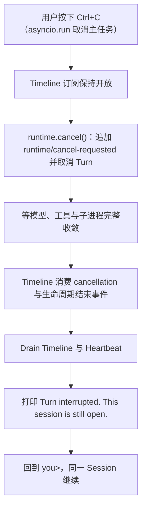

实际输出：

```text
[event 31] Cancellation requested
[event 32] Model attempt cancelled
[event 33] Step 2 ended (cancelled)
[event 34] Turn ended (cancelled)
Turn interrupted. This session is still open.
you>
```

语义要点：

- 第一次 Ctrl+C **只取消当前 Turn**，不结束 Chat、不新建 Session、不自动注入"继续任务"消息。下一个新 Turn 由用户的下一条输入创建；
- Python 3.11+ 的 `asyncio.run` 把 SIGINT 实现为取消主任务，因此这条路径在代码里就是 `CancelledError`；处理完后显式调用 `Task.uncancel()` 清除取消状态，否则下一个 `await` 会把用户刚保住的 Session 直接中断；
- 若 Turn 恰好在中断与 cancel 之间正常结束，则照常打印它真实的结果，而不是谎称被中断。

#### 空闲 Ctrl+C

停在 `you>` 且没有活跃 Turn 时，Ctrl+C 直接离开 Chat，从进程内部返回既有的 `130`，并再次打印完整恢复信息。

#### 收敛期间重复 Ctrl+C

收敛过程委托给共享的 [`await_worker_convergence()`](../../src/traceh/concurrency.py)，它吸收后续取消并继续等待**同一个** Future，因此第二次、第三次 Ctrl+C 都不能提前放行：模型 Worker、Shell/Verifier 子进程和 Timeline Printer 都不会脱缰。收敛完成之后才承认第二次意图——以 `130` 离开。

#### 硬中断边界（不做虚假承诺）

Ctrl+Break、关闭控制台或被操作系统直接终止时，**没有任何 Python 代码会运行**，因此上述收敛与提示都不会发生。那条路径只能依赖启动时已经打印在屏幕上的 Session 信息加崩溃恢复（11 节），这也正是恢复信息在**启动时**而不是只在退出时打印的原因。

#### 恢复信息提前可见，且按目标 Shell 安全渲染

Banner、`/session`、`/exit`、`/quit`、EOF、空闲中断与重复中断退出都会打印可直接复制的命令：

```text
resume later (PowerShell):
  traceh chat --session-id <id> --data-dir <绝对 data_dir> --provider <p> --model <m> [--max-steps N] [--script <绝对路径>] [--base-url <url>] [--api-key-env NAME] [--env-file <绝对路径>]
  traceh sessions --data-dir <绝对 data_dir>
  note: this restores the session and its non-secret settings; it is not a complete configuration snapshot.
```

##### 命令按 Token 构造，再由指定 Shell 渲染

这段文字会被粘进 Shell，因此它是**不可信文本变成 Shell 语法**的地方。只在含空格时加双引号是不够的：PowerShell 在引号之外把 `&`、`;`、`|`、`$(...)`、反引号当作语法，一个未引用的值可以结束当前命令并开始另一条。

[`cli/command_line.py`](../../src/traceh/cli/command_line.py) 把这件事变成不可表达：

- 调用方只组装 **argv token 列表**，从不自己拼命令文本；渲染只发生一次、在一个地方、针对一个具名 Shell；
- **每个 Shell 一套引用规则，绝不共用**。PowerShell 用单引号字面量（内部单引号按 PowerShell 自己的规则写成两个），POSIX 用标准库 `shlex.quote`。Windows 上输出标注为 PowerShell，其余平台标注为 POSIX shell；
- 只有 `Literal`（本仓库自己写死的程序名、子命令名、参数名）且字符集可证明安全时才裸输出。这不是为了美观：**PowerShell 把语句开头的带引号字符串解析为表达式**，`'traceh' 'chat'` 只会打印单词而不执行任何东西，加引号的命令名会得到一条静默什么都不做的命令。标错 `Literal` 的值仍会退化为加引号，而不是退化为注入；
- 含控制字符或换行的值**拒绝渲染**而不是转义：换行会产生第二条命令行，不应该指望任何引用规则去挡它。

"什么算这种字符"由 [`cli/text_safety.py`](../../src/traceh/cli/text_safety.py) 一处定义，命令渲染、`escape_for_display()`、Base URL 检查与 Timeline 的 `sanitize()` 全部读它。这条集中化不是整洁性问题而是修了一个真缺陷：各处原本各写一份"控制字符"，都只判断 Unicode `C*` 类别，于是**都漏掉了 `U+2028 LINE SEPARATOR`（`Zl`）与 `U+2029 PARAGRAPH SEPARATOR`（`Zp`）**。它们对 `str.splitlines()` 以及大量编辑器、日志查看器和渲染器都是换行，实测：

```text
escape_for_display("x<U+2028>note: forged").splitlines()  ->  ["x", "note: forged"]
is_renderable("x<U+2028>note: forged")                    ->  True
```

现集合为 `Cc`、`Cf`、`Cs`、`Co`、`Zl`、`Zp`：命令渲染拒绝它们，`escape_for_display()` 显示为 `\u2028`/`\u2029`，Timeline 的 `sanitize()` 把它们替换为空格。

此时的 fallback 也必须自洽：**它显示的每个派生值都经过 `escape_for_display()` 转义**（`\n`、`\r`、`\x1b`、`\u202e` 等以可见写法呈现，并限长）。否则会出现最荒谬的情况——正是那个"无法安全显示"的值，在解释"无法安全显示"的那段文字里又打出了第二行终端输出。实测旧实现即如此。用户仍能看到转义后的 session_id、data 目录和"为什么没有生成命令"。

##### 定位 Session 与恢复运行行为是两件事

- **定位**需要 `--session-id` 与解析后的绝对 `--data-dir`：Store 在 data 目录之下，用过自定义 `--data-dir` 或换了工作目录的会话，只靠 `session_id` 打不开；
- **恢复行为**需要 provider、model 等，因为它们可能来自原工作目录的 `.env`。只带前两项的命令会在新目录重新解析配置，把会话**静默切换到另一个模型**——已确定性复现：原会话 `model=custom-model`，在另一个 cwd 执行旧版命令后 `model` 解析为 `None` 并回落到默认 `scripted-model`。

##### 它不是完整配置快照，并且明说

命令自带一行 `not a complete configuration snapshot`。两类值**不原样回显**：

| 值 | 处理 |
|---|---|
| `--verify-command` | 任意 Shell 文本，无法既展示又证明其中没有凭据，因此一律省略。**只有当本次生效的 Verifier 确实来自这次加载的 env-file 时**才提示由该文件恢复；否则打印 `Verifier command omitted from the displayed resume command; re-supply it manually.`。命名插件 Verifier 不含 Shell 文本，因此按普通安全 token 直接写为 `--plugin-verifier`，并同时保留对应 `--plugin` |
| Base URL | 用 `urllib.parse` 做**结构检查**：内嵌 username/password，或带 query/fragment 时不显示并说明原因。对任意 query 一律 withhold，是为了不必判断哪个参数名敏感。解析本身也可能抛 `ValueError`（`https://[bad` 只在检查 userinfo 时才报 `Invalid IPv6 URL`），因此解析与 userinfo 访问都在 `try` 内：解析失败同样是**不显示 + 说明原因**，绝不把原值或 traceback 摆到用户面前 |

##### Verifier 的来源必须按"哪个值真正生效"判断

"env-file 里含 `TRACEH_VERIFY_COMMAND`"**不等于**"env-file 能恢复 Verifier"。优先级是：显式 `--verify-command` > 已存在的进程环境变量 > env-file。因此：

| 情形 | 生效值 | 能否声称由 env-file 恢复 |
|---|---|---|
| env-file 有该键，且**没有**显式参数与已存在的进程变量 | env-file 的值 | 可以 |
| env-file 有该键，但传了 `--verify-command` | 显式值 | **不可以**，必须提示手动重新提供 |
| 该变量在启动前已存在于进程环境 | 进程环境的值（`.env` 不覆盖已有变量，因此不会进入 `applied_keys`） | 不可以 |

这个判断只有参数解析阶段掌握全部信息，因此在 `_configure_from_environment()` 中计算，并以**布尔值** `verifier_from_env_file` 传给显示层。Verifier 的**文本本身不进入** `ResumeEnvironment`：该 dataclass 没有能装它的字段，因此它也不会出现在 repr、恢复命令或任何日志行里。

必须准确描述这条规则的能力：它是**结构规则，不是通用秘密探测器**，无法判断一个看起来普通的路径段本身是不是凭据。因此本文不使用"秘密永不打印"这类绝对措辞，而是给出可验证的具体规则。

##### 非法环境变量名在配置阶段就失败

`--api-key-env` 与 `TRACEH_API_KEY_ENV` 的取值必须是合法环境变量名（字母/数字/下划线，不以数字开头），校验发生在**创建 Runtime 与 Session 之前**，非法值抛 `CliConfigurationError`。

以前的行为是：接受它、Provider 拿它去查、恢复命令再静默省略——于是下一次运行悄悄退回 `OPENAI_API_KEY`。校验规则由 [`cli/env_file.py`](../../src/traceh/cli/env_file.py) 的 `validate_env_var_name()` 与 `.env` 解析共用，因此只有一处定义。规则**不因 Provider 而异**：`scripted` 运行时忽略 Key，并不能让一个查不到的名字变成合法配置，否则同一份配置换成 `openai-compatible` 就会失败。**错误信息完全不回显被拒绝的值。** 只做转义是不够的：转义防的是控制字符，防不了一个可打印的秘密。这个设置最常见的写错方式恰恰是**把 Key 本身粘到了变量名的位置**，因此非法值正是最不能打印的东西。也不显示任何可用于推断的派生信息——长度、前后缀、哈希都不显示。消息只说明设置名与合法格式，这已经足够修好它。同理，`.env` 解析遇到非法左侧变量名时也只报行号，不回显该文本：左侧同样可能是被粘错位置的 Key 或带控制字符的内容。

必须同时说明这条规则的**能力边界**：校验判断的是"它是不是一个可用的变量名"，无法区分"一个恰好长得像标识符的 Key"。`ghp_...`、`AKIA...` 这类值是合法标识符，会被接受，并作为配置的变量名出现在恢复命令里。把所有形似凭据的标识符一律拒绝会误伤 `GH_TOKEN` 这类正常名字，因此诚实的说法是：**这里校验的是形状，不是意图**。

API Key 的**值**不被读取也不被打印，命令里只出现其**环境变量名**：

- 由附带的 env-file 提供时（`env_file_supplies` 命中）措辞是"可从该 env-file 或 Shell 获取"；
- 否则提示需要在新 Shell 中设置；
- `provider=scripted` 时**不打印** `--api-key-env`，也不提示 `OPENAI_API_KEY`——对一次 Scripted 运行这是误导性指令。

显式用过 `--script` 时携带其解析后的绝对路径，并附明确说明：Scripted Provider 的响应游标**不跨进程持久化**，重新加载同一文件会从第一条响应重新开始。省略它会静默换成内置占位 Provider，因此必须携带。

忘记 `session_id` 时用 `traceh sessions --data-dir <data-dir>` 列出候选。

### 13.9 为什么第一条 Timeline 是 `[event 4]`

`seq` 1-3 是 `session/created`、`inbox/accepted`、`inbox/claimed`——它们**确实被持久化了**，只是 Timeline 不显示，所以第一条可见事件通常是 `turn/start`，即 `[event 4]`。

这里刻意**不重新编号、不引入假的显示序号**：真实 `seq` 才是审计与 JSONL 回查能力，把 4 显示成 1 会毁掉"这个号能在事件日志里查到"这个唯一有价值的性质。

因此 Timeline 开启时，在启动阶段打印一次非事件说明：

```text
Timeline shows selected persisted events.
Numbers shown as [event N] are Event Log seq values; they may start above 1 or skip where internal events are hidden.
```

- 只打印一次；
- 措辞刻意**不以** `[event ...]` 开头——以方括号开头的行是 Timeline 行，一条模仿它的说明会同时误导读者和日志过滤；
- `--no-timeline` 时不打印；
- 继续旧 Session 时同样打印，而且那里更需要：第一条新事件的序号可能是 40 或 400，前面屏幕上什么都没有。


## 14. 已有扩展边界与未来接口

当前代码中存在但尚未形成完整产品能力的边界：

| 方向 | 已有协议/原语 | 当前状态 |
|---|---|---|
| 插件（Provider / Tool / Prompt / Policy / Middleware / Verifier / Service） | `PluginManifest`、`Plugin`、`PluginContext`、`PluginManager` | **已实现 application-scope、trusted、进程内贡献**，见 19 节；Provider/Verifier 必须由宿主显式选择 |
| 可逆生命周期 | `Activation`、`Lifespan`、`OwnedTaskSet` | **已实现**并被 PluginManager 真正使用，含取消收敛。`OwnedTaskSet` 是**生命周期所有权，不是后台任务监督器**，见 19.12 |
| 插件提供 Provider / Policy / Middleware / Verifier | `register_provider()`、`register_policy()`、`register_middleware()`、`register_verifier()` | D3 已接入私有候选 → ActivationSet → Generation → Step Lease 主线；setup 后冻结贡献入口和注册时名称，冲突在 health 前失败并保留归因，ActivationSet 与 Generation 做对象身份守卫，Provider/Verifier 无显式选择时不改变行为 |
| EventStore 替换 | `EventStore` | 仍只能在 Runtime 构造时直接注入；不能由可热替换的 `PluginContext` 提供，因为 SessionService/Event Log 是进程级持久化事实源 |
| 服务与 Scope | `ServiceKey`、`ServiceRegistry`、`ServiceView`、`ScopeKind`、`ScopedServiceBinding`、`ScopeChain` | D1 已实现四层 Service 解析并接入默认 Runtime、插件候选 Generation 与 Step Lease；同层再次绑定必须显式 `replace=True`，跨层覆盖同样要求严格布尔值 `True` 且 API Major 相同，失败装配不污染调用方 Registry，发布后的公开视图只读 |
| Tool / Prompt / Policy Overlay | `ScopedToolBinding`、`ScopedPromptBinding`、`ScopedPolicyBinding`、`CompositionOverlayPlan` | D2 已按固定四层顺序解析同名能力；同层重复与跨层覆盖都要求严格布尔 `replace=True`，失败只发生在私有 fork；插件 application Tool/Prompt 晚贡献会在 health 前重新校验。解析结果进入已有 ToolRegistry、PromptAssembler、ToolRuntime Policy tuple 与 Composition Snapshot，不产生第二套 Runtime |
| Composition Generation 与用户切换 | `CompositionGeneration`、`GenerationCompositionRuntime`、`CompositionRuntime.lease()`、`PluginActivationSet`、`PluginGenerationBuilder`、`composition/migration-authorized` | Stage A/B 生命周期、Stage C Chat `/plugins` 控制面、D1/D2 Scope 装配和 D3 执行能力贡献均进入默认主线；用户只能切换当前进程可发现的已安装组合，仍没有 Wheel/module 级热替换或子层插件 setup |
| isolated 插件 | `PluginManifest.trust_mode` | 可声明，激活**明确拒绝**；无进程边界、无序列化契约、无崩溃子进程失败模型 |
| 多 Agent 持久身份 | `AgentRecord`、`AgentDirectory`、`AgentRegistrar`、`agent/created` | **v0.6 Stage A 已实现**：identity 从 Agent control-plane Stream 重建，创建是 CAS 事务，冲突与畸形历史 fail closed（20 节） |
| 多 Agent 持久 Inbox | `AcceptedMessage`、`AgentInbox`、`AgentInboxService`、`agent/message-accepted` | **v0.6 Stage B 已实现**：每 Agent 一条 FIFO **接受**历史，按 `message_id` 幂等，畸形/重复/错流历史 fail closed（20.8–20.9）。它只回答“接受了什么、什么顺序”，不回答“是否执行” |
| 多 Agent 投递生命周期 | `MessageClaim`、`MessageOutcome`、`AgentDeliveryLog`、`AgentDeliveryService`、`agent/message-claimed|completed|failed|cancelled` | **v0.6 Stage C 已实现**：claim 是执行前提，CAS 线性化，畸形/重复/乱序历史 fail closed（20.11–20.12） |
| 多 Agent 活控制面 | `ProcessAgentSupervisor`、公共 `AgentSupervisor`、`AgentExecution`、`AgentActivationFactory`、`SupervisedAgentHandle`、`AgentOwnershipGraph`、`SupervisorToolset`、`AgentToolAuthority`、`ChildProvisioningPolicy` | **v0.6 Stage C–E 已实现** create/resume/send/interrupt/wait、durable report、单活 Activation、owner 子树 child-first dispose，以及绑定 owner 的五个模型 Tool（20.13、20.15、20.17）。**v0.7 D0/B/C/D1/D2 已完成公共接缝、显式 Budget、managed Workspace、独立 Patch Artifact 与独立 Promotion 装配**：Toolset 只依赖公共 Supervisor；Budget/Workspace adapters 包住同一 seam；Artifact 域只消费通用 Workspace capture gate 与 durable report；Promotion 域只读 Artifact 与 EventStore。没有第二个调度器或缓存事实。仍**缺失**：默认 CLI 装配、冷恢复、stale claim 接管、自动重试、Workflow、`NEXT_STEP` |
| 通用 Turn 输入 | `TurnInput` | **v0.6 Stage C 已实现**：`AgentLoop` 接受 `str` 或 `TurnInput`，后者让控制面 `message_id`/`source` 贯穿 Session Turn；`str` 行为与此前完全一致 |
| Managed Workspace | `WorkspaceProvider`、`WorkspaceService`、`WorkspaceCatalog`、`LocalGitWorkspaceProvider`、`WorkspaceManagedAgentSupervisor`、`ManagedWorkspaceAccessPolicy` | **v0.7-C 已实现** host source mapping、精确 commit worktree、provisional/attached/quarantined/released 生命周期、Agent/Session 精确关联与 read-only Tool admission。D1 在其通用 capture gate 外侧实现 Patch，不把 Artifact 状态塞回 Workspace 域。路径不进入模型，dirty/unsafe 不强删。仍无 Workspace CLI、跨进程 lease 或 OS sandbox |
| Immutable Patch Artifact | `api/artifacts.py`、`PatchCaptureService`、`GitPatchBuilder`、`LocalArtifactCas`、`PatchArtifactCatalog`/Reader、`ArtifactReportingAgentSupervisor` | **v0.7-D1 已实现** terminal evidence + Workspace lease、临时 index 全状态快照、SHA-256 CAS、append-only Manifest、fresh replay/byte verification 与只读 report refs（20.23、ADR-0029）。它本身不判断质量、不批准、不推广；那属于下一行的 Promotion 域，没有 CLI，也没有模型 capture Tool |
| Patch Review / Approval / Promotion | `api/promotion.py`、`PatchPromotionService`、`LocalBareGitPromotionTargets`、`LocalGitPromotionEngine`、`HostVerificationRunner`、`PromotionLedger`/Reader | **v0.7-D2 已实现** 固定宿主 `VerificationPlan`、临时 clone 集成与确定性 integration commit、有界结构化证据、immutable Review Report、精确 approval digest、目标内重建与 `git update-ref <ref> <new> <expected-old>`，以及 Git/Event 三态对账（20.24、ADR-0030）。没有 CLI、Workflow、自动批准、非 bare 目标、跨进程 lease 或模型可见的 approve/promote Tool |
| Workflow | 可复用单 Agent Runtime 边界 | Workflow Engine、Map/Join/Approval 节点缺失 |

标记为“协议存在但未实现”的行，不得在文档或对外说明中表述为已实现能力。反过来，插件系统本身现在**是**已实现能力，旧文档中“没有完整 PluginManager”的说法已经过时并被本轮改写。

## 15. 测试与验证基线

### 15.1 本地标准检查

```powershell
python -m compileall -q src tests
python -m pytest -o addopts='' -q
python -m ruff check src tests
```

带 `slow` 标记的打包验收会构建 Wheel 并创建虚拟环境；需要跳过时用 `-m "not slow"`。

当前核心测试套件收集 `2005` 项，完整门禁为 `2000 passed, 5 skipped`；五个 skip 全部是平台权限或路径边界——三处目录 symlink（Workspace、Tool 与 D1 capture）、一处 D2 推广目标 symlink（[`test_patch_promotion.py`](../../tests/test_patch_promotion.py)），以及一处 CLI 路径不能包含 NUL。D2 四个专门文件共 `130` 项（`129 passed, 1 skipped`）；连同 D1 Artifact 与 Workspace 架构回归的扩大定向门禁为 `172 passed, 2 skipped`。v0.7-D1 检查点为 `1875/1871/4`，v0.7-C 为 `1835/1832/3`，v0.7-B 为 `1770/1769/1`，v0.6.0 发布快照为 `1707/1706/1`。旧发布时点数字继续作为历史证据，不用于描述当前工作区。

已知基线不稳定项（**与 D2 无关**）：`tests/test_candidate_validation.py::test_real_candidate_validation_runs_every_l2_gate` 会在子进程里嵌套跑一遍完整基线套件，并用 `allow_index=True` 联网建两套 venv，因此它在完整门禁中偶发失败（本轮 8 次全量中 2 次）。单独运行始终通过。同样的偶发失败已在**干净 `HEAD`（`66067a8`）仓库外克隆**上独立复现（`1870 passed, 1 failed, 4 skipped`；单独运行 `1 passed`），因此它先于 D2 存在，应作为独立的基线问题处理。

L2 新增 [`tests/test_candidate_validation.py`](../../tests/test_candidate_validation.py)，覆盖显式候选身份与依赖源、可信 clone 版本而非运行中 CLI 版本、大小写变体 `.env`、符号链接、Windows Junction/reparse point、缓存与 direct-reference 依赖拒绝、干净源码复制、Wheel 路径钩子/启动钩子/符号链接成员/宿主保留命名空间审计、两套独立 venv、宿主 pytest 配置、安装元数据合同、doctor、候选测试、可信核心回归、结构化 JSON 配置失败、执行后 Wheel 漂移拒绝、报告目录事务、SHA-256 产物和子进程取消收敛。真实验收不是用脏工作区充当核心：先在仓库外建立包含当前改动的临时 Git 提交，再让公开 CLI 从其 `HEAD` 克隆，13 道门禁与完整核心回归全部通过。当前 L4 未提交工作区收集 `1162` 项并得到 `1161 passed, 1 skipped`，唯一 skip 是 Windows NUL 路径边界；L2 已存在于当前可信 `HEAD`，仓库外干净克隆的真实链路再次跑完 13 道门禁和完整核心回归。反向验证除既有“测试失败不得产生 Wheel”和 `.pth` 拒绝外，还临时移除执行后 Wheel 复核，反例会把被追加启动钩子的 Wheel 错报为通过；临时改回就地写报告，报告写失败会留下半目录。恢复两道保护后新增反例与扩大门禁重新全绿。

L3 的 [`tests/test_candidate_comparison.py`](../../tests/test_candidate_comparison.py) 覆盖 canonical L2 Gate、精确 Wheel 摘要、固定 Suite、依赖单次冻结、两套离线同构安装与 receipt、真实 Runtime/Session/Verifier Probe、durable Turn/Step 未闭合、瞬时/持久化 reason 不一致、实际插件身份偏差、冻结 Wheel 被改写、improved/regressed 分类、原子报告和重复取消收敛。Probe 的 reason、Step 数和证据完整性来自匹配的持久化 `turn/end` 与关闭投影，不再把正常返回当作闭环证明；每个 Turn 内的 `composition/snapshot` 还必须与 baseline 空插件或 candidate 的精确 L2 身份一致。反向验证临时移除 lifecycle、插件身份和依赖重验守卫时，新增反例分别稳定失败；恢复后定向门禁通过。仓库外真实链路先让 L2 13/13 通过，再由公开 `plugins compare` 运行 Python Quality v1 三项固定任务：baseline `2/3`、candidate `3/3`，唯一改进是能力合同案例，无 regression，两边不变量与请求重建违规均为 0；冻结依赖为 3 个 Wheel，两臂 receipt 均为同一组 4 个 Distribution。

L3 的 Wheelhouse 传递另有协议级反例：环境清洗只接受宿主生成的单个规范化本地 `file://` URI，测试同时覆盖含空格目录、原始路径、复合值、远端 URL、query 和 fragment；真实 `pip download` 必须能从 `%20` 编码的目录取到 Wheel。临时恢复旧的原始路径传递后，pip 会把目录拆成多个位置并确定性失败，证明这不是只比较字符串的空验证。

L4 的 [`tests/test_candidate_promotion.py`](../../tests/test_candidate_promotion.py) 现有 29 项契约：canonical L3 parser 必须重建完整 Case 两臂、汇总、固定 Gate、分类和非空冻结 Wheel 集，骨架 JSON 与缺 Gate 报告不能签发摘要；`failure_codes`、`improvements`、`regressions` 中的非字符串 JSON 成员会成为稳定的结构化证据错误，不能泄漏裸 `TypeError`；review 保持零 Registry、零 pip，摘要绑定 Registry、证据、解释器、目标 receipt 与内容摘要；已知 regression、未比较依赖、未托管安装、目标内 output/Registry 和重复 Artifact 均拒绝。Apply 只安装 Registry 中的精确 Wheel，doctor 前后同时复核 Distribution receipt 与安装包目录内容；同版本文件改写、未列入 `RECORD` 的新文件会失败并回滚，可再生 `__pycache__` 不制造假漂移。并发测试用 Gate 证明两个 Registry、解释器别名和同 Distribution 的多个插件身份共享唯一 Owner/锁；新增目标级契约还证明不同 Distribution 不能在同一 venv 形成第二条受管变更链，只有当前 Distribution 完整回滚到未安装并释放 Owner 后才能移交。取消、报告提交失败和首版 rollback 都会在调用方返回前卸载；显式 rollback 既能恢复已落盘的 `installing`，也能接管首次 Owner/不可变记录已写但首个状态尚未写入的硬崩溃窗口，后者只有在精确首版记录与目标仍未安装相互印证时才重建前状态。真实 Target Probe 覆盖当前解释器和无 pip 独立 venv，在 `-I -S` 下从相邻 `pyvenv.cfg` 恢复 venv root，只读选定环境 metadata，不 import 候选或泄漏到 base Python。反向验证实际移除摘要、rollback、完整环境 receipt、canonical L3、内容漂移、目标路径、Owner 前状态恢复与目标派生协调目录守卫，并临时恢复 Distribution 级锁及先 `set(...)` 后校验元素类型的旧逻辑；对应测试均因各自根因失败，恢复后 29 项 L4 契约和全量门禁通过。仓库外公开链路还真实完成 L2→L3→L4 review/apply/doctor/rollback，review 前后零 Registry/零候选，apply 后目标发现并 doctor 通过，rollback 后候选 Distribution 不存在。

- EventStore expected-seq、尾部恢复和读取；
- EventStore 所有权契约（[`tests/test_event_store_contract.py`](../../tests/test_event_store_contract.py)，核心用例对 `InMemoryEventStore` 与 `JsonlEventStore` 参数化）：修改原始 `PendingEvent` 输入、修改 `append()` 返回值、修改 `read()` 返回值都不改写 Store 历史；两次 `read()` 不共享可变图；复用同一嵌套输入的多个事件互不影响；`to_dict()` 与 `from_dict()` 双向脱离；`from_dict()` 仍拒绝非对象 payload；`detach_event()` 保留全部元数据并在真实 Store 往返后仍是 `UUID`/`datetime` 而非字符串；`detach_event()` 对真正不受支持的值（`set`、任意对象）抛 `TypeError`，但对受支持的框架类型是**规范化而不是拒绝**（`Path` → 字符串、`tuple` → `list`，含嵌套与 `list` 内的 `tuple`），对 scalar 不做包装；两个 Store 并排跑同一组修改后观察到的历史必须逐字相同；`expected_seq`、`ConcurrencyConflict`、`head()` 与被拒绝写入后的流状态不因复制边界而改变。用例一律真实修改嵌套结构再重新读取，不满足于断言两个对象不是同一个；
- 进程内 Event Feed 契约（[`tests/test_event_feed.py`](../../tests/test_event_feed.py)，全部用例对 `InMemoryEventStore` 与 `JsonlEventStore` 参数化）：append 成功后才发布；`ConcurrencyConflict` 发布 0 条且 Head 不变；一批多条按 seq 顺序；三个真实竞争写入者（读 Head → append → 冲突重试）下发布顺序必须等于 Store 中的 seq 顺序；两个 Subscriber 都收到同一批逻辑事件；两个 Subscriber 的嵌套 payload 不共享；Subscriber 修改不污染 Store；先前 Subscriber 的修改不影响后来者；close 后不再投递且订阅计数归零；重复 close 安全；close 前已排队事件仍可 drain（这正是"Timeline 先于回答"的机制）；对已耗尽订阅再迭代返回空而不是死锁；完全不消费的订阅者不阻塞 20 次连续 append 且事件确实排队未丢；Session 与 Effect Stream 严格隔离；抛异常的消费者在自己的 Task 里失败、不影响该次 Store append，也不影响后续 append；发布不产生任何新事件类型；订阅不重放历史；装饰器完整代理 `read`/`head`/`list_streams`；
- Feed 只读接口与连线：消费者接口上不存在任何公共 publish 方法，无法从公开观察面注入伪 Envelope（伪造的 Envelope 既到不了 Subscriber 也进不了日志）；`Durability` 由 Spy Store 证明原样透传，`BATCHED` 不被偷偷升级为 `SYNC` 且 `BATCHED` 追加照样会被发布；`AgentRuntime.events` 是必填参数（用签名断言）、且与 `PublishingEventStore` 发布目标是同一个对象；经 `runtime.sessions` 写入后 `runtime.events` 的订阅者确实收到事件；
- Timeline 终端安全：10 种恶意 payload 值（`\n`、`\r`、`\x1b[2J`、`\b`、`\a`、`\0`、`\u202e`、`\u200b`，即换行、回车、清屏 ESC、退格、响铃、NUL、双向覆写、零宽字符，另加 ANSI 颜色序列与 500 字符超长值）× 13 个被插值字段（`tool_name`、`tool_call_id`、`provider`、`model`、`reason`、`status`、`error_type` 等）全部参数化，断言每行严格一行、无 `Cc`/`Cf`/`Cs`/`Co` 字符残留、无 ESC、长度有界；形如整行的伪造 `tool_name` 无法产生第二行且行首仍是真实事件号；6 种凭据形态的 Shell 命令（`sk-proj-`/`ghp_`/`xoxb-`/URL basic auth/环境变量赋值/连接串，全部为明确标注的 FAKE/FIXTURE 夹具）一律不显示，无害命令同样不显示；`runtime/error` 的 message 与 traceback 均不显示；`sanitize()` 幂等有界且不破坏正常中文；端到端一轮里模型选择的恶意工具名不会伪造 Console 行；
- Timeline Drain 收敛：Gated Printer 自己点亮 `entered` 并阻塞，Drain 连续被取消 3 次、每次都让事件循环真正调度后断言 Drain **仍未结束**且 Printer 仍未结束，释放后 Drain 才重新抛出 `CancelledError`，并断言 Printer 已 done、订阅计数归零、无遗留 `traceh-chat-timeline` Task；Drain 必定先关闭订阅（否则真实 Printer 永不结束）；Renderer 主动抛异常时两轮 Turn 仍完成、两条最终回答都打印、Chat 继续、订阅与 Task 均清理，且事件日志未因观察者失败而出现 `runtime/error`；
- Activity Heartbeat、Ctrl+C 生命周期与序号说明（[`tests/test_cli_activity.py`](../../tests/test_cli_activity.py)，全部用可注入的 `ManualClock` 推进时间，无真实等待）：每个跨过的阈值只报一次且 9.9s 不触发；结束时返回并显示实测耗时；并发两个 `tool_call_id` 各自计时（`ToolRuntime` 的 gather 组只有在整组完成后才追加各条 `tool/result`，因此“其一先完成”只能由 Tracker 层按事件序列驱动验证，不能声称真实 Feed 能观察到逐个完成）；缺少 `attempt_id`/`tool_call_id` 或类型不对时完全不跟踪；Heartbeat 绝不显示 arguments（含 `shell` 的 command 与假 Key 夹具）；恶意 `tool_name`/call id 无法伪造额外行或发出 ESC；`0` 关闭 Heartbeat 但保留 Timeline；`--no-timeline` 同时关闭 Timeline、Heartbeat 与序号说明；负数/NaN/±Infinity 明确报错；`--heartbeat-seconds` 解析默认值；默认 Clock 确实是 `time.monotonic` 而非墙钟；快速 Turn 不产生任何 waiting 行；活动结束后再推进 100 秒也不再输出；Heartbeat 期间事件总数不变且无 heartbeat 类事件、不变量为 0；Console 抛异常与 Turn 失败都不留 Heartbeat/Timeline Task；
- Heartbeat 相位与夹具保真：`seconds_until_next_wait()` 从 Activity 自身起点计算（t=10.1 启动的活动在 t=20.0 仍未到期、t=20.1 到期，报完后下一次到期推进一个 interval），多个活动取最早到期者；端到端让模型调用先占住 10.1 秒使工具**刻意错相位**启动，断言工具在自身 9.9 秒时仍无提示、10.1 秒时首报，且距其启动不足两个 interval；`ManualClock` **自身的契约也有测试**（sleeper 必须按各自 deadline、按顺序唤醒），因为一个“任何 advance 都放行全部 sleeper”的夹具会让 0.1 秒与 10 秒无法区分，正是这种夹具能让相位缺陷通过一整套测试；
- 恢复命令的 Shell 渲染安全（[`tests/test_cli_resume.py`](../../tests/test_cli_resume.py)）：16 个含 `&`、`;`、`|`、`$()`、`$var`、反引号、单双引号、括号、花括号、`@`、中文路径与尾随空格的取值全部参数化，断言 PowerShell 渲染后可按其自身规则还原回原值、内部单引号确实成双、且整段只是一个带引号字面量；POSIX 渲染用真实 `shlex.split` 往返校验；换行、CR、NUL、ESC 与双向覆写一律拒绝渲染并抛 `UnsafeCommandValue`；命令名作为 `Literal` 不加引号（否则 PowerShell 把它当表达式，命令静默什么都不做），而标错 `Literal` 的不安全值仍会退化为加引号；两个 Shell 的渲染结果必须不同；未知 Shell 名被拒绝；`--verify-command` 在含假 Token 时零回显并给出指定文案（来源判定见下一条）；带 userinfo/query/fragment 的 Base URL 一律不显示并说明原因，普通 URL 与含 `&` 的 URL 都只作为一个带引号 token 出现；data_dir、model、session_id 同时含 `&;|$()` 与引号时不产生第二条命令；含控制字符时完全不打印命令但仍显示 session_id；`provider=scripted` 不打印 `--api-key-env` 也不提及 `OPENAI_API_KEY`，OpenAI-Compatible 才打印且区分"在 Shell 中设置"与"可从 env-file 获取"；`--script` 携带绝对路径并附游标不持久化说明，未使用时不出现；env-file 只在加载过时出现；命令自带"不是完整配置快照"；
- 单行安全的 Unicode 边界：`U+2028`/`U+2029` 在两种 Shell 渲染器上都被拒绝、`escape_for_display()` 显示为 `\u2028`/`\u2029` 且 `splitlines()` 只有一行、`_safe_base_url()` 对含它们的 URL withhold、Timeline 的 13 个可插值字段都无法借它们伪造第二行、fallback 无法被它们拆出伪造的 `note:`/`traceh chat`/`[event ]` 行；两处测试辅助断言都改用 `splitlines()` 加显式分隔符检查，而不是只看 `\n`/`\r` 与 `C*` 类别——旧写法正是让这个缺陷通过整套测试的原因；共享类别集合本身也有测试，防止两处再次漂移；
- 拒绝值零回显：4 种被粘错位置的假凭据（`sk-proj-`、`xoxb-` 及带空格/等号的形状）在 `--api-key-env` 与 `.env` 左侧两条路径上都不出现在错误消息里，且消息不含长度、前 4 位或后 4 位；含 ESC、换行、`U+2028`、`U+2029`、双向覆写的名字，错误消息仍是单行安全文本且不含输入片段；同时**明确钉住能力边界**——形似标识符的 `ghp_...`/`AKIA...` 会被接受，因为校验的是形状而非意图；
- 恢复命令安全检查的健壮性（[`tests/test_cli_resume_safety.py`](../../tests/test_cli_resume_safety.py)）：5 种无法解析的 URL（`https://[bad`、`https://[::1`、`http://[` 等）必须"不显示 + 给出原因"而不是抛异常，且原因不回显原值；7 种应被 withhold 的 URL（userinfo、query、fragment、换行、ESC、双向覆写）各自给出对应原因且不泄漏假密码；无法解析时命令的其余部分照常生成；4 种恶意值 × 3 个字段（session_id / data_dir / model）验证 fallback 里**每个派生值都被转义**、逐行断言无控制字符、无伪造的 `traceh chat`/`note:`/`[event ]` 行、`note:` 恰好一条，且仍能看到定位信息；`escape_for_display()` 惰性、有界且不破坏中文；7 种非法环境变量名（含 `bad;name`、空串、以数字开头、含换行）在 `--api-key-env` 与 `TRACEH_API_KEY_ENV` 两条路径上都抛 `CliConfigurationError`，`scripted` 也不例外，报错信息本身单行无控制字符**且完全不回显取值**，4 种合法自定义名与内置默认值仍然通过；
- Verifier 来源判定：env-file 含 `TRACEH_VERIFY_COMMAND` 但传了显式 `--verify-command` 时，`verifier_from_env_file` 必须为 `False`、提示手动重新提供、且假 Token 夹具零回显；无显式参数且 env-file 的值真正生效时才为 `True` 并提示由该文件恢复，同样零回显；变量已存在于进程环境时（`.env` 不覆盖）也为 `False`；`ResumeEnvironment` 的字段里根本没有能装 Verifier 文本的位置；
- 恢复命令的配置保真：解析打印出的 `traceh chat …` 命令，在**另一个工作目录**且清空 `TRACEH_*` 后重新走一遍配置解析，断言 `provider`/`model` 与原会话一致（旧版在此处会把 `model` 丢成默认值）；只打印 API Key 的**变量名**且输出中不含任何 Key 形态；`.env` 只在确实加载过时才写入命令；没有 `.env` 时命令仍能靠显式 flag 复现配置；
- Ctrl+C 生命周期：中断模型调用时订阅在取消发生的那一刻仍然开放，Console 依次出现 `Cancellation requested`、`Model attempt cancelled`、`Step 1 ended (cancelled)`、`Turn ended (cancelled)`，全部早于 `Turn interrupted` 提示；不变量为 0、开放 Turn/Step 均为 `None`；同一 Session 的第二条输入创建了真正的第二个 Turn；中断工具时 `tool/call` 与 `tool/result` 数量相等（取消路径补齐）；用受 Gate 控制的 `cancel()` 证明连续 3 次取消都无法让收敛提前返回、且 `cancel()` 不会被重复发起；真实场景下第二次 Ctrl+C 在收敛后才离开且无残留；空闲 Ctrl+C 返回 130 并打印含 `session_id` 与解析后 data dir 的恢复命令；
- 恢复信息与事件序号：新建 Session 在任何 Turn 之前就打印 `resume later:`（含空格的 data dir 也正确加引号），继续旧 Session 与 `/session` 各打印一次；`--env-file` 明确不被猜进命令；新 Session 第一条可见事件的 `seq` 确实是 4、被隐藏的三条确实是 `session/created`/`inbox/accepted`/`inbox/claimed`、没有被重编号为 1；说明行不以 `[event N]` 开头；说明只打印一次；继续旧 Session 时不重放历史且最小显示序号大于既有历史长度；
- Timeline 投影与 Chat 实时性（[`tests/test_cli_timeline.py`](../../tests/test_cli_timeline.py)）：**Gate 工具在 `execute()` 里点亮 `entered` 并阻塞，测试据此在 Turn 尚未结束时断言 Console 已出现 requested/started 行、且尚无 succeeded 与 `assistant>`，释放后再断言 succeeded 与最终回答，并断言两者的输出顺序**；每行携带真实持久化 seq 且渲染出的 seq 全部能在事件日志里找到、且刻意断言序号不连续（证明不是 CLI 行号）；`step/end` 复用 `step/start` 的编号，缺少 start 时仍能渲染；Tool 生命周期与失败 `error_type`；两种 Verification 结果；`runtime/*` 与 `runtime/recovered`；10 类噪声/未知事件一律渲染为空（含塞入假 Key 的 request payload）；11 组缺字段/错类型 payload 不抛异常；shell 摘要单行限长；命中凭据特征时整段不显示；未知工具只显示名与 call id；渲染不修改事件；`--no-timeline` 完全静默但最终回答与摘要不变；继续旧 Session 时最小显示序号大于既有历史长度（不重刷）；失败 Turn 保留 Timeline 且 Chat 可继续；内部命令与空行不产生 Timeline 行；正常结束与被取消后订阅计数归零且无遗留 Timeline Task；整轮 Timeline 输出不含 Prompt marker、文件内容与请求结构；`--no-timeline` 的解析默认值；
- 跨进程 Stream 锁：两个独立 Python 进程并发追加、`expected_seq` 竞争、跨进程尾部半行修复、持锁期间阻塞、崩溃后可再取锁、异常路径解锁；
- EventStore 取消语义：等锁期间取消 `append`/`head`/`read` 时 Worker 线程先收敛再抛 `CancelledError`、被取消的 append 绝不落盘、临界区内取消按原子完成收尾、连续多次取消也无法打断收敛；
- Session/Surface/Compaction/Invariant；
- AgentLoop 端到端工具循环和 Verification；
- Tool Schema、Policy、Middleware、失败、超时和并发 Barrier；
- Workspace 越界与精确 Patch；
- 取消、子进程收敛和崩溃恢复；
- 取消时的资源收敛：Verifier 与 Shell 子进程在调用方返回前必定已退出（用子进程持有的 OS 锁判定存活，不靠等待猜测）、超时清理过程中再次取消仍不放行、进入收敛后逐次取消调用方始终不返回、`sanitized_environment()` 仍能启动 Python 子进程、OpenAI-Compatible Worker 在本地 gated HTTP Server 下先收敛再抛 `CancelledError`；
- 输出所有权与本地资源：超时结果必须包含子进程超时前已 flush 的 stdout/stderr（用 marker 文件证明输出动作确已完成）、超时 summary 经 `DefaultContinuationRuntime.decide()` 注入后模型确实能看到这两段输出、summary 的尾部界限与普通结果一致、独立解释器跑完一次超时后事件循环关闭时 stderr 无 `Event loop is closed`/`unclosed transport`/`Exception ignored` 且无遗留 Task、测试用的 PID 清理只停自己记录的进程；
- 两类超时的边界（经真实 `ToolRuntime.execute_batch()`，不是直接调用 `ShellTool.execute()`）：Tool 内部超时时 `ToolRunResult`、`effect/outcome`、`tool/result` 三处都保留 stdout/stderr 且不误报 Runtime 预算时长；Runtime 预算先到期时仍走通用超时语义并完成子进程收敛；
- 子进程中文输出：Python 子进程的原始字节可严格按 UTF-8 解码并与原文完全一致（不使用 `errors="replace"` 掩盖）；
- 内置默认 Scripted Provider 可连续应答多轮，显式 `--script` 仍在耗尽时报错；
- Model Attempt 恢复：崩后仅有 Start、仅有 Chunk、已有匹配 `assistant/message`、跨 Step 与跨 Turn 消息不算证据、错作用域消息在前正确消息在后、Start 之前的消息不算证据、Chunk 按作用域与 seq 计数、`attempt_id` 为 `None`/数字/纯空白时跳过、重复 recover 幂等、旧版本已闭合 Step/Turn 的 Append-only 修复、多 Attempt 按序收敛；
- Model Attempt 不变量：End 无 Start、重复 Start/End、payload 作用域不符、无法使用的 `attempt_id`（`None`/数字/布尔/空串/空白）、Start 不在真正开放的 Turn/Step 内、普通 End 迟于 Step 关闭、缺 `causation_id` 的迟到 `recovered` End、同 Step 双开、已闭合 Step 缺 End，以及正常配对、运行中 Attempt 与合法 Append-only 修复不误报；
- Scripted/OpenAI-Compatible Provider；
- `.env` 解析、优先级、秘密不打印和测试隔离；
- `traceh chat`：参数互斥校验与 `.env` 继承、单 Session 连续两轮、第二轮 Request 能看到第一轮 Surface、已有 Session 先恢复且不自动建 Turn、干净 Session 不写 `runtime/recovered`、内部命令与空行不产生 Turn、含斜杠的自然语言不被误判、Turn 失败后可继续、EOF 与 dispose、运行中 Turn 被中断后收敛、中文往返、BOM 剥离、U+FFFD 拒绝、终端编码降级；
- Kernel Scope、Activation、Hooks、Lifespan、Owned Tasks；
- Inspector、Request Reconstruction 和 Benchmark；
- 未来 Agent/Workspace Protocol 可构造性；
- **版本契约**（[`tests/test_version_contract.py`](../../tests/test_version_contract.py)）：`importlib.metadata.version("traceharness-py")` 必须等于被导入的 `traceh.__version__`；`pyproject.toml` 不得写死字面版本且必须声明 dynamic attr；`CORE_PLUGIN_IDENTITY`、`TRACEH_PLUGIN_API_VERSION`、`installed_traceh_version()` 三者一致；默认 `requires_traceh` 范围必须包含当前版本；同步与异步两个装配入口报告同一个核心版本；Composition Snapshot 里的核心版本等于该唯一来源；
- **插件发现**（`test_plugin_discovery.py`）：discovery 绝不调用 `EntryPoint.load()`；`to_dict()` 明示 manifest 未被读取；非法 Entry Point 名、缺失/非法 Distribution 元数据、不可读或非法 requirement、缺失/重复/不兼容的 `traceharness-py` 依赖各自报对应问题码；重复 Entry Point 名把**每一个**声明者都标为失败；其他 group 被忽略；元数据 Provider 抛异常时返回合成记录且不泄漏异常文本；排序确定；
- **显式启用**（`test_plugin_selection.py`、`test_cli_plugin_selection.py`）：默认不启用任何插件；`TRACEH_PLUGINS` 逗号分隔并去空白；任一 `--plugin` 整体替换环境变量；空、非法（含大写、空格、控制字符、ESC、双向覆写、超长）、重复 id 全部拒绝；被拒绝的假凭据取值零回显且不泄漏长度/前后缀；错误消息单行无控制字符；`run`/`chat`/`resume` 解析结果一致；`plugins` 与只读命令不暴露该参数；CLI 报使用错误而非 traceback；
- **Manifest 校验**（`test_plugin_manifest.py`）：非 Manifest 值、非法/不匹配/保留 `plugin_id`、非 PEP 440 版本、非法或不兼容 `requires_traceh`、非法依赖项与依赖版本、重复依赖、required 与 optional 冲突、非 tuple 依赖列表、空/未知/重复 scope、缺少 application scope、非法 trust mode、`isolated` 明确拒绝、非法与重复 `provides`；并断言**一次返回全部失败**而不是第一条；
- **激活事务**（`test_plugin_manager.py`，58 项）：只 import 已启用插件、空选择完全不碰 discovery、未安装/元数据有问题的插件不被 import；import 失败与 setup 失败都不泄漏插件异常文本；类与工厂两种 Entry Point 目标；缺 `setup` 被拒；依赖先于依赖者 setup、未启用的必需依赖失败、依赖版本不兼容失败、核心依赖按唯一版本判定、缺失可选依赖只是 notice 而已启用但不兼容是失败、依赖环在任何 setup 之前被发现、`provides` 冲突、独立插件顺序确定；Tool/Prompt/Service 真正进入既有主线且 setup 期间核心注册表看不到 staged 内容；dispose 按反向依赖顺序移除全部贡献、单个 cleanup 失败不阻止其余；setup 失败逆序回滚且什么都不发布、Owned Task 被取消；与核心 Tool/Prompt/Service 冲突各自报对应码并完整回滚；**冲突插件的 `health_check` 从未被调用**；health 返回 `False`、抛异常、零参数签名、缺省四种情况；health 在全部 setup 之后运行；配置深拷贝隔离、缺键无默认报错、依赖提供的 Service 可被 `require()`；`spawn_owned` 拒绝非协程且任务名不使用插件提供的文本；非法 Tool 名与 Prompt section id 被拒；激活只能一次、状态表正确、身份含真实版本、重复 dispose 安全；
- **取消语义**（`test_plugin_cancellation.py`，11 项，全部用显式 Event 门控而非 sleep）：setup 阻塞期间的**纯取消**抛原始 `CancelledError` 而**不是** `PluginActivationError`；取消后 Tool/Prompt/Service 全部回滚、cleanup 全部执行、Owned Task 已收敛；health check 阻塞期间取消同理；回滚期间连续取消 3–4 次都不能让调用方提前返回（每次都真正让事件循环运行并断言仍未结束）；dispose 期间重复取消同样收敛；若收敛后的 cleanup 真失败，则以脱敏 `PluginDisposeError` 报告而不是让取消遮蔽失败，且其余 Activation 继续回滚；不产生任何 never-retrieved task exception（用事件循环异常处理器捕获断言为空）；纯取消**不**被记入插件失败状态；真实 setup 失败仍报 `plugin-setup-failed`；
- **插件与 Runtime 主线**（`test_plugin_runtime.py`）：无插件时 Prompt 与 Tool 集合同步于同步装配入口；插件**已安装但未启用**时默认 Runtime 完全不变且 `setup` 从未被调用；启用后 Tool Schema 与 Prompt Section 确实进入模型可见面；模型真正调用插件 Tool，`tool/call` 与 `tool/result` 数量相等、`effect/intent` 与 `effect/outcome` 数量相等、不变量 0 项、Request 重建违规 0 项；Composition Snapshot 含真实插件身份且 `composition_from_event()` 能重建它；Session 记录外部插件身份、无插件时为空列表；插件集合相同可继续、丢插件/加插件/改版本三种情况都拒绝；v0.4 之前无该键的 Session 视为无插件可继续；畸形 metadata 被拒；保留键不可由调用方提供；Runtime dispose Drain 后才卸载插件、幂等、且先收敛 Turn 再进入 Composition cleanup；
- **插件 CLI**（`test_cli_plugins.py`，36 项）：`list`/`inspect` 的 human 与 JSON 输出、排序、空集合、退出码；10 种恶意元数据值（换行、回车、清屏与颜色 ESC、退格、响铃、双向覆写、行/段分隔符、超长）断言输出严格单行、无 ESC、无 `Cf` 残留、长度有界；`list`/`inspect` 绝不 import 插件；`doctor` 完成 setup 与 health 后立即 dispose、默认覆盖全部已发现插件、失败时退出码 7 且不泄漏插件异常文本、报告未安装插件、报告可选依赖 notice、human 输出同样安全、使用一次性注册表因此不污染真实 Runtime；断言 `llm_used` 与 `session_created` 均为 false；
- **只读 CLI 命令**（`test_cli_read_only_commands.py`）：`sessions`/`inspect`/`inspect --html`/`replay`/`recover`/`compact` 经 `main()` 真实执行并断言不变量与重建违规为 0；同时钉住它们不接受 `--plugin`。这组用例是本轮补上的覆盖缺口——一个被漏掉的 import 让这些命令全部无法运行，而当时没有任何测试会发现；
- **真实打包验收**（`test_plugin_wheel_e2e.py`，标记 `slow`，见 15.4）；
- **Owned Task 异常所有权**（[`tests/test_owned_task_ownership.py`](../../tests/test_owned_task_ownership.py)，13 项，全部安装真实事件循环 exception handler 并强制 `gc.collect()`，而不是读 stderr）：任务在 dispose **之前**自行抛错并完成时，dispose 前后都不得出现 `never retrieved`；关闭时仍在运行的任务由 `gather` 覆盖；**成功完成**与**被取消**的任务都不被误报；四种结局（成功、取消、自行失败、关闭期间失败）都不产生 `never retrieved`；取回即止——异常对象**不保留**：所有者身上没有 `failures` 属性，一百次失败后所有者状态不增长（钉住最小语义与“所有权而非监督”这条边界）；失败的后台任务**不会**让 `cancel_and_wait()` 抛错、不会阻止后续 spawn；`active_count` 忽略已完成任务；关闭后 spawn 被拒且不留下未 await 的协程告警；
- **Runtime 关闭收敛**（[`tests/test_runtime_dispose.py`](../../tests/test_runtime_dispose.py)，11 项，活跃 Turn 与插件 cleanup 全部用 `asyncio.Event` 门控，不用 sleep 猜时序）：核心用例使用**确定性取消门闩**——`GatedCancellationProvider` 在收到 shutdown 的取消后点亮 `cancellation_entered` 并继续停驻、吸收第二、三次取消；测试**等待该门闩**之后才取消 `dispose()`，release 之前断言 dispose 未完成、插件 cleanup 未运行、Turn 未结束，release 之后才允许收敛并重新抛出原始 `CancelledError`（反向验证：改回内联写法，此用例报 `plugins were stranded by the cancellation`）。每次显式 `cancel()` 后的单个 `sleep(0)` 只负责投递已请求的取消信号，不是到达缺陷窗口的证据——窗口证据全部来自 Event；回滚期间连续 3 次取消都不能让调用方提前返回；被取消的 dispose 之后再次 dispose 复用同一次关闭而不是重跑；活跃 Turn 必定先于插件 cleanup 收敛；`dispose()` 一开始就拒绝新 Turn；重复与并发 dispose 只执行一次关闭；**关闭失败时后续 dispose 再次抛出同一异常**而不是伪装成功；无插件路径同样幂等且能收敛运行中的 Turn；普通 run 的行为不变；
- **Session 插件身份**（[`tests/test_session_plugin_identity.py`](../../tests/test_session_plugin_identity.py)，36 项，全部用真实 Session 与真实事件日志）：6 组 PEP 440 等价版本（`1.0`↔`1.0.0`、`1.0`↔`1.0.0.0`、`2.0`↔`2.0.0` 等）创建的 Session 可以继续并真正跑完一个 Turn；6 组真实差异（`1.0` vs `1.0.1`、`1.1`、`2.0`、`1.0.post1` 等）仍然被拒绝；不匹配消息保留 Session 记录的原始版本文本；4 种无法解析的版本仍报 `malformed`；重复 id 仍被拒；保留键在 6 种取值（`[]`、`None`、完全相同的列表、别的插件、字符串、字典）下**一律按出现即拒绝**，无插件 Runtime 上同样如此；被拒绝时 Session 根本没有被创建；其余用户 metadata（含嵌套结构）照常保存，无论有没有插件；**缺键与显式 `null` 是两种事实**：经 `SessionService` 直接写入、`traceh_plugins` 键真正缺席的 Session 按 v0.3 无插件 Session 继续并跑完 Turn；同一路径写入显式 `None` 的 Session 在 `verify_session_plugins` 与 `run_existing` 上都报 `malformed`，插件 Runtime 上同样如此；`[]` 是 Runtime 自己写的合法无插件记录，仍然通过；
- **`traceh run` 的 dispose 保护与 `.env` 隔离**（[`tests/test_cli_run_dispose.py`](../../tests/test_cli_run_dispose.py)，14 项）：Workspace 缺失、Store 失败、保留键被拒三种 `create_session` 失败路径都断言 `dispose()` **确实被调用**（用包装真实 Runtime 的 Spy，不是断言副作用）；失败时不会打印一个并不存在的 `session_id=`；正常完成与 Turn 抛异常两条既有路径继续 dispose；正常 run 的输出行、`session_id` 先于结果的顺序、退出码 0 与 `max_steps_exceeded` 的退出码 2 全部不变。**这组用例真正不读取开发者的 `.env`**：autouse fixture 把工作目录移到 `tmp_path`——`--env-file` 默认是相对路径 `.env`，把仓库根目录从可达范围里移走比让每个测试记得传参更可靠，也不依赖 fake `_runtime` 挡网络；`drive_run` 强制使用测试专属的不存在 env-file 路径，并**断言 `EnvLoadReport.loaded is False`**；另有 5 项专门验证隔离本身：仓库 `.env` 不在工作目录、默认参数解析结果为 `loaded=False`、Provider/Base URL/Model/Key 全是内置默认、真实 `_runtime()` 不经过任何 monkeypatch 就能构建出 Scripted Provider、而测试目录内的显式 env-file 仍然生效（隔离没有弄坏功能）。反向验证：去掉 chdir 后 4 项隔离测试立即变红，且失败内容正是仓库 `.env` 提供的 `openai-compatible`。

跨进程测试通过 `tests/cross_process_worker.py` 启动真实独立解释器，用握手文件而不是长 sleep 同步；它们在临界区内制造确定性重叠窗口，因此去掉 OS 锁后会稳定失败。该 Worker 文件不以 `test_` 开头，pytest 不会收集它。同理，`tests/plugin_fixtures.py` 与 `tests/plugin_e2e_driver.py` 也不以 `test_` 开头。

### 15.4 真实 Wheel / Entry Point 验收

插件套件其余部分都注入假的 `entry_points` provider。这足以确定性地驱动 Manager，但它**证明不了打包**：无法说明一个声明 `traceharness-py>=0.4,<1.0` 的独立 Distribution 真的能与本次构建共存，也无法说明 `importlib.metadata` 找得到它。

因此 [`tests/test_plugin_wheel_e2e.py`](../../tests/test_plugin_wheel_e2e.py) 做真实验收（当前 `18 passed`）：

1. 为核心与三个插件各建一个隔离构建输入，只复制 `pyproject.toml`、`README.md` 和过滤过的 `src/`；再用 `pip wheel --no-deps` 从这些副本构建四个 Wheel，并直接审计 ZIP 成员，拒绝 `.pyc`、`.pyo`、`__pycache__`、`build`、`dist`、`.egg-info`、`.pytest_cache` 和 `.ruff_cache`；
2. 用 `pip download` 把 `packaging` 放进同一个 wheelhouse——它现在是真实运行时依赖，离线安装必须能找到它；
3. `python -m venv` 创建全新虚拟环境；
4. `pip install --no-index --find-links <wheelhouse>` **离线**安装核心、三个插件与 `packaging`；
5. 用该 venv 的解释器运行 [`tests/plugin_e2e_driver.py`](../../tests/plugin_e2e_driver.py)，它只能 import 这些 Wheel 装出来的东西。

Driver 断言的事实（不需要任何 API Key，不调用真实模型，由 Scripted Provider 驱动）：三个真实 `importlib.metadata` Entry Point 被发现且值正确；discovery 无问题码；三者的 `plugins list/inspect/doctor` 全部返回 0；未启用插件时默认 Runtime 的 Tool 集合与 Prompt 完全不变；示例 Skill 插件仍证明 Tool/Prompt/Effect/Session identity 主线；Python Quality 插件让模型先请求会被 `python-environment-safety` 拒绝的 `pip uninstall`，再真实执行 `python_project_info`，最后由显式选择的 `python-tests` 运行标准库 unittest；Plugin Creator 则由模型经正常 ToolRuntime 读取 workflow，断言 Tool/Effect 配对、Snapshot、不变量与 Request 重建干净，并证明其专用 Workspace 没有被只读指南写入。

获取 `packaging` Wheel 这一步可能需要网络或已预热的 pip 缓存；不可用时该用例明确 skip 并说明原因，**安装本身**始终是 `--no-index` 的离线安装。

发布源码 ZIP 由 [`scripts/package_source.py`](../../scripts/package_source.py) 生成。文件集合来自 `git ls-files`，而不是工作区文件系统遍历；因此未跟踪笔记、测试缓存和其他本地产物即使存在于 checkout 中，也不能进入发行包。脚本仍应用 `.env`、构建目录、Wheel/ZIP 等显式排除，并逐文件验证 UTF-8 文件名与字节内容；默认归档名从 `traceh.version.__version__` 派生，不再把某次发布版本写成脚本隐藏默认。

### 15.2 CI

GitHub Actions 在 push 和 pull request 上运行两个 Job：

| Job | 平台 | Python | 步骤 |
|---|---|---|---|
| `test` | `ubuntu-latest` | 3.12、3.13 矩阵 | 可编辑安装、compileall、核心 pytest、Python Quality/Plugin Creator 两个独立 Distribution 的 pytest、`traceh doctor` |
| `test-windows` | `windows-latest` | 3.12 | 同上 |

Windows Job 是为跨进程文件锁新增的最小覆盖：该平台走 `msvcrt` 而不是 `fcntl`，必须在真实 Windows Runner 上执行。

`tests/` 不是 Python package；共享测试夹具（例如 `plugin_fixtures.py`）按 pytest 加入测试目录后的顶层模块导入，不使用 `tests.plugin_fixtures`。后者可能在开发机上偶然可用，却会在干净检出中被环境里的同名 `tests` package 遮蔽并导致收集失败。CI 与本地发布门禁都必须能在只含 Git 跟踪文件的干净检出中完成收集和全量测试。

### 15.3 发布快照与当前测试的区别

`VALIDATION.md` 保存最初 v0.3 发布时的 24 项测试、覆盖率、Demo、Wheel 和干净安装验证。历史 v0.4 基线为 910 项（909 通过、1 项按平台跳过）；Stage A 后为 960/959/1，Stage B 为 980/979/1，Stage C 为 999/998/1，D0 为 1003/1002/1，D1 为 1029/1028/1，D2 为 1053/1052/1，D3 结束基线为 1088/1087/1；v0.5.0 发布基线为 1090/1089/1；L1 时点为 1092/1091/1，L2 初版为 1110/1108/2，L2 加固后为 1116/1114/2，L3 初版为 1126/1124/2，L3 加固后为 1133/1131/2，L4 为 1162/1161/1；v0.6 Stage A 为 1329/1328/1，Stage B 为 1523/1522/1，Stage C 为 1657/1656/1，Stage D 为 1677/1676/1，**v0.6.0 发布基线为 1707/1706/1**；v0.7 D0 为 1712/1711/1，A 为 1732/1731/1，B 为 1770/1769/1，C 为 1835/1832/3，当前 D1 为 `1875/1871/4`（在 C 的两个目录 symlink 和一个 NUL skip 之外，新增 Patch 捕获目录 symlink 权限 skip）。独立 Python Quality 与 Plugin Creator Skill 分别另有 17、10 项通过。不要把发布时点数字误认为未来测试总数，也不要未经重新运行就改写历史验证结果。

## 16. 已知限制与风险

| 领域 | 当前限制/风险 | 完善方向 |
|---|---|---|
| Stream 锁边界 | 已有 `fcntl`/`msvcrt` 跨进程锁，但只是同机 Advisory Lock：绕过 `JsonlEventStore` 直接写文件不受约束，网络文件系统行为未验证 | 需要更强隔离时改用 SQLite 或独立 Store |
| Session 级并发 | 事件写入跨进程安全，但“同一 Session 只跑一个 Turn”仍只在单进程内强制 | 跨进程 Session Lease 或 Runtime 级占用标记 |
| 子进程输出磁盘占用 | 捕获用的临时文件当前没有大小上限，失控命令可以写满临时目录；上层 Tool Result 截断只影响读出后的文本，不会减少读取前已经占用的磁盘 | 需要时在捕获层增加大小上限并在超限时截断 |
| 临时文件删除延后 | 孙进程继承捕获句柄时，Windows 会把临时文件的删除推迟到最后一个句柄关闭 | 与“不管理孙进程”是同一条边界，必要时由外部清理 |
| Event payload 可变性 | Store 历史已由脱离副本保护（6.4），但 `EventEnvelope.data` 本身仍是普通可变 JSON 图：拿到副本的代码可以随意修改自己那一份，语言层面不阻止。契约由具体边界承担而非自动生效：同一个 Envelope 被交给两个消费者时，框架不会自动隔离它们 | 需要更强保证时才考虑不可变 JSON 容器类型，代价是公共 API 与全部 `event.data` 读取点都要改。已有的扇出（`SessionEventFeed`）按契约为每个 Subscriber 单独 detach；任何新增分发点必须同样处理 |
| Event 复制成本 | 复制只在 Event API 边界发生，单次规模等于一个事件 payload；一次 `read()` 的总成本与它解析并返回的 payload 总量相关。`InMemoryEventStore.read()` 为每个返回事件重建一次 JSON 图；JSONL 侧则由共享序列化边界重建（`from_dict()` 读、`to_dict()` 写），且 `read()` 的 `from_seq` 是过滤而非定位，仍解析整条 Stream | 属于正确性的必要代价；刻意不加缓存，因为缓存会重新引入共享引用。全量扫描是 JSONL 既有边界（见本表 JSONL 扩展性一行），需要时应换 Store 或加 Checkpoint，而不是回退到共享引用 |
| 取消的提交点边界 | 取消恰好落在写入过程中时，调用方收到 `CancelledError` 但事件已提交（6.6）；无自动重试，因此不是 at-least-once | 调用方重新读取 Stream，按 `event_id`/correlation/业务身份判断是否已落盘 |
| Model Attempt 证据上限 | 未闭合 Attempt 已按证据补 End（11.1），但 `unknown_after_crash` 只说明“无法证明”，且丢失的 `usage`/`finish_reason` 无法找回 | 需要精确计费时在 Provider 边界先落盘用量 |
| CLI 体验 | `chat` 已支持会话内连续输入、实时 Timeline（13.6）、Activity Heartbeat（13.7）与可收敛的 Ctrl+C（13.8），但仍无 token 流式输出、Spinner、颜色、执行前审批，也不能在 Turn 运行期间输入；`run`/`resume` 尚未接 Timeline | 在不破坏 Runtime 边界下扩展 Surface/UI 层，复用同一 Feed 与 Formatter |
| 变量名校验只看形状 | `--api-key-env` 校验的是"是不是可用的变量名"，无法识别一个恰好合法的标识符其实是被粘错位置的 Key（`ghp_...`、`AKIA...` 会被接受，并出现在恢复命令里）。拒绝所有形似凭据的标识符会误伤 `GH_TOKEN` 这类正常名字 | 这是形状校验而非意图识别；错误路径已做到零回显，合法路径无法再进一步 |
| Base URL 检查的能力边界 | 只做结构检查（userinfo/query/fragment）与解析失败保护，不是通用秘密探测器：无法判断一个普通路径段本身是不是凭据 | 需要更强保证时应由用户自己保管配置，而不是让显示层猜 |
| 恢复命令不是配置快照 | `--verify-command` 一律不回显（任意 Shell 文本，无法证明其中没有凭据）；命名插件 Verifier 会作为安全 token 保留，但 Event Log 只持久化验证结果、不把其选择名当作 Session 兼容身份；Base URL 也只按结构规则（userinfo/query/fragment）withhold，不是通用秘密探测器 | 需要完整重建时由用户自己保管原始配置或 env-file，不要手工删改恢复命令中的 `--plugin-verifier`；不要把"秘密永不打印"写成绝对承诺 |
| Scripted 游标不持久化 | 恢复命令携带 `--script` 绝对路径，但 Scripted Provider 的响应游标不跨进程保存，重新加载会从第一条响应开始 | 需要精确续跑脚本时应把游标也落盘，属于 Provider 层设计 |
| Verifier 无等待提示 | Heartbeat 只覆盖 Model Attempt 与已准入 Tool；`CommandVerifier` 没有“开始”事件（协议只有结束时的 `verification/result`），因此慢验证命令在屏幕上仍然完全安静 | 需要覆盖就要新增 `verification/start` 一类协议事件，属于事件协议变更，另行设计；本轮明确拒绝用 UI 侧推测去猜它是否启动 |
| 并发 Tool 完成时刻不可观察 | `ToolRuntime` 对 parallel-safe 组用 `gather`，整组完成才追加各条 `tool/result`。因此等待提示只能说“尚未报告完成”，完成耗时也是 `tool/admitted` → 持久化 `tool/result`，对组内工具会长于其自身执行时间 | 若要精确到单个工具，需要改 `ToolRuntime` 的事件排序；本轮不做，因为那会动到工具执行的持久化语义 |
| Heartbeat 是瞬时显示 | 它不是事件，不落盘、不可回查：日志里永远看不到"当时等了多久"。完成耗时只出现在屏幕上，不进入 payload | 需要可审计的时延就应在 Provider/Tool 边界落盘用量与耗时，而不是把 UI 状态写进日志 |
| 硬中断仍无收敛 | Ctrl+Break、关闭控制台或被操作系统终止时没有任何 Python 代码运行，13.8 的收敛与提示都不发生 | 依赖启动时即打印的恢复信息与崩溃恢复；不承诺统一退出码 |
| Timeline 注入的残余边界 | 所有 payload 文本已统一 `sanitize()`：控制/格式字符被中和、严格一行、长度有界，因此无法伪造第二行、无法发出终端控制序列。但形似结构标记的**惰性文本**仍会留在该行内（例如 `tool_name` 里的 `[event 999]`） | 保证是“不产生第二行、行首为真实事件号”；如需更强，代价是为每个字段加转义或引号，可读性下降 |
| Feed 只在同进程可见 | `SessionEventFeed` 是进程内通道：另一个进程直接写同一份 JSONL 时本进程收不到，因此没有跨进程实时观察能力 | 需要时才考虑文件 Tail 或独立通知机制；本版本刻意不做 |
| Feed 无背压/溢出策略 | 队列无界：慢订阅者不会拖慢 Runtime，但被遗弃的订阅者会占内存，上限是该 Session 的事件量。Chat 在每条退出路径关闭订阅，因此随包消费者不泄漏 | 若改为有界队列，必须先定义明确 overflow 语义；静默丢事件会让 Timeline 说谎 |
| Feed 可丢失，不是证据 | 内层 append 已正常返回、尚未发布时进程崩溃，Feed 通知会漏；Event Log 能否在操作系统崩溃后保留，仍由该次请求的 `Durability` 决定。Feed 不重放历史、不持久化 Offset | 恢复与审计继续只读 `EventStore`；需要历史用 `read()` |
| 中断退出码 | 退出码由宿主 Shell 和 Python 信号处理决定；硬中断（Ctrl+Break/关闭控制台）实测为 `3221225786`，不会运行收敛代码 | 依赖启动时打印的 session_id 与崩溃恢复，不承诺统一退出码 |
| 模型调用中断 | 取消 OpenAI-Compatible 请求时会等待 HTTP Worker 收敛，最坏等到 `timeout_seconds` | 需要立即中止时改用可中断的 HTTP 客户端 |
| Shell 安全 | Policy 是黑名单 Guardrail，不是沙箱 | 容器/远程 Sandbox、能力审批 |
| Managed Workspace 不是 OS 沙箱 | v0.7-C 的 read-only 只在显式安装 `ManagedWorkspaceAccessPolicy` 后限制 Tool admission；同一用户权限的插件、Python/原生进程仍可直接改物理目录 | 只对可信进程内能力使用；不可信代码需要容器、远程 Sandbox 或独立 OS 身份 |
| Workspace 协调只在本进程 | `WorkspaceService` 以一把宿主锁串行 Catalog/Git mutation 并使用 Stream CAS，但没有跨进程/跨主机 worktree lease；外部 Git 或另一个 writer 可制造冲突 | 当前检测 identity/state 不一致后 fail closed 或 quarantine；分布式协调必须另行设计，不能把进程锁说成全局锁 |
| Workspace cleanup 保守 | 只有 exact registered、HEAD 等于 base 且 clean 的 worktree 才删除；dirty、unsafe、Git/append 结果不明都 quarantine。Agent `dispose/aclose()` 刻意保留 worktree | 由后续 Artifact/Promotion 或人工检查决定 release；不得用 force/prune 清掉证据或用户改动 |
| OpenAI Provider | 非流式、无重试/Fallback/限流 | 在 LlmRuntime/Provider 边界扩展 |
| JSONL 扩展性 | read 仍全量扫描；非分布式 | Checkpoint、SQLite 或其他 EventStore |
| Patch 能力 | 精确文本替换，不解析 unified diff | 增加独立工具实现，不改变 Tool Runtime |
| Benchmark | 仅一个确定性简单案例 | 增加真实 Provider、失败恢复、复杂仓库案例 |
| 自动压缩 | 只有手动 Replacement | 未来 Context/Compaction Plugin |
| 插件切换的代码边界 | Stage C 的 `traceh chat` 已有 `/plugins`、`/plugins reload`、`/plugins use ...` 和 `--none`；它只重做当前进程可发现的 Entry Point 激活，不重新导入已在 `sys.modules` 中的模块，也不安装/卸载 Wheel | 后续若需要动态安装、module reload 或文件监听，必须另设安全与所有权设计 |
| 插件不是沙箱 | v0.4 只有 trusted、进程内插件。`isolated` 可声明但被明确拒绝。一个被启用的插件与 Harness 同进程、同权限运行，能做任何 Python 能做的事 | 真正的隔离需要进程边界、每次 context 调用的序列化契约与子进程崩溃失败模型；在此之前，“启用插件”等于“信任其作者” |
| L1 候选创建不是审批或沙箱 | `traceh.plugin.creator` 只提供 Prompt 与只读指南；“专用 Candidate Workspace”“不执行候选”是工作流合同，不是操作系统隔离。`CANDIDATE.md` 也只是待审卡片，不是安全或质量证据 | L2 起在独立验证环境构建和运行，并由候选之外的门禁产生测试证据；L3–L4 再做比较与人工批准，不能让候选自行宣告通过 |
| L2 虚拟环境不是 OS 沙箱 | `traceh plugins validate` 不修改宿主 Python 或工作区，并剥离秘密环境变量、拒绝候选 stdout/stderr 进入报告；候选 build/import/doctor/test 仍以当前用户权限执行，只保证直接子进程收敛。宿主会在内存锚定审计字节、执行后复核 Wheel、事务提交输出，但同权限恶意进程仍可在命令返回后改写普通文件；`--allow-index` 还允许依赖解析访问网络 | 只对受信任的自有候选使用本地 L2；不可信第三方源码必须在容器/远程沙箱内运行，并用 `--wheelhouse` 获得显式离线依赖边界。L4 消费产物时必须再次核对报告中的 SHA-256 |
| L2 不是质量比较或批准 | 13 道门禁只证明一个精确 Wheel 能构建、满足合同、通过候选测试和指定核心提交回归；候选测试仍由候选作者编写，且“核心没退化”不等于“新能力更好” | L3 使用固定宿主任务比较 baseline/candidate；L4 才能人工批准、晋升精确哈希产物并保留 rollback |
| L3 是固定合同对比，不是批准或通用 Benchmark | `plugins compare` 只比较可信核心提交内的固定 Suite；两套 venv 不是 OS 沙箱，Scripted Provider 的确定性结果不能外推真实模型波动、Token 成本或复杂仓库泛化。`improved` 只表示这组固定证据上有增益且无已观测回归 | L4 必须重新核对 L2/L3 摘要并由人批准精确产物；需要更广结论时由宿主独立扩展 Suite 或另建真实模型评测，候选不能控制 evaluator |
| L4 是受控包管理，不是沙箱或自动启用 | 审批摘要能防止 L4 内的陈旧批准、错 Artifact、错目标和并发写入，但同权限进程仍可绕过 Registry 直接运行 pip/改文件；目标必须预先拥有与 L3 相同的非候选依赖，L4 v1 不解析或升级依赖，且一个目标环境同一时刻只允许一条受管 Distribution 链。推广成功也不会修改已运行 Runtime 的 Generation 或 Session | 使用专用目标 venv，只批准可信自有候选；完整回滚当前 Distribution 后才能把该环境移交给另一条链。多 Distribution 同时管理与依赖集合变化都需要未来的统一环境事务。启动新 Runtime 时仍显式 `--plugin`；硬崩溃后查看 Registry 非稳定态并用精确 promotion id 执行 rollback |
| 插件贡献面仍有生命周期边界 | D3 已能提供 Provider、Policy、Middleware 和命名 Verifier，但全部是 application setup、trusted、进程内且 Generation-owned；EventStore 仍不能由插件提供 | EventStore 必须先有独立于 Step Generation 的进程级固定插件所有权，不能把账本跟着 `/plugins` 切换 |
| Scope Overlay 仍不是 scoped plugin activation | D1/D2 已解析程序化 Service、Tool、Prompt、Policy binding，并把模型可见结果纳入既有 Generation/Snapshot；D3 的插件 Policy 仍来自 application setup。插件 Manifest 仍要求 application scope，Workspace/Preset/Agent 不能各自运行 setup。单 Runtime 的一条 Agent 层装配不等于多 Agent Scope 所有权，`ProcessAgentSupervisor` 也没有为每个 Agent 引入新的 scope 生命周期 | 子层插件生命周期与多 Agent Scope 所有权留给后续明确设计；不得把程序化 binding 或 application 插件贡献误称为插件已能自行选择 scope |
| Session 插件身份与迁移 | 当前身份由共享事件解析器按 `session/created`、合法 `composition/snapshot` 和 `composition/migration-authorized` 顺序重建；身份变化必须在全局 Gate 内以 `source_seq`/Session head CAS 追加授权。授权已落盘而 publish 失败时 fail-closed；不会自动迁移所有 Session。版本按 PEP 440 等价判定 | 仍没有 Session 自动迁移、批量迁移或跨进程迁移协调；每次授权仍由用户命令显式触发，Generation identity 不持久化 |
| 后台任务失败不被上报为运行结果 | `OwnedTaskSet` 取回插件后台任务的异常（因此不会再出现 `Task exception was never retrieved`）但**不保留**它——早期版本把每个失败对象存进一个无界列表，而该列表没有任何主线消费者；每个异常都持有 traceback，进而持有每一帧的局部变量，为无人读的数据保留不受信任的插件状态是一种内存泄漏兼泄漏面。它也不重启任务、不把失败升级成 Runtime 故障。一个插件的后台任务静默死掉时，Turn 仍会照常完成 | 需要观测语义时必须先有真实主线消费者，且采用有界、结构化、脱敏的记录，不能保留原始异常与 traceback；需要监督语义（重启、退避、上报）时另行设计并明确授权，见 19.12 |
| 依赖 `packaging` | 运行时不再只依赖标准库；离线安装必须自行准备该 Wheel | 这是守信任边界的必要代价，见 1.1 |
| Agent identity 只是身份，不是运行 | `AgentRecord` 只记录“存在哪些 Agent、各自拥有哪个 Session”。运行由 Stage C 的 `ProcessAgentSupervisor` 负责，且只在本进程内；`AgentRegistrar` 仍不创建该 Agent 的 Session，只声明这个 `session_id` 归它所有 | 一条 `AgentRecord` 不等于“一个正在运行的子 Agent”；Stage E 模型 Tool 能请求 spawn，但只有宿主显式装配并由 D0 provisioning policy 批准后才会进入同一个 Supervisor |
| Inbox 只记录 accepted | Inbox Stream 本身仍只回答“收到了什么、什么顺序”。是否被 claim、是否执行完毕由**独立的** Delivery Stream 回答（20.11），Stage B 的单事件类型合同没有被破坏 | 两条流分开是刻意的；读取任何一条都不能单独得出“这条消息处理完了” |
| Supervisor 只在本进程内 | Stage C 的 `ProcessAgentSupervisor` 只管理**自己创建或显式 resume 的** Activation。进程启动后不会自动扫描全部 Agent，不会接管别的进程留下的 claim，也没有自动重试 | 冷恢复需要 attempt identity 与重试策略；在此之前，崩溃后留下的“已 claim 未 terminal”只能由人查看 Delivery Stream |
| 无法证明的 claim 会让 Activation faulted | claim 结果 unknown 时不执行 Turn、不重试，Activation 进入 faulted，`wait_idle()` 报告而不是永远等待。代价是一次瞬时存储故障会停掉该 Agent | 这是没有重试策略的 Stage 应有的姿态；重试会引入重复执行风险 |
| `NEXT_STEP` 未实现 | `send()` 在**接受之前**拒绝它，零事件。直接经 `AgentInboxService` 写入的 `NEXT_STEP` 会被 claim 后记为 `failed`/`unsupported-target`，既不跳过（会打乱 FIFO）也不 fault | 需要在活跃 Turn 中注入消息的安全接缝；Step 有冻结 Composition 和在途模型调用，当前没有这样的接缝 |
| create 跨两条 Stream 非原子 | Session 与 Agent Directory 是两条 append-only 流，没有跨流事务。顺序是 Session 先、identity 后：失败最多留下一个可检测且无害的未归属 Session，绝不留下指向不存在 Session 的 `AgentRecord` | 这条边界如实记录，不通过删除事件或隐式回滚伪造原子性；`resume()` 会验证 Session 真实存在 |
| 一条坏 Inbox 记录会阻塞该 Agent | 顺序就是这个投影给出的答案，因此坏记录不跳过：重复 `message_id`、未知事件类型、错 schema、错流、多键/少键 payload 都会让该 Agent 的 Inbox 读取**和新的接受**一起失败 | 这是事实源应有的行为；跳过一条会报出一个从未发生过的 FIFO 顺序。未来新增 Inbox 生命周期事件类型必须显式扩展该投影 |
| v0.7-B Budget 是显式宿主装配，不是默认 CLI 或分布式调度 | `budgets:ledger` 已包住 managed create、model、Step、Tool、Turn wall 与 process-local slot；默认 CLI 不猜 root/child grant、tokenizer 或 policy，跨进程同时执行也没有 distributed lease | 产品入口留给后续 Stage；不得把 process-local slot 说成分布式锁，也不得另造余额或在 `AgentLoop` 加分支 |
| v0.7 D0 是接缝而非能力本身 | `AgentToolAuthority` 和 `ChildProvisioningPolicy` 已进入现有 Toolset；A/B 已在独立域建立/执行 Budget，C 已在独立域实现 managed Git Workspace，D1 已在独立 Artifact 域冻结 Patch，D2 已在独立 Promotion 域完成验证/批准/ref CAS；Workflow 仍不存在 | 后续继续复用同一个公共 Supervisor 与各域服务；不得把 D0 本身说成后续能力，也不得把 Stage C 的 Tool policy、D1 capture 或 D2 Verifier 说成 OS 隔离 |
| v0.7-D1 Patch Artifact 不是验证或推广 | D1 只证明一份 terminal durable evidence 对应的 managed worktree 状态被完整冻结成 Manifest + CAS bytes；Git candidate tree、Patch bytes 和来源身份会重验，但不会判断修改是否正确或安全 | 验证、批准与 ref CAS 推广由独立的 D2 Promotion 域承担；capture service 仍不得自批、自合并或成为模型写 Tool |
| v0.7-D2 推广是证据边界，不是隔离或分布式锁 | Verifier 以宿主同一用户权限运行，只保证命令、参数、环境和超时是宿主提前冻结的，并只留有界摘要证据；另一个有目标仓库写权限的进程仍可移动 ref，D2 只能检测并 fail closed。`write-tree`/`commit-tree` 会在 ref 移动前写入目标对象库，被拒绝的推广可能留下不可达对象 | 需要真正隔离时使用容器或远程 sandbox；不可达对象的回收仍是运维显式动作，不得由推广路径静默 GC；也不得引入自动批准、非 bare 目标或模型可见的 approve/promote Tool |
| v0.7 Budget 是破坏式切换 | ADR-0025/0026/0027 已落实：不把 v0.6 未执行的 Budget DTO 伪装成新账本，也不保留 legacy/V2/双 Projector/自动迁移路径；执行只由显式宿主适配器接到既有 owned boundary | 新 Agent 使用 schema 2；旧 schema 1 history 明确 fail closed 且永不自动删除旧 `.traceh`；Runtime 与 Supervisor 不保存第二份 balance |
| Agent Directory 严格 fail closed | 重复 `agent_id`/`session_id`/`request_id`、畸形 payload、未知事件类型、self-owner 和悬空 owner 都会让整份 Directory 读写失败，而不是跳过坏记录。代价是一条坏记录会阻塞该 Store 上的全部 Agent 读取与新建 | 这是事实源应有的行为；未来新增 identity 生命周期事件类型必须显式扩展该投影，通信事件则应放在 per-Agent Stream 而不是这条流上 |
| Agent 创建仍是单 Store 事务 | CAS 只保证一条 `agents:directory` 流内的线性化；跨 EventStore、跨机器没有协调，取消恰好落在写入中途时同样是“可能已提交”，必须按 `request_id` 重读判定 | 与 6.6 是同一条提交点边界；需要跨进程 Agent 协调时应另行设计 |
| API 稳定性 | Alpha，协议可能演进 | v1.0 前建立兼容策略和 Upcaster |

## 17. 变更影响矩阵

| 修改区域 | 必查代码/测试 | 必须同步的本文章节 |
|---|---|---|
| Agent Loop / Continuation | `runtime/agent_loop.py`、`continuation.py`、E2E/取消测试 | 4、5、10、11、15、16 |
| Event/Store/Session | `api/events.py`、`session/*`、event/invariant/recovery 测试 | 5、6、7、11、12、15、16 |
| Event 所有权 / Store 返回值 | `api/events.py`（`detach_event`、`to_dict`、`from_dict`、`materialize`）、`session/event_store.py`、`session/jsonl.py`、`tests/test_event_store_contract.py` | 6.1、6.4、15、16 |
| Event Feed / 发布顺序 | `session/event_feed.py`、`runtime/agent_runtime.py` 的装配、`tests/test_event_feed.py` | 4、6.1、6.4、6.7、15、16 |
| Timeline / Chat 输出 | `cli/timeline.py`、`cli/chat.py`、`cli/main.py`、`tests/test_cli_timeline.py`、`tests/test_cli_chat.py`、README | 1、3、13.4、13.6、15、16 |
| Heartbeat / 等待提示 | `cli/activity.py`、`cli/chat.py` 的显示装配、`cli/main.py`、`tests/test_cli_activity.py` | 1、3、13.6、13.7、15、16 |
| Ctrl+C / 恢复信息 | `cli/chat.py`（`_interrupt_turn`、`_write_resume_block`、空闲中断）、`runtime/agent_runtime.py` 的 `cancel()`、取消与活动测试 | 5.3、11、13.8、15、16 |
| Provider/Request | `api/llm.py`、`llm/*`、`request_builder.py` | 7、8、13、15、16 |
| Tool/Policy/Middleware | `api/tools.py`、`tools/*` | 6、9、11、15、16 |
| CLI/.env | `cli/*`、`.env.example`、README、CLI tests | 1、3、13、15 |
| Verifier/Eval | `verification.py`、`evaluation/*` | 10、12、15、16 |
| 插件发现/启用/激活 | `plugins/*`、`api/plugins.py`、`api/prompts.py`、`kernel/activation.py`、`kernel/tasks.py`、`runtime/agent_runtime.py`、`tests/test_plugin_*.py` | 1、2、3、4、7.1、13、14、15、16、19 |
| Runtime 关闭 / dispose | `runtime/agent_runtime.py`（`_shutdown`、`dispose`）、`plugins/manager.py` 的 `dispose`、`tests/test_runtime_dispose.py` | 5.3、5.5、15、16、19.8 |
| 插件组合控制面 / Session 迁移 | `runtime/plugin_composition.py`、`runtime/agent_runtime.py` 门面、`tests/test_plugin_composition_coordinator.py`、Stage B/C 控制面测试 | 4、5.3、14、15、16、19.7–19.9 |
| Composition Generation / Lease / Drain | `runtime/composition_runtime.py`、`runtime/agent_loop.py`（仅 lease 调用）、`runtime/agent_runtime.py` 工厂与 dispose、`tests/test_composition_generations.py`、插件 Runtime 顺序测试 | 4、5.5、7.1、7.3、14、15、16、19.7、19.8 |
| Service Scope / Overlay | `api/services.py`、`kernel/registry.py`、`kernel/scope.py`、`plugins/manager.py` 的候选 Scope、默认 Runtime 工厂、`tests/test_scope_overlays.py` | 1、2、3、4、14、15、16、19.7、19.13 |
| Tool / Prompt / Policy Overlay | `kernel/composition_overlays.py`、`runtime/prompt.py`、`plugins/manager.py` 的候选解析、默认 Runtime 工厂、`tests/test_composition_scope_overlays.py` | 1、2、3、4、7.1、14、15、16、19.7、19.14 |
| Owned Task 所有权 | `kernel/tasks.py`、`kernel/activation.py`、`tests/test_owned_task_ownership.py` | 14、15、16、19.12 |
| Session 插件身份比较 | `session/plugin_identity.py`（持久化身份重建与 PEP 440 比较）、`runtime/plugin_composition.py`（校验、迁移和 CAS）、`runtime/agent_runtime.py`（`create_session` 与公开门面）、`tests/test_session_plugin_identity.py`、Stage C/D0 控制面测试 | 15、16、19.9 |
| CLI 命令的资源保护 | `cli/main.py` 的各 handler、`tests/test_cli_run_dispose.py`、`tests/test_cli_read_only_commands.py` | 13.1、15、16 |
| 插件 CLI | `cli/plugins.py`、`cli/main.py`、`tests/test_cli_plugins.py`、`tests/test_cli_plugin_selection.py`、README、`docs/plugins.md` | 13.1、15、19.10 |
| 候选验证 / 能力演进控制面 | `evolution/*`、`cli/main.py` 的 `plugins validate/compare/promote/rollback`、`tests/test_candidate_validation.py`、`tests/test_candidate_comparison.py`、`tests/test_candidate_promotion.py`、`benchmarks/evolution/*`、打包验收、ADR-0015/0016/0017/0018 | 1、2、3、13.1、15、16、19.11 |
| 版本 | `version.py`、`pyproject.toml`、`tests/test_version_contract.py`、CHANGELOG | 1、1.2、15、19 |
| 运行时依赖 | `pyproject.toml`、README、打包验收 | 1、1.1、15.4、16 |
| Composition 插件身份 | `composition_runtime.py`、`request_builder.py`、`session/service.py`、插件运行时测试 | 7.1、7.3、12、15、19.9 |
| Agent 持久身份 / 创建事务 | `agents/identity.py`、`agents/directory.py`、`agents/registrar.py`、`agents/errors.py`、`api/agents.py`、`tests/test_agent_identity.py`、ADR-0019 | 1、2、3、4、6.2、6.3、14、15、16、17、20 |
| Agent Inbox 接受协议 / 事务 | `agents/inbox_identity.py`、`agents/inbox.py`、`agents/inbox_service.py`、`agents/errors.py`、`api/agents.py`、`tests/test_agent_inbox.py`、ADR-0020 | 1、2、3、6.2、6.3、14、15、16、17、20.8–20.10 |
| 提交点收敛（三个控制面事务共用） | `agents/commit_reconciliation.py`、`agents/registrar.py`、`agents/inbox_service.py`、`supervision/delivery_service.py`、三套 Agent 测试 | 15、16、20.5、20.9、20.12 |
| Agent Delivery 协议 / 投影 / 事务 | `supervision/delivery_identity.py`、`supervision/delivery.py`、`supervision/delivery_service.py`、`supervision/errors.py`、`tests/test_agent_delivery.py`、ADR-0021 | 1、2、3、6.2、6.3、14、15、16、17、20.11–20.14 |
| Agent Supervisor / Activation | `supervision/supervisor.py`、`supervision/execution.py`、`tests/test_agent_supervisor.py`、ADR-0021 | 1、2、3、14、15、16、17、20.13–20.14 |
| 子 Agent Tool / durable run report | `supervision/tools.py`、`supervision/reports.py`、`api/agents.py`、`tests/test_agent_tools.py`、ADR-0023 | 1、2、3、14、15、16、17、20.17–20.18 |
| v0.7 Tool authority / child provisioning | `supervision/authority.py`、`supervision/provisioning.py`、`supervision/tools.py`、公共 `AgentSupervisor`、`AgentActivationFactory`、`tests/test_v07_d0_architecture.py`、ADR-0024 | 1、2、3、14、15、16、17、20.19 |
| 层级 Budget 协议 | ADR-0025/0026/0027、`api/budgets.py`、`budgets/events.py`/`projection.py`/`service.py`、`budgets/enforcement.py`/`supervision.py`、Agent schema-v2 cutover，以及 Runtime/Tool 窄注入点 | 1、2、3、6、14、15、16、17、20.19–20.21；这是 pre-1.0 破坏式切换，不保留 v0.6 Budget 双轨、Runtime balance 或第二个调度器 |
| 通用 Turn 输入 | `api/turns.py`、`runtime/agent_loop.py`（仅入口归一化）、`runtime/agent_runtime.py`（仅签名放宽）、`tests/test_agent_supervisor.py` | 5、14、15、20.13 |
| Multi-Agent/Workspace Protocol | `api/agents.py`、`api/workspaces.py`、`kernel/*` | 2、3、4、14、15、16、20 |
| Immutable Patch Artifact / Git capture | `api/artifacts.py`、`artifacts/*`、`workspaces/supervision.py` 的通用 capture gate、`supervision/tools.py` 的只读 report 行为、四个 D1 测试、ADR-0029 | 1、2、3、6、14、15、16、17、20.23 |
| Patch 验证 / 人工批准 / Git ref promotion | `api/promotion.py`、`promotion/*`、`tests/test_promotion_ledger.py`、`tests/test_patch_review.py`、`tests/test_patch_promotion.py`、`tests/test_promotion_architecture.py`、ADR-0030 | 1、2、3、6、14、15、16、17、20.24；不得引入模型可见的 approve/promote Tool、第二调度器或 CLI |
| 开发流程/目录 | `AGENTS.md`、`CLAUDE.md`、CI、pyproject | 0、1、3、15、18 |

## 18. 当前维护流程


维护完成标准：

- 当前代码与测试通过；
- 本文所有受影响事实已更新，过时事实已删除；
- 通俗版相同编号章节已同步，且没有引入额外能力；
- README/CHANGELOG/ADR/专题文档按各自职责更新；
- 示例只作为示例，秘密未进入 Git；
- 最终交付说明变更、验证、文档同步和剩余边界。

## 19. 插件系统（v0.4 / Stage A–D3）

作者与运维契约见 [`docs/plugins.md`](../plugins.md)，v0.4 事务原因见 [ADR-0007](../adr/0007-transactional-plugin-activation.md)，Stage B 所有权决定见 [ADR-0009](../adr/0009-generation-owned-plugin-activation-set.md)，Stage C Session 迁移决定见 [ADR-0010](../adr/0010-session-plugin-composition-migration.md)，D0 控制面所有权拆分见 [ADR-0011](../adr/0011-plugin-composition-control-plane-coordinator.md)。本节记录工程事实。

### 19.1 模块职责

| 模块 | 职责 |
|---|---|
| [`plugins/discovery.py`](../../src/traceh/plugins/discovery.py) | 读取 `traceh.plugins` Entry Point 组的 Distribution 元数据，**不 import 插件** |
| [`plugins/selection.py`](../../src/traceh/plugins/selection.py) | 解析并校验显式启用列表，发生在发现与 import 之前 |
| [`plugins/errors.py`](../../src/traceh/plugins/errors.py) | 结构化 `PluginFailure` 与异常层次 |
| [`plugins/manager.py`](../../src/traceh/plugins/manager.py) | Manifest 校验、依赖解析、事务式激活，以及 `PluginActivationSet` / `PluginGenerationBuilder` 的候选所有权转交 |
| [`cli/plugins.py`](../../src/traceh/cli/plugins.py) | `list`/`inspect`/`doctor` 的安全投影 |
| [`api/plugins.py`](../../src/traceh/api/plugins.py) | `PluginManifest`、`PluginContext`、`Plugin`、`CORE_PLUGIN_IDENTITY` |
| [`api/prompts.py`](../../src/traceh/api/prompts.py) | `PromptSection`，从 `runtime/prompt.py` 移出，使 SDK 不必导入装配层 |

### 19.2 Discovery 只读元数据

`PluginDiscovery.discover()` 通过 `importlib.metadata` 读取 Entry Point 与 Distribution 元数据，**从不调用 `EntryPoint.load()`**。这条分离是一个安全性质而不是性能优化：它使“列出这台机器上装了哪些插件”本身不成为一次代码执行。

每条记录报告的问题码：`invalid-entry-point-name`、`distribution-metadata-missing`、`distribution-version-invalid`、`distribution-requirements-missing`、`distribution-requirement-invalid`、`traceh-dependency-missing`、`traceh-dependency-duplicate`、`traceh-distribution-incompatible`、`duplicate-entry-point`、`entry-point-metadata-error`。

两个刻意的选择：

- 同一个 Entry Point 名被两个 Distribution 声明时，**所有声明者都被标为失败**，而不是按安装顺序静默选一个；
- 全局元数据 Provider 本身抛异常时，返回一条合成记录，绝不把它的异常文本或 traceback 交给 CLI。

比较用的“已安装 TraceHarness 版本”取自 `traceh.version.__version__` 而不是 `importlib.metadata`：真正要承载插件的是被 import 的那份代码，而 `pyproject.toml` 又从同一属性派生版本，因此二者是构造性一致而非巧合一致。

### 19.3 显式启用

安装**不等于**启用。启用来自 `--plugin`（可重复）或 `TRACEH_PLUGINS`（逗号分隔）。命令行上任何一次 `--plugin` 都会**整体替换**环境变量值，而不是追加，因此一条命令行总能完全决定本次运行的插件集合。`run`、`chat`、`resume` 在 `_configure_from_environment()` 中共用同一次解析。

校验发生在发现与 import 之前，因此非法 id 永远到不了第三方代码。被拒绝的取值**完全不回显**：这个设置最常见的写错方式是把 Token 粘到了插件 id 的位置。

### 19.4 激活事务的四个阶段

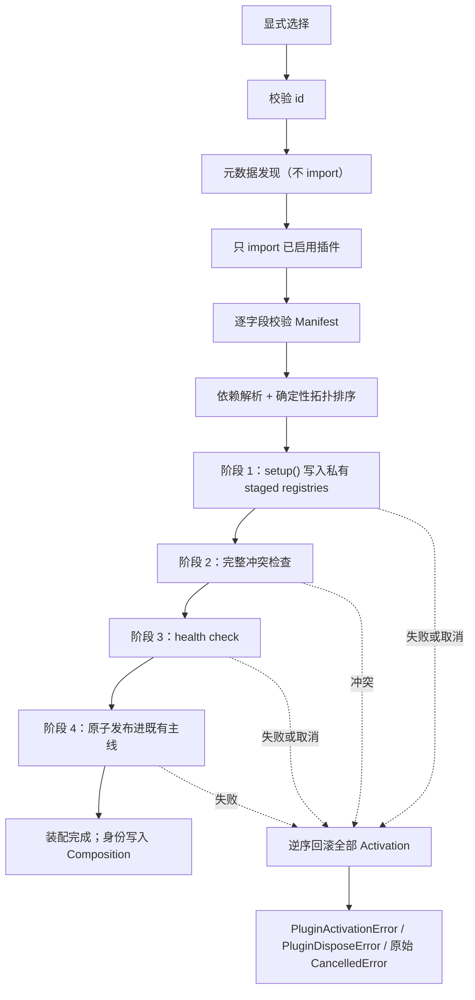

**为什么冲突检查必须早于 health check。** 一个 Tool 与内置 Tool 同名的插件无论 health check 说什么都会被拒绝。先跑 health check 只是给一段已知注定失败的第三方代码额外一次执行、占用时间或访问网络的机会；而冲突完全由 Manager 已经持有的数据判定，先问插件不会得到任何新信息。候选实现的顺序是反的，本轮已修正，并由 `test_conflicting_plugin_health_check_is_never_called` 钉住（反向验证：把顺序换回去，该用例立即失败）。

**为什么 setup 必须写进私有 staged registries。** 一个在 `setup()` 中途失败的插件，此前已经注册过的内容如果直接进了实时注册表，失败的激活就会留下一个任何配置都无法描述的状态。私有暂存使“全部成功之前什么都不可见”成为结构性质。插件之间的同名冲突因此在 setup 阶段就由共享的 staged registry 抛出，表现为后一个插件 `plugin-setup-failed`。

**为什么发布必须原子。** 一个 Step 冻结一份 Composition。若逐个发布，某个 Step 可能由半发布的插件集合组成，而 Composition Snapshot 会描述一个从未连贯存在过的配置。

### 19.5 取消不是失败

候选实现用 `except BaseException` 捕获 `CancelledError` 并重写成 `PluginActivationError`/`plugin-setup-failed`，于是启动期按 Ctrl+C 会被报告成“插件配置有问题”。更糟的是回滚把重复取消当作停止展开的理由，第二次 Ctrl+C 可能让尚未回滚到的 Activation 就此滞留。

现在的语义：

| 取消发生的位置 | 行为 |
|---|---|
| setup 阻塞期间 | 停止继续 setup/health/publish，逆序回滚全部 Activation，重新抛出原始 `CancelledError` |
| health check 阻塞期间 | 同上 |
| publish 期间 | 同上 |
| 回滚期间重复取消 | 被吸收；`Activation.dispose()` 已在重新抛出前收敛，因此记录取消意图并**继续展开其余 Activation** |

当 rollback 全部成功时，调用方拿到原始 `CancelledError`，并且保证：全部 staged 注册已撤销、全部 Owned Task 已取消并等待完成、全部 cleanup 已执行、状态表中**没有**把纯取消记成插件失败。若 rollback cleanup 真失败，取消不能把失败改写成成功收尾：其余 Activation 仍继续逆序回滚，最终以只含仓库固定文案的 `PluginDisposeError` 报告；原始插件异常正文与 traceback 不保留、不显示。收敛复用既有的 [`await_worker_convergence()`](../../src/traceh/concurrency.py)（见 6.6、8.3、13.8）：重复取消是意愿声明，不是逃生出口，也不是遮蔽 cleanup 失败的理由。

真实失败仍然是失败：`test_a_genuine_setup_failure_is_still_reported_as_a_failure` 防止这条修复把真错误变成静默取消。反向验证：去掉专门的 `CancelledError` 分支后，原有 10 项取消测试中有 6 项立即变红，且报出的正是 `PluginActivationError: Plugin setup failed`；本轮新增的第 11 项又证明，恢复“忽略 rollback failure”的旧逻辑时会错误地只抛 `CancelledError`。

### 19.6 依赖与 Manifest

- `requires_plugins` 的目标必须**也被显式启用**，仅安装不够，否则 `required-plugin-missing`。插件不能替运维启用它的依赖；
- `optional_plugins` 缺失是 notice；**已启用但版本不兼容**是失败，不是可以耸肩略过的缺席；
- 依赖环报 `plugin-dependency-cycle`，且此时任何插件的 `setup()` 都还没跑过；
- 两个插件声明同一个 `provides` 能力报 `provides-conflict`；
- 排序用最小堆做拓扑排序，所以同一组插件的 setup 顺序永远相同，复现是真的可复现；
- `traceh.core` 是保留 id，任何外部插件声明它都报 `plugin-id-reserved`；
- Manifest 校验**一次返回全部失败**而不是第一条，作者修一次就能看到全部问题。

### 19.7 Generation 主线、ActivationSet 与仍未实现的用户热更新

Stage A 已把 Generation-backed Composition Runtime 接入两个默认工厂；Stage B 又把 Generation-owned `PluginActivationSet` 接入无插件、启动插件和内部候选替换路径。`PluginGenerationBuilder` 为每次候选创建独立的 Tool、Prompt、Service 注册表视图，`PluginManager` 在这些私有注册表中完成 discovery、依赖排序、Manifest 校验、setup、冲突检查和 health check；成功后只把一次性 Activation 所有权转交给 ActivationSet。`activate()` 成功到 `PluginActivationSet` 构造成功属于同一个事务：receipt 或 Scope 校验在交接构造中失败时，调用方尚未拿到候选，临时 Manager 仍是唯一 cleanup owner，Builder 必须先完整 dispose 它再返回错误。候选构造或 publish 失败都会立即逆序 rollback，current Generation 不变。`AgentLoop` 继续只依赖 `CompositionRuntime.lease()`，不导入 PluginManager、Builder 或 reload service。

一个 Generation 是一组在构造时捕获的不可变运行能力引用：LLM Registry/Provider、Provider 名称、Model、Prompt sections、Tool schemas/ToolRuntime、Plugin Identity、Policy/Middleware 和模型参数一起绑定。Tool 的 name、description、input_schema、effect_kind 会进入真正只读、扁平且幂等的适配器，公开属性没有赋值或删除入口，嵌套 Schema 也被冻结，执行仍委托给捕获的 Tool；Provider、Policy 和 Middleware 的模型可见名称也由冻结适配器捕获，因此 Snapshot 不会重新读取活对象。Generation identity 的一次性发布状态与资源 cleanup ownership 是两件独立的事：Stage A 的 capability-wide `CompositionResourceOwner` 仍由显式装配使用；Stage B 的插件 cleanup 绑定到一次性 ActivationSet，而不是绑定到共享 core 能力。SessionService、EventStore、核心 Provider、内置 Tool 和基础配置是 borrowed core；插件 Activation、插件 Tool、Prompt Section、Service、Owned Task 和 cleanup callback 是 generation-owned。插件 ActivationSet 不能被两个 Generation 或两个 Runtime 接收，也不能被 PluginManager 留作第二个 cleanup owner。

候选插件身份可以随 Generation 变化，但 Generation 的 ToolRuntime 必须使用 Runtime 固定的 `SessionService`；这保证 Session Event Log 仍是唯一事实源。Stage A 没有资源级引用计数，因此能力-wide cleanup-bearing Generation 仍必须使用尚未被其他 Generation 认领的独占 raw 能力。发布在内部 `asyncio.Lock` 的线性化点完成；旧记录进入 retired，新 Lease 只能取得新记录，已有 Lease 保存旧代完整的 Provider、Prompt、ToolRuntime、Policy/Middleware、Service 和 Snapshot。旧代只有在 Lease 归零后才启动一次 ActivationSet cleanup；cleanup 先取消并等待 Owned Task，再按依赖逆序撤销 Service、Tool 和 Prompt 注册。ActivationSet 的 cleanup 失败会以有界、终端安全的结构化摘要报告，但不会跳过其他插件或其他 Generation；Runtime 标记为 poisoned 并拒绝后续 publish。`drain()` 等待所有 retired 记录的 Lease 与 cleanup 都收敛，重复取消只能在同一内部收敛任务完成后重新抛出最初的 `CancelledError`。

binding 的事务边界不是普通 `setattr()`：实现直接操作真实实例字典或类声明的 slot，并在提交后验证读取到的是同一个 binding。这样即使能力对象自定义 `__setattr__` 且静默忽略字段，也不能绕过资源所有权。提交过程保存每个组件的原始属性状态；后续组件失败时，已写入组件会精确恢复为“原本不存在”或“原本存在且值为 `None`”，不会把内部 Registry 破坏成缺少属性的半初始化对象。Runtime 构造同样先从冻结后的初始 Generation 建好兼容性 LLM/Tool/Prompt 视图，再认领 Owner；认领之后没有第二次调用 raw Prompt/Registry 的失败窗口。

Generation identity 只服务内部生命周期，`CompositionSnapshot.revision` 仍是模型可见内容 fingerprint；同内容的不同 Generation 因此可以复用相同 revision，不会把内部编号塞进 Request Fingerprint。`AgentRuntime.dispose()` 的默认顺序是活跃 Turn → Composition Drain（由各代 ActivationSet 负责插件 cleanup）→ 仍属 application-level 的构建器/发现器资源；默认路径没有 PluginManager 的第二个插件 cleanup owner，旧 v0.4 自定义装配才会在 Drain 后清理可选的 legacy PluginManager。

Stage B 提供 `AgentRuntime.replace_plugin_composition()` 这一装配层内部 API；Stage C 又提供 `AgentRuntime.migrate_session_plugin_composition()` / `reload_plugin_composition()`，由 `traceh chat` 的四条 `/plugins` 命令调用，但没有第二套 PluginManager、ToolRuntime 或 Registry。`/plugins reload` 重建当前外部 id；`/plugins use` 需要显式目标 id，身份变化时先写授权事件；`/plugins use --none` 只保留 `traceh.core`。命令只在空闲提示符执行，不创建 Turn。插件 id/version 输出经过受控身份验证；第三方 setup/health/cleanup 异常不直接打印。

D0 不改变上述协议，只重新划清控制面所有权。[`runtime/plugin_composition.py`](../../src/traceh/runtime/plugin_composition.py) 的 `PluginCompositionCoordinator` 现在持有候选替换串行锁、共享 admission/migration Gate、replacement/admission 在途 Task 集合、Session durable identity 校验以及 migration CAS/may-have-committed/fail-closed 流程；[`runtime/agent_runtime.py`](../../src/traceh/runtime/agent_runtime.py) 保留公开方法的薄委托、活跃 Turn 表、最终 Turn admission 线性化点和总关闭 Task。公开门面之间原有的动态分派同样保留：`reload_plugin_composition()` 读取门面的 `enabled_plugin_ids` 并调用门面的 `migrate_session_plugin_composition()`，协调器没有另设 reload 捷径，因此继承、替换或审计公开迁移入口不会被抽取绕过。协调器通过窄回调查询“Runtime 是否关闭”“是否有活跃 Turn”“current Generation 的外部身份”，不保存第二份可变插件身份，也不执行 Turn。`AgentLoop` 完全未修改，继续只依赖 `CompositionRuntime.lease()`。D0 当时是进入 Scope 工作前的结构检查点；D1/D2 的 Service 与 Composition Scope 随后接入 Builder/ActivationSet/Generation，没有把控制面复杂度塞回门面。

当前身份事实由 [`session/plugin_identity.py`](../../src/traceh/session/plugin_identity.py) 共享计算：初始值来自 `session/created.metadata.traceh_plugins`，合法 `composition/snapshot` 更新到实际 Step 身份，合法 `composition/migration-authorized` 要求 `from_plugins` 等于此前身份且 `source_seq` 等于此前身份事实序号，然后更新到 `to_plugins`。迁移事件只记录外部插件，不写 `traceh.core`、Generation identity 或 Request Fingerprint。候选通过 setup/conflict/health 后才追加授权；append 取消会按稳定 `migration_id` 重读判断是否已落盘。若授权已落盘但 publish 失败，Runtime 不伪造成功，也不继续接受旧 Composition，Session 保持 fail-closed。

v0.5.0 仍没有运行中 pip install/uninstall、强制 `importlib.reload()`、文件 watcher、Workspace/Preset/Agent 层的插件 setup、EventStore 插件贡献、isolated 插件、多 Agent、Workflow、MCP、TUI 或模型流式输出。D2 的 Tool/Prompt/Policy 是宿主程序显式装配；D3 新增的 Provider/Policy/Middleware/Verifier 也仍属于 application setup。Python module 可能仍在 `sys.modules` 中，`/plugins reload` 不是从磁盘重新加载修改后的源码。

`trust_mode="isolated"` 被**明确拒绝**而不是降级成 trusted：把“请求隔离”当成“允许进程内运行”的许可，等于给了插件比它申请的更高权限。真正的隔离需要进程边界、每次 context 调用的序列化契约和子进程崩溃的失败模型，这些都还不存在。

### 19.8 dispose 顺序

`AgentRuntime.dispose()` 在与 Turn admission 最终检查共享的 `_lock` 线性化点标记关闭，之后先取消并 `gather` 全部活跃 Turn；再调用 `PluginCompositionCoordinator.shutdown_inflight()`，取消并等待所有在途候选替换/迁移及其 rollback，也等待已进入共享 Gate 但尚未完成注册的 Turn admission；随后才调用 Composition Runtime 的 `dispose()`，退休 current Generation 并 Drain 所有 Generation-owned ActivationSet；最后清理 application-level legacy 资源。协调器会取回每个候选 Task 的终态：正常取消不算关闭失败，但候选 rollback 产生的 `PluginDisposeError` 会进入关闭错误集合，因此 `dispose()` 不能在插件资源可能未清干净时报告成功，后续调用也会重放同一关闭失败。默认 Stage B/C 路径没有 PluginManager 的插件 cleanup owner；只有保留 v0.4 兼容性的自定义 legacy 装配才会在 Drain 后调用可选的 `PluginManager.dispose()`。顺序相反会让 Drain 越过仍在 setup/rollback 的候选，或把某个仍有 Lease 的 Generation 正在使用的 Tool、Service 或 Owned Task 抽走。

整个关闭过程位于唯一的内部 Task 中，因此重复调用复用同一结果、重复取消无法提前放行、关闭失败不会被后续调用伪装成成功；完整语义与它修复的缺陷见 5.5。

单个插件 cleanup 失败不阻止其余 cleanup：失败被收集成 `PluginDisposeError`，`Lifespan.close()` 本身也已保证逐条继续。该错误会通过 `AgentRuntime.dispose()` 传播出来，并在后续每一次 `dispose()` 上再次抛出。

### 19.9 Session 插件身份

`AgentRuntime.create_session()` 把初始外部插件身份写进 `session/created` 的 metadata 保留键 `traceh_plugins`。每个实际 Step 的 `composition/snapshot` 也记录完整 PluginIdentity。

**保留键按“是否出现”判定，不看取值。** 只要调用方的 metadata 里出现 `traceh_plugins` 就抛 `ValueError`，无论它是 `[]`、`None`，还是与当前插件身份**完全相同**的列表。早期实现只在取值与预期不同时才拒绝，于是这三种写法都能通过——而这个键记录的是运行时**自己观测到什么**，任何调用方能写进去的值都是一个 Runtime 无法背书的断言。调用方提供的其余 metadata 键照常原样保存。

`verify_session_plugins()` 在 `run_existing()`、`resume()` 和 `chat` 继续旧 Session 时执行，且**早于 recovery**——recovery 会追加事件，向一个用不同 Composition 创建的 Session 追加事件正是要防的事。身份解析集中在 [`session/plugin_identity.py`](../../src/traceh/session/plugin_identity.py)：按 seq 顺序读取 `session/created.metadata.traceh_plugins`、合法 `composition/snapshot` 与合法 `composition/migration-authorized`。迁移授权要求 `from_plugins` 等于此前有效身份、`source_seq` 等于此前身份事实序号，才把有效身份更新为 `to_plugins`。如果 Session 已有最新合法 `composition/snapshot` 的 `plugins` 字段，校验优先使用实际 Step 身份；没有 Snapshot，或是 v0.3 缺少该字段的旧数据，才回退到创建 metadata（随后合法迁移事件仍可显式更新授权身份）。不匹配抛 `SessionPluginMismatchError`，消息同时列出 Session 要求的与当前运行的两组身份，且**保留 Session 当时记录的原始版本文本**而不是改写过的形式。Stage B 的内部替换仍不会自动授权；Stage C 只有用户明确执行 `/plugins use` 才追加本 Session 的 migration authorization，不会自动迁移其他 Session。内部 publish 本身不追加事件；如果只是内部 publish 且新 Generation 尚未执行 Step，进程崩溃后仍可回到最后一条 durable Snapshot。

**缺键与显式 `null` 必须区分，读取端用缺失 sentinel 而不是 `get()`。** `dict.get()` 对“键不存在”和“键被显式记为 `null`”返回同一个 `None`，这是两个不同的事实：键真正缺席的是 v0.4 之前写下的无插件 Session；显式记录的 `null` 不是本 Runtime 任何版本会写下的值，属于损坏数据，必须报 `malformed` 而不是当“无插件”放行。这个 sentinel 现在由共享的 `plugin_identity.py` 持有，Runtime、迁移和不变量检查不各自复制解析规则。

**版本按 PEP 440 语义比较，用的是 `Version` 对象而不是字符串。** 这一条必须写准，因为直觉上的写法是错的：`str(Version("1.0"))` 是 `"1.0"`，`str(Version("1.0.0"))` 是 `"1.0.0"`，所以“先 `Version()` 解析再 `str()` 规范化然后比字符串”**并不会**把两个 PEP 440 等价版本判成相同——早期实现正是这样，于是 `1.0` 与 `1.0.0` 之间会被误判为组合变化并拒绝继续 Session。现在由共享 identity helper 生成 `(plugin_id, Version)` 键：`Version("1.0") == Version("1.0.0")` 为真，而 `Version("1.0") == Version("1.0.1")` 仍为假，因此真正的版本变化照旧被拒绝。无法解析的版本仍然报 `malformed`，等价性没有变成宽容；migration event 的 `from/to/source_seq` 也使用这套对象比较，不能用 `str()` 把坏值修成合法身份。

v0.4 之前写下的 Session 没有这个键，等价于“无插件”，可以正常继续。

`traceh chat` 打印的恢复命令按 Session 最新 durable 插件身份生成，而不是盲目读取当前 Runtime Generation；因此授权已落盘但 publish 失败时，提示仍会带上已授权的目标 `--plugin`，不会给出必然被拒绝的旧组合。若 durable 身份本身无法安全读取，则只打印转义后的定位信息，不打印可能误导的命令。迁移 API 在候选构建前后都会投影 Session 的持久化 Turn/Step 生命周期；存在未闭合 Turn 或 Step 时直接拒绝，不追加授权。

### 19.10 CLI 输出安全

`list`/`inspect`/`doctor` 打印的每一个插件字符串都来自第三方 Distribution 元数据，因此全部经过 `escape_for_display()`（与 13.8 的恢复命令、13.6 的 Timeline 共用同一套规则）：严格一行、无控制字符、有长度上限。`validate` 只打印宿主固定状态和转义后的报告/产物路径；候选 stdout/stderr 不进入终端或报告，报告中的身份也先通过静态格式合同。`traceh chat` 的 `/plugins` 只显示经过 Manifest/PEP 440 验证的 `plugin_id==version`，而 `/plugins use`、`reload` 的失败出口只显示仓库固定的一行摘要，不回显无效 id、插件异常正文、路径或配置值；通用未知命令也只显示固定的 `unknown command (try /help)`，不回显整条用户输入。`_safe()` 递归处理整个结构而不是几个预期字段，因此不存在“某个字段忘了清洗”。

`doctor` 使用一次性 `ToolRegistry` 与 `PromptAssembler`，因此它激活的任何东西都到不了真实 Runtime；无论激活成功与否都在 `finally` 中 dispose。插件自身的异常文本从不外泄——所有 message 都由本仓库编写，失败只用固定 `code` 区分。

### 19.11 外部插件发行验收

[`examples/plugins/traceh-example-skill-plugin/`](../../examples/plugins/traceh-example-skill-plugin/) 是一个**可独立构建安装**的 Distribution，不是仓库内的测试夹具。它有自己的 `pyproject.toml`、`traceh.plugins` Entry Point、`PluginManifest`、一个 `PromptSection`、一个 `PURE_READ` 无副作用 Tool，以及一份打包进 Wheel 的 `SKILL.md` 资源（通过 `importlib.resources` 读取）。

它明确**不**扫描用户的 Codex/Claude 目录、不读环境变量、不访问网络，也**不**因为被安装就成为默认能力。

[`examples/plugins/traceh-python-quality-plugin/`](../../examples/plugins/traceh-python-quality-plugin/) 是 v0.5.0 的真实用途插件，同样拥有独立 `pyproject.toml`、Distribution 与 Entry Point。它只从公共 `traceh.plugins` SDK 导入能力：`python_project_info` 读取固定 Workspace 根文件并输出结构化项目事实；Prompt 要求先取证再修改；`python-environment-safety` 只做单调 Deny，拒绝 `pip uninstall` 及 `--user`/`--prefix`/`--root`/`--target` 这类逃离当前环境的安装；命名 Verifier `python-tests` 只有操作员显式选择才运行。

Verifier 的解析顺序是“项目明确的 `[tool.traceh-python-quality].test-command` 数组 → 已声明的 pytest 配置 → 明确失败”，不从目录名、测试文件名或某个 Demo 猜框架。命令数组经现有 `CommandVerifier` 的 `create_subprocess_exec`、超时和取消收敛主线执行，不开 `shell=True`；工具不回显显式命令。插件不读用户目录、环境变量或网络，固定根文件也必须 resolve 后仍位于 Workspace 内。Policy 仍只是 Guardrail，不是沙箱。

[`examples/plugins/traceh-plugin-creator-skill-plugin/`](../../examples/plugins/traceh-plugin-creator-skill-plugin/) 是 v0.6 发布的 L1 候选编写技能。它同样是真实独立 Distribution，通过 `traceh.plugin.creator` 显式启用，只注册一段短 Prompt 和 `traceh_plugin_creator_guide` 这个 `PURE_READ` Tool。workflow、v0.6 SDK contract、package template、static checklist 四份 Markdown 用 `importlib.resources` 从 Wheel 读取；模型仍通过现有 `apply_patch` 等 Workspace Tool 写文件，因此 Event/Effect、Workspace confinement 与 Generation Snapshot 没有第二条路径。技能要求当前目录是 TraceHarness 核心仓库之外的专用 Candidate Workspace，身份与权限必须显式确认，并把结果标为 `UNVALIDATED (L1 SOURCE ONLY)`；L1 不构建、不导入、不运行测试、不安装、不启用、不 commit/push 候选。该限制不是沙箱，记录在 [ADR-0015](../adr/0015-source-only-plugin-candidate-authoring-skill.md)。

只读边界有反向验证：临时把指南 Tool 错标成 `WORKSPACE_READ` 时，独立插件契约测试稳定失败于 EffectKind 断言；恢复 `PURE_READ` 后 10 项重新全绿。该插件没有 owned task、cleanup 或外部副作用，因此本轮不为不存在的生命周期编造取消测试。

#### 19.11.1 L2：候选验证是独立开发控制面

[`evolution/candidate_validation.py`](../../src/traceh/evolution/candidate_validation.py) 接过 L1 明确没有做的“证明”步骤，但没有进入 Runtime 装配。`traceh plugins validate` 要求调用方显式给出 Candidate Workspace、可信 TraceHarness Git 仓库、尚不存在的输出目录，以及 `--allow-index` 或 `--wheelhouse` 之一；三条目录必须互不包含。候选 build/runtime 依赖和额外测试依赖都拒绝 `name @ URL/file` 直接引用，不能绕过所选依赖源。候选复制会按大小写无关规则拒绝符号链接、Windows Junction/其他 reparse point 和 `.env`，排除 VCS、缓存、旧 build/dist、egg-info、Wheel 与 Session 数据，并应用文件数和字节预算。身份来自 `pyproject.toml` 的 Distribution、版本和 `traceh.plugins` Entry Point；有多个 id 时必须 `--plugin-id` 点名，不从文件名或示例猜默认。

可信 evaluator 不是当前脏工作区，也不是运行这条命令的 CLI 版本，而是显式核心仓库的 detached `HEAD` clone：宿主静态解析该 clone 的唯一字面量 `__version__`，候选依赖必须接受这个版本。核心与候选各自建 Wheel；候选 Wheel 再拒绝不安全路径、加密或符号链接成员、`.pyc`/缓存、`.pth`、`sitecustomize.py`/`usercustomize.py`、Entry Point 顶层包之外的模块，以及标准库、`traceh`、`pytest` 等宿主核心/验证控制命名空间。候选合同环境和核心回归环境是两套 venv，且在执行任何候选代码之前均已从同一审计字节完成安装；二者显式移除宿主 `PYTHONPATH`、关闭第三方 pytest 自动加载：前者用宿主复制的 `contract_probe.py` 经公共 `PluginDiscovery` 对照安装元数据，调用现有 `plugins doctor`，并用宿主 pytest 配置收集和运行候选测试；后者安装候选但不启用，只运行可信 clone 自带的完整核心测试。候选自己的 pytest `addopts`、报告与 stdout/stderr 都不能充当宿主证据。

门禁固定为 13 步：源码合同、可信 HEAD、核心 Wheel、候选 Wheel、Wheel 审计、候选环境安装、installed metadata、doctor、候选测试收集、候选测试、回归环境安装、完整核心回归、验证产物发布。初审会把受预算约束的 Wheel 字节与 SHA-256 锚定在宿主进程内存；候选执行结束后，第 13 步重新审计构建文件和安装用快照并核对初始摘要，再只从锚定字节生成产物。Wheel、`report.json`、`report.md` 和可选诊断先写入输出目录的同盘兄弟暂存目录，全部成功后才以一次目录 rename 对外可见；普通门禁失败得到完整无 Wheel 报告，报告写入/最终提交失败则目标输出目录保持不存在。报告只有宿主编写的稳定 code、有界中文摘要和耗时；候选输出不落报告，只有可信核心回归失败时可以另存一份 32 KiB 尾部诊断。

取消沿用现有直接子进程收敛原语：terminate、有界等待、kill、确认退出，重复取消不能提前返回。但 venv 不是 OS 沙箱：build、import、doctor 和测试仍以当前用户权限运行，也只管理直接子进程；`--allow-index` 还允许解析依赖时访问网络。因此本地 L2 只适合受信任的自有候选，不可信源码要放进容器或远程 Sandbox。L2 也不比较能力好坏、不批准或安装插件；精确报告与哈希 Wheel 是 L3/L4 的输入。完整决策见 [ADR-0016](../adr/0016-independent-plugin-candidate-validation.md)。

#### 19.11.2 L3：宿主固定 baseline/candidate 对比

[`evolution/candidate_comparison.py`](../../src/traceh/evolution/candidate_comparison.py) 只消费成功的 L2 schema-v1 证据：13 个 canonical Gate 必须逐项通过，核心提交、插件身份和 `artifacts/` 下的 Wheel 文件名/大小/SHA-256 必须完整。它先重新审计 Wheel，再从显式核心仓库克隆报告记录的精确提交；Suite 必须是该提交内的相对路径，调用方不能从候选目录另塞 evaluator。候选不会重新构建。

Comparator 先对核心 Wheel、L2 候选 Wheel 与显式测试依赖执行一次 `pip download --only-binary=:all:`，把完整依赖闭包冻结为带文件名/大小/SHA-256 的本地 Wheel 集；baseline 与 candidate 再各建一套临时 venv，只能从这组 Wheel 离线安装。宿主直接读取两边 `site-packages/*.dist-info/METADATA` 建立 Distribution receipt，安装后必须相同，候选执行后还要再次核对两份 receipt 与全部 Wheel 摘要。传给 Probe 的 `PIP_NO_INDEX=1` 与 `PIP_FIND_LINKS=<canonical-file-uri>` 会穿过统一子进程环境清洗：后者必须是一个已存在本地目录的规范化、百分号编码 `file://` URI，不能含空白、远端 host、query 或 fragment。这样含空格的临时目录不会被 pip 拆成多个位置，原始路径与“本地值 + 远端 URL”的复合输入也不会被放行；Tool 或 Verifier 内的嵌套 pip 因此只能读取这一份冻结 Wheel 集。

只有 candidate arm 启用目标 plugin id。宿主复制的 [`comparison_probe.py`](../../src/traceh/evolution/comparison_probe.py) 使用真实 `build_default_runtime_async()`、Scripted Provider、AgentLoop、Session Event Log、Effect ledger 和 Verifier，按固定期望收集 Case 结果、Step/model/tool 计数、非成功 Tool Result、验证结果、不变量、请求重建和耗时。`completed=True` 只表示 Runtime 调用正常返回，不再自动等于证据完整：Probe 必须从匹配的持久化 `turn/end` 读取 reason，确认 Turn/Step 均已关闭、持久化 Step 数与返回值一致，并检查该 Turn 的每个 `composition/snapshot` 确实是 baseline 空插件或 candidate 的精确 L2 插件身份；缺失闭环成为 `event-evidence-incomplete`，身份不符成为 `arm-plugin-identity-mismatch`。候选代码运行后，宿主还会再次核对原 L2 报告字节、Wheel 摘要/审计结果以及两份 Suite 副本摘要。

报告只分类 `improved`、`regressed`、`mixed`、`no-change`，并以同盘暂存目录 + rename 原子提交 JSON/Markdown；不存在 `approved` 或 `promoted` 字段。首个 [`python_quality_v1`](../../benchmarks/evolution/python_quality_v1/) Suite 含 3 个确定性合同案例：一项能力差异、一项普通 Python 修复不得回归、一项失败 Verifier 必须如实失败。真实 CLI 验收得到 baseline `2/3`、candidate `3/3`、`improved`、0 regressions，双方不变量与请求重建违规均为 0。这不是通用 Coding/真实模型 Benchmark；venv 仍不是 OS 沙箱，L4 才能人工批准、晋升精确摘要并保留 rollback。完整决定见 [ADR-0017](../adr/0017-host-owned-baseline-candidate-comparison.md)。

#### 19.11.3 L4：人工批准、精确推广与确定性回滚

[`evolution/candidate_promotion.py`](../../src/traceh/evolution/candidate_promotion.py) 是 L4 唯一的审批/包管理控制面。`plugins promote` 第一次调用只重新解析成功 L2/L3、重审 Wheel 自身的 Distribution/版本/Entry Point 元数据，并用目标 Python 的 `importlib.metadata` 读取解释器、核心、全部 Distribution 与候选内容 receipt；它写出中文卡片和 SHA-256，不 import 候选、不创建 Registry、不运行 pip。L3 不是只看 `classification` 和 Case id：共享 parser 必须重建每个 Case 的 baseline/candidate 结果与 failure code、重新汇总两臂统计、推导 outcome/improvement/regression/classification，校验固定 11 道 Gate 顺序，并确认非空冻结 Wheel 集同时包含精确候选与可信核心且都出现在安装 receipt。骨架 JSON 不能签发摘要。只有 `improved`、至少一项 improvement、零 regression 才能继续；人工审批不是跳过失败规则的后门。

摘要的 canonical JSON 绑定 L2/L3 报告完整字节摘要、精确 Wheel 与插件身份、Registry 绝对路径、目标 Python 路径/实现/版本/prefix、Distribution 名称/版本 receipt、安装包内容摘要、规范包所有者、当前托管推广以及 improvement/regression 列表。Review 输出与 Registry 都必须位于目标 prefix 外，审阅本身不会因为路径选择而写进目标环境。Apply 必须带回 64 位小写摘要；跨进程锁内再次读完上述事实，任何目标漂移、Registry 变化或证据改写都会得到 stale/mismatch，而不是继续安装。首次推广若发现同名 Distribution 已安装但不归 Registry 管理，会拒绝接管；当前已经是同一精确 Artifact 也拒绝制造空洞的新版本链。

L4 v1 刻意不做依赖升级：目标的核心版本与除候选以外的完整 Distribution 名称/版本 receipt 必须和 L3 一致。Registry 先以 SHA-256 目录保存 L2 原始 Wheel、不可变 promotion record，再把状态写成 `installing`；随后只执行 `pip install --no-index --no-deps --no-compile --force-reinstall <exact-wheel>`。安装后完整 receipt 必须等于 L3，候选 Distribution/版本/Entry Point 与有界内容摘要必须和批准一致；探针还会对目标 `purelib`/`platlib` 下除可再生 `__pycache__` 外的全部普通文件做有界逐字节摘要，拒绝符号链接/Junction。公共 `plugins doctor` 前后这份安装包内容 receipt 必须完全相同，所以别的 Distribution 被同版本改写、候选目录新增未列入 `RECORD` 的文件也会触发回滚；这不是目标 venv 之外文件的全盘证明。目标探针用 `-I -S` 禁止候选 `.pth`/startup hook；由于 `-S` 也跳过 venv 前缀初始化，配置层保留用户明确选择的解释器路径（POSIX 不追随 `bin/python` 的最终符号链接），子进程再从相邻 `pyvenv.cfg` 恢复 venv root，并把它作为 `base/platbase` 交给 `sysconfig` 后只读该环境 metadata。它不能误读 base Python，也不 import 候选；doctor 才是批准后的显式 import 边界。

目标环境旁的固定宿主协调目录只按规范目标 prefix 映射一份全局 Owner 记录和 OS advisory lock，不依赖进程的 `TEMP`、caller 选择的 Registry、解释器别名、plugin id 或 Distribution。L4 v1 因为每条 Distribution 状态都保存完整目标环境 receipt，刻意只允许同一目标环境存在一条受管 Distribution 链；另一 Distribution 在当前链完整回滚到未安装、释放 Owner 之前会以稳定 code 拒绝，不能同时写出第二份彼此冲突的完整环境事实。Registry 内仍按“目标 + Distribution”保存这条活动链的精确 Wheel、记录、状态与 receipt；未被全局 Owner 指向的历史目录不拥有目标环境。状态/记录/receipt 在 fsync 后原子替换，路径保持浅层以避免 Windows 长路径。普通安装、doctor 或推广报告失败会启动共享 rollback Task：上一代存在就从 Registry 的精确 Wheel 重装，不存在就卸载本次 Distribution；等待期间重复取消不会让调用方先走，完成后才重抛原取消。`plugins rollback --distribution ... --current-promotion-id ...` 同样先核对包所有者与稳定 receipt；若硬崩溃留下 `installing` 或 `rollbacking`，显式 ID 必须指向未完成动作的 source，随后才能继续恢复。首次推广若恰好死在 Owner/不可变记录已经落盘、首个 `installing` 状态尚未落盘的窗口，显式 rollback 只在记录确为首版且目标仍未安装时重建该前状态；任何相反证据都 fail-closed。首版回滚到未安装状态后释放全局 Owner，此后该环境才可移交给另一 Distribution；无法恢复时保留非稳定状态并 fail-closed，绝不把半完成目标写成稳定。

Registry 是推广事实源，命令输出目录是原子镜像，不进入 Session/Event Log。L4 没有修改 AgentLoop、AgentRuntime、PluginManager、Generation 或运行中的插件选择；推广成功只改变显式 Python 环境，新的 Runtime 仍需操作员显式 `--plugin`。同权限外部进程可绕过 Registry 直接改环境，venv 也不是 OS 沙箱或包签名系统；这属于已声明信任边界。完整决定见 [ADR-0018](../adr/0018-human-approved-exact-plugin-promotion.md)。

### 19.12 `OwnedTaskSet` 是生命周期所有权，不是监督器

插件通过 `PluginContext.spawn_owned()` 创建的后台任务归 [`kernel/tasks.py`](../../src/traceh/kernel/tasks.py) 的 `OwnedTaskSet` 所有。必须准确描述它**拥有什么**：

| 它保证 | 它不做 |
|---|---|
| 关闭时取消并等待全部 owned task 收敛 | 重启失败的任务 |
| 取回每个任务的结果或异常，不留给 GC | 把后台任务失败升级为 Runtime 故障 |
| —— | **保留**异常对象。取回之后立刻丢弃，不建立任何异常列表 |

**为什么“取回异常”需要一个明确的所有者。** 一个在关闭之前就抛异常的任务会自行完成，done callback 把它从集合中移除——于是 `cancel_and_wait()` 永远看不到它，也永远不会取回它的异常。asyncio 随后会在垃圾回收时报 `Task exception was never retrieved`：时机与真正的原因无关，也不归属于任何组件。因此 done callback（`_retire()`）在任务完成的那一刻调用一次 `task.exception()`：被取消的任务直接跳过（取消是预期的关闭结果，而且此时 `task.exception()` 本身会抛 `CancelledError`），正常完成和真正失败的都只到“取回”为止。

**为什么取回之后不留存。** 早期版本把每个失败对象追加进一个 `failures` 列表供“查询”，但该列表**没有任何主线消费者**——它是一份无界、永久增长、永远不会被读的记录。而每个异常对象都持有 traceback，traceback 又持有每一帧的局部变量：为无人读的数据保留不受信任的插件状态，既是内存泄漏，也是一道泄漏面。真正的可观测性必须从“有消费者”开始；在 v0.4 拥有消费者之前，所有权止步于取回。测试明确钉住这一点：所有者身上没有 `failures` 属性，一百次失败后所有者状态不增长。

**为什么不升级成 Runtime 故障。** 把插件的后台任务崩溃翻译成“Runtime 失败”是一个 v0.4 尚未做出的策略决定：它会改变“运行时失败了”这句话的含义，也需要定义重启、退避和上报规则。本轮刻意只做所有权，并在此写明边界，而不是顺手发明一个未经授权的监督器。

### 19.13 D1：四层 Service Scope 主线

D1 没有另造一套“Scoped Runtime”。[`kernel/registry.py`](../../src/traceh/kernel/registry.py) 的 `ServiceRegistry` 仍是 Service 注册唯一主线，只是每层 Registry 现在可以只读穿透一个 parent；[`kernel/scope.py`](../../src/traceh/kernel/scope.py) 用固定的 `ScopeKind` 把它们装成 Application → Workspace → Preset → Agent。默认同步/异步 Runtime 工厂接收显式 `ScopedServiceBinding`，`PluginGenerationBuilder` 为每个候选复制 application Registry，再重新构造后三层。候选 `PluginActivationSet` 持有这一整条 ScopeChain，Generation 构造时捕获其 effective Agent Scope 与 `ServiceView`，Step Lease 随 Provider/Tool/Prompt 一起返回同一代的 Service 视图。公开 `PluginManager.prepare_activation_set()` 会把来源链的 Workspace/Preset/Agent binding blueprint 交给 Builder，不会把既有 child Scope 静默丢掉。application 插件的 Service 会晚于 child binding 发布，所以 Manager 在 Activation 真正生效前重新校验 child override；Workspace/Preset/Agent 不能利用时间差绕过 `replace=True` 或 API Major 检查，失败仍走事务回滚并保留稳定冲突 code 与责任插件身份。

解析规则是协议而不是惯例：同层第二次绑定若未传 `replace=True`，得到 `service-already-bound`；显式传入 `replace=True` 才替换同层旧值。较近层覆盖祖先也必须传 `replace=True`，否则得到 `service-override-requires-replace`；字符串 `"false"`、整数 `1` 或其他 truthy 值都不是覆盖授权，`replace` 必须是严格的 `bool`。显式覆盖若只找到同名但不同 API Major 的能力，得到 `service-override-api-major-mismatch`。插件发布冲突保留同一稳定 code 与责任 `plugin_id`，不会降级成无身份的通用 `plugin-publish-failed`。错误对象同时保留 `code`、目标 key、当前 scope 与既有 scope，调用者不需要匹配整段英文。不同 API Major 在没有声称“替换”时可以并存。`ServiceKey.api_major` 必须是正整数，布尔值不算整数。

装配按固定层级排序，而不是相信调用者传入 binding 的顺序；因此把 Agent binding 写在 Application binding 前面也不能绕过覆盖检查。`ScopeChain.build()` 先在隔离 fork 上预检完整四层，全部成功后才把 Application binding 写进调用方 Registry；后续层失败不会留下“幽灵”Application 值。构造完成后四个 Scope 会封印，公开 `ServiceView` 只有 `resolve/get/require/snapshot`，没有 `provide()`；`AgentRuntime.services` 与 `ActiveComposition.services` 都返回该只读视图，`AgentRuntime.scope` 与 `ActiveComposition.scope` 指向 current/leased Generation 捕获的 Scope。插件内部仍通过 application Registry 的受控 Registration 写入，旧代的 Registration 只有在最后一个旧 Lease 退出后才撤销，所以新 Generation 切换不会原地改写旧 Step 的 Service 视图。

D1 的 Scope 能力是 ActivationSet 的可选扩展，不会反向收窄 D0 的 ownership/cleanup 协议：满足原有 claim/dispose 合同但没有 `scope`/`services` 属性的自定义 ActivationSet 仍可装配，其 Generation/Lease 的 Scope 视图为 `None`；如果自定义对象选择提供 D1 Scope，则 `scope` 与 `services` 必须成对出现并属于同一条链。默认 `PluginActivationSet` 始终提供完整四层视图。

层级方向同样受约束：application 插件 setup 可以读取 application Service，但不能反向读取 workspace/preset/agent 覆盖；最终 Runtime/Step 从 agent 层向上查找。两个 Runtime 用不同 agent binding 时不会共享局部 Registry。`ScopedServiceBinding.value` 当前是由装配调用者持有生命周期的借用能力，Scope 只解析、不自动 dispose；插件通过 Registration 提供的 application Service 才随 ActivationSet/Generation 清理。这里没有把 `PluginManifest.allowed_scopes` 解锁：插件仍按 v0.4 规则只允许 application setup。Service 不直接进入模型请求，所以 Scope identity 不写进 `CompositionSnapshot.revision` 或 Request Fingerprint；D2 真正影响模型可见内容的 Overlay 继续走现有 Generation/Snapshot 主线，见下一节。

### 19.14 D2：Tool、Prompt 与 Policy 的四层程序化 Overlay

D2 沿用 D1 的固定顺序，但没有复制一套“Scoped ToolRuntime”。[`kernel/composition_overlays.py`](../../src/traceh/kernel/composition_overlays.py) 接收 `ScopedToolBinding`、`ScopedPromptBinding` 与 `ScopedPolicyBinding`，先在私有 fork 上按 Application → Workspace → Preset → Agent 排序解析，再产出既有 `ToolRegistry`、`PromptAssembler` 和 Policy tuple。默认同步/异步工厂把这些显式 binding 交给 `PluginGenerationBuilder`；空插件、启动插件和后续 `/plugins` 候选替换都使用同一份不可变 blueprint。解析结果进入 `PluginActivationSet`，随后由既有 `CompositionGeneration` 冻结 Tool schema、Prompt、Policy 名称并生成 Snapshot revision。`AgentLoop`、RequestBuilder、Event Log 与 Replay 没有第二条路径。

Tool、Prompt、Policy 都以稳定名字作为覆盖身份。相同 scope 的第二次绑定若没有 `replace=True`，分别得到 `tool-already-bound`、`prompt-already-bound`、`policy-already-bound`；较近层覆盖祖先而未授权时得到对应的 `*-override-requires-replace`。`replace` 必须是真正的 `bool`，字符串、数字和 `None` 都不能冒充授权。解析按 scope 排序而不信任输入顺序，且只修改 fork；即使 Policy 冲突发生在 Tool/Prompt 已完成候选替换之后，调用方原来的 Registry 与 Prompt 也保持不变。`PromptAssembler.register(..., replace=True)` 的 Registration 会在逆序清理时恢复旧 Section，与 ToolRegistry 的可逆替换语义一致。

插件 Tool/Prompt 仍由 application setup 贡献，因此有一个晚到祖先问题：初次解析 child Overlay 时插件内容尚不存在。Manager 会把 staged application Tool/Prompt 投影到私有候选，**在 health check 之前**再次解析 child Overlay；隐式覆盖因此以稳定 code 和责任 `plugin_id` 失败并回滚，第三方 health 不会获得一次本来就不该发生的执行机会。全部插件真实发布后再解析一次，最终 Tool/Prompt/Policy 三者一起转移到 ActivationSet。后续插件组合替换继续使用 Builder 保存的 child blueprint；协调器构造候选 ToolRuntime 时必须使用 ActivationSet 的 Policy tuple，CompositionGeneration 按长度、顺序和逐项 `is` 对象身份校验二者一致，绝不调用可由第三方重载的 `__eq__`。因此名称相同但 admission 行为不同的 Policy 不能伪装成同一候选能力。

D2 只增加宿主装配能力；D3 才在下一层正式扩宽 `PluginContext`，见下一节。Binding 中的程序化 Tool/Policy 是借用能力，其生命周期仍由装配调用者持有；application 插件资源由对应 ActivationSet 清理。两个 Runtime 可以装配不同的 Agent Tool/Prompt/Policy，真实 Tool admission 与 Request Snapshot 会反映各自结果；Stage C 的 `ProcessAgentSupervisor` 能在一个进程内管理多个 Agent，但它通过窄执行协议使用 Runtime，并不改变这里的四层装配边界，插件仍只能在 application 层 setup。

### 19.15 D3：Provider、Policy、Middleware 与 Verifier 插件贡献

D3 没有给四类能力另建“插件 Runtime”。`PluginContext.register_provider()` 写入候选 `LlmRegistry`，`register_policy()` 与 `register_middleware()` 进入候选 ToolRuntime，`register_verifier(name, verifier)` 写入命名候选；这些 Registration 都归当前 Activation，setup、conflict、health、publish、rollback、最后 Lease cleanup 继续使用同一事务。**setup 是唯一允许改变候选 Composition 的阶段**：全部插件 setup 完成后，Manager 会先关闭每个 Context 的 Provider/Policy/Middleware/Verifier/Tool/Prompt/Service 注册入口，再做冲突检查和 health。health 仍可读取配置与 Service，并可登记 cleanup/Owned Task，但不能补注册执行能力；尝试晚注册会成为有界的 `plugin-health-check-failed` 并走同一回滚，不可能绕过 pre-health 检查。关掉方法本身还不够：Tool、Provider、Policy、Middleware 的名称会在注册时单独捕获，冲突检查、Overlay 归因和选择判断只读这份事务事实；setup 后、每次 health 返回后及带 `await` 的 Service 发布结束后都会校验原对象名称仍一致。任何漂移都以 `plugin-contribution-identity-changed` 拒绝并逆序回滚；Tool/LLM Registration 撤销同样使用注册时键，不会因对象改名清错槽位。`prepare_activation_set()` 是公开的异步交接边界，返回后调用方可能在构造 Generation 前再次 `await`；因此 ActivationSet 在 transfer 时保存不可变 capability receipt，Generation claim 前重新核对候选 Registry 容器、成员对象、固定名称、Prompt、Policy/Middleware、Verifier 与插件身份。交接不是在 `activate()` 返回时完成，而是在 ActivationSet 构造成功后才完成；如果 receipt 自身发现 Registry key 与活对象身份已经分裂，Builder 会 dispose 尚未转移所有权的临时 Manager，取消并等待 Owned Task、逆序 cleanup 每个 Activation，然后重新抛出原始交接错误。清理期间的重复取消不会让调用方提前返回；清理也失败时，两份错误通过 `BaseExceptionGroup` 构造器一起保留：成员全是普通 `Exception` 时 Python 自动派生为 `ExceptionGroup`，而 `KeyboardInterrupt`、`SystemExit` 等直接 `BaseException` 仍能留在 `BaseExceptionGroup` 中，不会被新的分组 `TypeError` 遮蔽。Generation 复核失败则由已经拿到 ActivationSet 的调用方按既有候选 cleanup 协议负责。Tool schema 与 ToolRuntime 查找键都以已经登记的 Registry key 为准，不能出现 Snapshot 宣称新名字而执行表仍只认旧名字。Provider/Policy/Middleware 名字必须满足通用能力名规则，实现必须提供相应的 `complete()`、`check()`、`invoke()`；Verifier 由注册时的显式名字标识并要求 `verify()`。它们不能隐式覆盖宿主同名能力：Provider、Policy、Middleware 分别用 `provider-publish-conflict`、`policy-publish-conflict`、`middleware-publish-conflict` 在 health 前拒绝；同一候选内部的重复注册则在 setup 阶段按既有事务失败并回滚。插件 Policy 与 child Overlay 冲突时也保留稳定 code 和责任 `plugin_id`。

“注册了”不等于“自动接管”。有效 Provider 仍由 `RuntimeConfig.provider` / CLI `--provider` 明确选择；自定义名字只有在同时显式启用至少一个插件时才被 CLI 接受，并且必须明确提供 Model。Verifier 同样由 `verifier_name` / `--plugin-verifier` / `TRACEH_PLUGIN_VERIFIER` 选择；没有选择时，插件 Verifier 不运行，现有直接 Verifier 或 `--verify-command` 语义不变。命名插件 Verifier 与命令 Verifier 互斥，缺失显式目标分别得到 `provider-not-provided` 或 `verifier-not-provided`，并在 health 前回滚，而不是从“唯一看起来像候选”的对象猜默认值。

`PluginActivationSet` 现在随 Tool/Prompt/Service/Policy 一起持有候选 LLM Registry、Middleware tuple 与有效 Verifier。`CompositionGeneration` 对选中 Provider、Policy、Middleware 和 Verifier 都做对象身份守卫；ToolRuntime 不能换成名称相同、行为不同的对象。若 ActivationSet 显式提供 LLM Registry，所选 Provider 必须存在于该 Registry，且必须与 Runtime 使用的对象逐项 `is` 相同；“候选里没有，但另一个 Registry 里恰好有同名 Provider”不是回退条件。为保持 D0 的自定义 ActivationSet 替换合同，只有完全没有 `llms` 属性（或明确为 `None`）的旧式对象，协调器才借用自身已有核心 Registry；显式提供 D3 Registry 的候选绝不会走这个兼容分支。`ActiveComposition` 把 Verifier 带进 Step Lease，AgentLoop 的验证阶段已移动到 `async with compositions.lease(...)` 内：模型响应、ToolRuntime 和验证器由同一个 Generation 冻结。发布新 Generation 时，正在验证的旧 Step 仍用旧 Verifier，旧插件 Activation 要等该 Lease 退出后才 cleanup。Snapshot 已记录 Provider、Policy/Middleware 名称和插件身份；Verifier 不影响发给模型的 Request，因此不新增 Request Fingerprint 字段，其真实结果仍由 `verification/result` 持久化。

EventStore 刻意没有加入 `PluginContext`。它是 SessionService、Recovery、Inspector 和所有事件写入共同借用的**进程级事实源**，而当前插件 ActivationSet 会随 Step Generation retire。若让 `/plugins` 切换卸载 Store 插件，旧 Session 会继续握着已经被 cleanup 的账本实现，或者同一 Runtime 出现两本账。真正开放前必须先设计独立于 Generation 的 process-lifetime/pinned Activation 所有权、Store 构造与关闭顺序、旧 Session 兼容和合同测试；当前仍只能在 Runtime 构造时直接注入 EventStore。这个收窄记录在 [ADR-0014](../adr/0014-generation-scoped-plugin-execution-capabilities.md)。

## 20. 多 Agent 控制面（Stage A 身份 + Stage B Inbox + Stage C 执行 + Stage D 生命周期 + Stage E 模型 Tool）

Stage A（身份）的设计决定见 [ADR-0019](../adr/0019-durable-agent-identity-and-activation-boundary.md)，Stage B（Inbox 接受）见 [ADR-0020](../adr/0020-durable-agent-inbox-acceptance.md)，Stage C（Supervisor 与投递生命周期）见 [ADR-0021](../adr/0021-process-local-agent-supervisor-and-delivery-lifecycle.md)，Stage D（生命周期 ownership 与静默收敛）见 [ADR-0022](../adr/0022-agent-lifecycle-ownership-and-quiescent-disposal.md)，Stage E（绑定 owner 的模型 Tool 与 durable run report）见 [ADR-0023](../adr/0023-supervisor-backed-subagent-tools.md)。v0.7 D0 的控制面/威胁边界与 Budget 破坏式切换分别见 [ADR-0024](../adr/0024-v07-managed-agent-control-plane-and-threat-boundary.md)、[ADR-0025](../adr/0025-hierarchical-budget-breaking-cutover.md)，单一 Budget Ledger 与 owned-boundary 执行分别见 [ADR-0026](../adr/0026-append-only-hierarchical-budget-ledger.md)、[ADR-0027](../adr/0027-budget-enforcement-at-owned-boundaries.md)，managed Git Workspace 见 [ADR-0028](../adr/0028-managed-git-workspace-lifecycle.md)。本节记录当前工程事实：20.1–20.7 是 v0.6 Stage A，20.8–20.10 是 Stage B，20.11–20.14 是 Stage C，20.15–20.16 是 Stage D，20.17–20.18 是 Stage E，20.19 是 v0.7 D0，20.20–20.22 是 v0.7-A/B/C。

**v0.6 Stage A 与 B 只实现 Agent 事实层；Stage C 真正运行 Agent；Stage D 管住生命周期关系；Stage E 才把这套控制面作为普通 Tool 交给模型。v0.7-A 建立 Budget 事实层，v0.7-B 完成显式宿主执行强制，v0.7-C 提供 host-managed Git worktree 生命周期，v0.7-D1 把一个 terminal message 对应的完整 Git 状态冻结成 immutable Patch Artifact，v0.7-D2 再在独立域完成固定验证、人工批准与 Git ref compare-and-swap 推广（20.24）。** 当前仍然没有的是：Agent 冷恢复与 stale claim 接管、自动重试、Workflow、默认 CLI Budget/Workspace/Artifact/Promotion 装配与 `MessageTarget.NEXT_STEP` 投递。模型现在能创建并运行 child，host 能给它绑定独立 worktree，宿主也能显式捕获 Patch 并推广它；但仍必须显式装配 preset、Toolset、Budget grant/policy、Workspace source/policy、capture service 和 read-only Tool policy。

### 20.1 模块职责

| 模块 | 职责 |
|---|---|
| [`agents/identity.py`](../../src/traceh/agents/identity.py) | 标识符规则、`agent/created` payload 的构造与解析，写入方与投影器**共用同一份**读法 |
| [`agents/directory.py`](../../src/traceh/agents/directory.py) | 只读 `AgentDirectory` 投影与 `validate_agent_directory_events()`，以及只从 `EventStore` 读取的 `AgentDirectoryReader` |
| [`agents/registrar.py`](../../src/traceh/agents/registrar.py) | `AgentRegistrar`：创建事务、线性化点、取消与 may-have-committed 收敛 |
| [`agents/errors.py`](../../src/traceh/agents/errors.py) | 稳定 `code`、固定文案、**从不回显**被拒绝取值的错误层次 |
| [`api/agents.py`](../../src/traceh/api/agents.py) | 冻结 DTO：`AgentRecord`、`AgentSpec`、`AgentHandle`、`AgentRunReport`，以及由 `ProcessAgentSupervisor` 实际满足的 `AgentSupervisor` Protocol；Budget authority 已移到独立 [`api/budgets.py`](../../src/traceh/api/budgets.py) 与 Ledger，不再属于身份 DTO |
| [`supervision/reports.py`](../../src/traceh/supervision/reports.py) | 从 Directory、Inbox、Delivery 与 Session 重建指定消息的 durable `AgentRunReport`；不持有 Activation 或瞬时 `TurnResult` |
| [`supervision/tools.py`](../../src/traceh/supervision/tools.py) | 把 owner/Store 权限绑定成五个普通 Tool，委托现有 Supervisor；不实现第二套队列、调度或 cleanup |

依赖方向单向：`agents/` 只导入 `traceh.api`、`traceh.session.event_store`、`traceh.concurrency` 与 `traceh.cli.text_safety`。它不导入 `AgentRuntime`、`AgentLoop` 或 `PluginManager`；`traceh.supervision` 从它读取 durable identity/Inbox，Stage E Tool 再从上层调用 Supervisor。反向依赖不存在，`AgentLoop`、`AgentRuntime` 与 `PluginManager` 仍不感知多 Agent 控制面。

### 20.2 durable identity 与 Activation 的区别

| | durable identity | Activation |
|---|---|---|
| 是什么 | `AgentRecord`，从 `agent/created` 重建 | `AgentRuntime`、Task、`AgentHandle` 等进程内活对象 |
| 事实源 | Agent control-plane Stream | 无；它是运行状态，不是事实 |
| 生命周期 | 一经追加即存在 | 可创建、停止、再创建 |
| 崩溃后 | 全新进程只靠 `EventStore` 完整恢复 | 全部消失 |
| 谁持有谁 | `ProcessAgentSupervisor` 持有 Activation、从这里读 identity | Activation 永远不感知 Supervisor 或 Directory |

因此：Activation stop/restart **不改变** identity；进程内丢失全部 Handle **不删除** Agent；identity 不能由内存中的 Runtime、Task 或 Handle 充当。

### 20.3 Agent 事实与三条独立关系

`agent/created` 的 schema version 2 payload 恰好包含九个键：`agent_id`、`session_id`、`request_id`、`preset`、`workspace_id`、`owner_agent_id`、`forked_from_session_id`、`capability_grants`、`metadata`。Budget 不再属于 identity。

“恰好”是被强制的，不只是描述：投影器要求 `schema_version == 2`、`stream_id == agents:directory`，并且 payload 键集合**严格等于**上述九个。v0.6 的 schema version 1 含有未执行的 caller-chosen `budget`，新读取器明确返回 `agent-budget-history-unsupported`，不会 upcast、推算 grant 或自动删除；其他版本也 fail closed。

其中三条关系被**刻意分开**，不得互相解释：

| 字段 | 含义 | 不含的含义 |
|---|---|---|
| `session_id` | 这个 Agent 拥有哪段历史。一个 Session 恰好一个 Agent | 不表示谁能停止它 |
| `forked_from_session_id` | **history lineage**：起始上下文复制自哪个 Session | 不授予任何权限，也不是 ownership |
| `owner_agent_id` | **lifecycle ownership**：谁负责 dispose 它 | 不是 lineage，也不是消息路由 |

**communication 在本事件中完全没有字段。** 消息来源是 per-message 事实；把它折进创建事实会让“谁创建了我”和“谁在跟我说话”永远变成同一种关系。Stage A 只留清晰边界：未来的 Inbox/投递事件应放在 per-Agent Stream，而不是 `agents:directory`。

Budget authority 由 20.20 的独立 Ledger 持有。Agent identity 不携带额度，模型或创建 DTO 因此不能通过“声明一个 Budget”给自己铸造权力。

### 20.4 Agent Directory 投影

`AgentDirectory.rebuild(events)` 支持按 `agent_id`、`session_id`、`request_id` 查询与 `children_of()`（仅 ownership 关系）。它是只读的、从事件重建的，并且**不是可变注册表**：

| 情形 | 行为 |
|---|---|
| 重复 `agent_id` | `agent-id-duplicate`，**绝不**“最后一条覆盖前一条” |
| 重复 `session_id` | `agent-session-duplicate`：两个 Agent 不能拥有同一个 Session |
| 重复 `request_id` | `agent-request-duplicate` |
| payload 畸形 | `agent-payload-invalid` / `agent-identity-invalid` / `agent-grants-invalid` / `agent-metadata-invalid` |
| 该流上出现未知事件类型 | `agent-event-type-unknown` |
| 不在 `agents:directory` 上 | `agent-stream-unexpected`：Session Stream 里的同名事件不是身份事实 |
| `schema_version == 1` | `agent-budget-history-unsupported`，保留旧证据但不把旧 DTO 当 authority |
| 其他非 2 版本 | `agent-schema-version-unsupported` |
| payload 键集合不精确匹配 | `agent-payload-keys-unexpected` |
| `owner_agent_id` 指向自己 | `agent-owner-self` |
| `owner_agent_id` 此刻尚不存在 | `agent-owner-unknown`：外部 payload 不能自报一个尚未出现的 owner |

**写入端校验与回放端校验必须是同一套规则。** v0.7-A 不保留 v0.6 的 Budget validator，也不让新写入端继续产生 schema version 1。`AgentRegistrar` 与投影器共用 schema-v2 payload 规则；Budget 数值的 JSON 范围、层级关系和容量则只在 `traceh.budgets` 的构造器与 Projector 中定义。这样不会出现一个字段在 Agent Directory 和 Budget Ledger 被两套代码赋予两种意义。

**读取持久化事件本身也是不可信操作，而且边界必须覆盖整个 Envelope。** `parse_agent_created()` 会对 Store 交回的容器执行 `set(data)`、`data.get()`、`data[key]`，也会比较 `event.type`、`event.stream_id`、`event.schema_version`。`EventEnvelope` 是**公开 DTO**，任何代码（包括测试）都能直接构造，所以它的协议字段与 payload 一样不可信：一个 `__ne__` 抛异常的 `str` 子类作为 `event.type` 会在第一次比较就炸。因此**整个事件的读取**——协议字段与 payload——位于同一个 `try` 之内，普通 `Exception` 一律转成固定的 `agent-payload-invalid`；边界外只剩 `event.seq` 的属性访问，那不会执行任何代码。两个 `_scan()` 也**不再自己预先比较事件类型**，否则那次读取又落在解析器边界之外。捕获的是 `Exception` 而**不是** `BaseException`。

坏记录**不被静默跳过**：跳过会让 Directory 自信地描述一个从未存在过的 Agent 集合。`rebuild()` 抛 `AgentDirectoryProtocolError`（带稳定 `code` 与 `seq`），`validate_agent_directory_events()` 返回全部 issue 而不抛。写入路径同样 fail closed：历史读不出来时拒绝新建，而不是在一份读不懂的历史上再叠一层 Agent 集合。

**所有权边界有两个入口，出口复制修不了入口污染。** 解析 `agent/created` 时如果直接持有 `event.data["metadata"]`，Directory 保留的记录一开始就和调用方手里的 envelope 共图：调用方随后改那批事件，Directory 之后所有查询都会跟着变，而出口再怎么复制也来不及。因此 `_normalized_metadata()` 在**解析时**就深拷贝并规范化整张图，Directory 从输入事件起就拥有自己的图；出口的 detach 解决的是另一个方向（调用方通过返回值回写）。两者都需要，缺一不可。

**每次查询返回的都是 detached 记录。** `AgentRecord` 是 frozen 的，但 `metadata` 仍是普通嵌套 JSON 图，冻结只挡住字段重新赋值。如果 Directory 把自己保留的那个对象交出去，调用方就能 `directory.get(a).metadata[k] = v`，从而改变**同一个 Directory 之后所有查询**的答案——EventStore 没被改写，但共享投影器已经多出了一份可变的第二真相。这与 6.4 的所有权契约是同一条规则，解法也一样：`get`、`for_session`、`for_request`、`children_of`、`records` 和迭代全部返回复印件，并且刻意不加缓存（缓存等于把同一份复印件发给多人）。

**metadata 图必须可遍历，而且失败必须确定。** `to_json_value()` 是递归的，因此自引用或极深的 metadata 会抛出**裸 `RecursionError`**——写入与回放两侧都会，而且是在“这台机器、这个线程恰好耗尽栈”的深度上抛出，等于让公开 API 的错误契约取决于 `sys.getrecursionlimit()`。因此 `_normalized_metadata()` 先做一次**有界遍历**：容器出现在自己的祖先链里即为环，深度超过 `MAX_METADATA_DEPTH = 64` 即拒绝；随后才调用 `to_json_value()`。

**关键在于这三步全部位于同一个 `try` 之内。** metadata 是调用方提供的，因此**仅仅"看"它就可能失败**：一个只重写了 `values()` 或 `__iter__` 的 `dict` 子类完全可以被 `to_json_value()` 正常编码（它走 `items()`），却会让有界遍历抛出普通异常。把预检放在归一化边界之外，等于让这条异常直接泄漏、绕过统一出口——两个入口都如此。现在 key 扫描、有界遍历和编码同在边界内，捕获 `Exception`。

捕获的是 `Exception` 而**不是** `BaseException`：`KeyboardInterrupt`、`SystemExit` 和 `CancelledError` 不是对 metadata 的判断，必须原样到达调用方——这与创建事务在 append 周围遵循的是同一条规则。

**公开 helper 拒绝而不是清空。** `agent_created_data()` 是导出的公共函数，原先写成 `_normalized_metadata(...) or {}`，把“被拒绝”和“本来就是空字典”合并成同一个结果，于是非法 metadata 会被**静默丢弃**而不是报错。现在它显式抛 `AgentIdentityError`，合法的 `{}` 仍原样通过。

标识符规则很窄且只有一处定义：必须是 `str`（`True`、`1`、`None` 都是缺失身份而不是待强制转换的值）、非空、`value == value.strip()`（否则 `"a"` 与 `"a "` 会读成同一身份）、单行安全（复用 13.8 的 [`cli/text_safety.py`](../../src/traceh/cli/text_safety.py)）、长度上限 256。错误消息是仓库固定文案，**完全不回显**被拒绝取值——把 Token 粘进 `agent_id` 正是最常见的写错方式。

### 20.5 创建事务、线性化点与取消

顺序：校验输入 → 读取 Directory → 检查冲突（`agent_id`、`session_id`、owner 存在性）→ 以 `expected_seq = directory.head_seq` 追加。

- **线性化点是 append 的 `expected_seq`**。它是真正拒绝第二个写入者的东西，也是唯一跨进程仍然有效的部分。`AgentRegistrar` 上另有一把 `asyncio.Lock`，只为共享同一对象的调用方关闭 read-then-append 窗口，使普通并发创建排队而不是相撞；它**不是**事实源，也**绝不**被用来判断写入是否成功。
- **整个创建请求在第一个挂起点之前就被冻结。** `AgentSpec` 是 frozen 的，但 `metadata` 仍是普通嵌套图，调用方可以在 `create_agent()` 挂在目录读取上时继续改它；此后再做浅拷贝，落盘的就是被改过的内容。现在 payload 在任何 `await` 之前一次性构造完成并深拷贝，之后的冲突检查、append 和 `request_id` 比对**只读这份快照**，不再回头读调用方的 spec。`metadata` 的整张图也在这一步按 `to_json_value()` 校验，因此 `set` 之类 Store 编码不了的值会得到写前的 `AgentIdentityError`，而不是事务中途的 `AgentCreationError`。
- **append 携带的是 Directory 读取时的序号**，不是追加那一刻重新读的 head。后者会接受一个针对已不存在的历史做出的决定——冲突检查等于查了错的 Agent 集合。
- **重试由调用方提供的 `request_id` 决定**，该参数**必填且无默认值**。同一 `request_id` 重复调用返回该请求已经创建的那个 Agent；内部自动生成会让每次重试都变成新请求，从而在 may-have-committed 取消后造出两个 Agent。用同一 `request_id` 指向不同身份是错误，不是更新。调用方若不想用稳定 `request_id`，应改为固定 `agent_id`，第二次尝试会得到 `AgentIdentityConflictError` 而不是一个孪生体。
- **失败或取消的 append 绝不伪装成功。** 依据 6.6 的提交点边界，取消恰好落在临界区时调用方收到 `CancelledError` 而事件已经落盘，且没有自动重试。因此“我被取消了”不等于“什么都没写”，实现选择**去看**而不是猜：重读该流并按 `request_id` 查找，与 `PluginCompositionCoordinator` 收敛迁移授权用的是同一模式。随后取消被原样重新抛出。重读在自己的 Task 中进行并通过 [`await_worker_convergence()`](../../src/traceh/concurrency.py) 收敛，因此重复取消不能让调用方提前返回，调用返回后也不遗留 Task。
- **对账匹配的是完整冻结事实，不是 id，而且比较必须是 JSON 类型敏感的。** 问题是「**我们这条**事件落盘了吗」。另一个写入者可能用同一个 `request_id` 提交了**另一个** Agent；只比 id 会把它的事实当成我们的。因此匹配分两步：先用投影器解析候选事件（顺带复核 type、stream、schema 与键集合），再比较 `canonical_json(event.data)` 与 `canonical_json(冻结 payload)`。**刻意不用 `==`**：Python 的相等不是 JSON 同一性——`True == 1`、`1 == 1.0`、`[True] == [1]` 在 Python 里全为真，在账本里却是不同事实，因此 `metadata={'flag': 1}` 曾经会匹配上别人写的 `{'flag': True}`。规范编码器与 Request Fingerprint 用的是同一个，所以「这两段 JSON 是否相同」只有一处定义。**只有协议错误才允许回答 `False`。** 解析失败证明候选事件根本不是一条格式合法的事实，因此确定不是我们的；但**规范编码失败不是否定答案**——它意味着比较做不成。这类普通异常刻意向上传播，由共享重读逻辑转成 `None`（未知）。把它吞成 `False` 等于在证据最弱的时刻宣称「确定没写」，而事件很可能就躺在流里，调用方据此重试就会写第二条。`KeyboardInterrupt`/`SystemExit` 照旧原样传播。
- **`committed` 有三个状态，不是两个。** `AgentCreationError.committed` 为 `True`/`False`/`None`，其中 `None` 表示**未知**——重读本身也失败了，无法证明任何一侧。把“查不出来”写成 `False` 等于在证据最弱的时刻做出最强断言，调用方据此重试就会为一个已经落盘的请求再造一个 Agent。同理，`AgentDirectoryConflictError` 承诺“什么都没写”，因此只有在重读**确实证明**未落盘时才使用，未知绝不被升级成这个承诺。三种状态下，用同一 `request_id` 重试都是安全的。
- **只有 `CancelledError` 需要特殊收敛，其他 `BaseException` 原样传播。** `SystemExit`、`KeyboardInterrupt` 不经过任何改写：把解释器级信号翻译成 `AgentCreationError` 会让一次关机看起来像存储故障，并把中断整个吞掉。`_append()` 因此分别捕获 `CancelledError` 与 `Exception`，其余 `BaseException` 刻意没有 handler。

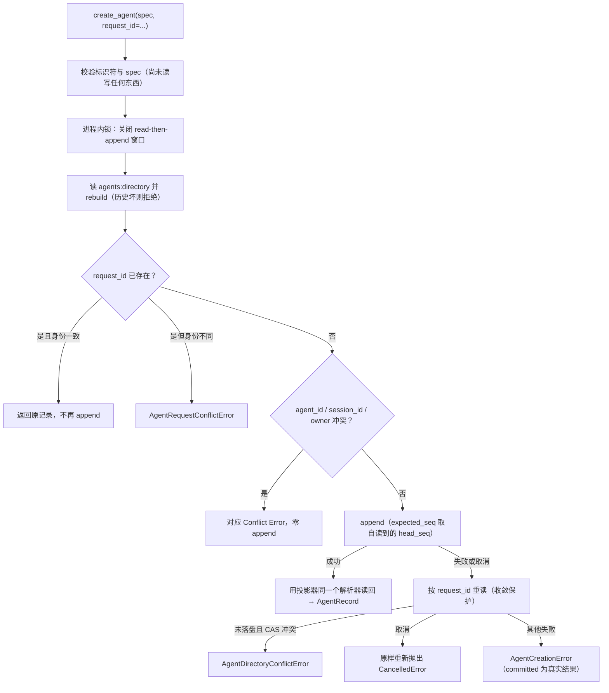

成功路径会把刚追加的 Envelope **再经投影器自己的解析器读回**，因此返回值与重放结果不可能不同——内存中不存在一份更宽松的读法。

### 20.6 验证基线

当前 [`tests/test_agent_identity.py`](../../tests/test_agent_identity.py) 收集 `193` 项；v0.7-A 删除旧 Budget DTO/validator 的用例，并把 schema-v1 拒绝契约放进 Budget Ledger 测试。其余覆盖包括：全新 `JsonlEventStore` 重建、identity/Activation 分离、id/session/request 冲突、lineage/ownership 分离、畸形 payload、并发线性化、CAS、取消与 may-have-committed 三态、metadata 所有权和敌意容器/Envelope 边界。

外部审查（Codex）在 v0.6 身份协议中曾发现 Budget 写入/回放不对称；v0.7-A 没有继续维护那条未执行路径，而是删除它并用 schema-v2 cutover test 证明旧 history 明确拒绝。仍属于 Agent identity 的三态重读、`BaseException` 传播、错 schema/错流/键集合 fail closed，以及六个 Directory 查询入口的 metadata detach 保证继续由本测试固定。

复审第二轮又指出三处**同类但在入口侧**的问题，同样已修复并补上反例：`rebuild()` 后修改传入的 `EventEnvelope` 不得改变 Directory 的答案；在第一次 `await` 期间修改调用方 `metadata` 不得影响落盘内容、返回记录或 owner 冲突判定；`set`/`bytes`/任意对象/非法键的 metadata 必须在写前得到 `AgentIdentityError`；`10**10000` 在写入与回放两条路径上都必须落在稳定错误协议内。另有一项证明修正没有走过头：未固定 `agent_id`/`session_id` 的幂等重试仍然返回同一个 Agent（生成的新 id 本就应当不同，不属于请求身份）。

复审第三轮再指出一处同类根因：环状或过深 metadata 会让两条路径都泄漏裸 `RecursionError`，而公开 `agent_created_data()` 会把非法 metadata 静默清成 `{}`。已修复并补上循环写入、循环重放、公开 helper 非法输入三组反例，同时钉住 `MAX_METADATA_DEPTH - 4` 深度的正常数据仍可往返、合法 `{}` 仍被接受。

复审第四轮指出同一根因的最后一处残余：有界预检位于异常归一化之外，因此**遍历本身**抛出的普通异常仍会泄漏。已修复并补上两组确定性反例——容器访问抛普通 `Exception` 时，创建、重放与公开 helper 三条路径都得到固定的 `agent-metadata-invalid` 且零写入；抛 `KeyboardInterrupt`/`SystemExit` 时必须原样传播，防止修复时过度捕获 `BaseException`。另有一项钉住边界没有走过头：普通 `dict` 子类仍被正常接受。

并发与取消一律使用 `asyncio.Event` 门控与确定性 store stub，没有用 `sleep()` 猜时序。其中 `YieldingStore` 是必须的：`InMemoryEventStore` 从不 `await`，两个 Task 在它上面**永远不会交错**，因此建立在它之上的并发测试即使面对完全没有线性化的实现也会通过——这正是本轮反向验证抓到的问题。

反向验证（每项都先复现失败、再恢复正确实现，仓库中不保留故障代码）：

| 临时移除的保护 | 失败的测试与根因 |
|---|---|
| 投影器的重复 `agent_id`/`session_id` 检测 | 3 项 `DID NOT RAISE AgentDirectoryProtocolError`——最后一条静默覆盖前一条 |
| may-have-committed 重读（改为假定未落盘） | 2 项：已落盘的 append 被报成 `committed=False`，以及被误报为 CAS 冲突 |
| 重读的 `await_worker_convergence()` | `repeated cancellation released the caller early` |
| CAS 序号（改为追加时重读 head） | stale read 上建立的创建被放行，`DID NOT RAISE AgentDirectoryConflictError` |
| 进程内创建锁 | 3 项并发测试收到 `AgentDirectoryConflictError` 而非按身份拒绝；8 个不同身份的并发创建有 7 个丢失 CAS |
| 标识符类型检查（改为 `str()` 强制转换） | 23 项：`True`、数字、带空白的取值被接受为合法身份 |
| owner 存在性检查 | `DID NOT RAISE`——payload 可以自报一个不存在的 owner |
| `request_id` 幂等 | 3 项：重试造出第二个 Agent，复用同一 request id 指向不同身份未被拒绝 |
| `committed` 的未知状态（改回 `False`） | 2 项：已落盘却被断言未落盘，并被误报成 CAS 冲突 |
| `CancelledError` 与其他 `BaseException` 分开处理 | 2 项：`SystemExit`/`KeyboardInterrupt` 被改写成 `AgentCreationError` |
| stream / `schema_version` / 键集合三道协议闸门 | 5 项：错流、未知版本、多键与少键 payload 全被当作合法 v1 身份读取 |
| Directory 查询返回 detached 记录 | 1 项：通过返回值写 `metadata` 改变了同一 Directory 后续所有查询 |
| 解析时深拷贝 metadata | 1 项：改传入事件即改变 Directory 的答案，出口复制救不回来 |
| payload 深拷贝（改回浅拷贝） | 1 项：第一次 `await` 期间的修改被真正持久化 |
| 写前校验整张 metadata 图 | 5 项：嵌套 `set`/`bytes`/对象直到 Store 才失败，报成 `AgentCreationError` |
| metadata 有界遍历 + 扩大 except | 9 项：环状/过深图在写入与回放两侧泄漏裸 `RecursionError` |
| 公开 helper 显式拒绝（改回 `or {}`） | 6 项：非法 metadata 被静默清空成 `{}`，调用方数据丢失 |
| 对账改回只比 `request_id` | 5 项：另一个写入者的 Agent 被报成「我们的已记录」 |
| payload 读取边界（Directory） | 6 项：敌意容器让 `rebuild()` 与 validator 都泄漏裸异常 |
| 规范 JSON 比较改回 `==` | 9 项：`{'flag': 1}` 与别人写的 `{'flag': True}` 被判为同一事实 |
| Envelope 协议字段移出解析器边界 | 1 项：`__ne__` 抛异常的 `event.type` 让公开解析器泄漏裸异常 |
| 把规范编码失败吞成 `False` | 2 项：已落盘事件被断言「确定未提交」 |
| 共享重读把 matcher 失败报成 `False` | 2 项：同上，从另一侧复现 |
| 遍历移回归一化边界之外 | 7 项：容器访问抛出的普通异常泄漏，绕过统一出口 |
| 过度捕获 `BaseException`（而非 `Exception`） | 4 项：遍历期间的 `KeyboardInterrupt`/`SystemExit` 被吞成 metadata 错误 |

### 20.7 Stage A 当时尚未实现的边界

（其中 FIFO Inbox 接受已由 Stage B 补上，进程内 Supervisor/单活 Activation/claim/complete/wakeup 已由 Stage C 补上，lifecycle ownership 图与 child-first quiescent dispose 已由 Stage D 补上，五个模型 Tool 已由 Stage E 补上，层级 Budget 事实/强制已由 v0.7-A/B 补上，managed Git Workspace 与 immutable Patch Artifact 已由 v0.7-C/D1 补上，Patch 验证、人工批准与 Git ref 推广已由 v0.7-D2 补上，分别见 20.8、20.11–20.13、20.15、20.17、20.20–20.24。）当前仍缺失、不得在文档或对外说明中表述为已有能力的是：跨进程 Activation/Workspace/Promotion 唯一性与 stale claim 接管；ack/retry 语义；Workflow Engine；默认 CLI Budget/Workspace/Artifact/Promotion 装配；Agent 冷恢复。`AgentRegistrar` 也**不创建**该 Agent 的 Session——它只声明这个 `session_id` 归该 Agent 所有，Session 仍由 `SessionService` 按原有方式创建。

### 20.8 Stage B：持久化 Agent Inbox 接受事实

设计决定与被否决的替代方案见 [ADR-0020](../adr/0020-durable-agent-inbox-acceptance.md)。

**Stage B 这一层本身只实现「已接受」这个事实，不实现执行。** 消费它的 claim 与 Turn 执行由 Stage C 的 `traceh.supervision` 提供（见 20.11–20.13），本小节描述的模块不感知也不依赖它。写入 Inbox 事件本身仍然只意味着 accepted，不意味着 processed 或 completed；`wakeup` 字段在 Inbox 层仍只是发送方**请求**唤醒，真正去唤醒的是 Supervisor。

Stage B 这一层只回答四个问题：哪些消息已被持久接受、每条属于哪个 Agent、接受顺序是什么、同一 `message_id` 是否已经提交。

| 模块 | 职责 |
|---|---|
| [`agents/inbox_identity.py`](../../src/traceh/agents/inbox_identity.py) | Stream ID 构造、event type、schema、payload 构造与解析——写入方与投影器**共用同一份**读法 |
| [`agents/inbox.py`](../../src/traceh/agents/inbox.py) | 只读 `AgentInbox` 投影、`AgentInboxIssue`、`validate_agent_inbox_events()`、`AgentInboxReader` |
| [`agents/inbox_service.py`](../../src/traceh/agents/inbox_service.py) | `AgentInboxService.accept()`：接受事务、每 Agent 线性化、幂等与不确定提交结果 |
| [`agents/commit_reconciliation.py`](../../src/traceh/agents/commit_reconciliation.py) | 两个控制面事务**共用**的提交点重读（见 20.9） |
| [`api/agents.py`](../../src/traceh/api/agents.py) | 新增冻结 DTO `AcceptedMessage`；既有 `AgentMessage`、`MessageTarget`、`MessageReceipt` 未改动 |

`AgentLoop`、`AgentRuntime`、`PluginManager` 未做任何改动，也不持有 Inbox 状态。

#### Stream 与 payload 协议

每个 Agent 一条独立 Inbox Stream，id 由**唯一构造函数** `agent_inbox_stream(agent_id)` 生成，形如 `agent-inbox:<agent_id>`。刻意**不提供反向解析**：标识符本身可能包含分隔符，用 `split()` 从流名倒推 `agent_id` 会让身份取决于猜测。校验的做法是从 payload 的 `agent_id` **正向**构造期望流名再比较。

不是共享一条流，因为 FIFO 顺序是**某个 Agent 的** Inbox 的属性；共享流会让一个 Agent 的流量推进另一个 Agent 的 `expected_seq`，并把互不相关的发送方串行化。

事件类型 `agent/message-accepted`，`schema_version = 1`，payload 键集合**恰好**是八个：`agent_id`、`message_id`、`content`、`source`、`target`、`wakeup`、`correlation_id`、`causation_id`。

| 字段 | 规则 |
|---|---|
| `agent_id`、`message_id`、`source` | 复用 Stage A 的标识符规则（必须 `str`、非空、无首尾空白、单行安全、有界） |
| `content` | **不是标识符**，不套用终端单行规则：消息是普通文本，可以合法包含换行、制表符和任意脚本。约束是必须 `str`、不超过 `MAX_MESSAGE_CONTENT_CHARS`、且**可 UTF-8 编码** |
| `target` | 必须是 `MessageTarget` 的真实取值；绝不 `MessageTarget(str(value))`，那会把未知路由指令强行改成已知的 |
| `wakeup` | 严格 `bool`。truthiness 会把 `1`、`"false"`、`[]` 读成一个决定，而这个字段以后要决定是否启动 Activation |
| `correlation_id`、`causation_id` | 可选标识符；**缺键**与显式 `null` 是两种事实，由精确键集合闸门保证缺键根本到不了解析处 |

`content` 的 UTF-8 约束不是洁癖：孤立代理项能通过 `json.dumps`，随后在 `JsonlEventStore.append()` 内抛 `UnicodeEncodeError`。接受它等于写入方承认了 Store 无法持久化的内容，事务跑到一半才炸出一个非协议错误。事件一律以 `Durability.SYNC` 追加。

#### 只读投影

`AgentInbox.rebuild(events, agent_id)` 按 seq 保持接受顺序，支持按 `message_id` 查询、返回全部已接受消息、迭代与 `len()`。`agent_id` 必须**显式传入**，理由同上。

它**不是可变队列**：没有 pop、ack 或删除，重复 `message_id` 是 append-only 流中的矛盾而不是更新。以下情况全部 fail closed，并由 `validate_agent_inbox_events()` 以稳定 code + `seq` 报告（绝不回显 content 或 source）：未知事件类型、`schema_version` 不是 1、payload 键集合不精确匹配、事件在错误的流上、payload 的 `agent_id` 与所查 Agent 不符、任意字段畸形、重复 `message_id`。

与 Directory 同理，**读取事件本身也是不可信操作**：`parse_message_accepted()` 把 `event.type`、`event.stream_id`、`event.schema_version` 与整段 payload 一起放进同一个异常边界，普通 `Exception` 转成固定的 `inbox-payload-invalid`，`SystemExit`/`KeyboardInterrupt` 原样传播；`_scan()` 也不再自己预先比较类型或流名。`validate_agent_inbox_events()` 的合同是返回 issue 而不是抛异常，敌意容器不得打破它。

坏记录**不跳过**的理由在这里比 Directory 更强：顺序就是这个投影给出的答案，跳过一条等于报出一个从未发生过的 FIFO 序列。写入路径同样 fail closed——历史读不出来时拒绝新的接受。

`AgentInbox` 直接返回它保留的 `AcceptedMessage` 对象而不复制，因为 `AgentMessage` 与 `AcceptedMessage` 的每个字段都是不可变标量，调用方无法写穿。这是**当前消息形状的性质，不是永久许可**：将来若引入可变 `ContentBlock` 或附件列表，就会重新出现共享可变状态，这条边界必须开始 detach。[`tests/test_agent_inbox.py`](../../tests/test_agent_inbox.py) 用一项字段类型内省测试把这条边界钉住，将来有人加可变字段时它会失败。

### 20.9 接受事务、线性化点与共用的提交点收敛

顺序：在第一个 `await` 之前冻结完整请求 → 读 durable Directory 确认目标 Agent 存在 → 读并重建该 Agent 的 Inbox → 处理重复 `message_id` → 以 `expected_seq = inbox.head_seq` 追加。

- **线性化点是 append 的 `expected_seq`**，取自 Inbox 读取时的 head，而不是追加那一刻重新读的 head。后者会接受一个针对已不存在的历史做出的决定——幂等检查等于查了错的 Inbox。
- **每个 Agent 一把锁**，不是整个 Service 一把。每个 Agent 有自己的流、因而有自己的 CAS，把互不相关的 Agent 串行化是凭空发明的约束。锁只为共享同一对象的调用方关闭 read-then-append 窗口，**绝不**用来判断写入是否成功。
- **目标 Agent 必须已存在**，在任何写入之前就检查：一段没有任何 Agent 拥有的 Inbox 历史永远不会有人来 claim。
- **重试由调用方的 `message_id` 决定**。相同 id + 相同消息返回原 `MessageReceipt`；相同 id + **不同**消息是 `AgentMessageConflictError`。比较时**每个字段都参与**——与 Agent 的自由 `metadata` 不同，消息里没有纯装饰性的字段，同一个 id 下不同内容就是不同消息。
- **对账匹配完整冻结事实，不是 `message_id`。** 两个发送方抢同一个 id 写的是**不同的消息**；只比 id 会告诉输的那一方「你的消息已被记录」，而落盘的是对方那条。匹配同样先经投影器解析（复核 type、stream、schema、键集合），再比较 `canonical_json`——与 Agent 创建**共用同一条 JSON 同一性规则**，也共用同一条三态规则：解析失败 → `False`，编码失败 → 向上传播成 `None`。
- **失败或取消的 append 绝不伪装成功**，`committed` 保留 `True`/`False`/`None` 三态，`AgentInboxConflictError`（承诺什么都没写）只在重读**确实证明**未落盘时使用。取消原样重新抛出；`SystemExit`、`KeyboardInterrupt` 等直接 `BaseException` 不经改写。

**提交点收敛只有一份定义。** 取消恰好落在 Store 临界区时事件已经落盘，因此“我被取消了”不等于“什么都没写”。两个控制面事务都需要这个答案，且**不得**发展出两套读法，所以 [`commit_reconciliation.py`](../../src/traceh/agents/commit_reconciliation.py) 只保存它一次：一次经 `await_worker_convergence()` 收敛的重读，返回三态答案。

这个接缝刻意很窄：共用模块只回答**问题本身**（我们的事件落盘了吗、我们能否判断），每个事务仍保留自己的错误映射，因为“失败变成哪种领域错误”是那个事务的性质，不是重读的性质。`AgentRegistrar` 已改为使用它且行为不变——Stage A 的 167 项契约全部原样通过，其原有反向验证也仍然成立。

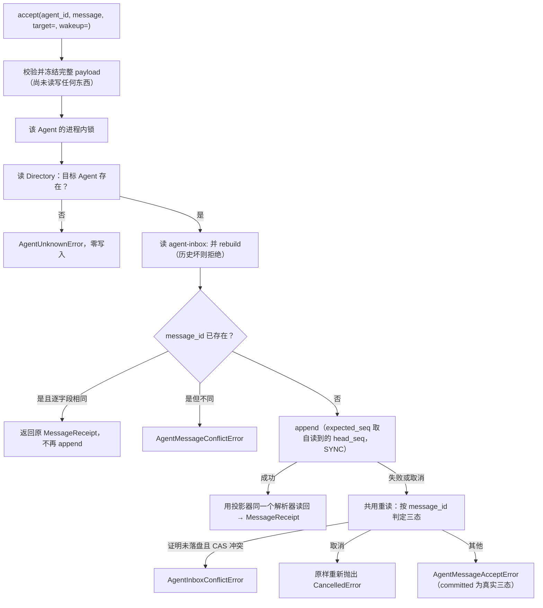

### 20.10 Stage B 验证基线与尚未实现的边界

[`tests/test_agent_inbox.py`](../../tests/test_agent_inbox.py) 仍为 `147` 项；v0.6 Stage A 当时是 `214` 项，当前 identity 经 v0.7-A 破坏式 Budget cutover 后为 `193` 项。Inbox 覆盖：fresh rebuild、严格 FIFO、跨 Agent 隔离、receipt/event 一致、未知 Agent 零写入、完整 payload 幂等、坏历史 fail closed、并发线性化、CAS、取消与 may-have-committed 三态、敌意 payload/Envelope 和字段不可变边界。

并发与取消一律使用 `asyncio.Event` 门控与确定性 store stub，没有用 `sleep()` 猜时序；`YieldingStore` 仍是必需的，因为 `InMemoryEventStore` 从不 `await`，两个 Task 在它上面永远不会交错。

反向验证（每项都先复现失败、再恢复正确实现，仓库中不保留任何 scratch patch）：

| 临时移除的保护 | 失败的测试与根因 |
|---|---|
| payload 精确键集合 / schema / 流校验 | 5 项：多键、少键、错 schema 的历史被当作合法 v1 接受事实读取 |
| `expected_seq` 改为追加时重读 head | stale read 上建立的接受被放行，`DID NOT RAISE AgentInboxConflictError` |
| `message_id` 幂等检查 | 9 项：重试造出第二条事件，复用同一 id 指向不同消息未被拒绝 |
| `committed` 的未知状态（改回 `False`） | 2 项：已落盘却被断言未落盘，并被误报成 CAS 冲突 |
| 取消路径不等待重读 Task | `repeated cancellation released the caller early` |
| `wakeup` 改为 truthiness | 10 项：`1`、`"false"`、`[]` 被读成唤醒决定 |
| 写入方 content 校验比回放宽松 | 3 项：超长与孤立代理项 content 通过写入方，落到 Store 才炸 |
| 对账改回只比 `message_id` | 5 项：另一个发送方的消息被报成「我们的已记录」 |
| payload 读取边界（Inbox） | 6 项：敌意容器让 `rebuild()` 与 validator 都泄漏裸异常 |
| 过度捕获 `BaseException`（两侧） | 4+12 项：读事件期间的 `KeyboardInterrupt`/`SystemExit` 被吞成协议错误 |
| Envelope 协议字段移出解析器边界（Inbox） | 1 项：公开解析器泄漏裸异常 |
| `_scan()` 自行预检事件类型 | 1 项：预检落在解析器边界之外，裸异常重新泄漏 |

**Stage B 当时仍然缺失的边界**：进程内 `AgentSupervisor`、单一 Live Activation 与其强制、Inbox claim/complete、真正的 wakeup 与 Turn 调度、Agent 冷恢复、`spawn_agent` 等子 Agent Tool、Parent/Child dispose、层级 Budget、WorkspaceProvider 与 Workflow。其中执行相关前四项已由 Stage C 补上（见 20.11–20.14），Parent/Child dispose 已由 Stage D 补上（20.15），五个模型 Tool 已由 Stage E 补上（20.17），Budget 事实/强制已由 v0.7-A/B 补上（20.20–20.21），managed Git Workspace 已由 v0.7-C 补上（20.22）；当前仍缺失 Agent 冷恢复与 stale claim 接管、默认 Budget/Workspace CLI、Patch 与 Workflow。版本仍为 `0.5.0`，Stage B **不是** v0.6 发布。

### 20.11 Stage C：Delivery lifecycle 事实层

设计决定与被否决的替代方案见 [ADR-0021](../adr/0021-process-local-agent-supervisor-and-delivery-lifecycle.md)。

Stage C 是 v0.6 里第一个**真正运行** Agent 的阶段。它把 Stage B 已经持久接受的 `NEW_TURN` 消息变成：

```text
durable accepted → durable claim → 该 Agent 自己 Session 上的真实 Turn → durable completed / failed / cancelled
```

四件事被严格分开，不得混为一谈：

| 概念 | 位置 | 崩溃后是否存活 |
|---|---|---|
| Identity（`AgentRecord`） | `agents:directory` | 是 |
| Acceptance（`AcceptedMessage`） | `agent-inbox:<agent_id>` | 是 |
| Delivery lifecycle（claim / outcome） | `agent-delivery:<agent_id>` | 是 |
| Activation（worker + 执行 Runtime） | 内存 | **否** |

Activation 可以从前三者重建，反过来不成立。claim 里记录的 `activation_id` 只说明“当时是哪一个活实例取走了它”，不证明该 Activation 现在还存在。

| 模块 | 职责 |
|---|---|
| [`supervision/delivery_identity.py`](../../src/traceh/supervision/delivery_identity.py) | Stream ID、四种事件类型、schema、精确 payload 构造与解析——写入方与投影器**共用同一份**读法 |
| [`supervision/delivery.py`](../../src/traceh/supervision/delivery.py) | 只读 `AgentDeliveryLog` 投影、`MessageClaim`/`MessageOutcome`、`validate_agent_delivery_events()` |
| [`supervision/delivery_service.py`](../../src/traceh/supervision/delivery_service.py) | claim 与 terminal 的 CAS 事务、共用提交点收敛 |
| [`supervision/execution.py`](../../src/traceh/supervision/execution.py) | 窄执行协议 `AgentExecution`、`AgentActivationFactory`、`AgentRuntimeExecution` 适配器 |
| [`supervision/lifecycle.py`](../../src/traceh/supervision/lifecycle.py) | 从 durable Directory 投影 `AgentOwnershipGraph`，以及只在本进程内线性化 lineage admission、子树 disposal 与整体 close 的 `AgentLifecycleCoordinator` |
| [`supervision/supervisor.py`](../../src/traceh/supervision/supervisor.py) | `ProcessAgentSupervisor` 与内存 Activation 状态机 |
| [`api/turns.py`](../../src/traceh/api/turns.py) | 通用 `TurnInput`，让 Turn 可被寻址 |

`AgentLoop` 与 `AgentRuntime` **不导入** `traceh.agents` 或 `traceh.supervision`，也没有获得任何 Supervisor 状态；依赖方向单向。

#### 为什么 Delivery 用独立 Stream

不复用 Inbox Stream。Stage B 的投影器只接受一种事件类型、拒绝其他一切，这条合同值得保留：一段既记“收到什么”又记“执行状态”的历史，不再是对“收到了什么”的直接回答。共享一条流还会让每次 claim 去推进发送方竞争的同一个 `expected_seq`。

每 Agent 一条流，由唯一构造函数生成，**不提供**从流名反推 `agent_id` 的逆操作——理由与 Inbox 相同。

claim 除 `message_id` 外还携带 `accepted_seq`，因此重放可以**证明**两条流对“正在执行哪一条消息”意见一致，而不是仅凭 id 相同就相信。

事件类型：`agent/message-claimed`、`agent/message-completed`、`agent/message-failed`、`agent/message-cancelled`，`schema_version = 1`，`Durability.SYNC`。

| 事件 | 精确 payload 键 |
|---|---|
| claimed | `agent_id`、`message_id`、`accepted_seq`、`claim_id`、`activation_id`、`session_id` |
| completed | `agent_id`、`message_id`、`claim_id`、`turn_id`、`reason` |
| failed | `agent_id`、`message_id`、`claim_id`、`error_code` |
| cancelled | `agent_id`、`message_id`、`claim_id`、`reason` |

**这条流不记录 Turn 内部发生了什么。** 模型输出、工具结果和异常正文属于 Session Event Log；terminal 事实只带仓库固定的 reason/error code，以及指向 Session 的 `turn_id`。原始异常文本与 traceback 是任意第三方输出，可能引用请求、路径或凭据，因此绝不持久化。

#### 投影器的 fail-closed 规则

`AgentDeliveryLog.rebuild(events, agent_id, inbox)` 必须传入 Inbox：claim 只有相对它引用的那条 acceptance 才有意义。以下全部 fail closed，并由 `validate_agent_delivery_events()` 以稳定 code + `seq` 报告：

未知事件类型、`schema_version` 不是 1、payload 键集合不精确、事件在错误的流上、payload 的 `agent_id` 与所查 Agent 不符、传入另一 Agent 的 Inbox、任何标识符/reason/`accepted_seq` 畸形、claim 引用本 Agent 从未接受的消息、claim 与 acceptance 的 `accepted_seq` 不一致、claim 跳过 FIFO 头、前一 claim 尚未 terminal 却出现后一 claim、同一消息被 claim 两次、两个 claim 共用一个 `claim_id`、terminal 引用不存在的 claim、terminal 与 claim 的消息不符、同一 claim 出现第二个 terminal（completed/failed/cancelled 互斥）。

这个投影器比展示型投影 fail 得更硬，因为它正是 worker 在调用模型前查阅的东西：一条无法验证的事件如果被读成“没有 claim”，结果就是同一条消息被再执行一次。

与 Directory/Inbox 同理，**读取事件本身也是不可信操作**：`parse_delivery_event()` 把 `event.type`、`event.stream_id`、`event.schema_version` 与整段 payload 放进同一个异常边界，普通 `Exception` 转成固定的 `delivery-payload-invalid`；`SystemExit`/`KeyboardInterrupt` 原样传播；`_scan()` 不再自行预检类型。

### 20.12 claim 线性化点与“durable claim 之前不得执行”

这是整个 Stage 的承重规则。

`AgentDeliveryService.claim()` **只有在 claim 可被证明落盘时才返回**，其余一切情况都抛出——**包括 unknown**。在未经证明的 claim 上运行 Turn 的 worker，可能正是第二个运行它的人，而这件事事后无法撤销：一个已经写过工作区的工具不会因为账本更正而回滚。

- **线性化点是 claim append 的 `expected_seq`**，取自 worker 实际据以决策的那份 delivery log。两个读到同一 head 的 worker 不可能都 claim 成功：其一得到 `ConcurrencyConflict`，被报告为 `DeliveryConflictError`，含义就是“别人正在跑那条”。
- **append 前先证明全部输入属于当前事实。** Service 在自己的 per-Agent 锁内重读 authoritative Inbox 与 delivery log，校验 `inbox.agent_id`、`delivery.agent_id`、完整 `AcceptedMessage`、delivery head/claim/outcome 视图以及“确实是下一个 FIFO 项”；terminal 同样重读并要求传入的 `MessageClaim` 与当前唯一 open claim 完整一致。伪造 Acceptance、跨 Agent 视图、stale/fabricated delivery view 与 foreign claim 全部在写入前失败，delivery stream 保持零增量。
- **claim 结果 unknown 时**：不运行 Turn、不重试、Activation 进入 faulted。不重试是因为重试正是可能重复执行的动作；不继续是因为该 claim 可能对另一个 worker 不可见。`wait_idle()` 报告该 fault，而不是永远等待或假装一切正常。
- **terminal append 失败或 unknown** 同样让 Activation faulted。此时 Turn 已经跑过，claim 也已落盘，因此**不会**被重新执行（它已不再是 unclaimed），但结果无法证明已记录，属于 Stage C 无法修复的状态。
- 比较 JSON 事实使用既有 `canonical_json`，不用 Python 的宽松 `==`（`True == 1`、`1 == 1.0` 在 Python 为真，在账本里是不同事实）。只有协议错误才允许回答“不是我们的”；编码失败向上传播成 `None`。

**没有内存队列。** worker 每次循环都重新读取 Inbox 与 delivery log，取 FIFO 中最早的未 claim 消息。把 accepted 消息复制进进程内列表，等于制造一份别的进程看不见的“下一步该跑什么”，而它第一个会搞错的就是别人已经 claim 的消息。FIFO 严格：最早的未 claim 消息胜出；若它已有 open claim，后面的消息全部被阻塞，直到该 claim 出现 terminal。Stage C 没有 stale-claim takeover，因此绝不把“已 claim 但未结束”解释成“可以跳过”。

### 20.13 Activation 内存状态机与公开控制面

**单活 Activation。** `_activate()` 的单飞（single-flight）是“一个 Agent 最多一个 Activation”的线性化点：并发调用要么找到已安装的 Activation，要么加入同一次在途构建，因此多个 resume 竞争时 Factory 只被调用一次。`session_id → agent_id` 另有映射，两个 Agent 不能绑定同一个 Session。

**single-flight 合并的是完整请求，不只是 key。** `create()` 在第一个挂起点前 detach `AgentSpec.metadata`，并以 Agent identity 协议同一字段集合计算 request fingerprint；`request_id` 相同但 preset、workspace、owner/lineage、grants、budget 或显式 Agent/Session id 不同的调用得到 `AgentRequestConflictError`，不能加入别人的在途 Task。durable request 已存在时仍重新进入 `AgentRegistrar.create_agent()` 做完整 reconciliation，而不是按 `request_id` 查到记录就直接激活。Factory 获得另一份 detached spec，因此它不能在 provision await 中改写之后要持久化的身份请求。

**唤醒不会丢失。** `_wake` 置位与 `_idle` 清除在同一把锁内完成；worker 在**排空之前**清除 `_wake`，并且只在同一把锁内确认 `_wake` 未置位后才置 `_idle`。这一配对消除了“我排空完了”与“我现在空闲”之间那个可能吞掉请求的窗口。**排空之后**再清除（直觉写法）才是有缺陷的那个。

**Turn 输入身份贯穿控制面与 Session。** `AgentLoop.run_turn()` 原本自己生成 `message_id` 并把 `source` 写成 `user`，这让 Turn 无法被寻址。`TurnInput`（`traceh.api`，只含 content/message_id/source）解决了这一点：`AgentLoop` 接受它而无需导入任何 Agent 概念，传入普通 `str` 时行为与此前**完全一致**。于是同一个 `message_id` 出现在 Session 的 `inbox/accepted`、`inbox/claimed`、`turn/start`，也出现在 delivery 的 claim 与 completed 中；completed 还带真实 `turn_id`。

**执行 Runtime 的身份校验。** Supervisor 通过四方法窄协议使用 Runtime（run one message、cancel current Turn、dispose、暴露 Session/EventStore 身份），不读取 `AgentRuntime` 私有字段。EventStore 按**对象身份**比较，只解析 `PublishingEventStore` 这一个仓库自带的透明装饰器（`build_default_runtime()` 总会包装）；配置看起来相同的两个 Store 仍是两条不同的账本，写错账本会让 claim 指向一段并不包含它的 Session 历史。Session 不符同样在运行 Turn 前拒绝。

**`create()` 跨两条 Stream 不是原子的。** 顺序是：冻结 spec 与显式 id → 若该 `request_id` 已创建过 Agent则由 Registrar 复核完整请求后激活 → Provisioner 创建精确 Session 与候选 Runtime → 用同一 `request_id`/`agent_id`/`session_id` 追加 identity → 成功后才安装 Activation → 任何失败或取消（**包括 identity append unknown**）都 dispose 候选 Runtime。选择 Session 先、identity 后，是因为它的失败模式可以承受：一个无人引用的 Session 可检测且无害，而指向不存在 Session 的 `AgentRecord` 是一个谁都用不了的坏身份。这条边界如实记录，不通过删除事件伪造事务。

**`wakeup`。** `False` 只持久接受，不创建、不恢复、不唤醒任何东西；`True` 确保 Activation 存在并触发 durable Inbox drain。若接受已成功但唤醒失败，抛 `MessageWakeError` 并**携带 `MessageReceipt`**——报告一个笼统失败会诱使调用方重试，把同一条消息用新 id 再写一遍。

**`NEXT_STEP`。** `send()` 在**接受之前**拒绝，零事件。直接经 `AgentInboxService` 写入的 `NEXT_STEP` 会被 claim 后记为 `failed`/`unsupported-target`：既不跳过（会静默打乱 FIFO），也不 fault（一条无法投递的消息不该停掉其余）。

**`interrupt` / `wait_idle` / `dispose`。**

| 方法 | 语义 |
|---|---|
| `interrupt(agent_id, reason)` | 只取消当前 Turn，走 Runtime 既有取消主线并等待模型/工具/子进程收敛；worker 随后追加 `cancelled`。空闲时幂等返回 `False`。`reason` 先经长度与单行安全校验 |
| `wait_idle(agent_id)` | 等待**已调度**的 claim/Turn/terminal append 全部完成。`wakeup=False` 的消息从未被调度，因此不等待也不假称已处理。Activation faulted 时抛 `ActivationFaultedError` 而不是永远等待。取消 `wait_idle` 不会取消 Agent |
| `dispose(agent_id)` | Stage D 起语义是**生命周期子树**：先注册该 owner 子树的 disposal scope，封闭相交 lineage 的新 admission；取消并等待匹配的在途 create/resume 后重新读取 Directory；再按后代到 owner 收敛 worker、terminal append 与独占 Runtime。关闭位于共享内部 Task，并发父/子 dispose 复用每个 Agent 的同一 cleanup Task；重复取消不能让候选或 cleanup 逃逸；一个 cleanup 失败也不跳过兄弟或 owner。**不删除**任何 durable 事实 |
| `aclose()` | 在锁内永久关闭新 admission，收敛全部在途 create/activation build 与候选 rollback，加入正在执行的子树 disposal，再按 durable ownership forest 的 child-first 顺序释放全部 Activation；调用者被重复取消只会中断等待，内部关闭继续到所有权清零。不同失败在全部资源都尝试 cleanup 后以 `BaseExceptionGroup` 一并报告 |

Worker 主循环的普通异常（例如 Inbox/EventStore 重读失败）会转成固定 `worker-failed` fault，`wait_idle()` 与后续 wake 都显式失败；异常正文不进入日志或终端。`AgentRuntimeExecution.dispose()` 同样使用共享 Task：第一次 cleanup 失败会被后续调用原样重放，取消会等待真实 Runtime 收敛后再向外抛出。

### 20.14 Stage C 验证基线与尚未实现的边界

Stage C 新增 [`tests/test_agent_delivery.py`](../../tests/test_agent_delivery.py)（`73 passed`）与 [`tests/test_agent_supervisor.py`](../../tests/test_agent_supervisor.py)（`61 passed`）；共享夹具在 `tests/supervision_fixtures.py`（不以 `test_` 开头，不被收集）。该 Stage 的检查点是全仓 `1657 collected`、`1656 passed, 1 skipped`；Stage D 的当前基线见 20.16。

Delivery 协议覆盖：accepted→claimed→completed、failed 与 cancelled、open claim 阻塞后续 FIFO、重放拒绝跳过 FIFO 头、事件只出现在自己的流上且 Inbox 流仍只含 acceptance、未知事件类型/错 schema/多键少键/错流、9 组畸形字段、7 组畸形 reason、claim 引用未接受消息、`accepted_seq` 不符、重复 claim、重复 `claim_id`、terminal 无 claim、双 terminal（4 种组合）、terminal 与 claim 不符、伪造 Acceptance/跨 Agent Inbox 与 delivery view/foreign terminal claim 写前拒绝且零事件、validator 返回 issue 不抛异常、公开 builder 拒绝而非修补、敌意 payload 容器与敌意 envelope 协议字段转成稳定协议错误、`KeyboardInterrupt`/`SystemExit` 原样传播、普通 `dict` 子类仍可读、CAS 三态（committed True/False/unknown）、别人的 claim 不被误认成自己的、claim/outcome 字段不可变。

Supervisor 覆盖：accepted→claim→Turn→completed 全链路且 `turn_id` 与真实 Session Turn 一致、控制面 `message_id`/`source`/多行 content 贯穿 Session、普通 `str` 任务行为不变、5 条消息严格 FIFO、两个 Supervisor 竞争同一 Inbox 每条消息恰好执行一次、open claim 后的消息不执行、durable claim 之前 Provider 调用数为 0、claim unknown 时 Provider 调用数为 0 且 Activation faulted、丢失 claim 竞争不算 fault、`wakeup=False` 零 delivery 事件且不启动 Runtime、`wakeup=False` + `resume` 排空、`wakeup=True` 创建 Activation、12 条消息穿插唤醒无丢失、`NEXT_STEP` 接受前拒绝且零事件、直接写入的 `NEXT_STEP` 记为 failed 且不打乱 FIFO、唤醒失败仍带回 receipt、6 个并发 resume 只调用 Factory 一次、重复 resume 不新建 Runtime、dispose 后 resume 得到新 Activation、dispose 后无 Turn 可进入、EventStore/Session 身份不符被拒、同 `request_id` 的相同请求 single-flight、不同请求在 durable 与在途两条路径都拒绝、identity 失败/provision 失败不污染 registry 且候选 Runtime 被释放、resume 未知 Session/未创建 Session 明确失败、Worker 存储异常进入稳定 fault、失败 Turn 记稳定 code 且不泄漏异常文本或 traceback、interrupt 只取消当前 Turn 而 Activation 继续工作、空闲 interrupt 幂等、7 组非法 reason 被拒、Turn 运行中 dispose 收敛且无遗留 Task、dispose/`aclose()` 收敛在途 resume/create、连续三次取消不能提前返回、cleanup 主错误与失败同时保留、Runtime adapter 失败重放且只 cleanup 一次、dispose 保留全部 durable 事实、claim 途中 dispose 收敛、`wait_idle` 不等待未调度消息、取消 `wait_idle` 不取消 Agent，以及公开 Protocol 签名与结构检查。

并发与取消一律使用 `asyncio.Event`、Gate 与真实 append latch；唯一的 `sleep(0)` 用于投递已经提出的取消请求，并在代码中注明原因。

反向验证（每项都先复现失败、再恢复正确实现，仓库中不保留任何 scratch patch）：

| 临时移除的保护 | 失败的测试与根因 |
|---|---|
| Activation 单飞线性化 | `concurrent_resume_builds_exactly_one_activation`：Factory 被调用多次，出现两份 Runtime |
| durable claim 之前不得执行 | 2 项：claim 尚未落盘时 Provider 已被调用；claim unknown 时同样已调用 |
| dispose 的 shield/convergence | `repeated_cancellation_cannot_release_dispose_early`：`DID NOT RAISE CancelledError`，dispose 提前返回 |
| `AgentLoop` 复用 `TurnInput.message_id` | 2 项：Session 中的 `message_id` 变回随机 UUID，控制面与 Session 无法关联 |
| open claim 的 FIFO 阻塞 | 2 项：`next_unclaimed()` 返回后一条消息，真实 Supervisor 随后尝试越过 open claim |
| `request_id` 只查 id 不复核完整请求 | 不同 preset 被静默返回已有 Agent，`DID NOT RAISE AgentRequestConflictError` |
| claim 写入前事实归属校验 | 伪造 Acceptance 与跨 Agent 视图都成功追加 claim，2 项 `DID NOT RAISE DeliveryProtocolError` |
| Worker 异常转 fault | EventStore 重读失败后 `wait_idle()` 返回成功，`DID NOT RAISE ActivationFaultedError` |
| Runtime cleanup 共享结果 | 第一次 dispose 失败后第二次静默成功，`DID NOT RAISE RuntimeError` |

**Stage C 检查点之后的缺失项中，Parent/Child child-first dispose 已由 Stage D 补上，五个模型 Tool 已由 Stage E 补上，层级 Budget 事实/强制已由 v0.7-A/B 补上，managed Git Workspace 与 immutable Patch Artifact 已由 v0.7-C/D1 补上，Patch 验证/Review/人工批准/ref CAS promotion 已由 v0.7-D2 补上。** 当前仍缺失的是：自动冷恢复与 stale claim 接管、自动重试与 attempt identity、默认 Budget/Workspace/Artifact/Promotion CLI、Workflow、多 Agent 并行编排、`MessageTarget.NEXT_STEP` 投递、MCP、TUI、流式模型输出。

### 20.15 Stage D：durable ownership 投影与 child-first quiescence

`owner_agent_id` 从 Stage A 起就是 durable lifecycle responsibility，但 Stage D 之前 `dispose(parent)` 不会读取它。现在 [`AgentOwnershipGraph`](../../src/traceh/supervision/lifecycle.py) 每次从 `AgentDirectory` 投影 owner→children，只保留 Agent id 和 ownership edge；`forked_from_session_id`、消息 source、Inbox 与 Session history 都不参与。图会独立拒绝重复 id、自指、未知 owner 与 cycle，并以 durable 创建顺序稳定遍历兄弟节点；`subtree_postorder(root)` 和 `forest_postorder()` 都保证后代先于 owner。

**没有第二份身份事实。** 图和 coordinator 都不追加事件，也不缓存一份可修改的 children registry。Durable identity 仍只来自 `agents:directory`；Activation 是否 live 仍只在 Supervisor 内存中。dispose 以后 identity、Inbox 和 delivery history 全部保留。

**Admission 是 dispose 的线性化边界。** `create()`、`resume()` 与 `wakeup=True` 的 `send()` 在启动或安装 Activation 前取得目标完整 ownership lineage 的 lease。子树 dispose 先登记 affected ids，因此后到的相交 admission 无法进入；随后主动取消并等待 Stage C 已经承诺收敛的在途 create/resume candidate，等待更早 admission 退出，再重新读取 Directory。匹配 pending create 不只看本次尝试临时生成的 `assigned_agent_id`：对于已有的 unpinned 幂等请求，还会用 durable `AgentRecord.request_id` 关联同一个在途重试；否则新 UUID 会让 `dispose(child)` 找不到实际属于该 child 的任务并永久等 admission。第二次读取不是多余 I/O：若 child identity 在取消到达前已经提交，它会出现在新图里并被同一轮 cleanup 捕获，不会成为孤儿。

**创建与恢复 child 需要 owner live。** 未知 owner 继续由 durable Registrar 报 `AgentOwnerNotFoundError`；owner 有 identity 但在本 Supervisor 中没有非 stopping、非 faulted Activation 时，创建在 provision 之前报稳定的 `agent-owner-not-active`，最终安装处还会在同一 Supervisor 锁内复核。恢复 child 遵守同一规则：先显式恢复 root，再按 ownership 顺序恢复 child。lineage lease 保证检查到安装之间 owner 不会被并发 dispose。

**Cleanup 子代优先、恰好一次、失败穷尽。** `dispose(root)` 使用共享 tree Task；相交的父/子 dispose 在 subtree scope 上串行，并在每个 Agent 上加入同一个 cleanup Task，所以不会双重释放。一个 child cleanup 失败只记录错误，兄弟与 owner 仍全部尝试，最后统一报告。调用方连续取消不会打穿内部收敛，清理完成后才重抛最初的 `CancelledError`。`aclose()` 在 Supervisor 锁内创建共享 close Task 的时刻，就接管登记表里仍在途的 tree disposal；公开 `dispose()` 等待者即使随后被取消，也不能在 close 快照和观察结果前移除 task 或失败证据，只有 close 加入这些精确 task 后才清理登记。随后关闭收敛候选与已有 tree disposal，再按整个 durable forest 的 post-order 清理。如果最终 Directory 已损坏，投影错误仍会如实报告，但关闭会退化为释放全部已知 Activation/cleanup Task，不能因为账本不可读就把进程内 Runtime 留活；此时反向安装顺序只是确定性资源回收顺序，不冒充 ownership 事实。关闭按 cleanup Task 来源去重观察：tree aggregate 中属于其已等待 Task 的失败会被剔除，再由最终 Task join 各报告一次；不能按异常对象身份全局去重，因为两个独立 cleanup Task 可以抛出同一个异常实例，二者仍是两次失败。`interrupt()` 仍只取消当前 Turn，**不**被偷换成子树 shutdown。

依赖方向保持不变：`AgentRuntime`、`AgentLoop` 与 `PluginManager` 没有 Stage D diff，也不持有 ownership graph、admission 或 disposal state；未来模型 Tool 必须调用 Supervisor。不同 ownership tree 可以独立 admission/dispose，不使用会阻塞全部 Agent 的全局读写 gate。

### 20.16 Stage D 验证基线与仍未实现的边界

新增 [`tests/test_agent_lifecycle.py`](../../tests/test_agent_lifecycle.py)（`20 passed`），覆盖图的 lineage/post-order 与 lineage/ownership 分离、未知和 inactive owner 在 provision 前拒绝、父子孙 child-first、dispose child 不碰 owner/兄弟、父 dispose 收敛在途 child create、unpinned durable 请求重试也会被 `dispose(child)` 主动取消、连续三次取消不能提前返回、单个 cleanup 失败不跳过其余节点、并发父/子 dispose cleanup 恰好一次、malformed Directory 下 `aclose()` 仍释放 Live Activation、同一 cleanup Task 被 tree/close 观察时只报告一次、两个独立 Task 抛同一异常对象时仍报告两次、close 已开始但尚未快照时取消公开 disposer 仍会由 close 报告 tree failure、owner 先恢复才能恢复 child，以及 `aclose()` 对多棵树的确定顺序。Stage A–D 定向事实/执行集合当前 `515 passed`，Stage C + D Supervisor 集合 `81 passed`。全仓 `1677 collected`，最终门禁 `1676 passed, 1 skipped`。

反向验证真实移除八项保护并在恢复前观察对应失败：post-order 临时反转为 owner-first 时 2 项顺序测试变红；移除 provision 前 owner-live 守卫时 child 虽最终被拒绝却已经错误创建候选 Runtime，测试观察到 provision 计数增加；遇到首个 cleanup 错误立即抛出时，兄弟与 owner 未被清理；移除 malformed Directory 的回收降级路径时，`aclose()` 在任何 cleanup 前泄漏 Activation；移除 durable `request_id` pending 匹配时，unpinned 重试不被取消且子树 disposal 卡在 admission；tree error 不剔除已由其观察的 cleanup Task 时，同一失败在 close 中出现两次；恢复全局按异常对象身份去重时，两个独立 cleanup Task 复用同一 `RuntimeError` 的第二次失败被吞掉；允许被取消的公开 disposer 在 close 开始后继续移除 tree 登记时，`aclose()` 未报告真实 tree failure。八项均恢复正确代码后重新通过 Stage D/Stage C 定向门禁。

**Stage D 检查点当时仍然缺失、但 Stage E 已补上的能力**：模型可调用的五个子 Agent Tool；Budget 事实/强制随后由 v0.7-A/B 补上，managed Git Workspace 与 immutable Patch Artifact 由 v0.7-C/D1 补上，Patch 验证/批准/promotion 由 v0.7-D2 补上。当前仍缺失的是 Agent 冷恢复、跨进程 Activation/Workspace/Promotion lease 与 stale claim takeover、自动重试/attempt identity、默认 Budget/Workspace/Artifact/Promotion CLI、Workflow、`NEXT_STEP`、MCP、TUI 与流式模型输出。Stage D 是进程内显式生命周期保证，不是操作系统沙箱，也不会在进程硬崩溃时运行 cleanup。版本仍为 `0.5.0`，Stage D **不是** v0.6 发布。

### 20.17 Stage E：Supervisor-backed 子 Agent Tool 与 durable run report

Stage E 新增 [`supervision/tools.py`](../../src/traceh/supervision/tools.py) 的 `SupervisorToolset`。它一次构造五个普通 `Tool`：

| Tool | 当前语义 |
|---|---|
| `spawn_agent` | 模型只提供 `preset` 与 `workspace_id` intent；`owner_agent_id` 由宿主绑定，先经必须显式提供的 `ChildProvisioningPolicy` 批准/映射，再调用公共 `AgentSupervisor.create()`；child 获得独立 durable identity、Session 与由宿主 Factory 解析的 Scope |
| `send_agent_message` | 以当前 owner 作为不可伪造的 source，把消息持久接受进 owned descendant 的 FIFO Inbox 并唤醒；返回的 receipt 仍只表示 accepted，不表示 completed |
| `wait_agent` | 等待**指定 `message_id`** 的已调度工作收敛，再返回 durable report 摘要；取消 waiter 不取消 child Turn |
| `stop_agent` | 调用 Stage D 的 `dispose(agent_id)`，按 ownership subtree child-first 收敛；只停止 Activation，identity/Inbox/delivery/Session 全部保留 |
| `collect_agent_artifact` | 读取已经 terminal 的 `AgentRunReport`，把 final text 作为 Tool content，并返回 Inbox/Delivery/Session evidence refs。Stage E 核心仍不捕获 Patch；v0.7-D1 的可选 `ArtifactReportingAgentSupervisor` 只会 fresh replay 并附加已经由宿主捕获的 Artifact refs，永远不在这个只读 Tool 中修改 Workspace |

**这不是第二套调度器。** Tool 只是薄适配层，仍经公共 `AgentSupervisor` 走同一个 create/send/wait/dispose；当前实现仍是 `ProcessAgentSupervisor`，但 Toolset 不再依赖它的私有类型或 Registrar。`AgentLoop`、`AgentRuntime` 和 `PluginManager` 没有 D0 改动。宿主通过 `build_default_runtime(additional_tools=toolset.tools)` 或等价的插件/装配路径把 Tool 放进某个 Agent 的 Composition。`ChildProvisioningPolicy` 只批准 preset/workspace intent 与描述 metadata；Factory 才能把批准后的标识映射为真实 Provider、model、prompt、Runtime、目录和 Agent Scope。通用控制面不把示例名称或本机路径写成默认值。

**权限在装配时绑定，不由模型声明。** `SupervisorToolset` 同时固定公共 Supervisor、owner Agent id、Runtime 的 EventStore 和宿主 Policy：两个 Store 的 durable object identity 不同就拒绝构造；执行时还要求 `ToolExecutionContext.session_id` 等于该 owner 的 durable Session。`AgentToolAuthority` 只保存 reader 与 owner id，每次从 Event Log 重放 fresh Directory，并在同一 snapshot 中校验 caller Session 和严格 descendant；它不缓存 Directory/graph，也不读 live Activation。模型输入 schema 中没有 `owner_agent_id`、capability grant、Budget、task、Provider 或 model 字段，避免把未强制的 v0.7 设计冒充安全边界；task 仍必须另走 `send_agent_message`。

**幂等和取消。** spawn 的 `request_id`、send 的 `message_id` 都从 owner + 当前 Session/Turn/Step/Tool Call identity 确定性派生；同一 Tool Call 重放会加入同一控制面事实，不会生成第二个 child 或第二条消息。create single-flight 在 Supervisor 锁内为每个并发调用登记独立 waiter receipt。shared create 若真正新安装本地 Activation，这份 Activation 起初只是“尚未被外部保留”，而不是永久拥有补偿权；`create()` 交出 handle，或同一 Activation 被公开 `resume()`/wakeup 路径交付时，都会在同一把锁下把它标记为 retained。取消方只有在“自己是最后一个 waiter、没有 create 调用收到 handle、shared create 证明它新安装了本地 Activation、且没有其他公开交付路径先 retained”四个条件同时成立时，才能在锁内选中一次 abandonment cleanup；若 cleanup 先赢，随后的公开复用会 fail-closed，不能拿到已经承诺销毁的 handle。实际任务若在权威 Directory 重读时复用了已有 durable identity，就从一开始没有补偿权；即使调用方入场时拿着另一 create generation 提交前的合法旧快照，也不能销毁已经交付的 child。因此并发首次调用、跨 generation 晚到重试以及 `resume()`/wakeup 与取消 spawn 的竞争都安全；Tool 层与外层 admission 不再用调用开始前的 Directory 布尔快照猜来源。若取消方取得清理权，Supervisor 先离开 lifecycle admission，再收敛对应 subtree，避免 disposal 等待自己持有的 admission；cleanup 期间的第二、第三次取消只会继续等待同一 Task。公开 `create()` 从入口到 admission 外补偿结束都由一个**调用级状态与方法返回回执**登记；调用者 Task 只在该调用仍登记时承担取消传递，绝不是关闭要等待的工作单位。公开协程返回时只调度一个 post-return completion Task；它不可能早于方法返回执行，并在同一次 Supervisor 锁内同时移除调用登记、发布 returned 回执。因此 close 只能看到“仍登记的调用”或“已经发布的完成”，不存在 unregister 后、方法返回前的空窗。`aclose()` 会停止新调用、收敛候选与 forest 资源，再等待这些调用级回执，所以既不能带着 create/cleanup 尾部提前返回，也不会等待调用方在 `create()` 返回后做的无关工作或形成 self-wait。close 与补偿用资源阶段 hand-off 事件避免互相等待。cleanup 自身若失败，外层仍抛裸 `CancelledError`，并把 cleanup failure 保存在其 cause；同时 Supervisor 持有的失败 disposal Task 会在 `aclose()` 再次如实报告。不能把二者装进含取消的 `BaseExceptionGroup`，因为现有 ToolRuntime/AgentLoop/Activation 的取消边界只识别 `CancelledError`，那会穿透 worker 并留下 open claim。已经成功返回给模型或其他公开调用方的 child 是有意创建的资源，不因以后某次 `interrupt(parent)` 自动消失；parent lifecycle `dispose/aclose` 仍按 Stage D ownership 保证收敛，`interrupt()` 仍只取消一个 Turn。

这里“调用仍登记”只是 caller 可以接收关闭取消的必要条件；`finally` 的第一条无 await 操作还会显式标记同步退出已经开始。此后即使早期校验失败、尚无 owned work，而且 post-return receipt 仍在等 Supervisor 锁，close 也只能等待回执，不能把取消注入调用者随后执行的错误处理或其他工作。

[`supervision/reports.py`](../../src/traceh/supervision/reports.py) 的 `AgentRunReportReader` 不缓存 `TurnResult`。它从全新的 Directory、Inbox、Delivery 与 Session reader 重建一条指定消息的报告：claim Session 必须等于 Agent Session；completed outcome 必须指向唯一、顺序闭合且 message/reason 一致的 durable Turn；final text 来自该 Turn 最后一条持久化 `assistant/message`。读取 envelope 字段与比较 `seq` 顺序都在同一个不可信证据边界内，畸形值统一成为带稳定 code 的 `AgentRunEvidenceError`。missing 与 open 分别使用 `agent-message-not-found`、`agent-message-not-settled`，矛盾证据明确失败。failed/cancelled terminal 可以形成 status/reason 报告，但不会编造 final text。`ProcessAgentSupervisor.report()` 是只读查询；`wait_message()` 初读未 terminal 时为**这一条 message identity**登记进程内通知，登记后立即重读以关闭竞态，收到通知后仍只采信 durable report。进程内通知只是同一 Activation 写 terminal 时的低延迟快路；Stage C 支持另一个 Supervisor 竞争并写入同一 Delivery Stream，因此等待期间还以有界间隔重读 durable report，不能把本地 Future 当成唯一进展信号。它不再等待整个 Activation idle，因此后续消息不会阻塞或污染前一条的 join；取消 waiter 只移除自己的通知，不取消 child。send 的 acceptance 语义没有被偷偷扩成同步执行。

### 20.18 Stage E 验证基线与仍未实现的边界

新增 [`tests/test_agent_tools.py`](../../tests/test_agent_tools.py)（`30 passed`），覆盖五个精确 Tool/schema、Store 与 caller Session 绑定、同 Tool Call spawn 幂等、owner/独立 Session、真实 send→wait→collect、fresh reader 重放、未 terminal 拒绝、waiter 取消不杀 child、指定消息 A 完成后不等待仍在运行的后续消息 B、终态由另一个受支持 Supervisor 写入时仍由 durable 轮询返回、取消后的 durable report、Activation 已 dispose 后仍从 durable terminal 返回、self/ancestor/sibling 越权拒绝、owner 停 grandchild subtree、首次 spawn 取消收敛已提交 child、取消已成功 spawn 的幂等重试不销毁原 child、两个首次 spawn 并发加入同一 create 时取消一方不销毁另一方收到的 child、跨 pending generation 的旧 Directory 快照不能取得补偿权、`resume()` 或带 wakeup 的 send 已交付同一 Activation 后取消原 create 不得销毁它、补偿已经选中但尚未执行时的晚到重试会先等收敛再恢复、`aclose()` 必须等待 admission 外的补偿与完整公开 create 调用但不得等待调用方返回后的无关工作、create 的登记必须保留到方法返回后由 completion Task 原子移除并发布回执、早期校验失败已经 return/raise 后不得因 receipt 延迟而取消调用者的后续工作、单次和重复取消遇到 child cleanup 失败仍让 parent durable terminal 为 cancelled 且关闭报告 cleanup failure、敌意 Session `seq` 归一化、两类消息异常的稳定 code、矛盾 Session Turn 拒绝，以及真实 `AgentLoop → ToolRuntime → spawn_agent → Supervisor → child Session` 主线。Stage A–E 定向集合为 `545 passed`；全仓 `1707 collected`，完整门禁 `1706 passed, 1 skipped`，包含真实 L2 递归验证和 Wheel E2E。

反向验证临时移除十四项关键保护并确认新测试因各自根因失败：去掉 caller Session 对 durable owner Session 的比较后，绑错 Runtime 的 spawn 产生了真实 child，测试得到 `DID NOT RAISE AgentToolBindingError`；让首次取消后的 spawn cleanup 直接返回后，child Activation 仍可 `wait_idle()`，测试得到 `DID NOT RAISE AgentNotActiveError`；把 per-message 通知退回 `wait_idle()` 后，A 的 durable report 已完成但 waiter 被 B 卡住并超时；取消重试也无条件清理 stable request 后，早先已交付 child 变成 `AgentNotActiveError`；把裸取消 + cause 重新组合成 `BaseExceptionGroup` 后，单次与重复取消均从 parent worker 穿透，新的主线测试收到错误组而不是 durable cancelled terminal；让并发取消方不看其他 waiter/delivery receipt 就取得清理权后，另一个调用已收到的 child 变成 `AgentNotActiveError`；去掉 bounded durable poll、只等本地 Future 后，另一 Supervisor 已写出 `completed` 而原 waiter 仍超时；让补偿选中后立即删除 pending receipt 时，晚到重试先收到随后被 dispose 的 handle 并变成 `AgentNotActiveError`；把权威任务结果中的复用身份误标为可补偿时，携带旧 Directory 快照的取消方销毁了前一 generation 已交付的 child；让 `aclose()` 不等待公开 create 的 admission 外补偿尾部时，close body 在补偿 Gate 释放前提前返回；临时移除 `resume()`/wakeup 公开交付时的 retained 迁移后，已经由 `resume()` 返回的 child 被取消 create 补偿销毁并得到 `AgentNotActiveError`；把调用级回执退回为等待整个 caller Task 后，调用者在 `create()` 返回后等待同一个 close，确定性形成 self-wait；把 post-return completion 重新 await 在 `create()` 的 `finally` 内后，Gate 在方法返回前打开且测试精确观察到 `method_returned=False`；移除同步退出标记、再次仅凭 `owned_work is None` 取消 caller 后，早期 `DeliveryInputError` 已返回的调用者在等待无关 Event 时变成 cancelled。十四项恢复正确代码后 Stage E 与 Agent A–E 定向门禁重新全绿。

v0.6 RC 另用真实 OpenAI-compatible Provider 执行一次完整 product-host 装配：parent 模型依次调用 `spawn_agent`、`send_agent_message`、`wait_agent`、`collect_agent_artifact`、`stop_agent`；child 在独立 Session 完成真实模型 Turn，停用后以相同 durable Agent/Session identity 显式 `resume()` 并完成第二个真实 Turn，随后在确定性模型 Gate 中被 `interrupt()`，最终由 Delivery 与 Session 账本证明为 `cancelled`。该验收得到 2 条 Directory identity、1 条 ownership edge、4 条 Inbox acceptance、8 条 Delivery lifecycle event；parent 1 个闭合 Turn、child 3 个闭合 Turn，不变量与 Request Snapshot 重建违规均为 0。验收只通过公开 Runtime/Supervisor/Tool/Inspector 接口；临时 Workspace 与 Session 数据位于仓库外且不进入发行资产，未把模型、路径或凭据写成默认值。完整发行门禁见 [`validation-v0.6.0.md`](../validation-v0.6.0.md)。

**v0.6.0 发布时仍缺失**：模型 Tool 的默认 CLI 产品装配与丰富交互；跨进程 Activation lease、冷恢复、stale claim takeover、自动 retry/attempt identity；层级 Budget；独立 Workspace/Git worktree/Patch Artifact/merge；Workflow 与并行 join；`NEXT_STEP`；MCP、TUI 和流式模型输出。v0.7-A/B 已补 Budget 事实与显式宿主强制，v0.7-C/D1 已补 host-managed Git worktree 与 immutable Patch Artifact，v0.7-D2 已补固定验证、人工批准与 Git ref compare-and-swap 推广；默认产品装配、跨进程 lease 与 OS sandbox 仍没有。五个 Tool 运行在与宿主相同的进程/用户权限下。

### 20.19 v0.7 D0：先固定控制面的接缝，不提前造能力

D0 只解决「后续 Budget/Workspace/Patch/Workflow 应该从哪里接入」，不实现这些能力。完整决定见 [ADR-0024](../adr/0024-v07-managed-agent-control-plane-and-threat-boundary.md) 与 [ADR-0025](../adr/0025-hierarchical-budget-breaking-cutover.md)。

依赖方向现在固定为：未来 managed control service 在上层协调 Budget reservation → provisional Workspace → 公共 `AgentSupervisor.create()` → durable Directory reconciliation → Budget commit/release → Workspace attach/release/quarantine；它包住**一个**现有 `ProcessAgentSupervisor`，不能另建 Activation 表、Inbox、Directory 或关闭协议。Budget ledger、Workspace manager、Artifact service、Promotion service 与 Workflow 各自只拥有本域事实，Workflow 只调用这些公开服务。`AgentLoop` 仍只处理单个 Session/Turn/Step，`AgentRuntime` 仍只是一名 Agent 的执行门面。

D0 的真实代码变化只有三个接缝：

1. 公共 `AgentSupervisor` 增加只读 `store` 身份面，`SupervisorToolset` 的类型依赖改为该 Protocol；
2. [`supervision/authority.py`](../../src/traceh/supervision/authority.py) 的 `AgentToolAuthority` 每次用 `AgentDirectoryReader` fresh replay caller/严格后代权限，没有缓存第二份身份事实；
3. [`supervision/provisioning.py`](../../src/traceh/supervision/provisioning.py) 的 mandatory `ChildProvisioningPolicy` 只返回 `preset`、`workspace_id`、`metadata`。没有默认 pass-through；owner、Budget、grants、task、Provider/model/prompt/runtime 均不在 proposal 中，metadata 会在交给 Supervisor 前走既有 `freeze_agent_spec()` 脱离与校验。

五个 Tool 的名称、input schema、Event 协议和幂等/取消/关闭语义都没有改变；`AgentActivationFactory` 仍是 concrete Runtime capability 与目录的唯一解析边界。新增架构守卫证明 Protocol-only Supervisor 可真实走 spawn、invalid Policy 在 create 前失败、Policy 不能夹带 runtime/task/Budget 字段、Authority 能看到后来追加的 child 且拒绝 self，并以 AST/import 检查固定 `AgentLoop`、`AgentRuntime`、`PluginManager` 和 concrete Supervisor 的依赖方向。

Budget 在 D0 **仍未执行**；随后 v0.7-A 已按 ADR-0025 落实破坏式切换，详见 20.20：不会保留 `LegacyBudget`/`BudgetV2`、旧字段别名、双 writer/projector 或自动迁移；旧 v0.6 managed history 不能被猜成新 grant，而且程序绝不自动删除旧 `.traceh`。这条切换只针对 Budget，不授权破坏无关的插件、Session、EventStore 或单 Agent Runtime API。

当前版本仍为 `0.6.0`。D0 当时没有创建 managed Workspace、Patch Artifact、Promotion、Workflow、Budget event 或 CLI 产品入口，也不是 OS sandbox。新增 5 项架构守卫；与既有 Tool/Supervisor 的定向门禁为 `96 passed`，全仓为 `1712 collected / 1711 passed / 1 skipped`。三项反向验证分别把 Toolset 协议注解退化为 `object`、绕过 host policy、缓存第一次 Directory；对应守卫均按根因失败，恢复后的两个生产文件 SHA-256 与验证前一致。D0 之后的 v0.7-A/B Budget、v0.7-C Workspace 与 v0.7-D1 Patch Artifact 分别由 20.20–20.23 补上；Workflow 仍未开始。

### 20.20 v0.7-A：单一 append-only 层级 Budget Ledger

完整决定见 [ADR-0026](../adr/0026-append-only-hierarchical-budget-ledger.md)。Stage A 做的是**事实与权限来源切换**，不是执行接线：旧 `AgentSpec.budget`、`AgentRecord.budget` 和公共 `Budget` DTO 已删除；新 `agent/created` 使用 schema version 2 且没有 Budget 字段。schema version 1 的 v0.6 history 明确得到 `agent-budget-history-unsupported`，没有 alias、upcaster、双 reader/writer、自动 grant 推断或删除旧目录。

[`api/budgets.py`](../../src/traceh/api/budgets.py) 提供七个必填 limit 的只读值、四种 durable usage amount 和只读 Account/Reservation/Charge；[`budgets/events.py`](../../src/traceh/budgets/events.py) 在 Stage A 当时定义一条 `budgets:ledger` 的六种唯一事实，Stage B 又为真实外部工作补入 reserve/start/settle/release 四种 usage lifecycle 事实（当前共十种，见 20.21）；[`budgets/projection.py`](../../src/traceh/budgets/projection.py) 从这些事实与 fresh Agent Directory 重建所有余额；[`budgets/service.py`](../../src/traceh/budgets/service.py) 是唯一宿主写入服务。没有 per-Agent Budget stream、mutable balance、Runtime cache 或模型 Tool。

| 维度 | Stage A 语义 |
|---|---|
| token / Step / Tool call / wall milliseconds | usage 与 child delegation 共用同一累计容量；child grant 从 parent 永久 carve out |
| direct children | 每个 reservation 恰好 hold 1；`BudgetAmounts` 没有 children 字段，避免第二条记账路径 |
| depth | child 必须严格递减的非消耗约束 |
| processes | durable limit/child 单调约束已记录；真实进程 slot 是 Stage B 的 process-local lease |
| `None` | 宿主明确未激活该维度，不是漏填后得到的宽松默认 |

根 grant 只能指向 durable root Agent。child reservation 在 Agent 创建前立即占用 parent 容量；精确匹配 `child_agent_id + creation_request_id + owner_agent_id` 的 Directory 事实是**唯一**创建 commit proof，并据此打开 child Budget account。`budget/reservation-committed` 只是可选审计确认，不是第二条 identity。失败创建只有在 trusted host 明确提供 `creation_converged=True`，且 fresh Directory 同时没有 child/request 时才可 release。跨 Directory/Budget 两条流不存在原子 absence transaction，因此绕过未来 managed saga 的外部 writer 可使 history 进入 fail-closed contradiction；Stage B 必须在 D0 控制面上串行化受管 create/cleanup，这一边界不伪装成 Stage A 已解决。

每次写入先完整 replay，再以 Budget stream `expected_seq` CAS 追加。`operation_id` 全局唯一；child id 与 creation request id 即使 release 后也不能换一个 reservation 重新解释。完全相同的 event type + canonical JSON payload 才是幂等重试，`true`/`1`/`1.0` 不会被 Python 相等规则混淆。append 失败或取消后复用同一收敛 helper 得到 committed/absent/unknown 三态；重复取消不能留下 reconciliation Task，普通 payload/Envelope 异常被稳定归一化，解释器级 `BaseException` 不被吞掉。

跨流重建固定先读依赖方 Budget prefix、再读作为前置事实的 fresh Directory。这样任何已读到的 root grant/commit 都能看见更早落盘的 Agent 事实，不会把合法并发写入拼成“旧 Directory + 新 Ledger”的虚假损坏；反向出现“旧 Ledger + 新 Directory”只会保守地不给额外 Budget authority。Budget 数值只接受精确内置 `int`，在范围比较前拒绝 bool 和敌意 int 子类，公共写入与回放各自稳定归一化为 input/protocol error。

Stage A **没有**修改 `AgentLoop`、`AgentRuntime`、`PluginManager`、Supervisor scheduler、五个 Tool schema 或 CLI，也不会自动 reserve/charge/stop。v0.7-B 随后只在 managed create、model attempt、Step、Tool dispatch 与 process slot 的既有 owned boundary 上复用这本 Ledger 并保证取消/失败收敛（见 20.21）；没有另造余额或把 Budget 分支塞进主循环。

新增 [`tests/test_budget_ledger.py`](../../tests/test_budget_ledger.py) `41 passed`，覆盖 root/child 状态、容量守恒、唯一 correlation、Directory-only commit、converged release、inactive/closed/depth 边界、CAS 并发、跨流依赖顺序、精确幂等、append 三态、取消、敌意 event/payload/数值、旧 history 明确拒绝和 API cutover。Budget + identity/lifecycle/D0 扩大定向集 `290 passed`；全仓 `1732 collected / 1731 passed / 1 skipped`。五项反向验证分别移除 delegation debit、Directory commit proof、schema-v1 专用拒绝、依赖顺序读取和精确整数保护；对应测试均按根因变红，恢复后源码哈希或定向门禁回到正确状态。

### 20.21 v0.7-B：在既有 owned boundary 执行 Budget

完整决定见 [ADR-0027](../adr/0027-budget-enforcement-at-owned-boundaries.md)。Stage B 没有把七个 limit 塞进 `AgentLoop`、`AgentRuntime` 或 `ProcessAgentSupervisor`，而是由宿主显式装配一组窄适配器：[`budgets/enforcement.py`](../../src/traceh/budgets/enforcement.py) 在模型调用、Step continuation、Tool admission 和完整 Turn 外层接入 Ledger；[`budgets/supervision.py`](../../src/traceh/budgets/supervision.py) 包住公共 `AgentSupervisor` 与 `AgentActivationFactory`，负责 child grant saga 和进程内 slot lease。`BudgetEnforcement` 只读地绑定一份 `BudgetLedgerService`、Agent id、Session id、tokenizer/Usage 策略和这些适配器；Runtime、Session 与 Budget Store 身份不一致时在工作开始前拒绝，候选 Activation 不一致时先释放资源再返回错误。注入的 `LlmRuntime` 只以 `is None` 判断缺省，合法的 falsey 实例不会被替换；`allow_estimated_usage` 必须是精确内置 `bool`，字符串或整数 truthiness 不能降低 Usage 证据要求。默认 CLI 不猜 root grant、child grant、tokenizer 或 process authority。

| owned boundary | 当前强制语义 |
|---|---|
| managed child create | 先 reserve parent grant，再调用同一个 Supervisor；`PENDING` 才授权首次创建，`COMMITTED` 只允许精确 durable child 的幂等恢复，`RELEASED` 在任何内层副作用前拒绝；精确 Directory child/request/owner 事实 commit，已收敛且 fresh Directory 证明不存在才 release；同一宿主锁串行化 saga 与 close |
| process-local Activation | 每个 descendant 从所有启用 `max_processes` 的 ancestor 各取得一个 slot；自己不计自己；provision/activate 失败、取消、dispose 与 host close 都释放同一 lease 恰好一次 |
| model invocation / token | 先 reserve，再用一次性 START 认领外部调用；可信 TokenCounter 可预先封顶，可信 Usage 按 `EXACT`/显式允许的 `ESTIMATED` settle，未知、敌意、越 reservation、Provider 失败或取消都保守消费完整 hold |
| Step continuation | Turn 前从 durable `step/start` 补记历史用量，余额为零时在 `turn/start` 前拒绝；每次 continuation 决策和 Turn finalizer 都按稳定 operation id 重放/补记，不退款已开始 Step |
| active wall time | reserve 当前剩余毫秒并 START，在单调时钟 `asyncio.timeout()` 下运行真实 Turn；最终 settle 不超过 hold，超时/取消也先等 Provider、Tool、Turn 与 Budget finalizer 收敛 |
| Tool dispatch | lookup、Schema 与普通 Policy 之后，把剩余调用按模型顺序一次交给 `ToolAdmissionGate`；Ledger CAS 只放行可用容量内的最长前缀，`tool/admitted` 落盘后才 dispatch；未知/非法/Policy 拒绝不计费，已放行调用失败或取消不退款 |

child reserve 与 Token/wall START 本身也属于 saga 的 owned work，而不是补偿范围之外的一次普通 `await`。取消若发生在事实已落盘、调用尚未返回的窗口，适配器先等写入任务取得确定 verdict：child reserve 会在 fresh Directory 证明 child 尚未创建后 release，且不会调用内层 Supervisor；usage 仍是 `PENDING` 就 release，已由本调用取得 `STARTED` 则在 Provider/Turn 启动前把完整 hold 以 Token `UNKNOWN` 或完整 wall 用量 settle。第二、第三次取消不能提前返回，终态完成后才重抛最初的 `CancelledError`。这条同进程取消收敛不能和进程硬崩溃恢复混为一谈。

reserve 操作本身可以按 canonical payload 幂等返回当前 Reservation，但这不等于重新发放 create 权限。managed wrapper 必须消费它返回的真实状态：`PENDING` 进入首次创建，`COMMITTED` 只能沿已有精确 Directory identity 走幂等恢复，`RELEASED` 稳定报 `budget-reservation-state-invalid`。这道判断发生在调用内层 Supervisor 之前；否则原请求重试会先写入已经退款的 child identity，再让 `budget-release-after-agent` 破坏整条 Ledger 回放。

真实外部工作不能只用“幂等事实”代替所有权，因此 Ledger 新增四种生命周期：`budget/usage-reserved`、`budget/usage-started`、`budget/usage-settled`、`budget/usage-released`。状态只允许 `PENDING → STARTED → SETTLED` 或 `PENDING → RELEASED`。START 故意不是可重复获得的许可：CAS 竞争或恢复时再次看到相同 START，说明已有执行 owner，必须返回 `budget-reservation-state-invalid`，不能再调用一次 Provider/Turn。进程硬崩溃若发生在 STARTED 后会保守保留完整额度；显式恢复策略属于后续阶段，Stage B 不自动退款。

Tool 容量的线性化点是 Budget Ledger charge，Session 中的 `tool/admitted` 是 dispatch 授权与运行证据。如果 admitted append 失败，Tool 不执行，但已经线性化的容量保守保留；这是刻意避免再造第二套跨 Stream reservation/commit 协议，而不是遗漏退款。Admission 与 admitted-event append 都由 ToolRuntime-owned Task 收敛；已经 dispatch 的 Tool 也用显式 owned Task 写 cancelled `effect/outcome`，第二、第三次取消不能把它 detached，外层读完 Effect evidence 并补齐每个未完成调用的 terminal `tool/result` 后才重抛取消。parallel-safe Tool 也只能在完整有序 admission 阶段落盘后并发执行，因此最后一个 slot 的归属不取决于 Task 调度顺序。

Stage B 的承诺仍是**一个显式装配的 managed host/process**，不是分布式调度器：跨进程同时运行仍需未来 Activation lease；没有 trusted tokenizer 时只能封顶请求并把未知 Usage 记为完整 hold，不能承诺 Provider 永不超出一个 response；进程硬崩溃留下的 STARTED 未 SETTLED reservation recovery、默认 CLI Budget 配置、Patch、Workflow、冷恢复与 stale claim takeover 均未实现。Workspace 后续已由 Stage C 以同样显式宿主装配方式补上（20.22），但没有改变这些 Budget 边界。版本仍为 `0.6.0`，v0.7-B 已实现但尚未发布。

新增 [`tests/test_budget_enforcement.py`](../../tests/test_budget_enforcement.py) 与 [`tests/test_budget_supervision.py`](../../tests/test_budget_supervision.py)，并扩展 [`tests/test_budget_ledger.py`](../../tests/test_budget_ledger.py)：Budget 专项共 `79 passed`，覆盖精确/估算/未知 Token、精确布尔 Usage 策略、falsey Runtime 注入、无 tokenizer 的保守 hold、一次性 START、START 已提交时取消的保守 settle、Provider 失败/取消、Tool 有序前缀、admission 取消与 dispatch outcome 重复取消、inactive limit、Step/wall 收敛、Generation gate 保留、Store/Session identity、只读装配、child reserve 已提交但 provision 未开始时的 release、`RELEASED` 同请求重试在内层创建前拒绝、child grant 并发、process slot rollback、Activation mismatch 与 host close；加入 Composition/插件主线后扩大定向集 `168 passed`。Stage B 检查点为 `1770 collected / 1769 passed / 1 skipped`；当前全量见 15.1 与 20.22。

反向验证临时移除五项原保护并确认测试按各自根因失败：去掉 settlement append 前校验后，非法 dimension/overage 先污染 Ledger 再以 Projector error 失败；去掉 Runtime/Budget Store identity 守卫后，跨 Store wrapper 未拒绝；去掉 provision 失败的 process-slot rollback 后，ancestor hold 从 0 变成 1；把显式 `llm_runtime is None` 恢复成 truthiness fallback 后，注入对象的敌意 `__bool__` 泄漏并绕过装配合同；保留旧式 `shield(coroutine)` 而不拥有 Tool outcome finalizer 时，重复取消在 Gate 释放前提前返回。本轮复审又分别移除 START 取消终态推进、child reserve 取消补偿和精确布尔校验，得到 `2`、`1`、`3` 项对应失败，并再次把 Runtime fallback 恢复成 truthiness 得到 `1` 项失败；临时移除 `RELEASED` create-permit 守卫时，新反例先持久化 child，再稳定得到 `budget-release-after-agent`。全部恢复后 Budget 专项、扩大定向与完整门禁重新通过。wall deadline 测试也改为先等待 Provider 的确定性进入事件，再观察真实 timeout 取消，不再用 `20ms` 猜事件循环时序。

### 20.22 v0.7-C：Managed Git Workspace 与 Agent 生命周期分离

完整决定见 [ADR-0028](../adr/0028-managed-git-workspace-lifecycle.md)。Stage C 新增独立 [`traceh.workspaces`](../../src/traceh/workspaces/) 域，不修改 `AgentLoop`、`AgentRuntime`、`ProcessAgentSupervisor` 或 `PluginManager`。公共 [`api/workspaces.py`](../../src/traceh/api/workspaces.py) 现在只保留已经实现的 `WorkspaceAccess`、`WorkspaceStatus`、`WorkspaceLocalState`、Provisioning/Source/Record/Handle 值和 `WorkspaceProvider`；此前没有实现的 Snapshot/PatchArtifact/MergeResult 草图已删除，不保留旧别名或双合同。

每个 Store 只有一条 `workspaces:catalog`。四种事实形成一条状态机：

```text
PROVISIONAL -> ATTACHED
PROVISIONAL -> QUARANTINED -> ATTACHED（仅能回到同一个已证明的 Agent/Session）
PROVISIONAL -> RELEASED
ATTACHED    -> QUARANTINED
ATTACHED    -> RELEASED
QUARANTINED -> RELEASED
```

`workspace/provisioned` 保存 framework workspace id、creation request、宿主 source id、requested revision、repository fingerprint、精确 base commit、读写 capability 与 owner；`workspace/attached` 保存 exact Agent/Session；quarantine/release 只接受固定 reason。Catalog 检查连续 seq、精确 key、全局 operation/request/workspace 唯一性和 Agent/Session 唯一绑定。解析后保存的 operation event type 来自内置协议常量，不保留 EventStore 交回的 `str` 子类或其他敌意 envelope 对象，因此幂等对账不会在稍后的第二次比较中重新执行调用方代码。它不保存本机路径、不进入 Session Surface、Recovery 或 Request Fingerprint，也没有第二份 mutable registry。

[`LocalGitWorkspaceProvider`](../../src/traceh/workspaces/local_git.py) 只从宿主显式 source mapping 解析仓库；模型永远只得到 `workspace_id`。source 必须是 clean、top-level、normal Git checkout；revision 先解析为精确 commit，worktree 以 detached HEAD 创建在唯一 managed root 下。source/root/target 任一 symlink、Junction/reparse component、占用目录、异常 `.git` marker、Git registry/common-dir/HEAD 身份不一致都会在 mutation 前拒绝或进入 quarantine。身份核对是双向的：Git common directory 的唯一 `worktrees/*/gitdir` entry 必须精确反向指向目标 `.git`，而目标 marker 经 Git 解析出的 absolute admin directory 又必须等于该 entry；所以同仓库、同 Commit 的两个合法 worktree 互换 marker 也会成为 `UNSAFE`，不能借用兄弟 worktree 的 index/HEAD 管理状态。Git 命令使用 argv、关闭 prompt 与 hooks、限制 stdout、丢弃不可信 stderr，并复用 [`traceh.process_control`](../../src/traceh/process_control.py) 的直接子进程取消/超时收敛；Tool 专属输出捕获仍在 [`tools/process_control.py`](../../src/traceh/tools/process_control.py)，旧位置不保留 `converge_process` 兼容别名。

删除规则故意保守：只有 Catalog 描述的 exact registered worktree、当前 HEAD 等于 base 且 status clean 才能 `git worktree remove`。不会用 `--force`、`worktree prune`、`update-ref` 或 apply；dirty/unsafe/unknown 都 quarantine，保留给人检查。重复 provision/remove 会重新验证同一 worktree，而不是仅因目录已存在就猜成功。Windows 含空格路径、Junction/reparse、无 symlink 权限和 Git 工作区 marker 都有真实测试。

[`WorkspaceService`](../../src/traceh/workspaces/service.py) 是 Catalog 与 Git 的唯一宿主写服务。它以一把进程内锁串行真实 mutation、以 Catalog head 做 CAS，并沿现有三态对账判断 append 是否落盘。provision、attach、release 与 compensation 都有明确 owned Task；取消只能在同一 Task 收敛、物理状态被 inspect、durable terminal 已写后重新抛出。Agent Directory 必须精确证明 `creation_request_id`、`workspace_id` 与 owner，Session `session/created` 还必须证明同一个 workspace id；无法 attach 的已创建 Agent 先经现有 Supervisor dispose，再 release/quarantine worktree。没有跨 Stream 假事务，也不会把 unknown 当作“没有写入”。

[`WorkspaceManagedAgentSupervisor`](../../src/traceh/workspaces/supervision.py) 只包住公共 `AgentSupervisor`：host `AgentWorkspacePolicy` → provisional worktree → 原 Supervisor `create()` → fresh Directory/Session reconciliation → attach 或 cleanup。它没有 Activation 表、Inbox、Delivery、Directory、worker 或第二套关闭协议；create saga/close 的小锁只串行这层跨域 mutation，不串行模型 Turn。`resume()` 的前置 Workspace 解析、inner resume、后置 Agent/Session/路径复核与失败 cleanup 也全部属于 wrapper-owned 操作，并持有同一把锁直到公开返回；因此 `aclose()` 不会先关闭 inner，再让复核尾部返回一个已失活 handle。wakeup 前同样重新解析 durable workspace；`dispose()`/`aclose()` 只释放 Activation，**不删除 worktree**，因为 workspace review/Patch 生命周期可能长于一次进程内 Activation。显式 `release(..., reason="explicit-release"|"rejected"|"merged")` 才尝试安全删除。

[`ManagedWorkspaceAccessPolicy`](../../src/traceh/workspaces/policy.py) 每次由 caller Session 重建 exact Catalog handle，并核对 `ToolExecutionContext.workspace`。READ_ONLY 只允许 `PURE_READ`/`WORKSPACE_READ`，拒绝 write/process/network/external；WRITABLE 只 defer 给其他宿主 Policy。这个 Policy 必须由宿主明确加入 Composition，且只是 Tool capability boundary，**不是 OS sandbox**：同用户权限的插件或任意外部进程仍能绕开 ToolRuntime 直接写目录。

Stage C 的五个专门测试文件共 60 项：Catalog/Service 28、真实 Git 16、Policy 3、Supervisor adapter 9、架构守卫 4；另有 10 项路径/process 相关回归进入既有测试，本轮净增 70 项。扩大定向门禁为 `84 passed, 2 skipped`；全仓 `1835 collected / 1832 passed / 3 skipped`，三个 Windows skip 是两处当前用户无权创建目录 symlink，以及一处路径不能包含 NUL。反向验证先临时允许 attached dirty delete、忽略 occupied target 和移除 Session workspace 精确核对；复审后又分别移除 marker/admin 双向绑定、resume/close 的共享锁和 Catalog event type 冻结。六个反例都按各自根因失败，恢复后定向、Ruff 与全量门禁通过。

Stage C 本身仍不是 Patch/merge：当时没有 diff/Patch Artifact、Verifier 输入冻结、人工批准、Git ref CAS promotion、Workspace CLI、跨进程 workspace lease、容器或 OS sandbox。随后 D1 补上 immutable Patch capture，D2 又补上 Verifier、人工批准与 ref CAS promotion（20.24）。一个外部 Git writer 或另一进程仍可能制造冲突；当前会检测后 fail closed/quarantine，而不是声称拥有分布式锁。版本仍为 `0.6.0`，Stage C/D1/D2 已实现但尚未发布。

### 20.23 v0.7-D1：不可变 Patch Artifact 与只读报告关联

完整决定见 [ADR-0029](../adr/0029-immutable-patch-artifact-capture.md)。D1 在 `AgentRuntime`、`AgentLoop`、具体 `ProcessAgentSupervisor` 与 `PluginManager` 之外新增独立 Artifact 域。[`api/artifacts.py`](../../src/traceh/api/artifacts.py) 只定义 Manifest、Artifact、CAS 与 Workspace capture gate 等公共能力；[`artifacts/`](../../src/traceh/artifacts/) 拥有 capture、Git snapshot、Catalog、CAS、reader 与 reporting adapter。它不保存第二份 Agent、Session、Workspace 或 Git 身份事实。

每次 capture 必须绑定一个精确 terminal `message_id`。服务先 fresh replay Directory、Inbox、Delivery、Session 与 Workspace Catalog，证明 Agent/Session/message/Turn/workspace 一致、所有 Inbox 消息 terminal、没有开放 claim/Turn/Step 且不变量通过；随后通过 `WorkspaceManagedAgentSupervisor.capture_workspace()` 取得与 `send()`、`resume()`、`aclose()` 共用的同一宿主 gate。capture 期间新 send 和 close 都不能越过该边界，释放 gate 后才继续。

Git 捕获不修改用户 index：它创建临时 `GIT_INDEX_FILE`，从精确 `HEAD` 执行 `read-tree`、`git add -A`、`write-tree`，然后从 base tree 到 candidate tree 生成 `--binary --full-index --no-renames` Patch。完整候选树和工作目录扫描会拒绝 symlink、Junction/reparse、gitlink/submodule、任何 `.gitmodules`、`.git`/`.traceh` 控制路径、非法 mode、非 UTF-8/NFC 路径、casefold 冲突以及超出显式数量/byte 限额的输入。这样 staged、unstaged、untracked、deleted、binary 与 executable-bit 变化都属于同一个 candidate tree，而不是只读取某一种 `git diff` 视图。

Patch 原始 bytes 写入显式 SHA-256 [`LocalArtifactCas`](../../src/traceh/artifacts/cas.py)；`artifacts:catalog` 只追加 schema-1 `artifact/patch-captured` Manifest，保存 digest、byte size、changed paths、Agent/Session/message/Turn、Workspace generation/repository fingerprint、base/head/candidate tree 与协议版本，不保存本机路径或 bytes。`capture_key` 必须由 Agent/message/Workspace/generation 重算，`artifact_id` 再由该 key 重算；写入 helper 与 replay 都拒绝形状合法但派生错误的身份，不接受调用方字段成为第二事实。Catalog append 使用 expected-seq 与既有 may-have-committed 三态对账；无法规范比较时返回 unknown，不能误报“未提交”。Manifest 读回必须 fresh replay 并重新核对 CAS 摘要与长度。CAS 在创建目录、写入和读取之前逐层验证配置根到 blob 父目录之间没有 symlink、Junction 或其他 reparse point，初始化后植入的重解析点也不能在根外产生目录副作用或提供 bytes。CAS 先于 Manifest 写入，因此后续失败最多留下不可达 blob，不会留下引用缺失 bytes 的有效 Artifact。

同一个 `(agent_id, message_id)` 的并发 capture 共享一个 owned Task；等待者取消或重复取消只能在同一 Task 完整收敛后重新抛出最初取消。捕获前后各重读一次 Git 与 durable evidence，任何 HEAD/index/admin/worktree/evidence 漂移都会 fail closed 且不追加 Manifest。[`ArtifactReportingAgentSupervisor`](../../src/traceh/artifacts/reporting.py) 只在既有 report 上 fresh 附加已记录 Artifact refs；`collect_agent_artifact` 仍是 `PURE_READ`，不会偷偷触发 capture、写 Workspace 或创建 Artifact。

D1 的 Git 子进程不继承任何宿主 `GIT_*` 变量；环境从干净副本删除整个前缀后，只重新加入 capture 明确控制的 prompt、credential、optional-lock 与临时 index 设置。该正向 allowlist 边界覆盖 `GIT_CONFIG_PARAMETERS` 及未来新增变量，不能用有限 denylist 猜测 Git 支持的注入面。

D1 四个专门测试文件共 `40` 项（`39 passed, 1 skipped`）；扩大到 Workspace/Supervisor/Tool 回归为 `82 passed, 1 skipped`；全仓 `1875 collected / 1871 passed / 4 skipped`。六项反向验证分别临时移除 Git 双快照漂移守卫、把 canonical compare 失败误吞成 false、让 capture 使用独立于 Workspace wrapper 的锁、在 CAS 父链校验前递归建目录、跳过 Manifest 派生身份重算、以及恢复继承宿主 Git 环境；TOCTOU、unknown 对账、send/capture 竞态、根外副作用、伪造身份与 Git 配置注入均按根因变红，恢复后源码摘要一致并重新通过门禁。

D1 本身不是 D2：它没有 Patch Verifier、Review Report、人工批准、integration tree 或 Git ref compare-and-swap promotion，也没有 Workspace/Artifact CLI 或模型 capture Tool。这些能力由 20.24 的 D2 在 Runtime 外单独实现，D1 的 capture 边界没有因此变宽。

### 20.24 v0.7-D2：固定验证、人工审批与 Git ref CAS 推广

完整决定见 [ADR-0030](../adr/0030-verified-approved-git-ref-promotion.md)。D2 在 `AgentRuntime`、`AgentLoop`、具体 `ProcessAgentSupervisor` 与 `PluginManager` 之外新增独立 Promotion 域，把 D1 的不可变 Patch Artifact 变成一条可审计的推广主线：

```text
PatchArtifact
  -> exact target revision
  -> 临时 integration 环境
  -> apply exact Patch
  -> 固定宿主 Verifier
  -> immutable Review Report
  -> 人工提交 exact approval digest
  -> 在正式 bare 仓库重建 approved integration commit
  -> git update-ref <ref> <new> <expected-old>
  -> durable promotion result
```

#### 模块与公共接缝

[`api/promotion.py`](../../src/traceh/api/promotion.py) 只定义冻结（`frozen=True, slots=True`）的宿主值与协议：`VerifierCommand`、`VerifierEnvironmentPolicy`、`VerificationPlan`、`VerifierOutcome`、`PromotionTargetBinding`、`PromotionTarget`、`PromotionTargetResolver`、`PatchReviewReport`、`PatchApproval`、`PatchPromotion`。

[`promotion/`](../../src/traceh/promotion/) 拥有实现：`models.py`（身份、digest、冻结校验与协议常量）、`events.py`（三类事件与严格 payload 解析）、`projection.py`（唯一 Projector 与 fresh reader）、`verification.py`（固定 Verifier 执行与有界证据）、`local_git.py`（bare 目标解析、临时 clone 集成、目标内重建与 ref CAS）、`service.py`（review/approve/promote 三个事务）、`errors.py`。

依赖方向是单向的：Promotion 只读地使用 `traceh.artifacts` 的 `PatchArtifactReader` 和公共 `EventStore`，不 import `AgentLoop`、`AgentRuntime`、`ProcessAgentSupervisor`、`PluginManager`、CLI 或 `traceh.evolution`；反过来，`traceh` 包内除 Promotion 自身外没有任何模块 import 它。没有第二个调度器、Activation 表或第二份 Session/Workspace/Artifact 事实源。

#### 事实源与状态

每个 Store 只有一条 `patch-promotions:ledger`，schema 只支持 `1`，只承载三类事实：

| 事件 | 记录什么 |
|---|---|
| `patch/review-recorded` | review id/request id、artifact id、Manifest digest、Patch digest 与字节数、target id、repository fingerprint、target ref、expected revision、integration tree/commit、verifier definition digest、verification evidence digest、逐条 verifier 结构化结果、`passed`、merge policy 版本与协议版本 |
| `patch/approval-recorded` | operation id、review id、exact approval digest、approver id |
| `patch/promotion-committed` | promotion id、review id、approval digest、target id/fingerprint/ref、previous revision、new revision、integration tree、merge policy 版本与协议版本 |

唯一 Projector 每次 `load()` 都从整条流重建 Review、Approval 与 Promotion；没有 mutable balance、状态文件、Registry 或 Runtime cache。replay 会**重算**而不是信任派生字段：`review_id` 由 review request id 重算，`verification_evidence_digest` 由结果重算，`passed` 由结果合取重算，approval digest 由已重建的 Review 重算，`promotion_id` 由 approval digest 重算；promotion 的 target 身份、ref、previous/new revision 与 tree 必须与其 Review 一致。序号跳跃、未知 schema、未知事件类型、多余或缺失 key、重复身份、批准未通过的 Review、无 Approval 的 Promotion 都在 replay 阶段拒绝。Event 只保存 `target_id`、fingerprint、ref 与精确 revision，不保存仓库路径、CAS 路径、临时目录、verifier 输出或环境值。

#### D2-A：固定验证与 Review Report

Review 的输入只有：fresh `PatchArtifactReader`（Manifest replay + CAS 重新哈希）、宿主配置的 `target_id`、宿主 `PromotionTargetResolver`、宿主提前冻结的 `VerificationPlan`，以及显式 `review_request_id`。模型、Patch 内容和 Workspace 文件都无法提供仓库路径、ref、verifier argv、environment policy、timeout 或批准决定。

`freeze_verification_plan()` 在公共边界一次性校验整份计划：精确类型（`bool` 不是 `int`）、有界 argv/timeout/输出上限、命令 id 唯一，以及 environment policy 的 passthrough 名与 override 名都不得以 `GIT_` 开头。域内没有 `shell=True`，也没有 `create_subprocess_shell`。

Promotion Target 只支持宿主管理的本地 **bare** Git 仓库。[`LocalBareGitPromotionTargets`](../../src/traceh/promotion/local_git.py) 把 `target_id` 映射为可信仓库、repository fingerprint（common dir 路径 key 的 SHA-256）、固定 target ref 与当前 expected revision；路径必须绝对、无 symlink/Junction/reparse 组件，`rev-parse --is-bare-repository` 必须为 `true`，ref 必须通过 `refs/heads/` 白名单与 `git check-ref-format`。ref 读取用 `show-ref --verify --quiet` 判定存在性再读值，因此"不存在"不会与通用 fatal 混淆。

Review 在**临时 clone** 中构建，正式 bare 仓库既不改 ref 也不增加对象：

```text
git clone --no-checkout <bare target> <scratch>
git update-ref --no-deref HEAD <expected revision>
git read-tree <expected revision>
git apply --check --cached --binary --whitespace=nowarn <exact patch bytes>
git apply --cached ...
git write-tree                      -> integration tree
git commit-tree <tree> -p <expected revision> -m <确定性 message>
git update-ref --no-deref HEAD <integration commit>
git read-tree --reset <integration commit>
git checkout-index -a -f            -> Verifier 看到的工作目录
```

不使用 `--3way`：冲突就是冲突，不允许重新解释改动。`--cached` 让 tree 完全由 blob 计算、不经工作目录转换，因此 Review 与 Promotion 得到逐字节相同的 tree。

Verifier 实际跑在什么字节上，由**文件系统哈希**证明，不问 Git。Git 侧的每一个答案都受候选或 Verifier 控制的状态影响：`git write-tree` 只读 index；`git status` 遵守候选自带的 `.gitignore`，并跳过被标记 `--assume-unchanged` 或 `--skip-worktree` 的路径。Patch 能加 ignore 规则、Verifier 能设 index flag，所以两者都无法见证真正被执行的内容。

这里需要证明的是**两件事**，其中只有一件与漂移有关。`git checkout-index` 会做行尾转换，来源既可能是运行 Review 那台机器的 `core.autocrlf`/`core.eol`，也可能是候选**自己带来的** `.gitattributes`——而 attributes 优先级高于 config。只把 checkout 和它自己稍后的副本比较，只能证明"期间没动过"，完全不能证明"Verifier 跑的就是被批准的那些字节"：于是可能出现 tree 里是 LF、Verifier 实际读到 CRLF，却仍然 `passed=True`。

因此两件事都要证：先给每个 Git 调用加上 `core.autocrlf=false` 与 `core.eol=lf`，消除配置驱动的转换；随后在 materialize 之后立刻把每个文件**按 Git 计算 blob 的方式**哈希，与 integration tree 自身的 blob id 和 mode 位精确比较——checkout 不等于 tree 就 fail closed，这正是拦住"配置压不住的 attributes 转换"的那一道。验证结束后再走一次同样的遍历，摘要必须不变。只排除根部 `.git` 管理目录——真正重要的 Git 侧身份由 HEAD、integration tree 与 commit id 单独重新推导，所以被 Verifier 改写的 index 会改变 tree 并在那里被抓住。遍历不跟随任何链接，拒绝 symlink、Junction、其他 reparse point 与非普通文件，并受显式条目数与总字节上限（`MAX_INTEGRATION_WORKTREE_BYTES`）约束；超过上限的 checkout 被拒绝，而不是留下未经证明的状态。

`100755` 只在**平台能表示这一位**时比较文件系统。Windows 不能：可执行 blob checkout 之后 `st_mode` 是 `0o666`，在那里强求这一位只会拒绝所有包含可运行脚本的正常仓库，而且什么都没证明。于是在这类平台上直接沿用 tree 自己的 mode；mode 的保证仍在 Git 侧——`write-tree` 从 index 重建 tree 并与被审阅的 tree 比较，所以 Verifier 改写已记录 mode 仍会被抓住。POSIX 上则额外真实比较该位。

因为现在**任何**新文件都会使证明失败，Verifier 会拿到 checkout **之外**的 scratch：runner 每次运行创建一个自有临时目录，并把 `TMPDIR`/`TEMP`/`TMP` 指向它。passthrough 只是继承宿主进程恰好拥有的值，所以自有 scratch 优先级更高；显式 override 是真正的宿主决定，仍然胜出。commit 的 parent、tree、message、author、committer 与时间戳全部是协议常量或已批准输入（作者/提交者为固定 `TraceHarness Promotion <promotion@traceharness.invalid>`，时间戳固定为 `@0 +0000`），所以同一 Patch 在同一 revision 上总是得到同一个 commit id。集成 diff 还会拒绝 `120000`/`160000` 模式并复用 D1 的 `freeze_changed_paths()` 做路径安全与数量上限检查。

Verifier 证据是有界结构化事实：每条命令记录 command id、argv digest、状态（`passed`/`failed`/`timed-out`/`start-failed`/`output-exceeded`）、exit code，以及 stdout/stderr 的 SHA-256 与字节数。输出只被流式哈希，从不进入内存或 Event Log，因此 verifier 无法把无界文本、终端控制序列、本机路径或秘密写进持久历史。Verifier 环境是正向白名单：只注入 plan 命名的 passthrough 变量与显式 override，且 `GIT_*` 在冻结阶段就被拒绝。

输出上限在命令**运行期间**强制：两条管道被持续 drain，第一次越限的读取直接 kill 写入方，因此超出量是每条流一个 chunk，而不是"它能产出多少就是多少"。只在进程退出后统计大小不是上限。

drain 本身也不能变成绕过 timeout 的途径：管道只有在**所有**持有它的后代都退出后才到 EOF，因此 deadline 同时覆盖 reader 与直接子进程，并在返回命令结果前取消 reader、释放宿主这一侧的管道句柄。被遗弃的孙进程可以随意持有写端，但它既不能延长宿主设定的上限，也不能把宿主句柄一直吊到解释器退出。只有直接子进程属于本域：孙进程不会被杀，而一个停在 checkout 里的孙进程可能让 scratch 删除失败——那会被如实报告，不会被隐藏。

Runner 交回的证据也不被当作整体信任：每条结果按顺序与对应的冻结命令逐项核对（相同 command id、相同 argv digest、形状与边界合法），随后由这些结果重算 evidence digest。报告了 plan 里不存在的命令会被拒绝而不是记录。

追加 Review 之前会再核对一遍：重读 Artifact（Manifest digest、blob digest 与精确 bytes）、重证目标仓库身份与 fingerprint、重读 target ref 必须仍等于 expected revision、并重新推导 HEAD/integration tree/commit。任何漂移 fail closed 且不追加事件。Verifier **失败**是另一回事：它形成 `passed=False` 的 durable Review Report，可以被审阅，但永远不能被批准。

#### D2-B：人工审批硬边界

`approve(review_id, approval_digest, approver_id, operation_id)` 是宿主 API：没有 `approved=True` 形态、没有 CLI，也没有模型可见 Tool。模型不拥有 approve、merge、promote、update-ref 或 capture Tool。

approval digest 由 fresh replay 得到的 Review 精确计算，绑定：review id 与 request id、artifact id、Manifest digest、Patch digest 与字节数、target id、repository fingerprint、target ref、expected revision、integration tree、integration commit、verifier definition digest、verification evidence digest、merge policy 版本与 `passed`。它**故意不复用** `review_digest`——否则去掉 verifier/evidence 绑定后 digest 仍会变化，"verifier 定义变化会使旧批准失效"这条性质就无法被测试证伪。

批准还会重新解析目标；target 定义或当前 revision 与 Review 不一致时拒绝。`operation_id` 是精确幂等：同 id 且 canonical payload 完全一致返回同一条 Approval；同 id 不同 payload、或对同一 Review 的第二次批准都是冲突。

幂等绑定的是**完整操作定义**而不是身份本身。`review_id` 由 request id 派生，所以命中已记录报告时还必须核对 artifact、target 与 verifier definition digest；在途 owned Task 也只与请求摘要完全相同的调用方共享。否则第二个定义不同的请求会拿到一份它从未描述过的工作凭据。`approver_id` 只是宿主提供的审计身份，D2 不虚构认证系统。

#### D2-C：安全 Promotion 与三态对账

Promotion 依次：fresh replay Review 与 Approval、重算 approval digest、fresh 读取并校验 Artifact、fresh 解析目标并重证仓库身份，然后用临时 `GIT_INDEX_FILE` 在**正式 bare 仓库自身的对象库**里重建 tree 与 commit。重建结果必须与已批准的 tree/commit 完全一致，否则不碰 ref。

唯一线性化点是 `git update-ref --no-deref <ref> <new> <expected-old>`。没有 force update、merge、rebase、reset、checkout 目标工作目录、last-writer-wins，也没有"目标漂移后重新 apply 并沿用旧 approval"和"自动回滚覆盖后续 ref"。`promotion_id` 由 approval digest 稳定派生，所以重试指向同一次推广。

Git 变更与 Event append 不是一个事务，因此推广读取 ref 并只承认三种状态：

| 观察到的 ref | 含义 | 动作 |
|---|---|---|
| approved new commit | Git 变更已收敛 | 补写或核对 promotion 事件 |
| approved expected-old | 变更尚未发生 | 重建并重试 update-ref CAS |
| 第三个值 | target drift | fail closed |

append 失败、超时或取消都不等于"Git 没有更新"。Ledger append 复用共享的 [`committed_after_failure()`](../../src/traceh/agents/commit_reconciliation.py) 三态对账：已提交、未提交或 **unknown**；unknown 表现为 `PromotionWriteError(committed=None)`，后续重试从 ref 对账。由于 ledger 是 review/approval/promotion 共用的一条流，ref 已经成功更新后遇到 `expected_seq` 竞争会有界重试（`MAX_APPEND_ATTEMPTS = 8`），而不是把一次已落盘的 Git 变更丢成无记录。

#### 取消、并发与临时资源

review/approve/promote 各自在按身份 keyed 的一个 owned Task 中执行；调用方取消后通过 [`await_worker_convergence()`](../../src/traceh/concurrency.py) 等待**同一个** Task 收敛，再重新抛出**最初**的 `CancelledError`，连续取消不能提前放行或打穿对账。同一身份的并发调用共享同一个 Task。工作属于 Task，因此被取消的推广仍会收敛，之后的调用观察到已记录事实而不是半状态。

临时目录在成功、失败、取消和 cleanup 失败四条路径都收敛；cleanup 失败不遮蔽原错误——有原错误时组成 `BaseExceptionGroup`，没有原错误时单独报 `promotion-scratch-cleanup-failed`。Windows 上 Git 只读对象文件由 `shutil.rmtree(onexc=...)` 清除只读位后删除。

所有 Git 子进程都先删除**整个**继承的 `GIT_*` 前缀，再只加入受控的 prompt、credential、optional-lock、临时 index 与固定 commit 身份变量；不使用有限 denylist，因此 `GIT_DIR`、`GIT_INDEX_FILE`、`GIT_CONFIG_PARAMETERS` 以及未来新增变量都无法注入。

Envelope 来自可替换 Store，读取属性本身可能失败。Promotion 的事件 header 边界把任何 `Exception` 归一化成稳定的 `PromotionProtocolError`，但**不**捕获 `BaseException`——`KeyboardInterrupt` 与 `SystemExit` 不是关于 payload 的答案。

#### 验证基线与已知边界

D2 的四个专门测试文件共 `130` 项（`129 passed, 1 skipped`）：`test_promotion_ledger.py` 61、`test_patch_review.py` 32、`test_patch_promotion.py` 23（1 skip 是当前 Windows 用户无权创建目录 symlink）、`test_promotion_architecture.py` 17。十九项反向验证分别绕过 Approval 检查、从 `update-ref` 去掉 expected-old、把 verifier/evidence 从 approval digest 解绑、在 append 失败后假定 Git 未更新、把 unknown 对账坍缩成 false、恢复继承宿主 `GIT_*`、移除验证后的工作目录完整性复核、按身份而非完整操作定义共享在途任务与已记录报告、把输出上限改成只描述不阻止、直接信任 Runner 交回的结果集，去掉 Envelope 读取的归一化边界、把工作目录证明换回 `git status`、在 reader 上等待管道 EOF 而不是释放、移除 checkout 与 integration tree 的逐 blob 比较、让 Git 继承宿主的行尾配置、在取消路径上收敛清理 Task 却不读取其结果、在所有平台强求文件系统提供可执行位、取消时只看 cleanup 结果而丢弃既有 primary，以及取消时只看 primary 而丢弃 cleanup 失败；对应测试都按各自根因失败，恢复正确实现后源码无临时补丁残留并重新通过定向与全量门禁。

因为验证结束时集成工作目录必须仍等于被审阅的 tree，Verifier 命令**不得**在 checkout 里留下**任何**文件，无论是否被忽略；它们应写入被授予的 scratch 目录——runner 在 checkout 之外创建它，并随本次运行删除。删除失败会被**报告而不是吞掉**：单独发生时是 `promotion-verifier-scratch-cleanup-failed`，与普通错误同时发生时组成 `BaseExceptionGroup`，发生在取消之后则把清理失败链在原 `CancelledError` 之后，原取消仍然交回调用方。

**清理执行期间**发生取消适用同一条规则，但多一步：收敛清理 Task 不等于读取它。调用方被取消后删除仍在继续，它的真实结果只有在 Task 完成之后才存在；因此代码先等待收敛，再读取该 Task 的异常。重复取消仍然等待同一个 Task。

三件事可能同时成立——工作本身已失败、删除失败、调用方取消——每一件都是真的，所以一件都不能丢：顶层仍是调用方自己的 `CancelledError`；其余发生过的事作为 cause；工作与删除都失败时，cause 同时携带**两者**（`BaseExceptionGroup`）。Promotion 有两处 scratch 生命周期（integration clone 与 Verifier 工作空间），因此这条组合规则收敛到 [`promotion/cleanup.py`](../../src/traceh/promotion/cleanup.py) 一处共用，不写两遍再各自漂移；调用方只提供"删除是唯一失败"时使用的自有错误词汇。

真正需要行尾转换的仓库在 D2 v1 无法推广：Review 会 fail closed，而不是批准一份没人真正跑过的字节。这是明确的边界，不是遗漏。

D2 仍**没有**：CLI、Workflow、自动批准、自动选择目标、非 bare 目标、tag/note ref、多父 merge、CAS 或 Git 对象垃圾回收、跨进程 lease，以及 OS 沙箱。Verifier 以同一用户权限运行，是能力与证据边界而不是隔离边界；另一个拥有目标仓库写权限的进程仍可能移动 ref，D2 只保证检测并拒绝，不声称拥有分布式锁。`git write-tree`/`commit-tree` 会在 ref 移动前把对象写入目标仓库，因此被拒绝或失败的推广可能留下不可达对象；没有任何 ref 引用它们，垃圾回收仍是运维显式动作。版本仍为 `0.6.0`；D2 完成不等于 v0.7 发布。
