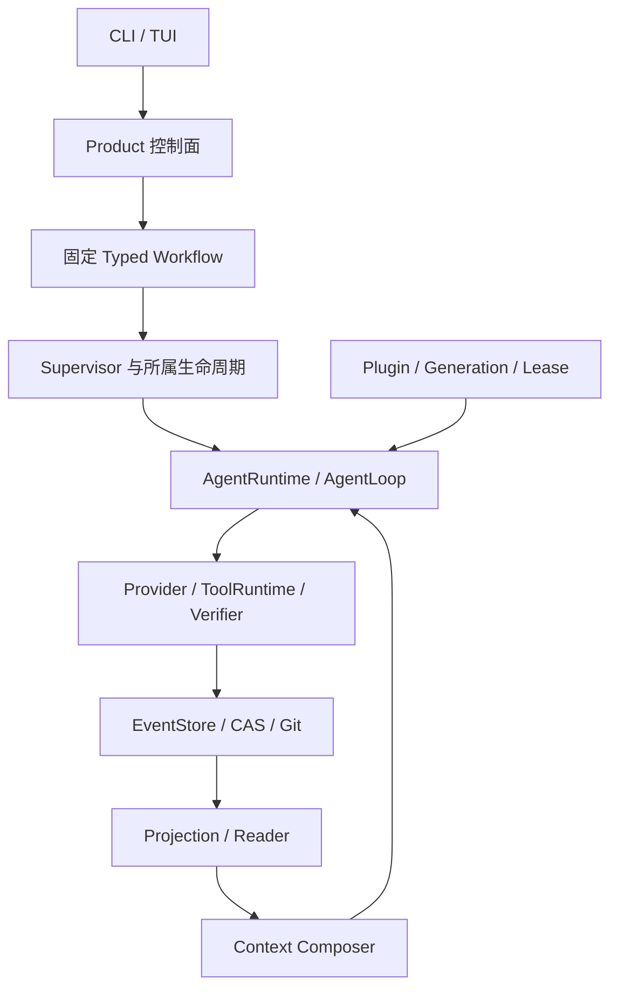

# TraceHarness 开发入口

一次分工多个直接助手已经实现；[记录 073](../deal/073-autonomous-decomposition-probe.md) 的两次探针中，题面不写数量时模型都自主拆出 4 个 assignment。[记录 074](../deal/074-strategy-paired-comparison.md) 的同题对照中，single 与 multi 都通过固定检查，但 multi 花费 6.2 倍 token 与 3.2 倍时间，原 comparison owner 判定 **regressed**；这个成本结论只适用于该类小模块任务——[记录 076](../deal/076-large-codebase-comprehension-rounds.md) 在一个 6.8 万行、无摘要文档的代码库理解任务上得到相反结果：十轮之后两臂**均通过**，multi 仅多 4.3% token、墙钟反而快 7%，两份交付物零编造引用。判据是**助手交回物是否需要主方逐字重读**（正式版 14.3.27）。[记录 075](../deal/075-autonomous-multi-child-tui-acceptance.md) 已补跑真实 PTY/TUI：无数量提示时主方再次选择 4 个可写助手，任务对话按 4 个独立 agent/session 分别展示，四份 Patch 与四条 applied 回执均成立；固定功能检查 exit 1，故完整验收失败、无 Review/Approval/Promotion。仍默认 single；TUI 新建配置默认最多一个助手，宿主显式提高 `coder.budget.max_children` 后，模型才可在上限内自主选择一个或多个助手。项目未提交发版。

本文件是必读导航，不另立模块合同。详细事实维护在[正式上下文](project-context.md)，通俗解释维护在[通俗版](project-context-plain-zh.md)。源码、测试和持久协议优先；文档发现冲突时须核查并修正，不能选择更方便的说法。

## 当前工作位置

当前支持 `single/multi`，默认 single。multi 的主方先有界侦察，再提交必经结构化分工；一次分工可分配一个或多个直接助手（正式版 14.3.20、[ADR-0078](../adr/0078-multi-child-concurrent-allocation.md)），数量由宿主 `coder.budget.max_children` 授权且新建配置默认 1；宿主通过原 Supervisor 执行这些显式获准的助手；默认只读，启用 patch_author 后在各自独立工作区编辑并交回原 Capture 产物，主方继续实现并进入收尾核对。分工计划的 `handoff` 决定派发调用是等回整批报告（默认）还是立即返回让主方按需并发继续工作；等待形态的时长由宿主授权的助手墙钟推导，装不进单次调用上限时在派发前可纠正拒绝并指向 `dispatch_and_continue`（正式版 14.3.24、[ADR-0079](../adr/0079-authorized-child-report-wait.md)）；两种形态都是一层、一批直接助手、一次分工，交付前必须逐一收集全部获准 assignment 的完成报告（正式版 14.3.19–14.3.20）。没有递归团队或动态追加；收回 Patch 本身不改主方文件，主方必须逐份完整读取并显式整合。

WC-1D/E 已完成。最新 WC-1G 同题完整确认：13 次真实模型调用，宿主固定 25 个功能用例通过，预算和工作区收敛，15 份请求副本重放通过。**主方只自行执行语法检查，收尾核对未促使其补功能测试，也未完整引用调用 ID。** 固定 Verifier 的通过不能冒充主方自主验证；一次成功没有证明普遍收益。证据见[记录 051](../deal/051-full-collaboration-confirmation.md)。

WC-2 实现与阶段定向门禁通过，WC-3 整合与对账已接入，定向门禁通过；WC-4 前六次真实失败保留；第七次记录 064 的冻结任务完整通过，当前真实调用已停止，收益与普遍可靠性未测量。执行边界见[WC 计划](../plan/TRACEHARNESS_WRITABLE_COLLABORATION_PLAN.md)，新任务读取[交接入口](../plan/TRACEHARNESS_WC2_WC4_HANDOFF.md)。计划不是执行授权，目标模式也不自动授权提交、发版、任意联网或增加测试预算。

## 架构与事实归属

图是职责导航，不代表所有调用都串行经过每个方框。

| Owner | 当前职责与边界 |
|---|---|
| Product / Workflow | 产品任务、执行阶段与审批流程；不能把模型完成陈述当作已批准或已推广 |
| Supervisor / Inbox / Delivery | Agent 身份、消息、claim、所属树、执行与取消收敛；不是另一个模型人格 |
| Runtime / Session | 单 Agent 执行循环、冻结请求及调用证据；不引入可变 messages 作为第二账本 |
| Budget / Workspace | 原账户与使用预留、受管工作区身份和释放；停止 Agent 不等于释放工作区 |
| Artifact / Promotion | 宿主捕获不可变 Patch、CAS 正文、验证及绑定身份的审批推广；报告里的 Patch ID 不是证据 |
| Context / Retrieval | 从原 Reader 获取合法候选，分配披露和预算；搜索或摘要不授予权威、权限或当前有效性 |
| Evaluation / Evolution | 冻结实验、机器证据、语义审阅和受限候选比较；复用原执行主线，不拥有自动采用权 |
| Plugin | 装配能力与 Lease 生命周期；不能绕开上面的事实和权限边界 |

## 每次如何读取

1. 读根目录 AGENTS 和本入口，检查 `git status --short`。
2. 用[模块导航](context-reading-map.md)选择当前 owner，完整读取对应合同小节及直接相邻边界，再核对真实源码和测试。
3. 只在查原因、历史协议或验证结论时读取相关 ADR、deal 和 validation-data。全文审计或影响范围无法界定时扩大读取，不能靠摘要猜测。
4. 修改范围新增 owner 时补读；不要启动时批量打印全部文档。同一任务未变化的章节不重复读取。
5. 完成后先更新受影响正式章节，再同步通俗章节；仅当全局状态、边界或导航变化时更新本入口。结果数字保留在原验收记录，入口只保留决定下一步所需的结论。

通俗版用于理解和同步核对，不再要求实现前整本重复读取。详细上下文仍保留原文件和锚点；模块导航直接定位正文，不复制另一套合同。

## 所有任务都要守住的边界

- 跨 Store、Session、Agent、Workspace、Artifact 必须核对真实身份、owner、版本和生命周期；字段看着相同不够。
- 取消、超时、部分失败与重复操作必须在原 owner 收敛；副作用结果不明先对账，不能盲目重放。
- Projection 是派生状态，索引是候选发现，冻结请求是模型实际输入证据。不得另建状态库替代原事实。
- 当前 pre-1.0 切换不默认兼容或迁移旧协议；更不能自动清空用户数据。
- 普通工具成功、模型自报完成、产物存在、验证通过、人工批准和 Promotion 是不同事实。
- 当前 WC 工作不跑全量、L2–L4、Wheel 或安装；源码阶段仍需相关正向、反例、取消/失败和相邻回归，compileall、collect-only、修改范围 Ruff。详细审查准入和反向验证要求由 AGENTS 维护。
- 真实测试先冻结任务、评分、连接身份、整树调用/时间上限及停止条件；失败和未知 usage 原样报告，不无限追跑。秘密不进入输出或文档。

## 文档分工

AGENTS 管开发规则；本入口管全局导航；正式上下文管模块合同；通俗版解释相同事实；plan 管未完成的目标与门禁；ADR 管历史决定；deal/validation-data 管实验和证据。历史的失败不删除，也不把旧阶段的“尚未实现”当作当前状态。
