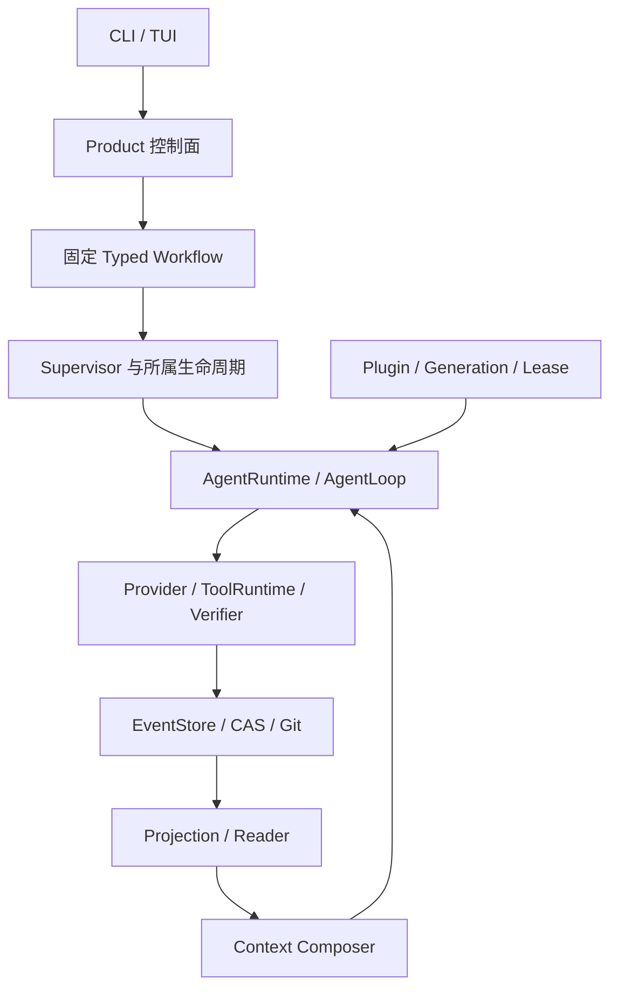

# TraceHarness 开发入口

**当前后续目标（2026-09-23 起）**：按[收口计划](../plan/TRACEHARNESS_TASK_TYPE_CONTEXT_EVOLUTION_PLAN.md)
回答三个问题——自建五类任务上的 Single/Multi 适用性、在有上下文压力的 Multi 运行中折叠的效果与质量、
Single 在 SWE 真实题 3 开发 + 3 验证上的有界自进化（后台持续检测并提出受限建议，由 `traceh eval` 人工触发验证）。
零费用 S0 已完成；A、B 已跑完（[记录 087](../deal/087-task-type-context-evolution.md)：Multi 各类都不更快、token 约 2.9–5 倍；
48k 折叠使输入均值降 16–22% 但验收 0/2 对 2/2；ADR-0084 修复重跑颠簸后复测 2/2，其中 1 例走修复路径、输入 −13%），C 链路走通、首轮建议不采用；ADR-0085 让建议点名真实原因，C2 完整 6 组通过 2/6→4/6、满足采用门并经人工采用（ADR-0087）；超时根因是 120s 短于满额输出，ADR-0086 冻结请求超时；
付费批次逐批冻结条件，费用由用户自行监控、如实记录已知与未知用量；真实 Provider 调用一律直连、不走代理。
此前的[三项目标计划](../plan/TRACEHARNESS_AGENT_EFFECTIVENESS_PLAN.md)与记录 086 保留为历史证据，正式边界见 §2.3、§12.5、§18。

真实仓库 Issue 评估的三题离线接入已完成：Product dataset format 3 的显式初始树额度见正式版 12.5，
[计划](../plan/TRACEHARNESS_REAL_REPOSITORY_EVALUATION_PLAN.md)与[记录 077](../deal/077-real-repository-evaluation.md)
维护材料准入、原主线验收与回归证据；参考补丁验收不等于 Agent 自主解题或多智能体收益。百炼
`deepseek-v4.1-flash` 三题两轮 12 次开发试跑已结束，原报告和费用/失败分析见[记录 078](../deal/078-real-model-repository-pilot.md)；
其中两次正常补测试被旧材料误拒绝，材料 version 3 已修复并重新准入，因此旧成绩不能用于宣称模式收益。
同批 multi 的 80 万整树上限还使分工/执行多次耗尽额度，协作预检漏算主方保留额会让助手启动后又被取消；
预检已修复，见[记录 079](../deal/079-collaboration-budget-correction.md)。本阶段 240 次远期草案已撤回，
12 道留出题配对也暂缓。此前在已准入 astroid 开发题上进行单题 multi 链路验收：v5 额度不足，
v6 一名助手完成而另一名超时，v7 单 Turn 预留后墙钟不足以授予助手，v8 异步派发成功但助手超时；
v9 助手完成、主方交回补丁，却被误用的旧材料在断言前拒绝。同一补丁在当前生产者生成的正确材料上
通过 26/26 固定测试；v9 原失败保留。v10 用正确材料重新冻结并完成一次真实 multi：
Product/Workflow、固定 Verifier、Review、Promotion 全部通过，81 份请求快照独立重读一致。
后续逐请求审计发现助手最后为 length 且正文为空，仍被记为 completed，主方实际没有收到可用发现；
原成功事实不改，不能把生命周期完成说成有效协作交付。两方单 Turn 输入持续增长，Product 均未
装配压缩，现有旧 Turn 压缩也不处理这类轮内增长；诊断和未修复边界见记录 079 与正式版 12.5。
这是公开开发题单次链路验收，不能报告 single/multi 模式收益。
后续[方案 080](../deal/080-long-task-context-and-completion-design.md)的 C0–C3 已实施（C4 真实验证见下）。
**C0-2 的一次真实形状探测复现了推理预算耗尽的机制**：同一模型（`deepseek-v4.1-flash`）返回——
`finish_reason=length`、正文 0 字符、零工具调用，而 64 个输出 token 全部记在 `reasoning_content` /
`reasoning_tokens` 上。即模型把整份输出额度花在当前 adapter 不读取的推理通道里，正文没开始写；
一次探测只描述这一次，不追认 v10 的字节。C0 补齐了 `CompletionCategory` 结束分类（缺失/未知不再补成 stop）
与 `Usage.reasoning_tokens`；C1 把截断/拒绝/未知/空交接统一判为不完整，在执行工具与 Verifier 之前拦截，
并拒绝正常完成却空 statement 的助手报告（该判定现已在 collect 当步生效）；C2 把引用资格与首次展示分开
（format 2 的 `disclosure`），同步修正检索评测来源口径，并让宿主能单独授予读回工具而不附带 shell；
C3 把 tool-fold 切口扩到闭合 Step 并引入软硬水位，准入路径折叠失败必须停止发送。
离线对照：同任务同窗口，关闭水位时末次请求带 6 份完整正文，开启后为 1 份。
C4 已在同一 astroid 题上真跑一次（记录 081 §6）：零截断、156 次 Step fold、零折叠失败、
主方单次平均输入 40,984→25,689，推理分项首次可见（输出的 60%/69% 是推理 token）。
**但折叠在只读调查助手一侧诱发了 22 次重跑原工具（主方 0 次）**——它交付的是带原文引用的报告，
折叠收走了它必须逐字复现的东西。由此定位并修复两条根因（记录 081 §6.5）：折叠占位符原本
不带可执行读回动作（重开要手拼 UUID+digest，重跑只需抄现成参数），以及读回结果本身两次请求后
又被折走。同条件复测：助手调用 50→26、输入 −43%、读回 14→28、折叠后重跑 22→9，
每次折叠的读回率 0.106→0.418，两方输入合计较 v10 −35%。这是一次对一次的配对观察，不是速率。
最新 run3 助手峰值 65,759 越过 61,184 硬上限并被明确拒绝；
[记录 082](../deal/082-c4c-context-and-late-stop-diagnosis.md) 独立重建发现，其中占位符 19,766、
永久保留的读回结果 27,970 token，**“必需证据约 66k、只需扩大窗口”的旧判断不成立**。
助手尚余约 108 万 token 和 73 步；主方首次收集到失败后又调用模型 17 次、消耗 562,727 token，
约 18.52 分钟后才被既有交付门禁拒绝。
这四项（及时停止、紧凑占位、有界读回保留、有限收尾）**均已实施并各自反向验证**，
见[记录 084](../deal/084-fold-maturity-fixes.md)；后续真实运行又暴露并修掉第五项：
抖动从"重跑原工具"搬到"重开同一页"（60 次读回中 31 次完全重复、五页各 4 次），
改为在同一字节预算内**按已证实需求排序、新近度只作次序**后，重开多重度上限降到 2。
**run4 起上下文越限未再出现**，峰值输入全部低于 61,184；run5 助手首次交付（12,732 字报告）；
及时停止已在真实运行中复核为"同一步结束、零额外调用"。
run7/run8 终止于供应商传输中断（`provider-tls-eof`，run8 两个会话同时连续失败），不是机制结果。
**固定 Verifier 在整个序列 14 轮中一次也没有跑到，补丁正确性从未被判定过。**
已披露的条件变更（输出上限、显式 context_policy、授予读回工具、放宽单次请求的传输重试与请求超时）
使 C4 不是对 v10 的受控对照，不能据此声称节省率或同等质量。
助手收敛与等待开销的历史诊断及三项未实施提案见[记录 085](../deal/085-multi-agent-convergence-diagnosis.md)；
其中原因判断须用原证据复核，system 已有停止要求，收尾超时也不能当作模型拒绝交付的证明。
已实现清单与门禁见[交接文件](../plan/TRACEHARNESS_CONTEXT_CONVERGENCE_HANDOFF.md)，后续行动按页首新计划。
**新授权进展**：12 题材料已准入；首个全量命中旧 16 失败 + 17 安装 ERROR，修复后最终门禁仍在推进。
Product 收尾预留补齐 Single 接线并绑定更短的 Turn 截止后，新 Single 已完整通过固定验收和交付；
同题 Multi 已交付但固定验收失败；首组提前折叠降低 tokens、增加调用和时间，双臂均未通过验收。
早期 Multi 分工候选因 Provider 协议失败停止；用户再次授权后主线转为 Single CODER_GUIDANCE。
两个 Single 开发候选与两题上下文对照已有真实记录，但尚无保住正确性的正向收益证据；
冻结 Single 候选的首题内部验证双臂通过，但成本退步，不采用；归档核验大小错误已修复并
从原证据离线重算。上下文原定三题对照已完成，其中通过题未触发折叠，未证明正确性保持的策略收益。
额外一轮根因驱动的 Single 候选开发比较被判退步并停止；最小对照覆盖三个问题，
随后扩大 Single/Multi 到原队列剩余八题，首题 Multi 遇 Provider 响应工具参数 JSON 协议错误；
双臂驱动的臂间停止检查不足，已中止并保留未知用量。没有形成新的完整配对，其余七题未启动。
当前预算占位不足再运行，积极收益与最终全量绿色均未完成，详见记录 086。

一次分工多个直接助手已经实现；[记录 073](../deal/073-autonomous-decomposition-probe.md) 的两次探针中，题面不写数量时模型都自主拆出 4 个 assignment。[记录 074](../deal/074-strategy-paired-comparison.md) 的同题对照中，single 与 multi 都通过固定检查，但 multi 花费 6.2 倍 token 与 3.2 倍时间，原 comparison owner 判定 **regressed**；这个成本结论只适用于该类小模块任务——[记录 076](../deal/076-large-codebase-comprehension-rounds.md) 在一个 6.8 万行、无摘要文档的代码库理解任务上得到相反结果：十轮之后两臂**均通过**，multi 仅多 4.3% token、墙钟反而快 7%，两份交付物零编造引用。判据是**助手交回物是否需要主方逐字重读**（正式版 14.3.27）。[记录 075](../deal/075-autonomous-multi-child-tui-acceptance.md) 已补跑真实 PTY/TUI：无数量提示时主方再次选择 4 个可写助手，任务对话按 4 个独立 agent/session 分别展示，四份 Patch 与四条 applied 回执均成立；固定功能检查 exit 1，故完整验收失败、无 Review/Approval/Promotion。仍默认 single；TUI 新建配置默认最多一个助手，宿主显式提高 `coder.budget.max_children` 后，模型才可在上限内自主选择一个或多个助手。项目未提交发版。

本文件是必读导航，不另立模块合同。详细事实维护在[正式上下文](project-context.md)，通俗解释维护在[通俗版](project-context-plain-zh.md)。源码、测试和持久协议优先；文档发现冲突时须核查并修正，不能选择更方便的说法。

## 当前工作位置

当前支持 `single/multi`，默认 single。multi 的主方先有界侦察，再提交必经结构化分工；一次分工可分配一个或多个直接助手（正式版 14.3.20、[ADR-0078](../adr/0078-multi-child-concurrent-allocation.md)），数量由宿主 `coder.budget.max_children` 授权且新建配置默认 1；宿主通过原 Supervisor 执行这些显式获准的助手；默认只读，启用 patch_author 后在各自独立工作区编辑并交回原 Capture 产物，主方继续实现并进入收尾核对。分工计划的 `handoff` 决定派发调用是等回整批报告（默认）还是立即返回让主方按需并发继续工作；等待形态的时长由宿主授权的助手墙钟推导，装不进单次调用上限时在派发前可纠正拒绝并指向 `dispatch_and_continue`（正式版 14.3.24、[ADR-0079](../adr/0079-authorized-child-report-wait.md)）；两种形态都是一层、一批直接助手、一次分工，交付前必须逐一收集全部获准 assignment 的完成报告（正式版 14.3.19–14.3.20）。没有递归团队或动态追加；收回 Patch 本身不改主方文件，主方必须逐份完整读取并显式整合。

WC-1D/E 已完成。最新 WC-1G 同题完整确认：13 次真实模型调用，宿主固定 25 个功能用例通过，预算和工作区收敛，15 份请求副本重放通过。**主方只自行执行语法检查，收尾核对未促使其补功能测试，也未完整引用调用 ID。** 固定 Verifier 的通过不能冒充主方自主验证；一次成功没有证明普遍收益。证据见[记录 051](../deal/051-full-collaboration-confirmation.md)。

WC-2 实现与阶段定向门禁通过，WC-3 整合与对账已接入，定向门禁通过；WC-4 前六次真实失败保留；第七次记录 064 的冻结任务完整通过，当前真实调用已停止，收益与普遍可靠性未测量。执行边界见[WC 计划](../plan/TRACEHARNESS_WRITABLE_COLLABORATION_PLAN.md)，新任务读取[交接入口](../plan/TRACEHARNESS_WC2_WC4_HANDOFF.md)。计划不是执行授权，目标模式也不自动授权提交、发版、任意联网或增加测试预算。

## 架构与事实归属

图是职责导航，不代表所有调用都串行经过每个方框。

| Owner | 当前职责与边界 |
|---|---|
| Product / Workflow | 产品任务、执行阶段与审批流程；不能把模型完成陈述当作已批准或已推广 |
| Supervisor / Inbox / Delivery | Agent 身份、消息、claim、所属树、执行与取消收敛；不是另一个模型人格 |
| Runtime / Session | 单 Agent 执行循环、冻结请求及调用证据；不引入可变 messages 作为第二账本 |
| Budget / Workspace | 原账户与使用预留、受管工作区身份和释放；停止 Agent 不等于释放工作区 |
| Artifact / Promotion | 宿主捕获不可变 Patch、CAS 正文、验证及绑定身份的审批推广；报告里的 Patch ID 不是证据 |
| Context / Retrieval | 从原 Reader 获取合法候选，分配披露和预算；搜索或摘要不授予权威、权限或当前有效性 |
| Evaluation / Evolution | 冻结实验、机器证据、语义审阅和受限候选比较；复用原执行主线，不拥有自动采用权 |
| Plugin | 装配能力与 Lease 生命周期；不能绕开上面的事实和权限边界 |

## 每次如何读取

1. 读根目录 AGENTS 和本入口，检查 `git status --short`。
2. 用[模块导航](context-reading-map.md)选择当前 owner，完整读取对应合同小节及直接相邻边界，再核对真实源码和测试。
3. 只在查原因、历史协议或验证结论时读取相关 ADR、deal 和 validation-data。全文审计或影响范围无法界定时扩大读取，不能靠摘要猜测。
4. 修改范围新增 owner 时补读；不要启动时批量打印全部文档。同一任务未变化的章节不重复读取。
5. 完成后先更新受影响正式章节，再同步通俗章节；仅当全局状态、边界或导航变化时更新本入口。结果数字保留在原验收记录，入口只保留决定下一步所需的结论。

通俗版用于理解和同步核对，不再要求实现前整本重复读取。详细上下文仍保留原文件和锚点；模块导航直接定位正文，不复制另一套合同。

## 所有任务都要守住的边界

- 跨 Store、Session、Agent、Workspace、Artifact 必须核对真实身份、owner、版本和生命周期；字段看着相同不够。
- 取消、超时、部分失败与重复操作必须在原 owner 收敛；副作用结果不明先对账，不能盲目重放。
- Projection 是派生状态，索引是候选发现，冻结请求是模型实际输入证据。不得另建状态库替代原事实。
- 当前 pre-1.0 切换不默认兼容或迁移旧协议；更不能自动清空用户数据。
- 普通工具成功、模型自报完成、产物存在、验证通过、人工批准和 Promotion 是不同事实。
- 当前 WC 工作不跑全量、L2–L4、Wheel 或安装；源码阶段仍需相关正向、反例、取消/失败和相邻回归，compileall、collect-only、修改范围 Ruff。详细审查准入和反向验证要求由 AGENTS 维护。
- 真实测试先冻结任务、评分、连接身份、整树调用/时间上限及停止条件；失败和未知 usage 原样报告，不无限追跑。秘密不进入输出或文档。

## 文档分工

AGENTS 管开发规则；本入口管全局导航；正式上下文管模块合同；通俗版解释相同事实；plan 管未完成的目标与门禁；ADR 管历史决定；deal/validation-data 管实验和证据。历史的失败不删除，也不把旧阶段的“尚未实现”当作当前状态。
