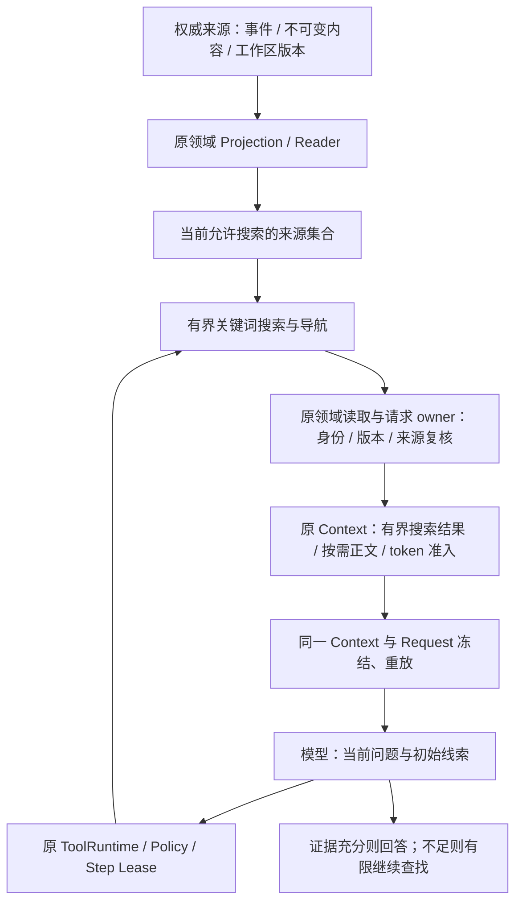

# 主动检索执行计划：搜索、阅读与证据核对

日期：2026-09-09。状态：**计划已落盘，AR-A–AR-D 尚未开始**。

本次授权仅编写执行计划及同步项目上下文，不实现接口、不运行真实 Provider、不提交或发布。
AR 是本计划的阶段前缀，用来区别已完成的分层压缩 A/B/B+/C/E0/D/E1–E3；不另立版本路线。
后续实施须遵守用户实际授权的阶段范围。落盘不等于设计合同已经冻结，也不等于获得后续阶段的执行授权。
若用户后续一次授权多个阶段，前置门槛通过即可在该范围内连续推进，不要求每个阶段重复确认。

## 1. 目标与现有依据

目标是让模型在自动参考遗漏时，可以在当前授权范围内自主搜索、按需读取、核对证据；需要时换词继续查找。
复用现有渐进披露、Reader、Context 和 AgentLoop，使“发现候选 → 读原文 → 再搜索”成为同一条生产主线。
自动候选与目录仍提供初始线索；本计划不把一次自动召回失败等同于资料不存在。

以当前源码为准，相关入口如下。表中已有工具名是实际名称；后文新工具名仅为拟议名称，AR-A 才冻结。

| 来源 | 当前已实现 | 当前缺口 | 本计划范围 |
|---|---|---|---|
| History | 本 Session 压缩历史目录；`request_history_page` 请求完整 Turn 组成的原文页 | 模型缺少按查询定位原文页的工具；只能沿已披露 cursor 阅读 | 在合法压缩历史来源中查关键词，提供精确位置与现有 reader 可用的读取动作 |
| Skill | 宿主持久选择；已选 Skill 顶层元数据的自动词法检索；`request_skill_reference` 读取目录、章节和资源块 | 初始自动召回遗漏后，模型不能自己换词搜索；大目录不能分页 | 主动搜索已选且属于当前有效 Composition 的导航元数据，并有界呈现命中章节或资源入口 |
| Memory | 项目批准事实投影、自动词法检索；`request_workspace_memory` 读取已披露 ID/version | 模型无法自行用另一条查询发现未自动召回的有效记忆 | 主动检索当前项目 active 的已批准事实；保留原批准和版本规则 |
| 工具输出 | `list_tool_outputs`、`search_tool_output`、`read_tool_output` | 已有能力，仍需验证新导航不会使模型绕路或重跑工具 | 复用和回归，不重做存储或搜索接口 |
| 工作区文件 | `list_files`、`search_text`、`read_file`，由原 Policy 控制 | 与内部参考是不同权限面 | 复用；不让 shell/文件搜索读取内部账本代替领域 reader |

源码依据：

- [History reader](../../src/traceh/session/history.py)、[History 请求校验](../../src/traceh/session/history_requests.py)、[History Tool](../../src/traceh/tools/history.py)。
- [Skill 选择](../../src/traceh/session/skill_selection.py)、[Skill 检索](../../src/traceh/session/skill_retrieval.py)、[Skill Tool](../../src/traceh/tools/skill.py)。
- [Memory 投影](../../src/traceh/memory/projection.py)、[Memory Context Reader](../../src/traceh/memory/context.py)、[Memory Tool](../../src/traceh/tools/memory_reference.py)。
- [统一 Context](../../src/traceh/session/context_input.py)、[披露寿命](../../src/traceh/session/reference_requests.py)、[请求构建](../../src/traceh/runtime/request_builder.py)、[模型导航说明](../../src/traceh/runtime/prompt.py)。
- [工具输出](../../src/traceh/tools/output.py)、[工作区搜索](../../src/traceh/tools/builtins/search_text.py)。

前置结果为 [E 收口记录](TRACEHARNESS_E_AND_SEMANTIC_EXECUTION.md)。九组语义候选的
[未接入结论](../validation-semantic-retest.md)继续有效；本计划不修改旧题、旧评分、旧冻结文件或历史 ADR。

## 2. 目标架构与责任边界

下图表达**目标流程，尚未全部实现**，不是所有领域共享一个新 Projector 或第二条 Runtime。



| Owner | 负责 | 不能负责 |
|---|---|---|
| EventStore、原内容存储 | 各领域原事件、内容及可验证来源 | 为搜索复制一套可变业务事实 |
| Projection | 由原领域规则重建状态 | 根据模型窗口改变批准、替代、撤销状态 |
| Reader / authority | 选择来源范围，调用原投影，校验 scope、身份、版本和来源 head | 用搜索分数决定业务有效性 |
| 检索 | 在已限定集合中找位置和候选，解释实际搜索覆盖范围 | 自行绑定项目、选择 Skill、启用插件或批准 Memory |
| Context / RequestBuilder | 统一披露、token 与物理资源预算、冻结可重建模型输入 | 静默截断完整事实、把 receipt 当已送达正文 |
| AgentLoop / 模型 | 在原 Step、Attempt 和 Budget 内选择搜索、阅读或回答 | 新增无限搜索循环、后台模型或独立预算账本 |
| Product / Workflow / Plugin | 保留原 START、审批、执行和 Generation/Lease/Drain 边界 | 因加入纯读搜索而自动扩大任何现有 capability grant |

索引如确有需要，只能是原合格来源的可重建派生物；首版优先复用现有词法能力和有界扫描。
不得先扫描所有项目/未批准正文再在返回结果时过滤。索引也不能代替当前 Reader 的资格复核。
历史请求重放使用原冻结输入和来源证据，不能拿今天的索引或今天的批准状态重算过去请求。

## 3. 搜索与披露的共同约束

### 3.1 可检索范围和首次发现

- 搜索范围是**当前有权访问的合格来源集合**，不局限于这一 Step 自动召回的 Top-K。
- History 首版限同 Session、原 History reader 能验证的压缩闭合历史。近期 Surface 已可见内容不另复制；
  不开放任意 Stream、任意 seq 范围、跨 Session 历史或 Product 控制账。
- Skill 限宿主已选且 selection/catalog/Lease 有效的 Skill。首版搜索顶层及章节、资源、分块的标题和说明，
  不全文扫描未披露正文、不自动发现或选择未选 Skill。不承诺只在正文出现的词能命中；明确报告覆盖字段。
  章节导航搜索是待冻结的新披露范围，必须由当前 catalog 重建，不能因元数据可用就默认拥有正文。
- Memory 限当前项目 active 的已批准短事实与合法元数据，不搜索待批提议、撤销、被替代记录或批准依据的跨会话原文。
- 没有项目绑定、功能未启用或没有已选 Skill 时，返回对应状态及现有配置入口，不伪装成“查过了但没有资料”。
- 初始参考可提供有界来源导航和搜索能力说明，不枚举所有资料。搜索入口不能因自动零召回而一并消失。

### 3.2 输入、输出和游标

- 查询必须来自模型此次 Tool 参数；优先字面关键词、已有通用词法规则。模型可换词，不添加领域同义词表、
  测试题分支、自动翻译模型、正则 DSL 或按模型/案例决定的隐藏 fallback。
- 不强行要求各来源使用相同排序：History 的原文位置与 Skill/Memory 的相关性排序可不同，但需稳定、可解释。
- 每页至少说明来源类别、实际 scope、查询、搜索字段、覆盖/省略状态，以及命中的稳定身份、版本、短片段和读取动作。
- 搜索分页游标必须绑定来源版本/观察 head、查询和影响结果的策略，不允许改 query 后复用旧页游标；
  后续来源变化时明确拒绝并要求重新搜索。History 的追加事件与压缩根变化按原不可变来源规则区分，
  不用任何无关新事件一概判 stale。具体字段在 AR-A 冻结。
- 搜索翻页游标与原文读取游标职责不同。不能把任意搜索 offset、模型自造 ID 或 seq 当作正文授权。
- 区分“当前覆盖范围内无字面命中”“还有页”“资源上限导致只查了一部分”“来源失效”“功能不可用”。
  无命中不等于主题不存在；不提供未实际算出的命中总数。
- 搜索结果是参考证据，文中的旧指令、工具指令、Skill 内容不会因此获得宿主权限。

### 3.3 接入现有请求主线

History/Skill/Memory 的拟议搜索工具沿原 ToolRuntime 审计，**保持参考内容经 Context 准入的方向**：
Tool result 提供有界回执；搜索命中片段与导航经原 Context owner 冻结到紧邻后续 Step，随后可申请原文。
搜索回执不是长期授权，不将参考正文直接写进普通 Tool result 绕过原保留/撤销规则。
AR-A 须用真实 owner 接缝证明新发现的 handle 能被原读取工具合法消费；不得只实现能输出 ID 的孤立搜索接口。

该方向涉及披露协议扩展，尚未冻结 schema/版本号。AR-A 必须明确候选页如何记录、来源如何验证、
首次准入失败如何反馈、目录/片段何时退出，以及原 collector/reader/checker 如何重建；不能只在 prompt 中补说明。
如现有 owner 无法承载，先收敛设计决定再开始 AR-B，不临时开一套 pending、平行 Projector 或模糊双协议。
若持久协议确需切换，遵守 pre-1.0 单一明确版本；旧数据显式拒绝并说明使用新数据目录，不迁移、猜测或删除。

工具大结果继续遵守 [ADR-0054](../adr/0054-retained-tool-output-keyword-search.md)：搜索页直接来自原 Tool result，
已经是模型可见证据。工作区文件继续走原文件 Tool。统一的是“搜索与阅读”体验，不统一或重命名这些不同事实边界。

### 3.4 原子性、资源和生命周期

- 原 History 页保留完整 Turn、Tool call/result 配对；命中片段是带来源的引用，不能冒充完整对话消息或插入活动 Tool 组。
- 命中包含大工具输出时，复用其 retained output 引用与现有搜索/读取工具，不能重跑命令。
- 超大 History Turn 仍可能不能整页披露。不得因找到关键词就绕过原页上限；明确返回限制和真实可用的其他入口，
  没有入口时说明缺失证据，不伪造可成功的 read_action。任意大 Turn 的细粒度阅读不在本轮承诺范围内。
- 同时限制源读取事件数/字节、扫描量、查询长度、命中数、每片段及每页大小、模型可见总 token 和总 Step。
  输出短不等于源扫描成本小；具体数值、编码、分页单位和默认装配在 AR-A 列明，不能由某条测试临时决定。
- 复用 E2 整块准入及 E0 完整请求检查；片段省略必须显式标注，不截坏 JSON、不把局部 Memory 当完整批准事实。
- 生命周期沿原 Session/Provider/Lease/取消收敛 owner。新搜索不能在取消、失败、Turn 结束或资格中断后继续供给正文。
- 并发来源变化用已有 source head/catalog/selection 校验及确定性 Gate 测试；不持跨模型调用长锁，不新增后台任务。

## 4. 阶段与交付物

### AR-A：设计合同与评测冻结

**状态：待执行。** 先恢复两份上下文、检查真实 diff 与公开装配，完成以下内容后才能进入 AR-B：

1. 给出 History、Skill、Memory 的生产入口、Reader、authority、Projection、Context 和持久协议 owner 对照表。
2. 核对普通 Chat、Product requester、程序化 Runtime、功能关闭和插件切换的真实能力装配；
   保持已有授权范围，配置入口复用现有 host policy/中文表单，不要求用户输入对象内部 ID 才能搜索。
3. 在新 ADR 中冻结输入 schema、搜索页/回执、首次发现到合法阅读的授权链、分页、版本变化、预算和拒绝语义。
   新工具暂称 `search_history`、`search_skill`、`search_memory`；最终名字仅由此阶段冻结，不增加旧名别名。
4. 明确是否需要改 Session/Context/reader 策略版本及影响矩阵；先证明现有主线可接，再写生产实现。
5. 冻结 §5 的题目、来源、预期证据、预算、模型配置身份、随机种子、判断规则和基线/候选比较方式。
   题目应能由指定材料直接回答，不把含糊的关联当作标准答案；同语言改写与跨语言诊断分开计分。

交付：新 ADR、接口/来源/失败矩阵、评测 manifest 及摘要、各后续阶段具名测试清单。
本计划不预占 ADR 编号或编造不存在的测试文件路径。若本阶段只是文档冻结，运行文档 QA；
如获授权编写评测脚本，则执行脚本 owner 的定向正向、反例、失败测试和 §6 日常门禁，不提前实现搜索。

### AR-B：History 主动定位

**状态：待 AR-A 完成并获得实施授权。**

- 在原 History 来源展开与分页 owner 上增加有界查询；不另写一套压缩来源展开器。
- 搜索不要求用户/模型先猜 block_id，不以当前已注入目录作为全部范围；由合法来源集合发现命中页。
- 搜索命中能通过 AR-A 冻结的同一授权链进入后续 Context，并被 `request_history_page` 消费。
- 首版覆盖关键词在后页、多次压缩、重启、重复词、中文/英文/Unicode、无命中和未覆盖完；
  同时覆盖错误 Session、伪造/变更游标、预算拒绝、超大页、来源校验失败、重复取消和请求精确重建。
- 大工具输出搜索保持原运行次数，摘要不包含预期答案；历史旧指令不改变当前问题或授权。

交付：生产接线、History owner/相邻测试、隔离真实 History 旅程与完整失败证据、两份上下文同步。
关键保护做反向验证；以真实公开请求错误作为证据，导入错误或操作未发生不算验证通过。

### AR-C：Skill / Memory 主动发现

**状态：待 AR-B 范围门禁通过并获得实施授权。** 内部按 C1 Memory、C2 Skill 推进，共用 AR-A 的规则。

- **C1 Memory**：复用当前项目 Reader、active 投影和词法排序，让显式查询能找到未自动召回的批准事实。
  验证批准后发现、supersede/revoke 后旧结果不能再次准入、跨项目拒绝、变更绑定、无绑定/无批准记录、预算和取消。
  已经在模型可见上下文中的内容不能被“抹除”；验证目标是后续准入与有效状态解释，不宣称模型能遗忘已读文字。
- **C2 Skill**：复用当前 selection/catalog/Lease 与贡献者导航，提供未自动召回 Skill 及其相关章节/资源的有界入口。
  验证目录超过单页预算仍可分页定位、正文隐藏词不进入首版搜索、未选 Skill 不可见、陈旧目录拒绝、插件切换/Drain、
  搜索到正文的实际读回及取消。不能从 ID/路径猜标题，也不能读取工作区文件冒充 Skill 资源。
- 不为这两个来源复制平行的 Context 准入、游标状态、缓存或 Model loop。复用逻辑须有实际共同消费者，
  不仅为了未来扩展引入统一“万能 Reader”。

交付：两类来源生产接线、定向与交叉回归、各自真实自然提问证据、两份上下文同步。
C1/C2 分步运行对应 owner 测试，共享 Context/披露寿命回归在合并点统一执行一次，避免无变化重复长门禁。

### AR-D：自然问答、基线对照与范围收口

**状态：待 AR-C 完成并获得实施授权。**

- 使用同一真实 Provider、相同语料/问题/资源配置做基线和候选对照；原脚本 Provider 只验证确定性合同，
  不能代替真实模型自主搜索行为。真实运行必须显式触发，不能由普通 pytest 隐式联网。
- 用户问题不包含工具名、内部 ID、tier、cursor、“请搜索再读取”等操作提示；系统工具说明可解释通用规则。
- 检查实际派发请求中的命中片段/正文、来源版本、模型回答和搜索轨迹；“调用过工具”不等于读到正确证据。
- 片段已足够时允许直接回答；只有证据不足的题才要求后续阅读。需要换词/翻页的题由来源与覆盖事实验证，
  不强制唯一关键词、固定调用顺序或模型必须调用某个次数才能得分。
- Line 与 headless TUI 使用同一 Driver 定向验证可用/无命中/限额/失效说明，用户应看懂哪里没查完、为什么读不了。
  不扩展新的配置 Dashboard，不额外增加对话复制或 Product 控制面功能。
- 收口审查按 AGENTS finding 准入规则检查当前公开路径，分开报告事实、未跑门禁及外部 Provider 失败；
  没有当前 P0/P1 后进入约定验证，不无限构造未声明威胁输入。独立代理审查须另有授权，本计划不启动代理。

交付：冻结清单、定向测试/反向验证、逐次真实结果与重放核对、限制说明、最终范围结论。
不能因为 E 或 AR 的定向门禁通过就宣称 v0.9 已发布；发布候选与全量门禁另行授权。

## 5. 真实验收设计与停止条件

以下是**待 AR-A 固化的验收计划数值**，不是生产默认配置，不回写旧语义 benchmark。

### 5.1 用例与证据

计划 24 条自然任务，History、Skill、Memory、工具输出各 6 条。每类覆盖直接定位、换说法、干扰项、
后页/被自动召回遗漏、资料不存在或失效，以及与当前问题的关联；具体归属在 manifest 中逐题写明。
至少包括“初始已知目录外的合法资料”“短片段不够必须读取附近证据”“首次词语无命中后换词找到”三类。
控制台退出、取消、并发与协议反例以确定性测试为主，不依赖模型碰巧触发。

下列自然问题仅展示风格，**不是系统默认或最终冻结题目**：

- “之前现场联络安排谁负责来着？”
- “签到结束后怎么安排小组？”
- “人数限制后来改成多少了？”
- “刚才那次检查失败在哪里？”
- “我们之前讨论过停车安排吗？”

至少使用两套不同领域材料，不沿用单一天文夜例子作为通用路径；事实值、ID 与位置通过预先冻结的测试种子变化。
答案只在独立判定材料中，不能进入目标问题、系统提示或压缩摘要；准备阶段的真实历史事实可以正常存在。
在全新隔离测试目录创建数据；Memory 准备走原批准入口，Skill 走实际贡献和选择，工具输出通过实际执行产生。

每个目标配置计划固定 3 次重复，基线/候选成对复用种子，各 72 条旅程；目标模型清单由 AR-A 依据已有授权配置冻结。
不为凑样本增开新服务或安装模型。仅验证一个模型时，明确结论只覆盖该模型和配置。
至少额外报告同语言/跨语言、无命中/有证据和不同来源分项；跨语言探索与泛化压力样本不能混入通过率美化结果。

### 5.2 分开的门槛

| 维度 | 计划门槛与口径 |
|---|---|
| 确定性合同 | 当前 scope、批准、版本、Tool 配对、取消收敛、完整请求预算、来源与重放相关用例全部通过 |
| 模型任务与证据 | 每个冻结模型配置候选至少 66/72 条任务与证据同时通过；每类至少 15/18，不能只看总分 |
| 越权与事实冒充 | 实际资料越权披露、重复工具副作用、无证据编造测试事实、旧 Memory 冒充当前批准事实均为 0 |
| 基线保护 | 预先标注的既有词法/工具输出成功控制组，候选不得新增确定性回归；真实模型波动逐题逐次报告 |
| 行为收益 | 对冻结的自动遗漏/换词/后页任务单独报告增益；没有实际收益不能宣称闭环改善，需定位问题 |
| 资源 | 每题保持冻结 max_steps、模型预算和来源扫描/分页上限；报告平均/p95 搜索读取次数、延迟、token 与节省/增加量 |
| 证据完整性 | 所有运行目录保留；所有可重建完成请求精确重放，失败/取消请求按原状态解释，不把未派发当成功 |

AR-A 在看到候选结果前确定各题资源值和收益判断的比较组，不按评分结果抬预算、补关键词或删困难题。
真正的产品缺陷可以修复后按同一 manifest 运行一轮新的完整目标配置网格；旧失败保留，不能只重跑成功案例。
外部网络失败单列，沿既有 Provider retry；无 usage 标 unknown，不填 0，也不删除后再声称首轮全部通过。

### 5.3 报告与停止

每次实际记录：问题与语料身份、模型/配置、Step/Attempt、搜索词与覆盖范围、候选和原文来源、实际准入内容、
最终答案、判断理由、取消/失败类别、Provider usage、准备/摘要/目标调用成本及重复副作用次数。
报告引用原事件和冻结请求；独立重开 reader 核对，不把模型自述或脚本的 passed 字段当最终证据。

固定网格未达标时停止进入下一阶段或发布，报告真实失败及归属；不无限换 prompt、试模型直到碰巧通过。
资源足够也不能保证模型每次主动搜索正确，无命中和同义改写的能力边界必须如实记录。

## 6. 验证、文档同步与交付纪律

**本次文档落盘：** 只做 UTF-8、章节对应、链接、Mermaid 代码块/流程、示例边界、秘密形状与 diff 检查；
没有代码、协议、配置或测试脚本变更，不运行 pytest、真实模型、compileall 或安装门禁来冒充实现验证。

**后续源码/测试/配置/脚本阶段：** 遵守仓库 AGENTS 的 owner/相邻分层验证，通常执行：

```powershell
python -m compileall -q src tests
python -m pytest --collect-only -q
git diff --check
```

随后仅运行 AR-A 冻结清单中的受影响 owner/相邻测试、修改范围 Ruff、文档/架构保护/协议拒绝测试及必要真实验证。
正向、关键反例和失败/取消不能遗漏；关键修复临时去除对应保护做有意义的反向验证，再恢复并确认。
不默认启用 xdist；SQLite、进程、Git、取消用例必须证明资源隔离。具体命令清单在阶段开始时依据实际文件更新。

全过程不跑全量 pytest、L2–L4、递归 Wheel/离线安装或发布长门禁；不提前接入向量/reranker、MCP、Sandbox、
动态 Workflow 或新 Agent 调度。真实 Provider 只按当次任务授权通过既有配置加载器调用，不读取/输出秘密，
不改变用户启动 Profile 或原 Session，不为了诊断重跑用户命令。

每阶段先更新 [正式上下文](../note/project-context.md)，再从正式版同步 [通俗上下文](../note/project-context-plain-zh.md)，
按实际影响改写模块、流程、协议、配置、验证和限制。实现后的版本变化进 CHANGELOG，开发记录与验证证据各归原目录；
计划只更新当前状态和链接，不把尚未完成的能力列入现状。不改写旧 ADR，不隐藏持久协议切换。

最终交付说明代码与文档改动、原因、实际验证、同步章节和剩余边界。只有明确授权才 commit/push/tag/release。

## 7. 执行状态

| 项目 | 当前状态 | 下一步 |
|---|---|---|
| 本计划与两份上下文入口 | 已落盘；文档 QA 通过 | AR-A 待授权执行 |
| AR-A 设计/评测冻结 | 未开始 | 授权后完成接缝、协议、预算和 manifest 冻结 |
| AR-B History 搜索 | 未开始 | AR-A 范围门槛通过后实施 |
| AR-C Memory / Skill 搜索 | 未开始 | AR-B 范围门槛通过后实施 |
| AR-D 真实验收与收口 | 未开始 | AR-C 完成后执行固定网格与范围门禁 |
| 语义检索、发布门禁 | 不属于本计划 | 保持原不接入结论与独立授权边界 |
