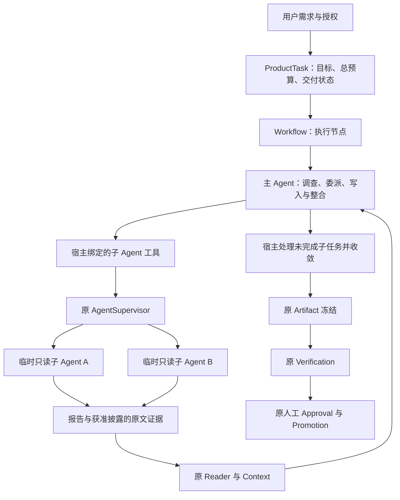

# 动态协作与统一评估：DA-0～DA-5 执行计划

日期：2026-09-11。状态：**DA-0～DA-5 总体方案已获用户认可，各阶段均未启动；自进化后续目标已修订为运行期后台受限优化，见 §7.5。**

本文记录已获认可的总体实施顺序，不代表动态协作已经实现、已启动真实实验或已取得收益。最新授权顺序为：完成 AO-3、提交并发布，再完成 DA-0 必要合同与 DA-1～DA-5，以及阶段约定的真实测试；继续禁止全量 pytest 与 L2–L4。DA 自身没有额外发行授权。

调研时 HEAD 为 `53b7b6680882245ce093f4bc918f6e80ff3aeba8`。基线是 v0.10.0 之后当前工作区的 UE/AO 实现，不能只用发行 HEAD 代表它。实施每阶段前重新核对源码、未提交改动、两份上下文与输入摘要，不覆盖已有工作。

阅读顺序：先看 §1–3 的目标和架构，再看 §8–10 的实验和阶段，最后审核 §13 的决策清单。

## 1. 最终要得到什么

在原 ProductTask 的执行阶段，让主 Agent 根据任务决定是否委派、委派哪些独立问题、何时收集结果，以及是否继续调查。简单任务可以完全不创建子 Agent。

固定的是 ProductTask 的需求、授权、总预算、交付状态，以及 Workflow 的产物验证和人工审批关卡。临时变化的是执行节点内部的分工，不是让模型任意修改整张 Workflow 图。

交付三项互相连接的能力：

1. **按需协作：** 主 Agent 可组织临时、只读的调查子任务，自己承担写入和整合。
2. **公平比较：** 同一任务可以通过原 EvaluationRunner 比较单 Agent 和允许委派的执行策略。
3. **受限优化：** 原 AO 流水线可分析协作失败并提出批准范围内的说明文本候选；运行、评分和采用权限继续分离。

本计划不以“多 Agent 必须赢”作为实现完成条件。允许实验结论是：仅某类任务有收益，简单任务更贵，或当前模型不适合默认开启协作。所有结论由真实测量支持。

## 2. 当前代码事实与设计依据

| 已核实的主线 | 代码 | 对本计划的约束 |
|---|---|---|
| Product 仅有固定 single/multi 拓扑；multi 是 parent→reviewer→coder | [topology.py](../../src/traceh/product/topology.py) | 不能把当前 multi 宣称为动态团队；要替换重叠执行组织方式 |
| Product 内置工具与资源按固定角色装配 | [runtime.py](../../src/traceh/product/runtime.py)、[resources.py](../../src/traceh/product/resources.py) | 仅暴露 spawn 名字不够；必须接通宿主 preset、Budget、Workspace、Session 和 Context |
| 通用 SupervisorToolset 已提供创建、发送、等待、停止、收集 | [tools.py](../../src/traceh/supervision/tools.py)、[provisioning.py](../../src/traceh/supervision/provisioning.py) | 复用公共 AgentSupervisor；模型不能声明 owner，子工具不能获得 Product 审批能力 |
| ownership、Inbox、Delivery、Budget 都有自己的事实与生命周期 | [agents.py](../../src/traceh/api/agents.py)、[budget adapter](../../src/traceh/budgets/supervision.py) | ownership 不等于历史访问权限；接受消息不等于完成；预算不能由 AgentSpec 或提示词创造 |
| Workflow 为固定五类节点；只支持干净 Approval 屏障恢复 | [execution.py](../../src/traceh/workflow/execution.py)、[service.py](../../src/traceh/workflow/service.py) | 首版不加入任意 DAG 重写、条件 DSL、崩溃中途自动接管 |
| AgentRunReport 从持久事实重建，引用主要证明消息/Turn 生命周期 | [reports.py](../../src/traceh/supervision/reports.py) | completed 不证明自然语言结论正确；需增加可核对的交接证据视图 |
| ProductTaskEvaluator 已按模式生成 trials，执行归因仍按固定角色 | [product evaluator](../../src/traceh/evaluation/evaluators/product.py)、[product metrics](../../src/traceh/evaluation/evaluators/product_metrics.py) | 已有未归因成本保留；动态树还需正式归因，不能只统计主 Agent |
| 双臂比较要求 requested_mode 相同 | [comparison.py](../../src/traceh/evaluation/comparison.py) | 需要正式的策略对照合同；不能通过删除配对校验绕过 |
| 检索旅程主要检查 setup/target Session | [retrieval_episode.py](../../src/traceh/evaluation/evaluators/retrieval_episode.py) | 子 Agent 读到、报告可用、主 Agent 收到必须分别验证 |
| review/assess 目前只接受 retrieval_episode；Product 固定 product-durable-v1 且不要求语义审阅 | [review.py](../../src/traceh/evaluation/review.py)、[product_manifest.py](../../src/traceh/evaluation/evaluators/product_manifest.py) | DA-3 需增加 Product 的评估适配；不能把交付链完成直接当作语义正确 |
| 候选只准改指定检索/工具说明字符串 | [variants.py](../../src/traceh/evaluation/variants.py)、[optimization.py](../../src/traceh/evolution/optimization.py) | 协作策略不能直接作为任意 Python patch 进入 AO；需批准新的有限文本位置 |

现有 Product 三条小编码题适合作简单任务对照；原 72 条是已用于开发的检索题，适合作回归，均不足以单独证明动态协作收益。题库来源见 [Product dataset](../../benchmarks/product_v1/dataset.json) 与 [检索旅程说明](../../benchmarks/retrieval_episodes_v1/README.md)。

## 3. 选择的架构与 ProductTask 的位置

以下图表示**目标设计，尚未实现**。



| owner | 负责 | 不负责 |
|---|---|---|
| ProductTask | 用户需求、批准范围、任务级配置/预算、交付状态 | 固定临时 Agent 的职业名称；把每条子消息升级成 ProductTask |
| Workflow | 执行节点、完成屏障、验证与审批衔接 | 解释子 Agent 的所有聊天；成为第二个 Supervisor |
| 主 Agent | 选择调查问题、分工、比较证据、整合结果 | 自行增加权限/总预算、跳过验证或批准推广 |
| Supervisor 与 Inbox/Delivery | 身份、接受/执行、等待、终止、子树收敛 | 判断一个业务结论是否正确 |
| Budget / Workspace / Sandbox | 宿主额度、精确版本资源、工具执行约束 | 因为模型说“需要”而增加授权 |
| Reader / Context | 读取当前合法证据、控制披露、冻结实际模型输入 | 把子 Agent 结论升格为批准 Memory |
| Evaluation / Evolution | 测量、受限提案、比较、生成审阅包 | 修改生产权限、自动安装/提交/推广 |

**首版组织约束：** 只有主 Agent 可创建子 Agent；子 Agent 不能再创建孙 Agent。角色可以动态，能力来自宿主批准的有限配置。子 Agent 不直接向兄弟 Agent 发消息，需由主 Agent 交接。并发度、总创建数和失败重试额度必须显式配置。

**单一写入者：** 主 Agent 写工作区；子 Agent 只调查固定版本的代码或明确获准的资料。首版不让子 Agent 审查不断变化的脏工作区，也不自动合并多个写入分支。后续若要审查新修改，必须另行实现与不可变 Artifact 绑定的输入，不能宣称本阶段已经具备。

## 4. 委派、身份与消息合同

### 4.1 委派输入

模型提出目标、预期交付、允许候选中的能力意图和需要的资料引用。宿主绑定调用者 Session、真实 owner、批准的能力组合、资源版本和预算账户；模型不能填写或覆盖这些权威值。

一次工作必须能定位到：创建请求、child Agent/Session、Inbox message、父调用的 Turn/Step/Tool call，以及冻结输入的摘要。工作指令的结构化封装走原 Inbox；运行状态由原 Delivery 解释。新增的字段规范在 DA-0 冻结，不能把 Agent.metadata 当权威工作版本或可变任务表。

同一创建或发送操作的重放使用原稳定身份规则。不同 Tool call 即使文本相同，也不自动等价为同一操作：是否重复调查属于策略诊断，不能误把合法重试吞掉。

### 4.2 生命周期与交接

```text
宿主准入与资源绑定
  → 原 create / reserve / reconcile
  → 原 Inbox 接受工作指令
  → 原 Delivery claim
  → 子 Agent 的普通 Turn / Step / Tool 执行
  → 原 Delivery 终态与 AgentRunReport
  → 获准交接内容进入主 Agent 的下一次模型请求
```

主 Agent 可以先派出多项调查，再自己继续工作；收集结果仍通过已有工具调用边界。首版只使用已实现的 NEW_TURN 投递，不向正在执行的子 Turn 隐式注入 NEXT_STEP 消息。

追问使用新消息并关联此前工作，按 Inbox 排序；不原地修改旧工作指令。结果须携带原输入绑定；针对旧输入完成的调查不能直接作为新版本已验证的证明。

### 4.3 原子性、部分失败与取消

| 场景 | 必须成立的规则 |
|---|---|
| 创建前预算/工作区不合法 | 由既有 owner 拒绝，不启动未授权 Agent |
| reserve、create 或 send 只完成一部分 | 依据原 Budget、Directory、Inbox 和 Effect 对账；释放未使用预留或停止已创建工作，不按调用方是否收到返回猜测 |
| 同一消息被重复投递 | 原 Inbox/Delivery 幂等与 claim 规则阻止重复执行 |
| 子任务失败或证据不足 | 保留失败和成本；主 Agent可补查、改派或报告未完成，但不能把失败写成成功 |
| 主 Agent 提前结束 | 宿主明确等待或取消未完成工作并收敛；完成状态、交接和最终产物不能互相矛盾 |
| 用户取消、预算耗尽、超时 | 复用 owned 子树清理；调用返回前完成资源收尾，重复取消不逃逸，部分失败不遮蔽原错误 |
| 进程崩溃 | 保留原证据并明确标记不完整；不扩张现有恢复范围，不盲目重跑有副作用工作 |

特别核查 `NodeExecutor` 当前的 report→capture→finally dispose 顺序。引入动态子任务后必须证明进入 Artifact/Verification 之前子工作已收口；必要改动放在原执行/资源 owner，不能用 UI 显示“已完成”代替。

## 5. 证据、Context 与唯一事实源

### 5.1 交接内容

在原 AgentRunReport 和源记录之上生成只读交接视图，包含：结论文本、输入绑定、实际来源引用和未解决事项。结论与未解决事项是 Agent 声明；宿主只验证结构、引用身份、版本、scope 和原请求记录，不声称验证了自然语言真伪。

至少区分三项诊断：

1. 子 Agent 的实际请求中是否出现相关原文；
2. 该子任务报告是否已经可用；
3. 主 Agent 的实际请求中是否出现所需交接内容或原文片段。

不能以目录命中、accepted 回执或 completed 状态替代上述证据。也不要求所有子 Agent 原文在主 Agent 全量重读；按题目需要核对必要证据，报告引用与原文读取分别记录。

### 5.2 来源和权限

- 所有读取复用来源自己的 Reader/Projection，先验证合法范围和版本，再经 Context 编排。
- 子 Agent 仅因 owner 关系不获得父会话或其他会话的完整 History；父会话材料只能经宿主批准的明确披露范围交接。
- 项目 Memory 仍以批准、替代、撤销事件为准；Skill 仍绑定有效贡献版本；摘要和子 Agent 报告不增加权威等级。
- 交接快照只证明当时看到了什么；当前状态仍回原 owner 读取。过期引用明确拒绝或要求重新读取。
- TUI 和 Evaluation 展示同一批原记录的派生视图，不维护自己的“团队事实表”。

### 5.3 事实归属

| 内容 | 唯一权威来源 |
|---|---|
| 用户任务与批准 | 原 Product/Promotion 事件 |
| 子 Agent 身份和所属关系 | 原 Agent Directory 事件 |
| 被接受的工作指令 | 原 Inbox 事件 |
| 消息是否执行/结束 | 原 Delivery 与 Session 事件 |
| 模型实际看到的内容 | 原 Frozen Request / Context Snapshot |
| 额度和费用结算 | 原 Budget Ledger；Provider usage 保留精度与未知状态 |
| 工具副作用与输出 | 原 Effect / Session / CAS |
| 代码、产物与推广 | 原 Workspace / Git / Artifact / Promotion |
| 协作图、交接诊断、比较报告 | 对上述来源的派生视图，不授予新权限 |

## 6. ProductTask 收敛与用户配置

目标生产入口只提供两种清楚的执行策略：

- **单 Agent（single）：** 主 Agent 完成，宿主不授予委派能力。
- **按需协作（adaptive）：** 主 Agent 可以不委派，也可以在额度内组织临时调查。

它们共享同一 ProductTask、执行节点和验证/审批尾部，不建立两套业务生命周期。即使 adaptive 一次未创建子 Agent，统计时仍留在 adaptive 实验臂，不能按结果重新归类。

旧固定 multi 和选择 single/multi 的旧 Router 只在明确的过渡阶段保留；DA-5 完成生产调用方、配置、测试、文档的统一切换后删除其重叠路径。旧实验以冻结源码和记录归档，不留隐藏 legacy 运行开关。已有历史 ADR 不改写；新决定由 DA-0 的 ADR 记录替代关系。

协议变更统一升版；旧配置/数据明确提示不兼容和使用新实验目录，不静默把 multi/auto 映射成 adaptive，不自动改写或删除用户数据。普通 Chat 不被强制包装成 ProductTask。

TUI 在现有配置页提供中文执行方式、允许的并行调查数、累计子任务上限和任务总预算解释；显示配置适用下一次任务，当前任务配置已冻结。宿主根据有效项目配置解析工作区和身份，用户无需手填 Agent ID、工作区 ID 或 hash。现有任务面板显示主任务、子任务状态、费用和证据入口，可隐藏/展开；UI 不再实现一套控制面。

本计划不预先改默认策略；DA-5 依据收益和体验提出建议，默认启用与生产采用由用户决定。

## 7. Evaluation 和 AO 的接入方式

### 7.1 任务类型与执行策略分离

继续唯一 `traceh eval` / EvaluationRunner：代码任务用 ProductTaskEvaluator，检索旅程用 RetrievalEpisodeEvaluator。仅因为多 Agent 不新增 MultiAgentEvaluator，不预建空的 Workflow/MCP evaluator。

定义两种互斥的受控比较类型：

| 比较类型 | 允许变化 | 必须冻结 |
|---|---|---|
| 执行策略对照 | single 与 adaptive 及其必需委派工具装配 | 同一源码、任务材料、模型/Provider、总资源预算、基础工具权限、验证/评分规则 |
| 委派说明候选对照 | 批准白名单内的说明文本 | adaptive 执行机制、模型、任务、总预算、权限、验证/评分规则 |

第一次实验不同时更换模型或优化提示。两种策略看到相同任务和可访问的底层资料；委派工具带来的输入开销照实计费，不要求不同策略的整个模型请求相同。

DA-0 冻结显式 comparison kind、arm 的策略/源码/装配身份与 allowed-difference 规则。策略对照的配对键只排除合同明确允许不同的策略维度，仍核对 case、group、material、seed、replicate 及所有控制项；提示候选对照继续要求策略相同。不删除当前 requested_mode 校验后直接拼报告。

两臂复用当前独立 worker 和原 runner；“独立进程”与“工具进程在已配置沙箱执行”分别报告，不能把前者宣传为所有代码都在容器内运行。冷启动和缓存条件对等，不在两臂共享活 Agent、可变资料或结果缓存。

### 7.2 归因和成本

从批准的任务根、Directory ownership、接受的委派和 Delivery/Session 记录重建实际参与者。现有未归因费用仍保留，不把无法证明身份的 Session 随意归为执行 Agent。

核算主 Agent、全部子 Agent、失败/取消尝试、协调和路由的实际成本，按 Session/Attempt 去重。Budget 预留与 usage 实际消耗分别展示，父账户预留与子消费不能重复相加；未知 usage 保留 unknown。实验生成材料、优化模型和语义裁判费用单独列账，不混进执行策略效率指标，也不能省略。

根任务和子树共用总预算；每个子任务不能重新获得一份完整总预算。并发上限与累计创建上限分别限制。真实接入前须校验治理根、主 Agent 和子 Agent 的 process-slot 计数口径，避免主 Agent 等待时占满槽位导致子工作无法启动。

宿主分配子额度时须给主 Agent 留下明确的整合/收尾额度，继续通过原 Budget 规则限制委派，不另建可变余额。现有 max_children/max_depth/max_processes 的实际含义与任务根层级在 DA-0 一并映射，不能只因字段同名就假定口径一致。

### 7.3 成功标准和诊断

最终结果仍由各 evaluator 的任务规则解释，公开报告分开列出：

- 硬门禁：权限/身份/版本、真实工具与验证结果、无重复副作用、取消和预算收敛、证据可重放。
- 任务质量：是否满足需求、答案是否有必要证据、缺证据时是否如实说明。
- 效率：整树 Token、工具/模型尝试、失败费用、wall elapsed 与累计工作量。
- 协作诊断：实际委派数、并发情况、重复调查、输入版本不符、交接是否被消费、无证据宣称完成。

“子任务有用”先作为需证据支持的诊断，不因父 Agent 自称采用就自动加分。不以创建数越多越好，也不强制简单题创建数为零。

语义判断走原 review/assess。AO-2+ 已发现裁判偏差，模型评分明确标注来源，不冒充人工 gold，不覆盖硬门禁；有争议、未知 usage 或无法证明收敛时保留对应不确定状态，不能自动宣布候选胜出。

**必要适配：** 当前 review/assess 仅识别检索旅程，不能直接用于 Product。DA-3 在原公共评估/审阅入口按 task_type 静态接入 Product 自己的证据包和 rubric，不将 Product 伪装为 retrieval_episode，也不引入动态 evaluator 插件框架。Product 的原 durable success 保留；对声明需要语义审阅的题，正式 assessment 还要满足相应审阅条件，未审保持 pending，不能覆盖任何硬失败。仅需确定性验证的题不强制调用裁判。题目的硬/语义评分类别在看实验结果前冻结。

### 7.4 自进化范围

DA-4 只给现有策略插件增加经审核的委派工具说明/导航文本候选位置，沿用原 API、Plugin/Lease、候选准入、双臂评估和比较。候选不允许修改 AgentLoop、Supervisor、预算、权限、测试、判分规则或 Promotion。

本阶段有限验收沿用 AO-2 的一次策略提案边界；没有候选、无收益、越界、待审、期限/费用达到限制时停止，不自行进入无限尝试。可以产生可供用户审核的候选，不自动安装、提交、改变默认配置或推广。

### 7.5 用户修订：运行期后台优化，不扩张源码自修改

用户已认可 DA-0～DA-5 总体计划，并明确自进化目标是正常使用时后台持续收集线索、提出受限策略候选和隔离验证，而不是后续源码算法自修改。该目标按[统一评估设计 §13：AO-3 运行期后台受限优化](TRACEHARNESS_UNIFIED_EVALUATION_AND_OPTIMIZATION_DESIGN.md)细化。

AO-3 可先服务现有检索优化，不必等待 DA-5 或 MCP。DA-4 保留有限真实验收，并在后台主线可用后向它接入协作说明目标；不另造一个协作优化循环。后台由宿主持有，等待新证据时不持续调用模型，跨轮资源、冷却、待审与退出收敛都有明确规则；单轮仍使用原 AO 合同和评估证据。当前运行继续使用已批准策略，候选不能自行采用。

## 8. Benchmark 怎样选，怎样避免为多 Agent 出题

先收集真实历史问题/实际需求，再冻结修复前代码、复现输入和验收证据。以“可复现、有明确验收、原材料可获准提供”为入选条件，不能按哪种策略得分高来删题。

### 8.1 首轮材料规模与来源

拟准备 **12 道开发/验收题，分三组，每组 4 道**；另冻结 **6 道不同问题来源的留出题，每组 2 道**。这些是本计划的实验规模，不是生产默认值，也不是已存在/已执行的题目。

| 分组 | 选题原则 | 验证的问题 |
|---|---|---|
| 简单任务 | 单模块修复、局部查询等；可复用部分 Product 小题作已见控制 | 允许协作后是否无谓增加成本或降低正确性 |
| 可独立调查 | 同一故障需要核对多个模块或独立材料，任一路径也可能早早定位根因 | 模型是否选择有用的独立调查，并实际使用结果 |
| 有依赖或信息不足 | 必须根据先前发现追加调查；或材料不足以支持结论 | 是否错误并行、重复旧调查、交接丢信息或无依据完成 |

同一故障只换名字、数字或随机种子仍属同一场景组，不能一半训练一半留出。旧 72 条按受影响 owner 选择回归，不拼入新协作总分，也不称为未见测试。

**说明性候选例子：** “连续对话中重复旧答案”可整理为原始需求、修复前源码和请求/响应记录。模型自行决定检查上下文、Provider 或显示层，不把“派三个 Agent 分别查三层”写进题目。此例目前仅是选题方向，未声称已有可运行材料或协作通过记录。

公开题目只写用户需求与允许动作；正确补丁、隐藏验证、期望证据和角色拆分建议不进入模型工作区/请求。程序硬指标与语义 rubric 共同覆盖结果；Product 原 durable success 之外仍需核对声明行为，不能以有 Promotion 回执代替语义质量。

### 8.2 真实运行顺序

1. **A/A 校验：** 选两道开发题，同一策略在两个独立臂各重复两次，共 8 个 trial；核对比较器、成本与证据身份，保留模型自然波动。
2. **机制小样：** 每组两题，single/adaptive 各运行一次，共 12 个 trial；先发现运行和归因问题，不据此发布收益结论。
3. **冻结开发对照：** 12 题 × 2 策略 × 2 重复，共 48 个 trial；预定交错顺序，完整保留超时、连接失败、待审和未执行槽位。
4. **受限策略优化：** DA-4 一次候选提案，选择上述六道开发题比较原/候选 adaptive，各重复两次，共 24 个 trial；无候选则不启动对照。
5. **条件性留出：** 有可审阅候选时，将候选冻结为实验副本中两臂相同的源码，在 6 道未见题上 single/adaptive 各重复两次，共 24 个 trial；这不代表采用候选到生产。没有候选但基础 adaptive 已满足开发资格，可经既定合同测试基础版；两者都未满足则不运行。该留出只支持“最终策略与 single”的结论，不单独证明候选在未见题上胜过旧 adaptive；后者需要另一个明确的同策略候选对照。

DA-2 先完成第 1 项 A/A，再执行第 2 项机制小样，不再另造重复 smoke 分母；DA-3 复核它们的证据并执行第 3 项。第 1–3 项共 68 个 trial；第 4–5 项最多再增加 48 个，共最多 116 个任务 trial。优化提案和语义裁判请求另计、另设额度；trial 不等于一次 API 调用。

正式真实调用前必须冻结模型/Provider、网络方式、来源、各组输入/评分摘要、根总 tokens/steps/tools、并发与累计子数、输出上限、超时/取消期限、裁判额度和整批费用上限。具体数值在 DA-0/阶段真实合同中依据现有模型配置和材料规模确定；未填写不得启动，不从历史实验或示例静默推断。

运行中修复实现或修改材料后，原实验封存；修复前后不能拼成一次完整对照。额外重跑必须形成新的明确实验范围，不能无上限重试直到分数好看。

### 8.3 判定与停止

- 硬边界违例必须修复；未知收敛不能作为通过，语义裁判不能豁免。
- 分组报告 gain/loss/unchanged/pending、成本和耗时，不设追逐历史 66/72 的目标。
- 默认作为“可提交采用审阅”的必要条件：正式质量无已确认退步；至少一组任务有可重复的质量或耗时收益；成本在预先冻结的容忍范围内；没有未解决硬边界问题。收益容忍值在看结果前冻结，不能事后放宽。
- 小样本只作描述，不宣称统计显著或普遍优于单 Agent；混合结果可以建议按需使用，不能自动判为默认启用。
- 若一次受限优化仍无清楚收益，保留单 Agent 默认和完整记录，本轮停止；不无限改提示。
- 留出结果一旦曝光，该组即进入已用验证集，不能继续调优后再当未见成绩。

## 9. DA-0～DA-5 阶段与完成标准

以下阶段的总体方案已获认可，但尚未启动；后续用户可以授权单阶段或整个计划，执行时遵守该范围。明确的执行授权覆盖范围内约定的真实测试，不重复索要已经给出的授权；仅讨论或审阅文档不启动实际执行。

| 阶段 | 改动与交付 | 必须通过的检查 | 停止点 |
|---|---|---|---|
| **DA-0 合同冻结** | 新 ADR、委派输入/交接/错误合同、唯一事实源表、执行策略对照协议、资源口径、题目清单/分组、旧模式退出清单 | 与真实 API/owner 对齐；冻结跨流身份与失败表；检查未知字段/旧协议处理；明确真实实验配置与额度 | 合同可审核；不启动 Agent 或真实模型，不提前实现下一阶段 |
| **DA-1 宿主委派主线** | 在原公共 Supervisor/Toolset、Product 资源装配接缝上完成动态子身份、资源准入和受控工作消息；交接 Reader/Context 与原证据关联 | 正向并行调查、错 owner/Session/scope、重复操作、预算不足、create/send 部分失败、重复取消、输入版本不符 | 原主线定向门禁通过；无第二调度器、余额或消息账 |
| **DA-2 Product 执行与体验** | 主 Agent＋只读子任务接入原 Workflow；收尾屏障；single/adaptive 配置、TUI 原面板派生展示；同步最小评估归因 | 原 Artifact/Verification/Approval、结束前子树收敛、普通 Chat 不被强制升级；公开 CLI/TUI 路径；A/A 8 个及机制小样 12 个 trial | 核对原请求/效果/账本；发现 P0/P1 先修复，不宣称收益 |
| **DA-3 公平对照验收** | 执行策略比较正式接原 EvaluationRunner；Product 语义审阅适配；完整树归因与交接诊断；复核 A/A 并执行冻结开发对照 | 固定控制项、两臂隔离、错误分母、exact/unknown usage、子/主两段证据、硬失败不能被语义评分覆盖、独立重开与请求重放 | 给出分组收益/代价和失败共性；机制完成与是否值得默认使用分别判定 |
| **DA-4 受限协作优化** | 经批准增加有限说明文本白名单，原 AO 一次策略提案→原对照→原 review/assess→候选审阅包；条件性留出 | 越界、重复/过期候选、硬门禁优先、裁判误判/待审、取消、含失败成本、开发/留出隔离 | 有候选则交人审阅，无收益则保留基线并停止；无自动采用 |
| **DA-5 收敛与交付** | 按验收结果统一生产 single/adaptive；删除固定 multi/旧路由的重叠入口；配置/协议拒绝和文档同步；提供逐行体验文档及结果表 | 原单 Agent 与相邻 Product 回归、旧协议明确拒绝、不自动改写数据、TUI 状态与账本一致、审查清零 P0/P1 | 报告完成范围/收益/限制；提交、发布和默认切换等用户明确授权 |

DA-0 就冻结评估接缝，DA-1/DA-2 就记录所需证据，不能等功能全部完成后才补测量。DA-3 不得早于 DA-1/DA-2 的 owner 失败路径通过。

若 DA-3/DA-4 未证明收益，只要硬边界和产品正确性已成立，DA-5 仍可整理为默认 single、adaptive 显式可选的限定交付；是否采用该交付由用户决定。若硬边界未成立则不能以“实验效果一般”为由放行。

## 10. 验证纪律与审查点

所有实现阶段只运行相关测试，不运行全量 pytest、L2–L4 或递归 Wheel 门禁。通常执行 compileall、pytest collect-only、修改范围 Ruff、git diff --check，按 owner 选择定向与相邻回归。文档阶段只做文档检查，不为本计划执行代码测试。

关键 owner 测试至少覆盖：

- Supervisor / Inbox / Delivery：实际启动、claim/幂等、部分提交、等待/停止与重复取消；并发用 Event/Gate/锁确定性控制。
- Budget / Workspace / Sandbox：整树总额、预留回收、权限与源版本、身份不匹配拒绝、失败资源收敛；不以工具根本没执行当有效反例。
- Context / Report：正确披露、越 scope/过期拒绝、子已读但父未收到、只读报告不增加 Memory authority。
- Product / Workflow / Artifact / Promotion：主结束而子未结束、失败子任务处理、精确产物与审批绑定、普通聊天和单 Agent 路径。
- Evaluation / AO：策略/源码维度不混淆、整树费用不重计/漏计、未执行槽位保留、无自动采用、争议评分保持待审。

DA-2 后审查身份/资源/收尾边界；DA-3 后审查配对/证据/费用；DA-5 做最终范围审查。按 AGENTS Finding 准入规则，清零当前公开路径 P0/P1 后停止无边界扩张，P2 明确记录。

关键修复需反向验证：临时移除保护时定向用例因预期根因失败，再恢复；真实并发与取消需证据证明工作已发生且返回前已收敛。真实模型检查经现有配置加载凭据，不打印或归档秘密。

每次真实实验保存冻结输入/源码/条件、所有 Session/Effect/usage、sandbox 证据和错误分类。关闭后由独立读进程重新读取所有相关 Session、重建请求并核对报告；裁判的 Session 与任务执行的 Session 分开归因。真实网络故障保留，不据此伪造代码 Finding 或删分母。

每阶段汇报同时给出工程门禁、真实实验、未知/未运行项目；用一个普通任务举例说明实际行为。代码、测试、正式与通俗上下文须一致，不把未来能力写成当前完成。

## 11. 文件 owner 与预计改动范围

这是按已存在模块列出的影响清单，不表示每个文件必改；DA-0 进一步确定最小改动。

| owner | 预计核对范围 |
|---|---|
| Product 装配/配置/体验 | `src/traceh/product/{runtime,resources,registry,assembly,execution,topology,config,observation}.py`、`src/traceh/api/product.py`、原 CLI/TUI 配置与任务面板 |
| 子 Agent 接口/授权/报告 | `src/traceh/api/agents.py`、`src/traceh/supervision/{tools,authority,provisioning,reports}.py` 与原 Inbox/Delivery owner |
| 资源和生命周期 | 原 `budgets/`、`workspaces/`、`supervision/` 公共接缝；仅修改拥有不变量的规则 |
| Workflow 收尾 | 原 `workflow/execution.py`、`workflow/service.py` 与公开服务，保持既有依赖方向 |
| Evidence / Context | 原来源 Reader/Projection、请求构建/冻结接缝；不得新增运行时可变事实缓存 |
| Evaluation | `contracts.py`、`plan.py`、`runner.py`、`variant_execution.py`、`comparison.py`、`review.py`/原模型审阅入口、两种 evaluator 的评分/归因与证据 owner、相关 benchmark |
| AO | 原 `evaluation/variants.py` 的批准文本范围、`evolution/optimization*.py` / `strategy.py` 和原 Plugin typed service |
| 文档 | 新阶段 ADR/合同/执行记录、相关 CLI/TUI/benchmark 说明、两份项目上下文和变化日志 |

## 12. 明确不在本计划内

- 任意 Workflow DAG 生成/重写、条件 DSL、通用重试引擎。
- 任意深度递归 Agent、兄弟自由广播、全员共享完整历史。
- 多 Agent 同时写同一工作区、自动多分支合并、对未冻结脏工作区的并行审查。
- 新事实源、另一个调度器/评测框架、给每个子任务建立 ProductTask。
- NEXT_STEP 注入、stale claim 自动接管、跨进程 lease 或任意崩溃恢复。
- 任意源码自修改、放宽裁判或权限、无上限自主实验、自动批准/推广。运行期后台受限优化按 AO-3 推进，DA 不另建后台循环。
- 本阶段实现 MCP、语义检索升级、完整评测平台或新增插件发行链。

建议 DA 仍在 MCP 之前推进；AO-3 后台优化可以先基于现有检索独立实现，后续接入 DA-4 的协作说明。具体执行顺序以用户阶段指令为准，不在本文抢定版本号或发布日期。

## 13. 已确认选择与执行边界

用户已认可以下六项总体选择；后台优化目标修订另见 §7.5：

1. **架构：** 保留 ProductTask 和外层验证/审批，动态性限于执行节点内部。
2. **协作：** 临时角色、主 Agent 统一协调、首版只读子任务和单一写入者，不固定职业团队。
3. **收敛：** 最终保留 single/adaptive；旧固定 multi 和旧 Router 在 DA-5 退出，不长期双轨。
4. **评估：** 原 EvaluationRunner 内区分执行策略对照与提示候选对照；整树成本、证据、失败都计入。
5. **实验：** 12 道开发题＋6 道不同来源留出；先机制再比较，一次受限优化；没有收益允许停止。
6. **权限：** 按阶段执行；真实调用需明确的实例合同与授权；全程不跑全量/L2，采用、默认切换和发布仍由用户决定。

DA 执行从 **DA-0 合同冻结** 开始，后台优化按 AO-3 合同独立推进。AO-3 已有两轮独立小样与最终安装包验证，见记录 026；DA 尚未启动，旧 AO/检索成绩不作为 DA 成绩。
