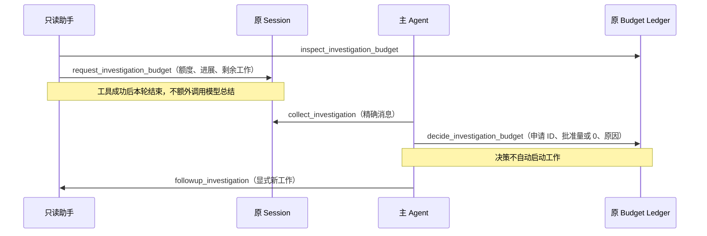

# 只读助手额度申请与显式续派合同

范围：已批准的 adaptive 只读调查主线。解决助手在累计额度耗尽后无法交接进展的问题；不增加 Workflow、孙 Agent、源码自进化、自动推广或默认委派。

## 权威与配置

- Product protocol 4 必填 `investigator_initial_tokens`；必须为正整数，且不超过 investigator 的 `budget.max_tokens`。后者是创建时冻结的累计硬上限。
- TUI 模板示例为初始 20000、累计上限 30000。参数可编辑，不是通用实现中的隐藏值。现有 benchmark 明确初始等于累计上限以保持原分配条件；专门的协商实验另行冻结初始量。
- Budget schema 3 的原 `child-reserved` 增加初始量；其他维度仍按原包络授予。分配量、消耗和决策均从原账本重建，不新增余额数据库。
- 旧 Product 1–3 和 Budget 1–2 明确拒绝。用对应冻结源码检查旧实验，或显式另用新数据目录；不迁移、不自动删除。

## 原主线中的交接

申请是原 Session 中成功的 Tool result。进展仍是助手声明，引用原文件或证据不等于已核实正确。Continuation 读取这份证据后返回 `investigation_budget_requested`；Turn completed 表示这一轮收尾，不表示调查成功。

父方读取精确子消息的完成报告与申请，验证直接 owner、当前 Session、原工作来源版本、消息未被新任务取代，以及请求轮已完成且未取消。0 表示拒绝；正数不得大于申请量。

拨款沿原服务锁与账本 CAS：不能突破原累计上限、父方当前余额、在途预留或父方收尾保留额度。同一申请只有一项决定；精确重试返回原决定，不同内容不覆盖。提交后响应失败或取消，重开账本仍可确认已经提交的决定。

批准不会重置历史消耗、Step、工具次数、进程或墙钟额度，也不会自动续派。主方需要显式发一条 followup。停止助手先等原执行收敛再关账户，关闭后不可重新续派。

## 验证与停止

定向验证覆盖原账本重开、累计上限、初始值拒绝、重复与冲突、在途预留、并发争抢、取消、过期申请，以及原 Product factory 的批准/拒绝路径。关键保护做反向验证，测试必须进入实际公开执行路径。

真实验证限制为一次明确协商练习、最多 4 次真实子模型调用。主方用确定性脚本检查申请和决定，助手使用现有授权模型连接；走原 Product、Git、沙箱、Session 和 Budget。这只能证明真实模型能操作机制，不能证明自然委派策略、追加价值判断或质量收益。真实调用结束后重开原数据库核验请求。

后续另经用户授权观察真实主方和助手。三种自然场景没有发生委派或额度申请；两种明确委派场景打通真实主模型、真实助手、owned child 和 collect，但均在冻结调用上限前未形成 Product completed。该后续结果只补充模型行为证据，不回写本合同的机制验收结论，详见[记录 031](../deal/031-real-main-child-model-smoke.md)。

不运行全量、L2–L4、旧 72 题或旧两臂 benchmark；不调用 Claude，不提交、推送、发版或改变默认 single。

## 已知边界

助手必须在额度用尽前成功提出申请。若模型未申请便触发预算拒绝，父方只能看到失败和已有证据；系统不会生成虚构进展或绕过请求直接加钱。新额度也不能复活已耗尽的其他资源。额度不足时可以拒绝或利用部分证据结束工作，不保证每次都完成。

检索与协作效果仍由原 Evaluation 的硬检查、语义审阅和人工采用规则评估；本阶段不新增评分器或改写旧成绩。
