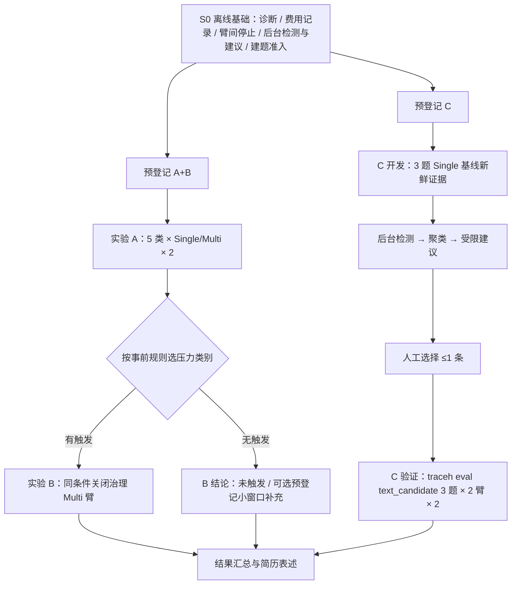

# 任务类型对照、Multi 上下文治理与有界自进化：收口计划

日期：2026-09-23。状态：**S0 已完成；A、B 已完成，B 另经 ADR-0084 修复后复测（见[记录 087](../deal/087-task-type-context-evolution.md)）；C 已完成（建议不采用），C2（ADR-0085）6/6 组有效、满足采用门并已人工采用（ADR-0087）；A4/A5 重跑：A4 两组有效（Single 更好），A5 以 300s 超时重跑两组有效（Multi 1/2、Single 0/2）；超时根因见 ADR-0086。三项实验均已收口。**

本计划接管[三项目标计划](TRACEHARNESS_AGENT_EFFECTIVENESS_PLAN.md)中尚未完成的部分。原计划、
[记录 086](../deal/086-agent-effectiveness-overnight.md)及其全部正负结果保留为历史证据，不改分、不拼接。
三项研究问题不变，但按已取得的证据重新划定**每个问题用什么数据、在什么条件下回答**，
避免继续在不会产生信号的条件上试跑。

## 0. 授权与边界

- 用户确认本计划的三项实验定义，授权开始 S0 离线工程与材料准备。
- **费用由用户自行监控**（2026-09-23 明确）：不再以预留账本限制或缩小批次；每批仍如实记录
  exact 已知费用与未知用量，未知不按 0 计。每批启动前冻结源码摘要、配置、题目、顺序、上限与停止条件。
- **所有真实 Provider 调用必须直连、不走代理**：子进程清除大小写 `*_PROXY` 变量并禁用系统代理继承，
  不修改用户系统代理；每批预登记记录实际网络路径（`execution.network_mode=direct`）。
- 不授权 commit、push、tag、release；候选采用仍由用户决定，模型建议不是采用或推广授权。
- 继续遵守 AGENTS：事件日志是唯一事实源；派生诊断不持久化成第二账本；pre-1.0 协议变更明确拒绝旧数据。

## 1. 目标与可交付结论

| 实验 | 回答的问题 | 数据 | 结论形态 |
|---|---|---|---|
| A 任务类型 | 哪类任务 Multi 能覆盖协作成本，哪类 Single 更好 | 自建 5 类任务，每类 1 题，每臂 2 次 | 逐类的质量、整树 token、墙钟、调用；与事前预期对照 |
| B 上下文治理 | 在真实有上下文压力的 Multi 运行中，折叠是否降低单请求输入与整任务成本，且固定验收不变 | 复用 A 的 Multi 臂 + 同条件关闭治理臂 | 单请求输入峰值/均值、越限、整树 token、调用、固定验收 |
| C 有界自进化 | 系统能否从运行证据中持续检测问题、稳定提出受限建议，并经 runner 独立验证 | SWE-bench Lite 真实题 Single 3 开发 + 3 验证 | 检测覆盖、建议可追溯性、验证结果与人工采用/拒绝 |

完成标准：三项各有冻结条件、逐题/逐臂结果、原证据索引和局限说明。**不预设正收益**：
Single 全胜、折叠无收益、建议被拒都是有效结论；未执行或证据缺失必须列为缺口。
样本很小：结论写成“在这些冻结条件下观察到”，不写统计显著、普遍提升或官方成绩。

## 2. 起点事实（决定本计划设计的证据）

1. **Single 在 SWE-lite 上碰不到折叠水位。** 开发配置 `window_tokens=96000`，输入上限
   96000−8192−2048=85,760（`llm/token_meter.py` `input_limit`），60% 触发约 51,456。
   记录 086 三道开发题原版 `surface/replace` 均为 0；Single 单次请求均值约 0.85–1.4 万。
   上下文压力只在 Multi 长调查等条件出现（C4 主方单次均值曾到 4 万、助手峰值越过 61,184 硬上限）。
2. **Single/Multi 结论依赖任务类型。** 记录 074 小模块：Multi token 6.2×、墙钟 3.2×；
   记录 076 大库理解：token 1.043×、墙钟 0.93×，但每臂约 1,000 万 token，不适合本预算；
   ae03/ae04 同题 Single 通过、Multi 固定验收 1 failed。8 对扩样 0/8 完成。
3. **文本候选效应小于波动。** 三个 CODER_GUIDANCE 候选效应在 ±5–13%，同题原版在两批之间
   由通过变失败（记录 086 §4.18）。分析模型每次只见约 1.5–1.9k token 的观察。
4. **后台优化在真实 TUI 主线上不能持续运行**（本会话离线复现，未改代码）：
   - 每次聊天/Product 操作经 `foreground(True)` 取消后台实验，而一次实验要跑完整评测，实际很难跑完
     （轮内观察由 TUI 空闲 pulse 约 1 秒后 `kick()`；初版诊断误称“永不启动”，已经反向验证更正）；
   - `BackgroundExperiment` 吞掉 `CancelledError`，取消被读成普通结算；
   - `blocked` 只由 `settled` 写入，`renew`/新周期均拒绝 blocked，无任何解除路径；
   - 周期绑定全源码摘要，流 ID 只按工作区；采纳候选、升级或改设置后 `open()` 永久
     `background-period-settings-mismatch`；
   - Product 路径只允许 multi/multi 与 `ALLOCATION_GUIDANCE`，默认 Single 任务不产生观察。
5. **Runner 报告没有上下文指标。** `evaluation/evaluators/product_report.py` 输出 token、调用、
   Provider 失败等，但没有单请求输入峰值、折叠、读回、折叠后重跑等；086 的这些数字是手工统计。
6. **提案与评测耦合。** `evolution/strategy.py` 的 `run_strategy_optimization()` 在一次调用内完成
   分析、准入与完整双臂评测；无法只产出建议交给人工决定是否验证。
   公开 `traceh eval --run-plan` 已支持 `text_candidate`（candidate 变体引用 patch 文件）与
   `execution_strategy`（single/multi）对照，可直接作为人工验证入口。
7. **批次停止缺口。** 记录 086 §4.20：Multi 臂 Provider 协议失败后，外层驱动仍开始了 Single 臂。
8. **费用占位过度保守。** 已知 12.344993 元、未知占位 101 元；每个取消请求按
   “100 万输入 × 最高档 8 元/百万 + 输出上限”估 9–14 元（`single-ao-cancel-cost-bound.json`），
   而冻结请求实际受 61,184 硬准入约束，按实际档位上限约 0.2 元。剩余 6.66 元无法启动任何批次。

## 3. 总体顺序

A 与 B 必须在**同一冻结源码摘要**下连续执行（B 复用 A 的 Multi 臂作“开启”臂）。
C 可在 A/B 之前或之后执行，但不得与其并行运行重型任务；S0 源码变更全部结束后才冻结任何批次。

## 4. S0：离线基础（零 API 费用）

每项按 AGENTS 第 5、7 节执行：正向、关键反例、失败/取消路径，关键修复做反向验证；
compileall、受影响定向测试与相邻回归、collect-only、修改范围 Ruff、`git diff --check`。
S0 全部完成并经独立审查清零 P0/P1 后，运行一次完整 `python -m pytest -q --durations=30`
作为付费前集成检查点。

### S0-A Runner 上下文派生诊断（已实现，定向与反向验证通过）

- Owner：`evaluation/evaluators/product_report.py` 及其原证据读取器；只从原 Session 事件派生，
  不写新事件、不建新库。
- 每个 Agent/Session 输出：请求数；按原 `model/attempt-end` exact usage 的单请求输入峰值、均值、
  末次值（未知保持未知，不按 0）；`surface/replace` 折叠次数（区分工具折叠与语义摘要）；
  读回工具调用次数；折叠后以相同工具与参数重跑原工具次数；同一读回页重复打开次数；
  准入拒绝/越限次数；结束分类分布（含 length、空正文）。
- 比较输出中两臂并列展示，不参与自动胜负判定（胜负仍由原 comparison 合同决定）。
- 验收：有折叠/无折叠/含未知用量/多 Agent 四类夹具；删除派生逻辑中的“折叠后重跑”匹配做反向验证。
- 同一派生结果供 S0-D 检测器复用，不另写第二套统计。

### S0-B 费用记录方式（已由用户决定）

- 用户自行监控供应商账单，本计划不再做预留门禁或历史占位重算；原 JSON、预登记与结论不改。
- 每批只记录：exact 已知 token 与估算费用、未知用量条目及其原证据定位；不把未知记为 0，
  不把估算写成账单。系统自身的预算合同（ADR-0080）不受影响。

### S0-C 臂间停止检查（已实现，定向与反向验证通过）

- Owner：拥有双臂顺序的原评测执行层（`evaluation` 的 variant 执行与配对驱动），不在外层脚本另造状态。
- 前一臂以 Provider 失败或未知用量结束时，不启动同一配对的后一臂；记录缺臂与原因。
- 反向验证：移除检查后，夹具中的第二臂会被启动。

### S0-D 后台“检测 + 建议”改造（已实现，见 ADR-0082；定向、Docker 相邻与反向验证通过）

后台职责收窄为**持续检测和提出受限建议**，不再在后台运行完整评测；验证交给人工触发的
`traceh eval`。这同时消除“前台操作取消长实验”的根源。

1. **确定性检测器**：读取 runner 证据（评测 attempt 的原 SQLite）和 TUI/Product 已结束 Turn，
   复用 S0-A 派生量，输出类型化失败类别，至少包括：length/空正文、推理耗尽、折叠后重跑、
   读回重复打开、collect 后继续调用、固定 Verifier 未执行、预算/墙钟到期取消、工具参数错误、
   工具拒绝/失败。每条检测附原证据定位（stream@seq）。检测结果是派生视图，不持久化为新事实源。
2. **聚类触发**：同一类别在 ≥2 个不同运行中出现才形成观察交给分析；单次抖动（如 Provider TLS EOF）
   只记录不触发。观察仍使用现有 `DevelopmentObservation` / `RuntimeObservation`。
3. **仅提案模式**：在原 `evolution/strategy.py` 中把“分析 + 准入”与“评测”拆开；仅提案入口写
   `strategy.json`（mode=`proposal-only`）、`analysis/`、`proposal.json` 与可直接被
   run plan `candidate.source` 引用的规范 patch 文件；不运行评测。原“一次提案即评测”入口
   按 AGENTS 不保留双模式，除非实现时证明仍有调用方。
4. **后台宿主修复**：
   - 恢复准入沿用 TUI 空闲 pulse（反向验证表明额外 `kick()` 无可观察作用，未增加）；前台操作只阻止新准入、
     不取消进行中的单次分析调用，避免每次聊天都制造“用量未知 → 阻塞”；
   - 取消原样传播并记录 `cancelled-unsettled`，不吞 `CancelledError`；
   - 新增人工核实事件解除 `blocked`（记录核实人和原证据定位，不清除已预留额度）；
   - 源码/设置变化时由人工显式开启新基线周期，旧周期额度与去重历史不被重置；
   - 允许 Single 的 `CODER_GUIDANCE` 与原 Product 路径；观察 Single 与 Multi 任务。
   后台流事件版本升级，旧流明确拒绝，要求新数据目录。
5. **展示**：TUI F6 展示待聚类问题、建议及其补丁路径与验证方法，并可导入评测运行目录；设置向导写出的
   A/A run plan 即验证底稿，把 candidate `source` 指向建议的 `candidate.json` 后运行 `traceh eval`
   （未另做“生成计划”按钮：底稿已存在，额外生成器没有独立消费方）。
6. 验收：脚本 Provider 下的 TUI 端到端（前台轮内发生工具失败 → 轮后自动检测 → 聚类 → 建议）；
   取消收敛与重复取消；blocked 解除；新基线周期；仅提案模式零评测调用；四个旧缺陷各一条反向验证。

### S0-E 自建任务类型 benchmark 建题与准入（已完成：五题标定并经生产沙箱 10/10 准入）

实现：`tests/task_type_evaluation/{spec,build,calibrate}.py`、`benchmarks/task_type_v1/`（README、隐藏测试、
`calibration.json`），准入摘要 `docs/validation-data/task-type-v1/admission-summary.json`。F2P/P2P：
A1 2/182、A2 9/0、A3 5/180、A4 5/376、A5 3/187。标定暴露并修正了两条我写错的隐藏测试预期
（越界下标在上游本就抛 `InferenceError`；参数不满足时会回退推断标准库源码），均改为只断言真实合同。

- 语料：已准入的 `pylint-dev__astroid-1196` 固定 revision（272 文件、约 2 MB，LGPL 许可已保留），
  复用 `traceh-rr-eval` 镜像与 `tests/real_repository_evaluation/materials.py` 的隐藏测试打包、
  `oracle.py` 与 `preflight.py` 准入流程。选择理由：真实中等规模、环境已就绪、可控制代码库变量。
- 新数据集目录 `benchmarks/task_type_v1/`，Product dataset format 3；题面、隐藏测试、参考实现、
  检查脚本在任何模型运行前冻结，运行后不修改（修改即新版本，原结果保留）。
- 五类任务（每类一题；“预期”在预登记中冻结，用于检验而非设计目标）：

| 类别 | 任务形态 | 验收 | 事前预期 |
|---|---|---|---|
| A1 小任务 | 单函数注入缺陷，题面给出现象与模块 | 隐藏 fail-to-pass + 原 pass-to-pass | Single 成本更低，质量相同 |
| A2 并行读码 | 4 个互不依赖模块的结构化事实问题，交付 `FINDINGS.json` | 脚本与构建时 AST 参考集比对；编造条目即失败；原文件不得改动 | Multi 墙钟可能更短，token 接近 |
| A3 并行改码 | 3 个独立模块各注入一个缺陷，各自隐藏测试 | 三组测试全部通过 | Multi 墙钟可能更短，token 更高 |
| A4 先调查再修改 | 只给用户视角现象，根因在未点名模块，需要跨推断链定位 | 隐藏测试 | 不确定 |
| A5 强依赖 | 新增一个辅助语义并按其结果修改 3 处依赖调用，顺序依赖 | 隐藏测试 | Single 更好 |

- A2 不用模型裁判（AO-2+ 校准仅 16/24 符合预期），只用确定性比对。
- 准入：原始树验收失败、参考实现通过；A2 另证明“缺交付物失败、参考通过、计数达标但编造一条仍失败”。
- 注入缺陷由宿主脚本在构建时生成并记录 diff 摘要；参考实现与隐藏测试不进入 Agent 初始树。

## 4.4 S0 集成检查点记录（2026-09-23）

完整 `pytest -q --durations=30`（启用真实 Docker 沙箱用例）得到 3 项失败，原始日志 `.traceh/s0-integration-20260923.log`：

| 失败 | 根因 | 处理 |
|---|---|---|
| `test_product_architecture::...depend_on_evaluation` | 新后台模块（`background.py`、`detection.py`、`background_proposal.py`）未登记到评测依赖白名单，旧 `background_experiment.py` 条目未删 | 白名单登记确切依赖；8 份架构测试通过 |
| L2 真实门禁 | 内层核心回归两项失败：上一条，以及标定摘要不匹配——`spec_digest` 把一次语法检查留在隐藏测试目录的 `.pyc` 计入，干净克隆中不存在（初判为换行符，逐文件核对后更正） | 摘要只计 `.py`/`.py.in` 并统一换行；新增回归测试并反向验证；重新标定与准入，F2P/P2P 与数据集摘要不变 |
| `test_version_contract::...metadata_matches_the_module` | 全局解释器残留 `traceharness-py 0.9.0` 元数据，HEAD 同样失败，既有环境问题 | 未改源码；独立 venv `.traceh/aev` 中该测试通过 |

修复后受影响的架构、题库、工具、检测、后台与上下文诊断测试通过；L2 单独复跑确认。

## 4.5 付费前就绪状态（2026-09-23）

离线准备已完成，全部运行计划经原 `load_run_options` 校验；付费只在第 4 节集成检查点绿色后开始。

| 实验 | 已准备 | 生成工具 |
|---|---|---|
| A | 开启治理题库模板 `benchmarks/task_type_v1/benchmark-template.json`；5 题 × 2 次共 10 份按题配对计划（`execution_strategy` single/multi，重复间交替首臂） | `tests/task_type_evaluation/plans.py a` |
| B | 关闭治理模板 `benchmark-template-ungoverned.json`（所有角色去掉 `context_policy`，其余相同）；每个选定题目一份 `["multi","multi"]` 配对计划，两臂即两次重复 | `plans.py b --case ...`（按 A 结果依第 6 节规则选题） |
| C | 3 道开发题合并为一个开发题库（逐棵复核初始树摘要，统一沿用 9 题共用配置）；每题一份 A/A Single 配对计划、模板计划与 format 2 后台设置；后台宿主已离线装配验证 | `tests/real_repository_evaluation/{combine,evolution}.py` |

所有付费运行均为配对计划：每臂在私有 worker 中运行，worker 清除代理变量并安装空 `ProxyHandler({})`；
非配对计划在父进程运行、可能继承系统代理，因此本计划不使用。C 的无头 `suggest` 在进程内同样禁用代理后才调用分析模型。
Multi 统一授权 `max_children=3` 与只读调查助手、可写 `patch_author`（仅 list/read/search/apply_patch）。

## 5. 实验 A：任务类型 Single/Multi

- 运行：`traceh eval` + `execution_strategy` 计划，`requested_modes` 为 single/multi；每类每臂 2 次，
  首臂在重复间交替；两臂同模型、同 Provider、同工具授权规则、同整树上限、同固定验收。
- Multi 配置对所有类别一致：宿主 `max_children=3`、启用 `patch_author`；分几个助手由模型决定。
  这样“模型在不适合的任务上过度拆分”也被如实测到。
- 上下文策略：两种模式都使用同一份开启的 `context_policy`（沿用开发配置 60/35 水位与 96k 窗口）。
- 模型：沿用记录 086 已使用的 `qwen3.6-plus` 直连，每请求一次 Attempt；输出上限、整树 token、
  墙钟在预登记中按类冻结，两臂相同。
- 逐类报告：固定验收、整树 token（分角色）、墙钟、调用、分工计划与助手数、助手交付状态、
  主方是否逐字重读助手产物（记录 076 判据），以及 S0-A 上下文诊断。
- 结论只按类陈述，并与事前预期逐条对照；与记录 074/076 分列，不合并成比例。

## 6. 实验 B：Multi 上下文治理

- 选择规则（预登记冻结）：A 中 Multi 臂任一 Agent 单请求输入峰值 ≥51,456（触发线）或
  `surface/replace` > 0 的类别，按峰值从高到低取至多 2 类。
- 新增“关闭治理”臂：同一源码摘要、同一题、同一 Multi 配置，仅去掉 Profile 的 `context_policy`
  （`product/runtime.py` 中缺省即不计量、不折叠）。每类 2 次。与 A 中对应 Multi 臂配对，
  以两份独立完整 runner 报告作显式配置对照，不冒充同配置的原 text-candidate 比较。
- 判据：
  - 质量：固定验收结果两臂一致视为“未观察到退步”（小样本，不是统计非劣）；
  - 上下文：分 Agent 的单请求输入峰值/均值、越限或 Provider 上下文长度错误；
  - 成本：整树 token、调用、墙钟；
  - 机制健康度：读回率、折叠后重跑、重复打开。
- 关闭治理臂因越限失败时，记为“无治理越限”这一结果，不作为 Provider 失败触发 S0-C 停止，
  也不当成质量退步；其费用按 S0-B 如实记录。
- 若无类别满足选择规则：B 报告“在这些任务上 Multi 也未触发”，可按预登记追加一次
  A2 在 48k 窗口下的开启/关闭各 1 次；不为凑收益延长任务或改题。
- 历史 C4 数字（run3 越限、run4 起零越限、主方单次均值 40,984→25,689）作为非受控工程证据单列。

## 7. 实验 C：Single 有界自进化（SWE 3 + 3）

- 开发题（已暴露，均有失败历史）：`marshmallow-code__marshmallow-1359`、`pylint-dev__astroid-1196`、
  `pvlib__pvlib-python-1154`。在冻结源码下各跑 1 次 Single 原版，取得当前格式的新鲜证据。
- 验证题：按[内部验证冻结记录](../validation-data/agent-effectiveness-v1/internal-validation-materials.json)
  原队列，跳过已被使用的 pvlib-1154 与部分运行过的 pydicom-901，取前三道从未运行的题：
  `pylint-dev__astroid-1978`、`pyvista__pyvista-4315`、`marshmallow-code__marshmallow-1343`。
  不因结果或难度换题；材料问题只能按原候补规则补位并披露。
- 流程：
  1. 后台宿主（S0-D）对开发运行证据做检测与聚类；
  2. 满足聚类条件时提出建议，只允许修改 `product/execution.py` 的 `CODER_GUIDANCE`；
     最多 2 次分析调用、2 个候选；提案模型看不到验证题、隐藏测试与评分器；
  3. 用户从建议中选择至多 1 条（或全部拒绝，这也是结论）；
  4. 用 `traceh eval` 的 `text_candidate` 计划在 3 道验证题上跑原版 vs 候选，每臂 2 次，首臂交替。
- 采用门槛（预登记冻结，示意值待冻结时确认）：任一验证题不得出现候选失败而原版通过；
  且 通过数增加，或整树 token 比 ≤0.95 且工具调用增加 ≤2。门槛不在看到结果后修改。
- “稳定提出建议”的可测定义：每个运行都有检测记录；每条建议能追溯到 ≥2 个运行的原证据定位；
  候选通过原白名单准入；验证结论由原 comparison 产生。建议被拒绝不影响这一定义成立。
- 同时提供 TUI 离线证明（脚本 Provider）：真实聊天路径中的检测与建议能在前台操作后继续产生。

## 8. 预算与批次

以记录 086 已知单臂费用估计（Single 约 0.6 元，Multi 约 1–1.2 元），实际以每批冻结为准。

| 批次 | 内容 | 臂数 | 已知费用估计 |
|---|---|---|---|
| S0 | 离线工程、建题、准入 | 0 | 0 |
| A | 5 类 × 2 模式 × 2 次 | 20 | 约 17 元 |
| B | ≤2 类 × 关闭治理 × 2 次（或 A2 小窗口 2 臂） | ≤4 | 约 5 元 |
| C 开发 | 3 题 Single 原版 + ≤2 次分析 | 3 | 约 2 元 |
| C 验证 | 3 题 × 2 臂 × 2 次 | 12 | 约 7 元 |
| 合计 | | ≤39 | 约 31 元 |

- 每批启动前登记冻结条件与直连网络路径；结束后登记 exact 已知费用与未知用量条目（S0-B）。
- 停止条件：
  - 不变量、请求重放、身份、取消收敛任一失败，停止全部付费；
  - 一臂 Provider 失败或未知用量，该配对不再启动下一臂（S0-C），记录缺臂；
  - 同一批连续 2 次 Provider 失败，停止该批并先定位连接/供应商条件；
  - 不重跑同一臂替换失败；预登记的重复次数不算替换。
- 实验进程直连、不走代理（见 §0）；付费批次运行期间不并行全量测试或其他重型负载。

## 9. 验证与文档

- S0 各项完成后：定向测试、相邻回归、反向验证；全部完成后一次完整集成全量（见 §4）。
- 每批运行记录写入新的 `docs/deal/087-*.md` 与 `docs/validation-data/task-type-evolution-v1/`；
  上下文文档只维护当前状态与合同，不写流水账。
- S0-A/S0-D 改变正式合同：同步正式版 12.5/12.6、12.11、14.2、14.3.1 与对应通俗版主题，
  并写 ADR-0082；导航与入口按 AGENTS 第 4 节同步。

## 10. 风险与转向

| 风险 | 早期信号 | 处理 |
|---|---|---|
| 自建题过难，两臂都失败 | A 第一批两类双臂失败且未进入有效断言 | 保留结果；只在预登记允许的范围内调整上限，改题即新版本并重新准入 |
| A2 结构化读码太小，Multi 不拆分 | Multi 未派发助手 | 如实报告“模型判断无需拆分”；不追加强制拆分提示 |
| Provider 工具参数 JSON 失败频发 | 单批 ≥2 次 | 停止批次，另行决定模型条件；不实现未授权的采样重试 |
| B 无类别触发 | A 峰值均低于触发线 | 报告未触发；按预登记执行一次小窗口补充或结束 |
| 检测器无聚类可触发 | 开发 3 题失败类别互不相同 | 如实报告“无建议”；可把 A 的 Single 运行证据纳入检测，但不得纳入 C 验证题 |
| S0-D 范围膨胀 | 实现需要新增事实源或平行生命周期 | 回到原 owner；无法证明必要的保护不加（AGENTS §8.3） |

## 11. 简历表述模板（仅在对应证据完成后按实填写）

- 上下文治理：实现按 Step 折叠、原文读回与软硬水位准入；在 Multi 的【类别】任务上，与关闭治理相比，
  单请求输入峰值【A→B】、整树 token【±x%】，固定验收结果【一致/不同】；Single 修复类任务未触及水位。
- 单/多对照：在同一真实代码库的五类任务上做同条件配对，Multi 在【类别】上【结论】，
  在【类别】上成本为 Single 的【x】倍；与事前预期【n/5】一致。
- 有界自进化：从运行事件日志确定性检测【k】类失败并聚类，产出受白名单约束的改进建议，
  经固定评测独立验证，【采纳/拒绝】并保留全部证据；模型建议不自动采用。
