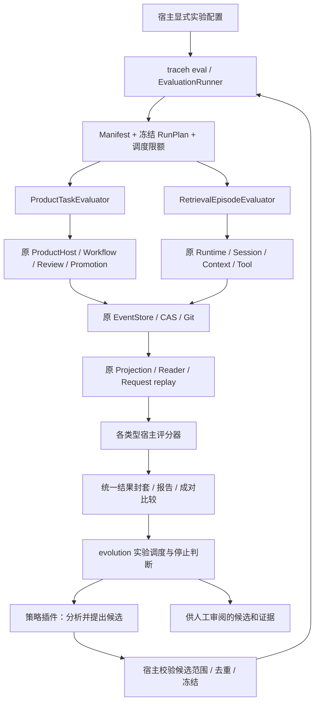
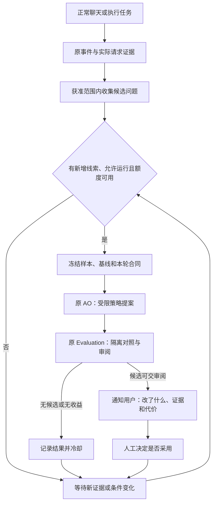

# 统一 Evaluation 与受限优化：调研结论和执行设计

后续建议见[动态协作 DA-0～DA-5 执行计划](TRACEHARNESS_DYNAMIC_COLLABORATION_EXECUTION_PLAN.md)（总体方案已获用户认可，未实现）：复用本框架加入执行策略对照、整树证据/费用及 Product 语义审阅适配，再开展受限委派说明优化。当前 API 和已有成绩不因计划文档改变。

日期：2026-09-11。状态：**设计采用；UE-0～UE-3+ 已接入，UE-4 真实测量完成、人工语义待审；AO-0 合同、AO-1 人工队列与 AO-2 一次策略提案/独立模型审阅已接入；本轮保留基线；AO-2+ 语义校准实验完成，候选未采用。**

源码基线：`53b7b6680882245ce093f4bc918f6e80ff3aeba8`，v0.10.0。
初次调研只读源码、测试和历史证据并修改文档。随后 UE-0/UE-1 实现范围以
[当前执行合同](TRACEHARNESS_UNIFIED_EVALUATION_UE0_CONTRACT.md)及[记录 017](../deal/017-unified-evaluation-ue01.md)为准。
UE-2 的实际接口与八条真实检查见 [UE-2 合同](TRACEHARNESS_UNIFIED_EVALUATION_UE2_CONTRACT.md)。UE-3 的受限候选、进程和离线比较见 [UE-3 合同](TRACEHARNESS_UNIFIED_EVALUATION_UE3_CONTRACT.md)；UE-4 结果见 [冻结合同](TRACEHARNESS_UNIFIED_EVALUATION_UE4_CONTRACT.md) 和 [记录 021](../deal/021-unified-evaluation-ue4.md)。AO-0 已实现 typed 服务、受限提案校验与停止规则，见 [AO-0 合同](TRACEHARNESS_OPTIMIZATION_AO0_CONTRACT.md) 和 [记录 022](../deal/022-bounded-optimization-contract.md)。AO-1 已接入人工候选、整批预留、原双进程评估及只读核验，见 [AO-1 合同](TRACEHARNESS_OPTIMIZATION_AO1_CONTRACT.md) 和 [记录 023](../deal/023-manual-optimization-loop.md)；AO-2 已完成一次真实策略提案、原评估和独立模型审阅，见 [AO-2 合同](TRACEHARNESS_OPTIMIZATION_AO2_CONTRACT.md) 与 [记录 024](../deal/024-strategy-analysis-and-model-review.md)。候选未证明稳定收益，保留基线；无自动采用，不运行全量、L2–L4、构建或发布。
架构决定见 [ADR-0066](../adr/0066-shared-evaluation-and-bounded-optimization.md)，
调研与检查记录见 [记录 016](../deal/016-unified-evaluation-design.md)。

## 1. 要解决的问题与结论

**用户修订的后续目标：运行期后台受限策略优化。** 保持现有文本候选范围，把真实使用线索持续接入有界实验；不新增源码算法自修改阶段。AO-3 的目标、触发和暂停/停止边界见 §13，当前仍未实现后台服务。

把现有 `evaluation` 扩展为两个真实用途共用的评估框架：ProductTask 和主动检索旅程。
公共层负责冻结实验、安排运行、核对证据身份、汇总成本和比较结果；具体 evaluator 负责调用所属领域的生产入口、解释成功条件。
自动优化在此基础上由 `evolution` 调度；策略插件只分析失败、提出受限候选。

这次设计不增加 AgentLoop、不替换 Projection/Reader、不建立第二套任务状态机，也不让报告决定安装或发布。
UE/AO 第一阶段只接两个已有需求，不预建 MCP、Workflow、Safety evaluator 的空壳。原路线将 MCP 安排在 v0.11；当前建议先推进待审 DA 动态协作计划再做 MCP，具体版本与执行授权未在本次确定。

推荐顺序：**UE-0 合同 → UE-1 迁入 Product → UE-2 检索旅程 → UE-3 候选比较 → UE-3+ 离线诊断 → UE-4 真实验收 → AO-0～AO-2 受限优化。**
UE-3+ 是已授权的小补充：沿用原评估和 review/assess，区分来源候选、证据派发与原回答评估，展示读取/查询范围；
先离线重看原 16 条真实轨迹，不改评分、提示或 Runtime，不新造完整 Recall/MRR。见 [实施合同](TRACEHARNESS_UNIFIED_EVALUATION_UE3_PLUS_CONTRACT.md)。
UE 可以独立交付；AO 需要在 UE 的证据和评分可用后另行授权。

## 2. 调研了什么，实际发现了什么

| 问题 | 当前源码/证据 | 已核实结论及设计影响 |
|---|---|---|
| 是否已有唯一评估入口 | [CLI](../../src/traceh/cli/main.py)、[runner](../../src/traceh/evaluation/runner.py)、[ADR-0033](../adr/0033-product-task-benchmark-as-the-single-eval-path.md) | 只有 `traceh eval` 的 ProductTask 主线；继续这个命令，不另建 `traceh evaluation` |
| 公共接口是否已经通用 | [manifest](../../src/traceh/evaluation/manifest.py)、[report](../../src/traceh/evaluation/report.py) | 调研时为根协议 2；UE-1 已切为根协议 3，Product 设置迁入类型 owner，当前合同见增补文档 |
| Product 的成功谁说了算 | [attempt](../../src/traceh/evaluation/attempt.py)、[metrics](../../src/traceh/evaluation/evaluators/product_metrics.py) | 原 Product/Workflow/Review/Promotion 与真实目标 ref 共同证明成功；保留这些规则 |
| retrieval.py 是否已经跑 72 条 | [现有 retrieval.py](../../src/traceh/evaluation/retrieval.py)、[检索 corpus](../../benchmarks/retrieval_v1/README.md) | 它度量 Product 尝试中的冻结检索，现有 11 条 corpus；不是独立检索旅程 evaluator |
| 72 条如何运行和评分 | [grid](../../tests/live_active_retrieval/grid.py)、[audit](../../tests/live_active_retrieval/audit.py)、[合同](../../tests/live_active_retrieval/contract.py) | 测试目录内另有实验脚本；真实 Runtime 和原事实源已复用，但自动暂定分与人工审阅分离，不能直接把暂定分当最终分 |
| 现有候选比较是否可以直接复用 | [L3](../../src/traceh/evolution/candidate_comparison.py)、[ADR-0017](../adr/0017-host-owned-baseline-candidate-comparison.md) | 面向已过 L2 的确切插件 Wheel、固定宿主 suite；不是任意核心提示修改的通用比较器 |
| 谁拥有采用权限 | [L4](../../src/traceh/evolution/candidate_promotion.py)、[ADR-0018](../adr/0018-human-approved-exact-plugin-promotion.md) | 原 L4 对确切 Wheel、人工批准和目标环境 Registry 负责；新报告不能绕过它 |
| 插件有没有合适接点 | [PluginContext](../../src/traceh/api/plugins.py)、[services](../../src/traceh/api/services.py) | 已有 typed provide/require 和 owned cleanup；可增加窄策略服务，不必扩充一个万能插件 API |
| 隔离边界是否适合旧脚本 | [沙箱合同](../adr/0065-host-owned-sandbox-execution.md)、上述 grid 的 prepare_runtime | v0.10 shell 必须显式配置 SandboxPolicy；旧脚本的 shell 准备不能直接照搬为新主线，须接原沙箱 owner |

### 2.1 72 条的真实口径

- 24 个题目模板 × 3 组材料种子 = 72 条旅程。History、Skill、Memory、Tool Output 各 18 条。
  材料种子改变语料，不等于同一题同一材料的模型重复采样；不能据此宣称 72 个独立问题类型。
- 历史 55/72 是 grid-06 原候选 51 条通过，加六个 TLS 槽位直连补测的 4 条通过；其余两条仍有答案/证据问题。
  这是**历史补测合成口径**，不是 v0.10 新跑的一整轮。见 [记录 010](../deal/010-grid06-direct-supplement.md)。
- grid-06 原基线 20/72、候选 51/72，分别有 11/6 条 TLS EOF；共同无执行错误的 57 对为 19/57 → 44/57。
  历史基线已有按页读取和工具输出搜索，不能描述为“没有任何检索”。见 [记录 007](../deal/007-active-retrieval-final-comparison.md)。
- 72 条已多次用于诊断和调参，定位为**开发/回归集**。不能重新随机拆分后称其为未见留出集。
- 旧门槛 66/72 作为历史合同保留；它没有达成。新实验应先冻结用途与采用标准，不自动恢复为本阶段发版门槛。
- RE 留出计划没有执行不等于材料绝对未被分析者看到；复用前审计曝光情况。见 [记录 008](../deal/008-retrieval-reliability-experiments.md)。

## 3. 目标架构及依赖方向

以下图是**拟实现架构**。原生产执行链保持不变。



| 层 | 拥有的职责 | 不拥有的职责 |
|---|---|---|
| `evaluation` 公共层 | 实验输入、运行矩阵、结果身份、取消协调、报告与同口径比较 | 业务状态转移、模型循环、领域权限、候选搜索策略 |
| 具体 evaluator | 准备本类型环境、驱动生产入口、读取和评分领域证据、关闭资源 | 改写宿主题目/答案、绕过执行 owner、决定采用候选 |
| 原生产 owner | Runtime、Product、Workflow、Tool、Budget、Sandbox 的原生命周期与事实 | 感知 benchmark 答案、为评测伪造成功 |
| `evolution` | 实验轮次、候选冻结/去重、停止条件、组织比较与审阅材料 | 定义检索事实、替代评估成功函数、自动获得发布权限 |
| 优化策略插件 | 在受限输入内归纳失败、返回候选提案或无候选 | 接触留出答案、修改 scorer/预算/权限、写回运行中配置 |

`evaluation` 不依赖 `evolution`；`evolution` 依赖 `evaluation` 的公共合同。
生产 Runtime 不反向导入这两个开发控制面。具体 evaluator 通过宿主装配调用公共生产入口，不作为模型工具注册。
一个 manifest 先只声明一种 `task_type`，同一框架分别运行两类 suite；首版不做异构大混合总分。

## 4. 公共协议：冻结哪些东西

### 4.1 三种输入，只有一个解析后的事实

1. `benchmark.json`：宿主维护的题目及评分合同，**拟升级根协议至 3**。
2. `run-plan.json`：用户选择的模型、运行变体、预算、重复与环境引用；由同一 CLI 装配根解析。
3. `frozen.json`：所有引用解析并校验后的不可变输入清单；第一次准备/模型调用前写入，执行只消费它对应的已验证对象。

manifest 与 run-plan 是配置来源；冻结后不再重新从可变 Profile 读取值决定当前实验。
它们都不是另一份 Session 状态。摘要绑定实际字节和结构化版本；绝不以文件名或 Git commit 单独代表含未提交改动的源码。

**planned manifest 根字段（精确键集）：**

| 字段 | 合同 |
|---|---|
| `protocol_version` | 固定为 3；未知、缺失和旧版明确拒绝 |
| `benchmark_id` | 非空稳定 suite 身份；不由模型命名当前运行 |
| `task_type` | 初版仅 `product_task` / `retrieval_episode`，宿主静态分派，无任意 import 字符串 |
| `dataset` | `{file, sha256}`；宿主材料与题目清单，文件限制在 benchmark 根内，禁止链接逃逸 |
| `task_settings` | 按 task_type 解析的精确对象，不是装满可选字段的统一配置类 |
| `assessment` | 宿主 allowlist 中的 scorer 身份/版本、rubric 引用与摘要、确定性检查/人工审阅要求 |

Product 的 `task_settings` 复用当前 Product 配置解析器，声明 requested modes、冻结 Verifier 以及可空的原 F5 retrieval 合同。
source/target 仓库仍由 attempt 拥有，manifest 无权指定用户仓库、真实远程或任意 Workflow 图。
Product dataset 每题为 `case_id / group_id / requirement / initial_tree` 及内容摘要。

Retrieval 的 `task_settings` 声明来源配置、scope、Context/折叠/读取预算和宿主准备协议版本。
dataset 每题为 `case_id / group_id / family / material_seed / question / setup / expectation`。
`setup` 是 §7 的四种封闭类型之一；`expectation` 与评分 rubric 只供宿主读取，永不放入 Agent 工作区或模型请求。
字段中的 ID、具体代号、数字与路径只能来自该 dataset，不进入生产隐藏默认值。

### 4.2 RunPlan 与变体身份

`RunPlan` 拟含：`format / benchmark_digest / variants / model / execution / trials / comparison`。
每项必须显式解析；允许复用已有配置文件，但冻结物里记录解析结果、来源引用与摘要，不仅保存配置路径。

| 项目 | 必须冻结/记录的内容 |
|---|---|
| variants | `variant_id`、角色 current/baseline/candidate、完整源码清单摘要、依赖与解释器身份、允许变化的字段/文件集合 |
| model | Provider 实现身份、模型 ID、temperature、输出上限、可用的模型修订信息、连接参数指纹、重试策略；密钥只在原加载器中解析 |
| execution | 沙箱策略/镜像实际 digest、已声明环境身份、超时与取消期限、max trials、每条执行预算、运行顺序 |
| trials | 显式展开的 `case_id / material_digest / material_seed / replicate / requested_mode`；不适用字段为声明的 null |
| comparison | 配对键、成本允许变化、采用门槛、负例/日常对照要求、是否需要重复验证；没有配置时仅描述结果 |

`variant` 与 Product 的 `mode` 是两根轴。baseline-single 与 candidate-single 才是同模式的候选对照。
`auto` 的质量继续按实际 resolved single/multi 汇总，另报路由成本；不能把 auto 当第三种 Agent 质量。
模型 ID 相同但远端服务未提供不可变修订时，明确写 `revision unavailable`，不能保证服务端字节完全相同。
是否走代理属于连接条件：冻结显式选定的直连/代理模式及脱敏身份，不记录含认证的代理 URL，也不偷偷继承未知代理。

### 4.3 实验单位和上限

`run_id` 标识一轮冻结实验；`trial_id` 标识某变体 × 某材料 × 某次重复 × 某模式。
一个 trial 可以拥有多个 Session，例如记忆的批准准备与跨会话读取；不能强行假设一条题只有一个 Session。
Session/Turn/Step/模型 Attempt/effect 身份来自原生产系统，不从 trial 序号伪造。

现有 Product 最多 16 个任务的限制属于 Product 解析器，不搬到所有 evaluator；检索数据量按显式 host 上限验证。
首版顺序运行，不引入并发调度、冷恢复、自动挑失败重跑或一轮内替换当前候选。
材料种子与重复采样 `replicate` 分开，生成后的具体材料还要保存摘要，防止相同种子因生成器变更产生不同题。

### 4.4 预算复用与边界

- 模型准入、重试、Step/Turn、Tool/Verifier、Sandbox 预算继续由原 owner 执行；评估器向它们传递冻结配置。
- Runner 只执行实验级 `max_trials`、截止时间和“是否允许启动下一条”的限制；停止后取消并等待当前 owner 收敛。
- 准备、目标、摘要、重试、优化模型调用各自计量。准备失败也有成本，不从分母或用量中删除。
- 初版不宣称拥有跨独立 Store 的全局实时 token 账本；不会用运行器累加器代替 Budget Ledger。
  总用量是从各 owner 事实导出的报告。AO 用候选数、轮数、trial 数及单条原预算限定运行规模。
- `exact / estimated / unknown` 分列；未知不是 0，字节不是 token，SDK 异常前发生的未知调用成本也不能写 0。
  因未知用量无法证明某项成本门槛时，该项比较为不可判定。

## 5. 生命周期、证据与结果合同

### 5.1 最小 evaluator 接口

拟在 `evaluation/contracts.py` 定义 typed DTO/Protocol。逻辑接口为：

```text
validate(task_settings, dataset) -> TypedSuite
prepare(TrialContext, Case) -> owned PreparedTrial
run(PreparedTrial) -> ExecutionObservation
collect(PreparedTrial, ExecutionObservation) -> EvidenceBundle
assess(FrozenAssessment, EvidenceBundle) -> TaskAssessment
close(PreparedTrial) -> convergence outcome
```

这是职责合同，不要求六个公开类。实现优先 async context manager 包住 prepare/run/collect；
部分 prepare 抛错时，它自己清理已取得的资源。所有退出路径必须进入 close，runner 等其收敛后再发布终态。
assessment 不能接收 Runtime 可变对象或直接执行生产工具，只消费只读证据。

资源顺序：验证并冻结 → 分配短编号 attempt 目录 → 建 Store/CAS/隔离环境 → 准备 → 执行 →
采集证据 → 关闭 Runtime/Host/子进程/Store → 冻结证据清单 → 宿主评分 → 发布报告。
关闭阶段仍可能追加原账本，所以**最终文件摘要必须在 owner 收敛后计算**。
准备失败、目标失败、评分失败、cleanup 失败分别记录；cleanup 不能遮蔽原错误或被记成正常完成。
不可证明收敛时停止安排新条目，保留证据并返回不完整。

### 5.2 事实放在哪里

| 数据 | 唯一来源/所有者 | 其他表示的地位 |
|---|---|---|
| 运行中的任务、调用、批准、预算、工具结果 | 各 trial 原 EventStore stream | report、JSON 导出只是派生视图 |
| 大内容、不可变 Patch | 原 CAS；生产内容引用不变 | 报告仅记录引用与摘要 |
| 代码与目标 ref | 冻结源码字节 / 原 Git owner | commit、diff 不能替代运行字节或 ref 实测 |
| 本轮实验输入 | 宿主不可变 frozen.json 与所引用字节 | CLI 展示来自这一份合同 |
| 宿主人工评分 | 不可变 judgment 工件，绑定 rubric、reviewer 与 evidence digest | 汇总报告不独立保存可变“手改分数” |
| 插件安装/回滚状态 | 原 L4 Registry | 新 evaluation 不建立第二个安装状态表 |

`EvidenceRef` 至少携带 store 的输出根相对位置、stream ID、事件 seq 或范围、内容摘要；涉及模型时补充
Session/Turn/Step/Attempt、request snapshot seq 与 dispatch fingerprint；涉及 Tool 再关联 effect 与源版本。
先检查同一 owner、身份、版本、生命周期及真实派发，再提取内容。不能凭字符串相同、回答中写了一个 ID，或单独 accepted 回执就判定证据有效。
原 Projection/Reader 解释领域状态；索引、snippet 与临时日志不能升级为权威源。

报告输出仍用短编号 `attempts/001/`，避免 Windows 下把长身份拼进 worktree 路径。
`frozen.json`、`evidence-manifest.json`、judgment 是只追加/独占创建的工件；失败目录不删除。
报告 JSON 是一个结果对象的序列化，Markdown 从同一对象生成。取消产生 partial report，未运行槽位明确标识。
硬退出不承诺自动恢复；已有未闭合目录明确报不完整，需要单独审计，不能换 ID 把已执行副作用当作没发生。

### 5.3 通用结果封套，不使用一个 success 布尔值抹平差异

| 字段 | 拟定取值/解释 |
|---|---|
| `execution.status` | completed / failed / cancelled / not_started；另有 typed reason 区分 transport、budget、setup、provider、host 等 |
| `assessment.status` | passed / failed / pending_review / unassessable；未审阅不能算通过 |
| `assessment.metrics` | 按 task_type 的精确 DTO；Product 与检索不共享虚构的统一准确率 |
| `invariants` | 每项 passed / violated / unproven，带 owner 和证据；没有证据不算通过 |
| `convergence` | converged / unknown / failed；合法 quarantine 仍可属于收敛 |
| `usage` | 各阶段 token、调用数、耗时及观测质量；保留原重试 Attempt，不重复计唯一 Step |
| `evidence` | 验证后的引用；原始错误与关闭错误单独保留 |

测量完整不等于全部题通过。沿用 CLI 语义：正常完成可核对的测量返回 0，测量缺失/身份不一致/未收敛返回 4；
配置错误沿用原 CLI 错误路径，取消保留原取消退出语义。待人工评分单列 `assessment_complete=false`，不伪装业务失败。
可靠记录的一次 transport failure 是运行结果，同时其答案质量为 unassessable；必需证据无法读取则测量不完整。
比较或采用必须检查 assessment 完成情况，不能拿进程退出 0 当作候选合格。

首版稳定错误类别如下；错误不回显秘密、完整请求或任意异常对象：

| 错误码 | 触发与处理 |
|---|---|
| `evaluation-manifest-invalid` / `evaluation-version-unsupported` | 键集、值或版本不合法，创建 trial/调用 Provider 前拒绝 |
| `evaluation-frozen-input-drift` | 冻结后的材料、源码、scorer 或配置字节变化，停止运行并保留已经发生的事实 |
| `evaluation-evidence-mismatch` | owner、请求、来源或持久链不一致，不能评分为通过 |
| `evaluation-comparison-incompatible` | 成对控制条件不同或差异超出允许范围，输出 not_comparable |
| `evaluation-judgment-stale` | 审阅绑定另一套 rubric、证据或原 judgment，拒绝导入，不覆盖旧判断 |
| `evaluation-cleanup-unproven` | 已启动资源不能证明收敛，停止调度并输出不完整 |

已有 Product/Provider/Sandbox 领域错误保留为带 owner 的 cause，不重新解释成另一套业务失败类型。

## 6. ProductTaskEvaluator 如何迁入

1. 把网格调度、公共运行身份及报告外壳从 `ProductBenchmarkRunner` 提取到唯一 `EvaluationRunner`。
2. `evaluators/product.py` 接回原 `attempt.py::run_attempt`，其真实确认、ProductHost、Workflow、Git、Review、Promotion 不另写。
3. `metrics.py` 的 Product 证据链与 `report.py` 的 Product 专有统计迁入明确的 Product owner；仅共用确实两方都使用的 usage/identity DTO。
4. 保留原 F5 `retrieval.py` 作为 Product 的度量组件；命名和模块注释明确与旅程 evaluator 的区别。
5. `auto` resolved 聚合、router 成本、冻结 Verifier 对账、失败保留、未知 usage、quarantine 全部保持。
6. 程序化批准只作用于这次 benchmark 自建的一次性本地 bare target，绝不复用到用户 Product 或候选正式采用。

切换为协议 3 时，同时修改 shipped benchmarks、相关测试、导出和 CLI 调用方。
当前根协议 2 明确拒绝，不保留旧 runner 别名、双解析器或自动迁移；旧工件保留并由对应冻结旧代码读取。
`ProductBenchmarkRunner` 的历史名字可以存在于历史 ADR，但不继续作为另一条当前执行路径导出。
协议升级只涉及评估工件；没有理由因此升级 Session/Context、改写用户会话。

## 7. RetrievalEpisodeEvaluator 如何迁入

### 7.1 四种来源准备，沿用各自 owner

| 来源 | 准备方法 | 验证重点 |
|---|---|---|
| History | 通过 Session 正常回合生成材料，按配置走原 compact/Surface；目标问句不带答案或工具步骤 | 当前 Session 范围、原文 seq、页游标、请求实际包含的证据 |
| Skill | 宿主提供明确的 typed Skill 贡献、资源与启用选择，经原 Plugin/Generation 生命周期装配 | 身份/版本/目录摘要、资源正文、退役与作用域 |
| Memory | 原 Project/source/binding、proposal/approve/supersede/revoke 公共服务；需要时建立第二 Session | 当前批准状态、project 归属、替代版本、撤销、跨 Session 读取 |
| Tool Output | 宿主夹具写入明确测试程序，原 ToolRuntime + Sandbox 执行一次形成 Effect；目标轮走原保留/搜索/读取 | effect/源 digest、实际输出、业务字段与 exit code 的区分、不得通过重跑命令找答案 |

dataset 声明准备类型和参数，宿主注册的准备器执行；manifest 不含任意 Python callback/import。
测试程序是本 suite 的显式材料，不是通用 Runtime 默认命令。Output 的一次执行断言属于这些题的合同，不能成为所有任务都只能执行一次的规则。
新代码不能从 `tests.*` 导入 `ScriptedPlugin`、Resolver 或 memory fixture；正式准备能力归属 evaluator，测试依赖它或使用测试专用替身。
历史实验脚本保留为对应版本的审计资料；活动的“新运行”入口统一到 traceh eval，不保留第二个新协议 runner。

旧 grid 的 SourceOnly 是明确的**单来源隔离实验条件**，不代表真实 Chat 只有一种来源工具。
旧 72 条迁入时保留该条件并标记 `scope_profile=source-isolated`；另增多来源同时可见的 smoke/control，使用独立 suite 身份与分母。
不能把多来源选工具能力混入旧分数，也不能用单来源高分宣称已经验证开放环境来源选择。

### 7.2 宿主评分分两步

**机器证据检查：** 先证明事实在允许的来源中存在/失效，且回答前的实际成功模型请求看到了对应内容。
校验 `request snapshot → context/input 或 tool result → 原 reference/effect → 领域 Reader 状态`。
字段、ID、版本和归属全部关联；不能复制旧 audit 对某段提示前缀的文本解析作为新权威协议。
从原结构化请求快照与 Context 映射读取，实际 dispatch 字节也要验证；呈现变了不能让评分悄悄失效。

**答案审阅：** 数字/代号精确匹配只产生候选结论。字段归属、额外臆测、否定结论和含糊回答需要冻结 rubric 审阅。
人工宿主审阅继续可用；精确匹配仍仅 provisional。AO-2 可显式执行独立模型语义审阅，origin=model；其意见可进入原 assess，但不声称模型裁判已经校准到人工可靠性。
judgment 绑定 evidence digest、scorer/rubric 版本、reviewer 身份、结论及原因。更正要生成新版本并显式替代旧 judgment，不改原运行。
提案会话不参与评分；AO-2 的独立裁判使用固定 rubric 与原证据并单列成本，合同见 [ADR 0067](../adr/0067-independent-model-assessment-and-human-adoption.md)。原判断必须可重建，格式 1 明确拒绝；同模型偏差和语义校准仍有边界，不能把模型评分冒充人工采用。

正例联合通过要求：执行完成、答案字段正确且归属正确、依据在回答前实际可见、无额外不支持事实、无违反冻结权限/状态规则。
若搜索片段已经包含完整且合格的原文证据，可以直接回答；**不把强制 read 次数作为正确性条件**。
目录只有主题而没有所问事实时，不能把“看过目录”算作已经获取答案。

负例要求：拒绝编造具体值，并正确表述结论范围。未看全可说“当前未找到证据”，不能从局部目录推出“所有来源都不存在”。
不强制每个负例遍历全部工具。扫描范围、命中与读取记录用于解释结论是否过强。
日常问题（问候、改写、简单计算、重复当前输入）检查答案与非必要调用，防止为了分数把所有问题变成全局搜索。

### 7.3 评分归因与证据链示例

以下是说明性案例，具体主题、事实值都来自数据文件，不是系统默认：用户问某规程的签到分组人数。

```text
只见 Skill 目录就答人数
  → 记录目录命中；正文事实未派发；答案即使碰巧正确也不联合通过
搜到的片段已有明确人数和对应规程版本
  → Reader 资格有效 + 实际请求包含片段 + 答案字段正确，可以通过
原文读回了，但因预算未进入实际模型请求
  → disclosure accepted 不能证明模型已看见；按缺少派发证据记录
读到旧版已撤销 Memory 并当作当前批准事实
  → 区分“错误注入失效事实”的边界违规与“已明确标为历史却被模型误用”的答案错误
```

失败归类：未查证、来源工具错误、查询无命中、命中未取足证据、派发缺失、字段/元数据误读、过强否定、额外臆测、
重复拒绝/状态未推进、预算耗尽、连接失败、准备失败、证据损坏。每项归类须指向原轨迹；模型解释不代替该证据。

## 8. Candidate comparison：如何公平比较

### 8.1 候选怎样进入隔离执行

UE-1/UE-2 运行当前冻结版本；UE-3 已增加两变体的隔离装配，具体有效字段以 UE-3 合同为准。
初版候选表示为**基于确切源码基线的受限 patch 工件**，不是活跃 Runtime 的 prompt 热补丁，也不强制打成插件 Wheel。
宿主校验允许路径、补丁原文摘要、基线摘要与应用后完整源码清单；拒绝改 grader、dataset、权限、预算或持久协议。
使用独立源码目录、独立执行进程、独立 trial Store/工作区；沿用现有收敛的子进程机制，不为此启动新的 AgentLoop 实现。
worker 只加载冻结候选生产代码，公共运行/评分合同由宿主冻结；首轮固定依赖与协议版本，不支持任意跨协议候选对照。
工具执行仍通过 v0.10 Sandbox；代码目录/进程隔离不等于不可信 Python 的完整 OS 隔离，首版只支持可信本地候选。

### 8.2 比较规则

`evaluation/comparison.py` 是纯测量比较，不负责提出下一候选或批准采用。
配对键为 benchmark/scorer 身份、case、material digest、replicate、requested mode；variant 是被比较的轴。
原始结果按全部计划槽位保留，不能只取两边成功的交集作为唯一分母。

先核对共同控制条件：题目/答案/rubric、准备材料、provider/model、生成参数、重试、预算、权限、sandbox 与依赖一致。
允许变化集合只包含冻结的候选修改；每个实际请求的字节各自记录。
**不能要求两臂 prompt/request 摘要相同**，否则无法评估提示优化；应证明差异来自获准候选，其他条件未漂移。

报告至少同时给出：

- 每来源/模板的 passed、failed、pending、unassessable 及完整分母；旧历史分另列，不与本轮拼分。
- paired gain/loss/unchanged/unknown 清单；原始成功率、可评价样本数与缺失原因。
- transport/budget/setup 等执行失败；连接改善不冒充检索推理提升。
- 准备/目标/重试/优化成本、工具与搜索/读取次数、拒绝重复、日常对照额外调用。
- 每项边界违规、未证明项、replay 与 cleanup 结果。

条件不符为 `not_comparable`；证据不足为 `inconclusive`；可比较时描述 improved/regressed/mixed/no_change。
质量提高、成本提高可以是 mixed；未给权衡规则时不强制合成一个总分。
Product 内 auto 的路由分布变化另外展示，不能在配对时用执行后 resolved mode 挑选有利样本。

### 8.3 怎样判断值得保留

公共硬约束：无事实源/权限/身份/隔离违规，证据能重放，候选变化在批准范围，资源收敛。
没有发生过的动作标记不适用，缺证据标记 unproven；两者都不伪装成已验证通过。
答案错误和 harness 违规分开，例如模型引用了已标明历史的旧值是答案失败，不自动等于 Reader 越权。

采用阈值在实验前冻结：目标问题改善、关键反例/日常对照不退步、成本不超过显式限额，并经重复/新材料验证。
小样本只给描述统计，不声称显著性；按模板/场景分组，不能把换了名字的同一道题当独立泛化证据。
“没有稳定改善，保留当前版本”是合法完成结果。不得为保留候选事后放宽阈值或静默替换失败运行。

## 9. 自动优化接到哪里，以及首版的实际自动化程度

### 9.1 落点

| 拟新增/调整位置 | 职责 |
|---|---|
| `evaluation/contracts.py`、`manifest.py`、`runner.py`、`report.py`、`comparison.py` | 共享实验、测量及比较 |
| `evaluation/evaluators/product.py` | 迁入原 Product 尝试和评分主线 |
| `evaluation/evaluators/retrieval_episode.py`、`episode_setup.py`、`episode_assessment.py` | 四类来源准备、目标旅程与证据/答案审阅；按真实复杂度拆文件 |
| `evolution/optimization_contract.py`（AO-0 已实现） | 实验合同、请求绑定、开发集/文本范围、原 UE-3 patch 校验、去重身份与纯停止判定；不维护新事实状态 |
| `evolution/optimization.py`（AO-1 已实现） | 人工队列经 AO-0 准入，预留完整批次，复用原 evaluation 执行/核验和 comparison；待审退出，离线重算不恢复；AO-2 strategy 在外面提出一份候选后交此入口 |
| `evolution/strategy.py` / `evaluation/model_service.py`、`model_evidence.py`、`model_review.py`、`model_review_protocol.py`（AO-2 已实现） | 一次插件提案接原 AO-1；原 Runtime/Budget 留下分析与独立裁判证据，model 来源核验后交原 assess/comparison，无自动采用 |
| `api/optimization.py`（AO-0 已实现） | `OptimizationStrategy` / `OptimizationAnalysis` typed service 与受限请求/提案/分析结果 DTO，API 与 Plugin SDK 同源导出 |
| 可信策略插件 | 通过原 PluginContext.provide 注册上述服务；不增加 register_evaluator 或第二 PluginManager |

现有 `candidate_comparison.py` / L3 和 `candidate_promotion.py` / L4 保持确切 Wheel 协议。
它们不作为新核心 patch 比较器，也不降低 L2 前置要求。将来统一纯统计函数可另做有证据的重构，当前不创建一个兼容包装层。
核心源码候选最终给人工 code review 与正常提交流程；只有插件 Wheel 才能进入原 L2/L3/L4 安装推广链。

### 9.2 策略输入与输出

策略请求只含 development cases 的脱敏失败包、实际请求/搜索/读取定位、候选历史摘要、可修改的确切文本片段及 scope。
完整留出材料/答案、scorer 代码、运行密钥、用户 Session 和无关目录不向策略开放。
输入中的用户文字、Skill 和工具正文都是待分析数据，不能当成改变优化权限的指令。

策略返回 `CandidateProposal`：`base_digest / rationale / targeted_failure_classes / edits / expected_tradeoffs`，
或明确 `no_candidate`。`edits` 使用宿主提供的相对路径、原片段摘要及替换文本，不接受任意命令。
宿主验证基线、范围、内容和规范化差异，生成不可变 patch 与 candidate digest。
`candidate_digest` 去重使用规范化后的实际改动及基线，不能只按模型提案 ID/解释文字去重。
首版只允许工具说明与导航呈现文本；不修改 retrieval 算法、事件格式、参数 schema、权限规则或测试成功函数。

首批候选面的真实落点是 [reference_search.py](../../src/traceh/tools/reference_search.py) 中工具的说明文本、
[output.py](../../src/traceh/tools/output.py) 中输出搜索/读取说明，以及 [runtime/prompt.py](../../src/traceh/runtime/prompt.py)
的参考导航文本。它们是可选择的研究范围，不代表每轮都修改这三个文件。
宿主冻结具体字符串节点和原文摘要；插件提交替换文本，宿主生成补丁。不能只凭“文件在白名单”就允许改同文件的执行函数。
对 Python 文本节点的修改须验证解析树除获准字符串值外不变，动态预算数字仍由原配置生成，不让候选修改限额或硬编码模型名。

策略插件借用原生命周期服务，不得到 Runtime/Store 的万能对象。
若策略需要模型分析，通过宿主提供的窄 analysis 服务调用既有 Runtime/Provider/Budget，并记录独立分析 Session/usage；
不在插件中使用隐藏 SDK 绕开预算和请求记录。AO-0 冻结 `traceh.optimization.strategy@1` 为插件自有服务，
`traceh.optimization.analysis@1` 为宿主借出服务，均走原 Service/Scope/Generation Lease；AO-2 的 HostAnalysis 已通过原 Runtime/Provider/Budget/Session 执行一次无工具分析。
调用结束/取消收敛后才释放 Lease，插件不 dispose 借出的宿主服务。合同入口不打开原用户 Session，也不自动清洗任意原文中的秘密。

可信同进程 Python 插件的接口限权防止职责越界，不是针对恶意插件的 OS 安全保证；不借机提前实现 S3-B。

### 9.3 停止、审阅和采用

```text
冻结实验合同与当前基线
  → 读取开发集失败证据
  → 策略提候选 / 无候选
  → 宿主校验与去重
  → 隔离运行 + 宿主证据检查
  → 需要人工评分则等待审阅，不能把 pending 当收益
  → 公共 comparison
  → 继续下一候选 / 冻结入围候选做重复及留出 / 停止
  → 输出确切 patch、完整对照和采用建议，交人工决定
```

实验合同必须给出 max_rounds、max_candidates、max_trials、截止时间、每条原预算、连续无收益上限、最大无效/重复提案次数。
达到任一限制、用户取消、无法收敛、证据/范围违规、没有新候选时停止。
已完成失败不自动重跑取最好值；传输重试仅用冻结的原 Provider retry。补测是有身份的新运行，原记录不动。

AO 首版可自动完成“提案、执行、机器核对、生成审阅包”，但涉及开放语义的负例与额外事实仍有人工评分点。
因此它是**受监督的自动实验闭环**，不能宣称已经实现无人值守的自动调优/发布。
一旦查看留出集结果后继续修改候选，该集就进入已用验证集；后续推广结论需要新的未见材料。

## 10. 执行阶段与停止点

以下列出阶段合同；UE-0～UE-3+ 已接入，UE-4 已执行及核对证据但人工语义评分仍待审；AO-0、AO-1、AO-2 已接入并完成各自限定验证；AO-3 应用内后台托管已接入并完成真实小样，发行门禁见其验证记录。所有阶段均禁止全量 pytest 和 L2–L4 自动联动。

| 阶段 | 改动与交付 | 必须验证 | 何时停止 |
|---|---|---|---|
| UE-0 合同与迁移清单 | 以本文冻结协议字段、类型、错误码、文件 owner、三种输入和迁移清单；复核当时 HEAD | 正反输入、未知字段、重复身份、路径逃逸、旧协议拒绝、同份材料摘要 | 合同测试通过；不提前写 optimizer |
| UE-1 公共框架 + Product 切换 | 新 EvaluationRunner/DTO、协议 3、Product evaluator、同步两个现有 benchmark、替换原导出与 CLI | 原 Product 真实主线、Verifier/ref 对账、auto、未知 usage、取消/prepare/cleanup 失败、F5 相邻回归 | 当前 Product 行为等价且一条主线；不运行新检索 suite |
| UE-2 检索旅程接入 | 正式 setup/评分/审阅接口与材料 manifest；旧 72 明确标为 development；8 条最小集先跑通 | 四类正例及关键负例；假命中、wrong owner、未派发、superseded/revoked、输出重跑、沙箱失败/取消；评分 pending | 8 条主线证据能重放，人工判据不被暂定分替代 |
| UE-3 变体隔离与 comparison | 冻结源码 patch、独立 worker、配对比较、报告状态、成本与漂移校验 | A/A、故意退步、错基线、修改 grader/预算、未知 usage、连接错误、进程重复取消、两报告一致 | 正确拒绝不同比较条件；比较不产生安装权限 |
| UE-3+ 检索离线诊断 | 原 evaluator/review/assess 共用来源候选、派发、读取状态和查询范围观测；原实验与新分析器分开绑定 | 仅目录、失败/错章节读取、完整搜索片段、未派发/失败请求、取消、负例；离线复算原 16 条真实轨迹 | 诊断可核对且不改原评分/策略；不报告完整 Recall/MRR，不增加强制 read 或自动采用 |
| UE-4 真实限定验收 | 当前版本新跑、冻结候选对照、人工审阅、重复和普通问题对照；报告当前新基线 | 见 §11；真实 API 与实际 Tool/Sandbox/SQLite 请求证据，所有失败保留 | 原始记录/审阅/报告一致即可收口；不以达到 66/72 为实现完成条件 |
| AO-0 受限策略合同 | typed strategy/analysis 服务、候选范围和 owner、proposal 校验与停止合同 | 越界修改、重复候选、过期基线、缺少审阅、插件 cleanup、取消 | 合同清楚；不增加第三方 evaluator 动态加载 |
| AO-1 人工候选走闭环 | 先把一个人工写的小候选放入 evolution→evaluation 主线，证明流程可用 | 正常比较、拒绝采用、无收益停止、证据保留、总轮次限制 | 不依靠优化模型也能可靠完成一次实验 |
| AO-2 真实策略插件实验 | 原 Plugin provide/require + 原 analysis 服务提出候选；小开发集调优与冻结留出 | 一轮真实提案/运行/审阅/比较；成本与来源完整，无答案泄漏，无自动采用 | 有稳定候选则交审阅；没有则保留基线并结束 |
| AO-2+ 语义裁判校准（已完成实验，候选拒绝） | 同证据、冻结开发标签、两条件两次重复，走原控制模型和原 review/assess | 74 次真实调用与完整失败费用归档；最终符合预期 16/24→15/24 | 不合格则恢复原策略；保留审核意见，不能冒充独立人工 gold 或搜索提升 |

每阶段改源码后同步两份上下文，定向门禁通过后才进入下一阶段。阶段可合并授权，但不能省略 owner 失败路径。
不是所有阶段都增加一次完整 benchmark；UE-1/UE-2 用最小集定位实现，UE-4 才做冻结 suite 测量。

## 11. 验证计划与可执行入口

### 11.1 日常离线门禁（实现时运行，本轮未运行）

源码/测试/协议改动按照 AGENTS.md 执行 `python -m compileall -q src tests`、受影响测试、相邻 owner 回归、
`pytest --collect-only`、修改范围 Ruff、`git diff --check`。`--collect-only` 只收集，不执行全量。

现有可直接选用的相关测试文件：

```powershell
python -m pytest -q tests/test_product_benchmark.py tests/test_product_benchmark_e2e.py
python -m pytest -q tests/test_retrieval_evaluation.py tests/test_retrieval_evaluation_failures.py
python -m pytest -q tests/test_active_retrieval_contract.py tests/test_active_retrieval_grid.py
python -m pytest -q tests/test_product_architecture.py tests/test_workflow_architecture.py tests/test_sqlite_event_store_architecture.py
```

候选比较/取消对应新增 `test_evaluation_comparison.py`、`test_evaluation_lifecycle.py`；旅程对应新增
`test_retrieval_episode_evaluator.py`；策略对应 `test_optimization_contract.py`、`test_optimization_services.py`，
人工闭环对应 `test_manual_optimization.py`。这些已存在；旧实验脚本测试只作参考，不能只测旧入口。
确定性替身测试只证明合同，不能代替真实模型效果；关键保护要反向移除后证明新测试因预期根因失败。

### 11.2 真实模型测试顺序

后续实现阶段获准使用真实连接后，才通过现有配置加载器执行以下检查；不得读取或输出真实密钥。

1. **UE-2 小集：** 四类来源各一正一反，共 8 条；Output 使用原 Sandbox 真执行，History 真回合/压缩，Memory 真批准状态，Skill 真装配。
   这是准备和证据闭环检查，不作为完整检索能力得分。
2. **UE-3 A/A：** 同一冻结生产字节和配置各跑一次上述 8 条，记录模型方差；另用确定性替身验证完全相同输入产生相同计算结果。
   真实 A/A 分数不要求神奇地完全一致，差异用于约束后续收益解释。
3. **普通/多来源对照：** 四种日常问题，加四条不同来源竞争的任务；与旧 72 分开报告，检查额外乱搜和来源误选。
4. **UE-4 当前基线：** 将迁入后的 72 条在 v0.10 沙箱和当前冻结主线下完整运行一次，人工审阅所有需要判断的结果。
   原 55/72 仅作历史旁注，不作这轮执行结果。没有候选时不为凑比较额外跑第二臂。
5. **有入围候选时：** 先在开发子集对照；若通过冻结条件，再对相同合同运行 candidate 全集。
   准备产生的模型文本也可能不同，报告其差异；只有等价性可证明的来源事实才能进入成对质量结论。
6. **AO 留出：** 在候选冻结后，以未曝光的场景组评估；AO-0 合同强制显式规模/成本/期限与原计划绑定，具体题目、数值和授权在 AO-1/AO-2 实验实例中冻结。不从旧示例猜默认，也不复用已被调优者查看的组。

对完整套题仍逐项记录错误；如网络条件需改变，创建新 run 或显式补测关系，不能悄悄把多个执行中最好的答案拼成一轮。
真请求需检查当前材料是否进入回答前的 dispatch，并核对重放、调用数、usage 与所有边界指标。
比较准备阶段时区分“语料语义相同”与“原文逐字相同”；跨候选复制数据库只为省调用而伪造准备事实不被允许。

UE-2 首批 8 条明确选旧 manifest 的 `h-direct / h-absent / s-direct / s-absent / m-direct / m-revoked / o-direct / o-absent`，
使用其三组材料中的一组，由 run-plan 明确选择并冻结实际材料；这些是本 suite 的选题，不进入通用运行器默认值。
`s-resource / h-late-page / m-superseded / o-nonzero` 在对应 owner 的定向覆盖中补齐，不能因 8 条通过就跳过资源页、翻页、替代状态或非零退出结果。

UE-4 已按 [执行合同](TRACEHARNESS_UNIFIED_EVALUATION_UE4_CONTRACT.md) 完成 72 条当前单臂及八条独立对照：正例暂定 49/60，12 条负例保留范围审阅，全体正式评分仍 pending_review。两组共 495 次直连请求、2,393,267 exact tokens，无连接失败。无候选未运行第二臂；原 A/A 只作为历史波动证据。详见 [真实记录](../validation-data/unified-evaluation/ue4/README.md)。

### 11.3 拟定 CLI 合同与产物

继续使用 `traceh eval`。新增 `--run-plan` 接入上述冻结配置；原直接 Provider 参数可构造单变体计划，
两者进入同一解析器，不形成第二运行模式。提供 `--run-plan` 时拒绝冲突的 provider/model/retry/sandbox 命令行覆盖。
密钥引用由原宿主加载器使用，不写进 plan、冻结物、报告或审阅包。

**以下命令为用法示例，Product、检索旅程、审阅和比较已接入；有效字段以各阶段实施合同为准。路径为用户显式准备的示例，不是默认值：**

```powershell
traceh eval .\benchmarks\product_v1 --run-plan .\local-eval\product-run.json --output .\eval-results\product-run-01
traceh eval .\benchmarks\retrieval_episodes_v1 --run-plan .\local-eval\retrieval-run.json --output .\eval-results\retrieval-run-01
```

一个 run-plan 可包含 current 一臂或 baseline/candidate 两臂；有配对时同一 runner 生成 comparison，无需另开 benchmark 命令。
UE-0 必须提供两份无秘密的可执行配置样例和逐字段说明，所需模型与 sandbox 引用由用户配置，不内置某模型/镜像。
人工审阅同属 `eval`，采用互斥动作：

```text
traceh eval --review <已有 run 目录> --output <新审阅包目录>
traceh eval --assess <已有 run 目录> --judgment-file <评分文件> --output <新报告目录>
```

这两种动作不接受 benchmark 位置参数、run-plan 或模型/沙箱配置；只读原运行，不触发 Provider、工具或重跑。
`--review` 导出冻结 rubric、待判条目及证据定位；`--assess` 校验评分文件引用的 run/evidence/scorer/rubric 摘要、
reviewer、条目身份、每条结论/原因和可空 supersedes 引用后，复制为不可变 judgment，并生成新 assessment/report。
新报告目录的 `assessment.json` 明确列出本次所用 judgment 摘要，不靠“目录里最新文件”猜有效分数。
判断更正引用上一份确切 assessment；原 run 和原报告保留，不被覆写。缺项仍为 pending，不隐式补成通过。

```text
<新输出目录>/
  frozen.json                    宿主冻结输入、材料/源码/环境清单
  artifacts/                     已验证的源码/材料/候选工件；不含密钥
  attempts/001/                  原生产 Store/CAS、隔离资源与 worker 记录
  evidence-manifest.json         收敛后证据位置、所有者、摘要
  report.json + report.md        同一对象的两种呈现

<独立的新评分报告目录>/
  assessment.json                绑定原 run/证据和本次所用判断；更正须引用前版
  judgments/<review-id>.json     不可变人工判断，必要时显式替代关系
  report.json + report.md        由原执行证据与明确选择的 judgment 派生
```

目录树为设计合同。原 Product attempt 内部布局不为美观搬迁；候选和模型可见的工作区不包含宿主 rubric/答案。

## 12. 完成标准、边界与第一步

UE 完成标准：两类任务通过同一 `traceh eval` 与公共 run/result/comparison 合同运行；
Product 成功定义没有改变；检索答案与真实派发证据能对账；评分待审、网络失败和未知成本诚实可见；
取消与部分失败保留证据并收敛；没有新的 Runtime 状态、动态 evaluator 插件入口或安装权限。

AO 完成标准：同一 evaluation 能消费策略提案并完成一轮受监督实验；范围校验、去重、预算/轮次停止和候选不采用路径均成立。
候选无稳定收益也算完成实验；最终人工采用不是自动优化器的隐含动作。

当前已接公共 evaluator 接口、协议 3、Product 与 RetrievalEpisodeEvaluator、受限文本 patch 双臂比较、人工及明确标源的模型 review/assess、AO-0 合同、AO-1 人工队列与 AO-2 一份策略提案。AO-3 后台托管已接入（第 13 节）；未实现任意源码自动优化或自动采用。
Product 成功规则、原检索能力、L3/L4 和沙箱继续按原合同工作；调度入口已切到公共 EvaluationRunner。
首版仍限可信本地候选；未知 Provider 用量、远端模型版本变化、人工语义评分和进程硬退出恢复均有明确限制。

**UE-4 的旧语义评分仍待人工；AO-0～AO-2 已按后续授权完成限定实现与验证**。AO-2 新实验保留基线；AO-2+ 校准已完成，固定开发对照 16/24→15/24，候选未采用并恢复原生产策略。裁判仍有语义偏差，不改写旧实验或拼接分数；见 [记录 025](../deal/025-semantic-judge-calibration.md)。具体有效字段和生命周期语义见 [UE-0/UE-1 实施合同](TRACEHARNESS_UNIFIED_EVALUATION_UE0_CONTRACT.md)、[UE-2 实施合同](TRACEHARNESS_UNIFIED_EVALUATION_UE2_CONTRACT.md)、[UE-3 实施合同](TRACEHARNESS_UNIFIED_EVALUATION_UE3_CONTRACT.md) 与 [UE-3+ 实施合同](TRACEHARNESS_UNIFIED_EVALUATION_UE3_PLUS_CONTRACT.md)；AO-2 一次提案边界见其合同；进一步连续优化或新能力仍需分阶段授权。
初次设计调研只改文档；随后源码实现和验证以对应 UE 记录为准，不改变已发布版本、用户运行配置、历史分数或 Git 历史。

## 13. 运行期后台受限优化（AO-3 已接入，发行验收中）

用户已明确：需要正常使用 TraceHarness 时，后台长期保持一个受限策略优化循环；不需要新增源码算法自修改阶段。已有 AO 允许的工具说明/导航文本范围已符合需求。本节目标已由 AO-3 宿主实现，见 [合同](TRACEHARNESS_OPTIMIZATION_AO3_CONTRACT.md) 和 [真实记录](../deal/026-runtime-background-optimization.md)。仅在应用生命周期内运行，不安装系统定时任务或常驻进程。

### 13.1 已有能力与缺口

当前 `evolution/strategy.py` 的 `run_strategy_optimization` 明确是一份策略提案，不自动生成下一个候选或采用。`optimization.py` 可执行宿主事先给出的有限人工队列；`optimization_contract.py` 已有额度、去重、待审、无收益和收敛停止规则。它们是可复用的单轮执行能力，尚没有把真实使用证据持续收集、触发、排队和托管起来的产品入口。

后台服务应放在 `evolution` 的宿主调度边界：由应用持有其生命周期，复用原 Plugin/Lease、Analysis、EvaluationRunner、review/assess/comparison。AgentLoop 不承担优化调度，策略插件只提出候选，不自行启动永久线程、任务队列或第二个评估器。

### 13.2 用户预期的运行方式

以下是目标流程，不是现行能力：



“持续”表示服务持续等待和响应新情况，不表示每一句话都调用一次裁判，也不表示无条件循环调用模型。没有新证据、正在等待采用决定、前台忙或资源不足时，后台可以只收集线索或等待。

例如真实使用中多次出现“找到目录但没有读取必要正文”，后台可将相关已结束 Turn 的证据纳入分析，尝试受限说明候选；验证更好后交用户审阅。它不能只依据用户换了话题、单次工具拒绝或模型自称失败就断言答案错误，更不能把自己的新答案当 gold。

### 13.3 触发、样本与事实归属

- 首版在用户显式启用的工作区/项目范围内观察已经结束的任务、Turn 和明确反馈；不读取活动 Turn 的半成品，不自动扫描全部项目。
- 低成本规则识别可调查线索，例如明确纠错、可验证任务失败、重复无进展行为。线索只是分析输入，是否归因于工具说明仍需原证据支持；网络故障等先分类，不自动归咎于检索策略。
- 原记录只读，以 Session/Turn/Step/Effect 引用和读取边界冻结材料。提炼出的标签与摘要是派生分析，不能改写原反馈或增加项目 Memory 权威。
- 每轮形成明确可重放的输入、评估标准与场景组，去除秘密并控制披露范围；需要原先未获准的外部材料时不得自行发送。
- 在线失败样本用于开发，另配固定回归和未曝光验证；不能只用触发问题判候选胜出。新的真实样本不自动具有可评分 gold；缺少可信判据时标记待标注/待审，不硬凑 pass/fail。
- 处理游标、启停设置、采样范围、触发准入、冷却、周期资源预留和实验绑定属于新增的宿主调度事实。实施时由一个 `evolution` owner 写入原 EventStore 并投影，协议在 AO-3 合同中冻结；不复制原任务、评分、费用为第二套可变权威。

### 13.4 连续运行必须保留的停止和生命周期规则

1. **一轮仍有界。** 每次调用原 AO 均有确切基线、材料、候选和费用上限。后台通过新证据启动新一轮，不把旧 round 的 stop/no-candidate/await_review 改成 continue。
2. **跨轮也有界。** 为启用范围冻结周期总费用、总模型调用、候选数量和并发上限；不靠换 experiment_id 反复重置额度。周期边界/续期规则在启用配置中明确，不因重启自动获得新额度；未知费用保守阻止继续花费。
3. **同一问题不空转。** 按证据集合、基线和候选摘要去重。无新材料且连续无收益时冷却；确定性重复/越界提案停止当前轮。满足冷却和新的触发条件才可能再试，不每次启动都重跑旧样本。
4. **等待批准不堆候选。** 有可审阅候选时仍可收集新线索，但暂停同一基线的新候选实验。实际基线改变后，旧候选须重新核对，不直接采用。
5. **前台优先。** 后台有独立费用归因和资源限制，不借用主任务额度。前台繁忙时不启动新的重活；已运行工作在安全边界让出或取消并等待收敛，不能承诺后台完全不占 CPU、网络或模型配额。
6. **一个 owner 管收尾。** 同一启用范围只允许一个活动优化轮；任务启动、原 worker、Plugin Lease、SQLite 和沙箱都归原生命周期收敛。暂停/退出不是丢弃 Task 引用；重复取消仍等收尾，保留失败和部分结果。
7. **重启不盲重试。** 首版服务随 TraceHarness 宿主进程存在，退出后不继续后台调用，也不安装 OS 常驻服务。重启从原持久事实核对处理范围；上次工作状态不明时先停止并核对，不能自动重复有副作用的真实任务。
8. **不在线试错。** 真实使用继续采用已批准策略；候选仅在隔离实验副本执行，不重放用户工作区里的 shell/写入副作用。原记录可离线检查，但真实复测要使用冻结的可重建材料和安全实验目标。

### 13.5 用户界面与采用

在原 TUI 配置/观察入口提供“后台策略优化”开关、观察范围、运行时机、资源上限、暂停，以及只读状态：等待样本、分析、验证、冷却、等待审阅。显示已花费用和实际证据，不要求用户每次手工制作实验 JSON。

候选通知说明改动、解决的问题、回归、费用与不确定项。沿用用户既定的人工采用边界：后台验证通过不等于已改变线上策略。批准后的生效版本/后续任务边界必须显式记录，不能悄悄替换运行中 Step 的冻结策略；若某文本还没有受控生产应用入口，明确交付补丁供人工应用，不宣称已有热更新。

### 13.6 实施位置与真实验收

AO-3 不依赖动态多 Agent，也不依赖 MCP。可以先基于已实现的检索说明优化接入后台；DA-4 再把协作说明作为同一后台能力允许处理的新目标，不另建协作专用后台循环。原 DA 有限验收的 trial 上限不等于运行期服务的长期额度，两者分别冻结。

建议下一步细化三个实施块：

| 分块 | 必须解决 | 真实/定向验收 |
|---|---|---|
| AO-3A 触发与样本 | 宿主启停、限定来源、游标/去重、可评分材料与基线冻结 | 真实任务结束才能入选；无新证据不触发；错范围拒绝；正常行为不被当成错误 |
| AO-3B 托管原闭环 | 一个 owner 托管原 AO/Evaluation，跨轮额度、冷却、待审、前台优先和退出收敛 | 至少连续两次不同新增证据触发原主线；旧样本不重复烧费；取消/退出不留运行工作；候选不写生产 |
| AO-3C 产品与使用验收 | TUI 设置/状态、候选审阅包、重启对账与真实使用记录 | 正常前台任务＋真实后台调用；费用/失败/请求可独立重开；暂停恢复和待审状态正确 |

这些是目标修订后的实施划分，具体公开协议、采样/评分适配和真实测试额度需在实施合同中冻结。当前不启动上述服务，不调用真实模型，不扩张源码自修改范围；禁止全量/L2–L4 的约束继续适用。
