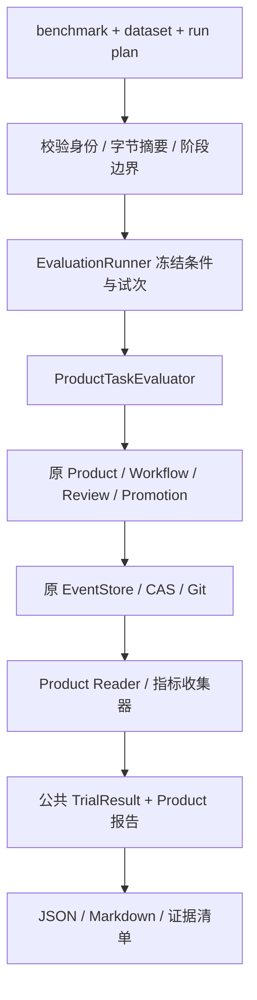

# UE-0 / UE-1：共享评估执行合同

日期：2026-09-10。对应 [总体设计](TRACEHARNESS_UNIFIED_EVALUATION_AND_OPTIMIZATION_DESIGN.md) 与
[ADR-0066](../adr/0066-shared-evaluation-and-bounded-optimization.md)。本文件保留 UE-0/UE-1 收口时的范围；当前扩展见 [检索旅程合同](TRACEHARNESS_UNIFIED_EVALUATION_UE2_CONTRACT.md) 与 [UE-3 变体比较合同](TRACEHARNESS_UNIFIED_EVALUATION_UE3_CONTRACT.md)。
验证记录见 [记录 017](../deal/017-unified-evaluation-ue01.md)。

## 1. 本阶段边界

唯一入口仍是 `traceh eval`，唯一调度器为 `EvaluationRunner`。
当前只静态装配 `ProductTaskEvaluator`，沿原 ProductChatHost、Workflow、Review、Promotion 执行。
不增加 Runtime 状态机，不接受任意 Python evaluator 路径，也不装载优化插件。
旧根协议 1/2 明确拒绝；原有用户会话和 EventStore 协议不变，不修改或迁移旧运行目录。



在 UE-0/UE-1 收口时，UE-2 的 RetrievalEpisodeEvaluator、UE-3 的 baseline/candidate 运行、比较和进程隔离、
人工 review/assess、AO 优化循环均未实现。声明这些阶段的输入会拒绝，不能运行一个空实现冒充成功。
现有 `retrieval_v1` 仍是 Product 内 F5 指标，不是旧 72 条检索旅程的新入口。

## 2. 三种输入及严格字段

所有 JSON 拒绝重复键、非有限数和多余字段；共同文档上限 4 MiB。
文件引用相对所属 benchmark 根目录，拒绝越界、链接和歧义。初始树保留原文件数、单文件和总量上限。
随仓库提供的两个冻结题库由 .gitattributes 禁止换行转换，保存本次实际验收的原始字节；
不是运行时把所有用户文件统一改写。示例初始文件相对 Git 基线的差异仅为换行字节，题目和检查逻辑不变。

| 输入 | 精确根字段 | 负责什么 |
|---|---|---|
| benchmark.json | `protocol_version, benchmark_id, task_type, dataset, task_settings, assessment` | 测什么、如何判定 |
| dataset.json | `format, cases` | 宿主冻结的题目和初始材料 |
| run plan | `format, benchmark_digest, variants, model, execution, trials, comparison` | 这一次怎么运行 |

benchmark 的 `protocol_version=3`，当前 `task_type=product_task`。
dataset 引用精确为 `{file, sha256}`，SHA-256 对应文件实际 UTF-8 字节，不是重新序列化后的字节。
`task_settings` 是原 ProductHostSettings 配置加 `modes`、`retrieval`：后者仍需明确为 null 或 F5 文件引用。
`modes` 为不重复的 single/multi/auto 列表。

当前 `assessment` 精确为：

```json
{"scorer_id":"product-durable-v1","version":1,"rubric":null,"requires_review":false}
```

它表示原持久证据评分，不表示新建模型裁判；未知 scorer、版本或人工评分要求会拒绝。
成功仍须 Product completed、Workflow completed、冻结 Review passed、Promotion 与实际目标 ref 一致。

dataset 的 `format=1`，每条 case 精确包含：

| 字段 | 含义 |
|---|---|
| case_id | 唯一题目身份 |
| group_id | 场景组身份；不会把重复运行误认成不同问题 |
| requirement | 原 Product 需求文本 |
| initial_tree | benchmark 根内的初始代码目录 |
| sha256 | 按相对路径排序，对路径和逐文件 SHA-256 的列表作现有 canonical fingerprint |

题目数当前仍由 Product owner 限制为 1–16。模式数最多三种；重复次数移入 run plan，1–25。
运行身份为新 UUID；每个 trial 绑定 case/group/material digest、replicate、mode、variant。
Product 无材料种子时 `material_seed=null`，不编造一个值。

## 3. Run plan 字段和配置方式

`format=1`；`benchmark_digest` 是 benchmark.json 的原字节 SHA-256。
`variants` 当前恰好一项 `{variant_id, role:"current", source:"current"}`；`comparison=null`。
baseline/candidate 与 single/multi/auto 是两个不同维度，本阶段只实现前者的 current。

| 对象 | 字段和说明 |
|---|---|
| model | `provider, model, base_url, api_key_env, script, retry_policy`；使用原内置 Provider 配置 |
| retry_policy | `max_attempts, max_elapsed_seconds, base_delay_seconds, max_delay_seconds, retry_after_cap_seconds, jitter_ratio`；原 ModelRetryPolicy 校验 |
| execution | `sandbox_config, max_trials, timeout_seconds`；后两项可 null；试次超过 max_trials 时整次拒绝，不截掉分母 |
| trials | `repetitions`，每个 case/mode 重复次数 |

`script` 和 `sandbox_config` 相对 run plan 文件；它们是显式宿主配置，不属于题目可引用路径。
提供 plan 时拒绝相同领域的 CLI 参数覆盖，plan 中的 null 也不会被环境变量补上。
API 密钥只通过原加载器按环境变量名取得，plan 和报告不保存密钥。
直接 CLI 参数也构造同一 RunOptions，默认一次重复；可用 `--repetitions`、`--max-trials`、
`--eval-timeout-seconds`，没有第二种执行引擎。

两份配置示例分别绑定当前 Product 三题和 F5 十一题：

- [Product 配置示例](../../benchmarks/product_v1/run-plan.example.json)
- [F5 配置示例](../../benchmarks/retrieval_v1/run-plan.example.json)

示例不是默认配置：复制到自己的配置目录，将 `REPLACE_WITH_MODEL_ID`、示例服务地址换成实际连接；
将 sandbox_config 指向已经配置的宿主沙箱文件；密钥放到 api_key_env 所指环境变量。
不需要新造 Product 配置，模式、角色、任务预算、固定验证仍来自对应 benchmark。
更改题目/manifest 时须重新计算摘要，不得继续用旧 plan。

```powershell
# 以下路径均为用户准备的示例，输出目录必须尚不存在。
traceh eval .\benchmarks\product_v1 --run-plan .\local-eval\product-run.json --output .\eval-results\product-01
traceh eval .\benchmarks\retrieval_v1 --run-plan .\local-eval\f5-run.json --output .\eval-results\f5-01
# 检查自己实际准备的 benchmark 字节摘要：
(Get-FileHash .\benchmarks\product_v1\benchmark.json -Algorithm SHA256).Hash.ToLowerInvariant()
```

测量完整退出 0，不完整退出 4；配置错误仍走 CLI 配置错误路径。
失败的业务任务仍可是一条完整测量，不把业务失分当作未运行。

稳定错误码：

| 错误码 | 拒绝原因 |
|---|---|
| evaluation-version-unsupported | 根协议、dataset 或 plan 版本不支持 |
| evaluation-task-type-unsupported | 当前未装配这种 evaluator |
| evaluation-stage-unsupported | 请求未来的变体或比较能力 |
| evaluation-run-plan-conflict | plan 与 CLI 或实际模型/retry 绑定冲突 |
| evaluation-frozen-input-drift | 文件字节、材料或生产源码发生漂移 |
| evaluation-output-overlap | 输出目录会写进 benchmark 输入根 |
| evaluation-trial-limit | 完整试次网格超出宿主上限 |
| evaluation-evidence-mismatch | evaluator 返回了不属于当前 trial 的身份 |
| evaluation-cleanup-unproven | 无法证明资源已关闭，停止后续工作 |

Product 原有配置、准备和证据错误保留所属 owner 的稳定 code，不把所有失败吞成同一布尔值。

## 4. 文件 owner 与唯一事实源

| Owner | 当前文件 | 权限 |
|---|---|---|
| 公共输入/协议 | evaluation/inputs.py、manifest.py、plan.py、contracts.py | 解析、冻结、身份和阶段准入 |
| 公共调度与报告 | evaluation/runner.py、report.py | 顺序运行、期限、等待收敛、完整试次清单 |
| Product 类型 | evaluation/evaluators/product*.py | Product 配置、生产执行适配、原持久评分和统计 |
| 原执行资源 | evaluation/attempt.py、repositories.py | 原真实确认、一次性 Git、Host/Runtime/Store 关闭 |
| F5 指标 | evaluation/retrieval.py | 原冻结检索准备及实际 Step 指标 |

原 Product metrics/report 迁入 evaluators；删除旧 ProductBenchmarkRunner 名字和旧导出，不保留兼容别名。
公共调度器不判断 Review 是否通过、不重算业务有效性；使用 Product owner 已验证的事实。
资源为空与未收敛不同：未分配的 worktree 不妨碍准备失败的关闭；已分配 Budget 仍须由原规则核对。

## 5. 冻结、生命周期和报告

运行前冻结 manifest/dataset/材料、当前 traceh Python 源码、解释器/平台/SQLite 版本、
Provider 类型及配置指纹、retry、SandboxPolicy、Product 设置和完整试次列表。
`artifacts/source.zip`、`materials.zip` 只归档明确声明的文件，并由 frozen.json 记录摘要。
不扫描任意用户配置目录；模型工作区只拿原 initial tree，不能拿题库、judgments 或报告。
F5 插件仍按原装配合同选择及核对，不把源码 ZIP 描述成完整可复现环境或 Wheel 冻结。
远端模型 revision 不可核对时为 null；代理路径为未核对，不声称一定直连。

每个 trial 前后核对输入和源码漂移；初始树复制再次绑定摘要。漂移会停止后续试次。
每次 execute 是 runner 拥有的 task，取消/超时只取消它一次，重复取消继续等待其生产 owner 关闭。
工作失败与关闭失败同时出现时保留两者；无法证明关闭时标 unknown 并停止调度。
超时限制执行阶段，冻结准备不占这项期限；启动前已过期记 not_started，不再启动工作。宿主强制退出没有恢复承诺。

| 输出 | 内容 |
|---|---|
| frozen.json | 运行身份、摘要、有效设置和全部计划试次 |
| artifacts/ | 源码与明确材料的 ZIP 和摘要关联 |
| attempts/NNN/ | 原事件账本、CAS、源仓库、一次性推广目标、运行目录 |
| evidence-manifest.json | 原事件流文件、stream、序号范围及 envelope 摘要 |
| report.json / report.md | 公共结果加原 Product 类型报告 |

公共 `trials` 是运行分母：已失败、取消、未开始都保留。`task_report` 仅含已返回 Product 测量的原有统计，
因此中断时不能把其中的 attempts 数当成全部计划数。
结果分为 execution、assessment、invariants、convergence、usage、evidence。
invariants 的 passed 只表示 Product collector 所校验的原合同，不表示通用安全评估；未知 token 保留 null。
`complete` 表示全部试次测量可用且收敛，`assessment_complete` 表示评分均可判定，不表示全部通过。
失败证据不会删除；报告与冻结物是评估工件，业务执行事实仍只在原 EventStore/CAS/Git。

## 6. 验证和下一个授权点

UE-0 验证旧协议/未知 evaluator、重复字段/身份、材料漂移、模式与重复分离、plan 参数优先级。
UE-1 验证原 Product single/multi/auto、Review/ref 对账、未知 usage、真实 Git/容器、F5 准备、取消与失败。
不运行全量或 L2–L4，不调用真实模型；当前结果只证明工程合同，不产生新的检索 benchmark 成绩。
下一步 UE-2 才用第二种实际 evaluator 验证公共抽象，不能先宣称自动优化已经可用。
