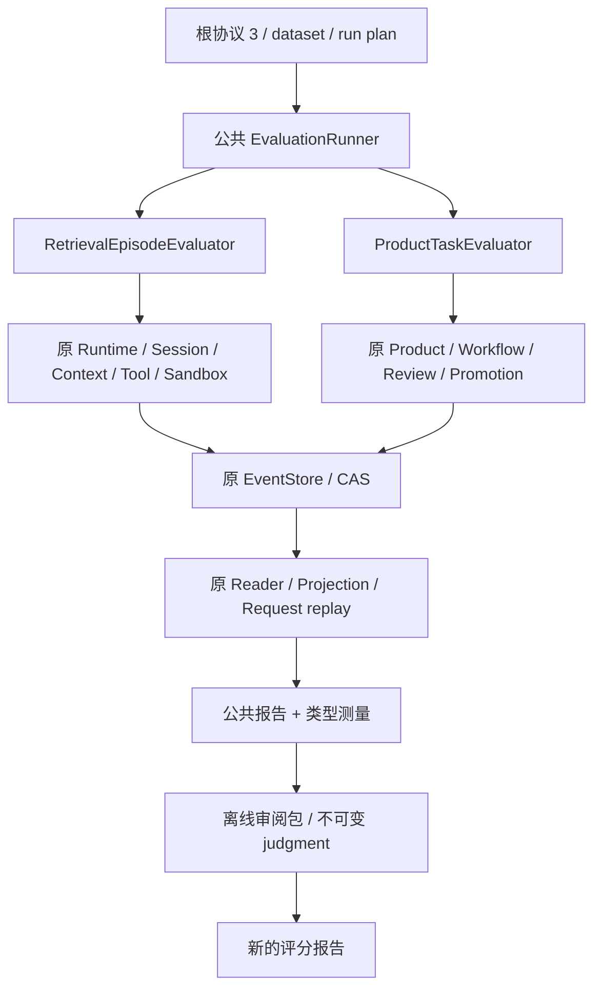

# UE-2：独立检索旅程评估合同

日期：2026-09-10。承接 [UE-0/UE-1](TRACEHARNESS_UNIFIED_EVALUATION_UE0_CONTRACT.md) 和
[总体设计](TRACEHARNESS_UNIFIED_EVALUATION_AND_OPTIMIZATION_DESIGN.md)。实现记录与实际验证见
[记录 018](../deal/018-retrieval-episode-evaluator.md)。
本合同保留 UE-2 收口范围；当前双臂运行和离线比较扩展见 [UE-3 合同](TRACEHARNESS_UNIFIED_EVALUATION_UE3_CONTRACT.md)。

## 1. 当前主线和边界

唯一 `traceh eval` / `EvaluationRunner` 静态装配 ProductTaskEvaluator 或 RetrievalEpisodeEvaluator。
前者仍使用原 Product 成功判定；后者调用原 Runtime、Session、Plugin/Generation、Memory 与 Sandbox。
没有第二 AgentLoop、测试目录运行依赖或模型评分工具。原 F5 `retrieval_v1` 保持 Product 内检索指标。
本次不实现 UE-3 变体隔离/比较、UE-4 完整测分、AO 优化，也不修改用户会话、配置或历史成绩。



## 2. 输入与材料

benchmark 根仍为协议 3 的六个字段，`task_type=retrieval_episode`。各类型独立解析设置，不混用 Product DTO。
检索 `task_settings` 精确字段：

| 字段 | 解释 |
|---|---|
| setup_version | 1，四种封闭准备配方的版本 |
| scope_profile | source-isolated；明确的单来源实验条件 |
| max_cases | 显式题库材料条数上限；不借用 Product 的 16 题上限 |
| runtime | max_steps、max_output_tokens、temperature、max_tool_output_chars、tool_timeout_seconds、token_budget；复用原运行与计量策略 |
| contexts | history/skill/memory/output 四份完整原 ContextInputPolicy；只启用所属检索来源，Output 保留历史导航 |
| skill_limits | 原 SkillLimits 的完整配置 |
| memory_policy | 原 MemoryPolicy，denied_patterns 明确给出 |
| project_limits | 原 ProjectScopeLimits |

dataset 根为 `format=1 / purpose=development-regression / cases`。
每条 case 精确为 `case_id / group_id / family / material_seed / question / setup / expectation`。
case_id 与 material_seed 联合唯一；实际材料 canonical digest 和 replicate 分开进入 TrialSpec。
不把材料种子叫作独立模型重复采样，也不把已用开发题改名成未见留出题。

| family | setup 字段与真实准备 |
|---|---|
| history | turns、prompt_prefix、summary；正常真实回合后，原 compaction.replace_through 追加压缩事件 |
| skill | descriptor、sections、resources；typed SkillContribution 经宿主明确 inventory 和原 PluginManager 激活、选择、建索引；resources 是 file/sha256 引用，正文在宿主资源目录 |
| memory | project_id、source_id、label、items、revoke_id、second_session；item 为 memory_id/fact_slot/body/predecessor_id，原 declare/approve/supersede/revoke，再按配置绑定新 Session |
| output | script、script_path、command、counter_path、prompt、exit_code；显式脚本由原 shell + Sandbox 执行一次，目标轮只能查留存结果；缺沙箱按准备失败记录 |

expectation 为 kind/value/value_type/source_text/reference_id，仅宿主评分读取；模型只见目标问题及经正式来源装配的材料。
脚本与 Skill 资源来自 benchmark 内有摘要的文件；没有任意 callback/import 字段，也没有把答案复制进模型工作区。
Output 的测试脚本本身是显式材料，不是所有工具任务的默认命令或“一生只执行一次”限制。

assessment 精确声明 scorer_id=`retrieval-evidence-v1`、version=1、requires_review=true、rubric 的 file/sha256。
rubric 为 format=1/instructions 的冻结文档。机器精确匹配是 provisional，不能替代语义审阅。

run plan 仍只有 current 单变体；trials.repetitions 之外可显式给 selection，包含非空、不重复的 case_ids 和 material_seeds。
缺省选择完整材料集合；给出的未知身份直接拒绝。先选择并冻结完整试次，再核对 max_trials，不按预算截掉尾部。
首批示例明确选择八题和种子 113；这些名字只属于题库/示例，不在通用运行器默认值中。

## 3. 证据、成功与生命周期

每条 Trial 独占短路径目录，Runtime/Store 由 episode_runtime 拥有；准备、目标或采集失败都关闭已取得资源。
重复取消等待原 Runtime 和 Store 收敛；关闭错误与原失败保留。无法证明关闭时公共 Runner 停止后续试次。
采集通过原 SessionService 校验来源、选择和批准状态，原 Request replay 核对 composed/dispatch；评分在关闭后使用这些已校验事件。
最终证据摘要由公共 Runner 在关闭后读取原 Store；不把准备时的副本当成新事实源。

机器检查绑定成功的目标 Attempt、其 Request Snapshot、Context seq 与实际 dispatch 消息。
Context 使用原 render_context_message 对比实际消息，不解析提示前缀；目录和 Skill 摘要不算正文证据。
History 原文引用走原 History Reader，Memory 与 Skill 的状态/身份核对仍由原领域 Reader 完成。
Output 绑定准备轮原 shell Effect，通过 resolve_tool_output 和同一渲染函数核对实际搜索/读取结果。
输出的元数据数字不代替业务正文；必须检查文本命中。完整有效的搜索片段可以作证据，不强制多读一次。

| 状态 | 含义 |
|---|---|
| completed + pending_review | 执行结束，有待审答案；不表示答对 |
| failed + unassessable | 准备、连接、预算或目标失败；原因和已发生的成本保留 |
| measured / complete | 该条/全部试次的测量可核对且资源收敛；不是正确率 |
| invariants | 原请求重放、不变量和单来源执行边界检查；不声称覆盖全部安全性质 |
| usage | preparation、target、all 分列；unknown 保持 null，同时保留已知小计与未知 Attempt 数 |

正例最终通过要求正确值和归属、回答前有证据、没有无依据的额外事实、没有边界违规。
负例由人工判断结论范围和是否编造；不强制遍历所有工具。无执行结果不能经人工导入改成通过。
报告保留 calls、searches、实际 evidence、output_sources、replay/invariant/scope 结果和成本，供归因使用。

## 4. 执行、审阅和评分

以下路径是示例，需要用户显式准备模型连接与现有沙箱文件；没有内置 Key、模型或镜像默认值：

```powershell
traceh eval .\benchmarks\retrieval_episodes_v1 --run-plan .\local-eval\episodes.json --output .\eval-results\episodes-01
traceh eval --review .\eval-results\episodes-01 --output .\eval-results\review-01
traceh eval --assess .\eval-results\episodes-01 --judgment-file .\eval-results\review-01\judgment.json --output .\eval-results\assessment-01
```

第一步使用 [配置示例](../../benchmarks/retrieval_episodes_v1/run-plan.example.json)。
review 与 assess 互斥，不接受 benchmark、run plan、模型、沙箱、.env 或运行次数参数；在加载环境/Provider 之前检查。
它们只读现有 run，核对 frozen、原事件流摘要及归档材料，不调用模型、工具或重跑。
review.json 包含冻结 rubric、试次和证据；judgment-template.json 的 reviewer 留空、judgments 为空，必须实际审阅后填写。

judgment 根为 format=1、binding、reviewer、supersedes、judgments。
binding 绑定 run_id、frozen_digest、evidence_digest、report_digest、scorer_id/scorer_version、rubric_digest。
每项 judgment 为 trial_id/status/reason，status 只接 passed/failed/pending_review；未知、重复、过期或缺原因拒绝。
未列条目仍待审；有答案的正例没有派发证据时不能导入 passed。
supersedes 为 null 或上一份确切 assessment.json 的 file/sha256，路径相对评分输入文件；不猜“最新版本”。
更正是一次明确的新评分，不隐式合并目录中的旧分数，需列出本次所有要采用的判断。
review 同时导出按原流摘要核对的逐条目标事件；新评分报告显式记录 execution_run，原 evidence 的相对路径仍以原运行目录解析。
新目录保存原样 judgment、绑定其摘要的 assessment.json 与新 report.json/report.md；不覆写原 run 或旧判断。
工件不是操作系统层的防篡改库；其一致性通过内容摘要与明确输入核对，宿主文件仍是可信本地边界。

## 5. 验证口径

新题库完整保存旧 24 模板 × 3 材料组；本阶段只真实执行八条所选材料，不给出新的 72 题成绩。
定向覆盖资源页、历史页、Memory 替代/撤销/跨 Session、输出非零退出/读取/缺沙箱、取消、错误身份/证据漂移及待审导入。
实际结果、未运行门禁、源码归档位置及反向验证见记录 018。未运行全量或 L2–L4，不自动发布或提交。
