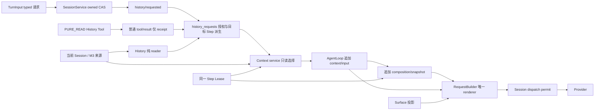

# TraceHarness v0.9 F0 设计合同

> 状态：2026-09-07，F0-A 设计与 F0-B 最小请求主线／最终限定门禁已完成。
> 依据：[`ADR-0043`](../adr/0043-step-scoped-context-input-and-retrieval.md)、
> [`ADR-0044`](../adr/0044-host-owned-project-scope-and-memory-authority.md)；推进顺序见
> [`v0.9 阶段计划`](TRACEHARNESS_V0.9_STAGE_PLAN.md)。F0-C History 接缝及最终限定门禁已完成，F0-A/B/C 本轮授权实现收口；F1–F5 未开工，未执行发布级全量或 L2。
> §2–5 冻结本轮 F0-C 唯一协议切换，实施状态见 §12；F0-B 已通过的证据保留在 §11，不能替代 F0-C 验收。§5.2 仍是后续通用检索目标。

## 1. 范围、规范层级与现有 owner

ADR 记录决定和理由，本文是新字段、跨事件规则与验收分工的唯一详细定义；阶段计划只引用，不另存
一份不同 schema。当前生产行为仍以源码为准。类型／模块名可以在所属阶段细化，改变本文的字段语义、
canonical owner、权限、source boundary 或旧数据拒绝须同步 ADR／合同，不能私下做兼容 reader。

| 现有生产接缝 | F0 冻结的扩展位置 | 实现 owner / 阶段 |
|---|---|---|
| [`AgentLoop.run_turn`](../../src/traceh/runtime/agent_loop.py) | 同一 Lease 内，Composition 前调用只读 Context service、追加一次 Context | Runtime / F0-B |
| [`SessionService`](../../src/traceh/session/service.py) | Session 协议读写、Context append 对账；保留首 snapshot+Attempt 原子派发许可 | Session / F0-B |
| [`RequestBuilder`](../../src/traceh/runtime/request_builder.py)、[`SurfaceProjector`](../../src/traceh/session/surface.py) | 单一 Context reader/renderer；Surface 白名单保持独立 | Request / F0-B |
| [`RuntimeComposition`](../../src/traceh/kernel/composition.py)、[`CompositionGeneration`](../../src/traceh/runtime/composition_runtime.py) | catalog descriptor/digest 与 exact Lease 同源 | Composition / F0-B 空 catalog，F1 真实 contribution |
| [`PluginManager`](../../src/traceh/plugins/manager.py)、[`PluginContext`](../../src/traceh/api/plugins.py) | Activation transaction 中 typed Skill candidate 与资源清理 | Plugin / F1 |
| [`surface_replacement`](../../src/traceh/session/surface_replacement.py)、[`CoreInvariantChecker`](../../src/traceh/session/invariants.py) | 复用 format-2 来源与逻辑顺序；递归展开、receipt、Step 时效 | Session / F0-C |
| `api/history.py`、`session/history.py`、`session/history_requests.py` | typed DTO、纯 History reader、唯一请求授权与派生消费规则；不新增 writer 或生命周期 | Session / F0-C 已完成 |
| [`TurnInput`](../../src/traceh/api/turns.py)、`ChatDriver`、`request_history_page` Tool | typed 宿主请求透传、原 Session owner 写入；普通 PURE_READ Tool 只返回 receipt | Driver / Tool / Session，F0-C 已完成 |
| [`SqliteEventStore`](../../src/traceh/session/sqlite.py) | 受控 derived index、schema、worker/close/backup | Store / F2 |
| [`product/runtime`](../../src/traceh/product/runtime.py)、[`workspaces/supervision`](../../src/traceh/workspaces/supervision.py) | 原创建链首次执行前核对项目继承；不复制生命周期 | 宿主装配 + ProjectScope / F3 |
| [`evaluation/attempt`](../../src/traceh/evaluation/attempt.py)、[`metrics`](../../src/traceh/evaluation/metrics.py) | 原 attempt 装载语料和收敛；读取 Context 计量 | Evaluation / F5 |

下图是 F0-B/C 已接入的唯一请求链与 History 来源／授权入口。只有显式配置才开放
当前 Session 的分页读取；Skill、Memory 与 ranking 不属于本轮：



## 2. 通用编码与协议切换

以下表中字段集合是 exact-key 集：缺失、额外、类型不符均拒绝；nullable 字段必须存在且为 null，不能
靠缺 key 猜默认。ID 是非空宿主已验证标识，seq/head 为非 bool 的整数，digest 为小写 SHA-256 hex。
集合按显式 identity 排序后编码，有语义的数组保留顺序；不允许 NaN、Infinity 或无法 UTF-8 编码的
surrogate。复用 [`canonical_json/fingerprint`](../../src/traceh/api/json_types.py) 的 JSON 编码约定，
在新协议 parser 拒绝非法值；不另造一套通用 JSON encoder。

- `H(x)` 表示现有 canonical JSON UTF-8 的 SHA-256；原文 digest 表示**原文 UTF-8 bytes** 的 SHA-256。
- `EventRef = {stream_id,event_id,seq,type,digest}`；digest 对整个已落盘 envelope 的 canonical JSON
  重算。读取必须同时验证归属、类型、seq 与 event_id，不能只比 digest。
- `HeadRef = {stream_id,head_seq,head_event_id,head_digest}`；空流 head_seq=0，后两项 null。
- 检索规范化只用于 query 和 derived index，绝不规范化或 sanitize 实际选中正文。UI 的安全显示是独立投影。

| 对象 | v0.8.0 已发布格式 | F0-C 本轮唯一切换（已完成） |
|---|---|---|
| `session/created` data | session_id/workspace/metadata | 必填整数 `context_protocol=2`；总字段仍恰为四项。拒绝缺失标记及 F0-B 的 1，不迁移、不双读 |
| `composition/snapshot` data | 原 Composition 字段（不含 catalog） | F0-B 已增必填 `skill_catalog`、`skill_catalog_digest`，revision 重算包含二者 |
| `request/snapshot` data | 原 `REQUEST_SNAPSHOT_KEYS` 的八项 | F0-B 已增 `context_input_seq`、`context_input_digest`，当前 exact 十项，保留 composed/dispatch 全部原校验 |
| `context/input` / renderer / policy | 尚无 Context | outer `format=1` 不变；唯一 `context-json-v2` / `f0-c-context-policy-v1`，config 见 §5.1；拒绝 F0-B 版本 |
| EventEnvelope `schema_version` | 1 | 仍为 1，不冒充 Session Context 协议版本 |
| M3 `surface/replace` | format 2 | 不变；format 1 继续拒绝 |
| SQLite `user_version` | 1，streams/events | F0-B/C 仍为 1；F2 一次切到 2，精确对象见 §7，旧目录拒绝 |

SessionService 的共同读取边界、ensure/open/resume/recover/inspect/replay、Request 构建／重建和
直接消费 Session events 的 invariant checker 都须验证首事件标记。`list_sessions` 可列 identity，
但详情或运行不能绕过拒绝。对旧 Session 不写补丁、不合成空 Context；旧数据仅用旧发行版读取或新建
数据目录。F2 的物理开库拒绝先于写入。F0-A 当时只冻结设计；F0-B 已实现 Session marker、Context 与
Composition/Request parser，F0-C 在同一 reader 显式切换至 2，包版本仍为 `0.8.0`。Product Session 证据和叶失败读取也复用
`require_session_protocol()`，不保留自己的旧字段副本。

## 3. Context、catalog 与 Request 绑定

### 3.1 唯一 `context/input` payload

F0-C 保持下表的 Session-only 子集：scope.kind=session、project_binding=null，空 Skill catalog、
selection head=0、source_heads=[]；自动选择只可为 history directory/summary，section/chunk 必须由
§4 的精确请求授权。policy 使用 §5.1 唯一版本；query.normalization=`identity-v1`，自动历史选择绑定
本 Turn 第一条真实用户输入，明确空策略时 text/refs 皆空。没有 ranking/query expansion。
Skill/Memory/project variants 仍由所属后续阶段接入；本轮 reader 必须拒绝，不能按外观猜测兼容。

| 字段 | 值与约束 |
|---|---|
| `format` | 1 |
| `session_id, turn_id, step_id` | 当前打开的真实身份，逐项与 Session/Step/Composition 核对 |
| `observed_session_seq` | 读取本次来源的 Session 截止点；小于 Context event seq |
| `scope` | `{kind,session_id,project_binding}`；kind 为 `session` 或 `project`，前者 binding=null，后者为 §6 的绑定 EventRef |
| `composition_revision, skill_catalog_digest` | 同一 Lease 生成的 Composition 引用，必须等于随后同 Step 快照 |
| `selection_head` | 当前 Session selection 的 HeadRef；F0 空来源为 head_seq=0 |
| `query` | `{normalization,source_refs,text,digest}`；refs 是有序 EventRef，digest=H(其余三项) |
| `policy` | `{version,config,config_digest}`，本轮 config 是 §5.1 的 exact 八项（原七项加 nullable history），digest=H(config)；§5.2 通用配置留待后续显式版本切换 |
| `source_heads` | 有序 HeadRef 集，标出实际读取的 Memory/项目等流；Session 截止点另以上项标明 |
| `blocks` | 有序 Block 数组；零命中为空数组，不省略 event |
| `exclusions` | 有界 `{kind,id,digest,reason}` 数组；只包含已获资格的 identity，未知 id/digest 为 null |
| `budget` | `{total_limit,kind_limits,kind_bytes,body_bytes,rendered_bytes,remaining_bytes,token_measurement}` |
| `context_digest` | H(除自身外的整个 payload) |

`token_measurement` 固定 variant：无 counter 时 `{status:"unavailable"}`；有显式验证 counter 时
`{status:"measured",counter_id,model_id,config_digest,value}`，不能用字节推造 token。时延、墙钟测量
不进入 Context canonical payload、排序或 digest，后续 evaluator 单独观测。两次完全相同的 identity、
来源边界、query、catalog、selection、policy 必须产生相同 bytes；不同 Step 不要求 digest 相同。

`Block = {kind,id,version,tier,scope,source_refs,content_digest,content_bytes,body,provenance}`。
kind 为 `skill|memory|history`，version 是对应不可变内容身份，tier 为 `directory|summary|section|chunk`；
scope 沿用 Context scope 结构且不得扩大资格。body 是 UTF-8 字符串，length/digest 对原文重算。
source_refs 是有序 EventRef。provenance 按 kind 严格分支：

- Skill：`{plugin,skill_id,section_id,resource_id,chunk_id,catalog_digest}`；plugin 为现有 PluginIdentity；
  section/resource/chunk 不适用时显式 null，正文必须匹配 catalog 中相应 descriptor。Skill source_refs
  可以为空，成员证据来自随后 Composition 的 manifest，不能引用一条尚未追加的 Composition event。
- Memory：`{project_id,memory_id,fact_slot,activation_ref,approved_content_digest}`；activation_ref
  必须是当时 active 的批准或替代事件；approved_content_digest 始终为完整批准正文 UTF-8 bytes 的
  SHA-256，Block.content_digest 只计算实际披露 body，两者仅在披露完整正文时相等。Memory directory
  body 固定为 `{project_id,memory_id,fact_slot,approved_content_digest,content_bytes}` canonical JSON，
  其中 content_bytes 是完整批准正文大小。Memory 是有界短事实，summary/section 都保留完整批准正文，
  不自动缩写或截取限定句；同一 memory_id 每请求最多纳入一次。首版无独立关联资源，chunk 请求明确
  disclosure-not-authorized，不能借 Memory source 展开跨 Session 原文。各 tier 都核对同一 proposal。
- History：`{block_id,page,request_ref,observed_through_seq,observed_at,workspace_observation,freshness}`；
  详细定义见 §4。目录／摘要不赋予原文读取权限；原文 section/chunk 必须有 request_ref。

Query 仅从本轮真实用户输入、已确认 requirement 的事件、当前已记录的工具调用／结果中的精确标识
按 host policy 构成；没有对应来源就不加“模型猜你想问”的扩展。F0-B/C 最小实现只用本轮用户输入，
其余 source adapter 由拥有来源的阶段接入，config 明确启用集。History 原文仍只认 exact request。

### 3.2 Catalog 和选择

`skill_catalog` 为按 Skill id 排序的 descriptor 数组。每项字段固定为
`{skill_id,version,plugin,title,summary,tags,requires_traceh,sections,resources}`；sections 为
`{section_id,tier,content_digest,content_bytes}`，resources 为
`{resource_id,relative_path,content_digest,content_bytes,chunks}`。chunks 为有序
`{chunk_id,byte_start,byte_end,content_digest,content_bytes}`，描述由贡献方显式划定、宿主验证的完整逻辑
片段；range 是原资源 UTF-8 半开区间，必须在资源内且不截断编码。无 chunks 不开放 chunk tier。
ID 唯一、摘要与总 descriptor bytes 有界，
relative_path 只能由 Activation 已验证的资源 root 解释。descriptor 不包含执行对象、绝对路径或
Tool grant，资源正文只经 leased reader 读取。`skill_catalog_digest=H(skill_catalog)`，Composition
revision 对包含 manifest/digest 的其余字段重算。directory body 固定为该 descriptor 的
`{skill_id,version,plugin,title,tags}` canonical JSON；summary body 为原 summary 字符串。section body
匹配 section digest，chunk body 匹配具名 resource/chunk 的范围/digest；这些规则都由相同 descriptor
重算，不能把摘要或任意截取正文假称为完整 resource 的 digest。

F0-B/C 冻结空数组，F1 才接真实贡献。F2 的 `context-selection:<session_id>` 流只接受宿主
`skill/selection-set`，字段为 `{format,session_id,operation_id,expected_head,actor_id,catalog_digest,skills}`；
format=1，skills 为排序的 `{skill_id,version}` 集。同一 operation 只允许 exact payload 对账；其他
变化 CAS 追加，影响未来 Step。不提供模型 `load_skill` 绕过入口。catalog 改变后旧选择记 stale，
宿主重新确认才建立新选择；显式选空也是事实。Session 无选择时不默认选中任意示例 Skill。

### 3.3 渲染、预算与合法前缀

F0-C renderer 版本唯一为 `context-json-v2`：固定宿主头 + canonical JSON 数组（body 作为转义字符串，携带
kind/id/tier/length/digest/provenance）+ 固定宿主尾。宿主文本声明参考不能覆盖权限／当前事实；History
每块另有宿主生成的观察边界与 freshness 尾注；`history_notice.cursor` 在目录／摘要为首 cursor，
在原文为 page.next_cursor，只逐页披露，不发送全页目录。常量由 `session/context_input.py` 的唯一 renderer
持有并以字节验收，不能每个 Provider 一份模板。正文里出现
同名字段也只在 body 字符串内。即使明确选空，也注入一条完整空 wrapper 的 user message，始终在全部
Surface 消息之前；它不写入 Surface。Context 的 rendered_bytes 对
这条 ModelMessage.content 的实际 UTF-8 计量，不把整份 receipt 原样暴露给模型。

预算先保留系统、Tool schema、当前用户输入与 fresh execution context，再对参考内容依
History→Skill→Memory 分配。F0-C 的 History 内先处理本 Step 获授权的原文页，再处理自动目录／摘要；
kind_limits、total_limit 及每块上限来自显式 config，wrapper 计入总额。
按完整 section/chunk 纳入，超额排除；item_bytes 与 kind_limits 统一按每个完整渲染 item 的 UTF-8
计量，包含 JSON 转义、provenance 和块尾注；kind_bytes 是 history/skill/memory 各 item 消耗之和，
body_bytes 仅是原文总字节观测。总 wrapper／数组分隔符只计入 rendered_bytes，每纳入一块重新核对
完整 content 的总额。空 wrapper 都装不下则拒绝本次配置/构建，不能挤掉受保护内容。
`remaining_bytes=total_limit-rendered_bytes` 不得为负。Composition/Request 元数据保存绑定值，
Attempt identity 和 Budget reservation 继续不进入请求 fingerprint。

| 停止位置 | Context / Composition / 首 Request+Attempt 数 | 要证明的结果 |
|---|---|---|
| Lease/读取失败或取消，Context 未提交 | 0 / 0 / 0 | 原 Step/Turn owner 收敛，无 Provider 调用 |
| Context 已提交 | 1 / 0 / 0 | 保留输入证据，不补造 Composition |
| Composition 已提交，build/准入失败 | 1 / 1 / 0 | 不派发，结清已存在的 admission 资源 |
| 首许可证已提交 | 1 / 1 / 1 | 精确请求派发或按原取消/对账收敛 |
| 同 Step retry | 同一条 / 同一条 / 同一 snapshot + 新 Attempt | 不重检索，不修改 source_seq/bytes |

合法前缀闭合后仍可被检查/恢复；不把“每 Step 必有 Context”作为全局不变量。反之进入请求构建就必须
恰有一条 Context，位于本 Step `step/start` 后、Composition 前，`source_seq` 精确指向本 Step
Composition；重复、缺失、逆序、外 Step、绑定漂移都拒绝。request-only Context + Surface 经同一
renderer 构建，composed/dispatch fingerprint 和原派生关系校验仍全部执行。

append 取消/异常复用 owned convergence，再用精确 identity、JSON 类型敏感的 payload 对账；无法
证明 committed 的 unknown 状态禁止重投和派发。恢复不重新填充 Context。未开始的后继 Step 不创造
Attempt。失败码至少区分 protocol unsupported、binding mismatch、source unavailable、budget
exceeded 与 commit unknown；稳定 code 的具体命名由 F0-B 统一，原始异常文本不进入参考正文。

## 4. History identity、分页与一次性请求

`block_id=H({session_id,replacement_ref})`，replacement_ref 是通过 format-2 parser 的 EventRef。
目录只从当前 Session 已验证的 replacement 图产生，不给模型 seq 范围访问权。已在本 Session 的冻结
Context 中披露的旧 block，即使后来被更宽 replacement 隐藏，仍可按原 identity 与已披露 cursor 请求；
不能仅凭当前可见目录丢弃合法历史披露。History 的
observed_through_seq 为该 replacement 的 cut boundary，observed_at 为对应已闭合 `turn/end` 的
持久 occurred_at，不是本次读取的墙钟。directory/summary 的 page=request_ref=null；directory body
是 `{block_id,observed_through_seq,observed_at,cursor}` canonical JSON；未配置 History reader 时 cursor=null，
配置后为确定的第一页 cursor。summary body 为已验证 replacement
message 的 canonical JSON；原文 section/chunk 的 page/request_ref 必填。递归沿实际 M3
来源展开并按 `surface_conversation/surface_prefix` 的逻辑顺序还原；每条边只能指向更早事件。叶节点
仅 `user/message`、`assistant/message`、`tool/result`，保留 assistant.tool_calls；独立 `tool/call`、
Product context、Attempt/Budget 等审计事件不能被伪装成聊天原文。

Page 是 `{policy_digest,index,leaf_refs,next_cursor}`；按闭合 Turn 分组后用显式 page 字节／消息上限
切页，不拆闭合 Turn 或 Tool call/result 组；section/chunk 首版使用同一分页规则，不提供更细切片。
超大 Turn 占稳定 page slot，请求该页整页拒绝并返回有界原因，不产生 accepted receipt；不会跳过它
重新编号，也不截断 Tool 结果。cursor 是宿主已经披露的 `{block_id,policy_digest,index}`，三项精确匹配
确定分界，不接受任意 seq 或负索引。首 cursor 来自目录／摘要，后续 cursor 仅由获授权的上一页披露；
不输出所有页的目录。body 为该页允许 ModelMessage 数组的 canonical JSON；leaf_refs 与原 bytes 可逐项
验证。纯 `session/history.py` 负责来源／分页，`session/history_requests.py` 集中判定公开请求资格；
query 最多选中目录／摘要，不能代替 exact request。

模型通过普通 `PURE_READ` Tool `request_history_page` 请求。receipt 实际落在
`tool/result` envelope 的 `data["data"]["history_receipt"]`，不能把 ToolOutput.data 与事件 data 混为一层。
`history_receipt` 使用严格子对象：
`{format,status,session_id,turn_id,source_step_id,tool_call_id,block_id,cursor,requested_tier,target_rule}`。
format=1，status=`accepted`，target_rule=`immediate-next-step`。普通 Tool result 只保存此 receipt
和有界状态文字；顶层原有 step_id/tool_call_id 不改造成另一消息协议。当前顶层没有 turn_id，所以
必须回查同 Session 的 tool/call、step/start 与 receipt 的三层身份。失败沿现有 ToolResult 失败合同，
不制造 accepted。Context 中 request_ref 指向成功结果 EventRef。Tool 只获得纯 reader 与当前调用身份，
没有另一 writer；只有显式 History policy 且宿主授予 Tool 才能调用。`include_default_tools=False`
不自动授予此 Tool，配置 History reader 本身也不修改既有 Tool 授权边界。

用户请求由 `api/history.py` typed DTO 表达，在 `TurnInput.history_requests` 的显式 tuple 中提交，
`ChatDriver` 透传而不从正文解析权限。原 Turn owner 在首 Step 的真实 user/message 落盘后、Context 前，
调用原 `SessionService` 的 owned/CAS 批量写入宿主 `history/requested`：
`{format,session_id,turn_id,step_id,user_message_ref,block_id,cursor,requested_tier}`。step_id 为本
Turn 首 Step，request_ref 指向此事件。不得依赖 `source="user"`、模型正文或任意 metadata 自报身份。
本轮已接入此 typed 路径，不新增完整治理 UI 或命令文本解析器。一个请求只选一个已披露页，多请求有界并按
持久 seq 顺序去重；同页只注入一次，不复用跨 Turn request。

| 派生状态 | 依据 | 是否可注入 |
|---|---|---|
| accepted | 有合法 Tool receipt 或 host history/requested | 仅登记，不承诺目标会出现 |
| eligible | 同 Turn 的唯一目标 Step 已开始且来源仍可验证 | 只在该 Step freeze 一次 |
| consumed | 该 Step 的 Context 已记录 request_ref | 同 Step retry 重用，后续 Step 不继承 |
| expired | 目标失败、已被越过、Turn end/max_steps/cancel/recovery | 永不转交另一 Step/Turn |

Tool 请求的唯一目标是同 Turn 紧邻后继 Step；宿主用户请求的唯一目标是该 Turn 首 Step。目标预算
拒绝、失败或未发生都不顺延；状态只从已有持久事实派生，不新增 pending 缓存、Lease 或状态机。
无目标 Step 时无需写一条“过期事件”，从 Turn/Step 顺序即可证明。目录中的原文大小不是自动授权。
跨 Session Memory source 引用不能作为另一 Session History 的 request_ref。

**F0-C 当前合同严格固定 `workspace_observation=null`、`freshness="unknown"`，其他值拒绝。**
现有 Workspace catalog 的 repository identity/base_revision 只证明配置和创建基线；
`WorkspaceService.resolve_for_agent()` 允许 CLEAN/DIRTY，仍返回 base_revision，通用 ToolResult
没有执行时的宿主 revision 绑定。因此不能用路径、时间、composition revision 或两次相同 base_revision
制造 matched。原始历史 bytes 可精确重建，不等于旧工具结论仍适用于当前 Workspace。

真实来源身份／revision 观察及其 ToolResult 持久绑定由 F3/F4 所属 owner 接入后再显式切协议验收；
届时 `workspace_observation` 才可为 `{source_identity,source_revision,current_identity,current_revision}`，
四项来自可核对宿主事实：缺失为 unknown、已知不匹配为 stale、全部相关来源齐全匹配才为 matched。
matched 仍不代替当前代码、测试或环境的 fresh 验证。本轮不为此引入实时 Git 观察或假 revision fixture。

## 5. 检索、披露与显式配置

### 5.1 F0-C 当前唯一配置：`f0-c-context-policy-v1`

当前 `RuntimeConfig.context_input` 接受 [`ContextInputPolicy`](../../src/traceh/session/context_input.py)
或 `None`。None 使用具名空策略；不是默认历史检索。`policy.config` exact 键恰为原七项加 `history`，
`policy.version` 唯一切换为 `f0-c-context-policy-v1`，config_digest=H(config)，不双读 F0-B policy：

| 字段 | 当前 parser 与执行语义 |
|---|---|
| `history_tier` | `None`，或严格字符串 `directory`、`summary`；后两者只选择当前 Session 可见 M3 replacement |
| `total_bytes` | 非负整数，必须装得下固定空 wrapper；完整 rendered content UTF-8 上限 |
| `history_bytes` | 非负整数，History 完整渲染 item 合计上限 |
| `item_bytes` | 非负整数，每个完整渲染 item 上限，包含转义、provenance 和历史尾注 |
| `max_blocks` | 非负整数，实际纳入块数量上限 |
| `max_exclusions` | 整数且至少 3；超过排除记录上限时失败，不静默截断 |
| `max_query_bytes` | 非负整数，本 Turn 首条真实用户输入的 UTF-8 上限；超限拒绝 |
| `history` | null，或显式 `HistoryReadPolicy` 的 exact 七项；null 不开放原文分页 |

`history_tier=None` 要求 history=null，且 history_bytes/item_bytes/max_blocks/max_query_bytes 全为 0。
只允许三种配置：全部关闭；directory/summary 仅参考；directory/summary 加显式 History reader。
不实现没有自动目录的 raw-only 模式。`HistoryReadPolicy` 七项全部为显式正整数；其 digest 为
`H({version:"history-turn-pages-v1",config:七项})`，cursor 绑定同一 digest：

| 字段 | 所属限制 |
|---|---|
| `max_blocks` | 纯 reader 接受的 replacement block 数上限；区别于外层本请求注入块数 |
| `max_depth` | 嵌套 replacement 展开深度上限 |
| `page_bytes` | 一页完整 canonical 消息数组的 UTF-8 bytes 上限，包含数组标点 |
| `page_messages` | 一页消息数上限 |
| `max_source_events` | 所观察 Session 前缀的事件数上限，包含审计事件 |
| `max_source_bytes` | 所观察 Session 前缀的 bytes 上限，包含审计事件 |
| `max_requests` | 单次请求接线接受的 History 页请求数上限 |

`ContextInputPolicy.empty()` 的 total_bytes 由空 wrapper 实际 bytes 派生，max_exclusions=3，记录
Skill/Memory source-unavailable 与 History not-selected；query 和 blocks 为空，history=null。启用策略所有字段
必须显式给出，禁止从示例或部分配置补默认。宿主选择经 typed TurnInput/ChatDriver；本轮不新增治理 UI。

启用历史时按 `surface_conversation()` 当前可见 replacement 的原逻辑顺序取块，复用 M3 来源验证，
不做排名；本 Step 合法请求的原文页先于自动目录／摘要分配预算，每块超预算整块 budget-excluded，
超过块数则 resource-limit。无块记 no-hit，来源不可得明确排除；请求失败不转为 accepted，也不把整页
原文塞入普通 Tool result。Skill catalog 只能为空、Memory 来源为空；token_measurement 固定 unavailable。
本轮没有项目 scope、Skill/Memory、FTS、semantic 或 reranker 实现。

### 5.2 后续目标：通用检索配置（当前 parser 不接受）

以下保留 F0-A 冻结的完整检索目标，供 F1–F4 所属 owner 接入。它不是 §5.1 的隐藏备用解析器，也不
要求 F0-B/C 提前填充未实现 lane。实际扩展必须在对应阶段显式冻结新 policy 版本并进行唯一协议切换，
拒绝旧格式；不得双读、猜测降级、自动迁移或用相同版本改变 config 的含义。

F0-C 仍只扩展当前 Session History；Skill catalog 和 Memory 来源为空，保留真实空原因。F2/F4 按同一
接口接入领域；不为原型造假 Memory authority。检索先进行 scope/status/catalog 资格过滤，再匹配、
排序、去重、预算，在最终来源复核时核对头与 digest；变化就 unavailable，不换 latest。每个来源以
最后成功复核为其选择观察边界；该点后、Context append 前的变化不被冒称已观察，不要求跨流原子读写。

通用目标 `policy.config` 的必填键为 `renderer,query_sources,normalization,lanes,fusion,budget,limits,history`。
normalization 为 `{id,unicode_version}`，id=`nfkc-casefold-v1`，Unicode 数据版本须由宿主显式配置并与
执行环境核对；query.normalization 保存同一对象，不把不同解释器的 Unicode 规则当成同一 config。
lanes 按 lane id 排序；每项 `{id,version,enabled,config}`，未知 lane 拒绝，semantic/reranker 未配置
即明确 disabled。子配置如下，所有数值必须由宿主显式给出并进入 config_digest，没有项目/模型默认：

| 配置 | exact 字段与语义 |
|---|---|
| `fusion` | `{version,rrf_constant,lane_weights,tie_break}`；`rrf-v1`，正整数常量／正整数权重，按分数降序、kind/id/version/tier/content_digest 升序 |
| `budget` | `{total_bytes,history_bytes,skill_bytes,memory_bytes,item_bytes,token_counter}`；各非负整数，wrapper 必须可容纳，counter null 或显式 identity/config |
| `limits` | `{max_catalog_bytes,max_query_bytes,max_terms,max_corpus_items,max_corpus_bytes,max_candidates,max_blocks,max_exclusions}`；均正整数，超限明确拒绝或 unavailable，不静默扩大 |
| `history` | 沿用 §5.1 的七项有界 reader 配置；只允许当前 Session/exact identity，不因通用检索扩大原文权限 |
| exact lane config | `{match_fields}`；允许 id/symbol/path/error/tag 的明确子集，精确匹配优先级由该有序数组固定 |
| FTS lane config | `{tokenizer,k1,b}`；tokenizer 固定版本，k1>0、0≤b≤1，缺值拒绝，BM25 见下文 |
| optional local lane config | `{model_id,artifact_digest,artifact_path,algorithm_version,parameters,resource_limits}`；安装于显式本地只读资源，参数/限额由选定 lane exact parser 校验；未选择实现前不可 enabled |

`traceh-lexical-v1` 的规范化固定为 Unicode NFKC + casefold；代码完整符号、路径、错误号同时交 exact
lane，不被 lexical 拆分替代。lexical 将连续 Han 字符按单字与相邻双字生成词项，其他字母／数字连续
片段保留为词项，标点分隔；Han 字符集/Unicode data version 必须写入 tokenizer 版本实现和回归证据。
词项编码为其 UTF-8 hex 前加 `t`，空格分隔送入 FTS5 `unicode61`，查询由宿主按相同词项生成 quoted
OR terms；用户不能提交 FTS 语法。正文用于展示的 bytes 始终不变。具体 tokenizer 的中文质量尚待 F2/F5。

FTS 不直接调用全库 rank/bm25。宿主先形成有界 eligible corpus，统计 N、avgdl、每词 df 和每文档 tf，
只对已获资格的 FTS 命中算 BM25：每个去重 query term 的贡献为
`ln(1+(N-df+0.5)/(df+0.5)) × tf×(k1+1)/(tf+k1×(1-b+b×dl/avgdl))`；空 corpus/query 无命中。
不得混入另一项目、revoked Memory 或不同 leased catalog 的统计。候选数超限整条 lane unavailable，
不做全库 top-N 后过滤。融合 `sum(weight/(rrf_constant+rank))`，各 lane 内从 1 起排名，按有理数比较，
保留稳定 tie-break；identity 重复只算一次，同源更高披露级不自动获得权限。

每阶段选择的 config 必须冻结。exclusions 的原因枚举为 `not-selected|stale-selection|source-unavailable|
index-unavailable|no-hit|duplicate|budget-excluded|resource-limit|disclosure-not-authorized|content-rejected`。
跨项目候选不记录其 identity 或正文到当前 Session；scope 违规在宿主审计/评测中计数。exclusion 数量
上界超限时整次 Context 构建明确失败，不能无提示截掉拒绝原因。

## 6. 项目绑定与 Memory exact 事件

### 6.1 projects:catalog

三类 data 共有 `{format,operation_id,actor_id,expected_head,project_id}`，format=1，expected_head
是该 stream 的真实 CAS head。按类型追加以下 exact 字段：

| 类型 | 额外字段 |
|---|---|
| `project/created` | `label`：显式宿主提供的有界展示名，不参与猜测项目身份 |
| `project/source-bound` | `source_id,repository_fingerprint,source_binding_digest`：宿主解析的 source 和 common-dir 身份证据，摘要由这两项重算 |
| `project/session-bound` | `session_ref,source_binding_ref,inheritance`：前两项 EventRef；inheritance 为 null（宿主显式 requester 绑定）或 `{requester_binding_ref,task_ref,agent_ref,workspace_ref}` |

project_id 在一个 Store 中唯一，source_binding 一经确定不变；source规范身份
`{source_id,repository_fingerprint}` 不能被另一个 project 占用，Session identity 也只绑定一个 project。
所有 EventRef 必须从同一 Store 读取验证。requester 的 session/created.workspace 必须经宿主 source
resolver 证明实际属于该 source，显式 project_id 不能绕过；禁止只验证两个 EventRef 字段合法就绑定。
继承引用通过已有 Product/Directory/Workspace reader 核对
实际关系，不按字段外观推断。运行期 exact Store/SessionService owner 相同是服务装配前置。

ProjectScopeService 的 create/bind-source/bind-session 是宿主能力，模型没有同名 Tool。绑定写入
之前禁止项目 Memory；无绑定仍可按 Session-only 合同运行普通请求。事实源损坏/未知归属明确失败。
source mapping 或路径 fingerprint 变化拒绝；新目录不自动继承，也不自动移动、迁移或删旧数据。
解析已经存在的绑定时也须 fresh 核对当前宿主 source resolver，不能只在第一次写绑定时检查一次。

### 6.2 memory:<project_id>

各 data 共有 `{format,operation_id,actor_id,expected_head,project_id}`，format=1，head CAS 作用于
唯一项目 Memory stream。额外字段如下：

| 类型 | 额外字段与状态变化 |
|---|---|
| `memory/proposed` | `proposal_id,body,sources,proposal_digest`；digest=H({project_id,proposal_id,body,sources})，状态 proposed |
| `memory/approved` | `proposal_ref,proposal_digest,memory_id,fact_slot,decision_digest`；slot 当前无 active，消费 proposal 后创建 active |
| `memory/superseded` | `proposal_ref,proposal_digest,memory_id,fact_slot,predecessor_ref,predecessor_digest,decision_digest`；原子退出前任、激活新值 |
| `memory/revoked` | `memory_id,fact_slot,predecessor_ref,predecessor_digest,decision_digest`；退出 exact active |

decision_digest=H(除自身外的整个 data)，包含 actor、operation、expected_head、slot 和精确前任。
predecessor_ref 指向激活该 Memory 的 approved/superseded 事件；predecessor_digest 固定等于该事件
消费的 proposal_digest，EventRef.digest 仍仅用于 whole-envelope 验证，二者不能混用；
memory_id 与 proposal_id 分离且各唯一。一个 proposal 只能被消费一次，superseded/revoked 不复活。
fact_slot 在宿主批准时选择，proposal 不能先抢槽；在同项目全流 CAS 下，任何时刻同槽至多一个 active。

sources 的元素是三种 exact variant：

- `{kind:"session-evidence",binding_ref,event_refs,observed_head}`：已绑定本项目的 Session，叶事件
  类型按 §4 白名单且来源已闭合；不开放通用跨 Session 原文读取。
- `{kind:"product-evidence",requester_binding_ref,task_id,event_refs,observed_head}`：由原 ProductTask
  owner 证明 requester 属于本项目；只引用该原流的事实，不能把模型 prose 当审批或验证结果。
- `{kind:"host-declaration",declaration_id,actor_id,statement}`：宿主控制入口实际捕获并随 proposal
  冻结的人工声明，model proposal API 不能构造此 variant；不能自报为已执行证据。

Memory content policy 必须拒绝已识别秘密形态、凭据/approval/evaluator/Budget 私有输入、瞬时执行
状态和超限正文；扫描基于显式规则和 source 类型，不声称可穷尽自然语言秘密或证明跨槽语义一致。
模型猜测只能保留 proposed，宿主人工确认是进入 active 的唯一边界。正文长度和来源数上限由 F3
宿主配置完整给出；缺项拒绝 writer 装配，不能用某个示例规模作隐藏默认。

每次查询 fresh replay；最终复核 head 和 active identity，漂移记 source-unavailable；成功复核后的
变化影响下一次选择，不声称已追加 Context 获得跨流 latest 保证。多个流的
head 不是一个全局同时刻，receipt 必须逐一列出实际观察边界；同槽批准原子性只在项目 Memory stream
内承诺。取消后先收敛再精确对账，unknown 不重投 approve/supersede，不用 mutable active 字段对账。

## 7. FTS 物理 schema、重建与恢复

F2 的 schema 2 固定同一 SQLite 文件和原 APPLICATION_ID。对象白名单为原 `streams/events`，以及：

| 对象 | 冻结形态 |
|---|---|
| `context_index_manifest` | ordinary WITHOUT ROWID table，corpus_key 主键；保存 scope/catalog/source_heads/tokenizer/ranker/config digest、corpus digest、item_count/bytes |
| `context_index_items` | ordinary table，rowid 整数主键；corpus_key、kind/id/version/tier、scope、source refs、content digest、词频/长度的 canonical 派生记录 |
| `context_fts` | contentful FTS5 虚表，唯一 indexed 列 `terms`，tokenize=`unicode61`；rowid 与 items 一一对应 |
| FTS5 shadow | 精确 `context_fts_data`、`context_fts_idx`、`context_fts_content`、`context_fts_docsize`、`context_fts_config` |

F2 在唯一 `_CREATE_*` DDL 固定全部列、约束与 SQLite 自动对象检查；上述为允许对象全集，不允许
按 `context_*` 前缀宽泛放行。无应用自建触发器、第二外部内容表或外部数据库。实现需在受支持 Python/
SQLite 组合上证明实际 shadow SQL/列关系符合合同；FTS5 不可用是稳定 capability 错误，不静默改 lane。

corpus_key=H({scope,catalog_digest,source_heads,tokenizer,ranker,config_digest})；所有内容均可由
canonical sources 重建。首次创建空索引不等于 ready；manifest 必须匹配 items/FTS 的数量、内容和
source heads，且符合当前 eligibility。正常查询可使用匹配完整快照；不匹配只记 index-unavailable，
exact lane 是否可继续由同一显式 policy 决定，不声称 FTS 完成。

Store 通过受控 rebuild/query 接口管理 SQL；不把 connection 或 writer 交给 Plugin/Context service。
在配置 corpus 上限内，先从 canonical readers 收集冻结派生输入，持有相关 Lease，进入同一有界写事务
再核 source heads，替换 items/FTS/manifest 并原子提交。变更期间旧完整快照可以保留但必须重新核对
资格；取消/失败回滚或精确对账为已发布/未发布/unknown，禁止半发布。manifest/派生行逻辑不一致可
记 unavailable；表/shadow/DDL 缺失或物理损坏仍按开库错误拒绝。并发写入仍受已有 busy timeout
约束；所有 worker 在 caller 返回/Store close 前收敛。

rebuild 只重写已知派生行，不 DROP/重建未知 schema，不改 canonical events。Store backup/restore
携带同库全部对象，在既有一致快照与零覆盖规则下检查；恢复后用相同 source/digest 规则认定 usable
或 unavailable。历史 Request 重建完全不依赖索引，索引缺失不改变历史 bytes。

## 8. 唯一评测主线与预注册规格

F5 复用 `run_attempt → _run_attempt_with_store → _prepare`：在同一 owner 中把 requester Session
创建移到 Product host 构造前，tool-free requester 的 workspace 使用该 attempt 的 source repository，
让 source resolver 能证明归属，不沿用独立 `rw` 目录。随后依序 project binding、生产 Plugin/Memory seed、host、原用户
确认与执行；不是另一套 prepare Runner。资源清理仍为已创建 host → Runtime → Store，已有 Git/
Workspace owner 各自收敛。seed 必须由 exact manifest/digest 驱动，子 Session 走生产继承接缝。

现有 benchmark manifest schema 1 在 F5 若扩展则唯一切到 2，不双读。新增冻结 evaluator 配置必须
具有 corpus/config/judgments digest、相对 manifest-root 资源、显式 K/配额/通过线/资源上限及 seed
receipt；字段最终 exact-key schema 由 F5 同一 manifest owner 落地。完整 corpus/答案/evaluator
不进 source repository、coder Workspace 或额外系统提示，只有选中 reference blocks 按主线注入。

观测主键为 `(attempt_id,session_id,turn_id,step_id)`。Provider retry 不增加样本；没形成 Context
的已计划目标 Step 算 unavailable，attempt 在 Step 前失败保留 attempt failure，不虚构 Step。角色
和 query 分层、按 attempt 聚合，不以子 Agent 数量提高样本权重。Query→planned target Step 的配对
由宿主冻结输入与 Session 事件确定，不由模型生成的 query 文本或命中次数决定。

| 指标 | 明确定义 |
|---|---|
| Recall@K | eligible 排名的前 K 个去重 relevance unit 中相关个数 / 此 query 全部相关 eligible unit 数；无相关 unit 时不进该分母 |
| MRR@K | 前 K 首个相关 unit 的 reciprocal rank，未命中为 0；同上只对有相关答案的 query 汇总 |
| Context precision | 实际注入的相关 unit 数 / 实际注入 unit 数；无注入时为 unavailable，另报正例遗漏与 zero-hit 结果 |
| Zero-hit accuracy | 人工标注无相关 eligible unit 的 query 中，候选与实际注入均空且流程可验证的比例 |
| Scope-isolation violations | 检索资格/排名 receipt 或实际注入中越权 identity/内容的次数；通过线必须 0 |
| Coverage / failure | 计划观测数、可计量数、failed/unavailable/unproven 分别报；缺证据不能变 0 或从总数消失 |

relevance unit 精确到 `(kind,id,version,tier,section-or-page)`，judgment 是二值且在结果前固定；
同一文档不同 tier 不自动继承相关性，多 lane 重复身份只计一次，K 作用于去重后的 eligible 排名。
候选质量与预算后注入质量分别报告；任何“通过”同时要求预注册 coverage 和质量门槛，不能只在成功
子集上计算好看的平均值。n=1 标为 single observation，不能称显著提升。

语料必须覆盖中文、英文、混合符号/路径/错误号、exact/lexical/semantic、zero-hit、hard-negative、
revoked/superseded、retired catalog、cross-project，以及同项目换 Session 问目标／阶段。History
另验证 exact provenance 与时效，不扩大跨 Session 原文权限。至少一类无关项目变化应证明当前项目
排名不变，防止全库统计渗入。

F5 在首次 candidate 结果前冻结并摘要：具体语料/人工答案、K、最低 Recall/MRR/precision/zero-hit、
最低 coverage、分组容许退化、index bytes/rebuild time/query latency/Context bytes 和本地模型资源
上限、运行环境与重复次数。数值不能在 F0-A 凭空宣称达标；缺任何必需值只允许描述测量。Token 无
显式 counter 为 unavailable。exact+FTS 先建立 baseline；optional semantic/reranker 必须达到
预注册增益、关键类别退化线与资源上限，未证明时保持关闭，不阻止已达标的核心检索交付。

## 9. 分阶段验收与停止条件

以下是各阶段验收义务，实际证据单列在 §10–12。F0-A/B/C 本轮授权实现及限定门禁已收口，
F1–F5 尚未开工；不得把旧接缝或 F0-B 测试当作 F0-C 功能验证。公共入口必须真正到达被验证的 owner，
并发用 Event/Gate 等确定信号；关键保护在所属实现阶段做反向验证，避免私有字段或未启动操作的空证明。

| 阶段 | 正向路径 | 关键反例 | 失败／取消 | 退出条件 |
|---|---|---|---|---|
| F0-B | 同 Lease Context→Composition→Request；Tool 续步仍在全部 Surface 前；历史 bytes 重建 | 零/双 Context、乱序、他Step同revision、catalog成员/正文篡改、伪header | 四种合法前缀、unknown append、预算拒绝、同请求 retry、恢复幂等 | 新主线真实测试与相邻 Request/Lease/Budget 门禁通过 |
| F0-C | 单层/嵌套 replacement、逐页 cursor、已披露后被隐藏的旧 block、Tool receipt 到直接后继 Step、typed 用户 exact 选择 | 任意seq/跨Session/非闭合来源、未披露cursor、超大Turn、伪造matched/stale、跨Turn继承、旧协议 | max_steps、目标Step失败/超预算、重复取消、恢复均使请求失效 | 原文不驻留 Surface，不产生 pending authority，freshness 只为 unknown |
| F1/F2 | typed Skill 事务发布、old/new Lease、selection、exact+FTS | 未选正文泄漏、跨插件资源、退休选择、跨scope统计污染 | health/setup/reload/drain、index重建/关闭失败 | Release Stop A，真实 owner 独立审查清零 P0/P1 |
| F3 | requester/新Session/managed child 同项目绑定、approve/supersede/revoke | 跨Store/项目/owner、自报host source、同槽竞争、陈旧前任 | 部分创建、may-have-committed、取消收敛与fresh replay | Release Stop B，Memory authority 与绑定主线成立 |
| F4 | 统一filter/预算/四级披露、索引重建、scope/freshness | revoked/retired注入、预算挤权威、old bytes冒充当前 | 来源漂移/超限/索引不可用 | 各领域共同输入仍一条主线 |
| F5 | 原attempt合法seeding、治理、指标与可比baseline | 语料泄漏、答案污染、错误分母/后改阈值 | seed/host创建取消，原owner全部关闭 | Release Stop C；后续明确授权的发布门禁 |

F0-A 当时只有文档交付，运行已有接缝的少量定向测试用于核对设计依据；不得把其通过称为新协议实现。
本轮明确禁止全量、L2、Wheel、联网、真实 Provider，不执行递归候选验证；后续阶段仍按用户授权与
阶段计划的 owner 门禁选择具体 nodeid。F0-B/C 未通过前不进入 F1，不以文档冻结代替 F0 完成。


## 10. F0-A 实际验证记录

2026-09-07 仅修改 ADR、合同、计划和上下文文档。下列精确目标 collect-only 得到 19 项，执行全部通过、
退出码 0。测试证明的是现有接缝，不能证明新 Context/Memory/FTS 协议已经实现。新设计经 Context/History
与 Scope/Memory/Store 两组限定范围只读核查，已补齐成员、时效、观察点、计费和索引拒绝规则。

以下为本轮实际目标，可重复运行同一小集合；不含全量、L2、构建或真实 Provider：

```powershell
$targets = @(
    'tests/test_sqlite_event_store_architecture.py',
    'tests/test_sqlite_event_store.py::test_extra_persistent_schema_object_is_rejected_without_mutation',
    'tests/test_sqlite_event_store.py::test_cancellation_after_commit_waits_for_worker_and_fresh_replay_proves_commit',
    'tests/test_sqlite_event_store.py::test_backup_and_restore_are_validated_and_never_overwrite',
    'tests/test_composition_generations.py::test_initial_generation_lease_and_revision_is_content_based',
    'tests/test_composition_generations.py::test_publish_rejects_foreign_session_service',
    'tests/test_composition_generations.py::test_lease_body_normal_error_and_cancel_all_release',
    'tests/test_composition_generations.py::test_real_turn_keeps_one_generation_during_publish_and_rebuilds_requests',
    'tests/test_compaction.py::test_request_reconstruction_is_exact_before_and_after_compaction',
    'tests/test_compaction.py::test_invariants_reject_forged_digests_and_byte_counts',
    'tests/test_compaction.py::test_cancellation_converges_the_append_worker',
    'tests/test_model_attempt_admission.py::test_zero_token_budget_never_records_or_dispatches_an_attempt',
    'tests/test_model_attempt_admission.py::test_unknown_attempt_commit_never_dispatches_and_turn_closes_it',
    'tests/test_model_retry.py::test_transient_failure_then_success_reuses_one_frozen_request',
    'tests/test_recovery.py::test_recovering_twice_appends_no_second_attempt_end',
    'tests/test_product_benchmark.py::test_an_unavailable_measurement_is_counted_not_zeroed',
    'tests/test_product_benchmark.py::test_an_unmeasured_attempt_keeps_the_run_incomplete'
)
python -m pytest --collect-only -q $targets
python -m pytest -q $targets
```

源码、测试、配置和脚本未改，未运行 compileall/Ruff 或整仓 collect-only；未构建、联网、读秘密、
提交、推送或发布。文档另检查链接、章节映射、围栏、示例／秘密与 `git diff --check`。具体语料、
质量阈值和资源测量仍按 §8 留给 F5 在 candidate 结果前冻结，不以本轮定向通过代替。

## 11. F0-B 已完成的实施与验证证据

当前最小请求链已接入既有 Runtime/Session/Composition/Request 主线：同 Lease 内 Context 先写、
Composition 后写，首 Request+Attempt 仍一次 CAS，retry 复用同一冻结请求；Context 不进入 Surface。
该阶段采用 Session context_protocol=1、`f0-b-context-policy-v1` 的七项 policy 与 `context-json-v1`。
本轮 F0-C 按 §2/§5.1 明确替换旧协议；下列历史阶段结果不能当作 F0-C 原文披露验收。

**最终限定门禁：**下表同一组 36 文件 collect-only **1079 项**，执行结果为
**1076 passed, 3 skipped in 20.22s**。新 `test_context_input.py` 24、`test_context_request_protocol.py`
24、`test_context_runtime.py` 11，共 **59 项已包含在最终 1076 中**，不再相加。三项 skip 均为
Windows 边界：两项文件符号链接权限不足（`WinError 1314`），一项 NUL 路径不合法。

| owner 子集 | 精确文件名（全部位于 `tests/`） |
|---|---|
| Context（3） | `test_context_input.py`、`test_context_request_protocol.py`、`test_context_runtime.py` |
| Runtime（3） | `test_runtime_e2e.py`、`test_runtime_factory.py`、`test_runtime_dispose.py` |
| Model/Budget（3） | `test_model_attempt_admission.py`、`test_model_retry.py`、`test_budget_enforcement.py` |
| Session/Composition/Store（8） | `test_compaction.py`、`test_recovery.py`、`test_surface_and_invariants.py`、`test_composition_generations.py`、`test_session_plugin_identity.py`、`test_event_store_contract.py`、`test_sqlite_event_store.py`、`test_sqlite_event_store_architecture.py` |
| Product（5） | `test_product_architecture.py`、`test_product_contract.py`、`test_product_model_context.py`、`test_product_service.py`、`test_product_inspection_leaf_failure.py` |
| Plugin/Scope（4） | `test_composition_scope_overlays.py`、`test_plugin_composition_stage_c.py`、`test_plugin_composition_coordinator.py`、`test_plugin_runtime.py` |
| Workspace/Inspector（2） | `test_workspace_architecture.py`、`test_inspector.py` |
| CLI（5） | `test_cli_read_only_commands.py`、`test_cli_resume_safety.py`、`test_cli_resume.py`、`test_cli_chat.py`、`test_cli_timeline.py` |
| TUI（3） | `test_tui_task_conversation.py`、`test_tui_context_inspection.py`、`test_tui_presentation.py` |

调用方式为在隔离空临时 cwd 使用 `python -m pytest -o addopts= -q --tb=short -rs`，随后逐项传入
上表文件的绝对路径；collect-only 使用相同精确集合，不用整仓目录或隐含默认目标。实际执行没有加载
仓库真实 `.env`。compileall `src tests` 成功，30 个改动 Python 文件 Ruff 通过，13 个生产文件反硬编码
扫描无命中；两轮有界独立审查与 TUI 复审无 P0/P1，关键保护完成反向验证。

相邻修复均在原 owner：Product 两份旧字段副本改用共同 Session 协议检查；ModelRequest 保留空
system prompt；现有 TUI Context inspection 复用 `build_request_from_events()`，单独计 reference
消息／UTF-8 bytes，再从剩余 Surface 识别 Product 与 conversation，只显示统计，不披露正文。
恢复旧 offset 的反例确实因 Product mismatch／conversation 计数错误失败，正确实现已恢复；这不是
F5 检索治理 UI。F0-B 完成时 F0-C 尚未开工，F0 整体未完成。F0-B 该轮未运行全量、L2、构建、联网或真实
Provider，未提交、推送或发布。

## 12. F0-C 当前实施与验证状态

**F0-C 已完成，F0-A/B/C 本轮授权实现收口；F1 未开工。**本轮在既有 Session/Runtime/Tool/Driver
owner 中接入 §4 的有界原文披露与 typed 请求，唯一协议／policy／renderer 切换见 §2/§5.1。
没有新 writer、Lease、pending 状态机，不扩展 F1–F5。

最终限定同一组 **38 文件 collect-only 1104 项，执行 `1100 passed, 4 skipped in 31.98s`**。
新 History 四文件 **81 项**（reader 37、requests 12、Tool 16、Runtime 16）已包含在 1100 中，
不另行加总。四项 skip 均为 Windows 平台边界：SQLite 两项文件符号链接权限不足（WinError 1314）、
Tools 一项目录符号链接权限不足、CLI 一项 NUL 路径不合法。

公开生产路径覆盖嵌套来源、顺序／分页、next_cursor、旧已披露 block、原文与 leaf/request 引用篡改、
typed/Tool 授权、紧邻 Step、预算、retry、取消／恢复、max_steps、默认 Tool opt-out、SQLite 精确重建，
以及相邻 owner 回归。两分区独立有限审查无 P0/P1，按边界停止；七组反向保护证据分别验证紧邻后继、
reader 顺序／M3 来源、请求 owner 的页面／请求来源与重复取消，均因预期根因失败后恢复，不能当测试数相加。
compileall `src tests` 成功，40 个改动 Python 文件 Ruff 通过，19 个生产文件反硬编码扫描无命中。
测试从隔离空临时 cwd 调用绝对 tests 路径，未加载仓库真实 `.env`。本轮未运行全量、L2、构建、联网或
真实 API，未提交、推送或发布；这不是 v0.9 发布验收。最终精确文件集合如下。

| owner 子集 | 精确文件名（全部位于 `tests/`） |
|---|---|
| History（4） | `test_history_reader.py`、`test_history_requests.py`、`test_history_tool.py`、`test_history_runtime.py` |
| Context（3） | `test_context_input.py`、`test_context_request_protocol.py`、`test_context_runtime.py` |
| Runtime（3） | `test_runtime_e2e.py`、`test_runtime_factory.py`、`test_runtime_dispose.py` |
| Model/Budget（3） | `test_model_attempt_admission.py`、`test_model_retry.py`、`test_budget_enforcement.py` |
| Session/Composition/Store（8） | `test_compaction.py`、`test_recovery.py`、`test_surface_and_invariants.py`、`test_composition_generations.py`、`test_session_plugin_identity.py`、`test_event_store_contract.py`、`test_sqlite_event_store.py`、`test_sqlite_event_store_architecture.py` |
| Product（5） | `test_product_architecture.py`、`test_product_contract.py`、`test_product_model_context.py`、`test_product_service.py`、`test_product_inspection_leaf_failure.py` |
| Inspector（1） | `test_inspector.py` |
| CLI（5） | `test_cli_read_only_commands.py`、`test_cli_resume_safety.py`、`test_cli_resume.py`、`test_cli_chat.py`、`test_cli_timeline.py` |
| TUI（3） | `test_tui_task_conversation.py`、`test_tui_context_inspection.py`、`test_tui_presentation.py` |
| Tool（3） | `test_tool_runtime_failures.py`、`test_tool_middleware.py`、`test_tools.py` |

使用 `python -m pytest -o addopts= -q --tb=short -rs`，逐项传入上表 38 个文件的绝对路径，从隔离
TemporaryDirectory cwd 执行；collect-only 为同一集合加 `--collect-only`。不使用整仓目录、默认目标、
`--lf` 或另一批次缓存代替。本表记录实际定向门禁，不新增脚本或自动执行授权。
