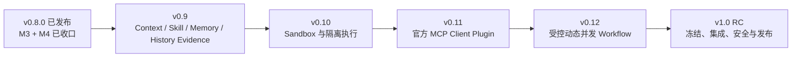

# TraceHarness v1.0 总路线：记忆、隔离、互操作与受控并发

> 状态：v0.8.0 已发布，v0.9-F0-A/B/C 本轮授权实现及限定门禁已收口；F1 Skill 贡献与 F2 选择／检索／披露完成限定验证；F3 项目归属与 Memory authority 已实现并通过定向验证，B-P1-01 已修复并经独立复审关闭，Release Stop B 已通过（P0=0/P1=0/P2=0）；F4 共享检索与真实 History 观察已实现并完成定向验证，F5 治理/冻结评估、精度整改及冻结复验完成，11 条均达到原阈值；Stop C 已通过限定验收，发布门禁仍待授权。Release Stop A 独立审查 P0/P1 清零，2 项 P2 已修复并完成定向确认，未执行 v0.9 发布级全量或 L2
>
> 编制日期：2026-09-05；最近修订：2026-09-08（同步 F5 导航修订与真实 Provider 验证；未运行全量／L2／构建）
>
> 适用范围：v0.8 已发布基线、v0.9、v0.10、v0.11、v0.12 与 v1.0 RC
>
> 事实源优先级：当前源码/测试/协议 > 两份项目上下文 > 本计划 > 旧 Roadmap 与历史讨论

## 0. 文档合同

本文把已经讨论清楚、但分散在多轮对话中的后续路线收敛为一份可执行总计划。它负责回答：

- v0.9 到 v1.0 各版本分别解决什么问题；
- Workspace Memory、M3 History Evidence、Sandbox、MCP 与动态 Workflow 如何分层；
- 哪些能力复用现有主线，哪些必须新建受控边界；
- 每阶段何时停止、审查和进入下一阶段；
- 到什么程度才可以把 TraceHarness 称为一个闭环的本地、单用户、可审计 Coding Agent 宿主。

本文不覆盖 [`TRACEHARNESS_V0.9_STAGE_PLAN.md`](TRACEHARNESS_V0.9_STAGE_PLAN.md) 中已经冻结的字段级合同。
v0.9 仍以该文档为权威实现规格；本文只规定它在总路线中的位置和与后续版本的边界。

本文也不代表一次性实现全部版本。每个版本都必须重新检查当时真实 HEAD，并由项目所有者明确授权开工。
禁止把多个版本压成一个巨型提交，或为了追求“v1.0 功能齐全”提前绕过当前阶段的 owner、协议和门禁。

## 1. 最终产品目标

v1.0 的目标不是成为通用云平台，而是完成一个严肃的本地单用户 Coding Agent 宿主：

```text
用户意图
  → ProductTask 提议与宿主 START
  → 固定或受控动态 Workflow
  → 隔离的 Agent / Tool / MCP 执行
  → 单一 EventStore 中的 durable 事实
  → Verification
  → Review
  → 人工 Approval
  → Git CAS Promotion
  → Workspace Memory 治理
  → M3 压缩与历史证据按需展开
  → Context Composer 冻结下一次模型输入
  → 可观察、可审计、可重放、可恢复
```

用户应获得的核心体验是：

1. 系统不会因 Session 变长或切换 Session 而突然“忘记项目在做什么”；
2. 模型默认只看到最小、最新、最可信的信息，需要细节时再受控展开；
3. 模型可以规划和并发，但不能自行扩大 Workspace、Tool、预算、网络或审批权限；
4. 本地代码与命令在明确隔离边界中运行，隔离不可用时不会假装安全；
5. 外部工具通过标准 MCP 接入，但仍受 TraceHarness 的生命周期、Policy、Budget 与审计控制；
6. 用户能知道本次请求实际注入了什么、执行了什么、为何得到当前状态。

## 2. 当前真实基线

当前源码版本和发布 tag 均为 v0.8.0；M3/M4 已收口。发布证据见
[`validation-v0.8.0.md`](../validation-v0.8.0.md) 第 8 节，本轮不重新执行其中的全量或 L2。源码已经具备：

- append-only EventStore、Session/Turn/Request snapshot 与重放验证；
- Agent、Composition、Plugin Generation/Lease、Tool、Budget 的独立 owner；
- ProductTask、固定 single/multi Product Workflow、Verification、Review、Approval 与 Promotion；
- Workflow DAG、Map、Join 与 ready-node 并发执行底座；
- 子 Agent 独立 identity、Session 和可选独立 Git worktree；
- M2 ProductTask 任务记忆；
- M3 确定性 Surface compaction 及原始事件保留；
- M4 已发布的只读上下文观察投影。
- F0-B 已验收的 Context→Composition→Request 主线：同 Lease、原 Session owner，明确空策略或
  当前 Session M3 目录／摘要，默认也有 request-only user wrapper；59 项新主线包含在其最终 36 文件
  `1076 passed, 3 skipped` 中。F0-C 已在此基础上接入有界原文披露，最终 38 文件 `1100 passed, 4 skipped`，
  不表示 v0.9 已发布。

同时必须诚实承认当前还没有：

- 跨 Session 的权威 Workspace 长期记忆；
- 覆盖 Skill、Memory、历史证据和任务事实的统一 Context Composer；
- OS 级或等价的真实 Sandbox；`READ_ONLY`、venv、临时目录与 Git worktree 都不是 Sandbox；
- MCP Client；
- Product 层可由模型在能力包络内选择或生成的动态并发 Workflow；
- 通用的崩溃后 in-flight Workflow 冷恢复。

当前 Product 拓扑仍是固定串行链：

```text
single: coder → verification → approval
multi:  parent → reviewer → coder → verification → approval
```

底层“能并发运行 ready nodes”不等于产品已经支持安全的多 coder 并发。后者还需要 Artifact、Merge、冲突、
Verification、取消收敛和 Promotion 等完整合同。

## 3. 不可破坏的架构原则

### 3.1 单一事实源

- 所有权威生命周期事实继续写入同一个 EventStore；
- Workspace Memory、MCP 调用、Sandbox receipt、Workflow plan 与 join/merge 结果都不能另建可变事实库；
- SQLite FTS、embedding、缓存和 UI snapshot 只能是可重建派生物；
- `runtime.state`、共享 mutable messages、模型自述和插件私有状态不能升级成系统事实。

“单一事实源”落实到每类事实的唯一写入 owner 和可验证引用：生命周期／授权在对应事件流，Patch
bytes 在与事件 digest 绑定的 CAS，代码版本和实际 ref 在 Git。Request Snapshot 描述当时输入并与来源
事件交叉校验；它不替代今天的任务状态。运行中的锁、Task、Lease 只负责执行协调，不独立裁定持久
业务结果。跨领域读写还必须验证底层日志、资源身份与 owner，而非只看是否使用同一种数据库。

### 3.2 权限与建议分离

- 模型可以提议 ProductTask、Memory candidate、Workflow plan 或需要的证据；
- 宿主拥有 START、Memory 激活/替代/撤销、能力包络、Tool effect、Approval 与 Promotion；
- Plugin manifest、MCP server annotation、模型输出都不能自行授予权限；
- 只有权限扩张才需要新增审批；包络内规划不应被多余人工确认拖慢。

### 3.3 冻结后执行

模型实际调用 Provider 前，本次 request 的组成、工具 schema、Skill/Memory/History 注入、输出上限与相关 identity
必须冻结并可由 `source_seq` 重建。Sandbox、MCP 与动态 Workflow 也必须先冻结可验证的输入或 plan，再发生外部
副作用，不能先执行后补账。

### 3.4 渐进披露

- 默认输入是短、新、确定的信息；
- 先给索引、摘要和存在性，再按问题展开最小证据块；
- M3 摘要是非权威 Surface 压缩，不替代 Workspace Memory；
- 展开 M3 原始历史必须有来源范围、freshness、预算和 request-only 生命周期；
- 旧工具结果可以作为历史证据，但必须标明“当时结果”，不得冒充当前 Workspace 状态。

### 3.5 隔离和失败必须真实

- 没有经过验证的隔离就不得使用 “sandboxed” 文案；
- 声明要求 Sandbox 的执行，在后端不可用时必须拒绝，不能静默降级为普通子进程；
- 取消返回前必须收敛进程树、Tool/MCP 调用、Plugin Lease 与 Workflow children；
- unknown commit、部分成功、超时和 crash 必须有明确对账路径，不能被“失败”一词掩盖。

### 3.6 不重复造轮子

- MCP 使用公开协议，不在 Plugin 内发明一套近似 MCP 的私有互操作协议；
- Plugin 是内部扩展与生命周期载体，MCP 是外部能力互操作边界，两者职责不同；
- 动态 Workflow 复用现有 DAG/Map/Join/并发 scheduler，不建立第二套编排引擎；
- Sandbox 是宿主核心安全能力，不伪装成普通业务 Plugin。

## 4. 版本列车与依赖



| 版本 | 主题 | 必须建立的主能力 | 明确不做 |
|---|---|---|---|
| v0.8 基线 | 已发布 v0.8.0 | M3+M4 与发布证据已完成，供后续核对 | 因计划修订重复全量／L2 |
| v0.9 | 长期上下文与记忆 | Context Composer、typed Skill、Workspace Memory、History Evidence | Sandbox、MCP、动态 Workflow |
| v0.10 | 隔离执行 | 真实 Sandbox、资源/网络/文件边界、收敛证据 | MCP 产品能力、自由 DAG |
| v0.11 | 标准互操作 | 独立官方 MCP Client Plugin，纳入既有 Tool/Skill/资源边界 | MCP Server、多租户市场 |
| v0.12 | 规划自由、权限受控 | 模板选择、受限 DAG、多 Agent 并发与确定性汇合 | 任意代码 Workflow、无界自治 |
| v1.0 | 稳定发布 | 公共边界冻结、联合质量/安全/安装/迁移政策 | 新功能扩张 |

依赖顺序是有意义的：MCP 本地 server 与多 Agent 并发都会扩大副作用面，因此先有 Sandbox；动态 Workflow
需要调用稳定的内部 Tool 与外部 MCP 能力，因此放在 MCP Client 之后。若真实实现证明某个依赖不成立，必须先
形成新 ADR 和重新批准版本边界，不能在实现中暗改顺序。

## 5. v0.8 已发布基线与下一阶段入口

### 5.1 已完成的前置

v0.8.0 已发布，M3/M4、SQLite、同请求 Provider retry、共用 Line/TUI Driver 和 Product 任务上下文均在
当前主线。代码／测试基线与发布验证记录分别由源码、两份上下文和验证文档维护，不把旧的候选收口清单
继续当作下一轮任务，也不因重新阅读计划重跑全量、L2 或真实模型网格。

### 5.2 当前授权与下一步

2026-09-07 只读调研与计划修订后，项目所有者授权实施 F0-A ADR／设计合同冻结，并限定只运行相关
测试。设计已形成 [ADR-0043](../adr/0043-step-scoped-context-input-and-retrieval.md)、
[ADR-0044](../adr/0044-host-owned-project-scope-and-memory-authority.md) 与
[F0 设计合同](TRACEHARNESS_V0.9_F0_DESIGN_CONTRACT.md)。F0-A 当时仅修改文档，19 项现有接缝定向
测试通过。随后获授权的 F0-B 已完成最小请求主线及最终限定门禁：36 文件 `1079 collected / 1076 passed /
3 skipped in 20.22s`，包含新 Context 24、Request protocol 24、Runtime 11 项。三项 skip 是 Windows
两个 symlink 权限、一个 NUL 路径边界。测试在隔离空临时 cwd 运行，未加载真实 `.env`；编译、30 个
改动 Python 文件 Ruff 和有界独立审查通过。没有全量、L2、构建、联网、真实模型或提交／推送／发布。

设计明确长期项目 scope、Memory 事实槽、Lease 与 catalog 身份、Context 合法失败前缀、History 请求
失效、FTS 存储和评测合同。F0-C 当前 Session History 接缝已完成最终 38 文件门禁：1104 collected、
`1100 passed, 4 skipped in 31.98s`，含新 History 81 项（37/12/16/16，不再相加）。四项 skip 为 Windows
SQLite 两个文件符号链接、Tools 一个目录符号链接权限及 CLI NUL 路径边界。编译、40 Python Ruff、
19 生产文件反硬编码扫描和两分区独立审查通过，七组反向保护均按预期失败后恢复，未运行全量／L2。
F0-A/B/C 本轮授权实现收口；F1/F2 已实现，F3 authority 已接入、B-P1-01 已修复并经独立复审关闭，Release Stop B 已通过（P0=0/P1=0/P2=0），F4 已实现（阶段计划 §11.4）；F5 治理/冻结评估、精度整改及冻结复验完成，11 条均达到原阈值，Stop C 已通过限定验收，发布门禁仍待授权。Release Stop A 独立审查已通过 P0/P1 门槛，2 项 P2 已修复并完成定向确认，三个 Release Stop 保留原顺序，不能声称发布通过。

## 6. v0.9：统一上下文与项目级记忆

v0.9 的阶段、owner 与 release stop 以
[`TRACEHARNESS_V0.9_STAGE_PLAN.md`](TRACEHARNESS_V0.9_STAGE_PLAN.md) 为准；详细字段与跨事件规则以
[F0 设计合同](TRACEHARNESS_V0.9_F0_DESIGN_CONTRACT.md) 为唯一规范。总路线只冻结以下产品边界。

### 6.1 统一 Context Composer

F0-B 最小主线与 F0-C 原文分页／授权已实现。当前唯一协议为 Session `context_protocol=9`、
Context format 8、`f5-context-policy-v5` 和 `context-json-v8`；旧 Session 1–8 明确拒绝，不迁移。
当前参考在完整 Surface 之后；三类实际准入正文经逐步资格与预算复核可在本 Turn 保留，淘汰不复活。
C1 第三轮三模型各 24/24 通过。C2 精简模型视图保留原完整来源证明，真实核心为 27/28、28/28、28/28，
Skill 回归为 24/24、23/24、24/24，达到原门槛。C3 四个本地候选均未达到冻结质量/增益门槛，
按计划保持 semantic/reranker 关闭；原 Runtime 11 题通过。C4 固定 24 次真实重放无确认 Adapter 缺陷，
保留历史具体原因未知和 3 次网络失败。C5 已按 [Stop C 执行计划](TRACEHARNESS_V0.9_RELEASE_STOP_C_EXECUTION.md) 完成，三路独立审查生产 P0/P1/P2 为 0，
测试适配修复及相关确认通过；[Release Stop C 已验收](../validation-v0.9-stop-c.md)，发布门禁仍待授权。
policy 十二项、Skill/Memory 各有同类型十五项策略，HistoryReadPolicy 七项上限全部显式给出；默认空策略，启用 History 原文
必须先启用 directory/summary，不提供 raw-only 模式。Request 十字段保留，
Composition 既有 catalog/digest 字段由 F1 接入真实目录；SQLite 已切到 schema 2。
F2 Skill 选择／exact+FTS 排名／模型披露已实现；Memory authority 已由 F3 实现，Memory 与跨来源共享检索已由 F4 接入；配置细化见 ADR-0045；
本轮只读 reader 和授权接线复用原 Session/Runtime/Tool owner，已通过限定验证，F1 Skill 贡献已完成限定验证。

建立唯一 request-scoped Context Input 主线，与既有 Surface 和 Product 事实投影共同构建请求；分别
说明事实权威、控制权限和纳入预算，不把它们揉成一张“谁的文字优先”排名：

| 内容／动作 | 权威与边界 |
|---|---|
| 当前 Product／Workflow／Promotion／Workspace 状态 | 对应领域 owner fresh 读取原流；长期 Memory 不能覆盖 |
| Workspace active Memory | 只证明宿主确认的长期项目事实；不能改写当前用户请求、冻结 requirement 或执行结论 |
| Skill、M3 摘要、History 与外部参考 | 保持不可信参考和观察时效；不能授予控制权限 |
| START、Memory 激活／替代／撤销、Tool grant、Approval、Promotion | 由各宿主控制面授权；用户消息或检索内容不直接改写已冻结控制事实 |

纳入／预算顺序严格沿用 v0.9 §4.2：受保护的 system/tool policy、requirement、验证／批准／预算合同 →
当前用户消息与 fresh execution context → 本 Step 显式请求的 History → Skill → Memory。这是预算规则，
不是历史原文的事实解释权。动态参考放入请求专用 user-role block，不写进 Composition system prompt；
三类输入各自配额，完整 item/section 原子纳入。实际 bytes、来源、版本、时效、计量和排除原因写入 snapshot。

运行期 Lease 负责资源身份；持久请求绑定 composition revision、plugin provenance 和 catalog 内容
digest，不把进程内 `generation_id` 当持久身份。Context 在 Composition 前冻结；请求构建必须有唯一
Context，检索失败／取消／预算拒绝可以留下合法不完整前缀。同 Step Provider retry 复用原快照。

### 6.2 Workspace Memory

- 以 append-only proposed/activated/superseded/revoked 事实表达，不维护可变 `workspace_memory.json`；
- 模型可以提出 candidate，只有宿主/用户能激活、替代或撤销；
- 适合长期目标、稳定约束、架构决定、术语、里程碑和已批准路线；
- 临时进度、模型自评、某次工具输出和未确认推断不进入权威长期记忆；
- 多个 ProductTask 的完成事实保留在各自记录中，Workspace Memory 只提炼跨任务仍有效的项目事实与阶段关系。
- 长期项目 scope 由宿主持久绑定 requester、后续 Session 和派生 worktree；当前临时 `workspace_id`、
  目录路径或同名 source 不能单独证明归属。具体 binding owner／schema 在 F0 冻结，F3 已接入；
- 每个宿主确认的事实槽只有一个 active；替代／撤销绑定 exact predecessor/digest/head，通过 CAS
  追加。跨事实槽的自然语言矛盾交宿主审核，不要求检索器自动证明所有文字互不冲突。

### 6.3 Skill 与检索

F1 已完成 typed contribution、显式 SkillPolicy／资源 root 绑定、有界资源快照与 exact Lease 读取。
目录参与 Composition revision，Context 绑定 digest；插件启用本身不注入正文、不授予 Tool。
资源仍由原 Activation/Generation cleanup 释放；F2 由宿主 selection 流选择，按 eligible corpus
exact+FTS/BM25/RRF 与预算冻结引用，原 Store 单事务重建索引，模型只申请紧邻下一 Step 的首次精确披露，实际准入正文依 C1 合同在本轮有界保留。
F5 精度修订保留完整标识符/路径查询，以来源收据证明覆盖；全局排序优先覆盖数量，最终预算通过的
自动块才能排除严格子集候选。相等/互补覆盖与显式披露保留，不按样本名称、词表或新增阈值筛选。
它仍是词法规则，语义能力没有扩大；冻结 query/corpus/judgments/阈值与 evaluator 不变。
复验 Product 与原阈值均为 11/11、隔离 0，原五条质量失败已达标；语义题仍只达到事前词法底线 0。
16 个具名文件 303 项通过，含非样本回归、冻结网格与失败取消；三组反向验证已完成，详见阶段计划 §12.5。
F1 定向与相邻 31 文件 764 通过、3 项 Windows 权限跳过；F2 的 40 文件 893 通过、3 项跳过，
六组反向保护已验证。没有全量或 L2，详情见阶段计划 §8.3、§9.4。Release Stop A 已独立审查通过 P0/P1 门槛，2 项 P2 已修复并完成定向确认；
范围、公开反例与本轮实测见 [审查记录](TRACEHARNESS_V0.9_RELEASE_STOP_A_REVIEW.md)。

- Skill 是现有 trusted Plugin Generation/Lease 上的 typed contribution，不是另一套插件系统；
- exact + SQLite FTS 是核心离线路径；本地 embedding/reranker 只能显式启用且仍为可重建派生索引；
- 检索遵守 Workspace、Generation、authority、freshness 与 Context Budget 两道宿主过滤；
- Skill 选择不等于启用 Plugin，更不等于授予 Tool。
- 当前 SQLite schema 2 严格接受两张事实表以及固定的派生 manifest/items、FTS5/shadow 对象；
  重建、关闭与 backup/restore 由原 Store 拥有，不允许插件自己加表或关闭 Store。

### 6.4 M3 History Evidence

- 原始事件从未因 compaction 删除，因此可以按 format-2 provenance 精确重建被压缩历史；
- 默认明确选空；宿主显式启用后给目录／摘要及首 cursor，后续只由获授权页披露 next_cursor，不给全页目录；
- `session/history.py` 复用 M3 图作纯读取，`api/history.py` 提供 typed DTO，`session/history_requests.py`
  统一授权。Tool `request_history_page` 仅返回 receipt；typed 用户请求经 TurnInput/ChatDriver，
  由原 SessionService 在首 Step user/message 后 owned/CAS 写入，不用 source/text 自报权限；
- section/chunk 首版同按闭合 Turn 分页，超大 Turn 整页拒绝且 slot 稳定，无 accepted receipt；已披露
  后被更宽 replacement 隐藏的当前 Session 旧 block 仍可精确请求，原文页预算优先于自动参考；
- 展开内容仅进入当前 request/Step，不回写普通 Surface，不自动升级成 Memory；
- 每块标明 source range、digest、bytes；F0-C 当时 workspace_observation=null、freshness=unknown，拒绝
  matched/stale。现有 base_revision 不是 ToolResult 执行时的版本绑定，F4 已在原 Tool/Git owner 接入真实三态观察，未配置观察仍为 unknown；
- 对当前问题真正需要最新状态时，应重新读取/验证，而不是盲信旧工具结果。
- Tool context request 只供同 Turn 的直接后继 Step；accepted 后若达到步数上限、失败、取消或恢复，
  未消费请求即失效。普通 Tool result 只保留有界 receipt，不能让原文或 pending 状态跨 Turn 常驻。

### 6.5 v0.9 完成体验

在宿主已建立同项目 scope binding、并批准相关 Memory 的前提下，新 Session 能检索长期目标、仍有效
约束、当前获批阶段与里程碑来源。当前执行状态仍从对应领域读取；缺失／未命中明确可见。历史原文只
允许当前 Session 的已披露 block，跨 Session 只共享批准的长期事实，不承诺搜索旧 Session 原始聊天。
用户可以检查本次实际 Context Input。此用户旅程进入冻结评测，不能只凭模型自述认定“不会失忆”。

## 7. v0.10：Sandbox 与隔离执行

### 7.1 产品目标

把“在受控 Workspace 中运行代码和命令”从 Policy 声明升级为可证明的执行边界。Sandbox 是 Host/Core
capability：Tool、Product Agent 与可信 adapter 管理的外部程序复用同一能力，SDK 不授予后端所有权或扩权
接口。可信进程内 Python 仍与宿主同权限，不能宣称恶意可信插件无法绕过；通用隔离 Plugin 与 MCP 协议另行实现。

### 7.2 S0：威胁模型与后端可行性冻结

开工前必须用真实实验冻结：

- 支持的 OS/backend、内核/系统依赖与最低版本；
- 文件读写、symlink/junction/reparse point、设备路径与父目录逃逸威胁；
- secret/env/credential 继承边界；
- 网络默认拒绝与显式 allowlist 的可执行语义；
- CPU、memory、process count、wall time 与输出上限；
- 子进程树、后台进程、取消、宿主 crash 和 orphan 收敛；
- Git worktree、临时目录和 package cache 的挂载/复制语义。

Windows Job Object 只能解决部分进程/资源生命周期，不能单独被称为文件系统 Sandbox。若某平台无法满足冻结
合同，应明确标为 unsupported 或降低可宣传能力；不得用“尽力限制”冒充强隔离。

### 7.3 S1：核心 Sandbox 合同

建立宿主拥有的不可变执行请求和 receipt，至少包含：

- sandbox/backend identity 与 version；
- workspace root、只读/可写 mounts 与禁止路径；
- argv、cwd、受控 env identity、network policy；
- resource/time/output limits；
- caller/Agent/Session/Tool identity 与 Budget reservation；
- started/finished/cancelled/timed-out/unknown-convergence 结果；
- stdout/stderr 的有界、遮蔽、digest 与持久证据关系。

receipt 写入同一 EventStore。OS 临时对象和进程句柄属于执行 owner，不成为第二事实源。

### 7.4 S2：Tool 与 Product 执行接入

- 启动外部命令的 PROCESS Tool 统一通过 Sandbox executor；可信 Core 文件工具仍走原工作区路径与权限边界；
- `shell`、测试、构建和用户代码不再有绕过隔离的默认路径；
- 现有 Tool Policy、Budget、Session request snapshot 与 Sandbox request identity 互相绑定；
- cancel/timeout 返回前验证进程树收敛，重复取消幂等；
- output flood、fork bomb、路径逃逸、网络逃逸、secret 泄漏和 unknown commit 有确定性反例；
- `READ_ONLY` 继续表示访问政策，不被重命名成 Sandbox。

### 7.5 S3：外部进程接入与隔离插件分别验收

**S3-A：trusted adapter 管理 Sandbox 外部进程。** trusted in-process Plugin 仍是支持模式；需要隔离的
外部程序／本地 server 通过核心 Sandbox 执行。Plugin Generation/Lease/Drain 管 adapter 和连接生命周期，
Sandbox 管执行资源；activation rollback、drain、shutdown 与进程树收敛共同验收。该子阶段提供后续
本地 MCP server 的执行基础，不据此声称任意 Plugin 已可跨进程运行。

**S3-B：通用 isolated Plugin 协议，单列设计与实现停止点。** 当前 Plugin SDK 注册 Python 对象、回调
和 Task，Manager 在宿主加载 Entry Point，且明确拒绝 isolated。若要承诺隔离插件，必须先冻结隔离前的
发现／装载边界、支持的贡献子集、序列化调用、资源归属、进程崩溃与未知结果对账，再实施和验收。
不能只给现有 setup 加一个 Sandbox executor。S0 明确 S3-B 是否纳入同版；若延期，发布文案和支持矩阵
只承诺 S3-A，isolated 继续明确拒绝。不得留下半套协议或静默降级。

### 7.6 S4：观察、验收与发布停止点

Line/TUI 展示实际 backend、网络/文件权限、资源上限、结束原因和 receipt identity，不展示秘密。至少验证：

- 允许的代码编辑/测试正常完成；
- 禁止路径、symlink/reparse escape 与网络访问被真实拒绝；
- timeout/cancel/host shutdown 后无逃逸进程；
- backend 缺失时 fail closed；
- Windows 与其他宣称支持的平台分别有真实验证，不以 mock 代替平台能力。

## 8. v0.11：官方 MCP Client Plugin

### 8.1 定位

MCP 解决“如何与外部能力按公开协议互操作”，Plugin 解决“这项扩展在 TraceHarness 中如何安装、激活、租用、
排空和审计”。因此实现一个独立官方 `traceh-plugin-mcp`，由 TraceHarness 作为 MCP Client；不把 MCP 协议复制成
TraceHarness 私有 Tool 协议，也不把 MCP 逻辑硬焊进 Core。

### 8.2 C0：协议与 transport 冻结

实现时以当时 MCP 官方规范为准，先冻结：

- 支持的协议版本与 transport；
- initialization/capability negotiation、identity 和生命周期；
- Tool、Resource、Prompt 的受支持子集；
- cancellation、timeout、progress、error 与 reconnect 语义；
- 本地 server 与远程 server 的信任、认证、secret 和网络边界。

本文不提前写死易变化的 transport 细节。任何不支持能力都必须显式拒绝，不能猜测降级。

### 8.3 C1：Plugin 生命周期与配置

- MCP Client 作为现有 Activation/Generation/Lease/Drain 下的 typed Plugin contribution；
- server 配置、协议能力和 schema identity 在 Generation publish 前验证；
- Lease 持有期间 server/client 资源可用，drain 等待在途调用收敛；
- secret 由宿主受控注入，不进入 Prompt、事件正文、日志或模型生成配置；
- 本地不可信 server 进程必须走 v0.10 Sandbox；远程 server 受网络 allowlist 与认证政策控制。

### 8.4 C2：MCP Tools

- MCP Tool 映射为既有 Tool catalog 中的受控 Tool；
- MCP annotation 只提供描述信息，实际 effect/read/write/network 分类由宿主 policy 决定；
- 调用必须经过 ToolRuntime、Budget、Approval（若需要）、Sandbox/network policy、遮蔽和 EventStore 审计；
- request/result schema、server identity、Generation/Lease、Agent/Session/Turn 与调用 receipt 必须可核对；
- duplicate/retry/unknown commit 不能导致不可见的双重副作用。

### 8.5 C3：Resources、Prompts 与 Skill 边界

- MCP Resource 默认是按需读取的外部资源，不自动常驻聊天或 Workspace Memory；
- MCP Prompt 作为不可信内容模板，不成为 system authority；
- 适合长期目录化的能力可以贡献 typed Skill metadata，但仍受 v0.9 selection、budget 和两道宿主过滤；
- 外部内容必须经过 safe display/prompt boundary，不能利用标记闭合、角色伪装或 Prompt injection 提权；
- 所有内容都要带 server/source/freshness，最新读取与历史 snapshot 不混淆。

### 8.6 C4：治理、体验和发布停止点

用户能查看每个 server 的来源、权限、连接状态、暴露能力、最近调用和失败原因，并能停用/排空 Generation。
至少验证恶意 schema、超大输出、断线、重复响应、取消、secret 泄漏、server 重启与 drain。v0.11 不实现
MCP Server 模式，也不承诺第三方插件市场。

## 9. v0.12：受控动态并发 Workflow

### 9.1 产品目标

实现“规划自由，权限受控”：宿主先冻结能力包络，模型只能在包络内选择模板、分解任务和组织 DAG；Workspace、
角色、Tool、预算、并发、网络、安全尾部或审批要求的任何扩张都必须由宿主拒绝或重新审批。

### 9.2 能力包络

至少冻结：

- ProductTask/Workspace/Git base identity；
- 可用角色、每角色 Provider/model policy 与 Tool/MCP 集；
- max nodes、depth、fanout、concurrency、attempts、duration 和 Budget；
- 允许的 AgentTask/Map/Join/Verification/Approval 节点与边类型；
- Artifact 格式、worktree 策略、merge/conflict owner；
- 不可绕过的 Verification、post-code Review、人工 Approval 与 Promotion 安全尾部；
- cancel/failure/partial success/replan 的收敛规则。

### 9.3 W0：Workflow Plan 协议

- 模型输出受限、typed、canonical plan，不输出任意 Python 或可执行 DSL；
- 宿主 validator 检查 DAG 无环、identity、owner、资源、权限和安全尾部；
- validated/frozen plan 进入同一 EventStore，执行器只消费冻结版本；
- plan 文案不是权限，未知 node/edge/field 明确拒绝；
- 当前通用 in-flight crash recovery 不应被文案暗示为已完成，若本阶段要支持必须单列状态与对账设计。

### 9.4 W1：先选择受控模板

第一步只允许模型在宿主批准模板中选择并填写参数。以下为候选模板示例，不是隐藏默认：

```text
single coder
parallel inspect → one coder
module map → join findings → one coder
```

W1 只开放并行只读分析后交给一个 coder，先验证 routing、参数绑定和包络内权限。多 coder 模板必须等
W3 的集成产物、合并、验证和 post-code Review 接通后再开放；选择预设模板也不能跳过该前置。

### 9.5 W2：受限 DAG 与真正并发

- 复用现有 ready-node scheduler、Map、Join 和 process/concurrency slots；
- 每个子 Agent 拥有独立 identity、Session、Context Input 与 Budget；
- 不共享 mutable messages；协作通过 durable、有界、typed report/message/artifact；
- 同一 Workspace 的写者默认隔离到独立 worktree 或只读分析环境；
- sibling cancel、fail-fast/continue、parent shutdown 与 Budget exhaustion 必须确定性收敛；
- 并发测试使用 Gate/Event/锁，不使用任意 sleep 猜时序。

本阶段先验证受限 DAG 和并行只读／单写者主线；多个 coder 同时写各自 worktree 的产品放行依赖 W3。
当前 Join 只是 durable 前驱汇合屏障，不会生成集成 Artifact，不能把 scheduler 能并发当作合并已完成。

### 9.6 W3：Artifact、Join 与 Merge

多 coder 完整性取决于汇合而非“同时启动多个模型”：

- 每个 coder 产出 immutable patch/artifact identity 和验证证据；
- Join 只读取已冻结的 child outputs，不读共享可变目录猜结果；
- merge 顺序与算法确定，冲突有唯一 owner，不能 last-writer-wins；
- 合并后必须在集成 Workspace 上重新 Verification；
- 增加独立 post-code Agent Review，再进入人工 Approval 和 Git CAS Promotion；
- 任一 child 成功不等于 ProductTask 成功，最终 terminal 由 Product owner 根据完整安全尾部写入。

post-code Review 必须绑定精确集成 Artifact／revision，结果由后续安全尾部消费；失败、缺失或身份漂移
不能进入最终批准。当前固定拓扑的 reviewer 在 coder 前，不能简单把它移到后面就声称接通了代码审查。
W3 通过后才开放“parallel independent coders → deterministic integration”模板；冲突处理的唯一 owner
和审查结果的消费方都必须写进已冻结 plan／执行合同。

### 9.7 W4：有限 replanning、观察与发布停止点

允许模型根据 durable 中间结果在剩余包络内提出一次或有界次数的 plan revision；每次 revision 都重新验证、
冻结和记录，不能原地修改执行中 DAG。Line/TUI 展示 plan、并发 children、各自 Context/Tool/Artifact、Join、
Budget 和收敛状态。

至少通过：并发度上限、跨 worktree 隔离、冲突 merge、child crash、cancel race、Budget exhaustion、恶意 plan、
安全尾部绕过、Promotion CAS 冲突和 deterministic replay 反例。

## 10. v1.0 RC：冻结与最终发布

v1.0 RC 不再增加功能，只做整合、清理、兼容边界与发布证据。

### 10.1 稳定边界

- 明确 `traceh.api`、`traceh.sdk`、Plugin、MCP Plugin、事件协议与 CLI 的稳定/实验范围；
- 为每个持久协议决定“支持迁移”还是“pre-1.0 数据目录明确拒绝”，不默认承诺万能 upcaster；
- 删除已经被主线替代的别名、双 parser、fallback 和 feature island；
- 发布第三方 Plugin/MCP contract test kit 与最小示例，但示例值不能成为隐藏默认；
- 冻结版本、包 metadata、extras、Python/OS/backend 支持矩阵和迁移指南。

### 10.2 联合安全与质量门禁

- Memory/Context/History source boundary 与 Prompt injection；
- Sandbox path/network/secret/resource/process-tree 隔离；
- Plugin/MCP activation、Generation/Lease/Drain、取消与 unknown commit；
- 动态 Workflow identity、并发、Artifact/Join/Merge、Verification/Review/Approval/Promotion；
- EventStore replay/invariants、Budget reconciliation、Session ownership 与 shutdown；
- TUI/Line 可用性、窄屏、颜色/遮蔽、错误诚实显示和上下文透明度；
- performance/durations、长 Session、多任务、多 Agent 和 output flood；
- clean-input Wheel/sdist/source ZIP、core/各 extras 离线安装、支持平台真实 Sandbox 和授权真实 Provider/MCP 验收。

最终独立审查清零 P0/P1 后，运行一次从头开始的最终全量；确定性失败修复后必须重新跑到绿色。然后才可在
用户授权下 commit/tag/release。

## 11. 用户验收旅程

### 11.1 长项目不失忆

用户在已绑定同项目的多个 Session、多个 ProductTask 后询问“我们为什么选择这个架构、现在在哪个阶段”。
模型从 approved active Workspace Memory 读取长期决定与获批路线，并区分当前执行状态的 fresh 证据。
Memory 的来源可追溯；当前 Session 可按 exact block 展开历史，其他 Session 的原始聊天不因 Memory
引用自动变为可读。缺失或未命中明确报告，不以生成一段自信回答作为通过证据。

### 11.2 历史证据不冒充现状

模型展开一段旧工具结果时，界面和 request 都标明当时 seq/freshness。若用户问“现在测试是否仍通过”，模型
必须走当前读取或 Verification，而不能把旧的 `exit=0` 当作新事实。

### 11.3 安全接入外部 MCP 工具

用户启用一个官方 MCP Client Plugin 配置。宿主展示 server 与权限；模型发现 Tool 后仍需通过现有 Tool Policy、
Budget、网络和 Sandbox。server 声称自己“只读”不会覆盖宿主的 effect 分类。

### 11.4 多 Agent 并发修改

模型在允许的模板/包络内把互相独立模块分给两个 coder。每个 coder 使用独立 Session/worktree；Join 检查
artifacts，确定性合并，集成测试与 post-code Review 通过后才出现人工 Approval。取消时所有 children 和进程树
收敛，ProductTask 不会假完成。

### 11.5 用户可解释本次模型输入

用户能查看最近冻结请求中的 system、Memory、Product facts、Surface、History Evidence、Skill 与 Tool schema
分别占多少、来自哪里、为何命中或被排除；该视图只读同一 EventStore，不产生新的 Prompt 事实。

## 12. 阶段门禁与交付节奏

每个版本遵循相同节奏：

1. **F0/设计冻结**：按真实 HEAD 明确 owner、identity、协议、线性化点、失败/取消和不做项；
2. **分批实现**：每批只改一个 owner 或一条端到端主线；
3. **定向与相邻回归**：正向、关键反例、失败/取消、反向验证；
4. **Release Stop**：独立审查，只接受符合 `AGENTS.md` 证据门槛的 Finding；
5. **集成检查点**：跨共享事实源/Runtime/外部副作用的批次按 owner 合并验证，在预先明确且获授权的检查点运行无筛选全量；
6. **发布检查点**：打包、离线安装、支持平台/Provider/MCP 的授权真实验证；
7. **提交与发布**：只有用户明确授权后执行。

日常小批次不重复跑全量。全量只放在计划中的集成或发布点；但一旦最终全量出现确定性失败，修复后重跑到
绿色是同一检查点的一部分，不能省略。

计划调研／文档修订只做文档 QA，不触发 pytest、collect-only、compileall、L2 或构建。本轮明确禁止测试
与 L2。后续实现批次先列具体定向测试／相邻 owner，检查是否包含 `slow`、递归构建或联网；不能用整仓
pytest 代替定向回归。v0.9 三个 Release Stop 不自动触发长门禁，具体矩阵见其 §12.4。

当前无筛选全量会选中真实 L2；检查点必须事先列明包含的长门禁，避免独立 L2 与全量中的 L2 无意重复。
用户禁止全量／L2 时保留禁止并如实报告未运行，不能借“发布计划已冻结”推导授权，也不能将筛选结果称为
最终全量。真实 Provider/MCP、包索引、平台隔离实验和发布另按用户授权执行。

检索效果继续复用唯一 `traceh eval`：F0 定义 Step／角色／attempt 计样、K、tier relevance 和资源计量，
F5 在 candidate 结果产生前冻结语料与通过阈值。先建 exact+FTS baseline，覆盖中文、英文、混合代码标识
及跨 Session 项目问答；零 scope 泄漏是硬门槛，optional lane 必须证明预定收益且不越过退化／成本边界。
seeding 在同一个 attempt owner 内先建 Session／项目 binding，再用生产服务装载语料，最后构造 Product
host 和发起请求；不引入旁路 Runner。具体执行合同以 v0.9 §12.2 为准。

每批报告必须包含：

- 根因与所属 owner；
- 修改文件与协议变化；
- 正向/反例/失败或取消证据；
- 反向验证；
- 两份上下文同步章节；
- 未运行门禁和剩余边界；
- git status，且不把未授权操作写成已完成。

## 13. 明确排除到 v1.0 之后

以下能力不属于本路线的 v1.0 完成条件：

- 多主机分布式 Runtime、集群调度与远程 EventStore；
- 多用户、组织、RBAC、云托管控制面；
- 云端 Workspace Memory、外部向量数据库或默认联网 embedding；
- MCP Server 模式与通用 MCP gateway；
- 任意 Python/脚本 Workflow、无界循环/条件、自修改 DAG；
- 模型自行批准 Memory、Workflow 权限扩张、最终 Approval 或 Promotion；
- 未受控社区 Plugin 的进程内执行；
- 静默 Provider/model fallback；
- OpenTelemetry 产品化、实时 token streaming 与大规模可观测平台；
- 把所有 in-flight crash recovery、跨进程 scheduler 接管或 exactly-once 外部世界写入包装成已解决。

这些能力未来可以重新规划，但不得以“顺手加上”为由进入 v0.9-v1.0 主线。

## 14. 需要在各阶段现场决定的事项

以下问题现在不应猜答案，必须在对应 F0 用真实实现/平台证据决定：

| 决策 | 决定阶段 | 当前约束 |
|---|---|---|
| 项目 scope binding、Memory 事实槽及跨 Session／child 关联 | v0.9 F0-A，F3 实现 | 宿主 durable owner；不以路径／临时 worktree id 猜归属；exact predecessor CAS |
| Context／catalog 持久绑定、失败前缀、History 失效 | v0.9 F0-A，F0-B/C 原型 | 进程内 Generation 编号不持久化；同 Step retry 复用，旧 Turn 披露请求失效 |
| FTS schema、重建／关闭与旧 Session／数据库拒绝入口 | v0.9 F0-A，所属 owner 实现 | 同一 Store；派生索引可重建，canonical history 不改写；不推迟到 RC 才决定本次切换 |
| 检索评测单位／计量／阈值规则与具体 frozen corpus | v0.9 F0-A 定规格，F5 冻结数据和数值 | 看 candidate 结果前冻结；exact+FTS 基线；缺少阈值不宣称通过 |
| Sandbox 支持的 OS/backend | v0.10 S0 | 必须真实隔离、不可静默降级 |
| S3-B isolated Plugin 是否同版及支持贡献子集 | v0.10 S0／S3-B | 与 S3-A 外部进程验收分开；未实现就继续拒绝 isolated |
| MCP 协议版本与 transport | v0.11 C0 | 以届时官方规范为准 |
| 动态 plan schema、模板集合与集成产物消费 | v0.12 W0/W1/W3 | typed、安全尾部不可绕过；多 coder 模板等待 W3 |
| 是否在 v0.12 扩展通用冷恢复 | v0.12 W0 | 不得由 UI 文案提前承诺 |
| pre-1.0 持久数据迁移范围 | v1.0 RC | 逐协议决定迁移或明确拒绝 |
| v1.0 稳定 API 范围 | v1.0 RC | 小而可验证，不冻结内部实现细节 |

## 15. v1.0 完成定义

只有同时满足以下条件，v1.0 才闭环：

- 长期项目事实、任务事实、聊天 Surface、压缩摘要与历史证据各有明确 authority，统一进入可重建 Context Input；
- 模型在多 Session、多 ProductTask 中不会因为缺少宿主事实而表现为系统性失忆；
- effectful 代码执行处于真实、可说明、fail-closed 的 Sandbox 边界；
- 外部能力通过官方 MCP Client Plugin 接入并经过现有 Tool/Policy/Budget/Audit 主线；
- Product 层可以在宿主能力包络内使用受限 DAG 和并发 Agent，同时保持独立 Context、Artifact、Join/Merge、
  Verification、Review、人工 Approval 与 Git CAS Promotion；
- 所有权威结果仍来自唯一 EventStore，索引/UI/缓存均可重建；
- 用户能解释本次模型看到了什么、执行了什么、为何批准或拒绝；
- 文档、代码、测试、协议、打包与真实平台验收一致，最终全量和发布门禁绿色；
- v1.0 没有通过隐藏 fallback、虚假 Sandbox、双事实源或模型自我授权换取“看起来能用”。

达到这里，TraceHarness 可以诚实地定位为：**一个本地单用户、可审计、可重放、具备长期记忆、标准外部工具
互操作、真实执行隔离和受控多 Agent 并发的 Coding Agent 宿主**。它仍不是通用云平台，但已经不是依赖演示路径
才能成立的玩具。


当前 F5 已补齐作者显式导航元数据，并用真实 Provider 验证模型自主选章与下一 Step 读取；同时修复
请求数字表示及散文冒号问题。真实结果按模型保留任务完成、严格选章和失败，不能以某模型成功代表
默认模型稳定。只重冻结旧检索基准的目录绑定及文件摘要，不改题目或分数线。详见
[ADR-0048](../adr/0048-skill-navigation-and-real-provider-disclosure.md) 和
[验证记录](../validation-v0.9-skill-navigation.md)；不提前进入后续阶段或宣称 Stop C/发布通过。
