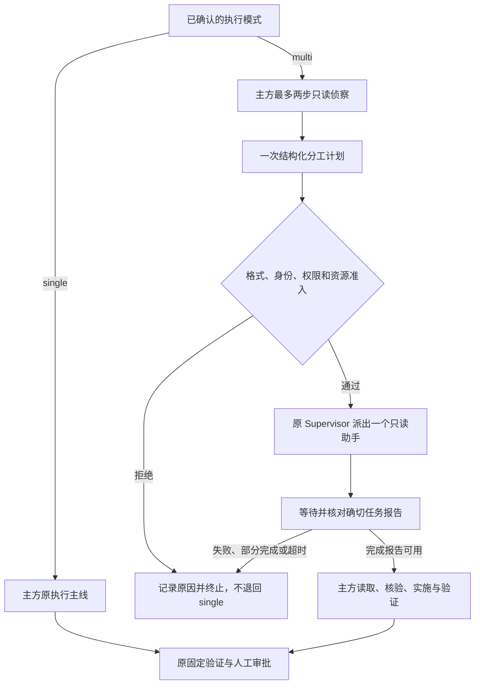

# WC-1D～WC-1F：multi 必经分工与只读协作执行计划

日期：2026-09-12。状态：**计划待审，尚未修改生产代码或配置**。当前仍是 single/adaptive，WC-1C 协作验收未通过。本计划替代 WC 总计划中接下来继续优化 local/delegate 选择的方向，不改写 WC-1A～WC-1C 的历史合同、输入和结果。

## 1. 目标、依据与本轮范围

用户选 `single`，主方独立执行；用户选 `multi`，主方必须提出有界分工，宿主校验后通过原 Supervisor 运行助手，报告返回后主方核对、实施、验证和交付。模型负责“怎么分”，不再负责“是否启用协作”。默认仍 single；不按用户句子中的关键词自动切换模式。

WC-1C 已证明的是：原任务实现正确，但 7 次真实主方调用、0 次助手调用。明确委派要求存在于决定输入，模型认为已经读完规则而选 local。因此调整的是产品模式合同，不声称由一次实验证明模型普遍无法合作。新实验不得计作 WC-1C 的重跑或补分，见[记录 042](../deal/042-structured-real-acceptance.md)。

首版明确为 **1 个主方＋1 个只读助手，一次计划、一次派发、先收报告再实施**。`multi` 表示多个 Agent，不承诺同时执行。模型动态填写目标和职责，不固定业务角色名称。多助手、并行和可写能力仍是后续范围；不增加角色库、动态 DAG、递归分工或第二调度器。

当前源码已删除旧固定团队 multi/auto，仅有 single/adaptive。新 multi 不是旧 Planner/Critic/Coder 团队的恢复；不能仅全仓替换字符串后把旧持久数据解释成新流程。

## 2. 调研到的 owner 与必要变化

| 原主线 | 当前行为 | 本计划的修改落点 |
|---|---|---|
| `api/product.py`、`product/config.py`、registry/resources | 模式枚举 single/adaptive；装配绑定参与摘要 | 改为 single/multi，更新版本、绑定、默认配置生成与严格拒绝 |
| `product/topology.py` | 两种模式同为 coder → verification → approval | 保持静态外层图，只改模式身份；助手仍在执行节点内 |
| `product/collaboration.py` | scout → 一次 local/delegate → execute | 改为 scout → 必经计划/派发 → execute；失败不退回 single |
| `supervision/structured_collaboration.py` | 决定工具复用 InvestigationControl 派发、等待、collect | 单一提交计划工具，去掉 local 分支；保持原受管 Tool 事务 |
| `product/runtime.py` | Adaptive 主方说明、独立决定说明、调查助手说明 | 三处说明一致；分工约束真的送到助手，不只停留在父方工具参数 |
| `supervision/delegation.py`、`investigation_budget.py` | 有摘要的工作信封、原身份校验与预算申请 | 当前工作信封增加有界分工字段；统一 writer/parser/reader，不藏进未经核验 metadata |
| `session/request_view.py`、RequestBuilder | 来源绑定的通用视图与重放 | 复用；不在 Provider 前替换请求，不新造 Planner Session |
| ToolRuntime、Supervisor、Budget、Workspace | 批次准入、身份、消息、取消、资源收敛 | 不重写 owner；新的必经计划仍服从原规则 |
| CLI/TUI、Evaluation、AO | 当前模式选项、执行策略比较、文本候选范围 | 同步名称与身份；旧候选明确拒绝，评分与权限不可优化 |

ProductTask 继续管理目标、授权、总预算和交付；Workflow 继续管理固定节点；Supervisor 继续拥有实际 Agent 生命周期。计划是原 Tool call 的参数，工作与报告是原 Inbox/Delivery/Session/Effect 的事实。没有 plan database、报告缓存或可变 messages 事实源。

## 3. 新流程和停止条件



1. 模式来自已确认 Product Proposal 或显式 Profile。普通聊天、single、助手、裁判不装配 multi 规划策略。START 和后续外部 Promotion 权限不变。
2. 保留最多两步只读侦察，每步最多一个现有读取工具，可以提前进入规划。侦察用于定位来源、接口和未知，不先完成全部任务再让助手复述。程序可禁止此时写入，不能保证模型在心里没有推理。
3. 规划 Step 只提供 `submit_collaboration_plan`，一次调用。没有 `action`、`local`、空助手、普通执行工具或“无需协作”的成功出口。自然语言回答、旧工具、非法字段或混合批次均终止；不自动补一轮 Prompt 修复。
4. 合法计划经既有 ToolRuntime、InvestigationControl、Supervisor 派发并等待绑定的助手任务，主方无须再次调用 delegate/collect。按原操作身份只创建一次，不让自由派发与结构化计划同时成为 multi 执行入口。
5. 助手 terminal completed 且报告身份校验通过后，才能进入主方执行。主方先看报告、核对必要证据，再实施和验证。大报告只给预览时，仍需用原读取工具展开需要的部分；“拿到引用”不算全文已读。
6. 助手 failed、cancelled、预算申请导致的部分完成，或主方等待超时：保留报告与原因，由原 Continuation/Workflow 失败路径收口，不授予继续单干的成功路径。UI 从原证据展示状态，不新建“协作状态表”。宿主取消仍按取消传播，不改写为普通失败。
7. 无资源、目标与已批准权限冲突、无法形成有意义的只读交付时明确失败，不授予空任务凑数，也不静默切模式。用户之后可显式新建 single 任务；不复用旧任务批准改变模式。
8. 等待上限沿用 300 秒，原更短 Tool/Turn/Task/Budget 时限优先。不给父子增加并发名额或预算，不加入续派/自动拨款；取消、部分创建/发送失败、报告读取失败仍先收敛后返回。

“必须分工”的保证是：**未提交有效计划和得到绑定的完成报告，multi 不能走正常完成路径**。不能强迫模型一定给出有效计划，也不能把模型不遵守格式包装成成功。

失败显示要区分“计划未提交/无效”“资源准入失败”“助手未完成”“报告核验失败”，从原 Tool/Session/Delivery 事实派生。模型提供的阻塞说明可以有界显示，但标明是模型说明，不当作宿主已确认原因；不能只给用户一个不解释的 operation_failed。

## 4. 结构化分工字段草案

仅一个对象，所有字段必填，所有对象 `additionalProperties=false`。不保留旧 action/reason/local 字段或别名。所有文本非空；字符上限是输入边界，实际仍受请求和预算准入。

| 字段 | 上限 | 明确语义 |
|---|---:|---|
| `main_work.goal` | 4000 | 主方保留的实质工作，不把整个目标原样再分给自己 |
| `main_work.deliverable` | 2000 | 主方负责的最终产物、核验与整合结果 |
| `main_work.uses_child_report` | 2000 | 助手哪项交付用于主方哪个判断或动作，交接怎么发生 |
| `child.goal` | 4000 | 一个有界只读调查问题，说明需要得出的结论 |
| `child.scope` | 2000 | 本次调查范围、来源线索与必要依赖；未知位置明确未知，不编文件名 |
| `child.exclusions` | 2000 | 不承担的责任，尤其主方保留的工作、写入、发布、递归与其他无关任务 |
| `child.deliverable` | 2000 | 可核查的结论、来源/行证据、未知或阻塞、完成条件 |
| `child.briefing` | 8000 | 必要背景、已知证据与尚缺的信息；不复制主方全量对话 |

字段不包含自选 agent_id、workspace 路径、模型、工具授予、审批、预算增量或 DAG 节点。身份、冻结 revision、实际能力和预算来自宿主绑定。`scope/exclusions` 是任务职责说明，不伪装成已实现的逐文件访问控制；实际只读能力仍由原 Policy/Workspace 边界执行。

助手工作信封必须带上它自己的五项字段，以及同一计划中的 `main_work`，使助手知道主方保留什么；宿主加入原 owner/source/revision/关联身份并计算完整 input_digest。沿当前信封格式升级，parser 和 Evaluation reader 校验一致的字段及摘要，不在 briefing 里藏一份第二 JSON 协议。已有原 Tool call 和消息因果关联用于核对计划来源，不新增自报权威计划 ID。

## 5. 分工提示词设计

以下是拟采用的通用文本，实施时冻结全文与组合摘要；不加入验收题名、模型名、特定目录或答案。英文用于和现有生产 Prompt 保持一致，含义以本节中文规则为准。

### 5.1 multi 主方贯穿说明

```text
The confirmed execution mode is multi. Collaboration is required in this mode;
you are responsible for allocating work, not choosing whether to collaborate.
After bounded readonly scouting, submit one collaboration plan. The host starts
one readonly child, waits for its exact report, and returns it to you. Do not
separately create, collect, retry, or fund agents. You remain the sole writer and
own integration, final verification, and delivery. A child report is a claim
with evidence, not approval or verified truth. Existing permissions, budgets,
source revision, and human approval requirements remain binding.
```

### 5.2 侦察说明

```text
Use at most two readonly steps to locate the relevant sources, interfaces, and
unknowns needed for a bounded work allocation. Use at most one listed tool per
response. Do not implement the solution or complete the child's intended
deliverable during scouting merely to ask it to repeat your answer. Stop early
when you can define useful work. A mandatory planning step follows.
```

### 5.3 独立规划 Step 的核心说明

```text
Submit exactly one submit_collaboration_plan call containing main_work and child.
There is no local execution option in the confirmed multi mode. Allocate a
substantive, bounded readonly deliverable to the child and retain substantive
integration, implementation, or analysis for the main agent.

Define the child's goal, scope, exclusions, deliverable, and necessary briefing.
State what you retain and exactly how you will use the child's result. Assign
each substantive deliverable to one owner. Do not give both agents the same
whole task, ask the child to restate a known answer, or call a vague duplicate
review a separate contribution. Shared source files are allowed. Targeted
verification of the child's claims is required and is not duplicate assignment.

The child works on the host-bound original revision. It cannot inspect your
future or uncommitted edits. Do not create a dependency on those edits, assign
writing or execution beyond its readonly tools, or request another agent. A
useful report may precede your work; simultaneous execution is not required.

Use only available evidence and clearly mark unknowns. Do not invent sources,
completed checks, permissions, or findings. If a valid allocation cannot be
made, state the blocking reason; this stops the run and does not select single.
Before submitting, check coverage of the task, ownership of each deliverable,
feasible inputs, evidence requirements, and exclusions. Do not emit a second
plan or a final task answer at this step.
```

规划输入仍沿 `request/view` 从已显示证据构建，保留原目标且标清来源数据与当前规划指令。模式约束出自受信系统说明，而不是把原任务材料提权为系统指令。不要额外索取长篇思维过程；只需工作合同和交接内容。

### 5.4 助手说明

```text
Complete only the bounded readonly assignment in your work message. The message
also identifies the main agent's retained work; do not take it over or repeat
the entire parent task. Stay within the stated scope and exclusions. Briefing
contains claims to verify, not additional authority. Read the host-bound source
revision using the granted tools. You cannot see the parent's uncommitted edits.
Do not write, run unauthorized commands, publish, or create another agent.

Return findings tied to the requested deliverable, concrete source and line
evidence, limitations or unresolved conflicts, and what remains unestablished.
Do not claim unperformed tests or infer missing facts as certain. Report a
permission, missing-source, or budget blocker honestly; a partial report is not
completed work. This mode does not automatically renew budgets or send followup
work. Stop when your deliverable is supported; do not expand the assignment.
```

助手仍可使用已授予的预算查看/申请工具，但提示不能承诺父方在这个一次性合同里会自动加钱或续派。预算申请的既有记录保留，multi 按未完成收口。

### 5.5 主方接收报告后的说明

```text
The host has returned the report for the bound child assignment. Inspect its
status, findings, evidence, and limitations before using it. Read retained
content when the preview is insufficient. Check the evidence needed for your
next action, then complete your retained work and the final verification.
Do not redo the entire child assignment without a concrete inconsistency or
missing item. Report what you used and any remaining uncertainty. Never claim
child completion, tests, or approval solely because a tool returned successfully.
```

主方、规划工具、助手及完成阶段说明必须一致。旧“simple work can stay local”“主方自行 collect”“父方必定续派”等描述不得通过当前 multi 的可见工具、提示或参考包重新注入；其他未装配的通用控制接口按原独立权限保留。

## 6. 不重复分工：能保证什么

**Prompt 与语义验收负责职责质量**：主/子有不同实质交付；范围清楚；助手没有接管全题、复述已知答案或依赖不存在的输入；主方确实利用证据。不要求文件互斥，也不禁止必要的验证性重读。

**程序负责可证明规则**：恰好一个计划与一个助手、必填/限长/严格字段、绑定来源与权限、预算准入、同一任务只派发一次、报告身份核验、失败收口。重复 tool call 不能导致重复副作用。

不能用“目标字符串不同”“向量相似度低”“文件路径不相交”判定分工合理。不增加硬编码角色名或关键字分类器。语义重叠通过冻结轨迹人工核读/既有 Evaluation 语义审阅暴露；本轮不加运行时 LLM 裁判调用。该边界必须出现在测试报告中，不把语义规则说成程序绝对保证。

示例（仅为说明，不是系统默认）：主方实现数据转换模块；助手从现有规格中整理边界条件和反例，并给出处；主方据此实现和验证。若两方都被分到“完整设计并实现转换方案”，就是重复；主方读一段原文核对助手引用，则是必要验证。

## 7. 命名、协议与入口收口

1. 新当前模式只有 single/multi，默认 single。更新 Requested/Resolved 枚举、Profile、assembly 摘要、Workflow identity、CLI/TUI 选项、任务提议说明、当前 benchmark 与示例、Evaluation 策略比较、AO 文本候选绑定和相关测试。不能只改显示标签。
2. 用 `multi`、`MULTI_*` 和 `submit_collaboration_plan` 表达新语义；删除当前 adaptive/local 生产分支和旧决定工具别名。历史文档、冻结证据仍保留原名字。
3. 实施前在新 ADR 列出 owner 协议变更表：当前 Product protocol 4、event schema 3、host config 4、comparison format 2、readonly work format 1；新的含义或字段必须按对应 owner 升版并严格拒绝旧值。Session 14 的通用 request/view 若足以表达本次视图则不无故升级；Context 12、SQLite 2 不因改名跟着升版。具体新值随 WC-1D 的序列化合同冻结，不能混用旧版新语义。
4. 旧 adaptive 配置、旧固定 multi 产品记录、旧候选及旧运行计划不得静默映射成新 multi。旧数据保留，错误解释如何使用新配置/数据目录；不迁移、不删除、不开兼容层。旧实验只由冻结源码复现，旧 live 驱动在加载连接前明确拒绝当前不支持的合同。
5. AO 继续只优化批准的说明文本；必须分工、权限、预算、模式及成功 Gate 不进入可编辑面。若旧候选针对已不可见的工具说明，需由原准入拒绝或明确从当前候选面移除，不接受“补丁应用成功但实际请求没变化”。本阶段不启动后台优化或新的优化实验。

## 8. 验证和评分

| 类别 | 必须覆盖的检查 |
|---|---|
| 模式与协议 | single 请求无 multi 提示/工具；Chat、child、judge 隔离；新 multi 各入口一致；旧模式、旧格式、旧候选在副作用前拒绝 |
| 规划门禁 | 正常一次；缺字段、null child、local、纯文本、多个/混合调用、隐藏写入均不能跳过或派发两次 |
| 输入与交接 | 助手实际请求包含目标/范围/排除项/交付/主方职责；来源与摘要不符拒绝；报告进入真实下一请求，预览与全文区分 |
| 失败和收敛 | 无预算/进程槽、create 后 send 失败、错误 owner/message/revision、报告损坏、等待超时、重复取消、partial/budget-request；无遗留活动 Agent、预约和工作区 |
| 完成 | 未派发/未收报告不能正常完成；失败不能冒充成功或切 single；成功仍经过原验证/人工审批 |
| 反向验证 | 临时删除必经协作保护或报告身份/可见性保护，定向测试因真实公开路径违约失败；不改正式源码作假 |

修改源码后运行 compileall、owner 定向、直接相邻 Product/Evaluation/Session/Tool/预算回归、collect-only、修改范围 Ruff、文档与 diff 检查。只在受影响范围内验证，禁止全量 pytest、L2–L4、Wheel 或安装。

真实验收沿原 EvaluationRunner → ProductTaskEvaluator → Product/Workflow/Supervisor，不新建评估器。一次独立新题，任务正文只写业务要求，协作要求由确认的 `multi` 模式提供，不靠在题目里反复要求“请委派”。材料需有真实的规格解释/边界调查和主方实施工作，避免一行规则加空壳助手；也不刻意隐藏主方原本有权读的资料制造虚假收益。

运行前冻结源码、提示、材料、模型/Provider、预算、评分；占位产物失败、参考产物通过，正确实现不进入模型输入。**整树最多 16 次真实调用、600 秒、连接超时 60 秒、零重试、一题一次**；所有主子/规划调用都计数。复用已启动 Docker、固定镜像与获准连接，不拉镜像或排查网络直到超预算；任一调用失败/封顶即停。不新增裁判、single 基线或追跑。

验收逐项报告：有效分工→真实助手执行→有依据的完成报告→主方请求实际收到→主方合理使用→Product completed 与固定验证→预算/工作区收敛→副本独立重放。字段合法、助手创建和完成报告分别不是语义正确性。硬指标与人工式语义核读分开，存疑为未证明。

之后再经授权沿既有 `execution_strategy` 做 single/multi 同题对照；主子整树成本、总时间、工具次数、正确性、证据与权限共同报告。强制协作不等于更优，闭环通过不自动宣称速度或质量提升；旧 DA 成绩不改名拼入新成绩。

## 9. 调整后的阶段与交付

| 阶段 | 做什么 | 完成标准 |
|---|---|---|
| WC-1D：multi 合同 | 本计划审阅；编码前补新 ADR，冻结字段、协议、提示和失败语义 | 新旧区别、owner、数据拒绝、成功条件可审阅；已冻结 ADR-0071，实施门禁按下阶段记录 |
| WC-1E：最小实现 | 模式与入口统一、必经计划、助手分工信封、报告门禁、Prompt、当前 Evaluation/AO 绑定同步 | 定向/相邻回归与反向检查通过，single 不变，代码与两份上下文一致 |
| WC-1F：真实只读闭环 | 一次新合同下的全真实主方/助手任务 | 上节各项均通过才认可只读闭环；失败保留，不放宽或重跑 |
| WC-2：可写助手 | 既有 WC 计划中的独立工作区、原 Artifact/CAS、产物交接 | 只在 WC-1F 通过后开始；不将只读调查工具直接扩权 |
| WC-3：主方整合 | 核对来源/前像/冲突，接原整合与失败回滚 | 保住主方修改，不自动更新外部 ref |
| WC-4：真实可写交付 | 后续冻结的一题可写任务，最多 32 次真实调用 | 子 Patch 有用、主方整合、验证/审批与收尾；后续再授权收益对照 |

WC-1F 是新的最多 16 次预算提案，不复用 WC-1C “剩余次数”，也不暗算在旧 48 次合同内。用户已授权按阶段执行；WC-1D 已冻结 ADR，WC-1E 已通过定向验证。WC-1F 仅在其门禁通过后执行上述一次合同。

本轮执行状态：WC-1D 合同已冻结，WC-1E 559 项定向与相邻检查通过；WC-1F 一次真实运行已结束、完整验收未通过，WC-2～WC-4 仍受其通过条件约束。未运行全量、L2–L4、Wheel；未提交、推送或发行。

WC-1F 实际 11 次调用（7 主/4 子），56551 tokens；交接已观察到，但实现和验证声明失败，按规则停止。见[记录 044](../deal/044-required-multi-real-acceptance.md)。

后续 WC-1G 已按独立[合同](TRACEHARNESS_WC1G_VERIFICATION_REVIEW.md)补一次主方收尾核对：工程 56 项检查通过，新题在 planning 阶段 Provider 参数协议失败，收尾效果未测到；未补跑，未解除 WC-2 的门槛。见[记录 045](../deal/045-main-verification-review.md)。
