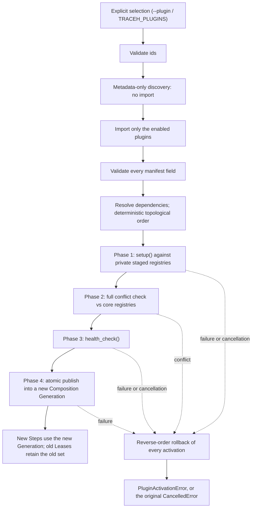

# Writing and running TraceHarness plugins (v0.4)

The design rationale lives in
[ADR-0007](adr/0007-transactional-plugin-activation.md),
[ADR-0009](adr/0009-generation-owned-plugin-activation-set.md) and
[ADR-0010](adr/0010-session-plugin-composition-migration.md). This page is the author- and
operator-facing contract. The package version remains `0.4.0`; Stage C adds a user control
surface without claiming a v0.5 release.

A working, buildable example is at
[`../examples/plugins/traceh-example-skill-plugin/`](../examples/plugins/traceh-example-skill-plugin/).

## 1. What a plugin can contribute

| Contribution | Call | Joins |
|---|---|---|
| Tool | `context.register_tool(tool)` | the existing `ToolRegistry` |
| Prompt section | `context.register_prompt(section)` | the existing `PromptAssembler` |
| Service | `await context.provide(key, value)` | the existing `ServiceRegistry` |
| Cleanup | `context.add_cleanup(callback)` | the plugin's `Activation` |
| Background task | `context.spawn_owned(coro, name=...)` | the plugin's `OwnedTaskSet` |

There is no separate plugin tool runtime and no separate plugin agent loop. A plugin tool
is admitted, scheduled, wrapped by middleware, and recorded as `tool/call`, `tool/result`,
`effect/intent` and `effect/outcome` exactly like a built-in one.

`PluginContext` deliberately exposes no `AgentRuntime`, `AgentLoop`, `EventStore`,
`ToolRegistry` or `PromptAssembler` object. Everything a plugin registers is reversible and
owned by its activation.

## 2. Packaging

Declare an entry point in the `traceh.plugins` group and depend on `traceharness-py`:

```toml
[project]
name = "my-traceh-plugin"
version = "0.1.0"
dependencies = ["traceharness-py>=0.4,<1.0"]

[project.entry-points."traceh.plugins"]
"my.plugin.id" = "my_traceh_plugin:MyPlugin"
```

The entry-point **name** is the plugin id. It must match `manifest.plugin_id` exactly, be
lowercase, and contain only `[a-z0-9._-]`. `traceh.core` is reserved.

The `traceharness-py` dependency is not optional: discovery reports
`traceh-dependency-missing` for a distribution in this group that does not declare one, and
`traceh-distribution-incompatible` when the installed harness falls outside the range.

## 3. The plugin object

```python
from traceh.plugins import PluginContext, PluginManifest, PromptSection

class MyPlugin:
    manifest = PluginManifest(
        plugin_id="my.plugin.id",
        version="0.1.0",
        requires_traceh=">=0.4,<1.0",
        allowed_scopes=("application",),
        trust_mode="trusted",
        provides=("my.capability",),
    )

    async def setup(self, context: PluginContext, config: dict[str, object]) -> None:
        context.register_prompt(PromptSection("my.plugin.id", "Guidance text.", 40))
        context.register_tool(MyTool())

    async def health_check(self, context: PluginContext) -> bool:   # optional
        return True
```

The entry point may resolve to an instance, a class (it is instantiated with no arguments),
or a zero-argument factory.

`health_check` is optional. It may be sync or async, and may take the context or nothing.
Returning `False` fails activation exactly as raising does.

### Manifest fields

| Field | Meaning |
|---|---|
| `plugin_id` | Must equal the entry-point name |
| `version` | PEP 440 |
| `requires_traceh` | PEP 440 specifier that must admit the running version; defaults to `>=0.4,<1.0` |
| `requires_plugins` | Hard dependencies; each must also be **enabled**, not merely installed |
| `optional_plugins` | Absent is a notice; present-but-incompatible is a failure |
| `allowed_scopes` | Must include `application` in v0.4 |
| `trust_mode` | `trusted` only; `isolated` is declarable and explicitly rejected |
| `provides` | Capability ids; two enabled plugins may not provide the same one |

## 4. Installing is not enabling

```powershell
python -m pip install my-traceh-plugin   # discoverable
traceh plugins list                      # confirms discovery, imports nothing
```

Enabling is a separate, explicit act:

```powershell
traceh run <workspace> "task" --plugin my.plugin.id
$env:TRACEH_PLUGINS = "my.plugin.id"     # same effect
```

Any `--plugin` occurrence **replaces** `TRACEH_PLUGINS` entirely rather than adding to it,
so a command line always fully determines what runs. `run`, `chat` and `resume` share this
one rule. The read-only commands (`inspect`, `replay`, `recover`, `compact`, `sessions`)
never activate plugins and take no `--plugin`.

When `traceh chat` is idle, Stage C also permits composition control for plugins that the
current process can already discover:

```text
/plugins                 # show active external plugin ids and versions
/plugins reload          # rebuild the current enabled set
/plugins use ID [ID ...] # explicitly select an enabled set
/plugins use --none      # select no external plugins
```

These commands call the same `PluginGenerationBuilder` → private registries →
`PluginActivationSet` → `CompositionGeneration` → `publish()` path as the runtime assembly
layer. They do not create a Turn, append a user message, call a model, install or uninstall
a Wheel, reload a Python module, or watch files. A changed set requires an explicit
per-Session `composition/migration-authorized` event; a same-identity reload does not.

## 5. The CLI

| Command | Imports plugins? | Runs setup? | Calls a model? |
|---|---|---|---|
| `traceh plugins list` | no | no | no |
| `traceh plugins inspect <id>` | no | no | no |
| `traceh plugins doctor [ids...]` | yes | yes, then disposes immediately | no |

All three take `--json`. Every string they print - entry-point values, distribution names,
requirement strings - is escaped to one printable line, because it all originates in
third-party metadata. Exit codes: `6` for `inspect` on an unknown or problematic plugin,
`7` for `doctor` failures.

`doctor` activates against throwaway registries, so nothing it loads can reach a real
runtime, and it disposes whether or not activation succeeded.

## 6. What activation actually does



Conflicts are checked **before** health checks: a plugin already known to collide never
gets to run its health check.

Cancellation is not a failure. Interrupting activation unwinds everything and re-raises the
original `CancelledError`; a second or third Ctrl+C is absorbed and does not release the
caller until owned tasks and cleanups have converged.

## 7. Identity in the event log

An activated plugin appears in two persisted places:

- every `composition/snapshot` lists `traceh.core` plus each plugin's real `plugin_id` and
  `version`;
- `session/created` metadata records the external plugin identities under the reserved key
  `traceh_plugins`.

Continuing a session whose latest durable identity differs from the active one raises
`SessionPluginMismatchError` rather than proceeding. The shared identity projection starts
from `session/created.metadata.traceh_plugins`, updates from valid `composition/snapshot`
events, and accepts a changed identity only after a valid
`composition/migration-authorized` event. That event is append-only and contains only
external identities plus `migration_id`, `source_seq`, `from_plugins` and `to_plugins`;
`source_seq` must point to the identity fact that `from_plugins` describes. Sessions written
before v0.4 have no such key, which reads as "no plugins" and continues normally.

The authorization is not proof that the new Generation has run a Step. A later
`composition/snapshot` remains the evidence of what the model actually saw. If authorization
is durable but publish cannot complete, the Session is fail-closed rather than silently
continuing with the old composition. A cancelled append is reconciled by `migration_id` so
that a may-have-committed write is never treated as definitely absent.

`traceh chat` includes the necessary `--plugin` flags in the resume command it prints.

## 8. Failure codes

Grouped by the stage that produces them. A plugin's own exception text is never rendered:
messages are written by this repository.

| Stage | Examples |
|---|---|
| `selection` | `empty-plugin-id`, `invalid-plugin-id`, `duplicate-plugin-id` |
| `discovery` / `metadata` | `plugin-not-discovered`, `duplicate-entry-point`, `traceh-dependency-missing`, `traceh-distribution-incompatible` |
| `load` | `plugin-load-failed`, `plugin-factory-failed`, `plugin-setup-missing` |
| `manifest` | `plugin-id-mismatch`, `plugin-id-reserved`, `traceh-api-incompatible`, `application-scope-not-allowed`, `isolated-mode-unsupported`, `provides-duplicate` |
| `dependency` | `required-plugin-missing`, `plugin-version-incompatible`, `plugin-dependency-cycle`, `provides-conflict` |
| `setup` / `health` | `plugin-setup-failed`, `plugin-health-check-failed` |
| `conflict` | `tool-publish-conflict`, `prompt-publish-conflict`, `service-publish-conflict` |
| `rollback` / `dispose` | `plugin-rollback-failed`, `plugin-cleanup-failed` |

## 9. Limits of v0.4 and Stage C

- Application scope, trusted, in-process only.
- Chat composition switching is available only while the prompt is idle and only for
  already-installed, already-discoverable Entry Point plugins. It is a rebuild and publish,
  not source-code hot reload: there is no running `pip install/uninstall`, Wheel replacement,
  `importlib.reload()`, file watcher, or automatic Session migration.
- Runtime-wide Composition is still application-scoped. A migration requires no active Turn
  in the Runtime and an explicit authorization for the current Session; other Sessions are
  not migrated automatically.
- `isolated` is rejected, not implemented.
- No plugin-supplied `LlmProvider`, `ToolPolicy`, `ToolMiddleware`, `EventStore` or
  `CompletionVerifier` yet - the context exposes tools, prompts and services only.
- No MCP, multi-agent or workflow surface.

## 10. Relationship to DeepSeek Harness

TraceHarness is an independent Python project, not a port. The comparison below was made
against [`deepseek-ai/deepseek-harness`](https://github.com/deepseek-ai/deepseek-harness)
at pinned commit `99f6f02fecdb7dff40c3fbc9470f5907c29f74ca`, reading `docs/architecture.md`
at that commit.

**Borrowed, as ideas:**

- *shared context* - capabilities are reached through registered services on a shared
  registry rather than through direct object references. TraceHarness expresses this as
  `ServiceRegistry` plus `ServiceKey`, reachable from a plugin only via `PluginContext`.
- *reversible effects* - dsh states that registrations unwind when a plugin unloads.
  TraceHarness makes the same guarantee through `Activation`, `Lifespan` and
  `CallbackRegistration`, and extends it to cover cancellation.
- *composition, and "model-visible means logged"* - dsh requires anything reaching a model
  request to be reconstructable from the session log. TraceHarness already had that
  invariant; v0.4 keeps it by putting real plugin identities into every Composition
  Snapshot, so a plugin-affected request stays reconstructable.

**Deliberately not adopted:**

- **Cordis.** TraceHarness has no Cordis dependency and no equivalent framework.
- **TypeScript and Node.** dsh is TypeScript on Node; this project is Python on asyncio,
  and none of its API names or shapes are copied.
- **A plugin-ised agent loop.** dsh states plainly that "there is no privileged core to
  patch" and that the agent loop itself is a plugin. TraceHarness deliberately keeps the
  opposite boundary, already recorded in [ADR-003](adr/003-kernel-is-not-a-plugin.md):
  sequence, lifecycle closure, ownership and registration disposal are correctness rules,
  not extension points. `AgentLoop` is not replaceable and `PluginManager` sits above it in
  the assembly layer, so `AgentLoop` has no reference to it.
- **The extension-point surface.** dsh documents extension points for `ctx.llm`,
  `ctx.shell`, `ctx.terminals`, `ctx.commands`, `ctx.jobs`, `ctx.fs`, `ctx.sandbox`,
  `ctx.goals`, session forking, agent presets and UI nodes. v0.4 exposes tools, prompts and
  services, and nothing else.
- **The event log as a plugin-replaceable service.** The Session Stream and Effect Stream
  remain the harness's own fact boundary; a plugin cannot supply an `EventStore`.
