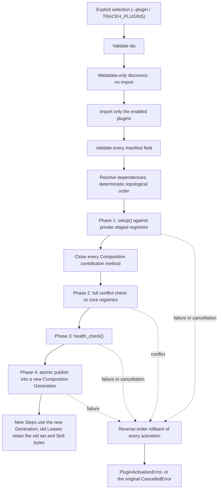

# Writing and running TraceHarness plugins (v0.9.0 + unreleased v0.10 sandbox)

The design rationale lives in
[ADR-0007](adr/0007-transactional-plugin-activation.md),
[ADR-0009](adr/0009-generation-owned-plugin-activation-set.md) and
[ADR-0010](adr/0010-session-plugin-composition-migration.md), with execution-capability
ownership in [ADR-0014](adr/0014-generation-scoped-plugin-execution-capabilities.md). This
page is the author- and operator-facing contract for the `0.9.0` SDK and unreleased sandbox extensions, carried forward
from the public surface introduced in v0.6. The
source-authoring, validation, comparison and promotion control planes are recorded in
[ADR-0015](adr/0015-source-only-plugin-candidate-authoring-skill.md),
[ADR-0016](adr/0016-independent-plugin-candidate-validation.md) and
[ADR-0017](adr/0017-host-owned-baseline-candidate-comparison.md) and
[ADR-0018](adr/0018-human-approved-exact-plugin-promotion.md).

Three working, independently buildable distributions live under `examples/plugins/`:

- [`traceh-example-skill-plugin`](../examples/plugins/traceh-example-skill-plugin/) is the
  smallest Tool-and-Prompt example;
- [`traceh-python-quality-plugin`](../examples/plugins/traceh-python-quality-plugin/) is the
  v0.6 release acceptance plugin and contributes a real Tool, Prompt, Policy and named
  Verifier through the public SDK.
- [`traceh-plugin-creator-skill-plugin`](../examples/plugins/traceh-plugin-creator-skill-plugin/)
  is the source-authoring skill. It contributes a Prompt and a `PURE_READ`
  guide Tool; it never installs or executes the candidate it describes.

## 1. What a plugin can contribute

| Contribution | Call | Joins |
|---|---|---|
| Tool | `context.register_tool(tool)` | the existing `ToolRegistry` |
| Prompt section | `context.register_prompt(section)` | the existing `PromptAssembler` |
| Skill | `context.register_skill(contribution)` | a typed Generation catalog and leased resources; no automatic prompt or Tool grant |
| Service | `await context.provide(key, value)` | the existing `ServiceRegistry` |
| LLM provider | `context.register_provider(provider)` | the candidate `LlmRegistry`; explicit selection required |
| Tool policy | `context.register_policy(policy)` | the existing ToolRuntime admission chain |
| Tool middleware | `context.register_middleware(middleware)` | the existing ToolRuntime execution chain |
| Named verifier | `context.register_verifier(name, verifier)` | the Step's Generation Lease; explicit selection required |
| Cleanup | `context.add_cleanup(callback)` | the plugin's `Activation` |
| Background task | `context.spawn_owned(coro, name=...)` | the plugin's `OwnedTaskSet` |
| External process (unreleased) | `await context.open_process(argv, timeout_seconds=..., cwd=...)` | host sandbox resources owned by the original `Activation` |

There is no separate plugin tool runtime and no separate plugin agent loop. A plugin tool
is admitted, scheduled, wrapped by middleware, and recorded as `tool/call`, `tool/result`,
`effect/intent` and `effect/outcome` exactly like a built-in one.

`PluginContext` deliberately exposes no `AgentRuntime`, `AgentLoop`, `EventStore`,
`ToolRegistry` or `PromptAssembler` object. Everything a plugin registers is reversible and
owned by its activation. EventStore is excluded because it is the process-lifetime Session
fact source, not a Step Generation capability.

External processes require a programmatic host `SandboxConfiguration.plugin_grants` entry,
matching the exact plugin ID and version, or the equivalent format-2 sandbox file/TUI entry.
The host supplies an absolute workspace,
`SandboxStdioLimits(input_bytes, frame_bytes)` and `max_processes` attempted launches per
activation. The policy supplies the pinned local image, explicit Docker context, filesystem
scope, disabled network and resource limits. The grant editor starts with an empty list;
granting a process does not enable or import a plugin. Format 1 sandbox files are rejected.

`open_process` is setup-only and returns `SandboxProcessPort`: `write(bytes)`,
`read(max_bytes, stream="stdout"|"stderr")`, `close_input()`, `wait()` and `aclose()`.
Read returns available bytes or EOF; applications own message framing and request correlation.
There is no MCP implementation, implicit restart, native fallback or server workspace export.
An uncertain write is not replayed. Closing or canceling a connection converges the same
sandbox execution; an old Generation Lease keeps it alive until the original Drain releases it.
Execution receipts include plugin/version/activation identity in the original EventStore's
application-level activation stream. Tool calls still use the ordinary Effect/Session path.
The trusted adapter itself remains in-process; `isolated` plugins remain unsupported.

### AO-0 bounded strategy services (unreleased contract)

The SDK now re-exports the same `OptimizationStrategy`, `OptimizationAnalysis`,
request/proposal/result DTOs and typed keys as `traceh.api.optimization`.
`OPTIMIZATION_STRATEGY` is `traceh.optimization.strategy@1`: a trusted plugin provides
the service through the original `PluginContext.provide`. `OPTIMIZATION_ANALYSIS` is
`traceh.optimization.analysis@1`: the host supplies it through the original Service/Scope
assembly and the plugin borrows it through `require`; no provider is silently created.

The caller validates a frozen development request and borrows the strategy under the
same Generation Lease until the call and cancellation cleanup converge. The plugin
owns its strategy resources; it must not dispose the borrowed host analysis service.
Analysis results refer to an independent host analysis Session/Turn, evidence digest
and original `Usage`. A DTO alone is not verification of those records.

AO-0 supplies contracts, proposal validation through the existing UE-3 AST owner,
canonical edit deduplication and pure stop/review decisions. It does **not** ship an
optimizer scheduler, model analysis adapter, enabled strategy plugin or optimization
CLI. The host selects sanitized development data; these interfaces do not automatically
redact arbitrary text or sandbox malicious in-process Python. See the
[AO-0 contract](plan/TRACEHARNESS_OPTIMIZATION_AO0_CONTRACT.md) for scope and owner rules.

### 1.1 Typed Skill contributions (v0.9-F1)

Metadata-only discovery reports `skills={available:false,requires_activation:true}`.
`plugins list/inspect` says the catalog is available after successful activation; neither
command imports a disabled plugin to inspect its Skill bodies.

Import `SkillDescriptor`, `SkillContribution`, `SkillSection`, `SkillSectionContent`,
`SkillResource` and `SkillChunk` from `traceh.plugins`. The descriptor is immutable and has
exact fields: `skill_id`, `version`, `plugin`, `title`, `summary`, `tags`, `requires_traceh`,
`sections`, `resources`. The plugin identity must equal the activated Manifest id/version;
the compatibility specifier must admit the running core version. Skill ids are unique across
the candidate, sections/resources are sorted by id, and tags are unique and sorted.
Unknown fields, including Tool grants, are rejected. Section tier is currently `section`.

Example only: all metadata and body values below are explicit author inputs, not host defaults.
The section id is supplied by the author; the body digest covers the exact UTF-8 bytes.

```python
from hashlib import sha256
from traceh.plugins import SkillContribution, SkillDescriptor, SkillSection, SkillSectionContent


def contribute_section(context, *, skill_id, version, plugin, title, summary,
                       tags, requires_traceh, section_id, body):
    encoded = body.encode("utf-8")
    descriptor = SkillDescriptor(
        skill_id=skill_id, version=version, plugin=plugin, title=title, summary=summary,
        tags=tags, requires_traceh=requires_traceh,
        sections=(SkillSection(section_id, "section", sha256(encoded).hexdigest(), len(encoded)),),
        resources=(),
    )
    return context.register_skill(
        SkillContribution(descriptor, (SkillSectionContent(section_id, body),))
    )
```

Registration is allowed only during setup. The returned handle may withdraw a contribution
while setup remains open; after setup only the original Activation cleanup may release it.
Skill registration never calls `register_prompt` or `register_tool`. Conflicts and failures
roll back through the existing transaction before any new Generation is observable.

The host must supply `RuntimeConfig.skill_policy` (or the same `skill_policy` argument on
`PluginGenerationBuilder` / `PluginManager`). `None` rejects Skill registration. `SkillPolicy`
contains `SkillLimits` with five explicit positive integers: `max_skills` (candidate count),
`max_catalog_bytes` (whole canonical UTF-8 catalog), `max_summary_bytes` (each summary),
`max_content_bytes` (all candidate section/resource bytes) and `max_resource_bytes` (each file).
There are no implicit resource bounds. Resource-bearing contributions also need a host-owned
`SkillResourceRoot(plugin, absolute_path)` in `SkillPolicy.resource_roots`. Each plugin id has
one root binding, matching the exact plugin version. Section-only contributions need no root.
The plugin cannot supply a trusted root through its descriptor or config contribution.

A resource has exact `resource_id`, `relative_path`, `content_digest`, `content_bytes`, `chunks`
fields. Each chunk names `chunk_id`, `byte_start`, `byte_end`, `content_digest`, `content_bytes`;
these are authored nonoverlapping, ordered UTF-8 half-open ranges, not arbitrary byte cuts.
No chunks means no chunk read. Relative paths must be portable and canonical. Absolute paths,
parent traversal, Windows devices/streams, symlinks/reparse points, non-files, containment or
size violations, and `.git` / `.env*` names are rejected before publishing. Exact UTF-8 bytes
must match every declared size/digest; newline normalization is not performed.

Activation reads bounded bytes once and owns the resulting read-only root snapshot through
its existing registration. The ActivationSet verifies ownership and receipts before transfer.
A Step's `ActiveComposition.skills` exposes a frozen catalog and
`read_section(skill_id, section_id)`, `read_resource(skill_id, resource_id)` and
`read_chunk(skill_id, resource_id, chunk_id)`, returning immutable bytes. Every call requires
that exact Lease to remain active. No arbitrary path or unleased resource reader is exposed.
Reload preserves the old Lease's bytes even if source files change or disappear. Only the
retired Generation's last Lease release permits cleanup, through the original Activation;
there is no new resource refcount, background worker, persistent stream or cache owner.

Composition persists the bounded catalog and its digest, and includes them in its revision.
Enabling a plugin alone adds no Skill messages or Tool grants. Without an explicit F2 policy
and host selection, Context records the empty/unselected state. The existing resource
Activation/Generation lifecycle is unchanged.

### F2: host selection, retrieval and progressive disclosure

The host supplies `RuntimeConfig.context_input` with a `ContextInputPolicy` whose nullable
`skills` is a [SkillRetrievalPolicy](../src/traceh/api/retrieval.py). Its fifteen fields are
explicit: unicode_version, default_tier, match_fields, k1, b, rrf_constant, exact_weight,
fts_weight, skill_bytes, max_catalog_bytes, max_terms, max_corpus_items, max_corpus_bytes,
max_candidates and max_requests. Unicode must match the runtime; automatic tiers are
directory/summary. Match fields are an ordered subset of id/symbol/path/error/tag. Numeric
limits have no implicit enabled defaults; semantic/reranker/embedding fields are rejected.
The surrounding Context policy supplies total, item, block, exclusion and query bounds.

The following is a host integration example; every identity, operation and selection comes
from the caller, and none is a system default. `selected` contains sorted, unique
`{"skill_id": ..., "version": ...}` dictionaries from the enabled catalog.

```python
async def select_references(
    runtime, session_id, *, operation_id, expected_head, actor_id, selected
):
    event = await runtime.skill_context.select(
        session_id,
        operation_id=operation_id,
        expected_head=expected_head,
        actor_id=actor_id,
        skills=selected,
    )
    # Empty selection is a durable fact; there is no corpus to rebuild.
    if selected:
        await runtime.skill_context.rebuild_index(session_id)
    return event
```

Selection is recorded in `context-selection:<session_id>` on the same Store. Exact repeated
operation payloads return the original event; other changes use head CAS. Catalog changes
make old selections stale until the host reconfirms. The control checks the actual
SessionService/Store owner while borrowing the existing Runtime Lease. It never publishes
a Generation, migrates Plugin identity or grants a Tool.

Each Step filters enabled Skills by that selection, matches exact identifiers and FTS terms,
computes BM25 statistics only inside the eligible corpus and freezes weighted RRF results.
The Store owns the schema-2 index, short worker connections, atomic rebuild, close and
backup/restore. Missing or damaged derived rows report index-unavailable; the explicitly
configured exact lane can still work. Rebuild rechecks source heads inside its write
transaction and never rewrites canonical events. Failure reports whether the exact complete
index exists, or unknown; it does not silently retry.

When Skill retrieval and default tools are explicitly enabled, the ordinary PURE_READ
`request_skill_reference` Tool can request a previously disclosed, still selected Skill.
It requires exact skill_id/version/catalog_digest/requested_tier and nullable
section_id/resource_id/chunk_id. Directory/summary use canonical metadata; section/chunk
use exact declared sources through the next Step's active Lease. The Tool returns only a
receipt and declared IDs. Only the immediate next Step in the same Turn can inject the
original body; cancellation, recovery, a missing successor or budget rejection never
carry it into another Turn. Raw references never become Surface history.

The current unique protocol is Session marker 3, Context outer format 2, renderer
context-json-v3, policy f2-context-policy-v1 and SQLite schema 2. Old versions are refused
without migration; use a new data directory. Historical requests validate their frozen
receipts and original selection/Composition evidence without consulting current indexes,
resource files or installed Wheels. There is no Skill governance CLI/UI yet, no Wheel reload
mechanism, and no automatic conversion of old Prompt/Tool examples. Trusted in-process
plugins retain the host's process privileges; this API is not an OS sandbox.

## 2. Packaging

Declare an entry point in the `traceh.plugins` group and depend on `traceharness-py`:

```toml
[project]
name = "my-traceh-plugin"
version = "0.1.0"
dependencies = ["traceharness-py>=0.8,<0.9"]

[project.entry-points."traceh.plugins"]
"my.plugin.id" = "my_traceh_plugin:MyPlugin"
```

The entry-point **name** is the plugin id. It must match `manifest.plugin_id` exactly, be
lowercase, and contain only `[a-z0-9._-]`. `traceh.core` is reserved.

The `traceharness-py` dependency is not optional: discovery reports
`traceh-dependency-missing` for a distribution in this group that does not declare one, and
`traceh-distribution-incompatible` when the installed harness falls outside the range.

## 3. The plugin object

```python
from traceh.plugins import PluginContext, PluginManifest, PromptSection

class MyPlugin:
    manifest = PluginManifest(
        plugin_id="my.plugin.id",
        version="0.1.0",
        requires_traceh=">=0.8,<0.9",
        allowed_scopes=("application",),
        trust_mode="trusted",
        provides=("my.capability",),
    )

    async def setup(self, context: PluginContext, config: dict[str, object]) -> None:
        context.register_prompt(PromptSection("my.plugin.id", "Guidance text.", 40))
        context.register_tool(MyTool())

    async def health_check(self, context: PluginContext) -> bool:   # optional
        return True
```

The entry point may resolve to an instance, a class (it is instantiated with no arguments),
or a zero-argument factory.

Plugin distributions should import author-facing contracts from `traceh.plugins`, not from
Runtime implementation modules. The public surface introduced in v0.6 and retained in v0.7 includes `PluginContext`,
`PluginManifest`, `PromptSection`, Tool contracts, `ToolCall`, `ToolPolicy`, `ToolMiddleware`,
`DecisionKind`, `ToolDecision`, `CompletionVerifier`, `CommandVerifier` and
`VerificationResult`. The Python Quality plugin is the executable contract test for those
exports.

`health_check` is optional. It may be sync or async, and may take the context or nothing.
Returning `False` fails activation exactly as raising does.

All Composition contributions must be registered during `setup()`. After every setup returns,
the manager closes `register_*()` and `provide()` before conflict checks and health. A health
check may inspect configuration and Services and may attach lifecycle cleanup or Owned Tasks,
but attempting to add a late Tool, Prompt, Service, Provider, Policy, Middleware or Verifier
fails health and rolls the candidate back.

### Manifest fields

| Field | Meaning |
|---|---|
| `plugin_id` | Must equal the entry-point name |
| `version` | PEP 440 |
| `requires_traceh` | PEP 440 specifier that must admit the running version; defaults to `>=0.4,<1.0` |
| `requires_plugins` | Hard dependencies; each must also be **enabled**, not merely installed |
| `optional_plugins` | Absent is a notice; present-but-incompatible is a failure |
| `allowed_scopes` | Must still include `application`; D1/D2 host overlays do not enable scoped plugin setup |
| `trust_mode` | `trusted` only; `isolated` is declarable and explicitly rejected |
| `provides` | Capability ids; two enabled plugins may not provide the same one |

## 4. Installing is not enabling

```powershell
python -m pip install my-traceh-plugin   # discoverable
traceh plugins list                      # confirms discovery, imports nothing
traceh plugins doctor my.plugin.id       # imports, activates, checks, then disposes
```

Enabling is a separate, explicit act:

```powershell
traceh run <workspace> "task" --plugin my.plugin.id
$env:TRACEH_PLUGINS = "my.plugin.id"     # same effect
```

Any `--plugin` occurrence **replaces** `TRACEH_PLUGINS` entirely rather than adding to it,
so a command line always fully determines what runs. `run`, `chat` and `resume` share this
one rule. The read-only commands (`inspect`, `replay`, `recover`, `compact`, `sessions`)
never activate plugins and take no `--plugin`.

Registering a Provider or Verifier still does not select it. The operator must name it:

```powershell
traceh run <workspace> "task" --plugin my.plugin.id --provider my.provider --model my-model
traceh run <workspace> "task" --plugin my.plugin.id --plugin-verifier my.verifier
```

A custom Provider requires an explicit plugin and Model. `--plugin-verifier` (or
`TRACEH_PLUGIN_VERIFIER`) requires an explicit plugin and is mutually exclusive with
`--verify-command`. If no plugin Provider/Verifier is selected, merely enabling the plugin
does not replace the existing model or completion behavior.

When `traceh chat` is idle, Stage C also permits composition control for plugins that the
current process can already discover:

```text
/plugins                 # show active external plugin ids and versions
/plugins reload          # rebuild the current enabled set
/plugins use ID [ID ...] # explicitly select an enabled set
/plugins use --none      # select no external plugins
```

These commands call the same `PluginGenerationBuilder` → private registries →
`PluginActivationSet` → `CompositionGeneration` → `publish()` path as the runtime assembly
layer. They do not create a Turn, append a user message, call a model, install or uninstall
a Wheel, reload a Python module, or watch files. A changed set requires an explicit
per-Session `composition/migration-authorized` event; a same-identity reload does not.

### Source-only candidate authoring (L1)

Install and explicitly enable the independent Plugin Creator Skill only when the Workspace is
a dedicated candidate directory outside the TraceHarness repository:

```powershell
python -m pip install .\examples\plugins\traceh-plugin-creator-skill-plugin
traceh plugins doctor traceh.plugin.creator
traceh chat <candidate-workspace> --plugin traceh.plugin.creator
```

The skill exposes `traceh_plugin_creator_guide` topics for workflow, the v0.7 SDK contract,
package structure and a static checklist. It tells the model to collect explicit identity,
authority and acceptance criteria, then write package metadata, Entry Point, Manifest,
implementation, tests, README and a plain-language `CANDIDATE.md` through the existing coding
Tools. It deliberately performs no build, import, test, install, enable, Git or network step,
and marks the result `UNVALIDATED (L1 SOURCE ONLY)`.

This is workflow separation, not process isolation. L2 executes the candidate through an
independent host-owned gate and does not trust its own tests or report. See
[ADR-0015](adr/0015-source-only-plugin-candidate-authoring-skill.md).

### Independent candidate validation (L2)

Run L2 from the trusted TraceHarness installation, not from candidate code:

```powershell
traceh plugins validate <candidate-workspace> `
  --core-project <trusted-traceh-git-repository> `
  --output <new-evidence-directory> `
  --allow-index
```

Use `--wheelhouse <directory>` instead of `--allow-index` for explicit offline dependency
resolution. Candidate, core and output paths must be disjoint, the output must not already
exist, and an ambiguous Entry Point set requires `--plugin-id`. Candidate build/runtime and
explicit test requirements cannot use direct URL/file references to bypass the selected source.
The validator clones the core
repository's committed `HEAD`; it never treats dirty core files as evaluator input.

The ordered gates cover source identity against the selected core clone's version, both Wheel
builds, candidate archive/host-namespace audit, installed metadata, doctor, host-configured
candidate test collection/execution, full trusted core regression, and final artifact
publication. Source Junctions/reparse points are rejected. The audited bytes are anchored before
candidate execution and rechecked afterward. A complete report-only bundle represents an
ordinary failure; a report/commit failure leaves the output absent. Success atomically exposes
the report plus exact audited Wheel under `artifacts/`, with its SHA-256 in both reports.
Candidate stdout/stderr is never report evidence.

This uses temporary source copies and virtual environments, **not an OS sandbox**. Candidate
build/import/test code still has the current user's permissions, so use local L2 only for
trusted in-house candidates. L2 does not compare quality, approve, install or enable a plugin.
See [ADR-0016](adr/0016-independent-plugin-candidate-validation.md).

### Host-owned baseline/candidate comparison (L3)

Run L3 only with a successful L2 evidence directory and the same trusted core repository:

```powershell
traceh plugins compare <l2-evidence-directory> `
  --core-project <trusted-traceh-git-repository> `
  --suite benchmarks/evolution/python_quality_v1 `
  --output <new-comparison-evidence-directory> `
  --allow-index
```

Use `--wheelhouse <directory>` instead of `--allow-index` for an explicit offline run. The suite
path is relative to the exact core commit recorded by L2; dirty core files and external candidate
task directories are not evaluator input. L3 reuses the exact L2 Wheel, resolves the complete
dependency set once into SHA-256-addressed Wheels, installs both arms offline from that set, and
requires identical Distribution receipts. It enables the exact target plugin identity only for the
candidate arm.

The host-owned probe records real Session/Verifier facts. A matching durable `turn/end`, closed
Turn/Step state, an agreeing reason and Step count, and the expected plugin identity in every
in-Turn Composition Snapshot are required before an arm can pass. The report classifies the result
as `improved`, `regressed`, `mixed` or `no-change`; it does not approve, install, enable or promote
the plugin.
Virtual environments are still not an OS sandbox. See
[ADR-0017](adr/0017-host-owned-baseline-candidate-comparison.md).

### Human-approved exact promotion and rollback (L4)

L4 requires a dedicated target Python environment whose non-candidate Distribution receipt
matches the L3 comparison environment. First generate a review card; this invocation does not
create the Registry or change the target:

```powershell
traceh plugins promote <l2-evidence-directory> <l3-evidence-directory> `
  --target-python <target-venv-python> `
  --registry <promotion-registry> `
  --output <new-review-directory>
```

Read `report.md`. Promotion is allowed only for `improved` with at least one improvement and no
regression. If you accept the named capability, target and stated risks, run a second invocation
with a **new** output directory and the exact digest printed by the review:

```powershell
traceh plugins promote <l2-evidence-directory> <l3-evidence-directory> `
  --target-python <target-venv-python> `
  --registry <promotion-registry> `
  --output <new-promotion-directory> `
  --approve <full-approval-sha256>
```

L4 first reconstructs the canonical L3 Case arms, summaries, fixed gates, classification and
non-empty frozen Wheel set; a hand-written report skeleton is rejected. The digest binds both
evidence files, the exact audited Wheel, Registry, target Python identity, Distribution receipt,
installed-package content digest, canonical package owner and current managed state. A stale digest, an unmanaged installed copy,
dependency drift or known regression is rejected. L4 never rebuilds or resolves dependencies: it
installs the SHA-256-addressed Wheel with `--no-index --no-deps`, checks the complete L3 receipt,
then runs plugin doctor and checks the receipt plus every non-cache file below the target package roots
again. Same-version edits and files missing from a Distribution `RECORD` are therefore visible. Target inspection preserves the
selected venv executable and reconstructs its site-packages from adjacent `pyvenv.cfg` under
isolated `-I -S` startup, so it neither executes candidate startup hooks nor falls through to the
base Python environment.

The promotion report returns a `promotion_id`. Roll back only by naming the exact current id:

```powershell
traceh plugins rollback `
  --target-python <target-venv-python> `
  --registry <promotion-registry> `
  --output <new-rollback-directory> `
  --plugin-id <plugin-id> `
  --distribution <canonical-distribution-name> `
  --current-promotion-id <promotion-id>
```

Review output and Registry paths must be outside the target environment. A fixed host-owned
coordination namespace beside the canonical target environment, independent of `TEMP`, assigns one
lock and Owner to the target environment itself. Interpreter aliases, another Registry, another
plugin id or another Distribution cannot mutate it through an independent L4 lane. Because each
package state records the complete environment, L4 v1 permits one active managed Distribution
chain per target; a complete rollback of its first version releases the environment for a later
handoff. The locked Registry retains the previous exact Wheel, or records that the plugin was previously
absent. It also exposes unfinished `installing` / `rollbacking` state after a hard process crash;
the same explicit rollback command can converge that state. If a first promotion dies after its
owner/record write but before the initial `installing` state, rollback reconstructs that pre-pip
state only when the exact first record and an absent target agree; contradictory evidence fails
closed. This is same-user package management,
not an OS sandbox or cryptographic package signature. It does not enable a plugin inside an
already running Runtime. See
[ADR-0018](adr/0018-human-approved-exact-plugin-promotion.md).

## 5. The CLI

| Command | Imports plugins? | Runs setup? | Calls a model? |
|---|---|---|---|
| `traceh plugins list` | no | no | no |
| `traceh plugins inspect <id>` | no | no | no |
| `traceh plugins doctor [ids...]` | yes | yes, then disposes immediately | no |
| `traceh plugins validate <candidate>` | candidate only, in a temporary venv | doctor + tests in temporary venvs | no |
| `traceh plugins compare <l2-evidence>` | candidate only, in one comparison arm | fixed host suite in two temporary venvs | no |
| `traceh plugins promote <l2> <l3>` | only on approved apply | doctor after exact install | no |
| `traceh plugins rollback` | previous managed plugin during doctor | doctor after exact restore | no |

All seven take `--json`. Every string they print - entry-point values, distribution names,
requirement strings - is escaped to one printable line, because it all originates in
third-party metadata. Exit codes: `6` for `inspect` on an unknown or problematic plugin,
`7` for `doctor` failures, `8` for candidate validation/configuration failure, and `9` for
comparison/configuration failure. Promotion and rollback use `10` for invalid evidence,
configuration, target drift or a failed target transaction.

`doctor` activates against throwaway registries, so nothing it loads can reach a real
runtime, and it disposes whether or not activation succeeded.

## 6. What activation actually does



Conflicts are checked **before** health checks: a plugin already known to collide never
gets to run its health check.

The staged contribution set is also frozen before that check. Health cannot add a capability
after the manager has declared the candidate conflict-free.

Cancellation is not a failure. Interrupting activation unwinds everything and re-raises the
original `CancelledError`; a second or third Ctrl+C is absorbed and does not release the
caller until owned tasks and cleanups have converged.

## 7. Identity in the event log

An activated plugin appears in two persisted places:

- every `composition/snapshot` lists `traceh.core` plus each plugin's real `plugin_id` and
  `version`;
- `session/created` metadata records the external plugin identities under the reserved key
  `traceh_plugins`.

Continuing a session whose latest durable identity differs from the active one raises
`SessionPluginMismatchError` rather than proceeding. The shared identity projection starts
from `session/created.metadata.traceh_plugins`, updates from valid `composition/snapshot`
events, and accepts a changed identity only after a valid
`composition/migration-authorized` event. That event is append-only and contains only
external identities plus `migration_id`, `source_seq`, `from_plugins` and `to_plugins`;
`source_seq` must point to the identity fact that `from_plugins` describes. Sessions written
before v0.4 have no such key, which reads as "no plugins" and continues normally.

The authorization is not proof that the new Generation has run a Step. A later
`composition/snapshot` remains the evidence of what the model actually saw. If authorization
is durable but publish cannot complete, the Session is fail-closed rather than silently
continuing with the old composition. A cancelled append is reconciled by `migration_id` so
that a may-have-committed write is never treated as definitely absent.

`traceh chat` includes the necessary `--plugin` flags in the resume command it prints.

## 8. Failure codes

Grouped by the stage that produces them. A plugin's own exception text is never rendered:
messages are written by this repository.

| Stage | Examples |
|---|---|
| `selection` | `empty-plugin-id`, `invalid-plugin-id`, `duplicate-plugin-id` |
| `discovery` / `metadata` | `plugin-not-discovered`, `duplicate-entry-point`, `traceh-dependency-missing`, `traceh-distribution-incompatible` |
| `load` | `plugin-load-failed`, `plugin-factory-failed`, `plugin-setup-missing` |
| `manifest` | `plugin-id-mismatch`, `plugin-id-reserved`, `traceh-api-incompatible`, `application-scope-not-allowed`, `isolated-mode-unsupported`, `provides-duplicate` |
| `dependency` | `required-plugin-missing`, `plugin-version-incompatible`, `plugin-dependency-cycle`, `provides-conflict` |
| `setup` / `health` | `plugin-setup-failed`, `plugin-health-check-failed` |
| `conflict` | `tool-publish-conflict`, `prompt-publish-conflict`, `service-publish-conflict`, `provider-publish-conflict`, `policy-publish-conflict`, `middleware-publish-conflict`, `service-override-api-major-mismatch`, `plugin-contribution-identity-changed` (a registered Tool/Provider/Policy/Middleware changed its name), or a host-overlay `tool-*` / `prompt-*` / `policy-*` replacement code; overlay failures retain the responsible plugin id. A public prepared candidate is revalidated again at Generation claim, so post-prepare identity drift is rejected before publication. |
| `selection` after setup | `provider-not-provided`, `verifier-not-provided` (both checked before health) |
| `rollback` / `dispose` | `plugin-rollback-failed`, `plugin-cleanup-failed` |

AO-2 explicitly assembles the trusted bundled `TextStrategyPlugin` through the same discovery,
provide/require, scoped services and Generation Lease. The host lends `OptimizationAnalysis`
and owns its original Runtime/Budget/Session calls; the plugin provides `OptimizationStrategy`
and only receives a bounded development request/result. This is not a default Chat plugin,
a second registry, an automatic Wheel install or an adoption capability. See
[AO-2 contract](plan/TRACEHARNESS_OPTIMIZATION_AO2_CONTRACT.md).

## 9. Current limits (including unreleased F1)

- Plugin setup remains application scope, trusted and in-process only. D1/D2 add programmatic
  Application → Workspace → Preset → Agent Service, Tool, Prompt and Policy bindings to
  Runtime assembly, but a plugin is not activated independently at those nearer layers.
- Chat composition switching is available only while the prompt is idle and only for
  already-installed, already-discoverable Entry Point plugins. It is a rebuild and publish,
  not source-code hot reload: there is no running `pip install/uninstall`, Wheel replacement,
  `importlib.reload()`, file watcher, or automatic Session migration.
- Service resolution and the effective Provider/Tool/Prompt/Policy/Middleware/Verifier
  composition are captured per
  Generation and Step Lease. A migration still requires no active Turn in the Runtime and an
  explicit authorization for the current Session; other Sessions are not migrated
  automatically.
- Every scoped override requires the literal boolean `replace=True`; truthy strings and
  integers are rejected. Scope assembly is transactional, and plugin Service/Tool/Prompt
  conflicts retain the responsible plugin id. The Tool/Prompt/Policy bindings belong to host
  assembly; they are not a new plugin registration API.
- `isolated` is rejected, not implemented.
- Plugins may now supply `LlmProvider`, `ToolPolicy`, `ToolMiddleware` and named
  `CompletionVerifier` values at application setup. They still cannot supply `EventStore`;
  replacing the ledger needs a separate process-lifetime pinned owner rather than a
  Generation-owned ActivationSet.
- The host has a process-local `AgentSupervisor` and five ordinary subagent Tools,
  but `PluginContext` does not expose the Supervisor and plugins cannot replace its durable
  Directory, Inbox, delivery ledger, ownership graph or scheduler. v0.7 core adds managed
  Workspace/Patch, hierarchical Budget, fixed Workflow and ProductTask owners, but none is a
  plugin registration or authority surface. There is still no cold recovery, cross-process
  Activation lease, MCP or plugin-provided Workflow/Product/approval surface.

## 10. Relationship to DeepSeek Harness

TraceHarness is an independent Python project, not a port. The comparison below was made
against [`deepseek-ai/deepseek-harness`](https://github.com/deepseek-ai/deepseek-harness)
at pinned commit `99f6f02fecdb7dff40c3fbc9470f5907c29f74ca`, reading `docs/architecture.md`
at that commit.

**Borrowed, as ideas:**

- *shared context* - capabilities are reached through registered services on a shared
  registry rather than through direct object references. TraceHarness expresses this as
  `ServiceRegistry` plus `ServiceKey`, reachable from a plugin only via `PluginContext`.
- *reversible effects* - dsh states that registrations unwind when a plugin unloads.
  TraceHarness makes the same guarantee through `Activation`, `Lifespan` and
  `CallbackRegistration`, and extends it to cover cancellation.
- *composition, and "model-visible means logged"* - dsh requires anything reaching a model
  request to be reconstructable from the session log. TraceHarness already had that
  invariant; v0.4 keeps it by putting real plugin identities into every Composition
  Snapshot, so a plugin-affected request stays reconstructable.

**Deliberately not adopted:**

- **Cordis.** TraceHarness has no Cordis dependency and no equivalent framework.
- **TypeScript and Node.** dsh is TypeScript on Node; this project is Python on asyncio,
  and none of its API names or shapes are copied.
- **A plugin-ised agent loop.** dsh states plainly that "there is no privileged core to
  patch" and that the agent loop itself is a plugin. TraceHarness deliberately keeps the
  opposite boundary, already recorded in [ADR-003](adr/003-kernel-is-not-a-plugin.md):
  sequence, lifecycle closure, ownership and registration disposal are correctness rules,
  not extension points. `AgentLoop` is not replaceable and `PluginManager` sits above it in
  the assembly layer, so `AgentLoop` has no reference to it.
- **The extension-point surface.** dsh documents extension points for `ctx.llm`,
  `ctx.shell`, `ctx.terminals`, `ctx.commands`, `ctx.jobs`, `ctx.fs`, `ctx.sandbox`,
  `ctx.goals`, session forking, agent presets and UI nodes. v0.4 exposes tools, prompts and
  services, and nothing else.
- **The event log as a plugin-replaceable service.** The Session Stream and Effect Stream
  remain the harness's own fact boundary; a plugin cannot supply an `EventStore`.
